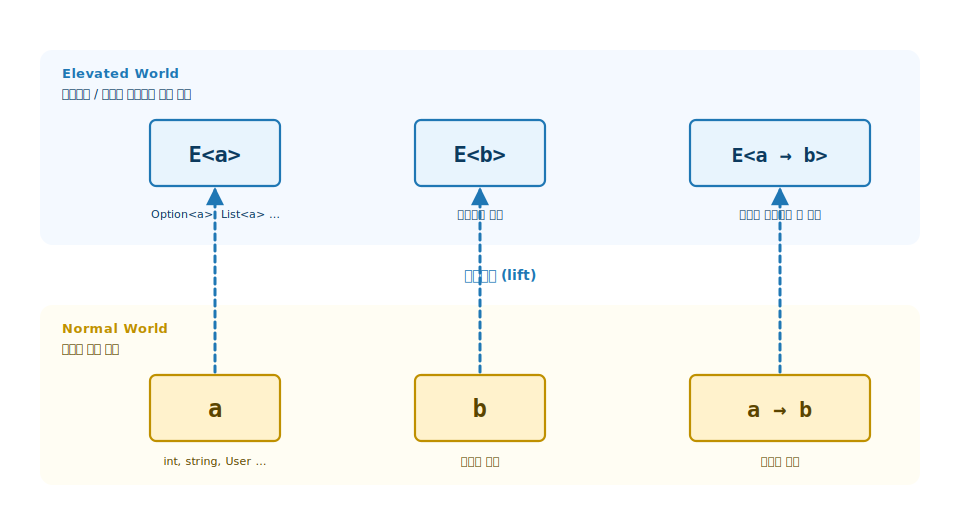
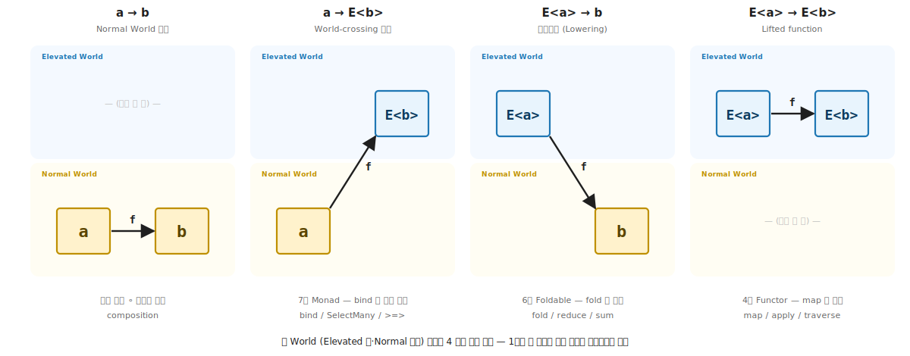
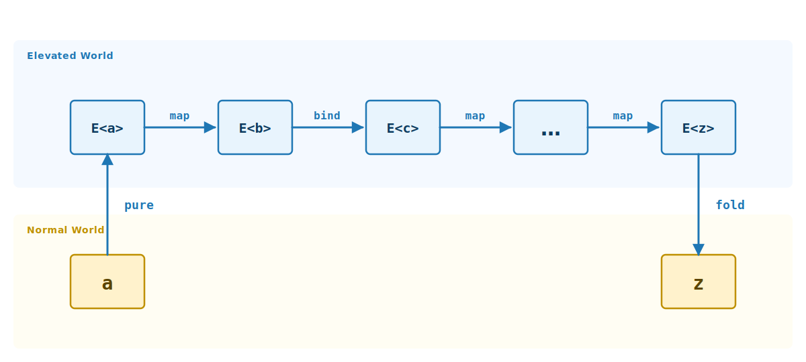

# 1장. 함수형 사고로의 전환 (두 평행 세계의 도입)

> **이 장의 목표** — 이 장을 마치면 명령형 / 객체 지향 / 함수형 세 패러다임을 능력이 어디 사는가의 한 차원으로 비교하고, 함수형의 본질을 합성 가능한 Elevated World 로 lift 라는 한 문장으로 설명할 수 있습니다. Normal World 와 Elevated World 두 평행 세계, 그 사이를 오가는 4 가지 함수 유형 (`a → b`, `a → E<b>`, `E<a> → b`, `E<a> → E<b>`) 이라는 지도를 세워, 2-11장의 모든 추상이 어느 자리에 놓이는지 미리 짚게 됩니다. 기초 전체의 어휘가 출발하는 자리이므로 가장 먼저 읽는 장입니다.

> **이 장의 핵심 어휘**
>
> - **세 패러다임** (명령형 / 객체 지향 / 함수형, 능력이 어디 사는가로 갈리는 세 전략)
> - **세 결합** (불변 · 합성 · 추상, 함수형을 떠받치는 세 기둥)
> - **lift** (값과 함수를 Normal 에서 Elevated 로 끌어올림, 함수형의 본질)
> - **Normal World** (효과 없는 일상의 C# 값과 함수가 사는 아래 층)
> - **Elevated World** (없을 수 있음 / 여러 개 / 실패 / 비동기 같은 효과를 컨테이너에 인코딩한 값들이 사는 위 층)
> - `E<a>` (어떤 Elevated 컨테이너든 가리키는 일반 표기, `E` 는 Elevated 의 머리글자)
> - **4 가지 함수 유형** (`a → b` / `a → E<b>` / `E<a> → b` / `E<a> → E<b>`, 두 세계 사이를 오가는 함수의 네 모양)
> - **trait** (능력을 객체가 아닌 타입의 부착으로 정의하는 자리, type class · interface 와 같은 발상)

> 이 장을 마치면 할 수 있게 되는 것
> - [ ] 명령형 / 객체 지향 / 함수형 세 패러다임의 핵심 차이를 한 문장으로 설명할 수 있습니다.
> - [ ] 능력이 어디 사는가의 답이 패러다임마다 어떻게 다른지 표로 그릴 수 있습니다.
> - [ ] 함수형이 변경 자체를 없애는 발상으로 명령형의 어떤 한계를 푸는지 답할 수 있습니다.
> - [ ] Normal World / Elevated World 두 비유를 한 문장으로 설명할 수 있습니다.
> - [ ] 어떤 타입을 보고 어느 세계의 시민인지 즉시 답할 수 있습니다.
> - [ ] 4 가지 함수 유형 (`a → b`, `a → E<b>`, `E<a> → b`, `E<a> → E<b>`) 의 자리를 두 세계 위 그림으로 그릴 수 있습니다.
> - [ ] 각 유형이 어느 장에서 다뤄질지 미리 짚을 수 있습니다.

---

## 1.1 1장에서 다루는 것 — 두 평행 세계 도입

1장은 코드를 다루기 전의 장입니다. 통상의 입문서는 1장에서 함수형의 장점 / 람다 / 불변성 같은 개별 도구를 나열합니다. 이 책은 그 길을 가지 않습니다.

1장의 목표는 두 가지를 차례로 정착시키는 것입니다.

1. **세 패러다임의 한 차원 비교** — 명령형 / 객체 지향 / 함수형이 같은 문제를 다른 전략으로 푸는 세 도구임을 봅니다 (§1.2 ~ §1.5).
2. **함수형의 어휘 정착** — 두 평행 세계라는 비유 한 개를 깊게 심습니다. 그 비유 위에서 2-11장의 모든 추상이 자기 위치를 찾습니다 (§1.6 ~ §1.8).

이 비유는 F# 커뮤니티의 Scott Wlaschin 이 "Map and Bind and Apply, Oh My!" 시리즈에서 정착시킨 Elevated World 메타포입니다. 이 책은 그 메타포를 그대로 가져와 C# / `K<in F, A>` 우회 위에 다시 입힙니다.

---

## 1.2 명령형 — 절차의 나열

### 1.2.1 명령형의 발상

C 언어 시대에 자리잡은 패러다임입니다. 코드의 주인공은 절차 (procedure) 이고, 데이터는 절차 사이에서 변경됩니다. 함수가 일을 하는 도구이지만, 함수가 무엇을 받고 무엇을 반환하는지보다 함수가 어떤 변경을 일으키는지가 코드 흐름의 중심입니다.

```csharp
public static int SumImperative(int[] numbers)
{
    int sum = 0;                       // ← 상태 변수의 도입
    for (int i = 0; i < numbers.Length; i++)
    {
        sum = sum + numbers[i];        // ← 매 반복마다 sum 의 값이 변경
    }
    return sum;
}
```

`sum` 변수가 매 루프 반복마다 덮어쓰여집니다. 코드를 읽을 때 우리는 "sum 이 지금 얼마인가" 를 머릿속에서 따라가야 합니다. 짧은 함수에서는 어렵지 않지만, 함수가 길어지고 변수가 많아질수록 각 변수의 현재 값을 추적하는 인지 비용이 누적됩니다.

### 1.2.2 명령형의 강점

명령형의 강점은 직관적이라는 데 있습니다. 사람이 일을 처리하는 방식 (물을 따릅니다 → 김치를 넣습니다 → 끓입니다) 과 코드의 모양이 거의 같습니다. 학습 곡선이 짧고, 작은 작업에 빠르게 적용됩니다.

또 다른 강점은 성능 통제입니다. 메모리에서 어떤 위치의 어떤 값이 언제 변경되는지가 코드 자체에 명시되어 있어, 낮은 수준의 최적화가 가능합니다. C / C++ / Rust 같은 시스템 언어가 이 영역에서 가장 큰 가치를 갖습니다.

명령형은 또한 단일 스레드의 짧은 작업에 매우 적합합니다. 상태 변수 + 루프가 사람의 직관적 모형이라, 짧은 스크립트 / 알고리즘 구현 / 데이터 변환 같은 작업에서 명령형 코드는 읽기 쉽고 빠릅니다.

### 1.2.3 명령형의 약점 — 상태가 흩어집니다

명령형의 약점은 상태가 어디서든 변경될 수 있다는 점입니다. 변수가 한 번 선언되면, 그 변수의 값을 누가 / 언제 / 어떻게 바꾸는지가 코드의 어느 자리에서도 결정될 수 있습니다. 큰 코드에서 내가 모르는 곳의 누군가가 상태를 바꾸어 놓고 떠난 일들이 누적되면, 디버깅 시간이 코드 작성 시간보다 길어집니다.

```csharp
// 어떤 모듈의 최상단 — 주문 상태가 모듈 전역으로 공유됩니다
static List<Item> items = new();      // ← 어디서든 접근 가능
static decimal    total = 0m;         // ← 어디서든 접근 가능

static void AddItem(Item item)
{
    items.Add(item);
    total += item.Price;              // ← 두 상태를 함께 갱신하는 절차
}

// 1000줄 떨어진 어떤 절차에서:
items.Add(suspicious);                // ← AddItem 우회. total 이 갱신 안 됨!

// 또 다른 절차에서:
total = 0;                            // ← 누군가 total 만 초기화하고 떠남

// 그러는 동안 다른 절차가:
PrintReport(items, total);            // ← 어긋난 두 상태로 보고서를 출력
```

`AddItem` 이라는 절차가 `items` 와 `total` 을 함께 갱신하기로 약속되어 있지만, 그 약속은 절차의 본문에만 존재합니다. 코드의 구조가 그 약속을 강제하지 못합니다. 두 변수 모두 어디서든 직접 접근 가능하므로, 다른 절차가 `items` 만 / `total` 만 손대고 떠나도 컴파일러는 알아채지 못합니다. 그 결과 `items` 의 합과 `total` 의 값이 어긋난 채 코드가 계속 돌아가고, 이 어긋남은 한참 떨어진 다른 절차 (예: `PrintReport`) 에서야 잘못된 결과로 표면화됩니다.

상태 사이의 약속 (`items` 의 합 = `total`) 이 명령형 코드 안에서는 절차의 본문에 묻혀 있을 뿐 어디에도 명시되지 않습니다. 변경의 출처가 코드 전체로 흩어져 있으니, 디버거가 잘못된 값을 발견했을 때 어느 절차의 어느 줄이 그 값을 만들었는지를 거꾸로 추적해 올라가야 합니다. 이 종류의 어긋남 (state inconsistency) 이 큰 명령형 코드베이스의 디버깅을 어렵게 하는 주된 원인입니다.

### 1.2.4 명령형 + 동시성 = 경쟁 조건

명령형의 가장 큰 약점은 동시성과 결합되었을 때 드러납니다. 두 스레드가 같은 상태를 동시에 변경하면, 경쟁 조건 (race condition) 이라는 새 함정이 등장합니다.

```csharp
// 스레드 1
counter.Value = counter.Value + 1;   // ① 읽기 → ② 더하기 → ③ 쓰기

// 스레드 2 (같은 시점)
counter.Value = counter.Value + 1;
```

두 스레드가 동시에 ① 을 실행하면 둘 다 같은 값을 읽습니다. 그 후 둘 다 그 값 + 1 을 ③ 쓰기. 결과는 2 가 아니라 1. 카운터가 한 번만 증가했습니다. 한 번의 증가가 유실됩니다.

명령형 패러다임으로는 이 함정을 원리적으로 막기 어렵습니다. 락 / `lock` / `Interlocked` 같은 도구로 부분적으로 풀 수 있지만, 큰 코드에서는 어디 락이 빠졌는지를 모두 추적하기가 매우 어렵습니다. 이게 명령형 + 동시성이 큰 시스템에서 가장 큰 비용을 낳는 이유입니다.

### 1.2.5 명령형이 여전히 강한 곳

명령형의 약점만 봤지만, 명령형이 틀리다는 게 아닙니다. 짧은 스크립트, 알고리즘 구현, 단일 스레드 작업에서는 여전히 매우 강합니다. 이 책이 함수형을 가르친다고 해서 명령형을 버리라는 뜻이 아닙니다. 오히려 어느 자리에 무엇이 자연스러운가의 판단을 만드는 것이 이 책의 목표 중 하나입니다.

> **흔한 함정** — 함수형을 배웠으니 모든 코드를 함수형으로라고 결론 내리는 것입니다.
>
> 독자가 함수형의 장점에 끌린 나머지 모든 코드를 LINQ 한 줄로 작성하려고 하는 일이 있습니다. 짧은 스크립트의 `for` 루프를 복잡한 LINQ 체인으로 바꾸면 읽기가 더 어려워질 수 있습니다. 함수형의 가치는 복잡한 도메인 / 동시성 / 합성성 자리에서 또렷이 드러납니다. 그 가치가 큰 자리에서만 함수형을 적용합니다.

---

## 1.3 객체 지향 — 능력의 캡슐화

### 1.3.1 객체 지향의 등장 — 명령형의 한계를 푸는 시도

명령형의 한계 (상태가 코드 어디든 흩어집니다) 를 풀려는 시도가 객체 지향 (object-oriented programming) 입니다. 데이터를 객체로 묶고, 그 데이터를 다루는 능력 (메서드) 을 객체 안에 가둡니다. 이게 캡슐화 (encapsulation) 입니다. 데이터의 변경은 객체의 메서드를 통해서만 일어나고, 객체 외부에서는 데이터를 직접 만질 수 없습니다.

```csharp
public sealed class Counter
{
    private int _count;                     // ← 상태가 객체 안에 캡슐화

    public void Increment() => _count++;    // ← 변경은 메서드를 통해서만
    public int  Value => _count;
}
```

이 발상이 큰 코드의 복잡성을 줄였습니다. 객체의 모든 데이터 변경은 그 객체의 메서드 안에서만 일어나므로, 변경의 출처가 좁혀집니다. 클래스 단위로 코드를 모으면 책임의 경계가 명확해지고, 큰 시스템도 작은 객체들의 협력으로 추론할 수 있습니다.

### 1.3.2 객체 지향의 4 대 원칙

C# / Java 같은 객체 지향 언어가 이 발상의 주류 구현입니다. 객체 지향의 핵심을 위키피디아는 4 대 원칙 (four pillars) 으로 정리합니다 (캡슐화 / 추상화 / 상속 / 다형성). 네 원칙이 서로 다른 결의 도구로 복잡성이라는 같은 문제를 다룹니다.

1. **캡슐화 (encapsulation)** — 데이터와 그 데이터를 다루는 메서드를 하나의 단위 (객체) 로 묶고, 내부 구현을 숨깁니다. 앞 절의 `Counter._count` 가 `private` 으로 감춰진 모양이 정확히 이 원칙입니다. 외부에서는 공개된 메서드의 계약만 볼 수 있고, 객체 내부의 상태와 절차는 책임자 자신만 압니다. 변경의 출처를 객체 안으로 좁히는 도구입니다.
2. **추상화 (abstraction)** — 복잡한 구현 세부사항은 감추고 사용자에게 필요한 본질만 드러냅니다. 예를 들어 `List.Add(item)` 의 호출자는 내부가 배열인지 연결 리스트인지 모릅니다 / 알 필요도 없습니다. 무엇을 할 수 있는가만 알면 됩니다. 코드의 인지 비용을 각 자리에 필요한 정보만으로 줄이는 도구입니다.
3. **상속 (inheritance)** — 기존 클래스의 속성과 동작을 새 클래스가 물려받아 재사용 / 확장합니다. `Manager : Employee` 가 `Employee` 의 모든 능력을 가진 채 추가 능력을 얹습니다. 코드 재사용과 계층적 관계의 표현 도구입니다. 다만 깊은 상속 트리는 결합도를 높인다는 비판이 누적되어, 현대 객체 지향에서는 상속보다 합성 (composition over inheritance) 의 원칙이 자주 권장됩니다.
4. **다형성 (polymorphism)** — 같은 이름의 메서드가 객체의 실제 타입에 따라 다른 동작을 합니다. `Shape.Area()` 호출이 `Circle` / `Square` / `Triangle` 에서 각자의 면적 공식으로 동작합니다. 호출자는 어느 도형인지 몰라도 면적을 구할 수 있습니다. 교환 가능성 (interchangeability) 의 도구입니다.

이 네 원칙을 매개하는 언어 장치가 **인터페이스 (interface)** 입니다. 인터페이스는 능력의 계약만 선언하고 구현은 분리합니다. 추상화와 다형성을 동시에 구현하는 도구이며, 같은 인터페이스를 구현하는 서로 다른 객체들이 교환 가능해집니다. C# 의 `interface IShape { double Area(); }` 가 정확히 이 자리입니다.

네 원칙의 공통 결론은 능력을 객체에 부여한다는 점입니다. 능력은 객체에 살고, 같은 능력 (인터페이스) 을 가진 서로 다른 객체들이 교환 가능합니다. 이 능력의 자리가 뒤에서 함수형과의 한 차원 비교의 출발점이 됩니다.

### 1.3.3 객체 지향의 강점 — 도메인 모델링

객체 지향은 도메인 모델링에 강합니다. 비즈니스 도메인의 명사 (User, Order, Payment) 가 클래스로, 동사 (place an order, validate, ship) 가 메서드로 자연스럽게 매핑됩니다. 도메인 전문가가 코드의 클래스 / 메서드 이름을 읽을 수 있을 정도로 도메인의 어휘와 정렬됩니다.

큰 시스템이 작은 객체들의 협력으로 추론된다는 점도 핵심 가치입니다. 책임 분리 원칙 (Single Responsibility Principle), 의존성 역전 (Dependency Inversion), 인터페이스 분리 같은 객체 지향 설계 원칙들이 그 협력을 건전하게 유지하는 도구들입니다.

### 1.3.4 객체 지향의 약점 — 능력이 객체에 묶입니다

다만 객체 지향에도 한계가 있습니다. 능력이 객체에 묶여 있다는 점이, 작은 작업에서는 자연스럽지만, 능력 자체를 추상화하려 할 때 어색해집니다.

예를 들어 "리스트에 들어 있는 정수들을 다 더합니다" 같은 일을 리스트의 메서드로 보면, Set / Dictionary / Tree 의 모든 컬렉션마다 같은 메서드를 다시 작성해야 합니다. 능력이 컬렉션이라는 객체에 묶여 있기 때문입니다.

함수형은 이 한계를 이렇게 봅니다. Sum 은 컬렉션의 능력이 아니라 *Foldable* 이라는 *trait* 의 능력입니다. List / Set / Dictionary / Tree 모두 Foldable trait 을 부착한다고 선언하면, Sum 은 한 번만 정의되고 모든 Foldable 에 적용됩니다. 능력이 객체가 아니라 *trait* 에 사는 모형입니다. 이것이 함수형의 핵심 발상입니다.

### 1.3.5 객체 지향 + 변경 = 명령형의 비용이 객체 안으로

객체 지향이 명령형의 상태가 흩어진다는 한계를 풀었지만, 상태를 변경한다는 사실 자체는 그대로입니다. 그래서 큰 객체 그래프 + 동시성이 결합되면 명령형 + 동시성과 거의 같은 비용이 다시 나타납니다. 객체 단위의 락 / 동기화 코드가 필요하고, 깊은 객체 트리에서는 어느 객체에 락이 필요한지의 추적이 어려워집니다.

객체 지향이 푸는 상태가 흩어진다는 문제는 변경 자체가 아니라 변경의 위치의 문제입니다. 변경 자체를 없애지 않는 한 (즉 불변성으로 가지 않는 한) 동시성과 결합되었을 때의 비용은 남습니다.

함수형은 이 한계를 또 다른 방식으로 풉니다.

>  **세 패러다임의 위치 차이** — 명령형 = 상태가 어디든 변경됨, 객체 지향 = 상태 변경이 객체 안으로 캡슐화, 함수형 = 상태 변경이 원리적으로 없음. 같은 복잡성이라는 문제를 세 가지 다른 전략으로 다룹니다.

---

## 1.4 함수형 — 함수의 합성

### 1.4.1 함수형의 출발점 — 변경이 없는 세계관

함수형 프로그래밍은 데이터를 변경하지 않습니다. 모든 데이터는 불변 (immutable) 이고, 함수는 입력을 받아 새 값을 만들어 반환할 뿐입니다. 객체에 메서드가 붙어 있는 게 아니라, 함수가 데이터를 받아 다른 함수에 넘겨줍니다. 이것이 함수의 합성 (function composition) 입니다.

```csharp
public static int SumFunctional(int[] numbers)
{
    return numbers.Aggregate(0, (acc, n) => acc + n);
    //                       ┬  ────┬───────────────
    //                       │      └── 함수: (acc, n) → 새 acc
    //                       └────────── 초기값
}
```

`Aggregate` (다른 언어에서 `fold` 또는 `reduce` 로 부릅니다) 는 시퀀스 + 초기값 + 함수를 받아 한 값으로 누적 합니다. 명령형의 `for` 루프와 같은 일을 하지만 상태 변수가 없습니다. `acc` 는 루프 변수가 아니라 함수의 매개변수입니다. 새 반복마다 새 acc 값이 함수의 결과로 만들어집니다.

구체적으로 `numbers = [1, 2, 3]` 일 때 단계별로 어떻게 동작하는지 봅니다.

```
numbers = [1, 2, 3],  초기값 = 0

acc₀ = 0          (불변. 이후 단계에서도 그대로 존재)
   │
   │ f(acc₀, 1) = 0 + 1
   ▼
acc₁ = 1          (새 값. acc₀ 는 덮이지 않습니다)
   │
   │ f(acc₁, 2) = 1 + 2
   ▼
acc₂ = 3          (또 새 값. acc₀, acc₁ 모두 그대로)
   │
   │ f(acc₂, 3) = 3 + 3
   ▼
acc₃ = 6          (또 새 값. 모든 이전 acc 가 그대로)
   │
   ▼
결과: 6
```

매 단계가 기존 acc 를 덮어쓰지 않고 새 acc 값을 만듭니다. 명령형의 `sum = sum + n` 은 한 변수의 값을 매번 덮어쓰지만, 함수형의 `f(acc, n) = acc + n` 은 매번 새 값을 반환합니다. `acc` 라는 이름이 같아도 매 호출의 `acc` 는 서로 다른 값입니다. 이것이 불변 (immutable) 의 의미입니다.

### 1.4.2 작은 차이가 만드는 큰 결과

이 작은 차이가 큰 결과를 낳습니다. 변경되는 변수가 없으므로 코드의 어디서도 내가 모르는 변경이 일어날 수 없습니다. 같은 입력은 언제 호출되어도 같은 출력을 냅니다. 이것이 결정성 (determinism) 입니다. 결정성이 있으면 추론 (reasoning) 이 단순해집니다. 코드의 한 함수만 봐도 그 함수가 무엇을 하는지가 시그니처와 본문에서 완전히 결정됩니다.

함수형이 푸는 깊은 문제는 명령형의 약점 (상태가 흩어집니다) 의 원리적 차단입니다. 객체 지향이 그것을 캡슐화로 막았다면, 함수형은 불변성으로 막습니다. 캡슐화는 변경의 위치를 좁히고, 불변성은 변경 자체를 없앱니다.

### 1.4.3 함수형의 세 결합 — 불변·합성·추상

진짜 함수형의 본질은 세 결합입니다. 어느 하나만으로는 함수형이 아닙니다. Wikipedia 는 함수형 프로그래밍을 "함수의 적용과 합성으로 프로그램을 구성하는 패러다임 (a programming paradigm where programs are constructed by applying and composing functions)" 으로 정의합니다. 이 정의는 두 번째 합성을 정조준하고, 첫 번째와 세 번째가 그 합성을 안전하고 확장 가능하게 만듭니다.

1. **불변 + 순수 (immutability + purity)** — 데이터는 변경되지 않고, 함수는 부수 효과 없이 새 값을 돌려줍니다. 같은 입력은 언제 어디서 호출되어도 같은 결과를 냅니다 (참조 투명성, referential transparency). 이게 등식 추론 (equational reasoning) 의 기반입니다. 표현식을 그 값으로 곧장 대체해도 의미가 보존됩니다.

2. **합성: 일급 함수 + 고차 함수 (function composition)** — 일을 작은 함수의 조합으로 표현합니다. 함수가 값처럼 다뤄집니다 (first-class). 함수를 다른 함수의 인자로 넘기거나 결과로 받을 수 있습니다 (higher-order). 명령문의 순차 상태 변경이 아니라 표현식의 평가로 프로그램이 동작합니다 (statement vs expression).

3. **추상: 능력의 trait 화 (abstraction)** — 같은 능력 (`Map` / `Bind` / `Fold`) 을 여러 타입 위에서 일반화합니다. List 의 Map, Option 의 Map, Result 의 Map 이 같은 trait (`Functor`) 의 인스턴스입니다. Haskell·PureScript 의 *type class*, Scala·Rust 의 *trait*, C# 11+ 의 interface + static abstract 가 같은 발상의 다른 표현입니다. 이게 기초에서 만나는 `Functor`·`Monad`·`Foldable` 의 자리입니다.

세 결합은 서로를 강화합니다. 불변이 합성을 안전하게 만들고 (같은 입력 = 같은 결과니까 합성에 깊이가 생깁니다), 합성이 추상에 의미를 주고 (`Functor` 가 합성의 일반화입니다), 추상이 합성을 확장 가능하게 만듭니다 (어떤 타입이든 추상이 받아들이는 모양이면 합성 자리에 끼울 수 있습니다).

람다와 LINQ 는 이 셋의 표현 도구일 뿐입니다. 이 책의 모든 추상이 왜 그 모양인가를 따라가다 보면, 람다와 LINQ 가 우연히 함수형의 친숙한 표면이 되었다는 사실이 자연스럽게 보입니다.

### 1.4.4 함수형의 표현 가능성 — 효과를 값으로

세 결합의 직접적인 결과는 다음과 같습니다. 함수의 시그니처가 거짓말을 못 합니다. 명령형 / 객체 지향에서는 함수가 `void Send(Order)` 같은 모양이어도, 그 함수가 데이터베이스에 쓰는지 / 외부 API 를 호출하는지 / 로그를 남기는지가 시그니처에 보이지 않습니다. 본문을 읽어야 압니다.

함수형에서는 그 외부 효과도 시그니처에 명시됩니다. `Option<Order>` (없을 수 있음), `Result<Error, Order>` (실패 가능), `Task<Order>` (비동기) 같은 모양이 반환 타입에 효과의 종류를 인코딩합니다. 함수의 시그니처만 보고도 그 함수가 무엇을 할 수 있는지 / 못 하는지가 결정됩니다.

이 효과를 값으로 표현한다는 발상이 뒤에서 본격적으로 다룰 두 평행 세계 비유의 출발점입니다.

### 1.4.5 같은 문제, 세 패러다임의 풀이

세 패러다임이 같은 문제를 어떻게 다르게 푸는지를 비교합니다. 문제: 정수 배열에서 짝수만 골라 제곱한 합을 구합니다.

```csharp
// 명령형
int SumOfSquaresOfEvensImperative(int[] numbers)
{
    int sum = 0;
    for (int i = 0; i < numbers.Length; i++)
    {
        if (numbers[i] % 2 == 0)
            sum += numbers[i] * numbers[i];
    }
    return sum;
}

// 객체 지향 (책임 분리)
class EvenSquareSum
{
    private readonly int[] _numbers;
    public EvenSquareSum(int[] numbers) => _numbers = numbers;

    public int Compute()
    {
        int sum = 0;
        foreach (var n in _numbers)
            if (IsEven(n))
                sum += Square(n);
        return sum;
    }

    private static bool IsEven(int n) => n % 2 == 0;
    private static int  Square(int n) => n * n;
}

// 함수형
int SumOfSquaresOfEvensFunctional(int[] numbers) =>
    numbers
        .Where(n => n % 2 == 0)
        .Select(n => n * n)
        .Sum();
```

같은 작업이 세 가지 모양으로 표현됩니다. 함수형 풀이는 한 줄로 표현되고, 각 단계의 의미가 메서드 이름에 명시되어 있습니다. 명령형은 for + if + 상태 변수로 직접 절차를 적고, 객체 지향은 클래스 책임 분리로 단계를 분리하지만 내부에는 여전히 명령형 절차입니다. 셋 다 같은 답을 만들지만, 코드를 읽을 때의 인지 부담이 다릅니다.

함수형의 한 줄 코드는 각 단계 (필터 / 변환 / 누적) 가 무엇을 하는지가 함수 이름에 명시되어 있습니다. 이 명시성이 함수형 코드의 가장 큰 가독성 자산입니다.

> **흔한 함정** — 짧다 = 좋다라고 결론 내리는 것입니다.
>
> 함수형 풀이가 한 줄로 짧아 보여 모든 자리에서 우월하다고 결론 내리기 쉽습니다. 실제로는 복잡한 LINQ 체인 (10 줄짜리 선언적 코드) 이 명확한 명령형 5 줄보다 읽기 어려운 경우도 있습니다. 함수형의 가치는 짧음이 아니라 명시성과 합성성에 있습니다. 짧음은 부수적 결과일 뿐입니다.

---

## 1.5 능력은 어디 사는가 — 한 차원 비교

### 1.5.1 한 차원 압축

세 패러다임의 차이를 한 차원으로 압축하면 "능력이 어디 사는가" 의 답이 다르다는 점입니다.

| 패러다임 | 능력이 사는 자리 | 데이터의 변화 |
|---|---|---|
| 명령형 | 함수 시그니처 안 (절차의 본문) | 절차 사이에서 변경됨 |
| 객체 지향 | 객체의 메서드 안 (인스턴스에 묶임) | 객체에 캡슐화 + 메서드가 변경 |
| 함수형 | 함수 자체 또는 trait 의 정적 자리 | 불변 — 새 값을 만들어 반환 |

명령형은 절차의 나열, 객체 지향은 데이터에 능력이 붙은 객체의 통신, 함수형은 데이터를 입력받아 새 데이터를 반환하는 함수의 합성입니다. 셋 중 어느 것도 틀리지 않지만, 다루는 문제의 결이 다르면 적합한 사고 방식도 달라집니다.

### 1.5.2 능력의 위치 — 시각적 비교

세 패러다임에서 Sum 능력이 어디 사는지를 도식으로 비교합니다.

```
명령형:
    Sum 능력 = sum_of_array() 함수의 본문 안
    └─ 절차: int sum = 0; for ... return sum;

객체 지향:
    Sum 능력 = ArrayList.Sum() 메서드 (객체에 묶임)
    └─ List 마다 / Set 마다 / Dictionary 마다 별도 정의

함수형:
    Sum 능력 = Foldable.Sum() (trait 의 정적 메서드)
    └─ List / Set / Dictionary / Tree 모두 Foldable trait 부착
       → Sum 은 한 번만 정의, 모든 Foldable 에 자동 적용
```

명령형에서는 함수 안에 능력이 삽니다. 객체 지향에서는 객체에 능력이 삽니다. 함수형에서는 *trait* 에 능력이 삽니다 (trait 을 책장의 비유로 떠올려도 좋습니다. 같은 능력을 가진 타입들이 그 책장에 꽂힙니다). 이 trait 의 자리가 함수형의 핵심 도구이고, 2장부터 만나는 `K<F, A>` + Higher Kinds 가 그 trait 을 C# 안에서 표현하는 어법입니다. 객체 다형성 vs trait 다형성의 본격적 대비는 다음 절의 **함수형의 본질** 에서 다룹니다. 합성 가능한 Elevated World 로 lift 하는 것이 그 본질입니다.

### 1.5.3 데이터의 변화 — 시각적 비교

같은 Counter 동작이 세 패러다임에서 어떻게 다르게 표현되는지 비교합니다.

```
명령형:
    int counter = 0;
    counter++;
    └─ counter 라는 메모리 위치의 값이 변경됨

객체 지향:
    counter.Increment();
    └─ 객체 안의 _count 필드가 변경됨

함수형:
    var newCounter = counter.Increment();
    └─ 새 객체가 만들어지고, 원본은 그대로
       (원본을 다른 곳에서 쓰고 있어도 안전)
```

함수형의 원본이 그대로라는 점이 동시성 안전성과 추론 가능성의 핵심 이유입니다. 두 스레드가 같은 원본을 보고 있어도, 각자 새 객체를 만들어 반환하므로 서로의 작업이 서로에게 영향이 없습니다. 락 / 동기화 코드가 원리적으로 불필요해집니다.

### 1.5.4 세 패러다임의 누적

세 패러다임은 서로의 한계를 푸는 시도들의 누적입니다. 명령형 → 객체 지향 → 함수형. 각 패러다임이 직전의 한계에 답하면서 새 도구들을 가져왔습니다. 새 패러다임이 직전을 폐기하는 게 아니라 추가 도구를 제공하는 모양입니다. 이 책의 독자는 함수형을 익혀 세 패러다임을 모두 도구로 가진 개발자가 됩니다. 어느 자리에 무엇이 자연스러운가의 판단이 있는 개발자입니다.

기초의 목표는 그 중 함수형의 어휘를 깊게 정착시키는 것입니다. 효과를 값으로 표현한다는 발상을 비유 한 개로 정착시키면, 11 개 장의 모든 추상이 그 비유 위에서 자기 위치를 찾습니다.

---

## 1.6 두 평행 세계 — 함수형의 무대

### 1.6.1 함수형의 본질 — 합성 가능한 Elevated World 로 lift

함수형의 본질을 한 문장으로 압축하면 다음과 같습니다. 모든 값과 함수를 합성 가능한 Elevated World 로 lift 시키는 것. 이 한 동사 (*lift*) 위에 기초의 모든 추상 (Functor / Foldable / Applicative / Monad / Traversable) 이 자리잡습니다.

이 끌어올림이 가능하려면 세 축이 동시에 필요합니다.

**첫째, 효과 인코딩 (값 차원)** — 없을 수 있음 / 여러 개 / 실패 / 비동기 같은 효과를 `Option<a>`, `List<a>`, `Result<E, a>`, `Task<a>` 같은 컨테이너 타입에 가둡니다. 효과를 값으로라는 발상의 직접적 결과입니다. 그 결과로 함수의 시그니처가 거짓말을 못 합니다.

**둘째, type class 다형성 (타입 차원, 객체 다형성과 대비)** — `Map`, `Bind`, `Fold` 같은 능력이 객체 (`List`, `Option`) 에 묶이지 않고 *trait* (Haskell·PureScript 의 *type class* 와 같은 발상, Scala·Rust·C# 11+ 에서는 *trait* / interface 로 표현) 에 정의됩니다. 두 다형성의 핵심 차이는 능력의 자리와 해소 시점 두 축입니다.

- 객체 다형성 (subtype polymorphism) — 능력이 객체에 묶이고 런타임에 해소됩니다. 결과로 `List.Sum`, `Set.Sum`, `Tree.Sum` 을 컨테이너마다 각자 정의해야 합니다 (N × M 비용).
- trait 다형성 (ad-hoc polymorphism via type class) — 능력이 타입에 부착되고 컴파일 타임에 해소됩니다 (C# 11+ 의 static abstract)[^dispatch]. 결과로 `Sum` 을 한 번 정의 + Foldable trait 부착 N 번으로 모든 Foldable 에 자동 적용됩니다 (N + M 비용). 런타임 분기가 없어 컴파일 타임 안전성도 함께 확보됩니다.

[^dispatch]: 객체 다형성의 런타임 dispatch 는 *vtable* (C# / Java 의 가상 메서드 테이블) 또는 *dictionary passing* (Haskell 의 type class 구현 기법) 으로 구현됩니다. trait 다형성의 컴파일 시 dispatch 는 *monomorphization* (단형화, Rust 의 구현 기법) 또는 C# 11+ 의 static abstract member 로 구현됩니다. 가상 호출 비용이 없습니다.

앞 절에서 본 능력이 어디 사는가의 자연스러운 연속입니다.

**셋째, 합성 가능성 (연산 차원)** — 위 두 축이 합쳐지면 두 세계 사이 끌어올림이 합성 법칙을 자연스럽게 만족합니다. 예를 들어 `Map(g ∘ f) = Map(g) ∘ Map(f)` 같은 등식이 효과 컨테이너 위에서도 그대로 성립합니다. 함수형 추상의 모든 법칙이 이 합성 가능성의 형식화입니다 (4장 Functor 의 두 법칙으로 이어집니다).

> **어휘 정리** — *type class* 는 Haskell 의 표준 명칭, *trait* 은 Scala·Rust·C# 11+ 의 명칭, *interface* 는 Java·C# 의 명칭입니다. 세 어휘 모두 같은 발상의 다른 표현입니다. 능력의 약속을 객체가 아닌 타입의 부착으로 정의합니다. 이 책의 본문은 LanguageExt v5 의 어휘를 따라 *trait* 으로 통일합니다 (코드의 `interface Functor<F>` 와 호환). 자세한 어휘 매핑은 [`style/fp-terminology.md`](../style/fp-terminology.md) 참조.

세 축이 합쳐지면 한 그림이 자연스럽게 떠오릅니다. 위와 아래, 두 층의 세계입니다. 아래는 일상의 *Normal World* (효과 없는 값과 함수), 위는 효과를 인코딩한 *Elevated World* (`E<a>`). 끌어올림은 아래 → 위의 화살표이고, 합성 가능성은 위 안에서 자유로운 흐름입니다.

이 비유가 **두 평행 세계** (Two Worlds) 입니다. F# 커뮤니티의 Scott Wlaschin 이 *"Map and Bind and Apply, Oh My!"* 시리즈에서 정착시킨 Elevated World 메타포입니다. 이 시리즈 1 부의 제목이 *"Lifting to the Elevated World"* 입니다. 함수형이 다루는 모든 추상이 두 세계 사이 끌어올림의 한 변형으로 정리됩니다.

### 1.6.2 Normal World — 일상의 C# 값과 함수

아래 층이 지금까지 C# 으로 쓴 모든 코드의 무대, **Normal World** 입니다. `int`, `string`, `User`, `DateTime` 같은 평범한 타입들이 시민입니다. 함수도 평범합니다. `int → string`, `User → bool` 같은 값 → 값의 함수입니다.

```csharp
// Normal World 의 시민 — 평범한 값
int      n = 42;
string   s = "hello";
DateTime d = DateTime.Now;

// Normal World 의 함수 — 평범한 시그니처
Func<int, int>    plus1  = n => n + 1;          // int → int
Func<int, string> toText = n => n.ToString();   // int → string
Func<string, int> length = s => s.Length;       // string → int

// 평범한 합성 — 출력 / 입력 어법이 모두 Normal 이라 그대로 이어 붙습니다
int result = length(toText(plus1(41)));         // 41 → 42 → "42" → 2
```

세 함수가 어법이 일치 (모두 Normal) 라서 사슬로 그대로 이어 붙습니다. Normal World 안에서는 함수형 추상이 필요하지 않습니다. C# 의 기본 호출 / 람다 / Method group 합성만으로 모든 일이 끝납니다.

### 1.6.3 Elevated World — 효과를 인코딩한 값들

그런데 실세계의 함수는 늘 평범하지 않습니다. 없을 수 있는 결과 / 여러 개일 수 있는 결과 / 실패할 수 있는 결과 / 비동기 결과 같은 효과가 붙은 값들이 자주 등장합니다. 이 값들이 사는 자리가 **Elevated World** 입니다.

Elevated World 의 시민은 컨테이너 안의 값입니다. 그리고 컨테이너의 종류 자체가 효과를 타입에 인코딩합니다.

| 컨테이너 | 인코딩된 효과 | 의미 |
|---|---|---|
| `Option<a>` | 없을 수 있음 | a 가 있을 수도 / 없을 수도 |
| `List<a>` | 여러 개일 수 있음 | 0 개 이상의 a |
| `Result<E, a>` | 실패할 수 있음 | a 또는 에러 E |
| `Task<a>` | 시간이 걸림 | a 가 미래에 도착 |
| `Reader<R, a>` | 환경 R 이 필요함 | a 를 얻으려면 R 이 있어야 함 |

이 책은 어떤 Elevated 컨테이너든 가리키는 일반 표기로 `E<a>` 를 씁니다. `E` 는 *Elevated* 의 머리글자, `a` 는 컨테이너 안에 든 값의 타입입니다.

```csharp
// Elevated World 의 시민 — 컨테이너 한 겹 둘러쌈
Option<int>          maybeN = Some(42);                  // E = Option, a = int
List<string>         manyS  = ["hello", "world"];        // E = List,   a = string
Result<string, int>  okN    = Ok(42);                    // E = Result<string, _>, a = int
Task<User>           future = FetchUserAsync(7);         // E = Task,   a = User
```



**그림 1-1. 두 평행 세계: Normal World 와 Elevated World** — 위 / 아래 두 층의 그림. 같은 타입 `a` 가 두 세계에 각각 시민으로 삽니다 (Normal 의 `a` 와 Elevated 의 `E<a>`). 함수도 마찬가지로 `a → b` 는 Normal, `E<a → b>` 는 Elevated 의 시민입니다 (함수도 두 세계에 산다, §1.6.4).

같은 `int` 정보가 두 세계 어디든 살 수 있습니다. 값 자체는 같지만 사는 어법이 다릅니다. Normal 의 `int` 는 그대로 사용 가능한 평범한 값이고, Elevated 의 `Option<int>` 는 효과를 동반한 값이라 바로 꺼내 쓸 수 없습니다. 이 어법의 차이가 비유의 핵심입니다.

### 1.6.4 함수도 두 세계에 산다

값만 두 세계에 사는 게 아닙니다. 함수도 두 세계에 삽니다. 그림 1-1 의 오른쪽 박스 두 개가 그 자리입니다.

- **Normal 함수** `a → b` — 입력 / 출력 / 함수 자체 모두 Normal 입니다. C# 의 `Func<A, B>` 또는 람다에 해당합니다.
- **Elevated 함수** `E<a → b>` — 함수가 컨테이너 안에 들어 있는 모양입니다. 함수 자체가 Elevated 시민입니다.

```csharp
// Normal World 의 함수
Func<int, int> plus1 = n => n + 1;

// Elevated World 의 함수 — 함수가 컨테이너 안
Option<Func<int, int>> maybePlus1 = Some<Func<int, int>>(n => n + 1);
List<Func<int, int>>   manyOps    = [n => n + 1, n => n * 2];
```

처음 보면 함수를 컨테이너에 넣는다는 발상이 낯섭니다. 그러나 5장 Applicative 의 핵심 도구 `apply : E<a → b> → E<a> → E<b>` 가 정확히 이 자리의 컨테이너 안 함수를 다룹니다. 컨테이너 안 함수와 컨테이너 안 값을 만나게 합니다.

요점은 이렇습니다. Normal World 에는 값과 함수가 살고, Elevated World 에도 똑같이 값과 함수가 산다는 것입니다. 두 세계의 시민 종류 (값 / 함수) 는 같습니다. 어법 (벗겨진 / 감싸진) 만 다릅니다.

### 1.6.5 표기법 정리 — `a → b` 와 `E<a>` 읽는 법

앞의 세 절에서 두 기호 (화살표 `→` 와 꺾쇠 `< >`) 를 만났습니다. 이 책이 수학·Haskell·F# 의 어휘를 그대로 가져오므로 시그니처 한 줄의 어법이 C# 의 메서드 선언과 다소 다릅니다. 본격적인 4 가지 함수 유형 (다음 절) 으로 들어가기 전에 한자리에서 정리합니다.

#### 화살표 `→` — 입력 → 출력의 한 줄 어법

```
a → b
─    ─
입력  출력
```

읽는 방식은 "a 를 받아 b 를 내는 함수" 입니다. C# 의 `Func<A, B>` / `delegate B F(A x)` 와 정확히 같은 의미입니다. 수학·Haskell·F# 의 한 줄 표기가 시그니처를 본문 안에 자연스럽게 흘려 넣을 수 있는 어법이라 이 책에서도 그대로 채용합니다.

| 표기 | 읽기 | C# 대응 |
|---|---|---|
| `a → b` | a 를 받아 b 를 내는 함수 | `Func<A, B>` |
| `int → string` | int 를 받아 string 을 내는 함수 | `Func<int, string>` |
| `User → bool` | User 를 받아 bool 을 내는 함수 | `Func<User, bool>` (predicate) |

#### 소문자 `a, b, c` — 어떤 타입이든 들어갈 수 있는 자리

화살표 양쪽의 소문자 한 글자는 임의의 타입을 받을 수 있는 자리, 즉 타입 변수 (type variable) 입니다. C# 의 generic `T`, `TIn`, `TOut` 과 같은 역할입니다.

| 표기 관습 | 어디서 사용 | 의미 |
|---|---|---|
| `a`, `b`, `c` (소문자) | 본문 / 시그니처 한 줄 | 임의 타입 자리 |
| `A`, `B`, `C` (대문자) | C# 코드 블록 | 같은 자리. C# 컴파일러는 대문자 시작을 권장 |

두 표기는 같은 자리를 가리킵니다. 어디서 어떤 어휘를 쓰느냐의 관습일 뿐입니다.

#### 꺾쇠 `E<a>` — 컨테이너 한 겹 둘러쌈

```
E<a>
─ ─
│ └─ 안에 든 값의 타입 (a 는 임의)
└──── 컨테이너의 종류 (E 는 임의 — Option, List, Task, Result ...)
```

`E` 는 *Elevated* 의 머리글자입니다. 이 책 어휘로 어떤 Elevated 컨테이너든을 가리킵니다. 구체 컨테이너로 바꿔 보면 즉시 익숙해집니다.

| 일반 표기 | 구체 컨테이너로 바꾸면 |
|---|---|
| `E<int>` | `Option<int>` / `List<int>` / `Task<int>` / `Result<E, int>` ... |
| `E<a>` | `Option<a>` / `List<a>` / ... — `a` 가 임의 타입 인 generic |
| `a → E<b>` | `string → Option<int>` (파싱) / `int → Task<User>` (비동기 조회) ... |

#### 두 기호의 조합 — §1.7 의 4 가지 함수 유형

화살표와 꺾쇠가 한 줄에 섞이면 시그니처 한 줄이 됩니다. 함수의 입력과 출력이 두 세계 중 어디에 있느냐에 따라 정확히 네 가지 모양이 가능합니다.

| 표기 | 읽기 | 구체 예 |
|---|---|---|
| `a → b` | Normal → Normal | `int → string` |
| `a → E<b>` | Normal → Elevated | `string → Option<int>` (파싱) |
| `E<a> → b` | Elevated → Normal | `List<int> → int` (합산) |
| `E<a> → E<b>` | Elevated → Elevated | `Option<int> → Option<string>` (Map 한 결과) |

위 네 모양이 다음 절의 4 가지 함수 유형 그 자체입니다. 지금 외우려 하지 않아도 됩니다. 기초 전체에서 반복 등장하면서 자연스럽게 손에 잡힙니다.

#### 화살표가 여러 개 — 오른쪽 결합 (right-associative)

```
a → b → c              ←  화살표 두 개 = a → (b → c)
```

오른쪽부터 묶입니다. 즉 "`a` 를 받아 `b → c` 함수를 돌려주는 함수" 입니다. C# 으로 풀어 쓰면 `Func<a, Func<b, c>>` 입니다. 5장 Applicative 의 *currying* 어법의 근거입니다. `(a, b) → c` 의 2 인자 함수가 한 인자씩 받는 사슬 `a → b → c` 로 변환되어 `Apply` 의 1 인자 시그니처에 맞춰지는 자리입니다.

| 표기 | 풀어 쓴 모양 | 의미 |
|---|---|---|
| `a → b → c` | `a → (b → c)` | a 를 받아 `b → c` 함수를 돌려주는 함수 |
| `a → b → c → d` | `a → (b → (c → d))` | 3 단 사슬 — 5장 `Lift3` |
| `E<a → b> → E<a> → E<b>` | `E<a → b> → (E<a> → E<b>)` | 5장 `Apply` 의 시그니처 |

### 1.6.6 비유의 한계 — 비유 vs 시그니처

비유는 직감 진입 도구입니다. 정확한 의미는 시그니처가 결정합니다. Elevated 가 "위" / Normal 이 "아래" 라는 공간 비유는 서열을 뜻하지 않습니다. 위가 더 좋고 아래가 더 약하다는 게 아닙니다. 두 세계의 시민은 서로 다른 어법을 쓴다, 거기까지가 비유의 약속입니다.

> **비유 vs 시그니처** — 비유가 머리에 그림을 그려 주는 동안 시그니처가 진실을 정합니다. 둘이 어긋나는 자리에서는 시그니처가 우선. 비유는 거기서 역할이 끝납니다.

두 World 의 시민 (값과 함수) 을 손에 잡았습니다. 다음 절에서는 시민들 사이를 오가는 함수가 정확히 몇 가지 모양으로 가능한가, 그리고 그 함수들을 다루는 능력 (trait) 이 어디에 사는가를 동시에 봅니다.

---

## 1.7 두 세계를 오가는 4 가지 함수 + 능력의 자리

앞 절이 데이터의 자리 (Worlds, 시민, 표기법) 였다면, 이 절은 연산의 자리입니다. 독자가 앞 절에서 가지고 온 두 World 위에서 함수가 어떻게 작동하는가를 어디 → 어떻게 두 단계로 답합니다.

1. **어디** — 함수가 두 World 를 오가는 자리는 어디인가. 두 World 사이의 함수가 정확히 4 가지 모양으로만 가능하고, 각 모양을 어느 trait 이 처리하는지를 한 그림 / 두 표로 정렬합니다.
2. **어떻게** — 그 trait 들이 어떻게 컨테이너에 능력을 주는가. Elevated World 의 시민 (`Option<int>`, `List<a>` ...) 이 어떻게 `Map`, `Bind`, `Fold` 같은 능력을 얻는가의 부착 메커니즘입니다.

기초의 함수형 어휘는 4 가지 함수 유형과 5 개 trait 두 표가 전부입니다. 그 뒤 네 자리를 차례로 코드로 보고, 네 자리가 두 그룹 (자연 합성 vs 합성 되살리기) 으로 갈린다는 사실을 마지막에 정리합니다.

### 1.7.1 4 가지 함수 유형 — 네 자리 + trait 매핑

앞 절에서 함수도 두 세계에 산다는 사실을 정착시켰습니다. 이제 다음 질문에 답합니다. 두 세계의 시민이 어떻게 소통하는가. 답은 단순합니다. 함수가 소통하고, 함수가 어디서 출발해 어디로 도착하는지에 따라 정확히 4 가지 유형이 나옵니다.



**그림 1-2. 두 세계 사이를 오가는 4 가지 함수 유형** — 두 세계 위 그림이 `a → b` / `a → E<b>` / `E<a> → b` / `E<a> → E<b>` 네 자리를 보여 줍니다. 기초의 모든 추상은 이 네 화살표 중 하나를 끌어올리거나 합성을 되살리는 도구입니다.

| 시그니처 | 입력 | 출력 | 의미 | 처리하는 trait |
|---|---|---|---|---|
| `a → b` | Normal | Normal | 평범한 함수 (자연 합성) | (추상 불필요) |
| `a → E<b>` | Normal | Elevated | 월드 교차 (합성 어긋남) | **Monad** (7장 `bind`) |
| `E<a> → b` | Elevated | Normal | 끌어내림 (Elevated → Normal 압축) | **Foldable** (6장 `fold`) |
| `E<a> → E<b>` | Elevated | Elevated | 완전히 끌어올림 (자연 합성) | **Functor** (4장 `map`) |

이 표가 기본 4 자리입니다. 3 개 trait (Functor / Foldable / Monad) 가 각각 `a → b` → `E<a> → E<b>` (Functor), `E<a> → b` (Foldable), `a → E<b>` (Monad) 자리를 담당합니다. *Normal → Normal* (`a → b`) 자리는 추상 불필요입니다. Normal World 안의 평범한 합성이라 C# 의 기본 함수 합성만으로 충분합니다.

기초에서는 기본 4 자리 외에 두 확장 자리가 더 등장합니다. *Applicative* 가 `E<a> → E<b>` 의 다인자 확장 (`(a, b) → c` 같은 함수의 끌어올림), *Traversable* 이 두 Elevated 의 층 swap (`List<E<a>>` ↔ `E<List<a>>`) 을 담당합니다. 두 자리 모두 기본 네 자리의 조합 / 일반화이므로 위 표에 직접 등장하지 않지만 trait 어휘 안에 자연스럽게 자리잡습니다.

| trait | 핵심 능력 | 작동 자리 | 본격 다룸 |
|---|---|---|---|
| **Functor** | `Map` | `a → b` 를 `E<a> → E<b>` 로 끌어올림 (기본) | 4장 |
| **Foldable** | `Fold` | `E<a> → b` 끌어내림 (기본) | 6장 |
| **Applicative** | `Pure`, `Apply` | 다인자 Normal 함수를 다인자 Elevated 함수로 (`E<a> → E<b>` 의 확장) | 5장 |
| **Monad** | `Bind` | `a → E<b>` 끼리의 합성 되살리기 (기본) | 7장 |
| **Traversable** | `Traverse`, `Sequence` | 두 Elevated 의 층 swap (Functor + Foldable + Applicative 의 결합) | 9장 |

**5 개 trait + 핵심 능력이 기초의 함수형 어휘 전체입니다**. 4 가지 함수 유형이 함수의 모양을 정렬하고, 5 trait 표가 그 모양을 처리하는 도구를 정렬합니다. 두 표가 같은 매핑의 두 시각입니다. 다음 절에서 이 trait 들이 컨테이너에 능력을 부착하는 메커니즘을 봅니다.

### 1.7.2 trait 부착 — 시민이 능력을 얻는 메커니즘

어느 trait 이 어느 자리를 다루는가의 매핑 표를 앞 절에서 봤습니다. 그런데 그 trait 이 어떻게 `Option<int>` 같은 컨테이너에 `Map` 능력을 주는가는 아직 답해지지 않았습니다. 답은 trait 부착 메커니즘입니다.

앞에서 본 trait 다형성 (= type class 다형성) 이 두 평행 세계 그림에서 작동하는 메커니즘이 trait 부착입니다. Elevated World 자체가 아닌 *trait* 에 능력이 살고, 컨테이너가 trait 을 부착하는 순간 시민들이 능력을 갖게 됩니다.

```
[ Elevated World ]               [ trait ]
   Option<int>                      Functor
   List<string>      ◄──부착──      Foldable
   Task<Response>                   Applicative
   Result<E, a>                     Monad
   ...                              Traversable

   *데이터의 자리*                  *능력의 정의 자리*
```

독자의 OO 직감으로 옮기면 익숙한 패턴이 됩니다.

| 자리 | 함수형 | OO 어법 |
|---|---|---|
| Elevated World 의 컨테이너 타입 | `Option`, `List`, ... | 클래스 |
| Elevated World 의 시민 (값) | `Some(42)` 같은 인스턴스 | 인스턴스 |
| trait | `Functor`, `Monad`, ... | 인터페이스 |
| trait 안의 능력 | `Map`, `Bind`, `Fold` ... | 인터페이스 메서드 |
| 컨테이너의 trait 부착 | `OptionF : Functor<OptionF>` | `class Option : IFunctor` |

```csharp
// trait = 인터페이스의 함수형 판본
interface IFunctor<F> {
    static abstract K<F, B> Map<A, B>(Func<A, B> f, K<F, A> fa);
}

// 컨테이너가 그 인터페이스를 *부착*
class OptionF : IFunctor<OptionF> { /* Map 구현 한 번 */ }
class ListF   : IFunctor<ListF>   { /* Map 구현 한 번 */ }

// 부착 한 줄 → 컨테이너의 모든 시민이 Map 능력을 *공짜로*
Some(7).Map(n => n + 1);                  // → Some(8)
new[]{1,2,3}.Map(n => n * 10);            // → [10, 20, 30]
```

**trait 부착 한 번에 컨테이너의 모든 시민이 trait 의 모든 능력을 자동으로 가집니다**. `List.Sum`, `Tree.Sum`, `Stream.Sum` 을 세 번 따로 작성하는 OO 의 한계가 trait 한 번 부착으로 해소됩니다. 데이터와 능력이 깨끗하게 분리됩니다.

컨테이너 N 개 × 능력 M 개 = N × M 개 작성의 OO 비용이 trait 부착 N 번 + trait 정의 M 번 = N + M 으로 줄어듭니다 (기초의 5 trait 기준 N + 5). 큰 코드일수록 비용 절감 효과가 가장 큽니다.

> **미리보기입니다** — 위 `IFunctor` / `static abstract` / `K<F, A>` 코드는 지금 당장 손에 익혀야 하는 것이 아닙니다. 1장은 두 평행 세계 비유와 4 가지 함수 유형을 머릿속에 정착시키는 자리이고, 이 코드는 그 비유가 실제 C# 로 어떤 모양인지 미리 흘끗 보는 스케치입니다. `K<F, A>` 와 `static abstract` 가 왜 그 모양인지는 2장에서, `Map` 을 직접 빌드하고 실행해 보는 것은 4장에서 다룹니다. 지금은 능력이 trait 에 살고 부착 한 번으로 그 컨테이너의 모든 시민이 능력을 얻는다는 그림만 가져가면 충분합니다.

다음 네 절에서 네 자리를 차례로 코드로 봅니다. 특히 `E<a> → E<b>` 자리의 *Functor `Map`* 이 기초 전체의 작동 원리입니다.

### 1.7.3 `a → b` 평범한 합성

`Plus1`, `ToText` 같은 함수들입니다. 입력 타입과 출력 타입이 모두 Normal World 에 있습니다. 시그니처의 두 타입 자리 (`a` 와 `b`) 가 모두 Normal 시민입니다. C# 의 기본 함수 적용과 함수 합성으로 충분하고, 함수형 추상은 불필요합니다.

```csharp
// 두 Normal 함수 — 시그니처가 a → b 모양
Func<int, int>    plus1  = n => n + 1;          // int → int
Func<int, string> toText = n => n.ToString();   // int → string

// ① 직접 적용 — C# 의 기본 호출만으로 충분
int    n1 = plus1(41);                          // 42
string s1 = toText(n1);                         // "42"

// ② 함수 합성 — 한 줄로 이어 붙이기. 두 출력 / 입력 어법이 모두 Normal 이라 그대로 연결됩니다.
string Composed(int n) => toText(plus1(n));
string s2 = Composed(41);                       // "42"

// ③ 더 긴 사슬 — 모두 a → b 모양이라 같은 어법으로 계속 이어 붙습니다 (컨테이너 일체 없음)
Func<string, int> length = s => s.Length;       // string → int
int len = length(toText(plus1(41)));            // 41 → 42 → "42" → 2
```

`plus1` 의 출력 타입 (`int`) 과 `toText` 의 입력 타입 (`int`) 이 같은 어법 (Normal) 이라 직접 이어 붙습니다. C# 컴파일러가 추가 도구 없이 합성을 받아들입니다. 어떤 함수형 추상도 필요하지 않은 자리, 이게 `a → b` 자리의 핵심 특성입니다. `a → b` 함수 N 개를 어떻게 이어 붙여도 결과 사슬은 여전히 `a → b` 이고 컨테이너는 등장하지 않습니다.

이 자리에서는 `Func<A, B>` 한 가지 시그니처와 기본 호출 / 람다 / Method group 합성 만으로 모든 일이 끝납니다. 나머지 세 자리 (`a → E<b>`, `E<a> → b`, `E<a> → E<b>`) 가 어법이 어긋나는 자리에서 새 도구를 요구하는 것과 대비됩니다. 다음 세 절에서 봅니다.

### 1.7.4 `a → E<b>` 월드 교차 함수

여기서 문제가 시작됩니다. 실세계의 함수 대부분은 입력 타입은 Normal, 출력 타입만 Elevated 인 모양입니다. 시그니처의 두 타입 자리 (`a` 와 `b`) 중 출력 측만 컨테이너에 들어가 있습니다.

```csharp
// 두 *World-crossing* 함수 — 시그니처가 a → E<b> 모양
Func<string, Option<int>>  parse    = s  => /* ... */;      // string → Option<int>   (실패 가능)
Func<int, Option<User>>    findUser = id => /* ... */;      // int → Option<User>     (없을 수 있음)

// ① 직접 적용 — 첫 단계 호출은 OK
Option<int> step1 = parse("42");                            // Some(42) 또는 None

// ② 함수 합성 시도 — *두 World-crossing 함수끼리 어법이 어긋납니다*
// Option<User> step2 = findUser(step1);
//                              ^^^^^^
//                              컴파일 오류 — int 자리에 Option<int>

// ③ 손으로 풀기 — switch / if 중첩이 시작됩니다
Option<User> step2 = step1 switch
{
    Some<int>(var n) => findUser(n),                        // 안의 값을 꺼내 다음 단계
    None             => Option<User>.None                   // 단락
};
```

`parse` 의 출력 (`Option<int>`) 과 `findUser` 의 입력 (`int`) 이 서로 다른 World 의 시민이라 어법이 어긋납니다. C# 컴파일러가 두 함수의 직접 합성을 거부합니다. 손으로 풀면 매 단계마다 `switch` 가 반복됩니다. 단계가 N 개로 늘면 중첩이 N 단계로 깊어집니다.

이 합성 불가능의 자리가 7장 Monad 가 푸는 문제입니다. `bind : E<a> → (a → E<b>) → E<b>` 라는 도구가 *World-crossing* (`a → E<b>`) 함수를 *Elevated → Elevated* (`E<a> → E<b>`) 함수로 끌어올려 합성을 되살립니다. `switch` 반복이 `bind` 한 메서드 (또는 LINQ `from-from-select`) 안으로 흡수됩니다.

### 1.7.5 `E<a> → b` 끌어내림

반대 방향입니다. 컨테이너 안의 여러 값을 Normal World 의 한 값으로 압축합니다. 입력은 Elevated, 출력은 Normal 입니다.

```csharp
// 세 *끌어내림* 함수 — 시그니처가 E<a> → b 모양
Func<List<int>, int>   sum    = xs => xs.Sum();                  // List<int> → int
Func<List<int>, int>   count  = xs => xs.Count;                  // List<int> → int
Func<List<int>, bool>  allPos = xs => xs.All(n => n > 0);        // List<int> → bool

// ① 직접 적용 — 컨테이너 안의 구조를 Normal 값으로 압축
int  s = sum   (new List<int> { 1, 2, 3, 4 });              // 10
int  c = count (new List<int> { 1, 2, 3, 4 });              // 4
bool a = allPos(new List<int> { 1, 2, 3, 4 });              // true

// ② 결과는 *Normal → Normal* (`a → b`) 함수의 입력으로 자유롭게 흘러갑니다 — 어법 일치
Func<int, string> toText = n => n.ToString();
string label = toText(sum(new List<int> { 1, 2, 3, 4 }));   // "10"
//             ───┬───  ──┬──
//             a → b      E<a> → b — sum 의 Normal 출력이 toText 의 Normal 입력에 직접 흘러감

// ③ 다른 컨테이너 (Set / Tree / Stream ...) 에도 같은 일이 필요할 때
//    OO 의 한계 — Set.Sum, Tree.Sum, Stream.Sum 을 *세 번 작성*
//    함수형의 답 — Foldable trait 한 번 부착 → 모든 컨테이너에 sum 자동 적용 (§1.5.2)
```

`sum`, `count`, `allPos` 모두 입력은 Elevated (`List<int>`), 출력은 Normal 이라 정확히 `E<a> → b` 모양입니다. 끌어내림 (lowering) 은 Elevated 의 구조를 Normal 의 한 값으로 압축하는 자리입니다. 출력이 Normal 이라 *Normal → Normal* (`a → b`) 함수와 자유롭게 합성됩니다.

이 자리가 6장 Foldable 입니다. `fold` 가 끌어내림 (`E<a> → b`) 의 일반화로, 어떤 Elevated 컨테이너든 자기 안의 구조를 Normal 값으로 끌어내릴 수 있다는 추상입니다. 앞에서 본 Sum 이 trait 에 사는 능력이라는 발상의 코드 표현이 정확히 이 자리, `Foldable` trait 의 정적 메서드입니다.

### 1.7.6 `E<a> → E<b>` 완전히 끌어올린 함수

가장 자연스러운 유형입니다. 컨테이너 모양은 그대로 두고 안의 값만 변환합니다. 입력도 출력도 Elevated 입니다.

```csharp
// 세 *완전 끌어올림* 함수 — 시그니처가 E<a> → E<b> 모양
Func<Option<int>, Option<string>> mapText  = mn => mn.Map(n => n.ToString());
Func<Option<int>, Option<int>>    plus1Opt = mn => mn.Map(n => n + 1);
Func<List<int>, List<int>>        doubled  = xs => xs.Select(x => x * 2).ToList();

// ① 직접 적용 — 컨테이너 모양은 그대로, 안의 값만 변환
Option<string> os = mapText (Some(42));                          // Some("42")
List<int>      ds = doubled (new List<int> { 1, 2, 3 });         // [2, 4, 6]

// ② 함수 합성 — *완전 끌어올림*끼리는 자유롭게 이어 붙음 (입력 / 출력 타입 모두 Elevated, 어법 일치)
Option<string> os2 = mapText(plus1Opt(Some(41)));                // Some(41) → Some(42) → Some("42")
//                   ───┬───   ────┬────
//                   E<a>→E<b>     E<a>→E<b> — 평범한 합성과 동일한 어법

// ③ §1.7.3 의 Normal 함수가 Select 를 통해 *완전 끌어올림* 으로 변신
//    plus1 : int → int                                          (a → b 그 자체)
//    new[] { ... }.Select(plus1) : IEnumerable<int> → IEnumerable<int>   (E<a> → E<b> 로 끌어올려짐)
IEnumerable<string> texts = new[] { 1, 2, 3 }.Select(plus1).Select(toText);
//                          ────────┬──────── ──────┬───── ───────┬───────
//                          E<int> 시작         E<a> → E<b>   E<a> → E<b>
// → ["2", "3", "4"]
```

`mapText`, `doubled` 모두 입력 타입과 출력 타입이 같은 Elevated 세계에 있어 정확히 `E<a> → E<b>` 모양입니다. 두 타입 자리 모두 Elevated 안에 있으니 서로 합성이 자연스럽습니다. `E<a> → E<b>` 와 `E<b> → E<c>` 가 Normal 합성 (`a → b` ∘ `b → c`) 과 똑같이 이어 붙습니다. 어법이 맞기 때문입니다.

#### 결정적 통찰 — 실제 변환은 `a → b` Normal 함수, `Map` 이 그것을 `E<a> → E<b>` 로 끌어올림

위 코드의 람다 안을 자세히 보면 흥미로운 사실이 보입니다.

```csharp
mn.Map (n => n.ToString())      // 람다 자체는 int → string         (a → b)
mn.Map (n => n + 1)             //              int → int            (a → b)
xs.Select(x => x * 2)           //              int → int            (a → b)
```

세 람다 모두 `a → b` 모양의 평범한 Normal 함수입니다. 입력도 Normal, 출력도 Normal 입니다. 실제로 값을 변환하는 일은 늘 Normal 세계에서 일어납니다. 그런데 `mn.Map(...)` / `xs.Select(...)` 전체 표현은 `E<a> → E<b>` 모양입니다.

이 변환을 시그니처로 적으면 핵심 한 줄이 보입니다.

```
Map :  (a → b)      →  ( E<a> → E<b> )
       ──┬──            ─────┬───────
       Normal 함수        Elevated 함수
       (값 → 값)        (컨테이너 → 컨테이너)
```

**`Map` 은 `a → b` Normal 함수를 받아서 `E<a> → E<b>` Elevated 함수를 돌려주는 도구** 입니다. Normal 세계의 변환을 Elevated 세계에서 쓸 수 있게 끌어올리는 사다리입니다. 변환 함수 자체는 늘 `a → b` 의 단순함을 유지하고, `Map` 한 번이 그 함수를 Elevated 세계에 적용 가능한 `E<a> → E<b>` 로 바꿔 줍니다.

| 자리 | 모양 | 코드 |
|---|---|---|
| 변환 함수 (Normal World) | `a → b` | `n => n.ToString()`, `n => n + 1`, `x => x * 2` |
| 끌어올림 도구 | `(a → b) → (E<a> → E<b>)` | `Map`, `Select` |
| 결과 함수 (Elevated World) | `E<a> → E<b>` | `mn.Map(...)`, `xs.Select(...)` 전체 표현 |

이게 함수형 추상이 `E<a> → E<b>` 자리에서 가장 자연스러운 이유입니다. 독자는 `a → b` 의 평범한 함수만 작성하고, `Map` 이 그것을 어떤 컨테이너에도 적용되는 `E<a> → E<b>` 로 자동 끌어올려 줍니다. 컨테이너가 무엇이든 (`Option`, `List`, `Task`, `Result`) 같은 Normal 함수가 그대로 작동합니다. 변환 로직과 컨테이너 효과가 깨끗이 분리되어 있기 때문입니다.

> 4장 Functor 가 정확히 이 자리 — `Map : (a → b) → (E<a> → E<b>)` 의 시그니처를 가진 trait 입니다. 어떤 컨테이너 E 가 Functor 를 부착했다는 말은 "이 컨테이너에는 `a → b` 함수를 `E<a> → E<b>` 로 끌어올리는 `Map` 이 있다" 는 약속과 동의어. `IEnumerable.Select` 가 그 trait 의 가장 친숙한 인스턴스이고, C# 개발자는 매일 `a → b` → `E<a> → E<b>` 끌어올림을 쓰고 있었던 셈입니다.

### 1.7.7 네 자리의 종합 — 자연 합성 vs 합성 되살리기

네 절을 거쳐 네 자리가 사실 두 큰 그룹으로 갈린다는 사실이 드러납니다.

| 그룹 | 자리 | 입력 / 출력 타입의 위치 | 합성 어법 | 필요한 도구 |
|---|---|---|---|---|
| **자연 합성** | `a → b` | 입력 / 출력 모두 Normal | 출력 / 입력 어법이 일치 | 추상 불필요 |
| **자연 합성** | `E<a> → E<b>` | 입력 / 출력 모두 Elevated | 같음 (Elevated 안) | Functor `map` 이 `a → b` 를 끌어올려 줌 |
| **합성 되살리기** | `a → E<b>` | 입력은 Normal, 출력만 Elevated | 어법 어긋남 — 직접 합성 불가 | **Monad `bind`** 가 `a → E<b>` 를 `E<a> → E<b>` 로 끌어올림 |
| **합성 되살리기** | `E<a> → b` | 입력만 Elevated, 출력은 Normal | Elevated → Normal 압축 | **Foldable `fold`** 가 구조를 끌어내림 |

**결정적 통찰 — 함수형 추상은 두 세계의 어법이 어긋나는 자리를 잇는 다리**. 자리마다 다리가 다릅니다.

- `a → b` 자리 — 다리 불필요. C# 의 평범한 함수 합성으로 충분합니다.
- `E<a> → E<b>` 자리 — *Functor* 의 `map` 이 `a → b` 함수를 받아서 `E<a> → E<b>` 로 끌어올려 줍니다. 사용자는 *`a → b`* 의 단순한 함수만 작성합니다.
- `a → E<b>` 자리 — *Monad* 의 `bind` 가 월드 교차 함수를 합성 가능한 `E<a> → E<b>` 로 끌어올립니다.
- `E<a> → b` 자리 — *Foldable* 의 `fold` 가 Elevated 의 구조를 Normal 의 한 값으로 끌어내립니다.

그리고 능력이 사는 곳은 Elevated World 가 아니라 trait 이고, 컨테이너가 trait 을 부착하는 순간이 다리들이 모든 시민에게 자동으로 적용됩니다. 데이터는 Elevated World 의 시민, 능력은 trait 의 정적 자리이며, 두 자리가 trait 부착 한 줄로 연결됩니다.

기초의 11 개 장이 모두 이 네 자리 중 어느 다리를 어떻게 놓는가의 이야기입니다. 기초 전체의 지도가 되는 이유입니다. 한 줄로 정리하면:

> Elevated World 는 데이터의 세계, trait 은 능력의 세계, 4 가지 함수 유형은 능력의 작동 자리.

### 1.7.8 한 LINQ 사슬로 기초 어휘 통합 — 함수형 풀이 다시 읽기 (§1.4.5)

앞에서 세 패러다임의 풀이를 비교하면서 함수형 풀이를 만났습니다.

```csharp
int SumOfSquaresOfEvensFunctional(int[] numbers) =>
    numbers                          // E<a>            E = IEnumerable, a = int
        .Where (n => n % 2 == 0)     // E<a> → E<a>     n => bool (a → b, b = bool) 끌어올림
        .Select(n => n * n)          // E<a> → E<b>     n => n*n (a → b, b = int) 끌어올림
        .Sum();                      // E<a> → b        끌어내림
```

당시는 세 패러다임의 짧음 / 명시성만 비교했습니다. 이제 4 가지 함수 유형 어휘로 같은 코드를 다시 읽으면, 함수형의 모든 가치가 한 사슬에 압축되어 있다는 사실이 드러납니다.

#### 4 가지 함수 유형 위의 한 사슬

| 단계 | 코드 | 시그니처 | 네 자리 중 | 처리하는 trait |
|---|---|---|---|---|
| 시작 | `numbers` | `IEnumerable<int>` (= `E<a>`) | Elevated World 시민 | (자료) |
| 1 | `.Where(n => n % 2 == 0)` | `E<a> → E<a>` | `E<a> → E<b>` 의 한 변형 | Filterable (자체 trait — `mapMaybe` / `filter` 연산) |
| 2 | `.Select(n => n * n)` | `E<a> → E<b>` | *`E<a> → E<b>`* | **Functor** (`Map` 의 별칭) |
| 3 | `.Sum()` | `E<a> → b` | *`E<a> → b`* | **Foldable** (`Fold` 의 특수형) |

> **Filterable 한 줄 정의** — **조건을 만족하는 원소만 남김** 의 trait (LINQ `Where` 의 일반화) 입니다. 기초에서는 본격적으로 다루지 않으며, `Where` 가 trait 화 가능하다는 직감만 가져가도 충분합니다.

Elevated World 의 시민 `numbers` 가 두 완전 끌어올림 (Where, Select) 을 거쳐 마지막 끌어내림 (Sum) 으로 Normal 의 한 값 `int` 가 됩니다. 기초의 5 개 trait 중 **2 개 (Functor, Foldable)** 가 이미 이 한 사슬에 등장합니다.

각 단계의 람다 `n => n % 2 == 0`, `n => n * n` 자체는 `a → b` Normal 함수입니다. `Where` / `Select` 가 그 Normal 함수를 Elevated 사슬에 끼울 수 있게 끌어올려 줍니다. 독자가 작성하는 건 늘 단순한 Normal 함수, trait 의 메서드가 Elevated 어법을 자동으로 입혀 줍니다.

#### 세 결합이 모두 한 사슬에 — 불변·합성·추상 (§1.4.3)

함수형의 세 결합 (불변 + 합성 + 추상) 을 앞에서 봤습니다. 이 사슬 한 줄이 세 결합을 모두 동시에 만족합니다.

| 결합 | 사슬에 어떻게 나타나는가 |
|---|---|
| **불변** | `numbers` 가 단 한 번도 변경되지 않습니다. `Where` / `Select` 가 새 `IEnumerable` 을 반환하고, 원본은 그대로. 상태 변수 0 개. |
| **합성** | 4 단계가 어법 일치 (`E<a> → E<a> → E<b> → b`) 로 직접 이어 붙습니다. `.` 한 점으로 차례차례 연결 — 명령형의 `for + if + sum +=` 같은 제어 흐름 어휘가 등장하지 않습니다. |
| **추상** | `Where`, `Select`, `Sum` 이 `List` 의 메서드가 아닙니다. `IEnumerable<T>` 위 확장 메서드, 즉 `Foldable` / `Functor` trait 의 정적 메서드. 같은 어휘가 `Array`, `Tree`, `Stream`, `HashSet`, `Dictionary` 어디에든 적용됩니다. |

명령형 풀이는 상태 변수 1 개 (`sum`) + for + if 의 세 제어 구조가 필요했습니다. 객체 지향 풀이는 클래스 + 책임 분리의 추가 어휘가 필요했습니다. 함수형 풀이는 4 단계 메서드 체인 한 줄입니다. 그러나 그 한 줄 안에 5 개 trait 중 2 개의 능력 + 두 평행 세계 어법 + 세 결합 (불변·합성·추상) 이 모두 동시에 작동하고 있습니다.

#### 추상 어휘 사슬 — `E` 한 글자가 모든 효과 컨테이너의 추상

위 LINQ 사슬은 *`IEnumerable`* 이라는 한 가지 구체 컨테이너 위에서 일어났습니다. 같은 사슬을 일반 어휘 (`E`) 로 옮겨 적으면 추상의 본질이 한 그림에 압축됩니다.



**그림 1-3. 추상 어휘 사슬: `E` 한 글자가 모든 효과 컨테이너의 추상** — Elevated 띠 안의 `E<a> → E<b> → E<c> → … → E<z>` 가 N 단계 사슬입니다. 각 단계가 `map` / `bind` 같은 trait 메서드로 자연스럽게 이어 붙고, 두 끝점 (a, z) 만 Normal World 의 시민. 독자가 작성하는 코드의 표면은 Normal 의 시작점 a (Pure 로 끌어올림) 와 Normal 의 결과 z (Fold 로 끌어내림) 두 자리만. 중간 사슬은 trait 의 자동 끌어올림이 알아서 처리합니다. 오른쪽 상단의 "`E` 자리에 무엇이든 들어갑니다" 박스가 추상의 ROI 를 명시합니다. `Option`, `Result`, `Task`, `List`, `Reader`, `State` 어느 컨테이너든 같은 한 어휘 (5 trait + 4 가지 함수 유형) 로 다룹니다.

이 그림은 기초의 핵심 어휘 (`E<a>` 표기 / 4 가지 함수 유형 / trait 부착 / 세 결합) 를 한자리에 압축한 시각입니다. 사슬은 합성 (어법 일치로 자유 연결), 사슬 위 박스의 불변성 (`E<a>`, `E<b>`, ... 새 값을 만들어 옆으로 흐름), `E` 한 글자의 추상 (구체 컨테이너 무관) 의 세 가치를 동시에 보여 줍니다.

#### 매일 쓰는 LINQ 가 사실 함수형의 모든 어휘라는 통찰

C# 개발자가 함수형 추상이 어렵다고 느끼는 경우가 종종 있습니다. 그러나 매일 LINQ 를 쓰는 순간 이미 Functor 의 `Map`, Foldable 의 `Fold`, Elevated World 의 시민 합성, trait 부착 한 줄의 ROI 를 경험하고 있습니다. 어휘만 모를 뿐 능력은 손에 잡혀 있습니다.

이 책의 기초가 하는 일은 그 LINQ 의 친숙한 표면 아래의 5 trait + 4 가지 함수 유형 + 두 평행 세계 어휘를 명시화하는 것뿐입니다. LINQ 위 한 사슬을 Functor 의 Map 적용, Foldable 의 Fold 적용으로 읽을 수 있게 되면, 그 어휘가 *Option, Result, Task, Reader, State* 같은 수많은 다른 Elevated World 에도 그대로 적용됩니다. 어휘 학습의 ROI 가 가장 큰 자리입니다.

> **두 절의 합 (§1.4.5 + §1.7.8)** — 세 풀이 비교 (§1.4.5) 와 4 가지 함수 유형 + 세 결합 재해석 (§1.7.8) 이 같은 함수형 풀이의 두 시각입니다. 같은 LINQ 한 줄이 (a) 세 패러다임 비교의 가장 짧은 풀이이면서 (b) 5 trait 어휘의 작동 시연이라는 두 시각을 동시에 가집니다.

---

## 1.8 기초의 모든 추상을 4 가지 함수 유형에 두기

기초의 5 개 trait 모두 4 가지 함수 유형 중 하나와 관련됩니다. 미리 표로 봅니다.

| 장 | 추상 | 무엇을 끌어올리나 | 결과 유형 |
|---|---|---|---|
| 4 | Functor / `map` | 평범한 함수 `a → b` | `E<a> → E<b>` |
| 5 | Applicative / `apply`, `liftN`, `pure` | 다인자 함수 `(a, b) → c` | `(E<a>, E<b>) → E<c>` |
| 6 | Foldable / `fold` | (구조 소비 추상) | `E<a> → b` |
| 7 | Monad / `bind`, `>=>` | 월드 교차 함수 `a → E<b>` | `E<a> → E<b>` |
| 8 | Validation 실전 | applicative vs monadic 결합 | (두 장의 비교) |
| 9 | Traversable / `traverse` | 월드 교차 함수 `a → E<b>` 의 리스트 적용 | `List<E<a>>` 와 `E<List<a>>` 교환 |

이 표가 기초의 지도입니다. 학습이 어려워질 때마다 이 표로 돌아오면 현재 장이 어디에서 어디로 이동하는 도구를 만드는지 즉시 잡힙니다. Monoid (3장) 는 Order 0 의 Normal World 아래 추상으로 이 네 자리 밖에 있고, Bifunctor (10장) 와 NaturalTransformation (11장) 은 4 가지 함수 유형을 2-인자·컨테이너 변환으로 확장합니다.

---

## 1.9 Q&A — 자기 점검

> **Q1. 세 패러다임 (명령형 / 객체 지향 / 함수형) 의 핵심 차이는 무엇입니까?** (§1.2 ~ §1.4)

한 차원으로 압축하면 변경의 위치입니다. 명령형은 상태가 코드 어디서든 변경됩니다. 객체 지향은 상태 변경이 객체 안으로 캡슐화됩니다. 함수형은 상태 변경 자체가 없고 새 값을 만들어 반환합니다. 같은 복잡성이라는 문제를 세 가지 전략으로 다룹니다.

> **Q2. 능력은 어디 삽니까? (패러다임별)** (§1.5)

명령형은 함수의 본문에 능력이 삽니다. 객체 지향은 객체의 메서드에 능력이 삽니다 (List 마다 / Set 마다 / Tree 마다 별도 정의). 함수형은 *trait* 의 정적 자리에 능력이 삽니다 (`Foldable.Sum` 한 번 정의로 모든 Foldable 인스턴스에 자동 적용). 능력이 데이터에 묶이지 않고 trait 에 사는 모형이 함수형의 핵심 도구입니다.

> **Q3. 함수형의 세 결합은 무엇입니까?** (§1.4.3)

불변·합성·추상입니다. 첫째, 불변과 순수입니다. 데이터 변경 없이 같은 입력은 같은 결과를 냅니다 (참조 투명성). 둘째, 합성 (일급 + 고차 함수) 입니다. 작은 함수들의 조합으로 프로그램을 구성합니다. 셋째, 추상 (능력의 trait 화) 입니다. 같은 능력 (`Map` / `Bind` / `Fold`) 을 여러 타입 위에서 일반화합니다. 세 결합이 서로를 강화합니다. 불변이 합성을 안전하게, 합성이 추상에 의미를, 추상이 합성을 확장 가능하게 만듭니다.

> **Q4. "함수형은 효과를 값으로 표현합니다" 는 문장의 의미는?** (§1.4.4)

없을 수 있음 / 실패할 수 있음 / 비동기일 수 있음 같은 효과를 `Option<a>` / `Result<E, a>` / `Task<a>` 같은 컨테이너 타입에 가둔다는 뜻입니다. 결과로 함수의 시그니처가 거짓말을 못 합니다. 명령형 / 객체 지향의 `void Send(Order)` 같은 모양 (데이터베이스 / 외부 API / 로그 호출이 시그니처에 안 보이는 자리) 과 또렷이 다릅니다.

> **Q5. 함수형의 본질을 한 문장으로 압축하면?** (§1.6.1)

모든 값과 함수를 합성 가능한 Elevated World 로 lift 시키는 것입니다. 이 한 동사 (*lift*) 위에 기초의 모든 추상 (Functor / Foldable / Applicative / Monad / Traversable) 이 자리잡습니다. 끌어올림이 가능하려면 세 축이 동시에 필요합니다. 첫째, 효과 인코딩 (값 차원) 입니다. 둘째, type class 다형성 (타입 차원) 입니다. 객체 다형성과 대비됩니다. 컴파일 타임에 해소됩니다. 셋째, 합성 가능성 (연산 차원, 두 법칙의 형식화) 입니다.

> **Q6. Normal World 와 Elevated World 의 차이는?** (§1.6.2 ~ §1.6.4)

시민의 어법이 다릅니다. Normal 은 `int` / `string` 같은 그대로 사용 가능한 평범한 값입니다. Elevated 는 `Option<int>` / `List<int>` 같이 효과를 동반한 컨테이너 안의 값입니다 (바로 꺼내 쓸 수 없습니다). 같은 정보가 어법만 다르게 두 세계에 시민으로 삽니다. 값뿐 아니라 함수도 두 세계 모두에 살 수 있습니다 (`a → b` 는 Normal 의 함수, `E<a → b>` 는 Elevated 의 함수입니다).

> **Q7. `int` / `Option<int>` / `List<int>` / `int → string` / `int → Option<User>` 는 각각 어느 세계의 시민입니까?** (§1.6.3 ~ §1.6.4)

`int` / `string` / `int → string` 은 Normal 의 시민입니다. `Option<int>` / `List<int>` 는 Elevated 의 시민입니다. `int → Option<User>` 는 Normal → Elevated 의 월드 교차 함수 (`a → E<b>`) 입니다. 입력은 Normal, 출력만 Elevated 인 자리입니다.

> **Q8. 두 세계 사이의 함수가 정확히 몇 가지 모양으로 가능합니까? 각 자리를 어느 trait 이 처리합니까?** (§1.7.1)

4 가지입니다. `a → b` 는 Normal → Normal 의 평범한 합성이라 추상이 불필요합니다. `E<a> → E<b>` 는 Elevated → Elevated 의 완전 끌어올림으로 **4장 Functor / `map`** 이 담당합니다. `E<a> → b` 는 Elevated → Normal 의 끌어내림으로 **6장 Foldable / `fold`** 가 담당합니다. `a → E<b>` 는 Normal → Elevated 의 월드 교차로 **7장 Monad / `bind`** 가 담당합니다. 다인자 Normal 함수의 끌어올림은 `E<a> → E<b>` 의 다인자 확장으로 **5장 Applicative / `pure` + `apply`** 가 담당합니다.

> **Q9. trait 부착이 OO 의 N×M 비용을 어떻게 N+M 으로 줄입니까?** (§1.7.2)

OO 에서는 컨테이너 N 개 × 능력 M 개 = N×M 개 작성이 필요합니다 (`List.Sum` / `Tree.Sum` / `Stream.Sum` 같이 컨테이너마다 같은 능력을 따로 작성). 함수형은 trait 정의 M 번 + 컨테이너 부착 N 번 = N+M 번으로 끝납니다 (기초의 5 trait 기준 N+5). 능력을 *trait* 의 정적 자리에 한 번 정의하면, trait 을 부착한 모든 컨테이너가 공짜로 그 능력을 얻기 때문입니다. 큰 코드일수록 비용 절감 효과가 가장 큽니다.

> **Q10. `a → E<b>` 끼리 왜 직접 합성이 안 되나? 어떻게 합성을 되살립니까?** (§1.7.4)

출력 (`E<b>`) 과 다음 함수의 입력 (`a`) 의 어법이 다르기 때문입니다. 출력만 Elevated 인 함수라 Normal 의 합성 규칙으로 이어지지 않습니다. 손으로 풀면 `switch` 중첩이 N 단계로 깊어집니다. **7장 Monad 의 `bind`** 가 `a → E<b>` 를 `E<a> → E<b>` 로 끌어올려 합성을 되살립니다. 4 자리는 자연 합성 (`a → b`, `E<a> → E<b>`) 과 합성 되살리기 (`a → E<b>`, `E<a> → b`) 두 그룹으로 갈리고, 후자가 함수형 추상의 자리입니다.

> **Q11. `Map` 의 시그니처 `(a → b) → (E<a> → E<b>)` 가 함수형의 핵심 통찰인 이유는?** (§1.7.6)

실제 변환은 늘 `a → b` 의 단순한 Normal 함수입니다. `Map` 한 번이 그 Normal 함수를 어떤 컨테이너에도 적용되는 `E<a> → E<b>` 로 자동 끌어올립니다. 컨테이너가 무엇이든 (`Option` / `List` / `Task` / `Result`) 같은 Normal 함수가 그대로 작동합니다. 변환 로직과 컨테이너 효과의 깨끗한 분리가 이 자리에서 일어납니다. 매일 쓰는 LINQ `Select` 가 정확히 이 trait 의 가장 친숙한 인스턴스입니다. C# 개발자는 어휘만 모를 뿐 이 능력을 매일 쓰고 있습니다.

---

## 1.10 요약

- **복잡성이라는 같은 문제를 세 패러다임이 다르게 다룹니다.** 명령형 / 객체 지향 / 함수형이 변경의 위치 한 차원에서 서로 다른 전략을 씁니다 (§1.2 ~ §1.5).
- **함수형은 변경 자체를 없애 불변·합성·추상의 세 결합으로 풉니다.** 상태를 바꾸는 대신 새 값을 만들고, 작은 함수를 합성하고, 효과를 값으로 추상화합니다 (§1.4.3).
- **함수형의 비유는 Normal World 와 Elevated World 두 세계입니다.** 같은 정보가 어법만 다르게 두 세계에 시민으로 삽니다. 값뿐 아니라 함수도 두 세계 모두에 삽니다 (§1.6).
- **두 세계 사이의 함수는 정확히 4 가지 유형입니다.** `a → b`, `a → E<b>`, `E<a> → b`, `E<a> → E<b>` 네 자리이고, 기초의 추상은 이 네 자리 위의 한 화살표를 끌어올리거나 합성을 되살리는 도구입니다 (§1.7.1).
- **4 가지 함수 유형이 5 개 trait 에 매핑됩니다.** Functor (`map`) · Applicative (`pure`+`apply`) · Foldable (`fold`) · Monad (`bind`) · Traversable (`traverse`) 가 네 자리와 그 확장을 처리하는 기초의 함수형 어휘 전체입니다 (§1.7.1).
- **능력은 어디 사는가의 답이 trait 입니다.** 책장의 비유처럼 능력이 trait 의 정적 자리에 살 때, 그 trait 을 C# 어법으로 표현하는 도구가 2장의 `K<F, A>` + self-bound + static abstract 입니다 (§1.7.2).

---

## 1.11 다음 장으로

1장의 비유는 Normal World 와 Elevated World 라는 두 세계만 있습니다. 2장에서는 그 두 세계를 C# 코드로 표현하는 도구가 필요해집니다. `Option<>`, `List<>`, `Result<>` 같은 수많은 Elevated 세계를 하나의 어휘로 묶어야 합니다. trait 에 사는 능력의 도식을 C# 의 정적 trait 으로 표현하는 도구가 `K<in F, A>` 마커 인터페이스와 self-bound 제약입니다.

준비가 됐다면 [2장 — Higher Kinds](./Ch02-Higher-Kinds.md) 로 넘어갑니다.