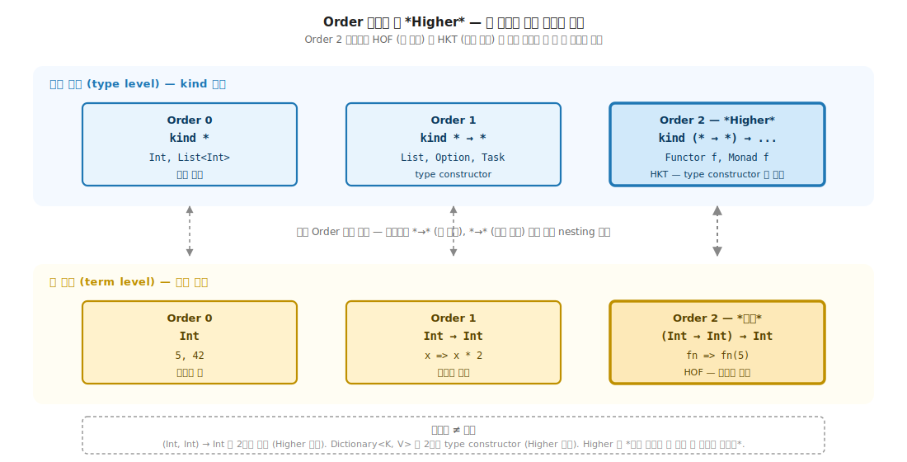
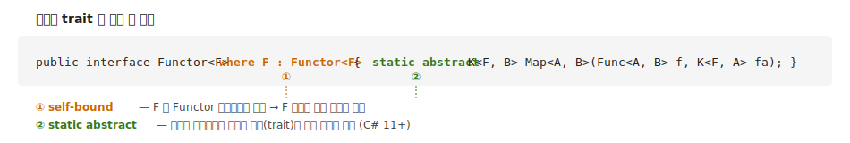
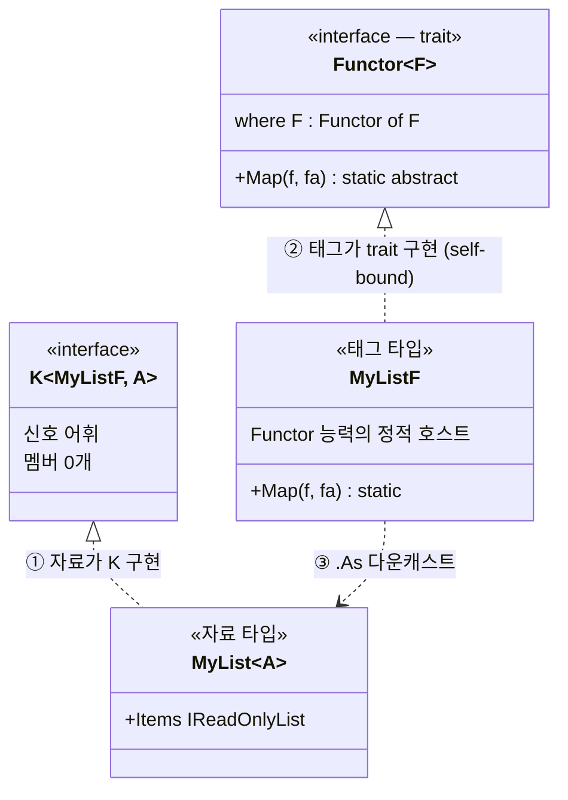
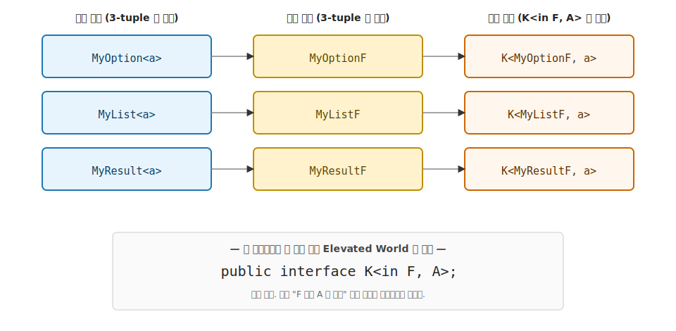
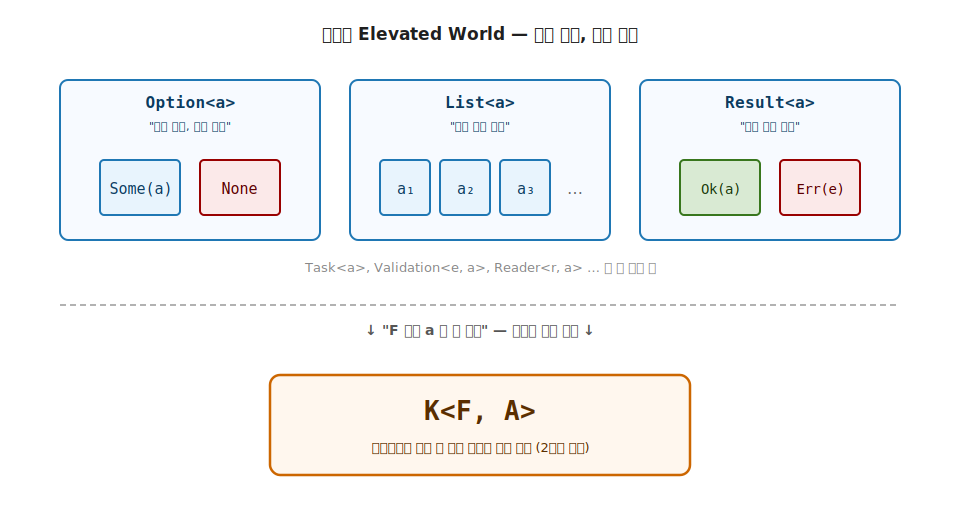

# 2장. Higher Kinds (수많은 Elevated World 를 하나의 어휘로)

> 이 장에서 다룰 주제 — 1장의 비유 (Normal / Elevated) 를 C# 코드로 표현하는 도구. 객체지향에서 부딪히는 N×M 비용 문제로 시작해, 값 차원의 *Order* 단계 어휘로 *Higher* 의 직감을 잡고 같은 어휘를 타입 차원에 평행 매핑한 뒤, `K<in F, A>` 마커, self-bound, static abstract 두 우회 도구로 가상 한 줄을 실제 한 줄로 회수합니다. 언어가 직접 표현 못 하는 함수형 추상을 C# 안에서 가능하게 만드는 두 도구.

> 이 장을 마치면 할 수 있게 되는 것
> - [ ] 객체지향 어법의 N×M 비용 문제를 시그니처로 보여줄 수 있습니다.
> - [ ] 함수형의 trait 다형성이 비용을 N+M 으로 줄이는 발상을 설명할 수 있습니다.
> - [ ] 값 차원의 Order 0 / 1 / 2 어휘를 한 줄로 설명할 수 있습니다.
> - [ ] 다인자 함수와 고차 함수의 결정적 구분을 시그니처로 보여줄 수 있습니다.
> - [ ] 값 차원의 Order 어휘를 타입 차원의 kind 어휘에 평행 매핑할 수 있습니다.
> - [ ] 값 생성자 / 타입 생성자 통합 비교 표에서 C# 의 비대칭을 짚을 수 있습니다.
> - [ ] 왜 C# 의 제네릭만으로는 Elevated World 추상이 어려운가 답할 수 있습니다.
> - [ ] HKT 가 가능했다면의 가치를 가상 C# 코드로 표현할 수 있습니다.
> - [ ] `K<F, A>` 의 `F` 와 `A` 가 각각 무엇을 뜻하는지 설명할 수 있습니다.
> - [ ] self-bound 제약 `where F : Trait<F>` 가 왜 필요한가 답할 수 있습니다.
> - [ ] static abstract 가 인스턴스 메서드와 무엇이 다른지 한 줄로 설명할 수 있습니다.
> - [ ] 가상의 `Functor<F<_>>` 한 줄이 실제 `Functor<F> where F : Functor<F>` 한 줄로 어떻게 회수되는지 설명할 수 있습니다.
> - [ ] 3-tuple 패턴 (자료 / 태그 / trait 구현) 의 세 조각이 어떤 책임을 지는지 코드로 보여줄 수 있습니다.
> - [ ] 어떤 Functor 든 받는 일반 함수를 직접 작성할 수 있습니다.

---

## §2.1 1장 비유의 회복 — F 자리의 야망

1장에서 Normal World 의 시민 (`int`, `string`) 과 Elevated World 의 시민 (`Option<int>`, `List<string>`) 두 비유를 봤습니다. 이제 진짜 코드의 문제로 들어섭니다. Elevated World 의 시민이 너무 많습니다.

```csharp
Option<int>        maybeN;
List<int>          manyN;
Result<int>        okN;
Task<int>          futureN;
Validation<E, int> validN;
// ... 그 외 수십 개
```

여기서 1부의 야망이 등장합니다. 어떤 Elevated World 인지에 무관하게 `map`, `apply`, `bind` 같은 추상을 정의하고 싶습니다. 그러려면 F 라는 자리가 필요합니다. F 는 Elevated World 의 이름입니다. `Option`, `List`, `Result` 같은 컨테이너 종류입니다.

이 야망의 실체는 함수형의 본질, 즉 합성 가능한 Elevated World 로 lift (§1.6.1) 의 둘째 축 type class 다형성입니다. 그 어휘를 컴파일 타임에 강제하는 도구가 2장의 주제입니다.

---

## §2.2 문제 배경 — 객체지향의 N×M 비용

객체지향에서 능력의 주체는 객체입니다. `Map`, `Bind`, `Fold` 같은 능력은 각 컨테이너 클래스의 인스턴스 메서드로 부착됩니다. 시그니처를 직접 보면 같은 능력 (`Map`) 이 컨테이너 별로 세 번 별개 구현 되는 자리가 드러납니다.

```csharp
// 객체지향 어법 — 각 컨테이너가 자기 Map 을 자체 인스턴스 메서드로 둠
public class List<A>
{
    public List<B> Map<B>(Func<A, B> f) { /* List 의 Map 구현 */ }
}

public class Option<A>
{
    public Option<B> Map<B>(Func<A, B> f) { /* Option 의 Map 구현 */ }
}

public class Task<A>
{
    public Task<B> Map<B>(Func<A, B> f) { /* Task 의 Map 구현 */ }
}

// ... 컨테이너 N 개 × 능력 M 개 (Map, Bind, Fold, ...) = N×M 개의 구현
```

세 시그니처가 모양만 같고 자리 (이름) 가 다른 어법입니다. `List<A>.Map` / `Option<A>.Map` / `Task<A>.Map` 이 세 별개 메서드 라 컴파일러가 같은 능력으로 다루지 못합니다. 결과로 N 개 컨테이너에 M 개 능력 (`Map`, `Bind`, `Fold` ...) 을 부착하려면 **N×M 개의 구현** 이 필요합니다.

비용의 결과는 두 자리에서 드러납니다.

- **새 컨테이너 추가 시** — M 개 능력 모두를 다시 짜야 합니다. `MyEither` 가 등장하면 `MyEither.Map`, `MyEither.Bind`, `MyEither.Fold` ... 모두 따로 구현합니다.
- **새 능력 추가 시** — N 개 컨테이너 모두에 부착을 다시 해야 합니다. `Traverse` 가 등장하면 `List.Traverse`, `Option.Traverse`, `Task.Traverse` ... 모두 따로 구현합니다.

이 N×M 비용이 합성 가능한 Elevated World 로 lift 어휘를 컨테이너 별로 따로 살게 합니다. 함수형 추상의 통합 가치 (한 능력이 모든 컨테이너 위에서 한 어휘로 살아야 함) 가 객체지향 어법으로는 달성되지 않습니다.

---

## §2.3 함수형의 발상 — N+M 비용 + F 자리의 필요

함수형의 발상은 능력의 주체를 객체가 아니라 *trait* 으로 옮깁니다. `Functor` 라는 trait 한 자리에 `Map` 한 번을 정의하면, F 자리에 어떤 컨테이너든 끼워 같은 `Map` 이 자동 동작합니다.

```csharp
// 함수형 어법 (가상) — 능력이 trait 한 자리에 산다
public interface Functor<F>     // F 가 컨테이너 종류 (List, Option, Task ...)
{
    static F<B> Map<A, B>(Func<A, B> f, F<A> fa);  // F 자리에 컨테이너 이름만 바꿔 끼움
}

// 호출 — 같은 메서드가 모든 컨테이너 위에서 자동 동작
Functor<List>.Map(DoubleIt, [1, 2, 3])      // F = List
Functor<Option>.Map(DoubleIt, Just(42))     // F = Option
Functor<Task>.Map(DoubleIt, FetchTask())    // F = Task
```

비용이 N×M 에서 **N+M** 으로 줄어듭니다.

- **새 컨테이너 추가** — M 개 능력 모두 자동 적용. 컨테이너 1 개 등록.
- **새 능력 추가** — N 개 컨테이너 모두 자동 적용. trait 1 개 정의.

비용 절감의 핵심은 F 라는 어휘 자리입니다. 어떤 컨테이너든 받는 매개변수 자리, 즉 type constructor 를 매개변수로 받는 Order 2 의 자리입니다. C# 어법에는 그 자리가 직접 없습니다.

### C# 컴파일러가 위 가상 코드를 거부하는 이유

위의 가상 `Functor<F>` 코드를 그대로 IDE 에 적고 빌드하면 컴파일러가 `F<B>` / `F<A>` 자리에서 에러를 냅니다.

```csharp
public interface Functor<F>
{
    static F<B> Map<A, B>(Func<A, B> f, F<A> fa);
    //         ─┬─                          ─┬─
    //         ✗ CS0307: 'F' is a type parameter,
    //                   which is not valid in the given context
    //         ✗ CS0246: The type or namespace name 'F' could not be found
}
```

에러 메시지의 의미를 풀어 보면 다음과 같습니다.

- **CS0307** — "F 는 타입 매개변수인데 이 자리에서는 유효하지 않다". 즉 `F` 가 제네릭 매개변수인 것은 맞지만, `F<B>` 처럼 F 자체가 다시 다른 타입 인자 (B) 를 받는 자리에서는 사용할 수 없다는 뜻입니다.
- **CS0246** — "F 라는 타입 / 네임스페이스를 찾을 수 없다". 컴파일러가 `F` 를 완성 타입으로 해석하려 했으나, `F<...>` 어법은 F 가 *type constructor* 여야 의미가 있는 자리라 완성 타입 후보에서 찾지 못합니다.

**왜 이런 에러가 나는가** — C# 의 제네릭 매개변수는 완성된 타입 (예: `int`, `string`, `List<int>` 같이 모든 자리가 채워진 구체 타입) 만 받습니다. 위 코드의 `F<B>` / `F<A>` 자리는 F 자체가 다시 매개변수를 받는 어법으로, F 가 *type constructor* (Haskell 의 `List` 같은 타입을 받아 타입을 만드는 어휘) 라고 가정한 자리입니다. C# 어법에는 *type constructor* 를 매개변수로 받는 자리가 없으므로 컴파일러가 F 가 무엇인지 모르겠다는 에러로 반응합니다.

비유 한 줄로 정리하면, C# 의 제네릭 자리는 **완성된 우편함** (자료가 채워진 형태) 만 받습니다. **우편함을 만드는 공장** (`List` 같은 *type constructor* 자체) 을 매개변수로 받는 어법이 없습니다. 자세한 분석은 §2.7 에서 다시 봅니다.

그 한계가 결정적 제약이고, 한계를 우회하는 도구가 2장의 주제입니다.

본격적인 도구 (`K<in F, A>` 마커, self-bound, static abstract) 로 들어가기 전에, *Higher* 라는 어휘의 직감을 값 차원에서 먼저 정착시키고 같은 어휘를 타입 차원으로 평행 매핑합니다. 그 자리에서 C# 의 결정적 제약이 드러나고, 만약 HKT 가 직접 지원되었다면의 가치가 우회의 동기가 됩니다.

---

## §2.4 값 생성자의 Order 단계 (Order 0 / 1 / 2)

> **값 생성자 — 정의**
>
> 학술 어휘에서 *value constructor* (또는 *data constructor*) 는 Haskell 의 대수적 데이터 타입에서 값을 만드는 함수를 가리킵니다. 예를 들어 `data Either a b = Left a | Right b` 의 `Left :: a → Either a b`, `Right :: b → Either a b` 가 value constructor 입니다. 0-인자면 *nullary constructor* (또는 상수) 라 부릅니다. Haskell Wiki *Constructor* 는 *"a data constructor taking zero arguments is called a nullary data constructor or simply a constant"* 로 정의합니다.
>
> 이 책의 값 생성자는 그보다 광의로, 값 차원에서 값을 만드는 모든 어휘로 사용합니다. 리터럴 (`1`, `"hello"`) 도 0-인자 constructor 의 결과, 함수 (`int → int`) 도 값을 만드는 어휘, 고차 함수 ((`int → int`) → `int`) 도 값을 만드는 어휘로, 셋 모두 값을 만든다는 점에서 같은 어휘로 묶입니다. 이 절은 그 값을 만드는 어휘 들을 *Order* 라는 단계로 분류합니다. §2.5 의 타입 생성자 (type constructor) 가 타입을 만드는 어휘를 같은 Order 어휘로 분류하는 평행 자리입니다.

Order 0 은 평범한 값, Order 1 은 값을 받아 값을 만드는 함수, Order 2 는 함수를 받아 값을 만드는 고차 함수 (HOF: Higher Order Function) 입니다.

| Order | 모양 | 의미 | 예 |
|---|---|---|---|
| Order 0 | `*` (단순 값) | 평범한 값 — 변수에 곧장 담음 | `1`, `2`, `new User()`, `new List<int>()` |
| Order 1 | `* → *` (값 → 값) | 평범한 함수 — 값을 받아 값을 반환 | `int DoubleIt(int)`, `string Xxx(int)`, `Func<int, double>` |
| Order 2 | `(* → *) → *` (함수 → 값) | 고차 함수 (HOF) — 함수를 받아 값을 반환 | `int DoubleIt(Func<string, int>)`, `xs.Aggregate(seed, f)` |

Order 0 의 자리는 값 자체로, C# 의 리터럴 / 인스턴스 / static 멤버가 모두 이 자리입니다. Order 1 은 값을 받아 값을 산출하는 평범한 함수로, C# 의 메서드 / `Func<,>` / 람다가 이 자리입니다. Order 2 는 함수를 받아 값을 산출하는 고차 함수로, LINQ 의 `Select`, `Where`, `Aggregate` 가 모두 이 자리입니다.

같은 값 `42` 가 Order 0 → 1 → 2 단계로 어휘가 어떻게 올라가는지 단계별로 보면 직감이 잡힙니다.

```csharp
// Order 0 — 42 가 값 그 자체
int answer = 42;

// Order 1 — 42 를 받아 값을 반환하는 함수
int Identity(int x) => x;                       // Identity(42) == 42

// Order 2 — 함수를 받아 42 를 반환하는 고차 함수
int RunWith42(Func<int, int> f) => f(42);       // RunWith42(Identity) == 42
```

같은 영역의 어휘 (`42`) 가 값 → 값을 다루는 함수 → 함수를 다루는 함수로 한 단계씩 *Higher* 로 올라간 자리입니다.

> **다인자 ≠ 고차 (결정적 구분)** — Order 가 올라가는 기준은 인자 개수가 아니라 **인자 자리에 한 단계 위 어휘 (함수) 가 들어옴** 입니다.
>
> ```csharp
> // 1-인자 함수 — Order 1 (인자 자리에 값)
> int Negate(int n) => -n;
>
> // 2-인자 함수 — Order 1 (인자가 둘이지만 모두 값)
> int Add(int x, int y) => x + y;
>
> // 1-인자 HOF — Order 2 (인자 자리에 함수)
> int Apply(Func<int, int> f) => f(5);
> ```
>
> `Negate` 는 인자가 하나이고 값 (int) 이라 Order 1 입니다. `Apply` 는 같은 1-인자지만 인자가 함수 (`int → int`) 라 Order 2 입니다. `Add` 는 인자가 둘이지만 모두 값이라 여전히 Order 1 입니다. *Higher* 의 본질은 몇 개 가 아니라 어떤 어휘가 인자 자리에 들어오는가입니다.

> **고차의 결정적 조건** (Wikipedia, *Higher-order function*) — *"a function that does at least one of the following: takes one or more functions as arguments, returns a function as its result"*. 즉 함수를 인자로 받거나 함수를 반환 하면 고차 함수입니다. 같은 자료에 명시 — *"A function that merely returns a value (not a function) is classified as first-order"*. 함수가 단순히 값을 반환한다는 사실만으로는 *first-order* (1 차 함수, Order 1) 입니다. *higher* 가 되려면 **인자 또는 출력 자리에 함수가 등장** 해야 합니다.

| 값 생성자 | 모양 | 인자 개수 | 인자 자리의 어휘 | Order |
|---|---|---|---|---|
| `42`, `new User()`, `new List<int>()` | `*` | 0 | (인자 없음) | Order 0 (값) |
| `int Negate(int n)` | `* → *` | 1 | 값 | Order 1 (기본형) |
| `int Add(int x, int y)` | `* → * → *` | 2 | 값, 값 | Order 1 (다인자) |
| `int Apply(Func<int, int> f)` | `(* → *) → *` | 1 | 함수 | Order 2 (고차 함수) |
| `new User(Func<int, int> f)` | `(* → *) → *` | 1 | 함수 | Order 2 (고차 생성자) |
| `int Run(Func<int, int> f, int seed)` | `(* → *) → * → *` | 2 | 함수, 값 | Order 2 (고차, 다인자) |

판별 규칙은 다음과 같습니다. 인자 중 하나라도 함수 (`Func<...>` / 메서드 / 람다) 가 있으면 Order 2 이상이고, 모두 값이면 Order 1 입니다.

> **C# 값 차원의 일급 시민 완전 지원** — C# 은 Order 0 (값), Order 1 (`Func<,>` / lambda / delegate), Order 2 (HOF, LINQ 의 `Select` / `Aggregate` / `Where` 등) 모두 일급 시민으로 지원합니다. 값 차원에는 어떤 제약도 없습니다. `Func<>` / 메서드 그룹 / 람다가 함수를 값처럼 다루는 어법을 완비해, Order 2 이상의 HOF 도 자유롭게 정의·전달·사용 가능합니다.

제약이 등장하는 자리는 타입 차원입니다. 같은 Order 어휘를 타입 차원에 평행 매핑하면 C# 의 결정적 한계가 드러납니다.

---

## §2.5 타입 차원의 Order — C# 의 제공 범위

§2.4 에서 값 차원의 Order 0 / 1 / 2 어휘를 봤습니다. 같은 어휘를 타입 차원으로 평행 매핑하면 *kind* (타입의 타입) 라는 어휘가 등장합니다. 그리고 C# 의 타입 차원이 어디까지 제공하는지 한 단계씩 점검하면 비대칭이 드러납니다.

- **Order 0** — 완성 타입 (예: `int`, `List<int>`). C# 이 **완전 제공** 합니다.
- **Order 1** — type constructor (예: `List` 자체). C# 이 **정의만 제공** 하고, type constructor 자체를 일급 시민으로 다루지 못합니다.
- **Order 2** — HKT (type constructor 를 매개변수로 받는 추상). C# 이 **미지원**. **2장의 본 목표 자리** 입니다.

세 단계의 제공 상태가 정확히 완전 / 부분 / 미지원 의 비대칭을 그립니다. 단계별로 봅니다.

> **Higher-Kinded Generic (고차 종류 제네릭) — 정의**
>
> 타입 생성자 (type constructor) 를 그 자체로 매개변수로 받는 제네릭을 일컫습니다. "타입을 받아 타입을 만드는 함수" (예: `List<_>`, `Option<_>`) 를 다른 코드가 인자로 받아 사용할 수 있게 하는 타입 시스템의 능력입니다. 영어 원문은 *"A kind is the type of a type constructor."* (Wikipedia, Kind (type theory)) 입니다. 즉 kind 는 "타입의 타입" 으로, `* → *` 는 `List` 같은 unary type constructor 의 kind 자리이고, Higher-Kinded Polymorphism 은 이 kind `* → *` 의 자리를 추상화하는 다형성을 의미합니다. §2.4 의 고차 함수 (HOF) 가 함수를 받는 함수이듯, *Higher Kinds* 는 타입 생성자를 받는 타입으로 같은 발상이 값 차원에서 타입 차원으로 올라간 자리입니다.

### 2.5.1 Order 0 — 완성 타입 (C# 완전 제공)

타입 차원의 Order 0 은 완성 타입 으로, 모든 자리가 채워진 구체적 타입입니다. kind 어휘로는 `*` 자리이고, 변수에 담거나 매개변수로 전달하거나 반환하는 데 어떤 제약도 없습니다.

```csharp
// Order 0 의 자리 — 완성 타입을 변수에 담음
int        x  = 42;
string     s  = "hi";
List<int>  xs = new List<int> { 1, 2, 3 };

// 매개변수 / 반환에도 자유
void Print(int n) { Console.WriteLine(n); }
List<string> CreateNames() => new List<string> { "Alice", "Bob" };
```

`int` 는 T 자리가 없는 완성 타입이고, `List<int>` 는 T 자리에 `int` 가 채워진 완성 타입입니다. 둘 다 kind `*` 자리이고, C# 이 모든 어법에서 자유롭게 다룹니다.

### 2.5.2 Order 1 — type constructor (C# 정의만 제공)

타입 차원의 Order 1 은 *type constructor* 로, 타입을 받아 타입을 만드는 어휘입니다. kind 어휘로는 `* → *` 자리입니다. 예로 `List` (T 를 받아 `List<T>` 만듦), `Option`, `Task` 가 있습니다.

C# 어법은 type constructor 의 정의 는 제공합니다. `public class Box<T> { ... }` 같은 제네릭 정의 가 그 자리입니다.

```csharp
// type constructor 정의 — C# 완전 가능
public class Box<T>
{
    public T Value { get; }
    public Box(T value) => Value = value;
}

// 사용 — T 자리에 완성 타입을 채우면 Box<int>, Box<string> 같은 완성 타입 (Order 0)
Box<int>    b1 = new Box<int>(42);          // ✓ Box<int> 는 완성 타입
Box<string> b2 = new Box<string>("hi");     // ✓ Box<string> 도 완성 타입
```

그러나 **`Box` 자체** (T 자리가 비어있는 type constructor) 는 일급 시민이 아닙니다. C# 어법으로 `Box` 만 변수에 담거나 매개변수로 전달할 수 없습니다.

```csharp
// ✗ Box 자체 (type constructor) 는 C# 의 일급 시민이 아님
Box    plain = ...;                          // ✗ 컴파일 오류 — Box 만은 변수가 못 됨
void Process(Box container) { }              // ✗ 컴파일 오류 — Box 만 매개변수로 못 받음
T<int> RunWith<T>() { ... }                  // ✗ 컴파일 오류 — T 가 다시 인자를 받는 자리는 못 둠
```

C# 의 정의만 제공 이 의미하는 자리가 바로 이것입니다. `Box<T>` 같은 제네릭 정의는 가능하지만, T 자리가 채워진 완성 타입 (`Box<int>`) 만 일급 시민이고, T 자리가 비어있는 type constructor 자체 (`Box`) 는 일급 시민이 아닙니다.

Haskell / Scala 는 다릅니다.

```haskell
-- Haskell — type constructor 자체를 일급 시민으로 가리킴
-- []     :: * → *      (List 자체)
-- Maybe  :: * → *      (Option 자체)

instance Functor [] where     -- [] = List 자체를 직접 전달
    fmap f xs = ...
```

```scala
-- Scala — F[_] 의 underscore 가 "kind * → *" 의 빈자리
trait Functor[F[_]]:
    def map[A, B](fa: F[A])(f: A => B): F[B]
```

Haskell 의 `[]` / Scala 의 `F[_]` 가 type constructor 자체를 매개변수로 가리키는 어법입니다. C# 어법에는 그런 자리가 없습니다. 이 차이가 Order 2 (§2.5.3) 의 가능 여부를 가릅니다.

### 2.5.3 Order 2 — HKT (C# 미지원, 2장의 본 목표)

타입 차원의 Order 2 가 **2장의 본 목표** 자리입니다. type constructor 를 매개변수로 받는 추상, 즉 `Functor` 의 `f` 자리가 그 자리입니다. kind 어휘로는 `(* → *) → ...` 자리이고, 값 차원의 함수를 받는 함수 (HOF) 가 타입 차원에 평행 매핑된 자리입니다.

§2.3 의 함수형 발상 (N+M 비용 회복) 이 F 자리에 어떤 컨테이너든 끼움 으로 달성되려면, F 가 type constructor 매개변수 자리에 들어와야 합니다. 가상 코드로 보면 다음과 같은 자리입니다.

```csharp
// 2장의 본 목표 — Order 2 의 자리
// type constructor 를 매개변수로 받는 추상 (HKT)
public interface Functor<F>          // F 가 type constructor (Order 1) 라고 가정
{
    static F<B> Map<A, B>(Func<A, B> f, F<A> fa);
    //         ─┬─                          ─┬─
    //         F<B>, F<A>: F 가 다시 인자를 받음 — Order 2 의 자리
}

// ✗ 컴파일 오류 — CS0307: 'F' is a type parameter,
//                          which is not valid in the given context
```

C# 컴파일러가 `F<B>` / `F<A>` 자리를 거부합니다. 이유는 §2.5.2 에서 본 것과 같습니다. C# 의 `F` 가 완성 타입만 받는 자리 이고, F 자체가 type constructor 라는 가정이 어법으로 불가능하기 때문입니다. Order 1 에서 type constructor 가 일급 시민이 아니라서, 한 단계 위인 Order 2 (type constructor 를 매개변수로 받는 자리) 도 도달 불가능합니다.

Haskell / Scala 에서는 정확히 이 자리가 일급 어법입니다.

```haskell
-- Haskell — f 가 kind * → * 임을 컴파일러가 추적 (Order 2 일급)
class Functor f where
    fmap :: (a -> b) -> f a -> f b

instance Functor [] where ...        -- f = [] 로 끼움
instance Functor Maybe where ...     -- f = Maybe 로 끼움
```

Haskell 의 `f` 자리에 `[]` / `Maybe` / `IO` 같은 type constructor 자체 가 직접 들어가고, 컴파일러가 kind `* → *` 인지 검증합니다. C# 어법에는 그 자리가 없습니다.

### 2.5.4 정리 — C# 의 비대칭과 2장의 본 목표

세 단계의 C# 제공 상태를 한 표에 모으면 비대칭이 한 자리에서 드러납니다.

| Order | kind | C# 제공 | 의미 |
|---|---|---|---|
| Order 0 | `*` | ✓ **완전 제공** | `int`, `string`, `List<int>` 같은 완성 타입. 변수 / 매개변수 / 반환 모두 자유. |
| Order 1 | `* → *` | △ **정의만 제공** | `public class Box<T>` 같은 제네릭 정의는 가능. 단 **`Box` 자체** (type constructor, T 가 비어있는 형태) 는 일급 시민이 아님. |
| Order 2 | `(* → *) → *` | ✗ **미지원** | `Functor<F>` 같은 HKT — type constructor 를 매개변수로 받는 추상. **2장의 본 목표 자리**. C# 어법으로 직접 표현 불가. |

핵심을 한 줄로 정리하면, **2장의 본 목표인 Order 2 (HKT) 를 C# 으로 직접 못 다루는 이유가 Order 1 에서 type constructor 자체가 일급 시민이 아니기 때문** 입니다. C# 은 제네릭 정의 (`public class Box<T>`) 를 가능하게 하지만, 그 정의 자체 (`Box`) 를 인자로 받을 어법이 없습니다. 그래서 한 단계 위 (Order 2, type constructor 를 매개변수로 받는 자리) 도달이 어법적으로 막혀 있습니다.

이 한계가 §2.7 에서 코드로 다시 검증되고, 한계를 우회하는 도구가 §2.9 ~ §2.11 의 `K<F, A>` 마커 + self-bound + static abstract 입니다. §2.6 에서 값 차원과 타입 차원의 비대칭을 통합 비교 표로 한 자리에 모은 뒤, §2.7 부터 우회로 들어갑니다.



**그림 2-5. Order 단계로 본 Higher — 값 차원과 타입 차원의 평행** — 아래 행 값 차원 (Normal World 색) 에 Order 0 → Order 1 → Order 2 (HOF) 세 박스. 위 행 타입 차원 (Elevated World 색) 에 같은 Order 0 → Order 1 → Order 2 (HKT) 세 박스. 가운데 점선 매핑이 같은 Order 끼리 평행을 시각화합니다. Order 2 자리에서 고차 함수 (HOF) 가 값 차원의 함수를 받는 자리이듯 고차 타입 (HKT) 이 타입 차원의 type constructor 를 받는 자리이고, 두 차원이 같은 발상의 한 층 위 자리입니다. 우측 하단 회색 점선 박스에 다인자 ≠ 고차 안내 (`(Int, Int) → Int` / `Dictionary<K, V>` 는 인자 여러 개일뿐 Higher 가 아님).

---

## §2.6 값 생성자 vs 타입 생성자 — 통합 비교

값 차원과 타입 차원의 Higher 어휘를 평행 매핑했습니다. 한 자리에 모아 보면 두 차원의 Order 어휘 평행과 C# 일급 시민 비대칭이 동시에 드러납니다.

| 차원 | 어휘 | Order 0 (`*`) | Order 1 (`* → *`) | Order 2 (`(* → *) → *`) | C# 일급 시민 |
|---|---|---|---|---|---|
| **값 차원** | 값 생성자 | 값 자체 — `42`, `new User()`, `new List<int>()` | 평범한 함수 — `Negate`, `Add` / 생성자 — `new User(int)` | 고차 함수 — `Apply` / 고차 생성자 — `new User(Func<int,int>)` | Order 0/1/2 **모두 ✓** |
| **타입 차원** | 타입 생성자 | 완성 타입 — `int`, `List<int>` | type constructor — `List` 자체 (Haskell) / `List<_>` (Scala) | HKT — `Functor<F<_>>` 의 `F` 자리 | Order 0 ✓ / Order 1 **부분** (제네릭 정의 `List<T>` OK, type constructor 자체 일급 ✗) / Order 2 **✗** |

값 차원은 Order 0 / 1 / 2 모두 C# 의 일급 시민입니다. 리터럴 / 평범한 함수 / 고차 함수 / 생성자 모두 자유롭게 정의·전달·사용 가능합니다. 타입 차원은 Order 0 만 완전 일급이고 Order 1 부터는 C# 의 어법 한계에 부딪힙니다. C# 의 `List<T>` 같은 제네릭 정의는 T 가 정해지면 완성 타입 (kind `*`, Order 0) 으로 다룰 수 있으나, `List` 자체 (type constructor, kind `* → *`, Order 1) 를 일급 시민으로 매개변수에 받지 못합니다. 이 비대칭이 C# 의 결정적 제약의 정확한 자리입니다.

값 / 타입 두 차원의 평행을 한 줄로 정리하면 다음과 같습니다. Order 어휘는 동일 (`*` / `* → *` / `(* → *) → *` 세 단계가 두 차원에 똑같이 적용). C# 의 비대칭은 타입 차원에만 등장 (값 차원 일급 시민 완비 vs 타입 차원 Order 1 부터 미완). 함수형 추상이 살고 싶은 자리는 타입 차원의 Order 2 (Functor 의 `f` 자리). C# 어법이 그 자리를 가리킬 수단이 없는 것이 바로 다음에 직접 다룰 결정적 제약입니다.

---

## §2.7 C# 의 결정적 제약 — Order 2 (HKT) 미지원

§2.5 에서 C# 의 타입 차원 비대칭 (Order 0 완전 제공 / Order 1 정의만 제공 / Order 2 미지원) 을 봤습니다. §2.6 에서 같은 비대칭을 값 차원과 평행으로 비교했습니다. 이 절에서는 그 결론을 코드 차원에서 한 번 더 검증하고, 다른 언어들이 같은 자리를 어떻게 푸는지 비교 표로 정리합니다. C# 의 결정적 제약을 **컴파일러가 직접 뱉는 두 에러 메시지** (CS0307 + CS0246) 와 **전체 언어 풀이 표** 두 자리에서 마무리합니다.

### 2.7.1 컴파일 안 되는 자리 — 두 에러 메시지

§2.5.3 의 Order 2 가상 코드를 그대로 다시 보면, C# 컴파일러가 정확히 어떤 에러로 거부하는지 두 메시지로 드러납니다.

```csharp
// 시도 — T<X> 형태 (Higher Kinds) 를 C# 으로 직접 표현
public interface Functor<F>
{
    // F 가 type constructor (kind * → *) 라고 가정하고
    // F<A> 에서 A 를 받아 F<B> 로 변환하는 Map 정의를 시도
    static abstract F<B> Map<A, B>(Func<A, B> f, F<A> fa);
    //              ─┬─                          ─┬─
    //              F<B>: F 가 다시 B 를 받음 — T<X> 형태
    //              F<A>: F 가 다시 A 를 받음 — T<X> 형태
}

// ✗ 컴파일 오류:
//   CS0307: 'F' is a type parameter, which is not valid in the given context
//   CS0246: The type or namespace name 'F' could not be found
//
// C# 컴파일러는 F 를 완성 타입 (kind *) 으로만 받음.
//   완성 타입 = int, string, List<int>, Task<string> 같이 T 자리가 모두 채워진 구체 타입.
//   List 자체 / Task 자체 (type constructor, kind * → *) 는 C# 에서 표현 안 됨.
// F<...> 어법 (F 가 다시 매개변수를 받는 자리) 을 거부함.
```

두 에러 메시지의 정확한 의미는 §2.3 의 컴파일러 거부 자리에서 풀었습니다. 한 줄로 다시 정리하면, **CS0307** 은 "F 가 다시 인자를 받는 자리에서 사용 불가" 라는 뜻이고, **CS0246** 은 "F 를 완성 타입으로 해석하려 했으나 찾을 수 없다" 는 뜻입니다. 두 에러 모두 C# 의 제네릭 매개변수가 완성 타입 (Order 0) 만 받는 어법의 결과로, type constructor (Order 1) 자체를 매개변수로 받는 추상 (Order 2, HKT) 을 문법으로 표현할 수 없습니다. 학술 어휘로는 *higher-kinded polymorphism* 미지원입니다.

### 2.7.2 다른 언어들의 풀이

| 언어 | 지원 여부 | 어법 |
|---|---|---|
| Haskell | 일급 시민 | `class Functor f where fmap :: (a → b) → f a → f b` |
| Scala 2/3 | 일급 시민 (`F[_]` syntax 직접) | `trait Functor[F[_]] { def map[A,B](fa: F[A])(f: A=>B): F[B] }` |
| OCaml | 미지원 → brand 인코딩으로 우회 | `type ('a, 't) app` (Yallop–White) |
| Rust | 부분 지원 (GAT, 1.65+) | `type Output<U>` associated type |
| C# | 미지원 → 마커 인터페이스로 우회 | `public interface K<in F, A>;` (LanguageExt) |
| Java | 미지원 → 마커 인터페이스로 우회 | `_<F, A>` (Highj) |
| Kotlin | 미지원 → 마커 인터페이스로 우회 | `Kind<F, A>` (Arrow-kt) |

C#·Java·Kotlin 같은 Higher Kinds 미지원 언어의 우회 방식은 Lightweight Higher-Kinded Polymorphism (Yallop & White, FLOPS 2014) 논문이 정립한 brand / defunctionalization 기법에 뿌리를 둡니다. 핵심 발상은 다음과 같습니다. kind `* → *` 의 자리에 평범한 kind `*` 의 빈 brand 타입 (예: `MyListF`) 을 두고, brand 와 진짜 컨테이너 타입의 1:1 대응을 사람이 관리합니다. LanguageExt 의 `K<F, A>` 도, Arrow-kt 의 `Kind<F, A>` 도, Highj 의 `_<F, A>` 도 모두 같은 발상의 표현입니다.

우회의 비용은 학습 곡선 (3-tuple 패턴 + 다운캐스트 + self-bound 제약) 입니다. 대가는 Haskell / Scala 의 거의 모든 함수형 추상이 C# 에서 표현 가능해진다는 점입니다.

> 학술적 기반 — Higher Kinds 의 형식 이론은 Moors, Piessens, Odersky 의 *Generics of a Higher Kind* (OOPSLA 2008) 가 정립했습니다. 논문이 같은 발상을 세 어휘로 동의어 처리합니다. *type constructor polymorphism* (Scala 용어), *higher-kinded types* (Haskell 용어), *higher-order genericity* (논문 abstract). 셋 모두 Higher Order Function 의 타입 차원 평행으로, *abstract over types that abstract over types* 가 *Higher* 의 정의입니다. Scala 2.5 (2007) 가 처음으로 일급 시민으로 지원했고, 그 위에 Yallop & White (FLOPS 2014) 가 HKT 미지원 언어의 brand / defunctionalization 우회를 정립했습니다.

C# 의 결정적 제약을 봤습니다. 이제 만약 C# 이 직접 지원했다면 어떤 가치가 있을까를 가상 코드로 먼저 확인하고, 그 가치를 우회 도구로 회수하는 절차로 이어집니다.

---

## §2.8 가상 코드로 본 Order 2 의 가치 — §2.2 문제 돌파 확인

§2.5 와 §2.7 에서 Order 2 자리의 직접 표현이 막힌다는 사실을 두 번 봤습니다 (§2.5 의 어법 분석 + §2.7 의 두 에러 메시지). 그렇다면 만약 직접 지원했다면 어떤 가치가 있을까요? 가상의 C# 어법으로 그 가치를 먼저 확인하고, 뒤이어 실제 도구로 어떻게 회수되는지의 동기로 삼습니다.

C# 이 **Generic 매개변수 자체가 다시 generic** 일 수 있다면 (즉 Higher Kinds 직접 지원) 다음 같은 코드가 가능합니다.

```csharp
// ✗ 가상의 C# 어법 — 실제로는 컴파일 안 됨 (§2.7 의 미지원)
public interface Functor<F>     // F 가 type constructor (kind * → *) 매개변수
{
    static abstract F<B> Map<A, B>(Func<A, B> f, F<A> fa);
    //              ─┬─                          ─┬─
    //              F<B>: F 가 다시 B 를 받음     F<A>: F 가 다시 A 를 받음
    //              ↑ Generic 매개변수 F 가 다시 generic — 이 자리가 핵심
}

// 변환 메서드 한 번 정의 (Normal World 의 평범한 int → int)
static int DoubleIt(int n) => n * 2;

// 호출 — 같은 메서드가 모든 Elevated World 위에서 자동 동작
//   (C# 의 method group conversion 으로 메서드 이름을 직접 인자로 전달)
//   ↓ F 자리에 컨테이너 이름을 바꿔 끼움
Functor<MyList  >.Map(DoubleIt, [1, 2, 3])     // F = MyList    → [2, 4, 6]
Functor<MyMaybe >.Map(DoubleIt, Just(42))      // F = MyMaybe   → Just(84)
Functor<MyTask  >.Map(DoubleIt, FetchTask())   // F = MyTask    → 비동기 결과 2배
Functor<MyResult>.Map(DoubleIt, Ok(7))         // F = MyResult  → Ok(14)
```

**이 가상 코드가 보여주는 가치** — `Functor<MyList>` / `Functor<MyMaybe>` / `Functor<MyTask>` 같이 F 자리 (Functor 뒤의 자리) 에 컨테이너 이름을 바꿔 끼우는 것만으로 같은 `Map` 함수가 모든 컨테이너 위에서 동작합니다. F 자리 하나가 수십 개의 컨테이너를 한 어휘로 묶는 셈입니다.

그래서 함수형의 핵심 가치가 **`Map` 함수 한 번 정의 → N 개 컨테이너 자동 적용** 입니다. 새 컨테이너 (예: `MyEither`) 가 등장해도 `Map` 을 다시 짤 필요가 없습니다. F 자리에 `MyEither` 만 넣어주면 됩니다. 이게 §1.6.1 의 둘째 축 type class 다형성으로, `Map` 같은 능력이 컨테이너마다 따로가 아니라 trait (`Functor`) 하나에 한 번 자리잡는 형태입니다.

**가치는 Functor 에 국한되지 않습니다** — 같은 발상이 1부의 다른 추상에서도 반복됩니다.

| 현재 C# | HKT 가 가능했다면 |
|---|---|
| `List.Select` / `Option.Map` / `Task.Map` 각각 구현 | `Map<F, A, B>(F<A>, Func<A, B>)` 한 번 |
| 컨테이너별 `Bind` / `SelectMany` 별도 | `Monad<F>` 의 `Bind` 한 번 |
| `Aggregate` / `Sum` / `Count` 컨테이너별 | `Foldable<F>` 의 `Fold` 한 번 |
| `Sequence` / `Traverse` 컨테이너별 | `Traversable<F>` 의 `Traverse` 한 번 |

trait 한 번 정의 → 모든 컨테이너 자동 적용 이라는 발상이 1 부의 추상 사다리 전체에서 반복됩니다. F 자리의 일반화 한 번이 1 부 전체의 추상에 자유롭게 확장되는 자리입니다. 즉 HKT 의 가치는 한 trait 의 편리가 아니라 **함수형 어휘 전체의 통합** 입니다.

> **§2.2 문제 돌파 확인 (가상)** — §2.2 의 N×M 비용 (List.Map / Option.Map / Task.Map 따로 구현) 이 가상 코드 한 줄 (`Map<F, A, B>(F<A>, Func<A, B>) → F<B>`) 로 N+M 비용으로 줄어듭니다. 새 컨테이너 추가는 컨테이너 1 개 등록, 새 능력 추가는 trait 1 개 정의 만으로 끝납니다. 가치는 명확합니다. 그러나 C# 의 미지원으로 이 가상 코드는 직접 컴파일 불가입니다. 이제 우회 도구로 같은 가치를 실제 코드로 회수합니다.

---

## §2.9 첫 번째 우회 — `K<in F, A>` 마커 인터페이스

C# 의 결정적 제약과 만약 지원했다면의 가치까지 봤습니다. 이제 LanguageExt v5 의 결정적 우회인 `K<F, A>` 마커 인터페이스의 발상부터 봅니다. 실제 코드 적용은 MyList 진화와 3-tuple 패턴 예제로 이어집니다.

### 2.9.1 한 줄 코드

이 책의 가장 중요한 한 줄이 등장합니다.

```csharp
public interface K<in F, A>;
```

빈 인터페이스입니다. 멤버가 없습니다. 그런데 이 한 줄이 함수형 추상의 모든 가능성을 엽니다.

### 2.9.2 발상 — 빈 인터페이스가 신호 역할 + 충분한 이유

발상은 단순합니다. C# 이 kind `* → *` (Order 1, 즉 T<X> 형태) 의 타입을 직접 매개변수로 받지 못한다면, kind `*` (Order 0, 완성 타입) 의 대체 신호 타입을 만들어 거기 매개변수로 받자.

```csharp
// F 안에 A    ← 이 형태만으로 "F 라는 컨테이너 안에 A 라는 자료가 있다" 가 전달된다
K<F, A>
```

#### 왜 type constructor 를 그냥 못 넘기는가 — 일급 시민 문제

C# 이 막힌 핵심은 type constructor (`List`) 를 타입 인자로 전달 못 함입니다. Haskell·Scala 는 type constructor 자체를 일급으로 넘기지만, C# 은 완성 타입만 넘깁니다.

```csharp
// Haskell — type constructor (List) 를 직접 전달 (일급 시민)
//   instance Functor []        // [] = List 자체 (kind * → *)

// C# — type constructor 를 타입 인자로 못 넣음
//   Functor<List>              // ✗ 컴파일 오류 — List 는 완성 타입이 아님 (kind * → *)
//   Functor<List<int>>         // List<int> 는 완성 타입이지만 type constructor 가 아님
```

해결은 F 를 완성 타입으로 강등 하는 것입니다. 빈 태그 타입 (`MyListF`) 을 만들어 List 의 이름표 역할만 시킵니다.

```csharp
public sealed class MyListF { }   // 빈 태그 — 멤버 0개, kind * (완성 타입, Order 0)

// 이제 MyListF 는 완성 타입이라 타입 인자로 전달 가능
//   Functor<MyListF>           // ✓ (MyListF 는 완성 타입)
//   K<MyListF, int>            // ✓ "MyListF 안에 int 가 있다" 신호
```

#### `K<F, A>` 의 kind — `F<A>` 를 Order 0 으로 강등

```csharp
// K 의 kind 단계 (F, A 모두 완성 타입을 받음)
//   K               : * → * → *      (2인자 type constructor)
//   K<MyListF, int> : *              (둘 다 채운 완성 타입 — Order 0, 변수에 담을 수 있음)

// 원하던 것 vs 우회 — 같은 "F 안에 A" 를 다른 자리에서 표현
//   F<A>     ← F 가 type constructor (kind * → *) 매개변수 — Order 2 자리, C# 불가
//   K<F, A>  ← F 가 완성 타입 (빈 태그) 매개변수        — Order 0 어휘, C# 가능
```

`F<A>` 는 F 가 A 를 감싸는 모양 (F 가 type constructor) 이고, `K<F, A>` 는 K 가 F 와 A 를 나란히 받는 모양 (F 가 완성 타입 태그) 입니다. 같은 "F 안에 A 가 있다" 를 **Order 2 의 자리 (`F<A>`) → Order 0 의 어휘 (`K<F, A>`)** 로 인코딩한 것이 brand 우회의 핵심입니다. **C# 가 Order 1 (type constructor) 을 일급으로 못 다루니, Order 0 (완성 타입) 만으로 Order 2 의 다형성을 흉내낸 셈** 입니다. `F` (원래 Order 1) 를 빈 태그 (Order 0) 로 강등하고, `A` (Order 0) 와 나란히 `K<F, A>` (Order 0) 로 묶었습니다.

> **`in F` 의 함수형 의미** — `F` 자리에 붙은 `in` (contravariant) 표기는 두 동기에서 나옵니다. (a) brand `F` 는 컨테이너 종류를 분류하는 type-level dispatch 어휘 — 분류는 입력 받는 자리 라 contravariant 가 자연. (b) 더 결정적인 효과는 trait variance 반전 입니다 — `K<in F, A>` 의 contravariant context 가 11장 `Natural<out F, in G>` 같은 trait 의 카테고리적 어휘를 가능하게 합니다. Transform 의 매개변수 안 F 는 contravariant × 매개변수 = covariant 로 반전되어 `out F`, 반환 안 G 는 contravariant × 반환 = contravariant 로 반전되어 `in G` 가 정합합니다. 1부 학습에는 `in F` 를 그대로 따라가면 충분하고, 깊은 의미는 K 마커의 contravariant 가 만든 variance 반전 (§11.3) 에서 봅니다.

**빈 인터페이스로 충분한 이유** — `K<F, A>` 에 메서드가 없어도 충분한 이유는 trait 의 정적 메서드가 별도 자리에 정의되기 때문입니다.

```csharp
public interface Functor<F> where F : Functor<F>
{
    static abstract K<F, B> Map<A, B>(Func<A, B> f, K<F, A> fa);
    //                                             ──────┬──────
    //                                                 K<F, A>: 데이터의 모양 신호 — 빈 인터페이스
}
```

인스턴스 메서드가 아니라 static abstract 이므로 `K<F, A>` 자체에는 메서드가 필요 없습니다. 동작은 F 라는 trait 의 정적 자리에 삽니다. 책임이 분리되어 있습니다. `K<F, A>` 는 type-level 신호, `Functor<F>` 는 능력 정의입니다. 이 발상이 실제 코드에서 어떻게 적용되는지 MyList 진화와 3-tuple 패턴 예제에서 봅니다.

---

## §2.10 두 번째 우회 — self-bound 제약과 static abstract 멤버

`K<F, A>` 마커가 F 자리를 만들었다면, 이번 절의 두 도구가 그 자리에서 함수 호출을 가능하게 합니다. trait 정의를 다시 봅니다.

```csharp
public interface Functor<F> where F : Functor<F>
{
    static abstract K<F, B> Map<A, B>(Func<A, B> f, K<F, A> fa);
}
```

두 가지 핵심을 한 줄씩 봅니다.

### 2.10.1 첫 번째 도구 — self-bound (`where F : Functor<F>`)

F 가 자기 자신을 타입 인자로 받는 제약입니다. 이 한 줄이 F 의 자리에 들어갈 타입이 Functor 의 구현체임을 컴파일러에 보장합니다. 즉 F 의 자리에 함수 호출이 가능한 어휘가 생깁니다. 구현은 다음 형식이 강제됩니다. `readonly struct MyListF : Functor<MyListF> { … }` 형태입니다.

self-bound 가 없으면 어떻게 되는지 보자.

```csharp
// self-bound 없이
public interface Functor<F>
{
    static abstract K<F, B> Map<A, B>(Func<A, B> f, K<F, A> fa);
}

// 일반 함수에서 F.Map(...) 을 부르려면 ...
public static K<F, B> Apply<F, A, B>(Func<A, B> f, K<F, A> fa)
{
    // return F.Map(f, fa);         // ← 컴파일 오류! F 가 Functor 의 구현체임을 보장 못 함
}
```

self-bound 가 있으면 같은 함수가 다음처럼 정의됩니다.

```csharp
public static K<F, B> Apply<F, A, B>(Func<A, B> f, K<F, A> fa)
    where F : Functor<F> =>         // ← self-bound 가 전파됨
    F.Map(f, fa);                   // ← F.Map 호출 가능
```

`where F : Functor<F>` 가 F 가 Functor 의 정적 멤버를 갖는다는 약속을 컴파일러에 전달합니다.

### 2.10.2 두 번째 도구 — static abstract (타입의 정적 멤버 로서의 동작)

C# 11부터 인터페이스에 static abstract 메서드를 둘 수 있습니다. `Map` 이 인스턴스 메서드가 아니라 타입 자체의 정적 멤버입니다. 호출은 값의 메서드가 아니라 타입 이름의 메서드입니다. `K<MyListF, int> ys = MyListF.Map(f, xs);` 형태입니다.

```csharp
// 인스턴스 메서드라면:
// fa.Map(f)

// static abstract 이므로:
K<MyListF, int> ys = MyListF.Map(f, xs);
```

F 가 값이 아니라 어휘라는 점이 결정적입니다. `MyListF` 라는 타입 이름이 "이 Elevated World 의 동작" 을 호출하는 입구가 됩니다.

C# 11 (2022) 이전에는 이 모양이 원리적으로 불가능했습니다. 객체 지향의 인스턴스 메서드는 객체에 능력을 붙이는 도구였고, 클래스의 정적 메서드는 상속·다형성이 안 됐습니다. C# 11 의 `static abstract` 가 정적 자리에 강제되는 다형성을 가능하게 만들어 능력이 *trait* 에 사는 함수형의 모양이 C# 어법 안에 들어왔습니다.

두 도구가 합쳐지면 F 라는 어휘 자체가 Functor 동작을 수행할 수 있는 자리가 됩니다.



**그림 2-4. 함수형 trait 의 두 핵심 도구** — 코드 한 블록에 두 도구 (첫 번째 `where F : Functor<F>` self-bound 제약 (주황), 두 번째 `static abstract` (초록)) 가 동시에 자리잡습니다. 두 도구가 합쳐져 F 라는 어휘 자체가 Functor 의 동작을 수행할 수 있는 자리가 됩니다. C# 의 제네릭만으로는 만들 수 없는 higher-kinded generic 을 두 도구가 가능하게 만듭니다.

---

## §2.11 가상 코드를 `K<F, A>` 로 재작성 — 최종 문제 돌파

F 자리의 가치를 가상 코드로 봤고, 두 우회 도구 (`K<in F, A>` 마커, self-bound, static abstract) 도 봤습니다. 이제 가상의 한 줄이 실제 동작 코드의 한 줄로 어떻게 회수되는지 직접 비교합니다.

```csharp
// §2.8 가상 — F 가 type constructor 매개변수 (C# 불가)
public interface Functor<F<_>>
{
    static abstract F<B> Map<A, B>(Func<A, B> f, F<A> fa);
}

// §2.11 실제 — K<F, A> 마커 + self-bound + static abstract 로 변환
public interface Functor<F> where F : Functor<F>
{
    static abstract K<F, B> Map<A, B>(Func<A, B> f, K<F, A> fa);
}
```

네 자리가 일대일 대응으로 변환됩니다.

| 자리 | 가상 (§2.8) | 실제 (§2.11) | 도구 |
|---|---|---|---|
| F 자리 | `F<_>` (type constructor 매개변수) | `F` (완성 타입 매개변수 — 빈 태그) | K 마커 (§2.9) |
| 컨테이너 어휘 | `F<A>`, `F<B>` | `K<F, A>`, `K<F, B>` | K 마커 (§2.9) |
| F 가 trait 구현체임을 보장 | (가상에서 암묵) | `where F : Functor<F>` | self-bound (§2.10) |
| 호출 입구 | `Functor<MyList>.Map(...)` | `MyListF.Map(...)` | static abstract (§2.10) |

가상 코드의 핵심이 F 자리에 컨테이너 이름을 바꿔 끼운다 였습니다. 실제 코드도 정확히 같은 자리에 빈 태그 이름 (`MyListF`, `MyMaybeF`, `MyTaskF`) 을 바꿔 끼웁니다. K 마커가 F 자리의 시그니처 어휘를 만들고, self-bound 가 F 의 자리에 함수 호출을 가능하게 하고, static abstract 가 호출 입구를 타입 이름에 둡니다.

> **§2.2 N×M 문제의 최종 돌파 (실제)** — §2.2 의 N×M 비용 (List.Map / Option.Map / Task.Map 따로 구현) 이 우회 도구 두 가지 (K 마커 + self-bound + static abstract) 로 실제 컴파일 가능한 한 줄 (`static abstract K<F, B> Map<A, B>(Func<A, B>, K<F, A>)`) 로 회수됩니다. F 자리에 빈 태그 (`MyListF`, `MyMaybeF`, `MyTaskF`, ...) 를 바꿔 끼우면 같은 `Map` 이 모든 컨테이너 위에서 자동 동작합니다. §1.6.1 의 trait 다형성의 N+M 비용이 C# 어법으로 실제 구현된 자리입니다.

> **약간의 비용** — 변환에는 두 가지 비용이 따릅니다. (a) 3-tuple 패턴 (자료 / 태그 / trait 의 세 조각, §2.13 에서 자세히) (b) 다운캐스트 한 줄 (`(MyList<A>)fa` 또는 LanguageExt 의 `.As()`). 가치는 Haskell / Scala 의 거의 모든 함수형 추상이 C# 어법으로 표현 가능해진다는 점입니다.

가상 코드의 F 자리가 실제 코드의 F 자리 (빈 태그) 로 회수됐고, 가상 코드의 호출 입구가 실제 코드의 태그 이름의 정적 메서드로 회수됐습니다. C# 의 결정적 제약이 두 도구로 돌파된 자리입니다.

---

## §2.12 모든 trait 가 따르는 공통 모양

1부의 trait 들 (`Functor`, `Foldable`, `Applicative`, `Monad`, `Traversable`) 은 모두 같은 모양입니다.

```csharp
public interface Functor<F>      where F : Functor<F>      { /* static abstract */ }
public interface Foldable<F>     where F : Foldable<F>     { /* static abstract */ }
public interface Applicative<F>  where F : Applicative<F>  { /* static abstract */ }
public interface Monad<F>        where F : Monad<F>        { /* static abstract */ }
```

이 일관성 덕분에 trait 한 개를 익히면 나머지는 시그니처만 바뀐 변형으로 읽힙니다.

또한 trait 들 사이의 상속 관계도 있습니다.

```csharp
public interface Applicative<F> : Functor<F>     where F : Applicative<F>  { … }
public interface Monad<F>       : Applicative<F> where F : Monad<F>        { … }
```

이 사슬이 학습 순서 (4장 Functor → 5장 Applicative → 7장 Monad) 와 정확히 맞물립니다.

---

## §2.13 `MyList` 진화 — 예제 (세 약점의 해결)

지금까지 정리한 기능 (Higher Kinds 이론, `K<F, A>` 마커, self-bound, static abstract, 3-tuple 공통 골격) 을 실제 코드에 적용합니다. 제네릭 `Functor<A>` 형태 (F 가 시그니처에서 사라진 자리. 즉 `Functor<B> Map<B>(Func<A, B> f)` 처럼 A 만 매개변수로 둔 어법) 가 막힌 곳을 어떻게 `K<F, A>` 가 푸는지 같은 `MyList` 코드 위에서 단계적으로 봅니다. 그 어법의 세 약점 (모양 보존이 시그니처에 박히지 않음 / 체이닝 시 F 가 사라짐 / 어떤 F 든 받는 일반 함수 불가) 모두가 같은 예제 안에서 차례로 해소됩니다.

### 2.13.1 MyList 진화 — K 마커 부착

제네릭 `Functor<A>` 어법의 `MyList<A> : Functor<A>` 를 그대로 가져와 `K<F, A>` 로 다시 쓰면 어떻게 되는지 봅니다.

**Before — 제네릭 `Functor<A>` 어법 (F 가 사라진 상태)**

이 자리에서 *Before* 는 A 만 매개변수로 둔 어법입니다. F 가 시그니처에서 가리킬 수단이 없어 모양 보존도, 체이닝의 F 추적도, 어떤 F 든 받는 일반 함수도 안 되는 자리입니다.

```csharp
public interface Functor<A>
{
    Functor<B> Map<B>(Func<A, B> f);
}

public sealed class MyList<A> : Functor<A>
{
    private readonly List<A> _items;
    public MyList(IEnumerable<A> items) { _items = items.ToList(); }

    public Functor<B> Map<B>(Func<A, B> f) =>
        new MyList<B>(_items.Select(f));
}
```

**After — `K<F, A>` + 3-tuple (F 가 되살아남)**

```csharp
// 첫 번째 조각 신호 인터페이스 (한 줄)
public interface K<in F, A>;

// 두 번째 조각 자료 타입 — K<F, A> 로 "MyList 안에 A 가 있다" 신호
public sealed class MyList<A> : K<MyListF, A>
{
    public IReadOnlyList<A> Items { get; }
    public MyList(IEnumerable<A> items) { Items = items.ToList(); }
}

// 세 번째 조각 태그 타입 — 능력 (Map) 의 정적 호스트
public sealed class MyListF : Functor<MyListF>
{
    public static K<MyListF, B> Map<A, B>(Func<A, B> f, K<MyListF, A> fa)
    {
        var list = (MyList<A>)fa;                 // K<MyListF, A> → MyList<A> 다운캐스트
        return new MyList<B>(list.Items.Select(f));
    }
}

// 네 번째 조각 trait 정의 — 능력의 약속
public interface Functor<F> where F : Functor<F>
{
    static abstract K<F, B> Map<A, B>(Func<A, B> f, K<F, A> fa);
}
```

진화의 핵심 비교:

| 측면 | 제네릭 `Functor<A>` 어법 (Before) | `K<F, A>` + 3-tuple (After) |
|---|---|---|
| F 자리 | 시그니처에서 사라짐 | `K<F, A>` 의 첫 매개변수로 부활 |
| 능력 호스트 | 자료 클래스 (`MyList<A>`) 의 인스턴스 메서드 | 태그 클래스 (`MyListF`) 의 정적 메서드 |
| 모양 보존 보장 | 시그니처에 없음 (`Functor<B>` 만 보장) | `K<F, B>` ↔ `K<F, A>` 의 F 동일성으로 박힘 |
| 코드 조각 수 | 2 개 (인터페이스, 자료) | 4 개 (K, 자료, 태그, trait) |

조각 수가 늘었지만 각 조각의 책임이 분명 해집니다. 이게 3-tuple 패턴입니다.

| 조각 | 책임 |
|---|---|
| 자료 `MyList<A>` | 실제 값을 보관. `K<MyListF, A>` 를 구현해 "MyList 안에 A 가 있습니다" 는 신호. |
| 태그 `MyListF` | 컨테이너의 이름 + 정적 메서드 (`Map`) 의 호스트. |
| trait `Functor<F>` | 능력의 약속. F 가 Functor 면 어떤 정적 메서드를 가져야 하는지. |

세 조각이 느슨하게 결합 되어 있습니다. 한 조각의 변경이 다른 조각에 최소한의 영향만 미칩니다. K 마커 인터페이스는 이 세 조각을 묶는 신호 어휘일뿐, 4 번째 조각이 아닙니다.

### 2.13.2 3-tuple 의 구조



**그림 2-1. 3-tuple 패턴 (자료 / 태그 / trait 의 세 조각)** — 태그 타입 (`MyListF`) 이 trait (`Functor<F>`) 을 구현 하고, 자료 타입 (`MyList<A>`) 은 `K<MyListF, A>` 의 옷을 입어 태그의 정적 메서드 (`Map`) 안에서 다운캐스트로 본 모습을 드러냅니다. 세 조각이 느슨하게 결합 되어 책임이 분리됩니다.

### 2.13.3 호출 모양 — 정적 자리에서 부르기

`MyList<A>` 의 `Map` 호출은 값의 인스턴스 메서드가 아니라 태그 타입의 정적 메서드입니다.

```csharp
MyList<int>        xs = new MyList<int>(new[] { 1, 2, 3 });
K<MyListF, string> ys = MyListF.Map<int, string>(x => x.ToString(), xs);
//                      ──────┬──────
//                      타입 이름이 호출 진입점
//                      ("MyListF 의 Map") — 인스턴스가 아니다
```

값 `xs` 의 인스턴스 메서드가 아니라 `MyListF` 라는 어휘가 `Map` 을 부릅니다. `xs` 는 인자로 전달 될 뿐입니다. 이게 능력이 객체가 아니라 *trait* (태그 타입을 통해 부착) 에 사는 함수형의 모양입니다.

### 2.13.4 첫 번째 약점의 해결 — 모양 보존이 시그니처에 박힙니다

첫 번째 약점은 모양 보존이 시그니처에 안 박혀 있음 이었습니다. 잘못 구현해도 컴파일러가 막을 수 없었습니다. `K<F, A>` + 3-tuple 에서는 다릅니다.

```csharp
// 제네릭 Functor<A> 어법 (Before) — 모양 보존 약속 없음
public interface Functor<A>
{
    Functor<B> Map<B>(Func<A, B> f);
//  ────┬─────
//  결과는 그냥 "어떤 Functor". List 였는지 Option 이었는지 시그니처가 모름.
}

// K<F, A> + 3-tuple (After) — 시그니처가 모양 보존을 강제
public interface Functor<F> where F : Functor<F>
{
    static abstract K<F, B> Map<A, B>(Func<A, B> f, K<F, A> fa);
//                   ─┬─                             ─┬─
//                   같은 F                           같은 F  ← 컴파일러가 검증
}
```

`MyListF.Map` 의 출력 타입은 `K<MyListF, B>` 이고, F = MyListF 가 시그니처에 박혀 있습니다. 잘못된 구현 (List 의 Map 이 Option 을 돌려주는) 은 컴파일러가 거부 합니다.

### 2.13.5 두 번째 약점의 해결 — 체이닝 시 F 가 살아 있습니다

두 번째 약점은 체이닝 시 컨테이너 타입이 점점 모호해짐 이었습니다. 같은 체이닝 코드가 `K<F, A>` + 3-tuple 에서 어떻게 바뀌는지 직접 비교합니다.

```csharp
// Before — 제네릭 Functor<A> 어법의 체이닝
MyList<int>     xs = new MyList<int>(new[] { 1, 2, 3 });
Functor<string> a  = xs.Map(x => x.ToString());  // 1단계 후: Functor<string> — List 정보 손실
Functor<int>    b  = a.Map(s => s.Length);       // 2단계 후: Functor<int> — 캐스트도 불가능
// b.Items 같은 List 고유 멤버 접근 불가 — Functor 에는 없으니까

// After — K<F, A> + 3-tuple 의 체이닝
MyList<int>        xs = new MyList<int>(new[] { 1, 2, 3 });
K<MyListF, string> a  = MyListF.Map<int, string>(x => x.ToString(), xs);
K<MyListF, int>    b  = MyListF.Map<string, int>(s => s.Length, a);
// b 의 정적 타입은 K<MyListF, int> — F = MyListF 가 끝까지 살아 있다
var items = ((MyList<int>)b).Items;   // 다운캐스트 한 번이면 List<int>.Items 접근 가능
```

체이닝 어느 단계에서도 `F = MyListF` 가 시그니처에 박혀 있습니다. 컨테이너 정보 손실이 없습니다. 마지막에 `MyList<int>` 로 다운캐스트하면 `Items` 같은 List 고유 멤버도 곧장 쓸 수 있습니다.

### 2.13.6 세 번째 약점의 해결 — 어떤 F 든 받는 일반 함수

가장 큰 보상입니다. F 가 시그니처에 있으면 한 번 정의에 모든 컨테이너가 자동 동작합니다.

```csharp
// F 를 매개변수로 받는 일반 함수
public static K<F, B> ApplyTwice<F, A, B>(K<F, A> fa, Func<A, B> f, Func<B, B> g)
    where F : Functor<F> =>         // self-bound 제약
    F.Map(g, F.Map(f, fa));         // 두 번 Map — 같은 F 가 유지됨

// 호출 — 세 가지 다른 Elevated World 에 같은 함수 적용
ApplyTwice<MyListF, int, string>(xs, n => n.ToString(), s => s + "!");
ApplyTwice<MyMaybeF, int, string>(opt, n => n.ToString(), s => s + "!");
ApplyTwice<MyResultF, int, string>(res, n => n.ToString(), s => s + "!");
```

`F` 가 어떤 Elevated World 인지 함수는 모릅니다. 알 필요도 없습니다. 컴파일러가 `where F : Functor<F>` 로부터 F 가 Map 정적 메서드를 가진다는 보장만 받으면, 모든 Functor 인스턴스에 한 줄 호출이 통합니다. FunctorOps 예제에서 이 패턴의 전체 사용 예를 봅니다.

### 2.13.7 다운캐스트 — 원리와 보일러플레이트

`(MyList<A>)fa` 의 다운캐스트가 어색해 보일 수 있습니다. 왜 `K<MyListF, A>` 가 자동으로 `MyList<A>` 로 인식되지 않습니까? 답은 `K<F, A>` 가 빈 인터페이스 이기 때문입니다. 컴파일러는 "F = MyListF 면 자료 타입이 `MyList<A>`" 라는 연결을 모릅니다. 이 연결은 3-tuple 의 명시적 다운캐스트로 사람이 알려줍니다.

```
type level:
    K<F, A>                  ← 신호: F 안에 A 가 있다
       │
       │ (사용 자리에서)
       ↓
    MyList<int>              ← 진짜 컨테이너 (MyList) + 자료 (int)
       │
       │ (선언으로 연결)
       ↓
    K<MyListF, int>          ← 같은 객체가 K 의 어휘로도 보인다
```

이 다운캐스트는 함수형 trait 의 전형적 보일러플레이트입니다. LanguageExt 라이브러리는 확장 메서드 `.As()` 로 다운캐스트를 감춥니다:

```csharp
public static class MyListExtensions
{
    public static MyList<A> As<A>(this K<MyListF, A> fa) =>
        (MyList<A>)fa;
}

// 사용
var items = fa.As().Items;     // (MyList<A>)fa.Items 의 친근한 표면
```

이 책의 학습 코드는 `.As()` 같은 짧은 표면을 곳곳에 두지만 원리는 다운캐스트 한 줄입니다.

### 2.13.8 모든 추상이 같은 패턴

이 3-tuple 패턴 (자료 + 태그 + trait) 이 1부의 모든 함수형 추상의 표준입니다. Functor, Applicative, Monad, Foldable, Traversable 모두 같은 모양입니다. 한 번 익히면 새 추상을 만나도 "세 조각이 어디 있는가" 만 찾으면 됩니다.

| 추상 | 자료 | 태그 | trait |
|---|---|---|---|
| List (학습용) | `MyList<A>` | `MyListF` | `Functor / Foldable / …` |
| Maybe | `MyMaybe<A>` | `MyMaybeF` | `Functor / Monad / …` |
| Either | `MyEither<L, R>` | `MyEitherF<L>` | `Functor / Monad / …` |
| Validation | `MyValidation<E, A>` | `MyValidationF<E>` | `Functor / Applicative` |

`code/Part01-Foundations/Ch04-Functor/` 에 가면 `MyList` 와 `MyMaybe` 의 3-tuple 코드를 직접 볼 수 있습니다. 한 번 읽어 두면 6장 이후 trait 코드가 같은 패턴의 변형 임이 보입니다.



**그림 2-2. `K<F, A>` (빈 인터페이스가 만드는 어휘)** — 자료 (`MyOption<a>`) → 태그 (`MyOptionF`) → 공통 어휘 (`K<MyOptionF, a>`) 의 3-tuple. 이 셋이 모두 갖춰져야 `MyOption` 이 이 책의 Elevated World 어법 안에서 시민이 됩니다.

세 Elevated World 를 나란히 두면 윤곽이 같습니다.



**그림 2-3. 수많은 Elevated World (같은 윤곽, 다른 효과)** — `Option<a>` (있을 / 없을), `List<a>` (여러 개), `Result<a>` (성공 / 실패) 의 효과는 모두 다릅니다. 그러나 "F 안에 a 가 든 자료" 라는 윤곽은 같습니다. 이 공통 윤곽을 컴파일러가 다룰 수 있는 어휘로 만드는 것이 `K<F, A>` 의 일입니다.

---

## §2.14 어떤 Functor 든 받는 일반 함수

3-tuple 패턴의 진짜 가치는 trait 위에서 일반 함수를 작성 할 때 드러납니다. 구체 컨테이너 (`MyList`, `MyMaybe`) 를 몰라도 동작하는 함수를 한 번만 정의하면 모든 Functor 인스턴스에 적용됩니다.

```csharp
public static class FunctorOps
{
    // F 가 Functor 면 어떤 컨테이너든 Map 한 번 적용
    public static K<F, B> Run<F, A, B>(K<F, A> fa, Func<A, B> f)
        where F : Functor<F> =>
        F.Map(f, fa);
}
```

`F` 가 어떤 Elevated World 인지 함수는 모릅니다. 알 필요도 없습니다. 컴파일러가 `where F : Functor<F>` 로부터 F 가 Map 정적 메서드를 가진다는 보장만 받으면, 모든 Functor 인스턴스에 한 줄 호출이 통합니다.

사용 자리를 보자.

```csharp
// MyList 인스턴스
K<MyListF, int>    xs    = new MyList<int>(new[] { 1, 2, 3 });
K<MyListF, string> texts = FunctorOps.Run<MyListF, int, string>(xs, n => n.ToString());

// MyMaybe 인스턴스
K<MyMaybeF, int>    some  = MyMaybe<int>.Some(42);
K<MyMaybeF, string> text2 = FunctorOps.Run<MyMaybeF, int, string>(some, n => n.ToString());

// MyValidation 인스턴스 (5장에서 등장)
K<MyValidationF<DomainError>, int>    valid = MyValidationF<DomainError>.Pure(7);
K<MyValidationF<DomainError>, string> text3 =
    FunctorOps.Run<MyValidationF<DomainError>, int, string>(valid, n => n.ToString());
```

같은 함수 한 줄이 세 가지 다른 Elevated World 위에서 그대로 동작합니다. 이게 trait 의 진짜 ROI 입니다. 추상 한 번 정의에 N 개 인스턴스가 자동으로 동작합니다. 객체지향의 N×M 비용 (List.Map / Option.Map / Task.Map 따로 구현) 이 N+M 비용으로 실제 동작하는 자리입니다.

이 일반 함수의 모양이 1부 3-9장의 모든 함수형 도구의 공통 골격입니다. Functor → Applicative → Monad 의 추상 사다리를 따라 함수 시그니처가 같은 모양으로 발전합니다.

> 3-tuple 의 ROI — 새 컨테이너를 만들 때 3 조각만 정의 하면 모든 일반 함수가 자동으로 동작합니다. `Sum`, `Count`, `All`, `Any` 같은 자유 함수를 다시 짤 필요가 없습니다. 6장 Foldable 에서 이 ROI 를 직접 봅니다.

---

## §2.15 Elevated World 어휘로 다시 읽기

이 장에서 익힌 도구를 1장의 4가지 함수 유형에 다시 매핑하면 다음과 같습니다.

- `K<F, A>` 라는 어휘는 Elevated World 시민의 일반화입니다. 어떤 Elevated World 인지 무관하게 "F 안에 A 가 든 자료" 라는 한 어법으로 부릅니다.
- trait (`Functor`, `Monad` …) 는 함수 유형에 대응합니다. `Functor` 는 `E<a> → E<b>` 의 일반화, `Monad` 는 `a → E<b>` 를 `E<a> → E<b>` 로 끌어올리는 도구입니다.
- self-bound, static abstract 는 trait 가 어떤 Elevated World 에 적용될지 컴파일러가 검증하게 만드는 실행 가능한 정의입니다.
- 3-tuple 패턴은 각 Elevated World 가 공통 어휘 안의 시민이 되기 위한 입회 절차입니다.

이 네 줄이 1부의 문법 기반입니다.

---

## §2.16 Q&A — 자기 점검

> Q1. Higher Kinds 의 Higher 가 무슨 뜻입니까?

고차. 고차 함수 (HOF) 가 함수를 받는 함수이듯, *Higher Kinds* 는 타입 생성자를 받는 타입입니다. 같은 발상이 값 차원에서 타입 차원으로 올라간 자리입니다. **Order 단계** 로 정량화하면 다음과 같습니다. Order 0 = 완성 타입, Order 1 = type constructor, Order 2 = HKT (type constructor 를 받는 추상). 값 차원의 Order 어휘가 타입 차원의 kind 어휘에 그대로 평행입니다. C# 의 제네릭이 막힌 자리가 정확히 *Order 2* 입니다.

> Q2. 다인자 함수와 고차 함수의 결정적 구분은?

Order 가 올라가는 기준은 인자 개수가 아니라 인자 자리에 한 단계 위 어휘 (함수) 가 들어옴 입니다.

| 값 생성자 | 인자 개수 | 인자 자리의 어휘 | Order |
|---|---|---|---|
| `42`, `new User()`, `new List<int>()` | 0 | (인자 없음) | Order 0 (값) |
| `int Negate(int n)` | 1 | 값 | Order 1 (기본형) |
| `int Add(int x, int y)` | 2 | 값, 값 | Order 1 (다인자) |
| `int Apply(Func<int, int> f)` | 1 | 함수 | Order 2 (고차 함수) |
| `new User(Func<int, int> f)` | 1 | 함수 | Order 2 (고차 생성자) |

판별 규칙은 다음과 같습니다. 인자 중 하나라도 함수 (`Func<...>` / 메서드 / 람다) 가 있으면 Order 2 이상이고, 모두 값이면 Order 1 입니다. 같은 규칙이 타입 차원에도 평행으로 적용됩니다 (`Dictionary<K, V>` 는 2 인자지만 모두 완성 타입이라 Higher 가 아님).

> Q3. 객체지향의 N×M 비용과 함수형의 N+M 비용 차이는?

객체지향에서 능력은 객체 (컨테이너 클래스) 의 인스턴스 메서드입니다. `List<A>.Map`, `Option<A>.Map`, `Task<A>.Map` 셋이 모양만 같고 자리가 달라 N 개 컨테이너 × M 개 능력 = N×M 개의 별개 구현이 필요합니다. 함수형은 능력의 주체를 *trait* 으로 옮깁니다. `Functor<F>` 한 trait 에 `Map` 한 번 정의 + F 자리에 컨테이너 끼움 = N+M 비용 (trait M 개 + 컨테이너 N 개). 비용 절감의 핵심이 F 자리이고, 그 자리가 Order 2 (type constructor 매개변수) 의 자리입니다.

> Q4. `List<int>` / `List<T>` / `List` 의 차이는?

| 어법 | kind | 의미 |
|---|---|---|
| `List<int>` | `*` | T 자리에 `int` 가 채워진 완성 타입 |
| `List<T>` (C# 어법) | `*` (T 가 정해지면) | T 가 함수의 타입 매개변수 — 호출 시 정해지면 완성 |
| `List` (Haskell) / `List<_>` (Scala) | `* → *` | T 자리가 빈 *type constructor* 자체 |

C# 어법으로는 `List<T>` 만 가능합니다. type constructor 자체를 가리키는 어법이 없어 §2.9 의 `K<F, A>` 우회가 필요합니다.

> Q5. C# 의 Higher Kinds 미지원 한계를 한 줄로?

**Generic 매개변수가 다시 generic 일 수 없음** (`T<X>` 형태 불가). 같은 한 한계의 세 어휘:

| 어휘 | 표현 |
|---|---|
| C# 어법 | generic 매개변수가 다시 generic 불가 |
| kind 어법 | Order 1 (`* → *`) 까지만 지원 |
| 다형성 어법 | first-order parametric polymorphism (Moors et al. 2008) 까지만 |

> Q6. `K<F, A>` 의 멤버 수와 발상은?

0 개. 빈 인터페이스입니다. C# 이 Order 2 의 자리 (kind `(* → *) → ...`) 를 직접 표현 못하니, Order 0 의 어휘 (kind `*` 의 빈 태그 타입) 로 Order 2 의 다형성을 인코딩하는 type-level 신호입니다. 발상 한 줄로 정리하면 Order 2 의 다형성을 Order 0 의 인코딩으로 푸는 자리입니다 (§2.9).

> Q7. 가상의 `Functor<F<_>>` 한 줄이 실제 한 줄로 어떻게 회수됩니까?

K 마커와 self-bound, static abstract 세 도구로 네 자리가 일대일 변환됩니다.

```csharp
// 가상 (§2.8)              →  실제 (§2.11)
Functor<F<_>>               →  Functor<F> where F : Functor<F>
F<A>, F<B>                  →  K<F, A>, K<F, B>
(가상에서 암묵)              →  where F : Functor<F>     (self-bound)
Functor<MyList>.Map(...)    →  MyListF.Map(...)         (static abstract)
```

가상 코드의 F 자리에 컨테이너 이름을 바꿔 끼운다 가 실제 코드의 빈 태그 이름 (MyListF) 을 바꿔 끼운다 로 회수된 자리입니다.

> Q8. 제네릭 `Functor<A>` 어법의 한계는?

안의 타입 `A` 는 추적되지만 F 자체 (List / Option / Result) 가 시그니처에서 사라집니다. 모양 보존이 약속되지 않고, 체이닝 시 컨테이너 정보가 점점 모호해지며, 어떤 F 든 받는 일반 함수를 쓸 수 없습니다. 세 약점 모두가 §2.13.4 ~ §2.13.6 에서 해결됩니다.

> Q9. 3-tuple 패턴의 세 조각은?

자료 (`MyList<A> : K<MyListF, A>`) + 태그 (`MyListF : Functor<MyListF>`) + *trait* (`Functor<F>` 정의). 신호 인터페이스 `K<F, A>` 는 세 조각을 묶는 어휘일뿐 4 번째 조각이 아닙니다.

> Q10. `where F : Functor<F>` (self-bound) 가 없으면 무엇이 안 되나?

일반 함수 안에서 `F.Map(...)` 호출. 컴파일러가 F 가 Functor 의 구현체임을 보장하지 못해 정적 멤버 접근이 거부됩니다. self-bound 가 F 의 자리에 함수 호출 어휘를 만듭니다.

> Q11. `static abstract` 호출이 인스턴스 호출과 다른 점은?

값이 아니라 타입 이름이 호출 입구. `MyListF.Map(f, xs)` 처럼 *trait* 에 사는 능력을 직접 부릅니다. 인스턴스 메서드 (`xs.Map(f)`) 가 능력이 객체에 사는 모형이라면, static abstract 는 능력이 *trait* 에 사는 모형입니다 (1장 §1.5).

> Q12. 어떤 Functor 든 받는 일반 함수 한 예는?

```csharp
public static K<F, B> Run<F, A, B>(K<F, A> fa, Func<A, B> f)
    where F : Functor<F> =>
    F.Map(f, fa);
```

구체 컨테이너 (`MyList`, `MyMaybe`, `MyResult`) 를 몰라도 동작합니다. F 자리에 컨테이너 이름만 바꿔 끼우면 같은 함수가 모든 Elevated World 위에서 자동 동작합니다. 3-tuple 패턴의 진짜 ROI 이고, §2.2 의 N×M 비용이 N+M 으로 줄어드는 실증입니다.

---

## §2.17 2장 요약 + 다음 장으로

- 2장 전체는 함수형의 본질, 즉 합성 가능한 Elevated World 로 lift (§1.6.1) 의 둘째 축 type class 다형성을 C# 어법으로 구현하는 도구 모음입니다. 능력이 trait 의 정적 자리에 살고 컴파일 타임에 해소되도록 강제하는 두 도구를 다뤘습니다.
- 객체지향 어법의 N×M 비용 (컨테이너 별 인스턴스 메서드 따로 구현) 이 함수형의 N+M 비용 (trait 한 번 정의 + F 자리에 컨테이너 끼움) 으로 줄어듭니다. 절감의 핵심은 F 자리 이고, 그 자리가 Order 2 (type constructor 매개변수) 의 자리입니다.
- 값 차원의 Order 어휘가 타입 차원의 kind 어휘에 평행입니다. 값 차원의 Order 2 가 고차 함수 (HOF, 함수를 받는 함수) 이듯, 타입 차원의 Order 2 가 고차 타입 (HKT, type constructor 를 받는 타입) 입니다. C# 의 비대칭은 값 차원 일급 시민 완비 vs 타입 차원 Order 1 부터 미완입니다.
- C# 의 결정적 제약은 다음과 같습니다. 제네릭 매개변수가 완성 타입 (Order 0) 만 받고 type constructor (Order 1) 자체를 매개변수로 받는 추상 (Order 2, HKT) 은 문법으로 표현할 수 없습니다. 만약 지원했다면의 가치는 Functor / Monad / Foldable / Traversable 의 trait 한 번 정의로 N 개 컨테이너 자동 적용입니다.
- LanguageExt v5 의 `K<in F, A>` 빈 인터페이스가 그 한계를 type-level 신호 한 줄로 우회합니다. self-bound (`where F : Functor<F>`) 와 static abstract (C# 11+) 두 도구가 합쳐져 F 라는 어휘 자체가 Functor 동작을 수행할 수 있는 자리가 됩니다. 두 도구는 Lightweight Higher-Kinded Polymorphism (Yallop & White, 2014) 의 brand 인코딩의 C# 표현입니다.
- 가상 한 줄이 실제 한 줄로 회수됩니다. F 자리 / 컨테이너 어휘 / 호출 입구 세 자리가 K 마커, self-bound, static abstract 로 일대일 변환되어, §2.2 의 N×M 비용이 실제 컴파일 가능한 N+M 비용으로 돌파됩니다.
- 새 컨테이너의 입회 절차는 3-tuple 패턴 (자료 / 태그 / trait 의 세 조각, §2.13) 입니다. 한 번 등록되면 어떤 Functor 든 받는 일반 함수 (§2.14) 가 그 컨테이너에 자동 적용됩니다 (`Sum`, `Count`, `Lift`, `Apply`, `Bind` …).
- 이 무대 장치 위에 4장부터 Functor·Foldable·Applicative·Monad·Traversable 가 하나씩 올라갑니다.

이 장에서 무대 장치를 갖췄습니다. F 라는 자리도 만들었고 self-bound, static abstract 로 동작을 강제하는 방법도 익혔습니다. 3-tuple 패턴으로 새 컨테이너를 어휘 안에 등록하는 절차도 봤습니다. 그러나 아직 그 장치 위에 진짜 함수형 추상 (`Functor`, `Monad` 같은) 이 실제로 올라간 적은 없습니다.

4장부터 그 추상들이 하나씩 무대 위에 올라갑니다. 가장 단순한 추상 (`E<a> → E<b>` 유형 함수의 일반화) 인 Functor / map 부터 [4장](./Ch04-Functor.md) 에서 만납니다.
