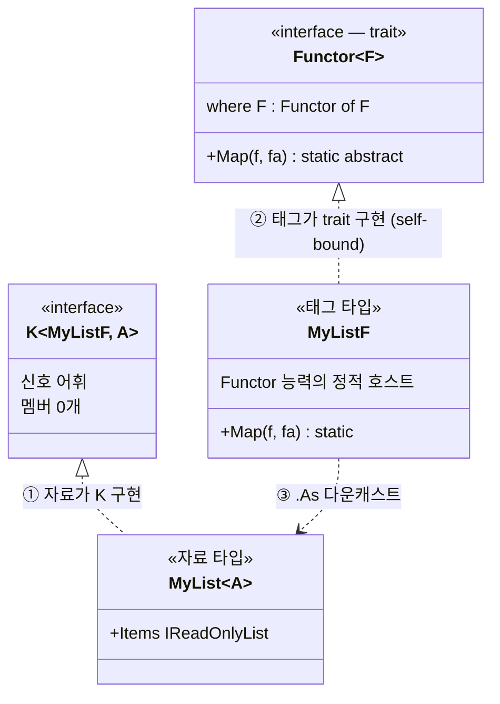

# 2장. Higher Kinds (수많은 Elevated World 를 하나의 어휘로)

> 이 장에서 다룰 주제 — 1장의 비유 (Normal / Elevated) 를 C# 코드로 표현 하는 도구. C# 의 제네릭이 왜 수많은 Elevated World 를 하나의 어휘로 묶지 못하는가부터, 그 한계를 우회하는 `K<F, A>` 마커 인터페이스, self-bound 제약, static abstract 멤버까지. 언어가 직접 표현 못 하는 함수형 추상을 C# 안에서 가능하게 만드는 3 도구.

> 이 장을 마치면 할 수 있게 되는 것
> - [ ] 왜 C# 의 제네릭만으로는 Elevated World 추상이 어려운가 답할 수 있습니다.
> - [ ] kind 와 Higher Kinds 의 발상을 한 문장으로 설명할 수 있습니다.
> - [ ] `K<F, A>` 의 `F` 와 `A` 가 각각 무엇을 뜻하는지 설명할 수 있습니다.
> - [ ] 3-tuple 패턴 (자료 / 태그 / trait 구현) 의 세 조각이 어떤 책임을 지는지 코드로 보여줄 수 있습니다.
> - [ ] self-bound 제약 `where F : Trait<F>` 가 왜 필요한가 답할 수 있습니다.
> - [ ] static abstract 가 인스턴스 메서드와 무엇이 다른지 한 줄로 설명할 수 있습니다.
> - [ ] 어떤 Functor 든 받는 일반 함수를 직접 작성할 수 있습니다.

---

## §2.1 1장의 비유를 코드 어휘로 옮기기

1장에서 Normal World 의 시민 (`int`, `string`) 과 Elevated World 의 시민 (`Option<int>`, `List<string>`) 두 비유를 봤습니다. 이제 진짜 코드의 문제로 들어섭니다. Elevated World 의 시민이 너무 많습니다.

```csharp
Option<int>        maybeN;
List<int>          manyN;
Result<int>        okN;
Task<int>          futureN;
Validation<E, int> validN;
// ... 그 외 수십 개
```

여기서 1부의 야망이 등장합니다. 어떤 Elevated World 인지에 무관하게 `map`, `apply`, `bind` 같은 추상을 정의하고 싶습니다. 그러려면 F 라는 자리가 필요합니다. F 는 Elevated World 의 이름입니다. `Option`, `List`, `Result` 같은 컨테이너 종류입니다.

이 야망의 실체는 함수형의 본질 — 합성 가능한 Elevated World 로 lift (§1.6.1) 의 둘째 축 type class 다형성입니다. 능력 (`Map`, `Bind`, `Fold`) 이 객체가 아닌 *trait* 에 살고, F 라는 어휘 한 자리에 자유롭게 끼어들 수 있어야 합니다. 그 어휘를 컴파일 타임에 강제하는 도구가 2장의 주제입니다.

#### Generic 매개변수가 다시 generic 일 수 있다면? — 가상의 코드로 본 가치

C# 이 **Generic 매개변수 자체가 다시 generic** 일 수 있다면 (즉 Higher Kinds 직접 지원 — §2.3 에서 자세히) 다음 같은 코드가 가능합니다.

```csharp
// ✗ 가상의 C# 어법 — 실제로는 컴파일 안 됨 (§2.3.2 에서 자세히)
public interface Functor<F>     // F 가 type constructor (kind * → *) 매개변수
{
    static abstract F<B> Map<A, B>(Func<A, B> f, F<A> fa);
    //              ─┬─                          ─┬─
    //              F<B>: F 가 다시 B 를 받음     F<A>: F 가 다시 A 를 받음
    //              ↑ Generic 매개변수 F 가 다시 generic — 이 자리가 핵심
}

// 변환 메서드 한 번 정의 (Normal World 의 평범한 int → int)
static int DoubleIt(int n) => n * 2;

// 호출 — 같은 메서드가 모든 Elevated World 위에서 자동 동작
//   (C# 의 method group conversion 으로 메서드 이름을 직접 인자로 전달)
//   ↓ F 자리에 컨테이너 이름을 바꿔 끼움
Functor<MyList  >.Map(DoubleIt, [1, 2, 3])     // F = MyList    → [2, 4, 6]
Functor<MyMaybe >.Map(DoubleIt, Just(42))      // F = MyMaybe   → Just(84)
Functor<MyTask  >.Map(DoubleIt, FetchTask())   // F = MyTask    → 비동기 결과 2배
Functor<MyResult>.Map(DoubleIt, Ok(7))         // F = MyResult  → Ok(14)
```

**이 가상 코드가 보여주는 가치** — `Functor<MyList>` / `Functor<MyMaybe>` / `Functor<MyTask>` 같이 F 자리 (Functor 뒤의 자리) 에 컨테이너 이름을 바꿔 끼우는 것만으로 같은 `Map` 함수가 모든 컨테이너 위에서 동작합니다. F 자리 하나가 수십 개의 컨테이너를 한 어휘로 묶는 셈입니다.

그래서 함수형의 핵심 가치가 **`Map` 함수 한 번 정의 → N 개 컨테이너 자동 적용** 입니다. 새 컨테이너 (예: `MyEither`) 가 등장해도 `Map` 을 다시 짤 필요 없음 — F 자리에 `MyEither` 만 넣어주면 됩니다. 이게 §1.6.1 의 둘째 축 type class 다형성 — `Map` 같은 능력이 컨테이너마다 따로가 아니라 trait (`Functor`) 하나에 한 번 자리잡는 형태입니다.

#### C# 의 한계와 세 단계 우회

문제는 C# 이 **Generic 매개변수가 다시 generic 일 수 없음** (`T<X>` 형태 거부) 입니다. Haskell 의 `class Functor f where fmap :: (a → b) → f a → f b` 같은 자유로운 어법이 C# 에는 없습니다. 위의 가상 코드는 컴파일 오류 — F 가 매개변수인데 다시 `F<B>` 형태로 사용. 그래서 C# 어법 안에서 어디까지 가능한가를 세 단계로 시도합니다.

| 시도 | 자리 | C# 어휘 | 한계 / 해결 |
|---|---|---|---|
| **첫 번째** (§2.2.1) | object 타입 — 모든 완성 타입의 공통 base (Order 0 의 가장 추상 자리) | 비제네릭 `Functor` 인터페이스 + `Func<object, object>` | ✗ 타입 정보 모두 손실 (boxing / 캐스트 강제 / 컨테이너 구분 불가) |
| **두 번째** (§2.2.2) | generic 타입 — T 자리에 완성 타입 (Order 0) 만 | `Functor<A>` 의 A 만 매개변수 | ✗ F 자체가 시그니처에서 사라짐 (모양 보존 못함 / 체이닝 타입 모호) |
| **세 번째** (§2.4) | **K<F, A> 우회** — Order 0 어휘로 Order 2 인코딩 | 빈 마커 인터페이스 `K<F, A>` + 3-tuple 패턴 | ✓ 해결 — 약간의 보일러플레이트 비용 |

세 번째 시도가 LanguageExt v5 의 결정적 우회 — Higher Kinds 의 다형성 (Order 2) 을 C# 의 generic 어휘 (Order 1) 안에 brand / defunctionalization 기법 (Yallop & White 2014, Moors et al. 2008) 으로 인코딩. 위 가상 코드의 정확한 의도가 §2.4 의 K<F, A> 우회 후 어떻게 표현되는지 — §2.7 에서 `MyList` 진화 예제로 직접 봅니다.

---

## §2.2 두 시도와 세 약점 — 목적 (왜 우회가 필요한가)

### 2.2.1 첫 번째 시도 — 비제네릭 인터페이스

가장 단순한 시도부터 합니다. 모든 Elevated 컨테이너가 공통으로 따르는 인터페이스를 만들면 안 될까?

```csharp
// 첫 번째 시도 — 비제네릭 Functor
public interface Functor
{
    Functor Map(Func<object, object> f);
}

public sealed class MyList : Functor
{
    private readonly List<object> _items;
    public MyList(IEnumerable<object> items) { _items = items.ToList(); }

    public Functor Map(Func<object, object> f) =>
        new MyList(_items.Select(f));
}
```

이 코드는 컴파일은 됩니다. 그러나 치명적 약점이 있습니다. 그 약점의 출처는 한 단어, `object` 입니다. `Func<object, object>` 라는 시그니처가 모든 타입 정보를 object 로 묶어 버립니다.

**첫째, 호출자가 매번 boxing / 캐스트 해야 합니다**

```csharp
MyList xs = new MyList(new object[] { 1, 2, 3 });   // new object[] {1,2,3}: int → object 로 boxing
Functor result = xs.Map(x => ((int)x).ToString());
// x          : 컴파일 타임 타입이 object 일 뿐
// (int)x     : 캐스트 필요 (object → int) — 실수하면 InvalidCastException 런타임 발생
// .ToString(): 결과는 string 이지만 Func<object, object> 시그니처가 다시 object 로 묶어 버린다
```

`Func<object, object>` 의 입력 `x` 는 컴파일 타임에 object 입니다. 안에 진짜로 `int` 가 들어 있어도 컴파일러는 모릅니다. 사용자가 `(int)x` 로 직접 캐스트 해야 합니다. 캐스트가 잘못되면 런타임에 InvalidCastException 이 발생합니다. 컴파일러가 막아 줄 수 없습니다.

**둘째, 결과 타입에서 정보가 모두 사라집니다**

```csharp
Functor result = xs.Map(x => ((int)x).ToString());
// result: 정적 타입이 Functor 일 뿐
//   - 안에 string 이 든 것을 컴파일러가 아나? 모른다 (Func<object, object> 였으니까)
//   - 원래 MyList 였는지 다른 Functor 였는지 컴파일러가 아나? 모른다
```

호출 직후 `result` 의 정적 타입은 `Functor` 입니다. 안에 어떤 타입이 들었는지, 원래 어떤 컨테이너였는지 모두 시그니처에서 사라집니다. 그래서 다음 단계 코드를 읽을 수 없습니다.

```csharp
// 호출자가 결과를 쓰려면 ...
string first = (string)((MyList)result)._items[0];   // ← MyList 인지 추측 + string 인지 추측 + 두 번 캐스트
// 컴파일러: "result 가 정말 MyList 인지, 안에 string 이 있는지 — 나는 모름. 직접 책임지세요."
```

두 번의 캐스트가 필요합니다. 각 캐스트가 런타임 실패 가능성을 안고 있습니다.

**셋째, 서로 다른 컨테이너가 시그니처에서 구분되지 않습니다**

가장 위험한 점입니다. `Functor` 라는 인터페이스만 보고 있으면 `MyList` 와 `MyOption` 이 교환 가능 해 보입니다.

```csharp
Functor a = new MyList(new object[] { 1, 2, 3 });
Functor b = new MyOption(42);                          // 가상의 MyOption 도 Functor 구현

void Process(Functor f) { /* ... */ }                  // 받는 쪽은 어느 컨테이너인지 모름
Process(a);                                            // MyList 도 OK
Process(b);                                            // MyOption 도 OK — 컴파일러는 둘을 구분 못 함
```

함수형의 강점 (시그니처가 거짓말을 안 합니다) 이 사라집니다. `Functor` 시그니처는 "여기 어떤 컨테이너든 들어옵니다" 만 말할뿐, 어떤 컨테이너 인지 말하지 못합니다. 호출자는 런타임 분기 (`if (f is MyList) ...`) 로 컨테이너 종류를 추측해야 합니다. 객체 지향의 visitor 패턴으로 돌아가는 모양입니다.

**결론 — `object` 가 추상의 의미를 무너뜨립니다**

세 약점의 공통 원인이 `object` 입니다. 모든 타입을 object 한 자루로 묶어 컴파일러가 시그니처 단계에서 추론할 정보를 모두 빼앗습니다. 그 결과 시그니처 기반 추론이 통째로 사라집니다. 함수형의 가장 큰 가치가 무너집니다.

이는 type class 다형성의 핵심 약속이 부재한 자리입니다. §1.6.1 의 둘째 축이 말하는 컴파일 타임 해소가 첫 번째 시도에서는 런타임 캐스트 + 객체 다형성 (object 의 subtype) 으로 대체 되어 함수형의 컴파일 타임 안전성이 무너집니다. 타입 안전성이 없는 추상은 추상이 아닙니다. `MyList<int>.Map(x => x.ToString())` 의 결과가 컴파일 타임에 `MyList<string>` 으로 알려져야 합니다. 그래야 다음 줄에서 캐스트 없이 곧장 쓸 수 있고, 잘못된 가정을 컴파일러가 막아 줍니다.

다음 시도는 제네릭으로 `object` 를 없앱니다.

### 2.2.2 두 번째 시도 — 제네릭 인터페이스

타입 안전성을 위해 제네릭을 도입합니다.

```csharp
// 두 번째 시도 — 제네릭 Functor<A>
public interface Functor<A>
{
    Functor<B> Map<B>(Func<A, B> f);
}

public sealed class MyList<A> : Functor<A>
{
    private readonly List<A> _items;
    public MyList(IEnumerable<A> items) { _items = items.ToList(); }

    public Functor<B> Map<B>(Func<A, B> f) =>
        new MyList<B>(_items.Select(f));
}
```

이전보다 낫습니다. `xs.Map(x => x.ToString())` 의 결과는 `Functor<string>` 이라 안의 타입이 추적 됩니다. 그러나 또 다른 결정적 약점이 남습니다.

```csharp
MyList<int> xs = new MyList<int>(new[] { 1, 2, 3 });
Functor<string> result = xs.Map(x => x.ToString());
// 결과 타입은 Functor<string>.
// 그런데 MyList<string> 인가? MyOption<string> 인가? — 컴파일러는 모른다.
```

`Functor<string>` 이라는 정보는 있지만 컨테이너가 List 였는지 Option 이었는지가 사라졌습니다. F 자체가 시그니처에서 빠졌기 때문입니다.

**왜 F 자체가 시그니처에 있어야 하는가**

문제를 더 깊게 봅니다. F 자체가 시그니처에 없으면 세 가지 결정적 능력을 잃습니다.

**첫째, 모양 보존 (shape preservation) 의 약속이 사라집니다**

함수형의 Functor 는 "모양 보존" 의 약속입니다. `List` 를 받으면 `List` 를 돌려줍니다. 시그니처에 그 약속이 명시되어야 합니다.

```csharp
// F 가 있으면 — 시그니처가 "모양 보존" 을 강제
    F<B> Map<F, A, B>(Func<A, B> f, F<A> fa);
//  ─┬──                            ─┬──
//  같은 F                           같은 F   ← 컴파일러가 검증
//
// List<int> 를 넣으면 List<string> 이 나온다 (List → List 약속)
// Option<int> 를 넣으면 Option<string> 이 나온다 (Option → Option 약속)

// F 가 없으면 — 약속이 사라진다
    Functor<B> Map<A, B>(Func<A, B> f);
//  ────┬─────
//  결과는 그냥 "어떤 Functor". List 였는지 Option 이었는지 시그니처 단계에서 사라짐.
//  잘못 구현해도 컴파일러가 막을 수 없다 — List 의 Map 이 Option 을 돌려줘도 OK.
```

`MyList<int>.Map(...)` 이 모양을 어겨 `MyOption<string>` 을 돌려주는 구현이 가능해집니다. 컴파일러는 막지 못합니다. 시그니처가 "어떤 Functor 든" 만 약속하기 때문입니다.

**둘째, 체이닝 시 타입이 점점 모호해집니다**

LINQ 스타일의 Map 체인에서 매 단계마다 타입 정보가 약화됩니다.

```csharp
MyList<int>     xs = new MyList<int>(new[] { 1, 2, 3 });
Functor<string> a  = xs.Map(x => x.ToString());      // 1단계 후: Functor<string> — List 정보 손실
Functor<int>    b  = a.Map(s => s.Length);           // 2단계 후: Functor<int> — 이제 캐스트도 불가능
// b.Items 같은 List 고유 멤버 접근 불가 — Functor 에는 없으니까
```

첫 `Map` 호출이 끝나면 컴파일러는 결과가 List 인지 모릅니다. 그래서 `(MyList<string>)a.Map(...)` 같이 매 단계 캐스트 해야 합니다. 런타임 InvalidCastException 위험을 매 호출마다 짊어집니다.

**셋째, 어떤 F 든 받는 일반 함수를 쓸 수 없습니다**

가장 큰 손실입니다. 함수형의 진짜 가치는 한 번 정의에 모든 컨테이너 자동 동작입니다. F 가 시그니처에 있어야 이게 가능합니다.

```csharp
// F 가 있으면 — 한 번 정의로 List, Option, Result 모두 적용
public static F<B> ApplyTwice<F, A, B>(F<A> fa, Func<A, B> f, Func<B, B> g)
    where F : Functor<F> =>         // ← F 를 매개변수로 받는다
    F.Map(g, F.Map(f, fa));         // 두 번 Map — 같은 F 가 유지됨

// 호출:
// ApplyTwice<MyListF, int, string>(xs, n => n.ToString(), s => s + "!");
// ApplyTwice<MyOptionF, int, string>(opt, n => n.ToString(), s => s + "!");
// ApplyTwice<MyResultF, int, string>(res, n => n.ToString(), s => s + "!");

// F 가 없으면 — 컨테이너마다 따로 정의해야 한다
public static Functor<B> ApplyTwiceForList<A, B>(MyList<A> xs, Func<A, B> f, Func<B, B> g) =>
    (MyList<B>)xs.Map(f).Map(g);    // List 전용 — 결과를 다시 캐스트해야 함
public static Functor<B> ApplyTwiceForOption<A, B>(MyOption<A> opt, ...) { /* 똑같은 코드 또 작성 */ }
public static Functor<B> ApplyTwiceForResult<A, B>(MyResult<A> res, ...) { /* 또 작성 */ }
```

같은 패턴을 컨테이너마다 다시 작성 하게 됩니다. 함수형의 가장 큰 ROI 가 사라집니다. Sum, Count, All, Any 같은 모든 자유 함수가 `MyList`, `MyOption`, `MyResult`, ... 마다 별도로 정의 되어야 합니다. 이건 §2.7 의 3-tuple 패턴과 §2.8 의 어떤 Functor 든 받는 일반 함수가 풀려는 핵심 문제입니다.

**결론 — F 자체를 매개변수로 받으려면**

이걸 풀려면 컨테이너 자체를 매개변수로 받아야 합니다.

```csharp
// 세 번째 시도 — 컨테이너 자체(F<>)를 매개변수로 (컴파일 안 됨!)
public interface Functor<F<>>
{
        F<B> Map<A, B>(Func<A, B> f, F<A> fa);
    //  ─┬──
    //  F<_> 는 완성되지 않은 타입 — C# 의 제네릭은 받지 못한다
}
```

이 코드는 컴파일되지 않습니다. C# 의 제네릭 매개변수는 완성된 타입 (`int`, `string`, `List<int>`) 만 받습니다. `List<_>` 같이 자료 타입을 기다리는 미완성 타입 인 F 자체는 매개변수가 될 수 없습니다.

이게 Higher Kinds (고차 카인드) 의 영역이고, C# 의 원리적 한계입니다.

### 2.2.3 한계의 출처 — Higher Kinds 미지원

이 한계의 출처는 C# 의 타입 시스템의 설계입니다. 자세한 발상은 Higher Kinds — 타입의 종류 (§2.3) 에서 봅니다. 지금은 결론만 짚습니다. C# 은 Higher Kinds 를 직접 지원하지 않습니다. 그래서 우회 방법이 필요합니다.

LanguageExt v5 (이 책이 따르는 라이브러리) 의 결정적 발상은 다음과 같습니다. 직접 지원이 없다면 간접 신호 방식을 쓴다는 것입니다. 그게 `K<F, A>` 입니다 (§2.4 에서 본격적으로 봅니다).

---

## §2.3 Higher Kinds — 타입의 종류

> **Higher-Kinded Generic (고차 종류 제네릭) — 정의**
>
> 타입 생성자 (type constructor) 를 그 자체로 매개변수로 받는 제네릭을 일컫습니다. 즉 "타입을 받아 타입을 만드는 함수" (예: `List<_>`, `Option<_>`) 를 다른 코드가 인자로 받아 사용 할 수 있게 하는 타입 시스템의 능력. Haskell·Scala 같은 함수형 언어는 이를 일급 시민으로 직접 지원하고, C#·Java·Kotlin 은 언어 차원에서 지원하지 않아 우회 (§2.4 의 `K<F, A>`) 가 필요합니다.
>
> 영어 원문은 *"A kind is the type of a type constructor."* (Wikipedia, Kind (type theory)) — kind 는 "타입의 타입". `* → *` 는 `List` 같은 unary type constructor 의 kind. Higher-Kinded Polymorphism 은이 kind `* → *` 의 자리를 추상화 하는 다형성을 의미합니다.
>
> **Higher = 고차** — 고차 함수 (HOF) 가 함수를 받는 함수이듯, *Higher Kinds* 는 타입 생성자를 받는 타입입니다. 같은 발상이 값 차원에서 타입 차원으로 올라간 자리입니다. 자세한 비교는 Order 단계 표 (§2.3.2) 에서 봅니다.

### 2.3.1 kind 의 발상

타입 시스템에는 layer 가 있습니다.

```
term level (값의 세계):
    값:           42,  "hello",  new List<int>{ 1, 2, 3 }
    함수:         Add(int, int) → int
     │
     │ 이 값의 타입은?
     ↓
type level (타입의 세계):
    타입:         int,  string,  List<int>
    타입 함수:     List<_>,  Option<_>     ← 자료 타입을 받아 새 타입을 만든다
     │
     │ 이 타입의 kind 는?
     ↓
kind level (타입의 종류):
    *            완성된 타입               (예: int,    string,  List<int>)
    * → *        자료 하나를 받는 타입 함수  (예: List,   Option,  Task)
    * → * → *    자료 둘을 받는 타입 함수    (예: Either, Dictionary,  Func)
```

| kind | 비유 | 예 |
|---|---|---|
| `*` | 완성된 우편함 | `int`, `string`, `List<int>` |
| `* → *` | 우편함을 만드는 공장 | `List<_>`, `Option<_>` (자료를 받아야 완성) |
| `* → * → *` | 두 자료를 받는 공장 | `Either<_, _>`, `Func<_, _>` |

`int` 는 완성된 타입입니다. 변수에 곧장 담을 수 있습니다. `List<_>` 는 다릅니다. 타입 함수 (위키 표준 type constructor, 한국어 타입 생성자) 라서 `List<int>` 처럼 자료 타입을 채워야 완성됩니다. kind `* → *` 는 "kind `*` 를 받아 kind `*` 를 만듭니다" 는 의미입니다.

다만 `List<T>` 같은 **C# 어법의 T 자리** 가 어느 단계인지 헷갈리기 쉽습니다. 다음 표가 세 단계를 명확히 합니다.

| 어법 | 의미 | kind | 변수에 담을 수 있나? |
|---|---|---|---|
| `List<int>` | T 자리에 `int` 가 채워진 완성 타입 | `*` | ✓ |
| `List<T>` (C# 어법) | T 가 함수의 타입 매개변수 — 호출 시 정해지면 완성 타입 | `*` (T 가 정해지면) | ✓ |
| `List<_>` (Scala) / `List` (Haskell) | T 자리가 언제든 채워질 빈 자리 — *type constructor* | `* → *` | ✗ (자료를 받아야 완성) |

함수 안의 `List<T>` 는 그 함수의 타입 매개변수 T 가 호출 시 어떤 구체 타입으로 정해지면 완성 타입 (kind `*`) 입니다. Haskell 의 `List` / Scala 의 `List<_>` 는 T 자리 자체를 일급 시민으로 가리키는 *type constructor* — kind `* → *`. C# 의 어법 으로는 `List<T>` 만 가능합니다 (제네릭 정의). type constructor 자체 (Haskell 의 `List`) 를 가리킬 어법이 없어 §2.4 의 `K<F, A>` 우회가 필요합니다.

### 2.3.2 *Higher* 의 의미 — Order 단계로 본 고차

**Higher Kinds** 의 *Higher* 가 무엇인가? 고차. 함수 nesting 의 깊이를 **Order** 어휘로 정량화하면 직감이 잡힙니다. 1부 독자는 이미 고차 함수 어휘에 익숙합니다 (*map / fold / bind* 가 모두 함수를 받는 함수). HKT 는 같은 Order 어휘를 한 층 위 (타입 차원) 에서 적용한 자리입니다.

**값 차원의 Order 단계**

| Order | 타입 모양 | 값의 예 | 어휘 |
|---|---|---|---|
| Order 0 | `Int`, `Double` | `5`, `5.0` | 평범한 값 |
| Order 1 | `Int → Int` | `x → x * 2` | 평범한 함수 |
| Order 2 | `(Int → Int) → Int` | `fn → fn(5)` | **고차 함수 (HOF)** — 함수를 받는 함수 |
| Order 3 | `((Int → Int) → Int) → Int` | ... | 더 높은 차수 |

핵심 — *Order* 가 화살표 nesting 의 좌측 깊이입니다. *Order 2* 는 함수가 함수를 받는 자리. **`map(f, xs)` / `fold(step, seed, xs)` 가 모두 Order 2 — 함수를 매개변수로 받습니다**.

> **다인자 ≠ 고차 (결정적 구분)** — `(Int, Int) → Int` (예: `add(x, y)`) 는 2인자 함수 이지 고차 함수가 아닙니다. 화살표 좌측 인자가 함수가 아니라 평범한 값입니다. *Higher* 의 의미는 인자 개수가 아니라 인자 자리에 한 단계 위 어휘가 들어옴입니다.

**타입 차원의 Order 단계 (kind 어법)**

값 차원의 Order 단계가 타입 차원에 그대로 평행입니다. 화살표가 `*` 로, 값이 타입으로 바뀝니다.

| Order | kind | 예 (Haskell) | C# 일급 지원 | 어휘 |
|---|---|---|---|---|
| Order 0 | `*` | `Int`, `[Int]` | ✓ `int`, `List<int>` (완성 타입) | 완성 타입 |
| Order 1 | `* → *` | `[]`, `Maybe`, `IO` | ✗ type constructor 자체는 일급 불가 (`List<int>` 같은 완성형만 다룸) | type constructor |
| Order 2 | `(* → *) → ...` | `Functor f` 의 `f` 자리 | ✗ `K<F, A>` 우회 필요 | **고차 타입 (HKT)** |

> **kind 와 C# 의 일급 지원은 다른 차원** — *kind* 는 개념 (언어 무관). `List` 라는 type constructor 는 어느 언어에서든 kind `* → *` (Order 1). 다만 언어가 그 type constructor 를 일급으로 다루느냐는 별개. Haskell 의 `[]` / Scala 의 `List` 는 type constructor 를 일급으로 (`Functor f` 의 `f` 에 직접 전달). **C# 의 `List<T>` 는 개념상 같은 kind `* → *` 이지만, C# 어법으로는 `List<int>` (완성 타입, Order 0) 만 일급** — `List` 자체 (type constructor) 를 매개변수로 전달 못 합니다. C# 가 Order 1 부터 일급으로 못 다루는 것이 정확히 §2.4 의 `K<F, A>` 우회 동기.

**Order 단계 = generic 매개변수 개수** (값 차원 표와 평행): Order 0 = 0개, Order 1 = 1개 (`A`), Order 2 = 2개 (`F` + `A`, F 가 type constructor). 값 차원의 화살표 nesting 이 타입 차원의 kind 화살표 nesting 과 같은 발상입니다.

> **다인자 ≠ 고차 (타입 차원에서도)** — `Dictionary<K, V>` 의 kind 는 `* → * → *` — 2인자 type constructor. 다만 인자가 모두 완성 타입 (`*`) 이라 Higher 가 아닙니다. *Higher Kinds* 는 인자 자리에 type constructor (`* → *`) 가 들어옴 — kind `(* → *) → ...`.

값 차원에서 Order 2 의 `(Int → Int) → Int` 가 함수를 받는 자리 이듯, 타입 차원에서 Order 2 의 `(* → *) → ...` 가 type constructor 를 받는 자리입니다. **Functor 의 `f` 가 그 자리** 입니다.

**다형성의 범위 (컴파일 타임에 결정)** — *Higher Kinds* 의 자리는 정확히 컴파일 타임 다형성의 범위 확장입니다. 일반 제네릭 (`List<T>`) 이 완성 타입 (kind `*`) 에 대한 다형성 — T 가 `int` / `string` / ... 중 어느 완성 타입이든 컴파일러가 한 줄로 동작을 보장합니다. *Higher-Kinded Polymorphism* 은 type constructor (kind `* → *`) 에 대한 다형성 — F 가 `List` / `Option` / `Task` / ... 중 어느 type constructor 이든 컴파일러가 한 줄로 동작을 보장합니다. 다형성의 차원이 한 단계 위 (Order 1 → Order 2) 로 확장된 자리입니다.

다만 C# 의 제네릭 매개변수 T 는 완성 타입 (Order 0) 만 받습니다. `List<T>` 정의는 가능하지만 T 자리에는 `int`, `string` 같은 완성 타입만 들어갑니다 — `List` 같은 type constructor (Order 1) 자체를 T 자리에 못 넣습니다. *Order 2* 가 되려면 T 자체가 다시 매개변수를 받는 형태 — 즉 `T<X>` 같이 T 가 type constructor (kind `* → *`) 여야 합니다. 컴파일이 안 되는 자리를 직접 보면:

```csharp
// 시도 — T<X> 형태 (Higher Kinds) 를 C# 으로 직접 표현
public interface Functor<F>
{
    // F 가 type constructor (kind * → *) 라고 가정하고
    // F<A> 에서 A 를 받아 F<B> 로 변환하는 Map 정의를 시도
    static abstract F<B> Map<A, B>(Func<A, B> f, F<A> fa);
    //              ─┬─                          ─┬─
    //              F<B>: F 가 다시 B 를 받음 — T<X> 형태
    //              F<A>: F 가 다시 A 를 받음 — T<X> 형태
}

// ✗ 컴파일 오류:
//   CS0307: 'F' is a type parameter, which is not valid in the given context
//   CS0246: The type or namespace name 'F' could not be found
//
// C# 컴파일러는 F 를 완성 타입 (kind *) 으로만 받음.
//   완성 타입 = int, string, List<int>, Task<string> 같이 T 자리가 모두 채워진 구체 타입.
//   List 자체 / Task 자체 (type constructor, kind * → *) 는 C# 에서 표현 안 됨.
// F<...> 어법 (F 가 다시 매개변수를 받는 자리) 을 거부함.
```

§2.2.2 의 세 번째 시도 (`Functor<F<>>`) 와 같은 자리입니다. C# 의 제네릭 시스템이 완성 타입 자리 (kind `*`, Order 0) 에서만 *T* 를 받기 때문에 Order 2 의 자리 (T 가 type constructor 매개변수) 가 직접 표현 안 됩니다. Higher-Kinded Polymorphism 의 직접 지원이 없는 자리입니다. 그래서 §2.4 의 `K<F, A>` 우회로 Order 2 의 다형성을 Order 0 의 어휘 (F, A 가 완성 타입) 로 인코딩합니다.


**그림 2-5. Order 단계로 본 *Higher* — 값 차원과 타입 차원의 평행** — 아래 행 값 차원 (Normal World 색) 에 Order 0 → Order 1 → Order 2 (HOF) 세 박스. 위 행 타입 차원 (Elevated World 색) 에 같은 Order 0 → Order 1 → Order 2 (HKT) 세 박스. 가운데 점선 매핑이 같은 Order 끼리 평행을 시각화합니다. Order 2자리에서 고차 함수 (HOF) 가 값 차원의 함수를 받는 자리 이듯 고차 타입 (HKT) 이 타입 차원의 type constructor 를 받는 자리 — 두 차원이 같은 발상의 한 층 위 자리입니다. 우측 하단 회색 점선 박스에 다인자 ≠ 고차 안내 (`(Int, Int) → Int` / `Dictionary<K, V>` 는 인자 여러 개일뿐 Higher 가 아님).

### 2.3.3 함수형 추상이 원하는 kind

함수형 추상은 종종 kind `* → *` 위에서 살고 싶어 합니다. Functor 의 정의 ("어떤 컨테이너든 안의 값을 변환할 수 있습니다") 가 그 예입니다. "어떤 컨테이너" 의 컨테이너가 kind `* → *` 의 타입입니다.

Haskell 의 Functor 정의를 보면:

```haskell
-- Haskell — f 가 kind  →  임을 컴파일러가 추적
class Functor f where
    fmap :: (a -> b) -> f a -> f b
```

Scala 도 같은 발상을 자기 syntax 로 직접 지원합니다.

```scala
-- Scala — F[_] 의 underscore 가 "kind  → " 의 빈자리
trait Functor[F[_]]:
    def map[A, B](fa: F[A])(f: A => B): F[B]
```

Haskell 의 `f` 와 Scala 의 `F[_]` 가 같은 자리에 있고, kind `* → *` 의 타입만 들어갑니다. 컴파일러는 그 자리에 List, Maybe, Either Error 같은 kind `* → *` 인 타입만 허용하도록 검증합니다. Higher Kinds 가 언어의 일급 시민입니다.

C# 으로 그대로 옮기려 하면 §2.2.2 의 세 번째 시도처럼 컴파일이 안 됩니다. 미지원이 언어 차원의 한계 이기 때문입니다.

### 2.3.4 다른 언어들의 풀이

| 언어 | 지원 여부 | 어법 |
|---|---|---|
| Haskell | 일급 시민 | `class Functor f where fmap :: (a → b) → f a → f b` |
| Scala 2/3 | 일급 시민 (`F[_]` syntax 직접) | `trait Functor[F[_]] { def map[A,B](fa: F[A])(f: A=>B): F[B] }` |
| OCaml | 미지원 → brand 인코딩으로 우회 | `type ('a, 't) app` (Yallop–White) |
| Rust | 부분 지원 (GAT, 1.65+) | `type Output<U>` associated type |
| C# | 미지원 → 마커 인터페이스로 우회 | `public interface K<in F, A>;` (LanguageExt) |
| Java | 미지원 → 마커 인터페이스로 우회 | `_<F, A>` (Highj) |
| Kotlin | 미지원 → 마커 인터페이스로 우회 | `Kind<F, A>` (Arrow-kt) |

C#·Java·Kotlin 같은 Higher Kinds 미지원 언어의 우회 방식은 Lightweight Higher-Kinded Polymorphism (Yallop & White, FLOPS 2014) 논문이 정립한 brand / defunctionalization 기법에 뿌리를 둡니다. 핵심 발상 — kind `* → *` 의 자리에 평범한 kind `*` 의 빈 brand 타입 (예: `MyListF`) 을 두고, brand 와 진짜 컨테이너 타입의 1:1 대응을 사람이 관리 합니다. LanguageExt 의 `K<F, A>` 도, Arrow-kt 의 `Kind<F, A>` 도, Highj 의 `_<F, A>` 도 모두 같은 발상의 표현입니다.

우회의 비용은 학습 곡선 (3-tuple 패턴 + 다운캐스트 + self-bound 제약) 입니다. 대가는 Haskell / Scala 의 거의 모든 함수형 추상이 C# 에서 표현 가능해진다는 점입니다.

> 학술적 기반 — Higher Kinds 의 형식 이론은 Moors, Piessens, Odersky 의 *Generics of a Higher Kind* (OOPSLA 2008) 가 정립했습니다. 논문이 같은 발상을 세 어휘로 동의어 — *type constructor polymorphism* (Scala 용어), *higher-kinded types* (Haskell 용어), *higher-order genericity* (논문 abstract). 셋 모두 Higher Order Function 의 타입 차원 평행 — *abstract over types that abstract over types* 가 *Higher* 의 정의입니다. Scala 2.5 (2007) 가 처음으로 일급 시민으로 지원했고, 그 위에 Yallop & White (FLOPS 2014) 가 HKT 미지원 언어의 brand / defunctionalization 우회를 정립했습니다.

> 처음 만나면 어색한 자리 — kind 의 개념은 한 번에 잡히지 않아도 됩니다. §2.4 의 우회로 곧장 넘어가도 무방합니다. 우회 코드를 익힌 뒤 왜 그게 가능한가의 답으로 §2.3 을 다시 봐도 좋습니다.

---

## §2.4 `K<F, A>` 마커 인터페이스 — 빈 한 줄로 어떻게 우회하는가

§2.3 까지 왜 우회가 필요한가와 그 한계의 출처 (Higher Kinds 미지원) 를 봤습니다. 이제 LanguageExt v5 의 결정적 우회인 `K<F, A>` 마커 인터페이스의 발상부터 봅니다. 실제 코드 적용은 MyList 진화와 3-tuple 패턴 (§2.7) 에서 봅니다.

### 2.4.1 한 줄 코드

이 책의 가장 중요한 한 줄이 등장합니다.

```csharp
public interface K<in F, A>;
```

빈 인터페이스입니다. 멤버가 없습니다. 그런데이 한 줄이 함수형 추상의 모든 가능성을 엽니다.

### 2.4.2 발상 — 빈 인터페이스가 신호 역할 + 충분한 이유

발상은 단순합니다. C# 이 kind `* → *` (Order 1, 즉 T<X> 형태) 의 타입을 직접 매개변수로 받지 못한다면, kind `*` (Order 0, 완성 타입) 의 대체 신호 타입을 만들어 거기 매개변수로 받자.

```csharp
// F 안에 A    ← 이 형태만으로 "F 라는 컨테이너 안에 A 라는 자료가 있다" 가 전달된다
K<F, A>
```

#### 왜 type constructor 를 그냥 못 넘기는가 — 일급 시민 문제

C# 이 막힌 핵심은 type constructor (`List`) 를 타입 인자로 전달 못 함입니다. Haskell·Scala 는 type constructor 자체를 일급으로 넘기지만, C# 은 완성 타입만 넘깁니다.

```csharp
// Haskell — type constructor (List) 를 직접 전달 (일급 시민)
//   instance Functor []        // [] = List 자체 (kind * → *)

// C# — type constructor 를 타입 인자로 못 넣음
//   Functor<List>              // ✗ 컴파일 오류 — List 는 완성 타입이 아님 (kind * → *)
//   Functor<List<int>>         // List<int> 는 완성 타입이지만 type constructor 가 아님
```

해결은 F 를 완성 타입으로 강등 하는 것입니다. 빈 태그 타입 (`MyListF`) 을 만들어 List 의 이름표 역할만 시킵니다.

```csharp
public sealed class MyListF { }   // 빈 태그 — 멤버 0개, kind * (완성 타입, Order 0)

// 이제 MyListF 는 완성 타입이라 타입 인자로 전달 가능
//   Functor<MyListF>           // ✓ (MyListF 는 완성 타입)
//   K<MyListF, int>            // ✓ "MyListF 안에 int 가 있다" 신호
```

#### `K<F, A>` 의 kind — `F<A>` 를 Order 0 으로 강등

```csharp
// K 의 kind 단계 (F, A 모두 완성 타입을 받음)
//   K               : * → * → *      (2인자 type constructor)
//   K<MyListF, int> : *              (둘 다 채운 완성 타입 — Order 0, 변수에 담을 수 있음)

// 원하던 것 vs 우회 — 같은 "F 안에 A" 를 다른 자리에서 표현
//   F<A>     ← F 가 type constructor (kind * → *) 매개변수 — Order 2 자리, C# 불가
//   K<F, A>  ← F 가 완성 타입 (빈 태그) 매개변수        — Order 0 어휘, C# 가능
```

`F<A>` 는 F 가 A 를 감싸는 모양 (F 가 type constructor) 이고, `K<F, A>` 는 K 가 F 와 A 를 나란히 받는 모양 (F 가 완성 타입 태그) 입니다. 같은 "F 안에 A 가 있다" 를 **Order 2 의 자리 (`F<A>`) → Order 0 의 어휘 (`K<F, A>`)** 로 인코딩한 것이 brand 우회의 핵심입니다. **C# 가 Order 1 (type constructor) 을 일급으로 못 다루니, Order 0 (완성 타입) 만으로 Order 2 의 다형성을 흉내낸 셈** 입니다 — `F` (원래 Order 1) 를 빈 태그 (Order 0) 로 강등하고, `A` (Order 0) 와 나란히 `K<F, A>` (Order 0) 로 묶었습니다. `in F` 의 `in` 은 contravariant 변성 표기 — 학습 초반에는 그대로 따라가면 충분하고, 깊은 의미는 LanguageExt 의 변성 문서에서 다룹니다.

**빈 인터페이스로 충분한 이유** — `K<F, A>` 에 메서드가 없어도 충분한 이유는 trait 의 정적 메서드가 별도 자리에 정의되기 때문입니다.

```csharp
public interface Functor<F> where F : Functor<F>
{
    static abstract K<F, B> Map<A, B>(Func<A, B> f, K<F, A> fa);
    //                                             ──────┬──────
    //                                                 K<F, A>: 데이터의 모양 신호 — 빈 인터페이스
}
```

인스턴스 메서드가 아니라 static abstract 이므로 `K<F, A>` 자체에는 메서드가 필요 없습니다. 동작은 F 라는 trait 의 정적 자리에 삽니다. 책임이 분리되어 있습니다 — `K<F, A>` 는 type-level 신호, `Functor<F>` 는 능력 정의. 이 발상이 실제 코드에서 어떻게 적용되는지 MyList 진화와 3-tuple 패턴 (§2.7) 에서 봅니다.

---

## §2.5 self-bound 제약과 static abstract 멤버

trait 정의 (§2.4) 를 다시 봅니다.

```csharp
public interface Functor<F> where F : Functor<F>
{
    static abstract K<F, B> Map<A, B>(Func<A, B> f, K<F, A> fa);
}
```

세 가지 핵심을 한 줄씩 봅니다.

### 2.5.1 첫 번째 도구 — self-bound (`where F : Functor<F>`)

F 가 자기 자신을 타입 인자로 받는 제약입니다. 이 한 줄이 F 의 자리에 들어갈 타입이 Functor 의 구현체임을 컴파일러에 보장합니다. 즉 F 의 자리에 함수 호출이 가능한 어휘가 생깁니다. 구현은 다음 형식이 강제됩니다. `readonly struct MyListF : Functor<MyListF> { … }` 형태입니다.

self-bound 가 없으면 어떻게 되는지 보자.

```csharp
// self-bound 없이
public interface Functor<F>
{
    static abstract K<F, B> Map<A, B>(Func<A, B> f, K<F, A> fa);
}

// 일반 함수에서 F.Map(...) 을 부르려면 ...
public static K<F, B> Apply<F, A, B>(Func<A, B> f, K<F, A> fa)
{
    // return F.Map(f, fa);         // ← 컴파일 오류! F 가 Functor 의 구현체임을 보장 못 함
}
```

self-bound 가 있으면 같은 함수가 다음처럼 정의됩니다.

```csharp
public static K<F, B> Apply<F, A, B>(Func<A, B> f, K<F, A> fa)
    where F : Functor<F> =>         // ← self-bound 가 전파됨
    F.Map(f, fa);                   // ← F.Map 호출 가능
```

`where F : Functor<F>` 가 F 가 Functor 의 정적 멤버를 갖는다는 약속을 컴파일러에 전달합니다.

### 2.5.2 두 번째 도구 — static abstract (타입의 정적 멤버 로서의 동작)

C# 11부터 인터페이스에 static abstract 메서드를 둘 수 있습니다. `Map` 이 인스턴스 메서드가 아니라 타입 자체의 정적 멤버입니다. 호출은 값의 메서드가 아니라 타입 이름의 메서드입니다. `K<MyListF, int> ys = MyListF.Map(f, xs);` 형태입니다.

```csharp
// 인스턴스 메서드라면:
// fa.Map(f)

// static abstract 이므로:
K<MyListF, int> ys = MyListF.Map(f, xs);
```

F 가 값이 아니라 어휘라는 점이 결정적입니다. `MyListF` 라는 타입 이름이 "이 Elevated World 의 동작" 을 호출하는 입구가 됩니다.

C# 11 (2022) 이전에는이 모양이 원리적으로 불가능했습니다. 객체 지향의 인스턴스 메서드는 객체에 능력을 붙이는 도구였고, 클래스의 정적 메서드는 상속·다형성이 안 됐습니다. C# 11 의 `static abstract` 가 정적 자리에 강제되는 다형성을 가능하게 만들어 능력이 *trait* 에 사는 함수형의 모양이 C# 어법 안에 들어왔습니다.

두 도구가 합쳐지면 F 라는 어휘 자체가 Functor 동작을 수행할 수 있는 자리가 됩니다.


**그림 2-4. 함수형 trait 의 두 핵심 도구** — 코드 한 블록에 두 도구 (첫 번째 `where F : Functor<F>` self-bound 제약 (주황), 두 번째 `static abstract` (초록)) 가 동시에 자리잡습니다. 두 도구가 합쳐져 F 라는 어휘 자체가 Functor 의 동작을 수행할 수 있는 자리가 됩니다. C# 의 제네릭만으로는 만들 수 없는 higher-kinded generic 을 두 도구가 가능하게 만듭니다.

---

## §2.6 모든 trait 가 따르는 공통 모양

1부의 trait 들 (`Functor`, `Foldable`, `Applicative`, `Monad`, `Traversable`) 은 모두 같은 모양입니다.

```csharp
public interface Functor<F>      where F : Functor<F>      { /* static abstract */ }
public interface Foldable<F>     where F : Foldable<F>     { /* static abstract */ }
public interface Applicative<F>  where F : Applicative<F>  { /* static abstract */ }
public interface Monad<F>        where F : Monad<F>        { /* static abstract */ }
```

이 일관성 덕분에 trait 한 개를 익히면 나머지는 시그니처만 바뀐 변형으로 읽힙니다.

또한 trait 들 사이의 상속 관계도 있습니다.

```csharp
public interface Applicative<F> : Functor<F>     where F : Applicative<F>  { … }
public interface Monad<F>       : Applicative<F> where F : Monad<F>        { … }
```

이 사슬이 학습 순서 (3장 Functor → 4장 Applicative → 6장 Monad) 와 정확히 맞물립니다.

---

## §2.7 `MyList` 진화 — 예제 (세 약점의 해결)

§2.3 ~ §2.6 의 기능 (Higher Kinds 이론 + `K<F, A>` 마커 + self-bound + static abstract + 3-tuple 공통 골격) 을 실제 코드에 적용합니다. §2.2.2 의 두 번째 시도가 막힌 곳 (F 가 시그니처에서 사라진 자리) 을 어떻게 `K<F, A>` 가 푸는지 같은 `MyList` 코드 위에서 단계적으로 봅니다. §2.2 의 세 약점 모두가 *§2.7.4 ~ §2.7.6* 에서 차례로 해소됩니다.

### 2.7.1 두 번째 시도의 진화 — `MyList` 다시 쓰기

§2.2.2 의 `MyList<A> : Functor<A>` 를 그대로 가져와 `K<F, A>` 로 다시 쓰면 어떻게 되는지 봅니다.

**Before — §2.2.2 두 번째 시도 (F 가 사라진 상태)**

```csharp
public interface Functor<A>
{
    Functor<B> Map<B>(Func<A, B> f);
}

public sealed class MyList<A> : Functor<A>
{
    private readonly List<A> _items;
    public MyList(IEnumerable<A> items) { _items = items.ToList(); }

    public Functor<B> Map<B>(Func<A, B> f) =>
        new MyList<B>(_items.Select(f));
}
```

**After — `K<F, A>` + 3-tuple (F 가 되살아남)**

```csharp
// 첫 번째 조각 신호 인터페이스 (한 줄)
public interface K<in F, A>;

// 두 번째 조각 자료 타입 — K<F, A> 로 "MyList 안에 A 가 있다" 신호
public sealed class MyList<A> : K<MyListF, A>
{
    public IReadOnlyList<A> Items { get; }
    public MyList(IEnumerable<A> items) { Items = items.ToList(); }
}

// 세 번째 조각 태그 타입 — 능력 (Map) 의 정적 호스트
public sealed class MyListF : Functor<MyListF>
{
    public static K<MyListF, B> Map<A, B>(Func<A, B> f, K<MyListF, A> fa)
    {
        var list = (MyList<A>)fa;                 // K<MyListF, A> → MyList<A> 다운캐스트
        return new MyList<B>(list.Items.Select(f));
    }
}

// 네 번째 조각 trait 정의 — 능력의 약속
public interface Functor<F> where F : Functor<F>
{
    static abstract K<F, B> Map<A, B>(Func<A, B> f, K<F, A> fa);
}
```

진화의 핵심 비교:

| 측면 | 두 번째 시도 (Before) | `K<F, A>` + 3-tuple (After) |
|---|---|---|
| F 자리 | 시그니처에서 사라짐 | `K<F, A>` 의 첫 매개변수로 부활 |
| 능력 호스트 | 자료 클래스 (`MyList<A>`) 의 인스턴스 메서드 | 태그 클래스 (`MyListF`) 의 정적 메서드 |
| 모양 보존 보장 | 시그니처에 없음 (`Functor<B>` 만 보장) | `K<F, B>` ↔ `K<F, A>` 의 F 동일성으로 박힘 |
| 코드 조각 수 | 2개 (인터페이스 + 자료) | 4개 (K + 자료 + 태그 + trait) |

조각 수가 늘었지만 각 조각의 책임이 분명 해집니다. 이게 3-tuple 패턴입니다.

| 조각 | 책임 |
|---|---|
| 자료 `MyList<A>` | 실제 값을 보관. `K<MyListF, A>` 를 구현해 "MyList 안에 A 가 있습니다" 는 신호. |
| 태그 `MyListF` | 컨테이너의 이름 + 정적 메서드 (`Map`) 의 호스트. |
| trait `Functor<F>` | 능력의 약속. F 가 Functor 면 어떤 정적 메서드를 가져야 하는지. |

세 조각이 느슨하게 결합 되어 있습니다. 한 조각의 변경이 다른 조각에 최소한의 영향만 미칩니다. K 마커 인터페이스는이 세 조각을 묶는 신호 어휘일뿐, 4번째 조각이 아닙니다.

### 2.7.2 3-tuple 의 구조



**그림 2-1. 3-tuple 패턴 (자료 / 태그 / trait 의 세 조각)** — 태그 타입 (`MyListF`) 이 trait (`Functor<F>`) 을 구현 하고, 자료 타입 (`MyList<A>`) 은 `K<MyListF, A>` 의 옷을 입어 태그의 정적 메서드 (`Map`) 안에서 다운캐스트로 본 모습을 드러냅니다. 세 조각이 느슨하게 결합 되어 책임이 분리됩니다.

### 2.7.3 호출 모양 — 정적 자리에서 부르기

`MyList<A>` 의 `Map` 호출은 값의 인스턴스 메서드가 아니라 태그 타입의 정적 메서드입니다.

```csharp
MyList<int>        xs = new MyList<int>(new[] { 1, 2, 3 });
K<MyListF, string> ys = MyListF.Map<int, string>(x => x.ToString(), xs);
//                      ──────┬──────
//                      타입 이름이 호출 진입점
//                      ("MyListF 의 Map") — 인스턴스가 아니다
```

값 `xs` 의 인스턴스 메서드가 아니라 `MyListF` 라는 어휘가 `Map` 을 부릅니다. `xs` 는 인자로 전달 될 뿐입니다. 이게 능력이 객체가 아니라 *trait* (태그 타입을 통해 부착) 에 사는 함수형의 모양입니다.

### 2.7.4 §2.2 첫 번째 약점의 해결 — 모양 보존이 시그니처에 박힙니다

첫 번째 약점 (§2.2.2) 은 모양 보존이 시그니처에 안 박혀 있음 이었습니다. 잘못 구현해도 컴파일러가 막을 수 없었습니다. `K<F, A>` + 3-tuple 에서는 다릅니다.

```csharp
// 두 번째 시도 (Before) — 모양 보존 약속 없음
public interface Functor<A>
{
    Functor<B> Map<B>(Func<A, B> f);
//  ────┬─────
//  결과는 그냥 "어떤 Functor". List 였는지 Option 이었는지 시그니처가 모름.
}

// K<F, A> + 3-tuple (After) — 시그니처가 모양 보존을 강제
public interface Functor<F> where F : Functor<F>
{
    static abstract K<F, B> Map<A, B>(Func<A, B> f, K<F, A> fa);
//                   ─┬─                             ─┬─
//                   같은 F                           같은 F  ← 컴파일러가 검증
}
```

`MyListF.Map` 의 출력 타입은 `K<MyListF, B>` 이고, F = MyListF 가 시그니처에 박혀 있습니다. 잘못된 구현 (List 의 Map 이 Option 을 돌려주는) 은 컴파일러가 거부 합니다.

### 2.7.5 §2.2 두 번째 약점의 해결 — 체이닝 시 F 가 살아 있습니다

두 번째 약점 (§2.2.2) 은 체이닝 시 컨테이너 타입이 점점 모호해짐 이었습니다. 같은 체이닝 코드가 `K<F, A>` + 3-tuple 에서 어떻게 바뀌는지 직접 비교합니다.

```csharp
// Before — §2.2.2 두 번째 시도 의 체이닝
MyList<int>     xs = new MyList<int>(new[] { 1, 2, 3 });
Functor<string> a  = xs.Map(x => x.ToString());  // 1단계 후: Functor<string> — List 정보 손실
Functor<int>    b  = a.Map(s => s.Length);       // 2단계 후: Functor<int> — 캐스트도 불가능
// b.Items 같은 List 고유 멤버 접근 불가 — Functor 에는 없으니까

// After — K<F, A> + 3-tuple 의 체이닝
MyList<int>        xs = new MyList<int>(new[] { 1, 2, 3 });
K<MyListF, string> a  = MyListF.Map<int, string>(x => x.ToString(), xs);
K<MyListF, int>    b  = MyListF.Map<string, int>(s => s.Length, a);
// b 의 정적 타입은 K<MyListF, int> — F = MyListF 가 끝까지 살아 있다
var items = ((MyList<int>)b).Items;   // 다운캐스트 한 번이면 List<int>.Items 접근 가능
```

체이닝 어느 단계에서도 `F = MyListF` 가 시그니처에 박혀 있습니다. 컨테이너 정보 손실이 없습니다. 마지막에 `MyList<int>` 로 다운캐스트하면 `Items` 같은 List 고유 멤버도 곧장 쓸 수 있습니다.

### 2.7.6 §2.2 세 번째 약점의 해결 — 어떤 F 든 받는 일반 함수

가장 큰 보상입니다. F 가 시그니처에 있으면 한 번 정의에 모든 컨테이너가 자동 동작합니다.

```csharp
// F 를 매개변수로 받는 일반 함수
public static K<F, B> ApplyTwice<F, A, B>(K<F, A> fa, Func<A, B> f, Func<B, B> g)
    where F : Functor<F> =>         // self-bound (§2.5 에서 자세히)
    F.Map(g, F.Map(f, fa));         // 두 번 Map — 같은 F 가 유지됨

// 호출 — 세 가지 다른 Elevated World 에 같은 함수 적용
ApplyTwice<MyListF, int, string>(xs, n => n.ToString(), s => s + "!");
ApplyTwice<MyMaybeF, int, string>(opt, n => n.ToString(), s => s + "!");
ApplyTwice<MyResultF, int, string>(res, n => n.ToString(), s => s + "!");
```

`F` 가 어떤 Elevated World 인지 함수는 모릅니다. 알 필요도 없습니다. 컴파일러가 `where F : Functor<F>` 로부터 F 가 Map 정적 메서드를 가진다는 보장만 받으면, 모든 Functor 인스턴스에 한 줄 호출이 통합니다. §2.8 에서이 패턴의 전체 사용 예를 봅니다.

### 2.7.7 다운캐스트 — 원리와 보일러플레이트

`(MyList<A>)fa` 의 다운캐스트가 어색해 보일 수 있습니다. 왜 `K<MyListF, A>` 가 자동으로 `MyList<A>` 로 인식되지 않습니까? 답은 `K<F, A>` 가 빈 인터페이스 이기 때문입니다. 컴파일러는 "F = MyListF 면 자료 타입이 `MyList<A>`" 라는 연결을 모릅니다. 이 연결은 3-tuple 의 명시적 다운캐스트로 사람이 알려줍니다.

```
type level:
    K<F, A>                  ← 신호: F 안에 A 가 있다
       │
       │ (사용 자리에서)
       ↓
    MyList<int>              ← 진짜 컨테이너 (MyList) + 자료 (int)
       │
       │ (선언으로 연결)
       ↓
    K<MyListF, int>          ← 같은 객체가 K 의 어휘로도 보인다
```

이 다운캐스트는 함수형 trait 의 전형적 보일러플레이트입니다. LanguageExt 라이브러리는 확장 메서드 `.As()` 로 다운캐스트를 감춥니다:

```csharp
public static class MyListExtensions
{
    public static MyList<A> As<A>(this K<MyListF, A> fa) =>
        (MyList<A>)fa;
}

// 사용
var items = fa.As().Items;     // (MyList<A>)fa.Items 의 친근한 표면
```

이 책의 학습 코드는 `.As()` 같은 짧은 표면을 곳곳에 두지만 원리는 다운캐스트 한 줄입니다.

### 2.7.8 모든 추상이 같은 패턴

이 3-tuple 패턴 (자료 + 태그 + trait) 이 1부의 모든 함수형 추상의 표준입니다. Functor, Applicative, Monad, Foldable, Traversable 모두 같은 모양입니다. 한 번 익히면 새 추상을 만나도 "세 조각이 어디 있는가" 만 찾으면 됩니다.

| 추상 | 자료 | 태그 | trait |
|---|---|---|---|
| List (학습용) | `MyList<A>` | `MyListF` | `Functor / Foldable / …` |
| Maybe | `MyMaybe<A>` | `MyMaybeF` | `Functor / Monad / …` |
| Either | `MyEither<L, R>` | `MyEitherF<L>` | `Functor / Monad / …` |
| Validation | `MyValidation<E, A>` | `MyValidationF<E>` | `Functor / Applicative` |

`code/Part1-Foundations/Ch03-Functor/` 에 가면 `MyList` 와 `MyMaybe` 의 3-tuple 코드를 직접 볼 수 있습니다. 한 번 읽어 두면 5장 이후 trait 코드가 같은 패턴의 변형 임이 보입니다.


**그림 2-2. `K<F, A>` (빈 인터페이스가 만드는 어휘)** — 자료 (`MyOption<a>`) → 태그 (`MyOptionF`) → 공통 어휘 (`K<MyOptionF, a>`) 의 3-tuple. 이 셋이 모두 갖춰져야 `MyOption` 이이 책의 Elevated World 어법 안에서 시민이 됩니다.

세 Elevated World 를 나란히 두면 윤곽이 같습니다.


**그림 2-3. 수많은 Elevated World (같은 윤곽, 다른 효과)** — `Option<a>` (있을 / 없을), `List<a>` (여러 개), `Result<a>` (성공 / 실패) 의 효과는 모두 다릅니다. 그러나 "F 안에 a 가 든 자료" 라는 윤곽은 같습니다. 이 공통 윤곽을 컴파일러가 다룰 수 있는 어휘로 만드는 것이 `K<F, A>` 의 일입니다.

---
## §2.8 어떤 Functor 든 받는 일반 함수

3-tuple 패턴의 진짜 가치는 trait 위에서 일반 함수를 작성 할 때 드러납니다. 구체 컨테이너 (`MyList`, `MyMaybe`) 를 몰라도 동작하는 함수를 한 번만 정의하면 모든 Functor 인스턴스에 적용됩니다.

```csharp
public static class FunctorOps
{
    // F 가 Functor 면 어떤 컨테이너든 Map 한 번 적용
    public static K<F, B> Run<F, A, B>(K<F, A> fa, Func<A, B> f)
        where F : Functor<F> =>
        F.Map(f, fa);
}
```

`F` 가 어떤 Elevated World 인지 함수는 모릅니다. 알 필요도 없습니다. 컴파일러가 `where F : Functor<F>` 로부터 F 가 Map 정적 메서드를 가진다는 보장만 받으면, 모든 Functor 인스턴스에 한 줄 호출이 통합니다.

사용 자리를 보자.

```csharp
// MyList 인스턴스
K<MyListF, int>    xs    = new MyList<int>(new[] { 1, 2, 3 });
K<MyListF, string> texts = FunctorOps.Run<MyListF, int, string>(xs, n => n.ToString());

// MyMaybe 인스턴스
K<MyMaybeF, int>    some  = MyMaybe<int>.Some(42);
K<MyMaybeF, string> text2 = FunctorOps.Run<MyMaybeF, int, string>(some, n => n.ToString());

// MyValidation 인스턴스 (4장에서 등장)
K<MyValidationF<DomainError>, int>    valid = MyValidationF<DomainError>.Pure(7);
K<MyValidationF<DomainError>, string> text3 =
    FunctorOps.Run<MyValidationF<DomainError>, int, string>(valid, n => n.ToString());
```

같은 함수 한 줄이 세 가지 다른 Elevated World 위에서 그대로 동작합니다. 이게 trait 의 진짜 ROI 입니다. 추상 한 번 정의에 N 개 인스턴스가 자동으로 동작합니다.

이 일반 함수의 모양이 1부 3-8장의 모든 함수형 도구의 공통 골격입니다. Functor → Applicative → Monad 의 추상 사다리를 따라 함수 시그니처가 같은 모양으로 발전합니다.

> 3-tuple 의 ROI — 새 컨테이너를 만들 때 3 조각만 정의 하면 모든 일반 함수가 자동으로 동작합니다. `Sum`, `Count`, `All`, `Any` 같은 자유 함수를 다시 짤 필요가 없습니다. 5장 Foldable 에서이 ROI 를 직접 봅니다.

---

## §2.9 Elevated World 어휘로 다시 읽기

이 장에서 익힌 도구를 1장의 4가지 함수 유형에 다시 매핑하면 다음과 같습니다.

- `K<F, A>` 라는 어휘는 Elevated World 시민의 일반화입니다. 어떤 Elevated World 인지 무관하게 "F 안에 A 가 든 자료" 라는 한 어법으로 부릅니다.
- trait (`Functor`, `Monad` …) 는 함수 유형에 대응합니다. `Functor` 는 `E<a> → E<b>` 의 일반화, `Monad` 는 `a → E<b>` 를 `E<a> → E<b>` 로 끌어올리는 도구입니다.
- self-bound + static abstract 는 trait 가 어떤 Elevated World 에 적용될지 컴파일러가 검증하게 만드는 실행 가능한 정의입니다.
- 3-tuple 패턴은 각 Elevated World 가 공통 어휘 안의 시민이 되기 위한 입회 절차입니다.

이 네 줄이 1부의 문법 기반입니다.

---

## §2.10 Q&A — 자기 점검

> *Q1. *Higher Kinds 의 Higher 가 무슨 뜻입니까?

고차. 고차 함수 (HOF) 가 함수를 받는 함수이듯, *Higher Kinds* 는 타입 생성자를 받는 타입입니다. 같은 발상이 값 차원에서 타입 차원으로 올라간 자리. **Order 단계** 로 정량화하면 — Order 0 = 완성 타입, Order 1 = type constructor, Order 2 = HKT (type constructor 를 받는 추상). C# 의 제네릭이 막힌 자리가 정확히 *Order 2*.

> Q2. `List<int>` / `List<T>` / `List` 의 차이는?

| 어법 | kind | 의미 |
|---|---|---|
| `List<int>` | `*` | T 자리에 `int` 가 채워진 완성 타입 |
| `List<T>` (C# 어법) | `*` (T 가 정해지면) | T 가 함수의 타입 매개변수 — 호출 시 정해지면 완성 |
| `List` (Haskell) / `List<_>` (Scala) | `* → *` | T 자리가 빈 *type constructor* 자체 |

C# 어법으로는 `List<T>` 만 가능 — type constructor 자체를 가리키는 어법이 없어 §2.4 의 `K<F, A>` 우회가 필요합니다.

> Q3. C# 의 Higher Kinds 미지원 한계를 한 줄로?

**Generic 매개변수가 다시 generic 일 수 없음** (`T<X>` 형태 불가). 같은 한 한계의 세 어휘:

| 어휘 | 표현 |
|---|---|
| C# 어법 | generic 매개변수가 다시 generic 불가 |
| kind 어법 | Order 1 (`* → *`) 까지만 지원 |
| 다형성 어법 | first-order parametric polymorphism (Moors et al. 2008) 까지만 |

> Q4. `K<F, A>` 의 멤버 수와 발상은?

0개. 빈 인터페이스입니다. C# 이 Order 2 의 자리 (kind `(* → *) → ...`) 를 직접 표현 못하니, Order 0 의 어휘 (kind `*` 의 빈 태그 타입) 로 Order 2 의 다형성을 인코딩하는 type-level 신호. 발상 한 줄 — Order 2 의 다형성을 Order 0 의 인코딩으로 풀기.

> Q5. 첫 번째 시도 (비제네릭 Functor) 의 한계는?

`object` 를 통한 boxing·캐스트 강제. 시그니처에 타입 정보가 사라져 타입 안전성 상실. 어느 컨테이너인지 / 안의 값이 무엇인지 모두 모호.

> Q6. 두 번째 시도 (제네릭 `Functor<A>`) 의 한계는?

안의 타입 `A` 는 추적되지만 F 자체 (List / Option / Result) 가 시그니처에서 사라집니다. 모양 보존이 약속되지 않고, 체이닝 시 컨테이너 정보가 점점 모호해지며, 어떤 F 든 받는 일반 함수를 쓸 수 없습니다.

> Q7. 3-tuple 패턴의 세 조각은?

자료 (`MyList<A> : K<MyListF, A>`) + 태그 (`MyListF : Functor<MyListF>`) + *trait* (`Functor<F>` 정의). 신호 인터페이스 `K<F, A>` 는 세 조각을 묶는 어휘일뿐 4번째 조각이 아닙니다.

> Q8. `where F : Functor<F>` (self-bound) 가 없으면 무엇이 안 되나?

일반 함수 안에서 `F.Map(...)` 호출. 컴파일러가 F 가 Functor 의 구현체임을 보장하지 못해 정적 멤버 접근이 거부됩니다. self-bound 가 F 의 자리에 함수 호출 어휘를 만듭니다.

> Q9. `static abstract` 호출이 인스턴스 호출과 다른 점은?

값이 아니라 타입 이름이 호출 입구. `MyListF.Map(f, xs)` 처럼 *trait* 에 사는 능력을 직접 부릅니다. 인스턴스 메서드 (`xs.Map(f)`) 가 능력이 객체에 사는 모형이라면, static abstract 는 능력이 *trait* 에 사는 모형입니다 (1장 §1.5).

> Q10. 어떤 Functor 든 받는 일반 함수 한 예는?

```csharp
public static K<F, B> Run<F, A, B>(K<F, A> fa, Func<A, B> f)
    where F : Functor<F> =>
    F.Map(f, fa);
```

구체 컨테이너 (`MyList`, `MyMaybe`, `MyResult`) 를 몰라도 동작합니다. F 자리에 컨테이너 이름만 바꿔 끼우면 같은 함수가 모든 Elevated World 위에서 자동 동작 — 3-tuple 패턴의 진짜 ROI 입니다.

---

## §2.11 2장 요약

- 2장 전체는 함수형의 본질 — 합성 가능한 Elevated World 로 lift (§1.6.1) 의 둘째 축 type class 다형성을 C# 어법으로 구현하는 도구 모음입니다. 능력이 trait 의 정적 자리에 살고 컴파일 타임에 해소되도록 강제하는 세 도구를 다뤘습니다.
- C# 의 제네릭은 kind `* → *` 의 타입을 직접 매개변수로 받지 못합니다 (Higher-Kinded Generic 미지원). LanguageExt v5 의 `K<in F, A>` 빈 인터페이스가 그 한계를 type-level 신호 한 줄로 우회합니다.
- self-bound (`where F : Functor<F>`) 와 static abstract (C# 11+) 두 도구가 합쳐져 F 라는 어휘 자체가 Functor 동작을 수행할 수 있는 자리가 됩니다. 컴파일 타임 안전성이 두 도구로 강제됩니다. 두 도구는 Lightweight Higher-Kinded Polymorphism (Yallop & White, 2014) 의 brand 인코딩의 C# 표현입니다.
- 새 컨테이너의 입회 절차는 3-tuple 패턴 (자료 / 태그 / trait 의 세 조각) 입니다. 한 번 등록되면 어떤 Functor 든 받는 일반 함수가 그 컨테이너에 자동 적용됩니다 (`Sum`, `Count`, `Lift`, `Apply`, `Bind` …). 이게 §1.6.1 의 trait 다형성의 N + M 비용의 C# 구현입니다.
- 이 무대 장치 위에 3장부터 Functor·Foldable·Applicative·Monad·Traversable 가 하나씩 올라갑니다.

---

## §2.12 다음 장으로

이 장에서 무대 장치를 갖췄습니다. F 라는 자리도 만들었고 self-bound + static abstract 로 동작을 강제하는 방법도 익혔습니다. 3-tuple 패턴으로 새 컨테이너를 어휘 안에 등록하는 절차도 봤습니다. 그러나 아직 그 장치 위에 진짜 함수형 추상 (`Functor`, `Monad` 같은) 이 실제로 올라간 적은 없습니다.

3장부터 그 추상들이 하나씩 무대 위에 올라갑니다. 가장 단순한 추상 (`E<a> → E<b>` 유형 함수의 일반화) 인 Functor / map 부터 [3장](./Ch03-Functor.md) 에서 만납니다.