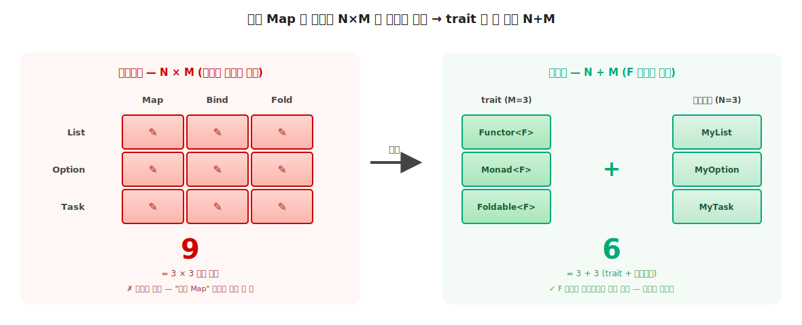
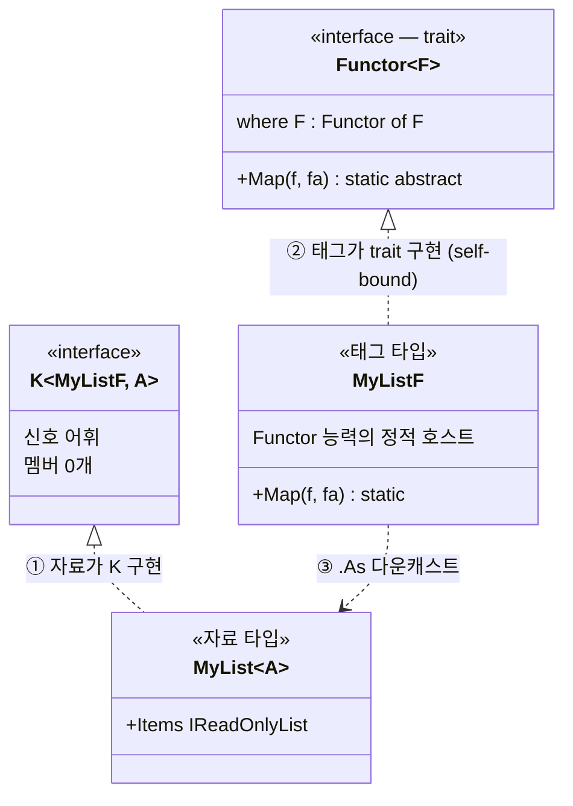

# 2장. Higher Kinds (수많은 Elevated World 를 하나의 어휘로)

> **이 장의 목표** — 이 장을 마치면 같은 `Map` 을 컨테이너마다 베끼는 N×M 불편의 정체를, type constructor 를 매개변수로 못 받는 C# 의 Order 2 (HKT) 미지원이라는 한계로 짚어 시그니처로 설명할 수 있습니다. 또한 `K<in F, A>` 마커와 self-bound, static abstract 세 도구로 그 한계를 우회해, 한 능력을 한 번 정의하면 모든 Elevated World 위에서 자동 동작하는 자리 (N×M → N+M) 를 직접 코드로 실현할 수 있습니다. 1 장의 두 평행 세계 비유를 C# 어법 안에 옮기는 이 무대 장치 위에서 4 장 이후 모든 trait 이 올라서므로, 이 자리가 기초 전체의 토대입니다.

> **이 장의 핵심 어휘** — 지금 외우는 목록이 아니라, 본문에서 하나씩 천천히 도입할 예고편입니다. 기호 (`*`, `* → *`) 의 정확한 읽기는 §2.5 에서 표로 정리합니다.
>
> - **Order** (값 또는 타입이 받는 인자의 단계. Order 0 은 값, Order 1 은 함수, Order 2 는 함수를 받는 고차 어휘)
> - **kind** (타입에도 분류 단계가 있다는 어휘 — 값을 분류하면 타입, 타입을 분류하면 kind. 기호 읽기는 §2.5)
> - **type constructor** (타입을 받아 타입을 만드는 어휘. 자료가 안 채워진 `List`, `Option` 자체, kind `* → *`)
> - **Higher-Kinded Type (HKT)** (type constructor 자체를 매개변수로 받는 추상. C# 이 직접 지원하지 않는 Order 2 자리)
> - `K<in F, A>` (`F` 컨테이너 안에 `A` 자료가 든다는 신호를 완성 타입으로 인코딩하는 마커 인터페이스. C# 의 HKT 우회)
> - **self-bound** (`where F : Trait<F>` 처럼 타입이 자기 자신을 제약에 묶어 trait 구현을 강제하는 어법)
> - `static abstract` (인스턴스 없이 타입 자체에 붙는 추상 멤버. 능력을 trait 의 정적 자리에 두는 어법)
> - **3-tuple 패턴** (자료 / 태그 / trait 구현 세 조각으로 한 컨테이너를 brand 우회에 등록하는 구성)

> 이 장을 마치면 할 수 있게 되는 것
> - [ ] 객체지향 어법의 N×M 비용 문제를 시그니처로 보여줄 수 있습니다.
> - [ ] 함수형의 trait 다형성이 비용을 N+M 으로 줄이는 발상을 설명할 수 있습니다.
> - [ ] 값 차원의 Order 0 / 1 / 2 어휘를 한 줄로 설명할 수 있습니다.
> - [ ] 다인자 함수와 고차 함수의 결정적 구분을 시그니처로 보여줄 수 있습니다.
> - [ ] 값 차원의 Order 어휘를 타입 차원의 kind 어휘에 평행 매핑할 수 있습니다.
> - [ ] 값 생성자 / 타입 생성자 통합 비교 표에서 C# 의 비대칭을 짚을 수 있습니다.
> - [ ] 왜 C# 의 제네릭만으로는 Elevated World 추상이 어려운가 답할 수 있습니다.
> - [ ] HKT 가 지원되었다면 어떤 가치가 있었을지 가상 C# 코드로 표현할 수 있습니다.
> - [ ] `K<F, A>` 의 `F` 와 `A` 가 각각 무엇을 뜻하는지 설명할 수 있습니다.
> - [ ] self-bound 제약 `where F : Trait<F>` 가 왜 필요한가 답할 수 있습니다.
> - [ ] static abstract 가 인스턴스 메서드와 무엇이 다른지 한 줄로 설명할 수 있습니다.
> - [ ] 가상의 `Functor<F<_>>` 한 줄이 실제 `Functor<F> where F : Functor<F>` 한 줄로 어떻게 변환되는지 설명할 수 있습니다.
> - [ ] 3-tuple 패턴 (자료 / 태그 / trait 구현) 의 세 조각이 어떤 책임을 지는지 코드로 보여줄 수 있습니다.
> - [ ] 어떤 Functor 든 받는 일반 함수를 직접 작성할 수 있습니다.

---

## 2.1 이 장에서 다루는 것 — 한 능력을 모든 컨테이너에

1장의 마지막 한 줄을 다시 떠올립니다. **능력은 trait 의 정적 자리에 산다**. 그 trait 을 C# 어법으로 표현하는 도구가 2장의 주제라고 예고했습니다. 2장은 그 약속을 지키는 장입니다.

1장에서 우리는 두 평행 세계를 봤습니다. 아래의 Normal World (`int`, `string`) 와 위의 Elevated World (`Option<int>`, `List<string>`). 그런데 Elevated World 의 시민은 한둘이 아닙니다. **너무 많습니다.**

```csharp
Option<int>         maybeN;     // 없을 수 있음
List<int>           manyN;      // 여러 개일 수 있음
Result<E, int>      okN;        // 실패할 수 있음
Task<int>           futureN;    // 시간이 걸림
Validation<E, int>  validN;     // 누적 실패
// ... 그 외 수십 개의 Elevated World
```


**그림 2-1. 수많은 Elevated World (같은 윤곽, 다른 효과)** — `Option<a>` (있을 / 없을), `List<a>` (여러 개), `Result<a>` (성공 / 실패) 의 효과는 모두 다릅니다. 그러나 "F 안에 a 가 든 자료" 라는 윤곽은 같습니다. 이 공통 윤곽을 컴파일러가 다룰 수 있는 한 어휘로 만드는 것이 2장의 목표입니다.

이 장의 목표를 한 문장으로 압축하면 다음과 같습니다. **어떤 Elevated World 인지에 무관하게 `Map`, `Apply`, `Bind` 같은 능력을 한 번만 정의하는 것.** `Option` 의 `Map`, `List` 의 `Map`, `Task` 의 `Map` 을 따로 짜는 게 아니라, "어떤 컨테이너든 받는 자리" 한 곳에 `Map` 을 한 번 정의하고 싶습니다. 그 "어떤 컨테이너든 받는 자리" 를 이 책은 **`F` 자리** 라 부릅니다. `F` 는 Elevated World 의 이름 (`Option`, `List`, `Result` 같은 컨테이너 종류) 이 들어가는 매개변수입니다.

이 목표의 실체는 1장에서 본 함수형의 본질, 즉 **합성 가능한 Elevated World 로 lift** 의 둘째 축 type class 다형성입니다. 그 어휘를 컴파일 타임에 강제하는 도구가 2장의 주제입니다.

2장은 1장과 마찬가지로 도구를 나열하는 장이 아닙니다. 먼저 **`F` 자리가 없으면 어떤 불편이 생기는지** 를 직접 체험하고, 그 불편을 C# 으로 풀려다 **한계에 부딪힌 뒤**, 그 한계가 정확히 무엇인지 어휘로 정착시키고, 한계를 우회하는 세 도구를 차례로 놓습니다. 문제 → 한계 → 우회의 순서입니다.

---

## 2.2 왜 필요한가 — 같은 Map 을 N 번 베끼는 코드

### 2.2.1 첫 컨테이너 — 잘 동작하는 Map

`MyList<A>` 라는 컨테이너를 만들고 `Map` 능력을 부착합니다. 안의 값을 변환하되 컨테이너 모양은 그대로 두는 능력입니다. 1 장 §1.7.6 에서 본 `(a → b) → (E<a> → E<b>)` 끌어올림을, 컨테이너 `MyList` 의 C# 메서드로 적은 것입니다.

```csharp
public sealed class MyList<A>
{
    private readonly List<A> _items;
    public MyList(IEnumerable<A> items) => _items = items.ToList();

    public MyList<B> Map<B>(Func<A, B> f) =>      // A → B 로 변환, MyList 모양은 보존
        new MyList<B>(_items.Select(f));
}
```

잘 동작합니다. 객체에 능력을 부착하는 익숙한 객체지향 어법입니다. 여기까지는 아무 문제가 없습니다.

### 2.2.2 두 번째, 세 번째 — 복사·붙여넣기가 시작됩니다

다음 주, `MyOption<A>` 에도 `Map` 이 필요해집니다. 본문은 거의 같습니다. 컨테이너 이름만 다릅니다.

```csharp
public sealed class MyOption<A>
{
    public MyOption<B> Map<B>(Func<A, B> f) =>    // ← Option 의 Map (모양만 같다)
        /* None 이면 None, Some(x) 면 Some(f(x)) */;
}

public sealed class MyTask<A>
{
    public MyTask<B> Map<B>(Func<A, B> f) =>      // ← Task 의 Map (또 모양만 같다)
        /* 완료되면 f 적용 */;
}

// ... MyResult<A>.Map, MyValidation<A>.Map, ... 컨테이너 수만큼 같은 Map 을 베낍니다
```

세 `Map` 의 시그니처는 **모양만 같고 이름이 다른** 어법입니다. `MyList<A>.Map`, `MyOption<A>.Map`, `MyTask<A>.Map` 이 세 개의 별개 메서드라, 컴파일러는 이 셋을 **같은 능력으로 다루지 못합니다.** 사람 눈에는 "다 같은 Map" 이지만, 코드의 구조에는 그 사실이 어디에도 적혀 있지 않습니다.

### 2.2.3 동료가 능력을 하나 추가하면 — N×M 격자

이제 동료가 `Bind` 를 추가합니다. 이번에는 **가로로** 베껴야 합니다. 모든 컨테이너에. 그리고 `Fold` 가 추가됩니다. 또 가로로 N 번. `Traverse` 가 추가됩니다. 또 N 번.

```
            Map        Bind       Fold       Traverse
MyList      ✏️직접     ✏️직접     ✏️직접     ✏️직접
MyOption    ✏️직접     ✏️직접     ✏️직접     ✏️직접
MyTask      ✏️직접     ✏️직접     ✏️직접     ✏️직접
MyResult    ✏️직접     ✏️직접     ✏️직접     ✏️직접
   ⋮          ⋮          ⋮          ⋮          ⋮
```

이 격자(grid)의 칸을 사람이 하나씩 손으로 채웁니다. 컨테이너가 N 개, 능력이 M 개면 **N×M 개의 구현** 입니다. 비용이 두 자리에서 누적됩니다.

- **새 컨테이너 추가 시** — `MyEither` 가 등장하면 `MyEither.Map`, `MyEither.Bind`, `MyEither.Fold` ... M 개 능력을 **세로 한 줄 전부** 다시 짭니다.
- **새 능력 추가 시** — `Traverse` 가 등장하면 `MyList.Traverse`, `MyOption.Traverse`, `MyTask.Traverse` ... N 개 컨테이너에 **가로 한 줄 전부** 다시 부착합니다.

여기까지는 단순히 손이 아픈 문제입니다. 그런데 더 깊은 문제가 1장의 명령형 약점과 똑같은 모양으로 숨어 있습니다.

격자의 어느 칸 하나가 **미묘하게 다르게** 구현되어도 컴파일러는 알아채지 못합니다. 예를 들어 누군가 `MyOption.Map` 만 "`None` 에서 예외를 던지도록" 짜 놓고 떠나면, `MyList.Map` 과 `MyOption.Map` 이 "같은 Map 이어야 한다" 는 약속이 깨집니다. 그러나 그 약속은 **각 메서드의 본문에만** 존재할 뿐, 코드의 구조에는 적혀 있지 않습니다. 1장 §1.2.3 에서 `items` 와 `total` 의 약속이 절차의 본문에만 묻혀 있던 것과 정확히 같은 종류의 문제입니다. **같은 능력이라는 사실이 코드 어디에도 강제되지 않습니다.**



**그림 2-2. N×M 격자에서 N+M 으로** — 왼쪽은 객체지향 어법. 능력 M 개 (Map / Bind / Fold) × 컨테이너 N 개 (List / Option / Task) = 9 개의 별개 구현으로 격자가 가득 찹니다. 오른쪽은 함수형 어법. trait 3 개 정의 + 컨테이너 3 개 등록 = 6 으로 줄고, "F 자리에 컨테이너만 바꿔 끼움" 으로 격자가 사라집니다. 이 절감이 이 장 전체의 목표입니다.

> **N×M 비용** — 컨테이너 N 개 × 능력 M 개 = N×M 개의 구현. 이 비용 때문에 *합성 가능한 Elevated World 로 lift* 어휘가 컨테이너별로 따로 분리됩니다. 함수형 추상의 통합 가치 (한 능력이 모든 컨테이너 위에서 한 어휘로 살아야 함) 가 객체지향 어법으로는 달성되지 않습니다.

> **흔한 함정** — 코드 생성기 / 복사·붙여넣기로 N×M 을 메우면 된다고 결론 내리는 것입니다.
>
> "어차피 Map 본문은 비슷하니 스니펫으로 찍어내면 되지 않나" 싶을 수 있습니다. 그러나 그 순간 격자의 각 칸은 **독립적으로 어긋날 수 있는 코드** 가 됩니다. 칸이 늘수록 "다 같은 Map 이어야 한다" 는 약속을 사람이 일일이 지켜야 합니다. 우리가 원하는 것은 칸을 빨리 채우는 도구가 아니라, **칸이라는 개념 자체를 없애는** 도구입니다. 같은 능력을 한 자리에 한 번만 정의하는 것.

---

## 2.3 첫 시도와 좌절 — C# 으로 직접 써 보기

격자를 없애는 방법은 이미 1장이 알려줬습니다. **능력이 사는 자리를 객체가 아니라 trait 으로 옮기는 것.** `Functor` 라는 trait 한 곳에 `Map` 한 번을 정의하고, `F` 자리에 어떤 컨테이너든 끼워 같은 `Map` 이 자동 동작하게 만들면 됩니다. 발상은 단순하니, C# 으로 그대로 써 봅니다.

```csharp
// 함수형 발상을 C# 으로 직접 시도 — 능력이 trait 한 자리에 산다
public interface Functor<F>          // F = 컨테이너 종류 (List, Option, Task ...)
{
    static F<B> Map<A, B>(Func<A, B> f, F<A> fa);   // F 자리에 컨테이너 이름만 바꿔 끼움
    //     ─┬─                          ─┬─
    //     F<B>, F<A> : F 가 다시 인자를 받는 자리
}

// 의도한 호출 — 같은 메서드가 모든 컨테이너 위에서 자동 동작
Functor<MyList  >.Map(DoubleIt, [1, 2, 3])      // F = MyList
Functor<MyOption>.Map(DoubleIt, Some(42))       // F = MyOption
Functor<MyTask  >.Map(DoubleIt, FetchTask())    // F = MyTask
```

이 코드가 컴파일된다면 N×M 비용이 단번에 **N+M** 으로 줄어듭니다. 새 컨테이너는 `F` 자리에 한 번 끼우면 M 개 능력이 자동 적용되고, 새 능력은 trait 한 번 정의하면 N 개 컨테이너에 자동 적용됩니다.

그런데 이 코드를 IDE 에 그대로 적고 빌드하면, 컴파일러가 `F<B>` / `F<A>` 자리에서 **두 개의 에러** 를 뱉습니다.

```csharp
public interface Functor<F>
{
    static F<B> Map<A, B>(Func<A, B> f, F<A> fa);
    //     ↑↑↑                          ↑↑↑
    // CS0307: 'F' is a type parameter, which is not valid in the given context
    // CS0246: The type or namespace name 'F' could not be found
}
```

발상은 옳았는데 어법이 막혔습니다. 비유 한 줄로 정리하면 이렇습니다. C# 의 제네릭 자리는 **완성된 우편함** (자료가 채워진 `List<int>` 같은 형태) 만 받고, **우편함을 만드는 공장** (`List` 라는 종류 자체) 을 매개변수로 받는 어법이 없습니다. 그래서 `F<...>` 처럼 `F` 가 다시 인자를 받는 자리가 거부됩니다.

> **흔한 함정** — 위 코드가 컴파일된다고 가정하고 진도를 나가는 것입니다.
>
> `interface Functor<F>` 한 줄까지는 IDE 에서 빨간 줄이 안 보일 수 있습니다. 빨간 줄은 `F<B>` 를 적는 **그 다음 줄** 에서 뜹니다. 이 코드는 이 장이 끝날 때까지 **직접 컴파일되지 않습니다.** 우리는 같은 가치를 다른 어법 (`K<F, A>` 우회) 으로 실현할 것입니다. 지금은 "발상은 맞는데 C# 어법이 한 자리에서 막힌다" 까지만 손에 쥐면 충분합니다.

여기서 자연스러운 두 질문이 생깁니다.

1. **`F<...>` 가 정확히 왜 막히는가?** — 이 한계의 이름과 깊이를 알아야 합니다 (§2.4 ~ §2.5).
2. **한계를 어떻게 우회하는가?** — 막힌 자리를 되찾는 도구가 필요합니다 (§2.7 ~ §2.9).

먼저 첫 질문입니다. 한계의 정체를 이해하려면 *Higher* 라는 어휘의 직감을 **값 차원** 에서 먼저 잡고, 같은 어휘를 **타입 차원** 으로 평행 매핑해야 합니다. 그 과정에서 C# 의 핵심 제약이 또렷이 드러납니다.

---

## 2.4 값 차원의 Order 단계 (Order 0 / 1 / 2)

> **마음 편히 읽으세요.** 이 절과 다음 절은 어휘 (Order / kind / type constructor) 를 쌓는 절입니다. 한 번에 외울 필요가 없습니다. 같은 어휘를 §2.6 부터 코드로 반복 등장시켜 자연 정착시킵니다. 지금은 "값에도 단계가 있고, 타입에도 같은 단계가 있다" 는 큰 그림만 따라오면 됩니다.

> **값 생성자 — 정의**
>
> 학술 어휘에서 *value constructor* (또는 *data constructor*) 는 Haskell 의 대수적 데이터 타입에서 값을 만드는 함수를 가리킵니다. 예를 들어 `data Either a b = Left a | Right b` 의 `Left :: a → Either a b`, `Right :: b → Either a b` 가 value constructor 입니다. 0-인자면 *nullary constructor* (또는 상수) 라 부릅니다. Haskell Wiki *Constructor* 는 *"a data constructor taking zero arguments is called a nullary data constructor or simply a constant"* 로 정의합니다.
>
> 이 책의 값 생성자는 그보다 광의로, 값 차원에서 값을 만드는 모든 어휘로 사용합니다. 리터럴 (`1`, `"hello"`) 도 0-인자 constructor 의 결과, 함수 (`int → int`) 도 값을 만드는 어휘, 고차 함수 ((`int → int`) → `int`) 도 값을 만드는 어휘로, 셋 모두 값을 만든다는 점에서 같은 어휘로 묶입니다. 이 절은 그 값을 만드는 어휘들을 *Order* 라는 단계로 분류합니다. 다음 절의 타입 생성자 (type constructor) 가 타입을 만드는 어휘를 같은 Order 어휘로 분류하는 평행 자리입니다.

세 단계뿐입니다. **Order 0** 은 평범한 값, **Order 1** 은 값을 받아 값을 만드는 함수, **Order 2** 는 함수를 받아 값을 만드는 고차 함수 (HOF: Higher Order Function) 입니다.

| Order | 시그니처 (type signature) | 인자 자리의 어휘 | 의미 | 예 |
|---|---|---|---|---|
| Order 0 | `int`, `string` 등 (구체 type) | (인자 없음) | 평범한 값 — 변수에 곧장 담음 | `1`, `2`, `new User()`, `new List<int>()` |
| Order 1 | `int → int` (값 → 값) | 값 | 평범한 함수 — 값을 받아 값을 반환 | `int DoubleIt(int)`, `Func<int, double>` |
| Order 2 | `(int → int) → int` (함수 → 값) | 함수 | 고차 함수 (HOF) — 함수를 받아 값을 반환 | `xs.Aggregate(seed, f)`, LINQ `Select` |

같은 값 `42` 가 Order 0 → 1 → 2 로 어휘가 어떻게 올라가는지 단계별로 보면 직감이 잡힙니다.

```csharp
// Order 0 — 42 가 값 그 자체
int answer = 42;

// Order 1 — 42 를 받아 값을 반환하는 함수
int Identity(int x) => x;                       // Identity(42) == 42

// Order 2 — 함수를 받아 42 를 반환하는 고차 함수
int RunWith42(Func<int, int> f) => f(42);       // RunWith42(Identity) == 42
```

같은 영역의 어휘 (`42`) 가 값 → 값을 다루는 함수 → 함수를 다루는 함수로 한 단계씩 *Higher* 로 올라갑니다. **이 "한 단계 올라감" 의 직감이 이 장의 전부입니다.** 타입 차원에서도 정확히 같은 올라감이 반복됩니다.

> **다인자 ≠ 고차 (또렷한 구분)** — Order 가 올라가는 기준은 인자 개수가 아니라 **인자 자리에 한 단계 위 어휘 (함수) 가 들어옴** 입니다.
>
> ```csharp
> // 1-인자 함수 — Order 1 (인자 자리에 값)
> int Negate(int n) => -n;
>
> // 2-인자 함수 — Order 1 (인자가 둘이지만 모두 값)
> int Add(int x, int y) => x + y;
>
> // 1-인자 HOF — Order 2 (인자 자리에 함수)
> int Apply(Func<int, int> f) => f(5);
> ```
>
> `Negate` 는 인자가 하나이고 값 (int) 이라 Order 1 입니다. `Apply` 는 같은 1-인자지만 인자가 함수 (`int → int`) 라 Order 2 입니다. `Add` 는 인자가 둘이지만 모두 값이라 여전히 Order 1 입니다. *Higher* 의 본질은 **몇 개** 가 아니라 **어떤 어휘가 인자 자리에 들어오는가** 입니다. 이 구분은 타입 차원에서 다시 결정적으로 쓰입니다 (`Dictionary<K, V>` 가 2-인자지만 HKT 가 아닌 이유, §2.5).

> **고차의 핵심 조건** (Wikipedia, *Higher-order function*) — *"a function that does at least one of the following: takes one or more functions as arguments, returns a function as its result"*. 즉 함수를 인자로 받거나 함수를 반환하면 고차 함수입니다. 같은 자료에 명시 — *"A function that merely returns a value (not a function) is classified as first-order"*. *higher* 가 되려면 **인자 또는 출력 자리에 함수가 등장** 해야 합니다.

판별 규칙을 표로 굳힙니다. 인자 개수가 같아도 인자 자리의 어휘가 Order 를 가릅니다.

| 값 생성자 | 시그니처 (type signature) | 인자 개수 | 인자 자리의 어휘 | Order |
|---|---|---|---|---|
| `int Add(int x, int y)` | `int → int → int` | 2 | 값, 값 | Order 1 (다인자) |
| `int Apply(Func<int, int> f)` | `(int → int) → int` | 1 | 함수 | Order 2 (고차 함수) |
| `int Run(Func<int, int> f, int seed)` | `(int → int) → int → int` | 2 | 함수, 값 | Order 2 (고차, 다인자) |

판별 규칙은 한 줄입니다. **인자 중 하나라도 함수면 Order 2 이상, 모두 값이면 Order 1.**

> **C# 값 차원의 일급 시민 완전 지원** — C# 은 Order 0 (값), Order 1 (`Func<,>` / lambda / delegate), Order 2 (HOF, LINQ 의 `Select` / `Aggregate` / `Where` 등) 모두 일급 시민으로 지원합니다. **값 차원에는 어떤 제약도 없습니다.** `Func<>` / 메서드 그룹 / 람다가 함수를 값처럼 다루는 어법을 완비해, Order 2 이상의 HOF 도 자유롭게 정의·전달·사용할 수 있습니다.

여기까지가 핵심입니다. **값 차원은 세 Order 모두 자유롭습니다.** §2.3 의 한계는 값 차원이 아니라 **타입 차원** 에서 나타납니다. 같은 Order 어휘를 타입 차원으로 옮기는 순간, C# 의 비대칭이 드러납니다.

---

## 2.5 타입 차원의 kind 와 C# 의 한계

앞 절에서 값 차원의 Order 0 / 1 / 2 어휘를 봤습니다. 같은 어휘를 타입 차원으로 평행 매핑하면 *kind* (타입의 타입) 라는 어휘가 등장합니다. 값 차원의 `int` / `int → int` / `(int → int) → int` 가 타입 차원의 kind 표기 `*` / `* → *` / `(* → *) → *` 에 그대로 대응합니다.

화살표 어법 (`→` 의 입력 / 출력) 은 두 차원에서 정확히 평행하지만 **이름은 분리** 됩니다. 값 차원의 `int → int` 는 *type signature*, 타입 차원의 `* → *` 는 *kind* 입니다. kind 는 type-level 어휘로 값에는 적용되지 않습니다 (Wikipedia *Kind (type theory)*).

본격적으로 들어가기 전에, 앞으로 자주 나올 kind 기호를 한자리에 모읍니다. 지금은 표만 훑고, 본문에서 다시 만날 때 돌아와 참조하면 됩니다.

| 기호 | 읽기 | 값 차원 대응 | 예 |
|---|---|---|---|
| `*` | 완성된 타입 하나 | `int` (Order 0) | `int`, `List<int>` |
| `* → *` | 타입 하나 받아 타입 만듦 | `int → int` (함수, Order 1) | `List`, `Option` |
| `(* → *) → *` | type constructor 를 받음 | `(int → int) → int` (고차 함수, Order 2) | 이 장이 노리는 HKT 자리 |

> **type theory 의 3 단 계층** — kind 가 값에 적용되지 않는 이유는 type theory 의 계층 구조에서 나옵니다. 한 줄로 외울 문장은 **"kind 는 타입의 타입"** 입니다.
>
> | 예 | value (값) | type (값의 분류) | kind (type 의 분류) |
> |---|---|---|---|
> | 평범한 값 | `5` | `int` | `*` |
> | 컬렉션 값 | `[1, 2, 3]` | `List<int>` | `*` |
> | 타입 생성자 | (값 없음) | `List` | `* → *` |
>
> 읽는 방향은 왼쪽 → 오른쪽입니다. 한 칸 오른쪽으로 갈 때마다 "그 왼쪽 칸을 분류하는 어휘" 가 됩니다. `5` 를 분류하면 `int`, `int` 를 분류하면 `*`. 주의할 자리는 셋째 칸입니다. `int` 도 `List<int>` 도 자료가 채워진 **완성 타입** 이라 kind 가 똑같이 `*` 이고, T 자리가 빈 **type constructor `List`** 라야 kind 가 한 단계 위 `* → *` 가 됩니다 (`int → int` 같은 함수 타입도 자료가 채워진 완성 타입이라 kind 는 `*` 입니다).
>
> 각 단의 **분류 어휘** 는 **바로 위 단에만 적용** 됩니다. 비유로 옮기면, 값이 "물건" 이면 type 은 "물건의 종류 (라벨)", kind 는 "라벨의 종류 (라벨을 붙이는 규칙)" 입니다. 라벨의 종류는 물건에 직접 닿지 않습니다.
>
> - **value** (예: `5`, `42`) — 분류는 *type* (예: `int`)
> - **type** (예: `int`, `List<int>`) — 분류는 *kind* (예: `*`)
> - **type constructor** (예: `List`) — 분류는 *kind* (예: `* → *`)
> - **kind** — **type 의 type** 으로 값에는 닿지 않음
>
> Wikipedia 표현은 다음과 같습니다. *"kinds classify types, just as types classify values"*. 그래서 값 차원의 평행 자리는 **구체 type 어휘** (`int`, `int → int`) 가 됩니다.

C# 의 타입 차원이 어디까지 제공하는지 한 단계씩 점검하면 비대칭이 드러납니다. Order 0 (완성 타입) 은 **완전 제공**, Order 1 (type constructor) 은 **정의만 제공**, Order 2 (HKT) 는 **미지원** 입니다. 완전 / 부분 / 미지원의 비대칭을 그립니다. 단계별로 살펴봅니다.

> **Higher-Kinded Generic (고차 종류 제네릭) — 정의**
>
> 타입 생성자 (type constructor) 를 그 자체로 매개변수로 받는 제네릭을 일컫습니다. "타입을 받아 타입을 만드는 함수" (예: `List<_>`, `Option<_>`) 를 다른 코드가 인자로 받아 사용할 수 있게 하는 타입 시스템의 능력입니다. 영어 원문은 *"A kind is the type of a type constructor."* (Wikipedia, Kind (type theory)) 입니다. 값 차원의 고차 함수 (HOF) 가 함수를 받는 함수이듯, *Higher Kinds* 는 타입 생성자를 받는 타입으로, 같은 발상이 값 차원에서 타입 차원으로 올라갑니다.

> **kind 화살표 어법의 기본** — kind 표기의 `→` 는 함수 시그니처의 `→` 와 같은 어법입니다. **왼쪽 = 입력 (받는 자리), 오른쪽 = 출력 (만드는 자리)**. 단계별로 보면:
>
> - **`*`** — 입력 / 출력 자리 없는 완성된 타입 하나. 예: `int`, `string`, `List<int>`.
> - **`* → *`** — 왼쪽 `*` 를 입력으로 받아 오른쪽 `*` 를 출력으로 만드는 type constructor. 예: `List` 가 `int` 를 받아 `List<int>` 를 만듭니다. 왼쪽 입력 자리가 비어있는 형태 (`List<_>`) 로, 자료를 채우면 완성 타입이 됩니다.
> - **`(* → *) → *`** — 왼쪽 자리에 type constructor 전체 (`* → *`) 가 들어와 오른쪽 `*` 를 만드는 HKT. 괄호가 왼쪽 `* → *` 가 한 자리임을 명시합니다. 값 차원의 `(int → int) → int` (함수를 받아 값을 만드는 고차 함수) 와 같은 어법으로, **2장의 본 목표** 에 해당합니다.
> - **`* → * → *`** — 입력 자리가 두 개인 다인자 type constructor. 예: `Dictionary<K, V>`, `Either<L, R>`. 인자가 모두 완성 타입이라 HKT 가 아닙니다 (다인자 ≠ 고차, §2.4 와 같은 판별 규칙).
>
> **핵심** — 화살표 왼쪽 자리가 어떤 kind 를 받는가가 *Order* 를 결정합니다. 왼쪽이 `*` 만이면 Order 1, 왼쪽이 `(* → *)` 면 Order 2 (HKT).

### 2.5.1 Order 0 — 완성 타입 (C# 완전 제공)

타입 차원의 Order 0 은 완성 타입으로, 모든 자리가 채워진 구체적 타입입니다. kind 어휘로는 `*` 에 해당하고, 변수에 담거나 매개변수로 전달하거나 반환하는 데 어떤 제약도 없습니다.

```csharp
// Order 0 의 자리 — 완성 타입을 변수에 담음
int        x  = 42;
string     s  = "hi";
List<int>  xs = new List<int> { 1, 2, 3 };

// 매개변수 / 반환에도 자유
void Print(int n) { Console.WriteLine(n); }
List<string> CreateNames() => new List<string> { "Alice", "Bob" };
```

`int` 는 T 자리가 없는 완성 타입이고, `List<int>` 는 T 자리에 `int` 가 채워진 완성 타입입니다. 둘 다 kind `*` 에 해당하고, C# 이 모든 어법에서 자유롭게 다룹니다. **여기까진 §2.3 의 한계가 없습니다.**

### 2.5.2 Order 1 — type constructor (C# 정의만 제공)

타입 차원의 Order 1 은 *type constructor* 로, 타입을 받아 타입을 만드는 어휘입니다. kind 어휘로는 `* → *` 에 해당합니다. 예로 `List` (T 를 받아 `List<T>` 만듦), `Option`, `Task` 가 있습니다.

C# 어법은 type constructor 의 **정의** 는 제공합니다. `public class Box<T> { ... }` 같은 제네릭 정의가 여기 해당합니다.

```csharp
// type constructor 정의 — C# 완전 가능
public class Box<T>
{
    public T Value { get; }
    public Box(T value) => Value = value;
}

// 사용 — T 자리에 완성 타입을 채우면 Box<int>, Box<string> 같은 완성 타입 (Order 0)
Box<int>    b1 = new Box<int>(42);          // ✓ Box<int> 는 완성 타입
Box<string> b2 = new Box<string>("hi");     // ✓ Box<string> 도 완성 타입
```

그러나 **`Box` 자체** (T 자리가 비어있는 type constructor) 는 일급 시민이 아닙니다. 우편함의 비유로, `Box<int>` 라는 **완성된 우편함** 은 자유롭게 다루지만, `Box` 라는 **우편함 공장 자체** 는 변수에 담거나 매개변수로 전달할 수 없습니다.

```csharp
// ✗ Box 자체 (type constructor) 는 C# 의 일급 시민이 아님
Box    plain = ...;                          // ✗ 컴파일 오류 — Box 만은 변수가 못 됨
void Process(Box container) { }              // ✗ 컴파일 오류 — Box 만 매개변수로 못 받음
T<int> RunWith<T>() { ... }                  // ✗ 컴파일 오류 — T 가 다시 인자를 받는 자리는 못 둠
```

함수 시그니처 차원에서도 §2.3 에서 본 그 한계가 그대로 드러납니다.

```csharp
// ✗ 함수 시그니처에서 F 가 type constructor 라고 가정한 자리도 거부
F<B> DoubleIt<F, A, B>(F<A> fa) { ... }     // ✗ 두 곳 모두 거부 — F<B> 어법이 C# 컴파일러를 통과 못함
//   ─┬─                  ─┬─
//   F<B>, F<A>: F 가 다시 인자를 받는 어법 — C# 어법에 없음
```

`DoubleIt<F, A, B>` 의 의도는 `F` 가 어떤 type constructor 든 받아 `F<A>` 를 `F<B>` 로 변환하는 것입니다. 즉 `F` 자체를 매개변수로 받아 그 안에 인자를 끼우는 자리, **Order 2 의 자리** (kind `(* → *) → *`) 입니다. C# 어법에 그 자리가 없어 `F<A>` / `F<B>` 두 자리가 거부됩니다. **Order 1 의 type constructor 일급 미지원이 Order 2 의 미지원으로 이어집니다.**

Haskell / Scala 는 다릅니다. type constructor 자체를 일급 시민으로 가리키는 어법을 갖춥니다.

```haskell
-- Haskell — type constructor 자체를 일급 시민으로 가리킴
-- []     :: * → *      (List 자체)
-- Maybe  :: * → *      (Option 자체)

instance Functor [] where     -- [] = List 자체를 직접 전달
    fmap f xs = ...
```

```scala
// Scala — F[_] 의 underscore 가 "kind * → *" 의 빈자리
trait Functor[F[_]]:
    def map[A, B](fa: F[A])(f: A => B): F[B]
```

Haskell 의 `[]` / Scala 의 `F[_]` 가 type constructor 자체를 매개변수로 가리키는 어법입니다. C# 어법에는 그런 어법이 없습니다. 이 차이가 Order 2 의 가능 여부를 가릅니다.

### 2.5.3 Order 2 — HKT (kind 3 단계 도출)

타입 차원의 Order 2 가 **2장의 본 목표** 에 해당합니다. type constructor 를 매개변수로 받는 추상, 즉 §2.3 에서 시도했던 `Functor<F>` 의 `F` 자리가 여기입니다. 값 차원의 함수를 받는 함수 (HOF) 가 타입 차원에 평행 매핑된 모습입니다.

> **외우지 마세요.** 아래 세 단계는 "왜 `Functor<F>` 가 Order 2 인가" 를 형식적으로 확인하는 절차입니다. 결론 한 줄만 가져가도 됩니다 — **`F` 가 이미 한 단계 위 어휘 (`* → *`) 라서, 그것을 매개변수로 받는 `Functor` 가 한 단계 더 위 (`(* → *) → *`) 로 올라간다.** 세 단계는 그 한 줄을 천천히 풀어 쓴 것입니다.

가상 코드 `static F<B> Map<A, B>(Func<A, B> f, F<A> fa)` (§2.3) 의 각 자리가 어떤 kind 인지 세 단계로 따라갑니다.

#### 1 단계 — `F` 의 kind = `* → *` (한 인자 type constructor)

`Functor` 는 **컨테이너** (`List`, `Option`, `Task`) 에 대한 추상이므로, `F` 자리에는 그 컨테이너들이 들어옵니다. 한 예제 (`List`) 로 모양을 봅니다.

```
List   :  자료 int 를 받음  →  List<int> 완성 타입을 만듦
          (왼쪽 입력: *)         (오른쪽 출력: *)

       kind = * → *
```

`Option`, `Task` 모두 자료 1 개를 받아 완성 타입을 만드는 어법, 즉 모두 kind `* → *`. 따라서 `Functor` 가 받기로 한 자리 (`F`) 의 kind 가 **`* → *`** 입니다.

> **한 줄 정리** — `F` 가 컨테이너 자체이므로 kind `* → *` (한 타입 인자를 받아 완성 타입으로 가는 type constructor).

#### 2 단계 — `F<A>` / `F<B>` 의 kind = `*` (완성 타입)

`F` (kind `* → *`) 가 자료 `A` (kind `*`) 를 받으면 완성 타입 `F<A>` 가 됩니다.

```
F         (kind: * → *)
  ↓ A 를 끼움 (kind: *)
F<A>      (kind: *)         ← 완성 타입
```

`F<B>` 도 같은 자리에서 kind `*`. 즉 `Map` 시그니처 안의 `F<A>`, `F<B>`, `Func<A, B>` 모두 **kind `*` (Order 0)** 의 완성 타입입니다.

> **한 줄 정리** — `F` 자리에 `A` 를 끼우면 완성 타입이 되어 kind 가 `*` 로 한 단계 내려갑니다.

#### 3 단계 — `Functor<F>` 자체의 kind = `(* → *) → *` (HKT)

이제 `Functor<F>` 자체의 kind 를 도출합니다.

```
Functor 가 무엇을 받는가? — F (kind: * → *)
Functor 의 결과는?      — 완성된 interface (kind: *)

Functor 의 kind  =  (입력 kind)  →  (출력 kind)
                 =  (* → *)      →   *
                    ↑                ↑
                    F 의 kind        Functor<F> 의 kind
```

핵심은 `F` 의 kind 가 단순 `*` 가 아니라 **이미 한 단계 위 어휘 (`* → *`)** 라서, 그것을 매개변수로 받는 `Functor` 의 kind 가 **`(* → *) → *`** 가 된다는 점입니다. 입력 자리가 합성 어휘라 괄호로 묶고, 출력 `*` 와 합성한 결과입니다. 이게 바로 **Order 2 (HKT, Higher-Kinded Type)** 입니다.

#### 세 단계 한 호흡 요약

| 단계 | 자리 | kind | Order | 도출 근거 |
|---|---|---|---|---|
| 1 단계 | `F` (매개변수) | `* → *` | 1 | 컨테이너 자체 (자료 1 개를 받아 완성 타입 산출) |
| 2 단계 | `F<A>`, `F<B>` | `*` | 0 | `F` 에 `A` / `B` 를 끼워 완성 타입화 |
| 3 단계 | **`Functor<F>` 자체** | **`(* → *) → *`** | **2 (HKT)** | 입력 자리에 1 단계의 합성 kind 가 들어옴 |

세 단계의 결론은 한 줄입니다. `Functor<F>` 의 kind `(* → *) → *` 가 **2 장의 핵심 목표** (Order 2, HKT) 자리이고, **이것이 C# 어법에 없는 자리** 입니다. 앞서 본 두 에러 (§2.3) 가 정확히 이 자리에서 났습니다.

### 2.5.4 값 생성자 vs 타입 생성자 — 통합 비교

앞의 세 단계가 형식적 도출이라면, 이제 그 결론을 값 차원과 한 자리에서 통합 비교합니다. 핵심은 **type constructor 자체가 타입 차원의 함수** 라는 점입니다. kind 표기 `* → *` 의 `→` 가 함수 시그니처의 `→` 와 같은 어법 (왼쪽 입력, 오른쪽 출력) 이라, type constructor 도 타입을 받아 타입을 만드는 함수입니다. 즉 값 차원의 함수와 타입 차원의 type constructor 는 **같은 함수 어법의 두 차원** 입니다.

| Order | kind | 값 차원 (값 생성자) | 타입 차원 (타입 생성자) | C# 제공 |
|---|---|---|---|---|
| **Order 0** | `*` | 값 자체 — `42`, `new List<int>()` | 완성 타입 — `int`, `List<int>` | ✓ **완전 제공** (두 차원 모두) |
| **Order 1** | `* → *` | 평범한 함수 — `Negate`, `Add` | type constructor — `List` (Haskell) / `List<_>` (Scala) | 값 차원 ✓ / 타입 차원 △ **정의만 제공** (`List<T>` 정의 OK, `List` 자체 일급 ✗) |
| **Order 2** | `(* → *) → *` | 고차 함수 (HOF) — `Apply` | HKT — `Functor<F>` 의 `F` 자리 (**2장의 본 목표**) | 값 차원 ✓ / 타입 차원 ✗ **미지원** |

세 줄로 정리합니다.

- **Order 어휘는 두 차원에 동일** — `*` / `* → *` / `(* → *) → *` 세 단계가 값 차원과 타입 차원에 똑같이 적용됩니다. 값 차원의 고차 함수 (HOF, 함수를 받는 함수) 가 타입 차원의 고차 타입 (HKT, type constructor 를 받는 타입) 으로 평행 매핑됩니다.
- **C# 의 비대칭은 타입 차원에만 등장** — 값 차원은 Order 0/1/2 모두 일급 시민으로 완비. 타입 차원은 Order 0 만 완전 일급, Order 1 은 정의만 제공, Order 2 는 미지원.
- **함수형 추상이 살고 싶은 곳은 타입 차원의 Order 2** — `Functor` 의 `F` 자리가 바로 여기이고, 이게 **2장의 본 목표** 입니다. C# 으로 직접 못 다루는 이유는 Order 1 에서 type constructor 자체가 일급이 아니라서 한 단계 위 (Order 2) 도달이 어법적으로 막혀 있기 때문입니다.

> **어휘 구분 — type signature vs kind**. 두 차원의 시그니처 어법 (`→` 의 입력 / 출력) 은 동일하지만 **이름은 다릅니다**. 값 차원의 함수 시그니처는 *type signature* (예: `int → int`), 타입 차원의 type constructor 시그니처는 *kind* (예: `* → *`) 입니다. kind 는 **type-level 의 어휘** 로, 값에는 적용되지 않고 type 과 type constructor 에만 적용됩니다 (Wikipedia *Kind (type theory)*). 즉 두 차원이 **어법은 평행**, **적용 차원은 분리**.


**그림 2-3. Order 단계로 본 Higher: 값 차원과 타입 차원의 평행** — 아래 행 값 차원 (Normal World 색) 에 Order 0 → Order 1 → Order 2 (HOF) 세 박스. 위 행 타입 차원 (Elevated World 색) 에 같은 Order 0 → Order 1 → Order 2 (HKT) 세 박스. 가운데 점선 매핑이 같은 Order 끼리 평행을 시각화합니다.

### 2.5.5 C# 의 한계 — 두 에러 메시지와 다른 언어

비대칭의 결론이 한 자리에 모입니다. **C# 의 핵심 제약은 제네릭 매개변수가 완성 타입 (Order 0) 만 받고, type constructor (Order 1) 자체를 매개변수로 받는 추상 (Order 2, HKT) 을 문법으로 표현할 수 없다는 것입니다.** §2.3 에서 마주친 두 에러 메시지가 그 결론을 컴파일러의 입으로 직접 확정합니다.

```csharp
// §2.3 의 시도를 다시 — T<X> 형태 (Higher Kinds) 를 C# 으로 직접 표현
public interface Functor<F>
{
    // F 가 type constructor (kind * → *) 라고 가정하고
    // F<A> 에서 A 를 받아 F<B> 로 변환하는 Map 정의를 시도
    static abstract F<B> Map<A, B>(Func<A, B> f, F<A> fa);
    //              ─┬─                          ─┬─
    //              F<B>: F 가 다시 B 를 받음 — T<X> 형태
    //              F<A>: F 가 다시 A 를 받음 — T<X> 형태
}

// ✗ 컴파일 오류:
//   CS0307: 'F' is a type parameter, which is not valid in the given context
//   CS0246: The type or namespace name 'F' could not be found
//
// C# 컴파일러는 F 를 완성 타입 (kind *) 으로만 받음.
//   완성 타입 = int, string, List<int> 같이 T 자리가 모두 채워진 구체 타입.
//   List 자체 / Task 자체 (type constructor, kind * → *) 는 C# 에서 표현 안 됨.
```

코드에 보이는 `static abstract` 키워드는 §2.8 에서 정의합니다. 여기서는 "타입 자체에 붙는 능력" 정도로만 읽고 넘어가면 됩니다. 지금 자리의 핵심은 `F<B>` / `F<A>` 어법이 거부된다는 점입니다.

두 에러 메시지의 정확한 의미는 다음과 같습니다. **CS0307** 은 "`F` 가 다시 인자를 받는 자리에서 사용 불가", **CS0246** 은 "`F` 를 완성 타입으로 해석하려 했으나 찾을 수 없다" 는 뜻입니다. 두 에러의 근본 원인은 하나입니다 — Order 1 에서 type constructor 자체가 일급 시민이 아니라서, `Functor<F>` 의 `F` 자리에 type constructor 가정이 어법으로 불가능하고, 그 결과 `F<...>` 어법 모두가 거부됩니다. 학술 어휘로는 *higher-kinded polymorphism* 미지원입니다.

Haskell / Scala 에서는 정확히 이 어법이 일급으로 지원됩니다.

```haskell
-- Haskell — f 가 kind * → * 임을 컴파일러가 추적 (Order 2 일급)
class Functor f where
    fmap :: (a -> b) -> f a -> f b

instance Functor [] where ...        -- f = [] 로 끼움
instance Functor Maybe where ...     -- f = Maybe 로 끼움
```

Haskell 의 `f` 자리에 `[]` / `Maybe` / `IO` 같은 type constructor 자체가 직접 들어가고, 컴파일러가 kind `* → *` 인지 검증합니다. 다른 언어들의 풀이를 한 표로 정리합니다.

| 언어 | 지원 여부 | 어법 |
|---|---|---|
| Haskell | 일급 시민 | `class Functor f where fmap :: (a → b) → f a → f b` |
| Scala 2/3 | 일급 시민 (`F[_]` syntax 직접) | `trait Functor[F[_]] { def map[A,B](fa: F[A])(f: A=>B): F[B] }` |
| OCaml | 미지원 → brand 인코딩으로 우회 | `type ('a, 't) app` (Yallop–White) |
| Rust | 부분 지원 (GAT, 1.65+) | `type Output<U>` associated type |
| **C#** | **미지원 → 마커 인터페이스로 우회** | `public interface K<in F, A>;` (LanguageExt) |
| Java | 미지원 → 마커 인터페이스로 우회 | `_<F, A>` (Highj) |
| Kotlin | 미지원 → 마커 인터페이스로 우회 | `Kind<F, A>` (Arrow-kt) |

C#·Java·Kotlin 같은 Higher Kinds 미지원 언어의 우회 방식은 brand / defunctionalization 기법[^yw14] 에 뿌리를 둡니다. 핵심 발상은 다음과 같습니다. kind `* → *` 의 자리에 평범한 kind `*` 의 빈 brand 타입 (예: `MyListF`) 을 두고, brand 와 진짜 컨테이너 타입의 1:1 대응을 사람이 관리합니다. LanguageExt 의 `K<F, A>` 도, Arrow-kt 의 `Kind<F, A>` 도, Highj 의 `_<F, A>` 도 모두 같은 발상의 표현입니다.

우회의 비용은 학습 곡선 (3-tuple 패턴 + 다운캐스트 + self-bound 제약) 입니다. 대가는 Haskell / Scala 의 거의 모든 함수형 추상이 C# 에서 표현 가능해진다는 점입니다. 이 우회의 형식 이론적 기반도 논문으로 정립되어 있습니다[^moors08].

[^yw14]: Yallop, J. & White, L. (2014). *Lightweight Higher-Kinded Polymorphism*. FLOPS 2014. OCaml / Rust GAT 등도 비슷한 brand 우회를 채택. Scala 2.5 (2007) 가 처음으로 type constructor polymorphism 을 일급 시민으로 지원한 뒤, 그 위에 Yallop & White 가 HKT 미지원 언어의 brand / defunctionalization 우회를 정립했습니다.

[^moors08]: Moors, A., Piessens, F., & Odersky, M. (2008). *Generics of a Higher Kind*. OOPSLA 2008. 논문은 같은 발상을 세 어휘로 동의어 처리합니다. *type constructor polymorphism* (Scala 용어), *higher-kinded types* (Haskell 용어), *higher-order genericity* (논문 abstract). 셋 모두 Higher Order Function 의 타입 차원 평행으로, *abstract over types that abstract over types* 가 *Higher* 의 정의입니다.

---

## 2.6 가상 코드로 본 Order 2 의 가치

한계의 정체를 확정했습니다 — Order 2 미지원. 그렇다면 **만약 C# 이 직접 지원했다면 어떤 가치가 있었을까요?** 가상의 C# 어법으로 그 가치를 먼저 확인하고, 그 가치를 §2.7 부터 실제 도구로 얻습니다.

C# 이 **Generic 매개변수 자체가 다시 generic** 일 수 있다면 (즉 Higher Kinds 직접 지원), §2.3 의 가상 `Functor<F>` 가 그대로 컴파일됩니다. 그러면 다음과 같이 호출할 수 있습니다.

```csharp
// 변환 메서드 한 번 정의 (Normal World 의 평범한 int → int)
static int DoubleIt(int n) => n * 2;

// 호출 — 같은 메서드가 모든 Elevated World 위에서 자동 동작
//   (C# 의 method group conversion 으로 메서드 이름을 직접 인자로 전달)
//   ↓ F 자리에 컨테이너 이름을 바꿔 끼움
Functor<MyList  >.Map(DoubleIt, [1, 2, 3])     // F = MyList    → [2, 4, 6]
Functor<MyMaybe >.Map(DoubleIt, Just(42))      // F = MyMaybe   → Just(84)
Functor<MyTask  >.Map(DoubleIt, FetchTask())   // F = MyTask    → 비동기 결과 2배
Functor<MyResult>.Map(DoubleIt, Ok(7))         // F = MyResult  → Ok(14)
```

**이 가상 코드가 보여주는 가치** — `Functor` 뒤의 `F` 자리에 컨테이너 이름을 바꿔 끼우는 것만으로 같은 `Map` 함수가 모든 컨테이너 위에서 동작합니다. `F` 자리 하나가 수십 개의 컨테이너를 한 어휘로 묶는 셈입니다. §2.2 의 격자가 사라집니다.

그래서 함수형의 핵심 가치가 **`Map` 함수 한 번 정의 → N 개 컨테이너 자동 적용** 입니다. 새 컨테이너 (예: `MyEither`) 가 등장해도 `Map` 을 다시 짤 필요가 없습니다. `F` 자리에 `MyEither` 만 넣어주면 됩니다. 이게 함수형의 둘째 축 type class 다형성으로, `Map` 같은 능력이 컨테이너마다 따로가 아니라 trait (`Functor`) 하나에 한 번 자리잡는 형태입니다.

**가치는 Functor 에서 그치지 않습니다** — 같은 발상이 기초의 다른 추상에서도 반복됩니다.

| 현재 C# (§2.2 의 격자) | HKT 가 가능했다면 |
|---|---|
| `List.Map` / `Option.Map` / `Task.Map` 각각 구현 | `Map<F, A, B>(F<A>, Func<A, B>)` 한 번 |
| 컨테이너별 `Bind` / `SelectMany` 별도 | `Monad<F>` 의 `Bind` 한 번 |
| `Aggregate` / `Sum` / `Count` 컨테이너별 | `Foldable<F>` 의 `Fold` 한 번 |
| `Sequence` / `Traverse` 컨테이너별 | `Traversable<F>` 의 `Traverse` 한 번 |

trait 한 번 정의 → 모든 컨테이너 자동 적용 이라는 발상이 기초의 추상 사다리 전체에서 반복됩니다. 즉 HKT 의 가치는 한 trait 의 편리가 아니라 **함수형 어휘 전체의 통합** 입니다.

> **흔한 함정** — 위 가상 코드를 복사해 IDE 에 붙여 넣고 "왜 안 되지" 하는 것입니다.
>
> 이 절의 모든 `Functor<MyList>.Map(...)` 호출은 **§2.3 의 컴파일 불가 코드 위에 세워진 가정** 입니다. C# 의 미지원으로 직접 빌드되지 않습니다. 이 절은 "되면 좋겠다" 의 그림이고, 그 그림을 실제로 빌드되는 코드로 만드는 것이 §2.7 부터입니다.

이제 우회 도구로 같은 가치를 실제 코드로 실현합니다.

---

## 2.7 첫 번째 우회 — `K<in F, A>` 마커 인터페이스

### 2.7.1 한 줄 코드

이 책에서 가장 중요한 한 줄이 등장합니다.

```csharp
public interface K<in F, A>;
```

빈 인터페이스입니다. 멤버가 없습니다. 그런데 이 한 줄이 §2.3 에서 막힌 함수형 추상의 모든 가능성을 엽니다.

`K<F, A>` 는 마음속에서 `F<A>` 로 읽으면 됩니다. `F` 라는 컨테이너 안에 `A` 가 든 모양을, C# 이 직접 못 쓰는 `F<A>` 대신 완성 타입으로 인코딩한 신호입니다.

### 2.7.2 발상 — 막힌 자리를 한 단계 내려 되찾기

발상은 단순합니다. C# 이 kind `* → *` (Order 1, 즉 `T<X>` 형태) 의 타입을 직접 매개변수로 받지 못한다면, **kind `*` (Order 0, 완성 타입) 의 대체 신호 타입을 만들어 거기 매개변수로 받자.**

```csharp
// "F 라는 컨테이너 안에 A 라는 자료가 있다" 를 이 한 형태로 전달
K<F, A>
```

#### 빈 태그로 `F` 자리를 완성 타입처럼 사용

C# 이 막힌 핵심은 type constructor (`List`) 를 타입 인자로 전달 못 함입니다 (§2.5.5). 해결은 `F` 자리를 **완성 타입처럼** 사용하는 것입니다 (kind 한 단계 내림). 빈 태그 타입 (`MyListF`) 을 만들어 `List` 의 이름표 역할만 시킵니다.

```csharp
public sealed class MyListF { }   // 빈 태그 — 멤버 0개, kind * (완성 타입, Order 0)

// 이제 MyListF 는 완성 타입이라 타입 인자로 전달 가능
//   Functor<MyListF>           // ✓ (MyListF 는 완성 타입)
//   K<MyListF, int>            // ✓ "MyListF 안에 int 가 있다" 신호
```

왜 자료 타입 `MyList<A>` 를 그대로 `F` 자리에 쓰지 않고 별도의 빈 태그를 만들까요. `F` 는 컨테이너 종류 하나를 가리켜야 하는데, `MyList<int>` 와 `MyList<string>` 은 서로 다른 완성 타입입니다. 어느 하나를 `F` 로 골라도 나머지 원소 타입을 담지 못합니다. 반대로 `MyListF` 는 원소 타입 `A` 가 빠진 채 List 라는 종류 자체만 가리키므로, `A` 가 무엇이든 같은 하나의 `F` 로 통합니다. 그래서 자료 타입과 태그 타입은 한 타입이 겸할 수 없습니다. 원소를 담는 자료 (`MyList<A>`) 와 종류를 가리키는 태그 (`MyListF`) 로 역할을 나누는 까닭이 여기 있습니다.

#### `K<F, A>` 의 kind — `F<A>` 자리를 Order 0 어휘로 풀이

```csharp
// K 의 kind 단계 (F, A 모두 완성 타입을 받음)
//   K               : * → * → *      (2인자 type constructor)
//   K<MyListF, int> : *              (둘 다 채운 완성 타입 — Order 0, 변수에 담을 수 있음)

// 원하던 것 vs 우회 — 같은 "F 안에 A" 를 다른 자리에서 표현
//   F<A>     ← F 가 type constructor (kind * → *) 매개변수 — Order 2 자리, C# 불가
//   K<F, A>  ← F 가 완성 타입 (빈 태그) 매개변수        — Order 0 어휘, C# 가능
```

`F<A>` 는 `F` 가 `A` 를 감싸는 모양 (`F` 가 type constructor) 이고, `K<F, A>` 는 `K` 가 `F` 와 `A` 를 나란히 받는 모양 (`F` 가 완성 타입 태그) 입니다. 같은 "F 안에 A 가 있다" 를 **Order 2 의 자리 (`F<A>`) → Order 0 의 어휘 (`K<F, A>`)** 로 인코딩한 것이 brand 우회의 핵심입니다.

**C# 의 Order 단계 활용을 한 줄로 정리합니다.** C# 이 Order 1 (type constructor) 을 일급으로 못 다루니, **Order 0 (완성 타입) 만으로 Order 2 의 다형성을 흉내냅니다.** `F` (원래 Order 1) 자리를 빈 태그 (Order 0) 로 사용하고, `A` (Order 0) 와 나란히 `K<F, A>` (Order 0) 로 묶었습니다. **kind 한 단계 내림** 으로 §2.5.5 에서 막혔던 자리를 되찾은 셈입니다.

> **`in F` 의 함수형 의미** — `F` 자리에 붙은 `in` (contravariant) 표기의 직감은 단순합니다. C# 에서 이미 써 온 `IComparer<in T>` 나 `Action<in T>` 의 그 `in` 과 같은 키워드입니다. brand `F` 는 컨테이너 종류를 분류하는 type-level dispatch 어휘이고, **분류는 입력받는 자리** 라 contravariant 가 자연입니다. 지금은 **반공변** 의 직감만 가져가도 충분합니다. 더 결정적인 효과 (trait variance 반전) 는 자연 변환 (11장) 에서 풀이합니다.

> **흔한 함정** — 빈 인터페이스라 "아무 일도 안 하는 코드" 로 보는 것입니다.
>
> `public interface K<in F, A>;` 에 메서드가 0 개라 처음 보면 죽은 코드처럼 보입니다. 그러나 `K<F, A>` 는 **동작** 을 담는 그릇이 아니라 **신호** 를 담는 그릇입니다. "F 안에 A 가 든 자료" 라는 type-level 표지판일 뿐, 실제 동작 (`Map`) 은 다음 절의 trait 정적 자리에 따로 삽니다. 책임이 분리되어 있습니다 — `K<F, A>` 는 type-level 신호, `Functor<F>` 는 능력 정의.

```csharp
public interface Functor<F> where F : Functor<F>
{
    static abstract K<F, B> Map<A, B>(Func<A, B> f, K<F, A> fa);
    //                                             ──────┬──────
    //                                                 K<F, A>: 데이터의 모양 신호 — 빈 인터페이스
}
```

인스턴스 메서드가 아니라 static abstract 이므로 `K<F, A>` 자체에는 메서드가 필요 없습니다. 이 두 어휘 (`where F : Functor<F>` self-bound, `static abstract`) 가 어떻게 동작하는지를 다음 절에서 봅니다.

---

## 2.8 두 번째·세 번째 우회 — self-bound 제약과 static abstract 멤버

`K<F, A>` 마커가 `F` 자리를 만들었다면, 이번 절의 두 도구가 그 자리에서 **함수 호출** 을 가능하게 합니다. trait 정의를 다시 봅니다.

```csharp
public interface Functor<F> where F : Functor<F>
{
    static abstract K<F, B> Map<A, B>(Func<A, B> f, K<F, A> fa);
}
```

두 핵심을 한 줄씩 봅니다.

### 2.8.1 self-bound (`where F : Functor<F>`)

`F` 가 **자기 자신을 타입 인자로 받는** 제약입니다. 이 한 줄이 "F 자리에 들어갈 타입은 `Functor` 의 구현체" 임을 컴파일러에 보장합니다. 즉 `F` 의 자리에 함수 호출이 가능한 어휘가 생깁니다. 구현은 `readonly struct MyListF : Functor<MyListF> { … }` 형태로 강제됩니다.

self-bound 가 없으면 무엇이 막히는지 봅시다.

```csharp
// self-bound 없이
public interface Functor<F>
{
    static abstract K<F, B> Map<A, B>(Func<A, B> f, K<F, A> fa);
}

// 일반 함수에서 F.Map(...) 을 부르려면 ...
public static K<F, B> Apply<F, A, B>(Func<A, B> f, K<F, A> fa)
{
    // return F.Map(f, fa);         // ← 컴파일 오류! F 가 Functor 의 구현체임을 보장 못 함
}
```

self-bound 가 있으면 같은 함수가 다음처럼 정의됩니다.

```csharp
public static K<F, B> Apply<F, A, B>(Func<A, B> f, K<F, A> fa)
    where F : Functor<F> =>         // ← self-bound 가 전파됨
    F.Map(f, fa);                   // ← F.Map 호출 가능
```

`where F : Functor<F>` 가 "F 가 Functor 의 정적 멤버를 갖는다" 는 약속을 컴파일러에 전달합니다.

> **흔한 함정** — `where F : Functor<F>` 를 순환 정의 / 무한 재귀로 읽는 것입니다.
>
> "F 를 정의하는데 그 정의 안에 또 F 가 나온다니 닭이 먼저냐 달걀이 먼저냐 아닌가" 싶을 수 있습니다. 그러나 이건 재귀가 아니라 **약속의 봉인** 입니다. `MyListF : Functor<MyListF>` 한 줄은 "나(MyListF)는 나 자신을 F 로 하는 Functor 다" 라고 선언할 뿐, 무언가를 다시 계산하지 않습니다. 객체지향에도 같은 모양이 있습니다 — `class Order : IComparable<Order>` 의 `IComparable<Order>` 가 정확히 같은 self-bound 입니다. C++/Java 진영에서는 이 패턴을 **CRTP** (Curiously Recurring Template Pattern) 라 부릅니다. 낯선 모양일 뿐 새로운 위험은 없습니다.

### 2.8.2 static abstract (타입의 정적 멤버로서의 동작)

C# 11 부터 인터페이스에 static abstract 메서드를 둘 수 있습니다. `Map` 이 인스턴스 메서드가 아니라 **타입 자체의 정적 멤버** 입니다. 호출은 값의 메서드가 아니라 타입 이름의 메서드입니다.

```csharp
// 인스턴스 메서드라면:
// fa.Map(f)                                  // 값(fa)이 능력을 가짐

// static abstract 이므로:
K<MyListF, int> ys = MyListF.Map(f, xs);      // 타입(MyListF)이 능력을 가짐
```

`F` 가 값이 아니라 **어휘** 라는 점이 핵심입니다. `MyListF` 라는 타입 이름이 "이 Elevated World 의 동작" 을 호출하는 입구가 됩니다.

C# 11 (2022) 이전에는 이 모양이 원리적으로 불가능했습니다. 객체지향의 인스턴스 메서드는 객체에 능력을 붙이는 도구였고, 클래스의 정적 메서드는 상속·다형성이 안 됐습니다. C# 11 의 `static abstract` 가 **정적 자리에 강제되는 다형성** 을 가능하게 만들어, 능력이 *trait* 에 사는 함수형의 모양이 C# 어법 안에 들어왔습니다.

한 가지 의문이 남습니다. 정적 멤버인데 어떻게 다형성이 될까요. 평범한 인스턴스 메서드의 다형성은 가상 디스패치 (virtual dispatch) 로 동작합니다. 객체가 자신의 실제 타입에 맞는 메서드를 런타임에 찾아 부릅니다. 그런데 `static` 멤버에는 그 기준이 될 객체 자체가 없습니다. 그래서 `static abstract` 의 다형성은 다른 길로 풀립니다. 호출하는 쪽이 제네릭 제약 `where F : Functor<F>` 로 어느 `F` 인지 알려 주면, 컴파일러가 그 `F` 의 `Map` 을 컴파일 시점에 정해 묶습니다. 런타임 vtable 조회가 아니라 컴파일 타임 제약 해소라, 가상 디스패치 비용 없이 같은 다형성을 얻습니다.

> **흔한 함정** — `static abstract` 를 평범한 인스턴스 `Map` 의 다른 표기로 여기는 것입니다.
>
> 둘은 **능력이 사는 자리** 가 다릅니다 (1장 §1.5). `fa.Map(f)` 는 능력이 **값(객체)** 에 삽니다 — 1장의 객체 다형성. `MyListF.Map(f, fa)` 는 능력이 **타입(trait)** 에 삽니다 — 1장의 trait 다형성. 후자라야 §2.6 의 "`F` 자리에 컨테이너 이름만 바꿔 끼움" 이 가능합니다. 값에는 이름을 "바꿔 끼울" 수 없지만, 타입 이름은 제네릭 인자로 바꿔 끼울 수 있기 때문입니다.

두 도구가 합쳐지면 `F` 라는 어휘 자체가 Functor 동작을 수행할 수 있는 자리가 됩니다.


**그림 2-4. 함수형 trait 의 핵심인 두 도구** — 코드 한 블록에 두 도구 (첫 번째 `where F : Functor<F>` self-bound 제약 (주황), 두 번째 `static abstract` (초록)) 가 동시에 자리잡습니다. 두 도구가 합쳐져 `F` 라는 어휘 자체가 Functor 의 동작을 수행할 수 있는 자리가 됩니다. C# 의 제네릭만으로는 만들 수 없는 higher-kinded generic 을 두 도구가 가능하게 만듭니다.

---

## 2.9 가상 코드를 `K<F, A>` 로 재작성 — 최종 돌파

앞서 `F` 자리의 가치를 가상 코드로 봤고, 세 우회 도구 (`K<in F, A>` 마커, self-bound, static abstract) 도 봤습니다. 이제 컴파일되지 않던 가상의 한 줄이 **실제 빌드되는 한 줄** 로 어떻게 변환되는지 직접 비교합니다.

```csharp
// §2.3·§2.6 가상 — F 가 type constructor 매개변수 (C# 불가)
public interface Functor<F<_>>
{
    static abstract F<B> Map<A, B>(Func<A, B> f, F<A> fa);
}

// §2.9 실제 — K<F, A> 마커 + self-bound + static abstract 로 변환 (컴파일 가능)
public interface Functor<F> where F : Functor<F>
{
    static abstract K<F, B> Map<A, B>(Func<A, B> f, K<F, A> fa);
}
```

네 자리가 일대일 대응으로 변환됩니다.

| 자리 | 가상 (§2.6) | 실제 (§2.9) | 도구 |
|---|---|---|---|
| F 자리 | `F<_>` (type constructor 매개변수) | `F` (완성 타입 매개변수 — 빈 태그) | K 마커 (§2.7) |
| 컨테이너 어휘 | `F<A>`, `F<B>` | `K<F, A>`, `K<F, B>` | K 마커 (§2.7) |
| F 가 trait 구현체임을 보장 | (가상에서 암묵) | `where F : Functor<F>` | self-bound (§2.8) |
| 호출 입구 | `Functor<MyList>.Map(...)` | `MyListF.Map(...)` | static abstract (§2.8) |

가상 코드의 핵심이 "`F` 자리에 컨테이너 이름을 바꿔 끼운다" 였습니다. 실제 코드도 정확히 같은 자리에 **빈 태그 이름** (`MyListF`, `MyMaybeF`, `MyTaskF`) 을 바꿔 끼웁니다. K 마커가 `F` 자리의 시그니처 어휘를 만들고, self-bound 가 `F` 자리에 함수 호출을 가능하게 하고, static abstract 가 호출 입구를 타입 이름에 둡니다.

> **N×M 문제의 최종 돌파 (실제)** — §2.6 의 가상 한 줄이 우회 도구로 실제 컴파일 가능한 한 줄 (`static abstract K<F, B> Map<A, B>(Func<A, B>, K<F, A>)`) 로 실현됩니다. 가상에서 그쳤던 차이는 이제 **IDE 에서 빌드되는 코드** 라는 점입니다. `F` 자리에 빈 태그를 바꿔 끼우면 같은 `Map` 이 모든 컨테이너 위에서 자동 동작해, §2.2 의 N×M 격자가 실제로 N+M 으로 줄어듭니다.

> **약간의 비용** — 변환에는 두 비용이 따릅니다. (a) 3-tuple 패턴 (자료 / 태그 / trait 의 세 조각, §2.11) (b) 다운캐스트 한 줄 (`(MyList<A>)fa` 또는 LanguageExt 의 `.As()`, 정체는 §2.11.6). 대가는 Haskell / Scala 의 거의 모든 함수형 추상이 C# 어법으로 표현 가능해진다는 점입니다.

두 에러로 막혔던 자리 (§2.3) 가 세 도구로 돌파됐습니다. 이제 이 한 줄을 실제 코드에 적용합니다.

---

## 2.10 모든 trait 가 따르는 공통 모양

실제 적용으로 들어가기 전에, 한 가지 안심거리를 짚습니다. 기초의 trait 들 (`Functor`, `Foldable`, `Applicative`, `Monad`, `Traversable`) 은 모두 **같은 모양** 입니다.

```csharp
public interface Functor<F>      where F : Functor<F>      { /* static abstract */ }
public interface Foldable<F>     where F : Foldable<F>     { /* static abstract */ }
public interface Applicative<F>  where F : Applicative<F>  { /* static abstract */ }
public interface Monad<F>        where F : Monad<F>        { /* static abstract */ }
```

이 일관성 덕분에 **trait 한 개를 익히면 나머지는 시그니처만 바뀐 변형으로 읽힙니다.** 2장에서 `Functor<F>` 한 모양을 손에 익히면, 4 ~ 9장의 trait 들은 "또 그 모양" 으로 만나게 됩니다.

또한 trait 들 사이의 상속 관계도 있습니다.

```csharp
public interface Applicative<F> : Functor<F>     where F : Applicative<F>  { … }
public interface Monad<F>       : Applicative<F> where F : Monad<F>        { … }
```

이 사슬이 학습 순서 (4장 Functor → 5장 Applicative → 7장 Monad) 와 정확히 맞물립니다.

---

## 2.11 `MyList` 진화 — 예제 (세 약점의 해결)

**이 장의 코드 구조**

```
Ch02-HigherKinds/
├── Traits/K.cs · Functor.cs   ← K<F, A> 마커 + Functor trait 약속
├── Types/MyList.cs            ← 자료: 3-tuple 부착 예
└── Functions/FunctorOps.cs    ← 어떤 F 든 받는 일반 함수
```

앞서 우리는 `MyList<A>` 의 인스턴스 메서드 `Map` 으로 출발했습니다 (§2.2). 그 어법이 N×M 격자를 낳았습니다. 이제 같은 `MyList` 를 **세 우회 도구로 다시 써서** 격자를 없앱니다. 그 과정에서 인스턴스 메서드 어법의 세 약점 (모양 보존이 시그니처에 박히지 않음 / 체이닝 시 `F` 가 사라짐 / 어떤 `F` 든 받는 일반 함수 불가) 이 차례로 해소됩니다.

### 2.11.1 Before — `K<F, A>` 우회 없이

제네릭 `Functor<A>` 어법의 `MyList<A> : Functor<A>` 를 먼저 봅니다. 여기 `Functor<A>` 는 §2.9 에서 만든 `Functor<F>` 와 **이름만 같고 다른 것** 입니다. 일부러 1 장식 `A` 매개변수로 되돌려 무엇이 빠지는지 대비하는 자리입니다. `A` 만 매개변수로 둔 어법으로, `F` 가 시그니처에서 가리킬 수단이 없습니다.

```csharp
public interface Functor<A>
{
    Functor<B> Map<B>(Func<A, B> f);
}

public sealed class MyList<A> : Functor<A>
{
    private readonly List<A> _items;
    public MyList(IEnumerable<A> items) { _items = items.ToList(); }

    public Functor<B> Map<B>(Func<A, B> f) =>
        new MyList<B>(_items.Select(f));
}
```

> **한 줄 정리** — `F` 가 시그니처에서 사라진 어법은 모양 보존을 시그니처에 박을 자리가 없어, 세 약점 (모양 보존 / F 추적 / 일반 함수) 이 동시에 발생합니다.

### 2.11.2 After — 3-tuple 도입

같은 `MyList` 를 `K<F, A>` 마커와 self-bound + static abstract 로 다시 씁니다. 아래 네 조각은 §2.7~§2.9 에서 따로 본 도구를 한자리에 모은 것이라, 새 문법은 없습니다.

```csharp
// 신호 인터페이스 (한 줄)
public interface K<in F, A>;

// 자료 타입 — K<F, A> 로 "MyList 안에 A 가 있다" 신호
public sealed class MyList<A> : K<MyListF, A>
{
    public IReadOnlyList<A> Items { get; }
    public MyList(IEnumerable<A> items) { Items = items.ToList(); }
}

// 태그 타입 — 능력 (Map) 의 정적 호스트
public sealed class MyListF : Functor<MyListF>
{
    public static K<MyListF, B> Map<A, B>(Func<A, B> f, K<MyListF, A> fa)
    {
        var list = (MyList<A>)fa;                 // K<MyListF, A> → MyList<A> 다운캐스트
        return new MyList<B>(list.Items.Select(f));
    }
}

// trait 정의 — 능력의 약속
public interface Functor<F> where F : Functor<F>
{
    static abstract K<F, B> Map<A, B>(Func<A, B> f, K<F, A> fa);
}
```

진화의 핵심 비교는 다음과 같습니다.

| 측면 | 제네릭 `Functor<A>` 어법 (Before) | `K<F, A>` + 3-tuple (After) |
|---|---|---|
| F 자리 | 시그니처에서 사라짐 | `K<F, A>` 의 첫 매개변수로 부활 |
| 능력 호스트 | 자료 클래스 (`MyList<A>`) 의 인스턴스 메서드 | 태그 클래스 (`MyListF`) 의 정적 메서드 |
| 모양 보존 보장 | 시그니처에 없음 (`Functor<B>` 만 보장) | `K<F, B>` ↔ `K<F, A>` 의 F 동일성으로 박힘 |
| 코드 타입 수 | 2 개 (인터페이스, 자료) | 4 개 (K, 자료, 태그, trait) |

> **한 줄 정리** — `F` 자리가 `K<F, A>` 의 첫 매개변수로 부활해 모양 보존이 시그니처에 박힙니다.

### 2.11.3 자료 / 태그 / trait — 책임 세 조각 (+ K 묶는 신호)

After 코드에서 세 조각 (자료 / 태그 / trait) 과 그것을 묶는 K 신호가 각각 어떤 책임을 지는지 정리합니다.

| 구성 요소 | 책임 |
|---|---|
| 신호 `K<F, A>` | "F 안에 A 가 있다" 의 type-level 어휘. 멤버 0 개, 세 조각을 묶는 신호. |
| 자료 `MyList<A>` | 실제 값을 보관. `K<MyListF, A>` 를 구현해 "MyList 안에 A 가 있습니다" 는 신호. |
| 태그 `MyListF` | 컨테이너의 이름 + 정적 메서드 (`Map`) 의 호스트. |
| trait `Functor<F>` | 능력의 약속. F 가 Functor 면 어떤 정적 메서드를 가져야 하는지. |

세 조각 (자료 / 태그 / trait) 이 느슨하게 결합되어 있습니다. 한 조각의 변경이 다른 조각에 최소한의 영향만 미칩니다. K 마커 인터페이스는 이 세 조각을 묶는 신호 어휘일뿐, 4 번째 조각이 아닙니다.



**그림 2-5. 3-tuple 패턴 (자료 / 태그 / trait 의 세 조각)** — 태그 타입 (`MyListF`) 이 trait (`Functor<F>`) 을 구현하고, 자료 타입 (`MyList<A>`) 은 `K<MyListF, A>` 의 옷을 입어 태그의 정적 메서드 (`Map`) 안에서 다운캐스트로 본 모습을 드러냅니다. 세 조각이 느슨하게 결합되어 책임이 분리됩니다.

> **한 줄 정리** — 세 조각이 서로 다른 책임을 지므로 한 조각의 변경 비용이 작습니다.

### 2.11.4 호출 모양 — 정적 자리에서 부르기

`MyList<A>` 의 `Map` 호출은 값의 인스턴스 메서드가 아니라 태그 타입의 정적 메서드입니다.

```csharp
MyList<int>        xs = new MyList<int>(new[] { 1, 2, 3 });
K<MyListF, string> ys = MyListF.Map<int, string>(x => x.ToString(), xs);
//                      ──────┬──────
//                      타입 이름이 호출 진입점
//                      ("MyListF 의 Map") — 인스턴스가 아니다
```

값 `xs` 의 인스턴스 메서드가 아니라 `MyListF` 라는 어휘가 `Map` 을 부릅니다. `xs` 는 인자로 전달될 뿐입니다. 이게 능력이 객체가 아니라 *trait* (태그 타입에 부착된 자리) 에 사는 함수형의 모양입니다.

> **한 줄 정리** — 호출 입구가 값이 아니라 **태그 타입의 정적 메서드 이름** 이라, `F` 라는 어휘가 능력을 부르는 자리가 됩니다.

### 2.11.5 세 약점이 어떻게 해결되는가

*Before* (제네릭 `Functor<A>` 어법, §2.11.1) 가 보였던 세 약점이 *After* (`K<F, A>` + 3-tuple) 에서 차례로 해소됩니다.

| 약점 | Before — 제네릭 `Functor<A>` | After — `K<F, A>` + 3-tuple |
|---|---|---|
| **모양 보존** | `Functor<B> Map<B>(...)` — 결과가 그저 "어떤 Functor". List 였는지 Option 이었는지 시그니처가 모름. | `static K<F, B> Map<A, B>(..., K<F, A> fa)` — 입력과 출력의 F 가 같은 F (컴파일러가 검증). 잘못된 구현 거부. |
| **체이닝 시 F 추적** | `Functor<string> a = xs.Map(...)` → List 정보 손실, `.Items` 접근 불가. | `K<MyListF, string> a = MyListF.Map(...)` → F = MyListF 가 끝까지 살아 있어 마지막에 다운캐스트로 `Items` 접근. |
| **어떤 F 든 받는 일반 함수** | 불가능 — F 가 시그니처에서 사라져 일반화 자리가 없음. | `static K<F, B> ApplyTwice<F, A, B>(K<F, A> fa, ...) where F : Functor<F>` — F 자리에 어떤 컨테이너든 끼움. |

세 번째 약점 (어떤 F 든 받는 일반 함수) 의 위력을 코드로 보면 다음과 같습니다.

```csharp
// F 를 매개변수로 받는 일반 함수 — 한 번 정의로 모든 Functor 인스턴스 자동 동작
public static K<F, B> ApplyTwice<F, A, B>(K<F, A> fa, Func<A, B> f, Func<B, B> g)
    where F : Functor<F> =>         // self-bound 제약
    F.Map(g, F.Map(f, fa));         // 두 번 Map — 같은 F 가 유지됨

// 호출 — 세 가지 다른 Elevated World 에 같은 함수 적용
ApplyTwice<MyListF,   int, string>(xs,  n => n.ToString(), s => s + "!");
ApplyTwice<MyMaybeF,  int, string>(opt, n => n.ToString(), s => s + "!");
ApplyTwice<MyResultF, int, string>(res, n => n.ToString(), s => s + "!");
```

`F` 가 어떤 Elevated World 인지 함수는 몰라도, self-bound 제약 한 줄이 한 번 정의로 모든 Functor 인스턴스에 통하게 만듭니다. 이 패턴의 전체 사용 예는 §2.12 에서 봅니다.

> **한 줄 정리** — `F` 가 시그니처에 박혀 끝까지 살아 있으므로 모양 보존 / F 추적 / 일반 함수 세 자리가 동시에 해결됩니다.

### 2.11.6 다운캐스트 `(MyList<A>)fa` — 왜 안전한가

`(MyList<A>)fa` 의 다운캐스트가 어색해 보일 수 있습니다. 그러나 3-tuple 의 책임 분리 덕분에 이 자리에 들어올 수 있는 자료가 **단 하나로 결정** 됩니다.

```csharp
// 태그 MyListF 의 Map 안에서 fa 가 받는 자료의 종류
//   - K<MyListF, A> 는 "F = MyListF 인 컨테이너" 를 가리키는 신호.
//   - F = MyListF 자리의 자료 타입은 단 하나 — MyList<A>.
//   - 따라서 (MyList<A>)fa 는 항상 성공합니다 (3-tuple 의 invariant).
var list = (MyList<A>)fa;
```

> **흔한 함정** — 이 다운캐스트를 "타입 안전성을 깨는 냄새나는 캐스트" 로 보고 피하려는 것입니다.
>
> 일반적인 다운캐스트 (`(Dog)animal`) 는 런타임에 실패할 수 있어 위험합니다. 그러나 이 자리의 다운캐스트는 다릅니다. `K<MyListF, A>` 라는 신호를 구현하는 자료 타입은 **설계상 `MyList<A>` 단 하나** 입니다 (3-tuple 의 invariant). `K<F, A>` 가 빈 인터페이스라 컴파일러는 "F = MyListF 면 자료가 `MyList<A>`" 라는 연결을 모를 뿐, 그 연결은 사람이 3-tuple 로 보장합니다. LanguageExt 는 확장 메서드 `.As()` 로 이 다운캐스트를 감춰 냄새를 지웁니다 (`var items = fa.As().Items;`). 우회의 정해진 비용이지 설계 결함이 아닙니다.

이 3-tuple 패턴 (자료 + 태그 + trait) 이 기초의 모든 함수형 추상의 표준입니다.

| 추상 | 자료 | 태그 | trait |
|---|---|---|---|
| List (학습용) | `MyList<A>` | `MyListF` | `Functor / Foldable / …` |
| Maybe | `MyMaybe<A>` | `MyMaybeF` | `Functor / Monad / …` |
| Either | `MyEither<L, R>` | `MyEitherF<L>` | `Functor / Monad / …` |
| Validation | `MyValidation<E, A>` | `MyValidationF<E>` | `Functor / Applicative` |

`code/Part02-CoreTraits/Ch04-Functor/` 에 `MyList` 와 `MyMaybe` 의 3-tuple 코드가 있습니다. 한 번 익히면 새 추상 (Functor, Applicative, Monad, Foldable, Traversable) 을 만나도 **세 조각이 어디 있는가만** 찾으면 됩니다.


**그림 2-6. `K<F, A>` (빈 인터페이스가 만드는 어휘)** — 자료 (`MyOption<a>` / `MyList<a>` / `MyResult<a>`) → 태그 (`MyOptionF` / `MyListF` / `MyResultF`) → 공통 어휘 (`K<F, a>`) 의 3-tuple 을 세 자료 타입에 나란히 보입니다. 세 조각이 모두 갖춰져야 각 자료가 이 책의 Elevated World 어법 안에서 시민이 됩니다.

> **한 줄 정리** — 3-tuple 의 invariant (F 자리에는 단 하나의 자료 타입) 이 다운캐스트의 안전성을 보장합니다.

> **흔한 함정** — 모든 작은 컨테이너에 3-tuple 을 씌우려는 것입니다.
>
> 1장의 "모든 코드를 함수형으로" 와 같은 종류의 과적용입니다. 3-tuple 의 가치는 **같은 능력을 여러 컨테이너 위에서 일반화** 할 때 또렷합니다. 한 프로젝트 안에서만 쓰는 일회성 래퍼에 `K<F, A>` + 태그 + trait 세 조각을 다 두면, N×M 을 피하려다 오히려 boilerplate 를 늘립니다. trait 다형성이 필요할 만큼 컨테이너·능력이 많아지는 자리에서만 3-tuple 을 적용합니다.

### 2.11.7 한 호흡 요약

| 절 | 무엇을 정착시켰는가 |
|---|---|
| §2.11.1 Before | F 가 시그니처에서 사라진 어법의 세 약점을 한 자리에서 봤습니다. |
| §2.11.2 After | `K<F, A>` + self-bound + static abstract 로 F 가 시그니처에 박힙니다. |
| §2.11.3 세 조각 + K 신호 | 신호 `K<F, A>` / 자료 `MyList<A>` / 태그 `MyListF` / trait `Functor<F>` 의 책임 분리. |
| §2.11.4 호출 모양 | `MyListF.Map(f, xs)` — 호출 입구가 태그 타입의 정적 메서드. |
| §2.11.5 세 약점 해결 | 모양 보존 / F 추적 / 일반 함수가 한 자리에서 해결. |
| §2.11.6 다운캐스트 안전성 | 3-tuple invariant 가 `(MyList<A>)fa` 의 안전성 근거. |

---

## 2.12 어떤 Functor 든 받는 일반 함수

3-tuple 패턴의 진짜 가치는 trait 위에서 일반 함수를 작성할 때 드러납니다. 구체 컨테이너 (`MyList`, `MyMaybe`) 를 몰라도 동작하는 함수를 한 번만 정의하면 모든 Functor 인스턴스에 적용됩니다.

```csharp
public static class FunctorOps
{
    // F 가 Functor 면 어떤 컨테이너든 Map 한 번 적용
    public static K<F, B> Run<F, A, B>(K<F, A> fa, Func<A, B> f)
        where F : Functor<F> =>
        F.Map(f, fa);
}
```

`F` 가 어떤 Elevated World 인지 함수는 모릅니다. 알 필요도 없습니다. 컴파일러가 `where F : Functor<F>` 로부터 "F 가 Map 정적 메서드를 가진다" 는 보장만 받으면, 모든 Functor 인스턴스에 한 줄 호출이 통합니다.

사용 자리를 봅시다.

```csharp
// MyList 인스턴스
K<MyListF, int>    xs    = new MyList<int>(new[] { 1, 2, 3 });
K<MyListF, string> texts = FunctorOps.Run<MyListF, int, string>(xs, n => n.ToString());

// MyMaybe 인스턴스
K<MyMaybeF, int>    some  = MyMaybe<int>.Some(42);
K<MyMaybeF, string> text2 = FunctorOps.Run<MyMaybeF, int, string>(some, n => n.ToString());

// MyValidation 인스턴스 (5장에서 등장)
K<MyValidationF<DomainError>, int>    valid = MyValidationF<DomainError>.Pure(7);
K<MyValidationF<DomainError>, string> text3 =
    FunctorOps.Run<MyValidationF<DomainError>, int, string>(valid, n => n.ToString());
```

같은 함수 한 줄이 세 가지 다른 Elevated World 위에서 그대로 동작합니다. 이게 trait 의 진짜 ROI 입니다. **추상 한 번 정의에 N 개 인스턴스가 자동으로 동작합니다.** §2.2 의 N×M 격자가 N+M 으로 실제 줄어드는 자리입니다.

이 일반 함수의 모양이 기초 3 ~ 9장의 모든 함수형 도구의 공통 골격입니다. Functor → Applicative → Monad 의 추상 사다리를 따라 함수 시그니처가 같은 모양으로 발전합니다.

> **3-tuple 의 ROI** — 새 컨테이너를 만들 때 세 조각만 정의하면 모든 일반 함수가 자동으로 동작합니다. `Sum`, `Count`, `All`, `Any` 같은 자유 함수를 다시 짤 필요가 없습니다. 6장 Foldable 에서 이 ROI 를 직접 봅니다.

---

## 2.13 Elevated World 어휘로 다시 읽기

이 장은 §2.2 의 불편 (N×M 격자) 에서 출발해 §2.12 의 일반 함수 (N+M) 로 끝났습니다. 그 여정에서 익힌 도구를 1장의 두 평행 세계 / 4 가지 함수 유형에 다시 매핑하면, 2장이 1장 비유의 **C# 구현체** 였음이 드러납니다.

| 1장의 비유 | 2장이 준 C# 어휘 |
|---|---|
| Elevated World 의 시민 (`Option<int>`, `List<a>` ...) | `K<F, A>` — 어떤 Elevated World 인지 무관하게 "F 안에 A 가 든 자료" 라는 한 어법 |
| 능력은 trait 에 산다 (§1.5) | `Functor<F>`, `Monad<F>` — trait 의 static abstract 자리 |
| 4 가지 함수 유형 (§1.7) | `Functor` = `E<a> → E<b>` 의 일반화, `Monad` = `a → E<b>` 를 `E<a> → E<b>` 로 끌어올림 |
| trait 부착 (§1.7.2) | 3-tuple 패턴 — 각 Elevated World 가 공통 어휘의 시민이 되는 입회 절차 |
| 능력이 컴파일 타임에 해소 (§1.6.1) | self-bound + static abstract — 어떤 World 에 적용될지 컴파일러가 검증 |

핵심을 한 줄로 누르면 이렇습니다. **1장의 그림 (두 평행 세계, trait 에 사는 능력) 을 C# 컴파일러가 실제로 검증하는 코드로 바꾼 것이 2장의 세 도구 (`K<F, A>`, self-bound, static abstract) 다.** 이 네 줄이 기초의 문법 기반이고, 4장부터 그 위에 진짜 추상들이 올라갑니다.

비유는 여기까지가 역할입니다. `F` 자리가 어떤 Elevated World 든 받는 정확한 규칙은 trait 의 static abstract 시그니처가 정합니다.

---

## 2.14 Q&A — 자기 점검

> **Q1. Higher Kinds 의 Higher 가 무슨 뜻입니까?** (§2.5)

고차. 고차 함수 (HOF) 가 함수를 받는 함수이듯, *Higher Kinds* 는 타입 생성자를 받는 타입입니다. 같은 발상이 값 차원에서 타입 차원으로 올라간 자리입니다. **Order 단계** 로 정량화하면 Order 0 = 완성 타입, Order 1 = type constructor, Order 2 = HKT (type constructor 를 받는 추상). 값 차원의 Order 어휘가 타입 차원의 kind 어휘에 그대로 평행입니다. C# 의 제네릭이 막힌 자리가 정확히 *Order 2* 입니다.

> **Q2. 다인자 함수와 고차 함수의 결정적 구분은?** (§2.4)

인자 개수가 아니라 인자 자리의 어휘입니다. 인자 중 하나라도 함수면 Order 2, 모두 값이면 Order 1 입니다. `Add` (2 인자, 모두 값) 는 Order 1, `Apply` (1 인자, 함수) 는 Order 2 입니다. 같은 규칙이 타입 차원에도 평행으로 적용됩니다 (`Dictionary<K, V>` 는 2 인자지만 모두 완성 타입이라 Higher 가 아님).

> **Q3. 객체지향의 N×M 비용과 함수형의 N+M 비용 차이는?** (§2.2)

객체지향에서 능력은 객체 (컨테이너 클래스) 의 인스턴스 메서드입니다. `List<A>.Map`, `Option<A>.Map`, `Task<A>.Map` 셋이 모양만 같고 자리가 달라 N 개 컨테이너 × M 개 능력 = N×M 개의 별개 구현이 필요합니다 (§2.2 의 격자). 함수형은 능력이 사는 자리를 *trait* 으로 옮깁니다. `Functor<F>` 한 trait 에 `Map` 한 번 정의 + F 자리에 컨테이너 끼움 = N+M 비용. 비용 절감의 핵심이 F 자리이고, 그 자리가 Order 2 (type constructor 매개변수) 의 자리입니다.

> **Q4. `List<int>` / `List<T>` / `List` 의 차이는?** (§2.5)

| 어법 | kind | 의미 |
|---|---|---|
| `List<int>` | `*` | T 자리에 `int` 가 채워진 완성 타입 |
| `List<T>` (C# 어법) | `*` (T 가 정해지면) | T 가 함수의 타입 매개변수 — 호출 시 정해지면 완성 |
| `List` (Haskell) / `List<_>` (Scala) | `* → *` | T 자리가 빈 *type constructor* 자체 |

C# 어법으로는 `List<T>` 만 쓸 수 있습니다. type constructor 자체를 가리키는 어법이 없어 `K<F, A>` 우회 (§2.7) 가 필요합니다.

> **Q5. C# 의 Higher Kinds 미지원 한계를 한 줄로?** (§2.5)

**Generic 매개변수가 다시 generic 일 수 없음** (`T<X>` 형태 불가). 같은 한 한계의 세 어휘:

| 어휘 | 표현 |
|---|---|
| C# 어법 | generic 매개변수가 다시 generic 불가 |
| kind 어법 | Order 1 (`* → *`) 까지만 지원 |
| 다형성 어법 | first-order parametric polymorphism (Moors et al. 2008) 까지만 |

> **Q6. C# 으로 `interface Functor<F>` 를 적고 `F<B> Map(...)` 을 쓰면 어떤 두 에러가 나나?** (§2.3)

**CS0307** (`'F' is a type parameter, which is not valid in the given context` — F 가 다시 인자를 받는 자리에서 사용 불가) 과 **CS0246** (`The type or namespace name 'F' could not be found` — F 를 완성 타입으로 해석하려 했으나 못 찾음). 두 에러의 뿌리는 하나 — 제네릭 매개변수가 완성 타입 (Order 0) 만 받아, type constructor 가정 (`F<...>`) 이 어법으로 불가능. 학술 어휘로 *higher-kinded polymorphism* 미지원 (§2.5.5).

> **Q7. `K<F, A>` 의 멤버 수와 발상은?** (§2.7)

0 개. 빈 인터페이스입니다. C# 이 Order 2 의 자리 (kind `(* → *) → *`) 를 직접 표현 못하니, Order 0 의 어휘 (kind `*` 의 빈 태그 타입) 로 Order 2 의 다형성을 인코딩하는 **type-level 신호** 입니다. 동작이 아니라 신호를 담는 그릇이라 멤버가 필요 없습니다 (동작은 trait 의 static abstract 에 따로 삽니다). 발상 한 줄로 정리하면 Order 2 의 다형성을 Order 0 의 인코딩으로 푸는 자리입니다.

> **Q8. 가상의 `Functor<F<_>>` 한 줄이 실제 한 줄로 어떻게 변환됩니까?** (§2.9)

K 마커와 self-bound, static abstract 세 도구로 네 자리가 일대일 변환됩니다.

```csharp
// 가상 (§2.6)              →  실제 (§2.9)
Functor<F<_>>               →  Functor<F> where F : Functor<F>
F<A>, F<B>                  →  K<F, A>, K<F, B>
(가상에서 암묵)              →  where F : Functor<F>     (self-bound)
Functor<MyList>.Map(...)    →  MyListF.Map(...)         (static abstract)
```

가상 코드의 F 자리에 컨테이너 이름을 **바꿔 끼움** 이 실제 코드의 빈 태그 이름 (MyListF) 을 **바꿔 끼움** 으로 실현된 자리입니다.

> **Q9. 제네릭 `Functor<A>` 어법의 세 약점은?** (§2.11)

안의 타입 `A` 는 추적되지만 F 자체 (List / Option / Result) 가 시그니처에서 사라집니다. ① 모양 보존이 약속되지 않고, ② 체이닝 시 컨테이너 정보가 점점 모호해지며, ③ 어떤 F 든 받는 일반 함수를 쓸 수 없습니다. 세 약점 모두 `K<F, A>` + 3-tuple 에서 F 가 시그니처에 박혀 끝까지 살아남으며 해결됩니다 (§2.11.5).

> **Q10. 3-tuple 패턴의 세 조각은? `K<F, A>` 는 왜 4 번째 조각이 아닌가?** (§2.11)

자료 (`MyList<A> : K<MyListF, A>`) + 태그 (`MyListF : Functor<MyListF>`) + *trait* (`Functor<F>` 정의) 세 조각입니다. 신호 인터페이스 `K<F, A>` 는 동작을 담지 않고 세 조각을 **묶는 어휘** 일뿐이라 4 번째 조각이 아닙니다.

> **Q11. `where F : Functor<F>` (self-bound) 가 없으면 무엇이 안 되나? 순환 정의 아닌가?** (§2.8)

일반 함수 안에서 `F.Map(...)` 호출이 안 됩니다. 컴파일러가 F 가 Functor 의 구현체임을 보장하지 못해 정적 멤버 접근이 거부됩니다. self-bound 가 F 의 자리에 함수 호출 어휘를 만듭니다. 순환 정의가 아니라 **약속의 봉인** 으로, 객체지향의 `class Order : IComparable<Order>` 와 같은 모양 (CRTP) 입니다.

> **Q12. `static abstract` 호출이 인스턴스 호출과 다른 점은?** (§2.8)

값이 아니라 타입 이름이 호출 입구입니다. `MyListF.Map(f, xs)` 처럼 *trait* 에 사는 능력을 직접 부릅니다. 인스턴스 메서드 (`xs.Map(f)`) 가 능력이 **객체** 에 사는 모형이라면, static abstract 는 능력이 **trait** 에 사는 모형입니다 (1장 §1.5). 후자라야 F 자리에 컨테이너 이름을 바꿔 끼우는 일반화가 가능합니다.

> **Q13. 어떤 Functor 든 받는 일반 함수 한 예는?** (§2.12)

`FunctorOps.Run` (§2.12) 이 그 예입니다. `where F : Functor<F>` self-bound 제약 하나로 구체 컨테이너 (`MyList`, `MyMaybe`, `MyResult`) 를 몰라도 동작합니다. F 자리에 컨테이너 이름만 바꿔 끼우면 같은 함수가 모든 Elevated World 위에서 자동 동작합니다. 3-tuple 패턴의 진짜 ROI 이고, §2.2 의 N×M 비용이 N+M 으로 줄어드는 실증입니다.

---

## 2.15 요약

- **불편에서 출발했습니다.** 같은 `Map` 을 컨테이너마다 베끼는 N×M 격자가, 1장 명령형의 약점 (약속이 코드 구조에 강제되지 않음) 과 같은 종류의 문제를 낳았습니다 (§2.2). 2장 전체는 그 격자를 없애는 도구 모음입니다.
- **C# 으로 직접 풀려다 한계에 부딪혔습니다.** `interface Functor<F>` 의 `F<A>` / `F<B>` 자리에서 두 에러 (CS0307, CS0246) 가 났습니다 (§2.3). 그 한계의 정체는 **Order 2 (HKT) 미지원** 입니다.
- **한계를 어휘로 이해했습니다.** 값 차원의 Order 0/1/2 어휘가 타입 차원의 kind 어휘 (`*` / `* → *` / `(* → *) → *`) 에 평행입니다. 값 차원의 Order 2 가 고차 함수 (HOF) 이듯, 타입 차원의 Order 2 가 고차 타입 (HKT) 입니다. C# 의 비대칭은 값 차원 일급 시민 완비 vs 타입 차원 Order 1 부터 미완 (§2.4 ~ §2.5).
- **한계를 세 도구로 우회했습니다.** ① `K<in F, A>` 빈 인터페이스가 `F<A>` 의 Order 2 자리를 Order 0 어휘로 내려 되찾고, ② self-bound (`where F : Functor<F>`) 가 F 자리에 함수 호출을 가능하게 하고, ③ static abstract (C# 11+) 가 호출 입구를 타입 이름에 둡니다 (§2.7 ~ §2.8). 세 도구는 Lightweight Higher-Kinded Polymorphism (Yallop & White, 2014) 의 brand 인코딩의 C# 표현입니다.
- **가상 한 줄이 실제 한 줄로 변환됐습니다.** F 자리 / 컨테이너 어휘 / 호출 입구 세 곳이 일대일 매핑되어, §2.2 의 N×M 비용이 실제 컴파일 가능한 N+M 비용으로 돌파됩니다 (§2.9).
- **새 컨테이너의 입회 절차는 3-tuple 패턴** (자료 / 태그 / trait 의 세 조각) 입니다 (§2.11). 한 번 등록되면 어떤 Functor 든 받는 일반 함수 (`FunctorOps.Run`) 가 그 컨테이너에 자동 적용됩니다 (§2.12).

---

## 2.16 다음 장으로

이 장에서 무대 장치를 갖췄습니다. `F` 라는 자리도 만들었고, self-bound·static abstract 로 동작을 강제하는 방법도 익혔고, 3-tuple 패턴으로 새 컨테이너를 어휘 안에 등록하는 절차도 봤습니다. 그러나 아직 그 장치 위에 진짜 함수형 추상 (`Functor`, `Monad` 같은) 이 실제로 올라간 적은 없습니다.

4장부터 그 추상들이 하나씩 무대 위에 올라갑니다. 가장 단순한 추상 (`E<a> → E<b>` 유형 함수의 일반화) 인 Functor / map 부터 [4장](./Ch04-Functor.md) 에서 만납니다.

> **실무 디딤돌** — `K<F, A>` + 3-tuple 패턴은 4장 Functor 부터 7부 `Eff` / `IO`, 8장 `Validation` 까지 후속 모든 trait 이 올라서는 문법 기반입니다. 어떤 컨테이너든 `F` 자리에 등록하면 같은 일반 함수가 그 위에서 동작하는 골격이 실무 효과 코드의 토대입니다.
>
> **테스트 디딤돌** — 같은 능력이 모든 컨테이너 위에서 한 어휘로 동작하는지 (trait 법칙 검증) 는 3장 `ForAll` 로 시작해 11부 표준 도구로 확장됩니다.
