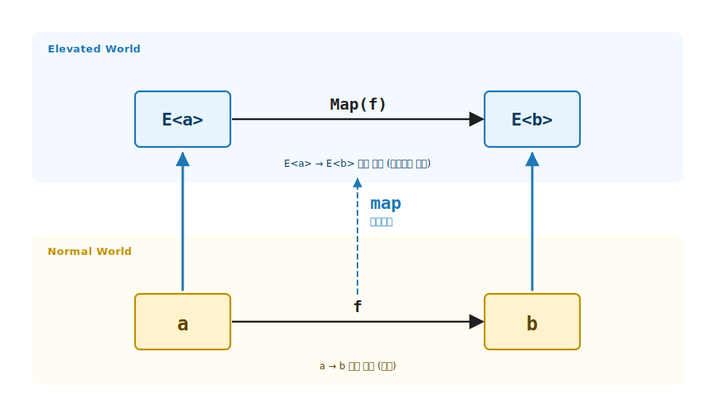
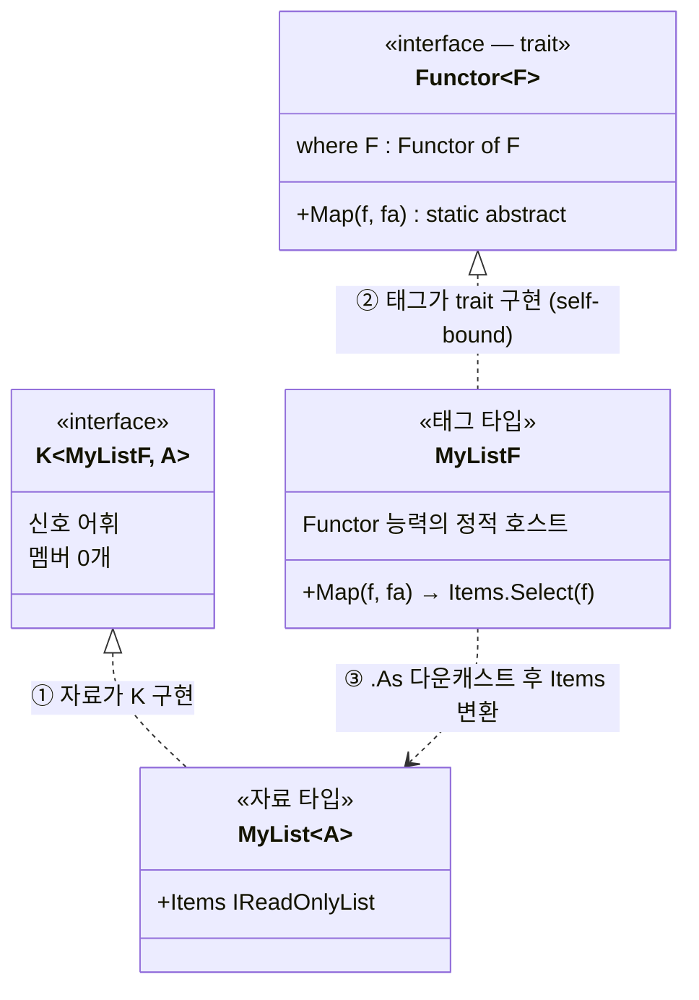
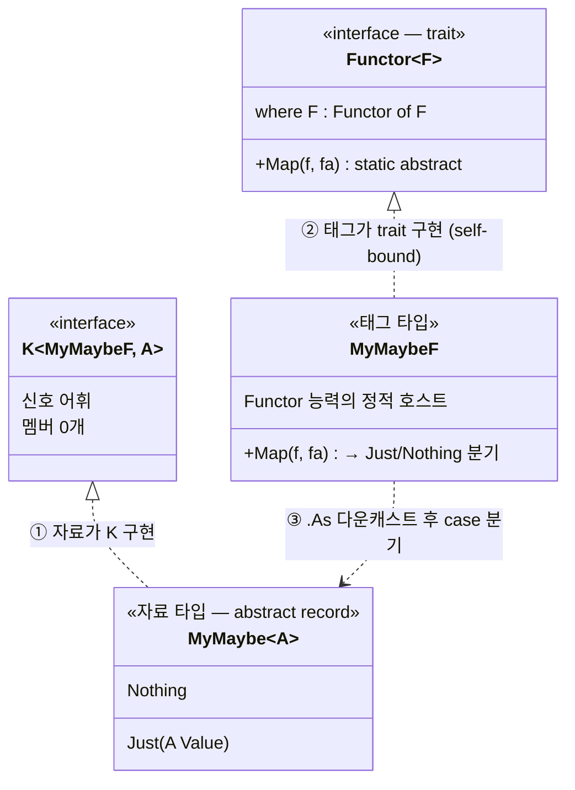
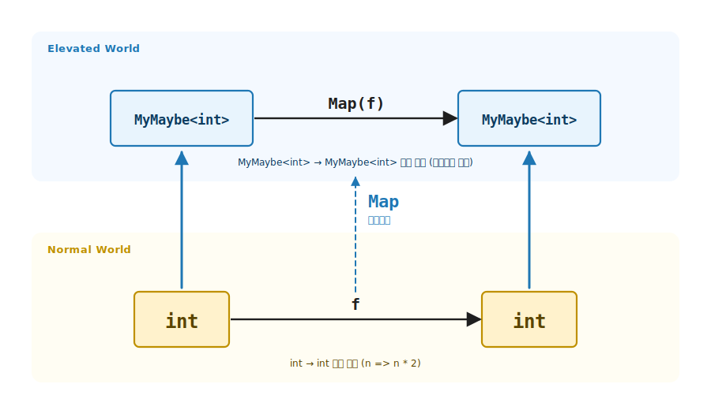
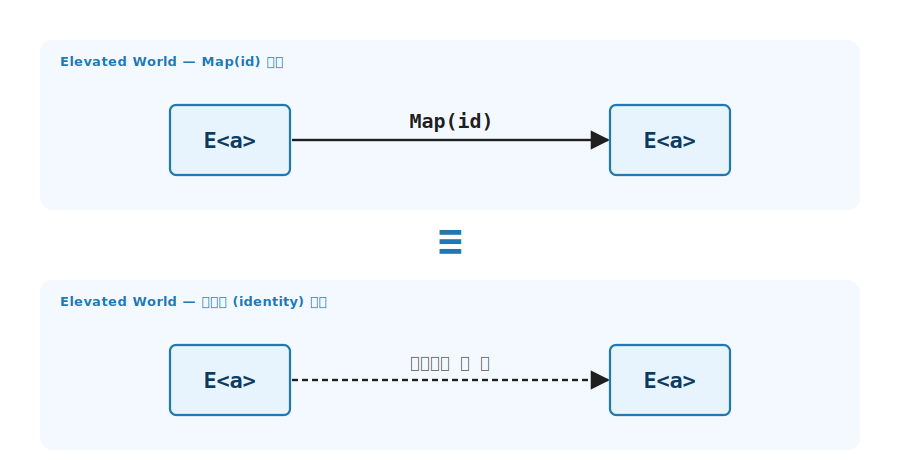
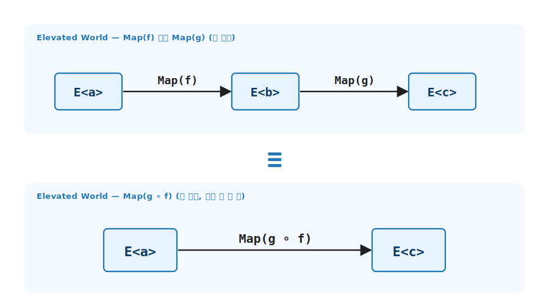

# 3장. Functor / `map` (가장 단순한 끌어올림)

> 이 장에서 다룰 주제 — 1부의 첫 정통 추상. Normal World 의 함수 `a → b` 한 개를 받아 Elevated World 의 함수 `E<a> → E<b>` 로 끌어올리는 도구, 곧 `map` 의 일반화. 1장의 `E<a> → E<b>` 유형 함수 (1장 4분면의 `E<a> → E<b>`) 를 어떤 Elevated World 든 만들 수 있게 하는 trait.

> 이 장을 마치면 할 수 있게 되는 것
> - [ ] Functor (함자) 의 한 줄 정의를 시그니처로 적을 수 있습니다.
> - [ ] `Functor<F>` trait 시그니처를 보고 왜 F 가 입력과 출력에같이 등장하는지 답할 수 있습니다.
> - [ ] Functor 두 법칙 (항등 / 합성) 을 시그니처와 코드로 검증할 수 있습니다.
> - [ ] 새 자료 타입에 3-tuple 패턴으로 Functor 를 부착할 수 있습니다 (재귀 자료 구조 포함).
> - [ ] 어떤 Functor 든 받는 일반 함수를 직접 작성할 수 있습니다.
> - [ ] Functor 가 아닌 변환의 시그니처가 왜 다른지 분류할 수 있습니다.

> 참고 — 이 장의 Elevated World 어휘는 Scott Wlaschin 의 "Map and Bind and Apply, Oh my!" 시리즈 ([fsharpforfunandprofit.com/posts/elevated-world](https://fsharpforfunandprofit.com/posts/elevated-world/)) 의 어휘 분류를 따릅니다. 1부 전체가 그 시리즈의 흐름 (`map → apply → bind → traverse → Reader`) 과 정렬됩니다.

---

## §3.1 `E<a> → E<b>` 유형 함수의 일반화 — 목적

3장의 핵심은 한 줄로 압축됩니다. Normal World 의 1인자 함수를 Elevated World 에서 그대로 사용할 수 있도록 제공하는 lift 함수가 `map` 입니다. `(a → b) → (E<a> → E<b>)` 의 시그니처가 그 약속을 정확히 표현합니다. 4장 Applicative 의 `pure / apply` 가 N 인자 lift 로 확장되고, 3장은 그 사다리의 1인자 원형을 다룹니다.

> 3장의 3부 구조 — 이 장의 본문은 왜이 함수가 필요한가 (목적) → 그 목적을 달성하기 위한 함수의 기능들 (기능) → 그 목적을 달성한 예제 (예제) 의 narrative arc 로 구성됩니다.
>
> - **§3.1 *목적*** — §1.6.1 의 1인자 lift 자리. 컨테이너마다 변환 코드를 다시 쓰는 반복을 *map* 한 번 정의로 해소.
> - **§3.2 *기능*** — `Functor<F>` trait 의 시그니처와 `Map` 멤버. 시그니처가 모양 보존을 컴파일 타임에 강제.
> - **§3.3 ~ §3.5 *예제*** — `MyList` / `MyMaybe` 인스턴스 + 어떤 Functor 든 받는 일반 함수 + 문자열 파싱 결과의 변환 예제 (§3.4.5).
> - **§3.6 ~ §3.7 *기능 (법칙·합성)*** — 두 법칙 (항등 + 합성) 이 목적의 성립을 보장 하는 약속.
> - **§3.8 ~ §3.9 *예제 (경계·챌린지)*** — Functor 가 아닌 변환들 + 직접 풀어 보는 챌린지.
> - **§3.10 ~ §3.12 *마무리*** — §1.6.1 framing 정합 한 줄 + 4장 Applicative 다리.

### 3.1.1 1장 4분면의 `E<a> → E<b>` 자리

1장 §1.7 에서 두 세계 사이의 함수 유형을 정리했습니다. 그중 `E<a> → E<b>` 유형 (4분면의 `E<a> → E<b>`) 의 시그니처는 E 가 입출력에같이 등장합니다.

```
E<a> → E<b> 유형:   컨테이너 모양 보존 (같은 E), 안의 타입만 변환
```

```csharp
Option<int>  Plus1Opt(Option<int> mn);   // E = Option,  a = int → b = int
List<string> ToTextAll(List<int> ns);    // E = List,    a = int → b = string
```

이 장의 목표는 한 줄입니다. 어떤 E 든 `E<a> → E<b>` 유형의 함수를 만들 수 있어야 한다는 추상이 Functor 입니다. `map` 은 Normal 의 평범한 함수 `a → b` 한 개를 받아 `E<a> → E<b>` 유형 함수를 자동으로 만드는 도구입니다.

이 *map* 이 함수형의 본질 — 합성 가능한 Elevated World 로 lift (§1.6.1) 의 lift 가 가장 단순한 형태로 등장하는 자리입니다. `Map : (a → b) → (E<a> → E<b>)` 는 lift 의 1인자 형태입니다. Normal World 의 함수 한 개를 Elevated World 에서 그대로 쓸 수 있게 끌어올리는 사다리입니다. 4장 Applicative 의 `Lift2 / Lift3 / Lift4` 가 다인자 확장이고, 3장은 그 사다리의 원형을 다룹니다.

```
map 의 발상:    f : a → b    ─────►    map(f) : E<a> → E<b>
                ─────┬────              ─────────┬─────────
                Normal 함수             E<a> → E<b> 유형 함수
```



**그림 3-1. `map`: `a → b` 함수를 `E<a> → E<b>` 함수로 끌어올립니다** — 아래 행 Normal World 에는 값 `a` 를 받아 `b` 로 변환하는 함수 `f`. 위 행 Elevated World 에는 같은 함수가 컨테이너 위에서 동작 (즉 `E<a>` 를 받아 `E<b>` 로 변환). 가운데 수직 `map` 화살표가 아래의 `f` 를 위 행으로 끌어올리는 동작을 표현합니다.

### 3.1.2 4가지 함수 유형 — 시그니처와 1부 매핑

| 시그니처 | 1부 매핑 | 어휘 (elevated-world 글) |
|---|---|---|
| `a → b` | 함수형 추상 불필요 | Normal World function |
| `a → E<b>` | 6장 (Monad / `bind`) | World-crossing function |
| `E<a> → b` | 5장 (Foldable / `fold`) | (끌어내림) |
| `E<a> → E<b>` | **3장 (Functor / `map`)** | Lifted function |

Normal → Elevated 로 옮기는 도구 자체가 Lifting function 입니다. `map`, `pure`, `apply` 가 모두 lifting function 입니다. 3장의 `map` 은 가장 단순한 형태로, 1인자 함수 (`a → b`) 한 개를 끌어올립니다. 2인자 / 3인자 함수의 lifting 은 4장 (Applicative) 의 `Lift2`, `Lift3` 에서 다룹니다.

### 3.1.3 Lifting 의 3 종류

elevated-world 글이 정의하는 lifting 은 세 시그니처로 분류됩니다.

| 종류 | 시그니처 | 어디서 다루는가 |
|---|---|---|
| 첫 번째 — Lifted **types** | `T → E<T>` | 2장의 `K<F, A>` 신호 어휘 |
| 두 번째 — Lifted **values** | `a → E<a>` | 4장의 `pure` |
| 세 번째 — Lifted **functions** | `(a → b) → (E<a> → E<b>)` | **이 장의 `map`** (= 4장 §4.3 의 `lift1`) |

#### 표기 대응 — `T`/`E` ↔ `A`/`F`

elevated-world 글의 `T` / `E` 와이 책의 `K<F, A>` 어휘는 같은 자리를 다르게 적은 것입니다.

| elevated-world | `K<F, A>` 어휘 | 역할 | 구체 예 |
|---|---|---|---|
| `T` (또는 `a`) | `A` | Normal 의 평범한 타입 | `int`, `string` |
| `E` | `F` | Elevated 의 컨테이너 / 타입 생성자 | `Option`, `List` |
| `E<T>` | `K<F, A>` | Elevated 의 끌어올려진 타입 | `Option<int>`, `List<int>` |

```
T   →   E<T>          ≡     A   →   K<F, A>
─       ────                 ─       ────────
타입    컨테이너               타입    신호 어휘로 적은 컨테이너
```

C# 의 타입 시스템에는 higher-kinded type 이 없어서 `E<T>` 를 그대로 적을 수 없습니다. 2장에서 도입한 `K<F, A>` 는 그 부재를 메우는 신호 어휘로, `T → E<T>` 의 추상 약속을 C# 컴파일러가 검증할 수 있는 모양으로 옮긴 것입니다. 따라서 위 표 세 줄의 `E<…>` 는 학습 코드에서 모두 `K<F, …>` 로 적힙니다.

| 어휘 약속 | 학습 코드 표기 |
|---|---|
| `T → E<T>` (첫 번째 — types) | `A` 와 `K<F, A>` 의 짝 |
| `a → E<a>` (두 번째 — values, `pure`) | `A pure(...)` 가 `K<F, A>` 를 만듭니다 |
| `(a → b) → (E<a> → E<b>)` (세 번째 — functions, `map`) | `Map<A, B>(Func<A, B> f, K<F, A> fa) → K<F, B>` |

세 줄 모두 대문자 `T`/`E` 는 추상의 약속이고, 대문자 `A` + `K<F, …>` 는 그 약속의 C# 구현입니다. 완전히 같은 자리입니다.

이 장은 세 번째 (Lifted functions) 중에서도 1인자 함수만 다룹니다. 4장에서 2인자, 3인자 함수의 lift (`Lift2`, `Lift3`) 로 확장됩니다.

---

## §3.2 `Functor<F>` trait 시그니처 — 기능

### 3.2.1 세 줄의 정의

```csharp
public interface Functor<F> where F : Functor<F>
{
    static abstract K<F, B> Map<A, B>(Func<A, B> f, K<F, A> fa);
}
```

세 줄이 끝입니다. 그러나 모양 보존 + 안의 값 변환의 약속을 컴파일러에 강제 합니다. 시그니처의 자리는 다음과 같습니다.

```cs
static abstract             // 정적 + 추상
    K<F, B>                 // 출력: 같은 F안 출력 B
        Map                 // 함수: Map
        (                   // 입력:
            Func<A, B> f,   //  - Normal World 변환 함수
            K<F, A> fa      //  - 같은 F안 입력 A
        )

   static abstract  K<F, B>  Map<A, B>(  Func<A, B> f,    K<F, A> fa  )
// ─────┬───────── ────┬────             ──────┬───────   ─────┬─────
// 정적 + 추상     같은 F 안 출력 B        Normal 변환 함수   같은 F 안 입력 A
```

| 자리 | 의미 |
|---|---|
| `where F : Functor<F>` | F 가 자기 자신을 구현체로 갖습니다 (2장 §2.5 의 self-bound) |
| `static abstract` | trait 에 사는 능력. 호출은 `MyListF.Map(...)` |
| 입력 `K<F, A>` / 출력 `K<F, B>` | F 가 같습니다 — 모양 보존이 시그니처 단계에서 강제됨 |

핵심은 F 가 입력과 출력에같이 등장하는 점입니다. `MyList<A>` 를 받아 `MyMaybe<B>` 를 돌려주는 구현은 컴파일이 안 됩니다.

### 3.2.2 시그니처가 강제하는 것 / 못 하는 것

```
✓  K<MyListF, int>  → K<MyListF, string>     컴파일 성공: F 같음, A 만 다름
✗  K<MyListF, int>  → K<MyMaybeF, int>       컴파일 에러: F 가 바뀜
✗  K<MyListF, int>  → int                    컴파일 에러: 컨테이너가 사라짐
```

첫 번째 (✓) 만 정상 컴파일됩니다. `Map` 의 반환 타입이 `K<MyListF, B>` 로 고정되어 있으니 `B = string` 인 `K<MyListF, string>` 은 시그니처와 일치합니다.

아래 두 잘못된 모양 (✗) 은 `Functor<MyListF>` 의 추상 `Map` 시그니처에 맞지 않습니다. C# 컴파일러가 `MyListF` 가 `Functor<MyListF>` 의 `Map` 을 구현하지 않았다는 에러로 거부합니다 (CS0535 / CS0738 계열).

- ✗ 두 번째 — 반환 타입이 `K<MyMaybeF, int>` 라 F 자리 (`MyListF` 로 고정) 와 다릅니다.
- ✗ 세 번째 — 반환 타입이 `int` 라 `K<F, B>` 형태 자체가 아닙니다.

런타임 검증이 아니라 컴파일 단계 강제가 결정적입니다.

### 3.2.3 `map` 의 별명들

같은 시그니처가 언어마다 다른 이름으로 등장합니다.

| 언어 / 맥락 | 이름 | 연산자 |
|---|---|---|
| Haskell | `fmap` | `<$>` |
| F# | `List.map`, `Option.map` | `<!>` |
| Scala | `map` | (없음) |
| C# / LINQ | `Select` | (없음) |
| 일반화 어휘 | `lift1` (4장 §4.3) | (없음) |

LINQ 의 `xs.Select(f)` 는 List Functor 의 Map 의 인스턴스 구현입니다.

### 3.2.4 변성 (variance) — `K<in F, A>`

`K<F, A>` 의 정확한 정의는 `K<in F, A>` (F 는 contravariant). 학습용 코드에서는 그대로 따라가면 됩니다.

> 참고 (변성의 깊이) — 공변 (out) / 반공변 (in) / 무변의 정확한 정의는 부록의 변성 한 페이지에서 다룹니다.

### 3.2.5 라이브러리 4-파일 패턴 정렬

```
Ch03-Functor/
├── Traits/Functor.cs                  ← interface 정의 (abstract Map 1개)
├── Functions/Functor.cs               ← 모듈 — generic 헬퍼 (소문자 `map`)
├── Functions/FunctorExtensions.cs     ← 확장 — K<F, A> 위 점 호출 (`.Map(f)`)
└── Tests/FunctorLaws.cs               ← 두 법칙 검증 헬퍼 (§3.6)
```

#### 두 헬퍼의 실제 구현 — 각각 한 줄짜리 generic 함수

두 어법 모두 trait 의 정적 `Functor<F>.Map` 호출을 감싼 generic 한 줄입니다. MyListF / MyMaybeF 별 코드는 없습니다. `where F : Functor<F>` 제약 한 줄이 어떤 F 든 받아 그 정적 `Map` 으로 디스패치합니다.

```csharp
// Functions/Functor.cs — 모듈 어법
public static class Functor
{
    public static K<F, B> map<F, A, B>(Func<A, B> f, K<F, A> fa)
        where F : Functor<F> =>
        F.Map(f, fa);                  // ← 정적 디스패치 (MyListF.Map / MyMaybeF.Map / ...)
}
```

```csharp
// Functions/FunctorExtensions.cs — 확장 어법
public static class FunctorExtensions
{
    public static K<F, B> Map<F, A, B>(this K<F, A> fa, Func<A, B> f)
        where F : Functor<F> =>
        F.Map(f, fa);                  // ← 몸체는 모듈 어법과 동일
}
```

두 클래스의 몸체는 똑같이 `F.Map(f, fa)` 한 줄입니다. 차이는 인자 순서와 호출 형태입니다. 모듈은 `Functor.map(f, fa)` 의 함수형 어법, 확장은 `fa.Map(f)` 의 점 호출 어법입니다.

#### 세 가지 호출 어법 — 같은 `MyMaybeF.Map` 으로 흘러갑니다

```csharp
// ① trait 정적 호출 — F 를 명시적으로 적는다 (가장 정직한 자리)
var r1 = MyMaybeF.Map<int, string>(n => n.ToString(), maybe);

// ② 모듈 어법 — Functor.map<F, A, B> (소문자 m), generic 디스패치
var r2 = Functor.map<MyMaybeF, int, string>(n => n.ToString(), maybe);

// ③ 확장 어법 — K<F, A> 위 점 호출, F 추론 (가장 간결)
var r3 = maybe.Map(n => n.ToString());
```

세 어법 모두 generic 제약 (`where F : Functor<F>`) 을 통해 자동 디스패치됩니다. 호출 측은 어느 쪽을 골라도 같은 `MyMaybeF.Map` 으로 흘러갑니다. `r1`, `r2`, `r3` 의 값은 동일합니다.

> 참고 (어느 어법을 언제 쓰나) — 학습 코드는 ① (trait 정적) 으로 적으면 F 가 무엇인지 한눈에 보입니다. 일반 함수 안에서는 ② (모듈) 이 F 가 generic 매개변수 일 때 자연스럽습니다 (§3.5 의 `MapAnyFunctor.Run` 이 그 예). 호출 측 에서는 ③ (확장) 이 C# 의 점 호출 관습과 가장 잘 맞습니다. 세 어법은 동등하므로 어느 한쪽을 반드시 써야 하는 자리는 없습니다.

---

## §3.3 첫 인스턴스 — MyList Functor (예제)

### 3.3.1 3-tuple 패턴으로 부착

추상 trait 만으로는 동작하지 않습니다. 2장 §2.7 의 3-tuple 패턴으로 첫 자료 타입에 부착합니다.

```csharp
// ① 자료 타입 — 시퀀스를 들고 K<MyListF, A> 를 구현.
public sealed class MyList<A>(IEnumerable<A> items) : K<MyListF, A>
{
    public IReadOnlyList<A> Items { get; } = items.ToList();
}

// ② 태그 타입 — Functor 능력의 정적 호스트.
public sealed class MyListF : Functor<MyListF>
{
    public static K<MyListF, B> Map<A, B>(Func<A, B> f, K<MyListF, A> fa)
    {
        var list = fa.As();
        return new MyList<B>(list.Items.Select(f));
    }
}

// ③ 다운캐스트 보일러플레이트를 감추는 확장.
public static class MyListExtensions
{
    public static MyList<A> As<A>(this K<MyListF, A> fa) => (MyList<A>)fa;
}
```

### 3.3.2 세 부분의 책임

| 조각 | 책임 |
|---|---|
| ① `MyList<A>` 자료 타입 | 시퀀스를 들고 `K<MyListF, A>` 구현 (F 안에 A 가 들었다는 신호) |
| ② `MyListF` 태그 타입 | Functor 능력의 정적 호스트. `Map` 이 정적 자리에 삽니다 |
| ③ `Map` 구현 | `K<MyListF, A>` 다운캐스트 후 `Select(f)` 로 변환 |



**그림 3-2. MyList Functor 의 3-tuple 구조** — 위 행의 두 interface (`K<F, A>`, `Functor<F>`) 가 아래 행의 두 구현 (`MyList<A>`, `MyListF`) 으로 각각 끌어내려집니다. `MyListF.Map` 안에서 `K<MyListF, A>` 가 `.As()` 로 `MyList<A>` 가 되고, 그 `Items` 에 `f` 를 `Select` 로 적용합니다.

### 3.3.3 코드 walkthrough — 두 줄 분해

```
var list = fa.As();                          ① K<MyListF, A> → MyList<A>  (다운캐스트)
return new MyList<B>(list.Items.Select(f));  ② Items.Select(f) → 새 MyList<B>
```

`fa.As()` 는 추상 신호 타입 `K<MyListF, A>` 를 진짜 자료 타입 `MyList<A>` 로 변환합니다. 3-tuple 패턴의 결정적 비용입니다. 컴파일러가 F = MyListF 면 자료 타입이 `MyList<A>` 라는 연결을 모르기 때문에 사람이 알려 줍니다.

### 3.3.4 호출 모양 — 세 가지 어법

§3.2.5 의 세 호출 어법이 MyList 에서 어떻게 보이는지 확인합니다. 세 줄 모두 결과가 동일합니다. 같은 `MyListF.Map` 으로 디스패치됩니다.

```csharp
K<MyListF, int>  nums = new MyList<int>([1, 2, 3, 4, 5]);

// ① trait 정적 호출 — F (MyListF) 를 명시
K<MyListF, int>  r1   = MyListF.Map<int, int>(n => n * 2, nums);

// ② 모듈 어법 — Functor.map<F, A, B>
K<MyListF, int>  r2   = Functor.map<MyListF, int, int>(n => n * 2, nums);

// ③ 확장 어법 — K<F, A> 위 점 호출 (F 자동 추론)
K<MyListF, int>  r3   = nums.Map(n => n * 2);

// 세 결과 모두 → MyList<int>([2, 4, 6, 8, 10])
```

List 의 모양 (5개 원소) 은 그대로 두고 안의 값만 변환했습니다. Functor 의 첫 동작입니다. 이 장의 이후 예제에서는 세 어법 중 어느 것을 써도 같은 결과가 나옵니다. 책의 본문은 어법이 결정적이지 않은 자리에서 ③ 확장 어법을 우선합니다 (가장 간결).

### 3.3.5 흔한 함정 — 다운캐스트의 안전성

> 흔한 함정 — `fa.As()` 다운캐스트의 안전성
>
> `(MyList<A>)fa` 의 다운캐스트가 런타임에 실패할 수 있습니까? 가능성은 매우 낮지만 0 은 아닙니다. F = MyListF 인 `K<F, A>` 의 자료 타입이 `MyList<A>` 가 아닌 다른 타입으로 만들어진 경우 (예: 잘못된 mock) 다운캐스트가 `InvalidCastException` 을 던집니다. 학습 코드와 라이브러리 코드 모두 F 와 자료 타입의 1:1 정렬을 컨벤션으로 유지 합니다.

---

## §3.4 두 번째 인스턴스 — MyMaybe Functor (예제)

### 3.4.1 완전히 다른 자료 구조에 같은 trait

같은 trait 을 완전히 다른 자료 구조에 부착합니다.

```csharp
// 두 번째 자료 타입 — 값이 있거나 없는 옵셔널.
public abstract record MyMaybe<A> : K<MyMaybeF, A>
{
    public sealed record Just(A Value) : MyMaybe<A>;
    public sealed record Nothing : MyMaybe<A>
    {
        public static readonly Nothing Instance = new();
    }
}

public sealed class MyMaybeF : Functor<MyMaybeF>
{
    public static K<MyMaybeF, B> Map<A, B>(Func<A, B> f, K<MyMaybeF, A> fa) =>
        fa.As() switch
        {
            MyMaybe<A>.Just j  => new MyMaybe<B>.Just(f(j.Value)),  // Just  → f 적용
            MyMaybe<A>.Nothing => MyMaybe<B>.Nothing.Instance,      // Nothing → 그대로
            _                  => throw new InvalidOperationException()
        };
}

public static class MyMaybeExtensions
{
    public static MyMaybe<A> As<A>(this K<MyMaybeF, A> fa) => (MyMaybe<A>)fa;
}
```



**그림 3-3. MyMaybe Functor 의 3-tuple 구조** — `MyList` 와 같은 패턴이라 두 interface 가 두 구현으로 끌어내려집니다. 차이는 `MyMaybe<A>` 가 `abstract record` 와 두 variant (`Just`, `Nothing`) 라는 점, 그리고 `MyMaybeF.Map` 이 Items 순회가 아니라 case 분기 (`Just` 면 `f(value)`, `Nothing` 이면 그대로) 라는 점. 같은 trait 시그니처 위에서 자료 구조에 맞는 다른 동작이 자연스럽게 표현됩니다.

### 3.4.2 두 case 의 시그니처

```
Just(v).Map(f)    ─────►   Just(f(v))     f 호출 1회
Nothing.Map(f)    ─────►   Nothing        f 호출 0회
```

이 두 분기가 Maybe 의 모양 보존을 정확히 표현합니다. Just 는 Just 로, Nothing 은 Nothing 으로 옮겨지고, 컨테이너의 형태는 모두 보존됩니다.

### 3.4.3 호출 모양 — 세 가지 어법

MyMaybe 도 §3.2.5 의 세 어법을 그대로 받습니다. `MyMaybeF` 가 `Functor<MyMaybeF>` 를 만족하기 때문에 MyMaybe 전용 코드 없이 세 어법 모두 자동 디스패치됩니다.

```csharp
K<MyMaybeF, int>    just = new MyMaybe<int>.Just(42);

// ① trait 정적 호출 — F (MyMaybeF) 를 명시
K<MyMaybeF, string> m1   = MyMaybeF.Map<int, string>(n => $"#{n}", just);

// ② 모듈 어법 — Functor.map<F, A, B>
K<MyMaybeF, string> m2   = Functor.map<MyMaybeF, int, string>(n => $"#{n}", just);

// ③ 확장 어법 — K<F, A> 위 점 호출 (F 자동 추론)
K<MyMaybeF, string> m3   = just.Map(n => $"#{n}");

// 세 결과 모두 → Just("#42")
```

Nothing 도 세 어법 모두 같은 분기를 탑니다. `Map` 의 case 분기가 호출 어법과 무관 하게 동작합니다. 확장 어법으로만 시연합니다.

```csharp
K<MyMaybeF, int>    nothing = MyMaybe<int>.Nothing.Instance;
K<MyMaybeF, string> mappedN = nothing.Map(n => $"#{n}");
// → Nothing
```

같은 Functor 메서드가 완전히 다른 자료 구조 (시퀀스 vs 옵셔널) 에서 각자 의미 있는 동작을 합니다. 세 어법은 호출 형태의 차이일뿐, Functor 의 동작은 자료 구조의 분기가 결정 합니다.

### 3.4.4 MyList 와 MyMaybe 의 Map 비교

| 차원 | MyList Functor | MyMaybe Functor |
|---|---|---|
| 0개 원소 / Nothing | 빈 시퀀스 그대로 | Nothing 그대로 |
| 1개 원소 | 그 1개 변환 | Just 의 값 변환 |
| N개 원소 | N개 모두 변환 | (해당 없음) |
| f 호출 횟수 | N회 | Just 면 1회, Nothing 이면 0회 |

같은 `Map` 시그니처 지만 분기 수와 f 호출 횟수는 자료 구조에 달려 있습니다. `Map` 자체는 함수 적용의 추상이고, 몇 번 / 어디 적용할지는 자료 구조의 분기입니다.

### 3.4.5 문자열 파싱 결과의 변환 예제

문자열을 정수로 파싱하는 자리는 효과 인코딩 + 일반 연산 합성의 정통 예제입니다. *Map* 의 결정적 가치는 함수 변환 이라는 문법적 형태가 아니라 **세 책임의 깔끔한 분리** 에 있습니다 — 효과는 타입 / 연산은 함수 / 합성은 Map.

- **효과 인코딩 — `MyMaybe<int>`** — 문자열 파싱은 데이터가 있을 수도 있고 없을 수도 있습니다 (`"42"` 는 성공, `"xyz"` 는 실패). 이 있음/없음 가능성 자체를 **타입에 인코딩** 하는 자리가 `MyMaybe<int>` 입니다. 호출자가 분기 검사를 잊을 수 없도록 시그니처가 강제합니다. 효과는 타입의 책임.
- **일반 연산 — `f = (n => n * 2)`** — 정수를 2 배라는 평범한 연산은 효과를 모릅니다. 시그니처는 `int → int` 한 줄이고 `MyMaybe` 어휘는 들어가지 않습니다. 데이터가 있다는 가정 하의 단순 함수 — 연산은 함수의 책임.
- **합성 — `Map(f, …)`** — *Map* 한 줄이 일반 연산 `f` 를 효과 인코딩 위로 승격 시킵니다. 있음 분기 (`Just`) 에는 `f` 적용, 없음 분기 (`Nothing`) 에는 그대로 통과 — 분기 코드 `if (parsed != null) …` 자체가 사라집니다. 합성은 Map 의 책임.

세 책임이 한 줄 사슬로 합쳐집니다.

```csharp
// 문자열을 int 로 파싱 — 효과 인코딩 (있음/없음을 MyMaybe 타입에 감춤)
static K<MyMaybeF, int> ParseInt(string s) =>
    int.TryParse(s, out var n)
        ? (K<MyMaybeF, int>)MyMaybe<int>.Just(n)
        : MyMaybe<int>.Nothing;

// Normal World 의 일반 연산 — int → int, 효과 (MyMaybe) 어휘 모름
Func<int, int> f = n => n * 2;

// Map 으로 효과 인코딩 + 일반 연산 합성 — 분기 처리는 컴파일러가 알아서
K<MyMaybeF, int> doubled = MyMaybeF.Map(f, ParseInt("42"));
// → Just(84)         ("42" → Just(42) → Map(f) → 안의 값에 f 적용 → Just(84))

K<MyMaybeF, int> stillNo = MyMaybeF.Map(f, ParseInt("xyz"));
// → Nothing          ("xyz" → Nothing → Map(f) → f 호출 없이 통과 → Nothing)
```

#### Elevated World 사슬 — 효과 + 일반 연산이 한 어법으로 합쳐집니다

| 단계 | 코드 | 시그니처 | 책임 | 4분면 자리 |
|---|---|---|---|---|
| 시작 | `"42"` / `"xyz"` | `string` | (Normal 입력) | Normal World |
| 1 | `ParseInt("…")` | `string → MyMaybe<int>` | **효과 인코딩** — 있음/없음을 타입에 감춤 | World-crossing (`a → E<b>`) |
| 2 | `Map(f, …)` | `MyMaybe<int> → MyMaybe<int>` | **일반 연산 합성** — f 를 효과 위에 적용 | Elevated 자연 합성 (`E<a> → E<b>`, **Functor 의 자리**) |

1단계의 효과 인코딩 (있음/없음 분기 가능성) 위에서 2단계의 일반 연산 (`n => n * 2`) 이 자유롭게 합성됩니다. 두 단계가 어법 일치 (입력·출력 모두 `MyMaybe<int>`) 라 마침표 한 점으로 직접 연결.

#### 효과 + 일반 연산 분리의 가치

| 분리 | 사슬에 어떻게 나타나는가 |
|---|---|
| **효과는 시그니처가 책임** | `MyMaybe<int>` 라는 타입 자체가 있음/없음 가능성을 명시. 호출자가 효과를 잊을 수 없습니다 — 컴파일러가 강제. 분기 검사를 깜빡할 위험 자체가 사라짐. |
| **일반 연산은 평범한 함수** | `f = (n => n * 2)` 는 효과를 모르는 단순한 `int → int`. 어디든 재사용 가능 — 다른 Elevated 컨테이너 (`MyList`, `MyEither`, `MyTask` …) 에도 같은 `f` 한 줄로 적용. 연산 코드는 효과별로 복제할 필요 없음. |
| **합성은 Map 한 줄** | `Map(f, …)` 가 효과 (있음/없음) 두 분기 처리와 일반 연산 적용을 한 줄로 합칩니다. 명령형의 `if (parsed != null) …` / `try-catch` 분기 코드가 사라짐. |

명령형 코드라면 효과 검사 (null 비교, try-catch) 와 일반 연산이 함수 본문 안에 섞여서 작성됩니다. 함수형은 **효과는 타입, 연산은 함수, 합성은 Map** — 세 책임이 깔끔히 나뉩니다. 독자가 작성하는 건 늘 효과를 모르는 일반 함수뿐, 분기 어법은 trait 의 메서드가 자동으로 입혀 줍니다. §1.7.6 의 결정적 통찰이 구체 예제로 작동하는 자리입니다.



**그림 3-4. 효과 인코딩 (MyMaybe) 과 일반 연산 (f) 의 분리** — 아래 행 Normal World 에 효과를 모르는 일반 연산 `f = (n => n * 2) : int → int` (회색 점선 — 효과 어휘 없음). 위 행 Elevated World 에 효과 인코딩 (MyMaybe<int>) 위의 적용 결과 두 분기 (`Just(42) → Just(84)` 성공, `Nothing → Nothing` 실패, `f` 호출 없이 통과) 와 승격된 함수 자체 `Map(f) : MyMaybe<int> → MyMaybe<int>` (실선 박스, 람다 본체에서 있음 분기는 `f` 적용 / 없음 분기는 통과 두 case 분기 처리). 가운데 파란 lift 점선 화살표 (`Map`) 가 Normal 의 일반 연산 `f` 를 Elevated 의 효과 위 함수 `Map(f)` 로 승격시킵니다. `int → int` 의 시그니처가 `MyMaybe<int> → MyMaybe<int>` 가 되면서 효과 두 분기 처리가 자동으로 따라옵니다. **Map 의 가치는 함수 변환이 아니라 세 책임 (효과 / 연산 / 합성) 의 깔끔한 분리에 있습니다**.

`MyMaybeF.Map(f, …)` 한 줄이 1인자 lift (§1.6.1) 의 가장 단순한 실현입니다. Elevated World 의 값을 일반 연산 함수에 통과시켜 같은 Elevated World 의 새 값으로 만들어 줍니다. 효과 인코딩의 분기 처리는 시그니처가 책임지고, 변환 로직은 효과를 모르는 평범한 함수로 남습니다.

### 3.4.6 더 많은 Functor 인스턴스

이 장은 List 와 Maybe 만 구현하지만, Functor 인스턴스는 훨씬 많습니다.

| 자료 구조 | `Map` 의 의미 |
|---|---|
| `MyEither<L, R>` | `Right` 의 값 변환 (`Left` 는 그대로) |
| `MyTry<A>` | `Success` 의 값 변환 (`Failure` 는 그대로) |
| `MyTree<A>` | 모든 노드의 값 변환 (재귀) |
| `MyTask<A>` | 비동기 결과 값 변환 |
| `MyReader<E, A>` | 환경에서 만들어진 결과 값 변환 |
| `Func<E, A>` | 함수의 결과 값 변환 (함수 합성) |

임의 자료 구조가 모양 보존 + 안의 값 변환을 만족하면 Functor 가 됩니다. 각 Elevated World 는 고유한 `map` 구현을 갖지만, 시그니처는 같습니다. 표의 `MyTree<A>` 는 §3.9 의 첫 챌린지에서 직접 부착해 봅니다.

> 참고 (`Func<E, A>` 도 Functor) — `(Func<E, A>).Map(g) = e => g(f(e))` 가 함수 합성 자체입니다. 함수가 Functor 라는 점이 Reader Monad (11장) 의 출발점입니다.

---

## §3.5 어떤 Functor 든 받는 일반 함수 — 예제

### 3.5.1 trait 의 결정적 가치

```csharp
public static class MapAnyFunctor
{
    public static K<F, B> Run<F, A, B>(K<F, A> fa, Func<A, B> f)
        where F : Functor<F> =>         //  ← F 가 Functor 의 구현체임을 보장
        F.Map(f, fa);                   //  ← 정적 디스패치 (MyListF / MyMaybeF / …)
}
```

`MapAnyFunctor.Run` 은 F 가 무엇이든 동작합니다. `MyListF`, `MyMaybeF`, 그리고 미래의 어떤 Functor 든 같은 함수가 처리합니다.

> elevated-world 글 인용 — "매 Elevated World 마다 이름을 붙인 lifting 패턴은 존재하나 구현은 다릅니다. 그러나 다루는 방식의 공통성이 존재합니다." 그 공통성을 trait 시그니처 한 줄로 표현한 것이 `Functor<F>` 입니다.

### 3.5.2 호출 모양

```csharp
var listResult  = MapAnyFunctor.Run<MyListF,  int, int>(nums, n => n + 100);
// → MyList([101, 102, 103, 104, 105])

var maybeResult = MapAnyFunctor.Run<MyMaybeF, int, int>(just, n => n + 100);
// → Just(142)
```

같은 함수가 List 와 Maybe 모두에서 일합니다. trait 메서드 한 개를 정의하면 trait 위의 모든 일반 함수가 공짜로 따라옵니다.

### 3.5.3 일반 함수의 합성

```csharp
public static class FunctorHelpers
{
    public static K<F, A> MapTwice<F, A>(K<F, A> fa, Func<A, A> f)
        where F : Functor<F> =>
        F.Map(f, F.Map(f, fa));         //  Map(f ∘ f) 와 같음 (합성 법칙 §3.6.3)

    public static K<F, C> MapThenMap<F, A, B, C>(K<F, A> fa, Func<A, B> f, Func<B, C> g)
        where F : Functor<F> =>
        F.Map(g, F.Map(f, fa));         //  Map(g ∘ f) 와 같음
}
```

`Map` 한 개의 정의 위에 수많은 일반 함수가 자라납니다.

### 3.5.4 공짜 함수의 누적

```
Functor 만 정의      ─►  Map, Lift1, ...                            (소수)
+ Applicative        ─►  + Lift2, Lift3, Lift4, sequence, traverse   (중간)
+ Monad              ─►  + Bind, liftM, mapM, foldM, replicateM      (다수)
```

새 자료 타입이 Monad trait 한 개 만족으로 수십 개 함수가 자동 적용 됩니다. 함수형 prelude 의 가장 큰 가치입니다.

---

## §3.6 Functor 의 두 법칙 — 기능 (목적의 보장)

§3.2 의 trait 시그니처가 모양 보존을 강제하지만, 어떤 모양으로 보존되는가는 시그니처가 답하지 않습니다. 그 답이 두 법칙입니다. 두 법칙이 §3.1 의 목적 (1인자 lift 가 합성을 보존한다) 이 실제로 성립한다는 약속입니다.

### 3.6.1 시그니처만으로는 부족합니다

`Functor<F>` 인터페이스를 구현했다고 해서 진짜 Functor 가 되는 것이 아닙니다. 두 법칙을 만족해야 합니다. **컴파일러는 강제하지 못합니다**. 독자가 직접 검증합니다.

> elevated-world 글 인용 — "`map` 의 올바른 구현은 Elevated World 마다 다르지만, 항상 만족해야 할 성질이 있습니다." 그 "성질" 이 두 법칙입니다.

### 3.6.2 첫 번째 법칙 — 항등 (Identity Law)

```
Map(id, fa)  ≡  fa
```

가장 간단한 함수, 즉 아무 일도 안 하는 항등 함수 (`x => x`) 를 Map 으로 끌어올리면 결과는 원본 그대로입니다. 변환 자체가 값에 차이를 만들지 않으니 출력 = 입력입니다.

**구체 예** — `[1, 2, 3]` 에 항등 함수를 매핑:

```csharp
[1, 2, 3].Map(x => x)   ─►   [1, 2, 3]    // 입력과 동일
```

너무 자명해 보이지만, 이 자명함이 법칙으로 강제되어야 하는 이유는 §3.6.5 에서 `BogusListF` 와 함께 봅니다. 시그니처는 통과하지만이 자명함을 어기는 가짜 Functor 가 존재합니다.



**그림 3-4. 항등 법칙: Normal 의 `id` 가 Map 으로 끌어올려져 Elevated 의 `id` 가 됩니다** — Normal World (아래) 에서는 `id : a → a` 가 입력 `a` 를 그대로 `a` 로 돌려줍니다. 그 함수를 Map 으로 끌어올린 결과 (`Map(x => x)`, 위) 는 Elevated World 에서도 `[1, 2, 3]` 을 그대로 `[1, 2, 3]` 으로 돌려줍니다 (즉 **입력 = 출력**). 항등 법칙은 "Normal 의 id 와 Elevated 의 Map(id) 가 같은 약속을 지킵니다" 는 등식.

### 3.6.3 두 번째 법칙 — 합성 (Composition Law)

```
Map(g, Map(f, fa))   ≡   Map(g ∘ f, fa)
```

함수 둘을 따로 따로 매핑한 결과와 두 함수를 미리 합성해 한 번에 매핑한 결과가 같습니다.

**구체 예** — `[1, 2, 3]` 에 두 변환 적용. `f` = `x => x*2`, `g` = `x => x+1`:

```csharp
// 방법 ① — Map 두 번 (리스트를 두 번 순회, 중간 결과 [2, 4, 6] 할당)
[1, 2, 3].Map(x => x * 2).Map(x => x + 1)
   = [2, 4, 6].Map(x => x + 1)
   = [3, 5, 7]

// 방법 ② — Map 한 번 (두 함수를 미리 합성, 리스트를 한 번만 순회)
[1, 2, 3].Map(x => x * 2 + 1)
   = [3, 5, 7]
```

**두 방법 모두 `[3, 5, 7]`**. 합성 법칙 덕분에 컴파일러 / 독자가 ① 을 ② 로 안전하게 줄일 수 있습니다 (fusion 최적화). 중간 리스트 할당이 사라지고, 순회 횟수가 절반으로 줄어듭니다.



**그림 3-5. 합성 법칙: 두 길이 같은 곳에 도착** — Normal World (아래) 에서 `x => x*2` 다음에 `x => x+1` 의 두 단계는 `x => x*2 + 1` 한 함수와 같습니다 (수학적 합성 `g ∘ f`). 이 Normal 의 사실이 Map 으로 끌어올려져 Elevated World (위) 에서도 그대로 보존됩니다. 즉 방법 ① (Map 두 번, 중간 결과 `[2, 4, 6]` 거침) 과 방법 ② (Map 한 번, 합성 함수) 가 같은 결과 `[3, 5, 7]` 에 도착. 합성 법칙은 "Normal 의 함수 합성이 Map 으로 끌어올려도 보존됩니다" 는 등식.

### 3.6.4 코드로 검증

법칙은 독자가 직접 검증해야 합니다. xUnit + Shouldly 로 두 [Fact] 를 적습니다.

```csharp
[Fact]
public void Identity_law_holds()
{
    K<MyListF, int> fa  = new MyList<int>([1, 2, 3]);
    var             lhs = MyListF.Map<int, int>(x => x, fa);   // Map(id, fa)
    var             rhs = fa;                                  // fa 그대로
    lhs.As().Items.ShouldBe(rhs.As().Items);
}

[Fact]
public void Composition_law_holds()
{
    K<MyListF, int> fa = new MyList<int>([1, 2, 3, 4]);
    Func<int, int>  f  = n => n + 1;
    Func<int, int>  g  = n => n * 10;

    var lhs = MyListF.Map<int, int>(g, MyListF.Map<int, int>(f, fa));   // Map(g) ∘ Map(f)
    var rhs = MyListF.Map<int, int>(Compose.Of(g, f), fa);              // Map(g ∘ f)
    lhs.As().Items.ShouldBe(rhs.As().Items);
}
```

두 [Fact] 가 통과하면 `MyListF` 는 **제대로 된 Functor** 입니다. 같은 검증을 `MyMaybeF` 에 대해서도 한 쌍 더 적으면 두 인스턴스의 법칙 검증이 끝납니다.

> 합성 헬퍼 `Compose.Of` — 위 [Fact] 의 `Compose.Of(g, f)` 는 두 함수의 수학적 합성 `g ∘ f` 를 한 줄로 만들어 주는 작은 헬퍼입니다. C# 에는 표준 합성 연산자가 없으므로 학습 코드가 직접 정의합니다.
>
> ```csharp
> public static class Compose
> {
>     public static Func<A, C> Of<A, B, C>(Func<B, C> g, Func<A, B> f) =>
>         x => g(f(x));
> }
> ```
>
> `Compose.Of(g, f)(x)` 는 `g(f(x))` 와 같습니다. `Functions/MapAnyFunctor.cs` 안에 정의돼 있고 §3.7 의 합성 절에서도 같은 헬퍼를 씁니다.

### 3.6.5 두 법칙이 함께 필요한 이유

Functor 의 본연의 목표는 한 줄입니다 — Normal World 의 함수 `a → b` 를 Elevated World 의 함수 `E<a> → E<b>` 로, 컨테이너의 **모양** 을 보존하며 끌어올리는 것. 여기서 **모양** 이란 컨테이너 종류 (`F` 가 같음) + 원소 개수 + 내부 배치 (Tree 노드 위치, Maybe 의 Just/Nothing variant 등) 의 묶음을 가리킵니다 (§3.8.1 의 분류 어휘와 동일). trait 시그니처는 그중 컨테이너 종류만 강제하고 원소 개수·내부 배치 보존은 강제하지 못하므로, 두 법칙이 그 빈자리를 채웁니다.

#### Map 이 보존해야 할 두 구조

Normal World 의 함수에는 두 가지 핵심 구조가 있습니다. Map 이 bridge 로 제대로 작동하려면 **둘 다** 옮겨야 합니다. 하나만 옮기면 다리가 어딘가에서 휘어 있습니다.

| 구조 | Normal World | Elevated World 에서도 같아야 |
|---|---|---|
| **항등** | `id : a → a` — 아무 일도 안 하는 함수 | `Map(id)` 도 아무 일도 안 함 |
| **합성** | `g ∘ f` — 두 함수를 잇기 | `Map(g) ∘ Map(f)` 도 같은 결과 |

두 등식이 그 옮김의 형식화입니다.

```
① 항등 법칙   Map(id, fa)        ≡  fa                   "id 끌어올림 = id"
② 합성 법칙   Map(g, Map(f, fa)) ≡  Map(g ∘ f, fa)        "합성 끌어올림 = 끌어올림의 합성"
```

두 등식은 추가 규칙이 아니라 "구조 보존" 직관을 코드로 옮긴 것입니다. 자연어 "모양과 합성을 그대로 둡니다" 와 두 등식은 같은 말의 두 표현입니다. 따라서 **Functor 가 되려면 두 법칙을 모두 만족** 해야 합니다. 한쪽만 만족하면 Map 이 보존해야 할 구조 중 한 쪽이 사라집니다.

#### 한쪽만 깨져도 무너지는 자리 — 두 가짜 Functor

**A. 항등 법칙만 깨진 `BogusListF`** — Map 이 입력을 무시합니다.

```csharp
public sealed class BogusListF : Functor<BogusListF>
{
    public static K<BogusListF, B> Map<A, B>(Func<A, B> f, K<BogusListF, A> fa) =>
        new BogusList<B>([]);                  // ← 항상 빈
}
```

```
BogusListF.Map(x => x, [1, 2, 3])   ─►   []     ← 컨테이너 종류는 같지만 원소 개수가 변함 (3 → 0)
```

시그니처는 통과하지만 **항등 함수가 결과를 비웠습니다**. 부작용으로 no-op Map 단순화 (`xs.Map(x => x)` → `xs`) 가 결과를 바꿉니다. "변환 없음" 을 항등 함수로 표현하는 모든 코드 패턴이 안전하지 않습니다.

**B. 합성 법칙만 깨진 `CountingListF`** — Map 이 외부 카운터를 건드립니다.

```csharp
public sealed class CountingListF : Functor<CountingListF>
{
    public static int CallCount { get; private set; }
    public static K<CountingListF, B> Map<A, B>(Func<A, B> f, K<CountingListF, A> fa)
    {
        CallCount++;                                              // ← 부수 효과
        return new CountingList<B>(((CountingList<A>)fa).Items.Select(f));
    }
}
```

```
Map(g) ∘ Map(f)   ─►   결과 같음,  CallCount = 2
Map(g ∘ f)        ─►   결과 같음,  CallCount = 1   ← 부수 효과의 관찰 가능한 차이
```

시퀀스 변환 자체는 올바르지만 부수 효과로 두 합성 형태가 구별됩니다. 부작용으로 JIT / 컴파일러의 fusion 최적화 (`Map` 두 번 → 합성 한 번) 가 프로그램의 관찰 가능한 결과를 바꿉니다.

> 흔한 함정 — `Map` 이 호출 횟수를 기록하거나 외부 상태를 건드린다면 합성 법칙이 깨집니다. Functor 의 `Map` 은 **순수 변환** 이어야 합니다. 부수 효과가 필요하면 그 부수 효과를 캡슐화하는 Monad (9장 Try / IO / Reader) 의 자리.

#### 두 법칙은 짝으로만 가치를 줍니다

| 예 | 시그니처 | 항등 법칙 | 합성 법칙 | 깨진 추론 |
|---|---|---|---|---|
| `BogusListF` | ✓ | ✗ | ✗ (덤으로) | no-op Map 리팩터링이 결과를 바꿈 |
| `CountingListF` | ✓ | ✓ | ✗ | Map 체인 압축 / fusion 최적화가 결과를 바꿈 |
| 진짜 Functor | ✓ | ✓ | ✓ | (없음 — 모든 추론이 안전) |

시그니처가 같은 모양인데 결과 의미가 달라지는 자리에서, 항등 법칙은 no-op 추론을, 합성 법칙은 체인 추론을 각각 책임집니다. **둘 다** 만족할 때만 `Map` 이 **진짜 Functor** 가 됩니다. 시그니처를 통과한 모든 추론이 안전한 trait 입니다. 한쪽이라도 빠지면 나머지 자리에서 결과가 바뀝니다. 함수형 trait 의 일관된 추론이 두 법칙의 짝 위에서 비로소 성립합니다.

---

## §3.7 Functor 와 함수 합성 — 기능 (합성 정합)

### 3.7.1 순수 함수 합성과 Functor 합성

```
순수 합성:
    f : a → b,   g : b → c     ─►   g ∘ f : a → c

Functor 합성:
    Map(f) : K<F,a> → K<F,b>, Map(g) : K<F,b> → K<F,c>  ─►   Map(g) ∘ Map(f) : K<F,a> → K<F,c>
                                                         ≡   Map(g ∘ f)   (합성 법칙)
```

Functor 의 `Map` 이 함수 합성을 컨테이너 안에서 가능하게 만듭니다.

### 3.7.2 두 길의 정렬 그림

```
    순수 합성 (값에 직접)              Functor 합성 (컨테이너 안 값에)
    ────────────────────              ──────────────────────────────

    a ──f──► b ──g──► c               K<F,a> ──Map(f)──► K<F,b> ──Map(g)──► K<F,c>
        │                                  │
        └────── g ∘ f ─────► c             └──────────── Map(g ∘ f) ────────► K<F,c>
```

**그림 3-6. 순수 합성과 Functor 합성의 정렬** — 좌측은 Normal World 의 두 화살표. 우측은 Elevated World 의 두 화살표. 두 그림의 구조가 같습니다 (Functor 가 함수 합성의 모양을 Elevated World 에 옮겨 놓은 것).

### 3.7.3 합성 법칙의 실용적 가치

```
xs.Map(f).Map(g)    ≡    xs.Map(g ∘ f)
─────┬──────             ─────┬──────
 두 번 순회               한 번 순회 (최적화 가능)
```

1. **성능 최적화** — JIT / 컴파일러가 두 `Map` 호출을 한 번으로 합쳐 중간 자료 구조의 할당을 줄입니다. Haskell 의 fusion 최적화의 근거.
2. **리팩터링 안전성** — `Map` 체인을 한 줄로 줄이거나 늘려도 결과가 반드시 같습니다.
3. **추론 가능성** — 코드를 읽을 때 `xs.Map(f).Map(g)` 는 반드시 `xs.Map(g ∘ f)` 와 같습니다.

> 핵심 — 순수 합성을 알면 Functor 합성도 자동으로 압니다. 새 컨테이너 (Maybe / List / Tree / …) 를 만나도 `Map` 이 합성 법칙을 따른다는 보장만 있으면 순수 합성의 모든 직관이 그대로 적용됩니다.

---

## §3.8 Functor 가 아닌 변환 — 예제 (경계)

### 3.8.1 시그니처로 보는 Functor / 비-Functor

Functor 는 `E<a> → E<b>` 유형 (1장 4분면의 `E<a> → E<b>`) 의 일반화입니다. `E<a> → E<b>` 가 아닌 시그니처는 Functor 가 아닙니다.

| 함수 | 시그니처 | Functor? | 왜 안 되나 |
|---|---|---|---|
| `Map(f)` | `E<a> → E<b>` | ✓ | 컨테이너 종류·원소 개수 보존 + 안의 값만 변환 |
| `Filter(p)` | `E<a> → E<a>` | ✗ | 컨테이너 종류는 같지만 원소 개수가 줄어듭니다 |
| `Take(n)` | `E<a> → E<a>` | ✗ | 컨테이너 종류는 같지만 원소 개수가 잘립니다 |
| `Sum` | `E<int> → int` | ✗ | `E<a> → E<b>` 가 아니라 `E<a> → b` — 컨테이너가 사라지고 한 값으로 (Foldable) |
| `Length` / `Count` | `E<a> → int` | ✗ | `E<a> → b` — 컨테이너가 사라지고 개수만 남음 (Foldable) |
| `Parse` | `string → Option<int>` | ✗ | `E<a> → E<b>` 가 아니라 `a → E<b>` — Normal 입력이 Elevated 출력 (Monad / `bind`) |

`a → E<b>` 유형 (`a → E<b>`) 을 Functor 의 `Map` 으로 다루려는 시도가 겹친 Elevated 를 만들어 내는 과정과 그 평탄화가 `bind` 의 일이라는 점은 6장 §6.2.3 에서 본격적으로 다룹니다.

### 3.8.2 각자 다른 trait 의 자리

| 함수 | 속하는 trait | 1부 매핑 |
|---|---|---|
| Filter / Where | Filterable | 9장 |
| Sum / Length / Fold | Foldable | 5장 |
| Take / Drop | (컨테이너 특화) | 1부 비공식 |
| Parse / FindUser | Monad 의 `bind` | 8장 |
| Traverse | Traversable | 7장 |

각 trait 가 고유한 시그니처와 약속을 갖습니다.

### 3.8.3 흔한 함정 두 개

> 첫 번째 함정 — `Map` 으로 Filter 를 흉내내려는 시도
>
> `Map(n => n > 3 ? n : default(int?))` → `MyList<int?>` 가 됩니다. 길이는 같지만 의미가 망가집니다. Filter 가 필요하면 Filter 를 써야 합니다.

> 두 번째 함정 — `Map` 이 컨테이너의 종류를 바꿀 수 있다는 착각
>
> `MyList<int>.Map(...)` 의 결과는 반드시 `MyList<…>`. `MyMaybe<…>` 로 변환할 수 없습니다. 컨테이너의 변환은 NaturalTransformation 의 자리입니다 (15장).

### 3.8.4 Functor 의 제한이 가치

만약 `Map` 이 모양도 바꿀 수 있다면 독자는 매 `Map` 호출마다 결과의 컨테이너가 무엇인지를 추적해야 합니다. 인지 부담이 결정적으로 커집니다.

함수형 trait 의 우아함은 각 trait 가 좁은 능력만 약속 하는 데 있습니다. 좁은 약속 → 강한 보장 → 추론 단순화.

---

## §3.9 직접 해보기 — 예제 (챌린지)

본문을 읽은 것과 손으로 작성·분류할 수 있는 것의 차이를 만듭니다. 두 챌린지는 본문의 결정적 자리를 직접 묻습니다. 챌린지 ① 은 §3.3·§3.4·§3.6 (3-tuple 부착 + 두 법칙) 의 재귀 자료 구조 적용, 챌린지 ② 는 §3.8 (Functor 인지 아닌지) 의 시그니처 분류 능력입니다. 더 깊은 챌린지 (Const, Pair) 는 §3.9.3 에서 별도로 다룹니다.

### 3.9.1 `Tree<A>` Functor 부착 + 두 법칙 검증 챌린지

> 챌린지: 이진 트리 `Tree<A>` 에 Functor 부착하기
>
> 다음 자료 타입에 Functor 인스턴스를 직접 부착합니다. 본문이 다룬 List / Maybe 와 달리 재귀 자료 구조입니다.
>
> ```csharp
> // 자료 타입 — 이진 트리. Leaf 또는 두 자식을 가진 Branch.
> public abstract record Tree<A> : K<TreeF, A>
> {
>     public sealed record Leaf(A Value) : Tree<A>;
>     public sealed record Branch(Tree<A> Left, Tree<A> Right) : Tree<A>;
> }
>
> public sealed class TreeF : Functor<TreeF>
> {
>     public static K<TreeF, B> Map<A, B>(Func<A, B> f, K<TreeF, A> fa)
>         => / 채우기 — 모든 Leaf 의 값을 f 로 변환 /;
> }
> ```
>
> **본문 어느 자리의 이해도를 묻는가**
>
> 1. §3.3·§3.4 의 3-tuple 패턴을 재귀 자료에 그대로 적용할 수 있는가.
> 2. §3.4.2 의 분기 처리 (Maybe 의 Just/Nothing case 분기) 를 Tree 의 Leaf/Branch case 로 자연스럽게 이행할 수 있는가.
> 3. §3.6 의 두 법칙이 자기가 작성한 `Map` 에서 성립함을 코드로 검증할 수 있는가.
>
> **해보기**
>
> 1. `Map` 구현 — 힌트: `fa.As() switch { Leaf l => …, Branch b => … }`. Leaf 면 `f(l.Value)` 로 새 Leaf, Branch 면 좌/우 재귀 호출.
> 2. 호출 모양 — `TreeF.Map<int, string>(n => $"#{n}", new Tree<int>.Branch(new Tree<int>.Leaf(1), new Tree<int>.Leaf(2)))` 가 `Branch(Leaf("#1"), Leaf("#2"))` 를 반환하습니까?
> 3. 법칙 검증 — `Tests/FunctorLaws.cs` 의 `IdentityHolds`, `CompositionHolds` 헬퍼를 TreeF 에 대해 호출. 두 법칙 모두 통과 해야 합니다. `probe` 인자에는 트리를 평탄화해 시퀀스로 만드는 함수를 넘깁니다.
>
> **검증 포인트**
>
> - 모양 보존 — 입력 트리의 구조 (Branch / Leaf 배치) 가 출력 트리에서 그대로 유지되습니까? 변환된 것은 Leaf 의 값 뿐입니까?
> - 항등 법칙 — `Map(x => x, tree)` 가 원본과 같은 평탄화 결과를 내습니까?
> - 합성 법칙 — `Map(g, Map(f, tree)) == Map(g ∘ f, tree)` 가 어떤 트리 입력에 대해서도 성립하습니까?
>
> 정답 코드: `code/Part1-Foundations/Ch03-Functor/Challenges/TreeFunctor.cs`.

### 3.9.2 Functor 인지 아닌지 분류하기 챌린지

> 챌린지: 다섯 함수를 보고 Functor 의 `Map` 인지 분류하기
>
> 다음 다섯 메서드 시그니처를 보고 각자가 Functor 의 `Map` 자리 인지 답합니다. 아니라면 어떤 trait 의 자리입니까?
>
> | 후보 | 시그니처 | Functor? | 만약 아니라면 어느 trait? |
> |---|---|---|---|
> | (a) `Reverse` | `List<A> → List<A>` | ? | ? |
> | (b) `Distinct` | `List<A> → List<A>` | ? | ? |
> | (c) `Average` | `List<int> → double` | ? | ? |
> | (d) `Lookup` | `int → Option<User>` | ? | ? |
> | (e) `Replace` | `(List<A>, A) → List<A>` | ? | ? |
>
> **본문 어느 자리의 이해도를 묻는가**
>
> 1. §3.8.1 의 시그니처 분류표를 새 메서드들에 직접 적용할 수 있는가.
> 2. §3.2.1 의 `Map` 시그니처 `(Func<A, B>, K<F, A>) → K<F, B>` 와 비교해 어떤 자리가 어긋나는가 짚을 수 있는가.
> 3. §3.8.4 의 좁은 약속 (모양 보존, 컨테이너 종류·개수 보존) 의 의미를 각 후보에 적용해 판정 할 수 있는가.
>
> **판단 기준 (본문 §3.8.4)**
>
> 1. 컨테이너 종류가 입출력에서 같은가?
> 2. 원소 개수가 입출력에서 같은가?
> 3. 각 원소에 변환 함수 `f : a → b` 가 적용되습니까? (그 `f` 가 시그니처에 인자로 등장하습니까?)
> 4. 시그니처 자체가 `E<a> → E<b>` 모양인가, 아니면 `E<a> → b` / `a → E<b>` / 기타입니까?
>
> 네 기준에 모두 예 면 Functor 의 `Map`. 하나라도 아니오 면 어느 trait 의 자리 인지 §3.8.2 의 표를 참고.
>
> **해보기**
>
> 1. 다섯 후보의 Functor 여부와 해당 trait 을 종이에 먼저 적습니다 (정답을 보기 전에).
> 2. 각 판정의 근거를 한 문장씩 적습니다 — 어떤 기준 (모양 / 개수 / 변환 함수 / 시그니처 유형) 이 어긋났는가.
> 3. 정답과 비교 (`Challenges/FunctorClassify.md`). 자기 근거가 정답의 근거와 같은 자리를 짚었는지 확인.
>
> **검증 포인트**
>
> - 오답 한 개는 본문의 한 자리를 다시 읽어야 한다는 신호입니다 — Reverse 가 막힌다면 §3.8.1 의 Filter / Take 행, Lookup 이 막힌다면 §3.8 의 `a → E<b>` 유형 / 6장 §6.2 미리보기로 갑니다.
>
> 정답: `code/Part1-Foundations/Ch03-Functor/Challenges/FunctorClassify.md`.

### 3.9.3 더 깊은 챌린지 — Const, Pair

본문을 충분히 익혔다면 심화 챌린지 두 개로 Functor 의 변두리를 만집니다. 두 챌린지 모두 Map 의 변환 함수 `f` 의 호출 방식이 평범한 List/Maybe 와 다릅니다. 이 차이가 후속 챕터 (17장 Bifunctor, 19장 Applicative 효과 분리) 의 출발점입니다.

- **`Const<C, _>` Functor** — 두 번째 타입 매개변수 `A` 가 phantom (시그니처에만 등장, 안 들고 있음). `Map` 의 `f` 는 호출되지 않습니다. 함수가 호출 0회여도 두 법칙이 자동 성립 하는 흥미로운 경계 사례입니다. 19장 Applicative 효과 분리의 출발점입니다. 정답: `Challenges/ConstFunctor.cs`.

- **`Pair<L, _>` Functor** — 두 값 (Left, Right) 중 Right 만 변환. 두 매개변수 중 한쪽만 변환하는 패턴이 일반화되면 양쪽 모두 변환할 수 있는 17장 Bifunctor 가 됩니다. 정답: `Challenges/PairFunctor.cs`.

### 3.9.4 챌린지의 본연의 목표

두 필수 챌린지가 노리는 것은 책의 마지막 페이지를 덮었을 때 독자가 손에 쥐어야 할 두 능력입니다.

1. **새 자료 타입에 Functor 를 부착하고 그것이 진짜 Functor 임을 자기 손으로 검증할 수 있습니다** — 챌린지 ① 의 목표. 재귀 자료 (Tree) 까지 손에 익히면 Either, Try, Reader, Task 같은 1부 다음 인스턴스들이 같은 패턴의 변형으로 보입니다.
2. **새 메서드를 만났을 때 그 자리가 Functor 인지 다른 trait 인지 시그니처로 분류할 수 있습니다** — 챌린지 ② 의 목표. 이 분류 능력이 Foldable / Filterable / Monad / Traversable 가 등장할 때마다 같은 사고로 자리잡게 만듭니다.

두 능력 모두 본문을 읽기만 해서는 굳지 않습니다. 손으로 작성하고 분류해 보아야 본문이 자기 어휘가 됩니다. 심화 챌린지 (§3.9.3) 는 두 능력 위에서 경계 사례를 만지는 자리입니다. 본 능력이 단단해진 뒤 도전합니다.

---

## §3.10 Elevated World 어휘로 다시 읽기 — 마무리

이 장에서 익힌 도구를 1장의 4가지 함수 유형과 elevated-world 시리즈의 흐름에 다시 매핑합니다.

- `Functor<F>` trait 는 `E<a> → E<b>` 유형 함수의 일반화입니다 (1장 4분면의 `E<a> → E<b>`). 함수형의 본질 — 합성 가능한 Elevated World 로 lift (§1.6.1) 의 lift 가 가장 단순한 형태로 등장하는 자리.
- `map` 은 elevated-world 글의 Lifting function 중 가장 단순한 형태입니다. 1인자 함수 (`a → b`) 를 lifted function (`E<a> → E<b>`) 으로 변환합니다. 같은 함수의 Function transformer 시각인 `lift1` 은 4장 *Curry + Lift* (§4.5) 에서 다룹니다.
- 두 법칙 (항등·합성) 이 모양 보존 약속을 구현 사이의 공통성으로 못 박습니다. §1.6.1 의 셋째 축 합성 가능성이 코드에 박히는 자리입니다.
- 4장의 Applicative 는 2인자 이상 함수 (`Lift2`, `Lift3`) 로 확장합니다. 8장의 Monad 는 World-crossing 함수 (`a → E<b>`) 를 `E<a> → E<b>` 유형으로 끌어올리는 `bind` 를 추가합니다.

이 네 줄이 3장이 1부 안에서 차지하는 자리의 요약입니다. lift 의 1인자 원형이 3장, 다인자 확장이 4장, 반대 방향 (lower) 이 5장, World-crossing 합성 회복이 6장 — §1.6.1 의 한 동사 (*lift*) 가 1부 모든 추상의 공통 지도입니다.

---

## §3.11 Q&A — 마무리 (자주 묻는 질문)

> Q1. 한국어 함자라는 번역이 있는데, 이 책은 왜 영어 Functor 를 쓰나?

한국 함수형 프로그래밍 커뮤니티의 관행이 Functor 영어 원어입니다. paullouth.com / GitHub / Haskell wiki / 라이브러리 코드 모두 Functor 표기를 씁니다. 독자가 외부 자료에서 같은 용어를 만나야 학습 비용이 줄어듭니다. 함자는 첫 등장 시 한 번 병기 (`Functor (함자)`) 한 뒤 영어 원어로 통일합니다.

> Q2. C# 의 LINQ `Select` 가 사실 Functor 의 `Map` 입니까?

그렇습니다. `IEnumerable<T>` 가 List Functor 이고 `Select(f)` 가 그 `Map` 입니다. C# 설계자가 Monad 패턴이라는 의식 없이 LINQ 를 도입했지만, 결과적으로 Functor / Monad 의 친숙한 syntax 가 C# 안에 들어왔습니다. §3.2.5 의 확장 어법 (`fa.Map(f)`) 이 LINQ 의 `xs.Select(f)` 와 같은 자리이고, `K<F, A>` 위 점 호출에 해당합니다. 6장 (Monad + LINQ) 에서 더 깊이 다룹니다.

> Q3. 세 가지 호출 어법 (trait 정적 / 모듈 / 확장) 중 언제 어느 것을 쓰나?

셋 모두 같은 `Functor<F>.Map` 으로 디스패치되어 결과는 동일합니다 (§3.2.5). 자리에 따른 선호:
- **trait 정적 호출** (`MyListF.Map<int, int>(f, nums)`) — 학습·명세 코드. `F` 가 무엇인지 한눈에 보임. §3.3.4 / §3.4.3 의 첫 줄.
- **모듈 어법** (`Functor.map<F, A, B>(f, fa)`) — generic 함수 본체. `F` 가 타입 매개변수일 때 자연 (§3.5 의 `MapAnyFunctor.Run`).
- **확장 어법** (`fa.Map(f)`) — 호출 측. C# 점 호출 관습과 가장 잘 맞아 가장 간결. 책의 본문은 어법이 결정적이지 않은 자리에 ③ 확장 우선.

세 어법 중 반드시 써야 할 자리는 없습니다. 독자가 코드 맥락에 따라 자유롭게 고릅니다.

> Q4. `K<F, A>` 다운캐스트 (`fa.As()`) 가 어색합니다. 자동으로 안 되나?

C# 의 타입 시스템은 F = MyListF 면 자료 타입이 `MyList<A>` 라는 연결을 모릅니다. 이 연결을 3-tuple 의 명시적 다운캐스트로 사람이 알려 줍니다. `K<F, A>` 트릭의 결정적 비용 이지만, 대가는 모든 Haskell / Scala 추상의 C# 표현 가능성입니다.

> Q5. 시그니처는 통과하지만 법칙은 어긴 "가짜 Functor" 가 정말 존재할 수 있나?

존재합니다. §3.6.5 의 두 예가 그 증명.
- `BogusListF` — `Map(x => x, [1, 2, 3])` 가 `[]` (빈 리스트) 를 반환. 항등 함수가 원소 개수를 바꿨습니다. trait 시그니처는 완벽히 만족, 컴파일러 통과 (즉 항등 법칙 위반).
- `CountingListF` — `Map` 이 호출 카운터를 증가시킵니다 (부수 효과). 값으로는 `Map(g, Map(f, fa))` 와 `Map(g ∘ f, fa)` 가 같지만 호출 횟수가 다릅니다 (즉 합성 법칙 위반).

둘 다 컴파일러가 막을 수 없는 가짜 Functor 입니다. 법칙이 시그니처 외에 추가되는 사용 계약인 이유입니다.

> Q6. Functor 의 두 법칙이 왜 함께 필요한가?

Functor 의 본연의 목표는 `a → b` 를 `E<a> → E<b>` 로 컨테이너의 모양을 보존하며 끌어올리는 것. 모양 보존은 두 약속의 묶음입니다. 항등 (값에 변환이 없으면 결과도 그대로) 과 합성 (두 변환을 차례로 = 합성 변환을 한 번에). 둘 중 하나가 빠지면 Map 이 보존해야 할 구조의 한 쪽이 사라집니다. `BogusListF` (항등만 깨짐) 와 `CountingListF` (합성만 깨짐) 가 각자 다른 추론을 무너뜨립니다. §3.6.5 가이 짝의 필연성을 전 절로 다룹니다.

> Q7. `Map` 이 부수 효과를 가지면 왜 합성 법칙이 깨지나?

합성 법칙은 결과 값의 등치만 약속합니다. 부수 효과 (상태 변경, IO, 로깅) 는 값이 아닌 외부 관찰이라 그 약속 밖입니다. `Map(g, Map(f, fa))` 는 `Map` 을 두 번 실행 → 부수 효과 두 번. `Map(g ∘ f, fa)` 는 한 번 → 부수 효과 한 번. 값은 같아도 부수 효과가 다르면 관찰 가능한 차이가 생기고, JIT / 컴파일러의 fusion 최적화 (Map 두 번 → 한 번) 가 프로그램의 의미를 바꿉니다 — 최적화 적용 여부에 따라 결과가 달라집니다.

Functor 의 `Map` 은 순수 변환 이어야 합니다. 부수 효과가 필요하면 그 부수 효과를 캡슐화하는 Monad (9장 Try / IO / Reader) 의 자리입니다.

> Q8. `Map` 안에서 예외가 발생하면 어떻게 되나?

`Map` 자체는 예외 처리를 하지 않습니다. 독자의 변환 함수 `f` 가 예외를 던지면 그대로 호출자에게 전파됩니다. 함수형 패러다임에서는 예외도 부수 효과로 봅니다. Try Monad (9장) 같은 부수 효과 캡슐화 Monad 로 다룹니다.

> Q9. Functor 가 왜 첫 정통 trait 입니까?

`Map` 한 메서드만 있으면 만족합니다. 가장 적은 약속의 trait 입니다. 그러면서 수많은 자료 구조가 인스턴스가 됩니다 (List, Maybe, Either, Tree, Function, Task, IO, ...). 낮은 부착 비용 + 높은 일반성을 가집니다. 8장의 Monad 가 더 많은 약속을 요구하는 상위 trait 임을 생각하면, Functor 가 가장 기초적인 sound 약속의 위치에 있습니다.

> Q10. `Map` 이 어떤 컨테이너에 적용 가능한가 — 실용적 판단 기준은?

§3.1.3 의 모양 보존 정의 (= **컨테이너 종류** + **원소 개수** + **내부 배치** 의 묶음) 의 세 조건을 모두 만족해야 Functor 가 됩니다.
1. 컨테이너 종류 (`F`) 가 입출력에서 같은가?
2. 원소 개수가 입출력에서 같은가?
3. 각 원소에 변환 함수 `f : a → b` 가 적용되습니까?

셋 다 예 면 Functor. 하나라도 아니오 면 Filterable / Foldable / Monad 등 다른 trait 의 자리 (§3.8 의 분류표 참고). 다섯 후보에 직접 적용해 보는 자리가 §3.9.2 챌린지 ② 입니다.

> Q11. Functor 와 람다 (Lambda) 의 관계는?

람다는 익명 함수의 syntax 이고, `Map` 인자에 자주 등장합니다 (`list.Map(n => n  2)`). 람다 자체는 Functor 가 아니지만, 함수도 Functor 인스턴스 이므로 (§3.4.6) 람다가 다른 람다와 합성 되는 모양이 Functor 의 합성과 같습니다. 11장 ReaderT* 에서 자세히 다룹니다.

---

## §3.12 다음 장으로 — 마무리 (4장 Applicative 다리)

```
3장 (이 장):  (a → b) → (E<a> → E<b>)        Functor / map           (1인자 lift)
4장:          (a, b, ..., z) → r              Applicative / pure+apply (N 인자 lift)
              → E<a> → E<b> → ... → E<z> → E<r>
5장:          E<a> → b                         Foldable / fold         (반대 방향 lower)
```

3장의 `map` 이 1인자 함수의 lift 였다면, 4장 Applicative 는 같은 발상을 N 인자 함수의 lift 로 확장합니다. Normal World 의 다인자 함수를 Elevated World 에서 그대로 사용할 수 있도록 제공하는 lift 함수가 `pure` 와 `apply` 두 멤버입니다. 두 멤버 위에서 `Lift2`, `Lift3`, `Lift4` 가 자랍니다. [4장 — Applicative](./Ch04-Applicative.md) 로 넘어갑니다.

> §3 → §4 의 다리 — Functor 가 1인자 Normal 함수를 Elevated 에서 그대로 쓸 수 있게 한다면, Applicative 는 N 인자 Normal 함수를 Elevated 에서 그대로 쓸 수 있게 합니다. 같은 *lift* 한 동사의 1인자 원형 → 다인자 확장 사다리입니다.