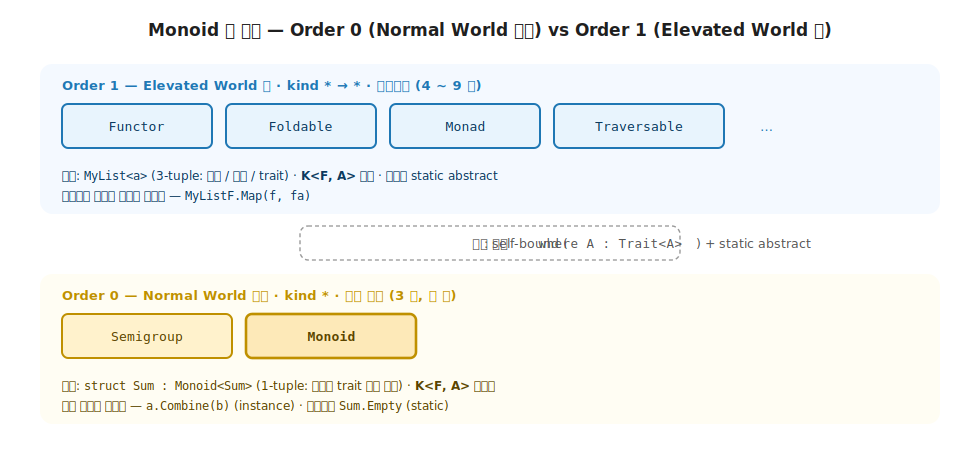
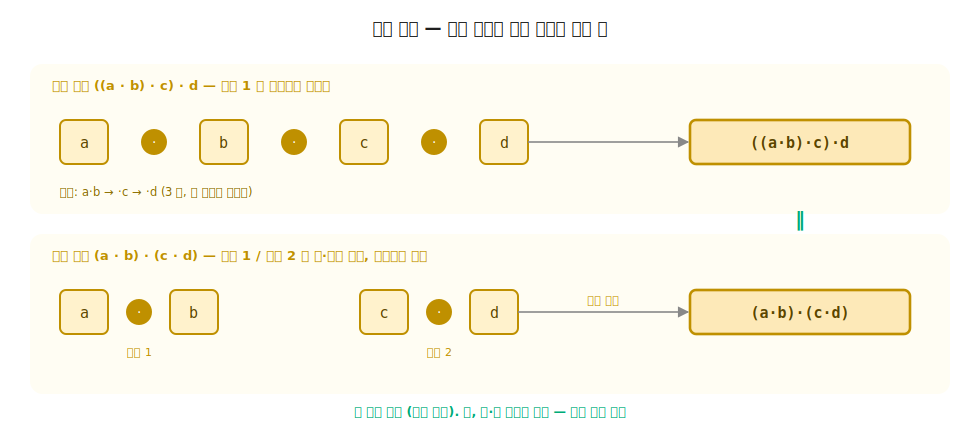
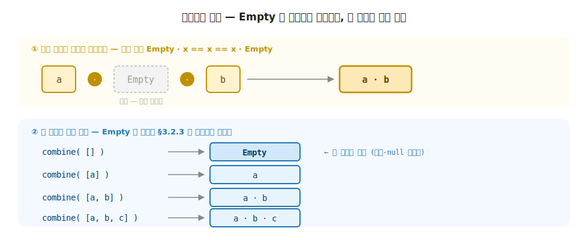
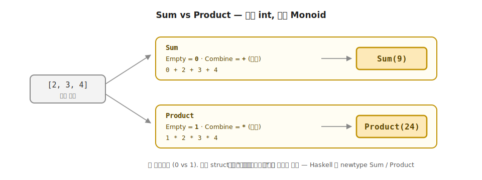
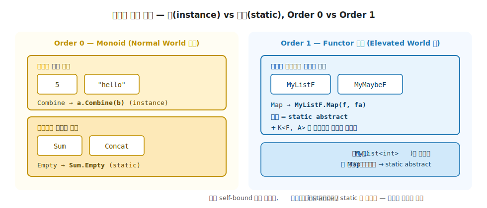

# 3 장. Monoid / Semigroup (Normal World 의 결합)

> **이 장의 핵심 어휘**. *Semigroup* / *Monoid* / *결합 (Combine)* / *단위원 (Empty / identity)* / *결합 법칙 (associativity)* / *항등 법칙 (identity law)* / *closure (닫혀 있음)* / self-bound / static abstract / 1-tuple 부착.
>
> **이 장의 주제**. 1 장의 Normal World 에서 같은 타입의 값 둘을 한 값으로 합치는 **결합 (Monoid)** 을 다룹니다. 같은 누적 코드를 도메인마다 베끼고 빈 입력의 답이 사람마다 갈라지는 고통에서 출발해, 결합 연산 (Semigroup) 과 단위원 (Monoid) 을 단계로 정착시키며 두 법칙 (결합 · 항등) 을 손에 쥡니다. 2 장의 self-bound + static abstract 두 도구를 컨테이너도 `K<F, A>` 마커도 없는 가장 단순한 형태로 코드에 옮겨, 4 장 이후 Order 1 trait 으로 올라가는 디딤돌을 놓습니다.

> 이 장을 마치면 할 수 있게 되는 것
> - [ ] Semigroup (결합) 과 Monoid (결합 + 단위원) 의 차이를 시그니처 한 줄로 구분할 수 있습니다.
> - [ ] 결합 법칙과 항등 법칙이 시그니처가 약속 못 하는 두 가지 성질임을 설명할 수 있습니다.
> - [ ] 결합 법칙과 교환 법칙이 다르다는 것을 `"ab" ≠ "ba"` 로 보여줄 수 있습니다.
> - [ ] 같은 `int` 인데 `Sum` 과 `Product` 가 왜 서로 다른 Monoid 인지 답할 수 있습니다.
> - [ ] `Combine` 이 왜 instance, `Empty` 가 왜 `static abstract` 인지 어법 차이를 설명할 수 있습니다.
> - [ ] `K<F, A>` 마커가 Monoid 에는 왜 필요 없는지 kind 어휘로 답할 수 있습니다.
> - [ ] 어떤 Monoid 든 받는 일반 함수 (`Monoid.combine`) 한 정의가 모든 Monoid 인스턴스에 자동 적용되는 ROI 를 코드로 보여줄 수 있습니다.
> - [ ] 평균 / 뺄셈이 왜 Monoid 가 아닌지 시그니처가 아닌 법칙으로 판별할 수 있습니다.
> - [ ] 3 장의 결합이 8 장 Validation 의 오류 누적과 3 부 Writer 의 로그 누적에서 어떻게 다시 등장하는지 짚을 수 있습니다.

---

## 3.1 이 장에서 다루는 것 — Normal World 의 결합

2 장의 마지막에서 우리는 무대 장치를 갖췄습니다. `K<F, A>` 마커로 `F` 자리를 만들고, self-bound 와 static abstract 로 trait 의 능력을 강제하는 법을 익혔습니다. 그런데 2 장의 장치는 한 번에 많았습니다 — 컨테이너(`* → *`) + 마커 + 두 제약이 동시에 등장했습니다. 3 장은 그 두 제약(self-bound + static abstract)을 **가장 단순한 형태로 다시** 손에 익히는 자리입니다. 컨테이너도, `K<F, A>` 마커도 없이.

그 단순함은 3 장이 다루는 대상에서 나옵니다. **Monoid 는 Normal World 의 결합** 입니다. Elevated World 의 컨테이너 (`Option<a>`, `List<a>`) 가 아니라, **완성 타입** (`int`, `string`) 두 값을 한 값으로 합칩니다. 1 장의 두 평행 세계에 비추면 Monoid 의 시그니처는 이렇습니다.

```text
Combine : a → a → a              (Normal → Normal → Normal)
```

세 자리 모두 Normal World 의 시민입니다. 1 장 §1.7 의 4 가지 함수 유형으로 보면 *Normal → Normal* 의 **자연 합성** 자리로, *World-crossing* 어휘가 등장하지 않습니다. 즉 Monoid 는 **Normal World 아래** 에 사는 Order 0 trait 이고, 4 장 이후의 Elevated World 추상 (Functor / Foldable / Monad / Traversable) 과는 결이 다른 trait 입니다.



**그림 3-1. Monoid 의 위치: Order 0 (Normal World 아래) vs Order 1 (Elevated World 위)** — 위층은 4 ~ 9 장의 Order 1 trait (컨테이너 `* → *` 위, `K<F, A>` 마커 필요). 아래층은 3 장의 Order 0 trait (완성 타입 `*` 위, 마커 불필요). 같은 두 도구 (self-bound + static abstract) 가 아래층에서는 컨테이너 없이 가장 단순하게 작동합니다.

| 자리 | trait | kind | 사는 자리 | `K<F, A>` |
|---|---|---|---|---|
| Order 0 | **Monoid / Semigroup** (3 장) | `*` | **Normal World 아래** | 불필요 |
| Order 1 | Functor / Foldable / Monad / Traversable (4 ~ 9 장) | `* → *` | **Elevated World 위** | 필요 |

이 차이가 3 장의 단순함을 결정합니다. 2 장의 `K<F, A>` 마커는 **Elevated World 의 컨테이너 안쪽을 가리키는 어휘** 였습니다. Monoid 는 컨테이너가 없으니 마커도 필요 없고, 자료 / 태그 / trait 3-tuple 패턴도 단순화됩니다 (자료가 trait 을 직접 구현, 태그 없음, §3.6.4). self-bound + static abstract 두 도구만 **컨테이너 없는 가장 단순한 형태** 로 손에 익힙니다.

3 장의 위치를 한 줄로 정리합니다. **Normal World 의 결합을 trait 으로 정의한 Order 0 trait, 4 장 이후 Order 1 trait 으로 올라가는 디딤돌**. Normal World 아래에 살지만 1 부 전체에서 두 번 다시 등장합니다 — 8 장 Validation 의 오류 누적, 3 부 Writer 의 로그 누적이 모두 Monoid 의 결합으로 작동합니다 (§3.11).

3 장도 1·2 장처럼 도구를 나열하지 않습니다. 먼저 **결합 능력이 trait 에 살지 않으면 어떤 고통이 생기는지** 를 체험하고, 그 고통을 trait 으로 묶는 발상을 본 뒤, 결합의 두 약속(법칙)을 단계로 정착시킵니다.

---

## 3.2 고통의 체험 — 같은 누적을 도메인마다 베끼는 코드

Normal World 에서 같은 타입의 값 여러 개를 하나로 합치는 일은 매일의 코드입니다. 숫자 목록의 합계, 문자열 조각의 이어붙이기, 로그의 누적, 도형 면적의 합산, 검증 결과의 합치기가 모두 같은 모양입니다.

### 3.2.1 한 도메인 — 잘 동작하는 누적

명령형 어법으로 두 코드를 적어 봅니다.

```csharp
// 숫자 목록의 합계
int total = 0;
foreach (var n in numbers)
    total = total + n;                       // 0 에서 시작, + 로 합침

// 문자열 조각의 이어붙이기
string all = "";
foreach (var s in parts)
    all = all + s;                           // "" 에서 시작, + 로 합침
```

잘 동작합니다. 두 코드는 타입 (`int` / `string`) 과 합치는 연산 (`+` 의 두 의미) 만 다를 뿐 **구조가 동일** 합니다. 시작값 (`0`, `""`) 이 있고, 두 값을 합치는 연산 (`+`) 이 있고, 시작값에서 출발해 차례로 합치는 누적이 있습니다. 같은 패턴을 **복사 + 타입만 교체** 해 적은 결과입니다.

### 3.2.2 같은 패턴이 다섯 번째 — 복사의 누적

복사가 한 번이면 별 문제가 없습니다. 그런데 같은 패턴이 어디서 또 나타나는지 보면 고통이 누적됩니다.

```csharp
// 도형의 면적 합산
double area = 0.0;
foreach (var s in shapes)
    area = area + s.Area;                    // 0.0 에서 시작, + 로 합침

// 여러 리스트를 한 리스트로 이어붙이기
List<int> all = new();
foreach (var xs in lists)
    all.AddRange(xs);                        // 빈 리스트에서 시작, AddRange 로 합침

// 여러 검증 결과를 하나로 합치기
List<string> errors = new();
foreach (var result in results)
    errors.AddRange(result.Errors);          // 빈 리스트에서 시작, 오류 누적
```

다섯 자리가 모두 같은 패턴입니다. **시작값 + 두 값을 합치는 연산 + 차례로 누적**. 다만 **시작값** 과 **합치는 연산** 의 구체적 모양만 다릅니다.

| 도메인 | 시작값 | 합치는 연산 |
|---|---|---|
| 숫자 합계 | `0` | `a + b` |
| 곱셈 누적 | `1` | `a * b` |
| 문자열 이어붙이기 | `""` | `a + b` (이어붙이기) |
| 리스트 이어붙이기 | `[]` | `xs ++ ys` |
| 도형 면적 합산 | `0.0` | `a + b` |

명령형 어법은 **같은 발상을 다섯 번 복사** 합니다. 새 도메인이 등장할 때마다 같은 구조의 `foreach` 가 또 등장하고, 빈 입력 처리도 매번 다시 적습니다. 2 장 §2.2 의 N×M 격자와 같은 종류의 고통입니다.

> **흔한 함정** — 시작값을 **기본값** 으로만 보는 것입니다.
>
> 명령형 어법에 익숙해지면 `int total = 0;` 의 `0` 을 **그저 초기값** 으로 읽습니다. 그런데 `0` 은 단순한 초기값이 아닙니다. 합쳐도 상대를 바꾸지 않는 값 (`0 + n == n`) 이라는 **결합과의 약속** 이 거기에 있습니다. 곱셈의 시작값이 `0` 이 아니라 `1` 인 이유, 이어붙이기의 시작값이 `""` 인 이유가 모두 그 약속에서 나옵니다. 시작값은 **합치는 연산이 결정하는 약속** 입니다 (§3.5).

### 3.2.3 빈 입력의 어긋남 — 약속이 코드에 없을 때

더 깊은 고통은 **빈 입력** 에서 드러납니다. 위 코드들은 모두 `total = 0`, `all = ""` 처럼 **적절한 시작값을 안다** 는 가정에 의존합니다. 만약 합치는 함수가 **시작값을 받지 않는다면** 빈 입력은 어떻게 처리할까요?

```csharp
// 시작값 없이 두 값만 받아 합치는 함수
int Combine(int a, int b) => a + b;

// 빈 목록을 합치려면? — 세 사람이 세 가지로 처리한다
int SumA(int[] xs) => xs.Length == 0 ? 0      : xs.Aggregate(Combine);   // 누구는 0
int SumB(int[] xs) => xs.Length == 0 ? throw new InvalidOperationException() : xs.Aggregate(Combine); // 누구는 예외
int SumC(int[] xs) => xs.Length == 0 ? -1     : xs.Aggregate(Combine);   // 누구는 sentinel
```

빈 입력의 답이 **정해져 있지 않습니다.** 어떤 사람은 `0`, 어떤 사람은 예외, 어떤 사람은 `-1` / `null` 을 떠올립니다. 그리고 이 셋은 **컴파일러가 같은 함수로 다루지 못합니다** — 1 장 §1.2.3 의 명령형 약점, 2 장 §2.2 의 격자 한 칸 어긋남과 정확히 같은 종류의 함정입니다. "빈 장바구니의 합계는 무엇인가" 라는 약속이 **각 함수의 본문에만** 묻혀 있고, 코드의 구조 어디에도 강제되지 않습니다. 그 결과 빈 입력이 들어오는 순간 한 화면은 `0`, 한 보고서는 예외, 한 집계는 `-1` 로 갈라지고, 이 어긋남은 한참 떨어진 자리에서 잘못된 숫자로 표면화됩니다.

문제 배경을 한 줄로 정리합니다. **같은 패턴의 반복 + 빈 경우의 답이 코드에 없음**. 두 비용을 한 번에 해결하는 도구가 함수형의 Monoid 입니다 — 반복은 trait 한 정의로, 빈 경우는 trait 안에 박힌 단위원 한 자리로.

---

## 3.3 함수형의 발상 — 결합을 trait 으로

함수형의 발상은 앞 절의 다섯 자리에서 **반복되는 구조** 를 trait 한 자리에 추상화합니다. 능력 (`Map`, `Bind`, `Fold` 같은 어휘) 이 객체에 사는 게 아니라 *trait* 에 살게 한 핵심 도구 (1 장 §1.5) 를 결합 어법에 그대로 적용합니다.

```csharp
// 함수형 어법 (가상) — 결합 능력이 trait 한 자리에 산다
public interface Monoid<A>
{
    static A Empty { get; }              // 시작값 (타입의 단위원)
    A Combine(A rhs);                    // 두 값을 합치는 연산
}
```

같은 trait 한 정의로 앞 절의 다섯 자리가 모두 같은 함수 호출이 됩니다.

```csharp
Monoid.combine([new Sum(1), new Sum(2), new Sum(3)]);                 // Sum(6)        — 덧셈
Monoid.combine([new Product(2), new Product(3), new Product(4)]);     // Product(24)   — 곱셈
Monoid.combine([new Concat("a"), new Concat("b"), new Concat("c")]);  // Concat("abc") — 이어붙이기
Monoid.combine(Array.Empty<Sum>());                                   // Sum(0)        — 빈 목록도 안전 (Empty 가 답)
```

비용이 다섯 자리의 복사 + 빈 경우 처리 다섯 번에서 **trait 한 번 정의 + 자료마다 부착 한 번** 으로 줄어듭니다. 2 장에서 본 N×M → N+M 절감 발상 (§2.2) 이 결합 자리에서 작동하는 모양입니다.

비용 절감의 핵심은 **결합 능력이 어디 사는가** 입니다. 명령형 어법에서는 결합 능력이 **함수의 본문** 에 살아 매번 새로 적었습니다. 함수형 어법에서는 결합 능력이 *trait* 에 살아 한 번 정의되면 어떤 자료 타입에든 부착됩니다. 세 패러다임의 한 차원 비교 (1 장 §1.5) 가 결합 어법에서 작동하는 사례입니다.

다만 시그니처만으로는 **결합** 이라는 의도가 완전히 표현되지 않습니다. `a → a → a` 시그니처를 만족하는 함수 중에는 **결합** 으로 부르기 곤란한 자리도 있습니다. 평균이나 뺄셈은 시그니처가 같지만 **결합 법칙** 을 깨고, 어떤 시작값이 항등인지도 정의되지 않습니다. 시그니처 외에 **두 약속 (법칙)** 이 따라붙어야 진짜 결합이 됩니다. 두 약속을 단계로 정착시키는 곳이 다음 두 절입니다 (§3.4 Semigroup, §3.5 Monoid).

---

## 3.4 결합의 약속 — Semigroup

먼저 **합치는 연산** 만 떼어 봅니다. 시작값 (단위원) 은 잠시 잊고, 두 값을 한 값으로 합치는 능력 자체에 이름을 붙입니다. 그 trait 이 **Semigroup** 입니다.

### 3.4.1 결합 연산이란 무엇인가

Semigroup 은 결합 연산 하나만 가진 trait 입니다. 멤버 한 줄로 표현됩니다.

```text
Combine : a → a → a              (수학적 시그니처)
a.Combine(b)  또는  a + b         (C# 어법 — 값의 instance 메서드 또는 + 연산자)
```

같은 타입 두 값을 받아 같은 타입 한 값을 돌려줍니다. 호출 어법은 `a.Combine(b)` 입니다. 왼쪽 값 `a` 가 자기 안의 결합 능력으로 오른쪽 값 `b` 와 합쳐집니다. `a + b` 는 `Combine` 의 syntactic sugar 로 같은 결과입니다 (§3.6).

세 자리의 어휘를 정리합니다.

| 자리 | 의미 |
|---|---|
| 왼쪽 인자 `a` | 결합의 한쪽 피연산자 (값) |
| 오른쪽 인자 `a` | 결합의 다른쪽 피연산자 (값) |
| 반환값 `a` | 두 값이 합쳐진 결과 (같은 타입의 한 값) |

세 자리가 모두 **같은 타입 `a`** 라는 점이 핵심입니다. 두 값과 결과가 같은 World 안에 산다는 약속이고, Wlaschin 의 closure (닫혀 있음) 어휘가 가리키는 성질입니다. closure 가 깨지면 결과가 **다른 타입** 으로 빠져나가 `Combine` 을 또 호출할 수 없습니다.

> *closure (닫혀 있음)* 은 C# 의 **람다 closure** (변수 capture) 와는 완전히 다른 의미입니다. 여기서 **닫혀 있음** 은 **연산의 결과가 같은 타입을 벗어나지 않음** 을 가리키는 집합론·대수의 어휘입니다.

예를 들어 두 문자열을 받아 **길이의 합** (`int`) 을 돌려주는 함수는 시그니처가 `string → string → int` 입니다. 결과가 `int` 라서 다음 결합 (`string` + `int`?) 이 막힙니다. Semigroup 시그니처가 아닙니다. 닫혀 있다는 closure 가 결합 어법의 첫 약속입니다.

### 3.4.2 결합 법칙

Semigroup 의 결합 연산에는 한 가지 법칙이 따릅니다. **결합 법칙 (associativity)** 입니다. 셋 이상의 값을 합칠 때 어느 쪽부터 묶어도 결과가 같아야 합니다.

```text
a.Combine(b).Combine(c) == a.Combine(b.Combine(c))
(a + b) + c             == a + (b + c)
```

Wikipedia 의 정의는 다음과 같습니다. *"(a • b) • c = a • (b • c)"*. 두 값을 묶고 한 번 더 묶는 자리에서 **묶는 순서** 에 결과가 의존하지 않는다는 약속입니다. 세 결합 자리를 봅니다 — 모두 성립합니다.

```text
(1 + 2) + 3                 == 1 + (2 + 3)               == 6        ✓ (덧셈)
(2 * 3) * 4                 == 2 * (3 * 4)               == 24       ✓ (곱셈)
("a" + "b") + "c"           == "a" + ("b" + "c")         == "abc"    ✓ (이어붙이기)
```

> **흔한 함정** — **결합 법칙** 을 **교환 법칙** 으로 착각하는 것입니다.
>
> 결합 법칙 (associativity) 은 **묶는 순서** 의 자유 `(a+b)+c == a+(b+c)` 이고, 교환 법칙 (commutativity) 은 **피연산자 순서** 의 자유 `a+b == b+a` 입니다. Monoid 가 요구하는 건 **결합 법칙뿐** 입니다. 교환 법칙은 요구하지 않습니다.
>
> 문자열 이어붙이기가 정확히 그 자리입니다. `("a" + "b") + "c" == "a" + ("b" + "c")` 는 성립하지만 (결합 ✓), `"a" + "b" == "ab"` ≠ `"b" + "a" == "ba"` 입니다 (교환 ✗). 이어붙이기는 **결합 가능한데 교환 불가능한** Monoid 입니다. 그래서 Monoid 로 병렬 처리할 때 청크를 **순서대로** 합쳐야 합니다 — 묶는 방식은 자유롭지만 (결합), 왼쪽/오른쪽 순서는 지켜야 합니다 (교환 아님). 덧셈은 둘 다 만족하지만, "Monoid = 교환 가능" 이라고 외우면 이어붙이기·리스트 연결에서 틀립니다.

결합 법칙이 왜 중요한지는 **큰 입력의 병렬 처리** 에서 또렷이 드러납니다. 백만 개 값을 합쳐야 한다고 합시다. 결합 법칙이 성립하면 입력을 절반으로 쪼개 두 코어가 각자 합친 뒤 마지막에 한 번 더 합쳐도 결과가 같습니다.



**그림 3-2. 결합 법칙: 순차 결합과 병렬 결합이 같은 답** — 위는 순차 결합 (`((a·b)·c)·d`, 한 코어가 차례로). 아래는 병렬 결합 (`(a·b)·(c·d)`, 두 코어가 좌·우를 따로 합친 뒤 마지막에 합침). 결합 법칙이 성립하므로 두 결과가 같고, 이 보장 위에서 MapReduce / Spark 의 reducer 가 안전하게 작동합니다. (단, 교환 법칙은 별개라 좌우 **순서** 는 지켜야 함, §3.4.2 함정.)

Wlaschin 의 *Monoids in Practice* 시리즈에 실증 수치가 있습니다. 100 만 단어를 **문자열 이어붙이기 후 단어 수 세기** 로 처리하면 7955ms 가 걸리지만, 같은 입력을 *map-then-reduce* (작은 청크로 쪼개 각자 세고 결합) 로 처리하면 698ms 로 줄어듭니다. **11 배 빠른 속도가 결합 법칙 한 줄의 수학적 결과** 입니다. 청크를 어떻게 묶든 같은 결과가 나온다는 보장이 있어야 **쪼개기 → 따로 처리 → 합치기** 라는 최적화가 안전해집니다.

### 3.4.3 Semigroup 의 한계 — 빈 경우

Semigroup 한 추상만으로는 **빈 입력** 을 다룰 수 없습니다. 합칠 값이 하나도 없으면 `Combine` 을 호출할 짝이 없기 때문입니다.

```csharp
// 두 값을 받아 합치는 함수 — Semigroup 의 본문
int Combine(int a, int b) => a + b;

// 빈 목록을 합치려면?
int Sum(int[] xs) =>
    xs.Length == 0
        ? ???                            // ✗ 어떤 값을 돌려줘야 하나? (§3.2.3 의 어긋남이 여기서 시작)
        : xs.Aggregate(Combine);
```

앞서 본 어긋남 (§3.2.3) 이 바로 이 `???` 자리입니다. 빈 입력의 답이 trait 의 어휘 안에 없으니 호출자가 매번 결정하고, 결정이 다르면 같은 trait 의 두 인스턴스가 **빈 경우만 다른 결과** 를 냅니다.

빈 경우의 답을 trait 안에 함께 가두면 호출자가 결정할 일이 없습니다. 그 답이 **단위원 (identity element)** 이고, 단위원을 가진 trait 이 다음 절의 Monoid 입니다.

---

## 3.5 Monoid — 단위원 도입

Semigroup 에 단위원 하나를 더하면 Monoid 가 됩니다. 단위원은 **합쳐도 상대를 바꾸지 않는 값** 입니다. Wikipedia 의 인용은 다음과 같습니다. *"There exists an element e in S such that for every element a in S, the equalities e • a = a and a • e = a hold."* 어느 쪽에 합쳐도 상대가 그대로 남는 값이 단위원입니다.

### 3.5.1 단위원의 정의

Monoid 의 시그니처는 Semigroup 에 한 멤버를 더합니다.

```text
Combine : a → a → a              (Semigroup 에서 물려받음)
Empty   : a                       (단위원 — 타입의 한 자리에 박힌 값)
```

`Empty` 는 **어느 특정 원소 한 개** 가 아니라 **타입 전체에 한 개 있는 값** 입니다. 덧셈의 `0`, 곱셈의 `1`, 이어붙이기의 `""`, 리스트 연결의 `[]` 가 모두 같은 역할로 옵니다.

> **흔한 함정** — `Empty` 를 **빈 값 / 0 / null** 로 읽는 것입니다.
>
> 이름이 `Empty` 라 "비어 있음 / 영(零) / 없음" 으로 읽기 쉽습니다. 그러나 `Empty` 의 정의는 **"합쳐도 상대를 바꾸지 않는 값"** 이지 "비어 있는 값" 이 아닙니다. 곱셈의 단위원은 `0` 이 아니라 `1` 이고 (`0` 을 곱하면 상대가 사라지니 단위원이 아닙니다), AND 의 단위원은 `false` 가 아니라 `true` 이며 (§3.8.4), 최댓값의 단위원은 `0` 이 아니라 `int.MinValue` 입니다. **어떤 연산으로 합치는가** 가 어떤 값이 단위원인가를 결정합니다 — "비어 보이는 값" 이 아니라 "투명한 값" 입니다.

| 도메인 | `Combine` | `Empty` |
|---|---|---|
| 덧셈 (`Sum`) | `a + b` | `0` |
| 곱셈 (`Product`) | `a * b` | `1` |
| 이어붙이기 (`Concat`) | `a + b` (string) | `""` |
| 리스트 연결 | `xs ++ ys` | `[]` |
| Boolean AND | `a && b` | `true` |
| Boolean OR | `a \|\| b` | `false` |
| 최댓값 (`Max`) | `Math.Max(a, b)` | `int.MinValue` |

같은 타입 (`int`) 인데 **합치는 연산이 다르면 단위원도 다르다** 는 점이 가장 중요합니다. C# 어법으로는 `Sum` / `Product` 같은 래퍼 타입으로 두 Monoid 를 구분합니다 (§3.8).

### 3.5.2 항등 법칙

`Empty` 에는 **항등 법칙 (identity law)** 이 따릅니다. Haskell wiki 의 두 줄 인용은 다음과 같습니다. *"left identity: mempty <> x = x"* / *"right identity: x <> mempty = x"*. 단위원이 어느 쪽에 합쳐져도 상대가 그대로 남아야 합니다.

```text
Empty.Combine(a) == a            (좌 항등)
a.Combine(Empty) == a            (우 항등)
```

두 줄을 한 줄로 묶고, 덧셈으로 검증합니다.

```text
Empty.Combine(a) == a == a.Combine(Empty)
0 + 5  == 5  == 5 + 0            ✓ (덧셈)
1 * 5  == 5  == 5 * 1            ✓ (곱셈)
"" + "hi"  == "hi"  == "hi" + ""  ✓ (이어붙이기)
```

항등 법칙은 단위원이 **결합 어법 안에서 보이지 않는 값** 이어야 한다는 약속입니다. 합쳐도 결과가 바뀌지 않으니 **합치는 사슬** 어디든 끼워도 결과가 그대로입니다.

```text
a.Combine(Empty).Combine(b).Combine(Empty).Combine(c)
== a.Combine(b).Combine(c)
== a + b + c
```



**그림 3-3. 단위원의 항등: `Empty` 는 사슬에서 사라지고, 빈 입력의 답이 된다** — 위: `Empty` 가 결합 사슬 어디에 끼어도 (`a · Empty · b`) 빠진 것처럼 작동 (`a · b`). 아래: 합칠 값이 0 개면 결과가 `Empty`, 1 개면 그 값, 2 개 이상이면 차례로 결합. `Empty` 한 자리가 §3.2.3 의 빈 입력 어긋남을 없앱니다.

### 3.5.3 빈 입력도 안전하게 처리

Semigroup 만으로는 빈 입력의 답이 정해지지 않았습니다 (§3.4.3). Monoid 의 `Empty` 가 그 답을 trait 의 어휘 안에 가둡니다.

```text
fold(Empty, Combine, [])         == Empty
fold(Empty, Combine, [a])        == a
fold(Empty, Combine, [a, b])     == a.Combine(b)
fold(Empty, Combine, [a, b, c])  == a.Combine(b).Combine(c)
```

빈 목록의 결과가 `Empty` 입니다. 호출자가 **예외** / *null* / **기본값** 같은 자기 결정을 내릴 필요가 없습니다. trait 의 약속 안에 빈 경우의 답이 이미 있고, 그 답이 항등 법칙을 만족하니 합치는 사슬과 **완벽히 정합** 합니다.

```csharp
// Monoid 가 빈 경우의 답을 들고 있어 분기가 사라진다 — v5 정통 어법
public static A combine<A>(IEnumerable<A> xs) where A : Monoid<A>
{
    var acc = A.Empty;                   // 빈 목록이면 그대로 반환됨
    foreach (var x in xs)
        acc = acc.Combine(x);            // 첫 항이 Empty + x == x 로 자연스럽게 시작
    return acc;
}
```

`xs.Length == 0` 같은 분기가 없습니다. `acc = A.Empty` 한 줄이 빈 경우의 답을 미리 들고 있고, 항등 법칙이 첫 합칠 자리에서 `Empty + x == x` 로 작동해 **시작값이 결과를 오염시키지 않는다** 는 보장을 줍니다. 세 사람이 세 가지로 갈라졌던 빈 입력의 답 (§3.2.3) 이, 이제 trait 한 자리(`A.Empty`)로 통일됩니다.

명령형 어법의 두 비용 (반복 + 빈 경우, §3.2) 이 한 자리에서 해소되었습니다. 결합 능력은 trait 한 정의로 묶었고, 빈 경우는 단위원 한 자리에 사라졌습니다. Monoid 의 두 멤버 (`Combine` + `Empty`) 가 두 비용에 각각 답하는 어법입니다.

---

## 3.6 직접 구현 — self-bound + `static abstract` 패턴

이론을 코드로 옮깁니다. 2 장에서 정착시킨 self-bound + `static abstract` 두 도구를 Monoid 에 적용합니다. Order 0 자리라 가장 단순한 형태입니다.

> **2 장 두 도구의 복습 (외우려 애쓰지 않아도 됩니다).** **self-bound** (`where A : Monoid<A>`) 는 "A 자리에 들어갈 타입이 Monoid 의 구현체임" 을 컴파일러에 보장해, 일반 함수 안에서 그 타입의 능력을 호출 가능하게 합니다. **static abstract** 는 능력이 인스턴스가 아니라 타입의 정적 멤버에 사는 어법입니다. 3 장은 이 둘을 **컨테이너 없이** 쓰는 가장 단순한 무대입니다.

### 3.6.1 Semigroup trait 정의

먼저 결합 능력만 가진 Semigroup 부터 봅니다.

```csharp
// Semigroup — 결합 연산을 가진 값의 trait (Order 0, kind `*`)
public interface Semigroup<A>
    where A : Semigroup<A>
{
    [Pure]
    A Combine(A rhs);                                          // 값의 결합 (instance)

    // + 는 Combine 의 syntactic sugar — 모든 구현체가 자동으로 받는다.
    [Pure]
    static virtual A operator +(A lhs, A rhs) => lhs.Combine(rhs);

    // Instance — trait 을 값처럼 전달할 수 있는 record 형태로 노출 (v5 정합).
    [Pure]
    static virtual SemigroupInstance<A> Instance { get; } =
        new(Combine: Semigroup.combine);
}
```

네 자리를 차례로 봅니다.

- **`where A : Semigroup<A>`** — self-bound 제약 (2 장 §2.8.1). `A` 자리에 들어갈 타입이 **Semigroup 의 구현체임** 을 컴파일러에 보장합니다. 일반 함수 안에서 `a + b` 같은 호출이 가능한 자리를 만드는 도구이고, 4 장 이후 모든 trait 의 공통 골격입니다.
- **`A Combine(A rhs)`** — instance 메서드. 결합 능력이 **값과 함께 사는** 어법입니다. 호출 모양은 `lhs.Combine(rhs)` 입니다. 4 장 이후 모든 trait 이 `static abstract` 인 것과 대비됩니다 (§3.10).
- **`static virtual A operator +`** — default 연산자. `+` 가 모든 Semigroup 구현체에 자동 제공됩니다. 본문은 한 줄, `lhs.Combine(rhs)` 의 위임입니다. 즉 **`+` 는 `Combine` 의 syntactic sugar** 입니다. Haskell 의 `<>` 연산자가 C# 의 `+` 로 옮겨오는 모양입니다. 다만 trait 의 default `+` 는 **generic 제약 context 안에서만** 직접 호출됩니다 (`where M : Semigroup<M>` 안의 `a + b`). 구체 타입 `Sum + Sum` 직접 호출을 위해서는 §3.6.5 의 *extension static operator +* 가 필요합니다.
- **`static virtual SemigroupInstance<A> Instance`** — trait 을 record 형태로 노출. v5 의 결정적 어법으로, trait 을 **값처럼 전달** 할 수 있게 합니다. `record SemigroupInstance<A>(Func<A, A, A> Combine)` 형태이고, `Monoid.instance<A>()` 같은 helper 로 가져와 `instance.Combine(x, y)` 어법으로 호출합니다.

> **왜 record 인가**. `Semigroup<A>` 가 *static* 이라 **값으로 전달 불가** 합니다. record 안에 **`Combine` 한 함수** 를 capture 하면 **값처럼 함수 인자로 전달 가능** 해집니다.

`[Pure]` attribute 는 결합 연산이 부작용 없는 순수 함수임을 약속합니다 (`using System.Diagnostics.Contracts;`).

### 3.6.2 Monoid trait 정의 — Semigroup 상속

Monoid 는 Semigroup 을 상속하고 단위원 한 줄을 더합니다.

```csharp
// Monoid — Semigroup + 단위원 Empty (Order 0, kind `*`)
public interface Monoid<A> : Semigroup<A>
    where A : Monoid<A>
{
    [Pure]
    static abstract A Empty { get; }                           // 타입의 단위원 (static abstract)

    // Instance — Semigroup 의 Instance 를 가리고 단위원까지 가진 record 로 노출 (v5 정합).
    new static virtual MonoidInstance<A> Instance { get; } =
        new(Empty: A.Empty, Combine: Semigroup.combine);
}
```

세 자리를 봅니다.

- **`Monoid<A> : Semigroup<A>`** — trait 상속. Monoid 가 Semigroup 의 모든 능력 (`Combine` + default `+` + `Instance`) 을 물려받고 두 멤버를 더합니다. trait 들 사이의 상속 관계 (2 장 §2.10) 가 처음 등장하는 자리이고, 5 장 Applicative (Functor 의 자식), 7 장 Monad (Applicative 의 자식) 사슬의 원형입니다.
- **`static abstract A Empty { get; }`** — 타입의 단위원. 결합 능력이 **값과 함께 산다** 면 단위원은 **타입에 단 하나 박힌다** 는 어법입니다. `Sum` 타입의 단위원이 `Sum(0)`, `Product` 타입의 단위원이 `Product(1)` 같이 **각 타입마다 하나** 입니다 (§3.6.3).
- **`new static virtual MonoidInstance<A> Instance`** — Semigroup 의 `Instance` 를 가리고 단위원까지 가진 record. `record MonoidInstance<A>(A Empty, Func<A, A, A> Combine) : SemigroupInstance<A>(Combine)` 형태로 trait 상속과 record 상속이 정확히 정렬됩니다.

두 trait 의 시그니처는 **LanguageExt v5 의 `Semigroup<A>` / `Monoid<A> : Semigroup<A>` 와 정확히 정합** 합니다 (`LanguageExt.Core/Traits/Semigroup/Semigroup.cs`, `Monoid/Monoid.cs`).

### 3.6.3 `Combine` 은 instance, `Empty` 는 `static abstract` — 의미가 어법을 결정합니다

같은 trait 안에서 두 멤버의 어법이 다릅니다. 왜 그런지가 이 장의 핵심 통찰입니다.

- **`Combine` 이 instance 인 이유** — 결합은 **값 둘 사이의 연산** 입니다. `(ℤ, +)` 의 `5 + 3` 으로, 두 원소 `5 ∈ ℤ` 와 `3 ∈ ℤ` 가 자기 안의 능력으로 합쳐집니다. 원소 (값) 가 능력을 가진다는 의미가 코드의 **instance 메서드** 어법에 그대로 옮겨옵니다.
- **`Empty` 가 `static abstract` 인 이유** — 단위원은 **타입에 한 개 박힌 값** 입니다. 어느 특정 인스턴스 (`Sum(5)` 의 `5`) 가 들고 있는 게 아니라 **`Sum` 타입 전체** 가 한 자리에 보관하는 값입니다. 인스턴스마다 다른 `Empty` 가 있을 수 없으니 **타입의 멤버** 어법이 자연스럽고, 거기에 **각 구현체가 자기 `Empty` 를 정의해야 한다** 는 약속을 `abstract` 가 추가합니다.

| 멤버 | 의미 | 능력이 속한 곳 | C# 어법 | 호출 모양 |
|---|---|---|---|---|
| `Combine` | 결합 연산 | 값 (`5`, `"hi"`) | instance | `a.Combine(b)`, `a + b` |
| `Empty` | 단위원 | 타입 (`Sum`, `Concat`) | `static abstract` | `Sum.Empty`, `M.Empty` |

같은 trait 안에서도 **추상이 어디에 속하는가** (값 vs 타입) 가 어법을 결정합니다. 이 비대칭의 일반화는 §3.10 에서 그림과 함께 짚습니다.

### 3.6.4 `K<F, A>` 마커가 왜 없는가

2 장의 Functor 시그니처와 Monoid 시그니처를 나란히 비교하면 가장 큰 차이가 보입니다.

```csharp
// Functor — Order 1 trait (Elevated World 의 컨테이너 위)
public interface Functor<F> where F : Functor<F>
{
    static abstract K<F, B> Map<A, B>(Func<A, B> f, K<F, A> fa);
    //                       ──┬───                ──┬───
    //                    "F 안에 B"              "F 안에 A"
}

// Monoid — Order 0 trait (Normal World 의 값)
public interface Monoid<A> : Semigroup<A> where A : Monoid<A>
{
    static abstract A Empty { get; }
    //               ─┬─
    //               A 자리 (단순 완성 타입 — K<F, A> 마커 없음)
}
```

**Monoid 의 시그니처에는 `K<F, A>` 가 등장하지 않습니다.** Monoid 가 **완성 타입** (`int`, `string`) 에 대한 추상이기 때문입니다. 끌어올릴 컨테이너 (`Option<a>`, `List<a>`) 가 없으니 **컨테이너 안쪽을 가리키는 어휘** 도 필요 없습니다. `K<F, A>` 의 결정적 동기 (2 장 §2.5.5, C# 이 `* → *` 의 type constructor 를 일급으로 못 다룬다는 Order 2 미지원 우회) 자체가 Monoid 에는 적용되지 않습니다.

| trait | kind | 자료 타입 어법 | `K<F, A>` |
|---|---|---|---|
| Monoid | `*` (Order 0) | `Sum`, `Concat` (완성 타입) | 불필요 |
| Functor | `* → *` (Order 1) | `MyList<a>`, `MyMaybe<a>` (컨테이너) | 필요 |

Monoid 의 자료 타입 어법도 단순화됩니다. 2 장 §2.11 의 3-tuple 패턴 (자료 / 태그 / trait) 에서 **태그가 빠집니다**. `Sum` 자체가 자료 타입이면서 동시에 **trait 의 구현체** 입니다.

```csharp
// 3-tuple 패턴 (Order 1 — Ch02 §2.11)
public sealed class MyList<A>   : K<MyListF, A> { ... }     // 자료
public sealed class MyListF     : Functor<MyListF> { ... }  // 태그 (Map 의 호스트)
public interface  Functor<F>    where F : Functor<F> { ... } // trait

// 1-tuple 패턴 (Order 0 — Ch03)
public readonly record struct Sum(int Value) : Monoid<Sum>  // 자료가 trait 을 직접 구현
{
    public static Sum Empty => new(0);
    public Sum Combine(Sum rhs) => new(Value + rhs.Value);
}
```

조각이 **3 개에서 1 개로 줄어듭니다**. 이 단순함이 3 장이 4 장 (Functor) 앞에 오는 이유이고, self-bound + `static abstract` 두 도구를 **컨테이너 없는 가장 단순한 형태로 먼저 익히게 하는** 곳입니다. 4 장에서 같은 도구에 `K<F, A>` 마커 한 겹과 태그 타입을 더해 Order 1 trait 으로 올라갑니다.

### 3.6.5 구체 타입의 `+` 직접 호출 — extension static operator

> **왜 *extension* 이 필요한가**. `Semigroup<A>` 의 default operator `+` 만으로는 호출 모양이 어색합니다 (`A.op_Addition(a, b)`). extension static operator 가 `a + b` 자연 어법을 되살립니다. **C# 14 preview** — 프로젝트 `<LangVersion>14</LangVersion>` 설정이 필요합니다.

`Semigroup<A>` 의 default `+` 는 **generic 제약 context 안에서만** 직접 호출됩니다. `Sum(1) + Sum(2)` 같은 **구체 타입 직접 호출** 은 막힙니다. 이 경우를 v5 의 정통 어법 *extension static operator* 가 풉니다.

```csharp
// Functions/SemigroupExtensions.cs — v5 정통 어법
public static class SemigroupExtensions
{
    extension<A>(A _)
        where A : Semigroup<A>
    {
        public static A operator +(A lhs, A rhs) =>
            lhs.Combine(rhs);
    }
}
```

C# 14 의 *extension static* 자리에 *operator +* 를 두고, **어떤 Semigroup 구현체에도** `+` 가 자동 적용됩니다. 자료 타입 자체에는 `operator +` 명시가 필요 없습니다. v5 의 `LanguageExt.Core/Traits/Semigroup/Semigroup.Operators.cs` 와 정확히 정합합니다.

```csharp
Sum(1) + Sum(2) + Sum(3)            // Sum(6) — SemigroupExtensions 의 extension operator
new Concat("a") + new Concat("b")    // Concat("ab")
new All(true) + new All(false)       // All(false)
```

세 어법 (`a.Combine(b)` instance, `a + b` extension operator, `Semigroup.combine(a, b)` 자유 함수) 모두 같은 결과를 냅니다.

---

## 3.7 두 법칙 검증 — 결합 + 항등

Monoid 가 진짜 Monoid 이려면 두 법칙을 지켜야 합니다. 시그니처만으로는 강제되지 않고 **구현이 약속하는 성질** 입니다. C# 컴파일러는 `Combine` 의 시그니처 (`A → A → A`) 와 `Empty` 의 시그니처 (`A`) 만 검증하지, 두 법칙이 성립하는지는 검증하지 못합니다. 사람이 약속하는 부분이고, 코드로 검증할 수 있습니다.

```csharp
// Monoid 두 법칙 검증 — 결합 + 항등 (instance + static 어법)
public static class MonoidLaws
{
    // 결합 법칙: a.Combine(b).Combine(c) == a.Combine(b.Combine(c))
    public static bool AssociativityHolds<M>(M a, M b, M c)
        where M : Monoid<M> =>
        a.Combine(b).Combine(c)!.Equals(a.Combine(b.Combine(c)));

    // 좌 항등: Empty.Combine(a) == a
    public static bool LeftIdentityHolds<M>(M a)
        where M : Monoid<M> =>
        M.Empty.Combine(a)!.Equals(a);

    // 우 항등: a.Combine(Empty) == a
    public static bool RightIdentityHolds<M>(M a)
        where M : Monoid<M> =>
        a.Combine(M.Empty)!.Equals(a);
}
```

검증 함수의 시그니처를 봅니다. **`where M : Monoid<M>`** 한 줄이 **어떤 Monoid 든** 받아들이는 약속입니다. `M.Empty` 는 타입의 능력 (static), `a.Combine(b)` 는 값의 능력 (instance). 두 호출이 한 함수 안에서 자기 위치에 정확히 놓입니다. 어떤 자료 타입이 Monoid 만 만족하면 이 검증 함수 세 개가 **공짜로** 적용되고, 2 장 §2.12 의 **어떤 Functor 든 받는 일반 함수** 와 같은 ROI 입니다.

```csharp
// 덧셈 Monoid 의 두 법칙 검증
var (s1, s2, s3) = (new Sum(2), new Sum(3), new Sum(5));
MonoidLaws.AssociativityHolds(s1, s2, s3);      // true
MonoidLaws.LeftIdentityHolds(s1);               // true
MonoidLaws.RightIdentityHolds(s1);              // true

// 곱셈 / 이어붙이기 Monoid 의 결합 법칙
MonoidLaws.AssociativityHolds(new Product(2), new Product(3), new Product(4));  // true
MonoidLaws.AssociativityHolds(new Concat("x"), new Concat("y"), new Concat("z")); // true
```

세 자료 타입의 두 법칙이 모두 `true`. 진짜 Monoid 라는 약속이 코드로 검증된 결과입니다.

> **흔한 함정** — **시그니처만 만족하면 Monoid** 라고 결론 내리는 것입니다.
>
> 평균 함수 `average : double → double → double` 은 시그니처가 Semigroup 처럼 보입니다. 그러나 결합 법칙이 깨집니다. `average(average(2, 4), 8) == 5` 인데 `average(2, average(4, 8)) == 4` 입니다. 묶는 순서에 결과가 달라지면 Semigroup 이 아닙니다.
>
> 뺄셈도 마찬가지입니다. `(10 - 5) - 3 == 2` 인데 `10 - (5 - 3) == 8` 입니다. **시그니처는 필요조건이지 충분조건이 아닙니다**. 두 법칙 (결합 + 항등) 의 실제 성립이 진짜 Monoid 의 약속입니다.

> **평균을 Monoid 로 만드는 패턴**. 평균은 직접 Monoid 가 아니지만 **자료의 모양을 바꾸면** Monoid 가 됩니다. 평균 값 한 개 (`double`) 가 아니라 **`{total, count}` 두 자리의 자료** 로 누적하면 됩니다.
>
> ```csharp
> public readonly record struct Avg(int Total, int Count) : Monoid<Avg>
> {
>     public static Avg Empty => new(0, 0);
>     public Avg Combine(Avg rhs) => new(Total + rhs.Total, Count + rhs.Count);
>     public double Value => Count == 0 ? 0.0 : (double)Total / Count;
> }
> ```
>
> `Total` 과 `Count` 각각이 덧셈 Monoid 라 둘의 짝도 결합 법칙을 만족합니다. 단위원은 `(0, 0)`. 마지막에 `.Value` 로 평균을 계산합니다. Wlaschin 의 정리는 다음과 같습니다. *"design the type to be a monoid first, then compute the desired result at the end."* (세 패턴의 일반화는 §3.8.6.)

두 법칙이 함께 성립하면 **`Monoid.combine` 이 어떻게 묶든, 빈 경우가 와도 항상 같은 답을 낸다** 는 보장이 생깁니다. 결합 법칙이 순서의 자유를, 항등 법칙이 빈 경우의 안전을 책임집니다.

5 장 Applicative 의 다섯 법칙, 4 장 Functor 의 두 법칙, 7 장 Monad 의 세 법칙처럼 1 부의 모든 trait 에 **법칙** 이 따라붙습니다. Monoid 의 두 법칙이 그 **법칙 사다리** 의 첫 단입니다.

---

## 3.8 더 많은 Monoid — Sum / Product / Concat / Boolean

같은 Monoid 패턴이 다양한 자료 타입에 부착되는 모양을 봅니다. 각 자리에서 `Empty` 와 `Combine` 이 무엇인지가 결합 어법을 결정합니다.

### 3.8.1 Sum — 덧셈

가장 친숙한 예시부터 봅니다. 정수의 덧셈으로 합치고 단위원은 `0` 입니다.

```csharp
// 덧셈 Monoid — Empty 는 0, Combine 은 +
public readonly record struct Sum(int Value) : Monoid<Sum>
{
    [Pure]
    public static Sum Empty => new(0);

    [Pure]
    public Sum Combine(Sum rhs) => new(Value + rhs.Value);
}
```

`readonly record struct` 가 **값 타입의 불변 어법** 입니다. C# 의 합성 어법 (`==`, `with`, `Deconstruct`) 을 함께 받습니다. 1 부 전체에서 값 타입 자료의 표준 모양이기도 합니다.

`Empty` 는 `Sum(0)` 입니다. 어떤 `Sum(n)` 과 합쳐도 그대로 남습니다 (`Sum(0).Combine(Sum(5)) == Sum(5)`). `Combine` 은 안의 `Value` 끼리 더한 새 `Sum`. 자료 타입에 `operator +` 명시가 **없는** 자리에 주의합니다 — `SemigroupExtensions` (§3.6.5) 가 모든 Semigroup 구현체에 자동으로 `+` 를 제공합니다.

### 3.8.2 Product — 곱셈

같은 `int` 인데 합치는 연산만 바뀝니다. 곱셈으로 합치면 단위원이 `1` 입니다.

```csharp
// 곱셈 Monoid — Empty 는 1, Combine 은 *
public readonly record struct Product(int Value) : Monoid<Product>
{
    [Pure]
    public static Product Empty => new(1);

    [Pure]
    public Product Combine(Product rhs) => new(Value * rhs.Value);
}
```



**그림 3-4. `Sum` vs `Product`: 같은 `int`, 다른 Monoid** — 같은 `[2, 3, 4]` 가 `Sum` 으로 합치면 `9` (덧셈, 단위원 `0`), `Product` 로 합치면 `24` (곱셈, 단위원 `1`). **합치는 연산이 단위원을 결정** 합니다. 자료 타입 (`Sum` vs `Product`) 이 합치는 방식의 선택을 표현합니다. Haskell 의 `newtype Sum a` / `newtype Product a` 가 C# 의 래퍼 struct 로 옮겨온 모양입니다.

```csharp
Monoid.combine(new[] { new Sum(2), new Sum(3), new Sum(4) });           // Sum(9)  — 덧셈
Monoid.combine(new[] { new Product(2), new Product(3), new Product(4) }); // Product(24) — 곱셈
```

같은 `[2, 3, 4]` 가 `Sum` 으로 합치면 `9`, `Product` 로 합치면 `24` 입니다. 두 trait 인스턴스 사이에 **어느 쪽이 진짜 `int` 의 Monoid 인가** 의 답은 없습니다. 둘 다 진짜이고, **어떤 연산으로 합칠지를 호출자가 선택** 합니다.

> **흔한 함정** — `Product` 의 `+` 가 산술 덧셈이라고 읽는 것입니다.
>
> `Product(2) + Product(3) == Product(6)` 입니다 — **5 가 아닙니다.** `+` 는 Semigroup 의 **결합 sugar** 이지 산술 `+` 가 아닙니다. `Product` 의 결합은 곱셈이라 안의 `int` 끼리 곱해집니다. 처음에는 어색하지만, **`+` 가 "이 타입의 결합" 의 일반 어휘** 라는 점이 손에 잡히면 자연스러워집니다. 같은 이유로 `All(true) + All(false) == All(false)` (AND), `Min(3) + Min(5) == Min(3)` (최솟값) 입니다.

### 3.8.3 Concat — 문자열 이어붙이기

문자열에도 같은 패턴이 적용됩니다.

```csharp
// 문자열 이어붙이기 Monoid — Empty 는 "", Combine 은 + (string)
public readonly record struct Concat(string Value) : Monoid<Concat>
{
    [Pure]
    public static Concat Empty => new("");

    [Pure]
    public Concat Combine(Concat rhs) => new(Value + rhs.Value);
}
```

`Empty` 는 빈 문자열 `""`. `Combine` 은 `string + string` 의 이어붙이기. 자리가 **덧셈에서 이어붙이기** 로 옮겼을 뿐 패턴은 같습니다. (단, §3.4.2 에서 봤듯 이어붙이기는 **결합 법칙은 만족하나 교환 법칙은 깨지는** Monoid 입니다.)

```csharp
Monoid.combine(new[] { new Concat("hello"), new Concat(" "), new Concat("world") });
// → Concat("hello world")

Monoid.combine(Array.Empty<Concat>());
// → Concat("") — 빈 목록도 단위원이 답을 들고 있음
```

여러 자료 / 두 어휘 / 한 패턴. Sum, Product, Concat 세 자료 타입이 모두 **같은 두 멤버 (`Empty` + `Combine`)** 를 정의하고, 같은 일반 함수 (`Monoid.combine`) 가 셋 모두에 자동 적용됩니다. trait 한 정의 + 부착 N 번이 N×M 비용을 N+M 으로 줄여줍니다 (1 장 §1.7.2).

### 3.8.4 Boolean — AND / OR

Boolean 에는 두 가지 Monoid 가 있습니다. AND 로 합치면 단위원이 `true`, OR 로 합치면 단위원이 `false` 입니다.

```csharp
// AND Monoid — Empty 는 true, Combine 은 &&
public readonly record struct All(bool Value) : Monoid<All>
{
    [Pure]
    public static All Empty => new(true);

    [Pure]
    public All Combine(All rhs) => new(Value && rhs.Value);
}

// OR Monoid — Empty 는 false, Combine 은 ||
public readonly record struct Any(bool Value) : Monoid<Any>
{
    [Pure]
    public static Any Empty => new(false);

    [Pure]
    public Any Combine(Any rhs) => new(Value || rhs.Value);
}
```

`All.Empty == true` 의 이유는 **모두 참** 의 빈 합이 **참** 이기 때문입니다 (vacuous truth, 합칠 게 없으니 거짓이 될 수가 없습니다). `Any.Empty == false` 의 이유는 **하나라도 참** 의 빈 합이 **거짓** 이기 때문입니다 (참인 게 없습니다). 두 단위원이 LINQ 의 `xs.All(p)` / `xs.Any(p)` 가 빈 컬렉션에 대해 돌려주는 값과 정확히 정합합니다. `Empty` 가 "비어 보이는 값" 이 아니라 "투명한 값" 이라는 §3.5 함정의 또 다른 사례입니다.

### 3.8.5 같은 타입, 다른 Monoid — 어떻게 구분하나

`Sum` / `Product`, `All` / `Any` 처럼 같은 자료 타입에 두 가지 결합 어법이 있을 수 있습니다. C# 어법에서는 **서로 다른 자료 타입** (`Sum` vs `Product`) 으로 어떤 결합인지를 표현합니다.

| 자료 타입 | 안의 타입 | `Empty` | `Combine` |
|---|---|---|---|
| `Sum` | `int` | `0` | `+` (덧셈) |
| `Product` | `int` | `1` | `*` (곱셈) |
| `Concat` | `string` | `""` | `+` (이어붙이기) |
| `All` | `bool` | `true` | `&&` (AND) |
| `Any` | `bool` | `false` | `\|\|` (OR) |
| `Max` (확장) | `int` | `int.MinValue` | `Math.Max` |
| `Min` (확장) | `int` | `int.MaxValue` | `Math.Min` |

`Max` / `Min` 같은 자리도 정의 가능합니다. `int.MinValue` 가 어떤 `int` 와의 `Max` 에서 **상대를 그대로 남기는** 단위원입니다. 결합 가능한 자리는 어디든 Monoid 가 등장하는 셈입니다. Wlaschin 의 정리를 그대로 인용합니다. *"whenever you encounter terms like 'sum,' 'product,' or 'concatenation,' you've likely found a monoid waiting to simplify your design"*.

### 3.8.6 비 Monoid 를 Monoid 로 만드는 세 패턴

평균 / 뺄셈이 Monoid 가 아니라는 자리 (§3.7) 를 앞서 봤습니다. 그런데 **자료의 모양을 바꿔** Monoid 의 어휘 안으로 끌어들이는 패턴이 있습니다. Wlaschin 의 *Monoids in Practice* 시리즈가 세 패턴으로 정리합니다.

- **첫 번째 — closure 회복 (list 로 감싸기)**. 두 값을 합쳤더니 결과가 **다른 타입** 으로 빠져나가는 자리. 두 `char` 를 합치면 `string` 이 되어 char 의 Monoid 가 안 되지만, **`char` 를 `[char]` 리스트로 감싸면** 두 리스트의 이어붙이기가 closure 를 만족합니다. *"anything can be put into a list, and lists (with concatenation) are always monoids."* 8 장 Validation 의 **오류 리스트** 도 같은 패턴입니다.
- **두 번째 — associativity 회복 (동사 → 명사)**. 결합 법칙이 깨지는 자리. **연산을 수행하지 말고** 연산을 **자료 구조로 표현** 합니다. `'a' - 'b'` (빼기) 가 결합 법칙을 깨면, `CharsToRemove(['b'])` 같은 자료 구조로 의도를 표현하고 최종 단계에서 한 번에 적용합니다. **동사 (함수) 를 명사 (자료 구조) 로** 바꾸는 어법입니다.
- **세 번째 — identity 회복 (Option/None 으로 단위원 추가)**. 단위원이 **원래 자료** 안에 없는 자리. 양의 정수의 덧셈은 `Combine` 은 만족하지만 `0` (덧셈 단위원) 이 자료 안에 없습니다. `Option<int>` 로 감싸 **`None` 을 단위원** 으로 씁니다. *"any time we need an identity which is outside the normal set of values, we can use Option.None to represent it."* 2 부 `Alternative` / `MonoidK` (13 장) 와 정합합니다.

| 깨지는 약속 | 해결 도구 | 예 | 다시 등장하는 자리 |
|---|---|---|---|
| closure (`a → b` 가 다른 타입) | list 로 감싸기 (`a → [a]`) | `char → [char]` | 8 장 Validation 의 **오류 리스트** |
| associativity (묶는 순서 의존) | 동사 → 명사 (자료 구조화) | **빼기** → `CharsToRemove` | 6 장 Foldable 의 *defer evaluation* |
| identity (단위원 없음) | Option / None 으로 단위원 주입 | 양의 정수 → `Option<int>` | 2 부 `Alternative` / `MonoidK` (13 장) |

앞 절의 **`{total, count}` 패턴** (§3.7) 도 같은 발상의 변형입니다. **자료의 모양이 Monoid 어법을 결정한다** 는 핵심 통찰이 세 패턴의 공통점입니다. **Validation 의 오류 리스트** (1 패턴), **Writer 의 로그 누적** (1 패턴), **Alternative 의 `None` 단위원** (3 패턴), **Foldable 의 defer 어법** (2 패턴) 모두 같은 어휘의 변형입니다.

---

## 3.9 일반 함수 — `Monoid.combine` (Foldable 의 디딤돌)

앞 절의 다양한 자료 타입에 같은 누적 함수가 적용되는 모양을 한 자리에서 보겠습니다. 어떤 Monoid 든 받는 일반 함수입니다. v5 의 정통 어법은 `Monoid.combine<A>(IEnumerable<A>)` 입니다.

```csharp
// 어떤 Monoid 든 받는 자유 함수 — v5 정통 어법
public static class Monoid
{
    [Pure]
    public static A combine<A>(IEnumerable<A> xs) where A : Monoid<A>
    {
        var acc = A.Empty;                   // 타입의 단위원 (static)
        foreach (var x in xs)
            acc = acc.Combine(x);            // 값의 결합 능력 (instance)
        return acc;
    }
}
```

함수의 시그니처 한 줄을 봅니다. **`A combine<A>(IEnumerable<A> xs) where A : Monoid<A>`**. `A` 자리에 어떤 Monoid 든 들어오고, 같은 함수 본문이 그대로 작동합니다. 본문이 **두 호출 (`A.Empty`, `acc.Combine(x)`)** 외에 **자료 타입에 대한 어떤 가정도 하지 않는다** 는 점이 핵심입니다.

같은 함수가 다섯 자리에서 자동 동작합니다.

```csharp
Monoid.combine(new[] { new Sum(1), new Sum(2), new Sum(3) });            // → Sum(6)
Monoid.combine(new[] { new Product(2), new Product(3), new Product(4) }); // → Product(24)
Monoid.combine(new[] { new Concat("a"), new Concat("b"), new Concat("c") }); // → Concat("abc")
Monoid.combine(new[] { new All(true), new All(true), new All(false) });   // → All(false)
Monoid.combine(Array.Empty<Sum>());                                       // → Sum(0) — 빈 목록도 안전
```

다섯 자료 타입에 **같은 함수 한 줄 호출**. trait 한 정의 + 자료마다 부착이 만드는 ROI 의 가장 명확한 실증입니다. `FunctorOps.Run` (2 장 §2.12) 의 Order 0 자리 원형이기도 합니다.

`Monoid.combine` 자유 함수는 6 장 Foldable 의 디딤돌이기도 합니다. Foldable 은 **컨테이너 (`E<a>`) 안의 구조를 Normal World 의 한 값으로 끌어내리는** 추상이고 (1 장 §1.7.5), 그 끌어내림의 출발점이 **어떤 값으로 시작해 무엇으로 합칠 것인가** 의 결정입니다. `Monoid.combine` 이 그 결정을 **Monoid 의 `Empty` + `Combine`** 으로 묶은 함수입니다.

```text
Ch03 Monoid.combine  : Monoid<A> 의 [A] → A           (Normal World 아래)
Ch06 fold            : Monoid<A> 의 E<A> → A          (Elevated World 의 E<a> 에서 Normal 의 A 로)
```

`Monoid.combine` 의 자료 타입이 `IEnumerable<A>` 에서 **임의의 컨테이너 `E<A>`** 으로 일반화됩니다. 3 장의 결합 어법 + 6 장의 컨테이너 어법이 만나 **Foldable 의 통합 시그니처** 가 등장합니다.

> **3-tuple 의 ROI 의 Order 0 원형** — 새 자료 타입을 만들 때 `Empty` + `Combine` 두 멤버만 정의하면 `Monoid.combine` / 두 법칙 검증 / `+` 연산자가 **공짜로** 따라옵니다. 6 장 Foldable 에서 같은 ROI 가 컨테이너 위에서 더 큰 규모로 작동합니다 (4 멤버 정의 + 30+ 자유 함수 공짜).

---

## 3.10 왜 Order 0 은 instance, Order 1 은 `static abstract` 인가

같은 trait 안의 `Combine` (instance) 과 `Empty` (static) 의 어법 차이 (§3.6.3) 를 앞서 봤습니다. 이 비대칭은 3 장 안에서 그치지 않고, **3 장 Monoid 와 4 장 이후 모든 trait** 의 어법 차이로 확장됩니다.



**그림 3-5. 능력이 사는 자리: 값(instance) vs 타입(static), Order 0 vs Order 1** — 왼쪽: Order 0 (Monoid). 능력이 **값** 에 산다 (`a.Combine(b)`, instance) + 단위원은 **타입** 에 (`Sum.Empty`, static). 오른쪽: Order 1 (Functor 이후). 능력이 **컨테이너 종류** 에 산다 (`MyListF.Map(...)`, static abstract). 같은 self-bound 패턴 위에서, 추상이 값이냐 컨테이너냐가 instance/static 을 가릅니다.

| trait | kind | 능력이 속한 곳 | C# 어법 | `K<F, A>` | 자료 어법 |
|---|---|---|---|---|---|
| **Semigroup / Monoid** (3 장) | `*` (Order 0) | 값 자체 (`5`, `"hello"`) | instance `a.Combine(b)` + `+` | 불필요 | `struct Sum : Monoid<Sum>` (1-tuple) |
| **Functor / Foldable / Monad / Traversable** (4 ~ 9 장) | `* → *` (Order 1) | 컨테이너 모양 (`MyList`, `MyMaybe`) | `static abstract F.Map(...)` | 필요 | 자료 + 태그 + trait (3-tuple) |

**Order 0 trait 의 능력은 값에 속합니다.** `5` 가 자기 안에 결합 능력을 들고 다니고, `"hello"` 가 자기 안에 이어붙이기 능력을 들고 다닙니다. 원소가 가진 능력이라 instance 어법이 자연스럽고, `lhs + rhs` 의 syntactic sugar 까지 그 안에서 자랍니다.

**Order 1 trait 의 능력은 컨테이너 모양에 속합니다.** `MyList<int>` 라는 특정 값이 Map 능력을 들고 있는 게 아니라 **MyList 라는 컨테이너 종류** 가 Map 을 어떻게 하는지 정의합니다. 컨테이너 자체가 능력을 가지는 자리라 **타입의 능력** 어법 (`static abstract`) 이 자연스럽고, `K<F, A>` 마커가 **컨테이너 안쪽** 을 가리키는 어휘로 등장합니다.

같은 self-bound 패턴 안에서 **추상의 자리가 다르면 어법이 다릅니다**. 4 장 이후 모든 trait 이 `static abstract` 인 이유는 컨테이너 위 추상이라 **타입의 능력** 으로 정의되어야 하기 때문이고, 3 장의 Monoid 만 instance + `+` 인 이유는 Order 0 의 **값의 능력** 이라 instance 어법이 자연스럽기 때문입니다.

세 동기로 정리합니다. Order 0 의 instance + `+` 어법이 다음 셋을 동시에 만족합니다.

- (a) **Haskell `<>` 어법 보존** — `a <> b` 가 C# 의 `a + b` 로. 함수형 어법이 OO 의 instance 메서드 + operator overload 안에 자연스럽게 사는 모양.
- (b) **대수 구조 정합** — `(ℤ, +)` 의 `5 ∈ ℤ` 가 덧셈 능력을 가진다는 수학 어법이 *instance method* 로 그대로 옮겨오는 자리.
- (c) **`+` 연산자와의 1:1 짝지음** — `lhs + rhs` 의 자연스러운 구현이 `lhs.Combine(rhs)`. `static virtual A operator +` 의 default 한 줄이 두 어법을 잇습니다.

**LanguageExt v5 의 정통 어법도 같은 비대칭을 따릅니다** (`Semigroup.cs`, `Monoid.cs`). 3 장의 Order 0 어법에 4 장에서 `K<F, A>` 마커 한 겹과 static dispatch 가 더해지면 Order 1 어법으로 올라갑니다.

---

## 3.11 Monoid 가 1 부 / 2 부 / 3 부에서 다시 등장하는 자리

3 장의 Monoid 가 Normal World 아래의 Order 0 trait 임에도 1 부 / 2 부 / 3 부에서 세 번 다시 등장합니다. 이 세 자리가 **3 장이 책 전체에 미치는 영향** 을 결정합니다.

### 3.11.1 8 장 Validation — 오류 누적 (1 부 안)

8 장에서 회원가입 같은 다중 검증을 다룹니다. 두 검증 스타일이 등장합니다.

- **applicative style** — 모든 오류 누적 (다섯 필드에 다섯 오류면 다섯 모두 보여 줌)
- **monadic style** — 첫 오류 단락 (첫 실패에서 멈춤)

*applicative style* 의 핵심 도구가 **오류들의 결합** 이고, 그 결합이 정확히 Monoid 입니다. 보통은 **오류 리스트** (`List<string>`) 의 Monoid 가 쓰이고, 빈 리스트가 단위원, 리스트 이어붙이기가 결합입니다.

```text
검증 1 의 오류:  ["이름은 비어 있을 수 없습니다"]
검증 2 의 오류:  ["이메일 형식이 잘못됐습니다"]
검증 3 의 오류:  ["비밀번호는 8 자 이상이어야 합니다"]

세 결과를 Monoid 결합으로:
  Combine(Combine(검증 1, 검증 2), 검증 3)
   == ["이름은 비어 있을 수 없습니다", "이메일 형식이 잘못됐습니다", "비밀번호는 8 자 이상이어야 합니다"]
```

항등 법칙이 **오류가 없는 검증** (빈 리스트 = `Empty`) 의 안전성을, 결합 법칙이 **검증 순서의 자유** 를 책임집니다.

### 3.11.2 3 부 Writer — 로그 누적 (3 부)

3 부의 Writer Monad 는 **값과 로그를 함께 들고 다니는 효과** 입니다. 함수가 한 결과 값을 돌려주면서 **부작용처럼 보이는 로그** 를 함께 누적합니다.

```csharp
// 가상 어법 — Writer 의 핵심 자리
Writer<W, A> f();           // W 가 로그의 타입, A 가 결과의 타입
//      ┬
//      └── W 자리에 Monoid 가 들어온다 (로그를 어떻게 합칠지)
```

`W` 자리에 Monoid 가 들어옵니다. 로그를 어떻게 합칠지가 Monoid 의 결합으로 결정되고, **로그가 없는 자리** 의 답이 단위원으로 자연스럽게 처리됩니다. 보통은 `List<LogEntry>` 같은 자료 타입의 Monoid 가 쓰입니다.

### 3.11.3 2 부 `SemigroupK` / `MonoidK` — Elevated World 의 결합

2 부에서 Monoid 가 Elevated World 로 끌어올려진 자리도 만납니다. `SemigroupK` / `MonoidK` 는 **컨테이너 끼리의 결합** 어휘입니다. `List<a>` 두 개를 이어붙이는 결합이나, `Option<a>` 두 개 중 **값이 있는 쪽을 고르는** 결합이 모두 인스턴스입니다.

```text
SemigroupK 의 Combine : K<F, A> → K<F, A> → K<F, A>
```

3 장의 `Combine : a → a → a` 의 **완성 타입 자리에 `K<F, A>` 마커가 들어간 모양** 입니다. Order 0 의 결합 어법이 Order 1 의 컨테이너 자리로 올라간 어법으로, 2 부에서 본격적으로 다룹니다 (13 장).

### 3.11.4 마무리 한 줄

3 장의 Monoid 는 **Normal World 아래에 자리잡은 결합 한 가지** 이지만, 여기서 정착시킨 어휘 (`Combine` + `Empty` + 두 법칙) 가 1 부의 Validation, 3 부의 Writer, 2 부의 `MonoidK` 세 곳에서 다시 만납니다. 또 self-bound + `static abstract` 두 도구를 **컨테이너 없는 가장 단순한 형태** 로 손에 익히는 디딤돌이기도 합니다. 4 장 Functor 가 같은 두 도구에 **컨테이너 모양 + `K<F, A>` 마커** 를 더해 Order 1 으로 올라갑니다.

---

## 3.12 Q&A — 자기 점검

> **Q1. Semigroup 과 Monoid 의 차이는 무엇입니까?** (§3.4, §3.5)

Semigroup 은 결합 연산 `Combine` 한 멤버만 가집니다. Monoid 는 거기에 단위원 `Empty` 를 더한 trait 입니다. 차이는 빈 경우를 다룰 수 있는가입니다. Semigroup 은 합칠 값이 최소 하나는 있어야 하지만, Monoid 는 `Empty` 가 빈 경우의 답을 쥐고 있어 값이 하나도 없어도 안전합니다.

> **Q2. Monoid 의 두 법칙은 무엇입니까? 시그니처와 어떤 관계입니까?** (§3.7)

**결합 법칙** `(a + b) + c == a + (b + c)` (묶는 순서가 결과를 안 바꿈) 와 **항등 법칙** `Empty + a == a == a + Empty` (단위원이 어느 쪽에 합쳐져도 상대를 안 바꿈) 입니다. 두 법칙은 **시그니처가 약속 못 하는 성질** 입니다. 컴파일러는 `A → A → A` 시그니처만 검증하지 결합 법칙 성립은 검증하지 못합니다. 시그니처는 필요조건, 두 법칙은 충분조건입니다.

> **Q3. 결합 법칙과 교환 법칙은 어떻게 다릅니까?** (§3.4.2)

결합 법칙은 **묶는 순서** 의 자유 `(a+b)+c == a+(b+c)`, 교환 법칙은 **피연산자 순서** 의 자유 `a+b == b+a` 입니다. Monoid 는 **결합 법칙만** 요구합니다. 문자열 이어붙이기가 그 예로, `("a"+"b")+"c" == "a"+("b"+"c")` 는 성립하지만 (결합 ✓) `"ab" ≠ "ba"` 입니다 (교환 ✗). 그래서 Monoid 병렬 처리는 청크를 **순서대로** 합쳐야 합니다.

> **Q4. 같은 `int` 인데 왜 `Sum` 과 `Product` 를 따로 만듭니까?** (§3.5.1, §3.8)

`int` 를 합치는 방법이 하나가 아니기 때문입니다. 덧셈이면 단위원 `0`, 곱셈이면 단위원 `1`. **어떤 연산으로 합치는가** 가 Monoid 를 결정하므로 연산이 다르면 다른 Monoid 입니다. C# 어법에서는 `Sum` / `Product` 래퍼 struct 로 구분합니다 (Haskell 의 `newtype Sum a` / `newtype Product a`).

> **Q5. 왜 Monoid 에는 `K<F, A>` 마커가 없습니까?** (§3.6.4)

Monoid 는 완성 타입 (`int`, `string`) 에 직접 붙는 Order 0 trait (kind `*`) 이기 때문입니다. `K<F, A>` 마커는 `MyList<a>` 같은 컨테이너 (Order 1, kind `* → *`) 의 안쪽 값을 C# 어법에서 가리키기 위한 우회였습니다. Monoid 에는 끌어올릴 컨테이너 자체가 없으니 마커도 필요 없고, 부착도 3-tuple 이 아닌 **자료가 trait 을 직접 구현** 하는 1-tuple 로 단순화됩니다.

> **Q6. 왜 `Combine` 은 instance, `Empty` 는 `static abstract` 입니까?** (§3.6.3, §3.10)

`Combine` 은 **값 둘 사이의 연산** 입니다. `(ℤ, +)` 의 `5 + 3` 처럼 값 `5` 가 자기 안에 결합 능력을 들고 있어 instance 가 자연스럽습니다. `Empty` 는 **타입에 단 하나 박힌 단위원** 입니다. 어느 인스턴스가 아니라 타입이 들고 있어 `static abstract` 가 자연스럽습니다. 같은 trait 안에서도 의미가 어법을 결정합니다.

> **Q7. 평균이나 뺄셈은 왜 Monoid 가 아닙니까?** (§3.7)

결합 법칙이 깨지기 때문입니다. 뺄셈은 `(10-5)-3 == 2` 인데 `10-(5-3) == 8`, 평균은 `average(average(2,4),8) == 5` 인데 `average(2,average(4,8)) == 4` 라 묶는 순서에 결과가 달라집니다. 시그니처 `a → a → a` 는 만족해도 결합 법칙을 못 지키면 Monoid 가 아닙니다.

> **Q8. `Empty` 는 "빈 값" 이 아니라는 게 무슨 뜻입니까?** (§3.5)

`Empty` 의 정의는 **"합쳐도 상대를 바꾸지 않는 값"** 이지 "비어 있는 값" 이 아닙니다. 곱셈 단위원은 `0` 이 아니라 `1`, AND 단위원은 `false` 가 아니라 `true`, 최댓값 단위원은 `int.MinValue` 입니다. "비어 보이는 값" 이 아니라 결합 안에서 **투명한 값** 입니다.

> **Q9. `static virtual A operator +` 한 줄이 무엇을 합니까?** (§3.6.1, §3.6.5)

Semigroup 의 default 연산자로, 본문은 `lhs.Combine(rhs)` 한 줄입니다. 모든 Semigroup 구현체가 `+` 를 **공짜로** 제공받습니다 (`+` 는 `Combine` 의 syntactic sugar). 다만 generic 제약 context 안에서만 직접 호출되므로, 구체 타입 `Sum + Sum` 직접 호출에는 `SemigroupExtensions` 의 *extension static operator +* 가 필요합니다.

> **Q10. `Monoid.combine` 의 시그니처와 6 장 Foldable 의 `fold` 는 어떻게 이어집니까?** (§3.9)

`Monoid.combine` 은 `IEnumerable<A> → A where A : Monoid<A>` — **Monoid 의 [A] 를 A 로 접는** 함수입니다. 6 장 Foldable 의 `fold` 는 같은 발상에 **컨테이너 일반화** 가 더해진 `K<F, A> → A` 로, `IEnumerable<A>` 가 임의의 컨테이너 `E<A>` 로 일반화됩니다. `Monoid.combine` 은 Foldable 의 Order 0 원형입니다.

> **Q11. 결합 법칙이 왜 큰 입력의 병렬 처리에 결정적입니까?** (§3.4.2)

결합 법칙이 **묶는 순서의 자유** 를 보장하기 때문입니다. 백만 개 값을 절반으로 쪼개 두 코어가 각자 합친 뒤 마지막에 합쳐도 순차 결합과 같다는 보장이 결합 법칙입니다. MapReduce / Spark 의 reducer 가 모두 **결합 가능한 연산** 을 가정하고, 그 수학적 근거가 Monoid 의 결합 법칙입니다.

> **Q12. 같은 자료 타입에 두 Monoid 가 있을 때 호출자가 어떻게 선택합니까?** (§3.8.5)

C# 어법에서는 **서로 다른 자료 타입** 으로 구분합니다. `Sum` 과 `Product` 가 같은 `int` 를 감싸지만 서로 다른 struct 라 컴파일러가 별개로 인식합니다. `Monoid.combine(new[] { new Sum(2), ... })` 와 `Monoid.combine(new[] { new Product(2), ... })` 가 호출 자리에서 어느 Monoid 인지를 결정합니다.

---

## 3.13 3 장 요약

- **Normal World 의 결합** — Monoid 는 완성 타입 (`int`, `string`) 두 값을 한 값으로 합치는 Order 0 trait (kind `*`) 입니다. 1 장의 두 평행 세계로는 **Normal World 아래** 의 자리이고, Elevated World 의 컨테이너 (`E<a>`) 가 등장하지 않습니다.
- **고통에서 출발** — 같은 누적을 도메인마다 복사하고 빈 입력의 답이 세 사람에게서 세 가지로 갈라지는 고통 (§3.2) 을, Monoid 의 두 멤버가 한 번에 해소합니다.
- **Semigroup + 단위원 = Monoid** — Semigroup 은 `Combine` 한 멤버, Monoid 는 거기에 단위원 `Empty` 를 더해 **빈 경우의 답** 을 trait 안에 가둡니다. 두 멤버가 두 비용 (반복 + 빈 경우) 에 각각 답합니다.
- **두 법칙** — 결합 법칙 (`(a+b)+c == a+(b+c)`) + 항등 법칙 (`Empty+a == a == a+Empty`). 시그니처가 약속 못 하는 성질을 구현이 약속합니다. **결합 법칙은 교환 법칙과 다릅니다** (이어붙이기는 결합 ✓, 교환 ✗). 평균 / 뺄셈은 결합 법칙이 깨져 Monoid 가 아닙니다.
- **`K<F, A>` 마커 없는 단순한 부착** — Order 0 자리라 컨테이너 어휘 (`K<F, A>`) 가 필요 없고, 3-tuple 이 **자료가 trait 을 직접 구현** 하는 1-tuple 로 단순화됩니다. self-bound + `static abstract` 를 **컨테이너 없는 가장 단순한 형태** 로 익히는 디딤돌.
- **`Combine` 은 instance, `Empty` 는 `static abstract`** — 능력이 **값** 에 속하면 instance, **타입** 에 속하면 static. 이 비대칭이 4 장 이후 모든 Order 1 trait 이 static abstract 인 어법의 원형입니다.
- **`Sum` vs `Product`** — 같은 `int`, 다른 Monoid. **어떻게 합치는가** 가 **어떤 값이 단위원인가** 를 결정합니다. `Empty` 는 "빈 값" 이 아니라 결합 안에서 **투명한 값** 입니다.
- **`Monoid.combine`** — Foldable 의 디딤돌. 어떤 Monoid 든 받는 일반 함수 한 정의가 모든 Monoid 인스턴스에 자동 적용됩니다. 6 장 Foldable 의 `fold` 가 **임의의 컨테이너 `E<A>`** 로 일반화하는 출발점.
- **세 자리에서 다시 등장** — 1 부 8 장 Validation (오류 누적), 3 부 Writer (로그 누적), 2 부 `SemigroupK` / `MonoidK` (컨테이너 결합). Normal World 아래의 Order 0 trait 이지만 **모든 결합 어법의 원형** 이라 책 전체에 그림자가 닿습니다.

이 장에서 결합 어법을 손에 잡았습니다. self-bound + `static abstract` 두 도구를 **컨테이너 없는 가장 단순한 형태** 로 익혔고, 두 멤버 (`Empty` + `Combine`) 만 정의하면 일반 함수가 자동 따라오는 ROI 도 봤습니다. 다만 3 장의 결합은 **Normal World 아래의 자리** 였습니다. Elevated World 의 시민 (`Option<a>`, `MyList<a>`) 위로 결합 어법을 끌어올리는 자리가 4 장부터 본격적으로 등장합니다.

---

## 3.14 다음 장 안내

4 장은 1 부의 결정적 자리입니다. **함수형의 본질, 즉 합성 가능한 Elevated World 로 lift** 의 첫 trait 인 Functor 입니다. Normal World 의 함수 `a → b` 한 개를 Elevated World 의 함수 `E<a> → E<b>` 로 끌어올립니다. 3 장의 self-bound + `static abstract` 두 도구에 **컨테이너 모양** (`K<F, A>` 마커) + *static dispatch* 가 더해져 Order 1 trait 으로 올라갑니다.

3 장에서 익힌 패턴 (`where A : Monoid<A>` + `static abstract A Empty` + instance `Combine`) 의 어법이 4 장에서 (`where F : Functor<F>` + `static abstract K<F, B> Map(...)`) 형태로 옮겨갑니다. **값 자리** 가 **컨테이너 모양 자리** 로 올라가고, instance 어법이 `static abstract` 로 통일됩니다. 두 어법의 비대칭이 §3.10 에서 본 **Order 0 vs Order 1 어법 차이** 의 가장 명확한 사례입니다.

준비가 됐다면 [4 장 — Functor / map](./Ch04-Functor.md) 으로 넘어갑니다.
