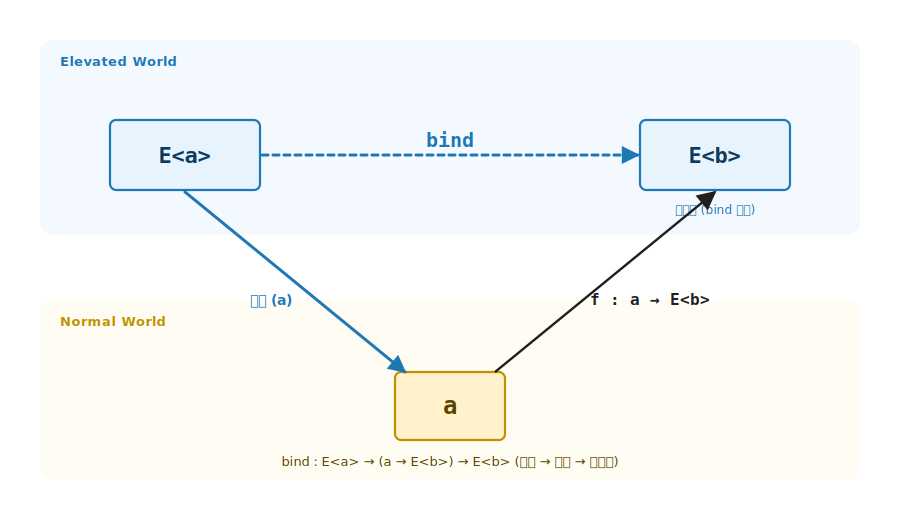
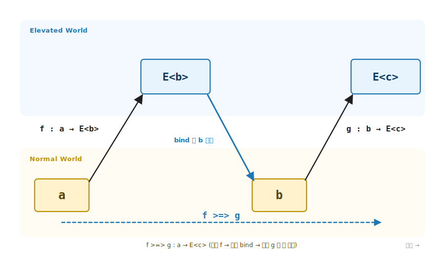

# 7장. Monad / `bind` (`a → E<b>` 함수의 합성 되살리기)

> 이 장에서 다룰 주제 — 1부의 세 번째 정통 추상. 출력 타입만 Elevated 인 함수 `a → E<b>` 는 그대로는 서로 이어지지 않습니다. 그 합성을 Elevated World 안에서 되살리는 도구, 곧 `bind` 의 일반화. Applicative 에 멤버 단 하나 (`Bind`) 를 더해 World-crossing 함수의 사슬을 완성하고, Kleisli 합성 `>=>` 와 LINQ `from-from-select` 가 모두 이 한 멤버 위에서 자랍니다.

> 이 장을 마치면 할 수 있게 되는 것
> - [ ] Monad 의 한 줄 정의 (`Bind`) 를 시그니처로 적을 수 있습니다.
> - [ ] `a → E<b>` 유형 함수가 왜 직접 합성되지 않는지 시그니처로 설명할 수 있습니다.
> - [ ] `Apply` (독립 결합) 와 `Bind` (의존 결합) 의 차이를 시그니처로 구분할 수 있습니다.
> - [ ] 새 자료 타입에 3-tuple 패턴으로 Monad 를 부착할 수 있습니다.
> - [ ] Kleisli 합성 `>=>` 와 `Pure` 가 항등원이라는 사실을 설명할 수 있습니다.
> - [ ] LINQ `from-from-select` 가 `Bind` 사슬의 다른 표기임을 설명할 수 있습니다.
> - [ ] Monad 의 세 법칙 (좌항등 / 우항등 / 결합) 을 시그니처로 적을 수 있습니다.

---

## 7.1 `a → E<b>` 유형 함수의 합성 — 목적

7장의 핵심은 한 줄로 압축됩니다. 4장 / 5장은 `a → b` 같은 평범한 함수를 Elevated 로 끌어올렸고, 6장은 반대로 `E<a>` 를 Normal 의 한 값으로 끌어내렸습니다. 7장이 답하는 자리는 그 둘과 다릅니다. 입력은 Normal 인데 출력만 Elevated 인 함수 `a → E<b>`, 곧 Normal 에서 출발해 Elevated 로 건너가는 함수끼리의 합성입니다. `bind` 가 이 합성을 되살립니다.

> 7장의 3부 구조 — 4장 ~ 6장과 같은 narrative arc 로 구성됩니다.
>
> - **§7.1 목적** — `a → E<b>` 유형 함수가 직접 이어지지 않는 고통. 그 막힘을 시그니처로 봅니다.
> - **§7.2 기능** — `Monad<M>` trait 의 `Bind` 한 멤버. Applicative 에 하나만 더해 합성이 되살아납니다.
> - **§7.3 ~ §7.4 예제·구분** — `MyMaybe` 에 부착한 `Bind` 의 단락 회로 + `Apply` 와의 차이.
> - **§7.5 ~ §7.7 기능 (합성·문법)** — Kleisli `>=>`, LINQ, `flatten` 으로 되살아난 합성을 다양한 표기로 봅니다.
> - **§7.8 기능 (법칙)** — 세 법칙이 합성의 자연스러움을 보장합니다.
> - **§7.9 ~ §7.14 예제·마무리** — 경계 · 챌린지 · 다시 읽기 · Q&A · 요약 · 8장 다리.

### 7.1.1 고통의 체험 — World-crossing 함수는 직접 이어지지 않습니다

`bind` 가 없으면 무엇이 아픈지 먼저 손으로 겪어 봅니다. 문자열을 정수로 파싱하는 함수를 생각해 봅니다. 파싱은 실패할 수 있으므로 결과가 `MyMaybe<int>` 입니다. 입력은 평범한 `string` 인데 출력은 Elevated 인 `a → E<b>` 유형 함수입니다.

```csharp
// 출력만 Elevated 인 함수 두 개 (a → E<b> 유형)
static MyMaybe<int> ParseInt(string s);     // string → MyMaybe<int>
static MyMaybe<int> Reciprocal(int n);      // int    → MyMaybe<int>  (0 이면 Nothing)
```

두 함수를 이어 붙이고 싶습니다. 문자열을 파싱하고, 그 정수의 역수를 구하는 것입니다. 그런데 평범한 함수 합성 `g ∘ f` 가 여기서는 타입이 맞지 않습니다.

```
ParseInt   : string → MyMaybe<int>
Reciprocal :          int    → MyMaybe<int>
                      ───┬───
        ParseInt 의 출력은 MyMaybe<int> 인데
        Reciprocal 의 입력은 int — 한 칸 어긋남
```

`ParseInt` 의 출력은 `MyMaybe<int>` 이고 `Reciprocal` 의 입력은 `int` 입니다. Normal 세계라면 `int → int` 함수끼리 `∘` 로 매끄럽게 이어졌을 자리인데, 출력이 Elevated 로 한 겹 올라간 순간 합성이 막힙니다. 손으로 풀면 컨테이너를 여닫는 분기가 끼어듭니다.

```csharp
// bind 없이 손으로 이어 붙이면 — 분기가 끼어든다
static MyMaybe<int> ParseThenReciprocal(string s)
{
    var parsed = ParseInt(s);
    if (parsed is MyMaybe<int>.Just j)   // 꺼내고
        return Reciprocal(j.Value);      // 다음 함수에 먹임
    return MyMaybe<int>.Nothing.Instance; // 없으면 그대로 단락
}
```

함수 하나를 더 잇고 싶으면 같은 `if (… is Just j)` 분기를 또 적습니다. World-crossing 함수가 늘 때마다 같은 꺼냄·단락 코드가 복제됩니다. 5장에서 `Map` 만으로는 다인자 결합이 안 됐던 것과 같은 종류의 막힘이, 이번에는 합성에서 일어납니다.

> **흔한 함정** — 이 막힘을 "그러면 `Map` 을 쓰면 되지" 로 넘기면 안 됩니다. `ParseInt` 에 `Map(Reciprocal, …)` 를 적용하면 결과가 `MyMaybe<MyMaybe<int>>` 로 한 겹 더 겹칩니다 (§7.7). `Map` 은 `a → b` 를 끌어올리는 도구이지, `a → E<b>` 를 이어 붙이는 도구가 아닙니다.

필요한 것은 꺼냄·단락 코드를 trait 한 자리에 한 번만 적고, World-crossing 함수 `a → E<b>` 는 인자로 받는 도구입니다. 그 도구가 이 장의 `bind` 입니다.

### 7.1.2 1장 4 가지 함수 유형의 `a → E<b>` 자리

1장 §1.7 에서 두 세계 사이의 함수 유형을 정리했습니다. 그중 `a → E<b>` 유형 (4 가지 함수 유형의 `a → E<b>`) 은 입력이 Normal, 출력이 Elevated 인 모양입니다.

```
a → E<b> 유형:   입력은 Normal 의 한 값, 출력은 Elevated 의 컨테이너
                Normal 에서 출발해 Elevated 로 건너가는 함수 (World-crossing)
```

```csharp
MyMaybe<int> ParseInt(string s);          // string → MyMaybe<int>
MyMaybe<User> FindUser(UserId id);        // UserId → MyMaybe<User>
```

이 유형의 함수를 elevated-world 글은 **World-crossing function** 이라 부릅니다. Normal 세계에서 출발해 한 번에 Elevated 세계로 건너가기 때문입니다. 7장의 목표는 한 줄입니다. 어떤 E 든 `a → E<b>` 유형 함수끼리 합성할 수 있어야 한다는 추상이 Monad 입니다. `bind` 는 이 합성을 가능하게 하는 단 하나의 멤버입니다.

### 7.1.3 4 가지 함수 유형 — 시그니처와 1부 매핑

| 시그니처 | 1부 매핑 | 어휘 (elevated-world 글) |
|---|---|---|
| `a → b` | 함수형 추상 불필요 | Normal World function |
| `a → E<b>` | **7장 (Monad / `bind`)** | World-crossing function |
| `E<a> → b` | 6장 (Foldable / `fold`) | (끌어내림) |
| `E<a> → E<b>` | 4장 (Functor / `map`) + 5장 (Applicative / `apply`) | Lifted function |

`map` 이 끌어올림 (Normal → Elevated), `fold` 가 끌어내림 (Elevated → Normal) 이라면, `bind` 는 World-crossing 함수 (`a → E<b>`) 끼리의 합성을 되살리는 자리입니다. 네 자리 중 마지막으로 남은 합성의 빈칸을 7장이 채웁니다.

---

## 7.2 `Monad<M>` trait 시그니처 — 기능 (Bind)

### 7.2.1 Bind 한 줄

World-crossing 함수의 합성을 되살리는 도구는 한 줄 시그니처로 적힙니다.

```
Bind : E<a> → (a → E<b>) → E<b>
```

| 자리 | 의미 |
|---|---|
| `E<a>` | 이미 Elevated 에 있는 값 (앞 단계의 결과) |
| `a → E<b>` | World-crossing 함수 (다음 단계, `a` 를 받아 `E<b>` 를 냄) |
| `E<b>` | 두 단계를 이은 결과 |

`bind` 는 `E<a>` 에서 `a` 를 꺼내 World-crossing 함수에 먹이고, 그 함수가 낸 `E<b>` 를 그대로 돌려줍니다. **꺼냄 → 적용 → 되돌림** 의 세 동작이 한 멤버 안에 들어 있습니다. 앞서 손으로 쓴 `if (… is Just j)` 분기가 바로 이 세 동작이었고, `bind` 는 그것을 trait 한 자리로 모읍니다.

### 7.2.2 trait 정의 — Applicative 에 멤버 하나 추가

`Monad<M>` 은 5장의 `Applicative<M>` 을 상속하고, 핵심 멤버 `Bind` 하나만 더합니다.

```csharp
public interface Monad<M> : Applicative<M> where M : Monad<M>
{
    static abstract K<M, B> Bind<A, B>(K<M, A> ma, Func<A, K<M, B>> f);

    // virtual — Map 을 Bind + Pure 로 유도.
    static virtual K<M, B> MapDefault<A, B>(Func<A, B> f, K<M, A> ma) =>
        M.Bind(ma, a => M.Pure(f(a)));

    // virtual — SelectMany 가 LINQ 의 비밀. 컴파일러가 from-select 를 이 호출로 변환.
    static virtual K<M, C> SelectMany<A, B, C>(
        K<M, A> ma, Func<A, K<M, B>> bind, Func<A, B, C> project) =>
        M.Bind(ma, a => M.Bind(bind(a), b => M.Pure(project(a, b))));
}
```

`static abstract` 는 `Bind` 하나뿐입니다. 새 자료 타입이 Monad 가 되려면 `Pure` + `Apply` (Applicative 에서) + `Bind` 만 정의하면 됩니다. `MapDefault` 와 `SelectMany` 는 `virtual` 이라 그 셋 위에서 공짜로 따라옵니다.

### 7.2.3 Monad ⊃ Applicative ⊃ Functor — 코드로 닫힙니다

`MapDefault` 한 줄이 중요합니다. `Map(f, ma)` 가 `Bind(ma, a => Pure(f(a)))` 로 유도됩니다. 값을 꺼내 (`Bind`), 평범한 함수 `f` 를 적용하고, 다시 끌어올리면 (`Pure`) 그것이 곧 `Map` 입니다. Monad 를 만족하는 타입은 자동으로 Applicative 이고 Functor 입니다. 1부의 trait 누적이 코드로 닫히는 자리입니다.



**그림 7-1. `bind`: World-crossing 함수의 합성 되살리기** — 위 행 Elevated World 에 `E<a>` 와 `E<b>` 두 컨테이너. 아래 행 Normal World 에 꺼낸 값 `a`. `bind` 는 먼저 `E<a>` 에서 `a` 를 꺼내 (왼쪽 아래 화살표), World-crossing 함수 `f : a → E<b>` 에 먹여 (오른쪽 위 화살표) `E<b>` 로 되돌립니다. 가운데 점선 `bind` 화살표가 이 세 동작을 한 멤버로 묶어 `E<a>` 를 `E<b>` 로 잇는 모습입니다.

---

## 7.3 `MyMaybe` 에 Monad 부착 — 단락 회로

### 7.3.1 3-tuple 패턴 + Bind 구현

4장 ~ 6장과 같은 3-tuple 패턴 (자료 `MyMaybe<A>` / 태그 `MyMaybeF` / trait) 으로 부착합니다. 태그 `MyMaybeF` 가 `Monad<MyMaybeF>` 를 구현하고, 새로 더하는 멤버는 `Bind` 하나입니다.

```csharp
// Bind 의 단락 회로 — Just 면 f 적용, Nothing 이면 f 호출 자체 안 함.
public static K<MyMaybeF, B> Bind<A, B>(K<MyMaybeF, A> ma, Func<A, K<MyMaybeF, B>> f) =>
    ma.As() switch
    {
        MyMaybe<A>.Just j  => f(j.Value),                 // 꺼내 다음 함수에 먹임
        MyMaybe<A>.Nothing => MyMaybe<B>.Nothing.Instance, // 꺼낼 게 없으면 f 호출 안 함
        _ => throw new InvalidOperationException()
    };
```

`Just` 면 안의 값을 꺼내 World-crossing 함수 `f` 에 먹입니다. `Nothing` 이면 **`f` 를 아예 호출하지 않고** 곧장 `Nothing` 을 돌려줍니다. 이 한 줄이 단락 회로 (short-circuit) 입니다. 앞 단계가 실패하면 뒤 단계는 평가조차 되지 않습니다.

### 7.3.2 실전 — Bind 명시 호출

앞서 손으로 쓴 분기가 `Bind` 한 줄로 사라집니다. 두 World-crossing 함수를 이어 두 정수를 더하는 예제입니다.

```csharp
K<MyMaybeF, int> result = ParseInt("3").Bind(a =>
    ParseInt("4").Bind<MyMaybeF, int, int>(b =>
        MyMaybeF.Pure(a + b)));
// → Just(7)
```

바깥 `Bind` 가 `"3"` 의 파싱 결과에서 `a = 3` 을 꺼내고, 안쪽 `Bind` 가 `"4"` 에서 `b = 4` 를 꺼낸 뒤, `Pure(a + b)` 로 합을 다시 Elevated 로 올립니다. 중첩된 `Bind` 가 의존 결합을 표현합니다. 뒤 단계 (`b` 꺼내기) 가 앞 단계 (`a` 꺼내기) 의 성공에 의존합니다.

### 7.3.3 단락 회로 — 한 단계만 실패해도 전체가 멈춥니다

중간 단계가 `Nothing` 이면 그 뒤는 평가되지 않습니다.

```csharp
K<MyMaybeF, int> r =
    ParseInt("3").Bind(a =>
        ParseInt("xyz").Bind<MyMaybeF, int, int>(b =>   // ← Nothing
            ParseInt("5").Bind<MyMaybeF, int, int>(c =>  // ← 호출조차 안 됨
                MyMaybeF.Pure(a + b + c))));
// → Nothing
```

`"xyz"` 파싱이 `Nothing` 을 내면, `Bind` 의 `Nothing` 가지가 `f` 를 호출하지 않으므로 `"5"` 파싱은 시작도 하지 않습니다. 실패가 사슬을 끊고 곧장 `Nothing` 으로 빠져나옵니다. 명령형의 이른 `return` 과 같은 효과가, 분기 코드 없이 `Bind` 의 시그니처만으로 일어납니다.

> **한 줄 정리** — `Bind` 는 성공이면 다음 단계로 잇고, 실패면 나머지를 건너뜁니다. 그 분기를 본문 코드가 아니라 trait 의 `Bind` 가 책임집니다.

---

## 7.4 Apply vs Bind — 독립 결합 vs 의존 결합

5장의 `Apply` 와 7장의 `Bind` 는 둘 다 두 Elevated 값을 결합하지만, 결정적 차이가 있습니다.

| | 시그니처 | 결합 방식 |
|---|---|---|
| `Apply` (5장) | `K<M, A → B> → K<M, A> → K<M, B>` | 함수가 이미 컨테이너 안 — **독립 결합** |
| `Bind` (7장) | `K<M, A> → (A → K<M, B>) → K<M, B>` | 값에서 다음 효과를 만듦 — **의존 결합** |

`Apply` 의 둘째 인자 `K<M, A>` 는 첫째 인자와 무관하게 미리 정해져 있습니다. 두 값이 서로를 모르는 채 나란히 놓이므로 **독립** 입니다. 반면 `Bind` 의 둘째 인자는 함수 `A → K<M, B>` 입니다. 다음에 만들 Elevated 값이 앞에서 꺼낸 `A` 값에 따라 달라지므로 **의존** 입니다.

이 차이가 Wlaschin 이 정리한 한 축입니다. **applicative 는 병렬·독립, monadic 은 순차·종속** 입니다. 독립이면 모든 가지를 함께 볼 수 있고 (Validation 의 오류 누적이 그 위에 섭니다), 종속이면 앞이 정해져야 뒤가 정해집니다 (이 장의 단락 회로가 그 결과입니다). 같은 도메인을 두 어법으로 풀 때 결과가 어떻게 갈리는지는 8장 Validation 에서 직접 봅니다.

---

## 7.5 Kleisli 합성 — `>=>` 로 합성 되살리기

### 7.5.1 `Then` (`>=>`) — World-crossing 함수의 정식 합성

`Bind` 는 `E<a>` 와 함수를 받습니다. 그런데 앞서 본 고통은 **함수끼리** 의 합성이었습니다. 두 World-crossing 함수 `f : a → E<b>` 와 `g : b → E<c>` 를 하나의 `a → E<c>` 로 잇는 연산이 Kleisli 합성 `>=>` 입니다.

```csharp
// f >=> g  ─ a 를 받아 E<c> 를 낸다. 내부는 Bind 사슬.
public static Func<A, K<M, C>> Then<M, A, B, C>(
    this Func<A, K<M, B>> f,
    Func<B, K<M, C>> g)
    where M : Monad<M>
=>
    a => M.Bind(f(a), g);
```

`f >=> g` 는 `a` 를 받아 `f(a)` (`E<b>`) 를 만들고, 그 결과를 `Bind` 로 `g` 에 넘깁니다. 한 줄로 `a → E<b>` 유형도 Normal 세계의 `∘` 처럼 매끄럽게 이어집니다. 앞서 타입이 어긋나 막혔던 `ParseInt` 와 `Reciprocal` 이, 이제 `ParseInt.Then(Reciprocal)` 한 줄로 `string → MyMaybe<int>` 합성이 됩니다.



**그림 7-2. Kleisli 합성: `f >=> g`** — 가로축은 시간 (왼쪽에서 오른쪽), 세로축은 두 세계입니다. `a` (Normal) 가 `f : a → E<b>` 로 `E<b>` (Elevated) 에 올라가고, `bind` 가 `E<b>` 에서 `b` 를 꺼내 Normal 로 내린 뒤, `g : b → E<c>` 가 다시 `E<c>` (Elevated) 로 올립니다. 올림 → 내림 → 올림 의 이 경로 (`a → E<b> → b → E<c>`) 전체가 한 함수 `f >=> g : a → E<c>` 입니다. 두 World-crossing 함수 `f` 와 `g` 가 `∘` 처럼 합성됩니다.

### 7.5.2 `Id` = `Pure` — Kleisli 합성의 항등원

Normal 세계의 `∘` 에 항등 함수 `x => x` 가 있듯이, Kleisli 합성에도 항등원이 있습니다. `Pure` 입니다.

```csharp
// 항등 Kleisli 함수 — Pure. Kleisli 합성의 왼/오른 항등원.
public static Func<A, K<M, A>> Id<M, A>() where M : Monad<M> => M.Pure;
```

`pure >=> f ≡ f` 이고 `f >=> pure ≡ f` 입니다. `Pure` 가 앞이나 뒤에 붙어도 합성 결과가 달라지지 않습니다. `Bind` (합성) 와 `Pure` (항등원) 가 함께 있어 World-crossing 함수가 진짜 합성 구조를 이룹니다. 이것이 "`bind` 가 합성을 되살린다" 의 정확한 의미입니다.

---

## 7.6 LINQ — `bind` 의 C# 설탕

### 7.6.1 `from-from-select` 가 곧 `Bind` 사슬입니다

C# 컴파일러는 LINQ 의 `from-from-select` 표기를 `Select` / `SelectMany` 메서드 호출로 변환합니다. `Monad<M>` 의 `SelectMany` 가 `Bind` 위에 정의돼 있으므로, LINQ 표기는 결국 `Bind` 사슬로 풀립니다.

```
표기 (LINQ)                         변환 (컴파일러)                  실행
─────────────────────────          ──────────────────────          ──────
from a in ma            ─►   ma.SelectMany(a =>          ─►   M.Bind(ma, a =>
from b in mb                      mb,                              M.Bind(mb, b =>
select a + b                      (a, b) => a + b)                  M.Pure(a + b)))
```

앞의 중첩 `Bind` 와 아래 LINQ 가 **정확히 같은 결과** 를 냅니다.

```csharp
K<MyMaybeF, int> byLinq =
    from a in ParseInt("3")
    from b in ParseInt("4")
    select a + b;
// → Just(7)   (§7.3.2 의 중첩 Bind 와 같은 값)
```

같은 결과라는 사실이 LINQ 가 `Bind` 의 다른 표기 (syntactic sugar) 임을 증명합니다. `LINQ` 의 친숙한 문법이 사실 Monad 의 합성이었습니다.

### 7.6.2 단락 회로도 LINQ 에서 그대로

`Bind` 의 단락은 LINQ 표기에서도 똑같이 작동합니다. 다단계 사슬에서 한 단계만 실패해도 전체가 `Nothing` 입니다.

```csharp
K<MyMaybeF, int> r =
    from a in ParseInt("10")
    from b in ParseInt("20")
    from c in ParseInt("30")
    select a + b + c;
// → Just(60)   (모두 성공)
```

`LINQ` 의 `from` 한 줄이 곧 `Bind` 한 단계입니다. World-crossing 함수의 합성이 C# 의 자연스러운 문법으로 들어옵니다.

---

## 7.7 `flatten` — 중첩 `E<E<a>>` 평탄화

`Bind` 는 또 다른 얼굴을 가집니다. 앞의 흔한 함정에서 `Map(Reciprocal, …)` 이 `MyMaybe<MyMaybe<int>>` 로 한 겹 겹친다고 했습니다. 그 중첩을 한 겹으로 펴는 함수가 `flatten` 입니다.

```csharp
public static K<M, A> flatten<M, A>(K<M, K<M, A>> mma)
    where M : Monad<M> =>
    M.Bind(mma, x => x);   // 꺼낸 안쪽 컨테이너를 그대로 돌려줌
```

`Bind` 에 항등 함수 (`x => x`) 를 넘기면 됩니다. 바깥 컨테이너를 열어 꺼낸 것이 이미 안쪽 컨테이너이므로, 그대로 돌려주면 한 겹이 펴집니다. `Map` 으로 겹친 `E<E<b>>` 를 `flatten` 으로 펴는 것과, `Bind` 로 처음부터 한 겹으로 잇는 것은 같은 결과입니다. `Bind` 는 "`Map` 한 뒤 `flatten`" 으로도 읽을 수 있습니다.

---

## 7.8 Monad 의 세 법칙 — 기능 (목적의 보장)

`Monad<M>` 인터페이스를 구현했다고 진짜 Monad 가 되는 것은 아닙니다. 세 법칙을 만족해야 합성이 자연스럽습니다. 컴파일러는 강제하지 못하므로 독자가 직접 검증합니다.

### 7.8.1 좌항등 / 우항등 / 결합

Kleisli 합성 `>=>` 로 적으면 Normal 세계의 합성 법칙과 똑같이 읽힙니다.

```
좌항등 (left identity):    pure >=> f         ≡  f
우항등 (right identity):   f >=> pure         ≡  f
결합 (associativity):     (f >=> g) >=> h    ≡  f >=> (g >=> h)
```

`Bind` 로 적으면 다음과 같습니다.

```
좌항등:   Bind(Pure(a), f)           ≡  f(a)
우항등:   Bind(m, Pure)              ≡  m
결합:     Bind(Bind(m, f), g)        ≡  Bind(m, a => Bind(f(a), g))
```

좌항등·우항등은 `Pure` 가 합성에 아무 효과도 더하지 않는다는 약속입니다. 결합은 사슬을 어디서 끊어 묶어도 같은 결과라는 약속입니다. 세 법칙이 성립하므로 `bind` 사슬을 마음 놓고 길게 이을 수 있습니다.

### 7.8.2 시그니처가 약속하지 못하는 성질

세 법칙은 시그니처만으로는 강제되지 않습니다. `Bind` 의 타입만 맞춰 놓고 안에서 엉뚱한 일을 하는 가짜 Monad 도 컴파일은 됩니다. 그래서 법칙은 본문의 약속으로 남고, 임의의 입력에 대한 자동 검증은 9부의 property-based 테스트로 넘어갑니다 (§7.14 테스트 디딤돌).

---

## 7.9 Monad 가 아닌 경계 — 예제

시그니처로 Monad 의 자리와 그 바깥을 가릅니다. `bind` 가 다루는 것은 정확히 `a → E<b>` 유형뿐입니다.

| 함수 | 시그니처 | Monad 의 `bind`? | 왜 그런가 / 어느 trait |
|---|---|---|---|
| `ParseInt`, `FindUser` | `a → E<b>` | ✓ | World-crossing 함수 (`a → E<b>` 유형) |
| `Map(f)` | `E<a> → E<b>` | ✗ | 끌어올림 — Functor 의 자리 (4장) |
| `Sum`, `Count` | `E<a> → b` | ✗ | 끌어내림 — Foldable 의 자리 (6장) |
| `n => n * 2` | `a → b` | ✗ | 입력·출력 모두 Normal — 추상 불필요 |
| `Apply` | `E<a → b> → E<a> → E<b>` | ✗ | 독립 결합 — Applicative 의 자리 (5장) |

`a → E<b>` 가 아닌 시그니처는 `bind` 의 자리가 아닙니다. `E<a> → E<b>` 를 `bind` 로 다루려 하면 함수의 입력이 Normal `a` 가 아니라 Elevated `E<a>` 라 타입이 어긋납니다. 시그니처가 trait 의 자리를 정확히 가릅니다.

---

## 7.10 직접 해보기 — 챌린지

> **챌린지 1** — `MyMaybe` 에 부착한 `Bind` 로 `ParseInt("12").Bind(n => ParseInt("3").Bind(m => Pure(n * m)))` 의 결과를 시그니처를 따라가며 손으로 구해 봅니다. 중간을 `ParseInt("x")` 로 바꾸면 어디서 단락되는지 짚어 봅니다.
>
> **챌린지 2** — `f >=> g` 를 `Bind` 만으로 직접 적어 봅니다 (`a => Bind(f(a), g)`). 그런 다음 `pure >=> f` 와 `f` 가 같은 함수임을 좌항등 법칙으로 설명해 봅니다.
>
> **챌린지 3** — LINQ 예제 (§7.6.1) 를 중첩 `Bind` 표기로 다시 적어 봅니다. 두 표기가 같은 결과를 내는 이유를 `SelectMany` 정의 (`Bind(ma, a => Bind(bind(a), b => Pure(project(a, b))))`) 로 설명해 봅니다.

정답 코드는 `code/Part01-Foundations/Ch07-Monad/Challenges/` 에 있습니다.

---

## 7.11 Elevated World 어휘로 다시 읽기

7장의 도구를 1장 비유에 매핑합니다.

| 7장 도구 | Elevated World 어휘 |
|---|---|
| `a → E<b>` 유형 함수 | World-crossing function (Normal 에서 Elevated 로 건너감) |
| `Bind` | 꺼냄 → 적용 → 되돌림. World-crossing 함수의 합성을 되살림 |
| `>=>` (Kleisli) | World-crossing 함수의 정식 `∘` |
| `Pure` | Kleisli 합성의 항등원 |

`map` (4장) 이 끌어올림, `fold` (6장) 가 끌어내림이었다면, `bind` 는 두 세계에 걸친 함수끼리의 합성입니다. 네 자리 (`a → b` / `a → E<b>` / `E<a> → b` / `E<a> → E<b>`) 가 모두 채워졌습니다. 비유는 여기까지가 역할입니다. 정확한 합성 규칙은 세 법칙 (§7.8) 이 정합니다.

---

## 7.12 Q&A — 자기 점검

> **Q1. `bind` 의 한 줄 시그니처는?** (§7.2.1)
>
> `Bind : E<a> → (a → E<b>) → E<b>` 입니다. `E<a>` 에서 `a` 를 꺼내 World-crossing 함수 `a → E<b>` 에 먹이고 `E<b>` 로 되돌립니다.

> **Q2. `a → E<b>` 유형 함수는 왜 직접 합성되지 않습니까?** (§7.1.1)
>
> 앞 함수의 출력은 `E<b>` 인데 뒤 함수의 입력은 `b` 라 한 겹 어긋나기 때문입니다. Normal 세계의 `∘` 가 Elevated 출력 앞에서 막힙니다. `bind` 가 `E<b>` 에서 `b` 를 꺼내 그 틈을 메웁니다.

> **Q3. `Apply` 와 `Bind` 의 차이는?** (§7.4)
>
> `Apply` 는 함수가 이미 컨테이너 안에 있는 독립 결합이고, `Bind` 는 앞에서 꺼낸 값으로 다음 효과를 만드는 의존 결합입니다. applicative 는 병렬·독립, monadic 은 순차·종속입니다.

> **Q4. 단락 회로는 어떻게 일어납니까?** (§7.3.3)
>
> `MyMaybeF.Bind` 의 `Nothing` 가지가 World-crossing 함수 `f` 를 호출하지 않기 때문입니다. 앞 단계가 실패하면 뒤 단계는 평가조차 되지 않고 곧장 `Nothing` 으로 빠져나옵니다.

> **Q5. 새 자료 타입을 Monad 로 만들려면 무엇을 정의합니까?** (§7.2.2)
>
> `Pure`, `Apply` (Applicative 에서), `Bind` 입니다. `static abstract` 로 더하는 것은 `Bind` 하나이고, `Map` 은 `MapDefault` 로 공짜로 따라옵니다.

> **Q6. `>=>` 의 항등원은 무엇입니까?** (§7.5.2)
>
> `Pure` 입니다. `pure >=> f ≡ f` 이고 `f >=> pure ≡ f` 입니다. `Bind` 와 `Pure` 가 함께 World-crossing 함수의 합성 구조를 이룹니다.

> **Q7. LINQ `from-from-select` 와 `Bind` 의 관계는?** (§7.6.1)
>
> 컴파일러가 `from-from-select` 를 `SelectMany` 호출로 변환하고, `SelectMany` 는 `Bind` 위에 정의돼 있습니다. LINQ 는 `Bind` 사슬의 다른 표기입니다.

> **Q8. Monad 의 세 법칙은?** (§7.8.1)
>
> 좌항등 (`pure >=> f ≡ f`), 우항등 (`f >=> pure ≡ f`), 결합 (`(f >=> g) >=> h ≡ f >=> (g >=> h)`) 입니다. 시그니처로는 강제되지 않으므로 직접 검증합니다.

---

## 7.13 요약

- **고통에서 출발했습니다.** 출력만 Elevated 인 함수 `a → E<b>` 끼리는 타입이 한 겹 어긋나 직접 합성되지 않았습니다 (§7.1).
- **`Bind` 한 멤버가 그 합성을 되살립니다.** `E<a> → (a → E<b>) → E<b>` 가 꺼냄·적용·되돌림을 한 자리에 모읍니다. Applicative 에 멤버 하나만 더하면 됩니다 (§7.2).
- **단락 회로는 시그니처의 결과입니다.** `Nothing` 가지가 다음 함수를 호출하지 않아, 실패가 사슬을 끊습니다 (§7.3).
- **독립 결합 (`Apply`) 과 의존 결합 (`Bind`) 이 갈립니다.** applicative 는 병렬, monadic 은 순차입니다 (§7.4).
- **`>=>` 와 `Pure` 가 합성 구조를 이룹니다.** World-crossing 함수가 `∘` 처럼 이어지고, `Pure` 가 항등원입니다 (§7.5).
- **LINQ 는 `Bind` 의 설탕입니다.** `from-from-select` 가 `SelectMany` 를 거쳐 `Bind` 사슬로 풀립니다 (§7.6).
- **세 법칙이 합성의 자연스러움을 보장합니다.** 좌항등·우항등·결합 (§7.8).

---

## 7.14 다음 장으로 — 마무리 (8장 Validation 다리)

```
4장 — Functor:      (a → b) → (E<a> → E<b>)          map         (1인자 lift)
5장 — Applicative:   다인자 → E<a> → … → E<r>          pure + apply (N 인자 lift)
6장 — Foldable:      E<a> → b                          fold         (끌어내림)
이 장 (7장) — Monad: a → E<b> 의 합성 되살리기             bind / >=>   (World-crossing 합성)
다음 장 (8장) — Validation:  applicative 누적 vs monadic 단락
```

7장에서 `Bind` 의 의존 결합 (순차·단락) 과 5장 `Apply` 의 독립 결합 (병렬·누적) 을 시그니처로 갈랐습니다. 8장 Validation 은 이 두 어법을 같은 도메인 (회원가입 검증) 에 나란히 적용해, 한쪽은 모든 오류를 누적하고 다른 쪽은 첫 오류에서 단락하는 차이를 직접 봅니다. `Bind` 가 의도적으로 없는 자리에서 무엇이 가능해지는지가 다음 장의 주제입니다. [8장 — Validation](./Ch08-Validation.md) 로 넘어갑니다.

> **실무 디딤돌** — `Bind` 는 5부 `Eff` / `IO`, 8장 `Validation` 의 World-crossing 합성으로 그대로 확장됩니다. 실패할 수 있는 단계, 환경을 읽는 단계, 비동기 단계를 `bind` 한 어휘로 잇는 것이 실무 효과 코드의 기본 골격입니다.
>
> **테스트 디딤돌** — Monad 의 세 법칙 (좌항등 / 우항등 / 결합) 은 9부의 property-based 테스트로 자연 확장됩니다. 임의의 값과 임의의 World-crossing 함수에 대해 `Bind(Pure(a), f) ≡ f(a)` 등이 성립하는지 자동 검증하는 것이 출발점입니다.
