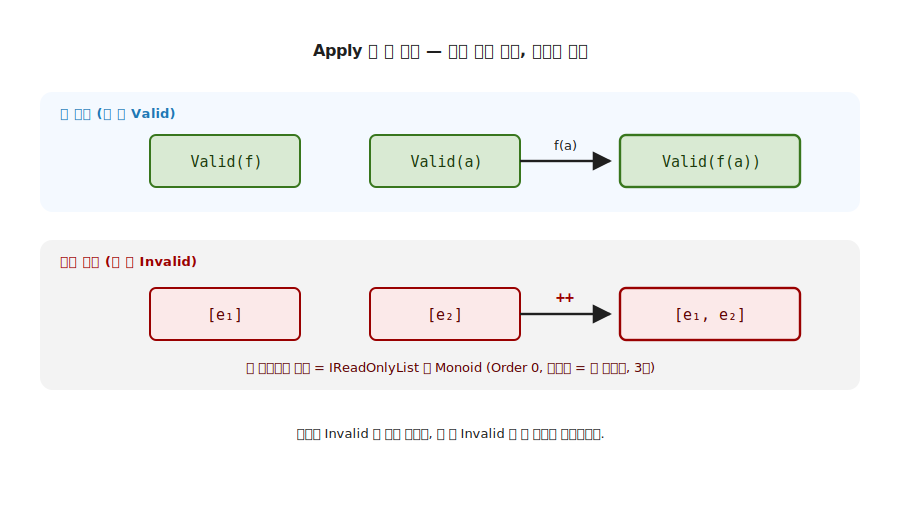

# 8장. Validation 실전 (applicative 누적 vs monadic 단락)

> 이 장에서 다룰 주제 — 1부에서 처음으로 이론을 실전에 붙이는 장. 5장에서 만든 `MyValidation` 을 회원가입 폼 검증에 적용해, 같은 도메인을 두 어법으로 풀어 봅니다. applicative style 은 모든 오류를 한 번에 누적하고, monadic style 은 첫 오류에서 단락합니다. `Bind` 가 의도적으로 없는 자리에서 무엇이 가능해지는지, 그리고 3장 Monoid 의 결합이 오류 누적에서 어떻게 다시 쓰이는지를 직접 작성한 코드로 봅니다.

> 이 장을 마치면 할 수 있게 되는 것
> - [ ] `MyValidation` 이 왜 Applicative 자리이고 Monad 자리가 아닌지 설명할 수 있습니다.
> - [ ] applicative 누적과 monadic 단락이 같은 입력에서 어떻게 다른 결과를 내는지 보일 수 있습니다.
> - [ ] `Apply` 의 `Invalid + Invalid` 분기가 오류 누적의 전부임을 시그니처로 설명할 수 있습니다.
> - [ ] 오류 누적이 3장 Monoid 의 결합 (`IReadOnlyList` 이어붙임) 임을 짚을 수 있습니다.
> - [ ] 다인자 검증을 `Pure → Apply` 사슬로 조립할 수 있습니다.
> - [ ] 폼 검증은 누적, 의존 사슬은 단락이라는 도메인 선택의 기준을 설명할 수 있습니다.

---

## 8.1 1장 비유로 출발 — Validation 은 Elevated World 의 어느 자리인가

8장의 핵심은 한 줄로 압축됩니다. 5장 ~ 7장에서 손에 쥔 도구 (Applicative 의 `Apply`, Monad 의 `Bind`) 를 같은 도메인에 나란히 적용해, **어느 어법이 어느 상황에 맞는가** 를 실전으로 가립니다. 새 trait 을 배우는 장이 아니라, 이미 배운 두 trait 의 차이가 실무에서 어떻게 결과를 가르는지 보는 장입니다.

> 8장의 3부 구조 — 5장 ~ 7장과 같은 narrative arc 로 구성됩니다.
>
> - **§8.1 ~ §8.2 목적** — 폼 검증의 고통 (첫 실패에서 멈추면 사용자가 괴롭습니다).
> - **§8.3 ~ §8.5 기능** — 도메인 셋업, 작은 검증자, `Pure → Apply` 다인자 조립.
> - **§8.6 ~ §8.8 기능 (누적의 심장)** — `Apply` 의 누적 분기, applicative vs monadic, `MapFail`.
> - **§8.9 ~ §8.14 예제·마무리** — 4 사례 데모 · 챌린지 · 다시 읽기 · Q&A · 요약 · 9장 다리.

### 8.1.1 5장에서 만든 `MyValidation` 자리 복습

`MyValidation<E, A>` 는 5장에서 Applicative 의 인스턴스로 부착했습니다. 두 케이스를 가집니다. 성공이면 값을 담은 `Valid`, 실패면 오류 목록을 담은 `Invalid` 입니다.

```csharp
public abstract record MyValidation<E, A> : K<MyValidationF<E>, A>
{
    public sealed record Valid(A Value) : MyValidation<E, A>;
    public sealed record Invalid(IReadOnlyList<E> Errors) : MyValidation<E, A>;
}
```

오류가 단수가 아니라 **목록** (`IReadOnlyList<E>`) 이라는 점이 이 장의 모든 것을 결정합니다. 오류를 하나가 아니라 여러 개 담을 수 있어야 누적이 가능합니다. 5장에서는 이 타입의 시그니처를 봤고, 8장에서는 그 시그니처가 실전에서 무엇을 가능하게 하는지 봅니다.

### 8.1.2 Applicative 자리, Monad 자리 아님

`MyValidationF<E>` 는 `Applicative<MyValidationF<E>>` 만 구현합니다. `Bind` 는 정의하지 않습니다. 이것이 의도된 설계입니다.

```csharp
public sealed class MyValidationF<E> : Applicative<MyValidationF<E>>
{
    // Map / Pure / Apply 만 — Bind 는 없습니다 (의도적).
}
```

7장에서 `Bind` 가 의존 결합 (앞 단계의 성공에 뒤 단계가 의존) 이라 단락을 일으킨다고 봤습니다. Validation 이 `Bind` 를 일부러 두지 않는 이유가 바로 그것입니다. 폼 검증은 네 칸이 서로 독립이므로, 의존 결합이 아니라 독립 결합 (`Apply`) 으로 모든 칸을 함께 평가해 오류를 누적하려는 것입니다. 이 의도적 선택을 **Applicative-but-not-Monad** 라 부릅니다.

---

## 8.2 고통의 체험 — 첫 실패에서 멈추는 폼

`Bind` 만으로 폼을 검증하면 무엇이 아픈지 먼저 겪어 봅니다. 회원가입 폼에 이메일 · 비밀번호 · 나이 · 등급 네 칸이 있습니다. 7장의 `Bind` 사슬로 검증을 이으면, 첫 칸이 틀리는 순간 단락이 일어나 나머지는 평가조차 되지 않습니다.

```csharp
// Bind 사슬로 검증하면 — 첫 실패에서 멈춤
ValidateEmail(email).Bind(e =>
    ValidatePassword(pw).Bind(p =>      // email 이 틀리면 여기는 평가 안 됨
        ValidateAge(age).Bind(a => ...)));
```

이메일과 비밀번호와 나이가 모두 틀려도 사용자는 **이메일 오류 하나만** 봅니다. 그것을 고쳐 다시 제출하면 이번엔 비밀번호 오류 하나를 봅니다. 네 칸이 틀렸으면 네 번 제출해야 모든 오류를 알게 됩니다. 단락이 검증에서는 나쁜 사용자 경험이 됩니다.

> **흔한 함정** — "그러면 `try-catch` 로 각 칸을 따로 검사해 오류를 리스트에 모으면 되지" 로 넘기면, 모으는 코드와 조립하는 코드가 본문에 섞여 칸이 늘 때마다 복제됩니다. 필요한 것은 **검증을 독립으로 수행하면서 오류를 자동으로 누적하고, 모두 통과했을 때만 값을 조립하는** 도구입니다. 그 도구가 Applicative 의 `Apply` 입니다.

폼 검증이 원하는 것은 단락이 아니라 누적입니다. 네 칸을 모두 평가하고, 틀린 칸의 오류를 모두 모아 한 번에 보여 주는 것입니다. 7장의 의존 결합 (`Bind`) 이 아니라 5장의 독립 결합 (`Apply`) 이 맞는 자리입니다.

---

## 8.3 도메인 셋업 — 값 객체와 `DomainError`

회원가입 폼의 네 값을 값 객체로 둡니다. 생성자는 검증을 강제하지 않습니다. 검증은 외부 검증자 함수가 담당하고, 통과한 경우에만 값 객체가 조립됩니다.

```csharp
public readonly record struct Email(string Value);
public readonly record struct Password(string Value);
public readonly record struct Age(int Value);
public enum Tier { Free, Pro, Enterprise }

public sealed record User(Email Email, Password Password, Age Age, Tier Tier);

// 도메인 에러 — 어느 필드의 어떤 문제인지.
public sealed record DomainError(string Field, string Message)
{
    public override string ToString() => $"{Field}: {Message}";
}
```

`DomainError` 가 **어느 필드의 어떤 문제** 인지 함께 담습니다. 오류를 누적할 때 사용자가 "이메일이 왜, 비밀번호가 왜" 를 한눈에 보려면, 오류 하나하나가 자기 출처를 알아야 합니다. 검증의 결과 타입은 모두 `MyValidation<DomainError, …>` 입니다.

---

## 8.4 작은 검증자 — 한 함수 한 책임

검증자는 한 함수가 한 칸만 책임집니다. 모두 같은 모양 `K<MyValidationF<DomainError>, X>` 를 돌려줍니다.

```csharp
public static K<MyValidationF<DomainError>, Email> Email(string raw) =>
    raw.Contains('@') && raw.Length <= 254
        ? MyValidationF<DomainError>.Pure(new Email(raw))
        : new MyValidation<DomainError, Email>.Invalid(
              [new DomainError("email", "@ 필수 + 254 자 이하")]);
```

통과하면 `Pure` 로 값을 `Valid` 에 끌어올리고, 실패하면 `Invalid` 에 오류 한 건을 담습니다. 비밀번호 (8 자 이상) · 나이 (14 ~ 120) · 등급 (`Enum.TryParse`) 도 같은 모양입니다. 네 검증자가 서로를 전혀 모릅니다. 이 **독립성** 이 누적의 전제입니다. 서로 의존하지 않으므로 넷을 함께 평가할 수 있습니다.

---

## 8.5 다인자 lift — `Curry → Pure → Apply` 사슬

네 검증 결과를 하나의 `User` 로 조립합니다. 5장의 다인자 lift 패턴이 그대로 실전에 옵니다. `User` 생성자는 인자가 넷이므로 먼저 curry 합니다.

```csharp
// 4 인자 생성자를 curry — a => b => c => d => User(a, b, c, d)
Func<Email, Password, Age, Tier, User> ctor = (e, p, a, t) => new User(e, p, a, t);
var curried = Curry.Of(ctor);

// Pure 로 함수를 올리고, Apply 를 네 번
var lifted = MyValidationF<DomainError>.Pure(curried);   // Valid(curried)
var step1  = lifted.Apply(emailV);     // Email 적용
var step2  = step1.Apply(passwordV);   // Password 적용
var step3  = step2.Apply(ageV);        // Age 적용
var result = step3.Apply(tierV);       // Tier 적용 → MyValidation<…, User>
```

5장에서 본 `Pure → Apply` 사슬과 정확히 같은 골격입니다. `Pure` 가 함수를 Elevated 로 올려 출발점을 만들고 (§5.2), `Apply` 가 검증 결과를 하나씩 먹입니다. 네 검증이 모두 `Valid` 면 `Valid(User(…))` 가, 하나라도 `Invalid` 면 오류가 모인 `Invalid` 가 나옵니다. 그 누적이 일어나는 자리가 `Apply` 입니다.

---

## 8.6 누적의 심장 — `Apply` 의 `Invalid + Invalid` 분기

이 장의 모든 것이 `Apply` 의 네 분기 한 곳에 모여 있습니다.

```csharp
public static K<MyValidationF<E>, B> Apply<A, B>(
    K<MyValidationF<E>, Func<A, B>> mf, K<MyValidationF<E>, A> ma) =>
    (mf.As(), ma.As()) switch
    {
        (Valid f, Valid a)       => new Valid(f.Value(a.Value)),            // 둘 다 성공 → 적용
        (Invalid fe, Invalid ae) => new Invalid([..fe.Errors, ..ae.Errors]), // 둘 다 실패 → 누적
        (Invalid fe, _)          => new Invalid(fe.Errors),                 // 함수 측만 실패
        (_, Invalid ae)          => new Invalid(ae.Errors)                  // 값 측만 실패
    };
```

핵심은 둘째 분기입니다. 함수 측과 값 측이 **둘 다 `Invalid` 면 두 오류 목록을 이어붙입니다** (`[..fe.Errors, ..ae.Errors]`). `Apply` 가 사슬을 따라 호출될 때마다 이 이어붙임이 누적되어, 네 칸이 모두 틀리면 네 오류가 한 목록에 모입니다. 단락하는 분기가 없습니다. 실패해도 멈추지 않고 오류를 모읍니다.

### 8.6.1 오류 누적은 3장 Monoid 의 결합입니다

두 오류 목록을 이어붙이는 `[..fe.Errors, ..ae.Errors]` 가 낯설지 않아야 합니다. 3장에서 본 결합입니다. `IReadOnlyList<E>` 는 이어붙임 (`++`) 을 결합으로, 빈 목록을 단위원으로 갖는 Monoid 입니다 (Order 0). 오류 누적은 그 결합을 검증 사슬을 따라 반복 적용하는 것입니다.



**그림 8-1. `Apply` 의 두 채널: 값은 함수 적용, 에러는 Monoid 결합** — 위 행 값 채널은 둘 다 `Valid` 일 때 함수 `f` 를 값 `a` 에 적용해 `Valid(f(a))` 를 냅니다. 아래 행 에러 채널은 둘 다 `Invalid` 일 때 두 오류 목록 `[e1]`, `[e2]` 를 이어붙여 `[e1, e2]` 를 냅니다. 이 이어붙임이 3장의 `IReadOnlyList` Monoid 결합 (단위원은 빈 목록) 입니다. `Apply` 한 번이 두 채널을 동시에 진행합니다.

> **한 줄 정리** — `Apply` 는 값 채널에는 함수를 적용하고, 에러 채널에는 Monoid 결합을 적용합니다. 3장의 결합이 검증의 오류 누적으로 다시 쓰입니다.

---

## 8.7 applicative style vs monadic style — 같은 도메인, 다른 의미

같은 입력을 두 어법으로 풀어 결과를 나란히 둡니다. applicative style 은 `Apply` 사슬로 네 칸을 모두 평가해 오류를 누적합니다. monadic style 은 차례로 평가하다 첫 `Invalid` 에서 단락합니다.

`MyValidation` 에는 `Bind` 가 없으므로, monadic 단락은 `switch` 로 직접 흉내 냅니다. 의미는 7장 `Bind` 의 단락과 같습니다.

```csharp
// monadic style — 첫 Invalid 에서 즉시 return (단락 시뮬레이션)
var emailV = Validators.Email(emailRaw);
if (emailV.As() is Invalid ei) return new Invalid(ei.Errors);   // 여기서 멈추면 나머지 평가 안 됨

var passwordV = Validators.Password(passwordRaw);
if (passwordV.As() is Invalid pi) return new Invalid(pi.Errors);
// ... age, tier 차례로 ...
```

네 칸이 모두 틀린 같은 입력 (`"noatsign", "1234", -5, "Premium"`) 에 두 어법을 적용하면 결과가 갈립니다.

| 어법 | 결합 | 결과 |
|---|---|---|
| applicative | `Apply` 사슬 (독립, 모두 평가) | `Invalid` — 오류 **4 건** |
| monadic | `switch` 단락 (의존, 첫 실패에서 멈춤) | `Invalid` — 오류 **1 건** |


**그림 8-2. 누적 vs 단락: 같은 입력, 다른 결과** — 왼쪽 applicative style 은 네 칸을 모두 평가해 오류 4 건을 누적합니다. 오른쪽 monadic style 은 첫 칸 (`email`) 실패에서 멈춰 나머지 세 칸을 평가하지 않고 오류 1 건만 냅니다. 어느 쪽이 옳은가가 아니라, 도메인이 어느 의미를 고르는가의 문제입니다.

어느 어법이 더 옳은 것은 아닙니다. **도메인이 의미를 고릅니다.** 회원가입 폼처럼 칸이 서로 독립이면 모든 오류를 한 번에 보여 주는 누적 (applicative) 이 친절합니다. 사용자 조회 다음 권한 조회 다음 데이터 조회처럼 앞이 성공해야 뒤가 의미를 갖는 의존 사슬이면, 첫 실패에서 멈추는 단락 (monadic) 이 자연스럽습니다. 5장 `Apply` 와 7장 `Bind` 의 차이가 도메인 선택의 기준이 됩니다.

---

## 8.8 에러에 컨텍스트 입히기 — `MapFail`

오류가 모인 뒤, 각 오류에 공통 맥락을 입히고 싶을 때가 있습니다. `MapFail` 이 그 일을 합니다. 값은 그대로 두고 오류만 변환합니다.

```csharp
public static K<MyValidationF<E>, A> MapFail<A>(Func<E, E> f, K<MyValidationF<E>, A> fa) =>
    fa.As() switch
    {
        Valid v   => v,                                            // 값은 그대로
        Invalid i => new Invalid(i.Errors.Select(f).ToList())      // 오류만 변환
    };
```

`Map` 이 값 채널을 다룬다면 `MapFail` 은 에러 채널을 다룹니다. 예를 들어 누적된 네 오류 각각에 `"[가입 폼] "` 접두어를 붙일 수 있습니다. 두 채널 (값 / 에러) 을 각각 변환하는 이 대칭은 10장 Bifunctor 의 `biMap` 으로 일반화됩니다. 지금은 값과 오류가 각자의 변환 함수를 가진다는 직감만 가져가면 충분합니다.

---

## 8.9 실전 데모 — 4 사례

`Program.cs` 의 데모는 점점 더 많은 오류로 나아갑니다.

```
== 사례 1 — 모두 정상 ==
  ✓ User 생성: User { Email = ..., Tier = Pro }

== 사례 2 — 이메일만 잘못 ==
  ✗ 에러 1 건:
    - email: @ 필수 + 254 자 이하

== 사례 3 — 4 개 모두 잘못 — 누적 ==
  ✗ 에러 4 건:
    - email: @ 필수 + 254 자 이하
    - password: 8 자 이상
    - age: 14-120 범위
    - tier: Free / Pro / Enterprise 중 하나

== 사례 4 — MapFail 로 에러 prefix 추가 ==
  ✗ 에러 4 건:
    - email: [가입 폼] @ 필수 + 254 자 이하
    - ...
```

사례 3 이 이 장의 payoff 입니다. 네 칸이 모두 틀렸을 때 오류 네 건이 한 번에 나옵니다. monadic 이었다면 한 건만 봤을 자리입니다. 사례 4 는 `MapFail` 이 값은 그대로 두고 오류 각각에만 접두어를 입히는 모습입니다.

---

## 8.10 직접 해보기 — 챌린지

> **챌린지 1** — `Submit("noatsign", "12345678", 30, "Pro")` (이메일만 잘못) 의 결과를 `Apply` 의 네 분기를 따라가며 손으로 구해 봅니다. 함수 측이 `Valid`, 값 측 (email) 이 `Invalid` 인 분기가 어디서 한 건을 담는지 짚어 봅니다.
>
> **챌린지 2** — 검증자를 하나 더 추가해 봅니다 (예: 닉네임, 2 자 이상). `User` 생성자 인자를 다섯으로 늘리고 `Curry.Of` 와 `Apply` 사슬을 한 단계 더 잇습니다. 다섯 칸이 모두 틀리면 오류가 몇 건 나오는지 예측해 봅니다.
>
> **챌린지 3** — `MyValidation` 에 `Bind` 를 직접 정의해 봅니다 (`Invalid` 면 단락). 그렇게 만든 `Bind` 로 폼을 검증하면 왜 누적이 사라지는지 설명해 봅니다.

정답 코드는 `code/Part01-Foundations/Ch08-Validation/Challenges/` 에 있습니다.

---

## 8.11 Elevated World 어휘로 다시 읽기

8장의 도구를 1장 비유에 매핑합니다.

| 8장 도구 | Elevated World 어휘 |
|---|---|
| `MyValidation<E, A>` | 효과 = 검증 실패 가능성. 오류 목록을 함께 담는 Elevated 시민 |
| `Apply` 누적 | 독립 결합 — 모든 칸을 평가해 오류를 Monoid 결합으로 모음 |
| `Bind` 없음 | 의존 결합을 일부러 막아 단락을 피함 (Applicative-but-not-Monad) |
| `MapFail` | 에러 채널의 변환 (값 채널의 `Map` 과 대칭) |

5장의 Applicative 가 다인자 lift 였다면, 8장은 그 lift 의 에러 채널이 3장 Monoid 의 결합 위에서 누적된다는 실전입니다. 비유는 여기까지가 역할입니다. 누적이냐 단락이냐의 선택은 도메인이 정합니다.

---

## 8.12 Q&A — 자기 점검

> **Q1. `MyValidation` 은 왜 Applicative 자리이고 Monad 자리가 아닙니까?** (§8.1.2)
>
> `Apply` (독립 결합) 만 정의하고 `Bind` (의존 결합) 는 일부러 두지 않기 때문입니다. 폼의 네 칸은 서로 독립이라 모두 평가해 오류를 누적해야 하므로, 단락을 일으키는 `Bind` 를 피합니다. 이것이 Applicative-but-not-Monad 입니다.

> **Q2. 같은 입력에서 applicative 와 monadic 의 결과가 어떻게 다릅니까?** (§8.7)
>
> 네 칸이 모두 틀린 입력에서 applicative 는 오류 4 건을 누적하고, monadic 은 첫 칸에서 단락해 1 건만 냅니다. 독립 결합은 모두 평가, 의존 결합은 첫 실패에서 멈춤입니다.

> **Q3. 오류 누적은 어디서 일어납니까?** (§8.6)
>
> `Apply` 의 `(Invalid, Invalid)` 분기입니다. 두 오류 목록을 `[..fe.Errors, ..ae.Errors]` 로 이어붙입니다. `Apply` 가 사슬을 따라 호출될 때마다 이어붙임이 누적됩니다.

> **Q4. 누적과 3장 Monoid 의 관계는?** (§8.6.1)
>
> 오류 목록 이어붙임이 곧 `IReadOnlyList<E>` 의 Monoid 결합입니다. 결합은 이어붙임 (`++`), 단위원은 빈 목록입니다. 3장의 결합이 검증의 에러 채널에서 다시 쓰입니다.

> **Q5. 다인자 검증은 어떻게 조립합니까?** (§8.5)
>
> `Curry.Of` 로 생성자를 curry 하고, `Pure` 로 올린 뒤 `Apply` 를 칸 수만큼 잇습니다. 5장의 `Pure → Apply` 다인자 lift 패턴 그대로입니다.

> **Q6. 폼은 누적, 의존 사슬은 단락인 이유는?** (§8.7)
>
> 폼의 칸은 서로 독립이라 모든 오류를 한 번에 보여 주는 누적이 친절하고, 사용자 조회 다음 권한 조회 같은 의존 사슬은 앞이 실패하면 뒤가 의미가 없어 단락이 자연스럽습니다. 도메인이 의미를 고릅니다.

> **Q7. `MapFail` 은 무엇을 변환합니까?** (§8.8)
>
> 값은 그대로 두고 오류만 변환합니다. `Map` 이 값 채널을, `MapFail` 이 에러 채널을 다룹니다. 두 채널의 대칭은 10장 Bifunctor 로 일반화됩니다.

---

## 8.13 요약

- **고통에서 출발했습니다.** `Bind` 단락으로 폼을 검증하면 첫 칸 오류만 보여, 사용자가 칸마다 다시 제출해야 했습니다 (§8.2).
- **Validation 은 Applicative-but-not-Monad 입니다.** `Bind` 를 일부러 두지 않아 단락 대신 누적을 택합니다 (§8.1.2).
- **누적의 심장은 `Apply` 의 `Invalid + Invalid` 분기입니다.** 두 오류 목록을 이어붙여 모든 오류를 모읍니다 (§8.6).
- **누적은 3장 Monoid 의 결합입니다.** `IReadOnlyList` 이어붙임 (`++`), 단위원은 빈 목록 (§8.6.1).
- **다인자 검증은 `Curry → Pure → Apply` 사슬로 조립합니다.** 5장 패턴 그대로입니다 (§8.5).
- **누적이냐 단락이냐는 도메인이 고릅니다.** 폼은 누적, 의존 사슬은 단락 (§8.7).
- **`MapFail` 은 에러 채널을 변환합니다.** 값 채널의 `Map` 과 대칭 (§8.8).

---

## 8.14 다음 장으로 — 마무리 (9장 Traversable 다리)

```
5장 — Applicative:  다인자 lift (Pure + Apply)        — 독립 결합
7장 — Monad:         a → E<b> 합성 (Bind)               — 의존 결합
이 장 (8장) — Validation:  Apply 누적 vs Bind 단락       — 도메인이 의미를 선택
다음 장 (9장) — Traversable:  List<E<a>> → E<List<a>>    — 두 Elevated 의 층 순서 뒤집기
```

8장에서 Applicative 의 `Apply` 가 여러 독립 효과를 한 번에 결합하는 실전을 봤습니다. 9장 Traversable 은 그 결합을 한 걸음 더 밀고 갑니다. `List<MyValidation<…>>` 처럼 컨테이너 안에 여러 Elevated 값이 들어 있을 때, 그 층 순서를 뒤집어 `MyValidation<…, List<…>>` 로 모으는 도구입니다. 4장 ~ 8장의 모든 도구를 동시에 동원하는 1부의 최정상 추상입니다. [9장 — Traversable](./Ch09-Traversable.md) 로 넘어갑니다.

> **실무 디딤돌** — Validation 의 누적 검증은 후속 Part 의 입력 검증 표준입니다. 폼 · API 요청 · 설정 파일처럼 여러 필드를 독립으로 검사해 오류를 한 번에 보고하는 자리에 그대로 쓰입니다.
>
> **테스트 디딤돌** — 누적과 단락의 차이는 9부에서 xUnit + Shouldly 로 검증합니다. 같은 입력에 applicative 와 monadic 을 적용해 오류 건수가 다른지 (`누적 = 4 건`, `단락 = 1 건`) 비교하는 테스트가 출발점입니다.
