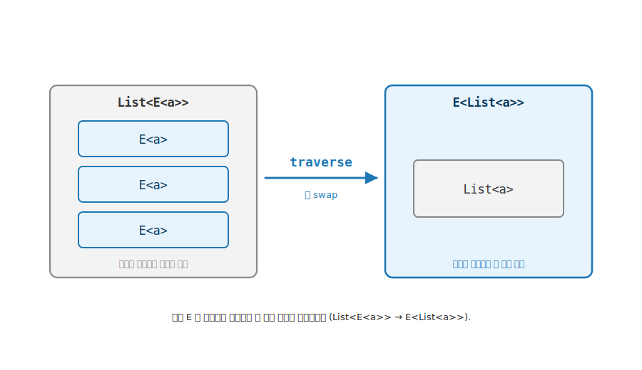

# 9장. Traversable / `traverse` (두 Elevated 세계의 층 순서 뒤집기)

> 이 장에서 다룰 주제 — 1부 핵심 trait 의 최정상 추상. `List<E<a>>` 처럼 컨테이너 안에 여러 Elevated 값이 흩어져 있을 때, 그 층 순서를 뒤집어 `E<List<a>>` 로 모으는 도구, 곧 `traverse` 와 `sequence`. 이 한 도구가 4장 Functor · 5장 Applicative · 6장 Foldable 를 한자리에 동원합니다. `sequence` 가 사실 `traverse` 의 특수한 경우 (`traverse id`) 임을 직접 작성한 코드로 봅니다.

> 이 장을 마치면 할 수 있게 되는 것
> - [ ] `traverse` 의 한 줄 시그니처 (`(a → E<b>) → List<a> → E<List<b>>`) 를 적을 수 있습니다.
> - [ ] `List<E<a>> → E<List<a>>` 의 층 swap 을 그림으로 설명할 수 있습니다.
> - [ ] `Map` 만으로는 왜 층이 뒤집히지 않는지 설명할 수 있습니다.
> - [ ] Traversable 이 Functor + Foldable + Applicative 의 합성임을 trait 선언으로 보일 수 있습니다.
> - [ ] `sequence = traverse id` 의 등식을 설명할 수 있습니다.
> - [ ] 안쪽 효과가 무엇이냐 (`Maybe` / `Validation`) 에 따라 단락과 누적이 갈리는 이유를 설명할 수 있습니다.

---

## 9.1 두 세계 비유로 본 Traversable — 목적

9장의 핵심은 한 줄로 압축됩니다. 지금까지 Elevated 값은 늘 바깥에 한 겹 (`E<a>`) 이었습니다. 그런데 실무에서는 컨테이너 안에 Elevated 값이 여러 개 들어찬 모양 (`List<E<a>>`) 을 자주 만납니다. 그 두 층의 순서를 뒤집어 효과를 바깥으로 한 번에 모으는 도구가 `traverse` 입니다.

> 9장의 3부 구조 — 4장 ~ 8장과 같은 narrative arc 로 구성됩니다.
>
> - **§9.1 ~ §9.3 목적** — `List<E<a>>` 의 층이 뒤집힌 고통, 그리고 목표 시그니처 (층 swap).
> - **§9.4 ~ §9.6 기능** — `Traverse` trait 시그니처, 세 trait 의 합성, `MyList` 구현.
> - **§9.7 ~ §9.9 예제** — 통과 vs 단락 데모, `sequence = traverse id`, 호출 어법.
> - **§9.10 ~ §9.15 마무리** — 법칙 · 챌린지 · 다시 읽기 · Q&A · 요약 · 10장 다리.

### 9.1.1 고통의 체험 — 효과가 원소마다 흩어진 자리

8장에서 회원가입 입력 하나하나를 검증해 `MyValidation<…, Email>` 같은 Elevated 값을 얻었습니다. 그런데 입력이 목록이면 어떻게 될까요. 문자열 목록 `["2", "4", "6"]` 의 모든 원소를 정수로 파싱하는 상황을 생각해 봅니다. 파싱은 실패할 수 있으므로 원소마다 결과가 `MyMaybe<int>` 입니다.

```csharp
// 원소마다 파싱하면 — 효과가 목록 안에 흩어진다
MyList<string> raw = new(["2", "4", "6"]);
MyList<MyMaybe<int>> parsed = raw.Map(ParseInt);   // List<E<a>> — 효과가 원소마다
```

원하는 것은 `List<MyMaybe<int>>` 가 아닙니다. "목록 전체가 성공했는가, 그렇다면 정수 목록은 무엇인가" 를 묻고 싶습니다. 곧 `MyMaybe<List<int>>` 입니다. 효과 (`MyMaybe`) 가 원소마다 흩어진 `List<E<a>>` 를, 효과가 바깥에 한 번 있는 `E<List<a>>` 로 옮겨야 합니다.

```
가진 것:  List<MyMaybe<int>>   — 효과가 원소마다 (안쪽)
원하는 것: MyMaybe<List<int>>   — 효과가 바깥에 한 번
          ────────┬────────
          두 층 (List 와 MyMaybe) 의 순서가 뒤집혀야 함
```

손으로 풀면 목록을 순회하며 각 `MyMaybe` 를 꺼내 분기하고, 하나라도 실패하면 전체를 실패로, 모두 성공이면 값을 모아 목록을 다시 만드는 코드를 적습니다. 컨테이너 종류가 바뀔 때마다 그 순회·분기·조립 코드가 복제됩니다.

### 9.1.2 1장 4 가지 함수 유형의 어디인가

9장의 `traverse` 는 1장의 네 함수 유형 어디에도 깔끔히 들어맞지 않습니다. 두 Elevated 세계 (`List` 와 `E`) 가 동시에 등장하고, 그 둘의 층 순서를 바꾸기 때문입니다. 그래서 Traversable 은 단일 trait 이 아니라 **앞선 세 trait 의 합성** 으로 정의됩니다. 4장 ~ 6장의 도구가 모두 손에 잡힌 지금에서야 다룰 수 있는, 1부 핵심 trait 의 최정상 자리입니다.

---

## 9.2 흔한 함정 — `Map` 만으로는 층이 안 뒤집힙니다

가장 먼저 떠오르는 시도는 `Map` 입니다. 그런데 `Map` 은 층을 뒤집지 못합니다.

```csharp
MyList<MyMaybe<int>> parsed = ...;          // List<E<a>>
var stillNested = parsed.Map(m => ...);     // 여전히 List<E<...>> — 층 그대로
```

`Map` (4장) 의 약속은 **모양 보존** 이었습니다. 바깥 컨테이너 `List` 의 모양을 그대로 두고 안의 값만 바꿉니다. 그래서 `List<MyMaybe<int>>` 에 `Map` 을 걸면 결과도 `List<무엇인가>` 입니다. 바깥이 여전히 `List` 입니다. 4장에서 강점이던 모양 보존이, 층을 뒤집어야 하는 이 자리에서는 오히려 발목을 잡습니다.

> **흔한 함정** — `Map` 으로 `MyMaybe` 를 바깥으로 빼낼 수 없습니다. `Map` 은 바깥 모양 (`List`) 을 보존하도록 시그니처가 못박혀 있기 때문입니다. 층 순서를 바꾸는 능력은 `Map` 에 없습니다. 새 도구가 필요합니다.

---

## 9.3 목표 시그니처 — `List<E<a>> → E<List<a>>`

층을 뒤집는 도구의 시그니처를 먼저 적습니다. 변환 없이 층만 뒤집는 가장 단순한 형태가 `sequence` 입니다.

```
sequence : List<E<a>> → E<List<a>>
```

안쪽 `E` 를 바깥으로 끌어올려 `List` 와 순서를 맞바꿉니다. 더 일반적인 형태는 `traverse` 입니다. 원소를 World-crossing 함수 `a → E<b>` 로 변환하면서 동시에 층을 뒤집습니다.

```
traverse : (a → E<b>) → List<a> → E<List<b>>
```

앞서 본 파싱 예제가 정확히 `traverse` 입니다. `ParseInt : string → MyMaybe<int>` 를 목록 `List<string>` 전체에 걸면 `MyMaybe<List<int>>` 가 나옵니다. 변환과 층 swap 이 한 번에 일어납니다.



**그림 9-1. 층 swap: `List<E<a>>` → `E<List<a>>`** — 왼쪽은 바깥이 `List`, 안쪽이 효과 `E` 인 모양입니다. 효과가 원소마다 흩어져 있습니다. 오른쪽은 바깥이 효과 `E`, 안쪽이 `List` 인 모양입니다. 효과가 바깥에 한 번 모였습니다. `traverse` 가 안쪽 `E` 를 바깥으로 끌어올려 두 층의 순서를 뒤집습니다.

---

## 9.4 `Traversable<T>` trait 시그니처 — 기능

층 swap 을 일반화한 trait 이 `Traversable<T>` 입니다. 핵심 멤버 `Traverse` 는 두 종류의 컨테이너를 동시에 다룹니다.

```csharp
public interface Traversable<T> : Functor<T>, Foldable<T> where T : Traversable<T>
{
    static abstract K<F, K<T, B>> Traverse<F, A, B>(Func<A, K<F, B>> f, K<T, A> ta)
        where F : Applicative<F>;

    // virtual — Traverse 의 단순한 변형. f 가 항등 함수일 때.
    static virtual K<F, K<T, A>> Sequence<F, A>(K<T, K<F, A>> tfa)
        where F : Applicative<F>
        => T.Traverse<F, K<F, A>, A>(x => x, tfa);
}
```

| 자리 | 의미 |
|---|---|
| `T` | 바깥 컨테이너 (순회 가능한 구조, 예: `List`) |
| `F` | 안쪽 효과 (`where F : Applicative<F>`, 예: `MyMaybe`) |
| `Func<A, K<F, B>> f` | World-crossing 변환 함수 (`a → E<b>`) |
| `K<T, A> ta` | 순회할 입력 (`List<a>`) |
| `K<F, K<T, B>>` | 층이 뒤집힌 결과 (`E<List<b>>`) |

`F` 가 `Applicative` 여야 하는 이유가 시그니처에 박혀 있습니다. 층을 뒤집은 결과를 **조립** 하려면 빈 결과에서 시작할 `Pure` 와, 원소를 하나씩 결합할 `Apply` 가 필요하기 때문입니다. 5장의 다인자 lift 가 바로 여기서 쓰입니다.

---

## 9.5 Traversable = Functor + Foldable + Applicative 의 합성

`Traversable<T>` 의 정의 한 줄이 1부의 결산을 담고 있습니다. trait 선언 `Traversable<T> : Functor<T>, Foldable<T>` 가 두 능력을 상속으로 요구하고, `Traverse` 의 매개변수 `F` 가 세 번째 능력 `Applicative` 를 요구합니다. 세 trait 이 한자리에 모입니다.


**그림 9-2. Traversable = 세 trait 의 합성** — Functor 의 `Map` (원소 변환, 4장), Foldable 의 `Fold` (순회 골격, 6장), Applicative 의 `Pure` + `Apply` (시작점과 원소 결합, 5장) 세 능력이 모여 `Traverse` 한 멤버를 이룹니다. 1부 핵심 trait 의 최정상 추상입니다.

| 동원되는 능력 | 역할 |
|---|---|
| Functor `Map` (4장) | 원소를 변환하는 자리 |
| Foldable `Fold` (6장) | 컨테이너를 접어 가며 순회하는 골격 |
| Applicative `Pure` + `Apply` (5장) | 빈 결과 시작점과 원소 하나씩 효과 결합 |

새로운 메커니즘을 발명하는 것이 아닙니다. 4장 ~ 6장에서 이미 손에 쥔 세 도구를 합성합니다. 그래서 Traversable 은 1부의 마지막에 옵니다. 앞선 도구가 모두 갖춰져야 만들 수 있습니다.

---

## 9.6 `MyList` 에 Traversable 부착 — `Traverse` 구현

`MyListF` 가 `Traversable<MyListF>` 를 구현합니다. `Map` (4장) 과 `Fold` (6장) 는 익숙하므로, 핵심인 `Traverse` 를 한 줄씩 봅니다.

```csharp
public static K<F, K<MyListF, B>> Traverse<F, A, B>(Func<A, K<F, B>> f, K<MyListF, A> ta)
    where F : Applicative<F>
{
    var list = ta.As();

    // 빈 결과에서 시작 — Pure(빈 리스트).
    K<F, K<MyListF, B>> acc = F.Pure<K<MyListF, B>>(new MyList<B>([]));

    // 뒤에서 앞으로 누적 — 각 원소를 f 로 변환해 앞에 붙임.
    foreach (var a in list.Items.Reverse())
    {
        var fb = f(a);   // a → E<b>

        // (head, tail) → head 를 tail 앞에 붙인 새 리스트. curried.
        Func<B, Func<K<MyListF, B>, K<MyListF, B>>> prepend =
            head => tail => new MyList<B>([head, ..tail.As().Items]);

        // Pure(prepend) 후 두 단계 Apply — 5장 다인자 lift 그대로.
        var liftedFn = F.Pure(prepend);
        var step1    = F.Apply(liftedFn, fb);   // head 자리 결합
        acc          = F.Apply(step1, acc);     // tail 자리 결합
    }
    return acc;
}
```

`Pure(빈 리스트)` 로 시작해 (Applicative), 목록을 뒤에서 앞으로 순회하며 (Foldable 식 누적), 각 원소를 `f` 로 변환하고 (Functor 식 변환), `prepend` 를 `Pure` 로 올린 뒤 두 번 `Apply` 해 (Applicative 다인자 lift) 머리를 꼬리 앞에 붙입니다. `Reverse()` 로 뒤에서 앞으로 도는 까닭은 `prepend` 가 앞에 붙이는 연산이라 원래 순서가 보존되기 때문입니다. 5장에서 본 `Pure → Apply` 사슬이 그대로 재등장합니다.

---

## 9.7 데모 — 전부 통과 vs 한 원소 단락

안쪽 효과 `F` 자리에 `MyMaybe` 를 넣고, 짝수면 통과 홀수면 실패하는 변환으로 `Traverse` 를 돌립니다.

```csharp
Func<int, K<MyMaybeF, int>> evenCheck = n =>
    n % 2 == 0 ? MyMaybeF.Pure(n) : MyMaybe<int>.Nothing.Instance;

// 예제 1 — 전부 짝수
MyListF.Traverse(evenCheck, new MyList<int>([2, 4, 6]));   // → Just([2, 4, 6])

// 예제 2 — 3 이 홀수 → 전체 Nothing
MyListF.Traverse(evenCheck, new MyList<int>([2, 3, 6]));   // → Nothing
```

예제 1 은 모든 원소가 통과해 `Just([2, 4, 6])` 입니다. 층이 `List<Maybe>` 에서 `Maybe<List>` 로 뒤집혔습니다. 예제 2 는 `3` 이 `Nothing` 을 내자 전체가 `Nothing` 입니다. 한 원소의 실패가 전체 결과를 지배합니다.

이 단락은 별도 코드가 아닙니다. `MyMaybeF.Apply` 의 `(Just, Just) → Just`, 그 외 모두 `Nothing` 규칙에서 공짜로 따라옵니다. `Apply` 가 사슬을 따라 호출되다 `Nothing` 을 한 번 만나면, 이후 모든 `Apply` 가 `Nothing` 을 전파합니다. 단락의 의미는 안쪽 효과 `F` 가 정합니다.

> **한 줄 정리** — `Traverse` 자체는 누적인지 단락인지 모릅니다. 안쪽 효과 `F` 의 `Apply` 가 그것을 정합니다. `F` 가 `MyMaybe` 면 단락, 8장의 `MyValidation` 이면 누적입니다.

---

## 9.8 `sequence` 는 `traverse id` 입니다

변환 없이 층만 뒤집는 `sequence` 는 별도 함수가 아닙니다. `traverse` 의 변환 함수 자리에 **항등 함수** 를 넣은 특수한 경우입니다. trait 의 `Sequence` 가 `virtual default` 로 그렇게 정의돼 있습니다.

```csharp
// Sequence 는 Traverse 의 특수 경우 — f 가 항등 함수.
static virtual K<F, K<T, A>> Sequence<F, A>(K<T, K<F, A>> tfa)
    where F : Applicative<F>
    => T.Traverse<F, K<F, A>, A>(x => x, tfa);   // f = (x => x)
```

`traverse` 가 "변환하면서 층을 뒤집는" 일반 도구라면, `sequence` 는 "변환 없이 층만 뒤집는" 특수한 경우입니다. 변환 함수에 `x => x` 를 넣으면 변환이 사라지고 층 swap 만 남습니다.

> ***결정적 통찰* — `sequence` 가 별도 함수가 아닌 이유는 `traverse id` 한 줄에 있습니다. `traverse` 를 세우면 `sequence` 는 그 특수 경우로 공짜로 따라옵니다.**

그래서 본문은 `traverse` 를 먼저 완전히 세우고, `sequence` 를 그 특수화로 도출합니다. 일반을 먼저, 특수를 나중에 봅니다.

---

## 9.9 호출 어법 3 종

같은 `Traverse` 능력을 세 가지 표기로 부를 수 있습니다. 4장 ~ 8장과 같은 모듈 / 확장 메서드 / 실전 헬퍼 구성입니다.

```csharp
// 1. 모듈 자유 함수
Traversable.traverse<MyListF, MyMaybeF, int, int>(evenCheck, nums);

// 2. 확장 메서드
nums.Traverse<MyListF, MyMaybeF, int, int>(evenCheck);

// 3. 실전 헬퍼 — List<Maybe> → Maybe<List>
Sequence.SequenceListOption(listOfMaybes);
```

세 표기가 모두 같은 `MyListF.Traverse` 로 풀립니다. 자유 함수는 라이브러리 모듈 어법, 확장 메서드는 LINQ 식 점 표기, 실전 헬퍼는 자주 쓰는 패턴을 이름으로 묶은 것입니다.

---

## 9.10 traverse 의 법칙

`Traverse` 도 시그니처만으로는 강제되지 않는 약속을 가집니다. 자연성 (naturality), 항등 (identity), 합성 (composition) 세 법칙입니다. 항등 법칙은 `traverse` 에 항등 효과를 걸면 원본이 그대로 나온다는 약속이고, 합성 법칙은 두 효과를 차례로 traverse 한 결과가 한 번에 합성한 효과로 traverse 한 결과와 같다는 약속입니다. 세 법칙의 정밀한 형식화와 자동 검증은 9부의 property-based 테스트로 넘어갑니다 (§9.15 테스트 디딤돌). 지금은 `traverse` 가 층을 뒤집되 원소의 순서와 효과를 충실히 보존한다는 직감만 가져가도 충분합니다.

---

## 9.11 직접 해보기 — 챌린지

> **챌린지 1** — `MyListF.Traverse(evenCheck, [2, 3, 6])` 가 왜 `Nothing` 인지, `Apply` 사슬을 따라가며 `3` 의 `Nothing` 이 어디서 전체를 `Nothing` 으로 만드는지 짚어 봅니다.
>
> **챌린지 2** — 안쪽 효과 `F` 자리에 8장의 `MyValidation` 을 넣으면 결과가 어떻게 달라지는지 예측해 봅니다. 세 원소가 모두 실패하면 오류가 몇 건 모이는지, 그 까닭이 `MyValidation` 의 `Apply` 누적 분기임을 설명해 봅니다.
>
> **챌린지 3** — `sequence([Just(1), Just(2), Just(3)])` 를 `traverse(x => x, ...)` 로 다시 적어 두 표기가 같은 결과를 냄을 확인합니다.

정답 코드는 `code/Part01-Foundations/Ch09-Traversable/Challenges/` 에 있습니다.

---

## 9.12 Elevated World 어휘로 다시 읽기

9장의 도구를 1장 비유에 매핑합니다.

| 9장 도구 | Elevated World 어휘 |
|---|---|
| `traverse` | 변환하면서 두 Elevated 세계 (`T` 와 `F`) 의 층 순서를 뒤집음 |
| `sequence` | 변환 없이 층만 뒤집음 (`traverse id`) |
| 바깥 `T` / 안쪽 `F` | 순회 가능한 구조와 조립 가능한 효과 |
| 단락 vs 누적 | 안쪽 효과 `F` 의 `Apply` 가 정함 |

`map` (4장) 이 끌어올림, `fold` (6장) 가 끌어내림, `bind` (7장) 가 합성이었다면, `traverse` 는 두 Elevated 세계가 동시에 있을 때 그 층 순서를 바꾸는 도구입니다. 1부에서 모은 모든 어휘가 이 한 도구에 동원됩니다. 비유는 여기까지가 역할입니다. 정확한 보존 규칙은 세 법칙 (§9.10) 이 정합니다.

---

## 9.13 Q&A — 자기 점검

> **Q1. `traverse` 의 시그니처는?** (§9.3)
>
> `(a → E<b>) → List<a> → E<List<b>>` 입니다. 원소를 World-crossing 함수로 변환하면서 `List<E<b>>` 의 층을 `E<List<b>>` 로 뒤집습니다.

> **Q2. `Map` 만으로는 왜 층이 안 뒤집힙니까?** (§9.2)
>
> `Map` 의 약속이 모양 보존이기 때문입니다. 바깥 `List` 의 모양을 그대로 두므로 `List<E<a>>` 에 `Map` 을 걸어도 바깥은 여전히 `List` 입니다. 층 순서를 바꾸는 능력은 `Map` 에 없습니다.

> **Q3. Traversable 은 어떤 trait 들의 합성입니까?** (§9.5)
>
> Functor (원소 변환) + Foldable (순회 골격) + Applicative (시작점과 결합) 입니다. trait 선언이 Functor 와 Foldable 을 상속하고, `Traverse` 의 `F` 가 Applicative 를 요구합니다.

> **Q4. `Traverse` 의 `F` 는 왜 Applicative 여야 합니까?** (§9.4)
>
> 층을 뒤집은 결과를 조립하려면 빈 결과에서 시작할 `Pure` 와 원소를 하나씩 결합할 `Apply` 가 필요하기 때문입니다. 5장 다인자 lift 가 그대로 쓰입니다.

> **Q5. `sequence` 와 `traverse` 의 관계는?** (§9.8)
>
> `sequence = traverse id` 입니다. `traverse` 의 변환 함수 자리에 항등 함수를 넣으면 변환이 사라지고 층 swap 만 남아 `sequence` 가 됩니다. 별도 함수가 아닙니다.

> **Q6. 단락과 누적은 무엇이 정합니까?** (§9.7)
>
> 안쪽 효과 `F` 의 `Apply` 가 정합니다. `F` 가 `MyMaybe` 면 한 원소 실패에 전체가 `Nothing` (단락), 8장의 `MyValidation` 이면 오류가 모두 모입니다 (누적). `Traverse` 자체는 둘을 모릅니다.

> **Q7. Traversable 이 1부 마지막 핵심 trait 인 이유는?** (§9.5)
>
> Functor · Foldable · Applicative 세 도구의 합성이라, 그 셋이 모두 손에 잡힌 뒤에야 만들 수 있기 때문입니다. 새 메커니즘이 아니라 앞선 도구의 결합입니다.

---

## 9.14 요약

- **고통에서 출발했습니다.** `List<E<a>>` 처럼 효과가 원소마다 흩어진 자리에서, 효과를 바깥으로 한 번에 모으고 싶었습니다 (§9.1).
- **`Map` 은 층을 뒤집지 못합니다.** 모양 보존이 오히려 발목을 잡습니다 (§9.2).
- **`traverse` 가 층을 뒤집습니다.** `(a → E<b>) → List<a> → E<List<b>>` 가 변환과 층 swap 을 한 번에 합니다 (§9.3).
- **Traversable 은 세 trait 의 합성입니다.** Functor + Foldable + Applicative 를 한자리에 동원하는 1부 최정상 추상입니다 (§9.5).
- **`sequence = traverse id` 입니다.** 변환 함수에 항등 함수를 넣은 특수한 경우입니다 (§9.8).
- **단락과 누적은 안쪽 효과 `F` 가 정합니다.** `MyMaybe` 면 단락, `MyValidation` 이면 누적 (§9.7).

---

## 9.15 다음 장으로 — 마무리 (10장 Bifunctor 다리)

```
4장 — Functor:      E<a> → E<b>      map        (끌어올림)
5장 — Applicative:   다인자 lift       pure + apply
6장 — Foldable:      E<a> → b         fold        (끌어내림)
7장 — Monad:         a → E<b> 합성     bind
8장 — Validation:    누적 vs 단락
이 장 (9장) — Traversable:  List<E<a>> → E<List<a>>   traverse / sequence (층 swap)
다음 장 (10장) — Bifunctor:  두 타입 인자 모두에 작용    biMap
```

9장까지 1부의 핵심 trait 다섯 (Functor / Applicative / Foldable / Monad / Traversable) 이 모두 두 평행 세계의 네 자리 위에서 자랐습니다. 10장 Bifunctor 부터는 그 어휘를 확장합니다. 지금까지 trait 은 타입 인자가 하나 (`E<a>` 의 `a`) 였습니다. 10장은 `Either<L, R>` 처럼 인자가 둘인 컨테이너에서 양쪽을 동시에 다루는 2-인자 일반화입니다. [10장 — Bifunctor](./Ch10-Bifunctor.md) 로 넘어갑니다.

> **실무 디딤돌** — `traverse` 는 `Eff` / `IO` 두 Elevated 세계를 동시에 이동하는 실무의 핵심 도구입니다. 목록의 각 항목을 비동기로 조회해 결과를 한 번에 모으거나, 여러 검증을 거쳐 전체 성공 여부를 판단하는 자리에 그대로 쓰입니다.
>
> **테스트 디딤돌** — traverse / sequence 의 세 법칙 (자연성 / 항등 / 합성) 은 9부의 property-based 테스트로 검증합니다. 임의의 목록과 임의의 효과에 대해 층 swap 이 순서와 효과를 보존하는지 자동 확인하는 것이 출발점입니다.
