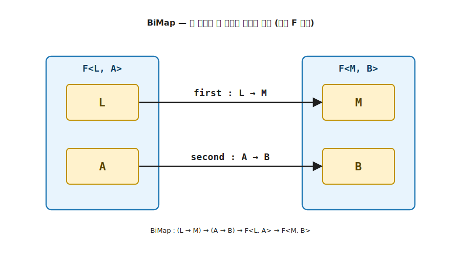

# 10장. Bifunctor / Biapplicative / Bimonad (두 타입 인자 모두에 작용)

> 이 장에서 다룰 주제 — 1부 핵심 trait 다섯을 익힌 뒤 만나는 첫 확장 추상. 타입 인자가 둘인 컨테이너 (`Either<L, R>`, `Pair<A, B>`) 에서, 4장 Functor 의 `map` 이 한쪽만 변환하던 것을 양쪽으로 일반화합니다. 마커는 `K<F, A>` 가 아니라 인자가 둘인 `K<F, L, A>`, 핵심 멤버는 `BiMap` 하나입니다.

> 이 장을 마치면 할 수 있게 되는 것
> - [ ] 타입 인자가 둘인 컨테이너에서 Functor 의 한계를 시그니처로 설명할 수 있습니다.
> - [ ] `BiMap` 으로 두 인자를 동시에, `MapFirst` / `MapSecond` 로 한쪽만 변환할 수 있습니다.
> - [ ] `Bifunctor<F>` 를 2-인자 마커 `K<F, L, A>` 위에서 직접 구현할 수 있습니다.
> - [ ] Bifunctor 두 법칙 (항등 + 합성) 을 양쪽 인자에서 코드로 검증할 수 있습니다.
> - [ ] Bifunctor 위에 Biapplicative / Bimonad 가 어떻게 쌓이는지 설명할 수 있습니다.

---

## 10.1 목적 — 인자가 둘인 컨테이너의 양쪽을 변환하기

### 10.1.1 고통의 체험 — 한쪽만 바꾸는 보일러플레이트

`Either<L, R>` 에 4장의 Functor 만 부착하면 무엇이 아픈지 먼저 겪어 봅니다. Functor 의 `map` 은 컨테이너 안의 값 하나만 변환합니다. `Either<string, int>` 를 성공값 `int` 에 대한 Functor 로 보면 성공값은 `map` 으로 바꿀 수 있지만, 오류 타입 `string` 을 다른 타입 (예: `ErrorCode`) 으로 바꾸려면 `map` 이 닿지 못합니다. 손으로 `Left` / `Right` 를 분해해 다시 조립합니다.

```csharp
// 오류 타입만 string → ErrorCode 로 바꾸려면 — 손으로 분해·재조립
static Either<ErrorCode, int> MapError(Either<string, int> e) =>
    e switch
    {
        Left<string, int> l  => new Left<ErrorCode, int>(Parse(l.Value)),  // 오류 갈래만 변환
        Right<string, int> r => new Right<ErrorCode, int>(r.Value),        // 성공 갈래는 그대로 재조립
        _ => throw new InvalidOperationException()
    };
```

성공값을 바꾸는 함수, 오류를 바꾸는 함수, 둘 다 바꾸는 함수마다 같은 `Left` / `Right` 분해·재조립이 복제됩니다. 도메인이 다른 `Either` (`Either<ValidationError, User>`, `Either<DbError, Row>`) 마다 또 적습니다. 두 인자를 한 번에 다루는 약속이 trait 에 없을 때 같은 코드가 서로 다른 자리에서 제각각 다시 태어납니다.

> **흔한 함정** — 성공값은 `map`, 오류는 따로 함수로 나누면 컨테이너 종류마다 두 벌의 분해 코드가 생깁니다. 필요한 것은 두 함수를 한 번에 받아 양쪽을 변환하고 모양은 보존하는 도구입니다. 그 도구가 이 장의 `BiMap` 입니다.

### 10.1.2 두 함수가 필요한 자리

4장의 Functor 는 컨테이너 안의 값 하나를 변환했습니다 (`E<a> → E<b>`). 그런데 타입 인자가 둘인 컨테이너가 있습니다. `Either<L, R>` 는 실패 `L` 과 성공 `R` 두 갈래를 가지고, `Pair<A, B>` 는 두 값을 나란히 담습니다.

```text
Either<L, R>   — Left(L) 또는 Right(R)
Pair<A, B>     — (A, B) 두 값
```

이런 컨테이너에 Functor 를 부착하면 한쪽만 변환할 수 있습니다. `Either<L, R>` 를 `R` 에 대한 Functor 로 보면 `map` 은 성공값 `R` 만 바꾸고 실패값 `L` 은 손대지 못합니다. 두 인자를 모두 다루려면 함수가 둘 필요합니다. 그 추상이 Bifunctor 입니다.

핵심은 시그니처입니다. Functor 의 `map` 이 함수 하나 (`a → b`) 를 받는다면, Bifunctor 는 두 인자 각각에 적용할 함수 둘 (`L → M`, `A → B`) 을 받습니다.

---

## 10.2 Bifunctor — 두 함수로 양쪽을 변환

Bifunctor 의 핵심 멤버는 `BiMap` 입니다. 두 함수를 받아 두 인자를 동시에 변환합니다.

```text
BiMap : (L → M) → (A → B) → F<L, A> → F<M, B>
```

첫 번째 함수 `L → M` 은 첫 인자를, 두 번째 함수 `A → B` 는 둘째 인자를 변환합니다. 결과는 두 인자가 모두 바뀐 `F<M, B>` 입니다. 모양 (`F`) 은 그대로 보존하고 안의 두 값만 변환합니다. 4장 Functor 의 모양 보존이 인자 둘로 확장된 것입니다.



**그림 10-1. BiMap: 두 함수로 두 인자를 동시에 변환** — 왼쪽 `F<L, A>` 의 두 인자 `L`, `A` 에 각각 함수 `first : L → M` 과 `second : A → B` 가 적용되어 오른쪽 `F<M, B>` 가 됩니다. 모양 `F` 는 그대로 보존하고 안의 두 값만 변환합니다. 4장 Functor 의 모양 보존이 인자 둘로 늘어난 모습입니다.

한쪽만 변환하고 싶을 때는 나머지 자리에 항등 함수를 넣으면 됩니다. 이 두 가지는 `BiMap` 위에서 자동으로 따라옵니다.

```text
MapFirst  : (L → M) → F<L, A> → F<M, A>     == BiMap(first, identity, fab)
MapSecond : (A → B) → F<L, A> → F<L, B>     == BiMap(identity, second, fab)
```

`MapSecond` 가 바로 4장 Functor 의 `map` 에 해당합니다. 둘째 인자만 변환하고 첫 인자는 그대로 두기 때문입니다. 즉 Bifunctor 는 Functor 를 포함합니다. 한 인자만 보면 평범한 Functor 이고, 두 인자를 함께 보면 Bifunctor 입니다.

---

## 10.3 trait 직접 구현 — 2-인자 마커 `K<in F, L, A>`

2장의 `K<in F, A>` 는 인자가 하나인 컨테이너의 마커였습니다. 인자가 둘이면 마커도 인자가 둘인 `K<in F, L, A>` 로 늘어납니다. `F` 앞의 `in` (contravariant) 은 `F` 가 컨테이너 종류를 분류하는 표시일 뿐, 학습용 코드를 읽고 쓰는 데에는 영향을 주지 않습니다. 지금은 학습 코드를 그대로 따라가면 된다는 직감만 가져가도 충분합니다. 나머지 패턴 (self-bound + `static abstract`) 은 4장과 그대로입니다.

```csharp
public interface Bifunctor<F>
    where F : Bifunctor<F>
{
    // 두 함수로 두 인자를 동시에 변환합니다.
    static abstract K<F, M, B> BiMap<L, A, M, B>(
        Func<L, M> first, Func<A, B> second, K<F, L, A> fab);

    // 첫 인자만 변환 — 둘째 자리에 항등 함수
    static virtual K<F, M, A> MapFirst<L, A, M>(Func<L, M> first, K<F, L, A> fab) =>
        F.BiMap(first, x => x, fab);

    // 둘째 인자만 변환 — 4장 Functor 의 map 에 해당
    static virtual K<F, L, B> MapSecond<L, A, B>(Func<A, B> second, K<F, L, A> fab) =>
        F.BiMap(x => x, second, fab);
}
```

`static abstract` 는 `BiMap` 하나뿐입니다. `MapFirst` / `MapSecond` 는 `static virtual` 기본 구현이라, 자료 타입은 `BiMap` 한 개만 정의하면 한쪽 변환이 공짜로 따라옵니다. 4장 Functor 가 `K<in F, A>` 위에서 `Map` 하나를 약속했듯, Bifunctor 는 `K<in F, L, A>` 위에서 `BiMap` 하나를 약속합니다.

---

## 10.4 예제 — Either / Pair

두 자료 타입에 Bifunctor 를 부착합니다. 먼저 두 값을 나란히 담는 `Pair` 입니다.

```csharp
// 두 값을 담는 자료 타입 + 2-인자 마커 구현
public sealed record Pair<L, A>(L First, A Second) : K<PairF, L, A>;

// 태그 타입 + trait 구현
public sealed class PairF : Bifunctor<PairF>
{
    public static K<PairF, M, B> BiMap<L, A, M, B>(
        Func<L, M> first, Func<A, B> second, K<PairF, L, A> fab)
    {
        var p = (Pair<L, A>)fab;
        return new Pair<M, B>(first(p.First), second(p.Second));
    }
}
```

```csharp
var p  = new Pair<int, string>(3, "hi");
var p2 = PairF.BiMap(n => n + 1, s => s.ToUpper(), p);   // Pair(4, "HI")
var p3 = PairF.MapSecond(s => s.Length, p);              // Pair(3, 2) — 첫 인자 3 은 그대로
```

`Either` 는 두 갈래 중 하나만 담는다는 점이 다릅니다. `BiMap` 은 담긴 쪽의 함수만 실제로 적용합니다.

```csharp
public abstract record Either<L, R> : K<EitherF, L, R>;
public sealed record Left<L, R>(L Value)  : Either<L, R>;
public sealed record Right<L, R>(R Value) : Either<L, R>;

public sealed class EitherF : Bifunctor<EitherF>
{
    public static K<EitherF, M, B> BiMap<L, A, M, B>(
        Func<L, M> first, Func<A, B> second, K<EitherF, L, A> fab) =>
        fab switch
        {
            Left<L, A> l  => new Left<M, B>(first(l.Value)),    // 실패 갈래만 변환
            Right<L, A> r => new Right<M, B>(second(r.Value)),  // 성공 갈래만 변환
            _ => throw new InvalidOperationException()
        };
}
```

`Either<L, R>` 의 `MapSecond` 가 곧 성공값만 변환하는 평범한 Functor `map` 이고, `MapFirst` 는 오류 타입을 변환하는 자리입니다. 두 갈래를 한 번에 다루는 능력이 Bifunctor 입니다.


**그림 10-2. Functor vs Bifunctor: 한쪽 변환과 양쪽 변환** — 위는 Functor 의 `map` 으로 `Either<L, R>` 의 둘째 인자 `R` 만 변환하고 `L` 은 손대지 못합니다. 아래는 Bifunctor 의 `BiMap` 으로 두 인자 `L`, `R` 을 모두 변환합니다. `MapSecond` 가 곧 Functor 의 `map` 이므로 Bifunctor 는 Functor 를 포함합니다.

---

## 10.5 가족 — Biapplicative / Bimonad

Bifunctor 위에 두 인자 버전의 Applicative 와 Monad 가 쌓입니다. v5 의 어휘로 Biapplicative 와 Bimonad 입니다.

Biapplicative 는 5장 Applicative 의 `apply` 를 두 인자로 일반화합니다. 두 자리에 각각 함수를 담은 컨테이너로, 두 자리의 값을 동시에 적용합니다.

```text
BiApply : F<(A → C), (B → D)> → F<A, B> → F<C, D>
```

Bimonad 는 Bifunctor 를 상속해 두 갈래 각각에 `bind` 를 제공합니다. 1-인자 trait 의 가족 (Functor → Applicative → Monad) 이 2-인자에서 (Bifunctor → Biapplicative → Bimonad) 로 평행하게 반복됩니다. 학습 흐름은 같습니다. 한 인자에서 익힌 끌어올림이 두 인자로 늘어날 뿐입니다.

---

## 10.6 Bifoldable — Foldable 의 2-인자 대칭

4장 Functor 에 6장 Foldable 이 대응하듯, Bifunctor 에는 Bifoldable 이 대응합니다. 두 갈래를 각각 접어 한 값으로 끌어내리는 추상입니다.

```text
BiFold : (S → L → S) → (S → A → S) → S → F<L, A> → S
```

다만 Bifoldable 은 LanguageExt v5 의 trait 으로는 제공되지 않습니다. 그래서 이 책에서는 별도 챕터로 다루지 않고, Bifunctor 의 대칭 자리로만 짚습니다. `BiMap` 이 두 인자를 변환한다면 `BiFold` 는 두 인자를 끌어내린다는 평행만 기억하면 충분합니다.

---

## 10.7 두 법칙 — Functor 법칙의 두 인자 판

Bifunctor 도 Functor 와 같은 두 법칙을 따릅니다. 다만 인자가 둘이라 양쪽에 함께 성립해야 합니다.

**첫 번째 법칙 — 항등.** 두 자리에 항등 함수를 넣으면 컨테이너가 그대로입니다.

```text
BiMap(identity, identity, fab) == fab
```

**두 번째 법칙 — 합성.** 두 자리 각각에서 함수 합성이 보존됩니다.

```text
BiMap(g1 ∘ f1, g2 ∘ f2, fab) == BiMap(g1, g2, BiMap(f1, f2, fab))
```

두 법칙은 4장 Functor 의 항등·합성 법칙이 인자 둘로 늘어난 것입니다. Functor 를 이해했다면 Bifunctor 의 법칙은 같은 약속을 양쪽에서 한 번 더 확인하는 것뿐입니다.

두 법칙을 `where F : Bifunctor<F>` 제약의 일반 함수로 검증합니다.

```csharp
// 항등 법칙: BiMap(identity, identity, fab) == fab
public static bool IdentityHolds<F, L, A>(K<F, L, A> fab)
    where F : Bifunctor<F> =>
    F.BiMap<L, A, L, A>(x => x, x => x, fab)!.Equals(fab);

// 합성 법칙: BiMap(g1 ∘ f1, g2 ∘ f2, fab) == BiMap(g1, g2, BiMap(f1, f2, fab))
public static bool CompositionHolds<F, L1, A1, L2, A2, L3, A3>(
    Func<L1, L2> f1, Func<L2, L3> g1, Func<A1, A2> f2, Func<A2, A3> g2,
    K<F, L1, A1> fab)
    where F : Bifunctor<F> =>
    F.BiMap(l => g1(f1(l)), a => g2(f2(a)), fab)!
     .Equals(F.BiMap(g1, g2, F.BiMap(f1, f2, fab)));
```

데모는 `Pair` 와 `Either` 의 두 갈래 (`Left` / `Right`) 모두에서 두 법칙이 `true` 임을 출력합니다.

> **흔한 함정** — 시그니처 `(L → M) → (A → B) → F<L, A> → F<M, B>` 만 맞으면 Bifunctor 가 되는 것은 아닙니다. 두 법칙이 **양쪽 인자 각각** 에서 성립해야 합니다. 한쪽 인자에서만 항등·합성을 지키고 다른 쪽 값을 흘리면 시그니처는 맞아도 Bifunctor 가 아닙니다.

---

## 10.8 Q&A

> **Q1. Bifunctor 와 Functor 의 관계는 무엇입니까?**

Bifunctor 는 Functor 를 포함합니다. `Either<L, R>` 의 둘째 인자 `R` 만 보면 `MapSecond` 가 평범한 Functor 의 `map` 입니다. 한 인자만 변환하면 Functor, 두 인자를 함께 변환하면 Bifunctor 입니다. 마커도 `K<F, A>` 에서 인자가 하나 더 붙은 `K<F, L, A>` 로 늘어납니다.

> **Q2. 왜 `BiMap` 하나만 `static abstract` 입니까?**

`MapFirst` 와 `MapSecond` 는 `BiMap` 의 한 자리에 항등 함수를 넣은 특수한 경우라, `BiMap` 위에서 기본 구현으로 자동으로 따라오기 때문입니다. 자료 타입은 `BiMap` 한 개만 정의하면 한쪽 변환 둘이 공짜로 생깁니다. 4장 Functor 가 `Map` 하나로 충분했던 것과 같은 구조입니다.

> **Q3. `Either<L, R>` 에서 두 함수가 모두 호출됩니까?**

아닙니다. `Either` 는 두 갈래 중 하나만 담으므로, `BiMap` 은 담긴 쪽의 함수만 실제로 호출합니다. `Left` 면 첫 함수만, `Right` 면 둘째 함수만 적용됩니다. `Pair` 처럼 두 값을 모두 담는 컨테이너에서는 두 함수가 모두 호출됩니다.

> **Q4. Bifoldable 은 왜 별도 장이 없습니까?**

LanguageExt v5 의 trait 으로 제공되지 않기 때문입니다. 이 책의 학습용 trait 은 v5 의 공식 trait 와 시그니처를 맞추는 것을 원칙으로 하므로, v5 에 없는 Bifoldable 은 정식 챕터로 두지 않고 Bifunctor 의 대칭 자리로만 짚습니다. 반면 Bifunctor / Biapplicative / Bimonad 는 v5 에 정식으로 있어 이 장에서 다룹니다.

> **Q5. Bifunctor 가 1부 흐름에서 어디에 놓입니까?**

핵심 5 trait (4 ~ 9장) 을 모두 익힌 뒤, 그 일반화를 보는 자리입니다. Functor (4장) 의 2-인자 확장이라 핵심 trait 흐름이 끝난 10장에 놓입니다. 마지막 11장 NaturalTransformation 과 함께 1부의 확장 추상을 이룹니다.

> **Q6. Bifunctor 가 없으면 무엇이 아픕니까?**

`Either<L, R>` 의 오류 타입을 바꾸려면 `Left` / `Right` 를 손으로 분해해 다시 조립해야 하고, 그 코드가 도메인마다 복제됩니다 (§10.1.1). `BiMap` 한 멤버가 두 함수를 받아 양쪽을 변환하므로 그 보일러플레이트가 사라집니다.

> **Q7. 두 법칙은 어떻게 검증합니까?**

`where F : Bifunctor<F>` 제약의 일반 함수 (`IdentityHolds` / `CompositionHolds`) 로 검증합니다 (§10.7). `Pair` 와 `Either` 의 두 갈래 모두에서 확인하며, 시그니처만 맞으면 안 되고 두 법칙이 양쪽 인자 각각에서 성립해야 합니다.

> **Q8. 실무에서 Bifunctor 는 어디에 쓰입니까?**

`Either<L, R>` 의 오류 타입과 성공값을 한 번에 변환하는 자리입니다. 계층 사이에서 인프라 오류를 도메인 오류로 매핑하면서 성공값도 함께 변환할 때 `BiMap` 한 줄이면 됩니다.

---

## 10.9 요약

- Bifunctor 는 타입 인자가 둘인 컨테이너 (`Either<L, R>`, `Pair<A, B>`) 의 양쪽을 변환하는 trait 입니다. 마커는 `K<F, L, A>` 입니다.
- 핵심 멤버는 `BiMap : (L → M) → (A → B) → F<L, A> → F<M, B>` 하나이고, `MapFirst` / `MapSecond` 는 항등 함수를 넣은 기본 구현으로 따라옵니다.
- `MapSecond` 가 곧 4장 Functor 의 `map` 입니다. Bifunctor 는 Functor 를 포함합니다.
- 1-인자 가족 (Functor → Applicative → Monad) 이 2-인자 가족 (Bifunctor → Biapplicative → Bimonad) 으로 평행하게 반복됩니다.
- Bifoldable 은 v5 에 없어 Bifunctor 의 대칭 자리로만 짚습니다.
- Bifunctor 의 두 법칙 (항등 + 합성) 은 4장 Functor 법칙이 인자 둘로 늘어난 것입니다.

---

## 10.10 다음 장으로 — 마무리 (11장 NaturalTransformation 다리)

10장은 핵심 trait 의 어휘를 타입 인자가 둘인 컨테이너로 넓혔습니다. `BiMap` 이 두 인자의 값을 동시에 변환했습니다. 11장 NaturalTransformation 은 한 걸음 더 나아가, 값은 그대로 두고 컨테이너 자체를 다른 컨테이너로 바꿉니다 (`K<F, A> → K<G, A>`). 10장이 값 차원의 확장 (인자 둘) 이라면, 11장은 축 차원의 확장 (컨테이너 교체) 입니다. [11장 — NaturalTransformation](./Ch11-NaturalTransformation.md) 로 넘어갑니다.

> **실무 디딤돌** — `Either<L, R>` 의 양쪽 끌어올림 (`BiMap`) 은 계층 사이 오류 매핑에 그대로 쓰입니다. 인프라 오류를 도메인 오류로 바꾸면서 성공값도 함께 변환하는 자리에 한 줄로 적용됩니다.
>
> **테스트 디딤돌** — Bifunctor 의 두 법칙 (항등 / 합성) 은 9부의 property-based 테스트로 검증합니다. 임의의 `Pair` · `Either` 와 임의의 두 함수에 대해 양쪽 인자에서 법칙이 성립하는지 자동 확인하는 것이 출발점입니다.
