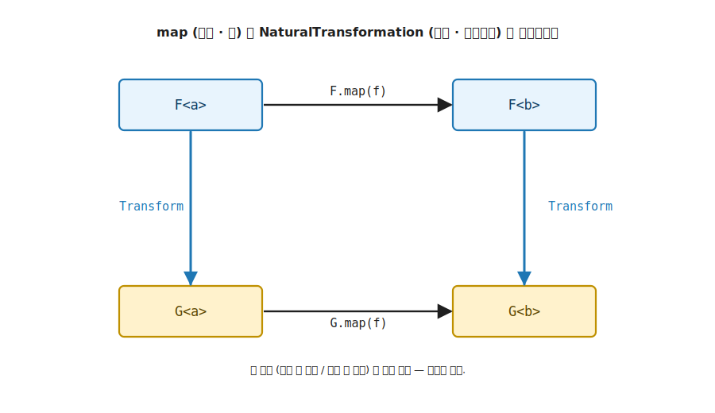
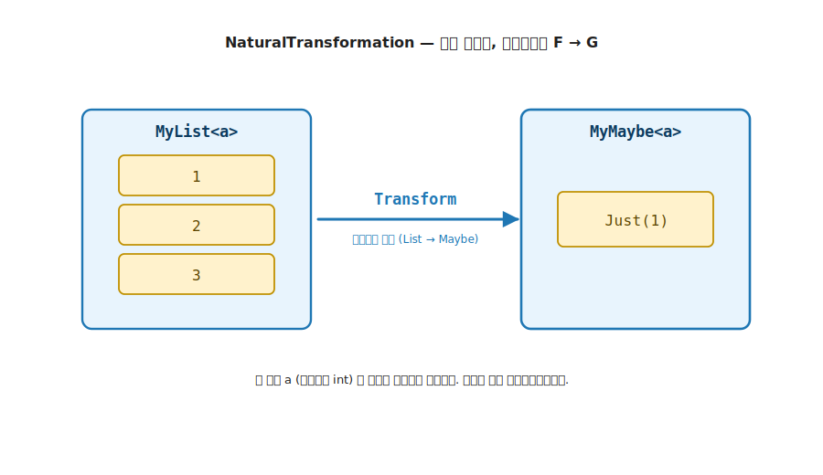

# 11장. NaturalTransformation (컨테이너 자체를 다른 컨테이너로)

> 이 장에서 다룰 주제 — 1부의 마지막 장. 4장 Functor 의 `map` 이 컨테이너 안의 값을 바꿨다면, NaturalTransformation 은 컨테이너 자체를 다른 컨테이너로 바꿉니다 (`K<F, A> → K<G, A>`, 값 타입 `A` 는 유지). 1부에서 모은 모든 어휘가 컨테이너 사이의 다리로 마무리되는 자리입니다.

> 이 장을 마치면 할 수 있게 되는 것
> - [ ] 값을 바꾸는 `map` 과 컨테이너를 바꾸는 NaturalTransformation 의 차이를 시그니처로 구분할 수 있습니다.
> - [ ] `Transform : K<F, A> → K<G, A>` 를 `Natural<F, G>` trait 으로 직접 구현할 수 있습니다.
> - [ ] 자연성 법칙이 왜 변환과 `map` 의 순서를 바꿔도 같은 결과를 보장하는지 코드로 검증할 수 있습니다.
> - [ ] 9장 Traversable 의 `sequence` 가 사실 NaturalTransformation 의 한 형태였음을 설명할 수 있습니다.

---

## 11.1 목적 — 컨테이너 자체를 바꾸기

### 11.1.1 고통의 체험 — 흩어지는 변환 함수

`MyList` 를 `MyMaybe` 로, `MyMaybe` 를 `MyList` 로 옮기는 변환을 trait 없이 손으로 짜면 무엇이 아픈지 먼저 겪어 봅니다. 컨테이너 쌍마다 변환 함수를 따로 만듭니다.

```csharp
static MyMaybe<int> HeadOrNone(MyList<int> xs) => ...;   // List → Maybe
static MyList<int>  ToList(MyMaybe<int> m)     => ...;   // Maybe → List
static MyMaybe<User> FirstOrNone(MyList<User> us) => ...;
```

문제는 둘입니다. 첫째, 컨테이너 쌍이 늘 때마다 (`List ↔ Maybe`, `Maybe ↔ Either`, `Either ↔ List`) 변환 함수가 애드혹 정적 메서드로 흩어집니다. 같은 종류의 변환임을 묶는 공통 어휘가 없습니다. 둘째, 더 위험한 것은 **값 `a` 를 건드리지 않는다는 약속이 코드 어디에도 강제되지 않는다** 는 점입니다. 누군가 `HeadOrNone` 안에서 첫 원소를 꺼내며 슬쩍 `+ 1` 을 더해도 컴파일러가 막지 못합니다. 컨테이너만 옮겨야 하는 변환이 값까지 손대도 타입이 통과합니다.

> **흔한 함정** — 변환 함수를 컨테이너 쌍마다 자유 함수로 두면 "값을 안 건드린다" 는 보장이 사라집니다. 필요한 것은 변환을 한 trait 으로 묶고, 값 `a` 와 무관하게 (`a` 가 무엇이든 같은 방식으로) 작동함을 시그니처로 강제하는 도구입니다. 그 도구가 NaturalTransformation 입니다.

### 11.1.2 컨테이너를 옮기고 싶은 자리

지금까지의 trait 은 모두 컨테이너를 고정한 채 안쪽을 다뤘습니다. 4장 Functor 의 `map` 은 `MyList<int>` 를 `MyList<string>` 으로 바꿨지만, 컨테이너는 여전히 `MyList` 였습니다. 안의 값만 변하고 컨테이너 종류는 그대로입니다.

그런데 컨테이너 종류 자체를 바꾸고 싶을 때가 있습니다. `MyList<int>` 의 첫 원소만 꺼내 `MyMaybe<int>` 로 옮기거나 (있으면 `Just`, 비어 있으면 `Nothing`), `MyMaybe<int>` 를 원소 0개 또는 1개의 `MyList<int>` 로 펼치는 변환입니다.

```text
headOrNone : MyList<a>  → MyMaybe<a>     값 a 는 그대로, 컨테이너만 List → Maybe
toList     : MyMaybe<a> → MyList<a>      값 a 는 그대로, 컨테이너만 Maybe → List
```

두 변환 모두 안의 값 타입 `a` 는 손대지 않습니다. 바뀌는 것은 컨테이너 (`F`) 자체입니다. 이것이 NaturalTransformation 입니다. Functor 의 `map` 과 방향이 직교합니다.

---

## 11.2 NaturalTransformation — 컨테이너를 옮기는 변환

NaturalTransformation 의 멤버는 변환 하나입니다.

```text
Transform : K<F, A> → K<G, A>
```

컨테이너 `F` 에 담긴 값을 컨테이너 `G` 로 옮깁니다. 값 타입 `A` 는 입력과 출력에서 같습니다. 컨테이너만 `F` 에서 `G` 로 바뀝니다.

`map` 과 나란히 두면 두 축이 직교한다는 것이 또렷합니다.

| | 무엇을 바꾸나 | 시그니처 | 고정되는 것 |
|---|---|---|---|
| **Functor `map`** | 컨테이너 안의 값 | `K<F, A> → K<F, B>` | 컨테이너 `F` |
| **NaturalTransformation** | 컨테이너 자체 | `K<F, A> → K<G, A>` | 값 타입 `A` |

`map` 은 컨테이너를 세로축으로 고정하고 값을 가로로 바꾸고, NaturalTransformation 은 값을 가로축으로 고정하고 컨테이너를 세로로 바꿉니다. 1부에서 다룬 trait 이 가로축의 어휘였다면, NaturalTransformation 은 세로축의 어휘입니다. 1장의 4 가지 함수 유형 (`a → b` / `a → E<b>` / `E<a> → b` / `E<a> → E<b>`) 은 모두 한 컨테이너 안에서의 이동이었습니다. NaturalTransformation 은 그 넷 어디에도 없는, 컨테이너 자체를 바꾸는 다섯 번째 축입니다.



**그림 11-1. map 과 NaturalTransformation 의 직교** — 가로 화살표 (`F.map(f)`, `G.map(f)`) 는 컨테이너를 고정한 채 값을 `a` 에서 `b` 로 바꿉니다. 세로 화살표 (`Transform`) 는 값을 고정한 채 컨테이너를 `F` 에서 `G` 로 바꿉니다. 두 축이 직교하고, 두 경로가 만나는 자리가 다음 절의 자연성 법칙입니다.

---

## 11.3 trait 직접 구현 — `Natural<F, G>`

마커 `K<F, A>` 를 입력으로 받아 `K<G, A>` 를 돌려주는 변환을 약속합니다. self-bound 가 없는 대신, 출발 컨테이너 `F` 와 도착 컨테이너 `G` 두 타입 인자를 받습니다.

```csharp
public interface Natural<out F, in G>
{
    // F 컨테이너의 값을 G 컨테이너로 옮깁니다. 값 타입 A 는 유지됩니다.
    static abstract K<G, A> Transform<A>(K<F, A> fa);
}
```

`Transform` 의 타입 매개변수는 `A` 하나뿐입니다. 변환이 값 타입과 무관하게 (`A` 가 무엇이든) 같은 방식으로 작동해야 한다는 뜻입니다. `MyList<int>` 든 `MyList<string>` 든 첫 원소를 꺼내는 방식은 똑같습니다. 이 무관함이 다음 절의 자연성 법칙으로 형식화됩니다. 이 시그니처는 LanguageExt v5 의 `Natural<out F, in G>` 와 정확히 정합합니다.

variance 표기 `out F, in G` 는 `F` 가 변환의 출발 (source), `G` 가 도착 (target) 임을 나타냅니다. 지금은 그 한 줄 직감만 가져가면 충분합니다. 이 표기가 어떻게 C# 컴파일러 검사를 통과하는지의 메커니즘은 아래 선택 읽기로 미룹니다.

> **variance 의 깊이 (선택 읽기)** — 일반 C# variance 규칙은 `out` 이 반환 자리, `in` 이 매개변수 자리입니다. `Transform` 은 `F` 가 매개변수, `G` 가 반환이라 일반 규칙으로는 `<in F, out G>` 가 자연스러운데, v5 는 반대로 `<out F, in G>` 로 적습니다. 카테고리 이론의 source / target 비대칭 (Haskell 의 `Nat f g = forall a. f a -> g a` 에서 `f` 가 source, `g` 가 target) 을 어휘로 보존하기 위해서입니다. 이 표기가 컴파일을 통과하는 까닭은 마커가 `K<in F, A>` (F 가 contravariant) 로 정의되기 때문입니다. K 안에서 contravariant 인 `F` 가 매개변수 위치에 오면 반전되어 `out F` 로, 반환 위치의 `G` 는 `in G` 로 정합합니다. 이 메커니즘을 외우지 않아도 됩니다. 본질은 `F` 컨테이너에서 `G` 컨테이너로 옮기는 변환이고, 값 `A` 는 유지된다는 것입니다.

---

## 11.4 예제 — MyList ↔ MyMaybe

두 변환을 직접 구현합니다. 먼저 리스트의 첫 원소를 꺼내는 변환입니다.

```csharp
// MyList → MyMaybe : 첫 원소가 있으면 Just, 없으면 Nothing
public sealed class ListToMaybe : Natural<MyListF, MyMaybeF>
{
    public static K<MyMaybeF, A> Transform<A>(K<MyListF, A> fa)
    {
        var list = (MyList<A>)fa;
        return list.IsEmpty
            ? MyMaybe<A>.Nothing
            : MyMaybe<A>.Of(list.Head);
    }
}
```

반대 방향은 `MyMaybe` 를 원소 0개 또는 1개의 리스트로 펼칩니다.

```csharp
// MyMaybe → MyList : Just 면 원소 1개, Nothing 이면 빈 리스트
public sealed class MaybeToList : Natural<MyMaybeF, MyListF>
{
    public static K<MyListF, A> Transform<A>(K<MyMaybeF, A> fa) =>
        (MyMaybe<A>)fa switch
        {
            Just<A> j => MyList<A>.Of(j.Val),   // Just 면 원소 1개
            _         => MyList<A>.Empty          // Nothing 이면 빈 리스트
        };
}
```

```csharp
ListToMaybe.Transform(MyList<int>.Of(1, 2, 3));   // Just(1)
ListToMaybe.Transform(MyList<int>.Empty);         // Nothing
MaybeToList.Transform(MyMaybe<int>.Of(7));         // [7]
MaybeToList.Transform(MyMaybe<int>.Nothing);       // []
```

두 `Transform` 모두 값 `int` 를 건드리지 않습니다. 컨테이너만 옮깁니다. `map` 이 값을 변환하는 것과 정확히 직교합니다.



**그림 11-2. 컨테이너 교체: `MyList<a>` → `MyMaybe<a>`** — 왼쪽 `MyList<a>` 의 값 `a` (여기서는 `int`) 가 오른쪽 `MyMaybe<a>` 로 옮겨집니다. 값 타입 `a` 는 입력과 출력에서 같고, 바뀌는 것은 컨테이너 (`MyList` → `MyMaybe`) 뿐입니다.

---

## 11.5 자연성 법칙 — 변환과 map 의 순서 무관

NaturalTransformation 이 진짜 자연 변환이려면 한 가지 법칙을 지켜야 합니다. 자연성 법칙입니다. 값을 먼저 변환하고 컨테이너를 옮기든, 컨테이너를 먼저 옮기고 값을 변환하든 결과가 같아야 합니다.

```text
Transform(F.Map(f, fa)) == G.Map(f, Transform(fa))
```

왼쪽은 출발 컨테이너 `F` 에서 `map(f)` 를 적용한 뒤 `G` 로 옮긴 것이고, 오른쪽은 먼저 `G` 로 옮긴 뒤 `G` 에서 `map(f)` 를 적용한 것입니다. 두 경로가 같은 결과를 낸다는 약속입니다.

`ListToMaybe` 로 확인하면, 리스트에 `f` 를 적용한 뒤 첫 원소를 꺼내든, 첫 원소를 꺼낸 뒤 `f` 를 적용하든 같은 `Just(f(head))` 가 나옵니다. 이 법칙이 성립해야 변환이 값과 무관하게 컨테이너 구조만 다룬다는 것이 보장됩니다. 앞서 `Transform` 의 타입 매개변수가 `A` 하나뿐이었던 이유가 이것입니다.

두 변환의 자연성을 `Transform` 과 `map` 의 가환으로 코드로 검증합니다.

```csharp
// ListToMaybe 의 자연성: Transform(map(f, xs)) == map(f, Transform(xs))
public static bool ListToMaybeNaturality<A, B>(MyList<A> xs, Func<A, B> f)
{
    var lhs = ListToMaybe.Transform<B>(ListMap(xs, f));   // 먼저 map, 그다음 Transform
    var rhs = MaybeMap(ListToMaybe.Transform<A>(xs), f);  // 먼저 Transform, 그다음 map
    return lhs.Equals(rhs);
}
```

데모는 `[1, 2, 3]` 과 빈 리스트, `Just` 와 `Nothing` 모두에서 두 경로가 같은 결과임을 출력합니다.

> **흔한 함정** — 시그니처 `K<F, A> → K<G, A>` 만 맞으면 자연 변환이 되는 것은 아닙니다. 값에 따라 분기하는 변환은 자연성을 깹니다. 예를 들어 첫 원소를 꺼내되 **값이 짝수일 때만** 꺼낸다면, `map` 으로 값을 바꾼 뒤와 바꾸기 전의 결과가 달라져 법칙이 깨집니다. 자연 변환은 값을 보지 않고 컨테이너 구조만 다뤄야 합니다.

---

## 11.6 sequence 는 NaturalTransformation 입니다

9장 Traversable 의 `sequence` 를 다시 봅니다. `sequence` 는 두 컨테이너의 층 순서를 뒤집었습니다.

```text
sequence : MyList<E<a>> → E<MyList<a>>
```

이 시그니처를 NaturalTransformation 의 눈으로 보면, 바깥에서 본 컨테이너가 `MyList∘E` 에서 `E∘MyList` 로 바뀌고 안의 값 `a` 는 그대로입니다. 즉 `sequence` 는 합성 컨테이너 `MyList<E<_>>` 를 합성 컨테이너 `E<MyList<_>>` 로 옮기는 자연 변환입니다. 9장에서 본 층 순서 뒤집기가 사실 이 장의 어휘로 다시 설명됩니다.

1부의 마지막 자리에서 앞의 어휘들이 한데 모입니다. Functor 의 `map` (가로축, 값 변환) 과 NaturalTransformation (세로축, 컨테이너 변환) 이 직교축을 이루고, Traversable 의 `sequence` 가 그 교차점에 놓입니다. 1부에서 모은 모든 도구가 컨테이너 사이의 다리로 마무리됩니다.

---

## 11.7 Q&A

> **Q1. `map` 과 NaturalTransformation 은 어떻게 다릅니까?**

`map` 은 컨테이너를 고정한 채 안의 값을 바꿉니다 (`K<F, A> → K<F, B>`). NaturalTransformation 은 값 타입을 고정한 채 컨테이너 자체를 바꿉니다 (`K<F, A> → K<G, A>`). 두 축이 직교합니다. `map` 은 가로 (값), NaturalTransformation 은 세로 (컨테이너) 입니다.

> **Q2. `Transform` 의 타입 매개변수가 왜 `A` 하나뿐입니까?**

변환이 값 타입과 무관하게 작동해야 하기 때문입니다. `MyList<int>` 든 `MyList<string>` 든 첫 원소를 꺼내는 방식은 똑같습니다. 값 `A` 가 무엇이든 같은 방식으로 컨테이너만 옮긴다는 제약이 타입 매개변수 `A` 하나로 표현되고, 자연성 법칙으로 형식화됩니다.

> **Q3. 자연성 법칙이 깨지면 어떻게 됩니까?**

변환이 값에 따라 다르게 작동한다는 뜻이 됩니다. 예를 들어 첫 원소를 꺼내되 값이 짝수일 때만 꺼낸다면, `map` 으로 값을 바꾼 뒤와 바꾸기 전의 결과가 달라져 법칙이 깨집니다. 자연성 법칙은 변환이 오직 컨테이너 구조만 다룬다는 보장입니다.

> **Q4. `sequence` 가 NaturalTransformation 이라는 말은 무슨 뜻입니까?**

`sequence : MyList<E<a>> → E<MyList<a>>` 를 보면 값 `a` 는 그대로이고 바깥 컨테이너가 `MyList<E<_>>` 에서 `E<MyList<_>>` 로 바뀝니다. 컨테이너만 옮기고 값을 유지하므로 NaturalTransformation 의 정의에 정확히 들어맞습니다. 9장의 층 순서 뒤집기가 이 장의 어휘로 다시 설명됩니다.

> **Q5. NaturalTransformation 이 1부의 마지막에 오는 이유는 무엇입니까?**

앞의 모든 어휘가 여기서 만나기 때문입니다. Functor 의 값 변환과 직교하는 컨테이너 변환을 보고, 9장 Traversable 의 `sequence` 가 그 한 형태였음을 확인합니다. 1부에서 한 컨테이너 안을 다루던 어휘가, 컨테이너 사이를 잇는 다리로 마무리되는 자리입니다.

> **Q6. `out F, in G` 표기가 헷갈립니다.**

`F` 가 변환의 출발 (source), `G` 가 도착 (target) 이라는 한 줄만 기억하면 충분합니다. 일반 C# variance 규칙과 반대로 보이는 까닭과 컴파일을 통과하는 메커니즘은 §11.3 의 variance 선택 읽기에 정리돼 있습니다.

> **Q7. 변환을 trait 으로 묶으면 무엇이 좋습니까?**

값 `a` 와 무관하게 작동함이 시그니처로 강제됩니다 (§11.1.1). 자유 함수로 두면 누군가 변환 안에서 값을 슬쩍 바꿔도 컴파일러가 막지 못하지만, `Natural<F, G>` 의 `Transform<A>` 는 타입 매개변수가 `A` 하나뿐이라 값을 손댈 길이 닫힙니다.

> **Q8. 실무에서 NaturalTransformation 은 어디에 쓰입니까?**

`IO ↔ Task`, `Option ↔ Either` 처럼 한 효과 컨테이너를 다른 효과 컨테이너로 옮기는 자리입니다. 값은 그대로 두고 효과의 표현만 바꾸는 변환이 자연 변환입니다.

---

## 11.8 요약

- NaturalTransformation 은 컨테이너 자체를 다른 컨테이너로 옮기는 변환입니다 (`Transform : K<F, A> → K<G, A>`, 값 타입 `A` 유지).
- 4장 Functor 의 `map` (값 변환, 컨테이너 고정) 과 직교합니다. `map` 은 가로축, NaturalTransformation 은 세로축입니다.
- `Natural<out F, in G>` 는 출발 컨테이너 `F` (source) 와 도착 컨테이너 `G` (target) 두 인자를 받고, `Transform` 의 타입 매개변수는 값 `A` 하나뿐입니다. variance 표기 `out F, in G` 는 카테고리 이론의 source/target 비대칭을 시각화하며, K 마커의 `K<in F, A>` contravariant 표기가 variance 반전을 만들어 컴파일을 통과시킵니다. LanguageExt v5 와 정확히 정합.
- 자연성 법칙 (`Transform(map(f, fa)) == map(f, Transform(fa))`) 이 변환이 값과 무관하게 컨테이너 구조만 다룬다는 것을 보장합니다.
- 9장 Traversable 의 `sequence` 가 사실 NaturalTransformation 의 한 형태입니다. 1부의 모든 어휘가 컨테이너 사이의 다리로 마무리됩니다.

---

## 11.9 1부를 마치며 — 다섯 trait 과 두 확장

11장으로 1부의 어휘가 모두 갖춰졌습니다. 한자리에 모아 봅니다.

- **Order 0 — Monoid (3장).** Normal World 의 두 값을 하나로 합치는 결합 (`Combine`) 과 단위원 (`Empty`).
- **Order 1 — 핵심 5 trait (4 ~ 9장).** 두 평행 세계의 네 자리 위에서 자랍니다. `map` (끌어올림) · `apply` (다인자 lift) · `fold` (끌어내림) · `bind` (World-crossing 합성) · `traverse` (층 swap).
- **2-인자 확장 — Bifunctor (10장).** 타입 인자가 둘인 컨테이너의 양쪽을 `BiMap` 으로 변환.
- **컨테이너 축 — NaturalTransformation (11장).** 값은 그대로 두고 컨테이너 자체를 `Transform` 으로 교체.

Wlaschin 의 어휘로 정리하면 1부의 도구는 네 기능으로 압축됩니다. Normal 값을 Elevated 로 올리는 **진입** (`pure`), 안의 값을 바꾸는 **변환** (`map`), 여러 Elevated 를 합치는 **결합** (`apply` / `bind`), 컨테이너 안의 효과를 모으는 **리스트 처리** (`traverse` / `sequence`). 컨테이너가 수십 개여도 어휘는 이 네 기능과 다섯 trait 으로 유지됩니다.

5개 핵심 trait 을 시그니처만 보고도 4 가지 함수 유형 그림으로 그릴 수 있고, 어떤 새 자료 타입에든 trait 을 직접 부착할 수 있다면 1부의 도달점에 선 것입니다. 2부 Collections 부터는 이 toy 추상 (`MyList` / `MyMaybe` / `MyValidation`) 을 실제 `Seq` / `Map` / `HashMap` 에 그대로 적용합니다.

> **실무 디딤돌** — NaturalTransformation 은 `IO ↔ Task`, `Option ↔ Either` 같은 효과 컨테이너 사이의 변환으로 후속 Part 에서 만납니다. 한 효과 시스템에서 다른 효과 시스템으로 코드를 옮길 때 값을 보존하며 컨테이너만 바꾸는 다리가 됩니다.
>
> **테스트 디딤돌** — 자연성 법칙 (`Transform(map(f, fa)) == map(f, Transform(fa))`) 은 9부의 property-based 테스트로 검증합니다. 임의의 컨테이너와 임의의 함수에 대해 두 경로가 같은 결과를 내는지 자동 확인하는 것이 출발점입니다.
