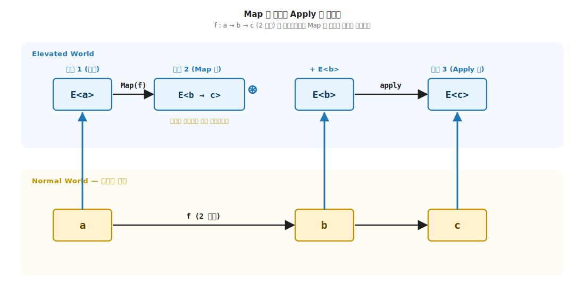
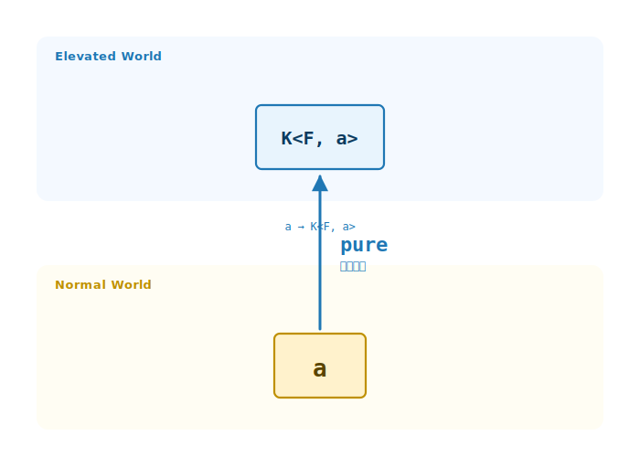
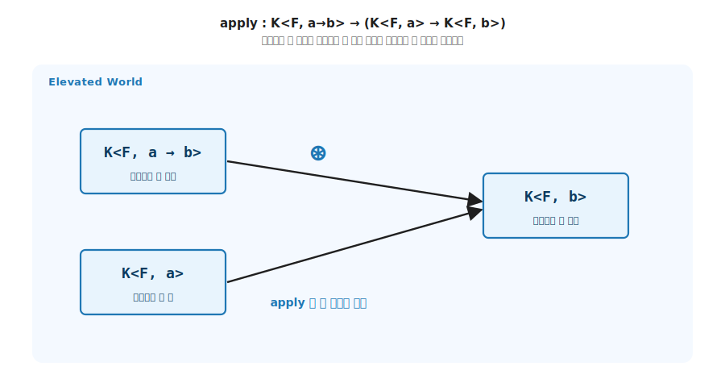
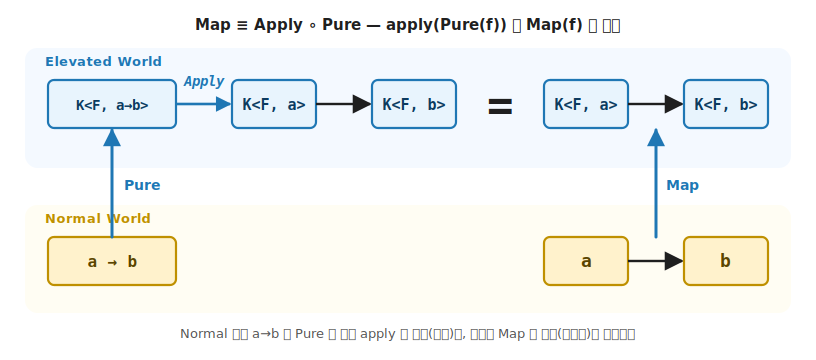
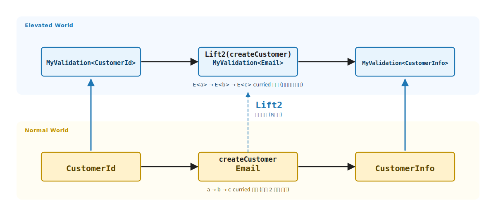
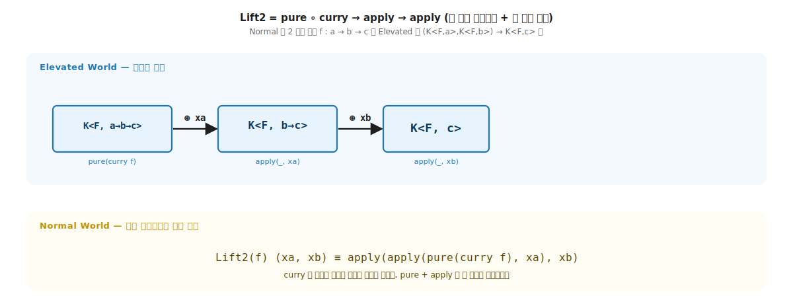
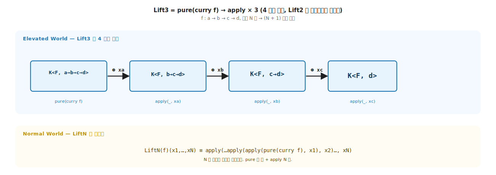

# 5장. Applicative / `pure` + `apply` (다인자 함수의 끌어올림)

> **이 장의 목표** — 이 장을 읽고 나면 4장 `map` 의 1인자 한계를 시그니처로 진단하고, `Pure` 와 `Apply` 두 멤버 위에서 `Lift2` / `Lift3` / `Lift4` 로 다인자 Normal 함수를 모양 그대로 Elevated World 로 끌어올릴 수 있습니다. 기초 흐름에서 Applicative 는 4장이 연 `E<a> → E<b>` 자리를 다인자로 넓히는 자리이며, `Apply` 가 두 컨테이너를 동시에 다룬다는 점에서 8장 Validation 의 누적과 7장 Monad 의 단락이 왜 시그니처 단계에서 갈리는지를 미리 준비합니다.

> **이 장의 핵심 어휘**
>
> - **`Pure`**: Normal 값을 Elevated World 의 가장 단순한 시민으로 올리는 최소 끌어올림, `a → E<a>`
> - **`Apply`**: 컨테이너 안 함수 `K<F, a → b>` 를 컨테이너 안 값 `K<F, a>` 에 적용해 `K<F, b>` 를 내는 결합. `Map` 과 달리 첫 자리가 Elevated 시민
> - **`Curry`**: `(a, b) → c` 같은 다인자 함수를 `a → b → c` 의 1인자 체인으로 비트는 변환
> - `Lift2` / `Lift3` / `Lift4`: 다인자 Normal 함수를 `Curry → Pure → N×Apply` 사슬로 다인자 Elevated 함수로 끌어올리는 헬퍼
> - **lift1 = map**: 1인자 끌어올림은 4장 `Map` 과 같은 함수의 두 어휘
> - **누적**: 두 컨테이너를 양쪽 다 꺼내 두 실패 정보를 모두 모으는 `MyValidation.Apply` 의 결합
> - **단락**: 한쪽이 비면 나머지를 보지 않고 멈추는 `MyMaybe.Apply` 의 결합

> 이 장을 마치면 할 수 있게 되는 것
> - [ ] `map` 만으로는 못 푸는 한 예 (`Some(2) + Some(3)`) 의 시그니처를 그릴 수 있습니다.
> - [ ] `Applicative<F>` 의 두 멤버 (`Pure`, `Apply`) 가 각각 어느 자리를 닫는지 시그니처로 읽어낼 수 있습니다.
> - [ ] Applicative 의 핵심 세 법칙 (Identity / Homomorphism / Functor 정합) 을 시그니처와 코드로 검증하고, 나머지 둘 (Interchange / Composition) 의 역할을 설명할 수 있습니다.
> - [ ] 새 자료 타입에 3-tuple 패턴으로 Applicative 를 부착할 수 있습니다.
> - [ ] `Lift2 / Lift3 / Lift4` 의 정의 (`Curry → Pure → N×Apply`) 를 한 식으로 적을 수 있습니다.
> - [ ] `lift1 = map` 이 같은 함수의 두 어휘임을 시그니처로 답할 수 있습니다.
> - [ ] applicative 누적과 monadic 단락이 왜 시그니처 단계에서 갈리는지 답할 수 있습니다.

> 참고 — 이 장의 Elevated World 어휘는 Scott Wlaschin 의 "Map and Bind and Apply, Oh My!" 시리즈 (<https://fsharpforfunandprofit.com/posts/elevated-world/>) 의 어휘 분류를 따릅니다. 그 시리즈 1 부 "Lifting to the elevated world" 의 `apply` · `liftN` 절이 이 장의 직접 대응 글입니다.

---

## 5.1 `map` 만으로는 풀 수 없는 다인자 함수 — 목적

5장의 핵심은 한 줄로 압축됩니다. Normal World 의 N 인자 함수를 Elevated World 에서 그대로 쓰게 해 주는 끌어올림 함수가 `pure` 와 `apply` 입니다. 4장 `map` 이 1 인자 끌어올림이었다면, 5장 *pure + apply* 는 N 인자 끌어올림입니다. 두 멤버 위에서 `Lift2`, `Lift3`, `Lift4` 같은 다인자 헬퍼가 자랍니다.
### 5.1.1 4 가지 함수 유형의 `E<a> → E<b>` 가 다인자로 넓어지는 자리

1장에서 두 세계 사이의 함수 유형을 4 가지 함수 유형으로 정리했습니다. 4장의 `map` 은 그중 `E<a> → E<b>` 의 1 인자 끌어올림이고, `a → b` 한 개를 받습니다. 그런데 실세계의 함수는 2 인자 이상인 경우가 더 많습니다.

```csharp
int Add(int x, int y) => x + y;                         // 2 인자
User Create(string name, int age) => new(name, age);    // 2 인자
Address Build(string st, string city, string zip) =>    // 3 인자
    new(st, city, zip);
```

이 함수들을 Elevated World 의 값들 위에서 그대로 쓰고 싶습니다. 예를 들어 `MyMaybe<int>` 두 개를 받아 `MyMaybe<int>` 를 내는 덧셈입니다.

```csharp
K<MyMaybeF, int> two   = new MyMaybe<int>.Just(2);
K<MyMaybeF, int> three = new MyMaybe<int>.Just(3);
K<MyMaybeF, int> sum   = ???;          // Just(5) 가 나와야 합니다
```

그냥 `two + three` 라고 적으면 컴파일이 안 됩니다. `+` 는 `int` 끼리의 연산이지 `K<MyMaybeF, int>` 끼리가 아니기 때문입니다. 손으로 풀려면 두 컨테이너를 각각 까서 (둘 다 `Just` 면 더하고, 하나라도 `Nothing` 이면 `Nothing`) 맞춰야 하고, 인자가 셋이면 그 분기가 세 겹으로 중첩됩니다. 1 장에서 본 "같은 처리가 자리마다 반복" 의 Elevated World 판입니다.

`map` 한 개로는 이 자리를 풀 수 없습니다. 왜 그런지 단계별 시그니처 추적으로 봅니다.

#### 1 단계 — `Map` 의 시그니처는 1 인자 함수만 받습니다

4장에서 본 `Map` 의 첫 자리는 1 인자 Normal 함수입니다.

```
Map : (a → b) → E<a> → E<b>
       ──┬──
       1 인자 Normal 함수
```

그런데 `add : (int, int) → int` 는 2 인자 함수라 `Map` 의 첫 자리에 직접 못 들어갑니다. Curry 로 한 인자씩 받는 체인으로 비틀어야 들어갈 수 있습니다. Curry 어휘를 미리 빌립니다.

```csharp
Func<int, int, int>       add  = (x, y) => x + y;     // (int, int) → int      ← 못 들어감
Func<int, Func<int, int>> addC = x => y => x + y;     // int → (int → int)     ← 들어감
```

`x => y => x + y` 는 **`x` 를 받으면 `y => x + y` 라는 새 함수를 돌려주는** 람다입니다. `addC(2)` 의 결과가 `y => 2 + y` 이고, 거기에 `(3)` 을 또 주면 `5` 입니다. 1 장에서 본 `a → b → c` (오른쪽 결합) 타입이 값으로 나타난 모양으로, 화살표가 둘이면 "한 인자씩 받아 다음 함수를 돌려준다" 로 읽습니다.

> **타입 변수와 매개변수 이름** — 시그니처의 `a, b, c` 는 `int`, `string` 같은 **타입** 을 가리키는 타입 변수이고, 람다 안의 `x`, `y` 는 호출 시 **값** 이 들어갈 매개변수 이름입니다. 둘은 다른 카테고리입니다. `addC : int → (int → int)` 에서 타입 변수를 읽고, `x => y => x + y` 에서 매개변수 이름을 읽습니다.

**한 줄 정리** — `Map` 의 첫 자리는 1 인자 Normal 함수만 받으므로, 2 인자 이상 함수는 Curry 로 1 인자 체인으로 비틀어야 들어갑니다.

#### 2 단계 — 첫 인자만 `Map` 으로 적용해 봅니다

```csharp
K<MyMaybeF, Func<int, int>> step1 = MyMaybeF.Map(addC, two);
//                          ─────┬─────────────────
//                          함수가 Elevated 한 칸 안에 갇힌 모양
```

시그니처를 따라가 봅니다. `Map : (a → b) → E<a> → E<b>` 에서 `a = int`, `b = Func<int, int>` 이므로 결과는 `K<MyMaybeF, Func<int, int>>` 입니다. **인자 한 개만 줬으니 다음 인자를 기다리는 함수가 그대로 Elevated 한 칸 안에 갇혀 있습니다**.

**한 줄 정리** — Curry 한 함수의 첫 인자만 `Map` 으로 적용하면, 다음 인자를 기다리는 함수가 Elevated 한 칸 안에 갇힌 모양 `K<F, a → b>` 가 됩니다.

**두 단계 정리** — 두 단계로 문제의 모양이 드러났습니다. `Map` 의 첫 자리가 1 인자 Normal 함수만 받는다는 한계 (1 단계), 첫 인자 적용 후 Elevated 한 칸 안에 함수가 갇힌다는 결과 (2 단계) 입니다. 다음 두 단계에서 갇힌 함수를 풀어낼 새 도구를 시그니처로 유도합니다.

### 5.1.2 갇힌 함수를 풀어낼 새 도구 — `Apply` 의 시그니처 유도

앞 두 단계에서 갇힌 함수 `K<F, a → b>` 와 두 번째 Elevated 값 `K<F, a>` 의 결합 자리가 남았습니다. 이 자리를 어떤 시그니처의 도구로 풀어야 하는지, 그 도구가 `Map` 으로 환원되지 않는 이유를 두 단계로 확인합니다.

#### 3 단계 (a) — 두 번째 인자 `three` 는 무엇으로 합치나?

`step1` 안에 갇힌 함수를 풀어내 `three : K<MyMaybeF, int>` 와 합치려면 다음 모양의 도구가 필요합니다.

```
필요한 시그니처:  K<F, a → b>  →  K<F, a>  →  K<F, b>
               ─────┬─────     ────┬───    ────┬─────
             step1 (갇힌 함수)    three      원하는 sum
```

이 자리에 `Map` 을 한 번 더 쓰려고 해도 시그니처가 맞지 않습니다. C# 타입 두 개를 나란히 적어 차이를 봅니다.

```csharp
// 두 타입을 나란히 — 컨테이너 한 겹 차이입니다.
Func<int, int>              plain   = n => n + 10;            // (a → b)         ← 그냥 함수
K<MyMaybeF, Func<int, int>> wrapped = MyMaybeF.Pure(plain);   // K<F, a → b>    ← 컨테이너 안 함수

plain(5);                  // ✓ 직접 호출 가능. 결과 = 15.
wrapped(5);                // ✗ 컴파일 에러. wrapped 는 함수가 아니라 *컨테이너* — 직접 호출 불가.
```

`plain` 은 값을 받아 값을 돌려주는 일반 함수입니다. `plain(5)` 처럼 직접 호출합니다. `wrapped` 는 컨테이너 (`MyMaybeF` 의 `Just`) 이고 그 안에 함수가 들어 있을 뿐입니다. 컨테이너를 마치 함수처럼 호출하면 컴파일러가 거부합니다.

**한 줄 정리** — 필요한 도구의 시그니처 모양은 `K<F, a → b> → K<F, a> → K<F, b>` 이며, 첫 자리가 컨테이너 안 함수 (Elevated 시민) 라는 점이 일반 함수 (Normal 시민) 와의 한 겹 차이입니다.

#### 3 단계 (b) — `Map` 첫 자리는 Normal 함수만, `Apply` 가 필요합니다

이제 `Map` 의 시그니처에 두 타입을 각각 넣어 봅니다.

```csharp
// Map 의 시그니처 — 첫 자리는 Func<A, B>.
static abstract K<F, B> Map<A, B>(Func<A, B> f, K<F, A> fa);
//                                ────┬─────
//                                Func<A, B> 만 받음 (K<F, Func<A, B>> 는 안 됨)

// ✓ plain 은 Func<A, B> 라 첫 자리에 들어갑니다.
K<MyMaybeF, int> ok = MyMaybeF.Map<int, int>(plain, three);

// ✗ step1 (= wrapped 와 같은 모양) 은 K<F, Func<A, B>> — Func<A, B> 가 아닙니다.
K<MyMaybeF, int> err = MyMaybeF.Map<int, int>(step1, three);
//                                            ──┬──
//                                            Func<int, int> 자리에 K<MyMaybeF, Func<int, int>>
//                                            → CS1503 cannot convert from
//                                              'K<MyMaybeF, Func<int, int>>' to 'Func<int, int>'
```

`Map` 은 첫 자리에 컨테이너 안에 들어 있지 않은 함수 (Normal World 함수) 만 받습니다. `step1` 안에 갇힌 함수 (Elevated World 의 시민) 를 꺼내지 않고 그대로 두 번째 Elevated 값과 결합하려면, **첫 자리에 `K<F, Func<A, B>>` 를 받는 다른 도구** 가 필요합니다.

```csharp
// 우리가 진짜 필요한 도구 — 첫 자리가 K<F, Func<A, B>>:
K<F, B> Apply<A, B>(K<F, Func<A, B>> mf, K<F, A> ma);
//                  ──────┬──────────
//                  컨테이너 안 함수를 받음 — step1 의 모양과 정확히 일치

// ✓ step1 과 three 가 비로소 결합:
K<MyMaybeF, int> sum = MyMaybeF.Apply<int, int>(step1, three);   // → Just(5)
```

`Map` 과 `Apply` 의 결정적 차이는 **첫 자리의 함수가 Normal World 시민이냐 Elevated World 시민이냐** 에 있습니다. 이 한 겹 차이가 두 trait 을 가르는 자리입니다.

**한 줄 정리** — `Map` 은 첫 자리에 Normal 함수만 받으므로 갇힌 함수 `K<F, a → b>` 를 그대로 결합할 수 없고, 첫 자리에 컨테이너 안 함수를 받는 새 도구 `Apply` 가 필요합니다.

#### 4 단계 — 그래서 `apply` 가 필요합니다

위 필요한 시그니처 `K<F, a → b> → K<F, a> → K<F, b>` 가 정확히 **`Apply` 의 시그니처**입니다. `Pure` 는 Normal 함수를 Elevated 로 올려 `Apply` 가 풀어낼 갇힌 함수 `K<F, a → b>` 를 만드는 출발점이고 (`a → E<a>` 의 최소 끌어올림), `Apply` 는 그 갇힌 함수를 두 번째 이후 Elevated 값과 차례로 결합합니다. 그래서 `Pure` 와 `Apply` 가 한 쌍입니다.

> F# 저술가 David Raab 의 진단 — "map only can work with one-argument functions! The definition of map expects a function `'a -> 'b` as its first argument." 두 인자 이상 함수에 `map` 을 적용하면 `option<('a -> 'b)>` 같은 함수가 컨테이너 안에 갇힌 어색한 모양만 남습니다. (Raab 의 fold 통찰은 6장에서 다시 만납니다.)

**네 단계 정리** — 네 단계 통일 논증의 결론은 한 줄입니다. `Map` 의 1 인자 한계 (1 ~ 2 단계) 가 `Apply` 라는 새 시그니처를 자연스럽게 유도하고 (3 단계), `Pure + Apply` 두 멤버가 그 자리를 닫습니다 (4 단계). 다음 절은 이 새 도구가 4 가지 함수 유형의 어디에 자리잡는지 보여줍니다.

### 5.1.3 4 가지 함수 유형 — 시그니처와 기초 매핑

| 시그니처 | 기초 매핑 | 어휘 (elevated-world 글) |
|---|---|---|
| `a → b` | 함수형 추상 불필요 | Normal World function |
| `a → E<b>` | 7장 (Monad / `bind`) | World-crossing function |
| `E<a> → b` | 6장 (Foldable / `fold`) | (끌어내림) |
| `E<a> → E<b>` | **4장 (Functor / `map`) + 5장 (Applicative / `apply`)** | Lifted function |

4장의 `map` 은 `E<a> → E<b>` 의 1 인자 자리만 다뤘습니다. `a → b` 한 개를 받아 `E<a> → E<b>` 로 끌어올렸습니다. 5장의 Applicative 는 같은 `E<a> → E<b>` 를 다인자로 넓힙니다. `Lift2` 가 `(a, b) → c` 한 개를 `E<a> → E<b> → E<c>` 로, `Lift3` 가 3 인자를 `E<a> → E<b> → E<c> → E<d>` 로 끌어올립니다.

### 5.1.4 이 장의 목표

이 장의 목표는 한 줄입니다. 어떤 E 든 다인자 Normal 함수 `(a, b, …, z) → r` 을 그 모양 그대로 `E<a> → E<b> → … → E<z> → E<r>` 의 다인자 Elevated 함수로 끌어올릴 수 있어야 합니다. 그 끌어올림의 trait 이 Applicative 입니다.

```
map 으로 부족한 자리:    (a, b) → c    +    E<a>, E<b>    ─►   E<c>
                       ────┬─────         ────┬─────         ─┬─
                       2 인자 Normal       두 Elevated 값      한 Elevated 결과
```



**그림 5-1. `Map` 의 한계와 `Apply` 의 필요성: 단계 ① → ② → ③** — 본문의 네 단계와 다음과 같이 대응합니다. ① 이 1 단계 이전의 시작 상태, ② 가 1 ~ 2 단계 (Curry + `Map`) 의 결과, ③ 이 3 ~ 4 단계 (`Apply`) 의 결과입니다. **① 시작**: 두 Elevated 값 `K<F, a>`, `K<F, b>` 는 Elevated 에 있고 2 인자 함수 `f : (a, b) → c` 는 Normal 에 따로 있어 결합 길이 없습니다. **② Map 후**: `addC = curry(f)` 로 비튼 뒤 첫 인자 `fa` 를 Map 으로 적용. 결과는 **`K<F, b → c>`** (두 번째 인자를 기다리는 갇힌 함수). `K<F, b>` 는 여전히 결합 대기 중. **③ Apply 후**: `Apply` 가 갇힌 함수를 풀어내 `K<F, b>` 와 결합 → `K<F, c>` 완성. **`Map` 한 개로는 갇힌 함수만 남길 뿐**, 두 번째 Elevated 값과의 결합은 새 도구 `Apply` 가 필요합니다.

---

## 5.2 `Applicative<F>` trait 시그니처 — 기능 (Pure + Apply)

### 5.2.1 두 멤버 + Functor 상속

```csharp
public interface Applicative<F> : Functor<F> where F : Applicative<F>
{
    static abstract K<F, A> Pure<A>(A value);
    static abstract K<F, B> Apply<A, B>(K<F, Func<A, B>> mf, K<F, A> ma);
}
```

세 줄이 끝입니다. 단, `Functor<F>` 를 상속하므로 모든 Applicative 는 Functor 의 `Map` 도 함께 갖습니다. 그 위에 두 멤버가 더 붙습니다.

```cs
static abstract                       // 정적 + 추상
    K<F, A>                           // 출력: 같은 F 안 A
        Pure<A>                       // 함수: Pure
        (A value)                     // 입력: Normal 값 A 하나

static abstract                       // 정적 + 추상
    K<F, B>                           // 출력: 같은 F 안 B
        Apply<A, B>                   // 함수: Apply
        (                             // 입력:
            K<F, Func<A, B>> mf,      //  - 같은 F 안의 함수 (a → b)
            K<F, A>          ma       //  - 같은 F 안의 입력 A
        )
```

| 자리 | 의미 |
|---|---|
| `Applicative<F> : Functor<F>` | Applicative 는 Functor 의 능력 위에 두 멤버를 추가. `Map` 을 자동으로 갖습니다 |
| `where F : Applicative<F>` | F 가 자기 자신을 구현체로 갖습니다 (2장에서 본 self-bound) |
| 두 멤버 모두 `static abstract` | trait 에 사는 능력. 호출은 `MyMaybeF.Pure(...)`, `MyMaybeF.Apply(...)` |
| `Apply` 의 첫 인자 `K<F, Func<A, B>>` | **함수도 컨테이너 안에 삽니다** — `map` 과의 결정적 차이 |

### 5.2.2 `Pure` — 가장 단순한 사다리

```
Pure : A → K<F, A>          (a → E<a>)
```

`Pure` 는 Normal 값을 Elevated World 의 가장 단순한 시민으로 끌어올립니다. 어떤 변환도 없이 컨테이너 한 겹을 둘러 줍니다.

| Applicative F | `Pure(5)` 결과 |
|---|---|
| MyMaybe | `Just(5)` |
| MyList | `[5]` (단일 원소) |
| MyValidation | `Valid(5)` |
| MyReader | `e => 5` (환경을 무시한 후 5) |
| MyTask | 즉시 완료된 `Task` 의 `5` |

값의 모양은 자료 구조마다 다르지만, Normal 값을 받아 가장 단순한 Elevated 모양으로 둘러싼다는 약속은 모두 같습니다.



**그림 5-2. `Pure`: Normal 값을 Elevated 의 가장 단순한 시민으로** — 아래 Normal World 의 값 `a` 를 가운데 파란 `Pure` 화살표가 위 Elevated World 의 `K<F, a>` 로 끌어올립니다. **`Pure : a → K<F, a>`** 가 끌어올림 사다리의 가장 짧은 한 칸입니다.

### 5.2.3 `Apply` — 함수도 컨테이너 안에

```
Apply : K<F, A → B> → K<F, A> → K<F, B>          (E<a → b> → E<a> → E<b>)
```

`Map` 과 결정적으로 다른 점이 있습니다. `Apply` 의 첫 인자가 컨테이너 안의 함수 `K<F, Func<A, B>>` 입니다. 함수 자체가 Elevated World 의 시민이라서, 함수의 Elevated 효과 (`Just` / `Nothing`, `Valid` / `Invalid`) 와 값의 Elevated 효과가 대칭적으로 결합합니다.

| 비교 | 입력 함수 | 입력 값 | 결과 |
|---|---|---|---|
| Functor `Map` | `Func<A, B>` (Normal) | `K<F, A>` | `K<F, B>` |
| Applicative `Apply` | `K<F, Func<A, B>>` (Elevated) | `K<F, A>` | `K<F, B>` |

`E<a → b>` 가 어디서 오는지 봅니다. 대부분 `Pure` 와 결합해 만들거나, `Map` 이 다인자 함수를 부분 적용한 결과로 자동 생성됩니다. `Lift2` 가 그 결합 패턴입니다.



**그림 5-3. `Apply`: 컨테이너 안 함수를 값에 결합** — Elevated World 띠 안에서 좌측 `K<F, a → b>` (컨테이너 안에 갇힌 함수) 와 `K<F, a>` (컨테이너 안 값) 두 박스를 `apply` 가 결합해 오른쪽 `K<F, b>` 를 만듭니다. 시그니처는 curried 형 `apply : K<F, a → b> → (K<F, a> → K<F, b>)` 로 연산의 타입을 적은 것이고, 그림은 그 연산을 `K<F, a>` 에 한 번 적용한 한 번의 결합을 보여 줍니다. 갇힌 함수를 풀어 컨테이너 안 값에 적용하는 것이 `Apply` 의 본질입니다.

#### `Map` 과 `Apply` — 꺼내는 컨테이너 개수의 차이

시그니처 차이가 동작의 차이로 직결됩니다. 두 도구가 몇 개의 컨테이너를 꺼내는가로 가르면 결정적 한 줄이 보입니다.

| 도구 | 꺼내는 컨테이너 | 꺼낸 뒤 동작 | 효과 결합 |
|---|---|---|---|
| `Map` | `E<a>` 1 개 | 꺼낸 `a` 를 Normal 함수 `f` 에 넘기고, 결과 `b` 를 다시 한 겹 둘러 `E<b>` | 한 효과만 다룸 |
| `Apply` | **2 개** — `E<a → b>` (함수 컨테이너) 와 `E<a>` (값 컨테이너) 각각 | 둘 다 꺼낸 뒤 함수에 값 적용, 결과를 다시 한 겹 둘러 `E<b>` | **두 효과의 독립 결합**. 누적 가능 |

`Apply` 가 두 컨테이너를 동시에 다룬다는 점이 `Map` 과의 결정적 차이입니다. `MyMaybe.Apply` 의 네 분기가 정확히 두 컨테이너 × 두 상태 (`Just` / `Nothing`) = 4 가지 조합의 직접 표현입니다.

```
(Just f,  Just a)   ─►   Just(f(a))     함수 + 값 모두 꺼냄 → 결합 성공
(Just f,  Nothing)  ─►   Nothing         값 측 비어 있음
(Nothing, Just a)   ─►   Nothing         함수 측 비어 있음
(Nothing, Nothing)  ─►   Nothing         양쪽 모두 비어 있음
```

`Map` 이라면 한 컨테이너만 다루므로 두 상태 (`Just` / `Nothing`) 의 2 가지 분기입니다. 컨테이너 개수가 분기 수를 결정합니다.

이 차이가 `MyValidation.Apply` 에서 결정적입니다. 두 컨테이너를 양쪽 다 꺼내려 시도하므로 두 Invalid 의 에러를 모두 모을 수 있습니다. `Map` 이 한 컨테이너만 다루는 자리에서는 효과 누적 자체가 시그니처적으로 불가능합니다. 7장의 `Bind` 가 누적이 아니라 단락인 이유도 같은 자리에서 갈립니다. `Bind` 도 한 컨테이너만 꺼냅니다.

여기서 한 가지를 구분해 두면 좋습니다. 두 컨테이너를 꺼낸다는 것은 누적의 **전제** 일 뿐, 누적 그 자체는 아닙니다. `MyMaybe` 와 `MyValidation` 은 둘 다 두 컨테이너를 꺼내려 합니다. 다른 것은 **꺼낸 뒤** 입니다. `MyMaybe` 는 한쪽이라도 비면 그대로 `Nothing` 하나만 남겨 실패 정보를 버리고, `MyValidation` 은 두 Invalid 의 에러 목록을 이어붙여 모읍니다. 두 컨테이너를 꺼내는 모양 (`Apply` 의 시그니처) 은 같고, 꺼낸 두 효과를 **모을지 한쪽만 남길지** 는 각 자료의 `Apply` 구현이 정합니다. 시그니처가 누적을 **가능** 하게 열어 두고, 자료 구조가 그 자리를 누적으로 채울지 단락으로 채울지 결정합니다.

### 5.2.4 `Map` ≡ `Apply` ∘ `Pure` — Functor 가 자연스럽게 함의됩니다

세 시그니처를 나란히 적으면 한 등식이 보입니다.

```
Functor.Map         : Func<A, B>        → K<F, A>   → K<F, B>
Applicative.Pure    : A                             → K<F, A>
Applicative.Apply   : K<F, Func<A, B>>  → K<F, A>   → K<F, B>
```

`Pure` 로 Normal 함수를 Elevated 한 칸 올려 두면 `Apply` 의 첫 자리에 맞는 모양이 됩니다.

```csharp
F.Map(f, fa)  ≡  F.Apply(F.Pure(f), fa)
```

이 등식이 Applicative 가 Functor 를 자연스럽게 함의함을 보이는 한 줄 증명입니다. `Pure + Apply` 만 정의하면 `Map` 은 자동으로 따라옵니다. **`Applicative<F> : Functor<F>` 의 상속이 이 함의의 직접 반영** 입니다.



**그림 5-4. `Map ≡ Apply ∘ Pure`: 같은 결과의 두 경로** — Wlaschin 의 *apply vs map* 다이어그램 (<https://fsharpforfunandprofit.com/posts/elevated-world/vgfp_apply_vs_map.png>) 을 따라간 등식 시각. **좌측 (Apply 경로)**: Normal 의 `a → b` 함수가 `Pure` 로 Elevated 한 칸 올라간 뒤 (`K<F, a → b>`), `apply` 가 `K<F, a>` 와 결합해 `K<F, b>` 를 냅니다. **우측 (Map 경로)**: 같은 `a → b` 함수가 `Map` 한 번으로 직접 `K<F, a>` 를 `K<F, b>` 로 변환합니다. 가운데 큰 `=` 등호가 두 경로의 결과가 동일함을 보이는데, **`Map(f, fa) ≡ Apply(Pure(f), fa)`** 입니다. Pure 가 Normal 함수를 Apply 의 첫 자리에 맞는 모양으로 끌어올려 주는 사다리이고, 이게 Applicative 가 Functor 의 능력을 자연스럽게 함의하는 시각적 증거입니다. 이 등식이 Functor 정합 법칙의 형식화이고, `lift1 = map` 결정의 근거입니다.

### 5.2.5 시그니처가 강제하는 것 / 못 하는 것

```
✓  K<MyMaybeF, Func<int, string>>  +  K<MyMaybeF, int>   →  K<MyMaybeF, string>     (F 같음)
✗  K<MyMaybeF, Func<int, string>>  +  K<MyListF, int>    →  ???                     (F 달라 컴파일 에러)
✗  Func<int, string>               +  K<MyMaybeF, int>   →  ???                     (Apply 가 아님, Map)
```

`Apply` 의 두 입력은 F 자리가 일치해야 하며, 함수도 같은 Elevated World 의 시민이어야 합니다. 다른 세계의 컨테이너끼리는 `Apply` 로 합칠 수 없습니다. 그 자리는 9장 Traversable 의 층 swap 이 다룹니다.

### 5.2.6 이 장의 코드 구조

```
Ch05-Applicative/
├── Traits/Applicative.cs          ← trait 약속 (Functor 상속 + Pure + Apply)
├── Types/MyList.cs · MyMaybe.cs · MyValidation.cs   ← 자료: 세 인스턴스
├── Functions/Curry.cs · Lift.cs · LiftN.cs   ← Curry + Lift2/3/4 (다인자 lift)
├── Functions/Applicative.cs · ApplicativeExtensions.cs   ← 헬퍼 (소문자 apply, .Apply)
├── Tests/ApplicativeLaws.cs       ← 다섯 법칙 검증
└── Challenges/PairApplicative.cs … ← 5.9절 정답
```

`Traits` / `Functions` / `Tests` 세 폴더가 실제 LanguageExt 라이브러리의 파일 배치를 닮았습니다 (interface + 헬퍼 + 법칙). 세 가지 호출 어법 (trait 정적 / 모듈 / 확장) 은 첫 인스턴스를 부착한 뒤 뒤에서 실제 코드로 봅니다.

---

## 5.3 첫 인스턴스 — MyMaybe Applicative (예제)

### 5.3.1 3-tuple 패턴으로 부착

추상 trait 만으로는 동작하지 않습니다. 4장의 `MyMaybe` 가 Functor 였는데, 같은 자료 타입에 Applicative 까지 부착합니다. 3-tuple 패턴 (자료 / 태그 / trait 구현) 의 두 번째 trait 적용 예시입니다.

```csharp
// ① 자료 타입 — Just / Nothing 의 두 variant. 4장에서 이미 부착.
public abstract record MyMaybe<A> : K<MyMaybeF, A>
{
    public sealed record Just(A Value) : MyMaybe<A>;
    public sealed record Nothing : MyMaybe<A>
    {
        public static readonly Nothing Instance = new();
    }
}

// ② 태그 타입 — Applicative<MyMaybeF> 를 만족하므로 Functor 도 함께 만족.
public sealed class MyMaybeF : Applicative<MyMaybeF>
{
    // Functor 의 Map — 4장의 구현 그대로.
    public static K<MyMaybeF, B> Map<A, B>(Func<A, B> f, K<MyMaybeF, A> fa) =>
        fa.As() switch
        {
            MyMaybe<A>.Just j  => new MyMaybe<B>.Just(f(j.Value)),
            MyMaybe<A>.Nothing => MyMaybe<B>.Nothing.Instance,
            _ => throw new InvalidOperationException()
        };

    // Applicative 의 Pure — 값을 Just 로 둘러쌉니다.
    public static K<MyMaybeF, A> Pure<A>(A value) =>
        new MyMaybe<A>.Just(value);

    // Applicative 의 Apply — 두 측 모두 Just 일 때만 결합.
    public static K<MyMaybeF, B> Apply<A, B>(
        K<MyMaybeF, Func<A, B>> mf,
        K<MyMaybeF, A>          ma) =>
        (mf.As(), ma.As()) switch
        {
            (MyMaybe<Func<A, B>>.Just f, MyMaybe<A>.Just a) =>
                new MyMaybe<B>.Just(f.Value(a.Value)),
            _ => MyMaybe<B>.Nothing.Instance              // 한쪽이라도 Nothing 이면 단락
        };
}

// ③ 다운캐스트 보일러플레이트를 감추는 확장.
public static class MyMaybeExtensions
{
    public static MyMaybe<A> As<A>(this K<MyMaybeF, A> fa) => (MyMaybe<A>)fa;
}
```

### 5.3.2 세 부분의 책임

| 조각 | 책임 |
|---|---|
| ① `MyMaybe<A>` 자료 타입 | Just / Nothing 의 두 variant — 4장과 동일 |
| ② `MyMaybeF` 태그 타입 | Applicative 능력의 정적 호스트. `Pure` + `Apply` + (Functor 의) `Map` 세 멤버 |
| ③ `Apply` 의 분기 | (Just f, Just a) → `Just(f(a))`, 그 외 → `Nothing` (단락) |

### 5.3.3 코드 walkthrough — Apply 의 분기

```
(Just f, Just a)   ─►   Just(f(a))            함수와 값 모두 Elevated 양성 → 결합 성공
(Just f, Nothing)  ─►   Nothing               값 측이 부재 → 결과도 부재
(Nothing, Just a)  ─►   Nothing               함수 측이 부재 → 결과도 부재
(Nothing, Nothing) ─►   Nothing               둘 다 부재 → 결과도 부재 (정보 소실)
```

마지막 줄이 결정적입니다. `MyMaybe` 의 Apply 는 둘 다 Nothing 이라도 한 Nothing 만 돌려줍니다. 오류 정보가 한 자리만 있어 모을 곳이 없기 때문입니다. 뒤에 오는 `MyValidation` 이 이 자리를 누적으로 바꿉니다.

### 5.3.4 호출 모양 — 세 가지 어법

`add : (int, int) → int` 를 curried 형태로 비틀어 두면, 첫 인자를 `Map` 으로 적용한 결과가 정확히 두 번째 인자를 기다리는 wrapped 함수입니다. 그 wrapped 함수에 `Apply` 한 번이면 결합이 끝납니다. **두 Elevated 값을 한 Normal 함수로 결합한다는 약속이 비로소 풀리는 자리**입니다.

```csharp
// 시작 — 5.1.1절의 2 인자 add 를 curried 형태로 (5.5.1절의 Curry 어휘 미리 사용)
Func<int, Func<int, int>> addC = x => y => x + y;     // int → (int → int)

// Elevated 입력 두 개 — Just(5), Just(3)
K<MyMaybeF, int> five  = MyMaybeF.Pure(5);
K<MyMaybeF, int> three = MyMaybeF.Pure(3);

// Step 1 — Map 으로 첫 인자 5 적용 → "5 를 더하는 함수" 가 Just 한 칸 안에
K<MyMaybeF, Func<int, int>> mf = MyMaybeF.Map<int, Func<int, int>>(addC, five);
//                          ─┬
//                         wrapped function — 두 번째 인자를 기다리는 1 인자 함수
//                         = Just(y => 5 + y)

// Step 2 — Apply 로 두 번째 인자 three 와 결합. 세 가지 어법 모두 같은 결과:

// ① trait 정적 호출
K<MyMaybeF, int> r1 = MyMaybeF.Apply<int, int>(mf, three);

// ② 모듈 어법
K<MyMaybeF, int> r2 = Applicative.apply<MyMaybeF, int, int>(mf, three);

// ③ 확장 어법
K<MyMaybeF, int> r3 = mf.Apply(three);

// 세 결과 모두 → Just(8)              (= add(5, 3) 의 Elevated 결과)
```

`Map(첫 인자 소비) → Apply(두 번째 인자 소비)` 의 2 단계 사슬로 `add(5, 3) = 8` 의 Elevated 결과를 얻습니다. **"두 Elevated 값을 한 Normal 함수로 결합" 이라는 약속이 비로소 풀린 자리**입니다. 이 패턴이 `Lift2` 로 한 줄에 압축됩니다.

두 자리만 더 또렷이 해 둡니다. 첫째, `mf` 안의 함수 `y => 5 + y` 는 **1 인자** 입니다. `Map` 이 첫 인자 `5` 를 이미 소비해, 2 인자였던 `add` 가 타입 `int → int` (즉 `a → b`) 의 함수로 줄었고, 그 모양이 `Apply` 의 첫 자리 `K<F, a → b>` 에 정확히 맞습니다. 둘째, `Apply(mf, three)` 가 마지막 인자를 소비해 결합이 끝납니다.

> 참고 — 실전 코드는 `Lift2` 한 줄
>
> 위 2 단계 사슬 (`Map → Apply`) 은 무엇이 일어나는지 보려고 단계를 펼친 학습용 형태입니다. 실전은 `Lift.Lift2((x, y) => x + y, five, three)` 한 줄로 같은 `Just(8)` 을 냅니다. 2 인자 함수를 그대로 넘기면 Curry 와 `Apply` 사슬은 헬퍼가 알아서 합니다. 그 내부 분해 (`Curry → Pure → N×Apply`) 는 뒤에서 펼칩니다.

### 5.3.5 단락 동작 — 한 측이 Nothing 이면 결과 Nothing

```csharp
K<MyMaybeF, Func<int, int>> nothingF = MyMaybe<Func<int, int>>.Nothing.Instance;
K<MyMaybeF, int>            three    = MyMaybeF.Pure(3);
var r = nothingF.Apply(three);
// → Nothing      (함수가 없으니 적용할 길이 없음)
```

함수 측이 Nothing 이면 값을 보지도 않고 결과 Nothing. 어느 쪽이든 Nothing 이면 결과 Nothing 의 단락 동작입니다. 사용자에게 왜 실패했는지의 정보가 없다는 점이 8장 Validation 에서 누적으로 바뀝니다.

---

## 5.4 두 번째 인스턴스 — MyValidation Applicative (예제)

### 5.4.1 같은 trait 시그니처, 다른 결합 동작

같은 trait 을 완전히 다른 결합 의미를 가진 자료 구조에 부착합니다. `MyValidation<E, A>` 는 성공과 실패 두 케이스인데, 실패 케이스가 에러 리스트를 들고 있고 `Apply` 가 양쪽 에러를 누적합니다.

```csharp
// ① 자료 타입 — Valid 의 값, Invalid 의 에러 리스트.
public abstract record MyValidation<E, A> : K<MyValidationF<E>, A>
{
    public sealed record Valid(A Value) : MyValidation<E, A>;
    public sealed record Invalid(IReadOnlyList<E> Errors) : MyValidation<E, A>;
}

// ② 태그 타입 — E 가 매개변수이므로 MyValidationF<E> 한 줄로 받습니다.
public sealed class MyValidationF<E> : Applicative<MyValidationF<E>>
{
    public static K<MyValidationF<E>, B> Map<A, B>(
        Func<A, B> f, K<MyValidationF<E>, A> fa) =>
        fa.As() switch
        {
            MyValidation<E, A>.Valid v   => new MyValidation<E, B>.Valid(f(v.Value)),
            MyValidation<E, A>.Invalid i => new MyValidation<E, B>.Invalid(i.Errors),
            _ => throw new InvalidOperationException()
        };

    public static K<MyValidationF<E>, A> Pure<A>(A value) =>
        new MyValidation<E, A>.Valid(value);

    // Apply 의 핵심 — (Invalid, Invalid) 일 때 두 에러 리스트를 *누적*.
    public static K<MyValidationF<E>, B> Apply<A, B>(
        K<MyValidationF<E>, Func<A, B>> mf,
        K<MyValidationF<E>, A>          ma) =>
        (mf.As(), ma.As()) switch
        {
            (MyValidation<E, Func<A, B>>.Valid f, MyValidation<E, A>.Valid a) =>
                new MyValidation<E, B>.Valid(f.Value(a.Value)),

            (MyValidation<E, Func<A, B>>.Invalid fe, MyValidation<E, A>.Invalid ae) =>
                new MyValidation<E, B>.Invalid([..fe.Errors, ..ae.Errors]),   // ← 누적

            (MyValidation<E, Func<A, B>>.Invalid fe, _) =>
                new MyValidation<E, B>.Invalid(fe.Errors),

            (_, MyValidation<E, A>.Invalid ae) =>
                new MyValidation<E, B>.Invalid(ae.Errors),

            _ => throw new InvalidOperationException()
        };
}

// ③ 다운캐스트 헬퍼.
public static class MyValidationExtensions
{
    public static MyValidation<E, A> As<E, A>(this K<MyValidationF<E>, A> fa) =>
        (MyValidation<E, A>)fa;
}
```

### 5.4.2 Apply 의 네 분기

```
(Valid f,   Valid a)        ─► Valid(f(a))                     양쪽 성공 → 결과 성공
(Invalid fe, Invalid ae)    ─► Invalid([..fe, ..ae])           양쪽 실패 → 에러 *누적*
(Invalid fe, _)             ─► Invalid(fe)                     함수 측 실패 → 그 에러 보존
(_,         Invalid ae)     ─► Invalid(ae)                     값 측 실패 → 그 에러 보존
```

**(Invalid, Invalid) 분기의 `[..fe.Errors, ..ae.Errors]` 한 줄이 누적의 본질** 입니다. 같은 자리에서 `MyMaybe` 는 한 Nothing 만 돌려주지만, `MyValidation` 은 두 에러 리스트를 합쳐 왜 실패했는지의 두 정보를 모두 보존합니다.

### 5.4.3 호출 모양 — 4 개 에러 한꺼번에

```csharp
var nameErr  = new MyValidation<string, string>.Invalid(["이름이 비어 있습니다"]);
var emailErr = new MyValidation<string, string>.Invalid(["이메일 형식 오류"]);
var ageErr   = new MyValidation<string, int>.Invalid(["나이는 양수"]);
var tierErr  = new MyValidation<string, string>.Invalid(["등급 미지원"]);

// 4 인자 생성자 — User(name, email, age, tier)
K<MyValidationF<string>, User> user = Lift.Lift4<MyValidationF<string>, string, string, int, string, User>(
    (n, e, a, t) => new User(n, e, a, t),
    nameErr, emailErr, ageErr, tierErr);
// → Invalid(["이름이 비어 있습니다", "이메일 형식 오류", "나이는 양수", "등급 미지원"])
```

네 입력이 모두 실패할 때 네 에러를 한 번에 사용자에게 보고할 수 있습니다. 회원가입 폼의 표준 패턴이고, 8장 Validation 실전에서 본격적으로 다룹니다.

### 5.4.4 두 인스턴스의 Apply 비교

| 차원 | MyMaybe Applicative | MyValidation Applicative |
|---|---|---|
| 실패 모양 | `Nothing` (정보 없음) | `Invalid(에러 리스트)` |
| 두 실패의 결합 | `Nothing` (한 자리만 남음) | `Invalid(에러 1 ++ 에러 2)` |
| 사용자에게 보이는 자리 | "실패했습니다" | "왜 4 자리에서 어떻게 실패했는지" |
| 도메인 사용처 | `Option` 타입 안전 호출 | 폼 검증 / 입력 검증 |

같은 `Apply` 시그니처지만 결합 규칙이 자료 구조에 달려 있습니다. `Apply` 자체는 함수와 값의 결합의 추상이고, 실패를 어떻게 모을지는 자료 구조의 분기가 결정합니다.

### 5.4.5 회원가입 폼 검증 예제 — 세 책임 분리의 N 인자 확장

두 필드 (`CustomerId`, `EmailAddress`) 의 검증 결과로 `CustomerInfo` 를 만드는 자리는 효과 인코딩과 일반 연산 합성의 정통 N 인자 확장 예제입니다. *Lift2 / Lift3 / Lift4* 의 결정적 가치는 N 회 Apply 라는 문법적 형태가 아니라 **세 책임의 깔끔한 분리** 에 있습니다. 효과는 타입, 연산은 함수, 합성은 Lift 입니다. 4장 `Map` 이 하나의 효과 위에서 1 인자 일반 함수를 끌어올렸다면, 여기서는 두 (또는 N 개) 효과 위에서 N 인자 일반 함수를 끌어올립니다.

- **효과 인코딩 — `MyValidation<E, A>`** — 각 필드의 검증은 통과할 수도 있고 실패할 수도 있습니다 (`42` 는 통과, `-1` 은 실패). 이 통과/실패 가능성과 에러 누적 자체를 **타입에 인코딩** 하는 자리가 `MyValidation<string, T>` 입니다. 호출자가 분기 검사를 잊을 수 없도록 시그니처가 강제합니다. 효과는 타입의 책임입니다.
- **일반 연산 — `createCustomer = (id, email) => new CustomerInfo(id, email)`** — 두 필드로 고객 정보를 생성한다는 평범한 2 인자 생성자는 효과를 모릅니다. 시그니처는 `(CustomerId, EmailAddress) → CustomerInfo` 한 줄이고 `MyValidation` 어휘는 들어가지 않습니다. 데이터가 이미 검증된 상태 하의 단순 함수입니다. 연산은 함수의 책임입니다.
- **합성 — `Lift2(createCustomer, …, …)`** — *Lift2* 한 줄이 2 인자 일반 함수를 효과 두 분기 위로 끌어올립니다. 둘 다 성공 (`Valid`) 이면 결합 결과 생성, 한 측이라도 실패 (`Invalid`) 면 에러 누적입니다. 분기 코드 `if (id.IsValid && email.IsValid) ...` 자체가 사라집니다. 합성은 Lift 의 책임입니다.

세 책임이 한 줄 사슬로 합쳐집니다.

```csharp
// 도메인 타입 — Wlaschin Part 3 의 CustomerInfo 예제를 C# 어법으로
public sealed record CustomerId(int Value);
public sealed record EmailAddress(string Value);
public sealed record CustomerInfo(CustomerId Id, EmailAddress Email);

// 검증 함수 — 효과 인코딩 (통과/실패 + 에러를 MyValidation 타입에 감춤)
static K<MyValidationF<string>, CustomerId> ValidateId(int id) =>
    id > 0
        ? new MyValidation<string, CustomerId>.Valid(new CustomerId(id))
        : new MyValidation<string, CustomerId>.Invalid(["CustomerId 는 양수여야 합니다"]);

static K<MyValidationF<string>, EmailAddress> ValidateEmail(string e) =>
    e.Contains('@')
        ? new MyValidation<string, EmailAddress>.Valid(new EmailAddress(e))
        : new MyValidation<string, EmailAddress>.Invalid(["이메일에 '@' 가 없습니다"]);

// Normal World 의 일반 연산 — 2 인자 생성자, 효과 (MyValidation) 어휘 모름
Func<CustomerId, EmailAddress, CustomerInfo> createCustomer =
    (id, email) => new CustomerInfo(id, email);

// Lift2 로 효과 인코딩과 일반 연산 합성 — 분기와 에러 누적은 컴파일러가 알아서
K<MyValidationF<string>, CustomerInfo> goodCustomer = Lift.Lift2<
    MyValidationF<string>, CustomerId, EmailAddress, CustomerInfo>(
    createCustomer, ValidateId(42), ValidateEmail("alice@example.com"));
// → Valid(CustomerInfo(CustomerId(42), EmailAddress("alice@example.com")))

K<MyValidationF<string>, CustomerInfo> badCustomer = Lift.Lift2<
    MyValidationF<string>, CustomerId, EmailAddress, CustomerInfo>(
    createCustomer, ValidateId(-1), ValidateEmail("not-an-email"));
// → Invalid(["CustomerId 는 양수여야 합니다", "이메일에 '@' 가 없습니다"])   ← 두 에러 누적
```

#### Elevated World 사슬 — N 개의 효과 + 일반 N 인자 연산이 한 어법으로 합쳐집니다

| 단계 | 코드 | 시그니처 | 책임 | 네 자리 중 |
|---|---|---|---|---|
| 시작 | `42`, `"alice@example.com"` | `int`, `string` | (Normal 입력 두 개) | Normal World |
| 1 | `ValidateId(…)`, `ValidateEmail(…)` | `int → MyValidation<…, CustomerId>`, `string → MyValidation<…, EmailAddress>` | **효과 인코딩** — 통과/실패를 타입에 감춤 | World-crossing (`a → E<b>` 두 개) |
| 2 | `Lift2(createCustomer, …, …)` | `MyValidation<…, CustomerId> × MyValidation<…, EmailAddress> → MyValidation<…, CustomerInfo>` | **N 인자 일반 연산 합성** — 두 검증 결과에 `createCustomer` 적용 | Elevated 자연 합성 (`E<a> × E<b> → E<c>`, **Applicative 의 자리**) |

1 단계의 두 효과 인코딩 (각 필드의 검증 가능성) 위에서 2 단계의 2 인자 일반 함수 (`createCustomer`) 가 자유롭게 합성됩니다. 두 단계가 어법 일치 (입력·출력 모두 `MyValidation<E, T>`) 라 Lift2 한 줄로 직접 연결됩니다.

세 책임 분리의 가치 자체는 4장에서 본 그대로입니다 (효과는 타입 / 연산은 함수 / 합성은 trait). 달라진 것은 규모뿐입니다. 효과가 N 개로, 일반 함수가 N 인자로 늘어도 분리가 그대로 유지되고, 명령형이라면 함수 본문 안에 섞였을 두 검증 결과의 조합과 에러 누적과 생성자 호출 (`if (x.IsValid && y.IsValid) …` boilerplate) 을 `Lift2` 한 줄이 대신합니다. 1장에서 정리한 결정적 통찰이 N 인자 자리로 확장되는 자리입니다.



**그림 5-5. Lift2: 2 인자 함수의 curried 사슬 끌어올림** — 4장의 1 인자 끌어올림 (`Map : (a → b) → (E<a> → E<b>)`) 가 N 인자로 확장된 형태입니다. 아래 행 Normal World 에 `createCustomer : CustomerId → Email → CustomerInfo` 의 curried 사슬 (세 박스 + 두 가로 화살표). 위 행 Elevated World 에 끌어올린 curried 사슬 `MyValidation<…, CustomerId> → MyValidation<…, Email> → MyValidation<…, CustomerInfo>` (세 박스 + 두 가로 화살표). 좌·우 파란 lift 실선 화살표가 양 끝 박스 (`CustomerId` 와 `CustomerInfo`) 의 lift 자리를 표시합니다. 가운데 점선 lift 화살표가 Lift2 함수 자체로, 2 인자 Normal 함수 `createCustomer` 를 받아 두 MyValidation 결합 함수로 끌어올립니다. **Lift2 의 가치는 인자 수가 늘어도 lift 패턴이 한 줄로 유지된다는 점에 있습니다**. 효과 결합과 에러 누적은 trait 의 `Apply` 가 자동으로 처리합니다.

4장의 ParseInt + Map(f) 가 하나의 효과 위 1 인자 끌어올림이었다면, 여기 ValidateId × ValidateEmail + Lift2(createCustomer) 는 두 효과 위 2 인자 끌어올림입니다. 효과 개수와 일반 함수 인자 수가 같이 늘어나도 세 책임의 분리는 그대로 유지됩니다. `LiftN` 한 줄이 N 개의 분기와 에러 누적을 자동으로 입혀 줍니다.

---

## 5.5 어떤 Applicative 든 받는 일반 함수 — 예제 (Curry + Lift)

5 장의 핵심 절은 함수형의 본질인 끌어올림의 다인자 확장을 코드로 보여 주는 자리입니다. 4장 `map` 이 1 인자 끌어올림 `(a → b) → (E<a> → E<b>)` 이었다면, *Lift2 / Lift3 / Lift4* 는 같은 발상의 2 / 3 / 4 인자 확장입니다. 두 도구 `Curry` 와 `Apply` 가 다인자 함수를 한 인자씩 받는 사슬로 비틀어 N 회 Apply 로 끌어올립니다.

### 5.5.1 Curry — 다인자를 한 인자씩

`Apply` 시그니처를 다시 봅니다.

```
Apply<A, B>(K<F, Func<A, B>> mf, K<F, A> ma) : K<F, B>
                ─────┬──────────
                  1 인자 함수
```

**함수가 1 인자** 입니다. 다인자 함수 `(a, b) → c` 를 Elevated 결합에 쓰려면 한 인자씩 받는 모양 `a → (b → c)` 로 변환해야 합니다. 그 변환이 *Currying* 입니다.

```csharp
public static class Curry
{
    public static Func<A, Func<B, C>> Of<A, B, C>(Func<A, B, C> f) =>
        a => b => f(a, b);

    public static Func<A, Func<B, Func<C, D>>> Of<A, B, C, D>(Func<A, B, C, D> f) =>
        a => b => c => f(a, b, c);
}
```

호출은 한 인자씩 진행합니다. `Curry.Of(add)(2)(3)` 가 `add(2, 3)` 과 같은 결과 `5` 를 냅니다.

> 참고 (부분 적용 (partial application)) — Currying 의 자연스러운 부산물입니다. `Curry.Of(add)(10)` 만 호출하면 10 을 더하는 새 함수 `Func<int, int>` 를 얻습니다. C# 의 LINQ `xs.Where(n => n > threshold)` 의 `threshold` 가 외부 변수로 부분 적용된 모양. 함수형 프로그래밍의 일상 도구입니다.

### 5.5.2 `Lift2` — `Curry → Pure → 2 × Apply`

이 장의 목표 (다인자 함수의 끌어올림) 를 한 헬퍼로 만듭니다.

```csharp
public static K<F, C> Lift2<F, A, B, C>(Func<A, B, C> f, K<F, A> fa, K<F, B> fb)
    where F : Applicative<F>
{
    var curried = Curry.Of(f);                                              // ① (A, B) → C  ⟶  A → B → C
    K<F, Func<A, Func<B, C>>> lifted = F.Pure(curried);                     // ② Pure 로 Elevated 한 칸 올립니다
    K<F, Func<B, C>>          step1  = F.Apply<A, Func<B, C>>(lifted, fa);  // ③ 첫 인자 소비
    K<F, C>                   step2  = F.Apply<B, C>(step1, fb);            // ④ 두 번째 인자 소비
    return step2;
}
```

네 단계 모두가 `Lift2` 의 정의 그 자체입니다.

```
f : (a, b) → c
   │ Curry.Of                    ① 한 인자씩 받는 체인으로
   ↓
a → b → c
   │ F.Pure                      ② Elevated 로 끌어올림
   ↓
K<F, a → b → c>
   │ F.Apply (fa)                ③ 첫 인자 소비
   ↓
K<F, b → c>
   │ F.Apply (fb)                ④ 두 번째 인자 소비
   ↓
K<F, c>
```

> **overloaded whitespace** — Normal World 에서 2 인자 함수를 적용할 때는 `add x y` 처럼 인자를 공백으로 나란히 둡니다. Elevated World 에서는 그 공백 자리가 연산으로 바뀝니다. 함수를 한 번 끌어올린 뒤 (`Pure`), 인자 하나마다 `Apply` 를 한 번씩 겁니다.
>
> ```csharp
> add(x)(y)                        // Normal — 공백(적용) 두 번
> Pure(add).Apply(fx).Apply(fy)    // Elevated — Apply 두 번
> ```
>
> 인자가 N 개면 `Apply` 가 N 번입니다. 한 `Apply` 가 curried 함수의 인자 한 칸을 채우기 때문입니다. Wlaschin 은 이 어법을 "overloaded whitespace" 라 부르는 사람도 있다고 소개합니다. Normal 의 공백 적용이 Elevated 에서 `Apply` 로 과적된 셈입니다. (F# 의 `add <!> x <*> y`, Haskell 의 `<$>` `<*>` 가 같은 모양입니다.)



**그림 5-6. `Lift2`: curried 함수를 두 번의 `apply` 로 결합** — Elevated World 안에서 `Pure` 로 올린 curried 함수 `K<F, a → b → c>` 가 `apply` 로 `K<F, a>` 와 결합해 `K<F, b → c>` 가 되고, 다시 `apply` 로 `K<F, b>` 와 결합해 `K<F, c>` 가 됩니다. `Lift2 = pure(curry(f))` 다음 `apply` 두 번이라는 분해가 한 줄로 드러납니다. 인자가 한 개씩 들어올 때마다 갇힌 함수 사슬이 한 칸씩 줄어듭니다.

> 참고 — 실전 LanguageExt v5 는 같은 결과를 한 줄로 압축합니다
>
> ```csharp
> // LanguageExt v5 — Applicative.Module.Lift.cs 의 실제 구현
> public static K<F, C> lift<F, A, B, C>(Func<A, B, C> f, K<F, A> fa, K<F, B> fb)
>     where F : Applicative<F> =>
>     F.Pure(f).Apply(fa).Apply(fb);
> ```
>
> 차이는 currying 의 자리뿐입니다. 이 책은 `Curry.Of(f)` 를 Normal World 에서 먼저 적용해 단계를 보이고, 라이브러리는 multi-arg 확장 `Apply` 가 컨테이너 안에서 currying 을 수행합니다. 결과와 의미는 동일합니다. 이 책의 4 단계는 학습용 펼침, 라이브러리 한 줄은 실무 압축입니다.

### 5.5.3 `Lift3 / Lift4` — 같은 패턴 N 회 반복

`Lift3`, `Lift4` 도 `Curry → Pure → N × Apply` 패턴의 자연스러운 일반화입니다. `Apply` 를 한 번 더 추가할 뿐입니다.

```csharp
public static K<F, D> Lift3<F, A, B, C, D>(
    Func<A, B, C, D> f, K<F, A> fa, K<F, B> fb, K<F, C> fc)
    where F : Applicative<F>
{
    var curried = Curry.Of(f);                                                // (A, B, C) → D ⟶ A → B → C → D
    var lifted  = F.Pure(curried);
    var step1   = F.Apply<A, Func<B, Func<C, D>>>(lifted, fa);
    var step2   = F.Apply<B, Func<C, D>>(step1, fb);
    var step3   = F.Apply<C, D>(step2, fc);
    return step3;
}

public static K<F, E> Lift4<F, A, B, C, D, E>(
    Func<A, B, C, D, E> f, K<F, A> fa, K<F, B> fb, K<F, C> fc, K<F, D> fd)
    where F : Applicative<F>
{
    Func<A, Func<B, Func<C, Func<D, E>>>> curried =
        a => b => c => d => f(a, b, c, d);
    var lifted = F.Pure(curried);
    var step1  = F.Apply<A, Func<B, Func<C, Func<D, E>>>>(lifted, fa);
    var step2  = F.Apply<B, Func<C, Func<D, E>>>(step1, fb);
    var step3  = F.Apply<C, Func<D, E>>(step2, fc);
    var step4  = F.Apply<D, E>(step3, fd);
    return step4;
}
```



**그림 5-7. `Lift3`: 네 박스 `apply` 분해 사슬** — `Lift2` (세 박스) 의 자연스러운 일반화입니다. `Pure` 로 올린 3 인자 curried 함수가 `apply` 를 세 번 거치며 `K<F, a → b → c → d>` → `K<F, b → c → d>` → `K<F, c → d>` → `K<F, d>` 로 한 칸씩 줄어듭니다. **인자 개수가 늘어도 `Pure → apply` 패턴은 한 줄로 유지** 됩니다. `Lift4` 는 다섯 박스, `LiftN` 은 (N+1) 박스의 같은 사슬입니다.

### 5.5.4 Curried 형태 — 함수 자체를 돌려주는 모양

지금까지의 `Lift2 / Lift3` 는 즉시 적용 형태입니다. 결과가 `K<F, C>` 한 값입니다. 함수 자체를 결과로 돌려주는 curried 형태도 있습니다. 두 형태가 같은 작용을 가리키지만 결과의 모양이 다릅니다.

```csharp
// 즉시 적용 — 결과가 한 값
public static K<F, C> Lift2<F, A, B, C>(Func<A, B, C> f, K<F, A> fa, K<F, B> fb)
    where F : Applicative<F>;

// Curried — 결과가 Elevated 함수 자체
public static Func<K<F, A>, Func<K<F, B>, K<F, C>>> Lift2Curried<F, A, B, C>(
    Func<A, B, C> f)
    where F : Applicative<F>
=>
    fa => fb => Lift.Lift2(f, fa, fb);
```

`Lift2Curried` 의 시그니처가 Normal 함수 `(a, b) → c` 를 Elevated 함수 `K<F, a> → K<F, b> → K<F, c>` 로 끌어올린다는 의도를 그대로 담습니다. **끌어올림의 본질은 함수 자체가 Elevated World 의 시민이 되는 것** 입니다. *lift* 한 동사가 가리키는 것이 정확히 이 자리입니다.

### 5.5.5 `lift1 = map` — 같은 함수의 두 어휘

`Lift1` 의 시그니처를 봅니다.

```csharp
public static Func<K<F, A>, K<F, B>> Lift1<F, A, B>(Func<A, B> f)
    where F : Functor<F>
=>
    fa => F.Map(f, fa);
```

`Lift1` 의 제약이 `Functor<F>` 만입니다. Applicative 의 멤버 (`Pure`, `Apply`) 가 쓰이지 않습니다. 즉 **`Lift1` 은 사실 `Map` 의 curried 형태** 입니다.

| 어휘 | 시각 | 시그니처 |
|---|---|---|
| `Map(f, fa)` | container operation — 컨테이너 안 값을 변환 | `Func<A, B> → K<F, A> → K<F, B>` |
| `Lift1(f)(fa)` | function transformer — Normal 함수를 Elevated 함수로 | `Func<A, B> → Func<K<F, A>, K<F, B>>` |

같은 함수의 두 어휘입니다. `Lift2` 부터가 진짜 Applicative 가 필요한 자리입니다. 두 Elevated 값을 결합하려면 `Pure` (함수 끌어올림) + `Apply` (인자 결합) 가 모두 필요합니다.

`Lift1 = Map` 의 시각적 근거는 그림 5-4 의 `Map ≡ Apply ∘ Pure` 두 경로 등식이 그대로 `Lift1` 이 진짜 Applicative 의 능력을 쓰지 않는다는 사실의 시각화입니다. 그림의 우측 (Map 경로) 이 정확히 `Lift1(f)(fa)` 의 동작, 좌측 (Apply 경로) 이 `Lift2 / Lift3` 에서 본격적으로 작동하는 *Pure + Apply* 사슬의 가장 짧은 한 단계 (1 인자) 입니다.

### 5.5.6 trait 의 결정적 가치 — 일반 함수의 누적

```
Functor 만 정의      ─►  Map, Lift1, ...                                  (소수)
+ Applicative        ─►  + Pure, Apply, Lift2, Lift3, Lift4, LiftN,
                            sequence (9장 부분), traverse (9장 부분)        (중간)
+ Monad (7장)        ─►  + Bind, Kleisli >=>, liftM, mapM, foldM, ...      (다수)
```

`Pure + Apply` 두 멤버의 정의 위에 `Lift1 ~ LiftN`, `Lift2Curried`, 그리고 9장 Traversable 에서 `sequence` / `traverse` 까지 자라납니다. 새 자료 타입이 Applicative trait 한 개 만족으로 어떤 인자 개수든 끌어올림이 공짜로 따라옵니다.

---

## 5.6 Applicative 의 다섯 법칙 — 기능 (목적의 보장)

### 5.6.1 시그니처만으로는 부족합니다

`Applicative<F>` 인터페이스를 구현했다고 진짜 Applicative 가 되는 것이 아닙니다. 다섯 법칙을 만족해야 합니다. **컴파일러는 강제하지 못합니다** — 독자가 직접 검증합니다.

> **다섯 중 셋만 손에 쥐면 됩니다** — 입문 단계에서 꼭 잡을 것은 **Identity · Homomorphism · Functor 정합** 세 개입니다. **Interchange · Composition** 은 `Apply` 의 결합 순서 자유도를 보장하는 고급 약속이라, 처음 읽을 때는 "이런 게 있다" 만 가져가고 넘어가도 5장 목표에는 지장이 없습니다.

> elevated-world 글 인용 — "`apply` 와 `return` 의 올바른 구현은 Elevated World 마다 다르지만, 항상 만족해야 할 성질이 있습니다." 4장에서 본 Functor 의 두 법칙의 자연스러운 확장이 Applicative 의 다섯 법칙입니다.

두 세계 그림으로 읽으면 다섯 법칙의 정체는 하나입니다. `Pure` 사다리 (그림 5-2) 와 `Apply` 결합 (그림 5-3) 이 **Normal World 의 함수 적용과 똑같이 동작한다** 는 약속입니다. 사다리가 값을 비틀지 않고 (Identity · Homomorphism), 결합의 순서가 결과를 바꾸지 않습니다 (Interchange · Composition).

### 5.6.2 첫 번째 법칙 — 항등 (Identity Law)

```
F.Apply(F.Pure(id), fa)  ≡  fa
```

Elevated 항등 함수 (`id = x => x` 를 `Pure` 로 끌어올린 것) 를 `Apply` 하면 결과는 원본 그대로. Functor 의 항등 법칙 (`Map(id) ≡ id`) 의 직접 확장입니다.

**구체 예** — `Just(7)` 에 Elevated 항등 함수를 `Apply`:

```csharp
F.Pure<Func<int, int>>(x => x).Apply(Just(7))    ─►   Just(7)    // 입력과 동일
```

### 5.6.3 두 번째 법칙 — 동형 사상 (Homomorphism Law)

```
F.Apply(F.Pure(f), F.Pure(a))  ≡  F.Pure(f(a))
```

Normal 함수 + Normal 값을 각각 끌어올린 뒤 결합한 것이 Normal 자리에서 먼저 결합한 뒤 끌어올림과 같습니다. **`Pure` 가 Normal 의 함수 적용을 Elevated 로 그대로 옮긴다** 는 약속의 형식화입니다. `Pure` 가 Elevated World 의 기준점임을 보장합니다.

**구체 예** — `f = n => n * 2`, `a = 7`:

```csharp
F.Pure<Func<int, int>>(n => n * 2).Apply(F.Pure(7))    ─►   Just(14)
F.Pure(((Func<int, int>)(n => n * 2))(7))              ─►   Just(14)
```

두 경로의 결과가 같습니다. Normal 의 `f(a) = 14` 를 끌어올린 것과, 두 끌어올림 후 결합한 것이 일치합니다.

### 5.6.4 세 번째 법칙 — 교환 (Interchange Law)

```
F.Apply(mf, F.Pure(a))  ≡  F.Apply(F.Pure(f => f(a)), mf)
```

Elevated 함수와 끌어올린 Normal 값의 결합이, 그 값을 미리 묶은 적용 함수 + Elevated 함수의 결합과 같습니다. **`Apply` 의 좌우 비대칭이 사라지는 자리** 입니다. 함수 측과 값 측이 어디 있든 결과가 일치합니다.

**구체 예** — `mf = Just(n => n + 100)`, `a = 7` 이면 양변 모두 `Just(107)` 입니다. 왼쪽은 `Just` 안의 함수에 `7` 을 적용해 `107`, 오른쪽은 "`7` 을 넘기는 함수" `g => g(7)` 를 끌어올려 `mf` 와 결합해 다시 `107`. 두 경로가 같은 `Just(107)` 로 만납니다.

### 5.6.5 네 번째 법칙 — 합성 (Composition Law)

```
F.Apply(F.Apply(F.Apply(F.Pure(compose), mg), mf), fa)
   ≡  F.Apply(mg, F.Apply(mf, fa))
```

여기서 `compose = g => f => x => g(f(x))` 는 함수 합성을 끌어올린 형태입니다. 두 Elevated 함수의 합성이 각각 적용한 합성과 같습니다. Functor 의 합성 법칙 (`Map(g, Map(f, fa)) ≡ Map(g ∘ f, fa)`) 의 다인자 확장입니다.

**구체 예** — `mf = Just(n => n + 1)`, `mg = Just(n => n * 2)`, `fa = Just(10)` 이면 양변 모두 `Just(22)` 입니다. 왼쪽은 두 함수를 `compose` 로 먼저 합성해 끌어올린 뒤 `fa` 와 결합하고, 오른쪽은 `mf` 를 `fa` 에 적용해 `Just(11)` 을 얻은 뒤 `mg` 와 결합합니다. 두 경로 모두 `g(f(10)) = (10 + 1) * 2 = 22` 라 같은 `Just(22)` 로 만납니다.

### 5.6.6 다섯 번째 법칙 — Functor 정합 (Functor Consistency Law)

```
F.Map(f, fa)  ≡  F.Apply(F.Pure(f), fa)
```

`Map ≡ Apply ∘ Pure` 등식의 형식화입니다. Applicative 가 Functor 를 상속하므로 두 trait 의 `Map` 이 같은 의미를 가져야 합니다. `Apply` 와 `Pure` 만 정의해도 `Map` 이 자동 일관성을 갖는다는 보장입니다.

**구체 예** — `f = n => $"#{n}"`, `fa = Just(7)`:

```csharp
F.Map(n => $"#{n}", Just(7))                       ─►   Just("#7")
F.Apply(F.Pure<Func<int, string>>(n => $"#{n}"),
        Just(7))                                   ─►   Just("#7")
```

두 경로의 결과가 같습니다. 이 법칙이 깨지면 `Pure + Apply` 만으로 정의한 `Map` 의 동작이 자료 타입이 직접 구현한 `Map` 과 달라져, 상속 사슬 자체가 무너집니다.

> 참고 (LanguageExt v5 의 다섯 법칙 정렬) — LanguageExt `ApplicativeLaw<F>.validate(...)` 가 검증하는 법칙 안에 이 정합을 확인하는 `functorLaw` 가 들어 있습니다. 이 책의 다섯 절 (`Identity / Homomorphism / Interchange / Composition / Functor 정합`) 이 라이브러리의 다섯 멤버 (`identityLaw / homomorphismLaw / interchangeLaw / compositionLaw / functorLaw`) 와 의미 단계에서 정합합니다.

### 5.6.7 코드로 검증

법칙은 독자가 직접 검증해야 합니다. `Tests/ApplicativeLaws.cs` 에 다섯 법칙의 generic 헬퍼를 묶어 둡니다.

```csharp
[Fact]
public void Identity_law_holds()
{
    K<MyMaybeF, int> fa  = new MyMaybe<int>.Just(7);
    var lhs = MyMaybeF.Apply(MyMaybeF.Pure<Func<int, int>>(x => x), fa);
    fa.As().ShouldBe(lhs.As());
}

[Fact]
public void Homomorphism_law_holds()
{
    Func<int, int> f = n => n * 2;
    int a = 7;
    var lhs = MyMaybeF.Apply(MyMaybeF.Pure(f), MyMaybeF.Pure(a));
    var rhs = MyMaybeF.Pure(f(a));
    lhs.As().ShouldBe(rhs.As());
}

[Fact]
public void Functor_consistency_law_holds()
{
    Func<int, string> f = n => $"#{n}";
    K<MyMaybeF, int>  fa = new MyMaybe<int>.Just(7);

    var lhs = MyMaybeF.Map<int, string>(f, fa);
    var rhs = MyMaybeF.Apply<int, string>(MyMaybeF.Pure(f), fa);
    lhs.As().ShouldBe(rhs.As());
}
```

입문 단계의 핵심 세 법칙 (Identity · Homomorphism · Functor 정합) 의 [Fact] 만 본문에 실었습니다. 나머지 두 법칙 (Interchange · Composition) 도 같은 패턴의 [Fact] 로 `Tests/ApplicativeLaws.cs` 에 들어 있습니다. 다섯 [Fact] 가 모두 통과하면 `MyMaybeF` 는 **제대로 된 Applicative** 입니다. 같은 검증을 `MyValidationF<E>` 에도 한 벌 더 적으면 두 인스턴스의 법칙 검증이 끝납니다.

법칙은 고른 몇 값이 아니라 **모든 입력의 약속** 입니다. 3 장에서 본 `ForAll` 로 임의의 `MyMaybe<int>` 100 건에 검증합니다. 컨테이너 입력만으로 변주되는 항등 법칙을 그대로 넘기고, 함수 인자 표본 (`x => x + 1`) 은 고정합니다.

```csharp
// 3장 3.7.1절의 ForAll — 항등 법칙을 임의의 MyMaybe<int> 100 건에
var idAll = Property.ForAll(
    r => r.Next(2) == 0
        ? new MyMaybe<int>.Just(r.Next(-1000, 1000))
        : (K<MyMaybeF, int>)MyMaybe<int>.Nothing.Instance,
    fa => ApplicativeLaws.IdentityHolds<MyMaybeF, int>(
        fa, m => m.As() switch { MyMaybe<int>.Just j => [j.Value], _ => [] }));   // 통과
```

### 5.6.8 가짜 Applicative — 시그니처를 통과해도 법칙을 어기는 자리

**A. 항등 법칙이 깨진 `BogusApplicativeF`** — Apply 가 입력을 무시합니다.

```csharp
public sealed class BogusApplicativeF : Applicative<BogusApplicativeF>
{
    public static K<BogusApplicativeF, A> Pure<A>(A value) =>
        new BogusApp<A>([value]);
    public static K<BogusApplicativeF, B> Apply<A, B>(
        K<BogusApplicativeF, Func<A, B>> mf, K<BogusApplicativeF, A> ma) =>
        new BogusApp<B>([]);                       // ← 항상 빈 결과
    public static K<BogusApplicativeF, B> Map<A, B>(
        Func<A, B> f, K<BogusApplicativeF, A> fa) =>
        new BogusApp<B>(((BogusApp<A>)fa).Items.Select(f).ToList());
}
```

```
BogusApplicativeF.Apply(Pure(id), Pure(7))   ─►   []     ← 항등 Elevated 함수가 결과를 비웠습니다
```

시그니처는 통과하지만 항등 법칙이 깨집니다. 이때 생기는 문제는 다음과 같습니다. Pure 한 함수를 끌어올려 Apply 하는 모든 일반 함수가 잘못된 결과를 냅니다.

**B. 동형 사상 법칙이 깨진 `DupApplicativeF`** — Pure 가 두 번 둘러쌉니다.

```csharp
public sealed class DupApplicativeF : Applicative<DupApplicativeF>
{
    public static K<DupApplicativeF, A> Pure<A>(A value) =>
        new DupApp<A>([value, value]);             // ← 항상 두 번 복제
    // Apply 는 cartesian 처럼 동작 — 둘 다 길이 2 면 결과 길이 4.
    public static K<DupApplicativeF, B> Apply<A, B>(
        K<DupApplicativeF, Func<A, B>> mf, K<DupApplicativeF, A> ma) =>
        new DupApp<B>(
            ((DupApp<Func<A, B>>)mf).Items
                .SelectMany(f => ((DupApp<A>)ma).Items.Select(a => f(a)))
                .ToList());
    /* Map 생략 */
}
```

```
DupApplicativeF.Apply(Pure(f), Pure(a))   ─►   [f(a), f(a), f(a), f(a)]   (길이 4)
DupApplicativeF.Pure(f(a))                ─►   [f(a), f(a)]                (길이 2)
```

값은 같지만 몇 번 들었는지가 다릅니다. 동형 사상 법칙 위반입니다. 이때 생기는 문제는 `Lift2` 의 결과 크기가 예상과 달라진다는 것입니다.

> 흔한 함정 — Apply 가 외부 카운터를 건드리거나 임의 부풀림을 추가하면 법칙이 깨집니다. Applicative 의 `Apply` 는 순수 결합이어야 합니다. 부수 효과가 필요하면 그 부수 효과를 캡슐화하는 Monad (7 장 Bind / Kleisli) 의 자리입니다.

#### 다섯 법칙은 짝으로만 가치를 줍니다

| 예 | 시그니처 | Identity | Homomorphism | 깨진 추론 |
|---|---|---|---|---|
| `BogusApplicativeF` | ✓ | ✗ | ✗ | `Pure(id).Apply(fa) = fa` 같은 모든 단순화가 결과를 바꿈 |
| `DupApplicativeF` | ✓ | ✓ | ✗ | `Lift2` 결과 크기가 예상과 다름 |
| 진짜 Applicative | ✓ | ✓ | ✓ (Interchange / Composition 도 함께) | (없음 — 모든 추론이 안전) |

시그니처가 같은 모양인데 결과 의미가 달라지는 자리입니다. Identity 는 `Pure(id)` 의 단순화를, Homomorphism 은 `Pure` 의 기준점을, Interchange / Composition 은 `Apply` 의 결합 형태 자유도를, Functor 정합은 상속한 `Map` 의 일관성을 각각 책임집니다. **다섯 법칙을 모두 만족할 때만** `Apply` 가 **진짜 Applicative** 가 되고, 그제야 시그니처를 통과한 모든 추론이 안전합니다.

---

## 5.7 Functor 와 Applicative — 기능 (상속 정합)

### 5.7.1 상속 사슬의 의미

```
Functor       — Map                         (1 인자 끌어올림)
   ↑
Applicative   — Map + Pure + Apply          (N 인자 끌어올림 + 사다리)
   ↑
Monad         — Map + Pure + Apply + Bind   (7장. World-crossing 합성)
```

`Applicative<F> : Functor<F>` 의 상속이 시그니처 단계에서 뜻하는 것은 하나입니다. `Map` 이 자동으로 따라옵니다. `Map ≡ Apply ∘ Pure` 의 등식이 그 한 줄 증명입니다. 새 자료 타입에 `Pure + Apply` 를 정의하면 `Map` 의 동작이 자동으로 일관됩니다.

### 5.7.2 시그니처 평행 — Map / Pure / Apply

```
Functor.Map      : Func<A, B>            → K<F, A>  → K<F, B>
Applicative.Pure : A                                → K<F, A>
Applicative.Apply: K<F, Func<A, B>>      → K<F, A>  → K<F, B>
                  ─────┬────────────
                   Func<A,B> 의 Elevated 판
```

Apply 는 함수가 Elevated 한 칸 위로 올라간 모양으로 Map 을 일반화하고, Pure 는 그 좌측 입력 (`K<F, Func<A, B>>`) 을 만들어 줍니다. 세 시그니처가 한 가족입니다.

### 5.7.3 도구 분류표

`E<a> → E<b>` 안에서 인자 개수에 따라 도구가 갈립니다.

| 인자 개수 | 도구 | 시그니처 | trait |
|---|---|---|---|
| 1 | `Map(f, fa)` = `Lift1(f)(fa)` | `(a → b) → E<a> → E<b>` | Functor |
| 2 | `Lift2(f, fa, fb)` | `((a, b) → c) → E<a> → E<b> → E<c>` | Applicative |
| 3 | `Lift3(f, fa, fb, fc)` | `((a, b, c) → d) → E<a> → E<b> → E<c> → E<d>` | Applicative |
| N | `LiftN` | `((a₁,...,aₙ) → r) → E<a₁> → ... → E<aₙ> → E<r>` | Applicative |
| (값 끌어올림) | `Pure(a)` | `a → E<a>` | Applicative |

`Pure` 가 0 인자 끌어올림입니다. 끌어올릴 함수가 없는 자리이고, 값 자체만 끌어올립니다.

---

## 5.8 Applicative 가 아닌 변환 — 예제 (경계)

### 5.8.1 시그니처로 본 Applicative / 비-Applicative

Applicative 는 `E<a> → E<b>` 의 다인자 끌어올림 + pure 사다리 (`a → E<a>`) 의 일반화입니다. 두 시그니처에 맞지 않으면 Applicative 의 자리가 아닙니다.

| 함수 | 시그니처 | Applicative? | 어느 trait |
|---|---|---|---|
| `Pure(a)` | `a → E<a>` | ✓ | Applicative |
| `Apply(mf, ma)` | `E<Func<a, b>> → E<a> → E<b>` | ✓ | Applicative |
| `Lift2(f, fa, fb)` | `((a, b) → c) → E<a> → E<b> → E<c>` | ✓ | Applicative |
| `Map(f, fa)` | `(a → b) → E<a> → E<b>` | ✓ (Applicative 가 상속) | Functor (기본) |
| `Bind(fa, f)` | `E<a> → (a → E<b>) → E<b>` | ✗ | Monad (7장) — `a → E<b>` 가 World-crossing |
| `Fold(step, seed, fa)` | `(...) → E<a> → b` | ✗ | Foldable (6장) — `E<a> → b` 끌어내림 |
| `Filter(p, fa)` | `(a → bool) → E<a> → E<a>` | ✗ | Filterable — 원소 개수 감소 |
| `Sequence(fas)` | `T<E<a>> → E<T<a>>` | ✗ | Traversable (9장) — 두 Elevated 의 층 swap |

### 5.8.2 다른 trait 의 자리

| 함수 | 속하는 trait | 기초 매핑 |
|---|---|---|
| Pure / Apply / Lift1-N | Applicative | **이 장** |
| Map | Functor | 4장 (Applicative 가 상속) |
| Bind / Kleisli `>=>` | Monad | 7장 |
| Fold / FoldRight / FoldLeft | Foldable | 6장 |
| Traverse / Sequence | Traversable | 9장 |

### 5.8.3 흔한 함정 두 개

> 첫 번째 함정 — `Map` 으로 다인자를 흉내내려는 시도
>
> `Map(add, two)` 의 결과는 `K<F, Func<int, int>>` — 함수가 Elevated 한 칸 안에 남은 반쪽 끌어올림. 이 모양에 `Apply` 를 한 번 더 호출해야 두 번째 인자가 소비됩니다. 즉 `Lift2(add, two, three) = Map(add, two).Apply(three)` 와 같음. `Map` 만으로 두 Elevated 값을 결합하려는 시도는 시그니처가 반쯤 남은 결과만 만듭니다.

> 두 번째 함정 — `Validation` 에 `Bind` 를 끼우려는 시도
>
> `MyValidation` 이 만약 `Bind` 를 정의한다면, 첫 Invalid 에서 단락하여 누적이 사라집니다. 사용자에게 왜 네 자리에서 어떻게 실패했는지가 한 자리 에러로 줄어듭니다. 8 장 Validation 실전의 핵심 결정입니다. Validation 은 의도적으로 Bind 를 정의하지 않고 Applicative 의 누적만 유지합니다. 누적이 필요한 자리에서 실수로 `Bind` 를 쓰는 것 자체가 언어 수준에서 차단됩니다.

---

## 5.9 직접 해보기 — 챌린지

### 5.9.1 `MyList Applicative` (cartesian 결합) 부착 + 항등 법칙 검증

4장에서 `MyList<A>` 에 Functor 를 부착했습니다. 이제 같은 자료 타입에 Applicative 를 부착합니다. `Apply` 의 결합 의미는 *cartesian product* (모든 함수 × 모든 값의 조합) 입니다.

```csharp
public sealed class MyListF : Applicative<MyListF>
{
    public static K<MyListF, B> Map<A, B>(Func<A, B> f, K<MyListF, A> fa) =>
        new MyList<B>(fa.As().Items.Select(f));

    public static K<MyListF, A> Pure<A>(A value) =>
        new MyList<A>([value]);                              // 단일 원소 리스트

    public static K<MyListF, B> Apply<A, B>(
        K<MyListF, Func<A, B>> mf, K<MyListF, A> ma)
    {
        // 채우기 — 모든 함수 × 모든 값 의 cartesian product
        // 힌트: SelectMany(f => Items.Select(a => f(a)))
    }
}
```

채우기 후 다음을 확인합니다.

```csharp
K<MyListF, Func<int, int>> fs = new MyList<Func<int, int>>([n => n + 1, n => n * 10]);
K<MyListF, int>            ns = new MyList<int>([1, 2, 3]);
var result = MyListF.Apply<int, int>(fs, ns);
// 기대 → [2, 3, 4, 10, 20, 30]    (2 × 3 = 6 원소)
```

`Tests/ApplicativeLaws.cs` 의 헬퍼로 항등 / 동형 사상 / 합성 법칙을 모두 검증합니다.

### 5.9.2 `Lift4` 직접 작성 + 회원가입 폼 누적

`Lift2`, `Lift3` 의 패턴을 따라 `Lift4` 를 직접 작성합니다. 정답은 앞에서 본 `LiftN` 코드에 있지만, 먼저 손으로 작성한 뒤 비교하는 것이 학습 목적.

```csharp
public static K<F, E> Lift4<F, A, B, C, D, E>(
    Func<A, B, C, D, E> f,
    K<F, A> fa, K<F, B> fb, K<F, C> fc, K<F, D> fd)
    where F : Applicative<F>
{
    // 채우기 — Curry → Pure → Apply × 4
}
```

작성 후 회원가입 폼의 4 입력 누적을 확인합니다.

```csharp
var nameErr  = new MyValidation<string, string>.Invalid(["이름이 비어 있습니다"]);
var emailErr = new MyValidation<string, string>.Invalid(["이메일 형식 오류"]);
var ageErr   = new MyValidation<string, int>.Invalid(["나이는 양수"]);
var tierErr  = new MyValidation<string, string>.Invalid(["등급 미지원"]);

var user = LiftN.Lift4<MyValidationF<string>, string, string, int, string, User>(
    (n, e, a, t) => new User(n, e, a, t),
    nameErr, emailErr, ageErr, tierErr);
// 기대 → Invalid(["이름이 비어 있습니다", "이메일 형식 오류", "나이는 양수", "등급 미지원"])
```

네 에러가 한 번에 누적되는 것을 확인합니다.

### 5.9.3 더 깊은 챌린지 — 다음 세 가지 중 하나

**A. `ConstApplicativeF<M>` — Monoid 위의 trivial Applicative**

```csharp
public sealed record ConstApp<M, A>(M Value) : K<ConstApplicativeF<M>, A>
    where M : IMonoid<M>;     // IMonoid: Empty + Combine

public sealed class ConstApplicativeF<M> : Applicative<ConstApplicativeF<M>>
    where M : IMonoid<M>
{
    public static K<ConstApplicativeF<M>, A> Pure<A>(A value) =>
        new ConstApp<M, A>(M.Empty);                         // 값을 버리고 monoid 항등원
    public static K<ConstApplicativeF<M>, B> Apply<A, B>(
        K<ConstApplicativeF<M>, Func<A, B>> mf,
        K<ConstApplicativeF<M>, A> ma) =>
        new ConstApp<M, B>(M.Combine(
            ((ConstApp<M, Func<A, B>>)mf).Value,
            ((ConstApp<M, A>)ma).Value));
    public static K<ConstApplicativeF<M>, B> Map<A, B>(Func<A, B> f, K<ConstApplicativeF<M>, A> fa) =>
        new ConstApp<M, B>(((ConstApp<M, A>)fa).Value);
}
```

이 인스턴스가 다섯 법칙을 모두 만족함을 검증합니다. `MyValidation` 이 사실은 List monoid 위의 Const Applicative 의 한 변형임을 시그니처로 봅니다.

**B. `MyEither<E, A>` — 단락 Applicative**

`MyValidation` 과 달리 첫 실패에서 단락하는 Applicative 입니다. `Apply` 의 분기에서 (Left fe, Left ae) 일 때 첫 fe 만 돌려줍니다 (누적 안 함). 두 인스턴스의 같은 시그니처가 다른 의미를 가짐을 확인합니다.

**C. `Pair<W, A>` (Writer 의 단순형) Applicative**

`Pair<W, A>` 가 부수 로그 W 와 값 A 의 쌍. `Pure` 가 `(W.Empty, value)`, `Apply` 가 `(w1 <> w2, f(a))` — 로그를 monoid 로 누적합니다. 5 부 Reader / Writer 의 출발점.

이 세 챌린지 중 하나 이상을 직접 작성·검증합니다. 정답 코드는 `code/Part1-Foundations/Ch05-Applicative/Challenges/` 안에 있습니다.

---

## 5.10 Elevated World 어휘로 다시 읽기

이 장은 `map` 의 1 인자 한계에서 출발해 N 인자 끌어올림으로 끝났습니다. 익힌 도구를 1장의 두 평행 세계 / 4 가지 함수 유형에 다시 매핑하면, 5장이 그 지도의 어느 자리를 넓혔는지 드러납니다.

| 1장의 비유 | 5장이 준 C# 어휘 |
|---|---|
| 끌어올림 사다리의 가장 짧은 한 칸 (`a → E<a>`) | `Pure` — Normal 값을 Elevated 의 가장 단순한 시민으로 (그림 5-2) |
| 갇힌 함수 — Elevated 한 칸 안에서 다음 인자를 기다림 | `K<F, Func<A, B>>` — `Apply` 의 첫 자리 (그림 5-3) |
| `E<a> → E<b>` 유형의 다인자 확장 | `Lift2 / Lift3 / Lift4` = `Curry → Pure → N×Apply` 사슬 |
| Normal 의 함수 적용 (공백) 이 Elevated 에도 그대로 | `add x y` ↔ `Pure(add).Apply(fx).Apply(fy)` (overloaded whitespace) |
| trait 의 약속 | 다섯 법칙 — 사다리와 결합이 Normal 의 함수 적용과 같게 동작 |

핵심을 한 줄로 누르면 이렇습니다. **1장 지도의 `E<a> → E<b>` 자리는 인자 수가 N 으로 늘어도 한 어법 (`Curry → Pure → N×Apply`) 으로 닫힙니다.** 비유는 여기까지가 역할입니다. 정확한 결합 규칙은 다섯 법칙이 정합니다.

> 참고 — Wlaschin 시리즈와의 정렬: Part 1 "Lifting to the elevated world" 의 `apply` · `liftN` 절이 이 장의 직접 대응 글입니다 (4장 = `map`, 7장 = Part 2 의 `bind`, 8장 = Part 3 의 validation, 9장 = Part 4 의 `traverse`).

---

## 5.11 Q&A — 자기 점검

> **Q1. `map` 으로 두 Elevated 값의 덧셈은 정말 못 합니까?** (5.1절)

부분적으로는 가능합니다. `Map(add, two)` 의 결과 `K<F, Func<int, int>>` 에 세 번째 함수 (`Apply`) 를 한 번 더 적용하면 됩니다. 그 한 번 더가 정확히 `Apply` 의 시그니처 (컨테이너 안 함수와 컨테이너 안 값의 결합) 입니다. 즉 `Lift2(f, fa, fb) = Map(f, fa).Apply(fb)` 가 같은 등식입니다. `Map` 만으로는 끌어올림이 반쪽에 그치고, `Apply` 가 그 반쪽을 닫습니다.

> **Q2. `Pure` 와 `Map(_, ...)` 가 비슷해 보이는데 시그니처가 어떻게 다릅니까?** (5.2절)

`Pure : a → E<a>` 와 `Map : (a → b) → E<a> → E<b>` 는 입력이 다릅니다. `Pure` 는 Normal 값만 받고, `Map` 은 변환 함수 + Elevated 값을 받습니다. 0 인자 끌어올림과 1 인자 끌어올림의 차이로 보면 정렬됩니다. `Pure(a) = ???` 의 자리에서 `Map` 을 쓰려면 Elevated 값을 이미 만들어야 합니다. 닭과 달걀의 자리입니다. `Pure` 가 그 시작점을 만듭니다.

> **Q3. `Lift1` 이 `Map` 과 같다면 왜 별도 이름을 둡니까?** (5.5절)

두 어휘가 같은 자리를 다르게 부른다는 사실 자체가 학습 자리입니다. `Map(f, fa)` 는 컨테이너 안 값 변환 시각이고, `Lift1(f)(fa)` 는 Normal 함수의 Elevated 판 시각입니다. **인자 개수 N 으로 일반화할 때 자연스러운 어휘가 `LiftN`** 이고, `Lift1 / Lift2 / Lift3` 의 가족이 한 줄로 정렬됩니다. 코드 측면에서는 `Lift1` 의 제약이 `Functor<F>` 만이고, `Lift2` 이상이 `Applicative<F>` 가 필요한 분리점도 보입니다.

> **Q4. `Apply` 의 첫 인자가 왜 `K<F, Func<A, B>>` 입니까? 일반 `Func<A, B>` 면 안 됩니까?** (5.2절)

일반 `Func<A, B>` 라면 그 시그니처는 `Func<A, B> → K<F, A> → K<F, B>` 가 되어 정확히 Functor 의 Map 과 같습니다. 같은 trait 의 두 멤버가 되는 셈입니다. 함수가 컨테이너 안에 들어가야 그 함수 자체의 Elevated 효과 (Maybe 의 Nothing, Validation 의 Invalid) 를 표현할 수 있고, 다인자 함수의 부분 적용 결과 (`Map` 한 번 적용한 후의 모양) 가 자연스럽게 `Apply` 의 입력이 됩니다. 함수가 컨테이너 안에 있어야 하는 까닭은 **효과의 대칭성과 다인자 결합** 두 가지입니다.

> **Q5. Applicative 가 Functor 를 상속한다는 게 코드에 어떤 영향을 줍니까?** (5.7절)

새 인스턴스가 `Applicative<F>` 를 만족하려면 `Pure`, `Apply`, 그리고 `Map` 세 멤버를 모두 구현해야 합니다 (interface 상속의 직접 결과). 단, `Map ≡ Apply ∘ Pure` 의 등식이 Map 의 일관성을 보장합니다. 두 정의가 의미적으로 같아야 법칙이 깨지지 않습니다. 즉 `Map` 을 직접 구현해도 되지만, 최적화 / 결합 의미 보존을 위해 `Apply` 와 같은 분기를 따르도록 손으로 작성합니다 (4장 MyMaybe 의 Map 이 그 예).

> **Q6. `Lift2` 의 `Curry → Pure → Apply × 2` 패턴이 왜 Curry 먼저입니까?** (5.5절)

`Apply` 가 한 번에 한 인자만 결합하기 때문입니다. 다인자 함수 `(a, b) → c` 의 Elevated 판은 `K<F, Func<A, Func<B, C>>>` 입니다 (즉 함수 안에 또 함수가 든 모양). `Curry.Of` 가 그 변환을 합니다. `Curry` 없이 `Pure((a, b) => a + b)` 를 그대로 끌어올리면 결과는 `K<F, Func<A, B, C>>` 인데, `Apply` 의 시그니처가 받지 않습니다. **Curry 가 Applicative 의 전제 조건** 입니다. 다인자가 한 인자씩 받는 체인으로 바뀌어야 `Apply` 의 사슬이 시작됩니다.

> **Q7. `Apply` 의 누적 (Validation) 과 단락 (Maybe) 이 시그니처 단계에서 어떻게 갈립니까?** (5.4절)

시그니처는 똑같습니다. `K<F, Func<A, B>> → K<F, A> → K<F, B>` 입니다. 갈리는 자리는 Apply 의 분기 구현입니다. `MyMaybe` 의 분기는 `(Just, Just) → Just(f(a))`, 그 외 → `Nothing`. `MyValidation` 의 분기는 `(Valid, Valid) → Valid(f(a))`, `(Invalid, Invalid) → Invalid(누적)`, 한 측만 Invalid → 그 에러 보존입니다. 같은 시그니처가 자료 구조의 분기에 따라 다른 결합 의미를 가집니다. 7장 Monad 의 `Bind` 와는 시그니처 자체가 다릅니다. `Bind` 의 두 번째 인자가 `a → E<b>` (World-crossing) 라 왼쪽 결과가 오른쪽 호출을 결정하므로 첫 실패에서 단락이 시그니처적으로 강제됩니다. 8 장 Validation 실전의 핵심입니다.

> **Q8. `Applicative<F>` 가 `IMonoid<E>` 같은 추가 제약을 받는 자리는 어디입니까?** (5.4절)

`MyValidation<E, A>` 의 누적 결합 `[..fe.Errors, ..ae.Errors]` 가 사실 List monoid 의 Combine 입니다. 일반화하면 `MyValidation<MonoidE, A>` 형태로 `E` 가 임의 monoid 라면 두 실패의 결합이 그 monoid 의 Combine 으로 처리됩니다. 라이브러리 LanguageExt 의 `Validation<MonoidE, A>` 가 이 일반화의 직접 표현입니다. 학습용 코드는 List 의 Concat 만 다루지만, `ConstApplicativeF<M>` 챌린지 (5.9.3.A절) 가 그 일반화의 첫 단계입니다.

> **Q9. `Applicative` 의 법칙이 Functor 의 두 법칙과 어떤 관계입니까?** (5.6절)

Identity / Composition 두 법칙이 Functor 의 두 법칙의 다인자 확장입니다. Applicative 의 Identity 가 Functor 의 `Map(id) ≡ id` 의 다인자 판이고, Applicative 의 Composition 이 `Map(g ∘ f) ≡ Map(g) ∘ Map(f)` 의 다인자 판입니다. Homomorphism / Interchange 두 법칙은 Pure 와 Apply 가 새로 등장하면서 추가된 약속입니다. Pure 가 기준점임을 (Homomorphism), Apply 의 좌우가 대칭적임을 (Interchange) 보장합니다. 마지막 다섯 번째 (Functor 정합) 는 상속한 `Map` 이 `Apply ∘ Pure` 로 정의한 Map 과 같은 의미임을 보장합니다 (`Map ≡ Apply ∘ Pure`). 다섯 법칙이 함께 Applicative 의 결합 의미가 일관됨을 보장합니다.

> **Q10. `LiftN` 의 한도는 어디까지입니까?** (5.5절)

이론적 한도는 없습니다. `Apply` 를 N 번 호출하면 N 인자 함수가 끌어올려집니다. 실무 한도는 가독성입니다. `Lift5` 이상은 인자 5 개 이상의 생성자 / 함수입니다. 일반적으로 도메인 객체 생성자의 자리입니다. 그 자리에서는 5장의 `Lift5 / Lift6` 보다 9장 Traversable 의 `sequence / traverse` 가 더 자연스럽습니다. 인자가 같은 종류 N 개일 때 `K<F, IEnumerable<A>>` 로 묶어 한 번에 처리합니다. 5장의 `Lift2-Lift4` 가 실무에서 가장 자주 쓰이는 범위입니다.

> **Q11. C# 의 LINQ `from-from-select` 가 Applicative 와 어떤 관계입니까?**

LINQ `from a in fa from b in fb select f(a, b)` 는 Monad 의 SelectMany 의 syntactic sugar 입니다. `Bind` 의 어법이지 `Apply` 가 아닙니다. *Validation* 처럼 Apply 만 정의한 자료 타입은 LINQ `from-from-select` 로 합성할 수 없습니다. 명시적 `Lift2 / Lift3 / Lift4` 호출만 가능합니다. 이 차이가 언어 수준에서 누적과 단락을 가르는 자리입니다. 누적이 필요하면 `Lift`, 단락이 필요하면 LINQ 입니다. 7장 Monad / 8장 Validation 실전에서 본격적으로 다룹니다.

---

## 5.12 요약

- **`pure` 와 `apply` 가 N 인자 끌어올림을 이룹니다.** 4장 `map` 의 1인자 끌어올림을 다인자로 확장해, Normal World 의 여러 인자 함수를 Elevated World 에서 그대로 씁니다 (5.1절, 5.2절).
- **`Apply` 는 두 컨테이너를 동시에 다룹니다.** 함수가 이미 컨테이너 안 (`K<F, a → b>`) 이라, 한 컨테이너만 다루는 `Map` 과 갈립니다 (5.2절).
- **두 인스턴스가 같은 시그니처의 다른 얼굴을 보입니다.** `MyMaybe` 는 한쪽이 비면 단락하고, `MyValidation` 은 두 실패를 누적합니다 (5.3절, 5.4절).
- **다인자 끌어올림은 `Curry → Pure → N×Apply` 사슬입니다.** `Lift2` / `Lift3` / `Lift4` 가 그 사슬을 캡슐화합니다 (5.5절).
- **`lift1` 은 곧 4장의 `map` 입니다.** 인자가 하나일 때 N 인자 끌어올림은 1인자 끌어올림으로 되돌아가, 같은 함수의 두 어휘가 됩니다. Applicative 가 Functor 의 확장임이 끌어올림 가족 안에서도 드러납니다 (5.5.5절).
- **다섯 법칙이 합성의 자연스러움을 보장합니다.** Identity · Homomorphism · Interchange · Composition · Functor 정합 (5.6절).
- **`Map ≡ Apply ∘ Pure` 라 Functor 가 함의됩니다.** Applicative 를 만족하면 자동으로 Functor 입니다 (5.7절).

---

## 5.13 다음 장으로 — 마무리 (6장 Foldable 다리)

5장에서 본 `Pure + Apply + LiftN` 이 *Normal → Elevated* 의 N 인자 끌어올림이었다면, 6장 Foldable 은 반대 방향입니다. Elevated World 의 구조를 Normal World 의 한 값으로 끌어내리는 (lower) 함수가 `fold` 입니다. 4장 / 5장이 끌어올림 가족이었다면 6장이 *lower* 의 자리입니다.

| 장 | trait | 시그니처 / 핵심 | 연산 | 자리 |
|---|---|---|---|---|
| 4장 | Functor | `(a → b) → (E<a> → E<b>)` | `map` | 1인자 끌어올림 |
| **이 장 (5장)** | **Applicative** | `(a, …, z) → r → E<a> → … → E<r>` | `pure` + `apply` | N 인자 끌어올림 |
| 다음 장 (6장) | Foldable | `E<a> → b` | `fold` | 반대 방향 lower |
| 7장 | Monad | `a → E<b>` 의 합성 되살리기 | `bind` / `>=>` | — |

[6장 — Foldable](./Ch06-Foldable.md) 로 넘어갑니다.

> **5장 → 6장 다리** — Applicative 가 N 인자 Normal 함수를 *Elevated* 에서 쓸 수 있게 끌어올렸다면, Foldable 은 Elevated 의 구조를 Normal 의 한 값으로 끌어내립니다. 두 가지 추상이 두 평행 세계 사이 두 방향 사다리의 위→아래 자리입니다.

> **실무 디딤돌** — Applicative 의 `Pure` / `Apply` 는 8 장 Validation 의 **오류 누적** 패턴과 7 부 `Eff` 의 효과 합성에서 **Monad 없이 N 인자 끌어올림** 이 필요한 자리의 원형입니다.
>
> **테스트 디딤돌** — 다섯 법칙 (5.6절) 은 이 장에서 3장 3.7.1절의 `ForAll` 로 임의 입력에 검증했습니다. 무작위 생성기를 Functor·Monad 로 키우고 실패를 최소 반례로 줄이는 (shrinking) 본격 도구, 그리고 실무 도구 (CsCheck / FsCheck) 로의 이행은 11부입니다.
