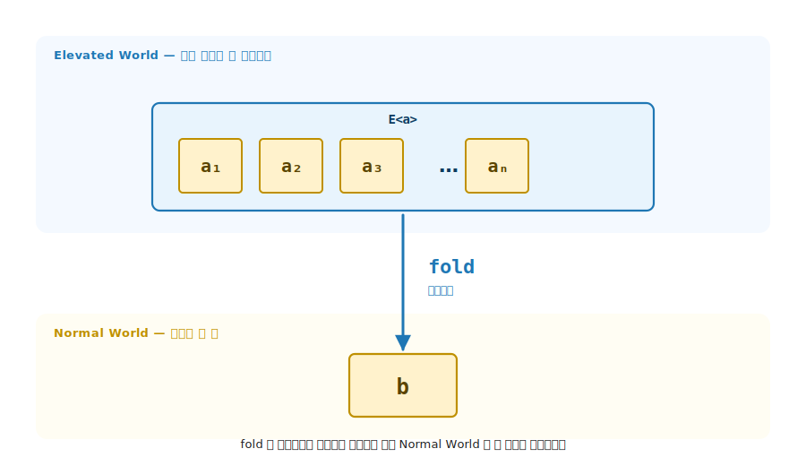
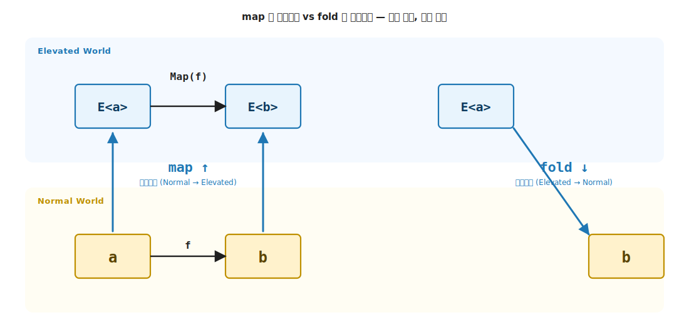
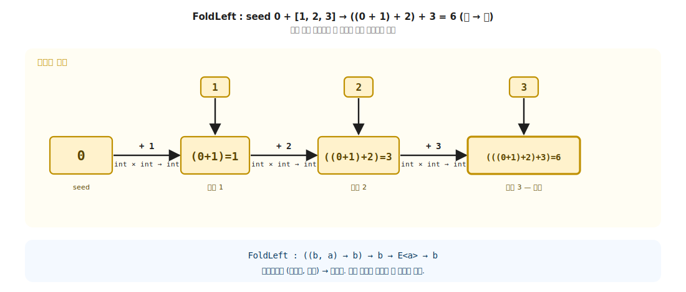
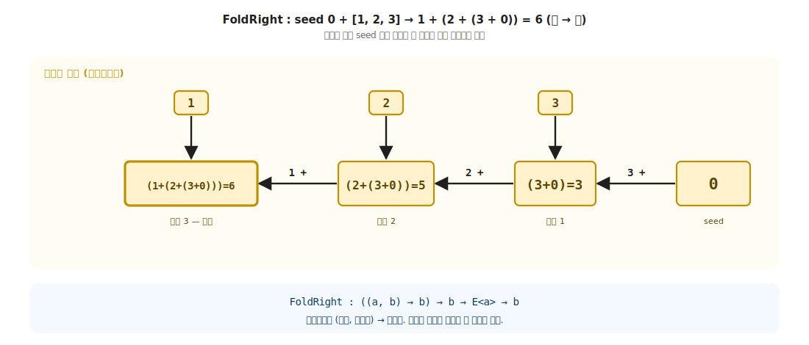
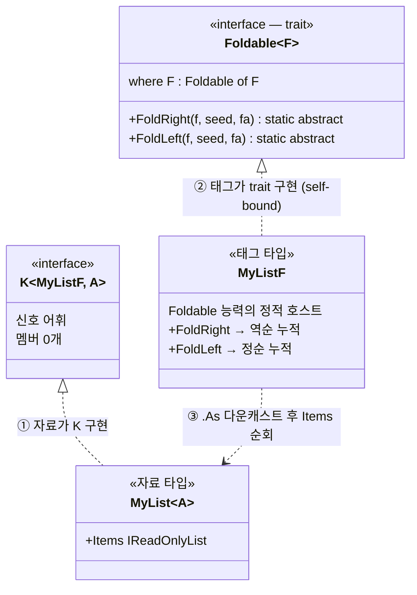
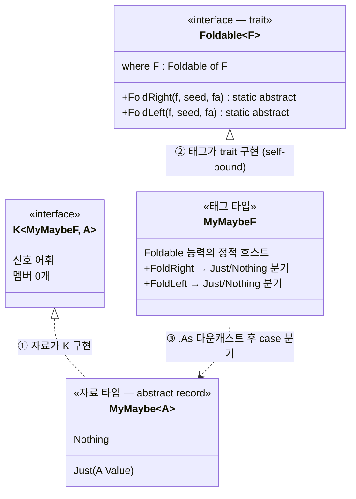
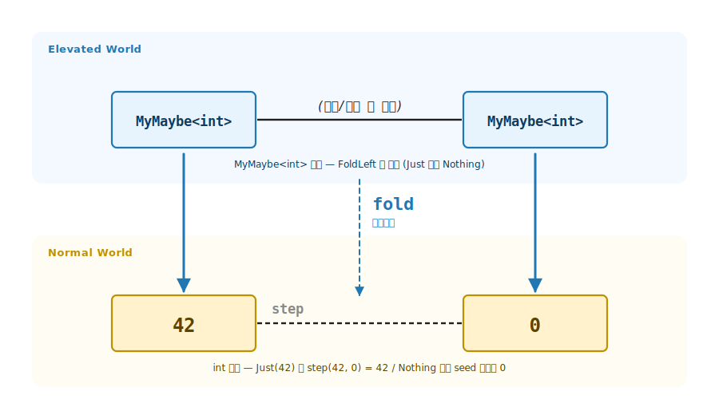

# 6장. Foldable / `fold` (Elevated 의 구조를 Normal 한 값으로 끌어내림)

> **이 장의 목표** — 이 장을 마치면 Elevated World 의 컨테이너 `E<a>` 를 Normal World 의 한 값 `b` 로 끌어내리는 `fold` 를 시그니처로 적고, 새 자료 타입에 3-tuple 패턴으로 `Foldable<F>` 를 직접 부착할 수 있습니다. 4장 `map` 이 `E<a> → E<b>` 유형의 끌어올림이었다면 Foldable 은 `E<a> → b` 유형의 끌어내림이라, 기초의 두 평행 세계 사이를 잇는 두 방향 사다리가 이 장에서 완성됩니다. `Sum` / `Count` / `All` / `Any` 같은 친숙한 메서드가 모두 `FoldRight` / `FoldLeft` 두 abstract 위에 자라나는 자유 함수임을 확인합니다.

> **이 장의 핵심 어휘**
>
> - **`fold`**: 끌어내림 / lower, Elevated 의 구조를 Normal 의 한 값으로 압축하는 도구
> - **`Foldable<F>`**: `E<a> → b` 유형 함수를 어떤 Elevated World 든 만들 수 있게 하는 trait
> - `FoldRight` / `FoldLeft`: 같은 자료를 오른쪽 끝부터 / 왼쪽 끝부터 접는 두 abstract
> - **step 함수**: 원소와 누적값을 받아 다음 누적값을 반환하는 2인자 함수
> - **seed**: 누적의 시작값, Normal World 의 초기 `b`
> - **결과 일관성 법칙**: 가환·결합 step 일 때 두 방향이 같은 결과에 도착한다는 약속
> - **부수 효과 없음 법칙**: step 함수가 순수해야 호출 순서·횟수와 무관하게 같은 결과
> - **`reduce`**: `fold` 의 특수한 경우, 시작값 없이 같은 타입끼리만 결합

> 이 장을 마치면 할 수 있게 되는 것
> - [ ] Foldable 의 한 줄 정의를 시그니처로 적을 수 있습니다.
> - [ ] `Foldable<F>` trait 시그니처를 보고 왜 결과 타입에 F 가 사라지는지 답할 수 있습니다.
> - [ ] `FoldRight` 와 `FoldLeft` 두 abstract 의 step 함수 차이를 시그니처로 구분할 수 있습니다.
> - [ ] Foldable 일관성 법칙 (FoldRight ↔ FoldLeft) 을 시그니처와 코드로 검증할 수 있습니다.
> - [ ] 새 자료 타입에 3-tuple 패턴으로 Foldable 을 부착할 수 있습니다 (재귀 자료 구조 포함).
> - [ ] abstract 2 개 위에 자유 함수 수십 개가 자라나는 이득을 설명할 수 있습니다.
> - [ ] Foldable 이 아닌 변환의 시그니처가 왜 다른지 분류할 수 있습니다.

> 참고 — 이 장은 4장 (Functor) 의 짝입니다. Functor 가 `E<a> → E<b>` 유형 (가로 이동) 의 일반화라면, Foldable 은 `E<a> → b` 유형 (끌어내림) 의 일반화입니다. 두 trait 이 합쳐지면 9장의 Traversable 이 됩니다.

---

## 6.1 `E<a> → b` 유형 함수의 일반화 — 목적

6장의 핵심은 한 줄로 압축됩니다. 4장 / 5장이 Normal → Elevated 로의 끌어올림 (1인자 / N 인자) 였다면, 6장은 반대 방향입니다. Elevated World 의 구조를 Normal World 의 한 값으로 돌아오게 (끌어내림 / lower) 하는 함수가 `fold` 입니다. `E<a> → b` 의 시그니처가 그 끌어내림을 정확히 표현합니다. 3·5장의 *lift* 와 6장의 *lower* 가 두 평행 세계 사이의 두 방향 사다리가 됩니다.
### 6.1.1 fold 의 mental model — 함수형의 for-loop

합 (`Sum`), 개수 (`Count`), 전부 만족 (`All`) 을 구하는 코드는 컨테이너마다 어김없이 같은 모양으로 반복됩니다. 변수 하나를 선언하고, 원소를 돌며, 변수를 갱신합니다. 새 추상을 만나기 전에 그 반복의 정체부터 손에 쥡니다. `fold` 는 명령형 for-loop 의 함수형 대응이고, 두 코드가 완전히 같은 일을 합니다.

```csharp
// 명령형 for-loop — state mutation
int acc = 0;                          // ← seed (시작 누적값)
foreach (var x in nums)               // ← 컨테이너 순회
    acc = acc + x;                    // ← step 함수 (누적 갱신)
// 결과: acc 가 합

// 함수형 fold — state 가 함수 인자로 명시화
int result = nums.FoldLeft(
    (acc, x) => acc + x,              // ← step 함수 (mutation 없음)
    0);                               // ← seed
// 결과: result 가 합
```

핵심 차이는 **상태 변경의 위치** 입니다. 명령형 코드는 변수 `acc` 가 매번 바뀝니다 (mutation). 함수형 코드는 step 함수가 매번 새 누적값을 반환합니다. mutation 이 없습니다. 같은 알고리즘이지만 상태가 어디에 사는가가 다릅니다.

| 차원 | 명령형 for-loop | 함수형 fold |
|---|---|---|
| 시작 상태 | `int acc = 0;` (변수 선언) | `seed = 0` (함수 인자) |
| 한 단계의 갱신 | `acc = acc + x;` (mutation) | `(acc, x) => acc + x` (새 값 반환) |
| 순회 도구 | `foreach`, `for` (언어 구문) | trait 의 `FoldLeft` / `FoldRight` |
| 최종 결과 | 변수 `acc` 의 마지막 값 | `FoldLeft` 의 반환값 |
| 부수 효과 가능성 | 자유 (`Console.WriteLine` 등) | step 이 순수해야 일관성 보존 |

> David Raab 의 통찰 — "`fold` 가 immutable 자료 구조에 하는 일은 `for-loop` 가 mutable 자료 구조에 하는 일과 같습니다." ([Understanding fold](https://davidraab.github.io/posts/understanding-fold/)). fold 는 for-loop 의 상태 변경을 함수 인자로 옮긴 것일 뿐. 추상화의 본질은 순회 + 누적 이라는 패턴을 step 함수와 seed 두 부품으로 분리한 데 있습니다.

이 모델의 두 부품 (step + seed) 이 1장 지도의 어느 자리를 채우는지, 그리고 trait 시그니처의 두 인자로 어떻게 그대로 들어가는지 차례로 봅니다.

### 6.1.2 1장 4 가지 함수 유형의 `E<a> → b` 자리

1장에서 두 세계 사이의 함수 유형을 정리했습니다. 그중 `E<a> → b` 유형 (4 가지 함수 유형의 `E<a> → b`) 의 시그니처는 입력에는 E 가 있고 출력에는 사라지는 모양입니다.

```
E<a> → b 유형:   컨테이너를 소비, Normal 의 한 값만 남는다
```

```csharp
int    Sum(List<int> ns);              // E = List,    a = int   → b = int
bool   Exists(Option<int> mn);         // E = Option,  a = int   → b = bool
string Show(Result<User> r);           // E = Result,  a = User  → b = string
```

이 장의 목표는 한 줄입니다. 어떤 E 든 `E<a> → b` 유형의 함수를 만들 수 있어야 한다는 추상이 Foldable 입니다. `fold` 는 Normal World 의 한 값 (seed) + step 함수 한 개를 받아 `E<a> → b` 유형 함수를 자동으로 만드는 도구입니다.

이 *fold* 가 함수형의 본질, 곧 합성 가능한 Elevated World 로 lift 의 반대 방향입니다. 4장 `map` 이 끌어올림 (Normal → Elevated) 의 가장 단순한 형태였다면, 6장 *fold* 는 *lower* (끌어내림, Elevated → Normal) 의 일반화입니다. 두 가지 추상이 두 평행 세계 사이의 두 방향 사다리가 됩니다.

```
fold 의 발상:    step + seed    ─────►    fold(step, seed) : E<a> → b
                 ─────┬────                ──────────┬──────────
                 Normal 도구들              E<a> → b 유형 함수
```



**그림 6-1. `fold`: Elevated 의 구조를 Normal 의 한 값으로 끌어내림** — 위 행 Elevated World 의 컨테이너 `E<a>` 안에 여러 원소 (`a₁, a₂, a₃, …`) 가 들어 있습니다. `fold` 가 step 함수를 들고 모든 원소를 차례로 누적해 컨테이너 모양은 소비되고 아래 행 Normal World 의 한 값 `b` 만 남습니다. Functor 의 `map` 이 같은 행 안에서의 가로 이동이라면, `fold` 는 위에서 아래로 향하는 끌어내림입니다.

### 6.1.3 4 가지 함수 유형 — 시그니처와 기초 매핑

| 시그니처 | 기초 매핑 | 어휘 (elevated-world 글) |
|---|---|---|
| `a → b` | 함수형 추상 불필요 | Normal World function |
| `a → E<b>` | 7장 (Monad / `bind`) | World-crossing function |
| `E<a> → b` | **6장 (Foldable / `fold`)** | (끌어내림) |
| `E<a> → E<b>` | 4장 (Functor / `map`) | Lifted function |

4장의 `map` 은 `E<a> → E<b>` 자리 위에서 모양을 보존하며 안의 값만 바꿨습니다. 이 장의 `fold` 는 `E<a> → b` 자리 위에서 컨테이너 모양 자체를 소비해 Normal 의 한 값으로 끌어내립니다. 두 trait 의 방향이 완전히 다릅니다. 그러나 둘 모두 어떤 E 든 자동으로 동작하는 일반화를 약속합니다.



**그림 6-2. `map` 끌어올림 vs `fold` 끌어내림** — 두 가지 추상이 두 세계 위에서 서로 반대 방향의 화살표. `map` 은 수직 끌어올림 (Normal 의 함수 `a → b` 를 Elevated 의 함수 `E<a> → E<b>` 로). `fold` 는 대각선 끌어내림 (Elevated 의 컨테이너 `E<a>` 를 Normal 의 한 값 `b` 로). 방향과 시그니처만 다른 두 가지 추상이 같은 두 세계 위에 자리잡습니다. `fold` 의 step 함수와 seed 의 세부는 mental model 과 trait 시그니처에서 다룹니다 (그림 6-1 참고). 9장의 Traversable 은 두 방향을 동시에 다루는 추상이 됩니다.

#### map 과 fold 의 결정적 차이

| 차원 | `map` (4장 Functor) | `fold` (6장 Foldable) |
|---|---|---|
| **분면 유형** | `E<a> → E<b>` | `E<a> → b` |
| **헤더 (한 줄)** | Normal 의 함수를 Elevated 로 끌어올림 | Elevated 의 컨테이너를 Normal 의 한 값으로 끌어내림 |
| **Normal 함수 `f` 시그니처** | `f : a → b` (1-인자, 한 원소 변환) | `f : (a, acc) → acc'` (2-인자 step, 원소 + 누적) |
| **lift 방향** | 수직 (Normal → Elevated) | 대각선 (Elevated → Normal) |
| **Elevated 결과** | 같은 모양의 `E<b>` (컨테이너 보존) | 컨테이너 사라짐, Normal 한 값 |
| **추가 인자** | 없음 | `seed` (시작 누적값) 필요 |
| **F 가 사라지는 자리** | 출력 `K<F, B>` 에 F 유지 | 출력 `B` 에 F 사라짐 |

결정적인 세 차이가 보입니다. 첫째, 함수 `f` 의 인자 수가 다름 (1-인자 vs 2-인자 step). 둘째, 방향이 정반대 (수직 끌어올림 vs 대각선 끌어내림). 셋째, 출력에 F 가 살아 있는지 사라지는지 (모양 보존 vs 모양 소비). 그러나 Normal 의 `f` 라는 기저 함수가 출발점이라는 본질은 같습니다. 두 가지 추상이 같은 가족의 다른 작용입니다.

### 6.1.4 Lifting 의 반대 방향 — Lowering

4장의 Lifting 3 종류 표는 Normal → Elevated 방향이었습니다. Foldable 의 `fold` 는 그 반대 방향, Elevated → Normal 의 Lowering 정통입니다.

| 방향 | 시그니처 | 어디서 다루는가 |
|---|---|---|
| **Lifting** (Normal → Elevated) | `a → E<a>` | 5장의 `pure` |
| **Lifting** (Normal 함수 → Elevated 함수) | `(a → b) → (E<a> → E<b>)` | 4장의 `map` |
| **Lowering** (Elevated → Normal) | `E<a> → b` | **이 장의 `fold`** |

`pure` 와 `fold` 가 두 세계 사이의 두 방향 사다리입니다. `pure` 는 Normal 의 값을 Elevated 로 들어올리고, `fold` 는 Elevated 의 구조를 Normal 로 끌어내립니다. 두 가지 추상이 합쳐져야 Elevated World 사이의 자유로운 이동이 완성됩니다.

이 장은 `E<a> → b` 자리의 Lowering 추상만 다룹니다. `a → E<b>` 유형 (World-crossing) 의 처리는 7장 (Monad) 의 자리입니다.

---

## 6.2 `Foldable<F>` trait 시그니처 — 기능

### 6.2.1 두 줄의 정의

```csharp
public interface Foldable<F> where F : Foldable<F>
{
    static abstract B FoldRight<A, B>(Func<A, B, B> f, B seed, K<F, A> fa);
    static abstract B FoldLeft <A, B>(Func<B, A, B> f, B seed, K<F, A> fa);
}
```

두 줄이 끝입니다. 그러나 컨테이너 소비 + 한 값 누적의 약속을 컴파일러에 강제합니다. 시그니처의 자리는 다음과 같습니다.

```cs
static abstract                  // 정적 + 추상
    B                            // 출력: Normal 의 한 값 (F 가 없다!)
        FoldRight                // 함수: FoldRight
        (                        // 입력:
            Func<A, B, B> f,     //  - step 함수 (원소 A, 누적 B → 다음 누적 B)
            B seed,              //  - 시작 누적값 (Normal 의 초기 B)
            K<F, A> fa           //  - 접을 Elevated 자료 (F 안의 A)
        )

   static abstract  B  FoldRight<A, B>(  Func<A, B, B> f,    B seed,    K<F, A> fa  )
// ─────┬───────── ─                    ──────┬───────       ───┬───    ───┬─────
// 정적 + 추상   Normal 의 한 값             step 함수          시작값      Elevated 자료
```

| 자리 | 의미 |
|---|---|
| `where F : Foldable<F>` | F 가 자기 자신을 구현체로 갖습니다 (2장의 self-bound) |
| `static abstract` | trait 에 사는 능력. 호출은 `MyListF.FoldRight(...)` |
| 출력 `B` (`K<F, B>` 가 아님!) | F 가 결과에서 사라집니다 — 끌어내림의 시그니처 강제 |
| `B seed`, `Func<A, B, B> f` | Normal 의 두 도구 — 시작 값과 한 단계 누적 함수 |

핵심은 결과 타입에 F 가 없다는 점. 4장의 Functor 는 `K<F, A>` 입력 / `K<F, B>` 출력으로 F 가 같습니다가 시그니처에 박혀 있었습니다 (모양 보존). 이 장의 Foldable 은 `K<F, A>` 입력 / `B` 출력으로 F 가 사라집니다가 시그니처에 박혀 있습니다 (끌어내림).

### 6.2.2 두 abstract 의 차이 — `FoldRight` vs `FoldLeft`

같은 자료를 어느 방향으로 접느냐의 차이입니다.

```
입력:  [a, b, c, d]   step 함수 f   시작값 seed

FoldRight:   f(a, f(b, f(c, f(d, seed))))      // 오른쪽 끝부터 안쪽으로
FoldLeft:    f(f(f(f(seed, a), b), c), d)      // 왼쪽 끝부터 바깥쪽으로
```

| 차원 | `FoldRight` | `FoldLeft` |
|---|---|---|
| step 시그니처 | `Func<A, B, B>` (원소 먼저, 누적 나중) | `Func<B, A, B>` (누적 먼저, 원소 나중) |
| 누적 방향 | 오른쪽 끝 → 왼쪽 | 왼쪽 끝 → 오른쪽 |
| 결합 자연 | Cons 류 자료 구조 (오른쪽으로 자라남) | 반복 누적 (꼬리 재귀, 성능) |
| 무한 시퀀스 | 가능 (lazy step) | 불가능 (끝에 도달해야 시작) |

> 표의 세 어휘는 여기서 처음 나옵니다. **Cons** 는 원소를 앞에 붙여 만든 리스트 (`head :: tail`), **꼬리 재귀** 는 누적값을 인자로 넘겨 호출 스택을 키우지 않는 반복 형태, **lazy** 는 필요할 때까지 계산을 미루는 평가입니다. 지금 깊이 알 필요는 없고, 무한·lazy 자료와 fold 의 관계는 뒤에서 다시 봅니다.

같은 결과에 도착하는 step 도 있고 (가환·결합이면) 결과가 갈리는 step 도 있습니다 (예: 문자열 연결, 뺄셈). 두 결과가 같은 조건은 결과 일관성 법칙에서 다룹니다.

#### 구체 예 — `[1, 2, 3]` 에 덧셈 step + seed 0

두 abstract 가 같은 결과 6 에 도착하지만 결합 순서가 다릅니다. 단계별 누적을 따라가면 차이가 명확합니다.



**그림 6-3. FoldLeft: 왼쪽부터 한 단계씩 접어 나갑니다** — 입력 잎 (`1`, `2`, `3`) 이 순서대로 단계 1·2·3 의 step 박스로 내려갑니다. seed `0` 에서 출발해 acc 가 chain 을 따라 왼쪽에서 오른쪽으로 흐르며 매 단계마다 원소와 합쳐 새 acc 가 됩니다. 결합 순서는 `((0 + 1) + 2) + 3`. **왼쪽 결합**. 각 단계의 타입 주석 `int × int → int` 가 step 의 시그니처를 명시. 최종 단계 (강조) 의 결과 `6` 이 fold 의 반환값.



**그림 6-4. FoldRight: 오른쪽 끝에서 시작해 왼쪽으로 접어 나갑니다** — 잎 `[1, 2, 3]` 은 정순 배치 그대로 (그림 6-3 과 동일). 결정적 차이는 **chain 방향이 우→좌**. seed `0` 이 오른쪽 끝에서 시작해 단계 1 (잎 3 처리) → 단계 2 (잎 2) → 단계 3 (잎 1, 최종) 으로 왼쪽으로 흘러갑니다. 모든 잎→단계 화살표는 수직 (잎이 자기 바로 아래 단계로). **chain 의 우→좌 방향 자체가 *Right* 의 시각 메타포** 입니다. 오른쪽 끝에서 출발하기 때문에 FoldRight. 결합 순서 `1 + (2 + (3 + 0))` 이 그림의 공간 흐름과 정확히 일치. 도착점은 같은 `6` 이지만 접히는 공간 방향이 그림 6-3 과 정반대.

> 핵심 — 두 그림이 같은 자료 + 같은 step + 같은 seed 에서 같은 결과 6 에 도착하지만 내부 계산 순서가 다릅니다. 가환·결합 step (덧셈, 곱셈, AND, OR) 이면 결과가 같고, 비가환 step (문자열 연결, 뺄셈) 이면 다릅니다. 결과 일관성 법칙이 언제 같은가의 조건을 형식화합니다.

### 6.2.3 시그니처가 강제하는 것 / 못 하는 것

```
✓  K<MyListF, int>  → int                  컴파일 성공: 끌어내림 (F 사라짐)
✗  K<MyListF, int>  → K<MyListF, int>      컴파일 에러: 결과에 F 가 살아 있음
✗  K<MyListF, int>  → K<MyMaybeF, int>     컴파일 에러: F 가 바뀜
```

첫 번째 (✓) 만 정상 컴파일됩니다. `FoldRight` / `FoldLeft` 의 반환 타입이 `B` 그대로라 F 가 등장하지 않는 모양만 시그니처와 일치합니다.

아래 두 잘못된 모양 (✗) 은 `Foldable<MyListF>` 의 추상 시그니처에 맞지 않습니다. C# 컴파일러가 구현하지 않았다는 에러로 거부합니다. 런타임 검증이 아니라 컴파일 단계 강제가 결정적입니다.

### 6.2.4 `fold` 의 별명들

같은 시그니처가 언어마다 다른 이름으로 등장합니다.

| 언어 / 맥락 | 오른쪽 접기 | 왼쪽 접기 |
|---|---|---|
| Haskell | `foldr` | `foldl` / `foldl'` |
| F# | `List.foldBack` | `List.fold` |
| Scala | `foldRight` | `foldLeft` |
| C# / LINQ | (없음 — `Aggregate` 가 왼쪽만) | `Aggregate` |
| Java Stream | (없음) | `reduce` |

LINQ 의 `xs.Aggregate(seed, f)` 는 List Foldable 의 FoldLeft 의 인스턴스 구현입니다. C# 표준에는 오른쪽 접기의 친숙한 이름이 없습니다. Foldable trait 이 두 방향을 대칭으로 제공하는 자리입니다.

#### `reduce` 와 `fold` — 결정적 차이

표의 마지막 두 행 (`LINQ Aggregate`, `Java Stream reduce`) 이 가리키는 것은 `fold` 의 특수한 경우인 **`reduce`** 입니다. 두 가지 추상의 차이는 결정적입니다.

| 추상 | 시그니처 | 시작값 | 타입 변환 |
|---|---|---|---|
| `reduce` | `(A, A) → A` step, 시작값 없음 | 첫 원소가 자동 시작값 | 불가능 — 모든 타입이 `A` 로 같아야 |
| `fold` | `(B, A) → B` step + 명시적 `seed: B` | 명시적 인자 | **가능** — `A` 와 결과 `B` 가 다른 타입 가능 |

```csharp
// reduce — 같은 타입만 결합 가능
int sum = nums.Aggregate((acc, x) => acc + x);          // int + int → int  ✓
// int → string 같은 변환은 reduce 로 불가능

// fold — seed 의 타입이 결과를 결정, 타입 변환 자유
string concat = nums.FoldLeft((acc, x) => acc + x.ToString(), "");
//                            string + int → string  ✓ (seed 가 string)
int count = nums.FoldLeft((acc, _) => acc + 1, 0);
//                            int + int → int (Count 도 fold 의 한 형태)
List<int> doubled = nums.FoldRight((x, acc) => { acc.Insert(0, x * 2); return acc; }, new List<int>());
//                            int + List<int> → List<int>  ✓ (Map 도 fold 로 표현 가능)
```

**핵심** — `reduce` 는 모든 타입이 같을 때만 동작합니다. `fold` 는 초기값으로 타입을 자유롭게 변환합니다. 그래서 `Sum`, `Count`, `ToList`, `Average` 같은 자유 함수가 모두 `fold` 의 인스턴스입니다 (자유 함수 카탈로그는 뒤에서 봅니다). `reduce` 는 `fold` 의 특수한 경우 (`seed = 자료의 첫 원소`, 결과 타입 = 원소 타입) 입니다.

> David Raab 의 통찰 — "`reduce` 는 모든 타입이 같아야 한다는 제약 때문에 표현력이 좁습니다. `fold` 의 초기값은 그 제약을 풀어 어떤 누적 타입으로든 변환 가능하게 만듭니다." ([Understanding fold](https://davidraab.github.io/posts/understanding-fold/)). 이 자유도가 Foldable trait 의 이득의 토대.

### 6.2.5 변성 (variance) — `K<in F, A>`

4장과 동일. `K<F, A>` 의 정확한 정의는 `K<in F, A>` (F 는 contravariant). 학습용 코드에서는 그대로 따라가면 됩니다.

### 6.2.6 이 장의 코드 구조

```
Ch06-Foldable/
├── Traits/Foldable.cs             ← trait 약속 (abstract 2 + virtual 6)
├── Types/MyList.cs · MyMaybe.cs   ← 자료: 두 Foldable 인스턴스
├── Functions/Foldable.cs · FoldableExtensions.cs   ← 헬퍼 (소문자 foldRight, .FoldRight)
├── Tests/FoldableLaws.cs          ← 일관성 법칙 검증
└── Challenges/TreeFoldable.cs …   ← 6.9절 정답
```

`Traits` / `Functions` / `Tests` 세 폴더가 실제 LanguageExt 라이브러리의 파일 배치를 닮았습니다 (interface + 헬퍼 + 법칙).

#### 두 헬퍼의 실제 구현 — 각각 한 줄짜리 generic 함수

두 어법 모두 trait 의 정적 `Foldable<F>.FoldRight` / `Foldable<F>.FoldLeft` 호출을 감싼 generic 한 줄입니다. 자료 타입별 코드는 없습니다. `where F : Foldable<F>` 제약 한 줄이 어떤 F 든 받아 그 정적 메서드로 디스패치합니다.

```csharp
// Functions/Foldable.cs — 모듈 어법
public static class Foldable
{
    public static B foldRight<F, A, B>(Func<A, B, B> f, B seed, K<F, A> fa)
        where F : Foldable<F> =>
        F.FoldRight(f, seed, fa);      // ← 정적 디스패치 (MyListF.FoldRight / MyMaybeF.FoldRight / ...)

    public static B foldLeft<F, A, B>(Func<B, A, B> f, B seed, K<F, A> fa)
        where F : Foldable<F> =>
        F.FoldLeft(f, seed, fa);
    // count, all, any, first, toList 등 virtual 자유 함수도 같은 패턴.
}
```

```csharp
// Functions/FoldableExtensions.cs — 확장 어법
public static class FoldableExtensions
{
    public static B FoldRight<F, A, B>(this K<F, A> fa, Func<A, B, B> f, B seed)
        where F : Foldable<F> =>
        F.FoldRight(f, seed, fa);

    public static B FoldLeft<F, A, B>(this K<F, A> fa, Func<B, A, B> f, B seed)
        where F : Foldable<F> =>
        F.FoldLeft(f, seed, fa);
    // Count, All, Any, First, ToList 등 자유 함수의 확장 어법도 같은 패턴.
}
```

두 클래스의 몸체는 똑같이 `F.FoldRight(...)` / `F.FoldLeft(...)` 한 줄이고, 차이는 인자 순서와 호출 형태뿐입니다. 모듈은 `Foldable.foldLeft(f, seed, fa)` 의 함수형 어법, 확장은 `fa.FoldLeft(f, seed)` 의 점 호출 어법입니다. 세 가지 호출 어법 (trait 정적 / 모듈 / 확장) 은 첫 인스턴스를 부착한 뒤 뒤에서 실제 코드로 봅니다.

---

## 6.3 첫 인스턴스 — MyList Foldable (예제)

### 6.3.1 3-tuple 패턴으로 부착

추상 trait 만으로는 동작하지 않습니다. 2장의 3-tuple 패턴으로 첫 자료 타입에 부착합니다. 4장의 MyList Functor 와 완전히 같은 자료 타입 위에 다른 능력을 얹습니다.

```csharp
// ① 자료 타입 — 시퀀스를 들고 K<MyListF, A> 를 구현 (4장과 공유).
public sealed class MyList<A>(IEnumerable<A> items) : K<MyListF, A>
{
    public IReadOnlyList<A> Items { get; } = items.ToList();
    public override string ToString() => $"[{string.Join(", ", Items)}]";
}

// ② 태그 타입 — Foldable 능력의 정적 호스트.
public sealed class MyListF : Foldable<MyListF>
{
    // FoldRight — 오른쪽 (마지막 원소) 부터 seed 와 합쳐 왼쪽으로 진행.
    //   [a, b, c]  →  f(a, f(b, f(c, seed)))
    public static B FoldRight<A, B>(Func<A, B, B> f, B seed, K<MyListF, A> fa)
    {
        var list = fa.As();
        var acc = seed;
        for (int i = list.Items.Count - 1; i >= 0; i--)
            acc = f(list.Items[i], acc);
        return acc;
    }

    // FoldLeft — 왼쪽 (첫 원소) 부터 seed 와 합쳐 오른쪽으로 진행.
    //   [a, b, c]  →  f(f(f(seed, a), b), c)
    public static B FoldLeft<A, B>(Func<B, A, B> f, B seed, K<MyListF, A> fa)
    {
        var list = fa.As();
        var acc = seed;
        foreach (var item in list.Items)
            acc = f(acc, item);
        return acc;
    }
}

// ③ 다운캐스트 보일러플레이트를 감추는 확장.
public static class MyListExtensions
{
    public static MyList<A> As<A>(this K<MyListF, A> fa) => (MyList<A>)fa;
}
```

### 6.3.2 세 부분의 책임

| 조각 | 책임 |
|---|---|
| ① `MyList<A>` 자료 타입 | 시퀀스를 들고 `K<MyListF, A>` 구현 (F 안에 A 가 들었다는 신호) |
| ② `MyListF` 태그 타입 | Foldable 능력의 정적 호스트. `FoldRight` / `FoldLeft` 가 정적 자리에 삽니다 |
| ③ `FoldRight` / `FoldLeft` 구현 | `K<MyListF, A>` 다운캐스트 후 역순 / 정순으로 step 함수 누적 |



**그림 6-5. MyList Foldable 의 3-tuple 구조** — 위 행의 두 interface (`K<F, A>`, `Foldable<F>`) 가 아래 행의 두 구현 (`MyList<A>`, `MyListF`) 으로 각각 끌어내려집니다. `MyListF.FoldRight` / `MyListF.FoldLeft` 안에서 `K<MyListF, A>` 가 `.As()` 로 `MyList<A>` 가 되고, 그 `Items` 를 두 방향으로 순회합니다. 4장의 MyList Functor 다이어그램과 완전히 같은 구조. 같은 자료 타입에 다른 능력만 부착됐습니다.

### 6.3.3 코드 walkthrough — 두 방향 분해

```
FoldLeft:
  var list = fa.As();                     ① K<MyListF, A> → MyList<A>  (다운캐스트)
  var acc = seed;                         ② 초기 누적값
  foreach (var item in list.Items)        ③ 첫 원소부터 순서대로
      acc = f(acc, item);                 ④   누적 ← step(누적, 원소)
  return acc;                             ⑤ 최종 누적 반환

FoldRight:
  var list = fa.As();                     ① 같음
  var acc = seed;                         ② 같음
  for (int i = list.Items.Count - 1;      ③ 마지막 원소부터 역순으로
       i >= 0; i--)
      acc = f(list.Items[i], acc);        ④   누적 ← step(원소, 누적)  ← 인자 순서 다름
  return acc;                             ⑤ 같음
```

`fa.As()` 는 추상 신호 타입 `K<MyListF, A>` 를 진짜 자료 타입 `MyList<A>` 로 변환합니다. 3-tuple 패턴의 결정적 비용입니다. 컴파일러가 F = MyListF 면 자료 타입이 `MyList<A>` 라는 연결을 모르기 때문에 사람이 알려 줍니다. 4장과 같은 패턴입니다.

**두 방향이 시그니처의 인자 순서로 구분됩니다**. `FoldLeft` 의 step 은 `(acc, item)` 순, `FoldRight` 는 `(item, acc)` 순입니다. 같은 자료를 같은 step 으로 접어도 방향이 다르면 결과가 다를 수 있습니다 (예: 문자열 연결, 뺄셈). 가환·결합인 step (덧셈, 곱셈, AND, OR) 만 두 방향이 반드시 같은 결과를 냅니다.

### 6.3.4 호출 모양 — 세 가지 어법

세 호출 어법이 MyList 에서 어떻게 보이는지 확인합니다. 세 줄 모두 결과가 동일합니다. 같은 `MyListF.FoldLeft` 로 디스패치됩니다.

```csharp
K<MyListF, int>  nums = new MyList<int>([1, 2, 3, 4, 5]);

// ① trait 정적 호출 — F (MyListF) 를 명시
int r1 = MyListF.FoldLeft<int, int>((acc, n) => acc + n, 0, nums);

// ② 모듈 어법 — Foldable.foldLeft<F, A, B>
int r2 = Foldable.foldLeft<MyListF, int, int>((acc, n) => acc + n, 0, nums);

// ③ 확장 어법 — K<F, A> 위 점 호출 (F 자동 추론)
int r3 = nums.FoldLeft((acc, n) => acc + n, 0);

// 세 결과 모두 → 15 ([1..5] 합)
```

List 의 모양 (5 개 원소) 은 모두 소비되고 Normal 의 한 값 (15) 만 남았습니다. Foldable 의 첫 동작입니다. 책의 이후 예제에서는 어법이 결정적이지 않으면 ③ 확장 어법을 우선합니다 (가장 간결).

### 6.3.5 흔한 함정 — `FoldRight` 와 `FoldLeft` 중 무엇을 쓰나

> 흔한 함정 — 항상 `FoldLeft` 만 쓰면 되나?
>
> 그렇지 않습니다. 두 abstract 가 짝으로 존재하는 이유가 있습니다.
>
> - 가환·결합 step (`+`, `*`, `AND`, `OR`, `Min`, `Max`) — 두 방향이 반드시 같은 결과. 성능을 위해 `FoldLeft` (꼬리 재귀 가능) 가 일반적.
> - 비가환 step (문자열 연결, 리스트 cons, 뺄셈) — 두 방향이 다른 결과. 의도한 방향을 골라야 합니다.
> - 무한 / lazy 자료 — `FoldRight` 만 동작 (오른쪽 끝에 도달할 필요 없이 step 함수가 lazy 면 처음부터 결과 나옴).
>
> 자료 구조와 step 함수의 수학적 성질이 선택을 결정합니다. 두 방향이 같은 결과를 내는 조건은 일관성 법칙에서 형식화합니다.
---

## 6.4 두 번째 인스턴스 — MyMaybe Foldable (예제)

### 6.4.1 완전히 다른 자료 구조에 같은 trait

같은 trait 을 완전히 다른 자료 구조 (시퀀스가 아닌 옵셔널) 에 부착합니다.

#### 자료 타입과 태그 타입 — Just / Nothing 두 variant

```csharp
// 두 번째 자료 타입 — 값이 있거나 없는 옵셔널.
public abstract record MyMaybe<A> : K<MyMaybeF, A>
{
    public sealed record Just(A Value) : MyMaybe<A>;
    public sealed record Nothing : MyMaybe<A>
    {
        public static readonly Nothing Instance = new();
    }
}

public sealed class MyMaybeF : Foldable<MyMaybeF>
{
    public static B FoldRight<A, B>(Func<A, B, B> f, B seed, K<MyMaybeF, A> fa) =>
        fa.As() switch
        {
            MyMaybe<A>.Just j  => f(j.Value, seed),     // Just  → step 1회
            MyMaybe<A>.Nothing => seed,                  // Nothing → seed 그대로
            _ => throw new InvalidOperationException()
        };

    public static B FoldLeft<A, B>(Func<B, A, B> f, B seed, K<MyMaybeF, A> fa) =>
        fa.As() switch
        {
            MyMaybe<A>.Just j  => f(seed, j.Value),     // Just  → step 1회 (인자 순서만 다름)
            MyMaybe<A>.Nothing => seed,                  // Nothing → seed 그대로
            _ => throw new InvalidOperationException()
        };
}

public static class MyMaybeExtensions
{
    public static MyMaybe<A> As<A>(this K<MyMaybeF, A> fa) => (MyMaybe<A>)fa;
}
```

**한 줄 정리** — `MyMaybe<A>` 가 자료, `MyMaybeF` 가 태그입니다. `MyList` 의 Items 순회가 case 분기 (`Just` 면 step 한 번, `Nothing` 이면 seed 그대로) 로 바뀌었을 뿐 trait 시그니처는 그대로입니다. 코드의 두 자리 (자료 타입 / 태그 타입) 가 어떻게 두 interface 로 끌어내려지는지는 다음 절의 3-tuple 다이어그램에서 시각화합니다.

### 6.4.2 3-tuple 다이어그램 — MyMaybe Foldable

`MyMaybe` 의 두 자리 (자료 / 태그) 가 두 interface (`K<F, A>` / `Foldable<F>`) 로 어떻게 끌어내려지는지 3-tuple 다이어그램으로 시각화합니다. MyList 와 같은 패턴이 자료 구조의 모양만 바뀌어 재현됩니다.



**그림 6-6. MyMaybe Foldable 의 3-tuple 구조** — MyList 와 같은 패턴. 두 interface 가 두 구현으로 끌어내려집니다. 차이는 `MyMaybe<A>` 가 `abstract record` 와 두 variant (`Just`, `Nothing`) 라는 점, 그리고 `MyMaybeF.FoldRight` / `MyMaybeF.FoldLeft` 가 Items 순회가 아니라 case 분기 (`Just` 면 step 한 번, `Nothing` 이면 seed 그대로) 라는 점. 같은 trait 시그니처 위에서 자료 구조에 맞는 다른 동작이 자연스럽게 표현됩니다.

### 6.4.3 두 case 의 시그니처

```
Just(v) 의 FoldRight   ─────►   f(v, seed)        step 호출 1회
Nothing 의 FoldRight   ─────►   seed              step 호출 0회

Just(v) 의 FoldLeft    ─────►   f(seed, v)        step 호출 1회 (인자 순서만 다름)
Nothing 의 FoldLeft    ─────►   seed              step 호출 0회
```

`Just` 는 원소 한 개의 자료 구조라 step 호출이 한 번뿐입니다. 방향 (left/right) 이 결과를 바꾸지 않습니다. 원소가 한 개라 누적 순서가 의미 없고, 여기서 MyList 와 결정적으로 갈립니다.

`Nothing` 은 원소 없음이라 step 호출이 0회입니다. seed 가 그대로 반환됩니다. 빈 컨테이너의 fold 는 항상 시작값이라는 일반 규칙을 따릅니다.

### 6.4.4 호출 모양 — 세 가지 어법

MyMaybe 도 세 어법을 그대로 받습니다. `MyMaybeF` 가 `Foldable<MyMaybeF>` 를 만족하기 때문에 MyMaybe 전용 코드 없이 세 어법 모두 자동 디스패치됩니다.

```csharp
K<MyMaybeF, int> just = new MyMaybe<int>.Just(42);

// ① trait 정적 호출
int s1 = MyMaybeF.FoldLeft<int, int>((acc, n) => acc + n, 0, just);

// ② 모듈 어법
int s2 = Foldable.foldLeft<MyMaybeF, int, int>((acc, n) => acc + n, 0, just);

// ③ 확장 어법
int s3 = just.FoldLeft((acc, n) => acc + n, 0);

// 세 결과 모두 → 42 (seed 0 + 한 원소 42)
```

Nothing 도 세 어법 모두 같은 분기. `FoldLeft` / `FoldRight` 의 case 분기가 호출 어법과 무관하게 동작합니다. 확장 어법으로만 시연합니다.

```csharp
K<MyMaybeF, int> nothing = MyMaybe<int>.Nothing.Instance;
int sN = nothing.FoldLeft((acc, n) => acc + n, 0);
// → 0 (seed 그대로, step 호출 0회)
```

같은 Foldable 메서드가 완전히 다른 자료 구조 (시퀀스 vs 옵셔널) 에서 각자 의미 있는 동작을 합니다. 세 어법은 호출 형태의 차이일 뿐, Foldable 의 동작은 자료 구조의 분기가 결정합니다.

### 6.4.5 MyList 와 MyMaybe 의 Fold 비교

| 차원 | MyList Foldable | MyMaybe Foldable |
|---|---|---|
| 0개 원소 / Nothing | 빈 시퀀스 → seed 그대로 | Nothing → seed 그대로 |
| 1개 원소 / Just | step 1회 | step 1회 |
| N개 원소 | step N 회 | (해당 없음) |
| FoldRight 와 FoldLeft 의 결과 | 비가환 step 이면 다를 수 있음 | 항상 같음 (원소 0 ~ 1개라 순서 무관) |
| `Sum` 의 결과 | 모든 원소의 합 | Just 면 그 값, Nothing 이면 0 |
| `Count` 의 결과 | 원소 개수 | Just → 1, Nothing → 0 |

같은 `FoldRight` / `FoldLeft` 시그니처 지만 호출 횟수와 의미는 자료 구조에 달려 있습니다. Foldable 자체는 누적의 추상이고, 몇 번 / 어디 누적할지는 자료 구조의 분기입니다.

### 6.4.6 문자열 파싱 결과의 합산 예제

4장의 ParseInt + Map(f) 와 같은 자료 (MyMaybe) 위의 평행 예제입니다. 4장이 Elevated 안에서의 1인자 lift (`E<a> → E<b>`) 였다면, 6장은 Elevated 를 Normal 로 끌어내리는 lower (`E<a> → b`) 자리, 곧 효과 인코딩과 일반 누적 합성의 정통 lower 예제입니다. *Fold* 의 결정적 가치는 반복 처리라는 문법적 형태가 아니라 **세 책임의 깔끔한 분리** 에 있습니다 (효과는 타입, 누적은 함수, 합성은 Fold).

- **효과 인코딩 — `MyMaybe<int>`** — 문자열 파싱은 데이터가 있을 수도 있고 없을 수도 있습니다 (`"42"` 는 성공, `"xyz"` 는 실패). 이 있음/없음 가능성 자체를 **타입에 인코딩** 하는 자리가 `MyMaybe<int>` 입니다. 호출자가 분기 검사를 잊을 수 없도록 시그니처가 강제합니다. 효과는 타입의 책임입니다.
- **일반 누적 — `step = (acc, n) => acc + n`** — 원소를 누적에 더함이라는 평범한 2인자 함수는 효과를 모릅니다. 시그니처는 `(int, int) → int` 한 줄이고 `MyMaybe` 어휘는 들어가지 않습니다. 데이터가 있다는 가정 하의 단순 누적 함수입니다. 누적은 함수의 책임입니다.
- **합성 — `FoldLeft(step, 0, …)`** — *FoldLeft* 한 줄이 일반 누적 `step` 을 효과 인코딩 위에 적용시킵니다. 있음 분기 (`Just`) 에는 `step` 1회 적용, 없음 분기 (`Nothing`) 에는 seed 그대로 반환합니다. 분기 코드 `if (parsed != null) total += parsed.Value;` 자체가 사라집니다. 합성은 Fold 의 책임입니다.

세 책임이 한 줄 사슬로 합쳐집니다.

```csharp
// 문자열을 int 로 파싱 — 효과 인코딩 (있음/없음을 MyMaybe 타입에 감춤). 4.4.5절과 동일.
static K<MyMaybeF, int> ParseInt(string s) =>
    int.TryParse(s, out var n)
        ? (K<MyMaybeF, int>)MyMaybe<int>.Just(n)
        : MyMaybe<int>.Nothing;

// Normal World 의 일반 누적 — (int, int) → int, 효과 (MyMaybe) 어휘 모름
Func<int, int, int> step = (acc, n) => acc + n;   // FoldLeft 라 누적 acc 가 먼저 (6.2.2절)

// FoldLeft 로 효과 인코딩과 일반 누적 합성 — 분기 처리는 컴파일러가 알아서
int total1 = MyMaybeF.FoldLeft(step, 0, ParseInt("42"));
// → 42       ("42" → Just(42) → FoldLeft → step(0, 42) → 42)

int total2 = MyMaybeF.FoldLeft(step, 0, ParseInt("xyz"));
// → 0        ("xyz" → Nothing → FoldLeft → seed 그대로 → 0)
```

#### Elevated World 사슬 — 효과 + 일반 누적이 한 어법으로 합쳐집니다

| 단계 | 코드 | 시그니처 | 책임 | 네 자리 중 |
|---|---|---|---|---|
| 시작 | `"42"` / `"xyz"` | `string` | (Normal 입력) | Normal World |
| 1 | `ParseInt("…")` | `string → MyMaybe<int>` | **효과 인코딩** — 있음/없음을 타입에 감춤 | World-crossing (`a → E<b>`) |
| 2 | `FoldLeft(step, 0, …)` | `MyMaybe<int> → int` | **일반 누적 합성** — `step` 을 효과 위에 적용 후 Normal 로 끌어내림 | Lower (`E<a> → b`, **Foldable 의 자리**) |

1단계의 효과 인코딩 (있음/없음 분기 가능성) 위에서 2단계의 일반 누적 (`(acc, n) => acc + n`) 이 자유롭게 합성됩니다. 두 단계가 어법이 어긋납니다. 1단계는 `MyMaybe<int>` 로 끌어올리고, 2단계는 같은 `MyMaybe<int>` 를 `int` 로 끌어내립니다. 4장 Map (E → E) 과 반대 방향입니다.

세 책임 분리의 가치 자체는 4장에서 본 그대로입니다 (효과는 타입 / 연산은 함수 / 합성은 trait). 달라진 것은 방향뿐입니다. 명령형이라면 함수 본문에 섞였을 효과 검사 (`null` 비교, `TryParse` 분기) 를 `FoldLeft` 한 줄이 대신하고, `step = (acc, n) => acc + n` 은 효과를 모르는 채 `MyList<int>` 합산에도 `MyTree<int>` 합산에도 그대로 재사용됩니다. 결정적 통찰이 lower 자리로 확장되는 자리입니다.



**그림 6-7. FoldLeft: Elevated → Normal 끌어내림 (lower)** — 4장의 `Map` 화살표가 Normal → Elevated 위 방향 lift 였다면, 여기 *FoldLeft* 화살표는 Elevated → Normal 아래 방향 lower 입니다. 위 행 Elevated World 에 입력 `MyMaybe<int>` 두 분기 (있음 / 없음). 아래 행 Normal World 에 결과 `int` 두 분기 (`Just(42) → step(42, 0) → 42`, `Nothing → seed 그대로 → 0`). 좌·우 파란 lower 실선 화살표가 양 끝 박스의 끌어내림 자리를 표시합니다. 가운데 점선 lower 화살표가 fold 함수 자체로, Elevated 의 두 분기를 한 Normal 값으로 끌어내립니다. **fold 의 가치는 반복 처리가 아니라 효과 두 분기를 Normal 의 한 값으로 끌어내리는 lower 자리에 있습니다**. 분기 (Just / Nothing) 처리는 trait 의 `FoldLeft` 가 자동으로 처리하고, `step` 은 효과를 모르는 평범한 2인자 누적 함수로 남습니다.

같은 `MyMaybe<int>` 위에서 Functor 의 Map 과 Foldable 의 FoldLeft 가 평행으로 작동하지만, 방향이 반대입니다. Map 은 Elevated 안에서 변환만 합니다 (`MyMaybe<int> → MyMaybe<int>`). FoldLeft 는 Elevated 를 Normal 로 끌어내립니다 (`MyMaybe<int> → int`). `MyMaybeF.FoldLeft(step, seed, …)` 한 줄이 *lower* 의 가장 단순한 실현입니다. Elevated World 의 값을 일반 누적 함수에 통과시켜 같은 Normal World 의 한 값으로 끌어내려 줍니다. 효과 인코딩의 분기 처리는 시그니처가 책임지고, 누적 로직은 효과를 모르는 평범한 함수로 남습니다.

### 6.4.7 더 많은 Foldable 인스턴스

이 장은 List 와 Maybe 만 구현하지만, Foldable 인스턴스는 훨씬 많습니다.

| 자료 구조 | `FoldLeft` 의 의미 |
|---|---|
| `MyEither<L, R>` | `Right` 의 값에 step 1회 (`Left` 는 seed 그대로) |
| `MyTry<A>` | `Success` 의 값에 step 1회 (`Failure` 는 seed 그대로) |
| `MyTree<A>` | 모든 노드의 값에 차례로 step (재귀 순회) |
| `MyValidation<E, A>` | `Valid` 의 값에 step 1회 (`Invalid` 는 seed) |
| `MyPair<L, R>` | `Right` 값에 step 1회 (`Left` 는 fold 무시) |

임의 자료 구조가 원소 순회 + 누적을 만족하면 Foldable 이 됩니다. 각 Elevated World 는 고유한 `fold` 구현을 갖지만, 시그니처는 같습니다. 표의 `MyTree<A>` 는 첫 챌린지에서 직접 부착해 봅니다.

> 참고 (`MyTask<A>`, `MyReader<E, A>` 는 Foldable 입니까?) — 일반적으로 아닙니다. `Task` 는 비동기 값을 들고 있지만 즉시 순회할 수 없고, `Reader` 는 환경이 들어와야 값이 나오므로 원소를 즉시 셀 수 없습니다. Foldable 은 지금 들고 있는 원소들을 순회 할 수 있는 자료 구조의 능력. 효과 Monad 와는 자리가 다릅니다.
---

## 6.5 어떤 Foldable 든 받는 일반 함수 — 예제

### 6.5.1 trait 의 결정적 가치

```csharp
public static class SumAnyFoldable
{
    public static int Run<F>(K<F, int> fa)
        where F : Foldable<F> =>           //  ← F 가 Foldable 의 구현체임을 보장
        F.FoldLeft<int, int>((acc, n) => acc + n, 0, fa);
}
```

`SumAnyFoldable.Run` 은 F 가 무엇이든 동작합니다. `MyListF`, `MyMaybeF`, 그리고 미래의 어떤 Foldable 든 같은 함수가 처리합니다.

> elevated-world 글 인용 — "매 Elevated World 마다 이름을 붙인 패턴은 존재하나 구현은 다릅니다. 그러나 다루는 방식의 공통성이 존재합니다." 그 공통성을 trait 시그니처 두 줄로 표현한 것이 `Foldable<F>` 입니다.

### 6.5.2 호출 모양

```csharp
K<MyListF, int>  nums = new MyList<int>([1, 2, 3, 4, 5]);
K<MyMaybeF, int> just = new MyMaybe<int>.Just(42);

var listSum  = SumAnyFoldable.Run<MyListF>(nums);
// → 15  (1 + 2 + 3 + 4 + 5)

var maybeSum = SumAnyFoldable.Run<MyMaybeF>(just);
// → 42  (Just 의 한 값)

K<MyMaybeF, int> nothing = MyMaybe<int>.Nothing.Instance;
var nothingSum = SumAnyFoldable.Run<MyMaybeF>(nothing);
// → 0  (seed 그대로)
```

같은 함수가 List 와 Maybe 모두에서 일합니다. trait 메서드 한 개를 정의하면 trait 위의 모든 일반 함수가 공짜로 따라옵니다.

### 6.5.3 일반 함수의 합성

`FoldLeft` 두 abstract 위에 수많은 일반 함수가 자라납니다. 모두 어떤 Foldable 든 받습니다.

```csharp
public static class FoldableHelpers
{
    public static int CountAny<F, A>(K<F, A> fa)
        where F : Foldable<F> =>
        F.Count(fa);                                // virtual default 호출

    public static bool AllAny<F, A>(Func<A, bool> p, K<F, A> fa)
        where F : Foldable<F> =>
        F.All(p, fa);

    public static bool AnyAny<F, A>(Func<A, bool> p, K<F, A> fa)
        where F : Foldable<F> =>
        F.Any(p, fa);
}
```

세 함수 모두 `F.Count` / `F.All` / `F.Any` 의 virtual default 정의를 그대로 호출합니다. 자료 타입은 추가 코드 없이 세 함수를 모두 얻습니다. abstract 두 개 위에 자유 함수 수십 개가 자라나는 이 누적의 전체 카탈로그와 그 바탕 (3장 Monoid) 은 뒤에서 봅니다.
---

## 6.6 Foldable 의 일관성 법칙 — 기능 (목적의 보장)

### 6.6.1 시그니처만으로는 부족합니다

`Foldable<F>` 인터페이스를 구현했다고 해서 진짜 Foldable 이 되는 것이 아닙니다. 두 abstract 가 서로 정합적이어야 합니다. **컴파일러는 강제하지 못합니다**. 독자가 직접 검증합니다.

`FoldRight` 와 `FoldLeft` 는 같은 자료의 두 방향 순회입니다. 이 둘이 서로 무관하게 임의 구현되면 `Count`, `Sum`, `All` 같은 자유 함수가 어느 abstract 로 정의되는지에 따라 결과가 달라집니다. 자유 함수의 일관성이 무너집니다.

법칙은 두 가지입니다. 결과 일관성 (가환·결합 step 일 때 두 방향이 같은 결과) 과 부수 효과 없음 (step 함수가 순수) 입니다. 두 세계 그림으로 읽으면, 두 법칙은 끌어내림 사다리 (그림 6-1) 를 어느 방향으로 내려와도 같은 Normal 값에 도착한다는 약속입니다.

### 6.6.2 첫 번째 법칙 — 결과 일관성 (Consistency Law)

```
op : A → A → A 가 가환·결합 + identity 가 op 의 항등원이면

  FoldRight((a, acc) => op(a, acc), identity, fa)
  ≡
  FoldLeft ((acc, a) => op(acc, a), identity, fa)
```

가환·결합 step 함수 (덧셈 `+`, 곱셈 `*`, AND, OR, max, min) 일 때 두 방향의 누적이 같은 결과에 도착합니다. step 의 수학적 성질이 순회 순서를 무관하게 만듭니다.

**구체 예** — `[1, 2, 3]` 에 덧셈 `+` 와 항등원 `0`:

```
FoldRight:  1 + (2 + (3 + 0))  =  1 + (2 + 3)  =  1 + 5  =  6
FoldLeft :  ((0 + 1) + 2) + 3  =  (1 + 2) + 3  =  3 + 3  =  6
            ─────┬──────                       ─────┬──
            오른쪽 결합                       왼쪽 결합
```

덧셈이 가환·결합이라 결합 순서가 결과를 바꾸지 않습니다. 두 방향이 반드시 같은 결과입니다. 비가환 step (문자열 연결, 뺄셈) 이면 두 방향이 다를 수 있습니다. 그래서 두 abstract 가 짝으로 존재합니다.

### 6.6.3 두 번째 법칙 — 부수 효과 없음 (Purity Law)

```
step 함수는 순수해야 합니다.

  step 함수가 외부 상태를 건드리지 않으면 ⇒ 자유 함수가 호출 순서·횟수와 무관하게 같은 결과
```

`Count`, `IsEmpty`, `All`, `Any` 같은 자유 함수는 내부적으로 FoldRight 또는 FoldLeft 를 한 번씩 호출합니다 (virtual default 정의). step 함수가 부수 효과를 가지면 어떤 abstract 로 정의되었는지에 따라 부수 효과의 누적 결과가 달라집니다. 자유 함수의 일관성이 깨집니다.

**구체 예** — step 함수에 카운터:
```csharp
int counter = 0;
Func<int, int, int> step = (a, acc) => { counter++; return a + acc; };

F.FoldRight(step, 0, fa);   // counter += N (자료 길이 N)
F.FoldLeft ((acc, a) => step(a, acc), 0, fa);  // counter += N 또 — 부수 효과 누적
```

step 의 값 의미 (덧셈) 는 순수한데, 카운터가 부수 효과입니다. 이것이 일반적인 코드 위생을 넘어 Foldable 의 **고유 법칙** 인 까닭은 자유 함수의 구조에 있습니다. `Count` / `Sum` / `All` 은 각각 `FoldRight` 또는 `FoldLeft` 중 하나를 골라 정의됩니다 (virtual default). step 이 순수하면 어느 쪽을 골랐는지가 밖에서 관찰되지 않아 두 abstract 가 진짜 "같은 자료의 두 시각" 으로 남습니다. step 에 부수 효과가 끼는 순간 그 선택이 관찰 가능해지고, 같은 `Sum` 인데 어느 방향으로 정의했는지가 결과를 가르는 추론 불가능한 trait 이 됩니다.

이 순수성은 1장의 결정성 (같은 입력에 늘 같은 출력) 과 같은 약속입니다. 순수한 step 은 원소와 누적값 두 입력에만 의존하므로, 누가 어디서 몇 번 fold 하든 같은 결과에 도착합니다. 부수 효과는 호출 횟수에 의존해 이 결정성을 깨고, 그래서 자유 함수의 일관성도 함께 무너집니다.

### 6.6.4 코드로 검증

법칙은 독자가 직접 검증해야 합니다. xUnit + Shouldly 로 두 [Fact] 를 적습니다.

```csharp
[Fact]
public void Consistency_law_holds()
{
    K<MyListF, int> fa = new MyList<int>([1, 2, 3, 4, 5]);
    var rhs = MyListF.FoldRight<int, int>((a, acc) => a + acc, 0, fa);
    var lhs = MyListF.FoldLeft<int, int>((acc, a) => acc + a, 0, fa);
    lhs.ShouldBe(rhs);   // 둘 다 15
}

[Fact]
public void Free_function_consistency_holds()
{
    K<MyListF, int> fa = new MyList<int>([1, 2, 3, 4]);
    var viaFoldLeft  = MyListF.FoldLeft<int, int>((acc, _) => acc + 1, 0, fa);
    var viaFoldRight = MyListF.FoldRight<int, int>((_, acc) => acc + 1, 0, fa);
    viaFoldLeft.ShouldBe(viaFoldRight);   // 둘 다 4 (자료 길이)
}
```

두 [Fact] 가 통과하면 `MyListF` 는 **제대로 된 Foldable** 입니다. 같은 검증을 `MyMaybeF` 에 대해서도 한 쌍 더 적으면 두 인스턴스의 법칙 검증이 끝납니다.

> 참고 (`Tests/FoldableLaws.cs`) — 위 [Fact] 의 로직을 generic 헬퍼로 묶어 두었습니다. `FoldableLaws.ConsistencyHolds<F, A>(fa, op, identity)`, `FoldableLaws.FreeFunctionConsistencyHolds<F, A>(fa)` 두 메서드로 어떤 Foldable 인스턴스든 한 줄 검증.

위 [Fact] 는 `[1, 2, 3, 4, 5]` 같은 특정 값으로 확인했습니다. 그러나 일관성 법칙은 그 한 리스트만의 약속이 아니라 모든 입력에 대한 약속입니다. 3장의 `ForAll` 을 그대로 가져와 임의의 `MyList<int>` 100 건으로 검사합니다.

```csharp
// 임의 길이의 MyList<int> 100 건 — 덧셈(가환·결합) step 으로 결과 일관성 검사
Property.ForAll(
    RandomMyList,
    fa => FoldableLaws.ConsistencyHolds<MyListF, int>(fa, (a, b) => a + b, 0));
```

특정 값 검증이 "이 리스트에서 성립" 이라면, property 검증은 "임의의 100 건에서 성립" 입니다. 법칙이 모든 입력의 약속이라는 본뜻에 더 가깝습니다.

### 6.6.5 두 법칙이 함께 필요한 이유

Foldable 의 본연의 목표는 한 줄입니다. Elevated World 의 컨테이너를 Normal World 의 한 값으로, 두 방향 (left/right) 모두 정합적으로 끌어내립니다. `FoldRight` 와 `FoldLeft` 두 abstract 가 같은 자료의 두 시각이라는 약속입니다. 그 약속이 결과 일관성 + 부수 효과 없음의 두 법칙으로 형식화됩니다.

trait 시그니처는 그중 반환 타입 (F 가 사라짐) 만 강제하고, 두 방향의 정합성과 step 순수성은 강제하지 못합니다. 두 법칙이 그 빈자리를 채웁니다.

#### 가짜 Foldable A — 결과 일관성 위반 (`BogusFoldableF`)

`FoldLeft` 가 자료를 무시합니다.

```csharp
public sealed class BogusFoldableF : Foldable<BogusFoldableF>
{
    public static B FoldRight<A, B>(Func<A, B, B> f, B seed, K<BogusFoldableF, A> fa)
    {
        var list = ((BogusList<A>)fa).Items;
        var acc = seed;
        for (int i = list.Count - 1; i >= 0; i--)
            acc = f(list[i], acc);
        return acc;                            // ← 정상
    }

    public static B FoldLeft<A, B>(Func<B, A, B> f, B seed, K<BogusFoldableF, A> fa) =>
        seed;                                  // ← 자료 무시, seed 그대로!
}
```

```
BogusList([1, 2, 3]).FoldRight(+, 0)   ─►   6     ← 정상
BogusList([1, 2, 3]).FoldLeft (+, 0)   ─►   0     ← seed 그대로!
                                                 결과 일관성 위반.
```

시그니처는 통과하지만 **두 방향의 결과가 다릅니다**. 그래서 `Sum` 자유 함수가 FoldLeft 로 정의되어 있으면 항상 0 이 됩니다. 독자가 Sum 결과를 신뢰할 수 없습니다.

#### 가짜 Foldable B — 부수 효과 없음 위반 (`CountingFoldableF`)

step 안의 카운터가 호출 횟수를 누적합니다.

```csharp
public sealed class CountingFoldableF : Foldable<CountingFoldableF>
{
    public static int CallCount { get; private set; }
    public static void Reset() => CallCount = 0;

    public static B FoldRight<A, B>(Func<A, B, B> f, B seed, K<CountingFoldableF, A> fa)
    {
        var list = ((CountingList<A>)fa).Items;
        var acc = seed;
        for (int i = list.Count - 1; i >= 0; i--) { CallCount++; acc = f(list[i], acc); }
        return acc;
    }
    // FoldLeft 도 동일한 카운터 증가 패턴
}
```

```
Sum (자유 함수, 내부적으로 FoldLeft 사용)    ─►   결과 정상, CallCount = N
FoldRight 로 Sum 을 다시 계산                ─►   결과 정상, CallCount = 2N
                                                   ↑ 관찰 가능한 차이 — 부수 효과 위반.
```

값으로는 두 방법이 같지만 부수 효과 (카운터) 가 호출 자리마다 누적됩니다. JIT 가 자유 함수의 내부 호출을 인라이닝 / 캐싱 하면 CallCount 가 달라지고, 최적화 적용 여부에 따라 프로그램의 관찰 가능한 결과가 달라집니다.

이때 생기는 문제는 다음과 같습니다. 이 trait 위에서는 컴파일러 / 사용자의 자유 함수 재배치가 안전하지 않습니다. FoldLeft 정의 vs FoldRight 정의가 결과의미를 바꿀 수 있습니다.

> 흔한 함정 — step 함수가 부수 효과를 가지면 일관성이 깨집니다
>
> step 함수가 호출 횟수를 기록하거나 외부 상태를 건드린다면 자유 함수의 두 정의가 부수 효과를 다르게 누적해 관찰 가능한 차이가 생깁니다. Foldable 의 step 은 **순수 함수** 여야 합니다. 부수 효과가 필요하면 그 부수 효과를 캡슐화하는 Monad (Try·IO 는 5부, Reader 류는 7부) 의 자리입니다.

#### 두 법칙은 짝으로만 가치를 줍니다

| 예 | 시그니처 | 결과 일관성 | 부수 효과 없음 | 깨진 추론 |
|---|---|---|---|---|
| `BogusFoldableF` | ✓ | ✗ | (해당 없음) | `Sum`, `Count` 자유 함수의 결과를 신뢰 불가 |
| `CountingFoldableF` | ✓ | ✓ | ✗ | 자유 함수 인라이닝 / 캐싱 최적화가 결과를 바꿈 |
| 진짜 Foldable | ✓ | ✓ | ✓ | (없음 — 모든 추론이 안전) |

시그니처가 같은 모양인데 결과의미가 달라지는 자리입니다. 결과 일관성은 두 방향의 동등성을, 부수 효과 없음은 호출 자리 무관성을 각각 책임집니다. **둘 다** 만족할 때만 `Foldable` 이 **진짜 Foldable** 입니다. 시그니처를 통과한 모든 자유 함수 추론이 안전한 trait 가 됩니다. 한쪽이라도 빠지면 나머지 자리에서 결과가 바뀝니다. 함수형 trait 의 일관된 추론이 두 법칙의 짝 위에서 비로소 성립합니다.
---

## 6.7 Foldable 의 자유 함수 누적 — 기능 (abstract 2 개에 산출 수십)

### 6.7.1 trait 의 결정적 이득

`Foldable<F>` 가 abstract 두 개 (`FoldRight`, `FoldLeft`) 만 요구하면, 그 위에 수많은 유용한 함수가 virtual default 로 자동 따라옵니다. trait 의 가장 큰 가치입니다.

```csharp
public interface Foldable<F> where F : Foldable<F>
{
    static abstract B FoldRight<A, B>(Func<A, B, B> f, B seed, K<F, A> fa);
    static abstract B FoldLeft <A, B>(Func<B, A, B> f, B seed, K<F, A> fa);

    // 아래는 모두 virtual default — 자료 타입은 재정의할 필요 없음.
    static virtual int             Count<A>(K<F, A> fa) =>
        F.FoldLeft<A, int>((acc, _) => acc + 1, 0, fa);

    static virtual bool            IsEmpty<A>(K<F, A> fa) =>
        F.FoldRight<A, bool>((_, _) => false, true, fa);

    static virtual bool            All<A>(Func<A, bool> p, K<F, A> fa) =>
        F.FoldRight<A, bool>((a, acc) => p(a) && acc, true, fa);

    static virtual bool            Any<A>(Func<A, bool> p, K<F, A> fa) =>
        F.FoldRight<A, bool>((a, acc) => p(a) || acc, false, fa);

    static virtual A?              First<A>(K<F, A> fa) =>
        F.FoldRight<A, A?>((a, _) => a, default, fa);

    static virtual IEnumerable<A>  ToList<A>(K<F, A> fa) => /* ... */ ;
}
```

새 Elevated World (`MyTree`, `MyEither`, ...) 를 만들 때 FoldRight / FoldLeft 두 개만 구현하면 Count, IsEmpty, All, Any, First, ToList 모두 자동으로 동작합니다.

이 이득이 공짜처럼 보이지만 바탕에는 한 가지 사실이 있습니다. `FoldRight` / `FoldLeft` 가 받는 두 인자 (`seed`, `step`) 가 임의로 고른 짝이 아니라 3장 Monoid 의 항등원 (`Empty`) 과 결합 (`Combine`) 이라는 것입니다. 합산을 예로 보면 또렷합니다.

| fold 인자 | 합산에서 | 3장 Monoid (`Sum`) |
|---|---|---|
| `seed` | `0` | `Sum.Empty` (항등원) |
| `step` | `(acc, x) => acc + x` | `Sum.Combine` (결합) |

`FoldLeft((acc, x) => acc + x, 0, xs)` 의 `0` 은 빈 목록일 때의 답 (항등원) 이고, `+` 는 누적값과 원소를 합치는 연산 (결합) 입니다. 3장에서 정의한 `Sum : Monoid<Sum>` 을 그대로 떠올리면 같은 항등원과 결합이 fold 의 두 인자로 들어간 셈입니다. `Count` 의 `0` 과 `+1`, `Any` 의 `false` 와 `||` 도 모두 (항등원, 결합) 한 쌍, 곧 Monoid 의 모양입니다. fold 가 Monoid 를 받는 자리이기 때문에 abstract 두 개 위에 자유 함수 수십 개가 자랍니다. (엄밀히는 결과 타입 `B` 가 원소 타입 `A` 와 달라도 되므로 (앞서 본 `fold` vs `reduce`), `step` 은 Monoid 의 `Combine` 을 `A = B` 인 특수 경우로 품는 더 넓은 모양입니다. `Sum` / `Count` / `Any` 처럼 시작값과 합치기가 Monoid 를 이루는 자리에서, fold 는 그 한 쌍만 받고 순회는 trait 이 채우므로 누적이 완성됩니다.)

### 6.7.2 자유 함수 카탈로그

trait 의 두 abstract 위에 자라날 수 있는 자유 함수의 종류는 매우 많습니다. 학습용으로는 6개만 정의했지만, 라이브러리 수준에서는 수십 개로 확장됩니다.

| 자유 함수 | 자동 정의 | 의미 |
|---|---|---|
| `Count` | `FoldLeft((acc, _) => acc + 1, 0)` | 원소 개수 |
| `IsEmpty` | `FoldRight((_, _) => false, true)` | 빈 컨테이너 판정 (단락 가능) |
| `Sum` | `FoldLeft((acc, x) => acc + x, 0)` | 숫자 합 (int / double 제약) |
| `Product` | `FoldLeft((acc, x) => acc * x, 1)` | 숫자 곱 |
| `Min` / `Max` | `FoldLeft((acc, x) => acc < x ? acc : x, ...)` | 최소 / 최대 |
| `All` | `FoldRight((x, acc) => p(x) && acc, true)` | 모든 원소 술어 만족 |
| `Any` | `FoldRight((x, acc) => p(x) \|\| acc, false)` | 한 원소라도 술어 만족 |
| `First` | `FoldRight((x, _) => x, default)` | 첫 원소 |
| `Last` | `FoldLeft((_, x) => x, default)` | 마지막 원소 |
| `Find` | `FoldRight((x, acc) => p(x) ? x : acc, default)` | 술어 만족 첫 원소 |
| `Contains` | `FoldRight((x, acc) => Equals(x, v) \|\| acc, false)` | 원소 포함 여부 |
| `ToList` | `FoldRight((x, acc) => cons(x, acc), [])` | 시퀀스 변환 |
| `ToArray` | `ToList(fa).ToArray()` | 배열 변환 |
| ... | ... | 수십 개로 확장 가능 |

**핵심** — 모든 자유 함수의 정의가 `FoldRight` 또는 `FoldLeft` 한 줄. 자료 타입의 고유 코드는 두 abstract 뿐. 함수형 prelude 의 기여 2 → 산출 수십의 결정적 이득.

### 6.7.3 자료 구조의 무관성

같은 자유 함수가 완전히 다른 자료 구조에서 의미 있게 동작합니다.

```csharp
K<MyListF,  int> nums    = new MyList<int>([1, 2, 3, 4, 5]);
K<MyMaybeF, int> just    = new MyMaybe<int>.Just(42);
K<MyMaybeF, int> nothing = MyMaybe<int>.Nothing.Instance;

nums.Count();               // → 5     (시퀀스 길이)
just.Count();               // → 1     (Just 면 1)
nothing.Count();            // → 0     (Nothing 이면 0)

nums.All(n => n > 0);       // → true   (모든 원소 양수)
just.All(n => n > 0);       // → true   (Just 의 값이 양수)
nothing.All(n => n > 0);    // → true   (vacuously true — 빈 컨테이너의 ∀)

nums.Any(n => n > 4);       // → true   (5 가 만족)
just.Any(n => n > 100);     // → false  (42 < 100)
nothing.Any(n => n > 0);    // → false  (vacuously false — 빈 컨테이너의 ∃)
```

자료 구조마다 원소가 몇 개 어떻게 들어 있는지만 다를 뿐, 순회 + 누적의 추상은 동일. 그래서 같은 자유 함수가 각자 의미 있는 답을 냅니다.

### 6.7.4 기초의 자유 함수 누적

```
Functor 만 정의        ─►  Map, Lift1, ...                                  (소수)
+ Foldable             ─►  + Sum, Count, IsEmpty, All, Any, First, Last,
                              Min, Max, Find, Contains, ToList, ToArray, ... (누적)
+ Applicative          ─►  + Lift2, Lift3, Lift4, sequence, traverse           (중간)
+ Monad                ─►  + Bind, liftM, mapM, foldM, replicateM              (다수)
```

새 자료 타입이 trait 한두 개 만족으로 수십 개 함수가 자동 적용됩니다. 함수형 prelude 의 가장 큰 가치. Foldable 의 이득이 결정적이라 기초의 두 번째 정통 trait 자리를 차지합니다.

### 6.7.5 LanguageExt v5 의 abstract 선택 — FoldWhile 로 일반화

이 책은 `FoldRight` / `FoldLeft` 를 `static abstract` 로 두었습니다. Haskell 의 `foldr` / `foldl` 어휘를 그대로 매핑한, 순수 catamorphism 정통입니다. 학습 단계에서는 fold = 재귀 방향의 본질을 어휘로 정착시키는 것이 우선입니다.

LanguageExt v5 의 실무 어법은 다릅니다. v5 의 `Foldable<T>` 는 `FoldWhile` / `FoldBackWhile` 두 개를 `static abstract` 로 두고, 이 책의 `FoldRight` / `FoldLeft` 에 해당하는 일반 fold (v5 의 이름은 `Fold` / `FoldBack`) 는 그 위에서 default 로 파생됩니다.

```csharp
// v5 의 abstract (요약)
static abstract S FoldWhile<A, S>(
    Func<A, Func<S, S>> f,
    Func<(S State, A Value), bool> predicate,
    S initialState,
    K<T, A> ta);
```

v5 가 FoldWhile + predicate 를 택한 동기는 둘로 압축됩니다. 첫째, Haskell `foldr` 가 lazy 평가로 얻는 자동 종료를 strict C# 에서 명시 predicate 로 옮겼습니다 (`any` / `all` / `find` / `takeWhile` 의 단락이 전부 이 종료 조건의 특수 경우). 둘째, 최소 abstract 원칙입니다. `FoldLeft = FoldWhile (predicate ≡ true)` 이므로 구현자가 `FoldWhile` 한 개만 정의하면 30+ helper 가 default 로 따라옵니다.

| | Haskell | v5 | 이 책 |
|---|---|---|---|
| 기본 abstract | `foldr` / `foldl` | `FoldWhile` / `FoldBackWhile` | `FoldRight` / `FoldLeft` |
| early termination | lazy 자동 | predicate 명시 | 없음 (학습 단순화) |
| 동기 | 수학적 catamorphism | strict 언어 실무 효율 | 학습 정통 |

이 책의 abstract 두 개는 재귀 방향이 fold 의 본질이라는 어휘를 기초에서 정착시키기 위한 선택입니다. early termination + 30+ default 파생은 실무 v5 코드에서 자연스럽게 만나는 layer 입니다. 한 abstract 의 일반화가 효율을 abstract 수준으로 끌어올린 자리이지, fold 의 본질을 바꾼 것은 아닙니다.

---

## 6.8 Foldable 가 아닌 변환 — 예제 (경계)

### 6.8.1 시그니처로 보는 Foldable / 비-Foldable

Foldable 은 `E<a> → b` 유형 (1장 4 가지 함수 유형의 `E<a> → b`) 의 일반화입니다. `E<a> → b` 가 아닌 시그니처는 Foldable 이 아닙니다.

| 함수 | 시그니처 | Foldable? | 왜 그런가 / 어느 trait |
|---|---|---|---|
| `Sum`, `Product` | `E<int> → int` | ✓ | 컨테이너 소비 + Normal 의 한 값 (`E<a> → b` 유형) |
| `Count`, `Length` | `E<a> → int` | ✓ | 컨테이너 소비 + 개수 (`E<a> → b` 유형) |
| `All`, `Any` | `(Func<a, bool>, E<a>) → bool` | ✓ | 컨테이너 소비 + bool 한 값 (`E<a> → b` 유형) |
| `First`, `Last`, `Find` | `E<a> → a?` | ✓ | 컨테이너 소비 + 한 원소 (`E<a> → b` 유형, 단락 회로) |
| `ToList`, `ToArray` | `E<a> → IEnumerable<a>` | ✓ | 컨테이너 소비 + 시퀀스 (`E<a> → b` 유형) |
| `Map(f)` | `E<a> → E<b>` | ✗ | `E<a> → E<b>` (`E<a> → E<b>` 유형) — Functor 의 자리 (4장) |
| `Filter(p)` | `E<a> → E<a>` | ✗ | 컨테이너 종류 같음, 원소 개수 감소 — Filterable 의 자리 |
| `Take(n)` | `E<a> → E<a>` | ✗ | 컨테이너 보존 — 컨테이너 특화 |
| `Parse` | `string → Option<int>` | ✗ | `a → E<b>` (`a → E<b>` 유형) — Monad / `bind` (7장) |
| `Traverse` | `(Func<a, E<b>>, T<a>) → E<T<b>>` | ✗ | 양쪽 모두 Elevated — Traversable 의 자리 (9장) |

`a → E<b>` 유형 (`a → E<b>`) 을 Foldable 의 `Fold` 로 다루려는 시도는 겹친 Elevated 를 만들어 내거나 시그니처 자체가 어긋납니다. 그 평탄화는 7장 `bind` 의 일입니다.

### 6.8.2 각자 다른 trait 의 자리

| 함수 | 속하는 trait | 기초 매핑 |
|---|---|---|
| Map / Lift | Functor | 4장 |
| **Sum / Count / All / Any / First / ToList / ...** | **Foldable** | **이 장** |
| Filter / Where | Filterable | 경계 언급 |
| Take / Drop | (컨테이너 특화) | 기초 비공식 |
| Parse / FindUser | Monad 의 `bind` | 7장 |
| Traverse | Traversable | 9장 |

각 trait 가 고유한 시그니처와 약속을 갖습니다. Foldable 의 약속은 컨테이너 소비 + 한 값 누적입니다. 그 약속의 범위 밖이면 다른 trait 의 자리입니다.

> **Filterable 의 자리** — `Filter(p) : E<a> → E<a>` 는 컨테이너 종류를 보존하면서 술어를 통과한 원소만 남겨 개수를 줄입니다. 모양만 보존하는 Functor 의 `Map` 은 개수를 못 줄이고, 한 값으로 끌어내리는 Foldable 은 컨테이너를 되돌리지 못하므로, 둘 중 하나로도 둘의 단순 결합으로도 유도되지 않는 별도 trait 입니다 (LINQ `Where` 의 일반화). 통과분만 같은 컨테이너로 다시 모으려면 원소를 버리고 재조립하는 능력이 필요한데, LanguageExt v5 에서는 이를 `Bind` 와 빈 값 결합으로 표현합니다. 9장 Traversable 이 서로 다른 두 효과를 합치는 결합이라면, Filterable 은 같은 컨테이너 안에서 거르는 별도 trait 으로 구분됩니다.

### 6.8.3 흔한 함정 두 개

> 첫 번째 함정 — Foldable 로 Map 을 흉내내려는 시도
>
> `FoldRight((x, acc) => cons(f(x), acc), [], fa)` 가 `Map(f, fa)` 와 같은 결과를 낼 수 있어 보입니다. 잘못입니다. 값으로는 비슷할 수 있어도 시그니처가 다릅니다. 결과 타입이 `IEnumerable<b>` (Normal) 이지 `E<b>` (Elevated) 가 아닙니다. 컨테이너 종류가 List 로 고정되어 어떤 F 든의 일반성을 잃습니다. Map 이 필요하면 Functor 를 써야 합니다.

> 두 번째 함정 — Foldable 이 컨테이너 모양을 복원한다는 착각
>
> Foldable 의 약속은 컨테이너를 소비합니다. 결과 타입에 F 가 없는 것이 그 형식화입니다. `Sum`, `Count` 의 결과는 Normal 의 한 값이고, 그 결과로 원래 컨테이너를 다시 만들 수 없습니다. Foldable 은 단방향 끌어내림입니다. 컨테이너 위에서 다시 변환이 필요하면 Functor (4장), 양방향 이동이 필요하면 Traversable (9장) 으로 갑니다.

### 6.8.4 Foldable 의 제한이 가치

만약 `Fold` 가 모양을 보존하기도 하고 컨테이너 종류를 바꾸기도 하고 세계를 건너뛰기도 한다면, 독자는 매 `Fold` 호출마다 결과가 무엇인지를 추적해야 합니다. 인지 부담이 크게 늘어납니다.

함수형 trait 의 장점은 좁음입니다. 각 trait 가 좁은 능력만 약속하고, Foldable 의 약속은 컨테이너 소비 + 한 값 누적 한 줄입니다. 좁은 약속 → 강한 보장 → 추론 단순화. 그 좁은 약속이 수십 개 자유 함수의 토대가 됩니다.
---

## 6.9 직접 해보기 — 챌린지

본문을 읽은 것과 손으로 작성·분류할 수 있는 것의 차이를 만듭니다. 두 챌린지는 본문의 결정적 자리를 직접 묻습니다. 첫 챌린지는 3-tuple 부착 + 일관성 법칙을 재귀 자료 구조에 적용합니다. 두 번째 챌린지는 Foldable 인지 아닌지의 시그니처 분류 능력을 묻습니다. 더 깊은 챌린지 (Const, Pair) 는 다음 절에서 별도로 다룹니다.

### 6.9.1 `Tree<A>` Foldable 부착 + 일관성 검증 챌린지

> 챌린지: 이진 트리 `Tree<A>` 에 Foldable 부착하기
>
> 다음 자료 타입에 Foldable 인스턴스를 직접 부착합니다. 본문이 다룬 List / Maybe 와 달리 재귀 자료 구조입니다.
>
> ```csharp
> // 자료 타입 — 이진 트리. Leaf 또는 두 자식을 가진 Branch.
> public abstract record Tree<A> : K<TreeF, A>
> {
>     public sealed record Leaf(A Value) : Tree<A>;
>     public sealed record Branch(Tree<A> Left, Tree<A> Right) : Tree<A>;
> }
>
> public sealed class TreeF : Foldable<TreeF>
> {
>     public static B FoldRight<A, B>(Func<A, B, B> f, B seed, K<TreeF, A> fa)
>         => / 채우기 — Leaf 에서 f 적용, Branch 에서 좌/우 재귀 /;
>
>     public static B FoldLeft<A, B>(Func<B, A, B> f, B seed, K<TreeF, A> fa)
>         => / 채우기 — Leaf 에서 f 적용, Branch 에서 좌/우 재귀 /;
> }
> ```
>
> **본문 어느 자리의 이해도를 묻는가**
>
> 1. 앞서 본 3-tuple 패턴을 재귀 자료에 그대로 적용할 수 있는가.
> 2. 분기 처리 (앞서 본 Maybe 의 Just/Nothing case 분기) 를 Tree 의 Leaf/Branch case 로 자연스럽게 이행할 수 있는가.
> 3. 일관성 법칙이 자기가 작성한 `FoldRight`/`FoldLeft` 에서 성립함을 코드로 검증할 수 있는가.
>
> **해보기**
>
> 1. `FoldRight` / `FoldLeft` 구현 — 힌트: `fa.As() switch { Leaf l => …, Branch b => … }`. Leaf 면 `f(l.Value, seed)` 또는 `f(seed, l.Value)`, Branch 면 좌·우 재귀 + seed 전달.
> 2. 호출 모양 — `TreeF.FoldLeft<int, int>((acc, n) => acc + n, 0, new Tree<int>.Branch(new Tree<int>.Leaf(1), new Tree<int>.Leaf(2)))` 가 `3` 을 반환합니까?
> 3. 일관성 법칙 검증 — `Tests/FoldableLaws.cs` 의 `ConsistencyHolds`, `FreeFunctionConsistencyHolds` 헬퍼를 TreeF 에 대해 호출. 두 법칙 모두 통과해야 합니다.
>
> **검증 포인트**
>
> - 컨테이너 소비 — 입력 트리의 모든 원소가 step 함수에 한 번씩 전달됩니까?
> - 결과 일관성 — 가환·결합 step (덧셈) 으로 `FoldRight` / `FoldLeft` 가 같은 합을 내습니까?
> - 재귀 정합성 — `Branch(L, R)` 의 fold 결과가 왼쪽 자식의 fold 와 오른쪽 자식의 fold 의 조합입니까?
>
> 정답 코드: `code/Part02-CoreTraits/Ch06-Foldable/Challenges/TreeFoldable.cs`.

### 6.9.2 Foldable 인지 아닌지 분류하기 챌린지

> 챌린지: 다섯 함수를 보고 Foldable 의 `Fold` 자리인지 분류하기
>
> 다음 다섯 메서드 시그니처를 보고 각자가 Foldable 의 `Fold` 자리 인지 답합니다. 아니라면 어떤 trait 의 자리입니까?
>
> | 후보 | 시그니처 | Foldable? | 만약 아니라면 어느 trait? |
> |---|---|---|---|
> | (a) `Reverse` | `List<A> → List<A>` | ? | ? |
> | (b) `Length` | `List<A> → int` | ? | ? |
> | (c) `Average` | `List<int> → double` | ? | ? |
> | (d) `Lookup` | `(Dictionary<K, V>, K) → Option<V>` | ? | ? |
> | (e) `Find` | `(Func<A, bool>, List<A>) → A?` | ? | ? |
>
> **본문 어느 자리의 이해도를 묻는가**
>
> 1. 앞서 본 시그니처 분류표를 새 메서드들에 직접 적용할 수 있는가.
> 2. 앞서 본 `Fold` 시그니처 `(Func, seed, K<F, A>) → B` 와 비교해 어떤 자리가 어긋나는가 짚을 수 있는가.
> 3. 좁은 약속 (앞서 본 컨테이너 소비 + 한 값 누적) 의 의미를 각 후보에 적용해 판정 할 수 있는가.
>
> **판단 기준 (앞서 본 좁은 약속 + `Fold` 시그니처)**
>
> 1. 시그니처가 `E<a> → b` 형태입니까? (입력에 E, 출력에 E 없음)
> 2. 컨테이너의 모양이 소비됩니까? (결과에 컨테이너가 다시 나타나지 않음)
> 3. step 함수로 누적 가능한가? (한 원소씩 차례로 결합)
>
> 세 기준에 모두 예 면 Foldable 의 `Fold`. 하나라도 아니오 면 어느 trait 의 자리 인지 앞서 본 분류표를 참고.
>
> **해보기**
>
> 1. 다섯 후보의 Foldable 여부와 해당 trait 을 종이에 먼저 적습니다 (정답을 보기 전에).
> 2. 각 판정의 근거를 한 문장씩 적습니다 — 어떤 기준 (시그니처 모양 / 컨테이너 소비 / step 누적) 이 어긋났는가.
> 3. 정답과 비교 (`Challenges/FoldableClassify.md`). 자기 근거가 정답의 근거와 같은 자리를 짚었는지 확인.
>
> **검증 포인트**
>
> - 오답 한 개는 본문의 한 자리를 다시 읽어야 한다는 신호입니다 — Reverse 가 막힌다면 앞서 본 Filter / Take 행, Lookup 이 막힌다면 앞서 본 `a → E<b>` 유형 / 7장의 미리보기로 갑니다.
>
> 정답: `code/Part02-CoreTraits/Ch06-Foldable/Challenges/FoldableClassify.md`.

### 6.9.3 더 깊은 챌린지 — Const, Pair (선택)

본문을 충분히 익혔다면 심화 챌린지 두 개로 Foldable 의 변두리를 만집니다. 두 챌린지 모두 step 함수의 호출 방식이 평범한 List/Maybe 와 다릅니다. 이 차이가 후속 챕터 (10장 Bifunctor 의 대칭 Bifoldable, Applicative 효과 분리 (Const 패턴)) 의 출발점입니다.

- **`Const<C, _>` Foldable** — 두 번째 타입 매개변수 `A` 가 phantom (시그니처에만 등장, 실제 값 없음). `FoldRight` / `FoldLeft` 의 step 은 호출되지 않습니다. step 호출 0회여도 일관성 법칙이 자동 성립하는 흥미로운 경계 사례입니다. Applicative 효과 분리 (Const 패턴)의 출발점입니다. 정답: `Challenges/ConstFoldable.cs`.

- **`Pair<L, _>` Foldable** — 두 값 (Left, Right) 중 Right 만 fold. Left 는 fold 가 무시. 두 매개변수 중 한쪽만 fold 하는 패턴이 일반화되면 양쪽 각자 fold 할 수 있는 10장 Bifunctor 의 대칭 Bifoldable 이 됩니다. 정답: `Challenges/PairFoldable.cs`.

### 6.9.4 챌린지의 본연의 목표

두 필수 챌린지가 노리는 것은 책의 마지막 페이지를 덮었을 때 독자가 손에 쥐어야 할 두 능력입니다.

1. **새 자료 타입에 Foldable 을 부착하고 그것이 진짜 Foldable 임을 자기 손으로 검증할 수 있습니다** — 챌린지 ① 의 목표. 재귀 자료 (Tree) 까지 손에 익히면 Either, Try, Validation, Map 같은 기초 다음 인스턴스들이 같은 패턴의 변형으로 보입니다.
2. **새 메서드를 만났을 때 그 자리가 Foldable 인지 다른 trait 인지 시그니처로 분류할 수 있습니다** — 챌린지 ② 의 목표. 이 분류 능력이 Functor / Filterable / Monad / Traversable 가 등장할 때마다 같은 사고로 자리잡게 만듭니다.

두 능력 모두 본문을 읽기만 해서는 굳지 않습니다. 손으로 작성하고 분류해 보아야 본문이 자기 어휘가 됩니다. 심화 챌린지는 두 능력 위에서 경계 사례를 만지는 자리입니다. 이 능력이 단단해진 뒤 도전합니다.
---

## 6.10 Elevated World 어휘로 다시 읽기

이 장에서 익힌 도구를 1장의 4 가지 함수 유형과 elevated-world 시리즈의 흐름에 다시 매핑합니다.

- `Foldable<F>` trait 는 `E<a> → b` 유형 함수의 일반화입니다 (1장 4 가지 함수 유형의 `E<a> → b`). 함수형의 본질, 곧 합성 가능한 Elevated World 로 lift 의 반대 방향 (lower / 끌어내림) 이 등장하는 자리.
- `fold` 는 elevated-world 글의 Lowering 정통입니다. Elevated World 의 구조를 Normal World 의 한 값으로 끌어내립니다. 4장 `map` (lift / 끌어올림) 의 짝입니다.
- 두 법칙 (결과 일관성·부수 효과 없음) 이 두 abstract 의 정합성 약속을 구현 사이의 공통성으로 확정합니다. 셋째 축 합성 가능성의 lowering 판본입니다.
- 9장의 Traversable 은 Functor + Foldable 의 합으로, `T<E<a>> ↔ E<T<a>>` 양방향 변환을 다룹니다. 두 trait 의 능력이 한 추상으로 묶입니다.
- 5장의 pure (lift) 와 이 장의 fold (lower) 가 두 세계 사이의 두 방향 사다리입니다. 두 가지 추상이 합쳐져야 Elevated World 사이의 자유로운 이동이 완성됩니다.

이 다섯 줄이 6장이 기초 안에서 차지하는 자리의 요약입니다. lift 와 lower 가 두 평행 세계의 두 방향 사다리라는 그림이 코드에 박히는 자리입니다.

---

## 6.11 Q&A — 자기 점검

> **Q1. 한국어 "접기", "축약", "합산" 같은 번역이 있는데, 이 책은 왜 영어 Fold 를 쓰나?**

한국 함수형 프로그래밍 커뮤니티의 관행이 Fold 영어 원어입니다. paullouth.com / GitHub / Haskell wiki / 라이브러리 코드 모두 Fold 표기를 씁니다. 독자가 외부 자료에서 같은 용어를 만나야 학습 비용이 줄어듭니다. 접기는 첫 등장 시 한 번 병기 (*Fold*, 접기) 한 뒤 영어 원어로 통일합니다.

> **Q2. C# 의 LINQ `Aggregate` 가 사실 Foldable 의 `FoldLeft` 입니까?** (6.2절)

그렇습니다. `IEnumerable<T>.Aggregate(seed, f)` 가 List Foldable 의 FoldLeft 의 인스턴스 구현입니다. C# 표준에는 오른쪽 접기의 친숙한 이름이 없는데, Foldable trait 은 두 방향 (`FoldRight` + `FoldLeft`) 을 대칭으로 제공합니다. 확장 어법 (6.3.4절, `fa.FoldLeft(f, seed)`) 이 `xs.Aggregate(seed, f)` 와 같은 자리이고, `K<F, A>` 위 점 호출입니다.

> **Q3. 세 가지 호출 어법 (trait 정적 / 모듈 / 확장) 중 언제 어느 것을 쓰나?** (6.3절, 6.4절)

셋 모두 같은 `Foldable<F>.FoldRight` / `FoldLeft` 로 디스패치되어 결과는 동일합니다. 자리에 따른 선호:
- **trait 정적 호출** (`MyListF.FoldLeft<int, int>(f, 0, nums)`) — 학습·명세 코드. F 가 무엇인지 한눈에 보임. 첫 줄 (6.3.4절, 6.4.4절).
- **모듈 어법** (`Foldable.foldLeft<F, A, B>(f, 0, fa)`) — generic 함수 본체. F 가 타입 매개변수일 때 자연 (`SumAnyFoldable.Run`, 6.5절).
- **확장 어법** (`fa.FoldLeft(f, 0)`) — 호출 측. C# 점 호출 관습과 가장 잘 맞아 가장 간결. 책의 본문은 어법이 결정적이지 않은 자리에 ③ 확장 우선.

세 어법 중 반드시 써야 할 자리는 없습니다. 독자가 코드 맥락에 따라 자유롭게 고릅니다.

> **Q4. `FoldRight` 와 `FoldLeft` 중 무엇을 더 자주 쓰나?** (6.2절)

*FoldLeft* 가 더 자주 쓰입니다. 이유는 두 가지입니다.
- 꼬리 재귀 가능 — 자료 끝까지 가지 않고 왼쪽부터 누적하므로 컴파일러 최적화에 유리.
- 가환·결합 step (덧셈, 곱셈, AND, OR) 이 가장 흔한데, 이 경우 두 방향이 같은 결과라 성능 좋은 `FoldLeft` 가 자연스러운 선택.

*FoldRight* 가 결정적인 자리:
- 비가환 step — 결과 순서가 오른쪽부터 합쳐야 의도와 맞는 경우 (예: `cons` 류 리스트 빌드).
- 무한 / lazy 자료 — `FoldRight` 의 step 이 lazy 면 끝에 도달하지 않고도 결과를 낼 수 있습니다.

함정 박스에서 두 방향의 선택 기준을 정리합니다.

> **Q5. 시그니처는 통과하지만 일관성은 깨진 "가짜 Foldable" 이 정말 존재할 수 있나?** (6.6절)

존재합니다. 두 가지 가짜 Foldable 예가 그 증명입니다.
- `BogusFoldableF` — `FoldRight` 는 정상, `FoldLeft` 는 자료 무시하고 seed 만 반환. 시그니처는 완벽, 컴파일러 통과. 결과 일관성 위반.
- `CountingFoldableF` — `FoldRight` / `FoldLeft` 자체는 정상, step 함수 안에 외부 카운터 증가. 부수 효과 없음 위반.

둘 다 컴파일러가 막을 수 없는 가짜 Foldable 입니다. 그래서 법칙은 시그니처 위에 더해지는 사용 계약입니다.

> **Q6. `FoldRight` 와 `FoldLeft` 두 abstract 가 왜 함께 필요한가?** (6.7절)

Foldable 의 본연의 목표는 Elevated 의 구조를 Normal 의 한 값으로 끌어내림입니다. 두 방향의 누적이 자료 구조의 서로 다른 시각 (왼쪽 결합 vs 오른쪽 결합) 을 표현합니다. 둘 중 하나가 빠지면:
- FoldLeft 만 있으면 비가환 step 의 오른쪽 결합 (cons 류, 문자열 join) 을 자연스럽게 못 표현.
- FoldRight 만 있으면 꼬리 재귀 최적화의 일반적 자리가 사라집니다.

두 abstract 가 같은 자료의 두 시각으로 짝으로 존재해야 Foldable 의 full power 가 나옵니다. 일관성 법칙이 두 시각의 정합성을 약속합니다.

> **Q7. step 함수에 부수 효과가 있으면 왜 일관성이 깨지나?** (6.6절)

자유 함수 (Count, Sum, All, Any) 가 내부적으로 FoldRight 또는 FoldLeft 를 한 번씩 호출합니다 (virtual default). step 의 부수 효과가 있으면 어느 abstract 로 정의됐는지에 따라 누적된 부수 효과가 다릅니다. `Sum` 직접 계산 vs `FoldLeft` 로 따로 Sum 계산의 카운터 값이 다릅니다. 값 의미는 같아도 관찰 가능한 차이가 생깁니다. JIT / 컴파일러의 자유 함수 인라이닝 / 캐싱이 결과를 바꿀 수 있어 안전하지 않습니다.

Foldable 의 step 은 순수 함수여야 합니다. 부수 효과가 필요하면 그 부수 효과를 캡슐화하는 Monad (Try·IO 는 5부, Reader 류는 7부) 의 자리입니다.

> **Q8. 무한 시퀀스와 `fold` — 가능한가?** (6.8절)

*FoldRight* 만 가능합니다. 그것도 lazy step 함수가 필요합니다. Haskell 의 `foldr` 가 정통 예입니다. `take n` 같은 단락 회로 step 이면 무한 리스트의 첫 N 개만 소비합니다. C# 의 strict evaluation 에서는 원칙적으로 불가능합니다. 마지막에 도달해야 결과가 나오기 때문입니다.

무한 자료를 다루려면 lazy 컨테이너 (`IEnumerable<T>` + `yield return`) + FoldWhile 류 단락 회로가 필요합니다. 이 학습 코드의 `Foldable` 은 strict 만 다룹니다.

> **Q9. Foldable 이 왜 두 번째 정통 trait 입니까? (Functor 와 짝)** (6.1절)

4장 Functor 가 `E<a> → E<b>` 유형의 일반화라면, 이 장 Foldable 은 `E<a> → b` 유형의 일반화입니다. 4 가지 함수 유형의 두 인접 자리를 두 trait 이 채웁니다. 두 trait 의 합 (9장 Traversable) 이 복합 변환의 정통 자리입니다. 그래서 두 정통 trait 이 기초에 나란히 자리잡습니다.

또한 Foldable 의 abstract 2 → virtual 다수 이득은 독자에게 trait 패턴의 가장 큰 가치를 보여 주는 결정적 예입니다. 자유 함수 카탈로그가 그 증명을 제공합니다.

> **Q10. `Fold` 가 어떤 컨테이너에 적용 가능한가 — 실용적 판단 기준은?** (6.8절)

세 질문에 모두 예라고 답하면 Foldable 가능합니다.
1. 컨테이너 안의 원소를 차례로 순회 할 수 있습니까?
2. 시작 값 (seed) 과 step 함수로 한 값을 누적할 수 있습니까?
3. 결과 타입이 컨테이너 모양과 무관한 Normal 의 한 값입니까?

셋 다 예 면 Foldable 가능합니다. 하나라도 아니오 면 Functor / Filterable / Monad / Traversable 등 다른 trait 의 자리입니다. 분류표는 6.8절에 있고, 다섯 후보에 직접 적용해 보는 자리가 두 번째 챌린지입니다.

---

## 6.12 요약

- **`fold` 는 끌어내림입니다.** `E<a> → b` 로 Elevated 컨테이너를 Normal World 의 한 값으로 접습니다. `map` 의 끌어올림과 반대 방향입니다 (6.1절).
- **abstract 두 개 (`FoldRight` / `FoldLeft`) 면 충분합니다.** 재귀 방향이 fold 의 본질이라 두 멤버만 구현하면 됩니다 (6.2절).
- **두 인스턴스로 자료 무관성을 봅니다.** `MyList` 와 `MyMaybe` 에 같은 방식으로 부착됩니다 (6.3절, 6.4절).
- **abstract 두 개 위에 자유 함수 수십 개가 자랍니다.** `Count` / `IsEmpty` / `All` / `Any` / `First` … 가 virtual default 로 따라옵니다. trait 의 결정적 이득입니다 (6.7절).
- **seed/step 은 3장 Monoid 입니다.** fold 의 두 인자가 항등원 (`Empty`) 과 결합 (`Combine`) 이라, 그 이득이 공짜가 아닙니다 (6.7절).
- **일관성 법칙이 결과의 신뢰를 보장합니다.** 가환·결합 step 에서 `FoldRight` 와 `FoldLeft` 가 같은 결과를 냅니다 (6.6절).
- **시그니처는 맞지만 Foldable 이 아닌 경계가 있습니다.** 모양 보존이 깨지거나 부수 효과가 끼면 Foldable 이 아닙니다 (6.8절).

---

## 6.13 다음 장으로 — 마무리 (7장 Monad 다리)

| 장 | trait | 시그니처 / 핵심 | 연산 | 자리 |
|---|---|---|---|---|
| 4장 | Functor | `(a → b) → (E<a> → E<b>)` | `map` | 1인자 lift |
| 5장 | Applicative | `(a, …, z) → r → E<a> → … → E<r>` | `pure` + `apply` | N 인자 lift |
| **이 장 (6장)** | **Foldable** | `E<a> → b` | `fold` | 반대 방향 lower |
| 다음 장 (7장) | Monad | `a → E<b>` 의 합성 되살리기 | `bind` / `>=>` | — |

6장까지 두 평행 세계 사이의 두 방향 사다리 (lift / lower) 가 완성되었습니다. 7장 Monad 는 그 사다리 위에서 또 다른 자리를 답합니다. 출력 타입만 Elevated 인 함수 (`a → E<b>`) 끼리는 직접 합성이 안 됩니다 (어법 어긋남 자리, 1장 1.7.4절). `bind` 가 이 World-crossing 함수의 합성을 되살립니다. [7장 — Monad](./Ch07-Monad.md) 로 넘어갑니다.

> **실무 디딤돌** — Foldable 의 `Fold` 는 컨테이너와 효과를 Normal World 의 값으로 끌어내리는 보편 도구입니다. 10 부 Streaming 의 `Conduit` / `Producer` 가 Foldable 의 fold 어법을 효과적 스트림으로 일반화합니다.
>
> **테스트 디딤돌** — 6 장의 Foldable 법칙 (결과 일관성·부수 효과 없음) 은 이 장에서 3장 3.7.1절의 `ForAll` 로 임의 입력에 검증했습니다. 무작위 생성기를 Functor·Monad 로 키우고 실패를 최소 반례로 줄이는 (shrinking) 본격 도구, 그리고 실무 도구 (CsCheck / FsCheck) 로의 이행은 11부입니다.

> 6장 → 7장 다리. 6장의 *fold* 가 *Elevated → Normal* 의 lower 였다면, 7장의 *bind* 는 `a → E<b>` 같은 어법이 어긋난 함수의 합성을 Elevated 안에서 되살리는 자리입니다. 합성 어긋남 (1장 1.7.4절) 이 7장 *Monad* 의 `bind` 한 메서드로 해소됩니다.