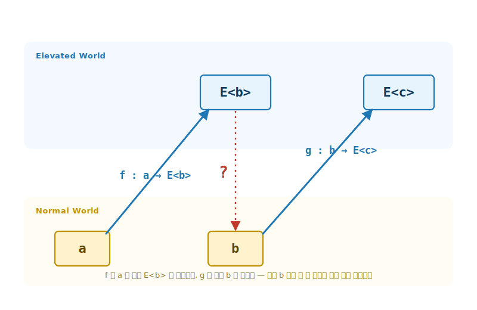
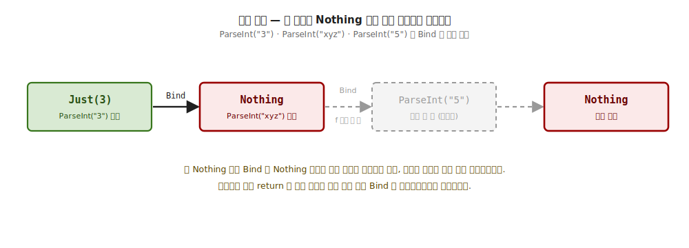
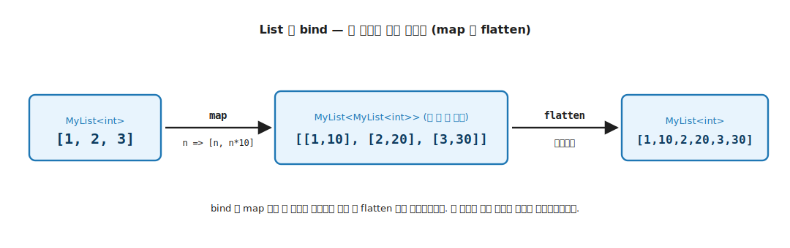

# 7장. Monad / `bind` (`a → E<b>` 함수의 합성 되살리기)

> **이 장의 목표** — 이 장을 읽고 나면 출력 타입만 Elevated 인 함수 `a → E<b>` 가 왜 직접 이어지지 않는지 시그니처로 설명하고, Applicative 에 멤버 단 하나 (`Bind`) 를 더해 그 합성을 Elevated World 안에서 되살릴 수 있습니다. 끌어올림 (`map`) 과 끌어내림 (`fold`) 에 이어 World-crossing 함수의 합성을 채우는 자리가 기초의 마지막 빈칸이고, Kleisli 합성 `>=>` 와 LINQ `from-from-select` 가 모두 이 한 멤버 위에서 자라는 모습을 직접 보게 됩니다.

> **이 장의 핵심 어휘**
>
> - **`a → E<b>`**: 입력은 Normal, 출력만 Elevated 인 함수. Normal 에서 Elevated 로 건너가는 World-crossing 함수
> - **`Bind`**: `E<a> → (a → E<b>) → E<b>`. `E<a>` 에서 값을 꺼내 `a → E<b>` 에 먹이고 결과 `E<b>` 를 그대로 되돌리는 합성 되살리기 멤버
> - **단락 회로 (short-circuit)**: `MyMaybe` 의 `Bind`. 앞 단계가 실패하면 다음 함수를 호출하지 않아 뒤 단계가 평가조차 되지 않는 동작
> - **비결정성 (nondeterminism)**: `MyList` 의 `Bind`. 한 입력이 여러 갈래로 퍼져 모두 모이는 동작. 같은 `Bind` 이 자료에 따라 단락도 비결정성도 되는 두 번째 인스턴스
> - **의존 결합**: 다음에 만들 Elevated 값이 앞에서 꺼낸 값에 따라 달라지는 결합. 독립 결합인 `Apply` 와 갈리는 자리
> - **Kleisli 합성** (`>=>`): 두 World-crossing 함수 `a → E<b>` 와 `b → E<c>` 를 하나의 `a → E<c>` 로 잇는 정식 합성. `Pure` 가 항등원
> - **LINQ from-from-select**: `SelectMany` 를 거쳐 `Bind` 사슬로 풀리는 C# 문법. `Bind` 의 다른 표기
> - **세 법칙**: 좌항등 / 우항등 / 결합. 시그니처로는 강제되지 않아 직접 검증해야 하는 합성의 약속

> 이 장을 마치면 할 수 있게 되는 것
> - [ ] Monad 의 한 줄 정의 (`Bind`) 를 시그니처로 적을 수 있습니다.
> - [ ] `a → E<b>` 유형 함수가 왜 직접 합성되지 않는지 시그니처로 설명할 수 있습니다.
> - [ ] `Apply` (독립 결합) 와 `Bind` (의존 결합) 의 차이를 시그니처로 구분할 수 있습니다.
> - [ ] 새 자료 타입에 3-tuple 패턴으로 Monad 를 부착할 수 있습니다.
> - [ ] Kleisli 합성 `>=>` 와 `Pure` 가 항등원임을 설명할 수 있습니다.
> - [ ] LINQ `from-from-select` 가 `Bind` 사슬의 다른 표기임을 설명할 수 있습니다.
> - [ ] Monad 의 세 법칙 (좌항등 / 우항등 / 결합) 을 시그니처로 적을 수 있습니다.
> - [ ] 시그니처는 맞지만 세 법칙을 깨는 가짜 Monad 를 찾아낼 수 있습니다.

---

## 7.1 `a → E<b>` 유형 함수의 합성 — 목적

7장의 핵심은 한 줄로 압축됩니다. 4장 / 5장은 `a → b` 같은 평범한 함수를 Elevated 로 끌어올렸고, 6장은 반대로 `E<a>` 를 Normal 의 한 값으로 끌어내렸습니다. 7장이 답하는 자리는 그 둘과 다릅니다. 입력은 Normal 인데 출력만 Elevated 인 함수 `a → E<b>`, 곧 Normal 에서 출발해 Elevated 로 건너가는 함수끼리의 합성입니다. `bind` 가 이 합성을 되살립니다.
### 7.1.1 왜 필요한가 — World-crossing 함수는 직접 이어지지 않습니다

`bind` 가 없으면 무엇이 번거로운지 먼저 손으로 겪어 봅니다. 문자열을 정수로 파싱하는 함수를 생각해 봅니다. 파싱은 실패할 수 있으므로 결과가 `MyMaybe<int>` 입니다. 입력은 평범한 `string` 인데 출력은 Elevated 인 `a → E<b>` 유형 함수입니다.

```csharp
// 출력만 Elevated 인 함수 두 개 (a → E<b> 유형)
static MyMaybe<int> ParseInt(string s);     // string → MyMaybe<int>
static MyMaybe<int> Reciprocal(int n);      // int    → MyMaybe<int>  (0 이면 Nothing)
```

두 함수를 이어 붙이고 싶습니다. 문자열을 파싱하고, 그 정수의 역수를 구하는 것입니다. 그런데 평범한 함수 합성 `g ∘ f` 가 여기서는 타입이 맞지 않습니다.

```
ParseInt   : string → MyMaybe<int>
Reciprocal :          int    → MyMaybe<int>
                      ───┬───
        ParseInt 의 출력은 MyMaybe<int> 인데
        Reciprocal 의 입력은 int — 한 칸 어긋남
```

`ParseInt` 의 출력은 `MyMaybe<int>` 이고 `Reciprocal` 의 입력은 `int` 입니다. Normal 세계라면 `int → int` 함수끼리 `∘` 로 매끄럽게 이어졌을 자리인데, 출력이 Elevated 로 한 겹 올라간 순간 합성이 막힙니다. 손으로 풀면 컨테이너를 여닫는 분기가 끼어듭니다.

```csharp
// bind 없이 손으로 이어 붙이면 — 분기가 끼어든다
static MyMaybe<int> ParseThenReciprocal(string s)
{
    var parsed = ParseInt(s);
    if (parsed is MyMaybe<int>.Just j)   // 꺼내고
        return Reciprocal(j.Value);      // 다음 함수에 먹임
    return MyMaybe<int>.Nothing.Instance; // 없으면 그대로 단락
}
```

함수 하나를 더 잇고 싶으면 같은 `if (… is Just j)` 분기를 또 적습니다. World-crossing 함수가 늘 때마다 같은 꺼냄·단락 코드가 복제됩니다. 5장에서 `Map` 만으로는 다인자 결합이 안 됐던 것과 같은 종류의 막힘이, 이번에는 합성에서 일어납니다.

> **흔한 함정** — 이 막힘을 "그러면 `Map` 을 쓰면 되지" 로 넘기면 안 됩니다. `ParseInt` 에 `Map(Reciprocal, …)` 를 적용하면 결과가 `MyMaybe<MyMaybe<int>>` 로 한 겹 더 겹칩니다. `Map` 은 `a → b` 를 끌어올리는 도구이지, `a → E<b>` 를 이어 붙이는 도구가 아닙니다.

필요한 것은 꺼냄·단락 코드를 trait 한 자리에 한 번만 적고, World-crossing 함수 `a → E<b>` 는 인자로 받는 도구입니다. 그 도구가 이 장의 `bind` 입니다.

### 7.1.2 1장 4 가지 함수 유형의 `a → E<b>` 자리

1장에서 두 세계 사이의 함수 유형을 정리했습니다. 그중 `a → E<b>` 유형 (4 가지 함수 유형의 `a → E<b>`) 은 입력이 Normal, 출력이 Elevated 인 모양입니다.

```
a → E<b> 유형:   입력은 Normal 의 한 값, 출력은 Elevated 의 컨테이너
                Normal 에서 출발해 Elevated 로 건너가는 함수 (World-crossing)
```

```csharp
MyMaybe<int> ParseInt(string s);          // string → MyMaybe<int>
MyMaybe<User> FindUser(UserId id);        // UserId → MyMaybe<User>
```

이 유형의 함수를 elevated-world 글은 **World-crossing function** 이라 부릅니다. Normal 세계에서 출발해 한 번에 Elevated 세계로 건너가기 때문입니다. 7장의 목표는 한 줄입니다. 어떤 E 든 `a → E<b>` 유형 함수끼리 합성할 수 있어야 한다는 추상이 Monad 입니다. `bind` 는 이 합성을 되살리는 단 하나의 멤버입니다.

### 7.1.3 4 가지 함수 유형 — 시그니처와 기초 매핑

| 시그니처 | 기초 매핑 | 어휘 (elevated-world 글) |
|---|---|---|
| `a → b` | 함수형 추상 불필요 | Normal World function |
| `a → E<b>` | **7장 (Monad / `bind`)** | World-crossing function |
| `E<a> → b` | 6장 (Foldable / `fold`) | (끌어내림) |
| `E<a> → E<b>` | 4장 (Functor / `map`) + 5장 (Applicative / `apply`) | Lifted function |

`map` 이 끌어올림 (Normal → Elevated), `fold` 가 끌어내림 (Elevated → Normal) 이라면, `bind` 는 World-crossing 함수 (`a → E<b>`) 끼리의 합성을 되살리는 자리입니다. 네 자리 중 마지막으로 남은 합성의 빈칸을 7장이 채웁니다.

### 7.1.4 대각선을 수평으로 — 왜 한 칸 어긋나는가

앞에서 두 함수의 타입이 한 칸 어긋나 합성이 막혔습니다. 그 어긋남이 두 세계 그림에서 어떻게 생기는지 보면, `bind` 가 정확히 무엇을 메우는지 한눈에 잡힙니다. World-crossing 함수 `f : a → E<b>` 는 입력이 Normal 의 아래층에서 출발하지만 출력은 Elevated 의 위층에 도착합니다. 출발과 도착이 다른 층이라, 한 번 적용할 때마다 값이 아래에서 위로 한 칸 올라간 채 머뭅니다.



**그림 7-2. 대각선의 어긋남: World-crossing 함수는 한 층 올라간 채 머문다** — 아래 Normal World 의 `a` 가 `f : a → E<b>` 로 위 Elevated World 의 `E<b>` 에 대각선으로 올라갑니다. 그런데 다음 함수 `g : b → E<c>` 의 입력 `b` 는 아래층에 있어, 위층 `E<b>` 를 그 입구에 그대로 꽂을 수 없습니다 (빨간 점선의 `?`). 두 World-crossing 함수가 출력·입력이 한 층 어긋난 대각선 두 개가 되는 자리이고, `bind` 가 이 대각선을 수평으로 펴 (`E<b>` 에서 `b` 를 끌어내려) 잇습니다.

다음 함수 `g : b → E<c>` 의 입력은 Normal 의 아래층 `b` 입니다. 그런데 `f` 의 출력은 위층 `E<b>` 에 있으니, 위층 값을 아래층 입구에 그대로 꽂을 수 없습니다. 두 World-crossing 함수를 나란히 그리면 출력과 입력이 한 층 어긋난 **대각선** 두 개가 됩니다. Normal 세계의 `a → b` 끼리라면 출발도 도착도 같은 아래층이라 `∘` 로 곧장 이어졌을 자리인데, 출력만 한 층 올라간 순간 이 어긋남이 생깁니다.

`bind` 가 하는 일은 이 대각선을 **수평** 으로 펴는 것입니다. `E<b>` 에서 `b` 를 한 층 끌어내려 `g` 의 입구에 맞추면, `g` 의 출력 `E<c>` 도 다시 위층에 도착합니다. 곧 elevated-world 글의 표현으로 `bind` 는 World-crossing 함수 `a → E<b>` 를 위층끼리 이어지는 lifted 함수 `E<a> → E<b>` 로 바꿉니다. 한 번 위층 모양으로 맞춰 두면 그 뒤로는 Elevated World 안에서만 합성이 일어나므로, 어긋남 없이 사슬이 매끄럽게 이어집니다. Kleisli 합성 `>=>` 가 바로 이 수평화를 한 줄 연산으로 적은 것입니다.

---

## 7.2 `Monad<M>` trait 시그니처 — 기능 (Bind)

### 7.2.1 Bind 한 줄

World-crossing 함수의 합성을 되살리는 도구는 한 줄 시그니처로 적힙니다.

```
Bind : E<a> → (a → E<b>) → E<b>
```

| 자리 | 의미 |
|---|---|
| `E<a>` | 이미 Elevated 에 있는 값 (앞 단계의 결과) |
| `a → E<b>` | World-crossing 함수 (다음 단계, `a` 를 받아 `E<b>` 를 냄) |
| `E<b>` | 두 단계를 이은 결과 |

`bind` 는 `E<a>` 에서 `a` 를 꺼내 World-crossing 함수에 먹이고, 그 함수가 낸 `E<b>` 를 그대로 돌려줍니다. **꺼냄 → 적용 → 되돌림** 의 세 동작이 한 멤버 안에 들어 있습니다. 앞서 손으로 쓴 `if (… is Just j)` 분기가 바로 이 세 동작이었고, `bind` 는 그것을 trait 한 자리로 모읍니다.

세 자리의 `E` 가 모두 같은 하나의 컨테이너라는 점이 중요합니다. `Bind` 는 한 `E` 안에서 `a → E<b>` 를 잇고 결과도 같은 `E` 로 돌려줍니다. 바뀌는 것은 안의 값 타입 (`a` 에서 `b`) 뿐이고 컨테이너 `E` 자체는 그대로입니다. 그래서 `bind` 는 서로 다른 두 Elevated 세계 (예를 들어 `List` 와 `Maybe`) 를 건너는 도구가 아닙니다. 그 컨테이너 사이 이동은 뒤 장에서 다루는 traverse 와 NaturalTransformation 의 일입니다.

### 7.2.2 trait 정의 — Applicative 에 멤버 하나 추가

`Monad<M>` 은 5장의 `Applicative<M>` 을 상속하고, 핵심 멤버 `Bind` 하나만 더합니다.

```csharp
public interface Monad<M> : Applicative<M> where M : Monad<M>
{
    static abstract K<M, B> Bind<A, B>(K<M, A> ma, Func<A, K<M, B>> f);

    // virtual — Map 을 Bind + Pure 로 유도.
    static virtual K<M, B> MapDefault<A, B>(Func<A, B> f, K<M, A> ma) =>
        M.Bind(ma, a => M.Pure(f(a)));

    // virtual — SelectMany 가 LINQ 의 비밀. 컴파일러가 from-select 를 이 호출로 변환.
    static virtual K<M, C> SelectMany<A, B, C>(
        K<M, A> ma, Func<A, K<M, B>> bind, Func<A, B, C> project) =>
        M.Bind(ma, a => M.Bind(bind(a), b => M.Pure(project(a, b))));
}
```

`static abstract` 는 `Bind` 하나뿐입니다. 새 자료 타입이 Monad 가 되려면 `Pure` + `Apply` (Applicative 에서) + `Bind` 만 정의하면 됩니다. `MapDefault` 와 `SelectMany` 는 `virtual` 이라 그 셋 위에서 공짜로 따라옵니다. `SelectMany` 정의는 LINQ 어법과 이어지는 자리라, 지금은 "`Bind` 하나면 LINQ 도 공짜로 따라온다" 만 가져가면 충분합니다. 본격적인 펼침은 뒤에서 봅니다.

`SelectMany` 의 인자가 셋인 것이 처음에는 낯섭니다. 자리별로 읽으면 다음과 같습니다.

| 자리 | 역할 |
|---|---|
| `K<M, A> ma` | 앞 단계의 Elevated 값 (`E<a>`) |
| `Func<A, K<M, B>> bind` | 다음 단계 World-crossing 함수 (`a → E<b>`) |
| `Func<A, B, C> project` | 앞뒤에서 꺼낸 `a` 와 `b` 를 묶는 식 (LINQ 의 `select` 절) |
| 반환 `K<M, C>` | 두 단계를 이어 묶은 결과 (`E<c>`) |

`Bind` 가 다음 함수 하나만 받는다면, `SelectMany` 는 다음 함수와 묶는 식 둘을 받습니다. 그 묶는 식이 곧 LINQ 의 `select` 절입니다. 이 매핑은 뒤에서 실제 쿼리로 확인합니다.

### 7.2.3 Monad ⊃ Applicative ⊃ Functor — 코드로 닫힙니다

`MapDefault` 한 줄이 중요합니다. `Map(f, ma)` 가 `Bind(ma, a => Pure(f(a)))` 로 유도됩니다. 값을 꺼내 (`Bind`), 평범한 함수 `f` 를 적용하고, 다시 끌어올리면 (`Pure`) 그것이 곧 `Map` 입니다. Monad 를 만족하는 타입은 자동으로 Applicative 이고 Functor 입니다. 기초의 trait 누적이 코드로 닫히는 자리입니다.

값으로 한 번 확인합니다. `Map(n => n + 1, Just(3))` 를 `MapDefault` 경로로 풀면, `Bind(Just(3), a => Pure(a + 1))` 가 `a = 3` 을 꺼내 `Pure(3 + 1) = Just(4)` 를 냅니다. 직접 `Map` 한 결과와 똑같은 `Just(4)` 입니다. 그래서 새 자료 타입은 `Bind` 하나만 정의하면 `Map` 을 따로 적지 않아도 됩니다.

`Apply` 도 같은 방식으로 `Bind` 과 `Pure` 에서 유도됩니다. 함수를 `Bind` 로 꺼내고 (`f`), 값을 `Bind` 로 꺼낸 뒤 (`a`), `Pure(f(a))` 로 되올리면 됩니다. 곧 `Apply(mf, ma) = Bind(mf, f => Bind(ma, a => Pure(f(a))))` 입니다. 그래서 `Bind` 과 `Pure` 만 있으면 `Map` 도 `Apply` 도 강제됩니다. 셋을 따로 고르는 것이 아니라, 가장 강한 `Bind` 하나가 나머지 둘을 결정합니다. Monad ⊃ Applicative ⊃ Functor 라는 상속은 단순한 계층 표기가 아니라, 능력이 실제로 파생된다는 뜻입니다. 학습용 코드에서는 명료성을 위해 `Map` 과 `Apply` 를 자료마다 직접 적지만, 그 본체는 늘 이 유도식과 같습니다.


**그림 7-1. `bind`: World-crossing 함수의 합성 되살리기** — 위 행 Elevated World 에 `E<a>` 와 `E<b>` 두 컨테이너. 아래 행 Normal World 에 꺼낸 값 `a`. `bind` 는 먼저 `E<a>` 에서 `a` 를 꺼내 (왼쪽 아래 화살표), World-crossing 함수 `f : a → E<b>` 에 먹여 (오른쪽 위 화살표) `E<b>` 로 되돌립니다. 가운데 점선 `bind` 화살표가 이 세 동작을 한 멤버로 묶어 `E<a>` 를 `E<b>` 로 잇는 모습입니다.

---

## 7.3 Monad 부착 — `MyMaybe` 의 단락, `MyList` 의 비결정성

**이 장의 코드 구조**

```
Ch07-Monad/
├── Traits/Monad.cs               ← trait 약속 (Applicative 상속 + Bind 하나)
├── Types/MyMaybe.cs · MyList.cs  ← 자료: 단락 / 비결정성 두 인스턴스
├── Functions/Kleisli.cs          ← >=> Kleisli 합성
├── Functions/AccountPipeline.cs  ← bind 사슬 실전 데모
├── Tests/MonadLaws.cs            ← 세 법칙 (좌·우항등 + 결합) 검증
└── Challenges/MonadChallenges.cs ← 7.11절 정답
```

### 7.3.1 3-tuple 패턴 + Bind 구현

4장 ~ 6장과 같은 3-tuple 패턴 (자료 `MyMaybe<A>` / 태그 `MyMaybeF` / trait) 으로 부착합니다. 태그 `MyMaybeF` 가 `Monad<MyMaybeF>` 를 구현하고, 새로 더하는 멤버는 `Bind` 하나입니다.

```csharp
// Bind 의 단락 회로 — Just 면 f 적용, Nothing 이면 f 호출 자체 안 함.
public static K<MyMaybeF, B> Bind<A, B>(K<MyMaybeF, A> ma, Func<A, K<MyMaybeF, B>> f) =>
    ma.As() switch
    {
        MyMaybe<A>.Just j  => f(j.Value),                 // 꺼내 다음 함수에 먹임
        MyMaybe<A>.Nothing => MyMaybe<B>.Nothing.Instance, // 꺼낼 게 없으면 f 호출 안 함
        _ => throw new InvalidOperationException()
    };
```

`Just` 면 안의 값을 꺼내 World-crossing 함수 `f` 에 먹입니다. `Nothing` 이면 **`f` 를 아예 호출하지 않고** 곧장 `Nothing` 을 돌려줍니다. 이 한 줄이 단락 회로 (short-circuit) 입니다. 앞 단계가 실패하면 뒤 단계는 평가조차 되지 않습니다.

세 부분의 책임은 4장 ~ 6장과 같습니다. 자료가 신호를 들고, 태그가 능력을 호스트하고, `Bind` 구현이 단락을 책임집니다.

| 조각 | 책임 |
|---|---|
| ① `MyMaybe<A>` 자료 타입 | `Just` / `Nothing` 두 갈래를 들고 `K<MyMaybeF, A>` 구현 (F 안에 A 가 들었다는 신호) |
| ② `MyMaybeF` 태그 타입 | Monad 능력의 정적 호스트. `Pure` + `Apply` + `Bind` 가 정적 자리에 삽니다 |
| ③ `Bind` 구현 | `.As()` 다운캐스트 후 `Just` 면 `f(value)` 로 잇고, `Nothing` 이면 `f` 를 호출하지 않고 단락 |

### 7.3.2 실전 — Bind 명시 호출

앞서 손으로 쓴 분기가 `Bind` 한 줄로 사라집니다. 두 World-crossing 함수를 이어 두 정수를 더하는 예제입니다.

```csharp
K<MyMaybeF, int> result = ParseInt("3").Bind(a =>
    ParseInt("4").Bind<MyMaybeF, int, int>(b =>
        MyMaybeF.Pure(a + b)));
// → Just(7)
```

바깥 `Bind` 가 `"3"` 의 파싱 결과에서 `a = 3` 을 꺼내고, 안쪽 `Bind` 가 `"4"` 에서 `b = 4` 를 꺼낸 뒤, `Pure(a + b)` 로 합을 다시 Elevated 로 올립니다. 중첩된 `Bind` 가 의존 결합을 표현합니다. 앞 단계 (`a` 꺼내기) 가 성공해야 뒤 단계 (`b` 꺼내기) 가 시작됩니다.

`Bind` 를 부르는 표기는 세 가지입니다. 4장 ~ 6장의 `Map` / `fold` 와 같은 세 어법입니다.

```csharp
K<MyMaybeF, int> ma = ParseInt("3");
Func<int, K<MyMaybeF, int>> f = n => MyMaybeF.Pure(n + 1);

var r1 = MyMaybeF.Bind<int, int>(ma, f);          // ① trait 정적 — F 를 명시 (가장 정직한 자리)
var r2 = Monad.bind<MyMaybeF, int, int>(ma, f);   // ② 모듈 어법 — generic 디스패치
var r3 = ma.Bind(f);                              // ③ 확장 어법 — F 추론 (가장 간결)
```

셋 모두 같은 `MyMaybeF.Bind` 로 디스패치합니다. 일반 함수와 LINQ 는 정적 표기로, 인스턴스 예제는 확장 표기로 적습니다.

### 7.3.3 단락 회로 — 한 단계만 실패해도 전체가 멈춥니다

중간 단계가 `Nothing` 이면 그 뒤는 평가되지 않습니다.

```csharp
K<MyMaybeF, int> r =
    ParseInt("3").Bind(a =>
        ParseInt("xyz").Bind<MyMaybeF, int, int>(b =>   // ← Nothing
            ParseInt("5").Bind<MyMaybeF, int, int>(c =>  // ← 호출조차 안 됨
                MyMaybeF.Pure(a + b + c))));
// → Nothing
```

`"xyz"` 파싱이 `Nothing` 을 내면, `Bind` 의 `Nothing` 가지가 `f` 를 호출하지 않으므로 `"5"` 파싱은 시작도 하지 않습니다. 실패가 사슬을 끊고 곧장 `Nothing` 으로 빠져나옵니다. 명령형의 이른 `return` 과 같은 효과가, 분기 코드 없이 `Bind` 의 시그니처만으로 일어납니다.



**그림 7-4. 단락 회로: 첫 Nothing 이 사슬을 끊습니다** — `ParseInt("3")` 은 `Just(3)` 으로 성공하지만, `ParseInt("xyz")` 가 `Nothing` 을 내는 순간 `Bind` 의 `Nothing` 가지가 다음 함수를 호출하지 않습니다. 뒤의 `ParseInt("5")` 는 평가조차 되지 않고 (회색 점선), 최종 결과가 곧장 `Nothing` 으로 빠져나옵니다. 명령형의 이른 `return` 과 같은 효과가 분기 코드 없이 `Bind` 의 시그니처만으로 일어납니다.

> **한 줄 정리** — `Bind` 는 성공이면 다음 단계로 잇고, 실패면 나머지를 건너뜁니다. 그 분기를 본문 코드가 아니라 trait 의 `Bind` 가 책임집니다.

### 7.3.4 두 번째 자료 — `MyList` 의 비결정성

지금까지 `bind` 를 `MyMaybe` 에서만 봤습니다. 그래서 `Monad` 이 "없을 수 있음 (`Option`)" 을 다루는 도구처럼 보이기 쉽습니다. 그러나 `Monad` 은 특정 컨테이너에 딸린 요령이 아니라 trait 입니다. 같은 `Bind` 를 성격이 전혀 다른 자료에 붙여 보면 그 점이 분명해집니다. 두 번째 자료로 `MyList` 에 `Monad` 을 부착합니다.

```csharp
// Bind — 각 원소에 f 를 적용(원소마다 리스트 하나)하고 그 리스트들을 모두 이어붙임.
public static K<MyListF, B> Bind<A, B>(K<MyListF, A> ma, Func<A, K<MyListF, B>> f) =>
    new MyList<B>(
        ma.As().Items.SelectMany(a => f(a).As().Items).ToArray());
```

`MyMaybe` 의 `Bind` 가 한 갈래를 잇거나 멈췄다면, `MyList` 의 `Bind` 는 한 입력을 여러 갈래로 퍼뜨립니다. 각 원소가 리스트 하나를 내고, 그 리스트들을 모두 이어붙입니다.

```text
[1, 2, 3].Bind(n => [n, n*10])
   1 → [1, 10]
   2 → [2, 20]        각 원소가 리스트 하나를 냄
   3 → [3, 30]
   ───────────────
   이어붙임 → [1, 10, 2, 20, 3, 30]
```

이 동작을 **비결정성 (nondeterminism)** 이라 부릅니다. 한 값에서 여러 결과가 동시에 나오고, `bind` 가 그 갈래를 모두 모아 다음 단계로 넘깁니다. `MyMaybe` 가 성공 한 갈래 아니면 실패 둘 중 하나였다면, `MyList` 는 갈래의 수가 0 개부터 여러 개까지 자유롭습니다.

`MyList` 의 `bind` 는 `map` 후 `flatten` 그 자체입니다. 위 입력에 `map(n => [n, n*10])` 만 걸면 `[[1, 10], [2, 20], [3, 30]]` 로 한 겹 더 겹치고, 그 중첩을 이어붙여 펴면 `[1, 10, 2, 20, 3, 30]` 입니다. 이 평탄화가 `flatten` 이고, `bind` 가 `map` 후 `flatten` 이라는 관계는 모든 Monad 에 공통입니다.



**그림 7-5. List 의 `bind`: map 후 flatten 으로 펼침** — `[1, 2, 3]` 에 `map (n => [n, n*10])` 을 걸면 `[[1, 10], [2, 20], [3, 30]]` 로 한 겹 겹치고, `flatten` 이 이어붙여 `[1, 10, 2, 20, 3, 30]` 이 됩니다. 한 입력이 여러 갈래로 퍼지는 비결정성이고, `MyMaybe` 의 단락과 같은 `Bind` 의 다른 얼굴입니다.

같은 `Bind` 시그니처 `K<M, A> → (A → K<M, B>) → K<M, B>` 가 자료 구조에 따라 다른 얼굴을 보입니다.

| 자료 | `Pure` | `Bind` 의 얼굴 | 한 갈래가 비면 |
|---|---|---|---|
| `MyMaybe` | `Just(a)` | 단락 — 성공 한 갈래만 잇고 실패면 멈춤 | `Nothing` 으로 전체가 빠져나옴 |
| `MyList` | `[a]` | 비결정성 — 각 원소가 여러 갈래를 내고 모두 모음 | 그 갈래만 결과에서 사라짐 |

`Monad` 은 특정 컨테이너에 딸린 요령이 아니라, 어떤 Elevated World 든 World-crossing 함수를 잇는 일반 어휘입니다. `bind` 의 의미는 늘 "꺼내서 다음 함수에 먹이고 다시 모은다" 한 가지이고, 그 모으는 방식이 자료에 따라 단락도 비결정성도 됩니다.

`bind` 의 세 번째 얼굴은 상태 (state) 입니다. 컨테이너가 값이 아니라 함수 `S → (A, S)` 인 자료로, 숨은 상태를 사슬을 따라 다음 단계로 흘려보냅니다. 모양이 한 단계 더 복잡하므로 여기서는 이름과 모양만 짚고, 본격적인 구현은 State 모나드를 다루는 후속 Part 로 미룹니다. Wlaschin 의 〈Dr Frankenfunctor and the Monadster〉 연재가 이 상태 threading 을 "생명력을 흘려보내며 괴물을 조립" 하는 비유로 풀어낸 입문 자료입니다. 모양은 더 복잡해도 약속은 같습니다. 같은 `bind` 이 단락·비결정성·상태 세 얼굴을 모두 한 어휘로 잇습니다.

> **흔한 함정** — `Monad` 을 `Option` / `null` 안전 처리 도구로만 기억하는 것입니다. 그것은 `MyMaybe` 한 인스턴스의 얼굴일 뿐입니다. `MyList` 의 비결정성, 8장에서 볼 `Validation` 의 누적, 후속 Part 의 효과 모나드가 다루는 환경·상태·로그가 모두 같은 `bind` 한 어휘로 작동합니다.

---

## 7.4 Apply vs Bind — 독립 결합 vs 의존 결합

5장의 `Apply` 와 7장의 `Bind` 는 둘 다 두 Elevated 값을 결합하지만, 결정적 차이가 있습니다.

| | 시그니처 | 결합 방식 |
|---|---|---|
| `Apply` (5장) | `K<M, A → B> → K<M, A> → K<M, B>` | 함수가 이미 컨테이너 안 — **독립 결합** |
| `Bind` (7장) | `K<M, A> → (A → K<M, B>) → K<M, B>` | 값에서 다음 효과를 만듦 — **의존 결합** |

`Apply` 의 둘째 인자 `K<M, A>` 는 첫째 인자와 무관하게 미리 정해져 있습니다. 두 값이 서로를 모르는 채 나란히 놓이므로 **독립** 입니다. 반면 `Bind` 의 둘째 인자는 함수 `A → K<M, B>` 입니다. 다음에 만들 Elevated 값이 앞에서 꺼낸 `A` 값에 따라 달라지므로 **의존** 입니다.

이 차이가 Wlaschin 이 정리한 한 축입니다. **applicative 는 병렬·독립, monadic 은 순차·종속** 입니다. 독립이면 모든 가지를 함께 볼 수 있습니다. Validation 의 오류 누적이 여기서 나옵니다. 종속이면 앞이 정해져야 뒤가 정해집니다. 이 장의 단락 회로가 그 결과입니다. 같은 도메인을 두 어법으로 풀 때 결과가 어떻게 갈리는지는 8장 Validation 에서 직접 봅니다.

여기서 말하는 병렬은 동시 실행 (멀티스레드) 이 아닙니다. 두 Elevated 값이 서로를 참조하지 않고 각자 미리 정해져 있다는 구조적 독립을 가리킵니다. `Apply` 의 두 인자는 어느 쪽을 먼저 평가하든 결과가 같고, 한쪽이 다른 쪽의 값을 들여다볼 수 없습니다. 반대로 순차는 시간 순서가 아니라, 뒤 단계가 앞 단계에서 꺼낸 값을 받아야만 다음 Elevated 값의 모양이 정해지는 의존을 뜻합니다. 그래서 독립은 누적으로, 종속은 단락으로 이어집니다.

---

## 7.5 Kleisli 합성 — `>=>` 로 합성 되살리기

### 7.5.1 `Then` (`>=>`) — World-crossing 함수의 정식 합성

`Bind` 는 `E<a>` 와 함수를 받습니다. 그런데 앞서 본 막힘은 **함수끼리** 의 합성이었습니다. 두 World-crossing 함수 `f : a → E<b>` 와 `g : b → E<c>` 를 하나의 `a → E<c>` 로 잇는 연산이 Kleisli 합성 `>=>` 입니다.

```csharp
// f >=> g  ─ a 를 받아 E<c> 를 낸다. 내부는 Bind 사슬.
public static Func<A, K<M, C>> Then<M, A, B, C>(
    this Func<A, K<M, B>> f,
    Func<B, K<M, C>> g)
    where M : Monad<M>
=>
    a => M.Bind(f(a), g);
```

`f >=> g` 는 `a` 를 받아 `f(a)` (`E<b>`) 를 만들고, 그 결과를 `Bind` 로 `g` 에 넘깁니다. 한 줄로 `a → E<b>` 유형도 Normal 세계의 `∘` 처럼 매끄럽게 이어집니다. 앞서 타입이 어긋나 막혔던 `ParseInt` 와 `Reciprocal` 이, 이제 두 함수를 `Func<>` 로 받아 `parse.Then(recip)` 한 줄로 `string → MyMaybe<int>` 합성이 됩니다.

`>=>` 는 Haskell 과 수학에서 Kleisli 합성을 적는 기호입니다. C# 에는 이런 연산자가 없으므로, 같은 일을 하는 확장 메서드를 `Then` 이라는 이름으로 둡니다. 본문에서 의미를 또렷이 하려고 `>=>` 라고 적은 자리는, 코드에서 `f.Then(g)` 로 읽으면 됩니다. 기호가 아니라 메서드라는 점만 다르고, 두 World-crossing 함수를 하나로 잇는다는 의미는 같습니다.

함수가 셋이면 `>=>` 를 한 번 더 겹칩니다. `Then` 을 두 번 겹친 3 단계 합성 `ThenThen` 도 같은 `Bind` 사슬입니다.

```csharp
// f >=> g >=> h ─ 세 단계를 한 줄로. 내부는 Bind 를 두 번 겹친 사슬.
public static Func<A, K<M, D>> ThenThen<M, A, B, C, D>(
    Func<A, K<M, B>> f,
    Func<B, K<M, C>> g,
    Func<C, K<M, D>> h)
    where M : Monad<M>
=>
    a => M.Bind(M.Bind(f(a), g), h);
```

`ThenThen(f, g, h)` 의 본체 `Bind(Bind(f(a), g), h)` 는 앞 두 단계를 먼저 묶은 `(f >=> g) >=> h` 모양입니다. 그렇다면 뒤 두 단계를 먼저 묶은 `f >=> (g >=> h)` 와 결과가 같은지 물을 수 있습니다. 같다는 것이 곧 결합 법칙이고, 그래서 세 단계를 어느 묶음으로 적든 안심하고 한 줄로 합쳐 쓸 수 있습니다.


**그림 7-3. Kleisli 합성: `f >=> g`** — 가로축은 시간 (왼쪽에서 오른쪽), 세로축은 두 세계입니다. `a` (Normal) 가 `f : a → E<b>` 로 `E<b>` (Elevated) 에 올라가고, `bind` 가 `E<b>` 에서 `b` 를 꺼내 Normal 로 내린 뒤, `g : b → E<c>` 가 다시 `E<c>` (Elevated) 로 올립니다. 올림 → 내림 → 올림 의 이 경로 (`a → E<b> → b → E<c>`) 전체가 한 함수 `f >=> g : a → E<c>` 입니다. 두 World-crossing 함수 `f` 와 `g` 가 `∘` 처럼 합성됩니다.

### 7.5.2 `Id` = `Pure` — Kleisli 합성의 항등원

Normal 세계의 `∘` 에 항등 함수 `x => x` 가 있듯이, Kleisli 합성에도 항등원이 있습니다. `Pure` 입니다.

```csharp
// 항등 Kleisli 함수 — Pure. Kleisli 합성의 왼/오른 항등원.
public static Func<A, K<M, A>> Id<M, A>() where M : Monad<M> => M.Pure;
```

`pure >=> f ≡ f` 이고 `f >=> pure ≡ f` 입니다. `Pure` 가 앞이나 뒤에 붙어도 합성 결과가 달라지지 않습니다. `Bind` (합성) 와 `Pure` (항등원) 가 함께 있어 World-crossing 함수가 진짜 합성 구조를 이룹니다. "`bind` 가 합성을 되살린다" 는 정확히 이 뜻입니다.

> **왜 항등원인지 펼쳐 보기 (처음엔 건너뛰어도 됩니다)** — `f >=> g` 는 `a => Bind(f(a), g)` 였습니다. 여기 `g` 자리에 `Pure` 를 넣으면 `f >=> pure = a => Bind(f(a), Pure)` 이고, `Bind(m, Pure)` 는 꺼낸 값을 곧장 다시 올리는 것이라 원래 `m` 과 같으므로 `f >=> pure = f` 입니다. 반대로 `pure >=> f = a => Bind(Pure(a), f)` 이고 `Bind(Pure(a), f) = f(a)` 이므로 `pure >=> f = f` 입니다. 이 두 등식이 뒤에서 우항등·좌항등 법칙으로 다시 정리됩니다.

---

## 7.6 LINQ — `bind` 의 C# 설탕

### 7.6.1 `from-from-select` 가 곧 `Bind` 사슬입니다

C# 컴파일러는 LINQ 의 `from-from-select` 표기를 `Select` / `SelectMany` 메서드 호출로 변환합니다. `Monad<M>` 의 `SelectMany` 가 `Bind` 위에 정의돼 있으므로, LINQ 표기는 결국 `Bind` 사슬로 풀립니다.

```
표기 (LINQ)                         변환 (컴파일러)                  실행
─────────────────────────          ──────────────────────          ──────
from a in ma            ─►   ma.SelectMany(a =>          ─►   M.Bind(ma, a =>
from b in mb                      mb,                              M.Bind(mb, b =>
select a + b                      (a, b) => a + b)                  M.Pure(a + b)))
```

앞의 중첩 `Bind` 와 아래 LINQ 가 **정확히 같은 결과** 를 냅니다.

```csharp
K<MyMaybeF, int> byLinq =
    from a in ParseInt("3")
    from b in ParseInt("4")
    select a + b;
// → Just(7)   (7.3.2절의 중첩 Bind 와 같은 값)
```

왜 같은 값인지는 `SelectMany` 정의에 대입해 보면 드러납니다. `SelectMany` 는 `M.Bind(ma, a => M.Bind(bind(a), b => M.Pure(project(a, b))))` 였습니다. 위 쿼리에서 `ma = ParseInt("3")`, `bind = a => ParseInt("4")`, `project = (a, b) => a + b` 입니다. 한 단계씩 풀면 다음과 같습니다.

```text
ParseInt("3")        → Just(3),  a = 3 꺼냄
ParseInt("4")        → Just(4),  b = 4 꺼냄
Pure(project(3, 4))  = Pure(3 + 4) = Pure(7) = Just(7)
```

중첩 `Bind` 와 글자 그대로 같은 사슬에 도착합니다. 정의에 대입해 따라가면 두 표기가 같은 자리로 풀립니다. 같은 값을 두 번 본 관찰이 아니라, LINQ 가 `Bind` 의 다른 표기 (syntactic sugar) 임을 대입으로 확인한 것입니다. `LINQ` 의 친숙한 문법이 사실 Monad 의 합성이었습니다.

> **여기까지의 안전망** — `SelectMany` 대입 과정이 한 번에 잡히지 않아도 괜찮습니다. 지금 가져갈 직감은 하나입니다. LINQ 의 `from` 한 줄이 곧 `Bind` 한 단계이고, `select` 가 마지막 `Pure` 입니다. 변환 규칙을 외울 필요는 없습니다.

이 `from-select` 문법은 C# 만의 것이 아닙니다. Haskell 의 do-notation 도 같은 `Bind` 사슬을 다른 글자로 적은 표기입니다. 두 문법을 나란히 두면 글자만 다르고 자리가 그대로 겹칩니다.

```text
LINQ (C#)              do-notation (Haskell)      Bind 사슬에서의 자리
─────────────────      ─────────────────────      ────────────────────
from a in ma           a <- ma                    값을 꺼냄 (Bind 의 첫 인자)
from b in mb           b <- mb                    값을 꺼냄 (다음 Bind)
select a + b           return (a + b)             다시 감쌈 (Pure)
```

LINQ 의 `from … in …` 과 Haskell 의 `… <- …` 은 둘 다 "오른쪽 컨테이너에서 값을 꺼내 왼쪽 이름에 담는다" 는 뜻이고, LINQ 의 `select` 와 Haskell 의 `return` 은 둘 다 꺼낸 값을 다시 컨테이너로 감쌉니다. 곧 `select` 가 이 책의 `Pure` 입니다. 그래서 C# 의 LINQ 는 낯선 추상이 아니라, 여러 언어가 공유해 온 보편적인 monad 문법의 한 방언입니다.

### 7.6.2 단락 회로도 LINQ 에서 그대로

`Bind` 의 단락은 LINQ 표기에서도 똑같이 작동합니다. 다단계 사슬에서 한 단계만 실패해도 전체가 `Nothing` 입니다.

```csharp
K<MyMaybeF, int> r =
    from a in ParseInt("10")
    from b in ParseInt("20")
    from c in ParseInt("30")
    select a + b + c;
// → Just(60)   (모두 성공)
```

`LINQ` 의 `from` 한 줄이 곧 `Bind` 한 단계입니다. World-crossing 함수의 합성이 C# 의 자연스러운 문법으로 들어옵니다.

### 7.6.3 실전 — 의존 사슬: 조회 → 조회 → 출금 파이프라인

지금까지의 예제 (`ParseInt`, `Reciprocal`) 는 작았습니다. `bind` 가 실무에서 진가를 발휘하는 자리는 앞 단계의 결과가 있어야 다음 단계를 할 수 있는 의존 사슬입니다. 출금 워크플로를 봅니다. 사용자를 조회하고, 그 사용자의 계좌를 조회하고, 그 계좌에서 출금합니다. 세 단계 모두 실패할 수 있어 결과가 `MyMaybe` 입니다 (`a → E<b>` 유형).

```csharp
public static K<MyMaybeF, User>    FindUser(UserId id);             // 없으면 Nothing
public static K<MyMaybeF, Account> FindAccount(User user);          // 없으면 Nothing
public static K<MyMaybeF, Receipt> Withdraw(Account a, int amount);  // 잔액 부족이면 Nothing
```

세 함수는 앞 단계의 출력을 다음 단계의 입력으로 받습니다. `FindAccount` 는 `User` 가 있어야 하고, `Withdraw` 는 `Account` 가 있어야 합니다. World-crossing 함수의 전형적인 의존 사슬입니다. `bind` 로 잇습니다.

```csharp
public static K<MyMaybeF, Receipt> WithdrawByBind(UserId id, int amount) =>
    FindUser(id).Bind(user =>
    FindAccount(user).Bind<MyMaybeF, Account, Receipt>(account =>
    Withdraw(account, amount)));
```

바깥 `Bind` 가 `FindUser` 에서 `user` 를 꺼내 `FindAccount` 에 먹이고, 안쪽 `Bind` 가 `account` 를 꺼내 `Withdraw` 에 먹입니다. 각 단계가 앞 단계의 성공 값을 받아야 진행됩니다. 같은 파이프라인을 LINQ 로 적으면 의존 관계가 더 또렷합니다.

```csharp
public static K<MyMaybeF, Receipt> WithdrawByLinq(UserId id, int amount) =>
    from user    in FindUser(id)
    from account in FindAccount(user)
    from receipt in Withdraw(account, amount)
    select receipt;
```

`from account in FindAccount(user)` 의 `user` 가 앞 줄에서 꺼낸 값입니다. 각 `from` 이 `Bind` 한 단계이고, 앞에서 꺼낸 이름을 다음 줄이 그대로 씁니다. 세 단계가 모두 성공해야 `Just(Receipt)` 가 나옵니다. 세 경우를 돌려 봅니다.

```csharp
WithdrawByLinq(new UserId(1), 300);    // → Just(출금 300, 잔액 700)   세 단계 모두 성공
WithdrawByLinq(new UserId(1), 5000);   // → Nothing                   Withdraw 에서 단락 (잔액 부족)
WithdrawByLinq(new UserId(99), 300);   // → Nothing                   FindUser 에서 단락 (없는 사용자)
```

이 파이프라인이 두 세계를 어떻게 건너는지 단계별로 봅니다.

| 단계 | 코드 | 시그니처 | 네 자리 중 |
|---|---|---|---|
| 시작 | `UserId id` | `UserId` | Normal 의 한 값 |
| 사용자 조회 | `FindUser(id)` | `UserId → MyMaybe<User>` | World-crossing `a → E<b>` |
| 계좌 조회 | `FindAccount(user)` | `User → MyMaybe<Account>` | World-crossing `a → E<b>` |
| 출금 | `Withdraw(account, amount)` | `Account → MyMaybe<Receipt>` | World-crossing `a → E<b>` |
| 합성 | `bind` 사슬 | `MyMaybe<User> → … → MyMaybe<Receipt>` | World-crossing 합성 (Monad 자리) |

세 단계가 모두 `a → E<b>` World-crossing 함수이고 `bind` 가 그 셋을 한 `a → E<c>` Kleisli 합성으로 잇습니다.

어느 단계가 `Nothing` 을 내든 그 뒤는 평가되지 않습니다. 없는 사용자 (`id=99`) 면 `FindUser` 가 `Nothing` 을 내고 계좌 조회와 출금은 시작도 하지 않습니다. 잔액이 부족하면 앞 두 조회는 성공했어도 `Withdraw` 가 `Nothing` 을 내 사슬이 거기서 끊깁니다. 단계마다 `if (… is Just)` 분기를 손으로 쓸 필요 없이, `bind` 의 단락 회로가 이 모두를 책임집니다.

```
id=1, 300:    FindUser ─Just→ FindAccount ─Just→ Withdraw ─Just→ Just(Receipt)
id=1, 5000:   FindUser ─Just→ FindAccount ─Just→ Withdraw ─Nothing→ Nothing
id=99, 300:   FindUser ─Nothing→ (계좌 조회·출금 평가 안 함) ──────→ Nothing
```

`Bind` 를 의존 결합이라 부른 이유가 이 실전에서 분명해집니다. 각 단계가 앞 단계의 값을 받아야 의미가 있으므로, 독립 결합 (`Apply`) 이 아니라 의존 결합 (`Bind`) 이 맞는 자리입니다. 반대로 8장 Validation 의 폼 검증은 네 칸이 서로 독립이라 누적 (`Apply`) 이 맞습니다. 같은 두 도구가 도메인에 따라 갈립니다.

> **프로그래밍 가능한 세미콜론** — 위 LINQ 사슬은 명령형 코드처럼 읽힙니다. `var user = ...; var account = ...; var receipt = ...;` 에서 문장을 잇는 세미콜론이, 여기서는 `from` 한 줄과 다음 줄을 잇는 `bind` 입니다. 다른 점은 그 이음매에 자료의 효과가 박힌다는 것입니다. `MyMaybe` 면 한 단계가 `Nothing` 일 때 자동으로 멈추고 (단락), `MyList` 면 한 단계가 여러 갈래로 퍼집니다 (비결정성). 그래서 `bind` 를 "프로그래밍 가능한 세미콜론" 이라 부릅니다. 명령형의 세미콜론은 늘 그냥 다음 줄로 가지만, `bind` 의 이음매는 자료가 정한 규칙으로 다음 줄로 갑니다.

### 7.6.4 같은 LINQ 가 List 에서는 모든 조합

`from-from-select` 는 `Bind` 의 설탕이므로, `MyMaybe` 가 아닌 자료에 쓰면 그 자료의 `Bind` 얼굴을 그대로 따릅니다. 같은 두 줄 `from` 을 `MyList` 에 쓰면 단락이 아니라 모든 조합 (cartesian) 이 나옵니다.

```csharp
K<MyListF, string> sizes  = new MyList<string>(new[] { "S", "M" });
K<MyListF, string> colors = new MyList<string>(new[] { "Red", "Blue" });

K<MyListF, string> combos =
    from s in sizes
    from c in colors
    select $"{s}-{c}";
// → [S-Red, S-Blue, M-Red, M-Blue]
```

`from s in sizes` 가 `s` 를 두 갈래 (`S`, `M`) 로 펼치고, 각 갈래에서 `from c in colors` 가 다시 두 갈래로 펼칩니다. `MyList` 의 `Bind` 가 그 갈래를 모두 모으므로 2 × 2 = 4 개 조합이 됩니다. `MyMaybe` 에서 `from-from-select` 가 단락 사슬이던 같은 문법이, `MyList` 에서는 중첩 루프 (모든 조합) 가 됩니다. 문법은 하나인데 의미는 자료의 `Bind` 가 정합니다.

> **한 줄 정리** — LINQ `from-from-select` 는 `Bind` 의 표기일 뿐이라, 자료를 바꾸면 그 자료의 `Bind` 얼굴 (`MyMaybe` 의 단락, `MyList` 의 조합) 을 그대로 물려받습니다.

### 7.6.5 단락 추적 — 어느 단계에서 멈추는가

단락 회로의 "뒤 단계는 평가조차 되지 않는다" 를 앞의 출금 파이프라인 위에서 한 단계씩 손으로 따라가 봅니다. 없는 사용자 `id=99` 로 출금을 시도하면, `Bind` 사슬이 첫 단계에서 멈춥니다. 각 단계가 무엇을 받아 무엇을 내는지, 그리고 그 단계의 World-crossing 함수가 호출되기는 하는지 표로 적습니다.

| 단계 | `Bind` 가 꺼낸 값 | 호출된 함수 | 결과 |
|---|---|---|---|
| `FindUser(99)` | (시작값 `99`) | `FindUser` 호출됨 | `Nothing` |
| `FindAccount(user)` | 꺼낼 `user` 없음 | `FindAccount` **호출 안 됨** | (평가 안 함) |
| `Withdraw(account, 300)` | 꺼낼 `account` 없음 | `Withdraw` **호출 안 됨** | (평가 안 함) |
| 최종 | | | `Nothing` |

첫 줄에서 `FindUser` 가 `Nothing` 을 냅니다. 바깥 `Bind` 의 `Nothing` 가지는 다음 함수 `f` 를 호출하지 않으므로, `FindAccount` 에 건넬 `user` 값 자체가 만들어지지 않습니다. 그래서 둘째·셋째 줄의 함수는 호출조차 되지 않습니다. 잔액 부족 `id=1, 5000` 은 멈추는 자리만 다릅니다. 앞 두 단계는 값을 꺼내 다음으로 잇지만, `Withdraw` 가 `Nothing` 을 내는 순간 사슬이 거기서 끊겨 그 뒤는 평가되지 않습니다.

손으로 짚을 직감은 하나입니다. `Bind` 사슬에서 한 단계가 `Nothing` 이면, 그 단계의 함수까지는 호출되지만 **그 뒤 단계의 함수는 인자조차 받지 못해 실행되지 않습니다**. elevated-world 글도 검증 예제에서 같은 동작을 짚습니다. 첫 단계가 실패하면 오직 그 첫 오류만 돌아오고 나머지 단계는 단락된다는 것입니다.

### 7.6.6 `select` 은 `Map` 이다 — `SelectMany` = `Bind` + `Map`

앞에서 `SelectMany` 를 `Bind(ma, a => Bind(bind(a), b => Pure(project(a, b))))` 로 펼쳤습니다. 안쪽 `Bind(bind(a), b => Pure(project(a, b)))` 를 한 번 더 들여다보면 값만 바꾸는 `Map` 입니다. `Bind` 에 꺼낸 값을 `Pure` 로 다시 감싸 돌려주는 함수를 넘기면 효과는 그대로 두고 안의 값만 변환하는 셈이라, `Bind(m, b => Pure(g(b)))` 가 곧 `Map(g, m)` 이기 때문입니다. 이 장의 `MapDefault` 가 바로 그 등식, 곧 `Map` 을 `Bind` + `Pure` 로 유도한 것입니다.

그래서 `SelectMany` 의 본모습은 한결 단순합니다. 바깥이 `Bind`, 안쪽 projection 이 `Map` 입니다.

```csharp
// SelectMany 의 본모습 — 두 from 은 Bind (의존 결합), select 는 Map (마지막 변환)
M.Bind(ma, a => M.Map(b => project(a, b), bind(a)));
```

읽는 법은 한 줄입니다. `from a in ma` 와 `from b in bind(a)` 두 줄이 바깥 `Bind` 이고, `select project(a, b)` 한 줄이 마지막 `Map` 입니다. `select` 가 결과를 `Pure` 로 직접 감싸지 않아도 되는 이유가 여기 있습니다. `Map` 이 변환 결과를 이미 Elevated World 안에 그대로 두기 때문입니다. LanguageExt v5 의 `SelectMany` 도 이 `Bind` + `Map` 한 줄로 적혀 있습니다.

바로 뒤의 `Bind` = `Map` 후 `flatten` 과 짝을 이룹니다. `Bind` 를 풀면 `Map` 다음 `flatten`, `SelectMany` 를 풀면 `Bind` 다음 `Map` 입니다. `Map` · `flatten` · `Bind` 세 도구가 자리를 바꿔 가며 다시 조합될 뿐입니다.

---

## 7.7 `flatten` — 중첩 `E<E<a>>` 평탄화

`Bind` 는 또 다른 얼굴을 가집니다. 앞의 흔한 함정에서 `Map(Reciprocal, …)` 이 `MyMaybe<MyMaybe<int>>` 로 한 겹 겹친다고 했습니다. 그 중첩을 한 겹으로 펴는 함수가 `flatten` 입니다.

```csharp
public static K<M, A> flatten<M, A>(K<M, K<M, A>> mma)
    where M : Monad<M> =>
    M.Bind(mma, x => x);   // 꺼낸 안쪽 컨테이너를 그대로 돌려줌
```

`Bind` 에 항등 함수 (`x => x`) 를 넘기면 됩니다. 바깥 컨테이너를 열어 꺼낸 것이 이미 안쪽 컨테이너이므로, 그대로 돌려주면 한 겹이 펴집니다. `Map` 으로 겹친 `E<E<b>>` 를 `flatten` 으로 펴는 것과, `Bind` 로 처음부터 한 겹으로 잇는 것은 같은 결과입니다. `Bind` 는 "`Map` 한 뒤 `flatten`" 으로도 읽을 수 있습니다.

구체값으로 봅니다. `Reciprocal` 은 정수 역수 근사 `1000 / n` 이라 `Reciprocal(4) = Just(250)` 이므로 `Map(Reciprocal, Just(4))` 는 `Just(Reciprocal(4)) = Just(Just(250))` 로 한 겹 더 겹칩니다. 여기에 `flatten` 을 걸면 바깥을 열어 꺼낸 `Just(250)` 을 그대로 돌려주어 `Just(250)` 이 됩니다.

```text
Map  : Just(4) ─Map(Reciprocal)→ Just(Just(250)) ─flatten→ Just(250)
Bind : Just(4) ─Bind(Reciprocal)──────────────────────────→ Just(250)
```

`Map` 은 한 겹을 더 만들고 `flatten` 이 그것을 펴는 두 걸음, `Bind` 는 같은 일을 한 걸음으로 합니다. 7장 첫머리에서 `Map` 으로 `a → E<b>` 를 이으면 `E<E<b>>` 로 겹친다던 예고가, 여기서 `flatten` 으로 닫힙니다.

`flatten` 의 모양은 자료마다 다르지만 약속은 같습니다. `MyMaybe` 에서는 `Just(Just(x))` 의 바깥 한 겹을 벗겨 `Just(x)` 로 펴고, `MyList` 에서는 `[[1, 10], [2, 20]]` 같은 중첩 리스트를 이어붙여 `[1, 10, 2, 20]` 으로 폅니다. 둘 다 `Bind(mma, x => x)` 한 줄에서 나오므로 자료마다 `flatten` 을 따로 구현할 필요가 없습니다. LanguageExt v5 의 `Monad` trait 도 `Flatten` 을 `Bind` 의 기본 구현으로 제공합니다.

### 7.7.1 Monad 를 정의하는 두 길 — `bind` 와 `flatten`

`flatten` 과 `Bind` 의 관계는 한 방향이 아닙니다. 두 등식이 서로를 정의합니다.

```text
flatten(mma) = Bind(mma, x => x)      // flatten 을 Bind 로
Bind(m, f)   = flatten(Map(f, m))     // Bind 를 Map + flatten 으로
```

위 등식이 뜻하는 바는 분명합니다. 새 자료 타입을 Monad 로 만들 때 `Bind` 하나만 정의하면 `flatten` 이 따라오고 (이 책과 v5 가 택한 길), 거꾸로 `Map` (Functor 에서) 과 `flatten` 둘만 정의해도 `Bind` 가 따라옵니다. 두 길이 같은 Monad 를 정의합니다. Haskell 이 Monad 를 `>>=` (bind) 또는 `join` (flatten) 어느 쪽으로 정의해도 되는 것과 같습니다.

> **더 깊이 — 왜 `Bind` 를 원시 멤버로 두는가 (처음엔 건너뛰어도 됩니다)** — 이 책과 LanguageExt v5 는 `Bind` 를 원시 멤버 (`static abstract`) 로 두고 `flatten` 을 그 위에 파생합니다. `Bind` 하나가 값을 봐야 다음 효과가 정해지는 의존 결합까지 한 번에 표현해 가장 일반적이기 때문입니다. `flatten` 기반 정의는 겹친 것을 편다는 직관이 또렷한 대신, 의존 결합을 표현하려면 결국 `Map` 과 함께 써야 합니다.

어느 길을 택하든, 한 자료가 Monad 임을 보이는 데 필요한 것은 이 한 쌍의 등식이 성립한다는 것뿐입니다.

---

## 7.8 어떤 Monad 든 받는 일반 함수 — 예제

### 7.8.1 trait 의 결정적 가치

`Bind` 한 멤버를 trait 자리에 정의하면, 그 위에서 자라는 함수는 자료가 무엇인지 묻지 않습니다. `Monad<M>` 제약 하나만 걸면 같은 함수가 `MyMaybeF`, `MyListF`, 그리고 미래의 어떤 Monad 든 처리합니다.

```csharp
public static class Monad
{
    public static K<M, B> bind<M, A, B>(K<M, A> ma, Func<A, K<M, B>> f)
        where M : Monad<M> =>           //  ← M 이 Monad 의 구현체임을 보장
        M.Bind(ma, f);                  //  ← 정적 디스패치 (MyMaybeF / MyListF / …)

    public static K<M, A> flatten<M, A>(K<M, K<M, A>> mma)
        where M : Monad<M> =>
        M.Bind(mma, x => x);            //  ← Bind 한 줄에서 flatten 이 따라옴
}
```

`Monad.bind` 한 함수면 자료마다 새로 적을 필요가 없고, `Bind` 한 멤버 위에 `flatten` 도 같은 방식으로 공짜로 따라옵니다.

> **한 멤버가 모든 Monad 에** — 같은 핵심 함수가 매 Elevated World 마다 다른 구현으로 나타나지만 다루는 방식에는 공통성이 있습니다. 그 공통성을 trait 시그니처 한 줄 (`Bind`) 로 표현한 것이 `Monad<M>` 입니다. `>=>` 와 `flatten` 이 모두 그 한 멤버 위에서 한 번 정의로 모든 Monad 에 동작합니다.

### 7.8.2 공짜 함수의 누적

```
Functor 만 정의        ─►  Map, Lift1, ...                         (소수)
+ Foldable             ─►  + Sum, Count, All, Any, First, ...      (누적)
+ Applicative          ─►  + Lift2, Lift3, sequence, traverse      (중간)
+ Monad                ─►  + Bind, >=> (Kleisli), flatten, LINQ    (합성 되살리기)
```

`Bind` 하나를 더하면 World-crossing 함수의 합성 도구가 한 묶음 따라옵니다. Kleisli 합성 `>=>` 와 중첩 평탄화 `flatten` 이 모두 `Bind` 위에서 자라고, LINQ `from-from-select` 또한 `Bind` 사슬로 풀립니다. 새 자료 타입은 `Bind` 하나만 정의하면 이 셋을 추가 코드 없이 얻습니다.

---

## 7.9 Monad 의 세 법칙 — 기능 (목적의 보장)

`Monad<M>` 인터페이스를 구현했다고 진짜 Monad 가 되는 것은 아닙니다. 세 법칙을 만족해야 합성이 자연스럽습니다. 컴파일러는 강제하지 못하므로 독자가 직접 검증합니다.

### 7.9.1 좌항등 / 우항등 / 결합

Kleisli 합성 `>=>` 로 적으면 Normal 세계의 합성 법칙과 똑같이 읽힙니다.

```
좌항등 (left identity):    pure >=> f         ≡  f
우항등 (right identity):   f >=> pure         ≡  f
결합 (associativity):     (f >=> g) >=> h    ≡  f >=> (g >=> h)
```

`Bind` 로 적으면 다음과 같습니다.

```
좌항등:   Bind(Pure(a), f)           ≡  f(a)
우항등:   Bind(m, Pure)              ≡  m
결합:     Bind(Bind(m, f), g)        ≡  Bind(m, a => Bind(f(a), g))
```

좌항등·우항등은 `Pure` 가 합성에 아무 효과도 더하지 않는다는 약속입니다. 결합은 사슬을 어디서 끊어 묶어도 같은 결과라는 약속입니다. 세 법칙이 성립하므로 `bind` 사슬을 마음 놓고 길게 이을 수 있습니다.

### 7.9.2 코드로 검증 — `[Fact]` 로 적은 세 법칙

Monad 인지 아닌지를 묻기보다, `bind` 와 `pure` 가 세 법칙을 만족하는지를 코드로 확인합니다. `MyMaybe` 도 `MyList` 도 자료 그 자체로 Monad 인 것이 아니라, 부착한 `Bind` 와 `Pure` 가 세 법칙을 지킬 때 비로소 Monad 입니다. 법칙은 독자가 직접 검증합니다. xUnit + Shouldly 로 적으면 다음과 같습니다.

```csharp
// f = n => Pure(n + 1) — a → E<b> 유형 함수 하나.
Func<int, K<MyMaybeF, int>> f = n => MyMaybeF.Pure(n + 1);
Func<int, K<MyMaybeF, int>> g = n => MyMaybeF.Pure(n * 10);

[Fact] // 좌항등 — Bind(Pure(a), f) ≡ f(a)  (필수)
public void LeftIdentity()
{
    var lhs = MyMaybeF.Bind(MyMaybeF.Pure(3), f);
    var rhs = f(3);
    lhs.As().ShouldBe(rhs.As());   // Just(4) == Just(4)
}

[Fact] // 우항등 — Bind(m, Pure) ≡ m  (권장)
public void RightIdentity()
{
    K<MyMaybeF, int> m = MyMaybeF.Pure(3);
    var lhs = MyMaybeF.Bind(m, MyMaybeF.Pure);
    lhs.As().ShouldBe(m.As());
}

[Fact] // 결합 — Bind(Bind(m, f), g) ≡ Bind(m, a => Bind(f(a), g))  (권장)
public void Associativity()
{
    K<MyMaybeF, int> m = MyMaybeF.Pure(3);
    var lhs = MyMaybeF.Bind(MyMaybeF.Bind(m, f), g);
    var rhs = MyMaybeF.Bind(m, a => MyMaybeF.Bind(f(a), g));
    lhs.As().ShouldBe(rhs.As());
}
```

`MyMaybe<A>` 가 record 라 `lhs.As().ShouldBe(rhs.As())` 한 줄이 `Just` 안의 값까지 그대로 비교합니다. 세 `[Fact]` 가 통과하면 `MyMaybeF` 는 제대로 된 Monad 입니다.

다만 `[Fact]` 는 `Pure(3)` 한 값만 확인합니다. 법칙은 특정 값이 아니라 모든 입력의 약속이므로, 3장에서 본 `ForAll` 로 임의의 `MyMaybe<int>` 100 건에 세 법칙을 검증합니다. World-crossing 표본 함수 (`f`, `g`) 는 고정하고 입력 `m` 만 변주합니다.

```csharp
Func<Random, K<MyMaybeF, int>> genMaybe = r =>
    r.Next(2) == 0 ? MyMaybeF.Pure(r.Next(-1000, 1000)) : MyMaybe<int>.Nothing.Instance;
Func<int, K<MyMaybeF, int>> f = n => n > 50 ? MyMaybeF.Pure(n + 1) : MyMaybe<int>.Nothing.Instance;
Func<int, K<MyMaybeF, int>> g = n => MyMaybeF.Pure(n * 10);

// probe — Just 면 안의 값 한 개, Nothing 이면 빈 — 으로 두 결과를 비교.
Func<K<MyMaybeF, int>, IEnumerable<int>> probe = m =>
    m.As() switch { MyMaybe<int>.Just j => [j.Value], _ => [] };

// 우항등 Bind(m, Pure) ≡ m — 임의 입력 100 건 모두 성립하면 통과.
bool rightIdAll = Property.ForAll(genMaybe, m =>
    MonadLaws.RightIdentityHolds<MyMaybeF, int>(m, probe));
// → 통과   (좌항등·결합도 같은 ForAll 로 100 건 검증)
```

`[Fact]` 한 값에서 임의 입력 100 건으로 넓히면, 시그니처는 통과하지만 어떤 입력에서만 법칙을 깨는 가짜를 잡을 그물이 촘촘해집니다.

> **참고 (`Tests/MonadLaws.cs`)** — 위 로직을 `where M : Monad<M>` generic 헬퍼 (`LeftIdentityHolds` / `RightIdentityHolds` / `AssociativityHolds`) 로 묶으면 어떤 Monad 든 한 줄로 검증합니다. 임의 입력 자동 검증은 3장에서 본 `ForAll` 로 이 장에서 수행합니다.

### 7.9.3 시그니처가 약속하지 못하는 성질

세 법칙은 시그니처만으로는 강제되지 않습니다. `Bind` 의 타입만 맞춰 놓고 안에서 엉뚱한 일을 하는 가짜 Monad 도 컴파일은 됩니다. 그래서 법칙은 본문의 약속으로 남습니다.

### 7.9.4 가짜 Monad — 값을 버리는 반례

타입만 맞춘 가짜 Monad 가 정말 컴파일되는지 직접 봅니다. 꺼낸 값을 다음 함수에 먹이지 않고 버리는 가짜 `Bind` 입니다.

```csharp
// 가짜 — 값을 버린다. f 를 호출하지 않고 늘 Nothing.
static K<MyMaybeF, B> BogusBind<A, B>(K<MyMaybeF, A> ma, Func<A, K<MyMaybeF, B>> f) =>
    MyMaybe<B>.Nothing.Instance;
```

`f = n => Pure(n + 1)` 로 좌항등을 확인합니다. 좌항등 법칙은 `Bind(Pure(3), f) ≡ f(3)`, 곧 `Just(4)` 여야 합니다. 진짜 `Bind` 는 `Just(4)` 를 내지만 가짜는 값을 버려 `Nothing` 을 냅니다. 곧 `Nothing ≠ Just(4)`, 좌항등이 깨집니다. 시그니처 `E<a> → (a → E<b>) → E<b>` 는 한 글자도 다르지 않은데 결과가 틀렸습니다. 타입이 막지 못하는 약속을 세 법칙이 막습니다. 4장의 가짜 Functor 가 모양 보존을 깨던 것과 같은 구도입니다.

### 7.9.5 세 법칙은 각각 무슨 약속인가

값 버리는 가짜는 좌항등을 깼습니다. 그렇다면 우항등과 결합은 무엇을 지키는 약속일까요. 세 법칙은 각각 다른 코드 리팩터링을 보장합니다.

| 법칙 | 약속 | 깨지면 못 하게 되는 리팩터링 |
|---|---|---|
| 좌항등 `Bind(Pure(a), f) ≡ f(a)` | `Pure` 로 감쌌다 곧장 `Bind` 하는 것은 그냥 `f(a)` 와 같음 | `Pure(a).Bind(f)` 를 `f(a)` 로 줄이기 |
| 우항등 `Bind(m, Pure) ≡ m` | 꺼낸 값을 그대로 다시 올리는 단계는 군더더기 | 사슬 끝의 의미 없는 `Pure` 단계 지우기 |
| 결합 `(f >=> g) >=> h ≡ f >=> (g >=> h)` | 사슬을 어디서 끊어 묶어도 결과가 같음 | `bind` 사슬의 일부를 함수로 추출하거나 묶음 단위 바꾸기 |

세 법칙이 모두 성립해야 이 세 가지 리팩터링을 마음 놓고 할 수 있습니다. 한 법칙만 깨져도 그에 묶인 리팩터링이 결과를 바꿉니다.

결합 법칙의 리팩터링 허가증을 앞서 본 `ThenThen` 으로 손에 잡아 봅니다. 3 단계 합성을 `Bind` 로 적으면 묶는 자리에 따라 두 모양이 나옵니다.

```
앞 두 단계 먼저 묶기:  Bind(Bind(m, f), g)        ← ThenThen 의 본체 모양
뒤 두 단계 먼저 묶기:  Bind(m, a => Bind(f(a), g))
```

결합 법칙은 이 둘이 같은 결과라고 약속합니다 (`Bind` 표기 그대로). 그래서 긴 `bind` 사슬에서 가운데 두 단계만 떼어 `Func<>` 하나로 추출하든, 셋을 한 `ThenThen` 으로 합치든 결과가 달라지지 않습니다. 결합 법칙이 사슬의 묶음 단위를 자유롭게 한다는 말은, 이렇게 사슬을 어디서 끊어 함수로 뽑아도 안전하다는 실무 허가증이라는 뜻입니다.

그런데 `MyMaybe` 는 구조가 단순해, 값 버리는 가짜 하나가 세 법칙을 한꺼번에 깹니다. 좌항등을 지키려면 `Just` 갈래에서 반드시 `f(꺼낸 값)` 을 그대로 돌려줘야 하고, 그러면 나머지 두 법칙도 따라 지켜지기 때문입니다. 한 법칙만 콕 집어 깨는 가짜는 자리가 여럿이거나 순서·상태를 가진 컨테이너에서 또렷합니다. 그 예가 10장의 가짜 Bifunctor 로, 항등 법칙은 지키면서 합성 법칙만 깹니다. 세 법칙을 따로 두는 까닭은, 더 복잡한 Monad 에서 각 법칙이 서로 다른 리팩터링을 지키기 때문입니다.

---

## 7.10 Monad 가 아닌 경계 — 예제

시그니처로 Monad 의 자리와 그 바깥을 가릅니다. `bind` 가 다루는 것은 정확히 `a → E<b>` 유형뿐입니다.

| 함수 | 시그니처 | Monad 의 `bind`? | 왜 그런가 / 어느 trait |
|---|---|---|---|
| `ParseInt`, `FindUser` | `a → E<b>` | ✓ | World-crossing 함수 (`a → E<b>` 유형) |
| `Map(f)` | `E<a> → E<b>` | ✗ | 끌어올림 — Functor 의 자리 (4장) |
| `Sum`, `Count` | `E<a> → b` | ✗ | 끌어내림 — Foldable 의 자리 (6장) |
| `n => n * 2` | `a → b` | ✗ | 입력·출력 모두 Normal — 추상 불필요 |
| `Apply` | `E<a → b> → E<a> → E<b>` | ✗ | 독립 결합 — Applicative 의 자리 (5장) |

`a → E<b>` 가 아닌 시그니처는 `bind` 의 자리가 아닙니다. `E<a> → E<b>` 를 `bind` 로 다루려 하면 함수의 입력이 Normal `a` 가 아니라 Elevated `E<a>` 라 타입이 어긋납니다. 시그니처가 trait 의 자리를 정확히 가릅니다.

---

## 7.11 직접 해보기 — 챌린지

본문을 읽은 것과 손으로 따라가며 작성할 수 있는 것의 차이를 만듭니다. 네 챌린지는 7장의 결정적 자리를 직접 묻습니다. 첫 번째는 `Bind` 사슬의 단계별 추적과 단락, 두 번째는 `>=>` 를 `Bind` 로 직접 짓고 좌항등 확인, 세 번째는 LINQ 가 중첩 `Bind` 의 다른 표기임을 대입으로 확인하고, 네 번째는 새 시그니처가 `bind` 의 자리인지 가려냅니다. 앞 세 정답은 실행 가능한 코드로, 네 번째 분류 정답은 해설 문서로 들어 있습니다.

### 7.11.1 `Bind` 사슬을 시그니처 따라 추적하기

> 챌린지: 중첩 `Bind` 의 결과를 손으로 구하고, 단락 자리를 짚기
>
> `MyMaybe` 에 부착한 `Bind` 로 다음 식의 결과를 시그니처를 따라가며 손으로 구합니다. 그런 다음 중간을 `ParseInt("x")` 로 바꾸면 어느 자리에서 단락되는지 짚습니다.
>
> ```csharp
> ParseInt("12").Bind(n => ParseInt("3").Bind(m => Pure(n * m)))
> ```
>
> **본문 어느 자리의 이해도를 묻는가**
>
> 1. `Bind` 의 꺼냄 → 적용 → 되돌림 세 동작을 중첩 사슬에서 단계별로 따라갈 수 있는가.
> 2. 단락 회로 — `Nothing` 가지가 다음 함수를 호출하지 않는다는 것을 추적으로 확인할 수 있는가.
>
> **해보기**
>
> 1. `ParseInt("12")` 가 `Just(12)`, 바깥 `Bind` 가 `n = 12` 를 꺼냅니다. 안쪽 `ParseInt("3")` 이 `Just(3)`, `m = 3`. `Pure(12 * 3) = Just(36)`.
> 2. 중간을 `ParseInt("x")` 로 바꾸면 `Nothing` 이 되고, 바깥 `Bind` 가 `f` 를 호출조차 하지 않아 곧장 `Nothing` 입니다. `Pure` 까지 가지 못합니다.
>
> **검증 포인트**
>
> - 성공 사슬이 `Just(36)` 인가?
> - 중간 실패 시 `Pure(n * m)` 이 평가되지 않고 `Nothing` 인가?
>
> 정답 코드: `code/Part02-CoreTraits/Ch07-Monad/Challenges/MonadChallenges.cs` 의 `TraceBind` / `TraceBindShortCircuit`.

### 7.11.2 `f >=> g` 를 `Bind` 만으로 짓고 좌항등 확인하기

> 챌린지: Kleisli 합성을 `Bind` 한 줄로 정의하기
>
> 라이브러리 헬퍼 없이 `f >=> g` 를 `Bind` 만으로 적습니다 (`a => Bind(f(a), g)`). 그런 다음 `pure >=> f` 와 `f` 가 같은 함수임을 좌항등 법칙으로 설명합니다.
>
> **본문 어느 자리의 이해도를 묻는가**
>
> 1. Kleisli 합성 `>=>` 의 정의가 `Bind` 한 번임을 코드로 적을 수 있는가.
> 2. 좌항등 법칙 `pure >=> f ≡ f` 가 `Bind(Pure(a), f) = f(a)` 임을 설명할 수 있는가.
>
> **해보기**
>
> 1. `Func<A, K<M, C>> KleisliByBind(f, g) => a => Bind(f(a), g)` 로 정의합니다.
> 2. `pure >=> f` 를 `KleisliByBind(Pure, f)` 로 만들고, 한 입력 `a` 에 대해 `f(a)` 와 같은 값을 내는지 확인합니다.
>
> **검증 포인트**
>
> - `(pure >=> f)(a)` 와 `f(a)` 가 같은 값인가? (좌항등)
>
> 정답 코드: `MonadChallenges.cs` 의 `KleisliByBind` / `LeftIdentityDemo`.

### 7.11.3 LINQ `from-from-select` 를 중첩 `Bind` 로 다시 쓰기

> 챌린지: 같은 계산을 LINQ 와 중첩 `Bind` 두 표기로 짓고 동치 확인하기
>
> 앞서 본 LINQ 예제를 중첩 `Bind` 표기로 다시 적습니다. 두 표기가 같은 결과를 내는 이유를 `SelectMany` 정의 (`Bind(ma, a => Bind(bind(a), b => Pure(project(a, b))))`) 로 설명합니다.
>
> **본문 어느 자리의 이해도를 묻는가**
>
> 1. LINQ `from-from-select` 가 `SelectMany` 를 거쳐 `Bind` 사슬로 풀린다는 것을 대입으로 보일 수 있는가.
>
> **해보기**
>
> 1. `from a in ParseInt("3") from b in ParseInt("4") select a + b` 를 작성합니다.
> 2. 같은 계산을 `Bind(ParseInt("3"), a => Bind(ParseInt("4"), b => Pure(a + b)))` 로 작성합니다.
> 3. 두 결과가 모두 `Just(7)` 임을 확인합니다.
>
> **검증 포인트**
>
> - 두 표기가 같은 값 `Just(7)` 을 내는가?
> - `SelectMany` 정의에 대입하면 LINQ 가 중첩 `Bind` 로 풀리는가?
>
> 정답 코드: `MonadChallenges.cs` 의 `ViaLinq` / `ViaNestedBind`.

### 7.11.4 다섯 시그니처가 어느 trait 자리인지 분류하기

> 챌린지: 다섯 시그니처를 보고 `bind` 의 자리 (`a → E<b>`) 인지 가려내기
>
> 다음 다섯 후보를 보고 각자가 어느 trait 의 자리인지 답합니다. `bind` 가 다루는 것은 정확히 `a → E<b>` 유형뿐입니다.
>
> | 후보 | 시그니처 | `bind` 자리? | 아니라면 어느 trait |
> |---|---|---|---|
> | (a) `Parse` | `string → MyMaybe<int>` | ? | ? |
> | (b) `MapAge` | `E<a> → E<b>` | ? | ? |
> | (c) `Total` | `E<a> → b` | ? | ? |
> | (d) `Apply` | `E<a → b> → E<a> → E<b>` | ? | ? |
> | (e) `Double` | `a → b` | ? | ? |
>
> **본문 어느 자리의 이해도를 묻는가**
>
> 1. 경계표의 시그니처 분류를 새 후보들에 직접 적용할 수 있는가.
> 2. `bind` 시그니처 (`E<a> → (a → E<b>) → E<b>`) 의 둘째 인자가 `a → E<b>` 라는 점으로 자리를 가릴 수 있는가.
>
> **판단 기준**
>
> 1. 입력이 Normal `a` 이고 출력이 Elevated `E<b>` 인가? 그렇다면 World-crossing `a → E<b>` 로 `bind` 의 자리.
> 2. 입력·출력이 모두 Elevated (`E<a> → E<b>`) 면 끌어올림 (Functor / Applicative), 출력만 Normal (`E<a> → b`) 이면 끌어내림 (Foldable).
>
> **해보기**
>
> 1. 다섯 후보의 `bind` 자리 여부와 해당 trait 을 먼저 적습니다 (정답을 보기 전에).
> 2. 각 판정의 근거를 한 문장씩 적습니다 — 입력·출력이 어느 세계인가.
> 3. 정답과 비교 (`Challenges/MonadClassify.md`). 자기 근거가 정답의 근거와 같은 자리를 짚었는지 확인합니다.
>
> **검증 포인트**
>
> - (a) 만 `bind` 의 자리 (`a → E<b>`) 인가?
> - (b) Functor, (c) Foldable, (d) Applicative, (e) 끌어올림 대상인 평범한 함수로 가렸는가?
>
> 정답: `code/Part02-CoreTraits/Ch07-Monad/Challenges/MonadClassify.md`.

### 7.11.5 네 챌린지가 노리는 능력

네 챌린지는 7장의 핵심 한 줄 (`Bind` 가 World-crossing 함수의 합성을 되살린다) 을 네 각도에서 묻습니다. 첫째는 `Bind` 를 **손으로 실행** 하는 능력 (추적·단락), 둘째는 `Bind` 로 **합성을 짓는** 능력 (`>=>`·항등), 셋째는 같은 `Bind` 가 **다른 표기 (LINQ)** 로도 나타남을 아는 능력입니다. 넷째는 새 시그니처가 `Bind` 자리인지 다른 trait 자리인지 **분류하는** 능력입니다. 넷을 다 통과하면 `bind` 를 읽고·짓고·알아보고·가려내는 자신감이 섭니다.

---

## 7.12 Elevated World 어휘로 다시 읽기

7장의 도구를 1장 비유에 매핑합니다.

| 7장 도구 | Elevated World 어휘 |
|---|---|
| `a → E<b>` 유형 함수 | World-crossing function (Normal 에서 Elevated 로 건너감) |
| `Bind` | 꺼냄 → 적용 → 되돌림. World-crossing 함수의 합성을 되살림 |
| `>=>` (Kleisli) | World-crossing 함수의 정식 `∘` |
| `Pure` | Kleisli 합성의 항등원 |

`map` (4장) 이 끌어올림, `fold` (6장) 가 끌어내림이었다면, `bind` 는 두 세계에 걸친 함수끼리의 합성입니다. 네 자리 (`a → b` / `a → E<b>` / `E<a> → b` / `E<a> → E<b>`) 가 모두 채워졌습니다. 비유는 여기까지가 역할입니다. 정확한 합성 규칙은 세 법칙이 정합니다.

---

## 7.13 Q&A — 자기 점검

> **Q1. `bind` 의 한 줄 시그니처는?** (7.2.1절)

`Bind : E<a> → (a → E<b>) → E<b>` 입니다. 세 자리는 각각 이미 Elevated 에 있는 값 (`E<a>`, 앞 단계의 결과), World-crossing 함수 (`a → E<b>`, 다음 단계), 이어진 결과 (`E<b>`) 입니다. `bind` 는 `E<a>` 에서 `a` 를 꺼내 함수에 먹이고 그 함수가 낸 `E<b>` 를 그대로 돌려줍니다. 꺼냄 → 적용 → 되돌림 세 동작이 한 멤버 안에 있고, 세 `E` 는 모두 같은 한 컨테이너입니다. 예를 들어 `Bind(Just(3), n => Just(n + 1))` 은 `3` 을 꺼내 `Just(4)` 를 냅니다.

> **Q2. `a → E<b>` 유형 함수는 왜 직접 합성되지 않습니까?** (7.1.1절)

앞 함수의 출력은 `E<b>` 인데 뒤 함수의 입력은 `b` 라 한 겹 어긋나기 때문입니다. 예를 들어 `ParseInt : string → MyMaybe<int>` 의 출력 `MyMaybe<int>` 를 `Reciprocal : int → MyMaybe<int>` 의 입력 `int` 에 바로 넣을 수 없습니다. Normal 세계라면 `int → int` 끼리 `∘` 로 매끄럽게 이어졌을 자리인데, 출력이 Elevated 로 한 겹 올라간 순간 막힙니다. `bind` 가 `E<b>` 에서 `b` 를 꺼내 그 틈을 메워, 두 함수를 `Func<>` 로 받아 `parse.Then(recip)` 한 줄로 잇습니다.

> **Q3. `Apply` 와 `Bind` 의 차이는?** (7.4절)

둘째 인자의 시그니처가 다릅니다. `Apply` 의 둘째 인자는 값이 든 컨테이너 (`K<M, A>`) 라 첫 인자와 무관하게 미리 정해져 있어 독립 결합이고, `Bind` 의 둘째 인자는 함수 (`A → K<M, B>`) 라 앞에서 꺼낸 값으로 다음 효과를 만들어 의존 결합입니다. 그래서 applicative 는 병렬·독립, monadic 은 순차·종속입니다. 이 차이가 8장에서 같은 도메인을 누적 (독립) 과 단락 (의존) 으로 가릅니다.

> **Q4. 단락 회로는 어떻게 일어납니까?** (7.3.3절)

`Bind` 의 시그니처에서 구조적으로 따라옵니다. 둘째 인자가 `a → E<b>` 함수인데, 앞이 `Nothing` 이면 그 함수에 건넬 `a` 값 자체가 없습니다. 그래서 `MyMaybeF.Bind` 의 `Nothing` 가지는 `f` 를 호출조차 하지 않고 곧장 `Nothing` 을 돌려줍니다. 앞 단계가 실패하면 뒤 단계는 평가되지 않아, 명령형의 이른 `return` 과 같은 효과가 분기 코드 없이 시그니처만으로 일어납니다.

> **Q5. 새 자료 타입을 Monad 로 만들려면 무엇을 정의합니까?** (7.2.2절)

`Pure` 와 `Apply` (Applicative 에서), 그리고 `Bind` 입니다. 새로 더하는 `static abstract` 는 `Bind` 하나뿐이고, `Map` 은 `MapDefault` (`Bind(ma, a => Pure(f(a)))`) 로 공짜로 따라옵니다. `Apply` 도 `Bind` 와 `Pure` 로 유도되므로, 본질은 `Bind` 하나가 나머지를 결정합니다. 부착은 4장 ~ 6장과 같은 3-tuple 패턴 (자료 `MyMaybe<A>` / 태그 `MyMaybeF` / trait `Monad<MyMaybeF>`) 입니다.

> **Q6. `>=>` 의 항등원은 무엇입니까?** (7.5.2절)

`Pure` 입니다. 좌항등 `pure >=> f ≡ f` 와 우항등 `f >=> pure ≡ f` 가 모두 성립합니다. 좌항등은 `Bind(Pure(a), f) = f(a)` 라, `Pure` 를 앞에 붙여도 값이 그대로라는 뜻입니다. `Bind` (합성) 와 `Pure` (항등원) 가 함께 있어 World-crossing 함수가 진짜 합성 구조를 이룹니다. "`bind` 가 합성을 되살린다" 는 정확히 이 뜻입니다. C# 에는 `>=>` 연산자가 없어 같은 일을 `Then` 메서드로 둡니다.

> **Q7. LINQ `from-from-select` 와 `Bind` 의 관계는?** (7.6.1절)

컴파일러가 `from-from-select` 를 `SelectMany` 호출로 변환하고, `SelectMany` 는 `Bind` 위에 정의돼 있어 결국 `Bind` 사슬로 풀립니다. `from a in ma from b in mb select a + b` 는 `Bind(ma, a => Bind(mb, b => Pure(a + b)))` 와 같은 값을 냅니다. 그래서 LINQ 는 `Bind` 의 다른 표기일 뿐이고, 같은 문법이 `MyMaybe` 에서는 단락 사슬로, `MyList` 에서는 모든 조합 (cartesian) 으로 자료의 `Bind` 얼굴을 그대로 따릅니다.

> **Q8. Monad 의 세 법칙은?** (7.9.1절)

좌항등 (`pure >=> f ≡ f`), 우항등 (`f >=> pure ≡ f`), 결합 (`(f >=> g) >=> h ≡ f >=> (g >=> h)`) 입니다. 좌·우항등은 `Pure` 가 합성의 항등원임을, 결합은 사슬을 어디서 끊어 묶어도 결과가 같음을 약속합니다. 셋 다 시그니처로는 강제되지 않습니다. `Bind` 의 타입만 맞춘 가짜 Monad 도 컴파일되므로, 직접 검증해야 하는 사용 계약입니다.

---

## 7.14 요약

- **불편에서 출발했습니다.** 출력만 Elevated 인 함수 `a → E<b>` 끼리는 타입이 한 겹 어긋나 직접 합성되지 않았습니다 (7.1절).
- **`Bind` 한 멤버가 그 합성을 되살립니다.** `E<a> → (a → E<b>) → E<b>` 가 꺼냄·적용·되돌림을 한 자리에 모읍니다. Applicative 에 멤버 하나만 더하면 됩니다 (7.2절).
- **단락 회로는 시그니처의 결과입니다.** `Nothing` 가지가 다음 함수를 호출하지 않아, 실패가 사슬을 끊습니다 (7.3절).
- **같은 `Bind` 이 자료마다 다른 얼굴을 보입니다.** `MyMaybe` 는 단락, `MyList` 는 비결정성 (각 원소가 여러 갈래로 퍼짐) 입니다. Monad 은 특정 컨테이너가 아니라 trait 이라, `Bind` 하나면 `Map` 과 `Apply` 도 파생됩니다 (7.3.4절).
- **독립 결합 (`Apply`) 과 의존 결합 (`Bind`) 이 갈립니다.** applicative 는 병렬, monadic 은 순차입니다 (7.4절).
- **`>=>` 와 `Pure` 가 합성 구조를 이룹니다.** World-crossing 함수가 `∘` 처럼 이어지고, `Pure` 가 항등원입니다 (7.5절).
- **LINQ 는 `Bind` 의 설탕입니다.** `from-from-select` 가 `SelectMany` 를 거쳐 `Bind` 사슬로 풀립니다 (7.6절).
- **세 법칙이 합성의 자연스러움을 보장합니다.** 좌항등·우항등·결합 (7.9절).
- **시그니처는 맞지만 법칙을 깨는 가짜 Monad 가 있습니다.** 꺼낸 값을 버리는 `BogusBind` 는 시그니처 `E<a> → (a → E<b>) → E<b>` 를 그대로 지키고도 좌항등을 깨, 법칙이 시그니처와 별도인 계약임을 보입니다 (7.9.4절).

---

## 7.15 다음 장으로 — 마무리 (8장 Validation 다리)

| 장 | trait | 시그니처 / 핵심 | 연산 | 자리 |
|---|---|---|---|---|
| 4장 | Functor | `(a → b) → (E<a> → E<b>)` | `map` | 1인자 끌어올림 |
| 5장 | Applicative | 다인자 → `E<a> → … → E<r>` | `pure` + `apply` | N 인자 끌어올림 |
| 6장 | Foldable | `E<a> → b` | `fold` | 끌어내림 |
| **이 장 (7장)** | **Monad** | `a → E<b>` 의 합성 되살리기 | `bind` / `>=>` | World-crossing 합성 |
| 다음 장 (8장) | Validation | applicative 누적 vs monadic 단락 | — | — |

7장에서 `Bind` 의 의존 결합 (순차·단락) 과 5장 `Apply` 의 독립 결합 (병렬·누적) 을 시그니처로 갈랐습니다. 8장 Validation 은 이 두 어법을 같은 도메인 (회원가입 검증) 에 나란히 적용해, 한쪽은 모든 오류를 누적하고 다른 쪽은 첫 오류에서 단락하는 차이를 직접 봅니다. `Bind` 가 의도적으로 없는 자리에서 무엇이 가능해지는지가 다음 장의 주제입니다. [8장 — Validation](../Part03-Composition/Ch08-Validation.md) 로 넘어갑니다.

> **실무 디딤돌** — `Bind` 는 7부 `Eff` / `IO`, 8장 `Validation` 의 World-crossing 합성으로 그대로 확장됩니다. 실패할 수 있는 단계, 환경을 읽는 단계, 비동기 단계를 `bind` 한 어휘로 잇는 것이 실무 효과 코드의 기본 골격입니다.
>
> **테스트 디딤돌** — Monad 의 세 법칙 (좌항등 / 우항등 / 결합) 은 이 장에서 3장 3.7.1절의 `ForAll` 로 임의 입력에 검증했습니다. 무작위 생성기를 Functor·Monad 로 키우고 실패를 최소 반례로 줄이는 (shrinking) 본격 도구, 그리고 실무 도구 (CsCheck / FsCheck) 로의 이행은 11부입니다.
