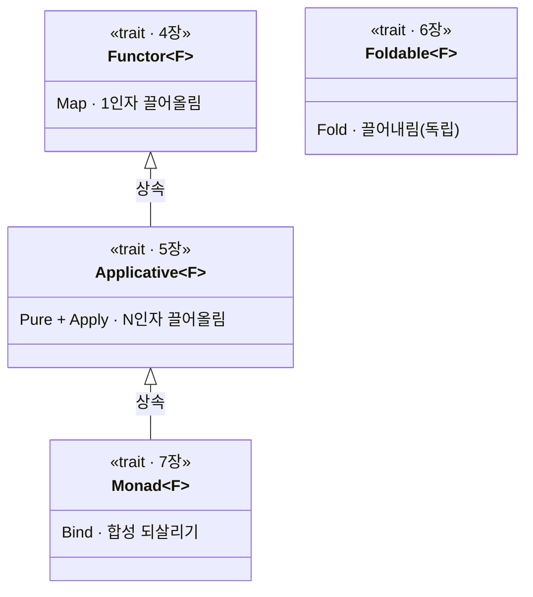

# Part 2 — Core Traits (네 자리의 다리)

> 기초 3부작 (Part 1 ~ 3) 의 두 번째 Part 입니다. [Part 1 — Foundations](../Part01-Foundations/README.md) 이 세운 *두 평행 세계 + 4 가지 함수 유형* 지도 위에, 그 네 자리를 잇는 **핵심 trait 네 개** 를 차례로 올립니다.

## Part 2 의 배경

Part 1 에서 두 평행 세계 (Normal / Elevated) 와 그 사이를 오가는 4 가지 함수 유형을 지도로 세웠습니다. Part 2 는 그 지도의 네 자리 위에 다리를 놓습니다. 각 trait 이 어느 함수 유형을 처리하는지가 한눈에 정렬됩니다.

| 함수 시그니처 | 자리 | trait | 한 줄 |
|---|---|---|---|
| `a → b` → `E<a> → E<b>` | 1인자 끌어올림 | **Functor** (`map`) | Normal 함수 하나를 Elevated 로 |
| 다인자 → `E<a> → … → E<r>` | N인자 끌어올림 | **Applicative** (`pure` + `apply`) | 다인자 Normal 함수를 Elevated 로 |
| `E<a> → b` | 끌어내림 (lower) | **Foldable** (`fold`) | Elevated 구조를 Normal 한 값으로 |
| `a → E<b>` 합성 | 합성 되살리기 | **Monad** (`bind`) | World-crossing 함수의 합성 + Kleisli + LINQ |

`map` 이 끌어올림, `fold` 가 끌어내림, `bind` 가 두 세계에 걸친 합성입니다. 네 trait 모두 `K<F, A>` 마커 위에서 3-tuple 패턴 (자료 / 태그 / trait) 으로 직접 구현합니다.

네 trait 의 관계는 한 갈래의 상속 사슬과 한 독립 trait 으로 정리됩니다.

**Part 2 의 네 trait 관계** — `Functor → Applicative → Monad` 는 상속 사슬입니다. 끌어올림이 1인자 (Functor) 에서 N인자 (Applicative) 로, 다시 합성 되살리기 (Monad) 로 자랍니다. Foldable 은 반대 방향 (끌어내림) 의 독립 trait 이라 이 사슬 밖에 섭니다.

## Part 2 의 장 (Ch04 ~ 07)

### 4장 — [Functor / map](./Ch04-Functor.md)
1인자 lift. `a → b` 를 `E<a> → E<b>` 로 끌어올립니다. 모양은 보존하고 안의 값만 변환. `MyList` / `MyMaybe` 에 `Functor<F>` 를 직접 부착하고, 두 법칙 (항등 + 합성) 을 다룹니다.

### 5장 — [Applicative / pure + apply](./Ch05-Applicative.md)
N 인자 lift. `pure` 와 `apply` 위에서 `Lift2 / Lift3 / Lift4` 가 자라며 4장의 1인자 lift 가 다인자로 확장됩니다. `Apply` 가 두 컨테이너를 동시에 다루는 점이 8장 누적 vs 단락의 씨앗입니다.

### 6장 — [Foldable / fold](./Ch06-Foldable.md)
반대 방향 (lower). `E<a>` 구조를 Normal 한 값으로 끌어내립니다. `Sum` / `Count` / `All` 의 일반화. 한 번의 trait 정의 + N 번의 부착으로 N×M 비용이 N+M 으로 줄어드는 모습을 코드로 봅니다. 거르기 (Filterable) 는 자체 trait 으로 분류만 짚습니다.

### 7장 — [Monad / bind / Kleisli](./Ch07-Monad.md)
합성 되살리기의 핵심. 출력만 Elevated 인 `a → E<b>` 는 직접 합성이 안 되는데, `bind` 가 이를 되살립니다. Kleisli 합성 `>=>`, LINQ `from-from-select` 가 모두 `Monad<F>` 위에서 자랍니다. 세 법칙 (좌 / 우항등 / 결합) 으로 합성의 자연스러움이 보장됩니다.

## Part 2 의 코드

`code/Part02-CoreTraits/` 의 각 챕터 (`Ch04` ~ `Ch07`) 가 독립 실행 가능한 콘솔 데모로 들어 있습니다. `Program.cs` 가 두 법칙 (Functor) ~ 다섯 법칙 (Applicative) 등 검증 결과를 출력하며, 시그니처는 LanguageExt v5 의 공식 trait 와 정합합니다.
