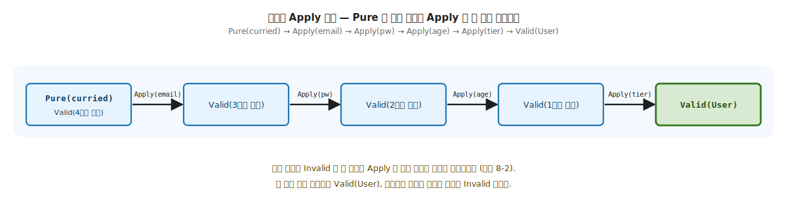
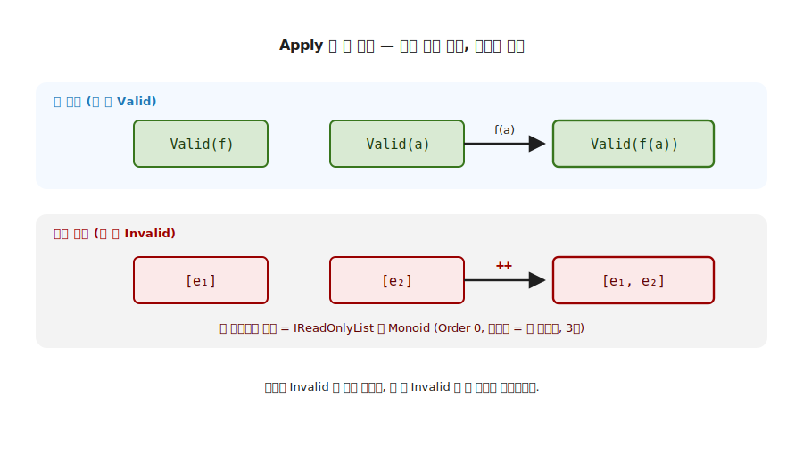
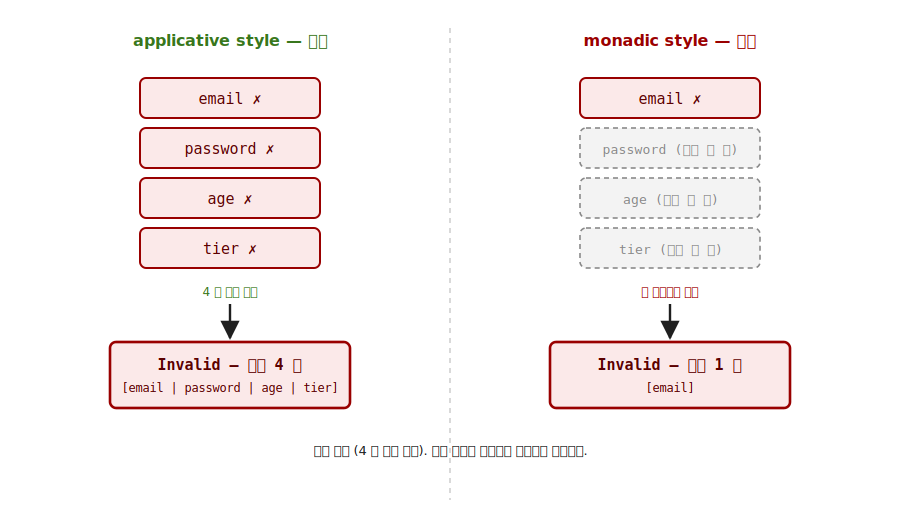
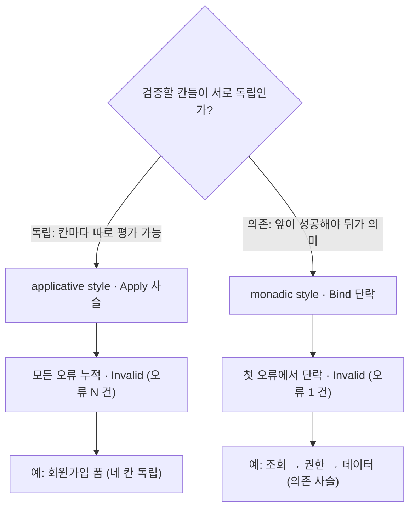

# 8장. Validation 실전 (applicative 누적 vs monadic 단락)

> **이 장의 목표** — 기초에서 처음으로 이론을 실전에 붙입니다. 이 장을 읽고 나면 5장에서 만든 `MyValidation` 으로 회원가입 폼을 두 어법으로 풀어, applicative style 의 누적 (모든 오류를 한 번에) 과 monadic style 의 단락 (첫 오류에서 멈춤) 이 같은 입력에서 왜 다른 결과를 내는지 코드로 보일 수 있습니다. `Bind` 를 의도적으로 두지 않는 자리에서 무엇이 가능해지는지, 그리고 오류 누적이 3장 Monoid 의 결합으로 다시 쓰이는지를 직접 작성한 코드로 짚어, 누적이냐 단락이냐를 도메인이 고른다는 실전 기준을 손에 쥐게 됩니다.

> **이 장의 핵심 어휘**
>
> - **`MyValidation<E, A>`**: 성공이면 값을 담은 `Valid`, 실패면 오류 목록을 담은 `Invalid` 두 케이스를 가진 Elevated 시민
> - **Applicative-but-not-Monad**: `Apply` 만 두고 `Bind` 를 일부러 막아 단락 대신 누적을 택하는 의도된 설계
> - **누적 (accumulate)**: 네 칸을 모두 평가해 틀린 칸의 오류를 한 목록에 모으는 applicative style 의 결과
> - **단락 (short-circuit)**: 첫 `Invalid` 에서 멈춰 나머지를 평가하지 않는 monadic style 의 결과
> - `Apply` 의 `Invalid + Invalid` 분기: 함수 측과 값 측이 둘 다 실패면 두 오류 목록을 이어붙이는, 누적이 일어나는 자리
> - **독립 결합 / 의존 결합**: 서로 모르는 칸을 함께 평가하는 `Apply` 와 앞 성공에 뒤가 의존하는 `Bind` 의 차이
> - **`MapFail`**: 값은 그대로 두고 에러 채널만 변환하는 함수. 값 채널의 `Map` 과 대칭

> 이 장을 마치면 할 수 있게 되는 것
> - [ ] `MyValidation` 이 왜 Applicative 자리이고 Monad 자리가 아닌지 설명할 수 있습니다.
> - [ ] applicative 누적과 monadic 단락이 같은 입력에서 어떻게 다른 결과를 내는지 보일 수 있습니다.
> - [ ] `Apply` 의 `Invalid + Invalid` 분기가 오류 누적의 전부임을 시그니처로 설명할 수 있습니다.
> - [ ] 오류 누적이 3장 Monoid 의 결합 (`IReadOnlyList` 이어붙임) 임을 짚을 수 있습니다.
> - [ ] 다인자 검증을 `Pure → Apply` 사슬로 조립할 수 있습니다.
> - [ ] 다인자 Apply 사슬이 curried 함수를 한 칸씩 소비하며 오류를 누적하는 과정을 단계별로 추적할 수 있습니다.
> - [ ] 폼 검증은 누적, 의존 사슬은 단락이라는 도메인 선택의 기준을 설명할 수 있습니다.

---

## 8.1 왜 필요한가 — 첫 실패에서 멈추는 폼

8장은 기초에서 처음으로 이론을 실전에 붙이는 장입니다. 새 trait 을 배우지 않습니다. 5장 ~ 7장에서 손에 쥔 두 도구 (Applicative 의 `Apply`, Monad 의 `Bind`) 를 같은 도메인에 나란히 적용해, **어느 어법이 어느 상황에 맞는가** 를 실전으로 가립니다.

`Bind` 만으로 폼을 검증하면 무엇이 번거로운지 먼저 겪어 봅니다. 회원가입 폼에 이메일 · 비밀번호 · 나이 · 등급 네 칸이 있습니다. 7장의 `Bind` 사슬로 검증을 이으면, 첫 칸이 틀리는 순간 단락이 일어나 나머지는 평가조차 되지 않습니다.

```csharp
// Bind 사슬로 검증하면 — 첫 실패에서 멈춤
ValidateEmail(email).Bind(e =>
    ValidatePassword(pw).Bind(p =>      // email 이 틀리면 여기는 평가 안 됨
        ValidateAge(age).Bind(a => ...)));
```

이메일과 비밀번호와 나이가 모두 틀려도 사용자는 **이메일 오류 하나만** 봅니다. 그것을 고쳐 다시 제출하면 이번엔 비밀번호 오류 하나를 봅니다. 네 칸이 틀렸으면 네 번 제출해야 모든 오류를 알게 됩니다. 검증에서는 단락이 사용자 경험을 해칩니다.

> **흔한 함정** — "그러면 `try-catch` 로 각 칸을 따로 검사해 오류를 리스트에 모으면 되지" 로 넘기면, 모으는 코드와 조립하는 코드가 본문에 섞여 칸이 늘 때마다 복제됩니다. 필요한 것은 **검증을 독립으로 수행하면서 오류를 자동으로 누적하고, 모두 통과했을 때만 값을 조립하는** 도구입니다. 그 도구가 Applicative 의 `Apply` 입니다.

폼 검증이 원하는 것은 단락이 아니라 누적입니다. 네 칸을 모두 평가해, 틀린 칸의 오류를 모두 모아 한 번에 보여 줍니다. 7장의 의존 결합 (`Bind`) 이 아니라 5장의 독립 결합 (`Apply`) 이 맞는 자리입니다.

---

## 8.2 도구 선택 — 5장의 `MyValidation`, 그리고 `Bind` 를 비운 까닭

### 8.2.1 5장에서 만든 `MyValidation` 자리 복습

`MyValidation<E, A>` 는 5장에서 Applicative 의 인스턴스로 부착했습니다. 두 케이스로 나뉩니다. 성공이면 값을 담은 `Valid`, 실패면 오류 목록을 담은 `Invalid` 입니다.

```csharp
public abstract record MyValidation<E, A> : K<MyValidationF<E>, A>
{
    public sealed record Valid(A Value) : MyValidation<E, A>;
    public sealed record Invalid(IReadOnlyList<E> Errors) : MyValidation<E, A>;
}
```

여기서 타입 자리 `E` 는 1장의 Elevated 컨테이너 `E<a>` 가 아니라 오류 (Error) 의 머리글자로, `MyValidation` 이 담는 오류 타입 (여기서는 `DomainError`) 을 가리킵니다. 오류가 단수가 아니라 **목록** (`IReadOnlyList<E>`) 이라는 점이 이 장의 모든 것을 결정합니다. 오류를 하나가 아니라 여러 개 담을 수 있어야 누적이 가능합니다. 5장에서는 이 타입의 시그니처를 봤고, 8장에서는 그 시그니처가 실전에서 무엇을 할 수 있게 하는지 봅니다.

### 8.2.2 Applicative 자리, Monad 자리 아님

앞 절의 불편이 도구를 정해 줍니다. `MyValidationF<E>` 는 `Applicative<MyValidationF<E>>` 만 구현하고, `Bind` 는 정의하지 않습니다.

```csharp
public sealed class MyValidationF<E> : Applicative<MyValidationF<E>>
{
    // Map / Pure / Apply 만 — Bind 는 없습니다 (의도적).
}
```

7장에서 `Bind` 가 의존 결합 (앞 단계의 성공에 뒤 단계가 의존) 이라 단락을 일으킨다고 봤습니다. Validation 이 `Bind` 를 일부러 두지 않는 이유가 바로 그것입니다. 폼 검증은 네 칸이 서로 독립이므로, 의존 결합이 아니라 독립 결합 (`Apply`) 으로 모든 칸을 함께 평가해 오류를 누적하려는 것입니다. 이 의도적 선택을 **Applicative-but-not-Monad** 라 부릅니다.

`MyValidation` 은 5장에서 부착한 Applicative 그대로이므로, Applicative 의 다섯 법칙 (5장) 을 그대로 따릅니다. 새 trait 을 더하지 않으니 이 장에는 별도의 법칙 절을 두지 않고, 5장에서 검증한 다섯 법칙을 그대로 물려받습니다.

---

## 8.3 도메인 셋업 — 값 객체와 `DomainError`

**이 장의 코드 구조**

```
Ch08-Validation/
├── Types/MyValidation.cs        ← 자료: 5장 재사용 (누적 Applicative)
├── Domain/ValueObjects.cs       ← 검증 대상 값 객체 + DomainError
├── Functions/Validators.cs · SignUpForm.cs   ← 검증자 + 폼 조립
├── Functions/StyleComparison.cs ← 누적 vs 단락 대비
└── Challenges/ApplyTrace.cs · … ← 8.10절 정답
```

회원가입 폼의 네 값을 값 객체로 둡니다. 생성자는 검증을 강제하지 않습니다. 검증은 외부 검증자 함수가 담당하고, 통과한 경우에만 값 객체가 조립됩니다.

```csharp
public readonly record struct Email(string Value);
public readonly record struct Password(string Value);
public readonly record struct Age(int Value);
public enum Tier { Free, Pro, Enterprise }

public sealed record User(Email Email, Password Password, Age Age, Tier Tier);

// 도메인 에러 — 어느 필드의 어떤 문제인지.
public sealed record DomainError(string Field, string Message)
{
    public override string ToString() => $"{Field}: {Message}";
}
```

`DomainError` 가 **어느 필드의 어떤 문제** 인지 함께 담습니다. 오류를 누적할 때 사용자가 "이메일이 왜, 비밀번호가 왜" 를 한눈에 보려면, 오류 하나하나가 자기 출처를 알아야 합니다. 검증의 결과 타입은 모두 `MyValidation<DomainError, …>` 입니다.

---

## 8.4 작은 검증자 — 한 함수 한 책임

검증자는 한 함수가 한 칸만 책임집니다. 모두 같은 모양 `K<MyValidationF<DomainError>, X>` 를 돌려줍니다.

```csharp
public static K<MyValidationF<DomainError>, Email> Email(string raw) =>
    raw.Contains('@') && raw.Length <= 254
        ? MyValidationF<DomainError>.Pure(new Email(raw))
        : new MyValidation<DomainError, Email>.Invalid(
              [new DomainError("email", "@ 필수 + 254 자 이하")]);
```

통과하면 `Pure` 로 값을 `Valid` 에 끌어올리고, 실패하면 `Invalid` 에 오류 한 건을 담습니다. 비밀번호 (8 자 이상) · 나이 (14 ~ 120) · 등급 (`Enum.TryParse`) 도 같은 모양입니다. 네 검증자가 서로를 전혀 모릅니다. 이 **독립성** 이 누적의 전제입니다. 서로 의존하지 않으므로 넷을 함께 평가할 수 있습니다.

---

## 8.5 다인자 끌어올림 — `Curry → Pure → Apply` 사슬

네 검증 결과를 하나의 `User` 로 조립합니다. 5장의 다인자 끌어올림 패턴이 그대로 실전에 옵니다. 5장에서는 이 사슬을 `Lift4` 한 줄로 압축했지만, 여기서는 누적이 `Apply` 한 번 한 번에서 일어나는 것을 눈으로 보려고 일부러 펼칩니다. 실무라면 `Lift4` 한 줄이면 충분합니다. `User` 생성자는 인자가 넷이므로 먼저 curry 합니다.

```csharp
// 4 인자 생성자를 curry — a => b => c => d => User(a, b, c, d)
Func<Email, Password, Age, Tier, User> ctor = (e, p, a, t) => new User(e, p, a, t);
var curried = Curry.Of(ctor);

// Pure 로 함수를 올리고, Apply 를 네 번
var lifted = MyValidationF<DomainError>.Pure(curried);   // Valid(curried)
// emailV·passwordV·ageV·tierV = 8.4 의 검증 결과 네 개 (예: emailV = Validators.Email(emailRaw))
var step1  = lifted.Apply(emailV);     // Email 적용
var step2  = step1.Apply(passwordV);   // Password 적용
var step3  = step2.Apply(ageV);        // Age 적용
var result = step3.Apply(tierV);       // Tier 적용 → MyValidation<…, User>
```

5장에서 본 `Pure → Apply` 사슬과 정확히 같은 골격입니다. `Pure` 가 함수를 Elevated 로 끌어올려 출발점을 만들고, `Apply` 가 검증 결과를 하나씩 넘깁니다. 네 검증이 모두 `Valid` 면 `Valid(User(…))` 가, 하나라도 `Invalid` 면 오류가 모인 `Invalid` 가 나옵니다. 그 누적이 일어나는 자리가 `Apply` 입니다. (`lifted.Apply(emailV)` 는 `Apply(lifted, emailV)` 의 확장 메서드 표기로, 함수 측 `lifted` 가 첫 인자, 검증 결과 `emailV` 가 둘째 인자입니다. 이 둘을 받는 것이 뒤에서 볼 `Apply` 정의입니다.)



**그림 8-1. 다인자 Apply 사슬: curried 함수를 한 칸씩 채웁니다** — `Pure(curried)` 가 4인자 함수를 Elevated 로 끌어올려 출발점을 만들고, `Apply` 가 검증 결과를 하나씩 넘길 때마다 남은 인자가 줄어듭니다. 네 번째 `Apply(tier)` 가 마지막 인자를 채우면 `Valid(User)` 가 됩니다. 어느 칸이든 `Invalid` 면 그 단계의 `Apply` 가 에러 채널에 오류를 누적하므로 (그림 8-2), 네 칸이 모두 통과해야 `Valid(User)`, 하나라도 틀리면 누적된 오류의 `Invalid` 입니다.

> **여기까지의 안전망** — `Curry → Pure → Apply` 사슬이 처음엔 복잡해 보여도 괜찮습니다. 지금 가져갈 직감은 하나입니다. `Apply` 가 검증을 한 칸씩 넘기며, 성공이면 값 채널을 채우고 실패면 에러 채널에 쌓습니다. 이는 5장에서 익힌 `Pure → Apply` 다인자 끌어올림 그대로입니다.

---

## 8.6 누적의 핵심 — `Apply` 의 `Invalid + Invalid` 분기

이 장의 모든 것이 `Apply` 의 네 분기 한 곳에 모여 있습니다.

```csharp
public static K<MyValidationF<E>, B> Apply<A, B>(
    K<MyValidationF<E>, Func<A, B>> mf, K<MyValidationF<E>, A> ma) =>
    (mf.As(), ma.As()) switch
    {
        (Valid f, Valid a)       => new Valid(f.Value(a.Value)),            // 둘 다 성공 → 적용
        (Invalid fe, Invalid ae) => new Invalid([..fe.Errors, ..ae.Errors]), // 둘 다 실패 → 누적
        (Invalid fe, _)          => new Invalid(fe.Errors),                 // 함수 측만 실패
        (_, Invalid ae)          => new Invalid(ae.Errors)                  // 값 측만 실패
    };
```

핵심은 둘째 분기입니다. 함수 측과 값 측이 **둘 다 `Invalid` 면 두 오류 목록을 이어붙입니다** (`[..fe.Errors, ..ae.Errors]`). `Apply` 가 사슬을 따라 호출될 때마다 이 이어붙임이 누적되어, 네 칸이 모두 틀리면 네 오류가 한 목록에 모입니다. 단락하는 분기가 없습니다. 실패해도 멈추지 않고 오류를 모읍니다.

### 8.6.1 오류 누적은 3장 Monoid 의 결합입니다

두 오류 목록을 이어붙이는 `[..fe.Errors, ..ae.Errors]` 가 낯설지 않아야 합니다. 3장에서 본 결합입니다. `IReadOnlyList<E>` 는 이어붙임 (`++`) 을 결합으로, 빈 목록을 항등원으로 갖는 Monoid 입니다 (Order 0). 오류 누적은 그 결합을 검증 사슬을 따라 반복 적용하는 것입니다. 다만 누적이 실제로 동원하는 것은 결합 (Semigroup) 한 가지뿐입니다. 항등원 (빈 목록) 은 누적 자체에는 쓰이지 않고, 3장의 완전한 Monoid 모양을 상기시키는 자리입니다. 두 `Invalid` 를 이어붙이는 데에는 결합만으로 충분합니다.



**그림 8-2. `Apply` 의 두 채널: 값은 함수 적용, 에러는 Monoid 결합** — 위 행 값 채널은 둘 다 `Valid` 일 때 함수 `f` 를 값 `a` 에 적용해 `Valid(f(a))` 를 냅니다. 아래 행 에러 채널은 둘 다 `Invalid` 일 때 두 오류 목록 `[e1]`, `[e2]` 를 이어붙여 `[e1, e2]` 를 냅니다. 이 이어붙임이 3장의 `IReadOnlyList` Monoid 결합 (항등원은 빈 목록) 입니다. `Apply` 한 번이 두 채널을 동시에 진행합니다.

> **한 줄 정리** — `Apply` 는 값 채널에는 함수를 적용하고, 에러 채널에는 Monoid 결합을 적용합니다. 3장의 결합이 검증의 오류 누적으로 다시 쓰입니다.

### 8.6.2 오류가 쌓이는 과정 — 네 칸 모두 틀린 입력

네 칸이 모두 틀린 입력 (`"noatsign", "1234", -5, "Premium"`) 에서 오류 목록이 `Apply` 사슬을 따라 어떻게 쌓이는지 한 단계씩 봅니다. 출발점 `Pure(curried)` 는 `Valid` 라 오류가 없습니다.

```text
시작:          Valid(curried)            오류 []
Apply(email):  email 이 Invalid          오류 [email]
Apply(pw):     pw 도 Invalid → 이어붙임    오류 [email, pw]
Apply(age):    age 도 Invalid → 이어붙임   오류 [email, pw, age]
Apply(tier):   tier 도 Invalid → 이어붙임  오류 [email, pw, age, tier]
```

`Valid` 였던 함수 측이 첫 `Invalid` (email) 를 만나면 네 번째 분기 (값 측만 실패) 로 오류 한 건을 담고, 그 뒤로는 함수 측도 값 측도 `Invalid` 라 둘째 분기 (둘 다 실패) 가 두 목록을 계속 이어붙입니다. 단락이 없으므로 네 칸을 끝까지 평가해 오류 네 건이 한 목록에 모입니다. 이 누적이 뒤에서 볼 사례 3 의 오류 4 건으로 나타납니다.

---

## 8.7 applicative style vs monadic style — 같은 도메인, 다른 의미

같은 입력을 두 어법으로 풀어 결과를 나란히 둡니다. applicative style 은 `Apply` 사슬로 네 칸을 모두 평가해 오류를 누적합니다. monadic style 은 차례로 평가하다 첫 `Invalid` 에서 단락합니다.

`MyValidation` 에는 `Bind` 가 없으므로, monadic 단락은 `switch` 로 직접 흉내 냅니다. 의미는 7장 `Bind` 의 단락과 같습니다.

```csharp
// monadic style — 첫 Invalid 에서 즉시 return (단락 시뮬레이션)
var emailV = Validators.Email(emailRaw);
if (emailV.As() is Invalid ei) return new Invalid(ei.Errors);   // 여기서 멈추면 나머지 평가 안 됨

var passwordV = Validators.Password(passwordRaw);
if (passwordV.As() is Invalid pi) return new Invalid(pi.Errors);
// ... age, tier 차례로 ...
```

이 `switch` 의 이른 `return` 이 7장 `Bind` 단락과 같은 일을 합니다. 단락은 `Bind` 의 시그니처 `K<F, A> → (A → E<B>) → E<B>` 에서 **구조적으로** 따라옵니다. 둘째 인자가 `A → E<B>` 함수인데, 앞이 `Invalid` 면 그 함수에 건넬 `A` 값 자체가 없습니다. 그래서 `Bind` 는 다음 함수를 호출할 수가 없어 첫 오류에서 멈출 수밖에 없습니다. 여기 `switch` 도 첫 `Invalid` 에서 `return` 해 뒤 검증을 실행조차 하지 않으니 같은 단락입니다. 그래서 `MyValidation` 에 `Bind` 를 두지 않은 것은 단순한 누락이 아니라, 이 단락을 피해 누적을 택하려는 의도입니다. (직접 `Bind` 를 정의해 누적이 사라지는 것을 확인하는 것이 뒤에서 볼 챌린지 3 입니다.)

> **실무 노트** — LanguageExt v5 의 실제 `Validation<FAIL, A>` 는 단락 `Bind` 도 제공해, 같은 타입에서 누적 (`Apply`) 과 단락 (`Bind`) 두 경로를 모두 씁니다. 라이브러리 `Validation` 이 Monad 가 아니어서 `Bind` 가 없는 것이 아닙니다. 이 책의 학습용 `MyValidation` 은 누적이 왜 `Apply` 에서 일어나는지를 단락 경로에 방해받지 않고 보이려고 `Bind` 를 일부러 비운 것입니다.

네 칸이 모두 틀린 같은 입력 (`"noatsign", "1234", -5, "Premium"`) 에 두 어법을 적용하면 결과가 갈립니다.

| 어법 | 결합 | 결과 |
|---|---|---|
| applicative | `Apply` 사슬 (독립, 모두 평가) | `Invalid` — 오류 **4 건** |
| monadic | `switch` 단락 (의존, 첫 실패에서 멈춤) | `Invalid` — 오류 **1 건** |



**그림 8-3. 누적 vs 단락: 같은 입력, 다른 결과** — 왼쪽 applicative style 은 네 칸을 모두 평가해 오류 4 건을 누적합니다. 오른쪽 monadic style 은 첫 칸 (`email`) 실패에서 멈춰 나머지 세 칸을 평가하지 않고 오류 1 건만 냅니다. 옳고 그름이 아니라 도메인이 의미를 고릅니다.

어느 어법이 더 옳은 것은 아닙니다. **도메인이 의미를 고릅니다.** 회원가입 폼처럼 칸이 서로 독립이면 모든 오류를 한 번에 보여 주는 누적 (applicative) 이 친절합니다. 사용자 조회 다음 권한 조회 다음 데이터 조회처럼 앞이 성공해야 뒤가 의미를 갖는 의존 사슬이면, 첫 실패에서 멈추는 단락 (monadic) 이 자연스럽습니다. 5장 `Apply` 와 7장 `Bind` 의 차이가 도메인 선택의 기준이 됩니다.



**그림 8-4. 누적이냐 단락이냐: 도메인이 고르는 갈림길** — 검증할 칸들이 서로 독립이면 모든 오류를 모으는 applicative 누적 (`Apply` 사슬) 이, 앞 단계가 성공해야 다음이 의미를 갖는 의존 사슬이면 첫 오류에서 멈추는 monadic 단락 (`Bind`) 이 자연스럽습니다. 도메인이 의미를 고르는 자리입니다.

---

## 8.8 에러에 컨텍스트 입히기 — `MapFail`

오류가 모인 뒤, 각 오류에 공통 맥락을 입히고 싶을 때가 있습니다. `MapFail` 이 그 일을 합니다. 값은 그대로 두고 오류만 변환합니다.

```csharp
public static K<MyValidationF<E>, A> MapFail<A>(Func<E, E> f, K<MyValidationF<E>, A> fa) =>
    fa.As() switch
    {
        Valid v   => v,                                            // 값은 그대로
        Invalid i => new Invalid(i.Errors.Select(f).ToList())      // 오류만 변환
    };
```

`Map` 이 값 채널을 다룬다면 `MapFail` 은 에러 채널을 다룹니다. 예를 들어 누적된 네 오류 각각에 `"[가입 폼] "` 접두어를 붙일 수 있습니다. 8장의 흐름 안에서 `MapFail` 의 자리는 분명합니다. 누적이 오류를 **모으는** 도구라면, `MapFail` 은 모인 오류를 사용자에게 내보내기 전에 **다듬는** 마지막 손질입니다 (뒤에서 볼 사례 4 가 그 자리). 두 채널 (값 / 에러) 을 각각 변환하는 이 대칭은 10장 Bifunctor 의 `BiMap` 으로 일반화됩니다.

---

## 8.9 실전 데모 — 4 사례

`Program.cs` 의 데모는 점점 더 많은 오류로 나아갑니다.

```
== 사례 1 — 모두 정상 ==
  ✓ User 생성: User { Email = ..., Tier = Pro }

== 사례 2 — 이메일만 잘못 ==
  ✗ 에러 1 건:
    - email: @ 필수 + 254 자 이하

== 사례 3 — 4 개 모두 잘못 — 누적 ==
  ✗ 에러 4 건:
    - email: @ 필수 + 254 자 이하
    - password: 8 자 이상
    - age: 14-120 범위
    - tier: Free / Pro / Enterprise 중 하나

== 사례 4 — MapFail 로 에러 prefix 추가 ==
  ✗ 에러 4 건:
    - email: [가입 폼] @ 필수 + 254 자 이하
    - ...
```

사례 3 이 이 장의 payoff 입니다. 네 칸이 모두 틀렸을 때 오류 네 건이 한 번에 나옵니다. monadic 이었다면 한 건만 봤을 자리입니다. 사례 4 에서는 `MapFail` 이 값은 그대로 두고 오류 각각에만 접두어를 입힙니다.

### 8.9.1 또 다른 도메인 — 서버 설정 검증

누적 패턴이 회원가입 폼에만 쓰이는 특수 기교가 아님을 다른 도메인으로 확인합니다. 서버 설정의 세 값 (host / port / timeout) 을 검증합니다. 세 칸이 서로 독립이라, 회원가입 폼과 똑같은 `Pure → Apply` 사슬이 그대로 옵니다.

```csharp
public static K<MyValidationF<DomainError>, ServerConfig> Parse(string host, int port, int timeout)
{
    Func<Host, Port, TimeoutSeconds, ServerConfig> ctor = (h, p, t) => new ServerConfig(h, p, t);
    return MyValidationF<DomainError>.Pure(Curry.Of(ctor))
        .Apply(ValidateHost(host))         // 비어 있지 않고 '.' 포함
        .Apply(ValidatePort(port))         // 1-65535
        .Apply(ValidateTimeout(timeout));  // 1-300 초
}
```

세 칸이 모두 잘못된 설정을 넣으면 오류 세 건이 한 번에 나옵니다. 운영자가 설정 파일을 한 번 고쳐 세 곳을 다 바로잡을 수 있습니다.

```csharp
ConfigValidator.Parse("localhost", 99999, 0);
// → Invalid [host: '.' 포함, port: 1-65535 범위, timeout: 1-300 초]   (3 건)

ConfigValidator.Parse("api.example.com", 8080, 30);
// → Valid(ServerConfig(api.example.com:8080, 30s))                    (통과)
```

도메인이 회원가입에서 설정으로 바뀌었어도 코드 골격은 똑같습니다. `Curry.Of` 로 생성자를 굽고, `Pure` 로 끌어올리고, 칸마다 `Apply` 를 잇습니다. 누적은 도메인이 아니라 `Apply` 의 `Invalid + Invalid` 분기가 책임지므로, 독립 검증이 있는 어느 도메인에든 그대로 옮겨집니다. 폼·API 요청·설정 파일이 실무에서 모두 이 한 패턴을 공유합니다.

### 8.9.2 칸 하나에 규칙 여럿 — 같은 누적이 한 칸 안에서도

누적의 단위가 "칸" 이 아니라는 변형 하나를 더 봅니다. 한 칸에 규칙이 여럿일 때가 있습니다. 비밀번호는 8 자 이상이면서, 숫자를 포함하고, 대문자를 포함해야 한다고 합니다. 세 규칙 중 하나만 어겨도 나머지를 마저 알려 주는 게 친절합니다. 칸과 칸 사이에서 쓰던 `Apply` 누적이 한 칸 안에서도 그대로 작동합니다. 다만 여기서는 앞서 본 정상 조립과 달리 운반 값이 필요 없어, 통과 규칙이 `Pure("")` 로 자리만 채우고 실제로는 오류 채널의 누적만 씁니다.

```csharp
// 규칙 하나 — 통과면 Valid, 실패면 오류 1 건. 운반 값은 쓰지 않습니다.
static K<MyValidationF<DomainError>, string> Rule(bool ok, string msg) =>
    ok ? MyValidationF<DomainError>.Pure("")
       : new MyValidation<DomainError, string>.Invalid([new DomainError("password", msg)]);

public static K<MyValidationF<DomainError>, Password> Strong(string raw)
{
    Func<string, string, string, Password> keep = (_, _, _) => new Password(raw);
    return MyValidationF<DomainError>.Pure(Curry.Of(keep))
        .Apply(Rule(raw.Length >= 8,       "8 자 이상"))
        .Apply(Rule(raw.Any(char.IsDigit), "숫자 1 자 이상"))
        .Apply(Rule(raw.Any(char.IsUpper), "대문자 1 자 이상"));
}
```

세 규칙을 `Apply` 로 잇고, 마지막에 통과한 `raw` 로 `Password` 를 조립합니다. `Rule` 이 통과 시 `Pure("")` 로 빈 문자열을 내는 까닭은, 여기서 필요한 것이 운반 값이 아니라 에러 채널의 누적뿐이기 때문입니다. 세 규칙의 운반 값은 `keep` 이 세 자리를 모두 `_` 로 버리고, `Password` 는 바깥의 `raw` 로 조립합니다. 값 채널은 자리만 채우고 실제 검증은 에러 채널에서 일어납니다. `"abc"` 처럼 세 규칙을 모두 어기는 입력이면 오류 세 건이 한 번에 모입니다.

```csharp
PasswordRules.Strong("abc");        // → Invalid [8 자 이상, 숫자 1 자 이상, 대문자 1 자 이상]  (3 건)
PasswordRules.Strong("password1");  // → Invalid [대문자 1 자 이상]                            (1 건)
PasswordRules.Strong("Passw0rd");   // → Valid(Password)                                       (통과)
```

칸과 칸 사이의 누적과 토씨 하나 다르지 않습니다. `Apply` 는 결합 대상이 서로 다른 칸이든 같은 칸의 여러 규칙이든 가리지 않고, `Invalid` 를 만나면 오류 채널에 누적합니다. 누적의 단위는 칸이 아니라 독립 검증입니다.

---

## 8.10 직접 해보기 — 챌린지

본문을 읽은 것과 손으로 추적·작성할 수 있는 것의 차이를 만듭니다. 세 챌린지는 8장의 결정적 자리 (누적이 일어나는 `Apply` 분기, 다인자 사슬 확장, 단락이 누적을 없앤다는 점) 를 직접 묻습니다. 세 정답 모두 실행 가능한 코드로 들어 있습니다.

### 8.10.1 `Apply` 네 분기를 따라 한 건 누적 추적하기

> 챌린지: 이메일만 틀린 입력의 결과를 `Apply` 분기로 손 추적하기
>
> `Submit("noatsign", "12345678", 30, "Pro")` (이메일만 잘못) 의 결과를 `Apply` 의 네 분기를 따라가며 손으로 구합니다. 함수 측이 `Valid`, 값 측 (email) 이 `Invalid` 인 분기가 어디서 오류 한 건을 담는지 짚습니다.
>
> **본문 어느 자리의 이해도를 묻는가**
>
> 1. `Apply` 의 네 분기 — `(Valid 함수, Invalid 값)` 분기가 값 측 오류를 담는다는 것.
> 2. 한 칸만 틀리면 누적 결과가 1 건임을 사슬 추적으로 확인할 수 있는가.
>
> **해보기** (앞서 본 네-칸-모두-틀림 추적을 보지 않고, 종이에 직접)
>
> 1. `Pure(curried)` 에서 출발해 `Apply` 네 번의 각 단계마다, 함수 측과 값 측이 네 분기 중 어느 분기에 떨어지는지 적습니다.
> 2. 각 단계 직후의 오류 목록 내용을 적습니다.
> 3. 최종 결과가 몇 건의 `Invalid` 인지 적은 뒤, 데모를 돌려 자기 추적과 비교합니다.
>
> **검증 포인트**
>
> - 한 칸만 틀리면 오류가 정확히 1 건인가?
> - `Valid` 함수 측과 `Invalid` 값 측이 만나는 분기가 값 측 오류를 보존하는가?
>
> 정답 코드: `code/Part03-Composition/Ch08-Validation/Challenges/ApplyTrace.cs`.

### 8.10.2 검증자를 하나 더 — 다섯 칸으로 늘리기

> 챌린지: 닉네임 칸을 추가해 5 인자 사슬로 확장하기
>
> 검증자를 하나 더 추가합니다 (예: 닉네임, 2 자 이상). `User` 생성자 인자를 다섯으로 늘리고 `Curry.Of` 와 `Apply` 사슬을 한 단계 더 잇습니다. 다섯 칸이 모두 틀리면 오류가 몇 건 나오는지 예측합니다.
>
> **본문 어느 자리의 이해도를 묻는가**
>
> 1. 다인자 끌어올림 사슬이 칸 수에 따라 `Apply` 를 한 번씩 더 잇는다는 것.
> 2. 누적의 단위가 칸 수와 무관하게 "틀린 칸의 수" 라는 것.
>
> **해보기**
>
> 1. `User` 에 `Nickname` 필드를 더하고 5 인자 생성자를 `Curry.Of` 합니다.
> 2. `Pure(curried).Apply(...)` 를 다섯 번 잇습니다.
> 3. 다섯 칸 모두 틀린 입력에 오류 5 건이 나옴을 예측·확인합니다.
>
> **검증 포인트**
>
> - 사슬이 `Apply` 다섯 번으로 자연스럽게 늘어나는가?
> - 다섯 칸 모두 틀리면 정확히 5 건이 누적되는가?
>
> 정답 코드: `Challenges/NicknameForm.cs`.

### 8.10.3 `Bind` 를 정의하면 왜 누적이 사라지는가

> 챌린지: `MyValidation` 에 `Bind` 를 직접 정의해 단락을 확인하기
>
> `MyValidation` 에 `Bind` 를 직접 정의합니다 (`Invalid` 면 단락). 그렇게 만든 `Bind` 로 폼을 검증하면 왜 누적이 사라지는지 설명합니다.
>
> **본문 어느 자리의 이해도를 묻는가**
>
> 1. `Bind` 의 단락이 시그니처에서 따라온다는 것 — 앞이 `Invalid` 면 건넬 값이 없어 다음 검증을 호출조차 못 합니다.
> 2. 누적은 `Apply` (독립) 의 성질이지 `Bind` (의존) 의 성질이 아니라는 것.
>
> **해보기**
>
> 1. `Bind(ma, f)` 를 `ma` 가 `Invalid` 면 그대로 `Invalid`, `Valid` 면 `f(value)` 로 정의합니다.
> 2. 이 `Bind` 로 네 칸을 이으면 첫 `Invalid` 에서 멈춰 1 건만 남음을 확인합니다.
> 3. 같은 입력에 `Apply` 사슬은 4 건, `Bind` 사슬은 1 건 — 누적이 사라집니다.
>
> **검증 포인트**
>
> - `Bind` 사슬이 첫 오류에서 단락해 1 건만 내는가?
> - 같은 입력에서 `Apply` (4 건) 와 결과가 갈리는가?
>
> 정답 코드: `Challenges/BindLosesAccumulation.cs`.

### 8.10.4 세 챌린지가 노리는 능력

세 챌린지는 8장의 핵심 (누적은 `Apply` 의 독립 결합에서, 단락은 `Bind` 의 의존 결합에서 온다) 을 세 각도에서 묻습니다. 첫째는 누적이 일어나는 `Apply` 분기를 손으로 추적하는 능력, 둘째는 다인자 사슬을 칸 수만큼 확장하는 능력, 셋째는 `Bind` 를 넣으면 누적이 사라짐을 직접 만들어 보이는 능력입니다. 셋을 다 통과하면 "왜 Validation 이 일부러 Monad 가 아닌가" 를 코드로 답할 수 있습니다.

---

## 8.11 Elevated World 어휘로 다시 읽기

8장의 도구를 1장 비유에 매핑합니다.

| 8장 도구 | Elevated World 어휘 |
|---|---|
| `MyValidation<E, A>` | 효과 = 검증 실패 가능성. 오류 목록을 함께 담는 Elevated 시민 |
| `Apply` 누적 | 독립 결합 — 모든 칸을 평가해 오류를 Monoid 결합으로 모음 |
| `Bind` 없음 | 의존 결합을 일부러 막아 단락을 피함 (Applicative-but-not-Monad) |
| `MapFail` | 에러 채널의 변환 (값 채널의 `Map` 과 대칭) |

5장의 Applicative 가 다인자 끌어올림이었다면, 8장은 그 끌어올림의 에러 채널이 3장 Monoid 의 결합 위에서 누적된다는 실전입니다. 비유는 여기까지가 역할입니다. 누적이냐 단락이냐의 선택은 도메인이 정합니다.

---

## 8.12 Q&A — 자기 점검

> **Q1. `MyValidation` 은 왜 Applicative 자리이고 Monad 자리가 아닙니까?** (8.2.2절)

`Apply` (독립 결합) 만 정의하고 `Bind` (의존 결합) 는 일부러 두지 않기 때문입니다. 7장에서 `Bind` 는 앞이 실패하면 단락한다고 봤습니다. 폼의 네 칸 (이메일·비밀번호·나이·등급) 은 서로 독립이라 모두 평가해 오류를 누적해야 하므로, 단락을 일으키는 `Bind` 를 일부러 비웁니다. 이 의도적 선택이 Applicative-but-not-Monad 입니다. 참고로 LanguageExt v5 의 실제 `Validation` 은 `Bind` 도 제공하지만, 학습용 `MyValidation` 은 누적이 왜 `Apply` 에서 일어나는지를 또렷이 보이려 비워 둡니다.

> **Q2. 같은 입력에서 applicative 와 monadic 의 결과가 어떻게 다릅니까?** (8.7절)

네 칸이 모두 틀린 입력 (`"noatsign", "1234", -5, "Premium"`) 에서 applicative 는 오류 4 건을 모두 누적하고, monadic 은 첫 칸 (이메일) 에서 단락해 1 건만 냅니다. 독립 결합 (`Apply`) 은 네 칸을 모두 평가하고, 의존 결합 (`Bind`) 은 첫 실패에서 멈추기 때문입니다. 사용자 입장에서 누적은 한 번에 다 고치게 하고, 단락은 네 번 제출하게 만듭니다.

> **Q3. 오류 누적은 어디서 일어납니까?** (8.6절)

`Apply` 의 `(Invalid, Invalid)` 분기입니다. 함수 측과 값 측이 둘 다 `Invalid` 일 때 두 오류 목록을 `[..fe.Errors, ..ae.Errors]` 로 이어붙입니다. `Pure → Apply → Apply → …` 사슬이 칸을 하나씩 소비할 때마다 이 이어붙임이 누적되어, 마지막에 틀린 칸 전부의 오류가 한 목록에 모입니다.

> **Q4. 누적과 3장 Monoid 의 관계는?** (8.6.1절)

오류 목록 이어붙임이 곧 3장의 `IReadOnlyList<E>` Monoid 결합입니다. 결합은 이어붙임 (`++`), 항등원은 빈 목록입니다. 다만 누적이 실제로 동원하는 것은 결합 (Semigroup) 한 가지뿐이고, 항등원은 3장의 완전한 Monoid 모양을 상기시키는 자리입니다. 3장에서 정의한 결합이 검증의 에러 채널에서 그대로 다시 쓰입니다.

> **Q5. 다인자 검증은 어떻게 조립합니까?** (8.5절)

`User` 생성자를 `Curry.Of` 로 curry 하고, `Pure` 로 Elevated 로 끌어올린 뒤 `Apply` 를 칸 수 (넷) 만큼 잇습니다. `Pure(curried).Apply(email).Apply(password).Apply(age).Apply(tier)` 사슬입니다. 5장의 `Curry → Pure → N×Apply` 다인자 끌어올림 패턴 그대로이고, 네 칸이 모두 `Valid` 일 때만 `User` 가 조립됩니다.

> **Q6. 폼은 누적, 의존 사슬은 단락인 이유는?** (8.7절)

폼의 칸은 서로 독립이라 (이메일이 틀려도 나이는 검사할 수 있어) 모든 오류를 한 번에 보여 주는 누적이 친절합니다. 반대로 사용자 조회 → 그 사용자의 계좌 조회 → 출금 같은 의존 사슬은 앞이 실패하면 뒤가 의미조차 없어 (없는 사용자의 계좌는 조회할 수 없어) 단락이 자연스럽습니다. 같은 두 도구 (`Apply` / `Bind`) 가 도메인의 의존성 유무에 따라 갈립니다.

> **Q7. `MapFail` 은 무엇을 변환합니까?** (8.8절)

값은 그대로 두고 오류만 변환합니다. 값 채널의 `Map` 과 대칭으로, 예를 들어 도메인 오류를 사용자용 메시지로 바꿀 때 `MapFail` 로 에러 채널만 손댑니다. 두 채널 (값·오류) 을 동시에 다루는 일반화가 10장 Bifunctor 의 `BiMap` 입니다.

---

## 8.13 요약

8장의 한 문장은 이렇습니다. **누적이냐 단락이냐는 도구가 아니라 도메인이 고르고, 그 갈림은 `Apply` (독립 결합) 와 `Bind` (의존 결합) 의 시그니처에서 옵니다.**

- **불편에서 출발했습니다.** `Bind` 단락으로 폼을 검증하면 첫 칸 오류만 보여, 사용자가 칸마다 다시 제출해야 했습니다 (8.1절).
- **Validation 은 Applicative-but-not-Monad 입니다.** `Bind` 를 일부러 두지 않아 단락 대신 누적을 택합니다 (8.2.2절).
- **누적의 핵심은 `Apply` 의 `Invalid + Invalid` 분기입니다.** 두 오류 목록을 이어붙여 모든 오류를 모읍니다 (8.6절).
- **누적은 3장 Monoid 의 결합입니다.** `IReadOnlyList` 이어붙임 (`++`), 항등원은 빈 목록 (8.6.1절).
- **다인자 검증은 `Curry → Pure → Apply` 사슬로 조립합니다.** 5장 패턴 그대로입니다 (8.5절).
- **누적이냐 단락이냐는 도메인이 고릅니다.** 폼은 누적, 의존 사슬은 단락 (8.7절).
- **`MapFail` 은 에러 채널을 변환합니다.** 값 채널의 `Map` 과 대칭 (8.8절).

---

## 8.14 다음 장으로 — 마무리 (9장 Traversable 다리)

| 장 | trait | 핵심 | 성격 |
|---|---|---|---|
| 5장 | Applicative | 다인자 끌어올림 (`Pure` + `Apply`) | 독립 결합 |
| 7장 | Monad | `a → E<b>` 합성 (`Bind`) | 의존 결합 |
| **이 장 (8장)** | **Validation** | `Apply` 누적 vs `Bind` 단락 | 도메인이 의미를 선택 |
| 다음 장 (9장) | Traversable | `List<E<a>> → E<List<a>>` | 두 Elevated 의 층 순서 뒤집기 |

8장에서 Applicative 의 `Apply` 가 여러 독립 효과를 한 번에 결합하는 실전을 봤습니다. 9장 Traversable 은 그 결합을 한 걸음 더 밀고 갑니다. `List<MyValidation<…>>` 처럼 컨테이너 안에 여러 Elevated 값이 들어 있을 때, 그 층 순서를 뒤집어 `MyValidation<…, List<…>>` 로 모으는 도구입니다. 4장 ~ 8장의 모든 도구를 동시에 동원하는 기초의 최정상 추상입니다. [9장 — Traversable](./Ch09-Traversable.md) 로 넘어갑니다.

> **실무 디딤돌** — Validation 의 누적 검증은 후속 Part 의 입력 검증 표준입니다. 폼 · API 요청 · 설정 파일처럼 여러 필드를 독립으로 검사해 오류를 한 번에 보고하는 자리에 그대로 쓰입니다.
>
> **테스트 디딤돌** — `MyValidation` 의 applicative 법칙은 5장 (5.6절) 에서 3장 3.10.6절의 `ForAll` 로 임의 입력에 검증했습니다. 이 장의 누적 vs 단락 동작 차이 (`누적 = 4 건`, `단락 = 1 건`) 는 데모로 확인했고, xUnit + Shouldly 표준 테스트로의 이행은 11부입니다.
