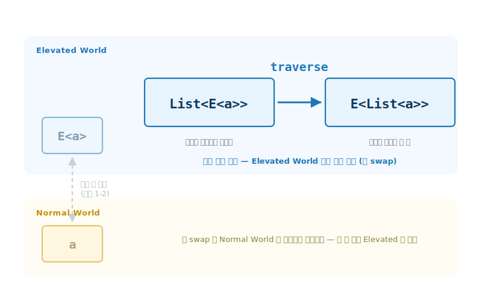
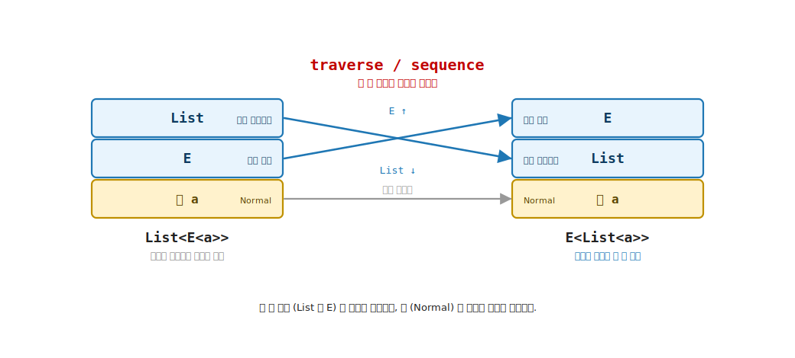
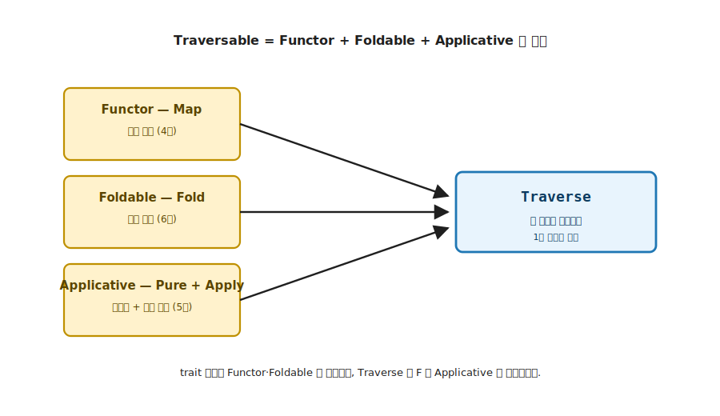
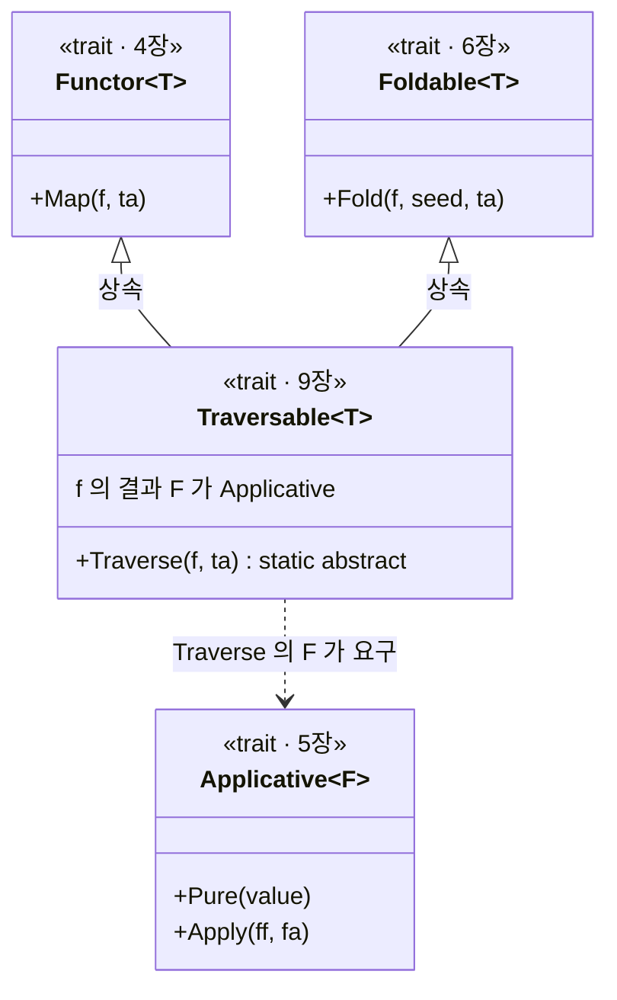
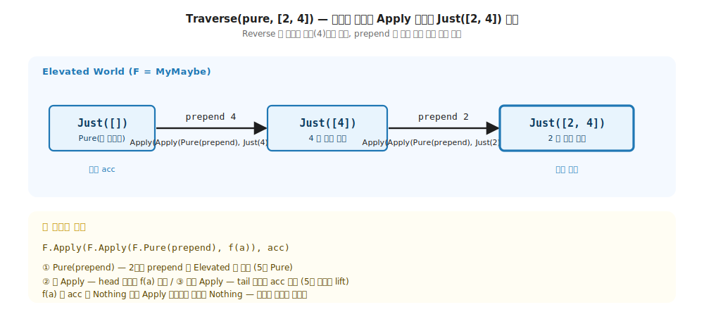
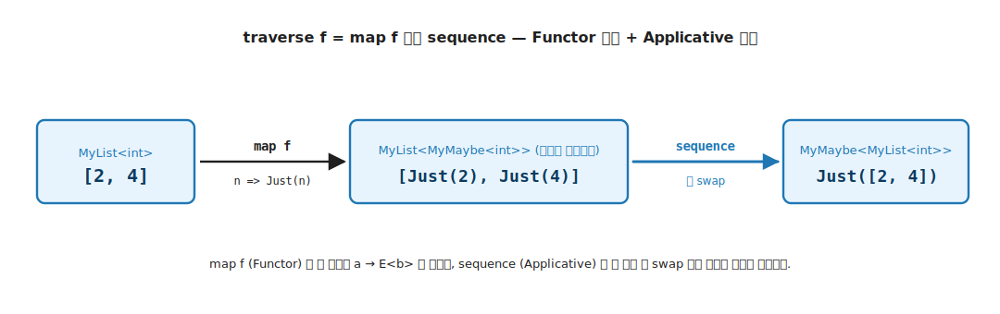

# 9장. Traversable / `traverse` (두 Elevated 세계의 층 순서 뒤집기)

> **이 장의 목표** — 이 장을 읽고 나면 `List<E<a>>` 처럼 효과가 원소마다 흩어진 모양을 `E<List<a>>` 로 뒤집는 `traverse` 와 `sequence` 를 한 줄 시그니처로 적고, 그 층 swap 을 직접 작성한 코드로 추적할 수 있습니다. Traversable 이 4장 Functor · 5장 Applicative · 6장 Foldable 세 trait 의 합성임을 trait 선언으로 보이는 것이 목표이며, 그래서 이 장은 앞선 도구가 모두 손에 잡힌 기초 핵심 trait 의 최정상 자리에 옵니다.

> **이 장의 핵심 어휘**
>
> - **`traverse`**: `(a → E<b>) → List<a> → E<List<b>>`, 원소를 World-crossing 함수로 변환하면서 동시에 두 층 순서를 뒤집는 도구
> - **`sequence`**: `List<E<a>> → E<List<a>>`, 변환 없이 층만 뒤집는 `traverse` 의 특수한 경우, 곧 `traverse id`
> - **층 swap**: 바깥 `List` 와 안쪽 효과 `E` 의 순서를 맞바꿔 효과를 바깥으로 한 번에 모으는 일
> - **Traversable**: Functor + Foldable + Applicative 세 trait 의 합성으로 정의되는 기초 최정상 추상
> - **단락 vs 누적**: 한 원소의 실패가 전체를 좌우하느냐 오류가 모두 모이느냐로, 안쪽 효과 `F` 의 `Apply` 가 정함
> - **항등 법칙**: `Traverse(Pure, t)` 가 `Pure(t)` 와 같아야 한다는 약속. 시그니처가 막지 못하는 순서 뒤집기를 잡아냄
> - **표기**: 본문의 안쪽 효과 `E` 와 바깥 컨테이너 `List` 는, 코드에서 각각 Applicative 인자 `F` 와 Traversable 인자 `T` 로 적습니다. 같은 대상의 두 표기입니다

> 이 장을 마치면 할 수 있게 되는 것
> - [ ] `traverse` 의 한 줄 시그니처 (`(a → E<b>) → List<a> → E<List<b>>`) 를 적을 수 있습니다.
> - [ ] `List<E<a>> → E<List<a>>` 의 층 swap 을 그림으로 설명할 수 있습니다.
> - [ ] `Map` 만으로는 왜 층이 뒤집히지 않는지 설명할 수 있습니다.
> - [ ] `Traverse` 의 `Pure → Apply → Apply` 사슬을 작은 입력으로 단계별 추적할 수 있습니다.
> - [ ] Traversable 이 Functor + Foldable + Applicative 의 합성임을 trait 선언으로 보일 수 있습니다.
> - [ ] `sequence = traverse id` 의 등식을 설명할 수 있습니다.
> - [ ] 안쪽 효과가 무엇이냐 (`Maybe` / `Validation`) 에 따라 단락과 누적이 갈리는 이유를 설명할 수 있습니다.

---

## 9.1 두 세계 비유로 본 Traversable — 목적

9장의 핵심은 한 줄로 압축됩니다. 지금까지 Elevated 값은 늘 바깥에 한 겹 (`E<a>`) 이었습니다. 그런데 실무에서는 컨테이너 안에 Elevated 값이 여러 개 들어찬 모양 (`List<E<a>>`) 을 자주 만납니다. 그 두 층의 순서를 뒤집어 효과를 바깥으로 한 번에 모으는 도구가 `traverse` 입니다.

### 9.1.1 왜 필요한가 — 효과가 원소마다 흩어진 자리

8장에서 회원가입 입력 하나하나를 검증해 `MyValidation<…, Email>` 같은 Elevated 값을 얻었습니다. 그런데 입력이 목록이면 어떻게 될까요. 문자열 목록 `["2", "4", "6"]` 의 모든 원소를 정수로 파싱하는 상황을 생각해 봅니다. 파싱은 실패할 수 있으므로 원소마다 결과가 `MyMaybe<int>` 입니다.

```csharp
// 원소마다 파싱하면 — 효과가 목록 안에 흩어진다
MyList<string> raw = new(["2", "4", "6"]);
MyList<MyMaybe<int>> parsed = raw.Map(ParseInt);   // List<E<a>> — 효과가 원소마다
```

원하는 것은 `List<MyMaybe<int>>` 가 아닙니다. "목록 전체가 성공했는가, 그렇다면 정수 목록은 무엇인가" 를 묻고 싶습니다. 곧 `MyMaybe<List<int>>` 입니다. 효과 (`MyMaybe`) 가 원소마다 흩어진 `List<E<a>>` 를, 효과가 바깥에 한 번 있는 `E<List<a>>` 로 옮겨야 합니다.

이 모양은 파싱에만 있지 않습니다. 사용자 ID 목록을 하나씩 조회하면 `List<MyMaybe<User>>` 가 나오고, 회원가입 폼의 필드를 하나씩 검증하면 `List<MyValidation<…, Field>>` 가 나옵니다. 효과가 원소마다 흩어진 `List<E<a>>` 는 실무에서 끊임없이 만나는 모양이고, 그때마다 묻고 싶은 것은 늘 같습니다. 전체가 성공했는가, 그렇다면 값들의 목록은 무엇인가. 곧 `E<List<a>>` 입니다.

```
가진 것:  List<MyMaybe<int>>   — 효과가 원소마다 (안쪽)
원하는 것: MyMaybe<List<int>>   — 효과가 바깥에 한 번
          ────────┬────────
          두 층 (List 와 MyMaybe) 의 순서가 뒤집혀야 함
```

손으로 풀면 다음과 같습니다. 목록을 순회하며 각 `MyMaybe` 를 꺼내 분기하고, 하나라도 `Nothing` 이면 전체를 `Nothing` 으로, 모두 `Just` 면 값을 모아 목록을 다시 만듭니다.

```csharp
// 손으로 짠 층 뒤집기 — 순회 · 분기 · 조립이 한 덩어리로 뒤섞인다
static MyMaybe<MyList<int>> SequenceByHand(MyList<MyMaybe<int>> source)
{
    var acc = new List<int>();                  // 성공 값을 모을 가변 버퍼
    foreach (var m in source.Items)
    {
        switch (m)
        {
            case MyMaybe<int>.Just j:
                acc.Add(j.Value);               // 성공 — 버퍼에 쌓는다
                break;
            case MyMaybe<int>.Nothing:
                return MyMaybe<MyList<int>>.Nothing.Instance;   // 하나라도 실패 → 전체 실패
        }
    }
    return new MyMaybe<MyList<int>>.Just(new MyList<int>(acc));  // 모두 성공 → 값 목록 조립
}
```

이 코드에는 세 가지 일이 한 덩어리로 뒤섞여 있습니다. 목록을 도는 순회, `Just` / `Nothing` 분기, 성공 값을 다시 목록으로 묶는 조립입니다. 게다가 안쪽 효과가 `MyMaybe` 가 아니라 8장의 `MyValidation` 으로 바뀌거나 바깥 컨테이너가 `MyList` 가 아니라 트리로 바뀌면, 이 순회·분기·조립을 처음부터 다시 적어야 합니다. 컨테이너와 효과의 조합마다 같은 골격이 복제됩니다. `traverse` 는 이 골격을 trait 한 자리로 추상화해 단 한 번만 적게 합니다.

### 9.1.2 1장 지도의 다섯 번째 이동 — 층 swap

9장의 `traverse` 는 1장의 기본 4 가지 함수 유형 어디에도 들어맞지 않습니다. 두 Elevated 세계 (`List` 와 `E`) 가 동시에 등장하고, 그 둘의 층 순서를 바꾸기 때문입니다. 1장 지도가 예약해 둔 첫 확장 자리가 바로 여기입니다. 기본 네 이동이 두 세계 **사이** 를 오갔다면, 다섯 번째 이동은 Elevated World **안** 에서 겹친 두 층을 교환합니다.



**그림 9-1. 1장 지도의 다섯 번째 이동: Elevated World 안의 층 swap** — 1장 그림 1-2 와 같은 두 세계 좌표 위입니다. 기본 네 이동 (왼쪽, 흐림) 이 두 세계 사이의 세로·대각선 이동이었다면, 층 swap 은 Elevated World 안에서 `List<E<a>>` 를 `E<List<a>>` 로 옮기는 가로 이동입니다. 두 층 모두 Elevated 라 Normal World 로 내려오지 않습니다.

이 이동을 담당하는 Traversable 은 단일 능력이 아니라 **앞선 세 trait 의 합성** 으로 정의됩니다. 4장 ~ 6장의 도구가 모두 손에 잡힌 지금에서야 다룰 수 있는, 기초 핵심 trait 의 최정상 자리입니다.

---

## 9.2 흔한 함정 — `Map` 만으로는 층이 안 뒤집힙니다

가장 먼저 떠오르는 시도는 `Map` 입니다. 그런데 `Map` 은 층을 뒤집지 못합니다.

```csharp
MyList<MyMaybe<int>> parsed = ...;          // List<E<a>>
var stillNested = parsed.Map(m => ...);     // 여전히 List<E<...>> — 층 그대로
```

`Map` (4장) 의 약속은 **모양 보존** 이었습니다. 바깥 컨테이너 `List` 의 모양을 그대로 두고 안의 값만 바꿉니다. 그래서 `List<MyMaybe<int>>` 에 `Map` 을 걸면 결과도 `List<무엇인가>` 입니다. 바깥이 여전히 `List` 입니다. 4장에서 강점이던 모양 보존이, 층을 뒤집어야 하는 이 자리에서는 오히려 걸림돌이 됩니다.

> **흔한 함정** — `Map` 으로 `MyMaybe` 를 바깥으로 빼낼 수 없습니다. `Map` 은 바깥 모양 (`List`) 을 보존하도록 시그니처에 고정되어 있기 때문입니다. 층 순서를 바꾸는 능력은 `Map` 에 없습니다. 새 도구가 필요합니다.

---

## 9.3 목표 시그니처 — `List<E<a>> → E<List<a>>`

층을 뒤집는 도구의 시그니처를 먼저 적습니다. 변환 없이 층만 뒤집는 가장 단순한 형태가 `sequence` 입니다.

```
sequence : List<E<a>> → E<List<a>>
```

안쪽 `E` 를 바깥으로 끌어올려 `List` 와 순서를 맞바꿉니다. 더 일반적인 형태는 `traverse` 입니다. 원소를 World-crossing 함수 `a → E<b>` 로 변환하면서 동시에 층을 뒤집습니다.

```
traverse : (a → E<b>) → List<a> → E<List<b>>
```

앞서 본 파싱 예제가 정확히 `traverse` 입니다. `ParseInt : string → MyMaybe<int>` 를 목록 `List<string>` 전체에 걸면 `MyMaybe<List<int>>` 가 나옵니다. 변환과 층 swap 이 한 번에 일어납니다.



**그림 9-2. 층 swap: `List<E<a>>` → `E<List<a>>`** — 왼쪽은 바깥이 `List`, 안쪽이 효과 `E` 인 모양입니다. 효과가 원소마다 흩어져 있습니다. 오른쪽은 바깥이 효과 `E`, 안쪽이 `List` 인 모양입니다. 효과가 바깥에 한 번 모였습니다. `traverse` 가 안쪽 `E` 를 바깥으로 끌어올려 두 층의 순서를 뒤집습니다.

---

## 9.4 `Traversable<T>` trait 시그니처 — 기능

층 swap 을 일반화한 trait 이 `Traversable<T>` 입니다. 핵심 멤버 `Traverse` 는 두 종류의 컨테이너를 동시에 다룹니다.

```csharp
public interface Traversable<T> : Functor<T>, Foldable<T> where T : Traversable<T>
{
    static abstract K<F, K<T, B>> Traverse<F, A, B>(Func<A, K<F, B>> f, K<T, A> ta)
        where F : Applicative<F>;

    // virtual — Traverse 의 단순한 변형. f 가 항등 함수일 때.
    static virtual K<F, K<T, A>> Sequence<F, A>(K<T, K<F, A>> tfa)
        where F : Applicative<F>
        => T.Traverse<F, K<F, A>, A>(x => x, tfa);
}
```

| 자리 | 의미 |
|---|---|
| `T` | 바깥 컨테이너 (순회 가능한 구조, 예: `List`) |
| `F` | 안쪽 효과 (`where F : Applicative<F>`, 예: `MyMaybe`) |
| `Func<A, K<F, B>> f` | World-crossing 변환 함수 (`a → E<b>`) |
| `K<T, A> ta` | 순회할 입력 (`List<a>`) |
| `K<F, K<T, B>>` | 층이 뒤집힌 결과 (`E<List<b>>`) |

> **기호 정리** — 본문 prose 의 안쪽 효과 `E` 가 코드의 `F`, 본문의 바깥 `List` 가 코드의 `T` 입니다. 1 장의 `E<a>` 는 Elevated 컨테이너 하나를 가리켰지만, 9 장은 Elevated 세계가 둘 (바깥 `T`·안쪽 `F`) 동시에 등장하는 첫 자리라 이름을 나눠 둡니다. `List` 도 Elevated 시민이지만 여기서는 순회되는 바깥 구조 역할이라 `T` 로 적습니다.

`F` 가 `Applicative` 여야 하는 이유가 시그니처에 박혀 있습니다. 층을 뒤집은 결과를 **조립** 하려면 빈 결과에서 시작할 `Pure` 와, 원소를 하나씩 결합할 `Apply` 가 필요하기 때문입니다. 5장의 다인자 끌어올림이 바로 여기서 쓰입니다. 두 세계 중 바깥으로 끌어올려지는 효과 `F` 가 결과를 조립하는 쪽이라 Applicative 역할을 맡고, 안으로 내려가 순회되는 `T` 가 Traversable 역할을 맡습니다. 어느 세계가 위로 오느냐가 곧 어느 trait 의 자리인지를 정합니다.

여기서 `Apply` 면 충분하고 `Bind` 까지는 필요 없다는 점이 중요합니다. 목록의 원소들은 서로 독립이기 때문입니다. 각 원소는 같은 변환 함수 `f` 로 따로 처리되고, 한 원소의 효과가 다른 원소의 값에 의존하지 않습니다. 7장에서 `Apply` 는 독립 결합, `Bind` 는 의존 결합이라고 갈랐습니다. traverse 는 원소끼리 의존이 없는 독립 결합이므로 정확히 `Apply` 자리입니다. 앞 원소의 결과를 봐야 다음 원소의 처리가 정해지는 의존이 있다면 그때 비로소 `Bind` 가 필요하지만, 층 swap 에는 그런 의존이 없습니다. 그래서 `Traverse` 의 제약이 `where F : Applicative<F>` 까지만이고 `Monad<F>` 를 요구하지 않습니다.

> **더 들어가면 (지금은 `Apply` 면 충분하다는 결론만 가져가도 됩니다)** — 이 차이는 단순한 제약 절약이 아니라 실질적 이득입니다. 원소들의 효과가 서로 독립이므로 정해진 순서 없이 다뤄도 되고, 원리상 병렬로 모아도 같은 결과가 나옵니다. 반대로 `Bind` 가 필요한 결합은 앞 효과가 끝나야 다음을 정할 수 있어 순차로 묶일 수밖에 없습니다. 그래서 효과 사이에 의존이 생기는 자리에서는 `Monad` 를 요구하는 순차 버전 (LanguageExt v5 의 `TraverseM`) 이 따로 필요하고, 이는 효과 모나드를 다루는 후속 Part 의 몫입니다.

---

## 9.5 Traversable = Functor + Foldable + Applicative 의 합성

`Traversable<T>` 의 정의 한 줄이 기초에서 익힌 것을 한데 모읍니다. trait 선언 `Traversable<T> : Functor<T>, Foldable<T>` 가 두 능력을 상속으로 요구하고, `Traverse` 의 매개변수 `F` 가 세 번째 능력 `Applicative` 를 요구합니다. 세 trait 이 한자리에 모입니다.



**그림 9-3. Traversable = 세 trait 의 합성** — Functor 의 `Map` (원소 변환, 4장), Foldable 의 `Fold` (순회 골격, 6장), Applicative 의 `Pure` + `Apply` (시작점과 원소 결합, 5장) 세 능력이 모여 `Traverse` 한 멤버를 이룹니다. 기초 핵심 trait 의 최정상 추상입니다.

| 동원되는 능력 | 역할 |
|---|---|
| Functor `Map` (4장) | 원소를 변환하는 자리 |
| Foldable `Fold` (6장) | 컨테이너를 접어 가며 순회하는 골격 |
| Applicative `Pure` + `Apply` (5장) | 빈 결과 시작점과 원소 하나씩 효과 결합 |

새로운 메커니즘을 발명하는 것이 아닙니다. 4장 ~ 6장에서 이미 손에 쥔 세 도구를 합성합니다. 그래서 Traversable 은 기초의 마지막에 옵니다. 앞선 도구가 모두 갖춰져야 만들 수 있습니다.

이 합성은 코드에서 `Traversable<T>` 의 trait 선언이 거는 상속·의존 관계로 박힙니다.



**그림 9-4. Traversable 의 trait 선언 구조: 상속 둘 + 의존 하나** — `Traversable<T> : Functor<T>, Foldable<T>` 선언이 Functor (4장) 와 Foldable (6장) 두 능력을 상속으로 요구하고, `Traverse` 의 매개변수 `F` 가 세 번째 능력 Applicative (5장) 를 요구합니다. 그림 9-3 가 세 능력이 합쳐지는 모습이라면, 이 그림은 그 합성이 trait 선언으로 어떻게 박히는지를 보여줍니다.

---

## 9.6 `MyList` 에 Traversable 부착 — `Traverse` 구현

**이 장의 코드 구조**

```
Ch09-Traversable/
├── Traits/Traversable.cs        ← trait 약속 (Functor + Foldable 상속)
├── Types/MyList.cs · MyMaybe.cs · MyValidation.cs   ← 자료 (안쪽 효과: 단락/누적)
├── Functions/Traversable.cs · Sequence.cs   ← traverse · sequence
├── Tests/TraversableLaws.cs · TraversableCounterexample.cs · ValidationTraverse.cs   ← 법칙 · 가짜 반례 · 누적 검증
└── Challenges/TraversableChallenges.cs   ← 9.11절 정답
```

`MyListF` 가 `Traversable<MyListF>` 를 구현합니다. `Map` (4장) 과 `Fold` (6장) 는 익숙하므로, 핵심인 `Traverse` 를 한 줄씩 봅니다.

### 9.6.1 구현 — `Pure` 로 시작해 `Apply` 로 조립

```csharp
public static K<F, K<MyListF, B>> Traverse<F, A, B>(Func<A, K<F, B>> f, K<MyListF, A> ta)
    where F : Applicative<F>
{
    var list = ta.As();

    // 빈 결과에서 시작 — Pure(빈 리스트).
    K<F, K<MyListF, B>> acc = F.Pure<K<MyListF, B>>(new MyList<B>([]));

    // 뒤에서 앞으로 누적 — 각 원소를 f 로 변환해 앞에 붙임.
    foreach (var a in list.Items.Reverse())
    {
        var fb = f(a);   // a → E<b>

        // (head, tail) → head 를 tail 앞에 붙인 새 리스트. curried.
        Func<B, Func<K<MyListF, B>, K<MyListF, B>>> prepend =
            head => tail => new MyList<B>([head, ..tail.As().Items]);

        // Pure(prepend) 후 두 단계 Apply — 5장 다인자 lift 그대로.
        var liftedFn = F.Pure(prepend);
        var step1    = F.Apply(liftedFn, fb);   // head 자리 결합
        acc          = F.Apply(step1, acc);     // tail 자리 결합
    }
    return acc;
}
```

`Pure(빈 리스트)` 로 시작해 (Applicative), 목록을 뒤에서 앞으로 순회하며 (Foldable 식 누적), 각 원소를 `f` 로 변환하고 (Functor 식 변환), `prepend` 를 `Pure` 로 올린 뒤 두 번 `Apply` 해 (Applicative 다인자 끌어올림) 머리를 꼬리 앞에 붙입니다. `Reverse()` 로 뒤에서 앞으로 도는 까닭은 `prepend` 가 앞에 붙이는 연산이라 원래 순서가 보존되기 때문입니다. 5장에서 본 `Pure → Apply` 사슬이 그대로 재등장합니다.

앞의 손코딩 `SequenceByHand` 와 나란히 두면, 한 덩어리로 뒤섞였던 세 가지 일이 `Traverse` 에서 어디로 갔는지 보입니다.

| 손코딩의 세 가지 일 | `SequenceByHand` (직접) | `Traverse` (trait) |
|---|---|---|
| 순회 | `foreach` + 가변 버퍼 | `foreach` + `Reverse()` (불변 누적) |
| 분기 (`Just` / `Nothing`) | `switch` 로 직접 분기 | `F.Apply` 안으로 흡수 (본문에 분기 없음) |
| 조립 | `acc.Add` 후 마지막에 `new MyList` | `Pure(prepend)` + 두 단계 `Apply` |

가장 큰 변화는 분기입니다. 손코딩에서 `switch` 로 직접 쓰던 `Just` / `Nothing` 처리가 `Traverse` 본문에는 한 줄도 없습니다. `F.Apply` 가 그 분기를 담당하기 때문입니다. 그래서 안쪽 효과 `F` 를 `MyMaybe` 에서 다른 효과로 바꾸면, 같은 `Traverse` 가 그 효과의 `Apply` 분기를 따라 다르게 동작합니다. 분기를 본문에서 빼내 `F` 에 맡긴 것이 trait 추상화의 핵심입니다.

### 9.6.2 단계별 실행 추적 — `Traverse([2, 4])` 가 `Just([2, 4])` 가 되기까지

위 구현의 `Pure → Apply → Apply` 사슬은 5장 `Lift2` 를 펼친 형태입니다. 한 번에 와닿지 않는다면, 작은 입력 `[2, 4]` 를 직접 굴려 봅니다. 안쪽 효과 `F` 는 `MyMaybe`, 변환 함수는 `n => Just(n)` 입니다. `Reverse()` 때문에 마지막 원소 `4` 부터 처리합니다.

| 단계 | acc 값 | 한 단계가 하는 일 |
|---|---|---|
| 시작 | `Just([])` | `Pure(빈 리스트)` 로 acc 를 엽니다 |
| `4` 처리 | `Just([4])` | `Apply(Apply(Pure(prepend), Just(4)), Just([]))` 로 `4` 를 빈 리스트 앞에 붙입니다 |
| `2` 처리 | `Just([2, 4])` | `Apply(Apply(Pure(prepend), Just(2)), Just([4]))` 로 `2` 를 `[4]` 앞에 붙입니다 |

마지막 원소부터 앞에 붙여 나가므로 원래 순서 `[2, 4]` 가 그대로 보존됩니다. 각 단계의 `Apply` 두 번은 5장에서 본 2인자 끌어올림 그 자체입니다. `prepend` 가 머리와 꼬리 두 인자를 받으므로, 첫 `Apply` 가 머리 자리에 `f(a)` 를, 둘째 `Apply` 가 꼬리 자리에 누적 `acc` 를 채웁니다. 5장의 `Lift2(prepend, fb, acc)` 가 `Pure(prepend).Apply(fb).Apply(acc)` 로 풀리던 것과 글자 그대로 같은 사슬입니다.



**그림 9-5. `Traverse([2, 4])` 단계별 추적** — `Pure([])` 에서 시작해 뒤에서 앞으로 두 단계를 거쳐 `Just([2, 4])` 를 조립합니다. 한 단계는 `F.Apply(F.Apply(F.Pure(prepend), f(a)), acc)` 한 줄이고, 이는 5장 다인자 끌어올림의 `Pure → Apply → Apply` 사슬과 같습니다. `f(a)` 나 `acc` 가 `Nothing` 이면 `Apply` 규칙이 결과 전체를 `Nothing` 으로 만들어, 단락이 추가 코드 없이 따라옵니다.

한 원소가 실패하면 어떻게 단락되는지도 같은 방식으로 봅니다. 짝수면 통과 홀수면 `Nothing` 인 변환으로 `[2, 3, 6]` 을 `Traverse` 합니다.

| 단계 | acc 값 | 한 단계가 하는 일 |
|---|---|---|
| 시작 | `Just([])` | `Pure(빈 리스트)` |
| `6` 처리 | `Just([6])` | `f(6) = Just(6)`, 앞에 붙여 `Just([6])` |
| `3` 처리 | `Nothing` | `f(3) = Nothing`, `Apply` 가 결과 전체를 `Nothing` 으로 |
| `2` 처리 | `Nothing` | acc 가 이미 `Nothing` 이라 이후 `Apply` 도 계속 `Nothing` |

`3` 에서 나온 한 번의 `Nothing` 이 `Apply` 사슬을 타고 끝까지 전파됩니다. 단락은 `Traverse` 가 따로 분기해서가 아니라, 안쪽 효과 `MyMaybe` 의 `Apply` 규칙 ((`Just`, `Just`) 만 `Just`, 그 외 `Nothing`) 에서 공짜로 따라옵니다.

> **여기까지의 안전망** — 이 추적이 한 번에 잡히지 않아도 괜찮습니다. 지금 가져갈 직감은 하나입니다. `Traverse` 는 새 메커니즘이 아니라 `Pure` 로 시작점을 열고 `Apply` 로 원소를 하나씩 결합하는, 5장 다인자 끌어올림의 반복일 뿐입니다. `Apply` 의 동작이 흐릿하다면 5장의 `Pure` + `Apply` 절을 다시 보고 와도 좋습니다.

---

## 9.7 데모 — 전부 통과 vs 한 원소 단락

안쪽 효과 `F` 자리에 `MyMaybe` 를 넣고, 짝수면 통과 홀수면 실패하는 변환으로 `Traverse` 를 돌립니다.

```csharp
Func<int, K<MyMaybeF, int>> evenCheck = n =>
    n % 2 == 0 ? MyMaybeF.Pure(n) : MyMaybe<int>.Nothing.Instance;

// 예제 1 — 전부 짝수
MyListF.Traverse(evenCheck, new MyList<int>([2, 4, 6]));   // → Just([2, 4, 6])

// 예제 2 — 3 이 홀수 → 전체 Nothing
MyListF.Traverse(evenCheck, new MyList<int>([2, 3, 6]));   // → Nothing
```

예제 1 은 모든 원소가 통과해 `Just([2, 4, 6])` 입니다. 층이 `List<Maybe>` 에서 `Maybe<List>` 로 뒤집혔습니다. 예제 2 는 `3` 이 `Nothing` 을 내자 전체가 `Nothing` 입니다. 한 원소의 실패가 전체 결과를 좌우합니다.

이 단락은 별도 코드가 아닙니다. `MyMaybeF.Apply` 의 `(Just, Just) → Just`, 그 외 모두 `Nothing` 규칙에서 공짜로 따라옵니다. `Apply` 가 사슬을 따라 호출되다 `Nothing` 을 한 번 만나면, 이후 모든 `Apply` 가 `Nothing` 을 전파합니다.

> **한 줄 정리** — `Traverse` 자체는 누적인지 단락인지 모릅니다. 안쪽 효과 `F` 의 `Apply` 가 그것을 정합니다. `F` 가 `MyMaybe` 면 단락, 8장의 `MyValidation` 이면 누적입니다.

### 9.7.1 안쪽 효과를 바꾸면 — MyValidation 으로 누적

`Traverse` 코드는 그대로 두고 안쪽 효과 `F` 만 `MyMaybe` 에서 8장의 `MyValidation` 으로 바꿔 봅니다. 짝수면 통과, 홀수면 오류 한 건을 내는 검증을 `[3, 5, 7]` 에 `Traverse` 합니다.

```csharp
Func<int, K<MyValidationF<string>, int>> evenV = n =>
    n % 2 == 0 ? MyValidationF<string>.Pure(n)
               : new MyValidation<string, int>.Invalid([$"{n} 은(는) 홀수"]);

Traversable.traverse<MyListF, MyValidationF<string>, int, int>(evenV, new MyList<int>([3, 5, 7]));
// → Invalid ["3 은(는) 홀수", "5 은(는) 홀수", "7 은(는) 홀수"]   오류 3 건 누적
```

같은 입력 `[3, 5, 7]` 을 `MyMaybe` 로 `Traverse` 하면 첫 홀수 `3` 에서 단락해 `Nothing` 한 건뿐이었습니다. 그런데 `MyValidation` 으로 바꾸자 세 오류가 모두 모입니다. `Traverse` 코드는 한 글자도 바꾸지 않았습니다. 바뀐 것은 안쪽 효과 `F` 의 `Apply` 규칙뿐입니다. `MyMaybe.Apply` 는 `Nothing` 을 만나면 전파하고, `MyValidation.Apply` 는 두 `Invalid` 의 오류 목록을 이어붙입니다 (8장의 누적). `Traverse` 의 `Pure → Apply` 사슬이 그 `Apply` 를 부를 뿐이라, 단락이냐 누적이냐는 전적으로 `F` 가 정합니다.

---

## 9.8 `sequence` 는 `traverse id` 입니다

변환 없이 층만 뒤집는 `sequence` 는 별도 함수가 아닙니다. `traverse` 의 변환 함수 자리에 **항등 함수** 를 넣은 특수한 경우입니다. trait 의 `Sequence` 가 `virtual default` 로 그렇게 정의돼 있습니다.

```csharp
// Sequence 는 Traverse 의 특수 경우 — f 가 항등 함수.
static virtual K<F, K<T, A>> Sequence<F, A>(K<T, K<F, A>> tfa)
    where F : Applicative<F>
    => T.Traverse<F, K<F, A>, A>(x => x, tfa);   // f = (x => x)
```

`traverse` 가 "변환하면서 층을 뒤집는" 일반 도구라면, `sequence` 는 "변환 없이 층만 뒤집는" 특수한 경우입니다. 변환 함수에 `x => x` 를 넣으면 변환이 사라지고 층 swap 만 남습니다.

> **결정적 통찰** — `sequence` 가 별도 함수가 아닌 이유는 `traverse id` 한 줄에 있습니다. `traverse` 를 세우면 `sequence` 는 그 특수 경우로 공짜로 따라옵니다.

그래서 본문은 `traverse` 를 먼저 완전히 세우고, `sequence` 를 그 특수화로 도출합니다. 일반을 먼저, 특수를 나중에 봅니다.

거울짝도 성립합니다. `sequence` 가 `traverse` 의 특수 경우라면, 거꾸로 `traverse` 는 `map` 과 `sequence` 의 합성입니다.

```text
traverse f = sequence ∘ (map f)
```

여기서 `∘` 는 1 장에서 본 함수 합성으로, 오른쪽 함수를 먼저 적용합니다. 그래서 `sequence ∘ (map f)` 는 `map f` 를 먼저 읽고 `sequence` 를 나중에 읽습니다. 먼저 `map f` (Functor) 가 각 원소를 `a → E<b>` 로 바꿔 `List<E<b>>` 를 만들고, 이어 `sequence` (Applicative) 가 한 번의 층 swap 으로 `E<List<b>>` 를 냅니다. LanguageExt v5 의 `Traversable` 도 이 분해를 기본 구현으로 둡니다.

```csharp
// v5 의 traverse 기본 구현 — map 으로 변환한 뒤 sequence 로 층을 뒤집는다.
TraverseDefault<F, A, B>(f, ta) => Traversable.sequence(T.Map(f, ta));
```

Traversable 이 Functor + Foldable + Applicative 의 합성이라는 점이 여기서 방향까지 또렷해집니다. `map f` 가 Functor 자리, `sequence` 가 Applicative 자리입니다. 정방향 (`traverse f = sequence ∘ map f`) 과 역방향 (`sequence = traverse id`) 이 한 쌍으로 맞물립니다.

> **가독성이 먼저입니다** — 한 가지 의문이 듭니다. `traverse` 가 한 번의 순회로 더 간결한데 왜 `map` 다음 `sequence` 두 걸음을 따로 쓸까요. 답은 가독성입니다. `map` 으로 변환한 뒤 `sequence` 로 층을 뒤집는 두 걸음은, 한 번에 둘을 하는 `traverse` 보다 머릿속에 그리기 쉬울 때가 많습니다. 성능이 실제로 문제가 된다고 확인되기 전까지는 읽기 쉬운 두 걸음을 골라도 좋습니다.



**그림 9-6. `traverse f = map f` 다음 `sequence`** — `[2, 4]` 에 `map f` (Functor) 가 `f : n => Just(n)` 를 적용해 `[Just(2), Just(4)]` 를 만들고, `sequence` (Applicative) 가 한 번의 층 swap 으로 `Just([2, 4])` 를 냅니다. 원소를 변환하는 일은 Functor 가, 층을 뒤집는 일은 Applicative 가 맡는 두 단계입니다.

---

## 9.9 호출 어법과 어떤 Traversable 든 받는 일반 함수

### 9.9.1 호출 어법 3 종

같은 `Traverse` 능력을 세 가지 표기로 부를 수 있습니다. 4장 ~ 8장과 같은 모듈 / 확장 메서드 / 실전 헬퍼 구성입니다.

```csharp
// 1. 모듈 자유 함수
Traversable.traverse<MyListF, MyMaybeF, int, int>(evenCheck, nums);

// 2. 확장 메서드
nums.Traverse<MyListF, MyMaybeF, int, int>(evenCheck);

// 3. 실전 헬퍼 — List<Maybe> → Maybe<List>
Sequence.SequenceListOption(listOfMaybes);
```

세 표기가 모두 같은 `MyListF.Traverse` 로 풀립니다. 자유 함수는 라이브러리 모듈 어법, 확장 메서드는 LINQ 식 점 표기, 실전 헬퍼는 자주 쓰는 패턴을 이름으로 묶은 것입니다.

### 9.9.2 어떤 Traversable 든 받는 일반 함수

위 세 표기는 모두 `MyListF` 한 자료에 묶여 있습니다. 그런데 `Traverse` 의 진짜 이득은 자료를 묻지 않는 일반 함수에서 드러납니다. `where T : Traversable<T>` 제약 하나만 걸면, 바깥 컨테이너가 무엇이든 받는 한 함수가 됩니다.

```csharp
public static K<F, K<T, B>> traverse<T, F, A, B>(Func<A, K<F, B>> f, K<T, A> ta)
    where T : Traversable<T>            //  ← T 가 Traversable 의 구현체임을 보장
    where F : Applicative<F> =>         //  ← 안쪽 효과 F 는 조립 가능한 Applicative
    T.Traverse<F, A, B>(f, ta);
```

`traverse` 는 `T` 가 무엇이든 동작합니다. `MyListF`, 그리고 미래의 어떤 Traversable 든 같은 함수가 처리합니다. 안쪽 효과 `F` 도 마찬가지로 열려 있습니다. 같은 함수에 `F = MyMaybeF` 를 넣으면 첫 실패에서 단락하고, `F = MyValidationF<string>` 를 넣으면 오류를 모두 누적합니다. `Traverse` 멤버 한 개를 정의하면 그 위의 일반 함수가 공짜로 따라옵니다.

> elevated-world 글 인용 — "Elevated World 마다 붙는 패턴의 이름은 같아도 구현은 제각각입니다. 그래도 다루는 방식은 공통됩니다." 그 공통점을 trait 시그니처 한 줄 (`Traverse`) 로 표현한 것이 `Traversable<T>` 입니다.

기초에서 쌓아 온 공짜 함수 사다리의 마지막 칸이 여기입니다.

```
Functor 만 정의        ─►  Map, Lift1, ...                       (소수)
+ Foldable             ─►  + Sum, Count, All, Any, ToList, ...    (누적)
+ Applicative          ─►  + Lift2, Lift3, ...                    (중간)
+ Traversable          ─►  + traverse, sequence (층 swap)         (최정상)
```

> **한 줄 정리** — `traverse` 와 `sequence` 의 진짜 힘은 라이브러리 함수를 외우는 데 있지 않습니다. `List<E<a>>` 를 `E<List<a>>` 로 바꾸고 싶은 모양을 알아보면, 새 컨테이너나 새 효과를 만나도 `Pure` 로 시작해 `Apply` 로 조립하는 같은 골격을 다시 적을 수 있다는 패턴 인식에 있습니다.

### 9.9.3 Traversable 이 아닌 경계

`traverse` 는 두 Elevated 세계가 동시에 등장하는 유일한 도구라, 4장 ~ 7장의 이웃 trait 과 헷갈리기 쉽습니다. 시그니처를 나란히 두면 자리가 또렷이 갈립니다.

| 함수 | 시그니처 | Traversable? | 왜 그런가 / 어느 trait |
|---|---|---|---|
| `traverse` | `(a → E<b>) → T<a> → E<T<b>>` | ✓ | 두 Elevated 세계의 층 swap |
| `sequence` | `T<E<a>> → E<T<a>>` | ✓ | 변환 없는 `traverse` 의 특수 경우 |
| `Map(f)` | `E<a> → E<b>` | ✗ | 끌어올림 — Functor 의 자리 (4장) |
| `Fold` | `E<a> → b` | ✗ | 끌어내림 — Foldable 의 자리 (6장) |
| `Bind` | `a → E<b>` 합성 | ✗ | World-crossing 합성 — Monad 의 자리 (7장) |

세계가 하나뿐인 `Map` · `Fold` · `Bind` 와 달리, `traverse` · `sequence` 만 두 세계 `T` 와 `E` 를 동시에 다뤄 그 층 순서를 맞바꿉니다. 시그니처가 trait 의 자리를 정확히 가릅니다.

---

## 9.10 traverse 의 법칙

`Traverse` 도 시그니처만으로는 강제되지 않는 약속을 가집니다. 입문 단계에서 손에 잡히는 것은 항등 (identity) 과 합성 (composition) 두 법칙입니다 (더 정밀한 자연성 법칙은 11부에서 다룹니다). 항등 법칙은 `traverse` 에 항등 효과를 걸면 원본이 그대로 나온다는 약속이고, 합성 법칙은 두 효과를 차례로 traverse 한 결과가 한 번에 합성한 효과로 traverse 한 결과와 같다는 약속입니다. 이 장은 그중 손에 잡히는 항등 법칙을 구체 값과 `ForAll` 로 확인하고, 합성 법칙은 정의만 짚은 뒤 정식 검증은 11부로 미룹니다.

항등 법칙은 앞서 본 `[2, 4]` 추적을 그대로 재사용해 구체 값으로 확인할 수 있습니다. 항등 효과 `n => Pure(n)` 로 `[2, 4]` 를 traverse 한 좌변과, 목록을 통째로 한 번 끌어올린 우변이 같은 값을 냅니다.

```text
좌변  Traverse(n => Pure(n), [2, 4])  =  Just([2, 4])    // 9.6.2절 추적 결과 그대로
우변  Pure([2, 4])                    =  Just([2, 4])
                                         ─────┬─────
                                         좌변 = 우변 — 항등 법칙 성립
```

`[2, 4]` 라는 한 값에서 성립하는 것을 확인했지만, 항등 법칙은 그 한 값이 아니라 모든 목록에 대한 약속입니다. 그래서 3 장에서 본 `ForAll` 로 임의 입력 100 건에 항등 법칙을 검증합니다. 생성기는 길이가 임의인 int 리스트를 만들고, 그 각각에서 좌변과 우변이 같은지를 검사합니다.

```csharp
// 항등 법칙을 임의의 MyList 100 건으로 — 모두 통과 (항등 효과는 IdentityHolds 안에서 a => Pure(a))
Property.ForAll(
    r => new MyList<int>(Enumerable.Range(0, r.Next(5)).Select(_ => r.Next(-1000, 1000))),
    ta => TraversableLaws.IdentityHolds<MyListF, MyMaybeF, int>(ta, TraversableLaws.ProbeList));
```

코드로는 `Tests/TraversableLaws.cs` 의 `IdentityHolds` 헬퍼가 항등 법칙을, `SequenceEqualsTraverseId` 헬퍼가 `sequence = traverse id` 등식을 검증하고, `Program.cs` 콘솔이 `MyListF` 에 대해 두 법칙을 통과로 표시합니다. 임의 입력 검증은 위 `ForAll` 로 이 장에서 수행하고, shrinking·자연성 법칙의 정식 검증은 11부로 넘어갑니다 (뒤의 테스트 디딤돌 참조). 지금은 `traverse` 가 층을 뒤집되 원소의 순서와 효과를 충실히 보존한다는 직감만 가져가도 충분합니다.

### 9.10.1 가짜 Traversable — 순서를 뒤집는 반례

법칙이 왜 필요한지는 법칙을 깨는 구현을 보면 분명해집니다. `Traverse` 의 시그니처 `(a → E<b>) → List<a> → E<List<b>>` 만 지키면 컴파일은 통과합니다. 그런데 시그니처를 지키고도 틀린 구현이 있습니다. 앞의 구현에서 `Reverse()` 를 빼면 어떻게 될까요.

```csharp
// 가짜 — Reverse 없이 앞에서부터 prepend. 시그니처는 같지만 순서가 뒤집힌다.
public static K<F, K<MyListF, B>> BogusTraverse<F, A, B>(Func<A, K<F, B>> f, K<MyListF, A> ta)
    where F : Applicative<F>
{
    var list = ta.As();
    K<F, K<MyListF, B>> acc = F.Pure<K<MyListF, B>>(new MyList<B>([]));
    foreach (var a in list.Items)          // Reverse() 제거 — 앞에서부터 prepend
    {
        var fb = f(a);
        Func<B, Func<K<MyListF, B>, K<MyListF, B>>> prepend =
            head => tail => new MyList<B>([head, ..tail.As().Items]);
        acc = F.Apply(F.Apply(F.Pure(prepend), fb), acc);
    }
    return acc;
}
```

`[1, 2, 3]` 에 항등 효과로 `BogusTraverse` 를 걸면 `Just([3, 2, 1])` 이 나옵니다. 앞에서부터 앞에 붙이니 순서가 뒤집힙니다. 시그니처는 진짜 `Traverse` 와 한 글자도 다르지 않은데 결과는 틀렸습니다. 항등 법칙이 바로 이 자리를 잡아냅니다. 항등 법칙은 `Traverse(Pure, t)` 가 `Pure(t)` 와 같아야 한다고 약속하는데, `BogusTraverse` 는 순서를 뒤집어 `Pure([3, 2, 1]) ≠ Pure([1, 2, 3])` 으로 약속을 깹니다. 시그니처가 막지 못하는 약속을 법칙이 막습니다. 4장의 가짜 Functor 가 모양 보존 법칙을 깨던 것과 같은 구도입니다.

---

## 9.11 직접 해보기 — 챌린지

본문을 읽은 것과 손으로 추적·작성할 수 있는 것의 차이를 만듭니다. 세 챌린지는 9장의 결정적 자리 (단락이 일어나는 `Apply` 사슬, 안쪽 효과를 바꾸면 누적이 됨, `sequence = traverse id`) 를 직접 묻습니다. 세 정답 모두 실행 가능한 코드로 들어 있습니다.

### 9.11.1 `Traverse` 단락을 `Apply` 사슬로 추적하기

> 챌린지: `[2, 3, 6]` 의 traverse 가 왜 `Nothing` 인지 손 추적하기
>
> `MyListF.Traverse(evenCheck, [2, 3, 6])` (`evenCheck` 는 짝수면 `Just`, 홀수면 `Nothing`) 가 왜 `Nothing` 인지, `Apply` 사슬을 따라가며 `3` 의 `Nothing` 이 어디서 전체를 `Nothing` 으로 만드는지 짚습니다.
>
> **본문 어느 자리의 이해도를 묻는가**
>
> 1. `Traverse` 의 `Pure → Apply` 조립을 단계별로 따라갈 수 있는가.
> 2. 안쪽 효과 `MyMaybe` 의 `Apply` 가 한 `Nothing` 에 결과 전체를 `Nothing` 으로 만드는 단락.
>
> **해보기**
>
> 1. `evenCheck(2) = Just(2)`, `evenCheck(3) = Nothing`, `evenCheck(6) = Just(6)`.
> 2. `Reverse` 순회라 `6 → 3 → 2` 순. `6` 은 `Just` 로 누적되다가, `3` 의 `Nothing` 을 `Apply` 하는 순간 규칙이 결과 전체를 `Nothing` 으로 만듭니다.
> 3. 이후 `2` 를 `Apply` 해도 `Nothing` 이 유지됩니다. 최종 `Nothing`.
>
> **검증 포인트**
>
> - 한 원소 (`3`) 의 `Nothing` 이 전체를 `Nothing` 으로 만드는가?
> - 그 단락이 `Traverse` 본문이 아니라 `F.Apply` 규칙에서 오는가?
>
> 정답 코드: `code/Part03-Composition/Ch09-Traversable/Challenges/TraversableChallenges.cs`.

### 9.11.2 안쪽 효과를 `MyValidation` 으로 — 단락에서 누적으로

> 챌린지: `F` 자리에 `MyValidation` 을 넣으면 누적이 되는 까닭 설명하기
>
> 안쪽 효과 `F` 자리에 8장의 `MyValidation` 을 넣으면 결과가 어떻게 달라지는지 예측합니다. 세 원소가 모두 실패하면 오류가 몇 건 모이는지, 그 까닭이 `MyValidation` 의 `Apply` 누적 분기임을 설명합니다.
>
> **본문 어느 자리의 이해도를 묻는가**
>
> 1. 단락 vs 누적을 정하는 것이 `Traverse` 가 아니라 안쪽 `F` 의 `Apply` 라는 것.
> 2. 같은 `Traverse` 코드가 `F` 만 바꾸면 다르게 동작한다는 것.
>
> **해보기**
>
> 1. `F = MyValidationF<string>`, 변환 함수가 짝수면 `Valid`, 홀수면 `Invalid [오류]`.
> 2. `[1, 3, 5]` (셋 다 홀수) → 세 `Invalid` 가 `Apply` 누적 분기로 합쳐져 오류 3 건.
> 3. `MyMaybe` 라면 첫 `Nothing` 에서 단락해 한 건도 안 모았을 것 — 차이를 대조합니다.
>
> **검증 포인트**
>
> - 세 원소 모두 실패 시 오류 3 건이 모이는가?
> - `Traverse` 코드는 그대로인데 `F` 만 바꿔 누적과 단락이 갈리는가?
>
> 정답 코드: `Challenges/TraversableChallenges.cs` 와 `Tests/ValidationTraverse.cs`.

### 9.11.3 `sequence = traverse id` 확인하기

> 챌린지: `sequence` 를 `traverse` 의 특수 경우로 다시 적기
>
> `sequence([Just(1), Just(2), Just(3)])` 를 `traverse(x => x, ...)` 로 다시 적어 두 표기가 같은 결과 (`Just([1, 2, 3])`) 를 냄을 확인합니다.
>
> **본문 어느 자리의 이해도를 묻는가**
>
> 1. `sequence` 가 변환 함수에 항등을 넣은 `traverse` 임을 코드로 보일 수 있는가.
>
> **해보기**
>
> 1. `sequence(xs)` 와 `traverse(x => x, xs)` 를 각각 호출합니다.
> 2. 둘 다 `Just([1, 2, 3])` 인지 확인합니다.
>
> **검증 포인트**
>
> - 두 표기가 같은 값을 내는가?
>
> 정답 코드: `TraversableChallenges.cs` 의 `sequence` / `traverse id` 대조.

### 9.11.4 세 챌린지가 노리는 능력

세 챌린지는 9장의 핵심 (`traverse` 는 층을 뒤집고, 단락과 누적은 안쪽 `F` 가 정하며, `sequence` 는 `traverse` 의 특수 경우) 을 세 각도에서 묻습니다. 첫째는 단락을 `Apply` 사슬로 추적하는 능력, 둘째는 `F` 를 바꿔 누적으로 전환하는 능력, 셋째는 `sequence` 와 `traverse` 의 관계를 코드로 보이는 능력입니다. 셋을 다 통과하면 "층 swap 한 번이 효과에 따라 다른 결과를 낸다" 를 코드로 답할 수 있습니다.

---

## 9.12 Elevated World 어휘로 다시 읽기

9장의 도구를 1장 비유에 매핑합니다.

| 9장 도구 | Elevated World 어휘 |
|---|---|
| `traverse` | 변환하면서 두 Elevated 세계 (`T` 와 `F`) 의 층 순서를 뒤집음 |
| `sequence` | 변환 없이 층만 뒤집음 (`traverse id`) |
| 바깥 `T` / 안쪽 `F` | 순회 가능한 구조와 조립 가능한 효과 |
| 단락 vs 누적 | 안쪽 효과 `F` 의 `Apply` 가 정함 |

`map` (4장) 이 끌어올림, `fold` (6장) 가 끌어내림, `bind` (7장) 가 합성이었다면, `traverse` 는 두 Elevated 세계가 동시에 있을 때 그 층 순서를 바꾸는 도구입니다. 기초에서 모은 모든 어휘가 이 한 도구에 동원됩니다. 비유는 여기까지가 역할입니다. 정확한 보존 규칙은 세 법칙이 정합니다.

---

## 9.13 Q&A — 자기 점검

> **Q1. `traverse` 의 시그니처는?** (9.3절)

`(a → E<b>) → List<a> → E<List<b>>` 입니다. 변환 함수 (`a → E<b>`, World-crossing) 와 입력 목록 (`List<a>`) 을 받아, 원소를 변환하면서 `List<E<b>>` 의 층을 `E<List<b>>` 로 뒤집습니다. 예를 들어 `traverse(parseInt, ["2", "4"])` 는 `Just([2, 4])` 를, 하나라도 파싱이 실패하면 `Nothing` 을 냅니다.

> **Q2. `Map` 만으로는 왜 층이 안 뒤집힙니까?** (9.2절)

`Map` 의 약속이 모양 보존이기 때문입니다. 바깥 `List` 의 모양을 그대로 두므로, `List<E<a>>` 에 `Map` 을 걸어도 결과는 `List<무엇인가>` 로 바깥이 여전히 `List` 입니다. 4장에서 강점이던 모양 보존이, 층을 뒤집어야 하는 이 자리에서는 오히려 걸림돌이 됩니다. 층 순서를 바꾸는 능력은 `Map` 에 없습니다.

> **Q3. Traversable 은 어떤 trait 들의 합성입니까?** (9.5절)

Functor (원소 변환) + Foldable (순회 골격) + Applicative (시작점과 결합) 입니다. trait 선언 `Traversable<T> : Functor<T>, Foldable<T>` 가 두 능력을 상속으로 요구하고, `Traverse` 의 매개변수 `F` 가 세 번째 `Applicative` 를 요구합니다. 새 메커니즘을 발명하는 게 아니라 4장 ~ 6장의 세 도구를 합성합니다.

> **Q4. `Traverse` 의 `F` 는 왜 Applicative 여야 합니까?** (9.4절)

층을 뒤집은 결과를 조립하려면 빈 결과에서 시작할 `Pure` 와 원소를 하나씩 결합할 `Apply` 가 필요하기 때문입니다. 원소들이 서로 독립이라 `Apply` 면 충분하고 `Bind` (의존 결합) 까지는 필요 없습니다. 그래서 제약이 `where F : Applicative<F>` 까지만이고, 이는 원소를 순서에 매이지 않고 다룰 수 있다는 약속이기도 합니다.

> **Q5. `sequence` 와 `traverse` 의 관계는?** (9.8절)

`sequence = traverse id` 입니다. `traverse` 의 변환 함수 자리에 항등 함수를 넣으면 변환이 사라지고 층 swap 만 남아 `sequence` 가 됩니다. 거꾸로 `traverse f = sequence ∘ map f` 라, 두 표기가 한 쌍으로 맞물립니다. 별도 함수가 아닙니다.

> **Q6. 단락과 누적은 무엇이 정합니까?** (9.7절)

안쪽 효과 `F` 의 `Apply` 가 정합니다. `F` 가 `MyMaybe` 면 한 원소 실패에 전체가 `Nothing` (단락) 이고, 8장의 `MyValidation` 이면 실패한 원소의 오류가 모두 모입니다 (누적). `Traverse` 본문에는 둘을 구분하는 코드가 한 줄도 없고, 분기는 `F.Apply` 가 담당합니다. 그래서 같은 `Traverse` 가 `F` 만 바꾸면 다르게 동작합니다.

> **Q7. Traversable 이 기초 마지막 핵심 trait 인 이유는?** (9.5절)

Functor · Foldable · Applicative 세 도구의 합성이라, 그 셋이 모두 손에 잡힌 뒤에야 만들 수 있기 때문입니다. 앞선 trait 이 모두 갖춰져야 하므로 기초의 마지막에 옵니다. 새 메커니즘이 아니라 앞선 도구의 결합이라는 점이 핵심입니다.

---

## 9.14 요약

- **불편에서 출발했습니다.** `List<E<a>>` 처럼 효과가 원소마다 흩어진 자리에서, 효과를 바깥으로 한 번에 모으고 싶었습니다 (9.1절).
- **`Map` 은 층을 뒤집지 못합니다.** 모양 보존이 오히려 걸림돌이 됩니다 (9.2절).
- **`traverse` 가 층을 뒤집습니다.** `(a → E<b>) → List<a> → E<List<b>>` 가 변환과 층 swap 을 한 번에 합니다 (9.3절).
- **Traversable 은 세 trait 의 합성입니다.** Functor + Foldable + Applicative 를 한자리에 동원하는 기초 최정상 추상입니다 (9.5절).
- **`sequence = traverse id` 입니다.** 변환 함수에 항등 함수를 넣은 특수한 경우입니다 (9.8절).
- **항등 법칙이 순서·효과 보존을 약속합니다.** `Traverse(Pure, t) ≡ Pure(t)`, 곧 항등 효과를 걸면 원본이 그대로 나와야 한다는 약속이 `traverse` 가 층을 뒤집되 원소 순서와 효과를 충실히 보존함을 보장합니다 (9.10절).
- **단락과 누적은 안쪽 효과 `F` 가 정합니다.** `MyMaybe` 면 단락, `MyValidation` 이면 누적 (9.7절).

---

## 9.15 다음 장으로 — 마무리 (10장 Bifunctor 다리)

| 장 | trait | 시그니처 / 핵심 | 연산 | 자리 |
|---|---|---|---|---|
| 4장 | Functor | `E<a> → E<b>` | `map` | 끌어올림 |
| 5장 | Applicative | 다인자 끌어올림 | `pure` + `apply` | — |
| 6장 | Foldable | `E<a> → b` | `fold` | 끌어내림 |
| 7장 | Monad | `a → E<b>` 합성 | `bind` | — |
| 8장 | Validation | 누적 vs 단락 | — | — |
| **이 장 (9장)** | **Traversable** | `List<E<a>> → E<List<a>>` | `traverse` / `sequence` | 층 swap |
| 다음 장 (10장) | Bifunctor | 두 타입 인자 모두에 작용 | `biMap` | — |

9장까지 기초의 핵심 trait 다섯 (Functor / Applicative / Foldable / Monad / Traversable) 이 모두 두 평행 세계의 네 자리 위에서 자랐습니다. 10장 Bifunctor 부터는 그 어휘를 확장합니다. 지금까지 trait 은 타입 인자가 하나 (`E<a>` 의 `a`) 였습니다. 10장은 `Either<L, R>` 처럼 인자가 둘인 컨테이너에서 양쪽을 동시에 다루는 2-인자 일반화입니다. [10장 — Bifunctor](./Ch10-Bifunctor.md) 로 넘어갑니다.

> **실무 디딤돌** — `traverse` 는 `Eff` / `IO` 두 Elevated 세계를 동시에 이동하는 실무의 핵심 도구입니다. 목록의 각 항목을 비동기로 조회해 결과를 한 번에 모으거나, 여러 검증을 거쳐 전체 성공 여부를 판단하는 자리에 그대로 쓰입니다.
>
> **테스트 디딤돌** — traverse / sequence 의 항등 법칙은 이 장에서 3장 3.7.1절의 `ForAll` 로 임의 입력에 검증했습니다. 합성 법칙의 정식 검증, 무작위 생성기를 Functor·Monad 로 키우고 실패를 최소 반례로 줄이는 (shrinking) 본격 도구, 그리고 더 정밀한 자연성 법칙·실무 도구 (CsCheck / FsCheck) 로의 이행은 11부입니다.
