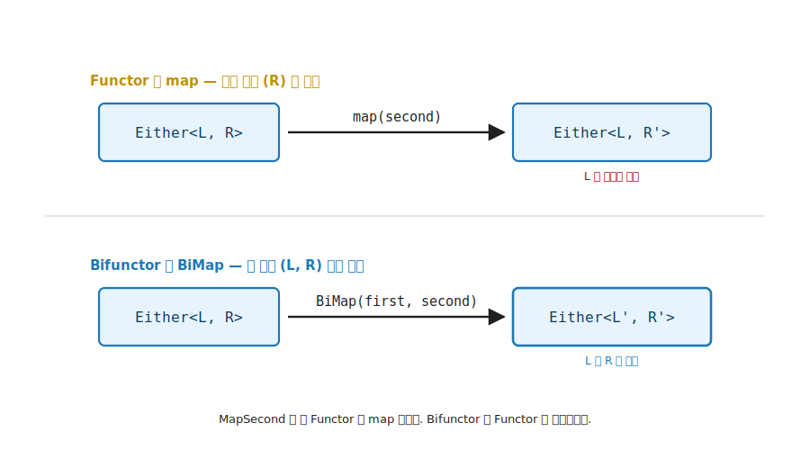
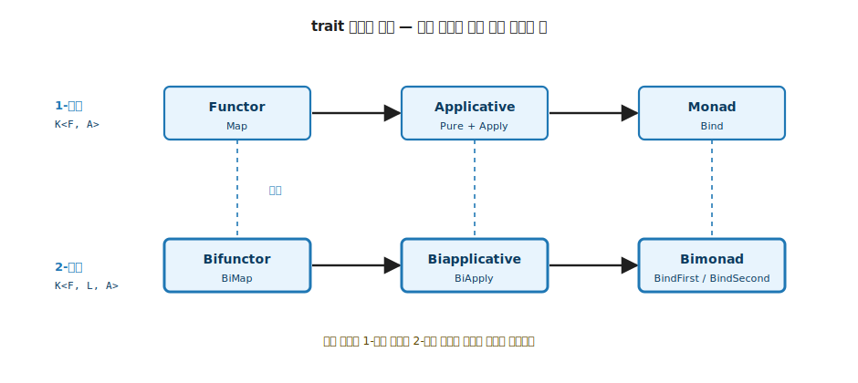

# 10장. Bifunctor / Biapplicative / Bimonad (두 타입 인자 모두에 작용)

> **이 장의 목표** — 이 장을 읽고 나면 타입 인자가 둘인 컨테이너 (`Either<L, R>`, `Pair<A, B>`) 에서 4장 Functor 의 한쪽만 변환하는 한계를 시그니처로 설명하고, `BiMap` 하나로 양쪽을 동시에 변환하는 Bifunctor 를 2-인자 마커 `K<F, L, A>` 위에 직접 구현할 수 있습니다. 핵심 5 trait (4 ~ 9장) 을 모두 익힌 뒤 그 일반화를 보는 자리로, 한 인자에서 익힌 끌어올림을 두 인자로 넓혀 기초의 확장 추상에 들어섭니다.

> **이 장의 핵심 어휘**
>
> - **Bifunctor**: 타입 인자가 둘인 컨테이너의 양쪽을 변환하는 trait. `MapSecond` 가 곧 Functor 의 `map` 이라 Functor 를 포함합니다
> - **`K<F, L, A>`**: 인자가 둘인 컨테이너를 분류하는 2-인자 마커. 2장의 `K<F, A>` 가 인자 하나 늘어난 모양
> - **`BiMap`**: 두 함수 `L → M` 과 `A → B` 를 받아 두 인자를 동시에 변환하고 모양은 보존하는 핵심 멤버
> - **`MapFirst`**: 둘째 자리에 항등 함수를 넣어 첫 인자만 변환하는 `BiMap` 의 특수한 경우
> - **`MapSecond`**: 첫 자리에 항등 함수를 넣어 둘째 인자만 변환하는, 곧 4장 Functor 의 `map` 에 해당하는 자리
> - **Biapplicative / Bimonad**: 1-인자 가족 Functor → Applicative → Monad 가 2-인자에서 평행하게 반복되는 가족

> 이 장을 마치면 할 수 있게 되는 것
> - [ ] 타입 인자가 둘인 컨테이너에서 Functor 의 한계를 시그니처로 설명할 수 있습니다.
> - [ ] `BiMap` 으로 두 인자를 동시에, `MapFirst` / `MapSecond` 로 한쪽만 변환할 수 있습니다.
> - [ ] `Bifunctor<F>` 를 2-인자 마커 `K<F, L, A>` 위에서 직접 구현할 수 있습니다.
> - [ ] Bifunctor 두 법칙 (항등 + 합성) 을 양쪽 인자에서 코드로 검증할 수 있습니다.
> - [ ] Bifunctor 위에 Biapplicative / Bimonad 가 어떻게 쌓이는지 설명할 수 있습니다.
> - [ ] 시그니처는 맞지만 두 법칙을 깨는 가짜 Bifunctor 를 찾아낼 수 있습니다.

---

## 10.1 인자가 둘인 컨테이너의 양쪽 변환 — 목적

### 10.1.1 왜 필요한가 — 한쪽만 바꾸는 보일러플레이트

`Either<L, R>` 에 4장의 Functor 만 부착하면 무엇이 번거로운지 먼저 겪어 봅니다. `Either<L, R>` 는 두 갈래 중 하나를 담는 컨테이너로, 관례상 왼쪽 `L` 에 실패를, 오른쪽 `R` 에 성공을 둡니다. Functor 의 `map` 은 컨테이너 안의 값 하나만 변환합니다. `Either<string, int>` 를 성공값 `int` 에 대한 Functor 로 보면 성공값은 `map` 으로 바꿀 수 있지만, 오류 타입 `string` 을 다른 타입 (예: `ErrorCode`) 으로 바꾸려면 `map` 으로는 바꿀 수 없습니다. 손으로 `Left` / `Right` 를 분해해 다시 조립합니다.

```csharp
// 오류 타입만 string → ErrorCode 로 바꾸려면 — 손으로 분해·재조립
static Either<ErrorCode, int> MapError(Either<string, int> e) =>
    e switch
    {
        Left<string, int> l  => new Left<ErrorCode, int>(Parse(l.Value)),  // 오류 갈래만 변환
        Right<string, int> r => new Right<ErrorCode, int>(r.Value),        // 성공 갈래는 그대로 재조립
        _ => throw new InvalidOperationException()
    };
```

성공값을 바꾸는 함수, 오류를 바꾸는 함수, 둘 다 바꾸는 함수마다 같은 `Left` / `Right` 분해·재조립이 복제됩니다. 도메인이 다른 `Either` (`Either<ValidationError, User>`, `Either<DbError, Row>`) 마다 또 적습니다. 두 인자를 한 번에 다루는 약속이 trait 에 없을 때 같은 코드가 서로 다른 자리에서 제각각 다시 생겨납니다.

> **흔한 함정** — 성공값은 `map`, 오류는 따로 함수로 나누면 컨테이너 종류마다 두 벌의 분해 코드가 생깁니다. 필요한 것은 두 함수를 한 번에 받아 양쪽을 변환하고 모양은 보존하는 도구입니다. 그 도구가 이 장의 `BiMap` 입니다.

### 10.1.2 두 함수가 필요한 자리

4장의 Functor 는 컨테이너 안의 값 하나를 변환했습니다 (`E<a> → E<b>`). 그런데 타입 인자가 둘인 컨테이너가 있습니다. `Either<L, R>` 는 실패 `L` 과 성공 `R` 두 갈래를 가지고, `Pair<A, B>` 는 두 값을 나란히 담습니다.

```text
Either<L, R>   — Left(L) 또는 Right(R)
Pair<A, B>     — (A, B) 두 값
```

이런 컨테이너에 Functor 를 부착하면 한쪽만 변환할 수 있습니다. `Either<L, R>` 를 `R` 에 대한 Functor 로 보면 `map` 은 성공값 `R` 만 바꾸고 실패값 `L` 은 손대지 못합니다. 두 인자를 모두 다루려면 함수가 둘 필요합니다. 그 추상이 Bifunctor 입니다.

핵심은 시그니처입니다. Functor 의 `map` 이 함수 하나 (`a → b`) 를 받는다면, Bifunctor 는 두 인자 각각에 적용할 함수 둘 (`L → M`, `A → B`) 을 받습니다.

---

## 10.2 Bifunctor — 두 함수로 양쪽을 변환

Bifunctor 의 핵심 멤버는 `BiMap` 입니다. 두 함수를 받아 두 인자를 동시에 변환합니다.

```text
BiMap : (L → M) → (A → B) → F<L, A> → F<M, B>
```

첫 번째 함수 `L → M` 은 첫 인자를, 두 번째 함수 `A → B` 는 둘째 인자를 변환합니다. 결과는 두 인자가 모두 바뀐 `F<M, B>` 입니다. 모양 (`F`) 은 그대로 보존하고 안의 두 값만 변환합니다. 4장 Functor 의 모양 보존이 인자 둘로 확장된 것입니다.

시그니처를 자리별로 읽으면 네 조각이 보입니다.

| 자리 | 역할 |
|---|---|
| `L → M` | 첫 인자 (왼쪽 값) 를 바꾸는 함수 |
| `A → B` | 둘째 인자 (오른쪽 값) 를 바꾸는 함수 |
| `F<L, A>` | 변환 전 컨테이너 (두 인자 `L`, `A`) |
| `F<M, B>` | 변환 후 컨테이너 (두 인자 `M`, `B`) |

`F` 가 입력과 출력에 똑같이 등장하는 것이 핵심입니다. 컨테이너 모양 `F` 는 그대로 두고 안의 두 값만 `L → M`, `A → B` 로 바뀝니다. 4장 `map` 의 `(a → b) → (E<a> → E<b>)` 에서 `E` 가 양쪽에 같았던 모양 보존이, 인자가 둘이 되어 변환 함수도 둘로 늘어난 것뿐입니다.


**그림 10-1. BiMap: 두 함수로 두 인자를 동시에 변환** — 왼쪽 `F<L, A>` 의 두 인자 `L`, `A` 에 각각 함수 `first : L → M` 과 `second : A → B` 가 적용되어 오른쪽 `F<M, B>` 가 됩니다. 모양 `F` 는 그대로 보존하고 안의 두 값만 변환합니다. 4장 Functor 의 모양 보존이 인자 둘로 늘어난 모습입니다.

한쪽만 변환하고 싶을 때는 나머지 자리에 항등 함수를 넣으면 됩니다. 이 두 가지는 `BiMap` 위에서 자동으로 따라옵니다.

```text
MapFirst  : (L → M) → F<L, A> → F<M, A>     == BiMap(first, identity, fab)
MapSecond : (A → B) → F<L, A> → F<L, B>     == BiMap(identity, second, fab)
```

`MapSecond` 가 바로 4장 Functor 의 `map` 에 해당합니다. 둘째 인자만 변환하고 첫 인자는 그대로 두기 때문입니다. 즉 Bifunctor 는 Functor 를 포함합니다. 한 인자만 보면 평범한 Functor 이고, 두 인자를 함께 보면 Bifunctor 입니다.

---

## 10.3 trait 직접 구현 — 2-인자 마커 `K<in F, L, A>`

**이 장의 코드 구조**

```
Ch10-Bifunctor/
├── Traits/Bifunctor.cs · K2.cs  ← 2-인자 trait + K2 마커
├── Types/Either.cs · Pair.cs    ← 자료: 인자 둘인 두 컨테이너
├── Functions/BifunctorExtensions.cs   ← BiMap 점 호출
├── Tests/BifunctorLaws.cs · BifunctorCounterexample.cs · LayerMapping.cs   ← 법칙 + 가짜 반례 + 계층 매핑
└── Challenges/BifunctorChallenges.cs  ← 10.8절 정답
```

2장의 `K<in F, A>` 는 인자가 하나인 컨테이너의 마커였습니다. 인자가 둘이면 마커도 인자가 둘인 `K<in F, L, A>` 로 늘어납니다. `F` 앞의 `in` 은 2장의 그 마커에 이미 있던 변성 (variance) 표시 그대로이고, 학습용 코드를 읽고 쓰는 데에는 영향을 주지 않습니다. 지금은 학습 코드를 그대로 따라가면 된다는 직감만 가져가도 충분합니다. 나머지 패턴 (self-bound + `static abstract`) 은 4장과 그대로입니다.

```csharp
public interface Bifunctor<F>
    where F : Bifunctor<F>
{
    // 두 함수로 두 인자를 동시에 변환합니다.
    static abstract K<F, M, B> BiMap<L, A, M, B>(
        Func<L, M> first, Func<A, B> second, K<F, L, A> fab);

    // 첫 인자만 변환 — 둘째 자리에 항등 함수
    static virtual K<F, M, A> MapFirst<L, A, M>(Func<L, M> first, K<F, L, A> fab) =>
        F.BiMap(first, x => x, fab);

    // 둘째 인자만 변환 — 4장 Functor 의 map 에 해당
    static virtual K<F, L, B> MapSecond<L, A, B>(Func<A, B> second, K<F, L, A> fab) =>
        F.BiMap(x => x, second, fab);
}
```

`static abstract` 는 `BiMap` 하나뿐입니다. `MapFirst` / `MapSecond` 는 `static virtual` 기본 구현이라, 자료 타입은 `BiMap` 한 개만 정의하면 한쪽 변환이 공짜로 따라옵니다. 4장 Functor 가 `K<in F, A>` 위에서 `Map` 하나를 약속했듯, Bifunctor 는 `K<in F, L, A>` 위에서 `BiMap` 하나를 약속합니다.

---

## 10.4 예제 — Either / Pair

두 자료 타입에 Bifunctor 를 부착합니다. 먼저 두 값을 나란히 담는 `Pair` 입니다.

```csharp
// 두 값을 담는 자료 타입 + 2-인자 마커 구현
public sealed record Pair<L, A>(L First, A Second) : K<PairF, L, A>;

// 태그 타입 + trait 구현
public sealed class PairF : Bifunctor<PairF>
{
    public static K<PairF, M, B> BiMap<L, A, M, B>(
        Func<L, M> first, Func<A, B> second, K<PairF, L, A> fab)
    {
        var p = (Pair<L, A>)fab;
        return new Pair<M, B>(first(p.First), second(p.Second));
    }
}
```

```csharp
var p  = new Pair<int, string>(3, "hi");
var p2 = p.BiMap(n => n + 1, s => s.ToUpper());   // Pair(4, "HI")
var p3 = p.MapSecond(s => s.Length);              // Pair(3, 2) — 첫 인자 3 은 그대로
```

`p.BiMap(first, second)` 의 점 호출은 `BifunctorExtensions` 의 확장 메서드입니다. `this K<F, L, A>` 에서 `F` / `L` / `A` 가, 두 함수에서 `M` / `B` 가 추론되어 명시 제네릭 없이 컴파일됩니다. 4장의 `FunctorExtensions` 가 인자 둘로 늘어난 모양입니다.

2장의 마커가 인자 하나 늘어난 것이 한눈에 보입니다.

| | 1-인자 (2장) | 2-인자 (이 장) |
|---|---|---|
| 마커 | `K<F, A>` | `K<F, L, A>` |
| 타입 인자 | 하나 (`A`) | 둘 (`L`, `A`) |
| 자료 선언 | `record MyList<A> : K<MyListF, A>` | `record Pair<L, A> : K<PairF, L, A>` |
| 부착 패턴 | 3-tuple (자료 / 태그 / trait) | 3-tuple 그대로, 인자만 둘 |

`Pair<L, A>` 가 마커 `K<PairF, L, A>` 를 구현해 `PairF` 컨테이너 안에 `L` 과 `A` 두 자료가 든다는 신호를 타입에 박습니다. 구현 안의 `(Pair<L, A>)fab` 는 마커를 구체 타입으로 되돌리는 다운캐스트로, 2장에서 본 `.As()` 와 같은 역할입니다. 2장에서 `K<F, A>` 마커로 컨테이너 종류를 타입에 박던 3-tuple 이, 인자가 둘로 늘었을 뿐 그대로 반복됩니다.

`Either` 는 두 갈래 중 하나만 담는다는 점이 다릅니다. `BiMap` 은 담긴 쪽의 함수만 실제로 적용합니다.

```csharp
public abstract record Either<L, R> : K<EitherF, L, R>;
public sealed record Left<L, R>(L Value)  : Either<L, R>;
public sealed record Right<L, R>(R Value) : Either<L, R>;

public sealed class EitherF : Bifunctor<EitherF>
{
    public static K<EitherF, M, B> BiMap<L, A, M, B>(
        Func<L, M> first, Func<A, B> second, K<EitherF, L, A> fab) =>
        fab switch
        {
            Left<L, A> l  => new Left<M, B>(first(l.Value)),    // 실패 갈래만 변환
            Right<L, A> r => new Right<M, B>(second(r.Value)),  // 성공 갈래만 변환
            _ => throw new InvalidOperationException()
        };
}
```

여기서 자료 선언의 성공 자리 `R` 은, 2-인자 마커 `K<F, L, A>` 어휘를 따르는 `BiMap` 본문에서 `A` 로 나타납니다 (`Right<L, R>` 의 `R` 과 `Right<L, A>` 의 `A` 는 같은 둘째 자리입니다). `Either<L, R>` 의 `MapSecond` 가 곧 성공값만 변환하는 평범한 Functor `map` 이고, `MapFirst` 는 오류 타입을 변환하는 자리입니다. 두 갈래를 한 번에 다루는 능력이 Bifunctor 입니다.

세 경우를 손으로 굴려 호출 횟수를 봅니다. `first = s => s.ToUpper()`, `second = n => n * 2` 라 합니다.

| 입력 | `first` 호출 | `second` 호출 | 결과 |
|---|---|---|---|
| `Left("err")` | 1 회 (`"ERR"`) | 0 회 | `Left("ERR")` |
| `Right(21)` | 0 회 | 1 회 (`42`) | `Right(42)` |
| `Pair("err", 21)` | 1 회 (`"ERR"`) | 1 회 (`42`) | `Pair("ERR", 42)` |

`Either` 는 담긴 갈래의 함수만 부릅니다. `Left` 면 `first` 만, `Right` 면 `second` 만 실제로 호출되고, 나머지 함수는 닿을 값이 없어 호출조차 되지 않습니다. 반면 `Pair` 는 두 값을 모두 담으므로 두 함수가 모두 한 번씩 불립니다. 같은 `BiMap` 시그니처인데 컨테이너 모양에 따라 호출 양상이 갈립니다.



**그림 10-2. Functor vs Bifunctor: 한쪽 변환과 양쪽 변환** — 위는 Functor 의 `map` 으로 `Either<L, R>` 의 둘째 인자 `R` 만 변환하고 `L` 은 손대지 못합니다. 아래는 Bifunctor 의 `BiMap` 으로 두 인자 `L`, `R` 을 모두 변환합니다. 한쪽만 바꾸는 변환과 양쪽을 바꾸는 변환의 대비입니다.

### 10.4.1 실전 — 계층 사이 오류 매핑

앞 절의 손분해를 `BiMap` 한 줄로 닫습니다. 인프라 계층이 `Either<DbError, Row>` 를 돌려주고, 응용 계층은 `Either<DomainError, Dto>` 를 원한다고 합니다. 오류는 `DbError → DomainError` 로, 성공값은 `Row → Dto` 로 바꿔야 합니다. 두 변환이 한 번에 필요한 자리입니다.

```csharp
// 인프라 오류는 도메인 오류로, 성공 행은 Dto 로 — 한 줄에 양쪽 변환
static K<EitherF, DomainError, Dto> ToDomain(K<EitherF, DbError, Row> result) =>
    result.BiMap(
        db  => new DomainError($"조회 실패: {db.Code}"),   // 오류 갈래 변환 (MapFirst 자리)
        row => new Dto(row.Id, row.Name));                 // 성공 갈래 변환 (MapSecond 자리)
```

이 코드는 손분해 (`switch` 로 `Left` / `Right` 를 풀어 다시 조립) 와 같은 일을 하지만, 분해·재조립이 사라지고 두 함수만 남습니다. 두 입력으로 돌려 봅니다.

```csharp
ToDomain(new Right<DbError, Row>(new Row(1, "kim")));
// → Right(Dto(1, "kim"))                성공 행이 Dto 로

ToDomain(new Left<DbError, Row>(new DbError("E42")));
// → Left(DomainError("조회 실패: E42"))   인프라 오류가 도메인 오류로
```

`Left` 면 첫 함수만, `Right` 면 둘째 함수만 호출되므로, 계층 경계에서 오류와 성공을 한 줄로 동시에 옮길 수 있습니다. 오류를 첫 인자에, 성공을 둘째 인자에 두는 `Either` 의 관례와 `BiMap` 의 두 함수가 정확히 맞물립니다. 도메인마다 복제되던 `Left` / `Right` 분해가 `BiMap` 한 줄로 사라지는 자리입니다.

---

## 10.5 가족 — Biapplicative / Bimonad

Bifunctor 위에 두 인자 버전의 Applicative 와 Monad 가 쌓입니다. v5 의 어휘로 Biapplicative 와 Bimonad 입니다.

Biapplicative 는 5장 Applicative 의 `apply` 를 두 인자로 일반화합니다. 두 자리에 각각 함수를 담은 컨테이너로, 두 자리의 값을 동시에 적용합니다.

```text
BiApply : F<(L → M), (A → B)> → F<L, A> → F<M, B>
```

구체값으로 한 번 굴려 봅니다. 두 자리에 각각 함수를 담은 `Pair` 를 두 값을 담은 `Pair` 에 적용합니다. (아래 `BiPure` 는 두 값을 각 자리에 올리는 이 책의 보조 함수입니다. v5 trait 에는 없고 예제 입력을 만드는 용도로만 씁니다.)

```csharp
var fns  = new Pair<Func<int, int>, Func<string, int>>(n => n + 1, s => s.Length);
var vals = PairF.BiPure(10, "hello");   // Pair(10, "hello")
PairF.BiApply(fns, vals);               // → Pair(11, 5)
```

첫 자리 함수 `n => n + 1` 이 첫 값 `10` 에 적용되어 `11`, 둘째 자리 함수 `s => s.Length` 가 둘째 값 `"hello"` 에 적용되어 `5` 입니다. 두 자리가 서로를 모른 채 나란히 적용됩니다. `BiApply` 가 두 자리를 동시에 결합하는 5장 `Apply` 의 2-인자 판입니다.

> **여기까지의 안전망** — v5 의 `Biapplicative` 가 약속하는 멤버는 `BiApply` 하나입니다. 위 예제에서 입력을 만든 `BiPure` 는 두 값을 각 자리에 올리는 이 책의 보조 함수일 뿐, v5 `Biapplicative` 에는 없습니다. 1-인자 Applicative 의 `Pure` 에 해당하는 멤버가 2-인자 자리에는 trait 으로 남지 않은 셈입니다.

Bimonad 는 Bifunctor 를 상속해 두 갈래 각각에 `bind` 를 제공합니다. 1-인자 trait 의 가족 (Functor → Applicative → Monad) 이 2-인자에서 (Bifunctor → Biapplicative → Bimonad) 로 평행하게 반복됩니다. 학습 흐름은 같습니다. 한 인자에서 익힌 끌어올림이 두 인자로 늘어날 뿐입니다.

> **여기까지의 안전망** — Bimonad 는 두 갈래 각각에 `BindFirst` / `BindSecond` 두 멤버로 `bind` 를 제공합니다 (LanguageExt v5 의 실제 멤버 이름). 7장 Monad 의 `bind` 가 한 갈래의 값을 꺼내 다음 단계 함수에 넘겨 이었듯, `BindFirst` 는 첫 갈래에서만, `BindSecond` 는 둘째 갈래에서만 그 잇기를 합니다. 두 갈래를 동시에 잇는 일이 까다로워 v5 에서도 제약이 많습니다. 지금은 1-인자 가족이 2-인자로 평행하게 늘어난다는 큰 그림만 가져가면 충분합니다. 세부 구현은 이 책의 범위를 넘습니다.



**그림 10-3. trait 가족의 평행: 인자 하나가 인자 둘로** — 위는 1-인자 마커 `K<F, A>` 위의 Functor → Applicative → Monad, 아래는 2-인자 마커 `K<F, L, A>` 위의 Bifunctor → Biapplicative → Bimonad 입니다. 세로 점선이 평행한 자리를 잇습니다. 기초에서 익힌 한 인자 가족이 두 인자로 그대로 늘어날 뿐, 새 메커니즘이 아닙니다.

---

## 10.6 Bifoldable — Foldable 의 2-인자 대칭

4장 Functor 에 6장 Foldable 이 대응하듯, Bifunctor 에는 Bifoldable 이 대응합니다. 두 갈래를 각각 접어 한 값으로 끌어내리는 추상입니다.

```text
BiFold : (S → L → S) → (S → A → S) → S → F<L, A> → S
```

여기서 `S` 는 6장 Foldable 의 `fold` 에서 본 누적자 (seed) 로, 두 함수가 각각 `L` 갈래와 `A` 갈래를 그 누적자에 접어 넣습니다. `BiFold` 는 LanguageExt v5 trait 에는 없어 빌드 대상이 아니라, 시그니처로만 Bifunctor 의 대칭 자리를 짚고 넘어갑니다. `BiMap` 이 두 인자를 변환한다면 `BiFold` 는 두 인자를 끌어내린다는 평행만 기억하면 충분합니다.

---

## 10.7 두 법칙 — Functor 법칙의 두 인자 판

Bifunctor 도 Functor 와 같은 두 법칙을 따릅니다. 다만 인자가 둘이라 양쪽에 함께 성립해야 합니다.

**첫 번째 법칙 — 항등.** 두 자리에 항등 함수를 넣으면 컨테이너가 그대로입니다.

```text
BiMap(identity, identity, fab) == fab
```

**두 번째 법칙 — 합성.** 두 자리 각각에서 함수 합성이 보존됩니다.

```text
BiMap(g1 ∘ f1, g2 ∘ f2, fab) == BiMap(g1, g2, BiMap(f1, f2, fab))
```

두 법칙은 4장 Functor 의 항등·합성 법칙이 인자 둘로 늘어난 것입니다. Functor 를 이해했다면 Bifunctor 의 법칙은 같은 약속을 양쪽에서 한 번 더 확인하는 것뿐입니다.

두 법칙을 `where F : Bifunctor<F>` 제약의 일반 함수로 검증합니다.

```csharp
// 항등 법칙: BiMap(identity, identity, fab) == fab
public static bool IdentityHolds<F, L, A>(K<F, L, A> fab)
    where F : Bifunctor<F> =>
    F.BiMap<L, A, L, A>(x => x, x => x, fab)!.Equals(fab);

// 합성 법칙: BiMap(g1 ∘ f1, g2 ∘ f2, fab) == BiMap(g1, g2, BiMap(f1, f2, fab))
public static bool CompositionHolds<F, L1, A1, L2, A2, L3, A3>(
    Func<L1, L2> f1, Func<L2, L3> g1, Func<A1, A2> f2, Func<A2, A3> g2,
    K<F, L1, A1> fab)
    where F : Bifunctor<F> =>
    F.BiMap(l => g1(f1(l)), a => g2(f2(a)), fab)!
     .Equals(F.BiMap(g1, g2, F.BiMap(f1, f2, fab)));
```

데모는 `Pair` 와 `Either` 의 두 갈래 (`Left` / `Right`) 모두에서 두 법칙이 `true` 임을 출력합니다.

특정 값 몇 개로는 우연히 통과하는 가짜를 놓칠 수 있습니다. 그래서 3 장에서 본 `ForAll` 로 임의 입력 100 건을 검사합니다. 양쪽 인자 표본 함수는 고정하고 컨테이너 입력만 변주해, 항등·합성이 양쪽 인자 각각에서 성립하는지 확인합니다.

```csharp
// 컨테이너만 무작위로. 양쪽 자리 표본 함수는 고정 (n => n + 1, n => n * 2).
Func<Random, K<PairF, int, int>> genPair = r => new Pair<int, int>(r.Next(100), r.Next(100));

Property.ForAll(genPair, BifunctorLaws.IdentityHolds<PairF, int, int>);          // 항등 — 100 건
Property.ForAll(genPair, fab => BifunctorLaws.CompositionHolds<PairF, int, int, int, int, int, int>(
    n => n + 1, n => n * 2, n => n + 1, n => n * 2, fab));                        // 합성 — 100 건
```

> **흔한 함정** — 시그니처 `(L → M) → (A → B) → F<L, A> → F<M, B>` 만 맞으면 Bifunctor 가 되는 것은 아닙니다. 두 법칙이 **양쪽 인자 각각** 에서 성립해야 합니다. 한쪽 인자에서만 항등·합성을 지키고 다른 쪽 값을 흘리면 시그니처는 맞아도 Bifunctor 가 아닙니다.

### 10.7.1 가짜 Bifunctor — 두 자리를 뒤바꾸는 반례

법칙이 왜 필요한지는 법칙을 깨는 구현으로 분명해집니다. 두 함수와 컨테이너를 받는 모양만 흉내내고 두 자리를 뒤바꾸는 가짜 `BiMap` 을 봅니다. `Pair<int, int>` 처럼 두 자리의 타입이 같으면 자리를 맞바꿔도 컴파일은 통과합니다.

```csharp
// 가짜 — 두 자리를 뒤바꿔 담는다. (Pair<int, int> 전용 데모)
static Pair<int, int> BogusBiMap(Func<int, int> first, Func<int, int> second, Pair<int, int> p) =>
    new(second(p.Second), first(p.First));   // First / Second 자리가 뒤바뀜
```

`Pair(3, 5)` 에 두 자리 모두 항등 함수로 `BogusBiMap` 을 걸면 `Pair(5, 3)` 이 나옵니다. 항등 함수를 넣었는데 결과가 원본과 다릅니다. 항등 법칙 `BiMap(identity, identity, fab) == fab` 가 바로 이 자리를 잡아냅니다. 진짜 `PairF.BiMap` 은 두 자리를 제자리에 두어 `Pair(3, 5)` 를 그대로 돌려주지만, 가짜는 자리를 뒤섞어 약속을 깹니다. 시그니처가 막지 못하는 약속을 법칙이 막습니다. 4장의 가짜 Functor 가 모양 보존을 깨던 것과 같은 구도입니다.

### 10.7.2 또 다른 가짜 — 항등은 지키고 합성을 깨는 반례

앞의 swap 가짜는 항등 법칙을 깼습니다. 그런데 항등 법칙은 지키면서 합성 법칙만 깨는 가짜도 있습니다. 두 법칙이 따로 필요하다는 증거입니다. 첫 함수를 첫 자리에 두 번 적용하는 가짜를 봅니다.

```csharp
// 가짜 — 첫 함수를 첫 자리에 두 번 적용. (Pair<int, int> 전용 데모)
static Pair<int, int> BogusBiMapTwice(Func<int, int> first, Func<int, int> second, Pair<int, int> p) =>
    new(first(first(p.First)), second(p.Second));   // first 를 두 번
```

항등 함수를 넣으면 `id(id(x)) == x` 이므로 `Pair(3, 5)` 가 그대로 `Pair(3, 5)` 입니다. 항등 법칙은 통과합니다. 그런데 합성 법칙은 깨집니다. `first = n => n + 1`, `g = n => n * 2` 로 두 단계를 합성해 보면, 한 번에 합성한 결과와 두 번 나눠 적용한 결과가 첫 자리에서 갈립니다. 여기서 `first` 는 합성 법칙의 `f1`, `g` 는 `g1` 에 해당합니다.

```text
한 번에:  BiMap((g∘first), …) — 합성 함수 (g∘first) 를 첫 자리에 두 번
          (g∘first)(3) = g(3 + 1) = 8,   (g∘first)(8) = g(8 + 1) = 18

나눠서:   BiMap(first, …) 먼저, 그 위에 BiMap(g, …) — 각 단계가 자기 함수를 두 번
          first(first(3)) = first(4) = 5,   g(g(5)) = g(10) = 20
```

`18 ≠ 20`. 항등 함수만으로는 드러나지 않던 결함이 합성에서 드러납니다. 그래서 두 법칙을 따로 확인합니다.

| 가짜 | 항등 법칙 | 합성 법칙 | 무너지는 약속 |
|---|---|---|---|
| swap (앞 절) | ✗ | ✗ | 자리 보존 |
| first 두 번 (위) | ✓ | ✗ | 함수 적용 횟수·순서 보존 |
| 진짜 `BiMap` | ✓ | ✓ | 없음 (둘 다 지킴) |

항등 법칙만 통과하는 가짜가 있으므로, 진짜 Bifunctor 는 두 법칙을 모두 지켜야 합니다. 한 법칙이 다른 법칙을 함의하지 않습니다. 정답 코드는 `BifunctorCounterexample.BogusBiMapTwice` 에 있습니다.

---

## 10.8 직접 해보기 — 챌린지

본문을 읽은 것과 손으로 변환·검증할 수 있는 것의 차이를 만듭니다. 네 챌린지는 10장의 결정적 자리 (한쪽만 변환하는 `MapFirst` / `MapSecond`, `MapSecond` = Functor 의 `map`, 두 법칙을 깨는 두 가짜) 를 직접 묻습니다. 네 정답 모두 실행 가능한 코드로 들어 있습니다.

### 10.8.1 `Either` 의 오류 타입만 바꾸기 (`MapFirst`)

> 챌린지: 담긴 갈래의 함수만 적용됨을 확인하기
>
> `MapFirst` 로 `Left("error")` 의 오류 문자열을 그 길이 `5` 로 바꾸면 `Left(5)` 가, `Right(42)` 는 첫 함수가 닿지 않아 그대로 `Right(42)` 임을 확인합니다.
>
> **본문 어느 자리의 이해도를 묻는가**
>
> 1. `MapFirst` 가 `BiMap` 의 둘째 자리에 항등을 넣은 특수 경우라는 것.
> 2. `Either` 는 담긴 갈래의 함수만 호출한다는 것.
>
> **해보기**
>
> 1. `Left<string, int>("error").MapFirst(s => s.Length)` → `Left(5)`.
> 2. `Right<string, int>(42).MapFirst(s => s.Length)` → `Right(42)` (첫 함수 미적용).
>
> **검증 포인트**
>
> - `Left` 면 첫 함수만, `Right` 면 첫 함수가 닿지 않는가?
>
> 정답 코드: `code/Part03-Composition/Ch10-Bifunctor/Challenges/BifunctorChallenges.cs`.

### 10.8.2 `Pair` 양쪽 변환과 `MapSecond` = Functor 의 `map`

> 챌린지: `BiMap` 과 `MapSecond` 를 굴려 보고 Functor 포함을 설명하기
>
> `Pair<int, string>(3, "hi")` 에 `BiMap(n => n + 1, s => s.ToUpper())` 를 걸어 `Pair(4, "HI")` 를, `MapSecond(s => s.Length)` 를 걸어 `Pair(3, 2)` 를 얻습니다. `MapSecond` 가 첫 인자 `3` 을 건드리지 않는 것이 곧 4장 Functor 의 `map` 임을 설명합니다.
>
> **본문 어느 자리의 이해도를 묻는가**
>
> 1. `BiMap` 이 두 함수로 두 인자를 동시에 변환한다는 것.
> 2. `MapSecond` 가 둘째 인자만 변환해 Functor 의 `map` 과 같다는 것 (Bifunctor 가 Functor 를 포함).
>
> **해보기**
>
> 1. `BiMap(n => n + 1, s => s.ToUpper())` → `Pair(4, "HI")`.
> 2. `MapSecond(s => s.Length)` → `Pair(3, 2)` (첫 인자 `3` 그대로).
>
> **검증 포인트**
>
> - `MapSecond` 가 첫 인자를 보존하는가? 그것이 왜 Functor 의 `map` 인가?
>
> 정답 코드: `BifunctorChallenges.cs`.

### 10.8.3 가짜 `BogusBiMap` — 항등 법칙 위반

> 챌린지: 두 자리를 뒤바꾸는 가짜를 돌려 항등 위반 확인하기
>
> 앞서 본 가짜 `BogusBiMap` 을 직접 돌려 `Pair(3, 5)` 가 `Pair(5, 3)` 으로 바뀌는 것을 확인하고, 진짜 `PairF.BiMap` 과 달리 왜 항등 법칙을 깨는지 한 줄로 적습니다.
>
> **본문 어느 자리의 이해도를 묻는가**
>
> 1. 항등 법칙 (`BiMap(id, id) == 그대로`) 이 시그니처로 강제되지 않는다는 것.
>
> **해보기**
>
> 1. `BogusBiMap(x => x, x => x, Pair(3, 5))` 를 돌려 `Pair(5, 3)` 이 나옴을 확인.
> 2. 두 항등 함수인데 결과가 바뀌었으니 항등 위반임을 적습니다.
>
> **검증 포인트**
>
> - 항등 함수 둘인데 `Pair(3, 5) ≠ Pair(5, 3)` 으로 갈리는가?
>
> 정답 코드: `Tests/BifunctorCounterexample.cs`.

### 10.8.4 가짜 `BogusBiMapTwice` — 항등은 통과, 합성은 위반

> 챌린지: 항등은 지키고 합성만 깨는 가짜를 손계산으로 짚기
>
> 앞서 본 `BogusBiMapTwice` 가 왜 항등은 통과하고 합성은 깨는지 `first = n => n + 1`, `g = n => n * 2` 로 직접 계산합니다. 한 번에 합성한 첫 자리 (`18`) 와 나눠 적용한 첫 자리 (`20`) 가 갈리는 자리를 짚고, 두 법칙을 따로 확인해야 하는 이유를 설명합니다.
>
> **본문 어느 자리의 이해도를 묻는가**
>
> 1. 항등을 통과해도 합성을 깰 수 있어, 두 법칙을 각각 검증해야 한다는 것.
>
> **해보기**
>
> 1. `BogusBiMapTwice` 의 첫 자리를 입력 `3` 으로 굴립니다. 한 번에 합성하면 `(g ∘ first)((g ∘ first)(3)) = 18`, 나눠 적용하면 `g(g(first(first(3)))) = 20` 입니다.
> 2. `18 ≠ 20` 으로 합성이 갈리는 자리를 짚습니다.
>
> **검증 포인트**
>
> - 항등은 통과하는가? 합성은 갈리는가? 두 법칙이 독립임을 보였는가?
>
> 정답 코드: `Tests/BifunctorCounterexample.cs` 의 `BogusBiMapTwice`.

### 10.8.5 네 챌린지가 노리는 능력

네 챌린지는 10장의 핵심 (`BiMap` 이 두 인자를 동시에, `MapFirst` / `MapSecond` 가 한쪽만 변환하고, 두 법칙이 양쪽 인자에서 따로 성립해야 함) 을 네 각도에서 묻습니다. 앞 둘은 양쪽·한쪽 변환을 굴리는 능력, 뒤 둘은 항등과 합성을 각각 깨는 가짜로 두 법칙이 독립임을 보이는 능력입니다.

---

## 10.9 Q&A — 자기 점검

> **Q1. Bifunctor 와 Functor 의 관계는 무엇입니까?** (10.2절)

Bifunctor 는 Functor 를 포함합니다. `Either<L, R>` 의 둘째 인자 `R` 만 보면 `MapSecond` 가 평범한 Functor 의 `map` 입니다. 한 인자만 변환하면 Functor, 두 인자를 함께 변환하면 Bifunctor 입니다. 마커도 `K<F, A>` 에서 인자가 하나 더 붙은 `K<F, L, A>` 로 늘어납니다.

> **Q2. 왜 `BiMap` 하나만 `static abstract` 입니까?** (10.3절)

`MapFirst` 와 `MapSecond` 는 `BiMap` 의 한 자리에 항등 함수를 넣은 특수한 경우라, `BiMap` 위에서 기본 구현으로 자동으로 따라오기 때문입니다. 자료 타입은 `BiMap` 한 개만 정의하면 한쪽 변환 둘이 공짜로 생깁니다. 4장 Functor 가 `Map` 하나로 충분했던 것과 같은 구조입니다.

> **Q3. `Either<L, R>` 에서 두 함수가 모두 호출됩니까?** (10.4절)

아닙니다. `Either` 는 두 갈래 중 하나만 담으므로, `BiMap` 은 담긴 쪽의 함수만 실제로 호출합니다. `Left` 면 첫 함수만, `Right` 면 둘째 함수만 적용됩니다. `Pair` 처럼 두 값을 모두 담는 컨테이너에서는 두 함수가 모두 호출됩니다.

> **Q4. Bifoldable 은 왜 별도 장이 없습니까?** (10.6절)

LanguageExt v5 의 trait 으로 제공되지 않기 때문입니다. 이 책의 학습용 trait 은 v5 의 공식 trait 와 시그니처를 맞추는 것을 원칙으로 하므로, v5 에 없는 Bifoldable 은 정식 챕터로 두지 않고 Bifunctor 의 대칭 자리로만 짚습니다. 반면 Bifunctor / Biapplicative / Bimonad 는 v5 에 정식으로 있어 이 장에서 다룹니다.

> **Q5. Bifunctor 가 기초 흐름에서 어디에 놓입니까?** (10.1절)

핵심 5 trait (4 ~ 9장) 을 모두 익힌 뒤, 그 일반화를 보는 자리입니다. Functor (4장) 의 2-인자 확장이라 핵심 trait 흐름이 끝난 10장에 놓입니다. 마지막 11장 NaturalTransformation 과 함께 기초의 확장 추상을 이룹니다.

> **Q6. Bifunctor 가 없으면 무엇이 번거롭습니까?** (10.1.1절)

`Either<L, R>` 의 오류 타입을 바꾸려면 `Left` / `Right` 를 손으로 분해해 다시 조립해야 하고, 그 코드가 도메인마다 복제됩니다 (10.1.1절). `BiMap` 한 멤버가 두 함수를 받아 양쪽을 변환하므로 그 보일러플레이트가 사라집니다.

> **Q7. 두 법칙은 어떻게 검증합니까?** (10.7절)

`where F : Bifunctor<F>` 제약의 일반 함수 (`IdentityHolds` / `CompositionHolds`) 로 검증합니다 (10.7절). `Pair` 와 `Either` 의 두 갈래 모두에서 확인하며, 시그니처만 맞으면 안 되고 두 법칙이 양쪽 인자 각각에서 성립해야 합니다.

> **Q8. 실무에서 Bifunctor 는 어디에 쓰입니까?** (10.4.1절)

`Either<L, R>` 의 오류 타입과 성공값을 한 번에 변환하는 자리입니다. 계층 사이에서 인프라 오류를 도메인 오류로 매핑하면서 성공값도 함께 변환할 때 `BiMap` 한 줄이면 됩니다.

---

## 10.10 요약

- **Bifunctor 는 타입 인자가 둘인 컨테이너의 양쪽을 변환합니다.** `Either<L, R>`, `Pair<A, B>` 처럼 인자가 둘인 컨테이너를 다루며, 마커는 `K<in F, L, A>` 입니다 (10.2절, 10.3절).
- **핵심 멤버는 `BiMap` 하나입니다.** `(L → M) → (A → B) → F<L, A> → F<M, B>` 가 두 인자를 동시에 변환하고, `MapFirst` / `MapSecond` 는 한 자리에 항등 함수를 넣은 기본 구현으로 따라옵니다 (10.2절).
- **`MapSecond` 가 곧 4장 Functor 의 `map` 입니다.** 둘째 인자만 변환하고 첫 인자는 그대로 두므로, Bifunctor 는 Functor 를 포함합니다 (10.2절).
- **1-인자 가족이 2-인자 가족으로 평행하게 반복됩니다.** Functor → Applicative → Monad 가 Bifunctor → Biapplicative → Bimonad 로 같은 사다리를 그립니다 (10.5절).
- **Bifoldable 은 v5 에 없어 대칭 자리로만 짚습니다.** Bifunctor 의 대칭 자리이지만 LanguageExt v5 에 구현이 없습니다 (10.6절).
- **두 법칙은 4장 Functor 법칙이 인자 둘로 늘어난 것입니다.** 항등 법칙과 합성 법칙이 양쪽 인자에서 성립해야 합니다 (10.7절).
- **시그니처는 맞지만 법칙을 깨는 가짜 Bifunctor 가 있습니다.** 두 자리를 뒤바꾸는 `BogusBiMap` (항등 위반) 과 첫 함수를 두 번 적용하는 `BogusBiMapTwice` (합성 위반) 가 법칙이 시그니처와 별도인 계약임을 보입니다 (10.7.1절, 10.7.2절).

---

## 10.11 다음 장으로 — 마무리 (11장 NaturalTransformation 다리)

10장은 핵심 trait 의 어휘를 타입 인자가 둘인 컨테이너로 넓혔습니다. `BiMap` 이 두 인자의 값을 동시에 변환했습니다. 11장 NaturalTransformation 은 한 걸음 더 나아가, 값은 그대로 두고 컨테이너 자체를 다른 컨테이너로 바꿉니다 (`K<F, A> → K<G, A>`). 10장이 값 차원의 확장 (인자 둘) 이라면, 11장은 축 차원의 확장 (컨테이너 교체) 입니다. [11장 — NaturalTransformation](./Ch11-NaturalTransformation.md) 로 넘어갑니다.

> **실무 디딤돌** — `Either<L, R>` 의 양쪽 끌어올림 (`BiMap`) 은 계층 사이 오류 매핑에 그대로 쓰입니다. 인프라 오류를 도메인 오류로 바꾸면서 성공값도 함께 변환하는 자리에 한 줄로 적용됩니다.
>
> **테스트 디딤돌** — Bifunctor 의 두 법칙 (항등 / 합성) 은 이 장에서 3장 3.10.6절의 `ForAll` 로 임의의 `Pair` · `Either` 에 검증했습니다. 무작위 생성기를 Functor·Monad 로 키우고 실패를 최소 반례로 줄이는 (shrinking) 본격 도구, 그리고 실무 도구 (CsCheck / FsCheck) 로의 이행은 11부입니다.
