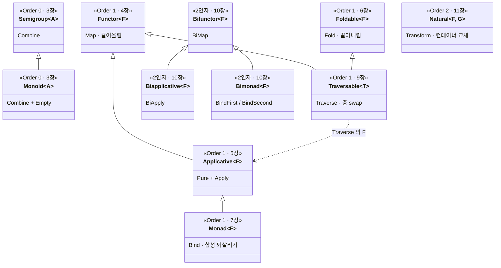

# Part 3 — Composition (조합 · 실전 · 확장)

> 기초 3부작 (Part 1 ~ 3) 의 마지막 Part 입니다. [Part 2 — Core Traits](../Part02-CoreTraits/README.md) 의 네 trait 을 **조합** 해 실전에 붙이고 (Validation · Traversable), 4 가지 함수 유형 자체를 **확장** 합니다 (Bifunctor · NaturalTransformation). 기초에서 모은 모든 어휘가 여기서 한데 모입니다.

## Part 3 의 배경

Part 2 가 네 자리의 다리 (Functor / Applicative / Foldable / Monad) 를 따로 세웠다면, Part 3 은 그것들을 **함께** 씁니다.

- **조합 (실전)** — Validation 은 같은 도메인을 *applicative 누적* 과 *monadic 단락* 두 어법으로 풀어, 5장 Applicative 와 7장 Monad 의 차이가 결과를 어떻게 가르는지 봅니다.
- **합성 (최정상)** — Traversable 은 Functor + Foldable + Applicative 세 trait 의 합성으로, `List<E<a>>` 의 층 순서를 `E<List<a>>` 로 뒤집습니다.
- **확장** — Bifunctor 는 4 가지 함수 유형을 *2-인자* 로, NaturalTransformation 은 *컨테이너 교체* 로 넓힙니다.

## Part 3 의 장 (Ch08 ~ 11)

### 8장 — [Validation 실전](./Ch08-Validation.md)
이론과 실전을 잇습니다. 회원가입 검증을 *applicative style* (모든 오류 누적) 과 *monadic style* (첫 오류 단락) 두 가지로 풀어, 두 어법의 차이가 시그니처 단계에서 드러납니다. 오류 누적에서 3장 Monoid 의 결합이 다시 쓰입니다.

### 9장 — [Traversable / traverse / sequence](./Ch09-Traversable.md)
핵심 trait 의 최정상 추상입니다. `List<E<a>>` 를 `E<List<a>>` 로 옮겨 두 Elevated 세계의 층 순서를 뒤집습니다. `traverse` 가 Functor + Foldable + Applicative 의 합성임을, `sequence = traverse id` 임을 봅니다. 안쪽 효과 `F` 가 `MyMaybe` 면 단락, `MyValidation` 이면 누적입니다.

### 10장 — [Bifunctor / Biapplicative / Bimonad](./Ch10-Bifunctor.md)
두 타입 인자 모두에 작용하는 2-인자 trait 입니다. `Either<L, R>` / `Pair<A, B>` 처럼 인자가 둘인 컨테이너에서 Functor 의 한쪽 변환을 양쪽으로 일반화합니다. `Bifunctor<F>` 를 직접 정의하고 그 위에 `Biapplicative` / `Bimonad` 가 쌓이는 모습을 봅니다.

### 11장 — [NaturalTransformation](./Ch11-NaturalTransformation.md)
Functor 의 `map` 이 컨테이너 안의 값을 바꾼다면, NaturalTransformation 은 컨테이너 자체를 바꿉니다 (`K<F, A> → K<G, A>`, 값 타입 유지). 9장 Traversable 의 `sequence` 가 사실 이 변환의 한 형태였음을 보며, 기초에서 모은 모든 어휘가 컨테이너 사이의 다리로 마무리됩니다.

## 기초 3부작의 trait 지도

3장 ~ 11장의 모든 trait 이 상속 (`<|--`) 과 의존 (`..>`) 으로 엮입니다. 카탈로그처럼 흩어져 보이던 추상들이 몇 갈래의 가족으로 묶입니다.

- **Order 0 · 결합 (3장)** — `Monoid` 가 `Semigroup` 을 상속합니다. Normal World 의 결합에 항등원을 더한 자리입니다.
- **Order 1 핵심 사슬 (4 · 5 · 7장)** — `Functor → Applicative → Monad` 의 상속 사슬입니다. 끌어올림이 1인자에서 N인자로, 다시 합성 되살리기로 자랍니다. Foldable (6장) 은 반대 방향 끌어내림의 독립 trait 입니다.
- **Order 1 최정상 (9장)** — `Traversable` 가 `Functor` 와 `Foldable` 를 상속하고, `Traverse` 가 `Applicative` 를 의존으로 더해 세 trait 을 합성합니다.
- **2인자 가족 (10장)** — `Biapplicative` 와 `Bimonad` 가 각각 `Bifunctor` 를 상속합니다. 1인자 가족이 두 인자로 확장된 자리입니다.
- **Order 2 · 변환 (11장)** — `Natural` 은 컨테이너 자체를 바꾸는 별도 자리라 사슬 밖에 섭니다.

## Part 3 의 코드

`code/Part03-Composition/` 의 각 챕터 (`Ch08` ~ `Ch11`) 가 독립 실행 가능한 콘솔 데모로 들어 있습니다. 학습용 `MyValidation` / `MyList` / `MyMaybe` 에 `Bifunctor` / `Natural` trait 등을 직접 부착하며, 시그니처는 LanguageExt v5 의 공식 trait 와 정합합니다.
