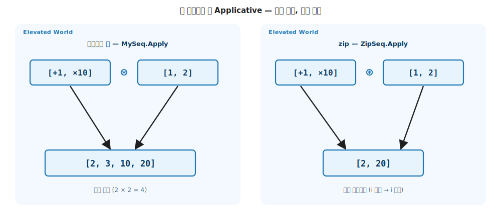

# 12 장. Sequences (실무 시퀀스에 부착하는 다섯 trait)

> **이 장의 목표** — 이 장을 읽고 나면 기초에서 toy 타입 `MyList` 에 부착했던 다섯 trait (Functor / Applicative / Monad / Foldable / Traversable) 이 실무 lazy 시퀀스 `MySeq` 에 글자 그대로 다시 붙는다는 것을 직접 구현으로 확인하고, LINQ 의 `Select` / `SelectMany` 가 사실 `map` 과 `bind` 의 다른 이름이었음을 시그니처 단계에서 읽을 수 있습니다. 계산을 미루는 lazy 가 무한 시퀀스까지 다루게 해 준다는 것, 표현이 전혀 다른 cons 리스트 `MyLst` 에도 같은 trait 이 그대로 붙는다는 것, 그리고 한 자료 타입에 적법한 Applicative 가 둘 (데카르트 곱과 짝 맞춤) 공존할 수 있다는 것까지 손에 쥡니다.

> **이 장의 핵심 어휘**
>
> - **`MySeq<A>`**: lazy 시퀀스. 기초의 `MyList` 가 가리키던 자리를 채우는 실무 시민으로, 계산을 끝까지 미룹니다
> - **lazy (계산 미룸)**: `Map` / `Bind` 가 결과를 즉시 만들지 않고, 값이 실제로 당겨질 때 한 원소씩 계산하는 방식. 무한 시퀀스도 안전하게 다룹니다
> - **`SeqF`**: `MySeq` 의 태그 타입. 하나가 `Monad` 와 `Traversable` 을 동시에 호스트합니다
> - **데카르트 곱 (`Apply`)**: 함수 시퀀스의 각 함수를 값 시퀀스의 각 값에 모두 적용 (`⊛` 는 `Apply` 기호. `[+1, ×10] ⊛ [1, 2]` = `[2, 3, 10, 20]`)
> - **zip (짝 맞춤)**: `i` 번째 함수를 `i` 번째 값에만 적용하는 두 번째 Applicative (`[2, 20]`)
> - **`SelectMany`**: C# 컴파일러가 `from-from-select` 를 변환해 호출하는 메서드. 곧 Monad 의 `bind`
> - **cons (`MyLst`)**: `Cons(Head, Tail)` / `Nil` 의 재귀 구조. 표현은 달라도 같은 trait 이 붙습니다

> 이 장을 마치면 할 수 있게 되는 것
> - [ ] toy `MyList` 와 실무 `MySeq` 의 차이가 trait 이 아니라 **평가 시점 (즉시 vs lazy)** 임을 설명할 수 있습니다.
> - [ ] lazy 가 큰 데이터·무한 시퀀스를 다루게 해 주는 이유를 한 줄로 말할 수 있습니다.
> - [ ] `MySeq` 에 Functor / Applicative / Monad / Foldable / Traversable 을 3-tuple 패턴으로 직접 부착할 수 있습니다.
> - [ ] `Sum` / `Count` / `Any` / `All` / `First` 같은 일상 함수가 `Foldable` 두 멤버 위에서 자란다는 것을 보일 수 있습니다.
> - [ ] LINQ `from x in xs from y in f(x) select …` 가 `Bind` 한 번으로 변환됨을 코드로 보일 수 있습니다.
> - [ ] `List<Maybe<a>>` 를 `Maybe<List<a>>` 로 뒤집는 `traverse` 와 `sequence` 로 "모두 성공해야 성공" 을 구현할 수 있습니다.
> - [ ] cons 구조 `MyLst` 에 같은 trait 이 붙는 것을 보고 추상이 표현이 아니라 시그니처에 달려 있음을 설명할 수 있습니다.
> - [ ] 같은 시퀀스에 데카르트 곱 `Apply` 와 zip `Apply` 두 Applicative 가 공존함을 보이고 둘을 구분할 수 있습니다.

---

## 12.1 이 장에서 다루는 것 — 기초 추상의 첫 실무 시민

기초에서 우리는 `MyList`, `MyMaybe`, `MyValidation` 같은 toy 자료 타입에 다섯 trait 을 손으로 부착했습니다. toy 타입은 추상이 **어떻게 작동하는지** 를 최소 골격으로 보여 주는 데 목적이 있었습니다. 매일의 코드에서 실제로 쓰는 자료 구조는 아니었습니다.

이 장은 4부의 출발점이고, 출발점의 질문은 하나입니다. **기초에서 손으로 만든 그 추상이 실무 컬렉션에서도 그대로 작동하는가.** 답을 먼저 말하면, 그대로 작동합니다. LanguageExt v5 의 `Seq` / `Lst` / `Map` 같은 실무 컬렉션은 우리가 기초에서 정의한 것과 **동일한** `Functor` / `Foldable` / `Traversable` / `Monad` 의 인스턴스이고, `MyList` 에 부착했던 것과 똑같은 3-tuple 패턴 (자료 / 태그 / trait) 이 그 안에 들어 있습니다.

이 장의 무대는 4장에서 본 두 평행 세계 그대로입니다. 시퀀스는 "여러 개일 수 있음" 효과를 인코딩한 Elevated World 의 시민이고, 안에 담기는 `a`, `b` 는 Normal World 의 값입니다. 1장 지도의 여섯 이동 가운데 시퀀스가 새 이동을 더하지는 않습니다. `map` (값 변환), `bind` (효과 잇기), `fold` (한 값으로 끌어내림), `traverse` (두 층 swap) 라는 이미 아는 자리들이 toy 가 아닌 실무 시민 위에서 똑같이 작동하는 것을 확인할 뿐입니다.

이 장은 도구를 처음부터 다시 설명하지 않습니다. 다섯 trait 의 정의와 법칙은 4장부터 9장까지에서 이미 손에 익혔으니, 여기서는 **그 trait 이 실무 시퀀스에 어떻게 부착되는지**, 그리고 toy 에는 없던 두 가지 새로운 사실 (계산을 미루는 lazy 평가, 한 타입에 공존하는 두 Applicative) 에 집중합니다.


혹시 다섯 trait 의 이름이 가물가물해도 괜찮습니다. 이 장을 읽는 동안 필요한 자리마다 한 줄씩 다시 짚어 드립니다. 지금은 다섯 이름이 무엇을 하는 도구인지만 가볍게 떠올려 봅니다.

- **Functor** (`Map`) — 컨테이너 안의 값만 바꾸고 모양은 그대로 둡니다. LINQ 의 `Select` 가 이것입니다.
- **Applicative** (`Pure` / `Apply`) — 값 하나를 컨테이너로 끌어올리고 (`Pure`), 컨테이너 안의 함수를 컨테이너 안의 값에 적용합니다 (`Apply`).
- **Monad** (`Bind`) — 한 원소를 다시 컨테이너로 펼친 뒤 이어 붙입니다. LINQ 의 `SelectMany` 가 이것입니다.
- **Foldable** (`Fold`) — 컨테이너 안의 여러 원소를 한 값으로 끌어내립니다. `Sum` / `Count` 가 여기서 자랍니다.
- **Traversable** (`Traverse`) — 겹친 두 컨테이너의 순서를 뒤집습니다. `List<Maybe<a>>` 를 `Maybe<List<a>>` 로 바꿉니다.

여기서 **trait** 이라는 단어가 한 번 더 나왔습니다. trait 은 능력을 객체가 아니라 타입에 부착하는 자리입니다. 1장의 표현을 빌리면 능력이 사는 책장이고, 같은 능력을 가진 타입들이 그 책장에 꽂힙니다. `MyList` 가 Functor 라는 책장에 꽂혔다는 말은 `MyList` 에 `Map` 능력이 붙었다는 뜻이었습니다. 이 장은 그 책장에 `MySeq` 라는 새 책을 한 권 더 꽂는 이야기입니다.

그리고 이 장의 자료 타입 이름을 미리 한자리에 모아 둡니다. 비슷한 이름이 여럿 나와 헷갈리기 쉽기 때문입니다. `MyList` 는 기초에서 쓴 즉시 평가 toy 리스트, `MySeq` 는 이 장의 주인공인 lazy 시퀀스, `MyLst` 는 뒤에서 만날 cons 구조 리스트입니다. 셋 다 여러 개일 수 있음 효과를 담지만, 안을 어떻게 만들어 두느냐가 다릅니다. 이름이 비슷해도 서로 다른 자료 타입이라는 점만 기억해 두면 됩니다.

---

## 12.2 왜 필요한가 — toy 타입은 실무 자료 구조가 아니다

기초의 `MyList` 는 안에 `List<A>` 를 들고, `Map` 을 호출하면 **그 자리에서 곧장** 새 리스트를 만들었습니다. 작은 예제에서는 아무 문제가 없습니다. 그런데 실무의 데이터는 두 가지 점에서 다릅니다.

첫째, 데이터가 큽니다. 백만 건의 로그가 있다고 해 봅니다. 이것을 `Map` 으로 한 번 변환한 다음, 그중 처음 다섯 건만 화면에 보여 주려 합니다. 즉시 평가하는 `MyList` 는 `Map` 을 부르는 그 순간 백만 건을 전부 변환합니다. 그런데 우리가 실제로 본 것은 다섯 건뿐입니다. 999,995 번의 변환이 그냥 버려진 셈입니다. 작은 예제에서는 티가 안 나지만, 큰 데이터에서는 이 낭비가 그대로 시간과 메모리가 됩니다.

둘째, 데이터가 무한할 수도 있습니다. "1, 2, 3, 4, …" 처럼 끝이 없이 이어지는 수의 흐름을 떠올려 봅니다. 이런 시퀀스에 즉시 평가하는 `Map` 을 걸면 무슨 일이 벌어질까요. `Map` 은 모든 원소를 지금 당장 변환하려 들기 때문에, 끝이 없는 원소를 끝없이 변환하려다 영원히 멈추지 않습니다. 끝이 없는 데이터는 즉시 평가와는 애초에 함께 살 수 없습니다.

두 문제는 사실 같은 뿌리에서 나옵니다. 둘 다 `Map` 이 결과를 **지금 당장 전부** 만들려고 하기 때문에 생깁니다. 그러면 질문을 바꿔 볼 수 있습니다. 변환 규칙만 적어 두고, 실제 변환은 결과가 진짜 필요해지는 순간까지 미루면 어떨까요. 이 미루기가 이 장의 출발점입니다.

```csharp
// toy MyList — Map 이 곧장 새 리스트를 materialize (전부 계산)
var doubled = myList.Map(n => n * 2);   // 백만 건이면 백만 번 즉시 계산
```

기초에서 배운 trait 이 toy 에만 붙는 추상이었다면, 이 한계 앞에서 함수형 어휘는 실무로 넘어오지 못합니다. 그러나 trait 은 **시그니처가 약속하는 동작** 일 뿐, 그 동작을 **언제 계산하는가** 는 별개입니다. 같은 `Map` 시그니처를 즉시 계산이 아니라 **계산을 미루는** 방식으로 구현하면, 똑같은 trait 위에서 큰 데이터도 무한 데이터도 다룰 수 있습니다. 그 미루는 시퀀스가 이 장의 주인공 `MySeq` 입니다.


여기서 한 가지 직감을 미리 깔아 둡니다. C# 개발자라면 이 미루기를 사실 이미 매일 쓰고 있습니다. `IEnumerable<T>` 와 LINQ 의 `Select` 가 정확히 그렇게 동작하기 때문입니다. `var q = list.Select(n => n * 2);` 라고 적어도, 이 줄에서는 곱셈이 한 번도 일어나지 않습니다. `q` 는 어떻게 변환할지의 규칙만 들고 있는 상태입니다. 실제 곱셈은 `foreach` 로 돌리거나 `ToList()` 로 당길 때 비로소 한 원소씩 일어납니다. `MySeq` 는 이 익숙한 동작에 다섯 trait 의 이름표를 붙인 것뿐입니다. 새로 외울 것은 없고, 이미 쓰던 LINQ 의 lazy 함을 trait 어휘로 다시 읽는다고 생각하면 됩니다.

---

## 12.3 MySeq — 계산을 미루는 lazy 시퀀스

이제 주인공을 직접 만들어 봅니다. `MySeq<A>` 는 안에 `IEnumerable<A>` 한 개를 들고 있습니다. 그게 전부입니다. 모든 연산 (`Map` / `Bind` / `Apply`) 은 `IEnumerable` 의 lazy 연산 위에 얹습니다. 핵심은 한 문장입니다. `IEnumerable` 은 누군가 원소를 당기기 전까지는 한 원소도 계산하지 않습니다.

잠깐 이름을 짚고 갑니다. **lazy** 는 게으르다는 뜻이지만 여기서는 칭찬입니다. 계산을 미룬다, 즉 정말 필요해질 때까지 일을 하지 않는다는 뜻입니다. 반대말은 즉시 평가 (eager) 로, `MyList` 처럼 부르는 즉시 다 만들어 버리는 방식입니다. 이 장에서 lazy 는 항상 계산을 미룸으로 읽으면 됩니다.

```csharp
public sealed class MySeq<A>(IEnumerable<A> items) : K<SeqF, A>
{
    public IEnumerable<A> Items { get; } = items;
    public override string ToString() => $"[{string.Join(", ", Items)}]";
}
```

자료 타입 `MySeq<A>`, 태그 타입 `SeqF`, 공통 어휘 `K<SeqF, A>` 의 3-tuple 은 2장에서 본 그대로입니다. `MyList` 와 다른 점은 단 하나, 생성자가 받은 `IEnumerable` 을 즉시 `ToList()` 로 펼치지 않고 그대로 들고 있다는 것입니다.


이 한 줄의 차이가 어디서 갈리는지 두 코드를 나란히 놓으면 또렷합니다.

```csharp
// toy MyList — 생성 즉시 ToList() 로 모든 원소를 펼침 (eager)
public IReadOnlyList<A> Items { get; } = items.ToList();

// 실무 MySeq — IEnumerable 을 그대로 들고만 있음 (lazy)
public IEnumerable<A> Items { get; } = items;
```

`ToList()` 한 단어가 있고 없고의 차이입니다. `MyList` 는 받은 원소를 그 자리에서 리스트로 굳혀 버립니다. 들어온 시퀀스가 무한하면 이 줄에서 영원히 멈춥니다. `MySeq` 는 받은 시퀀스를 굳히지 않고 그대로 들고만 있습니다. 그래서 무한한 시퀀스를 받아도 이 줄은 즉시 끝납니다. 아직 아무 원소도 만들지 않았으니까요.

3-tuple 이라는 말도 한 번 더 짚습니다. 2장에서 본 자료 타입 / 태그 타입 / 공통 어휘 세 짝입니다. 여기서는 `MySeq<A>` 가 실제 원소를 들고 다니는 자료 타입, `SeqF` 가 trait 능력을 정적 자리에 호스트하는 태그 타입, `K<SeqF, A>` 가 둘을 묶어 가리키는 공통 신호 어휘입니다. 새 자료 타입에 trait 을 붙일 때마다 이 세 짝을 만든다는 것이 기초 내내 쓴 패턴입니다.

> **흔한 함정** — lazy 가 trait 을 바꾼다는 오해입니다.
>
> lazy 는 `Map` / `Bind` 의 **시그니처를 한 글자도 바꾸지 않습니다**. `Map : (a → b) → E<a> → E<b>` 는 즉시 평가든 lazy 든 똑같습니다. 바뀌는 것은 그 변환을 **언제** 수행하는가뿐입니다. 그래서 toy `MyList` 에 통과한 Functor 법칙은 lazy `MySeq` 에서도 그대로 통과합니다.

### 12.3.1 lazy 가 무한 시퀀스까지 다룬다

lazy 가 큰 데이터를 아끼는 것은 봤습니다. 그런데 lazy 의 진짜 위력은 한 발 더 나아간 자리, 끝이 아예 없는 **무한 시퀀스** 에서 드러납니다.

직감부터 잡습니다. 식당에서 요리를 한 접시씩 내오는 장면을 떠올려 봅니다. 주방은 손님이 다음 접시를 청할 때마다 그 접시만 만듭니다. 손님이 다섯 접시에서 그만 먹겠다고 하면 주방도 다섯 접시에서 멈춥니다. 메뉴에 요리가 무한히 적혀 있어도 문제가 없습니다. 청한 만큼만 만들었으니까요. `IEnumerable` 이 정확히 이 주방입니다. 원소를 당길 때마다 그 원소 하나만 만들고, 그만 당기면 그만 만듭니다. 그래서 끝이 없는 시퀀스를 들고 있어도, 앞에서 필요한 만큼만 계산하면 됩니다.

```text
끝없는 자연수 1, 2, 3, …  를 담은 MySeq 에
  Map(n => n * n) 을 걸면 → 1, 4, 9, …  (아직 한 번도 계산 안 함)
  앞에서 다섯 개만 당기면 → 1, 4, 9, 16, 25  (딱 다섯 번만 제곱)
```

즉시 평가하는 `MyList` 는 무한 시퀀스에 `Map` 을 거는 순간 영원히 멈추지 않습니다. lazy `MySeq` 는 같은 `Map` 시그니처로 무한 시퀀스를 안전하게 변환하고, 뒤에서 `fold` 나 `take` 가 필요한 만큼만 당깁니다. **시그니처는 같고 계산 시점만 미뤘을 뿐인데, 다룰 수 있는 데이터의 크기가 유한에서 무한으로 넓어집니다.**

> **외우지 않아도 됩니다** — lazy 의 구현 디테일 (`yield`, iterator 상태 기계) 을 지금 파고들 필요는 없습니다. 한 줄만 가져가면 됩니다. **lazy 는 "변환 규칙만 들고 있다가 당겨질 때 한 원소씩 계산" 한다.** 그래서 큰 데이터도 무한 데이터도 같은 trait 으로 다룹니다.

태그 타입 `SeqF` 는 하나가 `Monad` 와 `Traversable` 을 동시에 호스트합니다. Monad 는 Applicative 를, Applicative 는 Functor 를 상속하므로 (`Monad ⊃ Applicative ⊃ Functor`), `SeqF` 하나에 다섯 trait 의 멤버가 모두 들어갑니다.

```csharp
public sealed class SeqF : Monad<SeqF>, Traversable<SeqF>
{
    // 아래 절들에서 멤버를 하나씩 채웁니다.
}
```

---

## 12.4 다섯 trait 이 그대로 붙는다

### 12.4.1 Functor — 값만 변환하되, 계산은 미룬다

`Map` 은 4장에서 본 그대로 컨테이너 안의 값만 바꾸고 모양은 보존합니다. `MySeq` 에서는 `Select` 한 줄입니다.

```csharp
public static K<SeqF, B> Map<A, B>(Func<A, B> f, K<SeqF, A> fa) =>
    new MySeq<B>(fa.As().Items.Select(f));
```

이 한 줄에서 일어나는 일을 천천히 봅니다. `fa.As()` 는 공통 신호 `K<SeqF, A>` 를 진짜 자료 타입 `MySeq<A>` 로 되돌립니다 (2장에서 본 다운캐스트입니다). 그 `Items` 에 `Select(f)` 를 겁니다. 그런데 `Select` 는 `IEnumerable` 의 lazy 연산입니다. 그래서 이 `Map` 은 새 값을 단 하나도 계산하지 않습니다. 변환 규칙 `f` 만 품은 새 시퀀스를 곧장 돌려줄 뿐입니다. 실제 곱셈은 한참 뒤, 결과를 출력하거나 `ToList` 로 당길 때 비로소 한 원소씩 일어납니다.

잠깐 멈춰서 4장의 **모양 보존** 을 다시 떠올려 봅니다. `Map` 은 컨테이너 안의 값만 바꾸고 컨테이너의 모양은 건드리지 않는다는 trait 의 약속이었습니다. 원소가 다섯 개인 시퀀스에 `Map` 을 걸면 결과도 원소가 다섯 개인 시퀀스입니다. 값이 두 배가 되어도 개수와 순서는 그대로입니다. lazy 가 이 약속을 깨지 않습니다. 계산을 미룰 뿐, 결국 당겼을 때 나오는 모양은 4장 그대로입니다.

기초에서 익힌 세 가지 호출 어법이 그대로 쓰입니다.

```csharp
K<SeqF, int> nums = new MySeq<int>([1, 2, 3, 4, 5]);

K<SeqF, int> r1 = SeqF.Map<int, int>(n => n * 2, nums);      // ① trait 정적 멤버
K<SeqF, int> r2 = Monad.map<SeqF, int, int>(n => n * 2, nums); // ② 모듈 자유 함수
K<SeqF, int> r3 = nums.Map(n => n * 2);                       // ③ 확장 메서드
// 셋 다 [2, 4, 6, 8, 10] — 같은 결과
```

### 12.4.2 Applicative — Pure 와 Apply (데카르트 곱)

5장의 Applicative 를 짧게 상기합니다. Applicative 는 멤버가 둘입니다. `Pure` 는 Normal World 의 평범한 값 하나를 Elevated World 의 컨테이너로 끌어올립니다 (가장 단순한 끌어올림입니다). `Apply` 는 컨테이너 안에 든 함수를 컨테이너 안에 든 값에 적용합니다. 함수도 컨테이너 안에 들어갈 수 있다는 1장의 그림이 여기서 쓰입니다.

시퀀스에서 두 멤버가 어떤 모양인지 봅니다. `Pure` 는 값 하나를 원소 하나짜리 시퀀스로 끌어올립니다 (`42` 를 `[42]` 로). `Apply` 는 함수 시퀀스의 **각 함수** 를 값 시퀀스의 **각 값** 에 적용합니다. 함수가 둘, 값이 둘이면 둘 곱하기 둘, 모두 네 개의 조합이 나옵니다. 이렇게 두 시퀀스의 모든 조합을 만드는 방식을 **데카르트 곱** 이라 부릅니다. 곱셈표를 떠올리면 됩니다. 가로축에 함수, 세로축에 값을 놓고 칸을 모두 채우는 그림입니다.

```csharp
public static K<SeqF, A> Pure<A>(A value) =>
    new MySeq<A>([value]);

public static K<SeqF, B> Apply<A, B>(K<SeqF, Func<A, B>> mf, K<SeqF, A> ma)
{
    var fs = mf.As();
    var xs = ma.As();
    return new MySeq<B>(Go());

    IEnumerable<B> Go()
    {
        foreach (var f in fs.Items)
            foreach (var x in xs.Items)
                yield return f(x);
    }
}
```

함수 `[+1, ×10]` 을 값 `[1, 2]` 에 `Apply` 하면 함수마다 두 값에 적용한 결과가 이어붙습니다.

```
+1  을 [1, 2] 에  → [2, 3]
×10 을 [1, 2] 에  → [10, 20]
이어붙임           → [2, 3, 10, 20]
```

이 "모든 조합" 이 시퀀스 Apply 의 기본 의미입니다. 한 자리에 다른 의미의 Apply 도 둘 수 있는데, 그 두 번째 Applicative 는 뒤에서 다시 봅니다.

### 12.4.3 Monad — Bind, 그리고 LINQ 의 정체

7장의 Monad 도 짧게 상기합니다. Monad 의 핵심 멤버는 `Bind` 하나입니다. `Bind` 는 `a → E<b>` 모양의 월드 교차 함수, 즉 평범한 값 하나를 받아 컨테이너를 돌려주는 함수를 받아, 그것을 컨테이너끼리 이어 붙일 수 있게 만듭니다. 1장 어휘로는 합성 되살리기입니다.

시퀀스의 `Bind` 는 각 원소에 그런 함수를 적용해 작은 시퀀스를 얻은 다음, 그 작은 시퀀스들을 순서대로 이어 붙입니다. 7장에서 `MyMaybe` 의 `Bind` 는 없으면 단락, `MyList` 의 `Bind` 는 여러 갈래로 펼침이었습니다. 같은 `Bind` 라는 한 도구의 서로 다른 두 얼굴이었습니다. 시퀀스의 `Bind` 는 그중 펼침 쪽 얼굴, 즉 한 입력을 여러 갈래로 펼치는 쪽입니다. 원소 하나가 작은 시퀀스가 되고, 그 작은 시퀀스들이 하나로 합쳐집니다.

```csharp
public static K<SeqF, B> Bind<A, B>(K<SeqF, A> ma, Func<A, K<SeqF, B>> f)
{
    var xs = ma.As();
    return new MySeq<B>(Go());

    IEnumerable<B> Go()
    {
        foreach (var x in xs.Items)
            foreach (var y in f(x).As().Items)
                yield return y;
    }
}
```

이 `Bind` 가 바로 LINQ 의 `SelectMany` 입니다. C# 컴파일러는 `from-from-select` 쿼리를 `SelectMany` 호출로 바꾸고, 우리의 `SelectMany` 는 `Bind` 위에서 자랍니다.

```csharp
// Bind 직접 호출 — 각 n 을 [n, n×10] 으로 펼침
K<SeqF, int> bound = nums.Bind(n => (K<SeqF, int>)new MySeq<int>([n, n * 10]));

// 똑같은 계산을 LINQ from-from-select 로
K<SeqF, int> viaLinq =
    from n in nums
    from m in (K<SeqF, int>)new MySeq<int>([n, n * 10])
    select m;

// 두 결과는 글자 그대로 같다 — [1, 10, 2, 20, 3, 30, 4, 40, 5, 50]
```


위 두 코드가 정말 같은 일을 하는지 첫 원소만 손으로 따라가 봅니다. `nums` 의 첫 원소는 `1` 입니다. `Bind` 에 넘긴 함수는 `n => [n, n×10]` 이므로, `1` 은 `[1, 10]` 이라는 작은 시퀀스가 됩니다. `2` 는 `[2, 20]`, `3` 은 `[3, 30]` 입니다. 이 작은 시퀀스들을 순서대로 이어 붙이면 `[1, 10, 2, 20, 3, 30, …]` 이 됩니다. LINQ 쿼리도 `from n in nums` 로 각 `n` 을 꺼내고 `from m in [n, n×10]` 으로 다시 펼치므로, 컴파일러가 정확히 같은 `Bind` 를 부릅니다. 두 줄은 적는 방식만 다를 뿐 한 글자도 다르지 않은 결과를 냅니다.

> **흔한 함정** — LINQ 의 `from-from` 이 중첩 루프라는 오해입니다.
>
> `from n in xs from m in ys` 를 보면 명령형의 이중 `for` 루프가 떠올라 시퀀스 전용 문법처럼 느껴집니다. 그러나 이 문법은 시퀀스만의 것이 아닙니다. C# 컴파일러는 이 쿼리를 `SelectMany` 호출 한 번으로 바꿀 뿐이고, `SelectMany` 는 곧 `Bind` 입니다. 그래서 같은 `from-from-select` 문법이 `MyMaybe` 위에서는 단락으로, 시퀀스 위에서는 펼침으로 동작합니다. 문법이 하는 일이 아니라 그 타입의 `Bind` 가 하는 일이 결과를 정합니다.

> **외우지 않아도 됩니다** — LINQ 를 함수형 어휘로 다시 외울 필요는 없습니다. 핵심 한 줄만 남기면 됩니다. **시퀀스에 대한 LINQ 쿼리는 Functor 의 `map` 과 Monad 의 `bind` 위에 서 있었다.** `Select` 는 `map`, `SelectMany` 는 `bind` 입니다.

### 12.4.4 Foldable — 일상의 함수들이 두 멤버 위에서 자란다

6장의 Foldable 을 짧게 상기합니다. Foldable 은 끌어내림의 trait 입니다. Elevated World 의 컨테이너 `E<a>` 를 Normal World 의 한 값 `b` 로 끌어내립니다. 시그니처로는 `E<a> → b` 자리, 1장 지도에서 `Map` 의 반대 방향입니다. `Map` 이 컨테이너를 그대로 둔 채 안의 값만 바꿨다면, Foldable 은 컨테이너 모양 자체를 소비해 한 값만 남깁니다.

Foldable 의 멤버는 둘입니다. `FoldLeft` 와 `FoldRight` 로, 같은 자료를 왼쪽 끝부터 / 오른쪽 끝부터 접는 두 방향입니다. 시퀀스에서 `FoldLeft` 는 앞에서 뒤로 lazy 시퀀스를 딱 한 번만 훑으면서 누적값을 갱신합니다. 명령형의 `foreach` 로 합을 구하던 그 동작 그대로인데, 상태 변수 대신 누적값을 함수가 넘겨받습니다.

```csharp
public static B FoldLeft<A, B>(Func<B, A, B> f, B seed, K<SeqF, A> fa)
{
    var acc = seed;
    foreach (var a in fa.As().Items)
        acc = f(acc, a);
    return acc;
}
```

여기서 6장의 핵심이 실무로 이어집니다. 매일 쓰는 `Sum` / `Count` / `Any` / `All` / `First` / `ToList` 가 모두 `FoldLeft` 와 `FoldRight` **두 멤버 위에서 자동으로 자랍니다**. 따로 구현할 필요가 없습니다.

| 일상 함수 | 두 멤버 위의 정의 | 의미 |
|---|---|---|
| `Count` | `FoldLeft((acc, _) => acc + 1, 0)` | 원소 개수 |
| `Any(p)` | `FoldRight((a, acc) => p(a) || acc, false)` | 하나라도 만족 |
| `All(p)` | `FoldRight((a, acc) => p(a) && acc, true)` | 모두 만족 |
| `IsEmpty` | `FoldRight((_, _) => false, true)` | 비었는가 |
| `First` | `FoldRight((a, _) => a, default)` | 첫 원소 |
| `ToList` | `FoldRight((a, acc) => [a, ..acc], [])` | 리스트로 |

```csharp
var sum     = nums.FoldLeft((acc, n) => acc + n, 0);   // 15
var count   = nums.Count();                            // 5
var anyEven = nums.Any(n => n % 2 == 0);               // true
var allPos  = nums.All(n => n > 0);                    // true
```

이것이 6장에서 본 "trait 한 정의가 N 개의 일반 함수를 공짜로 준다" 의 실무 모습입니다. `MySeq` 가 두 멤버만 구현하면 여섯 함수가 따라옵니다.


공짜로 자란다는 말이 추상적으로 들릴 수 있으니, `Count` 가 실제로 어떻게 `FoldLeft` 위에서 만들어지는지 코드 한 조각으로 봅니다.

```csharp
// Count 는 따로 구현하지 않습니다 — FoldLeft 한 줄로 정의됩니다.
static virtual int Count<A>(K<F, A> fa) =>
    F.FoldLeft<A, int>((acc, _) => acc + 1, 0, fa);
```

시작값은 `0` 입니다. step 함수는 `(acc, _) => acc + 1`, 즉 원소가 무엇이든 보지 않고 (밑줄 `_` 이 무시한다는 표시입니다) 누적값에 `1` 만 더합니다. 원소가 다섯 개면 `1` 을 다섯 번 더하니 `5` 가 나옵니다. `Count` 는 이 한 줄이 전부입니다. `Any` 는 step 이 `(a, acc) => p(a) || acc`, 즉 하나라도 조건을 만족하면 참이고, `All` 은 `&&` 로 모두 만족해야 참입니다. 여섯 함수가 모두 이렇게 두 멤버 위에 얹힌 짧은 정의일 뿐입니다.

그래서 `MySeq` 가 `FoldLeft` 와 `FoldRight` 두 줄만 채우면, `Count` / `Any` / `All` / `IsEmpty` / `First` / `ToList` 여섯 함수가 한 줄도 더 쓰지 않고 따라옵니다. 새 자료 타입을 만들 때마다 이 여섯을 다시 구현하던 객체 지향의 수고가 사라지는 자리입니다.

### 12.4.5 Traversable — 모두 성공해야 성공 (traverse 와 sequence)

`Traverse` 는 9장에서 본 층 swap 입니다. `List<Maybe<a>>` 처럼 겹친 두 Elevated 층의 순서를 뒤집어 `Maybe<List<a>>` 로 만듭니다. 실무에서 가장 쓸모 있는 자리는 "원소를 모두 변환했을 때, 하나라도 실패하면 전체 실패" 입니다.

> **미리보기입니다** — 아래 코드는 9장 `Traverse` 골격을 글자 그대로 옮긴 것입니다. 중첩 제네릭 `K<F, K<SeqF, B>>` 와 `Apply` 두 줄이 낯설어도, 새로 읽을 것은 `MySeq` 한 단어뿐입니다. 모양이 막히면 9장의 층 swap 그림을 떠올리면 됩니다.

```csharp
public static K<F, K<SeqF, B>> Traverse<F, A, B>(Func<A, K<F, B>> f, K<SeqF, A> ta)
    where F : Applicative<F>
{
    K<F, K<SeqF, B>> acc = F.Pure<K<SeqF, B>>(new MySeq<B>([]));

    foreach (var a in ta.As().Items.Reverse())
    {
        var fb = f(a);
        Func<B, Func<K<SeqF, B>, K<SeqF, B>>> prepend =
            head => tail => new MySeq<B>([head, .. tail.As().Items]);

        var liftedFn = F.Pure(prepend);
        var step1    = F.Apply<B, Func<K<SeqF, B>, K<SeqF, B>>>(liftedFn, fb);
        acc          = F.Apply<K<SeqF, B>, K<SeqF, B>>(step1, acc);
    }
    return acc;
}
```

`prepend` 은 머리 하나를 앞에 붙여 새 시퀀스를 만드는 함수 (`head → tail → [head, ..tail]`) 이고, `Apply` 두 번이 그 한 칸 붙이기를 Elevated 세계 안에서 수행합니다 (첫 `Apply` 가 `head` 자리, 둘째 `Apply` 가 `tail` 자리를 채웁니다). `Pure([])` 에서 시작해 뒤에서 앞으로 한 원소씩 붙여 나가는 이 골격은 9장의 `Traverse` 와 한 글자도 다르지 않습니다. 아래 `["1", "2", "3"]` 을 파싱하면 뒤에서 앞으로 한 칸씩 조립됩니다.

```
Pure([])     → Just([])
prepend(3)   → Just([3])
prepend(2)   → Just([2, 3])
prepend(1)   → Just([1, 2, 3])
```

문자열 시퀀스를 정수로 파싱하는 이 예에서, 두 번째 Elevated 세계 `F` 자리에 7장에서 본 `MyMaybe` 가 들어갑니다 (태그 타입 `MaybeF`).

```csharp
Func<string, K<MaybeF, int>> parse = s =>
    int.TryParse(s, out var v) ? new MyMaybe<int>.Just(v) : MyMaybe<int>.Nothing.Instance;

// ["1", "2", "3"] → Just([1, 2, 3])   — 모두 성공
// ["1", "x", "3"] → Nothing            — 하나라도 실패하면 전체 Nothing
```

하나가 `Nothing` 이면 `Apply` 규칙이 결과 전체를 `Nothing` 으로 만들어, 단락이 추가 코드 없이 따라옵니다. 9장에서 본 단락의 자동 전파 그대로입니다.

`Sequence` 는 `Traverse` 의 특수한 경우입니다. 이미 `List<Maybe<a>>` 모양이라 변환 함수가 필요 없을 때, `traverse` 에 항등 함수를 넣은 것이 `sequence` 입니다.

```csharp
// Sequence = Traverse id — 변환 없이 층만 뒤집음
static virtual K<F, K<T, A>> Sequence<F, A>(K<T, K<F, A>> tfa)
    where F : Applicative<F>
    => T.Traverse<F, K<F, A>, A>(x => x, tfa);

// [Just(1), Just(2), Just(3)] → Just([1, 2, 3])
```

`map f` 로 각 원소를 변환한 뒤 `sequence` 로 층을 뒤집는 두 단계가 곧 `traverse f` 입니다. 9장에서 본 `traverse f = sequence ∘ map f` 등식이 실무 시퀀스에서도 그대로 성립합니다.

---

## 12.5 표현이 달라도 같은 trait — cons 리스트 MyLst

`MySeq` 는 `IEnumerable` 을 백킹으로 썼습니다. 그런데 같은 trait 이 **표현이 전혀 다른** 자료에도 붙을까요. 챌린지의 `MyLst` 는 `IEnumerable` 이 아니라 재귀적 cons 구조입니다.

```csharp
public abstract record MyLst<A> : K<LstF, A>
{
    public sealed record Nil : MyLst<A> { public static readonly Nil Instance = new(); }
    public sealed record Cons(A Head, MyLst<A> Tail) : MyLst<A>;
}
```

**cons** 라는 이름을 먼저 풉니다. cons 는 머리 하나와 꼬리 리스트를 한 칸으로 묶는 구조입니다. `Cons(1, 나머지)` 는 "맨 앞이 `1` 이고 그 뒤는 나머지 리스트" 라는 뜻입니다. 이 나머지 리스트도 다시 `Cons(2, 또 나머지)` 이고, 그렇게 계속 이어지다가 마지막에 `Nil`, 즉 빈 리스트로 끝납니다.

그래서 `[1, 2, 3]` 은 `Cons(1, Cons(2, Cons(3, Nil)))` 한 덩어리가 됩니다. 양파 껍질처럼 머리를 한 겹 벗기면 꼬리가 나오고, 그 꼬리에서 또 머리를 벗기는 구조입니다. `IEnumerable` 이 "다음 원소 주세요" 라고 당기는 방식이었다면, cons 는 머리와 꼬리로 이루어진 재귀 구조 그 자체입니다. 메모리에 놓이는 모양도, 원소를 따라가는 방식도 `IEnumerable` 과는 완전히 다릅니다. 그런데도, 정말 그런데도, 같은 `Functor` / `Applicative` / `Monad` / `Foldable` 가 한 줄도 안 고치고 그대로 붙습니다. 어떻게 그럴 수 있는지가 이 절의 질문입니다.

```csharp
public sealed class LstF : Monad<LstF>, Foldable<LstF>
{
    public static K<LstF, B> Bind<A, B>(K<LstF, A> ma, Func<A, K<LstF, B>> f) =>
        MyLst<B>.FromEnumerable(
            ma.As().ToEnumerable().SelectMany(a => f(a).As().ToEnumerable()));
    // Map / Pure / Apply / FoldLeft / FoldRight 도 같은 시그니처로 부착
}
```

`Bind` 가 cons 구조에서 어떻게 도는지 한 줄씩 따라가 보면, 표현이 달라도 동작이 같음이 드러납니다.

```text
Cons(1, Cons(2, Nil)) 에 Bind(n => [n, n×10]) 를 걸면
  1 → [1, 10]  (Cons(1, Cons(10, Nil)))
  2 → [2, 20]  (Cons(2, Cons(20, Nil)))
  이어붙임 → Cons(1, Cons(10, Cons(2, Cons(20, Nil))))  = [1, 10, 2, 20]
```

`MySeq` 의 `Bind` 가 낸 `[1, 10, 2, 20]` 과 글자 그대로 같은 결과입니다. 그래서 어떤 Monad 든 받는 기초의 일반 함수가 `MySeq` 와 `MyLst` 양쪽에 한 줄도 고치지 않고 적용됩니다.

```csharp
var lstSum   = Foldable.foldLeft<LstF, int, int>((acc, n) => acc + n, 0, lst);
var lstBound = Monad.bind<LstF, int, int>(lst, n => LstF.Pure(n * 100));
```

여기서 이 장의 첫 결정적 통찰이 나옵니다. **추상은 자료의 표현이 아니라 시그니처가 약속하는 동작에 달려 있습니다.** `IEnumerable` 이든 cons 든, 시그니처의 약속만 지키면 같은 trait 의 시민입니다. toy 와 실무 사이에 경계가 처음부터 없었음을 보여 줍니다.

---

## 12.6 한 자료 타입에 두 Applicative — 데카르트 곱 vs zip

앞에서 `MySeq.Apply` 는 데카르트 곱, 즉 모든 조합이었습니다. 그런데 시퀀스에는 **또 하나의 적법한 Applicative** 가 있습니다. 같은 `Apply` 시그니처를 만족하지만 의미가 다른 두 번째 방식입니다.

그 두 번째는 **zip** 입니다. zip 은 옷의 지퍼를 떠올리면 됩니다. 지퍼는 양쪽 이를 같은 자리끼리 하나씩 맞물립니다. 첫째는 첫째끼리, 둘째는 둘째끼리입니다. 시퀀스의 zip 도 똑같이, 첫 번째 함수는 첫 번째 값에만, 두 번째 함수는 두 번째 값에만 적용합니다. 모든 조합을 만드는 데카르트 곱과 달리, 같은 자리끼리만 짝지어 한 줄로 맞물립니다. 한쪽이 짧으면 짧은 쪽 길이에서 멈춥니다 (지퍼도 한쪽이 짧으면 거기서 끝나니까요).

```csharp
public sealed class ZipF : Functor<ZipF>
{
    public static K<ZipF, B> Map<A, B>(Func<A, B> f, K<ZipF, A> fa) =>
        new ZipSeq<B>(fa.As().Items.Select(f));

    // 함수와 값을 짝으로 맞춰 적용 (둘 중 짧은 길이까지)
    public static K<ZipF, B> Apply<A, B>(K<ZipF, Func<A, B>> mf, K<ZipF, A> ma) =>
        new ZipSeq<B>(mf.As().Items.Zip(ma.As().Items, (f, a) => f(a)));
}
```

같은 함수 `[+1, ×10]` 과 같은 값 `[1, 2]` 인데 두 Apply 의 결과가 다릅니다.

```text
데카르트 곱 Apply : [+1, ×10] ⊛ [1, 2]  =  [2, 3, 10, 20]   (모든 조합)
zip        Apply : [+1, ×10] ⊛ [1, 2]  =  [2, 20]           (i 번째끼리)
```



**그림 12-1. 한 시퀀스에 두 Applicative: 데카르트 곱 vs zip** — 같은 함수 시퀀스 `[+1, ×10]` 와 값 시퀀스 `[1, 2]` 에 두 `Apply` 가 서로 다른 결과를 냅니다. 왼쪽 데카르트 곱은 모든 조합 (`2×2 = 4` 개) 을, 오른쪽 zip 은 같은 자리끼리 짝지어 (`2` 개) 만듭니다. 같은 자료 타입 위에 적법한 Applicative 가 둘 공존할 수 있습니다.

이것이 두 번째 결정적 통찰입니다. **한 자료 타입에 서로 다른 추상이 둘 이상 살 수 있습니다.** Haskell 의 `[]` 와 `ZipList` 가 정확히 이 구도입니다. 어느 쪽이 옳은가가 아니라, 도메인이 "모든 조합" 을 원하는지 "짝 맞춤" 을 원하는지에 따라 고르는 선택입니다. 3장에서 같은 `int` 에 `Sum` 과 `Product` 두 Monoid 가 있었던 것과 같은 구도입니다.


실무에서 둘을 언제 고르는지 한 줄씩 직감만 짚습니다. 데카르트 곱은 여러 후보를 서로 모두 조합해 봐야 할 때입니다. 가능한 모든 사이즈와 모든 색의 조합을 만들어 보는 자리가 그렇습니다. zip 은 두 줄의 데이터를 같은 자리끼리 합칠 때입니다. 이름 목록과 점수 목록을 받아 첫째 이름에 첫째 점수를 붙이는 자리가 그렇습니다. 같은 입력이라도 무엇을 원하느냐에 따라 답이 갈리니, 둘 중 하나가 옳고 다른 하나가 틀린 것이 아닙니다.

> **다음 장 미리보기** — `MySeq` 가 데카르트 곱 `Apply` 외에 또 가진 능력이 있습니다. 두 시퀀스를 이어 붙이는 `Combine` (모으기) 과 비어 있으면 다른 쪽을 고르는 `Choose` (고르기) 입니다. 실무 v5 의 `Seq` 가 `Monad` 와 함께 `MonoidK` / `Alternative` 를 부착한 것이 그 자리입니다. 모으기와 고르기의 구분은 14장에서 본격적으로 다룹니다. 지금은 한 시퀀스 위에 trait 이 여럿 겹쳐 살 수 있다는 그림만 가져가면 충분합니다.

> **흔한 함정** — 두 Applicative 의 `Pure` 가 같다는 오해입니다.
>
> 데카르트 곱의 `Pure(x)` 는 `[x]` 한 원소입니다. 그런데 zip 의 `Pure` 가 법칙을 지키려면 `[x, x, x, …]` 무한 반복이라야 합니다. 항등 법칙 `Apply(Pure(id), v) == v` 를 따져 보면 드러납니다. `Pure(id)` 가 `[id]` 한 원소면, 길이 2 인 `v` 와 zip 할 때 짧은 쪽 (1) 까지만 맞춰져 결과가 한 원소로 잘립니다 (`v` 와 다름). `Pure(id)` 가 무한 반복이라야 어떤 길이의 `v` 와도 모든 자리가 맞아 `v` 가 그대로 나옵니다. 그래서 학습용 `ZipSeq` 는 `Apply` 만 시연하고 `Pure` 는 두지 않습니다. 지금은 "Apply 의 의미가 둘" 이라는 것만 가져가면 충분합니다.

---

## 12.7 직접 해보기 — 챌린지

> **필수 ① — `MyLst` 에 두 법칙 검증.** cons 구조 `MyLst` 에 부착한 `Map` 이 항등 법칙 (`Map(x => x)` 가 원본) 과 합성 법칙 (`Map(g) ∘ Map(f) == Map(g ∘ f)`) 을 지키는지 종이에 먼저 적어 본 뒤 코드로 확인합니다. `IEnumerable` 백킹이 아닌데도 4장 Functor 의 두 법칙이 그대로 성립하는 이유를 한 문장으로 답해 봅니다.

> **필수 ② — LINQ 쿼리를 `Bind` 로 손번역.** `from x in xs from y in ys where x < y select (x, y)` 를 `Bind` 와 `Map` 호출로만 다시 적어 봅니다. `where` 절이 어떤 시퀀스 연산으로 바뀌는지 생각해 봅니다 (조건이 거짓인 원소가 빈 시퀀스로 펼쳐진다는 점이 힌트입니다).

> **심화 ③ — zip 의 `Pure` 는 왜 무한 반복인가.** zip Applicative 가 항등 법칙 `Apply(Pure(id), v) == v` 를 지키려면 `Pure(id)` 가 어떤 모양이어야 하는지, `[id]` 로는 왜 깨지는지 길이가 3 인 `v` 로 직접 따져 봅니다.

> **심화 ④ — 무한 시퀀스에 `traverse` 는 안전한가.** 유한 시퀀스의 `traverse` 는 모두 성공해야 성공이었습니다. 무한 시퀀스에 `traverse parse` 를 걸면 어떻게 되는지, 왜 `traverse` 는 `map` 과 달리 끝까지 당겨야 하는지 생각해 봅니다.

---

## 12.8 Elevated World 어휘로 다시 읽기

이 장에서 한 일을 1장의 두 평행 세계 어휘로 정리합니다. 시퀀스는 새 동사를 더하지 않았고, 이미 아는 자리들을 실무 시민 위에서 재확인했습니다.

| 이 장의 코드 | 1장 지도의 자리 | 한 줄 의미 |
|---|---|---|
| `MySeq.Map` | `E<a> → E<b>` (Functor, 4장) | 컨테이너 안 값만 변환, 모양 보존 |
| `MySeq.Apply` | `E<a> → E<b>` 의 다인자 확장 (Applicative, 5장) | 두 시퀀스의 모든 조합 |
| `MySeq.Bind` | `a → E<b>` 합성 되살리기 (Monad, 7장) | 한 입력이 여러 갈래로 (`SelectMany`) |
| `MySeq.FoldLeft` | `E<a> → b` 끌어내림 (Foldable, 6장) | 여러 원소를 한 값으로 (`Sum`/`Count`/`Any`) |
| `MySeq.Traverse` | 층 swap (Traversable, 9장) | `List<Maybe>` 를 `Maybe<List>` 로 |

`MyList` 에 붙였던 다섯 자리가 lazy `MySeq` 에 그대로 있고, cons `MyLst` 에도 그대로 있습니다. 표현이 달라도 시그니처가 같으면 같은 자리입니다.


이 장에 새로 더해진 두 가지도 1장 지도 위에 얹어 봅니다. 첫째, lazy 는 지도에 새 자리를 만들지 않았습니다. 같은 `Map` 자리, 같은 `E<a> → E<b>` 화살표인데 계산 시점만 미뤘습니다. 그래서 다룰 수 있는 데이터가 유한에서 무한으로 넓어졌습니다. 둘째, 두 Applicative 도 새 자리가 아니라 같은 `Apply` 자리에 의미가 둘이라는 이야기였습니다. 1장의 여섯 이동은 그대로이고, 이 장은 그 익숙한 자리들이 실무 시민 위에서도 한 치의 어긋남 없이 작동한다는 것을 코드로 확인한 장입니다.

---

## 12.9 Q&A — 자기 점검

> **Q1. toy `MyList` 와 실무 `MySeq` 의 진짜 차이는 무엇입니까?** (12.2절, 12.3절)
>
> trait 도 시그니처도 같습니다. 차이는 **평가 시점** 하나입니다. `MyList` 는 `Map` 호출 즉시 새 리스트를 만들고, `MySeq` 는 값이 당겨질 때까지 계산을 미룹니다 (lazy). 그래서 `MySeq` 는 큰 데이터와 무한 시퀀스를 다룰 수 있습니다.

> **Q2. lazy 가 무한 시퀀스를 다룰 수 있는 이유는 무엇입니까?** (12.3.1절)
>
> `IEnumerable` 이 당겨질 때 한 원소씩 만들기 때문입니다. 무한 시퀀스에 `Map` 을 걸어도 변환 규칙만 들고 있다가, 앞에서 다섯 개만 당기면 다섯 번만 계산합니다. 즉시 평가하는 `MyList` 는 무한 시퀀스에서 멈추지 않지만, lazy `MySeq` 는 같은 시그니처로 안전합니다.

> **Q3. `Sum` / `Count` / `Any` 는 따로 구현해야 합니까?** (12.4.4절)
>
> 아닙니다. `Foldable` 의 두 멤버 (`FoldLeft` / `FoldRight`) 만 구현하면 `Sum` / `Count` / `Any` / `All` / `First` / `ToList` 가 모두 그 위에서 자동으로 자랍니다. 6장에서 본 "두 멤버가 N 개의 일반 함수를 공짜로 준다" 의 실무 모습입니다.

> **Q4. LINQ 의 `Select` 와 `SelectMany` 는 함수형 어휘로 무엇입니까?** (12.4.3절)
>
> `Select` 는 Functor 의 `map`, `SelectMany` 는 Monad 의 `bind` 입니다. C# 컴파일러가 `from-from-select` 를 `SelectMany` 호출로 바꾸므로, 시퀀스에 대한 LINQ 쿼리는 사실 Functor + Monad 위에 서 있었습니다.

> **Q5. `traverse` 와 `sequence` 는 어떻게 다릅니까?** (12.4.5절)
>
> `sequence` 는 `traverse` 에 항등 함수를 넣은 특수한 경우입니다. 이미 `List<Maybe<a>>` 모양이면 변환 없이 층만 뒤집는 `sequence`, 원소를 변환하면서 뒤집으면 `traverse` 입니다. `traverse f = sequence ∘ map f` 가 성립합니다.

> **Q6. cons 구조 `MyLst` 에 같은 trait 이 붙는다는 사실이 왜 중요합니까?** (12.5절)
>
> 추상이 자료의 **표현** 이 아니라 **시그니처가 약속하는 동작** 에 달려 있음을 증명하기 때문입니다. `IEnumerable` 이든 cons 든, 약속만 지키면 같은 trait 의 시민입니다. toy 와 실무 사이에 경계가 없었다는 뜻입니다.

> **Q7. 데카르트 곱 `Apply` 와 zip `Apply` 는 어떻게 다릅니까?** (12.6절)
>
> 시그니처는 같고 의미가 다릅니다. 데카르트 곱은 함수와 값의 **모든 조합** 을, zip 은 **같은 자리끼리** 만 적용합니다. 한 자료 타입에 적법한 Applicative 가 둘 공존할 수 있다는 첫 사례입니다.

> **Q8. 같은 시퀀스에 두 Applicative 가 있다면 어느 것이 맞습니까?** (12.6절)
>
> 어느 쪽도 틀리지 않습니다. 도메인이 "모든 조합" 을 원하면 데카르트 곱, "짝 맞춤" 을 원하면 zip 을 고릅니다. 3장에서 같은 `int` 에 `Sum` 과 `Product` 두 Monoid 가 있었던 것과 같은 구도입니다.


> **Q9. `MySeq` 의 `Map` 을 호출하면 그 즉시 값이 계산됩니까?** (12.3절, 12.4.1절)
>
> 아닙니다. `Map` 은 변환 규칙만 품은 새 시퀀스를 즉시 돌려주고, 실제 계산은 한 원소도 하지 않습니다. 곱셈 같은 실제 변환은 한참 뒤 결과를 출력하거나 `ToList` 로 당길 때 한 원소씩 일어납니다. 손에 든 것이 값이 아니라 값을 만드는 방법이라는 점이 lazy 의 핵심입니다.

> **Q10. cons 구조 `MyLst` 의 `Map` 은 왜 4장 Functor 의 두 법칙을 그대로 지킵니까?** (12.5절)
>
> Functor 의 두 법칙 (항등 법칙, 합성 법칙) 은 자료를 `IEnumerable` 로 들었는지 cons 로 들었는지를 따지지 않기 때문입니다. 법칙은 `Map` 의 동작, 즉 모양은 보존하고 안의 값만 변환한다는 시그니처의 약속 위에서만 성립합니다. `MyLst` 의 `Map` 이 그 약속을 지키므로 표현과 무관하게 두 법칙이 그대로 통과합니다. 추상이 표현이 아니라 시그니처에 달려 있다는 이 장의 통찰이 법칙 차원에서도 그대로 나타나는 자리입니다.

---

## 12.10 요약

- **기초의 다섯 trait 은 toy 가 아니라 실무 컬렉션의 골격이었습니다.** `MyList` 에 부착한 Functor / Applicative / Monad / Foldable / Traversable 이 실무 lazy 시퀀스 `MySeq` 에 글자 그대로 다시 붙습니다 (12.1절, 12.4절).
- **toy 와 실무의 차이는 trait 이 아니라 평가 시점입니다.** `MyList` 는 즉시, `MySeq` 는 lazy 로 계산을 미뤄 큰 데이터와 무한 시퀀스를 다룹니다 (12.2절, 12.3절).
- **`Sum` / `Count` / `Any` 는 `Foldable` 두 멤버 위에서 공짜로 자랍니다.** 따로 구현하지 않습니다 (12.4.4절).
- **LINQ 의 `Select` / `SelectMany` 는 `map` / `bind` 의 다른 이름입니다.** 시퀀스 쿼리는 Functor + Monad 위에 서 있었습니다 (12.4.3절).
- **`traverse` 와 `sequence` 는 "모두 성공해야 성공" 을 단락 코드 없이 구현합니다.** `List<Maybe>` 를 `Maybe<List>` 로 뒤집습니다 (12.4.5절).
- **추상은 표현이 아니라 시그니처에 달려 있습니다.** cons 구조 `MyLst` 에도 같은 trait 이 그대로 붙습니다 (12.5절).
- **한 자료 타입에 두 Applicative 가 공존합니다.** 데카르트 곱과 zip 은 같은 시그니처, 다른 의미입니다 (12.6절).

이 장의 단일 목표는 하나였습니다. **기초에서 손으로 만든 추상이 실무 컬렉션에서 그대로 작동함을 코드로 확인한다.**

---

## 12.11 다음 장으로

시퀀스는 순서가 있는 컬렉션이었습니다. 다음 장은 키-값 컬렉션 `MyMap` 과 집합 `MySet` 으로 넘어갑니다. 거기서 `Functor` 의 `map` 이 키-값 컨테이너에서는 **값에만** 작용하고 키는 보존되는 자리를 보고, 더 나아가 **`Set` 에는 `Functor` 가 깔끔히 붙지 않는다** 는 경계 사례를 만납니다. trait 이 어디에 붙고 어디에 붙지 않는지, 그 경계를 보는 것이 다음 장입니다.

이 장에서 우리는 다섯 trait 이 실무 시퀀스에 한 글자도 안 고치고 다시 붙는 것을 봤습니다. 그렇다면 자연스러운 다음 질문이 생깁니다. trait 은 정말 모든 컬렉션에 똑같이 붙을까요. 다음 장이 그 질문에 답합니다.

다음 장은 순서가 있는 시퀀스를 떠나, 키-값 컬렉션 `MyMap` 과 집합 `MySet` 으로 넘어갑니다. 거기서 두 가지를 새로 만납니다. 첫째, `Functor` 의 `map` 이 키-값 컨테이너에서는 **값에만** 작용하고 키는 그대로 보존되는 자리입니다. 시퀀스에서는 모든 원소가 변환됐지만, 맵에서는 키를 건드리면 안 되니 변환의 자리가 좁아집니다. 둘째, 더 흥미롭게도 **`Set` 에는 `Functor` 가 깔끔히 붙지 않는다** 는 경계 사례입니다. 이 장이 trait 이 어디에 붙는지를 보였다면, 다음 장은 trait 이 어디에 안 붙는지, 그 경계를 보는 장입니다.

> **실무 디딤돌** — `MySeq` 의 lazy `Map` / `Bind` 는 후속 Part 의 스트리밍 처리 (`IAsyncEnumerable`, `Source`) 로 이어지는 디딤돌입니다. 계산을 미루는 시퀀스가 무한·비동기 데이터 흐름의 토대가 됩니다.
>
> **테스트 디딤돌** — 이 장의 Monad 세 법칙과 Foldable 일관성 검증은 11부의 property-based 테스트로 옮겨가, 손으로 고른 몇 입력이 아니라 임의 시퀀스 수백 건에 법칙을 자동으로 검증합니다.
