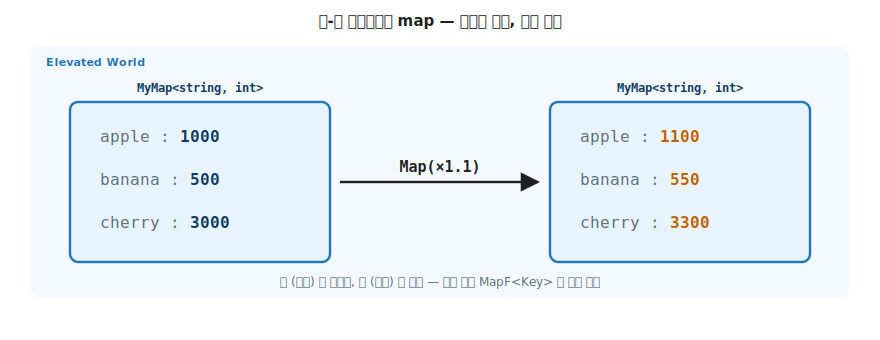
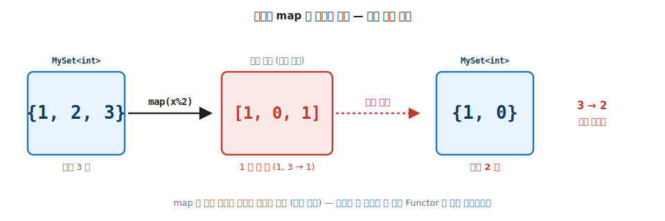

# 13 장. Maps & Sets (trait 이 붙는 자리와 붙지 않는 자리)

> **이 장의 목표** — 이 장을 읽고 나면 키-값 컨테이너 `MyMap` 에서 Functor 의 `map` 이 **값에만** 작용하고 키는 보존된다는 것을 직접 구현으로 확인하고, 집합 `MySet` 에는 `Foldable` 만 깔끔히 붙고 `Functor` 는 왜 경계 사례인지 두 가지 이유로 설명할 수 있습니다. trait 이 모든 컨테이너에 똑같이 붙는 것이 아니라 컨테이너의 모양에 따라 붙는 자리가 다르다는 것, 그리고 그 경계가 바로 trait 의 약속에서 나온다는 것을 손에 쥡니다.

> **이 장의 핵심 어휘**
>
> - **`MyMap<Key, V>`**: 키-값 컨테이너. trait 의 변환 대상 자리에는 **값 `V`** 만 들어가고, 키는 태그에 갇혀 보존됩니다
> - **`MapF<Key>`**: `MyMap` 의 태그 타입. 키를 고정한 채 값에 대한 Functor / Foldable 을 호스트합니다
> - **`MySet<A>`**: 중복 없는 집합. `Foldable` 만 붙고 `Functor` 는 붙지 않습니다
> - **경계 사례**: trait 의 약속 (무제약 시그니처·모양 보존) 을 지킬 수 없어 부착이 막히는 자리
> - **모양 보존**: Functor 법칙. `map` 이 원소 개수와 구조를 바꾸지 않는다는 약속
> - **키 변환**: 값이 아니라 키를 바꾸는 연산. 충돌·재정렬 때문에 Functor 의 `map` 이 아닙니다

> 이 장을 마치면 할 수 있게 되는 것
> - [ ] `MyMap` 에 Functor 를 부착해 `map` 이 값에만 작용하고 키는 보존됨을 코드로 보일 수 있습니다.
> - [ ] `MyMap` 의 값들을 `fold` 로 합계·개수·최댓값 같은 한 값으로 끌어내릴 수 있습니다.
> - [ ] `MySet` 에 `Foldable` 을 부착하고, `Functor` 가 왜 안 붙는지 두 이유로 설명할 수 있습니다.
> - [ ] `map` 의 모양 보존 법칙이 집합의 중복 제거와 충돌하는 자리를 반례로 보일 수 있습니다.
> - [ ] 키를 바꾸는 연산이 왜 Functor 가 아니라 별도 함수인지, 그리고 충돌을 어떻게 다루는지 설명할 수 있습니다.
> - [ ] 어떤 컨테이너를 만나든 그 모양을 보고 어떤 trait 이 붙고 어떤 trait 이 막히는지 가늠할 수 있습니다.

---

## 13.1 이 장에서 다루는 것 — 컨테이너마다 다른 trait 의 자리

앞 장에서 lazy 시퀀스 `MySeq` 에 다섯 trait 이 모두 붙었습니다. 그렇다면 모든 컨테이너에 다섯 trait 이 똑같이 붙을까요. 이 장의 답은 아닙니다. **컨테이너의 모양에 따라 붙는 trait 이 다릅니다.**

키-값 컨테이너 `MyMap` 은 시퀀스와 다릅니다. 안에 값만 있는 게 아니라 키와 값이 짝지어 있습니다. 그래서 `map` 이 작용하는 자리가 값으로 한정됩니다. 집합 `MySet` 은 더 흥미롭습니다. `Foldable` 은 깔끔히 붙지만 `Functor` 는 **붙지 않습니다**. 붙지 않는 이유가 이 장의 핵심입니다.

trait 은 아무 컨테이너에나 자동으로 붙는 도구가 아니었습니다. 4장에서 본 Functor 의 약속 (모양 보존) 과 무제약 시그니처 (`map` 이 입력·출력 타입에 조건을 달지 않는다는 약속) 를 지킬 수 있는 컨테이너에만 붙습니다. `MySet` 은 그 약속을 지킬 수 없어 Functor 의 경계에 섭니다. 이 경계를 보는 것이 추상을 더 정확히 이해하는 길입니다.

> **이 장에서 다시 만나는 어휘 한 줄씩** — 잊었어도 괜찮습니다. 필요한 만큼만 짧게 상기합니다.
>
> - **Functor / `map`**: Normal World 의 함수 `a → b` 를 받아 컨테이너 안의 값에 적용하는 능력. 컨테이너 모양은 그대로 두고 안의 값만 바꿉니다.
> - **Foldable / `fold`**: 컨테이너 안의 여러 값을 한 값으로 끌어내리는 능력. 합계·개수·최댓값이 여기서 나옵니다.
> - **Traversable / `traverse`**: 컨테이너 안 값들을 한꺼번에 effect (검증·조회) 로 변환하고 안팎 층을 뒤집는 능력. 9장의 층 swap 입니다.
> - **모양 보존**: Functor 의 약속. `map` 이 원소 개수와 구조를 바꾸지 않는다는 법칙입니다.
> - **Elevated World**: 없을 수 있음 / 여러 개 / 실패 같은 효과를 컨테이너에 담은 값들이 사는 위 층. 아래 층은 평범한 값이 사는 Normal World 입니다.

이 장의 무대도 두 평행 세계 그대로입니다. `MyMap<Key, V>` 와 `MySet<a>` 는 "여러 개일 수 있음" 효과를 인코딩한 Elevated World 의 시민이고, 안에 담기는 값 `V` 와 원소 `a` 는 Normal World 의 값입니다. `map` (값 변환) 과 `fold` (한 값으로 끌어내림) 라는 이미 아는 자리가, 이번에는 어디까지 작동하고 어디서 막히는지를 봅니다.

---

## 13.2 왜 필요한가 — 키-값과 집합은 시퀀스와 모양이 다르다

시퀀스의 `map` 은 단순했습니다. `[1, 2, 3]` 의 원소 하나하나에 함수를 적용하면 끝이었습니다. 시퀀스 안에는 값만 줄지어 있으니 그 값에 함수를 넘기면 됩니다. 고민할 자리가 없었습니다.

그런데 키-값 컨테이너는 안에 든 모양이 다릅니다. 값만 있는 게 아니라 키와 값이 짝지어 들어 있습니다. `"apple"` 이라는 키에 `1000` 이라는 값이 붙어 있는 식입니다. 여기에 같은 `map` 을 그대로 적용하려 하면 시퀀스에는 없던 질문이 곧장 생깁니다. **무엇을 변환해야 하는가.** 키인가, 값인가, 아니면 둘 다인가.

잠시 멈춰 직접 생각해 봐도 좋습니다. 가격표 `{apple: 1000, banana: 500}` 에 어떤 함수를 적용한다면 무엇이 바뀌어야 자연스러울까요.

```csharp
// 가격 맵 — 10% 인상하고 싶다. 무엇이 바뀌어야 하나?
var prices = new MyMap<string, int> { ["apple"] = 1000, ["banana"] = 500 };
// "apple" 키는 그대로 두고 1000 → 1100 만 바뀌어야 한다.
```

가격을 인상하면 상품 이름 (키) 은 그대로여야 하고 가격 (값) 만 바뀝니다. 즉 키-값 컨테이너의 `map` 은 값에만 작용해야 자연스럽습니다. 시퀀스에서는 떠오르지 않던 "어느 자리에 작용하는가" 라는 질문이 키-값 컨테이너에서 처음 생깁니다.

집합은 한 걸음 더 나아갑니다. 집합 `{1, 2, 3}` 은 중복을 허락하지 않는 컨테이너입니다. 여기에 `x => x % 2` (2 로 나눈 나머지) 를 적용한다고 상상해 봅니다. `1 → 1`, `2 → 0`, `3 → 1` 이 됩니다. 그런데 `1` 이 두 번 나옵니다. 집합은 중복을 허락하지 않으니 하나로 합쳐져 결과는 `{1, 0}` 이 됩니다. 시작은 원소 셋이었는데 결과는 둘입니다.

원소 개수가 줄었습니다. 시퀀스에서는 절대 일어나지 않던 일입니다. 시퀀스는 `[1, 0, 1]` 로 셋을 그대로 유지합니다. 집합에 `map` 을 붙이려 하면 이렇게 시퀀스에는 없던 막힘이 생기고, 그 막힘이 곧 trait 의 경계입니다.

지금은 결과만 살짝 비쳤습니다. 무엇이 정확히 막는지, 그것이 왜 4장의 모양 보존 법칙과 충돌하는지는 이 장 뒤에서 두 가지 이유로 차근차근 만나 봅니다. 지금은 집합에서는 `map` 이 개수를 줄일 수 있다는 직감 하나만 손에 쥐면 충분합니다.

---

## 13.3 MyMap — 값에만 작용하는 Functor

`MyMap<Key, V>` 는 키-값 쌍의 컨테이너이고, 공통 어휘로는 `K<MapF<Key>, V>` 를 구현합니다. 여기서 결정적인 점은 trait 의 변환 대상 자리 (`A`) 에 들어가는 것이 **값 `V` 뿐** 이라는 것입니다. 키 `Key` 는 태그 `MapF<Key>` 안에 갇혀, `Map` 이나 `Fold` 가 절대 건드리지 못합니다.

```csharp
public sealed class MyMap<Key, V>(IEnumerable<KeyValuePair<Key, V>> pairs)
    : K<MapF<Key>, V> where Key : notnull
{
    public IReadOnlyList<KeyValuePair<Key, V>> Pairs { get; } =
        pairs.OrderBy(p => p.Key, Comparer<Key>.Default).ToList();
    // …
}
```

> **OO 직감 다리** — 키가 태그에 갇힌다는 것은 C# 의 `Dictionary<TKey, TValue>` 에서 `Select` 가 보통 `Value` 만 다루는 직감과 같습니다. 키는 컨테이너의 정체성 (어디에 담겼는가) 이고, 값은 담긴 내용입니다. `map` 은 내용만 바꿉니다.

태그 `MapF<Key>` 에 부착한 `Map` 은 값에만 `f` 를 적용하고 키는 그대로 복사합니다.

코드를 보기 전에 머릿속으로 한 번 그려 봅니다. `Map` 은 짝 `(키, 값)` 을 하나씩 꺼내서, 키는 그대로 두고 값에만 함수 `f` 를 적용해 새 짝 `(키, f(값))` 을 만듭니다. 짝의 개수도 그대로, 키도 그대로, 값만 바뀝니다.

```text
("apple",  1000)   →   ("apple",  f(1000))   ← 키 그대로, 값에만 f
("banana",  500)   →   ("banana", f(500))
```

```csharp
public static K<MapF<Key>, B> Map<A, B>(Func<A, B> f, K<MapF<Key>, A> fa) =>
    new MyMap<Key, B>(
        fa.As().Pairs.Select(p => new KeyValuePair<Key, B>(p.Key, f(p.Value))));

이 한 줄을 조각조각 읽어 봅니다. `fa.As()` 는 추상 신호 타입 `K<MapF<Key>, A>` 를 진짜 자료 타입 `MyMap<Key, A>` 로 되돌립니다 (4장에서 본 그 다운캐스트입니다). 그 `Pairs` (키-값 짝들) 를 하나씩 보면서, `p.Key` 는 그대로 두고 `f(p.Value)` 로 값에만 함수를 넘깁니다. 새 짝 `KeyValuePair<Key, B>(p.Key, f(p.Value))` 가 만들어집니다.

눈여겨볼 곳은 `Map<A, B>` 의 타입 매개변수 `A` 와 `B` 입니다. 둘 다 값의 자리입니다. `A` 는 원래 값의 타입, `B` 는 변환된 값의 타입입니다. 키 타입 `Key` 는 `A`·`B` 어디에도 없습니다. 키는 메서드 바깥, 태그 `MapF<Key>` 에 이미 고정되어 있어서 `Map` 이 손댈 도리가 없습니다. 시그니처가 키 보존을 강제하고 있는 셈입니다.
```

> **여기서 `Key` 가 `MapF<Key>` 에 들어간 까닭** — `MapF<Key>` 는 키 타입까지 품은 태그입니다. 그래서 `Map<A, B>` 의 타입 매개변수 `A`·`B` 는 오직 **값** 자리이고, 키는 trait 의 변환 대상에서 아예 빠집니다. 4장에서 `K<F, A>` 의 `A` 가 "컨테이너 안에서 변환되는 값" 이었던 것을 키-값 컨테이너에 맞게 조였을 뿐입니다.

가격 맵을 10% 인상하면 상품 이름은 그대로이고 값만 바뀝니다.

```csharp
K<MapF<string>, int> prices = new MyMap<string, int>(new Dictionary<string, int>
{
    ["apple"] = 1000, ["banana"] = 500, ["cherry"] = 3000,
});

K<MapF<string>, int> raised = prices.Map(p => (int)(p * 1.1));
// 원본  = {apple: 1000, banana: 500, cherry: 3000}
// 10% ↑ = {apple: 1100, banana: 550, cherry: 3300}   ← 키 그대로, 값만 변환
```



**그림 13-1. 키-값 컨테이너의 `map`: 값에만 작용하고 키는 보존** — 가격 맵에 `map (×1.1)` 을 적용하면 키 (`apple`, `banana`, `cherry`) 는 그대로이고 값 (`1000`, `500`, `3000`) 만 변환됩니다. trait 의 변환 자리에 값 `V` 만 들어가고 키는 태그 `MapF<Key>` 에 갇혀 손대지 않는다는 것이 키-값 Functor 의 핵심입니다. 4장의 모양 보존이 "키 구조 보존" 으로 나타납니다.

---

## 13.4 MyMap Foldable — 값들이 한 값으로 자란다

`MyMap` 에는 `Foldable` 도 붙습니다. `Foldable` 은 6장에서 본 끌어내림의 trait 입니다. 컨테이너 안의 여러 값을 한 값으로 접는 능력입니다. `List<int>` 를 받아 합계 `int` 하나로 줄이는 그 동작이 끌어내림이었습니다.

키-값 컨테이너에서 끌어내림은 어떻게 동작할까요. `map` 과 똑같습니다. 여기서도 **값** 들만 접습니다. 키는 접지 않습니다. 가격표에서 가격 합계를 구하면 의미가 있지만, 상품 이름들을 더한다는 건 보통 뜻이 없으니 자연스러운 약속입니다.

```csharp
public static B FoldLeft<A, B>(Func<B, A, B> f, B seed, K<MapF<Key>, A> fa)
{
    var acc = seed;
    foreach (var p in fa.As().Pairs)
        acc = f(acc, p.Value);   // 값만 누적, 키는 건드리지 않음
    return acc;
}

한 줄씩 손으로 따라가면 머리에 또렷이 박힙니다. `acc` 는 누적값이고, `seed` 가 그 시작값입니다. 짝을 하나씩 보면서 `f(acc, p.Value)` 로 값만 누적합니다. `p.Key` 는 어디서도 등장하지 않습니다.

가격표 `{apple: 1000, banana: 500, cherry: 3000}` 의 합계를 `seed = 0` 으로 접어 봅니다.

```text
acc = 0                          (시작값)
  → f(0,    1000) = 0 + 1000 = 1000
  → f(1000,  500) = 1000 + 500 = 1500
  → f(1500, 3000) = 1500 + 3000 = 4500
결과 = 4500
```

키 (`apple`, `banana`, `cherry`) 는 한 번도 계산에 끼지 않았습니다. 값 세 개만 차례로 더해져 한 값 `4500` 이 됩니다. 이것이 `MyMap` 의 끌어내림입니다. `List<int>` 를 접던 것과 골격이 똑같고, 짝에서 값만 뽑아 본다는 점만 다릅니다.
```

6장에서 본 그대로, 두 멤버 (`FoldLeft` / `FoldRight`) 만 있으면 일상 함수들이 그 위에서 자랍니다. 가격 맵에서 합계·개수뿐 아니라 최댓값·전체 검사도 같은 어법입니다.

```csharp
var total  = prices.FoldLeft((acc, v) => acc + v, 0);        // 4500  — 값 합계
var count  = prices.Count();                                 // 3     — 항목 개수
var max    = prices.FoldLeft((acc, v) => Math.Max(acc, v), 0); // 3000 — 최댓값
var anyBig = prices.Any(v => v >= 1000);                     // true  — 1000 이상이 있는가
```

`map` 과 `fold` 가 모두 값 자리에서만 작동하므로, 키-값 컨테이너는 "값에 대한 Functor / Foldable" 로 정확히 자리잡습니다. 키는 어느 연산에서도 변환·소비되지 않고 보존됩니다.

---

## 13.5 MySet — Foldable 만 붙고, Functor 는 경계 사례

집합 `MySet<A>` 는 지금까지의 컨테이너와 결이 다릅니다. 두 trait 을 놓고 운명이 갈립니다. `Foldable` 은 깔끔히 붙고, `Functor` 는 붙지 않습니다.

먼저 잘 붙는 쪽부터 봅니다. `Foldable` 은 집합에 아무 문제 없이 붙습니다. 원소를 한 값으로 접는 데에는 집합의 특수성이 끼어들 자리가 없습니다.

```csharp
K<SetF, int> set = new MySet<int>([1, 2, 2, 3, 3, 3]);   // 중복 제거 → {1, 2, 3}
var setSum   = set.FoldLeft((acc, x) => acc + x, 0);     // 6
var setCount = set.Count();                              // 3
var hasEven  = set.Any(x => x % 2 == 0);                 // true
```

`Foldable` 이 집합에 깔끔히 붙는 이유는 단순합니다. **`fold` 는 원소를 읽기만 하고 새 집합을 만들지 않습니다.** 합계나 개수는 평범한 값 (`int`) 이라, 중복 제거도 동등성 비교도 필요 없습니다. 읽기 전용 순회에는 집합의 특수성이 끼어들 자리가 없습니다.

이 대비를 한 문장으로 미리 잡아 둡니다. 끌어내림 (`fold`) 의 결과는 집합 밖으로 나가는 평범한 값 (`int`, `bool`) 이고, 끌어올림 (`map`) 의 결과는 다시 집합입니다. 새 집합을 만드는 순간 집합의 규칙 (중복 없음) 을 다시 지켜야 하고, 거기서 막힘이 시작됩니다. 읽기만 하는 `fold` 에는 그 부담이 없습니다.

> **읽기 vs 새로 만들기** — 집합에서 `fold` 와 `map` 의 운명을 가르는 한 가지 차이입니다. `fold` 는 원소를 한 번씩 읽고 지나가며 평범한 값을 쌓습니다 (집합을 새로 만들지 않음). `map` 은 변환한 원소로 새 집합을 짓습니다 (집합을 새로 만듦). 이 한 줄이 다음 두 막힘의 뿌리입니다.

그런데 `Functor` 의 `Map` 은 붙지 않습니다. `map` 은 읽기가 아니라 **새 집합을 만드는** 연산이라 두 가지가 막습니다.

> **OO 직감 다리** — C# 의 `HashSet<int>` 에 `.Select(x => x % 2)` 를 쓰면 결과는 `IEnumerable` 이지 `HashSet` 이 아닙니다. 다시 `.ToHashSet()` 하는 순간 중복이 사라져 개수가 달라집니다. LINQ 가 `Select` 에서 `HashSet` 을 그대로 돌려주지 않는 그 직감이 곧 집합에 Functor 가 안 붙는 이유입니다.

**첫째, 무제약 시그니처를 어깁니다.** 차근차근 따라가 봅니다.

집합의 `map` 은 결과로 새 집합을 만듭니다. 그런데 그 새 집합도 집합인 이상 중복이 없어야 합니다. 중복을 없애려면 변환 결과로 나온 값들끼리 같은지 비교할 수 있어야 합니다. `B` 라는 결과 타입에 대해 두 값이 같은가를 판정하는 도구 (동등성 비교, C# 으로는 `EqualityComparer<B>`) 가 필요합니다.

그런데 여기서 막힙니다. trait 의 `Map<A, B>` 시그니처에는 `B` 에 `where B : IEquatable<B>` 같은 조건을 달 자리가 없습니다. 2장에서 본 `K<F, A>` 인코딩이 `A`·`B` 자리에 조건을 못 달도록 되어 있기 때문입니다. 모든 Functor 가 똑같은 한 모양의 `Map` 을 부착해야 하는데, 그 한 모양은 `B` 에 아무 조건도 안 달립니다.

왜 못 달게 막아 두었는지가 핵심입니다. `Option` 의 `Map` 도, `List` 의 `Map` 도 `B` 가 무엇이든 받습니다. 정수든 함수든 또 다른 컨테이너든 가립니다. 만약 집합만 슬쩍 `B` 에 동등성 비교를 요구하면, 집합의 `Map` 은 다른 컨테이너의 `Map` 과 더 이상 같은 약속이 아닙니다. 그러면 어떤 Functor 든 받는 일반 함수 (4장에서 본 그 이득) 가 집합 앞에서 무너집니다. 모두가 똑같은 무제약 약속을 지킬 때만, trait 한 번 정의로 모든 시민이 능력을 얻는 4장의 이득이 살아납니다. 집합은 그 약속을 못 지킵니다.

**둘째, 모양 보존을 깨뜨립니다.** 서로 다른 원소가 같은 값으로 가면 집합의 개수가 줄어듭니다. `{1, 2, 3}` 에 `x => x % 2` 를 적용하면 `1 → 1`, `2 → 0`, `3 → 1` 이라 `{1, 0}` 로 원소가 셋에서 둘로 줄어듭니다. 4장에서 본 Functor 의 모양 보존 법칙 (원소 개수와 구조를 바꾸지 않는다) 이 정면으로 깨집니다.

이 둘째 이유는 손으로 짚으면 한눈에 보입니다. 입력과 출력의 원소를 나란히 적어 봅니다.

```text
입력 집합   {1, 2, 3}          원소 3 개
  x => x % 2
    1 → 1
    2 → 0
    3 → 1
변환 결과   1, 0, 1            (1 이 두 번)
중복 제거   {1, 0}             원소 2 개   ← 하나 사라짐
```

시퀀스였다면 `[1, 0, 1]` 로 셋이 그대로 남습니다. 집합은 중복을 못 담으니 `1` 두 개가 하나로 합쳐져 둘이 됩니다. 4장의 항등 법칙·합성 법칙이 성립하려면 `map` 이 원소 개수와 구조를 건드리지 않아야 했는데, 여기서는 개수 자체가 셋에서 둘로 줄었습니다. 모양 보존이 정면으로 깨집니다.

두 이유는 결이 다릅니다. 둘째 (모양 보존) 는 4장 법칙을 정면으로 어기는 수학적 이유이고, 첫째 (무제약 시그니처) 는 그 법칙을 지키려 동등성 비교를 끌어들이는 순간 trait 의 부착 약속이 깨지는 이유입니다. 어느 한쪽만으로도 집합은 Functor 의 경계에 섭니다.

> **소스 코드가 보여 주는 같은 경계** — 이 책의 `MySet` 은 일부러 Functor 를 안 붙였습니다. 그런데 LanguageExt v5 의 실무 `Set` 은 Functor 를 붙입니다. 모순일까요. 소스를 열어 보면 오히려 위 두 이유를 확인해 줍니다.
>
> v5 의 `Set<A>` 는 안에서 `SetInternal<OrdDefault<A>, A>` 를 씁니다. 여기 `OrdDefault<A>` 가 바로 첫째 이유에서 말한 그 동등성·순서 비교 도구입니다. v5 는 그것을 시그니처에 드러내지 않고 컨테이너 안에 숨겨 두는 방식으로 Functor 를 성립시킵니다. 즉 v5 의 `Set` Functor 는 무제약 시그니처를 정직하게 지킨 것이 아니라, `OrdDefault` 라는 비교 도구를 안쪽에 몰래 끼워서 첫째 막힘을 우회한 것입니다. 그리고 그렇게 만든 `map` 은 여전히 중복을 제거하므로 둘째 (모양 보존) 는 그대로 깨집니다.
>
> 이 책의 `MySet` 은 그 우회를 하지 않고 trait 수준에서 경계를 그대로 드러냅니다. 입문 단계에서는 우회된 편의보다 경계가 어디서 왜 생기는지를 또렷이 보는 쪽이 추상을 더 정확히 이해하게 합니다. 우회의 비용 (숨은 비교 도구) 을 알고 나면, v5 가 왜 그렇게 했는지도 함께 보입니다.



**그림 13-2. 집합에 `map` 이 막히는 이유: 모양 보존 위반** — `{1, 2, 3}` 에 `x => x % 2` 를 적용하면 `1`, `3` 이 모두 `1` 로 가, 중복 제거 후 `{1, 0}` 으로 원소가 셋에서 둘로 줄어듭니다. `map` 은 원소 개수를 바꾸지 않아야 한다는 모양 보존 법칙을 어기므로, 집합은 Functor 의 경계 사례입니다. `Foldable` (읽기만) 로는 아무 문제가 없습니다.

> **흔한 함정** — "trait 이 안 붙으면 그 컨테이너는 함수형이 아니다" 라는 오해입니다.
>
> 집합에 `Functor` 가 안 붙는다고 해서 집합이 부족한 자료 구조인 것은 아닙니다. 집합은 `Foldable` 의 훌륭한 시민이고, 합집합·교집합 같은 집합 고유의 연산을 따로 가집니다 (그 결합은 14장 `SemigroupK` 에서 다시 만납니다). 추상이 붙고 안 붙고는 **컨테이너의 모양과 trait 의 약속이 맞는가** 의 문제이지, 좋고 나쁨의 문제가 아닙니다.

---

## 13.6 키 변환은 Functor 가 아니다 — 그리고 충돌을 다루는 법

`MyMap` 의 `Map` 은 값만 바꾸고 키는 보존했습니다. 그렇다면 자연스러운 다음 질문이 생깁니다. 키 자체를 바꾸고 싶으면 어떻게 하나요. 예를 들어 상품 이름 키를 모두 대문자로 바꾸거나, 이름 대신 이름 길이를 키로 삼고 싶을 수 있습니다.

결론부터 말하면, 키를 바꾸는 연산은 Functor 의 `map` 이 아닙니다. 별도 함수로 따로 둡니다. 왜 그럴까요. 키 변환은 값 변환에는 없던 위험 두 가지를 부르기 때문입니다.

핵심은 **충돌** 입니다. 서로 다른 키 둘이 변환 후 같은 키가 되어 버리는 경우입니다. 그러면 한 자리에 두 값이 들어가려 다투고, 하나가 다른 하나를 덮어씁니다. 여기에 더해, 키 순서를 유지하는 정렬 Map 에서는 키가 바뀌면서 순서가 뒤집히는 **재정렬** 도 출력 구조를 흔듭니다. 둘 중 무게 중심은 충돌에 있습니다.

```csharp
// 키를 변환하는 자유 함수 — 이름도 일부러 Map 과 다르게 둔다.
public static MyMap<KeyB, V> MapKeys<KeyA, KeyB, V>(
    MyMap<KeyA, V> map, Func<KeyA, KeyB> keyF) /* … */
{
    var dict = new Dictionary<KeyB, V>();
    foreach (var p in map.Pairs)
        dict[keyF(p.Key)] = p.Value;   // 충돌 시 나중 값이 덮어씀 (정책을 명시해야 한다)
    return new MyMap<KeyB, V>(dict);
}

이 함수의 이름이 `Map` 이 아니라 `MapKeys` 인 것은 일부러입니다. Functor 의 `Map` 과 헷갈리지 않게 다르게 둔 것입니다. 결정적 한 줄은 `dict[keyF(p.Key)] = p.Value` 입니다. 변환된 키 `keyF(p.Key)` 에 값을 넣는데, 그 키가 이미 있으면 기존 값이 덮어써집니다.

충돌을 직접 만들어 봅니다. 상품 이름을 길이로 바꾸는 `keyF = k => k.Length` 를 쓴다고 합시다.

```text
("apple",  1000)   →   (5, 1000)
("banana",  500)   →   (6,  500)
("grape",  2000)   →   (5, 2000)   ← apple 도 길이 5! 충돌
```

`apple` 과 `grape` 는 둘 다 길이가 5 입니다. 같은 키 `5` 자리에 `1000` 과 `2000` 이 부딪칩니다. `dict[5] = ...` 가 두 번 실행되니 나중 값 `2000` 이 먼저 값 `1000` 을 덮어씁니다. 결과 Map 은 키 `5`, `6` 두 개뿐입니다. 원소가 셋에서 둘로 줄었습니다.

값 변환에서는 이런 일이 절대 없었습니다. 키를 안 건드리니 짝의 개수가 보존됐습니다. 키를 건드리는 순간 개수가 줄 수 있고 (모양 보존 위반), 누가 이기는가라는 정책을 호출자가 정해야 합니다. 그래서 키 변환은 약속만으로 자동으로 되는 Functor 의 `map` 이 아니라, 정책이 필요한 별도 함수로 둡니다.
```

상품 이름을 길이로 바꾼다고 합시다. `apple` (5) 과 `cherry` (6) 처럼 길이가 다른 키는 그대로 살아남지만, 같은 길이의 키가 둘 있으면 하나가 다른 하나를 덮어씁니다. 충돌이 일어나면 "어느 값이 이기는가" 라는 정책을 호출자가 정해야 하고, 이는 모양 보존을 깨는 연산입니다. 재정렬은 개수를 바꾸지 않으니 그 자체로 모양 보존을 깨지는 않지만, 정렬 Map 에서는 키 순서도 출력 구조의 일부라 키가 바뀌면 그 구조가 흔들립니다. 무게 중심은 충돌에 있습니다.

> **충돌 정책이 3장 Monoid 로 이어집니다** — "나중 값이 이긴다" 는 가장 단순한 정책입니다. 그런데 충돌한 두 값을 **합치고** 싶다면 (예: 같은 카테고리의 매출을 더하기), 값 `V` 에 결합 연산이 필요합니다. 이것이 3장 `Monoid` 입니다. 키 변환 + 충돌 시 합치기는 곧 "값이 Monoid 인 Map 의 병합" 이고, 실무의 group-by 집계가 정확히 이 패턴입니다. 같은 길이끼리 매출을 더하려면 `int` 의 덧셈 Monoid 를, 로그를 모으려면 리스트 Monoid 를 충돌 자리에 끼웁니다.

---

## 13.7 내부 표현은 달라도 같은 trait — 정렬 Map · HashMap · TrieMap

학습용 `MyMap` 은 키로 정렬된 불변 배열을 백킹으로 썼습니다. 실무 컬렉션은 내부 표현이 더 정교합니다. 그러나 앞 장 `MyLst` 에서 보았듯, **내부 표현이 달라도 같은 trait 이 그대로 붙습니다.**

| 실무 컬렉션 | 내부 표현 | 특징 | 순회 순서 |
|---|---|---|---|
| 정렬 `Map` | AVL 트리 (균형 이진 탐색 트리) | 키 순서 유지, 범위 조회 빠름 | 키 오름차순 |
| `HashMap` | HAMT (Hash Array Mapped Trie) | 순서 없음, 조회·삽입 평균 빠름 | 해시 순서 |
| `TrieMap` | 트라이 (접두사 트리) | 문자열 키 접두사 공유, 메모리 절약 | 사전순 |

세 컬렉션은 메모리 표현도 조회 방식도 다르지만, 키-값에 대한 `Functor` / `Foldable` 인스턴스는 셋 다 "값에만 작용, 키 보존" 으로 동일합니다. 어떤 표현을 만나든 시그니처의 약속만 같으면 같은 trait 의 시민입니다. 다만 `Foldable` 순회 순서는 내부 표현이 정합니다 (정렬 Map 은 키 오름차순, HashMap 은 해시 순서). 그래서 순서에 의존하는 `FoldLeft` 결과 (예: 첫 원소) 는 컨테이너마다 다를 수 있습니다.

> **여기는 개념만 짚고 넘어가도 됩니다** — AVL·HAMT·트라이의 내부 동작은 자료 구조 영역이고, 이 책의 관심사가 아닙니다. 지금 가져갈 것은 한 줄입니다. 내부 표현이 무엇이든 키-값 컨테이너의 trait 부착은 "값에만" 으로 같습니다.

---

## 13.8 Map 도 Traversable — 값들을 한꺼번에 검증

`MyMap` 에 `Functor` 와 `Foldable` 이 붙었습니다. 한 걸음 더 나아가면 `Traversable` 도 붙습니다.

`Traversable` 을 잠깐 다시 떠올립니다. 9장에서 본 층 swap 의 trait 입니다. 컨테이너 안의 값들을 한꺼번에 effect (검증·조회 같은 또 다른 Elevated 효과) 로 변환하고, 안쪽 effect 와 바깥 컨테이너의 층 순서를 뒤집는 능력입니다. 시퀀스에서는 `List<Maybe<a>>` 를 `Maybe<List<a>>` 로 뒤집었습니다.

키-값 컨테이너에서 이 능력은 값들을 한꺼번에 effect 로 변환으로 나타납니다. 그리고 `map`·`fold` 와 똑같이, 여기서도 작용 대상은 값뿐이고 키는 보존됩니다.

가격 맵의 각 값을 검증한다고 합시다. 값 하나를 `Maybe` 로 검증하는 함수 `V → Maybe<V>` 가 있을 때, `traverse` 는 `Map<K, V>` 를 `Maybe<Map<K, V>>` 로 뒤집습니다. **모든 값이 통과해야 전체 Map 이 성공** 이고, 키는 그대로 보존됩니다.

```text
{apple: 1000, banana: 500}  traverse (값이 양수인지 검증)
  → apple: 1000  ✓
  → banana: 500  ✓
  → Just({apple: 1000, banana: 500})   (모두 통과 → 키 보존된 Map 되살아남)

{apple: 1000, banana: -50}  traverse
  → banana: -50  ✗
  → 전체 Nothing   (하나라도 실패하면 Map 전체 실패)
```

이 `traverse` 는 9장 층 swap 의 키-값 판입니다. 시퀀스에서 `List<Maybe>` 를 `Maybe<List>` 로 뒤집었듯, Map 에서는 `Map<K, F<V>>` 를 `F<Map<K, V>>` 로 뒤집습니다. 층 swap 의 대상이 시퀀스든 Map 이든, "안쪽 effect 를 바깥으로 모은다" 는 동작은 같습니다. 학습용 `MyMap` 도 `Functor` 와 `Foldable` 에 더해 `Traversable` 을 부착하므로, 위 검증을 코드로 곧장 돌려볼 수 있습니다. 실패를 모으는 `Validation` 이든 첫 실패에서 멈추는 `Maybe` 든 같은 골격으로 동작합니다. 실무 `Map` 역시 같은 `Traversable` 로 폼 검증·일괄 조회에 쓰입니다.

> **흔한 함정** — Map 의 `traverse` 가 키도 변환한다는 오해입니다.
>
> `traverse` 도 `map` 처럼 **값에만** 작용합니다. 키는 보존되고, 안쪽 effect (`Validation`, `Maybe`) 만 바깥으로 모입니다. 결과 `Validation<Map<K, V>>` 가 성공이면 원래 키들이 그대로 든 Map 이 나옵니다.

---

## 13.9 직접 해보기 — 챌린지

> **필수 ① — `MyMap` 의 두 Functor 법칙 검증.** 가격 맵에 `Map(x => x)` 가 원본과 같은지 (항등 법칙), `Map(g) ∘ Map(f)` 가 `Map(g ∘ f)` 와 같은지 (합성 법칙) 를 값 시퀀스로 비교해 확인합니다. 키가 보존되므로 법칙이 값 자리에서만 따지면 된다는 점을 설명해 봅니다.

> **필수 ② — `MySet` 에 `Map` 을 억지로 붙여 보기.** `MySet<int>` 에 `x => x % 2` 를 적용하는 `Map` 을 직접 적어 보고, 결과 `{1, 0}` 의 개수가 입력 `{1, 2, 3}` 과 다른 것을 확인합니다. 모양 보존 법칙이 깨지는 자리를 코드로 짚어 봅니다.

> **심화 ③ — 키 변환의 충돌 정책을 Monoid 로.** `MapKeys` 에서 충돌 시 "나중 값이 이긴다" 대신 "두 값을 더한다" 정책을 쓰려면 값 `V` 에 무엇이 필요한지 (3장 Monoid 의 `Combine`) 생각해 보고, 같은 길이의 키끼리 매출을 합치는 group-by 를 구현해 봅니다.

> **심화 ④ — Map 의 `traverse` 직접 써 보기.** `MyMap` 에 `Traverse` 멤버를 손으로 구현해 `Map<K, Maybe<V>>` 를 `Maybe<Map<K, V>>` 로 뒤집어 보고, 코드에 실린 구현과 비교해 봅니다. 시퀀스의 `Traverse` (12장) 와 골격이 같되, 키-값 쌍을 다시 끼워 넣는 부분만 다르다는 것을 확인합니다.

---

## 13.10 Elevated World 어휘로 다시 읽기

이 장에서 한 일을 두 평행 세계 어휘로 정리합니다. 핵심은 trait 이 컨테이너 모양에 따라 붙는 자리가 다르다는 것입니다.

| 컨테이너 | 붙는 trait | 막히는 trait | 이유 |
|---|---|---|---|
| `MyMap<Key, V>` | Functor (값에만), Foldable, Traversable | — | 값 자리는 무제약, 키는 태그에 보존 |
| `MySet<a>` | Foldable | Functor | 중복 제거가 무제약 시그니처·모양 보존을 위반 |
| 키 변환 | — | Functor 의 `map` 아님 | 충돌·재정렬로 개수가 줄어 모양 보존 위반 |

`map` 의 모양 보존 (4장) 이 이 장 전체를 가르는 기준이었습니다. 값에만 작용하면 보존되고 (`MyMap`), 원소를 합치면 깨집니다 (`MySet`, 키 변환). trait 의 경계는 이 약속에서 나옵니다.

이 장에서 만난 컨테이너들을 한 줄로 정리하면 이렇게 읽힙니다. 컨테이너 안에서 trait 이 손대는 자리 (`K<F, A>` 의 `A`) 가 어디까지인지가 trait 의 부착을 정합니다. `MyMap` 은 `A` 가 값뿐이고 키는 태그에 갇혀 보존되니 Functor·Foldable·Traversable 이 다 깔끔히 붙습니다. `MySet` 은 `map` 이 새 집합을 다시 지으면서 중복 제거를 부르니 Functor 가 막히고, 읽기만 하는 Foldable 만 남습니다. 키 변환은 trait 의 `A` 자리가 아니라 컨테이너 자체 (키) 를 흔들어 충돌을 부르니 아예 trait 의 `map` 이 아닙니다.

> **여기까지 따라왔으면 충분합니다** — 컨테이너를 새로 만났을 때 던질 질문 하나만 손에 쥐면 됩니다. 이 컨테이너에서 trait 이 손대는 값 자리는 어디까지이고, 그 변환이 컨테이너의 모양 (개수·구조) 을 지키는가. 지키면 Functor 가 붙고, 못 지키면 경계에 섭니다.

---

## 13.11 Q&A — 자기 점검

> **Q1. `MyMap` 의 `map` 은 왜 값에만 작용합니까?** (13.3절)
>
> trait 의 변환 대상 자리 (`A`) 에 들어가는 것이 값 `V` 뿐이고, 키 `Key` 는 태그 `MapF<Key>` 에 갇혀 있기 때문입니다. 가격 인상에서 상품 이름은 그대로이고 가격만 바뀌어야 하듯, 키-값 컨테이너의 `map` 은 내용 (값) 만 바꾸고 정체성 (키) 은 보존합니다.

> **Q2. `MySet` 에 `Foldable` 은 붙고 `Functor` 는 안 붙는 차이는 무엇입니까?** (13.5절)
>
> `Foldable` 의 `fold` 는 원소를 **읽기만** 하고 새 집합을 안 만듭니다. 합계는 평범한 값이라 중복 제거도 동등성 비교도 필요 없습니다. 반면 `Functor` 의 `map` 은 **새 집합을 만드는** 연산이라 중복 제거가 필요하고, 거기서 두 약속 (무제약 시그니처, 모양 보존) 이 깨집니다.

> **Q3. `MySet` Functor 의 첫째 이유 (무제약 시그니처) 를 설명해 보세요.** (13.5절)
>
> `Map<A, B>` 는 결과 `B` 에 제약을 안 답니다. 그런데 집합은 결과를 중복 제거해야 하고 그러려면 `B` 의 동등성 비교가 필요합니다. 한 컨테이너만 `B` 에 제약을 요구하면 `Option`·`List` 가 부착한 `Map` 과 더는 같은 trait 이 아니게 됩니다. 모두가 같은 무제약 약속을 지켜야 trait 한 번 정의의 이득이 성립합니다.

> **Q4. `MySet` Functor 의 둘째 이유 (모양 보존) 를 설명해 보세요.** (13.5절)
>
> 서로 다른 원소가 같은 값으로 가면 중복 제거로 개수가 줄어듭니다. `{1, 2, 3}` 에 `x => x % 2` 를 적용하면 `{1, 0}` 로 셋에서 둘로 줄어, 원소 개수를 바꾸지 않아야 한다는 4장 모양 보존 법칙이 깨집니다.

> **Q5. 키를 바꾸는 연산은 왜 Functor 가 아니고, 충돌은 어떻게 다룹니까?** (13.6절)
>
> 충돌·재정렬을 부르기 때문입니다. 서로 다른 키가 같은 키로 가면 값이 덮어써져 개수가 줄고 (모양 보존 위반), "어느 값이 이기는가" 정책이 필요합니다. 충돌한 값을 합치려면 값 `V` 가 3장 Monoid 여야 하고, 이것이 group-by 집계의 토대입니다.

> **Q6. 내부 표현이 다른 `Map` / `HashMap` / `TrieMap` 은 trait 이 다릅니까?** (13.7절)
>
> 같습니다. AVL·HAMT·트라이로 표현은 다르지만 키-값 Functor / Foldable 은 셋 다 "값에만 작용, 키 보존" 으로 동일합니다. 다만 `Foldable` 순회 순서는 내부 표현이 정해, 순서 의존 결과는 달라질 수 있습니다.

> **Q7. Map 도 `traverse` 가 됩니까?** (13.8절)
>
> 됩니다. `Map<K, F<V>>` 를 `F<Map<K, V>>` 로 뒤집습니다. 값들을 한꺼번에 effect (검증·조회) 로 변환하고 키는 보존합니다. 모든 값이 통과해야 전체 Map 이 성공입니다. 시퀀스의 `traverse` 와 골격이 같고 대상만 키-값입니다.

---

## 13.12 요약

- **컨테이너의 모양에 따라 붙는 trait 이 다릅니다.** 모든 컨테이너에 다섯 trait 이 똑같이 붙는 것이 아닙니다 (13.1절).
- **키-값 컨테이너의 `map` 은 값에만 작용하고 키는 보존합니다.** 변환 자리에 값 `V` 만 들어가고 키는 태그에 갇힙니다 (13.3절).
- **`MyMap` 의 `fold` 도 값들만 한 값으로 접습니다.** 합계·개수·최댓값이 두 멤버 위에서 자랍니다 (13.4절).
- **집합은 `Foldable` 만 붙고 `Functor` 는 경계 사례입니다.** `fold` 는 읽기만 하지만 `map` 은 새 집합을 만들어 무제약 시그니처·모양 보존을 위반합니다 (13.5절).
- **키 변환은 Functor 가 아니고, 충돌을 합치려면 값이 Monoid 여야 합니다.** group-by 집계의 토대입니다 (13.6절).
- **내부 표현이 달라도 같은 trait 이 붙습니다.** AVL·HAMT·트라이가 모두 "값에만" 으로 동일하되 순회 순서만 다릅니다 (13.7절).
- **Map 도 Traversable 입니다.** `Map<K, F<V>>` 를 `F<Map<K, V>>` 로 뒤집어 값들을 한꺼번에 검증합니다 (13.8절).

이 장의 단일 목표는 하나였습니다. **trait 이 컨테이너 모양에 따라 어디에 붙고 어디서 막히는지, 그 경계가 trait 의 약속에서 나옴을 확인한다.**

---

## 13.13 다음 장으로

여기까지 컬렉션이 기초 trait 의 인스턴스라는 것을 (시퀀스), 그리고 trait 이 붙는 자리에 경계가 있다는 것을 (맵·집합) 보았습니다. 다음 장은 기초에 **없던 새 추상 두 개** 를 더합니다. 여러 Elevated 후보 중 하나를 고르는 `Choose` (Alternative / Choice), 그리고 두 Elevated 값을 합치는 `Combine` (SemigroupK / MonoidK) 입니다. 이 장 끝에서 잠깐 비친 집합의 합집합·교집합, 키 충돌 시 값 합치기가 모두 그 "Elevated 값을 모으는" 추상으로 묶입니다. 시그니처가 똑같은데 의미가 다른 두 동사 "고르기" 와 "합치기" 가 원래 별개임을, 그리고 3장 Monoid 가 어떻게 Elevated World 로 올라가는지를 봅니다.

> **실무 디딤돌** — `MyMap` 의 "값에만 작용" 은 후속 Part 의 상태 관리 (Reader / State) 에서 환경·상태의 일부만 변환하는 패턴으로 이어집니다. Map 의 `traverse` 는 폼 검증·일괄 조회의 토대입니다.
>
> **테스트 디딤돌** — 이 장의 Functor 두 법칙과 `MySet` 의 모양 보존 반례는 11부의 property-based 테스트에서 임의의 맵·집합으로 자동 검증·반증됩니다.
