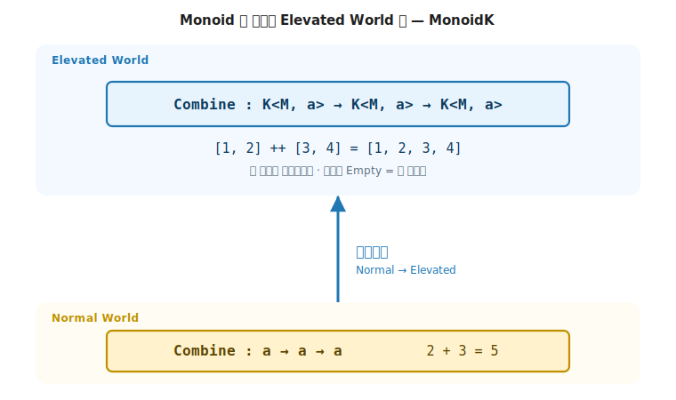
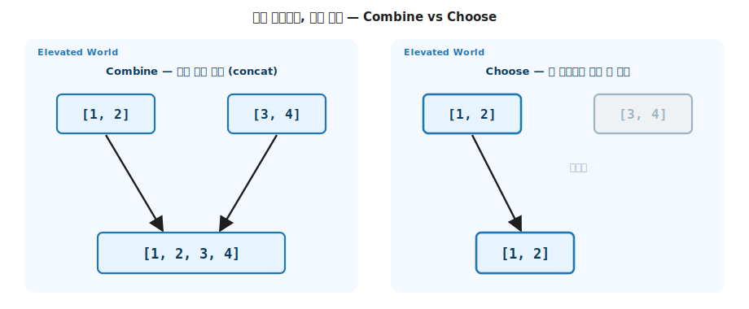

# 14 장. Alternative & MonoidK (선택과 결합)

> **이 장의 목표** — 이 장을 읽고 나면 기초에 없던 두 새 추상을 직접 구현할 수 있습니다. 여러 Elevated 후보 중 하나를 고르는 `Choose` (Choice), 두 Elevated 값을 합치는 `Combine` 과 그 항등원 `Empty` (SemigroupK / MonoidK) 입니다. `Combine` 과 `Choose` 가 시그니처는 똑같은데 의미가 다르다는 것을, 시퀀스에서는 둘이 갈라지고 (`concat` vs 첫 비어있지 않은 쪽) Maybe 에서는 우연히 일치한다는 (둘 다 첫 `Just`) 대비로 봅니다. 3장의 `Monoid` 가 어떻게 Elevated World 로 올라가는지, `Choose` 가 fallback (`x ?? value`) 과 파서 결합자의 토대가 되는지, 그리고 그 약속을 고정하는 세 법칙까지 손에 쥡니다.

> **이 장의 핵심 어휘**
>
> - **`Choose`**: 두 Elevated 후보 중 성공하는 쪽을 고르는 연산 (`K<F, a> → K<F, a> → K<F, a>`)
> - **`Combine`**: 두 Elevated 값을 합치는 연산. 같은 시그니처지만 "고르기" 가 아니라 "모으기"
> - **`SemigroupK` / `MonoidK`**: 3장 `Semigroup` / `Monoid` 를 Elevated World 로 끌어올린 trait. `MonoidK` 는 항등원 `Empty` 를 더합니다
> - **`Alternative`**: `Choice` 와 `Applicative` 를 상속하고 `Empty` 를 직접 선언하는 trait. "여러 시도 중 하나, 전부 실패하면 `Empty`"
> - **`OneOf` / `option`**: 여러 후보 중 첫 성공 / 실패하면 기본값으로 떨어지는 fallback (`x ?? value`)
> - **`guard`**: 조건이 참이면 `Pure(unit)`, 거짓이면 `Empty`. 조건 필터·`where` 절의 토대

> 이 장을 마치면 할 수 있게 되는 것
> - [ ] `SemigroupK` / `MonoidK` 를 직접 정의해 두 Elevated 값을 합치고 항등원을 둘 수 있습니다.
> - [ ] 3장 `Monoid` 의 결합이 Elevated World 로 올라간 형태가 `MonoidK` 임을 시그니처로 설명할 수 있습니다.
> - [ ] `Choice` 의 `Choose` 로 여러 후보 중 하나를 고르고, `option` 으로 fallback 을 구현할 수 있습니다.
> - [ ] `Combine` 과 `Choose` 가 시퀀스에서는 다르고 Maybe 에서는 같은 이유를 설명할 수 있습니다.
> - [ ] `Alternative` 가 `Choice` + `Applicative` + `Empty` 의 합류임을 보이고 `OneOf` 를 구현할 수 있습니다.
> - [ ] Alternative 의 세 법칙 (좌 zero / 우 zero / 좌 catch) 으로 "첫 성공" 의 약속을 검증할 수 있습니다.
> - [ ] `guard` 가 조건 분기·필터의 토대이고, `Choose` 가 파서 결합자의 토대임을 설명할 수 있습니다.

---

## 14.1 이 장에서 다루는 것 — 기초에 없던 두 동사

여기까지 4부는 기초의 trait 이 실무 컬렉션에 그대로 붙는다는 것을 확인했습니다 (시퀀스), 그리고 trait 이 붙는 자리에 경계가 있다는 것을 보았습니다 (맵·집합). 이 장은 한 걸음 더 나아가, **기초에 없던 새 추상 두 개** 를 더합니다.

첫째는 **선택** 입니다. 여러 Elevated 후보 중 성공하는 쪽 하나를 고르는 `Choose` 입니다. 파서가 "이 규칙 아니면 저 규칙" 을 시도하거나, "값이 있으면 그 값, 없으면 대체값" 을 고르는 자리의 일반형입니다. 둘째는 **결합** 입니다. 두 Elevated 값을 하나로 합치는 `Combine` 과 그 항등원 `Empty` 입니다. 두 시퀀스를 이어붙이거나, 여러 조각을 모으는 자리의 일반형입니다.

이 두 동사는 1장 지도에서 새 화살표를 그리지 않습니다. 둘 다 같은 Elevated World 안에서 `K<F, a>` 둘을 받아 `K<F, a>` 하나를 내는 모양 (`E<a> → E<a> → E<a>`) 입니다. `map` 이 값을 바꾸고 `bind` 가 효과를 이었다면, `Choose` 와 `Combine` 은 이미 Elevated 인 값들을 **모읍니다**. 같은 무대 위의 다른 동사입니다.

그리고 이 결합은 새로 만들어진 것이 아닙니다. 3장에서 본 `Monoid` 가 Normal World 의 값을 합쳤다면, 이 장의 `MonoidK` 는 **같은 발상을 Elevated World 로 끌어올린** 것입니다. 기초의 어휘가 한 층 위에서 다시 나타납니다.

이 장에 trait 이 넷 (`Choice`, `SemigroupK`, `MonoidK`, `Alternative`) 나오지만, 진짜 외울 것은 한 문장입니다. **`Combine` 은 모으기, `Choose` 는 고르기, 둘은 시그니처가 같다.** 나머지는 이 한 문장의 변주입니다.

---

## 14.2 왜 필요한가 — "고르기" 와 "모으기" 가 막히는 자리

여러 후보 중 첫 성공을 고르는 일은 명령형에서 if-else 연쇄가 됩니다.

```csharp
// 세 곳에서 차례로 사용자를 찾아, 처음 찾은 것을 쓴다 — 명령형
User? FindUser(int id)
{
    var fromCache = cache.Get(id);
    if (fromCache != null) return fromCache;
    var fromDb = db.Get(id);
    if (fromDb != null) return fromDb;
    var fromApi = api.Get(id);
    if (fromApi != null) return fromApi;
    return null;
}
```

후보가 늘 때마다 `if (… != null) return …` 가 복사됩니다. 3장에서 본, 같은 발상을 도메인마다 베끼는 복사와 같은 종류의 번거로움입니다. "여러 후보 중 첫 성공" 이라는 발상을 코드 구조가 담아내지 못합니다.

두 컬렉션을 합치는 일도 마찬가지입니다. 빈 컬렉션에서 시작해 하나씩 이어붙이는 패턴은 3장에서 본 `Monoid` 의 결합 그대로인데, 그 결합이 컨테이너 자체 (`Seq<a>`, `Option<a>`) 에 대해서도 필요합니다. 그러나 3장의 `Monoid` 는 Normal World 의 완성 타입 (`int`, `string`) 만 다뤘습니다. 컨테이너를 합치려면 결합을 한 층 끌어올려야 합니다.

이 두 자리 (여러 후보 중 고르기, 여러 컨테이너 모으기) 를 trait 으로 묶는 것이 이 장의 두 새 추상입니다.

---

## 14.3 SemigroupK / MonoidK — 기초 Monoid 의 Elevated 판

3장의 `Semigroup` 은 같은 타입 두 값을 한 값으로 합쳤고 (`A → A → A`), `Monoid` 는 거기에 항등원 `Empty` 를 더했습니다. 이 장의 `SemigroupK` 와 `MonoidK` 는 그 결합을 Elevated World 로 끌어올립니다. 끝의 `K` 가 "한 층 위 (Kind)" 를 가리킵니다. 2장에서 본 `K<F, A>` 의 그 `K` 와 같은 어원으로, 완성 타입 `A` 가 아니라 컨테이너 `K<M, A>` 를 다룬다는 표지입니다.

```csharp
// 3장 Semigroup (Normal):    A      → A      → A
// 이 장 SemigroupK (Elevated): K<M, A> → K<M, A> → K<M, A>
public interface SemigroupK<M> where M : SemigroupK<M>
{
    static abstract K<M, A> Combine<A>(K<M, A> lhs, K<M, A> rhs);
}

public interface MonoidK<M> : SemigroupK<M> where M : MonoidK<M>
{
    static abstract K<M, A> Empty<A>();
}
```



**그림 14-1. `Monoid` 의 결합이 Elevated World 로 올라간 `MonoidK`** — 아래 Normal World 의 `Combine : a → a → a` (3장, 예: `int` 덧셈) 가 가운데 끌어올림으로 위 Elevated World 의 `Combine : K<M, a> → K<M, a> → K<M, a>` (예: 두 시퀀스 이어붙이기) 가 됩니다. 항등원도 `0` 같은 Normal 값에서 빈 시퀀스 같은 Elevated 값 `Empty` 로 함께 올라갑니다. 3장의 결합 발상이 한 층 위에서 그대로 반복됩니다.

`MyMaybe` 에 부착하면 `Empty` 는 `Nothing`, `Combine` 은 좌 편향 (왼쪽이 `Just` 면 왼쪽) 입니다.

```csharp
public static K<MaybeF, A> Empty<A>() => MyMaybe<A>.Nothing.Instance;
public static K<MaybeF, A> Combine<A>(K<MaybeF, A> lhs, K<MaybeF, A> rhs) =>
    lhs.As() is MyMaybe<A>.Just ? lhs : rhs;
```

`Combine(Empty, x)` 가 `x` 이고 `Combine(x, Empty)` 도 `x` 이며 결합 순서가 결과를 바꾸지 않는다는 것 (좌·우 항등원과 결합법칙) 이 `MonoidK` 의 법칙이고, 3장에서 본 두 법칙과 글자 그대로 같습니다.

```
Combine(Nothing, Just 5)  = Just 5   (좌 항등원: Empty 가 왼쪽이면 오른쪽)
Combine(Just 5, Nothing)  = Just 5   (우 항등원: Empty 가 오른쪽이면 왼쪽)
```

---

## 14.4 Choice — 여러 후보 중 하나를 고른다

`Choice` 의 `Choose` 는 두 Elevated 후보 중 성공하는 쪽을 고릅니다. 시그니처는 `Combine` 과 똑같습니다.

```csharp
public interface Choice<F> where F : Choice<F>
{
    static abstract K<F, A> Choose<A>(K<F, A> fa, K<F, A> fb);
}
```

`MyMaybe` 에서 `Choose` 는 왼쪽이 `Just` 면 왼쪽, 아니면 오른쪽입니다. 이 동작이 곧 "값이 있으면 그 값, 없으면 대체값" 의 일반형입니다.

```csharp
public static K<MaybeF, A> Choose<A>(K<MaybeF, A> fa, K<MaybeF, A> fb) =>
    fa.As() is MyMaybe<A>.Just ? fa : fb;
```

앞 절에서 본 명령형 `FindUser` 의 if-else 연쇄가, `Choose` 하나로 줄어듭니다. `Choose` 는 `K<F, A>` 위에서 동작하므로, 세 조회 결과 `User?` 를 먼저 `MyMaybe` 로 끌어올리면 (`cache`·`db`·`api` 가 각각 `K<MaybeF, User>`) "캐시 아니면 DB 아니면 API" 가 `cache.Choose(db).Choose(api)` 한 줄입니다.

---

## 14.5 같은 시그니처, 다른 의미 — Combine vs Choose

`Combine` 과 `Choose` 는 시그니처가 똑같습니다. 둘 다 `K<F, a>` 둘을 받아 `K<F, a>` 하나를 냅니다. 그런데 **의미는 다릅니다.** `Combine` 은 둘을 **모두 모으고**, `Choose` 는 둘 중 **하나만 고릅니다.** 시퀀스에서 이 차이가 선명하게 드러납니다.

```csharp
public sealed class SeqF : MonoidK<SeqF>, Alternative<SeqF>
{
    // Combine — concat. 둘을 모두 모은다.
    public static K<SeqF, A> Combine<A>(K<SeqF, A> lhs, K<SeqF, A> rhs) =>
        new MySeq<A>([.. lhs.As().Items, .. rhs.As().Items]);

    // Choose — 첫 비어있지 않은 쪽. 하나만 고른다.
    public static K<SeqF, A> Choose<A>(K<SeqF, A> fa, K<SeqF, A> fb) =>
        fa.As().Items.Count > 0 ? fa : fb;
}
```

같은 두 시퀀스 `[1, 2]` 와 `[3, 4]` 인데 결과가 다릅니다.

```text
Combine([1, 2], [3, 4])  =  [1, 2, 3, 4]   (둘 다 모음 — concat)
Choose ([1, 2], [3, 4])  =  [1, 2]         (첫 비어있지 않은 쪽 — 하나만)
Choose ([],     [3, 4])  =  [3, 4]         (왼쪽이 비어 → 오른쪽)
```



**그림 14-2. 같은 시그니처, 다른 의미: `Combine` vs `Choose`** — 같은 두 시퀀스 `[1, 2]` 와 `[3, 4]` 에 `Combine` 은 둘을 모두 모아 `[1, 2, 3, 4]` 를, `Choose` 는 첫 비어있지 않은 쪽 `[1, 2]` 만 냅니다. `K<F, a> → K<F, a> → K<F, a>` 라는 똑같은 시그니처 위에 "모으기" 와 "고르기" 라는 별개의 추상이 삽니다.

이것이 이 장의 결정적 통찰입니다. **"합치기" 와 "고르기" 는 원래 별개의 추상입니다.** 시그니처가 같다고 같은 연산이 아닙니다. 3장에서 같은 `A → A → A` 시그니처에 덧셈과 평균이 있었지만 평균은 결합법칙을 깨 Monoid 가 아니었듯 (평균은 `avg(avg(a, b), c) ≠ avg(a, avg(b, c))` 라 묶는 순서가 결과를 바꿉니다), 같은 `E<a> → E<a> → E<a>` 시그니처 위에도 의미가 다른 두 trait 이 공존합니다.

---

## 14.6 우연히 같아지는 자리 — MyMaybe

시퀀스에서 갈라졌던 `Combine` 과 `Choose` 가, `MyMaybe` 에서는 **우연히 일치합니다.** 둘 다 "첫 `Just`" 이기 때문입니다.

```csharp
// MaybeF — Combine 과 Choose 가 둘 다 "첫 Just"
public static K<MaybeF, A> Combine<A>(K<MaybeF, A> lhs, K<MaybeF, A> rhs) =>
    lhs.As() is MyMaybe<A>.Just ? lhs : rhs;
public static K<MaybeF, A> Choose<A>(K<MaybeF, A> fa, K<MaybeF, A> fb) =>
    fa.As() is MyMaybe<A>.Just ? fa : fb;
```

`Maybe` 는 값을 최대 하나만 담으므로 "모으기" 와 "고르기" 가 같은 결과로 떨어집니다. 둘 다 왼쪽이 `Just` 면 왼쪽, 아니면 오른쪽입니다.

> **흔한 함정** — Maybe 에서 둘이 같으니 원래 같은 추상이라는 오해입니다.
>
> `Combine` 과 `Choose` 가 `Maybe` 에서 같은 것은 **우연** 입니다. `Maybe` 가 값을 하나만 담는 특수한 컨테이너라서 둘이 떨어지지 않는 것뿐입니다. 시퀀스처럼 여러 값을 담는 컨테이너에서는 곧장 갈라집니다. 두 자료 타입의 대비가 "둘은 별개" 라는 진실을 드러냅니다.

---

## 14.7 Alternative — Choice + Applicative + Empty

`Alternative` 는 `Choice` 와 `Applicative` 를 상속하고, 자체 항등원 `Empty` 를 직접 선언하는 trait 입니다. "여러 시도 중 하나를 고르되, 전부 실패하면 `Empty`" 라는 패턴을 추상화합니다.

```csharp
public interface Alternative<F> : Choice<F>, Applicative<F>
    where F : Alternative<F>
{
    static abstract K<F, A> Empty<A>();

    // virtual — 여러 후보 중 처음으로 성공하는 것 (전부 실패하면 Empty)
    static virtual K<F, A> OneOf<A>(params K<F, A>[] options)
    {
        var acc = F.Empty<A>();
        foreach (var opt in options)
            acc = F.Choose(acc, opt);
        return acc;
    }
}
```

`Choice` 와 `Applicative` 만 상속하고 `Empty` 는 `MonoidK` 와 별개로 다시 선언합니다. `OneOf` 는 `Empty` 에서 시작해 후보들을 `Choose` 로 차례로 이어, 처음 성공하는 것을 고릅니다. 명령형 if-else 연쇄가 한 호출로 줄어듭니다.

> **두 `Empty` 가 충돌하지 않는 까닭** — C# 에서 같은 시그니처의 멤버는 한 번 구현하면 두 인터페이스의 요구를 함께 채웁니다. 그래서 자료 타입이 `Empty` 를 한 번만 정의해도 그 한 구현이 `MonoidK` 와 `Alternative` 의 요구를 함께 채웁니다.

예제에서 부르는 `Alternatives.oneOf` 는 이 `OneOf` 를 어떤 `F` 든 받게 감싼 모듈 헬퍼입니다. 이름만 소문자일 뿐 동작은 본문 정의 그대로이고, 뒤에 나오는 `Alternatives.option` 도 같은 모듈의 함수입니다.

```csharp
// Nothing, Nothing, Just 3, Just 9 중 첫 성공 → Just 3
var firstHit = Alternatives.oneOf<MaybeF, int>(none, none, some3, some9);
```

> **OO 직감 다리** — `OneOf` 는 C# 의 null 병합 연쇄 `a ?? b ?? c ?? d` 와 같은 직감입니다. 처음으로 null 이 아닌 (성공하는) 것을 고릅니다. `Alternative` 는 그 발상을 어떤 Elevated World 에든 일반화한 것입니다.

> **미리보기입니다** — `Alternative` 가 `MonoidK` 를 상속하지 않고 `Empty` 를 직접 선언하는 것은 LanguageExt v5 의 설계와 정합합니다. 라이브러리에서도 자료 타입이 `MonoidK` 와 `Alternative` 를 각각 따로 구현합니다. 지금은 "선택과 결합이 별개의 trait 계층" 이라는 것만 가져가면 됩니다.

---

## 14.8 option — 실패하면 기본값 (fallback)

`Choose` 의 가장 흔한 쓰임은 **fallback** 입니다. 후보가 실패하면 미리 정한 기본값으로 떨어지는 것입니다. v5 는 이를 `option` 으로 두고, `Choose` 위에서 한 줄로 자랍니다.

```csharp
// fallback — fa 가 성공하면 그 값, 실패(Empty)면 기본값을 Pure 로 올려 돌려준다.
public static K<F, A> option<F, A>(A value, K<F, A> fa)
    where F : Alternative<F> =>
    F.Choose(fa, F.Pure(value));
```

`fa` 를 먼저 시도하고, 실패하면 `Pure(value)` 로 떨어집니다. `Pure` 는 항상 성공이므로 `option` 은 절대 실패하지 않습니다.

```csharp
var withVal = Alternatives.option<MaybeF, int>(99, some3);   // Just 3   — 성공이면 그 값
var withDef = Alternatives.option<MaybeF, int>(99, none);    // Just 99  — 실패면 기본값
```

`option` 은 C# 의 `x ?? value` (null 병합) 를 Elevated 로 올린 **일반형** 입니다. `x ?? value` 가 "x 가 null 이면 value" 였다면, `option(value, fa)` 는 "fa 가 실패면 value" 입니다. 어떤 Alternative 든 (시퀀스·Maybe·파서) 같은 한 줄로 fallback 을 얻습니다.

---

## 14.9 guard — 조건 필터의 토대

`guard` 는 `Alternative` 위에서 자라는 또 하나의 고전 헬퍼입니다. 조건이 참이면 `Pure(unit)` (성공, 계속 진행), 거짓이면 `Empty` (실패, 가지를 쳐냄) 입니다.

```csharp
public static K<F, Unit> guard<F>(bool condition)
    where F : Alternative<F> =>
    condition ? F.Pure(Unit.Default) : F.Empty<Unit>();
```

`guard` 는 두 능력을 동시에 씁니다. 성공 자리의 `Pure` (Applicative) 와 실패 자리의 `Empty` (Alternative) 입니다. 이 둘을 Monad 의 `Bind` 와 결합하면 LINQ `where` 절 (조건 필터) 의 일반형이 됩니다. 조건이 거짓이면 `Empty` 가 나오고, `Bind` 가 그 뒤를 모두 쳐냅니다. 예를 들어 짝수만 남기는 `from x in xs from _ in guard(x % 2 == 0) select x` 에서, `x = 1` 이면 `guard(false)` 가 `Empty` 를 내 그 가지가 쳐내지고, `x = 2` 면 `guard(true)` 가 통과해 `x` 가 살아남습니다. 예제의 `Guards.guard` 는 이 `guard` 를 담은 작은 헬퍼 모듈입니다.

```csharp
var pass = Guards.guard<MaybeF>(true);    // Just(())  — 통과
var fail = Guards.guard<MaybeF>(false);   // Nothing   — 가지 쳐냄
```

`Unit` 은 "의미 있는 값은 없지만 성공했다" 를 나타내는 빈 값입니다. `guard` 는 값을 만드는 게 아니라 "이 경로를 살릴지 쳐낼지" 만 결정하므로, 성공의 표지로 `Unit` 을 씁니다.

---

## 14.10 세 법칙 — "첫 성공" 의 약속을 정한다

`Choose` 가 "첫 성공을 고른다" 는 약속은 말로만 두면 자료 타입마다 제멋대로 구현될 수 있습니다. 3장 `Monoid` 가 결합·항등원 두 법칙으로 결합의 의미를 정해 두었듯, `Alternative` 는 세 등식으로 `Choose` 의 의미를 정해 둡니다. 세 등식을 외울 필요는 없습니다. 모두 "첫 성공이 이긴다" 는 한 문장을 형식으로 적은 것뿐입니다.

```text
좌 zero  : Choose(Empty,  Pure b) ≡ Pure b   (왼쪽이 실패면 오른쪽)
우 zero  : Choose(Pure a, Empty)  ≡ Pure a   (왼쪽이 성공이면 왼쪽)
좌 catch : Choose(Pure a, Pure b) ≡ Pure a   (둘 다 성공이면 첫째)
```

세 등식이 함께 "성공한 첫 후보가 이긴다, 전부 실패하면 `Empty` 로 떨어진다" 라는 한 약속을 이룹니다. `Empty` 는 `Choose` 의 항등원 역할 (좌·우 zero) 이고, 좌 catch 는 "먼저 성공한 쪽이 뒤를 가린다" 는 단락 (short-circuit, 먼저 성공하면 뒤를 더 보지 않고 멈춤) 의 표현입니다.

```csharp
// 세 법칙을 학습용 헬퍼로 검증 (MyMaybe 로, probe 로 비교)
var lz = AlternativeLaws.LeftZeroHolds<MaybeF, int>(7, aprobe);   // Choose(Nothing, Just 7) == Just 7
var rz = AlternativeLaws.RightZeroHolds<MaybeF, int>(7, aprobe);  // Choose(Just 7, Nothing) == Just 7
var lc = AlternativeLaws.LeftCatchHolds<MaybeF, int>(3, 9, aprobe); // Choose(Just 3, Just 9) == Just 3
```

`aprobe` 는 `MyMaybe` 두 값이 같은지 비교하도록 안을 꺼내는 학습용 헬퍼입니다. 앞 장들의 법칙 검증에서 쓴 `probe` 와 같은 방식으로, Elevated 값을 곧장 비교하지 못하는 자리에서 속을 열어 맞춰 봅니다.

> **법칙이 두 세계 그림의 무엇을 지키는가** — 세 법칙은 `Choose` 가 Elevated World 안에서 "후보를 고르는 화살표" 가 되게 합니다. `Empty` 가 양옆에서 사라지고 (좌·우 zero), 먼저 성공한 후보가 결과를 정한다는 (좌 catch) 약속이 깨지면, `Choose` 는 더 이상 "선택" 이 아니게 됩니다. 3장 항등원이 결합 사슬에서 사라졌듯, `Empty` 가 선택 사슬에서 사라집니다.

---

## 14.11 Choose 의 실무 얼굴 — 파서 결합자

`Choose` 와 `Empty` 가 가장 쓸모 있는 자리는 **파서 결합자** 입니다. v5 의 `Alternative` 는 `Choose` 위에 한 무리의 결합자를 쌓아 올립니다. 작은 파서들을 `Choose` 로 잇고 반복으로 늘려 큰 파서를 조립하는 도구입니다.

| 결합자 | 의미 | 토대 |
|---|---|---|
| `p1 │ p2` | p1 을 시도하고 실패하면 p2 (`Choose`) | `Choose` |
| `Many(p)` | p 를 0회 이상 반복해 모음 | `Choose` + `Pure([])` |
| `Some(p)` | p 를 1회 이상 반복 (최소 하나 성공) | `Choose` + `Many` |
| `SepBy(p, sep)` | p 를 `sep` 로 구분해 0회 이상 | `Choose` + `Many` |
| `Option(v, p)` | p 가 실패하면 기본값 `v` | `Choose` + `Pure` |
| `ManyUntil(p, end)` | `end` 가 성공할 때까지 p 반복 | `Choose` |

"이 규칙 아니면 저 규칙" (`p1 | p2`) 이 곧 `Choose` 이고, "0회 이상 반복" (`Many`) 이 `Choose` 와 `Pure([])` 의 재귀입니다. JSON·CSV·수식 파서가 모두 이 결합자들의 조합으로 짜입니다. 우리가 이 장에서 만든 `Choose` / `Empty` / `option` 이 그 토대의 최소 골격이고, 실무 파서 라이브러리는 그 위에 `Many` / `Some` / `SepBy` 를 얹은 것입니다.

> **여기는 디딤돌로 짚고 넘어가도 됩니다** — `Many` / `Some` 의 구현 (재귀 + 지연 평가) 은 후속 Part 의 파서 결합자에서 본격적으로 다룹니다. 지금 가져갈 것은 한 줄입니다. **`Choose` 한 동사가 파서 결합자 라이브러리 전체의 토대다.** "선택" 이 작은 파서를 큰 파서로 키우는 접착제입니다.

---

## 14.12 직접 해보기 — 챌린지

> **필수 ① — `MonoidK` 두 법칙 검증.** `MySeq` 의 `Combine` 과 `Empty` 가 항등 법칙 (좌 항등원 `Combine(Empty, x) == x`, 우 항등원 `Combine(x, Empty) == x`) 과 결합법칙을 지키는지 확인합니다. 3장 `Monoid` 의 두 법칙과 한 글자도 다르지 않다는 점을 짚어 봅니다.

> **필수 ② — `Combine` 과 `Choose` 가 다른 자료 타입 찾기.** `MyMaybe` 에서는 둘이 같았습니다. `MyLst` (12장 cons 구조) 에 `Combine` (concat) 과 `Choose` (첫 비어있지 않음) 를 부착하고 둘이 다름을 확인합니다.

> **심화 ③ — `option` 으로 설정값 fallback.** "환경 변수 → 설정 파일 → 기본값" 순으로 떨어지는 설정 조회를 `Choose` 와 `option` 으로 구현해 봅니다. 세 후보를 `oneOf` 로 잇고 마지막에 `option` 으로 기본값을 둡니다.

> **심화 ④ — `guard` 로 `where` 절 만들기.** `MySeq` 에 `Bind` 와 `guard` 를 결합해 `from x in xs where x % 2 == 0 select x` 와 같은 필터를 직접 구현해 봅니다. `guard(false)` 가 낸 `Empty` 가 `Bind` 에서 어떻게 가지를 쳐내는지 추적해 봅니다.

---

## 14.13 Elevated World 어휘로 다시 읽기

이 장의 두 새 동사를 두 평행 세계 어휘로 정리합니다. 둘 다 같은 Elevated World 안에서 `K<F, a>` 들을 모으는 자리입니다.

| 이 장의 코드 | 시그니처 자리 | 한 줄 의미 |
|---|---|---|
| `Combine` (SemigroupK / MonoidK) | `E<a> → E<a> → E<a>` | 두 Elevated 값을 모두 모음 (3장 Monoid 의 Elevated 판) |
| `Empty` (MonoidK / Alternative) | `() → E<a>` | 결합·선택의 항등원 (빈 시퀀스, `Nothing`) |
| `Choose` (Choice) | `E<a> → E<a> → E<a>` | 두 후보 중 성공하는 하나를 고름 |
| `OneOf` / `option` (Alternative) | `E<a> … → E<a>` | 여러 후보 중 첫 성공 / 실패하면 기본값 (`a ?? b`) |
| `guard` (Pure + Empty) | `bool → E<Unit>` | 참이면 성공, 거짓이면 가지 쳐냄 |

3장 `Monoid` 의 결합이 한 층 올라가 `Combine` 이 되었고, 거기에 "모으기 대신 고르기" 라는 형제 추상 `Choose` 가 같은 시그니처로 나란히 섰습니다. 같은 모양이라고 같은 의미가 아니라는 3장의 교훈이 Elevated World 에서 다시 확인됩니다.

---

## 14.14 Q&A — 자기 점검

> **Q1. `SemigroupK` / `MonoidK` 는 3장 `Monoid` 와 어떻게 다릅니까?** (14.3절)
>
> 같은 결합 발상을 한 층 끌어올린 것입니다. 3장 `Monoid` 는 Normal World 의 완성 타입 (`int`, `string`) 을 합쳤고 (`A → A → A`), `MonoidK` 는 Elevated 값을 합칩니다 (`K<M, A> → K<M, A> → K<M, A>`). 끝의 `K` 가 한 층 위를 가리킵니다. 법칙 (좌·우 항등원 + 결합) 은 그대로입니다.

> **Q2. `Combine` 과 `Choose` 의 시그니처가 같은데 무엇이 다릅니까?** (14.5절)
>
> 의미가 다릅니다. `Combine` 은 둘을 모두 모으고 (시퀀스에서 concat), `Choose` 는 둘 중 하나만 고릅니다 (첫 비어있지 않은 쪽). 같은 `E<a> → E<a> → E<a>` 시그니처 위에 "모으기" 와 "고르기" 라는 별개의 추상이 공존합니다.

> **Q3. 왜 `Maybe` 에서는 `Combine` 과 `Choose` 가 같습니까?** (14.6절)
>
> `Maybe` 가 값을 최대 하나만 담기 때문입니다. 둘 다 "첫 `Just`" 로 떨어져 우연히 일치합니다. 시퀀스처럼 여러 값을 담는 컨테이너에서는 곧장 갈라집니다. 둘이 같은 것은 `Maybe` 의 특수성이지 두 추상이 같아서가 아닙니다.

> **Q4. `Alternative` 는 어떤 trait 들의 합류입니까?** (14.7절)
>
> `Choice` (고르기) 와 `Applicative` (Pure + Apply) 를 상속하고, 자체 항등원 `Empty` 를 직접 선언합니다. `MonoidK` 를 상속하지는 않습니다. 두 `Empty` 의 시그니처가 같아 자료 타입의 한 메서드가 둘을 모두 만족시킵니다.

> **Q5. `option` 은 명령형의 무엇에 해당합니까?** (14.8절)
>
> C# 의 `x ?? value` (null 병합) 입니다. `option(value, fa)` 는 `fa` 가 실패하면 `value` 로 떨어집니다. `Choose(fa, Pure(value))` 한 줄이고, `Pure` 가 항상 성공이라 절대 실패하지 않습니다.

> **Q6. Alternative 의 세 법칙은 무엇을 보장합니까?** (14.10절)
>
> 좌 zero (`Choose(Empty, Pure b) ≡ Pure b`), 우 zero (`Choose(Pure a, Empty) ≡ Pure a`), 좌 catch (`Choose(Pure a, Pure b) ≡ Pure a`) 입니다. 함께 "성공한 첫 후보가 이기고, 전부 실패하면 `Empty`" 라는 약속을 이룹니다. `Empty` 가 선택의 항등원이고, 좌 catch 가 단락의 표현입니다.

> **Q7. `guard` 와 `Choose` 는 실무에서 무엇의 토대입니까?** (14.9절, 14.11절)
>
> `guard` 는 LINQ `where` 절 (조건 필터) 의 토대입니다. 조건이 거짓이면 `Empty` 가 나와 `Bind` 가 뒤를 쳐냅니다. `Choose` 는 파서 결합자 (`p1 | p2`, `Many`, `Some`, `SepBy`) 의 토대입니다. 작은 파서를 큰 파서로 키우는 접착제입니다.

---

## 14.15 요약

- **이 장은 기초에 없던 두 동사를 더합니다.** 여러 후보 중 하나를 고르는 `Choose`, 두 Elevated 값을 합치는 `Combine` 입니다 (14.1절).
- **`MonoidK` 는 3장 `Monoid` 의 Elevated 판입니다.** Normal 의 `A → A → A` 결합이 한 층 올라가 `K<M, A> → K<M, A> → K<M, A>` 가 됩니다 (14.3절).
- **`Combine` 과 `Choose` 는 같은 시그니처, 다른 의미입니다.** 시퀀스에서 concat 과 첫 비어있지 않은 쪽으로 갈라집니다 (14.5절).
- **`Maybe` 에서 둘이 같은 것은 우연입니다.** 값을 하나만 담는 특수성 때문이고, 두 추상은 원래 별개입니다 (14.6절).
- **`Alternative` 는 `Choice` + `Applicative` + `Empty` 의 합류입니다.** `OneOf` 가 첫 성공, `option` 이 fallback (`x ?? value`) 입니다 (14.7절, 14.8절).
- **세 법칙이 "첫 성공" 을 정합니다.** 좌·우 zero 와 좌 catch 가 `Choose` 의 의미를 분명히 합니다 (14.10절).
- **`Choose` 는 파서 결합자의 토대입니다.** `p1 | p2`, `Many`, `Some` 이 모두 `Choose` 위에서 자랍니다 (14.11절).

이 장의 단일 목표는 하나였습니다. **"고르기" 와 "모으기" 가 같은 시그니처를 공유하는 별개의 추상임을, 그리고 기초 Monoid 가 Elevated World 로 올라간 형태가 MonoidK 임을 확인한다.**

---

## 14.16 4부를 마치며

4부는 한 가지를 코드로 확인하는 여정이었습니다. **기초에서 손으로 만든 추상이 toy 가 아니라 실무 자료 구조의 골격이었다는 것** 입니다. 시퀀스 (12장) 에서 다섯 trait 이 lazy 실무 시민에 그대로 붙었고, 맵·집합 (13장) 에서 trait 부착의 경계를 보았으며, 이 장 (14장) 에서 기초에 없던 선택·결합 추상을 더해 기초 Monoid 가 한 층 위에서 다시 나타나는 것을 보았습니다.

이제 어떤 실무 컬렉션을 만나든, 그 trait 인스턴스를 시그니처만 보고 그릴 수 있습니다. `Seq` 는 `Monad` + `Traversable` + `MonoidK` + `Alternative`, `Map` 은 값에 대한 `Functor` + `Foldable` + `Traversable`, `Set` 은 `Foldable` 입니다. 컨테이너의 모양을 보면 어떤 trait 이 붙고 어디서 막히는지 가늠됩니다. 이것이 4부의 도달점입니다.

> **실무 디딤돌** — `Choose` 와 `OneOf` 는 후속 Part 의 파서 결합자 (`p1 <|> p2`, `Many`, `Some`) 와 검증 폴백 (여러 소스에서 첫 성공) 의 토대입니다. `option` 은 설정값 fallback, `guard` 는 조건부 효과 실행으로 이어집니다.
>
> **테스트 디딤돌** — 이 장의 `MonoidK` 두 법칙 (항등·결합) 과 `Alternative` 세 법칙 (좌·우 zero, 좌 catch) 은 11부의 property-based 테스트에서 임의의 시퀀스·Maybe 로 자동 검증되어, 새 자료 타입에 `Combine` / `Choose` / `Empty` 를 부착할 때마다 법칙 성립을 한 줄로 확인하게 됩니다.
