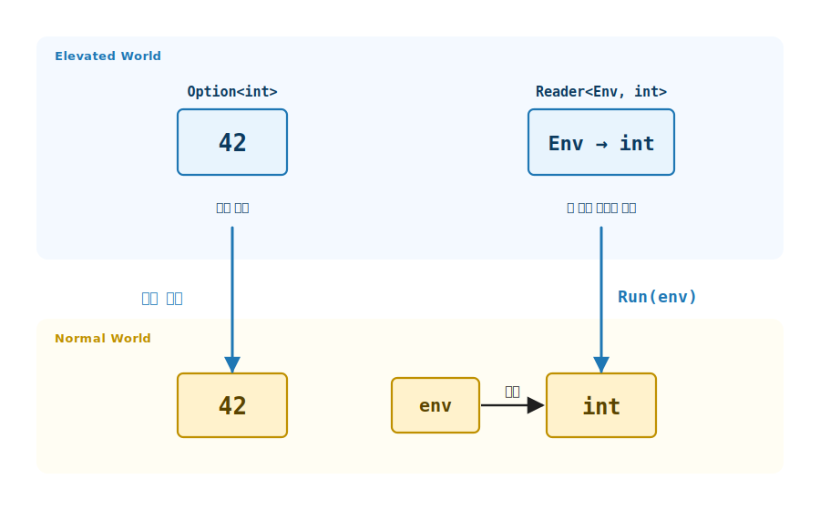
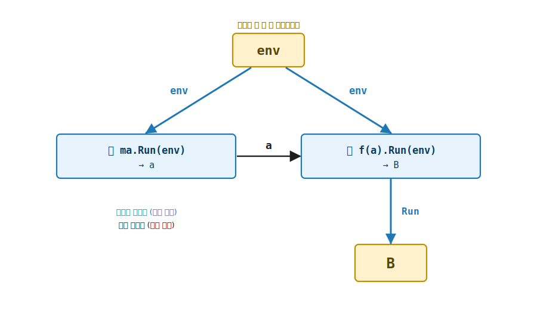
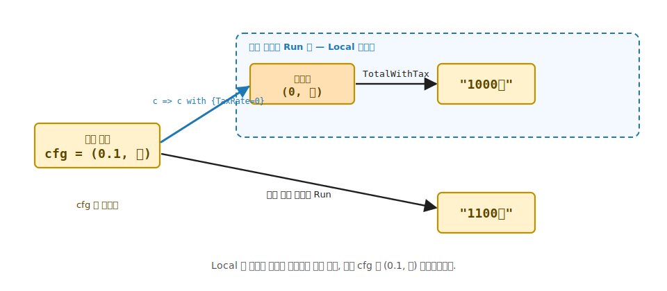

# 15장. Reader (환경 의존 효과)

> **이 장의 목표** — 이 장을 마치면 설정이나 의존성 같은 환경을 가변 상태나 전역 변수 없이 순수 함수의 타입에 담아 다룰 수 있습니다. 지금까지 Elevated World 의 시민은 자료를 담는 컨테이너 (`Option` / `List` / `Validation`) 였지만, 5부의 시민은 함수 `Env → A`, 곧 효과 그 자체를 인코딩합니다. 그 가장 단순한 예가 Reader 입니다. `Reader<Env, A>` 를 직접 구현하고 `Readable<M, Env>` trait 을 부착해, `Bind` 가 환경을 다음 단계로 암묵 전달하는 함수형 의존성 주입을 손에 잡습니다.

> **이 장의 핵심 어휘**
>
> - **환경 의존 효과**: 계산이 환경 (설정 · 의존성) 을 읽어야 값을 낸다는 효과, 5부가 인코딩하는 첫 효과
> - **`Reader<Env, A>`**: 내부가 함수 `Env → A` 인 자료, 환경 의존 효과의 끌어올림
> - **`ReaderF<Env>`**: 환경 `Env` 를 고정한 채 Monad 와 Readable 을 호스트하는 태그 타입
> - **`Readable<M, Env>`**: 환경 의존 효과의 trait, `Asks` · `Ask` · `Local` 세 멤버를 약속
> - **`Asks`**: 환경에서 값을 뽑는 함수 `Env → A` 를 계산으로 끌어올림
> - **`Ask`**: 환경 전체를 그대로 읽는 계산 (`Asks(e => e)`)
> - **`Local`**: 국소적으로 변형된 환경에서 하위 계산을 실행
> - **함수형 DI**: 전역 변수 없이 환경을 단 한 번 주입하고 모든 단계가 같은 환경을 공유하는 의존성 주입

> 이 장을 마치면 할 수 있게 되는 것
> - [ ] Elevated World 의 시민이 자료 컨테이너에서 함수 `Env → A` 로 바뀐다는 발상을 설명할 수 있습니다.
> - [ ] `Reader<Env, A>` 의 내부가 그냥 함수임을, `Run(env)` 전에는 값이 없음을 설명할 수 있습니다.
> - [ ] `Map` 이 함수 합성, `Pure` 가 환경을 무시함을 시그니처로 읽을 수 있습니다.
> - [ ] `Bind` 가 같은 환경을 두 단계에 흘려보내는 자리를 손계산으로 추적할 수 있습니다.
> - [ ] `Asks` · `Ask` · `Local` 로 전역 변수 없이 의존성을 주입할 수 있습니다.
> - [ ] config 를 한 번도 명시적으로 넘기지 않고 여러 Reader 를 LINQ 로 합성할 수 있습니다.
> - [ ] `Local` 이 하위 계산만 변형된 환경에서 돌리고 바깥 환경은 그대로 둠을 설명할 수 있습니다.
> - [ ] Reader 가 Monad 의 세 법칙을 만족함을 외연 동등으로 확인할 수 있습니다.

> **이 장의 흐름** — 설정을 모든 함수에 넘기는 불편에서 출발해, 함수 `Env → A` 를 `Reader<Env, A>` 로 끌어올립니다. trait 을 부착해 `Map` · `Pure` · `Apply` · `Bind` 를 손계산으로 따라가고, `Readable` 의 세 동사로 함수형 DI 를 세운 뒤, `BudgetReader` 실전과 `Local` 국소 변경, Monad 세 법칙으로 닫습니다.

---

## 15.1 이 장에서 다루는 것 — 효과를 타입에 담는 첫걸음

기초부터 4부까지, Elevated World 의 시민은 늘 자료를 담는 컨테이너였습니다. `Option<A>` 는 "없을 수 있는 A", `List<A>` 는 "여러 개의 A", `Validation<E, A>` 는 "실패할 수 있는 A" 였습니다. 셋 다 안에 든 것은 결국 값이었고, 컨테이너의 종류가 그 값에 붙은 효과를 인코딩했습니다.

5부는 한 발 더 들어갑니다. 시민이 더 이상 값을 담은 상자가 아니라 함수 `Env → A` 입니다. 다시 말해 효과 그 자체를 인코딩합니다. "환경에 의존한다", "상태를 읽고 쓴다", "로그를 누적한다" 같은 부수 효과를 가변 필드나 전역 상태 없이 순수 함수의 타입에 담는 것입니다.

여기서 잠깐 그동안의 어휘를 짧게 떠올리고 가겠습니다. 5부는 기초에서 4부까지 쌓아 온 어휘 위에 서 있어서, 그 어휘가 손에 살아 있어야 이 장이 편안합니다. 잊으셨어도 괜찮습니다. 한 줄씩 다시 깔아 두겠습니다.

- **Elevated World** 는 효과가 붙은 값들이 사는 위층입니다. 그냥 `int` 가 아니라 "없을 수 있는 int" (`Option<int>`), "여러 개의 int" (`List<int>`) 처럼 효과를 한 겹 두른 값들의 자리입니다. 그 아래층, 효과 없는 평범한 값과 함수가 사는 자리가 **Normal World** 입니다.
- **끌어올림** (lift) 은 Normal 의 값이나 함수를 Elevated 로 올리는 동작입니다. **끌어내림** 은 그 반대로, Elevated 의 값을 Normal 의 평범한 값으로 내리는 동작입니다.
- **효과** 는 "이 값에 평범하지 않은 무언가가 붙어 있다" 는 표시입니다. 없을 수 있음, 실패할 수 있음, 비동기, 그리고 이 장에서 다룰 환경 의존이 모두 효과입니다.
- **부수 효과** 는 함수가 값을 돌려주는 것 말고 바깥 세계에 일으키는 일입니다. 전역 변수를 읽거나, 파일에 쓰거나, 시간을 재는 것이 모두 부수 효과입니다. 함수형은 이 부수 효과를 숨기지 않고 타입에 드러냅니다.
- **trait** 은 능력이 사는 자리입니다. `Map` · `Bind` 같은 능력이 객체에 묶이지 않고 trait 에 살고, 어떤 타입이 그 trait 을 부착하면 그 능력을 얻습니다. C# 의 interface 와 같은 발상입니다.
- **Monad** 는 `Bind` 라는 능력을 가진 trait 입니다. `Bind` 는 한 계산의 결과로 다음 계산을 만들어 잇는, 단계를 이어 붙이는 동사입니다.

이 여섯 어휘가 5부 내내 그대로 돌아옵니다. 지금 다 외우지 않아도 됩니다. 본문에서 다시 나올 때마다 그 자리에서 또 짚어 드리겠습니다.

그 가장 단순한 예가 이 장의 Reader 입니다. Reader 는 "값을 내려면 환경이 필요하다" 는 효과를 담습니다. 여기서 환경은 설정이나 의존성을 가리킵니다.

일상의 비유로 먼저 직감을 깔아 두겠습니다. 자판기 앞에 섰다고 합시다. 음료수 한 캔을 뽑으려면 동전을 넣어야 합니다. 동전을 넣기 전에는 캔이 나오지 않습니다. 자판기 그 자체는 "동전을 넣으면 캔을 내겠다" 는 약속일 뿐, 아직 캔이 아닙니다. Reader 가 바로 이 자판기입니다. 환경 (동전) 을 주입하기 전에는 값 (캔) 이 없고, 주입하는 그 순간에 비로소 값이 나옵니다. 환경을 주입하는 동작이 동전을 넣는 동작이고, 그 동작의 이름이 `Run` 입니다.

이 한 비유면 이 장의 절반은 손에 잡힌 셈입니다. 나머지 절반은 "여러 자판기를 어떻게 이어 붙여 한 줄로 동전을 한 번만 넣게 하느냐" 인데, 그 자리를 `Bind` 가 맡습니다. 천천히 가겠습니다.

새로 배우는 것은 시민의 정체 하나뿐입니다. 동사는 그대로입니다. `Map` 으로 안의 값을 변환하고, `Bind` 로 단계를 잇고, `from-from-select` LINQ 로 합성하는 어법은 기초에서 익힌 그대로 작동합니다. 달라지는 것은 그 동사들이 이제 값이 아니라 함수 위에서 돈다는 점뿐입니다. 같은 5 trait, 같은 법칙, 같은 LINQ. 시민만 함수입니다.

---

## 15.2 왜 필요한가 — 설정을 모든 함수에 넘기는 번거로움

세율과 통화 기호를 담은 설정 `AppConfig` 가 있다고 합시다. 세금을 계산하는 함수, 금액을 포맷하는 함수, 둘을 합쳐 총액을 만드는 함수가 모두 이 설정을 읽어야 합니다.

이 상황은 객체 지향이나 명령형으로 코드를 짜 본 분이라면 이미 몸으로 겪어 본 자리입니다. 데이터베이스 연결 문자열, 로거, 현재 사용자 같은 것을 메서드 깊은 곳에서 써야 할 때, 그 값을 거기까지 어떻게 전달하느냐가 늘 고민이었습니다. 생성자에 받아서 필드에 두거나, 메서드 인자로 계속 넘기거나, 아니면 전역 어딘가에 두거나. 셋 다 한 번쯤 써 봤을 것입니다.

함수형에는 필드가 없습니다. 객체에 상태를 담아 두지 않으니, 데이터베이스 연결이나 설정을 "어딘가에 보관했다 나중에 꺼내 쓰는" 길이 막혀 있습니다. 그러면 남은 길은 인자로 넘기는 것뿐인데, 곧 보겠지만 그 길은 금세 번거로워집니다. Reader 가 푸는 문제가 정확히 이 자리입니다. 필드 없이, 전역 없이, 인자 없이 환경을 모든 단계에 닿게 하는 길을 엽니다. 먼저 인자로 넘기는 길이 왜 번거로운지 손으로 겪어 보겠습니다.

```csharp
record AppConfig(decimal TaxRate, string Currency);

// 설정을 매 함수에 인자로 들고 다닙니다.
decimal Tax(AppConfig config, decimal amount) => amount * config.TaxRate;
string  Format(AppConfig config, decimal amount) => $"{amount:0.##}{config.Currency}";

string TotalWithTax(AppConfig config, decimal amount)
{
    var tax = Tax(config, amount);                 // config 전달
    var line = Format(config, amount + tax);       // config 또 전달
    return line;
}
```

이 코드를 한 줄씩 봅니다. `Tax` 도 `Format` 도 `config` 를 첫 인자로 받습니다. `TotalWithTax` 도 받습니다. 셋 다 같은 `config` 를 받아서 아래로 넘깁니다. 함수가 셋이면 인자 자리에 `config` 가 세 번 적힙니다.

여기서 문제가 생깁니다. 이 `config` 가 함수가 깊어질수록 점점 더 많은 자리에 끌려다닙니다. 어떤 함수는 `config` 를 직접 쓰지도 않으면서, 그저 더 아래의 함수에 닿게 하려고 받아서 넘기기만 합니다. 한 단계만 더 깊어져도 이 모양이 또렷하게 드러납니다.

```csharp
// 영수증 문자열을 만드는 중간 함수 — config 를 쓰지 않는다
string Receipt(AppConfig config, decimal amount) =>           // config 를 받지만
    "영수증 " + TotalWithTax(config, amount);                 // 그저 아래로 넘기기만 함

string Print(AppConfig config, decimal amount) =>             // 여기도 마찬가지
    "[" + Receipt(config, amount) + "]";                      // config 를 쓰지 않고 전달만
```

`Print` 도 `Receipt` 도 `config` 를 직접 읽지 않습니다. 그저 더 아래의 `Tax` 와 `Format` 에 닿게 하려고 받아서 넘길 뿐입니다.

쓰지도 않을 값을 다음 함수에 넘기려고 받아 두는 것, 이것을 인자 터널링이라 부릅니다. 마치 택배가 받는 사람에게 가기까지 여러 중간 지점을 그냥 거쳐 가는 것과 같습니다. 중간 지점은 상자를 열어 보지도 않고 다음으로 넘기기만 합니다. `Print` 와 `Receipt` 가 바로 그 중간 지점입니다.

그 대가로 모든 함수의 시그니처가 두 종류의 인자로 부풀어 오릅니다. 하나는 진짜 일거리인 `amount` 이고, 다른 하나는 그저 거쳐 가는 `config` 입니다. 함수가 늘수록 거쳐 가기만 하는 `config` 자리도 함께 늘어납니다.

이 번거로움을 피하려고 보통 두 갈래로 우회합니다. 두 갈래 모두 한 번쯤 가 본 길일 것입니다.

첫째 갈래는 `config` 를 전역 변수나 싱글톤에 두는 것입니다. 그러면 인자 자리가 깔끔해집니다. 어느 함수든 그냥 전역을 들여다보면 되니까요. 그런데 대가가 큽니다. 함수가 어떤 환경에 의존하는지가 시그니처에서 사라집니다. 1장에서 함수형의 약속 하나를 봤습니다. 함수형은 시그니처가 거짓말을 못 한다는 것입니다. 함수가 무엇에 의존하고 무엇을 할 수 있는지가 시그니처에 다 드러나야 한다는 약속이었습니다. 전역으로 가면 그 약속이 깨집니다. `Tax` 의 시그니처만 봐서는 그 함수가 어떤 설정을 읽는지 알 수 없게 됩니다.

둘째 갈래는 방금 본 대로 모든 함수에 `config` 인자를 계속 다는 것입니다. 이쪽은 정직합니다. 시그니처가 의존을 그대로 드러냅니다. 다만 번거롭습니다. 인자 터널링을 손으로 다 감당해야 합니다.

정리하면 한쪽은 깔끔하지만 정직하지 않고, 다른 쪽은 정직하지만 번거롭습니다. 둘 다 마음에 들지 않습니다. Reader 는 이 둘 사이의 셋째 길입니다.

> **흔한 함정** — 환경 의존을 전역 변수로 푸는 것입니다.
>
> `static AppConfig Config` 같은 전역에 설정을 두면 인자 터널링은 사라지지만 대가가 따릅니다. 첫째, 함수가 그 전역을 읽는지 시그니처만 봐서는 알 수 없습니다. 둘째, 테스트에서 다른 설정으로 돌리려면 전역을 바꿔 치워야 하고, 그러면 같은 입력이 같은 출력을 낸다는 보장이 깨집니다. 셋째, 설정의 일부만 잠깐 바꿔 하위 계산을 돌리기가 어렵습니다. 환경 의존은 숨길 효과가 아니라 타입에 드러낼 효과입니다.

Reader 는 이 둘 사이의 길입니다. 환경 의존을 타입에 정직하게 드러내면서, `config` 를 매 함수에 손으로 넘기는 번거로움은 없앱니다.

---

## 15.3 `Reader<Env, A>` — `Env → A` 의 끌어올림

Reader 의 자료 정의는 한 줄입니다. 내부는 그냥 함수입니다.

```csharp
public sealed class Reader<Env, A>(Func<Env, A> run) : K<ReaderF<Env>, A>
{
    public A Run(Env env) => run(env);
}
```

이 한 줄을 천천히 읽겠습니다. `Reader<Env, A>` 는 함수 한 개 (`Func<Env, A>`) 를 받아 `run` 이라는 이름으로 들고 있습니다. 그게 전부입니다. `Reader<Env, A>` 안에 든 것은 값이 아니라 함수입니다.

그래서 `Reader` 하나를 손에 쥐고 있어도, 아직 아무 값도 없습니다. 들고 있는 것은 "환경을 주면 값을 내겠다" 는 약속뿐입니다. 앞의 자판기 비유 그대로입니다. 동전을 넣기 전의 자판기를 손에 들고 있는 셈입니다.

그 약속을 실제 값으로 바꾸는 단추가 `Run(env)` 입니다. `Run(env)` 를 부르는 순간에야 안에 든 함수 `run` 이 환경 `env` 를 받아 돌아가고, 비로소 `A` 가 나옵니다. `Run` 을 부르기 전에는 `Reader` 가 몇 개를 이어 붙여 놓았든 아무 일도 일어나지 않습니다. 계산은 `Run` 이라는 단추를 누를 때까지 잠들어 있습니다.

자료 정의 끝의 `: K<ReaderF<Env>, A>` 가 보입니다. 이 표시가 "`Reader` 도 Elevated World 의 시민이다" 라는 선언입니다. 잠깐 상기하면, `K<F, A>` 는 "어떤 효과 `F` 안에 든 값 `A`" 를 C# 으로 적는 어휘였습니다. `Option<int>` 도 `List<int>` 도 모두 이 `K<F, A>` 모양으로 적혔습니다.

그런데 `Reader` 라는 시민은 지금까지의 시민들과 결정적으로 다른 점이 하나 있습니다. `Some(42)` 안에는 값 `42` 가 들어 있고, `[1, 2, 3]` 안에는 값 셋이 들어 있었습니다. `Reader` 안에는 값이 없습니다. 그 자리에 함수가 있습니다.

이 차이가 5부 전체의 출발점입니다. 컨테이너 안에 값이 있으면 효과는 "값이 없을 수 있다", "값이 여럿이다" 같은 모양이었습니다. 컨테이너 안에 함수가 있으면 효과는 "값을 내려면 무언가가 필요하다" 가 됩니다. Reader 의 효과는 환경 의존입니다. 값은 환경이 주입되는 그 순간에 만들어집니다.

OO 개발자의 직감으로 옮기면 이렇습니다. `config` 를 인자로 받는 메서드를 작성해 두되, 아직 호출하지 않은 채 들고 다니는 것입니다. 호출에 필요한 `config` 는 나중에 단 한 번 주입하기로 미뤄 둡니다. `Reader<Env, A>` 가 바로 그 "아직 호출하지 않은 메서드" 입니다. `Run(config)` 가 미뤄 둔 호출입니다.

이 "아직 호출하지 않은 메서드를 값처럼 들고 다닌다" 는 발상이 처음엔 낯설 수 있습니다. 그런데 C# 개발자라면 이미 비슷한 것을 써 봤습니다. `Func<AppConfig, decimal>` 같은 델리게이트가 정확히 그것입니다. 델리게이트를 변수에 담아 두면, 그건 "실행할 수 있는 코드" 를 값으로 들고 있는 것입니다. 부르기 전에는 아무 일도 일어나지 않습니다.

`Reader<Env, A>` 는 그 델리게이트를 한 겹 감싸 Elevated World 의 시민으로 만든 것뿐입니다. 감싼 덕분에 `Map` · `Bind` 같은 동사로 여러 Reader 를 이어 붙일 수 있게 됩니다. 맨 델리게이트였다면 이어 붙이기가 번거로웠을 텐데, `K<F, A>` 시민이 되면서 기초에서 익힌 동사들이 그대로 통합니다. 속은 익숙한 델리게이트, 겉은 Elevated 시민. 이 두 겹을 같이 떠올리면 Reader 가 한결 친근해집니다.

끌어내림은 `Run` 입니다. 기초에서 `Foldable.Fold` 가 Elevated 의 구조를 Normal 의 한 값으로 끌어내렸듯, `Run(env)` 은 환경을 주입해 Reader 라는 효과를 Normal 의 값 `A` 로 끌어내립니다. 환경 주입이 끌어내림의 방아쇠입니다.

아주 작은 예로 "값이 없다가 생긴다" 를 직접 보겠습니다. 환경을 그대로 돌려주는 가장 단순한 Reader 하나를 만듭니다.

```csharp
// "환경을 그대로 읽어 돌려준다" 는 Reader. Env = int 로 작게 둡니다.
var echo = new Reader<int, int>(env => env);
```

`echo` 라는 변수를 만들었습니다. 이 시점에 `echo` 안에는 어떤 정수도 없습니다. `env => env` 라는 함수 한 개가 들어 있을 뿐입니다. `echo` 를 화면에 출력해도 정수가 찍히지 않습니다. 함수는 아직 돌지 않았으니까요.

이제 단추를 누릅니다.

```
echo.Run(10)   // = 10   (env 10 을 받아 그대로 돌려줌)
echo.Run(99)   // = 99   (같은 echo, 다른 env)
```

같은 `echo` 한 개인데, `Run(10)` 은 `10` 을, `Run(99)` 는 `99` 를 냅니다. `echo` 가 값을 들고 있었다면 이럴 수 없습니다. `echo` 는 값이 아니라 함수를 들고 있고, 그 함수가 어떤 환경을 받느냐에 따라 다른 값을 내기 때문입니다. "값은 `Run` 시점에 만들어진다" 는 것을 이 작은 예가 그대로 보여 줍니다.

> **미리보기입니다** — 지금은 환경을 그대로 돌려주는 `env => env` 한 종류만 봤습니다. 곧 환경의 한 조각만 뽑는 `env => env.TaxRate`, 환경을 무시하고 상수를 내는 `_ => 7`, 두 단계를 잇는 `Bind` 까지 차례로 봅니다. 모두 "안에 든 함수가 무엇이냐" 만 다를 뿐, "`Run` 전에는 값이 없다" 는 성질은 그대로입니다. 그 성질 하나만 지금 가져가면 충분합니다.



**그림 15-1. 자료 컨테이너와 함수 효과** — Elevated 띠 안에 두 시민을 나란히 둡니다. 왼쪽 `Option<int>` 는 값 `42` 를 품은 상자이고, 오른쪽 `Reader<Env, int>` 는 값 대신 함수 `Env → int` 를 품습니다. 왼쪽은 안의 값을 바로 꺼낼 수 있지만, 오른쪽은 `Run(env)` 으로 환경을 주입해야 값이 나옵니다. 두 시민 모두 같은 `K<F, A>` 마커로 Elevated 의 시민이지만, 담긴 것이 값이냐 효과냐가 다르다는 대비를 보여 줍니다.

---

## 15.4 trait 부착 — `Map` · `Pure` · `Apply` · `Bind`

기초에서 익힌 3-tuple 패턴 그대로입니다. 자료는 `Reader<Env, A>`, 태그는 `ReaderF<Env>`, trait 은 `Monad<ReaderF<Env>>` 입니다. 태그가 환경 `Env` 를 고정한 채 동사들을 호스트합니다.

3-tuple 패턴이라는 말을 짧게 다시 풀겠습니다. 기초에서 어떤 자료에 trait 을 부착할 때 늘 세 조각을 썼습니다. 첫째는 자료 그 자체 (`Reader<Env, A>`), 둘째는 그 자료를 가리키는 태그 타입 (`ReaderF<Env>`), 셋째는 `K<F, A>` 를 원래 자료로 되돌리는 다운캐스트 (`As`) 였습니다. C# 에는 higher-kinded type 이 없어 이 세 조각으로 우회한다는 사정도 기초에서 봤습니다. 잊으셨어도 됩니다. 여기서는 "태그 `ReaderF<Env>` 가 동사들이 사는 자리" 라는 것만 기억하면 충분합니다.

한 가지 새로운 점은 태그가 환경 `Env` 를 미리 정해 둔다는 것입니다. `OptionF` 나 `ListF` 는 타입 인자가 없었지만, `ReaderF<Env>` 는 `Env` 를 품고 있습니다. 환경 타입을 이렇게 정해 두어야 그 환경 위에서 도는 동사들을 한자리에 모을 수 있기 때문입니다. 환경이 `AppConfig` 면 `ReaderF<AppConfig>`, `int` 면 `ReaderF<int>` 가 각각 다른 태그입니다.

```csharp
public sealed class ReaderF<Env> : Monad<ReaderF<Env>>, Readable<ReaderF<Env>, Env>
{
    public static K<ReaderF<Env>, B> Map<A, B>(Func<A, B> f, K<ReaderF<Env>, A> fa) =>
        new Reader<Env, B>(env => f(fa.As().Run(env)));

    public static K<ReaderF<Env>, A> Pure<A>(A value) =>
        new Reader<Env, A>(_ => value);

    public static K<ReaderF<Env>, B> Apply<A, B>(K<ReaderF<Env>, Func<A, B>> mf, K<ReaderF<Env>, A> ma) =>
        new Reader<Env, B>(env => mf.As().Run(env)(ma.As().Run(env)));

    public static K<ReaderF<Env>, B> Bind<A, B>(K<ReaderF<Env>, A> ma, Func<A, K<ReaderF<Env>, B>> f) =>
        new Reader<Env, B>(env => f(ma.As().Run(env)).As().Run(env));
}
```

네 동사 모두 `new Reader<Env, _>(env => …)` 로 새 함수를 짓습니다. 시민이 함수라, 동사도 함수를 받아 함수를 돌려줍니다.

**`Map` 은 함수 합성입니다.** `Map(f, fa)` 는 `env => f(fa.Run(env))` 를 만듭니다. 환경이 들어오면 먼저 `fa` 를 실행해 안의 값을 얻고, 거기에 `f` 를 적용합니다. `f` 를 `fa.Run` 뒤에 이어 붙인 합성 함수일 뿐입니다.

**`Pure` 는 환경을 무시합니다.** `Pure(value)` 는 `_ => value` 입니다. 어떤 환경이 들어오든 항상 같은 값을 냅니다. 환경에 의존하지 않는 상수 계산을 Elevated 로 끌어올린 모양입니다.

`Env = int` 로 작게 확인하면 두 동작이 함수 위에서 도는 것이 `Run` 결과로 잡힙니다.

```
Map(n => n + 1, new Reader<int, int>(env => env)).Run(10)   // = 11  (env 10 을 읽어 +1)
Pure(7).Run(10)                                             // = 7   (env 무시)
Pure(7).Run(99)                                             // = 7   (어떤 env 든 같은 값)
```

`Map` 은 들어온 환경을 먼저 읽어 그 값에 `f` 를 이어 붙이고, `Pure` 는 환경이 `10` 이든 `99` 든 거들떠보지 않고 같은 값을 냅니다. 동사가 값이 아니라 함수 위에서 돈다는 말이 이 한 화면으로 손에 잡힙니다.

**`Apply` 는 같은 환경을 양쪽에 흘립니다.** `Apply` 는 함수가 든 Reader (`mf`) 와 값이 든 Reader (`ma`) 를 만나게 하는 동사입니다. 잠깐 상기하면, `Apply` 는 5장 Applicative 에서 본 동사로, 컨테이너 안에 든 함수에 컨테이너 안에 든 값을 적용하는 자리였습니다.

Reader 의 경우 함수 측도 값 측도 둘 다 환경이 있어야 돕니다. 그래서 `env => mf.Run(env)(ma.Run(env))` 는 들어온 환경 하나를 양쪽에 똑같이 흘립니다. 먼저 `mf` 를 `env` 로 돌려 함수를 꺼내고, `ma` 를 같은 `env` 로 돌려 값을 꺼낸 뒤, 그 함수에 그 값을 적용합니다.

작은 값으로 한 번 확인합니다. `env = 10` 이라 합시다.

```
mf = Reader(env => (x => x + env))    // 환경을 더하는 함수를 담은 Reader
ma = Reader(env => env)               // 환경을 그대로 읽는 Reader

Apply(mf, ma).Run(10):
  mf.Run(10) = (x => x + 10)          // 함수 측: env 10 을 흘려 함수를 꺼냄
  ma.Run(10) = 10                     // 값 측:  같은 env 10 을 흘려 값을 꺼냄
  (x => x + 10)(10) = 20              // 꺼낸 함수에 꺼낸 값을 적용
```

같은 `env = 10` 이 함수 측과 값 측 두 자리에 똑같이 흘렀습니다. 이 "하나의 환경을 여러 자리에 똑같이 흘린다" 는 모양이 곧 `Bind` 에서 다시, 더 중요하게 나옵니다. 다만 이 장의 단계 잇기는 `Bind` 가 도맡으니, `Apply` 는 5 trait 의 일원으로 형식만 짚고 넘어가겠습니다.

`Bind` 가 이 장의 핵심입니다.

### 15.4.1 `Bind` — 같은 환경을 두 단계에 흘려보냄

`Bind` 의 본체를 한 줄씩 읽습니다.

```csharp
Bind(ma, f) = new Reader<Env, B>(env => f(ma.As().Run(env)).As().Run(env));
```

환경 `env` 가 들어오면 세 동작이 일어납니다.

1. `ma.Run(env)` — 첫 계산을 `env` 로 실행해 중간 값 `a` 를 얻습니다.
2. `f(a)` — 그 값으로 다음 계산 `Reader<Env, B>` 를 만듭니다.
3. `.Run(env)` — 그 계산을 같은 `env` 로 실행합니다.

`env` 가 ①과 ③ 두 자리에 똑같이 등장하는 자리가 핵심입니다. 첫 단계를 돌린 환경과 다음 단계를 돌리는 환경이 같습니다. 사용자는 환경을 두 번 넘긴 적이 없습니다. `Bind` 가 들어온 `env` 를 안에서 두 단계 모두에 자동으로 흘려보냅니다. 함수형 의존성 주입은 정확히 이 자리에서 작동합니다. 환경을 인자로 들고 다니는 대신, `Bind` 가 암묵적으로 전달합니다.

앞 절의 인자 터널링과 견주면 무엇이 바뀌었는지 또렷합니다. 인자 터널링에서는 우리 손이 `config` 를 함수마다 받아서 다음 함수로 넘겼습니다. `Bind` 에서는 그 넘기는 일을 `Bind` 의 본체 (`f(ma.Run(env)).Run(env)`) 가 대신합니다. `env` 를 ①에도 흘리고 ③에도 흘리는 그 한 줄이, 우리가 손으로 하던 터널링을 한자리에 모아 둔 것입니다. 우리는 한 번만 적어 두면 됩니다.

OO 의 직감으로 옮기면 이렇습니다. 데이터베이스 연결 같은 의존성을 메서드마다 인자로 넘기는 대신, 한 곳에 두고 모든 메서드가 그 한 곳을 공유하게 하고 싶었던 적이 있을 것입니다. `Bind` 가 바로 그 "한 곳" 입니다. 다만 전역 변수처럼 바깥에 두는 것이 아니라, `Bind` 가 들어온 `env` 를 사슬의 모든 단계에 조용히 건네줍니다. 전역의 편리함은 가지면서 전역의 대가는 치르지 않는 자리입니다.

작은 환경으로 손계산해 봅니다. `Env = int` (배율) 라 두고, 두 단계를 잇습니다.

```csharp
// ma = "환경을 그대로 읽는다"            → Reader(env => env)
// f  = n => "n 에 환경을 곱한다"          → n => Reader(env => n * env)
K<ReaderF<int>, int> ma = new Reader<int, int>(env => env);
Func<int, K<ReaderF<int>, int>> f = n => new Reader<int, int>(env => n * env);

var chained = ReaderF<int>.Bind(ma, f);   // Reader<int, int>
```

`chained.Run(10)` 을 따라갑니다.

```
env = 10 주입

① ma.Run(10)            = 10           (환경을 그대로 읽음 → a = 10)
② f(10)                 = Reader(env => 10 * env)
③ f(10).Run(10)         = 10 * 10 = 100
                          ───┬───   ──┬──
                          a 의 값   같은 env = 10

결과: 100
```

`env = 10` 이 ①에서 한 번, ③에서 또 한 번, 두 단계 모두에 같은 값으로 흘렀습니다. 사용자가 작성한 코드 어디에도 환경을 넘기는 인자가 없습니다. `Bind` 가 배관을 맡습니다.

같은 `chained` 을 `Run(5)` 로 돌리면 결과가 달라집니다.

```
env = 5 주입

① ma.Run(5)             = 5            (환경을 그대로 읽음 → a = 5)
③ f(5).Run(5)           = 5 * 5 = 25

결과: 25
```

같은 한 계산인데 주입한 `env` 가 `5` 면 `25`, `10` 이면 `100` 입니다. 여기서 두 가지 일이 서로 갈린다는 점을 짚고 가겠습니다.

첫째, `env` 가 두 단계 모두에 같은 값으로 흐른다는 사실입니다. 이건 `Bind` 가 정합니다. `Bind` 를 어떻게 짜든 한쪽 단계에만 환경을 흘리는 일은 없습니다.

둘째, 그 `env` 의 값이 무엇이냐는 `Run` 시점에 정해진다는 사실입니다. `Run(5)` 면 `5`, `Run(10)` 이면 `10` 입니다. 계산을 짤 때는 값을 모릅니다.

이 두 역할을 한 문장으로 묶으면, `Bind` 는 환경을 흘리는 배관이고 `Run` 은 그 배관에 환경을 부어 넣는 단추입니다. 배관은 미리 깔아 두고, 무엇을 흘려보낼지는 단추를 누를 때 정합니다. 배관을 까는 일과 물을 붓는 일이 갈려 있어서, 같은 배관에 다른 물을 부어 다른 결과를 얻을 수 있습니다.

`Bind` 하나면 나머지가 따라옵니다. `Map` 은 `Bind(ma, a => Pure(f(a)))` 로, `from-from-select` LINQ 는 `SelectMany` 를 거쳐 `Bind` 사슬로 풀립니다. 기초 7장에서 본 그대로입니다. `ReaderF` 는 그 사슬을 환경 위에서 돌릴 뿐입니다.

이 한 문장이 5부의 노동을 크게 덜어 줍니다. `Bind` 하나만 제대로 짜 두면, `Map` 도 `from-from-select` LINQ 도 공짜로 따라옵니다. 잠깐 상기하면, `from … from … select` 는 C# 컴파일러가 속으로 `SelectMany` 호출로 바꾸고, `SelectMany` 는 다시 `Bind` 사슬로 풀립니다. 그래서 우리가 실전에서 적는 LINQ 한 단락이, 사실은 방금 손계산한 `Bind` 가 여러 번 이어진 것일 뿐입니다.

그러니 앞에서 작은 `Env = int` 로 손계산한 그 한 번의 추적이, 앞으로 보게 될 모든 Reader LINQ 의 속을 설명합니다. LINQ 가 길어져도 무서워할 것 없습니다. 각 `from` 줄이 `Bind` 한 번이고, `Bind` 한 번이 환경을 양쪽 단계에 흘리는 그 동작이라는 것만 기억하면 됩니다.



**그림 15-2. `Bind` 의 환경 배관** — 위쪽에 환경 `env` 가 단 한 번 주입되는 입구를 두고, 아래로 두 단계 (단계 1: `ma`, 단계 2: `f(a)`) 박스를 세로로 놓습니다. 입구의 `env` 에서 두 갈래 화살표가 각각 단계 1 과 단계 2 로 내려가, 같은 환경이 두 단계 모두에 흐름을 보입니다. 단계 1 의 결과 `a` 가 옆 화살표로 단계 2 로 건너가 다음 계산을 만드는 모습도 함께 그려, 환경은 세로로 (암묵 전달) · 값은 가로로 (명시 전달) 흐른다는 두 흐름을 대비합니다.

---

## 15.5 `Readable<M, Env>` — 함수형 DI 의 세 동사

`Bind` 가 환경을 흘리는 배관이라면, 환경에서 값을 꺼내는 입구가 필요합니다. 그 입구를 trait 으로 약속한 것이 `Readable<M, Env>` 입니다.

```csharp
public interface Readable<M, Env> where M : Readable<M, Env>
{
    static abstract K<M, A> Asks<A>(Func<Env, A> f);

    static virtual K<M, Env> Ask =>
        M.Asks(e => e);

    static abstract K<M, A> Local<A>(Func<Env, Env> f, K<M, A> ma);
}
```

세 멤버가 환경 의존 효과에서 trait 의 약속을 이룹니다. `Map` · `Bind` 가 어느 Elevated 시민에게나 있는 일반 동사라면, `Asks` · `Ask` · `Local` 은 환경 의존이라는 효과에만 있는 고유 동사입니다.

- **`Asks : (Env → A) → K<M, A>`** — 환경에서 값을 뽑는 함수를 받아 계산으로 끌어올립니다. `ReaderF` 의 구현은 `new Reader<Env, A>(f)` 한 줄입니다. 건네받은 함수가 그대로 Reader 의 내부 함수가 됩니다.
- **`Ask : K<M, Env>`** — 환경 전체를 그대로 읽는 계산입니다. `Asks` 에 "환경을 그대로 돌려줘" 라는 함수 (`e => e`, 항등 함수) 를 넘긴 것과 같습니다. 그래서 기본 구현이 `Asks(e => e)` 한 줄입니다. 환경의 한 조각이 아니라 통째로 필요할 때 씁니다.

  여기서 trait 정의의 작은 어휘 하나를 짚고 가겠습니다. `Asks` 와 `Local` 은 `static abstract` 로, `Ask` 는 `static virtual` 로 선언되어 있습니다. 둘의 차이는 이렇습니다. `static abstract` 는 "이 멤버는 부착하는 쪽이 반드시 구현하라" 는 의무입니다. `static virtual` 은 "기본 구현을 함께 줄 테니, 그대로 써도 되고 원하면 다시 짜도 된다" 는 멤버입니다. `Ask` 는 기본 구현 `Asks(e => e)` 가 이미 충분해서, `ReaderF` 는 `Ask` 를 다시 적지 않고 그 기본을 그대로 물려받습니다. 코드를 보면 `ReaderF` 안에 `Asks` 와 `Local` 은 있지만 `Ask` 는 없는 까닭이 이것입니다.
- **`Local : (Env → Env) → K<M, A> → K<M, A>`** — 변형된 환경에서 하위 계산을 실행합니다. `ReaderF` 의 구현은 `env => ma.Run(f(env))`, 곧 들어온 환경에 `f` 를 먼저 적용한 뒤 그 변형된 환경으로 `ma` 를 돌립니다.

이 세 멤버는 정적 멤버라 `ReaderF<AppConfig>.Asks(…)` 처럼 태그를 직접 적어야 호출됩니다. 태그를 직접 적는 이 표기는 지금 외울 필요가 없습니다. 어느 Monad `M` 이든 받게 한 단계 감싼 모듈 헬퍼가 따로 있어, 본문은 그쪽을 씁니다.

```csharp
public static class Readable
{
    public static K<M, A> asks<M, Env, A>(Func<Env, A> f)
        where M : Readable<M, Env> => M.Asks(f);

    public static K<M, Env> ask<M, Env>()
        where M : Readable<M, Env> => M.Ask;

    public static K<M, A> local<M, Env, A>(Func<Env, Env> f, K<M, A> ma)
        where M : Readable<M, Env> => M.Local(f, ma);
}
```

대문자 멤버 (`Asks` · `Ask` · `Local`) 와 소문자 헬퍼 (`asks` · `ask` · `local`) 가 짝을 이룬다는 점이 처음엔 헷갈릴 수 있습니다. 둘은 같은 일을 합니다. 차이는 부르는 방식뿐입니다.

대문자 멤버는 trait 에 직접 사는 정적 멤버라, 태그를 박아 `ReaderF<AppConfig>.Asks(…)` 처럼 불러야 합니다. 소문자 헬퍼는 `where M : Readable<M, Env>` 제약을 둔 자유 함수라, 어떤 환경 의존 모나드든 한 어휘로 받습니다. 본문은 이 소문자 헬퍼를 씁니다.

소문자 헬퍼를 부를 때는 타입 인자 셋을 적습니다. 순서대로 모나드 태그 (`ReaderF<AppConfig>`), 환경 타입 (`AppConfig`), 결과 타입 (`decimal`) 입니다. 타입 인자가 셋이라 처음엔 길어 보이지만, 늘 같은 순서라 한두 번 적어 보면 손에 익습니다. 지금 외울 필요는 없습니다. 이런 모양이 나오면 "아, 태그 · 환경 · 결과 순서구나" 만 떠올리면 됩니다.

이 세 동사가 "전역 변수 없이 의존성을 주입" 하는 함수형 DI 의 토대입니다. DI 는 의존성 주입 (dependency injection) 의 줄임말로, 함수나 객체가 필요로 하는 것을 바깥에서 넣어 주는 방식을 가리킵니다.

OO 의 DI 와 나란히 두면 한눈에 들어옵니다. OO 에서는 DI 컨테이너가 객체를 만들 때 생성자에 의존성을 꽂아 주었습니다. 그러면 객체는 그 의존성을 필드에 두고 메서드마다 꺼내 썼습니다. Reader 에서는 세 역할이 이렇게 나뉩니다. `asks` 가 환경에서 필요한 의존성을 꺼내고, `Bind` 가 그 환경을 사슬의 모든 단계에 흘리고, 호출자가 환경을 단 한 번 `Run` 에서 주입합니다.

| 자리 | OO 의 DI | 함수형 DI (Reader) |
|---|---|---|
| 의존성을 꺼내는 곳 | 필드 접근 (`this._config`) | `asks(c => c.TaxRate)` |
| 의존성을 흘리는 배관 | 생성자가 필드에 보관 | `Bind` 가 단계마다 암묵 전달 |
| 의존성을 주입하는 시점 | 객체 생성 시 (`new Service(config)`) | 실행 시 (`Run(config)`) |

주입 시점이 다르다는 점이 핵심입니다. OO 는 객체를 만드는 순간 의존성이 박히고, Reader 는 계산을 다 짜 둔 뒤 `Run` 하는 순간에야 박힙니다. 그래서 같은 계산을 다른 환경으로 여러 번 `Run` 할 수 있습니다.

한 환경 `cfg = (0.1, "원")` 위에서 세 동사가 어떻게 갈리는지 값으로 확인합니다.

```
asks(c => c.TaxRate).Run(cfg)        // = 0.1          (환경의 일부만 뽑기)
ask().Run(cfg)                       // = (0.1, "원")   (환경을 통째로 — 항등 Asks 라 그대로)
local(c => c with { TaxRate = 0m },  // 변형된 환경에서
      asks(c => c.TaxRate)).Run(cfg) // = 0            (세율만 0 으로 바꿔 뽑기)
```

`asks` 는 환경의 한 조각을, `ask` 는 환경 전체를, `local` 은 변형된 환경을 봅니다. 같은 `cfg` 한 개를 세 동사가 다르게 읽을 뿐입니다.

> **흔한 함정** — 환경이 필요할 때마다 무조건 `ask` 로 통째로 읽는 것입니다.
>
> `ask` 는 환경 전체를 돌려주니 편해 보입니다. 그래서 세율 하나만 필요한 자리에서도 `ask` 로 설정을 통째로 받아 `cfg.TaxRate` 를 꺼내고 싶어집니다. 동작은 합니다. 다만 그 계산의 시그니처가 "나는 설정 전체에 의존한다" 고 말하게 됩니다. 실제로는 세율 한 조각에만 의존하는데 말입니다. `asks(c => c.TaxRate)` 로 필요한 조각만 읽으면, 그 계산이 무엇에 의존하는지가 더 정확하게 드러납니다. 일부가 필요하면 `asks`, 전체가 필요하면 `ask` 라는 기준을 지키는 편이 좋습니다.

> **v5 정합** — 이 학습용 `Reader<Env, A>` 는 LanguageExt v5 의 `Reader<Env, A>(Func<Env, A> runReader)` 와 같은 모양이고, `Readable<M, Env>` 의 `Asks` · `Ask` · `Local` 세 멤버는 v5 의 공식 `Readable` trait 와 멤버까지 1:1 로 맞습니다. 본문 시그니처를 익히면 라이브러리 코드를 그대로 읽습니다. 다만 v5 는 이 trait 을 모나드 변환기까지 일반화하는데, 그 일반화는 6부에서 다룹니다.

---

## 15.6 실전 — `BudgetReader`

세금 계산과 금액 포맷을 Reader 로 짭니다. 둘 다 환경 `AppConfig` 에서 값을 읽어야 합니다.

```csharp
public sealed record AppConfig(decimal TaxRate, string Currency);

public static class BudgetReader
{
    // 환경에서 세율을 읽어 세금 계산.
    public static K<ReaderF<AppConfig>, decimal> Tax(decimal amount) =>
        Readable.asks<ReaderF<AppConfig>, AppConfig, decimal>(c => amount * c.TaxRate);

    // 환경에서 통화 기호를 읽어 포맷.
    public static K<ReaderF<AppConfig>, string> Format(decimal amount) =>
        Readable.asks<ReaderF<AppConfig>, AppConfig, string>(c => $"{amount:0.##}{c.Currency}");

    // 두 Reader 를 LINQ 로 합성 — config 를 한 번도 명시적으로 넘기지 않는다.
    public static K<ReaderF<AppConfig>, string> TotalWithTax(decimal amount) =>
        from tax in Tax(amount)
        from line in Format(amount + tax)
        select line;
}
```

`Tax` 와 `Format` 의 시그니처를 봅니다. 둘 다 `amount` 만 받고 `config` 는 받지 않습니다. 대신 반환 타입이 `K<ReaderF<AppConfig>, …>` 입니다. "이 계산은 `AppConfig` 환경에 의존한다" 가 타입에 정직하게 드러나 있습니다. 환경은 인자가 아니라 효과입니다.

이 장 앞에서 본 명령형 코드와 나란히 두면 무엇이 바뀌었는지 한눈에 보입니다. 같은 `Tax` 함수입니다.

```csharp
// 앞 절의 명령형 — config 가 인자로 들어옴
decimal Tax(AppConfig config, decimal amount) => amount * config.TaxRate;

// 이 절의 Reader — config 가 인자에서 사라지고 반환 타입으로 옮겨감
K<ReaderF<AppConfig>, decimal> Tax(decimal amount) =>
    Readable.asks<ReaderF<AppConfig>, AppConfig, decimal>(c => amount * c.TaxRate);
```

`config` 가 인자 자리에서 사라졌습니다. 그렇다고 환경 의존이 사라진 것은 아닙니다. 반환 타입 `K<ReaderF<AppConfig>, decimal>` 의 `AppConfig` 자리로 옮겨갔을 뿐입니다. 인자로 "이 값을 지금 주세요" 라고 요구하던 것이, 반환 타입으로 "나는 나중에 `AppConfig` 가 있어야 돕니다" 라고 약속하는 모양으로 바뀐 것입니다.

`c => amount * c.TaxRate` 안의 `c` 가 환경입니다. `asks` 가 이 함수를 그대로 Reader 안에 넣어 두고, 환경은 나중에 `Run` 이 채워 줍니다. 그래서 `Tax(1000m)` 를 적는 시점에는 세율이 얼마인지 몰라도 됩니다.

`TotalWithTax` 의 `from-from-select` 가 두 Reader 를 잇습니다. 이 LINQ 는 `Bind` 사슬로 풀리고, 앞 절에서 본 대로 `Bind` 가 같은 환경을 두 단계에 흘립니다. 그래서 `Tax` 도 `Format` 도 코드 어디에서도 `config` 를 받지 않는데, 두 계산이 같은 환경을 공유합니다.

`Run` 에서 환경을 단 한 번 주입합니다.

```csharp
var cfg = new AppConfig(TaxRate: 0.1m, Currency: "원");
var total = BudgetReader.TotalWithTax(1000m);

total.As().Run(cfg);   // → "1100원"
```

`Run(cfg)` 을 손계산으로 따라갑니다. `amount = 1000`, `cfg = (0.1, "원")` 입니다.

```
TotalWithTax(1000).Run(cfg)
= Bind(Tax(1000), tax => Format(1000 + tax)).Run(cfg)

① Tax(1000).Run(cfg)          = 1000 * 0.1     = 100        (세금)
② Format(1000 + 100)          = Format(1100)
③ Format(1100).Run(cfg)       = "1100" + "원"  = "1100원"
                                          ──┬──
                                  같은 cfg 의 Currency

결과: "1100원"
```

`cfg` 가 ①의 세율 읽기와 ③의 통화 읽기 두 자리에 같은 값으로 흘렀습니다. 단 한 번 `Run(cfg)` 에서 주입했을 뿐입니다.

환경이 인자가 아니라 효과라는 점은 같은 계산을 다른 환경으로 돌려 보면 또렷합니다.

```csharp
var altCfg = new AppConfig(0.2m, "$");

total.As().Run(cfg);      // → "1100원"
total.As().Run(altCfg);   // → "1200$"
```

`total` 은 같은 한 계산입니다. 변수 하나에 담아 두었습니다. 그런데 `Run(cfg)` 는 `"1100원"` 을, `Run(altCfg)` 는 `"1200$"` 를 냅니다.

"환경은 인자가 아니라 효과" 라는 말이 여기서 손에 잡힙니다. `total` 안에는 값이 정해지지 않은 함수가 들어 있고, `Run` 이 환경을 주입하는 순간에야 값이 정해집니다. 앞에서 본 자판기 그대로입니다. 자판기 (`total`) 는 하나인데, 어떤 동전 (`cfg`) 을 넣느냐에 따라 다른 캔이 나옵니다.

명령형이었다면 어땠을지 떠올려 보면 차이가 또렷합니다. 명령형에서는 `config` 를 인자로 매번 넘겨야 했습니다. 설정이 둘이면 함수를 두 번 호출하면서 인자를 두 번 다 적었습니다. Reader 는 계산을 한 번 짜서 `total` 에 담아 두고, 환경만 갈아 끼워 `Run` 합니다. 계산의 모양과 환경의 값이 깨끗하게 분리되어 있습니다.

지금까지는 환경의 한 조각만 `asks` 로 읽었습니다. 환경 전체가 필요할 때는 `ask` 를 씁니다. 설정을 통째로 읽어 한 줄로 요약하는 계산은 다음과 같습니다.

```csharp
// 설정 전체가 필요할 때 — ask 로 통째로 읽는다.
public static K<ReaderF<AppConfig>, string> Describe() =>
    from cfg in Readable.ask<ReaderF<AppConfig>, AppConfig>()
    select $"세율 {cfg.TaxRate}, 통화 {cfg.Currency}";

// Describe().Run(cfg) → "세율 0.1, 통화 원"
```

세율 하나만 필요하면 `asks(c => c.TaxRate)`, 설정 전체가 필요하면 `ask()` 입니다. 일부는 `asks`, 전체는 `ask` 라는 선택 기준이 실전에서 이렇게 갈립니다.

여기까지 따라왔으면 Reader 의 실전 사용은 거의 손에 잡힌 셈입니다. 한 번 정리하고 가겠습니다. Reader 로 무언가를 짤 때 우리가 하는 일은 세 가지뿐입니다.

1. 환경에서 필요한 값을 `asks` 로 꺼내는 작은 Reader 들을 만든다 (`Tax`, `Format`).
2. 그 작은 Reader 들을 `from-from-select` LINQ 로 이어 붙인다 (`TotalWithTax`). 이 LINQ 가 속으로 `Bind` 사슬이 되어, 환경을 모든 단계에 흘린다.
3. 맨 마지막에 `Run(cfg)` 으로 환경을 단 한 번 주입한다.

환경을 인자로 들고 다니는 코드는 어디에도 없습니다. 만드는 단계에서도, 잇는 단계에서도 `config` 를 적지 않습니다. 오직 맨 끝 `Run` 에서 한 번 주입할 뿐입니다. 처음 본 인자 터널링이 통째로 사라진 자리입니다.

---

## 15.7 `Local` — 국소 환경 변경

때로는 하위 계산만 변형된 환경에서 돌리고 싶습니다. 예를 들어 면세 항목은 세율을 잠깐 0 으로 두고 총액을 계산하되, 바깥 계산의 세율은 그대로 두는 것입니다. 그 도구가 `Local` 입니다.

```csharp
var taxFree = Readable.local<ReaderF<AppConfig>, AppConfig, string>(
    c => c with { TaxRate = 0m },          // 환경 변형: 세율만 0 으로
    BudgetReader.TotalWithTax(1000m));     // 이 하위 계산에만 적용
```

`local` 의 첫 인자가 환경 변형 함수입니다. 모양이 `Env → Env`, 곧 환경을 받아 새 환경을 돌려주는 함수입니다. 여기서는 `c => c with { TaxRate = 0m }` 입니다. `with` 는 C# 의 record 문법으로, 들어온 설정 `c` 에서 세율만 0 으로 바꾼 새 설정을 만듭니다. 원본 `c` 는 건드리지 않고 복사본을 만든다는 점이 중요합니다.

`ReaderF.Local` 의 구현을 다시 보면 `env => ma.Run(f(env))` 였습니다. 한 단계씩 읽으면 이렇습니다. 환경 `env` 가 들어오면, 먼저 변형 함수 `f` 를 적용해 새 환경 `f(env)` 를 만들고, 그 새 환경으로 하위 계산 `ma` 를 돌립니다. 바깥에서 들어온 `env` 가 아니라 변형된 `f(env)` 가 `ma` 안으로 흘러 들어가는 자리가 핵심입니다.

```csharp
var cfg = new AppConfig(TaxRate: 0.1m, Currency: "원");

BudgetReader.TotalWithTax(1000m).As().Run(cfg);   // → "1100원"  (세율 0.1 적용)
taxFree.As().Run(cfg);                            // → "1000원"  (세율 0 적용)
```

`taxFree.Run(cfg)` 을 따라가면, `cfg` 가 들어오자마자 `c => c with { TaxRate = 0m }` 가 세율을 0 으로 바꾼 `(0, "원")` 을 만들고, 그 환경으로 `TotalWithTax(1000)` 이 돕니다. 세금이 `1000 * 0 = 0`, 총액이 `"1000원"` 입니다. 통화 기호 `"원"` 은 변형하지 않았으니 그대로입니다.

> **흔한 함정** — `Local` 이 바깥 환경을 바꾼다고 오해하는 것입니다.
>
> `Local` 은 하위 계산에 들어가는 환경만 변형합니다. 바깥 `cfg` 객체는 손대지 않습니다. `taxFree.Run(cfg)` 다음에 곧장 `BudgetReader.TotalWithTax(1000m).Run(cfg)` 을 부르면 다시 `"1100원"` 이 나옵니다. `cfg` 의 세율 `0.1` 은 처음부터 끝까지 그대로입니다. `Local` 의 변형은 그 하위 계산의 `Run` 안에서만 살아 있다 사라지는 국소 변경입니다. 불변의 설정 객체를 복사해 변형본을 하위 계산에만 넘길 뿐, 바깥 환경은 손대지 않습니다.



**그림 15-3. `Local` 의 국소 변경** — 바깥 환경 `cfg = (0.1, 원)` 이 `Local` 입구의 변형 함수 `c => c with { TaxRate = 0 }` 를 지나면서 변형본 `(0, 원)` 이 됩니다. 이 변형본은 하위 계산 `TotalWithTax` 의 `Run` 안에서만 살아 있어 `"1000원"` 을 냅니다. 바깥으로 돌아 나온 `cfg` 는 변형 전 `(0.1, 원)` 그대로라, 곧장 다시 돌리면 `"1100원"` 이 나옵니다. 변형은 입구에서 한 번 일어나고 바깥 환경은 손대지 않는다는 것을 두 색 화살표로 대비합니다.

`ReaderF` 는 `Monad<ReaderF<Env>>` 를 부착했으니, 진짜 Monad 가 되려면 기초 7장에서 본 세 법칙을 만족해야 합니다.

법칙으로 넘어가기 전에 왜 법칙을 따지는지부터 짧게 떠올리겠습니다. `ReaderF` 에 `Bind` 와 `Pure` 를 짜 넣었다고 해서 자동으로 "제대로 된" Monad 가 되는 것은 아닙니다. 시그니처만 맞고 동작이 엉뚱할 수도 있습니다. 법칙은 그 동작이 우리가 기대하는 모양인지를 점검하는 약속입니다. 잠깐 상기하면, 7장에서 Monad 의 세 법칙을 봤습니다. 좌항등, 우항등, 결합 이 셋이었습니다. 여기서도 같은 셋입니다.

이 세 법칙이 Reader 에서 지켜진다는 것은 곧 "`Bind` 가 어떻게 이어 붙여도 같은 환경을 같은 순서로 흘린다" 는 뜻입니다. 그래서 우리가 사슬을 마음 놓고 길게 잇고, 중간 단계를 함수로 따로 빼내도 결과가 변하지 않습니다.

```
좌항등:   Bind(Pure(a), f)           ≡  f(a)
우항등:   Bind(m, Pure)              ≡  m
결합:     Bind(Bind(m, f), g)        ≡  Bind(m, a => Bind(f(a), g))
```

그런데 한 가지 걸림돌이 있습니다. 법칙은 양변이 "같다" 고 말하는데, Reader 의 양변은 값이 아니라 함수입니다. 함수 두 개를 어떻게 같다고 볼까요.

순진하게 `==` 로 비교하면 안 됩니다. Reader 안에 든 것은 C# 의 델리게이트인데, 같은 계산을 적은 두 람다라도 메모리상의 참조가 다르면 `==` 는 서로 다르다고 답합니다. `env => env * 2` 를 두 번 적으면 두 람다는 "같은 일을 하지만 다른 객체" 라서, 비교가 거짓을 냅니다. 이건 우리가 원하는 비교가 아닙니다.

그래서 안의 함수를 직접 비교하지 않습니다. 대신 외연 동등 (extensional equality) 으로 비교합니다. 이름은 거창하지만 뜻은 단순합니다. 두 함수에 같은 입력을 줘 보고, 나오는 결과가 같으면 두 함수를 같다고 보자는 것입니다. 함수의 속을 들여다보는 대신, 함수가 내놓는 답으로 판정하는 방식입니다.

Reader 에서 입력은 환경입니다. 그러니 같은 샘플 환경 하나를 정해 두고, 양변을 그 환경으로 `Run` 해 나온 값을 비교하면 됩니다. 함수 비교가 값 비교로 바뀝니다. 이 "같은 환경으로 `Run` 해서 값으로 비교하기" 를 맡는 작은 도구가 `probe` 입니다.

```csharp
var sample = new AppConfig(0.1m, "원");

// probe — 같은 샘플 환경으로 Run 해 함수를 값으로 끌어내려 비교.
Func<K<ReaderF<AppConfig>, int>, int> probe = r => r.As().Run(sample);

Func<int, K<ReaderF<AppConfig>, int>> f = n => new Reader<AppConfig, int>(c => n + (int)(c.TaxRate * 100));
Func<int, K<ReaderF<AppConfig>, int>> g = n => new Reader<AppConfig, int>(_ => n * 2);
K<ReaderF<AppConfig>, int> m = Readable.asks<ReaderF<AppConfig>, AppConfig, int>(c => c.Currency.Length);

var leftId  = MonadLaws.LeftIdentityHolds<ReaderF<AppConfig>, int, int>(5, f, probe);
var rightId = MonadLaws.RightIdentityHolds<ReaderF<AppConfig>, int>(m, probe);
var assoc   = MonadLaws.AssociativityHolds<ReaderF<AppConfig>, int, int, int>(m, f, g, probe);
// → 세 법칙 모두 통과
```

`MonadLaws` 헬퍼는 기초에서 본 그대로이지만, 양변을 직접 비교하는 대신 `probe` 로 한 번 감쌉니다.

```csharp
public static bool LeftIdentityHolds<M, A, B>(
    A a, Func<A, K<M, B>> f, Func<K<M, B>, B> probe)
    where M : Monad<M> =>
    probe(M.Bind(M.Pure(a), f))!.Equals(probe(f(a)));
```

`probe` 가 양변을 같은 `sample` 환경으로 `Run` 해, 함수 비교를 값 비교로 바꿉니다. 좌항등은 `Pure(a)` 로 감쌌다 곧장 `Bind` 한 것이 그냥 `f(a)` 와 같음을, 우항등은 꺼낸 값을 그대로 `Pure` 로 다시 올리는 단계가 군더더기임을, 결합은 사슬을 어디서 끊어 묶어도 결과가 같음을 약속합니다.

이 법칙이 두 평행 세계 그림에서 무엇을 지키는지 한 줄로 보면, 세 법칙은 환경을 흘리는 `Bind` 배관이 어떻게 이어 붙여도 같은 환경을 같은 순서로 흘린다는 약속입니다. 그래서 `Reader` 사슬을 마음 놓고 길게 잇고, 중간을 함수로 추출해도 됩니다.

---

## 15.9 직접 해보기

코드의 `Challenges` 에 정답이 있습니다. 먼저 직접 구현한 뒤 코드와 비교해 봅니다.

> **챌린지 1 — 전역 변수 없는 의존성 주입.** `AppConfig` (세율 · 통화 기호) 를 전역에 두지 않고, `Tax` 와 `Format` 두 Reader 를 `from-from-select` 로 합성해 `TotalWithTax` 를 만들어 봅니다. 환경이 단 한 번 `Run(config)` 에서 공유되고, 두 함수의 시그니처 어디에도 `config` 인자가 없음을 확인합니다. 노리는 능력은 `Bind` 가 같은 환경을 다음 단계로 암묵 전달함을 코드로 보는 것입니다.

> **챌린지 2 — `Local` 로 환경 국소 변경.** 세율을 일시적으로 0 으로 변형한 환경에서 `TotalWithTax` 를 돌려 보고, 바로 다음에 변형 없이 같은 계산을 돌려 바깥 환경의 세율이 그대로임을 확인합니다. 노리는 능력은 `Local : (Env → Env) → K<M, A> → K<M, A>` 가 어떻게 스코프가 한정된 환경 변경을 주는지 보는 것입니다.

> **챌린지 3 — `Bind` 손계산.** 앞서 본 작은 `Env = int` 예제에서, `Bind(ma, f)` 의 `Run(env)` 을 직접 손으로 펼쳐 `env` 가 두 단계 모두에 흐르는 자리를 짚어 봅니다. 그런 다음 `Run` 에 다른 값을 주입해 결과가 환경에 따라 달라짐을 확인합니다.

---

## 15.10 Elevated World 어휘로 다시 읽기

15장의 도구를 1장 비유에 매핑합니다.

| 15장 도구 | Elevated World 어휘 |
|---|---|
| `Reader<Env, A>` | 효과 (환경 의존) 를 인코딩한 Elevated 시민. 안에 값 대신 함수 `Env → A` |
| `Run(env)` | 끌어내림. 환경을 주입해 효과를 Normal 의 값 `A` 로 |
| `asks` | 환경에서 값을 뽑아 Elevated 로 끌어올림 |
| `Pure` | 환경을 무시하고 상수를 끌어올림 |
| `Bind` | 같은 환경을 두 단계에 흘리는 World-crossing. 환경 의존 함수의 합성 |
| `Local` | 하위 계산에 들어가는 환경을 국소적으로 갈아 끼움 |

기초까지 Elevated 시민은 값을 담은 컨테이너였지만, 5부에서 시민은 효과를 인코딩한 함수입니다. `Reader` 는 그 첫 예로, "환경이 필요함" 이라는 효과를 담습니다. 끌어올림은 `asks`, 끌어내림은 `Run`, 두 세계에 걸친 합성은 `Bind` 입니다. 비유는 여기까지가 역할입니다. 정확한 환경 전달 규칙은 `Bind` 의 시그니처와 세 법칙이 정합니다.

---

## 15.11 Q&A — 자기 점검

> **Q1. `Reader<Env, A>` 의 내부는 무엇입니까?** (15.3절)

함수 `Env → A` 입니다. 값을 담은 컨테이너가 아니라 "환경을 주면 값을 내겠다" 는 아직 실행하지 않은 계산입니다. `Run(env)` 를 부르기 전에는 아무 값도 없고, 환경 `env` 가 주입되는 순간 계산이 돌아 `A` 가 나옵니다. 효과는 환경 의존이고, 값은 환경 주입 시점에 만들어집니다.

> **Q2. 끌어내림은 어느 자리입니까?** (15.3절)

`Run(env)` 입니다. 기초 6장의 `Fold` 가 Elevated 의 구조를 Normal 의 한 값으로 끌어내렸듯, `Run(env)` 은 환경을 주입해 Reader 라는 효과를 Normal 의 값 `A` 로 끌어내립니다. 환경 주입이 끌어내림의 방아쇠입니다.

> **Q3. `Map` 과 `Pure` 는 함수 위에서 무엇을 합니까?** (15.4절)

`Map(f, fa)` 은 `env => f(fa.Run(env))`, 곧 `fa.Run` 뒤에 `f` 를 이어 붙인 함수 합성입니다. `Pure(value)` 는 `_ => value`, 곧 어떤 환경이 들어오든 같은 값을 내는 상수 계산이라 환경을 무시합니다. 시민이 함수라 두 동사도 새 함수를 짓습니다.

> **Q4. `Bind` 가 환경을 어떻게 두 단계에 전달합니까?** (15.4.1절)

`Bind(ma, f)` 는 `env => f(ma.Run(env)).Run(env)` 입니다. 들어온 `env` 로 먼저 `ma` 를 실행해 값 `a` 를 얻고, `f(a)` 로 만든 다음 계산을 같은 `env` 로 실행합니다. `env` 가 두 자리에 똑같이 등장하므로, 사용자가 환경을 넘긴 적이 없는데도 두 단계가 같은 환경을 공유합니다. 이 암묵 전달이 함수형 의존성 주입의 핵심입니다.

> **Q5. `Readable<M, Env>` 의 세 멤버는 각각 무엇입니까?** (15.5절)

`Asks : (Env → A) → K<M, A>` 는 환경에서 값을 뽑는 함수를 계산으로 끌어올립니다. `Ask : K<M, Env>` 는 환경 전체를 그대로 읽으며 기본 구현이 `Asks(e => e)` 입니다. `Local : (Env → Env) → K<M, A> → K<M, A>` 는 변형된 환경에서 하위 계산을 실행합니다. 세 동사가 전역 변수 없이 의존성을 주입하는 함수형 DI 의 토대입니다.

> **Q6. `Tax` 와 `Format` 의 시그니처에 `config` 인자가 없는데 어떻게 설정을 읽습니까?** (15.6절)

반환 타입 `K<ReaderF<AppConfig>, …>` 에 환경 의존이 효과로 인코딩되어 있기 때문입니다. `config` 는 인자가 아니라 효과라, `Run(cfg)` 에서 단 한 번 주입되고 `Bind` 가 두 계산 모두에 그 환경을 흘립니다. 그래서 두 함수는 `config` 를 받지 않고도 같은 환경을 공유합니다.

> **Q7. 같은 `total` 을 `Run(cfg)` 과 `Run(altCfg)` 로 돌리면 왜 결과가 다릅니까?** (15.6절)

환경이 인자가 아니라 효과이기 때문입니다. `total` 은 같은 한 계산이지만 값이 정해지지 않은 함수이고, `Run` 이 주입하는 환경에 따라 결과가 정해집니다. `cfg` (세율 0.1, 통화 "원") 로는 `"1100원"`, `altCfg` (세율 0.2, 통화 "$") 로는 `"1200$"` 가 나옵니다. 계산을 한 번 짜 두고 환경만 갈아 끼우는 모양입니다.

> **Q8. `Local` 은 바깥 환경을 바꿉니까?** (15.7절)

바꾸지 않습니다. `Local` 은 하위 계산에 들어가는 환경만 변형 함수로 갈아 끼우고, 바깥 설정 객체는 손대지 않습니다. `taxFree.Run(cfg)` 다음에 변형 없이 `TotalWithTax(1000).Run(cfg)` 을 부르면 다시 원래 세율로 계산됩니다. 변형은 그 하위 계산의 `Run` 안에서만 살아 있다 사라지는 국소 변경입니다.

> **Q9. Reader 의 법칙은 어떻게 비교합니까?** (15.8절)

외연 동등으로 비교합니다. Reader 의 양변은 함수라 직접 같다고 볼 수 없으므로, 같은 샘플 환경으로 양변을 `Run` 한 결과를 비교합니다. 이 역할을 하는 것이 `probe` 입니다. `probe` 가 함수 비교를 값 비교로 바꿔, 좌항등 · 우항등 · 결합 세 법칙을 확인합니다.

---

## 15.12 요약

- **Reader 는 효과를 타입에 담는 첫걸음입니다.** Elevated 시민이 자료 컨테이너에서 함수 `Env → A`, 곧 환경 의존 효과 그 자체로 바뀝니다 (15.1절).
- **불편에서 출발했습니다.** 설정을 모든 함수에 인자로 터널링하거나 전역에 두는 두 갈래의 번거로움을 Reader 가 가운데 길로 풉니다 (15.2절).
- **`Reader<Env, A>` 는 `Env → A` 의 끌어올림입니다.** 내부가 함수라 `Run(env)` 전에는 값이 없고, `Run` 이 끌어내림입니다 (15.3절).
- **`Bind` 가 같은 환경을 두 단계에 암묵 전달합니다.** `env => f(ma.Run(env)).Run(env)` 에서 `env` 가 두 자리에 같이 흘러, 환경을 인자로 들고 다니지 않는 함수형 DI 가 됩니다 (15.4.1절).
- **`Readable` 의 세 동사가 함수형 DI 를 세웁니다.** `Asks` 로 환경에서 값을 뽑고, `Ask` 로 환경 전체를 읽고, `Local` 로 하위 계산의 환경을 국소 변경합니다 (15.5절).
- **`BudgetReader` 가 config 를 한 번도 넘기지 않고 합성합니다.** `Run(cfg)` 단 한 번의 주입을 모든 단계가 공유하고, 환경만 갈아 끼우면 같은 계산이 다른 결과를 냅니다 (15.6절).
- **세 법칙은 외연 동등으로 확인합니다.** 함수인 Reader 를 `probe` 로 같은 샘플 환경에 `Run` 해 좌항등 · 우항등 · 결합을 검증합니다 (15.8절).

---

## 15.13 다음 장으로

Reader 는 환경을 읽기만 합니다. `Bind` 가 같은 환경을 모든 단계에 흘릴 뿐, 어느 단계도 그 환경을 바꾸지 못합니다. 읽기 전용이라 단순합니다. 누구도 환경을 바꾸지 않으니 여러 곳에서 같은 Reader 를 공유해도 서로 간섭하지 않습니다.

그런데 실세계의 효과는 읽기만으로 끝나지 않습니다. 카운터를 하나 올리고, 누적기에 값을 더하고, 단계마다 상태를 읽고 또 고쳐 쓰는 일이 흔합니다. 명령형이라면 변수 하나 두고 `count++` 하면 그만이지만, 함수형에는 가변 변수가 없습니다.

가변 필드 없이 상태를 읽고 쓰려면 어떻게 할까요. 다음 장의 State 가 그 답입니다. 미리 한 줄만 흘끗 보면, Reader 의 내부가 `Env → A` 였던 자리에 State 는 `S → (A, S)` 가 들어섭니다. 환경을 받아 값만 내던 것이, 상태를 받아 값과 새 상태를 함께 돌려주는 모양으로 바뀝니다. 그 새 상태를 `Bind` 가 다음 단계로 실어 나릅니다. Reader 가 같은 환경을 흘리기만 했다면, State 는 단계마다 갱신된 상태를 다음 단계로 넘깁니다. 한 글자 차이처럼 보이는 `(A, S)` 가 "읽기" 와 "읽고 쓰기" 를 가릅니다.

준비가 됐다면 16장 State 로 넘어갑니다.
