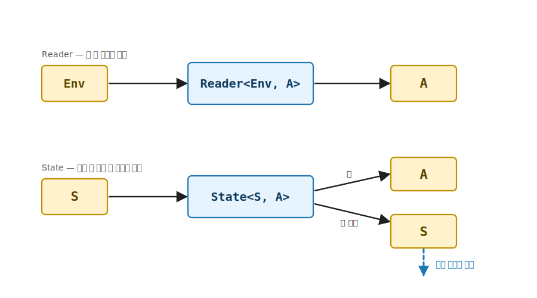
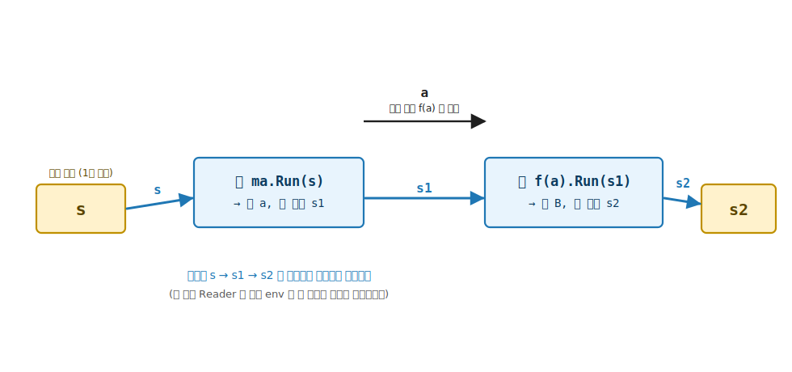

# 16장. State (상태 스레딩 효과)

> **이 장의 목표** — 이 장을 마치면 카운터나 누적기처럼 단계마다 갱신되는 상태를 가변 필드나 전역 변수 없이 순수 함수의 타입에 담아 다룰 수 있습니다. 앞 장의 Reader 는 환경을 모든 단계에 흘리기만 했지만, State 는 한 발 더 나아가 상태를 읽고 또 씁니다. 5부의 시민이 함수 `Env → A` 였다면, 이 장의 시민은 함수 `S → (A, S)`, 곧 상태를 받아 값과 새 상태를 함께 돌려주는 효과입니다. `State<S, A>` 를 직접 구현하고 `Stateful<M, S>` trait 을 부착해, `Bind` 가 갱신된 상태를 다음 단계로 자동으로 실어 나르는 상태 스레딩을 손에 잡습니다.

> **이 장의 핵심 어휘**
>
> - **상태 스레딩 효과**: 계산이 상태를 읽고 쓰며 단계마다 갱신된 상태를 다음으로 이어 나르는 효과, 5부가 인코딩하는 둘째 효과
> - **`State<S, A>`**: 내부가 함수 `S → (A, S)` 인 자료, 상태 스레딩 효과의 끌어올림
> - **`StateF<S>`**: 상태 `S` 를 고정한 채 Monad 와 Stateful 을 호스트하는 태그 타입
> - **`Stateful<M, S>`**: 상태 스레딩 효과의 trait, **`Get`** · **`Put`** · **`Modify`** · **`Gets`** 네 동사를 약속
> - **`Get`**: 현재 상태를 통째로 값으로 읽는 계산 (`Gets(s => s)`)
> - **`Put`**: 상태를 통째로 새 값으로 교체 (값 자리는 `Unit`)
> - **`Modify`**: 상태를 함수 `S → S` 로 변형 (값 자리는 `Unit`)
> - **`Gets`**: 상태에서 일부를 뽑아 값으로

> 이 장을 마치면 할 수 있게 되는 것
> - [ ] Elevated World 의 시민이 함수 `Env → A` 에서 함수 `S → (A, S)` 로 바뀐다는 발상을 설명할 수 있습니다.
> - [ ] `State<S, A>` 의 내부가 상태를 받아 값과 새 상태를 함께 돌려주는 함수임을 설명할 수 있습니다.
> - [ ] `Map` 이 값만 변환하고 상태를 그대로 흘림을, `Pure` 가 상태를 건드리지 않음을 시그니처로 읽을 수 있습니다.
> - [ ] `Bind` 가 첫 계산의 새 상태를 다음 단계로 실어 나르는 자리를 손계산으로 추적할 수 있습니다.
> - [ ] `Get` · `Put` · `Modify` · `Gets` 네 동사로 가변 필드 없이 상태를 읽고 쓸 수 있습니다.
> - [ ] 가변 카운터 필드 없이 고유 ID 생성기를 State 로 구현할 수 있습니다.
> - [ ] 같은 State 계산을 다른 초기 상태로 Run 하면 결과가 달라짐을 설명할 수 있습니다.
> - [ ] State 가 Monad 의 세 법칙을 만족함을 값과 최종 상태까지 비교해 확인할 수 있습니다.

> **이 장의 흐름** — 가변 카운터를 손으로 들고 다니는 불편에서 출발해, 함수 `S → (A, S)` 를 `State<S, A>` 로 끌어올립니다. trait 을 부착해 `Map` · `Pure` · `Apply` · `Bind` 를 손계산으로 따라가며 상태가 단계마다 갱신되며 흐르는 자리를 짚고, `Stateful` 의 네 동사로 상태를 읽고 쓰는 어휘를 세운 뒤, 네 동사 한 흐름과 고유 ID 생성기 실전을 거쳐 Monad 세 법칙으로 닫습니다.

---

## 16.1 이 장에서 다루는 것 — 읽기에서 읽고 쓰기로

앞 장의 Reader 는 환경을 읽기만 했습니다. `Bind` 가 같은 환경을 모든 단계에 흘릴 뿐, 어느 단계도 그 환경을 바꾸지 못했습니다. 읽기 전용이라 단순했습니다. 그런데 실세계의 효과는 읽기만으로 끝나지 않습니다. 카운터를 증가시키고, 누적기를 갱신하고, 단계마다 상태를 읽고 또 쓰는 일이 흔합니다.

State 는 그 한 발을 더 들어갑니다. 시민이 더 이상 `Env → A` 가 아니라 함수 `S → (A, S)` 입니다. 상태 `S` 를 받아, 값 `A` 와 새 상태 `S` 를 함께 돌려줍니다. Reader 가 환경을 받아 값만 냈다면, State 는 상태를 받아 값과 갱신된 상태를 한 쌍으로 냅니다. 인코딩하는 효과는 상태를 읽고 쓰기입니다.

이 장에서 처음 만나는 것은 두 가지입니다. 하나는 시민의 정체입니다. 반환이 값 하나가 아니라 값과 새 상태의 쌍 `(A, S)` 입니다. 다른 하나는 `Bind` 가 하는 일입니다. Reader 의 `Bind` 가 같은 환경을 두 단계에 똑같이 흘렸다면, State 의 `Bind` 는 첫 단계가 만든 새 상태를 다음 단계로 실어 나릅니다. 상태가 단계를 거치며 갱신되고, 그 갱신된 상태가 자동으로 다음 단계의 입력이 됩니다. 이것을 상태 스레딩이라 부릅니다.

나머지는 그대로입니다. `Map` 으로 안의 값을 변환하고, `Bind` 로 단계를 잇고, `from-from-select` LINQ 로 합성하는 어법은 기초에서 익힌 그대로 작동합니다. 같은 5 trait, 같은 법칙, 같은 LINQ. 시민이 `S → (A, S)` 로 바뀌고, `Bind` 가 상태를 실어 나른다는 점만 새롭습니다.

여기서 잠깐 어휘 몇 개를 다시 짚고 갑니다. Part 1 부터 줄곧 쓴 말이지만, 이 장에 들어선 김에 가볍게 떠올려 둡니다. 외울 필요는 없습니다.

- **Elevated World** 는 효과를 한 겹 입은 값들이 사는 위층입니다. `Option<int>` 처럼 없을 수 있음이라는 효과를, `Task<int>` 처럼 시간이 걸림이라는 효과를 값에 입혀 둔 세계입니다. 그 아래 `int` 나 `string` 같은 평범한 값이 사는 층이 **Normal World** 입니다.
- **끌어올림** 은 Normal 의 값을 Elevated 로 올리는 일이고, **끌어내림** 은 반대로 Elevated 의 값을 Normal 의 평범한 값으로 내리는 일입니다.
- **trait** 은 능력을 객체가 아니라 타입에 부착하는 자리입니다. `Map` 이라는 능력이 `Option` 객체에 묶이지 않고 trait 한 곳에 정의되어, 그 trait 을 부착한 모든 타입이 같은 능력을 얻습니다.
- **`Bind`** 는 한 단계의 Elevated 결과에서 값을 꺼내 다음 단계에 넘기고, 그 결과를 다시 Elevated 로 되돌려 두 단계를 잇는 도구입니다. C# 의 `from-from-select` LINQ 가 이 `Bind` 를 부르는 친숙한 표기입니다.

이 네 어휘가 State 에서도 그대로 돌아갑니다. State 가 새로 가져오는 것은 시민의 모양 (값 하나가 아니라 값과 새 상태의 쌍) 과 `Bind` 가 그 새 상태를 다음 단계로 실어 나른다는 점, 이 둘뿐입니다. 나머지는 이미 손에 있는 도구입니다.

---

## 16.2 왜 필요한가 — 가변 카운터로 상태를 들고 다니는 번거로움

작은 일 하나를 떠올려 봅니다. 이름이 여러 개 있고, 그 이름마다 0 부터 시작하는 번호표를 붙이고 싶습니다. alice 는 0 번, bob 은 1 번, carol 은 2 번, 이런 식입니다. 도서관에서 들어오는 사람마다 정리 번호를 하나씩 떼어 주는 장면을 떠올려도 좋습니다. 번호는 겹치면 안 되고, 한 사람이 가져갈 때마다 다음 번호로 하나 올라가야 합니다.

명령형 C# 으로 짜면 가장 먼저 떠오르는 모양이 있습니다. 번호를 세는 변수 하나를 함수 바깥에 두고, 이름을 처리할 때마다 그 변수를 하나씩 올리는 것입니다.

```csharp
// 가변 필드로 상태를 들고 다닙니다.
int counter = 0;

(int Id, string Name) Label(string name)
{
    var id = counter;   // 현재 카운터를 읽고
    counter = counter + 1;  // 카운터를 +1 갱신
    return (id, name);
}

var alice = Label("alice");   // (0, alice)
var bob   = Label("bob");     // (1, bob)
```

이 코드는 잘 돌아갑니다. alice 는 0, bob 은 1 을 받습니다. 그런데 한 가지를 들여다봅니다. `counter` 가 `Label` 함수 바깥에 살면서, `Label` 을 부를 때마다 그 안에서 슬그머니 바뀝니다.

무엇이 불편한지 한 줄씩 짚어 봅니다. 첫째, 같은 `Label("alice")` 를 두 번 불러도 결과가 다릅니다. 처음 불렀을 때는 0 을, 그 사이 다른 호출이 카운터를 올려 두었다면 두 번째에는 5 를 낼 수도 있습니다. 같은 입력에 같은 출력이 나오지 않습니다. 둘째, 그 차이를 만드는 `counter` 가 `Label` 의 시그니처 `(int Id, string Name) Label(string name)` 어디에도 보이지 않습니다. 함수의 겉모습만 봐서는 이 함수가 바깥 상태에 기댄다는 사실을 알 수 없습니다. 셋째, 그래서 호출 순서가 결과를 정합니다. 누가 먼저 `Label` 을 불렀느냐가 번호를 바꾸는데, 그 순서는 코드 곳곳에 흩어져 있습니다.

Part 1 에서 본 명령형의 약점이 그대로입니다. 상태가 함수 바깥에 흩어져 살면, 그 상태를 누가 언제 바꾸는지 추적하기 어려워집니다.

가변 필드를 피하려고 상태를 인자와 반환에 손으로 끼워 넣을 수도 있습니다. 상태를 받아 값과 새 상태를 함께 돌려주는 것입니다.

```csharp
// 상태를 인자로 받고, 값과 새 상태를 튜플로 돌려줍니다.
(int Id, int NextCounter) Label(string name, int counter) =>
    (counter, counter + 1);

var (id0, c1) = Label("alice", 0);   // id0 = 0, c1 = 1
var (id1, c2) = Label("bob", c1);    // id1 = 1, c2 = 2
var (id2, c3) = Label("carol", c2);  // id2 = 2, c3 = 3
```

이제 카운터가 시그니처에 정직하게 드러나고 같은 입력이 같은 출력을 냅니다. 그러나 대가가 따릅니다. 호출자가 `c1` 을 받아 `c2` 로, `c2` 를 받아 `c3` 로 손수 이어 줘야 합니다. 단계가 늘수록 이 상태 이어 주기 (스레딩) 가 코드를 메웁니다. `c1` 자리에 실수로 `c2` 를 넘기면 ID 가 어긋나는데 컴파일러는 잡지 못합니다.

이 손수 이어 주기가 왜 위험한지 눈으로 한번 보겠습니다. 위 코드에서 상태가 흐르는 자리만 굵게 따라가면 이런 사슬입니다.

```
Label("alice", 0)   →  새 상태 1
                          │
                          ▼  (1 을 손으로 받아 다음에 넘김)
Label("bob",   1)   →  새 상태 2
                          │
                          ▼  (2 를 손으로 받아 다음에 넘김)
Label("carol", 2)   →  새 상태 3
```

매 줄마다 앞 줄이 낸 새 상태를 사람이 직접 받아서 다음 줄의 인자로 넣어 줍니다. 단계가 셋이면 이음매가 둘, 열이면 아홉입니다. 이 이어 주기를 상태 스레딩 (state threading) 이라 부릅니다. 실 (thread) 을 단계마다 꿰어 잇는 모양이라 그렇게 부릅니다.

문제는 이 이음매가 전부 사람 손에 달렸다는 것입니다. 둘째 줄에 `c1` 대신 실수로 `c2` 를 적으면 carol 이 1 번이 아니라 엉뚱한 번호를 받습니다. 그런데 `c1` 도 `int`, `c2` 도 `int` 라서 타입은 멀쩡합니다. 컴파일러는 아무 잘못도 못 잡습니다. 단계가 많아질수록 이런 한 칸 어긋남이 끼어들 자리가 늘어납니다.

> **흔한 함정** — 상태를 가변 필드로 두는 것입니다.
>
> `int counter` 같은 가변 필드에 상태를 두면 호출자가 상태를 손으로 이어 줄 일은 없습니다. 그러나 대가가 따릅니다. 첫째, 함수가 그 필드를 읽고 쓰는지 시그니처만 봐서는 알 수 없어 같은 호출이 매번 다른 결과를 냅니다. 둘째, 테스트에서 카운터를 특정 값부터 돌리려면 필드를 직접 바꿔 치워야 하고, 한 테스트가 남긴 상태가 다음 테스트로 새어 나갑니다. 셋째, 두 스레드가 같은 카운터를 동시에 증가시키면 기초 1장에서 본 경쟁 조건이 되돌아옵니다. 상태 변화는 숨길 효과가 아니라 타입에 드러낼 효과입니다.

State 는 이 둘 사이의 길입니다. 상태 변화를 타입에 정직하게 드러내면서, 상태를 손으로 이어 주는 번거로움은 없앱니다.

> **미리보기입니다** — 곧 만날 모양을 한 문장으로 그려 둡니다. 상태를 인자로 손수 이어 주던 `c1 → c2 → c3` 배관을 State 의 `Bind` 가 자동으로 맡고, 호출자는 초기 상태를 `Run` 에서 단 한 번 주입합니다. 시그니처가 낯설어도 괜찮습니다. 뒤에서 `Bind` 가 그 배관을 어떻게 맡는지 손계산으로 따라갑니다.

어떻게 그러는지 시민의 정체부터 봅니다.

---

## 16.3 `State<S, A>` — `S → (A, S)` 의 끌어올림

State 의 자료 정의는 한 줄입니다. 내부는 그냥 함수입니다.

```csharp
public sealed class State<S, A>(Func<S, (A Value, S State)> run) : K<StateF<S>, A>
{
    public (A Value, S State) Run(S state) => run(state);
}
```

한 줄씩 천천히 읽습니다. `State<S, A>` 는 함수 하나를 감싼 상자입니다. 그 함수의 모양이 `S → (A, S)` 입니다. 왼쪽 `S` 는 받는 것, 곧 상태입니다. 오른쪽 `(A, S)` 는 내놓는 것, 곧 값 `A` 와 새 상태 `S` 를 한 쌍으로 묶은 튜플입니다.

그래서 `State<S, A>` 안에 든 것은 값이 아닙니다. 함수입니다. 다른 Elevated 시민과 비교하면 이 점이 또렷합니다. `Option<int>` 안에는 `42` 같은 값이 들어 있어 꺼내 쓸 수 있습니다. 그런데 `State<int, int>` 안에는 값이 없습니다. "상태를 하나 주면, 그때 값과 새 상태를 함께 내드리겠습니다" 라는 약속만 들어 있습니다.

약속이라는 말이 뜬구름 같으면, 아직 실행하지 않은 계산이라고 바꿔 읽어도 됩니다. 요리법을 적은 카드를 떠올려 봅니다. 카드에는 "재료를 주면 이렇게 요리해 드립니다" 가 적혀 있을 뿐, 아직 요리가 만들어진 것은 아닙니다. `State<S, A>` 가 그 요리법 카드이고, 재료 (초기 상태) 를 건네는 순간이 `Run(state)` 입니다. `Run` 을 부르기 전까지는 카드만 들고 다닐 뿐, 아무 일도 일어나지 않습니다.

앞 장의 Reader 와 한 줄로 대비하면 차이가 또렷합니다. Reader 의 내부는 `Env → A` 라 값만 돌려줬습니다. State 의 내부는 `S → (A, S)` 라 값과 새 상태를 함께 돌려줍니다. 이 새 상태 자리가 State 가 Reader 와 갈리는 지점입니다. 한쪽 갈래는 결과 값이고, 다른 갈래는 다음 단계로 실어 나를 상태입니다.

`K<StateF<S>, A>` 를 부착했으니 State 도 Elevated World 의 시민입니다. 그런데 이 시민은 `Some(42)` 처럼 값을 품고 있지 않습니다. 그 자리에 함수가 있습니다. 효과는 상태를 읽고 쓰기이고, 값은 상태가 주입될 때 비로소 만들어집니다.

OO 개발자의 직감으로 옮기면 이렇습니다. 상태를 인자로 받아 결과와 갱신된 상태를 함께 돌려주는 메서드를 작성해 두되, 아직 호출하지 않은 채 들고 다니는 것입니다. 호출에 필요한 초기 상태는 나중에 단 한 번 주입하기로 미뤄 둡니다. `State<S, A>` 가 바로 그 "아직 호출하지 않은 메서드" 이고, `Run(초기상태)` 가 미뤄 둔 호출입니다.

끌어내림은 `Run` 입니다. 기초에서 `Foldable.Fold` 가 Elevated 의 구조를 Normal 의 한 값으로 끌어내렸듯, `Run(초기상태)` 는 상태를 주입해 State 라는 효과를 Normal 의 쌍 `(A, S)` 으로 끌어내립니다. 다만 Reader 의 끌어내림이 값 하나만 냈다면, State 의 끌어내림은 결과 값과 최종 상태를 함께 냅니다. 초기 상태 주입이 끌어내림의 방아쇠입니다.



**그림 16-1. Reader 와 State 의 시민 모양** — Elevated 띠 안에 두 시민을 나란히 둡니다. 왼쪽 `Reader<Env, A>` 는 환경 `Env` 가 한 갈래로 들어와 값 `A` 한 갈래만 나옵니다. 오른쪽 `State<S, A>` 는 상태 `S` 가 들어와 값 `A` 와 새 상태 `S` 두 갈래로 나옵니다. 두 시민 모두 같은 `K<F, A>` 마커로 Elevated 의 시민이지만, State 만 출력에 갱신된 상태 갈래가 하나 더 달려 있다는 대비를 보여 줍니다. 이 추가된 상태 갈래가 다음 단계로 실려 나간다는 것을 오른쪽 아래로 향하는 점선 화살표로 암시합니다.

---

## 16.4 trait 부착 — `Map` · `Pure` · `Apply` · `Bind`

이제 이 시민에게 능력을 붙입니다. 붙이는 방식은 Part 1 부터 모든 장에서 쓴 그대로라, 새로 외울 것은 없습니다. 세 조각으로 나누는 패턴, 곧 3-tuple 패턴입니다.

- **자료** `State<S, A>` 는 시민 그 자체, 곧 `S → (A, S)` 함수를 감싼 상자입니다.
- **태그** `StateF<S>` 는 능력이 사는 자리입니다. `Map` · `Pure` · `Bind` 같은 정적 메서드를 여기에 모아 둡니다. `<S>` 가 붙은 까닭은, 상태 타입 `S` 를 하나로 고정해 둔 채 그 위에서 능력을 호스트하기 위해서입니다.
- **trait** `Monad<StateF<S>>` 는 그 능력이 지켜야 할 약속입니다. 태그가 이 trait 을 구현한다고 선언하면, State 는 Monad 가 약속한 모든 동사를 갖게 됩니다.

코드로 보면 이렇습니다. 한 메서드씩 뒤에서 풀어 갈 테니, 지금은 네 동사가 한자리에 모여 있다는 것만 봐 둡니다.

```csharp
public sealed class StateF<S> : Monad<StateF<S>>, Stateful<StateF<S>, S>
{
    public static K<StateF<S>, B> Map<A, B>(Func<A, B> f, K<StateF<S>, A> fa) =>
        new State<S, B>(s =>
        {
            var (a, s1) = fa.As().Run(s);
            return (f(a), s1);
        });

    public static K<StateF<S>, A> Pure<A>(A value) =>
        new State<S, A>(s => (value, s));

    public static K<StateF<S>, B> Apply<A, B>(K<StateF<S>, Func<A, B>> mf, K<StateF<S>, A> ma) =>
        new State<S, B>(s =>
        {
            var (f, s1) = mf.As().Run(s);
            var (a, s2) = ma.As().Run(s1);
            return (f(a), s2);
        });

    public static K<StateF<S>, B> Bind<A, B>(K<StateF<S>, A> ma, Func<A, K<StateF<S>, B>> f) =>
        new State<S, B>(s =>
        {
            var (a, s1) = ma.As().Run(s);
            return f(a).As().Run(s1);
        });
}
```

네 동사 모두 `new State<S, _>(s => …)` 로 새 함수를 짓습니다. 시민이 함수라, 동사도 함수를 받아 함수를 돌려줍니다. 그리고 그 함수 안에서 상태 `s` 가 어떻게 흐르는지가 동사마다 다릅니다.

**`Map` 은 값만 변환하고 상태를 그대로 흘립니다.** `Map(f, fa)` 는 들어온 상태 `s` 로 `fa` 를 실행해 값 `a` 와 새 상태 `s1` 을 얻고, 값에만 `f` 를 적용한 `(f(a), s1)` 을 돌려줍니다. 상태 `s1` 은 손대지 않고 그대로 내보냅니다. 값은 바꾸되 상태는 모양 그대로 보존하는 것입니다.

**`Pure` 는 상태를 건드리지 않습니다.** `Pure(value)` 는 `s => (value, s)` 입니다. 어떤 상태가 들어오든 그 상태를 손대지 않고 그대로 돌려주면서, 값 자리에만 주어진 `value` 를 놓습니다. 상태를 읽지도 쓰지도 않는 상수 계산을 Elevated 로 끌어올린 모양입니다.

**`Apply` 는 상태를 두 계산에 차례로 흘립니다.** `Apply` 에는 두 계산이 들어옵니다. 함수가 든 `mf` 와 값이 든 `ma` 입니다. State 에서는 둘 다 상태를 읽고 쓰는 계산입니다. 그래서 상태가 한 줄로 차례차례 지나갑니다.

순서를 따라가 봅니다. 들어온 상태 `s` 로 먼저 `mf` 를 실행하면 함수 `f` 와 새 상태 `s1` 이 나옵니다. 이어서 그 `s1` 로 `ma` 를 실행하면 값 `a` 와 또 새 상태 `s2` 가 나옵니다. 상태가 `s → s1 → s2` 로 한 사슬을 이루며 흐릅니다. 한쪽 계산이 흘려 놓은 상태를 다른 쪽이 이어 받는 모양입니다.

앞 장의 Reader 와 견주면 차이가 보입니다. Reader 의 `Apply` 는 같은 환경을 양쪽에 똑같이 흘렸습니다. 환경은 누구도 바꾸지 못했기 때문입니다. State 의 `Apply` 는 다릅니다. 함수 계산이 상태를 바꿔 놓고, 값 계산이 그 바뀐 상태부터 이어 받습니다.

다만 이 장에서 단계를 잇는 일은 거의 다 `Bind` 가 맡습니다. `Apply` 는 5 trait 을 채우는 한 자리로 모양만 짚고 넘어갑니다. 지금 깊이 외우지 않아도 됩니다.

`Bind` 가 이 장의 핵심입니다.

### 16.4.1 `Bind` — 새 상태를 다음 단계로 실어 나름

`Bind` 의 본체를 한 줄씩 읽습니다.

```csharp
Bind(ma, f) = new State<S, B>(s =>
{
    var (a, s1) = ma.As().Run(s);   // ① 첫 계산을 s 로 실행 → 값 a, 새 상태 s1
    return f(a).As().Run(s1);       // ② 다음 계산을 *새 상태 s1* 로 실행
});
```

상태 `s` 가 들어오면 두 동작이 일어납니다.

1. `ma.Run(s)` — 첫 계산을 `s` 로 실행해 값 `a` 와 새 상태 `s1` 을 얻습니다.
2. `f(a).Run(s1)` — 그 값으로 만든 다음 계산을 `s` 가 아니라 갱신된 `s1` 으로 실행합니다.

②에서 `s` 가 아니라 `s1` 을 넘기는 자리가 핵심입니다. 첫 단계가 상태를 `s` 에서 `s1` 으로 바꿔 놓았고, 다음 단계는 그 바뀐 `s1` 부터 이어 받습니다. 사용자는 `s1` 을 손으로 이어 준 적이 없습니다. `Bind` 가 첫 계산의 새 상태를 다음 계산에 자동으로 실어 나릅니다. 앞 장에서 본 Reader 의 `Bind` 가 같은 환경을 두 단계에 똑같이 흘렸다면, 여기서는 상태가 단계를 거치며 갱신되어 사슬처럼 이어집니다. 이렇게 갱신된 상태를 단계마다 자동으로 잇는 것을 상태 스레딩이라 부릅니다.

16.2 에서 사람이 손으로 이어 주던 그 배관을 떠올려 봅니다. `c1` 을 받아 `c2` 에 넣고, `c2` 를 받아 `c3` 에 넣던 그 한 칸씩 옮겨 적기 말입니다. `Bind` 의 본체에서 그 일을 하는 자리가 정확히 ②의 `Run(s1)` 한 군데입니다. 사람이 적던 이음매가 `Bind` 안으로 들어가 단 한 줄이 된 것입니다.

OO 개발자의 눈으로 옮기면 이렇습니다. 명령형이라면 `s = step1(s); s = step2(s);` 처럼 같은 변수 `s` 에 단계마다 새 값을 덮어쓰며 이어 갔을 것입니다. `Bind` 의 ①과 ②가 하는 일이 바로 그 "앞 단계 결과를 다음 단계 입력으로" 입니다. 다른 점은 가변 변수를 덮어쓰는 대신, 매 단계가 새 상태 값을 다음 함수에 넘긴다는 것뿐입니다. Part 1 에서 명령형의 `sum = sum + n` 과 함수형의 "매번 새 값을 다음으로" 를 견준 그 대비가, 여기서는 상태 위에서 일어납니다.

그래서 사용자가 적는 코드에는 `s1` 이라는 이름이 등장하지 않습니다. 상태를 이어 주는 인자도 없습니다. 그 배관은 전부 `Bind` 안에 숨고, 사용자는 "이 단계 다음에 저 단계" 라는 순서만 적습니다.

작은 상태로 손계산해 봅니다. `S = int` 인 카운터라 두고, 두 단계를 잇습니다.

```csharp
// ma = "현재 상태를 값으로 읽고, 상태는 +1"  → State(s => (s, s + 1))
// f  = n => "n 에 10 을 더한 값을 내고, 상태는 *2" → n => State(s => (n + 10, s * 2))
K<StateF<int>, int> ma = new State<int, int>(s => (s, s + 1));
Func<int, K<StateF<int>, int>> f = n => new State<int, int>(s => (n + 10, s * 2));

var chained = StateF<int>.Bind(ma, f);   // State<int, int>
```

`chained.Run(5)` 를 따라갑니다.

```
s = 5 주입

① ma.Run(5)        = (값 a = 5, 새 상태 s1 = 6)     (현재 상태 5 를 값으로, 상태는 +1)
② f(5)             = State(s => (5 + 10, s * 2))
③ f(5).Run(6)      = (값 = 15, 최종 상태 = 12)       (s1 = 6 부터 이어 받음)
                            ──┬──        ──┬──
                         a=5 에 +10    s1=6 의 *2

결과: (값 = 15, 최종 상태 = 12)
```

첫 단계가 상태를 `5 → 6` 으로 갱신했고, 다음 단계가 그 `6` 부터 이어 받아 `6 * 2 = 12` 를 냈습니다. 만약 다음 단계가 처음의 `5` 를 받았다면 최종 상태는 `10` 이었을 것입니다. `Bind` 가 첫 단계의 새 상태 `6` 을 실어 날랐기에 `12` 가 나옵니다. 사용자가 작성한 코드 어디에도 상태를 이어 주는 인자가 없습니다. `Bind` 가 그 배관을 맡습니다.

`Bind` 하나면 나머지가 따라옵니다. `Map` 은 `Bind(ma, a => Pure(f(a)))` 로, `from-from-select` LINQ 는 `SelectMany` 를 거쳐 `Bind` 사슬로 풀립니다. 기초 7장에서 본 그대로입니다. `StateF` 는 그 사슬을 상태 위에서 돌리며, 단계마다 갱신된 상태를 다음으로 실어 나를 뿐입니다.

`Map` 이 정말 `Bind` 로 풀리는지 같은 작은 `ma = State(s => (s, s + 1))` 로 펼쳐 봅니다. `Map(f, ma)` 를 `Bind(ma, a => Pure(f(a)))` 로 바꿔 `Run(5)` 하면 이렇습니다.

```
① ma.Run(5)            = (값 a = 5, 새 상태 s1 = 6)
② Pure(f(5)).Run(6)    = (값 f(5),  상태 6)        (Pure 는 상태를 손대지 않음)

결과: (값 = f(5), 최종 상태 = 6)
```

직접 정의한 `Map` 이 `(f(a), s1)`, 곧 값만 `f` 로 바꾸고 상태 `s1` 은 그대로 흘렸던 것과 똑같습니다. `Map` 이 왜 상태를 건드리지 않는지는 `Pure` 가 상태를 손대지 않는 데서 자동으로 따라옵니다. State 가 특별한 새 규칙을 둔 것이 아니라, 7장에서 본 같은 Monad 골격이 상태 위에서 돌 뿐입니다.

> **흔한 함정** — State 의 `Bind` 가 상태를 "되돌린다" 거나 "복사해 둔다" 고 오해하는 것입니다.
>
> `Bind` 는 첫 단계의 새 상태를 다음 단계로 한 방향으로 넘기기만 합니다. 첫 단계가 상태를 `5` 에서 `6` 으로 바꿨다면, 그 `6` 이 다음으로 갈 뿐 `5` 는 다시 돌아오지 않습니다. 옛 상태를 따로 기억해 두는 일도 없습니다. 만약 옛 상태가 필요하다면, 뒤에서 보듯 `get` 으로 값 자리에 직접 붙잡아 두어야 합니다. `Bind` 는 상태를 앞에서 뒤로 흘리는 컨베이어 벨트일 뿐, 되감기 버튼이 없습니다.



**그림 16-2. `Bind` 의 상태 스레딩** — 위쪽에 초기 상태 `s` 가 한 번 주입되는 입구를 두고, 두 단계 (단계 1: `ma`, 단계 2: `f(a)`) 박스를 가로로 놓습니다. 입구의 `s` 가 단계 1 로 들어가 새 상태 `s1` 을 내고, 그 `s1` 이 화살표를 타고 단계 2 로 건너가 최종 상태 `s2` 를 냅니다. 상태가 같은 값으로 흐르지 않고 `s → s1 → s2` 로 단계마다 갱신되며 사슬처럼 이어지는 모습이, 환경이 같은 값으로 두 단계에 흐른 앞 장의 그림과 대비됩니다. 단계 1 의 값 `a` 가 위쪽 화살표로 단계 2 로 건너가 다음 계산을 만드는 갈래도 함께 그려, 값과 상태가 나란히 흐름을 보입니다.

---

## 16.5 `Stateful<M, S>` — 상태를 읽고 쓰는 네 동사

지금까지는 `Bind` 가 상태를 단계 사이로 실어 나르는 배관이었습니다. 그런데 정작 그 상태를 처음 읽거나 새 값으로 쓰는 도구는 아직 없습니다. 비유하자면 배관은 깔았는데, 물을 넣고 빼는 수도꼭지가 없는 셈입니다.

그 수도꼭지가 네 개 필요합니다. 현재 상태를 읽는 것, 새 값으로 통째로 바꾸는 것, 함수로 변형하는 것, 상태에서 일부만 뽑아 보는 것입니다. 이 네 동사를 trait 으로 약속한 것이 `Stateful<M, S>` 입니다.

앞 장에서 Reader 가 환경을 읽는 입구를 `Readable` trait 으로 약속했던 것을 떠올리면 됩니다. 그쪽은 환경을 읽기만 하면 됐으니 동사가 단출했지만, State 는 읽고 쓰는 양방향이라 동사가 넷으로 늘었습니다.

```csharp
public interface Stateful<M, S> where M : Stateful<M, S>
{
    static abstract K<M, Unit> Put(S value);
    static abstract K<M, Unit> Modify(Func<S, S> modify);
    static abstract K<M, A> Gets<A>(Func<S, A> f);

    static virtual K<M, S> Get =>
        M.Gets(s => s);
}
```

이 네 멤버가 상태 스레딩 효과에서 trait 의 약속을 이룹니다. 두 부류의 동사를 가르면 이해가 쉽습니다. `Map` 과 `Bind` 는 어느 Elevated 시민에게나 있는 일반 동사입니다. Option 도 List 도 Reader 도 가집니다. 반면 `Get` · `Put` · `Modify` · `Gets` 네 동사는 상태를 읽고 쓴다는 이 효과에만 있는 고유 동사입니다. 상태가 없는 Option 에는 `Put` 같은 동사가 있을 까닭이 없습니다.

네 동사를 한눈에 그리면 이렇습니다. 읽기 둘, 쓰기 둘입니다.

| 동사 | 하는 일 | 상태를 | 값 자리 |
|---|---|---|---|
| `Get` | 현재 상태를 통째로 읽음 | 그대로 흘림 (읽기) | `S` |
| `Gets` | 상태에서 일부만 뽑아 읽음 | 그대로 흘림 (읽기) | `A` |
| `Put` | 새 값으로 통째로 바꿈 | 갱신 (쓰기) | `Unit` |
| `Modify` | 함수로 변형 | 갱신 (쓰기) | `Unit` |

읽기 동사 (`Get` · `Gets`) 는 상태에서 무언가를 값으로 꺼내 오므로 값 자리에 의미 있는 타입이 옵니다. 쓰기 동사 (`Put` · `Modify`) 는 상태만 바꿀 뿐 내놓을 값이 없어 값 자리가 `Unit` 입니다. 아래에서 하나씩 봅니다.

- **`Gets : (S → A) → K<M, A>`** — 상태에서 값을 뽑는 함수를 받아 계산으로 끌어올립니다. `StateF` 의 구현은 `s => (f(s), s)` 입니다. 들어온 상태에 `f` 를 적용한 값을 내되, 상태 자체는 손대지 않고 그대로 흘립니다. 읽기만 하고 쓰지는 않는 동사입니다.
- **`Get : K<M, S>`** — 현재 상태를 통째로 값으로 읽는 계산입니다. 앞 장의 `Ask` 와 똑같이 `static virtual` 기본 구현이라, `StateF` 가 따로 적지 않아도 그 동작을 그대로 얻습니다. 기본 구현이 `Gets(s => s)`, 곧 항등 함수로 상태를 통째로 뽑는 것입니다. 상태의 일부가 아니라 통째로 필요할 때 씁니다.
- **`Put : S → K<M, Unit>`** — 상태를 통째로 새 값으로 교체합니다. `StateF` 의 구현은 `_ => (Unit.Default, value)` 입니다. 들어온 상태를 무시하고 주어진 `value` 를 새 상태로 놓습니다.
- **`Modify : (S → S) → K<M, Unit>`** — 상태를 함수로 변형합니다. `StateF` 의 구현은 `s => (Unit.Default, modify(s))` 입니다. 들어온 상태에 `modify` 를 적용한 결과를 새 상태로 놓습니다. `Put(f(현재상태))` 와 같지만, 현재 상태를 따로 읽지 않고 한 번에 변형합니다.

`Put` 과 `Modify` 의 값 자리가 `Unit` 인 데에는 이유가 있습니다. 이 둘은 상태만 바꿀 뿐, 의미 있는 값을 내지 않습니다. C# 의 `void` 는 타입 인자로 못 쓰므로, "값이 없음" 을 나타내는 한 점 타입 `Unit` 을 그 자리에 놓습니다. 반면 `Get` 과 `Gets` 는 상태에서 뽑은 값을 내므로 값 자리가 `S` 또는 `A` 입니다.

`Modify` 가 "`Put(f(현재상태))` 와 같다" 는 말은 앞서 본 `get` 과 `put` 으로 직접 확인됩니다. 초기 상태 `s = 5`, `f = s => s * 2` 로 `modify(f)` 와 `from s in get() from _ in put(f(s)) select Unit` 두 계산을 나란히 `Run` 해 봅니다.

```
modify(s => s * 2).Run(5)
= (Unit, 상태 10)                                   (한 단계로 변형)

(from s in get() from _ in put(f(s)) ...).Run(5)
① get().Run(5)        = (값 s = 5,  상태 5)          (상태를 값으로 읽고 그대로 흘림)
② put(10).Run(5)      = (Unit,      상태 10)         (f(5) = 10 으로 교체)
= (Unit, 상태 10)
```

둘 다 `(Unit, 10)` 으로 같습니다. `modify` 는 상태를 읽어 변형하고 다시 놓는 그 묶음을, 현재 상태를 따로 꺼내지 않고 한 단계로 줄인 이름입니다.

이 네 멤버는 정적 멤버라 `StateF<int>.Put(…)` 처럼 태그를 직접 적어야 호출됩니다. 태그를 직접 적는 이 표기는 외울 필요가 없습니다. 어느 Monad `M` 이든 받게 한 단계 감싼 모듈 헬퍼가 따로 있어, 본문은 그쪽을 씁니다.

```csharp
public static class Stateful
{
    public static K<M, S> get<M, S>() where M : Stateful<M, S> => M.Get;
    public static K<M, Unit> put<M, S>(S value) where M : Stateful<M, S> => M.Put(value);
    public static K<M, Unit> modify<M, S>(Func<S, S> f) where M : Stateful<M, S> => M.Modify(f);
    public static K<M, A> gets<M, S, A>(Func<S, A> f) where M : Stateful<M, S> => M.Gets(f);
}
```

대문자 trait 멤버 (`Get` · `Put` · `Modify` · `Gets`) 와 소문자 모듈 헬퍼 (`get` · `put` · `modify` · `gets`) 는 같은 일을 합니다. 앞 장의 Readable 헬퍼와 같은 패턴입니다. 헬퍼는 `where M : Stateful<M, S>` 제약을 둔 자유 함수라, 어떤 상태 스레딩 모나드든 한 어휘로 받습니다. 호출할 때 타입 인자를 적는데, `get<StateF<int>, int>()` 는 차례로 모나드 태그 (`StateF<int>`) 와 상태 타입 (`int`) 을, `gets<StateF<int>, int, string>(…)` 은 거기에 결과 타입 (`string`) 을 더합니다. 본문에서는 이 헬퍼 어휘를 씁니다.

이 네 동사가 가변 필드 없이 상태를 읽고 쓰는 토대입니다. `get` 으로 현재 상태를 읽고, `put` 과 `modify` 로 상태를 갱신하고, `gets` 로 상태의 일부를 뽑아 값으로 씁니다. 그리고 `Bind` 가 그 갱신된 상태를 모든 단계에 실어 나르고, 호출자가 초기 상태를 단 한 번 `Run` 에서 주입합니다.

각 동사가 안에서 어떤 함수를 짓는지 한 줄씩 손에 잡아 두면 나중이 편합니다. 모두 `S → (A, S)` 모양이라, 상태가 어디로 흐르는지만 보면 됩니다.

```
get   : s => (s, s)            상태 s 를 값 자리에도 두고, 상태는 s 그대로
gets f: s => (f(s), s)         상태에 f 를 걸어 값으로, 상태는 s 그대로
put v : s => ((), v)           들어온 s 는 버리고, 새 상태는 v
mod f : s => ((), f(s))        값은 없고 (()), 새 상태는 f(s)
```

읽기 동사 두 개 (`get` · `gets`) 는 오른쪽 끝의 상태가 들어온 `s` 그대로입니다. 상태를 건드리지 않았다는 뜻입니다. 쓰기 동사 두 개 (`put` · `mod`) 는 오른쪽 끝의 상태가 `v` 나 `f(s)` 로 바뀌어 있습니다. 상태를 갱신했다는 뜻입니다. 네 줄을 이렇게 나란히 두고 보면, 동사마다 다른 것은 딱 두 자리뿐입니다. 값 자리에 무엇을 두는가, 상태 자리에 무엇을 두는가. 그 둘의 조합이 네 동사입니다.

> **더 깊이 (처음엔 건너뛰어도 됩니다)** — 네 동사로 적기 어려운 상태 전이는 거의 없지만, 값과 새 상태를 한 번에 정하고 싶으면 임의의 `S → (A, S)` 를 그대로 계산으로 만들 수 있습니다. 그 도구는 멀리 있지 않습니다. `State<S, A>` 의 생성자 자체가 `S → (A, S)` 를 받으니, `new State<int, int>(s => (s, s + 1))` 처럼 적으면 "현재 값을 읽고 상태는 +1" 을 한 줄로 만듭니다. `get` · `put` · `modify` · `gets` 는 이 일반형에서 자주 쓰는 모양을 이름 붙인 것이고, 그 바깥의 전이는 생성자로 직접 적으면 됩니다.

---

## 16.6 실전 — 네 동사 한 흐름

네 동사를 한 흐름에 모아 봅니다. 상태 `S = int` 위에서 읽고, 교체하고, 변형하고, 뽑아냅니다.

```csharp
var program =
    from x  in Stateful.get<StateF<int>, int>()                  // 현재 상태 읽기
    from _1 in Stateful.put<StateF<int>, int>(x + 10)            // 통째로 교체
    from _2 in Stateful.modify<StateF<int>, int>(s => s * 2)     // 함수로 변형
    from y  in Stateful.gets<StateF<int>, int, string>(s => $"상태={s}")  // 일부 추출
    select y;
```

이 `from-from-select` 가 네 계산을 차례로 잇습니다. Part 2 에서 익힌 그대로, 이 LINQ 는 속으로 `Bind` 사슬로 풀립니다. `from x in ...` 한 줄이 곧 `Bind` 한 단계입니다. 그리고 앞 절에서 본 대로, `Bind` 는 단계마다 갱신된 상태를 다음 단계로 실어 나릅니다.

그래서 신기한 일이 일어납니다. 코드 네 줄 어디를 봐도 상태를 다음 줄에 넘기는 인자가 없습니다. `x`, `_1`, `_2`, `y` 는 모두 값을 받는 이름이지 상태가 아닙니다. 그런데도 상태는 한 줄에서 다음 줄로 갱신되며 흐릅니다. 16.2 에서 손으로 `c1 → c2 → c3` 를 이어 주던 일을, 여기서는 `Bind` 가 보이지 않게 맡고 있기 때문입니다. 정말 그런지 한 단계씩 손으로 따라가 봅니다.

`Run` 에서 초기 상태를 단 한 번 주입합니다.

```csharp
var (value, finalState) = program.As().Run(5);
// value = "상태=30", finalState = 30
```

`Run(5)` 를 손계산으로 따라갑니다. 초기 상태는 `5` 입니다.

```
초기 상태 5 주입

① get()                → 값 x = 5,   상태 그대로 5      (현재 상태를 값으로)
② put(x + 10) = put(15) → 값 _1 = (),  상태 5 → 15        (통째로 교체)
③ modify(s => s * 2)    → 값 _2 = (),  상태 15 → 30       (put 이 놓은 15 를 이어받아 *2)
④ gets(s => $"상태={s}") → 값 y = "상태=30", 상태 그대로 30  (일부를 값으로)

결과: (값 = "상태=30", 최종 상태 = 30)
```

상태가 `5 → 5 → 15 → 30 → 30` 으로 흐릅니다. `get` 과 `gets` 는 상태를 읽기만 해 그대로 흘리고, `put` 과 `modify` 는 상태를 갱신해 다음 단계로 넘깁니다. 어느 단계도 다음 단계에 상태를 손으로 넘기지 않았는데, `Bind` 가 매 단계의 새 상태를 실어 날라 마지막 `gets` 가 `30` 을 봅니다.

상태가 인자가 아니라 효과라는 점은 같은 계산을 다른 초기 상태로 돌려 보면 또렷합니다.

```csharp
program.As().Run(5);     // → (값 = "상태=30", 최종 상태 = 30)
program.As().Run(100);   // → (값 = "상태=220", 최종 상태 = 220)
```

`program` 은 같은 한 계산입니다. 그런데 `Run` 에 어떤 초기 상태를 주입하느냐에 따라 결과가 달라집니다. `100` 으로 돌리면 `put` 이 `110` 으로 교체하고 `modify` 가 `220` 으로 변형해, 값이 `"상태=220"` 최종 상태가 `220` 입니다. 명령형이라면 카운터 필드를 매번 초기화해야 했을 일을, State 는 계산을 한 번 짜 두고 초기 상태만 갈아 끼웁니다.

명령형 루프와 나란히 두면 차이가 또렷합니다. 정수 목록의 합을 구하는 두 방식을 봅니다.

```csharp
// 명령형 — acc 가 루프 바깥에 가변으로 산다
int acc = 0;
foreach (var n in xs) acc = acc + n;   // 한 변수를 매번 덮어씀

// State — acc 는 Run(0) 에서 한 번 주입한 초기 상태
K<StateF<int>, Unit> Add(int n) =>
    from a in Stateful.get<StateF<int>, int>()
    from _ in Stateful.put<StateF<int>, int>(a + n)
    select Unit.Default;
```

둘 다 같은 합을 냅니다. 그런데 명령형의 `acc` 는 루프 바깥에 가변으로 살며 매 반복이 덮어쓰고, State 의 `acc` 는 `Run(0)` 에서 단 한 번 주입한 초기 상태입니다. 기초 1장에서 명령형 `sum = sum + n` 이 한 변수를 덮어쓰는 반면 함수형은 매번 새 값을 다음으로 넘긴다고 봤습니다. State 의 `Bind` 가 갱신된 상태를 단계마다 실어 나르는 것이 바로 그 "새 값을 다음으로" 를 상태 위에서 한 모양입니다.

### 16.6.1 상태가 자료 구조일 때 — 스택

상태 `S` 는 정수일 필요가 없습니다. 어떤 타입이든 같은 네 동사로 다룹니다. 상태가 스택인 경우를 봅니다. 스택은 `int[]` 를 불변으로 취급해, top 을 마지막 원소로 둡니다.

```csharp
// push 는 새 배열을 만들어 흘리고, pop 은 마지막 원소를 값으로 내며 상태를 줄인다
K<StateF<int[]>, Unit> Push(int n) =>
    Stateful.modify<StateF<int[]>, int[]>(s => [.. s, n]);

K<StateF<int[]>, int> Pop() =>
    from s in Stateful.get<StateF<int[]>, int[]>()
    from _ in Stateful.put<StateF<int[]>, int[]>(s[..^1])   // 마지막 원소를 뺀 새 배열
    select s[^1];                                            // 뺀 원소를 값으로
```

`Push(1)` · `Push(2)` · `Pop` 을 LINQ 로 이어 빈 스택 `[]` 으로 `Run` 해 봅니다.

```
초기 상태 [] 주입

① Push(1)   → 값 (),  상태 []    → [1]
② Push(2)   → 값 (),  상태 [1]   → [1, 2]
③ Pop       → 값 2,   상태 [1, 2] → [1]   (마지막 원소 2 를 값으로, 상태는 [1])

결과: (값 = 2, 최종 상태 = [1])
```

상태가 정수에서 배열로 바뀌었을 뿐, `get` · `put` · `modify` 와 `Bind` 스레딩은 그대로입니다. 가변 컬렉션을 제자리에서 고치지 않고, 매 단계가 새 배열을 만들어 다음으로 흘립니다.

여기서 한 가지를 분명히 해 둡니다. 명령형의 스택은 같은 배열을 제자리에서 고칩니다. `push` 는 끝에 원소를 박고, `pop` 은 끝 원소를 떼어 내며 그 한 배열을 계속 덮어씁니다. State 의 스택은 그러지 않습니다. `Push(1)` 은 `[]` 을 고치는 것이 아니라 `[1]` 이라는 새 배열을 만들어 다음 단계로 흘립니다. 원래 `[]` 은 그대로 남아 있습니다.

Part 1 에서 본 불변의 뜻이 여기서 다시 보입니다. 매 단계가 기존 값을 덮어쓰지 않고 새 값을 만들어 다음으로 넘깁니다. 상태가 정수든 배열이든, 그 새 값을 단계마다 실어 나르는 `Bind` 의 일은 똑같습니다. 그래서 상태의 타입을 바꿔도 코드의 모양이 거의 그대로입니다. "State 는 어떤 타입이든 같은 네 동사로 다룬다" 는 말이 여기서 실체를 얻습니다.

### 16.6.2 임시 상태로 하위 계산 돌리기

하위 계산만 잠깐 다른 상태에서 돌리고, 끝나면 원래 상태로 되돌리고 싶을 때가 있습니다. 15장 Reader 의 `Local` 이 환경을 국소 변형했던 것과 같은 일을, State 에서는 `get` 과 `put` 으로 직접 짭니다.

```csharp
// 원래 상태를 붙잡아 두고, 임시 상태에서 op 를 돌린 뒤, 복원한다
K<StateF<S>, A> WithTemp<S, A>(Func<S, S> setter, K<StateF<S>, A> op) =>
    from s  in Stateful.get<StateF<S>, S>()         // 원래 상태 s 를 값으로 붙잡음
    from _  in Stateful.put<StateF<S>, S>(setter(s)) // 임시 상태로 교체
    from r  in op                                    // 하위 계산을 임시 상태에서
    from _2 in Stateful.put<StateF<S>, S>(s)         // 원래 상태로 복원
    select r;
```

핵심은 시작의 `get` 과 끝의 `put(s)` 입니다. 시작에서 현재 상태 `s` 를 값으로 붙잡아 두면, `Bind` 가 그 저장값을 마지막 단계까지 실어 나릅니다. 그래서 하위 계산이 상태를 아무리 휘저어도, 끝의 `put(s)` 가 처음 붙잡아 둔 `s` 로 되돌립니다.

> **흔한 함정** — `WithTemp` 가 바깥 상태를 영구히 바꾼다고 오해하는 것입니다. 끝의 `put(s)` 가 빠지면 임시 변형이 그대로 새어 나갑니다. 복원을 책임지는 것은 마지막 `put(s)` 한 줄이고, `Bind` 가 시작의 `s` 를 거기까지 실어 날라 주기에 가능합니다.

이 장의 절정입니다. 16.2 에서 가변 카운터로 풀던 고유 ID 생성기를, 가변 필드 하나 없이 State 로 짭니다.

```csharp
public static class FreshId
{
    // 현재 값을 반환하고 카운터를 +1.
    public static K<StateF<int>, int> Fresh =>
        from n in Stateful.get<StateF<int>, int>()
        from _ in Stateful.put<StateF<int>, int>(n + 1)
        select n;
}
```

`Fresh` 를 한 줄씩 읽습니다. 세 줄짜리 LINQ 입니다.

- `from n in get()` — 현재 카운터를 값 `n` 으로 읽습니다. 도서관 비유로는, 지금 번호표 기계에 떠 있는 번호를 들여다보는 것입니다.
- `from _ in put(n + 1)` — 카운터를 `n + 1` 로 올려 둡니다. 기계의 다음 번호를 한 칸 돌려놓는 것입니다. 여기서 `_` 는 `put` 이 내놓는 `Unit` 을 받는 자리인데, 의미 있는 값이 아니라 버린다는 뜻으로 밑줄을 씁니다.
- `select n` — 결과로 내놓는 것은 올려 둔 `n + 1` 이 아니라, 처음 읽은 `n` 입니다. 방금 떼어 준 번호표가 `n` 이기 때문입니다.

곧 "지금 번호를 값으로 주고, 기계는 다음 번호로 한 칸 돌려 둔다" 는 한 계산입니다. 16.2 의 가변 버전을 다시 떠올려 보면 정확히 겹칩니다.

```csharp
var id = counter;       // get : 현재 번호를 n 으로 읽음
counter = counter + 1;  // put(n + 1) : 다음 번호로 올림
return id;              // select n : 처음 읽은 번호를 냄
```

세 줄이 한 줄씩 그대로 대응합니다. 다른 점은 단 하나, `Fresh` 에는 가변 필드 `counter` 가 없다는 것뿐입니다. `Fresh` 의 카운터는 바깥에 숨은 변수가 아니라, `Run` 이 주입할 초기 상태입니다.

여러 이름에 ID 를 매기려면 `Fresh` 를 LINQ 로 이어 붙입니다.

```csharp
public static K<StateF<int>, List<(int Id, string Name)>> Label(IEnumerable<string> names)
{
    K<StateF<int>, List<(int, string)>> acc =
        StateF<int>.Pure(new List<(int, string)>());

    foreach (var name in names)
    {
        var captured = name;
        acc = from list in acc
              from id in Fresh
              select Append(list, (id, captured));
    }
    return acc;
}
```

`Label` 은 빈 목록을 `Pure` 로 끌어올린 데서 시작해, 이름마다 `Fresh` 를 한 번 이어 붙입니다. 핵심은 `from id in Fresh` 자리입니다. 각 `Fresh` 가 현재 카운터를 `id` 로 받고 상태를 +1 하는데, `Bind` 가 그 갱신된 카운터를 다음 `Fresh` 로 자동으로 실어 나릅니다. 그래서 이름마다 카운터가 하나씩 올라 매번 다른 ID 가 나옵니다.

여기서 자주 막히는 자리가 하나 있습니다. 같은 `Fresh` 를 세 번 이어 붙였는데 어떻게 매번 다른 번호가 나오느냐는 것입니다. `Fresh` 는 글자 그대로 같은 계산인데 말입니다.

답은 간단합니다. `Fresh` 자체는 번호를 들고 있지 않습니다. `Fresh` 는 "지금 상태가 무엇이든, 그 번호를 주고 상태를 +1 한다" 는 약속일 뿐입니다. 번호를 정하는 것은 그때그때의 상태입니다. 첫 `Fresh` 가 상태 `0` 을 받아 `0` 을 주고 상태를 `1` 로 올립니다. `Bind` 가 그 `1` 을 다음 `Fresh` 로 실어 나르므로, 둘째 `Fresh` 는 같은 계산인데도 상태 `1` 을 받아 `1` 을 주고 `2` 로 올립니다. 셋째도 마찬가지로 `2` 를 받아 `2` 를 줍니다.

같은 요리법 카드를 세 번 써도, 그때마다 다른 재료 (상태) 가 들어오니 다른 요리 (번호) 가 나오는 셈입니다. 카드가 번호를 외워 두는 것이 아니라, `Bind` 가 단계마다 다음 재료를 날라 주기에 가능한 일입니다.

```csharp
var labeled = FreshId.Label(["alice", "bob", "carol"]);
var (rows, next) = labeled.As().Run(0);
// rows = [(0, alice), (1, bob), (2, carol)]
// next = 3
```

`Run(0)` 으로 카운터를 `0` 부터 시작합니다. 첫 `Fresh` 가 `0` 을 alice 에 주고 상태를 `1` 로, 둘째가 `1` 을 bob 에 주고 `2` 로, 셋째가 `2` 를 carol 에 주고 `3` 으로 올립니다. 결과 목록이 `[(0, alice), (1, bob), (2, carol)]`, 끌어내림이 함께 낸 최종 상태가 `3`, 곧 다음에 쓸 ID 입니다.

16.2 의 가변 카운터와 대비됩니다. 그쪽은 `int counter` 필드가 함수 바깥에 살며 슬그머니 바뀌었고, 호출 순서가 결과를 정했습니다. State 버전은 가변 필드가 없습니다. 카운터는 `Run(0)` 에서 단 한 번 주입한 초기 상태이고, `Bind` 가 그 상태를 갱신하며 단계마다 실어 나릅니다. 같은 `Label(["alice", "bob", "carol"])` 계산을 `Run(10)` 으로 돌리면 ID 가 `10, 11, 12` 부터 매겨집니다. 계산은 그대로이고 초기 상태만 갈아 끼우면 됩니다.

이 차이가 테스트에서 또렷합니다. 가변 카운터는 한 테스트가 `counter` 를 `3` 까지 올려 두면 다음 테스트가 `0` 이 아니라 `3` 부터 시작합니다. 한 실행이 남긴 상태가 다음 실행으로 새어, 테스트 순서에 따라 결과가 달라집니다. State 버전은 그런 누수가 없습니다. `Run(0)` 은 매번 `0` 부터라, 같은 입력에 늘 같은 출력을 냅니다. 상태를 효과로 타입에 담은 덕에, 초기 상태만 바꿔 끼우면 각 실행이 서로 간섭하지 않고 재현됩니다.

---

## 16.8 법칙 — Monad 세 법칙

`StateF` 는 `Monad<StateF<S>>` 를 부착했으니, 진짜 Monad 가 되려면 기초 7장에서 본 세 법칙을 만족해야 합니다.

```
좌항등:   Bind(Pure(a), f)           ≡  f(a)
우항등:   Bind(m, Pure)              ≡  m
결합:     Bind(Bind(m, f), g)        ≡  Bind(m, a => Bind(f(a), g))
```

그런데 State 의 양변도 값이 아니라 함수입니다. 앞 장에서 Reader 를 외연 동등으로 비교했듯, State 도 같은 발상으로 비교합니다. 두 함수에 같은 입력을 주어 결과가 같으면 두 함수가 같다고 봅니다. State 에서 입력은 초기 상태이므로, 같은 샘플 상태로 양변을 `Run` 한 결과를 비교합니다. 이 역할을 하는 것이 `probe` 입니다.

다만 Reader 와 한 가지가 다릅니다. State 의 `Run` 은 값 하나만 내지 않습니다. 값과 최종 상태를 쌍 `(A, S)` 으로 함께 냅니다. 그래서 같은지 따질 때 값만 봐서는 안 되고, 최종 상태까지 함께 봐야 합니다.

왜 그래야 하는지 작은 예로 보겠습니다. 두 계산이 똑같이 값 `7` 을 낸다고 합시다. 그런데 하나는 상태를 `3` 으로 남기고, 다른 하나는 상태를 `99` 로 남긴다면 어떨까요. 값은 같아도 두 계산은 다릅니다. 뒤에 다른 단계를 이어 붙이면, `3` 을 받은 쪽과 `99` 를 받은 쪽이 전혀 다른 길을 가기 때문입니다. 그래서 State 에서 두 계산이 같다는 말은 "같은 값 그리고 같은 최종 상태" 를 뜻합니다. 값 하나만 맞아서는 부족합니다.

```csharp
// probe — 같은 샘플 상태로 Run 해 함수를 (값, 상태) 쌍으로 끌어내려 비교.
Func<K<StateF<int>, int>, (int, int)> probe = m => m.As().Run(7);

Func<int, K<StateF<int>, int>> f = n => new State<int, int>(s => (n + s, s + 1));
Func<int, K<StateF<int>, int>> g = n => new State<int, int>(s => (n * 2, s + 10));
K<StateF<int>, int> m = Stateful.get<StateF<int>, int>();

var leftId  = MonadLaws.LeftIdentityHolds<StateF<int>, int, int, (int, int)>(3, f, probe);
var rightId = MonadLaws.RightIdentityHolds<StateF<int>, int, (int, int)>(m, probe);
var assoc   = MonadLaws.AssociativityHolds<StateF<int>, int, int, int, (int, int)>(m, f, g, probe);
// → 세 법칙 모두 통과
```

`MonadLaws` 헬퍼는 기초에서 본 그대로이지만, 양변을 직접 비교하는 대신 `probe` 로 한 번 감쌉니다.

```csharp
public static bool LeftIdentityHolds<M, A, B, R>(
    A a, Func<A, K<M, B>> f, Func<K<M, B>, R> probe)
    where M : Monad<M> =>
    Equals(probe(M.Bind(M.Pure(a), f)), probe(f(a)));
```

`probe` 가 양변을 같은 `7` 이라는 상태로 `Run` 해, 함수 비교를 `(값, 상태)` 튜플 비교로 바꿉니다. 좌항등은 `Pure(a)` 로 감쌌다 곧장 `Bind` 한 것이 그냥 `f(a)` 와 같음을, 우항등은 꺼낸 값을 그대로 `Pure` 로 다시 올리는 단계가 군더더기임을, 결합은 사슬을 어디서 끊어 묶어도 결과가 같음을 약속합니다.

세 법칙 중 하나만 손으로 확인해 봅니다. 좌항등 `Bind(Pure(a), f) ≡ f(a)` 입니다. `a = 3`, `f = n => new State<int, int>(s => (n + s, s + 1))`, 샘플 상태 `7` 로 양변을 `Run` 합니다.

```
좌변  Bind(Pure(3), f).Run(7)
① Pure(3).Run(7)   = (값 3, 상태 7)        (Pure 는 상태를 손대지 않음)
② f(3).Run(7)      = (3 + 7, 7 + 1) = (10, 8)   (① 의 상태 7 을 그대로 이어 받음)
좌변 결과 = (10, 8)

우변  f(3).Run(7)  = (3 + 7, 7 + 1) = (10, 8)
우변 결과 = (10, 8)
```

양변이 `(10, 8)` 로 같습니다. `Pure(3)` 으로 감쌌다 곧장 `Bind` 로 푸는 단계가, 그냥 `f(3)` 을 부르는 것과 값도 최종 상태도 똑같이 끝납니다. `Pure` 가 상태를 건드리지 않기에 ①의 상태 `7` 이 그대로 ②로 넘어가, `f` 를 처음부터 `7` 로 부른 것과 다르지 않은 것입니다. 나머지 두 법칙도 같은 식으로 양변을 같은 상태에 `Run` 해 `(값, 상태)` 쌍이 맞는지 보면 됩니다.

지금 세 법칙을 다 손으로 펼쳐 보지 않아도 괜찮습니다. 여기서 가져갈 직감은 하나입니다. State 의 같음은 값과 최종 상태를 함께 보고, 그 비교를 `probe` 가 대신 해 줍니다.

이 법칙이 두 평행 세계 그림에서 무엇을 지키는지 한 줄로 보면, 세 법칙은 상태를 실어 나르는 `Bind` 배관이 어떻게 이어 붙여도 같은 상태를 같은 순서로 흘려 같은 값과 같은 최종 상태를 낸다는 약속입니다. 그래서 State 사슬을 마음 놓고 길게 잇고, 중간을 함수로 추출해도 됩니다.

---

## 16.9 직접 해보기

코드의 `Challenges` 에 정답이 있습니다. 먼저 직접 구현한 뒤 코드와 비교해 봅니다.

> **챌린지 1 — 가변 카운터 없는 고유 ID 생성기.** `int counter` 같은 가변 필드를 두지 않고, `Fresh` (현재 카운터를 값으로 주고 상태 +1) 를 `from-from-select` 로 짠 뒤 여러 `Fresh` 를 LINQ 로 이어 `Label` 을 만들어 봅니다. `Run(0)` 으로 돌려 이름마다 다른 ID 가 나오고, 끌어내림이 다음에 쓸 ID 를 최종 상태로 함께 냄을 확인합니다. 노리는 능력은 `Bind` 가 갱신된 상태를 다음 단계로 자동으로 실어 나름을 코드로 보는 것입니다.

> **챌린지 2 — 네 동사 한 흐름.** `get` 으로 읽고, `put` 으로 교체하고, `modify` 로 변형하고, `gets` 로 일부를 뽑는 네 계산을 한 `from-from-select` 로 이어 봅니다. 같은 계산을 다른 초기 상태로 `Run` 해 결과가 달라짐을 확인합니다. 노리는 능력은 네 동사가 가변 상태를 순수하게 대체하고, 상태가 인자가 아니라 효과임을 보는 것입니다.

> **챌린지 3 — `Bind` 손계산.** 앞서 본 작은 `S = int` 예제에서, `Bind(ma, f)` 의 `Run(s)` 를 직접 손으로 펼쳐 첫 단계의 새 상태 `s1` 이 다음 단계의 입력이 되는 자리를 짚어 봅니다. 그런 다음 `Run` 에 다른 초기 상태를 주입해 값과 최종 상태가 함께 달라짐을 확인합니다.

---

## 16.10 Elevated World 어휘로 다시 읽기

16장의 도구를 1장 비유에 매핑합니다.

| 16장 도구 | Elevated World 어휘 |
|---|---|
| `State<S, A>` | 효과 (상태 읽고 쓰기) 를 인코딩한 Elevated 시민. 안에 값 대신 함수 `S → (A, S)` |
| `Run(초기상태)` | 끌어내림. 초기 상태를 주입해 효과를 Normal 의 쌍 `(A, S)` 으로 |
| `gets` | 상태에서 값을 뽑아 Elevated 로 끌어올림 |
| `Pure` | 상태를 건드리지 않고 상수를 끌어올림 |
| `Bind` | 갱신된 상태를 다음 단계로 실어 나르는 World-crossing. 상태 스레딩 |
| `Put` · `Modify` | 상태를 갱신하는 동사 (값 자리는 `Unit`) |

앞 장의 Reader 가 환경을 흘리기만 했다면, State 는 상태를 읽고 쓰며 갱신된 상태를 다음으로 실어 나릅니다. 둘 다 시민이 효과를 인코딩한 함수이지만, Reader 의 출력이 값 하나였다면 State 의 출력은 값과 새 상태의 쌍입니다. 끌어올림은 `gets`, 끌어내림은 `Run`, 두 세계에 걸친 합성은 `Bind` 입니다. 비유는 여기까지가 역할입니다. 정확한 상태 전달 규칙은 `Bind` 의 시그니처와 세 법칙이 정합니다.

1장에서 세운 4 가지 함수 유형 지도 위에 State 를 놓아 보면, 왜 State 가 Monad 의 한 사례인지가 한눈에 들어옵니다. State 의 동사들도 결국 그 네 자리 중 하나에 앉습니다.

- `gets` 와 `Pure` 는 상태나 상수를 Elevated 로 올리는 `a → E<b>` 끌어올림 자리입니다.
- `Run(초기상태)` 는 효과를 Normal 의 쌍으로 내리는 `E<a> → b` 끌어내림 자리입니다.
- `Bind` 는 한 단계의 결과로 다음 단계를 정하는 `a → E<b>` 함수들을 잇는 자리, 곧 World-crossing 의 합성을 되살리는 자리입니다. 7장에서 본 그 `Bind` 의 세 번째 얼굴이 바로 이 상태입니다.

7장 끝에서 "`bind` 의 세 번째 얼굴은 상태" 라고 이름만 짚고 미뤄 두었던 그 자리를, 이 장에서 직접 구현해 손에 쥔 셈입니다. Option 의 단락, List 의 비결정성과 똑같은 `Bind` 시그니처가, 상태 위에서는 상태 스레딩이라는 또 하나의 얼굴이 됩니다. 같은 한 도구가 자료에 따라 다른 일을 한다는 7장의 결론이, State 에서 한 번 더 확인됩니다.

---

## 16.11 Q&A — 자기 점검

> **Q1. `State<S, A>` 의 내부는 무엇입니까?** (16.3절)

함수 `S → (A, S)` 입니다. 값을 담은 컨테이너가 아니라 "상태를 주면 값과 갱신된 상태를 함께 내겠다" 는 아직 실행하지 않은 계산입니다. `Run(state)` 를 부르기 전에는 아무 일도 일어나지 않고, 상태가 주입되는 순간 계산이 돌아 값 `A` 와 새 상태 `S` 가 한 쌍으로 나옵니다. 효과는 상태를 읽고 쓰기이고, 값은 상태 주입 시점에 만들어집니다.

> **Q2. State 는 Reader 와 시민의 모양이 어떻게 다릅니까?** (16.3절)

Reader 의 내부는 `Env → A` 라 환경을 받아 값만 돌려줬습니다. State 의 내부는 `S → (A, S)` 라 상태를 받아 값과 새 상태를 함께 돌려줍니다. 이 새 상태 갈래가 차이입니다. Reader 는 환경을 읽기만 하고 바꾸지 못했지만, State 는 상태를 읽고 또 써서 다음 단계로 갱신된 상태를 실어 나릅니다.

> **Q3. 끌어내림은 어느 자리이고 무엇을 냅니까?** (16.3절)

`Run(초기상태)` 입니다. 기초 6장의 `Fold` 가 Elevated 의 구조를 Normal 의 한 값으로 끌어내렸듯, `Run(초기상태)` 는 상태를 주입해 State 라는 효과를 Normal 로 끌어내립니다. 다만 Reader 의 끌어내림이 값 하나만 냈다면, State 의 끌어내림은 결과 값과 최종 상태를 쌍 `(A, S)` 으로 함께 냅니다.

> **Q4. `Map` 과 `Pure` 는 상태를 어떻게 다룹니까?** (16.4절)

`Map(f, fa)` 은 들어온 상태로 `fa` 를 실행해 얻은 값에만 `f` 를 적용하고, 상태는 손대지 않고 그대로 흘립니다. 값만 바꾸고 상태는 모양 그대로 보존합니다. `Pure(value)` 는 `s => (value, s)`, 곧 들어온 상태를 손대지 않고 그대로 돌려주면서 값 자리에만 주어진 값을 놓는 상수 계산입니다. 상태를 읽지도 쓰지도 않습니다.

> **Q5. `Bind` 가 상태를 어떻게 다음 단계로 전달합니까?** (16.4.1절)

`Bind(ma, f)` 는 들어온 상태 `s` 로 먼저 `ma` 를 실행해 값 `a` 와 새 상태 `s1` 을 얻고, `f(a)` 로 만든 다음 계산을 `s` 가 아니라 갱신된 `s1` 으로 실행합니다. 다음 단계가 첫 단계의 새 상태부터 이어 받는 자리가 핵심입니다. 사용자가 상태를 손으로 이어 준 적이 없는데도 상태가 단계를 거치며 갱신되어 사슬처럼 흐릅니다. 이 자동 전달이 상태 스레딩입니다.

> **Q6. `Put` 과 `Modify` 의 값 자리가 왜 `Unit` 입니까?** (16.5절)

이 둘은 상태만 바꿀 뿐 의미 있는 값을 내지 않기 때문입니다. C# 의 `void` 는 타입 인자로 못 쓰므로, "값이 없음" 을 나타내는 한 점 타입 `Unit` 을 값 자리에 놓습니다. 반면 `Get` 과 `Gets` 는 상태에서 뽑은 값을 내므로 값 자리가 `S` 또는 `A` 입니다. `Get` 의 기본 구현은 `Gets(s => s)`, 곧 항등 함수로 상태를 통째로 뽑는 것입니다.

> **Q7. 같은 `program` 을 `Run(5)` 와 `Run(100)` 으로 돌리면 왜 결과가 다릅니까?** (16.6절)

상태가 인자가 아니라 효과이기 때문입니다. `program` 은 같은 한 계산이지만 값이 정해지지 않은 함수이고, `Run` 이 주입하는 초기 상태에 따라 값과 최종 상태가 정해집니다. `5` 로는 `put` 이 `15` 로 교체하고 `modify` 가 `30` 으로 변형해 `"상태=30"` 과 최종 상태 `30` 이, `100` 으로는 `"상태=220"` 과 최종 상태 `220` 이 나옵니다. 계산을 한 번 짜 두고 초기 상태만 갈아 끼우는 모양입니다.

> **Q8. `FreshId` 가 가변 카운터 없이 어떻게 매번 다른 ID 를 냅니까?** (16.7절)

`Fresh` 가 `get` 으로 현재 카운터를 값으로 읽고 `put(n + 1)` 로 카운터를 올린 뒤 읽은 값을 냅니다. 여러 `Fresh` 를 LINQ 로 이으면 `Bind` 가 갱신된 카운터를 다음 `Fresh` 로 자동으로 실어 날라, 이름마다 카운터가 하나씩 올라 다른 ID 가 나옵니다. 카운터는 가변 필드가 아니라 `Run(0)` 에서 단 한 번 주입한 초기 상태이고, 끌어내림이 다음에 쓸 ID 를 최종 상태로 함께 냅니다.

> **Q9. State 의 법칙은 어떻게 비교합니까?** (16.8절)

외연 동등으로 비교하되, 비교 대상이 값이 아니라 쌍 `(A, S)` 입니다. State 의 양변은 함수라 직접 같다고 볼 수 없으므로, 같은 샘플 상태로 양변을 `Run` 한 결과를 비교합니다. 이 역할을 하는 것이 `probe` 입니다. State 의 `Run` 은 값과 최종 상태를 함께 내므로, 두 계산이 같으려면 값뿐 아니라 최종 상태까지 같아야 합니다. `probe` 가 함수 비교를 `(값, 상태)` 튜플 비교로 바꿔 좌항등 · 우항등 · 결합 세 법칙을 확인합니다.

> **Q10. `modify(f)` 와 `get` 뒤 `put(f(s))` 는 왜 같은 결과를 냅니까?** (16.5절)

`get` 이 현재 상태 `s` 를 값으로 읽고 그대로 흘린 뒤 `put(f(s))` 가 상태를 `f(s)` 로 교체하므로, 결과가 `(Unit, f(s))` 입니다. `modify(f)` 의 한 단계 `(Unit, modify(s))` 와 같습니다. `modify` 는 상태를 읽어 변형하고 다시 놓는 그 묶음을 한 단계로 줄인 이름입니다.

> **Q11. 임시 상태로 하위 계산을 돌린 뒤 원래 상태로 어떻게 되돌립니까?** (16.6절)

시작에서 `get` 으로 현재 상태 `s` 를 값으로 붙잡아 두고, 하위 계산이 끝난 뒤 `put(s)` 로 그 `s` 를 다시 놓습니다. `Bind` 가 시작에서 붙잡은 `s` 를 마지막 단계까지 실어 나르므로, 하위 계산이 상태를 아무리 바꿔도 끝의 `put(s)` 가 원래 상태로 복원합니다. 복원을 책임지는 것은 마지막 `put(s)` 한 줄입니다.

---

## 16.12 요약

- **State 는 상태를 읽고 쓰는 효과를 타입에 담습니다.** Elevated 시민이 `Env → A` 에서 함수 `S → (A, S)`, 곧 상태를 받아 값과 새 상태를 함께 돌려주는 효과로 바뀝니다 (16.1절).
- **불편에서 출발했습니다.** 가변 카운터 필드의 위험과 상태를 손으로 이어 주는 번거로움을 State 가 가운데 길로 풉니다 (16.2절).
- **`State<S, A>` 는 `S → (A, S)` 의 끌어올림입니다.** 내부가 함수라 `Run(초기상태)` 전에는 아무 일도 없고, `Run` 이 값과 최종 상태를 함께 내는 끌어내림입니다 (16.3절).
- **`Bind` 가 갱신된 상태를 다음 단계로 실어 나릅니다.** 첫 계산의 새 상태 `s1` 을 다음 계산의 입력으로 넘겨, 상태를 손으로 이어 주지 않는 상태 스레딩이 됩니다 (16.4.1절).
- **`Stateful` 의 네 동사가 상태를 읽고 씁니다.** `Get` 으로 통째로 읽고, `Gets` 로 일부를 뽑고, `Put` 으로 교체하고, `Modify` 로 변형합니다 (16.5절).
- **`FreshId` 가 가변 카운터 없이 고유 ID 를 냅니다.** `Run(초기상태)` 단 한 번의 주입을 모든 단계가 이어받고, 초기 상태만 갈아 끼우면 같은 계산이 다른 ID 를 냅니다 (16.7절).
- **세 법칙은 값과 최종 상태까지 비교해 확인합니다.** 함수인 State 를 `probe` 로 같은 샘플 상태에 `Run` 해 `(값, 상태)` 쌍으로 좌항등 · 우항등 · 결합을 검증합니다 (16.8절).

---

## 16.13 다음 장으로

State 는 상태를 읽고 쓰며 단계마다 갱신된 상태를 실어 나릅니다. `Bind` 가 새 상태를 다음으로 넘기기에, 어느 단계든 상태를 통째로 바꿀 수 있습니다. 읽고 쓰는 양방향 효과입니다.

그런데 모든 일이 상태를 읽고 또 쓰는 양방향은 아닙니다. 때로는 한쪽으로 쌓기만 하면 되는 일도 흔합니다. 계산이 단계마다 무슨 일을 했는지 로그를 한 줄씩 남기거나, 처리한 건수를 메트릭으로 더해 가는 것을 떠올려 봅니다. 이런 기록은 뒤에 쌓아 두기만 할 뿐, 그 기록을 다시 읽어 흐름을 바꾸지는 않습니다. State 처럼 상태를 되읽을 필요가 없는 것입니다.

그러면 굳이 읽기까지 갖춘 State 를 쓸 필요가 없습니다. 쌓기 전용 효과면 충분합니다. 다음 장의 Writer 가 그 답입니다. Writer 는 결과 값과 함께 출력 `W` 를 한쪽으로 누적합니다.

여기서 Part 1 의 Monoid 가 다시 나옵니다. 두 단계의 로그를 이어 붙이려면 "합치는 규칙" 이 있어야 하는데, 그 규칙이 바로 Monoid 입니다. Monoid 는 빈 출발점 (항등원) 과 둘을 하나로 합치는 연산을 약속한 trait 이었습니다. `W` 가 Monoid 라야 "아무것도 안 쌓은 상태" 와 "두 기록을 이어 붙이기" 가 보장됩니다. State 가 상태를 읽고 쓰며 실어 날랐다면, Writer 는 결과에 기록을 곁들여 한 방향으로 쌓기만 합니다. 17장 Writer 로 넘어갑니다.
