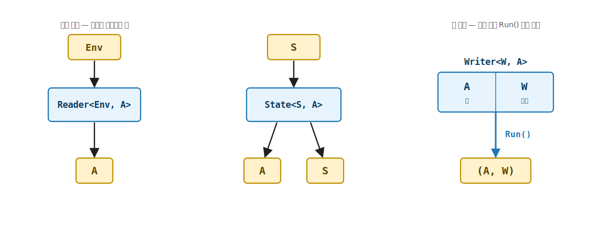
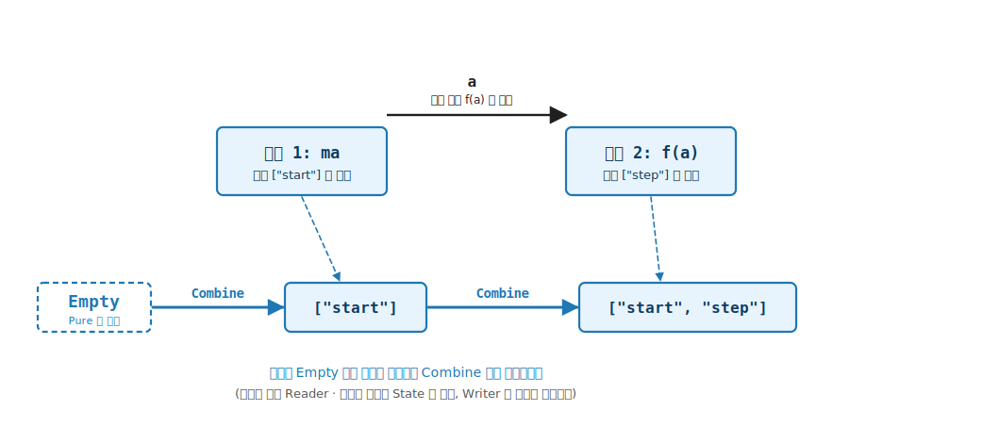

# 17장. Writer (누적 출력 효과)

> **이 장의 목표** — 이 장을 마치면 로그나 메트릭처럼 계산 단계마다 한쪽으로 쌓이는 출력을 가변 리스트나 전역 로거 없이 순수 함수의 타입에 담아 다룰 수 있습니다. 앞 장의 State 는 상태를 읽고 또 썼지만, Writer 는 상태를 되읽지 않고 결과에 출력을 곁들여 누적만 합니다. 그리고 5부의 시민이 함수 `Env → A` (Reader) 또는 `S → (A, S)` (State) 였다면, 이 장의 시민은 함수가 아니라 쌍 `(A, W)`, 곧 결과 값 `A` 와 누적 출력 `W` 를 나란히 담은 곱입니다. `Writer<W, A>` 를 직접 구현하고 `Writable<M, W>` trait 을 부착해, `Bind` 가 두 단계의 출력을 기초 3장의 Monoid 로 합치는 자리를 손에 잡습니다.

> **이 장의 핵심 어휘**
>
> - **누적 출력 효과**: 계산이 결과와 함께 로그나 메트릭 같은 출력을 한 방향으로 쌓는 효과, 5부가 인코딩하는 셋째 효과
> - **`Writer<W, A>`**: 내부가 함수가 아니라 쌍 `(A, W)` 인 자료, 누적 출력 효과의 끌어올림
> - **`WriterF<W>`**: 출력 `W` 를 고정한 채 Monad 와 Writable 을 호스트하는 태그 타입 (`W` 는 Monoid)
> - **`Writable<M, W>`**: 누적 출력 효과의 trait, **`Tell`** · **`Listen`** · **`Pass`** 세 멤버를 약속
> - **`Tell`**: 출력에 항목 하나를 더하는 계산 (값 자리는 `Unit`)
> - **`Listen`**: 하위 계산이 말한 출력을 값에 함께 담아 들여다봄
> - **`Pass`**: 출력을 후처리 함수로 변형 (필터 · 검열)
> - **`Log` (Monoid)**: 문자열 줄들을 누적하는 구체 Monoid 인스턴스, `W` 자리에 들어감

> 이 장을 마치면 할 수 있게 되는 것
> - [ ] Elevated World 의 시민이 함수에서 쌍 `(A, W)` 으로 바뀐다는 발상을 설명할 수 있습니다.
> - [ ] `Writer<W, A>` 가 결과 값과 누적 출력을 나란히 담은 곱임을, `Run()` 이 그 쌍을 그대로 꺼냄을 설명할 수 있습니다.
> - [ ] `Map` 이 값만 변환하고 출력을 그대로 둠을, `Pure` 가 항등원 `Empty` 로 시작함을 시그니처로 읽을 수 있습니다.
> - [ ] `Bind` 가 두 출력을 Monoid 의 `Combine` 으로 합치는 자리를 손계산으로 추적할 수 있습니다.
> - [ ] `W` 가 왜 Monoid 라야 하는지를 항등원 · 결합 · 결합 법칙 세 약속으로 설명할 수 있습니다.
> - [ ] `Tell` · `Listen` · `Pass` 세 동사로 가변 로거 없이 로그를 누적하고 들여다보고 검열할 수 있습니다.
> - [ ] `TracedMath` 로 `(a+b)*c` 의 각 계산 단계를 로그로 누적할 수 있습니다.
> - [ ] Writer 가 Monad 의 세 법칙을 만족함을 값과 누적 출력까지 비교해 확인할 수 있습니다.

> **이 장의 흐름** — 로그를 전역 가변 리스트로 들고 다니는 불편에서 출발해, 쌍 `(A, W)` 를 `Writer<W, A>` 로 끌어올립니다. trait 을 부착해 `Map` · `Pure` · `Apply` · `Bind` 를 손계산으로 따라가며 두 출력이 Monoid 로 합쳐지는 자리를 짚고, `W` 가 왜 Monoid 인지 기초 3장을 다시 방문한 뒤, `Writable` 의 세 동사와 `TracedMath` 실전을 거쳐 Monad 세 법칙으로 닫습니다.

---

## 17.1 이 장에서 다루는 것 — 결과에 출력을 곁들여 누적하기

앞의 두 장이 인코딩한 효과를 한 줄로 되짚습니다. Reader 는 환경을 읽기만 했습니다. `Bind` 가 같은 환경을 모든 단계에 흘릴 뿐, 어느 단계도 그 환경을 바꾸지 못했습니다. State 는 한 발 더 나아가 상태를 읽고 또 썼습니다. `Bind` 가 갱신된 상태를 다음 단계로 실어 날라, 어느 단계든 상태를 통째로 바꿀 수 있었습니다.

Writer 는 그 사이의 효과를 담습니다. 결과에 로그나 메트릭 같은 출력을 곁들여 한 방향으로 쌓기만 합니다. State 처럼 출력을 되읽어 분기하지는 않습니다. 단계마다 무슨 일을 했는지 기록을 누적하되, 그 기록을 다시 읽어 다음 계산을 바꾸지는 않습니다. 인코딩하는 효과는 출력 누적입니다.

이 장에서 처음 만나는 것은 세 가지입니다. 첫째는 시민의 정체입니다. Reader 와 State 의 시민은 함수였지만, Writer 의 시민은 함수가 아니라 쌍 `(A, W)` 입니다. 결과 값 `A` 와 누적 출력 `W` 를 나란히 담은 곱입니다. 둘째는 `Bind` 가 하는 일입니다. 두 단계의 출력 `W` 를 기초 3장의 Monoid 로 합칩니다. 셋째, 그 합치기를 떠받치는 Monoid 가 다시 등장합니다. `Pure` 는 출력을 항등원 `Empty` 로 시작하고, `Bind` 는 두 출력을 `Combine` 으로 이어 붙입니다. 3장에서 정착시킨 결합이 여기서 정확히 다시 쓰입니다.

나머지는 그대로입니다. `Map` 으로 안의 값을 변환하고, `Bind` 로 단계를 잇고, `from-from-select` LINQ 로 합성하는 어법은 기초에서 익힌 그대로 작동합니다. 같은 5 trait, 같은 법칙, 같은 LINQ. 시민이 쌍 `(A, W)` 로 바뀌고, `Bind` 가 출력을 Monoid 로 합친다는 점만 새롭습니다.


잠깐 어휘부터 다시 손에 쥐어 두겠습니다. 이 장에서 거듭 등장할 단어 몇 개를 한 줄씩 되짚습니다. 앞 Part 에서 배웠더라도 한참 지났으니 잊었다고 가정하고 다시 깔겠습니다.

- **Elevated World** 는 효과를 한 겹 둘러쓴 값들이 사는 위층입니다. 아래층의 평범한 값과 함수가 사는 곳이 Normal World 입니다. 이 책의 모든 추상은 이 두 평행 세계를 오가는 이야기였습니다.
- **끌어올림** 은 아래층의 값이나 함수를 위층으로 올리는 일이고, **끌어내림** 은 위층의 값을 다시 아래층의 평범한 값으로 꺼내는 일입니다.
- **trait** 은 능력을 객체가 아니라 타입에 부착하는 약속입니다. `Map` 이나 `Bind` 같은 동사가 객체에 딸린 메서드가 아니라, 타입에 붙인 정적 약속으로 삽니다.
- **Monad** 는 그 trait 가운데 `Bind` 라는 멤버 하나를 더한 것입니다. `Bind` 가 단계와 단계를 잇는 합성을 책임집니다.
- **Monoid** 는 가장 단순한 trait 였습니다. 빈 시작점 `Empty` 와 두 값을 합치는 `Combine`, 그리고 어떻게 묶어 합쳐도 같다는 결합 법칙, 이 셋만 약속하는 자리였습니다. 이 장에서 다시 주인공으로 돌아옵니다.

이 다섯 단어를 지금 완벽히 외우지 않아도 됩니다. 본문에서 필요할 때마다 그 자리에서 한 번 더 풀어 드리겠습니다. 여기서는 "Writer 도 결국 두 평행 세계 이야기의 한 변형이구나" 라는 느낌만 가져가면 충분합니다.

---

## 17.2 왜 필요한가 — 로그를 전역·가변 리스트로 들고 다니는 번거로움

`(a + b) * c` 를 계산하면서 각 단계가 무엇을 했는지 로그로 남긴다고 합시다. 명령형이라면 로그를 담을 가변 리스트 하나를 두고 매 단계 추가합니다.


잠깐 상황을 더 작게 그려 보겠습니다. 우리가 하려는 일은 두 단계입니다. 먼저 `2 + 3` 을 더해 `5` 를 얻고, 그 `5` 에 `4` 를 곱해 `20` 을 얻습니다. 결과는 `20` 하나면 됩니다. 그런데 나중에 무슨 일이 있었는지 보고 싶어서, 각 단계가 한 일을 글로 한 줄씩 남기려 합니다. `"2 + 3 = 5"` 한 줄, `"5 * 4 = 20"` 한 줄, 이렇게 두 줄입니다.

여기서 결과 값과 로그는 성격이 다릅니다. 결과 값 `20` 은 다음 계산이 받아 쓰는 진짜 값이고, 로그 두 줄은 계산에 영향을 주지 않고 한쪽으로 쌓이기만 하는 곁가지 출력입니다. 이 "쌓이기만 하는 출력" 을 어디에 두느냐가 이 절의 고민입니다.

```csharp
// 가변 리스트로 로그를 들고 다닙니다.
var log = new List<string>();

int Add(int x, int y)
{
    var r = x + y;
    log.Add($"{x} + {y} = {r}");   // 바깥 log 를 슬그머니 건드림
    return r;
}

int Mul(int x, int y)
{
    var r = x * y;
    log.Add($"{x} * {y} = {r}");   // 또 바깥 log 를 건드림
    return r;
}

var sum  = Add(2, 3);   // log 에 "2 + 3 = 5"
var prod = Mul(sum, 4); // log 에 "5 * 4 = 20"
```

`log` 가 함수 바깥에 살면서 `Add` 와 `Mul` 을 부를 때마다 슬그머니 늘어납니다. 두 함수의 시그니처 `int Add(int, int)` 어디에도 "이 함수는 로그를 남긴다" 가 드러나지 않습니다. 함수가 어떤 출력을 쌓는지 시그니처만 봐서는 알 수 없습니다.

가변 리스트를 피하려고 로그를 인자와 반환에 손으로 끼워 넣을 수도 있습니다. 결과와 누적 로그를 함께 돌려주는 것입니다.

```csharp
// 결과와 누적 로그를 튜플로 돌려주고, 호출자가 이어 붙입니다.
(int Result, List<string> Log) Add(int x, int y) =>
    (x + y, [$"{x} + {y} = {x + y}"]);

(int Result, List<string> Log) Mul(int x, int y) =>
    (x * y, [$"{x} * {y} = {x * y}"]);

var (sum,  log1) = Add(2, 3);
var (prod, log2) = Mul(sum, 4);
var log = log1.Concat(log2).ToList();   // 두 로그를 손으로 이어 붙임
```

이제 로그가 시그니처에 정직하게 드러나고 바깥 가변 상태가 사라집니다. 그러나 대가가 따릅니다. 호출자가 `log1` 과 `log2` 를 받아 손수 이어 붙여야 합니다. 단계가 늘수록 이 로그 이어 붙이기가 코드를 메우고, `Concat` 한 번을 빠뜨리면 로그가 통째로 사라지는데 컴파일러는 잡지 못합니다.

> **흔한 함정** — 로그를 전역 가변 리스트로 두는 것입니다.
>
> `static List<string> Log` 같은 가변 리스트에 출력을 쌓으면 호출자가 로그를 손으로 이어 붙일 일은 없습니다. 그러나 대가가 따릅니다. 첫째, 함수가 그 리스트에 무엇을 쌓는지 시그니처만 봐서는 알 수 없어, 같은 함수가 호출 이력에 따라 다른 로그를 남깁니다. 둘째, 테스트에서 로그를 비운 상태로 돌리려면 리스트를 직접 비워야 하고, 한 테스트가 남긴 로그가 다음 테스트로 새어 나갑니다. 셋째, 두 스레드가 같은 리스트에 동시에 추가하면 기초 1장에서 본 경쟁 조건이 되돌아옵니다. 출력 누적은 숨길 효과가 아니라 타입에 드러낼 효과입니다.

Writer 는 이 둘 사이의 길입니다. 출력 누적을 타입에 정직하게 드러내면서, 로그를 손으로 이어 붙이는 번거로움은 없앱니다. 어떻게 그러는지 시민의 정체부터 봅니다.

---

## 17.3 `Writer<W, A>` — 쌍 `(A, W)` 의 끌어올림

Writer 의 자료 정의는 한 줄입니다. 그런데 내부가 앞의 두 장과 다릅니다. 함수가 아니라 쌍입니다.

```csharp
public sealed class Writer<W, A>(A value, W output) : K<WriterF<W>, A>
    where W : Monoid<W>
{
    public A Value { get; } = value;
    public W Output { get; } = output;

    public (A Value, W Output) Run() => (Value, Output);
}
```

한 줄씩 천천히 읽겠습니다. `Writer<W, A>` 는 두 칸을 가진 상자입니다. 한 칸에는 계산의 결과 값 `A` 가 들어가고, 다른 칸에는 그동안 쌓인 출력 `W` 가 들어갑니다. 그게 전부입니다. 환경을 받는 함수도, 상태를 받는 함수도 아니고, 그냥 값 하나와 출력 하나를 나란히 담은 쌍입니다.

생성자 `new Writer<W, A>(value, output)` 도 그대로입니다. 첫 인자가 값, 둘째 인자가 출력입니다. `Run()` 도 `(Value, Output)` 순서로 돌려줍니다. 그래서 코드 어디서나 값을 먼저, 출력을 나중에 적는다고 외워 두면 됩니다.

한 가지만 미리 짚어 두겠습니다. 타입 이름은 `Writer<W, A>` 라 출력 `W` 가 앞에 옵니다. 값 `A` 가 뒤에 옵니다. 그런데 방금 본 쌍과 생성자는 값을 앞에 적습니다. 타입 이름과 생성자에서 순서가 뒤집혀 보이는 셈인데, 헷갈리면 "실제로 다룰 때는 늘 값이 먼저" 한 가지만 기억하면 됩니다. 이 순서 차이는 지금 외우려 애쓰지 않아도 코드를 몇 번 보면 손에 익습니다.

앞의 두 장과 한 줄로 대비하면 차이가 또렷합니다. Reader 의 내부는 `Env → A`, State 의 내부는 `S → (A, S)` 라 둘 다 함수였습니다. 값을 내려면 환경이나 상태를 주입해야 했습니다. Writer 의 내부는 함수가 아니라 이미 만들어진 쌍 `(A, W)` 입니다. 값과 출력이 그 자리에 함께 들어 있습니다.

`W : Monoid<W>` 제약이 여기서 처음 등장합니다. 출력 `W` 는 아무 타입이나 되는 게 아니라 Monoid 라야 합니다. 두 출력을 합칠 `Combine` 과 빈 출력을 가리킬 항등원 `Empty` 가 있어야 누적이 성립하기 때문인데, 이 까닭은 뒤에서 한 절을 들여 짚습니다. 지금은 "출력 자리에는 Monoid 만 들어간다" 는 약속만 눈에 담으면 됩니다.


`Monoid<W>` 라는 말이 낯설게 느껴지면 이렇게 떠올리면 됩니다. Monoid 는 기초에서 본 가장 단순한 trait 였습니다. 두 가지만 약속합니다. 빈 시작점 `Empty` 하나, 그리고 같은 종류 두 값을 한 값으로 합치는 `Combine` 하나입니다. 예를 들어 빈 리스트 `[]` 와 리스트 이어 붙이기 `Concat`, 또는 숫자 `0` 과 덧셈 `+` 가 각각 Monoid 한 쌍입니다.

출력을 "한쪽으로 쌓는다" 는 일이 정확히 이 두 약속을 요구합니다. 아무것도 안 쌓인 시작점이 있어야 하고 (그게 `Empty`), 새 출력을 기존 출력에 이어 붙일 방법이 있어야 합니다 (그게 `Combine`). 그래서 출력 `W` 가 Monoid 라야 한다는 제약은 누군가 까다롭게 건 규칙이 아니라, 누적이라는 일 자체가 자연스럽게 부르는 약속입니다. 왜 꼭 그래야 하는지는 뒤에서 한 절을 따로 들여 손계산까지 보여 드리겠습니다.

`K<WriterF<W>, A>` 를 부착했으니 Writer 도 Elevated World 의 시민입니다. 그런데 이 시민은 `Some(42)` 처럼 값 하나만 품지 않습니다. 값 옆에 누적 출력이 함께 들어 있습니다.

객체 지향이나 명령형에 익숙한 직감으로 옮기면 한결 쉽습니다. 앞 절에서 우리는 `(int Result, List<string> Log)` 라는 튜플로 결과와 로그를 함께 돌려주는 시도를 했습니다. `Writer<W, A>` 는 바로 그 튜플에 이름을 붙여 타입으로 굳힌 것입니다. 새로운 마법이 아니라, 이미 손으로 해 본 그 모양을 정식 타입으로 만든 것뿐입니다.

앞의 두 장과도 한번 견줘 보겠습니다. Reader 와 State 의 시민은 아직 결과가 나오지 않은 함수였습니다. 환경을 넣어 줘야, 또는 상태를 넣어 줘야 비로소 값이 나왔습니다. 말하자면 "아직 실행하지 않은 계산" 을 들고 다닌 셈입니다. Writer 는 다릅니다. 계산이 이미 끝나 결과 값과 출력이 한 쌍에 함께 손에 들려 있습니다. 그래서 뒤에 볼 끌어내림에 넣어 줄 입력이 없습니다.

이제 위층의 Writer 를 다시 아래층의 평범한 값으로 꺼내는 일을 봅니다. 이 꺼내기가 끌어내림이고, Writer 에서는 `Run()` 이 그 일을 합니다. 기초에서 `Fold` 가 Elevated 의 구조를 Normal 의 한 값으로 끌어내렸던 것과 같은 자리입니다. `Run()` 은 Writer 안에 든 쌍 `(A, W)` 를 그대로 꺼내 줍니다.

앞의 두 장과 딱 한 가지가 다릅니다. Reader 의 `Run(env)` 은 환경을 넣어 줘야 했고, State 의 `Run(초기상태)` 은 초기 상태를 넣어 줘야 했습니다. 둘 다 함수였으니 입력을 주입해야 결과가 나왔습니다. 그런데 Writer 의 `Run()` 은 괄호가 비어 있습니다. 넣어 줄 환경도 상태도 없습니다.

왜 그럴까요. 방금 봤듯 Writer 의 시민은 함수가 아니라 이미 완성된 쌍이기 때문입니다. 계산이 끝나 결과와 출력이 그 자리에 들어 있으니, 더 주입할 입력 없이 그냥 그 쌍을 꺼내기만 하면 됩니다. `Run()` 의 빈 괄호가 "이 시민은 함수가 아니라 쌍이다" 라는 사실을 그대로 보여 줍니다.

> **v5 정합** — LanguageExt v5 의 실제 `Writer<W, A>` 는 쌍이 아니라 함수 `W → (A, W)` 입니다. 이미 쌓인 출력을 받아 거기에 자기 출력을 합쳐 돌려주는 형태라, State 의 `S → (A, S)` 와 모양이 닮았습니다. 이 책은 누적의 본질이 가장 또렷이 보이는 고전적 쌍 `(A, W)` 표현으로 배웁니다. 두 표현은 같은 누적 효과를 인코딩하고, `Bind` 가 출력을 `Combine` 으로 합친다는 핵심은 똑같습니다.

> **흔한 함정** — Writer 가 State 처럼 출력을 되읽어 분기한다고 오해하는 것입니다.
>
> Writer 의 출력은 한 방향으로 쌓이기만 합니다. 어느 단계도 누적된 출력을 읽어 다음 계산을 바꾸지 못합니다. 그것은 상태를 읽고 쓰는 State 의 일입니다. 출력을 들여다보고 싶으면 뒤에서 볼 `Listen` 이 출력을 값 자리로 복사해 줄 뿐, `Bind` 의 누적 흐름 자체는 출력 내용과 무관하게 흐릅니다. 표기도 한 가지만 기억하면 됩니다. 타입은 출력을 앞세운 `Writer<W, A>` 이지만 쌍과 생성자는 값을 앞세운 `(A, W)` 이라, 값을 늘 먼저 적는다고 보면 헷갈리지 않습니다.



**그림 17-1. 함수 시민과 쌍 시민** — Elevated 띠 안에 세 시민을 나란히 둡니다. 왼쪽 `Reader<Env, A>` 는 환경 `Env` 가 들어와야 값 `A` 가 나오는 함수, 가운데 `State<S, A>` 는 상태 `S` 가 들어와 값 `A` 와 새 상태 `S` 가 나오는 함수입니다. 오른쪽 `Writer<W, A>` 는 화살표가 없습니다. 값 `A` 와 누적 출력 `W` 가 한 상자 안에 나란히 들어 있는 쌍입니다. 앞의 두 시민이 입력을 주입해야 값이 나오는 함수였다면, Writer 는 주입할 입력 없이 `Run()` 으로 그 쌍을 그대로 꺼낸다는 대비를 보여 줍니다.

---

## 17.4 trait 부착 — `Map` · `Pure` · `Apply` · `Bind`

이제 이 쌍에 능력을 붙입니다. 기초에서 거듭 본 3-tuple 패턴 그대로라 새로 배울 골격은 없습니다. 잠깐 그 패턴을 되짚겠습니다. 세 조각이 역할을 나눠 맡습니다. 자료 `Writer<W, A>` 가 값과 출력을 실제로 담고, 태그 `WriterF<W>` 가 `Map` 이나 `Bind` 같은 동사를 정적 자리에 호스트하고, trait `Monad<WriterF<W>>` 가 "이 태그는 Monad 의 약속을 지킨다" 고 선언합니다.

태그 이름의 `<W>` 한 글자가 중요합니다. 출력 타입 `W` 를 고정한 채 동사들을 호스트한다는 뜻입니다. 곧 로그를 쌓는 `WriterF<Log>` 와 숫자를 쌓는 `WriterF<Sum>` 은 서로 다른 태그라, 한 사슬 안에서는 한 가지 출력 타입으로만 쌓인다고 보면 됩니다.

```csharp
public sealed class WriterF<W> : Monad<WriterF<W>>, Writable<WriterF<W>, W>
    where W : Monoid<W>
{
    public static K<WriterF<W>, B> Map<A, B>(Func<A, B> f, K<WriterF<W>, A> fa)
    {
        var w = fa.As();
        return new Writer<W, B>(f(w.Value), w.Output);
    }

    // Pure — 값만, 출력은 항등원 Empty.
    public static K<WriterF<W>, A> Pure<A>(A value) =>
        new Writer<W, A>(value, W.Empty);

    // Apply — 두 출력을 Combine 으로 누적.
    public static K<WriterF<W>, B> Apply<A, B>(K<WriterF<W>, Func<A, B>> mf, K<WriterF<W>, A> ma)
    {
        var wf = mf.As();
        var wa = ma.As();
        return new Writer<W, B>(wf.Value(wa.Value), wf.Output.Combine(wa.Output));
    }

    // Bind — 첫 출력 w1 과 다음 출력 w2 를 Monoid 로 합친다.
    public static K<WriterF<W>, B> Bind<A, B>(K<WriterF<W>, A> ma, Func<A, K<WriterF<W>, B>> f)
    {
        var w1 = ma.As();
        var w2 = f(w1.Value).As();
        return new Writer<W, B>(w2.Value, w1.Output.Combine(w2.Output));
    }
}
```

네 동사 모두 `new Writer<W, _>(값, 출력)` 으로 새 쌍을 짓습니다. 시민이 쌍이라, 동사도 값 자리와 출력 자리를 각각 어떻게 채울지가 동사마다 다릅니다.

**`Map` 은 값만 변환하고 출력을 그대로 둡니다.** `Map(f, fa)` 는 `fa` 의 값 `w.Value` 에만 `f` 를 적용하고, 출력 `w.Output` 은 손대지 않고 그대로 새 쌍에 옮깁니다. 값은 바꾸되 누적된 출력은 모양 그대로 보존하는 것입니다.

**`Pure` 는 출력을 항등원 `Empty` 로 시작합니다.** `Pure(value)` 는 `new Writer<W, A>(value, W.Empty)` 입니다. 값 자리에는 주어진 `value` 를 놓고, 출력 자리에는 항등원 `Empty` 를 놓습니다. 아무것도 쓰지 않은 빈 출력에서 시작한다는 뜻입니다. 3장에서 본 항등원이 "합쳐도 상대를 바꾸지 않는 값" 이었듯, 여기서 `Empty` 는 "아직 아무 출력도 쌓이지 않은 시작점" 입니다.

**`Apply` 는 두 출력을 `Combine` 으로 누적합니다.** `Apply` 는 함수가 든 Elevated 값과 값이 든 Elevated 값을 만나게 하는 동사였습니다. 여기서는 함수가 든 `wf` 와 값이 든 `wa` 가 둘 다 자기 출력을 품고 있습니다. 그래서 두 칸을 각각 채웁니다. 값 칸은 `wf.Value(wa.Value)` 로 함수를 값에 적용하고, 출력 칸은 `wf.Output.Combine(wa.Output)` 으로 두 출력을 합칩니다.

여기서 처음으로 `Combine` 이라는 글자가 코드에 나타납니다. 두 출력을 한 출력으로 합치는 그 Monoid 연산입니다. `Apply` 가 벌써 출력을 합치고 있다는 점만 눈에 담아 두면, 곧이어 볼 `Bind` 가 같은 일을 한다는 게 자연스럽게 보입니다.

이 장에서 단계와 단계를 잇는 합성은 `Bind` 가 도맡습니다. 그래서 `Apply` 는 깊이 파지 않고, 5 trait 의 한 자리로서 "여기서도 출력이 `Combine` 으로 합쳐지는구나" 정도만 보고 넘어가면 충분합니다. Reader 의 `Apply` 가 환경을 양쪽에 똑같이 흘렸고 State 의 `Apply` 가 상태를 차례로 흘렸다면, Writer 의 `Apply` 는 두 출력을 합친다는 점만 다릅니다.

`Bind` 가 이 장의 핵심입니다.

### 17.4.1 `Bind` — 두 출력을 Monoid 로 누적

`Bind` 의 본체를 한 줄씩 읽습니다.

```csharp
Bind(ma, f) {
    var w1 = ma.As();              // ① 첫 계산 — 값 w1.Value, 출력 w1.Output
    var w2 = f(w1.Value).As();     // ② 그 값으로 다음 계산 — 값 w2.Value, 출력 w2.Output
    return new Writer<W, B>(
        w2.Value,                  //    값은 다음 계산의 값
        w1.Output.Combine(w2.Output));  // 출력은 두 출력을 Combine 으로 합침
}
```

세 동작이 일어납니다.

1. `ma` 에서 첫 계산의 값 `w1.Value` 와 출력 `w1.Output` 을 꺼냅니다.
2. 그 값으로 다음 계산 `f(w1.Value)` 를 만들어, 값 `w2.Value` 와 출력 `w2.Output` 을 꺼냅니다.
3. 새 쌍을 짓는데, 값 자리는 다음 계산의 값 `w2.Value` 이고, 출력 자리는 두 출력을 합친 `w1.Output.Combine(w2.Output)` 입니다.

③의 `w1.Output.Combine(w2.Output)` 자리가 핵심입니다. 첫 단계가 쌓은 출력과 다음 단계가 쌓은 출력을 Monoid 의 `Combine` 으로 이어 붙입니다. 앞 장에서 본 State 의 `Bind` 가 갱신된 상태를 다음 단계로 실어 날랐다면, Writer 의 `Bind` 는 두 단계의 출력을 합쳐 한 출력으로 쌓습니다. 사용자는 두 출력을 손으로 이어 붙인 적이 없습니다. `Bind` 가 매 단계의 출력을 `Combine` 으로 누적합니다.


이 자리를 17.2 의 손으로 짠 코드와 나란히 두면 무엇이 사라졌는지가 또렷합니다. 거기서는 호출자가 `log1.Concat(log2)` 를 직접 적어 두 로그를 이어 붙여야 했습니다. 그 `Concat` 호출을 빠뜨리면 로그가 통째로 사라졌습니다. `Bind` 의 ③번 줄 `w1.Output.Combine(w2.Output)` 이 바로 그 `Concat` 을 대신합니다. 다른 점은 이 합치기가 사용자 코드가 아니라 trait 안에 한 번만 적혀 있다는 것입니다. 단계를 아무리 길게 이어도 그 합치기를 다시 적을 일이 없습니다.

앞 장에서 본 `Bind` 의 얼굴을 떠올려 보면 같은 멤버가 자료마다 다른 일을 한다는 게 더 분명해집니다. `Option` 의 `Bind` 는 실패하면 다음 단계를 건너뛰었고 (단락), `List` 의 `Bind` 는 한 값을 여러 갈래로 퍼뜨렸으며 (비결정성), State 의 `Bind` 는 갱신된 상태를 다음 단계로 실어 날랐습니다. Writer 의 `Bind` 는 그 줄에서 두 단계의 출력을 `Combine` 으로 합칩니다. 시그니처는 같은데, 자료가 정한 효과만 자리마다 다릅니다.

작은 출력으로 손계산해 봅니다. 출력 `W` 자리에 로그 줄들의 목록을 누적하는 `Log` 를 두고, 두 단계를 잇습니다. `Log.Of("...")` 는 한 줄짜리 로그, `Combine` 은 두 줄 목록을 이어 붙이기입니다.

```csharp
// ma = "값 5, 출력 ["start"]"
// f  = n => "값 n + 1, 출력 ["step"]"
K<WriterF<Log>, int> ma = new Writer<Log, int>(5, Log.Of("start"));
Func<int, K<WriterF<Log>, int>> f = n => new Writer<Log, int>(n + 1, Log.Of("step"));

var chained = WriterF<Log>.Bind(ma, f);   // Writer<Log, int>
```

`chained.Run()` 을 따라갑니다.

```
① w1 = ma                    → 값 5,   출력 ["start"]
② w2 = f(5)                  → 값 6,   출력 ["step"]
③ 새 쌍                       → 값 6,   출력 ["start"].Combine(["step"])
                                              = ["start", "step"]
                                   ──┬──        ────────┬────────
                                w2 의 값      두 출력을 Combine 으로 합침

결과: (값 = 6, 출력 = ["start", "step"])
```

값은 다음 단계의 `6` 이고, 출력은 두 단계의 로그를 이어 붙인 `["start", "step"]` 입니다. 첫 단계의 `["start"]` 가 사라지지 않고 다음 단계의 `["step"]` 앞에 그대로 남았습니다. `Bind` 가 두 출력을 `Combine` 으로 합쳤기에 한 줄도 빠지지 않고 쌓입니다. 사용자가 작성한 코드 어디에도 두 로그를 이어 붙이는 호출이 없습니다. `Bind` 가 그 배관을 맡습니다.

`Bind` 하나면 나머지가 따라옵니다. `Map` 은 `Bind(ma, a => Pure(f(a)))` 로, `from-from-select` LINQ 는 `SelectMany` 를 거쳐 `Bind` 사슬로 풀립니다. 기초 7장에서 본 그대로입니다. `WriterF` 는 그 사슬을 돌리며, 단계마다 출력을 `Combine` 으로 누적할 뿐입니다.


혹시 손계산이 한 번에 따라오지 않았어도 괜찮습니다. 지금 가져갈 직감은 딱 하나입니다. `Bind` 는 두 단계를 잇되, 값은 다음 단계의 것을 쓰고 출력은 두 단계를 합친다는 것입니다. 값은 흘러가고, 출력은 쌓입니다. 이 한 문장이 이 장의 전부라 해도 지나치지 않습니다. 나머지 절들은 이 문장을 다른 각도에서 거듭 확인하는 자리입니다.



**그림 17-2. `Bind` 의 출력 누적** — 두 단계 (단계 1: `ma`, 단계 2: `f(a)`) 박스를 가로로 놓습니다. 각 단계가 값 갈래와 출력 갈래 두 갈래를 냅니다. 위쪽 값 갈래에서는 단계 1 의 값 `a` 가 단계 2 로 건너가 다음 계산을 만듭니다. 아래쪽 출력 갈래에서는 단계 1 의 출력 `["start"]` 와 단계 2 의 출력 `["step"]` 이 `Combine` 박스로 모여 `["start", "step"]` 한 출력으로 합쳐집니다. 왼쪽 끝에 `Pure` 가 항등원 `Empty` (빈 출력) 로 시작하는 점을 함께 두어, 출력이 `Empty` 에서 출발해 단계마다 `Combine` 으로 쌓인다는 것을 보입니다. 환경이 같은 값으로 흐른 Reader, 상태가 갱신되며 흐른 State 와 달리, Writer 의 출력은 단계마다 합쳐지며 누적된다는 대비입니다.

---

## 17.5 `W` 는 왜 Monoid 인가 — 3장의 재방문

`Writer<W, A>` 의 출력 자리가 아무 타입이나 아니라 `W : Monoid<W>` 였던 까닭을 이제 짚습니다. 누적이 성립하려면 세 가지가 필요하고, 그 셋이 정확히 기초 3장의 Monoid 가 약속하는 것입니다.


질문을 거꾸로 던져 보는 게 이해에 빠릅니다. 만약 `W` 가 아무 타입이나 되어도 좋았다면 어떤 일이 벌어질까요. 출력을 쌓으려면 두 가지를 할 수 있어야 합니다. 첫째, 아직 아무것도 안 쌓인 상태에서 출발할 수 있어야 합니다. 둘째, 새 출력이 들어올 때마다 기존 출력에 합칠 수 있어야 합니다. 만약 `W` 에 "빈 시작점" 이 없거나 "합치는 방법" 이 없다면, 누적은 시작조차 못 합니다. 그러니 이 두 능력을 가진 타입만 출력 자리에 들어올 수 있다고 정해 두는 게 자연스럽습니다.

그 두 능력에 정확히 이름을 붙여 둔 것이 바로 Monoid 였습니다. 빈 시작점은 항등원 `Empty`, 합치는 방법은 `Combine` 입니다. 그래서 `W : Monoid<W>` 라는 제약은 "출력 자리에는 빈 시작점과 합치기를 가진 타입만 와라" 를 한 줄로 적은 것입니다. 누적이 성립하는 데 꼭 필요한 셋을 하나씩 짚어 보겠습니다.

첫째, **빈 출력에서 시작할 방법** 이 필요합니다. `Pure` 는 아무 출력도 쓰지 않은 계산을 끌어올립니다. 그 출력 자리에 무엇을 놓을까요. 3장에서 본 항등원 `Empty` 가 그 답입니다. `Empty` 는 "합쳐도 상대를 바꾸지 않는 값", 곧 누적 사슬에 끼어도 보이지 않는 투명한 시작점입니다. `Pure(value)` 가 `new Writer<W, A>(value, W.Empty)` 인 것은 이 까닭입니다. 예컨대 `Empty.Combine(["2 + 3 = 5"])` 는 `["2 + 3 = 5"]` 그대로라, `Pure` 로 시작한 빈 출력은 첫 항목이 쌓은 출력을 조금도 바꾸지 않습니다. 3장의 좌항등 법칙 `Empty + a = a` 가 출력 자리에서 그대로 작동하는 것입니다.

둘째, **두 출력을 합칠 방법** 이 필요합니다. `Bind` 는 두 단계의 출력을 한 출력으로 쌓아야 합니다. 3장에서 본 `Combine` 이 그 답입니다. `Combine : W → W → W` 은 같은 타입 두 값을 한 값으로 합치는 연산이라, 첫 단계의 출력과 다음 단계의 출력을 합쳐 같은 `W` 한 개로 만듭니다. `Bind` 의 `w1.Output.Combine(w2.Output)` 이 바로 이 자리입니다.

셋째, **어떻게 묶어 합쳐도 같아야** 합니다. 출력 세 개 이상을 누적할 때, `(첫째 + 둘째) + 셋째` 로 묶든 `첫째 + (둘째 + 셋째)` 로 묶든 결과가 같아야 합니다. 3장에서 본 결합 법칙이 그 답입니다. 로그 세 출력 `["a"]` · `["b"]` · `["c"]` 로 양변을 펼쳐 봅니다.

```
좌결합: (["a"].Combine(["b"])).Combine(["c"])
      = ["a","b"].Combine(["c"])   = ["a","b","c"]

우결합: ["a"].Combine(["b"].Combine(["c"]))
      = ["a"].Combine(["b","c"])   = ["a","b","c"]
```

어느 쪽으로 묶어도 `["a","b","c"]` 로 같습니다. 그리고 이 `Combine` 의 결합 법칙이 `Bind` 의 결합 법칙과 맞물립니다. `Bind` 사슬을 어디서 끊어 묶어도 같은 출력을 내려면, 그 출력을 합치는 `Combine` 이 결합 법칙을 지켜야 합니다. 곧 출력 누적의 결합 법칙이 모나드 결합 법칙을 떠받칩니다.

정리하면, 3장의 Monoid 세 요소가 Writer 의 세 자리에 그대로 대응합니다.

| Monoid (3장) | Writer 에서 쓰이는 자리 |
|---|---|
| 항등원 `Empty` | `Pure` 의 출력 시작점 (아무것도 안 쓴 빈 출력) |
| 결합 연산 `Combine` | `Bind` 가 두 단계의 출력을 합치는 연산 |
| 결합 법칙 | `Bind` 사슬을 어떻게 묶어도 같은 출력 (Monad 결합 법칙과 맞물림) |

구체 Monoid 인스턴스로 `Log` 를 봅니다. 출력 `W` 자리에 들어가 실행 추적 로그를 누적하는 타입입니다.

```csharp
public sealed class Log(IReadOnlyList<string> lines) : Monoid<Log>
{
    public IReadOnlyList<string> Lines { get; } = lines;

    public static Log Empty => new([]);                          // 빈 로그
    public Log Combine(Log rhs) => new([.. Lines, .. rhs.Lines]); // 두 줄 목록을 이어 붙임

    public static Log Of(string line) => new([line]);            // 한 줄짜리 로그
}
```

`Empty` 는 빈 로그 `new([])` 입니다. 어떤 로그와 합쳐도 그대로 남습니다. `Combine` 은 두 줄 목록을 차례로 이어 붙인 새 로그입니다. `Of(line)` 은 한 줄짜리 로그를 만드는 편의 메서드로, `Tell` 이 한 항목을 쌓을 때 씁니다. `Log` 가 `Monoid<Log>` 를 구현하니, `Writer<Log, A>` 의 출력이 항등원에서 시작해 `Combine` 으로 누적됩니다.

여기서 작지만 중요한 사실 하나를 짚고 넘어가겠습니다. 출력 `W` 가 꼭 로그여야 하는 것은 아닙니다. Monoid 이기만 하면 무엇이든 들어옵니다. 로그는 그저 가장 흔한 예일 뿐입니다.

예를 들어 정수의 합을 쌓는 Monoid 를 만들어 `Sum` 이라 부르겠습니다. 이걸 출력 자리에 넣으면, 같은 Writer 골격이 로그 대신 비용이나 호출 횟수 같은 숫자를 쌓습니다. "이 계산이 얼마나 비쌌나" 를 추적하고 싶을 때 딱 맞는 모양입니다.

```csharp
public sealed class Sum(int n) : Monoid<Sum>
{
    public int Value { get; } = n;

    public static Sum Empty => new(0);                     // 더해도 안 바뀌는 시작점
    public Sum Combine(Sum rhs) => new(Value + rhs.Value); // 두 수를 더함
    public static Sum Of(int n) => new(n);
}
```

`Writer<Sum, A>` 에서 `tell(Sum.Of(1))` 을 두 번 거치면 출력이 `Combine` 으로 합쳐져 `2` 가 됩니다. 로그였다면 줄을 이어 붙였을 자리가 이제 수를 더합니다. 주목할 점은 `WriterF` 의 `Pure` 와 `Bind` 코드가 한 줄도 바뀌지 않는다는 것입니다. `Empty` 가 `[]` 에서 `0` 으로, `Combine` 이 이어 붙이기에서 덧셈으로 달라질 뿐, 누적의 골격은 그대로입니다. Writer 는 "로그를 쌓는 모나드" 가 아니라 "Monoid 를 쌓는 모나드" 입니다.

3장에서 Monoid 가 8장 Validation 의 오류 누적과 5부 Writer 의 로그 누적에서 다시 등장한다고 예고했습니다. Writer 가 바로 그 자리입니다. Normal World 의 가장 단순한 trait 이었던 Monoid 가, 효과 모나드의 출력을 누적하는 토대로 다시 쓰입니다.

### 17.5.1 같은 Writer, 다른 Monoid

`Sum` 으로 비용을 누적하는 모습을 손계산으로 따라갑니다. `tell(Sum.Of(3))` 과 `tell(Sum.Of(5))` 를 `Bind` 로 이으면 출력이 항등원에서 시작해 `Combine` 으로 더해집니다.

```
① Pure 의 시작 출력      = Empty       = 0
② tell(Sum.Of(3)) 누적   = 0.Combine(3) = 3
③ tell(Sum.Of(5)) 누적   = 3.Combine(5) = 8

결과 출력: 8
```

같은 입력이 `Log` 였다면 줄을 이어 붙였을 자리가, `Sum` 에서는 수를 더합니다.

`Combine` 이 꼭 "합치기" 일 필요도 없습니다. 둘 중 큰 값을 "고르는" Monoid `Max` 도 같은 Writer 골격에 그대로 끼웁니다.

```csharp
public sealed class Max(int n) : Monoid<Max>
{
    public int Value { get; } = n;

    public static Max Empty => new(int.MinValue);                       // 항등원 — 무엇과 Max 해도 짐
    public Max Combine(Max rhs) => new(Value >= rhs.Value ? Value : rhs.Value);  // 큰 값 고르기
    public static Max Of(int n) => new(n);
}
```

`Writer<Max, A>` 에서 `tell(Max.Of(3))` 과 `tell(Max.Of(5))` 를 이으면 출력이 `int.MinValue → 3 → 5` 로 단계별 최댓값을 추적합니다. `Combine` 이 누적이 아니라 선택인데도, 결합 법칙과 항등원만 지키면 정당한 Monoid 라 그대로 작동합니다. `Log` · `Sum` · `Max` 어느 것을 넣든 `WriterF` 의 `Pure` 와 `Bind` 는 한 줄도 바뀌지 않습니다. 달라지는 것은 `Empty` 와 `Combine` 의 구체 동작뿐입니다.

---

## 17.6 `Writable<M, W>` — `Tell` · `Listen` · `Pass`

지금까지는 `Bind` 가 두 단계의 출력을 알아서 합쳐 준다는 이야기였습니다. 그런데 한 가지가 비어 있습니다. 애초에 출력에 무언가를 쌓는 일은 누가 합니까. `Bind` 는 이미 쌓인 두 출력을 합칠 뿐, 새 항목을 처음 넣는 일은 따로 필요합니다.

비유하자면 `Bind` 는 두 양동이의 물을 한 양동이로 붓는 배관입니다. 그런데 양동이에 물을 처음 따르는 동작, 양동이에 지금 물이 얼마나 찼는지 들여다보는 동작, 다 찬 물을 한 번 걸러 내는 동작은 배관이 하는 일이 아닙니다. 이 세 동작을 약속해 둔 것이 `Writable<M, W>` trait 입니다.

```csharp
public interface Writable<M, W> where M : Writable<M, W> where W : Monoid<W>
{
    static abstract K<M, Unit> Tell(W item);
    static abstract K<M, (A Value, W Output)> Listen<A>(K<M, A> ma);
    static abstract K<M, A> Pass<A>(K<M, (A Value, Func<W, W> Function)> action);
}
```

세 동사가 차례로 "쌓고", "들여다보고", "걸러 냅니다". `Tell` 로 한 항목을 쌓고, `Listen` 으로 지금 쌓인 출력을 들여다보고, `Pass` 로 출력을 한 번 손봅니다.

한 가지 구분을 해 두면 머리가 정리됩니다. `Map` 과 `Bind` 는 어느 Elevated 시민에게나 있는 일반 동사였습니다. Option 에도 List 에도 있었습니다. 반면 `Tell` · `Listen` · `Pass` 는 출력 누적이라는 효과에만 있는 고유 동사입니다. 환경을 읽는 Reader 에 `Tell` 이 없고, 상태를 쓰는 State 에 `Listen` 이 없는 것과 같습니다. 효과마다 자기만의 고유 동사가 있고, Writer 의 고유 동사가 이 셋입니다.

trait 정의 맨 위에 `where W : Monoid<W>` 가 붙어 있는 것도 눈여겨볼 만합니다. "이 약속을 쓰려면 출력이 Monoid 라야 한다" 를 약속 자체에서 요구하는 것입니다. 앞서 본 누적의 필요조건이 trait 의 선언 줄에 그대로 새겨져 있는 셈입니다.

이제 세 동사를 하나씩 손에 잡겠습니다.

- **`Tell`** — 출력에 항목 하나를 더합니다. 시그니처는 `Tell : W → K<M, Unit>` 입니다. 출력 항목 하나를 받아, 그 항목만 쌓은 Writer 를 내놓습니다. 구현은 한 줄입니다. `new Writer<W, Unit>(Unit.Default, item)`, 곧 값 칸에는 `Unit`, 출력 칸에는 받은 항목을 놓습니다.

  값 칸이 왜 `Unit` 인지 잠깐 짚겠습니다. `Tell` 은 출력을 남기는 게 목적이지 의미 있는 값을 돌려주려는 게 아닙니다. 돌려줄 값이 없는 셈입니다. 그런데 C# 의 `void` 는 타입 인자 자리에 쓸 수 없어 `K<WriterF<W>, void>` 라고 적을 수가 없습니다. 그래서 "값이 없음" 을 나타내는 한 점짜리 타입 `Unit` 을 그 자리에 대신 놓습니다. 앞 장에서 State 의 `Put` 과 `Modify` 가 상태만 바꾸고 돌려줄 값이 없어 `Unit` 이었던 것과 똑같은 사정입니다.
- **`Listen`** — 하위 계산이 쌓은 출력을 값 칸으로 복사해 들여다봅니다. 시그니처는 `Listen : K<M, A> → K<M, (A, W)>` 입니다. 값 칸이 `A` 에서 `(A, W)` 로 바뀐 게 보입니다. 원래 값에 "지금까지 쌓인 출력" 을 한 쌍으로 묶어 함께 돌려준다는 뜻입니다.

  여기서 의아할 수 있습니다. 출력이 값 칸에도 들어가고 출력 칸에도 그대로 남습니다. 같은 출력이 두 곳에 있는 셈인데, 왜 그럴까요. 값 칸에 끼워 넣은 복사본은 다음 단계가 출력을 "읽을 수 있게" 보여 줍니다. 출력 칸에 원본을 그대로 남기는 것은 `Bind` 의 누적이 끊기지 않게 하려는 것입니다. 만약 들여다본다고 출력 칸을 비워 버리면, 그 뒤 단계들이 쌓을 출력만 남고 앞서 쌓은 출력이 사라집니다. 그래서 원본은 손대지 않고 복사본만 값 칸에 얹습니다.

  구체 값으로 보겠습니다. `Compute(2, 3, 4)` 가 출력 `["2 + 3 = 5", "5 * 4 = 20"]` 을 쌓았다고 합시다. 여기에 `listen` 을 걸면 값 칸은 `(20, ["2 + 3 = 5", "5 * 4 = 20"])` 이 되고, 출력 칸은 여전히 같은 두 줄 그대로입니다. 결과 값 `20` 옆에 "이만큼 로그를 쌓았어" 라는 정보가 따라붙은 셈입니다. 들여다보되 누적 흐름은 건드리지 않습니다.
- **`Pass : K<M, (A, W → W)> → K<M, A>`** — 출력을 후처리하는 함수를 적용합니다. 값 자리에 결과와 함께 변형 함수 `W → W` 를 실어 두면, `Pass` 가 그 함수를 출력에 적용해 변형된 출력을 냅니다. 변형 함수를 값 자리에 함께 싣는 까닭은, 출력이 다 쌓인 뒤에 한 번에 변형하려고 변형 시점을 미루기 때문입니다. 세 동사 중 가장 덜 쓰는 자리라, 로그에서 특정 줄만 남기는 필터나 검열이 필요할 때만 꺼내 쓴다고 기억하면 충분합니다.

이 세 멤버는 정적 멤버라 `WriterF<Log>.Tell(…)` 처럼 태그를 직접 적어야 호출됩니다. 태그를 직접 적는 이 표기는 외울 필요가 없습니다. 어느 Monad `M` 이든 받게 한 단계 감싼 모듈 헬퍼가 따로 있어, 본문은 그쪽을 씁니다.

```csharp
public static class Writable
{
    public static K<M, Unit> tell<M, W>(W item)
        where M : Writable<M, W> where W : Monoid<W> =>
        M.Tell(item);

    public static K<M, (A Value, W Output)> listen<M, W, A>(K<M, A> ma)
        where M : Writable<M, W> where W : Monoid<W> =>
        M.Listen(ma);

    public static K<M, A> pass<M, W, A>(K<M, (A Value, Func<W, W> Function)> action)
        where M : Writable<M, W> where W : Monoid<W> =>
        M.Pass(action);
}
```

대문자 trait 멤버 (`Tell` · `Listen` · `Pass`) 와 소문자 모듈 헬퍼 (`tell` · `listen` · `pass`) 는 같은 일을 합니다. 앞 두 장의 Readable · Stateful 헬퍼와 같은 패턴입니다. 헬퍼는 `where M : Writable<M, W>` 와 `where W : Monoid<W>` 두 제약을 둔 자유 함수라, 어떤 누적 출력 모나드든 한 어휘로 받습니다. 호출할 때 타입 인자를 적는데, `tell<WriterF<Log>, Log>(…)` 는 차례로 모나드 태그 (`WriterF<Log>`) 와 출력 타입 (`Log`) 을, `listen<WriterF<Log>, Log, int>(…)` 는 거기에 결과 타입 (`int`) 을 더합니다. 본문에서는 이 헬퍼 어휘를 씁니다.

이 세 동사가 가변 로거 없이 출력을 다루는 토대입니다. `tell` 로 한 항목을 쌓고, `listen` 으로 하위 계산이 쌓은 출력을 들여다보고, `pass` 로 출력을 검열합니다. 그리고 `Bind` 가 그 출력을 모든 단계에서 `Combine` 으로 누적하고, 호출자가 끝에서 `Run()` 으로 값과 누적 출력을 함께 꺼냅니다.

### 17.6.1 `censor` — `Pass` 를 감싼 검열 입구

`Pass` 를 직접 쓰려면 값 자리에 `(결과, 변형 함수)` 쌍을 손으로 실어야 해서 번거롭습니다. 결과는 그대로 통과시키고 변형 함수만 끼우는 그 짝짓기를 대신 해 주는 입구가 `censor` 입니다.

```csharp
public static K<M, A> censor<M, W, A>(Func<W, W> f, K<M, A> ma)
    where M : Writable<M, W>, Monad<M> where W : Monoid<W> =>
    M.Pass(M.Bind(ma, a => M.Pure((a, f))));
```

`Bind` 가 `ma` 의 결과 `a` 를 꺼내 변형 함수 `f` 와 짝지어 `(a, f)` 쌍을 만들고, 그 쌍을 `Pass` 가 받아 출력에 `f` 를 적용합니다. 곧 `censor` 는 "`Pass` 가 요구하는 쌍 싣기를 대신 해 주는 헬퍼" 입니다. `Pass` 가 배관이라면 `censor` 는 그 위에 놓인 사용자 입구입니다. 로그에서 곱셈 줄만 남기는 검열은 한 줄이 됩니다.

```csharp
// 뒤에서 볼 raw pass 예제와 같은 결과를 더 짧게
var onlyMul = Writable.censor<WriterF<Log>, Log, int>(
    log => new Log(log.Lines.Where(x => x.Contains('*')).ToList()),
    TracedMath.Compute(2, 3, 4));
// onlyMul.Run() → (20, ["5 * 4 = 20"])
```

값 `20` 은 그대로 두고 출력만 곱셈 줄로 걸러집니다. `Pass` 의 쌍 싣기를 직접 적지 않아도 됩니다.


> **흔한 함정** — `censor` 가 출력을 "고친다" 고 해서 원본 계산을 거슬러 올라가 바꾼다고 오해하는 것입니다.
>
> `censor` 는 이미 끝난 계산의 누적 출력에 변형 함수를 한 번 적용할 뿐입니다. 원래 단계들이 무엇을 쌓았는지는 그대로이고, 그 위에 거름망을 한 겹 씌워 결과 출력만 달라지게 합니다. 값 칸은 손대지 않으므로 결과 값도 그대로입니다. 비유하자면 사진을 다시 찍는 게 아니라 다 찍은 사진에 필터를 한 번 입히는 것입니다. 그래서 `censor` 를 어느 계산 바깥에 씌우든, 안쪽 단계의 동작은 조금도 바뀌지 않습니다.

---

## 17.7 실전 — 계산 과정 로그 누적 (`TracedMath`)

17.2 에서 가변 리스트로 풀던 `(a + b) * c` 의 로그 누적을, 가변 상태 하나 없이 Writer 로 짭니다. 각 계산 단계가 한 줄의 로그를 `tell` 합니다.

```csharp
public static class TracedMath
{
    // 결과를 내면서 한 줄의 로그를 남긴다.
    static K<WriterF<Log>, int> Step(int result, string message) =>
        from _ in Writable.tell<WriterF<Log>, Log>(Log.Of(message))
        select result;

    public static K<WriterF<Log>, int> Add(int x, int y) =>
        Step(x + y, $"{x} + {y} = {x + y}");

    public static K<WriterF<Log>, int> Mul(int x, int y) =>
        Step(x * y, $"{x} * {y} = {x * y}");

    // (a + b) * c — 각 단계가 로그를 누적.
    public static K<WriterF<Log>, int> Compute(int a, int b, int c) =>
        from sum  in Add(a, b)
        from prod in Mul(sum, c)
        select prod;
}
```

한 조각씩 천천히 읽겠습니다. 먼저 `Step` 입니다. `Step(result, message)` 는 두 가지를 받습니다. 내놓을 결과 값과, 남길 로그 한 줄입니다. 본체는 `from-from-select` 두 줄인데, 이게 곧 `Bind` 한 단계라는 건 앞에서 봤습니다.

첫 줄 `from _ in tell(Log.Of(message))` 가 로그 한 줄을 출력에 쌓습니다. `tell` 이 돌려주는 값은 의미가 없는 `Unit` 이라, 받는 이름을 `_` 로 버립니다. 둘째 줄 `select result` 가 그 위에 결과 값을 얹습니다. 합치면 "로그 한 줄을 쌓으면서 결과 값을 내놓는다" 는 한 계산입니다.

`Add` 와 `Mul` 은 `Step` 을 그대로 씁니다. `Add(x, y)` 는 결과로 `x + y` 를 내면서 `"x + y = ..."` 라는 줄을 쌓고, `Mul(x, y)` 는 결과로 `x * y` 를 내면서 `"x * y = ..."` 줄을 쌓습니다. 두 함수의 시그니처가 `K<WriterF<Log>, int>` 인 점이 핵심입니다. 반환 타입만 봐도 "이 함수는 정수를 내면서 로그를 쌓는다" 가 드러납니다. 17.2 의 `int Add(int, int)` 가 로그를 남기는지 시그니처에 숨겼던 것과 정반대입니다.

`Compute` 의 `from-from-select` 가 두 계산을 잇습니다. 이 LINQ 는 `Bind` 사슬로 풀리고, 앞에서 본 대로 `Bind` 가 두 단계의 출력을 `Combine` 으로 누적합니다. 그래서 `Add` 도 `Mul` 도 코드 어디에서도 로그를 손으로 이어 붙이지 않는데, 두 단계의 로그가 한 출력으로 쌓입니다.

`Compute(2, 3, 4)` 를 손계산으로 따라갑니다.

```
① Add(2, 3)   → 값 sum = 5,   출력 ["2 + 3 = 5"]
② Mul(5, 4)   → 값 prod = 20, 출력 ["5 * 4 = 20"]
③ Bind 가 두 출력을 Combine  → ["2 + 3 = 5"] + ["5 * 4 = 20"]
                              = ["2 + 3 = 5", "5 * 4 = 20"]

결과: (값 = 20, 출력 = ["2 + 3 = 5", "5 * 4 = 20"])
```

```csharp
var (result, log) = TracedMath.Compute(2, 3, 4).As().Run();
// result = 20
// log    = ["2 + 3 = 5", "5 * 4 = 20"]
```

결과는 `(2 + 3) * 4 = 20` 이고, 로그는 두 단계를 그대로 기록한 두 줄입니다. 17.2 의 가변 버전이 바깥 `List<string>` 을 슬그머니 건드렸던 것과 달리, 여기서는 가변 상태가 없습니다. 로그는 `Bind` 가 매 단계의 출력을 `Combine` 으로 합친 결과이고, `Run()` 이 값과 함께 그 누적 출력을 끌어내립니다. 명령형이라면 logger 를 전역이나 인자로 들고 다녔을 자리를, Writer 는 효과로 타입에 담습니다.

`listen` 으로 하위 계산이 쌓은 출력을 값으로 들여다볼 수 있습니다.

```csharp
var listened = Writable.listen<WriterF<Log>, Log, int>(TracedMath.Compute(2, 3, 4));
var captured = listened.As();
// captured.Value = (Value: 20, Output: ["2 + 3 = 5", "5 * 4 = 20"])  — 캡처된 로그 줄 수 2
```

`listen` 이 `Compute` 가 말한 로그를 값 자리에 `(결과, 로그)` 쌍으로 끼워 넣어, 다음 단계가 그 로그 줄 수를 읽거나 검사할 수 있습니다.

`pass` 로 출력을 검열할 수 있습니다. 곱셈 줄만 남기는 필터를 예로 봅니다.

```csharp
var passed = Writable.pass<WriterF<Log>, Log, int>(
    from r in TracedMath.Compute(2, 3, 4)
    select (r, (Func<Log, Log>)(l => new Log(l.Lines.Where(x => x.Contains('*')).ToList()))));

var (pr, plog) = passed.As().Run();
// pr   = 20
// plog = ["5 * 4 = 20"]   — '*' 포함 줄만 남고 덧셈 줄은 검열됨
```

값 자리에 변형 함수 `l => '*' 포함 줄만` 을 실어 두면, `pass` 가 그 함수를 누적 출력에 적용해 곱셈 줄만 남깁니다. 결과 값 `20` 은 그대로이고, 출력만 검열됩니다.

---

## 17.8 법칙 — Monad 세 법칙

`WriterF` 는 `Monad<WriterF<W>>` 를 부착했으니, 진짜 Monad 가 되려면 기초 7장에서 본 세 법칙을 만족해야 합니다.

```
좌항등:   Bind(Pure(a), f)           ≡  f(a)
우항등:   Bind(m, Pure)              ≡  m
결합:     Bind(Bind(m, f), g)        ≡  Bind(m, a => Bind(f(a), g))
```

세 법칙이 무엇을 약속하는지 잠깐 되짚겠습니다. 좌항등은 `Pure` 로 감쌌다 곧장 `Bind` 한 것이 그냥 함수를 적용한 것과 같다는 약속입니다. 우항등은 꺼낸 값을 다시 `Pure` 로 올리는 단계가 군더더기라는 약속입니다. 결합은 사슬을 어디서 끊어 묶어도 결과가 같다는 약속입니다. 이 셋을 지켜야 `Bind` 사슬을 마음 놓고 길게 잇고 중간을 함수로 추출할 수 있습니다.

Writer 의 시민은 함수가 아니라 쌍이라, 앞 두 장처럼 입력을 주입해 비교할 필요가 없습니다. 그 점은 오히려 쉽습니다. 그런데 한 가지를 꼭 조심해야 합니다. Writer 가 같은지 볼 때는 값만 봐서는 안 됩니다. 쌓은 출력까지 같아야 두 Writer 가 같습니다.

예를 들어 두 계산이 똑같이 결과 값 `20` 을 냈더라도, 한쪽은 로그를 두 줄 쌓고 다른 쪽은 한 줄만 쌓았다면 두 계산은 다릅니다. 출력도 계산의 일부이기 때문입니다. 그래서 법칙을 검증할 때 비교 대상이 값 하나가 아니라 `(값, 출력)` 쌍입니다.

여기에 한 가지 사정이 더 있습니다. `Log` 의 자동 `Equals` 는 내부 리스트를 참조로 비교해, 같은 줄을 담은 두 로그도 서로 다른 리스트 객체면 다르다고 나옵니다. 그래서 출력을 직접 비교하지 않고, 로그 줄들을 문자열 하나로 이어 붙여 비교합니다. 이 역할을 하는 것이 `probe` 입니다.


`probe` 라는 이름이 낯설면 "비교하기 좋은 모양으로 한 번 꺼내 주는 작은 도구" 정도로 보면 됩니다. Writer 의 출력은 리스트라 그대로는 비교가 어긋나니, 출력 줄들을 `|` 로 이어 붙인 문자열 하나로 바꿔 둡니다. 그러면 `["a", "b"]` 가 `"a|b"` 가 되어, 줄 내용만 같으면 같다고 나옵니다. 값과 이 문자열을 한 쌍으로 묶어 비교하면, 값과 출력을 함께 견주는 셈이 됩니다.

```csharp
// probe — (값, 출력 줄을 이어 붙인 문자열) 로 끌어내려 비교.
Func<K<WriterF<Log>, int>, (int, string)> probe =
    m => (m.As().Value, string.Join("|", m.As().Output.Lines));

Func<int, K<WriterF<Log>, int>> f = n => new Writer<Log, int>(n + 1, Log.Of($"f({n})"));
Func<int, K<WriterF<Log>, int>> g = n => new Writer<Log, int>(n * 2, Log.Of($"g({n})"));
K<WriterF<Log>, int> m = new Writer<Log, int>(10, Log.Of("start"));

var leftId  = MonadLaws.LeftIdentityHolds<WriterF<Log>, int, int, (int, string)>(3, f, probe);
var rightId = MonadLaws.RightIdentityHolds<WriterF<Log>, int, (int, string)>(m, probe);
var assoc   = MonadLaws.AssociativityHolds<WriterF<Log>, int, int, int, (int, string)>(m, f, g, probe);
// → 세 법칙 모두 통과
```

`MonadLaws` 헬퍼는 기초에서 본 그대로이지만, 양변을 직접 비교하는 대신 `probe` 로 한 번 감쌉니다.

```csharp
public static bool LeftIdentityHolds<M, A, B, R>(
    A a, Func<A, K<M, B>> f, Func<K<M, B>, R> probe)
    where M : Monad<M> =>
    Equals(probe(M.Bind(M.Pure(a), f)), probe(f(a)));
```

`probe` 가 양변을 `(값, 출력 줄 이어 붙임)` 쌍으로 끌어내려, 값과 누적 출력을 함께 비교합니다. 좌항등은 `Pure(a)` 로 감쌌다 곧장 `Bind` 한 것이 그냥 `f(a)` 와 같음을, 우항등은 꺼낸 값을 그대로 `Pure` 로 다시 올리는 단계가 군더더기임을, 결합은 사슬을 어디서 끊어 묶어도 결과가 같음을 약속합니다. 좌항등이 성립하는 까닭을 한 줄로 보면, `Pure` 의 출력이 항등원 `Empty` 라 `Empty.Combine(f(a) 의 출력) == f(a) 의 출력`, 곧 3장의 항등 법칙이 그대로 작동하기 때문입니다.

이 법칙이 두 평행 세계 그림에서 무엇을 지키는지 한 줄로 보면, 세 법칙은 출력을 `Combine` 으로 합치는 `Bind` 배관이 어떻게 이어 붙여도 같은 값과 같은 누적 출력을 낸다는 약속입니다. 그 약속의 바탕에 3장 Monoid 의 항등법칙과 결합 법칙이 깔려 있습니다. 그래서 Writer 사슬을 마음 놓고 길게 잇고, 중간을 함수로 추출해도 됩니다.

---

## 17.9 직접 해보기

코드의 `Challenges` 에 정답이 있습니다. 먼저 직접 구현한 뒤 코드와 비교해 봅니다.

> **챌린지 1 — 계산 과정을 로그로 추적.** 가변 `List<string>` 을 두지 않고, 각 연산이 결과와 함께 한 줄을 `tell` 하는 `Step` 을 짠 뒤 `Add` 와 `Mul` 을 `from-from-select` 로 이어 `Compute` 를 만들어 봅니다. `Run()` 으로 돌려 결과 `20` 과 두 줄짜리 로그가 함께 나옴을 확인합니다. 노리는 능력은 `Bind` 가 두 단계의 출력을 `Combine` 으로 누적함을 코드로 보는 것입니다.

> **챌린지 2 — `Listen` 으로 출력 들여다보기.** `Compute(2, 3, 4)` 를 `listen` 으로 감싸, 그 계산이 쌓은 로그를 값 자리에 `(결과, 로그)` 쌍으로 받아 로그 줄 수를 세어 봅니다. 노리는 능력은 `Listen` 이 하위 계산의 누적 출력을 다음 단계가 읽을 수 있는 값으로 끌어올림을 보는 것입니다.

> **챌린지 3 — `Pass` 로 출력 검열.** `Compute` 의 누적 로그에서 `'*'` 가 포함된 곱셈 줄만 남기는 변형 함수 `Log → Log` 를 값 자리에 실어 `pass` 로 적용해 봅니다. 결과 값은 그대로이고 출력만 검열됨을 확인합니다. 노리는 능력은 `Pass : K<M, (A, W → W)> → K<M, A>` 가 어떻게 출력을 후처리하는지 보는 것입니다.

---

## 17.10 Elevated World 어휘로 다시 읽기

17장의 도구를 1장 비유에 매핑합니다.

| 17장 도구 | Elevated World 어휘 |
|---|---|
| `Writer<W, A>` | 효과 (출력 누적) 를 인코딩한 Elevated 시민. 안에 값 `A` 와 누적 출력 `W` 의 쌍 |
| `Run()` | 끌어내림. 주입할 입력 없이 쌍 `(A, W)` 를 그대로 꺼냄 |
| `tell` | 출력에 항목 하나를 쌓아 Elevated 로 끌어올림 |
| `Pure` | 출력을 항등원 `Empty` 로 시작해 상수를 끌어올림 |
| `Bind` | 두 출력을 Monoid `Combine` 으로 합치는 World-crossing. 출력 누적 |
| `Listen` | 누적 출력을 값 자리 복사본으로 들여다봄 |
| `Pass` | 출력에 변형 함수를 적용해 후처리 |
| `censor` | `Pass` 를 감싼 검열 입구 (쌍 싣기를 대신) |
| `W` (Monoid) | 출력 자리에 쌓이는 것 — `Log` · `Sum` · `Max` 어느 Monoid 든 |

앞 두 장의 시민이 효과를 인코딩한 함수였다면, Writer 의 시민은 효과를 인코딩한 쌍입니다. Reader 는 환경을 흘리기만, State 는 상태를 읽고 쓰기를 인코딩했고, Writer 는 출력을 한 방향으로 누적하기를 인코딩합니다. 끌어올림은 `tell`, 끌어내림은 `Run`, 두 세계에 걸친 합성은 `Bind` 입니다. 비유는 여기까지가 역할입니다. 정확한 누적 규칙은 `Bind` 의 시그니처와 세 법칙, 그리고 그 바탕의 Monoid 가 정합니다.

---

## 17.11 Q&A — 자기 점검

> **Q1. `Writer<W, A>` 의 내부는 무엇입니까?** (17.3절)

함수가 아니라 쌍 `(A, W)` 입니다. 앞 장들의 Reader 와 State 는 내부가 함수 `Env → A` 또는 `S → (A, S)` 라 입력을 주입해야 값이 나왔지만, Writer 는 결과 값 `A` 와 누적 출력 `W` 가 이미 한 쌍으로 들어 있습니다. 효과는 출력 누적이고, 출력은 계산을 짜면서 한 항목씩 쌓입니다.

> **Q2. 끌어내림은 어느 자리이고, 왜 인자가 없습니까?** (17.3절)

`Run()` 입니다. 기초 6장의 `Fold` 가 Elevated 의 구조를 Normal 의 한 값으로 끌어내렸듯, `Run()` 은 Writer 라는 효과를 Normal 의 쌍 `(A, W)` 으로 끌어내립니다. Reader 의 `Run(env)` 과 State 의 `Run(초기상태)` 는 주입할 입력을 받았지만, Writer 의 시민은 함수가 아니라 이미 완성된 쌍이라 주입할 입력이 없습니다. 그래서 `Run()` 은 인자 없이 그 쌍을 그대로 꺼내기만 합니다.

> **Q3. `Pure` 는 출력 자리에 무엇을 놓습니까?** (17.4절)

항등원 `Empty` 를 놓습니다. `Pure(value)` 는 값 자리에 주어진 `value` 를, 출력 자리에 `W.Empty` 를 놓습니다. 아무것도 쓰지 않은 빈 출력에서 시작한다는 뜻입니다. 3장에서 본 항등원이 "합쳐도 상대를 바꾸지 않는 값" 이었듯, 여기서 `Empty` 는 누적 사슬에 끼어도 보이지 않는 투명한 시작점입니다.

> **Q4. `Bind` 가 두 출력을 어떻게 합칩니까?** (17.4.1절)

Monoid 의 `Combine` 으로 합칩니다. `Bind(ma, f)` 는 첫 계산의 출력 `w1.Output` 과 다음 계산의 출력 `w2.Output` 을 `w1.Output.Combine(w2.Output)` 으로 이어 붙이고, 값 자리는 다음 계산의 값 `w2.Value` 를 놓습니다. 사용자가 두 출력을 손으로 이어 붙인 적이 없는데도 단계마다 출력이 한 줄도 빠지지 않고 누적됩니다. 이 자동 누적이 Writer 의 핵심입니다.

> **Q5. `W` 는 왜 Monoid 라야 합니까?** (17.5절)

누적이 성립하려면 세 가지가 필요하고, 그 셋이 3장 Monoid 가 약속하는 것이기 때문입니다. `Pure` 가 빈 출력에서 시작하려면 항등원 `Empty` 가, `Bind` 가 두 출력을 합치려면 결합 연산 `Combine` 이, `Bind` 사슬을 어떻게 묶어도 같은 출력을 내려면 결합 법칙이 필요합니다. 항등원 · 결합 연산 · 결합 법칙은 Monoid 가 정확히 보장하는 세 요소라, 출력 `W` 가 Monoid 라야 누적이 안전합니다.

> **Q6. `Tell` 의 값 자리가 왜 `Unit` 입니까?** (17.6절)

`Tell` 은 출력에 항목만 더할 뿐 의미 있는 값을 내지 않기 때문입니다. C# 의 `void` 는 타입 인자로 못 쓰므로, "값이 없음" 을 나타내는 한 점 타입 `Unit` 을 값 자리에 놓습니다. `WriterF` 의 구현은 `new Writer<W, Unit>(Unit.Default, item)`, 곧 값은 `Unit`, 출력은 받은 항목입니다. 앞 장에서 State 의 `Put` 과 `Modify` 가 상태만 바꾸고 값이 없어 `Unit` 이었던 것과 같은 이유입니다.

> **Q7. `Listen` 과 `Pass` 는 각각 무엇을 합니까?** (17.6절)

`Listen` 은 하위 계산이 말한 출력을 값에 함께 담아, 다음 단계가 그 출력을 값으로 읽게 합니다. 출력 자리에는 그 출력을 그대로 두고, 값 자리에 `(결과, 출력)` 쌍을 끼워 넣습니다. `Pass` 는 값 자리에 실어 둔 변형 함수 `W → W` 를 누적 출력에 적용해, 로그를 필터하거나 검열합니다. 두 동사는 누적된 출력을 들여다보거나 후처리하는 고유 동사입니다.

> **Q8. `TracedMath.Compute(2, 3, 4)` 의 결과와 로그는 무엇입니까?** (17.7절)

결과는 `(2 + 3) * 4 = 20`, 로그는 두 줄 `["2 + 3 = 5", "5 * 4 = 20"]` 입니다. `Add` 가 `"2 + 3 = 5"` 를 쌓고, `Mul` 이 `"5 * 4 = 20"` 을 쌓는데, `from-from-select` 가 `Bind` 사슬로 풀려 두 출력을 `Combine` 으로 누적합니다. 가변 리스트 없이 `Run()` 이 값과 누적 출력을 함께 끌어내립니다.

> **Q9. Writer 의 법칙은 어떻게 비교합니까?** (17.8절)

값과 누적 출력을 함께 비교합니다. 두 Writer 가 같으려면 값뿐 아니라 쌓은 출력까지 같아야 합니다. `Log` 의 자동 `Equals` 가 내부 리스트를 참조로 비교하므로, `probe` 가 로그 줄들을 문자열 하나로 이어 붙여 `(값, 출력 줄 이어 붙임)` 쌍으로 비교합니다. 좌항등이 성립하는 까닭은 `Pure` 의 출력이 항등원 `Empty` 라 3장의 항등 법칙이 그대로 작동하기 때문입니다.

> **Q10. 출력 `W` 를 `Log` 대신 `Sum` 으로 바꾸면 `WriterF` 코드는 무엇이 바뀝니까?** (17.5절)

한 줄도 바뀌지 않습니다. `Empty` 와 `Combine` 의 구체 동작만 달라집니다. `Log` 에서는 빈 목록에서 시작해 줄을 이어 붙였고, `Sum` 에서는 `0` 에서 시작해 수를 더합니다. `WriterF` 의 `Pure` 와 `Bind` 는 그대로입니다. Writer 는 "로그를 쌓는 모나드" 가 아니라 "Monoid 를 쌓는 모나드" 입니다.

> **Q11. `Combine` 의 결합 법칙은 왜 필요합니까?** (17.5절)

출력 세 개 이상을 누적할 때 어디서 묶어 합쳐도 같은 결과를 내야 하기 때문입니다. `Bind` 사슬을 어디서 끊어 묶든 같은 출력을 내려면, 그 출력을 합치는 `Combine` 이 좌·우결합에 같은 값을 내야 합니다. 출력 누적의 결합 법칙이 모나드 결합 법칙을 떠받칩니다.

---

## 17.12 요약

- **Writer 는 결과에 출력을 곁들여 누적하는 효과를 타입에 담습니다.** Elevated 시민이 함수에서 쌍 `(A, W)`, 곧 결과 값과 누적 출력을 나란히 담은 곱으로 바뀝니다 (17.1절).
- **불편에서 출발했습니다.** 로그를 전역 가변 리스트로 들고 다니는 위험과 손으로 이어 붙이는 번거로움을 Writer 가 가운데 길로 풉니다 (17.2절).
- **`Writer<W, A>` 는 쌍 `(A, W)` 의 끌어올림입니다.** 내부가 함수가 아니라 이미 완성된 쌍이라, `Run()` 이 주입할 입력 없이 그 쌍을 그대로 꺼내는 끌어내림입니다 (17.3절).
- **`Bind` 가 두 출력을 Monoid 의 `Combine` 으로 누적합니다.** 첫 출력과 다음 출력을 `w1.Output.Combine(w2.Output)` 으로 합쳐, 로그를 손으로 이어 붙이지 않는 자동 누적이 됩니다 (17.4.1절).
- **`W` 는 Monoid 라야 누적이 성립합니다.** `Pure` 의 시작 `Empty`, `Bind` 의 합치기 `Combine`, 사슬 묶기의 결합 법칙이 3장 Monoid 의 세 요소와 그대로 대응합니다 (17.5절).
- **`Writable` 의 세 동사가 출력을 다룹니다.** `Tell` 로 한 항목을 쌓고, `Listen` 으로 하위 계산의 출력을 들여다보고, `Pass` 로 출력을 검열합니다 (17.6절).
- **세 법칙은 값과 누적 출력까지 비교해 확인합니다.** `probe` 가 `(값, 출력 줄 이어 붙임)` 쌍으로 끌어내려 좌항등 · 우항등 · 결합을 검증하고, 그 바탕에 Monoid 의 항등법칙과 결합 법칙이 깔려 있습니다 (17.8절).

---

## 17.13 다음 장으로

15장부터 세 효과 모나드를 차례로 봤습니다. Reader 는 환경을 읽고, State 는 상태를 읽고 쓰고, Writer 는 출력을 누적합니다. 셋 다 효과를 타입에 담고, 셋 다 `Monad<M>` 이라 `Bind` 와 LINQ 로 합성됩니다. 한 효과를 다루는 한, 세 모나드는 깔끔하게 작동합니다.

그런데 실세계의 코드는 한 효과로 끝나지 않습니다. 설정을 읽으면서 (환경) 상태를 갱신하고 (상태) 그 과정을 로그로 남기고 (출력) 실패를 다루는 (오류) 일이 한 함수 안에서 동시에 일어납니다.

 예를 들어 주문을 처리하는 함수 하나가 설정에서 한도를 읽고, 재고 상태를 줄이고, 처리 과정을 로그로 남기고, 재고가 모자라면 실패로 빠지는 일을 한꺼번에 합니다. Reader 하나로는 로그를 못 남기고, Writer 하나로는 상태를 못 바꿉니다. 효과 하나씩만 다루는 세 모나드로는 이 한 함수를 담을 수 없습니다. 그러면 효과를 어떻게 겹쳐 담을까요. `Reader<Env, Option<A>>` 처럼 한 모나드 안에 다른 모나드를 그냥 중첩하면 될 것 같지만, 그렇게 겹친 시민은 `Bind` 가 일반적으로 합성되지 않습니다. 단일 모나드 하나로는 여러 효과를 한 번에 담지 못합니다. 다음 장의 18장에서 이 합성의 한계를 직접 코드로 부딪쳐 보고, 6부의 모나드 변환기가 왜 필요한지를 동기로 세웁니다. 18장으로 넘어갑니다.
