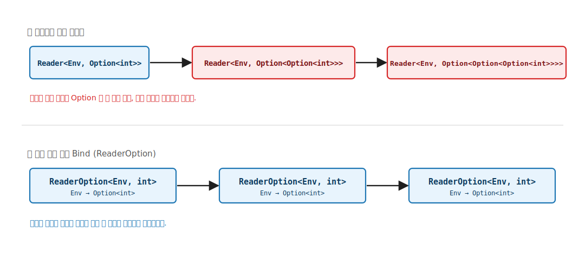
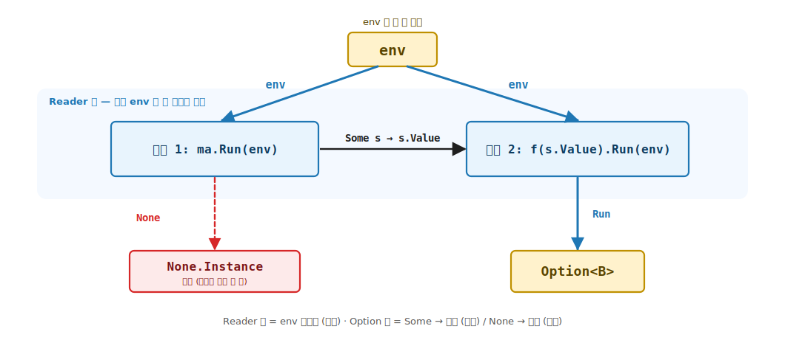
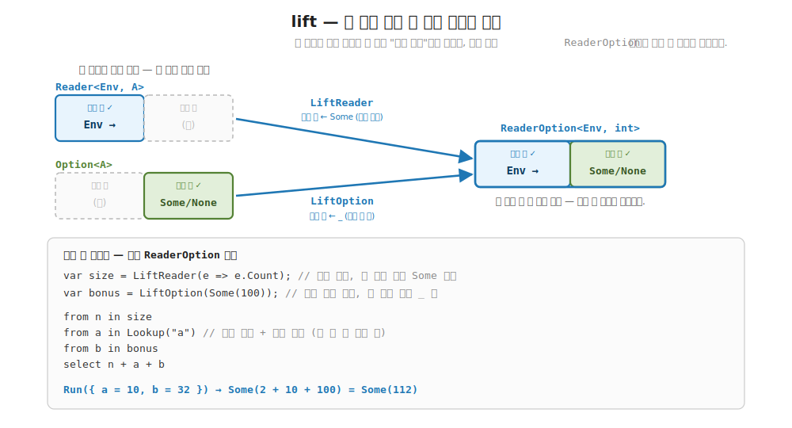

# 18장. 왜 변환기가 필요한가 (단일 모나드의 한계)

> **이 장의 목표** — 이 장을 마치면 모나드 하나로는 여러 효과를 동시에 담지 못한다는 한계를 코드로 직접 보일 수 있습니다. 15장부터 17장까지 환경 의존 · 상태 · 출력 누적이라는 세 효과를 각각 모나드로 담았고, 셋 다 `Bind` 와 LINQ 로 깔끔하게 합성됐습니다. 그런데 실전은 한 함수 안에서 여러 효과를 동시에 요구합니다. 환경을 읽으면서 실패할 수 있는 계산이 그렇습니다. 이때 `Reader` 와 `Option` 각각은 모나드인데도 둘을 그냥 겹친 `Reader<Env, Option<A>>` 는 공짜로 모나드가 되지 않습니다. 이 장은 새 trait 을 배우지 않습니다. 단일 모나드의 한계를 손으로 부딪쳐 보고, 두 층을 직접 푸는 `ReaderOption` 의 `Bind` 배관을 짜 본 뒤, 그 배관을 효과 쌍마다 반복해야 한다는 한계에서 6부의 모나드 변환기로 가는 다리를 놓습니다.

> **이 장의 핵심 어휘**
>
> - **효과 합성의 한계**: 두 모나드 각각은 모나드라도 그냥 겹친 것이 자동으로 모나드가 되지는 않는 한계
> - **`Reader<Env, Option<A>>` 중첩**: 두 효과를 단순 중첩한 모양, `Bind` 가 안쪽을 못 풀어 `Option` 이 겹겹이 쌓임
> - **`ReaderOption<Env, A>`**: 환경 의존과 실패 가능 두 효과를 한 스택에 담는 모나드, 내부는 `Env → Option<A>`
> - **손으로 짠 `Bind` 배관**: 두 층 (env 층 · Some·None 층) 을 직접 푸는 `Bind` 의 본체
> - **`LiftReader` · `LiftOption`**: 안쪽 한 효과만 가진 계산을 두 효과 스택으로 끌어올리는 끌어올림
> - **단락 (short-circuit)**: 안쪽 `Option` 이 `None` 이면 나머지를 평가하지 않고 멈추는 동작
> - **변환기 (예고)**: 이 배관을 임의의 내부 모나드에 자동 생성하는 6부의 도구

> 이 장을 마치면 할 수 있게 되는 것
> - [ ] 두 모나드 각각이 모나드라도 그냥 겹친 것은 공짜로 모나드가 되지 않음을 설명할 수 있습니다.
> - [ ] `Reader<Env, Option<A>>` 를 단순 `Bind` 로 이으면 왜 `Option` 중첩이 쌓이는지 짚을 수 있습니다.
> - [ ] `ReaderOption<Env, A>` 가 두 효과를 한 스택에 담음을, 내부가 `Env → Option<A>` 임을 읽을 수 있습니다.
> - [ ] `Bind` 의 본체가 env 층과 Some·None 층 두 층을 손으로 푸는 배관임을 손계산으로 추적할 수 있습니다.
> - [ ] `LiftReader` 와 `LiftOption` 이 안쪽 한 효과를 두 효과 스택으로 끌어올림을 설명할 수 있습니다.
> - [ ] 손으로 짠 `ReaderOption` 도 Monad 세 법칙을 만족하는 진짜 모나드임을 확인할 수 있습니다.
> - [ ] 이 배관을 효과 쌍마다 다시 짜야 한다는 한계를 또렷이 자각하고, 변환기가 왜 필요한지 답할 수 있습니다.

> **이 장의 흐름** — 설정 조회처럼 환경 의존과 실패가 한 함수에 동시에 필요한 상황에서 출발합니다. `Reader` 와 `Option` 각각은 잘 합성됨을 복습한 뒤, 둘을 그냥 겹치면 합성이 막히는 자리를 봅니다. 두 층을 손으로 푸는 `ReaderOption` 의 `Bind` 배관을 짜고, `lift` 로 안쪽 효과를 끌어올리고, 손으로 짠 것도 진짜 모나드임을 법칙으로 확인합니다. 마지막으로 이 배관을 효과 쌍마다 반복해야 한다는 한계에서 6부 변환기로 다리를 놓습니다.

---

## 18.1 이 장에서 다루는 것 — 한 모나드로는 부족한 자리

여기까지 5부에서 효과 모나드 셋을 차례로 만났습니다. 잠깐 되짚어 봅니다. 모나드 (monad) 는 "효과를 타입에 담아, 그 효과를 자동으로 흘려보내며 계산을 잇는 도구" 였습니다. Reader 는 환경을 읽는 효과를, State 는 상태를 읽고 쓰는 효과를, Writer 는 출력을 누적하는 효과를 담았습니다. 셋 다 같은 약속을 지켰습니다. 각 모나드에 `Bind` 라는 동사 하나가 있었고, 그 `Bind` 가 효과를 알아서 흘리며 두 계산을 이어 줬습니다.

`Bind` 가 무엇이었는지도 다시 떠올려 봅니다. `Bind` 는 "앞 계산의 결과를 꺼내, 그 값으로 다음 계산을 만들어 잇는" 동사였습니다. 우리가 직접 환경을 넘기거나 상태를 실어 나르지 않아도, `Bind` 가 그 배관을 도맡았습니다. 그리고 그 `Bind` 위에서 C# 의 LINQ (`from ... select`) 가 그대로 돌아갔습니다.

핵심은 이것입니다. 효과가 하나뿐인 동안에는 세 모나드 모두 아주 깔끔했습니다. 환경 하나만, 상태 하나만, 출력 하나만 다루는 한, 손으로 배관을 짤 일이 없었습니다.

그런데 실전 코드는 한 효과로 끝나지 않습니다. 설정을 읽으면서 그 설정에 키가 없으면 실패하고, 상태를 갱신하면서 과정을 로그로 남기는 일이 한 함수 안에서 동시에 일어납니다. 효과 둘이 한 자리에 모이면, 모나드 하나로는 그 둘을 함께 담지 못합니다.

이 장은 새 trait 을 배우는 장이 아닙니다. 지금까지 쌓은 도구만으로 단일 모나드의 한계를 직접 코드로 부딪쳐 보는 마무리 장입니다. `Reader` 와 `Option` 각각은 모나드인데도, 둘을 겹친 `Reader<Env, Option<A>>` 가 왜 공짜로 모나드가 되지 않는지를 손으로 확인합니다. 그 한계를 또렷이 자각하는 것이 이 장의 도달점이고, 그 자각이 6부 모나드 변환기의 동기입니다.

지금 모든 것을 외우지 않아도 됩니다. 이 장이 끝날 때 손에 남는 것은 단 한 문장입니다. "모나드 둘을 그냥 포개도 합성은 따라오지 않는다. 두 층을 푸는 `Bind` 를 손으로 짜면 풀리지만, 그 손작업이 효과 쌍마다 반복된다." 이 한 문장을 코드로 직접 겪고 나면, 6부에서 만날 모나드 변환기가 무엇을 자동으로 대신해 주는 도구인지 이미 알고 시작하는 셈입니다.

그러니 이 장은 새 도구를 늘리는 장이 아니라, 앞에서 쌓은 도구의 한 끝을 만져 보는 장입니다. 한계를 또렷이 보는 것 자체가 이 장의 목적지입니다.

---

## 18.2 왜 필요한가 — 환경 의존과 실패가 한 함수에

설정 사전에서 키를 조회하는 일을 떠올립니다. 환경 (설정 사전) 을 읽어야 값을 내므로 환경 의존입니다. 그런데 찾는 키가 사전에 없을 수 있으므로 실패 가능이기도 합니다. 두 효과가 한 함수에 동시에 필요합니다.

이런 자리는 실전에서 흔합니다. 명령형이나 객체 지향 코드를 떠올리면 더 와닿습니다. `int GetPort(IConfig config)` 같은 메서드를 생각해 봅니다. 이 메서드는 두 가지 일을 합니다. 하나는 바깥에서 받은 `config` (환경) 를 읽는 일이고, 다른 하나는 그 안에 `port` 키가 없으면 어떻게든 실패를 알리는 일입니다. 보통은 예외를 던지거나 `-1` 같은 약속된 값을 돌려주었습니다. 함수 시그니처만 봐서는 이 함수가 환경을 읽는지, 실패할 수 있는지 알 수 없었습니다.

함수형은 이 두 가지를 모두 타입에 정직하게 드러내고 싶어 합니다. "환경을 읽는다" 는 Reader 효과로, "실패할 수 있다" 는 Option 효과로 적습니다. 그런데 한 함수가 그 둘을 동시에 짊어지면, 타입을 어떻게 적어야 할지부터 막힙니다. 바로 그 막히는 자리가 이 장의 출발점입니다.

```csharp
// 환경 = 설정 사전. 조회는 환경 의존 (Reader) 이면서 실패 가능 (Option) 이다.
var env = new Dictionary<string, int> { ["a"] = 10, ["b"] = 32 };

K<ROF<Dictionary<string, int>>, int> Lookup(string key) =>
    new ReaderOption<Dictionary<string, int>, int>(
        e => e.TryGetValue(key, out var v) ? new Option<int>.Some(v) : Option<int>.None.Instance);
```

이 코드 한 줄씩 천천히 읽어 봅니다.

먼저 `Lookup(key)` 가 받는 인자는 키 하나뿐입니다. 설정 사전 `env` 는 인자에 없습니다. 앞서 본 Reader 가 그랬습니다. 환경은 지금 넘기지 않고 "나중에 `Run(env)` 으로 주입할" 효과로 미뤄 둡니다. 그래서 `Lookup("a")` 를 호출하는 순간에는 아직 아무 값도 나오지 않습니다. 환경을 주입해야 비로소 답이 나오는 약속 한 개를 받을 뿐입니다.

그다음 본체의 `e.TryGetValue(key, out var v)` 를 봅니다. 환경 `e` 가 주입되면 그 사전에서 키를 찾습니다. 찾으면 `Some(v)` 로 값을 감싸고, 못 찾으면 `None` 을 냅니다. 1부에서 본 `Option` 이 다시 등장한 자리입니다. `Option` 은 "있을 수도, 없을 수도 있음" 이라는 실패 가능 효과를 담는 컨테이너였습니다. `Some(v)` 는 값이 있는 경우, `None` 은 값이 없는 경우입니다.

두 효과가 이 한 함수에 함께 들어 있는 것이 보입니다. 환경을 읽는다는 점에서 Reader 이고, 키가 없으면 실패한다는 점에서 Option 입니다.

여기서 `Lookup` 이 돌려주는 `ReaderOption` 의 정체는 잠시 미뤄 둡니다. 먼저 두 효과를 따로따로 다루면 잘 합성되는지부터 복습한 뒤, 둘을 동시에 쓸 때 무엇이 막히는지를 보겠습니다.

---

## 18.3 각각은 잘 합성된다 — 복습

먼저 한 효과씩 따로 보면, 두 모나드는 지금까지처럼 깔끔하게 합성됩니다.

```csharp
// Reader 와 Option 각각은 그 자체로 완전한 모나드다.
var r = ReaderF<int>.Bind(ReaderF<int>.Pure(3), x => ReaderF<int>.Pure(x + 1));
var o = OptionF.Bind(OptionF.Pure(3), x => OptionF.Pure(x + 1));
// r.As().Run(0) = 4,  o.As() = Some(4)
```

이 코드가 무엇을 하는지 두 줄로 나눠 읽습니다.

첫째 줄의 `ReaderF` 는 앞서 본 Reader 모나드 그대로입니다. `Bind` 가 들어온 환경 하나를 두 단계에 똑같이 흘려보내, `Pure(3)` 으로 시작한 계산이 `x + 1` 까지 이어집니다. 환경 `0` 을 주입하면 `3 + 1 = 4` 가 나옵니다. 환경은 인자에 보이지 않지만 `Bind` 가 알아서 두 단계에 날라 줍니다.

둘째 줄의 `OptionF` 는 1부에서 만든 `MyMaybe` 가 이름만 바꿔 다시 온 것입니다. `Pure(3)` 은 `Some(3)`, 즉 "값이 있음" 입니다. `Bind` 는 앞이 `Some` 이면 그 값을 꺼내 다음 단계로 잇고, `None` 이면 다음 단계를 건너뜁니다. 여기서는 둘 다 `Some` 이라 `Some(4)` 가 나옵니다.

```csharp
public sealed class OptionF : Monad<OptionF>
{
    public static K<OptionF, A> Pure<A>(A value) => new Option<A>.Some(value);

    public static K<OptionF, B> Bind<A, B>(K<OptionF, A> ma, Func<A, K<OptionF, B>> f) =>
        ma.As() switch { Option<A>.Some s => f(s.Value), _ => Option<B>.None.Instance };
}
```

`Bind` 가 `Some(s)` 면 `s.Value` 로 다음 계산 `f` 를 잇고, `None` 이면 `f` 를 부르지 않고 곧장 `None` 을 냅니다. 7장 `Bind` 에서 본 단락이 바로 이 자리입니다. 첫 `None` 에서 멈춰 나머지를 평가하지 않습니다.

여기서 단락 (short-circuit) 이라는 말을 한 줄로 짚어 둡니다. 단락은 "앞에서 실패가 나면, 뒤의 계산을 아예 평가하지 않고 곧장 멈추는" 동작입니다. C# 의 `&&` 가 왼쪽이 `false` 면 오른쪽을 보지 않고 끝내는 것과 같은 발상입니다. `Option` 의 `Bind` 는 `None` 을 만나는 순간 다음 함수 `f` 를 부르지 않습니다. 이 단락이 이 장 뒤에서 다시, 두 효과를 한 스택에 담을 때도 그대로 살아 있어야 하는 동작입니다.

`Reader` 도 `Option` 도 각각은 모나드라 합성에 아무 문제가 없습니다. 문제는 둘을 동시에 쓸 때 생깁니다.

---

## 18.4 두 효과를 그냥 겹치면 — 쌓이는 `Option` 중첩

이제 두 효과를 한 함수에 담을 타입을 지어 봅니다. 생각의 순서는 단순합니다. "환경을 주면" 이 앞이고, "실패할 수 있는 값을 낸다" 가 뒤입니다. 환경을 받는 부분은 `Env →`, 실패할 수 있는 값은 `Option<A>`. 이어 붙이면 `Env → Option<A>` 입니다. 그리고 "환경을 받아 값을 내는 함수" 가 바로 Reader 였으니, 이 모양은 곧 `Reader<Env, Option<A>>` 입니다.

그러니까 Reader 라는 상자 안에 Option 이라는 상자를 그냥 한 번 더 넣은 모양입니다. 바깥이 Reader, 안쪽이 Option 입니다. 상자 둘을 포갰을 뿐이니, 둘 다 모나드였던 만큼 합성도 자연스럽게 따라올 것 같습니다. 그런데 그렇지 않습니다. 왜 그런지 다음 코드로 직접 부딪쳐 봅니다.

두 단계를 잇는다고 해 봅니다. 첫 단계가 `Reader<Env, Option<int>>` 를 내고, 그 안의 `int` 로 다음 `Reader<Env, Option<int>>` 를 만들려 합니다. 그런데 15장의 `Reader.Bind` 는 환경만 흘릴 뿐, 안쪽 `Option` 의 `Some` 과 `None` 을 풀어 주지 않습니다. `Reader.Bind` 가 다음 단계로 넘기는 값은 `int` 가 아니라 `Option<int>` 입니다. 그 `Option<int>` 를 다시 `Reader<Env, Option<...>>` 로 감싸면, 안쪽에 `Option` 이 한 겹 더 쌓여 `Reader<Env, Option<Option<int>>>` 가 됩니다.

```csharp
// Lookup 이 Reader<Env, Option<int>> 를 낸다고 합시다. 바깥 Reader, 안쪽 Option.
// 단순 ReaderF 로 LINQ 를 이으면 a 가 int 가 아니라 Option<int> 로 묶입니다.
var sum =
    from a in Lookup("a")     // a : Option<int>  (int 가 아닙니다)
    from b in Lookup("b")     // b : Option<int>
    select a + b;             // ✗ Option<int> + Option<int> 는 더할 수 없습니다
```

`Reader.Bind` 는 안쪽이 `Option` 인지조차 모릅니다. 안쪽이 무엇이든 그냥 값으로 보고 다음 단계로 넘길 뿐입니다. 그래서 단계를 이을 때마다 `Option` 이 한 겹씩 쌓이고, 사용자가 매번 손으로 `Some` 인지 `None` 인지 풀어 평평하게 만들어야 합니다.

손으로 평평하게 만들면 이렇게 됩니다. 단계마다 `Some`·`None` 을 직접 분해하고 단락을 손으로 처리해야 합니다.

```csharp
// 두 효과를 손으로 푸는 모습 — 단계마다 같은 분해가 반복된다
Reader<Env, Option<int>> Sum() => new(env =>
{
    var a = Lookup("a").Run(env);                       // Option<int>
    if (a is Option<int>.None) return a;                // None 이면 손으로 단락
    var b = Lookup("b").Run(env);                       // Option<int>
    if (b is Option<int>.None) return b;                // 또 손으로 단락
    return new Option<int>.Some(                         // 둘 다 Some 일 때만 더함
        ((Option<int>.Some)a).Value + ((Option<int>.Some)b).Value);
});
```

조회가 둘뿐인데도 `Some`·`None` 분해와 단락 처리가 두 번 반복됩니다. 단계가 늘수록 이 수동 언랩이 코드를 메우고, 한 번이라도 빠뜨리면 단락이 끊겨 `None` 이 그대로 다음 단계로 새어 나갑니다. 환경을 흘리는 일까지 더하면 매 단계가 같은 배관을 또 적습니다.

잠깐 멈춰 이 코드가 무엇을 잃었는지 봅니다. 우리가 원래 쓰고 싶던 코드는 `a + b` 한 줄이었습니다. 그런데 두 효과를 손으로 풀다 보니 `if (a is None) return ...` 같은 분기가 본래 한 줄짜리 계산을 둘러쌌습니다. 정작 중요한 `a + b` 는 맨 아래 한 줄로 묻혀 버렸습니다. 명령형 시절 `null` 검사가 모든 함수의 첫 줄을 차지하던 그 불편이 여기서 그대로 되살아납니다.

게다가 이 분해는 안전하지도 않습니다. 단계가 셋, 넷으로 늘면 같은 `None` 검사를 그만큼 더 적어야 하고, 그중 한 자리라도 빠뜨리면 `None` 이 검사 없이 다음 단계로 새어 들어가 엉뚱한 곳에서 터집니다. 사람이 손으로 적는 배관은 늘 이렇게 빠뜨릴 위험을 함께 짊어집니다. 효과 합성을 모나드에게 맡기고 싶은 이유가 바로 이것입니다.

> **흔한 함정** — 두 모나드를 그냥 중첩하면 합성도 따라온다고 여기는 것입니다.
>
> `Reader` 도 모나드이고 `Option` 도 모나드이니, 겹친 `Reader<Env, Option<A>>` 도 자동으로 모나드일 것 같습니다. 그러나 모나드는 일반적으로 합성되지 않습니다. 두 모나드 각각의 `Bind` 가 있어도, 겹친 것의 `Bind` 는 거기서 저절로 만들어지지 않습니다. 바깥 `Reader.Bind` 는 안쪽 `Option` 의 `Some`·`None` 을 풀 줄 모르고, 안쪽 `Option.Bind` 는 바깥 환경을 흘릴 줄 모릅니다. 두 층을 함께 푸는 `Bind` 를 누군가 손으로 짜 줘야 합니다. 그 손으로 짠 `Bind` 가 이 장의 `ReaderOption` 입니다.

OO 개발자의 직감으로 옮기면 이렇습니다. `Task<Option<int>>` 를 `await` 한 결과가 `int` 가 아니라 `Option<int>` 라, 바깥 `Task` 를 벗긴 뒤에도 안쪽 `Option` 을 한 번 더 풀어야 했던 경험을 떠올리면 됩니다. 바깥 한 겹 (`Task` 나 `Reader`) 을 벗겨도 안쪽 효과 (`Option`) 는 그대로 남습니다. 그 둘을 한 번에 푸는 코드는 어느 한쪽에도 들어 있지 않아, 누가 따로 짜 줘야 합니다.



**그림 18-1. 합성이 막히는 자리** — 위쪽은 `Reader<Env, Option<A>>` 를 단순 `Reader.Bind` 로 이은 모습입니다. 단계를 이을 때마다 안쪽 `Option` 이 풀리지 않고 `Option<Option<int>>`, `Option<Option<Option<int>>>` 처럼 한 겹씩 쌓여, 사용자가 매번 손으로 언랩해야 함을 보입니다. 아래쪽은 같은 두 효과를 `ReaderOption<Env, A>` 한 스택으로 담은 모습입니다. 단계를 이어도 중첩이 쌓이지 않고 `Env → Option<A>` 한 겹으로 평평하게 유지됨을 대비해, 두 층을 함께 푸는 `Bind` 가 중첩을 막아 준다는 것을 보입니다.

---

## 18.5 손으로 짠 `ReaderOption` — 두 층을 직접 푸는 `Bind`

해법은 두 효과를 한 스택에 담는 모나드를 직접 정의하는 것입니다. 그 모나드를 `ReaderOption<Env, A>` 라 부릅니다. 자료 정의는 한 줄이고, 내부는 `Env → Option<A>` 함수입니다.

```csharp
public sealed class ReaderOption<Env, A>(Func<Env, Option<A>> run) : K<ROF<Env>, A>
{
    public Option<A> Run(Env env) => run(env);
}
```

이 한 줄짜리 자료를 천천히 읽습니다. `ReaderOption<Env, A>` 는 함수 하나를 감싼 상자입니다. 그 함수는 `Func<Env, Option<A>>`, 곧 "환경을 주면 `Option<A>` 를 내는" 함수입니다.

두 효과가 이 한 줄 안에 어떻게 같이 들어 있는지 짚어 봅니다. 바깥의 `Env →` 부분이 환경 의존을 맡습니다. "값을 내려면 환경이 있어야 한다" 는 약속입니다. 안쪽의 `Option<A>` 부분이 실패 가능을 맡습니다. "성공하면 `Some`, 실패하면 `None`" 입니다. 앞 절에서 상자 둘을 어색하게 포갰던 것을, 이번에는 한 자료가 두 효과를 처음부터 함께 품도록 정의한 것입니다.

`Run(env)` 은 그 약속을 실행하는 방아쇠입니다. 앞서 본 Reader 의 `Run` 과 똑같이, 환경을 주입하는 순간 비로소 계산이 돌아 `Option<A>` 가 나옵니다. 두 평행 세계의 어휘로 보면, `Run(env)` 은 Elevated 의 효과를 Normal 의 값 `Option<A>` 로 끌어내리는 끌어내림입니다.

`K<ROF<Env>, A>` 를 부착했으니 `ReaderOption` 도 Elevated World 의 시민입니다. 태그 `ROF<Env>` 가 환경 `Env` 를 고정한 채 동사들을 호스트합니다. `Pure` 와 `Bind` 를 봅니다.

```csharp
public sealed class ROF<Env> : Monad<ROF<Env>>
{
    public static K<ROF<Env>, A> Pure<A>(A value) =>
        new ReaderOption<Env, A>(_ => new Option<A>.Some(value));

    public static K<ROF<Env>, B> Bind<A, B>(K<ROF<Env>, A> ma, Func<A, K<ROF<Env>, B>> f) =>
        new ReaderOption<Env, B>(env =>
            ma.As().Run(env) switch                            // ← Reader 층을 env 로 실행
            {
                Option<A>.Some s => f(s.Value).As().Run(env),  // ← Option 층: Some → 다음
                _                => Option<B>.None.Instance     // ← None → 단락
            });
}
```

`Pure` 부터 봅니다. `Pure(value)` 는 `_ => new Option<A>.Some(value)` 를 만듭니다. 화살표 왼쪽의 밑줄 `_` 은 "환경을 받기는 하지만 보지 않는다" 는 뜻입니다. 어떤 환경이 들어와도 무시하고 늘 같은 값을 `Some` 으로 감쌉니다.

뜻을 풀면 이렇습니다. `Pure(7)` 은 "환경이 무엇이든 묻지 않고, 실패하지도 않으며, 항상 7 을 성공으로 낸다" 는 계산입니다. 환경 의존도 없고 실패도 없는 평범한 상수 하나를, 두 효과 스택의 어휘로 올려놓은 가장 단순한 시민입니다.

`Bind` 가 이 장의 핵심입니다. 본체가 두 층을 손으로 풉니다.

본격적으로 읽기 전에 큰 그림을 먼저 잡습니다. `Bind` 가 할 일은 두 가지입니다. 하나는 바깥의 환경을 안쪽으로 흘려보내는 일이고, 다른 하나는 흘려보낸 결과가 `Some` 인지 `None` 인지 살펴 다음으로 잇거나 멈추는 일입니다. 앞의 일은 Reader 가 늘 하던 일이고, 뒤의 일은 Option 이 늘 하던 일입니다. `Bind` 의 본체는 이 둘을 한 함수 안에 겹쳐 놓은 것뿐입니다. 새로 발명한 동작은 하나도 없습니다.

그러니 "두 모나드의 일을 한 곳에 손으로 엮는다" 는 한 문장만 들고 코드로 들어가면 됩니다.

본격적으로 읽기 전에 큰 그림을 먼저 잡습니다. `Bind` 가 할 일은 두 가지입니다. 하나는 바깥의 환경을 안쪽으로 흘려보내는 일이고, 다른 하나는 흘려보낸 결과가 `Some` 인지 `None` 인지 살펴 다음으로 잇거나 멈추는 일입니다. 앞의 일은 Reader 가 늘 하던 일이고, 뒤의 일은 Option 이 늘 하던 일입니다. `Bind` 의 본체는 이 둘을 한 함수 안에 겹쳐 놓은 것뿐입니다. 새로 발명한 동작은 하나도 없습니다.

그러니 "두 모나드의 일을 한 곳에 손으로 엮는다" 는 한 문장만 들고 코드로 들어가면 됩니다.

### 18.5.1 `Bind` — env 층을 흘리고 Some·None 층을 분기

`Bind` 의 본체를 한 줄씩 읽습니다. 환경 `env` 가 들어오면 두 층이 차례로 풀립니다.

1. **Reader 층** — `ma.As().Run(env)` 로 첫 계산을 `env` 로 실행해 `Option<A>` 를 얻습니다. 환경을 안쪽으로 흘려보내는 자리입니다.
2. **Option 층** — 그 `Option<A>` 가 `Some(s)` 면 `s.Value` 로 다음 계산 `f` 를 만들어 같은 `env` 로 실행하고, `None` 이면 `f` 를 부르지 않고 곧장 `None` 으로 단락합니다.

앞서 본 Reader 의 `Bind` 는 환경 한 층만 흘리면 끝이었습니다. 여기서는 한 걸음이 더 있습니다. 환경을 흘려 `Option<A>` 를 얻은 다음, 그 `Option` 을 한 번 더 열어 `Some` 과 `None` 을 가릅니다. 층이 둘이니 푸는 일도 둘입니다.

누가 어느 층을 맡는지 다시 정리합니다. 바깥의 환경 흘리기는 Reader 의 몫입니다. 안쪽의 `Some`·`None` 가르기는 Option 의 몫입니다. 그런데 이 둘을 한 번에 푸는 코드는 Reader 에도, Option 에도 들어 있지 않습니다. 각자 자기 층만 풀 줄 알 뿐, 두 층을 함께 푸는 일은 어느 쪽도 공짜로 해 주지 않습니다. 그래서 우리가 직접 엮어야 합니다.

다행히 엮는 일이 어렵지는 않습니다. 안쪽에서 `Some` 이면 잇고 `None` 이면 멈추는 그 분기는, 이 장 앞에서 복습한 `OptionF.Bind` 의 `switch` 와 글자 그대로 같은 동작입니다. 무에서 발명한 것이 아니라, Option 이 이미 가진 분기를 환경 흘리기 안쪽에 끼워 넣었을 뿐입니다.

`Bind` 하나면 나머지가 따라옵니다. `Map` 과 `Apply` 도 이 `Bind` 로 정의되고, `from-from-select` LINQ 는 `SelectMany` 를 거쳐 `Bind` 사슬로 풀립니다. 7장에서 본 그대로입니다. 그래서 `ReaderOption` 으로는 두 효과를 LINQ 한 번으로 깔끔하게 잇습니다.

```csharp
K<ROF<Dictionary<string, int>>, int> sum =
    from a in Lookup("a")
    from b in Lookup("b")
    select a + b;
```

`Lookup("a")` 와 `Lookup("b")` 를 이어 두 값을 더합니다. 두 조회 모두 환경 의존이면서 실패 가능인데, LINQ 어디에도 환경을 넘기는 인자나 `Some`·`None` 을 푸는 분기가 없습니다. `Bind` 가 그 배관을 모두 맡습니다.

앞 절에서 손으로 풀던 코드와 견줘 봅니다. 거기서는 `Run(env)` 호출, `if (a is None) return`, `Some` 캐스팅이 단계마다 코드를 메웠습니다. 여기서는 그 모든 것이 사라지고 `from a ... from b ... select a + b` 세 줄만 남았습니다. 환경을 넘기는 인자도, `None` 검사도 본문에 보이지 않습니다. 우리가 한 번 짜 둔 `Bind` 가 그 배관을 전부 안으로 삼켰기 때문입니다. 모나드로 효과를 다룰 때의 이득이 여기서 드러납니다. 효과를 흘리는 일은 `Bind` 에게 맡기고, 사람은 `a + b` 라는 본래 계산만 적습니다.

`sum.Run(env)` 을 두 환경으로 손계산해 봅니다. 완전한 환경에서는 두 조회가 모두 성공합니다.

손계산을 하기 전에 무엇을 추적할지 정합니다. 우리가 따라갈 것은 단 두 가지입니다. (1) 환경 `env` 가 각 단계로 어떻게 흘러가는지, (2) 각 단계의 `Option` 이 `Some` 인지 `None` 인지입니다. 이 둘만 눈으로 따라가면 `Bind` 의 본체가 머릿속에서 그대로 돌아갑니다.

```
env = { a = 10, b = 32 }

① Lookup("a").Run(env)   → Some(10)            (Reader 층 실행 → Option 층 Some)
② a = 10 으로 Lookup("b") → Lookup("b").Run(env) → Some(32)
③ select 10 + 32          → Some(42)

결과: Some(42)
```

`b` 키가 없는 환경에서는 둘째 조회가 `None` 을 내고, 거기서 단락합니다.

```
partialEnv = { a = 10 }

① Lookup("a").Run(partialEnv)   → Some(10)
② a = 10 으로 Lookup("b")        → Lookup("b").Run(partialEnv) → None
③ None 이므로 단락                → select 를 평가하지 않고 곧장 None

결과: None
```

두 손계산을 나란히 놓으면 한 그림이 또렷해집니다. 같은 `sum` 코드에 환경만 바꿔 넣었는데, 한쪽은 `Some(42)` 로 끝나고 다른 쪽은 `None` 으로 멈췄습니다. 우리가 코드에 분기를 적어서가 아닙니다. `b` 조회가 `None` 을 내는 순간 `Bind` 안의 `_ => None` 분기가 저절로 작동해, 그 뒤의 `select` 를 평가하지 않고 곧장 빠져나간 것입니다. 앞에서 짚어 둔 단락이 두 효과 스택 위에서도 그대로 살아 있는 모습입니다.

정리하면, 환경 의존과 실패 가능 두 효과가 한 스택에서 동시에 작동했습니다. 환경은 두 단계에 똑같이 흘렀고, 실패는 첫 `None` 에서 멈췄습니다. 손으로 짠 `Bind` 한 본체가 그 둘을 한꺼번에 처리했습니다.



**그림 18-2. `Bind` 의 두 층 배관** — 위쪽에 환경 `env` 가 한 번 주입되는 입구를 두고, `Bind` 의 본체를 두 층으로 나눠 그립니다. 바깥 Reader 층에서는 `env` 가 첫 계산 `ma` 와 다음 계산 `f(a)` 두 단계로 흘러 내려갑니다. 안쪽 Option 층에서는 첫 계산의 결과가 `Some(a)` 면 그 값 `a` 가 다음 단계로 건너가고, `None` 이면 다음 단계를 건너뛰고 곧장 `None` 으로 단락하는 두 갈래를 보입니다. 환경 층 (세로 흐름) 과 Some·None 층 (갈래 분기) 을 위아래로 겹쳐, 한 `Bind` 가 두 모나드의 일을 동시에 푼다는 것을 보입니다.

---

## 18.6 lift — 안쪽 효과를 스택으로 끌어올리기

두 효과 스택을 짜다 보면, 한 효과만 가진 계산을 그 스택에 섞어 쓰고 싶을 때가 있습니다. 환경만 읽고 실패는 없는 `Reader<Env, A>` 나, 환경과 무관하게 실패만 다루는 `Option<A>` 가 그렇습니다. 이 한 효과짜리 계산을 두 효과 스택 `ReaderOption<Env, A>` 로 올려 주는 것이 lift, 곧 끌어올림입니다.

lift 라는 말을 한 줄로 다시 짚습니다. lift 는 1장에서 만난 함수형의 핵심 동사 끌어올림입니다. 아래 세계의 값이나 함수를 위 세계 (Elevated World) 의 어휘로 들어올리는 일이었습니다. 여기서는 그 발상을 한 단계 더 씁니다. "한 효과만 가진 계산" 을 "두 효과를 가진 스택" 으로 들어올립니다.

왜 이게 필요한지 일상 비유로 깔아 봅니다. 두 효과 스택은 환경과 실패라는 칸이 둘 다 있는 양식지 같습니다. 환경만 읽는 `Reader` 는 환경 칸만 채워진 양식지이고, 실패만 다루는 `Option` 은 실패 칸만 채워진 양식지입니다. 이 둘을 한 사슬에 섞어 쓰려면, 비어 있는 칸을 "문제 없음" 으로 채워 같은 양식지 모양으로 맞춰 줘야 합니다. lift 가 바로 그 빈 칸 채우기입니다.

```csharp
// 내부 효과를 끌어올리는 lift 들.
public static ReaderOption<Env, A> LiftReader(Reader<Env, A> r) =>
    new(e => new Option<A>.Some(r.Run(e)));

public static ReaderOption<Env, A> LiftOption(Option<A> o) =>
    new(_ => o);
```

`LiftReader` 는 환경만 읽는 `Reader<Env, A>` 를 받습니다. 환경 `e` 가 들어오면 `r.Run(e)` 로 값을 얻고, 그 값을 `Some` 으로 감싸 실패 없는 `Option` 으로 만듭니다. 환경 층은 원래 Reader 가 맡고, 비어 있던 Option 층은 "항상 성공" 으로 채웁니다.

`LiftOption` 은 환경과 무관한 `Option<A>` 를 받습니다. 환경 의존이 없으므로 환경 `_` 를 무시하고 받은 `Option` 을 그대로 냅니다. Option 층은 원래 값이 맡고, 비어 있던 환경 층은 "환경을 안 본다" 로 채웁니다.

두 lift 모두 한 효과만 가진 계산의 빈 층을 채워 두 효과 스택에 올립니다. 그러면 `LiftReader(...)` 와 `LiftOption(...)` 과 `Lookup(...)` 을 같은 `ReaderOption` 어휘로 한 LINQ 사슬에 섞어 쓸 수 있습니다. 환경에서 항목 수를 읽는 `Reader`, 환경과 무관한 상수 `Option`, 그리고 실패할 수 있는 `Lookup` 셋을 한 사슬에 섞어 봅니다.



**그림 18-3. lift: 빈 칸을 채워 두 효과 스택에 올림** — 환경만 읽는 `Reader` 는 실패 칸이, 실패만 다루는 `Option` 은 환경 칸이 비어 있습니다. `LiftReader` 는 빈 실패 칸을 "항상 성공"(`Some`) 으로, `LiftOption` 은 빈 환경 칸을 "환경을 안 봄"(`_`) 으로 채웁니다. 그러면 셋이 모두 같은 `ReaderOption` 양식이 되어 한 LINQ 사슬에 섞이고, `Run({ a = 10, b = 32 })` 가 `Some(112)` 를 냅니다.

```csharp
// 환경만 읽는 Reader 를 올림 (실패 없음)
var size  = ReaderOption<Dictionary<string, int>, int>
                .LiftReader(new Reader<Dictionary<string, int>, int>(e => e.Count));
// 환경 무관 상수 Option 을 올림
var bonus = ReaderOption<Dictionary<string, int>, int>
                .LiftOption(new Option<int>.Some(100));

var prog =
    from n in size          // LiftReader 로 올린 환경 의존
    from a in Lookup("a")   // 환경 의존 + 실패 가능
    from b in bonus         // LiftOption 으로 올린 상수
    select n + a + b;

// prog.Run({ a = 10, b = 32 }) → Some(2 + 10 + 100) = Some(112)
```

`size` 는 환경만 읽고 `bonus` 는 아무것도 의존하지 않지만, lift 로 빈 층을 채워 두면 셋이 모두 `ReaderOption` 한 어휘가 되어 `Lookup` 과 한 LINQ 사슬에 자연스럽게 섞입니다.

이 lift 를 6부에서 다시 만납니다. 지금 우리가 짠 것은 `Reader` 와 `Option` 이라는 한 쌍에만 맞춘 손수 짠 끌어올림입니다. 6부의 변환기는 이 발상을 일반화합니다. 안쪽 효과가 `Option` 이든 다른 무엇이든, 그것을 바깥 스택으로 올려 주는 lift 를 자동으로 마련해 둡니다. 지금 외울 필요는 없습니다. "안쪽 한 효과를 바깥 스택으로 들어올린다" 는 이 한 발상이 변환기 lift 의 씨앗이라는 것만 기억하면 충분합니다.

---

## 18.7 법칙 — 손으로 짠 것도 진짜 모나드

`ROF<Env>` 는 `Monad<ROF<Env>>` 를 부착했으니, 진짜 Monad 가 되려면 7장에서 본 세 법칙을 만족해야 합니다. 이 절의 `probe` 와 제네릭 인자는 15장 Reader 의 법칙 검증과 똑같은 틀이라, 지금 새로 외울 것은 없습니다. 손으로 짠 배관도 정식 모나드라는 결론 하나만 가져가면 충분합니다.

법칙이 왜 중요한지 한 호흡으로 짚고 갑니다. 우리는 `Bind` 를 손으로 짰습니다. 손으로 짠 것은 "우연히 이번 예제에서만 잘 도는" 것일 수도 있습니다. 그것이 진짜 모나드인지 아닌지는 모나드 세 법칙이 가릅니다. 세 법칙을 통과하면, 이 `Bind` 가 어떤 순서로 이어 붙어도 같은 환경을 같은 순서로 흘리고 같은 자리에서 단락한다고 믿을 수 있습니다. 그래야 사슬을 마음 놓고 길게 잇고, 중간을 함수로 떼어내도 됩니다. 외워야 할 것은 없고, "손으로 짠 것도 통과하더라" 라는 결론만 가져가면 됩니다.

```
좌항등:   Bind(Pure(a), f)           ≡  f(a)
우항등:   Bind(m, Pure)              ≡  m
결합:     Bind(Bind(m, f), g)        ≡  Bind(m, a => Bind(f(a), g))
```

한 가지 걸림돌이 있습니다. `ReaderOption` 의 시민은 속이 함수 `Env → Option<A>` 입니다. 함수 둘이 같은지를 코드로 직접 견주기는 어렵습니다. 겉모습이 달라도 같은 답을 낼 수 있기 때문입니다.

그래서 앞서 본 Reader 의 법칙 검증과 똑같은 요령을 씁니다. 양변에 같은 샘플 환경을 주입해 `Run` 한 다음, 그 결과 `Option<A>` 끼리 비교합니다. "같은 입력에 같은 결과를 내면 같은 함수로 본다" 는 외연 동등 (extensional equality) 의 발상입니다. 이 비교를 대신해 주는 작은 함수가 `probe` 입니다.

```csharp
// probe — 같은 샘플 환경으로 Run 해 함수를 Option 값으로 끌어내려 비교.
Func<K<ROF<Dictionary<string, int>>, int>, Option<int>> probe = m => m.As().Run(env);

Func<int, K<ROF<Dictionary<string, int>>, int>> f = n => ROF<Dictionary<string, int>>.Pure(n + 1);
Func<int, K<ROF<Dictionary<string, int>>, int>> g = n => ROF<Dictionary<string, int>>.Pure(n * 2);
var m0 = Lookup("a");

var leftId  = MonadLaws.LeftIdentityHolds<ROF<Dictionary<string, int>>, int, int, Option<int>>(7, f, probe);
var rightId = MonadLaws.RightIdentityHolds<ROF<Dictionary<string, int>>, int, Option<int>>(m0, probe);
var assoc   = MonadLaws.AssociativityHolds<ROF<Dictionary<string, int>>, int, int, int, Option<int>>(m0, f, g, probe);
// → 세 법칙 모두 통과
```

`probe` 가 양변을 같은 `env` 로 `Run` 해, 함수 비교를 `Option` 값 비교로 바꿉니다. 세 법칙의 의미는 15장 Reader 에서 본 그대로이고, `ReaderOption` 도 세 법칙을 모두 통과합니다.

손으로 짠 배관이 우연히 작동하는 것이 아니라 법칙을 지키는 정식 모나드라는 점이 중요합니다. 두 평행 세계의 어휘로 보면, 세 법칙은 두 층을 푸는 `Bind` 배관이 어떻게 이어 붙여도 같은 환경을 같은 순서로 흘리고 같은 자리에서 단락한다는 약속입니다. 그래서 `ReaderOption` 사슬을 마음 놓고 길게 잇고, 중간을 함수로 추출해도 됩니다. 손으로 짠 것이 정식 모나드이기에, 이 배관을 자동으로 만들어 줄 도구를 만들 가치가 있습니다.

---

## 18.8 한계의 핵심 — 효과 쌍마다 다시 짜야 한다

`ReaderOption` 은 두 효과를 한 스택에 깔끔하게 담았습니다. 그러나 그 깔끔함의 대가가 18.5 의 손으로 짠 `Bind` 였습니다. 두 층을 푸는 그 배관을 누군가 직접 적어야 했습니다.

여기서 한계가 또렷해집니다. `ReaderOption` 은 `Reader` 와 `Option` 한 쌍만 풉니다. 다른 효과 쌍이 필요하면 같은 배관을 처음부터 다시 짜야 합니다.

- `Reader` + `State` 를 함께 담으려면 `ReaderState` 의 `Bind` 를 손으로 짭니다.
- `State` + `Option` 을 함께 담으려면 `StateOption` 의 `Bind` 를 또 손으로 짭니다.
- `Writer` + `Option`, `Reader` + `Writer` 도 쌍마다 똑같이 반복합니다.

쌍마다 짜는 `Bind` 는 거의 같은 모양입니다. 바깥 효과의 층을 흘리고, 안쪽 효과의 층을 분기하는 두 층짜리 배관입니다. 안쪽이 `Option` 이냐 `State` 냐 `Writer` 냐만 다를 뿐, "바깥 층을 흘린 뒤 안쪽 층을 푼다" 는 뼈대는 똑같습니다. 그런데 모나드는 일반적으로 합성되지 않으니, 이 거의 같은 배관을 효과 쌍의 수만큼 손으로 반복해야 합니다.

수로 헤아리면 차이가 한눈에 들어옵니다. 효과가 `Reader`, `State`, `Writer`, `Option`, `Either` 다섯 가지로 늘었다고 합니다. 손으로 짜는 방식은 쓰고 싶은 조합마다 배관 하나가 필요합니다. `ReaderOption`, `ReaderState`, `StateOption`, `WriterOption` 처럼 짝을 이루는 수만큼 불어납니다. 효과가 늘수록 짜야 할 조합의 수는 가파르게 커집니다.

변환기는 이 셈을 뒤집습니다. 조합마다가 아니라 바깥 효과 하나당 변환기 하나만 두면 됩니다. `ReaderT`, `StateT`, `WriterT`, `OptionT`, `EitherT`. 다섯 효과면 변환기도 다섯입니다. 어떻게 하나당 하나로 줄어드는가 하면, 각 변환기가 안쪽 모나드 `M` 의 자리를 빈칸으로 비워 두기 때문입니다. 그 빈칸에 무엇을 끼우든 맞물리므로, 조합마다 새로 짤 필요가 없습니다. 1장에서 본 trait 부착의 N×M 이 N+M 으로 줄던 그 발상과 같은 결입니다. "조합마다 하나" 와 "효과당 하나" 의 차이가 반복 비용을 가릅니다.

이 반복이 바로 6부 모나드 변환기의 동기입니다. 6부의 변환기 `ReaderT<Env, M, A>` 는 바깥을 `Reader` 로 고정하되 안쪽 모나드 `M` 을 타입 인자로 비워 둡니다. 그러면 `M` 이 `Option` 이든 `State` 든 `Writer` 든, 이 장에서 손으로 짠 두 층짜리 `Bind` 배관을 임의의 내부 모나드 `M` 에 대해 자동으로 생성합니다. 효과 쌍마다 `Bind` 를 다시 짜는 대신, 바깥 효과 하나당 변환기 하나를 두면 어떤 안쪽 모나드와도 조합됩니다.

변환기가 정확히 무엇을 일반화하는지는, 놀랍게도 이 장에서 손으로 짠 `Bind` 한 줄을 보면 그대로 드러납니다. 우리 `Bind` 의 골격은 둘이었습니다. (1) 바깥 `env` 를 흘려 첫 계산을 실행하고, (2) 그 결과가 `Some` 이면 잇고 `None` 이면 멈춘다.

변환기는 (1) 의 골격은 그대로 둡니다. 바꾸는 곳은 (2) 한 곳뿐입니다. `Some`·`None` 을 우리가 손으로 가르던 그 두 갈래를, "안쪽 모나드 `M` 자신의 `Bind` 를 한 번 부른다" 로 바꿉니다. 그러면 안쪽이 `Option` 이면 `Option` 의 `Bind` 가, `State` 면 `State` 의 `Bind` 가 알아서 자기 층을 풉니다. 안쪽을 푸는 책임을 우리가 떠안는 대신, 그 한 줄만 내부 모나드에게 넘기는 것입니다.

실제로 6부의 v5 `ReaderT<Env, M, A>` 의 `Bind` 본체가 이 모양입니다. 우리 `ReaderOption.Bind` 와 거의 글자까지 닮았고, 다른 점은 안쪽 `switch` 가 `M` 의 `Bind` 호출 하나로 바뀐 것뿐입니다. 우리가 이 장에서 손으로 겪은 두 층짜리 배관이, 변환기에서는 그 한 줄만 남기고 나머지가 자동으로 채워집니다.

이 장의 payoff 는 새 도구가 아니라 한계의 또렷한 자각입니다. "두 모나드를 그냥 겹치면 합성이 막힌다. 두 층을 푸는 `Bind` 를 손으로 짜면 풀리지만, 효과 쌍마다 거의 같은 배관을 반복해야 한다." 이 한 문장을 코드로 직접 겪은 독자는, 6부의 변환기가 무엇을 자동화하려는 도구인지를 이미 손에 쥐고 있습니다.

---

## 18.9 직접 해보기

코드의 `Challenges` 에 정답이 있습니다. 먼저 직접 구현한 뒤 코드와 비교해 봅니다.

> **챌린지 1 — 손으로 짠 `ReaderOption` 의 `Bind` 읽기.** `ROF<Env>.Bind` 의 본체를 한 줄씩 따라가, env 층을 흘리는 자리와 `Some`·`None` 을 분기하는 자리를 짚어 봅니다. 그런 다음 완전한 환경과 키 하나가 빠진 환경 두 가지로 `Lookup("a")` 와 `Lookup("b")` 의 합성을 `Run` 해, 한쪽은 `Some(42)`, 다른 쪽은 `None` 으로 단락함을 확인합니다. 노리는 능력은 모나드가 일반적으로 합성되지 않음을, 겹친 것의 `Bind` 는 손으로 짜야 함을 코드로 보는 것입니다.

> **챌린지 2 — 설정 검증 (`ConfigCheck`).** `port` 와 `timeout` 두 키를 차례로 조회해 합을 내되, 하나라도 없으면 `None` 으로 단락하는 `SumConfig` 를 `from-from-select` 로 짜 봅니다. 두 키가 모두 있는 설정과 하나가 빠진 설정으로 돌려 결과를 비교합니다. 노리는 능력은 환경 의존과 실패가 한 스택에서 함께 작동함을 실전으로 보는 것입니다.

> **챌린지 3 — 다른 효과 쌍을 직접 쌓아 보기.** `StateOption` 이나 `ReaderWriter` 같은 다른 효과 쌍의 `Bind` 를 손으로 짜 봅니다. 바깥 층을 흘리고 안쪽 층을 푸는 배관이 `ReaderOption` 과 거의 같은 모양으로 반복됨을 느껴 봅니다. 노리는 능력은 효과 쌍마다 `Bind` 를 손으로 짜는 비용을 체감하고, 변환기가 왜 필요한지를 스스로 도출하는 것입니다.

---

## 18.10 Elevated World 어휘로 다시 읽기

18장의 도구를 1장 비유에 매핑합니다.

| 18장 도구 | Elevated World 어휘 |
|---|---|
| `ReaderOption<Env, A>` | 두 효과 (환경 의존 · 실패) 를 한 스택에 담은 Elevated 시민. 내부는 `Env → Option<A>` |
| `Run(env)` | 끌어내림. 환경을 주입해 두 효과를 Normal 의 `Option<A>` 로 |
| 손으로 짠 `Bind` | 두 층 (env 층 · Some·None 층) 을 함께 푸는 World-crossing |
| `LiftReader` · `LiftOption` | 안쪽 한 효과를 두 효과 스택으로 끌어올림 |
| `None` 단락 | 안쪽 `Option` 이 `None` 이면 나머지를 평가하지 않고 멈춤 |

15장부터 17장까지 Elevated 시민은 한 효과를 인코딩했습니다. 18장에서는 두 효과를 한 스택에 겹쳐 담는데, 그 합성이 공짜로 따라오지 않아 두 층을 푸는 `Bind` 를 손으로 짜야 했습니다. 끌어올림은 `LiftReader`·`LiftOption`, 끌어내림은 `Run`, 두 세계에 걸친 합성은 손으로 짠 `Bind` 입니다. 비유는 여기까지가 역할입니다. 두 층을 정확히 어떻게 푸는지는 `Bind` 의 시그니처와 세 법칙이 정합니다.

한 가지만 덧붙입니다. 1장에서 두 평행 세계는 Normal 과 Elevated 두 층이었습니다. 이 장의 `ReaderOption` 은 그 위 세계 안에 효과를 한 겹 더 쌓은 자리입니다. 그렇다고 새로운 세 번째 세계가 생긴 것은 아닙니다. 여전히 Elevated World 한 곳이고, 다만 그 시민이 두 효과를 동시에 품었을 뿐입니다. 비유의 무대는 그대로이고, 시민이 짊어진 짐이 늘었다고 보면 됩니다.

---

## 18.11 Q&A — 자기 점검

> **Q1. `Reader` 와 `Option` 각각이 모나드인데, 왜 겹친 `Reader<Env, Option<A>>` 는 모나드가 아닙니까?** (18.4절)

모나드는 일반적으로 합성되지 않기 때문입니다. 두 모나드 각각의 `Bind` 가 있어도 겹친 것의 `Bind` 가 거기서 저절로 만들어지지는 않습니다. 바깥 `Reader.Bind` 는 안쪽 `Option` 의 `Some`·`None` 을 풀 줄 모르고, 안쪽 `Option.Bind` 는 바깥 환경을 흘릴 줄 모릅니다. 두 층을 함께 푸는 `Bind` 를 누군가 손으로 짜 줘야 비로소 겹친 것이 모나드가 됩니다.

> **Q2. 단순 `Reader.Bind` 로 이으면 왜 `Option` 중첩이 쌓입니까?** (18.4절)

`Reader.Bind` 는 환경만 흘리고 다음 단계로 안쪽 값을 그대로 넘기는데, 그 값이 `int` 가 아니라 `Option<int>` 이기 때문입니다. `Reader.Bind` 는 안쪽이 `Option` 인지조차 모르고 그냥 값으로 보아 넘깁니다. 그 `Option<int>` 를 다시 `Reader<Env, Option<...>>` 로 감싸면 `Option` 이 한 겹 더 쌓여 `Reader<Env, Option<Option<int>>>` 가 됩니다. 단계마다 이 언랩을 손으로 해야 합니다.

> **Q3. `ReaderOption<Env, A>` 의 내부는 무엇입니까?** (18.5절)

함수 `Env → Option<A>` 입니다. 환경 의존은 바깥의 `Env →` 가, 실패 가능은 안쪽의 `Option<A>` 가 맡아, 두 효과가 한 자료에 함께 들어 있습니다. `Run(env)` 이 환경을 주입해 `Option<A>` 를 끌어내립니다.

> **Q4. `ReaderOption` 의 `Bind` 는 두 층을 어떻게 풉니까?** (18.5.1절)

먼저 Reader 층에서 `ma.Run(env)` 로 첫 계산을 `env` 로 실행해 `Option<A>` 를 얻습니다. 그다음 Option 층에서 그 결과가 `Some(s)` 면 `s.Value` 로 다음 계산 `f` 를 만들어 같은 `env` 로 실행하고, `None` 이면 `f` 를 부르지 않고 곧장 `None` 으로 단락합니다. 바깥 env 흘리기와 안쪽 `Some`·`None` 분기를 한 본체에 손으로 엮은 배관입니다.

> **Q5. 완전한 환경과 키가 빠진 환경에서 `Lookup("a")` + `Lookup("b")` 의 결과는 어떻게 다릅니까?** (18.5.1절)

완전한 환경 `{ a = 10, b = 32 }` 에서는 두 조회가 모두 `Some` 이라 `Some(42)` 가 나옵니다. `b` 가 빠진 환경 `{ a = 10 }` 에서는 둘째 조회 `Lookup("b")` 가 `None` 을 내고, `Bind` 의 `None` 분기가 작동해 `select` 를 평가하지 않고 곧장 `None` 으로 단락합니다. 환경은 두 단계에 흐르고, 실패는 첫 `None` 에서 멈춥니다.

> **Q6. `LiftReader` 와 `LiftOption` 은 각각 무엇을 합니까?** (18.6절)

한 효과만 가진 계산의 빈 층을 채워 두 효과 스택으로 끌어올립니다. `LiftReader` 는 환경만 읽는 `Reader<Env, A>` 를 받아 그 값을 `Some` 으로 감싸 "항상 성공" 인 `Option` 층을 채웁니다. `LiftOption` 은 환경과 무관한 `Option<A>` 를 받아 환경을 무시하고 그대로 내며 "환경을 안 본다" 는 환경 층을 채웁니다. 그러면 둘을 `Lookup` 과 같은 어휘로 한 사슬에 섞어 쓸 수 있습니다.

> **Q7. 손으로 짠 `ReaderOption` 도 진짜 모나드입니까?** (18.7절)

그렇습니다. `probe` 가 양변을 같은 샘플 환경으로 `Run` 해 `Option` 값으로 비교하면, 좌항등 · 우항등 · 결합 세 법칙이 모두 통과합니다. 손으로 짠 배관이 우연히 작동하는 것이 아니라 법칙을 지키는 정식 모나드입니다. 그렇기에 이 배관을 자동으로 만들어 줄 도구를 만들 가치가 있습니다.

> **Q7-1. 손으로 짠 `ReaderOption.Bind` 와 6부 변환기의 `Bind` 는 얼마나 닮았습니까?** (18.8절)

거의 같습니다. 둘 다 바깥 환경 `env` 를 흘려 첫 계산을 실행하는 골격을 똑같이 가집니다. 다른 점은 안쪽을 푸는 한 줄뿐입니다. `ReaderOption` 은 `Some`·`None` 을 `switch` 로 직접 갈랐지만, 변환기는 그 자리를 안쪽 모나드 `M` 자신의 `Bind` 호출 하나로 바꿉니다. 그래서 변환기는 `M` 이 무엇이든 같은 골격으로 작동합니다. 이 장에서 손으로 겪은 두 층짜리 배관이, 변환기에서는 안쪽 한 줄만 내부 모나드에게 맡기고 나머지가 자동으로 채워지는 모양입니다.

> **Q8. `ReaderOption` 의 한계는 무엇입니까?** (18.8절)

`Reader` 와 `Option` 한 쌍만 푼다는 것입니다. `Reader` + `State`, `State` + `Option`, `Writer` + `Option` 같은 다른 효과 쌍이 필요하면 거의 같은 두 층짜리 `Bind` 배관을 쌍마다 처음부터 다시 짜야 합니다. 모나드가 일반적으로 합성되지 않으니 이 반복을 피할 수 없습니다.

> **Q9. 6부의 변환기는 이 한계를 어떻게 풉니까?** (18.8절)

바깥 효과는 고정하되 안쪽 모나드를 타입 인자로 비워 둡니다. `ReaderT<Env, M, A>` 는 바깥을 `Reader` 로 고정하고 안쪽 `M` 을 비워, `M` 이 무엇이든 이 장에서 손으로 짠 두 층짜리 `Bind` 배관을 자동으로 생성합니다. 효과 쌍마다 `Bind` 를 다시 짜는 대신, 바깥 효과 하나당 변환기 하나를 두면 어떤 안쪽 모나드와도 조합됩니다.

> **Q10. `Reader<Env, Option<A>>` 를 그냥 `Reader.Bind` 로 이으면 무엇이 잘못됩니까?** (18.4절)

`Reader.Bind` 는 환경만 흘릴 뿐 안쪽 `Option` 의 `Some`·`None` 을 풀지 못합니다. 그래서 다음 단계로 넘어가는 값이 `int` 가 아니라 `Option<int>` 이고, 그것을 다시 감싸면 `Reader<Env, Option<Option<int>>>` 처럼 `Option` 이 한 겹씩 쌓입니다. 사용자가 단계마다 손으로 `Some`·`None` 을 분해해 평평하게 만들어야 합니다. 두 층을 함께 푸는 `Bind` 를 직접 짠 것이 `ReaderOption` 입니다.

> **Q11. `LiftReader` 와 `LiftOption` 은 왜 필요합니까?** (18.6절)

환경만 읽는 `Reader` 나 환경과 무관한 `Option` 처럼 한 효과만 가진 계산을, 두 효과 스택 `ReaderOption` 에 섞어 쓰려면 비어 있는 층을 채워 올려야 하기 때문입니다. `LiftReader` 는 Option 층을 "항상 성공" 으로, `LiftOption` 은 환경 층을 "환경을 안 본다" 로 채웁니다. 그러면 셋이 같은 `ReaderOption` 어휘가 되어 한 LINQ 사슬에 섞입니다. 안쪽 효과를 바깥 스택으로 올리는 이 발상이 6부 변환기 `lift` 의 씨앗입니다.

---

## 18.12 요약

- **이 장은 단일 모나드의 한계를 코드로 체험하고 6부로 가는 다리를 놓습니다.** 새 trait 을 배우지 않고, 두 효과를 한 모나드에 담지 못하는 자리를 직접 부딪쳐 봅니다 (18.1절).
- **환경 의존과 실패가 한 함수에 모입니다.** 설정 사전 조회는 환경을 읽어야 하면서 (Reader) 키가 없으면 실패하므로 (Option) 두 효과가 동시에 필요합니다 (18.2절).
- **두 모나드를 그냥 겹치면 합성이 막힙니다.** `Reader<Env, Option<A>>` 를 단순 `Reader.Bind` 로 이으면 안쪽 `Option` 이 풀리지 않아 `Option<Option<...>>` 중첩이 쌓입니다. 모나드는 일반적으로 합성되지 않습니다 (18.4절).
- **`ReaderOption` 의 `Bind` 는 두 층을 손으로 풉니다.** Reader 층에서 env 를 흘리고, Option 층에서 `Some` 이면 다음 단계로 잇고 `None` 이면 단락합니다 (18.5.1절).
- **lift 가 안쪽 한 효과를 두 효과 스택으로 끌어올립니다.** `LiftReader` 는 빈 Option 층을 "항상 성공" 으로, `LiftOption` 은 빈 환경 층을 "환경을 안 봄" 으로 채웁니다. 6부 변환기 lift 의 씨앗입니다 (18.6절).
- **손으로 짠 것도 진짜 모나드입니다.** `probe` 로 같은 환경에 `Run` 해 좌항등 · 우항등 · 결합 세 법칙을 확인합니다. 정식 모나드이기에 자동화할 가치가 있습니다 (18.7절).
- **한계의 핵심은 효과 쌍마다 같은 배관을 반복해야 한다는 것입니다.** `ReaderOption` 은 한 쌍만 풀고, 다른 쌍은 거의 같은 두 층짜리 `Bind` 를 다시 짜야 합니다. 6부 변환기 `ReaderT<Env, M, A>` 가 이 배관을 임의의 내부 모나드 `M` 에 자동 생성합니다 (18.8절).

---

## 18.13 다음 부로 — 6부 모나드 변환기

5부에서 효과 모나드 셋을 보고, 이 장에서 그 한계를 부딪쳐 봤습니다. 한 효과를 담는 한 Reader · State · Writer 는 깔끔하지만, 두 효과를 한 자리에 모으면 겹친 모나드가 공짜로 합성되지 않았습니다. 두 층을 푸는 `Bind` 를 손으로 짜면 풀렸지만, 그 배관을 효과 쌍마다 반복해야 한다는 한계가 남았습니다.

6부의 모나드 변환기가 이 반복을 없앱니다. `ReaderT<Env, M, A>`, `StateT<S, M, A>`, `WriterT<W, M, A>`, `OptionT<M, A>`, `EitherT<L, M, A>`. 이름 끝의 `T` 가 변환기 (transformer) 의 머리글자입니다. 각 변환기는 바깥 효과 하나씩을 맡되, 안쪽 모나드 자리를 타입 인자 `M` 으로 비워 둡니다. 그 빈칸 `M` 에 무엇을 끼우든, 이 장에서 손으로 짠 두 층짜리 `Bind` 배관이 자동으로 채워집니다.

그러니 6부에서 할 일은 새 마법을 배우는 것이 아닙니다. 이 장에서 이미 손으로 겪은 그 배관이, 사람의 손을 떠나 변환기 안에서 어떻게 자동으로 만들어지는지를 차례로 확인하는 것입니다. 효과 쌍마다 다시 짤 필요 없이, 변환기를 쌓아 올려 여러 효과를 한 스택에 조합합니다. 한계를 손으로 겪었으니, 그 한계를 푸는 도구를 맞을 준비가 됐습니다. 5부를 닫고 6부로 넘어갑니다.
