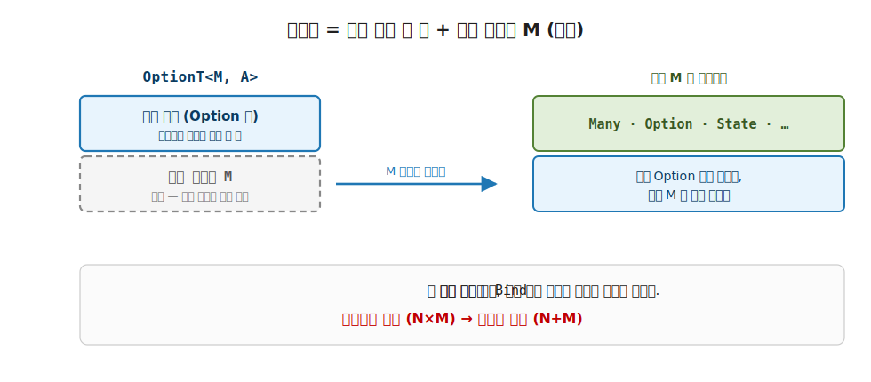
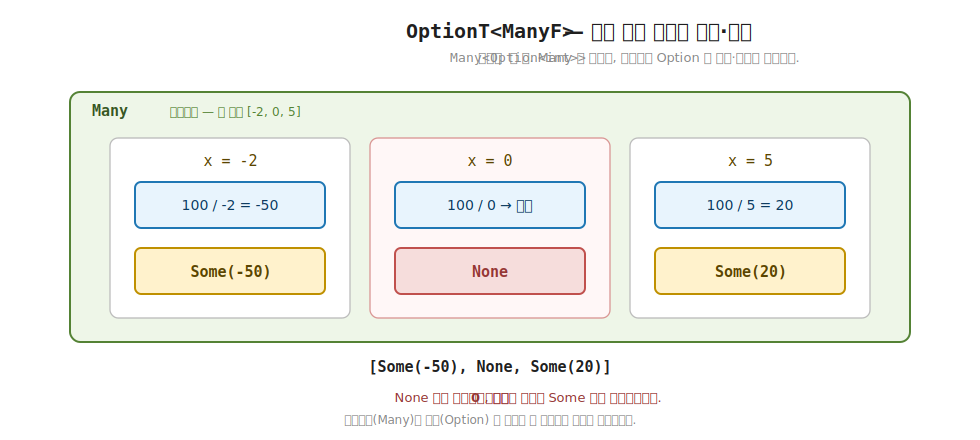

# 19장. 변환기 발상과 lift (첫 변환기 OptionT)

> **이 장의 목표** — 이 장을 마치면 변환기 `T<M, A>` 가 한 효과 층과 빈 내부 모나드 `M` 으로 이루어진다는 것을, 첫 변환기 `OptionT<M, A>` 를 손에 쥐고 설명할 수 있습니다. 앞 장에서 우리는 `Reader` 와 `Option` 두 효과를 한 스택에 담으려고 `ReaderOption` 의 `Bind` 를 손으로 짰고, 그 배관이 효과 쌍마다 반복된다는 한계를 자각했습니다. 이 장은 그 손작업을 일반화합니다. 바깥 효과 한 층은 고정하되 안쪽 모나드 `M` 을 타입 인자 빈칸으로 비우면, 손으로 짠 두 층짜리 `Bind` 를 `M` 에 대해 한 번만 적어 두고 어떤 내부 모나드와도 조합할 수 있습니다. lift 가 그 빈칸 안의 계산을 변환기 한 층 위로 끌어올리는 동사임을 보고, 비결정성과 실패 두 효과를 `OptionT<ManyF, A>` 한 스택에서 동시에 흘려 봅니다.

> **이 장의 핵심 어휘**
>
> - **변환기 (transformer)**: 바깥 효과 한 층을 고정하고 안쪽 모나드를 빈칸으로 둔 모나드, 이름 끝에 `T` 가 붙습니다
> - **내부 모나드 `M`**: 변환기가 비워 둔 타입 인자 자리, `Option`·`Many`·`State` 무엇이든 끼울 수 있습니다
> - **`OptionT<M, A>`**: "실패 가능" 효과를 내부 모나드 `M` 위에 얹은 첫 변환기, 내부 표현은 `K<M, Option<A>>`
> - **`MonadT<T, M>`**: 변환기의 trait, 멤버는 끌어올림 `Lift` 하나뿐입니다
> - **`Lift`**: 내부 모나드 계산 `K<M, A>` 를 변환기 `K<T, A>` 한 층 위로 올리는 끌어올림
> - **`ManyF`**: 비결정성 효과 (여러 갈래) 를 담는 내부 모나드, `OptionT<ManyF, A>` 의 속은 `Many<Option<A>>`
> - **두 층 `Bind`**: `M.Bind` 로 `M` 층을 흘리고 `Some`·`None` 으로 Option 층을 분기하는 변환기의 본체

> 이 장을 마치면 할 수 있게 되는 것
> - [ ] 변환기 `T<M, A>` 가 한 효과 층과 빈 내부 모나드 `M` 으로 이루어짐을 설명할 수 있습니다.
> - [ ] 효과 쌍마다 `Bind` 를 다시 짜는 비용이 변환기에서 효과당 하나로 줄어드는 셈을 짚을 수 있습니다.
> - [ ] `OptionT<M, A>` 의 내부가 `K<M, Option<A>>` 한 겹임을, `M` 이 무엇이든 됨을 읽을 수 있습니다.
> - [ ] `OptionTF<M>.Bind` 가 앞 장의 `ReaderOption.Bind` 와 같은 골격임을 손계산으로 견줄 수 있습니다.
> - [ ] `Lift` 가 내부 계산을 항상 `Some` 으로 감싸 한 층 위로 올림을, 그 까닭을 설명할 수 있습니다.
> - [ ] `OptionT<ManyF, A>` 위에서 비결정성과 실패 두 효과가 한 스택에 흐름을 손계산으로 추적할 수 있습니다.
> - [ ] 손으로 짠 변환기도 Monad 세 법칙을 만족하는 진짜 모나드임을 `probe` 로 확인할 수 있습니다.

> **이 장의 흐름** — 앞 장 끝에서 자각한 한계, 곧 효과 쌍마다 `Bind` 를 다시 짜야 한다는 반복에서 출발합니다. 그 반복을 코드로 짧게 되짚은 뒤, 바깥 효과 한 층은 고정하고 안쪽 모나드 `M` 을 빈칸으로 두는 변환기의 발상을 세웁니다. 첫 변환기 `OptionT<M, A>` 의 자료 정의 한 줄을 읽고, 두 층을 푸는 `Bind` 를 앞 장의 손배관과 나란히 놓아 "`switch` 한 자리가 `M.Bind` 로 바뀐 것뿐" 임을 봅니다. `MonadT` trait 과 `Lift` 로 내부 효과를 끌어올린 다음, `OptionT<ManyF, A>` 위에서 비결정성과 실패가 한 번에 흐르는 데모를 손계산으로 따라갑니다. 마지막으로 손으로 짠 변환기도 세 법칙을 통과하는 진짜 모나드임을 확인하고, 20장의 여러 변환기로 다리를 놓습니다.

---

## 19.1 이 장에서 다루는 것 — 손작업을 자동으로

앞 장에서 우리는 한 가지를 손으로 겪었습니다. `Reader` 와 `Option` 두 효과를 한 스택에 담으려면, 두 층을 함께 푸는 `Bind` 를 누군가 직접 짜 줘야 한다는 것입니다. 그 `ReaderOption.Bind` 의 본체는 바깥 환경을 흘린 뒤 안쪽 `Some`·`None` 을 가르는 두 층짜리 배관이었습니다. 손으로 짜고 나니 두 효과가 LINQ 한 사슬로 깔끔하게 흘렀습니다.

그런데 그 깔끔함에는 대가가 있었습니다. `ReaderOption` 은 `Reader` 와 `Option` 한 쌍만 풉니다. 다른 효과 쌍이 필요하면 거의 같은 배관을 처음부터 다시 짜야 했습니다. 앞 장의 마지막 문장이 바로 이 한계였습니다. "두 층을 푸는 `Bind` 를 손으로 짜면 풀리지만, 그 배관을 효과 쌍마다 반복해야 한다."

이 장은 그 반복을 없애는 도구를 소개합니다. 모나드 변환기 (monad transformer) 입니다. 발상은 한 문장으로 줄어듭니다. 바깥 효과 한 층은 고정하되, 안쪽 모나드를 타입 인자 빈칸으로 비워 둡니다. 그러면 두 층짜리 `Bind` 를 그 빈칸에 대해 한 번만 적어 두면, 빈칸에 무엇을 끼우든 같은 배관이 그대로 작동합니다.

1장에서 세운 두 평행 세계의 지도로 보면, 변환기는 두 Elevated World 를 하나의 스택으로 쌓아 올리는 자리입니다. 한 효과를 인코딩한 Elevated 시민 위에 또 한 효과를 한 겹 더 얹는데, 그 얹는 일을 손이 아니라 변환기가 맡습니다.

이 장이 끝날 때 손에 남는 것은 한 문장입니다. "변환기 `T<M, A>` 는 한 효과 층 + 빈 내부 모나드 `M` 이다. lift 가 그 안쪽 `M` 의 계산을 변환기 한 층 위로 끌어올린다." 이 한 문장을 첫 변환기 `OptionT` 로 손에 쥐고 나면, 20장부터 만날 `ReaderT`·`StateT`·`WriterT`·`EitherT` 가 모두 같은 발상의 변주임을 미리 알고 시작하는 셈입니다.

이 장에서 처음 만나는 어휘를 미리 한 줄씩 펼쳐 둡니다. 지금 외울 필요는 없고, 본문에서 다시 만날 때 "아까 그것" 으로 알아보면 됩니다.
>
> - **빈칸 `M`** — 변환기가 안쪽 모나드 자리를 비워 둔 타입 인자. `Option`·`Many`·`State` 무엇이든 끼웁니다.
> - **`MonadT`** — 변환기의 trait. 새 약속은 `Lift` 하나뿐입니다.
> - **`Lift`** — 안쪽 한 효과짜리 계산을 변환기 두 효과 스택으로 끌어올리는 동사. 18장 `LiftReader` 의 일반형입니다.
> - **`ManyF`** — 데모에서 빈칸 `M` 에 끼울 비결정성 모나드 (여러 갈래). `List` 와 같은 결입니다.
> - **스택** — 한 효과 위에 또 한 효과를 쌓아 올린 모양. `OptionT<ManyF>` 는 `Many` 위에 `Option` 을 쌓은 두 층 스택입니다.

지금 모든 시그니처를 외우지 않아도 됩니다. 앞 장에서 손으로 겪은 그 배관이 변환기 안에서 어떻게 자동으로 만들어지는지, 그 한 가지만 또렷이 따라가면 충분합니다.

---

## 19.2 왜 필요한가 — 효과 쌍마다 다시 짜는 `Bind`

추상을 보이기 전에, 변환기가 없을 때의 불편을 한 번 더 손으로 짚습니다. 앞 장에서 자각한 한계가 정확히 무엇이었는지, 코드로 짧게 되살려 봅니다.

`ReaderOption.Bind` 의 본체는 이런 모양이었습니다. 바깥 환경을 흘리고, 안쪽 `Option` 의 `Some`·`None` 을 직접 가르는 두 층짜리 배관입니다.

```csharp
// 앞 장 ReaderOption 의 Bind — Reader + Option 한 쌍에만 맞춘 손배관
public static K<ROF<Env>, B> Bind<A, B>(K<ROF<Env>, A> ma, Func<A, K<ROF<Env>, B>> f) =>
    new ReaderOption<Env, B>(env =>
        ma.As().Run(env) switch                            // ← Reader 층: env 흘리기
        {
            Option<A>.Some s => f(s.Value).As().Run(env),  // ← Option 층: Some → 다음
            _                => Option<B>.None.Instance     // ← None → 단락
        });
```

이 배관은 `Reader` 와 `Option` 한 쌍만 풉니다. 그런데 실전은 다른 효과 쌍도 요구합니다. 상태를 갱신하면서 실패할 수 있는 계산이면 `State` 와 `Option` 이 한 자리에 모이고, 환경을 읽으면서 로그를 남기면 `Reader` 와 `Writer` 가 모입니다. 그때마다 우리는 거의 같은 배관을 처음부터 다시 적어야 했습니다.

```csharp
// State + Option 을 담으려면 StateOption 의 Bind 를 또 손으로
//   바깥 상태 층을 흘리고, 안쪽 Some·None 을 가른다 — ReaderOption 과 거의 같은 모양
// Writer + Option 을 담으려면 WriterOption 의 Bind 를 또 손으로
//   바깥 로그 층을 모으고, 안쪽 Some·None 을 가른다 — 역시 거의 같은 모양
```

뼈대를 견줘 보면 셋이 거의 똑같습니다. 바깥 효과의 층을 흘리고, 안쪽 `Option` 층을 `Some`·`None` 으로 가릅니다. 바깥이 `Reader` 냐 `State` 냐 `Writer` 냐만 다를 뿐, "바깥 층을 흘린 뒤 안쪽 `Option` 을 푼다" 는 골격은 한 글자도 다르지 않습니다. 그런데도 모나드는 일반적으로 합성되지 않으니, 이 거의 같은 배관을 효과 쌍의 수만큼 손으로 반복해야 했습니다.

코드를 복사해 붙여 본 적이 있다면 이 불편이 더 와닿습니다. 거의 같은 함수를 이름만 바꿔 (`StateOption`, `WriterOption` ...) 다섯 번, 열 번 다시 적는 일입니다. 한 곳을 고치면 나머지도 똑같이 고쳐야 하고, 한 자리만 빠뜨려도 그 조합에서만 단락이 어긋납니다. "거의 같은 코드의 반복" 은 OO 에서도 늘 리팩터링의 신호였습니다. 변환기는 그 신호에 답하는 함수형의 도구입니다.

수로 헤아리면 차이가 한눈에 들어옵니다. 효과가 `Reader`, `State`, `Writer`, `Option`, `Either` 다섯 가지로 늘었다고 합니다. 손으로 짜는 방식은 쓰고 싶은 조합마다 배관 하나가 필요합니다. `ReaderOption`, `StateOption`, `WriterOption`, `ReaderState` 처럼 짝의 수만큼 불어납니다. 효과가 늘수록 짜야 할 조합이 가파르게 커집니다.

> **흔한 함정** — 효과 쌍이 늘면 배관도 그만큼만 늘 것이라고 셈하는 것입니다.
>
> "효과가 다섯이면 쌍도 다섯쯤" 이라고 어림하기 쉽지만, 조합의 수는 효과의 수보다 빠르게 불어납니다. 다섯 효과에서 둘씩 골라 쌓는 조합만 해도 열 가지이고, 셋을 쌓으면 더 많아집니다. 손으로 짜는 방식은 이 조합마다 거의 같은 `Bind` 를 새로 적습니다. 변환기는 이 셈을 뒤집어, 조합이 아니라 효과 하나당 변환기 하나만 둡니다. 다섯 효과면 변환기도 다섯입니다.

이 반복을 어떻게 효과당 하나로 줄이는가가 이 장의 출발점입니다. 손으로 짠 `Bind` 의 골격이 효과 쌍마다 거의 같다는 사실, 바로 거기에 답이 숨어 있습니다.

---

## 19.3 변환기의 발상 — 안쪽 모나드를 빈칸으로

답은 단순합니다. 앞 절의 배관들이 거의 같았던 이유는, 다른 곳이 단 한 곳, 안쪽 효과뿐이었기 때문입니다. 바깥을 흘리는 골격은 그대로 두고 안쪽만 갈아 끼울 수 있다면, 배관을 한 번만 적어 두고 안쪽을 바꿔 가며 재사용할 수 있습니다.

그래서 변환기는 안쪽 모나드를 타입 인자 빈칸으로 비워 둡니다. 바깥 효과 한 층은 고정하고, 안쪽 자리에 `M` 이라는 빈칸을 둡니다. 그 빈칸에 `Option` 을 끼우면 한 조합이 되고, `Many` 를 끼우면 또 다른 조합이 됩니다. 배관은 `M` 에 대해 한 번만 적어 두면, 어떤 `M` 을 끼워도 같은 골격으로 맞물립니다.

빈칸이라는 말을 한 줄로 짚어 둡니다. 빈칸은 타입 인자입니다. C# 의 generic `T` 가 "지금은 어떤 타입인지 정하지 않고 나중에 채운다" 는 자리였던 것과 같습니다. 변환기는 안쪽 모나드 자리를 이 generic 빈칸으로 두어, 호출하는 쪽이 `Option` 이든 `Many` 든 자유롭게 채우게 합니다.

이 발상이 1장에서 본 trait 부착의 셈과 같은 결입니다. 거기서 능력을 객체마다 다시 정의하면 곱셈 (N×M) 비용이었지만, trait 에 한 번 정의하고 부착하면 덧셈 (N+M) 으로 줄었습니다. 변환기도 똑같이 곱셈을 덧셈으로 바꿉니다. 조합마다 배관을 짜면 곱셈으로 불어나지만, 효과당 변환기 하나씩 두면 덧셈으로 줄어듭니다. 다섯 효과를 손으로 짜면 둘씩 짝짓는 조합만 열 가지였는데, 변환기로는 효과당 하나라 다섯이면 충분합니다.

| 방식 | 짜야 할 것 | 다섯 효과면 |
|---|---|---|
| 손으로 짠 효과 쌍 | 쓰고 싶은 조합마다 `Bind` 하나 | 조합의 수 (곱셈으로 불어남) |
| 변환기 | 바깥 효과 하나당 변환기 하나 | 변환기 다섯 (효과의 수) |

**그림 19-1. 변환기 = 효과 한 층 + 빈 내부 M** — 변환기 `T` 는 바깥 효과 한 층을 고정하고 안쪽 모나드 `M` 을 타입 인자 빈칸으로 둡니다. 그 빈칸에 `Many`·`Option`·`State` 무엇을 끼워도 맞물려, 효과 쌍마다 `Bind` 를 다시 짤 필요가 없음을 보입니다.



변환기는 이름 끝에 `T` 를 붙여 표시합니다. `T` 는 변환기 (transformer) 의 머리글자입니다. 6부에서 만날 변환기 다섯은 모두 이 이름 규칙을 따릅니다. `ReaderT`, `StateT`, `WriterT`, `OptionT`, `EitherT`. 각각 바깥 효과 하나를 맡고, 안쪽 모나드 `M` 을 빈칸으로 비웁니다.

이 장에서는 그중 가장 단순한 `OptionT` 를 첫 변환기로 손에 쥡니다. 바깥 효과가 "실패 가능", 곧 `Option` 한 층이고, 안쪽 `M` 이 빈칸입니다. 앞 장의 `ReaderOption` 과 비교하면 자리가 뒤집힌 셈입니다. 거기서는 안쪽이 `Option` 으로 고정이고 바깥이 `Reader` 였는데, 여기서는 바깥이 `Option` 으로 고정이고 안쪽 `M` 이 빈칸입니다.

---

## 19.4 첫 변환기 `OptionT<M, A>` — 자료 한 줄 읽기

`OptionT<M, A>` 의 자료 정의는 한 줄입니다. 내부 표현은 `K<M, Option<A>>`, 곧 내부 모나드 `M` 안에 `Option` 이 한 겹 들어 있는 모양입니다.

```csharp
// OptionT<M, A> — 첫 변환기. "실패 가능" 효과를 내부 모나드 M 위에 얹는다.
// 내부 표현은 K<M, Option<A>> — M 안에 Option 이 들어 있는 한 겹.
public sealed class OptionT<M, A>(K<M, Option<A>> run) : K<OptionTF<M>, A>
    where M : Monad<M>
{
    public K<M, Option<A>> Run { get; } = run;
}
```

이 한 줄을 천천히 읽습니다. `OptionT<M, A>` 는 `K<M, Option<A>>` 하나를 감싼 상자입니다. 안에 든 것은 "내부 모나드 `M` 으로 감싼 `Option<A>`" 입니다. 바깥의 `M` 부분이 빈칸, 곧 어떤 내부 효과든 끼울 수 있는 자리이고, 안쪽의 `Option<A>` 부분이 이 변환기가 맡은 한 층, 곧 실패 가능 효과입니다.

이 `K<M, Option<A>>` 라는 두 겹 모양이 낯설어 보여도, OO 어휘로는 이미 손에 익은 모양입니다. `Task<Option<A>>` 를 떠올리면 됩니다. 바깥 `Task` 한 겹 (`M` 자리) 안에 `Option` 이 한 겹 들어 있던 그 두 겹입니다. 앞 장에서 `await` 한 결과가 `int` 가 아니라 `Option<int>` 라, 바깥 한 겹을 벗긴 뒤에도 안쪽 `Option` 을 한 번 더 풀어야 했던 그 모양이 여기서도 그대로입니다. `OptionT` 는 바로 그 두 겹을 한 상자로 묶어, 두 겹을 함께 푸는 일을 변환기 안으로 삼킨 것입니다.

`where M : Monad<M>` 라는 제약 한 줄도 짚어 둡니다. 빈칸 `M` 에 아무 타입이나 끼울 수 있는 것은 아닙니다. `M` 은 모나드여야 합니다. 까닭은 `Bind` 본체에서 곧 드러납니다. 안쪽 `M` 의 효과를 흘리려면 `M` 자신의 `Bind` 를 불러야 하는데, 모나드가 아니면 그 `Bind` 가 없습니다.

`Run` 은 그 안에 든 `K<M, Option<A>>` 를 그대로 꺼내는 프로퍼티입니다. 앞 장 `ReaderOption.Run(env)` 이 환경을 주입해 `Option<A>` 를 끌어내렸던 것과 결이 같지만, 여기서는 환경 같은 입력이 없습니다. `OptionT` 의 속은 이미 `M` 으로 감싼 값이라, `Run` 은 그 감싼 값을 그대로 돌려줄 뿐입니다.

> **v5 와의 다리** — 이 책의 `OptionTF<M>` 와 라이브러리 `OptionT<M>` 은 같은 것입니다.
>
> 이 장의 코드는 이름을 둘로 나눕니다. 값을 담는 자료 타입은 `OptionT<M, A>` 이고, 동사들을 호스트하는 trait 자리는 `OptionTF<M>` 입니다. 끝에 붙은 `F` 는 trait 디스패치 자리를 가리키는 이 책의 관례입니다. 1부에서 `Option` 의 동사를 `OptionF` 가 호스트하던 것과 같은 규칙입니다.
>
> 실제 라이브러리 LanguageExt v5 도 같은 일을 두 타입으로 나눠 둡니다. 다만 이름이 조금 다릅니다. 자료 타입은 `OptionT<M, A>` 로 같고, trait 자리는 타입 인자 하나가 적은 `OptionT<M>` 입니다 (이 책의 `OptionTF<M>` 에 해당). 같은 이름에 타입 인자 개수만 다른 셈입니다. 헷갈리지 않게 한 줄로 묶어 둡니다. 이 책 `OptionTF<M>` = v5 `OptionT<M>`, 이름만 다른 같은 자리입니다.
>
> 속을 꺼내는 자리도 같습니다. 내부 표현은 둘 다 `K<M, Option<A>>` 한 겹이고, 이 책의 `Run` 프로퍼티가 v5 의 `Run()` 메서드에 해당합니다. 한쪽은 프로퍼티, 다른 쪽은 메서드라 괄호 `()` 가 붙고 안 붙고만 다를 뿐, 꺼내는 값은 똑같이 `K<M, Option<A>>` 입니다. 실제 라이브러리로 넘어갈 때 이 이름 차이에 막히지 않도록 미리 짚어 둡니다.

`OptionT` 가 앞 장의 `ReaderOption` 과 결정적으로 다른 점을 한 줄로 정리합니다. `ReaderOption` 은 내부가 `Reader` 로 고정이었지만, `OptionT` 는 안쪽 `M` 이 무엇이든 됩니다. 코드 주석도 그렇게 적혀 있습니다. "ReaderOption 은 내부가 Reader 로 고정이었지만, OptionT 는 M 이 무엇이든 된다." 바로 이 빈칸 하나가 효과 쌍마다 배관을 다시 짜는 일을 없앱니다.

`K<OptionTF<M>, A>` 를 부착했으니 `OptionT` 도 Elevated World 의 시민입니다. 태그 `OptionTF<M>` 이 내부 모나드 `M` 을 고정한 채 동사들을 호스트합니다. 그 동사 가운데 이 장의 핵심인 `Bind` 를 다음 절에서 봅니다.

---

## 19.5 두 층을 푸는 `Bind` — `switch` 한 자리가 `M.Bind` 로

`Bind` 가 이 장의 핵심입니다. 본체가 두 층을 풉니다. 하나는 내부 모나드 `M` 의 효과 층이고, 다른 하나는 `Option` 의 `Some`·`None` 층입니다.

본격적으로 읽기 전에 큰 그림을 먼저 잡습니다. `Bind` 가 할 일은 두 가지입니다. 하나는 안쪽 `M` 의 효과를 흘려보내는 일이고, 다른 하나는 흘려보낸 결과가 `Some` 인지 `None` 인지 살펴 다음으로 잇거나 멈추는 일입니다. 앞의 일은 `M` 자신이 늘 하던 일이고, 뒤의 일은 `Option` 이 늘 하던 일입니다. 새로 발명한 동작은 하나도 없습니다.

```csharp
// 두 층을 푸는 배관 — M 효과는 M.Bind 로 흘리고, Option 은 Some/None 으로 분기.
public static K<OptionTF<M>, B> Bind<A, B>(K<OptionTF<M>, A> ma, Func<A, K<OptionTF<M>, B>> f) =>
    new OptionT<M, B>(
        M.Bind(ma.As().Run, opt =>                          // ← M 층: M.Bind 로 흘리기
            opt is Option<A>.Some s
                ? f(s.Value).As().Run                       // ← Option 층: Some → 다음
                : M.Pure<Option<B>>(Option<B>.None.Instance)));  // ← None → 단락
```

본체를 한 줄씩 읽습니다.

1. **`M` 층** — `M.Bind(ma.As().Run, opt => ...)` 로 안쪽 `M` 의 효과를 흘립니다. `ma.As().Run` 은 `K<M, Option<A>>`, 곧 `M` 으로 감싼 `Option<A>` 입니다. `M.Bind` 가 그 `M` 효과를 풀어 안에 든 `Option<A>` 를 `opt` 로 꺼내 줍니다. `M` 이 무슨 효과든, 그 효과를 흘리는 일은 `M` 자신의 `Bind` 가 맡습니다.
2. **`Option` 층** — 꺼낸 `opt` 가 `Some(s)` 면 `s.Value` 로 다음 계산 `f` 를 만들어 그 속 `Run` 을 잇습니다. `None` 이면 `f` 를 부르지 않고 곧장 `M.Pure(None)` 으로 단락합니다.

여기서 앞 장 `ReaderOption.Bind` 와 나란히 놓고 보면 발상이 또렷해집니다. 두 본체의 골격은 똑같습니다. 바깥 층을 흘려 `Option<A>` 를 얻은 다음, 그 `Option` 이 `Some` 이면 잇고 `None` 이면 멈춥니다. 다른 곳은 단 한 자리입니다.

```
ReaderOption.Bind            OptionTF.Bind
─────────────────            ──────────────
ma.As().Run(env)        →    M.Bind(ma.As().Run, opt => ...)
   ↑ env 로 직접 실행            ↑ M.Bind 로 M 효과 흘리기
switch { Some s => ...,  →    opt is Some s ? ... 
         _ => None }                         : M.Pure(None)
   ↑ Some·None 분기는 그대로
```

`ReaderOption` 은 바깥 `Reader` 층을 `Run(env)` 호출 하나로 직접 흘렸습니다. `OptionTF` 는 그 자리를 `M.Bind` 호출 하나로 바꿉니다. 안쪽 `Some`·`None` 을 가르는 분기는 글자 그대로 같습니다. 앞 장 마지막에서 예고한 그대로입니다. 손으로 짠 배관에서 바깥 층을 흘리던 한 줄을, 변환기는 "안쪽 모나드 `M` 자신의 `Bind` 를 부른다" 로 일반화한 것입니다.

이 한 자리 차이를 코드 주석으로도 확인할 수 있습니다. 이 장 코드 `OptionT.cs` 의 주석은 그 발상을 한 문장으로 적어 둡니다. "18장의 `ReaderOption` 은 내부가 `Reader` 로 고정이었지만, `OptionT` 는 `M` 이 무엇이든 된다." 그리고 "`Bind` 가 두 층을 푸는 배관은 18장과 똑같지만, 이제 `M` 에 대해 한 번만 작성하면 모든 내부 모나드에 통한다." 우리가 손으로 견준 그 한 줄 차이가 코드 주석에 그대로 박혀 있는 셈입니다.

이 한 줄 차이가 결정적입니다. `M.Bind` 가 흘리는 것이 `M` 이 무슨 효과든 그 자신의 방식이라, `M` 이 `Option` 이면 `Option` 의 `Bind` 가, `Many` 면 `Many` 의 `Bind` 가 알아서 자기 층을 풉니다. 안쪽을 푸는 책임을 우리가 떠안는 대신, 그 한 줄만 내부 모나드에게 넘긴 것입니다. 그래서 같은 `OptionTF.Bind` 한 본체가 어떤 `M` 과도 작동합니다.

> **미리 보기** — 위 코드의 `M.Pure<Option<B>>(Option<B>.None.Instance)` 가 낯설어도 괜찮습니다.
>
> `None` 단락 자리에서 `Option<B>.None.Instance` 만 두면 타입이 맞지 않습니다. `M.Bind` 의 결과는 `K<M, Option<B>>` 여야 하는데 `None` 자체는 `Option<B>` 일 뿐입니다. 그래서 `M.Pure` 로 한 번 감싸 `M` 층을 입혀 줍니다. "실패라는 결과 `None` 을, 내부 모나드 `M` 의 평범한 성공으로 담는다" 는 뜻입니다. `M` 안에 `None` 이 들어 있는 것이지, `M` 자체가 실패한 것이 아닙니다. 지금 이 한 줄을 외울 필요는 없습니다. `None` 도 `M` 으로 한 겹 감싸야 타입이 맞는다, 그 정도만 보고 넘어가면 됩니다.

`Bind` 하나면 나머지가 따라옵니다. `Map`·`Apply`·LINQ 는 7장에서 본 그대로 이 `Bind` 위에서 따라오므로, 여기서 새로 증명할 것은 없습니다. 코드에서 `Apply` 가 `Bind` 로 곧장 파생되는 모습만 한 번 짚어 둡니다.

```csharp
public static K<OptionTF<M>, B> Apply<A, B>(K<OptionTF<M>, Func<A, B>> mf, K<OptionTF<M>, A> ma) =>
    Bind(mf, f => Bind(ma, a => Pure(f(a))));
```

앞 장에서 본 결론이 그대로입니다. 모나드면 Applicative 가 공짜로 따라오므로, `Apply` 를 따로 짜지 않고 `Bind` 사슬로 풀어냅니다. LINQ (`from ... select`) 도 `SelectMany` 를 거쳐 같은 `Bind` 위에서 돌아갑니다. 그래서 `OptionT` 로는 두 효과를 LINQ 한 번으로 잇습니다. 그 실제 모습은 데모에서 봅니다.

---

## 19.6 `MonadT` trait 과 lift — 내부 효과를 한 층 위로

변환기를 변환기답게 만드는 동사가 하나 더 있습니다. lift, 곧 끌어올림입니다. 변환기의 trait 인 `MonadT` 가 정확히 이 한 멤버를 요구합니다.

```csharp
// MonadT — 변환기의 trait. 멤버는 Lift 하나.
public interface MonadT<T, M> : Monad<T>
    where T : MonadT<T, M>
    where M : Monad<M>
{
    static abstract K<T, A> Lift<A>(K<M, A> ma);
}
```

이 trait 을 한 줄씩 읽습니다. `MonadT<T, M>` 은 `Monad<T>` 를 잇습니다. 변환기 `T` 자신이 먼저 모나드라는 뜻입니다. 그러니 `Pure`·`Map`·`Apply`·`Bind` 는 이미 갖췄고, `MonadT` 가 그 위에 얹는 새 약속은 단 하나, `Lift` 입니다.

두 `where` 줄도 한 번 짚어 둡니다. `where T : MonadT<T, M>` 은 변환기 자신을 가리키는 자기 참조이고, `where M : Monad<M>` 은 안쪽 빈칸 `M` 에 모나드만 끼울 수 있다는 제약입니다. `Lift` 의 본체에서 `M.Map` 으로 안쪽 효과를 들여다봐야 하므로, `M` 이 모나드가 아니면 그 동사를 부를 수 없습니다. `OptionTF<M>.Bind` 가 `M.Bind` 를 부르려고 같은 제약을 달았던 것과 같은 까닭입니다.

`Lift` 의 시그니처를 봅니다. `K<M, A>` 를 받아 `K<T, A>` 를 냅니다. 1장 어휘로 풀면 `M<a> → T<M, a>`, 곧 "내부 모나드 `M` 의 계산을 변환기 `T` 한 층 위로 올린다" 입니다. lift 라는 말을 한 줄로 상기해 둡니다. lift 는 1장에서 만난 함수형의 핵심 동사 끌어올림입니다. 아래 세계의 값이나 함수를 위 세계의 어휘로 들어올리는 일이었습니다. 여기서는 그 발상을 한 단계 더 씁니다. "한 효과만 가진 안쪽 계산" 을 "두 효과를 가진 스택" 으로 들어올립니다.

`OptionTF<M>` 의 `Lift` 본체를 봅니다.

```csharp
// Lift — 내부 모나드 계산을 OptionT 한 층 위로 (항상 Some 으로 감싼다).
public static K<OptionTF<M>, A> Lift<A>(K<M, A> ma) =>
    new OptionT<M, A>(M.Map(a => (Option<A>)new Option<A>.Some(a), ma));
```

`Lift(ma)` 는 내부 계산 `ma` 의 각 결과를 `M.Map` 으로 들여다보고, 그 값을 `Some` 으로 감쌉니다. `M` 효과는 원래 `ma` 가 맡고, 비어 있던 `Option` 층은 항상 `Some` 으로 채웁니다. 결과 타입은 `K<M, Option<A>>`, 곧 `OptionT` 의 속과 같은 모양입니다.

여기서 한 가지 의문이 자연스럽게 듭니다. 왜 `Lift` 는 항상 `Some` 으로만 감쌀까요. 한 줄로 답하면 이렇습니다. 내부 모나드 `M` 의 계산에는 실패라는 개념이 없으므로, `Option` 층으로 끌어올릴 때 성공 (`Some`) 으로만 표현합니다.

조금 더 풀어 봅니다. `M` 은 그저 자기 효과를 흘릴 뿐입니다. `Many` 면 여러 갈래를, `Reader` 면 환경 의존을 흘립니다. 그 어느 효과에도 "이 계산이 실패했다" 는 뜻을 담을 자리가 없습니다. 실패는 `Option` 층이 새로 얹는 효과이지, `M` 이 원래 가진 효과가 아니기 때문입니다. 그러니 `M` 의 계산을 `Option` 층으로 올릴 때 그것이 `None` 일 리는 없습니다. 빈 `Option` 층을 "항상 성공" 으로 채우는 일, 그것이 `Lift` 입니다.

앞 장의 `LiftReader`·`LiftOption` 을 떠올리면 자리가 맞아 들어갑니다. 거기서도 우리는 한 효과만 가진 계산의 빈 층을 채워 두 효과 스택에 올렸습니다. `LiftReader` 는 빈 `Option` 층을 "항상 성공" 으로 채웠습니다. `OptionT.Lift` 가 하는 일이 정확히 그것의 일반형입니다. 거기서는 바깥이 `Reader` 한 쌍에 맞춰진 손수 끌어올림이었지만, 여기서는 안쪽 `M` 이 무엇이든 통하는 일반 `Lift` 입니다.

이 일반 `Lift` 를 부르는 generic 어휘가 `Trans.lift` 입니다.

```csharp
public static class Trans
{
    public static K<T, A> lift<T, M, A>(K<M, A> ma)
        where T : MonadT<T, M>
        where M : Monad<M> =>
        T.Lift(ma);
}
```

`Trans.lift<T, M, A>(ma)` 는 변환기 `T` 의 `Lift` 를 부를 뿐입니다. 멤버 `T.Lift` 를 직접 부르는 대신 `Trans.lift` 라는 한 어휘로 감싼 까닭은, 변환기가 무엇이든 (`OptionT` 든 뒤에 만날 `ReaderT` 든) 같은 한 어휘로 안쪽 효과를 올리기 위해서입니다. LanguageExt v5 의 `MonadT.lift` 에 해당하는 자리입니다. 다음 절의 데모에서 이 `lift` 로 `Many` 를 `OptionT` 위로 끌어올립니다.

---

## 19.7 `OptionT<ManyF>` 데모 — 비결정성과 실패를 한 스택에

이제 빈칸 `M` 에 실제 모나드를 끼워 변환기를 돌려 봅니다. 끼울 내부 모나드는 `Many`, 곧 비결정성 효과입니다.

`Many` 를 한 줄로 짚습니다. `Many<A>` 는 여러 결과를 한꺼번에 담는 모나드입니다. "갈래가 여럿" 인 계산, 예를 들어 `[-2, 0, 5]` 처럼 한 값이 아니라 여러 후보를 동시에 들고 가는 효과입니다.

OO 어휘로 옮기면 `List<A>` 한 줄로 충분합니다. `Pure(v)` 는 갈래 하나짜리 리스트 `[v]` 이고, `Bind` 는 각 갈래마다 다음 계산을 펼쳐 그 결과를 한 리스트로 모읍니다. 코드에서도 `Many.Bind` 의 본체가 `Items.SelectMany(...)` 한 줄이라, C# 의 `SelectMany` 와 글자 그대로 같은 동작입니다. 4부에서 본 `MySeq` 의 비결정성과 같은 결입니다.

```csharp
public sealed class ManyF : Monad<ManyF>
{
    public static K<ManyF, A> Pure<A>(A value) => new Many<A>([value]);
    public static K<ManyF, B> Bind<A, B>(K<ManyF, A> ma, Func<A, K<ManyF, B>> f) =>
        new Many<B>(ma.As().Items.SelectMany(a => f(a).As().Items).ToList());
    // Map / Apply 생략
}
```

빈칸 `M` 에 `ManyF` 를 끼우면 변환기는 `OptionT<ManyF, A>` 가 됩니다. 그 속은 `Many<Option<A>>`, 곧 "여러 갈래 각각이 성공하거나 실패할 수 있는" 계산입니다. 비결정성 (여러 갈래) 과 실패 (`Some`·`None`) 두 효과가 한 스택에 겹쳤습니다.

**그림 19-2. `OptionT<ManyF>`: 여러 갈래 각각의 성공·실패** — 내부가 `Many<Option<A>>` 인 스택입니다. `Many` 가 여러 갈래 (`-2, 0, 5`) 를 담고, 각 갈래의 `Option` 이 독립적으로 `Some`·`None` 으로 갈립니다. `0` 갈래만 `None`, 나머지는 `Some` 으로 남아 두 효과가 한 스택에서 동시에 작동함을 보입니다.



### 19.7.1 예제 1 — lift 로 `Many` 를 한 층 위로

먼저 `Many` 하나를 `OptionT` 위로 끌어올립니다.

```csharp
K<ManyF, int> choices = new Many<int>([-2, 0, 5]);
var lifted = Trans.lift<OptionTF<ManyF>, ManyF, int>(choices);
// lifted : K<OptionTF<ManyF>, int>,  속은 Many<Option<int>>
//   → [Some(-2), Some(0), Some(5)]   (모두 Some)
```

`choices` 는 세 갈래 `[-2, 0, 5]` 를 담은 `Many<int>` 입니다. `Trans.lift` 가 이것을 `OptionT` 한 층 위로 올립니다. 앞 절에서 본 대로 `Lift` 는 각 갈래를 `Some` 으로 감싸므로, 속은 `Many<Option<int>>`, 곧 `[Some(-2), Some(0), Some(5)]` 입니다. 세 갈래 모두 `Some` 입니다. `Many` 의 계산에는 실패가 없으니, 끌어올린 결과도 전부 성공입니다.

데모를 돌리면 이 줄이 그대로 콘솔에 찍힙니다. `Many [-2, 0, 5] 를 lift → [Some(-2), Some(0), Some(5)]   (모두 Some)`. `0` 갈래까지 `Some(0)` 인 데 주목합니다. 여기서의 `0` 은 아직 평범한 값일 뿐, 나눗셈을 만나기 전이라 실패가 아닙니다. 실패는 다음 예제에서 `Recip` 이 `0` 을 만났을 때 비로소 생깁니다.

### 19.7.2 예제 2 — 두 효과를 한 사슬에

이제 그 위에서 갈래마다 실패할 수 있는 계산을 잇습니다. 챌린지의 정답 코드 `Safe.Recip` 을 씁니다.

```csharp
// 0 이면 실패(None), 아니면 100/x (Some). 두 효과를 한 값에 담는다.
public static K<OptionTF<ManyF>, int> Recip(int x) =>
    x == 0
        ? new OptionT<ManyF, int>(ManyF.Pure<Option<int>>(Option<int>.None.Instance))
        : OptionTF<ManyF>.Pure(100 / x);
```

`Recip(x)` 를 한 줄씩 읽습니다. `x` 가 `0` 이 아니면 `OptionTF<ManyF>.Pure(100 / x)` 로 `Some(100/x)` 을 냅니다. `x` 가 `0` 이면 나눌 수 없으니 그 갈래만 실패로 표현해야 합니다. 그 자리가 `new OptionT<ManyF, int>(ManyF.Pure<Option<int>>(Option<int>.None.Instance))` 입니다. 안에서 바깥으로 한 겹씩 읽으면, 먼저 실패를 뜻하는 `Option<int>.None` 을 두고, 그것을 `ManyF.Pure` 로 한 번 감싸 `Many` 안에 담고 (`Many[None]`), 다시 `OptionT` 상자로 묶습니다. 앞 절 미리 보기 박스에서 본 그대로입니다. `None` 자체는 `Option` 일 뿐이라, 내부 모나드 `M` (여기서는 `Many`) 으로 한 겹 감싸야 `K<M, Option<A>>` 타입이 맞습니다.

이 `Recip` 을 `lifted` 의 각 갈래에 LINQ 로 잇습니다.

```csharp
K<OptionTF<ManyF>, int> computed =
    from x in lifted
    from r in Safe.Recip(x)   // x==0 이면 그 갈래만 None
    select r;
// computed 의 속 → [Some(-50), None, Some(20)]
```

LINQ 어디에도 갈래를 펼치는 루프나 `Some`·`None` 을 푸는 분기가 없습니다. `from x in lifted` 에서 세 갈래가 펼쳐지고, `from r in Recip(x)` 에서 각 갈래마다 실패 여부가 갈립니다. 비결정성과 실패 두 효과가 LINQ 세 줄에 모두 흘렀습니다. 그 배관은 우리가 한 번 짜 둔 `OptionTF.Bind` 가 전부 맡습니다.

이 세 줄이 만약 변환기 없이 손으로 짠 코드였다면 어땠을지 잠깐 견줘 봅니다. 세 갈래를 도는 `foreach` 가 바깥에 있고, 그 안에서 매번 `Some` 인지 `None` 인지 가르는 `if` 가 또 한 겹 들어가, 비결정성 루프와 실패 분기가 본래 계산 `100/x` 를 둘러쌌을 것입니다. 18장에서 손으로 풀던 그 모양 그대로입니다. 변환기는 그 `foreach` 와 `if` 를 모두 `OptionTF.Bind` 안으로 삼켜, 본문에는 `from x ... from r ... select r` 세 줄만 남깁니다.

이 한 사슬이 어떻게 `[Some(-50), None, Some(20)]` 으로 풀리는지, 한 `Bind` 안을 손으로 따라갑니다. 추적할 것은 두 가지입니다. (1) `Many` 의 세 갈래가 어떻게 펼쳐지는지, (2) 각 갈래의 `Option` 이 `Some` 인지 `None` 인지입니다.

```
0 단계. lifted 의 속 = Many[ Some(-2), Some(0), Some(5) ]

1 단계. computed = Bind(lifted, x => Recip(x)) 의 본체를 펼치면
    M.Bind(lifted.Run, opt => opt is Some s ? Recip(s.Value).Run
                                            : M.Pure(None))
    여기서 M = ManyF 이므로 M.Bind 는 Many 의 SelectMany.
    → 세 갈래 [Some(-2), Some(0), Some(5)] 각각에 위 람다를 적용한다.

2 단계. 갈래마다 람다를 적용 (opt 가 Some 이면 Recip 으로 잇고, None 이면 단락)
    갈래 ① opt = Some(-2) → Some 이므로 Recip(-2).Run = Many[ Some(100/-2) ] = Many[ Some(-50) ]
    갈래 ② opt = Some(0)  → Some 이므로 Recip(0).Run  = Many[ None ]   ← Recip 안에서 0 이라 None
    갈래 ③ opt = Some(5)  → Some 이므로 Recip(5).Run  = Many[ Some(100/5) ] = Many[ Some(20) ]

3 단계. SelectMany 가 세 갈래의 결과 리스트를 한 Many 로 이어 붙인다
    Many[ Some(-50) ] ++ Many[ None ] ++ Many[ Some(20) ]
    = Many[ Some(-50), None, Some(20) ]

결과: [Some(-50), None, Some(20)]
```

2 단계의 갈래 ② 를 한 번 더 들여다봅니다. `opt` 가 `Some(0)` 이라 `Bind` 의 분기는 `Some` 쪽으로 가서 `Recip(0)` 을 부릅니다. `None` 으로 갈린 자리는 `Bind` 의 단락 분기가 아니라, `Recip` 자신이 `0` 을 보고 `Many[None]` 을 낸 자리입니다. 곧 이 예제의 `None` 은 두 효과가 만나는 지점에서 생깁니다. 갈래를 흘리는 일은 `Many` 가, 그 갈래가 실패인지 정하는 일은 `Recip` 안의 `Option` 이 맡습니다.

`0` 갈래만 `None` 이 된 자리가 핵심입니다. 우리가 코드에 "0 이면 멈춰라" 같은 분기를 적지 않았습니다. `M.Bind` (`Many` 의 `SelectMany`) 가 세 갈래를 차례로 흘리는 동안, `0` 갈래에서 `Recip(0)` 이 `None` 을 냈고, 그 `None` 은 `OptionTF.Bind` 의 단락 자리 (`M.Pure(None)`) 로 곧장 빠졌습니다. 다른 두 갈래는 `Some` 이라 `100/x` 까지 이어졌습니다. 비결정성 (세 갈래를 모두 흘림) 과 실패 (갈래별로 독립적으로 멈춤) 가 한 `Bind` 안에서 동시에 작동한 것입니다.

> **흔한 함정** — 한 갈래의 `None` 이 전체를 멈춘다고 여기는 것입니다.
>
> 앞 장 `ReaderOption` 에서는 `None` 하나가 사슬 전체를 단락했습니다. 거기서는 갈래가 하나뿐이었기 때문입니다. `OptionT<ManyF>` 에서는 갈래가 여럿이라, 한 갈래의 `None` 은 그 갈래만 멈춥니다. `0` 갈래가 `None` 이 되어도 `-2`·`5` 갈래는 멀쩡히 `Some` 으로 남습니다. 단락은 여전히 살아 있지만, 그 범위가 사슬 전체가 아니라 갈래 하나입니다. 두 효과가 어떻게 결합되느냐에 따라 단락의 범위도 달라집니다.

OO 개발자의 직감으로 옮기면 이렇습니다. `List<Task<int>>` 의 각 항목을 `try`-`catch` 로 감싸 돌릴 때, 한 작업이 예외로 실패해도 그 `catch` 가 그 항목만 잡고 나머지 작업은 그대로 끝까지 돌던 경험을 떠올리면 됩니다. 실패가 리스트 전체를 멈추지 않고 그 한 자리에 갇혔습니다. `OptionT<ManyF>` 의 각 `Many` 갈래도 마찬가지입니다. 한 갈래의 실패 (`None`) 가 그 갈래에 갇히고 다른 갈래로 새지 않습니다. 다만 우리는 그 "갈래마다 독립" 을 손으로 짠 `try`-`catch` 루프가 아니라, 한 번 짜 둔 `Bind` 배관으로 얻습니다.

---

## 19.8 법칙 — 손으로 짠 변환기도 진짜 모나드

`OptionTF<M>` 은 `MonadT<OptionTF<M>, M>` 을 부착했고, 그 부모는 `Monad` 입니다. 그러니 진짜 모나드가 되려면 7장에서 본 세 법칙을 만족해야 합니다. 손으로 짠 두 층짜리 `Bind` 가 우연히 이번 예제에서만 도는 것인지, 아니면 어떤 순서로 이어 붙여도 같은 답을 내는 정식 모나드인지를 세 법칙이 가립니다.

```
좌항등:   Bind(Pure(a), f)        ≡  f(a)
우항등:   Bind(m, Pure)           ≡  m
결합:     Bind(Bind(m, f), g)     ≡  Bind(m, a => Bind(f(a), g))
```

한 가지 걸림돌이 있습니다. `OptionT<ManyF, int>` 같은 변환기 값은 함수와 자료를 여러 겹 감싼 상자라, 두 값을 `==` 로 직접 견주면 참조 동등으로 비교됩니다. 겉모습이 달라도 속이 같은 답을 낼 수 있어, 이 비교로는 법칙을 가릴 수 없습니다.

그래서 앞 장과 똑같은 요령을 씁니다. 변환기 값의 속 (`Many<Option<int>>`) 을 끌어내려 문자열로 평탄화한 다음, 그 문자열끼리 비교합니다. 예를 들어 속이 `Many[Some(-50), None, Some(20)]` 이면 `"[Some(-50), None, Some(20)]"` 이라는 문자열로 바꿔, 두 변환기 값의 문자열이 같은지를 봅니다. "같은 입력에 같은 결과를 내면 같은 것으로 본다" 는 외연 동등의 발상입니다. 이 끌어내림을 대신해 주는 작은 함수가 `probe` 입니다.

```csharp
// probe — 변환기의 속 Many<Option<int>> 를 문자열로 평탄화해 값 동등으로 만든다.
Func<K<OptionTF<ManyF>, int>, string> probe = m => Show(m);

Func<int, K<OptionTF<ManyF>, int>> f = n => OptionTF<ManyF>.Pure(n + 1);
Func<int, K<OptionTF<ManyF>, int>> g = Safe.Recip;
var m0 = lifted;

var leftId  = MonadLaws.LeftIdentityHolds<OptionTF<ManyF>, int, int, string>(5, f, probe);
var rightId = MonadLaws.RightIdentityHolds<OptionTF<ManyF>, int, string>(m0, probe);
var assoc   = MonadLaws.AssociativityHolds<OptionTF<ManyF>, int, int, int, string>(m0, f, g, probe);
// → 세 법칙 모두 통과
```

`Show(m)` 은 변환기의 속을 순회해 각 `Option` 을 문자열로 적습니다. `probe` 가 그 문자열을 뽑아 주니, 법칙 검증은 `Equals` 로 문자열을 비교하는 일이 됩니다. `MonadLaws` 의 세 헬퍼는 임의의 `Monad<M>` 에 대해 세 법칙을 `probe` 로 추출해 견주는 정적 함수라, `OptionT` 전용이 아닙니다. 어떤 `M` 이든 같은 함수로 검증할 수 있고, 여기서는 `M = ManyF` 로 인스턴스화해 변환기 `OptionT` 가 진짜 모나드임을 실증합니다.

세 법칙이 모두 통과합니다. 데모를 돌리면 "좌 항등 : 통과 / 우 항등 : 통과 / 결합 : 통과" 에 이어 "모든 법칙 통과 [OK]" 가 찍힙니다.

코드의 데모가 출력하는 문구도 글자까지 같습니다. `좌 항등 : 통과`, `우 항등 : 통과`, `결합    : 통과` 가 차례로 찍히고, 끝에 `모든 법칙 통과 [OK]` 가 붙습니다. 손으로 짠 두 층짜리 `Bind` 가 진짜 모나드라는 약속을, 추상으로가 아니라 실행 결과로 눈에 보입니다.

지금 이 `probe` 의 제네릭 인자를 외울 필요는 없습니다. 결론 하나만 가져가면 충분합니다. 우리가 빈칸 `M` 에 대해 한 번 짜 둔 두 층짜리 `Bind` 는, 안쪽에 `Many` 를 끼운 `OptionT<ManyF>` 로 실증했을 때 세 법칙을 모두 지키는 정식 모나드입니다. 손으로 짠 배관이 우연히 도는 것이 아니라, 어떻게 이어 붙여도 같은 효과를 같은 순서로 흘린다는 약속을 지킵니다. 그래서 `OptionT` 사슬을 마음 놓고 길게 잇고, 중간을 함수로 떼어내도 됩니다.

---

## 19.9 직접 해보기

코드의 `Challenges` 에 정답이 있습니다. 먼저 직접 구현한 뒤 코드와 비교해 봅니다.

> **챌린지 1 — `OptionT<ManyF>` 위의 안전한 나눗셈 (`Safe.Recip`).** `x` 가 `0` 이면 그 갈래만 `None`, 아니면 `100/x` 를 `Some` 으로 내는 `Recip(int x)` 를 `K<OptionTF<ManyF>, int>` 로 짜 봅니다. `x == 0` 자리에서는 `Many` 안에 `None` 을 직접 담고, 아닐 때는 `OptionTF<ManyF>.Pure` 로 `Some` 을 냅니다. 그런 다음 `lifted = [Some(-2), Some(0), Some(5)]` 위에 `from x in lifted from r in Recip(x) select r` 로 이어, 결과가 `[Some(-50), None, Some(20)]` 임을 확인합니다. 노리는 능력은 비결정성과 실패가 한 스택에서 갈래마다 독립적으로 작동함을 코드로 보는 것입니다.

> **챌린지 2 — `Lift` 가 왜 항상 `Some` 인가.** `OptionTF<M>.Lift` 의 본체 `M.Map(a => Some(a), ma)` 를 한 줄씩 따라가, 내부 모나드 `M` 의 계산이 `Option` 층으로 올라올 때 어째서 `None` 이 아니라 늘 `Some` 인지를 말로 설명해 봅니다. 그런 다음 `Many[-2, 0, 5]` 를 `lift` 해 속이 `[Some(-2), Some(0), Some(5)]` 가 됨을 확인합니다. 노리는 능력은 끌어올림이 빈 효과 층을 "항상 성공" 으로 채우는 일임을, 1장의 끌어올림 비유와 묶어 이해하는 것입니다.

> **챌린지 3 — 두 손배관을 나란히 견주기.** 앞 장 `ReaderOption.Bind` 와 이 장 `OptionTF.Bind` 를 한 자리에 놓고, 골격이 같은 부분과 다른 한 줄을 짚어 봅니다. 바깥 층을 흘리는 자리가 `Run(env)` 에서 `M.Bind` 로 바뀐 것뿐이고, 안쪽 `Some`·`None` 분기는 그대로임을 확인합니다. 노리는 능력은 변환기가 손배관의 무엇을 일반화했는지를 코드 한 줄 차이로 도출하는 것입니다.

---

## 19.10 Elevated World 어휘로 다시 읽기

19장의 도구를 1장 비유에 매핑합니다.

| 19장 도구 | Elevated World 어휘 |
|---|---|
| 변환기 `T<M, A>` | 두 Elevated World 를 하나로 쌓은 스택. 바깥 효과 한 층 + 빈 내부 `M` |
| 내부 모나드 `M` | 스택 안쪽 세계의 빈칸. 어떤 Elevated 컨테이너로도 채울 수 있는 타입 인자 |
| `OptionT<M, A>` | 바깥이 "실패 가능" 한 층, 속은 `M<Option<A>>`. 두 효과를 품은 스택 시민 |
| `Lift` (`M<a> → T<M, a>`) | 안쪽 한 효과를 바깥 스택으로 올리는 끌어올림. 빈 `Option` 층을 "항상 성공" 으로 채움 |
| 두 층 `Bind` | `M` 층과 `Some`·`None` 층을 함께 푸는 World-crossing. 안쪽은 `M.Bind` 에 맡김 |
| `Run` | 스택의 속 `K<M, Option<A>>` 를 꺼내는 자리 |

앞 장에서 우리는 두 효과를 한 스택에 담는 배관을 `Reader` 와 `Option` 한 쌍에만 맞춰 손으로 짰습니다. 이 장에서는 바깥 효과 한 층은 고정하되 안쪽 모나드를 빈칸으로 비워, 그 배관을 `M` 에 대해 한 번만 짭니다. 끌어올림은 `Lift`, 두 세계에 걸친 합성은 두 층 `Bind` 입니다. 비유는 여기까지가 역할입니다. 안쪽 효과를 정확히 어떻게 흘리는지는 `M.Bind` 가 정하고, 변환기가 정식 모나드라는 약속은 세 법칙이 정합니다.

한 가지만 덧붙입니다. 1장에서 두 평행 세계는 Normal 과 Elevated 두 층이었습니다. 변환기는 그 위 세계 안에 효과를 한 겹 더 쌓은 자리입니다. 그렇다고 새로운 세 번째 세계가 생긴 것은 아닙니다. 여전히 Elevated World 한 곳이고, 다만 그 시민이 두 효과를 동시에 품었을 뿐입니다. 앞 장 `ReaderOption` 도 그랬습니다. 다른 점은, 그때는 우리가 그 쌓는 일을 손으로 했고 이번에는 변환기가 빈칸 `M` 에 대해 맡는다는 것입니다.

---

## 19.11 Q&A — 자기 점검

> **Q1. 변환기 `T<M, A>` 는 무엇으로 이루어집니까?** (19.3절)

바깥 효과 한 층과 빈 내부 모나드 `M` 두 부분으로 이루어집니다. 바깥 효과는 고정이고, 안쪽 `M` 은 타입 인자 빈칸이라 `Option`·`Many`·`State` 무엇이든 끼울 수 있습니다. `OptionT<M, A>` 는 바깥이 "실패 가능" 한 층이고 안쪽 `M` 이 빈칸인 변환기입니다.

> **Q2. 효과 쌍마다 `Bind` 를 다시 짜던 비용이 변환기에서 어떻게 줄어듭니까?** (19.2절, 19.3절)

손으로 짜는 방식은 쓰고 싶은 조합마다 배관 하나가 필요해, 효과가 늘면 조합의 수가 곱셈으로 불어납니다. 변환기는 조합이 아니라 바깥 효과 하나당 변환기 하나만 둡니다. 다섯 효과면 변환기도 다섯입니다. 1장 trait 부착의 N×M 이 N+M 으로 줄던 것과 같은 결입니다.

> **Q3. `OptionT<M, A>` 의 내부 표현은 무엇입니까?** (19.4절)

`K<M, Option<A>>`, 곧 내부 모나드 `M` 안에 `Option` 이 한 겹 들어 있는 모양입니다. 바깥 `M` 부분이 빈칸이라 어떤 내부 효과든 끼울 수 있고, 안쪽 `Option<A>` 부분이 이 변환기가 맡은 "실패 가능" 한 층입니다. `Run` 이 그 속 `K<M, Option<A>>` 를 그대로 꺼냅니다.

> **Q4. `OptionTF.Bind` 는 앞 장 `ReaderOption.Bind` 와 얼마나 닮았습니까?** (19.5절)

골격이 같습니다. 둘 다 바깥 층을 흘려 `Option<A>` 를 얻은 뒤, `Some` 이면 다음으로 잇고 `None` 이면 단락합니다. 다른 곳은 한 자리뿐입니다. `ReaderOption` 은 바깥 `Reader` 층을 `Run(env)` 호출로 직접 흘렸지만, `OptionTF` 는 그 자리를 `M.Bind` 호출 하나로 바꿉니다. 안쪽 `Some`·`None` 분기는 글자 그대로 같습니다.

> **Q5. `Bind` 본체에서 안쪽 효과를 푸는 책임은 누가 집니까?** (19.5절)

안쪽 모나드 `M` 자신이 집니다. `M.Bind` 가 `M` 의 효과를 흘리므로, `M` 이 `Option` 이면 `Option` 의 `Bind` 가, `Many` 면 `Many` 의 `Bind` 가 알아서 자기 층을 풉니다. 변환기는 그 한 줄만 내부 모나드에게 넘기고, 자신은 `Some`·`None` 분기만 맡습니다. 그래서 같은 `OptionTF.Bind` 한 본체가 어떤 `M` 과도 작동합니다.

> **Q6. `Lift` 는 왜 내부 계산을 항상 `Some` 으로 감쌉니까?** (19.6절)

내부 모나드 `M` 의 계산에는 실패라는 개념이 없기 때문입니다. `M` 은 자기 효과만 흘릴 뿐 "이 계산이 실패했다" 는 뜻을 담을 자리가 없습니다. 그런 `M` 의 계산을 `Option` 층으로 끌어올릴 때 그것이 실패일 리는 없으니, 성공 곧 `Some` 으로만 표현합니다. 빈 `Option` 층을 "항상 성공" 으로 채우는 일이 `Lift` 입니다.

> **Q7. `OptionT<ManyF>` 에서 `0` 갈래만 `None` 이 되는 까닭은 무엇입니까?** (19.7절)

`M = ManyF` 이므로 `M.Bind` 가 `Many` 의 `SelectMany` 입니다. 세 갈래 `[Some(-2), Some(0), Some(5)]` 를 차례로 흘리는데, `0` 갈래에서 `Recip(0)` 이 `None` 을 내고, 그 `None` 이 `Bind` 의 단락 자리 (`M.Pure(None)`) 로 곧장 빠집니다. 다른 두 갈래는 `Some` 이라 `100/x` 까지 이어집니다. 그래서 결과가 `[Some(-50), None, Some(20)]` 입니다.

> **Q8. `OptionT<ManyF>` 에서 한 갈래의 `None` 은 전체를 멈춥니까?** (19.7절)

아닙니다. 그 갈래만 멈춥니다. 앞 장 `ReaderOption` 은 갈래가 하나뿐이라 `None` 하나가 사슬 전체를 단락했지만, `OptionT<ManyF>` 는 갈래가 여럿이라 `0` 갈래의 `None` 이 그 갈래에만 갇힙니다. `-2`·`5` 갈래는 멀쩡히 `Some` 으로 남습니다. 단락은 살아 있지만 범위가 갈래 하나입니다.

> **Q9. 손으로 짠 `OptionT` 도 진짜 모나드입니까?** (19.8절)

그렇습니다. 변환기 값은 `==` 로 직접 견줄 수 없어, `probe` 가 속 `Many<Option<int>>` 를 문자열로 평탄화해 값 동등으로 비교합니다. 그렇게 견주면 좌항등 · 우항등 · 결합 세 법칙이 모두 통과합니다. 빈칸 `M` 에 대해 한 번 짜 둔 `Bind` 가 우연히 도는 것이 아니라, 어떻게 이어 붙여도 같은 효과를 같은 순서로 흘리는 정식 모나드입니다.

> **Q10. `MonadT<T, M>` trait 의 멤버는 무엇입니까?** (19.6절)

`Lift` 하나입니다. `MonadT<T, M>` 은 `Monad<T>` 를 잇기에 변환기 `T` 는 이미 `Pure`·`Map`·`Apply`·`Bind` 를 갖췄고, `MonadT` 가 그 위에 얹는 새 약속은 끌어올림 `Lift` 뿐입니다. `Lift` 의 시그니처는 `K<M, A> → K<T, A>`, 곧 내부 모나드 계산을 변환기 한 층 위로 올리는 일입니다.

---

## 19.12 요약

- **이 장은 첫 변환기 `OptionT` 로 변환기의 발상을 손에 쥡니다.** 변환기 `T<M, A>` 는 한 효과 층 + 빈 내부 모나드 `M` 이고, lift 가 그 안쪽 계산을 한 층 위로 끌어올립니다 (19.1절).
- **변환기는 효과 쌍마다 `Bind` 를 다시 짜는 반복을 없앱니다.** 손으로 짜면 조합마다 배관이 곱셈으로 불어나지만, 변환기는 효과 하나당 하나라 덧셈으로 줄어듭니다. 1장 trait 부착과 같은 결입니다 (19.2절, 19.3절).
- **안쪽 모나드를 타입 인자 빈칸으로 비우는 것이 핵심입니다.** 바깥 효과 한 층은 고정하고 안쪽 `M` 을 비우면, 두 층짜리 `Bind` 를 `M` 에 대해 한 번만 적어 어떤 내부 모나드와도 조합합니다. `OptionT<M, A>` 의 속은 `K<M, Option<A>>` 한 겹입니다 (19.4절).
- **두 층 `Bind` 는 앞 장 손배관에서 한 줄만 바뀐 일반형입니다.** 바깥 층을 흘리던 `Run(env)` 자리가 `M.Bind` 로 바뀌고, 안쪽 `Some`·`None` 분기는 그대로입니다. 안쪽을 푸는 책임을 내부 모나드 `M` 에게 한 줄로 넘긴 것입니다 (19.5절).
- **`Lift` 가 안쪽 한 효과를 스택으로 끌어올립니다.** 내부 모나드에는 실패가 없으니, `Option` 층으로 올릴 때 항상 `Some` 으로 채웁니다. 앞 장 `LiftReader` 의 일반형입니다 (19.6절).
- **`OptionT<ManyF>` 에서 비결정성과 실패가 한 스택에 흐릅니다.** `[Some(-2), Some(0), Some(5)]` 에 `100/x` 를 이으면 `[Some(-50), None, Some(20)]` 이 되어, `0` 갈래만 독립적으로 `None` 으로 멈춥니다 (19.7절).
- **손으로 짠 변환기도 진짜 모나드입니다.** `probe` 로 속을 문자열로 평탄화해 견주면 좌항등 · 우항등 · 결합 세 법칙이 모두 통과합니다 (19.8절).

---

## 19.13 다음 장으로

이 장에서 첫 변환기 `OptionT` 로 한 가지를 손에 쥐었습니다. 바깥 효과 한 층은 고정하고 안쪽 모나드 `M` 을 빈칸으로 비우면, 앞 장에서 손으로 짠 두 층짜리 `Bind` 를 `M` 에 대해 한 번만 적어 어떤 내부 모나드와도 조합할 수 있습니다. `lift` 가 그 안쪽 계산을 한 층 위로 올렸고, 손으로 짠 변환기도 세 법칙을 지키는 정식 모나드였습니다.

그런데 이 장은 바깥 효과가 "실패 가능" 한 층, 곧 `OptionT` 하나만 봤습니다. 6부의 무대에는 바깥 효과가 환경 의존인 `ReaderT`, 상태 스레딩인 `StateT`, 로그 누적인 `WriterT` 도 있습니다. 20장은 이 세 변환기를 직접 구현합니다. 5부에서 본 단일 모나드 `Reader`·`State`·`Writer` 를, 안쪽 `M` 위로 일반화하는 것입니다. `ReaderT<Env, M, A>` 가 `Env → M<A>` 임을, `StateT<S, M, A>` 가 `S → M<(A, S)>` 임을 보고, 앞 장 `ReaderOption` 이 `ReaderT<Env, OptionF>` 로 공짜로 따라오는 자리를 확인합니다.

다음 장으로 넘어갑니다.

→ [20장. ReaderT · StateT · WriterT](./Ch20-ReaderT-StateT-WriterT.md)
