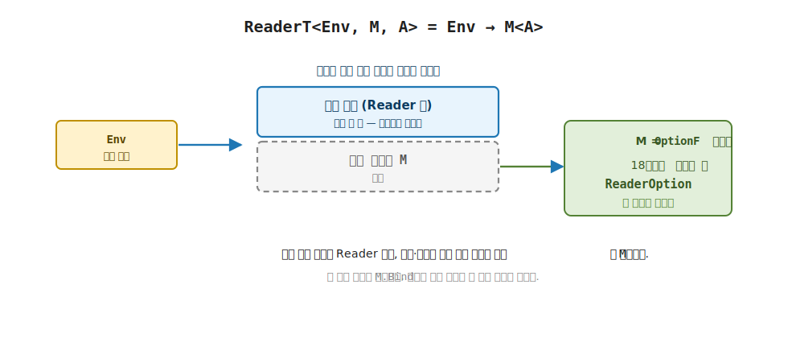
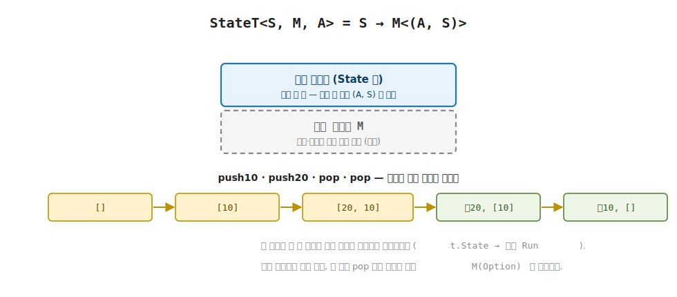

# 20장. ReaderT · StateT · WriterT (5부 단일 효과의 일반화)

> **이 장의 목표** — 이 장을 마치면 5부에서 만난 단일 효과 모나드 셋 (Reader · State · Writer) 을 내부 모나드 `M` 위로 일반화한 변환기 `ReaderT<Env, M, A>` · `StateT<S, M, A>` · `WriterT<W, M, A>` 를 직접 구현으로 읽고, 18장에서 손으로 짠 `ReaderOption` 이 `ReaderT<Env, OptionF>` 로 공짜로 나옴을 코드로 확인할 수 있습니다. 19장이 `OptionT` 하나로 변환기의 발상과 `lift` 를 보였다면, 이 장은 그 발상을 5부 효과 셋에 그대로 적용합니다. 바깥 효과 하나당 변환기 하나를 두고, 안쪽 모나드 자리를 빈칸 `M` 으로 비워 두면, 18장에서 효과 쌍마다 다시 짜야 했던 두 층짜리 `Bind` 배관이 임의의 내부 모나드에 대해 자동으로 채워집니다. 5부의 `Readable` · `Stateful` · `Writable` trait 이 변환기 위에서도 그대로 부착됨도 확인합니다.

> **이 장의 핵심 어휘**
>
> - **변환기 (transformer)**: 바깥 효과 한 층을 임의의 내부 모나드 `M` 위에 쌓는 도구, 이름 끝의 `T` 가 transformer 의 머리글자
> - **`ReaderT<Env, M, A>`**: 환경 효과를 내부 `M` 위에 얹은 변환기, 내부는 `Env → K<M, A>`
> - **`StateT<S, M, A>`**: 상태 효과를 내부 `M` 위에 얹은 변환기, 내부는 `S → K<M, (A, S)>`
> - **`WriterT<W, M, A>`**: 로그 누적 효과를 내부 `M` 위에 얹은 변환기, 내부는 `K<M, (A, W)>`, `W` 는 Monoid
> - **빈칸 `M`**: 안쪽 모나드 자리를 타입 인자로 비워 둔 자리, 무엇을 끼우든 같은 골격이 작동
> - **`MonadT<T, M>`**: 모든 변환기가 공유하는 상위 trait, `static abstract K<T, A> Lift<A>(K<M, A> ma)` 한 멤버를 약속
> - **`Lift` (`lift`)**: 내부 모나드 `M` 의 계산을 변환기 한 층 위로 끌어올림, 변환기마다 채우는 빈 층이 다름
> - **상태 스레딩 (state threading)**: 첫 계산이 낸 새 상태 `s1` 을 다음 계산의 입력으로 흘려보내는 동작

> 이 장을 마치면 할 수 있게 되는 것
> - [ ] 변환기가 바깥 효과 하나당 하나임을, 안쪽 모나드 `M` 을 빈칸으로 비워 둠을 설명할 수 있습니다.
> - [ ] `ReaderT<Env, M, A>` 의 내부가 `Env → K<M, A>` 임을 읽고 `Bind` 를 18장 `ReaderOption` 과 한 줄로 견줄 수 있습니다.
> - [ ] `ReaderT<int, OptionF>` 가 18장에서 손으로 짠 `ReaderOption` 과 같은 동작을 냄을 데모로 확인할 수 있습니다.
> - [ ] `StateT<S, M, A>` 의 내부가 `S → K<M, (A, S)>` 임을 읽고, 상태가 단계마다 어떻게 흘러가는지 손계산으로 추적할 수 있습니다.
> - [ ] `StateT<List<int>, OptionF>` 위의 스택에서 상태 스레딩과 실패 단락이 함께 작동함을 설명할 수 있습니다.
> - [ ] `WriterT<W, M, A>` 가 왜 `W : Monoid<W>` 제약을 요구하는지, `Tell` 이 3장 `Combine` 을 어떻게 재사용하는지 짚을 수 있습니다.
> - [ ] 세 변환기의 `Lift` 가 각자 다른 빈 층을 채움을 한 표로 견줄 수 있습니다.
> - [ ] `Readable` · `Stateful` · `Writable` 의 동사 (`asks` · `get` · `put` · `tell`) 가 변환기 위에서도 그대로 쓰임을 확인할 수 있습니다.

> **이 장의 흐름** — 18장에서 손으로 짠 `ReaderOption` 이 `Reader` 와 `Option` 한 쌍만 풀던 한계에서 출발합니다. 같은 바깥 효과 (환경 의존) 에 다른 내부 모나드를 얹고 싶을 때마다 배관을 다시 짜야 했는데, 안쪽 모나드 자리를 빈칸 `M` 으로 비워 두면 그 반복이 사라집니다. 먼저 `ReaderT<Env, M, A>` 의 자료와 `Bind` 를 읽고 18장 `Bind` 와 한 줄로 견줍니다. 그다음 `M` 에 `OptionF` 를 끼워 18장 `ReaderOption` 이 공짜로 나옴을 데모로 봅니다. 이어 `StateT<S, M, A>` 로 상태가 단계마다 흐르는 모습을 스택 손계산으로 추적하고, `WriterT` 의 Monoid 제약을 짧게 짚습니다. 5부 효과 trait 이 변환기 위에서도 그대로 부착됨을 확인하고, 세 법칙으로 변환기가 진짜 모나드임을 매듭짓습니다.

---

## 20.1 이 장에서 다루는 것 — 단일 효과를 빈칸 위로

여기까지 5부에서 효과 모나드 셋을 차례로 만났습니다. 잠깐 되짚어 봅니다. Reader 는 환경을 읽는 효과를 `Env → A` 로, State 는 상태를 읽고 쓰는 효과를 `S → (A, S)` 로, Writer 는 출력을 누적하는 효과를 값과 로그의 쌍 `(A, W)` 로 담았습니다. 셋 다 같은 약속을 지켰습니다. 각 모나드에 `Bind` 동사가 있었고, 그 `Bind` 가 효과를 알아서 흘리며 두 계산을 이어 줬습니다.

그리고 18장에서 그 셋의 한계를 손으로 부딪쳐 봤습니다. 환경을 읽으면서 실패할 수도 있는 계산을 담으려고 `Reader` 와 `Option` 을 한 스택에 겹쳤고, 두 층을 푸는 `Bind` 를 직접 짜 `ReaderOption` 을 만들었습니다. 그 손작업은 `Reader` 와 `Option` 한 쌍에만 맞은 배관이라, 다른 효과 쌍이 필요하면 처음부터 다시 짜야 했습니다. 19장은 그 반복을 푸는 발상을 `OptionT` 하나로 보였습니다. 안쪽 모나드 자리를 타입 인자 `M` 으로 비워 두면, `M` 이 무엇이든 같은 골격이 작동한다는 것이었습니다.

이 장은 그 발상을 5부 효과 셋에 그대로 적용합니다. 한 문장으로 말하면 이렇습니다. 5부의 단일 효과 모나드 셋을, 안쪽 모나드를 빈칸으로 둔 변환기 셋으로 일반화합니다. `Reader` 는 `ReaderT<Env, M, A>` 로, `State` 는 `StateT<S, M, A>` 로, `Writer` 는 `WriterT<W, M, A>` 로 올라갑니다. 이름 끝의 `T` 가 변환기 (transformer) 의 머리글자입니다.


> **미리 보기** — 이 장은 변환기 셋을 차례로 만집니다. 먼저 `ReaderT` 의 자료와 `Bind` 를 18장 `ReaderOption` 과 한 줄로 견주고, 안쪽 `M` 에 `OptionF` 를 끼워 18장 손작업이 공짜로 나오는 장면을 데모로 봅니다. 다음으로 `StateT` 에서 상태가 단계마다 흐르는 모습을 스택 손계산으로 추적하고, `WriterT` 가 로그를 모으는 한 가지 차이를 짚습니다. 끝으로 5부의 효과 동사가 변환기 위에서도 그대로 부착됨을 확인하고, 세 변환기가 모두 세 법칙을 지키는 정식 모나드임을 코드로 매듭짓습니다. 셋 다 같은 골격이고, 무엇을 흘리거나 모으느냐만 다릅니다.


6 이동 지도에서 이 장의 자리는 분명합니다. 변환기는 두 Elevated World 를 하나의 스택으로 쌓는 자리입니다. 바깥 한 층은 환경 의존이나 상태 같은 정해진 효과 하나가 맡고, 안쪽 빈칸 `M` 에는 어떤 Elevated World 든 끼워 넣습니다. 그래서 한 스택 안에 두 효과가 위아래로 포개집니다.

핵심은 빈칸 하나입니다. 18장의 `ReaderOption` 은 안쪽을 `Option` 한 가지로 묶은 배관이었습니다. 변환기 `ReaderT<Env, M, A>` 는 그 안쪽 자리를 타입 인자 `M` 으로 비워 둡니다. `M` 에 `OptionF` 를 끼우면 18장의 `ReaderOption` 이 그대로 나오고, `M` 에 다른 모나드를 끼우면 그 조합이 나옵니다. 효과 쌍마다 배관을 다시 짤 일이 사라지는 것이 이 빈칸 하나에서 옵니다.

지금 모든 것을 외우지 않아도 됩니다. 이 장이 끝날 때 손에 남는 것은 한 문장입니다. "5부의 단일 효과 모나드는 변환기의 내부 `M` 을 가장 단순한 모나드로 둔 특수 사례다." 18장에서 손으로 짠 `ReaderOption` 이 `ReaderT<Env, OptionF>` 로 공짜로 나오는 장면 하나를 보고 나면, 변환기가 무엇을 자동으로 대신해 주는 도구인지 손에 잡힙니다.

---

## 20.2 왜 필요한가 — 같은 바깥 효과, 다른 안쪽 모나드

18장의 `ReaderOption` 을 다시 떠올립니다. 내부가 `Env → Option<A>` 인 모나드였고, 환경 의존과 실패 가능 두 효과를 한 스택에 담았습니다. 두 층을 푸는 `Bind` 를 손으로 짜자 두 효과가 한 LINQ 사슬에서 깔끔하게 흘렀습니다. 여기까지는 좋았습니다.

문제는 그다음입니다. 같은 바깥 효과 (환경 의존) 에 다른 안쪽 효과를 얹고 싶을 때 한계가 또렷해집니다. 환경을 읽으면서 실패가 아니라 여러 결과 (비결정성) 를 내고 싶다면, `Env → Many<A>` 를 푸는 `ReaderMany` 의 `Bind` 를 처음부터 다시 짜야 합니다. 환경을 읽으면서 로그를 남기고 싶다면 `Env → Writer<W, A>` 를 푸는 또 다른 배관이 필요합니다. 바깥은 늘 같은 환경 의존인데, 안쪽 모나드가 바뀔 때마다 거의 같은 `Bind` 를 새로 적게 됩니다.

이 반복이 어디서 오는지 짚어 봅니다. 18장 `ReaderOption.Bind` 의 본체는 두 부분이었습니다. 하나는 바깥 환경 `env` 를 흘려 첫 계산을 실행하는 골격이고, 다른 하나는 그 결과가 `Some` 인지 `None` 인지 살펴 다음으로 잇거나 멈추는 부분이었습니다. 안쪽 효과를 `Many` 나 `Writer` 로 바꾸면 앞의 골격은 글자 그대로 같고, 뒤의 한 부분만 그 모나드에 맞게 달라집니다. 거의 같은 코드를 안쪽 모나드 수만큼 베껴 쓰는 셈입니다.

명령형이나 객체 지향 코드를 떠올리면 이 불편이 더 와닿습니다. 비동기 컨텍스트에서 실패할 수 있는 값을 다루려고 `Task<Option<int>>` 를 풀어 본 적이 있다면, 그다음 비동기 컨텍스트에서 여러 결과를 다루려고 `Task<IEnumerable<int>>` 를 또 풀고, 비동기 + 검증을 다루려고 `Task<Validation<int>>` 를 다시 풀었던 경험을 떠올리면 됩니다.


> **흔한 함정** — "변환기는 효과 조합마다 하나씩 있어야 한다" 고 여기는 것입니다.
>
> 18장처럼 효과 쌍마다 배관을 짜면 `ReaderOption` · `ReaderMany` · `StateOption` 처럼 조합의 수만큼 타입이 불어납니다. 변환기는 그 반대입니다. 바깥 효과 하나당 변환기 하나 (`ReaderT` · `StateT` · `WriterT`) 만 두고, 안쪽 자리를 빈칸 `M` 으로 비워 둡니다. 효과가 다섯이어도 변환기는 다섯이고, 안쪽에 무엇을 끼우든 같은 변환기가 맞물립니다. 조합 폭발이 사라지는 자리가 바로 이 빈칸 하나입니다.
 바깥은 늘 `Task` 인데 안쪽이 바뀔 때마다 "벗기고 다시 감싸는" 코드를 새로 적었습니다. 바깥 `Task` 를 한 번만 다루고 안쪽은 무엇이든 끼워 넣을 수 있으면 좋겠다는 그 바람이, 변환기가 푸는 문제와 정확히 같습니다.

해법의 모양은 19장에서 이미 봤습니다. 안쪽 모나드 자리를 타입 인자 `M` 으로 비워 두는 것입니다. 바깥 효과 (환경 의존) 는 한 번만 정의하고, 안쪽 `M` 에는 `Option` 이든 `Many` 든 `Writer` 든 무엇이든 끼웁니다. 그러면 18장에서 손으로 짠 두 층짜리 `Bind` 배관이 `M` 마다 다시 적힐 필요 없이, 한 정의로 모든 `M` 에 작동합니다. 그 빈칸 하나가 효과 쌍마다 반복하던 비용을 없앱니다. 이제 그 빈칸을 품은 자료부터 읽어 봅니다.

---

## 20.3 `ReaderT<Env, M, A>` = `Env → M<A>`

먼저 자료 정의입니다. 18장 `ReaderOption` 의 내부가 `Env → Option<A>` 였던 것을 기억하면, 변환기의 모양은 거기서 한 글자만 바꾼 것입니다. `Option` 자리를 빈칸 `M` 으로 비웁니다.

```csharp
// ReaderT<Env, M, A> — 환경 효과를 내부 모나드 M 위에 얹는다. 내부는 Env → K<M, A>.
public sealed class ReaderT<Env, M, A>(Func<Env, K<M, A>> run) : K<ReaderTF<Env, M>, A>
    where M : Monad<M>
{
    public K<M, A> Run(Env env) => run(env);
}
```

이 한 줄짜리 자료를 천천히 읽습니다. `ReaderT<Env, M, A>` 는 함수 하나를 감싼 상자입니다. 그 함수는 `Func<Env, K<M, A>>`, 곧 "환경을 주면 내부 모나드 `M` 의 계산 `K<M, A>` 를 내는" 함수입니다.

18장 `ReaderOption` 과 견주면 차이는 단 한 자리입니다. `ReaderOption` 의 내부는 `Env → Option<A>` 로 안쪽이 `Option` 한 가지로 묶여 있었습니다. `ReaderT` 의 내부는 `Env → K<M, A>` 로, 그 `Option` 자리가 빈칸 `M` 으로 열렸습니다. 타입 제약 `where M : Monad<M>` 은 "그 빈칸에는 모나드만 끼울 수 있다" 는 요구입니다. 안쪽이 모나드여야 `Bind` 로 안쪽 층을 풀 수 있기 때문입니다.

`Run(env)` 은 그 약속을 실행하는 방아쇠입니다. 18장 `ReaderOption.Run` 이 환경을 주입해 `Option<A>` 를 냈듯, `ReaderT.Run` 은 환경을 주입해 `K<M, A>` 를 냅니다. 두 평행 세계의 어휘로 보면, `Run(env)` 은 바깥 환경 의존 효과를 끌어내려 안쪽 모나드 `M` 의 계산만 남기는 자리입니다. 환경 한 층을 벗기면 안쪽 `M` 한 층이 그대로 남습니다.



**그림 20-1. `ReaderT<Env, M, A> = Env → M<A>`** — 환경을 주입하면 내부 모나드 `M` 의 계산이 나오는 스택입니다. 바깥은 환경 의존 한 층, 안쪽은 빈칸 `M`. `M` 에 `OptionF` 를 끼우면 18장에서 손으로 짠 `ReaderOption` 이 그대로 나옴을 보입니다.

이제 동사를 봅니다. `K<ReaderTF<Env, M>, A>` 를 부착했으니 `ReaderT` 도 Elevated World 의 시민입니다. 태그 `ReaderTF<Env, M>` 가 환경 `Env` 와 내부 모나드 `M` 두 가지를 붙박아 둔 채 동사들을 호스트합니다. `Pure` 와 `Bind` 를 봅니다.

```csharp
public sealed class ReaderTF<Env, M> : MonadT<ReaderTF<Env, M>, M>, Readable<ReaderTF<Env, M>, Env>
    where M : Monad<M>
{
    public static K<ReaderTF<Env, M>, A> Pure<A>(A value) =>
        new ReaderT<Env, M, A>(_ => M.Pure(value));

    public static K<ReaderTF<Env, M>, B> Bind<A, B>(K<ReaderTF<Env, M>, A> ma, Func<A, K<ReaderTF<Env, M>, B>> f) =>
        new ReaderT<Env, M, B>(env => M.Bind(ma.As().Run(env), a => f(a).As().Run(env)));

    public static K<ReaderTF<Env, M>, A> Lift<A>(K<M, A> ma) =>
        new ReaderT<Env, M, A>(_ => ma);

    public static K<ReaderTF<Env, M>, A> Asks<A>(Func<Env, A> f) =>
        new ReaderT<Env, M, A>(env => M.Pure(f(env)));

    public static K<ReaderTF<Env, M>, A> Local<A>(Func<Env, Env> f, K<ReaderTF<Env, M>, A> ma) =>
        new ReaderT<Env, M, A>(env => ma.As().Run(f(env)));
}
```

`Pure` 부터 봅니다. `Pure(value)` 는 `_ => M.Pure(value)` 를 만듭니다. 화살표 왼쪽의 밑줄 `_` 은 "환경을 받기는 하지만 보지 않는다" 는 뜻입니다. 18장 `ReaderOption.Pure` 가 `_ => Some(value)` 로 안쪽을 `Some` 으로 감쌌던 것과 견주면, 여기서는 그 자리가 `M.Pure(value)` 로 바뀌었습니다. 안쪽이 무엇이든 그 모나드의 `Pure` 에게 "성공으로 감싸는 일" 을 맡깁니다. `M` 이 `Option` 이면 `M.Pure` 가 `Some`, `M` 이 `Many` 면 원소 하나짜리 목록을 냅니다.

`Bind` 가 이 절의 핵심입니다. 18장에서 손으로 짠 `ReaderOption.Bind` 와 거의 글자까지 닮았습니다. 두 본체를 나란히 놓고 무엇이 같고 무엇이 달라졌는지 봅니다.

```csharp
// 18장 ReaderOption.Bind — 안쪽이 Option 으로 못 박힘
new ReaderOption<Env, B>(env =>
    ma.As().Run(env) switch
    {
        Option<A>.Some s => f(s.Value).As().Run(env),  // Some → 다음
        _                => Option<B>.None.Instance     // None → 단락
    });

// 20장 ReaderT.Bind — 안쪽이 빈칸 M
new ReaderT<Env, M, B>(env =>
    M.Bind(ma.As().Run(env), a => f(a).As().Run(env)));
```

큰 그림부터 잡습니다. 두 `Bind` 모두 바깥 환경 `env` 를 흘리는 골격이 똑같습니다. `env` 를 받아 첫 계산 `ma` 를 `Run(env)` 으로 실행하고, 다음 계산 `f(a)` 도 같은 `env` 로 `Run(env)` 합니다. 환경을 두 단계에 똑같이 흘려보내는 이 자리는 18장과 글자 그대로 같습니다. 18장에서 손으로 겪은 그 환경 흘리기가 변환기에서도 그대로입니다.

달라진 곳은 단 한 자리, 안쪽을 푸는 부분입니다. 18장에서는 `ma.Run(env)` 가 낸 `Option<A>` 를 `switch` 로 직접 열어 `Some` 이면 잇고 `None` 이면 멈췄습니다. 그 `Some`·`None` 가르기를 우리가 손으로 적었습니다. `ReaderT` 에서는 그 `switch` 자리가 `M.Bind` 호출 하나로 바뀌었습니다. 안쪽이 무엇이든 그 모나드 자신의 `Bind` 가 자기 층을 풉니다. 안쪽이 `Option` 이면 `Option` 의 `Bind` 가 `Some`·`None` 단락을, 안쪽이 `Many` 면 `Many` 의 `Bind` 가 모든 조합을 알아서 풉니다.

빈칸 `M` 의 힘이 여기서 드러납니다. 18장에서 우리가 떠안았던 "안쪽 층 풀기" 책임을, 변환기는 안쪽 모나드 `M` 에게 한 줄로 넘깁니다. 그래서 `ReaderT.Bind` 한 정의가 모든 내부 모나드에 작동합니다. 효과 쌍마다 배관을 다시 짜던 18장의 반복이 바로 이 한 줄에서 사라집니다.


이 책의 결정 어휘로 다시 말하면, 합성 되살리기가 여기서 일어납니다. 18장에서 두 모나드를 그냥 겹치면 합성이 공짜로 따라오지 않았고, 우리가 두 층짜리 `Bind` 를 손으로 짜 합성을 되살렸습니다. 변환기는 그 합성 되살리기를 `M.Bind` 한 줄에 맡겨, 안쪽이 무엇이든 자동으로 해냅니다. 바깥 환경 한 층은 `ReaderT` 가, 안쪽 한 층은 `M` 자신이 풀어 두 효과가 한 사슬에서 다시 합성됩니다.


> **흔한 함정** — `ReaderT.Bind` 가 안쪽 `M` 의 `Some`·`None` 이나 비결정성을 직접 다룬다고 여기는 것입니다.
>
> `ReaderT.Bind` 의 본체 어디에도 `Some` 이나 `None` 같은 말이 없습니다. 안쪽이 `Option` 인지조차 모릅니다. `ReaderT.Bind` 가 하는 일은 환경을 흘리는 것 하나뿐이고, 안쪽 층을 푸는 일은 통째로 `M.Bind` 에게 맡깁니다. 그래서 같은 `ReaderT.Bind` 가 `M` 이 `Option` 이든 `Many` 든 `Writer` 든 그대로 작동합니다. 변환기가 안쪽 효과를 일일이 안다면 빈칸의 뜻이 사라집니다. 변환기는 자기 층만 알고, 안쪽 층은 안쪽 모나드에게 맡깁니다.

`Bind` 하나가 자리를 잡으면 나머지 동사가 그 위에서 따라옵니다. `Map` 과 `Apply` 가 이 `Bind` 로 풀리고, `from-from-select` LINQ 는 `SelectMany` 를 거쳐 `Bind` 사슬로 내려갑니다. 7장에서 본 그 길 그대로입니다. 그래서 환경 의존과 안쪽 효과를 LINQ 한 번으로 깔끔하게 잇습니다.

한 가지만 짚어 둡니다. 이 장 코드의 `ReaderTF` 는 `Map` 과 `Apply` 를 `Bind` 로 묶지 않고 따로 적어 두었습니다. `Map` 은 `M.Map`, `Apply` 는 `Bind` 로 푸는 식입니다. 동작은 같고, 안쪽 `M` 을 한 번만 거치게 해 두려는 손질일 뿐입니다. 지금은 "`Bind` 가 진실을 정하고 나머지는 그 위에서 따라온다" 는 한 문장만 잡으면 충분합니다.

이제 그 안쪽 `M` 에 `OptionF` 를 끼워, 18장 `ReaderOption` 이 정말 공짜로 나오는지 봅니다.

---

## 20.4 18장 `ReaderOption` 이 공짜로 — `ReaderT<int, OptionF>`

빈칸 `M` 에 `OptionF` 를 끼워 봅니다. `ReaderT<int, OptionF>` 는 내부가 `int → K<OptionF, A>`, 곧 `int → Option<A>` 입니다. 18장에서 손으로 짠 `ReaderOption<int, A>` 의 내부와 글자 그대로 같은 모양입니다. 18장에서는 이 모나드 전체를 직접 정의했지만, 여기서는 변환기의 빈칸에 `OptionF` 를 끼운 것뿐입니다. 새로 짠 코드가 한 줄도 없습니다.

데모로 확인합니다. 환경 (나눗셈 분모) 을 읽어 `100 / d` 를 내되, `d` 가 `0` 이면 실패하는 계산입니다. 환경을 읽는다는 점에서 Reader 효과이고, `0` 으로는 나눌 수 없어 실패한다는 점에서 Option 효과입니다. 18장과 똑같은 두 효과가 한 함수에 함께 있습니다.

```csharp
K<ReaderTF<int, OptionF>, int> Divide() =>
    from d in Readable.asks<ReaderTF<int, OptionF>, int, int>(env => env)
    from r in d == 0
        ? Trans.lift<ReaderTF<int, OptionF>, OptionF, int>(Option<int>.None.Instance)
        : ReaderTF<int, OptionF>.Pure(100 / d)
    select r;
```

한 줄씩 읽습니다. 첫째 줄 `Readable.asks(env => env)` 는 환경 그 자체를 읽어 옵니다. `asks` 는 5부 Reader 에서 본 동사 그대로입니다. "환경을 받아 그중 무엇을 볼지 정하는" 함수인데, 여기서는 `env => env` 로 환경 전체를 읽습니다. 그래서 `d` 에 분모가 들어옵니다.

둘째 줄이 두 효과가 갈리는 자리입니다. `d` 가 `0` 이면 `Trans.lift(Option<int>.None.Instance)` 로 내부 `Option` 을 `None` 으로 끌어올려 단락합니다. `Trans.lift` 는 19장에서 본 변환기의 `lift` 동사로, 안쪽 모나드 `M` 의 계산 하나를 변환기 한 층 위로 끌어올립니다.


> **`Trans` 가 처음 보입니다** — `Trans` 는 변환기 공통 모듈입니다. 어떤 변환기든 받아 그 변환기의 `Lift` 를 불러 주도록 한 번 감싼 것이고, `Trans.lift(ma)` 한 줄이 안쪽 `M` 의 계산 `ma` 를 변환기 한 층 위로 끌어올립니다. 5부에서 `Readable.asks` · `Stateful.modify` 가 효과 동사를 모듈 함수로 감쌌듯, `Trans.lift` 는 모든 변환기가 공유하는 `lift` 를 한자리에 감싼 것입니다.
 여기서는 환경과 무관한 `None` 한 개를 `ReaderT` 어휘로 올려, 환경을 안 보고 곧장 실패하는 계산으로 만듭니다. `d` 가 `0` 이 아니면 `Pure(100 / d)` 로 나눗셈 결과를 성공으로 냅니다.

`Run` 으로 두 환경을 넣어 봅니다.

```csharp
Console.WriteLine($"  100/5 (env=5) = {Divide().As().Run(5).As()}");
Console.WriteLine($"  100/0 (env=0) = {Divide().As().Run(0).As()}   (내부 Option 이 None)");
```

`Run(5)` 은 환경 `5` 를 주입합니다. `asks` 가 `5` 를 읽어 `d = 5`, `0` 이 아니므로 `Pure(100 / 5)`, 곧 `Some(20)` 이 나옵니다. `Run(0)` 은 환경 `0` 을 주입합니다. `d = 0` 이라 `Trans.lift(None)` 으로 단락해 `None` 이 나옵니다. 출력은 다음과 같습니다.

```
  100/5 (env=5) = Some(20)
  100/0 (env=0) = None   (내부 Option 이 None)
```

여기가 이 장의 첫 payoff 입니다. 18장에서는 이 동작 하나를 내려고 `ReaderOption` 의 자료와 `Pure` 와 두 층짜리 `Bind` 를 손으로 모두 짰습니다. 코드가 수십 줄이었습니다. 여기서는 그 손작업이 전부 사라지고, `ReaderT<int, OptionF>` 라는 타입 한 줄과 LINQ 사슬만 남았습니다. 새로 짠 모나드 코드가 한 줄도 없습니다. 환경 의존과 실패 단락이라는 두 효과의 배관을 `ReaderT.Bind` 가 이미 품고 있고, 안쪽 `Option` 층은 `OptionF` 의 `Bind` 가 알아서 풀기 때문입니다. 18장에서 손으로 짠 그 배관이, 변환기의 빈칸 `M` 에 `OptionF` 를 끼우는 것만으로 그대로 따라왔습니다.

> **잠깐, 아직 안 배운 코드** — 위 LINQ 에서 `Trans.lift` 와 `Readable.asks` 의 제네릭 인자 (`<ReaderTF<int, OptionF>, OptionF, int>` 같은) 가 길어 보여 부담스러울 수 있습니다. 지금은 그 인자들을 한 자씩 외울 필요가 없습니다. `asks` 가 환경을 읽고 `lift` 가 안쪽 `Option` 을 끌어올린다는 두 동사의 뜻만 잡으면 충분합니다. 제네릭 인자는 "어느 변환기 위에서, 어느 안쪽 모나드를 다루는가" 를 컴파일러에 알려 주는 꼬리표일 뿐입니다.

`Trans.lift` 가 여기서 정확히 무엇을 했는지 한 번 더 짚습니다. `Option<int>.None.Instance` 는 안쪽 모나드 `OptionF` 의 계산입니다. 환경 의존이 전혀 없는, 그냥 `None` 한 개입니다. `Divide` 의 LINQ 사슬은 `ReaderT` 어휘로 흐르므로, 환경 의존이 없는 이 `None` 을 같은 사슬에 섞으려면 `ReaderT` 한 층 위로 끌어올려야 합니다. `Trans.lift` 가 바로 그 일을 합니다. 18장의 `LiftOption` 이 한 효과짜리 `Option` 을 두 효과 스택으로 올렸던 그 발상의 일반형입니다. 18장에서는 `Reader` + `Option` 한 쌍에 맞춘 `LiftOption` 을 손으로 짰지만, 변환기에서는 `MonadT.Lift` 한 멤버가 그 일을 모든 변환기에 대해 약속합니다. `Lift` 의 정체는 뒤에서 세 변환기를 한 표로 견주며 다시 봅니다.

---

## 20.5 `StateT<S, M, A>` = `S → M<(A, S)>`

같은 발상을 State 에 적용합니다. 5부의 State 모나드는 내부가 `S → (A, S)` 였습니다. 상태를 주면 값과 새 상태의 쌍을 내는 함수였습니다. 변환기는 그 쌍을 내는 일을 내부 모나드 `M` 안에서 하도록 빈칸을 엽니다.

```csharp
// StateT<S, M, A> — 상태 효과를 내부 모나드 M 위에 얹는다. 내부는 S → K<M, (A, S)>.
public sealed class StateT<S, M, A>(Func<S, K<M, (A Value, S State)>> run) : K<StateTF<S, M>, A>
    where M : Monad<M>
{
    public K<M, (A Value, S State)> Run(S state) => run(state);
}
```

자료를 읽습니다. `StateT<S, M, A>` 는 함수 `Func<S, K<M, (A Value, S State)>>` 를 감싼 상자입니다. 곧 "상태를 주면 내부 모나드 `M` 안에서 값과 새 상태의 쌍 `(A Value, S State)` 를 내는" 함수입니다.

5부 State 와 견주면 차이는 한 자리입니다. State 의 내부는 `S → (A, S)` 로 쌍이 그냥 맨몸으로 나왔습니다. `StateT` 의 내부는 `S → K<M, (A, S)>` 로, 그 쌍이 내부 모나드 `M` 안에 들어 있습니다. 그래서 상태 스레딩은 바깥 층이 맡고, 실패나 비결정 같은 둘째 효과는 안쪽 `M` 이 맡습니다. `Run(state)` 은 상태를 주입해 `K<M, (A, S)>` 를 냅니다.


명령형 코드를 떠올리면 이 모양이 더 와닿습니다. `Task<(int Value, Stack State)>` 를 반환하는 비동기 메서드를 생각해 봅니다. 상태를 받아 일을 처리한 뒤 값과 새 상태를 함께 돌려주되, 그 결과가 비동기라 `Task` 안에 담겨 나옵니다. `StateT<S, M, A>` 의 내부 `S → K<M, (A, S)>` 가 정확히 그 모양입니다. 바깥은 "상태를 받아 값과 새 상태를 낸다" 는 State 의 일이고, 그 결과가 안쪽 `M` 안에 담깁니다. `M` 이 `Task` 면 비동기 상태 계산, `M` 이 `Option` 이면 실패할 수 있는 상태 계산이 됩니다.




**그림 20-2. `StateT<S, M, A> = S → M<(A, S)>`** — 상태를 주입하면 내부 모나드 `M` 안에서 값과 새 상태의 쌍이 나오는 스택입니다. 상태 스레딩은 바깥 층이, 실패·비결정 같은 둘째 효과는 안쪽 `M` 이 맡아 한 스택에서 함께 흐름을 보입니다.

동사를 봅니다. 태그 `StateTF<S, M>` 가 상태 `S` 와 내부 모나드 `M` 을 붙박아 둔 채 동사들을 호스트합니다.

```csharp
public sealed class StateTF<S, M> : MonadT<StateTF<S, M>, M>, Stateful<StateTF<S, M>, S>
    where M : Monad<M>
{
    public static K<StateTF<S, M>, A> Pure<A>(A value) =>
        new StateT<S, M, A>(s => M.Pure((value, s)));

    public static K<StateTF<S, M>, B> Bind<A, B>(K<StateTF<S, M>, A> ma, Func<A, K<StateTF<S, M>, B>> f) =>
        new StateT<S, M, B>(s => M.Bind(ma.As().Run(s), t => f(t.Value).As().Run(t.State)));

    public static K<StateTF<S, M>, A> Lift<A>(K<M, A> ma) =>
        new StateT<S, M, A>(s => M.Map(a => (a, s), ma));

    public static K<StateTF<S, M>, Unit> Put(S value) =>
        new StateT<S, M, Unit>(_ => M.Pure((Unit.Default, value)));

    public static K<StateTF<S, M>, Unit> Modify(Func<S, S> modify) =>
        new StateT<S, M, Unit>(s => M.Pure((Unit.Default, modify(s))));

    public static K<StateTF<S, M>, A> Gets<A>(Func<S, A> f) =>
        new StateT<S, M, A>(s => M.Pure((f(s), s)));
}
```

`Pure(value)` 는 `s => M.Pure((value, s))` 를 만듭니다. 상태 `s` 가 들어오면 그 상태를 손대지 않고 그대로 둔 채 값만 `value` 로 냅니다. 상태를 바꾸지도 실패하지도 않는 가장 단순한 시민입니다. 5부 State 의 `Pure` 가 안쪽 `M` 한 겹만 더 두른 모양입니다.

`Bind` 가 State 변환기의 핵심입니다. 본체에 두 가지 일이 겹쳐 있습니다. 하나는 상태를 단계마다 흘려보내는 일이고, 다른 하나는 안쪽 `M` 의 효과를 잇는 일입니다.

```csharp
new StateT<S, M, B>(s => M.Bind(ma.As().Run(s), t => f(t.Value).As().Run(t.State)));
```

천천히 따라갑니다. 상태 `s` 가 들어오면 첫 계산 `ma` 를 `Run(s)` 으로 실행합니다. 그러면 내부 `M` 안에서 `(t.Value, t.State)` 라는 쌍이 나옵니다. `t.Value` 는 첫 계산이 낸 값이고, `t.State` 는 첫 계산이 바꿔 놓은 새 상태입니다. 여기가 상태 스레딩의 핵심입니다. 다음 계산 `f(t.Value)` 를 만들 때, 그것을 처음 상태 `s` 가 아니라 첫 계산이 낸 새 상태 `t.State` 로 `Run` 합니다. 첫 계산이 바꿔 놓은 상태를 다음 계산이 이어받습니다.

상태를 흘려보내는 이 골격은 5부 State 의 `Bind` 와 같습니다. 달라진 곳은 그 쌍을 꺼내는 일을 `M.Bind` 가 한다는 점뿐입니다. `M.Bind(ma.Run(s), t => ...)` 가 안쪽 `M` 을 열어 쌍 `t` 를 꺼내 주므로, 안쪽이 `Option` 이면 첫 계산이 `None` 일 때 다음 계산을 아예 부르지 않고 단락합니다. 상태 스레딩은 바깥이, 실패 단락은 안쪽 `M` 이 맡는 두 일이 이 한 줄에 겹쳐 있습니다.

상태가 정말 단계마다 흘러가는지는 뒤에서 스택 손계산으로 직접 추적합니다.

`Put` 과 `Modify` 와 `Gets` 도 동사로 보일 텐데, 외울 것은 없습니다. 모두 5부 State 에서 본 그 동사가 안쪽 `M.Pure` 한 겹을 두른 모양일 뿐입니다. `Put(value)` 은 옛 상태를 버리고 새 상태 `value` 로 덮어씁니다. `Modify(f)` 는 상태에 `f` 를 적용해 새 상태로 바꾸고, 값으로는 `Unit` 을 냅니다. `Gets(f)` 는 상태를 바꾸지 않고 그중 `f` 로 골라낸 값만 읽어 옵니다. 모두 상태를 손대거나 읽기만 할 뿐 실패하지 않으므로, 안쪽 `M` 은 `M.Pure` 로 "성공" 한 겹만 두릅니다.

---

## 20.6 `StateT<List<int>, OptionF>` 데모 — 상태 + 실패가 한 스택에

`StateT` 의 안쪽 `M` 에 `OptionF` 를 끼우면 상태 스레딩과 실패가 한 스택에서 동시에 작동합니다. 스택 자료 구조를 예로 봅니다. 상태 `S` 를 `List<int>` 로 두고, `Push` 는 상태 앞에 원소를 붙이며, `Pop` 은 맨 앞 원소를 꺼내되 빈 스택이면 실패합니다.

```csharp
public static class Stack
{
    public static K<StateTF<List<int>, OptionF>, Unit> Push(int x) =>
        Stateful.modify<StateTF<List<int>, OptionF>, List<int>>(s => [x, .. s]);

    // 빈 스택이면 내부 Option 이 None — 전체 계산이 단락된다.
    public static K<StateTF<List<int>, OptionF>, int> Pop =>
        new StateT<List<int>, OptionF, int>(s =>
            s.Count == 0
                ? Option<(int, List<int>)>.None.Instance
                : new Option<(int, List<int>)>.Some((s[0], s.Skip(1).ToList())));
}
```

`Push(x)` 는 `Stateful.modify` 로 상태만 바꿉니다. `s => [x, .. s]` 는 상태 목록 앞에 `x` 를 붙인 새 목록입니다. 값으로는 `Unit` 을 내고 상태만 갱신하므로, 5부 State 의 `modify` 동사가 변환기 위에서도 그대로 쓰인 자리입니다.


명령형 스택을 떠올리면 두 동사의 자리가 또렷합니다. 명령형 `Stack<int>` 에서는 `stack.Push(x)` 가 내부 배열을 직접 변경하고, `stack.Pop()` 이 비어 있으면 예외를 던졌습니다. 여기서는 변경도 예외도 없습니다. `Push` 는 옛 상태를 그대로 둔 채 앞에 `x` 를 붙인 새 목록을 다음 상태로 흘려보내고, `Pop` 은 빈 스택일 때 예외 대신 내부 `Option` 을 `None` 으로 내어 단락합니다. 상태 변경은 상태 스레딩으로, 예외는 안쪽 `Option` 의 실패로 바뀐 셈입니다.


`Pop` 은 `StateT` 를 직접 만들어, 빈 스택 처리를 안쪽 `Option` 에 맡깁니다. 상태가 비어 있으면 (`s.Count == 0`) 내부 `Option` 을 `None.Instance` 로 내어 전체 계산을 단락합니다. 비어 있지 않으면 맨 앞 원소 `s[0]` 을 값으로, 나머지 `s.Skip(1)` 을 새 상태로 하는 쌍을 `Some` 으로 냅니다. 상태 스레딩은 `StateT` 의 쌍이, 실패 단락은 안쪽 `Option` 의 `None` 이 맡습니다.

두 번 push 하고 두 번 pop 하는 사슬을 봅니다.

```csharp
K<StateTF<List<int>, OptionF>, (int A, int B)> twoPops =
    from _1 in Stack.Push(10)
    from _2 in Stack.Push(20)
    from a in Stack.Pop
    from b in Stack.Pop
    select (a, b);

Console.WriteLine($"  push10·push20·pop·pop  → {ShowStack(twoPops.As().Run([]))}");
```

`twoPops.As().Run([])` 는 빈 스택 `[]` 으로 시작합니다. 상태가 단계마다 어떻게 흘러가는지 손계산으로 추적합니다. `StateT.Bind` 가 첫 계산의 새 상태 `t.State` 를 다음 계산의 입력으로 넘긴다는 그 한 줄을 표로 따라가면, 머릿속에서 사슬이 그대로 돌아갑니다.


표로 가기 전에, 상태 한 칸이 어떻게 옆 칸으로 건너가는지를 화살표로 먼저 봅니다.

```
상태:  []  ──Push(10)──▶  [10]  ──Push(20)──▶  [20,10]  ──Pop──▶  [10]  ──Pop──▶  []
값:                 ()              ()                 20                10
                                                   (a=20)            (b=10)
```

한 단계가 "나간 상태" 로 내놓은 목록이, 바로 다음 단계의 "들어온 상태" 가 됩니다. 이 이어달리기를 우리가 손으로 시키지 않습니다. `StateT.Bind` 의 `f(t.Value).Run(t.State)` 한 줄이 첫 계산이 낸 상태 `t.State` 를 다음 계산의 입력으로 넘기기 때문입니다. 같은 흐름을 칸으로 끊어 보면 다음 표입니다.


| 단계 | 들어온 상태 | 한 일 | 낸 값 | 나간 상태 |
|---|---|---|---|---|
| `Push(10)` | `[]` | 앞에 10 붙임 | `()` | `[10]` |
| `Push(20)` | `[10]` | 앞에 20 붙임 | `()` | `[20, 10]` |
| `Pop` (→ a) | `[20, 10]` | 맨 앞 꺼냄 | `20` | `[10]` |
| `Pop` (→ b) | `[10]` | 맨 앞 꺼냄 | `10` | `[]` |
| `select` | `[]` | 쌍 만듦 | `(20, 10)` | `[]` |

표의 "나간 상태" 칸이 바로 아랫줄의 "들어온 상태" 칸으로 그대로 이어집니다. 이 흐름을 상태 스레딩이라 부릅니다. `Push(10)` 이 낸 `[10]` 이 `Push(20)` 의 입력이 되고, `Push(20)` 이 낸 `[20, 10]` 이 첫 `Pop` 의 입력이 됩니다. 우리가 상태를 손으로 날라 준 적이 없습니다. `StateT.Bind` 의 `f(t.Value).Run(t.State)` 한 줄이 그 일을 도맡았습니다. 첫 `Pop` 이 값 `20` 과 상태 `[10]` 을 내고, 둘째 `Pop` 이 값 `10` 과 상태 `[]` 을 냅니다. 출력은 이렇습니다.

```
  push10·push20·pop·pop  → Some(값=(20, 10), 남은 상태=[])
```

값 쌍 `(20, 10)` 과 남은 상태 `[]` 이 모두 `Some` 안에 담겨 나왔습니다. 두 효과가 한 스택에서 함께 작동한 결과입니다. 상태 스레딩은 바깥 `StateT` 층이, 그 결과를 `Some` 으로 감싸는 일은 안쪽 `OptionF` 층이 맡았습니다.

이제 실패가 어떻게 단락하는지 봅니다. 빈 스택에서 곧장 `Pop` 하는 사슬입니다.

```csharp
K<StateTF<List<int>, OptionF>, int> tooManyPops =
    from a in Stack.Pop      // 빈 스택에서 pop → None
    select a;

Console.WriteLine($"  빈 스택에서 pop        → {ShowState(tooManyPops.As().Run([]))}");
```

`Run([])` 으로 빈 스택을 넘기면 첫 `Pop` 에서 `s.Count == 0` 이 참이라 내부 `Option` 이 `None` 을 냅니다. `StateT.Bind` 의 안쪽 `M.Bind` 가 그 `None` 을 만나는 순간, 18장에서 본 `Option` 의 단락이 그대로 작동해 `select` 를 평가하지 않고 곧장 멈춥니다. 출력은 이렇습니다.

```
  빈 스택에서 pop        → None   (빈 스택에서 pop → None)
```

두 데모를 나란히 놓으면 한 그림이 또렷해집니다. 같은 `StateT<List<int>, OptionF>` 어휘 위에서, 한쪽은 상태가 단계마다 흐르며 `Some((20, 10), [])` 으로 끝났고, 다른 쪽은 첫 단계에서 `None` 으로 멈췄습니다. 5부의 단일 State 모나드는 상태 스레딩만 다뤘는데, 그 State 를 내부 `M` 위로 일반화하자 상태 스레딩과 실패가 한 스택에서 동시에 작동했습니다. 5부에서 쓰던 `modify` · `get` 같은 동사를 그대로 쓰면서, 실패라는 둘째 효과가 안쪽 `M` 에서 공짜로 따라왔습니다.

---

## 20.7 `WriterT<W, M, A>` — 로그 누적, 한 가지가 다르다

세 번째는 Writer 변환기입니다. 5부의 Writer 모나드는 값과 로그의 쌍 `(A, W)` 를 냈고, `Bind` 가 두 단계의 로그를 이어 붙였습니다. 변환기는 그 쌍을 내부 모나드 `M` 안에서 냅니다. 이 장 코드의 자료는 다음 모양입니다.

```csharp
// WriterT<W, M, A> — 로그 누적 효과를 내부 모나드 M 위에 얹는다. 내부는 K<M, (A, W)>. W 는 Monoid.
public sealed class WriterT<W, M, A>(K<M, (A Value, W Output)> run)
    where M : Monad<M>
    where W : Monoid<W>
{
    public K<M, (A Value, W Output)> Run { get; } = run;
}
```

여기서 한 가지를 먼저 짚어 둡니다. `ReaderT` 는 `Env → K<M, A>`, `StateT` 는 `S → K<M, (A, S)>` 로 둘 다 무언가를 받는 함수를 감쌌습니다. 그런데 `WriterT` 는 받는 입력이 없습니다. 값과 로그의 쌍 `(A, W)` 를 내부 `M` 위로 올린 `K<M, (A, W)>` 한 덩어리일 뿐입니다. 5부의 `Writer<W, A>` 가 쌍 `(A, W)` 였던 것을 떠올리면, `WriterT` 는 그 쌍을 그대로 내부 `M` 안에 담은 모양입니다. 환경이나 상태처럼 흘려보낼 입력이 없으니 받을 것도 없고, 로그는 처음부터 빈 항등원에서 시작해 단계마다 쌓이기만 합니다. "왜 `WriterT` 만 함수가 아니라 쌍인가" 는 여기서 옵니다.

> **표현 한 줄** — LanguageExt v5 의 `WriterT` 는 성능을 위해 `Func<W, K<M, (A, W)>>` 라는 함수형 표현을 씁니다. 이 책은 입문 눈높이로 쌍을 그대로 내부 `M` 위에 올린 최소 표현 `K<M, (A, W)>` 를 씁니다. `Bind` 가 두 로그를 `Combine` 으로 잇고 `Tell` 이 로그를 쌓는다는 발상은 두 표현이 똑같습니다.

`ReaderT` · `StateT` 와 견주면, `WriterT` 에는 다른 둘에 없는 제약 한 줄이 더 있습니다. `where W : Monoid<W>` 입니다. 로그 타입 `W` 가 Monoid 여야 한다는 요구입니다.

왜 `WriterT` 만 이 제약을 요구하는지 짚어 봅니다. `ReaderT` 는 환경을 읽기만 합니다. 여러 단계에서 같은 환경을 흘릴 뿐 무언가를 모으지 않습니다. `StateT` 는 상태를 다음 단계에 덮어 흘립니다. 새 상태가 옛 상태를 대체할 뿐 쌓지 않습니다. 그런데 `WriterT` 는 단계마다 나온 로그를 버리지 않고 모두 이어 붙여야 합니다. 두 단계의 로그를 어떻게 하나로 합칠지, 그리고 아직 아무것도 안 남겼을 때 로그의 시작값이 무엇인지를 정해야 합니다.

바로 그 두 가지를 3장의 Monoid 가 정해 줍니다. Monoid 는 두 값을 하나로 합치는 `Combine` 과, 합쳐도 아무 영향이 없는 시작값 항등원 (`Empty`) 을 약속합니다. `WriterT` 의 로그 누적은 3장 Monoid 를 변환기 위에서 그대로 재사용한 것입니다. 단계마다 나온 로그를 `Combine` 으로 이어 붙이고, 누적의 시작은 항등원 `W.Empty` 입니다. v5 에서 `Run()` 이 `runWriter(W.Empty)` 인 까닭이 이것입니다. 아직 아무 로그도 없는 상태, 곧 항등원에서 누적을 시작합니다.

로그를 남기는 동사는 `Tell` 입니다. v5 의 `Writable<M, W>` trait 이 약속하며, 골격은 다음 한 줄입니다.

```csharp
// Tell(item) — 로그 item 을 기존 누적에 Combine 으로 이어 붙인다.
public static K<WriterTF<W, M>, Unit> Tell(W item) =>
    new WriterT<W, M, Unit>(w => M.Pure((Unit.Default, w.Combine(item))));
```

`Tell(item)` 은 지금까지 모인 로그 `w` 에 새 로그 `item` 을 `Combine` 으로 이어 붙입니다. 값으로는 `Unit` 을 내고 로그만 늘립니다. 3장에서 본 `Combine` 이 변환기의 로그 누적 자리에서 그대로 일합니다. 안쪽은 `M.Pure` 한 겹을 두를 뿐, 누적의 본질은 3장 Monoid 그대로입니다.


이 장 코드의 `Tell` 과 `Bind` 를 실제 시그니처로 봅니다. 쌍 형태라 `Tell` 은 로그 한 조각을 그대로 쌍에 실어 내고, 두 단계의 로그를 잇는 일은 `Bind` 가 맡습니다.

```csharp
// Tell — 값 없이 출력 한 조각만 누적 (Unit 을 값으로).
public static K<WriterTF<W, M>, Unit> Tell(W output) =>
    new WriterT<W, M, Unit>(M.Pure((Unit.Default, output)));

// Bind — 안쪽 M 효과는 M.Bind 로 흘리고, 두 단계의 로그는 Monoid 의 Combine 으로 누적.
public static K<WriterTF<W, M>, B> Bind<A, B>(K<WriterTF<W, M>, A> ma, Func<A, K<WriterTF<W, M>, B>> f) =>
    new WriterT<W, M, B>(
        M.Bind(ma.As().Run, t1 =>
            M.Map(t2 => (t2.Value, W.Combine(t1.Output, t2.Output)), f(t1.Value).As().Run)));
```

`Bind` 의 `W.Combine(t1.Output, t2.Output)` 한 자리가 핵심입니다. 첫 계산이 낸 로그 `t1.Output` 과 다음 계산이 낸 로그 `t2.Output` 을 3장 `Combine` 으로 이어 붙입니다. 안쪽 `M` 을 푸는 일은 `M.Bind` 가, 두 로그를 잇는 일은 `Combine` 이 맡는 두 일이 이 한 줄에 겹쳐 있습니다. `ReaderT.Bind` 가 안쪽 풀기를 `M.Bind` 한 줄에 맡겼던 그 발상에, 로그를 모으는 `Combine` 한 조각이 더해진 모양입니다.

안쪽 `M` 에 `OptionF` 를 끼워 데모로 봅니다. 로그를 남기며 값을 두 배로 만드는 계산입니다.

```csharp
K<WriterTF<Log, OptionF>, int> logged =
    from _1 in Writable.tell<WriterTF<Log, OptionF>, Log>(Log.One("시작: 21"))
    from x in WriterTF<Log, OptionF>.Pure(21)
    from _2 in Writable.tell<WriterTF<Log, OptionF>, Log>(Log.One($"두 배 → {x * 2}"))
    select x * 2;

Console.WriteLine($"  tell·Pure·tell  → {ShowWriter(logged.As().Run.As())}");
```

첫 `tell` 이 `"시작: 21"` 한 줄을, 마지막 `tell` 이 `"두 배 → 42"` 한 줄을 남깁니다. `Bind` 가 단계마다 로그를 `Combine` 으로 이어 붙이므로 두 줄이 순서대로 쌓이고, 값으로는 `x * 2 = 42` 가 나옵니다. 누적은 빈 로그 항등원 `Log.Empty` 에서 시작합니다. 출력은 다음과 같습니다.

```
  tell·Pure·tell  → Some(값=42, 로그=[시작: 21; 두 배 → 42])
```

값 `42` 와 로그 두 줄이 모두 `Some` 안에 담겨 나왔습니다. 로그 누적은 바깥 `WriterT` 층이 `Combine` 으로, 그 결과를 `Some` 으로 감싸는 일은 안쪽 `OptionF` 층이 맡았습니다. `StateT` 가 상태 스레딩과 실패를 한 스택에 담았듯, `WriterT` 는 로그 누적과 실패를 한 스택에 담습니다.


> **여기서 멈춰도 됩니다** — `WriterT` 의 세부 동사 (`Listen` · `Pass` 등) 를 지금 외울 필요는 없습니다. 이 절에서 가져갈 것은 한 문장입니다. "`ReaderT` 와 `StateT` 는 안쪽 `M` 만 제약하지만, `WriterT` 는 로그를 모아야 하므로 로그 타입 `W` 에 Monoid 제약을 하나 더 건다." `Combine` 으로 잇고 항등원에서 시작한다는 3장 Monoid 의 약속이 변환기에서 재사용된다는 것만 잡으면 충분합니다.

세 변환기를 나란히 놓으면 결이 보입니다. `ReaderT` 는 환경을 흘리고, `StateT` 는 상태를 흘리고, `WriterT` 는 로그를 모읍니다. 셋 다 바깥 효과 한 층을 빈칸 `M` 위에 얹는 같은 발상인데, 무엇을 흘리거나 모으느냐만 다릅니다. 그 차이가 `WriterT` 에만 Monoid 제약을 더 붙게 합니다.

---

## 20.8 trait 부착 — 5부의 동사가 변환기 위에서도 그대로

5부에서 효과 모나드마다 동사 한 묶음을 trait 으로 부착했습니다. Reader 에는 `Readable<M, Env>` 가 `Asks` · `Ask` · `Local` 을, State 에는 `Stateful<M, S>` 가 `Get` · `Put` · `Modify` · `Gets` 를, Writer 에는 `Writable<M, W>` 가 `Tell` 을 약속했습니다. 변환기에서 반가운 점은, 그 trait 들이 변환기 위에서도 글자 그대로 부착된다는 것입니다.

`ReaderTF` 와 `StateTF` 의 선언을 다시 봅니다.

```csharp
public sealed class ReaderTF<Env, M> : MonadT<ReaderTF<Env, M>, M>, Readable<ReaderTF<Env, M>, Env>
public sealed class StateTF<S, M> : MonadT<StateTF<S, M>, M>, Stateful<StateTF<S, M>, S>
```

두 태그 모두 `MonadT` 외에 5부의 효과 trait 을 하나씩 더 부착했습니다. `ReaderTF` 는 `Readable<ReaderTF<Env, M>, Env>` 를, `StateTF` 는 `Stateful<StateTF<S, M>, S>` 를 구현합니다. 그래서 5부에서 단일 모나드에 쓰던 동사를 변환기 위에서도 똑같이 부릅니다.

```csharp
// 5부 Reader 에서 쓰던 asks 를 변환기 위에서 그대로
from d in Readable.asks<ReaderTF<int, OptionF>, int, int>(env => env)

// 5부 State 에서 쓰던 modify 를 변환기 위에서 그대로
Stateful.modify<StateTF<List<int>, OptionF>, List<int>>(s => [x, .. s])
```

`Readable.asks` 와 `Stateful.modify` 는 5부에서 본 모듈 함수 그대로입니다. 달라진 것은 타입 인자에 단일 모나드 태그 대신 변환기 태그 (`ReaderTF<int, OptionF>`, `StateTF<List<int>, OptionF>`) 를 넘긴다는 점뿐입니다. 동사의 이름도 뜻도 그대로입니다. `asks` 는 여전히 환경을 읽고, `modify` 는 여전히 상태를 바꿉니다.

이 trait 부착이 왜 중요한지 짚어 봅니다. 변환기를 도입하면서 환경 읽기나 상태 바꾸기를 위한 새 동사를 배워야 한다면, 변환기는 익히기 부담스러운 도구가 됐을 것입니다. 그런데 `Readable` · `Stateful` · `Writable` 이 변환기 위에서도 그대로 부착되니, 5부에서 익힌 `asks` · `get` · `put` · `modify` · `tell` 을 그대로 씁니다. 바깥 효과의 동사는 단일 모나드든 변환기든 한 묶음으로 통일됩니다. 변환기가 더한 것은 안쪽 `M` 이라는 빈칸 하나일 뿐, 바깥 효과를 다루는 어휘는 5부와 같습니다.

이제 세 변환기의 `Lift` 를 한자리에 모아 견줍니다. 안쪽 모나드 `M` 의 계산 하나를 변환기 한 층 위로 끌어올리는 동사인데, 변환기마다 채우는 빈 층이 다릅니다. 코드는 다음 셋입니다.

```csharp
// ReaderTF.Lift — env 를 무시하고 안쪽 ma 를 그대로
public static K<ReaderTF<Env, M>, A> Lift<A>(K<M, A> ma) =>
    new ReaderT<Env, M, A>(_ => ma);

// StateTF.Lift — 상태 s 를 보존해 (값, s) 쌍으로
public static K<StateTF<S, M>, A> Lift<A>(K<M, A> ma) =>
    new StateT<S, M, A>(s => M.Map(a => (a, s), ma));

// WriterTF.Lift — 로그를 빈 항등원으로 채운 채 안쪽 ma 를 올린다
public static K<WriterTF<W, M>, A> Lift<A>(K<M, A> ma) =>
    new WriterT<W, M, A>(M.Map(a => (a, W.Empty), ma));
```

세 `Lift` 가 무엇을 다르게 하는지 표로 견줍니다. 모두 "안쪽 `M` 값을 변환기로 끌어올림" 이라는 같은 뜻인데, 각 변환기가 무엇을 추가로 흘리느냐에 따라 빈 층을 채우는 방식이 다릅니다.

| 변환기 | `Lift` 가 채우는 빈 층 | 하는 일 | 한 줄 |
|---|---|---|---|
| `ReaderTF` | 환경 층 | 환경을 무시 (`_ => ma`) | 환경을 안 보는 계산으로 올림 |
| `StateTF` | 상태 층 | 상태를 보존 (`s => (a, s)`) | 상태를 손대지 않는 계산으로 올림 |
| `WriterTF` | 로그 층 | 로그를 비움 (항등원) | 로그를 안 남기는 계산으로 올림 |

표가 한 가지를 또렷이 보입니다. `ReaderT.Lift` 는 환경을 무시하면 그만이지만, `StateT.Lift` 는 상태를 그냥 무시할 수 없습니다. 받은 상태 `s` 를 다음으로 흘려보내야 하므로 `(a, s)` 쌍으로 상태를 보존해 끼워 넣습니다.


세 `Lift` 를 한 문장으로 묶으면 이렇습니다. 모두 "안쪽 `M` 값을 변환기로 끌어올림" 이라는 같은 일을 하되, 변환기마다 자기 층을 "아무 일도 안 한 값" 으로 채웁니다. `ReaderT` 는 환경을 안 보는 것이 그 층의 무위(無爲)이고, `StateT` 는 상태를 손대지 않고 그대로 흘리는 것이 무위이며, `WriterT` 는 로그를 한 줄도 안 남기는 것, 곧 항등원 `Empty` 가 무위입니다. 그래서 셋 다 "바깥 효과는 건드리지 않고 안쪽 값만 올린다" 는 한 뜻인데, 각 변환기가 흘리거나 모으는 것이 달라 채우는 빈 층이 달라집니다.
 `WriterT.Lift` 는 로그를 안 남기는 계산이므로 로그 층을 항등원 (빈 로그) 으로 채웁니다. 같은 `Lift` 인데 변환기마다 배관이 다른 까닭은, 각 변환기가 흘리거나 모으는 것 (환경 · 상태 · 로그) 이 다르기 때문입니다. 18장 `LiftReader` · `LiftOption` 이 빈 칸을 "문제 없음" 으로 채웠던 그 발상이, 변환기마다 자기 빈 층에 맞게 일반화된 모습입니다.

---

## 20.9 법칙 — 변환기도 진짜 모나드

`ReaderTF<Env, M>` 는 `MonadT` 를 거쳐 `Monad` 를 부착했으니, 진짜 모나드가 되려면 7장에서 본 세 법칙을 만족해야 합니다. 손으로 짠 18장 `ReaderOption` 이 그랬듯, 변환기도 우연히 도는 것이 아니라 법칙을 지키는 정식 모나드인지 확인합니다.

```
좌항등:   Bind(Pure(a), f)           ≡  f(a)
우항등:   Bind(m, Pure)              ≡  m
결합:     Bind(Bind(m, f), g)        ≡  Bind(m, a => Bind(f(a), g))
```

한 가지 걸림돌이 18장과 똑같이 있습니다. 변환기의 시민은 속이 함수 (`Env → K<M, A>` 등) 라, 함수 둘이 같은지를 코드로 직접 견주기 어렵습니다. 두 함수가 모든 입력에서 같은 값을 내는지는 입력을 하나하나 넣어 보기 전에는 알 수 없고, `==` 한 줄로는 "같은 함수 객체인가" 만 묻게 됩니다. 그래서 18장에서 쓴 그 요령을 그대로 씁니다. 양변에 같은 샘플 환경을 주입해 `Run` 한 다음, 그 결과를 비교 가능한 값으로 떨어뜨려 견줍니다. 함수 비교를 값 비교로 바꾸는 셈입니다. 이 일을 대신하는 작은 함수가 `probe` 입니다.

```csharp
// probe — env=3 으로 Run 해 변환기를 비교 가능한 Option<int> 로 떨어뜨린다.
Func<K<ReaderTF<int, OptionF>, int>, Option<int>> probe = m => m.As().Run(3).As();

Func<int, K<ReaderTF<int, OptionF>, int>> f = n => ReaderTF<int, OptionF>.Pure(n + 1);
Func<int, K<ReaderTF<int, OptionF>, int>> g = n => ReaderTF<int, OptionF>.Pure(n * 2);
var m0 = Readable.asks<ReaderTF<int, OptionF>, int, int>(e => e);

var leftId  = MonadLaws.LeftIdentityHolds<ReaderTF<int, OptionF>, int, int, Option<int>>(7, f, probe);
var rightId = MonadLaws.RightIdentityHolds<ReaderTF<int, OptionF>, int, Option<int>>(m0, probe);
var assoc   = MonadLaws.AssociativityHolds<ReaderTF<int, OptionF>, int, int, int, Option<int>>(m0, f, g, probe);
// → 세 법칙 모두 통과
```

`probe` 가 정확히 무엇을 하는지 짚습니다. 변환기 값 `m` 을 받아 `m.As().Run(3)` 으로 환경 `3` 을 주입해 내부 `OptionF` 의 계산을 얻고, `.As()` 로 `Option<int>` 까지 떨어뜨립니다. 그러면 비교할 수 없던 함수가 비교할 수 있는 `Option<int>` 값이 됩니다. `MonadLaws` 의 세 메서드는 모두 마지막 인자로 이 `probe` 를 받아, 양변을 같은 값으로 떨어뜨린 뒤 `Equals` 로 견줍니다. 변환기는 안에 함수를 품어 직접 동등 비교가 안 되므로 `probe` 가 꼭 있어야 합니다.

여기서 한 가지를 짚어 둘 가치가 있습니다. 이 `probe` 패턴은 `ReaderT` 에만 통하는 요령이 아닙니다. `StateT` 와 `WriterT` 도 똑같이 적용되고, 이 장 코드는 셋 모두에 대해 세 법칙을 확인합니다. `StateT` 의 시민도 속이 함수 (`S → K<M, (A, S)>`) 라 직접 비교가 안 되는데, `probe` 를 초기 상태로 한 번 `Run` 해 내부 `Option` 의 쌍까지 떨어뜨리는 식으로 두면 됩니다. `WriterT` 는 받을 입력이 없으니 `Run` 프로퍼티를 그대로 읽어 내부 쌍을 꺼내면 됩니다.

```csharp
// StateT — 초기 상태 [] 로 Run 해 내부 Option 의 (값, 상태) 까지 떨어뜨린다.
Func<K<StateTF<List<int>, OptionF>, int>, string> sprobe = m =>
    m.As().Run([]).As() is Option<(int V, List<int> S)>.Some s
        ? $"({s.Value.V},[{string.Join(",", s.Value.S)}])"
        : "None";

// WriterT — 입력이 없으니 Run 프로퍼티를 읽어 내부 Option 의 (값, 로그) 를 꺼낸다.
Func<K<WriterTF<Log, OptionF>, int>, string> wprobe = m =>
    m.As().Run.As() is Option<(int V, Log O)>.Some s ? $"({s.Value.V},{s.Value.O})" : "None";
// → StateT 세 법칙 통과, WriterT 세 법칙 통과
```

"변환기는 함수나 쌍을 품어 직접 비교가 안 되므로, 바깥 효과를 한 번 끌어내려 안쪽 값까지 떨어뜨린 뒤 비교한다" 는 이 발상이 세 변환기에 공통입니다. `ReaderT` 면 환경을, `StateT` 면 초기 상태를 주입하고, `WriterT` 면 `Run` 을 읽는 차이만 있습니다. 셋 다 안쪽 `OptionF` 의 비교 가능한 값으로 떨어진 뒤 `Equals` 로 견줍니다.

세 법칙이 모두 통과하면, 변환기의 `Bind` 가 어떤 순서로 이어 붙어도 같은 효과를 같은 순서로 흘리고 같은 자리에서 단락한다고 믿을 수 있습니다. 그래야 변환기 사슬을 마음 놓고 길게 잇고, 중간을 함수로 떼어내도 됩니다. 손으로 짠 18장 `ReaderOption` 이 정식 모나드였듯, 그것을 일반화한 변환기도 정식 모나드입니다.

---

## 20.10 직접 해보기

코드의 `Challenges` 에 정답이 있습니다. 먼저 직접 구현한 뒤 코드와 비교해 봅니다.

> **챌린지 1 — `StateT<List<int>, OptionF>` 위의 스택.** `Push(int x)` 와 `Pop` 을 직접 짜 봅니다. `Push` 는 `Stateful.modify` 로 상태 앞에 원소를 붙여 상태만 바꾸고, `Pop` 은 `StateT` 를 직접 만들어 빈 스택이면 내부 `Option` 을 `None` 으로 내어 단락하고, 비어 있지 않으면 맨 앞 원소와 나머지의 쌍을 `Some` 으로 냅니다. 두 번 push 하고 두 번 pop 하는 사슬을 빈 스택으로 `Run` 해 `Some((20, 10), [])` 이 나옴을, 빈 스택에서 곧장 pop 하는 사슬이 `None` 으로 단락함을 확인합니다. 노리는 능력은 5부의 단일 State 모나드가 내부 `M` 위로 일반화되어 상태 스레딩과 실패가 한 스택에서 동시에 작동함을 코드로 보는 것입니다.

> **챌린지 2 — `ReaderT<Env, OptionF>` 로 18장 `ReaderOption` 을 공짜로.** 별도 자료를 정의하지 않고, `ReaderT<int, OptionF>` 위에서 환경 (분모) 을 읽어 `100 / d` 를 내되 `d` 가 `0` 이면 `Trans.lift(None)` 으로 단락하는 `Divide` 를 `from-from-select` 로 짜 봅니다. 환경 `5` 와 `0` 으로 `Run` 해 한쪽은 `Some(20)`, 다른 쪽은 `None` 임을 확인합니다. 그런 다음 18장에서 손으로 짠 `ReaderOption` 의 자료와 `Bind` 를 떠올려, 그 손작업이 변환기의 빈칸 `M` 하나로 어떻게 사라졌는지 견줍니다. 노리는 능력은 변환기가 18장의 수동 배관을 임의의 내부 `M` 에 대해 자동 생성함을 보는 것입니다.

> **챌린지 3 — `StateT` 와 `WriterT` 도 세 법칙을 만족하는지 확인하기.** 본문에서 법칙 검증은 `ReaderT` 를 자세히 보였고, `StateT` 와 `WriterT` 도 같은 `probe` 틀로 통과함을 코드가 확인합니다. 두 변환기의 `probe` 를 직접 짜 봅니다. `StateT<List<int>, OptionF>` 는 초기 상태 `[]` 로 `Run` 해 내부 `Option` 의 쌍까지 떨어뜨리고, `WriterT<Log, OptionF>` 는 입력이 없으니 `Run` 프로퍼티를 그대로 읽어 내부 `Option` 의 쌍을 꺼냅니다. 두 `probe` 를 `MonadLaws` 의 세 메서드에 넘겨 좌항등 · 우항등 · 결합이 모두 통과함을 확인합니다. 노리는 능력은 "변환기는 함수나 쌍을 품어 직접 비교가 안 되므로 한 번 끌어내려야 한다" 는 `probe` 의 필요가 세 변환기에 같은 까닭으로 작동함을 보는 것입니다.

---

## 20.11 Elevated World 어휘로 다시 읽기

20장의 도구를 1장 비유에 매핑합니다.

| 20장 도구 | Elevated World 어휘 |
|---|---|
| `ReaderT<Env, M, A>` | 환경 의존 한 층을 빈칸 `M` 위에 쌓은 두 층 스택. 내부는 `Env → K<M, A>` |
| `StateT<S, M, A>` | 상태 스레딩 한 층을 빈칸 `M` 위에 쌓은 두 층 스택. 내부는 `S → K<M, (A, S)>` |
| `WriterT<W, M, A>` | 로그 누적 한 층을 빈칸 `M` 위에 쌓은 두 층 스택. `W` 는 Monoid |
| 빈칸 `M` | 안쪽에 끼울 또 하나의 Elevated World 자리. 무엇을 끼우든 같은 골격이 작동 |
| `Run(env)` · `Run(state)` | 끌어내림. 바깥 효과를 주입해 안쪽 모나드 `M` 의 계산만 남김 |
| `MonadT.Lift` | 안쪽 한 효과를 두 층 스택으로 끌어올림. 18장 `LiftReader`·`LiftOption` 의 일반형 |
| `Readable`·`Stateful`·`Writable` | 바깥 효과의 동사. 단일 모나드든 변환기든 같은 어휘 |

18장에서 두 효과를 한 스택에 담으려면 효과 쌍마다 두 층짜리 `Bind` 를 손으로 짜야 했습니다. 20장에서는 안쪽 모나드 자리를 빈칸 `M` 으로 비워, 바깥 효과 하나당 변환기 하나로 그 반복을 없앱니다. 끌어내림은 `Run`, 끌어올림은 `Lift`, 두 효과에 걸친 합성은 변환기의 `Bind` 입니다. 비유는 여기까지가 역할입니다. 안쪽 층을 정확히 어떻게 푸는지는 `Bind` 의 시그니처 (`M.Bind` 한 줄에 위임) 와 세 법칙이 정합니다.

한 가지만 덧붙입니다. 1장에서 두 평행 세계는 Normal 과 Elevated 두 층이었습니다. 변환기는 그 위 세계 안에 효과를 한 겹 더 쌓은 자리입니다. 그렇다고 새로운 세 번째 세계가 생긴 것은 아닙니다. 여전히 Elevated World 한 곳이고, 다만 그 시민이 두 효과를 위아래로 포개어 품었을 뿐입니다. 18장의 `ReaderOption` 이 안쪽을 `Option` 한 가지로 묶은 한 시민이었다면, 변환기는 그 안쪽 자리를 빈칸으로 열어 둔 시민입니다.

---

## 20.12 Q&A — 자기 점검

> **Q1. 변환기가 "바깥 효과 하나당 하나" 라는 말은 무슨 뜻입니까?** (20.1절)

18장처럼 효과 쌍마다 `Bind` 를 손으로 짜면, 효과가 다섯이면 조합이 `ReaderOption` · `ReaderState` · `StateOption` 처럼 쌍의 수만큼 불어납니다. 변환기는 바깥 효과 하나당 변환기 하나만 둡니다. `ReaderT` · `StateT` · `WriterT` 처럼 다섯 효과면 변환기도 다섯입니다. 안쪽 모나드 `M` 의 자리를 빈칸으로 비워 두어, 그 빈칸에 무엇을 끼우든 맞물리므로 조합마다 새로 짤 필요가 없기 때문입니다.

> **Q2. `ReaderT<Env, M, A>` 의 내부는 무엇입니까?** (20.3절)

함수 `Env → K<M, A>` 입니다. 환경을 주면 내부 모나드 `M` 의 계산을 냅니다. 18장 `ReaderOption` 의 내부 `Env → Option<A>` 에서 `Option` 자리만 빈칸 `M` 으로 연 모양입니다. `Run(env)` 이 환경을 주입해 `K<M, A>` 를 끌어내립니다.

> **Q3. `ReaderT.Bind` 는 18장 `ReaderOption.Bind` 와 어디가 같고 어디가 다릅니까?** (20.3절)

바깥 환경 `env` 를 첫 계산과 다음 계산 두 단계에 똑같이 흘리는 골격은 글자 그대로 같습니다. 다른 곳은 안쪽을 푸는 한 자리뿐입니다. `ReaderOption` 은 `Option<A>` 를 `switch` 로 열어 `Some`·`None` 을 손으로 갈랐지만, `ReaderT` 는 그 자리를 `M.Bind` 호출 하나로 바꿉니다. 안쪽이 무엇이든 그 모나드 자신의 `Bind` 가 자기 층을 풀므로, 같은 `ReaderT.Bind` 한 정의가 모든 내부 모나드에 작동합니다.

> **Q4. `ReaderT<int, OptionF>` 가 18장 `ReaderOption` 과 같다는 말은 무슨 뜻입니까?** (20.4절)

`ReaderT<int, OptionF>` 의 내부는 `int → K<OptionF, A>`, 곧 `int → Option<A>` 입니다. 18장에서 손으로 짠 `ReaderOption<int, A>` 의 내부와 글자 그대로 같습니다. 18장에서는 자료와 `Pure` 와 두 층짜리 `Bind` 를 모두 손으로 짰지만, 변환기에서는 빈칸 `M` 에 `OptionF` 를 끼운 타입 한 줄로 같은 동작이 나옵니다. 환경 의존 + 실패 단락이라는 두 효과의 배관이 자동 생성됩니다.

> **Q5. `StateT<S, M, A>` 에서 상태 스레딩은 어떻게 일어납니까?** (20.5절)

`StateT.Bind` 가 첫 계산을 현재 상태 `s` 로 `Run` 해 값 `t.Value` 와 새 상태 `t.State` 를 얻은 뒤, 다음 계산을 처음 상태가 아니라 새 상태 `t.State` 로 `Run` 합니다. 첫 계산이 바꿔 놓은 상태를 다음 계산이 이어받는 것입니다. 우리가 상태를 손으로 날라 주지 않아도 `f(t.Value).Run(t.State)` 한 줄이 그 일을 맡습니다.

> **Q6. 스택 데모에서 `push10·push20·pop·pop` 의 상태는 어떻게 흘러갑니까?** (20.6절)

빈 스택 `[]` 으로 시작해 `Push(10)` 이 `[10]`, `Push(20)` 이 `[20, 10]` 을 냅니다. 첫 `Pop` 이 값 `20` 과 상태 `[10]` 을, 둘째 `Pop` 이 값 `10` 과 상태 `[]` 을 냅니다. 각 단계의 나간 상태가 다음 단계의 들어온 상태로 그대로 이어집니다. 결과는 `Some(값=(20, 10), 남은 상태=[])` 입니다.

> **Q7. 빈 스택에서 `Pop` 하면 왜 전체가 멈춥니까?** (20.6절)

`Pop` 은 빈 스택이면 내부 `Option` 을 `None` 으로 냅니다. `StateT.Bind` 의 안쪽 `M.Bind` 가 그 `None` 을 만나면, 18장에서 본 `Option` 의 단락이 그대로 작동해 다음 계산을 부르지 않고 곧장 `None` 으로 멈춥니다. 상태 스레딩은 바깥 `StateT` 가, 실패 단락은 안쪽 `OptionF` 가 맡은 결과입니다.

> **Q8. `WriterT` 만 `W : Monoid<W>` 제약을 요구하는 까닭은 무엇입니까?** (20.7절)

`ReaderT` 는 환경을 읽기만 하고 `StateT` 는 상태를 덮어 흘릴 뿐 무언가를 모으지 않습니다. 그런데 `WriterT` 는 단계마다 나온 로그를 모두 이어 붙여야 합니다. 두 로그를 합치는 `Combine` 과 누적의 시작값 항등원이 필요한데, 그 둘을 3장 Monoid 가 약속합니다. 그래서 로그 타입 `W` 에 Monoid 제약을 하나 더 겁니다. `Run()` 이 `W.Empty` (항등원) 에서 누적을 시작하는 까닭도 이것입니다.


> **Q8-1. `WriterT` 의 자료는 왜 `ReaderT` · `StateT` 처럼 함수가 아니라 쌍입니까?** (20.7절)
>
> `ReaderT` 는 환경을, `StateT` 는 상태를 입력으로 받아 흘려보내므로 둘 다 무언가를 받는 함수 (`Env → ...`, `S → ...`) 를 감쌉니다. `WriterT` 는 받아서 흘려보낼 입력이 없습니다. 로그는 처음부터 빈 항등원에서 시작해 단계마다 쌓이기만 하므로, 값과 로그의 쌍 `(A, W)` 를 내부 `M` 위에 올린 `K<M, (A, W)>` 한 덩어리면 충분합니다. 5부의 `Writer<W, A>` 가 쌍 `(A, W)` 였던 것을, 그대로 내부 `M` 안에 담은 모양입니다.

> **Q9. 5부에서 쓰던 `asks` · `modify` 같은 동사를 변환기에서도 그대로 쓸 수 있습니까?** (20.8절)

그렇습니다. `ReaderTF` 는 `Readable` 을, `StateTF` 는 `Stateful` 을 그대로 부착합니다. 그래서 `Readable.asks` · `Stateful.modify` 같은 5부의 동사를 변환기 위에서 똑같이 부릅니다. 달라진 것은 타입 인자에 변환기 태그를 넘긴다는 점뿐이고, 동사의 이름도 뜻도 그대로입니다. 변환기가 더한 것은 안쪽 `M` 이라는 빈칸 하나뿐입니다.

> **Q10. 세 변환기의 `Lift` 는 왜 모양이 다릅니까?** (20.8절)

모두 "안쪽 `M` 값을 변환기로 끌어올림" 이라는 같은 뜻인데, 각 변환기가 흘리거나 모으는 것이 다르기 때문입니다. `ReaderT.Lift` 는 환경을 무시하면 그만이지만 (`_ => ma`), `StateT.Lift` 는 받은 상태를 다음으로 흘려야 하므로 `(a, s)` 쌍으로 상태를 보존하고, `WriterT.Lift` 는 로그를 안 남기므로 로그 층을 항등원으로 채웁니다. 같은 `Lift` 인데 채우는 빈 층이 변환기마다 다릅니다.

> **Q11. 변환기 값의 동등 비교에 왜 `probe` 가 필요합니까?** (20.9절)

변환기의 시민은 속이 함수 (`Env → K<M, A>` 등) 라, 함수 둘이 같은지를 코드로 직접 견줄 수 없기 때문입니다. `probe` 는 바깥 효과를 한 번 끌어내려 (`ReaderT` 면 환경을, `StateT` 면 초기 상태를 주입해) 안쪽 모나드의 비교 가능한 값까지 떨어뜨립니다. 그러면 함수 비교가 값 비교로 바뀌어 세 법칙을 확인할 수 있습니다. 이 발상은 모든 변환기에 공통입니다.

> **Q12. 5부의 단일 효과 모나드와 변환기는 어떤 관계입니까?** (20.1절)

5부의 단일 효과 모나드는 변환기의 내부 `M` 을 가장 단순한 모나드로 둔 특수 사례입니다. 변환기 `ReaderT<Env, M, A>` 의 빈칸 `M` 에 "효과 없는 항등 모나드" 를 끼우면 5부의 `Reader<Env, A>` 가 되고, `OptionF` 를 끼우면 18장 `ReaderOption` 이 됩니다. 변환기는 단일 효과 모나드를 안쪽 `M` 위로 일반화한 것이고, 단일 효과 모나드는 그 `M` 을 가장 단순하게 둔 자리입니다.

---

## 20.13 요약

- **이 장은 5부의 단일 효과 모나드 셋을 변환기로 일반화합니다.** `Reader` 는 `ReaderT<Env, M, A>` 로, `State` 는 `StateT<S, M, A>` 로, `Writer` 는 `WriterT<W, M, A>` 로 올라가며, 안쪽 모나드 자리를 빈칸 `M` 으로 비워 둡니다 (20.1절).
- **변환기는 바깥 효과 하나당 하나입니다.** 18장처럼 효과 쌍마다 배관을 짜면 조합이 쌍의 수만큼 불어나지만, 안쪽 `M` 을 빈칸으로 두면 바깥 효과 하나당 변환기 하나로 어떤 안쪽 모나드와도 조합됩니다 (20.2절).
- **`ReaderT.Bind` 는 18장 `Bind` 에서 안쪽 푸는 한 줄만 바뀝니다.** 환경을 두 단계에 흘리는 골격은 그대로이고, `Some`·`None` 을 손으로 갈랐던 자리가 `M.Bind` 호출 하나로 바뀌어 모든 내부 모나드에 작동합니다 (20.3절).
- **18장 `ReaderOption` 이 `ReaderT<int, OptionF>` 로 공짜로 나옵니다.** 18장에서 손으로 짠 자료와 두 층짜리 `Bind` 가, 빈칸 `M` 에 `OptionF` 를 끼운 타입 한 줄로 같은 동작을 냅니다 (20.4절).
- **`StateT` 는 상태 스레딩과 안쪽 효과를 함께 흘립니다.** 첫 계산이 낸 새 상태를 다음 계산이 이어받고, 안쪽 `M` 이 `Option` 이면 빈 스택 pop 이 `None` 으로 단락합니다. 한 스택에서 두 효과가 동시에 작동합니다 (20.5절, 20.6절).
- **`WriterT` 만 로그 타입에 Monoid 제약을 더 겁니다.** 단계마다 나온 로그를 3장 Monoid 의 `Combine` 으로 이어 붙이고, 누적을 항등원에서 시작하기 때문입니다. `ReaderT` · `StateT` 와 달리 입력을 받는 함수가 아니라 값과 로그의 쌍을 내부 `M` 위에 올린 `K<M, (A, W)>` 모양이고, 안쪽 `M` 에 `OptionF` 를 끼우면 `tell·Pure·tell` 이 `Some(값=42, 로그=[시작: 21; 두 배 → 42])` 으로 로그 누적과 실패를 한 스택에 담습니다 (20.7절).
- **5부의 효과 동사가 변환기 위에서도 그대로입니다.** `Readable` · `Stateful` · `Writable` 이 변환기 태그에 그대로 부착되어, `asks` · `modify` · `tell` 을 같은 어휘로 씁니다. `Lift` 만 변환기마다 채우는 빈 층이 다릅니다 (20.8절).
- **변환기도 세 법칙을 만족하는 정식 모나드입니다.** `probe` 로 바깥 효과를 끌어내려 안쪽 값까지 떨어뜨린 뒤 좌항등 · 우항등 · 결합을 확인합니다. 이 `probe` 발상은 모든 변환기에 공통입니다 (20.9절).

---

## 20.14 다음 장으로 — `OptionT` · `EitherT`

이 장은 5부의 단일 효과 셋 (Reader · State · Writer) 을 변환기로 일반화했습니다. 셋 다 바깥 효과 한 층을 빈칸 `M` 위에 얹는 같은 발상이었고, 무엇을 흘리거나 모으느냐 (환경 · 상태 · 로그) 만 달랐습니다. 그리고 18장에서 손으로 짠 `ReaderOption` 이 `ReaderT<int, OptionF>` 로 공짜로 나오는 것을 봤습니다.

다음 21장은 변환기의 자리를 한 번 더 뒤집습니다. 이 장의 세 변환기는 바깥에 환경 · 상태 · 로그 같은 효과를 두고 안쪽 `M` 을 비웠습니다. 21장의 `OptionT<M, A>` 와 `EitherT<L, M, A>` 는 바깥에 부재 (`Option`) 와 오류 (`Either`) 를 두고 안쪽 `M` 을 비웁니다. 1부에서 만든 `MyMaybe` 와 검증이 비동기나 환경 의존 같은 안쪽 효과와 결합되는 자리이고, 오류 처리가 어떻게 스택의 한 층이 되는지를 봅니다. 특히 `EitherT` 에서는 실패에 이유를 남기는 것과, 두 효과를 어느 순서로 쌓느냐가 결과를 어떻게 바꾸는지를 짚습니다.

[다음 장: 21장 — OptionT · EitherT](./Ch21-OptionT-EitherT.md)
