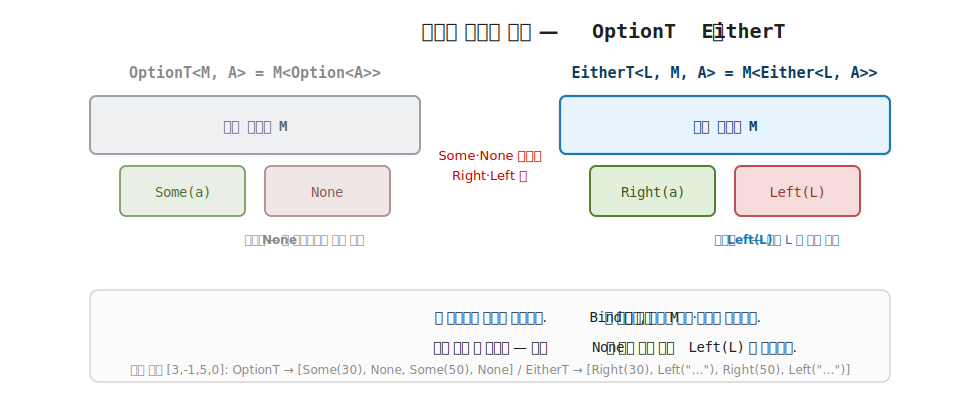
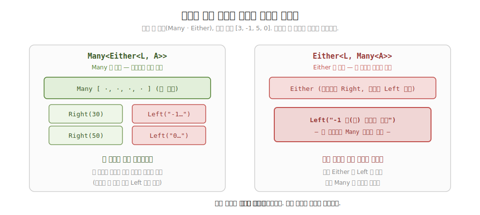

# 21장. OptionT · EitherT (부재 · 오류를 내부 효과 위에)

> **이 장의 목표** — 이 장을 마치면 실패를 내부 효과 위에 한 층으로 얹는 변환기를 직접 구현하고 읽을 수 있습니다. 19장에서 `OptionT<M, A>` 가 "없을 수 있음" 이라는 부재를 내부 모나드 `M` 위에 얹는 첫 변환기였고, 20장에서 `ReaderT` · `StateT` · `WriterT` 가 환경 · 상태 · 로그 효과를 같은 방식으로 얹었습니다. 그런데 부재만 다루는 `OptionT` 의 `None` 은 "없다" 만 말할 뿐 **왜** 없는지를 남기지 못합니다. 이 장은 그 빈자리를 `EitherT<L, M, A>` 로 메웁니다. 실패를 값 `L` 과 함께 담아 "왜 실패했는지" 를 보존하는 변환기를 직접 짜고, 그 스택을 쌓는 순서가 결과의 모양을 바꾼다는 것을 손계산으로 확인합니다. 이 장을 마치면 "실패에 이유가 필요할 때 `OptionT` 대신 `EitherT` 를 고른다" 는 판단과, "어느 효과를 바깥에 두느냐가 의미를 정한다" 는 설계 감각을 갖게 됩니다.

> **이 장의 핵심 어휘**
>
> - **`OptionT<M, A>`**: 부재 (없을 수 있음) 를 내부 모나드 `M` 위에 얹은 변환기, 내부는 `M<Option<A>>`. 19장에서 본 첫 변환기
> - **`EitherT<L, M, A>`**: 오류 (이유 있는 실패) 를 내부 모나드 `M` 위에 얹은 변환기, 내부는 `M<Either<L, A>>`
> - **`Either<L, A>`**: 실패를 값 `L` 과 함께 담는 자료, 성공은 `Right A` · 실패는 `Left L`. 1부에서 본 두 갈래 합 타입
> - **`Right` · `Left`**: `Option` 의 `Some` · `None` 에 대응하는 두 갈래, 다른 점은 `Left` 가 실패 이유 `L` 을 들고 있음
> - **`Fail`**: 오류 값과 함께 `Left` 로 끌어올려 단락을 시작하는 동사
> - **`Lift`**: 내부 모나드 `M` 의 계산을 그대로 통과시켜 `Right` 로 감싸 한 층 위로 끌어올림
> - **단락 (short-circuit)**: `Left` 를 만나면 나머지를 평가하지 않고 그 오류 값을 그대로 흘려 멈추는 동작
> - **스택 순서**: 같은 두 효과라도 어느 효과를 바깥 층에 두느냐가 결과의 모양을 바꾸는 설계 결정

> 이 장을 마치면 할 수 있게 되는 것
> - [ ] `OptionT` 의 `None` 이 실패 이유를 잃는 한계를 짚고, `EitherT` 의 `Left L` 이 그 이유를 보존함을 설명할 수 있습니다.
> - [ ] `EitherT<L, M, A>` 의 내부가 `M<Either<L, A>>` 임을, `Some` · `None` 자리가 `Right` · `Left` 로 바뀐 것임을 읽을 수 있습니다.
> - [ ] `EitherT` 의 `Bind` 가 `Right` 면 잇고 `Left` 면 오류 값과 함께 단락함을 19장 `OptionT.Bind` 와 나란히 추적할 수 있습니다.
> - [ ] `EitherT<string, ManyF>` 데모에서 여러 갈래가 각자 이유 있는 실패로 남음을 손계산으로 따라갈 수 있습니다.
> - [ ] 스택을 쌓는 순서가 결과의 모양을 바꾼다는 것을, 두 순서의 손계산을 견줘 설명할 수 있습니다.
> - [ ] `Lift` 와 `Pure` 가 둘 다 `Right` 로 올리지만 서로 다른 자리를 맡음을 출력 대비로 구분할 수 있습니다.
> - [ ] `Map` 이 `Left` 를 건드리지 않는 실패 보존이 모양 보존의 한 모습임을 설명할 수 있습니다.
> - [ ] 손으로 짠 `EitherT` 도 Monad 세 법칙을 만족하는 진짜 모나드임을 확인할 수 있습니다.

> **이 장의 흐름** — 19장에서 부재를 얹은 `OptionT` 의 `None` 이 실패 이유를 못 남긴다는 한계에서 출발합니다. 실전에서는 어느 키가, 왜 실패했는지가 필요합니다. 1부에서 본 `Either` 의 `Left L` 이 그 이유를 담는다는 점을 상기한 뒤, `EitherT<L, M, A> = M<Either<L, A>>` 의 자료와 `Bind` 를 직접 봅니다. `OptionT.Bind` 의 `Some` · `None` 분기가 `Right` · `Left` 한 자리만 바뀐 것임을 나란히 확인하고, `EitherT<string, ManyF>` 데모로 여러 갈래가 각자 이유 있는 실패로 남는 모습을 손계산합니다. 이어서 스택 순서가 의미를 바꾼다는 것을 두 순서의 대비로 보고, `Lift` 와 `Pure` 의 자리 차이, `Map` 의 실패 보존을 짚은 뒤, 손으로 짠 것도 세 법칙을 지키는 정식 모나드임을 확인합니다.

---

## 21.1 이 장에서 다루는 것 — 부재 vs 오류

19장에서 첫 변환기를 만났습니다. `OptionT<M, A>` 였습니다. 내부가 `M<Option<A>>`, 곧 "내부 모나드 `M` 안에 `Option` 한 겹" 이라는 모양으로, "없을 수 있음" 이라는 부재 효과를 임의의 내부 효과 위에 한 층 얹었습니다. 20장에서는 같은 발상으로 `ReaderT` · `StateT` · `WriterT` 가 환경 · 상태 · 로그를 내부 `M` 위에 얹었습니다. 변환기란 결국 "한 효과 층 + 빈칸으로 비워 둔 내부 모나드 `M`" 이라는 한 모양임을 거기서 봤습니다.

이 장은 그 가족에 한 식구를 더 들입니다. `EitherT<L, M, A>` 입니다. 변환기 발상 자체는 새로 배울 것이 없습니다. 19장 `OptionT` 와 글자 그대로 닮은 골격을 가지되, 단 한 자리만 바뀝니다. 그 한 자리가 이 장의 전부입니다.

그 한 자리를 미리 그림 한 장으로 잡아 둡니다. 손계산은 뒤에서 천천히 합니다. 지금은 모양만 눈에 담으면 됩니다.

```
          19장 OptionT                     이 장 EitherT

   M<Option<A>>                       M<Either<L, A>>
   ────┬──────────                    ────┬───────────
     성공  Some A                        성공  Right A
     실패  None      ──한 자리만 바뀜──▶   실패  Left L   ← 이유 L 을 들고 있음
          (빈손)                              (이유 있음)
```

바깥 내부 모나드 `M` 도 그대로고, 실패 / 성공 두 갈래로 가른다는 골격도 그대로입니다. 오직 실패 갈래가 빈손 `None` 에서 이유를 든 `Left L` 로 바뀝니다. 이 그림 한 장이 이 장 전체의 지도입니다.

무엇이 바뀌는가 하면, 실패를 적는 방식입니다. `OptionT` 의 실패는 `None` 입니다. `None` 은 "값이 없다" 는 사실만 말합니다. 왜 없는지, 어느 단계에서 막혔는지는 남기지 않습니다. 부재 (absence) 만 표현하기 때문입니다. 반면 `EitherT` 의 실패는 `Left L` 입니다. 여기 `L` 은 실패와 함께 담는 값이라, "왜 실패했는지" 를 그 안에 적어 둘 수 있습니다.

6 이동 지도로 보면 이 장의 자리는 분명합니다. 변환기는 "두 Elevated World 를 스택으로 쌓기" 였습니다. 18장에서 `Reader` 와 `Option` 두 효과를 손으로 겹쳐 보며 그 배관이 효과 쌍마다 반복된다는 한계를 겪었고, 19장이 그 반복을 자동으로 대신해 주는 변환기로 부재라는 한 효과를 내부 `M` 위에 쌓았습니다. 이 장은 같은 자리에 이유 있는 오류라는 한 효과를 쌓습니다. 쌓는 자리는 같고, 쌓는 효과의 표현력만 한 단계 올라갑니다.

지금 모든 것을 외울 필요는 없습니다. 이 장이 끝날 때 손에 남길 문장은 둘입니다. 하나는 "`OptionT` 의 `None` 은 실패를 알리되 이유를 잃고, `EitherT` 의 `Left L` 은 이유까지 남긴다" 입니다. 다른 하나는 "어느 효과를 바깥 층에 두느냐가 결과의 모양을 정한다" 입니다. 이 둘을 코드로 직접 겪고 나면, 실전에서 실패를 다룰 때 어느 변환기를 고를지, 효과를 어느 순서로 쌓을지 스스로 답할 수 있습니다.

---

## 21.2 왜 필요한가 — `None` 은 "없다" 만 말한다

19장에서 짠 `OptionT` 를 떠올립니다. 여러 입력을 차례로 검증하다가, 어느 입력이 조건을 어기면 `None` 을 냅니다. 검증이 끝나면 손에 남는 것은 `None` 하나입니다. 그런데 여기서 막힙니다. "검증이 실패했다" 는 알지만, **어느** 입력이 **왜** 막혔는지는 `None` 어디에도 없습니다.

명령형이나 객체 지향 코드를 떠올리면 이 불편이 더 또렷합니다. `int? Parse(string s)` 같은 메서드를 생각해 봅니다. 파싱이 실패하면 `null` 을 돌려줍니다. 호출한 쪽은 `null` 을 받고 "아, 실패했구나" 만 압니다. 입력이 비어 있었는지, 숫자가 아니었는지, 범위를 벗어났는지는 `null` 이 말해 주지 않습니다. 그래서 실전 코드는 늘 별도의 로그나 예외 메시지로 그 이유를 따로 흘려보냈습니다. 정작 반환값 자체는 이유를 담지 못했기 때문입니다. C# 으로 옮기면, 실패를 알리려고 한쪽으로는 `null` 을 돌려주면서 다른 쪽으로는 `throw new FormatException("...")` 처럼 이유를 따로 던지는 두 갈래 길을 만든 셈입니다. 값과 이유가 서로 다른 통로로 흩어집니다.

`OptionT` 의 `None` 이 바로 이 `null` 과 같은 자리입니다. 실패를 알리되 이유를 잃습니다. 부재만 표현하는 자료이기 때문입니다. 실전은 거의 항상 이유를 요구합니다. "설정 파일의 `port` 키가 없음", "입력 -1 은 양수가 아님" 처럼 무엇이 왜 막혔는지를 알아야 사용자에게 메시지를 보여 주고, 로그를 남기고, 분기를 정할 수 있습니다.

함수형은 이 이유를 반환값 자체에 정직하게 담고 싶어 합니다. 그 그릇이 1부에서 본 `Either<L, A>` 입니다. 한 줄로 상기합니다. `Either<L, A>` 는 두 갈래 합 타입으로, 성공은 값을 든 `Right A`, 실패는 이유를 든 `Left L` 입니다. `Option` 의 `Some` · `None` 과 갈래 수는 같지만, 실패 쪽 갈래가 빈손 (`None`) 이 아니라 이유 `L` 을 들고 있다는 점이 다릅니다.

이 장의 챕터 코드에 그 `Either` 가 그대로 들어 있습니다. 최소한의 모양만 남긴 학습용 정의입니다.

```csharp
// Either<L, A> — 실패를 값 L 과 함께 담는다 (Option 의 None 과 달리 "왜 실패했는지" 를 남긴다).
public abstract record Either<L, A>
{
    public sealed record Left(L Error) : Either<L, A> { /* ToString → "Left(이유)" */ }
    public sealed record Right(A Value) : Either<L, A> { /* ToString → "Right(값)" */ }

    public Either<L, B> MapRight<B>(Func<A, B> f) =>
        this is Right r ? new Either<L, B>.Right(f(r.Value)) : new Either<L, B>.Left(((Left)this).Error);
}
```

`Left` 가 `Error` 라는 이름의 값 `L` 을 들고 있는 것이 보입니다. 여기에 실패 이유가 담깁니다. `Right` 는 성공 값 `A` 를 듭니다. `MapRight` 는 잠시 뒤에 다시 보겠습니다. 지금은 "실패 쪽이 빈손이 아니라 이유를 들고 있다" 는 한 가지만 눈에 담으면 됩니다.

> **미리보기** — 이 장에서 새로 만나는 어휘는 손에 꼽습니다. 본론에 들어가기 전에 한 줄씩 풀어 둡니다. 지금 외울 필요는 없고, 본문에서 다시 만날 때 한 줄 풀이가 여기 있다는 것만 알면 됩니다.
>
> - **`EitherT<L, M, A>`**: 이유 있는 실패를 내부 모나드 `M` 위에 한 층 얹은 변환기. 속은 `M<Either<L, A>>`.
> - **`Fail(error)`**: 받은 오류 값을 `Left` 로 감싸 단락을 시작하는 동사. `Pure` 가 `Right` 를 만드는 것과 대칭입니다.
> - **`Lift(ma)`**: 이미 내부 효과를 가진 계산을 그 효과를 보존한 채 한 층 위로 끌어올림.
> - **단락 (short-circuit)**: `Left` 를 만나면 나머지를 평가하지 않고 그 이유를 그대로 흘려 멈추는 동작. 18장 `None` 단락의 이유 있는 판입니다.
> - **스택 순서**: 같은 두 효과라도 어느 효과를 바깥 층에 두느냐가 결과의 모양을 바꾸는 설계 결정.

그러니 이 장이 할 일은 분명합니다. 19장 `OptionT` 의 `Option` 자리를 `Either` 로 바꾸는 것입니다. 부재를 얹던 변환기를, 이유 있는 오류를 얹는 변환기로 한 칸 옮기는 일입니다.

---

## 21.3 `EitherT<L, M, A> = M<Either<L, A>>` — 자료와 Bind

먼저 자료부터 봅니다. `EitherT<L, M, A>` 는 내부 모나드 `M` 안에 `Either<L, A>` 가 한 겹 든 상자입니다. 한 줄짜리 정의입니다.

```csharp
// EitherT<L, M, A> — 오류 값을 가진 실패 효과를 내부 모나드 M 위에 얹는다.
// 내부는 K<M, Either<L, A>>. OptionT 가 None 으로 *왜* 를 잃는 데 비해, EitherT 는 Left(L) 로 보존한다.
public sealed class EitherT<L, M, A>(K<M, Either<L, A>> run) : K<EitherTF<L, M>, A>
    where M : Monad<M>
{
    public K<M, Either<L, A>> Run { get; } = run;
}
```

타입 인자가 셋입니다. 하나씩 짚어 봅니다. `L` 은 실패 이유의 타입입니다. 데모에서는 `string`, 곧 오류 메시지입니다. `M` 은 내부 모나드, 곧 바깥에 두는 효과입니다. 데모에서는 `ManyF` (여러 갈래를 담는 비결정성) 입니다. `A` 는 성공했을 때 담기는 값의 타입입니다.

내부 표현 `K<M, Either<L, A>>` 를 풀어 읽으면 `M<Either<L, A>>` 입니다. 바깥이 내부 모나드 `M`, 그 안에 `Either<L, A>` 한 겹. 이 모양을 19장 `OptionT` 와 나란히 놓으면 차이가 한눈에 들어옵니다.

| 변환기 | 내부 표현 | 성공 | 실패 |
|---|---|---|---|
| `OptionT<M, A>` (19장) | `M<Option<A>>` | `Some A` | `None` (이유 없음) |
| `EitherT<L, M, A>` (이 장) | `M<Either<L, A>>` | `Right A` | `Left L` (이유 있음) |

내부 모나드 `M` 위에 실패 효과 한 겹을 얹는다는 골격은 똑같습니다. `Option` 이 `Either` 로, `Some` · `None` 이 `Right` · `Left` 로 바뀌었을 뿐입니다. 바뀐 단 하나는 실패 쪽 갈래가 이유 `L` 을 들고 있다는 점입니다.



**그림 21-1. `EitherT<L, M, A> = M<Either<L, A>>`** — 내부 모나드 `M` 안에 `Either<L, A>` 가 한 겹 든 스택입니다. 성공은 `Right A`, 실패는 이유를 담은 `Left L`. 19장 `OptionT` 의 `Some` · `None` 자리가 `Right` · `Left` 로 바뀌어, 실패가 "없음" 이 아니라 "이유 있는 실패" 가 됨을 보입니다.

`K<EitherTF<L, M>, A>` 를 부착했으니 `EitherT` 도 Elevated World 의 시민입니다. 여기서 증인 (witness) `EitherTF<L, M>` 가 동사들을 호스트합니다. 자료는 `EitherT`, 증인은 접미사 `F` 를 붙인 `EitherTF` 로 두는 것은 이 책 전체의 `K<F, A>` 패턴 그대로입니다 (`ManyF`, `OptionF` 가 그랬습니다). `Pure` 와 `Bind` 를 봅니다.

```csharp
public sealed class EitherTF<L, M> : MonadT<EitherTF<L, M>, M>
    where M : Monad<M>
{
    // Pure — 값을 Right 로 끌어올린다.
    public static K<EitherTF<L, M>, A> Pure<A>(A value) =>
        new EitherT<L, M, A>(M.Pure<Either<L, A>>(new Either<L, A>.Right(value)));

    // Bind — Right 면 f 로 진행, Left 면 오류 값과 함께 단락.
    public static K<EitherTF<L, M>, B> Bind<A, B>(K<EitherTF<L, M>, A> ma, Func<A, K<EitherTF<L, M>, B>> f) =>
        new EitherT<L, M, B>(
            M.Bind(ma.As().Run, e =>
                e is Either<L, A>.Right r
                    ? f(r.Value).As().Run
                    : M.Pure<Either<L, B>>(new Either<L, B>.Left(((Either<L, A>.Left)e).Error))));
}
```

`Pure` 부터 봅니다. `Pure(value)` 는 값을 `Right` 로 감싼 뒤, 그것을 다시 내부 모나드 `M.Pure` 로 한 번 더 감쌉니다. 뜻을 풀면 "효과 없는 단일 값을 성공 `Right(value)` 로 만들어, 내부 `M` 위에 가장 단순하게 올려놓은 것" 입니다. 실패도 없고 내부 효과도 평범한, 두 층 스택의 가장 기본 시민입니다.

`Bind` 가 이 장의 핵심입니다. 본격적으로 읽기 전에 큰 그림을 먼저 잡습니다. `Bind` 가 할 일은 두 가지입니다. 하나는 내부 모나드 `M` 을 흘려보내는 일이고, 다른 하나는 흘려보낸 결과의 `Either` 가 `Right` 인지 `Left` 인지 살펴 다음으로 잇거나 멈추는 일입니다. 앞의 일은 `M.Bind` 가 맡고, 뒤의 일은 우리가 손으로 가릅니다. 새로 발명한 동작은 하나도 없습니다. 19장 `OptionT.Bind` 에서 이미 본 골격이고, 가르는 두 갈래의 이름만 바뀝니다.

본체를 한 줄씩 읽습니다. 내부 모나드의 값 `ma.As().Run` 을 `M.Bind` 로 흘려보냅니다. 흘러 나온 `Either<L, A>` 한 개를 `e` 라 부르고, 두 갈래로 가릅니다.

1. **`Right r` 면** `r.Value` 로 다음 계산 `f` 를 만들어 그 내부 `Run` 을 잇습니다. 성공 값을 꺼내 다음 단계로 넘기는 자리입니다.
2. **`Left` 면** `f` 를 부르지 않고, 그 `Left` 가 들고 있던 오류 값 `Error` 를 그대로 새 `Left` 에 실어 `M.Pure` 로 냅니다. 다음 단계를 건너뛰는 단락이고, 이때 이유 `L` 이 그대로 보존됩니다.

19장 `OptionT.Bind` 와 글자 그대로 견줘 봅니다. 두 본체를 나란히 놓으면 바뀐 자리가 정확히 보입니다.

```
OptionT.Bind  (19장):  Some s →  f(s.Value) 로 진행
                       None   →  None 으로 단락 (빈손)

EitherT.Bind  (이 장):  Right r →  f(r.Value) 로 진행
                       Left   →  Left(그 오류 값) 으로 단락 (이유 보존)
```

골격은 완전히 같습니다. 앞 갈래는 값을 꺼내 다음으로 잇고, 뒤 갈래는 단락합니다. 다른 점은 단 하나, 단락할 때 `OptionT` 는 빈손 `None` 을 내고 `EitherT` 는 오류 값을 실은 `Left` 를 낸다는 것입니다. 그래서 단락이 일어나도 "왜 멈췄는지" 가 흘러 나온 결과에 그대로 남습니다.

`Bind` 하나면 나머지가 따라옵니다. `Apply` 는 이 `Bind` 로 정의되고, `from-from-select` LINQ 는 `SelectMany` 를 거쳐 `Bind` 사슬로 풀립니다. 7장에서 본 그대로입니다. (`Map` 은 `Bind` 를 거치지 않고 `Right` 안의 값만 직접 사상하는데, 그 까닭은 실패 보존을 다룰 때 뒤에서 따로 봅니다.) 그래서 `EitherT` 로는 실패할 수 있는 여러 단계를 LINQ 한 번으로 이으면서, 어느 단계에서 멈췄는지를 이유와 함께 받습니다.

---

## 21.4 `EitherT<string, ManyF>` 데모 — 갈래마다 이유 있는 실패

이제 실제 스택 하나를 골라 돌려 봅니다. 챕터 코드의 데모는 `EitherTF<string, ManyF>` 한 스택을 씁니다. 내부 모나드 `M` 자리에 `ManyF` 를 끼웠으니, 풀어 쓰면 `Many<Either<string, int>>` 입니다.

내부 모나드 `Many` 를 한 줄로 상기합니다. `Many<A>` 는 여러 값을 한 번에 담는 비결정성 컨테이너로, `[3, -1, 5, 0]` 처럼 여러 갈래를 동시에 들고 다닙니다. 그러니 `Many<Either<string, int>>` 는 "여러 갈래가 있고, 각 갈래가 성공 `Right` 또는 이유 있는 실패 `Left` 인" 스택입니다.

먼저 데모가 쓰는 검증 함수를 봅니다. 챌린지 ①의 정답이기도 합니다.

```csharp
// 챌린지 ① 정답 — 양수면 Right, 아니면 왜 실패했는지를 Left 에 남긴다.
public static K<EitherTF<string, ManyF>, int> Positive(int x) =>
    x > 0
        ? EitherTF<string, ManyF>.Pure(x)                            // 양수 → Right(x)
        : EitherTF<string, ManyF>.Fail<int>($"{x} 은(는) 양수가 아님"); // 아니면 → Left(이유)
```

`Positive(x)` 는 `x` 가 양수면 `Pure(x)` 로 `Right` 를 내고, 아니면 `Fail` 로 이유를 적은 `Left` 를 냅니다. `Fail` 은 잠시 뒤 자세히 보겠습니다. 지금은 "성공이면 `Right`, 실패면 이유를 적은 `Left`" 한 가지만 봅니다. `OptionT` 라면 실패 쪽이 그냥 `None` 이었을 자리에, 여기서는 `"{x} 은(는) 양수가 아님"` 이라는 문자열이 들어갑니다.

데모는 이 검증을 비결정 입력에 LINQ 로 적용합니다.

```csharp
K<ManyF, int> inputs = new Many<int>([3, -1, 5, 0]);

K<EitherTF<string, ManyF>, int> checked2 =
    from x in Trans.lift<EitherTF<string, ManyF>, ManyF, int>(inputs)  // Many 를 EitherT 위로 끌어올림
    from p in Parse.Positive(x)                                        // 각 갈래를 양수 검사
    select p * 10;
```

읽는 순서가 중요합니다. 첫 줄 `lift(inputs)` 는 네 갈래를 가진 `Many<int>` 를 `EitherT` 스택 위로 끌어올립니다. 끌어올린 뒤 각 갈래의 값 `x` 가 `Positive(x)` 로 들어가 양수인지 검사받고, 통과한 값은 `p * 10` 으로 사상됩니다. 여기서 핵심은 LINQ 어디에도 "갈래를 돌리는 반복문" 이나 "`Left` 인지 검사하는 분기" 가 없다는 점입니다. `Bind` 가 그 배관을 모두 맡습니다.

`checked2` 를 손계산해 봅니다. 추적할 것은 두 가지입니다. (1) 각 갈래의 값이 `Positive` 에서 `Right` 가 되는지 `Left` 가 되는지, (2) 통과한 갈래가 `p * 10` 으로 어떻게 사상되는지입니다.

```
inputs = Many [3, -1, 5, 0]    (네 갈래)

갈래 3  →  Positive(3)  = Right(3)   →  select 3*10  = Right(30)
갈래 -1 →  Positive(-1) = Left("-1 은(는) 양수가 아님")  →  단락, select 평가 안 함
갈래 5  →  Positive(5)  = Right(5)   →  select 5*10  = Right(50)
갈래 0  →  Positive(0)  = Left("0 은(는) 양수가 아님")    →  단락, select 평가 안 함

결과: [Right(30), Left(-1 은(는) 양수가 아님), Right(50), Left(0 은(는) 양수가 아님)]
```

이 출력에서 두 가지를 동시에 봅니다. 첫째, 두 실패 갈래 (`-1`, `0`) 가 각자 자기 이유를 들고 `Left` 로 남았습니다. `None` 이었다면 그저 "실패" 였을 자리에, "왜" 가 문자열로 그대로 남았습니다. 둘째, 두 실패가 나머지 두 성공 갈래 (`3`, `5`) 를 죽이지 않았습니다. 네 갈래 구조가 그대로 살아남아, 각 갈래가 자기 운명을 따로 맞이했습니다.

여기서 잠깐, 단락이 "갈래 안에서" 일어난다는 점을 짚습니다. `-1` 갈래는 `Positive(-1)` 에서 `Left` 가 되는 순간, 그 갈래의 `select p * 10` 을 평가하지 않고 곧장 멈춥니다. 앞서 `Bind` 에서 본 `Left` 분기가 작동한 자리입니다. 그러나 이 단락은 그 갈래 하나에만 미칩니다. 옆 갈래 `5` 는 `-1` 의 실패와 무관하게 자기 길을 갑니다. 내부 모나드 `Many` 가 갈래를 따로 들고 다니고, 실패는 갈래 안의 한 층에서만 일어나기 때문입니다.

이것이 `EitherT<L, ManyF, A> = Many<Either<L, A>>` 라는 스택 순서가 주는 결과입니다. "여러 갈래, 갈래마다 자기 오류" 입니다. 그런데 효과를 반대 순서로 쌓으면 결과가 완전히 달라집니다. 다음 절에서 그 대비를 봅니다.

여기서 같은 검사를 19장 `OptionT` 로 돌리면 무엇이 달라지는지 나란히 둬 봅니다. 챕터 코드의 데모가 똑같은 입력 `[3, -1, 5, 0]` 을 두 변환기로 한 번씩 검사해, 빌드되고 실행되는 출력으로 차이를 보여 줍니다. `OptionT` 쪽 검사 함수는 실패할 때 이유 없이 그냥 `Fail()` 을 부릅니다 (`x > 0 ? Pure(x) : Fail<int>()`).

```
입력 [3, -1, 5, 0] 을 같은 양수 검사, 그 뒤 *10 사상

OptionT : [Some(30), None,                  Some(50), None                ]
EitherT : [Right(30), Left(-1 은(는) 양수가 아님), Right(50), Left(0 은(는) 양수가 아님)]
             ▲ 같은 자리에서 실패           ▲ 이유가 남음
```

두 줄을 위아래로 겹쳐 보면 차이가 한눈에 들어옵니다. 실패한 갈래는 둘 다 `-1` 과 `0` 으로 똑같습니다. 다른 것은 그 실패가 무엇을 손에 남기느냐뿐입니다. `OptionT` 는 `None` 만 남겨 "여기서 막혔다" 는 사실만 전합니다. `EitherT` 는 `Left(-1 은(는) 양수가 아님)` 처럼 막힌 이유를 문자열로 들고 있습니다. 둘 다 비결정 구조 (네 갈래) 는 똑같이 살아남습니다. 차이는 오직 실패 갈래가 빈손이냐 이유를 들었느냐입니다. 19장 `OptionT` 와 똑같은 타입을 이 장에서 다시 돌린 것이니, 새 도구가 아니라 같은 도구의 옆자리 대비입니다.

> **흔한 함정** — 실패 하나가 전체 비결정성을 죽인다고 여기는 것입니다.
>
> `EitherT` 에서 한 갈래가 `Left` 가 되면, 그 `Left` 가 모든 갈래를 끌고 내려가 결과 전체가 실패 하나로 붕괴할 것 같습니다. 그러나 `EitherT<L, ManyF, A>` 에서는 그렇지 않습니다. 내부 모나드 `Many` 가 바깥 층이라 갈래를 먼저 펼치고, `Either` 가 안쪽 층이라 실패는 각 갈래 **안에서** 만 일어납니다. 그래서 `-1` 갈래의 `Left` 는 `-1` 갈래에만 머물고, `5` 갈래는 멀쩡히 `Right(50)` 이 됩니다. 전체가 실패 하나로 붕괴하는 모양을 원했다면, 효과를 반대 순서로 쌓아야 합니다. 그 차이가 다음 절의 주제입니다.

---

## 21.5 스택 순서의 의미 — 어느 효과가 바깥인가

같은 두 효과 (`Either` 와 `Many`) 를 쓰더라도, 어느 효과를 바깥 층에 두느냐에 따라 결과의 모양이 달라집니다. 바로 그 선택이 변환기 스택의 핵심 설계 결정입니다. 데모가 쓴 순서와 그 반대 순서를 나란히 놓고 손계산으로 견줘 봅니다.

두 순서를 먼저 타입으로 적습니다.

- **`Many<Either<L, A>>`** (데모의 순서, `EitherT<L, ManyF, A>`) — 바깥이 `Many`, 안쪽이 `Either`. "여러 갈래가 있고, 갈래마다 자기 `Either`".
- **`Either<L, Many<A>>`** (반대 순서) — 바깥이 `Either`, 안쪽이 `Many`. "성공 하나에 여러 값이 들었거나, 아니면 실패 하나".

같은 입력 `[3, -1, 5, 0]` 을 양수 검사한 결과를 두 순서로 손계산합니다.

```
입력: [3, -1, 5, 0],  각 값을 양수 검사

【순서 1】 Many<Either<L, A>>   (= EitherT<L, ManyF, A>, 데모의 순서)
  갈래를 먼저 펼치고, 갈래마다 따로 Either:
    3  → Right(30)
    -1 → Left("-1 은(는) 양수가 아님")   ← 이 갈래만 실패
    5  → Right(50)
    0  → Left("0 은(는) 양수가 아님")     ← 이 갈래만 실패
  결과: [Right(30), Left(..), Right(50), Left(..)]   → 네 갈래 모두 생존

【순서 2】 Either<L, Many<A>>   (반대 순서)
  바깥이 Either 라 첫 실패에서 전체가 단락:
    3  → 통과
    -1 → 실패!  바깥 Either 가 Left 로 붕괴
  결과: Left("-1 은(는) 양수가 아님")                 → 한 번의 실패가 전체를 죽임
```

두 결과를 나란히 놓으면 차이가 또렷합니다. 순서 1 은 네 갈래가 각자 자기 운명을 맞이해, 두 성공과 두 실패가 모두 출력에 남습니다. 순서 2 는 첫 실패 `-1` 을 만나는 순간 바깥 `Either` 가 `Left` 로 붕괴해, 그 뒤의 `5` 와 `0` 은 평가되지도 않고 결과가 실패 하나로 끝납니다.

두 순서가 무엇을 손에 쥐는지 한 줄로 견주면 이렇습니다.

```
순서 1  Many<Either<L, A>>   →  [Right(30), Left(-1..), Right(50), Left(0..)]   네 갈래 생존
순서 2  Either<L, Many<A>>   →  Left(-1 은(는) 양수가 아님)                       첫 실패에서 하나로 붕괴
```

순서 1 은 네 갈래가 모두 출력에 남고, 순서 2 는 첫 실패 `-1` 하나로 전체가 줄어듭니다. 입력은 글자 그대로 똑같은데 결과의 모양이 "네 갈래" 와 "한 갈래" 로 갈립니다. 무엇이 이 차이를 만드는지는 바로 아래에서 한 문장으로 풀립니다.

왜 이렇게 갈리는지는 "바깥 효과가 안쪽 효과를 감싼다" 는 한 문장으로 설명됩니다. 바깥에 둔 효과가 전체의 모양을 정합니다. 바깥이 `Many` 면 결과의 바깥 모양이 "여러 갈래" 라, 실패는 갈래 안쪽으로 밀려 들어가 갈래 하나씩에만 미칩니다. 바깥이 `Either` 면 결과의 바깥 모양이 "성공이거나 실패" 라, 실패가 전체를 한 번에 덮습니다.



**그림 21-2. 스택을 쌓는 순서가 의미를 바꾼다** — 같은 두 효과라도 어느 효과를 바깥 층에 두느냐에 따라 결과의 모양이 달라집니다. 바깥에 둔 효과가 안쪽 효과를 감싸는 방향을 보여, 변환기 스택에서 순서가 설계 결정임을 보입니다.

어느 순서가 맞는지는 정해져 있지 않습니다. 풀려는 문제가 정합니다. "입력 묶음을 검증하되, 통과한 것과 실패한 것을 모두 보고하고 싶다" 면 순서 1 (`Many<Either>`) 입니다. "한 묶음을 한 단위로 보고, 하나라도 어기면 전체를 거절하고 싶다" 면 순서 2 (`Either<Many>`) 입니다. 변환기를 쌓을 때 "어느 효과를 바깥에 둘 것인가" 를 먼저 묻는 까닭이 이것입니다. 그 답이 곧 결과의 모양을 정합니다.

> **미리보기** — 7부에서 만날 `Eff<RT, A>` 는 `ReaderT<RT, IO, A>` 로, 바깥이 환경 (`ReaderT`), 안쪽이 IO 라는 정해진 순서로 쌓인 스택입니다. 그 순서가 "환경을 먼저 주입하고, 그 안에서 IO 효과가 일어난다" 는 의미를 정합니다. 이 장에서 본 "바깥 효과가 의미를 정한다" 는 발상이 거기서 그대로 쓰입니다. 지금 그 코드를 알 필요는 없습니다. "스택 순서가 의미를 정한다" 는 한 가지만 들고 가면 됩니다.

---

## 21.6 OptionT 와의 관계 — `None` 은 이유 없는 `Left`

이 장의 `EitherT` 와 19장의 `OptionT` 가 얼마나 가까운지 정리합니다. 둘 다 "실패를 내부 모나드 `M` 위에 한 층으로 얹는" 같은 가족입니다. 다른 점은 실패가 이유를 들고 있느냐 하나뿐입니다.

한 줄로 견주면 이렇습니다. `OptionT` 의 `None` 은 "이유 없는 `Left`" 입니다. 거꾸로 말하면 `EitherT` 의 `Left` 는 "이유를 든 `None`" 입니다. 실패 이유의 타입 `L` 을 빈손 (`Unit`, 곧 아무 정보도 없는 타입) 으로 두면 `EitherT<Unit, M, A>` 가 되는데, 그 `Left Unit` 은 사실상 `None` 과 같은 자리입니다. 실패는 알리되 담을 이유가 없기 때문입니다.

그래서 둘 중 무엇을 고를지는 한 질문으로 정해집니다. "실패에 이유가 필요한가?" 필요 없으면 `OptionT` 로 충분합니다. 부재만 알리면 되는 자리, 가령 "조회했는데 없으면 기본값으로 넘어간다" 같은 흐름이 그렇습니다. 이유가 필요하면 `EitherT` 입니다. "어느 입력이 왜 막혔는지를 사용자에게 보여 줘야 한다", "실패 종류에 따라 분기해야 한다" 같은 자리입니다.

| 질문 | 고르는 변환기 | 실패의 모양 |
|---|---|---|
| 실패 이유가 필요 없다 | `OptionT<M, A>` | `None` (빈손) |
| 실패 이유가 필요하다 | `EitherT<L, M, A>` | `Left L` (이유 든 값) |

두 변환기의 `Bind` 골격이 같다는 것을 21.3 에서 봤습니다. 그러니 `OptionT` 를 짤 줄 알면 `EitherT` 도 이미 짤 줄 아는 셈입니다. `Some` · `None` 을 `Right` · `Left` 로 바꾸고, 단락할 때 빈손 대신 오류 값을 실어 보내면 됩니다. 19장에서 부재를 얹었고, 이 장에서 그 부재에 이유를 더했습니다. 같은 자리, 같은 골격, 표현력만 한 단계 위입니다.

> **흔한 함정** — `EitherT` 가 `OptionT` 보다 "늘 더 낫다" 고 여기는 것입니다.
>
> `Left L` 이 이유를 담으니 `None` 보다 표현력이 높은 것은 맞습니다. 그렇다고 모든 자리에서 `EitherT` 를 골라야 하는 것은 아닙니다. 이유가 필요 없는 흐름 (조회했는데 없으면 기본값으로 넘어가는 자리) 에서 `EitherT` 를 쓰면, 채울 의미가 없는 오류 타입 `L` 을 억지로 정해야 하고 호출한 쪽도 쓰지 않을 이유를 받게 됩니다. 표현력이 높은 도구가 늘 옳은 것이 아니라, 필요한 만큼만 담는 도구가 읽기 좋습니다. "실패에 이유가 필요한가" 를 먼저 묻고, 답이 아니오면 `OptionT` 로 충분합니다.

---

## 21.7 `Lift` 와 `Pure` — 둘 다 `Right` 인데 자리가 다르다

데모를 다시 보면 두 가지 방식으로 값이 `Right` 가 됩니다. 하나는 `lift` 이고 하나는 `Pure` 입니다. 둘 다 결과가 `Right` 라 같아 보이지만, 맡는 자리가 다릅니다. 이 차이를 또렷이 해 둡니다.

먼저 `Lift` 의 본체를 봅니다.

```csharp
// Lift — 내부 모나드 M 의 값을 Right 로 감싸 한 층 위로 끌어올린다.
public static K<EitherTF<L, M>, A> Lift<A>(K<M, A> ma) =>
    new EitherT<L, M, A>(M.Map(a => (Either<L, A>)new Either<L, A>.Right(a), ma));
```

`Lift` 는 이미 내부 효과를 가진 계산 `K<M, A>` 를 받습니다. 데모에서는 네 갈래를 가진 `Many<int>` 입니다. `M.Map` 으로 그 내부의 각 값을 `Right` 로 감쌀 뿐, 갈래 구조는 그대로 통과시킵니다. 그러니 `lift` 는 "내부 효과를 보존한 채 성공 층만 한 겹 씌우는" 동사입니다.

`Pure` 는 21.3 에서 봤습니다. 효과 없는 단일 값 하나를 받아, `Right(value)` 로 만든 뒤 `M.Pure` 로 내부 모나드에 가장 단순하게 올립니다. 내부 효과가 없으니 갈래도 하나뿐입니다.

데모의 출력으로 둘을 대비하면 차이가 손에 잡힙니다. 챕터 코드가 `lift(Many [1, 2])` 를 실제로 돌려 `[Right(1), Right(2)]` 를 찍습니다.

```
lift(Many [1, 2])  →  [Right(1), Right(2)]    ← 내부 Many 의 두 갈래를 그대로 통과, 각각 Right
Pure(1)            →  [Right(1)]              ← 효과 없는 단일 값 하나, 갈래도 하나

            끌어올림(lift)              Pure
   K<M, A>  ──효과 보존──▶ Right        A  ──단일 값──▶ Right
   (갈래 둘)        (갈래 둘 그대로)     (갈래 없음)    (갈래 하나)
```

같은 `Right` 라도 들어온 자리가 다릅니다. `lift` 의 입력은 이미 내부 효과 (`Many` 의 갈래 둘) 를 가진 계산이고, `Pure` 의 입력은 효과가 아예 없는 값 하나입니다. 출력의 갈래 수가 그 차이를 그대로 비춥니다.

`lift([1, 2])` 는 입력 `Many` 가 두 갈래였으므로 출력도 두 갈래입니다. 내부 효과 (`Many` 의 갈래 둘) 를 그대로 살린 채 각 갈래를 `Right` 로 감쌌습니다. 반면 `Pure(1)` 은 효과 없는 값 하나라 갈래도 하나뿐입니다.

이 대비가 끌어올림 (lift) 과 `Pure` 의 자리 차이입니다. 1장에서 끌어올림은 "아래 세계의 값이나 함수를 위 세계의 어휘로 들어올리는 일" 이었습니다. `lift` 는 그 발상을 변환기에 씁니다. 이미 내부 효과 (`Many` 의 여러 갈래) 를 가진 계산을, 그 효과를 보존한 채 한 층 위 스택으로 들어올립니다. `Pure` 는 효과가 아예 없는 단일 값을 올리는 가장 단순한 진입점입니다.

---

## 21.8 두 가지 단락과 실패 보존 — `Fail` 과 `Map`

`EitherT` 가 `Left` 로 단락하는 길이 둘입니다. 데모 안에 둘 다 들어 있어 한 번 짚어 둘 가치가 있습니다.

하나는 처음부터 `Left` 를 만드는 길입니다. `Fail` 이 그것입니다.

```csharp
// Fail — 오류 값과 함께 단락 (Left 로 끌어올림).
public static K<EitherTF<L, M>, A> Fail<A>(L error) =>
    new EitherT<L, M, A>(M.Pure<Either<L, A>>(new Either<L, A>.Left(error)));
```

`Fail(error)` 는 받은 오류 값을 `Left` 로 감싸 내부 `M.Pure` 로 올립니다. `Pure` 가 `Right(value)` 를 만드는 것과 정확히 대칭으로, `Fail` 은 `Left(error)` 를 만듭니다. `Positive(-1)` 이 `Fail("-1 은(는) 양수가 아님")` 을 부른 자리가 이 길입니다. 시작부터 실패인 계산을 만드는 단락입니다.

다른 하나는 중간에서 `Left` 를 만나는 길입니다. 앞서 `Bind` 에서 본 `Left` 분기입니다. 앞 단계가 `Left` 를 내면, `Bind` 가 다음 함수 `f` 를 부르지 않고 그 오류 값을 그대로 새 `Left` 에 실어 흘립니다. 시작부터 실패가 아니라, 이어 가던 중에 실패를 만나 멈추는 단락입니다.

두 길을 데모의 흐름 위에 짚으면 이렇습니다. `Positive(-1)` 은 `Fail` 로 시작부터 `Left` 가 됩니다 (첫째 길). `Positive(3)` 으로 `Right(3)` 이 된 갈래는 뒤따르는 `select p * 10` 에서 다시 `Left` 를 만날 일이 없으니 그대로 잇습니다. 만약 한 갈래에서 `Right` 뒤에 또 다른 `Left` 가 끼어들었다면, 그 자리는 둘째 길 (`Bind` 단락) 로 멈춥니다. 둘 다 닿는 곳은 같습니다. 이유를 든 `Left`.

두 길의 결과는 같습니다. 둘 다 `Left` 로 끝나고 이유가 보존됩니다. 그러나 의미는 다릅니다. `Fail` 은 "이 계산은 처음부터 실패다" 이고, `Bind` 의 단락은 "이어 가다 여기서 막혔다" 입니다. 데모의 흐름이 이 둘을 차례로 보입니다. `Positive(-1)` 이 `Fail` 로 `Left` 를 만들고, 그 `Left` 가 뒤따르는 `Bind` (`select p * 10` 으로 잇는 자리) 에서 단락 보존되어 그대로 흘러 나옵니다. 한 번 `Left` 가 되면 그 이유가 끝까지 살아남는 모습입니다. trait 의 약속, 곧 모양 보존이 변환기 층에서도 지켜지는 자리입니다.

여기서 `Map` 도 한 줄 짚습니다. 앞에서 미뤄 둔 `MapRight` 가 여기 쓰입니다.

```csharp
// Map — 내부 Either 의 Right 만 사상한다 (Left 는 그대로 보존).
public static K<EitherTF<L, M>, B> Map<A, B>(Func<A, B> f, K<EitherTF<L, M>, A> fa) =>
    new EitherT<L, M, B>(M.Map(e => e.MapRight(f), fa.As().Run));
```

`Map` 은 `e.MapRight(f)` 로 `Right` 안의 값만 `f` 로 사상하고, `Left` 는 손대지 않고 그대로 둡니다. 실패를 보존하는 것입니다. 이 실패 보존이 곧 Functor 법칙 (모양 보존) 이 변환기 층에서도 성립하는 근거입니다.

그래서 `Map` 은 `Bind` 를 거치지 않습니다. `Right` 안의 값만 갈아 끼우고 `Left` 는 건드리지 않으면 충분하니, 굳이 다음 계산을 잇는 `Bind` 의 배관이 필요 없습니다. trait 의 약속, 곧 모양 보존이 변환기 한 층 위에서도 그대로 지켜지는 자리입니다. 19장 `OptionT.Map` 이 `None` 을 손대지 않던 것과 한 자리만 다릅니다. 거기서는 빈손 `None` 을 보존했고, 여기서는 이유를 든 `Left` 를 보존합니다. `Map` 은 성공 값을 바꿀 뿐 실패 여부나 그 이유를 건드리지 않습니다. 그래서 `Right(3)` 에 `* 10` 을 사상하면 `Right(30)` 이 되지만, `Left("...")` 에 같은 `Map` 을 적용해도 `Left("...")` 그대로입니다. `Map` 도 `Bind` 도 `Left` 를 건드리지 않는 까닭이 이것입니다. 실패는 보존되어야 모양 보존이 지켜지기 때문입니다.

OO 개발자의 직감으로 옮기면 이렇습니다. `try-finally` 에서 예외가 던져지면 `try` 블록의 나머지가 건너뛰어지듯, `Left` 를 만나면 뒤따르는 `Map` · `Bind` 가 그 값을 건드리지 않고 흘려보냅니다. 다른 점은, 예외는 흐름 바깥으로 튀어 나가지만 `Left` 는 반환값 안에 이유를 담은 채 정직하게 흐른다는 것입니다. 그래서 호출한 쪽이 그 이유를 값으로 받아 다룹니다.

---

## 21.9 법칙 — 손으로 짠 것도 진짜 모나드

`EitherTF<L, M>` 는 `MonadT<EitherTF<L, M>, M>` 를 부착했습니다. 여기서 `MonadT` 는 변환기들이 공통으로 잇는 변환기 trait 으로, 19장에서 도입했습니다. 그 `MonadT` 가 다시 `Monad` 를 잇습니다. 그러니 진짜 Monad 가 되려면 7장에서 본 세 법칙을 만족해야 합니다. 이 절의 `probe` 와 제네릭 인자는 앞선 변환기들의 법칙 검증과 똑같은 틀이라, 지금 새로 외울 것은 없습니다. 손으로 짠 배관도 정식 모나드라는 결론 하나만 가져가면 충분합니다.

법칙이 왜 중요한지 한 호흡으로 짚습니다. 우리는 `EitherT` 의 `Bind` 를 손으로 짰습니다. 손으로 짠 것은 "이번 데모에서만 우연히 잘 도는" 것일 수도 있습니다. 그것이 진짜 모나드인지는 세 법칙이 가립니다. 세 법칙을 통과하면, 이 `Bind` 가 어떤 순서로 이어 붙어도 같은 내부 효과를 같은 순서로 흘리고 같은 자리에서 단락한다고 믿을 수 있습니다. 그래야 사슬을 마음 놓고 길게 잇고, 중간을 함수로 떼어내도 됩니다.

```
좌항등:   Bind(Pure(a), f)           ≡  f(a)
우항등:   Bind(m, Pure)              ≡  m
결합:     Bind(Bind(m, f), g)        ≡  Bind(m, a => Bind(f(a), g))
```

한 가지 걸림돌이 있습니다. `EitherT` 의 시민은 속이 내부 모나드 `M` 안의 `Either` 라, 구조를 직접 `Equals` 로 견주기 어렵습니다. 그래서 앞선 변환기들과 똑같은 요령을 씁니다. 양변을 비교 가능한 표현으로 펼친 다음 그 결과끼리 견줍니다. 이 펼침을 대신해 주는 작은 함수가 `probe` 입니다. 데모에서는 `Show` 가 그 역할을 합니다.

```csharp
// probe — EitherT 를 내부 Many 의 Either 리스트 문자열로 펼쳐 비교 가능하게 만든다.
Func<K<EitherTF<string, ManyF>, int>, string> probe = Show;
Func<int, K<EitherTF<string, ManyF>, int>> f = n => EitherTF<string, ManyF>.Pure(n + 1);
Func<int, K<EitherTF<string, ManyF>, int>> g = Parse.Positive;
var m0 = Trans.lift<EitherTF<string, ManyF>, ManyF, int>(new Many<int>([1, 2]));

var leftId  = MonadLaws.LeftIdentityHolds <EitherTF<string, ManyF>, int, int, string>(5, f, probe);
var rightId = MonadLaws.RightIdentityHolds<EitherTF<string, ManyF>, int, string>(m0, probe);
var assoc   = MonadLaws.AssociativityHolds<EitherTF<string, ManyF>, int, int, int, string>(m0, f, g, probe);
// → 세 법칙 모두 "통과", 끝에 "모든 법칙 통과 [OK]"
```

`probe` (= `Show`) 가 양변을 같은 방식으로 `[Right(..), Left(..)]` 같은 문자열로 펼쳐, 구조 비교가 어려운 변환기 스택을 문자열 비교로 바꿉니다. 세 법칙의 의미는 7장에서 본 그대로이고, `EitherTF<string, ManyF>` 도 세 법칙을 모두 통과합니다.

세 법칙을 한 줄씩 말로 풀면 이렇습니다. 좌항등은 "값을 `Pure` 로 올린 뒤 `f` 로 잇는 것" 이 "그냥 `f(a)` 를 부르는 것" 과 같다는 약속입니다. 우항등은 "계산 뒤에 `Pure` 만 붙이면 계산이 그대로" 라는 약속입니다. 결합은 "세 계산을 잇는 순서를 어떻게 묶어도 결과가 같다" 는 약속입니다. 이 셋이 지켜져야 `Bind` 사슬을 마음 놓고 길게 잇고, 중간을 함수로 떼어내도 같은 답이 나옵니다. 다만 이 검증은 대표 입력 한 벌에 대한 확인이지, 생성기로 무작위 입력을 돌리는 PBT 는 아닙니다.

손으로 짠 배관이 우연히 작동하는 것이 아니라 법칙을 지키는 정식 모나드라는 점이 중요합니다. 그래야 `EitherT` 사슬을 마음 놓고 길게 잇고, 중간을 함수로 추출해도 같은 결과가 나옵니다. 손으로 짠 것이 정식 모나드이기에, 6부의 변환기 가족이 같은 자격으로 한 스택에 섞일 수 있습니다.

---

## 21.10 직접 해보기

코드의 `Challenges` 에 정답이 있습니다. 먼저 직접 구현한 뒤 코드와 비교해 봅니다.

> **챌린지 1 — 실패에 이유를 남기는 `Positive`.** `EitherTF<string, ManyF>` 로 양수 검사 함수 `Positive(int x)` 를 짭니다. 양수면 `Pure(x)` 로 `Right`, 아니면 `Fail` 로 `"{x} 은(는) 양수가 아님"` 을 적은 `Left` 를 냅니다. 입력 `[3, -1, 5, 0]` 에 적용해 `[Right(30), Left(..), Right(50), Left(..)]` 가 나오는지 확인합니다. 노리는 능력은 실패에 정보가 필요할 때 `OptionT` 의 `None` 대신 `EitherT` 의 `Left L` 을 고르는 판단입니다.

> **챌린지 2 — 스택 순서가 의미를 바꾼다.** `EitherT<L, ManyF, A>` (= `Many<Either<L, A>>`) 와 그 반대 순서 `Either<L, Many<A>>` 에 같은 입력 `[3, -1, 5, 0]` 을 양수 검사해 결과를 손으로 적어 비교합니다. 앞은 네 갈래가 각자 `Right` · `Left` 로 생존하고, 뒤는 첫 실패 `-1` 에서 전체가 `Left` 하나로 붕괴함을 확인합니다. 반대 순서 타입을 실제로 짜서 출력을 대비시키면 더 또렷합니다. 노리는 능력은 변환기 스택에서 어느 효과를 바깥에 두느냐가 결과의 모양을 정함을 인식하는 것입니다.

> **챌린지 3 — `lift` 와 `Pure` 의 자리 구분.** `lift(Many [1, 2])` 와 `Pure(1)` 을 각각 `Show` 로 출력해 `[Right(1), Right(2)]` 와 `[Right(1)]` 을 비교합니다. `lift` 가 내부 `Many` 의 여러 갈래를 그대로 통과시켜 각각 `Right` 로 감싸는 데 비해, `Pure` 는 효과 없는 단일 값 하나를 올린다는 차이를 설명합니다. 노리는 능력은 끌어올림 (`lift`) 과 `Pure` 가 둘 다 `Right` 를 내지만 서로 다른 자리를 맡음을 구분하는 것입니다.

---

## 21.11 Elevated World 어휘로 다시 읽기

21장의 도구를 1장 비유에 매핑합니다.

| 21장 도구 | Elevated World 어휘 |
|---|---|
| `EitherT<L, M, A>` | 오류 효과를 내부 모나드 `M` 위에 한 층 얹은 스택. 내부는 `M<Either<L, A>>` |
| `Right A` · `Left L` | 성공 갈래 · 이유를 든 실패 갈래. 19장 `Some` · `None` 자리에 표현력이 더해진 두 갈래 |
| `Pure(value)` | 효과 없는 값을 `Right` 로 끌어올림. 두 층 스택의 가장 단순한 시민 |
| `Lift(ma)` | 내부 모나드 `M` 의 효과를 보존한 채 `Right` 로 한 층 위로 끌어올림 |
| `Fail(error)` | 오류 값을 `Left` 로 끌어올려 단락을 시작하는 자리 |
| `Bind` 의 `Left` 단락 | 두 세계에 걸친 합성을 잇다 `Left` 를 만나 이유와 함께 멈추는 World-crossing |
| 스택 순서 | 바깥에 둔 효과가 결과의 모양을 정하는 설계 결정 |

19장에서 변환기는 부재라는 한 효과를 내부 `M` 위에 얹었습니다. 21장에서는 같은 자리에 이유 있는 오류를 얹습니다. 끌어올림은 `Lift` 와 `Pure`, 단락의 시작은 `Fail`, 두 세계에 걸친 합성은 `Right` · `Left` 를 가르는 `Bind` 입니다. 비유는 여기까지가 역할입니다. 실패가 정확히 어떻게 보존되고 어느 순서로 흐르는지는 `Bind` 의 시그니처와 세 법칙이 정합니다.

한 가지만 덧붙입니다. 1장에서 두 평행 세계는 Normal 과 Elevated 두 층이었습니다. 이 장의 `EitherT` 는 그 위 세계 안에 효과를 한 겹 더 쌓은 자리입니다. 그렇다고 새로운 세 번째 세계가 생긴 것은 아닙니다. 여전히 Elevated World 한 곳이고, 다만 그 시민이 내부 효과와 이유 있는 실패 두 가지를 함께 품었을 뿐입니다.

---

## 21.12 Q&A — 자기 점검

> **Q1. `OptionT` 의 `None` 과 `EitherT` 의 `Left` 는 무엇이 다릅니까?** (21.2절)

`None` 은 "값이 없다" 는 사실만 말하고 왜 없는지는 남기지 않습니다. 부재만 표현하기 때문입니다. `Left L` 은 실패와 함께 값 `L` 을 들고 있어 "왜 실패했는지" 를 그 안에 적어 둡니다. 그래서 실패 이유가 필요한 자리에서는 `OptionT` 대신 `EitherT` 를 고릅니다.

> **Q2. `EitherT<L, M, A>` 의 내부는 무엇입니까?** (21.3절)

`M<Either<L, A>>` 입니다. 바깥이 내부 모나드 `M`, 그 안에 `Either<L, A>` 한 겹입니다. 19장 `OptionT` 의 `M<Option<A>>` 에서 `Option` 자리가 `Either` 로, `Some` · `None` 이 `Right` · `Left` 로 바뀐 것입니다. 바뀐 단 하나는 실패 쪽 갈래가 이유 `L` 을 든다는 점입니다.

> **Q3. `EitherT` 의 `Bind` 는 19장 `OptionT.Bind` 와 얼마나 닮았습니까?** (21.3절)

골격이 같습니다. 둘 다 내부 모나드를 `M.Bind` 로 흘린 뒤, 앞 갈래면 값을 꺼내 다음으로 잇고 뒤 갈래면 단락합니다. 다른 점은 단락할 때뿐입니다. `OptionT` 는 빈손 `None` 을 내지만, `EitherT` 는 그 `Left` 가 들고 있던 오류 값을 그대로 새 `Left` 에 실어 보냅니다. 그래서 단락해도 이유가 보존됩니다.

> **Q4. `EitherT<string, ManyF>` 데모에서 입력 `[3, -1, 5, 0]` 의 결과는 무엇입니까?** (21.4절)

`[Right(30), Left(-1 은(는) 양수가 아님), Right(50), Left(0 은(는) 양수가 아님)]` 입니다. 양수 `3` · `5` 는 `Right` 로 통과해 `* 10` 사상되고, `-1` · `0` 은 각자 이유를 든 `Left` 로 남습니다. 두 실패가 나머지 두 성공 갈래를 죽이지 않고, 네 갈래 구조가 모두 살아남습니다. 같은 입력을 `OptionT` 로 돌리면 `[Some(30), None, Some(50), None]` 으로, 실패 자리는 똑같지만 이유가 사라집니다.

> **Q5. 한 갈래의 실패가 왜 다른 갈래를 죽이지 않습니까?** (21.4절)

`EitherT<L, ManyF, A>` 는 내부 표현이 `Many<Either<L, A>>` 라, 바깥이 `Many` 이고 안쪽이 `Either` 이기 때문입니다. `Many` 가 먼저 갈래를 펼치고, 실패는 각 갈래 안쪽의 `Either` 층에서만 일어납니다. 그래서 `-1` 갈래의 `Left` 는 그 갈래 안에만 머물고, 옆 갈래 `5` 는 무관하게 `Right(50)` 이 됩니다.

> **Q6. 스택 순서를 반대로 (`Either<L, Many<A>>`) 하면 결과가 어떻게 달라집니까?** (21.5절)

바깥이 `Either` 가 되어, 첫 실패 `-1` 을 만나는 순간 전체가 `Left(-1 은(는) 양수가 아님)` 하나로 붕괴합니다. 그 뒤의 `5` · `0` 은 평가되지도 않습니다. 바깥에 둔 효과가 결과의 모양을 정하기 때문입니다. 바깥이 `Many` 면 "여러 갈래 각자 실패", 바깥이 `Either` 면 "한 번 실패하면 전체 실패" 입니다.

> **Q7. `lift` 와 `Pure` 는 둘 다 `Right` 를 내는데 무엇이 다릅니까?** (21.7절)

`lift` 는 이미 내부 효과를 가진 계산 `K<M, A>` 를 받아, 그 효과를 보존한 채 각 값을 `Right` 로 감쌉니다. `lift(Many [1, 2])` 는 두 갈래를 그대로 살려 `[Right(1), Right(2)]` 가 됩니다. `Pure` 는 효과 없는 단일 값 하나를 올려 `Pure(1)` 이 `[Right(1)]` 한 갈래뿐입니다. `lift` 는 효과를 통과시키고 `Pure` 는 효과 없는 값을 올립니다.

> **Q8. `EitherT` 가 `Left` 로 단락하는 길은 몇 가지입니까?** (21.8절)

둘입니다. 하나는 `Fail(error)` 로 처음부터 `Left` 를 만드는 길 (시작 실패) 이고, 다른 하나는 `Bind` 가 이어 가던 중 `Left` 를 만나 멈추는 길 (중간 실패) 입니다. 결과는 둘 다 이유를 든 `Left` 로 같지만, 의미는 "처음부터 실패" 와 "이어 가다 막힘" 으로 다릅니다.

> **Q9. `Map` 은 왜 `Left` 를 건드리지 않습니까?** (21.8절)

`Map` 은 `MapRight` 로 `Right` 안의 값만 사상하고 `Left` 는 그대로 둡니다. 실패를 보존하는 것입니다. 이 실패 보존이 곧 Functor 법칙 (모양 보존) 이 변환기 층에서도 성립하는 근거입니다. `Map` 은 성공 값을 바꿀 뿐 실패 여부나 그 이유를 건드리지 않아야 모양 보존이 지켜집니다.

> **Q10. 손으로 짠 `EitherT` 도 진짜 모나드입니까?** (21.9절)

그렇습니다. `probe` (= `Show`) 가 양변을 `[Right(..), Left(..)]` 같은 문자열로 펼쳐 비교하면, 좌항등 · 우항등 · 결합 세 법칙이 모두 통과합니다. 손으로 짠 배관이 우연히 작동하는 것이 아니라 법칙을 지키는 정식 모나드입니다. 다만 이 확인은 대표 입력 한 벌에 대한 것이지 생성기 기반 PBT 는 아닙니다.

---

## 21.13 요약

- **이 장은 실패에 이유를 남기는 `EitherT<L, M, A>` 를 직접 구현합니다.** 19장 `OptionT` 의 `None` 이 잃는 실패 이유를 `Left L` 로 보존하는 변환기를, 같은 골격에 한 자리만 바꿔 짭니다 (21.1절).
- **`None` 은 "없다" 만 말하고 `Left L` 은 이유까지 남깁니다.** 실전은 어느 입력이 왜 막혔는지를 요구하므로, 1부에서 본 `Either` 의 `Left L` 이 그 그릇이 됩니다 (21.2절).
- **`EitherT` 의 내부는 `M<Either<L, A>>` 입니다.** 19장 `OptionT.Bind` 의 `Some` · `None` 분기가 `Right` · `Left` 로 바뀐 것뿐이고, 다른 점은 단락할 때 빈손 대신 오류 값을 실어 보낸다는 것입니다. `Apply` 와 LINQ 는 이 `Bind` 로 풀리고, `Map` 만 `Right` 값을 직접 사상해 `Left` 를 보존합니다 (21.3절, 21.8절).
- **`EitherT<string, ManyF>` 는 갈래마다 자기 이유로 실패합니다.** 입력 `[3, -1, 5, 0]` 이 `[Right(30), Left(..), Right(50), Left(..)]` 로, 두 실패가 두 성공 갈래를 죽이지 않고 네 갈래가 모두 생존합니다 (21.4절).
- **스택 순서가 결과의 모양을 정합니다.** `Many<Either>` 는 갈래마다 실패하고, 반대 순서 `Either<Many>` 는 첫 실패에서 전체가 붕괴합니다. 바깥에 둔 효과가 의미를 정합니다 (21.5절).
- **`lift` 와 `Pure` 는 둘 다 `Right` 지만 자리가 다릅니다.** `lift` 는 내부 효과를 보존한 채 끌어올리고, `Pure` 는 효과 없는 단일 값을 올립니다 (21.7절).
- **손으로 짠 것도 진짜 모나드입니다.** `Map` 이 `Left` 를 건드리지 않는 모양 보존을 지키고, `probe` 로 좌항등 · 우항등 · 결합 세 법칙을 모두 통과합니다 (21.8절, 21.9절).

---

## 21.14 다음 장으로

19장에서 부재를, 20장에서 환경 · 상태 · 로그를, 이 장에서 이유 있는 오류를 내부 효과 위에 얹었습니다. 변환기 가족이 거의 갖춰졌습니다. 그런데 한 효과가 아직 남았습니다. 부수 효과를 다루는 IO 입니다.

지금까지 본 변환기들의 `lift` 는 안쪽 모나드 `M` 이 무엇이든 그 계산을 한 층 위로 올렸습니다. 그런데 IO 효과는 자리가 특별합니다. 스택을 아무리 높이 쌓아도 IO 는 늘 맨 안쪽에 있고, 그것을 어느 층에서든 끌어올려야 할 때가 있습니다. 일반 `lift` 한 단계로는 깊은 안쪽에서 한 번에 올리기 어렵습니다.

22장은 이 IO 의 특수한 끌어올림을 다룹니다. `MonadIO<M>` trait 과 그 멤버 `LiftIO` 가, 스택 맨 안쪽의 IO 효과를 어디서든 한 번에 끌어올립니다. 이 한 멤버가 7부 `Eff<RT, A>` 가 IO 를 품는 메커니즘이고, 6부와 7부를 잇는 다리입니다. 변환기 가족의 마지막 식구를 만나러 다음 장으로 넘어갑니다.

다음 장 [22장. MonadIO · LiftIO](./Ch22-MonadIO.md) 로 이어집니다.
