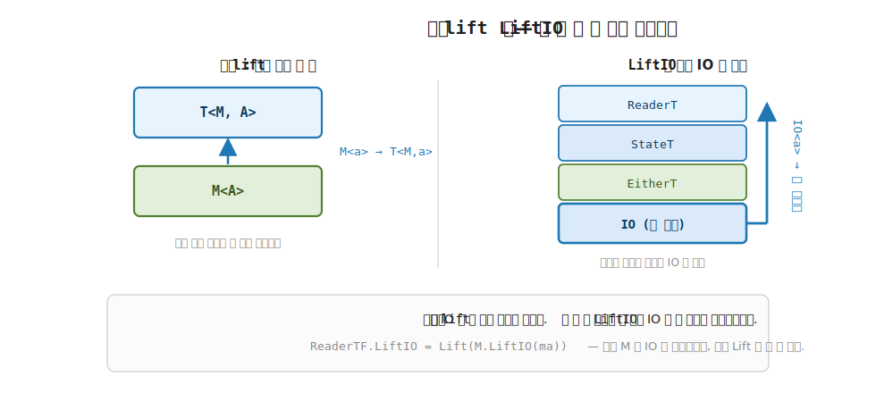
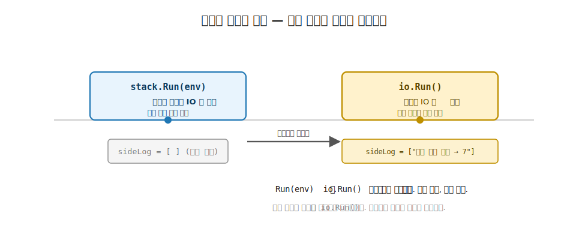

# 22장. MonadIO 와 LiftIO (IO 의 특수 lift, 7부로 가는 다리)

> **이 장의 목표** — 이 장을 마치면 일반 `lift` 와 다른 `LiftIO` 라는 특수한 끌어올림 하나를 설명하고 직접 써 볼 수 있습니다. 19장부터 21장까지 변환기의 일반 `lift` 가 내부 모나드 계산을 바로 위 한 층으로 끌어올림을 봤습니다. 그런데 실전에서 가장 자주 쓰이는 효과는 부수 효과 그 자체입니다. 콘솔 출력, 파일 읽기, 시간 조회가 그렇습니다. 함수형은 이 부수 효과를 `IO<A>` 라는 값으로 인코딩해 스택 맨 안쪽에 둡니다. 문제는 스택이 깊을 때입니다. 일반 `lift` 로는 그 안쪽 `IO` 를 한 층씩 올려야 합니다. `MonadIO<M>` trait 의 멤버 `LiftIO` 는 스택이 아무리 깊어도 맨 안쪽 `IO` 를 그 자리로 곧장 끌어올립니다. 이 한 멤버가 7부 `Eff<RT, A> = ReaderT<RT, IO, A>` 가 `IO` 를 품는 메커니즘이고, 그 정체를 `Run(env)` 은 `IO` 를 조립만 하고 `io.Run()` 에서야 부수 효과가 일어나는 이중 지연으로 손계산해 확인할 수 있습니다.

> **이 장의 핵심 어휘**
>
> - **`IO<A>`**: 부수 효과를 즉시 실행하지 않고 조립만 해 둔 값, 내부는 thunk `() → A`, `Run()` 이 방아쇠
> - **`MonadIO<M>`**: `IO` 효과를 품을 수 있는 모나드를 가리키는 trait, `Monad<M>` 을 상속
> - **`LiftIO`**: `IO<A>` 를 `M<A>` 로 올리는 멤버 하나, 스택 맨 안쪽 `IO` 를 어디서든 끌어올림
> - **일반 `lift`**: 내부 모나드 계산을 바로 위 한 층으로만 올리는 끌어올림 (`M<a> → T<M, a>`)
> - **조립 vs 실행**: `Run(env)` 은 `IO` 를 조립만 하고, `io.Run()` 에서야 부수 효과가 일어나는 분리
> - **이중 지연**: `ReaderT` 의 `Run` 과 `IO` 의 `Run` 이 서로 다른 두 실행이라 부수 효과가 두 번 미뤄짐
> - **`Eff<RT, A> = ReaderT<RT, IO, A>`**: 이 장의 `ReaderT<Env, IOF>` 가 곧 7부 효과 시스템의 축소판이라는 다리

> 이 장을 마치면 할 수 있게 되는 것
> - [ ] `IO<A>` 가 부수 효과를 즉시 실행하지 않고 조립만 한 값임을 설명할 수 있습니다.
> - [ ] `MonadIO<M>` trait 이 `Monad<M>` 위에 멤버 `LiftIO` 하나만 얹은 trait 임을 읽을 수 있습니다.
> - [ ] 일반 `lift` 가 바로 위 한 층만 올리는 것과 `LiftIO` 가 맨 안쪽 `IO` 를 어디서든 올리는 것을 대비할 수 있습니다.
> - [ ] `ReaderT<int, IOF>` 에서 `LiftIO` 로 `IO` 를 끌어올린 스택을 LINQ 로 조립할 수 있습니다.
> - [ ] `Run(env)` 은 조립만, `io.Run()` 에서야 부수 효과가 일어나는 이중 지연을 손계산으로 추적할 수 있습니다.
> - [ ] `ReaderTF.LiftIO = Lift(M.LiftIO(ma))` 가 두 단계로 작동함을 손으로 따라갈 수 있습니다.
> - [ ] `IO` 를 품은 변환기 스택도 모나드 세 법칙을 지킴을 확인할 수 있습니다.
> - [ ] `ReaderT<Env, IOF>` 가 7부 `Eff<RT, A> = ReaderT<RT, IO, A>` 의 축소판임을 예감할 수 있습니다.

> **이 장의 흐름** — 부수 효과를 값으로 인코딩한 `IO<A>` 가 보통 스택 맨 안쪽에 있다는 자리에서 출발합니다. 일반 `lift` 로 그 안쪽 `IO` 를 한 층씩 올리는 번거로움을 먼저 부딪힌 뒤, `IO<A>` 가 조립만 한 값이라는 것을 한 줄로 상기합니다. `MonadIO<M>` trait 과 멤버 `LiftIO` 의 시그니처를 일반 `lift` 와 나란히 놓고, 둘의 차이를 그림으로 봅니다. `ReaderT<int, IOF>` 에서 `LiftIO` 로 `IO` 를 끌어올리는 데모를 손계산해, `Run(env)` 은 조립만 하고 `io.Run()` 에서야 부수 효과가 일어나는 이중 지연을 추적합니다. 학습 코드가 v5 와 어떻게 다른지 정직하게 짚고, 이 스택이 7부 효과 시스템의 축소판임을 확인합니다. 마지막으로 법칙을 점검하고 6부를 닫으며 7부로 다리를 놓습니다.

---

## 22.1 이 장에서 다루는 것 — IO 의 특수 lift, 7부로 가는 다리

6부에서 변환기를 차례로 쌓았습니다. 잠깐 되짚어 봅니다. 변환기 (transformer) 는 "바깥 효과 하나를 정해 두고 안쪽 모나드 `M` 의 자리를 빈칸으로 비워, 두 효과를 한 스택으로 쌓는 도구" 였습니다. `ReaderT<Env, M, A>` 는 환경 효과를, `StateT<S, M, A>` 는 상태 효과를, `OptionT<M, A>` 는 부재 효과를 안쪽 `M` 위에 얹었습니다. 그 모든 변환기에 공통으로 들어 있던 동사 하나가 `lift` 였습니다.

`lift` 가 무엇이었는지도 다시 떠올립니다. 일반 `lift` 는 "안쪽 모나드 `M` 의 계산을 바로 위 한 층으로 끌어올리는" 동사였습니다. 시그니처로는 `M<a> → T<M, a>` 입니다. 내부 `M` 으로 짠 계산을 바깥 변환기 `T` 의 어휘로 올려, 두 효과를 한 LINQ 사슬에 섞어 쓰게 했습니다.

이 장의 자리는 그 `lift` 의 마지막 변주입니다. 6 이동 지도로 보면, 변환기가 두 Elevated World 를 스택으로 쌓는 자리였고, 이 장은 그 스택의 맨 안쪽에 부수 효과 `IO` 가 놓일 때 그것을 어디서든 한 번에 끌어올리는 특수한 `lift` 한 개입니다.

부수 효과란 콘솔에 출력하거나, 파일을 읽거나, 현재 시간을 묻는 일처럼 함수 바깥 세상에 영향을 주거나 받는 일입니다. 함수형은 이런 부수 효과를 곧장 실행하지 않고 `IO<A>` 라는 값으로 인코딩해 둡니다. 실전 스택은 거의 언제나 이 `IO` 를 맨 안쪽에 둡니다. 환경을 읽고, 상태를 나르고, 그 모든 바깥에서 결국 콘솔에 쓰거나 시간을 묻는 일이 일어나기 때문입니다.

그래서 이 장의 도달점은 단 한 문장입니다. "일반 `lift` 는 바로 위 한 층만 올리지만, `LiftIO` 는 스택 맨 안쪽의 `IO` 를 어디서든 그 자리로 곧장 올린다." 이 한 문장을 코드로 직접 겪고 나면, 7부에서 만날 효과 시스템 `Eff<RT, A>` 가 사실은 `ReaderT<RT, IO, A>`, 곧 이 장에서 손으로 만질 스택의 정식 이름임을 미리 알고 시작하는 셈입니다.

지금 모든 것을 외우지 않아도 됩니다. 이 장이 끝날 때 손에 남는 것은 `LiftIO` 라는 멤버 하나와, 그 멤버가 부수 효과를 `io.Run()` 까지 미뤄 둔다는 이중 지연 한 가지입니다. 새 trait `MonadIO<M>` 도 기존 `Monad<M>` 위에 멤버 하나만 얹은 것이라, 6부에서 쌓은 것 위에 작은 한 칸을 더하는 장입니다.

---

## 22.2 왜 필요한가 — 깊은 스택의 안쪽 IO 를 한 층씩 올리는 번거로움

일반 `lift` 만으로 부수 효과를 다루려 하면 어디서 막히는지부터 부딪혀 봅니다. 추상을 먼저 보이지 않고, 손에 잡히는 상황을 먼저 겪는 것이 이 장의 순서입니다.

스택을 하나 떠올립니다. 바깥은 환경을 읽는 `ReaderT`, 안쪽은 부수 효과를 담는 `IO` 입니다. 즉 `ReaderT<Env, IO, A>` 입니다. 이제 콘솔에 한 줄 출력하는 부수 효과 `IO<Unit>` 를 이 스택 안에서 쓰고 싶습니다. 그런데 그 `IO` 는 스택의 맨 안쪽 층에 있고, 우리가 LINQ 를 짜는 자리는 맨 바깥 `ReaderT` 층입니다. 두 층 사이를 어떻게 잇느냐가 문제입니다.

일반 `lift` 의 시그니처는 `M<a> → T<M, a>` 였습니다. 바로 위 한 층만 올립니다. 그러니 안쪽 `IO<Unit>` 를 바깥 `ReaderT` 어휘로 올리려면, `IO` 를 먼저 내부 모나드 `M` 의 어휘로 만든 다음 (`IO` 가 곧 `M` 인 경우라면 그 자체이지만), 그것을 다시 한 층 위 `ReaderT` 로 올려야 합니다. 층이 한둘이면 견딜 만합니다.

문제는 스택이 깊어질 때입니다. 명령형이나 객체 지향에서 익숙한 직감으로 옮기면 이렇습니다. `Stream` 을 `BufferedStream` 으로 감싸고 그것을 다시 `GZipStream` 으로 감싸 세 겹이 됐을 때, 맨 안쪽 `Stream` 에 바이트 하나를 쓰려면 바깥 두 겹을 거쳐 내려가야 했던 경험을 떠올리면 됩니다. 변환기 스택도 똑같습니다. 환경 위에 상태를 얹고 그 위에 오류를 얹어 `ReaderT<Env, StateT<S, EitherT<L, IO>>, A>` 처럼 네 겹이 되면, 맨 안쪽 `IO` 를 맨 바깥 어휘로 올리는 데 일반 `lift` 를 층의 수만큼 겹쳐 불러야 합니다. `lift` 를 `lift` 로 또 감싸는 코드가 층마다 반복됩니다.

그런데 부수 효과는 거의 언제나 스택 맨 안쪽에 있습니다. 콘솔 출력도, 파일 읽기도, 시간 조회도 모두 가장 안쪽 `IO` 의 일입니다. 그렇다면 그 안쪽 `IO` 만큼은 층을 한 단씩 거치지 말고, 어느 깊이에서든 한 번에 맨 위로 올리고 싶습니다. 다른 효과 (환경, 상태) 와 달리 `IO` 는 늘 맨 안쪽에 있다는 그 규칙성을 도구로 만들면, 깊이와 무관하게 한 번에 올릴 수 있습니다.

> **흔한 함정** — `IO` 를 일반 `lift` 로 올리면 되지 않느냐고 여기는 것입니다.
>
> 스택이 한 겹뿐이면 일반 `lift` 로도 됩니다. 그러나 스택이 깊어지면 안쪽 `IO` 를 맨 위로 올리는 데 `lift` 를 층의 수만큼 겹쳐야 하고, 층을 하나 더 쌓을 때마다 그 부수 효과를 올리는 코드도 한 단 더 깊어집니다. `LiftIO` 는 이 문제를 다르게 봅니다. "내가 어느 층에 있든, 맨 안쪽 `IO` 를 그 자리로 곧장 올려 줘" 라는 멤버 하나를 모든 층이 공유합니다. 그래서 깊이와 무관하게 `LiftIO` 한 번이면 충분합니다.

이 한 멤버를 정의하는 자리가 새 trait `MonadIO<M>` 입니다. 그 trait 으로 들어가기 전에, 끌어올릴 대상인 `IO<A>` 가 정확히 무엇인지 한 줄로 상기합니다.

---

## 22.3 IO<A> 한 줄 상기 — 부수 효과를 조립한 값

`IO<A>` 는 7부에서 본격적으로 다룰 타입이지만, 이 장에 필요한 골격만 미리 한 줄로 상기합니다. 핵심은 하나입니다. `IO<A>` 는 부수 효과를 곧장 실행하지 않고 조립만 해 둔 값입니다.

```csharp
// IO<A> — 지연된 부수 효과. 내부는 thunk () → A. Run() 하기 전엔 아무 일도 안 일어난다.
public sealed class IO<A>(Func<A> thunk) : K<IOF, A>
{
    public A Run() => thunk();
}

여기서 `IO<A>` 옆에 붙은 `K<IOF, A>` 의 `IOF` 가 처음 보이는 이름입니다. 한 줄로만 짚어 둡니다. `IOF` 는 `IO` 의 태그 (trait 호스트), 곧 `IO` 라는 타입에 trait 을 부착할 자리입니다. 1부에서 `Option` 의 trait 을 `OptionF` 라는 태그에 부착했던 그 방식 그대로입니다. `IOF` 가 `MonadIO` 를 어떻게 부착하는지는 다음 절에서 봅니다. 지금은 "`IO` 의 trait 이 사는 자리" 정도로 읽으면 충분합니다.
```

이 한 줄짜리 자료를 천천히 읽습니다. `IO<A>` 는 함수 하나 (`Func<A>`, 곧 인자 없이 `A` 를 내는 thunk) 를 감싼 상자입니다. 생성자에 `() => { 콘솔에 출력하고 7 을 돌려준다 }` 같은 thunk 를 넘기면, 그 부수 효과는 아직 일어나지 않습니다. 상자 안에 출력하는 절차가 적힌 채로 가만히 들어 있을 뿐입니다.

부수 효과가 실제로 일어나는 자리는 `Run()` 한 곳뿐입니다. `Run()` 은 감싸 둔 thunk 를 비로소 호출합니다. 그 순간에야 콘솔에 글자가 찍히고, 파일이 읽히고, `A` 값이 나옵니다. `Run()` 을 부르기 전까지는 `IO<A>` 를 만들고 변수에 담고 함수에 넘겨도 바깥 세상에는 아무 일도 일어나지 않습니다.

객체 지향 직감으로 다리를 놓으면 이렇습니다. `using` 블록과 `IDisposable` 을 떠올립니다. `var stream = new FileStream(path)` 를 적는 순간 파일 핸들이라는 자원을 다룰 준비가 되지만, 그것을 실제로 읽거나 쓰는 일은 뒤에 따로 합니다. `IO<A>` 도 비슷합니다. `new IO<int>(() => ...)` 를 적는 것은 "이 부수 효과를 이렇게 실행하겠다" 는 절차를 조립해 둔 것이고, `Run()` 이 그 절차를 실행하는 방아쇠입니다. `try`-`finally` 에서 자원을 마련하는 코드와 그것을 정리하는 코드가 따로 적히듯, `IO` 는 조립과 실행이 두 자리로 나뉩니다.


이 "조립 따로, 실행 따로" 를 작은 손계산으로 한 번 봐 둡니다. 우리가 따라갈 것은 단 하나, **언제 콘솔에 글자가 찍히는가** 입니다.

```
var io = new IO<int>(() => { Console.Write("실행!"); return 7; });
                                  // ← 여기까지: 아직 아무것도 안 찍힘.
                                  //   thunk 가 io 안에 잠들어 있을 뿐.
var a  = io;                      // ← 변수에 담아도 안 찍힘.
Use(io);                          // ← 함수에 넘겨도 안 찍힘.
int r = io.Run();                 // ← 바로 여기서 "실행!" 이 찍히고 r = 7.
```

`new IO<...>(...)` 부터 `Use(io)` 까지 세 줄을 지나도 콘솔은 조용합니다. `Run()` 한 줄에서야 비로소 글자가 찍힙니다. 부수 효과가 일어나는 자리는 오직 `Run()` 한 곳뿐이라는 것을, 이 작은 추적이 눈으로 보여 줍니다. 이 한 가지를 손에 쥐고 나면 뒤의 이중 지연이 같은 이야기의 두 겹임을 알아보기 쉽습니다.

이 장에서 우리가 만질 `IO<A>` 는 딱 이만큼입니다. 부수 효과를 thunk 로 조립한 값이고, `Run()` 이 방아쇠라는 것. 7부에서는 이 `IO` 가 취소 토큰과 자원 관리와 오류까지 다루는 완전한 효과 모나드로 자라지만, `LiftIO` 를 이해하는 데는 이 골격으로 충분합니다.

`IO` 가 자기 자신을 `MonadIO` 로 부착하는 모습은 다음 절에서 trait 과 함께 봅니다. 그 부착에서 `LiftIO` 가 가장 단순한 모양 (항등) 으로 나타나, trait 의 뜻을 곧장 보여 줍니다.

---

## 22.4 MonadIO trait 과 LiftIO — 멤버 하나의 약속

이제 `IO` 효과를 품을 수 있는 모나드를 가리키는 trait 을 봅니다. 이름은 `MonadIO<M>` 입니다.

```csharp
// MonadIO — IO 효과를 품을 수 있는 모나드. Monad<M> 위에 멤버 하나만 얹는다.
public interface MonadIO<M> : Monad<M> where M : MonadIO<M>
{
    static abstract K<M, A> LiftIO<A>(IO<A> ma);
}
```

trait 의 모양을 한 줄씩 읽습니다. `MonadIO<M> : Monad<M>` 은 "`MonadIO` 는 먼저 `Monad` 이다" 라는 뜻입니다. 즉 `MonadIO` 를 부착한 타입은 `Pure`, `Bind`, `Map`, `Apply` 를 이미 다 가집니다. 6부 내내 본 모나드의 모든 약속을 그대로 지키면서, 그 위에 능력 하나를 더 얹는 것입니다.

더 얹는 능력이 멤버 `LiftIO` 단 하나입니다. 시그니처는 `IO<A> → K<M, A>` 입니다.

이 자리에서 "trait 의 약속" 이 무슨 뜻이었는지 한 줄로 상기합니다. trait 은 "이 타입은 이 멤버를 반드시 가진다" 는 약속이고, 그 약속을 적어 두는 자리입니다. 그러니 `MonadIO<M>` 을 부착한 타입은 곧 "나는 `IO` 를 내 어휘로 끌어올릴 줄 안다" 고 약속한 셈입니다. 어떻게 끌어올리는지는 타입마다 다르되, 끌어올릴 수 있다는 약속만은 모두 같습니다. "`IO<A>` 라는 부수 효과 값을 받아, 모나드 `M` 의 어휘 `K<M, A>` 로 올려 준다" 는 약속입니다. `static abstract` 이므로 `M` 을 부착하는 각 타입이 이 한 멤버를 자기 방식으로 구현하면 됩니다.

일반 `lift` 의 시그니처와 나란히 놓고 보면 차이가 또렷합니다.

| 동사 | 시그니처 | 받는 것 | 올리는 대상 |
|---|---|---|---|
| 일반 `lift` (`MonadT.Lift`) | `K<M, A> → K<T, A>` | 바로 아래 한 층의 내부 모나드 계산 `M<a>` | 그 한 층 위 변환기 `T<M, a>` |
| `LiftIO` (`MonadIO.LiftIO`) | `IO<A> → K<M, A>` | 스택 맨 안쪽의 `IO<a>` | 자기 자신 `M<a>` (스택이 얼마나 깊든) |

일반 `lift` 가 받는 것은 "바로 아래 한 층" 의 계산입니다. 그래서 올리는 일도 한 층입니다. `LiftIO` 가 받는 것은 언제나 `IO`, 곧 스택 맨 안쪽의 효과입니다. 받는 타입이 늘 `IO` 한 가지이므로, 스택이 한 겹이든 네 겹이든 같은 멤버 하나로 그 안쪽 `IO` 를 올립니다.

trait 의 뜻을 가장 단순한 부착이 보여 줍니다. `IO` 그 자체가 `MonadIO` 입니다.

```csharp
// IOF 는 그 자체로 MonadIO — LiftIO 가 항등이다 (IO 를 IO 로 끌어올림 = 그대로).
public sealed class IOF : MonadIO<IOF>
{
    public static K<IOF, B> Map<A, B>(Func<A, B> f, K<IOF, A> fa) =>
        new IO<B>(() => f(fa.As().Run()));
    public static K<IOF, A> Pure<A>(A value) => new IO<A>(() => value);
    public static K<IOF, B> Apply<A, B>(K<IOF, Func<A, B>> mf, K<IOF, A> ma) =>
        new IO<B>(() => mf.As().Run()(ma.As().Run()));
    public static K<IOF, B> Bind<A, B>(K<IOF, A> ma, Func<A, K<IOF, B>> f) =>
        new IO<B>(() => f(ma.As().Run()).As().Run());

    public static K<IOF, A> LiftIO<A>(IO<A> ma) => ma;
}
```

`Map`, `Pure`, `Apply`, `Bind` 는 6부에서 본 모나드 부착 그대로입니다. 모두 새 `IO` 를 만들어 thunk 안에서 `Run()` 을 미뤄 두는 모양이라, 부수 효과가 즉시 일어나지 않는다는 성질을 유지합니다. 새로 볼 한 줄은 맨 아래입니다.

맨 아래 `LiftIO<A>(IO<A> ma) => ma` 가 이 절의 핵심입니다. 한 글자씩 읽어 봅니다. 받는 것은 `IO<A>` 한 개 (`ma`) 이고, 돌려주는 것도 그 `ma` 그대로입니다. 손도 대지 않고 받은 것을 그대로 내보냅니다. 왜 그럴까요. `IOF` 가 하는 일은 `IO` 를 `IO` 의 어휘로 올리는 것인데, 받은 `ma` 가 이미 `IO` 이므로 더 올릴 자리가 없습니다. 들어온 그대로가 곧 목적지입니다. 받은 것을 손대지 않고 그대로 내보내는 이런 함수를 항등 (identity) 이라 부릅니다. 두 평행 세계의 어휘로 보면, `IO` 는 이미 부수 효과를 품은 Elevated 시민이므로 자기 자신으로의 끌어올림은 아무 일도 하지 않는 끌어올림입니다. `LiftIO` 가 가장 단순할 때 어떤 모습인지를 이 한 줄이 보여 줍니다.

> **미리보기** — 다음 절에서 `ReaderTF` 의 `LiftIO` 를 봅니다. 거기서는 `LiftIO` 가 항등이 아니라 `Lift(M.LiftIO(ma))` 라는 두 단계로 나타납니다. 지금 그 코드를 다 이해하지 않아도 됩니다. `IOF` 에서는 올릴 것이 없어 항등이지만, 바깥에 다른 층이 있으면 그 층을 한 단 올려 줘야 한다는 것만 기억하면 다음 절이 자연스럽게 읽힙니다.

자유 함수로도 같은 일을 부릅니다. 7부의 prelude 어휘를 미리 만나 둡니다.

```csharp
public static class IOM
{
    // 어떤 MonadIO M 에든 IO 를 끌어올린다.
    public static K<M, A> liftIO<M, A>(IO<A> io) where M : MonadIO<M> => M.LiftIO(io);
}
```

`IOM.liftIO` 는 제약 `where M : MonadIO<M>` 만 만족하면 어떤 모나드에든 `IO` 를 올립니다. 본체는 그 모나드의 `LiftIO` 를 부르는 한 줄뿐입니다. 데모에서 LINQ 안에 `IO` 를 섞을 때 이 자유 함수를 씁니다.

---

## 22.5 일반 lift 대 LiftIO — 한 층이냐 맨 안쪽이냐

두 끌어올림의 차이를 그림 하나로 정리합니다. 21장까지 본 일반 `lift` 와, 이 장의 `LiftIO` 가 서로 무엇이 다른지가 이 절의 한 가지 논점입니다.

일반 `lift` 는 인접한 두 층 사이의 한 칸 이동입니다. 변환기 `T` 가 내부 모나드 `M` 을 한 층 감쌌을 때, `M` 의 계산을 그 한 층 위 `T<M>` 으로 올립니다. 한 칸 위, 딱 거기까지입니다. 안쪽에 또 다른 층이 있다면 그 층은 일반 `lift` 의 시야 밖입니다.

`LiftIO` 는 다른 종류의 이동입니다. 스택의 어느 높이에 있든, 맨 안쪽 `IO` 를 그 높이로 곧장 끌어올립니다.

객체 지향 직감으로 다리를 놓으면 이렇습니다. 깊이 중첩된 `Stream` 을 떠올립니다. `GZipStream` 안에 `BufferedStream`, 그 안에 `FileStream` 이 들어 있을 때, 일반 `lift` 는 "한 겹 안의 스트림을 한 겹 바깥으로 꺼내는" 일이라 겹 수만큼 반복해야 합니다. 그에 비해 `LiftIO` 는 "맨 안쪽 파일 핸들에 곧장 닿는" 한 줄짜리 지름길에 가깝습니다. 중간 겹이 몇이든, 진짜 부수 효과가 일어나는 자리 (맨 안쪽) 만은 한 번에 짚습니다. 두 끌어올림이 받는 대상이 다르다는 한 가지가 이 차이를 만듭니다. 받는 타입이 늘 `IO` 한 가지라는 점이 이 차이를 만듭니다. 일반 `lift` 의 받는 타입 `M<a>` 는 "바로 아래 층" 을 가리키지만, `LiftIO` 의 받는 타입 `IO<a>` 는 "맨 안쪽 층" 을 가리킵니다. 스택이 깊어져도 맨 안쪽은 여전히 `IO` 한 곳이라, `LiftIO` 의 시야는 깊이와 무관하게 그 한 곳을 향합니다.



**그림 22-1. 일반 `lift` 대 `LiftIO`** — 일반 `lift` 는 바로 아래 한 층(`M<a> → T<M,a>`)만 끌어올립니다. `LiftIO` 는 스택이 아무리 깊어도 맨 안쪽의 `IO` 효과를 그 자리로 곧장 끌어올림을 대비해 보입니다.

여기서 자연스러운 물음이 생깁니다. `LiftIO` 가 어떻게 깊은 스택을 건너뛰고 맨 안쪽까지 닿느냐는 것입니다. 비밀은 모든 층이 같은 멤버를 공유한다는 데 있습니다. `MonadIO<M>` 을 부착한 층은 자기 안쪽의 `LiftIO` 에 일을 넘기고, 그 안쪽 층도 또 자기 안쪽에 넘깁니다. 이 "안쪽에 넘김" 을 작은 그림으로 보면 이렇습니다.

```
바깥 층.LiftIO(io)
   → 안쪽 층.LiftIO(io)        (나는 못 올리니 안쪽에 넘긴다)
      → 또 안쪽 층.LiftIO(io)  (역시 안쪽에 넘긴다)
         → IO 자신.LiftIO(io) = io   (맨 안쪽: 항등. 여기서 멈춘다)
```

한 층씩 넘기다 보면 결국 맨 안쪽 `IO` 의 `LiftIO` 에 닿고, 그 자리는 앞 절에서 본 항등이라 받은 `io` 를 그대로 돌려주며 사슬이 끝납니다. 한 줄짜리 위임이 층의 수만큼 사슬로 이어지지만, 우리가 적는 코드는 `LiftIO` 한 번뿐입니다. 그 사슬을 다음 절에서 `ReaderT` 의 `LiftIO` 로 직접 손으로 따라갑니다.

---

## 22.6 ReaderT<int, IOF> 데모 — LiftIO 로 IO 끌어올리기

이제 실제 스택에서 `LiftIO` 를 써 봅니다. 가장 작은 스택을 고릅니다. 바깥은 환경을 읽는 `ReaderT`, 안쪽은 부수 효과 `IOF`, 곧 `ReaderT<int, IOF>` 입니다. 환경은 정수 하나 (배수) 이고, `IO` 는 정수 하나를 내며 부수 효과로 로그를 남깁니다.

먼저 이 스택을 떠받치는 `ReaderTF` 의 골격을 봅니다. 6부에서 본 `ReaderT` 와 거의 같고, `LiftIO` 한 멤버가 새로 들어 있습니다.

```csharp
public sealed class ReaderT<Env, M, A>(Func<Env, K<M, A>> run) : K<ReaderTF<Env, M>, A>
    where M : MonadIO<M>
{
    public K<M, A> Run(Env env) => run(env);
}
```

`ReaderT<Env, M, A>` 는 21장까지와 같이 함수 `Env → M<A>` 를 감싼 상자입니다. 다른 점은 제약 한 글자입니다. `where M : MonadIO<M>` 입니다. 6부의 일반 `ReaderT` 는 `where M : Monad<M>` 이었습니다. 여기서는 내부 모나드 `M` 이 그냥 모나드가 아니라 `IO` 를 품을 수 있는 모나드여야 한다고 요구합니다. 이 한 글자가 이 장의 중심입니다.


> **미리보기** — `where M : MonadIO<M>` 이 왜 `Monad<M>` 이 아닌지가 궁금할 수 있습니다.
>
> 짧게만 말해 둡니다. 이 스택은 안쪽 `M` 에 `LiftIO` 를 넘기는 일을 합니다 (앞 절의 위임 사슬). 그러려면 안쪽 `M` 도 `LiftIO` 를 가지고 있어야 합니다. 곧 안쪽이 `IO` 를 품을 줄 아는 모나드 (`MonadIO`) 여야 합니다. 그 약속을 제약 한 글자로 적어 둔 것뿐입니다. 이 한 글자가 v5 와 갈리는 지점이기도 한데, 그 차이는 뒤에서 정직하게 풉니다. 지금은 "안쪽이 `IO` 를 품을 줄 알아야 위임을 넘길 수 있다" 로 충분합니다. 그 뜻은 학습 코드와 v5 의 차이를 다루는 절에서 정직하게 풀겠습니다. 지금은 "내부 `M` 이 `IO` 를 품을 수 있어야 이 스택을 만들 수 있다" 로 읽으면 됩니다.

```csharp
public sealed class ReaderTF<Env, M> :
    MonadT<ReaderTF<Env, M>, M>,
    MonadIO<ReaderTF<Env, M>>,
    Readable<ReaderTF<Env, M>, Env>
    where M : MonadIO<M>
{
    public static K<ReaderTF<Env, M>, A> Pure<A>(A value) =>
        new ReaderT<Env, M, A>(_ => M.Pure(value));

    public static K<ReaderTF<Env, M>, B> Bind<A, B>(K<ReaderTF<Env, M>, A> ma, Func<A, K<ReaderTF<Env, M>, B>> f) =>
        new ReaderT<Env, M, B>(env => M.Bind(ma.As().Run(env), a => f(a).As().Run(env)));

    // 일반 lift — 내부 모나드 계산을 한 층 위로.
    public static K<ReaderTF<Env, M>, A> Lift<A>(K<M, A> ma) =>
        new ReaderT<Env, M, A>(_ => ma);

    // IO lift — 스택 맨 안쪽 IO 를 끌어올린다 (내부 M 의 LiftIO 에 위임).
    public static K<ReaderTF<Env, M>, A> LiftIO<A>(IO<A> ma) =>
        Lift(M.LiftIO(ma));

    public static K<ReaderTF<Env, M>, A> Asks<A>(Func<Env, A> f) =>
        new ReaderT<Env, M, A>(env => M.Pure(f(env)));
}
```

`ReaderTF` 가 세 trait 을 동시에 부착한 것이 보입니다. `MonadT` (일반 `lift` 를 줌), `MonadIO` (`LiftIO` 를 줌), `Readable` (환경 읽기를 줌) 입니다. `Pure`, `Bind`, `Asks` 는 6부의 `ReaderT` 그대로입니다. 새로 볼 것은 두 줄, `Lift` 와 `LiftIO` 입니다.

`Lift` 는 일반 `lift` 입니다. 내부 모나드 계산 `ma` 를 받아 `_ => ma`, 곧 "환경을 무시하고 안쪽 계산을 그대로 내는" `ReaderT` 로 감쌉니다. 환경 층은 비워 두고 (밑줄 `_`), 안쪽 `M` 계산은 그대로 들고 올라옵니다. 한 층 위로 올리는 그 한 칸 이동입니다.

`LiftIO` 가 이 절의 핵심입니다. 본체가 `Lift(M.LiftIO(ma))` 두 단계입니다. 이 한 줄을 안에서 바깥으로 손으로 따라가 봅니다.

### 22.6.1 LiftIO = Lift(M.LiftIO(ma)) — 두 단계 추적

`LiftIO(ma)` 의 본체 `Lift(M.LiftIO(ma))` 를 안쪽부터 한 단계씩 풉니다. `ma` 는 `IO<A>`, 곧 부수 효과 값입니다.

1. **안쪽 단계 — `M.LiftIO(ma)`** — 먼저 내부 모나드 `M` 자신의 `LiftIO` 를 부릅니다. 이것이 `IO<A>` 를 `M<A>`, 곧 내부 모나드의 어휘로 올립니다. 우리 데모에서 `M = IOF` 이므로, 앞 절에서 본 항등 `LiftIO<A>(IO<A> ma) => ma` 가 작동해 `ma` 가 그대로 `IOF` 의 계산 `K<IOF, A>` 가 됩니다. 만약 `M` 이 또 다른 변환기였다면, 그 변환기가 다시 자기 안쪽의 `LiftIO` 에 넘겨, 사슬이 맨 안쪽 `IO` 까지 이어집니다.
2. **바깥 단계 — `Lift(...)`** — 그렇게 내부 어휘 `M<A>` 가 된 계산을, 일반 `lift` 로 한 층 위 `ReaderT` 어휘로 올립니다. 이것이 `_ => (그 M 계산)`, 곧 환경을 무시하고 안쪽 계산을 그대로 내는 `ReaderT` 입니다.

정리하면, `LiftIO` 는 두 가지 일을 한 줄에 겹쳐 놓은 것입니다. 안쪽에서는 내부 `M` 이 `IO` 를 자기 안쪽에서 끌어올리고, 바깥에서는 일반 `Lift` 가 그 결과를 한 층 위로 올립니다. 21장에서 본 일반 `lift` 가 여기 바깥 단계로 그대로 다시 등장한 셈입니다. 안쪽 단계가 `M` 의 책임이라, `M` 이 깊은 변환기 스택이어도 같은 한 줄이 작동합니다. 이것이 앞 절에서 말한 "한 줄짜리 위임이 층의 수만큼 사슬로 이어진다" 의 실제 모습입니다.


두 단계를 한 그림으로 겹쳐 보면 "한 칸 vs 맨 안쪽 어디서든" 이라는 이 장의 한 문장이 또렷해집니다.

```
LiftIO(ma)  =  Lift( M.LiftIO(ma) )
                │        └ 안쪽 단계: 맨 안쪽 IO 가 자기 안쪽에서 IO 를 끌어올림
                │                    (M 이 깊든 얕든 M 의 책임 — 어디서든)
                └ 바깥 단계: 그 결과를 일반 Lift 로 딱 한 칸 위 ReaderT 로
```

안쪽 단계는 깊이와 무관하게 "맨 안쪽 `IO`" 를 향하고 (`LiftIO` 의 몫), 바깥 단계는 늘 "한 칸 위" 로만 올립니다 (일반 `Lift` 의 몫). 두 끌어올림이 한 줄에 나란히 놓여 각자 제 자리를 맡습니다.

이제 이 스택을 LINQ 로 조립합니다. 데모의 핵심 두 줄입니다.

```csharp
var sideLog = new List<string>();
IO<int> effect = new IO<int>(() => { sideLog.Add("[IO] 부수 효과 실행 → 7"); return 7; });

// env(배수) 를 읽고, IO 로 값을 얻어, 곱한다.
K<ReaderTF<int, IOF>, int> stack =
    from m in Readable.asks<ReaderTF<int, IOF>, int, int>(env => env)
    from n in IOM.liftIO<ReaderTF<int, IOF>, int>(effect)
    select m * n;
```

`effect` 는 부수 효과를 조립한 `IO<int>` 입니다. thunk 안에서 `sideLog` 에 `"[IO] 부수 효과 실행 → 7"` 한 줄을 적고 `7` 을 냅니다. 여기서 한 가지를 또렷이 해 둡니다. 이 `effect` 를 만든 시점에 `sideLog` 는 아직 비어 있습니다. `new IO<int>(...)` 는 thunk 를 상자에 담아 둔 것뿐이라, 그 안의 `sideLog.Add(...)` 는 아직 실행되지 않았습니다. 앞에서 본 "조립 따로, 실행 따로" 가 바로 이 자리에서 작동하는 것입니다. 이 비어 있음이 뒤의 이중 지연에서 우리가 눈으로 좇을 신호가 됩니다.

LINQ 세 줄을 읽습니다. 첫 줄 `Readable.asks<...>(env => env)` 는 환경 (배수) 을 그대로 읽어 `m` 에 담습니다. 둘째 줄 `IOM.liftIO<...>(effect)` 가 이 장의 자리입니다. 안쪽 `IO` 인 `effect` 를 `ReaderT<int, IOF>` 스택 위로 끌어올려 `n` 에 담습니다. 셋째 줄에서 `m * n` 으로 곱합니다. LINQ 어디에도 환경을 넘기는 인자나 `Run` 호출이 없습니다. `from-from-select` 가 `Bind` 사슬로 풀리며 환경을 두 단계에 흘리고, `LiftIO` 가 안쪽 `IO` 를 올려 줍니다.

`stack` 을 만든 이 시점에도 부수 효과는 일어나지 않았습니다. `stack` 은 "환경을 주면 `IO` 를 조립해 주겠다" 는 약속을 담은 값일 뿐입니다. 부수 효과가 언제 일어나는지는 다음 절에서 두 시점을 짚으며 손계산합니다.

---

## 22.7 이중 지연 — Run(env) 은 조립, io.Run() 은 실행

이 절이 이 장에서 가장 천천히 읽을 자리입니다. `stack` 을 끌어내릴 때 부수 효과가 정확히 언제 일어나는지를 두 시점으로 나눠 추적합니다. 우리가 따라갈 것은 단 하나, `sideLog` 가 각 시점에 비어 있는가 차 있는가입니다.

```csharp
// Run(env) 는 IO 를 *조립만* 한다 — 아직 부수 효과 없음.
var io = stack.As().Run(6);
Console.WriteLine($"  Run(env=6) 직후 — IO 미실행? sideLog 비었나 = {sideLog.Count == 0}");

// io.Run() 에서야 부수 효과가 일어난다.
var result = io.As().Run();
Console.WriteLine($"  io.Run() → {result}   (6 × 7)");
Console.WriteLine($"  sideLog = [{string.Join(", ", sideLog)}]");
```

두 개의 `Run` 이 보입니다. 하나는 `stack.As().Run(6)`, `ReaderT` 의 `Run` 입니다. 다른 하나는 `io.As().Run()`, `IO` 의 `Run` 입니다. 이름은 같은 `Run` 이지만 서로 다른 두 실행입니다. 이 둘을 가르는 것이 이중 지연의 핵심입니다.


두 `Run` 이 헷갈리기 쉬우니 이름표를 붙여 둡니다. 하나는 `ReaderT.Run(env)`, **환경을 받는** `Run` 입니다. 다른 하나는 `IO.Run()`, **인자가 없는** `Run` 입니다. 인자가 있느냐 없느냐로 둘은 늘 구별됩니다. 환경을 받는 쪽은 `IO` 를 조립하고, 인자가 없는 쪽은 그 조립된 `IO` 의 부수 효과를 일으킵니다. 같은 글자 `Run` 이지만 하는 일이 다른 두 동사라고 보면 됩니다.

### 22.7.1 첫 시점 — Run(env=6) 직후

`stack.As().Run(6)` 은 환경 `6` 을 주입합니다. 무슨 일이 일어나는지 손으로 따라갑니다.

```
sideLog = []                              (시작: 비어 있음)

stack.As().Run(6)
  ├ Readable.asks(env => env) 에 env=6 흘림 → m = 6 을 IO 로 조립 (M.Pure(6))
  ├ LiftIO(effect) 에 env=6 흘림 → effect 를 그대로 안쪽 IO 로 (env 무시)
  └ select m * n → "6 과 안쪽 IO 의 n 을 곱하는 IO" 를 *조립*

결과: io : IO<int>   (아직 Run() 안 됨)
sideLog = []                              (여전히 비어 있음!)
```

`ReaderT.Run(6)` 이 한 일은 환경 `6` 을 LINQ 사슬의 각 단계에 흘려, 최종적으로 하나의 `IO<int>` 를 만든 것뿐입니다. 곧 "환경 `6` 을 주면 이런 `IO` 를 내겠다" 는 약속을 진짜 `IO` 한 개로 굳힌 것입니다. 그러나 그 `IO` 는 아직 잠든 상자입니다. `effect` 의 thunk 는 이 과정에서 단 한 번도 호출되지 않았고, 그래서 `sideLog` 는 여전히 비어 있습니다. 데모 출력이 `sideLog 비었나 = True` 인 까닭이 이것입니다. `Run(env)` 은 부수 효과를 일으키지 않고 `IO` 를 조립만 하는데, 이 미룸을 첫째 지연이라 부릅니다.

여기서 잠깐 멈춰 왜 비어 있는지를 짚습니다. `IO` 의 모든 부착 (`Map`, `Bind`, `Pure`) 이 새 `IO` 를 만들어 thunk 안에서 `Run()` 을 미뤄 둔다고 앞에서 봤습니다. `ReaderT` 가 환경을 흘리며 이 `IO` 들을 `Bind` 로 잇는 동안에도, 잇는 일은 더 큰 thunk 를 조립하는 일이지 실행하는 일이 아닙니다. 그래서 `Run(6)` 이 끝나도 thunk 는 여전히 호출을 기다리는 상태입니다.

### 22.7.2 둘째 시점 — io.Run()

이제 `io.As().Run()` 으로 두 번째 방아쇠를 당깁니다.

```
sideLog = []                              (둘째 Run 직전: 아직 비어 있음)

io.As().Run()
  └ 조립해 둔 thunk 가 비로소 호출됨
      ├ effect 의 thunk 실행 → sideLog 에 "[IO] 부수 효과 실행 → 7" 추가, 7 반환
      └ 6 × 7 = 42

결과: result = 42
sideLog = ["[IO] 부수 효과 실행 → 7"]       (이제야 차 있음!)
```

`io.Run()` 이 조립해 둔 thunk 를 비로소 호출합니다. 그 안에서 `effect` 의 thunk 가 실행돼 `sideLog` 에 `"[IO] 부수 효과 실행 → 7"` 한 줄이 쌓이고 `7` 이 나옵니다. 환경에서 읽은 `6` 과 곱해 `42` 가 결과입니다. 출력은 `io.Run() → 42` 와 `sideLog = [[IO] 부수 효과 실행 → 7]` 입니다. 부수 효과는 이 두 번째 `Run` 에서야 일어났는데, 이 미룸을 둘째 지연이라 부릅니다.



**그림 22-2. 조립과 실행의 분리** — `Run(env)` 는 환경을 주입해 `IO` 를 *조립*만 하고, 부수 효과는 일어나지 않습니다. `io.Run()` 이라는 방아쇠를 당겨야 비로소 부수 효과가 실행됨을 보여, 함수형이 부수 효과를 끝까지 미루는 방식을 보입니다.

두 시점을 나란히 놓으면 한 그림이 또렷해집니다. 같은 `stack` 인데, 첫 `Run(env)` 직후에는 `sideLog` 가 비어 있었고, 둘째 `io.Run()` 뒤에야 차 있었습니다. `ReaderT` 의 `Run` 과 `IO` 의 `Run` 이 다른 두 실행이기 때문입니다. 앞의 `Run` 은 환경을 주입해 `IO` 를 조립하는 실행이고, 뒤의 `Run` 은 그 조립된 `IO` 의 부수 효과를 일으키는 실행입니다. 부수 효과는 이 두 단계를 모두 거친 끝, 가장 마지막에 한 번 일어납니다.

함수형이 부수 효과를 다루는 방식이 여기서 드러납니다. 부수 효과를 곧장 실행하지 않고 `IO` 값으로 조립해 들고 다니다가, 프로그램의 가장자리에서 `Run()` 한 번으로 실행합니다. 그 사이의 모든 코드 (환경 주입, 곱셈, 합성) 는 순수하게 값을 다룰 뿐입니다. 부수 효과가 `io.Run()` 까지 미뤄진다는 이 한 가지가 함수형이 부수 효과를 순수하게 다루는 핵심이고, 7부 전체가 이 발상 위에 섭니다.

> **흔한 함정** — `Run(env)` 이 부수 효과를 일으킨다고 여기는 것입니다.
>
> `ReaderT.Run(6)` 이 콘솔에 무언가 찍거나 로그를 남길 것 같지만, 그렇지 않습니다. `Run(env)` 은 환경을 주입해 안쪽 `IO` 를 조립할 뿐입니다. 부수 효과는 그 `IO` 를 다시 `io.Run()` 할 때 한 번만 일어납니다. 두 `Run` 이 서로 다른 일을 한다는 것을 놓치면, 부수 효과가 두 번 일어나거나 엉뚱한 시점에 일어난다고 오해하기 쉽습니다. 데모의 `sideLog 비었나 = True` 출력이 그 오해를 막아 줍니다.

---

## 22.8 v5 와의 정합 — 한 글자 제약의 차이

학습 코드와 LanguageExt v5 가 `MonadIO` 를 다루는 방식에 한 가지 의도된 차이가 있습니다. 이 차이를 정직하게 짚어 둡니다. 입문 단계에서 외울 내용은 아니고, 학습 코드가 왜 이 모양인지의 배경입니다.

핵심은 변환기의 내부 모나드 제약 한 글자입니다. 앞에서 본 학습용 `ReaderT<Env, M, A>` 와 `ReaderTF<Env, M>` 는 `where M : MonadIO<M>` 을 요구했습니다. 곧 "내부 `M` 이 반드시 `IO` 를 품을 수 있어야" 이 스택을 만들 수 있습니다. v5 의 `ReaderT<Env, M>` 는 더 느슨한 `where M : Monad<M>` 입니다. `IO` 를 품지 못하는 내부 모나드로도 스택을 만들 수 있습니다.

이 차이가 `LiftIO` 의 잘못이 **언제 드러나는가** 를 가릅니다. v5 는 제약이 느슨해서, `IO` 를 품지 못하는 내부 모나드로도 스택을 만들 수 있습니다. 그래서 그런 스택에 `LiftIO` 를 부르는 잘못을 컴파일러가 미리 막지 못합니다. 대신 `LiftIO` 를 실제로 부르는 그 순간, 내부 모나드가 `IO` 를 정말 품을 수 있는지를 확인하고, 품지 못하면 그때 예외 (`LiftIONotSupported`) 를 던집니다. 곧 잘못이 프로그램이 돌아가는 도중에야 드러납니다.

학습 코드는 이 잘못을 한참 앞당깁니다. 제약을 `where M : MonadIO<M>` 으로 좁혀 두었으니, `IO` 를 품지 못하는 내부 `M` 으로는 스택을 짤 코드 자체가 컴파일되지 않습니다. 잘못된 스택을 애초에 적을 수 없으니, 런타임에 던질 예외도 없습니다. 같은 잘못을 v5 는 런타임에서 잡고, 학습 코드는 컴파일 시점으로 끌어와 막는 셈입니다.

학습 코드는 이 잘못을 컴파일 시점으로 앞당깁니다. 제약을 `where M : MonadIO<M>` 으로 좁혀 두었기 때문에, 내부 `M` 이 `IO` 를 품지 못하면 그 스택은 애초에 인스턴스화되지 않습니다. 컴파일러가 막습니다. 그래서 학습 코드에는 `LiftIO` 가 런타임에 던지는 예외라는 것이 아예 존재하지 않습니다. 잘못된 스택을 만들 수 없으니 던질 일도 없습니다.

| 자리 | 학습 코드 | LanguageExt v5 |
|---|---|---|
| 내부 `M` 제약 | `where M : MonadIO<M>` (좁음) | `where M : Monad<M>` (느슨) |
| `IO` 못 품는 스택 | 컴파일 불가 (인스턴스화 거부) | 컴파일 가능 |
| `LiftIO` 의 실패 | 없음 (애초에 만들 수 없음) | 런타임 예외 `LiftIONotSupported` |
| `IOF.LiftIO` | `ma` 그대로 (항등) | `ma` 그대로 (항등) 으로 정합 |

표의 마지막 줄을 따로 짚어 둡니다. 가장 단순한 부착 `IOF.LiftIO<A>(IO<A> ma) => ma` 는 학습 코드와 v5 가 글자까지 같습니다. `IO` 를 `IO` 로 올리는 것은 양쪽 모두 받은 `IO` 를 그대로 내보내는 항등이라, 여기에는 차이가 없습니다. 자유 함수 `IOM.liftIO` 를 부르는 형태도 양쪽이 같습니다. 다른 점은 위임 대상과 제약뿐입니다. 학습 코드는 입문자가 런타임 예외를 만나지 않도록, "잘못된 스택은 만들 수 없다" 를 컴파일러에게 맡긴 단순화 버전입니다.

> **참고** — 이 차이는 학습 코드의 단순화이지 v5 가 틀렸다는 뜻이 아닙니다. v5 가 느슨한 제약을 택한 데는 이유가 있습니다. 모든 내부 모나드에 `MonadIO` 제약을 강제하면 `IO` 와 무관한 순수 스택까지 그 제약을 짊어져야 합니다. v5 는 그 부담을 피하는 대신 런타임 확인을 택했고, 학습 코드는 입문 단계의 안전을 위해 컴파일 시점 확인을 택했습니다. 두 선택의 맞바꿈을 아는 것으로 충분합니다.

---

## 22.9 Eff<RT, A> = ReaderT<RT, IO, A> 예감 — 7부로 가는 다리

이 장에서 손으로 만진 스택 `ReaderT<int, IOF>` 가 무엇의 축소판인지 짚으며 6부를 닫습니다. 데모와 챌린지가 반복해 안내하는 한 줄, "이 스택이 7부 효과 시스템" 의 뜻을 한 단락으로 풉니다.

7부에서 만날 실무 효과 타입은 `Eff<RT, A>` 입니다. 콘솔, 파일, 시간 같은 실제 부수 효과를 다루면서 런타임 `RT` 에서 의존성을 주입받는 타입입니다. 그런데 그 정체는 새 마법이 아닙니다. `Eff<RT, A>` 는 사실 `ReaderT<RT, IO, A>` 입니다. 곧 이 장의 `ReaderT<int, IOF>` 에서 환경 자리 `int` 를 런타임 `RT` 로, 내부 모나드 `IOF` 를 완전한 `IO` 로 바꾼 것이 7부의 효과 시스템입니다.

치환을 나란히 보면 다리가 또렷합니다.

| 이 장 | 7부 | 바뀌는 것 |
|---|---|---|
| `ReaderT<int, IOF, A>` | `Eff<RT, A> = ReaderT<RT, IO, A>` | 전체 골격은 같음 |
| 환경 `int` (배수) | 런타임 `RT` | 환경 자리에 의존성 묶음이 들어옴 |
| 내부 `IOF` (최소 `IO`) | 완전한 `IO` | thunk 골격이 취소·자원·오류까지 다룸 |
| `LiftIO` 로 `IO` 올림 | 같은 `LiftIO` 경로 | `IO` 를 품는 메커니즘 그대로 |

환경 자리에 런타임 `RT` 가 들어오면, 그 `RT` 안에 콘솔 능력, 파일 능력 같은 의존성을 담아 두고 효과 코드가 그것을 읽어 씁니다. 7부는 이 방식을 `Has<RT, …>` 의존성 주입이라 부릅니다. 한 줄로만 짚으면, `Has<RT, …>` 는 "이 런타임 `RT` 는 콘솔 능력을 꺼낼 줄 안다" 같은 약속이고, 이 장에서 `Readable.asks` 로 환경을 통째로 읽던 그 자리 위에 얹힙니다. 곧 이 장에서 환경 정수 하나를 읽던 것이, 7부에서는 런타임에서 필요한 능력만 골라 꺼내는 것으로 자랍니다. 자세한 모양은 7부의 몫이니 여기서는 "환경 읽기가 능력 꺼내기로 자란다" 정도만 들고 갑니다. 곧 이 장에서 `Readable.asks` 로 환경을 읽던 것이, 7부에서는 런타임에서 능력을 꺼내는 것으로 자랍니다.

그러니 이 장의 데모가 보인 이중 지연이 7부에서도 그대로 살아 있습니다. `Eff<RT, A>` 를 런타임으로 `Run` 하면 `IO` 가 조립되고, 그 `IO` 를 다시 `Run` 해야 부수 효과가 일어납니다. 이 장에서 손계산한 "조립 vs 실행" 이 실무 효과 시스템의 실행 모형 그 자체입니다.

이것을 미리 보는 것은 7부의 자세한 구현 (`Has<RT, …>` DI, `EnvIO`, DSL 노드) 까지 지금 안다는 뜻이 아닙니다. 그 자세한 내용은 7부의 몫입니다. 이 장에서 가져갈 것은 한 가지입니다. 6부에서 쌓은 변환기가 실무 효과 시스템의 골격이었다는 것. 변환기는 학습용 연습이 아니라, 7부의 `Eff<RT, A>` 가 서 있는 바로 그 토대였습니다.

---

## 22.10 법칙 — IO 를 품은 스택도 진짜 모나드

`ReaderTF<int, IOF>` 는 `Monad` 를 부착했으니, 진짜 모나드가 되려면 7장에서 본 세 법칙을 만족해야 합니다. `IO` 를 품은 변환기 스택도 그 법칙을 지키는지 확인합니다. 이 절의 `probe` 와 제네릭 인자는 6부 다른 장의 법칙 검증과 같은 틀이라, 지금 새로 외울 것은 없습니다. `IO` 가 들어와도 법칙이 그대로 성립한다는 결론 하나만 가져가면 충분합니다.

```
좌 항등:   Bind(Pure(a), f)           ≡  f(a)
우 항등:   Bind(m, Pure)              ≡  m
결합:      Bind(Bind(m, f), g)        ≡  Bind(m, a => Bind(f(a), g))
```

한 가지 걸림돌이 있습니다. `ReaderT<int, IOF, int>` 의 시민은 속이 함수 (`Env → IO<...>`) 입니다. 함수 둘이 같은지를 코드로 직접 견주기는 어렵습니다.

왜 함수 둘을 직접 견주기 어려운지 한 줄로 짚어 둡니다. C# 에서 함수 두 개를 `Equals` 로 비교하면 "같은 일을 하는가" 가 아니라 "같은 함수 객체인가" 만 봅니다. 그래서 속이 똑같이 동작해도 다른 함수로 만들어졌으면 "다르다" 가 나옵니다. 우리가 묻고 싶은 것은 "같은 입력에 같은 결과를 내는가" 이므로, 함수인 채로는 비교가 안 됩니다. 그래서 양변을 한 번 실행해 관측 가능한 값으로 끌어내린 뒤 비교합니다. 게다가 안쪽은 `IO` 라 `Run()` 하기 전까지는 값도 나오지 않습니다. 그래서 6부 다른 장과 같은 요령을 씁니다. 양변을 한 번 실행해 관측 가능한 값으로 끌어내린 뒤 비교합니다. 이 비교를 대신하는 작은 함수가 `probe` 입니다.

```csharp
Func<K<ReaderTF<int, IOF>, int>, int> probe = m => m.As().Run(3).As().Run();
Func<int, K<ReaderTF<int, IOF>, int>> f = n => ReaderTF<int, IOF>.Pure(n + 1);
Func<int, K<ReaderTF<int, IOF>, int>> g = n => ReaderTF<int, IOF>.Pure(n * 2);
var m0 = Readable.asks<ReaderTF<int, IOF>, int, int>(e => e);

var leftId  = MonadLaws.LeftIdentityHolds<ReaderTF<int, IOF>, int, int, int>(7, f, probe);
var rightId = MonadLaws.RightIdentityHolds<ReaderTF<int, IOF>, int, int>(m0, probe);
var assoc   = MonadLaws.AssociativityHolds<ReaderTF<int, IOF>, int, int, int, int>(m0, f, g, probe);
// → 세 법칙 모두 통과
```

`probe` 의 본체 `m => m.As().Run(3).As().Run()` 를 한 호흡으로 읽습니다. 두 `Run` 이 이중 지연 그대로입니다. 먼저 `Run(3)` 으로 환경 `3` 을 주입해 안쪽 `IO` 를 조립하고, 이어 `Run()` 으로 그 `IO` 를 실행해 `int` 값을 끌어냅니다. 함수인 스택을 `Equals` 로 직접 비교할 수 없으니, `probe` 가 환경 주입과 `IO` 실행 두 단계를 거쳐 한 번 관측 가능한 정수로 끌어내린 뒤 비교하는 것입니다.

`f` 는 값에 1 을 더해 `Pure` 로 감싸고, `g` 는 2 를 곱해 `Pure` 로 감싸며, `m0` 는 환경을 그대로 읽는 계산입니다. `MonadLaws` 가 양변을 같은 `probe` 로 끌어내려 비교하면, 좌 항등 · 우 항등 · 결합 세 법칙이 모두 통과합니다. 데모 출력은 `좌 항등 : 통과`, `우 항등 : 통과`, `결합 : 통과`, 그리고 `모든 법칙 통과 [OK]` 입니다.

이 결과의 뜻은 분명합니다. `IO` 라는 부수 효과를 안쪽에 품은 변환기 스택도, 여전히 모나드 세 법칙을 지키는 정식 모나드입니다. 그러니 이 스택으로 짠 LINQ 사슬을 마음 놓고 길게 잇고, 중간을 함수로 떼어내도 같은 환경을 같은 순서로 흘리고 같은 부수 효과를 같은 시점에 일으킵니다. 7부의 `Eff<RT, A>` 가 이 스택 위에 서는 이유가 여기 있습니다. 토대가 법칙을 지키는 정식 모나드이기에, 그 위에 실무 효과 시스템을 안심하고 쌓을 수 있습니다.

---

## 22.11 직접 해보기

코드의 `Challenges` 에 정답이 있습니다. 먼저 직접 구현한 뒤 코드와 비교해 봅니다.

> **챌린지 1 — `LiftIO` 로 `IO` 를 스택 안으로.** `ReaderT<int, IOF>` 에서 `LiftIO` 로 `IO` 부수 효과를 끌어올린 뒤, `Run(env)` 직후와 `io.Run()` 직후 두 시점의 `sideLog` 를 각각 확인합니다. 첫 시점에는 비어 있고 둘째 시점에야 차 있음을 보아 이중 지연을 직접 겪습니다. 노리는 능력은 일반 `lift` 가 바로 아래 한 층만 올리는 데 비해 `LiftIO` 는 스택 맨 안쪽 `IO` 를 어디서든 올림을, 그리고 `Run(env)` 과 `io.Run()` 이 서로 다른 두 실행임을 코드로 보는 것입니다.

> **챌린지 2 — `ReaderT<Env, IOF>` 가 `Eff<RT, A>` 의 축소판.** `ConfigApp.Compute(int env, Func<int> ioSource)` 처럼 환경 (배수) 을 읽고 `IO` 로 값을 얻어 곱하는 작은 앱을 `from-from-select` 로 짜 봅니다. 반환은 `program.As().Run(env).As().Run()`, 곧 `ReaderT` 를 `env` 로 `Run` 해 `IO` 를 조립한 뒤 `IO.Run()` 으로 실행하는 두 단계입니다. 노리는 능력은 환경 주입 (Reader) 과 지연 부수 효과 (IO) 가 한 스택에 함께 있음을, 그리고 6부 변환기가 7부 효과 시스템의 골격이고 `Has<RT, …>` DI 가 이 위에 얹힘을 미리 보는 것입니다.

> **챌린지 3 — 항등 `LiftIO` 직접 확인.** `IOF.LiftIO<A>(IO<A> ma) => ma` 가 왜 항등인지 손으로 따라가 봅니다. `IO` 를 `IO` 로 올리는 일이라 올릴 것이 없음을 확인하고, 그다음 `ReaderTF.LiftIO = Lift(M.LiftIO(ma))` 의 두 단계에서 안쪽 `M.LiftIO` 가 이 항등을 부르고 바깥 `Lift` 가 한 층 올림을 짚습니다. 노리는 능력은 `LiftIO` 의 위임 사슬이 맨 안쪽 `IO` 의 항등에서 끝남을 손으로 도출하는 것입니다.

---

## 22.12 Elevated World 어휘로 다시 읽기

22장의 도구를 1장 비유에 매핑합니다.

| 22장 도구 | Elevated World 어휘 |
|---|---|
| `IO<A>` | 부수 효과를 조립한 Elevated 시민. `Run()` 전까지 Normal 세상에 영향 없음 |
| `MonadIO<M>` | `IO` 를 품을 수 있는 Elevated 시민임을 약속하는 trait |
| `LiftIO` | 스택 맨 안쪽 `IO` 를 어디서든 그 층으로 끌어올리는 특수한 끌어올림 |
| 일반 `lift` | 바로 아래 한 층의 계산을 한 칸 위로 올리는 끌어올림 |
| `Run(env)` | 환경을 주입해 안쪽 `IO` 를 조립하는 첫 끌어내림 |
| `io.Run()` | 조립된 `IO` 의 부수 효과를 일으키는 둘째 끌어내림 |

19장부터 21장까지 변환기의 끌어올림은 일반 `lift`, 곧 바로 아래 한 층을 한 칸 위로 올리는 동사였습니다. 22장에서는 그 끌어올림의 특수한 변주 `LiftIO` 를 봤습니다. 받는 대상이 늘 맨 안쪽 `IO` 한 가지라, 스택이 깊어도 한 번에 올립니다. 끌어내림은 두 단계로 나뉘었습니다. `Run(env)` 이 `IO` 를 조립하고, `io.Run()` 이 부수 효과를 일으킵니다. 비유는 여기까지가 역할입니다. `LiftIO` 가 정확히 어떻게 위임 사슬을 타고 맨 안쪽에 닿는지는 `Lift(M.LiftIO(ma))` 의 시그니처와 세 법칙이 정합니다.

한 가지만 덧붙입니다. 1장에서 두 평행 세계는 Normal 과 Elevated 두 층이었습니다. 6부 내내 그 위 세계 안에 효과를 여러 겹 쌓아 왔고, 이 장의 `IO` 는 그 가장 안쪽 겹입니다. 그렇다고 새 세계가 생긴 것은 아닙니다. 여전히 Elevated World 한 곳이고, 그 시민이 맨 안쪽에 부수 효과까지 품었을 뿐입니다. 비유의 무대는 그대로이고, 시민이 품은 효과의 종류가 부수 효과로까지 넓어졌다고 보면 됩니다.

---

## 22.13 Q&A — 자기 점검

> **Q1. `IO<A>` 는 무엇을 담은 값입니까?** (22.3절)

부수 효과를 곧장 실행하지 않고 조립만 해 둔 값입니다. 내부는 thunk `() → A` 한 개입니다. `new IO<int>(() => ...)` 를 만들어도 그 안의 부수 효과는 일어나지 않고, `Run()` 을 부르는 순간에야 thunk 가 호출돼 부수 효과가 일어나고 `A` 가 나옵니다. `using` 으로 자원을 마련해 두고 실제 사용을 뒤로 미루는 것과 같은 발상입니다.

> **Q2. `MonadIO<M>` trait 은 `Monad<M>` 위에 무엇을 더 얹습니까?** (22.4절)

멤버 `static abstract K<M, A> LiftIO<A>(IO<A> ma)` 하나입니다. `MonadIO<M> : Monad<M>` 이므로 `Pure`, `Bind`, `Map`, `Apply` 를 이미 다 가지고, 그 위에 "`IO<A>` 를 받아 `M<A>` 로 올린다" 는 능력 하나만 더 약속합니다. 곧 `IO` 효과를 품을 수 있는 모나드임을 표시하는 trait 입니다.

> **Q3. 일반 `lift` 와 `LiftIO` 는 무엇이 다릅니까?** (22.5절)

받는 대상과 닿는 깊이가 다릅니다. 일반 `lift` (`K<M, A> → K<T, A>`) 는 바로 아래 한 층의 내부 모나드 계산을 받아 한 칸 위로만 올립니다. `LiftIO` (`IO<A> → K<M, A>`) 는 받는 타입이 늘 `IO` 한 가지라, 스택이 한 겹이든 네 겹이든 맨 안쪽 `IO` 를 그 자리로 곧장 올립니다.

> **Q4. `IOF.LiftIO<A>(IO<A> ma) => ma` 는 왜 항등입니까?** (22.4절)

`IOF` 가 `IO` 를 `IO` 로 올리는 일이라 올릴 것이 없기 때문입니다. 받은 `IO` 가 이미 목적지 어휘 (`K<IOF, A>`) 이므로 그대로 돌려줍니다. 두 평행 세계 어휘로 보면, `IO` 는 이미 부수 효과를 품은 Elevated 시민이라 자기 자신으로의 끌어올림은 아무 일도 하지 않습니다.

> **Q5. `ReaderTF.LiftIO = Lift(M.LiftIO(ma))` 는 어떻게 작동합니까?** (22.6.1절)

두 단계입니다. 안쪽 `M.LiftIO(ma)` 가 먼저 내부 모나드 `M` 의 어휘로 `IO` 를 올리고 (데모에서 `M = IOF` 라 항등), 바깥 `Lift(...)` 가 그 결과를 일반 `lift` 로 한 층 위 `ReaderT` 어휘로 올립니다. `M` 이 또 다른 변환기였다면 안쪽 단계가 다시 자기 안쪽에 위임해, 사슬이 맨 안쪽 `IO` 까지 이어집니다.

> **Q6. `Run(env)` 직후에 `sideLog` 가 비어 있는 이유는 무엇입니까?** (22.7.1절)

`ReaderT.Run(env)` 은 환경을 주입해 안쪽 `IO` 를 조립만 하기 때문입니다. `IO` 의 thunk 는 이 과정에서 호출되지 않습니다. `IO` 의 모든 부착이 새 `IO` 를 만들어 `Run()` 을 미뤄 두므로, 환경을 흘리며 `Bind` 로 잇는 일도 더 큰 thunk 를 조립하는 일이지 실행하는 일이 아닙니다. 그래서 데모 출력이 `sideLog 비었나 = True` 입니다.

> **Q7. 부수 효과는 정확히 언제 일어납니까?** (22.7.2절)

`io.Run()` 에서입니다. `stack.As().Run(6)` 으로 환경을 주입해 `IO` 를 조립한 뒤, 그 `io` 를 다시 `io.As().Run()` 할 때 조립해 둔 thunk 가 비로소 호출됩니다. 그 안에서 `effect` 의 thunk 가 실행돼 `sideLog` 에 한 줄이 쌓이고 `7` 이 나와, 환경의 `6` 과 곱한 `42` 가 결과입니다. 부수 효과는 이 마지막 `Run` 에서 한 번만 일어납니다.

> **Q8. `ReaderT.Run` 과 `IO.Run` 은 같은 실행입니까?** (22.7절)

다릅니다. 이름은 같은 `Run` 이지만, `ReaderT.Run(env)` 은 환경을 주입해 안쪽 `IO` 를 조립하는 실행이고, `IO.Run()` 은 그 조립된 `IO` 의 부수 효과를 일으키는 실행입니다. 두 단계를 모두 거친 끝에야 부수 효과가 일어납니다. 이 둘이 서로 다른 두 실행이라는 점이 이중 지연의 핵심입니다.

> **Q9. 학습 코드의 `where M : MonadIO<M>` 제약은 v5 와 어떻게 다릅니까?** (22.8절)

학습 코드는 변환기의 내부 `M` 을 `where M : MonadIO<M>` 으로 좁혀, `IO` 를 품지 못하는 내부로는 스택을 아예 인스턴스화할 수 없게 합니다. 잘못을 컴파일 시점에 막습니다. v5 는 더 느슨한 `where M : Monad<M>` 이라 그런 스택도 만들 수 있고, `LiftIO` 를 부를 때 내부가 `IO` 를 못 품으면 런타임에 예외 (`LiftIONotSupported`) 를 던집니다. 학습 코드는 이 런타임 예외를 컴파일 에러로 앞당겨 없앤 단순화 버전입니다.

> **Q10. `IO` 를 품은 변환기 스택도 모나드 법칙을 지킵니까?** (22.10절)

그렇습니다. `probe = m => m.As().Run(3).As().Run()` 으로 양변을 환경 주입과 `IO` 실행 두 단계를 거쳐 한 정수로 끌어내려 비교하면, 좌 항등 · 우 항등 · 결합 세 법칙이 모두 통과합니다. `IO` 라는 부수 효과를 안쪽에 품어도 정식 모나드라, 7부의 `Eff<RT, A>` 가 이 스택 위에 안심하고 설 수 있습니다.

> **Q11. `Eff<RT, A>` 와 이 장의 스택은 어떤 관계입니까?** (22.9절)

`Eff<RT, A>` 가 사실 `ReaderT<RT, IO, A>` 입니다. 곧 이 장의 `ReaderT<int, IOF>` 에서 환경 자리 `int` 를 런타임 `RT` 로, 내부 `IOF` 를 완전한 `IO` 로 바꾼 것이 7부의 효과 시스템입니다. 환경을 읽던 `Readable` 자리 위에 `Has<RT, …>` 의존성 주입이 얹히고, 이 장에서 본 이중 지연이 그대로 실무 효과 시스템의 실행 모형이 됩니다.

---

## 22.14 요약

- **이 장은 `IO` 의 특수 lift `LiftIO` 를 배우고 7부로 가는 다리를 놓습니다.** 일반 `lift` 가 바로 위 한 층만 올리는 데 비해, `LiftIO` 는 스택 맨 안쪽 `IO` 를 어디서든 끌어올립니다 (22.1절).
- **부수 효과는 깊은 스택 맨 안쪽에 있는데, 일반 `lift` 로는 한 층씩 올려야 합니다.** `IO` 만큼은 깊이와 무관하게 한 번에 올리고 싶다는 동기에서 `MonadIO` trait 이 나옵니다 (22.2절).
- **`IO<A>` 는 부수 효과를 조립한 값입니다.** 내부는 thunk `() → A` 이고, `Run()` 이 방아쇠입니다. `Run()` 전까지는 바깥 세상에 아무 일도 일어나지 않습니다 (22.3절).
- **`MonadIO<M> : Monad<M>` 은 멤버 `LiftIO` 하나만 더 얹습니다.** `IOF.LiftIO` 는 `IO` 를 `IO` 로 올리는 항등이고, `ReaderTF.LiftIO = Lift(M.LiftIO(ma))` 는 안쪽 위임과 바깥 한 층 올림의 두 단계입니다 (22.4절, 22.6.1절).
- **`Run(env)` 은 조립, `io.Run()` 은 실행입니다.** `ReaderT.Run(env)` 직후에는 `sideLog` 가 비어 있고, `io.Run()` 뒤에야 차 있습니다. 부수 효과가 두 단계 끝 마지막에 한 번 일어나는 이중 지연입니다 (22.7절).
- **학습 코드는 v5 의 런타임 예외를 컴파일 에러로 앞당겼습니다.** `where M : MonadIO<M>` 제약으로 `IO` 못 품는 스택을 애초에 만들 수 없게 해, 입문자가 런타임 `LiftIONotSupported` 를 만나지 않습니다 (22.8절).
- **이 스택이 7부 `Eff<RT, A> = ReaderT<RT, IO, A>` 의 축소판입니다.** `IO` 를 품은 변환기 스택도 모나드 세 법칙을 지키는 정식 모나드라, 실무 효과 시스템이 그 위에 섭니다 (22.9절, 22.10절).

---

## 22.15 다음 부로 — 7부 효과 시스템

6부에서 변환기를 차례로 쌓았습니다. `ReaderT`, `StateT`, `WriterT`, `OptionT`, `EitherT` 로 두 효과를 한 스택에 조합하고, 일반 `lift` 로 안쪽 계산을 한 층 위로 올렸습니다. 이 장에서는 그 끌어올림의 마지막 변주 `LiftIO` 를 만나, 스택 맨 안쪽의 부수 효과 `IO` 를 어디서든 한 번에 올리는 자리를 봤습니다. 그러면서 `Run(env)` 은 조립, `io.Run()` 은 실행이라는 이중 지연으로, 함수형이 부수 효과를 끝까지 미루는 방식을 손계산했습니다.

7부의 효과 시스템이 이 발상을 정점으로 끌어올립니다. 콘솔 출력, 파일 읽기, 시간 조회 같은 실제 부수 효과를 `IO<A>` 라는 값으로 인코딩하고, `Run` 전까지 단 하나의 부수 효과도 일어나지 않게 합니다. `IO<A>` 가 thunk 한 줄이 아니라 취소·자원·오류까지 다루는 완전한 효과 모나드로 자라고, 예외를 값으로 다루는 `Error` 와 `Fin<A>` 가 더해지며, 그 정점에서 실무 효과 타입 `Eff<RT, A>` 를 만납니다.

그리고 7부에서 확인할 결정적 한 가지가 이미 이 장에 있습니다. `Eff<RT, A>` 가 사실 `ReaderT<RT, IO, A>`, 곧 6부에서 쌓은 변환기였다는 것입니다. 이 장에서 손으로 만진 `ReaderT<int, IOF>` 의 환경 자리에 런타임 `RT` 를, 내부 모나드 자리에 완전한 `IO` 를 끼우면 그것이 곧 실무 효과 시스템입니다. 변환기는 연습이 아니라 토대였습니다. 6부를 닫고, 그 토대 위에 서는 7부 효과 시스템으로 넘어갑니다.
