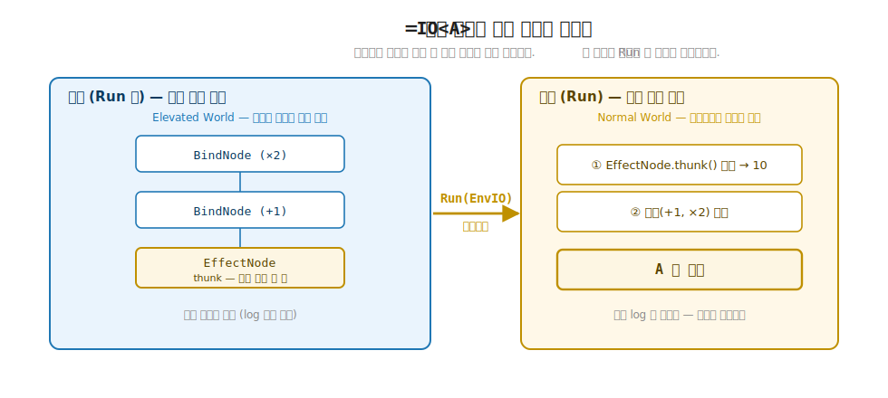
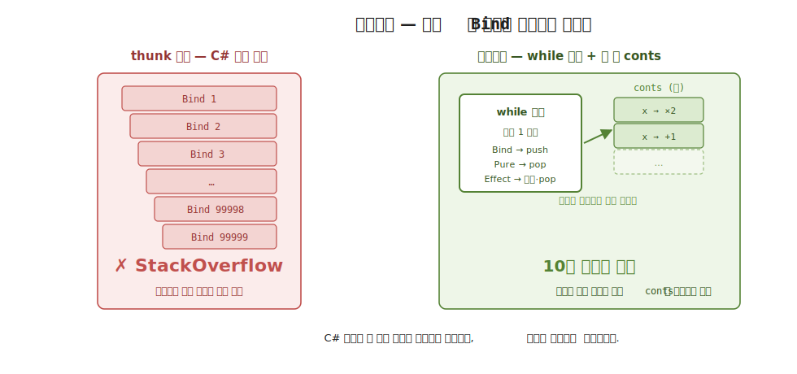

# 23장. IO — 지연 효과의 인코딩 (DSL 노드 + 트램폴린)

> **이 장의 목표** — 이 장을 마치면 `IO<A>` 가 부수 효과를 즉시 실행하지 않고 작은 노드 트리로 인코딩한 값임을 설명하고, 그 트리를 해석하는 트램폴린 인터프리터를 직접 읽을 수 있습니다. 22장에서 `IO<A>` 가 부수 효과를 곧장 실행하지 않고 조립만 해 둔 값 (thunk `() → A` 한 개) 이고, `Eff<RT, A> = ReaderT<RT, IO, A>` 가 7부로 가는 다리임을 예고했습니다. 이 장은 그 thunk 한 개를 `PureNode` / `EffectNode` / `BindNode` 세 노드로 일반화합니다. 조립은 노드 트리를 쌓을 뿐이고, `Run(EnvIO)` 이 그 트리를 해석할 때 비로소 부수 효과가 일어난다는 것을 손계산으로 추적합니다. 그 인코딩 덕에 `Bind` 를 수만 번 깊게 이어도 C# 호출 스택이 터지지 않는 스택 안전성을 직접 확인하고, `EnvIO` 가 운반하는 취소 토큰이 인터프리터 루프 매 단계에서 어떻게 작동하는지 볼 수 있습니다.

> **이 장의 핵심 어휘**
>
> - **`IO<A>`**: 부수 효과를 즉시 실행하지 않고 노드 트리로 인코딩한 값, `Run(EnvIO)` 이 방아쇠
> - **DSL 노드**: 부수 효과 프로그램의 조각을 나타내는 작은 자료, `PureNode` · `EffectNode` · `BindNode` 세 가지
> - **`EffectNode`**: 부수 효과 thunk `Func<object?>` 를 감싼 노드, `Run` 에서야 thunk 가 호출됨
> - **`BindNode`**: 앞 계산 (`Source`) 과 그 결과로 다음 노드를 만드는 연속 (`Cont`) 을 묶은 노드
> - **트램폴린**: C# 재귀 대신 힙 위 `Stack<>` 에 연속을 쌓아 도는 while 루프, 깊이와 무관하게 스택 안전
> - **연속 (continuation)**: 어떤 값이 나온 다음에 할 일을 담은 함수 `Func<object?, Node>`, `BindNode` 의 `Cont`
> - **스택 안전 (stack-safe)**: `Bind` 를 아무리 깊게 이어도 `StackOverflow` 가 나지 않는 성질
> - **`EnvIO`**: `IO` 가 `Run` 될 때 운반되는 실행 환경, 이 장에서는 취소 토큰 하나

> 이 장을 마치면 할 수 있게 되는 것
> - [ ] `IO<A>` 가 부수 효과를 노드 트리로 인코딩한 값임을 설명할 수 있습니다.
> - [ ] `PureNode` · `EffectNode` · `BindNode` 세 노드가 각각 무엇을 담는지 읽을 수 있습니다.
> - [ ] 22장의 thunk 한 개가 이 장의 노드 트리로 일반화됨을 한 문장으로 잇을 수 있습니다.
> - [ ] 트램폴린 인터프리터가 연속을 힙 위 `conts` 스택에 쌓고 while 루프로 도는 흐름을 손으로 추적할 수 있습니다.
> - [ ] 깊은 `Bind` 체인이 왜 C# 재귀를 쌓지 않아 스택 안전한지 설명할 수 있습니다.
> - [ ] 조립 시점에는 부수 효과가 없고 `Run` 에서야 일어남을 `log` 의 빔 / 참으로 확인할 수 있습니다.
> - [ ] `EnvIO` 의 취소 토큰이 인터프리터 루프 매 단계에서 어떻게 작동하는지 짚을 수 있습니다.
> - [ ] 손으로 짠 인터프리터 위의 `IO` 도 모나드 세 법칙을 지킴을 확인할 수 있습니다.

> **이 장의 흐름** — 부수 효과를 값으로 인코딩한다는 효과 시스템의 출발점에서 엽니다. 먼저 22장의 thunk 한 개로는 `Bind` 를 깊게 이을 때 어디서 막히는지 부딪혀 봅니다. 그다음 부수 효과를 `PureNode` · `EffectNode` · `BindNode` 세 노드의 트리로 인코딩하는 발상을 봅니다. 그 트리를 해석하는 트램폴린 인터프리터를 작은 예제로 손계산해, 연속이 힙 위 스택에 쌓였다 되감기는 흐름을 눈으로 좇습니다. 십만 단계 `Bind` 가 스택을 터뜨리지 않는 데모와 `Run` 전 지연, `EnvIO` 의 취소를 차례로 봅니다. 손으로 짠 인터프리터 위의 `IO` 가 정식 모나드임을 법칙으로 확인하고, 24장의 오류 모델로 다리를 놓습니다.

---

## 23.1 이 장에서 다루는 것 — 부수 효과를 값으로

7부의 효과 시스템은 함수형이 부수 효과를 다루는 한 가지 발상 위에 섭니다. 부수 효과를 곧장 실행하지 않고 값으로 인코딩해, 실행을 프로그램의 가장자리까지 미루는 것입니다. 효과 시스템은 두 평행 세계의 어휘로 보면 부수 효과를 값으로 끌어올려 실행을 미루는 Elevated World 의 정점입니다.

부수 효과란 콘솔에 출력하거나, 파일을 읽거나, 현재 시간을 묻는 일처럼 함수 바깥 세상에 영향을 주거나 받는 일입니다. 명령형 코드는 이런 일을 만나는 자리에서 바로 실행합니다. `Console.WriteLine(...)` 한 줄을 적으면 그 줄에 닿는 순간 글자가 찍힙니다. 함수형은 다르게 다룹니다. 그 부수 효과를 `IO<A>` 라는 값으로 인코딩해 들고 다니다가, 마지막에 단 한 번 실행합니다.

22장에서 이 발상의 골격을 미리 봤습니다. `IO<A>` 는 부수 효과를 thunk `() → A` 한 개로 감싼 값이고, `Run()` 을 부르기 전까지는 그 안의 부수 효과가 일어나지 않았습니다. 이 장은 그 골격을 한 걸음 키웁니다. thunk 한 개로는 다루기 어려운 일이 있고, 그 일을 풀려면 부수 효과를 thunk 가 아니라 작은 노드들의 트리로 인코딩해야 합니다. 그 트리를 해석하는 작은 인터프리터를 직접 짜고, 그 덕에 얻는 스택 안전성과 취소 같은 능력을 손으로 확인합니다.

이 장이 끝날 때 손에 남는 것은 두 가지입니다. 하나는 `IO<A>` 가 부수 효과를 노드 트리로 인코딩한 값이고 `Run` 이 그 트리를 해석한다는 것, 다른 하나는 그 해석을 C# 재귀가 아니라 힙 위 스택으로 도는 트램폴린이라 깊이에 무관하게 안전하다는 것입니다. 지금 모든 노드와 인터프리터 코드를 외우지 않아도 됩니다. 세 노드와 한 while 루프가 어떻게 맞물리는지를 작은 예제로 한 번 따라가 보면, 7부의 나머지 장이 이 위에 무엇을 더 쌓는지가 또렷해집니다.

지금 모든 노드와 인터프리터 코드를 외우지 않아도 됩니다. 세 노드와 한 while 루프가 어떻게 맞물리는지를 작은 예제로 한 번 따라가 보면, 7부의 나머지 장이 이 위에 무엇을 더 쌓는지가 또렷해집니다.

> **이 장에서 처음 만나는 것** — 6부까지는 이미 아는 도구 (`ReaderT` · thunk 지연) 위에 작은 한 칸씩 얹었지만, 이 장은 새 어휘가 한 번에 여럿 등장합니다. 미리 한 줄씩만 짚어 둡니다. 지금 외울 필요는 없고, 본문에서 자리를 잡을 때 다시 만납니다.
>
> - **DSL 노드** — 부수 효과 프로그램의 조각을 나타내는 작은 자료. `PureNode` · `EffectNode` · `BindNode` 세 가지뿐입니다.
> - **트램폴린** — C# 재귀 대신 힙 위 `Stack<>` 에 연속을 쌓아 도는 while 루프. 깊이와 무관하게 안전합니다.
> - **연속 (continuation)** — 어떤 값이 나온 다음에 할 일을 담은 함수. `BindNode` 의 `Cont` 가 그것입니다.
> - **`EnvIO`** — `Run` 이 받는 실행 환경. 이 장에서는 취소 토큰 하나만 운반합니다.
>
> 새 어휘가 넷이지만, 결국 묻는 것은 하나입니다. 22장의 thunk 한 개를 어떻게 안전하게 실행하느냐입니다.

---

## 23.2 왜 필요한가 — thunk 한 개로는 깊은 Bind 가 스택을 터뜨린다

22장의 `IO<A>` 가 어디서 막히는지부터 부딪혀 봅니다. 추상을 먼저 보이지 않고, 손에 잡히는 한계를 먼저 겪는 것이 이 장의 순서입니다.

22장의 `IO<A>` 를 다시 떠올립니다. 부수 효과를 thunk `() → A` 한 개로 감싼 값이었고, 모나드 부착도 thunk 안에서 다른 `IO` 의 `Run()` 을 부르는 모양이었습니다. `Bind` 가 어떻게 작동했는지를 그 골격으로 적으면 이렇습니다.

```csharp
// 22장 골격 — Bind 가 thunk 안에서 다음 IO 의 Run() 을 부른다.
public static K<IOF, B> Bind<A, B>(K<IOF, A> ma, Func<A, K<IOF, B>> f) =>
    new IO<B>(() => f(ma.As().Run()).As().Run());
//                              ───┬───            ───┬───
//                           안쪽 Run() 호출        또 그 안의 Run() 호출
```

한 줄을 천천히 읽습니다. `Bind` 가 만든 새 `IO<B>` 의 thunk 안에는 `Run()` 호출이 들어 있습니다. 먼저 `ma.Run()` 으로 앞 계산의 값을 꺼내고, 그것을 `f` 에 넘겨 나온 다음 `IO` 를 다시 `Run()` 합니다. `Bind` 하나에 `Run()` 호출이 겹칩니다.

문제는 `Bind` 를 깊게 이을 때입니다. `Bind` 로 만든 `IO` 를 또 `Bind` 하고, 그것을 또 `Bind` 하면, thunk 가 thunk 를 부르고 그 thunk 가 또 thunk 를 부르는 사슬이 됩니다. `Run()` 을 한 번 부르면, 그 안에서 `Run()` 이 또 불리고, 그 안에서 또 `Run()` 이 불립니다. 함수가 함수를 부를 때마다 C# 은 호출 스택 (call stack) 에 한 칸을 쌓습니다. thunk 사슬이 깊어지면 그 호출 스택도 그만큼 깊어집니다.

명령형이나 객체 지향에서 익숙한 직감으로 옮기면 이렇습니다. 깊은 재귀 함수를 떠올립니다. 종료 조건 없이, 또는 너무 깊게 자기 자신을 부르는 재귀는 `StackOverflowException` 으로 터집니다. C# 의 호출 스택은 크기가 정해져 있고 (보통 1MB 안팎), 호출이 그만큼 깊어지면 더 쌓을 자리가 없어 프로그램이 멈춥니다. 22장의 thunk 사슬도 똑같습니다. `Bind` 를 만 번, 십만 번 이으면 `Run()` 한 번이 그만큼 깊은 호출을 쌓고, 어느 깊이에서 스택이 터집니다.

```
// 22장 thunk 골격으로 Bind 를 깊게 이으면:
io.Run()
  └ thunk 호출 → 안에서 Run()              (C# 스택 +1)
      └ thunk 호출 → 안에서 Run()          (C# 스택 +2)
          └ thunk 호출 → 안에서 Run()      (C# 스택 +3)
              └ ... 깊이만큼 계속 쌓임 ...
                  └ 어느 깊이에서 StackOverflowException  ← 터진다
```

그런데 실전에서 `Bind` 를 깊게 잇는 일은 드물지 않습니다. 리스트의 원소마다 효과를 하나씩 붙여 누적하거나, 긴 작업을 단계별로 이어 붙이면 `Bind` 가 자연스럽게 깊어집니다. 부수 효과를 값으로 인코딩한다는 발상이 쓸모 있으려면, `Bind` 를 아무리 깊게 이어도 안전해야 합니다.

C# 으로 비동기 작업을 다뤄 본 직감으로 옮기면, 이 깊이 문제가 왜 까다로운지 더 또렷합니다. 깊은 동기 재귀가 호출 스택을 터뜨리는 것은 익숙합니다. 그런데 22장의 thunk 사슬은 자기를 직접 부르는 재귀처럼 보이지 않으면서도 같은 일을 합니다. `Run()` 안에서 다른 `Run()` 을 부르고, 그 안에서 또 `Run()` 을 부르는 사슬이 결국 호출 스택을 깊이만큼 쌓기 때문입니다. 눈에 보이는 재귀 호출이 아니라 thunk 가 thunk 를 부르는 간접 사슬이라, 깊이가 어디서 쌓이는지 코드만 봐서는 잘 드러나지 않습니다. 이 장이 노드 트리와 트램폴린으로 향하는 까닭이 여기 있습니다. 깊이를 코드에 숨기지 않고 `conts` 라는 자료에 눈에 보이게 쌓아, 그 자료를 우리가 직접 다루려는 것입니다.

여기에 더해, 또 하나 미뤄 둔 약속이 있습니다. 22장에서 `IO` 의 가치는 `Run` 전까지 아무 부수 효과도 일어나지 않는다는 것이었습니다. 그래야 같은 `IO` 를 테스트에서 여러 번 돌리거나, 실패하면 다시 시도하는 일이 안전합니다. 이 약속도 thunk 한 개든 노드 트리든 그대로 지켜야 합니다.

> **흔한 함정** — 부수 효과를 값으로 인코딩하기만 하면 깊이 문제가 저절로 풀린다고 여기는 것입니다.
>
> 부수 효과를 값으로 들고 다니는 것과, 그 값을 안전하게 실행하는 것은 다른 문제입니다. 22장의 thunk 골격은 부수 효과를 값으로 인코딩하는 데까지는 성공했지만, 실행이 C# 재귀를 타고 내려가는 모양이라 깊은 `Bind` 에서 스택을 터뜨립니다. 이 장이 푸는 것은 인코딩 자체가 아니라 실행 방식입니다. 부수 효과를 노드 트리로 인코딩하고, 그 트리를 C# 재귀가 아니라 힙 위 스택으로 도는 인터프리터로 해석하면, 깊이와 무관하게 안전해집니다.

그래서 이 장의 도구는 두 조각입니다. 하나는 부수 효과를 thunk 가 아니라 작은 노드 트리로 인코딩하는 것, 다른 하나는 그 트리를 C# 재귀 없이 해석하는 인터프리터입니다. 노드 트리부터 봅니다.

---

## 23.3 IO 를 노드 트리로 — 세 노드의 인코딩

부수 효과를 thunk 한 개가 아니라 작은 노드들의 트리로 인코딩합니다. 노드는 부수 효과 프로그램의 조각을 나타내는 작은 자료입니다. 이 장의 `IO` 는 단 세 가지 노드로 모든 것을 표현합니다.

```csharp
// 부수 효과를 *즉시 실행하지 않고* 노드 트리로 인코딩한다. Run 에서야 해석된다.
internal abstract record Node;
internal sealed record PureNode(object? Value) : Node;
internal sealed record EffectNode(Func<object?> Thunk) : Node;
internal sealed record BindNode(Node Source, Func<object?, Node> Cont) : Node;
```

세 노드를 하나씩 읽습니다.

- **`PureNode(object? Value)`** — 이미 손에 쥔 값 하나를 담은 노드입니다. 부수 효과 없이 그냥 값입니다. 22장의 `Pure(7)` 에 해당합니다. 트리의 잎 (leaf) 자리에 놓이는 가장 단순한 노드입니다.
- **`EffectNode(Func<object?> Thunk)`** — 부수 효과 thunk 하나를 감싼 노드입니다. 콘솔에 출력하거나 시간을 묻는 일이 여기 들어갑니다. 중요한 점은 노드를 만드는 시점에는 `Thunk` 가 호출되지 않는다는 것입니다. thunk 가 노드 안에 잠들어 있을 뿐, 실행은 나중입니다. 이것도 트리의 잎 자리에 놓입니다.
- **`BindNode(Node Source, Func<object?, Node> Cont)`** — 두 조각을 묶은 노드입니다. `Source` 는 먼저 해석할 안쪽 노드이고, `Cont` 는 그 `Source` 가 낸 값을 받아 다음에 해석할 노드를 만드는 함수입니다. `Cont` 의 이름은 연속 (continuation) 에서 왔습니다. 어떤 값이 나온 다음에 할 일을 담은 함수라는 뜻입니다. `BindNode` 는 트리의 가지 (branch) 자리에 놓여, 두 조각을 잇습니다.

코드를 보면 `object?` 가 곳곳에 보입니다. 왜 `int` 도 `string` 도 아닌 `object?` 일까요. 이 학습용 `IO` 는 노드 안에 담기는 값의 타입을 일부러 `object?` 로 지워 둡니다. 한 트리 안에 `int` 를 담은 `PureNode` 와 `string` 을 담은 `PureNode` 가 섞여 있을 수 있는데, 둘을 같은 한 가지 `PureNode` 로 표현하려면 담는 값의 타입을 하나로 묶어야 합니다. 모든 타입의 공통 조상인 `object?` 가 그 자리입니다. 덕분에 노드 가짓수가 셋으로 줄지만, 대신 타입 정보를 잃습니다.

타입을 지웠으니 어딘가에서는 되돌려야 합니다. 그 되돌리는 캐스팅 (`(A)x!`) 이 어디서 일어나는지 미리 짚어 둡니다. 인터프리터 자신은 값을 `object?` 인 채로 흘리기만 합니다. 값을 원래 타입 `A` 로 되돌리는 일은 인터프리터 안이 아니라, `Bind` 와 `Map` 이 만드는 연속 안, 곧 trait 을 부착하는 자리에서 일어납니다. 그러니 지금 이 캐스팅이 안 보여도 됩니다. 인터프리터는 타입을 모른 채 값만 나르고, 타입을 아는 자리에서 캐스팅이 일어난다는 두 단계로 갈린다는 것만 잡아 두면, 뒤에서 trait 을 부착할 때 `(A)x!` 가 나와도 자연스럽게 읽힙니다.

이 `object?` 단순화가 어떤 맞바꿈인지는 v5 와 비교하는 자리에서 정직하게 풉니다. 지금은 세 노드가 같은 한 트리에 섞여 담기려고 타입을 지웠고, 그 대가로 나중에 한 번 캐스팅한다 정도로 읽으면 충분합니다.

22장의 thunk 한 개와 나란히 놓으면 이 장이 무엇을 일반화했는지가 또렷합니다. 22장은 부수 효과를 thunk `() → A` 한 개로 인코딩했습니다. 이 장은 그 한 개를 세 노드로 쪼갰습니다. 순수한 값은 `PureNode`, 진짜 부수 효과는 `EffectNode`, 두 계산을 잇는 일은 `BindNode` 가 맡습니다. thunk 한 개가 트리 한 그루로 자란 셈입니다.



**그림 23-1. `IO<A>` = 부수 효과를 노드 트리로 인코딩** — `IO` 를 조립하면 `PureNode`·`EffectNode`·`BindNode` 의 트리가 쌓일 뿐, 부수 효과는 아직 일어나지 않습니다. `Run(EnvIO)` 이 그 트리를 해석할 때 비로소 `EffectNode` 의 thunk 가 실행됨을 보여, "조립과 실행의 분리"를 그립니다.

이 노드 트리를 직접 손으로 짜는 일은 거의 없습니다. 대신 `IO<A>` 가 그 위에 친숙한 표면을 얹어 줍니다.

```csharp
// IO<A> — 지연 효과 프로그램. 속은 Node 하나를 들고 있다.
public sealed class IO<A> : K<IOF, A>
{
    internal Node Node { get; }
    internal IO(Node node) => Node = node;

    public A Run(EnvIO env) => (A)Interpreter.Run(Node, env)!;
    public A Run() => Run(EnvIO.Default);

    // 부수 효과 thunk 로부터 IO 생성 (예: Console 출력).
    public static IO<A> Effect(Func<A> thunk) => new(new EffectNode(() => thunk()));
}
```

`IO<A>` 는 노드 하나 (`Node`) 를 들고 있는 얇은 상자입니다. 속을 `K<IOF, A>` 로 부착해 1부부터 써 온 trait 어휘에 올립니다. 여기서 `IOF` 가 처음 보이는 이름인데, 1부에서 `Option` 의 trait 을 `OptionF` 라는 태그에 부착했던 그 방식 그대로, `IOF` 는 `IO` 라는 타입에 trait 을 부착할 자리입니다. 다음 절에서 곧 봅니다.

부수 효과를 만드는 입구가 `Effect(Func<A> thunk)` 입니다. 콘솔 출력 같은 thunk 를 받아 `EffectNode` 로 감싸 `IO<A>` 를 냅니다. 여기서도 thunk 는 호출되지 않습니다. `EffectNode` 안에 담길 뿐입니다.

실행 입구는 `Run` 입니다. `Run(EnvIO env)` 가 인터프리터에게 노드와 환경을 넘겨 해석을 시키고, 그 결과를 원래 타입 `A` 로 되돌립니다. 인자 없는 `Run()` 은 기본 환경으로 `Run(EnvIO env)` 를 부르는 편의 입구입니다. `EnvIO` 가 무엇을 운반하는지는 취소를 다루는 자리에서 봅니다. 지금은 `Run` 이 노드 트리를 해석하는 방아쇠라는 것만 잡으면 됩니다.

조립과 실행이 두 자리로 또렷이 나뉜 것이 보입니다. `Effect` 와 `Bind` 는 노드를 쌓아 트리를 조립할 뿐이고 (부수 효과 없음), `Run` 이 그 트리를 해석할 때 비로소 `EffectNode` 의 thunk 가 호출됩니다. 그 해석을 맡는 인터프리터를 다음 절에서 봅니다.

조립과 실행이 두 자리로 또렷이 나뉜 것이 보입니다. `Effect` 와 `Bind` 는 노드를 쌓아 트리를 조립할 뿐이고 (부수 효과 없음), `Run` 이 그 트리를 해석할 때 비로소 `EffectNode` 의 thunk 가 호출됩니다.

객체 지향 직감으로 다리를 놓으면 이 분리가 낯설지 않습니다. 22장에서 쓴 그림을 그대로 가져옵니다. `var stream = new FileStream(path)` 를 적는 순간에는 파일 핸들을 잡아 둘 뿐, 아직 바이트 하나 읽지 않습니다. 실제로 읽는 일은 뒤의 `stream.Read(...)` 가 합니다. 핸들을 잡아 두는 것 (조립) 과 실제로 읽는 것 (실행) 이 다른 일이듯, `Effect` 와 `Bind` 로 노드 트리를 쌓는 것은 조립이고, `Run` 이 그 트리를 해석하는 것이 실행입니다. `try`-`finally` 에서도 자원을 마련하는 코드와 그것을 정리하는 코드가 서로 다른 자리에 적히는데, `IO` 도 같은 결로 조립과 실행이 두 자리로 나뉩니다. 다른 점은 `IO` 는 그 조립 결과가 노드 트리라는 값으로 손에 남아, 실행을 원하는 시점까지 미루거나 여러 번 실행할 수 있다는 것입니다.

그 해석을 맡는 인터프리터를 다음 절에서 봅니다.

---

## 23.4 트램폴린 인터프리터 — C# 재귀를 힙 위 스택으로

이 절이 이 장에서 가장 천천히 읽을 자리입니다. 노드 트리를 해석하는 인터프리터 `Interpreter.Run` 을 봅니다. 핵심은 하나입니다. 이 인터프리터는 C# 재귀를 쓰지 않습니다. 대신 연속을 힙 위 스택에 쌓고 while 루프로 돕니다. 이 방식을 트램폴린 (trampoline) 이라 부릅니다.

코드를 읽기 전에 발상부터 한 줄로 잡아 둡니다. 트리를 해석하는 자연스러운 방법은 재귀입니다. 가지를 만나면 안쪽을 재귀로 해석하고, 그 결과를 받아 처리하면 됩니다. 그런데 앞 절에서 봤듯이 재귀는 가지가 깊을수록 C# 호출 스택을 그만큼 쌓아 어느 깊이에서 터집니다. 트램폴린은 그 재귀를 손으로 풀어, 깊이를 C# 호출 스택이 아니라 우리가 만든 스택에 데이터로 쌓습니다. 한 문장으로 줄이면, 깊이가 사는 자리를 C# 호출 스택에서 힙 위 `Stack<>` 으로 옮긴 것입니다. 이 한 줄만 들고 있으면 아래 코드의 모든 줄이 그 한 가지를 위한 장치로 읽힙니다. 코드를 통째로 외울 필요는 없고, 어느 줄이 쌓고 어느 줄이 꺼내는지만 따라가면 충분합니다.

```csharp
// 깊은 Bind 체인을 *C# 재귀 없이* 힙 위의 연속 스택으로 해석한다 → 스택 안전.
internal static class Interpreter
{
    public static object? Run(Node node, EnvIO env)
    {
        var conts = new Stack<Func<object?, Node>>();
        var cur = node;
        while (true)
        {
            env.Token.ThrowIfCancellationRequested();
            switch (cur)
            {
                case BindNode b:
                    conts.Push(b.Cont);     // 연속을 힙 스택에 쌓고
                    cur = b.Source;         // 안쪽으로 내려간다 (C# 스택 사용 안 함)
                    break;

                case PureNode p:
                    if (conts.Count == 0) return p.Value;
                    cur = conts.Pop()(p.Value);
                    break;

                case EffectNode e:
                    var v = e.Thunk();      // ← 부수 효과는 여기서 *비로소* 실행
                    if (conts.Count == 0) return v;
                    cur = conts.Pop()(v);
                    break;

                default:
                    throw new InvalidOperationException();
            }
        }
    }
}
```

루프 안의 두 변수부터 봅니다. `conts` 는 연속을 쌓아 두는 스택입니다. `Func<object?, Node>` 타입, 곧 값 하나를 받아 다음 노드를 내는 함수들이 쌓입니다. `cur` 은 지금 보고 있는 노드입니다. while 루프가 `cur` 을 보고, 그 종류에 따라 셋 중 하나를 합니다.

이 두 변수가 재귀 함수의 두 역할을 손으로 나눠 맡은 것이라 보면 편합니다. 재귀로 트리를 해석하면, 지금 처리하는 노드 (`cur` 에 해당) 와 그 노드가 끝난 뒤 돌아가 할 일 (C# 이 호출 스택에 자동으로 기억해 두던 것) 이 있습니다. 트램폴린은 그 둘을 변수 두 개로 직접 들고 있습니다. 지금 볼 노드는 `cur` 에, 끝난 뒤 할 일은 `conts` 에 쌓아 둡니다. C# 이 알아서 해 주던 일을 우리가 자료로 손에 쥔 셈입니다. 그래서 while 루프 한 바퀴는 늘 같은 깊이에서 돕니다. 함수를 새로 부르지 않으니 C# 호출 스택이 깊어지지 않고, 깊이는 전부 `conts` 의 높이로만 드러납니다.

- **`BindNode b` 를 만나면** — 아직 값을 낼 수 없습니다. `b.Source` 를 먼저 해석해야 하기 때문입니다. 그래서 "나중에 할 일" 인 `b.Cont` 를 `conts` 에 쌓아 두고 (`Push`), `cur` 을 `b.Source` 로 바꿔 안쪽으로 내려갑니다. 여기가 핵심입니다. 안쪽으로 내려가지만 C# 함수를 부르지 않습니다. 그냥 `cur` 변수를 바꾸고 루프를 한 바퀴 더 돌 뿐입니다. C# 호출 스택은 한 칸도 쌓이지 않습니다.
- **`PureNode p` 를 만나면** — 값 `p.Value` 가 나왔습니다. 쌓아 둔 연속이 없으면 (`conts.Count == 0`) 이 값이 최종 결과이므로 반환합니다. 연속이 있으면 맨 위 하나를 꺼내 (`Pop`) 그 값에 적용합니다. 그러면 다음 노드가 나오고, `cur` 이 그것으로 바뀝니다.
- **`EffectNode e` 를 만나면** — `e.Thunk()` 를 호출합니다. 부수 효과가 비로소 여기서 일어납니다. 콘솔에 글자가 찍히는 것도, 시간이 읽히는 것도 이 한 줄에서입니다. 그렇게 나온 값 `v` 를 `PureNode` 와 똑같이 처리합니다. 연속이 없으면 반환, 있으면 꺼내 적용합니다.

흐름을 한 문장으로 요약하면 이렇습니다. `BindNode` 를 만나면 연속을 쌓으며 안쪽으로 내려가고, 잎 (`PureNode` / `EffectNode`) 에서 값이 나오면 쌓아 둔 연속을 하나씩 꺼내 되감습니다. 내려갈 때 쌓고, 올라올 때 꺼냅니다.

세 분기가 사실 두 종류로 묶인다는 점을 보면 더 간단해집니다. `PureNode` 와 `EffectNode` 는 둘 다 값을 하나 내는 잎이라, 값이 나온 뒤의 처리가 똑같습니다. 연속이 없으면 그 값을 반환하고, 있으면 꺼내 적용합니다. 둘의 유일한 차이는 값을 얻는 방식입니다. `PureNode` 는 이미 담긴 값을 그대로 쓰고, `EffectNode` 는 thunk 를 호출해 부수 효과를 일으키며 값을 얻습니다. 그러니 분기는 셋이지만, 인터프리터가 하는 일은 둘입니다. `BindNode` 면 쌓으며 내려가고, 잎이면 값을 내 되감습니다. 부수 효과가 일어나는 자리는 그중 `EffectNode` 의 `e.Thunk()` 한 줄뿐이라는 것도 다시 짚어 둘 만합니다.

객체 지향 직감으로 다리를 놓으면 이 발상이 낯설지 않습니다. 깊은 재귀 알고리즘을 직접 만든 `Stack<>` 으로 풀어 본 적이 있다면, 정확히 같은 기법입니다. 예를 들어 깊은 이진 트리를 재귀로 순회하면 트리가 깊을수록 호출 스택이 깊어지지만, 직접 만든 `Stack<>` 에 다음에 방문할 노드를 쌓아 가며 while 루프로 돌면 같은 순회를 호출 스택 한 칸으로 끝낼 수 있습니다. 재귀가 C# 호출 스택에 자동으로 쌓던 것을 우리가 만든 스택에 데이터로 옮긴 것입니다. 호출 스택은 크기가 정해져 있어 (보통 1MB 안팎) 깊으면 터지지만, 힙 위의 `Stack<>` 은 메모리가 허락하는 한 얼마든지 커집니다.

트램폴린이라는 이름은 그 도는 모습에서 왔습니다. 값을 하나 낼 때마다 루프의 맨 위로 다시 튀어 올라 쌓아 둔 다음 연속을 처리하는데, 그 모습이 트램폴린 위에서 바닥을 딛고 다시 튀어 오르는 것과 닮아 붙은 이름입니다. 재귀처럼 점점 깊이 내려가 박히는 것이 아니라, 늘 같은 높이로 올라와 다음 일을 집어 든다는 그림이 이름에 담겨 있습니다.

### 23.4.1 손계산 — Pure(1).Bind(+1).Bind(×2) 를 한 단계씩

말로만 들으면 잡히지 않으니, 아주 작은 트리 하나를 인터프리터가 어떻게 도는지 한 단계씩 손으로 따라갑니다. 다음 `IO` 를 생각합니다.

```csharp
// Pure(1) 에서 시작해 +1, 그다음 ×2.
var io = IOF.Pure(1)
            .Bind(x => IOF.Pure(x + 1))
            .Bind(y => IOF.Pure(y * 2));
// 기대 결과: (1 + 1) × 2 = 4
```

이 `io` 의 속 노드 트리는 `BindNode` 두 개가 겹친 모양입니다. 바깥 `BindNode` 의 `Source` 가 다시 안쪽 `BindNode` 이고, 그 안쪽 `BindNode` 의 `Source` 가 `PureNode(1)` 입니다. 글로 적으면 이렇습니다.

```
트리 모양 (바깥에서 안으로):
  BindNode( Source = BindNode( Source = PureNode(1),
                               Cont   = x => PureNode(x + 1) ),
            Cont   = y => PureNode(y * 2) )
```

이제 `Interpreter.Run` 이 이 트리를 도는 모습을 표로 추적합니다. 우리가 좇을 것은 두 가지, `cur` (지금 보는 노드) 과 `conts` (쌓인 연속 스택) 입니다.

| 단계 | `cur` | 한 일 | `conts` (위 → 아래) |
|---|---|---|---|
| 시작 | 바깥 `BindNode` | 루프 진입 | (빔) |
| 1 | 바깥 `BindNode` | `Cont`(`y→…`) 를 쌓고, `cur` 을 `Source` (안쪽 `BindNode`) 로 | `[y→×2]` |
| 2 | 안쪽 `BindNode` | `Cont`(`x→…`) 를 쌓고, `cur` 을 `Source` (`PureNode(1)`) 로 | `[x→+1, y→×2]` |
| 3 | `PureNode(1)` | 값 `1`. `conts` 비지 않음 → `Pop` 한 `x→+1` 을 `1` 에 적용 → `PureNode(2)` | `[y→×2]` |
| 4 | `PureNode(2)` | 값 `2`. `conts` 비지 않음 → `Pop` 한 `y→×2` 를 `2` 에 적용 → `PureNode(4)` | (빔) |
| 5 | `PureNode(4)` | 값 `4`. `conts` 빔 → `4` 반환 | (빔) |

다섯 단계를 눈으로 좇으면 인터프리터의 리듬이 보입니다. 처음 두 단계 (1, 2) 는 `BindNode` 를 만나 연속을 쌓으며 안쪽으로 내려갑니다. `conts` 가 두 칸으로 자랍니다. 세 번째 단계에서 바닥의 `PureNode(1)` 에 닿아 값 `1` 이 나옵니다. 그다음 두 단계 (3, 4) 는 쌓아 둔 연속을 하나씩 꺼내 되감습니다. `+1` 을 꺼내 `2` 를, `×2` 를 꺼내 `4` 를 만듭니다. 마지막에 `conts` 가 비어 `4` 를 반환합니다.

여기서 결정적인 한 가지를 짚습니다. 이 다섯 단계 내내 C# 호출 스택은 한 칸도 깊어지지 않았습니다. while 루프가 같은 깊이에서 `cur` 과 `conts` 만 바꿔 가며 돌았을 뿐입니다. 깊이는 `conts` 라는 힙 위 자료구조에 데이터로 쌓였습니다. `Bind` 가 두 개여서 `conts` 가 최대 두 칸이었고, `Bind` 가 십만 개여도 `conts` 가 십만 칸으로 커질 뿐 C# 호출 스택은 그대로입니다. 이것이 트램폴린이 깊이와 무관하게 안전한 까닭입니다.

> **흔한 함정** — `conts` 스택이 커지는 것과 C# 호출 스택이 커지는 것을 같다고 여기는 것입니다.
>
> 둘 다 스택이지만 사는 자리가 다릅니다. C# 호출 스택은 함수 호출이 쌓이는 자리로, 크기가 정해져 있어 너무 깊으면 `StackOverflowException` 으로 터집니다. `conts` 는 우리가 힙 위에 직접 만든 `Stack<>` 자료구조로, 메모리가 허락하는 한 얼마든지 커집니다. 트램폴린이 하는 일은 깊이를 C# 호출 스택에서 힙 위 `conts` 로 옮긴 것입니다. 자리를 옮긴 덕에 깊이가 아무리 깊어도 터지지 않습니다.

이 작은 추적을 손에 쥐고 나면, 다음 절의 십만 단계 데모가 왜 안전한지가 같은 이야기의 큰 판임을 알아보기 쉽습니다.

표의 각 칸을 외울 필요는 없습니다. 가져갈 리듬은 두 동작뿐입니다. `BindNode` 를 만나면 연속을 쌓으며 내려가고, 잎에서 값이 나오면 쌓아 둔 연속을 꺼내 되감습니다. 내려갈 때 `conts` 가 자라고, 되감을 때 `conts` 가 줄어듭니다. `Bind` 가 두 개여서 `conts` 가 최대 두 칸까지 자랐다는 것, 그리고 그동안 C# 호출 스택은 한 칸도 깊어지지 않았다는 것. 이 두 가지만 손에 남으면 이 절의 목표는 다 채운 것입니다.

---

## 23.5 스택 안전 — 십만 단계 Bind 가 평평하게 돈다

앞 절에서 손으로 본 것을 데모가 큰 수로 확인합니다. `Bind` 를 십만 번 이어 만든 깊은 `IO` 를 `Run` 합니다.

```csharp
K<IOF, long> deep = IOF.Pure(0L);
for (var i = 1; i <= 100_000; i++)
{
    var j = i;
    deep = deep.Bind(acc => IOF.Pure(acc + j));
}
Console.WriteLine($"  sum(1..100000) via 10만 Bind = {deep.As().Run()}   (StackOverflow 없음)");
```

`IOF.Pure(0L)` 누적기에서 시작해, `1` 부터 `100000` 까지 각 `i` 마다 `Bind` 를 한 겹씩 더 쌓습니다. `deep.Bind(acc => IOF.Pure(acc + j))` 는 "지금까지의 누적값 `acc` 에 `j` 를 더한다" 는 연속을 한 겹 얹는 것입니다. 루프가 끝나면 `deep` 의 속 노드 트리는 `BindNode` 가 십만 겹 겹친 모양이 됩니다.

여기서 한 가지를 짚어 둡니다. `var j = i;` 한 줄은 루프 변수를 고정하려는 것입니다. 람다 `acc => IOF.Pure(acc + j)` 가 `j` 를 붙잡는데 (클로저 캡처), 루프 변수 `i` 를 그대로 붙잡으면 모든 람다가 루프가 끝난 뒤의 마지막 `i` 값을 보게 됩니다. 매 반복마다 새 변수 `j` 에 그 시점의 `i` 를 담아 고정하면, 각 람다가 자기 시점의 값을 정확히 붙잡습니다.

이 함정은 `IO` 만의 일이 아닙니다. `foreach` 안에서 람다를 만들어 리스트에 모아 둔 뒤 나중에 실행해 본 적이 있다면 똑같이 겪던 일입니다. 람다는 변수의 그때 값이 아니라 변수 자체를 붙잡으므로, 실행이 미뤄지면 모두 마지막 값을 보게 됩니다. 여기서 그 함정이 다시 보이는 까닭은 바로 이 장의 주제 때문입니다. `IO` 는 조립과 실행이 갈려, 람다가 `Run` 시점까지 실행되지 않고 미뤄집니다. 미뤄지는 람다가 루프 변수를 붙잡는 자리에서는 늘 새 변수로 고정한다는 습관 하나면 이 함정을 비켜갑니다.

`deep.As().Run()` 한 줄이 이 십만 겹 트리를 해석합니다. 결과는 `sum(1..100000)`, 곧 `1 + 2 + … + 100000 = 5000050000` 입니다. 중요한 것은 결과값보다 `StackOverflow 없음` 쪽입니다.

22장의 thunk 골격이었다면 이 `Run()` 은 십만 겹의 `Run()` 호출을 C# 호출 스택에 쌓아 어느 깊이에서 터졌을 것입니다. 이 장의 트램폴린 인터프리터는 다릅니다. 앞 절의 손계산을 그대로 십만 배 키운 것뿐입니다. `BindNode` 를 만날 때마다 연속을 `conts` 에 쌓으며 내려가니, `conts` 가 십만 칸까지 자랍니다. 그러나 C# 호출 스택은 while 루프 한 깊이에 그대로 머뭅니다. 바닥의 `PureNode(0L)` 에 닿으면 쌓아 둔 십만 개의 연속을 하나씩 꺼내 되감으며 누적합을 만듭니다. 십만 단계 내내 C# 재귀가 한 칸도 쌓이지 않습니다.



**그림 23-2. 트램폴린: 깊은 `Bind` 도 스택을 터뜨리지 않는다** — 왼쪽은 thunk 가 thunk 를 부르는 재귀가 C# 호출 스택을 깊이만큼 쌓아 `StackOverflow` 로 터지는 모습입니다. 오른쪽은 트램폴린 인터프리터가 연속(`Cont`)을 힙 위 `conts` 스택에 쌓고 while 루프로 평평하게 도는 모습으로, 깊이와 무관하게 안전함을 대비합니다.

이것이 부수 효과를 노드 트리로 인코딩한 첫째 이득입니다. 해석 방식을 우리가 정하니, C# 재귀의 깊이 한계에 묶이지 않습니다. 같은 깊은 `Bind` 를 직접 함수 합성으로 짰다면 스택이 터졌겠지만, 노드 트리와 트램폴린은 그 깊이를 데이터로 다뤄 안전하게 풉니다.

실전에서 `Bind` 가 이렇게까지 깊어지느냐고 물을 수 있습니다. 십만은 데모를 위해 크게 잡은 수이지만, 깊은 `Bind` 자체는 드물지 않습니다. 큰 리스트의 원소마다 효과를 하나씩 붙여 누적하거나, 긴 작업을 단계별로 길게 이어 붙이면 `Bind` 가 자연스럽게 그만큼 쌓입니다. 그때마다 깊이를 걱정해야 한다면 부수 효과를 값으로 인코딩한 보람이 없습니다. 트램폴린이 그 걱정을 한 번에 거둬 주어, 깊이를 데이터로만 다루면 된다는 것이 이 데모가 큰 수로 보인 한 가지입니다.

---

## 23.6 Run 전 지연 — 조립 시점엔 부수 효과가 없다

이번에는 22장에서 약속한 또 한 가지, `Run` 전까지 아무 부수 효과도 일어나지 않는다는 것을 데모로 확인합니다. 우리가 좇을 것은 단 하나, 부수 효과가 남기는 로그 `log` 가 각 시점에 비어 있는가입니다.

```csharp
var log = new List<string>();
K<IOF, int> program =
    from a in IO<int>.Effect(() => { log.Add("[IO] 첫 작용 → 10"); return 10; })
    from b in IO<int>.Effect(() => { log.Add("[IO] 둘째 작용 → 32"); return 32; })
    select a + b;

Console.WriteLine($"  IO 조립 후, Run 전 — log 비었나? {log.Count == 0}");
var result = program.As().Run();
Console.WriteLine($"  Run() → {result}");
Console.WriteLine($"  log = [{string.Join(", ", log)}]");
```

두 `IO<int>.Effect(...)` 를 LINQ `from-from-select` 로 조립합니다. 각 `Effect` 의 thunk 는 `log` 에 한 줄을 적고 값을 냅니다. 첫째는 `10`, 둘째는 `32` 입니다. `select a + b` 가 두 값을 더합니다. LINQ 의 `from` 사슬이 `Bind` 사슬로 풀린다는 것은 7장에서 본 그대로입니다. 곧 이 `program` 의 속은 `BindNode` 가 두 `EffectNode` 를 잇는 트리입니다.

핵심은 첫 출력입니다. `program` 을 조립한 직후 `log.Count == 0` 이 `True` 입니다. 두 `Effect` 의 thunk 가 `log` 에 무언가 적으려 하지만, 조립 시점에는 그 thunk 가 `EffectNode` 안에 잠들어 있을 뿐 호출되지 않습니다. `from-from-select` 가 `BindNode` 트리를 쌓는 일은 노드를 잇는 일이지 thunk 를 부르는 일이 아닙니다. 그래서 `log` 는 비어 있습니다.

`program.As().Run()` 한 줄에서 비로소 인터프리터가 트리를 해석합니다. 앞에서 본 대로, 인터프리터가 `EffectNode` 에 닿는 순간 `e.Thunk()` 가 호출됩니다. 그 안의 `log.Add(...)` 가 실행돼 로그가 쌓이고 값이 나옵니다. 두 `EffectNode` 가 순서대로 해석되니 `log` 는 `[[IO] 첫 작용 → 10, [IO] 둘째 작용 → 32]` 가 되고, 결과는 `10 + 32 = 42` 입니다.

두 평행 세계 어휘로 보면, 22장에서 정착한 조립과 실행의 분리가 이 데모의 한 문장입니다. `IO` 를 조립하는 것은 부수 효과를 Elevated World 로 끌어올려 값으로 들고 있는 것이고 (`log` 빔), `Run` 은 그 값을 끌어내려 Normal World 에서 부수 효과를 실제로 일으키는 것입니다 (`log` 참). 끌어올림과 끌어내림이 또렷이 두 시점으로 갈립니다.

여기서 한 걸음 더 나가면 `IO` 가 값이지 실행이 아니라는 직관이 단단해집니다. `program` 은 부수 효과의 레시피입니다. 레시피를 손에 들고만 있으면 아무 일도 안 일어나고, 레시피를 실행 (`Run`) 해야 요리가 됩니다. 그러니 같은 `program` 을 두 번 `Run` 하면 부수 효과도 두 번 일어납니다. `program.As().Run()` 을 다시 부르면 `log` 에 같은 두 줄이 한 번 더 쌓입니다. `program` 이 값이라 여러 번 실행할 수 있고, 매 실행이 레시피대로 부수 효과를 다시 일으키기 때문입니다. 이 성질이 테스트에서 같은 효과를 반복하거나 실패 시 다시 시도하는 일을 안전하게 합니다.

그러니 같은 `program` 을 두 번 `Run` 하면 부수 효과도 두 번 일어납니다. `program.As().Run()` 을 다시 부르면 `log` 에 같은 두 줄이 한 번 더 쌓입니다. `program` 이 값이라 여러 번 실행할 수 있고, 매 실행이 레시피대로 부수 효과를 다시 일으키기 때문입니다. 이 성질이 테스트에서 같은 효과를 반복하거나 실패 시 다시 시도하는 일을 안전하게 합니다.

명령형과 견주면 이 차이가 또렷합니다. 명령형에서 `Console.WriteLine(...)` 한 줄은 그 줄에 닿는 순간 한 번 찍히고 끝입니다. 같은 일을 다시 하려면 그 줄을 다시 실행하는 길밖에 없고, 그 줄을 값으로 들고 다니거나 함수에 넘기거나 나중으로 미룰 수는 없습니다. `IO` 는 그 한 줄을 값으로 바꿔 손에 쥐어 줍니다. 그래서 같은 부수 효과를 변수에 담고, 함수에 넘기고, 두 번 실행하고, 실행을 가장자리까지 미루는 일이 모두 자연스러워집니다. 부수 효과를 값으로 인코딩한다는 발상이 실제로 무엇을 사게 해 주는지가 이 한 가지에서 손에 잡힙니다.

> **흔한 함정** — `IO` 를 만들면 부수 효과가 일어난다고 여기는 것입니다.
>
> `IO<int>.Effect(() => { log.Add(...); return 10; })` 를 적으면 그 자리에서 `log` 에 줄이 쌓일 것 같지만, 그렇지 않습니다. `Effect` 는 thunk 를 `EffectNode` 로 감싸 둘 뿐이고, thunk 는 `Run` 이 인터프리터를 돌려 그 노드에 닿을 때 한 번 호출됩니다. 데모의 `log 비었나? True` 출력이 그 오해를 막아 줍니다. `IO` 를 만드는 것과 `IO` 를 실행하는 것은 다른 일입니다.

---

## 23.7 EnvIO 취소 — 인터프리터 루프 매 단계의 확인

이제 `Run` 이 받는 환경 `EnvIO` 가 무엇을 운반하고 왜 필요한지 봅니다. 이 장의 `EnvIO` 는 취소 토큰 하나를 운반합니다.

```csharp
// EnvIO — IO 가 Run 될 때 운반되는 것. 여기선 취소 토큰만.
public sealed record EnvIO(CancellationToken Token)
{
    public static EnvIO Default => new(CancellationToken.None);
}
```

`EnvIO` 는 `CancellationToken` 하나를 담은 작은 자료입니다. `Default` 는 취소되지 않는 빈 토큰을 담은 기본값입니다. 인자 없는 `Run()` 이 이 `Default` 를 씁니다. 그렇다면 이 토큰이 언제 작동할까요. 앞에서 인터프리터를 볼 때 지나친 한 줄이 답입니다.

```csharp
while (true)
{
    env.Token.ThrowIfCancellationRequested();   // ← 매 단계 맨 앞에서 확인
    switch (cur) { /* ... */ }
}
```

`ThrowIfCancellationRequested()` 가 루프의 맨 앞에 있습니다. 곧 인터프리터가 노드를 하나 해석할 때마다, 그 직전에 토큰이 취소됐는지 확인합니다. 취소됐으면 `OperationCanceledException` 을 던져 루프를 곧장 빠져나갑니다. 데모가 이것을 이미 취소된 토큰으로 보입니다.

```csharp
using var cts = new CancellationTokenSource();
cts.Cancel();
try
{
    program.As().Run(new EnvIO(cts.Token));
    Console.WriteLine("  (취소 안 됨 — 예상 밖)");
}
catch (OperationCanceledException)
{
    Console.WriteLine("  이미 취소된 토큰으로 Run → OperationCanceledException (인터프리터가 단계마다 확인)");
}
```

`CancellationTokenSource` 를 만들고 곧장 `Cancel()` 합니다. 이미 취소된 토큰을 `EnvIO` 에 실어 `Run` 하면, 인터프리터가 루프 첫 바퀴의 맨 앞에서 그 취소를 확인하고 `OperationCanceledException` 을 던집니다. 그래서 `program` 의 어떤 부수 효과도 일어나기 전에 멈춥니다. catch 절의 메시지가 출력됩니다.

매 단계 확인이라는 점이 중요합니다. 데모는 이미 취소된 토큰으로 첫 바퀴에서 멈추는 모습만 보이지만, 이 확인은 모든 단계에서 일어납니다. 그러니 깊은 `Bind` 체인을 도는 도중에 토큰이 취소되면, 그 시점의 다음 단계 맨 앞에서 확인이 걸려 즉시 멈춥니다. 십만 단계를 도는 중간이라도, 취소가 들어온 바로 다음 단계에서 루프가 빠져나갑니다. 이것이 `EnvIO` 가 `Run` 의 인자인 까닭입니다. 실행 환경을 `Run` 시점에 주입해, 그 환경 (여기서는 취소 토큰) 이 해석 내내 인터프리터를 제어합니다.

매 단계 확인이라는 점이 중요합니다. 데모는 이미 취소된 토큰으로 첫 바퀴에서 멈추는 모습만 보이지만, 이 확인은 모든 단계에서 일어납니다. 그러니 깊은 `Bind` 체인을 도는 도중에 토큰이 취소되면, 그 시점의 다음 단계 맨 앞에서 확인이 걸려 즉시 멈춥니다. 십만 단계를 도는 중간이라도, 취소가 들어온 바로 다음 단계에서 루프가 빠져나갑니다.

도중 취소가 어떻게 걸리는지 한 그림으로 보면 이렇습니다.

```
while 루프 한 바퀴:
  ① ThrowIfCancellationRequested()  ← 토큰 확인 (취소됐으면 여기서 던짐)
  ② switch (cur) 로 노드 한 개 해석
  ┌─────────────────────────────────────────┐
  │ … 십만 바퀴 중 한 바퀴 …                  │
  │  바퀴 N   : ① 통과 → ② 해석               │
  │  바퀴 N+1 : ① 통과 → ② 해석               │
  │  ← 이 사이에 다른 곳에서 토큰 Cancel() →   │
  │  바퀴 N+2 : ① 에서 취소 감지 → 던지고 탈출  │
  └─────────────────────────────────────────┘
```

확인이 매 바퀴 ① 자리에 있으니, 취소는 늦어도 다음 바퀴 한 번 안에 걸립니다. 노드 하나를 해석하는 사이에 들어온 취소가 그 노드 다음의 ① 에서 잡히는 것입니다. 이것이 `EnvIO` 가 `Run` 의 인자인 까닭입니다. 실행 환경을 `Run` 시점에 주입해, 그 환경 (여기서는 취소 토큰) 이 해석 내내 인터프리터를 제어합니다.

객체 지향 직감으로 다리를 놓으면 이렇습니다. `async` 메서드에 `CancellationToken` 을 넘기고, 그 메서드가 작업 곳곳에서 `token.ThrowIfCancellationRequested()` 를 부르는 패턴을 떠올리면 됩니다. 토큰이 취소되면 작업이 중간에 깔끔히 멈춥니다. 이 장의 인터프리터도 똑같이, 노드를 해석하는 매 단계에서 토큰을 확인해 협조적으로 (cooperatively) 멈춥니다. 다른 점은 그 확인 자리가 우리가 직접 짠 한 줄이라는 것뿐입니다.

> **미리보기** — 이 장의 `EnvIO` 는 취소 토큰 하나만 운반하지만, 실무 효과 시스템의 `EnvIO` 는 더 많은 것을 운반합니다.
>
> LanguageExt v5 의 `EnvIO` 는 취소 토큰에 더해 자원 추적 (resource tracking) 과 동기화 컨텍스트 (synchronization context) 까지 운반하고, `IDisposable` 로 자원을 정리합니다. 그래야 `IO` 가 파일이나 연결 같은 자원을 안전하게 쓰고 닫을 수 있습니다. 이 장이 취소 토큰만 남긴 것은 학습을 위한 의도된 축소입니다. `EnvIO` 가 실행 시점에 운반되는 환경이고, 인터프리터가 그것을 매 단계 참조한다는 골격은 그대로이니, 운반하는 것이 늘어나도 발상은 같습니다.

---

## 23.8 trait 부착과 법칙 — 손으로 짠 인터프리터도 진짜 모나드

지금까지 노드 트리와 인터프리터를 봤습니다. 이제 이 `IO` 가 1부부터 쌓아 온 trait 계층에 어떻게 부착되는지, 그리고 손으로 짠 이 인터프리터 위에서도 모나드 법칙이 성립하는지 확인합니다.

```csharp
// IOF — IO 의 trait 구현체. Monad<IOF> 를 부착한다.
public sealed class IOF : Monad<IOF>
{
    public static K<IOF, A> Pure<A>(A value) => new IO<A>(new PureNode(value));

    public static K<IOF, B> Map<A, B>(Func<A, B> f, K<IOF, A> fa) =>
        new IO<B>(new BindNode(fa.As().Node, x => new PureNode(f((A)x!))));

    public static K<IOF, B> Apply<A, B>(K<IOF, Func<A, B>> mf, K<IOF, A> ma) =>
        Bind(mf, f => Map(f, ma));

    public static K<IOF, B> Bind<A, B>(K<IOF, A> ma, Func<A, K<IOF, B>> f) =>
        new IO<B>(new BindNode(ma.As().Node, x => f((A)x!).As().Node));
}
```

`IOF` 가 `Monad<IOF>` 를 부착합니다. 네 멤버를 노드 어휘로 읽습니다.

`IOF` 가 `Monad<IOF>` 를 부착합니다. 앞 절에서 미뤄 둔 약속 하나가 이 코드에서 지켜집니다. 인터프리터가 값을 `object?` 로 흘리기만 하고, 원래 타입으로 되돌리는 캐스팅 (`(A)x!`) 은 trait 을 부착하는 이 자리에서 일어난다고 했습니다. 아래 `Map` 과 `Bind` 의 연속 안에 그 `(A)x!` 가 보입니다. 인터프리터는 타입을 모른 채 값만 날랐고, 타입을 아는 쪽은 `Map` 과 `Bind` 라서 캐스팅도 여기서 합니다. 두 단계로 갈린다던 그 말이 코드로 닫히는 자리입니다.

네 멤버를 노드 어휘로 읽습니다.

- **`Pure(value)`** — 값 하나를 `PureNode` 로 감싸 `IO` 를 냅니다. 부수 효과 없는 값을 트리의 잎으로 만드는 일입니다.
- **`Bind(ma, f)`** — 앞 계산 `ma` 의 노드를 `Source` 로, 그 결과로 다음 `IO` 의 노드를 만드는 `f` 를 `Cont` 로 묶어 `BindNode` 를 만듭니다. `Cont` 안의 `(A)x!` 가 `object?` 로 지웠던 타입을 원래대로 되돌리는 캐스팅입니다. `Bind` 가 곧 `BindNode` 를 쌓는 일입니다.
- **`Map(f, fa)`** — `fa` 의 노드를 `Source` 로 두고, 그 값에 `f` 를 적용해 `PureNode` 로 감싸는 연속을 `Cont` 로 둡니다. 곧 `Map` 을 `BindNode` 로 표현합니다. `Map` 을 `Bind` 와 `Pure` 의 조합으로 환원한 셈입니다.
- **`Apply(mf, ma)`** — 본체가 `Bind(mf, f => Map(f, ma))` 입니다. `Apply` 를 `Bind` 와 `Map` 으로 정의합니다.

`Apply` 가 `Bind` 로 정의된 것을 한 번 짚고 갑니다. 1부에서 trait 계층이 `Functor` ⊂ `Applicative` ⊂ `Monad` 로 쌓인다고 봤습니다. 곧 `Monad` 인 타입은 `Applicative` 의 능력을 공짜로 얻습니다. `IO` 가 바로 그 모습입니다. `Bind` 하나만 노드로 짜 두면 `Apply` 도 `Map` 도 그 위에서 정의됩니다. 앞 장들에서 정착시킨 trait 계층이 `IO` 에서도 똑같이 작동합니다. 손으로 짠 인터프리터 위의 `IO` 라고 해서 특별할 것이 없습니다.

`IOF` 가 `Monad` 를 부착했으니, 진짜 모나드가 되려면 7장에서 본 세 법칙을 만족해야 합니다.

```
좌 항등:   Bind(Pure(a), f)           ≡  f(a)
우 항등:   Bind(m, Pure)              ≡  m
결합:      Bind(Bind(m, f), g)        ≡  Bind(m, a => Bind(f(a), g))
```

한 가지 걸림돌이 있습니다. `IO<A>` 의 시민은 속이 노드 트리, 곧 함수가 섞인 자료입니다. 노드 트리 둘이 같은지를 코드로 직접 견주기는 어렵습니다. 두 트리가 다르게 생겼어도 `Run` 했을 때 같은 값과 같은 부수 효과를 낼 수 있기 때문입니다. 우리가 묻고 싶은 것은 트리의 모양이 같은가가 아니라 실행 결과가 같은가입니다. 그래서 양변을 한 번 `Run` 해 관측 가능한 값으로 끌어내린 뒤 비교합니다. 이 비교를 대신하는 작은 함수가 `probe` 입니다.

```csharp
Func<K<IOF, int>, int> probe = m => m.As().Run();
Func<int, K<IOF, int>> f = n => IOF.Pure(n + 1);
Func<int, K<IOF, int>> g = n => IOF.Pure(n * 2);
K<IOF, int> m0 = IOF.Pure(5);

var leftId  = MonadLaws.LeftIdentityHolds<IOF, int, int, int>(7, f, probe);
var rightId = MonadLaws.RightIdentityHolds<IOF, int, int>(m0, probe);
var assoc   = MonadLaws.AssociativityHolds<IOF, int, int, int, int>(m0, f, g, probe);
// → 세 법칙 모두 통과
```

`probe` 의 본체 `m => m.As().Run()` 가 핵심입니다. `IO` 를 `Run` 해 정수 하나로 끌어내립니다. `MonadLaws` 의 세 검사는 7장과 같은 틀로, 양변을 같은 `probe` 로 끌어내려 `Equals` 로 비교합니다. 소스 주석이 적은 대로, `IO` 는 외연 동등 (extensional equality) 으로 봅니다. 곧 두 `IO` 프로그램을 실제로 `Run` 한 결과가 같으면 같은 `IO` 로 판정합니다. `f` 는 값에 1 을 더해 `Pure` 로 감싸고, `g` 는 2 를 곱해 `Pure` 로 감싸며, `m0` 는 `Pure(5)` 입니다. 세 법칙이 모두 통과하고, 데모는 `좌 항등 : 통과`, `우 항등 : 통과`, `결합 : 통과`, 그리고 `모든 법칙 통과 [OK]` 를 출력합니다.

`probe` 의 본체 `m => m.As().Run()` 가 핵심입니다. `IO` 를 `Run` 해 정수 하나로 끌어내립니다. `MonadLaws` 의 세 검사는 7장과 같은 틀로, 양변을 같은 `probe` 로 끌어내려 `Equals` 로 비교합니다. 소스 주석이 적은 대로, `IO` 는 외연 동등 (extensional equality) 으로 봅니다. 외연 동등이라는 말은 처음 보면 어렵지만 뜻은 단순합니다. 안이 어떻게 생겼는지가 아니라 밖으로 내는 결과가 같으면 같다고 보는 것입니다. 곧 두 `IO` 프로그램을 실제로 `Run` 한 결과가 같으면 같은 `IO` 로 판정합니다. `f` 는 값에 1 을 더해 `Pure` 로 감싸고, `g` 는 2 를 곱해 `Pure` 로 감싸며, `m0` 는 `Pure(5)` 입니다. 세 법칙이 모두 통과하고, 데모는 `좌 항등 : 통과`, `우 항등 : 통과`, `결합 : 통과`, 그리고 `모든 법칙 통과 [OK]` 를 출력합니다.

> **흔한 함정** — 트리 모양이 같아야 같은 `IO` 라고 여기는 것입니다.
>
> 법칙의 양변을 견줄 때 노드 트리의 생김새를 직접 맞대 보면 될 것 같지만, 그러면 거의 모든 법칙이 깨진 것처럼 보입니다. 예를 들어 결합 법칙의 양변은 `BindNode` 가 묶인 모양이 서로 다릅니다. 한쪽은 바깥에서, 다른 쪽은 안쪽에서 묶이기 때문입니다. 트리 모양으로 보면 다르지만, `Run` 해 보면 둘 다 같은 값을 같은 순서로 냅니다. 우리가 묻는 것은 트리가 같은가가 아니라 실행 결과가 같은가입니다. `probe` 가 양변을 `Run` 해 그 결과로만 비교하는 까닭이 여기 있습니다. 모양이 달라도 결과가 같으면 같은 `IO`, 곧 외연 동등입니다.

이 결과의 뜻은 분명합니다. 부수 효과를 노드 트리로 인코딩하고 손으로 짠 인터프리터로 해석하는 이 `IO` 도, 여전히 모나드 세 법칙을 지키는 정식 모나드입니다. 그러니 이 `IO` 로 짠 LINQ 사슬을 마음 놓고 길게 잇고, 중간을 함수로 떼어내도 같은 값과 같은 부수 효과를 같은 순서로 냅니다. 7부의 나머지 장과 그 위의 실무 효과 시스템이 이 `IO` 위에 서는 이유가 여기 있습니다.

한 가지 오해를 미리 막아 둡니다. `IO` 가 부수 효과를 값으로 다룬다고 해서, 그 부수 효과가 던지는 예외까지 값으로 붙잡아 주는 것은 아닙니다. 이 장의 학습용 `IO` 는 예외를 흡수하지 않습니다. `EffectNode` 의 thunk 가 예외를 던지면, 그 예외는 트램폴린 인터프리터의 while 루프를 그냥 빠져나가 `Run` 을 부른 쪽으로 전파됩니다. 인터프리터 어디에도 예외를 잡거나 값으로 바꾸는 코드가 없기 때문입니다. 곧 이 장의 `IO` 만으로는 부수 효과의 실패가 시그니처에 드러나지 않고, 예외라는 명령형 방식 그대로 새어 나갑니다. 실패를 값으로 인코딩하는 일은 다음 장의 `Error` 와 `Fin` 의 몫입니다. 참고로 LanguageExt v5 의 `IO` 는 이 학습용 셋보다 노드가 많아, 실패도 `IOFail` 과 `IOCatch` 같은 노드로 트리 안에 인코딩합니다. 이 장이 세 노드만 둔 것은 트램폴린의 골격을 먼저 보이려는 의도된 축소이고, 실패를 노드로 더하는 길은 그 위에 자연스럽게 열려 있습니다.

---

## 23.9 직접 해보기

코드의 `Challenges` 에 정답이 있습니다. 먼저 직접 구현한 뒤 코드와 비교해 봅니다.

> **챌린지 1 — 리스트를 하나의 `IO` 로 접기.** `SumWith(IEnumerable<int> items, Func<int, long> step)` 처럼, `IOF.Pure(0L)` 누적기에서 시작해 리스트의 각 원소마다 `acc = acc.Bind(sum => IOF.Pure(sum + step(captured)))` 로 `Bind` 를 한 겹씩 쌓아, 리스트 전체를 단일 `IO<long>` 으로 접어 봅니다. 클로저 캡처 함정을 피하려 루프 변수를 `var captured = x;` 로 고정합니다. 노리는 능력은 `Bind` 를 아무리 깊게 쌓아도 트램폴린 인터프리터 덕에 큰 리스트에서도 스택을 터뜨리지 않음을, 곧 데모의 십만 단계와 같은 보장을 함수로 추출해 확인하는 것입니다.

> **챌린지 2 — 트램폴린 손계산 직접 해보기.** `Pure(1).Bind(x => Pure(x + 1)).Bind(y => Pure(y * 2))` 의 노드 트리를 그리고, 인터프리터가 그것을 도는 동안 `cur` 과 `conts` 가 어떻게 바뀌는지 단계별 표로 직접 추적해 봅니다. `BindNode` 에서 연속을 쌓으며 내려가고 `PureNode` 에서 되감는 흐름을 손으로 따라간 뒤, `conts` 의 최대 크기가 `Bind` 의 개수와 같음을 확인합니다. 노리는 능력은 깊이가 C# 호출 스택이 아니라 힙 위 `conts` 에 데이터로 쌓임을, 곧 트램폴린이 왜 스택 안전한지를 눈으로 도출하는 것입니다.

> **챌린지 3 — `EnvIO` 취소 직접 확인.** 이미 취소된 `CancellationToken` 을 `EnvIO` 에 실어 깊은 `Bind` 체인을 `Run` 하면, 인터프리터 루프 첫 바퀴의 `ThrowIfCancellationRequested()` 가 `OperationCanceledException` 을 던져 어떤 부수 효과도 일어나기 전에 멈춤을 확인해 봅니다. 노리는 능력은 `Run` 시점에 주입한 `EnvIO` 가 해석 매 단계를 제어함을, 곧 실행 환경이 효과의 실행을 어떻게 제어하는지를 코드로 보는 것입니다.

---

## 23.10 Elevated World 어휘로 다시 읽기

이 장의 도구를 1장 비유에 매핑합니다.

| 이 장 도구 | Elevated World 어휘 |
|---|---|
| `IO<A>` | 부수 효과를 노드 트리로 인코딩한 Elevated 시민. `Run` 전까지 Normal 세상에 영향 없음 |
| 노드 트리 조립 (`Effect` · `Bind`) | 부수 효과를 Elevated World 로 끌어올려 값으로 들고 있음 |
| `Run(EnvIO)` | 그 값을 끌어내려 Normal World 에서 부수 효과를 실제로 일으킴 |
| 트램폴린 인터프리터 | 끌어내림을 C# 재귀 없이 안전하게 수행하는 해석기 |
| `IOF` (`Monad<IOF>`) | `IO` 에 `Bind` · `Pure` · `Map` · `Apply` 능력을 부착하는 자리 |
| `EnvIO` 취소 토큰 | 끌어내림이 일어나는 동안 실행을 제어하는 실행 환경 |

1장에서 함수형의 본질은 모든 값과 함수를 합성 가능한 Elevated World 로 lift 하는 것이었습니다. 7부의 효과 시스템에서 그 lift 가 가장 구체적인 모습으로 나타납니다. 부수 효과를 값으로 끌어올려 `IO` 라는 Elevated 시민으로 들고 다니다가, 프로그램의 가장자리에서 `Run` 한 번으로 끌어내려 Normal World 에 부수 효과를 일으킵니다. 끌어올림 (조립) 과 끌어내림 (`Run`) 이 또렷이 두 자리로 갈린다는 것이 이 장의 데모가 보인 한 가지입니다.

비유는 여기까지가 역할입니다. `IO` 가 정확히 어떻게 깊은 `Bind` 를 안전하게 해석하는지는 노드 트리와 트램폴린 인터프리터의 코드가 정합니다. 비유가 직관의 진입로를 열면, 시그니처와 인터프리터 한 줄 한 줄이 그 직관이 실제로 어떻게 작동하는지의 진실을 정합니다.

한 가지만 덧붙입니다. 1장의 두 평행 세계는 Normal 과 Elevated 두 층이었고, 5부와 6부 내내 그 위 세계 안에 효과를 여러 겹 쌓아 왔습니다. 이 장의 `IO` 는 그 효과 중 부수 효과를 맡은 시민입니다. 새 세계가 생긴 것이 아니라, Elevated World 의 시민이 이제 콘솔 출력이나 시간 조회 같은 진짜 부수 효과까지 값으로 품게 됐을 뿐입니다. 비유의 무대는 그대로이고, 시민이 품은 효과의 종류가 부수 효과로까지 넓어졌습니다.

---

## 23.11 Q&A — 자기 점검

> **Q1. `IO<A>` 는 무엇을 담은 값입니까?** (23.3절)

부수 효과를 즉시 실행하지 않고 노드 트리로 인코딩한 값입니다. 속은 `Node` 하나이고, 그 노드는 `PureNode` (순수 값) · `EffectNode` (부수 효과 thunk) · `BindNode` (두 계산을 잇는 가지) 세 종류의 트리입니다. `IO` 를 만들고 조립해도 부수 효과는 일어나지 않고, `Run(EnvIO)` 이 인터프리터를 돌려 그 트리를 해석할 때 비로소 `EffectNode` 의 thunk 가 호출됩니다.

> **Q2. 22장의 thunk 한 개와 이 장의 노드 트리는 어떻게 다릅니까?** (23.3절)

22장은 부수 효과를 thunk `() → A` 한 개로 인코딩했고, 이 장은 그 한 개를 세 노드로 쪼갰습니다. 순수한 값은 `PureNode`, 진짜 부수 효과는 `EffectNode`, 두 계산을 잇는 일은 `BindNode` 가 맡습니다. thunk 한 개가 트리 한 그루로 자란 셈입니다. 이렇게 쪼갠 덕에 인터프리터가 트리를 C# 재귀 없이 해석할 수 있어 스택 안전을 얻습니다.

> **Q3. 트램폴린 인터프리터는 `BindNode` 를 만나면 무엇을 합니까?** (23.4절)

연속 `b.Cont` 를 힙 위 `conts` 스택에 쌓고 (`Push`), `cur` 을 `b.Source` 로 바꿔 안쪽으로 내려갑니다. 여기서 안쪽으로 내려간다는 것은 C# 함수를 부르는 것이 아니라 `cur` 변수를 바꾸고 while 루프를 한 바퀴 더 도는 것입니다. 그래서 `BindNode` 가 아무리 깊게 겹쳐도 C# 호출 스택은 한 칸도 쌓이지 않습니다.

> **Q4. 깊은 `Bind` 체인이 왜 스택 안전합니까?** (23.4절, 23.5절)

깊이가 C# 호출 스택이 아니라 힙 위 `conts` 스택에 데이터로 쌓이기 때문입니다. 인터프리터는 `BindNode` 를 만날 때마다 연속을 `conts` 에 쌓으며 내려가고, 잎에서 값이 나오면 `conts` 를 하나씩 꺼내 되감습니다. 십만 단계여도 `conts` 가 십만 칸으로 커질 뿐, while 루프는 한 깊이에 머뭅니다. C# 호출 스택은 크기가 정해져 깊으면 터지지만, 힙 위 `conts` 는 메모리가 허락하는 한 커질 수 있습니다.

> **Q5. 부수 효과는 정확히 언제 일어납니까?** (23.4절, 23.6절)

인터프리터가 `EffectNode` 에 닿아 `e.Thunk()` 를 호출하는 순간입니다. `IO` 를 조립하는 동안에는 thunk 가 `EffectNode` 안에 잠들어 있을 뿐 호출되지 않습니다. `Run` 이 인터프리터를 돌려 그 노드에 닿을 때 한 번 호출됩니다. 데모에서 조립 직후 `log` 가 비어 있고 (`log 비었나? True`) `Run()` 뒤에야 차 있는 것이 이를 보입니다.

> **Q6. 같은 `IO` 를 두 번 `Run` 하면 부수 효과가 두 번 일어납니까?** (23.6절)

그렇습니다. `IO` 는 부수 효과의 레시피이지 실행 결과가 아니기 때문입니다. `Run` 할 때마다 인터프리터가 트리를 다시 해석하고, `EffectNode` 의 thunk 를 다시 호출합니다. 그래서 같은 `program` 을 두 번 `Run` 하면 같은 부수 효과가 두 번 일어납니다. 이 성질이 테스트에서 같은 효과를 반복하거나 실패 시 다시 시도하는 일을 안전하게 합니다.

> **Q7. `EnvIO` 는 무엇을 운반하고, 그 취소 토큰은 언제 작동합니까?** (23.7절)

이 장의 `EnvIO` 는 취소 토큰 (`CancellationToken`) 하나를 운반합니다. 인터프리터 루프의 맨 앞에 `env.Token.ThrowIfCancellationRequested()` 가 있어, 노드를 하나 해석하기 직전마다 토큰이 취소됐는지 확인합니다. 취소됐으면 `OperationCanceledException` 을 던져 루프를 곧장 빠져나갑니다. 매 단계 확인이라, 깊은 체인을 도는 도중에 취소가 들어와도 다음 단계에서 즉시 멈춥니다.

> **Q8. `IOF.Apply` 가 `Bind` 로 정의된 것은 무슨 뜻입니까?** (23.8절)

`IO` 가 `Monad` 라서 `Applicative` 의 능력을 공짜로 얻는다는 뜻입니다. 1부에서 본 trait 계층 `Functor` ⊂ `Applicative` ⊂ `Monad` 가 `IO` 에서도 그대로 작동합니다. `Bind` 하나만 노드로 짜 두면 `Apply` 는 `Bind(mf, f => Map(f, ma))` 로, `Map` 도 `BindNode` 로 그 위에서 정의됩니다. 손으로 짠 인터프리터 위의 `IO` 라고 특별할 것이 없습니다.

> **Q9. 노드 트리인 `IO` 의 모나드 법칙은 어떻게 검사합니까?** (23.8절)

`probe = m => m.As().Run()` 으로 양변을 `Run` 해 관측 가능한 값으로 끌어내린 뒤 `Equals` 로 비교합니다. `IO` 의 시민은 속이 노드 트리라 트리의 모양을 직접 견주기 어렵고, 두 트리가 다르게 생겨도 `Run` 결과가 같을 수 있기 때문입니다. 곧 `IO` 는 외연 동등으로 보아, 실제로 `Run` 한 결과가 같으면 같은 `IO` 로 판정합니다. 좌 항등 · 우 항등 · 결합 세 법칙이 모두 통과합니다.

> **Q10. `object?` 로 타입을 지운 것은 왜이고, 무엇을 치릅니까?** (23.3절, 23.8절)

세 노드가 같은 한 트리에 섞여 담기게 하려는 단순화입니다. `PureNode` 가 `int` 를 담든 `string` 을 담든 같은 한 노드로 표현하려고 값의 타입을 `object?` 로 지웁니다. 그 대가로 인터프리터가 값을 꺼낼 때 원래 타입으로 되돌리는 캐스팅 (`(A)x!`) 이 필요해집니다. 이것은 학습을 위한 의도된 맞바꿈으로, 타입 안전을 일부 내주고 노드 가짓수를 셋으로 줄인 것입니다.

> **Q11. 손으로 짠 인터프리터 위의 `IO` 도 정식 모나드입니까?** (23.8절)

그렇습니다. `IOF` 가 `Monad<IOF>` 를 부착하고, `probe` 로 양변을 `Run` 해 비교하면 좌 항등 · 우 항등 · 결합 세 법칙이 모두 통과합니다. 부수 효과를 노드 트리로 인코딩하고 트램폴린으로 해석하는 방식이어도, `IO` 로 짠 LINQ 사슬을 길게 잇고 중간을 함수로 떼어내도 같은 값과 같은 부수 효과를 같은 순서로 냅니다. 7부의 나머지 장이 이 `IO` 위에 안심하고 섭니다.

---

## 23.12 요약

- **이 장은 `IO<A>` 가 부수 효과를 노드 트리로 인코딩한 값이고, `Run` 이 그 트리를 해석할 때 비로소 부수 효과가 일어남을 배웁니다.** 그 인코딩 덕에 깊은 `Bind` 체인도 스택을 터뜨리지 않습니다 (23.1절).
- **22장의 thunk 한 개로는 `Bind` 를 깊게 이으면 C# 재귀가 호출 스택을 터뜨립니다.** 부수 효과를 값으로 인코딩하는 것과 그 값을 안전하게 실행하는 것은 다른 문제이고, 이 장은 실행 방식을 바꿔 이를 풉니다 (23.2절).
- **`IO` 는 `PureNode` · `EffectNode` · `BindNode` 세 노드의 트리로 부수 효과를 인코딩합니다.** 22장의 thunk 한 개가 세 노드로 쪼개져, 순수 값 · 부수 효과 · 잇기를 각각 맡습니다. 조립은 트리를 쌓을 뿐 부수 효과는 일으키지 않습니다 (23.3절).
- **트램폴린 인터프리터는 C# 재귀 대신 힙 위 `conts` 스택에 연속을 쌓고 while 루프로 돕니다.** `BindNode` 에서 연속을 쌓으며 내려가고 잎에서 되감으니, 깊이가 C# 호출 스택이 아니라 데이터로 쌓여 스택 안전합니다 (23.4절, 23.5절).
- **`Run` 전까지 부수 효과는 일어나지 않습니다.** 조립 직후 `log` 가 비어 있고 (`True`) `Run()` 뒤에야 차 있습니다. `IO` 는 부수 효과의 레시피이고, 같은 `IO` 를 두 번 `Run` 하면 부수 효과도 두 번 일어납니다 (23.6절).
- **`EnvIO` 가 운반하는 취소 토큰을 인터프리터가 매 단계 맨 앞에서 확인합니다.** 이미 취소된 토큰으로 `Run` 하면 어떤 부수 효과도 일어나기 전에 `OperationCanceledException` 으로 멈추고, 도중 취소도 다음 단계에서 즉시 걸립니다 (23.7절).
- **손으로 짠 인터프리터 위의 `IO` 도 모나드 세 법칙을 지키는 정식 모나드입니다.** `IOF` 가 `Monad<IOF>` 를 부착하고, `probe = m => m.Run()` 으로 외연 동등을 검사하면 세 법칙이 통과합니다. trait 계층 `Functor` ⊂ `Applicative` ⊂ `Monad` 가 그대로 작동합니다 (23.8절).

---

## 23.13 다음 장으로

이 장에서 `IO<A>` 를 부수 효과의 노드 트리로 인코딩하고, 트램폴린 인터프리터로 그 트리를 C# 재귀 없이 안전하게 해석했습니다. 조립과 실행이 두 자리로 갈리고, 깊은 `Bind` 도 스택을 터뜨리지 않으며, `EnvIO` 가 실행을 제어하는 모습을 손으로 확인했습니다.

한 가지를 일부러 미뤄 두었습니다. 부수 효과는 실패할 수 있다는 것입니다. 파일이 없거나, 연결이 끊기거나, 입력이 잘못될 수 있습니다. 이 장의 `IO` 는 그 실패를 다루지 않습니다. `EffectNode` 의 thunk 가 예외를 던지면, 그 예외는 트램폴린 인터프리터를 그냥 빠져나가 `Run` 을 부른 쪽으로 전파됩니다. 인터프리터가 예외를 잡거나 값으로 바꾸지 않습니다. 그러니 이 장의 `IO` 만으로는 부수 효과의 실패가 시그니처에 드러나지 않고, 예외라는 명령형 방식 그대로 새어 나갑니다. 그래서 이 장의 제목도 실패를 이름에 담지 않았습니다. 실패를 값으로 다루는 일은 다음 장의 몫입니다.

24장에서 함수형이 예외를 다루는 방식을 봅니다. 예외를 던지는 대신 값으로 인코딩하는 `Error` (구조화된 오류) 와 `Fin<A>` (성공 또는 실패), 그리고 그것을 다루는 `Fallible<F>` trait (`Fail` / `Catch`) 을 직접 짭니다. 1부의 `Validation` 이 효과 시스템 안의 오류로 확장되고, `try`-`finally` 의 함수형 대응도 그 자리에서 만납니다. 이 장의 `IO` 와 다음 장의 `Fin` 이 합쳐지면, 25장의 `Eff<A>` 가 부수 효과와 실패를 한 값으로 다루는 효과로 자랍니다.

준비가 됐다면 [24장 — Error · Fin · Fallible](./Ch24-Error-Fin-Fallible.md) 로 넘어갑니다.
