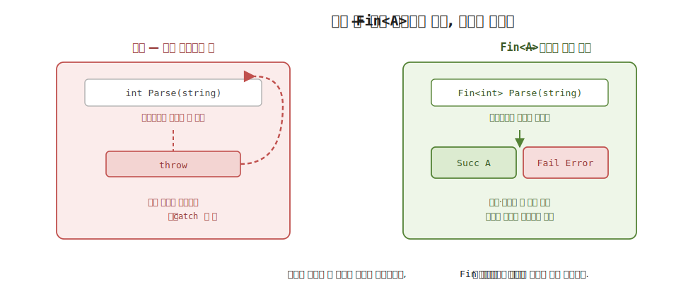
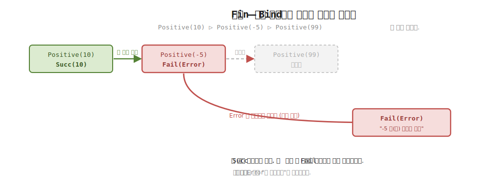
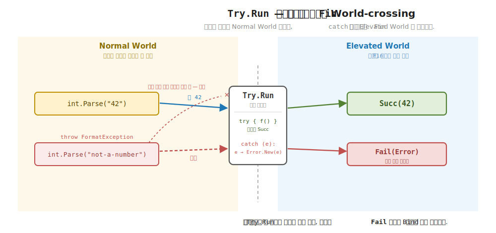

# 24장. Error · Fin · Fallible (예외를 값으로)

> **이 장의 목표** — 이 장을 마치면 함수형이 예외를 던지지 않고 값으로 다루는 방식을 설명하고 직접 구현할 수 있습니다. 23장에서 부수 효과를 `IO<A>` 라는 값으로 인코딩해 실행을 미뤘습니다. 그런데 부수 효과만큼 흔한 또 하나가 실패입니다. 파싱이 깨지고, 검증이 떨어지고, 파일이 없습니다. 명령형과 객체 지향은 이 실패를 `throw` 로 다루지만, 던진 예외는 호출 흐름을 건너뛰어 바깥으로 튀고 시그니처 어디에도 드러나지 않습니다. 이 장은 실패를 값으로 끌어올립니다. 오류를 구조화한 값 `Error`, 성공 `Succ A` 와 실패 `Fail Error` 두 경우를 한 값에 담은 `Fin<A>`, 그리고 그 위에 `Fail` 과 `Catch` 를 약속하는 trait `Fallible<F>` 를 차례로 직접 부착합니다. `Fin` 의 `Bind` 가 첫 실패에서 단락하며 그 이유를 남기는 것을 손계산으로 따라가고, 예외를 던지는 코드를 `Try` 로 감싸 예외를 `Error` 값으로 끌어올리는 World-crossing 을 봅니다.

> **이 장의 핵심 어휘**
>
> - **`Error`**: 오류를 구조화한 값, 메시지를 담고 필요하면 원래 예외도 품는 record
> - **`Fin<A>`**: 성공 `Succ A` 와 실패 `Fail Error` 두 경우를 한 값에 담은 자료, `Either<Error, A>` 의 효과 시스템판
> - **`FinF`**: `Fin` 의 태그 (trait 호스트), `Monad` 와 `Fallible` 를 동시에 부착하는 자리
> - **단락 (short-circuit)**: `Bind` 가 `Fail` 을 만나면 뒤따르는 단계를 건너뛰고 곧장 실패로 끝내는 동작
> - **`Fallible<F>`**: 오류로 실패할 수 있는 효과를 가리키는 trait, 멤버는 `Fail` 과 `Catch` 둘
> - **`Catch`**: 실패를 포착해 폴백 계산으로 잇는 멤버, 예외 잡기의 함수형 대응
> - **`Try`**: 예외를 던지는 코드를 감싸 예외를 `Error` 값으로 포획해 `Fin` 으로 내는 헬퍼
> - **World-crossing**: 예외를 던지는 Normal World 코드를 `Fin` 값의 Elevated World 로 끌어올리는 경계

> 이 장을 마치면 할 수 있게 되는 것
> - [ ] 예외가 시그니처에 드러나지 않아 생기는 불편을 한 문장으로 설명할 수 있습니다.
> - [ ] `Error` 가 오류를 구조화한 값임을 읽고, 왜 문자열 던지기보다 나은지 답할 수 있습니다.
> - [ ] `Fin<A>` 가 `Succ A` 와 `Fail Error` 두 경우를 담은 자료이고 `Either<Error, A>` 의 특수꼴임을 설명할 수 있습니다.
> - [ ] `FinF` 가 `Monad` 와 `Fallible` 를 동시에 부착함을 코드로 읽을 수 있습니다.
> - [ ] `Fin` 의 `Bind` 가 첫 실패에서 단락하며 이유를 남기는 과정을 손계산으로 추적할 수 있습니다.
> - [ ] `Fallible<F>` trait 의 `Fail` 과 `Catch` 가 각각 무엇을 약속하는지 답할 수 있습니다.
> - [ ] `Try` 가 예외를 `Error` 값으로 포획하는 World-crossing 임을 설명할 수 있습니다.
> - [ ] `Fin` 이 모나드 세 법칙을 지킴을 확인하고, 23장 `IO` 와 합쳐질 25장 `Eff` 를 예감할 수 있습니다.

> **이 장의 흐름** — 23장이 부수 효과를 값으로 인코딩했다는 자리에서 출발합니다. 실패를 `throw` 로 다룰 때 어디서 막히는지, 곧 예외가 흐름 바깥으로 튀고 시그니처에 드러나지 않는 불편을 먼저 부딪힙니다. 그다음 오류를 구조화한 값 `Error` 를 만들고, 성공과 실패 두 경우를 한 값에 담은 `Fin<A>` 의 자료와 의미를 봅니다. `FinF` 에 `Monad` 를 부착해 `Bind` 가 첫 실패에서 단락하는 모습을 손계산으로 추적하고, 그 위에 `Fallible<F>` trait 의 `Fail` 과 `Catch` 를 얹습니다. 예외를 던지는 코드를 `Try` 로 감싸 예외를 `Error` 로 끌어올리는 World-crossing 을 보고, `try`-`finally` 의 함수형 대응까지 짚습니다. 마지막으로 모나드 세 법칙을 점검하고, 23장 `IO` 와 이 장의 `Fin` 이 25장에서 어떻게 한 타입으로 합쳐지는지 다리를 놓습니다.

---

## 24.1 이 장에서 다루는 것 — 예외를 값으로

23장에서 부수 효과를 다뤘습니다. 콘솔 출력도, 파일 읽기도, 시간 조회도 곧장 실행하지 않고 `IO<A>` 라는 값으로 인코딩해 `Run` 전까지 미뤄 두었습니다. 부수 효과가 값이 되니 합성하고, 미루고, 테스트할 수 있었습니다. 이 장은 같은 발상을 실패에 적용합니다.

상급 C# 개발자라면 이 발상이 이미 손에 익은 한 가지와 닮았음을 알아챕니다. `async` 메서드의 반환 타입입니다. 어떤 메서드가 `Task<int>` 를 돌려주면, 그 시그니처는 "이 값은 지금 당장 있는 게 아니라 나중에 온다" 를 타입에 적어 둔 것입니다. 호출하는 쪽은 `await` 로 그 미래의 값을 꺼냅니다. 효과를 타입에 적어 두고, 정해진 동사로 꺼내는 이 짜임을 그대로 실패에 옮기는 것이 이 장입니다. `Task<int>` 가 "나중에 오는 정수" 였다면, 이 장의 `Fin<int>` 는 "성공하면 정수, 아니면 오류" 입니다. 효과의 종류만 "지연" 에서 "실패" 로 바뀌었을 뿐, 효과를 시그니처에 정직하게 드러낸다는 발상은 같습니다.

실패도 부수 효과만큼 흔합니다. 사용자가 넣은 문자열이 숫자가 아니고, 나이가 음수이고, 파일이 사라지고, 네트워크가 끊깁니다. 명령형과 객체 지향에서 이런 실패를 다루는 도구는 예외 (`throw` / `try`-`catch`) 입니다. 그러나 던진 예외는 정상 흐름을 건너뛰어 바깥 `catch` 로 튀고, 함수의 시그니처 어디에도 "나는 실패할 수 있다" 는 표시를 남기지 않습니다. 어느 함수가 실패하는지 타입만 봐서는 알 수 없습니다.

이 장의 도달점은 단 한 문장입니다. "함수형은 예외를 던지지 않고 값으로 다룬다." 실패를 반환값 안에 담아, 시그니처에 정직하게 드러내고, 정상 값과 똑같이 합성합니다. 이 한 문장을 세 단계로 구체화합니다. 먼저 오류를 구조화한 값 `Error` 를 만들고, 그 `Error` 와 성공 값을 한 자리에 담은 `Fin<A>` 를 정의하고, 그 위에 실패를 다루는 trait `Fallible<F>` 를 얹습니다.

두 평행 세계의 어휘로 보면 이렇습니다. 실패는 "값이 없을 수도, 틀릴 수도 있음" 이라는 효과입니다. 1부에서 이미 비슷한 효과를 봤습니다. `Option<A>` 는 값이 있거나 없는 효과였고, `Either<L, A>` 는 성공 `Right` 거나 실패 `Left` 인 효과였습니다. `Fin<A>` 는 그 `Either<L, A>` 의 왼쪽 자리를 오류 전용 타입 `Error` 로 고정한 특수꼴입니다. 곧 `Fin<A> = Either<Error, A>` 입니다. 1부에서 본 그 효과가, 7부에서 효과 시스템의 오류 채널로 다시 등장하는 것입니다.

지금 모든 것을 외우지 않아도 됩니다. 이 장이 끝날 때 손에 남는 것은 세 가지입니다. 오류는 `Error` 라는 값이라는 것, 성공과 실패는 `Fin<A>` 한 값에 함께 담긴다는 것, 그리고 `Bind` 가 첫 실패에서 멈추되 그 이유를 남긴다는 것입니다. 새 trait `Fallible<F>` 도 멤버가 둘뿐이라, 6부까지 쌓은 trait 어휘 위에 작은 한 칸을 더하는 장입니다.

---

## 24.2 왜 필요한가 — 예외는 흐름 바깥으로 튀고 시그니처에 안 드러난다

실패를 예외로 다루려 할 때 어디서 막히는지부터 부딪혀 봅니다. 추상을 먼저 보이지 않고, 손에 잡히는 상황을 먼저 겪는 것이 이 장의 순서입니다.

상급 C# 개발자라면 다음 코드가 익숙합니다. 문자열을 숫자로 바꾸고, 양수인지 확인하고, 두 값을 더하는 작은 파이프라인입니다.

```csharp
// 예외로 실패를 다루는 명령형 코드
int Parse(string s)    => int.Parse(s);            // 형식이 틀리면 FormatException 던짐
int Positive(int x)    => x > 0 ? x : throw new ArgumentException($"{x} 은(는) 양수가 아님");

int Compute(string a, string b)
{
    int x = Positive(Parse(a));   // 어느 줄이 실패할 수 있는가?
    int y = Positive(Parse(b));   // 시그니처만 봐서는 알 수 없다.
    return x + y;
}
```

`Compute` 의 시그니처는 `(string, string) → int` 입니다. 이 시그니처만 보면 `Compute` 는 두 문자열을 받아 정수 하나를 돌려주는, 절대 실패하지 않는 함수처럼 보입니다. 그러나 실제로는 `Parse` 가 `FormatException` 을, `Positive` 가 `ArgumentException` 을 던질 수 있습니다. 실패의 가능성이 본문 깊숙이 숨어 있고, 반환 타입 `int` 어디에도 드러나지 않습니다.

이 숨김이 만드는 불편이 셋입니다.

첫째, **흐름이 바깥으로 튑니다.** `Parse(a)` 가 예외를 던지면 그다음 줄 `Positive(...)` 도, `x + y` 도 실행되지 않고, 제어가 곧장 함수 바깥의 `try`-`catch` 로 건너뜁니다. 코드를 위에서 아래로 읽어도 실제 제어 흐름은 그 순서를 따르지 않습니다. 정상 경로와 실패 경로가 한자리에 보이지 않고 따로 흩어집니다.

"흐름이 바깥으로 튄다" 가 어떤 그림인지 위 코드의 제어 흐름을 한 번 손으로 따라가 봅니다. `Compute("abc", "3")` 처럼 첫 인자가 숫자가 아닐 때입니다. 우리가 볼 것은 단 하나, **어느 줄에서 제어가 코드 바깥으로 사라지는가** 입니다.

```
Compute("abc", "3") 호출
  int x = Positive(Parse("abc"))
            └ Parse("abc") → int.Parse 가 FormatException 을 throw
               제어가 여기서 사라진다 ───────────┐
  int y = Positive(Parse("3"))   ← 실행 안 됨    │ 함수 바깥 어딘가의
  return x + y                   ← 실행 안 됨    │ try-catch 로 건너뜀
                                                 ▼
         (호출자의 catch 블록에서 비로소 잡힘)
```

`throw` 가 일어난 순간, 그 아래 두 줄은 실행되지 않고 제어가 함수 경계를 뛰어넘어 어딘가의 `catch` 로 갑니다. 코드는 위에서 아래로 적혀 있지만 실제 흐름은 그 순서를 배신합니다. 그 "어딘가" 가 어디인지는 이 함수만 봐서는 알 수도 없습니다. 정상 경로 (`x + y` 를 반환) 와 실패 경로 (`catch` 의 처리) 가 한 화면에 함께 보이지 않고 멀리 떨어져 흩어지는 것입니다.

둘째, **시그니처가 거짓말을 합니다.** 반환 타입 `int` 는 "나는 늘 정수를 준다" 고 말하지만 실제로는 아닙니다. C# 에는 자바의 checked exception 같은, "이 함수는 이런 예외를 던진다" 를 타입에 적는 장치가 없습니다. 그래서 호출하는 쪽은 문서를 읽거나 본문을 열어 보기 전에는 어떤 예외를 대비해야 하는지 알 수 없습니다.

> **객체 지향 직감으로 다리 놓기** — 자바를 써 본 독자라면 `throws IOException` 처럼 던지는 예외를 시그니처에 적는 checked exception 을 떠올릴 수 있습니다. 그 장치는 적어도 "이 함수는 이런 예외를 던진다" 를 타입에 드러내, 호출하는 쪽이 컴파일 시점에 대비하게 만듭니다. C# 에는 그런 장치가 없습니다. `(string, string) → int` 라는 시그니처는 실패 가능성을 한 글자도 드러내지 않습니다. `Fin<A>` 가 하려는 일은 checked exception 이 노린 그 정직함을, 예외 대신 **반환값** 으로 이루는 것입니다. 곧 `(string, string) → Fin<int>` 라는 타입 자체가 "이건 실패할 수 있다" 를 말하게 만듭니다. 차이는 그 정직함이 별도 문법이 아니라 평범한 반환 타입 하나로 들어온다는 점입니다.

셋째, **잊으면 조용히 터집니다.** `try`-`catch` 로 감싸는 것을 잊어도 컴파일러는 아무 말이 없습니다. 그 누락은 런타임에, 그것도 운이 나쁜 입력이 들어온 그 순간에야 예외로 표면화됩니다. 컴파일 시점에 "여기 실패를 안 다뤘다" 고 알려 주는 안전망이 없습니다.

> **흔한 함정** — 예외는 예외적인 일에만 쓰니 괜찮다고 여기는 것입니다.
>
> 디스크가 망가지거나 메모리가 바닥나는 진짜 "예외적" 사건이라면 예외가 알맞습니다. 그러나 파싱 실패, 검증 탈락, 값 부재처럼 **충분히 예상되는** 실패까지 예외로 다루면 문제가 다릅니다. 예상되는 실패는 정상 흐름의 일부인데, 예외는 그것을 흐름 바깥으로 밀어내 시그니처에서 지워 버립니다. 함수형은 이 둘을 나눕니다. 예상되는 도메인 실패는 `Fin` 값으로 시그니처에 드러내고, 정말 예외적인 사건만 예외로 둡니다. 이 장이 다루는 것은 앞쪽, 곧 예상되는 실패를 값으로 끌어올리는 일입니다.

그래서 우리가 바라는 것은 분명합니다. 실패를 반환값 안에 담아, 시그니처가 `(string, string) → Fin<int>` 처럼 정직하게 "이건 실패할 수 있다" 고 말하게 하고 싶습니다. 그러면 정상 경로와 실패 경로가 한 값 안에 함께 흐르고, 실패를 안 다루면 타입이 안 맞아 컴파일러가 막아 줍니다.



**그림 24-1. 예외 대 `Fin<A>`: 흐름 바깥으로 튀나, 값으로 흐르나** — 왼쪽은 `throw` 한 예외가 호출 흐름을 건너뛰고 바깥 `catch` 로 튀어, 시그니처 어디에도 실패가 드러나지 않는 모습입니다. 오른쪽은 `Fin<A>` 가 성공 `Succ A` 와 실패 `Fail Error` 를 한 값에 담아 반환값 안에서 정직하게 흐르는 모습으로, 실패가 타입에 보임을 대비합니다.

실패를 값으로 담으려면 먼저 그 실패를 무엇으로 표현할지부터 정해야 합니다. 가장 단순한 후보는 문자열입니다. 그런데 문자열만으로는 부족합니다. 다음 절에서 오류를 구조화한 값 `Error` 부터 만듭니다.

---

## 24.3 Error — 오류를 구조화한 값

실패를 값으로 다루기로 했으니, 그 "실패가 무엇이었는지" 를 담을 자리가 필요합니다. 가장 손쉬운 방법은 실패 이유를 문자열로 들고 다니는 것입니다. 하지만 문자열은 곧 한계에 부딪힙니다. 오류에 코드 번호를 붙이고 싶거나, 원래 터진 예외를 함께 보관하고 싶을 때 문자열 하나로는 담을 자리가 없습니다. 그래서 오류를 작은 record 로 구조화합니다. 이름은 `Error` 입니다.

```csharp
// Error — 구조화된 오류 값. 예외를 던지는 대신 이 값을 흘려보낸다.
// (LanguageExt v5 Error 의 축소판 — 메시지 + 선택적 예외.)
public sealed record Error(string Message, Exception? Exception = null)
{
    public static Error New(string message) => new(message);
    public static Error New(Exception ex)   => new(ex.Message, ex);

    public override string ToString() => Message;
}
```

한 줄씩 읽습니다. `Error` 는 두 가지를 담은 record 입니다. `Message` 는 사람이 읽을 오류 설명이고, `Exception?` 은 원래 터진 예외 (있을 때만, 그래서 nullable) 입니다. 두 번째 자리가 비어 있을 수 있다는 점이 핵심입니다. 우리가 직접 만든 도메인 오류 ("나이가 음수임") 는 예외가 없으니 `Message` 만 있고, 예외를 포획해 만든 오류는 그 예외를 `Exception` 에 보관합니다.

만드는 길이 두 개라는 점도 봐 둡니다. `Error.New("이름이 비어 있음")` 은 문자열로 직접 오류를 만들고, `Error.New(someException)` 은 예외를 받아 그 메시지를 꺼내 오류로 감쌉니다. 뒤에서 `Try` 가 예외를 포획할 때 이 두 번째 길을 씁니다. `ToString()` 이 `Message` 를 그대로 돌려주므로, 콘솔에 찍으면 사람이 읽을 메시지가 나옵니다.

두 길이 각각 무엇을 만드는지 한 줄로 손계산해 봅니다.

```
Error.New("이름이 비어 있음")
  → new Error("이름이 비어 있음", null)      도메인 오류: 예외 없음, 메시지만

Error.New(new FormatException("형식 오류"))
  → new Error("형식 오류", 그 FormatException)  예외 포장: 메시지 + 원래 예외 보관
```

첫 길은 우리가 직접 만든 오류라 `Exception` 자리가 `null` 입니다. 둘째 길은 터진 예외에서 `ex.Message` 를 꺼내 `Message` 로 삼고, 그 예외 자체도 `Exception` 자리에 보관합니다. 나중에 "원래 무슨 예외였는지" 가 필요하면 그 자리에서 다시 꺼낼 수 있습니다. 뒤에서 볼 `Try` 가 예외를 포획할 때 바로 이 둘째 길을 씁니다.

> **흔한 함정** — 오류 이유를 그냥 `string` 으로 들고 다니면 안 되느냐는 것입니다.
>
> 작은 예제에서는 문자열로도 됩니다. 그러나 실무에서는 오류에 더 많은 정보가 붙습니다. HTTP 상태 코드 같은 분류 번호, 원래 터진 예외, 여러 오류를 하나로 모은 묶음 따위입니다. 문자열 하나에는 이것을 담을 자리가 없습니다. `Error` 라는 별도 타입을 두면, 나중에 필드를 늘려도 그 타입을 쓰는 코드는 그대로입니다. 지금은 메시지 하나만 담은 가장 단순한 모양이지만, 오류를 값으로 다루는 첫걸음은 "오류에도 타입이 있다" 를 정하는 것입니다.

이 학습용 `Error` 는 의도적으로 가장 단순한 모양입니다. LanguageExt v5 의 `Error` 는 여기서 훨씬 더 자랍니다. 그 차이를 한 단락으로 정직하게 짚어 둡니다. 지금 외울 내용은 아니고, 이 타입이 실무에서 어디로 자라는지의 배경입니다.

v5 의 `Error` 는 평면 record 가 아니라 여러 갈래로 나뉩니다. 사용자가 예상한 도메인 오류는 `Expected` (예상된 오류) 로, 예외를 포장한 오류는 `Exceptional` (예외적 오류) 로 갈라집니다. 이 구분이 중요한 까닭은, "오류에도 종류가 있다" 는 직관을 코드로 만질 수 있게 하기 때문입니다. v5 에서는 `error.IsExpected` / `error.IsExceptional` 로 오류의 종류를 묻고, 오류마다 붙은 코드 번호로 "이 코드의 오류만 골라 잡기" 가 됩니다. 학습용은 이 구분을 한 종류로 줄였지만, 25장과 26장에서 특정 오류만 골라 포착하는 `@catch` 를 만날 때 이 갈래가 되살아납니다. 지금은 "학습용은 오류를 한 종류로 줄였고, v5 는 예상된 오류와 예외적 오류로 나뉜다" 정도만 들고 가면 충분합니다.

이제 이 `Error` 를 한쪽에 담고, 다른 쪽에 성공 값을 담을 그릇이 필요합니다. 그 그릇이 `Fin<A>` 입니다.

---

## 24.4 Fin<A> = Succ ⊕ Fail — 성공과 실패를 한 값에

오류를 `Error` 값으로 표현했으니, 이제 "성공이거나 실패인" 결과 전체를 담을 자료를 만듭니다. 이름은 `Fin<A>` 입니다 (finish, 곧 계산의 최종 결과라는 뜻). 두 경우 중 하나입니다. 성공이면 값 `A` 를 담은 `Succ`, 실패면 `Error` 를 담은 `Fail` 입니다.

```csharp
// Fin<A> — 효과 계산의 결과: 성공 Succ(A) 또는 실패 Fail(Error). (= Either<Error, A>.)
public abstract record Fin<A> : K<FinF, A>
{
    public sealed record Succ(A Value) : Fin<A> { public override string ToString() => $"Succ({Value})"; }
    public sealed record Fail(Error Error) : Fin<A> { public override string ToString() => $"Fail({Error})"; }
}
```

자료의 모양을 한 줄씩 읽습니다. `Fin<A>` 는 `abstract record` 이고, 그 아래 두 개의 구체 경우가 있습니다. `Succ(A Value)` 는 성공한 결과로, 안에 값 `A` 를 하나 담습니다. `Fail(Error Error)` 는 실패한 결과로, 안에 앞 절에서 만든 `Error` 를 담습니다. 어떤 `Fin<A>` 값도 이 둘 중 정확히 하나입니다. 이 "둘 중 하나" 를 함수형에서는 합 타입 (sum type) 이라 부르고, 기호로는 `Succ(A) ⊕ Fail(Error)` 로 적습니다.

여기 처음 나온 기호 `⊕` 를 한 줄로 풀어 둡니다. `⊕` 는 "이것이거나 저것, 둘 중 하나" 를 뜻하는 표시입니다. `A ⊕ B` 는 "`A` 의 모양이거나 `B` 의 모양, 정확히 한쪽" 입니다. 그러니 `Succ(A) ⊕ Fail(Error)` 는 "성공 값을 담은 `Succ` 이거나, 오류를 담은 `Fail`, 둘 중 하나" 라는 뜻입니다. 외울 기호는 아니고, "둘 중 하나" 를 짧게 적은 표시로 읽으면 충분합니다. 1부에서 본 `Option` 의 `Some ⊕ None`, `Either` 의 `Left ⊕ Right` 와 같은 모양입니다.

`ToString()` 두 개는 콘솔 출력을 위한 것입니다. 성공이면 `Succ(30)` 처럼, 실패면 `Fail(이름이 비어 있음)` 처럼 찍힙니다. 데모 출력에서 보게 될 모양입니다.

`Fin<A>` 옆에 붙은 `K<FinF, A>` 의 `FinF` 가 이 자료의 태그 (trait 호스트) 입니다. 1부에서 `Option` 의 trait 을 `OptionF` 라는 태그에 부착했던 그 방식 그대로입니다. `Fin` 이라는 자료와, 그 자료에 trait 을 부착할 자리 `FinF` 를 나눠 둔 것입니다. `FinF` 가 어떤 trait 을 부착하는지는 다음 절에서 봅니다.

여기서 1부에서 본 `Either<L, A>` 를 한 줄로 상기합니다. `Either<L, A>` 는 왼쪽 `Left L` 거나 오른쪽 `Right A` 인, 역시 둘 중 하나인 합 타입이었습니다. 관례로 오른쪽 `Right` 가 성공, 왼쪽 `Left` 가 실패를 담았습니다. `Fin<A>` 는 그 `Either` 의 왼쪽 자리를 오류 전용 타입 `Error` 로 고정한 특수꼴입니다.

```
Either<L, A>  =  Left(L)      ⊕  Right(A)
                  │                │
Fin<A>        =  Fail(Error)  ⊕  Succ(A)      (= Either<Error, A>)
```

곧 `Fin<A>` 는 `Either<Error, A>` 와 같은 모양이되, 왼쪽이 늘 `Error` 한 가지라는 점만 다릅니다. 1부에서 익힌 그 효과를, 7부에서는 효과 시스템의 오류 채널로 그대로 가져온 것입니다. 그래서 1부에서 `Either` 로 짠 모든 직관 (`Map` 은 성공 값만 건드리고 실패는 지나친다, `Bind` 는 실패에서 멈춘다) 이 `Fin` 에도 그대로 적용됩니다.

> **미리보기** — 다음 절부터 `FinF` 에 두 trait 을 부착합니다. 먼저 `Monad` 를 부착해 `Bind` 가 첫 실패에서 단락하게 하고, 그 위에 `Fallible` 를 부착해 `Fail` 과 `Catch` 를 얹습니다. 지금 그 코드를 다 이해하지 않아도 됩니다. `Fin` 은 "둘 중 하나" 인 자료이고, 그 위에 합성하는 능력 (`Bind`) 과 실패를 다루는 능력 (`Fallible`) 을 차례로 부착한다는 큰 그림만 잡으면 다음 절이 자연스럽게 읽힙니다.

---

## 24.5 Bind 단락 — Succ 잇고 Fail 단락

`Fin<A>` 라는 자료를 만들었으니, 이제 그 위에 합성하는 능력을 부착합니다. `FinF` 에 `Monad` 를 부착하면, 여러 `Fin` 단계를 LINQ 한 사슬로 잇고, 어느 단계가 실패하면 거기서 멈추게 할 수 있습니다. 부착 코드를 봅니다.

```csharp
public sealed class FinF : Monad<FinF>, Fallible<FinF>
{
    public static K<FinF, B> Map<A, B>(Func<A, B> f, K<FinF, A> fa) =>
        fa.As() switch
        {
            Fin<A>.Succ s => new Fin<B>.Succ(f(s.Value)),
            Fin<A>.Fail e => new Fin<B>.Fail(e.Error),
            _ => throw new InvalidOperationException()
        };

    public static K<FinF, A> Pure<A>(A value) => new Fin<A>.Succ(value);

    public static K<FinF, B> Bind<A, B>(K<FinF, A> ma, Func<A, K<FinF, B>> f) =>
        ma.As() switch
        {
            Fin<A>.Succ s => f(s.Value),
            Fin<A>.Fail e => new Fin<B>.Fail(e.Error),   // 첫 실패에서 단락
            _ => throw new InvalidOperationException()
        };

    // … Apply, Fail, Catch 는 뒤에서 …
}
```

이 절에서는 `Map`, `Pure`, `Bind` 세 멤버만 봅니다 (`Apply` 와 `Fallible` 의 두 멤버는 뒤에서). `FinF` 가 `Monad<FinF>, Fallible<FinF>` 두 trait 을 동시에 부착했다는 선언 줄을 눈여겨봐 둡니다. 한 타입이 모나드이면서 동시에 실패를 다룰 줄 안다는 약속을 두 trait 으로 표시한 것입니다. `Fallible` 쪽은 잠시 뒤로 미룹니다.

`Pure` 부터 봅니다. `Pure<A>(A value) => new Fin<A>.Succ(value)` 는 평범한 값 하나를 받아 `Succ` 로 감쌉니다. 곧 Normal World 의 값 하나를 "성공한 `Fin`" 으로 끌어올리는 일입니다. 실패가 아니라 성공으로 들어 올리는 것이 자연스럽습니다.

`Map` 은 성공 값만 건드립니다. `Succ s` 면 안의 값에 `f` 를 적용해 다시 `Succ` 로 감싸고, `Fail e` 면 `f` 를 적용하지 않고 오류를 그대로 옮겨 담습니다. 1부의 `Either` 에서 본 그 모양 그대로입니다. 성공이면 변환하고, 실패면 손대지 않고 지나칩니다.

이 절의 핵심은 `Bind` 입니다. `Bind` 는 `Fin<A>` 와 "값을 받아 다음 `Fin<B>` 를 내는 함수 `f`" 를 받습니다. 두 갈래로 갈립니다.

- `Succ s` 면 안의 값 `s.Value` 를 꺼내 `f` 에 넘깁니다. 곧 성공이면 그 값으로 다음 단계를 잇습니다.
- `Fail e` 면 `f` 를 **부르지 않고**, 그 오류를 그대로 다음 단계의 실패 `new Fin<B>.Fail(e.Error)` 로 옮겨 담습니다. 곧 실패면 다음 단계를 건너뛰고 곧장 실패로 끝냅니다.

이 두 번째 갈래가 단락 (short-circuit) 입니다. 한 번 `Fail` 이 나오면 그 뒤의 단계들은 `f` 가 아예 호출되지 않으므로 실행되지 않습니다. 그리고 단락하면서도 원래 `Error` (`e.Error`) 를 그대로 들고 가므로, 최종 결과는 "왜 멈췄는지" 를 담은 `Fail` 입니다. 7장에서 본 모나드의 단락이 여기서 오류 모델로 다시 나타난 것입니다.

상급 C# 개발자에게는 이 단락이 두 가지 익숙한 동작을 한 줄로 합친 것으로 보입니다. 성공 갈래는 메서드 안에서 다음 줄로 자연스럽게 넘어가는 정상 흐름이고, 실패 갈래는 함수 첫머리의 `if (실패) return 오류;` 곧 빠른 반환 (early return) 입니다. 명령형에서는 매 단계마다 "실패면 여기서 return" 을 손으로 적어야 했습니다. `Bind` 는 그 "실패면 빠른 반환" 을 단계마다 자동으로 끼워 넣어 줍니다. 그래서 우리는 성공 경로만 적고, 실패 시 건너뛰기는 `Bind` 가 맡습니다. 예외의 자동 전파와 닮았지만 결정적으로 다른 점은, 여기서는 제어가 함수 바깥으로 튀지 않고 `Fail` 이라는 **값** 이 되어 사슬 끝까지 정직하게 흐른다는 것입니다.

### 24.5.1 단락을 손으로 따라가기

말로 설명한 단락을, 데모 코드의 실제 입력으로 손계산해 봅니다. 데모에는 작은 검증 함수 하나가 있습니다.

```csharp
// 양수면 Succ, 아니면 Fail. 시그니처가 "이건 실패할 수 있다" 고 정직하게 말한다.
static K<FinF, int> Positive(int x) =>
    x > 0 ? new Fin<int>.Succ(x) : new Fin<int>.Fail(Error.New($"{x} 은(는) 양수가 아님"));
```

`Positive` 는 정수가 양수면 `Succ` 로, 아니면 `Fail` 로 감싸 돌려줍니다. 반환 타입 `K<FinF, int>` 가 "이 함수는 실패할 수 있다" 를 시그니처에 정직하게 드러내는 점을 봐 둡니다. 이제 두 경우를 LINQ 로 잇습니다. 하나는 모두 성공하는 경우, 하나는 중간에 실패하는 경우입니다.

```csharp
var ok =
    from a in Positive(10)
    from b in Positive(20)
    select a + b;

var bad =
    from a in Positive(10)
    from b in Positive(-5)   // 여기서 단락
    from c in Positive(99)   // 실행 안 됨
    select a + b + c;
```

`from-from-select` 가 `Bind` 사슬로 풀린다는 것은 6부 내내 봤습니다. 우리가 따라갈 것은 단 하나, **어느 단계에서 `f` 가 호출되고 어느 단계가 건너뛰어지는가** 입니다. 먼저 모두 성공하는 `ok` 를 추적합니다.

```
ok = Positive(10).Bind(a =>
       Positive(20).Bind(b =>
         Pure(a + b)))

Positive(10)            → Succ(10)
  Succ(10).Bind(...)    → a = 10, f 호출            (성공: 다음으로 잇는다)
    Positive(20)        → Succ(20)
      Succ(20).Bind(...)→ b = 20, f 호출            (성공: 다음으로 잇는다)
        Pure(10 + 20)   → Succ(30)

결과: Succ(30)
```

세 단계 모두 `Succ` 라, `Bind` 가 매번 다음 `f` 를 호출하며 끝까지 흘러 `Succ(30)` 이 나옵니다. 데모 출력은 `10·20 모두 양수 → Succ(30)` 입니다. 이번에는 중간에 실패하는 `bad` 를 같은 방식으로 따라갑니다.

```
bad = Positive(10).Bind(a =>
        Positive(-5).Bind(b =>
          Positive(99).Bind(c =>
            Pure(a + b + c))))

Positive(10)            → Succ(10)
  Succ(10).Bind(...)    → a = 10, f 호출            (성공: 다음으로 잇는다)
    Positive(-5)        → Fail("-5 은(는) 양수가 아님")
      Fail(e).Bind(...) → f 를 부르지 않는다!        (실패: 여기서 단락)
                          오류를 그대로 옮겨 담는다
        Positive(99)    → ✗ 호출조차 안 됨
        Pure(...)       → ✗ 호출조차 안 됨

결과: Fail("-5 은(는) 양수가 아님")
```

`Positive(-5)` 가 `Fail` 을 내는 순간, 그것을 받은 `Bind` 는 `f` 를 부르지 않습니다. `Bind` 의 `Fail e` 갈래가 작동해, 뒤따르는 `Positive(99)` 와 `Pure` 는 호출조차 되지 않고, 오류가 그대로 결과까지 흘러갑니다. 데모 출력은 `10·(-5)·99 → Fail(-5 은(는) 양수가 아님) (-5 에서 단락, 99 는 미실행)` 입니다.

이 추적이 단락의 두 성질을 눈으로 보여 줍니다. 첫째, 첫 실패 뒤의 단계는 **실행되지 않습니다** (`Positive(99)` 가 미실행). 둘째, 단락해도 **이유가 남습니다** (`-5 은(는) 양수가 아님` 이 결과에 그대로). 첫 실패에서 멈추되 왜 멈췄는지를 보존하는 것, 이것이 `Fin` 의 `Bind` 입니다.



**그림 24-2. `Fin` 의 `Bind` 단락: 첫 실패에서 멈추고 이유를 남긴다** — `Succ` 갈래는 값을 꺼내 다음 단계로 잇고, `Fail` 갈래는 뒤따르는 단계를 건너뛰고 곧장 `Fail(Error)` 로 단락합니다. 단락해도 `Error` 가 결과에 그대로 남아 "왜 멈췄는지"를 보존함을 보입니다.

> **흔한 함정** — `Bind` 가 단락하면 첫 오류만 남고 나머지 검증은 무시되니, 모든 오류를 한 번에 모으고 싶을 때도 `Fin` 을 쓰면 되겠다고 여기는 것입니다.
>
> `Fin` 의 `Bind` 는 첫 실패에서 멈추는 단락 합성입니다. 그래서 "이름이 비었고 나이도 음수임" 같은 여러 오류를 한꺼번에 모으지는 못합니다. 첫 실패 ("이름이 비었음") 에서 멈추니까요. 1부에서 본 `Validation` 은 정반대로 모든 오류를 누적했습니다. 곧 같은 두 검증이라도, `Fin` 의 `Bind` 로 이으면 첫 실패만 나오고, `Validation` 의 `Apply` 로 이으면 모든 실패가 모입니다. 둘은 "같은 자료를 다루는 두 합성 전략" 입니다. 어느 쪽을 쓸지는 "첫 실패에서 멈출까, 다 모을까" 라는 의도가 정합니다. 이 대비는 이 장 끝의 챌린지에서 코드로 다시 짚습니다.

`Apply` 도 잠깐 짚어 둡니다. 위 코드 묶음에서 미뤄 둔 `Apply` 는 두 `Fin` 을 나란히 합치는 멤버입니다.

```csharp
public static K<FinF, B> Apply<A, B>(K<FinF, Func<A, B>> mf, K<FinF, A> ma) =>
    (mf.As(), ma.As()) switch
    {
        (Fin<Func<A, B>>.Succ f, Fin<A>.Succ a) => new Fin<B>.Succ(f.Value(a.Value)),
        (Fin<Func<A, B>>.Fail e, _) => new Fin<B>.Fail(e.Error),   // 왼쪽 실패 우선
        (_, Fin<A>.Fail e) => new Fin<B>.Fail(e.Error),
        _ => throw new InvalidOperationException()
    };
```

둘 다 `Succ` 면 함수를 값에 적용해 `Succ` 로, 한쪽이라도 `Fail` 이면 그 오류로 `Fail` 입니다. 한 가지 정직하게 짚을 점은, 학습용 `Apply` 는 둘 다 실패일 때 **왼쪽 오류만** 취한다는 것입니다. v5 의 `Fin` 은 둘 다 실패면 두 오류를 하나로 합칩니다 (`Error` 가 더해질 수 있는 타입이라 가능합니다). 학습용 `Error` 는 합치는 능력을 의도적으로 뺐기에 왼쪽만 취합니다. 그래서 "`Applicative` 로 오류를 누적" 하는 그림은 `Fin` 수준에서는 보이지 않고, 1부의 `Validation` 이 그 몫을 맡습니다.

이제 `FinF` 가 부착한 또 하나의 trait, `Fallible` 로 넘어갑니다.

---

## 24.6 Fallible trait — Fail 과 Catch

`Bind` 의 단락은 "실패가 생기면 멈춘다" 를 다뤘습니다. 그런데 실패를 다루는 데는 두 가지 동사가 더 필요합니다. 하나는 실패를 **만드는** 동사, 하나는 실패를 **포착해 되돌리는** 동사입니다. 이 둘을 약속하는 trait 이 `Fallible<F>` 입니다.

```csharp
// Fallible — 오류로 실패할 수 있는 효과의 trait. LanguageExt v5 의 Fallible.Trait.cs 와 정합.
//
//   Fail  : Error → K<F, A>                       오류로 단락
//   Catch : K<F,A> → (Error → K<F,A>) → K<F,A>     실패를 포착해 복구
//
// 예외를 던지지 않고 값(Error) 으로 다루는 함수형 오류 모델의 핵심.
public interface Fallible<F> where F : Fallible<F>
{
    static abstract K<F, A> Fail<A>(Error error);
    static abstract K<F, A> Catch<A>(K<F, A> fa, Func<Error, K<F, A>> handler);
}
```

"trait 의 약속" 이 무슨 뜻이었는지 한 줄로 상기합니다. trait 은 "이 타입은 이 멤버를 반드시 가진다" 는 약속이고, 그 약속을 적어 두는 자리입니다. 그러니 `Fallible<F>` 를 부착한 타입은 곧 "나는 실패를 값으로 만들 줄 알고, 그 실패를 포착해 되돌릴 줄 안다" 고 약속한 셈입니다. 멤버가 둘입니다.

- **`Fail<A>(Error error)`** — `Error` 하나를 받아 "실패한 `K<F, A>`" 를 만듭니다. 곧 오류를 효과 안의 실패 값으로 끌어올립니다. `Fin` 의 경우 이것은 `Fail` 노드를 만드는 일입니다.
- **`Catch<A>(K<F, A> fa, Func<Error, K<F, A>> handler)`** — 효과 `fa` 와 "오류를 받아 폴백 계산을 내는 함수 `handler`" 를 받습니다. `fa` 가 성공이면 그대로 두고, 실패면 그 오류를 `handler` 에 넘겨 폴백 계산으로 잇습니다.

`Catch` 가 하는 일을 정확히 짚어 둡니다. `Catch` 는 실패를 "없던 일" 로 되돌리는 것이 아니라, 실패했을 때 **대신 실행할 다른 계산** 을 잇는 것입니다. 곧 "이 계산이 실패하면, 대신 이걸 해 줘" 입니다. 객체 지향 직감으로 다리를 놓으면 `try`-`catch` 의 `catch` 블록입니다. `try` 안이 터지면 `catch` 안의 폴백 코드가 도는 그 구조 그대로입니다. 차이는 예외를 잡는 대신 `Error` 값을 받는다는 것뿐입니다.

두 멤버의 시그니처를 한 줄로 더 읽어 둡니다. `Fail<A>` 가 받는 것은 `Error` 하나뿐인데 돌려주는 것은 `K<F, A>` 입니다. 곧 "실패 하나" 에서 "어떤 타입 `A` 의 실패한 효과" 든 만들어 낼 수 있다는 뜻입니다. 실패에는 성공 값 `A` 가 없으니, 타입 `A` 가 무엇이든 `Fail` 은 똑같이 만들어집니다. `Catch<A>` 의 둘째 인자 `Func<Error, K<F, A>>` 는 "오류를 받아 같은 타입 `A` 의 효과를 내는 함수" 입니다. 폴백도 결국 같은 `K<F, A>` 를 내야 `fa` 자리에 매끄럽게 갈아 끼울 수 있기 때문입니다.

`FinF` 에서 이 두 멤버가 어떻게 구현되는지 봅니다.

```csharp
public static K<FinF, A> Fail<A>(Error error) => new Fin<A>.Fail(error);

public static K<FinF, A> Catch<A>(K<FinF, A> fa, Func<Error, K<FinF, A>> handler) =>
    fa.As() is Fin<A>.Fail e ? handler(e.Error) : fa;
```

`Fail` 은 `Error` 를 받아 `Fail` 노드를 만드는 한 줄입니다. `Catch` 는 `fa` 가 `Fail e` 면 그 오류 `e.Error` 를 `handler` 에 넘겨 폴백 계산을 돌려주고, 그렇지 않으면 (`Succ` 면) `fa` 를 그대로 둡니다. 곧 성공은 손대지 않고 실패만 폴백으로 바꿉니다.

`Catch` 의 두 갈래를 한 줄씩 손계산해 봅니다. `handler` 는 "오류를 받아 폴백 `Fin` 을 내는 함수" 입니다.

```
Catch(Succ(30), handler)
  → fa 가 Succ → handler 를 부르지 않고 fa 그대로     결과: Succ(30)

Catch(Fail(e), handler)
  → fa 가 Fail → handler(e) 를 불러 그 결과로 대체     결과: handler(e) 가 낸 Fin
```

성공이면 `handler` 는 손도 대지 않습니다. 이미 성공한 값을 굳이 바꿀 까닭이 없으니까요. 실패일 때만 `handler` 가 깨어나 오류 `e` 를 받고, 그 자리에 폴백 `Fin` 을 내놓습니다. `Map` 이 성공만 건드리고 실패는 지나쳤다면, `Catch` 는 정반대로 실패만 건드리고 성공은 지나칩니다.

자유 함수로도 같은 일을 부릅니다. LINQ 본문이나 일반 코드에서 쓰기 편한 어휘입니다.

```csharp
public static class Fallibles
{
    public static K<F, A> fail<F, A>(Error error) where F : Fallible<F> => F.Fail<A>(error);
    public static K<F, A> @catch<F, A>(K<F, A> fa, Func<Error, K<F, A>> handler)
        where F : Fallible<F> => F.Catch(fa, handler);
}
```

`Fallibles.fail` 과 `Fallibles.@catch` 는 제약 `where F : Fallible<F>` 만 만족하면 어떤 효과에든 작동합니다. 본체는 그 효과의 `Fail` / `Catch` 를 부르는 한 줄뿐입니다. 데모에서 `Catch` 로 실패를 복구하는 모습을 봅니다.

```csharp
var failed    = Try.Run(() => int.Parse("not-a-number"));     // Fail(...)
var recovered = Fallibles.@catch<FinF, int>(failed, _ => new Fin<int>.Succ(-1));
// recovered → Succ(-1)

여기 처음 보이는 `Try.Run` 은 한 줄로만 짚어 둡니다. 예외를 던지는 코드를 `Fin` 으로 잡아 주는 헬퍼이고, 바로 다음 절에서 정식으로 봅니다. 지금은 "파싱이 깨지면 `Fail` 인 `Fin<int>` 가 나온다" 정도로 읽으면 충분합니다.

```

`failed` 는 파싱이 깨져 `Fail` 인 `Fin<int>` 입니다 (`Try` 는 바로 다음 절에서 봅니다). `@catch` 는 그 실패를 포착해, 오류가 무엇이든 (`_` 로 무시) 기본값 `-1` 을 담은 `Succ` 로 되돌립니다. 데모 출력은 `실패를 Catch → 기본값 -1 = Succ(-1)` 입니다. 실패가 폴백으로 바뀌어, 그 뒤를 잇는 코드는 정상 값으로 계속 흐릅니다.

> **흔한 함정** — `Catch` 가 실패를 회수해 원래 계산을 되살린다고 여기는 것입니다.
>
> `Catch` 는 실패한 계산을 다시 돌리지 않습니다. 이미 실패한 그 결과를 보고, **대신 다른 계산** 을 잇는 것입니다. `Catch(fa, handler)` 에서 `fa` 가 실패였다면 `fa` 는 그것으로 끝이고, 새로 `handler(error)` 가 만든 계산이 이어집니다. `try`-`catch` 에서 `try` 가 터진 뒤 `catch` 블록이 도는 것과 같습니다. `try` 안을 다시 실행하는 게 아니라 `catch` 안의 폴백이 도는 것이지요. 그래서 `Catch` 의 핸들러에는 "실패했을 때 대신 무엇을 할지" 를 적습니다. 기본값을 주거나, 다른 경로를 시도하거나, 오류를 다른 오류로 바꾸는 일입니다.

학습용 `Catch` 와 v5 의 차이를 한 단락으로 정직하게 짚어 둡니다. 학습용 `Catch` 는 오류가 무엇이든 무조건 포착합니다 (멤버가 `fa` 와 `handler` 둘뿐). v5 의 `Catch` 는 여기에 술어 (predicate) 하나를 더 받습니다. 곧 "이 조건에 맞는 오류만 골라 잡고, 나머지는 그대로 흘려보내라" 가 됩니다. 제목의 `Fallible` 가 가리키는 핵심 능력 하나가 바로 이 "특정 오류만 선별 포착" 입니다. 학습용은 그 술어를 뺀 가장 단순한 형태 (무조건 포착) 만 담았는데, 이것은 v5 의 catch-all 편의 형태에 정합합니다. 25장과 26장에서 오류 코드로 골라 잡는 `@catch` 를 만날 때 이 술어가 되살아납니다. 지금은 "학습용 `Catch` 는 무조건 포착, v5 는 술어로 골라 포착" 정도만 들고 가면 충분합니다.

이제 마지막 동사가 남았습니다. 예외를 던지는 바깥 세계의 코드를 어떻게 `Fin` 값으로 끌어올릴까요. `Try` 입니다.

---

## 24.7 Try — 예외를 Error 로 포획하는 World-crossing

지금까지는 우리가 직접 짠 함수가 `Succ` 나 `Fail` 을 돌려줬습니다. 그런데 실무 코드의 상당 부분은 우리가 짜지 않은, 예외를 던지는 함수입니다. `int.Parse`, 파일 입출력, 라이브러리 호출이 그렇습니다. 이런 코드를 `Fin` 세계로 데려오려면, 예외를 잡아 `Error` 값으로 바꾸는 경계 하나가 필요합니다. 그 경계가 `Try` 입니다.

```csharp
public static class Try
{
    // 예외를 던지는 코드를 Fin 으로 포획 (예외 → Error 값).
    public static K<FinF, A> Run<A>(Func<A> f)
    {
        try { return new Fin<A>.Succ(f()); }
        catch (Exception e) { return new Fin<A>.Fail(Error.New(e)); }
    }
}
```

`Try.Run` 은 "값을 내는 함수 `f`" 를 받아, 그것을 `try`-`catch` 로 감쌉니다. `f()` 가 무사히 값을 내면 그 값을 `Succ` 로 감싸고, 예외를 던지면 그 예외를 `catch` 로 잡아 `Error.New(e)` 로 바꿔 `Fail` 로 감쌉니다. 앞 절에서 본 `Error.New(Exception)` 의 두 번째 길이 여기서 쓰입니다. 예외의 메시지를 꺼내 `Error` 로 포장하는 것입니다.

`Try.Run` 안에서 두 입력이 각각 어디로 갈리는지 손계산해 봅니다. 우리가 볼 것은 단 하나, **예외가 어디서 값으로 바뀌는가** 입니다.

```
Try.Run(() => int.Parse("42"))
  try { f() }  → int.Parse("42") = 42, 예외 없음
              → new Fin<int>.Succ(42)                      결과: Succ(42)

Try.Run(() => int.Parse("not-a-number"))
  try { f() }  → int.Parse 가 FormatException 을 throw
  catch (e)    → 예외를 여기서 붙잡는다
              → new Fin<int>.Fail(Error.New(e))            결과: Fail(예외 메시지)
```

위쪽은 `try` 블록이 무사히 끝나 `Succ` 로 나옵니다. 아래쪽은 `int.Parse` 가 던진 예외를 `catch` 가 붙잡아, 바깥으로 튀게 두지 않고 그 자리에서 `Error` 값으로 바꿔 `Fail` 로 감쌉니다. 예외가 "날아다니는 제어" 에서 "손에 쥔 값" 으로 바뀌는 자리가 바로 이 `catch` 한 줄입니다.

데모로 두 경우를 봅니다.

```csharp
var parsed = Try.Run(() => int.Parse("42"));            // Succ(42)
var failed = Try.Run(() => int.Parse("not-a-number"));  // Fail(파싱 예외 메시지)
```

`int.Parse("42")` 는 무사히 `42` 를 내므로 `Succ(42)` 가 됩니다. `int.Parse("not-a-number")` 는 `FormatException` 을 던지는데, `Try.Run` 의 `catch` 가 그것을 잡아 `Error` 로 바꿔 `Fail` 로 만듭니다. 데모 출력은 `Try(int.Parse "42") → Succ(42)` 와 `Try(int.Parse "not-a-number") → Fail(...)` 입니다 (뒤쪽은 파싱 실패의 예외 메시지가 그대로 담깁니다).

이 한 줄이 이 장에서 가장 중요한 장면 하나입니다. **예외를 던지는 Normal World 코드를, `Fin` 값의 Elevated World 로 끌어올리는** 경계이기 때문입니다. `int.Parse` 는 예외로 실패를 알리는 옛 세계의 시민입니다. `Try.Run` 은 그 시민을 `Fin` 세계로 데려오는 입국 심사대입니다.



**그림 24-3. `Try.Run`: 예외를 `Fin` 값으로 끌어올리는 World-crossing** — `int.Parse("42")` 는 무사히 `Succ(42)` 로 건너가고, `int.Parse("not-a-number")` 는 `FormatException` 을 던지지만 `Try.Run` 의 `catch` 가 그 예외를 `Error.New(e)` 로 바꿔 `Fail(Error)` 로 들여보냅니다. 그냥 두면 흐름 밖으로 튈 예외를, 경계 한 곳에서 `Fin` 값으로 바꿔 Normal World 에서 Elevated World 로 올리는 모습입니다.

입국 심사대 비유에 상급 C# 독자의 직감을 1:1 로 포개 봅니다. `Try.Run` 안의 `try`-`catch` 는 여러분이 평소에 쓰던 바로 그 `try`-`catch` 그대로입니다. `try` 블록이 `int.Parse` 의 정상 결과를 받는 입국 통로라면, `catch (Exception e)` 블록은 예외라는 "여권 없는 입국자" 를 막아 세워 `Error` 라는 정식 서류로 바꿔 들여보내는 심사 창구입니다. 다른 점은 단 하나, 잡은 예외를 다시 던지거나 로그만 남기고 마는 것이 아니라 `Fail` 이라는 값으로 바꿔 반환한다는 것뿐입니다.

한 번 `Try.Run` 을 거치고 나면, 그 뒤로는 예외가 더는 날아다니지 않습니다. 실패가 `Fail` 값이 되어 `Bind` 사슬을 따라 정직하게 흐를 뿐입니다.

23장에서 본 어휘로 묶으면 이렇습니다. 23장에서 `IO` 가 부수 효과 (콘솔, 파일) 를 값으로 인코딩해 끌어올렸다면, 이 장의 `Try` 는 실패 (예외) 를 값으로 인코딩해 끌어올립니다. 둘 다 Normal World 의 "지저분한 것" (부수 효과, 예외) 을 Elevated World 의 값으로 들어 올리는 같은 발상입니다. 1부에서 정한 lift (끌어올림) 가, 이 장에서는 "예외를 던지는 코드를 `Fin` 값으로 끌어올림" 이라는 구체적 의미로 좁혀집니다.

> **흔한 함정** — `Try` 를 안 거치고도 예외 던지는 코드를 `Fin` 사슬에 섞어 쓰면 되겠다고 여기는 것입니다.
>
> `from x in int.Parse(s) ...` 처럼 예외 던지는 호출을 `Fin` 사슬에 직접 넣으면, 그 호출이 예외를 던지는 순간 사슬 전체가 예외로 튕겨 나갑니다. `Fin` 의 단락은 작동하지 않습니다. `Fail` 값이 만들어진 적이 없으니까요. 예외와 `Fin` 은 서로 다른 두 실패 표현이라, 한쪽을 다른 쪽으로 바꾸는 경계를 명시적으로 거쳐야 합니다. 그 경계가 `Try.Run` 입니다. 예외 던지는 코드는 반드시 `Try.Run` 으로 한 번 감싸 `Fin` 으로 바꾼 뒤에 사슬에 넣습니다.

학습용 `Try` 와 v5 의 관계도 한 줄로 짚어 둡니다. 학습용 `Try` 는 예외를 `Fin` 으로 포획하는 정적 헬퍼 함수 하나입니다. v5 에는 `Try<A>` 라는 독립된 효과 타입이 따로 있고 (지연 실행까지 다룹니다), 학습용 `Try.Run` 이 하는 일은 v5 에서는 `Fin` 으로 바꾸는 변환이나 prelude 의 `Try` 계열이 대신 맡습니다. "예외를 값으로" 라는 의도는 같되, v5 의 `Try` 는 별도 타입이라는 점만 다릅니다. 또 v5 의 `Error.New(Exception)` 은 예외의 종류에 따라 오류를 분류합니다. 취소 예외는 취소 오류로, 여러 예외를 모은 묶음은 여러 오류로 갈라 담습니다. 학습용은 메시지 한 줄만 꺼내는 단순한 모양입니다.

예외를 잡는 `catch` 의 함수형 대응은 `Fallible.Catch` 로 봤습니다. 그렇다면 `try`-`finally` 의 `finally`, 곧 성공이든 실패든 반드시 도는 정리 코드의 함수형 대응은 무엇일까요. 다음 절에서 짧게 짚습니다.

---

## 24.8 Final.Finally — try-finally 의 함수형 대응

객체 지향에서 `try`-`catch`-`finally` 는 한 묶음입니다. `catch` 가 실패를 다룬다면, `finally` 는 성공이든 실패든 **반드시 실행되는 정리 코드** 를 둡니다. 파일을 닫고, 락을 풀고, 연결을 끊는 일입니다. 이 `finally` 의 함수형 대응이 trait `Final<F>` 입니다.

```csharp
// Final — try-finally 의 함수형 대응. 성공·실패와 무관하게 정리 계산을 실행한다. (v5 Final.Trait.cs)
public interface Final<F> where F : Final<F>
{
    static abstract K<F, A> Finally<A, X>(K<F, A> fa, K<F, X> @finally);
}
```

멤버 하나 `Finally` 입니다. 본 계산 `fa` 와 정리 계산 `@finally` 를 받아, `fa` 가 성공하든 실패하든 그 뒤에 `@finally` 를 반드시 실행합니다. 객체 지향의 `try { fa } finally { @finally }` 와 같은 구조입니다. `fa` 안이 터져도 `@finally` 의 정리 코드는 돈다는 그 약속을 trait 한 멤버로 적은 것입니다.

시그니처를 한 줄로 더 읽어 둡니다. 타입 인자가 둘인 까닭은 본 계산과 정리 계산이 서로 다른 값을 낼 수 있어서입니다. `fa` 는 우리가 원하는 결과 `A` 를 내고 (`K<F, A>`), 정리 계산 `@finally` 는 그 결과와 무관한 아무 값 `X` 를 내도 됩니다 (`K<F, X>`). 파일을 닫는 정리 코드가 무엇을 반환하든 우리는 신경 쓰지 않으니까요. 그래서 `Finally` 는 `@finally` 의 결과값 `X` 는 버리고 본 계산의 결과 `A` 만 그대로 돌려줍니다. `using` 블록이 `Dispose()` 의 반환값을 버리고 블록 안의 값만 남기는 것과 같은 짜임입니다.

여기서 한 가지를 정직하게 짚어 둡니다. 이 장의 학습용 코드는 `Fin` 에 `Final` 을 아직 부착하지 않았습니다. 까닭이 있습니다. `Finally` 의 핵심은 "정리 코드가 성공·실패 모두에서 **실행된다**" 인데, `Fin` 은 순수한 값일 뿐이라 "실행" 이라는 부수 효과가 없습니다. `Fin` 값을 만드는 일에는 닫을 파일도, 풀 락도 없습니다. 그래서 `Finally` 가 진가를 보이는 자리는 `Fin` 단독이 아니라, 부수 효과를 다루는 `IO` 나 그 둘을 합친 `Eff` 와 엮일 때입니다. 정리 코드 (`@finally`) 가 실제로 "도는" 부수 효과여야 `Finally` 가 의미를 갖기 때문입니다.

그래서 `Final<F>` 의 진짜 무대는 25장입니다. 25장의 효과 `Eff<A>` 는 `IO` 의 지연과 `Fin` 의 오류 포획을 한 타입에 합친 것인데, 그 `Eff<A>` 의 태그 `EffF` 에 `Final` 이 실제로 부착됩니다. 거기서는 정리 계산이 진짜로 "도는" 부수 효과라, `Finally` 가 비로소 의미를 가집니다. 25장 데모는 일부러 실패하는 효과에 `Finally` 로 정리 코드를 붙여, 본 계산이 `Fail` 로 끝나도 정리 코드가 실행됨을 출력으로 보여 줍니다. 곧 `실패 + Finally → Fail(...), 정리 = [정리 실행]` 처럼, 실패여도 정리가 돈 흔적이 남습니다.

이 장에서는 `try`-`finally` 의 함수형 대응이 `Final<F>.Finally` 라는 한 멤버로 정해진다는 것, 그리고 그것이 실행이 있는 효과 (`IO` / `Eff`) 와 엮일 때 살아난다는 것만 들고 갑니다.

> **미리보기** — 25장에서 `Eff<A>` 의 태그 `EffF` 에 `Final` 이 부착되어, 효과가 성공하든 실패하든 자원을 정리하는 모습을 봅니다. 거기에 더해 4부에서 본 고르기 추상 `Alternative` 도 함께 부착되어, 첫째 효과가 실패하면 둘째로 갈아타는 `Choose` 가 작동합니다. 25장 데모에서 `실패 | 성공 → Choose = Succ(99)` 처럼 첫째 실패가 둘째 성공으로 메워지는 출력을 보게 됩니다. 곧 함수형의 `try`-`catch`-`finally` 세 동사가 모두 trait 멤버로 모입니다. `catch` 는 이 장의 `Fallible.Catch`, `finally` 는 `Final.Finally`, 그리고 예외를 값으로 바꾸는 입구는 `Try` 입니다. 객체 지향이 키워드로 쥐던 예외 처리 도구가, 함수형에서는 합성 가능한 trait 멤버가 되는 셈입니다.

---

## 24.9 법칙 — Fin 도 진짜 모나드

`FinF` 는 `Monad` 를 부착했으니, 진짜 모나드가 되려면 7장에서 본 세 법칙을 만족해야 합니다. `Fin` 이 그 법칙을 지키는지 확인합니다. 이 절의 검증 틀은 6부 다른 장과 같으니, 지금 새로 외울 것은 없습니다. `Fin` 도 세 법칙을 지키는 정식 모나드라는 결론 하나만 가져가면 충분합니다.

```
좌 항등:   Bind(Pure(a), f)           ≡  f(a)
우 항등:   Bind(m, Pure)              ≡  m
결합:      Bind(Bind(m, f), g)        ≡  Bind(m, a => Bind(f(a), g))
```

검증 코드는 `MonadLaws` 를 그대로 씁니다.

```csharp
Func<K<FinF, int>, string> probe = m => m.As().ToString();
Func<int, K<FinF, int>> f  = n => new Fin<int>.Succ(n + 1);
Func<int, K<FinF, int>> g  = Positive;
K<FinF, int> m0 = new Fin<int>.Succ(5);

var leftId  = MonadLaws.LeftIdentityHolds<FinF, int, int, string>(7, f, probe);
var rightId = MonadLaws.RightIdentityHolds<FinF, int, string>(m0, probe);
var assoc   = MonadLaws.AssociativityHolds<FinF, int, int, int, string>(m0, f, g, probe);
// → 세 법칙 모두 통과
```

여기서 `probe` 한 줄을 봐 둡니다. `probe = m => m.As().ToString()` 입니다. 6부에서 본 그 요령입니다. `K<FinF, int>` 같은 값은 직접 `Equals` 로 견주기 어렵거나 그 표현이 불투명하므로, 양변을 한 번 관측 가능한 값 (`string`) 으로 끌어내린 뒤 비교합니다. `Fin` 의 경우 `ToString()` 이 `Succ(6)` / `Fail(...)` 같은 문자열을 주므로, 양변을 그 문자열로 사영해 같은지 봅니다.

`f` 는 값에 1 을 더해 `Succ` 로 감싸고, `g` 는 앞서 본 `Positive` 이며, `m0` 는 `Succ(5)` 입니다. `MonadLaws` 가 양변을 같은 `probe` 로 끌어내려 비교하면, 좌 항등 · 우 항등 · 결합 세 법칙이 모두 통과합니다. 데모 출력은 `좌 항등 : 통과`, `우 항등 : 통과`, `결합 : 통과`, 그리고 `모든 법칙 통과 [OK]` 입니다.

한 가지 정직하게 짚어 둡니다. 이 검증은 무작위 입력을 던지는 속성 기반 테스트 (PBT) 가 아니라, 고정한 한 점 (`7`, `Succ(5)`, `f`, `g`) 에 대한 결정적 확인입니다. 그래서 "이 표본에서 법칙이 성립한다" 를 보입니다. 또 `Fallible` 고유의 성질 (`Catch(Fail(e), h) ≡ h(e)`, `Catch(Succ(x), h) ≡ Succ(x)`) 은 이 검증이 다루지 않습니다. 모나드 세 법칙만 확인합니다.

이 결과의 뜻은 분명합니다. `Fin` 은 단지 "둘 중 하나" 인 자료가 아니라, 모나드 세 법칙을 지키는 정식 모나드입니다. 그러니 `Fin` 으로 짠 LINQ 사슬을 마음 놓고 길게 잇고, 중간을 함수로 떼어내도 같은 순서로 단락하고 같은 오류를 남깁니다. 25장의 `Eff<A>` 가 이 `Fin` 을 오류 채널로 품는 이유가 여기 있습니다. 토대가 법칙을 지키는 정식 모나드이기에, 그 위에 효과 시스템을 안심하고 쌓을 수 있습니다.

---

## 24.10 직접 해보기

코드의 `Challenges` 에 정답이 있습니다. 먼저 직접 구현한 뒤 코드와 비교해 봅니다.

> **챌린지 1 — `Fin` 으로 회원가입 검증 파이프라인.** 이름과 나이를 검증하는 두 함수를 만들고, `from-from-select` 로 이어 첫 실패에서 단락하는 파이프라인을 짜 봅니다. `NonEmpty(string name)` 은 이름이 공백이면 `Fail(Error.New("이름이 비어 있음"))`, 아니면 `Succ(name)` 을 냅니다. `Adult(int age)` 는 18 세 이상이면 `Succ(age)`, 아니면 `Fail(Error.New($"미성년 ({age})"))` 를 냅니다. `Validate(name, age)` 가 두 검증을 `Bind` 로 잇고 성공 시 `$"{n}({a})"` 를 만듭니다. 노리는 능력은 실패를 시그니처에 드러낸 두 함수를 `Fin` 의 `Bind` 로 이어, 첫 실패에서 단락하며 그 이유를 남기는 파이프라인을 직접 구성하는 것입니다.

> **챌린지 2 — 단락 대 누적의 대비.** 챌린지 1 의 두 검증 (`NonEmpty`, `Adult`) 을 이름도 비고 나이도 미성년인 입력 ("", 15) 으로 돌려 봅니다. `Fin` 의 `Bind` 로 이으면 첫 실패 ("이름이 비어 있음") 하나만 나옴을 확인합니다. 그다음 1부의 `Validation` 으로 같은 두 검증을 `Apply` 로 이으면 두 오류가 모두 모임을 떠올려 대비합니다. 노리는 능력은 "같은 자료, 다른 합성 전략" 이라는 Elevated World 의 직관을 코드로 보는 것입니다. 곧 단락 (`Fin.Bind`) 과 누적 (`Validation.Apply`) 이 의도에 따라 갈린다는 것입니다.

> **챌린지 3 — `Try` 와 `Catch` 로 안전한 파싱.** 예외를 던지는 `int.Parse` 를 `Try.Run` 으로 감싸 `Fin` 으로 만들고, 파싱이 실패하면 `@catch` 로 기본값 `0` 을 주는 작은 함수를 짜 봅니다. `SafeParse(string s)` 가 `Try.Run(() => int.Parse(s))` 를 `@catch<FinF, int>(..., _ => Succ(0))` 으로 감싸, 어떤 문자열이 들어와도 절대 예외를 던지지 않고 `Fin<int>` 를 내게 합니다. 노리는 능력은 예외를 던지는 Normal World 코드를 `Try` 로 끌어올리고, 그 실패를 `Catch` 로 폴백 처리해, 예외가 사슬 바깥으로 튀지 않게 막는 것입니다.

---

## 24.11 Elevated World 어휘로 다시 읽기

24장의 도구를 1장 비유에 매핑합니다.

| 24장 도구 | Elevated World 어휘 |
|---|---|
| `Error` | 실패의 이유를 담은 값. Normal World 의 예외를 대신하는 Elevated 어휘 |
| `Fin<A>` | 성공 `Succ A` 와 실패 `Fail Error` 를 한 값에 담은 Elevated 시민 (`= Either<Error, A>`) |
| `Pure` (= `Succ`) | Normal World 값 하나를 "성공한 `Fin`" 으로 끌어올림 |
| `Bind` | 성공이면 잇고 실패면 단락하는 World-crossing 합성, 이유를 보존 |
| `Fallible.Fail` | 오류를 효과 안의 실패 값으로 끌어올림 |
| `Fallible.Catch` | 실패를 포착해 폴백 계산으로 잇는 동사, 예외 잡기의 함수형 대응 |
| `Try` | 예외를 던지는 Normal World 코드를 `Fin` 값으로 끌어올리는 World-crossing 경계 |

1부에서 `Either<L, A>` 는 성공이거나 실패인 Elevated 시민이었고, `Bind` 는 실패에서 멈추는 World-crossing 합성이었습니다. 24장의 `Fin<A>` 는 그 `Either` 의 왼쪽을 오류 전용 `Error` 로 고정한 특수꼴입니다. 그러니 1부에서 익힌 직관 (성공만 잇고 실패는 단락한다) 이 그대로 살아 있습니다. 새로 더한 것은 두 가지입니다. 실패를 만들고 포착하는 `Fallible` trait, 그리고 예외를 던지는 바깥 코드를 `Fin` 으로 들이는 `Try` 입니다. 비유는 여기까지가 역할입니다. `Bind` 가 정확히 어떤 순서로 단락하는지, `Catch` 가 무엇을 폴백으로 잇는지는 시그니처와 세 법칙이 정합니다.

한 가지만 덧붙입니다. 23장에서 Elevated 시민이 맨 안쪽에 부수 효과를 품었다면, 이 장에서는 그 시민이 실패라는 효과를 품습니다. 그렇다고 새 세계가 생긴 것은 아닙니다. 여전히 Elevated World 한 곳이고, 그 시민이 다룰 수 있는 효과의 종류가 "실패할 수 있음" 으로 넓어졌을 뿐입니다. 25장에서 부수 효과 (`IO`) 와 실패 (`Fin`) 두 효과가 한 시민 `Eff<A>` 안에 함께 담깁니다.

---

## 24.12 Q&A — 자기 점검

> **Q1. 예외로 실패를 다룰 때 생기는 불편은 무엇입니까?** (24.2절)

세 가지입니다. 첫째, 던진 예외가 정상 흐름을 건너뛰어 바깥 `catch` 로 튀므로, 정상 경로와 실패 경로가 한자리에 보이지 않습니다. 둘째, 반환 타입이 "나는 실패할 수 있다" 를 드러내지 않습니다. C# 에는 예외를 시그니처에 적는 장치가 없어, 호출하는 쪽이 어떤 예외를 대비해야 하는지 타입만 봐서는 알 수 없습니다. 셋째, 예외 처리를 잊어도 컴파일러가 막지 못해, 런타임에야 터집니다. 함수형은 실패를 `Fin` 값으로 반환에 담아 이 셋을 모두 시그니처에 드러냅니다.

> **Q2. `Error` 를 왜 `string` 대신 별도 타입으로 둡니까?** (24.3절)

오류에 메시지 외의 정보를 담을 자리를 마련하기 위해서입니다. 학습용 `Error` 는 메시지와 선택적 예외 두 가지를 담은 record 입니다. 별도 타입을 두면 나중에 코드 번호나 분류를 더해도 그 타입을 쓰는 코드는 그대로입니다. v5 의 `Error` 는 더 자라서 예상된 오류 (`Expected`) 와 예외적 오류 (`Exceptional`) 로 갈리고, 코드 번호로 골라 잡을 수도 있습니다. "오류에도 타입이 있다" 를 정하는 것이 오류를 값으로 다루는 첫걸음입니다.

> **Q3. `Fin<A>` 는 무엇을 담은 자료입니까?** (24.4절)

성공이거나 실패인, 둘 중 하나의 값입니다. 성공이면 값 `A` 를 담은 `Succ(A)`, 실패면 오류를 담은 `Fail(Error)` 입니다. 어떤 `Fin<A>` 도 정확히 이 둘 중 하나인 합 타입입니다. 1부의 `Either<L, A>` 에서 왼쪽 자리를 오류 전용 `Error` 로 고정한 특수꼴이라, `Fin<A> = Either<Error, A>` 입니다.

> **Q4. `Fin` 의 `Bind` 는 실패를 만나면 어떻게 동작합니까?** (24.5절)

첫 실패에서 단락합니다. `Bind` 가 `Succ s` 를 받으면 안의 값을 꺼내 다음 함수 `f` 에 넘겨 잇고, `Fail e` 를 받으면 `f` 를 부르지 않고 그 오류를 그대로 다음 단계의 `Fail` 로 옮겨 담습니다. 그래서 한 번 `Fail` 이 나오면 뒤따르는 단계는 실행조차 되지 않고, 동시에 원래 `Error` 가 결과까지 그대로 흘러 "왜 멈췄는지" 가 보존됩니다. 데모의 `bad` 에서 `Positive(-5)` 가 `Fail` 을 내면 `Positive(99)` 는 미실행이고 결과는 `Fail(-5 은(는) 양수가 아님)` 입니다.

> **Q5. `Fallible<F>` trait 의 두 멤버는 각각 무엇을 약속합니까?** (24.6절)

`Fail` 과 `Catch` 입니다. `Fail<A>(Error)` 는 오류 하나를 받아 실패한 `K<F, A>` 를 만듭니다. 곧 오류를 효과 안의 실패 값으로 끌어올립니다. `Catch<A>(fa, handler)` 는 `fa` 가 성공이면 그대로 두고, 실패면 그 오류를 `handler` 에 넘겨 폴백 계산으로 잇습니다. 곧 "이 계산이 실패하면 대신 이걸 해 줘" 입니다. 둘을 합치면 "실패를 만들 줄 알고, 실패를 포착해 되돌릴 줄 안다" 는 약속입니다.

> **Q6. `Catch` 는 실패한 계산을 다시 실행합니까?** (24.6절)

아닙니다. `Catch` 는 이미 실패한 결과를 보고 **대신 다른 계산** 을 잇는 것입니다. `try`-`catch` 에서 `try` 가 터진 뒤 `catch` 블록이 도는 것과 같습니다. `try` 안을 다시 돌리는 게 아니라 `catch` 안의 폴백이 도는 것이지요. 그래서 핸들러에는 기본값을 주거나, 다른 경로를 시도하거나, 오류를 다른 오류로 바꾸는 "실패했을 때 대신 할 일" 을 적습니다.

> **Q7. `Try.Run` 은 무슨 일을 합니까?** (24.7절)

예외를 던지는 코드를 `Fin` 값으로 끌어올립니다. `Try.Run(f)` 는 `f()` 를 `try`-`catch` 로 감싸, 값을 무사히 내면 `Succ`, 예외를 던지면 그것을 잡아 `Error.New(e)` 로 바꿔 `Fail` 로 만듭니다. 곧 예외를 던지는 Normal World 코드 (`int.Parse` 등) 를 `Fin` 의 Elevated World 로 데려오는 World-crossing 경계입니다. 한 번 거치고 나면 그 뒤로는 예외가 날지 않고 실패가 `Fail` 값으로 흐릅니다.

> **Q8. 예외 던지는 코드를 `Try` 없이 `Fin` 사슬에 직접 넣으면 어떻게 됩니까?** (24.7절)

그 호출이 예외를 던지는 순간 사슬 전체가 예외로 튕겨 나갑니다. `Fin` 의 단락은 작동하지 않습니다. `Fail` 값이 만들어진 적이 없으니까요. 예외와 `Fin` 은 서로 다른 두 실패 표현이라, 한쪽을 다른 쪽으로 바꾸는 경계 (`Try.Run`) 를 명시적으로 거쳐야 합니다. 예외 던지는 코드는 반드시 `Try.Run` 으로 한 번 감싸 `Fin` 으로 바꾼 뒤에 사슬에 넣습니다.

> **Q9. `try`-`finally` 의 함수형 대응은 무엇입니까?** (24.8절)

trait `Final<F>` 의 멤버 `Finally<A, X>(fa, @finally)` 입니다. 본 계산 `fa` 가 성공하든 실패하든 그 뒤에 정리 계산 `@finally` 를 반드시 실행하고, `@finally` 의 결과는 버린 채 `fa` 의 결과만 돌려줍니다. 다만 `Fin` 은 순수한 값이라 "실행" 이라는 부수 효과가 없어, 이 장에서는 `Fin` 에 부착하지 않았습니다. `Finally` 가 진가를 보이는 자리는 부수 효과가 실제로 도는 `IO` 나 `Eff` 와 엮일 때이고, 그 무대는 25장입니다. 거기서 `EffF` 에 `Final` 이 부착되어, 실패한 효과여도 정리 코드가 실행됨을 데모 출력으로 확인합니다.

> **Q10. `Fin` 도 모나드 세 법칙을 지킵니까?** (24.9절)

그렇습니다. `probe = m => m.As().ToString()` 로 양변을 문자열로 끌어내려 비교하면, 좌 항등 · 우 항등 · 결합 세 법칙이 모두 통과합니다 (`모든 법칙 통과 [OK]`). 다만 이 검증은 무작위 입력을 던지는 속성 기반 테스트가 아니라 고정한 한 점에 대한 결정적 확인이고, `Fallible` 고유의 성질은 다루지 않습니다. `Fin` 이 정식 모나드라는 것이, 25장 `Eff<A>` 가 `Fin` 을 오류 채널로 품는 토대가 됩니다.

> **Q11. 23장의 `IO` 와 이 장의 `Fin` 은 어떤 관계입니까?** (24.1절)

둘 다 Normal World 의 "지저분한 것" 을 Elevated World 의 값으로 끌어올린 효과입니다. 23장의 `IO` 는 부수 효과 (콘솔, 파일) 를 값으로 인코딩해 실행을 미뤘고, 이 장의 `Fin` 은 실패 (예외) 를 값으로 인코딩해 시그니처에 드러냈습니다. 23장이 부수 효과를, 이 장이 실패를 값으로 다룬 셈입니다. 25장에서 이 둘이 한 타입 `Eff<A>` 안에 함께 담겨, 부수 효과와 실패를 동시에 다루는 효과가 됩니다.

---

## 24.13 요약

- **이 장은 함수형이 예외를 던지지 않고 값으로 다루는 방식을 배웁니다.** 실패를 `Fin` 값으로 반환에 담아 시그니처에 정직하게 드러내고, 정상 값과 똑같이 합성합니다 (24.1절).
- **예외는 흐름 바깥으로 튀고 시그니처에 안 드러납니다.** 정상 경로와 실패 경로가 흩어지고, 반환 타입이 실패 가능성을 숨기며, 처리를 잊어도 컴파일러가 막지 못합니다. 그래서 실패를 값으로 끌어올립니다 (24.2절).
- **`Error` 는 오류를 구조화한 값입니다.** 메시지를 담고 필요하면 원래 예외도 품습니다. 문자열 던지기 대신 별도 타입을 두어, 나중에 코드 번호나 분류를 더할 자리를 마련합니다 (24.3절).
- **`Fin<A>` 는 성공 `Succ A` 와 실패 `Fail Error` 를 한 값에 담은 자료입니다.** 1부 `Either<L, A>` 의 왼쪽을 오류 전용 `Error` 로 고정한 특수꼴이라 `Fin<A> = Either<Error, A>` 입니다 (24.4절).
- **`Fin` 의 `Bind` 는 첫 실패에서 단락하며 이유를 남깁니다.** `Succ` 면 값을 꺼내 다음으로 잇고, `Fail` 이면 뒤따르는 단계를 건너뛰고 곧장 실패로 끝내되 원래 `Error` 를 보존합니다 (24.5절).
- **`Fallible<F>` trait 은 `Fail` 과 `Catch` 를 약속합니다.** `Fail` 은 오류를 실패 값으로 끌어올리고, `Catch` 는 실패를 포착해 폴백 계산으로 잇습니다. 예외 잡기의 함수형 대응입니다 (24.6절).
- **`Try` 는 예외를 `Error` 로 포획하는 World-crossing 경계입니다.** 예외를 던지는 Normal World 코드를 `Fin` 값의 Elevated World 로 끌어올립니다. 한 번 거치면 그 뒤로는 실패가 `Fail` 값으로 흐릅니다 (24.7절).
- **`Fin` 은 모나드 세 법칙을 지키는 정식 모나드입니다.** 그래서 25장의 `Eff<A>` 가 이 `Fin` 을 오류 채널로 안심하고 품을 수 있습니다 (24.9절).

---

## 24.14 다음 장으로 — 25장 Eff (런타임 없는 효과)

23장에서 부수 효과를 `IO<A>` 값으로 인코딩했고, 이 장에서 실패를 `Fin<A>` 값으로 끌어올렸습니다. 23장이 부수 효과를, 이 장이 실패를 값으로 다룬 셈입니다. 그러면 자연스러운 물음이 떠오릅니다. 실무 코드는 부수 효과를 일으키면서 동시에 실패할 수 있는데, 그 둘을 한 값에 담을 수는 없을까요.

25장이 그 둘을 합칩니다. `Eff<A>` 는 부수 효과 (`IO`) 와 실패 (`Fin`) 를 한 타입에 품은 효과입니다. 학습용으로는 `Eff<A> ≈ IO<Fin<A>>`, 곧 "실행하면 `Fin` 을 내는 `IO`" 의 모양입니다. 23장의 지연 (`Run` 전까지 부수 효과 없음) 과 이 장의 단락 (첫 실패에서 멈춤) 이 한 타입 안에서 함께 작동합니다. 이 장에서 미뤄 둔 `Final.Finally` 도 25장에서 `Eff` 에 부착되어, 효과가 성공하든 실패하든 자원을 정리하는 모습으로 살아납니다. 또 4부에서 본 선택과 결합 추상 (`Alternative` / `MonoidK`) 이 효과에서도 작동함을 봅니다.

→ [25장. Eff\<A\> — 런타임 없는 효과](./Ch25-Eff.md)
