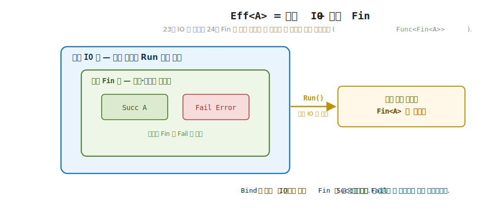
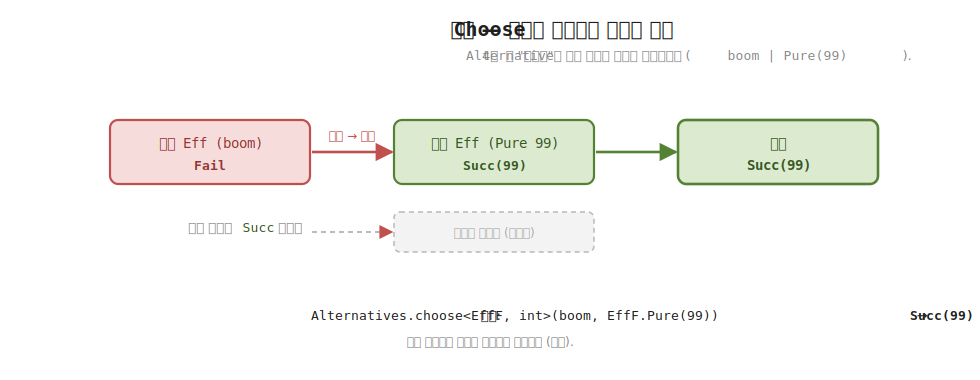
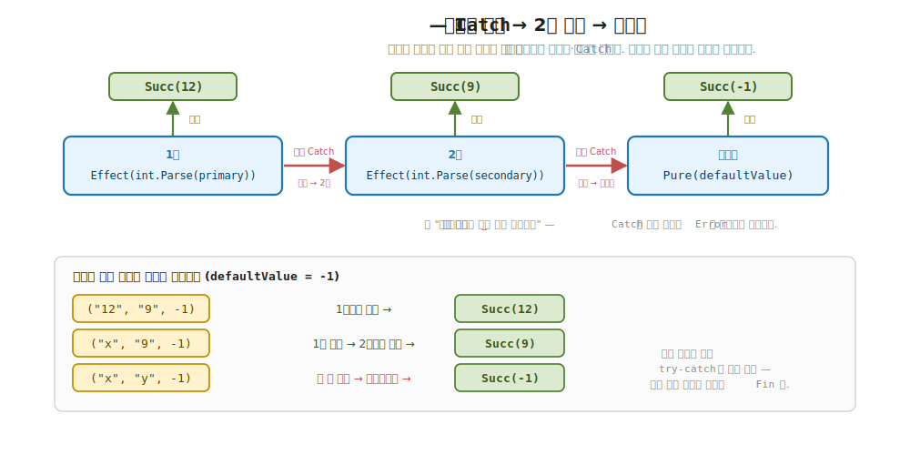

# 25장. Eff — 런타임 없는 효과 (IO + 오류)

> **이 장의 목표** — 이 장을 마치면 부수 효과와 실패를 한 타입에서 함께 다루는 효과 `Eff<A>` 를 설명하고 직접 조립해 볼 수 있습니다. 23장에서 `IO<A>` 가 부수 효과를 `Run` 까지 미뤄 둔 값임을 봤고, 24장에서 `Fin<A>` 와 `Error` 가 예외를 던지지 않고 성공·실패를 값으로 담음을 봤습니다. 그런데 실전의 효과는 거의 언제나 둘을 한꺼번에 합니다. 파일을 읽다가 실패하고, 시간을 묻다가 예외가 나는 식입니다. `Eff<A>` 는 바깥에 `IO` (부수 효과 지연) 를, 안쪽에 `Fin` (성공·실패) 를 겹쳐 둔 한 타입이라, 개념으로는 `IO<Fin<A>>` 입니다. `Run` 전까지 부수 효과가 일어나지 않고, 예외는 자동으로 `Fail` 로 포획되며, `Bind` 가 첫 실패에서 단락하고, `Catch` 가 실패를 폴백으로 흡수함을 손계산으로 추적할 수 있습니다. 4부에서 본 선택·결합 추상이 효과 위에서도 그대로 작동함을 확인하고, 다음 장 `Eff<RT, A>` 로 가는 다리를 놓습니다.

> **이 장의 핵심 어휘**
>
> - **`Eff<A>`**: 부수 효과와 실패를 함께 다루는 효과, 개념으로는 `IO<Fin<A>>` (바깥 `IO` + 안쪽 `Fin`)
> - **`Fin<A>`**: 성공 `Succ` 또는 실패 `Fail` 을 담는 합 타입, 24장의 함수형 오류 모델
> - **`Error`**: 구조화된 오류 값, 예외 대신 시그니처에 드러나는 실패 표현
> - **실패 단락**: `Bind` 사슬에서 한 단계가 `Fail` 이면 이후 단계를 건너뛰는 성질
> - **오류 포획**: `Effect` 의 thunk 가 예외를 던지면 자동으로 `Fail(Error)` 로 잡는 것
> - **`Catch` 폴백**: 실패를 받아 대체 효과로 흘려보내는 복구, 4부 `Choose` 의 효과판
> - **`Fallible<F>`**: 효과가 실패하고 (`Fail`) 복구할 (`Catch`) 줄 안다고 약속하는 trait
> - **런타임 없는 효과**: 의존성 주입 (`RT`) 없이 `IO` 와 오류만 다루는 경우의 `Eff<A>`

> 이 장을 마치면 할 수 있게 되는 것
> - [ ] `Eff<A>` 가 바깥 `IO` 와 안쪽 `Fin` 두 겹을 겹쳐 둔 효과임을 설명할 수 있습니다.
> - [ ] `Eff<A>` 가 `Run` 전까지 부수 효과를 일으키지 않음을 손계산으로 확인할 수 있습니다.
> - [ ] `Effect` 의 thunk 가 던진 예외가 자동으로 `Fail(Error)` 로 포획됨을 읽을 수 있습니다.
> - [ ] `Bind` 가 첫 `Fail` 에서 단락해 이후 단계를 건너뜀을 추적할 수 있습니다.
> - [ ] `Catch` 가 실패를 폴백으로 흡수해 성공으로 되돌림을 손으로 따라갈 수 있습니다.
> - [ ] `Catch` 폴백이 4부 `Choose` 의 "고르기" 를 효과 위에서 잇는 것임을 설명할 수 있습니다.
> - [ ] `Eff<A>` 가 모나드 세 법칙을 지키고, 실패 경로에서도 법칙이 성립함을 확인할 수 있습니다.
> - [ ] `Eff<A>` 가 런타임 없는 경우이고, 다음 장 `Eff<RT, A>` 가 환경을 더한 것임을 예감할 수 있습니다.

> **이 장의 흐름** — 23장의 `IO` 가 부수 효과만 다루고 24장의 `Fin` 이 실패만 다룬다는 자리에서 출발합니다. 실전의 효과가 둘을 한꺼번에 한다는 것을, 매번 손으로 `IO<Fin<...>>` 를 풀어 쓰는 번거로움으로 먼저 부딪힙니다. 그다음 `Eff<A>` 가 바깥 `IO` 와 안쪽 `Fin` 을 한 타입에 겹쳐 둔 봉투임을 자료 정의로 봅니다. `Effect` 로 부수 효과를 조립해 `Run` 전까지 미실행임과 예외 자동 포획을 손계산하고, `Bind` 가 첫 실패에서 단락함을 추적합니다. `Catch` 로 실패를 폴백으로 흡수하는 복구를 보고, 그것이 4부 선택 추상의 효과판임을 짚습니다. `MonoidK` 와 `Final` 이 효과 위에서 어떤 자리인지 간략히 본 뒤, 모나드 세 법칙을 점검하고 다음 장 `Eff<RT, A>` 로 다리를 놓습니다.

---

## 25.1 이 장에서 다루는 것 — IO 와 오류를 한 타입에

7부에 들어와 두 조각을 차례로 손에 쥐었습니다. 잠깐 되짚어 봅니다. 23장의 `IO<A>` 는 콘솔 출력이나 파일 읽기 같은 부수 효과를 곧장 실행하지 않고 값으로 인코딩해, `Run` 을 부르는 마지막 순간까지 미뤄 두는 타입이었습니다. 24장의 `Fin<A>` 는 예외를 던지는 대신 성공 `Succ` 와 실패 `Fail` 을 값으로 담아, 실패가 시그니처에 드러나게 만든 함수형 오류 모델이었습니다. 한쪽은 부수 효과를, 다른 한쪽은 실패를 다뤘습니다.

이 장의 자리는 그 둘을 하나로 합치는 자리입니다. 도구를 나열하기보다 한 문장으로 먼저 직관을 세웁니다. 실전의 효과는 부수 효과와 실패를 따로 떼어 다루지 않습니다. 파일을 읽는 일 (부수 효과) 은 파일이 없어 실패할 수 있고 (오류), 시간을 묻는 일도, 네트워크를 호출하는 일도 그렇습니다. 그러니 효과 하나에 두 성질이 함께 들어 있어야 실전에 닿습니다. `Eff<A>` 가 바로 그 한 타입입니다.

`Eff<A>` 의 정체를 한 줄로 적으면 이렇습니다. 바깥에 `IO` 를 두어 부수 효과를 `Run` 까지 미루고, 그 안쪽에 `Fin` 을 두어 성공·실패를 값으로 담습니다. 개념으로는 `IO<Fin<A>>`, 곧 "`IO` 라는 봉투 안에 `Fin` 이라는 봉투를 한 겹 더 넣은" 두 겹 구조입니다. 23장의 `IO` 와 24장의 `Fin` 이 한 타입에서 동시에 작동하는 셈입니다.

이 자리를 두 평행 세계의 어휘로 보면, 효과 시스템은 부수 효과를 값으로 끌어올려 실행을 미루는 Elevated World 의 정점입니다. 1장에서 값과 함수를 Normal World 에서 Elevated World 로 끌어올린다고 했을 때, 그 끌어올림이 7부에서는 "부수 효과까지 값으로 끌어올려 `Run` 까지 미룬다" 는 가장 강한 형태가 됩니다. `Eff<A>` 는 그 끌어올림에 "실패도 값으로" 를 한 겹 더 얹은 시민입니다.

지금 모든 것을 외우지 않아도 됩니다. 이 장이 끝날 때 손에 남는 것은 두 가지입니다. 하나는 `Eff<A>` 가 바깥 `IO` 와 안쪽 `Fin` 의 두 겹이라는 그림이고, 다른 하나는 그 두 겹에서 따라 나오는 세 가지 동작 (지연·오류 포획·실패 단락) 과 복구 (`Catch`) 입니다. 23장과 24장에서 이미 두 조각을 봤으니, 이 장은 그 위에 둘을 합치는 한 칸을 더하는 장입니다.

그리고 이 장의 `Eff<A>` 에는 이름에 환경 (`RT`) 이 없습니다. 의존성을 주입받지 않고 `IO` 와 오류만 다루는, 런타임 없는 효과입니다. 환경을 더한 `Eff<RT, A>` 는 다음 장의 몫이고, 이 장은 그 앞 단계인 가장 단순한 효과를 손으로 만집니다.

한 가지를 미리 풀어 둡니다. 22장 끝에서 완성형 `Eff<RT, A>` 를 예고하면서, 그 정체가 `ReaderT<RT, IO, A>` 라고 했습니다. 그 이름에는 환경을 가리키는 `RT` 가 붙어 있었습니다. 그런데 이 장의 효과는 `Eff<A>`, 곧 그 `RT` 를 떼어낸 더 단순한 형태입니다. 순서를 거꾸로 보면 이렇습니다. 22장이 환경까지 얹은 완성형을 멀리서 가리켰다면, 이 장은 그 환경 (`RT`) 을 떼어내고 `IO` 와 오류만 남긴 가장 작은 효과부터 손에 쥡니다. 환경 한 겹을 다시 얹어 `Eff<RT, A>` 로 돌아가는 일은 다음 장의 몫입니다.

---

## 25.2 왜 필요한가 — IO 와 오류를 매번 손으로 겹치는 번거로움

`Eff<A>` 라는 타입을 보이기 전에, 그것이 없을 때 어디서 막히는지부터 부딪혀 봅니다. 추상을 먼저 내놓지 않고 손에 잡히는 불편을 먼저 겪는 것이 이 장의 순서입니다.

상황을 하나 떠올립니다. 파일에서 정수 하나를 읽어 두 배로 만드는 작은 일입니다. 이 일에는 두 성질이 섞여 있습니다. 파일을 읽는 것은 부수 효과이고, 그 내용이 숫자가 아니면 실패입니다. 23장의 `IO` 만으로는 실패를 담을 자리가 없고, 24장의 `Fin` 만으로는 부수 효과를 미룰 자리가 없습니다. 그러니 두 타입을 손으로 겹쳐 `IO<Fin<int>>` 를 써야 합니다.

문제는 이 겹친 타입을 직접 다룰 때 드러납니다. `IO<Fin<int>>` 한 값을 `Bind` 로 다음 단계에 이으려면, 먼저 바깥 `IO` 를 한 겹 벗겨 `Fin<int>` 를 꺼내고, 그 `Fin` 이 `Succ` 인지 `Fail` 인지 분기한 뒤, `Succ` 일 때만 안쪽 값을 다음 단계에 넘기고, 다시 바깥 `IO` 로 도로 감싸야 합니다. 두 겹을 벗기고 분기하고 다시 감싸는 이 절차가 단계마다 똑같이 반복됩니다.

명령형이나 객체 지향에서 익숙한 직감으로 옮기면 이렇습니다. 메서드마다 `try`-`catch` 로 예외를 잡고, 잡은 예외를 다시 어떻게 흘려보낼지 매번 적던 경험을 떠올리면 됩니다. C# 에서 비동기라는 효과는 `Task<T>` 하나가 담아 줍니다. `await` 한 줄이면 그 효과를 잇고, 비동기 사슬을 짤 때 우리가 콜백을 손으로 엮지 않습니다. 부수 효과와 실패라는 두 효과도 그렇게 타입 하나가 담아 주면 좋겠습니다. 그런데 `IO<Fin<int>>` 를 손으로 겹쳐 쓰면, 그 두 겹을 잇는 보일러플레이트를 우리가 매번 직접 적어야 합니다. `await` 가 비동기를 알아서 이어 주던 것과 달리, 두 겹을 잇는 일은 고스란히 우리 몫이 됩니다. 단계가 둘이면 견딜 만하지만, 다섯 단계만 돼도 "벗기고 분기하고 감싸기" 가 다섯 번 반복됩니다.

> **흔한 함정** — `IO` 와 `Fin` 이 따로 있으니 둘을 그때그때 손으로 겹치면 된다고 여기는 것입니다.
>
> 둘을 손으로 겹치는 것 자체는 됩니다. 그러나 겹친 `IO<Fin<A>>` 를 `Bind` 로 이을 때마다 바깥 `IO` 를 벗기고 안쪽 `Fin` 을 분기하고 다시 감싸는 절차를 직접 적어야 하고, 단계가 늘수록 그 절차가 그대로 반복됩니다. 게다가 한 단계라도 `Fin` 분기를 빠뜨리면 실패가 조용히 새어 나갑니다. `Eff<A>` 는 이 두 겹 잇기를 타입 안에 한 번 적어 두고, 우리는 `Bind` 한 줄만 쓰게 합니다. "벗기고 분기하고 감싸기" 가 `Eff` 의 `Bind` 안으로 한 번에 들어갑니다.

그래서 필요한 것은 두 겹을 한 타입으로 묶고, 그 두 겹을 잇는 절차를 타입 안에 한 번만 적어 두는 일입니다. 그러면 우리는 `from`-`from`-`select` 로 효과를 늘어놓기만 하고, 부수 효과 지연도 실패 단락도 타입이 알아서 처리합니다. 그 타입이 `Eff<A>` 입니다. 다음 절에서 그 두 겹의 자료 정의부터 봅니다.

---

## 25.3 Eff<A> = IO<Fin<A>> — 두 겹으로 겹친 효과

이제 `Eff<A>` 의 자료 정의를 봅니다. 핵심은 하나입니다. `Eff<A>` 는 "`Run` 하면 `Fin<A>` 를 내는, 지연된 계산 하나" 를 감싼 봉투입니다.

```csharp
// Eff<A> — 런타임 없는 효과. 지연된 계산이 Run 되면 Fin<A> (성공/실패) 를 낸다.
//   개념적으로 Eff<A> ≈ IO<Fin<A>> — 23장 IO 의 지연 + 24장 Fin 의 오류 포획을 합친 것.
public sealed class Eff<A> : K<EffF, A>
{
    readonly Func<Fin<A>> run;
    internal Eff(Func<Fin<A>> run) => this.run = run;

    public Fin<A> Run() => run();
}
```

이 자료를 천천히 읽습니다. `Eff<A>` 가 들고 있는 것은 필드 하나, `Func<Fin<A>>` 입니다. 인자 없이 부르면 `Fin<A>` 를 내는 함수, 곧 지연된 계산입니다. 이 함수는 생성자에서 받아 `run` 에 담아 두고, `Run()` 을 부를 때 비로소 호출합니다. `Run()` 전까지는 이 함수가 봉투 안에 잠들어 있을 뿐 아무 일도 일어나지 않습니다.

이 두 겹을 한 그림으로 떼어 봅니다. `Func<Fin<A>>` 라는 한 타입 안에 두 겹이 어떻게 포개져 있는지를 바깥에서 안으로 읽으면 이렇습니다.

```
Func< Fin< A > >
└──┬──┘ └─┬─┘ └┬┘
  바깥    안쪽  맨속
  IO 겹   Fin 겹  값
 (지연)  (성공/실패)

   Run() 한 번 → 바깥 Func 가 풀림 → 그 자리에 Fin<A> 가 드러남
                                    ├ Succ(값)  또는
                                    └ Fail(오류)
```

맨 바깥 `Func<...>` 는 "부르기 전까지 미뤄 둔다" 는 지연 (`IO`) 입니다. `Run()` 을 한 번 부르면 이 바깥 겹이 풀리고, 그 자리에 안쪽 `Fin<A>` 가 모습을 드러냅니다. 그 `Fin` 은 다시 `Succ(값)` 이거나 `Fail(오류)` 입니다. 곧 `Run` 한 번이 바깥 한 겹을 풀고, 푼 결과가 안쪽 성공·실패라는 두 단계 구조입니다.

여기서 두 겹이 어떻게 겹쳐 있는지를 봅니다. 바깥 겹은 `Func<...>`, 곧 "부르기 전까지 미뤄 둔다" 는 23장 `IO` 의 지연입니다. `Eff<A>` 의 `Func<Fin<A>>` 는 23장 `IO<A>` 의 `Func<A>` 와 같은 발상이고, 다만 내는 것이 맨값 `A` 가 아니라 `Fin<A>` 입니다. 안쪽 겹이 바로 그 `Fin<A>`, 곧 24장의 성공·실패입니다. 정리하면 바깥은 `IO` 의 지연, 안쪽은 `Fin` 의 성공·실패입니다. 두 겹을 한 줄로 적으면 `IO<Fin<A>>` 이고, 학습 코드는 이 두 겹을 `Func<Fin<A>>` 한 필드로 눌러 담았습니다.

이 두 겹 구조를 그림으로 봅니다.



**그림 25-1. `Eff<A>` = 바깥 `IO` + 안쪽 `Fin`** — 효과 하나에 두 겹이 겹쳐 있습니다. 바깥 `IO` 층이 부수 효과를 `Run` 까지 미루고, 안쪽 `Fin` 층이 성공 `Succ` 와 실패 `Fail` 을 값으로 담습니다. 23장 `IO` 와 24장 `Fin` 이 한 타입에서 함께 작동함을 보입니다.

6부에서 변환기를 쌓을 때 본 직감이 여기서 다시 옵니다. 변환기는 "바깥 효과 하나와 안쪽 효과 하나를 한 스택으로 겹치는" 도구였습니다. `Eff<A>` 도 같은 발상입니다. 바깥에 부수 효과 (`IO`), 안쪽에 실패 (`Fin`) 를 겹친 두 층 구조입니다. 다만 6부의 변환기는 안쪽 자리가 빈칸 (`M`) 이라 어떤 모나드든 끼울 수 있었고, `Eff<A>` 는 그 두 층을 `IO` 와 `Fin` 으로 고정해 한 타입으로 굳힌 것입니다. 두 겹을 겹친다는 그림은 같고, `Eff` 는 그 그림을 가장 자주 쓰는 조합으로 굳혀 둔 셈입니다.

> **흔한 함정** — `Eff<A>` 가 `Fin<IO<A>>`, 곧 바깥이 `Fin` 이고 안쪽이 `IO` 라고 겹 순서를 뒤집어 읽는 것입니다.
>
> 순서는 바깥이 `IO`, 안쪽이 `Fin` 입니다. 왜 이 순서인지는 자료가 말해 줍니다. `Eff<A>` 의 필드는 `Func<Fin<A>>` 이고, 가장 바깥은 `Func<...>`, 곧 지연 (`IO`) 입니다. 직관으로도 같습니다. 부수 효과를 일으켜야 비로소 성공인지 실패인지 알 수 있으니, 지연이 바깥에 있고 성공·실패가 그 결과로 안쪽에 나옵니다. `Run` 을 한 번 부르면 바깥 지연이 풀리고, 그 자리에서 안쪽 `Fin` 이 모습을 드러냅니다.

이 자료 옆에 붙은 `K<EffF, A>` 의 `EffF` 가 trait 이 부착되는 자리입니다. 1부부터 본 3-tuple 패턴 그대로입니다. 자료는 `Eff<A>`, 태그 (trait 호스트) 는 `EffF`, 그 `EffF` 에 `Monad` 를 비롯한 네 trait 을 부착합니다. `EffF` 가 무엇을 부착하고 각 멤버가 두 겹을 어떻게 다루는지는 다음 절들에서 동작과 함께 봅니다. 지금은 "`Eff` 의 trait 이 사는 자리" 정도로 읽으면 충분합니다.

> **미리보기** — `EffF` 가 부착하는 trait 은 한 개가 아니라 넷입니다.
>
> 자료 정의 옆 `K<EffF, A>` 의 `EffF` 에는 `Monad`, `Fallible`, `Alternative`, `Final` 네 trait 이 부착됩니다. 이 장은 그 넷을 한꺼번에 펼치지 않고 동작별로 천천히 만집니다. 뒤에서 `Monad` 의 `Bind` 로 실패 단락을, `Fallible` 의 `Catch` 로 폴백 복구를 보고, 이어 `Alternative` 의 `Choose` 로 고르기를, `Final` 의 `Finally` 로 정리 보장을 데모로 확인합니다. 지금은 "`Eff` 의 trait 이 사는 자리이고, 거기 부착되는 동사가 넷이다" 정도만 들고 가면 충분합니다. 네 trait 의 이름을 외울 필요는 없습니다. 각 동사가 등장하는 자리에서 다시 풀어 설명합니다.

---

## 25.4 지연과 오류 포획 — Run 전까지 미실행, 예외는 값으로

이제 `Eff<A>` 로 부수 효과를 조립해 봅니다. 부수 효과를 `Eff` 로 만드는 진입점이 `Effect` 입니다.

```csharp
// 부수 효과 thunk — 예외가 나면 자동으로 Fail(Error) 로 포획.
public static Eff<A> Effect(Func<A> thunk) =>
    new(() =>
    {
        try { return new Fin<A>.Succ(thunk()); }
        catch (Exception e) { return new Fin<A>.Fail(Error.New(e)); }
    });
```

`Effect` 를 한 줄씩 읽습니다. 받는 것은 부수 효과를 적은 thunk (`Func<A>`) 한 개입니다. 돌려주는 것은 `Eff<A>` 인데, 그 안의 지연된 함수가 하는 일은 이렇습니다. thunk 를 `try` 안에서 부르고, 정상으로 값 `A` 가 나오면 `Succ` 로 감싸고, 도중에 예외가 나면 `catch` 가 그 예외를 잡아 `Error.New(e)` 로 만든 뒤 `Fail` 로 감쌉니다. 곧 이 한 함수가 23장의 지연 (thunk 를 미뤄 둠) 과 24장의 오류 포획 (예외를 `Fail` 값으로) 을 동시에 합니다.

여기서 두 성질이 한꺼번에 나오는 것을 짚어 둡니다. 첫째, 지연입니다. `Effect(...)` 를 적는 순간에는 thunk 가 봉투 안에 잠들 뿐, `try` 블록은 아직 실행되지 않습니다. 둘째, 오류 포획입니다. 나중에 `Run` 으로 그 thunk 가 실행될 때 예외가 나면, 그것이 바깥으로 튀어 나가지 않고 안쪽 `Fin` 의 `Fail` 로 잡힙니다. 예외라는 부수 효과가 `Fin` 이라는 값으로 바뀌는 자리가 바로 이 `catch` 한 줄입니다.

객체 지향 직감으로 다리를 놓으면 이렇습니다. C# 의 `try`-`catch` 는 예외를 잡아 흐름을 바꾸지만, 그 결과는 값이 아니라 제어 흐름의 분기입니다. `Effect` 의 `try`-`catch` 는 다릅니다. 예외를 잡아 `Fail(Error)` 라는 값으로 만들어 돌려줍니다. 잡은 예외가 흐름을 바꾸는 대신 결과 값의 한 경우가 되는 것입니다. 그래서 호출하는 쪽은 `try`-`catch` 로 흐름을 분기하지 않고, 돌아온 `Fin` 이 `Succ` 인지 `Fail` 인지만 보면 됩니다.

이 지연을 데모로 확인합니다. 두 부수 효과를 `from`-`from`-`select` 로 조립한 뒤, `Run` 전에 부수 효과가 일어났는지부터 봅니다.

```csharp
var log = new List<string>();
K<EffF, int> program =
    from a in Eff<int>.Effect(() => { log.Add("작용 a"); return 10; })
    from b in Eff<int>.Effect(() => { log.Add("작용 b"); return 4; })
    select a + b;

Console.WriteLine($"  조립 후 Run 전 — log 비었나? {log.Count == 0}");   // True
Console.WriteLine($"  Run() → {program.As().Run()}");                    // Succ(14)
Console.WriteLine($"  log = [{string.Join(", ", log)}]");                // [작용 a, 작용 b]
```

`program` 은 두 효과를 이어 둔 `Eff<int>` 입니다. 첫 효과는 `log` 에 `"작용 a"` 를 적고 `10` 을, 둘째는 `"작용 b"` 를 적고 `4` 를 냅니다. 여기서 한 가지를 또렷이 합니다. `program` 을 조립한 시점에 `log` 는 비어 있습니다. `Effect(...)` 가 thunk 를 봉투에 담아 둔 것뿐이라, 그 안의 `log.Add(...)` 는 아직 실행되지 않았습니다. 그래서 `log 비었나?` 가 `True` 입니다. 부수 효과는 `Run` 한 곳에서만 일어난다는 23장의 지연이 여기서 그대로 작동합니다.

이 "조립 따로, 실행 따로" 를 작은 손계산으로 따라갑니다. 우리가 좇을 것은 단 하나, **언제 `log` 에 줄이 쌓이는가** 입니다.

```
log = []                                    (시작: 비어 있음)

program = from a in Effect(…a…)             ← thunk 를 봉투에 담음. 아직 실행 안 됨.
          from b in Effect(…b…)             ← 역시 담기만 함.
          select a + b                      ← 두 효과를 Bind 로 이어 둠 (조립).
                                            ─ 여기까지: log = []  (비어 있음!)

program.As().Run()                          ← 비로소 지연 함수가 호출됨.
  ├ 작용 a 의 thunk 실행 → log 에 "작용 a", 10 반환 → Succ(10)
  ├ 작용 b 의 thunk 실행 → log 에 "작용 b", 4 반환  → Succ(4)
  └ select 10 + 4 = 14                      → Succ(14)

결과: Succ(14)
log = [작용 a, 작용 b]                        (이제야 차 있음!)
```

조립하는 세 줄을 지나도 `log` 는 조용합니다. `Run()` 한 줄에서야 두 thunk 가 차례로 실행돼 `log` 에 두 줄이 쌓이고, 두 값을 더한 `Succ(14)` 가 나옵니다. 부수 효과가 일어나는 자리는 오직 `Run()` 한 곳뿐이라는 것을, 이 작은 추적이 보여 줍니다. 23장에서 `IO` 하나로 본 지연이 `Eff` 에서도 똑같이 살아 있고, 다른 점은 결과가 맨값 `14` 가 아니라 `Succ(14)` 라는 것뿐입니다.

이제 오류 포획을 봅니다. 숫자가 아닌 문자열을 정수로 바꾸려는 효과를 `Run` 합니다.

```csharp
var boom = Eff<int>.Effect(() => int.Parse("nope"));
Console.WriteLine($"  예외 작용 Run() → {boom.As().Run()}");   // Fail(...) — 예외가 Fail 로
```

`int.Parse("nope")` 는 `FormatException` 을 던집니다. 그런데 `boom.Run()` 의 결과는 예외가 아니라 `Fail(...)` 입니다. `Effect` 의 `catch` 가 그 예외를 잡아 `Error` 로 만들고 `Fail` 로 감쌌기 때문입니다. 호출하는 쪽으로 예외가 튀어 나가지 않고, 실패가 `Fin` 의 한 경우로 조용히 돌아옵니다. 예외를 던지는 일 (부수 효과) 이 실패를 담은 값 (`Fin`) 으로 바뀌는 자리가 이것입니다.

> **흔한 함정** — `boom` 을 조립하는 순간 예외가 날 것이라 여기는 것입니다.
>
> `Eff<int>.Effect(() => int.Parse("nope"))` 를 적어도 그 자리에서는 예외가 나지 않습니다. thunk 가 봉투 안에 잠들어 있을 뿐이라, `int.Parse` 는 아직 불리지 않았습니다. 예외는 `boom.Run()` 으로 thunk 가 실행될 때 나고, 그 예외는 `Effect` 의 `catch` 가 곧장 `Fail` 로 잡습니다. 그래서 `boom` 을 변수에 담거나 함수에 넘겨도 예외가 새어 나오지 않고, `Run` 한 자리에서 `Fail` 로만 모습을 드러냅니다.

`Effect` 의 진입점 이름을 한 줄로 짚어 둡니다. 이 책은 부수 효과를 만든다는 뜻이 직관적이라 `Effect` 라는 이름을 씁니다. LanguageExt v5 에서는 같은 일을 `lift` (또는 `Lift`) 라는 이름으로 합니다. 이름만 다를 뿐 "부수 효과 thunk 를 효과 값으로 끌어올린다" 는 일은 같으니, v5 코드에서 `lift` 를 만나면 이 장의 `Effect` 와 같은 자리로 읽으면 됩니다.

실패를 만드는 진입점도 한 줄로 짚어 둡니다. `Effect` 가 "성공할 수도 실패할 수도 있는 부수 효과" 를 만든다면, 처음부터 곧장 실패하는 효과를 만드는 진입점은 `Fail` 입니다. 이 장의 코드에는 같은 일을 하는 두 표기가 나옵니다. 하나는 자유 함수 `Fallibles.fail<EffF, int>(...)` 이고, 다른 하나는 `EffF.Fail<int>(...)` 입니다. 둘은 같은 일을 합니다. `Fallibles.fail` 은 `Fallible` 의 정적 멤버 `EffF.Fail` 을 한 번 감싸 부르기 좋게 만든 자유 함수일 뿐입니다. 코드로 보면 `Fallibles.fail<F, A>(error)` 의 본체가 곧 `F.Fail<A>(error)` 입니다. 그러니 이 둘을 만나면 같은 효과로 읽으면 됩니다. 다음 절의 데모는 `Fallibles.fail` 을, 그 뒤 법칙 절은 `EffF.Fail` 을 쓰는데, 가리키는 효과는 똑같습니다.

---

## 25.5 실패 단락 — 첫 Fail 에서 이후를 건너뛴다

지연과 오류 포획을 봤으니, 이제 두 겹이 `Bind` 에서 어떻게 작동하는지를 봅니다. 이 절의 한 가지 논점은 실패 단락입니다. `Bind` 사슬에서 한 단계가 `Fail` 이면, 이후 단계를 아예 실행하지 않고 그 `Fail` 을 끝까지 흘려보냅니다.

먼저 `Bind` 의 구현을 봅니다.

```csharp
public static K<EffF, B> Bind<A, B>(K<EffF, A> ma, Func<A, K<EffF, B>> f) =>
    new Eff<B>(() => ma.As().Run() switch
    {
        Fin<A>.Succ s => f(s.Value).As().Run(),
        Fin<A>.Fail e => new Fin<B>.Fail(e.Error),   // 실패 단락
        _ => throw new InvalidOperationException()
    });
```

`Bind` 를 두 겹의 관점으로 읽습니다. 돌려주는 것은 새 `Eff<B>` 이고, 그 안의 지연 함수가 하는 일은 이렇습니다. 먼저 `ma.Run()` 으로 첫 효과를 실행해 안쪽 `Fin<A>` 를 꺼냅니다. 이 한 줄이 바깥 `IO` 겹을 푸는 자리입니다. 그다음 그 `Fin` 을 `switch` 로 분기합니다. 이 분기가 안쪽 `Fin` 겹을 다루는 자리입니다. `Succ` 이면 안쪽 값 `s.Value` 를 다음 함수 `f` 에 넘겨 그 결과 효과를 다시 `Run` 합니다. `Fail` 이면 다음 함수 `f` 를 부르지 않고, 그 오류를 그대로 `Fail` 로 감싸 돌려줍니다. 주석이 가리키는 그 한 줄이 실패 단락입니다.

이 "`Succ` 면 잇고, `Fail` 이면 멈춘다" 가 왜 단락인지를 짚습니다. `Fail` 가지에서 `f` 를 부르지 않는다는 것은, 다음 단계에 적힌 부수 효과가 아예 일어나지 않는다는 뜻입니다. 첫 단계가 실패하면 둘째·셋째 단계의 thunk 는 봉투에 잠든 채 끝납니다. 24장의 `Fin` 단락이 부수 효과를 미루는 `IO` 지연 안에서 그대로 작동하는 자리가 여기입니다.

이 단락을 데모로 봅니다. 첫 단계를 일부러 실패시키고, 둘째 단계가 실행되는지를 깃발 하나로 관측합니다.

```csharp
var ranSecond = false;
var shortCircuit =
    from a in Fallibles.fail<EffF, int>(Error.New("초기 실패"))
    from b in Eff<int>.Effect(() => { ranSecond = true; return 1; })
    select a + b;

Console.WriteLine($"  Run() → {shortCircuit.As().Run()}");           // Fail(초기 실패)
Console.WriteLine($"  둘째 단계 실행됨? {ranSecond}");                 // False — 단락
```

첫 단계 `Fallibles.fail<EffF, int>(...)` 는 곧장 `Fail("초기 실패")` 를 내는 효과입니다. 앞 절에서 짚었듯 이 `Fallibles.fail` 은 `EffF.Fail` 을 부르기 좋게 감싼 자유 함수라, "처음부터 실패인 효과" 를 만듭니다. 둘째 단계는 실행되기만 하면 `ranSecond` 를 `true` 로 바꾸고 `1` 을 냅니다. 그러니 `ranSecond` 가 끝에 `true` 인지 `false` 인지를 보면, 둘째 단계의 thunk 가 실제로 불렸는지 아닌지를 알 수 있습니다. `shortCircuit` 을 `Run` 하면 결과는 `Fail(초기 실패)` 이고, `ranSecond` 는 여전히 `False` 입니다. 첫 실패에서 `Bind` 가 단락해 둘째 단계의 thunk 를 부르지 않았다는 증거입니다.

손계산으로 한 번 더 또렷이 합니다. 우리가 좇을 것은 `ranSecond` 가 바뀌는가입니다.

```
ranSecond = false

shortCircuit.Run()
  ├ 첫 단계 fail("초기 실패").Run() → Fail(초기 실패)
  │                                  switch 가 Fail 가지로 → f 를 부르지 않음
  └ 둘째 단계의 thunk 는 호출되지 않음  ← ranSecond 그대로 false

결과: Fail(초기 실패)
ranSecond = false                       (둘째 단계 미실행 — 단락 증명)
```

첫 단계가 `Fail` 을 내자마자 `switch` 가 `Fail` 가지를 타고, 다음 함수 `f` (둘째 효과를 만드는 함수) 를 부르지 않습니다. 그래서 둘째 단계의 thunk 는 호출조차 되지 않고 `ranSecond` 가 그대로 남습니다. 부수 효과와 오류가 한 타입에 있으니, 실패가 부수 효과의 실행 자체를 막는 이 동작이 한 곳에서 자연스럽게 나옵니다.

객체 지향 직감으로 다리를 놓으면, 메서드 첫 줄에서 던진 예외가 그 아래 코드를 건너뛰게 하는 것과 같습니다. C# 에서 한 줄이 예외를 던지면 같은 블록의 다음 줄들은 실행되지 않습니다. `Eff` 의 실패 단락도 결과는 같습니다. 다만 예외가 흐름을 끊는 대신, `Fail` 이라는 값이 `Bind` 사슬을 타고 끝까지 흘러 다음 단계들을 조용히 건너뛴다는 점이 다릅니다. 흐름을 끊는 것이 예외가 아니라 값이라, `try`-`catch` 없이도 같은 일이 일어납니다.

> **흔한 함정** — `Bind` 가 실패를 만나면 예외를 던질 것이라 여기는 것입니다.
>
> `Eff` 의 `Bind` 는 실패에서 예외를 던지지 않습니다. `Fail` 가지에서 하는 일은 오류를 `Fail<B>` 로 다시 감싸 돌려주는 것뿐입니다. 그래서 실패는 사슬을 타고 흐르는 값으로 남고, 사슬 끝에서 `Run` 한 쪽이 `Fail` 로 받습니다. 예외로 흐름을 끊는 것이 아니라 값으로 단락하는 것이 함수형 오류 모델의 방식이고, 그 덕분에 실패를 잡고 흘려보내는 일이 24장에서 본 것처럼 모두 값을 다루는 일이 됩니다.

`Bind` 가 이렇게 두 겹을 다루므로, 그 위에 정의된 `Map` 과 `Apply` 도 같은 성질을 물려받습니다. `Map` 은 `Succ` 면 값에 함수를 적용하고 `Fail` 이면 그대로 흘려보내며, `Apply` 는 코드에서 `Bind(mf, f => Map(f, ma))`, 곧 `Bind` 위에 정의됩니다. 그래서 `Apply` 도 왼쪽에서 오른쪽으로 순차로 실행하고 첫 실패에서 단락합니다. 4가지 함수 유형이 모두 한 타입 위에서 같은 실패 단락을 공유하는 셈입니다.

한 걸음 물러서서 이 `Bind` 가 무엇을 대신해 주는지를 짚습니다. 왜 필요한가 절에서 본 불편은, 두 겹을 손으로 잇자면 단계마다 바깥 `IO` 를 벗기고 안쪽 `Fin` 을 분기하고 다시 감싸야 한다는 것이었습니다. `Bind` 의 본체가 바로 그 "벗기고 분기하고 감싸기" 를 한 번 적어 둔 자리입니다. 그래서 우리가 쓰는 `from a in … from b in …` 한 줄 한 줄이 곧 `Bind` 호출이고, 줄과 줄 사이에서 `Bind` 가 앞 단계의 결과를 말없이 풀어 다음 단계로 넘깁니다. C# 의 `await` 가 비동기라는 한 효과를 줄 사이에서 이어 주던 것처럼, `Eff` 에서는 `Bind` 가 부수 효과와 실패라는 두 겹을 줄 사이에서 이어 줍니다. 보통의 세미콜론은 앞 줄을 끝내고 다음 줄로 넘길 뿐이지만, 이 "이음" 은 그 사이에서 두 겹을 풀고 첫 실패면 나머지를 건너뛰는 일까지 합니다. 곧 `Bind` 는 줄과 줄을 잇는 규칙을 우리가 정해 둔 세미콜론인 셈입니다.

---

## 25.6 Catch 폴백 — 실패를 받아 대체 효과로

실패 단락이 "첫 실패에서 멈추고 그 실패를 끝까지 흘려보낸다" 였다면, 이 절은 그 반대 방향입니다. 흘러온 실패를 받아 대체 효과로 되돌리는 복구, 곧 `Catch` 입니다.

`EffF` 가 `Monad` 외에 부착한 trait 이 `Fallible<EffF>` 입니다. 이 trait 이 효과의 실패와 복구를 약속합니다.

```csharp
// Fallible — 효과가 실패하고 (Fail) 복구할 (Catch) 줄 안다고 약속하는 trait.
public interface Fallible<F> where F : Fallible<F>
{
    static abstract K<F, A> Fail<A>(Error error);
    static abstract K<F, A> Catch<A>(K<F, A> fa, Func<Error, K<F, A>> handler);
}
```

`Fallible<F>` 는 멤버 둘을 요구합니다. `Fail` 은 오류 하나를 받아 곧장 실패하는 효과를 만들고 (앞 절의 데모에서 첫 단계로 썼습니다), `Catch` 는 효과 하나와 복구 함수 (`Error → K<F, A>`) 를 받아, 그 효과가 실패하면 오류를 복구 함수에 넘겨 대체 효과로 흘려보냅니다. "trait 의 약속" 의 어휘로 보면, `Fallible` 을 부착한 타입은 "나는 실패할 줄도, 그 실패에서 복구할 줄도 안다" 고 약속한 셈입니다.

`EffF` 의 `Catch` 구현을 봅니다.

```csharp
public static K<EffF, A> Catch<A>(K<EffF, A> fa, Func<Error, K<EffF, A>> handler) =>
    new Eff<A>(() => fa.As().Run() switch
    {
        Fin<A>.Fail e => handler(e.Error).As().Run(),   // 실패면 복구 효과로
        var succ => succ                                 // 성공이면 그대로
    });
```

`Catch` 를 한 줄씩 읽습니다. 돌려주는 새 `Eff<A>` 의 지연 함수가 하는 일은 이렇습니다. 먼저 `fa.Run()` 으로 원래 효과를 실행해 `Fin<A>` 를 꺼냅니다. 그 결과가 `Fail` 이면, 오류 `e.Error` 를 복구 함수 `handler` 에 넘겨 대체 효과를 만들고 그것을 `Run` 합니다. `Succ` 이면 (`var succ` 가지) 손대지 않고 그대로 돌려줍니다. 곧 성공은 그냥 통과하고, 실패만 복구 함수로 흘러갑니다.

이 동작을 데모로 봅니다. 앞 절에서 만든 실패 효과 `boom` 을 `Catch` 로 감쌉니다.

```csharp
var recovered = Fallibles.@catch<EffF, int>(boom, _ => EffF.Pure(-1));
Console.WriteLine($"  실패 → Catch → 폴백 = {recovered.As().Run()}");   // Succ(-1)
```

`boom` 은 `int.Parse("nope")` 가 실패하는 효과라, 그대로 `Run` 하면 `Fail` 이었습니다. 그것을 `Catch` 로 감싸고 복구 함수로 `_ => EffF.Pure(-1)` 을 넘기면, 오류를 무시하고 `-1` 을 성공으로 내는 효과가 됩니다. 그래서 `recovered.Run()` 의 결과는 `Succ(-1)` 입니다. 실패가 폴백 값으로 흡수돼 성공으로 되돌아온 것입니다.

손계산으로 따라갑니다.

```
boom.Run() → Fail(FormatException…)

recovered = Catch(boom, _ => Pure(-1))
recovered.Run()
  ├ boom.Run() → Fail(e)               switch 가 Fail 가지로
  └ handler(e) = Pure(-1) 을 Run()      → Succ(-1)

결과: Succ(-1)                          (실패가 폴백으로 흡수됨)
```

`boom` 이 `Fail` 을 내자 `Catch` 가 그 오류를 복구 함수에 넘기고, 복구 함수가 만든 `Pure(-1)` 을 실행해 `Succ(-1)` 로 끝납니다. 실패가 사슬을 끊는 대신, `Catch` 자리에서 다른 효과로 갈아타며 흐름이 이어집니다.

이 폴백이 4부에서 본 추상의 효과판이라는 것을 짚습니다. 4부에서 `Choose` 는 두 Elevated 후보 중 성공하는 쪽을 고르는 "고르기" 였습니다. 왼쪽이 성공이면 왼쪽, 실패면 오른쪽을 골랐습니다. `Catch` 가 하는 일이 정확히 그 "고르기" 입니다. 원래 효과가 성공이면 그것을, 실패면 복구 효과를 고릅니다. 다른 점은 `Catch` 가 실패의 내용 (`Error`) 을 복구 함수에 넘겨 준다는 것뿐입니다. 곧 `Catch` 는 4부 `Alternative` 의 "첫 성공을 고른다" 가 효과 위에서, 그것도 실패 이유까지 손에 쥐고 작동하는 모습입니다.



**그림 25-2. `Choose` 폴백: 첫째가 실패하면 둘째를 시도** — 첫 `Eff` 가 `Fail` 로 끝나면 그 실패를 삼키고 둘째 `Eff` 를 시도합니다. 첫째가 `Succ` 면 둘째는 평가하지 않습니다. 4부 `Alternative` 의 "고르기" 가 효과 위에서 그대로 작동함을 보입니다.

이 폴백을 사슬로 이으면 재시도의 토대가 됩니다. 1차를 시도하고, 실패하면 2차를 시도하고, 그래도 실패하면 기본값으로 떨어지는 흐름입니다. 코드의 챌린지가 바로 이것을 `Catch` 중첩으로 짭니다.

```csharp
// 1차 파싱 실패 → 2차 파싱 시도 → 그래도 실패면 기본값.
K<EffF, int> attempt =
    Fallibles.@catch<EffF, int>(
        Eff<int>.Effect(() => int.Parse(primary)),
        _ => Fallibles.@catch<EffF, int>(
            Eff<int>.Effect(() => int.Parse(secondary)),
            _ => EffF.Pure(defaultValue)));
```

코드에 처음 보이는 세 이름부터 한 줄로 풀어 둡니다. `primary` 와 `secondary` 는 각각 1차·2차로 파싱해 볼 입력 문자열이고, `defaultValue` 는 둘 다 실패했을 때 떨어질 기본값입니다. 셋 다 이 챌린지 함수가 바깥에서 받는 인자입니다.

바깥 `Catch` 는 1차 파싱 (`primary`) 을 감싸고, 그 복구 함수 안에 2차 파싱 (`secondary`) 을 감싼 또 다른 `Catch` 가 들어 있습니다. 1차가 실패하면 2차로 가고, 2차도 실패하면 `Pure(defaultValue)` 로 떨어집니다. 곧 `primary` 가 숫자면 그 값으로 성공하고, 아니면서 `secondary` 가 숫자면 그 값으로, 둘 다 숫자가 아니면 기본값으로 끝납니다.

객체 지향 직감으로 다리를 놓으면, 중첩 `try`-`catch` 와 같은 모양입니다. `try` 안에서 1차를 시도하고, `catch` 안에서 다시 `try` 로 2차를 시도하고, 그 `catch` 에서 기본값으로 떨어지던 그 구조입니다. 다른 점은 흐름을 잇는 것이 예외가 아니라 `Fin` 이라는 값이고, 그 값이 `Catch` 사슬을 타고 다음 효과로 넘어간다는 데 있습니다. 실패를 값으로 받아 다음 효과로 넘긴다는 한 가지가, 재시도와 폴백이라는 실무 패턴의 토대임을 이 중첩이 보입니다.



**그림 25-3. 중첩 `Catch` 로 짠 재시도·폴백** — 바깥 `Catch` 가 1차 파싱을, 안쪽 `Catch` 가 2차 파싱을 감싸고, 둘 다 실패하면 `Pure(defaultValue)` 로 떨어집니다. 빨강 화살표의 `_` 는 실패 이유를 보지 않고 다음으로 넘김을 뜻합니다. 입력에 따라 멈추는 단계가 달라, `("12", "9", -1)` 은 1차에서, `("x", "9", -1)` 은 2차에서, `("x", "y", -1)` 은 기본값에서 `Succ` 로 끝납니다.

> **흔한 함정** — `Catch` 가 모든 오류를 똑같이 잡는 것이 실무에서도 늘 옳다고 여기는 것입니다.
>
> 이 장의 `Catch` 는 들어온 실패를 가리지 않고 모두 복구 함수로 넘깁니다. 무조건 복구입니다. 입문 단계에서 폴백의 골격을 보기에는 이 단순함이 알맞습니다. 그러나 실무에서는 "이 오류만 잡고 나머지는 통과시킨다" 가 흔합니다. 파일이 없는 오류는 폴백하되 권한 오류는 그대로 올려보내는 식입니다. C# 의 `catch (FormatException)` 가 그 예외 타입만 잡고 다른 예외는 통과시키는 것과 같은 발상입니다. LanguageExt v5 의 `Catch` 는 그래서 술어 (`Error → bool`) 를 하나 더 받아, 술어가 참인 실패만 복구하고 나머지는 그대로 통과시킵니다. 이 장의 `Catch` 는 그 술어가 "항상 참" 인 특수한 경우라고 보면 됩니다. 지금은 무조건 복구로 폴백의 핵심만 쥐고, 특정 오류만 잡는 분기는 나중에 얹는 것으로 충분합니다.

---

## 25.7 Choose 와 Finally — 효과 위의 고르기와 정리

`Catch` 폴백을 4부 `Choose` 와 이었으니, 이제 `EffF` 가 부착한 나머지 두 trait 을 데모로 만집니다. 하나는 4부에서 본 고르기 `Alternative` 의 `Choose` 이고, 다른 하나는 객체 지향의 `try`-`finally` 에 해당하는 `Final` 의 `Finally` 입니다. 앞 절의 `Catch` 가 폴백을 "실패 이유를 손에 쥐고" 했다면, 이 절의 `Choose` 는 실패 이유를 보지 않고 그냥 둘째 후보로 넘어가는 더 단순한 고르기입니다. 두 trait 모두 이 장 코드에 실제로 부착되어 있어, 시그니처만 보는 것이 아니라 `Run` 한 결과까지 눈으로 확인합니다.

먼저 `Choose` 입니다. `EffF` 가 부착한 `Alternative<EffF>` 는 멤버 둘을 요구합니다. 후보가 하나도 없을 때의 효과인 항등원 `Empty`, 그리고 두 후보 중 성공하는 쪽을 고르는 `Choose` 입니다. 코드를 봅니다.

```csharp
// Alternative — Empty 는 곧 실패, Choose 는 첫째 성공이면 그대로·실패면 둘째 시도 (고르기).
public static K<EffF, A> Empty<A>() => new Eff<A>(() => new Fin<A>.Fail(Error.New("Eff.Empty")));

public static K<EffF, A> Choose<A>(K<EffF, A> fa, K<EffF, A> fb) =>
    new Eff<A>(() => fa.As().Run() switch
    {
        Fin<A>.Fail => fb.As().Run(),   // 첫째 실패 → 둘째
        var succ => succ                 // 첫째 성공 → 둘째 미평가
    });
```

`Choose` 를 읽으면 앞 절의 `Catch` 와 거의 같은 모양입니다. 첫째 효과 `fa` 를 `Run` 해 `Fin` 을 꺼내고, `Fail` 이면 둘째 효과 `fb` 를 `Run` 하고, 성공이면 (`var succ` 가지) 그대로 돌려줍니다. 다른 점은 단 하나입니다. `Catch` 는 실패의 오류 (`Error`) 를 복구 함수에 넘겨 주지만, `Choose` 는 그 오류를 보지 않고 그냥 둘째 후보로 넘어갑니다. 곧 `Choose` 는 "이유는 됐고 다음 거" 인 더 단순한 고르기입니다. 항등원 `Empty` 는 "아무 후보도 없을 때의 효과", 곧 실패하는 효과 (`Fin.Fail("Eff.Empty")`) 입니다.

이 고르기를 데모로 봅니다. 앞 절에서 만든 실패 효과 `boom` 과 성공 효과 `Pure(99)` 를 `Choose` 로 잇습니다.

```csharp
var chosen = Alternatives.choose<EffF, int>(boom, EffF.Pure(99));
Console.WriteLine($"  실패 | 성공 → Choose = {chosen.As().Run()}");   // Succ(99) — 첫째 실패 → 둘째
```

`boom` 은 `int.Parse("nope")` 가 실패하는 효과라 첫째 자리에서 `Fail` 을 냅니다. 그러자 `Choose` 가 둘째 후보 `Pure(99)` 로 넘어가 `Succ(99)` 를 냅니다. 만약 첫째가 성공이었다면 둘째 `Pure(99)` 는 아예 `Run` 되지 않습니다. 4부 `Alternative` 의 "첫 성공을 고른다" 가 효과 위에서 그대로 작동하는 자리입니다.

한 줄을 덧붙입니다. 4부에서 `Choose` 와 나란히 본 `MonoidK` 의 모으기 (`Combine`) 도 효과 위에서 같은 모양 (`Empty` + 둘을 잇기) 입니다. 다른 점은 의미입니다. `Choose` 가 "첫 성공을 고른다" 라면 `Combine` 은 "후보를 모은다" 입니다. 이 장 코드는 그중 고르기 (`Alternative`) 를 부착해 폴백의 또 다른 얼굴을 보입니다.

다음은 `Finally` 입니다. 객체 지향 직감으로 다리를 놓으면 `try`-`finally` 입니다. C# 에서 `finally` 블록은 `try` 안에서 예외가 나든 안 나든 반드시 실행돼, 파일 핸들을 닫거나 자원을 정리하는 일을 맡습니다. `using` 과 `IDisposable` 도 같은 보장을 자동으로 해 줍니다. 효과 위에서 그 자리를 맡는 것이 `Final<EffF>` 의 `Finally` 입니다. 코드를 봅니다.

```csharp
// Final — fa 를 Run 한 뒤 성공·실패와 무관하게 @finally 를 Run 하고 fa 결과를 돌려준다.
public static K<EffF, A> Finally<A, X>(K<EffF, A> fa, K<EffF, X> @finally) =>
    new Eff<A>(() =>
    {
        var result = fa.As().Run();
        @finally.As().Run();             // 정리는 성공·실패 무관 실행
        return result;
    });
```

`Finally` 를 읽으면 순서가 또렷합니다. 먼저 본래 효과 `fa` 를 `Run` 해 그 결과 `result` 를 손에 쥐고, 그다음 정리 효과 `@finally` 를 `Run` 한 뒤, 본래 결과 `result` 를 그대로 돌려줍니다. 정리 효과를 `fa` 의 성공·실패와 무관하게 늘 한 번 실행한다는 것이 핵심입니다. 정리 효과의 결과 (`X`) 는 버리고, 돌려주는 것은 어디까지나 본래 효과의 결과 (`A`) 입니다. C# 의 `finally` 블록이 `try` 의 반환값을 바꾸지 않고 정리만 하는 것과 같습니다.

이 정리 보장을 데모로 봅니다. 일부러 실패하는 `boom` 을 `Finally` 로 감싸, 실패한 뒤에도 정리 효과가 도는지를 깃발 하나로 관측합니다.

```csharp
var cleanup = new List<string>();
var withCleanup = Finals.@finally<EffF, int, int>(
    boom,
    Eff<int>.Effect(() => { cleanup.Add("정리 실행"); return 0; }));
Console.WriteLine($"  실패 + Finally → {withCleanup.As().Run()}, 정리 = [{string.Join(", ", cleanup)}]");
// → Fail(...), 정리 = [정리 실행]   (실패여도 정리 실행)
```

`boom` 이 `Fail` 로 끝나는데도 `cleanup` 에는 `"정리 실행"` 이 들어가 있습니다. 곧 본래 효과가 실패해도 정리 효과는 빠짐없이 한 번 돌았다는 증거입니다. 그러면서 `withCleanup` 의 결과는 여전히 `boom` 의 `Fail` 입니다. 정리가 결과를 덮어쓰지 않습니다. 부수 효과를 다루는 시스템에서 "열었으면 닫는다" 는 정리 보장은 핵심 직관이라, `Final` 은 효과 시스템이 거의 언제나 갖추는 연산입니다.

그림 25-2 가 보이는 폴백이 바로 이 `Choose` 입니다. 첫 효과가 `Fail` 이면 그 실패를 삼키고 둘째 효과를 시도하고, 첫째가 `Succ` 면 둘째는 평가하지 않습니다. 앞 절의 `Catch` 가 실패 이유를 손에 쥐고 복구했다면, `Choose` 는 이유를 보지 않고 둘째 후보로 넘어가는 더 단순한 고르기였습니다.

> **흔한 함정** — `Choose` 의 둘째 후보가 첫째와 상관없이 늘 실행된다고 여기는 것입니다.
>
> `Choose(fa, fb)` 는 둘째 효과 `fb` 를 늘 `Run` 하지 않습니다. 첫째 `fa` 가 성공이면 `var succ` 가지로 그대로 돌려주고, 둘째 `fb` 의 thunk 는 봉투 안에 잠든 채 끝납니다. 둘째가 실행되는 것은 첫째가 `Fail` 일 때뿐입니다. 그래서 둘째 후보에 무거운 부수 효과 (다시 네트워크를 부르는 등) 를 두어도, 첫째가 성공하는 한 그 부수 효과는 일어나지 않습니다. 이것이 `Choose` 가 단순한 둘 다 실행이 아니라 폴백인 까닭입니다.

LanguageExt v5 의 `Eff` 도 이 `Choose` 를 `|` 연산자로 잇게 해 둡니다. `effA | effB` 가 곧 "`effA` 가 실패하면 `effB`" 입니다. 이 장 코드는 그 연산자 설탕만 생략했을 뿐, 골격인 `Choose` 와 `Finally` 는 v5 와 같은 자리에 그대로 부착되어 있습니다.

이 절의 한 가지만 추리면 이렇습니다. 4부에서 본 선택·결합 추상도, 객체 지향의 `try`-`finally` 정리도, 효과라는 한 층 위에서 사라지지 않고 그대로 자리를 잡습니다. `Eff<A>` 는 그 자리들이 모이는 타입입니다. 이 장 코드는 실패·복구 (`Fallible`), 고르기 (`Alternative`), 정리 보장 (`Final`) 을 모두 직접 부착해, 폴백과 정리의 핵심을 시그니처가 아니라 `Run` 한 결과로 손에 쥐게 합니다.

---

## 25.8 법칙 — 실패를 품은 효과도 진짜 모나드

`EffF` 는 `Monad` 를 부착했으니, 진짜 모나드가 되려면 7장에서 본 세 법칙을 만족해야 합니다. 부수 효과와 실패를 함께 품은 효과도 그 법칙을 지키는지 확인합니다. 이 절의 `probe` 와 제네릭 인자는 다른 장의 법칙 검증과 같은 틀이라, 지금 새로 외울 것은 없습니다. `Eff` 가 들어와도 법칙이 그대로 성립한다는 결론 하나만 가져가면 충분합니다.

```
좌 항등:   Bind(Pure(a), f)           ≡  f(a)
우 항등:   Bind(m, Pure)              ≡  m
결합:      Bind(Bind(m, f), g)        ≡  Bind(m, a => Bind(f(a), g))
```

한 가지 걸림돌이 있습니다. `Eff<A>` 의 속은 함수 (`Func<Fin<A>>`) 입니다. 함수 둘이 같은지를 코드로 직접 견주기는 어렵습니다. 왜 어려운지 한 줄로 짚습니다. C# 에서 함수 두 개를 `Equals` 로 비교하면 "같은 일을 하는가" 가 아니라 "같은 함수 객체인가" 만 봅니다. 그래서 속이 똑같이 동작해도 다른 함수로 만들어졌으면 "다르다" 가 나옵니다. 게다가 속은 지연이라, `Run` 하기 전까지는 값도 나오지 않습니다. 그래서 다른 장과 같은 요령을 씁니다. 양변을 한 번 `Run` 해 관측 가능한 값으로 끌어내린 뒤 비교합니다. 이 비교를 대신하는 작은 함수가 `probe` 입니다.

```csharp
Func<K<EffF, int>, string> probe = m => m.As().Run().ToString()!;
Func<int, K<EffF, int>> f = n => EffF.Pure(n + 1);
Func<int, K<EffF, int>> g = n => EffF.Pure(n * 2);
K<EffF, int> m0 = EffF.Pure(5);

var leftId  = MonadLaws.LeftIdentityHolds<EffF, int, int, string>(7, f, probe);
var rightId = MonadLaws.RightIdentityHolds<EffF, int, string>(m0, probe);
var assoc   = MonadLaws.AssociativityHolds<EffF, int, int, int, string>(m0, f, g, probe);
// → 세 법칙 모두 통과
```

`probe` 의 본체 `m => m.As().Run().ToString()!` 를 한 호흡으로 읽습니다. 효과를 한 번 `Run` 해 `Fin` 결과를 얻고, 그것을 문자열로 바꿔 관측 가능한 값으로 떨어뜨립니다. 함수인 효과를 `Equals` 로 직접 비교할 수 없으니, `probe` 가 효과를 돌려 `Succ(...)` 나 `Fail(...)` 이라는 문자열로 끌어내린 뒤 비교하는 것입니다. `f` 는 값에 1 을 더해 `Pure` 로 감싸고, `g` 는 2 를 곱해 `Pure` 로 감싸며, `m0` 는 `5` 를 성공으로 내는 효과입니다. `MonadLaws` 가 양변을 같은 `probe` 로 끌어내려 비교하면, 좌 항등·우 항등·결합 세 법칙이 모두 통과합니다. 데모 출력은 `좌 항등 : 통과`, `우 항등 : 통과`, `결합 : 통과`, 그리고 `모든 법칙 통과 [OK]` 입니다.

`probe` 의 본체 `m => m.As().Run().ToString()!` 를 한 호흡으로 읽습니다. 효과를 한 번 `Run` 해 `Fin` 결과를 얻고, 그것을 문자열로 바꿔 관측 가능한 값으로 떨어뜨립니다. 함수인 효과를 `Equals` 로 직접 비교할 수 없으니, `probe` 가 효과를 돌려 `Succ(...)` 나 `Fail(...)` 이라는 문자열로 끌어내린 뒤 비교하는 것입니다. 이 `probe` 가 곧 두 겹을 모두 푸는 끌어내림입니다. `Run` 이 바깥 `IO` 겹을 풀어 `Fin` 을 내고, `ToString` 이 그 `Fin` 을 견줄 수 있는 문자열로 떨어뜨립니다. `f` 는 값에 1 을 더해 `Pure` 로 감싸고, `g` 는 2 를 곱해 `Pure` 로 감싸며, `m0` 는 `5` 를 성공으로 내는 효과입니다.

좌 항등 한 줄만 손으로 따라가 봅니다. 좌변은 `Bind(Pure(7), f)`, 우변은 `f(7)` 입니다.

```
좌변  probe(Bind(Pure(7), f))
  ├ Bind(Pure(7), f).Run()        ← Pure(7) 을 Run → Succ(7), switch 가 Succ 가지
  │   └ f(7) = Pure(8) 을 Run     → Succ(8)
  └ "Succ(8)"

우변  probe(f(7))
  ├ f(7) = Pure(8) 을 Run         → Succ(8)
  └ "Succ(8)"

두 문자열이 같음 → 좌 항등 통과
```

양변을 같은 `probe` 로 끌어내리면 둘 다 `"Succ(8)"` 이라, 좌 항등이 성립합니다. 우 항등과 결합도 같은 요령으로 양변이 같은 문자열로 떨어집니다. `MonadLaws` 가 이 비교를 대신 돌리면, 좌 항등·우 항등·결합 세 법칙이 모두 통과합니다. 데모 출력은 `좌 항등 : 통과`, `우 항등 : 통과`, `결합 : 통과`, 그리고 `모든 법칙 통과 [OK]` 입니다.

이 결과의 뜻은 분명합니다. 부수 효과와 실패를 함께 품은 효과도 여전히 모나드 세 법칙을 지키는 정식 모나드입니다. 그러니 이 효과로 짠 `from`-`from`-`select` 사슬을 마음 놓고 길게 잇고, 중간을 함수로 떼어내도 같은 부수 효과를 같은 순서로 일으키고 실패를 같은 시점에 단락합니다.

한 가지를 정직하게 짚어 둡니다. 이 장은 줄곧 `Eff<A>` 를 "개념으로는 `IO<Fin<A>>`" 라고 설명했습니다. 이 두 겹 그림은 동작을 이해하는 데 정확하지만, LanguageExt v5 의 진짜 정의와 글자까지 같지는 않습니다. v5 에서 `Eff<A>` 는 환경을 더한 `Eff<MinRT, A>` (빈 런타임을 끼운 효과) 의 얇은 래퍼입니다. 곧 v5 는 다음 장에서 볼 `Eff<RT, A>` 를 먼저 정의하고, 그 `RT` 자리에 "비어 있는 런타임" 을 끼운 특수한 경우를 `Eff<A>` 라 부릅니다. 이 장의 `Func<Fin<A>>` 한 필드 구현은 그 두 겹의 핵심 동작 (지연·오류 포획·실패 단락) 만 추려 입문자가 손으로 만질 수 있게 한 교수용 단순화입니다. 동작은 같고, 내부 짜임만 v5 가 한 겹 더 일반적입니다. 그 한 겹 (환경 `RT`) 을 다음 장에서 다시 얹습니다.

한 가지를 덧붙입니다. 위 검증은 성공 경로 (`Pure` 로 만든 효과) 를 표본으로 삼았습니다. 그런데 `Eff` 의 정체는 실패 단락이니, 실패 경로에서도 법칙이 성립하는지 묻는 것이 자연스럽습니다. 같은 `MonadLaws` 에 `m0` 자리로 `EffF.Fail<int>(Error.New("실패"))` 같은 실패 효과를 넣어 보면, 결과가 또렷합니다. 좌 항등은 `Bind(Pure(a), f) ≡ f(a)` 라 `Pure` 에서 출발하니 그대로 성립하고, 우 항등과 결합은 `m` 이 `Fail` 이면 양변 모두 첫 단계에서 단락해 같은 `Fail` 로 끝나므로 역시 성립합니다. 실패가 단락하든 성공이 사슬을 타든, 양변이 똑같이 단락하거나 똑같이 이어지므로 법칙이 깨지지 않습니다. 곧 `Eff` 는 성공 경로에서도 실패 경로에서도 정식 모나드입니다.

---

## 25.9 직접 해보기

코드의 `Challenges` 에 정답이 있습니다. 먼저 직접 구현한 뒤 코드와 비교해 봅니다.

> **챌린지 1 — `Eff` 의 지연과 오류 포획.** `Eff<int>.Effect` 로 부수 효과 두 개를 `from`-`from`-`select` 로 조립한 뒤, `Run` 전에 로그가 비어 있고 `Run` 후에야 차 있음을 확인합니다. 이어 `int.Parse("nope")` 같은 실패 효과를 `Run` 해 예외가 `Fail(Error)` 로 자동 포획됨을, 그리고 첫 단계를 실패시켜 `Bind` 가 둘째 단계를 건너뜀을 봅니다. 노리는 능력은 `Eff<A>` 가 23장 `IO` 의 지연과 24장 `Fin` 의 오류 포획을 한 타입에 합친 것임을 코드로 겪는 것입니다.

> **챌린지 2 — `Catch` 로 복구 파이프라인.** `ParseWithFallback(primary, secondary, defaultValue)` 처럼 `Catch` 를 중첩해, 1차 파싱이 실패하면 2차 파싱을 시도하고 그래도 실패하면 `Pure(defaultValue)` 로 떨어지는 폴백 체인을 짭니다. 반환은 `attempt.As().Run()`, 곧 조립한 효과를 `Run` 해 `Fin<int>` 를 얻는 것입니다. `("12", "9", -1)` 은 1차 성공, `("x", "9", -1)` 은 2차 성공, `("x", "y", -1)` 은 기본값으로 떨어지는 세 분기를 직접 출력해 봅니다. 노리는 능력은 실패를 값으로 받아 다음 효과로 넘긴다는 것이 재시도·폴백의 토대임을 보는 것입니다.

> **챌린지 3 — 실패 경로의 법칙.** `MonadLaws` 의 `m0` 자리에 `EffF.Pure(5)` 대신 `EffF.Fail<int>(Error.New("실패"))` 를 넣어 우 항등과 결합을 다시 검증합니다. 성공 효과로 통과하던 두 법칙이 실패 효과로도 통과함을 확인하고, 왜 그런지 (양변이 똑같이 첫 단계에서 단락하므로) 손으로 따라갑니다. 노리는 능력은 `Eff` 가 성공 경로뿐 아니라 실패 경로에서도 정식 모나드임을 코드로 확인하는 것입니다.

---

## 25.10 Elevated World 어휘로 다시 읽기

25장의 도구를 1장 비유에 매핑합니다.

| 25장 도구 | Elevated World 어휘 |
|---|---|
| `Eff<A>` | 부수 효과와 실패를 함께 품은 Elevated 시민. `Run` 전까지 Normal 세상에 영향 없음 |
| 바깥 `IO` 겹 | 부수 효과를 `Run` 까지 미루는 지연. Normal 세상으로의 영향을 끝까지 유보 |
| 안쪽 `Fin` 겹 | 성공·실패를 값으로 담는 효과. 실패가 시그니처에 드러남 |
| `Effect` | 부수 효과 thunk 를 효과 값으로 끌어올리는 진입점 (v5 의 `lift`) |
| 실패 단락 (`Bind`) | 첫 실패에서 이후 효과를 건너뛰는 끌어올린 세계 안의 흐름 제어 |
| `Catch` 폴백 | 실패 이유를 손에 쥐고 대체 효과를 고르는 복구. 4부 `Choose` 의 효과판 |
| `Choose` 고르기 | 이유를 보지 않고 첫 성공을 고르는 폴백. 4부 `Alternative` 의 효과판 |
| `Finally` 정리 | 성공·실패와 무관하게 정리 효과를 한 번 실행. `try`-`finally` 의 효과판 |
| `Run()` | 두 겹을 모두 풀어 부수 효과를 일으키고 `Fin` 을 내는 끌어내림 |

23장의 `IO` 는 부수 효과를 값으로 끌어올린 시민이었고, 24장의 `Fin` 은 실패를 값으로 끌어올린 시민이었습니다. 25장의 `Eff` 는 그 둘을 한 시민에 겹쳤습니다. 끌어올림은 `Effect` 가 부수 효과 thunk 를 효과 값으로 올리는 자리이고, 끌어내림은 `Run` 이 두 겹을 모두 풀어 `Fin` 을 내는 자리입니다. 그 사이에서 `Bind` 는 실패를 단락으로 흘려보내고, `Catch` 는 흘러온 실패를 대체 효과로 고릅니다. 비유는 여기까지가 역할입니다. `Catch` 가 정확히 어떻게 성공은 통과시키고 실패만 복구하는지는 `Fin<A>.Fail e => handler(e.Error)…` 라는 시그니처가 정합니다.

한 가지만 덧붙입니다. 1장에서 두 평행 세계는 Normal 과 Elevated 두 층이었습니다. 7부 내내 그 위 세계의 시민이 점점 강한 효과를 품어 왔고, 이 장의 `Eff` 는 부수 효과와 실패라는 두 효과를 한꺼번에 품은 시민입니다. 그렇다고 새 세계가 생긴 것은 아닙니다. 여전히 Elevated World 한 곳이고, 그 시민이 품은 효과가 두 겹으로 겹쳐졌을 뿐입니다. 비유의 무대는 그대로이고, 시민이 동시에 짊어진 효과의 가짓수가 둘로 늘었다고 보면 됩니다.

---

## 25.11 Q&A — 자기 점검

> **Q1. `Eff<A>` 는 무엇을 겹친 효과입니까?** (25.3절)

바깥에 `IO`, 안쪽에 `Fin` 을 겹친 두 층 효과입니다. 개념으로는 `IO<Fin<A>>` 입니다. 바깥 `IO` 겹은 부수 효과를 `Run` 까지 미루고, 안쪽 `Fin` 겹은 성공 `Succ` 와 실패 `Fail` 을 값으로 담습니다. 자료로 보면 `Eff<A>` 는 `Func<Fin<A>>` 한 필드를 감싼 봉투이고, 가장 바깥의 `Func<...>` 가 지연 (`IO`), 그 결과 `Fin<A>` 가 성공·실패 (`Fin`) 입니다. 23장 `IO` 와 24장 `Fin` 이 한 타입에서 함께 작동합니다.

> **Q2. `Run` 전에 부수 효과가 일어나지 않는다는 것을 어떻게 압니까?** (25.4절)

데모의 `log` 로 확인합니다. `Effect` 로 두 효과를 조립한 직후 `log 비었나?` 가 `True` 입니다. `Effect(...)` 는 thunk 를 봉투에 담아 둘 뿐이라 그 안의 `log.Add(...)` 가 아직 실행되지 않기 때문입니다. `Run()` 을 부르는 순간에야 두 thunk 가 차례로 실행돼 `log` 에 두 줄이 쌓이고 `Succ(14)` 가 나옵니다. 부수 효과는 `Run` 한 곳에서만 일어납니다.

> **Q3. 예외는 어디서 어떻게 `Fail` 이 됩니까?** (25.4절)

`Effect` 의 `try`-`catch` 에서입니다. `Effect(thunk)` 가 만든 효과는 `Run` 될 때 thunk 를 `try` 안에서 부르고, 정상이면 결과를 `Succ` 로, 예외가 나면 `catch` 가 그것을 `Error.New(e)` 로 만들어 `Fail` 로 감쌉니다. 그래서 `Eff<int>.Effect(() => int.Parse("nope")).Run()` 의 결과는 던져진 예외가 아니라 `Fail(...)` 입니다. 예외라는 부수 효과가 `Fin` 의 한 경우라는 값으로 바뀝니다.

> **Q4. 실패 단락이란 무엇이고 `Bind` 의 어느 줄이 그 일을 합니까?** (25.5절)

`Bind` 사슬에서 한 단계가 `Fail` 이면 이후 단계를 실행하지 않고 그 `Fail` 을 끝까지 흘려보내는 성질입니다. `Bind` 는 먼저 `ma.Run()` 으로 `Fin` 을 꺼내 `switch` 로 분기하는데, `Fin<A>.Fail e => new Fin<B>.Fail(e.Error)` 가 그 줄입니다. `Fail` 가지에서 다음 함수 `f` 를 부르지 않으므로, 다음 단계의 thunk 가 아예 실행되지 않습니다. 데모에서 첫 단계를 실패시키면 둘째 단계의 `ranSecond` 가 `False` 로 남는 것이 그 증거입니다.

> **Q5. `Bind` 는 실패에서 예외를 던집니까?** (25.5절)

던지지 않습니다. `Fail` 가지에서 하는 일은 오류를 `Fail<B>` 로 다시 감싸 돌려주는 것뿐입니다. 그래서 실패는 예외로 흐름을 끊지 않고, 사슬을 타고 흐르는 값으로 남아 끝에서 `Run` 한 쪽이 `Fail` 로 받습니다. 흐름을 건너뛰게 하는 것이 예외가 아니라 값이라, `try`-`catch` 없이도 첫 실패에서 이후 단계가 건너뛰어집니다.

> **Q6. `Catch` 는 어떻게 실패를 복구합니까?** (25.6절)

`Catch(fa, handler)` 는 `fa.Run()` 의 결과를 분기해, `Fail` 이면 오류를 복구 함수 `handler` 에 넘겨 만든 대체 효과를 `Run` 하고, `Succ` 이면 그대로 통과시킵니다. 데모에서 실패 효과 `boom` 을 `Catch(boom, _ => EffF.Pure(-1))` 로 감싸면, 실패가 폴백 `-1` 로 흡수돼 `Succ(-1)` 이 됩니다. 성공은 통과하고 실패만 복구 함수로 흘러간다는 한 가지가 핵심입니다.

> **Q7. `Catch` 폴백은 4부의 어느 추상과 같은 자리입니까?** (25.6절)

4부 `Choose` 의 "고르기" 입니다. `Choose` 가 두 후보 중 성공하는 쪽을 골랐듯, `Catch` 는 원래 효과가 성공이면 그것을, 실패면 복구 효과를 고릅니다. 다른 점은 `Catch` 가 실패의 내용 (`Error`) 을 복구 함수에 넘겨 준다는 것뿐입니다. 곧 `Catch` 는 `Alternative` 의 "첫 성공을 고른다" 가 효과 위에서, 실패 이유까지 손에 쥐고 작동하는 모습입니다.

> **Q8. 이 장의 `Catch` 와 LanguageExt v5 의 `Catch` 는 어떻게 다릅니까?** (25.6절)

이 장의 `Catch` 는 들어온 실패를 가리지 않고 모두 복구 함수로 넘깁니다. v5 의 `Catch` 는 술어 (`Error → bool`) 를 하나 더 받아, 술어가 참인 실패만 복구하고 나머지는 그대로 통과시킵니다. 곧 이 장의 `Catch` 는 그 술어가 "항상 참" 인 특수한 경우입니다. 입문 단계에서 폴백의 핵심만 보기에는 무조건 복구가 알맞고, 특정 오류만 잡는 분기는 나중에 얹으면 됩니다.

> **Q9. `Choose` 와 `Finally` 는 효과 위에서 어떤 자리입니까?** (25.7절)

`Choose` 는 4부 `Alternative` 의 고르기가 효과 위로 올라간 자리입니다. 첫째 효과가 성공이면 그대로, 실패면 둘째 효과를 고릅니다. 앞 절의 `Catch` 가 실패 이유를 손에 쥐고 복구했다면, `Choose` 는 이유를 보지 않고 둘째 후보로 넘어가는 더 단순한 고르기입니다 (데모에서 `Choose(boom, Pure(99))` 가 `Succ(99)`). `Finally` 는 객체 지향의 `try`-`finally` 에 해당해, 효과가 성공으로 끝나든 실패로 끝나든 정해 둔 정리 효과를 마지막에 한 번 실행하고 본래 결과를 그대로 돌려줍니다 (데모에서 실패한 `boom` 을 감싸도 정리가 한 번 돌고 결과는 `Fail`). 이 장 코드 (`EffF`) 는 `Monad`, `Fallible`, `Alternative`, `Final` 네 trait 을 모두 부착해 이 둘을 데모로 만집니다. 4부에서 본 모으기 (`MonoidK` 의 `Combine`) 도 효과 위에서 `Choose` 와 같은 모양 (`Empty` + 둘을 잇기) 이고, 다른 점은 "고른다" 와 "모은다" 의 의미 차이입니다.

> **Q10. 부수 효과와 실패를 품은 `Eff` 도 모나드 법칙을 지킵니까?** (25.8절)

그렇습니다. `probe = m => m.As().Run().ToString()` 으로 양변을 한 번 `Run` 해 `Succ(...)`/`Fail(...)` 문자열로 끌어내려 비교하면, 좌 항등·우 항등·결합 세 법칙이 모두 통과합니다. 성공 경로뿐 아니라 실패 경로 (`m0` 가 `Fail`) 에서도 양변이 똑같이 첫 단계에서 단락해 같은 `Fail` 로 끝나므로 법칙이 깨지지 않습니다. `Eff` 는 성공·실패 두 경로 모두에서 정식 모나드입니다.

> **Q11. `Eff<A>` 와 다음 장의 `Eff<RT, A>` 는 어떤 관계입니까?** (25.1절)

`Eff<A>` 는 의존성을 주입받지 않고 `IO` 와 오류만 다루는, 런타임 없는 효과입니다. 다음 장의 `Eff<RT, A>` 는 그 효과에 환경 (런타임 `RT`) 을 한 겹 더한 것으로, 정체는 `ReaderT<RT, IO, A>` 입니다. 곧 이 장의 두 겹 (`IO` + 오류) 바깥에 환경을 읽는 `Reader` 한 겹이 더 얹히고, 그 환경에서 콘솔·파일 같은 능력을 꺼내 쓰는 `Has<RT, …>` 의존성 주입이 더해집니다. 이 장은 그 앞 단계인 가장 단순한 효과입니다.

---

## 25.12 요약

- **이 장은 부수 효과와 실패를 한 타입에서 함께 다루는 효과 `Eff<A>` 를 배웁니다.** 바깥 `IO` 겹이 부수 효과를 `Run` 까지 미루고, 안쪽 `Fin` 겹이 성공·실패를 값으로 담아, 개념으로는 `IO<Fin<A>>` 입니다 (25.1절, 25.3절).
- **실전의 효과는 부수 효과와 실패를 한꺼번에 하는데, `IO<Fin<...>>` 를 손으로 겹쳐 쓰면 잇기가 번거롭습니다.** 두 겹을 한 타입으로 묶고 잇는 절차를 타입 안에 한 번만 적어 두려는 동기에서 `Eff<A>` 가 나옵니다 (25.2절).
- **`Run` 전까지 부수 효과가 일어나지 않고, 예외는 자동으로 `Fail` 로 포획됩니다.** `Effect` 가 thunk 를 미뤄 두고, `Run` 때 그 thunk 의 예외를 `try`-`catch` 로 잡아 `Fail(Error)` 로 만듭니다 (25.4절).
- **`Bind` 는 첫 `Fail` 에서 단락해 이후 단계의 thunk 를 부르지 않습니다.** `Succ` 면 다음 효과를 잇고 `Fail` 이면 그대로 흘려보내는 한 줄이 실패 단락이고, 예외가 아니라 값으로 흐름을 건너뜁니다 (25.5절).
- **`Catch` 는 흘러온 실패를 받아 대체 효과로 복구합니다.** 성공은 통과시키고 실패만 복구 함수로 넘기는 이 폴백이 4부 `Choose` 의 "고르기" 가 효과 위에서 작동하는 모습이고, 중첩하면 재시도·폴백의 토대가 됩니다 (25.6절).
- **4부의 고르기와 `try`-`finally` 의 정리도 효과 위에서 자리를 잡고, 이 장 코드가 데모로 보입니다.** `Choose` 는 실패면 둘째 후보를 고르는 폴백 (`Choose(boom, Pure(99))` → `Succ(99)`), `Finally` 는 성공·실패와 무관하게 정리 효과를 한 번 실행하는 정리 보장입니다 (실패한 `boom` 을 감싸도 정리가 돌고 결과는 `Fail`). `EffF` 는 `Monad`·`Fallible`·`Alternative`·`Final` 네 trait 을 모두 부착합니다. 4부의 모으기 (`MonoidK`) 는 `Choose` 와 같은 모양이되 "모은다" 라는 의미만 다릅니다 (25.7절).
- **부수 효과와 실패를 품은 `Eff` 도 모나드 세 법칙을 지키는 정식 모나드입니다.** 성공 경로에서도 실패 경로에서도 양변이 똑같이 단락하거나 이어지므로 법칙이 성립해, 다음 장의 `Eff<RT, A>` 가 이 효과 위에 안심하고 섭니다 (25.8절).

---

## 25.13 다음 장으로 — Eff<RT, A> = ReaderT<RT, IO, A>

7부에 들어와 효과를 한 조각씩 쌓았습니다. 23장에서 `IO<A>` 로 부수 효과를 `Run` 까지 미루는 지연을 봤고, 24장에서 `Error` 와 `Fin<A>` 로 예외를 값으로 다루는 오류 모델을 봤습니다. 이 장에서는 그 둘을 한 타입에 겹쳐, 부수 효과와 실패를 함께 다루는 `Eff<A>` 를 손으로 만졌습니다. `Run` 전 지연, 예외 자동 포획, 첫 실패에서의 단락, 그리고 `Catch` 폴백까지를 손계산으로 추적했고, 4부의 선택·결합 추상이 효과 위에서도 그대로 작동함을 확인했습니다.

그런데 이 장의 `Eff<A>` 에는 환경이 없었습니다. 의존성을 주입받지 않고 `IO` 와 오류만 다루는, 런타임 없는 효과였습니다. 실무에서는 효과가 콘솔·파일·시간 같은 능력을 바깥에서 주입받아야 합니다. 테스트할 때는 진짜 콘솔 대신 가짜 콘솔을 끼워 부수 효과 없이 결정적으로 돌리고 싶습니다. 그러려면 효과에 환경 한 겹이 더 필요합니다.

[26장](./Ch26-Eff-Runtime.md) 에서 그 환경을 더합니다. 이 장의 두 겹 (`IO` + 오류) 바깥에 환경을 읽는 `Reader` 한 겹을 얹은 것이 `Eff<RT, A>` 이고, 그 정체는 6부에서 쌓은 변환기 `ReaderT<RT, IO, A>` 입니다. 곧 이 장의 효과에 6부의 `ReaderT` 를 두른 것이 실무 효과 시스템입니다. 환경 자리에 런타임 `RT` 를 두고, `Has<RT, ConsoleIO>` 같은 제약으로 컴파일러가 검증하는 의존성 주입을 설계합니다. 6부에서 쌓은 변환기가 실무 효과 시스템의 골격이었다는 것, 그것이 7부의 정점에서 드러납니다. 런타임 없는 효과를 손에 쥐었으니, 이제 그 위에 환경을 얹은 `Eff<RT, A>` 로 넘어갑니다.
