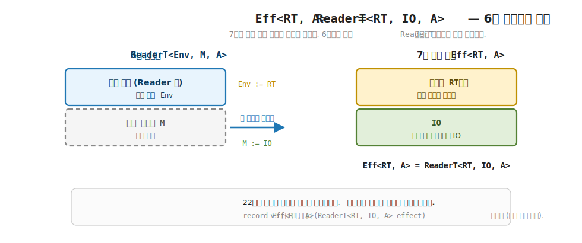
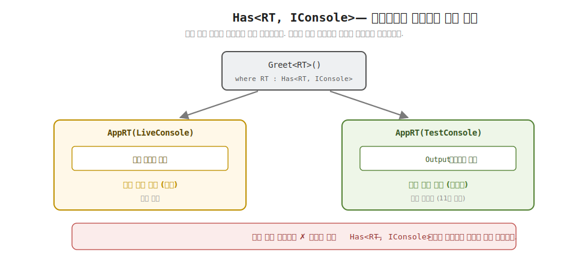

# 26장. Eff<RT, A> = ReaderT<RT, IO, A> (런타임 주입과 Has DI)

> **이 장의 목표** — 이 장을 마치면 7부 내내 예고된 실무 효과 타입 `Eff<RT, A>` 가 사실 6부에서 쌓은 `ReaderT<RT, IO, A>` 임을 직접 구현으로 확인하고, 런타임 `RT` 를 환경으로 주입해 의존성을 다루는 효과를 직접 짤 수 있습니다. 콘솔 출력이나 시간 조회 같은 능력을 코드에 박아 넣는 대신 런타임에서 꺼내 쓰고, `Has<RT, IConsole>` 같은 제약으로 그 런타임이 능력을 정말 가졌는지를 컴파일러가 검증하게 만듭니다. 같은 효과 코드를 진짜 콘솔을 쓰는 런타임과 테스트용 런타임에 각각 주입해, 후자는 부수 효과 없이 결정적으로 실행됨을 손계산으로 추적합니다. 25장의 런타임 없는 `Eff<A>` 에 환경 하나를 더한 것이 이 장이며, 여기서 7부와 6부가 함께 닫힙니다.

> **이 장의 핵심 어휘**
>
> - **`Eff<RT, A>`**: 런타임 `RT` 를 주입받아 `IO` 효과를 다루는 실무 효과 타입, 곧 `ReaderT<RT, IO, A>`
> - **런타임 `RT`**: 효과가 필요로 하는 능력들을 담은 환경, 환경 자리에 들어가는 의존성 묶음
> - **능력 (capability)**: 콘솔 출력이나 시간 조회처럼 효과가 바깥 세상에 요구하는 일, 인터페이스로 표현
> - **`Has<RT, TRAIT>`**: 런타임 `RT` 가 능력 `TRAIT` 를 가짐을 타입으로 적어 둔 trait, 컴파일러가 검증하는 의존성 주입
> - **능력 제약**: `where RT : Has<RT, IConsole>`, 효과가 자기에게 필요한 능력을 시그니처에 요구하는 자리
> - **테스트 더블 (test double)**: 진짜 능력 대신 끼우는 가짜 구현, `TestConsole` 이 출력을 리스트에 모음
> - **두 단계 `Run`**: `Run(rt)` 이 `IO` 를 조립하고 `io.Run()` 이 부수 효과를 일으키는 두 끌어내림

> 이 장을 마치면 할 수 있게 되는 것
> - [ ] `Eff<RT, A>` 가 새 마법이 아니라 `ReaderT<RT, IO, A>` 에 이름을 붙인 것임을 설명할 수 있습니다.
> - [ ] 환경 자리에 런타임 `RT`, 내부 모나드 자리에 `IO` 가 들어간다는 두 치환을 짚을 수 있습니다.
> - [ ] 능력을 인터페이스로 정의하고 라이브 구현과 테스트 더블 두 가지를 부착할 수 있습니다.
> - [ ] `Has<RT, IConsole>` 제약이 컴파일 단계에서 능력 보유를 검증함을 읽을 수 있습니다.
> - [ ] 같은 효과 코드를 두 런타임에 주입해 한쪽만 부수 효과를 일으킴을 손계산으로 추적할 수 있습니다.
> - [ ] `Eff.Run` 의 두 `Run` 이 각각 무슨 일을 하는지 한 단계씩 따라갈 수 있습니다.
> - [ ] 능력을 둘 이상 쌓을 때 `Get` 이름 충돌을 명시적 구현으로 푸는 패턴을 쓸 수 있습니다.
> - [ ] `Eff<RT, A>` 가 모나드 세 법칙을 지키는 정식 모나드임을 `probe` 로 확인할 수 있습니다.

> **이 장의 흐름** — 25장의 `Eff<A>` 가 의존성 주입을 갖지 못한다는 자리에서 출발합니다. 콘솔이나 시간 같은 능력을 효과 코드에 곧장 박으면 테스트할 때 진짜 콘솔이 찍히고 시간이 매번 달라지는 불편을 먼저 부딪힙니다. 그 불편을 푸는 한 수가 능력을 런타임으로 주입받는 것이고, 그 런타임이 곧 6부의 `ReaderT` 환경 자리임을 봅니다. `Eff<RT, A> = ReaderT<RT, IO, A>` 라는 한 줄을 두 치환으로 풀어, 7부의 정점이 6부 변환기의 회수임을 확인합니다. 이어 능력을 인터페이스로 정의하고 `Has<RT, IConsole>` 제약으로 컴파일러가 의존성을 검증하게 만든 뒤, 같은 효과 코드를 라이브 런타임과 테스트 런타임에 각각 주입해 한쪽만 부수 효과를 일으킴을 손계산합니다. 이 결정적 실행이 11부 테스트의 토대임을 짚고, 능력을 여럿 쌓는 패턴과 모나드 법칙을 확인한 뒤, 효과 시스템이 1장 비유의 도달점임을 정리하며 7부를 닫습니다.

---

## 26.1 이 장에서 다루는 것 — 7부의 정점, 능력을 주입받는 효과

7부 내내 같은 한 문장이 예고로 따라다녔습니다. 22장에서 처음 적었고, 25장까지 매 장이 다시 가리킨 문장입니다. `Eff<RT, A>` 가 사실 `ReaderT<RT, IO, A>` 라는 것. 이 장은 그 예고를 손으로 만져 확인하는 자리입니다.

먼저 이 장이 다루는 효과가 어떤 일을 하는지 한 문장으로 잡습니다. 실무의 효과 코드는 거의 언제나 바깥 세상의 무언가를 필요로 합니다. 콘솔에 쓰려면 콘솔이 있어야 하고, 현재 시간을 물으려면 시계가 있어야 하고, 파일을 읽으려면 파일 시스템이 있어야 합니다. 이렇게 효과가 바깥 세상에 요구하는 일을 이 책은 능력 (capability) 이라 부릅니다. `Eff<RT, A>` 는 그 능력들을 런타임 `RT` 라는 환경에 담아 두고, 효과 코드가 거기서 필요한 능력만 꺼내 쓰는 효과입니다.

6 이동 지도로 보면, 6부에서 변환기가 두 Elevated World 를 한 스택으로 쌓는 자리였고, 이 장은 그 스택의 바깥에 환경 효과 (`Reader`), 안쪽에 부수 효과 (`IO`) 를 끼운 단 하나의 조합입니다. 새 trait 도 새 이동도 아닙니다. 22장에서 손으로 만진 `ReaderT<int, IOF>` 의 환경 자리 정수를 런타임으로, 그 자리에 능력 묶음을 담은 것이 전부입니다.

그래서 이 장의 도달점도 한 문장입니다. "같은 효과 코드를 한 줄도 바꾸지 않고, 진짜 콘솔을 쓰는 런타임과 가짜 콘솔을 쓰는 런타임에 번갈아 주입할 수 있다." 이 한 문장을 코드로 직접 겪고 나면, 효과를 값으로 인코딩한다는 7부 전체의 발상이 왜 테스트와 의존성 주입까지 자연스럽게 끌어안는지가 손에 잡힙니다.

지금 모든 것을 외우지 않아도 됩니다. 이 장이 끝날 때 손에 남는 것은 두 가지입니다. `Eff<RT, A> = ReaderT<RT, IO, A>` 라는 정체 하나와, `Has<RT, …>` 제약이 의존성을 컴파일 시점에 검증한다는 발상 하나입니다.

지금 모든 것을 외우지 않아도 됩니다. 이 장이 끝날 때 손에 남는 것은 두 가지입니다. `Eff<RT, A> = ReaderT<RT, IO, A>` 라는 정체 하나와, `Has<RT, …>` 제약이 의존성을 컴파일 시점에 검증한다는 발상 하나입니다. 이 장에 처음 나오는 어휘를 한 줄씩만 미리 짚어 둡니다. 런타임 `RT` 는 효과가 필요로 하는 능력들을 담은 환경입니다. 능력 (capability) 은 콘솔 출력이나 시간 조회처럼 효과가 바깥 세상에 요구하는 일입니다. `Has<RT, TRAIT>` 는 그 런타임이 능력 하나를 꺼낼 줄 안다는 약속을 타입에 적은 trait 입니다. 테스트 더블 (test double) 은 진짜 능력 대신 끼우는 가짜 구현입니다. 네 어휘 모두 본문에서 코드와 함께 다시 천천히 풀므로, 여기서는 이름과 한 줄 뜻만 스쳐 두면 됩니다. 둘 다 6부에서 쌓은 것 위에 작은 한 칸을 더하는 것이라, 7부를 닫기에 알맞은 자리입니다.

---

## 26.2 왜 필요한가 — 능력을 코드에 박으면 테스트가 막힙니다

`Eff<RT, A>` 를 보이기 전에, 런타임 없는 효과로만 부수 효과를 다루려 하면 어디서 막히는지부터 부딪혀 봅니다. 추상을 먼저 보이지 않고 손에 잡히는 불편을 먼저 겪는 것이 이 장의 순서입니다.

25장에서 본 `Eff<A>` 를 떠올립니다. 그것은 `IO` 와 오류를 다루되 의존성 주입이 없는 효과였습니다. 콘솔에 한 줄 쓰는 효과를 그 어휘로 적으면 이렇게 됩니다.

```csharp
// 능력을 코드에 곧장 박은 효과 — 콘솔이 코드 안에 굳어 있다.
static IO<Unit> Greet() =>
    new IO<Unit>(() =>
    {
        Console.WriteLine("이름이 무엇인가요?");   // ← 진짜 콘솔이 코드 안에 박힘
        var name = Console.ReadLine();             // ← 진짜 입력을 코드 안에서 직접 읽음
        Console.WriteLine($"반가워요, {name}!");
        return Unit.Default;
    });
```

이 코드는 잘 돌아갑니다. 사람이 직접 실행하면 콘솔에 묻고 답을 받습니다. 문제는 이 효과를 테스트하려 할 때입니다.

단위 테스트를 짠다고 해 봅니다. "이름을 받으면 인사 문구가 맞게 나오는가" 를 확인하고 싶습니다. 그런데 `Greet` 안에 `Console.WriteLine` 과 `Console.ReadLine` 이 박혀 있습니다. 테스트가 이 효과를 실행하는 순간, 진짜 콘솔에 글자가 찍히고, 진짜 입력을 기다리며 멈춰 섭니다. 자동화된 테스트는 사람이 키보드를 두드려 주길 기다릴 수 없습니다. 출력이 맞는지 확인하려 해도, 콘솔에 찍힌 글자를 코드가 도로 읽어 단언할 방법이 없습니다.

시간은 더 분명합니다. `DateTime.Now` 를 코드 안에서 직접 부르는 효과는 호출할 때마다 다른 값을 냅니다. "이 효과가 기록한 시각이 정확히 1234 인가" 같은 단언은 애초에 쓸 수 없습니다. 시간이 흐르기 때문입니다.

객체 지향 개발자라면 이 자리에서 익숙한 도구가 떠오릅니다. 진짜 콘솔 대신 가짜를 끼우는 일은 단위 테스트에서 늘 하던 모킹 (mocking) 입니다. `Console` 정적 호출을 `IConsole` 인터페이스 뒤로 숨기고, 테스트에서는 출력을 기록하는 가짜 구현을 넣는 것입니다. 이 장이 하려는 일도 정확히 그것입니다. 다른 점은 둘입니다. 첫째, 그 가짜를 효과 코드에 손으로 넘기지 않고 런타임이라는 환경에 담아 한 번에 주입합니다. 둘째, 어떤 효과가 어떤 능력을 쓰는지를 시그니처에 적어, 끼워야 할 가짜를 빠뜨리면 컴파일러가 미리 막습니다. 익숙한 모킹을 효과의 타입 안으로 끌어들인 셈입니다.

> **흔한 함정** — 능력을 코드에 박아도 인터페이스만 잘 나누면 테스트된다고 여기는 것입니다.
>
> 객체 지향에서 익숙한 답은 생성자로 의존성을 받는 것입니다. `Greet(IConsole console)` 처럼 콘솔을 인자로 받으면 테스트에서 가짜를 넘길 수 있습니다. 맞는 방향입니다. 그런데 효과가 깊어지면 그 의존성을 함수마다 손으로 넘겨야 하고, 어떤 함수가 콘솔을 쓰는지 시그니처만 봐서는 알기 어렵습니다. 게다가 런타임에 의존성을 빠뜨려도 컴파일러가 잡아 주지 못합니다. `Has<RT, …>` 는 이 의존성 주입을 효과의 타입 안으로 끌어와, 누가 어떤 능력을 쓰는지를 시그니처에 적고 그 보유를 컴파일러가 검증하게 만듭니다.

그래서 우리가 바라는 것은 분명합니다. 콘솔이나 시계 같은 능력을 효과 코드에 박지 말고, 바깥에서 주입받고 싶습니다. 그러면 실행할 때는 진짜 콘솔을, 테스트할 때는 가짜 콘솔을 끼울 수 있습니다. 그리고 그 능력 주입을 효과의 타입이 시그니처에 명시해, 빠뜨린 의존성을 컴파일러가 미리 막아 주면 좋겠습니다.

이 두 가지 (능력 주입 + 컴파일 시점 검증) 를 한 타입으로 잡는 것이 `Eff<RT, A>` 와 `Has<RT, …>` 입니다. 그런데 능력을 주입받는 환경이라는 발상은 6부에서 이미 본 적이 있습니다. 환경을 읽는 효과, 곧 `Reader` 입니다. 다음 절에서 그 연결을 짚습니다.

---

## 26.3 Eff<RT, A> = ReaderT<RT, IO, A> — 6부 변환기의 회수

이제 7부의 정점을 한 줄로 적습니다. `Eff<RT, A>` 는 사실 `ReaderT<RT, IO, A>` 입니다. 22장이 예고하고 매 장이 가리킨 그 정체입니다.

이 한 줄을 두 치환으로 풉니다. 6부의 `ReaderT<Env, M, A>` 는 환경 자리 `Env` 와 내부 모나드 자리 `M` 두 빈칸을 가진 스택이었습니다. 그 두 빈칸에 무엇을 끼우는가가 전부입니다.

| `ReaderT` 의 빈칸 | `Eff<RT, A>` 가 끼우는 것 | 뜻 |
|---|---|---|
| 환경 자리 `Env` | 런타임 `RT` | 효과가 필요로 하는 능력 묶음 |
| 내부 모나드 자리 `M` | `IO` | 스택 맨 안쪽의 부수 효과 |

환경 자리에 런타임 `RT` 를 끼우고 내부 모나드 자리에 `IO` 를 끼우면, 그 결과가 곧 `Eff<RT, A>` 입니다. 22장에서 손으로 만진 `ReaderT<int, IOF>` 에서 환경 정수를 런타임으로, 최소 `IOF` 를 `IO` 로 바꾼 바로 그 스택입니다.

학습 코드는 이 정체를 숨기지 않고 그대로 드러냅니다. 효과의 골격이 `ReaderT` 임이 시그니처에서 곧장 보입니다.

```csharp
// Eff<RT, A> = ReaderT<RT, IO, A>.
// 런타임 RT 를 환경으로 주입(Reader)하고, IO 효과를 안쪽에 품는다(MonadIO).
// 6부에서 쌓은 변환기가 그대로 실무 효과 시스템의 골격이 된다.
public sealed class ReaderT<RT, M, A>(Func<RT, K<M, A>> run) : K<ReaderTF<RT, M>, A>
    where M : MonadIO<M>
{
    public K<M, A> Run(RT rt) => run(rt);
}
```

`ReaderT<RT, M, A>` 는 함수 `RT → M<A>` 를 감싼 상자입니다. 22장에서 본 모양 그대로입니다. 환경 자리 이름만 `Env` 에서 `RT` 로 바뀌었습니다. 곧 "런타임 `RT` 를 주면 안쪽 모나드 계산 `M<A>` 를 내겠다" 는 약속 한 줄을 상자에 담아 둔 것입니다. `Run(rt)` 은 그 약속에 진짜 런타임을 끼워, 안쪽 `M<A>` 계산을 꺼냅니다. 제약 `where M : MonadIO<M>` 은 22장에서 풀었습니다. 안쪽 `M` 이 `IO` 를 품을 줄 알아야 이 스택을 만들 수 있다는 약속입니다.

trait 부착도 6부의 `ReaderT` 와 같습니다. 22장에서 본 두 trait 을 그대로 답니다.

```csharp
public sealed class ReaderTF<RT, M> :
    MonadIO<ReaderTF<RT, M>>,
    Readable<ReaderTF<RT, M>, RT>
    where M : MonadIO<M>
{
    public static K<ReaderTF<RT, M>, A> Pure<A>(A value) =>
        new ReaderT<RT, M, A>(_ => M.Pure(value));

    public static K<ReaderTF<RT, M>, B> Bind<A, B>(K<ReaderTF<RT, M>, A> ma, Func<A, K<ReaderTF<RT, M>, B>> f) =>
        new ReaderT<RT, M, B>(rt => M.Bind(ma.As().Run(rt), a => f(a).As().Run(rt)));

    // IO lift — 스택 맨 안쪽 IO 를 끌어올린다 (내부 M 의 LiftIO 에 위임).
    public static K<ReaderTF<RT, M>, A> LiftIO<A>(IO<A> ma) =>
        new ReaderT<RT, M, A>(_ => M.LiftIO(ma));

    // 환경(런타임)에서 값을 꺼낸다.
    public static K<ReaderTF<RT, M>, A> Asks<A>(Func<RT, A> f) =>
        new ReaderT<RT, M, A>(rt => M.Pure(f(rt)));

    // 환경을 바꿔 부분 실행한다 (local 환경 교체).
    public static K<ReaderTF<RT, M>, A> Local<A>(Func<RT, RT> f, K<ReaderTF<RT, M>, A> ma) =>
        new ReaderT<RT, M, A>(rt => ma.As().Run(f(rt)));
}
```

`Pure`, `Bind`, `LiftIO`, `Asks` 는 22장에서 한 줄씩 읽은 그대로입니다. `Bind` 는 런타임 `rt` 를 두 단계에 흘리고, `LiftIO` 는 안쪽 `IO` 를 끌어올리며, `Asks` 는 런타임에서 값을 꺼냅니다. `MonadIO` 와 `Readable` 두 trait 의 멤버가 모두 v5 의 같은 trait 과 정합합니다.

이 코드 블록에 `Map` 과 `Apply`, 그리고 LINQ 의 `Select` 와 `SelectMany` 는 보이지 않습니다. 뒤에서 효과를 `from ... select` 로 짤 때 그 LINQ 가 바로 이 멤버들에 기댑니다. 본문에서 생략한 까닭은 하나입니다. `Map`, `Apply`, `Select`, `SelectMany` 모두 22장의 `ReaderTF` 와 글자 하나 다르지 않아, 같은 코드를 다시 펼치면 새로 읽을 것이 없기 때문입니다. `Map` 은 안쪽 `M.Map` 에 위임하고, `Apply` 는 `Bind` 와 `Map` 으로 풀리며, `Select` 와 `SelectMany` 는 `Bind` 위에 LINQ 어휘만 입힌 것입니다. 코드의 `ReaderT` 에는 이 멤버들이 모두 들어 있어 효과의 LINQ 사슬이 그대로 컴파일됩니다.

이 절의 결론은 한 가지입니다. 7부의 실무 효과 타입은 새로 발명한 것이 아닙니다. 6부에서 한 장씩 쌓은 `ReaderT` 와 `IO` 의 조합에 `Eff<RT, A>` 라는 이름표를 붙인 것입니다. 6부의 변환기는 학습용 연습이 아니라, 7부의 효과 시스템이 서 있는 바로 그 토대였습니다.



**그림 26-1. `Eff<RT, A>` = `ReaderT<RT, IO, A>`: 6부 변환기의 회수** — 7부의 실무 효과 타입이 새로운 것이 아니라, 6부에서 쌓은 `ReaderT` 스택에 이름표를 붙인 것임을 보입니다. 환경 자리에 런타임 `RT`, 내부 모나드 자리에 `IO` 를 끼우면 그것이 곧 `Eff<RT, A>` 입니다.

> **흔한 함정** — `Eff<RT, A>` 를 `IO<A>` 와 다른 새 효과 타입으로 외우려는 것입니다.
>
> `Eff<RT, A>` 는 `IO` 를 대체하지 않습니다. 안쪽에 그대로 `IO` 를 품습니다. 둘의 차이는 단 하나, 바깥에 환경 (`Reader`) 층이 한 겹 더 있느냐입니다. `IO<A>` 는 능력이 코드에 박힌 효과이고, `Eff<RT, A>` 는 그 능력을 런타임 `RT` 에서 주입받는 효과입니다. 그래서 `Eff<RT, A>` 를 런타임으로 `Run` 하면 안쪽 `IO` 가 나오고, 그 `IO` 를 다시 `Run` 해야 부수 효과가 일어납니다. 22장의 이중 지연이 이름만 바뀌어 그대로 살아 있습니다.

---

## 26.4 Has<RT, IConsole> — 컴파일러가 검증하는 능력 주입

환경 자리에 런타임 `RT` 가 들어왔습니다. 그렇다면 효과 코드는 그 런타임에서 능력을 어떻게 꺼낼까요. 그리고 런타임이 그 능력을 정말 가졌는지는 누가 확인할까요. 이 두 물음에 답하는 것이 `Has<RT, TRAIT>` 입니다.

### 26.4.1 능력을 인터페이스로

먼저 능력 자체를 정의합니다. 콘솔 능력을 인터페이스 하나로 적습니다. 효과는 진짜 콘솔이라는 구체 구현이 아니라 이 인터페이스에만 의존합니다.

```csharp
// IConsole — 콘솔 능력. 효과는 구체 구현이 아니라 이 인터페이스에 의존한다.
public interface IConsole
{
    void WriteLine(string line);
    string ReadLine();
}
```

이 인터페이스에는 두 구현을 답니다. 하나는 진짜 콘솔에 닿는 라이브 구현, 다른 하나는 테스트용 가짜입니다.

```csharp
// 라이브 구현 — 실제 콘솔.
public sealed class LiveConsole : IConsole
{
    public void WriteLine(string line) => Console.WriteLine(line);
    public string ReadLine() => Console.ReadLine() ?? "";
}

// 테스트 더블 — 입력은 큐에서, 출력은 리스트에 모은다 (결정적·검증 가능).
public sealed class TestConsole(IEnumerable<string> inputs) : IConsole
{
    readonly Queue<string> queue = new(inputs);
    public List<string> Output { get; } = [];
    public void WriteLine(string line) => Output.Add(line);
    public string ReadLine() => queue.Count > 0 ? queue.Dequeue() : "";
}
```

`LiveConsole` 은 `Console.WriteLine` 과 `Console.ReadLine` 을 그대로 부릅니다. 진짜 콘솔입니다. `TestConsole` 은 다릅니다. `WriteLine` 은 글자를 화면에 찍는 대신 `Output` 리스트에 쌓고, `ReadLine` 은 사람을 기다리는 대신 미리 받아 둔 입력을 큐에서 하나씩 꺼냅니다. 진짜 능력 대신 끼우는 이런 가짜 구현을 테스트 더블 (test double) 이라 부릅니다. 출력이 리스트에 모이므로 테스트가 그 리스트를 읽어 단언할 수 있고, 입력이 큐에서 나오므로 같은 입력으로 몇 번을 돌려도 같은 결과가 나옵니다.

### 26.4.2 런타임이 능력을 가진다는 약속 — Has

이제 런타임을 정의합니다. 런타임은 효과가 필요로 하는 능력들을 담은 환경입니다. 콘솔 능력 하나를 가진 런타임을 적으면 이렇습니다.

```csharp
// Has — 능력 기반 DI. 런타임 RT 가 능력 TRAIT 를 가짐을 타입으로 보장한다.
public interface Has<RT, TRAIT> where RT : Has<RT, TRAIT>
{
    static abstract TRAIT Get(RT runtime);
}

// AppRT — 애플리케이션 런타임. 콘솔 능력을 가진다.
public sealed record AppRT(IConsole Console) : Has<AppRT, IConsole>
{
    public static IConsole Get(AppRT runtime) => runtime.Console;
}
```

`Has<RT, TRAIT>` trait 을 한 줄씩 읽습니다. 멤버는 `static abstract TRAIT Get(RT runtime)` 하나입니다. "런타임 `RT` 를 받아 그 안의 능력 `TRAIT` 를 꺼내 준다" 는 약속입니다.

`Has<RT, TRAIT>` trait 을 한 줄씩 읽습니다. 멤버는 `static abstract TRAIT Get(RT runtime)` 하나입니다. "런타임 `RT` 를 받아 그 안의 능력 `TRAIT` 를 꺼내 준다" 는 약속입니다. 두 꺾쇠는 차례로 능력을 담는 런타임 `RT` 와 그 안에서 꺼낼 능력 `TRAIT` 입니다. 곧 `Has<AppRT, IConsole>` 은 "`AppRT` 라는 런타임에서 `IConsole` 능력을 꺼낼 줄 안다" 로 읽습니다. 22장에서 본 "trait 의 약속" 그대로입니다. `Has<RT, TRAIT>` 를 부착한 런타임은 곧 "나는 이 능력을 꺼낼 줄 안다" 고 약속한 셈입니다.

`AppRT` 는 그 약속을 콘솔 능력에 대해 지킵니다. `record AppRT(IConsole Console)` 로 콘솔 하나를 품고, `Get(AppRT runtime) => runtime.Console` 로 그 콘솔을 꺼내 줍니다. `: Has<AppRT, IConsole>` 한 줄이 "`AppRT` 는 콘솔 능력을 가진다" 를 타입에 적은 자리입니다.

객체 지향 직감으로 다리를 놓으면 이렇습니다. 의존성 주입 (DI) 컨테이너를 떠올립니다. ASP.NET 같은 프레임워크에서 `services.AddSingleton<IConsole, LiveConsole>()` 로 능력을 등록해 두면, 컨트롤러가 생성자에서 `IConsole` 을 받아 씁니다. `AppRT` 가 바로 그 컨테이너에 해당합니다. 능력들을 담아 두는 그릇입니다. `Get` 은 컨테이너에서 능력을 꺼내는 `GetService<IConsole>()` 에 해당합니다. 한 가지 결정적 차이가 있습니다. DI 컨테이너는 등록을 빠뜨리면 런타임에 가서야 "그런 서비스 없음" 예외가 터집니다. `Has<RT, …>` 는 그 빠뜨림을 컴파일 시점에 막습니다. 어떻게 막는지를 다음에서 봅니다.

### 26.4.3 효과가 능력을 요구한다 — where 제약

이제 콘솔에 한 줄 쓰는 효과를 짭니다. 핵심은 시그니처의 제약 한 줄입니다.

```csharp
// 런타임에서 콘솔 능력을 꺼내 한 줄 출력 (Has 제약이 능력 보유를 컴파일타임 검증).
public static K<ReaderTF<RT, IOF>, Unit> WriteLine<RT>(string msg)
    where RT : Has<RT, IConsole> =>
    from con in Readable.asks<ReaderTF<RT, IOF>, RT, IConsole>(rt => RT.Get(rt))
    from _ in IOM.liftIO<ReaderTF<RT, IOF>, Unit>(
        new IO<Unit>(() => { con.WriteLine(msg); return Unit.Default; }))
    select _;
```

시그니처부터 읽습니다. `WriteLine<RT>` 는 런타임 타입 `RT` 를 제네릭으로 받되, `where RT : Has<RT, IConsole>` 제약을 답니다. 이 한 줄이 "이 효과를 쓰려는 런타임은 반드시 콘솔 능력을 가져야 한다" 를 요구합니다. 효과가 자기에게 필요한 능력을 시그니처에 적은 것입니다.

본체의 LINQ 두 줄을 읽습니다. 첫 줄 `Readable.asks<ReaderTF<RT, IOF>, RT, IConsole>(rt => RT.Get(rt))` 가 이 절의 자리입니다. 꺾쇠 세 개가 처음으로 서로 다른 세 타입을 받으므로 한 줄로 풀어 둡니다. 차례로 스택 태그 `ReaderTF<RT, IOF>`, 런타임 타입 `RT`, 꺼낼 능력 `IConsole` 입니다. 22장의 `asks` 에서는 환경도 값도 정수 하나라 세 자리가 사실상 한 타입으로 겹쳐 보였는데, 여기서 처음으로 셋이 서로 다른 타입이 됩니다. 이 한 줄이 런타임에서 콘솔 능력을 꺼내 `con` 에 담습니다. `RT.Get(rt)` 이 바로 `Has` 의 약속을 부르는 자리입니다. 둘째 줄은 22장에서 본 그대로입니다. 꺼낸 콘솔로 한 줄 쓰는 부수 효과를 `new IO<Unit>(...)` 로 조립하고, `liftIO` 로 스택 위에 올립니다. 능력을 꺼내는 일과 그 능력으로 부수 효과를 일으키는 일이 두 단계로 나뉘어 있습니다.

콘솔에서 한 줄 읽는 효과도 같은 모양입니다.

```csharp
public static K<ReaderTF<RT, IOF>, string> ReadLine<RT>()
    where RT : Has<RT, IConsole> =>
    from con in Readable.asks<ReaderTF<RT, IOF>, RT, IConsole>(rt => RT.Get(rt))
    from line in IOM.liftIO<ReaderTF<RT, IOF>, string>(new IO<string>(con.ReadLine))
    select line;
```

런타임에서 콘솔을 꺼내고 (`con`), 그 콘솔의 `ReadLine` 을 `IO` 로 감싸 올려 한 줄을 읽습니다. 두 효과 모두 같은 제약 `where RT : Has<RT, IConsole>` 을 답니다.

이제 제약이 어떻게 빠뜨린 의존성을 막는지를 봅니다. 누군가 콘솔 능력이 없는 런타임으로 `WriteLine` 을 부르려 하면 무슨 일이 일어나는지 손으로 따라갑니다.

```
가정: record EmptyRT;   // 아무 능력도 없는 런타임 (Has 부착 없음)

Eff.WriteLine<EmptyRT>("안녕")
  └ WriteLine<RT> 의 제약: where RT : Has<RT, IConsole>
      └ EmptyRT 가 Has<EmptyRT, IConsole> 를 부착했는가?
          → 아니오.
      → 컴파일 거부. "EmptyRT 는 Has<EmptyRT, IConsole> 를 만족하지 않음"

결과: 이 코드는 *빌드되지 않는다*. 런타임까지 가지 못한다.
```

콘솔 능력이 없는 런타임으로 콘솔 효과를 부르는 코드는 컴파일 단계에서 거부됩니다. 빠뜨린 의존성이 프로그램을 실행하다 터지는 것이 아니라, 빌드조차 되지 않습니다. DI 컨테이너가 런타임에 던지던 "그런 서비스 없음" 예외를, `Has<RT, …>` 는 컴파일 에러로 앞당겨 없앤 것입니다. 이것이 능력 기반 DI 가 객체 지향의 컨테이너 주입보다 한 걸음 더 나아간 자리입니다.

익숙한 자리로 다리를 놓으면 이렇습니다. ASP.NET 에서 `services.AddSingleton<IConsole, LiveConsole>()` 등록을 깜빡한 채 컨트롤러가 `IConsole` 을 요구하면, 코드는 멀쩡히 빌드되고 요청이 들어와 그 컨트롤러가 깨어나는 순간에야 예외가 터집니다. 잘못을 발견하는 시점이 런타임으로 미뤄진 것입니다. `where RT : Has<RT, IConsole>` 는 그 발견을 빌드 시점으로 끌어옵니다. 능력을 빠뜨린 런타임은 시그니처를 만족하지 못해, 프로그램이 돌기 전에 컴파일러가 멈춰 세웁니다.

> **미리보기** — 능력을 둘 이상 쌓으면 어떻게 되는지 궁금할 수 있습니다.
>
> 한 효과가 콘솔과 시계를 둘 다 요구하면, 그 런타임은 `Has<RT, IConsole>` 와 `Has<RT, IClock>` 두 약속을 모두 지켜야 합니다. 효과의 제약도 `where RT : Has<RT, IConsole>, Has<RT, IClock>` 처럼 둘이 됩니다. 능력을 쌓을수록 제약이 늘고, 런타임은 그만큼 더 많은 능력을 품습니다. 이 다능력 런타임에서 작은 이름 충돌 하나가 생기는데, 그 해소법은 직접 해보기 절의 챌린지에서 다룹니다. 지금은 능력 하나짜리 런타임으로 충분합니다.

---

## 26.5 같은 코드, 두 런타임 — 주입만 바꾼다

이제 이 장의 도달점을 코드로 겪습니다. 콘솔 능력을 쓰는 효과 코드를 하나 짜고, 그것을 두 런타임에 번갈아 주입합니다. 핵심은 효과 코드가 한 줄도 바뀌지 않는다는 것입니다.

먼저 효과 코드입니다. 이름을 묻고, 답을 받고, 인사하는 작은 효과입니다.

```csharp
// 콘솔 능력을 쓰는 *하나의 효과 코드* — 런타임 RT 가 Has<RT, IConsole> 이기만 하면 된다.
static K<ReaderTF<RT, IOF>, string> Greet<RT>() where RT : Has<RT, IConsole> =>
    from _1 in Eff.WriteLine<RT>("이름이 무엇인가요?")
    from name in Eff.ReadLine<RT>()
    from _2 in Eff.WriteLine<RT>($"반가워요, {name}!")
    select name;
```

`Greet<RT>` 는 런타임 타입 `RT` 를 제네릭으로 받습니다. 제약은 `where RT : Has<RT, IConsole>` 하나입니다. 이 효과가 콘솔 능력만 요구한다는 뜻입니다. 본체는 세 줄짜리 LINQ 입니다. 묻고 (`WriteLine`), 읽고 (`ReadLine`), 인사하고 (`WriteLine`), 읽은 이름을 돌려줍니다. 어디에도 구체적인 콘솔이 박혀 있지 않습니다. 어떤 런타임이 주입될지는 이 코드가 모릅니다. `RT` 가 콘솔 능력을 가졌다는 것만 압니다.

효과를 실행하는 자리를 봅니다. 22장의 이중 지연이 여기서 `Eff.Run` 한 함수로 묶입니다.

```csharp
// 효과를 주어진 런타임으로 실행 (Run(rt) 가 IO 를 만들고, IO.Run() 이 부수 효과 수행).
public static A Run<RT, A>(K<ReaderTF<RT, IOF>, A> eff, RT rt) =>
    eff.As().Run(rt).As().Run();
```

`Eff.Run` 의 본체 `eff.As().Run(rt).As().Run()` 에 `Run` 이 두 번 보입니다. 이 둘이 22장에서 손계산한 이중 지연 그대로입니다. 다음 절에서 한 단계씩 풀 텐데, 지금은 "런타임을 주면 효과를 실행해 결과를 낸다" 정도로 읽으면 됩니다.

> **흔한 함정** — `Greet` 안에 `Console.WriteLine` 이 없는데 어떻게 콘솔에 찍히느냐는 의문입니다.
>
> `Greet<RT>()` 본체에는 진짜 콘솔도, 가짜 콘솔도 없습니다. `Eff.WriteLine<RT>` 와 `Eff.ReadLine<RT>` 만 부를 뿐입니다. 콘솔이 정해지는 자리는 효과를 짜는 곳이 아니라 `Eff.Run(Greet<AppRT>(), new AppRT(test))` 처럼 런타임을 끼우는 가장자리입니다. 효과 코드는 "콘솔 능력을 쓴다" 는 약속만 들고 다니고, 그 약속이 어떤 콘솔로 채워질지는 `Run` 하는 한 줄이 정합니다. 그래서 같은 `Greet<AppRT>()` 가 `TestConsole` 을 끼우면 리스트에 모으고, `LiveConsole` 을 끼우면 진짜 화면에 찍힙니다.

### 26.5.1 예제 1 — 테스트 런타임으로 결정적 실행

같은 `Greet` 를 테스트 런타임에 주입합니다. 입력 `"철수"` 하나를 미리 담은 `TestConsole` 을 끼웁니다.

```csharp
var test = new TestConsole(["철수"]);
var returned = Eff.Run(Greet<AppRT>(), new AppRT(test));

Console.WriteLine($"  반환값      = {returned}");
Console.WriteLine($"  콘솔 출력   = [{string.Join(" / ", test.Output)}]");
```

무슨 일이 일어나는지 손으로 따라갑니다. 우리가 좇을 것은 두 가지뿐입니다. `TestConsole` 의 입력 큐 `queue` 와 출력 리스트 `Output` 이 한 단계마다 어떻게 변하는가입니다. `WriteLine` 은 `Output` 에 한 줄을 더하고, `ReadLine` 은 `queue` 에서 한 줄을 꺼냅니다. 이 둘만 눈으로 좇으면 됩니다.

```
시작:  queue = ["철수"],  Output = []

Eff.Run(Greet<AppRT>(), new AppRT(test))
  ├ WriteLine("이름이 무엇인가요?")
  │   → RT.Get(rt) 로 test 콘솔을 꺼냄
  │   → con.WriteLine(...) → Output 에 "이름이 무엇인가요?" 추가
  │   queue = ["철수"],  Output = ["이름이 무엇인가요?"]
  ├ ReadLine()
  │   → con.ReadLine() → queue 에서 "철수" 꺼냄 → name = "철수"
  │   queue = [],  Output = ["이름이 무엇인가요?"]
  ├ WriteLine("반가워요, 철수!")
  │   → Output 에 "반가워요, 철수!" 추가
  │   queue = [],  Output = ["이름이 무엇인가요?", "반가워요, 철수!"]
  └ select name → 반환값 = "철수"

결과:  반환값 = 철수
       Output = ["이름이 무엇인가요?", "반가워요, 철수!"]
```

`ReadLine` 은 사람을 기다리지 않고 큐에서 `"철수"` 를 꺼냈고, 두 번의 `WriteLine` 은 화면에 찍는 대신 `Output` 리스트에 차곡차곡 쌓였습니다. 데모 출력은 다음과 같습니다.

```
  반환값      = 철수
  콘솔 출력   = [이름이 무엇인가요? / 반가워요, 철수!]
  → Greet 코드는 한 줄도 안 바뀌고, 런타임만 TestConsole 로 주입.
```

진짜 콘솔은 단 한 글자도 찍히지 않았습니다. 출력은 전부 리스트에 모였고, 입력은 큐에서 나왔습니다. 사람의 키보드 없이, 결정적으로 실행됐습니다.

### 26.5.2 예제 2 — 다른 입력의 런타임

같은 `Greet` 를 입력만 다른 런타임에 주입합니다. 이번엔 `"영희"` 입니다.

```csharp
var test2 = new TestConsole(["영희"]);
var returned2 = Eff.Run(Greet<AppRT>(), new AppRT(test2));
Console.WriteLine($"  반환값 = {returned2}, 출력 마지막 줄 = {test2.Output[^1]}");
```

`Greet<AppRT>()` 는 예제 1 과 글자 하나 다르지 않습니다. 바뀐 것은 주입한 런타임의 입력뿐입니다. 데모 출력은 다음과 같습니다.

```
  반환값 = 영희, 출력 마지막 줄 = 반가워요, 영희!
  (LiveConsole 런타임이면 실제 콘솔 입출력 — 코드는 동일)
```

반환값이 `"영희"` 로, 마지막 출력이 `"반가워요, 영희!"` 로 바뀌었습니다. 효과 코드는 그대로인데 결과만 입력을 따라 달라졌습니다. 그리고 출력의 괄호가 짚듯, 여기에 `LiveConsole` 을 주입하면 진짜 콘솔 입출력이 일어납니다. 그때도 `Greet` 코드는 한 글자도 바뀌지 않습니다.



**그림 26-2. `Has<RT, IConsole>`: 컴파일러가 검증하는 능력 주입** — 같은 효과 코드가 `Live` 런타임에서는 진짜 콘솔에 출력하고, `Test` 런타임에서는 `TestConsole` (출력을 메모리 리스트에 모으는 콘솔) 이 부수 효과 없이 결정적으로 실행됩니다. `Has<RT, IConsole>` 제약이 런타임에 능력이 빠지면 컴파일 단계에서 거부함을 보입니다.

이것이 능력 기반 의존성 주입의 핵심입니다. 효과 코드는 자기가 어떤 능력을 쓰는지만 시그니처에 적습니다. 그 능력의 구체 구현을 무엇으로 채울지는 효과를 `Run` 하는 자리에서 런타임을 끼워 정합니다. 같은 코드가 실행 환경에서는 진짜 능력을, 테스트 환경에서는 가짜 능력을 받습니다. 두 평행 세계 어휘로 보면, 효과는 Elevated World 안에서 능력의 약속만 들고 다니고, 그 약속이 어떤 Normal 시민 (진짜 콘솔 / 가짜 콘솔) 으로 채워질지는 `Run` 하는 가장자리에서 정해집니다.

---

## 26.6 두 단계 Run — 조립과 실행

`Eff.Run` 의 본체 `eff.As().Run(rt).As().Run()` 를 한 단계씩 풉니다. 이 절이 이 장에서 가장 천천히 읽을 자리입니다. `Run` 이 두 번 나오는데, 두 `Run` 이 서로 다른 일을 한다는 것이 핵심입니다. 22장에서 손계산한 이중 지연이 런타임 주입으로 옷만 갈아입은 모습입니다.

두 `Run` 에 이름표를 붙여 둡니다. 하나는 `ReaderT.Run(rt)`, **런타임을 받는** `Run` 입니다. 다른 하나는 `IO.Run()`, **인자가 없는** `Run` 입니다. 인자가 있느냐 없느냐로 둘은 늘 구별됩니다. 런타임을 받는 쪽은 `IO` 를 조립하고, 인자가 없는 쪽은 그 조립된 `IO` 의 부수 효과를 일으킵니다.

```
eff.As().Run(rt).As().Run()
         ───┬───      ──┬──
            │           └ IO.Run() — 인자 없음.  조립된 IO 의 부수 효과를 일으킨다.
            └ ReaderT.Run(rt) — 런타임 받음.  rt 를 주입해 안쪽 IO 를 *조립*한다.
```

### 26.6.1 첫 단계 — Run(rt) 은 IO 를 조립한다

첫 `Run(rt)` 은 런타임을 주입합니다. 무슨 일이 일어나는지 손으로 따라갑니다. 콘솔은 출력을 리스트에 모으는 `TestConsole` 이라 가정하고, 그 출력 리스트가 언제 차는지를 좇습니다.

```
Output = []                               (시작: 비어 있음)

eff.As().Run(rt)
  ├ Greet 의 LINQ 사슬에 런타임 rt 를 흘림
  ├ WriteLine 단계: RT.Get(rt) 로 콘솔을 꺼내고
  │                  con.WriteLine 을 부르는 IO 를 *조립* (아직 호출 안 함)
  ├ ReadLine 단계:  con.ReadLine 을 부르는 IO 를 *조립*
  └ 세 단계를 Bind 로 이어 하나의 IO<string> 을 *조립*

결과: io : IO<string>   (아직 Run() 안 됨)
Output = []                               (여전히 비어 있음!)
```

`ReaderT.Run(rt)` 이 한 일은 런타임 `rt` 를 LINQ 사슬의 각 단계에 흘려, 최종적으로 하나의 `IO<string>` 을 만든 것뿐입니다. 곧 "이 런타임을 주면 이런 `IO` 를 내겠다" 는 약속을 진짜 `IO` 한 개로 굳힌 것입니다. 그러나 그 `IO` 는 아직 잠든 상자입니다. `con.WriteLine` 도 `con.ReadLine` 도 이 과정에서 단 한 번도 호출되지 않았고, 그래서 `Output` 은 여전히 비어 있습니다. `Run(rt)` 은 부수 효과를 일으키지 않고 `IO` 를 조립만 합니다.

왜 비어 있는지 한 줄로 짚습니다. 22장에서 본 그대로입니다. `IO<A>` 는 속에 thunk `() => A` 하나를 감싼 상자이고, `Run()` 을 부르기 전까지는 그 thunk 가 잠들어 있습니다. `IO` 의 모든 부착 (`Map`, `Bind`, `Pure`) 은 thunk 를 곧장 실행하는 대신 새 `IO` 를 만들어 그 안에 실행을 한 번 더 미뤄 둡니다. `ReaderT` 가 런타임을 흘리며 이 `IO` 들을 `Bind` 로 잇는 동안에도, 잇는 일은 더 큰 thunk 를 조립하는 일이지 실행하는 일이 아닙니다. 그래서 `con.WriteLine` 을 부르는 thunk 는 조립만 됐을 뿐 아직 잠든 채이고, 출력 리스트는 비어 있습니다.

### 26.6.2 둘째 단계 — io.Run() 은 부수 효과를 일으킨다

이제 둘째 `Run()` 으로 방아쇠를 당깁니다.

```
Output = []                               (둘째 Run 직전: 아직 비어 있음)

io.As().Run()
  └ 조립해 둔 thunk 가 비로소 호출됨
      ├ WriteLine 의 IO 실행 → Output 에 "이름이 무엇인가요?" 추가
      ├ ReadLine 의 IO 실행 → queue 에서 "철수" 꺼냄
      └ WriteLine 의 IO 실행 → Output 에 "반가워요, 철수!" 추가

결과: 반환값 = "철수"
Output = ["이름이 무엇인가요?", "반가워요, 철수!"]   (이제야 차 있음!)
```

`io.Run()` 이 조립해 둔 thunk 를 비로소 호출합니다. 그 안에서 세 단계의 부수 효과가 차례로 일어나 `Output` 리스트가 차고, 읽은 이름 `"철수"` 가 결과로 나옵니다. 부수 효과는 이 둘째 `Run` 에서야 일어났습니다.

두 단계를 나란히 놓으면 한 그림이 또렷해집니다. 같은 효과인데, 첫 `Run(rt)` 직후에는 `Output` 이 비어 있었고, 둘째 `io.Run()` 뒤에야 차 있었습니다. `ReaderT` 의 `Run` 과 `IO` 의 `Run` 이 다른 두 실행이기 때문입니다. 앞의 `Run` 은 런타임을 주입해 `IO` 를 조립하는 실행이고, 뒤의 `Run` 은 그 조립된 `IO` 의 부수 효과를 일으키는 실행입니다. 부수 효과는 이 두 단계를 모두 거친 끝, 가장 마지막에 한 번 일어납니다.

`Eff<RT, A>` 가 `ReaderT<RT, IO, A>` 인 까닭이 이 두 `Run` 에 그대로 드러납니다. 바깥 `ReaderT` 층을 벗기는 끌어내림이 첫 `Run(rt)` 이고, 안쪽 `IO` 층을 벗기는 끌어내림이 둘째 `io.Run()` 입니다. 층마다 한 번씩, 두 번 벗깁니다. `ReaderT` 와 `IO` 를 쌓아 만든 스택이라, 끌어내림도 두 층만큼 두 번입니다.

타입의 흐름으로 다시 보면 두 끌어내림이 더 또렷합니다. 효과의 정식 타입은 `K<ReaderTF<RT, IOF>, A>`, 곧 두 층이 쌓인 스택입니다. 여기에 두 `Run` 이 한 층씩 벗기는 모양은 이렇습니다.

```
Eff<RT, A>  =  ReaderT<RT, IO, A>      (두 층 스택)
     │
     │  첫 Run(rt) — 런타임 RT 를 주입해 바깥 ReaderT 층을 벗긴다 (1차 끌어내림)
     ↓
   IO<A>                               (안쪽 한 층만 남음, 아직 잠든 상자)
     │
     │  둘째 Run() — 안쪽 IO 층을 벗겨 부수 효과를 일으킨다 (2차 끌어내림)
     ↓
     A                                 (Normal World 의 평범한 값)
```

첫 `Run(rt)` 이 `ReaderT<RT, IO, A>` 를 `IO<A>` 한 층으로 줄이고, 둘째 `Run()` 이 그 `IO<A>` 를 평범한 `A` 로 줄입니다. 두 평행 세계 어휘로는, 두 층 Elevated 시민이 끌어내림 두 번을 거쳐 Normal World 의 값으로 내려온 자리입니다. 쌓은 층이 둘이니 내려오는 걸음도 둘입니다.

> **흔한 함정** — `Run(rt)` 이 부수 효과를 일으킨다고 여기는 것입니다.
>
> `ReaderT.Run(rt)` 이 콘솔에 무언가 찍거나 입력을 읽을 것 같지만, 그렇지 않습니다. `Run(rt)` 은 런타임을 주입해 안쪽 `IO` 를 조립할 뿐입니다. 부수 효과는 그 `IO` 를 다시 `io.Run()` 할 때 한 번만 일어납니다. 두 `Run` 이 서로 다른 일을 한다는 것을 놓치면, 부수 효과가 두 번 일어나거나 엉뚱한 시점에 일어난다고 오해하기 쉽습니다. `Eff.Run` 이 두 `Run` 을 한 줄에 묶어 두었지만, 그 안에서 두 단계는 분명히 나뉘어 있습니다.

---

## 26.7 결정적 테스트 — 11부로 가는 다리

이 절은 짧게, 그러나 분명히 짚습니다. 앞 절에서 본 결정적 실행이 곧 효과 코드를 단위 테스트하는 토대입니다.

다시 `TestConsole` 을 떠올립니다. 그것은 출력을 `Output` 리스트에 모으고, 입력을 큐에서 꺼냈습니다. 이 두 성질 덕분에 효과 코드를 사람 없이, 진짜 콘솔 없이 검증할 수 있습니다. 앞서 능력을 코드에 곧장 박았을 때 테스트가 막히던 자리가 여기서 풀립니다.

```csharp
// 효과 코드의 단위 테스트 (의사 코드 — 11부에서 본격적으로 다룬다).
var console = new TestConsole(["철수"]);          // 입력을 미리 정해 둔다
var returned = Eff.Run(Greet<AppRT>(), new AppRT(console));

// 단언 1 — 반환값이 입력과 같은가
//   returned == "철수"
// 단언 2 — 출력이 정확히 두 줄, 순서대로인가
//   console.Output == ["이름이 무엇인가요?", "반가워요, 철수!"]
```

세 가지가 테스트를 가능하게 합니다. 첫째, 입력이 큐에서 나오므로 사람이 키보드를 두드릴 필요가 없습니다. 둘째, 출력이 리스트에 모이므로 화면에 찍힌 글자를 도로 읽을 수 없다는 문제가 사라집니다. 리스트를 직접 단언하면 됩니다. 셋째, 같은 입력이면 언제 돌려도 같은 결과가 나오므로 결정적입니다. 시간이 흐르거나 외부 상태가 끼어들지 않습니다.

같은 효과 코드 `Greet<AppRT>()` 가 26.2 의 도입과 여기서 어떻게 갈라지는지 한눈에 견줘 둡니다.

| 자리 | 능력을 코드에 박은 `Greet` | 능력을 주입받는 `Greet<RT>()` |
|---|---|---|
| 콘솔의 출처 | 본문에 박힌 `Console.WriteLine` | 런타임에서 꺼낸 `IConsole` |
| 테스트 실행 | 진짜 콘솔에 찍히고 입력에서 멈춤 | `TestConsole` 로 부수 효과 없이 끝까지 진행 |
| 출력 확인 | 화면의 글자를 도로 읽을 길 없음 | `Output` 리스트를 그대로 단언 |
| 입력 공급 | 사람이 키보드로 | 큐에서 미리 정한 값 |
| 결과 | 실행마다 달라질 수 있음 | 같은 입력이면 늘 같음 (결정적) |

왼쪽 칸이 26.2 에서 테스트가 막히던 자리이고, 오른쪽 칸이 능력 주입으로 그 막힘이 풀린 자리입니다. 효과 코드는 한 줄도 바뀌지 않았고, 바뀐 것은 콘솔이 어디서 오느냐 하나뿐입니다.

이것이 효과를 값으로 인코딩한다는 7부 발상의 보답입니다. 콘솔 출력이 즉시 일어나는 부수 효과가 아니라 능력으로 추상화되고, 그 능력의 구현을 테스트에서 갈아 끼울 수 있기에, 효과 코드가 순수 함수처럼 검증 가능해집니다. 같은 발상을 시간 (`IClock`), 파일, 네트워크 같은 다른 능력에도 그대로 적용합니다. 능력마다 테스트 더블을 하나씩 두면, 그 능력을 쓰는 모든 효과가 결정적으로 테스트됩니다.

> **실무의 자신감** — 이 결정적 주입이 11부 테스트 Part 의 핵심 토대입니다.
>
> 11부는 효과 코드를 어떻게 단위 테스트하는가를 본격적으로 다룹니다. 그 출발점이 바로 이 장의 테스트 런타임입니다. 진짜 의존성 대신 테스트 더블을 주입해 부수 효과 없이 효과를 실행하고, 그 결과와 모아 둔 출력을 단언하는 패턴이 그 핵심입니다. 명령형에서 진짜 콘솔과 진짜 시계 때문에 테스트하기 어렵던 코드가, 능력 주입 덕분에 결정적 단위 테스트의 대상이 됩니다.

---

## 26.8 법칙 — Eff<RT, A> 도 진짜 모나드

`ReaderTF<AppRT, IOF>` 는 `Monad` 를 부착했으니, 진짜 모나드가 되려면 7장에서 본 세 법칙을 만족해야 합니다. 런타임과 `IO` 를 한꺼번에 품은 이 스택도 그 법칙을 지키는지 확인합니다. 이 절의 `probe` 와 제네릭 인자는 22장의 법칙 검증과 같은 틀이라, 지금 새로 외울 것은 없습니다. 런타임이 들어와도 법칙이 그대로 성립한다는 결론 하나만 가져가면 충분합니다.

```
좌 항등:   Bind(Pure(a), f)           ≡  f(a)
우 항등:   Bind(m, Pure)              ≡  m
결합:      Bind(Bind(m, f), g)        ≡  Bind(m, a => Bind(f(a), g))
```

한 가지 걸림돌이 있습니다. `Eff<AppRT, int>` 의 시민은 속이 함수 (`AppRT → IO<…>`) 입니다. 함수 둘이 같은지를 코드로 직접 견주기는 어렵습니다.

왜 함수 둘을 직접 견주기 어려운지 한 줄로 짚습니다. C# 에서 함수 두 개를 `Equals` 로 비교하면 "같은 일을 하는가" 가 아니라 "같은 함수 객체인가" 만 봅니다. 그래서 속이 똑같이 동작해도 다른 함수로 만들어졌으면 "다르다" 가 나옵니다. 우리가 묻고 싶은 것은 "같은 런타임에 같은 결과를 내는가" 이므로, 함수인 채로는 비교가 안 됩니다. 게다가 안쪽은 `IO` 라 `Run()` 하기 전까지는 값도 나오지 않습니다. 그래서 22장과 같은 요령을 씁니다. 효과는 속이 함수라 두 효과를 함수인 채로 직접 견줄 수 없으니, 양변을 한 번 실행해 관측 가능한 값으로 끌어내린 뒤 그 값끼리 비교합니다. 곧 "두 효과가 같은가" 를 "같은 런타임에 같은 값을 내는가" 로 바꿔 묻는 것입니다. 이 환원과 비교를 대신하는 작은 함수가 `probe` 입니다.

```csharp
var dummy = new AppRT(new TestConsole([]));
Func<K<ReaderTF<AppRT, IOF>, int>, int> probe = m => Eff.Run(m, dummy);
Func<int, K<ReaderTF<AppRT, IOF>, int>> f = n => ReaderTF<AppRT, IOF>.Pure(n + 1);
Func<int, K<ReaderTF<AppRT, IOF>, int>> g = n => ReaderTF<AppRT, IOF>.Pure(n * 2);
K<ReaderTF<AppRT, IOF>, int> m0 = ReaderTF<AppRT, IOF>.Pure(5);

var leftId  = MonadLaws.LeftIdentityHolds<ReaderTF<AppRT, IOF>, int, int, int>(7, f, probe);
var rightId = MonadLaws.RightIdentityHolds<ReaderTF<AppRT, IOF>, int, int>(m0, probe);
var assoc   = MonadLaws.AssociativityHolds<ReaderTF<AppRT, IOF>, int, int, int, int>(m0, f, g, probe);
// → 세 법칙 모두 통과
```

`probe` 의 본체 `m => Eff.Run(m, dummy)` 를 한 호흡으로 읽습니다. 앞 절에서 본 두 단계 `Run` 그대로입니다. `Eff.Run` 이 더미 런타임 `dummy` 를 주입해 안쪽 `IO` 를 조립하고, 이어 그 `IO` 를 실행해 `int` 값을 끌어냅니다. 더미 런타임의 콘솔이 출력을 받을 곳 없는 빈 `TestConsole([])` 인 까닭은, 법칙을 비교하는 데는 부수 효과가 아니라 끌어내린 정수 값만 필요하기 때문입니다.

`f` 는 값에 1 을 더해 `Pure` 로 감싸고, `g` 는 2 를 곱해 `Pure` 로 감싸며, `m0` 는 `5` 를 `Pure` 로 감싼 효과입니다. `MonadLaws` 가 양변을 같은 `probe` 로 끌어내려 비교하면, 좌 항등 · 우 항등 · 결합 세 법칙이 모두 통과합니다.

`f` 는 값에 1 을 더해 `Pure` 로 감싸고, `g` 는 2 를 곱해 `Pure` 로 감싸며, `m0` 는 `5` 를 `Pure` 로 감싼 효과입니다. 좌 항등 한 줄을 손으로 따라가면 `probe` 가 하는 일이 또렷합니다. 왼쪽은 `Bind(Pure(7), f)`, 오른쪽은 `f(7)` 입니다. 둘 다 더미 런타임을 주입해 안쪽 `IO` 를 조립하고 그 `IO` 를 실행하면, 왼쪽은 `7` 을 `f` 에 넘겨 `8` 을, 오른쪽도 곧장 `8` 을 냅니다. 끌어내린 두 정수가 `8 == 8` 로 같으니 좌 항등이 통과합니다. `MonadLaws` 가 우 항등과 결합도 같은 식으로 양변을 같은 `probe` 로 끌어내려 비교하면, 세 법칙이 모두 통과합니다. 데모 출력은 다음과 같습니다.

```
== 법칙 검증 (Eff<AppRT> = ReaderT<AppRT, IO>) ==
  좌 항등 : 통과
  우 항등 : 통과
  결합    : 통과

모든 법칙 통과 [OK]
```

이 결과의 뜻은 분명합니다. 런타임 주입 (`Reader`) 과 부수 효과 (`IO`) 를 한꺼번에 품은 `Eff<RT, A>` 도, 여전히 모나드 세 법칙을 지키는 정식 모나드입니다. 그러니 이 효과로 짠 LINQ 사슬을 마음 놓고 길게 잇고, 중간을 함수로 떼어내도 같은 런타임을 같은 순서로 흘리고 같은 부수 효과를 같은 시점에 일으킵니다. 8부의 견고함 도구 (재시도, 자원, 추적) 가 이 효과 위에 안심하고 얹히는 이유가 여기 있습니다. 토대가 법칙을 지키는 정식 모나드이기 때문입니다.

---

## 26.9 v5 와의 정합 — Has 의 모양 차이

학습 코드와 LanguageExt v5 가 `Has` 를 다루는 방식에 의도된 차이가 있습니다. 이 장의 제목이 명명한 `Has` 가 두 곳에서 모양이 다르므로, 정직하게 짚어 둡니다. 입문 단계에서 외울 내용은 아니고, v5 의 위키나 소스를 펼쳤을 때 당황하지 않도록 다리를 놓는 자리입니다.

### 26.9.1 정합하는 자리 — Eff = ReaderT 는 비유가 아니다

먼저 정합부터 짚습니다. 이 장의 핵심 주장 `Eff<RT, A> = ReaderT<RT, IO, A>` 는 비유가 아니라 v5 구현의 사실입니다. v5 의 `Eff<RT, A>` 정의는 다음과 같습니다.

```csharp
// LanguageExt v5 — Eff.cs (발췌)
public record Eff<RT, A>(ReaderT<RT, IO, A> effect) : K<Eff<RT>, A>;
```

v5 의 `Eff<RT, A>` 는 내부에 `ReaderT<RT, IO, A>` 필드를 글자 그대로 품습니다. 곧 `Eff<RT, A> = ReaderT<RT, IO, A>` 는 v5 가 실제로 그렇게 만든 사실입니다. 학습용 `ReaderTF<RT, IOF>` 가 곧 `ReaderT<RT, IO, A>` 이므로 골격이 정합합니다. 차이가 있다면, v5 는 `Eff<RT>` 라는 이름표로 그 `ReaderT` 를 한 겹 가렸고, 학습 코드는 가리지 않아 `Eff = ReaderT` 가 시그니처에 직접 보인다는 점뿐입니다. 학습 코드의 `Eff` 는 타입이 아니라 효과를 만드는 보조 함수 모음이고, 효과의 진짜 타입은 `K<ReaderTF<RT, IOF>, A>` 로 `ReaderT` 를 그대로 드러냅니다. 가리지 않은 것은 교육 의도입니다. 정체가 시각적으로 직접 보이게 하려는 것입니다.

### 26.9.2 갈라지는 자리 — Has 의 멤버

차이는 `Has` 의 멤버에 있습니다. 두 정의를 나란히 놓습니다.

```csharp
// 학습용 Has — 데이터 런타임 RT 로 매개변수화, Get 이 평범한 능력 값을 동기 반환.
public interface Has<RT, TRAIT> where RT : Has<RT, TRAIT>
{
    static abstract TRAIT Get(RT runtime);
}

// LanguageExt v5 Has — higher-kind M(=Eff<RT>) 으로 매개변수화, Ask 가 능력을 담은 *효과* 를 반환.
//   public interface Has<in M, VALUE> { public static abstract K<M, VALUE> Ask { get; } }
```

두 멤버가 다릅니다. 학습용 `Has<RT, TRAIT>` 의 멤버 `Get(RT)` 은 런타임을 받아 능력 값을 그대로 동기 반환합니다. `RT.Get(rt)` 을 부르면 콘솔 인터페이스 값이 곧장 나옵니다. v5 의 `Has<M, VALUE>` 는 다릅니다. 멤버가 `Ask` 라는 프로퍼티이고, 그것이 능력 값이 아니라 능력을 담은 효과 `K<M, VALUE>` 를 돌려줍니다. 곧 v5 는 능력을 꺼내는 일 자체를 미리 효과로 배선해 둔 것입니다.

이 차이를 한 문장으로 다리 놓으면 이렇습니다. 학습 코드는 능력을 평범한 값으로 꺼내 (`Get`) 손수 효과로 조립하고 (`asks(rt => RT.Get(rt))` 다음에 `liftIO`), v5 는 능력 꺼내기 자체를 `Ask` 효과로 미리 배선해 둡니다. 능력 보유를 보장한다는 의도는 양쪽이 같되, 시그니처와 반환형이 다릅니다. 학습 코드가 v5 의 `Ask` 효과 배선을 생략하고 능력을 평범한 값으로 다룬 것은 입문 단계의 단순화입니다.

능력 인터페이스의 성질도 같은 결로 다릅니다. v5 의 능력 trait (`ConsoleIO`, `TimeIO` 등) 은 그 자체가 `IO` 인터페이스여서 멤버가 `IO<…>` 를 반환합니다. 능력 경계에서 이미 효과입니다. 학습용 `IConsole` 은 `void WriteLine` / `string ReadLine` 으로 평범한 부수 효과 메서드이고, 효과화는 호출부에서 `new IO<Unit>(() => {...})` 로 감쌉니다. 결과는 같되, v5 는 능력 경계에서 이미 `IO`, 학습 코드는 능력은 평범하고 호출부에서 끌어올립니다.

| 자리 | 학습 코드 | LanguageExt v5 |
|---|---|---|
| `Eff<RT, A>` 의 정체 | `ReaderT<RT, IO, A>` (직접 노출) | `ReaderT<RT, IO, A>` (`Eff<RT>` 로 한 겹 가림) |
| `Has` 의 매개변수 | 데이터 런타임 `RT` | higher-kind `M` (= `Eff<RT>`) |
| `Has` 의 멤버 | `TRAIT Get(RT)` — 능력 값 동기 반환 | `K<M, VALUE> Ask` — 능력 담은 효과 반환 |
| 능력 꺼내기 | 호출부에서 `asks` + `liftIO` 로 손수 조립 | `Ask` 효과로 미리 배선 |
| 능력 인터페이스 | 평범한 메서드 (`void` / `string`) | `IO` 인터페이스 (`IO<…>` 반환) |

표의 첫 줄은 정합이고, 나머지는 입문 단순화입니다. 두 선택의 의도 (능력 보유를 타입으로 검증) 는 같으니, "학습 코드는 능력을 값으로 꺼내 손수 효과로 조립하고, v5 는 능력 꺼내기 자체를 효과로 배선한다" 한 문장만 들고 가면 충분합니다.

> **참고** — 이 차이는 학습 코드의 단순화이지 v5 가 틀렸다는 뜻이 아닙니다. v5 가 `Ask` 를 효과로 배선한 데는 이유가 있습니다. 능력을 꺼내는 일조차 취소나 자원 같은 실행 맥락을 탈 수 있어, 그것까지 효과 안에서 다루려는 것입니다. 학습 코드는 입문 단계에서 그 배선을 걷어내고 능력을 평범한 값으로 보아, `Eff = ReaderT` 라는 골격이 한눈에 보이도록 했습니다. 두 선택의 맞바꿈을 아는 것으로 충분합니다.

---

## 26.10 Elevated World 어휘로 다시 읽기

이 절은 7부 전체를 1장 비유로 닫는 자리입니다. 효과 시스템이 두 평행 세계 비유의 도달점임을 정리합니다.

먼저 이 장의 도구를 1장 비유에 매핑합니다.

| 26장 도구 | Elevated World 어휘 |
|---|---|
| `Eff<RT, A>` | 런타임을 주입받아 부수 효과를 품은 Elevated 시민. `Run` 두 번 전까지 Normal 세상에 영향 없음 |
| 런타임 `RT` | 효과가 Elevated 안에서 들고 다니는 능력 묶음, 환경 자리의 의존성 |
| `Has<RT, IConsole>` | 런타임이 콘솔 능력을 꺼낼 줄 안다는 약속을 적은 trait |
| `RT.Get(rt)` / `Readable.asks` | 환경에서 능력을 꺼내는 자리, 6부 `Reader` 의 환경 읽기가 능력 꺼내기로 자란 모습 |
| 첫 `Run(rt)` | 런타임을 주입해 안쪽 `IO` 를 조립하는 첫 끌어내림 |
| 둘째 `io.Run()` | 조립된 `IO` 의 부수 효과를 일으키는 둘째 끌어내림 |

1장에서 함수형의 본질을 한 문장으로 적었습니다. 모든 값과 함수를 합성 가능한 Elevated World 로 끌어올리는 것. 7부에서 그 한 동사 (끌어올림) 가 도달점에 닿았습니다. 여기서는 부수 효과를 값으로 끌어올려 실행을 미룬다는 의미가 됩니다. 콘솔 출력도, 입력도, 시간 조회도 일단 `IO` 와 `Eff<RT, A>` 라는 Elevated 시민이 되면, `Run` 하기 전까지 Normal 세상에 아무 영향이 없습니다.

한 가지를 덧붙입니다. 1장에서 두 평행 세계는 Normal 과 Elevated 두 층이었습니다. 7부 내내 그 위 세계의 시민이 점점 더 많은 효과를 품었습니다. 23장에서 부수 효과를, 24장에서 오류를, 그리고 이 장에서 환경 (능력 주입) 까지 품었습니다. 그렇다고 새 세계가 생긴 것은 아닙니다. 여전히 Elevated World 한 곳이고, 그 시민이 부수 효과와 오류와 환경을 한꺼번에 품었을 뿐입니다. 비유의 무대는 1장 그대로입니다. 시민이 품은 효과의 종류가 실무가 요구하는 데까지 넓어졌습니다.

비유는 여기까지가 역할입니다. `Eff<RT, A>` 가 정확히 무엇인지, 어떻게 런타임을 주입하고 두 번 `Run` 하는지는 `ReaderT<RT, IO, A>` 의 시그니처와 세 법칙이 정합니다. 비유가 머리에 그림을 그려 주는 동안 시그니처가 진실을 정합니다.

---

## 26.11 Q&A — 자기 점검

> **Q1. `Eff<RT, A>` 는 사실 무엇입니까?** (26.3절)

`ReaderT<RT, IO, A>` 입니다. 곧 6부에서 쌓은 `ReaderT` 의 환경 자리에 런타임 `RT` 를, 내부 모나드 자리에 `IO` 를 끼운 것입니다. 새로 발명한 효과 타입이 아니라, 변환기 두 효과 (환경 + 부수 효과) 의 조합에 `Eff<RT, A>` 라는 이름표를 붙인 것입니다. 22장이 예고하고 7부 내내 가리킨 그 정체이며, v5 의 `record Eff<RT, A>(ReaderT<RT, IO, A> effect)` 가 이를 글자 그대로 보여 줍니다.

> **Q2. 런타임 `RT` 의 자리는 6부의 무엇에 해당합니까?** (26.3절)

`ReaderT` 의 환경 자리입니다. 6부에서 `ReaderT<Env, M, A>` 의 `Env` 가 효과가 읽는 환경이었습니다. `Eff<RT, A>` 는 그 `Env` 자리에 런타임 `RT` 를 끼운 것입니다. 다른 점은 환경에 담기는 내용입니다. 22장에서는 정수 하나였지만, 여기서는 콘솔이나 시계 같은 능력들의 묶음입니다. 환경을 읽던 자리가 능력을 꺼내는 자리로 자랐습니다.

> **Q3. `Has<RT, IConsole>` 는 무엇을 약속합니까?** (26.4절)

"런타임 `RT` 는 콘솔 능력을 꺼낼 줄 안다" 는 약속입니다. 멤버는 `static abstract TRAIT Get(RT runtime)` 하나로, 런타임을 받아 그 안의 능력을 꺼내 줍니다. `AppRT` 가 `: Has<AppRT, IConsole>` 를 부착하고 `Get` 을 구현하면, `AppRT` 는 콘솔 능력을 가진 런타임이 됩니다. 능력을 객체가 아니라 trait 의 부착으로 다루는, 함수형의 능력 모형 그대로입니다.

> **Q4. `where RT : Has<RT, IConsole>` 제약은 무엇을 막습니까?** (26.4절)

콘솔 능력이 없는 런타임으로 콘솔 효과를 부르는 잘못을 막습니다. 효과가 이 제약을 달면, 그 효과를 쓰려는 런타임은 반드시 콘솔 능력을 가져야 합니다. 능력이 없는 런타임을 끼우면 컴파일 단계에서 거부되어, 빌드조차 되지 않습니다. 객체 지향의 DI 컨테이너가 빠뜨린 의존성을 런타임에 예외로 알리던 것을, `Has` 제약은 컴파일 에러로 앞당겨 막습니다.

> **Q5. 같은 효과 코드를 두 런타임에 주입한다는 것은 무슨 뜻입니까?** (26.5절)

`Greet<RT>()` 같은 효과 코드를 한 글자도 바꾸지 않고, `Run` 하는 자리에서 런타임만 다르게 끼운다는 뜻입니다. `Greet<AppRT>()` 를 `new AppRT(new TestConsole(["철수"]))` 에 주입하면 출력이 리스트에 모이고, `new AppRT(new LiveConsole())` 에 주입하면 진짜 콘솔에 찍힙니다. 효과 코드는 콘솔 능력을 쓴다는 것만 알고, 그 능력의 구현이 무엇인지는 주입하는 자리가 정합니다.

> **Q6. `TestConsole` 은 왜 부수 효과 없이 결정적입니까?** (26.5절)

출력을 화면에 찍는 대신 `Output` 리스트에 모으고, 입력을 사람에게 묻는 대신 미리 받아 둔 큐에서 꺼내기 때문입니다. 화면에 아무것도 찍히지 않으니 부수 효과가 없고, 같은 입력 큐면 언제 돌려도 같은 결과가 나오니 결정적입니다. 이 두 성질이 효과 코드를 단위 테스트하는 토대가 됩니다.

> **Q7. `Eff.Run(eff, rt)` 의 두 `Run` 은 각각 무슨 일을 합니까?** (26.6절)

본체 `eff.As().Run(rt).As().Run()` 에 두 `Run` 이 있습니다. 첫 `Run(rt)` 은 `ReaderT` 의 `Run` 으로, 런타임을 주입해 안쪽 `IO` 를 조립합니다. 이 단계에서는 부수 효과가 일어나지 않습니다. 둘째 `Run()` 은 `IO` 의 `Run` 으로, 조립된 `IO` 의 thunk 를 호출해 부수 효과를 일으킵니다. 바깥 `ReaderT` 층과 안쪽 `IO` 층을 한 번씩 벗기는 두 단계 끌어내림입니다.

> **Q8. 첫 `Run(rt)` 직후에 콘솔 출력이 비어 있는 이유는 무엇입니까?** (26.6절)

`ReaderT.Run(rt)` 은 런타임을 주입해 안쪽 `IO` 를 조립만 하기 때문입니다. `con.WriteLine` 도 `con.ReadLine` 도 이 과정에서 호출되지 않습니다. `IO` 의 모든 부착이 새 `IO` 를 만들어 `Run()` 을 미뤄 두므로, 런타임을 흘리며 `Bind` 로 잇는 일도 더 큰 thunk 를 조립하는 일이지 실행하는 일이 아닙니다. 그래서 출력 리스트는 둘째 `io.Run()` 뒤에야 찹니다.

> **Q9. `Eff<RT, A>` 가 모나드 법칙을 지키는지 어떻게 확인합니까?** (26.8절)

`probe = m => Eff.Run(m, dummy)` 로 양변을 더미 런타임 주입과 `IO` 실행 두 단계를 거쳐 한 정수로 끌어내려 비교합니다. 효과의 시민은 속이 함수라 `Equals` 로 직접 비교할 수 없으므로, `probe` 가 관측 가능한 값을 뽑아 양변을 견줍니다. 그 결과 좌 항등 · 우 항등 · 결합 세 법칙이 모두 통과합니다. 런타임과 `IO` 를 한꺼번에 품어도 정식 모나드입니다.

> **Q10. 학습용 `Has` 와 v5 의 `Has` 는 어떻게 다릅니까?** (26.9절)

멤버가 다릅니다. 학습용 `Has<RT, TRAIT>` 의 `Get(RT)` 은 런타임을 받아 능력 값을 그대로 동기 반환합니다. v5 의 `Has<M, VALUE>` 는 멤버가 `Ask` 이고, 능력 값이 아니라 능력을 담은 효과 `K<M, VALUE>` 를 돌려줍니다. 곧 학습 코드는 능력을 평범한 값으로 꺼내 손수 효과로 조립하고, v5 는 능력 꺼내기 자체를 효과로 미리 배선합니다. 능력 보유를 검증한다는 의도는 같되, 학습 코드가 입문을 위해 효과 배선을 생략한 단순화 버전입니다.

> **Q11. 이 장의 결정적 실행은 어디로 이어집니까?** (26.7절)

11부 테스트 Part 입니다. 진짜 의존성 대신 테스트 더블을 주입해 부수 효과 없이 효과를 실행하고, 결과와 모아 둔 출력을 단언하는 패턴이 11부 효과 테스트의 토대입니다. 명령형에서 진짜 콘솔과 시계 때문에 테스트하기 어렵던 코드가, 능력 주입 덕분에 결정적 단위 테스트의 대상이 됩니다.

---

## 26.12 요약

- **이 장은 `Eff<RT, A>` 가 사실 `ReaderT<RT, IO, A>` 임을 직접 구현으로 확인합니다.** 7부의 실무 효과 타입은 새 마법이 아니라 6부에서 쌓은 변환기의 회수입니다 (26.1절, 26.3절).
- **능력을 코드에 박으면 테스트가 막힙니다.** 진짜 콘솔이 찍히고 시간이 매번 달라지는 불편에서, 능력을 런타임으로 주입받자는 동기가 나옵니다 (26.2절).
- **환경 자리에 런타임 `RT`, 내부 모나드 자리에 `IO` 를 끼우면 `Eff<RT, A>` 입니다.** 6부 `ReaderT` 의 두 빈칸을 채운 단 하나의 조합이고, 학습 코드는 그 정체를 시그니처에 그대로 드러냅니다 (26.3절).
- **`Has<RT, IConsole>` 제약이 의존성을 컴파일 시점에 검증합니다.** 능력이 없는 런타임으로 효과를 부르면 빌드조차 되지 않아, DI 컨테이너의 런타임 예외를 컴파일 에러로 앞당깁니다 (26.4절).
- **같은 효과 코드를 두 런타임에 주입해 한쪽만 부수 효과를 일으킵니다.** `TestConsole` 은 출력을 리스트에 모으고 입력을 큐에서 꺼내, 부수 효과 없이 결정적으로 실행됩니다 (26.5절, 26.7절).
- **`Eff.Run` 의 두 `Run` 은 조립과 실행으로 나뉩니다.** 첫 `Run(rt)` 이 런타임을 주입해 `IO` 를 조립하고, 둘째 `io.Run()` 이 부수 효과를 일으킵니다. `ReaderT` 와 `IO` 두 층을 한 번씩 벗기는 두 단계 끌어내림입니다 (26.6절).
- **`Eff<RT, A>` 도 모나드 세 법칙을 지키는 정식 모나드입니다.** 런타임과 `IO` 를 한꺼번에 품어도 `probe` 로 끌어내려 비교하면 세 법칙이 모두 통과해, 8부의 견고함 도구가 이 위에 안심하고 얹힙니다 (26.8절).

---

## 26.13 직접 해보기

코드의 `Challenges` 에 정답이 있습니다. 먼저 직접 구현한 뒤 코드와 비교해 봅니다.

> **챌린지 1 — 같은 효과 코드, 두 런타임.** `Greet<RT>()` 처럼 콘솔 능력을 쓰는 효과를 `from-from-select` 로 짜고, `where RT : Has<RT, IConsole>` 제약을 답니다. 그 효과를 입력이 다른 두 `TestConsole` 런타임에 각각 주입해 (`["철수"]` 와 `["영희"]`), 반환값과 모아 둔 출력이 입력을 따라 달라지되 효과 코드는 한 글자도 바뀌지 않음을 확인합니다. 노리는 능력은 능력 기반 의존성 주입을, 그리고 `where RT : Has<RT, IConsole>` 제약이 컴파일 시점에 능력 보유를 검증함을 코드로 보는 것입니다.

> **챌린지 2 — 두 번째 능력과 능력 조합.** 시간 능력 `IClock` (`long NowTicks()`) 을 인터페이스로 정의하고, 고정 시각을 내는 테스트 더블 `FixedClock` 을 답니다. 이어 콘솔과 시계 두 능력을 모두 가진 런타임 `FullRT` 를 만듭니다. 여기서 작은 함정 하나를 만납니다. `Has<FullRT, IConsole>` 와 `Has<FullRT, IClock>` 두 `Get` 의 이름이 충돌합니다. 능력 하나짜리 `AppRT` 는 `public static Get` 하나로 족했지만, 능력 둘부터는 명시적 인터페이스 구현으로 둘을 가릅니다.
>
> ```csharp
> public sealed record FullRT(IConsole Console, IClock Clock)
>     : Has<FullRT, IConsole>, Has<FullRT, IClock>
> {
>     static IConsole Has<FullRT, IConsole>.Get(FullRT rt) => rt.Console;  // 어느 Has 의 Get 인지 명시
>     static IClock   Has<FullRT, IClock>.Get(FullRT rt)   => rt.Clock;
> }
> ```
>
> 그다음 시계를 요구하는 효과 `Now<RT>()` (`where RT : Has<RT, IClock>`) 와, 콘솔과 시계를 둘 다 요구하는 효과 (`where RT : Has<RT, IConsole>, Has<RT, IClock>`) 를 `from` 체인으로 묶어 봅니다. 노리는 능력은 능력을 둘 이상 쌓는 `where RT : Has<…>, Has<…>` 패턴과, 다능력 런타임에서 `Get` 이름 충돌을 명시적 구현으로 푸는 실무 패턴을 익히는 것입니다.

> **챌린지 3 — `Local` 로 런타임 부분 교체.** `ReaderTF` 에는 `Local` 멤버가 구현돼 있지만 앞의 데모에서는 쓰지 않았습니다. `Local<A>(Func<RT, RT> f, …)` 가 런타임을 `f` 로 바꿔 안쪽 효과만 다른 런타임으로 실행함을 작은 예로 확인합니다. 예를 들어 같은 효과를 출력을 다른 곳에 모으는 콘솔로 잠깐 바꿔 실행하는 식입니다. 노리는 능력은 6부 `Reader` 의 `local` (환경 부분 교체) 이 효과 시스템에서도 그대로 살아 있음을 보는 것입니다. 단, 학습 코드는 런타임 타입을 그대로 두고 내용만 바꾸는 범위로 한정합니다.

---

## 26.14 다음 부로 — 8부 견고한 효과

7부에서 효과를 값으로 인코딩하는 길을 끝까지 걸었습니다. 23장에서 `IO<A>` 를 DSL 노드 트리와 트램폴린으로 만들어 부수 효과를 `Run` 전까지 미뤘고, 24장에서 `Error` 와 `Fin<A>` 로 예외를 값으로 다뤘으며, 25장에서 런타임 없는 `Eff<A>` 로 `IO` 와 오류를 묶었습니다. 그리고 이 장에서 그 위에 환경 (능력 주입) 을 더한 `Eff<RT, A>` 를 만나, 그것이 사실 6부에서 쌓은 `ReaderT<RT, IO, A>` 임을 손으로 확인했습니다. 변환기는 연습이 아니라 토대였습니다.

8부의 견고한 효과가 이 토대 위에 섭니다. 실무의 효과는 값으로 인코딩되는 것만으로는 충분하지 않습니다. 네트워크 호출은 실패하면 다시 시도해야 하고, 파일 핸들은 예외가 나도 반드시 닫혀야 하며, 운영 환경에서는 효과가 무엇을 했는지 추적되어야 합니다. 8부는 이 세 가지를 7부 효과 위에 조합으로 얹는 도구를 다룹니다. 다시 시도할 시점을 값으로 기술하는 `Schedule`, 자원의 획득과 해제를 한 쌍으로 묶는 `bracket`, 효과 구간을 분산 추적으로 관측하는 `Activity` 입니다.

핵심은 이 장에서 확인한 한 가지에 기댑니다. `Eff<RT, A>` 가 법칙을 지키는 정식 모나드라는 것. 토대가 모나드 법칙을 지키기에, 그 위에 재시도와 자원 안전과 관측을 별도의 값으로 얹어도 효과의 의미가 흔들리지 않습니다. 명령형에서 코드 곳곳에 흩어지던 횡단 관심사가, 함수형에서는 효과 위에 합성되는 도구가 됩니다. 7부를 닫고, 그 효과를 견고하게 만드는 8부로 넘어갑니다. 자세한 배경은 [8부 README](../Part08-RobustEffects/README.md) 가 안내합니다.
