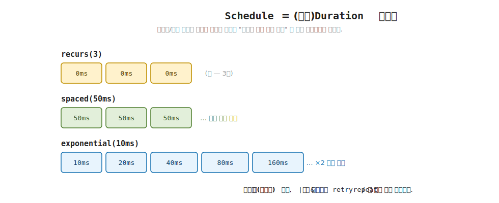
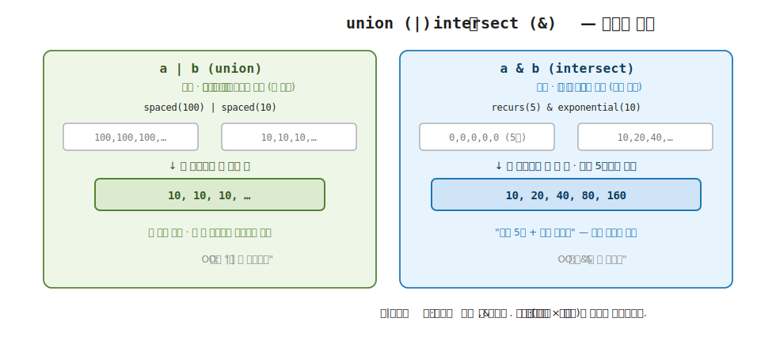

# 27장. Schedule — 재시도와 반복 (정책을 값으로)

> **이 장의 목표** — 이 장을 마치면 재시도와 반복의 정책을 비즈니스 로직에 흩지 않고 하나의 값으로 떼어낼 수 있습니다. 그 값이 `Schedule` 이고, "다음에 언제 다시 할지" 를 담은 (잠재적으로 무한한) `Duration` 스트림임을 직접 구현으로 확인합니다. 명령형의 재시도가 `for` 루프와 `Thread.Sleep` 과 카운터로 코드 곳곳에 흩어지던 자리를, `recurs` / `spaced` / `exponential` / `linear` 라는 정책 값과 union (`|`) / intersect (`&`) 합성으로 대신합니다. 이어 그 정책을 `retry` 와 `repeat` 로 7부 효과 위에 얹어, 효과 코드를 한 줄도 바꾸지 않고 재시도와 반복을 더하는 모습을 손계산으로 추적합니다. 26장의 `Eff<RT, A>` 가 효과를 값으로 다뤘으니, 그 위에 정책도 값으로 얹는 8부의 첫 도구입니다.

> **이 장의 핵심 어휘**
>
> - **`Schedule`**: 재시도나 반복을 "다음에 언제 다시 할지" 의 간격 스트림으로 담은 값, 잠재적으로 무한
> - **`Duration`**: 한 번의 대기 간격을 담은 값, `TimeSpan` 한 겹을 감싼 것
> - **`recurs` / `spaced` / `exponential` / `linear`**: 네 가지 정책 생성자, 횟수 / 고정 간격 / 지수 배가 / 선형 증가
> - **union (`|`)**: 두 정책을 합쳐 둘 중 **짧은** 간격을 고르고 한쪽이라도 남으면 계속하는 합성
> - **intersect (`&`)**: 두 정책을 합쳐 둘 중 **긴** 간격을 고르고 둘 다 남아야 계속하는 합성
> - **`retry`**: 효과가 실패하면 정책이 정한 간격대로 다시 시도하는 얹기
> - **`repeat`**: 효과가 성공하는 한 정책이 정한 횟수만큼 다시 부르는 얹기

> 이 장을 마치면 할 수 있게 되는 것
> - [ ] 재시도와 반복의 정책을 `if` / `loop` 가 아니라 합성 가능한 하나의 값으로 다룰 수 있습니다.
> - [ ] `Schedule` 이 잠재적으로 무한한 `Duration` 스트림임을 설명할 수 있습니다.
> - [ ] `recurs` / `spaced` / `exponential` / `linear` 네 생성자가 내는 간격 스트림을 손으로 펼칠 수 있습니다.
> - [ ] union (`|`) 과 intersect (`&`) 가 간격과 길이를 각각 어떻게 정하는지 표로 구분할 수 있습니다.
> - [ ] `recurs(5) & exponential(10ms)` 가 왜 "최대 5회 + 지수 백오프" 가 되는지 손계산으로 추적할 수 있습니다.
> - [ ] `retry` 가 효과 코드를 바꾸지 않고 정책만 얹는다는 것을 읽을 수 있습니다.
> - [ ] `retry` (실패 시 재시도) 와 `repeat` (성공 시 반복) 의 방향 차이를 설명할 수 있습니다.
> - [ ] `Schedule` 의 구조 법칙 다섯 가지가 union 과 intersect 의 의미를 어떻게 굳히는지 짚을 수 있습니다.

> **이 장의 흐름** — 명령형으로 재시도를 짜면 `for` 루프와 `Thread.Sleep` 과 시도 횟수 카운터가 비즈니스 로직 사이에 끼어든다는 불편에서 출발합니다. "언제 몇 번 다시 할지" 라는 정책이 코드 흐름에 박혀 있어 합성도 재사용도 테스트도 어려운 자리를 먼저 부딪힙니다. 그 불편을 푸는 한 수가 정책을 값으로 떼어내는 것이고, 그 값이 `Schedule`, 곧 간격의 스트림임을 봅니다. 네 생성자가 내는 스트림을 손으로 펼친 뒤, 두 정책을 합치는 union 과 intersect 가 간격과 길이를 각각 어떻게 정하는지 병합을 손계산합니다. 이어 그 정책을 실패하는 효과에 `retry` 로 얹어 효과 코드는 그대로 두고 재시도만 더하는 모습을 추적하고, 성공을 반복하는 `repeat` 와 견줍니다. 마지막으로 union 과 intersect 의 의미를 굳히는 구조 법칙 다섯을 확인하고, 정책이 값이기에 8부의 나머지 견고함 도구도 같은 식으로 효과 위에 얹힘을 짚습니다.

---

## 27.1 이 장에서 다루는 것 — 정책을 값으로

7부에서 효과를 값으로 인코딩했습니다. `IO<A>` 가 부수 효과를 `Run` 전까지 미뤄 둔 값이었고, 26장의 `Eff<RT, A>` 가 거기에 능력 주입까지 더한 값이었습니다. 효과가 값이 되자 테스트에서 갈아 끼우고, LINQ 로 합성하고, 법칙으로 검증할 수 있었습니다.

8부는 그 효과를 견고하게 (robust) 만드는 자리입니다. 실무의 효과는 값으로 인코딩되는 것만으로는 충분하지 않습니다. 네트워크 호출은 실패하면 다시 시도해야 하고, 파일 핸들은 예외가 나도 닫혀야 하며, 운영 환경에서는 효과가 무엇을 했는지 추적되어야 합니다. 이 견고함의 도구들은 모두 7부 효과를 바꾸지 않고 그 위에 조합으로 얹힙니다. 이 장이 다루는 첫 도구는 재시도와 반복입니다.

먼저 이 장의 도구가 무슨 일을 하는지 한 문장으로 잡습니다. 효과가 한 번에 성공하지 못할 때, 우리는 "언제 몇 번 다시 할지" 를 정해야 합니다. 곧바로 또 시도할지, 잠깐 쉬었다 할지, 쉬는 시간을 점점 늘릴지, 몇 번까지만 할지. 이 "언제 몇 번" 의 계획을 이 책은 재시도 정책이라 부르고, 그 정책을 하나의 값으로 담은 것이 `Schedule` 입니다. `Schedule` 은 다음에 다시 할 때까지 얼마나 기다릴지를 담은 간격들의 스트림입니다.

핵심은 그 정책이 코드 흐름이 아니라 값이라는 데 있습니다. 명령형에서 재시도는 `for` 루프와 카운터로 비즈니스 로직 사이에 끼어들지만, `Schedule` 은 효과와 따로 떨어진 데이터입니다. 떨어져 있으니 두 정책을 union (`|`) 이나 intersect (`&`) 로 합칠 수 있고, 이름을 붙여 재사용할 수 있고, 효과를 실행하지 않고도 그 정책만 따로 검증할 수 있습니다. 7부에서 효과가 값이 되어 누린 이득을, 정책도 값이 되어 그대로 누립니다.

지금 모든 것을 외우지 않아도 됩니다. 이 장이 끝날 때 손에 남는 것은 두 가지입니다. `Schedule` 이 간격의 스트림이라는 그림 하나와, 그 스트림을 union (`|`) 과 intersect (`&`) 로 합쳐 효과 위에 `retry` 로 얹는다는 발상 하나입니다. 이 장에 처음 나오는 어휘를 한 줄씩만 미리 짚어 둡니다. `Duration` 은 한 번의 대기 간격을 담은 값입니다. union (`|`) 은 두 정책 중 더 짧은 간격을 골라 더 자주 시도하게 합치는 자리, intersect (`&`) 는 더 긴 간격을 골라 더 뜸하게, 그리고 더 짧은 쪽 길이에서 멈추게 합치는 자리입니다. `retry` 는 실패하는 효과에 정책을 얹어 다시 시도하게 하고, `repeat` 는 성공하는 효과를 정책이 정한 횟수만큼 다시 부릅니다. 모두 본문에서 코드와 함께 다시 천천히 풀므로, 여기서는 이름과 한 줄 뜻만 스쳐 두면 됩니다.

---

## 27.2 왜 필요한가 — 명령형 재시도는 비즈니스 로직에 흩어집니다

`Schedule` 을 보이기 전에, 정책을 값으로 떼지 않고 명령형으로 재시도를 짜면 어디서 막히는지부터 부딪혀 봅니다. 추상을 먼저 보이지 않고 손에 잡히는 불편을 먼저 겪는 것이 이 장의 순서입니다.

원격 서비스를 부르는 효과 하나를 떠올립니다. 가끔 실패하니 최대 다섯 번까지, 점점 간격을 늘려 가며 다시 시도하고 싶습니다. 명령형으로 적으면 흔히 이렇게 됩니다.

```csharp
// 명령형 재시도 — 정책이 비즈니스 로직 사이에 흩어진다.
int attempt = 0;                              // ← 카운터 (정책의 일부)
int delayMs = 10;                             // ← 다음 대기 (정책의 일부)
while (true)
{
    var result = CallService();               // ← 진짜 하고 싶은 일
    if (result.IsSuccess) return result;

    attempt++;                                // ← 정책: 몇 번 했나
    if (attempt >= 5) return result;          // ← 정책: 몇 번까지
    Thread.Sleep(delayMs);                    // ← 정책: 얼마나 쉬나
    delayMs *= 2;                             // ← 정책: 간격을 어떻게 늘리나
}
```

이 코드는 돌아갑니다. 그러나 한 가지를 보면 불편이 드러납니다. 우리가 진짜 하고 싶은 일은 `CallService()` 한 줄인데, 그 한 줄을 둘러싼 여섯 줄이 전부 재시도 정책입니다. 카운터를 올리고, 최대 횟수를 견주고, 쉬고, 간격을 키우는 일이 비즈니스 로직과 같은 함수 안에 뒤섞여 있습니다.

이 뒤섞임이 세 가지 문제를 부릅니다. 첫째, 합성이 안 됩니다. "최대 다섯 번" 이라는 정책과 "지수로 간격을 늘림" 이라는 정책은 본디 서로 다른 두 규칙인데, 위 코드에서는 둘이 `while` 본문에 엉겨 붙어 따로 떼어낼 수가 없습니다. "이번엔 최대 세 번만" 으로 바꾸려면 비즈니스 로직이 든 함수를 직접 고쳐야 합니다. 둘째, 재사용이 안 됩니다. 다른 효과도 같은 "다섯 번 + 지수" 정책을 쓰고 싶으면, 이 여섯 줄을 그 효과 옆에 다시 적어야 합니다. 셋째, 테스트가 어렵습니다. 정책이 코드 흐름에 박혀 있어, "이 정책이 정말 1, 2, 4, 8, 16ms 로 쉬는가" 를 확인하려면 `CallService` 를 실제로 다섯 번 실패시키고 `Thread.Sleep` 이 도는 시간을 견뎌야 합니다.

객체 지향 개발자라면 이 자리에서 익숙한 도구가 떠오릅니다. .NET 의 재시도 라이브러리 Polly 입니다. `Policy.Handle<Exception>().WaitAndRetry(...)` 로 재시도 정책을 만들어 효과에 감싸 본 적이 있을 것입니다. 그 발상이 정확히 이 장이 하려는 일입니다. 정책을 비즈니스 로직에서 떼어내 하나의 객체로 만들고, 그 객체를 효과에 얹습니다. 다른 점은 하나입니다. Polly 가 정책을 빌더로 조립하는 객체로 본다면, 이 장은 정책을 더 단순하게 간격의 스트림이라는 값으로 봅니다. 값이라서 두 정책을 `|` 와 `&` 라는 연산자로 곧장 합칠 수 있습니다.

> **흔한 함정** — 재시도는 효과 안에서 처리해야 한다고 여기는 것입니다.
>
> 명령형 습관으로는 `CallService` 함수 안에 재시도 로직을 넣는 것이 자연스러워 보입니다. 그러면 한 함수가 "서비스를 부르는 일" 과 "실패하면 다시 부르는 일" 두 가지 책임을 함께 지게 됩니다. 7부에서 효과를 값으로 본 까닭이 여기서 다시 살아납니다. 효과가 값이면, "무엇을 하는가" (효과) 와 "실패하면 어떻게 다시 하는가" (정책) 를 따로 만들어 마지막에 합칠 수 있습니다. 재시도가 효과 안에 박히는 대신, 효과 위에 얹히는 별도의 값이 됩니다.

그래서 우리가 바라는 것은 분명합니다. "언제 몇 번 다시 할지" 라는 정책을 비즈니스 로직에서 떼어, 그 자체로 만들고 합치고 검증할 수 있는 값으로 다루고 싶습니다. 그러면 효과 코드는 "무엇을 하는가" 만 적고, 재시도는 정책 값을 얹는 것으로 끝납니다. 이 정책 값이 `Schedule` 입니다. 다음 절에서 그것이 어떤 모양인지 봅니다.

> **더 깊이 (처음엔 건너뛰어도 됩니다)** — 명령형 재시도가 숨기는 함정 하나를 정직하게 짚어 둡니다.
>
> 앞의 여섯 줄짜리 명령형 코드는 `while (true)` 안에서 `Thread.Sleep(delayMs)` 로 호출 스레드를 통째로 멈춥니다. 동기 코드라면 그 스레드가 다섯 번의 대기 동안 아무 일도 못 합니다. ASP.NET 요청 스레드라면 풀의 스레드 하나가 그만큼 묶이고, UI 스레드라면 화면이 멈춥니다. 그래서 실무의 비동기 재시도는 `await Task.Delay(delayMs)` 를 써 스레드를 돌려주는데, 그러면 위 카운터 코드는 `async` 메서드 안으로 옮겨 가며 다시 비즈니스 로직과 엉깁니다. 정책이 코드 흐름에 박혀 있는 한, 동기냐 비동기냐가 바뀔 때마다 그 흐름을 손대야 합니다. 정책을 `Schedule` 값으로 떼어 두면 "얼마나 쉴지" 는 데이터로 남고, "어떻게 쉴지" (`Thread.Sleep` 이냐 `Task.Delay` 냐) 는 그 값을 얹는 `retry` 쪽 한 곳에서만 정합니다. 이 경계는 retry 를 얹는 절에서 `delays` 리스트로 다시 또렷해집니다.

---

## 27.3 Schedule = Duration 스트림 — 정책을 펼치다

이제 정책을 값으로 담는 모양을 봅니다. 핵심 발상은 한 문장입니다. 재시도 정책이란 "다음에 다시 할 때까지 얼마나 기다릴지" 의 목록이라는 것입니다. 첫 재시도 전엔 10ms, 그다음엔 20ms, 그다음엔 40ms. 이 간격들을 차례로 늘어놓은 스트림이 곧 정책입니다.

그래서 두 타입이면 충분합니다. 하나는 한 번의 대기 간격을 담는 `Duration`, 다른 하나는 그 간격들을 늘어놓은 `Schedule` 입니다. `Duration` 부터 봅니다.

```csharp
// Duration — 한 번의 대기 간격.
public readonly record struct Duration(TimeSpan Span)
{
    public static Duration Ms(double ms) => new(TimeSpan.FromMilliseconds(ms));
    public static Duration Zero => new(TimeSpan.Zero);
    public double TotalMs => Span.TotalMilliseconds;
    public override string ToString() => $"{TotalMs}ms";
}
```

`Duration` 은 `TimeSpan` 한 겹을 감싼 값입니다. `Ms(10)` 으로 10ms 간격을 만들고, `Zero` 로 "기다리지 않음" 을 나타내며, `ToString` 은 `10ms` 처럼 찍습니다. 한 번 쉬는 시간 하나를 담는 작은 값일 뿐입니다.

`Schedule` 은 그 간격들의 스트림입니다.

```csharp
// Schedule — (잠재적으로 무한한) Duration 스트림.
// "다음에 언제 다시 시도/반복할지" 를 기술한다.
public sealed class Schedule(IEnumerable<Duration> durations)
{
    public IEnumerable<Duration> Durations => durations;
    // ...
}
```

`Schedule` 의 속은 `IEnumerable<Duration>` 하나입니다. 곧 정책의 정체는 간격의 나열입니다. 한 가지 짚어 둘 것이 있습니다. 이 스트림은 잠재적으로 무한합니다. "10ms 간격으로 영원히 다시 시도" 같은 정책은 끝이 없는 간격 목록이기 때문입니다. `IEnumerable` 이라 게으르게 (lazy) 평가되어, 실제로 꺼낸 만큼만 만들어집니다. 4부에서 `MySeq` 의 무한 스트림을 `Take` 로 잘라 쓰던 그 발상 그대로입니다. 무한해도 앞 몇 개만 꺼내 보면 됩니다.

이제 정책 생성자 넷을 봅니다. 각각이 어떤 간격 스트림을 내는지가 정책의 종류를 정합니다.

```csharp
public static Schedule Recurs(int times) =>
    new(Enumerable.Repeat(Duration.Zero, Math.Max(0, times)));   // Zero 가 times 개
public static Schedule Spaced(Duration d) => new(Repeat(d));     // d 가 무한히
public static Schedule Exponential(Duration first) => new(Exp(first));   // first, ×2, ×2, ...
public static Schedule Linear(Duration step) => new(Lin(step));  // step, +step, +step, ...
public static Schedule Once => Recurs(1);                        // Zero 한 개
```

네 생성자의 뜻을 한 줄씩 짚습니다. `Recurs(n)` 은 "다시 할 때까지 안 쉬고, 다만 n 번까지만" 을 뜻해 간격 `Zero` 가 정확히 n 개입니다. `Spaced(d)` 는 "늘 d 만큼 쉬며 끝없이" 라 d 가 무한히 이어집니다. `Exponential(first)` 는 "쉬는 시간을 매번 두 배로" 라 `first` 에서 시작해 곱하기 2 로 배가됩니다. `Linear(step)` 은 "쉬는 시간을 매번 step 만큼 더" 라 `step` 의 1배, 2배, 3배로 늘어납니다.

> **새 어휘 — 백오프 (backoff)** 재시도 사이의 대기 시간을 점점 늘리는 전략을 백오프라 부릅니다. 실패가 잦으면 더 오래 쉬어 상대 서비스에 부담을 덜 주는 발상입니다. `Exponential` 은 그 대기를 두 배씩 늘리는 지수 백오프, `Linear` 는 일정량씩 늘리는 선형 백오프입니다.

> **더 깊이 (처음엔 건너뛰어도 됩니다)** — 학습용 생성자 넷은 LanguageExt v5 의 단순화판입니다.
>
> v5 의 `Schedule.exponential` 은 시그니처가 `exponential(Duration seed, double factor = 2)` 입니다. 곧 배수가 2 로 고정된 것이 아니라 기본값이 2 일 뿐이라, `exponential(10*ms, factor: 1.5)` 처럼 1.5 배씩 늘리는 백오프도 한 줄로 만듭니다. `linear` 도 `linear(Duration seed, double factor = 1)` 이라 기울기를 조절합니다. 거기에 v5 에는 학습용에 없는 `fibonacci(seed)` 도 있습니다. 대기를 1, 1, 2, 3, 5, 8 처럼 직전 둘의 합으로 늘리는 백오프로, 지수만큼 급하지 않으면서 선형보다는 빠르게 물러서는 절충입니다. 입문 단계에서는 배수 2 의 지수와 선형 둘만 손에 익히면 충분하고, 배수 조절과 피보나치는 같은 발상의 변주라고만 알아 두면 됩니다.

내부 생성기를 보면 무한 스트림이 어떻게 게으르게 만들어지는지 드러납니다. `yield return` 이 핵심입니다.

```csharp
static IEnumerable<Duration> Exp(Duration first)
{
    var cur = first.TotalMs;
    while (true) { yield return Duration.Ms(cur); cur *= 2; }   // 영원히, 매번 두 배
}
```

`while (true)` 라 끝이 없지만, `yield return` 이라 한 번 꺼낼 때마다 하나씩만 계산됩니다. `Exp(10ms)` 를 만들어도 그 자리에서 무한 루프가 도는 것이 아니라, 누군가 첫 간격을 물으면 그제야 10ms 를 내고 멈춰 다음 물음을 기다립니다. 이 게으름 덕분에 무한 정책을 값으로 들고 다닐 수 있습니다.

`Lin` 도 같은 모양입니다. 시작값에서 매번 같은 양을 더해 갑니다.

```csharp
static IEnumerable<Duration> Lin(Duration step)
{
    var cur = step.TotalMs;
    while (true) { yield return Duration.Ms(cur); cur += step.TotalMs; }   // 영원히, 매번 step 더
}
```

`Exp` 와 한 곳만 다릅니다. `Exp` 는 `cur *= 2` 로 곱하고, `Lin` 은 `cur += step` 으로 더합니다. 곱하기와 더하기 한 글자 차이가 지수 백오프와 선형 백오프를 가릅니다. `Lin(10ms)` 를 펼치면 10, 20, 30, 40 으로 일정량씩 늘고, `Exp(10ms)` 는 10, 20, 40, 80 으로 배가됩니다. 같은 앞 두 개 (10, 20) 만 보면 분간이 안 되지만, 셋째에서 30 과 40 으로 갈라집니다. 백오프의 모양은 이 셋째 걸음부터 드러납니다.

데모는 세 정책의 앞 몇 개를 펼쳐 보입니다. 펼치는 함수 `Show(s, n)` 은 스트림에서 `n` 개를 꺼내 찍고, 더 있으면 `, ...` 를 붙입니다.

```csharp
Console.WriteLine($"  recurs(3)         = {Show(Schedule.Recurs(3), 5)}");
Console.WriteLine($"  spaced(50ms)      = {Show(Schedule.Spaced(Duration.Ms(50)), 3)}");
Console.WriteLine($"  exponential(10ms) = {Show(Schedule.Exponential(Duration.Ms(10)), 5)}");
```

각 정책의 스트림을 손으로 펼쳐 봅니다. 무한 정책은 앞 몇 개만 봅니다.

```
recurs(3)          : Zero 를 3 개          → [0ms, 0ms, 0ms]                       (끝)
spaced(50ms)       : 50ms 를 무한히        → [50ms, 50ms, 50ms, ...]
exponential(10ms)  : 10ms 에서 ×2 무한히   → [10ms, 20ms, 40ms, 80ms, 160ms, ...]
                                              └ 10 → 20 → 40 → 80 → 160 (매번 두 배)
```

데모 출력은 이 펼침과 그대로 맞습니다.

```
  recurs(3)         = [0ms, 0ms, 0ms]
  spaced(50ms)      = [50ms, 50ms, 50ms, ...]
  exponential(10ms) = [10ms, 20ms, 40ms, 80ms, 160ms, ...]
```

`recurs(3)` 은 간격이 셋뿐이라 `, ...` 가 붙지 않습니다. 끝이 있는 정책입니다. 한편 `recurs` 의 간격이 모두 `0ms` 인 점을 한 줄 짚어 둡니다. `recurs(3)` 에서 정해지는 것은 "세 번" 이라는 횟수이지 대기 시간이 아닙니다. 대기는 `spaced` 나 `exponential` 같은 다른 정책이 정하고, `recurs` 는 다음 절에서 그 정책과 합쳐져 "몇 번까지" 만 담당하게 됩니다.



**그림 27-1. `Schedule` = (무한) `Duration` 스트림** — 재시도/반복 정책을 명령형 루프가 아니라 "다음에 언제 다시 할지" 를 담은 간격의 스트림으로 봅니다. `recurs(3)` 은 간격 0이 3개, `spaced(50ms)` 는 50ms 가 무한히, `exponential(10ms)` 는 10·20·40ms 로 배가됨을 나란히 보입니다.

> **미리보기** — 무한 정책을 효과에 얹으면 영원히 도는 것 아닌가 궁금할 수 있습니다.
>
> `spaced(50ms)` 나 `exponential(10ms)` 는 간격이 무한해 보이지만, 실제 재시도는 두 자리에서 멈춥니다. 효과가 성공하면 곧장 멈추고, 또 다음 절에서 보듯 `recurs(5)` 같은 끝 있는 정책과 합치면 길이가 잘립니다. 무한은 "성공할 때까지, 또는 합친 정책이 끊을 때까지" 를 뜻하지 정말로 끝없이 돈다는 뜻이 아닙니다. 무한 스트림이 게으르다는 것이 이를 받쳐 줍니다. 꺼낸 만큼만 만들어지니, 다섯 개만 꺼내 쓰면 여섯째는 계산조차 되지 않습니다.

---

## 27.4 union (`|`) 과 intersect (`&`) — 두 정책을 합치다

정책 하나만으로는 실무가 요구하는 모양이 잘 안 나옵니다. "지수로 간격을 늘리되 최대 다섯 번까지" 같은 정책은 두 규칙의 결합입니다. 간격을 정하는 `exponential` 과 횟수를 정하는 `recurs` 를 합쳐야 합니다. 이 합치는 자리가 union (`|`) 과 intersect (`&`) 입니다.

두 합성의 발상을 먼저 잡습니다. 두 정책을 나란히 놓고 한 걸음씩 함께 걷는다고 봅니다. 매 걸음에서 두 가지를 정해야 합니다. 이번 간격을 둘 중 어느 쪽으로 할지, 그리고 한쪽 정책이 끝났을 때 계속 걸을지 멈출지. union 과 intersect 는 이 두 물음에 정반대로 답합니다.

- **union (`|`)** 은 "둘 중 하나라도 살아 있으면 계속" 입니다. 더 너그럽게 오래 걷습니다. 간격은 둘 중 **짧은** 쪽을 골라 더 자주 시도합니다.
- **intersect (`&`)** 은 "둘 다 살아 있어야 계속" 입니다. 더 깐깐하게, 먼저 끝나는 쪽에서 멈춥니다. 간격은 둘 중 **긴** 쪽을 골라 더 뜸하게 시도합니다.

한 표로 정리하면 두 축 (간격 선택 × 길이 결정) 의 대비가 또렷합니다.

| 합성 | 간격 선택 | 길이 (언제 멈추나) | 한 줄 |
|---|---|---|---|
| union (`\|`) | 둘 중 **짧은** 간격 | 둘 중 **긴** 쪽까지 (하나라도 남으면 계속) | 더 자주, 더 오래 |
| intersect (`&`) | 둘 중 **긴** 간격 | 둘 중 **짧은** 쪽까지 (둘 다 남아야 계속) | 더 뜸하게, 더 짧게 |

코드에서 둘은 같은 병합 함수 `Merge` 를 쓰되, `min` 플래그 하나로 갈립니다.

```csharp
public Schedule Union(Schedule other) => new(Merge(Durations, other.Durations, min: true));
public Schedule Intersect(Schedule other) => new(Merge(Durations, other.Durations, min: false));

public static Schedule operator |(Schedule a, Schedule b) => a.Union(b);
public static Schedule operator &(Schedule a, Schedule b) => a.Intersect(b);
```

`|` 가 `Union`, `&` 가 `Intersect` 의 연산자 이름입니다. C# 의 비트 연산자를 정책 합성에 빌려 와, `recurs(5) & exponential(10ms)` 처럼 두 정책을 한 줄로 합칩니다. 병합 함수 `Merge` 가 두 갈래를 어떻게 도는지 봅니다.

```csharp
static IEnumerable<Duration> Merge(IEnumerable<Duration> xs, IEnumerable<Duration> ys, bool min)
{
    using var ex = xs.GetEnumerator();
    using var ey = ys.GetEnumerator();
    var hx = ex.MoveNext();           // x 에 다음 간격이 있나
    var hy = ey.MoveNext();           // y 에 다음 간격이 있나
    while (true)
    {
        if (hx && hy)                 // 둘 다 살아 있으면
        {
            var d = min               // union 이면 짧은 간격, intersect 면 긴 간격
                ? (ex.Current.TotalMs <= ey.Current.TotalMs ? ex.Current : ey.Current)
                : (ex.Current.TotalMs >= ey.Current.TotalMs ? ex.Current : ey.Current);
            yield return d;
            hx = ex.MoveNext();
            hy = ey.MoveNext();
        }
        else if (min && hx) { yield return ex.Current; hx = ex.MoveNext(); }  // union: x 만 남아도 계속
        else if (min && hy) { yield return ey.Current; hy = ey.MoveNext(); }  // union: y 만 남아도 계속
        else yield break;             // intersect: 한쪽이라도 끝나면 멈춤
    }
}
```

두 enumerator 를 나란히 두고 한 걸음씩 함께 `MoveNext` 합니다. 둘 다 살아 있을 때 (`hx && hy`) 는 `min` 에 따라 짧은 / 긴 간격을 골라 냅니다. 갈림은 한쪽이 끝났을 때입니다. union (`min == true`) 은 남은 한쪽을 계속 냅니다 (`else if (min && hx)` 두 줄). intersect (`min == false`) 는 그 두 줄을 건너뛰고 곧장 `yield break` 로 멈춥니다. 그래서 union 길이는 긴 쪽까지, intersect 길이는 짧은 쪽에서 끊깁니다.

OO 직감으로 다리를 놓으면, intersect 는 두 조건을 모두 만족해야 통과하는 `&&` 게이트, union 은 하나만 만족해도 통과하는 `||` 게이트에 가깝습니다. 길이를 "둘 다 통과 (`&`) vs 하나라도 통과 (`|`)" 로 보면 비트 연산자 기호가 자연스럽게 읽힙니다.

이제 이 장의 대표 합성, `recurs(5) & exponential(10ms)` 가 왜 "최대 5회 + 지수 백오프" 가 되는지 손으로 따라갑니다. 두 스트림을 나란히 놓고 intersect (긴 간격, 짧은 쪽 길이) 로 걷습니다.

```
recurs(5)       : [ 0ms,  0ms,  0ms,  0ms,  0ms ]   (간격은 모두 0, 길이는 5 — 끝)
exponential(10) : [10ms, 20ms, 40ms, 80ms,160ms, 320ms, ... ]   (간격은 지수, 무한)

intersect (&) — 매 걸음 max(둘) 간격, 둘 다 살아 있어야 계속:
  걸음 1: max(0,  10)  = 10ms     (둘 다 살아 있음)
  걸음 2: max(0,  20)  = 20ms
  걸음 3: max(0,  40)  = 40ms
  걸음 4: max(0,  80)  = 80ms
  걸음 5: max(0, 160)  = 160ms
  걸음 6: recurs(5) 가 소진 → 한쪽이 끝남 → yield break (멈춤)

결과 = [10ms, 20ms, 40ms, 80ms, 160ms]   (길이 5, 간격은 지수)
```

두 축이 한눈에 보입니다. 간격은 매 걸음 `max(0, 지수) = 지수` 라 지수 백오프가 그대로 살고, 길이는 `recurs(5)` 가 다섯 걸음 만에 끊어 "최대 5회" 가 됩니다. 곧 `recurs(5)` 가 "몇 번까지" 를, `exponential(10ms)` 가 "얼마나 쉬며" 를 맡아, 둘을 intersect 로 합치니 "최대 5회 + 지수 백오프" 한 정책이 됩니다. 데모는 여덟 개까지 꺼내려 해도 다섯에서 끝남을 보입니다.

여기서 한 가지가 게으름과 맞물려 미묘합니다. 데모의 `Show(capped, 8)` 은 여덟 개를 꺼내 달라고 요청하지만, intersect 의 스트림은 다섯째 다음 걸음에서 `yield break` 합니다. 곧 여섯째 간격은 요청받았어도 계산되지 않습니다. `recurs(5)` 의 여섯째 `MoveNext` 가 `false` 를 돌려주는 순간 `exponential` 의 여섯째 (320ms) 는 물어보지도 않고 멈추기 때문입니다. 무한 정책을 끝 있는 정책과 intersect 하면, 무한 쪽은 딱 필요한 만큼만 펼쳐집니다. 이것이 무한 스트림을 값으로 들고 다녀도 안전한 까닭입니다.

```
  recurs(5) & exponential(10ms) = [10ms, 20ms, 40ms, 80ms, 160ms]   (최대 5회 + 지수 백오프)
```

union 도 한 예로 견줍니다. 두 고정 간격을 `|` 로 합치면 짧은 쪽이 이깁니다.

```
spaced(100ms) : [100ms, 100ms, 100ms, ...]   (무한)
spaced(10ms)  : [ 10ms,  10ms,  10ms, ...]   (무한)

union (|) — 매 걸음 min(둘) 간격:
  걸음마다 min(100, 10) = 10ms

결과 = [10ms, 10ms, 10ms, ...]   (둘 중 짧은 간격, 길이는 둘 다 무한이라 무한)
```

데모 출력은 다음과 같습니다.

```
  spaced(100) | spaced(10)      = [10ms, 10ms, 10ms, ...]   (둘 중 짧은 간격)
```

> **흔한 함정** — `&` 가 길이를 늘리고 `|` 가 줄인다고 거꾸로 외우는 것입니다.
>
> 직관과 어긋나 헷갈리기 쉬운 자리입니다. intersect (`&`) 는 "둘 다 만족" 이라 더 깐깐한데, 그 깐깐함이 길이를 **줄입니다** (먼저 끝나는 쪽에서 멈춤). union (`|`) 은 "하나라도 만족" 이라 더 너그러워 길이를 **늘립니다** (둘 다 끝나야 멈춤). 간격은 그 반대로 움직입니다. `&` 는 더 긴 간격 (더 오래 쉼), `|` 는 더 짧은 간격 (더 자주 시도). 외우는 대신 "둘 다 살아 있어야 계속하나 (`&`), 하나라도 살아 있으면 계속하나 (`|`)" 한 물음으로 돌아가면 길이와 간격이 동시에 풀립니다.

union 의 길이 결정도 손으로 한 번 봅니다. 간격은 앞서 짧은 쪽으로 정해졌으니, 이번엔 한쪽이 먼저 끝났을 때 union 이 어떻게 남은 쪽을 마저 내는지가 핵심입니다. 끝 있는 정책과 무한 정책을 `|` 로 합쳐 봅니다.

```
recurs(2)     : [  0ms,   0ms ]                        (길이 2 — 끝)
spaced(50ms)  : [ 50ms,  50ms,  50ms,  50ms, ... ]     (무한)

union (|) — 둘 다 살아 있으면 min, 한쪽이 끝나면 남은 쪽을 마저:
  걸음 1: 둘 다 살아 있음 → min(0, 50)  = 0ms
  걸음 2: 둘 다 살아 있음 → min(0, 50)  = 0ms
  걸음 3: recurs(2) 소진 → spaced 만 남음 → 50ms     (union 은 멈추지 않음)
  걸음 4: spaced 만 남음 → 50ms
  걸음 5: spaced 만 남음 → 50ms ...

결과 = [0ms, 0ms, 50ms, 50ms, 50ms, ...]   (앞 둘은 min, 그 뒤는 남은 spaced, 길이는 무한)
```

걸음 3 이 union 의 성격을 그대로 보입니다. `recurs(2)` 가 두 걸음에 소진돼도 union 은 `yield break` 하지 않고, `else if (min && hy)` 가지로 들어가 남은 `spaced` 를 계속 냅니다. 그래서 길이가 무한이 됩니다. 같은 자리를 intersect 로 합쳤다면 걸음 3 에서 곧장 멈춰 길이 2 에서 끊겼을 것입니다. 길이를 정하는 것은 "한쪽이 끝났을 때 멈추나 마저 내나" 한 갈래뿐이고, 그 갈래가 코드의 `else if (min && ...)` 두 줄에 그대로 담겨 있습니다.



**그림 27-2. `union (|)` 대 `intersect (&)`: 스케줄 합성** — 두 스케줄을 합칠 때 `union` 은 둘 중 *짧은* 간격을 고르고 한쪽이라도 남으면 계속하며(더 자주·더 길게), `intersect` 는 둘 중 *긴* 간격을 고르고 둘 다 남아야 계속합니다(더 뜸하게·더 짧게). `recurs(5) & exponential` 이 "최대 5회 + 지수 백오프" 가 되는 까닭을 보입니다.

> **더 깊이 (처음엔 건너뛰어도 됩니다)** — v5 에는 합치는 길이 셋이 더 있습니다.
>
> 학습용은 두 정책을 합치는 길로 union (`|`) 과 intersect (`&`) 둘만 둡니다. v5 의 `Schedule` 에는 같은 "정책 둘을 하나로" 자리에 길이 더 있습니다. `Combine` (`+`) 은 두 정책을 차례로 이어 붙입니다. 앞 정책을 다 펼친 뒤 뒤 정책으로 넘어가, "처음 세 번은 빠르게, 그 뒤로는 느리게" 같은 단계 정책을 만듭니다. 이 장 직접 해보기의 `BurstThenSpaced` 가 `IEnumerable.Concat` 으로 손수 짠 것이 바로 v5 `Combine` 의 모양입니다. `Interleave` 는 두 정책의 간격을 번갈아 엮습니다. 그리고 v5 는 시간 정책의 간격에 상한을 씌우는 변환자도 둡니다. `maxDelay(2000*ms)` 는 아무리 지수로 커져도 한 간격이 2초를 넘지 않게 자르고, `maxCumulativeDelay` 는 누적 대기가 한도에 닿으면 정책을 멈춥니다. union·intersect 가 두 정책을 나란히 걷게 한다면, 이들은 한 정책의 간격 자체를 다듬는 자리입니다. 입문 단계에서는 "합치는 길은 union·intersect 둘만 익히고, 잇기·상한은 같은 발상의 이웃" 으로 두면 됩니다.

---

## 27.5 retry 얹기 — 효과를 바꾸지 않고 정책만 더하다

정책을 값으로 만들었으니, 이제 그 값을 효과 위에 얹습니다. 얹는 자리가 `retry` 입니다. 핵심은 효과 코드가 한 줄도 바뀌지 않는다는 것입니다. 효과는 "무엇을 하는가" 만 알고, 재시도는 정책 값을 옆에서 얹습니다.

이 장의 효과는 7부의 무거운 타입 대신 가벼운 모양으로 둡니다. 효과를 `Func<Fin<A>>`, 곧 "부르면 성공이나 실패를 내는 함수" 로 봅니다. `Fin<A>` 는 24장에서 본 효과 결과의 축소판입니다.

```csharp
// 효과 결과 (24장 Fin 축소판).
public abstract record Fin<A>
{
    public sealed record Succ(A Value) : Fin<A> { /* 성공 */ }
    public sealed record Fail(Error Error) : Fin<A> { /* 실패 */ }
}
```

`Fin<A>` 는 `Succ` (성공, 값을 품음) 와 `Fail` (실패, 오류를 품음) 둘 중 하나입니다.  여기서 `Error` 는 24장에서 본 오류 메시지를 담은 값입니다. 24장에서 예외를 값으로 다룬 그 발상 그대로, 실패도 던지는 것이 아니라 값으로 돌려줍니다. `retry` 는 이 `Fail` 을 보고 다시 시도할지 정합니다.

`RetryFin` 이 정책을 효과에 얹는 함수입니다.

```csharp
public static (Fin<A> Result, int Attempts, List<double> Delays) RetryFin<A>(
    Func<Fin<A>> action, Schedule schedule)
{
    var delays = new List<double>();
    var result = action();            // 최초 1회
    var attempts = 1;
    if (result is Fin<A>.Succ) return (result, attempts, delays);   // 곧장 성공이면 끝

    foreach (var d in schedule.Durations)   // 실패면 정책의 간격대로
    {
        delays.Add(d.TotalMs);        // 실무: Thread.Sleep(d.Span)
        result = action();            // 다시 시도
        attempts++;
        if (result is Fin<A>.Succ) break;    // 성공하면 멈춤
    }
    return (result, attempts, delays);
}
```

본체를 한 호흡으로 읽습니다. 먼저 `action()` 을 한 번 부릅니다. 곧장 성공이면 (`Succ`) 정책을 펼치지 않고 끝납니다. 실패면 `schedule.Durations` 를 `foreach` 로 돕니다. 정책의 간격마다 다시 `action()` 을 부르고, 성공이 나오면 `break` 로 멈춥니다. 정책이 소진되도록 성공하지 못하면 마지막 실패를 그대로 돌려줍니다. 반환은 셋입니다. 최종 결과, 시도 횟수, 그리고 재시도 사이에 쓴 간격 목록입니다.

반환 타입이 튜플 셋 (`Fin<A>` · `int` · `List<double>`) 인 것도 학습용의 선택입니다. 실무의 `retry` 는 보통 효과 하나만 돌려줍니다. 곧 "재시도까지 더해진 더 큰 효과" 가 같은 `Eff<RT, A>` 타입으로 나와, 호출 측은 재시도가 얹혔는지 모른 채 평소처럼 합성합니다. 학습 데모가 시도 횟수와 간격 목록까지 함께 돌려주는 까닭은 하나입니다. 정책이 정말 몇 번 돌고 어떤 간격을 썼는지 눈으로 확인하고 단언하려는 것입니다. 효과 위에 얹어도 타입이 그대로라는 점이 7부에서 본 합성의 핵심이고, 학습 데모는 그 합성 대신 검증을 위해 속을 펼쳐 보입니다.

여기서 추상화의 경계 하나를 분명히 짚어 둡니다. `delays.Add(d.TotalMs)` 줄의 주석이 `실무: Thread.Sleep(d.Span)` 라고 밝힙니다. 실무의 `retry` 는 정책이 정한 `Duration` 만큼 실제로 `Thread.Sleep` 이나 `Task.Delay` 로 잠듭니다. 이 학습 데모는 잠드는 대신 그 간격을 `delays` 리스트에 기록만 합니다. 곧 `delays` 의 값들은 실제로는 "잠드는 시간" 입니다. 데모가 간격을 기록만 하는 까닭은 하나입니다. 정책이 정말 1, 2, 4, 8ms 를 내는지 확인하는 데 실제로 그 시간을 견딜 필요가 없고, 리스트를 단언하면 충분하기 때문입니다. 정책이 값이라 실행 없이도 검증된다는 27.2 의 바람이 여기서 그대로 이뤄집니다.

> **더 깊이 (처음엔 건너뛰어도 됩니다)** — 실무의 `retry` 는 이 자리에서 스레드를 돌려줍니다.
>
> 학습용 `RetryFin` 은 `delays.Add(d.TotalMs)` 로 간격을 기록만 하지만, 7부의 효과 위에 얹히는 v5 의 `retry` 는 그 자리에서 정책이 정한 `Duration` 만큼 실제로 비동기 대기합니다. `Eff<RT, A>` 가 `ReaderT<RT, IO, A>` 라, 대기 역시 `IO` 의 비동기 경로로 이뤄져 호출 스레드를 점유하지 않습니다. 곧 `await` 한 번이 `Task.Delay` 처럼 스레드를 풀로 돌려주고, 정한 시간이 지나면 다시 효과를 부릅니다. 학습 데모가 대기를 생략하는 까닭은 정책 검증에 실제 시간이 필요 없어서이지, 실무에서 대기가 빠진다는 뜻은 아닙니다. 정책이 값이라 "얼마나 쉴지" (`Schedule`) 와 "어떻게 쉴지" (효과 타입의 비동기 대기) 가 깨끗이 갈라진다는 점만 7부와 이어 두면 됩니다.

이제 실패하는 효과에 정책을 얹어 봅니다. `Flaky` 는 세 번째 시도에서야 성공하는 효과입니다.

```csharp
var attempt = 0;
Fin<int> Flaky()
{
    attempt++;
    return attempt >= 3 ? new Fin<int>.Succ(42) : new Fin<int>.Fail(new Error($"{attempt}번째 실패"));
}
var (result, attempts, delays) = Retry.RetryFin(Flaky, capped);   // capped = recurs(5) & exponential(10ms)
```

앞 절에서 만든 `capped` (= `recurs(5) & exponential(10ms)`, 간격 `[10, 20, 40, 80, 160]`) 를 얹습니다. 무슨 일이 일어나는지 손으로 따라갑니다. 좇을 것은 셋입니다. 시도 횟수 `attempts`, 기록된 간격 `delays`, 그리고 `Flaky` 가 몇 번째에 성공하는가입니다.

```
capped 의 간격 = [10, 20, 40, 80, 160]

RetryFin(Flaky, capped)
  ├ 최초 호출: Flaky() → attempt=1 → Fail("1번째 실패")   attempts=1, delays=[]
  │   (Succ 아님 → 정책 펼침 시작)
  ├ 간격 10ms 기록 → Flaky() → attempt=2 → Fail("2번째 실패")   attempts=2, delays=[10]
  ├ 간격 20ms 기록 → Flaky() → attempt=3 → Succ(42)            attempts=3, delays=[10, 20]
  │   (Succ → break)
  └ 결과 = Succ(42)

결과 = Succ(42),  시도 횟수 = 3,  사용된 간격 = [10, 20]
```

한 가지가 또렷해집니다. 시도는 세 번인데 기록된 간격은 둘입니다. 간격은 재시도 **사이**에만 쓰이기 때문입니다. 최초 1회는 간격 없이 곧장 부르고, 그 뒤 두 번의 재시도 앞에서만 10ms, 20ms 를 씁니다. `Flaky` 가 세 번째에 성공했으니 정책의 나머지 간격 (`40, 80, 160`) 은 꺼내지도 않았습니다. 무한 정책이었어도 마찬가지로 성공한 자리에서 멈춥니다. 데모 출력은 이 추적과 그대로 맞습니다.

```
  결과 = Succ(42), 시도 횟수 = 3, 사용된 간격 = [10, 20]
```

이 자리에서 이 장의 핵심이 손에 잡힙니다. `Flaky` 효과 코드 어디에도 재시도 로직이 없습니다. `attempt++` 도, 최대 횟수 견줌도, 간격 키움도 없습니다. 그 모든 정책은 `capped` 라는 값에 담겨 옆에서 얹혔습니다. 27.2 의 명령형 재시도가 여섯 줄을 비즈니스 로직에 뒤섞었다면, 여기서는 효과 (`Flaky`) 와 정책 (`capped`) 이 깨끗이 갈라져 `RetryFin` 한 줄에서 만납니다. 효과를 바꾸지 않고 정책만 얹는다는 것이 이 뜻입니다.

---

## 27.6 repeat — 성공을 반복하다

`retry` 가 실패에 대응하는 얹기라면, 같은 발상의 반대 방향이 `repeat` 입니다. `retry` 는 효과가 **실패하는 한** 다시 시도하지만, `repeat` 는 효과가 **성공하는 한** 정책이 정한 횟수만큼 다시 부릅니다. 둘 다 정책을 효과에 얹지만, 다시 부르는 조건이 정반대입니다.

언제 `repeat` 가 필요한가 한 문장으로 잡습니다. 같은 효과를 정해진 횟수만큼 되풀이하고 싶을 때입니다. 폴링 (polling) 으로 상태를 여러 번 확인하거나, 같은 작업을 N 번 실행해 결과를 모으는 자리입니다.  명령형이라면 `for` 로 N 번 돌려 리스트에 모으던 자리입니다. 이때 "몇 번 되풀이할지" 가 곧 정책이고, `Schedule` 의 길이가 그 횟수를 정합니다.

`RepeatCollect` 가 성공을 반복하며 결과를 모읍니다.

```csharp
public static List<A> RepeatCollect<A>(Func<A> action, Schedule schedule)
{
    var results = new List<A> { action() };   // 최초 1회
    foreach (var _ in schedule.Durations)      // 정책 길이만큼 더
        results.Add(action());
    return results;
}
```

본체를 읽습니다. 먼저 `action()` 을 한 번 불러 결과를 담습니다 (최초 1회). 그다음 `schedule.Durations` 를 도는데, 여기서는 간격 값 자체를 쓰지 않고 (`foreach (var _ in ...)`) 정책의 **길이**만 셉니다. 정책에 간격이 N 개면 N 번 더 부릅니다. 곧 `repeat` 에서 `Schedule` 은 "얼마나 쉬나" 보다 "몇 번 더 하나" 를 정하는 자리입니다. 그래서 `Recurs(n)` 처럼 길이가 곧 횟수인 정책이 자연스럽게 맞습니다.

데모는 카운터를 네 번 더 반복합니다.

```csharp
var tick = 0;
var collected = Retry.RepeatCollect(() => ++tick, Schedule.Recurs(4));
```

`++tick` 은 부를 때마다 1 씩 오르는 효과입니다. `Recurs(4)` 를 얹어 손으로 따라갑니다.

```
recurs(4) 의 길이 = 4

RepeatCollect(() => ++tick, recurs(4))
  ├ 최초 1회: ++tick → 1      results = [1]
  ├ 간격 1개째: ++tick → 2     results = [1, 2]
  ├ 간격 2개째: ++tick → 3     results = [1, 2, 3]
  ├ 간격 3개째: ++tick → 4     results = [1, 2, 3, 4]
  └ 간격 4개째: ++tick → 5     results = [1, 2, 3, 4, 5]

결과 = [1, 2, 3, 4, 5]   (최초 1 + 4회)
```

최초 1회에 정책 길이 4회를 더해 모두 다섯 번 불렀습니다.

`retry` 와 한자리에 두고 보면 두 손계산이 거울처럼 마주 섭니다. `retry` 의 `Flaky` 추적에서는 정책이 다섯 걸음을 펼칠 수 있어도 세 번째 성공에서 멈췄습니다. 곧 정책의 길이는 상한일 뿐 늘 다 쓰이지는 않습니다. `repeat` 의 `recurs(4)` 추적에서는 정책 길이 넷을 한 걸음도 빠짐없이 다 펼칩니다. 효과가 성공하는 한 멈출 이유가 없기 때문입니다. 같은 "정책을 `foreach` 로 돈다" 는 구조인데, 멈추는 조건이 정반대 (`retry` 는 성공하면 `break`, `repeat` 는 끝까지) 라 한쪽은 정책을 덜 쓰고 한쪽은 다 씁니다. 이 대비가 다음 표를 코드로 받쳐 줍니다. 데모 출력은 다음과 같습니다.

```
  recurs(4) 반복 결과 = [1, 2, 3, 4, 5]   (최초 1 + 4회)
```

두 얹기를 나란히 두면 같은 정책 값이 방향만 달리 쓰임이 또렷합니다.

| 얹기 | 다시 부르는 조건 | `Schedule` 이 정하는 것 | 멈추는 자리 |
|---|---|---|---|
| `retry` | 효과가 **실패**하는 한 | 재시도 간격 + 최대 횟수 | 첫 성공 또는 정책 소진 |
| `repeat` | 효과가 **성공**하는 한 | 반복 횟수 (길이) | 정책 길이만큼 다 부르면 |

같은 `Schedule` 값이 `retry` 에서는 "실패하면 이 간격대로 다시", `repeat` 에서는 "성공하면 이 길이만큼 다시" 로 읽힙니다. 정책이 값이라 두 얹기 어느 쪽에도 그대로 얹힙니다. 한 번 만든 "최대 5회 + 지수 백오프" 정책을 재시도에도, 반복에도 같은 값으로 쓸 수 있다는 뜻입니다.

> **새 어휘 — 폴링 (polling)** 어떤 상태가 바뀌었는지 일정 간격으로 거듭 확인하는 일을 폴링이라 부릅니다. `repeat` 에 `spaced` 정책을 얹으면 "일정 간격으로 N 번 확인" 하는 폴링이 됩니다. 다만 학습 데모의 `RepeatCollect` 는 간격을 쓰지 않고 횟수만 세므로, 여기서는 폴링의 "몇 번" 부분만 보입니다.

> **더 깊이 (처음엔 건너뛰어도 됩니다)** — v5 의 `repeat` 는 간격까지 함께 씁니다.
>
> 학습용 `RepeatCollect` 는 `foreach (var _ in schedule.Durations)` 로 간격 값을 버리고 길이만 셉니다. 그래서 `Recurs(4)` 처럼 길이가 곧 횟수인 정책이 맞고, `spaced` 의 간격은 효과가 없습니다. 7부 효과 위에 얹히는 v5 의 `repeat` 는 다릅니다. 길이로 "몇 번" 을 정하는 동시에, 각 간격만큼 실제로 비동기 대기합니다. 그래서 `repeat(spaced(1*sec))` 는 "1초 간격으로 거듭", `repeat(spaced(1*sec) & recurs(10))` 는 "1초 간격으로 최대 10번" 이 되어 폴링이 온전히 완성됩니다. 학습 데모가 간격을 버린 까닭은 결과 수집의 "몇 번" 만 또렷이 보이려는 단순화이지, `repeat` 가 본디 간격을 못 쓴다는 뜻이 아닙니다. 정책이 값이라 같은 "1초 간격 최대 10번" 을 `retry` 에도 `repeat` 에도 그대로 얹는다는 점만 가져가면 됩니다.

---

## 27.7 구조 법칙 — union 과 intersect 의 의미를 굳히다

7장 이후 새 추상마다 법칙으로 그 의미를 확인했습니다. `Schedule` 에도 확인할 것이 있는데, 모나드 법칙은 아닙니다. 학습용 `Schedule` 에는 `Map` 도 `Bind` 도 없어 그 법칙을 물을 자리가 없기 때문입니다. 대신 union 과 intersect 의 의미를 굳히는 구조 법칙 다섯을 확인합니다. 곧 "union 은 짧은 간격·긴 길이, intersect 은 긴 간격·짧은 길이" 라는 27.4 의 약속이 코드로 정말 그러한가입니다.

이 법칙들은 xUnit 도 property 검사도 아닌 콘솔 bool 함수 다섯입니다. 각 함수가 무한 스트림을 `Take` 나 `Count` 로 유한하게 잘라 단언합니다.

```csharp
static List<double> Take(Schedule s, int n) => s.Durations.Take(n).Select(d => d.TotalMs).ToList();

// ① recurs(n) 은 정확히 n 개의 간격을 낸다.
public static bool RecursCountHolds(int n) => Schedule.Recurs(n).Durations.Count() == n;

// ② union 의 길이는 둘 중 긴 쪽 (recurs(2) | recurs(5) → 5).
public static bool UnionLengthHolds() => (Schedule.Recurs(2) | Schedule.Recurs(5)).Durations.Count() == 5;

// ③ intersect 의 길이는 둘 중 짧은 쪽 (recurs(2) & recurs(5) → 2).
public static bool IntersectLengthHolds() => (Schedule.Recurs(2) & Schedule.Recurs(5)).Durations.Count() == 2;

// ④ union 은 더 짧은 간격을 택한다 (spaced(100) | spaced(10) 의 처음 = 10).
public static bool UnionPicksMinHolds() => Take(Schedule.Spaced(Duration.Ms(100)) | Schedule.Spaced(Duration.Ms(10)), 1)[0] == 10;

// ⑤ intersect 은 더 긴 간격을 택한다 (spaced(100) & spaced(10) 의 처음 = 100).
public static bool IntersectPicksMaxHolds() => Take((Schedule.Spaced(Duration.Ms(100)) & Schedule.Spaced(Duration.Ms(10))), 1)[0] == 100;
```

다섯을 한 줄씩 읽습니다. ① `recurs(n)` 이 정확히 n 개 간격을 냄을 `Count()` 로 단언합니다. 정책의 길이가 횟수와 같다는 토대입니다. ② union 의 길이가 둘 중 긴 쪽임을 `recurs(2) | recurs(5)` 의 길이가 5 인지로 봅니다. ③ intersect 의 길이가 둘 중 짧은 쪽임을 `recurs(2) & recurs(5)` 의 길이가 2 인지로 봅니다. ④ union 이 짧은 간격을 택함을 `spaced(100) | spaced(10)` 의 첫 간격이 10 인지로 봅니다. ⑤ intersect 이 긴 간격을 택함을 같은 두 정책의 첫 간격이 100 인지로 봅니다.

곧 두 축이 네 단언으로 굳혀집니다. 길이는 ②③ 이 (union=긴 쪽, intersect=짧은 쪽), 간격은 ④⑤ 가 (union=짧은 간격, intersect=긴 간격) 정합니다. 27.4 의 표가 코드로 검증된 셈입니다. 무한 스트림을 다루므로 ④⑤ 는 첫 원소 하나만, ②③ 은 끝 있는 `recurs` 끼리라 `Count()` 로 전체를 셉니다. 데모 출력은 다섯 모두 통과입니다.

```
== 구조 법칙 검증 ==
  recurs(n) 개수 : 통과
  union 길이=max : 통과
  intersect 길이=min : 통과
  union=짧은 간격 : 통과
  intersect=긴 간격 : 통과

모든 검증 통과 [OK]
```

한 가지를 1부 어휘와 잇습니다. union (`|`) 과 intersect (`&`) 는 두 정책을 받아 한 정책을 내는 결합입니다. 3부에서 본 Semigroup, 곧 같은 타입 둘을 하나로 합치는 결합의 모양입니다. 실제로 LanguageExt v5 의 `Schedule` 은 `Semigroup<Schedule>` 을 부착합니다. 학습용은 그 trait 을 명시적으로 달지는 않았지만, `|` 와 `&` 가 "정책 둘을 합쳐 정책 하나" 라는 결합 자리에 있다는 점은 같습니다. 정책을 값으로 보면 그 합성이 자연스럽게 Semigroup 의 결합으로 읽힙니다.

> **더 깊이 (처음엔 건너뛰어도 됩니다)** — v5 의 `Schedule` 은 Functor 이자 Monad 이기도 합니다.
>
> 학습용 `Schedule` 에는 `Map` 도 `Bind` 도 없어 구조 법칙 다섯만 물었습니다. v5 의 `Schedule` 은 다릅니다. `Map(Func<Duration, Duration>)` 으로 모든 간격에 함수를 입혀 새 정책을 빚고 (1부 Functor 의 모양 보존), `Bind` 와 `SelectMany` 로 LINQ 합성까지 받습니다. 곧 v5 에서는 `exponential(10*ms).Map(d => d + 5*ms)` 처럼 정책의 간격 전체에 5ms 를 더하거나, `Filter` 로 특정 간격만 솎아 낼 수 있습니다. 정책이 `Schedule` 이라는 한 타입에 닫혀 있어, 두 정책을 합치는 Semigroup 의 결합 (`|` · `&` · `+`) 만이 아니라 한 정책을 변환하는 Functor 의 끌어올림까지 같은 값 위에서 일합니다. 1부에서 만진 Functor·Semigroup 이 8부의 실무 정책에서 다시 만나는 자리입니다. 입문 단계에서는 "정책은 합칠 뿐 아니라 끌어올려 변환도 된다" 만 알아 두면 됩니다.

> **참고 — v5 의 `recurs` 는 모양이 다릅니다** 정직하게 짚어 둡니다. 학습용 `Recurs(int)` 는 `Zero` 간격 n 개를 내는 `Schedule` 자체이지만, LanguageExt v5 의 `recurs(int)` 는 다른 스케줄 위에 "길이 제한" 을 거는 변환자입니다. 그래서 학습 코드는 `recurs(5) & exponential` 로 길이를 다섯에 자르지만, v5 는 같은 뜻을 `exponential(10ms)` 에 길이 제한 변환자를 적용하는 식으로 씁니다. 합성 연산자 `|` (union, min) 와 `&` (intersect, max) 의 의미는 v5 와 정합합니다. 입문 단계에서 외울 차이는 아니고, v5 의 위키나 소스를 펼쳤을 때 당황하지 않도록 다리를 놓는 자리입니다.

변환자라는 말을 한 줄 풀어 둡니다. v5 의 `recurs(int)` 는 속을 들여다보면 `Transform(s => s.Take(times))` 입니다. 곧 "어떤 정책 `s` 를 받아 앞 `times` 개만 잘라 돌려주는" 함수 한 겹입니다. 그래서 `recurs(5)` 홀로는 간격을 내지 않고, `exponential(10ms)` 같은 진짜 간격 정책에 얹혀야 "그 정책을 다섯 개로 자른 것" 이 됩니다. 학습용이 `recurs` 를 "간격 0 이 n 개인 `Schedule`" 로 둔 것은, 변환자라는 한 겹을 입문 단계에서 들어내고 같은 결과 (`& exponential` 의 길이 cap) 를 더 단순한 합성으로 보이려는 선택이었습니다. 두 모양은 출발점이 다를 뿐 "최대 n 회" 라는 같은 자리에 다다릅니다.

---

## 27.8 Elevated World 어휘로 다시 읽기

이 절은 이 장의 도구를 1장 비유에 맞춰 다시 읽는 자리입니다. 먼저 매핑부터 둡니다.

| 27장 도구 | Elevated World 어휘 |
|---|---|
| `Schedule` | 재시도/반복 정책을 시간 축의 간격 스트림으로 담은 값, 효과와 따로 떨어진 데이터 |
| `Duration` | 한 번의 대기 간격, 정책 스트림의 한 원소 |
| union (`\|`) / intersect (`&`) | 두 정책 값을 하나로 합치는 결합 (Semigroup 의 모양) |
| `retry` / `repeat` | 7부 Elevated 시민 (효과) 을 바꾸지 않고 그 위에 정책을 얹는 자리 |

1장에서 함수형의 본질을 한 문장으로 적었습니다. 모든 값과 함수를 합성 가능한 Elevated World 로 끌어올리는 것. 7부에서 그 끌어올림이 부수 효과에 닿아, 효과가 `Run` 전까지 Normal 세상에 영향 없는 Elevated 시민이 됐습니다. 8부의 견고함 도구는 그 Elevated 시민을 바꾸지 않고 감쌉니다. `retry` 와 `repeat` 가 정확히 그 자리입니다. 효과라는 Elevated 시민을 받아, 같은 효과를 시간에 걸쳐 다시 부르는 더 큰 효과로 만듭니다. 효과 코드 (`Flaky`) 는 그대로이고, 재시도라는 새 능력만 위에 얹혔습니다.

여기서 정책 자체는 Elevated 시민이 아니라는 점을 짚어 둡니다. `Schedule` 은 간격의 스트림, 곧 평범한 데이터입니다. 1장 비유로 보면 정책은 Normal World 의 값이고, 그 정책을 효과 위에 얹는 `retry` 가 Elevated 자리에서 일합니다. 효과를 값으로 끌어올렸기에, 그 위에 평범한 정책 값을 합성으로 얹을 수 있게 된 것입니다. 명령형에서 코드 흐름에 흩어지던 재시도가, 효과가 값이 된 덕분에 따로 만들어 얹는 데이터로 바뀌었습니다.

1장의 4 가지 함수 유형으로도 이 장의 도구가 어느 자리인지 짚어 둡니다. 1장에서 함수를 Normal 입력·출력, Elevated 입력·출력의 짝으로 넷으로 나눴습니다. `Schedule` 의 생성자 넷 (`recurs` · `spaced` · `exponential` · `linear`) 은 횟수나 간격이라는 Normal World 값을 받아 정책을 내는 평범한 함수입니다. union (`|`) 과 intersect (`&`) 는 정책 둘을 받아 정책 하나를 내니, 같은 Normal 세상 안에서 두 값을 합치는 자리입니다. 정작 세계를 넘나드는 것은 `retry` 와 `repeat` 입니다. 이 둘은 Elevated 시민인 효과를 받아, 거기에 Normal World 의 정책을 얹어, 다시 Elevated 시민인 더 큰 효과를 돌려줍니다. 곧 정책의 생성과 합성은 Normal World 안의 일이고, 그 정책을 효과에 얹는 한 걸음만이 World-crossing 입니다. 명령형이 "무엇을 하는가" 와 "어떻게 다시 하는가" 를 한 함수에 뭉쳤다면, 함수형은 전자를 Elevated 효과로, 후자를 Normal 정책으로 갈라 두 세계의 경계에서 `retry` 한 걸음으로 잇습니다.

비유는 여기까지가 역할입니다. `retry` 가 정확히 어떻게 정책의 간격대로 효과를 다시 부르는지는 `RetryFin` 의 시그니처와 본문이 정합니다. 비유가 머리에 그림을 그려 주는 동안 시그니처가 진실을 정합니다.

---

## 27.9 Q&A — 자기 점검

> **Q1. `Schedule` 은 사실 무엇입니까?** (27.3절)

(잠재적으로 무한한) `Duration` 스트림입니다. 곧 "다음에 다시 시도/반복할 때까지 얼마나 기다릴지" 의 간격들을 차례로 늘어놓은 값입니다. 속은 `IEnumerable<Duration>` 하나이고, 게으르게 평가되어 꺼낸 만큼만 만들어집니다. 재시도 정책을 코드 흐름이 아니라 값으로 다루는 것이 핵심입니다.

> **Q2. 정책을 왜 값으로 떼어냅니까?** (27.2절)

명령형 재시도는 카운터, 최대 횟수 견줌, 대기, 간격 키움이 비즈니스 로직과 같은 함수에 뒤섞입니다. 그래서 정책을 따로 합치거나 재사용하거나 실행 없이 검증하기 어렵습니다. 정책을 `Schedule` 값으로 떼면, 두 정책을 `|` 와 `&` 로 합치고, 이름 붙여 재사용하고, 효과를 돌리지 않고도 정책만 단언할 수 있습니다. 7부에서 효과를 값으로 본 이득을 정책도 그대로 누립니다.

> **Q3. `recurs(3)` 의 간격이 모두 `0ms` 인 까닭은 무엇입니까?** (27.3절)

`recurs(n)` 이 정하는 것은 "몇 번까지" 라는 횟수이지 대기 시간이 아니기 때문입니다. 그래서 간격을 `Zero` 로 두고 길이만 n 으로 정합니다. 대기는 `spaced` 나 `exponential` 같은 다른 정책이 맡고, `recurs` 는 그 정책과 `&` 로 합쳐져 "몇 번까지" 만 담당합니다. `recurs(5) & exponential` 에서 간격이 지수로 나오는 까닭이 이것입니다.

> **Q4. union (`|`) 과 intersect (`&`) 는 간격과 길이를 각각 어떻게 정합니까?** (27.4절)

union 은 둘 중 짧은 간격을 골라 더 자주 시도하고, 한쪽이라도 남으면 계속해 길이는 긴 쪽까지 갑니다. intersect 은 둘 중 긴 간격을 골라 더 뜸하게 시도하고, 둘 다 남아야 계속해 길이는 짧은 쪽에서 멈춥니다. 곧 union = (짧은 간격, 긴 길이), intersect = (긴 간격, 짧은 길이) 입니다. "둘 다 살아 있어야 계속하나 (`&`), 하나라도 살아 있으면 계속하나 (`|`)" 한 물음으로 둘이 동시에 갈립니다.

> **Q5. `recurs(5) & exponential(10ms)` 가 왜 "최대 5회 + 지수 백오프" 입니까?** (27.4절)

intersect (`&`) 이라 매 걸음 두 간격의 max 를 고르고, 둘 다 살아 있어야 계속합니다. `recurs(5)` 의 간격은 모두 0 이라 max 는 늘 `exponential` 쪽 (10, 20, 40, 80, 160) 이 이겨 지수 백오프가 살아남습니다. 그리고 `recurs(5)` 가 다섯 걸음에 소진되므로 길이가 5 에서 끊겨 "최대 5회" 가 됩니다. 곧 `recurs(5)` 가 횟수를, `exponential(10ms)` 가 간격을 맡습니다.

> **Q6. `retry` 는 효과 코드를 바꿉니까?** (27.5절)

바꾸지 않습니다. `Flaky` 같은 효과 코드 어디에도 카운터나 최대 횟수 견줌이 없습니다. 그 정책은 `capped` 라는 값에 담겨 `RetryFin(Flaky, capped)` 한 줄에서 옆으로 얹힙니다. 효과는 "무엇을 하는가" 만 알고, "실패하면 어떻게 다시 하는가" 는 정책 값이 정합니다. 효과를 바꾸지 않고 정책만 더한다는 것이 이 뜻입니다.

> **Q7. 시도가 세 번인데 기록된 간격이 둘인 까닭은 무엇입니까?** (27.5절)

간격이 재시도 사이에만 쓰이기 때문입니다. 최초 1회는 간격 없이 곧장 부르고, 그 뒤 두 번의 재시도 앞에서만 10ms, 20ms 를 씁니다. `Flaky` 가 세 번째에 성공했으니 정책의 나머지 간격 (`40, 80, 160`) 은 꺼내지도 않았습니다. 시도 횟수는 "최초 1 + 재시도 수", 간격 수는 "재시도 수" 라 늘 하나 차이가 납니다.

> **Q8. 학습 데모의 `delays` 리스트는 실제로 무엇입니까?** (27.5절)

실제로는 "잠드는 시간" 입니다. 실무의 `retry` 는 정책이 정한 `Duration` 만큼 `Thread.Sleep` 이나 `Task.Delay` 로 잠들지만, 학습 데모는 잠드는 대신 그 간격을 `delays` 에 기록만 합니다. 정책이 정말 1, 2, 4ms 를 내는지 확인하는 데 실제로 그 시간을 견딜 필요 없이 리스트를 단언하면 되기 때문입니다. 추상화의 경계를 분명히 한 자리입니다.

> **Q9. `retry` 와 `repeat` 는 어떻게 다릅니까?** (27.6절)

다시 부르는 조건이 정반대입니다. `retry` 는 효과가 **실패하는 한** 정책의 간격대로 다시 시도하고 첫 성공에서 멈춥니다. `repeat` 는 효과가 **성공하는 한** 정책이 정한 길이만큼 다시 부릅니다. 같은 `Schedule` 값이 `retry` 에서는 재시도 간격과 최대 횟수를, `repeat` 에서는 반복 횟수를 정합니다. 정책이 값이라 두 얹기 어느 쪽에도 그대로 쓰입니다.

> **Q10. `Schedule` 에는 왜 모나드 법칙을 묻지 않습니까?** (27.7절)

학습용 `Schedule` 에 `Map` 도 `Bind` 도 없어 그 법칙을 물을 자리가 없기 때문입니다. 대신 union 과 intersect 의 의미를 굳히는 구조 법칙 다섯을 확인합니다. ②③ 이 길이를 (union=긴 쪽, intersect=짧은 쪽), ④⑤ 가 간격을 (union=짧은 간격, intersect=긴 간격) 단언해, 두 합성의 의미가 코드로 검증됩니다.

> **Q11. union (`|`) 과 intersect (`&`) 는 1부의 무엇과 이어집니까?** (27.7절)

Semigroup 입니다. 두 정책을 받아 한 정책을 내는 결합이라, 3부에서 본 "같은 타입 둘을 하나로 합치는" 결합의 모양입니다. LanguageExt v5 의 `Schedule` 은 실제로 `Semigroup<Schedule>` 을 부착합니다. 학습용은 그 trait 을 명시하지 않았지만, `|` 와 `&` 가 "정책 둘을 합쳐 정책 하나" 라는 결합 자리에 있다는 점은 같습니다.

> **Q12. v5 책의 예제는 왜 `recurs(5) | exponential` 처럼 `|` 를 쓰는데, 이 장은 `&` 를 씁니까?** (27.4절, 27.7절)

v5 의 `recurs(int)` 가 학습용과 정체가 다르기 때문입니다. v5 의 `recurs(5)` 는 간격을 내는 정책이 아니라 "앞 5 개만 잘라라" 는 길이 제한 변환자 (`Transform(s => s.Take(5))`) 입니다. 그래서 v5 는 `exponential` 에 그 변환을 얹는 데 union 기호를 빌려 `recurs(5) | exponential(10*ms)` 로 적습니다. 학습용은 `recurs(5)` 를 "간격 0 이 5 개인 평범한 `Schedule`" 로 두어, 길이 cap 을 intersect (`&`, 짧은 쪽까지) 의 자연스러운 결과로 끌어냈습니다. 두 길은 같은 "최대 5회 + 지수" 에 다다르되 출발점이 다릅니다. 간격을 고르는 의미 (`|` 는 짧은 쪽, `&` 는 긴 쪽) 자체는 v5 와 학습용이 같습니다.

> **Q13. v5 의 jitter 는 무엇이고, 왜 필요합니까?**

간격에 약간의 무작위 흔들림을 더하는 변환입니다. 같은 "최대 5회 + 지수 백오프" 를 수많은 클라이언트가 동시에 쓰면, 모두 정확히 같은 시각 (10, 20, 40ms 뒤) 에 재시도해 서버에 동시 부하가 다시 몰립니다. 이를 thundering herd 라 부릅니다. v5 의 `jitter(factor: 0.5)` 는 각 간격을 0.5 배 폭으로 무작위로 흔들어 (예: 40ms 를 30~50ms 어딘가로) 재시도 시각을 흩뜨립니다. 그러면 클라이언트마다 조금씩 다른 때에 다시 시도해 부하가 고르게 퍼집니다. 학습용에는 없지만, 실무의 지수 백오프는 거의 늘 jitter 와 함께 쓰입니다.

> **Q14. v5 의 `Schedule` 에 `Map` 과 `Bind` 가 있다면, 정책도 1부의 무엇처럼 다룰 수 있습니까?**

Functor 이자 Monad 처럼 다룰 수 있습니다. `Map` 은 모든 간격에 함수를 입혀 새 정책을 빚으니 1부의 Functor 이고 (간격 하나하나를 바꾸되 정책이라는 모양은 보존), `Bind` · `SelectMany` 는 LINQ 합성을 받으니 Monad 의 자리입니다. 거기에 union·intersect·`Combine` 이 두 정책을 합치는 Semigroup 까지 더해, 정책 하나가 1부에서 만진 여러 trait 의 모양을 한 몸에 지닙니다. 학습용은 합성 (`|` · `&`) 만 살리고 변환 (`Map` · `Bind`) 은 들어냈지만, v5 에서는 정책을 끌어올려 변환하는 것까지 같은 값 위에서 일합니다.

---

## 27.10 요약

- **이 장은 재시도/반복 정책을 비즈니스 로직에 흩지 않고 하나의 값으로 떼어냅니다.** 그 값이 `Schedule`, 곧 "다음에 언제 다시 할지" 를 담은 (잠재적으로 무한한) `Duration` 스트림입니다 (27.1절, 27.3절).
- **명령형 재시도는 카운터·최대 횟수·대기·간격 키움이 비즈니스 로직에 뒤섞입니다.** 그래서 합성도 재사용도 테스트도 어렵고, 여기서 정책을 값으로 떼자는 동기가 나옵니다 (27.2절).
- **네 생성자가 정책의 종류를 정합니다.** `recurs(n)` 은 횟수, `spaced(d)` 는 고정 간격 무한, `exponential` 은 지수 백오프, `linear` 는 선형 증가입니다. 무한 정책도 게으르게 평가되어 꺼낸 만큼만 만들어집니다 (27.3절).
- **union (`|`) 은 짧은 간격·긴 길이, intersect (`&`) 은 긴 간격·짧은 길이입니다.** "하나라도 살아 있으면 계속 (`|`), 둘 다 살아 있어야 계속 (`&`)" 한 물음이 간격과 길이를 동시에 정합니다. `recurs(5) & exponential` 이 "최대 5회 + 지수 백오프" 가 되는 까닭입니다 (27.4절).
- **`retry` 는 효과를 바꾸지 않고 정책만 얹습니다.** 효과 코드는 "무엇을 하는가" 만 알고, 재시도 정책은 옆에서 값으로 얹힙니다. `delays` 리스트는 실무에선 실제로 잠드는 시간입니다 (27.5절).
- **`repeat` 는 같은 발상의 반대 방향입니다.** `retry` 가 실패하는 한 다시 시도한다면, `repeat` 는 성공하는 한 정책 길이만큼 다시 부릅니다. 같은 `Schedule` 값이 두 얹기 어느 쪽에도 그대로 쓰입니다 (27.6절).
- **구조 법칙 다섯이 union 과 intersect 의 의미를 굳힙니다.** 길이는 ②③, 간격은 ④⑤ 가 단언하고, `|` 와 `&` 는 "정책 둘을 합쳐 정책 하나" 라는 Semigroup 의 결합 모양입니다 (27.7절).

- **정책은 Normal World 의 데이터이고, `retry` · `repeat` 가 그것을 Elevated 효과 위에 얹는 World-crossing 자리입니다.** 생성과 합성은 두 평행 세계 중 Normal 안에서 끝나고, 효과에 얹는 한 걸음만 세계를 넘습니다. 7부에서 효과를 값으로 끌어올린 덕분에, 그 위에 평범한 정책 값을 합성으로 더할 수 있게 됐습니다 (27.8절).
- **학습용은 v5 의 단순화판입니다.** v5 의 `recurs` 는 길이 제한 변환자라 union 기호로 얹히고, `Schedule` 은 Functor·Monad·Semigroup 을 한 몸에 지니며, jitter·시간 정책·간격 상한 같은 실무 도구를 더 둡니다. 학습용은 같은 발상의 뼈대만 남겨 union·intersect 두 합성으로 길이 cap 과 간격 선택을 보입니다 ("더 깊이" 박스).

---

## 27.11 직접 해보기

코드의 `Challenges` 에 정답이 있습니다. 먼저 직접 구현한 뒤 코드와 비교해 봅니다.

> **챌린지 1 — 재시도 정책을 값으로.** `Program.cs` 의 retry 예제처럼, `Schedule.Recurs(n)` 과 `Schedule.Exponential(d)` 같은 정책을 `|` 또는 `&` 로 합쳐 하나의 값으로 만들고, 그 값을 실패하는 효과 (`Func<Fin<A>>`) 에 `RetryFin` 으로 얹습니다. 정책 (횟수·간격) 이 코드 흐름과 분리된 데이터가 됨을 확인합니다. 노리는 능력은 재시도가 `if` / `loop` 가 아니라 union (`|`) / intersect (`&`) 로 합성 가능한 값임을 코드로 보는 것입니다. 정답 코드는 `Program.cs` 자체와 `Functions/Retry.cs` 입니다.

> **챌린지 2 — 정책 합성의 의미.** `Tests/ScheduleLaws.cs` 로 union (`|`) 은 더 짧은 간격·긴 길이, intersect (`&`) 은 더 긴 간격·짧은 길이임을 확인하고, 실무 정책 "최대 5회, 단 지수 백오프" 를 `recurs(5) & exponential(10ms)` 로 표현합니다. 이어 두 실무 정책을 조합으로 이름 붙여 봅니다. 노리는 능력은 두 조합자의 의미 차이를 정확히 구분하고, 실무 재시도 정책을 합성으로 표현하는 것입니다.
>
> ```csharp
> // 최대 maxRetries 회 + 지수 백오프 (둘 다 만족하는 동안 = intersect).
> public static Schedule ExponentialCapped(int maxRetries, Duration first) =>
>     Schedule.Recurs(maxRetries) & Schedule.Exponential(first);
>
> // 즉시 burst 회 시도 후, 그다음부터는 고정 간격 (순차 이어붙임 = Concat).
> public static Schedule BurstThenSpaced(int burst, Duration spacing) =>
>     new(Schedule.Recurs(burst).Durations.Concat(Schedule.Spaced(spacing).Durations));
> ```
>
> `ExponentialCapped` 는 `&` 로 길이를 cap 해 "최대 횟수 + 지수 백오프" 를 만듭니다. `BurstThenSpaced` 는 `IEnumerable.Concat` 으로 두 정책을 순서대로 이어, 즉시 `burst` 회 시도한 뒤 고정 간격으로 넘어갑니다. `Concat` 역시 두 정책을 하나로 합치는 또 다른 결합, 곧 `|` (union) 와 `&` (intersect) 와 나란한 Semigroup 의 한 모양입니다. 셋 다 "정책 둘을 합쳐 정책 하나" 라는 결합 자리에 있되, 합치는 규칙만 다릅니다. `Concat` 은 순서대로 잇고, `|` 는 짧은 간격, `&` 는 긴 간격을 고릅니다. 정답 구현은 `Challenges/Policies.cs` 입니다.

> **챌린지 3 — 새 백오프 정책 만들기.** `Schedule` 의 생성자에는 `Exponential` 과 `Linear` 가 있습니다. 둘을 데모의 `Show` 로 나란히 펼쳐, 지수 (10, 20, 40, ...) 와 선형 (10, 20, 30, ...) 의 증가 차이를 눈으로 확인합니다. 이어 `Linear(10ms)` 와 `Recurs(4)` 를 `&` 로 합쳐 "최대 4회 + 선형 백오프" 정책을 만들고, 손으로 펼친 간격과 데모 출력이 맞는지 견줍니다. 노리는 능력은 생성자가 내는 스트림을 손으로 펼치고, intersect 가 길이를 어떻게 cap 하는지 한 번 더 확인하는 것입니다. `Linear` 는 쉬는 시간을 매번 같은 양만큼 더하는 선형 백오프 스케줄이라, 지수 백오프와 증가 모양을 견주기에 알맞습니다.

---

## 27.12 다음 장으로 — 자원 수명 관리

이 장에서 8부의 첫 견고함 도구를 만났습니다. 재시도와 반복의 정책을 비즈니스 로직에서 떼어 `Schedule` 이라는 값으로 만들고, union (`|`) 과 intersect (`&`) 로 합쳐, `retry` 와 `repeat` 로 7부 효과 위에 얹었습니다. 효과 코드는 한 줄도 바뀌지 않았고, 정책이 값이기에 따로 만들어 합치고 검증할 수 있었습니다. 명령형에서 코드 곳곳에 흩어지던 재시도가, 효과가 값이 된 덕분에 효과 위에 합성되는 데이터가 됐습니다.

28장은 같은 발상을 자원 수명에 적용합니다. 파일 핸들이나 네트워크 연결 같은 자원은 쓰고 나면 반드시 닫혀야 하는데, 사용 중에 예외가 나도 닫혀야 한다는 점이 까다롭습니다. `bracket` 은 획득과 사용과 해제 세 단계를 한 값으로 묶어, 예외가 나도 해제가 일어나게 합니다. `using` 과 `IDisposable` 의 함수형·효과적 대응입니다. 재시도가 효과 위에 얹히는 별도의 값이었듯, 자원 해제도 효과 위에 얹히는 값이 됩니다. 자세한 배경은 [8부 README](./README.md) 가 안내합니다. 다음 장은 [28장 Resource & bracket](./Ch28-Resource.md) 입니다.
