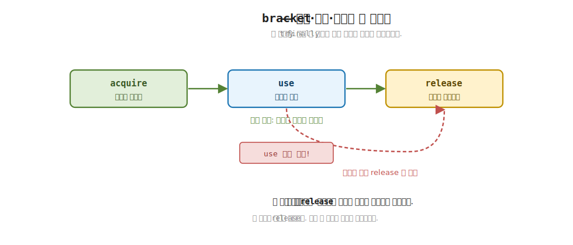
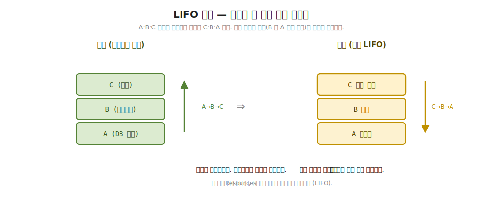

# 28장. Resource & bracket (자원 수명, 예외에도 해제)

> **이 장의 목표** — 이 장을 마치면 자원의 획득·사용·해제 세 단계를 `bracket` 이라는 한 값으로 묶어, 사용 도중 예외가 나도 해제가 반드시 실행되게 만드는 효과를 직접 짤 수 있습니다. 자원을 여럿 잡았을 때 나중에 연 것부터 먼저 닫는 역순 해제 (LIFO) 를 `Resources` 로 직접 구현하고, 중첩한 자원이 안쪽부터 닫히는 계층 정리를 손으로 추적합니다. C# 의 `using` 과 `try`-`finally` 가 한 자원에 해 주던 일을, 효과 사슬에 엮인 여러 자원으로 넓혀 한 값으로 묶는 자리입니다. 27장에서 재시도 정책을 효과에 얹었듯, 이 장은 자원 수명을 효과에 얹습니다.

> **이 장의 핵심 어휘**
>
> - **자원 (resource)**: 파일 핸들·DB 연결·소켓처럼 다 쓰고 나면 반드시 닫아야 하는 바깥 세상의 것
> - **`bracket`**: 획득 (`acquire`) · 사용 (`use`) · 해제 (`release`) 세 단계를 한 값으로 묶은 것, `try`-`finally` 의 효과판
> - **`acquire` / `use` / `release`**: 자원을 얻는 함수 · 그 자원으로 일하는 함수 · 끝나면 닫는 함수
> - **해제 보장 (release guarantee)**: `use` 가 정상으로 끝나든 예외로 끝나든 `release` 가 반드시 실행됨
> - **`Resources`**: 잡은 자원을 여럿 추적하다 한꺼번에 닫는 그릇, 역순 (LIFO) 으로 해제
> - **LIFO 해제**: Last In First Out, 나중에 연 자원을 먼저 닫는 순서
> - **중첩 자원 (nested resource)**: 자원 안에서 또 자원을 여는 모양, 안쪽이 먼저 닫힘

> 이 장을 마치면 할 수 있게 되는 것
> - [ ] `bracket` 이 획득·사용·해제 세 단계를 한 값으로 묶는다는 것을 설명할 수 있습니다.
> - [ ] `bracket` 이 `try`-`finally` 와 1:1 로 대응함을 코드로 짚을 수 있습니다.
> - [ ] `use` 도중 예외가 나도 `release` 가 먼저 실행되고 예외가 전파됨을 손계산으로 추적할 수 있습니다.
> - [ ] `using` 의 네 자리 (진입·본문·종료·`finally`) 를 `bracket` 의 세 함수에 대응시킬 수 있습니다.
> - [ ] 여러 자원이 역순 (LIFO) 으로 닫히는 까닭을 자원 사이의 의존으로 설명할 수 있습니다.
> - [ ] 중첩한 자원이 안쪽부터 닫히는 로그를 직접 따라갈 수 있습니다.
> - [ ] 7부 `EnvIO` 가 자원을 운반하던 그림과 이 장의 `Resources` 를 연결할 수 있습니다.

> **이 장의 흐름** — 27장에서 재시도 정책을 효과 위에 값으로 얹었던 자리에서 출발합니다. 이번에는 자원 수명을 얹습니다. 파일 하나, DB 연결 하나라면 `using` 과 `try`-`finally` 가 깔끔하게 닫아 줍니다. 그런데 자원을 둘셋 잡고 그 사이에 효과까지 끼면, 중첩 `using` 이 계단처럼 깊어지고 어느 자원을 어느 순서로 닫아야 하는지가 흩어지는 불편을 먼저 부딪힙니다. 그 불편을 푸는 한 수가 획득·사용·해제를 한 값으로 묶는 `bracket` 입니다. `bracket` 의 정상 경로를 손으로 따라가 세 단계가 차례로 도는 것을 보고, 그다음 사용 도중 예외가 나는 경로를 따라가 `release` 가 예외보다 먼저 실행됨을 확인합니다. 이어 자원을 여럿 잡는 `Resources` 로 넘어가, 나중에 연 것을 먼저 닫는 역순 (LIFO) 해제가 왜 옳은지를 자원 사이의 의존으로 풉니다. 중첩한 자원이 안쪽부터 닫히는 로그를 직접 보고, 마지막으로 7부 `EnvIO` 가 자원을 운반하던 그림과 이 장을 잇습니다.

---

## 28.1 이 장에서 다루는 것 — 반드시 닫히는 자원

실무의 효과는 거의 언제나 바깥 세상의 무언가를 잡습니다. 파일을 읽으려면 파일 핸들을 열어야 하고, 데이터베이스에 쓰려면 연결을 맺어야 하고, 네트워크로 보내려면 소켓을 열어야 합니다. 이렇게 다 쓰고 나면 반드시 닫아야 하는 바깥 세상의 것을 이 책은 자원 (resource) 이라 부릅니다. 자원을 열기만 하고 닫지 않으면 핸들이 새고, 연결이 고갈되고, 끝내 프로그램이 멈춰 섭니다.

이 장이 다루는 일을 한 문장으로 잡습니다. 자원을 잡았으면, 무슨 일이 있어도 반드시 닫는다. 정상으로 끝나든, 도중에 예외가 터지든, 닫는 일만큼은 빠뜨리지 않는다. 이 한 가지를 효과의 한 값으로 묶는 도구가 `bracket` 입니다.

8부 전체로 보면 이 장은 27장과 같은 결입니다. 27장이 재시도 정책 (`Schedule`) 을 효과 위에 값으로 얹었다면, 이 장은 자원 수명을 효과 위에 값으로 얹습니다. 새 trait 도, 1장에서 세운 두 평행 세계의 새 이동도 아닙니다. 7부에서 만든 효과를 바꾸지 않고, 그 위에 자원의 획득·해제를 한 겹 더 씌우는 조합입니다.

8부의 견고함 도구 셋이 모두 이 한 모양을 따른다는 점을 미리 잡아 두면 이 장이 어디에 서 있는지 보입니다. 27장의 재시도는 효과 사슬에 "실패하면 다시 시도하라" 를 옆에서 얹었습니다. 이 장의 자원 수명은 "끝나면 반드시 닫으라" 를 옆에서 얹습니다. 다음 장의 관측성은 "무엇을 했는지 남기라" 를 옆에서 얹습니다. 셋 다 7부에서 만든 효과의 모양은 손대지 않고, 그 둘레에 한 가지 보장을 덧씌우는 횡단 관심사입니다. 명령형이라면 이 세 가지는 코드 곳곳에 `try`-`catch` 와 `finally` 와 로깅 호출로 흩어졌을 것입니다. 효과를 값으로 들고 다니기에, 셋 모두 사슬에 합성되는 별도의 도구로 떨어져 나옵니다. 이 장은 그 가운데 둘째, 자원 수명을 맡습니다.

지금 모든 것을 외우지 않아도 됩니다. 이 장이 끝날 때 손에 남는 것은 두 가지입니다. 획득·사용·해제를 한 값으로 묶으면 예외에도 해제가 빠지지 않는다는 발상 하나와, 자원을 여럿 잡으면 나중에 연 것부터 닫는다는 순서 하나입니다. 이 장에 처음 나오는 어휘를 한 줄씩만 미리 짚어 둡니다. `acquire` 는 자원을 얻는 함수, `use` 는 그 자원으로 일하는 함수, `release` 는 끝나면 닫는 함수입니다. 해제 보장 (release guarantee) 은 `use` 가 정상으로 끝나든 예외로 끝나든 `release` 가 반드시 실행되는 성질입니다. LIFO 는 Last In First Out, 나중에 연 자원을 먼저 닫는 순서입니다. 네 어휘 모두 본문에서 코드와 함께 다시 천천히 풀므로, 여기서는 이름과 한 줄 뜻만 스쳐 두면 됩니다.

---

## 28.2 왜 필요한가 — 자원이 여럿이면 닫는 일이 흩어집니다

`bracket` 을 보이기 전에, 익숙한 도구로만 자원을 닫으려 하면 어디서 막히는지부터 부딪혀 봅니다. 추상을 먼저 보이지 않고 손에 잡히는 불편을 먼저 겪는 것이 이 장의 순서입니다.

상급 C# 개발자라면 자원을 닫는 일에 이미 익숙합니다. `using` 이 있고 `try`-`finally` 가 있습니다. 자원 하나라면 이보다 깔끔할 수 없습니다.

```csharp
// 자원 하나 — using 이 블록을 벗어날 때 반드시 Dispose 한다.
using (var file = File.OpenText("data.txt"))
{
    var line = file.ReadLine();   // 사용
    Process(line);
}   // ← 여기서 file.Dispose() 가 반드시 호출됨 (예외가 나도)
```

`using` 은 블록을 벗어나는 순간 `Dispose` 를 부릅니다. 블록 안에서 예외가 터져도 부릅니다. 컴파일러가 `try`-`finally` 로 풀어 주기 때문입니다. 자원 하나에 대해서는 이미 닫힘이 빈틈없습니다. 여기까지는 새로 배울 것이 없습니다.

문제는 자원이 둘 이상으로 늘고, 그 사이에 효과가 끼면서 시작됩니다. 데이터베이스 연결을 열고, 그 위에 트랜잭션을 시작하고, 다시 그 위에 커서를 여는 코드를 떠올려 봅니다. 셋은 순서가 있습니다. 연결이 있어야 트랜잭션이 서고, 트랜잭션이 있어야 커서가 섭니다. 이것을 `using` 으로 적으면 계단이 깊어집니다.

```csharp
// 자원 셋 — using 이 계단처럼 깊어진다.
using (var conn = OpenConnection())
{
    using (var tx = conn.BeginTransaction())
    {
        using (var cursor = tx.OpenCursor())
        {
            // ← 세 자원을 모두 잡은 뒤에야 진짜 할 일이 여기 한 줄
            return cursor.Read();
        }   // ← cursor 닫힘
    }   // ← tx 닫힘
}   // ← conn 닫힘
```

이 코드는 돌아갑니다. 닫는 순서도 옳습니다. 안쪽 `using` 부터 벗어나니 커서가 먼저 닫히고, 트랜잭션이, 마지막으로 연결이 닫힙니다. 그런데 자원 셋을 잡으려고 들여쓰기가 세 칸 깊어졌고, 진짜 할 일은 가장 안쪽 한 줄로 밀려났습니다. 자원이 다섯이면 계단도 다섯입니다. 이 깊은 중첩을 두고 흔히 중첩 `using` 의 계단이라 부릅니다.

그리고 이 자원들이 비동기라면 같은 불편이 한 겹 더해집니다. 동기 `using` 자리가 `await using` 으로 바뀔 뿐, 계단이 깊어지고 닫는 순서가 흩어지는 불편은 그대로 되풀이됩니다.

> **더 깊이 — 비동기 자원과 `await using` (처음엔 건너뛰어도 됩니다)** — 이 장의 학습용 `bracket` 은 동기 닫힘만 다룹니다. 그런데 실무 자원은 닫는 일 자체가 비동기인 경우가 많습니다. 네트워크 연결을 닫으며 마지막 패킷을 비우거나, 스트림을 닫으며 버퍼를 디스크로 내보내는 일은 `await` 를 기다려야 합니다. C# 은 이 자리를 `IAsyncDisposable` 과 `await using` 으로 받습니다. `await using (var conn = await OpenAsync())` 는 블록을 벗어날 때 `Dispose` 가 아니라 `DisposeAsync` 를 `await` 합니다.
>
> 발상은 동기와 똑같습니다. 닫는 일을 블록의 끝에 두되, 그 닫는 일이 `Task` 를 돌려주니 `await` 로 기다릴 뿐입니다. LanguageExt v5 도 이 자리를 그대로 받습니다. v5 의 `useAsync<A>(Func<A> acquire) where A : IAsyncDisposable` 은 비동기 자원을 잡고, 닫을 때 내부에서 `await disposable.DisposeAsync().ConfigureAwait(false)` 를 부릅니다. 곧 `bracket` 의 획득·사용·해제 발상은 닫는 일이 동기든 비동기든 같고, 비동기에서는 해제 자리에 `await` 한 겹이 더해질 뿐입니다. 이 장이 동기 한 가지만 보이는 까닭은 자원 수명의 동작을 한 줄씩 손으로 좇기에 동기가 또렷하기 때문이고, 비동기는 그 위에 닫는 함수의 모양만 바꿔 얹는 확장입니다.

깊은 계단은 보기 불편한 데서 그치지 않습니다. 진짜 문제는 자원을 닫는 일이 효과 코드와 한 덩어리로 엉킨다는 데 있습니다. 7부에서 효과를 값으로 인코딩한 까닭을 떠올려 봅니다. 부수 효과를 `IO` 라는 값으로 묶어, `Run` 하기 전까지 미루고, 다른 효과와 합성할 수 있게 만들기 위해서였습니다. 그런데 자원을 `using` 으로 닫으면, 그 닫힘은 값이 아니라 구문 (statement) 의 블록 구조에 묶입니다. 효과를 값으로 들고 다니다가, 자원을 닫을 자리에서만 갑자기 블록 구문으로 돌아와야 합니다. 값으로 합성하던 흐름이 끊깁니다.

객체 지향 직감으로 다리를 놓으면 이렇습니다. `using` 과 `IDisposable`, 그리고 그 둘을 떠받치는 `try`-`finally` 는 자원 하나의 수명을 블록의 수명에 묶는 도구입니다. 7부에서 `IO` 를 만들 때 이미 본 적이 있습니다. 23장에서 `IO` 의 `Run` 이 안쪽 thunk 를 부를 때, 예외가 나도 정리가 빠지지 않게 `finally` 를 썼습니다. `bracket` 이 하려는 일도 정확히 그 `try`-`finally` 입니다. 다른 점은 하나입니다. 그 닫힘을 블록 구문에 묶어 두는 대신, 획득·사용·해제 세 함수를 받는 한 값으로 묶어 효과 사슬에 그대로 얹는다는 것입니다.

그래서 우리가 바라는 것은 분명합니다. 자원의 획득과 해제를 떼어 놓지 않고 한 곳에 묶고 싶습니다. 그 묶음을 블록 구문이 아니라 값으로 들고 다니며 다른 효과와 합성하고 싶습니다. 그리고 `using` 이 한 자원에 보장하던 것 (예외에도 닫힘) 을 여러 자원으로 넓히되, 닫는 순서가 흩어지지 않게 한 자리에서 관리하고 싶습니다.

이 세 가지를 한 도구로 잡는 것이 `bracket` 과 `Resources` 입니다. 다음 절에서 `bracket` 의 모양부터 봅니다.

> **흔한 함정** — `bracket` 이 `using` 보다 나은 새 자원 관리 문법이라고 여기는 것입니다.
>
> `bracket` 은 `using` 을 대체하지 않습니다. 자원 하나를 한 블록에서 쓰고 닫는 일이라면 `using` 이 여전히 가장 읽기 쉽습니다. `bracket` 의 자리는 따로 있습니다. 자원의 획득·해제를 블록 구문이 아니라 값으로 묶어, 효과 사슬에 합성하고 싶을 때입니다. 뒤에서 보겠지만 `bracket` 의 속은 바로 그 `try`-`finally` 입니다. 곧 `bracket` 은 `using` 과 겨루는 새 문법이 아니라, 같은 `try`-`finally` 를 값으로 들고 다닐 수 있게 한 겹 감싼 것입니다.

---

## 28.3 bracket — 획득·사용·해제 세 단계를 한 값으로

이제 `bracket` 의 모양을 봅니다. 발상은 단순합니다. 자원을 다루는 일은 늘 세 단계입니다. 자원을 얻고 (`acquire`), 그 자원으로 일하고 (`use`), 다 쓰면 닫습니다 (`release`). `bracket` 은 이 세 단계를 세 함수로 받아 한 값으로 묶습니다.

코드는 시그니처에서 그 세 자리가 곧장 보입니다. 본문 모든 코드의 권위인 챕터 코드 그대로입니다.

```csharp
// bracket — 획득 → 사용 → 해제 를 한 값으로 묶는다. 사용 중 예외가 나도 해제는 반드시 실행된다.
// (LanguageExt v5 의 bracket / use·release 의 핵심 의미.) C# 의 try/finally 를 함수형으로 캡처.
public static class Resource
{
    public static B Bracket<A, B>(Func<A> acquire, Func<A, B> use, Action<A> release)
    {
        var resource = acquire();      // 획득
        try
        {
            return use(resource);      // 사용
        }
        finally
        {
            release(resource);         // 해제 — 예외가 나도 반드시
        }
    }
}
```

시그니처부터 읽습니다. `Bracket<A, B>` 는 세 함수를 받습니다. `Func<A> acquire` 는 인자 없이 자원 `A` 를 얻어 옵니다. `Func<A, B> use` 는 그 자원 `A` 를 받아 결과 `B` 를 냅니다. `Action<A> release` 는 자원 `A` 를 받아 닫고 아무것도 돌려주지 않습니다. 세 함수의 자리가 곧 획득·사용·해제 세 단계입니다. 타입 변수 `A` 는 자원의 타입 (파일 핸들·연결 등), `B` 는 사용의 결과 타입입니다.

본문 네 줄은 사실 우리가 손으로 늘 쓰던 `try`-`finally` 그 자체입니다. `acquire()` 로 자원을 얻어 `resource` 에 담고, `try` 안에서 `use(resource)` 로 일하고 그 결과를 돌려주며, `finally` 에서 `release(resource)` 로 닫습니다. 새로운 제어 흐름은 하나도 없습니다. `bracket` 이 한 일은 이 `try`-`finally` 한 덩어리를 함수 세 개를 받는 한 값으로 포장한 것뿐입니다.

직관을 한 단계 더 풀어 봅니다. 왜 굳이 세 함수로 쪼개 받을까요. 닫는 일을 빠뜨릴 수 없게 만들기 위해서입니다. `using` 이 닫힘을 블록의 끝에 강제로 묶듯, `bracket` 은 닫힘을 `finally` 자리에 강제로 묶습니다. 자원을 쓰는 사람은 `release` 함수 하나만 건네면, 그 함수가 언제 불릴지는 더 신경 쓰지 않아도 됩니다. `bracket` 이 `use` 다음에 반드시 부릅니다. 닫는 책임이 쓰는 사람에게서 `bracket` 으로 넘어간 것입니다.

> **더 깊이 — `release` 를 아예 안 건네는 v5 오버로드 (처음엔 건너뛰어도 됩니다)** — 이 장의 `Bracket` 은 닫는 함수 `release` 를 늘 직접 받습니다. 그런데 자원이 이미 `IDisposable` 이라면, 닫는 일이 무엇인지 자명합니다. `Dispose()` 를 부르면 됩니다. LanguageExt v5 는 이 흔한 경우를 위해 닫는 함수를 받지 않는 오버로드를 둡니다.
>
> ```csharp
> // LanguageExt v5 — Prelude.Resources.cs: IDisposable 이면 release 를 안 받아도 된다.
> public static IO<A> use<A>(Func<A> acquire) where A : IDisposable;
> ```
>
> `where A : IDisposable` 제약이 핵심입니다. 자원이 `IDisposable` 임을 타입으로 요구하니, v5 는 닫을 때 그 자원의 `Dispose()` 를 알아서 부릅니다. 호출자는 `acquire` 하나만 건네면 됩니다. 닫는 책임이 호출자에게서 v5 로 넘어가는 정도가 이 장의 `bracket` 보다 한 단계 더 깊은 셈입니다. 이 장이 `release` 를 늘 명시로 받는 까닭은 닫는 일이 무엇인지를 로그로 또렷이 보이기 위해서이고, 실무에서 자원이 `IDisposable` 이면 v5 의 이 오버로드가 더 짧습니다.

정상 경로를 손으로 따라가 봅니다. 챕터 코드의 첫 예제는 파일을 여는 흉내입니다. `acquire` 가 파일을 열고 파일명 `"data.txt"` 를 돌려주고, `use` 가 그 파일명의 길이를 재고, `release` 가 파일을 닫습니다. 무슨 일이 어느 순서로 일어나는지, 이벤트 로그가 어떻게 쌓이는지를 좇습니다.

```
log = []                                    (시작: 비어 있음)

Bracket(acquire, use, release)
  ├ acquire() 호출
  │   → log 에 "파일 열기" 추가, 자원 = "data.txt" 반환
  │   log = ["파일 열기"]
  ├ try { use("data.txt") }
  │   → log 에 "읽기(data.txt)" 추가, 결과 = 8 (파일명 길이)
  │   log = ["파일 열기", "읽기(data.txt)"]
  └ finally { release("data.txt") }
      → log 에 "닫기(data.txt)" 추가
      log = ["파일 열기", "읽기(data.txt)", "닫기(data.txt)"]

결과: 8
log = [파일 열기 → 읽기(data.txt) → 닫기(data.txt)]
```

세 단계가 적힌 순서 그대로 한 번씩 돕니다. 먼저 열고, 그다음 읽고, 마지막에 닫습니다. 결과 `8` 은 `use` 가 잰 파일명 길이입니다. 데모 출력은 다음과 같습니다.

여기서 값이 어떻게 흐르는지를 한 겹 더 잘게 짚어 둡니다. 세 함수 사이를 오가는 것은 자원 값 하나와 결과 값 하나입니다. `acquire()` 가 돌려준 `"data.txt"` 라는 자원 값이 그대로 `use` 의 인자로 들어가고 (`use("data.txt")`), 또 그대로 `release` 의 인자로도 들어갑니다 (`release("data.txt")`). 곧 세 함수가 같은 자원 값 하나를 나눠 받습니다. `use` 만이 결과 값 `8` 을 따로 냅니다. `release` 는 자원을 받아 닫기만 할 뿐 아무것도 돌려주지 않으니 (`Action<A>`), 결과 `8` 은 `release` 를 거치며 바뀌지 않고 그대로 `Bracket` 의 결과가 됩니다. 정리하면, 자원 값은 세 함수가 공유하고, 결과 값은 `use` 가 만들어 `release` 를 무사히 지나 빠져나옵니다.

```
== 예제 1 — bracket: 획득 → 사용 → 해제 ==
  결과(파일명 길이) = 8
  이벤트 = [파일 열기 → 읽기(data.txt) → 닫기(data.txt)]
```

정상 경로에서는 `using` 과 다를 것이 없어 보입니다. 그럴 만합니다. 속이 같은 `try`-`finally` 이니까요. `bracket` 의 진짜 값은 정상 경로가 아니라 예외 경로에서 드러납니다. `use` 가 도중에 터질 때 무슨 일이 일어나는지를 다음 절에서 봅니다.



**그림 28-1. `bracket`: 획득·사용·해제를 한 값으로** — `acquire` 로 자원을 얻고, `use` 로 쓰고, 끝나면 `release` 합니다. `use` 도중 예외가 나도 `release` 는 반드시 실행되고 예외가 전파됨을, 정상 경로와 예외 경로 두 화살표로 보입니다. `try`-`finally` 의 효과판입니다.

> **`using` 과 `bracket` 의 1:1 대응** — C# 개발자의 `using` 직감을 그대로 `bracket` 에 옮길 수 있습니다. 둘은 같은 `try`-`finally` 를 다른 어법으로 적은 것이기 때문입니다.

| `using` 의 자리 | `bracket` 의 자리 | 하는 일 |
|---|---|---|
| `using (var r = Open())` 의 `Open()` | `acquire` | 자원을 얻는다 |
| `using` 블록의 본문 `{ ... }` | `use` | 자원으로 일한다 |
| 블록 종료 시 자동 `Dispose` | `release` | 자원을 닫는다 |
| 예외가 나도 `Dispose` 호출 (`finally`) | 예외가 나도 `release` 호출 (`finally`) | 닫힘이 빠지지 않는다 |

`using` 이 블록의 네 자리 (진입·본문·종료·`finally`) 에 묶어 두던 일을, `bracket` 은 세 함수와 한 번의 `try`-`finally` 로 옮겼습니다. 진입이 `acquire`, 본문이 `use`, 종료와 `finally` 가 `release` 입니다. 같은 일을 블록 구문 대신 값으로 들고 다닐 수 있게 한 것이 차이의 전부입니다.

> **더 깊이 — v5 의 두 가지 묶는 법: 세 함수 vs 스코프 (처음엔 건너뛰어도 됩니다)** — 이 장의 `Bracket(acquire, use, release)` 은 세 함수를 직접 건네는 방식입니다. LanguageExt v5 도 이 방식을 그대로 둡니다 (`bracketIO(Acq, Use, Fin)`). 그런데 v5 에는 더 짧은 두 번째 방식이 하나 더 있습니다. 닫는 함수를 일일이 건네는 대신, 효과 한 구간을 스코프로 감싸기만 하는 방식입니다.
>
> ```csharp
> // LanguageExt v5 — IO.cs: 인자 없는 Bracket 은 지역 자원 스코프를 연다.
> public IO<A> Bracket() =>
>     WithEnv(env => env.LocalResources);
> ```
>
> 이 인자 없는 `Bracket()` (Prelude 의 `bracketIO(computation)`) 은 닫는 함수를 받지 않습니다. 대신 그 구간 동안 잡힌 자원을 모두 추적하다, 구간이 끝나면 한꺼번에 닫습니다. v5 문서는 이것을 "궁극의 `using` 문" 이라 적고, 세 함수를 건네는 방식보다 이쪽을 권합니다. 닫는 일을 손으로 적지 않아도 되니까요. 두 방식은 같은 해제 보장을 줍니다. 다른 점은 닫는 일을 함수로 또렷이 건네느냐, 스코프에 맡기느냐입니다. 이 장은 동작을 한 줄씩 보이려고 세 함수를 직접 건네는 쪽을 택했고, 7부와 잇는 절에서 스코프 방식을 다시 만납니다.

---

## 28.4 예외에도 해제 보장 — release 가 예외보다 먼저

`bracket` 이 `using` 과 굳이 다른 어법을 들고 온 까닭은 이 절에 있습니다. `use` 도중에 예외가 터지는 경로입니다. 자원 관리에서 가장 위험한 자리이고, `bracket` 이 값을 증명하는 자리입니다.

먼저 왜 이 경로가 위험한지 짚습니다. 명령형으로 자원을 다루다 닫는 일을 빠뜨리는 사고는 거의 언제나 예외에서 납니다. 자원을 열고, 쓰다가, 닫기 전에 예외가 터지면, 닫는 코드까지 흐름이 닿지 못하고 그대로 빠져나갑니다. 자원이 열린 채 버려집니다. 한 번이면 핸들 하나가 새는 데서 그치지만, 이 코드가 초당 수백 번 돌면 핸들이 고갈되고 프로그램이 멈춰 섭니다. `try`-`finally` 없이 자원을 닫는 코드는 늘 이 위험을 안고 있습니다.

직관은 이렇습니다. `bracket` 은 닫는 일을 `finally` 자리에 두었습니다. `finally` 의 약속은 단 하나입니다. `try` 블록이 어떻게 끝나든, 정상으로 끝나든 예외로 끝나든, `finally` 는 반드시 실행됩니다. 그래서 `use` 가 예외를 던져도 `finally` 가 `release` 를 건너뛰지 않습니다. 예외가 바깥으로 빠져나가기 직전에, `finally` 가 먼저 끼어들어 `release` 를 부르고, 그다음에 예외가 전파됩니다. 닫는 일이 예외보다 앞섭니다. 이 순서가 해제 보장 (release guarantee) 의 핵심입니다.

챕터 코드의 두 번째 예제로 손계산합니다. `acquire` 가 자원을 열고, `use` 가 일하려다 `InvalidOperationException("boom")` 을 던지고, `release` 가 닫습니다. 예외가 터지는데도 로그에 무엇이 어느 순서로 쌓이는지를 좇습니다.

```
log = []                                    (시작: 비어 있음)

try {
  Bracket(acquire, use, release)
    ├ acquire() 호출
    │   → log 에 "열기" 추가
    │   log = ["열기"]
    ├ try { use(자원) }
    │   → log 에 "사용 중 예외!" 추가
    │   → throw InvalidOperationException("boom")   ← 예외 발생!
    │   log = ["열기", "사용 중 예외!"]
    │
    │   ┌── 예외가 바깥으로 나가기 직전, finally 가 먼저 끼어든다 ──┐
    └ finally { release(자원) }
    │   → log 에 "닫기 (finally)" 추가                ← release 가 예외보다 먼저!
    │   log = ["열기", "사용 중 예외!", "닫기 (finally)"]
    │   └── 이제야 예외가 바깥으로 전파 ──┘
}
catch (InvalidOperationException e) {
  → log 에 "예외 전파: boom" 추가
  log = ["열기", "사용 중 예외!", "닫기 (finally)", "예외 전파: boom"]
}

결과: 예외는 잡혔고, 그 전에 release 가 이미 실행됨
log = [열기 → 사용 중 예외! → 닫기 (finally) → 예외 전파: boom]
```

순서가 핵심입니다. `"사용 중 예외!"` 다음에 곧장 `"예외 전파"` 가 오지 않습니다. 그 사이에 `"닫기 (finally)"` 가 끼어 있습니다. `use` 가 예외를 던진 순간, 그 예외는 곧장 바깥으로 나가지 못하고 `finally` 에 붙들립니다. `finally` 가 `release` 를 부르고 자원을 닫은 뒤에야, 예외가 비로소 바깥의 `catch` 로 전파됩니다. 닫는 일이 예외보다 앞섰습니다. 데모 출력은 다음과 같습니다.

```
== 예제 2 — 사용 중 예외가 나도 해제는 실행 ==
  이벤트 = [열기 → 사용 중 예외! → 닫기 (finally) → 예외 전파: boom]
```

`release` 가 예외 전파보다 앞서 기록됐습니다. 자원이 열린 채 버려지는 사고가 원리적으로 막힌 것입니다. 그리고 예외 자체는 삼켜지지 않고 그대로 바깥으로 전파됐다는 점도 함께 봅니다. `bracket` 은 닫는 일만 책임지고, 예외를 처리할지 말지는 바깥에 맡깁니다. 자원은 반드시 닫되, 무엇이 잘못됐는지는 숨기지 않습니다.

객체 지향 직감으로 다리를 놓으면, 방금 본 동작이 곧 `using` 블록 안에서 예외가 나도 `Dispose` 가 불리는 그 동작입니다. 컴파일러가 `using` 을 `try`-`finally` 로 풀어 주기에 `using` 도 예외에 안전합니다. `bracket` 은 그 `try`-`finally` 를 손으로 적어 값으로 묶었을 뿐, 보장하는 바는 글자 그대로 같습니다.

이 동작은 챕터 코드의 보장 검증으로도 확인됩니다. `ReleaseOnExceptionHolds` 가 바로 이 경로를 단정합니다.

```csharp
// ② 예외 경로 — use 가 던져도 release 는 실행된다.
public static bool ReleaseOnExceptionHolds()
{
    var released = false;
    try
    {
        Resource.Bracket<int, int>(
            () => 1,
            _ => throw new InvalidOperationException("boom"),
            _ => released = true);
    }
    catch (InvalidOperationException) { /* 예외는 전파됨 */ }
    return released;
}
```

`use` 자리에 곧장 예외를 던지는 함수를 넣고, `release` 자리에서 `released` 플래그를 켭니다. 바깥에서 예외를 잡은 뒤 `released` 가 `true` 인지를 봅니다. 예외가 났는데도 `released` 가 `true` 라면, `release` 가 실행됐다는 뜻입니다. 이 검사가 통과한다는 것은 곧 예외 경로에서도 해제가 빠지지 않았다는 증명입니다.

> **더 깊이 — 예외를 잡으면서 동시에 닫는 v5 변형 (처음엔 건너뛰어도 됩니다)** — 이 장의 `bracket` 은 닫기만 하고 예외는 그대로 바깥으로 흘려보냅니다. 그런데 실무에서는 예외를 닫음과 같은 자리에서 잡아 대체 값으로 바꾸고 싶을 때가 있습니다. LanguageExt v5 는 이 자리를 위해 닫는 함수에 더해 예외 처리 함수까지 받는 세 번째 `Bracket` 변형을 둡니다.
>
> ```csharp
> // LanguageExt v5 — IO.cs: Use·Catch·Fin 세 함수를 받는 Bracket.
> public IO<C> Bracket<B, C>(Func<A, IO<C>> Use, Func<Error, IO<C>> Catch, Func<A, IO<B>> Fin) =>
>     Bind(x => Use(x).Catch(Catch).Finally(Fin(x)));
> ```
>
> 속을 풀면 이 장에서 본 모양에 한 겹만 더 얹혀 있습니다. 자원 `x` 를 `Use` 로 쓰고, 그 결과에 먼저 `Catch(Catch)` 를 붙여 실패를 잡고, 그 위에 다시 `Finally(Fin(x))` 를 붙여 닫습니다. 곧 `Catch` 가 실패를 대체 값으로 바꾸든 그대로 두든, 그 바깥의 `Finally` 는 어느 쪽이든 반드시 닫습니다. 이 장의 두 함수짜리 `Bracket` (`Bind(x => Use(x).Finally(Fin(x)))`) 에서 `Catch` 한 겹만 사이에 끼운 모양입니다. 자원을 닫는 일과 실패를 다루는 일이 서로 다른 관심사라는 이 장의 결론은 그대로입니다. 다만 v5 는 두 관심사를 한 호출로 함께 적고 싶을 때를 위해 이 변형을 마련해 둡니다.

> **흔한 함정** — `release` 가 예외를 삼켜 준다고 여기는 것입니다.
>
> `bracket` 은 `release` 를 실행할 뿐, `use` 가 던진 예외를 잡거나 숨기지 않습니다. 손계산에서 봤듯 예외는 `release` 다음에 그대로 바깥으로 전파됩니다. 자원은 닫되, 무엇이 잘못됐는지는 호출자가 알아야 하기 때문입니다. 7부에서 예외를 값으로 다루던 `Fin<A>` 를 떠올리면, 거기서는 실패를 `Fail` 값으로 잡아 사슬을 단락시켰습니다. `bracket` 의 역할은 다릅니다. 실패를 값으로 바꾸는 것이 아니라, 실패가 어떻게 끝나든 자원만큼은 닫는 것입니다. 예외를 값으로 다루는 일과 자원을 닫는 일은 서로 다른 관심사라, 각자의 도구가 맡습니다.

이 두 관심사가 한 곳에서 만나는 모양도 짚어 둘 만합니다. 자원을 닫는 일과 실패를 값으로 다루는 일은 서로 다르지만, 실무에서는 둘을 같은 효과 사슬에 함께 얹습니다. 자원을 `bracket` 으로 감싸 닫힘을 지키고, 그 바깥을 7부의 `Fin<A>` 나 `Eff` 의 오류 처리로 감싸 실패를 값으로 받는 식입니다. 안쪽 `bracket` 의 `finally` 가 자원을 닫고 예외를 위로 흘려보내면, 바깥의 오류 처리가 그 예외를 `Fail` 값으로 받아 사슬을 단락시킵니다. 곧 닫힘은 `bracket` 이, 실패의 값 변환은 오류 처리가 맡아, 두 도구가 한 사슬 위에서 각자의 자리를 지킵니다. 7부에서 효과를 값으로 인코딩해 둔 덕에, 견고함의 두 관심사가 이렇게 겹쳐 쌓여도 서로 엉키지 않습니다.

---

## 28.5 Resources — 여러 자원을 역순으로 닫기

`bracket` 하나는 자원 하나를 다룹니다. 그런데 왜 필요한가 절에서 봤듯, 실무에서는 자원을 둘셋 함께 잡는 일이 흔합니다. 연결 위에 트랜잭션, 그 위에 커서를 쌓는 식입니다. 자원을 여럿 잡으면 새 물음이 생깁니다. 닫을 때는 어느 순서로 닫아야 하는가.

먼저 직관입니다. 자원에는 의존의 방향이 있습니다. 커서는 트랜잭션 위에서 열렸고, 트랜잭션은 연결 위에서 열렸습니다. 곧 커서는 트랜잭션에 기대고, 트랜잭션은 연결에 기댑니다. 그렇다면 닫을 때는 거꾸로 가야 합니다. 가장 위에 기대 선 커서를 먼저 닫고, 그다음 트랜잭션, 마지막에 연결을 닫아야, 닫는 동안 누구도 이미 사라진 자원에 기대지 않습니다. 만약 연결을 먼저 닫으면, 그 위에 선 트랜잭션과 커서가 발 디딜 곳을 잃습니다. 나중에 연 것을 먼저 닫는다. 이 순서를 Last In First Out, 줄여서 LIFO 라 부릅니다.

이 LIFO 해제를 자원 하나하나마다 `bracket` 으로 손수 중첩해도 됩니다. 그러나 챕터 코드는 자원을 여럿 추적하다 한꺼번에 닫는 그릇을 따로 둡니다. `Resources` 클래스입니다.

```csharp
// Resources — 여러 자원을 추적하고 역순(LIFO) 으로 해제한다. 예외에도 전부 해제 보장.
// (열린 순서 A→B 면 닫히는 순서 B→A — 중첩 자원의 올바른 정리.)
public sealed class Resources
{
    readonly Stack<Action> releases = new();
    public List<string> Log { get; } = [];

    public A Acquire<A>(string name, Func<A> acquire, Action<A> release)
    {
        var value = acquire();
        Log.Add($"acquire {name}");
        releases.Push(() => { release(value); Log.Add($"release {name}"); });
        return value;
    }

    public void ReleaseAll()
    {
        while (releases.Count > 0)
            releases.Pop()();      // LIFO
    }
}
```

핵심은 가운데 한 줄, `Stack<Action> releases` 입니다. 닫는 함수들을 스택 (stack) 에 쌓아 둔다는 발상입니다. 스택은 나중에 넣은 것이 먼저 나오는 자료 구조입니다 (`Push` 로 위에 얹고 `Pop` 으로 위에서 꺼냅니다). 닫는 함수를 자원을 잡는 순서대로 `Push` 하고, 나중에 `Pop` 으로 꺼내면, 자연히 나중에 잡은 자원의 닫는 함수가 먼저 나옵니다. 스택 하나가 LIFO 순서를 거저 줍니다.

> **더 깊이 — v5 의 LIFO 는 스택이 아니라 중첩 스코프에서 나옵니다 (처음엔 건너뛰어도 됩니다)** — 이 장은 `Stack<Action>` 한 그릇으로 LIFO 를 곧장 냅니다. 자료 구조 자체가 역순을 주니 한눈에 들어옵니다. 그런데 LanguageExt v5 의 실제 `Resources` 는 스택이 아닙니다.
>
> ```csharp
> // LanguageExt v5 — Resources.cs: 해시맵 + 부모 스코프 체인 (발췌).
> readonly AtomHashMap<object, TrackedResource> resources;
> readonly Resources? parent;
> ```
>
> v5 는 자원을 `AtomHashMap` 에 담습니다. 해시맵은 넣은 순서를 지키지 않습니다. 그래서 단일 해시맵 하나만 `ReleaseAll` 해서는 LIFO 가 나오지 않습니다. 그럼 v5 의 역순은 어디서 나올까요. 둘째 줄 `Resources? parent` 가 답입니다. v5 는 효과의 한 구간이 시작될 때 부모를 가리키는 새 자식 `Resources` 를 만듭니다. 안쪽 구간이 잡은 자원은 자식에, 바깥 구간이 잡은 자원은 부모에 담깁니다. 안쪽 구간이 끝나면 자식이 먼저 닫히고, 바깥 구간이 끝나면 부모가 닫힙니다. 곧 v5 의 LIFO 는 자료 구조가 주는 것이 아니라, 부모·자식으로 중첩된 스코프가 안쪽부터 닫히는 데서 나옵니다. 이 장의 `Stack<Action>` 은 그 중첩 스코프의 결과 (나중 것이 먼저 닫힘) 를 한 그릇 안에 직접 모델링한 교육적 단순화입니다. 다음 절의 중첩 `bracket` 이 v5 의 이 부모·자식 중첩과 더 곧장 맞닿습니다.

`Acquire` 한 줄씩 읽습니다. 자원 이름 `name`, 자원을 얻는 `acquire`, 닫는 `release` 를 받습니다. `acquire()` 로 자원을 얻어 `value` 에 담고, 로그에 `acquire {name}` 을 적습니다. 그다음이 요점입니다. `release(value)` 를 곧장 부르지 않고, "이 자원을 닫는 일" 을 람다로 감싸 스택에 `Push` 합니다. 닫는 일을 지금 하는 것이 아니라, 나중에 할 일로 스택에 미뤄 두는 것입니다. `ReleaseAll` 은 그 미뤄 둔 일들을 스택이 빌 때까지 `Pop` 해서 하나씩 실행합니다. `Pop` 이 위에서부터 꺼내니, 나중에 쌓은 닫는 함수가 먼저 실행됩니다.

챕터 코드의 세 번째 예제로 손계산합니다. DB 연결·트랜잭션·커서를 이 순서로 `Acquire` 한 뒤 `ReleaseAll` 을 부릅니다. 스택이 어떻게 쌓이고 어떻게 비는지, 로그가 어떤 순서로 적히는지를 좇습니다.

```
releases (스택)            Log

[]                         []                          (시작)

Acquire("DB연결")
  → push 닫기(DB연결)
[닫기 DB연결]               [acquire DB연결]

Acquire("트랜잭션")
  → push 닫기(트랜잭션)            ← 위에 쌓임
[닫기 트랜잭션,             [acquire DB연결,
 닫기 DB연결]                acquire 트랜잭션]

Acquire("커서")
  → push 닫기(커서)               ← 맨 위에 쌓임
[닫기 커서,                 [acquire DB연결,
 닫기 트랜잭션,               acquire 트랜잭션,
 닫기 DB연결]                acquire 커서]

ReleaseAll()  — 위에서부터 pop
  ├ pop → 닫기(커서) 실행          ← 맨 위(나중에 연 것)부터
  ├ pop → 닫기(트랜잭션) 실행
  └ pop → 닫기(DB연결) 실행        ← 맨 아래(먼저 연 것)가 마지막
[]                         [..., release 커서,
                            release 트랜잭션,
                            release DB연결]

연 순서:   DB연결 → 트랜잭션 → 커서
닫힌 순서:  커서 → 트랜잭션 → DB연결      (정확히 역순)
```

연 순서와 닫힌 순서가 정확히 거꾸로입니다. 가장 나중에 연 커서가 가장 먼저 닫히고, 가장 먼저 연 연결이 가장 나중에 닫힙니다. 스택의 `Push` / `Pop` 이 이 역순을 저절로 만들어 냈습니다. 데모 출력은 다음과 같습니다.

```
== 예제 3 — 중첩 자원의 LIFO 해제 ==
  acquire DB연결 → acquire 트랜잭션 → acquire 커서 → release 커서 → release 트랜잭션 → release DB연결
  (연 순서 DB→Tx→커서, 닫힌 순서 커서→Tx→DB)
```

객체 지향 직감으로 다리를 놓으면, 이 역순이 곧 중첩 `using` 이 저절로 해 주던 그 순서입니다. 왜 필요한가 절의 계단 코드에서 안쪽 `using` 부터 벗어나 커서가 먼저 닫히고 연결이 마지막에 닫혔습니다. `Resources` 는 그 계단의 닫힘 순서를 스택 하나로 옮겨, 들여쓰기를 깊게 하지 않고도 같은 LIFO 를 냅니다.



**그림 28-2. LIFO 해제와 계층 추적** — 자원을 A·B·C 순으로 획득하면 해제는 C·B·A 역순 (LIFO) 으로 일어납니다. 나중에 연 것을 먼저 닫아, 자원 사이의 의존 (B 가 A 위에 열림) 이 깨지지 않음을 스택 그림으로 보입니다.

> **흔한 함정** — `Resources` 가 자원을 닫는 순서를 스스로 똑똑하게 정한다고 여기는 것입니다.
>
> `Resources` 는 의존 관계를 분석하지 않습니다. 그저 닫는 함수를 잡힌 순서대로 스택에 쌓고, 거꾸로 꺼낼 뿐입니다. LIFO 가 옳은 순서가 되는 까닭은 자원을 잡는 순서가 곧 의존이 쌓이는 순서이기 때문입니다. 나중에 잡은 자원이 먼저 잡은 자원에 기대 서 있으니, 거꾸로 닫으면 의존이 깨지지 않습니다. 곧 LIFO 는 똑똑한 분석의 결과가 아니라, 잡는 순서를 거꾸로 되돌린다는 단순한 규칙이 자원의 의존 구조와 맞아떨어진 결과입니다.

반대 순서로 닫으면 무엇이 깨지는지를 한 번 그려 보면 LIFO 가 왜 옳은지가 더 또렷합니다. 연 순서대로 (DB 연결을 먼저) 닫는다고 해 봅니다. 연결을 먼저 닫으면, 그 위에 선 트랜잭션은 발 디딜 연결을 잃습니다. 트랜잭션을 닫으려는 순간 이미 사라진 연결을 건드려 오류가 납니다. 커서도 마찬가지입니다. 곧 잡은 순서대로 닫는 것은 떠받치던 바닥을 먼저 빼는 것과 같아, 그 위에 선 것들이 차례로 무너집니다. 거꾸로 닫으면 늘 가장 위, 누구도 떠받치지 않는 자원부터 닫으니, 닫는 동안 어떤 자원도 이미 사라진 것에 기대지 않습니다. LIFO 가 옳은 순서인 까닭은 이 한 가지, 닫는 매 순간 "지금 닫는 것에 기댄 자원이 하나도 없음" 을 지켜 주기 때문입니다.

---

## 28.6 중첩 자원 — 안쪽이 먼저 닫힙니다

`Resources` 는 자원들을 한 그릇에 모아 LIFO 로 닫았습니다. 그런데 같은 LIFO 를 그릇 없이, `bracket` 만 중첩해서도 낼 수 있습니다. 이 모양이 7부 효과 시스템의 자원 처리와 더 곧장 맞닿아 있어 한 번 짚어 둡니다.

발상은 단순합니다. `bracket` 의 `use` 자리는 임의의 코드입니다. 그 안에 또 `bracket` 을 넣지 못할 까닭이 없습니다. 바깥 `bracket` 이 자원 하나를 잡고, 그 `use` 안에서 안쪽 `bracket` 이 자원을 하나 더 잡으면, 자원이 두 겹으로 중첩됩니다. 이렇게 자원 안에서 또 자원을 여는 모양을 중첩 자원 (nested resource) 이라 부릅니다.

챕터 코드의 챌린지 정답 `NestedResources` 가 바로 이 중첩입니다.

```csharp
// 중첩 bracket. 안쪽 자원이 먼저 닫힌다 (LIFO), 예외에도 보장.
public static List<string> OpenTwo()
{
    var log = new List<string>();
    Resource.Bracket(
        () => { log.Add("open outer"); return "outer"; },
        outer => Resource.Bracket(
            () => { log.Add("open inner"); return "inner"; },
            inner => { log.Add($"use {outer}+{inner}"); return inner.Length; },
            _ => log.Add("close inner")),
        _ => log.Add("close outer"));
    return log;
}
```

구조를 읽습니다. 바깥 `Bracket` 의 `acquire` 가 `outer` 자원을 엽니다. 바깥 `Bracket` 의 `use` 자리에 안쪽 `Bracket` 이 통째로 들어 있습니다. 안쪽 `Bracket` 은 `inner` 자원을 열고, 두 자원을 함께 써서 (`use {outer}+{inner}`) 길이를 재고, `inner` 를 닫습니다 (`close inner`). 안쪽 `Bracket` 이 끝나 그 결과가 바깥 `use` 의 결과가 되면, 그제야 바깥 `Bracket` 이 `outer` 를 닫습니다 (`close outer`).

닫힘 순서가 어떻게 나는지를 손으로 따라갑니다. 바깥과 안쪽 두 `finally` 가 언제 끼어드는지가 요점입니다.

```
log = []                                        (시작)

바깥 Bracket
  ├ acquire → "open outer"                       log = [open outer]
  ├ try { use(outer) = 안쪽 Bracket }
  │    안쪽 Bracket
  │      ├ acquire → "open inner"                log = [open outer, open inner]
  │      ├ try { use(inner) }
  │      │    → "use outer+inner"                log = [..., use outer+inner]
  │      └ finally { release(inner) }
  │          → "close inner"                     ← 안쪽이 먼저 닫힘
  │          log = [..., close inner]
  │    안쪽 Bracket 끝 (결과 = inner.Length)
  └ finally { release(outer) }
      → "close outer"                            ← 바깥이 나중에 닫힘
      log = [..., close outer]

결과 로그:
[open outer → open inner → use outer+inner → close inner → close outer]
```

연 순서는 outer 다음 inner 인데, 닫힌 순서는 inner 다음 outer 입니다. 나중에 연 inner 가 먼저 닫혔습니다. `Resources` 가 스택으로 내던 LIFO 와 똑같은 순서가, 여기서는 `bracket` 두 개를 중첩한 것만으로 나왔습니다. 까닭은 두 `finally` 의 위치에 있습니다. 안쪽 `bracket` 의 `finally` 는 바깥 `bracket` 의 `use` 안에 있으니, 바깥 `use` 가 끝나기 전에 먼저 실행됩니다. 바깥 `finally` 는 바깥 `use` 가 다 끝난 뒤에야 실행됩니다. 안쪽 `finally` 가 바깥 `finally` 보다 앞설 수밖에 없는 구조입니다.

정상 경로만으로는 중첩 `bracket` 의 진짜 값을 절반만 본 셈입니다. 자원 관리의 위험은 예외에서 나니, 안쪽 `use` 가 예외를 던지는 경로도 한 번 따라가 봅니다. 두 `finally` 가 모두 끼어드는지, 그 순서가 정상 경로와 같은지가 요점입니다. 안쪽 `use {outer}+{inner}` 자리에서 예외가 터졌다고 두고 좇습니다.

```
log = []                                        (시작)

바깥 Bracket
  ├ acquire → "open outer"                       log = [open outer]
  ├ try { use(outer) = 안쪽 Bracket }
  │    안쪽 Bracket
  │      ├ acquire → "open inner"                log = [open outer, open inner]
  │      ├ try { use(inner) }
  │      │    → throw 예외!                       ← 안쪽 use 에서 예외 발생
  │      └ finally { release(inner) }
  │          → "close inner"                     ← 안쪽 finally 가 먼저 끼어듦
  │          log = [open outer, open inner, close inner]
  │    예외가 안쪽 Bracket 을 벗어나 바깥 use 로 전파
  └ finally { release(outer) }                   ← 예외가 바깥으로 나가기 직전
      → "close outer"                            ← 바깥 finally 도 반드시 끼어듦
      log = [..., close outer]
  예외가 비로소 바깥으로 전파

결과 로그:
[open outer → open inner → close inner → close outer]   (use 기록 없이)
```

예외가 났는데도 두 자원이 모두 닫혔고, 닫힌 순서는 정상 경로와 똑같이 안쪽 다음 바깥입니다. 안쪽 `use` 가 던진 예외는 안쪽 `finally` 에 한 번 붙들려 `close inner` 를 부르고, 안쪽 `bracket` 을 벗어나 바깥 `use` 로 올라가다 바깥 `finally` 에 다시 붙들려 `close outer` 를 부른 뒤에야, 비로소 바깥으로 전파됩니다. 예외가 두 `finally` 를 차례로 지나며 두 자원을 다 닫고 나가는 것입니다. 자원을 둘 잡은 채 도중에 터져도 둘 다 새지 않는 까닭이 여기에 있습니다.

이 두 모양 (`Resources` 의 스택과 중첩 `bracket`) 이 같은 LIFO 를 내는 것은 우연이 아닙니다. 자원을 중첩해 쌓으면 그 닫힘은 늘 역순이 됩니다. `Resources` 는 그 역순을 스택이라는 자료 구조로 한 그릇에 담아 직접 모델링한 것이고, 중첩 `bracket` 은 그 역순을 `try`-`finally` 의 중첩 구조 자체로 낸 것입니다. 둘 중 어느 쪽으로 적어도 결과는 같습니다.

두 모양이 같은 까닭을 한 번 더 또렷이 짚으면, 둘 다 호출 스택을 거꾸로 되감는 일이기 때문입니다. 중첩 `bracket` 에서 안쪽 `bracket` 은 바깥 `bracket` 의 `use` 안에서 호출되니, 호출 스택에 바깥이 먼저 쌓이고 안쪽이 그 위에 쌓입니다. `finally` 는 각 호출이 스택에서 빠져나갈 때 도니, 위에 쌓인 안쪽이 먼저 빠지며 먼저 닫힙니다. `Resources` 의 `Stack<Action>` 은 그 호출 스택의 쌓임을 닫는 함수의 스택으로 바깥에 꺼내 둔 것입니다. 곧 한쪽은 언어의 호출 스택에 LIFO 를 맡기고, 다른 쪽은 LIFO 를 손수 든 스택에 적습니다. 같은 역순이 두 자리에서 같은 까닭으로 나옵니다.

> **미리보기** — v5 의 자원 처리가 어느 모양에 더 가까운지 궁금할 수 있습니다.
>
> 다음 절에서 7부 `EnvIO` 와 잇겠지만, 한 줄만 앞당겨 둡니다. LanguageExt v5 에서 LIFO 해제는 이 장의 `Resources` 처럼 단일 그릇이 순서를 보장하는 방식이 아니라, 중첩한 자원 스코프 (중첩 `bracket`) 의 합성에서 나옵니다. 곧 v5 의 자원 처리에는 방금 본 `NestedResources` 의 중첩 모양이 더 곧장 대응합니다. 이 장의 `Resources` 클래스는 그 중첩 스코프의 결과 (역순 해제) 를 한 타입으로 직접 모델링한 교육적 단순화로 보는 것이 정직합니다. 두 모양이 같은 LIFO 를 낸다는 것만 들고 가면 충분합니다.

> **더 깊이 — 자식 스코프가 부모에 합쳐지는 v5 의 한 줄 (처음엔 건너뛰어도 됩니다)** — v5 가 중첩 스코프로 LIFO 를 내는 모습을 소스 한 줄로 확인해 둡니다. v5 `Resources` 에는 자식 스코프를 부모로 합치는 `Merge` 가 있습니다.
>
> ```csharp
> // LanguageExt v5 — Resources.cs: 자식의 자원을 부모로 옮긴다 (발췌).
> internal Unit Merge(Resources rhs) =>
>     resources.Swap(r => r.AddRange(rhs.resources.AsIterable()));
> ```
>
> 효과의 안쪽 구간이 자식 `Resources` 에서 돌다 끝나면, v5 는 두 길 중 하나를 갑니다. 그 구간을 스코프로 감쌌다면 자식이 거기서 자기 자원을 닫고, 감싸지 않았다면 자식의 자원을 부모로 `Merge` 해 바깥 스코프가 나중에 닫게 넘깁니다. 어느 쪽이든 안쪽 구간의 자원이 바깥 구간의 자원보다 먼저 닫히거나, 적어도 바깥보다 늦게는 닫히지 않습니다. 이 부모·자식의 중첩이 이 장 중첩 `bracket` 의 안쪽·바깥과 정확히 같은 모양입니다. 한쪽은 `try`-`finally` 의 중첩으로, 다른 쪽은 `Resources` 의 부모·자식 체인으로 같은 역순을 냅니다. 이 한 줄까지 외울 필요는 없고, v5 의 LIFO 가 단일 그릇이 아니라 중첩에서 나온다는 그림만 굳히면 됩니다.

---

## 28.7 EnvIO 가 자원을 운반한다 — 7부와 잇기

이 장의 자원 처리를 7부 효과 시스템과 이어 둡니다. 자원을 누가 들고 다니다 닫는가의 물음에 7부가 이미 한 답을 마련해 두었기 때문입니다.

7부에서 `IO` 를 실행하는 환경 `EnvIO` 를 만났습니다. `EnvIO` 는 `IO.Run` 이 돌 때 곁에서 따라다니는 실행 맥락이었습니다. 거기에는 취소 토큰 (`CancellationToken`) 이 들어 있어, 바깥에서 취소를 신호하면 `IO` 사슬이 멈춰 설 수 있었습니다. 그 `EnvIO` 가 취소 토큰만 운반한 것이 아닙니다. 자원도 함께 운반합니다. 효과가 도는 동안 잡은 자원들을 `EnvIO` 가 들고 다니다가, 실행이 끝나면 한꺼번에 닫습니다.

이 그림은 v5 소스에서 곧장 확인됩니다. `EnvIO` 가 자원 목록을 필드로 들고 다니는 모양입니다.

발췌 둘째 줄에 `LocalResources` 가 보입니다. `LocalResources` 는 현재 자원 목록을 물려받은 새 `EnvIO` 를 만들어 지역 스코프를 여는 자리입니다.

```csharp
// LanguageExt v5 — EnvIO 가 Resources 를 운반한다 (발췌).
public readonly Resources Resources;
public EnvIO LocalResources => /* ... */ New(Resources, Token, null, SyncContext);
```

`EnvIO` 안에 `Resources` 필드가 있습니다. 이 장에서 직접 만든 `Resources` 와 같은 발상의 그릇입니다. 잡은 자원들을 모아 두었다가 한꺼번에 닫는 자리입니다. 앞서 짚은 `LocalResources` 는 그 새 `EnvIO` 안에서 잡은 자원만 따로 추적합니다. 효과의 한 구간이 잡은 자원이 그 구간을 벗어날 때 닫히게 하는 자리입니다.

곧 7부에서 본 효과 실행 환경이 이 장의 자원 관리를 이미 품고 있었던 것입니다. 두 그림을 한 문장으로 잇습니다. 7부의 `EnvIO` 가 자원을 운반하다 닫는다는 그림은, 이 장의 `Resources` 가 자원을 모아 두었다가 `ReleaseAll` 로 닫는다는 그림과 같습니다. `EnvIO.Resources` 가 곧 이 장의 `Resources` 가 효과 실행 환경 안으로 들어간 모습입니다.

여기서 자원을 닫는 두 어법을 한 단락으로 대비해 둡니다. 한쪽은 수동, 한쪽은 자동입니다.

- **수동 (`bracket` 의 세 함수)** — 획득·사용·해제 세 함수를 직접 건넵니다. 이 장의 `Resource.Bracket(acquire, use, release)` 가 여기에 해당합니다. 무엇을 어떻게 닫을지를 호출자가 또렷이 적습니다.
- **자동 (스코프로 묶기)** — `EnvIO` 의 지역 스코프 (`LocalResources`) 처럼, 스코프를 열어 두면 그 안에서 잡은 자원이 스코프를 벗어날 때 저절로 닫힙니다. 닫는 함수를 일일이 건네지 않아도 됩니다.

두 어법은 같은 해제 보장을 줍니다. 어느 쪽이든 자원은 반드시 닫히고, 예외에도 빠지지 않습니다. 다른 점은 닫는 일을 호출자가 함수로 직접 건네느냐 (수동), 스코프가 알아서 닫아 주느냐 (자동) 입니다. 이 장의 학습용 `bracket` 은 전자, 곧 세 함수를 직접 건네는 수동 어법입니다. 입문 단계에서 자원 수명의 동작을 한 줄씩 손으로 보기에는 수동 어법이 또렷합니다.

> **더 깊이 — v5 가 자동 어법을 어떻게 적는가 (처음엔 건너뛰어도 됩니다)** — 방금 본 자동 어법이 v5 소스에서 어떻게 생겼는지 한 번 보면 두 그림이 한 번에 맞물립니다. v5 에서 자원을 잡는 일과 닫는 일은 두 자리로 나뉩니다.
>
> ```csharp
> // LanguageExt v5 — Prelude.Resources.cs: 잡기(use)와 풀기(release)가 따로.
> public static IO<A> use<A>(Func<A> acquire, Action<A> release);          // 자원을 잡아 EnvIO 가 추적
> public static IO<Unit> release<A>(A value) =>                            // 손수 풀기
>     IO.lift(env => env.Resources.Release(value).Run(env));
> ```
>
> `use` 로 잡은 자원은 곧장 `EnvIO.Resources` 가 추적합니다. 닫는 일은 두 길이 있습니다. 하나는 `release(value)` 로 손수 닫는 길이고, 다른 하나는 그 구간을 `bracketIO(computation)` 스코프로 감싸 두면 구간이 끝날 때 추적된 자원이 한꺼번에 닫히는 길입니다. 둘째 줄을 보면 `release` 의 실체가 `env.Resources.Release(value)` 입니다. 곧 v5 의 닫힘은 늘 `EnvIO.Resources` 라는 한 그릇을 거칩니다. 이 장의 `Resources.ReleaseAll` 이 스택을 비우며 닫던 일을, v5 에서는 효과 실행 환경 `EnvIO` 가 자기 안의 `Resources` 로 합니다. 자동 어법이라 호출자 눈에는 닫는 함수가 안 보일 뿐, 그 속에서 자원을 모아 한꺼번에 닫는 일은 이 장의 `Resources` 와 똑같습니다.

> **실무로 가는 디딤돌** — 실무에서 자원이 효과적이거나 비동기일 때를 위해, v5 는 이 장의 `bracket` 보다 넓은 변형들을 마련해 둡니다.
>
> 이 장의 `release` 는 `Action<A>` 입니다. 곧 닫는 일이 동기이고 부수 효과를 값으로 들지 않습니다. v5 는 닫는 일 자체가 효과인 경우 (`Func<A, IO<Unit>>`) 와 `IDisposable` / `IAsyncDisposable` 을 받는 오버로드까지 제공합니다. 또 늘 닫는 `Bracket` 외에, 실패했을 때만 닫는 `BracketFail` 같은 변형도 있습니다. 이 장이 동기 `release` 하나, 늘 닫는 한 가지만 다룬 것은 입문 범위의 의도된 축소입니다. 자원 수명의 핵심 (획득·사용·해제를 한 값으로, 예외에도 해제) 은 이 한 가지로 모두 손에 잡히고, 효과적·비동기 해제는 그 위에 닫는 함수의 모양만 바꿔 얹는 확장입니다.

---

## 28.8 보장 검증 — 세 가지 동작을 코드로

이 장에는 4장의 Functor 두 법칙 같은 대수 법칙이 따로 없습니다. `bracket` 과 `Resources` 가 약속하는 것은 등식이 아니라 세 가지 동작이기 때문입니다. 그 세 동작을 챕터 코드는 `bool` 로 단정해 검증합니다. 콘솔 PBT 가 아니라 로그의 순서를 그대로 견주는 단정입니다.

세 검사는 이 장에서 손계산한 세 자리와 정확히 짝지어집니다.

```csharp
public static class ResourceLaws
{
    public static bool NormalOrderHolds()          // ① acquire → use → release 순서
    public static bool ReleaseOnExceptionHolds()   // ② use 가 던져도 release 실행
    public static bool LifoReleaseHolds()           // ③ A,B 열면 B,A 닫힘
}
```

첫째 `NormalOrderHolds` 는 정상 경로를 단정합니다. `bracket` 으로 자원을 다루면 로그가 `["acquire", "use", "release"]` 순서로 정확히 쌓이는지를 봅니다. bracket 의 정상 경로에서 손계산한 그 순서입니다. 둘째 `ReleaseOnExceptionHolds` 는 예외 경로를 단정합니다. `use` 가 예외를 던져도 `release` 가 실행되는지, 곧 `released` 플래그가 켜지는지를 봅니다. 예외에도 해제 절의 그 검사입니다. 셋째 `LifoReleaseHolds` 는 다중 자원의 역순 해제를 단정합니다. `Resources` 에 A, B 를 잡은 뒤 `ReleaseAll` 하면 로그가 `["acquire A", "acquire B", "release B", "release A"]` 인지를 봅니다. LIFO 절에서 손계산한 역순입니다.

```csharp
// ③ 다중 자원 — LIFO 해제 (A,B 열면 B,A 닫힘).
public static bool LifoReleaseHolds()
{
    var r = new Resources();
    r.Acquire("A", () => 1, _ => { });
    r.Acquire("B", () => 2, _ => { });
    r.ReleaseAll();
    return r.Log.SequenceEqual(["acquire A", "acquire B", "release B", "release A"]);
}
```

`SequenceEqual` 로 로그가 기대한 순서와 글자 그대로 같은지를 봅니다. A 다음 B 를 열었는데 닫힌 순서가 B 다음 A 라면, 역순 해제가 지켜진 것입니다. 데모는 세 검사를 모두 돌려 통과 / 위반을 찍고, 셋 다 통과하면 모든 검증 통과 [OK] 를 출력합니다.

```
== 보장 검증 ==
  정상 순서 : 통과
  예외에도 해제 : 통과
  LIFO 해제 : 통과

모든 검증 통과 [OK]
```

세 검사가 모두 통과한다는 것은, 이 장에서 손으로 따라간 세 자리 (정상 순서·예외에도 해제·역순 해제) 가 실제 코드에서도 그대로 지켜진다는 증명입니다.

이 세 검사가 콘솔 `bool` 로 적힌 까닭도 짚어 둘 만합니다. 4장의 Functor 두 법칙은 임의의 입력 `x` 에 대해 등식이 성립해야 했으니, 무작위 입력을 던지는 속성 기반 검사 (PBT) 가 어울렸습니다. 그런데 `bracket` 이 지키는 것은 입력에 따라 달라지는 등식이 아니라, 실행이 만드는 이벤트의 순서입니다. 어느 입력이든 로그는 늘 같은 한 순서로 쌓여야 합니다. 그래서 무작위 입력을 던질 자리가 없고, 정해진 한 시나리오의 로그를 기대한 순서와 글자 그대로 견주는 `SequenceEqual` 단정이 더 정직합니다. 법칙이 등식의 모양이냐 순서의 모양이냐에 따라 검증의 모양도 달라지는 것입니다.

### 28.8.1 v5 와의 정합 — bracket 의 속은 Finally 다

학습용 `bracket` 이 LanguageExt v5 와 어디서 정합하고 어디서 갈라지는지를 짚어 둡니다. 결론부터 적으면, 핵심 의미는 정확히 정합하고, 갈라지는 자리는 모두 입문을 위한 의도된 단순화입니다.

먼저 정합입니다. v5 의 `IO.Bracket` 은 그 속이 `Finally` 로 환원됩니다.

```csharp
// LanguageExt v5 — IO.cs: bracket 의 핵심 의미가 Finally(= try/finally) 로 환원됨.
public IO<C> Bracket<B, C>(Func<A, IO<C>> Use, Func<A, IO<B>> Fin) =>
    Bind(x => Use(x).Finally(Fin(x)));
```

`Bracket(Use, Fin)` 은 자원 `x` 를 `Use` 로 쓴 다음 그 결과에 `Finally(Fin(x))` 를 붙입니다. 곧 사용 다음에 반드시 정리 (`Fin`) 를 붙인다는 모양입니다. 그리고 그 `Finally` 의 실체는 v5 소스에서 진짜 C# `try`-`finally` 입니다.

```csharp
// LanguageExt v5 — IOFinal.cs: Finally 가 실제 try/finally 로 정리를 실행한다 (발췌).
public override IO<B> Invoke(EnvIO envIO)
{
    var finalShouldRun = true;
    try { /* ... Fa.RunAsync(envIO) ... */ finalShouldRun = false; /* ... */ }
    finally { if (finalShouldRun) Final.As().Run(envIO); }
}
```

`finally` 자리에서 정리를 실행하는 이 모양이, 이 장의 학습용 `Bracket` 이 `finally` 에서 `release` 를 부르는 것과 글자 그대로 같은 발상입니다. 예외에도 반드시 해제한다는 핵심이 양쪽에서 같은 `try`-`finally` 로 떠받쳐집니다. 시그니처의 형태도 정합합니다. v5 의 표준 `bracket` 은 획득·사용·해제 세 자리를 받되 효과 (`IO<>`) 로 감싼 모양입니다.

```csharp
// LanguageExt v5 — Prelude.Resources.cs: bracket 의 v5 표준 형태 (IO 기반).
public static IO<C> bracketIO<M, A, B, C>(IO<A> Acq, Func<A, IO<C>> Use, Func<A, IO<B>> Fin)
    where M : MonadUnliftIO<M> =>
    Acq.Bracket(Use, Fin);
```

획득 (`Acq`) · 사용 (`Use`) · 해제 (`Fin`) 세 자리가 이 장의 `acquire` · `use` · `release` 와 그대로 짝지어집니다. 다른 점은 효과 래핑뿐입니다. v5 는 세 자리를 모두 `IO<>` 로 감쌌고, 학습용은 효과 래핑을 걷어 동기 `Func` / `Action` 으로 단순화했습니다. 발상은 같고, 입문을 위해 `IO<>` 한 겹을 벗긴 것입니다.

갈라지는 자리는 세 가지인데, 모두 정직하게 단순화입니다. 첫째, LIFO 의 출처입니다. 이 장의 `Resources` 는 `Stack<Action>` 하나로 단일 그릇 안에서 명시적 LIFO 를 냅니다. v5 의 `Resources` 는 순서를 보장하지 않는 해시맵 기반이라, 단일 해제만으로는 LIFO 가 나지 않습니다. v5 의 LIFO 는 앞 절에서 본 중첩 스코프 (중첩 `bracket`) 의 합성에서 나옵니다. 그래서 이 장의 `Resources` 는 그 중첩 스코프의 결과를 한 타입으로 직접 모델링한 단순화이고, 중첩 `bracket` (`NestedResources`) 쪽이 v5 의 스코프 LIFO 와 더 곧장 정합합니다. 둘째, 해제 함수의 모양입니다. 이 장의 `release` 는 동기 `Action<A>` 이고, v5 는 효과적 해제 (`Func<A, IO<Unit>>`) 와 `IDisposable` 오버로드까지 줍니다. 셋째, 변형의 수입니다. v5 는 늘 닫는 `Bracket` 외에 실패 시에만 닫는 `BracketFail` 도 두지만, 이 장은 늘 닫는 한 가지만 다룹니다. 세 가지 모두 누락이 아니라 입문 범위의 의도된 축소입니다.

| 자리 | 학습 코드 | LanguageExt v5 |
|---|---|---|
| `bracket` 의 핵심 의미 | `try`-`finally` 로 `release` 보장 | `Bracket` = `Bind` + `Finally` (= `try`-`finally`) |
| 세 자리 (획득·사용·해제) | 동기 `Func` / `Action` | `IO<>` 로 감싼 세 자리 |
| LIFO 의 출처 | `Stack<Action>` 단일 그릇 | 중첩 `bracket` 스코프의 합성 |
| 해제 함수 | 동기 `Action<A>` | `Func<A, IO<Unit>>` + `IDisposable` 오버로드 |
| 변형 | 늘 닫는 한 가지 | `Bracket` + 실패 시만 닫는 `BracketFail` |

표의 첫 줄은 정합이고, 나머지는 입문 단순화입니다. "학습용 `bracket` 의 `try`-`finally` 가 v5 `Bracket` = `Bind` + `Finally` 와 같고, LIFO 는 중첩 스코프에서 나온다" 한 문장만 들고 가면 충분합니다.

갈라지는 셋 가운데 첫째 (LIFO 의 출처) 가 가장 헷갈리기 쉬우니 한 번 더 정리합니다. 이 장의 `Resources` 를 보면 `Stack<Action>` 이 LIFO 를 곧장 내니, v5 도 어딘가에 자원 스택이 있으리라 짐작하기 쉽습니다. 그렇지 않습니다. v5 의 `Resources` 는 순서를 지키지 않는 해시맵입니다. v5 의 역순은 자료 구조가 아니라 부모·자식으로 중첩된 스코프가 안쪽부터 닫히는 데서 나옵니다. 그래서 이 장의 두 모양 가운데 v5 에 더 가까운 것은 `Stack<Action>` 을 쓴 `Resources` 클래스가 아니라, 중첩 `bracket` 쪽 (`NestedResources`) 입니다. `Resources` 클래스는 그 중첩의 결과를 한 그릇에 담아 보이기 쉽게 만든 교육적 장치로 읽는 것이 정확합니다. 입문 단계에서는 스택이 한눈에 들어오고, v5 의 실제 모양에는 중첩이 더 가깝다는 두 가지를 함께 들고 가면 됩니다.

---

## 28.9 Elevated World 어휘로 다시 읽기

이 장의 도구를 1장 비유에 매핑합니다. 자원 수명도 효과 위에 얹히는 도구이므로, 두 평행 세계 어휘로 자기 자리를 가집니다.

| 28장 도구 | Elevated World 어휘 |
|---|---|
| `bracket` | 획득·사용·해제를 한 값으로 묶어 효과 위에 얹는 Elevated 시민 |
| `acquire` / `use` / `release` | 자원을 얻고·쓰고·닫는 세 단계, 한 효과 값 안에 함께 묶임 |
| 해제 보장 (`finally`) | `use` 가 어떻게 끝나든 `release` 가 실행됨, 효과 위에 씌운 안전망 |
| `Resources` 의 LIFO | 여러 자원을 역순으로 닫는 순서, 자원 사이의 의존을 거꾸로 되돌림 |
| `EnvIO.Resources` | 효과 실행 환경이 자원을 운반하다 닫는 자리, 7부 환경이 이 장의 그릇을 품음 |

1장에서 함수형의 본질을 한 문장으로 적었습니다. 모든 값과 함수를 합성 가능한 Elevated World 로 끌어올리는 것. 8부는 그 위에 견고함을 얹는 자리입니다. 27장에서 재시도 정책을 효과 위에 값으로 얹었고, 이 장에서 자원 수명을 또 하나의 값으로 얹었습니다. 자원의 획득·사용·해제가 블록 구문에 묶여 흩어지는 대신, `bracket` 이라는 한 Elevated 시민으로 묶여 효과 사슬에 그대로 합성됩니다.

1장에서 세운 두 평행 세계의 여섯 이동에 비추면 이 장의 자리가 또렷해집니다. 여섯 이동은 끌어올림과 끌어내림, 그리고 네 가지 함수 유형 (Normal 함수를 얹는 `Map`, Elevated 함수를 잇는 `Bind` 류) 과 층 교환·컨테이너 교체였습니다. `bracket` 은 이 여섯 가운데 어디에도 새로 끼지 않습니다. 새 World-crossing 도, 새 컨테이너도 아닙니다. 이미 Elevated World 에 올라온 효과 사슬 위에, 자원을 반드시 닫는다는 한 가지 보장을 옆에서 덧씌우는 횡단 관심사입니다. 7부에서 만든 `IO` 의 모양은 그대로 두고, 그 효과가 도는 동안 잡힌 자원이 끝나면 닫히도록 사슬 둘레를 감쌀 뿐입니다. 27장의 재시도가 사슬을 바꾸지 않고 "실패하면 다시" 를 옆에서 얹었듯, 이 장의 `bracket` 은 사슬을 바꾸지 않고 "끝나면 닫는다" 를 옆에서 얹습니다. 두 도구 모두 여섯 이동을 늘리지 않고, 이미 끌어올린 세계 위에 견고함이라는 한 겹을 더하는 8부의 같은 결입니다.

7부 효과를 바꾸지 않았다는 점이 핵심입니다. `bracket` 은 `IO` 도 `Eff` 도 손대지 않습니다. 그 위에 자원 수명을 한 겹 씌울 뿐입니다. 명령형에서 자원을 닫는 일이 코드 곳곳의 `finally` 로 흩어지던 것이, 함수형에서는 효과 위에 합성되는 한 도구가 됩니다. 8부의 결정적 통찰 그대로입니다. 효과를 값으로 다루기에, 재시도도 자원도 모두 조합 가능한 별도 값으로 얹힙니다.

비유는 여기까지가 역할입니다. `bracket` 이 정확히 무엇을 보장하는지, 예외 경로에서 `release` 가 어떻게 예외보다 앞서는지는 `try`-`finally` 의 의미와 세 동작 검증이 정합니다. 비유가 머리에 그림을 그려 주는 동안 시그니처가 진실을 정합니다.

---

## 28.10 Q&A — 자기 점검

> **Q1. `bracket` 은 무엇을 한 값으로 묶습니까?** (28.3절)

자원의 획득 (`acquire`) · 사용 (`use`) · 해제 (`release`) 세 단계입니다. 세 함수를 받아 한 값으로 포장하고, `acquire` 로 얻은 자원을 `use` 로 쓴 뒤 `release` 로 닫습니다. 발상은 단순합니다. 자원을 다루는 일은 늘 이 세 단계이니, 그 셋을 떼어 놓지 않고 한 곳에 묶어 닫는 일이 빠지지 않게 한 것입니다.

> **Q2. `bracket` 의 속은 무엇입니까?** (28.3절)

C# 의 `try`-`finally` 입니다. `acquire` 로 자원을 얻고, `try` 안에서 `use` 로 일하고, `finally` 에서 `release` 로 닫습니다. 새로운 제어 흐름은 하나도 없습니다. `bracket` 이 한 일은 이 `try`-`finally` 한 덩어리를 함수 세 개를 받는 한 값으로 포장한 것뿐입니다. v5 의 `Bracket` = `Bind` + `Finally` 도 그 실체가 같은 `try`-`finally` 입니다.

> **Q3. `using` 의 자리들은 `bracket` 의 무엇에 대응합니까?** (28.3절)

`using (var r = Open())` 의 `Open()` 이 `acquire`, `using` 블록의 본문이 `use`, 블록 종료 시 자동 `Dispose` 가 `release` 에 대응합니다. 예외가 나도 `Dispose` 가 불리는 것은 `bracket` 에서 예외가 나도 `release` 가 불리는 것과 같습니다. 둘은 같은 `try`-`finally` 를 다른 어법으로 적은 것이라, `using` 직감을 그대로 옮길 수 있습니다.

> **Q4. `use` 도중에 예외가 나면 `release` 는 어떻게 됩니까?** (28.4절)

`release` 가 실행되고, 그다음에 예외가 전파됩니다. `release` 가 `finally` 자리에 있어, `use` 가 예외를 던져도 그 예외가 바깥으로 나가기 직전에 `finally` 가 먼저 끼어들어 `release` 를 부릅니다. 손계산에서 봤듯 로그에는 `"닫기 (finally)"` 가 `"예외 전파"` 보다 앞서 적힙니다. 닫는 일이 예외보다 앞섭니다.

> **Q5. `bracket` 은 `use` 가 던진 예외를 삼킵니까?** (28.4절)

아닙니다. `bracket` 은 `release` 를 실행할 뿐, 예외를 잡거나 숨기지 않습니다. `release` 다음에 예외는 그대로 바깥으로 전파됩니다. 자원은 반드시 닫되, 무엇이 잘못됐는지는 호출자가 알아야 하기 때문입니다. 예외를 값으로 바꾸는 일은 7부의 `Fin<A>` 같은 다른 도구가 맡습니다. 자원을 닫는 일과 실패를 다루는 일은 서로 다른 관심사입니다.

> **Q6. 자원을 여럿 잡으면 어느 순서로 닫힙니까?** (28.5절)

나중에 연 것부터 먼저 닫힙니다. 이 역순을 LIFO (Last In First Out) 라 부릅니다. 연 순서가 DB 연결·트랜잭션·커서라면, 닫힌 순서는 커서·트랜잭션·DB 연결입니다. `Resources` 는 닫는 함수를 잡힌 순서대로 스택에 쌓고 거꾸로 꺼내, 이 역순을 저절로 냅니다.

> **Q7. 왜 역순 (LIFO) 이 옳은 순서입니까?** (28.5절)

자원에 의존의 방향이 있기 때문입니다. 커서는 트랜잭션 위에서 열렸고, 트랜잭션은 연결 위에서 열렸습니다. 곧 나중에 연 자원이 먼저 연 자원에 기대 서 있습니다. 닫을 때 거꾸로 가면, 가장 위에 기댄 것부터 닫혀 누구도 이미 사라진 자원에 기대지 않습니다. LIFO 는 똑똑한 분석의 결과가 아니라, 잡는 순서를 거꾸로 되돌린다는 단순한 규칙이 의존 구조와 맞아떨어진 결과입니다.

> **Q8. 중첩 `bracket` 은 왜 안쪽 자원부터 닫습니까?** (28.6절)

두 `finally` 의 위치 때문입니다. 안쪽 `bracket` 의 `finally` 는 바깥 `bracket` 의 `use` 안에 있으니, 바깥 `use` 가 끝나기 전에 먼저 실행됩니다. 바깥 `finally` 는 바깥 `use` 가 다 끝난 뒤에야 실행됩니다. 그래서 안쪽 `release` (`close inner`) 가 바깥 `release` (`close outer`) 보다 앞설 수밖에 없습니다. `Resources` 의 스택이 내던 LIFO 와 같은 순서가, 중첩 `bracket` 만으로 나옵니다.

> **Q9. 이 장의 `Resources` 는 7부 무엇과 이어집니까?** (28.7절)

7부 `EnvIO` 가 운반하는 자원 목록과 이어집니다. `EnvIO` 는 `IO.Run` 이 돌 때 곁에 따라다니는 실행 맥락으로, 취소 토큰과 함께 자원을 운반하다 실행이 끝나면 닫습니다. v5 소스의 `EnvIO.Resources` 필드가 곧 이 장의 `Resources` 가 효과 실행 환경 안으로 들어간 모습입니다. 7부의 효과 실행 환경이 이 장의 자원 관리를 이미 품고 있었습니다.

> **Q10. 이 장의 세 가지 검증은 무엇을 단정합니까?** (28.8절)

`bracket` 과 `Resources` 의 세 동작입니다. `NormalOrderHolds` 는 정상 경로에서 로그가 `acquire → use → release` 순서로 쌓이는지를, `ReleaseOnExceptionHolds` 는 `use` 가 예외를 던져도 `release` 가 실행되는지를, `LifoReleaseHolds` 는 A·B 를 열면 B·A 로 닫히는지를 단정합니다. 대수 법칙이 아니라 로그의 순서를 그대로 견주는 단정이고, 셋 다 통과하면 이 장에서 손계산한 세 자리가 실제 코드에서도 지켜진다는 증명입니다.

> **Q11. 학습용 `bracket` 은 v5 와 어디서 갈라집니까?** (28.8절)

세 자리에서 갈라지되 모두 입문 단순화입니다. 첫째, LIFO 의 출처입니다. 이 장은 `Stack<Action>` 단일 그릇으로 명시적 LIFO 를 내지만, v5 의 LIFO 는 중첩 스코프의 합성에서 나옵니다. 둘째, 해제 함수입니다. 이 장은 동기 `Action<A>` 이고 v5 는 효과적 해제와 `IDisposable` 오버로드까지 줍니다. 셋째, 변형입니다. 이 장은 늘 닫는 한 가지만 다루고 v5 는 실패 시만 닫는 `BracketFail` 도 둡니다. 핵심 의미 (`try`-`finally` 로 해제 보장) 는 정합하고, 갈라진 셋은 누락이 아니라 의도된 축소입니다.

---

## 28.11 요약

- **이 장은 자원의 획득·사용·해제를 `bracket` 이라는 한 값으로 묶습니다.** 자원을 다루는 일은 늘 세 단계이니, 그 셋을 떼어 놓지 않고 한 곳에 묶어 닫는 일이 빠지지 않게 합니다 (28.1절, 28.3절).
- **자원이 여럿이고 효과 사슬에 엮이면 닫는 일이 흩어집니다.** 중첩 `using` 의 계단이 깊어지고, 닫힘이 값이 아니라 블록 구문에 묶여 합성의 흐름이 끊기는 불편에서 동기가 나옵니다 (28.2절).
- **`bracket` 의 속은 `try`-`finally` 입니다.** `acquire` 로 얻고, `try` 에서 `use`, `finally` 에서 `release` 합니다. `using` 의 네 자리 (진입·본문·종료·`finally`) 가 세 함수에 그대로 대응합니다 (28.3절).
- **`use` 도중 예외가 나도 `release` 가 먼저 실행되고 예외가 전파됩니다.** `release` 가 `finally` 자리에 있어, 닫는 일이 예외보다 앞섭니다. 자원이 열린 채 버려지는 사고가 원리적으로 막힙니다 (28.4절).
- **여러 자원은 나중에 연 것부터 닫는 역순 (LIFO) 으로 정리됩니다.** `Resources` 는 닫는 함수를 스택에 쌓고 거꾸로 꺼냅니다. 자원이 의존의 순서로 쌓이니, 거꾸로 닫으면 의존이 깨지지 않습니다 (28.5절).
- **중첩 `bracket` 은 안쪽 자원부터 닫혀 같은 LIFO 를 냅니다.** 두 `finally` 의 위치가 안쪽을 바깥보다 앞세웁니다. v5 의 LIFO 가 이 중첩 스코프의 합성과 곧장 정합합니다 (28.6절).
- **7부 `EnvIO` 가 자원을 운반하다 닫습니다.** `EnvIO.Resources` 가 이 장의 `Resources` 가 효과 실행 환경 안으로 들어간 모습이고, 자원 수명도 효과 위에 얹히는 8부의 도구임을 보입니다 (28.7절).

---

## 28.12 직접 해보기

코드의 `Challenges` 에 정답이 있습니다. 먼저 직접 구현한 뒤 코드와 비교해 봅니다.

> **챌린지 1 — `bracket` 의 예외 안전성.** `Resource.Bracket(acquire, use, release)` 로 자원 하나를 다루되, `use` 자리에서 일부러 예외를 던지는 효과를 짭니다. 그 호출을 `try`-`catch` 로 감싸고, 로그에 `release` 가 남았는지를 봅니다. 예외가 났는데도 `release` 가 실행됐다면, 닫는 일이 예외보다 앞섰다는 증명입니다. 노리는 능력은 `using` 의 함수형 대응을 직접 짜 보고, 획득·사용·해제가 한 값으로 묶여 누수가 구조적으로 막힘을 코드로 보는 것입니다.

> **챌린지 2 — 다중 자원의 LIFO 해제.** `Resources` 를 써서 자원을 A·B 순으로 `Acquire` 한 뒤 `ReleaseAll` 을 부르고, 로그가 `["acquire A", "acquire B", "release B", "release A"]` 인지를 확인합니다. 이어 같은 LIFO 를 `Resources` 없이 `bracket` 두 개를 중첩해 내 봅니다 (`NestedResources.OpenTwo` 가 정답). 바깥 `bracket` 의 `use` 안에 안쪽 `bracket` 을 넣으면, 안쪽이 먼저 닫히는 로그 (`open outer → open inner → use → close inner → close outer`) 가 나옵니다. 노리는 능력은 역순 해제가 자원의 의존을 거꾸로 되돌린 결과임을 보고, 7부 `EnvIO` 가 자원을 운반하던 그림과 잇는 것입니다.

> **챌린지 3 — 효과적 해제로 넓히기.** 이 장의 `release` 는 동기 `Action<A>` 였습니다. 닫는 일 자체가 효과인 경우를 떠올려, `release` 자리에 닫는 일을 `IO<Unit>` 로 감싼 변형을 작은 예로 짜 봅니다. 예를 들어 닫을 때 로그를 남기는 부수 효과를 `IO` 로 묶는 식입니다. 노리는 능력은 v5 의 효과적 해제 (`Func<A, IO<Unit>>`) 가 이 장의 동기 해제 위에 닫는 함수의 모양만 바꿔 얹는 확장임을 보는 것입니다. 단, 핵심 (예외에도 해제) 은 동기든 효과든 `try`-`finally` 가 그대로 떠받칩니다.

---

## 28.13 다음 장으로

이 장에서 자원 수명을 효과 위에 얹었습니다. `bracket` 으로 획득·사용·해제를 한 값으로 묶어 예외에도 해제가 빠지지 않게 했고, `Resources` 와 중첩 `bracket` 으로 여러 자원이 역순 (LIFO) 으로 닫히는 정리를 손으로 따라갔습니다. 그 속은 7부에서 이미 본 `try`-`finally` 였고, 자원을 운반하는 그릇은 7부 `EnvIO` 가 이미 들고 다니던 것이었습니다. 27장의 재시도 정책에 이어, 자원 수명도 7부 효과를 바꾸지 않고 그 위에 얹히는 한 도구임을 확인했습니다.

8부의 견고함 도구가 하나 남았습니다. 관측성 (observability) 입니다. 실무의 효과는 실패하면 다시 시도해야 하고 (27장), 자원을 잡으면 반드시 닫아야 하며 (이 장), 운영 환경에서는 무엇을 했는지 추적되어야 합니다. 효과가 언제 시작해 언제 끝났는지, 어느 구간이 느렸는지, 어디서 실패했는지를 남기는 일입니다. 다음 장은 효과 구간을 `Activity` 라는 span 으로 감싸 분산 추적 (distributed tracing) 을 남깁니다. .NET 의 `System.Diagnostics.Activity` 와 OpenTelemetry 에 정합하는 자리이고, 추적 역시 효과를 바꾸지 않고 감싸는 횡단 관심사임을 봅니다. 자세한 내용은 [29장 Observability](./Ch29-Observability.md) 로 이어집니다.
