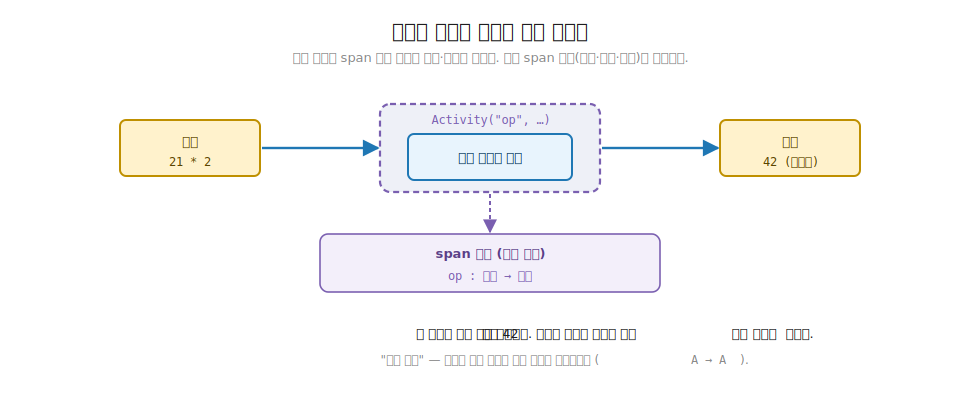
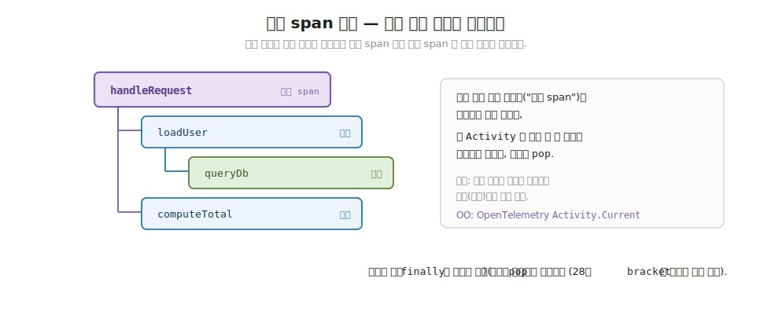

# 29장. Observability — Activity 와 분산 추적 (효과를 바꾸지 않고 관측)

> **이 장의 목표** — 이 장을 마치면 운영 환경에서 "어느 단계가 느린가, 어디서 실패하나" 를 알려 주는 분산 추적 (distributed tracing) 을 효과 위에 직접 얹을 수 있습니다. 효과 구간을 span 으로 감싸면, 효과의 결과 값은 그대로이고 옆에 중첩 span 트리 (부모-자식 타이밍) 만 남습니다. 추적이 효과를 바꾸지 않고 옆에서 관측만 더하는 횡단 관심사 (cross-cutting concern) 임을, `Tracer.Activity` 한 연산으로 손계산하며 확인합니다. 27장의 재시도와 28장의 자원에 이어 관측이 8부의 셋째 도구이며, 셋 다 효과가 값이기에 조합으로 얹힌다는 8부 전체의 통찰로 7부와 8부를 함께 닫습니다.

> **이 장의 핵심 어휘**
>
> - **관측성 (observability)**: 실행 중인 효과가 무엇을 언제 했는지를 바깥에서 들여다볼 수 있는 성질
> - **추적 (tracing)**: 효과가 어느 단계를 거쳐 얼마나 걸렸는지를 단계별로 기록하는 일
> - **span**: 추적의 한 구간. 효과의 한 단계를 감싸 이름과 부모-자식 관계를 기록한 트리 노드
> - **`Activity`**: span 을 만드는 연산. 효과 구간 하나를 감싸 추적에 더한다 (.NET 의 추적 타입 이름이기도 합니다)
> - **`Tracer`**: 현재 어느 구간 안인지를 들고 다니며 span 트리를 쌓는 도구
> - **중첩 span 트리**: 효과 안에서 효과를 추적하면 부모 span 아래 자식 span 이 쌓여 이루는 계층
> - **횡단 관심사 (cross-cutting concern)**: 추적·로깅·재시도처럼 여러 효과에 공통으로 얹히되 효과의 결과를 바꾸지 않는 관심사

> 이 장을 마치면 할 수 있게 되는 것
> - [ ] 추적이 효과를 바꾸지 않고 감싸는 횡단 관심사임을 한 문장으로 설명할 수 있습니다.
> - [ ] 효과 구간을 `Activity` 로 감싸 span 하나를 추적에 더할 수 있습니다.
> - [ ] 효과 안에서 효과를 추적하면 부모-자식 span 트리가 쌓임을 손계산으로 따라갈 수 있습니다.
> - [ ] 추적을 얹어도 효과의 결과 값이 같음을 (`A → A`) 4 함수 유형 어휘로 짚을 수 있습니다.
> - [ ] 구간 안에서 예외가 나도 span 이 닫혀 다음 추적이 오염되지 않음을 설명할 수 있습니다.
> - [ ] 학습용 `Tracer` 와 v5 의 `System.Diagnostics.Activity` 가 발상에서 정합함을 읽을 수 있습니다.
> - [ ] 재시도·자원·추적 셋이 모두 효과 위에 얹히는 8부의 공통 주제를 한 문장으로 정리할 수 있습니다.

> **이 장의 흐름** — 운영 환경에서 효과 하나가 느리거나 실패할 때 "어느 단계가 문제인가" 를 알 길이 없다는 자리에서 출발합니다. 명령형은 로깅과 타이머를 코드 곳곳에 박아 그 답을 모으는데, 그렇게 박힌 관측 코드가 효과 본문을 어지럽히는 불편을 먼저 부딪힙니다. 그 불편을 푸는 한 수가 추적을 효과를 감싸는 도구로 따로 떼는 것이고, 효과가 값이니 추적도 효과를 바꾸지 않고 옆에 얹히는 값으로 둘 수 있음을 봅니다. 효과 구간을 span 으로 감싸는 `Activity` 한 연산을 손계산으로 따라가고, 효과 안에서 효과를 추적하면 부모-자식 span 트리가 쌓임을 확인합니다. 이어 추적을 얹어도 결과가 같다는 핵심 성질을 4 함수 유형 어휘로 짚고, 구간 안에서 예외가 나도 span 이 닫히는 보장을 28장 `bracket` 의 finally 와 나란히 둡니다. 학습용 `Tracer` 가 v5 의 `System.Diagnostics.Activity` 와 어떻게 정합하는지 정직하게 짚은 뒤, 재시도·자원·추적이 모두 효과 위에 얹히는 8부의 통찰로 마무리하고 9부 동시성으로 다리를 놓습니다.

---

## 29.1 이 장에서 다루는 것 — 관측 가능한 효과

먼저 이 장이 다루는 도구가 어떤 일을 하는지 한 문장으로 잡습니다. 효과를 값으로 인코딩하고, 실패하면 다시 시도하고, 자원을 반드시 닫는 데까지 왔습니다. 그런데 그 효과를 운영 환경에 올리고 나면 새 물음이 생깁니다. 효과 하나가 평소보다 느릴 때, 또는 가끔 실패할 때, 그 효과의 어느 단계가 문제인지를 어떻게 알아낼까요. 코드를 한 줄씩 들여다볼 수 없는 운영 환경에서, 실행 중인 효과가 무엇을 언제 했는지를 바깥에서 들여다볼 수 있는 성질을 관측성 (observability) 이라 부릅니다. 이 장은 그 관측성을 효과에 더하는 도구를 다룹니다.

관측성을 더하는 흔한 방법이 추적 (tracing) 입니다. 효과가 어느 단계를 거쳐 각 단계가 얼마나 걸렸는지를 단계별로 기록하는 일입니다. 그 기록의 한 구간 하나를 span 이라 부릅니다. 이 장의 도구는 효과의 한 단계를 span 으로 감싸, 그 단계의 이름과 부모-자식 관계를 추적에 남깁니다. 효과가 끝나면 결과 값과 함께, 옆에 단계별 span 이 쌓인 트리가 남습니다.

8부의 세 도구로 보면, 27장이 재시도 정책을 값으로 (`Schedule`), 28장이 자원의 획득과 해제를 한 쌍으로 (`bracket`) 다뤘고, 이 장은 그 마지막 자리인 관측입니다. 세 도구의 공통점은 하나입니다. 모두 효과를 바꾸지 않고 그 위에 얹힙니다. 재시도는 효과를 여러 번 실행하되 효과 자체는 그대로이고, 자원 관리는 효과를 획득과 해제로 감싸되 효과의 결과는 그대로이며, 추적은 효과를 span 으로 감싸되 효과의 결과 값은 그대로입니다. 이 장은 그 세 번째 도구를 직접 구현하며, 효과가 값이기에 횡단 관심사가 조합으로 얹힌다는 8부 전체의 통찰을 닫습니다.

지금 모든 것을 외우지 않아도 됩니다. 이 장이 끝날 때 손에 남는 것은 두 가지입니다. 효과 구간을 span 으로 감싸면 결과는 그대로이고 옆에 추적 기록만 남는다는 발상 하나와, 효과 안에서 효과를 추적하면 부모-자식 span 트리가 쌓인다는 그림 하나입니다. 이 장에 처음 나오는 어휘를 한 줄씩만 미리 짚어 둡니다. span 은 추적의 한 구간입니다. `Activity` 는 그 span 을 만드는 연산입니다 (뒤에서 보겠지만 .NET 의 추적 타입 이름이기도 합니다). `Tracer` 는 지금 어느 구간 안인지를 들고 다니며 span 트리를 쌓는 도구입니다. 횡단 관심사 (cross-cutting concern) 는 추적·로깅처럼 여러 효과에 공통으로 얹히되 효과의 결과를 바꾸지 않는 관심사입니다. 네 어휘 모두 본문에서 코드와 함께 다시 천천히 풀므로, 여기서는 이름과 한 줄 뜻만 스쳐 두면 됩니다.

---

## 29.2 왜 필요한가 — 관측 코드가 효과 본문에 흩어집니다

추적 도구를 보이기 전에, 관측을 효과 코드에 직접 박으면 어디서 막히는지부터 부딪혀 봅니다. 추상을 먼저 보이지 않고 손에 잡히는 불편을 먼저 겪는 것이 이 장의 순서입니다.

운영 환경에 올린 효과 하나가 가끔 느리다고 해 봅니다. 그 효과는 사용자를 불러오고, 금액을 계산하고, 응답을 만드는 세 단계를 거칩니다. 어느 단계가 느린지 알고 싶습니다. 명령형에서 익숙한 답은 각 단계 앞뒤에 타이머와 로그를 박는 것입니다.

```csharp
// 관측을 효과 본문에 곧장 박은 코드 — 타이머와 로그가 단계마다 흩어진다.
string HandleRequest()
{
    var sw1 = Stopwatch.StartNew();
    log.Info("loadUser 시작");
    var user = LoadUser();
    log.Info($"loadUser 끝 {sw1.ElapsedMilliseconds}ms");   // ← 관측 코드가 본문을 어지럽힘

    var sw2 = Stopwatch.StartNew();
    log.Info("computeTotal 시작");
    var total = ComputeTotal();
    log.Info($"computeTotal 끝 {sw2.ElapsedMilliseconds}ms"); // ← 단계마다 반복

    return $"{user}: {total}원";
}
```

이 코드는 돌아갑니다. 로그를 모으면 어느 단계가 느린지도 알 수 있습니다. 문제는 따로 있습니다. 진짜 일을 하는 코드는 `LoadUser()`, `ComputeTotal()`, 그리고 문구를 만드는 한 줄뿐인데, 그 세 줄이 타이머와 로그 여섯 줄에 파묻혔습니다. 효과의 본문을 읽으려면 관측 코드를 눈으로 걸러 내야 합니다. 게다가 단계가 늘 때마다 같은 타이머-로그 묶음을 손으로 복사해 붙여야 하고, 어느 단계를 빠뜨렸는지 시그니처만 봐서는 알 수 없습니다.

부모-자식 관계는 더 어렵습니다. `LoadUser()` 가 내부에서 다시 데이터베이스를 조회한다면, 그 조회가 `loadUser` 단계의 하위 단계임을 로그로 표현하려면 들여쓰기든 식별자든 사람이 손으로 맞춰야 합니다. 단계가 깊어질수록 "이 로그가 어느 단계의 하위인가" 를 코드가 알려 주지 못하고, 로그를 읽는 사람이 머릿속에서 재구성해야 합니다.

객체 지향 개발자라면 이 자리에서 익숙한 도구가 떠오릅니다. 단계마다 로그를 박는 대신, 로깅 범위를 묶는 `ILogger.BeginScope` 가 있고, 더 나아가 분산 추적을 위한 OpenTelemetry 와 `ActivitySource` 가 있습니다. `ActivitySource.StartActivity("loadUser")` 로 구간을 열고 `using` 으로 닫으면, 그 구간 안의 하위 구간이 자동으로 자식으로 묶이고 소요 시간이 기록됩니다. 이 장이 하려는 일도 정확히 그것입니다. 효과의 한 단계를 추적 구간 (span) 으로 감싸, 그 안의 단계가 자동으로 자식이 되게 하는 것입니다. 다른 점은 하나입니다. 명령형이 그 구간을 `using` 블록으로 코드 흐름에 박는 대신, 효과가 값이니 추적도 효과를 감싸는 값으로 둡니다. 효과를 바꾸지 않고 옆에 얹는 것입니다.

> **흔한 함정** — 관측을 더하면 효과의 결과나 동작이 달라질까 걱정하는 것입니다.
>
> 추적은 효과가 무엇을 했는지 옆에서 기록만 합니다. 효과의 입력도, 결과 값도, 실행 순서도 바꾸지 않습니다. `loadUser` 단계를 span 으로 감싸도 `LoadUser()` 가 돌려주는 값은 똑같습니다. 추적을 모두 걷어 내도 효과는 같은 결과를 냅니다. 이것이 추적을 횡단 관심사라 부르는 까닭입니다. 효과의 본질에 가로질러 얹히되, 본질을 바꾸지 않습니다. 이 성질을 뒤에서 코드로 직접 확인합니다.

그래서 우리가 바라는 것은 분명합니다. 관측 코드를 효과 본문에 흩뿌리지 말고, 효과의 한 단계를 추적 구간으로 감싸는 한 연산으로 묶고 싶습니다. 그 연산이 효과의 결과는 그대로 돌려주되, 옆에 단계의 이름과 부모-자식 관계를 기록해 주면 좋겠습니다. 그리고 효과 안에서 효과를 감싸면 자식 구간이 부모 아래로 저절로 쌓이면 좋겠습니다. 이 일을 하는 것이 이 장의 `Activity` 와 `Tracer` 입니다. 다음 절에서 그 한 연산을 봅니다.

---

## 29.3 Activity 와 span — 효과 구간을 감싸기

이제 효과 구간을 추적 구간으로 감싸는 연산을 봅니다. 핵심은 단 하나입니다. 효과 하나를 받아, 그 효과를 span 으로 감싸 추적에 더하고, 효과의 결과는 그대로 돌려준다는 것입니다.

먼저 추적의 한 구간을 표현하는 자료부터 봅니다. span 은 이름 하나와 자식 구간들의 목록 하나를 가진 단순한 트리 노드입니다.

```csharp
// Span — 추적의 한 구간 (이름 + 자식 구간들). 분산 추적의 트리 노드.
public sealed class Span(string name)
{
    public string Name { get; } = name;
    public List<Span> Children { get; } = [];
}
```

`Span` 은 이름 `Name` 과 자식 목록 `Children` 만 가집니다. 한 구간이 자식 구간들을 품으므로, span 들이 모이면 트리가 됩니다. 실무의 span 에는 소요 시간이나 태그 같은 정보가 더 붙지만 (뒤에서 짚습니다), 학습용으로는 이름과 부모-자식 관계만 남겨 추적의 핵심 모양을 봅니다.

이제 그 span 트리를 쌓는 `Tracer` 를 봅니다. 핵심 연산은 효과를 감싸는 `Activity` 하나입니다.

```csharp
// Tracer — 현재 구간을 스택으로 추적하며 span 트리를 만든다.
// System.Diagnostics.Activity / OpenTelemetry 의 발상을 외부 의존 없이 모델링한 것.
public sealed class Tracer
{
    public Span Root { get; } = new("trace");
    readonly Stack<Span> stack;

    public Tracer() { stack = new Stack<Span>(); stack.Push(Root); }

    // activity — 효과를 *감싸* span 으로 추적한다. 결과는 바꾸지 않는다 (횡단 관심사).
    public A Activity<A>(string name, Func<A> body)
    {
        var span = new Span(name);
        stack.Peek().Children.Add(span);   // 현재 구간의 자식으로
        stack.Push(span);
        try
        {
            return body();                 // 효과 실행 (결과 그대로)
        }
        finally
        {
            stack.Pop();                   // 구간 종료 (예외에도)
        }
    }
    // Render / Names 는 뒤에서.
}
```

핵심 연산 `Activity<A>(string name, Func<A> body)` 의 시그니처부터 읽습니다. 이름 `name` 과 효과 `body` 를 받아, `A` 를 돌려줍니다. 여기서 `body` 가 추적할 효과입니다. 이 장에서는 효과를 동기 함수 `Func<A>` 로 단순화해 둡니다 (v5 와의 정합은 뒤에서 짚습니다). 그리고 한 가지를 시그니처에서 미리 짚어 둡니다. `body` 의 결과 타입도 `A`, `Activity` 의 반환 타입도 `A` 로 같습니다. 추적을 감싸도 효과의 결과 타입이 바뀌지 않는다는 뜻입니다. 이 점은 뒤에서 핵심 성질로 다시 다룹니다.

본체를 한 단계씩 읽습니다. `new Span(name)` 으로 이 구간의 span 을 하나 만듭니다. `stack.Peek().Children.Add(span)` 은 스택 맨 위의 구간 (지금 우리가 들어와 있는 구간) 의 자식으로 이 span 을 답니다. `stack.Push(span)` 으로 이 span 을 현재 구간으로 삼아 스택에 올립니다. 이제 `body()` 로 효과를 실행하고, 그 결과를 그대로 돌려줍니다. 마지막 `finally` 의 `stack.Pop()` 이 이 구간을 닫아 스택에서 내립니다.

여기서 어휘 하나를 짚어 둡니다. 이 연산의 이름은 `Activity` 이고, 장 제목도 Activity 입니다. 그런데 추적의 한 구간을 가리키는 말은 span 입니다. 둘의 관계는 이렇습니다. 추적의 한 구간이 span 이고, 그 span 을 만드는 연산이 `Activity` 입니다. .NET 으로 가면 그 구간을 표현하는 타입의 이름이 `System.Diagnostics.Activity` 이기도 합니다 (뒤에서 봅니다). 이 장에서는 한 문장으로 정해 둡니다. **span 은 추적의 한 구간이고, `Activity` 는 그 구간을 만드는 연산입니다.** 이름이 둘로 보여도 가리키는 것은 "효과 한 단계를 감싼 추적 구간" 하나입니다.

이름이 셋으로 흩어져 보일 수 있으니, 같은 한 가지를 가리키는 세 자리를 한 표로 미리 묶어 둡니다.

| 이름 | 무엇을 가리키나 |
|---|---|
| span | 추적의 한 구간 (효과 한 단계를 감싼 트리 노드) |
| `Activity` | 이 장에서 그 구간을 만드는 연산 (장 제목과 맞춘 이름) |
| `System.Diagnostics.Activity` | .NET 에서 그 구간을 표현하는 타입의 이름 |

세 이름이 다른 자리에 놓여 있을 뿐, 모두 "효과 한 단계를 감싼 추적 구간" 하나를 둘러싼 말입니다. 학습 코드의 연산 이름 `Activity` 가 v5 와 .NET 에서 어떻게 갈리는지는 뒤에서 다시 짚습니다.

무슨 일이 일어나는지 손으로 따라갑니다. 우리가 좇을 것은 두 가지뿐입니다. 현재 구간을 들고 있는 스택 `stack` 과, 효과의 반환값입니다. 가장 단순한 한 구간짜리 추적부터 봅니다. `tracer.Activity("op", () => 21 * 2)` 를 부르면 이렇습니다.

```
시작:  stack = [trace]          (루트만 들어 있음)

tracer.Activity("op", () => 21 * 2)
  ├ span = new Span("op")
  ├ stack.Peek() = trace → trace 의 자식으로 op 를 단다
  │   trace 의 자식: [op]
  ├ stack.Push(op)
  │   stack = [trace, op]
  ├ body() 실행 → 21 * 2 = 42
  └ finally: stack.Pop()
      stack = [trace]           (op 구간 닫힘)

결과:  반환값 = 42
       추적 트리:  trace
                    └ op
```

`Activity` 가 한 일은 둘입니다. `op` 라는 span 을 루트의 자식으로 추적 트리에 더했고, 효과 `() => 21 * 2` 를 실행해 그 결과 `42` 를 그대로 돌려줬습니다. 효과의 결과는 추적을 거쳐도 `42` 그대로입니다. 추적은 옆에 트리 한 줄을 더했을 뿐입니다.

한 가지만 더 천천히 들여다봅니다. 손계산에서 `op` 가 `trace` 의 자식으로 달린 까닭은 그 줄을 실행하던 순간 스택 맨 위가 `trace` 였기 때문입니다. 추적은 "새 구간을 누구 아래에 달까" 를 매번 묻지 않습니다. 답은 늘 "지금 들어와 있는 구간" 이고, 그 구간을 스택 맨 위가 가리킵니다. 한 구간짜리 추적에서는 그 맨 위가 루트 하나뿐이라 모든 새 구간이 루트의 자식이 됩니다. 다음 절에서 구간 안에 구간이 들어가면, 바로 이 "스택 맨 위" 가 바깥 구간으로 바뀌면서 트리가 깊어집니다.

객체 지향 직감으로 다리를 놓으면 이렇습니다. OpenTelemetry 의 `ActivitySource.StartActivity("op")` 로 구간을 열고 `using` 으로 닫는 것이 정확히 이 `Activity` 와 같은 일을 합니다. `using` 블록에 들어갈 때 구간이 열리고 (`Push`), 블록을 벗어날 때 구간이 닫힙니다 (`Pop`). 다른 점은, OpenTelemetry 가 그 구간을 코드 흐름의 `using` 으로 박는 대신, 이 장은 효과 `body` 를 인자로 받아 감싼다는 것입니다. 효과가 값이니 추적도 효과를 받아 감싸는 한 연산이 됩니다.

이 객체 지향 다리를 한 걸음 더 놓아 둡니다. `ActivitySource.StartActivity("op")` 가 돌려준 구간을 `using` 으로 받으면, 블록을 벗어날 때 그 구간이 닫히는 것은 `IDisposable.Dispose` 가 불리기 때문입니다. 그 `Dispose` 가 학습 코드의 `finally` 의 `Pop` 에 해당합니다. `ILogger.BeginScope("op")` 도 같은 모양입니다. `using` 으로 범위를 열고 블록 끝에서 닫으며, 그 안의 로그가 같은 범위로 묶입니다. 명령형의 이 `using` 범위 묶기가 효과를 인자로 받아 감싸는 한 연산으로 바뀐 것이 이 장의 `Activity` 입니다.

> **더 깊이 (처음엔 건너뛰어도 됩니다)** — 학습 코드의 `Span` 은 이름 하나만 들지만, .NET 의 실제 `System.Diagnostics.Activity` 한 구간에는 훨씬 많은 것이 함께 적힙니다.
>
> v5 소스의 `Activity` 설명을 그대로 옮기면 "한 `Activity` 는 연산 이름, ID, 시작 시각과 소요 시간, 태그, 그리고 baggage 를 가진다" 입니다. 풀어 보면 한 구간에는 (a) **소요 시간** (`Duration`, 시작과 끝 사이 얼마나 걸렸나), (b) **태그** (`AddTag`, 예: `http.method = "GET"` 같은 키-값 메타), (c) **이벤트** (`AddEvent`, 구간 도중 일어난 일의 표시), (d) **추적 식별자** (`TraceId`)·**구간 식별자** (`SpanId`)·**부모 식별자** (`ParentId`, 한 요청을 잇는 번호들) 가 함께 붙습니다. 학습용 `Tracer` 는 이 모두를 덜어 내고 이름과 부모-자식만 남겼습니다. 추적의 핵심 모양 (구간을 감싸 트리를 만든다) 을 흐리지 않으려는 의도된 축소입니다. 지금은 이름 트리 하나만 들고 가면 되고, 나머지는 그 트리 위에 값을 더 다는 것일 뿐입니다.



**그림 29-1. 추적은 효과를 바꾸지 않고 감싼다** — `Activity` 로 효과 구간을 span 으로 감싸면, 효과의 입력과 결과는 그대로이고 옆에 span 기록 (이름·시작·종료 시각) 만 남습니다. 추적이 결과를 바꾸지 않는 횡단 관심사임을, 효과 흐름과 span 기록을 나란히 두어 보입니다.

> **흔한 함정** — span 을 효과의 결과에 끼어드는 무언가로 여기는 것입니다.
>
> `Activity("op", body)` 는 `body` 의 결과를 받아 다른 값으로 바꾸거나 감싸지 않습니다. `body()` 가 낸 값을 한 글자도 손대지 않고 그대로 `return` 합니다. span 은 효과의 결과가 흘러가는 길 옆에 따로 만들어져 트리에 쌓일 뿐, 결과의 길목에 끼어들지 않습니다. 그래서 `int` 를 내던 효과는 추적을 감싸도 여전히 `int` 를 내고, 추적을 모두 걷어 내도 같은 `int` 를 냅니다.

---

## 29.4 중첩 span 트리 — 부모와 자식

한 구간을 감싸는 것까지 왔습니다. 그런데 실무의 효과는 단계 안에 단계가 있습니다. 사용자를 불러오는 단계 안에서 데이터베이스를 조회하고, 주문을 처리하는 단계 안에서 금액을 계산합니다. 이 절은 효과 안에서 효과를 추적하면 부모-자식 span 트리가 저절로 쌓임을 봅니다.

왜 트리가 필요한지부터 짚습니다. 운영 환경에서 "요청 처리가 느리다" 는 것만으로는 부족합니다. 요청 처리의 어느 단계가 느린지, 그 단계의 또 어느 하위 단계가 느린지를 계층으로 봐야 원인을 좁힐 수 있습니다. 분산 추적이 단순한 로그 목록이 아니라 트리인 까닭이 여기 있습니다. "전체 1100ms 중 사용자 불러오기가 900ms, 그중 데이터베이스 조회가 850ms" 처럼 계층으로 시간을 쪼개 보여 줍니다.

그 트리가 어떻게 저절로 쌓이는지는 앞 절의 스택에 답이 있습니다. `Activity` 는 새 span 을 스택 맨 위 구간의 자식으로 답니다. 그러니 어떤 구간 안에서 다시 `Activity` 를 부르면, 새 span 은 바깥 구간의 자식이 됩니다. 부모-자식 관계가 코드의 중첩 모양 그대로 트리에 새겨집니다. 사람이 식별자를 손으로 맞출 필요가 없습니다. "지금 어느 구간 안인가" 를 스택이 들고 다니기 때문입니다.

이 "현재 구간" 이라는 암묵 상태가 이 절의 핵심입니다. 부모-자식 트리를 만들려면 새 span 을 어느 구간 아래에 달지를 알아야 하고, 그 답이 "지금 들어와 있는 구간" 입니다. `Tracer` 는 그것을 `Stack<Span>` 으로 들고 다닙니다. 구간에 들어가면 스택에 올리고 (`Push`), 나오면 내리며 (`Pop`), 새 span 은 늘 스택 맨 위의 자식으로 답니다. 명시적인 인자로 "내 부모는 누구" 를 매번 넘기지 않아도, 스택이 그 맥락을 대신 들고 다닙니다.

손으로 따라갑니다. 데모의 효과를 그대로 가져옵니다. 사용자를 불러오는 구간 안에서 데이터베이스를 조회하고, 그와 나란히 금액을 계산하는, 두 단 중첩이 들어간 효과입니다.

```csharp
var tracer = new Tracer();

var result = tracer.Activity("handleRequest", () =>
{
    var user = tracer.Activity("loadUser", () =>
        tracer.Activity("queryDb", () => "철수"));
    var total = tracer.Activity("computeTotal", () => 1100);
    return $"{user}: {total}원";
});
```

이 효과를 실행하며 스택이 어떻게 오르내리는지, 그리고 트리가 어떻게 쌓이는지를 좇습니다.

```
stack = [trace]

Activity("handleRequest", …)
  ├ handleRequest 를 trace 의 자식으로,  stack = [trace, handleRequest]
  │
  ├ Activity("loadUser", …)
  │   ├ loadUser 를 handleRequest 의 자식으로,  stack = [trace, handleRequest, loadUser]
  │   │
  │   └ Activity("queryDb", () => "철수")
  │       ├ queryDb 를 loadUser 의 자식으로,  stack = [trace, handleRequest, loadUser, queryDb]
  │       ├ body() → "철수"
  │       └ pop,  stack = [trace, handleRequest, loadUser]
  │   └ loadUser 의 body 가 "철수" 반환,  pop,  stack = [trace, handleRequest]
  │
  ├ Activity("computeTotal", () => 1100)
  │   ├ computeTotal 를 handleRequest 의 자식으로,  stack = [trace, handleRequest, computeTotal]
  │   ├ body() → 1100
  │   └ pop,  stack = [trace, handleRequest]
  │
  ├ body() → "철수: 1100원"
  └ pop,  stack = [trace]

결과:  반환값 = "철수: 1100원"
       추적 트리:  handleRequest
                    ├ loadUser
                    │  └ queryDb
                    └ computeTotal
```

스택을 따라가면 트리가 코드의 중첩을 그대로 본뜬 것이 보입니다. `queryDb` 는 `loadUser` 안에서 불렸으니 `loadUser` 의 자식이 되고, `loadUser` 와 `computeTotal` 은 `handleRequest` 안에서 나란히 불렸으니 둘 다 `handleRequest` 의 자식이 됩니다. `Push` 와 `Pop` 이 들고 나는 시점이 코드의 중괄호와 정확히 맞아떨어집니다. 그리고 효과의 결과는 `"철수: 1100원"`, 추적을 거쳐도 그대로입니다.

같은 흐름을 스택 한 줄만 떼어 시점별로 다시 늘어놓으면, 깊어졌다 얕아지는 리듬이 한눈에 보입니다. 맨 위 (오른쪽 끝) 가 늘 "지금 구간" 이고, 새 span 은 그 오른쪽 끝의 자식으로 답니다.

```
시점                          스택 (왼→오, 오른쪽이 현재 구간)        달리는 곳
─────────────────────────────────────────────────────────────────────────
handleRequest 진입            [trace, handleRequest]                trace 의 자식
  loadUser 진입               [trace, handleRequest, loadUser]      handleRequest 의 자식
    queryDb 진입              [..., loadUser, queryDb]              loadUser 의 자식
    queryDb 종료 (pop)        [trace, handleRequest, loadUser]
  loadUser 종료 (pop)         [trace, handleRequest]
  computeTotal 진입           [trace, handleRequest, computeTotal]  handleRequest 의 자식
  computeTotal 종료 (pop)     [trace, handleRequest]
handleRequest 종료 (pop)      [trace]
```

스택이 가장 깊어진 순간은 `queryDb` 안에 있을 때 (`[trace, handleRequest, loadUser, queryDb]`, 네 칸) 이고, 매 구간이 끝날 때마다 한 칸씩 얕아져 끝내 다시 `[trace]` 한 칸으로 돌아옵니다. "달리는 곳" 칸이 그 시점의 스택 맨 위와 늘 일치합니다. 부모를 정하는 인자는 코드 어디에도 없습니다. 매 순간의 스택 맨 위가 그 답을 대신 들고 다니기 때문입니다.

`Tracer` 가 이 트리를 사람이 읽도록 출력하는 `Render` 와, 검증용으로 이름만 나열하는 `Names` 도 같은 깊이우선 순회를 씁니다.

```csharp
// 트리를 들여쓰기로 출력.
public string Render()
{
    var sb = new System.Text.StringBuilder();
    void Walk(Span s, int depth)
    {
        sb.AppendLine($"{new string(' ', depth * 2)}- {s.Name}");
        foreach (var c in s.Children) Walk(c, depth + 1);
    }
    foreach (var c in Root.Children) Walk(c, 0);
    return sb.ToString().TrimEnd();
}

// 트리의 이름들을 깊이우선으로 나열 (검증용).
public List<string> Names()
{
    var names = new List<string>();
    void Walk(Span s) { foreach (var c in s.Children) { names.Add(c.Name); Walk(c); } }
    Walk(Root);
    return names;
}
```

`Render` 는 각 span 을 깊이만큼 들여쓴 `- 이름` 한 줄로 찍습니다. 위 효과를 `Render` 하면 다음 트리가 나옵니다.

```
- handleRequest
  - loadUser
    - queryDb
  - computeTotal
```

`Names` 는 같은 깊이우선 순회로 이름만 모읍니다. 검증할 때 트리 모양을 이름 목록 하나로 견주기 위해서입니다. 위 효과면 `["handleRequest", "loadUser", "queryDb", "computeTotal"]` 이 나옵니다.

이 목록의 순서가 왜 그 순서인지 한 번 짚어 둡니다. `Names` 는 부모를 먼저 담고 그 자식들로 내려가는 깊이우선 순회입니다. 그래서 `handleRequest` (부모) 가 맨 앞에 오고, 그 첫 자식 `loadUser`, 다시 그 자식 `queryDb` 로 깊이 내려간 뒤, 위로 돌아와 둘째 자식 `computeTotal` 을 담습니다. `Render` 의 들여쓰기 깊이와 `Names` 의 나열 순서는 같은 순회의 두 표현입니다. 하나는 깊이를 들여쓰기로 보이고, 다른 하나는 깊이 정보를 접어 이름만 한 줄로 폅니다. 검증에서 이름 목록을 견주는 까닭이 여기 있습니다. 트리 모양이 한 끗이라도 어긋나면 이 목록의 순서가 달라지므로, 목록 하나만 비교해도 트리가 제 모양인지 가려집니다.



**그림 29-2. 중첩 span 트리** — 효과 안에서 다른 효과를 추적하면 부모 span 아래 자식 span 이 쌓여 트리를 이룹니다. 바깥 작업의 span 이 부모, 그 안의 단계별 span 이 자식이 되어, 분산 추적이 "어느 단계가 얼마나 걸렸나" 를 계층으로 보입니다.

객체 지향 직감으로 다리를 놓으면 이렇습니다. OpenTelemetry 에서 `StartActivity` 로 연 구간 안에서 다시 `StartActivity` 를 부르면, 바깥 구간이 부모가 되고 안쪽 구간이 자식이 되어 추적 트리에 쌓입니다. "현재 어느 구간 안인가" 를 OpenTelemetry 는 `Activity.Current` 라는 맥락으로 들고 다니고, 학습용 `Tracer` 는 `Stack<Span>` 으로 들고 다닙니다. 들고 다니는 그릇만 다를 뿐, 중첩이 트리가 되는 발상은 같습니다.

> **더 깊이 (처음엔 건너뛰어도 됩니다)** — 실무에서 부모-자식이 이어지는 실제 길은 식별자입니다.
>
> v5 의 `span` 은 새 구간을 시작할 때 "지금 구간" 의 문맥 (`Context`) 을 부모로 넘깁니다. 소스에서 그 자리는 `cur is null ? default : parentContext ?? cur.Context` 한 줄입니다. 풀면 지금 구간이 없으면 (`cur is null`) 새 구간이 뿌리가 되고, 있으면 그 구간의 문맥을 부모로 삼는다는 뜻입니다. 그 문맥 안에 한 추적 전체를 잇는 `TraceId` 와 그 구간 하나를 가리키는 `SpanId` 가 들어 있어, 자식 구간은 "내 부모의 SpanId" 를 `ParentId` 로 들고 태어납니다. 학습용 `Tracer` 가 객체 참조 (`Children.Add`) 로 부모-자식을 직접 잇는 자리를, 실무는 이 식별자들로 잇습니다. 그래야 한 요청이 여러 서비스를 건너가도 같은 `TraceId` 로 트리를 다시 꿸 수 있기 때문입니다. 분산 추적의 "분산" 이 바로 이 식별자 전파에서 나옵니다.

> **미리보기** — 학습용 `Tracer` 의 span 에는 이름과 부모-자식 관계만 담겼지만, 실무의 span 에는 더 많은 것이 붙습니다.
>
> OpenTelemetry 의 span 에는 소요 시간 (duration), 태그 (tag, 예: `db.query = "select …"`), 이벤트 (event), 그리고 추적 전체를 잇는 식별자 (trace id) 가 함께 기록됩니다. 그래야 "어느 단계가 850ms 걸렸고 그때 어떤 질의를 던졌나" 까지 봅니다. 학습용 `Tracer` 는 이를 모두 덜어 내고 이름 트리만 남겼습니다. 추적의 핵심 모양 (구간을 감싸 부모-자식 트리를 만든다) 을 흐리지 않기 위해서입니다. 구간에 메타데이터를 덧붙이는 일은 이 이름 트리 위에 값을 더 다는 것일 뿐, 발상은 그대로입니다.

> **더 깊이 (처음엔 건너뛰어도 됩니다)** — 그 "값을 더 단다" 가 v5 에서 실제로 어떤 모양인지 한 줄만 보입니다.
>
> v5 의 `Activity` 는 지금 구간에 메타를 다는 연산들을 효과로 내놓습니다. 예를 들어 `addTag("db.query", sql)` 은 지금 구간에 태그 한 쌍을 달고, `duration` 은 지금 구간이 얼마나 걸렸는지를 읽습니다. 둘 다 시그니처가 `K<M, Unit>` 또는 `K<M, Option<TimeSpan>>` 입니다. 곧 추적 메타를 읽고 쓰는 일조차 또 하나의 효과라는 뜻입니다. 그래서 "어느 단계가 850ms 걸렸고 그때 어떤 질의를 던졌나" 가 같은 효과 흐름 안에서 자연스럽게 적힙니다. 학습용 `Tracer` 는 이 갈래를 들어내 이름 트리만 남겼고, 직접 해보기의 셋째 챌린지에서 `Span` 에 태그를 더해 그 한 걸음을 손수 밟아 봅니다.

---

## 29.5 결과 불변 — 효과를 바꾸지 않는 횡단 관심사

이제 이 장의 핵심 성질을 또렷이 짚습니다. 앞 두 절에서 본 그대로입니다. 추적을 얹어도 효과의 결과 값은 같습니다. 이 절은 그 성질에 1장의 어휘로 자리를 줍니다.

왜 이 성질이 중요한지부터 짚습니다. 만약 추적을 더했더니 효과의 결과가 달라진다면, 추적을 켠 운영 환경과 추적을 끈 개발 환경에서 프로그램이 다르게 동작하게 됩니다. 관측하려고 더한 코드가 관측 대상을 바꾸는 셈입니다. 추적은 그래서는 안 됩니다. 효과가 무엇을 했는지 옆에서 보기만 해야지, 효과가 무엇을 할지에 끼어들면 안 됩니다. 그 "끼어들지 않음" 이 추적을 믿을 수 있게 만드는 토대입니다.

`Activity` 의 시그니처가 이 성질을 이미 적어 두었습니다. `A Activity<A>(string name, Func<A> body)` 에서, 받는 효과의 결과 타입도 `A`, 돌려주는 타입도 `A` 입니다. 값을 받아 그 값을 그대로 돌려주는 모양, 곧 `A → A` 입니다. 1장에서 정착시킨 4 함수 유형으로 보면, `Activity` 가 효과에 더하는 것은 Normal World 의 값 하나를 받아 같은 모양의 값을 그대로 돌려주는 자리입니다. 값의 모양을 바꾸는 `a → b` 도, 두 세계를 오가는 `a → E<b>` 도 아닙니다. 모양을 그대로 두고 옆에서 관측만 더하는 자리입니다. 이 모양 보존이 추적을 횡단 관심사로 만드는 까닭입니다.

코드로 직접 확인합니다. 학습 코드의 첫 검증이 정확히 이 성질을 봅니다.

```csharp
// ① 추적은 결과를 바꾸지 않는다 (횡단 관심사).
public static bool ResultUnchangedHolds()
{
    var tracer = new Tracer();
    var traced = tracer.Activity("op", () => 21 * 2);
    return traced == 42;
}
```

`tracer.Activity("op", () => 21 * 2)` 를 부르면, 추적을 감싸도 결과가 `42` 인지를 봅니다. 손으로 따라가면 자명합니다. `Activity` 는 `op` span 을 트리에 더한 뒤 `body()` 를 실행해 `21 * 2 = 42` 를 그대로 돌려줍니다. 추적을 감싸지 않은 `21 * 2` 와 한 글자도 다르지 않은 `42` 입니다. `traced == 42` 가 참이므로, 추적이 효과의 결과를 바꾸지 않음이 확인됩니다.

여기서 책 전체를 가로지른 어휘 하나를 다시 만납니다. trait 의 약속을 다룰 때 모양 보존을 말했습니다. Functor 의 `Map` 이 컨테이너의 모양을 그대로 두고 안의 값만 바꾼다는 그 성질입니다. 추적은 거기서 한 걸음 더 나아갑니다. 안의 값조차 바꾸지 않습니다. 효과의 결과를 그대로 두고, 효과가 무엇을 했는지의 기록만 옆에 더합니다. 이것이 추적을 효과 위에 안심하고 얹을 수 있는 까닭입니다. 효과의 의미를 한 글자도 건드리지 않기 때문입니다.

> **흔한 함정** — 추적이 결과를 안 바꾼다면 굳이 효과를 감쌀 필요가 있느냐는 의문입니다.
>
> 추적이 바꾸지 않는 것은 효과의 결과 값입니다. 추적이 더하는 것은 효과 바깥의 기록 (span 트리) 입니다. 결과는 그대로 두되 "어느 단계를 거쳐 그 결과에 닿았나" 를 옆에 남기는 것이 추적의 일입니다. 결과를 안 바꾸기 때문에 켜고 끄기가 안전하고, 옆에 기록을 남기기 때문에 운영 환경에서 단계별로 들여다볼 수 있습니다. 두 성질 (결과 불변 + 기록 추가) 이 함께 있어야 추적이 쓸모 있습니다.

이 결과 불변을 한 번 더 손으로 짚어 둡니다. 같은 효과 `() => 21 * 2` 를 한 번은 맨몸으로, 한 번은 추적으로 감싸 나란히 둡니다.

```
맨몸:           21 * 2                       → 42
추적으로 감쌈:  Activity("op", () => 21 * 2)  → 42
                └ 옆에 남는 것: trace
                                └ op
```

두 줄의 반환값이 글자 그대로 같은 `42` 입니다. 다른 점은 오른쪽 아래에 트리 두 줄이 더 생겼다는 것뿐입니다. 추적을 모두 걷어 내고 `Activity("op", body)` 를 `body()` 로 바꿔치기해도 프로그램의 결과는 한 끗도 달라지지 않습니다. 이 "걷어 내도 결과가 같다" 가 결과 불변을 눈으로 본 모습입니다. 추적을 운영 환경에서 켜든 개발 환경에서 끄든 프로그램이 같은 답을 내는 토대가 여기 있습니다.

---

## 29.6 예외가 나도 닫히는 구간 — 28장 bracket 의 finally

추적을 효과 위에 안심하고 얹으려면 한 가지가 더 필요합니다. 구간 안에서 예외가 나도 그 구간이 올바르게 닫혀야 합니다. 이 절은 그 보장을 28장 `bracket` 의 finally 와 나란히 둡니다.

왜 이것이 문제인지부터 짚습니다. `Activity` 는 구간에 들어갈 때 스택에 span 을 올리고 (`Push`), 나올 때 내립니다 (`Pop`). 그런데 구간 안의 효과가 예외를 던지면 어떻게 될까요. `Pop` 을 그냥 본체 끝에 두었다면, 예외가 본체를 중간에 끊고 빠져나가 `Pop` 이 실행되지 않습니다. 그러면 스택에 그 span 이 올라간 채로 남고, 다음에 추적하는 구간이 엉뚱하게 그 죽은 span 의 자식으로 달립니다. 한 번의 예외가 그 뒤 모든 추적의 트리를 오염시킵니다.

학습 코드는 이를 `try`/`finally` 로 막습니다. 앞에서 본 `Activity` 본체를 다시 봅니다.

```csharp
public A Activity<A>(string name, Func<A> body)
{
    var span = new Span(name);
    stack.Peek().Children.Add(span);
    stack.Push(span);
    try
    {
        return body();                 // 효과 실행
    }
    finally
    {
        stack.Pop();                   // 구간 종료 (예외에도)
    }
}
```

핵심은 `stack.Pop()` 이 `finally` 블록 안에 있다는 것입니다. `finally` 는 `try` 본체가 정상으로 끝나든 예외로 끊기든 반드시 실행됩니다. 그러니 `body()` 가 값을 돌려주면 `Pop` 이 실행되고, `body()` 가 예외를 던져도 그 예외가 위로 올라가기 전에 `Pop` 이 먼저 실행됩니다. 구간은 어느 경우에도 닫힙니다.

손으로 따라갑니다. 학습 코드의 셋째 검증이 정확히 이 경로를 봅니다. 한 구간에서 일부러 예외를 던지고, 그 뒤 다른 구간을 추적합니다.

```csharp
// ③ 예외가 나도 구간이 올바르게 닫혀 다음 추적에 영향 없음.
public static bool ClosesOnExceptionHolds()
{
    var tracer = new Tracer();
    try { tracer.Activity<int>("boom", () => throw new InvalidOperationException()); }
    catch (InvalidOperationException) { }
    tracer.Activity("after", () => 0);
    // boom 과 after 둘 다 루트의 자식 (boom 이 스택을 오염시키지 않았다).
    return tracer.Names().SequenceEqual(["boom", "after"]);
}
```

스택이 예외 경로에서 어떻게 닫히는지를 좇습니다.

```
stack = [trace]

Activity("boom", () => throw …)
  ├ boom 을 trace 의 자식으로,  stack = [trace, boom]
  ├ body() 실행 → 예외 발생!
  └ finally: stack.Pop()        ← 예외가 올라가기 전에 반드시 실행
      stack = [trace]           (boom 구간 닫힘)
  → 예외가 위로 → catch 가 받음

Activity("after", () => 0)
  ├ stack.Peek() = trace        ← boom 이 닫혔으므로 현재 구간은 다시 trace
  ├ after 를 trace 의 자식으로,  stack = [trace, after]
  ├ body() → 0
  └ pop,  stack = [trace]

결과:  trace 의 자식 = [boom, after]   (after 가 boom 의 자식이 아니다!)
       Names() = ["boom", "after"]
```

`boom` 에서 예외가 났지만 `finally` 의 `Pop` 이 그 구간을 닫았으므로, 스택은 예외 직후 다시 `[trace]` 로 돌아갑니다. 그래서 그다음 `after` 는 죽은 `boom` 의 자식이 아니라 루트의 자식으로, 올바른 자리에 달립니다. `Names()` 가 `["boom", "after"]` 로 둘 다 루트의 자식임을 보이므로, 예외가 다음 추적을 오염시키지 않았음이 확인됩니다. 만약 `Pop` 이 `finally` 가 아니라 본체 끝에 있었다면, `after` 는 닫히지 않은 `boom` 의 자식으로 잘못 달렸을 것입니다.

이 구조를 28장에서 이미 만났습니다. `bracket` 은 자원을 획득하고 (acquire), 사용한 뒤, 사용 중 예외가 나도 반드시 해제했습니다 (release). 그 "예외가 나도 반드시" 를 떠받친 것이 `finally` 였습니다. `Activity` 의 구간 닫기도 정확히 같은 구조입니다. 구간을 연 것이 `bracket` 의 획득에, 구간을 닫는 `finally` 의 `Pop` 이 `bracket` 의 해제에 나란히 놓입니다. 추적의 span 도, 자원의 핸들도, "연 것은 반드시 닫는다" 는 같은 약속 위에 섭니다. 28장에서 자원을 닫던 그 `finally` 가, 여기서는 추적 구간을 닫습니다.

같은 못을 v5 도 박습니다. v5 의 `span` 은 새 구간을 `use(...)` 로 시작합니다. 6부에서 본 `use` 는 효과가 끝나면 그 자원을 반드시 해제하는 연산입니다. 추적 구간도 `IDisposable` 이라, `operation` 이 정상으로 끝나든 예외로 끊기든 `use` 가 그 구간을 닫습니다. 학습 코드가 `finally` 의 `Pop` 으로 손수 하던 일을, v5 는 `use` 라는 효과로 합니다. 그릇은 다르지만 약속은 하나입니다. 연 구간은 반드시 닫는다는 것입니다. 28장의 `bracket`, 이 장의 `finally`, 그리고 v5 의 `use` 가 모두 같은 약속의 다른 얼굴입니다.

> **흔한 함정** — `Pop` 을 본체 끝에 두어도 예외만 잘 잡으면 괜찮다고 여기는 것입니다.
>
> 예외를 바깥에서 `try`/`catch` 로 잡더라도, `Pop` 이 `Activity` 본체의 `finally` 밖에 있으면 이미 늦습니다. 예외가 `body()` 를 끊고 빠져나가는 순간 본체 끝의 `Pop` 은 건너뛰어지고, 스택은 닫히지 않은 span 을 안은 채로 `catch` 로 빠져나갑니다. 구간을 닫는 일은 예외가 본체를 떠나기 전에, 곧 `Activity` 자신의 `finally` 안에서 일어나야 합니다. 28장에서 자원 해제를 `finally` 에 둔 것과 같은 이유입니다.

---

## 29.7 v5 와 OpenTelemetry 정합 — System.Diagnostics.Activity

학습용 `Tracer` 와 LanguageExt v5, 그리고 .NET 의 실제 추적이 어떻게 정합하는지 정직하게 짚습니다. 입문 단계에서 외울 내용은 아니고, v5 의 소스나 OpenTelemetry 문서를 펼쳤을 때 당황하지 않도록 다리를 놓는 자리입니다.

### 29.7.1 정합하는 자리 — span 으로 효과를 감싸는 발상

먼저 정합부터 짚습니다. 이 장의 핵심 발상 (효과 구간을 span 으로 감싸 부모-자식 트리를 유지하되 결과는 바꾸지 않는다) 은 v5 와 OpenTelemetry 가 실제로 하는 일과 같습니다. v5 는 효과를 감싸는 연산을 다음 모양으로 제공합니다.

```csharp
// LanguageExt v5 — Sys.Diag.Activity.cs (발췌)
public static K<M, A> span<A>(string name, K<M, A> operation)
    where M : MonadIO<M>;
```

v5 의 `span<A>(string name, K<M, A> operation)` 을 학습 코드의 `Activity<A>(string name, Func<A> body)` 와 나란히 놓으면 발상이 같음이 보입니다. 둘 다 이름 하나와 감쌀 효과 하나를 받아, 효과의 결과 타입을 그대로 (`A`) 돌려줍니다. v5 는 효과를 `K<M, A>` (`MonadIO` 효과) 로 받고, 학습 코드는 동기 `Func<A>` 로 받는 차이뿐입니다. 효과를 감싸 추적에 더하되 결과 타입을 바꾸지 않는다는 모양은 정확히 정합합니다.

이름 한 가지를 여기서 정리합니다. 학습 코드는 효과를 감싸는 연산의 이름을 `Activity` 로 두어 장 제목과 맞췄습니다. v5 에서 그 연산의 이름은 `span` 입니다. `Activity` 는 .NET 의 추적 타입 (`System.Diagnostics.Activity`) 의 이름이 되고, 효과를 감싸는 연산은 따로 `span` 이라 부릅니다. 두 이름이 가리키는 것은 앞에서 정한 그대로입니다. 추적의 한 구간이 span 이고, .NET 에서 그 구간을 표현하는 타입의 이름이 `Activity` 입니다.

시그니처를 한 줄씩 견줘 보면 정합이 더 또렷합니다. v5 의 가장 단순한 갈래는 이렇습니다.

```csharp
// v5 — 가장 단순한 span 갈래 (이름 + 효과만)
public static K<M, A> span<A>(string name, K<M, A> operation);

// 학습 코드 — 같은 모양 (효과를 Func<A> 로)
public A Activity<A>(string name, Func<A> body);
```

왼쪽도 오른쪽도 받는 것은 이름 하나와 감쌀 효과 하나, 돌려주는 것은 그 효과의 결과 타입 `A` 그대로입니다. 다른 점은 효과를 담는 그릇뿐입니다. v5 는 효과를 `K<M, A>` (`MonadIO` 효과) 로 받고, 학습 코드는 동기 `Func<A>` 로 받습니다. v5 의 `span` 에는 이 단순한 갈래 위에 구간 종류 (`ActivityKind`), 시작 태그, 시작 시각을 더 받는 갈래들이 겹겹이 쌓여 있지만, 가장 안쪽 발상은 이 한 줄과 같습니다. 효과 하나를 받아 추적에 더하고 결과는 바꾸지 않는다는 모양입니다.

### 29.7.2 현재 구간을 들고 다니는 방식 — 스택과 Reader 환경

학습 코드와 v5 는 "현재 어느 구간 안인가" 를 들고 다니는 방식이 다릅니다. 앞에서 본 대로 학습 `Tracer` 는 `Stack<Span>` 으로 들고 다니며, 구간에 들어가면 `Push`, 나오면 `Pop` 합니다. v5 는 그 현재 구간을 `ActivityEnv` 라는 환경에 담고, 6부에서 본 `Reader` 환경을 구간 안에서만 바꿔 끼웁니다.

```csharp
// LanguageExt v5 — span 본체 (발췌). 현재 Activity 를 환경에 담아 구간 안에서만 교체.
from a in startActivity(name, …)
from r in Local.with<M, RT, ActivityEnv, TA>(e => e with { Activity = a }, operation)
select r;
```

두 방식을 견줘 둡니다. 학습 코드가 `stack.Push(span)` 으로 현재 구간을 바꾸고 `finally` 의 `Pop` 으로 되돌리는 일을, v5 는 `Local.with(e => e with { Activity = a }, operation)` 한 줄로 합니다. `Local.with` 는 6부 `Reader` 의 `local` (환경 부분 교체) 그대로입니다. `operation` 을 실행하는 동안만 환경의 `Activity` 를 새 span `a` 로 바꿔 끼우고, `operation` 이 끝나면 환경이 저절로 원래대로 돌아갑니다. 곧 학습 코드의 스택 `Push`/`Pop` 과 v5 의 Reader 환경 스코프 교체가 같은 일을 합니다. 둘 다 "이 구간 안에서는 현재 구간이 이것" 이라는 맥락을 명시적 인자 없이 들고 다닙니다. 6부에서 환경을 부분 교체하던 `local` 이 추적의 구간 교체로 자란 모습입니다.

> **더 깊이 (처음엔 건너뛰어도 됩니다)** — v5 가 "지금 구간" 을 담는 그릇 `ActivityEnv` 를 한 번 열어 봅니다.
>
> v5 소스에서 `ActivityEnv` 는 세 칸을 가진 작은 기록 (record) 입니다. 구간을 만드는 `ActivitySource`, 지금 구간을 가리키는 `Activity?` 한 칸, 그리고 부모 식별자 `ParentId` 입니다. `span` 이 `Local.with(e => e with { Activity = a }, operation)` 로 하는 일은 이 기록의 `Activity` 칸만 새 구간 `a` 로 바꿔 끼우는 것입니다. `operation` 이 끝나면 6부 `Reader` 의 약속대로 환경이 저절로 원래 칸으로 돌아옵니다. 학습용 `Tracer` 의 스택 맨 위가 "지금 구간" 을 가리키던 그 자리를, v5 는 이 기록의 `Activity` 칸 하나가 가리킵니다. 스택이 칸 하나로 줄어든 셈입니다. 깊이를 스택의 칸 수로 들고 다니는 대신, v5 는 부모를 식별자로 잇고 지금 구간만 이 한 칸에 담습니다.

### 29.7.3 정직한 차이 — 리스너와 풍부한 span 데이터

두 가지 차이를 정직하게 짚습니다. 첫째, 실무의 추적은 수집기가 켜져 있을 때만 기록됩니다. .NET 의 `System.Diagnostics.Activity` 는 활성 리스너 (active listener) 가 있을 때만 구간을 만듭니다. OpenTelemetry 같은 수집 파이프라인이 리스너를 등록해 두지 않으면, `StartActivity` 가 구간 대신 `null` 을 돌려주고 부모-자식도 소요 시간도 잡히지 않습니다.

이 "리스너가 있을 때만" 은 v5 소스가 글자로 적어 둔 약속입니다. `ActivitySourceIO.StartActivity` 의 설명에는 "활성 리스너가 있으면 만들어진 구간 객체를, 이벤트 리스너가 없으면 null 을 돌려준다" 가 그대로 쓰여 있습니다. 까닭은 비용입니다. 운영 환경에서 모든 요청의 모든 단계에 구간을 만들면 메모리와 시간이 든 만큼, 아무도 그 추적을 수집하지 않을 때는 구간을 아예 만들지 않는 편이 낫습니다. 그래서 .NET 은 "이 추적을 듣겠다" 고 등록한 리스너가 하나라도 있을 때만 구간을 만듭니다. OpenTelemetry 를 배선하는 일이 바로 그 리스너를 등록하는 일입니다. 학습용 `Tracer` 는 리스너라는 개념 없이 언제나 span 을 만듭니다. 비용을 따지지 않는 작은 모형이니 입문 단계에서는 그렇게 단순화했습니다. 다만 실무에서는 "수집 파이프라인을 켜 두지 않으면 추적이 비어 보인다" 는 점을 처음 겪는 함정으로 기억해 두면 됩니다.

둘째, 실무의 span 은 학습용보다 훨씬 많은 것을 담습니다. v5 의 `Activity` 는 span 외에 태그, 이벤트, 소요 시간, 추적 식별자 (trace id), 부모 식별자 (parent id), 구간 종류 (kind) 같은 풍부한 관측 데이터를 읽고 쓰는 API 를 가집니다. 학습 코드는 이를 모두 덜어 내고 이름 트리만 남겼습니다. 의도된 축소이며, 발상 (효과 구간을 span 으로 감싸 트리를 유지) 을 위반하지는 않습니다.

| 자리 | 학습 코드 (`Tracer`) | LanguageExt v5 / OpenTelemetry |
|---|---|---|
| 감싸는 연산 이름 | `Activity<A>(string, Func<A>)` | `span<A>(string, K<M, A>)` |
| 감싸는 효과 | 동기 `Func<A>` | `K<M, A>` (`MonadIO` 효과) |
| 결과 타입 | `A` 그대로 (결과 불변) | `A` 그대로 (결과 불변) |
| 현재 구간 운반 | `Stack<Span>` (`Push`/`Pop`) | `ActivityEnv` (Reader 환경, `Local.with`) |
| span 에 담기는 것 | 이름 + 부모-자식 | 이름 + 태그·이벤트·소요 시간·식별자 |
| 기록 조건 | 언제나 기록 | 활성 리스너 (수집기) 가 있을 때만 |

표의 가운데 줄 (결과 불변) 이 핵심 정합이고, 나머지는 입문 단순화이거나 실무의 풍부함입니다. "효과를 span 으로 감싸 부모-자식 트리를 만들되 결과는 바꾸지 않는다" 는 한 문장만 들고 가면, 학습 코드와 v5·OpenTelemetry 가 같은 일을 함을 충분히 짚은 것입니다.

> **참고** — 학습 코드가 외부 의존 없이 자체 `Tracer` 를 쓴 것은 v5 가 틀렸다는 뜻이 아닙니다. `System.Diagnostics.Activity` 와 OpenTelemetry 를 그대로 끌어오면 리스너 등록, 수집기 설정, 식별자 전파 같은 배선이 따라붙어, 추적의 핵심 발상 (효과를 span 으로 감싼다) 이 그 배선에 묻힙니다. 학습 코드는 그 배선을 걷어 내고 이름 트리만 남겨, 발상이 한눈에 보이도록 했습니다. 실무에서 추적을 쓸 때는 v5 의 `Sys.Diag.Activity` 나 OpenTelemetry 의 `ActivitySource` 를 그대로 쓰면 됩니다. 그 둘이 하는 일이 이 장에서 손으로 만진 그 일입니다.

이 다리를 실무 한 컷으로 그려 보면 이렇습니다. ASP.NET 요청 하나가 들어오면 프레임워크가 그 요청을 감싸는 최상위 구간 하나를 엽니다. 그 안에서 우리가 `ActivitySource.StartActivity("queryDb")` 로 연 구간은 자동으로 요청 구간의 자식이 됩니다. 학습 코드에서 `handleRequest` 안의 `loadUser` 가 자식이 되던 것과 똑같은 일입니다. OpenTelemetry 수집기를 켜 두면, 이 구간들이 같은 `TraceId` 로 한 트리에 꿰여 Jaeger 나 Zipkin 같은 대시보드에 "전체 1100ms 중 queryDb 가 850ms" 처럼 그려집니다. 학습용 `Tracer.Render` 가 들여쓰기로 찍던 그 트리가, 실무에서는 시간 막대가 달린 폭포 그림이 됩니다. 모양을 만드는 발상은 같고, 거기에 소요 시간과 식별자가 붙어 더 풍부해질 뿐입니다.

---

## 29.8 법칙 — 추적이 지키는 세 가지

학습 코드는 추적이 지켜야 할 세 성질을 정적 검증 셋으로 확인합니다. 모나드 법칙처럼 등식으로 적기보다, `Tracer` 만으로 돌아가는 작은 참/거짓 판정 셋입니다. 앞 절들에서 이미 둘은 손계산으로 따라갔으니, 여기서는 셋을 한자리에 모아 정리합니다.

```
① 결과 불변:   Activity(name, body) 의 결과  ≡  body 의 결과       (추적이 결과를 안 바꿈)
② 중첩 트리:   부모 안에서 자식을 감싸면  →  자식이 부모의 자식      (중첩이 트리가 됨)
③ 예외 안전:   구간 안에서 예외가 나도  →  구간이 닫혀 다음 추적 깨끗  (finally 가 닫음)
```

세 성질을 검증하는 코드는 모두 외부 의존 없이 `Tracer` 하나로 돌아갑니다.

```csharp
public static class TracingLaws
{
    // ① 추적은 결과를 바꾸지 않는다 (횡단 관심사).
    public static bool ResultUnchangedHolds()
    {
        var tracer = new Tracer();
        var traced = tracer.Activity("op", () => 21 * 2);
        return traced == 42;
    }

    // ② 중첩 호출이 부모-자식 트리를 만든다.
    public static bool NestingHolds()
    {
        var tracer = new Tracer();
        tracer.Activity("parent", () =>
            tracer.Activity("child", () => 0));
        return tracer.Names().SequenceEqual(["parent", "child"]);
    }

    // ③ 예외가 나도 구간이 올바르게 닫혀 다음 추적에 영향 없음.
    public static bool ClosesOnExceptionHolds()
    {
        var tracer = new Tracer();
        try { tracer.Activity<int>("boom", () => throw new InvalidOperationException()); }
        catch (InvalidOperationException) { }
        tracer.Activity("after", () => 0);
        return tracer.Names().SequenceEqual(["boom", "after"]);
    }
}
```

`ResultUnchangedHolds` 는 결과 불변을 봅니다 (앞에서 손계산했습니다). `NestingHolds` 는 `parent` 안에서 `child` 를 감싸고, `Names()` 가 `["parent", "child"]` 인지로 중첩이 부모-자식 트리가 됨과 깊이우선 순서가 보존됨을 봅니다. `ClosesOnExceptionHolds` 는 예외 안전을 봅니다 (앞에서 손계산했습니다). 데모는 이 셋을 모두 호출해 출력합니다.

```
== 보장 검증 ==
  결과 불변 : 통과
  중첩 트리 : 통과
  예외 안전 종료 : 통과

모든 검증 통과 [OK]
```

세 검증이 모두 통과합니다. 추적이 결과를 바꾸지 않고 (①), 중첩이 트리가 되며 (②), 예외가 나도 구간이 닫혀 다음 추적이 깨끗합니다 (③). 이 셋이 추적을 효과 위에 안심하고 얹을 수 있게 하는 토대입니다.

세 검증이 27장·28장의 검증과 같은 결을 가짐을 짚어 둡니다. 27장은 재시도가 효과의 의미를 바꾸지 않음을, 28장은 자원이 예외에도 반드시 닫힘을 작은 판정으로 확인했습니다. 이 장의 셋도 똑같습니다. 등식으로 적힌 모나드 법칙이 아니라, `Tracer` 하나로 돌아가는 참/거짓 판정입니다. 8부의 세 도구가 모두 "효과 위에 얹히되 효과를 바꾸지 않는다" 는 한 성질 위에 서기에, 그 성질을 지키는지 묻는 검증의 모양도 셋이 닮았습니다. 결과가 그대로인가 (①), 구조가 코드대로 쌓이는가 (②), 예외에도 깨끗한가 (③). 세 물음은 추적뿐 아니라 효과 위에 무언가를 얹는 어느 도구에든 그대로 던질 수 있는 물음입니다.

---

## 29.9 Elevated World 어휘로 다시 읽기

이 절은 이 장의 도구를 1장 비유에 매핑하고, 8부 전체를 효과 위에 얹는 도구라는 한 그림으로 닫는 자리입니다.

먼저 이 장의 도구를 1장 비유에 매핑합니다.

| 29장 도구 | Elevated World 어휘 |
|---|---|
| `Activity(name, body)` | 효과의 결과 `A` 를 받아 그대로 돌려주는 `A → A` 자리, 모양을 바꾸지 않고 옆에서 관측만 더함 |
| span | 효과 한 단계를 감싼 추적 구간, 결과의 길목 밖에서 트리에 쌓이는 기록 |
| 중첩 span 트리 | 효과 안의 효과가 부모-자식으로 쌓인 계층, 코드의 중첩 모양을 본뜬 트리 |
| `Stack<Span>` (현재 구간) | "지금 어느 구간 안인가" 라는 맥락, v5 의 `ActivityEnv` (Reader 환경) 에 대응 |
| `finally` 의 `Pop` | 28장 `bracket` 의 해제와 같은 자리, 예외에도 구간을 닫는 보장 |
| 결과 불변 | trait 의 약속에서 본 모양 보존이 한 걸음 나아간 자리, 안의 값조차 바꾸지 않음 |

이 장의 도구가 1장의 4 함수 유형에서 어디에 놓이는지를 한 문장으로 짚습니다. 추적은 효과의 결과 `A` 를 받아 같은 `A` 를 그대로 돌려주는 `A → A` 자리입니다. 값의 모양을 바꾸는 자리도, 두 세계를 오가는 자리도 아닙니다. 모양을 그대로 두고 옆에서 관측만 더하는, 효과 위에 가로질러 얹히는 자리입니다. 27장의 재시도도, 28장의 자원도 같은 성질을 공유합니다. 재시도는 효과를 여러 번 실행하되 효과의 의미를 바꾸지 않고, 자원 관리는 효과를 획득과 해제로 감싸되 효과의 결과를 바꾸지 않습니다. 셋 다 효과의 결과를 그대로 두고 그 위에 횡단 관심사를 더하는 도구입니다.

여기서 8부 전체의 통찰을 한 문장으로 모읍니다. 효과를 값으로 다뤘기에, 재시도도 자원도 추적도 모두 효과를 바꾸지 않고 그 위에 얹히는 별도의 값이 됩니다. 명령형에서는 재시도 루프가 코드에 박히고, 자원 해제가 곳곳에 흩어지고, 로깅이 본문을 어지럽혀, 이 세 관심사가 효과의 본문에 뒤섞였습니다. 함수형에서는 효과가 값이라, 세 관심사가 각각 효과를 감싸는 도구로 따로 서서 조합으로 얹힙니다. 이것이 8부가 7부 위에 세운 그림입니다. 효과를 값으로 인코딩한 7부의 보답이, 횡단 관심사를 합성 가능한 도구로 떼어 낼 수 있게 된 8부입니다.

이 그림을 명령형과 한 번 더 나란히 두면 8부의 보답이 또렷해집니다. 명령형에서 세 관심사는 효과 본문 안으로 파고듭니다. 재시도는 `for` 루프와 `try`/`catch` 로 본문을 감싸 들여쓰기를 한 단 더 밀고, 자원 해제는 `using` 블록과 `finally` 로 본문 사이사이에 박히며, 추적은 타이머와 로그 줄로 단계마다 끼어듭니다. 셋이 한 함수 안에 겹치면, 진짜 일을 하는 세 줄을 찾으려고 스무 줄을 눈으로 걸러야 합니다. 함수형에서는 효과가 값이라 셋이 본문 밖으로 나갑니다. `effect.Retry(schedule)`, `bracket(acquire, use, release)`, `Activity(name, effect)` 처럼 각각 효과를 받아 감싸는 한 연산이 되어, 효과 본문은 진짜 일만 담고 횡단 관심사는 그 둘레에서 합성됩니다. 같은 세 관심사가 명령형에서는 본문에 스미고 함수형에서는 본문 밖에 선다는 이 차이가, 효과를 값으로 둔 7부가 8부에 안긴 보답입니다.

비유는 여기까지가 역할입니다. 추적이 정확히 무엇을 하는지, 어떻게 구간을 감싸고 트리를 쌓는지는 `Activity` 의 시그니처 (`A → A`) 와 세 성질이 정합니다. 비유가 머리에 그림을 그려 주는 동안 시그니처가 진실을 정합니다.

---

## 29.10 Q&A — 자기 점검

> **Q1. span 과 `Activity` 는 어떻게 다릅니까?** (29.3절)

가리키는 것은 같은 한 가지이고, 자리만 다릅니다. 추적의 한 구간이 span 이고, 그 구간을 만드는 연산이 `Activity` 입니다. .NET 으로 가면 그 구간을 표현하는 타입의 이름이 `System.Diagnostics.Activity` 이기도 합니다. 그래서 이 장은 한 문장으로 정리했습니다. span 은 추적의 한 구간이고, `Activity` 는 그 구간을 만드는 연산입니다. 이름이 둘로 보여도 "효과 한 단계를 감싼 추적 구간" 하나를 가리킵니다.

> **Q2. 추적을 얹으면 효과의 결과가 달라집니까?** (29.5절)

달라지지 않습니다. `Activity<A>(string, Func<A>)` 는 받은 효과의 결과 타입도 `A`, 돌려주는 타입도 `A` 입니다. `body()` 가 낸 값을 한 글자도 손대지 않고 그대로 돌려줍니다. `Activity("op", () => 21 * 2)` 의 결과는 `42` 로, 추적을 감싸지 않은 `21 * 2` 와 같습니다. 추적이 더하는 것은 효과 바깥의 기록 (span 트리) 일 뿐, 효과의 결과가 아닙니다. 이 결과 불변이 추적을 횡단 관심사라 부르는 까닭입니다.

> **Q3. 효과 안에서 효과를 추적하면 어떻게 부모-자식 트리가 됩니까?** (29.4절)

`Activity` 가 새 span 을 현재 구간 (스택 맨 위) 의 자식으로 달기 때문입니다. 어떤 구간 안에서 다시 `Activity` 를 부르면, 그때 스택 맨 위는 바깥 구간이므로 새 span 이 바깥 구간의 자식이 됩니다. 코드의 중첩 모양이 트리에 그대로 새겨집니다. `handleRequest` 안에서 부른 `loadUser` 는 `handleRequest` 의 자식이 되고, `loadUser` 안에서 부른 `queryDb` 는 `loadUser` 의 자식이 됩니다.

> **Q4. "현재 어느 구간 안인가" 는 어떻게 들고 다닙니까?** (29.4절)

학습용 `Tracer` 는 `Stack<Span>` 으로 들고 다닙니다. 구간에 들어가면 그 span 을 스택에 올리고 (`Push`), 나오면 내리며 (`Pop`), 새 span 은 늘 스택 맨 위의 자식으로 답니다. 명시적인 인자로 "내 부모는 누구" 를 매번 넘기지 않아도, 스택이 그 맥락을 대신 들고 다닙니다. v5 는 같은 일을 `ActivityEnv` 라는 Reader 환경으로 하며, `Local.with` 로 구간 안에서만 환경을 바꿔 끼웁니다.

> **Q5. 구간 안에서 예외가 나면 추적이 깨집니까?** (29.6절)

깨지지 않습니다. `Activity` 는 `stack.Pop()` 을 `finally` 블록에 두어, `body()` 가 정상으로 끝나든 예외로 끊기든 반드시 구간을 닫습니다. 그래서 예외가 난 구간 뒤에 다른 구간을 추적해도, 그 구간은 죽은 span 의 자식이 아니라 올바른 부모의 자식으로 달립니다. `ClosesOnExceptionHolds` 가 `boom` 에서 예외를 낸 뒤 `after` 가 둘 다 루트의 자식임을 (`["boom", "after"]`) 확인합니다.

> **Q6. 예외 안전이 28장과 어떻게 이어집니까?** (29.6절)

같은 `finally` 구조입니다. 28장 `bracket` 은 사용 중 예외가 나도 자원을 반드시 해제했고, 그것을 떠받친 것이 `finally` 였습니다. `Activity` 의 구간 닫기도 정확히 같습니다. 구간을 연 것이 `bracket` 의 획득에, 구간을 닫는 `finally` 의 `Pop` 이 `bracket` 의 해제에 나란히 놓입니다. 추적의 span 도, 자원의 핸들도 "연 것은 반드시 닫는다" 는 같은 약속 위에 섭니다.

> **Q7. 학습용 `Tracer` 와 v5 의 추적은 정합합니까?** (29.7절)

발상이 정합합니다. v5 의 `span<A>(string, K<M, A>)` 도 학습 코드의 `Activity<A>(string, Func<A>)` 도, 이름 하나와 감쌀 효과 하나를 받아 효과의 결과 타입을 그대로 돌려줍니다. 효과를 감싸 추적에 더하되 결과를 바꾸지 않는다는 모양이 같습니다. 차이는 v5 가 효과를 `K<M, A>` 로 받고 현재 구간을 Reader 환경으로 운반하며, 학습 코드는 동기 `Func<A>` 로 받고 스택으로 운반한다는 점입니다.

> **Q7-1. v5 의 `span` 은 어떻게 예외에도 구간을 닫습니까? 학습 코드는 `finally` 인데요.** (29.6절, 29.7절)

v5 는 구간을 `use` 라는 효과로 엽니다. `use` 는 6부에서 본 그대로, 감싼 효과가 정상으로 끝나든 예외로 끊기든 그 자원을 반드시 해제합니다. 추적 구간이 `IDisposable` 이라, `use` 가 그 구간의 `Dispose` 를 불러 닫습니다. 곧 학습 코드의 `finally` 의 `Pop` 과 v5 의 `use` 가 같은 약속 (연 구간은 반드시 닫는다) 을 그릇만 달리해 지킵니다. 28장 `bracket` 의 해제, 이 장 `finally` 의 구간 닫기, v5 `span` 의 `use` 가 한 뿌리에서 나온 셈입니다.

> **Q8. 실무에서는 추적이 언제나 기록됩니까?** (29.7절)

아닙니다. .NET 의 `System.Diagnostics.Activity` 는 활성 리스너 (active listener) 가 있을 때만 구간을 만듭니다. OpenTelemetry 같은 수집 파이프라인이 리스너를 등록해 두지 않으면 `StartActivity` 가 `null` 을 돌려주고 추적이 남지 않습니다. 학습용 `Tracer` 는 리스너 개념 없이 언제나 span 을 만드는 단순화 버전입니다. 실무에서는 "수집 파이프라인이 켜져 있어야 추적이 남는다" 는 점을 기억해 두면 됩니다.

> **Q8-2. 한 단계에 "어떤 질의를 던졌나" 같은 메타는 어떻게 남깁니까?** (29.7절)

태그 (tag) 로 남깁니다. v5 의 `addTag("db.query", sql)` 은 지금 구간에 키-값 한 쌍을 답니다. 시그니처가 `K<M, Unit>` 이라, 태그를 다는 일조차 효과 흐름 안의 한 걸음입니다. 그래서 같은 효과를 추적하며 "이 단계는 이 질의를 던졌다" 를 구간에 함께 적어 둘 수 있습니다. baggage (`addBaggage`) 라는 자리도 있는데, 태그가 그 구간 하나에만 머무는 데 비해 baggage 는 자식 구간들로 따라 내려간다는 점이 다릅니다. 학습용 `Tracer` 는 둘 다 들어내 이름만 남겼습니다. 추적의 핵심 모양 (구간을 감싸 트리를 만든다) 을 흐리지 않으려는 것이고, 메타를 더하는 일은 그 트리 위에 값을 얹는 것일 뿐입니다.

> **Q8-1. 학습용 span 은 이름만 가진다는데, 실무 span 에는 소요 시간이 어떻게 붙습니까?** (29.4절)

실무의 구간은 시작과 끝 시각을 함께 들기 때문입니다. .NET 의 `Activity` 는 구간을 열 때 시작 시각을 적고, 닫힐 때 끝 시각과의 차이를 `Duration` 으로 채웁니다. v5 에서는 그 값을 `duration` 이라는 효과 (`K<M, Option<TimeSpan>>`) 로 읽습니다. "전체 1100ms 중 queryDb 가 850ms" 같은 폭포 그림이 그려지는 까닭이 이 소요 시간입니다. 학습용 `Tracer` 는 시각을 적지 않아 이름과 부모-자식만 남지만, `Span` 에 시작·끝 시각 두 칸을 더하면 같은 소요 시간을 손수 만들 수 있습니다. 직접 해보기의 셋째 챌린지가 바로 그 한 걸음입니다.

> **Q9. 학습용 span 에는 왜 이름과 부모-자식만 있습니까?** (29.4절)

추적의 핵심 모양을 흐리지 않기 위해서입니다. 실무의 span 에는 소요 시간, 태그, 이벤트, 추적 식별자가 함께 붙어 "어느 단계가 850ms 걸렸고 그때 어떤 질의를 던졌나" 까지 봅니다. 학습 코드는 이를 모두 덜어 내고 이름 트리만 남겼습니다. 구간에 메타데이터를 더 다는 일은 이름 트리 위에 값을 더 얹는 것일 뿐, "구간을 감싸 부모-자식 트리를 만든다" 는 발상은 그대로입니다.

> **Q10. 8부의 세 도구가 공유하는 한 가지는 무엇입니까?** (29.9절)

모두 효과를 바꾸지 않고 그 위에 얹힌다는 것입니다. 재시도 (`Schedule`) 는 효과를 여러 번 실행하되 효과의 의미를 바꾸지 않고, 자원 관리 (`bracket`) 는 효과를 획득과 해제로 감싸되 결과를 바꾸지 않으며, 추적 (`Activity`) 은 효과를 span 으로 감싸되 결과를 바꾸지 않습니다. 효과를 값으로 다뤘기에, 세 횡단 관심사가 각각 효과를 감싸는 별도의 값으로 서서 조합으로 얹힙니다.

---

## 29.11 요약

- **추적은 효과의 결과를 그대로 둔 채 옆에서 관측만 더하는 횡단 관심사이고, 이 장은 그 성질을 직접 구현으로 확인합니다.** 효과 구간을 span 으로 감싸면 결과는 그대로이고 옆에 추적 트리만 남습니다 (29.1절, 29.5절).
- **관측을 효과 본문에 박으면 타이머와 로그가 단계마다 흩어집니다.** 진짜 일을 하는 코드가 관측 코드에 파묻히고 부모-자식 관계를 사람이 손으로 맞춰야 하는 불편에서, 추적을 효과를 감싸는 도구로 떼자는 동기가 나옵니다 (29.2절).
- **`Activity(name, body)` 는 효과 구간을 span 으로 감싸 추적에 더하고 결과를 그대로 돌려줍니다.** 받는 효과의 결과 타입도 돌려주는 타입도 `A` 로, 모양을 바꾸지 않는 `A → A` 자리입니다 (29.3절).
- **효과 안에서 효과를 추적하면 부모-자식 span 트리가 쌓입니다.** `Activity` 가 새 span 을 현재 구간의 자식으로 달고, 그 현재 구간을 `Stack<Span>` 이 들고 다녀, 코드의 중첩 모양이 트리에 그대로 새겨집니다 (29.4절).
- **구간 안에서 예외가 나도 `finally` 의 `Pop` 이 구간을 닫아 다음 추적이 깨끗합니다.** 28장 `bracket` 의 해제와 같은 자리로, "연 것은 반드시 닫는다" 는 약속 위에 섭니다 (29.6절).
- **학습용 `Tracer` 는 v5 의 `System.Diagnostics.Activity` 와 발상에서 정합합니다.** v5 의 `span` 도 효과를 감싸 결과를 바꾸지 않으며, 현재 구간을 Reader 환경 (`ActivityEnv`) 으로 운반하는 점만 다릅니다. 실무 추적은 수집기가 켜져 있을 때만 기록됩니다 (29.7절).
- **효과를 값으로 다뤘기에 재시도·자원·추적이 모두 효과 위에 조합으로 얹힙니다.** 명령형에서 흩어지던 세 횡단 관심사가, 함수형에서는 각각 효과를 감싸는 별도의 값으로 서서 합성됩니다. 이것이 8부 전체의 통찰입니다 (29.9절).

---

## 29.12 직접 해보기

코드의 `Challenges` 에 정답이 있습니다. 먼저 직접 구현한 뒤 코드와 비교해 봅니다.

> **챌린지 1 — 효과를 감싸는 추적 (결과 불변).** 여러 단계를 추적하며 합성하는 작은 흐름을 짭니다. `checkout` 구간 안에서 `price` (1000) 와 `tax` (price / 10 = 100) 를 각각 `Activity` 로 감싸고, 둘을 더한 1100 을 결과로 돌려줍니다. 그런 뒤 결과가 1100 이고 span 이름이 `[checkout, price, tax]` 임을 확인합니다. 노리는 능력은 관측이 효과를 바꾸지 않고 감싸는 도구임을, 그리고 그 발상이 `System.Diagnostics.Activity` 와 OpenTelemetry 와 정합함을 코드로 보는 것입니다. 코드의 `Challenges/TracedWorkflow.cs` 의 `Run()` 에 정답이 있습니다.

정답을 손으로 한 번 돌려 보면 결과가 손에 잡힙니다. `checkout` 안에서 `price` 와 `tax` 를 차례로 감싸므로, 스택과 트리는 이렇게 움직입니다.

```
Activity("checkout", …)
  ├ checkout 를 trace 의 자식으로,  stack = [trace, checkout]
  ├ Activity("price", () => 1000)
  │   ├ price 를 checkout 의 자식으로,  stack = [trace, checkout, price]
  │   ├ body() → 1000
  │   └ pop,  stack = [trace, checkout]
  ├ Activity("tax", () => price / 10)
  │   ├ tax 를 checkout 의 자식으로,  stack = [trace, checkout, tax]
  │   ├ body() → 1000 / 10 = 100
  │   └ pop,  stack = [trace, checkout]
  ├ body() → price + tax = 1000 + 100 = 1100
  └ pop,  stack = [trace]

결과:  Result = 1100
       Names() = ["checkout", "price", "tax"]
       추적 트리:  checkout
                    ├ price
                    └ tax
```

`price` 와 `tax` 는 `checkout` 안에서 나란히 불렸으니 둘 다 `checkout` 의 자식이 되고, 결과 `1100` 은 추적을 거쳐도 그대로입니다. `loadUser` 안의 `queryDb` 처럼 한 단 더 깊지는 않고, `checkout` 아래 두 자식이 나란히 서는 한 단짜리 트리입니다. 추적을 모두 걷어 내고 `price` 와 `tax` 를 그냥 더해도 `1100` 이 나오는 것을 견주어 보면, 관측이 결과를 바꾸지 않고 옆에서 트리만 더했음이 다시 확인됩니다.

> **챌린지 2 — 예외 안전한 구간 종료.** 구간 안에서 예외가 나도 span 이 올바르게 닫혀 다음 추적이 오염되지 않음을 확인합니다. `boom` 구간에서 일부러 예외를 던지고 바깥에서 잡은 뒤, 이어 `after` 구간을 추적합니다. `Names()` 가 `["boom", "after"]` 로 둘 다 루트의 자식임을 보이면, `boom` 의 예외가 스택을 오염시키지 않았음이 확인됩니다. 노리는 능력은 추적·자원 (28장)·재시도 (27장) 가 모두 효과 위에 조합으로 얹히는 8부의 공통 주제를, 그리고 그 셋이 `finally` 의 같은 보장 위에 섬을 정리하는 것입니다. 코드의 `Tests/TracingLaws.cs` 의 `ClosesOnExceptionHolds` 에 정답이 있습니다.

> **챌린지 3 — span 에 메타데이터 더하기.** 학습용 `Span` 은 이름과 자식만 가집니다. 여기에 소요 시간이나 태그 같은 메타데이터를 더하면 실무 span 에 한 걸음 가까워집니다. 예를 들어 `Span` 에 `Dictionary<string, string> Tags` 를 더하고, `Activity` 에 태그를 받는 갈래를 두어 `db.query` 같은 정보를 구간에 남겨 봅니다. 노리는 능력은 학습용 이름 트리가 실무 추적의 어느 부분인지를 위치 짓고, 메타데이터를 더하는 일이 트리 위에 값을 얹는 것일 뿐 발상은 그대로임을 보는 것입니다. 단, 이름 트리를 만드는 핵심 (구간을 감싸 부모-자식으로 쌓기) 은 그대로 두고 값만 더하는 범위로 한정합니다.

---

## 29.13 다음 부로 — 9부 동시성

8부에서 효과를 견고하게 만드는 세 도구를 끝까지 걸었습니다. 27장에서 재시도와 반복의 시점을 `Schedule` 이라는 값으로 기술했고, 28장에서 자원의 획득과 해제를 `bracket` 으로 한 쌍에 묶어 예외에도 반드시 해제되게 했으며, 이 장에서 효과 구간을 span 으로 감싸는 추적을 효과 위에 얹었습니다. 세 도구의 공통점은 하나였습니다. 모두 효과를 바꾸지 않고 그 위에 조합으로 얹혔습니다.

이 공통점이 7부와 8부를 하나로 잇습니다. 7부에서 효과를 값으로 인코딩한 보답이, 8부에서 횡단 관심사를 합성 가능한 도구로 떼어 낼 수 있게 된 것입니다. 효과가 값이 아니었다면 재시도는 루프로 코드에 박히고, 자원 해제는 곳곳에 흩어지고, 추적은 본문을 어지럽혔을 것입니다. 효과가 값이기에, 세 관심사가 각각 효과를 감싸는 별도의 값으로 서서 조합으로 얹힙니다. 명령형에서 흩어지던 횡단 관심사가 함수형에서는 합성됩니다. 이것이 8부의 결정적 통찰입니다.

9부는 이 효과 위에 동시성을 얹습니다. 실무의 효과는 하나씩 차례로만 돌지 않습니다. 여러 효과를 동시에 실행하고, 먼저 끝난 쪽을 고르고, 여럿의 결과를 한데 모아야 합니다. 효과가 값이라는 같은 토대 위에서, 동시 실행도 효과를 바꾸지 않고 그 위에 얹히는 도구가 됩니다. 8부에서 재시도·자원·추적이 효과 위에 합성된 그 방식 그대로, 9부의 동시성도 효과 위에 합성됩니다. 8부를 닫고, 효과를 동시에 다루는 9부로 넘어갑니다.
