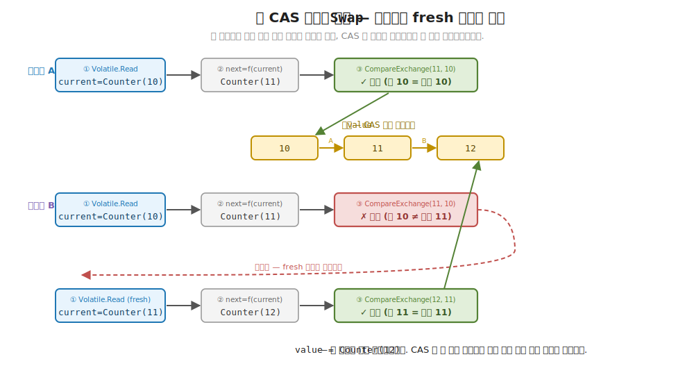
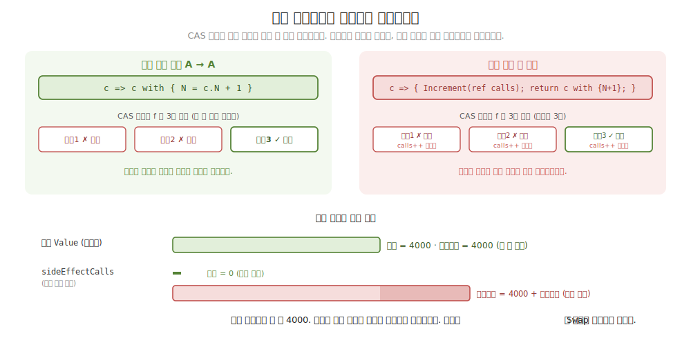
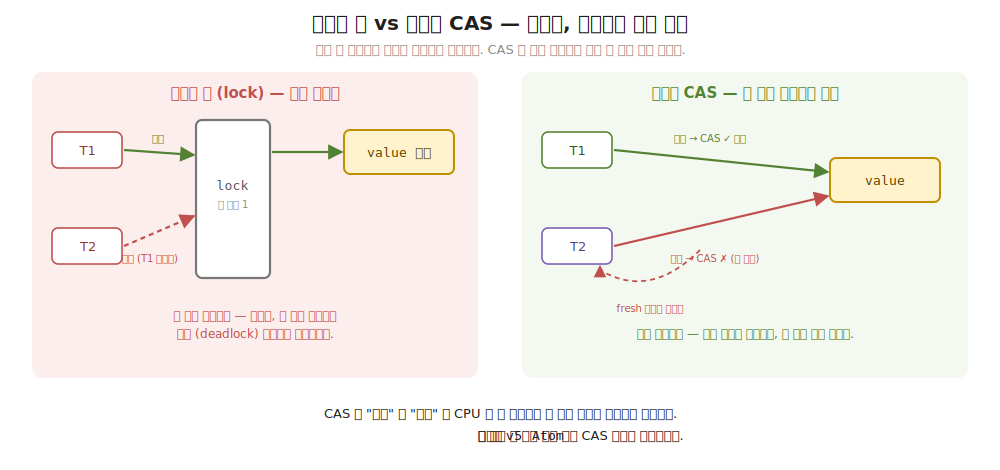

# 30장. Atom — 락 없이 안전한 원자적 참조 (CAS 로 상태를 갈아끼우다)

> **이 장의 목표** — 이 장을 마치면 여러 스레드가 공유하는 값을 락 한 줄 없이 안전하게 갱신하는 `Atom<A>` 를 직접 구현할 수 있습니다. 핵심은 갱신을 "값을 직접 +1" 하는 명령이 아니라 "어떻게 바꿀지" 를 담은 순수 함수 `A → A` 로 적고, 그 함수를 원자적으로 적용하는 데 있습니다. 명령형의 `int++` 가 동시에 실행되면 읽고-더하고-쓰는 사이에 끼어듦이 생겨 증가가 유실되던 자리를, `Interlocked.CompareExchange` 한 동작으로 묶는 CAS 루프로 대신합니다. 이어 갱신 함수가 순수해야만 충돌 시 재시도가 안전한 까닭을 손계산으로 추적하고, 8 스레드가 각자 만 번씩 증가시켜도 정확히 8 만이 되는 것을 락 없는 `int++` 의 유실과 나란히 봅니다. 26장의 `Eff<RT, A>` 가 효과를 값으로 다뤘듯, 이 장은 상태 변화를 함수로 다루는 9부의 첫 도구입니다.

> **이 장의 핵심 어휘**
>
> - **`Atom<A>`**: 공유 값 하나를 락 없이 안전하게 감싸는 원자적 참조, 갱신은 순수 함수로
> - **`Swap`**: 현재 값을 읽어 함수 `A → A` 를 적용하고 원자적으로 갈아끼우는 갱신 메서드
> - **CAS (Compare-And-Swap)**: "내가 읽은 값이 아직 그대로면 새 값으로 바꾼다" 는 원자적 한 동작
> - **`Interlocked.CompareExchange`**: CAS 를 .NET 이 하드웨어 차원에서 보장하는 메서드
> - **`Volatile.Read`**: 다른 스레드가 쓴 최신 값을 읽도록 보장하는 읽기
> - **재시도 루프**: CAS 가 실패하면 갱신된 현재 값으로 함수를 다시 적용하는 `while` 순환
> - **순수 갱신 함수**: 부수 효과 없이 `current` 만 받아 `next` 를 내는 함수, 재적용해도 안전한 까닭
> - **갱신 유실 (lost update)**: 두 스레드의 증가가 하나로 겹쳐져 한 번이 사라지는 경쟁의 결과

> 이 장을 마치면 할 수 있게 되는 것
> - [ ] 락 없는 `int++` 동시 증가가 왜 갱신을 잃는지 인터리빙 표로 설명할 수 있습니다.
> - [ ] CAS 가 "읽고-바꾸기" 셋을 한 원자적 동작으로 묶는다는 것을 설명할 수 있습니다.
> - [ ] `Atom<A>` 의 `Swap` CAS 루프를 `Volatile.Read` 와 `Interlocked.CompareExchange` 로 직접 짤 수 있습니다.
> - [ ] 두 스레드가 충돌할 때 한쪽이 재시도하는 과정을 손으로 추적할 수 있습니다.
> - [ ] 갱신 함수가 순수해야 재시도가 안전한 까닭을 부수 효과 든 함수의 위험으로 설명할 수 있습니다.
> - [ ] 8 스레드 × 만 번 증가가 `Atom` 에서는 정확하고 `int++` 에서는 유실됨을 표로 견줄 수 있습니다.
> - [ ] 갱신을 순수 함수로 표현하는 것이 9부 전체의 "상태 변화를 함수로" 와 어떻게 잇는지 짚을 수 있습니다.
> - [ ] `Atom` 한 개가 값 하나만 지킨다는 한계와 그것이 31장 STM 으로 이어지는 까닭을 말할 수 있습니다.

> **이 장의 흐름** — 명령형으로 공유 카운터를 여러 스레드가 동시에 올리면 `counter++` 한 줄이 사실은 읽고-더하고-쓰는 세 걸음이라, 그 사이에 다른 스레드가 끼어들어 증가가 통째로 사라지는 갱신 유실에 부딪힙니다. `lock` 으로 막을 수는 있지만 깜빡 잊기 쉽고 교착을 부르며 어디 락이 빠졌는지 추적이 어려운 불편을 먼저 겪습니다. 그 불편을 푸는 한 수가 갱신을 순수 함수 `A → A` 로 적고 `Atom<A>` 가 그 함수를 원자적으로 적용하게 맡기는 것입니다. `Swap` 의 CAS 루프를 한 줄씩 짜 보고, 두 스레드가 충돌할 때 한쪽이 fresh 값으로 다시 적용하는 과정을 손으로 따라갑니다. 이어 그 갱신 함수가 왜 반드시 순수해야 하는지를 부수 효과 든 함수가 재시도마다 중복 실행되는 경고로 확인하고, 8 스레드가 만 번씩 올려도 정확히 8 만이 되는 것을 락 없는 `int++` 의 유실과 나란히 봅니다. 마지막으로 두 법칙으로 그 안전성을 다지고, `Atom` 한 개가 값 하나만 지킨다는 한계가 여러 참조를 함께 바꿔야 하는 31장 STM 으로 어떻게 이어지는지 짚습니다.

---

## 30.1 이 장에서 다루는 것 — 상태 변화를 순수 함수로

5 부에서 8 부까지 효과를 값으로 다뤘습니다. `IO<A>` 가 부수 효과를 `Run` 전까지 미뤄 둔 값이었고, 26장의 `Eff<RT, A>` 가 거기에 능력 주입까지 더한 값이었습니다. 효과가 값이 되자 테스트에서 갈아 끼우고, LINQ 로 합성하고, 정책을 옆에서 얹을 수 있었습니다. 8 부의 재시도·자원·추적이 모두 효과를 바꾸지 않고 그 위에 얹힌 것이 그 보답이었습니다.

9 부는 그 효과를 동시에 실행하는 자리입니다. 실무의 효과는 하나씩 차례로만 돌지 않습니다. 여러 스레드가 같은 값을 동시에 읽고 바꾸려 들면, 지금까지 한 번도 마주치지 않았던 새 함정이 등장합니다. 경쟁 (race) 입니다. 두 스레드가 같은 순간에 같은 값을 만지면, 한쪽의 작업이 다른 쪽의 작업에 묻혀 사라질 수 있습니다.

먼저 이 장의 도구가 무슨 일을 하는지 한 문장으로 잡습니다. 공유하는 값 하나를 여러 스레드가 안전하게 갱신하고 싶을 때, 명령형은 그 값에 `lock` 을 걸어 한 번에 한 스레드만 들이는 길을 택합니다. 이 장은 다른 길을 갑니다. 값을 직접 바꾸는 대신, "어떻게 바꿀지" 를 순수 함수 `A → A` 로 적고, 그 함수를 안전하게 적용해 주는 그릇에 맡깁니다. 그 그릇이 `Atom<A>` 입니다. 갱신이 명령이 아니라 함수가 되는 이 한 걸음이 이 장의 전부입니다.

여기서 9 부 전체를 꿰는 한 줄이 나옵니다. 기초에서 "효과를 값으로" 라 했던 발상이, 9 부에서는 "상태 변화를 순수 함수로" 가 됩니다. 효과를 `IO` 라는 값으로 떼어 냈더니 그 위에 정책을 얹을 수 있었던 것처럼, 상태 변화를 `A → A` 라는 함수로 떼어 내면 그 갱신을 동시성 맥락에서 안전하게 다룰 수 있습니다. 갱신이 함수라서, 충돌이 나도 그 함수를 그냥 다시 적용하면 됩니다. 락으로 막는 대신 충돌하면 재시도하는 이 발상이 9 부의 출발점입니다.

지금 모든 것을 외우지 않아도 됩니다. 이 장이 끝날 때 손에 남는 것은 두 가지입니다. `Atom<A>` 가 공유 값을 락 없이 감싼다는 그림 하나와, 갱신을 순수 함수로 적으면 충돌 시 재시도가 안전하다는 발상 하나입니다. 이 장에 처음 나오는 어휘를 한 줄씩만 미리 짚어 둡니다. CAS (Compare-And-Swap) 는 "내가 읽은 값이 아직 그대로면 새 값으로 바꿔라" 는 원자적 한 동작입니다. `Interlocked.CompareExchange` 는 그 CAS 를 .NET 이 하드웨어 차원에서 보장하는 메서드입니다. `Volatile.Read` 는 다른 스레드가 방금 쓴 최신 값을 읽도록 보장하는 읽기입니다. 모두 본문에서 코드와 함께 다시 천천히 풀므로, 여기서는 이름과 한 줄 뜻만 스쳐 두면 됩니다.

---

## 30.2 왜 필요한가 — 락 없는 공유 증가가 갱신을 잃습니다

`Atom<A>` 을 보이기 전에, 공유 값을 락 없이 그냥 올리면 어디서 막히는지부터 부딪혀 봅니다. 추상을 먼저 보이지 않고 손에 잡히는 불편을 먼저 겪는 것이 이 장의 순서입니다.

여러 스레드가 같은 카운터를 동시에 올리는 흔한 상황을 떠올립니다. 명령형으로 적으면 한 줄입니다.

```csharp
long counter = 0;
// 여러 스레드가 동시에:
counter++;            // ← 한 줄처럼 보이지만...
```

이 한 줄이 문제의 전부입니다. `counter++` 는 한 동작으로 보이지만, CPU 에게는 세 걸음입니다. 메모리에서 `counter` 를 레지스터로 읽고 (read), 거기에 1 을 더하고 (modify), 그 결과를 다시 메모리에 씁니다 (write). 단일 스레드라면 이 셋이 끊김 없이 이어지니 아무 문제가 없습니다. 그런데 두 스레드가 같은 순간에 이 셋을 밟으면, 한쪽의 read 와 write 사이에 다른 쪽이 끼어들 수 있습니다.

손으로 한 번 따라갑니다. `counter` 가 5 일 때 스레드 A 와 B 가 동시에 `counter++` 를 실행한다고 봅니다. 두 스레드의 세 걸음이 다음처럼 엇갈려 끼어들 수 있습니다.

```
시작:  counter = 5

시간 ↓   스레드 A                  스레드 B
  1      read  counter → 5
  2                                read  counter → 5     (A 가 아직 안 썼다!)
  3      modify 5 + 1 = 6
  4                                modify 5 + 1 = 6
  5      write counter = 6
  6                                write counter = 6      (A 의 6 을 덮어씀)

끝:  counter = 6      ← 두 번 올렸는데 한 번만 올랐다. 증가 하나가 사라짐.
```

두 스레드가 각자 한 번씩 올렸으니 결과는 7 이어야 합니다. 그런데 6 입니다. B 가 걸음 2 에서 읽은 값은 A 가 아직 쓰지 않은 옛 값 5 라, 둘 다 5 를 6 으로 만들고, 나중에 쓴 B 가 A 의 6 을 덮어썼습니다. A 의 증가가 통째로 사라졌습니다. 이렇게 동시 갱신이 하나로 겹쳐져 사라지는 것을 **갱신 유실 (lost update)** 이라 부릅니다.

이것이 한두 번이면 티가 안 나지만, 8 스레드가 각자 만 번씩 올리면 수만 번의 증가 중 수천 번이 이렇게 사라집니다. 그래서 락 없는 `int++` 로 8 만 번을 올리면 결과가 8 만에 한참 못 미치는, 게다가 실행할 때마다 다른 값이 나옵니다. 경쟁은 결과를 비결정적으로 만듭니다.

객체 지향 개발자라면 이 자리에서 익숙한 도구가 떠오릅니다. `lock` 입니다.

```csharp
private readonly object _gate = new();
long counter = 0;

void Increment()
{
    lock (_gate)          // ← 한 번에 한 스레드만 들어온다
    {
        counter++;        // read-modify-write 가 통째로 보호됨
    }
}
```

`lock` 은 한 번에 한 스레드만 블록 안에 들이므로, read-modify-write 세 걸음이 끼어듦 없이 끝까지 돕니다. 갱신 유실이 사라집니다. `lock` 자체는 옳은 도구입니다. 다만 큰 코드에서 세 가지 불편이 따라옵니다. 첫째, 깜빡 잊기 쉽습니다. 같은 값을 만지는 자리가 코드 곳곳에 있는데, 그중 한 자리에서 `lock` 을 빠뜨리면 그 한 자리가 조용히 경쟁을 일으킵니다. 컴파일러는 락이 빠졌다고 알려 주지 않습니다. 둘째, 교착 (deadlock) 을 부릅니다. 두 락을 서로 다른 순서로 잡는 코드가 두 군데 있으면, 두 스레드가 서로 상대의 락을 기다리며 영원히 멈출 수 있습니다. 셋째, 추적이 어렵습니다. 어느 락이 어느 값을 지키는지가 코드 구조에 드러나지 않아, 깊은 객체 그래프에서는 어디에 락이 필요한지 따라가기가 까다롭습니다.

둘째의 교착이 말로는 막연하니, 가장 흔한 모양 하나를 손으로 따라가 봅니다. 락이 두 개 있다고 합니다. 계좌 A 를 지키는 락 `L1` 과 계좌 B 를 지키는 락 `L2` 입니다. 한 메서드 `Transfer(A → B)` 는 먼저 `L1` 을 잡고 그 안에서 `L2` 를 잡습니다. 다른 메서드 `Transfer(B → A)` 는 반대로 먼저 `L2` 를 잡고 그 안에서 `L1` 을 잡습니다. 단독으로 돌면 둘 다 멀쩡합니다. 그런데 두 스레드가 같은 순간에 각각을 부르면 이렇게 엇갈릴 수 있습니다.

```
시간 ↓   스레드 A (Transfer A→B)        스레드 B (Transfer B→A)
  1      L1 잡음 (성공)
  2                                     L2 잡음 (성공)
  3      L2 잡으려 대기...               (L2 는 B 가 쥐고 있음)
  4                                     L1 잡으려 대기...
                                        (L1 은 A 가 쥐고 있음)
  ⋮      A 는 B 가 L2 를 놓기를 기다림    B 는 A 가 L1 을 놓기를 기다림
         → 둘 다 영원히 멈춤 (deadlock)
```

스레드 A 는 자기가 쥔 `L1` 을 놓지 않은 채 `L2` 가 풀리기를 기다리고, 스레드 B 는 자기가 쥔 `L2` 를 놓지 않은 채 `L1` 이 풀리기를 기다립니다. 둘 다 상대가 먼저 놓아 주기만을 기다리니 누구도 한 걸음을 못 뗍니다. 프로그램이 그 자리에서 통째로 멈춥니다. 무서운 점은 이 엇갈림이 두 스레드가 걸음 1~2 를 같은 순간에 밟을 때만 터진다는 것입니다. 평소에는 멀쩡히 돌다가 어느 날 운 나쁜 타이밍에 멈추므로, 재현도 추적도 까다롭습니다. 락을 잡는 순서를 코드 전체에서 한 방향으로 맞추면 막을 수 있지만, 큰 코드에서 그 순서를 어김없이 지키기는 쉽지 않습니다.

> **흔한 함정** — `int++` 한 줄은 원자적이라 안전하다고 여기는 것입니다.
>
> 소스 코드에서 한 줄이니 한 동작이라고 읽기 쉽습니다. 실제로는 read-modify-write 세 걸음이고, 그 사이에 다른 스레드가 끼어들 수 있습니다. C# 명세도 `long` 같은 64 비트 값은 단순 읽기·쓰기조차 플랫폼에 따라 원자적이지 않을 수 있다고 밝힙니다. "한 줄 = 한 동작" 은 단일 스레드에서만 참입니다. 동시성이 끼는 순간 그 직관은 깨집니다.

그래서 우리가 바라는 것은 분명합니다. 공유 값을 안전하게 갱신하되, 락을 일일이 걸고 푸는 대신 더 안전한 길을 쓰고 싶습니다. 값을 직접 만지는 대신 "어떻게 바꿀지" 를 함수로 적고, 그 적용을 안전하게 보장하는 그릇에 맡기고 싶습니다. 이 그릇이 `Atom<A>` 입니다. 다음 절에서 그것이 어떤 모양인지 봅니다.

---

## 30.3 Atom\<A\> — 원자적 참조

이제 공유 값을 안전하게 감싸는 모양을 봅니다. 핵심 발상은 한 문장입니다. 값을 직접 바꾸지 말고, "어떻게 바꿀지" 를 순수 함수 `A → A` 로 넘겨라. `Atom<A>` 이 그 함수를 받아 원자적으로 적용해 줍니다.

일상의 비유로 먼저 직감을 잡습니다. 공유 화이트보드에 숫자가 적혀 있다고 생각합니다. 명령형의 방식은 "내가 보드 앞에 설 동안 아무도 못 오게 막고 (`lock`), 지운 뒤 새 숫자를 적는" 것입니다. `Atom` 의 방식은 다릅니다. 보드는 누구나 볼 수 있게 열어 두되, 바꿀 때는 "지금 적힌 게 10 이면 11 로 바꿔 주세요" 라는 쪽지 (함수) 를 한 번의 손동작으로 처리합니다. 적힌 게 10 이 아니면 (누가 먼저 바꿨으면) 그 손동작은 실패하고, 새로 적힌 값을 보고 쪽지를 다시 씁니다. 막지 않고, 충돌하면 다시 합니다.

학습용 `Atom<A>` 의 타입부터 봅니다. 군더더기 없이 필드 하나입니다.

```csharp
// Atom<A> — 원자적 참조. 갱신은 순수 함수 A → A 로 표현되고, 충돌 시 자동 재시도(CAS 루프).
// 핵심 — 갱신 함수가 순수라서, CAS 충돌로 다시 적용해도 안전하다 (부수 효과가 있으면 깨진다).
public sealed class Atom<A>(A initial) where A : class
{
    A value = initial;

    public A Value => Volatile.Read(ref value);

    public A Swap(Func<A, A> f) { /* CAS 루프 — 다음 절 */ }
}
```

타입을 한 줄씩 읽습니다. `Atom<A>` 은 클래스 하나이고, 속에 든 것은 `A value` 필드 하나뿐입니다. 생성자 `Atom<A>(A initial)` 가 초기값을 그 필드에 넣습니다. 제약 `where A : class` 한 줄이 붙어 있는데, 이것은 `A` 가 참조 타입이어야 한다는 뜻입니다. 곧 보겠지만 CAS 가 참조의 동일성으로 "바뀌었나" 를 판정하기 때문에 필요한 제약입니다.

`Value` 속성이 현재 값을 꺼내는 자리입니다. 그냥 `value` 를 반환하지 않고 `Volatile.Read(ref value)` 로 감쌌습니다. 여기서 처음 나온 `Volatile.Read` 를 한 줄로 풀면, 다른 스레드가 방금 그 필드에 쓴 최신 값을 읽도록 보장하는 읽기입니다. 그냥 필드를 읽으면 CPU 캐시에 남은 옛 값을 볼 수 있는데, `Volatile.Read` 는 그 가능성을 막습니다. 메모리 가시성의 자세한 내막은 이 장의 범위를 넘지만, "여러 스레드가 공유하는 필드는 그냥 읽지 말고 `Volatile.Read` 로 읽는다" 는 정도만 가져가면 충분합니다.

> **더 깊이 (처음엔 건너뛰어도 됩니다)** — 왜 그냥 읽으면 옛 값이 보일 수 있을까요.
>
> 직관과 어긋나는 대목입니다. 한 스레드가 필드에 새 값을 써 두었는데, 다른 스레드가 그걸 못 보고 옛 값을 읽는 일이 정말 일어납니다. 까닭은 CPU 의 구조에 있습니다. 요즘 CPU 는 코어마다 자기 캐시를 따로 두고, 메모리에 곧장 쓰는 대신 일단 자기 캐시에만 써 두기도 합니다. 그래서 코어 1 이 쓴 새 값이 잠깐 코어 1 의 캐시에만 머물고, 코어 2 는 아직 자기 캐시나 메모리에 남은 옛 값을 읽을 수 있습니다. 한 스레드의 쓰기가 다른 스레드에 곧장 안 보이는 이 어긋남을 메모리 가시성 (memory visibility) 문제라 부릅니다.
>
> `Volatile.Read(ref value)` 는 "캐시에 남은 옛 값 말고 최신 메모리에서 읽어라" 를 CPU 에 시키는 읽기입니다. 그래서 한 스레드가 방금 쓴 값을 다른 스레드가 어김없이 보게 됩니다. C# 에는 같은 일을 필드 선언에 붙이는 `volatile` 키워드도 있습니다. `volatile object value` 라 적으면 그 필드의 모든 읽기·쓰기가 자동으로 이 가시성을 갖습니다. LanguageExt v5 의 `Atom` 도 정확히 이 길을 택해 내부 값을 `volatile` 필드로 둡니다. 학습용은 그 대신 읽는 자리마다 `Volatile.Read` 를 두어, 어디서 가시성이 필요한지 눈에 보이게 한 것입니다. 입문 단계에서는 "공유 필드는 그냥 읽으면 옛 값을 볼 수 있고, `Volatile.Read` 가 그걸 막는다" 는 한 줄만 챙기면 충분합니다.

`Swap(Func<A, A> f)` 가 이 장의 주인공입니다. 갱신 함수 `f` 를 받아 원자적으로 적용하는 메서드입니다. 본문은 다음 절에서 한 줄씩 짜므로, 여기서는 시그니처만 봅니다. 받는 것은 `A → A` 함수 하나이고, 돌려주는 것은 갱신된 값 `A` 입니다. 곧 "현재 값을 어떻게 새 값으로 바꿀지" 만 적으면, 그 적용의 안전성은 `Atom` 이 책임집니다.

`Atom` 에 담을 값은 불변 (immutable) 이라야 합니다. 그래서 이 장은 카운터를 record 로 둡니다.

```csharp
// 불변 카운터 (Atom 에 담을 값). 갱신은 새 인스턴스 생성 (with).
public sealed record Counter(long N);
```

`Counter` 는 `long N` 하나를 품은 record 입니다. 갱신은 `c.N` 을 직접 고치는 것이 아니라 `c with { N = c.N + 1 }` 로 새 인스턴스를 만드는 것입니다. 왜 굳이 불변이라야 하는지는 CAS 의 동작을 본 뒤에 또렷해지므로, 그 절에서 다시 짚습니다. 지금은 "Atom 에는 새 인스턴스를 만들어 갈아끼우는 불변 값을 담는다" 는 것만 봐 둡니다.

사용감부터 잡습니다. 데모의 첫 예제는 카운터에 두 번 갱신을 적용합니다.

```csharp
var atom = new Atom<Counter>(new Counter(0));
atom.Swap(c => c with { N = c.N + 10 });   // 0 → 10
atom.Swap(c => c with { N = c.N * 2 });    // 10 → 20
Console.WriteLine($"  (+10) 후 (*2) → {atom.Value.N}");   //  (+10) 후 (*2) → 20
```

손으로 따라가면 단순합니다. 초기값은 `Counter(0)` 입니다. 첫 `Swap` 은 `c => c with { N = c.N + 10 }`, 곧 "현재 카운터를 받아 N 에 10 을 더한 새 카운터를 내라" 입니다. 0 이 10 이 됩니다. 둘째 `Swap` 은 `c => c with { N = c.N * 2 }`, 10 이 20 이 됩니다.

```
초기:        Counter(0)
Swap(+10):   c => c with { N = 0 + 10 }   → Counter(10)
Swap(*2):    c => c with { N = 10 * 2 }   → Counter(20)

Value.N = 20
```

이 예제는 단일 스레드라 충돌이 없습니다. 두 `Swap` 이 차례로 적용되어 0 → 10 → 20 이 나옵니다. 곧 `Swap` 에 넘긴 두 함수를 차례로 합성한 것과 같은 결과입니다. 여기서 갱신이 명령이 아니라 함수라는 점을 눈여겨봅니다. `atom.value = atom.value + 10` 처럼 값을 직접 만지지 않고, `c => c with { N = c.N + 10 }` 라는 함수를 `Swap` 에 넘겼습니다. 이 작은 차이가 동시성 안전성의 전부를 떠받칩니다. 다음 절에서 그 까닭을 봅니다.

> **미리보기입니다** — 다음 절의 CAS 루프가 이 장에서 가장 빽빽한 곳입니다.
>
> `Swap` 의 본문은 `while` 루프 안에 `Volatile.Read` 와 `Interlocked.CompareExchange` 가 한 줄씩 들어가는, 길지 않지만 한 줄 한 줄이 중요한 코드입니다. 미리 한 문장으로 그림을 그려 두면, 현재 값을 읽고 (read), 함수로 새 값을 만들고 (compute), "읽은 그 값이 아직 그대로면 새 값으로 바꿔라" 를 한 동작으로 시도하고 (CAS), 그 사이 누가 먼저 바꿨으면 다시 읽어 처음부터 (retry) 입니다. 이 네 걸음만 손에 들고 다음 절로 가면 코드가 그림 위에 얹힙니다.

---

## 30.4 CAS 루프 직접 구현 — 읽고, 만들고, 갈아끼우고, 충돌하면 다시

이제 `Swap` 의 본문을 짭니다. 앞 절에서 본 갱신 유실은 read-modify-write 세 걸음이 쪼개져 그 사이에 끼어듦이 생기는 문제였습니다. 이 절의 한 수는 그 셋 중 마지막 "확인하고 쓰기" 를 쪼개지지 않는 한 동작으로 묶는 것입니다. 그 한 동작이 CAS 입니다.

CAS 를 비유 없이 한 문장으로 풉니다. CAS (Compare-And-Swap) 는 "내가 읽은 값이 메모리에 아직 그대로 있으면 새 값으로 바꾸고, 그 사이 누가 바꿔 놨으면 손대지 않고 옛 값을 알려 달라" 는 원자적 한 동작입니다. 비교 (compare) 와 교환 (swap) 이 쪼개지지 않고 한 번에 일어난다는 것이 핵심입니다. .NET 에서 이 동작을 하드웨어 차원에서 보장하는 메서드가 `Interlocked.CompareExchange` 입니다.

`Interlocked.CompareExchange(ref value, next, current)` 를 천천히 풀면 이렇습니다. 인자가 세 개입니다. 바꿀 대상인 `value` 필드, 새로 넣고 싶은 `next`, 그리고 "내가 읽었던 옛 값" 인 `current` 입니다. 동작은 두 단계인데, 그 둘이 쪼개지지 않고 한 번에 일어납니다. 먼저 `value` 가 `current` 와 같은지 봅니다. 같으면 `next` 로 바꾸고, 다르면 손대지 않습니다. 그리고 바꿨든 안 바꿨든, 바꾸기 직전에 `value` 에 있던 값을 돌려줍니다. 그래서 반환값이 `current` 와 같으면 "내가 읽은 값이 그대로였고, 내 교환이 성공했다" 는 뜻이고, 다르면 "그 사이 누가 바꿔서 교환이 안 일어났다" 는 뜻입니다. 이 한 동작 덕분에 "확인" 과 "쓰기" 사이에 다른 스레드가 끼어들 틈이 없습니다.

말로만 보면 헷갈리니 숫자 두 개로 손에 익혀 둡니다. `value` 가 지금 `10` 이고, 내가 `current = 10` 을 읽어 `next = 11` 을 준비했다고 합니다.

```
경우 ①  아무도 안 건드림:
   CompareExchange(ref value, 11, 10)
   value 가 아직 10? 예 → 11 로 바꾸고, 바꾸기 직전 값 10 을 반환
   반환 10 == current(10)  → 성공

경우 ②  그 사이 누가 12 로 바꿔 둠:
   CompareExchange(ref value, 11, 10)
   value 가 아직 10? 아니오(지금 12) → 손대지 않고, 현재 값 12 를 반환
   반환 12 != current(10)  → 실패 (내 11 은 버려짐)
```

핵심은 반환값을 `current` 와 견주는 한 줄입니다. 같으면 내 교환이 먹혔다는 뜻이고, 다르면 그 다른 값이 곧 누군가 먼저 써 놓은 최신 값입니다. 경우 ② 에서 `value` 는 끝내 `11` 이 되지 않았습니다. 내가 만든 `11` 은 그냥 버려졌습니다. 이 버려짐이 다음 손계산에서 재시도로 이어집니다.

이제 `Swap` 의 본문입니다.

```csharp
public A Swap(Func<A, A> f)
{
    while (true)
    {
        var current = Volatile.Read(ref value);   // ① 현재 값을 읽고
        var next = f(current);                     // ② 함수로 새 값을 만들고
        if (Interlocked.CompareExchange(ref value, next, current) == current)
            return next;                           // ③ 읽은 값이 그대로면 → 교환 성공, 끝
        // ④ 실패 → 누가 먼저 바꿨다. 루프가 fresh current 로 f 를 다시 적용.
    }
}
```

네 걸음을 한 줄씩 읽습니다. ① `current = Volatile.Read(ref value)` 로 현재 값을 읽습니다. ② `next = f(current)` 로 갱신 함수를 적용해 새 값을 만듭니다. 이때 `value` 필드는 아직 건드리지 않았습니다. `next` 는 그저 후보일 뿐입니다. ③ `Interlocked.CompareExchange(ref value, next, current)` 로 "내가 ① 에서 읽은 `current` 가 `value` 에 아직 그대로면 `next` 로 바꿔라" 를 한 동작으로 시도합니다. 그 반환값이 `current` 와 같으면 교환이 성공했다는 뜻이라 `next` 를 돌려주고 끝납니다. ④ 만약 반환값이 `current` 와 다르면, ① 과 ③ 사이에 다른 스레드가 `value` 를 바꿔 놓은 것입니다. 이때는 `return` 하지 않고 `while` 이 한 바퀴를 더 돌아, 바뀐 최신 값을 다시 읽어 ① 부터 처음부터 합니다. 이 한 바퀴를 재시도 루프라 부릅니다.

OO 직감으로 다리를 놓으면, CAS 는 낙관적 동시성 (optimistic concurrency) 입니다. 데이터베이스에서 행을 수정할 때 쓰는 `rowversion` (또는 `ETag`) 을 떠올리면 정확합니다. "내가 읽었을 때 버전이 7 이었는데, 지금 UPDATE 하려는 순간에도 여전히 7 이면 쓰고, 그 사이 누가 바꿔 8 이 됐으면 거절한다" 는 그 패턴입니다. `lock` 이 "남이 못 들어오게 먼저 막는" 비관적 방식이라면, CAS 는 "일단 해 보고 충돌했으면 다시 하는" 낙관적 방식입니다. 충돌이 드물면 락보다 빠르고, 무엇보다 막지 않으니 교착이 원리적으로 없습니다.

이제 두 스레드가 정말 충돌하는 경우를 손으로 따라갑니다. `value` 가 `Counter(10)` 일 때 스레드 A 와 B 가 동시에 `Swap(c => c with { N = c.N + 1 })` 을 부른다고 봅니다. 앞 절의 `int++` 와 같은 상황인데, 결과가 어떻게 달라지는지 봅니다.

```
시작:  value = Counter(10)   (이 인스턴스를 "10번 인스턴스" 라 부르자)

시간 ↓   스레드 A                                    스레드 B
  1      ① current = 10번 인스턴스
  2                                                  ① current = 10번 인스턴스 (같은 것을 읽음)
  3      ② next = Counter(11)  (새 인스턴스 11-A)
  4                                                  ② next = Counter(11)  (새 인스턴스 11-B)
  5      ③ CAS(value, 11-A, 10번):
            value 가 아직 10번? 예 → 11-A 로 교환
            반환 10번 == current → 성공! return 11-A
  6                                                  ③ CAS(value, 11-B, 10번):
                                                        value 가 아직 10번? 아니오, 지금 11-A
                                                        반환 11-A != current(10번) → 실패
  7                                                  ④ 루프 한 바퀴 더
  8                                                  ① current = 11-A  (fresh 값을 다시 읽음)
  9                                                  ② next = Counter(12)  (11 에 +1)
 10                                                  ③ CAS(value, 12, 11-A):
                                                        value 가 아직 11-A? 예 → 12 로 교환
                                                        반환 11-A == current → 성공! return 12

끝:  value = Counter(12)      ← 두 번 올렸고, 정확히 12. 유실 없음.
```

30.2 의 `int++` 표와 정확히 같은 끼어듦이 일어났습니다. A 와 B 가 걸음 1~2 에서 같은 10 을 읽었습니다. 그런데 결과가 다릅니다. 걸음 5 에서 A 의 CAS 가 먼저 성공해 `value` 를 11-A 로 바꿉니다. 걸음 6 에서 B 의 CAS 는 `value` 가 이제 11-A 라 자기가 읽은 10 과 다르므로 실패합니다. 여기가 핵심입니다. B 는 자기 계산을 버리고 (`Counter(11)` 후보 11-B 를 쓰지 않고), 걸음 8 에서 바뀐 최신 값 11-A 를 다시 읽어, 걸음 9 에서 거기에 +1 을 다시 적용합니다. 그래서 12 가 나옵니다. A 의 증가도 B 의 증가도 살아남았습니다.

`int++` 가 B 의 옛 계산을 그대로 써서 A 의 증가를 덮어썼다면, CAS 는 B 의 옛 계산이 무효임을 감지하고 (CAS 실패) fresh 값으로 다시 계산하게 만듭니다. 갱신 유실이 사라지는 자리가 바로 이 "CAS 실패 → 재시도" 입니다.



**그림 30-1. `Swap` 의 CAS 재시도 루프: 두 스레드의 충돌과 재시도** — 스레드 A 와 B 가 같은 `current(10)` 을 읽고 각자 `next(11)` 을 계산합니다. A 의 `Interlocked.CompareExchange` 가 먼저 성공해 값을 11 로 바꾸면, B 의 CAS 는 읽은 10 과 현재 11 이 달라 실패하고, B 는 fresh 11 을 다시 읽어 12 로 재적용해 성공합니다. 두 증가가 모두 살아남아 유실이 없습니다.

여기서 30.3 에서 미뤄 둔 물음에 답합니다. 왜 `Atom` 에 담는 값은 불변이라야 할까요. CAS 가 "바뀌었나" 를 참조의 동일성 (`==`) 으로 판정하기 때문입니다. `Counter` 가 record 라 `c with { N = c.N + 1 }` 은 옛 인스턴스를 그대로 두고 새 인스턴스를 만듭니다. 그래서 매 갱신이 새 참조가 되고, CAS 의 `current` 비교가 "내가 읽은 그 인스턴스인가" 를 정확히 가립니다. 만약 `Counter` 가 가변 객체라 `c.N += 1` 로 같은 인스턴스를 제자리에서 고친다면, 참조는 그대로라 CAS 가 "안 바뀌었다" 고 잘못 판정합니다. 변화를 못 잡는 것입니다. 갱신마다 새 참조가 나오는 불변 데이터라야 CAS 가 동작합니다. 그래서 `where A : class` 제약과 record 갱신이 한 쌍으로 갑니다.

> **흔한 함정** — CAS 가 실패하면 무언가 잘못된 것이라 여기는 것입니다.
>
> "실패" 라는 말 때문에 오해하기 쉽습니다. CAS 실패는 오류가 아니라 정상 동작입니다. "그 사이 누가 먼저 바꿨으니 너는 최신 값으로 다시 해라" 는 신호일 뿐입니다. 충돌이 잦으면 재시도가 여러 번 돌 수 있지만, 매 재시도는 한 스레드의 성공을 뜻하므로 전체로 보면 모든 갱신이 빠짐없이 반영됩니다. 재시도 루프가 도는 것은 경쟁이 실제로 있었다는 증거이고, 그때마다 정확성이 지켜진다는 증거이기도 합니다.

> **더 깊이 (처음엔 건너뛰어도 됩니다)** — 학습용은 빈 루프로 바로 재시도하지만, 실무는 백오프를 둡니다.
>
> 학습용 `Swap` 은 CAS 가 실패하면 `while` 이 곧장 한 바퀴를 더 돕니다. 충돌이 아주 잦으면 여러 스레드가 동시에 바쁘게 재시도하며 CPU 를 태울 수 있습니다. LanguageExt v5 의 `Atom.Swap` 은 이 자리에 `SpinWait.SpinOnce()` 를 두어, 재시도 전에 아주 짧게 양보하며 경쟁을 누그러뜨립니다. 27장의 `Schedule` 백오프가 재시도 사이 간격을 늘려 상대 서비스 부담을 덜던 발상과 같은 결입니다. 입문 단계에서는 "충돌하면 다시 읽어 재적용" 이라는 뼈대만 손에 익히면 충분하고, 스핀 백오프는 같은 발상에 성능 한 겹을 더한 것이라고만 알아 두면 됩니다.

---

## 30.5 왜 순수 함수라야 하나 — 재시도의 안전성

CAS 루프의 한 가지가 아직 설명되지 않았습니다. 충돌이 나면 `Swap` 은 갱신 함수 `f` 를 fresh 값으로 다시 적용합니다. 곧 `f` 가 한 번의 `Swap` 호출에서 여러 번 불릴 수 있습니다. 이 사실이 갱신 함수에 한 가지 조건을 강제합니다. `f` 는 반드시 순수해야 합니다. 부수 효과가 없어야 한다는 뜻입니다.

왜 그런지 직감부터 잡습니다. 30.4 의 손계산에서 스레드 B 는 `Counter(11)` 이라는 후보를 만들었다가 CAS 실패로 그것을 버리고, fresh 값으로 다시 계산했습니다. 만약 `f` 가 새 값을 만드는 김에 로그를 한 줄 남기거나, 외부 카운터를 올리거나, 데이터베이스에 기록한다면, 버려진 그 계산에서도 그 부수 효과는 이미 일어나 버렸습니다. 최종 상태값은 마지막으로 성공한 적용만 반영하지만, 부수 효과는 실패한 시도에서도 남습니다. 곧 부수 효과가 재시도 횟수만큼 중복됩니다.

이 장의 챌린지 정답 코드 `ImpureSwapWarning` 이 이 위험을 그대로 시연합니다. 갱신 함수 안에 부수 효과를 일부러 넣습니다.

```csharp
public static (long Value, int SideEffectCalls) Demonstrate()
{
    var atom = new Atom<Counter>(new Counter(0));
    var sideEffectCalls = 0;
    Parallel.For(0, 4, _ =>
    {
        for (var i = 0; i < 1000; i++)
            atom.Swap(c =>
            {
                Interlocked.Increment(ref sideEffectCalls);   // ← 순수하지 않은 작용
                return c with { N = c.N + 1 };
            });
    });
    return (atom.Value.N, sideEffectCalls);   // Value == 4000, SideEffectCalls >= 4000
}
```

4 스레드가 각자 천 번씩, 모두 4000 번 `Swap` 을 부릅니다. 갱신 함수는 두 가지를 합니다. `c with { N = c.N + 1 }` 로 새 카운터를 만드는 순수한 부분과, `Interlocked.Increment(ref sideEffectCalls)` 로 외부 카운터를 올리는 부수 효과 부분입니다. 결과를 손으로 따라가면 두 숫자가 갈립니다.

```
호출 횟수 = 4 스레드 × 1000 = 4000 번의 Swap

최종 상태값 (Value.N):
   매 Swap 은 결국 한 번은 CAS 에 성공한다.
   성공한 적용만 value 에 반영 → 정확히 4000.

부수 효과 횟수 (SideEffectCalls):
   f 는 CAS 성공 1 번 + 충돌로 인한 재시도마다 또 호출된다.
   충돌이 N 번 있었다면 f 는 4000 + N 번 불렸다.
   → SideEffectCalls = 4000 + (충돌 횟수) ≥ 4000

       성공한 적용:   ████████████████  4000  (Value 에 반영됨)
       버려진 재시도:  ░░░░              +N    (Value 엔 없지만 부수 효과는 이미 실행됨)
```

최종 `Value.N` 은 정확히 4000 입니다. CAS 가 갱신 유실을 막으니 상태값은 옳습니다. 그런데 `SideEffectCalls` 는 4000 을 넘습니다. CAS 가 충돌해 재시도가 돌 때마다 `f` 가 다시 불렸고, 그때마다 `Interlocked.Increment` 가 또 실행됐기 때문입니다. 버려진 계산의 상태값 (`Counter(11)` 같은 후보) 은 `value` 에 반영되지 않았지만, 그 계산 안에서 일어난 부수 효과는 되돌릴 수 없습니다. 이미 외부 카운터를 올려 버렸습니다.

이 자리에서 이 장의 통찰이 손에 잡힙니다. **갱신이 순수 함수라서, 충돌이 나면 그냥 다시 적용하면 됩니다.** 순수 함수는 같은 입력에 같은 출력을 내고 바깥에 흔적을 남기지 않으니, 몇 번을 다시 적용해도 안전합니다. 버려진 시도가 아무 부수 효과도 남기지 않으므로, 재시도는 그저 "최신 값으로 한 번 더 계산" 일 뿐입니다. 반대로 갱신에 부수 효과가 끼면, 그 효과는 재시도를 되돌리지 못해 중복됩니다. 9 부 전체가 "상태 변화를 순수 함수로" 라 했던 까닭이 여기 있습니다. 갱신이 순수해야 충돌 시 재시도라는 락 없는 안전성이 성립합니다.



**그림 30-2. 순수 갱신 vs 부수 효과: 재시도의 안전성** — 왼쪽은 순수 함수 `A → A`. CAS 충돌로 몇 번을 재적용해도 최종 결과가 같고 바깥에 흔적이 없습니다. 오른쪽은 부수 효과가 든 함수. 최종 상태값 (4000) 은 정확하지만, 재시도마다 부수 효과가 다시 실행되어 `SideEffectCalls` 가 4000 을 넘습니다. 갱신이 순수해야 재시도가 안전한 까닭을 나란히 보입니다.

> **흔한 함정** — `Swap` 함수 안에 로그·IO·DB 쓰기를 넣는 것입니다.
>
> "갱신하는 김에 로그도 한 줄 남기자" 는 명령형 습관이 여기서 위험해집니다. `Swap(c => { Log($"updating {c.N}"); return c with { N = c.N + 1 }; })` 같은 코드는 충돌이 잦은 날 로그가 실제 갱신 횟수보다 몇 배로 찍힙니다. 부수 효과는 `Swap` 밖에서 처리해야 합니다. 먼저 `Swap` 으로 순수하게 값을 바꿔 결과를 받고, 그 결과를 가지고 로그나 IO 를 별도로 합니다. 7 부에서 효과를 값으로 떼어 낸 발상이 여기서 그대로 살아납니다. "무엇을 하는가" (부수 효과) 와 "상태를 어떻게 바꾸는가" (순수 갱신) 를 갈라 두면, 재시도가 안전해집니다.

---

## 30.6 동시 증가 무손실 — payoff

이제 이 장의 도구가 약속을 지키는지 정면으로 봅니다. 앞서 락 없는 `int++` 가 갱신을 잃었습니다. 같은 부하를 `Atom` 으로 돌리면 어떻게 되는지, 데모의 둘째 예제가 둘을 나란히 견줍니다.

```csharp
const int tasks = 8, perTask = 10_000;
var expected = (long)tasks * perTask;          // 80,000

// (a) Atom — CAS 로 안전하게 갱신
var safe = new Atom<Counter>(new Counter(0));
Parallel.For(0, tasks, _ =>
{
    for (var i = 0; i < perTask; i++) safe.Swap(c => c with { N = c.N + 1 });
});

// (b) 락 없는 int++ — 경쟁
long naive = 0;
Parallel.For(0, tasks, _ =>
{
    for (var i = 0; i < perTask; i++) naive++;   // 락 없는 공유 증가 — 경쟁
});
```

상황을 한 줄로 잡습니다. 8 스레드가 각자 만 번씩, 모두 8 만 번 카운터를 올립니다. 기대값은 정확히 8 만입니다. (a) 는 `Atom<Counter>` 에 `Swap(c => c with { N = c.N + 1 })` 으로 올리고, (b) 는 공유 `long naive` 를 락 없이 `naive++` 로 올립니다. 두 결과를 봅니다.

```
== 예제 2 — 8 스레드 × 10,000 증가 ==
  기대값          = 80000
  Atom (CAS)      = 80000   ✓ 정확
  락 없는 int++   = 53217   ← 갱신 유실 (경쟁)
```

`Atom` 은 정확히 8 만입니다. 8 스레드가 동시에 같은 카운터를 두드려도, CAS 루프가 충돌할 때마다 재시도해 모든 증가를 빠짐없이 반영했습니다. 반면 락 없는 `int++` 는 8 만에 한참 못 미칩니다. 위 출력의 53217 은 한 예일 뿐, 실행할 때마다 다른 값이 나옵니다. 30.2 에서 본 read-modify-write 의 끼어듦이 수만 번 누적돼 그만큼의 증가가 사라졌고, 끼어듦의 타이밍이 매번 달라 결과도 비결정적입니다.

표로 견주면 대비가 또렷합니다.

| 방식 | 갱신 방법 | 8 만 번 동시 증가 결과 | 안전성 |
|---|---|---|---|
| `Atom<Counter>` | `Swap(c => c with { N = c.N + 1 })` | 정확히 80000 (매번) | CAS 루프가 충돌 시 재시도, 유실 없음 |
| 락 없는 `int++` | `naive++` | 80000 미만, 매번 다른 값 | read-modify-write 끼어듦으로 갱신 유실 |

이 표 한 줄이 이 장의 payoff 입니다. 같은 8 만 번 동시 증가인데, 갱신을 순수 함수 `c => c with { N = c.N + 1 }` 로 적어 `Atom` 에 맡기면 정확하고, 값을 직접 `naive++` 로 만지면 유실됩니다. 그리고 (a) 의 `Atom` 코드 어디에도 `lock` 이 없습니다. 막지 않고, 충돌하면 다시 합니다. 앞서 바랐던 "락을 일일이 걸지 않고도 안전한 갱신" 이 여기서 이뤄졌습니다.

락으로 미리 막는 길과 CAS 로 일단 해 보고 충돌하면 다시 하는 길을 나란히 두면, 두 접근의 차이가 또렷합니다.



**그림 30-3. 비관적 락 vs 낙관적 CAS** — 락은 한 스레드만 들이고 나머지를 세우지만(비관적), CAS 는 모두 시도하게 두고 충돌한 쪽만 fresh 값으로 다시 합니다(낙관적). 비교와 교환이 CPU 의 한 명령이라 그 사이 끼어들 틈이 없어, v5 `Atom` 은 락을 한 줄도 쓰지 않고 CAS 만으로 안전합니다.

> **미리보기입니다** — 이 정확성은 다음 절에서 법칙으로 다시 단언됩니다.
>
> 위 데모는 한 번 돌려 본 결과입니다. 다음 절의 `ConcurrentNoLostUpdatesHolds` 가 같은 8 스레드 × 만 번 부하를 돌려 결과가 정확히 8 만인지 `bool` 로 단언합니다. 데모가 눈으로 보여 준 것을, 법칙이 검증으로 굳힙니다.

---

## 30.7 법칙으로 다지기 — 순차 정확성과 동시 무손실

7 장 이후 새 추상마다 법칙으로 그 의미를 확인했습니다. `Atom` 에도 확인할 것이 있는데, 모나드 법칙은 아닙니다. `Atom` 은 컨테이너가 아니라 공유 값을 감싸는 그릇이라 `Map` 도 `Bind` 도 없습니다. 대신 `Atom` 이 지켜야 할 두 가지 안전성을 법칙으로 단언합니다. 순차에서 정확한가, 그리고 동시에서 잃지 않는가입니다. 이 둘이 "갱신을 순수 함수로 맡기면 안전하다" 는 9 부 축의 약속이 코드로 정말 그러한지입니다.

두 법칙은 xUnit 도 property 검사도 아닌 콘솔 `bool` 함수 둘입니다.

```csharp
// ① 단일 스레드 Swap — 순차 적용 결과가 정확하다.
public static bool SequentialSwapHolds()
{
    var atom = new Atom<Counter>(new Counter(0));
    for (var i = 0; i < 100; i++) atom.Swap(c => c with { N = c.N + 1 });
    return atom.Value.N == 100;
}

// ② 동시 Swap — 잃어버린 갱신 없음 (CAS 가 모든 증가를 반영).
public static bool ConcurrentNoLostUpdatesHolds()
{
    var atom = new Atom<Counter>(new Counter(0));
    const int tasks = 8, perTask = 10_000;
    Parallel.For(0, tasks, _ =>
    {
        for (var i = 0; i < perTask; i++)
            atom.Swap(c => c with { N = c.N + 1 });
    });
    return atom.Value.N == (long)tasks * perTask;
}
```

두 법칙을 한 줄씩 읽습니다.

① **순차 Swap 정확성** — 단일 스레드에서 `Counter(0)` 에 +1 을 백 번 `Swap` 하면 결과가 정확히 100 인지 봅니다. 충돌이 없는 자리이므로, 이 법칙이 확인하는 것은 "재시도 메커니즘이 끼지 않을 때 `Swap` 이 함수를 차례로 적용한 그대로의 결과를 내는가" 입니다. +1 을 백 번 합성한 것이 +100 이라는, 순수 함수 합성의 결과가 그대로 나옵니다. 손으로 보면 0 → 1 → 2 → ... → 100 입니다.

② **동시 갱신 무손실** — 8 스레드가 각자 만 번씩 +1 을 `Swap` 한 뒤 결과가 정확히 8 만 (`tasks * perTask`) 인지 봅니다. 앞 절의 데모를 그대로 단언으로 옮긴 것입니다. CAS 루프가 충돌할 때마다 fresh 값으로 재시도하므로, 8 만 번의 증가 중 단 하나도 유실되지 않습니다. 이 법칙이 락 없는 `int++` 와 `Atom` 을 가르는 핵심 단언입니다.

데모 출력은 둘 다 통과입니다.

```
== 검증 ==
  순차 Swap        : 통과
  동시 갱신 무손실 : 통과

모든 검증 통과 [OK]
```

이 두 법칙이 9 부 축의 약속을 굳힙니다. ① 은 갱신이 순수 함수의 합성으로 정확함을, ② 는 그 갱신을 동시성 맥락에서 맡겨도 잃지 않음을 단언합니다. 곧 "상태 변화를 순수 함수로 표현하면, 그 변화를 락 없이 안전하게 적용할 수 있다" 는 이 장의 한 줄이 두 단언으로 검증됩니다.

> **더 깊이 (처음엔 건너뛰어도 됩니다)** — 학습용 `Atom` 은 v5 의 단순화판입니다.
>
> 학습용 `Atom<A>` 은 뼈대만 남긴 것이고, LanguageExt v5 의 `Atom` 은 같은 CAS 발상에 실무용 옷을 여러 겹 더 입혔습니다. 정직하게 짚어 둡니다.
>
> - **`Swap` 의 반환** — 학습용 `Swap` 은 동기로 값 `A` 를 곧장 돌려줍니다. v5 도 동기 `A Swap(...)` 가 본체이지만, 거기에 더해 효과를 끌어올린 `IO<A> SwapIO(Func<A, A>)` (속은 `IO.lift(_ => Swap(f))`) 를 따로 둡니다. 9 부 README 표의 `swap : (A → A) → IO<A>` 는 이 `IO` 변형을 가리키는 개념 시그니처입니다. 곧 v5 에서 `Swap` 자체가 `IO` 를 내는 것이 아니라, 효과 사슬에 끼우려는 자리에 `SwapIO` 가 따로 있습니다.
> - **검증자 (validator)** — v5 의 `Atom` 은 생성 시 `Func<A, bool>` 검증자를 받아, 초기값이나 새 값이 그 조건을 어기면 갱신을 버리고 현재 값을 그대로 둡니다. "음수는 안 됨" 같은 불변식을 `Atom` 자체에 박을 수 있습니다. 학습용에는 없습니다.
> - **`SwapMaybe` 와 변경 알림** — v5 는 `A SwapMaybe(Func<A, Option<A>>)` 로 "조건에 맞을 때만 갱신" 을, `event Change` 로 갱신 성공 시 알림을 지원합니다. 학습용은 둘 다 없습니다.
> - **값 타입 허용** — 학습용은 `where A : class` 로 참조 타입만 받습니다. v5 는 제약 없이 임의의 `A` 를 받되, 값 타입은 내부에서 `Box<A>` 로 박싱해 참조 비교가 되게 합니다. 학습용은 그 박싱 한 겹을 들어내고 참조 타입만 받아 CAS 를 직접 `ref A` 로 겁니다.
>
> 입문 단계에서는 이 변형들을 외울 필요가 없습니다. CAS 루프와 순수 갱신 함수라는 뼈대는 학습용과 v5 가 같고, 나머지는 그 뼈대에 실무 편의를 더한 것이라고만 알아 두면 충분합니다.

---

## 30.8 Elevated World 어휘로 다시 읽기

이 절은 이 장의 도구를 1 장 비유에 맞춰 다시 읽는 자리입니다. 먼저 매핑부터 둡니다.

| 30장 도구 | Elevated World 어휘 |
|---|---|
| 갱신 함수 `A → A` | Normal World 의 평범한 함수, 4 가지 함수 유형 중 ① 유형 (`a → b`) |
| `Atom<A>` | 그 Normal 함수를 동시성 맥락에서 안전하게 적용해 주는 그릇 |
| `Swap` | 갱신 함수를 받아 원자적으로 적용하는 한 걸음 |
| CAS 재시도 루프 | 충돌 시 함수를 fresh 값으로 다시 적용, 순수라서 안전 |

1 장에서 함수형의 본질을 한 문장으로 적었습니다. 모든 값과 함수를 합성 가능한 Elevated World 로 끌어올리는 것. 7 부에서 그 끌어올림이 부수 효과에 닿아, 효과가 `Run` 전까지 Normal 세상에 영향 없는 Elevated 시민이 됐습니다. 9 부는 그 발상을 상태 변화로 옮깁니다. 상태를 직접 바꾸는 명령 대신, "어떻게 바꿀지" 를 Normal World 의 순수 함수 `A → A` 로 적고, `Atom` 이 그 함수를 동시성 맥락에서 안전하게 적용합니다.

여기서 1 장의 4 가지 함수 유형으로 이 장의 자리를 정확히 짚습니다. `Swap` 이 받는 갱신 함수 `c => c with { N = c.N + 1 }` 은 `Counter → Counter`, 곧 Normal 입력·Normal 출력의 ① 유형 (`a → b`) 입니다. 독자가 작성하는 것은 늘 이 평범한 Normal 함수입니다. 끌어올림도, 효과도, 컨테이너도 없는 그냥 함수입니다. 그 단순한 함수를 동시성이라는 까다로운 맥락에서 안전하게 적용해 주는 일을 `Atom` 이 떠맡습니다. 곧 독자는 "어떻게 바꿀지" 라는 Normal 함수만 적고, "여러 스레드가 동시에 바꿔도 안전하게" 라는 어려운 부분은 `Swap` 의 CAS 루프가 책임집니다.

이 분업이 9 부 축의 핵심입니다. 명령형은 "무엇을 바꾸는가" (값 +1) 와 "동시에 안전하게" (락 걸고 풀기) 를 한 코드에 뭉쳐, 독자가 락의 위치까지 신경 써야 했습니다. 함수형은 전자를 순수 함수로, 후자를 `Atom` 의 책임으로 갈라, 독자가 적는 것을 단순한 갱신 함수 하나로 줄입니다. 갱신이 순수 함수라서 충돌 시 재적용이 안전하다는 것이, 이 분업을 떠받치는 한 줄입니다.

비유는 여기까지가 역할입니다. `Swap` 이 정확히 어떻게 그 함수를 원자적으로 적용하는지는 CAS 루프의 시그니처와 본문이 정합니다. 비유가 머리에 그림을 그려 주는 동안 시그니처가 진실을 정합니다.

---

## 30.9 Q&A — 자기 점검

> **Q1. 락 없는 `int++` 동시 증가는 왜 갱신을 잃습니까?** (30.2절)

`counter++` 가 한 동작이 아니라 읽고-더하고-쓰는 세 걸음이기 때문입니다. 두 스레드가 같은 옛 값을 읽으면 (한쪽이 아직 안 썼을 때), 둘 다 그 값에 1 을 더해 같은 결과를 쓰고, 나중에 쓴 쪽이 먼저 쓴 쪽을 덮습니다. 두 번 올렸는데 한 번만 오릅니다. 이렇게 동시 갱신이 하나로 겹쳐 사라지는 것을 갱신 유실 (lost update) 이라 부르고, 8 만 번 부하에서는 수천 번 누적돼 결과가 8 만에 못 미치고 실행마다 달라집니다.

> **Q2. CAS 가 정확히 무엇입니까?** (30.4절)

"내가 읽은 값이 메모리에 아직 그대로면 새 값으로 바꾸고, 그 사이 누가 바꿔 놨으면 손대지 않고 옛 값을 알려 달라" 는 원자적 한 동작입니다. 비교 (compare) 와 교환 (swap) 이 쪼개지지 않고 한 번에 일어나는 것이 핵심입니다. `int++` 가 read-modify-write 셋으로 쪼개져 끼어듦을 허용했다면, CAS 는 "확인하고 쓰기" 를 한 동작으로 묶어 그 틈을 없앱니다. .NET 에서는 `Interlocked.CompareExchange(ref value, next, current)` 가 이를 하드웨어 차원에서 보장합니다.

> **Q3. CAS 가 실패하면 무슨 일이 일어납니까?** (30.4절)

오류가 아니라 정상 신호입니다. "그 사이 누가 먼저 바꿨으니 너는 최신 값으로 다시 해라" 는 뜻입니다. `Swap` 의 `while` 루프가 한 바퀴를 더 돌아, 바뀐 최신 값을 `Volatile.Read` 로 다시 읽고, 거기에 갱신 함수를 다시 적용해 CAS 를 또 시도합니다. 이 재시도 덕분에 충돌한 스레드의 갱신도 버려지지 않고 fresh 값 위에 다시 반영됩니다. 매 재시도는 결국 한 스레드의 성공을 뜻하므로, 전체로 보면 모든 갱신이 빠짐없이 반영됩니다.

> **Q4. 갱신 함수는 왜 반드시 순수해야 합니까?** (30.5절)

CAS 충돌 시 그 함수가 fresh 값으로 다시 적용되기 때문입니다. 곧 한 번의 `Swap` 에서 함수가 여러 번 불릴 수 있습니다. 함수가 순수하면 (부수 효과가 없으면) 몇 번을 다시 적용해도 안전합니다. 버려진 시도가 바깥에 흔적을 남기지 않으니까요. 그런데 함수 안에 로그·IO·외부 카운터 같은 부수 효과가 있으면, 그 효과는 재시도를 되돌리지 못해 재시도 횟수만큼 중복됩니다. `ImpureSwapWarning` 이 이를 보입니다. 최종 상태값은 4000 으로 정확하지만 부수 효과 호출은 4000 을 넘습니다. 갱신이 순수해야 "충돌하면 다시 적용" 이라는 안전성이 성립합니다.

> **Q5. `Atom` 에 담는 값은 왜 불변이라야 합니까?** (30.4절)

CAS 가 "바뀌었나" 를 참조의 동일성 (`==`) 으로 판정하기 때문입니다. `Counter` 가 record 라 `c with { N = c.N + 1 }` 은 옛 인스턴스를 그대로 두고 새 인스턴스를 만듭니다. 그래서 매 갱신이 새 참조가 되고, CAS 의 `current` 비교가 "내가 읽은 그 인스턴스인가" 를 정확히 가립니다. 만약 가변 객체를 제자리에서 (`c.N += 1`) 고치면 참조가 그대로라 CAS 가 "안 바뀌었다" 고 잘못 판정해 변화를 놓칩니다. 갱신마다 새 참조가 나오는 불변 데이터라야 CAS 가 동작합니다.

> **Q6. CAS 와 `lock` 은 어떻게 다릅니까?** (30.4절)

방향이 정반대입니다. `lock` 은 비관적입니다. "남이 못 들어오게 먼저 막고" 갱신합니다. CAS 는 낙관적입니다. "일단 해 보고 충돌했으면 다시" 합니다. 데이터베이스의 `rowversion` 낙관적 동시성이 정확히 CAS 의 발상입니다. CAS 는 막지 않으므로 교착 (deadlock) 이 원리적으로 없고, 충돌이 드물면 락보다 빠릅니다. 다만 충돌이 아주 잦으면 재시도가 여러 번 돌 수 있어, 그 자리에는 27장 백오프 같은 누그러뜨림이 따라오기도 합니다.

> **Q7. `Atom` 은 어떻게 락 없이 안전합니까?** (30.6절)

갱신을 순수 함수로 표현하고, CAS 로 "확인하고 쓰기" 를 원자적 한 동작으로 묶기 때문입니다. 두 스레드가 같은 값을 읽어도, 한쪽의 CAS 가 성공하면 다른 쪽의 CAS 는 값이 바뀌었음을 감지해 실패하고, fresh 값으로 다시 계산합니다. 갱신 함수가 순수라 재계산이 안전하므로, 모든 증가가 빠짐없이 반영됩니다. 데모에서 8 스레드 × 만 번 증가가 `Atom` 에서는 정확히 8 만이고 락 없는 `int++` 에서는 그에 못 미치는 것이 그 결과입니다.

> **Q8. `Atom` 에는 왜 모나드 법칙을 묻지 않습니까?** (30.7절)

`Atom` 이 컨테이너가 아니라 공유 값을 감싸는 그릇이라 `Map` 도 `Bind` 도 없기 때문입니다. 끌어올리거나 합성할 효과 컨테이너가 아닙니다. 대신 `Atom` 이 지켜야 할 두 안전성을 법칙으로 단언합니다. 순차에서 +1 을 백 번 하면 정확히 100 인가 (`SequentialSwapHolds`), 그리고 8 스레드 × 만 번 동시 증가가 정확히 8 만인가 (`ConcurrentNoLostUpdatesHolds`) 입니다. 전자는 순수 함수 합성의 정확성을, 후자는 동시 갱신의 무손실을 검증합니다.

> **Q9. `Atom` 하나로 여러 값을 함께 바꿀 수 있습니까?** (30.10절)

없습니다. `Atom` 은 독립된 단일 값 하나만 안전하게 지킵니다. 두 계좌 사이 이체처럼 "한쪽에서 빼고 다른 쪽에 더하기" 를 한꺼번에 일관되게 해야 하면, `Atom` 두 개로는 부족합니다. 한 `Atom` 을 바꾸고 다른 `Atom` 을 바꾸는 사이에 다른 스레드가 끼어들면, 한쪽만 바뀐 어긋난 상태가 보일 수 있습니다. 여러 참조를 하나의 트랜잭션으로 묶어 all-or-nothing 으로 커밋하는 도구가 31장의 STM 입니다. `Atom` 의 이 한계가 31장의 동기입니다.

---

## 30.10 요약

- **이 장은 공유 값 하나를 락 없이 안전하게 갱신하는 `Atom<A>` 를 직접 구현합니다.** 핵심은 갱신을 명령이 아니라 순수 함수 `A → A` 로 적고, `Atom` 이 그 함수를 원자적으로 적용하게 맡기는 것입니다 (30.1절, 30.3절).
- **락 없는 `int++` 동시 증가는 갱신을 잃습니다.** `counter++` 가 read-modify-write 세 걸음이라 그 사이 끼어듦이 생겨, 두 증가가 하나로 겹쳐 사라집니다. `lock` 으로 막을 수는 있지만 깜빡 잊기·교착·추적난의 불편이 따릅니다 (30.2절).
- **CAS 는 "읽고-바꾸기" 를 원자적 한 동작으로 묶습니다.** `Swap` 의 루프는 현재 값을 `Volatile.Read` 로 읽고, 함수로 새 값을 만들고, `Interlocked.CompareExchange` 로 "읽은 값이 그대로면 바꿔라" 를 시도하고, 충돌하면 fresh 값으로 다시 적용합니다 (30.4절).
- **갱신 함수는 반드시 순수해야 합니다.** CAS 충돌 시 함수가 재적용되므로, 부수 효과가 있으면 재시도 횟수만큼 중복됩니다. `ImpureSwapWarning` 에서 최종값은 정확해도 부수 효과 호출이 초과하는 것이 그 증거입니다. 갱신이 순수라서 충돌 시 그냥 다시 적용하면 됩니다 (30.5절).
- **8 스레드 × 만 번 동시 증가가 `Atom` 에서는 정확히 8 만입니다.** 같은 부하에서 락 없는 `int++` 는 8 만에 못 미치고 매번 다른 값을 냅니다. `Atom` 코드 어디에도 락이 없습니다. 막지 않고, 충돌하면 다시 합니다 (30.6절).
- **두 법칙이 안전성을 다집니다.** 순차 Swap 정확성 (+1 백 번 → 100) 과 동시 갱신 무손실 (8 스레드 × 만 번 → 8 만) 이, "상태 변화를 순수 함수로 맡기면 안전하다" 는 9 부 축의 약속을 코드로 단언합니다 (30.7절).
- **갱신 함수는 Normal World 의 ① 유형 (`a → b`) 함수이고, `Atom` 이 그것을 동시성 맥락에서 안전하게 적용합니다.** 독자는 "어떻게 바꿀지" 라는 순수 함수만 적고, "동시에 안전하게" 라는 어려운 부분은 `Swap` 의 CAS 루프가 책임집니다. 7 부의 "효과를 값으로" 가 여기서 "상태 변화를 함수로" 로 이어집니다 (30.8절).

---

## 30.11 직접 해보기

코드의 `Challenges` 에 정답이 있습니다. 먼저 직접 구현한 뒤 코드와 비교해 봅니다.

> **챌린지 1 — 잃어버린 갱신 없는 동시 증가.** `Program.cs` 의 예제 2 처럼, 여러 스레드가 `Atom.Swap(c => c with { N = c.N + 1 })` 으로 같은 카운터를 동시에 올려 최종값이 정확히 (스레드 수 × 횟수) 가 됨을 확인합니다. 같은 일을 락 없는 `int++` 로도 해 두 결과를 견줍니다. 노리는 능력은 CAS 루프가 락 없이 안전하고, 갱신이 순수 함수라 충돌 시 재적용해도 안전함을 코드로 보는 것입니다. 정답 코드는 `Program.cs` 자체와 `Tests/AtomLaws.cs` 의 `ConcurrentNoLostUpdatesHolds` 입니다.

> **챌린지 2 — 순수 갱신의 중요성.** `Swap` 에 넘기는 함수 안에 부수 효과 (예: 외부 카운터 `Interlocked.Increment`) 를 일부러 넣고, 4 스레드 × 천 번 증가를 돌립니다. 최종 `Value.N` 은 정확히 4000 이지만 부수 효과 호출 수는 4000 을 넘는 것을 확인합니다. 왜 초과하는지 (CAS 재시도마다 함수가 다시 불려 부수 효과가 중복) 를 설명해 봅니다. 노리는 능력은 "상태 변화를 순수 함수로" 라는 효과 시스템 (7 부) 의 발상이 동시성 안전성의 전제임을 이해하는 것입니다. 정답 구현은 `Challenges/ImpureSwapWarning.cs` 입니다.

> **챌린지 3 — `Swap` 으로 다른 불변 값 갱신하기.** 이 장은 `Counter(long N)` 만 담았습니다. 다른 불변 record (예: 잔고와 거래 수를 함께 담은 `Account(long Balance, int Count)`) 를 만들어 `Atom` 에 담고, `Swap(a => a with { Balance = a.Balance + 100, Count = a.Count + 1 })` 으로 두 필드를 한 번에 갱신해 봅니다. 한 `Atom` 안의 여러 필드는 한 번의 `Swap` 으로 함께 바뀌어 일관됨을 확인하고, 동시 갱신에서도 두 필드가 어긋나지 않는지 견줍니다. 노리는 능력은 `Atom` 이 지키는 일관성의 경계가 "한 인스턴스 안" 임을 보는 것입니다. 이 경계가 31장에서 "여러 `Atom` 사이" 로 넓어집니다.

---

## 30.12 다음 장으로 — 여러 참조를 한 트랜잭션으로

이 장에서 9 부의 첫 동시성 도구를 만났습니다. 공유 값 하나를 `Atom<A>` 으로 감싸고, 갱신을 순수 함수 `A → A` 로 적어 CAS 루프로 원자적으로 적용했습니다. 갱신이 순수라서 충돌 시 그냥 다시 적용하면 됐고, 그 덕에 8 스레드가 동시에 두드려도 락 한 줄 없이 정확히 8 만이 나왔습니다. 명령형에서 락을 일일이 걸고 풀던 자리가, 상태 변화를 함수로 떼어 낸 덕분에 막지 않고 충돌하면 재시도하는 도구가 됐습니다.

그런데 `Atom` 에는 한계가 하나 있습니다. 값 하나만 안전하게 지킨다는 것입니다. 다른 무엇과도 조율할 필요 없는 독립된 단일 상태에는 더없이 좋지만, 두 계좌 사이 이체처럼 "한쪽에서 빼고 다른 쪽에 더하기" 를 한꺼번에 일관되게 해야 하면 `Atom` 만으로는 부족합니다. 한 `Atom` 을 바꾸고 다른 `Atom` 을 바꾸는 사이에 다른 스레드가 끼어들면, 한쪽만 바뀐 어긋난 상태가 새어 나올 수 있습니다.

31장은 이 한계를 풉니다. 여러 참조를 하나의 트랜잭션으로 묶어, 전부 함께 커밋되거나 전부 함께 되돌려지는 (all-or-nothing) STM (Software Transactional Memory) 을 직접 구현합니다. `Ref<A>` 는 그 트랜잭션 안에서만 읽고 쓰며, `STM<A>` 가 `Monad` 라서 기초의 `bind` 와 LINQ 어법이 그대로 쓰입니다. `Atom` 의 CAS 가 한 값에 했던 "충돌하면 재시도" 가, STM 에서는 트랜잭션 전체로 넓어집니다. 자세한 배경은 [9부 README](./README.md) 가 안내합니다. 다음 장은 [31장 STM & Ref](./Ch31-STM.md) 입니다.
