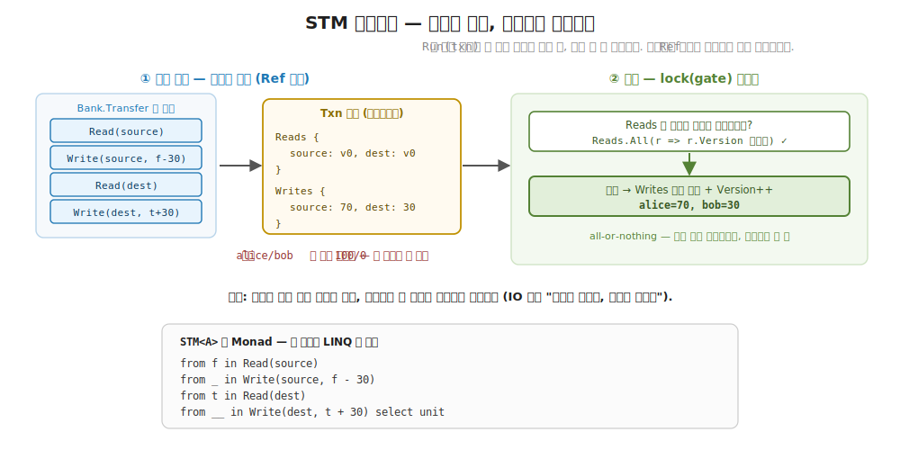
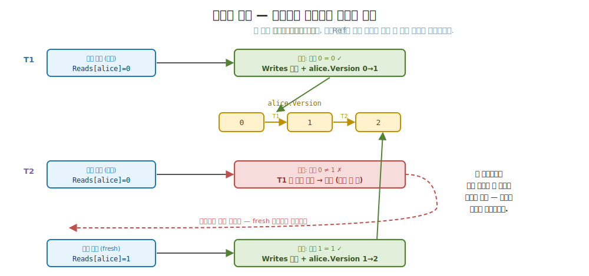
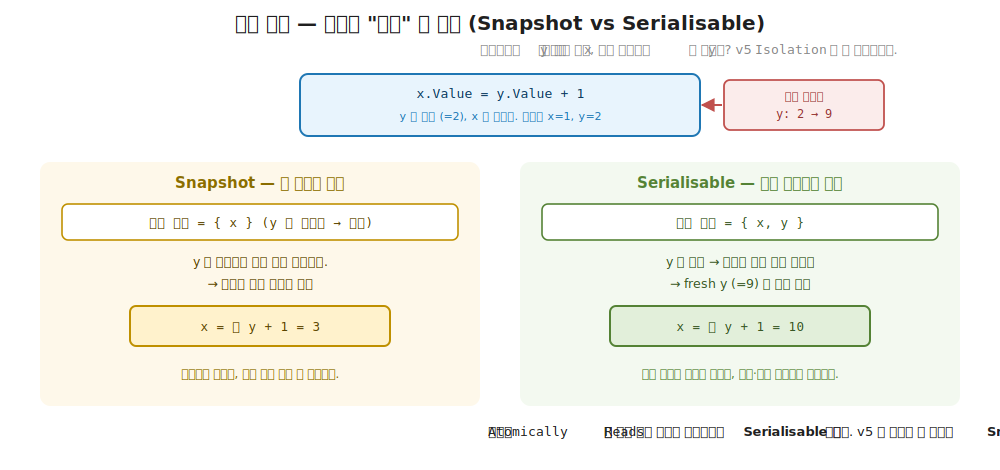

# 31장. STM 과 Ref — 여러 참조를 한 트랜잭션으로 (상태 변화를 순수 함수로)

> **이 장의 목표** — 이 장을 마치면 여러 개의 공유 참조를 하나의 트랜잭션으로 묶어, 그 안의 모든 변경이 함께 적용되거나 하나도 적용되지 않는 (all-or-nothing) 단위로 다룰 수 있습니다. 그 참조가 `Ref<A>` 이고, 트랜잭션이 `STM<A>` 라는 값임을 직접 구현으로 확인합니다. 앞 장에서 `Atom<A>` 한 셀을 락 없이 안전하게 바꿨다면, 이 장은 두 계좌 이체처럼 여러 셀을 함께 바꿔야 하는 자리를 다룹니다. 명령형이 두 자원에 락을 각각 거느라 교착을 부르고 중간 상태를 흘리던 자리를, `Read` 와 `Write` 로 조립한 한 트랜잭션과 낙관적 커밋으로 대신합니다. 이어 `STM<A>` 가 `Monad` 라 7장의 `bind` 와 LINQ 어법이 트랜잭션 조립에 그대로 쓰임을 봅니다. 30장의 `Atom` 이 단일 상태를 순수 함수로 다뤘으니, 그 발상을 여러 상태의 조정으로 넓히는 자리입니다.

> **이 장의 핵심 어휘**
>
> - **`Ref<A>`**: 트랜잭션 안에서만 읽고 쓰는 공유 참조, 자기 값과 버전 번호를 함께 들고 있는 셀
> - **`STM<A>`**: 트랜잭션을 담은 값, `Run` 하면 로그만 쌓고 실제 적용은 커밋에서 일어남
> - **트랜잭션 (transaction)**: 여러 `Ref` 의 읽기와 쓰기를 한 단위로 묶은 작업
> - **all-or-nothing**: 트랜잭션 안의 모든 쓰기가 함께 적용되거나 하나도 적용되지 않음
> - **격리 (isolation)**: 커밋되지 않은 중간 상태가 다른 트랜잭션에 보이지 않음
> - **낙관적 동시성 (optimistic concurrency)**: 일단 본문을 다 실행하고 커밋 직전에 충돌을 검사, 충돌이면 처음부터 다시
> - **버전 검증 (version check)**: 읽은 `Ref` 의 버전이 그대로인지 커밋 직전에 확인해 충돌을 감지
> - **재시도 (retry)**: 충돌이 감지되면 트랜잭션 전체를 처음부터 다시 실행

> 이 장을 마치면 할 수 있게 되는 것
> - [ ] 두 `Atom` 으로 이체하면 왜 중간 상태가 새는지 설명할 수 있습니다.
> - [ ] `Ref<A>` 가 트랜잭션 안에서만 읽고 쓰는 참조임을 설명할 수 있습니다.
> - [ ] `STM<A>` 가 `Run` 때 로그만 쌓고 커밋에서 적용한다는 것을 읽을 수 있습니다.
> - [ ] `STM<A>` 가 `Monad` 라 `bind` / LINQ 로 트랜잭션을 조립할 수 있음을 설명할 수 있습니다.
> - [ ] 낙관적 커밋이 버전을 검증하고 충돌 시 전체를 재시도하는 흐름을 손으로 추적할 수 있습니다.
> - [ ] 두 트랜잭션이 충돌할 때 한쪽이 재시도되는 까닭을 버전으로 설명할 수 있습니다.
> - [ ] 동시 이체에도 총액이 보존되는 까닭을 all-or-nothing 으로 답할 수 있습니다.
> - [ ] 트랜잭션 본문이 왜 순수해야 하는지 (재시도와 부수 효과) 짚을 수 있습니다.

> **이 장의 흐름** — 앞 장에서 `Atom` 한 셀을 락 없이 안전하게 바꿨는데, 두 계좌 사이 이체처럼 셀을 둘 동시에 바꿔야 하면 그 도구로는 부족하다는 불편에서 출발합니다. 두 `Atom` 으로 출금과 입금을 따로 하면, 출금은 끝났는데 입금 전인 한순간에 다른 스레드가 끼어들어 돈이 잠깐 사라져 보입니다. 이 중간 상태를 없애려면 두 변경을 한 단위로 묶어야 하고, 그 단위가 트랜잭션입니다. 트랜잭션을 담는 두 타입 `Ref<A>` 와 `STM<A>` 를 보고, `STM` 이 `Run` 때 실제로 값을 바꾸지 않고 읽기와 쓰기를 로그에만 쌓는다는 점을 짚습니다. 이어 `STM<A>` 가 `Monad` 라, 트랜잭션의 여러 단계를 7장에서 손에 익힌 `bind` 와 LINQ 로 조립함을 봅니다. 그다음 커밋 함수를 들여다봅니다. 본문을 일단 다 실행한 뒤 읽은 버전이 그대로인지 검사하고, 누가 먼저 바꿨으면 트랜잭션 전체를 처음부터 다시 실행하는 낙관적 흐름을 두 스레드 시나리오로 손계산합니다. 마지막으로 8천 번의 동시 이체에도 총액이 보존됨을 확인하고, 본문이 왜 순수해야 하는지를 9부의 축과 이어 둡니다.

---

## 31.1 이 장에서 다루는 것 — 여러 참조를 함께 바꾸기

앞 장에서 `Atom<A>` 으로 공유 값 하나를 락 없이 안전하게 바꿨습니다. 카운터 하나, 설정 하나, 캐시 슬롯 하나처럼 독립된 상태 한 칸이라면 그것으로 충분했습니다. 갱신을 순수 함수 `A → A` 로 적고, 충돌이 나면 그 함수를 다시 적용하면 됐습니다. 락도 교착도 없었습니다.

그런데 실무의 상태는 한 칸으로 끝나지 않습니다. 계좌 A 에서 돈을 빼 계좌 B 에 넣는 이체는 두 칸을 함께 바꿉니다. 재고를 하나 줄이면서 주문 수를 하나 늘리는 일도, 한 노드의 잔여 용량을 깎으면서 전체 할당량을 더하는 일도 마찬가지입니다. 이런 자리의 핵심은 두 변경이 따로따로가 아니라 함께 일어나야 한다는 데 있습니다. 출금만 되고 입금이 안 되면 돈이 사라지고, 입금만 되고 출금이 안 되면 돈이 생깁니다. 둘 다 되거나 둘 다 안 되거나, 그 사이는 없어야 합니다.

이 함께를 하나의 단위로 묶은 것이 트랜잭션입니다. 그리고 그 트랜잭션을 값으로 담은 도구가 이 장의 `STM<A>` (Software Transactional Memory) 와, 그 트랜잭션 안에서만 읽고 쓰는 참조 `Ref<A>` 입니다. 9부의 축으로 보면 한 칸을 순수 함수로 바꾸던 발상이 (앞 장 `Atom`), 여러 칸을 한 트랜잭션으로 조정하는 발상으로 (이 장 `STM`) 넓어지는 자리입니다. 상태 변화를 함수로 본다는 같은 뿌리에서, 다루는 칸의 수만 하나에서 여럿으로 늘어납니다.

한 가지를 미리 안심시켜 둡니다. `STM<A>` 는 새로 외워야 할 낯선 모나드가 아닙니다. `STM<A>` 는 `Monad` 입니다. 곧 7장에서 `bind` 와 LINQ (`from`-`from`-`select`) 로 효과를 조립하던 그 어법이, 트랜잭션을 조립할 때도 글자 하나 바뀌지 않고 그대로 쓰입니다. 5부에서 `Reader`, 7부에서 `IO` 와 `Eff` 가 모두 모나드였듯, 트랜잭션도 모나드입니다. 새로 만나는 것은 동시성과 트랜잭션이라는 문제이지, 그것을 다루는 어휘가 아닙니다.

---

## 31.2 왜 필요한가 — 두 Atom 으로 이체하면 중간 상태가 샙니다

`STM` 을 보이기 전에, 트랜잭션이라는 도구 없이 앞 장의 `Atom` 만으로 이체를 짜면 어디서 막히는지부터 부딪혀 봅니다. 추상을 먼저 보이지 않고 손에 잡히는 불편을 먼저 겪는 것이 이 장의 순서입니다.

계좌 두 개를 `Atom` 으로 두고, A 에서 B 로 30 을 옮기는 이체를 떠올립니다. `Atom` 의 `Swap` 은 한 셀을 안전하게 바꾸니, 출금과 입금을 각각 `Swap` 으로 적으면 될 것처럼 보입니다.

```csharp
// 두 Atom 으로 이체 — 출금과 입금을 따로 Swap.
var alice = new Atom<long>(100);
var bob = new Atom<long>(0);

alice.Swap(x => x - 30);   // ① 출금: alice 100 → 70  (이 Swap 은 원자적)
bob.Swap(x => x + 30);     // ② 입금: bob   0 → 30   (이 Swap 도 원자적)
```

각 `Swap` 은 앞 장에서 본 대로 그 자체로 원자적입니다. `alice.Swap` 도 락 없이 안전하고, `bob.Swap` 도 락 없이 안전합니다. 그런데 둘을 잇는 순간 새 문제가 생깁니다. ① 과 ② 는 각각 안전하지만, ① 과 ② **사이** 는 아무도 지키지 않습니다. ① 이 끝나고 ② 가 시작되기 직전, 짧은 한순간이 열립니다. 그 순간의 상태를 손으로 봅니다.

```
시각  alice   bob   합계
────────────────────────────
T0     100     0    100     (이체 시작 전 — 정상)
T1      70     0     70     (① 출금 직후, ② 입금 직전 — 30 이 사라져 보임!)
T2      70    30    100     (② 입금 후 — 정상)
```

T1 의 합계가 70 입니다. 30 이 잠깐 증발했습니다. 단일 스레드라면 이 틈이 워낙 짧아 아무도 못 보고 지나가지만, 동시성에서는 다릅니다. 바로 그 T1 의 순간에 다른 스레드가 두 계좌의 합을 읽어 "총자산" 보고서를 만들면, 보고서에 70 이 찍힙니다. 30 이 어디에도 없는 잘못된 보고서입니다. 1장에서 본 경쟁 조건 (race condition) 이 한 칸이 아니라 두 칸의 사이에서 다시 나타난 모습입니다.

여기서 객체 지향 개발자라면 익숙한 도구가 떠오릅니다. `lock` 입니다. 두 계좌를 한 `lock` 으로 감싸면 ① 과 ② 사이에 아무도 못 들어옵니다.

```csharp
lock (gate) {            // 두 변경을 한 락으로 묶음
    alice.Swap(x => x - 30);
    bob.Swap(x => x + 30);
}
```

이 코드는 중간 상태 문제를 막습니다. 그런데 `lock` 은 두 가지 새 불편을 부릅니다. 첫째는 교착 (deadlock) 입니다. 계좌가 둘이 아니라 여럿이고, 자원마다 락을 따로 두면 잠그는 순서가 문제가 됩니다. 손으로 봅니다.

```
스레드 1: A→B 이체       스레드 2: B→A 이체
  lock(A) 잡음             lock(B) 잡음
  lock(B) 기다림 ……        lock(A) 기다림 ……
       ↓                        ↓
   스레드 1 은 B 를 기다리고, 스레드 2 는 A 를 기다림
   → 둘 다 영원히 멈춤 (deadlock)
```

스레드 1 은 A 를 잠그고 B 를 기다리는데, 스레드 2 는 B 를 잠그고 A 를 기다립니다. 서로가 가진 것을 서로 기다려 둘 다 영원히 멈춥니다. 이를 막으려면 "항상 계좌 번호가 작은 쪽부터 잠근다" 같은 전역 락 순서 규칙을 두어야 하는데, 자원이 많아지고 코드가 여러 곳으로 흩어질수록 그 규칙을 모든 자리에서 지키게 하기가 어려워집니다. 둘째는 동시성 저하입니다. 교착이 무서워 락의 범위를 넓게 잡으면, 서로 무관한 이체 (C→D) 까지 같은 락을 기다리느라 줄을 서게 되어 동시성이 사실상 죽습니다.

그래서 우리가 바라는 것은 분명합니다. 여러 참조를 한 단위로 묶되, 락 순서를 고민하지 않고, 서로 무관한 작업은 막지 않으면서, 중간 상태가 절대 새지 않게 하고 싶습니다. 곧 출금과 입금을 함께 (all-or-nothing) 적용하고, 그 중간을 다른 트랜잭션이 보지 못하게 (격리) 하고 싶습니다. 이 묶음이 트랜잭션이고, 그것을 값으로 담은 도구가 `STM` 입니다. 다음 절에서 그것이 어떤 모양인지 봅니다.

> **흔한 함정** — 각 `Swap` 이 원자적이니 이체도 원자적이라고 여기는 것입니다.
>
> `alice.Swap` 도 안전하고 `bob.Swap` 도 안전하니, 둘을 이어 쓴 이체도 당연히 안전할 것 같습니다. 그러나 원자성은 이어 붙지 않습니다. 두 원자적 연산을 나란히 두어도, 그 사이에는 다른 스레드가 끼어들 틈이 그대로 남습니다. "각 부분이 안전함" 과 "전체가 한 단위로 안전함" 은 다른 약속입니다. 트랜잭션이 주는 것은 후자입니다. 여러 변경을 묶어 그 묶음 전체가 쪼개지지 않는 하나가 되게 합니다.

> **미리보기입니다** — 다음 절부터 `Ref`, `STM`, 버전, 낙관적 커밋 같은 새 어휘가 나옵니다.
>
> 지금 모두 외우지 않아도 됩니다. 이 장이 끝날 때 손에 남는 것은 두 가지입니다. 여러 `Ref` 의 변경을 한 `STM` 트랜잭션으로 묶어 all-or-nothing 으로 커밋한다는 그림 하나와, 그 커밋이 락이 아니라 "일단 다 해보고 버전이 그대로면 적용, 누가 바꿨으면 다시" 라는 낙관적 재시도로 이뤄진다는 발상 하나입니다. 새 어휘는 모두 본문에서 코드와 함께 다시 천천히 풀므로, 여기서는 이름만 스쳐 두면 됩니다.

---

## 31.3 Ref<A> 와 STM<A> — 트랜잭션 참조와 트랜잭션 모나드

이제 트랜잭션을 값으로 담는 모양을 봅니다. 두 타입이면 충분합니다. 하나는 트랜잭션 안에서만 읽고 쓰는 참조 `Ref<A>`, 다른 하나는 그 읽기와 쓰기를 묶은 트랜잭션 `STM<A>` 입니다. `Ref<A>` 부터 봅니다.

핵심 발상은 한 문장입니다. `Ref<A>` 는 자기 값뿐 아니라 버전 번호를 함께 들고 있는 셀이라는 것입니다. 값은 지금 담긴 내용이고, 버전은 "이 셀이 지금까지 몇 번 바뀌었나" 를 세는 카운터입니다. 이 버전이 뒤에서 충돌을 감지하는 열쇠가 됩니다. 일상의 비유로는 도서관 책의 대출 카드와 같습니다. 책 내용이 값이라면, 카드에 찍힌 도장 수가 버전입니다. 내가 책을 읽기 시작할 때 도장이 세 개였는데 돌려줄 때 다섯 개로 늘었다면, 그사이 누가 책을 바꿔 갔다는 뜻입니다.

```csharp
// 트랜잭션 안에서 다루는 참조의 비제네릭 면 (커밋 시 타입 무관하게 적용).
public interface IRef
{
    long Version { get; set; }
    void Apply(object? value);
}

// Ref<A> — 트랜잭션 참조. STM 안에서만 읽고 쓴다.
public sealed class Ref<A>(A initial) : IRef
{
    A current = initial;
    public long Version { get; set; }
    public A Current => current;
    public void Apply(object? value) => current = (A)value!;
}
```

`Ref<A>` 의 속은 단순합니다. `current` 가 지금 담긴 값, `Version` 이 바뀐 횟수입니다. `Current` 로 값을 읽고, `Apply` 로 커밋 때 새 값을 덮습니다. `IRef` 라는 비제네릭 면을 따로 둔 까닭은 한 줄로 짚어 둡니다. 한 트랜잭션은 `Ref<long>` 과 `Ref<string>` 처럼 타입이 다른 여러 참조를 함께 다룰 수 있어야 하는데, 커밋 단계에서 이들을 한 묶음으로 순회하려면 타입을 지운 공통 면이 필요하기 때문입니다. `Apply(object?)` 가 그 자리입니다.

여기서 가장 중요한 약속 하나를 정합니다. `Ref<A>` 의 값은 트랜잭션 밖에서 직접 바뀌지 않습니다. `Current` 게터는 있지만, 값을 바꾸는 길은 `Apply` 뿐이고 `Apply` 는 오직 커밋 단계에서만 불립니다. 곧 `Ref` 는 "트랜잭션 안에서만 읽고 쓰는 참조" 라는 규율을 타입으로 두릅니다. 앞 장의 `Atom` 이 혼자서 `Swap` 으로 자기를 바꿨다면, `Ref` 는 혼자 바뀌지 못하고 반드시 트랜잭션의 조정을 거칩니다. 이 차이가 여러 참조를 함께 다룰 수 있게 하는 토대입니다.

다음은 트랜잭션 자체입니다. 트랜잭션이 본문을 실행하며 무엇을 읽었고 무엇을 쓸지를 적어 두는 공책이 필요한데, 그 공책이 `Txn` 입니다.

```csharp
// 트랜잭션 로그 — 읽은 참조의 버전(검증용)과 쓸 값(커밋용)을 모은다.
public sealed class Txn
{
    public Dictionary<IRef, long> Reads { get; } = new();
    public Dictionary<IRef, object?> Writes { get; } = new();
}
```

`Txn` 은 두 칸짜리 공책입니다. `Reads` 는 "이 참조를 읽을 때 버전이 몇이었나" 를 적고 (검증용), `Writes` 는 "이 참조에 무슨 값을 쓸 것인가" 를 적습니다 (커밋용). 한 가지를 또렷이 합니다. 본문이 도는 동안 실제 `Ref` 는 한 글자도 바뀌지 않습니다. 모든 읽기와 쓰기는 이 공책에만 기록됩니다. 실제 적용은 나중에 커밋에서 한꺼번에 일어납니다.

그 트랜잭션을 담은 값이 `STM<A>` 입니다.

```csharp
// STM<A> — 트랜잭션 모나드. Run(txn) 은 로그를 쌓을 뿐, 실제 적용은 commit 에서.
public sealed class STM<A>(Func<Txn, A> run) : K<STMF, A>
{
    public A Run(Txn txn) => run(txn);
}
```

`STM<A>` 의 속은 함수 하나입니다. `Func<Txn, A>`, 곧 "공책 (`Txn`) 을 받아 값 `A` 를 내는 함수" 입니다. `STM<A>` 는 이 함수를 들고만 있을 뿐 부르지 않습니다. 누군가 `Run(txn)` 으로 공책을 건넬 때 비로소 함수가 돌며 공책에 읽기와 쓰기를 적고 값을 냅니다.

이 모양이 낯설지 않을 것입니다. 7부의 `IO<A>` 가 "부르면 부수 효과를 내는 함수" 를 들고만 있다가 `Run` 때 실행했고, 5부의 `Reader<R, A>` 가 "환경을 받아 값을 내는 함수" 였습니다. `STM<A>` 도 같은 결입니다. 트랜잭션이라는 기술 (description) 을 값으로 들고 있다가, `Run` 때 공책에 펼칩니다. 1장에서 함수형의 본질을 "효과를 값으로, 실행은 나중에" 로 적었는데, `STM` 은 그 발상을 트랜잭션에 적용한 또 하나의 사례입니다. `STM<A>` 라는 값은 아직 아무것도 바꾸지 않은, 바꾸겠다는 계획서일 뿐입니다.

마지막으로 `K<STMF, A>` 와 `STMF` 라는 두 표기를 한 줄씩 풀어 둡니다. 2부에서 본 대로, `K<F, A>` 는 "어떤 trait `F` 를 부착한 컨테이너 안의 값 `A`" 를 가리키는 일반 표기였습니다. `STM<A>` 가 `K<STMF, A>` 를 구현한다는 말은, `STM` 이라는 컨테이너가 `STMF` 라는 trait 부착점을 통해 `Functor` / `Applicative` / `Monad` 의 능력을 얻는다는 뜻입니다. `STMF` 가 그 능력을 실제로 정의하는 자리이고, 다음 절에서 그 정의를 봅니다.

> **흔한 함정** — `STM<A>` 를 만들면 그 자리에서 값이 바뀐다고 여기는 것입니다.
>
> `Write(alice, 70)` 같은 코드를 보면 그 순간 `alice` 가 70 이 될 것 같습니다. 그러나 `Write` 가 만드는 것은 `STM<Unit>` 이라는 값, 곧 "공책에 alice=70 이라고 적겠다는 계획" 일 뿐입니다. `alice` 의 실제 값은 트랜잭션이 커밋될 때까지 그대로입니다. `STM` 값을 조립하는 일과 그것을 실행 (`Atomically`) 하는 일은 다른 단계입니다. 7부에서 `IO` 를 조립하는 일과 `Run` 하는 일이 달랐던 것과 같습니다.

---

## 31.4 STM 은 Monad — LINQ 로 트랜잭션 조립

`Ref` 와 `STM` 의 모양을 봤으니, 이제 트랜잭션 안에서 실제로 읽고 쓰는 두 연산과, 그것들을 이어 붙이는 어법을 봅니다. 먼저 읽기와 쓰기입니다.

```csharp
// 참조 읽기 — 자기 트랜잭션의 쓰기를 먼저 보고, 아니면 커밋된 값을 읽으며 버전을 기록.
public static K<STMF, A> Read<A>(Ref<A> r) =>
    new STM<A>(t =>
    {
        if (t.Writes.TryGetValue(r, out var w)) return (A)w!;
        t.Reads[r] = r.Version;     // 검증용 스냅샷
        return r.Current;
    });

// 참조 쓰기 — 로그에만 기록 (커밋 전엔 실제 참조 불변).
public static K<STMF, Unit> Write<A>(Ref<A> r, A value) =>
    new STM<Unit>(t => { t.Writes[r] = value; return Unit.Default; });
```

두 함수 모두 `STM` 값을 만들어 돌려줄 뿐, 받는 즉시 `Ref` 를 건드리지 않습니다. `Read(r)` 가 만드는 `STM<A>` 는, `Run` 될 때 공책 `t` 를 받아 이렇게 동작합니다. 먼저 이 트랜잭션이 그 참조에 이미 쓴 적이 있는지 (`t.Writes`) 봅니다. 있으면 그 쓴 값을 냅니다 (자기가 방금 적은 값을 읽어야 일관됩니다). 없으면 실제 참조의 현재 값 (`r.Current`) 을 내되, 그 직전에 지금 버전 (`r.Version`) 을 검증용으로 공책에 적어 둡니다 (`t.Reads[r] = r.Version`). 이 한 줄이 핵심입니다. "내가 이 값을 읽을 때 버전은 이거였다" 는 스냅샷이, 커밋 직전 충돌 검사의 기준이 됩니다.

`Write(r, value)` 가 만드는 `STM<Unit>` 은 더 단순합니다. `Run` 될 때 공책의 `Writes` 칸에 "이 참조에 이 값을 쓰겠다" 고 적고 `Unit` 을 냅니다. 실제 참조는 여전히 그대로입니다. `Unit` 은 5부에서 본 대로 "의미 있는 결과가 없음" 을 나타내는 값입니다. 쓰기는 부수적 기록일 뿐 돌려줄 값이 없으니 `Unit` 이 맞습니다.

이제 이 두 연산을 이어 붙입니다. 계좌 이체는 네 단계입니다. source 를 읽고, source 에 줄어든 값을 쓰고, dest 를 읽고, dest 에 늘어난 값을 씁니다. 이 네 단계를 어떻게 한 `STM` 으로 묶을까요. 답은 새 어휘가 아닙니다. `STM<A>` 가 `Monad` 이므로, 7장에서 효과를 잇던 LINQ `from`-`from`-`select` 가 그대로 쓰입니다.

```csharp
// 챌린지 ① 정답 — 계좌 이체를 한 트랜잭션으로. 출금과 입금이 함께 커밋된다 (all-or-nothing).
public static K<STMF, Unit> Transfer(Ref<long> source, Ref<long> dest, long amount) =>
    from f in STMOps.Read(source)              // ① source 의 현재 잔액 f
    from _ in STMOps.Write(source, f - amount) // ② source 에 f - amount 를 쓸 계획
    from t in STMOps.Read(dest)                // ③ dest 의 현재 잔액 t
    from __ in STMOps.Write(dest, t + amount)  // ④ dest 에 t + amount 를 쓸 계획
    select Unit.Default;
```

이 코드는 새로 배울 것이 없습니다. `from f in Read(source)` 는 "source 를 읽어 그 값을 `f` 라 부른다" 이고, 다음 줄에서 그 `f` 를 써서 `Write(source, f - amount)` 를 만듭니다. 7장에서 `Option` 이나 `Eff` 를 LINQ 로 잇던 것과 글자 하나 다르지 않습니다. 다른 점은 잇는 대상이 트랜잭션 단계라는 것뿐입니다. `bind` 가 앞 단계의 결과 (`f`) 를 다음 단계의 입력으로 흘려, 네 단계가 하나의 `STM<Unit>` 으로 합쳐집니다.

`bind` 가 트랜잭션 두 단계를 어떻게 잇는지는 `STMF.Bind` 한 줄에 담겨 있습니다.

```csharp
public static K<STMF, B> Bind<A, B>(K<STMF, A> ma, Func<A, K<STMF, B>> f) =>
    new STM<B>(t => f(ma.As().Run(t)).As().Run(t));
```

이 한 줄을 풀면 이렇습니다. 두 트랜잭션을 이은 새 `STM<B>` 는, `Run` 될 때 같은 공책 `t` 를 받아 (1) 먼저 앞 트랜잭션 `ma` 를 그 공책으로 실행해 값을 얻고 (`ma.As().Run(t)`), (2) 그 값을 `f` 에 넘겨 다음 트랜잭션을 만든 뒤, (3) 그것을 같은 공책으로 실행합니다 (`...Run(t)`). 핵심은 두 단계가 같은 공책 `t` 를 공유한다는 점입니다. 그래서 앞 단계의 `Write` 가 적은 내용을 뒷 단계의 `Read` 가 볼 수 있고, 네 단계의 모든 읽기와 쓰기가 한 공책에 차곡차곡 쌓입니다.

`Transfer` 를 `Run` 했을 때 공책에 무엇이 쌓이는지 손으로 펼쳐 봅니다. alice=100, bob=0 에서 30 을 옮긴다고 합니다 (두 참조의 버전은 처음 모두 0 입니다).

```
Transfer(alice, bob, 30) 을 빈 공책으로 Run:

① Read(alice)  : Writes 에 alice 없음 → Reads[alice]=0 기록, f = alice.Current = 100
② Write(alice, 100-30=70) : Writes[alice] = 70                 (alice 실제 값은 아직 100!)
③ Read(bob)    : Writes 에 bob 없음 → Reads[bob]=0 기록, t = bob.Current = 0
④ Write(bob, 0+30=30)     : Writes[bob] = 30                   (bob 실제 값은 아직 0!)

공책 최종 상태:
  Reads  = { alice: 0, bob: 0 }      (읽을 때 본 버전 — 검증의 기준)
  Writes = { alice: 70, bob: 30 }    (쓸 값 — 커밋의 대상)
```

네 단계가 끝났는데도 실제 alice 와 bob 은 여전히 100 과 0 입니다. 바뀐 것은 공책뿐입니다. 한 가지를 짚어 둡니다. ③ 에서 bob 을 읽을 때 0 이 나옵니다. ② 에서 alice 는 이미 공책에 70 으로 적었지만, bob 에는 아직 쓴 적이 없으니 `Writes` 에 없어 실제 값 0 을 읽습니다. 곧 트랜잭션은 자기가 적은 것은 자기가 보지만 (alice), 아직 안 적은 것은 원래 값을 봅니다 (bob). 이 공책이 그대로 다음 절의 커밋으로 넘어갑니다.



**그림 31-1. `STM` 트랜잭션의 두 단계: 로그 쌓기와 커밋** — `Run(txn)` 단계에서 `Transfer` 의 네 연산 (Read source / Write source / Read dest / Write dest) 이 실제 `Ref` 를 건드리지 않고 공책 (`Txn`) 의 `Reads` (버전 스냅샷) 와 `Writes` (쓸 값) 에만 기록됩니다. 그다음 commit 단계에서 락 안의 버전 검증을 통과하면 `Writes` 가 일괄로 실제 `Ref` 에 적용되고 버전이 하나씩 오릅니다. 두 단계가 갈려 있어 본문 실행 중에는 참조가 불변입니다.

> **새 어휘 — Software Transactional Memory (STM)** 여러 메모리 참조의 읽기와 쓰기를 데이터베이스 트랜잭션처럼 한 단위로 묶어, 전체가 함께 적용되거나 (commit) 하나도 적용되지 않게 (rollback) 다루는 기법입니다. 락을 직접 걸지 않고도 여러 참조를 함께 안전하게 바꾸는 길을 줍니다. 이름의 "소프트웨어" 는 하드웨어 트랜잭션 메모리와 달리 라이브러리 수준에서 구현된다는 뜻입니다.

---

## 31.5 Atomically — 낙관적 커밋과 재시도

공책이 다 쌓였습니다. 이제 그것을 실제로 적용하는 단계, 커밋입니다. 이 자리가 `Atomically` 입니다. 트랜잭션이라는 계획서 (`STM<A>`) 를 받아 실제로 실행하고 그 결과를 Normal World 로 돌려주는 경계입니다. 7부의 `Run` 이 `IO` 를 실행하던 자리에 정확히 대응합니다.

커밋의 발상을 먼저 잡습니다. 두 가지 길이 있습니다. 하나는 비관적 (pessimistic) 길로, "혹시 누가 끼어들까 무서우니 시작 전에 락부터 잡고 아무도 못 들어오게 한 뒤 일한다" 입니다. 앞 절에서 본 `lock` 이 이 길이고, 교착과 동시성 저하의 불편이 따라왔습니다. 다른 하나는 낙관적 (optimistic) 길입니다. "대개는 충돌이 안 날 테니, 일단 락 없이 본문을 다 해보고, 제출 직전에 그동안 누가 바꿨는지만 확인한다. 바꿨으면 그때 처음부터 다시 한다" 입니다. `Atomically` 가 이 낙관적 길을 택합니다.

두 길의 갈림을 한 문장으로 잡으면 이렇습니다. 비관적은 충돌을 막으려 미리 잠그고, 낙관적은 충돌을 일단 허용하되 사후에 잡아냅니다. 비관적은 "충돌이 자주 난다" 에 거는 쪽이고, 낙관적은 "충돌은 드물다" 에 거는 쪽입니다. 실무의 공유 상태는 대개 충돌이 드물기에, 매번 락을 잡고 푸는 비용을 아끼는 낙관적 쪽이 평소엔 더 빠릅니다. 대신 가끔 충돌이 나면 그때만 처음부터 다시 하는 비용을 치릅니다. 즉 평소의 빠름을 가끔의 재시도와 맞바꾸는 거래입니다.

일상의 비유로는 위키 문서 편집과 같습니다. 문서를 고칠 때 미리 잠가 두는 (비관적) 대신, 일단 마음껏 고쳐 놓고 저장 버튼을 누르는 순간 "내가 편집을 시작한 뒤 누가 이 문서를 바꿨는가" 를 확인합니다. 아무도 안 바꿨으면 그대로 저장하고, 누가 바꿨으면 "편집 충돌" 을 띄우고 처음부터 다시 하게 합니다. 대부분의 편집은 충돌 없이 지나가니, 매번 잠그는 비용을 아낍니다.

```csharp
static readonly object gate = new();

// atomically — 낙관적 트랜잭션. 본문 실행 → 글로벌 락에서 읽은 버전 검증 → 통과면 일괄 적용,
// 충돌이면 전체 재시도 (all-or-nothing). 본문 중 예외가 나면 쓰기가 적용되지 않는다.
public static A Atomically<A>(K<STMF, A> stm)
{
    while (true)
    {
        var txn = new Txn();
        var result = stm.As().Run(txn);          // ① 본문 실행 — 공책에 로그만 쌓음 (락 밖)
        lock (gate)
        {
            var valid = txn.Reads.All(kv => kv.Key.Version == kv.Value);  // ② 읽은 버전 그대로?
            if (valid)
            {
                foreach (var (r, v) in txn.Writes) { r.Apply(v); r.Version++; }  // ③ 일괄 적용 + 버전++
                return result;
            }
        }
        // ④ 검증 실패 → 다른 트랜잭션이 먼저 커밋. 처음부터 다시.
    }
}
```

본체를 한 호흡으로 읽습니다. `while (true)` 로 도는 재시도 루프 안에서, 먼저 새 공책 `txn` 을 만들고 본문 `stm` 을 그 공책으로 실행합니다 (①). 이 실행은 락 밖에서 일어나며, 앞 절에서 본 대로 공책에 `Reads` 와 `Writes` 만 쌓습니다. 그다음 `lock (gate)` 안에서 단 두 가지 일을 합니다. 읽었던 모든 참조의 버전이 지금도 그대로인지 검사하고 (②, `Reads` 에 적어 둔 버전과 현재 `r.Version` 비교), 통과하면 (`valid`) `Writes` 를 실제 참조에 일괄 적용하면서 각 참조의 버전을 하나씩 올립니다 (③). 검증을 통과 못 하면 `if` 안으로 못 들어가 락을 빠져나가고, `while` 이 다시 돌아 처음부터 새 공책으로 재실행합니다 (④).

한 가지 미묘한 점을 손으로 짚어 둡니다. 검증 (②) 이 비교하는 두 값이 어디서 오는지입니다. `kv.Value` 는 본문 실행 때 공책에 적어 둔 버전 (내가 읽을 때 본 버전) 이고, `kv.Key.Version` 은 지금 이 순간 실제 참조의 버전입니다. 곧 "내가 본 버전" 과 "지금 버전" 을 맞대 봅니다. 둘이 같으면 내가 읽은 뒤 아무도 손대지 않았다는 뜻이라 안전하게 적용하고, 다르면 그사이 누가 커밋했다는 뜻이라 물러섭니다. 본문 (①) 이 락 밖에서 도는 것도 같은 까닭입니다. 본문은 공책에 기록만 할 뿐 실제 참조를 건드리지 않으니, 여러 트랜잭션이 동시에 본문을 돌려도 서로 어긋날 일이 없습니다. 실제 충돌이 갈리는 곳은 오직 락 안의 그 한 번의 버전 비교뿐입니다.

여기서 락의 역할이 앞 절의 `lock` 과 결정적으로 다릅니다. 앞 절의 `lock` 은 본문 전체 (`Swap` 두 번) 를 감쌌습니다. 여기 `lock (gate)` 는 본문이 아니라 검증과 적용이라는 짧은 한순간만 감쌉니다. 본문 (오래 걸릴 수 있는 계산) 은 락 밖에서 자유롭게 돌고, 락은 "버전 확인하고 쓰기 적용" 이라는 찰나에만 잡힙니다. 그래서 여러 트랜잭션이 본문을 동시에 진행할 수 있고, 충돌이 없으면 아무도 서로를 막지 않습니다. 락 순서를 고민할 일도 없습니다. 모두가 같은 `gate` 하나만 짧게 거치기 때문입니다.

이제 이 장의 핵심, 두 트랜잭션이 충돌할 때 무슨 일이 일어나는지를 손으로 따라갑니다. 두 스레드 T1, T2 가 같은 `alice` 를 동시에 바꾼다고 합니다. 처음 `alice.Version` 은 0 입니다.

```
초기: alice.Version = 0,  alice.Current = 100

시각  T1 (alice 에 +10)                  T2 (alice 에 +20)
──────────────────────────────────────────────────────────────
t1   Read(alice): Reads[alice]=0, 본다 100
t2                                        Read(alice): Reads[alice]=0, 본다 100
t3   Write(alice, 110)  (공책에만)
t4                                        Write(alice, 120)  (공책에만)
t5   lock(gate) 진입
       검증: Reads[alice]=0 == 현재 0  ✓
       Apply(110); alice.Version → 1
       락 해제, 결과 반환  (T1 커밋 성공)
t6                                        lock(gate) 진입
                                            검증: Reads[alice]=0 == 현재 1  ✗  (T1 이 올림!)
                                            if 안 못 들어감 → 락 해제
t7                                        while 재시도: 새 공책으로 처음부터
                                            Read(alice): Reads[alice]=1, 본다 110  (T1 의 결과!)
                                            Write(alice, 130)
                                            lock(gate): Reads[alice]=1 == 현재 1  ✓
                                            Apply(130); alice.Version → 2  (T2 커밋 성공)

최종: alice = 130  (100 + 10 + 20, 두 변경 모두 반영)
```

t5 에서 T1 이 먼저 커밋하며 `alice.Version` 을 0 에서 1 로 올립니다. t6 에서 T2 가 커밋하려는데, T2 가 t2 에 읽은 버전은 0 인데 지금 버전은 1 입니다. 둘이 다르니 검증이 실패합니다 (`0 != 1`). T2 는 "내가 본 100 은 이미 낡았다" 는 것을 알아채고, t7 에서 처음부터 다시 합니다. 이번에는 `alice` 를 다시 읽어 T1 이 남긴 110 을 보고, 거기에 20 을 더해 130 을 씁니다. 버전도 이번엔 1 로 본 그대로라 검증을 통과합니다. 결과는 130, 곧 두 변경이 모두 반영된 올바른 값입니다.

버전이 단조 증가하는 카운터라는 점이 충돌 감지를 정확하게 만듭니다. 만약 값만 비교했다면, 다른 스레드가 `alice` 를 110 으로 바꿨다가 다시 100 으로 되돌린 경우 (값은 100 → 110 → 100) T2 가 "100 그대로네" 하고 변경을 놓칠 수 있습니다. 값이 같은 자리로 돌아와도 변경을 못 보는 이 함정을 ABA 문제라 부릅니다. 버전은 한 번 오르면 절대 내려오지 않으니, 그사이 무슨 일이 있었든 "0 이 아니라 2" 처럼 달라져 변경이 반드시 드러납니다.



**그림 31-2. 낙관적 충돌 → 트랜잭션 전체 재시도** — 두 트랜잭션 T1, T2 가 같은 `Ref` 를 동시에 읽으면 둘 다 버전 0 을 스냅샷합니다. T1 이 먼저 커밋해 버전을 1 로 올리면, T2 는 커밋 검증에서 "읽은 0 != 현재 1" 을 보고 실패해 처음부터 다시 실행합니다. 재실행에서는 T1 이 남긴 값을 새로 읽어 올바른 결과로 커밋합니다. 충돌이 락이 아니라 버전 검증과 전체 재시도로 풀린다는 점이 핵심입니다.

OO 직감으로 다리를 놓으면 두 자리가 익숙해집니다. 첫째, 이 낙관적 커밋은 데이터베이스 트랜잭션의 `BEGIN` / `COMMIT` / `ROLLBACK` 과 같은 구조입니다. 본문 실행이 트랜잭션 본문, 버전 검증 통과가 `COMMIT`, 검증 실패와 재시도가 `ROLLBACK` 후 다시 시작에 해당합니다. 둘째, 버전 검증은 관계형 데이터베이스의 낙관적 동시성 제어와 똑같은 발상입니다. SQL Server 의 `rowversion` 이나 EF Core 의 동시성 토큰이 바로 이 일을 합니다. 행마다 버전 컬럼을 두고, `UPDATE` 할 때 "내가 읽을 때의 버전" 을 조건에 넣어 그사이 누가 바꿨으면 갱신이 0 행에 적용되게 (실패하게) 합니다. `Ref.Version` 이 그 버전 컬럼의 메모리판입니다. 셋째, 30장의 `Atom` CAS 와도 한 뿌리입니다. 앞 장에서 `Atom.Swap` 은 "내가 본 값이 그대로면 바꾸고, 아니면 다시" (compare-and-swap) 였는데, 여기 버전 검증은 그 발상을 한 셀에서 여러 셀로 넓힌 것입니다. `Atom` 이 값 하나를 비교했다면, `Atomically` 는 읽은 모든 참조의 버전을 한꺼번에 비교합니다.

> **흔한 함정** — 충돌이 나면 충돌난 한 줄만 다시 한다고 여기는 것입니다.
>
> 재시도라는 말에 충돌난 부분만 살짝 고친다고 생각하기 쉽습니다. 그러나 `Atomically` 의 `while` 은 트랜잭션 **전체** 를 처음부터 다시 실행합니다. 새 공책을 만들어 첫 `Read` 부터 다시 합니다. 이렇게 통째로 다시 해야 일관됩니다. 충돌이 났다는 것은 내가 본 세상이 낡았다는 뜻이니, 일부만 고치면 낡은 전제 위에 새 값을 얹게 됩니다. 전체 재실행이 "최신 세상에서 처음부터 다시 계산" 을 보장합니다. 바로 이 때문에 다음 절에서 보듯 본문이 순수해야 합니다. 통째로 여러 번 돌아도 안전하려면 본문에 부수 효과가 없어야 합니다.

> **더 깊이 (처음엔 건너뛰어도 됩니다)** — 충돌이 너무 잦으면 재시도가 끝나지 않을 수 있습니다 (라이브락).
>
> 학습용 `Atomically` 의 `while (true)` 는 충돌하면 무조건 처음부터 다시 합니다. 평소처럼 충돌이 드물면 한두 번에 끝나지만, 한 참조를 수많은 스레드가 끊임없이 두들기면 한 트랜잭션이 매번 커밋 직전에 밀려 오래 못 끝나는 일이 생길 수 있습니다. 이를 라이브락 (livelock) 이라 합니다. 교착 (deadlock) 이 둘 다 멈춰 버리는 것이라면, 라이브락은 계속 바쁘게 도는데 진척이 없는 것입니다. 학습용은 이 한도를 두지 않아 본질만 보입니다. v5 는 스핀 한도와 백오프 (충돌할수록 재시도 전 잠깐씩 더 기다림) 로 이 자리를 완화해, 한 트랜잭션이 영원히 밀리지 않게 합니다. 입문 단계에서는 "무한 재시도는 충돌이 매우 잦을 때 약점이 되고, 실무 구현은 한도와 백오프로 그것을 막는다" 만 알아 두면 됩니다.

---

## 31.6 동시 이체에도 총액이 보존됩니다

이제 이 장의 payoff 입니다. 단일 이체가 올바른 것은 봤으니, 여러 스레드가 마구잡이로 동시에 이체할 때도 안전한지를 봅니다. 두 계좌에 각각 1000 을 두고, 8천 번의 이체를 8개 스레드로 동시에 쏟아붓습니다.

```csharp
var a = new Ref<long>(1000);
var b = new Ref<long>(1000);
var before = a.Current + b.Current;          // 2000
Parallel.For(0, 8000, i =>
{
    long amt = (i % 13) + 1;                  // 1 ~ 13 사이 금액
    STMOps.Atomically(i % 2 == 0 ? Bank.Transfer(a, b, amt)   // 짝수: a → b
                                 : Bank.Transfer(b, a, amt)); // 홀수: b → a
});
var after = a.Current + b.Current;
```

`Parallel.For` 가 8천 개의 이체를 여러 스레드에 흩어 동시에 실행합니다. 짝수 번째는 a 에서 b 로, 홀수 번째는 b 에서 a 로, 금액도 1 부터 13 까지 제각각입니다. 같은 두 계좌를 수천 번 두들기니 충돌이 끊임없이 일어나고, `Atomically` 의 재시도가 쉴 새 없이 돕니다. 그런데도 한 가지는 절대 변하지 않습니다. 두 계좌의 합입니다.

```
이체 전 총액 = a + b = 1000 + 1000 = 2000

8천 번의 동시 이체 (충돌 → 재시도가 수없이 일어남) ...

이체 후 총액 = a + b = ???
```

각 이체가 한 쪽에서 빼는 금액과 다른 쪽에 더하는 금액이 같고 (`amt`), 그 출금과 입금이 한 트랜잭션으로 함께 (all-or-nothing) 적용되므로, 모든 이체는 합계를 정확히 0 만큼 바꿉니다. 어떤 이체도 합을 늘리거나 줄이지 못합니다. 충돌이 나 재시도되더라도, 재시도는 최신 잔액을 다시 읽어 같은 금액을 옮길 뿐이라 합은 그대로입니다.

왜 재시도가 합을 깨지 않는지 한 번 손으로 따라가 보면 안심이 됩니다. 어떤 이체가 충돌해 재시도된다고 합니다. 재시도는 새 공책으로 source 를 다시 읽는데, 이때 보는 값은 먼저 커밋한 다른 이체가 남긴 최신 잔액입니다. 거기서 같은 `amt` 를 빼고 dest 에 같은 `amt` 를 더합니다. 곧 재시도가 보는 출발점이 달라질 뿐, 한 쪽에서 빼는 양과 다른 쪽에 더하는 양은 언제나 같은 `amt` 입니다. 그래서 몇 번을 다시 하든 그 한 번의 이체가 합에 보태는 변화는 늘 0 입니다. 8천 번의 이체가 각자 합을 0 만큼 바꾸니, 다 더해도 처음의 2000 그대로입니다.

```
  이체 전 총액 = 2000, 이체 후 총액 = 2000   ✓ 보존
  (alice=<그때그때 다른 값>, bob=<2000 - alice 값>)
```

개별 계좌의 잔액 (alice, bob) 은 스레드 스케줄링에 따라 실행할 때마다 달라지는 비결정적 값입니다. 어느 이체가 먼저 커밋되느냐가 매번 다르기 때문입니다. 그러나 둘의 합은 언제나 정확히 2000 입니다. 돈이 한 푼도 생기거나 사라지지 않습니다. 이것이 트랜잭션이 지키는 불변식 (invariant) 입니다. 이 장 앞에서 두 `Atom` 으로는 T1 의 순간에 합이 70 으로 새던 자리가, `STM` 트랜잭션에서는 8천 번의 동시 이체에도 단 한 번도 깨지지 않습니다.

두 자리를 표로 나란히 둡니다.

| 방식 | 출금과 입금 | 중간 상태 | 8천 번 동시 이체 후 합 |
|---|---|---|---|
| 두 `Atom` (`Swap` 따로) | 따로 적용 | 다른 트랜잭션에 보임 (합이 잠깐 샘) | 깨질 수 있음 |
| `STM` 트랜잭션 (`Atomically`) | 함께 적용 (all-or-nothing) | 보이지 않음 (격리) | 항상 2000 (보존) |

여기서 격리 (isolation) 의 뜻이 손에 잡힙니다. 다른 트랜잭션의 눈으로 보면, 한 이체는 시작 전 (alice=100, bob=0) 아니면 완료 후 (alice=70, bob=30) 둘 중 하나로만 보입니다. 앞서 새던 그 중간 (alice=70, bob=0) 은 어떤 트랜잭션도 볼 수 없습니다. 본문이 도는 동안 실제 참조는 한 글자도 안 바뀌고, 커밋은 락 안에서 일괄로 일어나기 때문입니다. 중간이 보이지 않으니 합도 새지 않습니다.

---

## 31.7 법칙으로 다지기 — 단일 이체와 동시 보존

7장 이후 새 추상마다 법칙으로 그 의미를 확인했습니다. `STM` 에도 확인할 것이 있습니다. 모나드 법칙도 물을 수 있지만, 이 장에서 더 본질적인 것은 트랜잭션이 정말로 all-or-nothing 과 보존을 지키는가입니다. 두 가지를 콘솔 bool 함수로 확인합니다.

```csharp
// ① 단일 트랜잭션 이체 — 출금과 입금이 함께 적용된다 (all-or-nothing).
public static bool SingleTransferHolds()
{
    var a = new Ref<long>(100);
    var b = new Ref<long>(0);
    STMOps.Atomically(Bank.Transfer(a, b, 30));
    return a.Current == 70 && b.Current == 30;
}

// ② 동시 이체 — 총액 보존 (돈이 생기거나 사라지지 않는다).
public static bool ConcurrentConservationHolds()
{
    var a = new Ref<long>(1000);
    var b = new Ref<long>(1000);
    const long total = 2000;
    Parallel.For(0, 4000, i =>
    {
        long amt = (i % 7) + 1;
        STMOps.Atomically(i % 2 == 0 ? Bank.Transfer(a, b, amt) : Bank.Transfer(b, a, amt));
    });
    return a.Current + b.Current == total;
}
```

둘을 한 줄씩 읽습니다. `SingleTransferHolds` 는 100 과 0 에서 30 을 옮긴 뒤 정확히 70 과 30 이 되는지 봅니다. 출금 (`a` 가 70) 과 입금 (`b` 가 30) 이 둘 다 일어났음을 확인하는 단언입니다. 한쪽만 적용됐다면 (`a` 만 70 이고 `b` 는 0) 이 단언이 깨집니다. `ConcurrentConservationHolds` 는 4천 번의 양방향 동시 이체 뒤에도 두 계좌의 합이 처음의 2000 그대로인지 봅니다. 충돌과 재시도가 수없이 일어나도 합이 보존됨을 확인하는 단언입니다.

검증을 통과하면 다음과 같이 찍힙니다.

```
== 검증 ==
  단일 이체       : 통과
  동시 총액 보존  : 통과

모든 검증 통과 [OK]
```

이 두 검증이 9부의 축을 지킵니다. 9부는 "상태 변화를 순수 함수로" 를 축으로 삼았는데, `SingleTransferHolds` 는 그 상태 변화가 all-or-nothing 으로 묶임을, `ConcurrentConservationHolds` 는 동시성 아래서도 그 묶음이 불변식 (합 2000) 을 깨지 않음을 코드로 확인합니다. 트랜잭션이 값이라서, 효과를 실제로 8천 번 돌리는 부담 없이 작은 단언으로 그 약속을 검증할 수 있습니다.

> **흔한 함정** — `ConcurrentConservationHolds` 가 통과하니 개별 잔액도 정해져 있다고 여기는 것입니다.
>
> 보존 검증이 통과한다고 해서 alice 와 bob 의 개별 값이 매번 같지는 않습니다. 보존되는 것은 둘의 **합** 이지 각각이 아닙니다. 어느 이체가 먼저 커밋되느냐는 스레드 스케줄링에 달려 비결정적이라, alice 는 실행할 때마다 다른 값이 됩니다. 트랜잭션이 지키는 약속은 "합이 2000" 이라는 불변식이고, 그 안에서 개별 분배는 자유롭습니다. 단언을 `a.Current == 1234` 처럼 개별 값으로 적으면 불안정한 (flaky) 테스트가 됩니다. 불변식만 단언해야 합니다.

---

## 31.8 더 깊이 — v5 의 STM 은 더 정교합니다

> **더 깊이 (처음엔 건너뛰어도 됩니다)** — 이 장의 학습용 `STM` 은 LanguageExt v5 의 단순화판입니다.
>
> 입문 단계에서 트랜잭션의 본질 (여러 참조를 한 단위로, 낙관적 검증과 재시도) 을 또렷이 보이려고 몇 가지를 단순하게 두었습니다. v5 의 실제 구현과 다른 자리를 정직하게 짚어 둡니다. 지금 외울 필요는 없고, v5 소스나 위키를 펼쳤을 때 당황하지 않도록 다리를 놓는 자리입니다.

첫째, 트랜잭션을 모나드로 본 것 자체가 입문 단순화입니다. 이 장은 `STM<A>` 라는 타입을 만들어 트랜잭션을 "값으로 합성되는 모나드" 로 가르쳤습니다. `Read` 와 `Write` 가 `STM` 을 돌려주고, LINQ `from`-`from`-`select` 로 묶었습니다. 그런데 v5 의 STM 에는 이런 모나드형 `STM<A>` 타입이 없습니다. v5 에서 트랜잭션 본문은 `atomic(() => { ... })` 안의 명령형 블록이고, `Ref` 의 읽기와 쓰기는 `r.Value` 게터와 세터로 이뤄집니다. 곧 v5 의 실제 어법은 다음에 가깝습니다.

```csharp
// v5 의 실제 어법 (명령형 블록) — 이 장의 모나드 합성과 대비.
var a = Ref(100L);
var b = Ref(0L);
atomic(() => {
    a.Value = a.Value - 30;     // 명령형 읽기/쓰기
    b.Value = b.Value + 30;
});
```

이 장이 모나드 합성을 택한 까닭은 기초의 `bind` / LINQ 어휘를 동시성에서 다시 쓰는 통찰을 보이기 위해서입니다. v5 의 명령형 블록과 이 장의 모나드 합성은 출발점이 다를 뿐 "여러 참조를 한 트랜잭션으로" 라는 같은 자리에 다다릅니다.

둘째, 진입점의 이름과 격리 수준이 다릅니다. 이 장은 진입점을 `Atomically` 하나로 두고, 읽은 모든 참조의 버전을 검증합니다. v5 는 `atomic`, `snapshot`, `serial` 세 진입점을 두고, `atomic` 은 격리 수준 (`Isolation`) 을 인자로 받아 기본값이 `Snapshot` 입니다. 두 격리 수준의 차이는 입문자에게도 짚어 둘 만합니다. 핵심 질문은 "읽기만 하고 쓰지 않은 참조가 도중에 바뀌면 충돌로 볼 것인가" 입니다. `x.Value = y.Value + 1` 처럼 y 를 읽기만 한 경우를 손으로 봅니다.

```
x = x.Value 를 쓰고, y 는 읽기만 함.  그사이 다른 트랜잭션이 y 를 바꿈.

Snapshot     : 쓴 참조 (x) 만 충돌 검사. y 는 안 썼으니 변경을 무시 → 재시도 안 함.
Serialisable : 읽은 참조 (y) 까지 검사. y 가 바뀌었으니 충돌 → 재시도.
```

이 장의 `Atomically` 는 `Reads` 에 적은 모든 참조 (읽기만 한 것 포함) 의 버전을 검증하므로 사실상 `Serialisable` 쪽입니다. v5 의 기본 `Snapshot` 은 더 느슨해 동시성을 높이는 대신, 읽기만 한 값이 도중에 바뀌어도 재시도하지 않습니다. 어느 쪽이 맞는지는 불변식에 달려 있습니다. 읽은 값에 의존해 쓰는 계산이라면 `Serialisable` 이 안전합니다.

한 줄로 정리하면 이렇습니다. `Snapshot` 은 "내가 쓴 것만 충돌인가 본다" 이고, `Serialisable` 은 "내가 읽기만 한 것까지 충돌인가 본다" 입니다. 검사를 덜 하는 `Snapshot` 은 재시도가 줄어 동시성이 높고, 검사를 더 하는 `Serialisable` 은 더 엄격해 읽은 값에 의존하는 계산에서 안전합니다. 이 책의 이체는 source 잔액을 읽어 그 값에서 빼므로 읽은 값에 의존하는 계산이라, 학습용이 사실상 `Serialisable` 쪽을 택한 것이 안전한 선택입니다.

두 격리 수준이 같은 트랜잭션을 두고 무엇을 다르게 보는지 그림으로 견줍니다.



**그림 31-3. 격리 수준: Snapshot vs Serialisable** — `x.Value = y.Value + 1` 트랜잭션 도중 다른 스레드가 `y` 를 바꾸면, 무엇을 충돌로 보느냐가 갈립니다. Snapshot 은 쓴 참조(`x`)만 검사해 재시도 없이 `x = 3` 으로 커밋하고(읽은 값이 낡을 수 있음), Serialisable 은 읽은 참조(`y`)까지 검사해 충돌로 보고 재시도하여 `x = 10` 을 냅니다. 학습용 `Atomically` 는 Serialisable 쪽, v5 기본은 Snapshot 입니다.

셋째, 충돌을 푸는 메커니즘이 락이 아니라 락-프리입니다. 이 장은 검증과 커밋 구간을 전역 `lock (gate)` 로 직렬화했습니다. 구현이 단순하고 본질 (낙관적 검증) 을 또렷이 보이기 때문입니다. v5 도 낙관적이지만 락 대신 MVCC (Multi-Version Concurrency Control) 를 씁니다. 트랜잭션마다 상태의 불변 스냅샷을 들고, 커밋은 `Interlocked.CompareExchange` 스핀으로 락 없이 원자 교체하며, 충돌이면 잠깐 스핀 대기 후 재시도합니다. v5 문서의 한 줄이 그 효과를 요약합니다. "읽기는 결코 쓰기나 다른 읽기를 막지 않고, 쓰기는 결코 읽기를 막지 않는다." 앞 장의 `Atom` 이 `Interlocked.CompareExchange` 로 락 없이 한 셀을 바꿨듯, v5 의 STM 은 그 락-프리 CAS 를 트랜잭션 커밋으로 넓힙니다.

넷째, v5 에는 이 장에 없는 도구가 더 있습니다. `Ref(value, validator)` 는 커밋 직전에 값을 검증하는 함수를 받아, 잔액이 음수가 되는 커밋 같은 것을 막습니다 (ACID 의 C, Consistency). `Ref.Commute(Func<A, A>)` 는 교환법칙이 성립하는 연산 (예: 카운터 증가) 을 커밋 시점의 최신 값으로 다시 실행해, 단순 쓰기보다 충돌을 줄입니다. 학습용에는 이 둘이 없습니다. 입문 단계에서는 "트랜잭션은 검증 함수로 일관성을 지킬 수 있고, 교환 가능한 연산은 더 적게 충돌한다" 만 알아 두면 됩니다.

---

## 31.9 Elevated World 어휘로 다시 읽기

이 절은 이 장의 도구를 1장 비유에 맞춰 다시 읽는 자리입니다. 먼저 매핑부터 둡니다.

| 31장 도구 | Elevated World 어휘 |
|---|---|
| `STM<A>` | 트랜잭션이라는 기술을 담은 Elevated 시민, `Run` 전까지 실제 참조에 영향 없음 |
| `Ref<A>` | 트랜잭션 세계 안에서만 읽고 쓰는 참조, 자기 값과 버전을 든 셀 |
| `Read` / `Write` | 트랜잭션 세계 안의 연산, 공책에 읽기와 쓰기를 기록 |
| `Atomically` | 트랜잭션을 실행해 Normal World 로 끌어내리는 경계 (`Run` 과 같은 자리) |
| `bind` / LINQ | 트랜잭션 두 단계를 이어 붙이는 World-crossing 합성 (7장 그대로) |

1장에서 함수형의 본질을 "모든 값과 함수를 합성 가능한 Elevated World 로 끌어올림" 으로 적었습니다. 7부에서 그 끌어올림이 부수 효과에 닿아, 효과가 `Run` 전까지 Normal World 에 영향 없는 Elevated 시민이 됐습니다. `STM<A>` 는 그 발상을 트랜잭션에 적용한 자리입니다. `STM<A>` 라는 값은 트랜잭션이라는 계획을 담은 Elevated 시민이고, `Run` (= `Atomically`) 전까지 실제 `Ref` 를 한 글자도 바꾸지 않습니다. `IO<A>` 가 부수 효과를 미뤄 둔 값이었듯, `STM<A>` 는 상태 변경을 미뤄 둔 값입니다.

4가지 함수 유형으로도 이 장의 도구가 어느 자리인지 짚어 둡니다. `Read(r)` 는 Normal World 의 참조 `r` 을 받아 `STM<A>` 라는 Elevated 시민을 내니, `a → E<b>` 의 World-crossing 자리입니다. `Write(r, v)` 도 마찬가지로 `STM<Unit>` 을 냅니다. 그렇게 만든 여러 `STM` 단계를 `bind` (LINQ) 가 한 `STM` 으로 이어 붙이는데, 이는 7장에서 본 `a → E<b>` 끼리의 합성 되살리기 그 자체입니다. 트랜잭션의 단계가 늘어도 어휘는 그대로입니다. 정작 세계를 넘어 Normal World 로 돌아오는 것은 `Atomically` 한 걸음뿐입니다. Elevated 시민인 `STM<A>` 를 받아 실제로 실행하고 Normal 값 `A` 를 내는 끌어내림입니다.

`STM` 이 모나드이기에 9부는 새 어휘를 거의 요구하지 않습니다. 동시성과 트랜잭션이라는 문제는 처음이지만, 그것을 조립하는 도구 (`bind`, LINQ, `Run`) 는 1장부터 7부까지 쌓은 그대로입니다. 새 컨테이너 하나 (`STM`) 가 늘었을 뿐, 그것을 다루는 5 trait 의 어휘는 한 글자도 새로 외우지 않았습니다. trait 어휘를 한 번 익혀 둔 이득이 여기서 가장 크게 드러납니다.

비유는 여기까지가 역할입니다. `Atomically` 가 정확히 어떻게 버전을 검증하고 충돌 시 재시도하는지는 그 함수의 시그니처와 본문이 정합니다. 비유가 머리에 그림을 그려 주는 동안 시그니처가 진실을 정합니다.

---

## 31.10 Q&A — 자기 점검

> **Q1. 두 `Atom` 으로 이체하면 무엇이 문제입니까?** (31.2절)

각 `Swap` 은 원자적이지만 둘 사이는 아무도 지키지 않습니다. 출금 (`alice.Swap`) 이 끝나고 입금 (`bob.Swap`) 이 시작되기 직전의 한순간, 합계가 잠깐 줄어든 중간 상태가 열립니다. 동시성에서는 바로 그 순간에 다른 스레드가 두 계좌의 합을 읽어 돈이 사라진 잘못된 결과를 얻을 수 있습니다. 원자성은 이어 붙지 않으므로, 두 변경을 한 단위로 묶는 트랜잭션이 필요합니다.

> **Q2. `lock` 으로 감싸면 되지 않습니까?** (31.2절)

중간 상태 문제는 막지만 두 새 불편을 부릅니다. 자원마다 락을 따로 두면 잠그는 순서가 어긋나 교착 (deadlock) 이 생기고 (스레드 1 은 A→B, 스레드 2 는 B→A 로 잠그면 서로 영원히 대기), 교착이 무서워 락 범위를 넓히면 무관한 작업까지 줄을 서 동시성이 죽습니다. `STM` 은 락 순서를 고민하지 않고, 충돌이 없는 작업은 서로 막지 않으면서 같은 안전을 줍니다.

> **Q3. `Ref<A>` 는 `Atom<A>` 과 무엇이 다릅니까?** (31.3절)

`Atom` 은 혼자서 `Swap` 으로 자기 값을 바꾸는 독립된 셀입니다. `Ref` 는 혼자 바뀌지 못하고 반드시 트랜잭션의 조정을 거쳐야 합니다. 값을 바꾸는 길이 `Apply` 뿐이고 그것은 커밋 단계에서만 불립니다. 또 `Ref` 는 자기 값뿐 아니라 버전 번호를 함께 들어, 그 버전이 충돌 감지의 기준이 됩니다. `Atom` 이 "조정 필요 없는 단일 상태" 라면, `Ref` 는 "여러 상태를 한 트랜잭션으로 조정하는" 자리입니다.

> **Q4. `STM<A>` 를 만들면 그 자리에서 참조가 바뀝니까?** (31.3절, 31.4절)

바뀌지 않습니다. `STM<A>` 의 속은 `Func<Txn, A>`, 곧 공책을 받아 값을 내는 함수일 뿐입니다. `Write(alice, 70)` 이 만드는 것은 "공책에 alice=70 이라 적겠다는 계획" 이고, 실제 `alice` 는 트랜잭션이 커밋될 때까지 그대로입니다. `STM` 을 조립하는 일과 `Atomically` 로 실행하는 일은 다른 단계입니다. 7부에서 `IO` 를 조립하는 일과 `Run` 하는 일이 달랐던 것과 같습니다.

> **Q5. 트랜잭션의 여러 단계를 어떻게 한 `STM` 으로 묶습니까?** (31.4절)

`STM<A>` 가 `Monad` 이므로 7장의 `bind` 와 LINQ `from`-`from`-`select` 를 그대로 씁니다. `Transfer` 는 `Read(source)` / `Write(source, ...)` / `Read(dest)` / `Write(dest, ...)` 네 단계를 LINQ 로 이어 하나의 `STM<Unit>` 으로 만듭니다. `STMF.Bind` 가 두 단계에 같은 공책을 넘겨, 앞 단계의 쓰기를 뒷 단계의 읽기가 볼 수 있게 합니다. 새로 배울 어휘는 없고, 잇는 대상이 트랜잭션 단계라는 점만 다릅니다.

> **Q6. `Atomically` 는 충돌을 어떻게 감지하고 푸는가?** (31.5절)

낙관적 방식입니다. 일단 락 밖에서 본문을 다 실행해 공책에 읽기와 쓰기를 쌓고, 짧은 `lock (gate)` 안에서 읽었던 모든 참조의 버전이 그대로인지 검사합니다. 그대로면 (충돌 없음) 쓰기를 일괄 적용하며 버전을 올립니다. 누가 먼저 바꿔 버전이 달라졌으면 검증이 실패하고, `while` 이 트랜잭션 전체를 새 공책으로 처음부터 다시 실행합니다. 락은 본문이 아니라 검증과 적용이라는 찰나에만 잡힙니다.

> **Q7. 충돌이 나면 충돌난 부분만 다시 합니까, 전체를 다시 합니까?** (31.5절)

전체를 다시 합니다. `while` 이 새 공책을 만들어 첫 `Read` 부터 통째로 재실행합니다. 충돌이 났다는 것은 내가 본 세상이 낡았다는 뜻이라, 일부만 고치면 낡은 전제 위에 새 값을 얹게 됩니다. 전체 재실행이 "최신 세상에서 처음부터 다시 계산" 을 보장합니다. 바로 이 때문에 본문이 순수해야 합니다. 통째로 여러 번 돌아도 안전하려면 본문에 부수 효과가 없어야 합니다.

> **Q8. 버전 번호는 왜 충돌 감지의 핵심입니까?** (31.5절)

버전이 단조 증가하는 카운터라 변경을 놓치지 않기 때문입니다. 값만 비교하면, 다른 스레드가 값을 X→Y→X 로 바꿔 원래로 되돌린 경우 변경을 못 보고 지나칠 수 있습니다 (ABA 문제). 버전은 한 번 오르면 절대 내려오지 않으니, 그사이 무슨 일이 있었든 "읽을 때 0, 지금 2" 처럼 달라져 변경이 반드시 드러납니다. 이 발상은 데이터베이스의 `rowversion` 낙관적 동시성 제어와 같고, 30장 `Atom` 의 CAS 를 여러 참조로 넓힌 것이기도 합니다.

> **Q9. 8천 번 동시 이체에도 총액이 보존되는 까닭은?** (31.6절)

각 이체가 빼는 금액과 더하는 금액이 같고, 그 출금과 입금이 한 트랜잭션으로 함께 (all-or-nothing) 적용되므로 모든 이체가 합계를 정확히 0 만큼 바꿉니다. 충돌이 나 재시도되더라도, 재시도는 최신 잔액을 다시 읽어 같은 금액을 옮길 뿐이라 합은 그대로입니다. 개별 잔액은 스케줄링에 따라 비결정적으로 달라지지만, 둘의 합은 언제나 처음의 2000 입니다. 이것이 트랜잭션이 지키는 불변식입니다.

> **Q10. 트랜잭션 본문은 왜 순수해야 합니까?** (31.5절, 31.8절)

`Atomically` 가 충돌 시 본문 전체를 여러 번 재실행하기 때문입니다. 본문 안에 콘솔 출력, 파일 쓰기, 메일 발송 같은 부수 효과를 넣으면, 재시도 횟수만큼 그 효과가 중복으로 일어납니다 (메일이 세 번 발송되는 식). 본문이 값을 계산하는 순수 함수 (읽고, 더하고, 쓸 값을 정하는 일) 이기만 하면 여러 번 돌아도 안전합니다. Part 1~3 에서 본 부수 효과 어휘가 여기서 다시 살아납니다. STM 본문은 순수해야 한다는 점이 함수형과 트랜잭션이 자연스럽게 맞물리는 자리입니다.

> **Q11. `STM` 이 모나드라는 것이 왜 중요합니까?** (31.4절, 31.9절)

새 어휘를 거의 외우지 않아도 되기 때문입니다. 동시성과 트랜잭션이라는 문제는 처음이지만, 그것을 조립하는 도구는 1장부터 쌓은 그대로입니다. `bind` 와 LINQ 로 트랜잭션 단계를 잇고, `Run` (= `Atomically`) 으로 실행합니다. 5부 `Reader`, 7부 `IO` / `Eff` 가 모두 모나드였듯 트랜잭션도 모나드라, 새 컨테이너 하나가 늘었을 뿐 5 trait 어휘는 한 글자도 새로 배우지 않았습니다. trait 어휘를 한 번 익혀 둔 이득이 가장 크게 드러나는 자리입니다.

---

## 31.11 요약

- **이 장은 여러 공유 참조를 하나의 트랜잭션으로 묶어 all-or-nothing 으로 다룹니다.** 그 참조가 `Ref<A>`, 트랜잭션이 `STM<A>` 이고, 모든 변경이 함께 적용되거나 하나도 적용되지 않습니다 (31.1절, 31.3절).
- **두 `Atom` 으로 이체하면 중간 상태가 샙니다.** 각 `Swap` 은 원자적이지만 둘 사이에 다른 스레드가 끼어들 틈이 남아 합이 잠깐 줄어 보입니다. `lock` 은 교착과 동시성 저하를 부르고, 여기서 트랜잭션이라는 동기가 나옵니다 (31.2절).
- **`STM<A>` 는 트랜잭션을 담은 값이고, `Run` 때 공책에 로그만 쌓습니다.** `Read` 는 값과 버전을, `Write` 는 쓸 값을 공책에 적을 뿐 실제 `Ref` 는 커밋까지 불변입니다. 7부 `IO` 처럼 "기술을 값으로, 실행은 나중에" 입니다 (31.3절, 31.4절).
- **`STM<A>` 가 `Monad` 라 트랜잭션을 `bind` / LINQ 로 조립합니다.** `Transfer` 의 네 단계가 7장과 같은 `from`-`from`-`select` 로 하나의 `STM<Unit>` 이 됩니다. 새로 외울 어휘 없이 잇는 대상만 트랜잭션 단계로 바뀝니다 (31.4절).
- **`Atomically` 는 낙관적으로 커밋합니다.** 본문을 락 밖에서 다 실행하고, 짧은 락 안에서 읽은 버전이 그대로인지 검사해, 통과하면 일괄 적용하고 충돌이면 전체를 재시도합니다. 버전이 단조 증가해 ABA 문제를 피합니다. DB 트랜잭션과 `rowversion`, 30장 CAS 가 같은 발상입니다 (31.5절).
- **동시 이체에도 총액이 보존됩니다.** 출금과 입금이 함께 적용되니 모든 이체가 합을 0 만큼 바꾸고, 8천 번의 동시 이체에도 합은 항상 2000 입니다. 개별 잔액은 비결정적이어도 불변식 (합) 은 깨지지 않습니다 (31.6절, 31.7절).
- **트랜잭션은 9부의 축에서 "여러 상태의 조정" 자리입니다.** 30장 `Atom` 이 한 셀을 순수 함수로 바꿨다면, `STM` 은 그 발상을 여러 셀로 넓혀 한 트랜잭션으로 조정합니다. 본문이 순수해야 재시도가 안전하다는 점이 함수형과 맞물립니다 (31.5절, 31.9절).
- **학습용은 v5 의 단순화판입니다.** v5 는 명령형 `atomic` 블록과 `r.Value` 어법을 쓰고, `Snapshot` / `Serialisable` 격리를 구분하며, 글로벌 락 대신 MVCC 락-프리 커밋을 씁니다. 학습용은 모나드 합성과 글로벌 락으로 본질만 또렷이 보입니다 ("더 깊이" 박스).

---

## 31.12 다음 장으로 — 컬렉션 전체를 동시에

이 장에서 단일 상태 (앞 장 `Atom`) 를 넘어 여러 참조를 한 트랜잭션으로 묶었습니다. `Ref<A>` 와 `STM<A>` 로 출금과 입금을 all-or-nothing 으로 커밋하고, 낙관적 버전 검증과 전체 재시도로 락 없이 안전하게 만들었습니다. `STM` 이 모나드라 기초의 `bind` / LINQ 어휘가 트랜잭션 조립에 그대로 쓰임도 봤습니다.

값 하나 (`Atom`) 와 여러 참조 (`STM`) 를 봤으니, 다음 질문은 자연스럽습니다. 키-값 쌍 수천 개가 든 맵 전체를 여러 스레드가 동시에 읽고 쓰면 어떻게 안전하게 만들까요. 32장은 이 자리를 다룹니다. `AtomHashMap<K, V>` 가 4부의 불변 맵 (`MyMap`) 을 `Atom` 으로 감싸, 동시 삽입에도 한 항목도 잃지 않게 만드는 모습을 봅니다. 나아가 분산 시스템에서 여러 노드의 이벤트 순서를 락 없이 추적하는 `VectorClock` 으로, 동시성의 발상을 한 기계 너머로 넓힙니다. 자세한 배경은 [9부 README](./README.md) 가 안내합니다. 다음 장은 [32장 동시 컬렉션과 인과성](./Ch32-Concurrent-Collections.md) 입니다.
