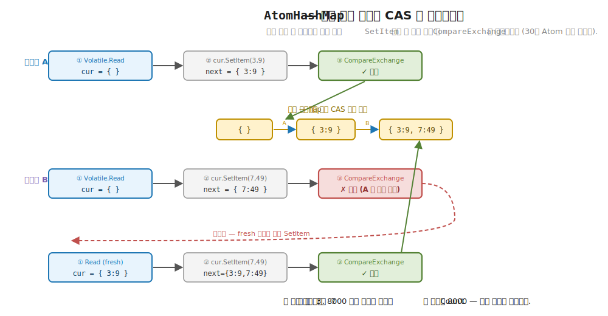
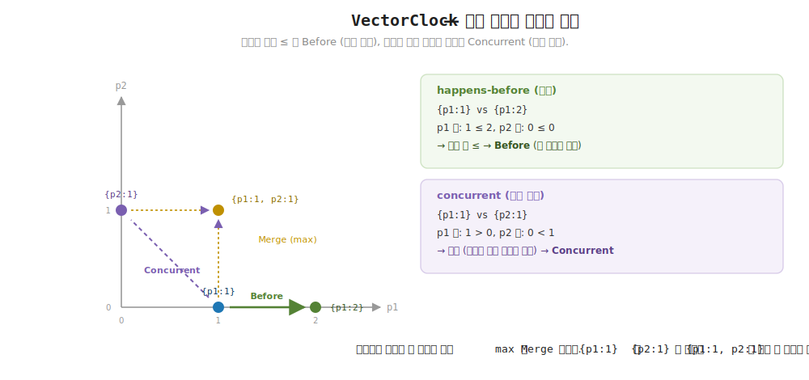
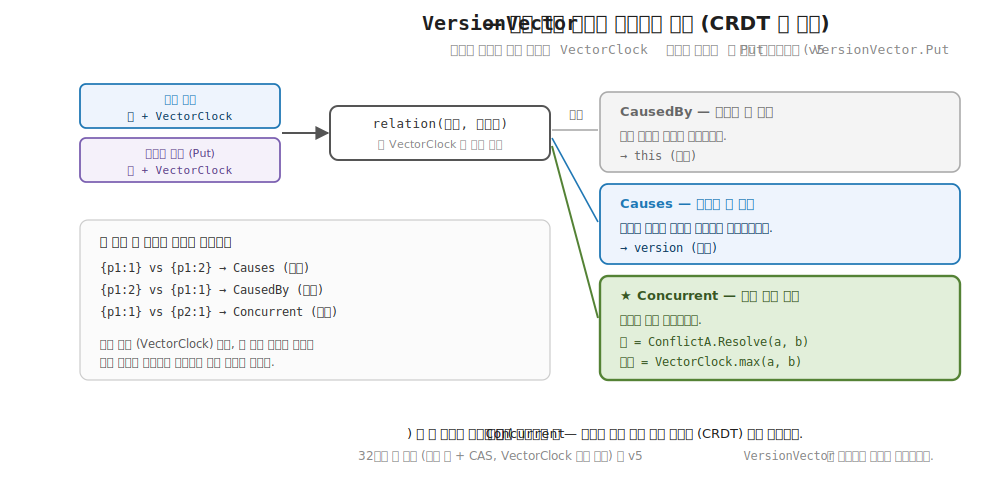

# 32장. 동시 컬렉션과 인과성 (AtomHashMap 과 VectorClock)

> **이 장의 목표** — 이 장을 마치면 여러 스레드가 한 맵에 동시에 쓸 때도 항목을 잃지 않는 `AtomHashMap` 이 30장 `Atom` 의 CAS 를 불변 맵에 그대로 입힌 형태임을 직접 구현으로 확인할 수 있습니다. 락 하나 없이 8000 개의 동시 삽입이 어떻게 무손실로 끝나는지를 충돌과 재시도의 손계산으로 추적합니다. 이어 한 기계 안의 공유 상태에서 여러 기계에 흩어진 사건으로 시야를 넓혀, 벽시계 없이 "무엇이 무엇보다 먼저 일어났는가" 를 판정하는 `VectorClock` 을 만듭니다. 노드별 시계를 성분마다 견주어 happens-before (선행) 와 concurrent (인과 무관) 를 가르는 부분 순서를 손으로 펼치고, 메시지를 주고받을 때 그 순서가 어떻게 저절로 잡히는지를 봅니다. 30장과 31장이 한 기계 안의 상태를 락 없이 다뤘다면, 이 장은 그 발상을 컬렉션과 분산 사건으로 확장하며 9부를 닫습니다.

> **이 장의 핵심 어휘**
>
> - **`AtomHashMap<K, V>`**: 불변 맵을 원자적 참조로 감싸 락 없이 동시 갱신을 받는 동시 컬렉션
> - **`ImmutableDictionary<K, V>`**: 갱신할 때마다 새 맵을 돌려주는 불변 사전, `AtomHashMap` 의 속
> - **CAS (Compare-And-Swap)**: "지금 값이 아직 이것이면 저것으로 바꾸라" 는 원자적 한 동작, 30장 `Atom` 의 핵심
> - **`VectorClock`**: 노드별 논리 시계를 모아 분산 사건의 인과성을 판정하는 값
> - **인과성 (causality)**: 한 사건이 다른 사건의 원인이 되는 관계, 시각이 아니라 사건의 셈으로 잡음
> - **happens-before**: 한 사건이 다른 사건보다 인과적으로 먼저 일어났다는 관계
> - **부분 순서 (partial order)**: 모든 쌍이 앞뒤로 줄 세워지지 않고, 어떤 둘은 비교 불가 (동시) 인 순서
> - **`Merge` (max)**: 메시지 수신 시 두 시계를 노드별 최댓값으로 합치는 연산

> 이 장을 마치면 할 수 있게 되는 것
> - [ ] `AtomHashMap` 이 30장 `Atom` 의 CAS 루프를 불변 맵에 적용한 형태임을 설명할 수 있습니다.
> - [ ] 가변 `Dictionary` 에 동시 삽입하면 왜 항목이 사라지는지 손계산으로 보일 수 있습니다.
> - [ ] CAS 가 실패한 쪽이 손실 없이 재시도로 흡수됨을 한 단계씩 추적할 수 있습니다.
> - [ ] 불변성이 락 없는 재시도를 가능케 하는 까닭을 한 문장으로 답할 수 있습니다.
> - [ ] `VectorClock` 의 `Increment` 와 `Merge` 두 규칙만으로 인과성이 잡힘을 설명할 수 있습니다.
> - [ ] 두 시계를 성분별로 견주어 Before / After / Concurrent 를 손으로 판정할 수 있습니다.
> - [ ] 메시지 송수신에서 happens-before 가 저절로 포착되는 까닭을 추적할 수 있습니다.
> - [ ] 동시성 충돌과 분산 인과성이 "상태 변화를 함수로" 라는 9부 축의 두 얼굴임을 짚을 수 있습니다.

> **이 장의 흐름** — 가변 `Dictionary` 에 여러 스레드가 동시에 쓰면 항목이 사라지거나 예외가 난다는 불편에서 출발합니다. `lock` 으로 막을 수 있지만 그 락이 병목이 된다는 자리를 먼저 부딪힙니다. 그 불편을 푸는 한 수가 맵 전체를 불변으로 두고 그 참조 하나만 CAS 로 갈아 끼우는 것이고, 그것이 `AtomHashMap` 임을 봅니다. 두 스레드가 같은 맵을 읽고 각자 다른 항목을 더한 뒤 써넣을 때 한쪽만 성공하고 다른 쪽은 손실 없이 재시도로 흡수되는 과정을 손계산하고, 8000 개 동시 삽입이 무손실로 끝나는 결과를 봅니다. 이어 한 기계 안의 공유 상태에서 여러 기계의 사건으로 넓혀, 벽시계를 믿지 못하는 분산에서 사건의 순서를 셈으로 잡는 `VectorClock` 을 만듭니다. 두 시계를 성분마다 견주어 선행과 인과 무관을 가르는 규칙을 손으로 펼친 뒤, 메시지를 주고받을 때 그 순서가 `Merge` 와 `Increment` 만으로 저절로 잡힘을 추적합니다. 마지막으로 네 법칙으로 두 도구의 불변식을 굳히고, 두 도구가 9부 축의 한 뿌리에서 갈라진 두 가지임을 짚으며 9부를 닫습니다.

---

## 32.1 이 장에서 다루는 것 — Atom 을 컬렉션에, 그리고 인과성

30장에서 `Atom<A>` 이 값 하나를 락 없이 지켰습니다. 여러 스레드가 같은 카운터를 동시에 올려도, 갱신을 순수 함수 `A → A` 로 적고 CAS 로 갈아 끼우니 한 번의 증가도 새지 않았습니다. 31장에서는 그 발상을 여러 참조로 넓혀, `STM` 트랜잭션이 여러 `Ref` 를 한꺼번에 all-or-nothing 으로 커밋했습니다. 두 장 모두 한 기계 안의 공유 상태를 락 대신 재시도로 다뤘습니다.

이 장의 도구가 무슨 일을 하는지 한 문장으로 잡습니다. 30장이 지킨 것은 값 하나였지만, 실무의 공유 상태는 흔히 맵이나 리스트 같은 컬렉션이고, 여러 스레드가 같은 사전에 동시에 키를 넣는 자리입니다. 이때 컬렉션 전체를 불변으로 두고, 30장처럼 그 참조 하나만 CAS 로 통째 갈아 끼우면, 동시 삽입도 값 하나를 지키던 그 방식 그대로 안전해집니다. 이것이 `AtomHashMap` 입니다. 곧 `AtomHashMap` 은 새 발상이 아니라 30장 `Atom` 을 컬렉션에 입힌 것입니다.

이 장은 거기서 한 발 더 나아갑니다. 30·31장과 `AtomHashMap` 이 모두 한 기계 안의 이야기였다면, 분산 시스템에서는 사건이 여러 기계에 흩어집니다. 이때 새로 생기는 물음은 "무엇이 무엇보다 먼저 일어났는가" 입니다. 한 기계의 사건이 다른 기계의 사건보다 앞섰는지, 아니면 둘이 서로 무관하게 따로 일어났는지를 가려야 합니다. 이 인과성을 시각이 아니라 사건의 셈으로 판정하는 값이 `VectorClock` 입니다.

두 도구가 한 장에 묶이는 까닭은 하나입니다. 둘 다 동시 세계에서 상태를 안전하게 다루는 일입니다. `AtomHashMap` 은 한 기계 안 여러 스레드가 나눠 쓰는 공유 맵을 맡고, `VectorClock` 은 여러 기계에 흩어진 사건의 순서를 맡습니다. 곧 같은 동시성이라는 문제의 두 축, 공유 상태와 인과 순서를 이 장이 함께 봅니다. 9부의 마지막 장이라, 30·31장에서 세운 "상태 변화를 함수로" 라는 발상이 컬렉션과 분산으로 어떻게 뻗는지를 보이며 닫습니다.

지금 모든 것을 외우지 않아도 됩니다. 이 장이 끝날 때 손에 남는 것은 두 가지입니다. `AtomHashMap` 이 불변 맵에 CAS 를 입힌 형태라는 그림 하나와, `VectorClock` 이 두 규칙 (사건 나면 +1, 메시지 받으면 max) 만으로 인과성을 잡는다는 발상 하나입니다.

---

## 32.2 왜 필요한가 — 가변 Dictionary 동시 삽입은 깨집니다

`AtomHashMap` 을 보이기 전에, 그냥 가변 `Dictionary` 에 여러 스레드가 동시에 쓰면 어디서 막히는지부터 부딪혀 봅니다. 도구를 먼저 보이지 않고 손에 잡히는 불편을 먼저 겪는 것이 이 장의 순서입니다.

여러 스레드가 같은 사전에 서로 다른 키를 채워 넣는다고 합니다. 명령형으로 적으면 흔히 이렇게 됩니다.

```csharp
// 가변 Dictionary 에 여러 스레드가 동시 삽입 — 깨진다.
var dict = new Dictionary<int, int>();
Parallel.For(0, 8000, i => dict[i] = i * i);   // ← 여러 스레드가 같은 dict 를 동시에 건드림
// 기대: dict.Count == 8000.  실제: 8000 미만이거나, 도중에 예외.
```

이 코드는 8000 개의 서로 다른 키를 채워 `Count` 가 8000 이 되기를 바랍니다. 그러나 `Dictionary<K, V>` 는 여러 스레드가 동시에 쓰도록 만들어진 자료구조가 아닙니다. 실제로 돌리면 `Count` 가 8000 보다 작게 나오거나, 운이 나쁘면 내부 버킷을 다시 잡는 도중에 다른 스레드가 끼어들어 `IndexOutOfRangeException` 같은 예외가 터집니다.

왜 항목이 사라지는지 손으로 따라가 봅니다. `dict[i] = i * i` 한 줄은 한 동작처럼 보이지만, 속을 들여다보면 여러 단계입니다. 키가 들어갈 버킷을 찾고, 내부 배열에 자리를 잡고, 항목 수를 하나 올립니다. 두 스레드가 이 단계들을 엇갈려 밟으면 다음이 일어납니다.

```
가변 Dictionary, 현재 Count = 100

스레드 A: dict[500] = ...          스레드 B: dict[700] = ...
  ① 내부 상태를 읽음 (Count=100)     ① 내부 상태를 읽음 (Count=100)   ← 둘 다 같은 100 을 봄
  ② 자기 항목 자리 잡음               ② 자기 항목 자리 잡음
  ③ Count 를 101 로 씀  ───────┐    ③ Count 를 101 로 씀  ───────┐
                               │                                 │
                       나중에 쓴 쪽이 먼저 쓴 쪽을 덮음 → Count = 101 (102 가 아니라!)
```

두 스레드가 ① 에서 같은 `Count` 100 을 읽었습니다. 각자 항목을 더하고 ③ 에서 둘 다 101 을 씁니다. 결과는 102 가 아니라 101 입니다. 한 삽입이 통째로 사라졌습니다. 이 한 번 읽고 → 고치고 → 쓰는 사이에 다른 스레드가 끼어들어 일어나는 어긋남이 경쟁 조건 (race condition) 이고, 그 결과로 갱신이 묻히는 것이 갱신 손실 (lost update) 입니다. 1장에서 카운터 하나가 동시 증가로 한 번을 잃던 바로 그 함정이, 여기서는 사전의 항목 단위로 일어납니다.

> **새 어휘 — 갱신 손실 (lost update)** 두 스레드가 같은 상태를 읽어 각자 고친 뒤 차례로 써넣을 때, 나중에 쓴 쪽이 먼저 쓴 쪽의 갱신을 덮어 한쪽이 통째로 사라지는 현상입니다. 동시성이 부르는 가장 흔한 오류이고, 이 장의 `AtomHashMap` 이 막으려는 바로 그 문제입니다.

객체 지향 개발자라면 이 자리에서 익숙한 도구가 둘 떠오릅니다. 하나는 `lock` 입니다. 사전을 건드리는 모든 자리를 `lock (gate) { dict[i] = ...; }` 로 감싸면 한 번에 한 스레드만 들어가니 손실이 사라집니다. 다른 하나는 `.NET` 의 `ConcurrentDictionary<K, V>` 입니다. 동시 접근을 알아서 처리하도록 만들어진 사전이라, 그냥 갈아 끼우면 동작합니다. 둘 다 정답에 가깝지만, 이 장이 보이려는 함수형의 길과 다른 점이 있습니다.

`lock` 의 문제는 병목입니다. 모든 삽입이 같은 락을 두고 줄을 서니, 스레드가 많아질수록 서로를 기다리느라 멈춰 있는 시간이 늘어납니다. 게다가 어느 자리에 락을 거는지를 사람이 일일이 챙겨야 하고, 한 군데라도 빠뜨리면 손실이 조용히 되살아납니다. 30장에서 본 그 불편이 컬렉션에서도 그대로입니다.

> **흔한 함정** — `ConcurrentDictionary` 를 쓰면 끝이라고 여기는 것입니다.
>
> `ConcurrentDictionary<K, V>` 는 훌륭한 도구이고 실무에서 자주 쓰입니다. 그러나 그 속은 여전히 가변입니다. 어떤 스레드가 사전을 읽어 순회하는 동안 다른 스레드가 항목을 더하면, 읽는 쪽이 보는 것은 "어느 한순간의 일관된 사전" 이 아니라 갱신이 섞여 들어오는 사전입니다. `AtomHashMap` 은 다른 길을 갑니다. 맵을 통째로 불변으로 두어, 읽는 쪽이 손에 쥔 것은 그 순간의 변치 않는 스냅샷입니다. 누가 무엇을 더해도 내가 읽던 스냅샷은 그대로입니다. 30장에서 본 "값으로서의 상태" 가 컬렉션에서 누리는 이득이 이 일관된 스냅샷입니다.

그래서 우리가 바라는 것은 분명합니다. 락으로 줄 세우지도 않고, 가변 사전을 손으로 동기화하지도 않으면서, 동시 삽입이 한 항목도 잃지 않는 맵을 갖고 싶습니다. 30장에서 값 하나를 그렇게 지켰으니, 같은 발상을 컬렉션에 입히면 됩니다. 그것이 `AtomHashMap` 입니다. 다음 절에서 그 모양을 봅니다.

---

## 32.3 AtomHashMap — 불변 맵 + CAS

이제 동시 삽입을 락 없이 받는 맵의 모양을 봅니다. 핵심 발상은 한 문장입니다. 맵 전체를 불변으로 두고, 그 맵을 가리키는 참조 하나만 30장의 CAS 로 갈아 끼운다는 것입니다. 항목 하나를 그 자리에서 고치는 대신, "이 항목이 더해진 새 맵" 을 통째로 만들어 참조를 그 새 맵으로 돌립니다.

일상의 비유로 먼저 잡습니다. 게시판에 공지문 한 장이 압정으로 꽂혀 있다고 합니다. 글자 하나를 고치려고 꽂힌 종이에 직접 덧쓰는 것이 가변 사전의 방식입니다. 누군가 동시에 같은 종이에 덧쓰면 글씨가 겹쳐 엉킵니다. `AtomHashMap` 의 방식은 다릅니다. 고친 내용을 담은 새 공지문을 따로 한 장 만들어 두고, 압정을 뽑아 새 종이로 갈아 꽂습니다. 압정을 갈아 꽂는 그 한 동작만 어긋나지 않게 하면, 누가 무슨 새 종이를 준비해 와도 게시판에는 늘 온전한 한 장만 꽂혀 있습니다. 압정을 갈아 꽂는 그 원자적 한 동작이 CAS 입니다.

학습용 `AtomHashMap<K, V>` 의 속은 단순합니다. 불변 사전을 가리키는 참조 하나입니다.

```csharp
// AtomHashMap<K,V> — 30장 Atom 의 CAS 를 *불변 컬렉션* 에 적용. 락 없이 동시 갱신 안전.
public sealed class AtomHashMap<K, V> where K : notnull
{
    ImmutableDictionary<K, V> map = ImmutableDictionary<K, V>.Empty;

    public ImmutableDictionary<K, V> Snapshot => Volatile.Read(ref map);
    public int Count => Snapshot.Count;
    // ...
}
```

`map` 한 필드가 전부입니다. 타입은 `ImmutableDictionary<K, V>`, 곧 2부에서 본 불변 사전의 표준 라이브러리판입니다. 불변이라는 말이 여기서 핵심을 쥡니다. 곧 보겠습니다. `Snapshot` 은 그 참조를 그대로 읽어 돌려줍니다. `Volatile.Read` 한 줄은 다른 스레드가 방금 갈아 끼운 최신 참조를 확실히 보게 하는 장치인데, 처음엔 "최신 값을 읽는다" 정도로만 받아들이면 됩니다 (자세한 가시성 이야기는 30장에서 다뤘습니다). `Count` 는 그 스냅샷의 항목 수일 뿐입니다.

핵심은 `AddOrUpdate` 입니다. 30장 `Atom.Swap` 과 같은 모양의 CAS 루프입니다.

```csharp
// CAS 루프 — 불변 맵을 새 버전으로 교체. 충돌 시 재시도 (잃어버린 삽입 없음).
public void AddOrUpdate(K key, V value)
{
    while (true)
    {
        var cur = Volatile.Read(ref map);              // ① 지금 맵을 읽음
        var next = cur.SetItem(key, value);            // ② 항목을 더한 *새* 맵
        if (Interlocked.CompareExchange(ref map, next, cur) == cur) return;   // ③ 아직 cur 이면 next 로
    }
}
```

본체를 한 호흡으로 읽습니다. ① 지금 `map` 이 가리키는 불변 맵을 `cur` 로 읽습니다. ② `cur.SetItem(key, value)` 로 그 항목이 더해진 새 맵 `next` 를 만듭니다. 여기가 불변의 자리입니다. `SetItem` 은 `cur` 를 건드리지 않고 새 맵을 돌려줍니다. ③ `Interlocked.CompareExchange(ref map, next, cur)` 가 30장의 CAS 한 줄입니다. "지금 `map` 이 아직 `cur` 이면 `next` 로 바꾸라" 는 원자적 한 동작입니다. 바꾸기 직전의 `map` 값을 돌려주므로, 그것이 `cur` 와 같으면 내가 읽은 사이 아무도 끼어들지 않았다는 뜻이라 성공해 `return` 합니다. 다르면 그새 누군가 맵을 갈아 끼웠다는 뜻이라, `while` 처음으로 돌아가 다시 읽고 다시 시도합니다.

> **새 어휘 — CAS (Compare-And-Swap)** `Interlocked.CompareExchange(ref x, next, cur)` 는 "지금 `x` 가 아직 `cur` 이면 `next` 로 바꾸고, 아니면 손대지 말라" 를 한 동작으로 처리하는 원자적 연산입니다. 읽은 그대로면 교체한다는 발상이라 낙관적 동시성 (optimistic concurrency) 이라 부릅니다. 일단 해 보고 어긋났으면 다시 한다는 30장의 핵심을 컬렉션에서 다시 만나는 자리입니다.

OO 직감으로 다리를 놓습니다. DB 를 다뤄 봤다면 낙관적 동시성을 본 적이 있을 것입니다. 행마다 `rowversion` 을 두고, 갱신할 때 "내가 읽은 그 버전이 아직 그대로면 써라" 는 조건을 거는 방식입니다. 다른 트랜잭션이 먼저 고쳐 버전이 바뀌었으면 갱신이 거절되고, 다시 읽어 시도합니다. CAS 의 `cur` 비교가 정확히 그 `rowversion` 비교입니다. `lock` 이 "내 차례까지 멈춰 기다림" 인 비관적 방식이라면, CAS 는 "일단 해 보고 어긋나면 다시" 인 낙관적 방식입니다.

한 가지를 짚어 두면 다리가 더 또렷해집니다. DB 의 낙관적 동시성에서 비교 대상은 행에 따로 붙인 `rowversion` 숫자입니다. 그런데 `AtomHashMap` 의 CAS 가 비교하는 것은 따로 매긴 버전 번호가 아니라 맵 객체를 가리키는 참조 그 자체입니다. 불변 맵은 갱신할 때마다 새 객체로 만들어지니, 새 맵은 곧 새 참조입니다. 다른 스레드가 끼어들어 맵을 갈아 끼웠다면 참조가 이미 다른 객체를 가리키고 있고, `CompareExchange` 가 그 어긋남을 그대로 잡아냅니다. 곧 불변성 덕에 참조의 같음이 버전의 같음 노릇을 합니다. 버전 번호를 손으로 매기고 챙길 필요가 없는 까닭이 여기 있습니다.

이제 두 스레드가 같은 맵에 동시에 다른 키를 넣을 때 무슨 일이 일어나는지 손으로 따라갑니다. 갱신 손실이 어떻게 막히는지가 여기서 또렷해집니다.

```
시작: map → M0 (빈 맵)

스레드 A: AddOrUpdate(1, 1)              스레드 B: AddOrUpdate(2, 4)
  ① cur = M0  (map 을 읽음)               ① cur = M0  (map 을 읽음)   ← 둘 다 같은 M0 을 봄
  ② next = M0.SetItem(1,1) = M1           ② next = M0.SetItem(2,4) = M2
  ③ CAS(map, M1, M0):                     ③ CAS(map, M2, M0):
     map 이 아직 M0 → 성공!                   map 이 이제 M1 ≠ M0 → 실패!
     map → M1, return                         (A 가 먼저 바꿔 둠)
                                           ── 재시도 ──
                                           ① cur = M1  (이번엔 최신을 읽음)
                                           ② next = M1.SetItem(2,4) = M3  ({1:1, 2:4})
                                           ③ CAS(map, M3, M1):
                                              map 이 아직 M1 → 성공!
                                              map → M3, return

끝: map → M3 = {1:1, 2:4}   (두 삽입 모두 살아남음)
```

두 스레드가 ① 에서 같은 `M0` 을 읽었습니다. A 의 CAS 가 먼저 성공해 `map` 을 `M1` 으로 돌립니다. 이제 B 의 CAS 차례인데, B 가 비교하려는 `cur` 는 `M0` 인데 `map` 은 이미 `M1` 입니다. 둘이 다르니 B 의 CAS 는 실패합니다. 여기가 결정적입니다. 가변 사전이라면 B 가 `M0` 기준으로 만든 결과를 그냥 덮어써 A 의 삽입이 사라졌겠지만, CAS 는 어긋남을 알아채고 B 를 재시도로 보냅니다. B 는 이번엔 최신 `M1` 을 읽어 거기에 자기 항목을 더한 `M3` 을 만들고, CAS 에 성공합니다. 두 삽입이 모두 살아남았습니다.

`AddOrUpdate` 에 락이 한 줄도 없다는 점을 짚어 둡니다. B 는 A 를 기다리느라 멈춘 적이 없습니다. 그저 한 번 헛디뎠다가 다시 했을 뿐입니다. 충돌한 쪽만 자기 작업을 다시 하고, 충돌하지 않은 쪽은 거침없이 지나갑니다. 이것이 락 없는 (lock-free) 동시성입니다.

여기서 30장의 한 통찰이 컬렉션에서 다시 살아납니다. 불변이 재시도를 안전하게 만든다는 것입니다. ② 의 `cur.SetItem(...)` 은 `cur` 를 바꾸지 않고 새 맵을 만들 뿐입니다. 그래서 B 의 CAS 가 실패해도 `cur` 가 가리키던 `M0` 은 오염된 적이 없습니다. B 는 그냥 최신을 다시 읽어 깨끗한 상태에서 다시 시도하면 됩니다. 만약 `SetItem` 이 기존 맵을 제자리에서 고치는 가변 연산이었다면, 실패한 시도가 맵을 절반쯤 고쳐 놓아 다음 시도가 망가진 상태에서 출발했을 것입니다. 불변 + 참조 한 번 바꾸기, 이 둘이 맞물려 락 없는 동시성을 만듭니다. 이것이 이 장의 핵심 통찰이고, Wlaschin 과 Louth 가 강조하는 "값으로서의 상태" 가 동시성에서 거두는 실용적 이득입니다.

> **더 깊이 (처음엔 건너뛰어도 됩니다)** — CAS 가 실패하면 새 맵 만들기를 다시 합니다.
>
> 재시도 루프를 보면 `cur.SetItem(...)` 이 충돌할 때마다 다시 불립니다. 곧 "새 맵을 만드는 계산" 이 여러 번 실행될 수 있습니다. 여기서 30장의 규칙이 그대로 돌아옵니다. 그 계산은 부수 효과가 없어야 (순수해야) 합니다. 만약 `next` 를 만드는 과정에 로그를 쓰거나 카운터를 올리는 부수 효과가 섞여 있으면, 충돌이 잦을 때 그 효과가 여러 번 일어나 버립니다. `SetItem` 은 그저 새 맵을 돌려주는 순수 연산이라 몇 번 불려도 결과가 같고 흔적을 남기지 않으니 안전합니다. 순수 함수가 동시성에서 왜 실용적 이득인지 보여 주는 자리이고, 1부 순수성 주제가 9부에서 다시 일하는 자리입니다.

이제 동시 삽입을 실제로 쏟아부어 무손실을 확인합니다. 데모는 8000 개의 서로 다른 키를 여러 스레드가 동시에 넣습니다.

```csharp
var map = new AtomHashMap<int, int>();
Parallel.For(0, 8000, i => map.AddOrUpdate(i, i * i));   // 여러 스레드가 0..7999 동시 삽입
Console.WriteLine($"  여러 스레드가 8000개 삽입 → Count = {map.Count}");
```

`Parallel.For` 가 0 부터 7999 까지를 여러 스레드에 나눠 던집니다. 각 스레드가 자기 몫의 키를 `AddOrUpdate` 로 넣습니다. 충돌이 수없이 일어나지만, 충돌한 쪽마다 재시도가 흡수하므로 한 삽입도 사라지지 않습니다. 결과는 정확히 8000 입니다.

```
  여러 스레드가 8000개 삽입 → Count = 8000   ✓ 무손실
```

32.2 의 가변 `Dictionary` 가 8000 보다 작은 수를 내거나 예외로 멈췄던 자리를, `AtomHashMap` 은 락 한 줄 없이 정확히 8000 으로 끝냅니다. 30장이 값 하나에서 보인 무손실이 컬렉션 전체로 확장된 것입니다.



**그림 32-1. `AtomHashMap` = 불변 맵 + CAS** — 두 스레드가 같은 불변 맵 스냅샷 (`cur`) 을 읽고, 각자 `SetItem` 으로 새 맵 (`next`) 을 만든 뒤 `Interlocked.CompareExchange(ref map, next, cur)` 로 참조를 갈아 끼웁니다. 한쪽 CAS 는 성공하고 다른 쪽은 `cur` 가 어긋나 실패해 재시도로 흡수되므로 삽입이 사라지지 않습니다. 30장 `Atom` 의 CAS 패턴을 컬렉션에 그대로 입힌 모양임을 보입니다.

---

## 32.4 VectorClock — 인과성 (부분 순서)

여기서 시야를 한 기계 밖으로 넓힙니다. `AtomHashMap` 까지는 한 기계 안 여러 스레드의 이야기였습니다. 그러나 분산 시스템에서는 사건이 여러 기계에 흩어집니다. 한 서버가 메시지를 보내고 다른 서버가 받고, 또 다른 서버가 자기 일을 합니다. 이때 새로 생기는 물음은 순서입니다. 어떤 사건이 다른 사건보다 먼저 일어났는가.

먼저 직감부터 잡습니다. "그냥 시계를 보면 되지 않나" 싶습니다. 하지만 분산에서는 그 시계를 믿을 수 없습니다. 기계마다 물리 시각이 조금씩 어긋나 있고, 어떤 기계의 시계는 다른 기계보다 몇 밀리초 빠르거나 느립니다. 그래서 "A 의 시각이 B 보다 이르다" 가 "A 가 B 보다 먼저 일어났다" 를 뜻하지 못합니다. 벽시계 (wall clock) 로는 분산 사건의 순서를 가릴 수 없습니다.

그래서 발상을 바꿉니다. 시각을 재는 대신 사건을 셉니다. 각 노드가 "나는 지금까지 몇 번째 사건을 처리했나" 를 세는 카운터를 들고 다닙니다. 이 카운터를 논리 시계 (logical clock) 라 부릅니다. 시각이 아니라 사건의 횟수를 재는 시계입니다. 분산 시스템의 고전적 발상으로, Lamport 가 처음 정리했습니다.

> **새 어휘 — 논리 시계 (logical clock)** 물리 시각 대신 "몇 번째 사건인가" 라는 셈으로 순서를 매기는 시계입니다. 분산 시스템에서 기계마다 어긋나는 벽시계를 믿지 못하므로, 사건의 횟수로 인과 순서를 잡습니다. 여기서 `VectorClock` 의 시계는 시각이 아니라 카운터임을 먼저 받아들여야 합니다.

`VectorClock` 은 그 논리 시계를 노드마다 하나씩 모은 것입니다. 곧 노드 이름에서 그 노드의 사건 횟수로 가는 사전입니다.

```csharp
// VectorClock — 분산 이벤트의 *인과성(부분 순서)* 추적. 노드별 논리 시계.
public sealed class VectorClock
{
    public ImmutableDictionary<string, long> Times { get; }

    public VectorClock(ImmutableDictionary<string, long>? times = null) =>
        Times = times ?? ImmutableDictionary<string, long>.Empty;

    long Get(string node) => Times.TryGetValue(node, out var v) ? v : 0;
    // ...
}
```

`Times` 가 노드별 시계입니다. `{p1: 2, p2: 1}` 은 "노드 p1 에서 두 사건, 노드 p2 에서 한 사건이 일어났다" 를 뜻합니다. `Get` 은 어떤 노드의 시계를 읽되, 아직 그 노드의 사건을 본 적이 없으면 0 으로 봅니다. 비어 있는 칸은 0 이라는 이 약속이 곧 비교에서 한몫합니다.

규칙은 단 두 가지입니다. 첫째, 내 노드에서 사건이 나면 내 칸을 1 올립니다.

```csharp
// 한 노드에서 이벤트 발생 → 그 노드의 시계 +1.
public VectorClock Increment(string node) =>
    new(Times.SetItem(node, Get(node) + 1));
```

`Increment("p1")` 은 p1 칸을 하나 올린 새 시계를 돌려줍니다. `AtomHashMap` 과 마찬가지로 기존 시계를 고치지 않고 새 값을 만듭니다. 불변이라 여러 스레드가 같은 시계를 읽어도 안전합니다.

둘째, 메시지를 받으면 받은 시계와 내 시계를 노드별 최댓값으로 합친 뒤, 받는 것도 하나의 사건이니 내 칸을 1 올립니다. 합치는 부분이 `Merge` 입니다.

```csharp
// 메시지 수신 시 두 시계를 노드별 max 로 병합.
public VectorClock Merge(VectorClock other)
{
    var builder = ImmutableDictionary<string, long>.Empty.ToBuilder();
    foreach (var k in Times.Keys.Union(other.Times.Keys))
        builder[k] = Math.Max(Get(k), other.Get(k));
    return new VectorClock(builder.ToImmutable());
}
```

두 시계에 등장하는 모든 노드를 모아 (`Times.Keys.Union(other.Times.Keys)`), 각 노드마다 두 시계 중 큰 값을 취합니다. 왜 큰 값인지가 중요합니다. 메시지를 받았다는 것은 보낸 쪽이 그때까지 본 모든 사건을 나도 알게 됐다는 뜻입니다. 그래서 노드마다 "더 많이 진행된" 값을 취해야 내가 본 사건도, 상대가 본 사건도 하나 잃지 않습니다. 작은 값을 취하거나 더하면 본 사건을 까먹거나 없는 사건을 지어내게 됩니다. 최댓값만이 "둘이 본 것의 합집합" 을 옳게 담습니다.

이 노드별 최댓값이라는 모양을 작은 손계산 하나로 굳혀 둡니다. 내 시계가 `{p1:0, p2:3}` 이고 받은 시계가 `{p1:2, p2:1}` 이라고 합니다. 나는 p2 를 셋까지 봤고 상대는 p1 을 둘까지 봤습니다. p1 칸은 0 과 2 중 큰 2 를, p2 칸은 3 과 1 중 큰 3 을 취해 `{p1:2, p2:3}` 이 됩니다. 내가 본 p2 의 셋도, 상대가 본 p1 의 둘도 하나 빠지지 않고 살아남았습니다. 만약 칸마다 작은 값을 취했다면 `{p1:0, p2:1}` 이 되어 내가 보던 p2 의 셋이 도로 하나로 줄고, 더했다면 `{p1:2, p2:4}` 가 되어 일어난 적 없는 p2 의 네 번째 사건이 생겨납니다. 두 시계가 본 사건의 합집합을 빠뜨림도 부풀림도 없이 담는 셈법은 칸마다 최댓값 하나뿐입니다.

> **새 어휘 — happens-before** 한 사건이 다른 사건보다 인과적으로 먼저 일어났다는 관계입니다. "p1 의 어떤 사건이 p2 의 어떤 사건보다 happens-before 다" 는 "전자가 후자의 원인일 수 있다" 를 뜻합니다. 벽시계의 "더 이르다" 가 아니라 사건의 인과 사슬에서의 "더 앞" 입니다.

이제 두 시계의 순서를 어떻게 판정하는지 봅니다. 핵심은 모든 노드 칸을 한꺼번에 견주는 것입니다. 모든 칸에서 a 가 b 보다 작거나 같으면 a 가 b 보다 앞 (Before), 모든 칸에서 크거나 같으면 뒤 (After), 어떤 칸은 크고 어떤 칸은 작아 엇갈리면 둘은 비교 불가, 곧 동시 (Concurrent) 입니다.

```csharp
public enum Ordering { Equal, Before, After, Concurrent }

// 부분 순서 비교 — 모든 성분 ≤ 면 Before, ≥ 면 After, 섞이면 Concurrent (인과 무관).
public Ordering Compare(VectorClock other)
{
    bool le = true, ge = true;       // le: 모든 칸에서 ≤ 인가, ge: 모든 칸에서 ≥ 인가
    foreach (var k in Times.Keys.Union(other.Times.Keys))
    {
        var a = Get(k);
        var b = other.Get(k);
        if (a < b) ge = false;       // 한 칸이라도 작으면 "모두 ≥" 가 깨짐
        if (a > b) le = false;       // 한 칸이라도 크면 "모두 ≤" 가 깨짐
    }
    return (le, ge) switch
    {
        (true, true) => Ordering.Equal,        // 모든 칸이 같음
        (true, false) => Ordering.Before,      // 모두 ≤ (어딘가는 <)
        (false, true) => Ordering.After,       // 모두 ≥ (어딘가는 >)
        _ => Ordering.Concurrent               // 엇갈림 → 비교 불가
    };
}
```

판정 장치는 불리언 둘뿐입니다. `le` 는 "모든 칸에서 a ≤ b 인가", `ge` 는 "모든 칸에서 a ≥ b 인가" 입니다. 칸을 하나씩 돌며 a 가 b 보다 작은 칸을 만나면 `ge` 를 꺾고, 큰 칸을 만나면 `le` 를 꺾습니다. 다 돌고 나서 두 불리언의 조합으로 답이 나옵니다. 둘 다 참이면 모든 칸이 같았다는 뜻이라 Equal, `le` 만 참이면 Before, `ge` 만 참이면 After, 둘 다 거짓이면 한 칸은 크고 한 칸은 작았다는 뜻이라 Concurrent 입니다.

> **새 어휘 — 부분 순서 (partial order)** 모든 두 원소가 앞뒤로 줄 세워지는 전순서 (total order) 와 달리, 어떤 쌍은 비교 불가인 순서입니다. 숫자는 어느 둘을 집어도 크기를 가릴 수 있는 전순서지만, 분산 사건은 그렇지 않습니다. 인과적으로 이어진 쌍은 앞뒤가 있고, 서로 무관하게 따로 일어난 쌍은 누가 먼저랄 것이 없습니다. 이 "비교 불가" 가 곧 동시 (concurrent) 입니다. 동시는 "시각이 같다" 가 아니라 "인과적으로 무관하다" 를 뜻함을 분명히 해 둡니다.

`Compare` 의 두 불리언이 어떻게 답을 내는지 두 예로 손계산합니다. 데모가 펼치는 두 경우입니다. 먼저 같은 노드에서 시계가 진행한 경우입니다.

```csharp
var c0 = new VectorClock().Increment("p1");   // {p1:1}
var c1 = c0.Increment("p1");                  // {p1:2}
Console.WriteLine($"  {c0} vs {c1} → {c0.Compare(c1)}");
```

`c0 = {p1:1}` 과 `c1 = {p1:2}` 를 견줍니다. 등장하는 노드는 p1 하나입니다.

```
c0 = {p1:1}   vs   c1 = {p1:2}

칸을 하나씩 견줌 (Get 으로 읽되 없는 칸은 0):
  노드 p1:  a=1, b=2  →  a < b  →  ge = false  (a 가 더 작은 칸이 있음)
                          a > b 아님 → le 그대로 true

결과: (le, ge) = (true, false) → Before
```

p1 칸에서 a=1 이 b=2 보다 작으니 `ge` 가 꺾입니다. a 가 b 보다 큰 칸은 없으니 `le` 는 참 그대로입니다. `(true, false)` 라 Before 입니다. 곧 같은 노드에서 한 번 더 증가한 시계 (`c1`) 는 이전 시계 (`c0`) 보다 인과적으로 뒤이고, 앞 시계 `c0` 가 Before 로 나옵니다. 같은 노드에서 사건이 차례로 일어났으니 당연히 앞뒤가 있습니다.

```
  {p1:1} vs {p1:2} → Before  (선행)
```

이번엔 서로 다른 노드에서 따로 일어난 경우입니다.

```csharp
var d = new VectorClock().Increment("p2");    // {p2:1}
Console.WriteLine($"  {c0} vs {d}  → {c0.Compare(d)}");
```

`c0 = {p1:1}` 과 `d = {p2:1}` 을 견줍니다. 두 시계에 등장하는 노드는 p1 과 p2 둘입니다. 없는 칸은 0 으로 본다는 약속이 여기서 일합니다.

```
c0 = {p1:1, p2:0}   vs   d = {p1:0, p2:1}     (없는 칸은 Get 이 0 으로)

칸을 하나씩 견줌:
  노드 p1:  a=1, b=0  →  a > b  →  le = false  (a 가 더 큰 칸이 있음)
  노드 p2:  a=0, b=1  →  a < b  →  ge = false  (a 가 더 작은 칸이 있음)

결과: (le, ge) = (false, false) → Concurrent
```

p1 칸에서는 a=1 이 b=0 보다 커서 `le` 가 꺾이고, p2 칸에서는 a=0 이 b=1 보다 작아서 `ge` 가 꺾입니다. 한 칸은 크고 다른 칸은 작은 엇갈림이라 `(false, false)`, 곧 Concurrent 입니다. p1 의 사건과 p2 의 사건은 서로 메시지를 주고받은 적 없이 따로 일어났으니, 누가 먼저랄 것이 없습니다. 이 "엇갈림 = 동시" 가 부분 순서의 핵심이고, `Compare` 의 두 불리언이 그 엇갈림을 그대로 잡아냅니다.

```
  {p1:1} vs {p2:1}  → Concurrent  (인과 무관)
```



**그림 32-2. `VectorClock` 부분 순서: happens-before 대 concurrent** — `{p1:1}` 에서 `{p1:2}` 로 가는 것은 같은 노드가 진행한 것이라 Before (모든 칸에서 ≤), `{p1:1}` 과 `{p2:1}` 은 서로 다른 노드의 독립 사건이라 Concurrent (한 칸은 크고 한 칸은 작아 엇갈림) 입니다. 격자 위 부분 순서로 선행과 인과 무관을 대비하고, 메시지 수신 시 두 시계를 `Merge` (노드별 max) 로 합침을 보입니다.

> **흔한 함정** — Concurrent 를 "같은 시각에 일어났다" 로 읽는 것입니다.
>
> `{p1:1}` 과 `{p2:1}` 이 Concurrent 라 해서 두 사건이 물리적으로 같은 순간에 일어났다는 뜻이 아닙니다. 하나가 다른 하나보다 몇 시간 먼저 일어났더라도, 둘 사이에 메시지가 오간 적이 없어 인과 사슬로 이어지지 않았으면 Concurrent 입니다. 곧 Concurrent 는 "시각이 같다" 가 아니라 "서로의 원인이 될 수 없다, 인과적으로 무관하다" 를 뜻합니다. 부분 순서가 가리는 것은 시각의 동시성이 아니라 인과의 무관함입니다.

---

## 32.5 송수신 시나리오 — happens-before 가 저절로 잡힌다

두 규칙 (`Increment` 와 `Merge`) 이 정말 인과성을 포착하는지를, 메시지를 주고받는 시나리오로 확인합니다. 분산에서 가장 기본이 되는 인과 관계는 "수신은 송신 이후" 입니다. 메시지를 받았으면 그 메시지를 보낸 사건은 받은 사건보다 반드시 먼저 일어났습니다. 이 당연한 순서를 `VectorClock` 이 사람의 개입 없이 저절로 잡아내는지를 봅니다.

직감으로 먼저 잡습니다. 편지를 받았다면 그 편지는 분명 받기 전에 쓰여 부쳐졌습니다. 받은 시점이 쓴 시점보다 뒤라는 것은 인과의 기본입니다. 분산 시스템의 메시지도 같습니다. 받는 쪽은 메시지에 실려 온 보낸 쪽의 시계를 자기 시계와 `Merge` 하므로, 보낸 쪽이 그때까지 본 사건을 모두 물려받습니다. 그 결과 수신 후의 시계는 송신 시계를 인과적으로 "포함" 하게 됩니다.

코드의 `Causality.Scenario` 가 이 시나리오를 담았습니다.

```csharp
public static (VectorClock P1Send, VectorClock P2After, VectorClock.Ordering Order) Scenario()
{
    var p1 = new VectorClock().Increment("p1");   // p1 에서 이벤트 발생, 메시지 전송
    var p2 = new VectorClock().Increment("p2");   // p2 에서 독립 이벤트
    var p2Recv = p2.Merge(p1).Increment("p2");    // p2 가 p1 메시지 수신 후 후속 이벤트
    // p1 전송 시점은 p2 수신 후 시점보다 Before (인과 선행).
    return (p1, p2Recv, p1.Compare(p2Recv));
}
```

세 걸음입니다. p1 이 자기 사건을 하나 처리하며 메시지를 보냅니다 (`p1 = {p1:1}`). p2 는 그와 무관하게 자기 사건을 하나 처리합니다 (`p2 = {p2:1}`). 그러고 나서 p2 가 p1 의 메시지를 받습니다. 받을 때 p1 의 시계를 자기 시계와 `Merge` 하고, 받는 것도 사건이니 자기 칸을 올립니다 (`p2Recv`). 마지막으로 p1 의 송신 시계와 p2 의 수신 후 시계를 견줍니다.

`p2Recv` 가 어떻게 계산되는지 손으로 펼칩니다. 두 규칙이 차례로 적용됩니다.

```
p1 = {p1:1}          (p1 의 사건 + 메시지 전송)
p2 = {p2:1}          (p2 의 독립 사건)

p2Recv = p2.Merge(p1).Increment("p2")

  ① Merge: 노드별 max 로 합침
     p2 = {p1:0, p2:1}   (p1 칸은 없으니 0)
     p1 = {p1:1, p2:0}   (p2 칸은 없으니 0)
     ─────────────────── 칸마다 max
     합친 결과 = {p1:1, p2:1}      (p2 가 p1 의 사건을 물려받음)

  ② Increment("p2"): 수신도 사건이니 p2 칸 +1
     {p1:1, p2:1} → {p1:1, p2:2}

p2Recv = {p1:1, p2:2}
```

`Merge` 가 두 시계를 칸마다 큰 값으로 합쳐 `{p1:1, p2:1}` 을 냅니다. p2 가 p1 의 p1-사건을 자기 시계에 받아 적은 것입니다. 그 뒤 수신이라는 사건으로 p2 칸을 하나 더 올려 `{p1:1, p2:2}` 가 됩니다. 이제 p1 의 송신 시계 `{p1:1}` 과 견줍니다.

```
p1 = {p1:1, p2:0}   vs   p2Recv = {p1:1, p2:2}

칸을 하나씩 견줌:
  노드 p1:  a=1, b=1  →  같음 (le, ge 둘 다 그대로)
  노드 p2:  a=0, b=2  →  a < b  →  ge = false

결과: (le, ge) = (true, false) → Before
```

p1 칸은 1 로 같고, p2 칸은 0 이 2 보다 작아 `ge` 가 꺾입니다. `(true, false)` 라 Before 입니다. 곧 p1 의 송신 사건이 p2 의 수신 후 사건보다 인과적으로 먼저라고 `VectorClock` 이 판정합니다.

```
  p1 송신 {p1:1} vs p2 수신후 {p1:1, p2:2} → Before
```

여기서 무엇이 일어났는지 짚어 둡니다. 우리는 "수신은 송신 이후" 라는 순서를 어디에도 손으로 적지 않았습니다. 그저 사건이 날 때 칸을 올리고 (`Increment`), 메시지를 받을 때 시계를 합쳤을 (`Merge`) 뿐입니다. 그런데 그 두 규칙만으로 happens-before 가 시계의 성분 비교에 저절로 새겨졌습니다. `Merge` 가 p1 의 사건을 p2 의 시계로 흘려보냈기에, 수신 후 시계가 송신 시계보다 모든 칸에서 크거나 같아진 것입니다. 인과를 사람이 추적하는 대신, 두 규칙이 인과를 시계 안에 자동으로 담습니다.

30장의 한 통찰이 여기서 분산의 옷을 입고 다시 나타납니다. `Increment` 와 `Merge` 가 둘 다 기존 시계를 제자리에서 고치지 않고 새 시계를 돌려주는 순수 함수라는 점입니다. 그래서 p1 이 메시지를 보낼 때 자기 시계의 복사본을 실어 보내도, 그 뒤 p1 이 자기 시계를 더 진행시키든 말든 이미 떠난 메시지 속 시계는 변하지 않습니다. p2 가 그것을 받아 `Merge` 할 때 보는 것은 p1 이 보낸 그 순간의 변치 않는 스냅샷입니다. 상태가 값이라 여러 기계가 같은 시계를 주고받아도 서로의 것을 오염시키지 않는다는 것, 이것이 한 기계의 `AtomHashMap` 에서 본 "값으로서의 상태" 가 분산에서도 똑같이 일하는 자리입니다.

> **흔한 함정** — 벽시계 시각으로 송수신 순서를 판단하는 것입니다.
>
> "메시지에 보낸 시각 타임스탬프를 찍어 두면 되지 않나" 싶습니다. 그러나 보낸 기계와 받은 기계의 시계가 어긋나 있으면, 받은 시각이 보낸 시각보다 이르게 찍히는 일조차 생깁니다. 시계가 1초 빠른 기계가 보낸 메시지를, 정확한 기계가 받으면 "미래에서 온 메시지" 가 됩니다. 벽시계로는 인과 순서를 보장할 수 없습니다. `VectorClock` 은 시각을 아예 보지 않고 사건의 셈과 `Merge` 만으로 순서를 잡으므로, 기계 시계가 아무리 어긋나 있어도 "수신은 송신 이후" 가 깨지지 않습니다.

---

## 32.6 법칙으로 다지기

7장 이후 새 추상마다 법칙으로 그 의미를 확인했습니다. 이 장의 두 도구에도 확인할 불변식이 있습니다. `AtomHashMap` 에는 동시 삽입이 무손실이라는 약속이, `VectorClock` 에는 선행과 동시를 옳게 가른다는 약속이 있습니다. 네 가지를 콘솔 bool 함수로 확인합니다.

첫째, 동시 삽입에 잃어버린 항목이 없습니다.

```csharp
// ① 동시 삽입 — 잃어버린 항목 없음.
public static bool NoLostInsertsHolds()
{
    var map = new AtomHashMap<int, int>();
    Parallel.For(0, 8000, i => map.AddOrUpdate(i, i * i));
    return map.Count == 8000;
}
```

8000 개의 서로 다른 키를 여러 스레드가 동시에 넣고 `Count` 가 정확히 8000 인지 봅니다. CAS 재시도가 갱신 손실을 막는다는 32.3 의 약속을 코드로 굳히는 자리입니다.

둘째, 같은 노드에서 증가한 시계는 이전 시계보다 뒤입니다 (앞 시계가 Before).

```csharp
// ② 인과성 — increment 한 시계는 이전 시계보다 Before.
public static bool HappensBeforeHolds()
{
    var c0 = new VectorClock().Increment("p1");   // {p1:1}
    var c1 = c0.Increment("p1");                  // {p1:2}
    return c0.Compare(c1) == VectorClock.Ordering.Before;
}
```

`{p1:1}` 과 `{p1:2}` 의 비교가 Before 인지 봅니다. 같은 노드의 사건이 차례로 일어났을 때 앞뒤가 옳게 잡힘을 확인합니다.

셋째, 서로 다른 노드의 독립 사건은 Concurrent 입니다.

```csharp
// ③ 동시성 — 서로 다른 노드의 독립 이벤트는 Concurrent.
public static bool ConcurrentDetectedHolds()
{
    var a = new VectorClock().Increment("p1");   // {p1:1}
    var b = new VectorClock().Increment("p2");   // {p2:1}
    return a.Compare(b) == VectorClock.Ordering.Concurrent;
}
```

`{p1:1}` 과 `{p2:1}` 의 비교가 Concurrent 인지 봅니다. 인과 무관한 두 사건이 부분 순서에서 비교 불가로 잡힘을 확인합니다.

넷째, 두 시계의 병합이 노드별 최댓값입니다.

```csharp
// ④ 병합 — 두 시계의 max.
public static bool MergeHolds()
{
    var a = new VectorClock().Increment("p1").Increment("p1");  // {p1:2}
    var b = new VectorClock().Increment("p2");                  // {p2:1}
    var m = a.Merge(b);
    return m.Times["p1"] == 2 && m.Times["p2"] == 1;
}
```

`{p1:2}` 와 `{p2:1}` 을 합치면 `{p1:2, p2:1}` 인지 봅니다. 메시지 수신 시 두 시계의 노드별 최댓값을 취한다는 규칙이 그대로 성립함을 확인합니다. 네 함수를 데모가 모아 돌리면 모두 통과입니다.

```
== 검증 ==
  동시 삽입 무손실 : 통과
  happens-before : 통과
  concurrent 감지 : 통과
  clock 병합(max) : 통과

모든 검증 통과 [OK]
```

이 네 법칙이 9부 축의 무엇을 지키는지 한 줄로 짚습니다. ① 은 "상태 변화를 함수로" 가 컬렉션에서 무손실을 보장함을, ②③④ 는 같은 발상이 분산 사건의 인과 순서를 사람의 개입 없이 옳게 담음을 굳힙니다. 곧 한 기계의 공유 상태든 여러 기계의 인과든, 변화를 값으로 다룬다는 9부의 한 발상이 두 자리에서 똑같이 작동함을 네 단언이 받쳐 줍니다.

> **더 깊이 (처음엔 건너뛰어도 됩니다)** — 이 네 법칙은 v5 테스트의 입문 단순화판입니다.
>
> LanguageExt v5 의 `VectorClockTests` 는 같은 불변식을 더 일반적으로 검사합니다. `max({a:1,b:2}, {c:3,b:1}) == {a:1,b:2,c:3}` 처럼 세 노드의 병합을, `relation({a:1,b:2}, {a:2,b:2}) == Causes` 처럼 임의 노드 수의 선행 판정을 단언합니다. 이 장의 네 법칙은 노드를 둘로 좁히고 케이스를 넷으로 줄인 것일 뿐, 검사하는 불변식 (무손실 / 선행 / 동시 / max 병합) 은 v5 가 보는 것과 같습니다. 입문 단계에서는 노드 두 개의 손계산으로 규칙을 손에 익히면 충분하고, 노드가 셋 이상으로 늘어도 같은 칸별 비교가 그대로 적용됩니다.

---

## 32.7 더 깊이 — v5 의 실제 모양과 분산에서의 자리

이 절은 학습용 두 도구가 LanguageExt v5 의 실제 타입과 어떻게 다른지, 그리고 `VectorClock` 이 분산 시스템에서 어디에 쓰이는지를 정직하게 짚습니다. 처음엔 건너뛰어도 좋습니다. 이 장의 핵심은 앞 절들에서 이미 손에 잡혔습니다.

> **더 깊이 (처음엔 건너뛰어도 됩니다)** — v5 의 `AtomHashMap` 은 더 풍부하고, 내부가 다릅니다.
>
> 학습용 `AtomHashMap` 은 `ImmutableDictionary` 를 감싸고 `AddOrUpdate` 하나만 둡니다. v5 의 `AtomHashMap<K, V>` 은 자체 불변 `TrieMap` 을 감싸고, `Swap` (임의 변환을 원자적으로 적용), `SwapKey` (키 단위 변환), `TryAdd` / `SetItem` / `FilterInPlace` / `AddRange` 같은 수십 개의 원자 연산을 둡니다. 게다가 변경을 관찰하는 `event Change` 까지 있어, 맵이 어떻게 바뀌었는지를 구독할 수 있습니다. 학습용은 동시성의 핵심 (CAS 무손실) 만 남기고 그 풍부함을 들어냈습니다. 또 한 가지, 학습용 CAS 루프는 충돌하면 곧장 다시 읽지만, v5 는 `SpinWait` 로 잠깐 양보했다가 재시도합니다. 정확성은 같고, 경합이 심할 때 CPU 를 덜 태우는 최적화일 뿐입니다 (30장에서 본 그 `SpinWait` 입니다). 학습용이 `AddOrUpdate` 의 반환을 `void` 로 둔 것도 단순화입니다. v5 의 모든 변경 메서드는 `Unit` 을 돌려줍니다.

> **더 깊이 (처음엔 건너뛰어도 됩니다)** — v5 의 `VectorClock` 은 관계를 세 가지로 둡니다.
>
> 학습용 `Ordering` 은 `{ Equal, Before, After, Concurrent }` 네 값입니다. v5 의 `Relation` 은 `{ Causes, CausedBy, Concurrent }` 세 값으로, "두 시계가 완전히 같음" 을 따로 두지 않습니다 (같은 시계는 재귀에서 `Causes` 로 처리됩니다). 명칭만 다를 뿐, 학습용 Before 가 v5 `Causes` (왼쪽이 오른쪽의 과거), 학습용 After 가 v5 `CausedBy` 에 대응합니다. 또 v5 의 `VectorClock<A>` 는 노드 타입을 임의 `A` 로 두고 내부를 키로 정렬된 `Seq<(A, long)>` 로 유지하며, 정렬 덕에 두 시계를 한 번에 훑어 비교하는 더 정교한 알고리즘을 씁니다. 학습용은 노드를 `string` 으로 고정하고 `ImmutableDictionary` 위에서 키 합집합을 한 번 도는 단순한 비교로 같은 결과를 냅니다. 결과의 의미는 같고, 학습용이 알고리즘을 입문 눈높이로 줄인 것입니다.

`VectorClock` 이 실무에서 어디에 쓰이는지도 한 단락 짚어 둡니다. 두 도구가 한 장에 묶인 까닭이 v5 의 한 타입에서 실제로 드러납니다. v5 에는 `VersionVector<ConflictA, Actor, A>` 라는 타입이 있습니다. `VectorClock` 에 값과 충돌 해소까지 더해 한 몸에 묶은 타입입니다. 분산에서 같은 데이터를 여러 노드가 동시에 고쳤을 때, `VersionVector` 의 `Put` 은 두 버전의 `VectorClock` 관계를 견주어 자동으로 판정합니다. 새 버전이 기존 버전의 과거면 (`CausedBy`) 무시하고, 미래면 (`Causes`) 받아들이고, 둘이 동시면 (`Concurrent`) 충돌 해소 규칙으로 합치면서 두 시계를 `max` 로 병합합니다. 곧 이 장의 두 도구 (`AtomHashMap` 의 "값으로서의 상태" 와 `VectorClock` 의 인과 판정) 가 실제로 합쳐져 동시 쓰기 충돌을 다스리는 자리입니다. 이런 충돌 자동 병합은 분산 데이터베이스의 CRDT (Conflict-free Replicated Data Type) 가 쓰는 기법이고, `VectorClock` 은 그 바탕에 깔린 인과 추적 도구입니다. 이 장이 그 기초를 손에 쥐여 줍니다.

`Put` 이 세 갈래로 어떻게 갈리는지 한 그림으로 정리합니다.



**그림 32-3. VersionVector: 동시 쓰기 충돌을 자동 병합 (CRDT)** — `Put` 은 두 버전의 `VectorClock` 관계로 갈래를 정합니다. 들어온 게 과거면(`CausedBy`) 무시하고, 미래면(`Causes`) 수용하고, 서로 다른 가지면(`Concurrent`) 값을 `Resolve` 로 병합하고 클록을 `max` 로 합칩니다. 동시일 때 한쪽을 버리지 않고 병합하는 이 마지막 갈래가 충돌 없는 복제 자료형(CRDT)의 핵심입니다.

> **더 깊이 (처음엔 건너뛰어도 됩니다)** — 동시 (`Concurrent`) 일 때 무엇을 하느냐가 CRDT 의 갈림길입니다.
>
> `VersionVector` 의 세 갈래 중 앞 둘 (`Causes` / `CausedBy`) 은 답이 분명합니다. 한쪽이 다른 쪽의 과거면 새 것을 받고 헌 것을 버리면 됩니다. 어려운 것은 셋째, 두 버전이 `Concurrent` 일 때입니다. 누가 먼저랄 것이 없으니 한쪽을 버릴 근거가 없습니다. 그래서 `VersionVector` 는 `ConflictA` 라는 충돌 해소 규칙을 따로 받아 둡니다. 장바구니라면 두 갈래를 합집합으로 합치고, 카운터라면 둘을 더하고, 마지막 쓴 값만 남기는 정책이라면 타임스탬프가 큰 쪽을 고르는 식입니다. 이렇게 "동시 쓰기를 잃지 않고 합치는 규칙" 을 갖춘 자료를 분산 데이터베이스에서 CRDT (Conflict-free Replicated Data Type) 라 부릅니다. 핵심은 둘입니다. 무엇이 동시인지를 가리는 일은 `VectorClock` 의 인과 판정이 맡고, 동시인 둘을 어떻게 합칠지는 충돌 해소 규칙이 맡습니다. 곧 이 장의 `VectorClock` 은 CRDT 가 "어느 충돌을 합쳐야 하는가" 를 알아내는 눈입니다. v5 의 `Relation` 이 관계를 세 값으로만 둔 것 (학습용은 `Equal` 을 따로 떼어 네 값) 도 이 쓰임과 맞닿아 있습니다. 충돌 해소에서 정작 중요한 것은 두 버전이 같은가가 아니라 인과적으로 누가 앞서는가뿐이라, 같음은 따로 둘 필요 없이 과거 (`Causes`) 로 흡수해도 충분하기 때문입니다.

---

## 32.8 Elevated World 어휘로 다시 읽기

이 절은 이 장의 두 도구를 1장 비유와 9부 축에 맞춰 다시 읽는 자리입니다. 먼저 매핑부터 둡니다.

| 32장 도구 | Elevated World·9부 축 어휘 |
|---|---|
| `AtomHashMap` | 불변 컬렉션을 30장 `Atom` 의 CAS 로 감싼 형태, 상태 변화를 새 맵을 만드는 함수로 |
| `ImmutableDictionary` 의 `SetItem` | 기존 맵을 두고 새 맵을 돌려주는 모양 보존 갱신, 재시도를 안전케 하는 불변성 |
| `VectorClock` | 분산 사건의 인과성을 부분 순서로 판정하는 값, 시각이 아닌 사건의 셈 |
| `Increment` / `Merge` | 상태 변화를 순수 함수로 적은 두 규칙, happens-before 를 자동으로 담음 |

1장에서 함수형의 본질을 모든 값과 함수를 합성 가능한 Elevated World 로 끌어올리는 것이라 적었습니다. 9부는 그 발상을 동시성에 댔습니다. 9부 README 의 한 줄로, 기초의 "효과를 값으로" 가 여기서는 "상태 변화를 순수 함수로" 가 됩니다. 30장이 값 하나의 변화를 `A → A` 함수로 적었고, 이 장은 그 발상을 두 방향으로 넓혔습니다. 한 방향은 컬렉션입니다. `AtomHashMap` 에서 맵의 변화는 `cur.SetItem(...)`, 곧 "기존 맵을 받아 새 맵을 내는 함수" 입니다. 다른 방향은 분산입니다. `VectorClock` 에서 시계의 변화는 `Increment` 와 `Merge`, 곧 "기존 시계를 받아 새 시계를 내는 함수" 입니다. 둘 다 상태를 제자리에서 고치지 않고 새 값을 만드는 순수 함수로 변화를 적습니다.

이 "변화를 함수로" 가 동시성에서 거두는 이득이 두 도구에서 똑같이 나타납니다. `AtomHashMap` 에서는 변화가 순수하기에 CAS 가 실패해도 그냥 다시 적용하면 됩니다. 락이 필요 없습니다. `VectorClock` 에서는 변화가 순수하기에 여러 노드가 같은 시계를 읽어 각자 진행해도 서로를 오염시키지 않고, `Merge` 가 두 갈래를 인과를 잃지 않고 합칩니다. 변화가 값이 되면 동시 세계가 안전해진다는 한 발상이, 한 기계의 공유 맵에서도 여러 기계의 사건 순서에서도 작동합니다.

부분 순서를 1장 어휘로 한 줄 더 잇습니다. 1장에서 전순서 (모든 쌍이 비교 가능) 에 익숙했다면, `VectorClock` 의 인과성은 부분 순서 (어떤 쌍은 비교 불가) 입니다. Before / After 는 인과 사슬로 이어진 쌍이고, Concurrent 는 사슬 밖에서 따로 일어난 쌍입니다. 분산의 진실이 전순서가 아니라 부분 순서라는 것, 그것을 `VectorClock` 이 시계의 성분 비교로 정직하게 담는다는 것이 이 도구의 핵심입니다.

비유는 여기까지가 역할입니다. `AtomHashMap` 이 정확히 어떻게 무손실을 보장하는지는 `AddOrUpdate` 의 CAS 루프가, `VectorClock` 이 어떻게 인과를 가리는지는 `Compare` 의 두 불리언이 정합니다. 비유가 머리에 그림을 그려 주는 동안 시그니처가 진실을 정합니다.

---

## 32.9 Q&A — 자기 점검

> **Q1. `AtomHashMap` 은 새로운 동시성 기법입니까?** (32.1절, 32.3절)

아닙니다. 30장 `Atom` 의 CAS 를 불변 맵에 그대로 입힌 것입니다. `Atom` 이 값 하나를 "읽고 → 새 값 계산 → CAS → 실패 시 재시도" 로 지켰다면, `AtomHashMap` 은 같은 루프를 맵 하나에 적용합니다. 다른 점은 갈아 끼우는 대상이 `int` 가 아니라 `ImmutableDictionary` 라는 것뿐입니다. `AddOrUpdate` 의 CAS 루프가 30장 `Swap` 과 같은 모양인 까닭입니다.

> **Q2. 가변 `Dictionary` 에 동시 삽입하면 왜 항목이 사라집니까?** (32.2절)

`dict[i] = ...` 한 줄이 속으로는 "내부 상태를 읽고 → 항목을 더하고 → 항목 수를 올리는" 여러 단계이기 때문입니다. 두 스레드가 같은 상태를 읽어 (둘 다 `Count`=100) 각자 더한 뒤 차례로 쓰면, 나중에 쓴 쪽이 먼저 쓴 쪽을 덮어 (둘 다 101 을 씀) 한 삽입이 사라집니다. 이 갱신 손실 (lost update) 이 동시성의 가장 흔한 오류이고, `AtomHashMap` 이 막으려는 문제입니다.

> **Q3. CAS 가 실패한 스레드의 삽입은 사라집니까?** (32.3절)

사라지지 않습니다. CAS 실패는 "그새 누군가 맵을 바꿨으니 다시 하라" 는 신호일 뿐입니다. 실패한 스레드는 `while` 처음으로 돌아가 최신 맵을 다시 읽고, 거기에 자기 항목을 더한 새 맵을 만들어 다시 CAS 합니다. 충돌한 쪽만 자기 작업을 다시 하고, 충돌하지 않은 쪽은 거침없이 지나갑니다. 그래서 8000 개 동시 삽입이 한 항목도 잃지 않고 정확히 8000 으로 끝납니다.

> **Q4. 불변성이 왜 락 없는 재시도를 가능케 합니까?** (32.3절)

`cur.SetItem(...)` 이 `cur` 를 건드리지 않고 새 맵을 만들기 때문입니다. CAS 가 실패해도 `cur` 가 가리키던 맵은 오염된 적이 없으니, 그냥 최신을 다시 읽어 깨끗한 상태에서 다시 시도하면 됩니다. 만약 갱신이 맵을 제자리에서 고치는 가변 연산이었다면, 실패한 시도가 맵을 절반쯤 고쳐 놓아 다음 시도가 망가진 상태에서 출발했을 것입니다. 불변 + 참조 한 번 바꾸기, 이 둘이 맞물려 락 없는 동시성을 만듭니다.

> **Q5. 분산에서 왜 벽시계로 사건 순서를 가릴 수 없습니까?** (32.4절)

기계마다 물리 시각이 조금씩 어긋나 있기 때문입니다. 시계가 빠른 기계가 보낸 메시지를 정확한 기계가 받으면 "받은 시각" 이 "보낸 시각" 보다 이르게 찍히는 일조차 생깁니다. 그래서 시각의 "더 이르다" 가 인과의 "더 먼저" 를 뜻하지 못합니다. `VectorClock` 은 시각을 아예 보지 않고, 각 노드가 "몇 번째 사건인가" 를 세는 논리 시계 (logical clock) 로 순서를 잡습니다.

> **Q6. 두 시계를 어떻게 견주어 Before / After / Concurrent 를 가립니까?** (32.4절)

모든 노드 칸을 한꺼번에 견줍니다. 모든 칸에서 a ≤ b 면 a 가 Before, 모든 칸에서 a ≥ b 면 After, 어떤 칸은 크고 어떤 칸은 작아 엇갈리면 Concurrent 입니다. `Compare` 는 불리언 둘 (`le`: 모두 ≤ 인가, `ge`: 모두 ≥ 인가) 로 이를 잡습니다. `{p1:1}` 과 `{p2:1}` 은 p1 칸에서 1>0 이라 `le` 가 꺾이고 p2 칸에서 0<1 이라 `ge` 가 꺾여, 둘 다 거짓이니 Concurrent 입니다. 없는 칸은 0 으로 봅니다.

> **Q7. Concurrent 는 두 사건이 같은 시각에 일어났다는 뜻입니까?** (32.4절)

아닙니다. Concurrent 는 "인과적으로 무관하다", 곧 둘 사이에 메시지가 오간 적 없어 서로의 원인이 될 수 없다는 뜻입니다. 하나가 다른 하나보다 몇 시간 먼저 일어났더라도, 인과 사슬로 이어지지 않았으면 Concurrent 입니다. 부분 순서가 가리는 것은 시각의 동시성이 아니라 인과의 무관함입니다.

> **Q8. 메시지 송수신에서 happens-before 가 어떻게 저절로 잡힙니까?** (32.5절)

받는 쪽이 메시지에 실려 온 보낸 쪽의 시계를 자기 시계와 `Merge` (노드별 max) 하기 때문입니다. `p2.Merge(p1)` 이 p1 의 사건을 p2 의 시계로 흘려보내, 수신 후 시계가 송신 시계보다 모든 칸에서 크거나 같아집니다. 그 결과 `p1.Compare(p2Recv)` 가 Before 로 나옵니다. "수신은 송신 이후" 를 손으로 적지 않아도, `Increment` 와 `Merge` 두 규칙이 인과를 시계 안에 자동으로 담습니다.

> **Q9. `Merge` 는 왜 두 시계의 최댓값을 취합니까?** (32.4절)

메시지를 받았다는 것은 보낸 쪽이 그때까지 본 모든 사건을 나도 알게 됐다는 뜻이기 때문입니다. 노드마다 "더 많이 진행된" 값을 취해야 내가 본 사건도, 상대가 본 사건도 하나 잃지 않습니다. 작은 값을 취하면 본 사건을 까먹고, 더하면 일어나지 않은 사건을 지어내게 됩니다. 최댓값만이 "둘이 본 것의 합집합" 을 옳게 담습니다.

> **Q10. `AtomHashMap` 과 `VectorClock` 을 왜 한 장에 묶습니까?** (32.1절, 32.8절)

둘 다 동시 세계에서 상태를 안전하게 다루는 일이기 때문입니다. `AtomHashMap` 은 한 기계 안 여러 스레드가 나눠 쓰는 공유 맵을, `VectorClock` 은 여러 기계에 흩어진 사건의 순서를 맡습니다. 같은 동시성이라는 문제의 두 축 (공유 상태 / 인과 순서) 입니다. 둘 다 "상태 변화를 순수 함수로" 라는 9부 발상에서 갈라졌고, v5 의 `VersionVector` 가 실제로 두 도구를 합쳐 동시 쓰기 충돌을 다스립니다.

> **Q11. 학습용 `VectorClock` 은 v5 와 무엇이 다릅니까?** (32.7절)

학습용 `Ordering` 은 `{ Equal, Before, After, Concurrent }` 네 값이고, v5 `Relation` 은 `{ Causes, CausedBy, Concurrent }` 세 값 (Equal 을 따로 두지 않음) 입니다. 학습용 Before 가 v5 `Causes`, After 가 `CausedBy` 에 대응합니다. 또 학습용은 노드를 `string` 으로 고정하고 키 합집합을 한 번 도는 단순한 비교를 쓰지만, v5 는 노드 타입을 임의로 두고 정렬된 `Seq` 를 한 번에 훑는 더 정교한 알고리즘을 씁니다. 결과의 의미는 같고, 학습용이 입문 눈높이로 줄인 것입니다.

> **Q12. 네 법칙은 9부 축의 무엇을 지킵니까?** (32.6절)

"상태 변화를 순수 함수로" 가 두 자리에서 옳게 작동함을 굳힙니다. ① (무손실) 은 그 발상이 컬렉션에서 갱신 손실을 막음을, ②③④ (선행 / 동시 / max 병합) 는 같은 발상이 분산 사건의 인과 순서를 사람의 개입 없이 옳게 담음을 단언합니다. 한 기계의 공유 상태든 여러 기계의 인과든, 변화를 값으로 다룬다는 한 발상이 네 단언으로 검증됩니다.

---

## 32.10 요약

- **이 장은 30장 `Atom` 의 CAS 를 컬렉션과 분산 인과성으로 넓혀 9부를 닫습니다.** 한 기계의 공유 맵을 지키는 `AtomHashMap` 과 여러 기계의 사건 순서를 가리는 `VectorClock`, 둘 다 "상태 변화를 순수 함수로" 라는 한 발상에서 갈라집니다 (32.1절, 32.8절).
- **가변 `Dictionary` 동시 삽입은 갱신 손실로 깨집니다.** 두 스레드가 같은 내부 상태를 읽어 각자 고친 뒤 차례로 쓰면 나중 쪽이 앞 쪽을 덮어 한 삽입이 사라집니다. `lock` 은 병목, `ConcurrentDictionary` 는 가변 스냅샷이라는 한계가 남습니다 (32.2절).
- **`AtomHashMap` 은 불변 맵을 CAS 로 갈아 끼웁니다.** `cur` 를 읽어 `SetItem` 으로 새 맵 `next` 를 만들고, `Interlocked.CompareExchange` 로 참조를 돌립니다. 충돌한 쪽만 재시도로 흡수되어, 8000 개 동시 삽입이 락 없이 정확히 8000 으로 끝납니다. 불변성이 재시도를 안전케 합니다 (32.3절).
- **`VectorClock` 은 시각이 아니라 사건의 셈으로 인과성을 잡습니다.** 노드별 논리 시계를 모아, 모든 칸에서 ≤ 면 Before, ≥ 면 After, 엇갈리면 Concurrent (인과 무관) 로 부분 순서를 판정합니다. `Compare` 의 두 불리언이 이를 잡습니다 (32.4절).
- **`Increment` 와 `Merge` 두 규칙만으로 happens-before 가 저절로 잡힙니다.** 사건 나면 내 칸 +1, 메시지 받으면 노드별 max 로 합친 뒤 +1. 송수신 시나리오에서 `Merge` 가 송신 사건을 수신 시계로 흘려보내 "수신은 송신 이후" 가 손 안 대고 새겨집니다 (32.5절).
- **네 법칙이 두 도구의 불변식을 굳힙니다.** 동시 삽입 무손실 / 선행 / 동시 감지 / max 병합이 "상태 변화를 함수로" 가 컬렉션과 분산 양쪽에서 옳게 작동함을 단언합니다 (32.6절).
- **학습용은 v5 의 단순화판입니다.** v5 `AtomHashMap` 은 자체 `TrieMap` + `SpinWait` + 수십 개 원자 연산 + 변경 이벤트를, v5 `VectorClock` 은 임의 노드 타입 + 정렬 `Seq` + 세 값 `Relation` 을 둡니다. v5 `VersionVector` 가 두 도구를 합쳐 동시 쓰기 충돌을 자동 병합하는데, CRDT 가 바로 이 방식을 바탕으로 삼습니다 ("더 깊이" 박스).

---

## 32.11 다음 장으로 — 9부를 닫으며

이 장에서 9부의 동시성 도구를 컬렉션과 분산으로 마무리했습니다. 30장 `Atom` 의 CAS 를 불변 맵에 입혀 `AtomHashMap` 으로 동시 삽입을 락 없이 무손실로 받았고, `VectorClock` 으로 여러 기계에 흩어진 사건의 인과성을 시각 없이 사건의 셈으로 가렸습니다. 30장 (값 하나) → 31장 (여러 참조의 트랜잭션) → 32장 (컬렉션과 분산) 으로, "상태 변화를 순수 함수로" 라는 한 발상이 점점 넓은 무대에서 작동함을 봤습니다. 변화를 값으로 다루면 동시 세계가 락 없이 안전해진다는 것이 9부 전체의 도달점입니다.

9부까지 우리는 상태를 한 시점에서 안전하게 다뤘습니다. 그러나 실무의 데이터는 한 번에 다 손에 들어오지 않습니다. 끝없이 흘러드는 이벤트, 너무 커서 한꺼번에 메모리에 못 올리는 파일, 시간에 걸쳐 도착하는 측정값이 있습니다. 이 흐르는 데이터를 효과로서 안전하게 다루는 것이 다음 부의 주제입니다. 동시성에서 본 "값으로서의 상태" 가 거기서는 "값으로서의 스트림" 으로 이어집니다. 자세한 배경은 [10부 README](../Part10-Streaming/README.md) 가 안내합니다.
