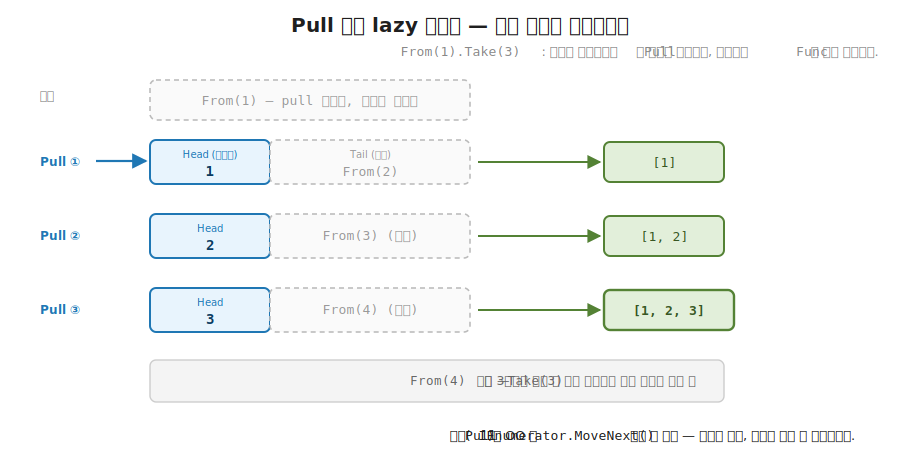
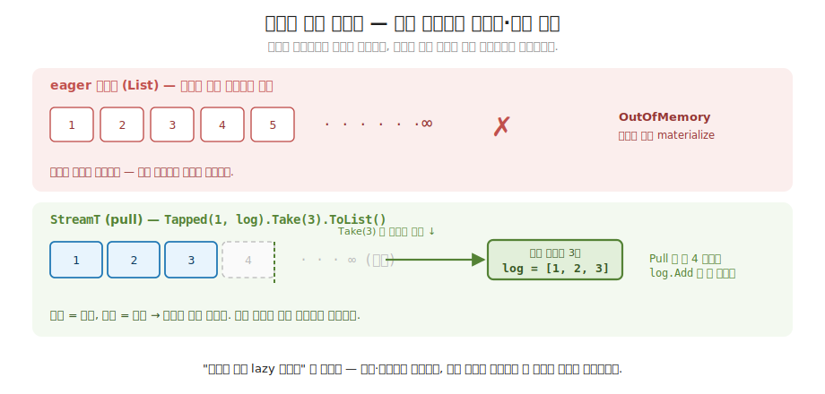
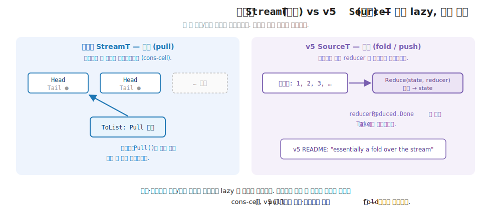

# 33장. StreamT — 효과를 품은 lazy 스트림 (당길 때만 계산되는 무한 시퀀스)

> **이 장의 목표** — 이 장을 마치면 한 조각을 당길 때마다 (Pull) 계산이 일어나는 효과적 스트림 `StreamT<A>` 를 직접 구현할 수 있습니다. 핵심은 머리 (Head) 와 나머지 (Tail) 를 잇되 나머지를 `Func` 로 잠가 두어, 당기기 전에는 아무것도 계산하지 않는 데 있습니다. 4 부의 `MySeq` 가 당김 기반 lazy 시퀀스였고 7 부의 `IO` 가 효과를 `Run` 전까지 미뤄 둔 값이었는데, 이 장은 그 둘을 합쳐 당길 때마다 계산과 효과가 함께 일어나는 스트림을 만듭니다. 무한 자연수 스트림을 `Take(5)` 로 다섯 조각만 당겨 끝내고, `Map` 과 `Filter` 가 한 조각씩 지연 전파되는 것을 손계산으로 추적하며, 무한 스트림인데도 당긴 만큼만 부수 효과가 일어나 메모리 안전한 까닭을 `int++` 가 아닌 게으른 소수 체로 확인합니다. 30장의 `Atom` 이 상태 변화를 순수 함수로 다뤘듯, 이 장은 데이터의 흐름을 당길 때만 계산되는 조각으로 다루는 10 부의 첫 도구입니다.

> **이 장의 핵심 어휘**
>
> - **`StreamT<A>`**: 한 조각을 당길 때마다 계산과 효과가 일어나는 효과적 lazy 스트림
> - **`Cell<A>`**: 스트림의 한 조각, 머리 (`Head`) 와 나머지 스트림 (`Tail`) 의 쌍
> - **`Pull`**: 스트림에서 한 조각을 당기는 동작, 이때 비로소 부수 효과가 실행됨
> - **`Cons`**: 머리와 나머지를 잇되 나머지를 `Func` 로 잠가 지연시키는 생성자
> - **lazy (게으른 평가)**: 정의는 무한이라도 당기기 전에는 계산하지 않는 성질
> - **효과적 스트림 (effectful stream)**: 각 원소를 당길 때 읽기·로그 같은 부수 효과가 함께 일어나는 스트림
> - **`Map` · `Filter` · `Take`**: 4 부 컬렉션의 합성 어휘, 여기서는 한 조각씩 지연 전파됨
> - **역압 (backpressure)**: 소비자가 당기지 않으면 생산도 멈추는, 당김 기반 스트림이 공짜로 갖는 성질

> 이 장을 마치면 할 수 있게 되는 것
> - [ ] 무한·대용량 데이터를 컬렉션으로 한꺼번에 들면 왜 메모리가 터지는지 설명할 수 있습니다.
> - [ ] `Cell<A>` 의 머리·나머지 구조와 `Cons` 의 나머지가 `Func` 로 잠긴 까닭을 설명할 수 있습니다.
> - [ ] `From(1).Take(5).ToList()` 가 정확히 다섯 번만 당긴다는 것을 손으로 추적할 수 있습니다.
> - [ ] `Map` · `Filter` · `Take` 가 한 조각씩 지연 전파되는 과정을 따라갈 수 있습니다.
> - [ ] `Filter` 가 통과값이 나올 때까지 보이지 않게 더 당긴다는 것을 추적할 수 있습니다.
> - [ ] 무한 스트림인데도 효과가 당긴 만큼만 일어나 메모리 안전한 까닭을 설명할 수 있습니다.
> - [ ] 게으른 소수 체가 무한 정의를 유한 소비로 끝내는 구조를 손으로 따라갈 수 있습니다.
> - [ ] 당김 기반 스트림이 4 부 lazy 시퀀스 + 7 부 효과의 결합임을 10 부 축과 이어 짚을 수 있습니다.

> **이 장의 흐름** — 끝없는 이벤트나 대용량 파일을 한꺼번에 `List` 로 들면 메모리가 터지고, 무한한 데이터는 아예 `List` 로 만들 수조차 없는 불편을 먼저 겪습니다. 그 불편을 푸는 한 수가 데이터를 한꺼번에 들지 않고 한 조각씩 당겨 오는 것입니다. 스트림의 한 조각을 머리와 나머지의 쌍 `Cell<A>` 로 두되, 나머지를 `Func` 로 잠가 당기기 전에는 계산하지 않는 `StreamT<A>` 를 한 줄씩 짜 봅니다. 무한 자연수 스트림 `From(1)` 을 `Take(5)` 로 다섯 조각만 당겨 끝내는 과정을 손으로 따라가고, `Map` 과 `Filter` 가 한 조각씩 지연 전파되는 것을 추적합니다. 특히 `Filter` 가 통과값이 나올 때까지 보이지 않게 더 당긴다는 비직관 지점을 짚습니다. 이어 당길 때마다 기록을 남기는 스트림으로 무한 정의인데도 효과가 정확히 당긴 만큼만 일어남을 확인하고, 그 게으름의 진수를 무한 소수 체로 봅니다. 마지막으로 세 검사로 그 동작을 다지고, 한 타입이 데이터를 처음부터 끝까지 혼자 흘리는 이 모양의 한계가 생산·소비·변환을 세 역할로 나누는 34장 Pipes 로 어떻게 이어지는지 짚습니다.

---

## 33.1 이 장에서 다루는 것 — 효과를 품은 lazy 시퀀스

4 부에서 컬렉션을 다뤘습니다. 그중 `MySeq` 는 당김 기반 lazy 시퀀스였습니다. `Map` 이나 `Filter` 를 걸어도 그 자리에서 전부 계산하지 않고, 원소를 하나 꺼낼 때마다 한 조각씩 변환이 흘렀습니다. 7 부에서는 효과를 값으로 다뤘습니다. `IO<A>` 가 부수 효과를 `Run` 전까지 미뤄 둔 값이었고, 그 덕에 효과를 합성하고 테스트에서 갈아 끼울 수 있었습니다.

10 부의 출발점은 이 둘을 합치는 자리입니다. 한 문장으로 잡습니다. 4 부의 lazy 시퀀스에 7 부의 효과를 더하면, 한 조각을 당길 때마다 계산과 효과가 함께 일어나는 스트림이 됩니다. 이것이 **효과적 스트림 (effectful stream)** 이고, 이 장에서 직접 구현하는 `StreamT<A>` 입니다. 이름 끝의 `T` 는 7 부에서 본 변환기 (transformer) 의 머리글자로, 스트림이 내부 효과 위에 선다는 뜻입니다. 학습용에서는 그 내부 효과를 당길 때 실행되는 부수 효과로 단순하게 고정합니다. 그래서 6 부 `OptionT<M, A>` 가 내부 효과 `M` 을 타입 인자로 드러낸 것과 달리, 학습용 `StreamT<A>` 에는 그 `M` 이 타입 인자로 보이지 않습니다. 자세한 내막은 뒤에서 정직하게 짚습니다.

먼저 이 도구가 무슨 일을 하는지 그림 하나로 잡습니다. 보통의 컬렉션은 모든 원소를 한꺼번에 메모리에 올려 둡니다. `List<int>` 가 백만 개의 정수를 담으면 백만 개가 다 메모리에 있습니다. 스트림은 다릅니다. 원소를 한 조각씩 당겨 오고, 당기기 전에는 그 조각이 아직 계산되지도 않았습니다. 그래서 끝이 없는 데이터 (자연수 1, 2, 3, ...) 도 스트림으로는 정의할 수 있습니다. 전부를 들지 않고 필요한 만큼만 당기기 때문입니다.

여기서 10 부 전체를 꿰는 한 줄이 나옵니다. 기초에서 익힌 합성 어휘 `Map` · `Filter` · `Fold` 가, 10 부에서는 무한·대용량 데이터로 확장됩니다. 4 부에서 유한한 컬렉션에 걸던 그 `Map` 과 `Filter` 를, 끝없는 스트림에 똑같이 걸 수 있습니다. 다만 전체가 메모리에 올라오지 않고 한 조각씩 작동한다는 점만 다릅니다. 같은 어휘, 무한한 무대입니다.

지금 모든 것을 외우지 않아도 됩니다. 이 장이 끝날 때 손에 남는 것은 두 가지입니다. `StreamT<A>` 가 데이터를 한 조각씩 당겨 흘린다는 그림 하나와, 당긴 만큼만 계산·효과가 일어나 무한이어도 메모리 안전하다는 발상 하나입니다. 이 장에 처음 나오는 어휘를 한 줄씩만 미리 짚어 둡니다. `Cell<A>` 는 스트림의 한 조각으로, 머리 하나와 나머지 스트림의 쌍입니다. `Pull` 은 그 한 조각을 당기는 동작이고, 당길 때 비로소 부수 효과가 실행됩니다. `Cons` 는 머리와 나머지를 잇는 생성자인데, 나머지를 `Func` 로 잠가 두어 당기기 전에는 계산하지 않게 합니다. 모두 본문에서 코드와 함께 다시 천천히 풀므로, 여기서는 이름과 한 줄 뜻만 스쳐 두면 됩니다.

---

## 33.2 왜 필요한가 — 무한·대용량을 컬렉션으로 들면 터집니다

`StreamT<A>` 를 보이기 전에, 끝없거나 큰 데이터를 보통의 컬렉션으로 다루면 어디서 막히는지부터 부딪혀 봅니다. 추상을 먼저 보이지 않고 손에 잡히는 불편을 먼저 겪는 것이 이 장의 순서입니다.

흔한 작업을 하나 떠올립니다. 자연수를 처음부터 차례로 만들어, 그중 제곱이 짝수인 것 몇 개를 얻고 싶습니다. 명령형이나 eager 컬렉션으로 적으면 이렇게 시작하게 됩니다.

```csharp
// 자연수를 "전부" 만들어 두고 거기서 고르려는 시도
List<int> all = Enumerable.Range(1, ???).ToList();   // ← 끝을 몇으로?
var picked = all.Select(x => x * x)
                .Where(x => x % 2 == 0)
                .Take(3)
                .ToList();
```

첫 줄에서 곧장 막힙니다. `Range(1, ???)` 의 끝을 몇으로 잡아야 할까요. 제곱이 짝수인 것 세 개를 얻으려면 자연수가 몇까지 필요한지 미리 알 수 없습니다. 넉넉잡아 백만을 넣으면 쓰지도 않을 백만 개를 다 만들어 메모리에 올립니다. 정작 필요한 건 앞쪽 몇 개뿐인데 말입니다. 끝을 모르는 데이터를 다루는데 끝을 먼저 정해야 하는 모순입니다.

진짜 무한한 데이터라면 이 모순이 더 또렷합니다. 끝없이 들어오는 센서 입력, 멈추지 않는 이벤트 로그, 1 부터 영원히 이어지는 자연수. 이런 것은 `List` 로 아예 만들 수조차 없습니다. `ToList()` 는 끝까지 다 모은 뒤에야 반환하는데, 끝이 없으니 영원히 반환하지 못하고 그사이 메모리가 무한히 부풀어 터집니다.

대용량 데이터도 같은 한계에 부딪힙니다. 수십 기가바이트짜리 로그 파일의 각 줄을 처리한다고 합니다. 파일 전체를 `List<string>` 으로 읽어 들이면, 정작 한 번에 보는 건 한 줄뿐인데도 수십 기가바이트가 통째로 메모리에 올라갑니다. 데이터가 메모리보다 크면 그 순간 프로그램이 멈춥니다.

이 세 자리의 공통점은 하나입니다. eager 컬렉션은 데이터를 전부 한꺼번에 메모리에 올립니다. 그래서 무한한 데이터는 담지 못하고, 큰 데이터는 메모리를 넘기며, 앞쪽 몇 개만 쓸 때조차 전부를 만들어 버립니다.

> **흔한 함정** — `IEnumerable` 의 lazy 면 이미 충분하지 않냐고 여기는 것입니다.
>
> C# 의 `IEnumerable<T>` 와 `yield return` 도 게으릅니다. 4 부의 `MySeq` 가 그랬듯, `Select` · `Where` 체인은 원소를 하나 꺼낼 때 한 조각씩 흐르고 무한 시퀀스도 만들 수 있습니다. 맞는 말입니다. 다만 `IEnumerable` 은 효과를 원리적으로 담지 못합니다. 각 원소를 당길 때 파일을 읽거나, 로그를 남기거나, 네트워크를 호출하는 부수 효과가 일어나고 그 순서와 횟수를 통제해야 하는 자리에서는, lazy 시퀀스만으로는 부족합니다. 이 장의 `StreamT` 는 거기에 효과를 값처럼 얹어, 당긴 만큼만 효과가 실행되도록 다룹니다. lazy 시퀀스는 출발점이고, 효과적 스트림이 그 위에 한 겹을 더한 것입니다.

그래서 우리가 바라는 것은 분명합니다. 데이터를 한꺼번에 들지 말고, 필요한 한 조각씩 당겨 오고 싶습니다. 당기기 전에는 계산하지도 않아, 무한한 정의도 앞쪽 몇 개만 유한하게 소비하고 싶습니다. 그리고 각 조각을 당길 때 일어나는 효과를 당긴 만큼만 실행하고 싶습니다. 이 모양이 `StreamT<A>` 입니다. 다음 절에서 그것이 어떤 구조인지 봅니다.

---

## 33.3 StreamT\<A\> — Cell 과 Pull

이제 데이터를 한 조각씩 당겨 흘리는 모양을 봅니다. 핵심 발상은 한 문장입니다. 스트림을 머리 하나와 나머지 스트림의 쌍으로 두되, 나머지를 당기기 전에는 계산하지 마라. 머리는 지금 쓸 한 조각이고, 나머지는 아직 잠긴 채로 두었다가 당길 때 비로소 펼칩니다.

일상의 비유로 직감만 짧게 잡습니다. 두루마리 화장지는 잡아당긴 만큼만 풀리고, 나머지는 말린 채로 남습니다. 머리는 지금 풀린 한 칸, 나머지는 아직 말린 부분, 당김은 한 칸을 잡아당기는 동작입니다. 두루마리가 아무리 길어도 (끝이 없어도) 당긴 만큼만 풀린다는 점이 스트림과 같습니다.

먼저 스트림의 한 조각을 표현하는 `Cell<A>` 입니다. 군더더기 없이 쌍 하나입니다.

```csharp
// Cell — 스트림의 한 조각: 머리(Head) + 나머지 스트림(Tail).
internal sealed record Cell<A>(A Head, StreamT<A> Tail);
```

한 줄로 읽습니다. `Cell<A>` 는 `Head` 와 `Tail` 두 필드를 품은 record 입니다. `Head` 는 이 조각의 값 하나이고, `Tail` 은 이 조각 다음에 이어지는 나머지 스트림 전체입니다. 곧 스트림 한 조각은 지금 값 하나와 그 뒤로 이어질 스트림을 함께 들고 있습니다. 나머지가 또 `StreamT<A>` 라는 점을 눈여겨봅니다. 조각이 조각을 가리키는 이 모양이 스트림을 한없이 이어지게 합니다.

이제 스트림 본체 `StreamT<A>` 입니다.

```csharp
// StreamT<A> — 효과적 lazy 스트림. 한 조각을 당길 때마다 (Pull) 계산이 일어난다.
// 핵심 — Tail 은 Pull 될 때만 계산되므로, 무한/대용량 스트림도 끝까지 materialize 되지 않는다.
public sealed class StreamT<A>
{
    readonly Func<Cell<A>?> pull;
    internal StreamT(Func<Cell<A>?> pull) => this.pull = pull;

    // 한 조각 당기기 — null 이면 끝, 아니면 (머리, 나머지). 이때 부수 효과가 실행된다.
    internal Cell<A>? Pull() => pull();

    public static StreamT<A> Empty => new(() => null);

    // Cons — 머리와 나머지를 지연으로 잇는다 (tail 은 Pull 시점에 계산).
    public static StreamT<A> Cons(Func<A> head, Func<StreamT<A>> tail) =>
        new(() => new Cell<A>(head(), tail()));

    // ... Map / Filter / Take / ToList — 다음 절들에서
}
```

타입을 한 줄씩 읽습니다. `StreamT<A>` 의 속은 필드 하나, `Func<Cell<A>?> pull` 입니다. 이것이 핵심입니다. 스트림은 데이터를 들고 있는 것이 아니라, "당기면 한 조각을 내는 함수" 를 들고 있습니다. `Pull()` 메서드가 그 함수를 호출해 한 조각을 당깁니다. 반환이 `Cell<A>?` (물음표가 붙은 nullable) 인데, `null` 이면 스트림이 끝났다는 뜻이고, `null` 이 아니면 그 조각의 머리와 나머지입니다. 그리고 이 `pull()` 이 호출되는 그 순간에 비로소 부수 효과가 실행됩니다. 당기기 전에는 함수가 잠들어 있을 뿐 아무 일도 일어나지 않습니다.

`Empty` 는 빈 스트림입니다. `() => null`, 곧 당기면 곧장 `null` (끝) 을 내는 스트림입니다.

`Cons` 가 스트림을 잇는 생성자입니다. 이름은 lisp 계열에서 온 것으로, 머리와 나머지를 이어 붙인다 (construct) 는 뜻입니다. 두 인자를 받는데, 둘 다 그냥 값이 아니라 `Func` 라는 점이 결정적입니다. `Func<A> head` 는 머리를 내는 함수, `Func<StreamT<A>> tail` 은 나머지 스트림을 내는 함수입니다. 본문 `new(() => new Cell<A>(head(), tail()))` 을 보면, 이 둘은 `Cons` 를 부르는 시점이 아니라 당기는 (`pull()` 이 실행되는) 시점에야 호출됩니다. 곧 `Cons(...)` 를 적어 두기만 해서는 머리도 나머지도 계산되지 않습니다. 당겨야 비로소 `head()` 와 `tail()` 이 불립니다. 이 지연 덕분에 무한 스트림을 적을 수 있습니다.

OO 직감으로 다리를 놓으면, `Cell<A>` 의 머리·나머지 구조는 `IEnumerator<T>` 와 정확히 같은 발상입니다. `IEnumerator` 의 `MoveNext()` 가 한 칸 나아가 `Current` (머리) 를 내고 내부에서 다음을 가리키듯, `Pull()` 은 한 조각을 당겨 `Head` 를 내고 `Tail` 로 다음을 가리킵니다. `yield return` 으로 무한 시퀀스를 적을 수 있는 것도, 그 본질이 "당길 때 한 칸씩 내는 함수" 이기 때문입니다. `StreamT` 는 그 발상을 효과까지 담도록 직접 손으로 짠 것입니다.

이제 실제 무한 스트림 하나를 만들어 봅니다. 자연수를 끝없이 내는 스트림입니다.

```csharp
// 무한 자연수 스트림 start, start+1, ...  (당길 때마다 한 칸씩).
public static StreamT<int> From(int start) =>
    StreamT<int>.Cons(() => start, () => From(start + 1));
```

`From(start)` 는 머리로 `start` 를 내고, 나머지로 `From(start + 1)` 을 내는 스트림입니다. 곧 `From(1)` 은 머리가 1 이고 나머지가 `From(2)`, `From(2)` 는 머리가 2 이고 나머지가 `From(3)`, 이렇게 끝없이 이어집니다. 정의만 보면 자기가 자기를 부르는 무한 재귀라 영원히 안 끝날 것 같습니다. 그런데 `Cons` 의 나머지 `() => From(start + 1)` 이 `Func` 로 잠겨 있으므로, `From(1)` 을 적는 순간에는 `From(2)` 가 계산되지 않습니다. 당길 때만 한 칸씩 펼쳐집니다. 그래서 무한 정의가 무한 계산으로 폭발하지 않습니다.

> **미리보기입니다** — 다음 절에서 이 무한 스트림을 다섯 조각만 당겨 끝냅니다.
>
> `From(1)` 은 끝이 없는데, `From(1).Take(5).ToList()` 는 멀쩡히 `[1, 2, 3, 4, 5]` 를 내고 끝납니다. 무한한 정의가 어떻게 유한한 결과로 끝나는지, 그 비밀이 `Cons` 의 잠긴 나머지에 있습니다. 다음 절에서 `Pull` 을 한 번씩 따라가며, 당긴 만큼만 펼쳐지고 안 당긴 나머지는 영원히 잠든 채로 남는 것을 손으로 추적합니다. 이 한 그림이 이 장의 절반입니다.

---

## 33.4 Pull 기반 — 당길 때만 계산

이제 스트림을 실제로 소비합니다. 정의해 둔 스트림에서 값을 꺼내려면 끝까지 당겨야 하는데, 그 소비를 맡는 메서드가 `ToList` 입니다. 그리고 무한 스트림을 유한하게 자르는 `Take` 가 함께 등장합니다.

먼저 `Take` 와 `ToList` 입니다.

```csharp
public StreamT<A> Take(int n) =>
    n <= 0 ? Empty : new(() => Pull() is { } c ? new Cell<A>(c.Head, c.Tail.Take(n - 1)) : null);

// 소비 — 끝까지 당겨 리스트로 (여기서 비로소 모든 효과가 실행된다).
public List<A> ToList()
{
    var result = new List<A>();
    var s = this;
    while (s.Pull() is { } c) { result.Add(c.Head); s = c.Tail; }
    return result;
}
```

`Take(n)` 을 한 줄로 읽습니다. `n` 이 0 이하면 `Empty` (더 안 당김), 아니면 "한 조각을 당겨, 그 머리는 그대로 두고 나머지는 `Take(n - 1)` 로 자른" 새 스트림입니다. 곧 `Take` 도 스트림을 즉시 자르는 것이 아니라, 당길 때마다 카운트를 하나씩 줄이며 `n` 번째에서 멈추는 스트림을 만듭니다. `Take` 자신도 lazy 입니다.

`ToList` 가 소비의 자리입니다. `while` 루프가 `Pull()` 을 부르고, `null` (끝) 이 아니면 머리를 결과에 담고 나머지로 넘어가, 이것을 끝까지 반복합니다. 여기가 결정적입니다. 지금까지 `From` 도 `Take` 도 스트림을 적어 두기만 했을 뿐 아무것도 당기지 않았습니다. `ToList` 의 `while` 루프가 처음으로 `Pull()` 을 부르는 그 순간에, 비로소 모든 계산과 효과가 실행됩니다. 정의는 게으르고, 소비가 부지런합니다.

이제 데모의 첫 예제를 손으로 따라갑니다. 무한 자연수 스트림에서 다섯 개만 당깁니다.

```csharp
var first5 = Streams.From(1).Take(5).ToList();   // [1, 2, 3, 4, 5]
```

무한한 `From(1)` 에 `Take(5)` 를 걸고 `ToList` 로 소비합니다. `From(1)` 이 끝이 없는데도 결과는 `[1, 2, 3, 4, 5]` 다섯 개로 깔끔하게 끝납니다. 어떻게 무한이 다섯에서 멈추는지, `Pull` 을 한 번씩 따라갑니다.

```
정의 (아직 아무것도 계산 안 됨):
   stream = From(1).Take(5)
   From(1) = Cons(머리 1, 나머지 ()=>From(2))   ← 나머지는 Func 로 잠김
                              ▲
                       당기기 전엔 From(2) 가 계산조차 안 됨

ToList 가 Pull 을 부르기 시작:

  Pull ①:  From(1).Take(5) 를 당김
           → From(1) 의 머리 1 계산, 나머지 From(2) 의 Func 만 풀림
           → Cell(1, From(2).Take(4))          result=[1]
                        ▲ 나머지는 Take(4) 로 다시 잠김

  Pull ②:  From(2).Take(4) 를 당김
           → 머리 2,  Cell(2, From(3).Take(3))  result=[1,2]

  Pull ③:  → 머리 3,  Cell(3, From(4).Take(2))  result=[1,2,3]
  Pull ④:  → 머리 4,  Cell(4, From(5).Take(1))  result=[1,2,3,4]
  Pull ⑤:  → 머리 5,  Cell(5, From(6).Take(0))  result=[1,2,3,4,5]

  Pull ⑥:  From(6).Take(0) 를 당김
           → Take(0) = Empty → null (끝)        while 루프 종료

결과: [1, 2, 3, 4, 5]
      From(6) 이하는 끝내 한 번도 당겨지지 않음 (영원히 잠든 채)
```

다섯 번 당기고 여섯 번째에서 `Take(0)` 이 `null` 을 내며 끝났습니다. 핵심은 매 `Pull` 이 정확히 한 칸만 펼친다는 것입니다. `Pull ①` 은 머리 1 을 계산하면서 나머지 `From(2)` 는 `Func` 로만 풀어 두고, 그 안의 머리 2 는 아직 계산하지 않습니다. `Pull ②` 가 와야 비로소 2 가 계산됩니다. 그래서 `From(6)`, `From(7)`, ... 은 끝내 한 번도 당겨지지 않고 영원히 잠든 채로 남습니다. **정의는 무한, 소비가 유한** 입니다. 무한한 정의에서 `Take(5)` 가 소비를 다섯 칸으로 막고, 막힌 뒤로는 아무것도 계산되지 않습니다.



**그림 33-1. Pull 기반 lazy 스트림: 당긴 만큼만 펼쳐집니다** — `From(1).Take(3)` 의 당김을 추적합니다. 정의 상태에서 `From(1)` 은 머리 1 만 손에 들고 나머지 `From(2)` 는 `Func` 로 잠겨 있습니다. `Pull ①` 이 머리 1 을 내며 나머지를 한 칸 풀고, `Pull ②` 가 머리 2 를, `Pull ③` 이 머리 3 을 냅니다. 당긴 세 칸만 펼쳐지고 그 뒤 `From(4)` 이하는 잠긴 채로 남습니다. OO 의 `IEnumerator.MoveNext()` 가 한 칸씩 나아가는 것과 같은 발상입니다.

OO 직감으로 다시 다리를 놓으면, 이 `Pull` 루프가 곧 `foreach` 가 내부에서 하는 일입니다. `foreach (var x in seq)` 는 `seq` 의 `IEnumerator` 를 얻어 `MoveNext()` 가 `false` 를 낼 때까지 `Current` 를 하나씩 꺼냅니다. `ToList` 의 `while (s.Pull() is { } c)` 가 정확히 그 모양입니다. `Pull()` 이 `MoveNext()` + `Current` 를 합친 한 동작이고, `null` 이 `MoveNext()` 의 `false` 입니다. 익숙한 `foreach` 의 속을 직접 손으로 짠 셈입니다.

> **흔한 함정** — `Take` 없이 무한 스트림을 `ToList` 하면 어떻게 되냐는 것입니다.
>
> `Streams.From(1).ToList()` 를 부르면 어떻게 될까요. `ToList` 의 `while` 루프는 `Pull()` 이 `null` 을 낼 때까지 도는데, `From(1)` 은 끝이 없어 영원히 `null` 을 내지 않습니다. 곧 무한 루프에 빠져 결과 리스트가 무한히 커지다가 메모리가 터집니다. 무한 스트림은 반드시 `Take` 나 다른 유한 소비로 잘라서 소비해야 합니다. 게으른 정의가 메모리를 지켜 주는 것은 소비가 유한할 때뿐입니다. 무한 정의를 무한 소비하면 eager 컬렉션과 똑같이 터집니다.

---

## 33.5 Map / Filter / Take 합성 — 한 조각씩

스트림에도 4 부의 합성 어휘가 그대로 붙습니다. `Map` 으로 각 원소를 변환하고, `Filter` 로 조건에 맞는 것만 고르고, `Take` 로 앞쪽 몇 개를 자릅니다. 다만 이들 모두 스트림 위에서는 한 조각씩 지연 전파된다는 점이 다릅니다. 즉시 전체를 변환하지 않고, 당길 때 그 조각만 변환합니다.

`Map` 과 `Filter` 입니다.

```csharp
public StreamT<B> Map<B>(Func<A, B> f) =>
    new(() => Pull() is { } c ? new Cell<B>(f(c.Head), c.Tail.Map(f)) : null);

public StreamT<A> Filter(Func<A, bool> p) =>
    new(() =>
    {
        var s = this;
        while (true)
        {
            var c = s.Pull();
            if (c is null) return null;
            if (p(c.Head)) return new Cell<A>(c.Head, c.Tail.Filter(p));
            s = c.Tail;
        }
    });
```

`Map(f)` 을 한 줄로 읽습니다. 당기면 한 조각을 당겨, 그 머리에 `f` 를 적용하고 (`f(c.Head)`) 나머지는 다시 `Map(f)` 로 감싼 새 스트림입니다. 곧 `Map` 도 즉시 전체를 변환하지 않습니다. 당길 때 그 한 조각의 머리만 변환하고, 나머지의 변환은 또 잠가 둡니다. 4 부의 `MySeq.Map` 과 똑같은 지연 전파입니다.

`Filter(p)` 가 조금 더 미묘합니다. 당기면 `while` 루프가 돕니다. 한 조각을 당겨 (`s.Pull()`), 끝이면 `null`, 조건 `p(c.Head)` 를 통과하면 그 머리를 내고 나머지는 `Filter(p)` 로 감쌉니다. 그런데 조건을 통과하지 못하면 `s = c.Tail` 로 다음 조각으로 넘어가 루프를 계속 돕니다. 곧 통과하는 값이 나올 때까지 안에서 계속 당깁니다. 이 점이 결정적이라 곧 손계산으로 따로 짚습니다.

이제 데모의 둘째 예제를 따라갑니다. 자연수의 제곱 중 짝수인 것 처음 세 개입니다.

```csharp
var sq = Streams.From(1).Map(x => x * x).Filter(x => x % 2 == 0).Take(3).ToList();
// [4, 16, 36]
```

`From(1)` 에 제곱 `Map`, 짝수 `Filter`, `Take(3)` 을 차례로 겁니다. 결과는 `[4, 16, 36]` 입니다. 1 의 제곱 1 (홀수, 버림), 2 의 제곱 4 (짝수, 첫째), 3 의 제곱 9 (홀수, 버림), 4 의 제곱 16 (짝수, 둘째), ... 이렇게 흐릅니다. 한 조각씩 어떻게 흐르는지, 그리고 `Filter` 가 어떻게 보이지 않게 더 당기는지 추적합니다.

```
파이프라인:  From(1) → Map(²) → Filter(짝수) → Take(3) → ToList

Take(3) 가 첫 조각을 요구하면, 그 요구가 거꾸로 거슬러 올라간다:

  Take 가 1개 요구
   └ Filter 가 통과값 1개를 찾아야 함 → 안에서 계속 당김:
       Map 당김 → From 머리 1 → 1²=1 → Filter: 1 은 홀수, 버림. 더 당김
       Map 당김 → From 머리 2 → 2²=4 → Filter: 4 는 짝수, 통과!     → 4   (Take 1/3)
   └ Filter 가 통과값 1개 더:
       Map 당김 → From 머리 3 → 3²=9 → Filter: 9 는 홀수, 버림. 더 당김
       Map 당김 → From 머리 4 → 4²=16 → Filter: 16 은 짝수, 통과!   → 16  (Take 2/3)
   └ Filter 가 통과값 1개 더:
       Map 당김 → From 머리 5 → 5²=25 → Filter: 25 는 홀수, 버림. 더 당김
       Map 당김 → From 머리 6 → 6²=36 → Filter: 36 은 짝수, 통과!   → 36  (Take 3/3)
  Take 가 3개 채움 → 종료

결과: [4, 16, 36]

소비된 출력 = 3개,  실제 당긴 원소 = 6개 (1~6)
                    ▲ Filter 가 홀수 제곱 3개(1,9,25)를 만나며 더 당겼다
```

세 개를 얻으려 했는데 자연수는 6 까지 당겨졌습니다. 여기가 lazy 의 비직관 지점입니다. **소비 한 개가 생산 한 개가 아닙니다.** `Take(3)` 이 출력 세 개를 요구하면, `Filter` 는 통과하는 값 세 개를 찾을 때까지 보이지 않게 안에서 더 당깁니다. 홀수 제곱 1, 9, 25 를 만날 때마다 버리고 다음을 당겨, 결국 자연수 6 까지 소비합니다. `Map` 은 당겨진 여섯 개를 모두 제곱했지만, `Filter` 가 그중 셋만 통과시켰고, `Take` 가 그 셋에서 멈췄습니다. 보이는 출력은 셋, 보이지 않는 당김은 여섯입니다.

OO 직감으로 다리를 놓으면, 이것이 LINQ 의 지연 실행 (deferred execution) 과 정확히 같습니다. `seq.Select(...).Where(...).Take(3)` 도 `Take(3)` 이 결과를 요구할 때 거꾸로 거슬러 올라가 한 조각씩 당기고, `Where` 가 통과값을 찾을 때까지 추가로 당깁니다. LINQ 체인이 메모리에 중간 리스트를 만들지 않고 한 원소씩 흐르는 그 동작을, `StreamT` 의 `Map` · `Filter` 가 효과까지 담아 그대로 재현합니다.

> **흔한 함정** — `Filter` 가 한 칸당 한 칸을 낸다고 여기는 것입니다.
>
> `Map` 은 한 조각을 당기면 정확히 한 조각을 냅니다 (변환만 하니까). 그래서 `Filter` 도 그럴 거라 오해하기 쉽습니다. 실제로 `Filter` 는 통과값 하나를 내기 위해 안에서 여러 칸을 당길 수 있습니다. 위에서 통과값 4 를 얻는 데 두 칸 (1, 2) 을, 16 을 얻는 데 또 두 칸 (3, 4) 을 당겼습니다. 만약 조건이 까다로워 백 칸에 하나만 통과한다면, 통과값 하나당 백 칸을 당깁니다. 버려진 칸의 효과도 (당겼으니) 이미 일어났습니다. `Filter` 의 `while` 루프가 바로 이 "통과값 나올 때까지 계속 당김" 을 합니다. 소비량과 생산량이 다르다는 것이 lazy 스트림을 추론할 때 가장 자주 헷갈리는 자리입니다.

---

## 33.6 효과는 당긴 만큼만 — payoff

이제 이 장의 도구가 약속을 지키는지 정면으로 봅니다. 게으른 평가의 진짜 가치는 효과에서 드러납니다. 각 조각을 당길 때 부수 효과가 일어난다면, 그 효과는 정확히 당긴 만큼만 일어나야 합니다. 무한 스트림이라도 앞쪽 세 개만 당기면 효과도 세 번만 일어나는지, 데모의 셋째 예제가 그것을 증명합니다.

당길 때마다 기록을 남기는 스트림을 만듭니다.

```csharp
// 당길 때마다 log 에 기록하는 무한 스트림 (효과가 당길 때만 일어남을 보이기 위함).
public static StreamT<int> Tapped(int start, List<int> log) =>
    StreamT<int>.Cons(() => { log.Add(start); return start; }, () => Tapped(start + 1, log));
```

`Tapped` 는 `From` 과 거의 같은 무한 자연수 스트림인데, 머리를 내는 함수가 한 가지를 더 합니다. `log.Add(start)` 로 기록을 남깁니다. 이 기록이 부수 효과를 흉내 냅니다. 실무라면 여기서 파일을 읽거나 네트워크를 호출하겠지만, 학습용에서는 리스트에 기록을 더하는 것으로 "효과가 일어났다" 를 눈에 보이게 합니다. 여기서 `log.Add` 가 머리를 내는 `Func` 안에 놓인 것을 눈여겨봅니다. 곧 당겨서 머리가 계산될 때만 기록이 남습니다.

그런데 머리가 계산될 때만 기록이 남는다는 점에서, 이 장에서 가장 비직관적인 대목이 나옵니다. 스트림은 순수한 lazy 시퀀스 (`IEnumerable`) 가 아니라 효과적 스트림이라, `Filter` 가 버린 원소의 부수 효과까지 이미 일어났다는 것입니다. `Filter` 는 통과값을 찾으려고 안에서 더 당기는데, 당기는 순간 머리 함수가 불려 `log.Add` 가 실행되기 때문입니다. 버릴 원소든 통과할 원소든, 당겨 본 이상 그 효과는 이미 남습니다.

작은 예제 하나로 손계산해 봅니다. 무한한 `Tapped` 스트림에서 짝수만 거른 뒤 둘만 당깁니다.

```csharp
var log = new List<int>();
var pulled = Streams.Tapped(1, log).Filter(x => x % 2 == 0).Take(2).ToList();
// pulled = [2, 4],  그런데 log = [1, 2, 3, 4]
```

결과 `pulled` 는 짝수 둘 `[2, 4]` 인데, 기록 `log` 의 길이는 둘이 아니라 넷입니다. `Filter` 가 통과값 둘을 찾으려고 1, 2, 3, 4 를 다 당겨 봤고, 그때마다 머리 함수의 `log.Add` 가 실행됐기 때문입니다.

```
파이프라인:  Tapped(1, log) → Filter(짝수) → Take(2) → ToList

  Take 가 1개 요구
   └ Filter 가 통과값 1개를 찾아야 함 → 안에서 당김:
       당김 → 머리 1: log.Add(1) → log=[1].  Filter: 1 은 홀수, 버림. 더 당김
       당김 → 머리 2: log.Add(2) → log=[1,2].  Filter: 2 는 짝수, 통과!  → 2   (Take 1/2)
   └ Filter 가 통과값 1개 더:
       당김 → 머리 3: log.Add(3) → log=[1,2,3].  Filter: 3 은 홀수, 버림. 더 당김
       당김 → 머리 4: log.Add(4) → log=[1,2,3,4].  Filter: 4 는 짝수, 통과! → 4   (Take 2/2)
  Take 가 2개 채움 → 종료

결과: pulled=[2, 4]
      그러나 log=[1, 2, 3, 4]
      ▲ 버려진 1·3 의 log.Add 도 (당겨 봤으니) 이미 실행됨
```

버린 원소 1 과 3 의 `log.Add` 가 분명히 실행돼 `log` 에 남았습니다. 이것이 효과적 스트림이 순수 lazy 시퀀스와 갈리는 자리입니다. 순수한 `IEnumerable` 의 `Where` 라면 버린 원소는 그저 건너뛰어 아무 흔적도 안 남지만, 효과적 스트림에서는 당겨 본 모든 원소의 효과가 (통과하든 버리든) 일어납니다. 그래서 각 원소의 당김이 파일 읽기나 네트워크 호출 같은 무거운 효과라면, `Filter` 가 버린 원소의 효과까지 든다는 점을 셈에 넣어야 합니다.

이제 무한 `Tapped` 스트림에서 세 개만 당깁니다.

```csharp
var log = new List<int>();
var pulled = Streams.Tapped(1, log).Take(3).ToList();
// pulled = [1, 2, 3], log.Count = 3
```

`Tapped(1, log)` 는 무한한데, `Take(3).ToList()` 로 세 개만 당깁니다. 결과 `pulled` 는 `[1, 2, 3]` 이고, 기록 `log` 의 길이는 정확히 3 입니다. 무한 스트림인데 효과는 딱 세 번만 일어났습니다. 손으로 따라갑니다.

```
정의:  Tapped(1, log).Take(3)     ← 아직 아무것도 당기지 않음, log = []

  Pull ①:  Tapped(1).Take(3) 당김
           → 머리 함수 실행: log.Add(1) → log=[1],  머리 1 반환
           → Cell(1, Tapped(2).Take(2))             pulled=[1]

  Pull ②:  → log.Add(2) → log=[1,2],  머리 2        pulled=[1,2]
  Pull ③:  → log.Add(3) → log=[1,2,3], 머리 3       pulled=[1,2,3]

  Pull ④:  Tapped(4).Take(0) 당김 → Take(0)=Empty → null (끝)

결과: pulled=[1,2,3],  log.Count=3
      Tapped(4) 의 머리 함수는 끝내 실행 안 됨 → log.Add(4) 안 일어남
```

세 번 당겼고, 머리 함수가 세 번 불렸고, 기록이 세 번 남았습니다. 네 번째 조각 `Tapped(4)` 의 머리 함수는 끝내 실행되지 않았으므로 `log.Add(4)` 도 일어나지 않았습니다. 곧 **효과는 당긴 만큼만** 일어났습니다. 데모는 이것을 한 줄로 출력합니다.

```
== 예제 3 — 무한 스트림인데 효과는 3번만 ==
  결과 = [1, 2, 3], 실제 생산된 원소 수 = 3
  → 무한 스트림이지만 당긴 3개만 계산 (메모리/효과 안전)
```

이 한 줄이 이 장의 payoff 입니다. `Tapped(1, log)` 는 끝이 없는 스트림인데, 그것을 메모리에 다 올리지도 않았고 효과를 무한히 일으키지도 않았습니다. `Take(3)` 이 소비를 세 칸으로 막았고, 막힌 만큼만 계산과 효과가 일어났습니다. 무한한 정의를 안전하게 다룰 수 있는 까닭이 바로 여기 있습니다. 정의가 아무리 커도 (무한이라도) 비용은 소비한 만큼만 듭니다. 33.2 에서 본 "전부를 메모리에 올려 터진다" 의 정반대입니다.



**그림 33-2. 효과는 당긴 만큼만: 무한 스트림도 메모리·효과 안전합니다** — 위는 eager `List`. 무한 데이터를 전부 만들려다 메모리가 터집니다. 아래는 `StreamT`. 무한한 `Tapped` 스트림에 `Take(3)` 을 걸면 `Pull` 이 세 번 일어나고 그때마다 `log.Add` 가 한 번씩 실행돼 `log = [1, 2, 3]` 으로 끝납니다. 네 번째 이하는 당겨지지 않아 효과도 일어나지 않습니다. 무한한 정의가 유한한 비용으로 끝나는 자리입니다.

여기서 33.2 에서 막혔던 모순이 풀립니다. "제곱이 짝수인 것 세 개를 얻으려면 자연수를 몇까지 만들어야 하나" 를 미리 정할 필요가 없습니다. 무한한 `From(1)` 을 정의해 두고, `Filter` 와 `Take(3)` 으로 소비를 막으면, 필요한 만큼만 (앞에서 본 대로 자연수 6 까지) 당겨집니다. 끝을 모르는 데이터를 끝을 정하지 않고 다룹니다. 이것이 게으른 평가가 주는 자유입니다.

대용량 데이터도 같은 방식으로 풀립니다. 수십 기가바이트짜리 로그 파일도 한 줄씩 당겨 처리하면, 메모리엔 늘 한 줄만 올라와 있습니다. 한 줄을 당겨 처리하고 다음 줄을 당기면, 앞 줄은 더는 붙잡고 있지 않아도 되기 때문입니다. 파일이 메모리보다 훨씬 커도 안전합니다. 처음에 "파일 전체를 `List` 로 읽으면 메모리를 넘긴다" 던 불편이, 한 조각씩 당기는 소비로 풀립니다. 무한한 데이터든 메모리보다 큰 데이터든, 당긴 만큼만 메모리에 올린다는 한 줄이 둘을 함께 풀어 줍니다.

여기서 당김 기반 스트림이 공짜로 갖는 한 가지 성질을 짚어 둡니다. **역압 (backpressure)** 입니다. 소비자 (`ToList` 의 루프) 가 `Pull` 을 부르지 않으면 생산자 (`From`, `Tapped`) 는 아무것도 만들지 않습니다. 곧 소비 속도가 생산 속도를 자연히 제어합니다. 빠른 생산자가 느린 소비자를 앞질러 데이터를 쌓아 메모리를 넘기는 일이, 당김 기반에서는 원리적으로 일어나지 않습니다. 소비자가 당긴 만큼만 생산되니까요. 이 자연스러운 제어가 역압입니다.

> **더 깊이 (처음엔 건너뛰어도 됩니다)** — 역압을 "구현" 한 것이 아니라, 당김 구조가 그 효과를 줍니다.
>
> 역압이라는 말이 거창하게 들리지만, 학습용 `StreamT` 에는 역압을 위한 특별한 코드가 한 줄도 없습니다. 버퍼도, 속도 조절 장치도, 큐도 없습니다. 그저 소비자가 `Pull` 을 부를 때만 생산이 일어나는 당김 구조 자체가, 소비 속도가 곧 생산 속도가 되게 만들 뿐입니다. 이것이 reactive 의 push 모델 (`IObservable`) 과 대비되는 지점입니다. push 에서는 생산자가 자기 속도로 데이터를 밀어내므로, 느린 소비자를 위해 버퍼나 역압 신호 같은 장치를 따로 둬야 합니다. pull 모델은 소비자가 당기는 구조라 그 장치가 없어도 됩니다. v5 의 실무 스트리밍은 여기에 명시적인 버퍼 전략 (Conduit 의 `Buffer`) 을 더해 더 정교하게 다루지만, 그것은 이 책의 범위를 넘습니다. 입문 단계에서는 "당기지 않으면 생산도 안 일어난다" 는 pull 구조의 공짜 이득만 손에 쥐면 충분합니다.

---

## 33.7 무한 소수 체 — 게으른 평가의 진수

게으른 평가가 무엇을 풀어 주는지를 한 예제로 또렷이 보이는 자리입니다. 에라토스테네스의 체 (sieve of Eratosthenes) 를 무한 스트림으로 적습니다. 보통의 체는 "1 부터 N 까지" 처럼 끝을 정해 두고 거르지만, 스트림으로 적으면 끝을 정하지 않고 무한히 거르되 필요한 개수만큼만 실제로 계산합니다.

이 장의 챌린지 정답 코드입니다.

```csharp
// 무한 스트림으로 소수 거르기 (게으른 평가의 진수).
public static List<int> Primes(int count)
{
    StreamT<int> Sift(StreamT<int> s)
    {
        var c = s.Pull()!;                       // 첫 원소 = 소수
        var prime = c.Head;
        // 그 소수의 배수를 거른 나머지를 다시 체질 (지연).
        return StreamT<int>.Cons(() => prime, () => Sift(c.Tail.Filter(x => x % prime != 0)));
    }
    return Sift(Streams.From(2)).Take(count).ToList();
}
```

핵심은 지역 함수 `Sift` 입니다. 한 줄씩 읽습니다. `Sift` 는 스트림 `s` 를 받아, 첫 원소를 당깁니다 (`s.Pull()!`). 체의 규칙상 거르고 남은 첫 원소는 언제나 소수이므로, 그것을 `prime` 으로 둡니다. 그리고 새 스트림을 냅니다. 머리는 그 소수 `prime`, 나머지는 "그 소수의 배수를 거른 (`Filter(x => x % prime != 0)`) 나머지를 다시 `Sift` 한" 스트림입니다. 곧 소수를 하나 찾을 때마다, 그 배수를 거르는 `Filter` 를 한 겹 더 씌운 나머지를 재귀로 체질합니다.

`Primes(count)` 는 `From(2)` (2 부터 시작하는 무한 자연수) 를 `Sift` 에 넣고, `Take(count)` 로 원하는 개수만 잘라 소비합니다. 데모는 처음 열 개를 구합니다.

```csharp
Sieve.Primes(10);   // [2, 3, 5, 7, 11, 13, 17, 19, 23, 29]
```

어떻게 무한히 거르면서 열 개에서 깔끔히 멈추는지, 앞 몇 단계를 따라갑니다.

```
Sift(From(2)) 가 당겨질 때:

  첫 머리 = 2 (소수!)
   나머지 = Sift( From(3,4,5,...) 에서 2의 배수 제거 )
          = Sift( 3, 5, 7, 9, 11, ... )           ← Filter(x%2≠0) 한 겹

  그 안에서 다음 머리 = 3 (소수!)
   나머지 = Sift( 위 스트림에서 3의 배수 제거 )
          = Sift( 5, 7, 11, 13, ... )             ← Filter(x%3≠0) 또 한 겹

  다음 머리 = 5 (소수!)
   나머지 = Sift( 5의 배수 제거 )
          = Sift( 7, 11, 13, 17, ... )            ← Filter(x%5≠0) 또 한 겹
  ...

Take(10) 이 멈추면 그 위로는 더 안 당김:
  [2, 3, 5, 7, 11, 13, 17, 19, 23, 29]

소수를 찾을 때마다 Filter 가 한 겹씩 누적되지만,
Take(10) 이 막은 만큼만 실제로 계산된다 (무한 정의 + 유한 소비).
```

소수를 하나 찾을 때마다 그 배수를 거르는 `Filter` 가 한 겹씩 쌓입니다. 2 를 찾으면 2 의 배수를 거르고, 3 을 찾으면 거기에 3 의 배수 거르기를 더하고, 5 를 찾으면 또 5 의 배수 거르기를 더합니다. 이 거르개의 사슬이 무한히 길어질 수 있지만, `Take(10)` 이 소비를 열 칸으로 막으므로 그 열 칸을 채우는 데 필요한 만큼만 실제로 계산됩니다. 무한한 정의 (`Sift(From(2))`) 와 유한한 소비 (`Take(10)`) 가 만나, 끝없는 체질이 열 개의 소수로 끝납니다. 33.4 에서 본 "정의는 무한, 소비가 유한" 이 가장 또렷이 드러나는 자리입니다.

> **흔한 함정** — 빈 스트림에 `Sift` 를 부르면 어떻게 되냐는 것입니다.
>
> `Sift` 의 첫 줄 `s.Pull()!` 에 느낌표 (null-forgiving 연산자) 가 붙어 있습니다. 이것은 "당기면 머리가 반드시 있다" 는 전제입니다. `From(2)` 가 무한 스트림이라 거르고 또 걸러도 통과하는 소수가 끝없이 있으니, 이 전제는 소수 체에서는 늘 참입니다. 그러나 만약 유한 스트림을 `Sift` 에 넣어 거르다 보면 통과값이 하나도 안 남는 순간이 올 수 있고, 그때 `Pull()` 이 `null` 을 내면 느낌표가 그것을 무시한 채 진행해 `NullReferenceException` 이 납니다. 이 게으른 체가 입문 예제로 단정한 것은 무한 스트림 위에서만 안전하다는 전제 덕분입니다. 또 소수마다 `Filter` 가 중첩되어 깊이가 늘어나는 것은 고전 체의 알려진 비효율인데, 게으른 평가의 구조를 보이는 입문 예제로는 의도된 단순함입니다.

---

## 33.8 검사로 다지기 — 종료성·합성·당김 횟수

7 장 이후 새 추상마다 법칙으로 그 의미를 확인했습니다. `StreamT` 에도 확인할 것이 있는데, Functor 나 Monad 의 대수 법칙은 아닙니다. 이 장이 다지는 것은 lazy 스트림의 세 가지 동작입니다. 무한해도 종료하는가, 합성이 한 조각씩 올바르게 흐르는가, 효과가 당긴 만큼만 일어나는가입니다. 이 셋이 "당길 때만 계산하면 무한·대용량도 안전하다" 는 10 부 축의 약속이 코드로 정말 그러한지입니다.

세 검사는 콘솔 `bool` 함수 셋입니다.

```csharp
// ① 무한 스트림 + Take → 종료하며 올바른 값.
public static bool InfiniteTakeHolds() =>
    Streams.From(1).Take(5).ToList().SequenceEqual([1, 2, 3, 4, 5]);

// ② Map/Filter 합성 (제곱 중 짝수 처음 3개).
public static bool MapFilterHolds() =>
    Streams.From(1).Map(x => x * x).Filter(x => x % 2 == 0).Take(3).ToList()
        .SequenceEqual([4, 16, 36]);

// ③ 효과는 당긴 만큼만 — Tapped 무한 스트림에서 Take(3) 하면 정확히 3개만 생산.
public static bool LazyEffectsHolds()
{
    var log = new List<int>();
    var _ = Streams.Tapped(1, log).Take(3).ToList();
    return log.Count == 3;        // 무한인데 3개만 (메모리/효과 안전)
}
```

세 검사를 한 줄씩 읽습니다.

첫째, **무한 + Take 종료성** (`InfiniteTakeHolds`) — 무한한 `From(1)` 에 `Take(5)` 를 걸어 소비하면 정확히 `[1, 2, 3, 4, 5]` 가 나오고 멈추는지 봅니다. 무한 정의가 유한 소비에서 올바른 값으로 끝남을 확인합니다. 33.4 의 손계산을 그대로 단언으로 옮긴 것입니다.

둘째, **Map/Filter 합성** (`MapFilterHolds`) — `From(1).Map(²).Filter(짝수).Take(3)` 이 `[4, 16, 36]` 을 내는지 봅니다. 제곱 변환과 짝수 거르기가 한 조각씩 지연 전파되어 올바른 결과로 합성됨을 확인합니다. 33.5 에서 `Filter` 가 보이지 않게 더 당기는 그 동작이 정확한 답을 내는지 검증합니다.

셋째, **당긴 만큼만 효과** (`LazyEffectsHolds`) — 무한한 `Tapped` 에 `Take(3)` 을 건 뒤 기록 길이가 정확히 3 인지 봅니다. 셋 중 가장 중요한 단언인데, 이 장의 "법칙" 이라기보다 lazy pull 의 핵심 불변식에 가깝습니다. 무한한 정의여도 효과는 당긴 만큼만 (세 번만) 일어나, 메모리도 효과도 안전합니다.

데모 출력은 셋 다 통과입니다.

```
== 검증 ==
  무한+Take 종료 : 통과
  Map/Filter 합성 : 통과
  당긴 만큼만 효과 : 통과

모든 검증 통과 [OK]
```

이 세 검사가 10 부 축의 약속을 굳힙니다. 첫째는 무한 정의가 유한 소비에서 종료함을, 둘째는 합성 어휘가 한 조각씩 올바르게 흐름을, 셋째는 효과가 당긴 만큼만 일어남을 단언합니다. 곧 "기초의 합성 어휘를 무한·대용량 데이터에 걸어도, 당긴 만큼만 계산돼 안전하다" 는 이 장의 한 줄이 세 단언으로 검증됩니다.

> **더 깊이 (처음엔 건너뛰어도 됩니다)** — 왜 Functor·Monad 대수 법칙을 형식적으로 검증하지 않을까요.
>
> 4 부에서 `MySeq` 의 `Map` 이 항등·합성 법칙을 만족함을 property 로 확인했습니다. `StreamT` 의 `Map` 도 같은 Functor 이니 같은 법칙을 만족하는데, 이 장의 세 검사는 그 대수 법칙을 형식적 property (`ForAll`) 로 굴리지 않고 구체적인 `SequenceEqual` 과 카운트 확인으로 대신합니다. 까닭은 이 장이 다지려는 것이 추상의 대수 구조가 아니라 lazy pull 의 동작 (종료성·합성 전파·당김 횟수) 이기 때문입니다. 특히 셋째 검사 (`log.Count == 3`) 는 어떤 Functor 법칙으로도 표현되지 않는, 효과적 스트림에만 있는 불변식입니다. 입문 단계에서는 "이 장의 핵심은 대수 법칙이 아니라 당긴 만큼만 일어나는 동작" 이라고만 알아 두면 충분합니다. PBT 씨앗으로 본 `ForAll` 을 굳이 쓰지 않은 것도 같은 단순화입니다.

---

## 33.9 더 깊이 — 학습용 StreamT 는 v5 의 단순화판입니다

> **더 깊이 (처음엔 건너뛰어도 됩니다)** — 이 절은 학습용 `StreamT<A>` 와 LanguageExt v5 의 실제 스트리밍 타입 사이의 거리를 정직하게 짚는 자리입니다. 처음 읽을 때는 건너뛰어도 이 장의 발상을 이해하는 데 지장이 없습니다.

학습용 `StreamT<A>` 는 효과적 스트림의 뼈대만 남긴 것이고, LanguageExt v5 의 실제 스트리밍은 같은 발상에 여러 겹을 더 입혔습니다. 정직하게 짚어 둡니다.

**타입 이름과 내부 효과.** 학습용 `StreamT<A>` 는 내부 효과를 "당길 때 실행되는 부수 효과 (IO 한 스텝)" 로 고정해 타입에 드러내지 않았습니다. v5 의 현행 타입은 `SourceT<M, A>` 로, 내부 모나드 `M` 을 타입에 노출하고 `M : MonadIO<M>` 제약을 둡니다. 곧 v5 의 효과 스트림은 6 부의 변환기 위에 서서 임의의 효과 `M` 을 담습니다. 이름도 다른데, `StreamT` 는 v5 의 옛 이름이고 현행은 `SourceT` 입니다. 이 장이 `StreamT` 라는 이름을 쓴 것은 "스트림 + 변환기" 라는 발상을 가장 직관적으로 전하기 위함이고, 실제 라이브러리를 쓸 때는 `SourceT<M, A>` 를 찾으면 됩니다.

**소비 모델 (당김 vs fold).** 학습용은 cons-cell 당김입니다. `Cell<A>(Head, Tail)` 을 `Pull()` 로 한 조각씩 당기고 `ToList` 가 끝까지 당깁니다. v5 의 `SourceT` 는 fold 기반입니다. 스트림을 소비한다는 것이 곧 스트림 위로 fold (`Reduce`) 를 도는 것입니다. 내부적으로 reducer 가 "계속할지 멈출지" 를 신호로 돌려주고 (`Take` 가 이 신호로 멈춥니다), 그 한 메커니즘으로 모든 노드가 동작합니다. 학습용의 당김 루프와 v5 의 fold 는 표현은 다르지만, "무한 정의 + 유한 소비" 라는 직관은 같습니다.

**효과 표현.** 학습용에서 효과는 `Tapped` 의 `log.Add` 같은 평범한 부수 효과입니다. 실제 `IO` 인스턴스가 들어 있는 것이 아니라, "내부 효과의 한 스텝" 을 부수 효과로 흉내 낸 것입니다. v5 는 진짜로 `K<M, A>` 효과를 노드에 담고, 소비 시 취소 토큰과 자원 보호 (bracket) 로 취소·해제까지 안전하게 감쌉니다. 학습용에는 취소도 bracket 도 없습니다.

**노드화 vs 즉시 람다.** v5 의 `Map` · `Filter` · `Take` 는 각각 노드 (record) 를 만들어 "무엇을 할지" 를 데이터로 표현하고 소비 시 해석합니다. 학습용은 `new StreamT<>(() => ...)` 람다로 즉시 합성합니다. v5 는 또 `Functor` · `Applicative` · `Monad` · `MonoidK` 같은 trait 을 `SourceT<M>` 에 모두 구현해 기초의 `K<F, A>` 어휘가 그대로 쓰입니다. 학습용은 trait 을 구현하지 않고 인스턴스 메서드 (`Map` · `Filter` · `Take`) 만 둡니다.

**단방향 소스만.** v5 의 스트리밍은 단방향 소스 (`Source` / `SourceT`) 외에 양방향 파이프 (`Conduit` / `Pipe`) 와 소비 끝 (`Sink`) 까지 갖춘 큰 갈래입니다. 학습용 `StreamT` 는 그중 단방향 소스의 최소 골격만 떼어 온 것입니다. Sink · Conduit · 양방향 · 버퍼 · 채널은 전부 생략했고, 그중 생산·소비·변환을 세 역할로 나누는 발상은 다음 장 (34장 Pipes) 에서 다룹니다.

입문 단계에서는 이 거리를 외울 필요가 없습니다. "당길 때만 계산하는 cons-cell 스트림" 이라는 뼈대는 학습용과 v5 가 같고, 나머지는 그 뼈대에 효과·자원·trait·양방향을 더한 것이라고만 알아 두면 충분합니다.

두 엔진의 차이를 한 그림으로 정리합니다.



**그림 33-3. 학습용 StreamT (당김) vs v5 SourceT (접기)** — 학습용은 `Cell` 을 한 조각씩 `Pull` 하는 cons-cell 모델이고, v5 `SourceT<M, A>` 는 `Reduce(state, reducer)` 로 값을 흘려보내 누적하는 fold 모델입니다 (v5 README 표현으로 "a fold over the stream", `Reduced.Done` 으로 `Take` 처럼 조기 종료). 둘 다 당긴·접은 만큼만 계산하는 lazy 라는 결과는 같고, 소비를 보는 방향만 다릅니다.

---

## 33.10 Elevated World 어휘로 다시 읽기

이 절은 이 장의 도구를 1 장 비유에 맞춰 다시 읽는 자리입니다. 먼저 매핑부터 둡니다.

| 33장 도구 | Elevated World 어휘 |
|---|---|
| `StreamT<A>` | 4 부 lazy 시퀀스 (`MySeq`) + 7 부 효과 (`IO`) 를 합친 Elevated 컨테이너 |
| `Pull` | 한 조각을 끌어내림 (Elevated → Normal), 이때 효과가 실행됨 |
| `Cons` 의 잠긴 나머지 | 끌어올림을 당기기 전까지 미뤄 두는 지연 |
| `Map` · `Filter` | 4 부의 그 어휘 그대로, 단 한 조각씩 지연 전파 |
| `Take` | 무한한 Elevated 시민을 유한하게 끊는 소비 경계 |

1 장에서 함수형의 본질을 한 문장으로 적었습니다. 모든 값과 함수를 합성 가능한 Elevated World 로 끌어올리는 것. 4 부에서 그 끌어올림이 컬렉션에 닿아, 여러 개일 수 있음을 `MySeq` 같은 컨테이너로 다뤘습니다. 7 부에서는 부수 효과에 닿아, 효과가 `Run` 전까지 Normal 세상에 영향 없는 `IO` 시민이 됐습니다. 10 부는 그 둘을 한 컨테이너로 합칩니다. `StreamT<A>` 는 여러 개일 수 있음 (시퀀스) 과 효과 (IO) 를 동시에 인코딩한 Elevated 시민입니다.

여기서 1 장의 끌어올림·끌어내림으로 이 장의 자리를 정확히 짚습니다. `From(1)` 으로 스트림을 정의하는 것은 Normal World 의 값들을 Elevated 스트림으로 끌어올리는 것이고, `Pull` 로 한 조각을 당겨 `Head` 를 꺼내는 것은 그 Elevated 시민에서 Normal 값 하나를 끌어내리는 것입니다. 결정적인 점은 이 끌어내림이 게으르다는 것입니다. 스트림을 정의해 두기만 해서는 아무것도 끌어내려지지 않고, `ToList` 가 당길 때 비로소 한 조각씩 Normal 로 내려옵니다. 그리고 `Map` 과 `Filter` 는 그 Elevated 스트림 안에서의 흐름인데, 4 부에서 컬렉션에 걸던 그 어휘 그대로입니다. 다만 전체가 아니라 한 조각씩 흐른다는 점만 다릅니다.

이 분업이 10 부 축의 핵심입니다. 명령형은 "데이터를 만드는 것" 과 "메모리에 들고 있는 것" 을 뗄 수 없어, 무한·대용량 데이터에서 곧장 막혔습니다. 함수형은 "스트림을 정의하는 것" (게으른 Elevated 시민) 과 "한 조각씩 당겨 소비하는 것" (유한한 끌어내림) 을 갈라, 정의의 크기와 소비의 비용을 분리합니다. 정의가 무한이어도 비용은 당긴 만큼만 든다는 것이, 이 분업을 떠받치는 한 줄입니다.

비유는 여기까지가 역할입니다. `StreamT` 가 정확히 어떻게 한 조각씩 당기는지는 `Cell` 의 머리·나머지 구조와 `Pull` 의 시그니처가 정합니다. 비유가 머리에 그림을 그려 주는 동안 시그니처가 진실을 정합니다.

---

## 33.11 Q&A — 자기 점검

> **Q1. 무한·대용량 데이터를 컬렉션으로 들면 왜 막힙니까?** (33.2절)

eager 컬렉션은 데이터를 전부 한꺼번에 메모리에 올리기 때문입니다. 무한한 데이터 (끝없는 자연수·이벤트) 는 `ToList` 가 끝까지 모은 뒤에야 반환하는데 끝이 없으니 영원히 반환하지 못하고 메모리가 터집니다. 대용량 데이터 (수십 기가바이트 파일) 는 한 번에 한 줄만 보더라도 전체가 메모리에 올라가 메모리를 넘깁니다. 앞쪽 몇 개만 쓸 때조차 전부를 만들어야 합니다. `StreamT` 는 데이터를 한 조각씩 당겨, 당기기 전에는 계산하지 않으므로 이 세 한계를 모두 피합니다.

> **Q2. `Cons` 의 나머지는 왜 `Func` 로 잠가 둡니까?** (33.3절)

당기기 전에는 나머지를 계산하지 않기 위해서입니다. `Cons(Func<A> head, Func<StreamT<A>> tail)` 의 두 인자가 모두 `Func` 라, `Cons(...)` 를 적는 시점이 아니라 `Pull()` 이 실행되는 시점에야 호출됩니다. 만약 나머지가 그냥 값 `StreamT<A>` 였다면, `From(1)` 을 적는 순간 `From(2)` 가 계산되고 그것이 `From(3)` 을 부르며 무한 재귀로 폭발했을 것입니다. 나머지를 `Func` 로 잠가 두기 때문에 `From(1)` 은 머리 1 과 잠긴 나머지만 들고 멈춥니다. 이 지연이 무한 스트림을 가능하게 합니다.

> **Q3. 무한한 `From(1)` 이 어떻게 `Take(5)` 에서 멈춥니까?** (33.4절)

매 `Pull` 이 정확히 한 칸만 펼치고, `Take(5)` 가 소비를 다섯 칸으로 막기 때문입니다. `From(1)` 을 한 번 당기면 머리 1 을 계산하면서 나머지 `From(2)` 는 `Func` 로만 풀어 두고 그 안의 머리 2 는 계산하지 않습니다. `ToList` 가 다섯 번 당기면 1 부터 5 까지 펼쳐지고, `Take(0)` 이 `null` 을 내며 여섯 번째에서 끝납니다. `From(6)` 이하는 끝내 한 번도 당겨지지 않아 영원히 잠든 채로 남습니다. 정의는 무한이지만 소비가 유한이라, 막힌 만큼만 계산됩니다.

> **Q4. `Map` 과 `Filter` 도 즉시 전체를 변환합니까?** (33.5절)

아닙니다. 둘 다 한 조각씩 지연 전파됩니다. `Map(f)` 은 당길 때 그 조각의 머리만 변환하고 나머지의 변환은 다시 `Map(f)` 로 잠가 둡니다. `Filter(p)` 도 당길 때만 조건을 검사합니다. 곧 `From(1).Map(²).Filter(짝수)` 를 적어 두기만 해서는 아무것도 변환되지 않고, `ToList` 가 당길 때 한 조각씩 제곱되고 걸러집니다. 이것이 4 부 `MySeq` 와 LINQ 의 지연 실행과 같은 동작입니다.

> **Q5. `Filter` 는 통과값 하나당 정확히 한 칸을 당깁니까?** (33.5절)

아닙니다. 통과값 하나를 내기 위해 안에서 여러 칸을 당길 수 있습니다. `Filter` 의 `while` 루프는 조건을 통과하는 값이 나올 때까지 계속 당깁니다. 제곱 중 짝수를 거를 때, 통과값 4 를 얻으려 1 (홀수, 버림) 과 2 를 당겼고, 16 을 얻으려 3 (버림) 과 4 를 당겼습니다. 곧 출력 세 개를 얻는 데 자연수 6 까지 당겨집니다. 소비량과 생산량이 다릅니다. 버려진 칸의 효과도 (당겼으니) 이미 일어났습니다. 이것이 lazy 스트림을 추론할 때 가장 자주 헷갈리는 자리입니다.

> **Q6. 무한 스트림인데 효과가 세 번만 일어난다는 게 무슨 뜻입니까?** (33.6절)

효과가 당긴 만큼만 일어난다는 뜻입니다. `Tapped(1, log)` 는 머리를 낼 때 `log.Add` 하는 무한 스트림인데, `Take(3).ToList()` 로 세 조각만 당기면 머리 함수가 세 번만 불려 기록이 세 번만 남습니다 (`log.Count == 3`). 네 번째 이하는 당겨지지 않아 그 머리 함수도 실행되지 않습니다. 곧 무한한 정의여도 비용 (계산·효과·메모리) 은 소비한 만큼만 듭니다. 이것이 게으른 평가가 무한·대용량을 안전하게 다루는 핵심이고, 이 장의 payoff 입니다.

> **Q7. 게으른 소수 체는 무한히 거르는데 어떻게 끝납니까?** (33.7절)

소수를 찾을 때마다 `Filter` 가 한 겹씩 누적되지만, `Take(count)` 가 소비를 막는 만큼만 실제로 계산되기 때문입니다. `Sift(From(2))` 는 2 를 찾으면 2 의 배수를 거르고, 3 을 찾으면 3 의 배수 거르기를 더하고, 이렇게 거르개를 무한히 쌓을 수 있는 정의입니다. 그러나 `Take(10)` 이 열 칸에서 소비를 멈추므로, 그 열 개의 소수를 채우는 데 필요한 만큼만 당겨집니다. 무한한 정의와 유한한 소비가 만나 끝없는 체질이 열 개로 끝납니다. 단, `Sift` 의 `Pull()!` 은 무한 스트림에 머리가 늘 있다는 전제이므로, 유한 스트림에 부르면 통과값이 없을 때 예외가 날 수 있습니다.

> **Q8. 역압 (backpressure) 은 어디서 구현됩니까?** (33.6절)

따로 구현하지 않습니다. 당김 구조 자체가 역압을 줍니다. 소비자 (`ToList` 의 루프) 가 `Pull` 을 부르지 않으면 생산자 (`From`, `Tapped`) 는 아무것도 만들지 않으므로, 소비 속도가 곧 생산 속도가 됩니다. 빠른 생산자가 느린 소비자를 앞질러 데이터를 쌓아 메모리를 넘기는 일이 원리적으로 없습니다. 여기서 reactive 의 push 모델 (`IObservable`) 과 또렷이 갈립니다. push 는 생산자가 자기 속도로 밀어내므로 버퍼나 역압 신호를 따로 둬야 하지만, pull 은 당기는 구조라 그 장치 없이도 소비가 생산을 제어합니다. 학습용엔 버퍼가 없고, v5 의 명시적 버퍼 전략은 이 책의 범위를 넘습니다.

> **Q9. 학습용 `StreamT<A>` 는 LanguageExt v5 와 무엇이 다릅니까?** (33.9절)

뼈대는 같고 여러 겹이 빠졌습니다. 학습용은 내부 효과를 "당길 때의 부수 효과" 로 고정해 타입에 드러내지 않지만, v5 의 현행 타입 `SourceT<M, A>` 는 내부 모나드 `M` 을 노출하고 6 부 변환기 위에 섭니다 (`StreamT` 는 v5 의 옛 이름). 학습용은 cons-cell 당김으로 소비하지만 v5 는 fold (`Reduce`) 기반입니다. 학습용엔 취소·자원 보호 (bracket) · trait 구현 (`K<F, A>`) · 양방향 파이프가 없고, v5 는 이들을 모두 갖춥니다. "당길 때만 계산하는 스트림" 이라는 뼈대만 같고, 나머지는 그 위에 더한 실무용 옷입니다.

---

## 33.12 요약

- **이 장은 한 조각을 당길 때마다 계산과 효과가 일어나는 효과적 lazy 스트림 `StreamT<A>` 를 직접 구현합니다.** 핵심은 머리와 나머지를 잇되 나머지를 `Func` 로 잠가 두어, 당기기 전에는 아무것도 계산하지 않는 것입니다. 4 부 lazy 시퀀스 + 7 부 효과의 결합입니다 (33.1절, 33.3절).
- **무한·대용량 데이터를 컬렉션으로 들면 터집니다.** eager 컬렉션은 데이터를 전부 메모리에 올리므로, 무한은 담지 못하고 대용량은 메모리를 넘기며 앞쪽 몇 개만 쓸 때도 전부를 만듭니다. 스트림은 한 조각씩 당겨 이 한계를 피합니다 (33.2절).
- **당길 때만 계산합니다.** `Pull` 은 한 칸만 펼치고 나머지는 잠긴 채로 둡니다. 무한한 `From(1)` 도 `Take(5)` 가 소비를 막으면 다섯 번만 당겨지고 그 뒤는 영원히 잠듭니다. 정의는 무한, 소비가 유한입니다 (33.4절).
- **`Map` · `Filter` 도 한 조각씩 지연 전파됩니다.** 즉시 전체를 변환하지 않고 당길 때 그 조각만 흐릅니다. 특히 `Filter` 는 통과값이 나올 때까지 보이지 않게 더 당기므로, 소비량과 생산량이 다릅니다 (33.5절).
- **효과는 당긴 만큼만 일어납니다.** 무한한 `Tapped` 스트림에 `Take(3)` 을 걸면 머리 함수가 세 번만 불려 기록이 세 번만 남습니다. 무한한 정의여도 비용은 소비한 만큼만 들어 메모리·효과가 안전합니다. 소비자가 당기지 않으면 생산도 안 일어나는 역압을 공짜로 갖습니다 (33.6절).
- **게으른 소수 체가 그 진수입니다.** 소수마다 `Filter` 를 한 겹씩 무한히 쌓는 정의를 `Take(10)` 이 열 개로 끊습니다. 무한 정의 + 유한 소비가 끝없는 체질을 유한한 결과로 끝냅니다 (33.7절).
- **세 검사가 동작을 다집니다.** 무한 + Take 종료성, Map/Filter 합성, 당긴 만큼만 효과가, "당길 때만 계산하면 무한·대용량도 안전하다" 는 10 부 축의 약속을 코드로 단언합니다. `StreamT` 는 여러 개일 수 있음과 효과를 동시에 인코딩한 Elevated 시민이고, 정의의 크기와 소비의 비용을 분리합니다 (33.8절, 33.10절).

---

## 33.13 직접 해보기

코드의 `Challenges` 에 정답이 있습니다. 먼저 직접 구현한 뒤 코드와 비교해 봅니다.

> **챌린지 1 — 무한 스트림을 유한하게 소비.** `Streams.From(1)` 같은 무한 자연수 스트림에 `Take(n).ToList()` 를 걸어, 끝없는 정의가 유한한 결과로 종료함을 확인합니다. `Take` 없이 `ToList` 만 부르면 어떻게 되는지 (무한 루프로 메모리가 터짐) 도 머릿속으로 추적해 봅니다. 노리는 능력은 `Pull` 이 한 칸씩만 펼치고 `Take` 가 소비를 막아, 정의는 무한이지만 소비가 유한함을 코드로 보는 것입니다. 정답 코드는 `Program.cs` 의 예제 1 과 `Tests/StreamLaws.cs` 의 `InfiniteTakeHolds` 입니다.

> **챌린지 2 — 당긴 만큼만 효과.** `Streams.Tapped(1, log)` 처럼 머리를 낼 때 기록을 남기는 무한 스트림을 만들고, `Take(3).ToList()` 로 세 조각만 당깁니다. 결과는 `[1, 2, 3]` 이고 기록 길이는 정확히 3 인 것을 확인합니다. 왜 무한 스트림인데 효과가 세 번만 일어나는지 (당기지 않은 조각은 머리 함수가 실행 안 됨) 를 설명해 봅니다. 노리는 능력은 게으른 평가가 무한·대용량을 메모리·효과 안전하게 다루는 핵심임을 이해하는 것입니다. 정답 구현은 `Program.cs` 의 예제 3 과 `Tests/StreamLaws.cs` 의 `LazyEffectsHolds` 입니다.

> **챌린지 3 — 게으른 소수 체.** 무한 자연수에서 소수만 거르는 `Sieve.Primes(count)` 를 구현해 봅니다. 한 소수를 찾으면 그 배수를 거른 (`Filter(x => x % prime != 0)`) 나머지를 다시 체질하되, 그 나머지를 지연으로 (`Cons` 의 잠긴 나머지로) 두는 것이 핵심입니다. `Take(count)` 만큼만 실제로 계산됨을 확인합니다. 노리는 능력은 무한 정의 + 유한 소비라는 게으른 평가의 진수를 코드로 보는 것입니다. 정답 구현은 `Challenges/Sieve.cs` 입니다.

> **실무 디딤돌** — `StreamT` 의 당김 기반 스트림은 후속 Part 의 실전 데이터 파이프라인 (대용량 파일 → 변환 → 적재) 의 디딤돌입니다. 8 부의 `Resource` / bracket 과 결합하면, 파일 같은 자원을 소비 구간에서 열고 반드시 닫는 안전한 스트림이 됩니다. 35 장이 그 결합을 다룹니다.
>
> **테스트 디딤돌** — `StreamT` 의 종료성·합성·당김 횟수 검사는 효과 스트림 테스트의 표준 (소비 후 당김 횟수 단언, 자원 개폐 순서 검증) 으로 옮겨갑니다. 이 장의 `log.Count == 3` 단언이 그 씨앗입니다.

---

## 33.14 다음 장으로 — 생산·소비·변환을 세 역할로

이 장에서 10 부의 첫 스트리밍 도구를 만났습니다. 데이터를 한 조각씩 당겨 흘리는 `StreamT<A>` 를 cons-cell 과 `Pull` 로 직접 짜고, `Cons` 의 잠긴 나머지 덕분에 무한 정의도 당긴 만큼만 계산됨을 봤습니다. `Map` · `Filter` · `Take` 가 한 조각씩 지연 전파됐고, 그 덕에 무한한 `Tapped` 스트림도 메모리·효과 안전하게 세 개만 소비할 수 있었습니다. 게으른 소수 체가 그 진수였습니다.

그런데 `StreamT` 에는 한 가지 특징이 있습니다. 한 타입이 데이터를 처음부터 끝까지 혼자 흘립니다. `From` 으로 만들고, `Map` · `Filter` 로 변환하고, `ToList` 로 소비하는 일이 모두 `StreamT` 한 타입 안에서 일어납니다. 작은 파이프라인에는 충분하지만, 데이터의 생산과 소비와 변환을 각각 독립된 조각으로 떼어 내 자유롭게 조립하고 싶을 때는 한 타입만으로는 표현이 답답해집니다. "이 생산자에 저 변환을 끼우고 이 소비자로 받는다" 를 레고처럼 조립하려면, 역할을 나눠야 합니다.

34 장은 이 특징을 풉니다. 스트리밍을 세 역할로 나눕니다. 값을 내보내는 생산자 (`Producer<O, A>`), 값을 받아들이는 소비자 (`Consumer<I, A>`), 둘 사이에서 변환하는 파이프 (`Pipe<I, O, A>`) 입니다. 그리고 이 셋을 Unix 파이프 `|` 처럼 `producer | pipe | consumer` 로 잇습니다. `StreamT` 가 혼자 하던 일을 세 조각으로 나누면, 각 조각을 따로 짜고 자유롭게 조립할 수 있습니다. 이 장의 당김 기반 역압이 거기서도 그대로 살아나, 소비자가 당겨야 생산자가 움직입니다. 자세한 배경은 [10부 README](./README.md) 가 안내합니다. 다음 장은 [34장 Pipes](./Ch34-Pipes.md) 입니다.
