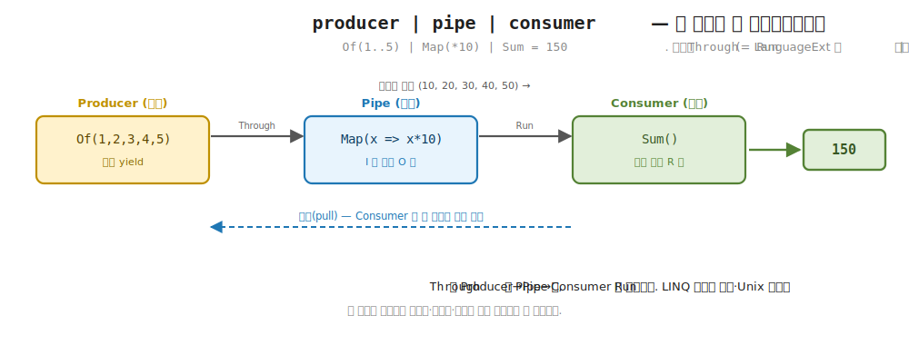
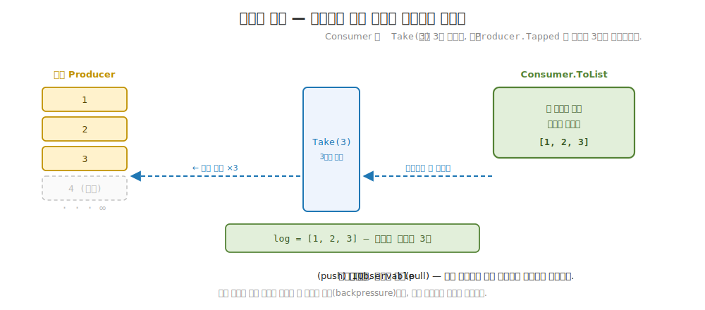
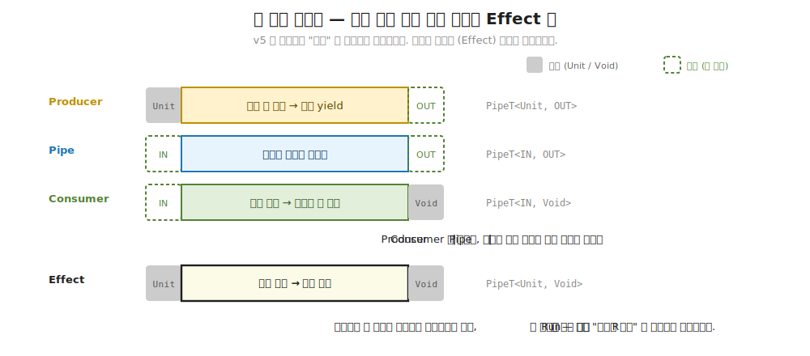

# 34장. Pipes — 스트리밍을 세 역할의 합성으로 (Producer · Consumer · Pipe)

> **이 장의 목표** — 이 장을 마치면 데이터 스트림을 한 타입이 아니라 세 역할의 조합으로 나누어 직접 구현할 수 있습니다. 값을 한 조각씩 내놓는 `Producer<O>` (생산), 받은 조각을 변환하는 `Pipe<I, O>` (변환), 흘러온 조각을 접어 결과를 내는 `Consumer<I, R>` (소비) 셋을 정의하고, `producer.Through(pipe).Run(consumer)` 라는 한 줄로 이어 붙입니다. 이 합성이 LanguageExt 의 `producer | pipe | consumer` 와 같은 자리임을 보고, 세 역할이 당김 기반 (pull-based) 으로 맞물리기 때문에 소비자가 당긴 만큼만 생산자가 일하는 역압 (backpressure) 이 코드 한 줄 없이 저절로 생기는 것을 손계산으로 추적합니다. 33장의 `StreamT` 가 한 타입에 효과적 스트리밍을 담았다면, 이 장은 그 스트리밍을 갈아끼울 수 있는 조각들로 쪼개는 10부의 둘째 도구입니다.

> **이 장의 핵심 어휘**
>
> - **`Producer<O>`**: 당기면 한 조각 `O` 와 다음 생산자를 내놓는 값의 원천, yield 하는 쪽
> - **`Consumer<I, R>`**: `I` 를 끝까지 당겨 한 결과 `R` 로 접는 소비자, fold 하는 쪽
> - **`Pipe<I, O>`**: `Producer<I>` 를 `Producer<O>` 로 바꾸는 합성 가능한 변환기
> - **`Through` / `Run`**: 생산자에 파이프를 끼우고 (`Through`), 소비자로 접어 결과를 받는 (`Run`) 두 합성 동작
> - **`Then`**: 변환끼리 이어 붙여 한 파이프로 만드는 결합 (`Map` 다음 `Filter`)
> - **합성 `|`**: `producer | pipe | consumer`, 세 조각을 한 파이프라인으로 잇는 LanguageExt 의 어법
> - **당김 (pull)**: 소비자가 한 조각을 요청해야 비로소 생산자가 그 한 조각을 계산하는 흐름
> - **역압 (backpressure)**: 소비자가 당긴 만큼만 생산자가 생산해 상류가 저절로 조절되는 성질

> 이 장을 마치면 할 수 있게 되는 것
> - [ ] 스트리밍을 생산 / 변환 / 소비 세 역할로 나누는 까닭을 한 줄로 설명할 수 있습니다.
> - [ ] `Producer<O>` 가 단순 데이터가 아니라 "다음 조각을 달라" 는 당김 함수임을 코드로 짚을 수 있습니다.
> - [ ] `Through` 와 `Run` 으로 `producer | pipe | consumer` 파이프라인을 직접 조립할 수 있습니다.
> - [ ] `Pipe.Then` 으로 `Map` 다음 `Filter` 같은 변환 연쇄를 이어 붙일 수 있습니다.
> - [ ] 데이터는 아래로 흐르고 요청은 위로 거슬러 올라가는 당김의 방향을 그림으로 그릴 수 있습니다.
> - [ ] 무한 `Producer` 에 `Take(3)` 을 끼우면 왜 정확히 3개만 생산되는지 손으로 추적할 수 있습니다.
> - [ ] 당김 기반 역압이 reactive 구독 (push) 과 어떻게 다른지 답할 수 있습니다.
> - [ ] 세 역할의 합성이 4부의 `Map` / `Filter` / `Fold` 합성을 무한 스트림으로 넓힌 것임을 짚을 수 있습니다.

> **이 장의 흐름** — 앞 장에서 `StreamT` 한 타입이 생산도 변환도 소비도 다 떠맡았습니다. 실무 파이프라인은 파일을 읽는 쪽, 줄을 파싱하는 쪽, 집계하는 쪽이 서로 다른 자리라, 한 덩어리로 묶으면 한쪽만 갈아끼우기가 번거롭다는 불편을 먼저 겪습니다. 그 불편을 푸는 한 수가 스트리밍을 세 역할로 쪼개는 것입니다. 값을 내놓는 `Producer<O>`, 변환하는 `Pipe<I, O>`, 접어 내는 `Consumer<I, R>` 세 시그니처를 보고, `producer.Through(pipe).Run(consumer)` 한 줄로 잇습니다. `Map` 다음 `Filter` 를 `Then` 으로 이어 붙여 변환이 결합법칙처럼 합쳐지는 것을 손으로 따라가고, 무한 `Producer` 에 `Take(3)` 을 끼우면 정확히 3개만 생산되는 역압을 실증합니다. 데이터는 생산자에서 소비자로 흐르지만 요청은 소비자에서 생산자로 거슬러 오른다는 당김의 방향을 그림으로 잡고, 이것이 생산자가 밀어붙이는 reactive 구독 (push) 과 어떻게 다른지 봅니다. 마지막으로 세 검사로 합성 정합성과 역압을 다지고, 세 역할을 한 변환관으로 합쳐 자원까지 안전하게 다루는 35장 Conduit 으로 잇습니다.

---

## 34.1 이 장에서 다루는 것 — 스트리밍을 세 역할의 조합으로

앞 장에서 효과를 품은 lazy 시퀀스를 한 타입 `StreamT<M, A>` 로 다뤘습니다. 한 조각을 당기면 다음이 계산되는 그 구조 덕분에 무한 스트림이 메모리를 터뜨리지 않았고, 4부의 `Map` / `Filter` / `Fold` 가 전체를 메모리에 올리지 않고 한 조각씩 그대로 작동했습니다. 한 타입이 생산과 변환과 소비를 모두 떠맡은 모양이었습니다.

이 장은 그 한 타입을 세 역할로 쪼갭니다. 먼저 이 장의 발상을 한 문장으로 잡습니다. 데이터가 흐르는 길을 값을 내놓는 쪽, 흐르는 값을 변환하는 쪽, 값을 받아 접는 쪽 세 자리로 나누고, 각 자리를 독립된 조각으로 만들어 자유롭게 갈아끼우고 합성합니다. 값을 내놓는 조각이 `Producer<O>`, 변환하는 조각이 `Pipe<I, O>`, 접어 내는 조각이 `Consumer<I, R>` 입니다. 세 조각을 한 줄로 잇는 것이 이 장의 전부입니다.

여기서 10부 전체를 꿰는 축이 이어집니다. 10부의 발상은 "효과를 품은 lazy 시퀀스, 합성 가능한 조각" 입니다. 앞 장이 "효과를 품은 lazy 시퀀스" 였다면, 이 장은 "합성 가능한 조각" 입니다. 4부에서 컬렉션의 `Map` / `Filter` / `Fold` 가 작은 변환을 이어 붙이는 어휘였는데, 그 합성 어휘가 이 장에서 무한 / 대용량 스트림으로 그대로 넓어집니다. 한 줄로 이어 붙이는 발상은 같고, 다루는 대상만 메모리에 다 올라간 유한 컬렉션에서 한 조각씩 흐르는 스트림으로 바뀝니다.

가장 빠른 직관은 이미 아는 두 가지를 합치는 것입니다. 4부의 `MySeq` 가 당김 기반 lazy 시퀀스였습니다. 한 조각씩 당기면 다음이 나오는 그 구조 위에, 생산 / 변환 / 소비라는 역할 구분을 얹은 것이 이 장의 Pipes 입니다. `IEnumerable` 을 `foreach` 로 돌면 한 원소씩 당겨 오는 그 감각, LINQ 의 `Select` / `Where` 를 체인으로 잇는 그 감각이 이 장에 그대로 살아 있습니다. 다른 점은 그 한 줄 체인을 생산하는 조각 / 변환하는 조각 / 소비하는 조각으로 떼어내 각각을 따로 들고 다닐 수 있다는 것입니다.

지금 모든 것을 외우지 않아도 됩니다. 이 장이 끝날 때 손에 남는 것은 두 가지입니다. 스트리밍이 `Producer` / `Pipe` / `Consumer` 세 역할의 조합이라는 그림 하나와, 소비자가 당긴 만큼만 생산자가 일해 역압이 저절로 생긴다는 발상 하나입니다. 이 장에 처음 나오는 어휘를 한 줄씩만 미리 짚어 둡니다. 당김 (pull) 은 소비자가 한 조각을 요청해야 비로소 생산자가 그 조각을 계산하는 흐름입니다. 역압 (backpressure) 은 소비자가 당긴 만큼만 생산자가 생산해 상류 속도가 저절로 조절되는 성질입니다. 둘 다 본문에서 코드와 손계산으로 다시 천천히 풀므로, 여기서는 이름과 한 줄 뜻만 스쳐 두면 됩니다.

---

## 34.2 왜 필요한가 — 한 덩어리 변환은 갈아끼우기 어렵습니다

세 역할로 나눈 모양을 보이기 전에, 스트리밍을 한 덩어리로 묶으면 어디서 막히는지부터 부딪혀 봅니다. 추상을 먼저 보이지 않고 손에 잡히는 불편을 먼저 겪는 것이 이 장의 순서입니다.

앞 장의 `StreamT` 나 LINQ 로 데이터 처리 한 줄을 적는다고 합니다. 숫자를 만들어 내고, 제곱하고, 짝수만 거르고, 다 더하는 흔한 흐름입니다. 한 체인으로 묶으면 이렇게 됩니다.

```csharp
// 한 덩어리로 묶은 처리 — 생산·변환·소비가 한 사슬에 엉겨 있다
var result = Enumerable.Range(1, 6)        // ← 생산: 1..6 을 만든다
    .Select(x => x * x)                    // ← 변환: 제곱
    .Where(x => x % 2 == 0)                // ← 변환: 짝수만
    .Sum();                                // ← 소비: 다 더한다
```

한 줄로 잘 도는 코드입니다. 그런데 이 사슬에는 세 가지 다른 일이 한 자리에 엉겨 있습니다. `Range` 가 값을 만드는 생산, `Select` / `Where` 가 흐르는 값을 바꾸는 변환, `Sum` 이 결과를 내는 소비입니다. 작은 예제에서는 한 줄이 깔끔하지만, 실무 파이프라인에서는 이 셋이 서로 다른 자리에 살고 자주 갈아끼워야 합니다.

불편을 손에 잡히게 그려 봅니다. 생산을 `Range` 대신 "파일에서 줄을 읽기" 로 바꾸고 싶다고 합니다. 그러면 위 사슬의 첫 단계를 통째로 들어내고 다시 적어야 하는데, 변환과 소비는 그대로 두고 싶어도 한 사슬이라 떼어내기가 번거롭습니다. 반대로 소비를 `Sum` 대신 "리스트로 모으기" 나 "개수 세기" 로 바꾸려 해도, 같은 변환 (`제곱 다음 짝수만`) 을 여러 소비처에서 재사용하고 싶은데 사슬에 묶여 있어 그 변환만 따로 들고 다닐 수가 없습니다. 생산만, 변환만, 소비만 독립적으로 바꾸려 할 때마다 전체 사슬을 다시 손대야 하는 것입니다.

직감으로 옮기면 Unix 파이프라인이 이 불편을 이미 푼 모양입니다. 셸에서 `cat access.log | grep ERROR | wc -l` 을 적을 때, `cat` (생산) 과 `grep` (변환) 과 `wc` (소비) 는 각각 독립된 프로그램입니다. 생산을 `cat` 에서 `curl` 로 바꿔도 `grep ERROR | wc -l` 은 그대로 재사용되고, 소비를 `wc -l` 에서 `sort | uniq` 로 바꿔도 앞쪽은 손대지 않습니다. `|` 가 세 조각을 잇기만 할 뿐, 각 조각은 따로 살아 자유롭게 갈아끼워집니다. 이 장이 하려는 일이 정확히 이것입니다. 스트리밍의 생산 / 변환 / 소비를 Unix 파이프의 세 프로그램처럼 독립된 조각으로 떼어내, `|` 한 줄로 잇습니다.

> **흔한 함정** — 세 역할로 나누면 코드가 더 복잡해진다고 여기는 것입니다.
>
> 한 줄짜리 LINQ 체인을 세 조각으로 쪼개면 처음엔 손이 더 가는 것처럼 보입니다. 작은 일회성 처리라면 실제로 LINQ 한 줄이 낫습니다. 분리의 값은 같은 조각을 여러 자리에서 재사용하고 독립적으로 교체할 때 드러납니다. 변환 `제곱 다음 짝수만` 을 한 번 만들어 두면 어느 생산자에도, 어느 소비자에도 그대로 끼울 수 있습니다. 1장에서 명령형 `for` 를 함수형으로 무조건 바꾸지 말라 했던 것과 같은 판단입니다. 분리의 값이 큰 자리에서만 세 역할로 나눕니다.

그래서 우리가 바라는 것은 분명합니다. 생산하는 조각, 변환하는 조각, 소비하는 조각을 따로 만들어 두고, 필요할 때 `|` 로 이어 붙이고 싶습니다. 한 조각을 바꿔도 나머지는 그대로 재사용하고 싶습니다. 다음 절에서 세 조각이 어떤 모양인지 봅니다.

---

## 34.3 Producer / Consumer / Pipe — 세 시그니처

이제 세 역할이 어떤 시그니처인지 봅니다. 핵심 발상을 먼저 한 문장으로 잡습니다. `Producer` 는 당기면 한 조각을 내놓고, `Consumer` 는 끝까지 당겨 한 결과로 접고, `Pipe` 는 그 사이에서 흐르는 조각을 바꿉니다.

### 34.3.1 Producer — 당기면 한 조각을 내놓는 원천

먼저 값을 내놓는 쪽, `Producer<O>` 입니다. 가장 중요한 점부터 짚습니다. `Producer<O>` 는 미리 만들어 둔 데이터 더미가 아니라, "다음 한 조각을 달라" 고 호출해야 비로소 값을 계산하는 함수입니다.

```csharp
// Producer<O> — 한 조각을 당기면 (값, 다음 Producer) 또는 null(끝).
public sealed class Producer<O>
{
    readonly Func<(O Value, Producer<O> Next)?> pull;
    internal Producer(Func<(O, Producer<O>)?> pull) => this.pull = pull;
    internal (O Value, Producer<O> Next)? Pull() => pull();

    public Producer<O2> Through<O2>(Pipe<O, O2> pipe) => pipe.Apply(this);
    public R Run<R>(Consumer<O, R> consumer) => consumer.Apply(this);
}
```

타입을 한 줄씩 읽습니다. `Producer<O>` 속에 든 것은 `pull` 필드 하나, 곧 `Func<(O Value, Producer<O> Next)?>` 입니다. 이 함수를 호출하면 두 가지 중 하나가 나옵니다. `(값, 다음 Producer)` 쌍이거나, 끝을 뜻하는 `null` 입니다. 여기가 직관의 핵심입니다. 한 번 당기면 (`Pull()`) 한 조각의 값과 함께 그 다음을 내놓을 새 `Producer<O>` 가 같이 따라옵니다. 곧 생산자는 "지금 한 조각" 과 "나머지를 내놓을 생산자" 를 묶어 내놓는 것입니다.

`Through` 와 `Run` 은 합성 동작이라 다음 절에서 보고, 여기서는 생산자를 실제로 만드는 팩토리를 봅니다.

```csharp
public static class Producer
{
    public static Producer<int> From(int start) =>
        new(() => (start, From(start + 1)));                  // 무한 (당긴 만큼만)

    static Producer<O> FromIndex<O>(IReadOnlyList<O> xs, int i) =>
        new(() => i < xs.Count ? (xs[i], FromIndex(xs, i + 1)) : null);

    public static Producer<O> Of<O>(params O[] items) => FromIndex(items, 0);
}
```

`From(int start)` 를 천천히 풉니다. 이 한 줄이 당김 기반 lazy 의 정수입니다. `From(0)` 은 `() => (0, From(1))` 이라는 함수를 품은 생산자입니다. 이 함수를 호출하기 전까지는 아무것도 계산되지 않습니다. 호출하면 그때 비로소 `(0, From(1))` 이 나오는데, 여기서 `From(1)` 은 또 호출되기 전까지는 한 조각도 계산하지 않는 다음 생산자입니다. 곧 `From` 은 자기 자신을 다음으로 품어 끝없이 이어지지만, 당기지 않으면 단 한 조각도 메모리에 올라오지 않습니다. 무한이면서 안전한 까닭이 여기 있습니다.

`Of(1, 2, 3, 4, 5)` 는 유한 생산자입니다. 내부의 `FromIndex` 가 인덱스 `i` 를 들고 있다가, 당기면 `i` 번째 값과 `i+1` 을 들고 있는 다음 생산자를 내놓고, 인덱스가 끝에 닿으면 `null` 을 내놓아 끝을 알립니다. `From` 과 똑같은 당김 구조인데, 끝이 있다는 점만 다릅니다.

손으로 한 조각 당겨 봅니다. `Of(1, 2, 3)` 을 두 번 당기면 이렇게 됩니다.

```
Of(1, 2, 3)                     ← 아직 아무것도 계산 안 됨 (인덱스 0 을 든 함수만 품음)
   │ Pull()
   ▼
(1, FromIndex([1,2,3], 1))      ← 1 과, 인덱스 1 을 든 다음 생산자
        │ 다음.Pull()
        ▼
     (2, FromIndex([1,2,3], 2)) ← 2 와, 인덱스 2 를 든 다음 생산자
```

당기기 전에는 인덱스를 든 함수 하나만 있을 뿐, 어떤 값도 만들어지지 않았습니다. 당길 때마다 한 조각이 계산되고 그 다음을 내놓을 생산자가 따라옵니다. OO 직감으로 옮기면 `Producer<O>` 는 `IEnumerator<O>` 입니다. `MoveNext()` 를 부르면 `Current` 한 개가 준비되는 그 한 걸음씩 당기는 감각이, 여기서는 `Pull()` 이 `(값, 다음)` 을 내놓는 모양으로 나타납니다.

### 34.3.2 Consumer — 끝까지 당겨 한 결과로 접는 소비자

다음은 값을 받아 접는 쪽, `Consumer<I, R>` 입니다. 생산자가 한 조각씩 내놓는다면, 소비자는 그것을 끝까지 당겨 한 결과 `R` 로 모읍니다.

```csharp
// Consumer<I, R> — Producer<I> 를 당겨 R 로 접는다.
public sealed class Consumer<I, R>
{
    readonly Func<Producer<I>, R> run;
    internal Consumer(Func<Producer<I>, R> run) => this.run = run;
    public R Apply(Producer<I> p) => run(p);
}

public static class Consumer
{
    public static Consumer<int, int> Sum() =>
        new(p =>
        {
            var s = 0;
            var cur = p;
            while (cur.Pull() is { } c) { s += c.Value; cur = c.Next; }
            return s;
        });

    public static Consumer<I, List<I>> ToList<I>() =>
        new(p =>
        {
            var list = new List<I>();
            var cur = p;
            while (cur.Pull() is { } c) { list.Add(c.Value); cur = c.Next; }
            return list;
        });
}
```

`Consumer<I, R>` 속에 든 것은 `Func<Producer<I>, R>` 하나입니다. 생산자를 받아 결과를 내는 함수입니다. `Sum()` 의 본문이 소비의 모양을 그대로 보입니다. `while (cur.Pull() is { } c)` 가 핵심입니다. 현재 생산자를 당겨 `(값, 다음)` 이 나오면 (`null` 이 아니면) 값을 누적하고 `cur` 을 다음 생산자로 옮긴 뒤 다시 당깁니다. `null` 이 나오면 (끝이면) 루프가 멈추고 누적값을 돌려줍니다. 곧 소비자가 생산자를 끝까지 한 조각씩 당기는 운전대를 쥡니다.

`ToList()` 도 같은 당김 루프인데, 누적 대신 리스트에 모읍니다. 두 소비자 모두 "당긴다 → 받는다 → 다음으로 옮긴다" 를 끝까지 반복하는 같은 골격입니다. OO 직감으로 옮기면 `Consumer<I, R>` 는 LINQ 의 `Aggregate` 입니다. 시퀀스를 한 원소씩 받아 한 누적값으로 접는 그 동작이, 여기서는 생산자를 끝까지 당겨 `R` 로 접는 모양으로 나타납니다.

### 34.3.3 Pipe — 흐르는 조각을 바꾸는 변환기

마지막은 생산과 소비 사이에서 흐르는 값을 바꾸는 쪽, `Pipe<I, O>` 입니다.

```csharp
// Pipe<I, O> — Producer<I> 를 Producer<O> 로 변환하는 합성 가능한 변환기.
public sealed class Pipe<I, O>
{
    readonly Func<Producer<I>, Producer<O>> run;
    internal Pipe(Func<Producer<I>, Producer<O>> run) => this.run = run;
    public Producer<O> Apply(Producer<I> p) => run(p);

    public Pipe<I, P> Then<P>(Pipe<O, P> next) => new(p => next.Apply(Apply(p)));
}
```

여기가 세 역할 중 가장 중요한 통찰입니다. `Pipe<I, O>` 속에 든 것은 `Func<Producer<I>, Producer<O>>`, 곧 생산자를 받아 생산자를 내놓는 함수입니다. 파이프는 흐르는 값 한 개를 받아 바꾸는 것이 아니라, `I` 를 내놓는 생산자 전체를 `O` 를 내놓는 생산자 전체로 바꿉니다. 입력도 생산자, 출력도 생산자라서, 파이프를 끼운 결과가 다시 생산자라는 점이 합성을 가능하게 합니다.

세 변환 팩토리를 봅니다. 셋의 당김 방식이 미묘하게 달라 따로 짚습니다.

```csharp
public static class Pipe
{
    public static Pipe<I, O> Map<I, O>(Func<I, O> f) =>
        new(p => MapP(p, f));
    static Producer<O> MapP<I, O>(Producer<I> p, Func<I, O> f) =>
        new(() => p.Pull() is { } c ? (f(c.Value), MapP(c.Next, f)) : null);

    public static Pipe<I, I> Filter<I>(Func<I, bool> pred) =>
        new(p => FilterP(p, pred));
    static Producer<I> FilterP<I>(Producer<I> p, Func<I, bool> pred) =>
        new(() =>
        {
            var s = p;
            while (s.Pull() is { } c)
            {
                if (pred(c.Value)) return (c.Value, FilterP(c.Next, pred));
                s = c.Next;
            }
            return null;
        });

    public static Pipe<I, I> Take<I>(int n) =>
        new(p => n <= 0 ? new Producer<I>(() => null)
                        : new Producer<I>(() => p.Pull() is { } c ? (c.Value, Take<I>(n - 1).Apply(c.Next)) : null));
}
```

`Map(f)` 는 가장 단순합니다. 내부 `MapP` 가 상류를 한 번 당겨 한 조각이 나오면, 그 값에 `f` 를 적용한 결과와 함께 나머지에 `Map` 을 다시 끼운 생산자를 내놓습니다. 상류 한 번 당김에 하류 한 조각이 나오는 1:1 변환입니다.

`Filter(pred)` 는 한 번 더 들여다볼 값어치가 있습니다. 파이프는 한 번 당기면 한 조각을 내놓아야 하는데, 술어를 통과하는 값이 바로 나오지 않을 수 있습니다. 그래서 `FilterP` 는 내부에 `while` 루프를 두어, 술어를 통과하는 값이 나올 때까지 상류를 여러 번 당깁니다. 통과하지 못한 값은 버리고 (`s = c.Next`) 계속 당기다가, 통과하는 값이 나오면 그것 하나를 내놓습니다. 곧 하류 한 번 당김에 상류는 0번 이상 버린 뒤 1개를 내놓는 1:N 변환입니다.

`Take(n)` 은 셋째 모양입니다. `n` 이 남아 있는 동안은 상류를 그대로 한 조각씩 내려보내되 (`n-1` 로 줄이면서), `n` 이 0에 닿으면 `new Producer<I>(() => null)` 을 내놓아 더 당기지 않고 끝을 알립니다. 곧 N개를 내려보낸 뒤 상류를 끊는 변환입니다. 이 "상류를 끊는다" 가 다음에 볼 역압의 열쇠입니다.

세 변환의 당김 횟수 차이를 표로 정리합니다. 입문 단계에서 "파이프를 한 번 당기면 상류도 정확히 한 번 당긴다" 고 오해하기 쉬운데, 셋이 다릅니다.

| 변환 | 하류 한 번 당김에 상류는 | 모양 |
|---|---|---|
| `Map(f)` | 정확히 1번 당긴다 | 1:1 (받은 조각을 바꿔 그대로 내려보냄) |
| `Filter(pred)` | 통과할 값이 나올 때까지 0번 이상 버리고 1개를 당긴다 | 1:N (술어 통과까지 상류를 더 당김) |
| `Take(n)` | n번까지 1번씩, n에 닿으면 상류를 더 당기지 않고 끊는다 | N개 후 차단 |

OO 직감으로 옮기면 `Map` 은 LINQ 의 `Select`, `Filter` 는 `Where`, `Take` 는 `Take` 그대로입니다. LINQ 체인이 지연 실행으로 한 원소씩 흘려보내던 그 감각이, 여기서는 생산자를 생산자로 바꾸는 파이프로 나타납니다. 차이는 LINQ 체인이 한 사슬에 묶이는 데 비해, 이 파이프들은 따로 들고 다니다 `Then` 으로 이어 붙일 수 있다는 것입니다.

> **미리보기입니다** — `Then` 이 변환을 이어 붙이는 자리입니다.
>
> `Pipe<I, O>` 의 `Then<P>(Pipe<O, P> next)` 는 `I → O` 파이프 뒤에 `O → P` 파이프를 이어 `I → P` 파이프 하나로 만듭니다. 본문은 `new(p => next.Apply(Apply(p)))` 한 줄인데, "먼저 이 파이프를 적용하고 (`Apply(p)`), 그 결과에 다음 파이프를 적용한다 (`next.Apply(...)`)" 는 뜻입니다. 1장에서 본 함수 합성 `g ∘ f` (f 를 먼저, 그 결과에 g) 가 파이프 위에서 그대로 나타난 모양입니다. 다음 절에서 `Map` 다음 `Filter` 를 `Then` 으로 잇는 것을 손으로 따라갑니다.

---

## 34.4 합성 — producer | pipe | consumer

세 조각을 만들었으니 이제 이어 붙입니다. 핵심 발상은 한 문장입니다. 생산자에 파이프를 끼우면 (`Through`) 다시 생산자가 되고, 그 생산자를 소비자로 접으면 (`Run`) 결과가 나옵니다.

### 34.4.1 Through 와 Run — 한 줄로 잇는 파이프라인

앞서 본 `Producer<O>` 의 두 메서드가 합성의 전부입니다.

```csharp
public Producer<O2> Through<O2>(Pipe<O, O2> pipe) => pipe.Apply(this);   // 파이프를 끼운다 → 생산자
public R Run<R>(Consumer<O, R> consumer) => consumer.Apply(this);        // 소비자로 접는다 → 결과
```

`Through(pipe)` 는 자기 자신 (생산자) 에 파이프를 적용해 새 생산자를 내놓습니다. 입력이 생산자, 출력도 생산자라서 `Through` 를 여러 번 이어 끼울 수 있습니다. `Run(consumer)` 는 소비자에게 자신을 넘겨 결과를 받습니다. 소비자가 생산자를 끝까지 당겨 한 결과로 접으므로, `Run` 이 파이프라인의 끝입니다. 데모의 첫 예제가 이 셋을 한 줄로 잇습니다.

```csharp
var sum = Producer.Of(1, 2, 3, 4, 5)
    .Through(Pipe.Map<int, int>(x => x * 10))
    .Run(Consumer.Sum());
// Of(1..5) | Map(*10) | Sum = 150
```

읽으면 그대로 문장입니다. "1부터 5까지 생산하고, 각 조각에 10을 곱하는 파이프를 끼우고, 합으로 접는다." 손으로 한 조각씩 따라가면 당김이 어떻게 맞물리는지 보입니다.

```
Of(1..5) | Map(*10) | Sum

Sum 이 한 조각을 당긴다
   → Map 이 상류(Of)를 당김 → Of 가 1 을 내놓음 → Map 이 *10 → 10
   Sum 누적: 0 + 10 = 10
Sum 이 또 당긴다
   → Map → Of 가 2 → *10 → 20            누적: 10 + 20 = 30
Sum 이 또 당긴다
   → Map → Of 가 3 → *10 → 30            누적: 30 + 30 = 60
Sum 이 또 당긴다
   → Map → Of 가 4 → *10 → 40            누적: 60 + 40 = 100
Sum 이 또 당긴다
   → Map → Of 가 5 → *10 → 50            누적: 100 + 50 = 150
Sum 이 또 당긴다
   → Map → Of 가 null(끝) → Map 도 null → 루프 멈춤

결과: 150
```

눈여겨볼 것은 당김의 방향입니다. 데이터는 `Of` 에서 `Map` 을 거쳐 `Sum` 으로 아래로 흐르지만, 그 흐름을 시작하는 요청 (당김) 은 `Sum` 에서 `Map` 을 거쳐 `Of` 로 거슬러 올라갑니다. `Sum` 의 `while` 루프가 한 조각을 당기지 않으면 `Map` 도 `Of` 도 한 조각을 계산하지 않습니다. 소비자가 운전대를 쥐고 한 조각씩 끌어당기는 것입니다. 이 방향이 다음 절 역압의 토대입니다.



**그림 34-1. `producer | pipe | consumer` 합성: 세 조각이 한 파이프라인으로** — 왼쪽 `Producer.Of(1..5)`, 가운데 `Pipe.Map(*10)`, 오른쪽 `Consumer.Sum` 세 박스가 `|` (코드의 `Through` 와 `Run`) 로 이어집니다. 데이터는 왼쪽에서 오른쪽으로 한 조각씩 (1 → 10, 2 → 20, ...) 흐르고, 당김 요청은 오른쪽 `Sum` 에서 왼쪽 `Of` 로 거슬러 오릅니다. 끝에서 `Sum` 이 150 을 냅니다.

이 합성이 LanguageExt 의 어법과 같은 자리임을 코드 주석이 짚습니다. 학습용 코드의 `Pipes.cs` 첫머리에 이렇게 적혀 있습니다.

```
// 합성:  producer.Through(pipe).Run(consumer)   (= LanguageExt 의 producer | pipe | consumer)
```

곧 학습용의 `Through` / `Run` 메서드 체인이 LanguageExt 에서는 파이프 기호 `|` 로 나타납니다. `producer | pipe | consumer` 한 줄이 정확히 같은 일을 합니다. `|` 가 두 조각의 끝과 입을 맞물리는 연결자라는 점이 Unix 파이프 `cat | grep | wc` 와 같은 직감입니다. v5 의 `|` 가 실제로 어떻게 구현되는지는 이 장 마지막의 더 깊이 박스에서 정직하게 짚습니다.

### 34.4.2 Then — 변환끼리 이어 붙이기

생산자와 소비자만 잇는 것이 아니라, 변환끼리도 이어 붙일 수 있습니다. 앞 절에서 미리 본 `Pipe.Then` 이 그 자리입니다. 데모의 둘째 예제가 `Map` 다음 `Filter` 를 한 파이프로 잇습니다.

```csharp
var evens = Producer.Of(1, 2, 3, 4, 5, 6)
    .Through(Pipe.Map<int, int>(x => x * x).Then(Pipe.Filter<int>(x => x % 2 == 0)))
    .Run(Consumer.ToList<int>());
// Of(1..6) | Map(²) | Filter(짝수) | ToList = [4, 16, 36]
```

`Pipe.Map(제곱).Then(Pipe.Filter(짝수))` 가 두 변환을 이어 `int → int` 파이프 하나로 만듭니다. 손으로 한 조각씩 따라가면 `Map` 의 1:1 당김과 `Filter` 의 1:N 당김이 어떻게 맞물리는지 보입니다.

```
Of(1..6) | Map(²) | Filter(짝수) | ToList

ToList 가 당긴다
   → Filter 가 상류(Map)를 당김 → Map → Of 가 1 → 제곱 1 → Filter: 1 은 홀수, 버림
   → Filter 가 또 당김 → Map → Of 가 2 → 제곱 4 → Filter: 4 는 짝수, 내려보냄!
   ToList 수집: [4]
ToList 가 또 당긴다
   → Filter → Map → Of 가 3 → 9 → 홀수, 버림
   → Filter → Map → Of 가 4 → 16 → 짝수, 내려보냄!     수집: [4, 16]
ToList 가 또 당긴다
   → Filter → Map → Of 가 5 → 25 → 홀수, 버림
   → Filter → Map → Of 가 6 → 36 → 짝수, 내려보냄!     수집: [4, 16, 36]
ToList 가 또 당긴다
   → Filter → Map → Of 가 null(끝) → 루프 멈춤

결과: [4, 16, 36]
```

`Filter` 가 홀수 제곱 (1, 9, 25) 을 만날 때마다 내부 `while` 로 상류를 한 번 더 당겨 짝수 제곱이 나올 때까지 버리는 것이 보입니다. `ToList` 는 세 번 당겼지만 그 뒤에서 상류는 여섯 번 (전부) 당겨졌습니다. 그래도 `ToList` 입장에서는 한 번 당기면 한 조각이 나오는 깔끔한 모양입니다.

여기서 `Then` 이 4부의 합성 어휘를 그대로 넓힌다는 점이 손에 잡힙니다. 4부에서 컬렉션의 `Select(제곱).Where(짝수)` 가 두 변환을 이어 붙이는 한 줄이었는데, 그 두 변환을 이제 따로 들고 다니다 `Then` 으로 이어 붙입니다. `Map(제곱).Then(Filter(짝수))` 라는 변환 하나를 만들어 두면 어느 생산자에도, 어느 소비자에도 끼울 수 있습니다. OO 직감으로 옮기면 함수 합성 `f.AndThen(g)` 입니다. 두 변환을 합쳐 한 변환으로 만드는 그 동작이, 여기서는 두 파이프를 합쳐 한 파이프로 만드는 `Then` 으로 나타납니다.

> **흔한 함정** — `Then` 의 순서를 함수 합성의 수학 기호 `∘` 와 헷갈리는 것입니다.
>
> 수학에서 `g ∘ f` 는 "f 를 먼저, 그 결과에 g" 라 오른쪽부터 읽습니다. 그런데 `a.Then(b)` 는 "a 를 먼저, 그 결과에 b" 라 왼쪽부터 읽습니다. 데이터가 흐르는 순서 그대로입니다. `Map(제곱).Then(Filter(짝수))` 는 제곱이 먼저, 짝수 거르기가 나중입니다. 본문 `next.Apply(Apply(p))` 가 정확히 이 순서입니다. 안쪽 `Apply(p)` (자기 파이프 = 제곱) 가 먼저 적용되고, 그 결과에 `next.Apply` (다음 파이프 = 짝수) 가 적용됩니다. 메서드 체인은 읽는 순서대로 흐른다고 기억하면 헷갈리지 않습니다.

---

## 34.5 당김과 역압 — payoff

이제 이 장의 도구가 약속을 지키는 자리를 정면으로 봅니다. 앞 절에서 데이터는 아래로 흐르고 요청은 위로 거슬러 오른다는 당김의 방향을 봤습니다. 그 방향이 낳는 결정적 성질이 역압입니다. 소비자가 당긴 만큼만 생산자가 일한다는 것입니다.

이 성질을 가장 또렷이 보이는 것이 무한 생산자입니다. 무한히 값을 내놓는 생산자에 "3개만" 을 뜻하는 `Take(3)` 을 끼우면 어떻게 되는지, 데모의 셋째 예제가 보입니다. 생산자가 실제로 몇 개를 만들었는지 세기 위해, 당길 때마다 로그를 남기는 특별한 생산자 `Tapped` 를 씁니다.

```csharp
public static Producer<int> Tapped(int start, List<int> log) =>
    new(() => { log.Add(start); return (start, Tapped(start + 1, log)); });
```

`Tapped` 는 `From` 과 똑같은 무한 생산자인데, 한 조각을 내놓기 직전에 `log.Add(start)` 로 "내가 이 값을 만들었다" 를 기록합니다. 곧 `log` 의 길이가 곧 생산자가 실제로 일한 횟수입니다.

```csharp
var log = new List<int>();
var taken = Producer.Tapped(1, log)
    .Through(Pipe.Take<int>(3))
    .Run(Consumer.ToList<int>());
// 결과 = [1, 2, 3], 실제 생산 수 = 3
```

무한 생산자에 `Take(3)` 을 끼우고 `ToList` 로 접었습니다. 손으로 한 조각씩 따라가면, `Take(3)` 이 어떻게 상류를 끊는지가 보입니다.

```
Tapped(무한) | Take(3) | ToList

ToList 가 당긴다
   → Take(3): n=3 > 0 → 상류 당김 → Tapped 가 1 생산 (log=[1]) → 내려보냄, 다음은 Take(2)
   ToList 수집: [1]
ToList 가 또 당긴다
   → Take(2): n=2 > 0 → 상류 당김 → Tapped 가 2 생산 (log=[1,2]) → 내려보냄, 다음은 Take(1)
   수집: [1, 2]
ToList 가 또 당긴다
   → Take(1): n=1 > 0 → 상류 당김 → Tapped 가 3 생산 (log=[1,2,3]) → 내려보냄, 다음은 Take(0)
   수집: [1, 2, 3]
ToList 가 또 당긴다
   → Take(0): n=0 → new Producer(() => null) → 상류를 당기지 않고 null!
   → 루프 멈춤

결과 = [1, 2, 3],  log = [1, 2, 3]  (생산 수 = 3)
        ↑ 4 는 결코 만들어지지 않았다 (Tapped(4) 가 호출조차 안 됨)
```

핵심은 마지막 두 걸음입니다. `Take(0)` 에 닿는 순간 `new Producer<I>(() => null)` 이 상류를 당기지 않고 곧장 `null` 을 내놓습니다. 그래서 `Tapped` 의 네 번째 호출이 아예 일어나지 않고, `log` 에는 1, 2, 3 만 남습니다. 무한 생산자인데도 정확히 3개만 만들어진 것입니다. 4 이후는 메모리에 한 번도 올라오지 않았습니다.

이것이 역압 (backpressure) 입니다. 일상의 비유로 옮기면 수도꼭지와 컵입니다. 수도꼭지 (생산자) 는 무한히 물을 내보낼 수 있지만, 내가 컵 3개 (소비자가 당기는 만큼) 만 받고 꼭지를 잠그면 (`Take(3)`) 딱 3컵만 흐릅니다. 4컵째 물은 아예 나오지 않습니다. 소비 쪽이 흐름의 양을 정하고, 그만큼만 생산 쪽이 일하는 것입니다.

여기서 4부 컬렉션과의 결정적 차이가 드러납니다. 4부의 유한 컬렉션이라면 무한 리스트를 먼저 다 만들려다 메모리가 터집니다. `Enumerable.Range` 를 무한으로 만들어 `.ToList()` 부터 하면 끝나지 않습니다. 그런데 Pipes 는 당긴 3개만 존재하므로 무한 생산자가 안전합니다. 무한이 안전한 까닭은 두 가지가 맞물린 것입니다. 생산자가 lazy pull 이라 당기기 전엔 계산하지 않고, `Take` 가 당김을 끊어 상류를 멈춥니다.



**그림 34-2. 당김과 역압: 소비자가 당긴 만큼만 생산자가 일한다** — 오른쪽 `Consumer` 가 `Take(3)` 을 거쳐 왼쪽 무한 `Producer` 에게 "다음 줘" 를 3번만 요청합니다 (위로 거슬러 오르는 pull 화살표). `Producer` 는 그 3번에만 1, 2, 3 을 내놓고 (`log=[1,2,3]`), 4번째는 요청이 없어 만들어지지 않습니다. 아래에 대비로 둔 push (reactive 구독) 는 생산자가 소비자 사정과 무관하게 밀어내, 무한이면 소비자가 넘칩니다.

OO 직감으로 옮기면 reactive 의 `IObservable` 과 정확히 반대입니다. `IObservable` 은 push 입니다. 생산자 (Observable) 가 소비자 (Observer) 의 사정과 무관하게 `OnNext` 로 값을 밀어냅니다. 생산자가 무한히 빠르게 밀어내면 소비자가 따라가지 못해 버퍼가 넘치고, 이를 다루려면 별도의 역압 전략 (버퍼링, 샘플링, 드롭) 을 따로 얹어야 합니다. Pipes 는 pull 입니다. 소비자가 당겨야 생산자가 한 조각을 내놓으므로, 생산 속도가 소비 속도를 절대 앞지르지 않습니다. 역압이 별도 장치가 아니라 당김 구조 그 자체에서 저절로 생깁니다.

> **흔한 함정** — Pipes 의 당김을 reactive 의 push 구독과 같다고 여기는 것입니다.
>
> 둘 다 "스트림을 흘려보낸다" 고 뭉뚱그리기 쉽지만 운전대를 쥔 쪽이 정반대입니다. push (`IObservable`, 이벤트) 는 생산자가 주도해 값을 밀어내고, 소비자는 오는 대로 받습니다. pull (이 장, `IEnumerable`) 은 소비자가 주도해 당기고, 생산자는 요청받은 만큼만 내놓습니다. 무한 데이터에서 이 차이가 결정적입니다. push 는 소비자가 못 따라가면 넘치지만, pull 은 소비자가 당긴 만큼만 생산되어 넘칠 일이 없습니다. 이 장의 역압은 push 시스템에 따로 얹는 전략이 아니라, pull 구조에서 공짜로 따라오는 성질입니다.

> **자원은 아직입니다** — 이 장의 무한 `Producer` 는 메모리 안전만 보입니다.
>
> 당김 기반이라 무한 생산자가 메모리를 터뜨리지 않는다는 것까지가 이 장의 약속입니다. 그런데 실무의 생산자는 파일이나 소켓 같은 IO 자원을 엽니다. "Pipes 가 파일도 안전하게 닫아 주나?" 라는 물음은 자연스럽지만, 그 답은 이 장이 아니라 35장의 몫입니다. 자원을 열고 예외가 나도 반드시 닫는 안전한 개폐는 8부에서 본 `bracket` 과 35장의 `Conduit` 이 함께 다룹니다. 이 장의 경계는 "당긴 만큼만 생산되는 메모리 안전" 까지입니다.

---

## 34.6 단어 수 세기 — WordCount 챌린지

세 역할의 합성을 작은 실전 미니 파이프라인으로 굳힙니다. 줄 단위 입력에서 유효한 단어의 개수를 세는 일입니다. 생산 → 정규화 → 빈 단어 거르기 → 개수 세기를, 앞서 배운 조각들의 합성 하나로 적습니다. 이 장의 챌린지 정답 코드 `WordCount` 가 그 모양입니다.

```csharp
public static int Count(params string[] words) =>
    Producer.Of(words)
        .Through(Pipe.Map<string, string>(w => w.Trim().ToLowerInvariant())
            .Then(Pipe.Filter<string>(w => w.Length > 0)))
        .Run(Consumer.ToList<string>())
        .Count;
```

읽으면 그대로 파이프라인입니다. 단어들을 생산하고 (`Of`), 각 단어를 다듬어 소문자로 바꾸고 (`Map`), 빈 문자열을 거르고 (`Filter`), 리스트로 모은 뒤 (`ToList`) 개수를 셉니다. 데모는 공백과 빈 문자열이 섞인 입력을 넘깁니다. 손으로 따라가면 각 단계가 무엇을 거르는지 보입니다.

```
입력: " Hello ", "", "FUNCTIONAL", "  ", "csharp"

Of      | Map(Trim+소문자)      | Filter(길이>0)   | ToList
─────────────────────────────────────────────────────────
" Hello "  → "hello"            → 길이 5 > 0, 통과  → ["hello"]
""         → ""                 → 길이 0, 버림
"FUNCTIONAL" → "functional"     → 길이 10 > 0, 통과 → ["hello", "functional"]
"  "       → ""  (Trim 후 빈)    → 길이 0, 버림
"csharp"   → "csharp"           → 길이 6 > 0, 통과  → ["hello", "functional", "csharp"]

결과 = ["hello", "functional", "csharp"],  Count = 3
```

`Map` 의 `Trim().ToLowerInvariant()` 가 `"  "` 같은 공백뿐인 문자열을 빈 문자열로 만들고, 이어진 `Filter(길이>0)` 가 그 빈 것들을 거릅니다. 다섯 입력 중 둘 (빈 문자열과 공백뿐인 것) 이 걸러져 셋이 남고, 유효 단어 수는 3입니다. 실행 출력도 그대로입니다.

```
== 예제 4 — 단어 수 세기 ==
  유효 단어 수 = 3
```

이 예제의 값은 각 역할이 독립적이고 재사용 가능하다는 데 있습니다. 생산을 `Of(words)` 대신 "파일에서 줄 읽기" 로 바꿔도 `Map(정규화).Then(Filter(빈 단어 제거))` 변환과 `ToList` 소비는 그대로 둡니다. 소비를 `ToList().Count` 대신 다른 집계로 바꿔도 앞쪽은 손대지 않습니다. 34.2 에서 한 덩어리 사슬이라 갈아끼우기 번거롭다던 불편이, 세 역할 분리로 풀린 것입니다. `producer.Through(pipe).Run(consumer)`, 곧 `producer | pipe | consumer` 라는 합성 한 줄로 파이프라인을 조립하는 이 패턴이 이 장이 손에 쥐여 주는 도구입니다.

---

## 34.7 법칙으로 다지기 — 합성 정합성과 역압

7장 이후 새 추상마다 무언가로 그 의미를 확인했습니다. Pipes 에도 확인할 것이 있는데, `Functor` 나 `Monad` 의 대수 법칙 (항등 / 결합) 은 아닙니다. 이 장의 학습용 조각들은 그런 법칙을 PBT 로 다루지 않습니다. 대신 세 가지를 단언합니다. 합성이 옳은 값을 내는가, 변환 연쇄가 단계 순서대로 작동하는가, 그리고 역압이 상류를 멈추는가입니다. 이 셋이 "세 역할로 나눠 합성해도 정합하고, 당김 기반이라 역압이 생긴다" 는 이 장의 약속이 코드로 정말 그러한지입니다.

세 검사는 xUnit 도 property 검사도 아닌 콘솔 `bool` 함수 셋입니다.

```csharp
// ① producer → pipe → consumer 합성.
public static bool PipelineHolds()
{
    var result = Producer.Of(1, 2, 3, 4, 5)
        .Through(Pipe.Map<int, int>(x => x * 10))
        .Run(Consumer.Sum());
    return result == 150;
}

// ② Pipe.Then 합성 (Map 후 Filter).
public static bool PipeCompositionHolds()
{
    var list = Producer.Of(1, 2, 3, 4, 5, 6)
        .Through(Pipe.Map<int, int>(x => x * x).Then(Pipe.Filter<int>(x => x % 2 == 0)))
        .Run(Consumer.ToList<int>());
    return list.SequenceEqual([4, 16, 36]);
}

// ③ 역압 — Take 가 상류 생산을 멈춘다 (무한 Producer 라도 당긴 만큼만).
public static bool BackpressureHolds()
{
    var log = new List<int>();
    var _ = Producer.Tapped(1, log)
        .Through(Pipe.Take<int>(3))
        .Run(Consumer.ToList<int>());
    return log.Count == 3;
}
```

세 검사를 한 줄씩 읽습니다.

① **합성 정합성** — `Of(1..5)` 에 `Map(*10)` 을 끼워 `Sum` 으로 접으면 정확히 150 인지 봅니다. 세 역할을 한 줄로 이은 결과가 손계산 (10 + 20 + 30 + 40 + 50) 그대로 나오는지 단언합니다.

② **변환 연쇄** — `Map(제곱).Then(Filter(짝수))` 가 단계 순서대로 작동해 `[4, 16, 36]` 이 나오는지 봅니다. `Then` 으로 이어 붙인 두 변환이 제곱 먼저, 짝수 거르기 나중의 순서를 지키는지 단언합니다.

③ **역압** — 무한 `Tapped` 에 `Take(3)` 을 끼우면 실제 생산 수 (`log.Count`) 가 정확히 3인지 봅니다. 이 장의 핵심 성질입니다. 당김 기반이라 소비자가 당긴 3개만 생산자가 만들고, 무한이라도 4번째는 만들어지지 않음을 단언합니다. 이것이 reactive push 구독과 Pipes 를 가르는 자리이자 메모리 안전성의 근거입니다.

데모 출력은 셋 다 통과입니다.

```
== 검증 ==
  파이프라인 합성 : 통과
  Pipe.Then 합성 : 통과
  역압 : 통과

모든 검증 통과 [OK]
```

이 세 검사가 10부 축의 약속을 굳힙니다. ① 과 ② 는 세 역할로 쪼개 합성해도 한 덩어리 처리와 같은 값을 냄을, ③ 은 당김 기반이라 역압이 저절로 생김을 단언합니다. 곧 "스트리밍을 합성 가능한 조각으로 나눠도 정합하고, 소비자가 운전대를 쥐어 안전하다" 는 이 장의 한 줄이 세 단언으로 검증됩니다.

> **흔한 함정** — 이 세 검사를 `Functor` / `Monad` 법칙으로 여기는 것입니다.
>
> 7장 이후 법칙이라 하면 항등 (`Map(id) = id`) 이나 결합 같은 대수 등식을 떠올리기 쉽습니다. 이 장의 세 검사는 그런 대수 법칙이 아니라, 구체 입력에 대한 단정 (assert) 입니다. 합성이 옳은 값을 내고 역압이 작동함을 보이는 데모성 검증입니다. v5 의 `PipeT` 는 실제로 `Monad` 이고 합성 결합법칙을 만족하지만, 학습용 조각은 그 대수 구조를 명시적 법칙으로 다루지 않고 합성 정합성과 역압이라는 이 장의 핵심 성질만 단언합니다.

---

## 34.8 더 깊이 (처음엔 건너뛰어도 됩니다) — v5 의 Pipes 와 학습용의 단순화

이 절은 처음 읽을 때 건너뛰어도 됩니다. 학습용 `Producer<O>` / `Pipe<I, O>` / `Consumer<I, R>` 는 뼈대만 남긴 것이고, LanguageExt v5 의 Pipes 는 같은 발상에 실무용 옷을 여러 겹 더 입혔습니다. 충돌 시 소스 코드가 최종 권위이므로, 두 모양이 어떻게 다른지 정직하게 짚어 둡니다.

v5 의 Pipes 는 한 추상 `PipeT<IN, OUT, M, A>` 위에 섭니다. 학습용과 견주면 세 가지가 더 있습니다.

- **내부 모나드 `M`** — v5 의 `PipeT<IN, OUT, M, A>` 는 임의의 효과 모나드 `M` (보통 `Eff<RT>`) 위에 서서, 각 조각이 효과·실패·비동기를 품습니다. `Producer<RT, OUT, A>` / `Consumer<RT, IN, A>` / `Pipe<RT, IN, OUT, A>` 가 `M = Eff<RT>` 로 고정한 특수화입니다. 학습용 `Producer<O>` / `Pipe<I, O>` / `Consumer<I, R>` 에는 `M` 도 `RT` 도 없습니다. 효과 없는 순수 변환과 접기만 합니다. 곧 학습용은 33장 `StreamT` 의 효과를 끌어오지 않고, pull 의 골격만 떼어 보입니다.
- **종료값 `A` 와 닫힌 채널 타입** — v5 의 네 타입은 모두 종료 시 산출하는 값 `A` 를 가집니다. 그리고 채널의 "닫힘" 을 타입으로 인코딩합니다. `Producer = PipeT<Unit, OUT, ...>` (상류를 `Unit` 으로 닫음), `Consumer = PipeT<IN, Void, ...>` (하류를 `Void` 로 닫음), 양끝이 닫힌 `Producer | Consumer` 의 결과가 `Effect<RT, A>` 입니다. 학습용에는 종료값 `A` 도, 닫힌 채널 타입 인코딩도 없습니다. `Consumer.Apply` 가 곧장 결과 `R` 을 돌려주는 단순한 모양입니다.
- **합성 메커니즘** — 이것이 가장 큰 차이입니다. v5 의 `|` 연산자는 한쪽의 yield 와 다른 쪽의 await 를 짝지어 두 코루틴을 교대로 실행합니다 (`PairEachAwaitWithYield`). 명시적 `PipeT.yield(value)` 와 `Consumer.awaiting()` 프리미티브로 생산·소비를 표현하고, 열린 채널의 실행은 예외를 던져 (합성으로 닫혀야만 실행됩니다) 안전을 지킵니다. 학습용의 `Through` / `Then` / `Run` 은 코루틴이 아니라, 그저 `Func<Producer<I>, Producer<O>>` 를 합성하고 적용하는 일반 함수 합성입니다. lazy pull 클로저의 체인으로 같은 pull 의미를 흉내 낸 것입니다. 책과 v5 가 `producer | pipe | consumer` 로 적는 그 `|` 는 v5 의 코루틴 인터리빙을 가리키고, 학습용은 그 의미를 함수 합성으로 단순화해 보입니다.

이 밖에도 v5 의 `Producer` / `Pipe` 에는 `Fold` / `MapM` / `Bind` / `SelectMany` (LINQ) / `repeat` / `merge` 같은 풍부한 부가 연산과, `Effect` 에 `Schedule` 과의 `|` (반복) 까지 있습니다. 학습용은 `Map` / `Filter` / `Take` 와 `Sum` / `ToList` 의 최소 집합만 둡니다. 8부 `Schedule` 과 9부 효과를 끌어오지 않은 입문 단순화입니다.

입문 단계에서는 이 차이들을 외울 필요가 없습니다. 세 역할 (`Producer` / `Pipe` / `Consumer`) 과 당김 기반 합성, 그리고 소비자가 당긴 만큼만 생산되는 역압이라는 뼈대는 학습용과 v5 가 같고, 나머지는 그 뼈대에 효과·코루틴·실무 편의를 더한 것이라고만 알아 두면 충분합니다.

세 역할의 열린·닫힌 끝이 합성으로 어떻게 닫히는지 한 그림으로 봅니다.



**그림 34-3. 열린 끝을 닫아 Effect 로** — v5 는 파이프의 닫힌 끝을 타입으로 표현합니다. `Producer` 는 입력을 `Unit` 으로 (`PipeT<Unit, OUT>`), `Consumer` 는 출력을 `Void` 로 닫고 (`PipeT<IN, Void>`), `Producer | Pipe | Consumer` 로 이으면 가운데 열린 끝들이 맞물려 양끝이 닫힌 `Effect` (`PipeT<Unit, Void>`) 가 되어 실행됩니다. 학습용은 이 닫힘을 타입으로 인코딩하지 않고, `Run` 이 곧장 결과를 냅니다.

---

## 34.9 Elevated World 어휘로 다시 읽기

이 절은 이 장의 도구를 1장 비유에 맞춰 다시 읽는 자리입니다. 먼저 매핑부터 둡니다.

| 34장 도구 | Elevated World · 10부 축 어휘 |
|---|---|
| `Producer<O>` | 효과 없는 lazy 시퀀스의 원천, 당기면 한 조각을 내놓는 쪽 |
| `Pipe<I, O>` | 흐르는 조각을 바꾸는 변환, 4부 `Map` / `Filter` 의 스트림판 |
| `Consumer<I, R>` | 스트림을 한 결과로 접는 쪽, 4부 `Fold` 의 스트림판 |
| `Through` / `Run` / `Then` / `\|` | 세 조각을 한 파이프라인으로 잇는 합성 |
| 당김 (pull) | 소비자가 운전대를 쥐고 한 조각씩 요청하는 흐름 |
| 역압 (backpressure) | 당긴 만큼만 생산되어 상류가 저절로 조절되는 성질 |

1장에서 함수형의 본질을 한 문장으로 적었습니다. 모든 값과 함수를 합성 가능한 Elevated World 로 끌어올리는 것. 4부에서 그 합성이 컬렉션의 `Map` / `Filter` / `Fold` 어휘로 나타났습니다. 메모리에 다 올라간 유한 자료를 작은 변환의 조합으로 다뤘습니다. 10부는 그 합성 어휘를 흐르는 스트림으로 옮깁니다. 이 장은 그 스트림을 생산 / 변환 / 소비 세 조각으로 쪼개, 각 조각을 따로 들고 다니다 합성합니다.

여기서 4부와의 연속이 또렷합니다. 4부의 `Map` 은 컬렉션 전체를 한 번에 변환했고, 이 장의 `Pipe.Map` 은 한 조각씩 흐르는 스트림을 변환합니다. 4부의 `Fold` 는 컬렉션 전체를 한 값으로 접었고, 이 장의 `Consumer` 는 흐르는 스트림을 한 결과로 접습니다. 같은 합성 어휘인데, 다루는 대상이 유한 컬렉션에서 무한 / 대용량 스트림으로 넓어졌습니다. 그리고 그 확장을 안전하게 만드는 한 줄이 당김입니다. 컬렉션은 전체가 메모리에 있어 합성이 자유로웠지만, 스트림은 당긴 만큼만 존재하므로 무한이라도 메모리가 터지지 않습니다.

이 분업이 10부 축의 핵심입니다. 한 덩어리 처리는 "무엇을 만들고, 어떻게 바꾸고, 어떻게 접는가" 를 한 사슬에 뭉쳤습니다. Pipes 는 셋을 독립된 조각으로 갈라, 각각을 따로 재사용하고 교체합니다. 그리고 소비자가 당긴 만큼만 생산자가 일하는 당김 구조가, 그 조각들을 무한 / 대용량으로 넓혀도 안전하게 떠받칩니다.

비유는 여기까지가 역할입니다. 세 조각이 정확히 어떻게 맞물려 한 조각씩 흐르는지는 `Producer` / `Pipe` / `Consumer` 의 시그니처와 `Pull` 의 동작이 정합니다. 비유가 머리에 그림을 그려 주는 동안 시그니처가 진실을 정합니다.

---

## 34.10 Q&A — 자기 점검

> **Q1. 스트리밍을 왜 세 역할로 나눕니까?** (34.2절)

생산 / 변환 / 소비가 실무에서 서로 다른 자리에 살고 자주 갈아끼워야 하기 때문입니다. 한 덩어리 LINQ 사슬은 생산만, 변환만, 소비만 바꾸려 할 때마다 전체를 다시 손대야 합니다. 세 역할을 독립된 조각으로 떼어내면, 생산을 "파일 읽기" 로 바꿔도 변환과 소비는 그대로 재사용하고, 같은 변환을 여러 소비처에 끼울 수 있습니다. Unix 파이프의 `cat | grep | wc` 에서 세 프로그램이 따로 살아 자유롭게 교체되는 것과 같은 발상입니다.

> **Q2. `Producer<O>` 는 데이터 더미입니까?** (34.3절)

아닙니다. `Producer<O>` 는 `Func<(O Value, Producer<O> Next)?>`, 곧 "다음 한 조각을 달라" 고 호출해야 비로소 값을 계산하는 당김 함수입니다. 한 번 당기면 (`Pull()`) 한 조각의 값과 함께 나머지를 내놓을 다음 생산자가 같이 따라옵니다. `From(0)` 은 `() => (0, From(1))` 이라 자기 자신을 다음으로 품어 무한이지만, 당기기 전에는 한 조각도 메모리에 올라오지 않습니다. OO 직감으로는 `IEnumerator<O>` 의 `MoveNext()` 와 같은 한 걸음씩 당기는 구조입니다.

> **Q3. `Through` 와 `Run` 은 무엇이 다릅니까?** (34.4절)

`Through(pipe)` 는 생산자에 파이프를 끼워 다시 생산자를 내놓습니다. 입력도 출력도 생산자라 여러 번 이어 끼울 수 있습니다. `Run(consumer)` 는 생산자를 소비자에게 넘겨 결과를 받습니다. 소비자가 생산자를 끝까지 당겨 한 결과로 접으므로, `Run` 이 파이프라인의 끝입니다. 곧 `Through` 는 중간 변환을 잇는 동작이고 `Run` 은 결과를 뽑아내는 마무리입니다. 둘을 합친 `producer.Through(pipe).Run(consumer)` 가 LanguageExt 의 `producer | pipe | consumer` 와 같은 자리입니다.

> **Q4. `Pipe.Then` 의 합성 순서는 어떻게 됩니까?** (34.4절)

`a.Then(b)` 는 "a 를 먼저, 그 결과에 b" 로, 데이터가 흐르는 순서 그대로 왼쪽부터 읽습니다. `Map(제곱).Then(Filter(짝수))` 는 제곱이 먼저, 짝수 거르기가 나중입니다. 본문 `next.Apply(Apply(p))` 에서 안쪽 `Apply(p)` (제곱 파이프) 가 먼저 적용되고 그 결과에 `next.Apply` (짝수 파이프) 가 적용됩니다. 수학 기호 `g ∘ f` 가 오른쪽부터 읽는 것과 달리, 메서드 체인 `Then` 은 읽는 순서대로 흐른다고 기억하면 헷갈리지 않습니다.

> **Q5. 데이터와 당김 요청은 같은 방향으로 흐릅니까?** (34.4절)

반대 방향입니다. 데이터는 `Producer` 에서 `Pipe` 를 거쳐 `Consumer` 로 아래로 흐르지만, 그 흐름을 시작하는 당김 요청은 `Consumer` 에서 `Pipe` 를 거쳐 `Producer` 로 거슬러 오릅니다. `Sum` 의 `while` 루프가 한 조각을 당기지 않으면 `Map` 도 `Producer` 도 한 조각을 계산하지 않습니다. 곧 소비자가 운전대를 쥐고 한 조각씩 끌어당기는 consumer-driven 구조입니다. 이 방향이 역압의 토대입니다.

> **Q6. 무한 `Producer` 에 `Take(3)` 을 끼우면 왜 정확히 3개만 생산됩니까?** (34.5절)

당김 기반이라 소비자가 당긴 만큼만 생산되기 때문입니다. `Take(3)` 은 소비자의 당김을 3번까지만 상류로 전달하고, `Take(0)` 에 닿으면 `new Producer(() => null)` 로 상류를 당기지 않고 곧장 끝을 알립니다. 그래서 무한 `Tapped` 의 네 번째 호출이 아예 일어나지 않고 `log` 에 1, 2, 3 만 남습니다. 4 이후는 메모리에 한 번도 올라오지 않습니다. 이것이 역압이고, 무한 생산자가 안전한 까닭입니다. lazy pull 과 `Take` 의 차단이 맞물린 결과입니다.

> **Q7. Pipes 의 당김과 reactive 의 push 구독은 어떻게 다릅니까?** (34.5절)

운전대를 쥔 쪽이 정반대입니다. push (`IObservable`) 는 생산자가 주도해 소비자 사정과 무관하게 값을 밀어내므로, 무한히 빠르면 소비자가 따라가지 못해 넘칩니다. pull (이 장, `IEnumerable`) 은 소비자가 주도해 당기고 생산자는 요청받은 만큼만 내놓으므로, 생산 속도가 소비 속도를 앞지를 수 없습니다. 그래서 push 는 역압 전략 (버퍼링·드롭) 을 따로 얹어야 하지만, pull 은 역압이 당김 구조 그 자체에서 공짜로 따라옵니다.

> **Q8. 이 장의 세 검사는 `Functor` / `Monad` 법칙입니까?** (34.7절)

아닙니다. 항등이나 결합 같은 대수 법칙이 아니라, 구체 입력에 대한 단정 (assert) 입니다. `PipelineHolds` 는 합성이 150 을 내는지, `PipeCompositionHolds` 는 변환 연쇄가 `[4, 16, 36]` 을 내는지, `BackpressureHolds` 는 무한 생산자에 `Take(3)` 이면 생산 수가 정확히 3인지 단언합니다. 합성 정합성과 역압을 보이는 데모성 검증입니다. v5 의 `PipeT` 는 실제로 `Monad` 이고 합성 결합법칙을 만족하지만, 학습용 조각은 그 대수 구조를 명시적 법칙으로 다루지 않습니다.

> **Q9. Pipes 가 파일 자원도 안전하게 닫아 줍니까?** (34.5절)

이 장에서는 아닙니다. 이 장의 무한 `Producer` 는 당김 기반이라 메모리가 안전하다는 것까지만 보입니다. 파일이나 소켓 같은 IO 자원을 열고 예외가 나도 반드시 닫는 안전한 개폐는 이 장의 범위 밖이고, 8부에서 본 `bracket` 과 35장의 `Conduit` 이 함께 다룹니다. 이 장의 경계는 "당긴 만큼만 생산되는 메모리 안전" 이고, "자원의 안전한 close" 는 35장의 몫입니다.

---

## 34.11 요약

- **이 장은 스트리밍을 한 타입이 아니라 생산 / 변환 / 소비 세 역할의 조합으로 직접 구현합니다.** 값을 내놓는 `Producer<O>`, 변환하는 `Pipe<I, O>`, 접어 내는 `Consumer<I, R>` 셋을 `producer.Through(pipe).Run(consumer)` 한 줄로 잇습니다 (34.1절, 34.3절).
- **한 덩어리 LINQ 사슬은 갈아끼우기 번거롭습니다.** 생산·변환·소비가 한 사슬에 엉겨 있어 한쪽만 바꾸려 해도 전체를 손대야 합니다. Unix 파이프의 세 프로그램처럼 독립된 조각으로 떼어내면 각각을 따로 재사용하고 교체할 수 있습니다 (34.2절).
- **`Producer<O>` 는 데이터 더미가 아니라 당김 함수입니다.** 한 번 당기면 한 조각과 다음 생산자가 같이 따라옵니다. `From` 은 자기 자신을 다음으로 품어 무한이지만, 당기기 전엔 한 조각도 계산되지 않습니다 (34.3절).
- **`producer | pipe | consumer` 합성에서 당김 요청은 소비자에서 생산자로 거슬러 오릅니다.** 데이터는 아래로 흐르지만 소비자가 운전대를 쥐고 한 조각씩 당깁니다. `Then` 으로 `Map` 다음 `Filter` 같은 변환 연쇄를 이어 붙이면 4부의 합성 어휘가 스트림으로 넓어집니다 (34.4절).
- **무한 `Producer` 에 `Take(3)` 을 끼우면 정확히 3개만 생산됩니다.** 소비자가 당긴 만큼만 생산되는 역압이 당김 구조에서 저절로 생깁니다. 4부 컬렉션이라면 무한을 다 만들려다 터지지만, Pipes 는 당긴 3개만 존재합니다. 이것이 생산자 주도의 reactive push 와 갈리는 자리입니다 (34.5절).
- **세 검사가 합성 정합성과 역압을 다집니다.** 합성이 옳은 값을 내는가 (`PipelineHolds`), 변환 연쇄가 순서대로 작동하는가 (`PipeCompositionHolds`), 역압이 상류를 멈추는가 (`BackpressureHolds`) 가, "조각으로 나눠 합성해도 정합하고 당김이라 역압이 생긴다" 는 10부 축의 약속을 코드로 단언합니다 (34.7절).

---

## 34.12 직접 해보기

코드의 `Challenges` 에 정답이 있습니다. 먼저 직접 구현한 뒤 코드와 비교해 봅니다.

> **챌린지 1 — 역압 (backpressure).** `Program.cs` 의 예제 3 처럼, 무한 `Producer.Tapped` 에 `Take(3)` 파이프를 끼우고 `ToList` 로 접어, 상류가 정확히 3개만 생산함을 확인합니다 (`log.Count == 3`). 4 이후가 왜 만들어지지 않는지 (`Take(0)` 이 상류를 당기지 않고 끝을 알림) 를 손으로 추적해 봅니다. 노리는 능력은 Pipes 가 reactive 구독 (push) 과 달리 당김 (pull) 기반이라 소비자가 당긴 만큼만 생산자가 일해 역압이 저절로 생김을 코드로 보는 것입니다. 정답은 `Program.cs` 의 예제 3 과 `Tests/PipeLaws.cs` 의 `BackpressureHolds` 에 있습니다.

> **챌린지 2 — 파이프라인으로 집계.** `WordCount.cs` 처럼, 생산 → `Map(정규화)` → `Then` → `Filter(빈 단어 제거)` → `Consumer(개수)` 를 한 줄로 합성합니다. 공백과 빈 문자열이 섞인 입력 (`" Hello "`, `""`, `"FUNCTIONAL"`, `"  "`, `"csharp"`) 에서 유효 단어 수가 3이 나오는지 확인합니다. 각 역할이 독립적이고 재사용 가능함을 보고, 생산이나 소비를 바꿔도 변환은 그대로 끼울 수 있음을 확인합니다. 노리는 능력은 `producer.Through(pipe).Run(consumer)` (= `producer | pipe | consumer`) 합성으로 파이프라인을 조립하는 패턴을 익히는 것입니다. 정답은 `Challenges/WordCount.cs` 의 `WordCount.Count` 입니다.

> **챌린지 3 — 새 `Consumer` 만들기.** 이 장은 `Sum` 과 `ToList` 두 소비자만 보였습니다. 새 소비자 (예: 조각의 개수를 세는 `Count()`, 또는 최댓값을 찾는 `Max()`) 를 직접 만들어 봅니다. `Consumer<I, R>` 의 `while (cur.Pull() is { } c)` 당김 루프 골격을 그대로 쓰되, 누적하는 부분만 바꿉니다. 같은 생산자와 파이프에 새 소비자만 갈아끼워도 앞쪽은 손대지 않음을 확인합니다. 노리는 능력은 세 역할 중 소비만 독립적으로 교체되는 분리의 값을 코드로 보는 것입니다.

---

## 34.13 다음 장으로 — 세 역할을 한 변환관으로, 자원까지 안전하게

이 장에서 10부의 둘째 도구를 만났습니다. 스트리밍을 `Producer` / `Pipe` / `Consumer` 세 역할로 쪼개고, `producer.Through(pipe).Run(consumer)`, 곧 `producer | pipe | consumer` 한 줄로 이어 붙였습니다. 데이터는 아래로 흐르고 요청은 위로 거슬러 오르는 당김 구조 덕분에, 소비자가 당긴 만큼만 생산자가 일하는 역압이 코드 한 줄 없이 저절로 생겼습니다. 무한 생산자에 `Take(3)` 을 끼우면 정확히 3개만 만들어졌고, 4부 컬렉션이라면 터졌을 무한이 메모리 안전했습니다.

그런데 이 장이 그어 둔 경계가 하나 있습니다. 메모리 안전까지만 보였다는 것입니다. 실무의 생산자는 파일이나 소켓 같은 IO 자원을 엽니다. 당김 구조가 메모리는 지켜 주지만, 열어 둔 파일을 끝까지 (예외가 나도) 안전하게 닫는 일은 다루지 않았습니다. 세 역할을 한 변환관으로 합치고, 그 위에서 자원을 열고 반드시 닫는 안전한 파이프라인은 이 장의 몫이 아니었습니다.

35장은 이 경계를 넘습니다. `Conduit<I, O, M, A>` 라는 또 다른 스트리밍 추상을 다루고 Pipes 와 비교합니다. 그리고 8부에서 본 `bracket` 으로 스트림 소스를 열고 예외에도 반드시 닫으며, `Schedule` 로 주기적 폴링을 얹어, 대용량 파일 → 변환 → 적재 같은 실전 데이터 파이프라인을 구성합니다. 이 장의 당김 기반 합성이 메모리를 지켰다면, 35장의 `Conduit` 과 `bracket` 이 IO 자원까지 지킵니다. 자세한 배경은 [10부 README](./README.md) 가 안내합니다. 다음 장은 [35장 Conduit & 실전 파이프라인](./Ch35-Conduit.md) 입니다.
