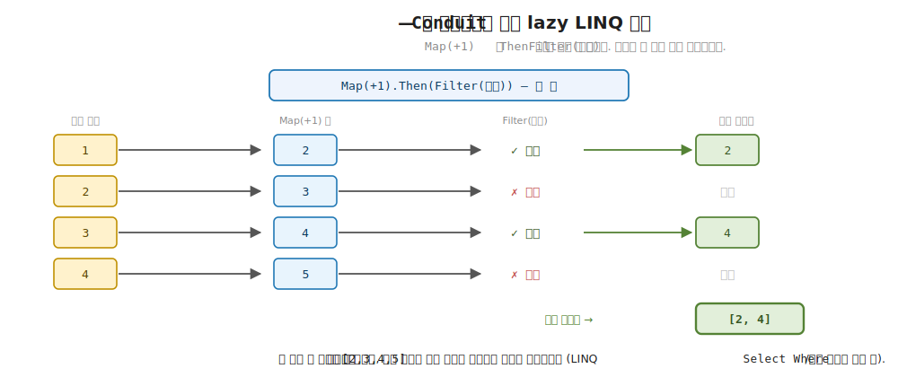
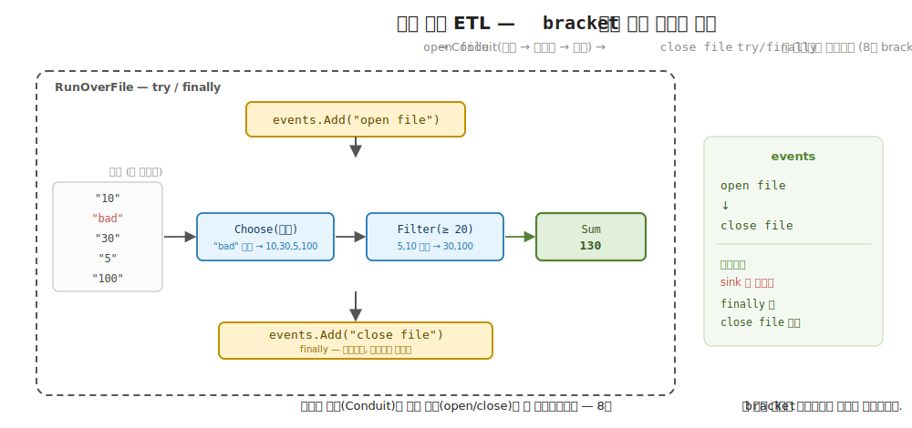
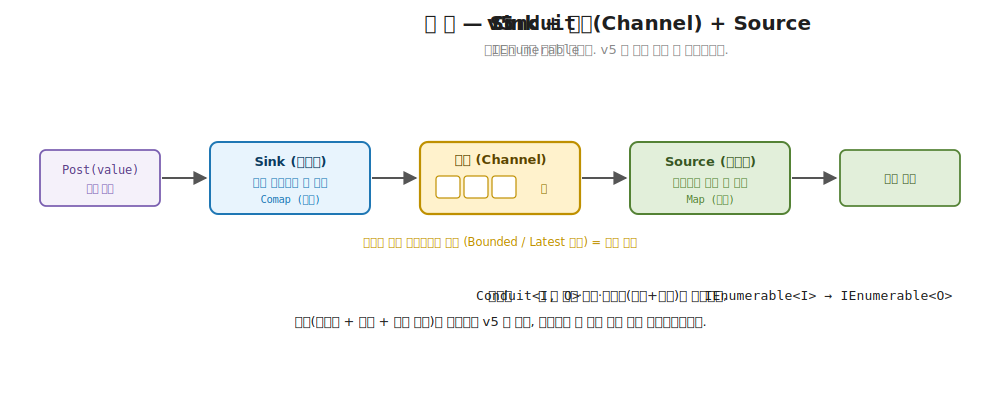

# 35장. Conduit 와 실전 파이프라인 (자원 안전한 스트림 ETL)

> **이 장의 목표** — 이 장을 마치면 입력 스트림을 출력 스트림으로 바꾸는 변환관 `Conduit<I, O>` 를 직접 구현하고, 앞 장의 Pipes 와 견주어 어느 자리에 무엇을 쓸지 고를 수 있습니다. 핵심은 Pipes 가 생산·변환·소비 세 역할로 나뉘던 자리를, Conduit 은 변환 한 덩어리 (`IEnumerable<I> → IEnumerable<O>`) 로 합쳐 더 가볍게 다룬다는 데 있습니다. 이어 그 변환관을 8 부의 `bracket` 자원 보장과 결합해, 파일을 열어 처리하다 중간에 예외가 나도 반드시 닫히는 자원 안전한 ETL 파이프라인을 손계산으로 추적합니다. 마지막으로 로그 문자열을 파싱하고 (실패는 조용히 거르고), 임계값으로 추리고, 합산하는 실전 파이프라인을 한 자리에서 조립해, 4 부의 합성 어휘가 자원 안전한 대용량 처리로 확장되는 것을 봅니다. 34장의 Pipes 가 스트림을 합성 가능한 조각으로 나눴듯, 이 장은 그 조각을 더 단순한 변환관으로 묶고 실전 자원 안전까지 더하는 10 부의 마무리 장입니다.

> **이 장의 핵심 어휘**
>
> - **`Conduit<I, O>`**: 입력 `I` 스트림을 출력 `O` 스트림으로 바꾸는 변환관, 속은 `IEnumerable<I> → IEnumerable<O>` 함수 하나
> - **`Then`**: 한 변환관의 출력을 다음 변환관의 입력으로 이어 두 단계를 한 변환관으로 합치는 메서드
> - **`Map` · `Filter` · `Choose`**: 변환관을 만드는 세 조각, 각각 LINQ 의 `Select` · `Where` · 파싱 거르기에 대응
> - **`IEnumerable<O>`**: lazy LINQ 위에서 한 원소씩 당겨 흐르는 출력 스트림
> - **자원 안전**: 파일·소켓처럼 반드시 닫아야 하는 자원이 정상 종료에도 예외에도 빠짐없이 닫히는 성질
> - **`bracket`**: 자원을 열고 (acquire), 쓰고 (use), 반드시 닫는 (finally) 8 부의 자원 보장 패턴
> - **sink**: 흐르는 스트림을 받아 한 결과로 접는 마지막 자리, 합산·개수·이어붙이기 같은 함수
> - **ETL**: 추출 (Extract) · 변환 (Transform) · 적재 (Load), 데이터를 읽어 다듬어 내보내는 실전 흐름

> 이 장을 마치면 할 수 있게 되는 것
> - [ ] Pipes 의 세 역할과 Conduit 의 한 변환관이 어떻게 다른지 설명할 수 있습니다.
> - [ ] `Conduit<I, O>` 를 `IEnumerable<I> → IEnumerable<O>` 함수 하나로 직접 짤 수 있습니다.
> - [ ] `Map` · `Filter` · `Choose` 를 `Then` 으로 이어 변환 단계를 합성할 수 있습니다.
> - [ ] `[1,2,3,4]` 가 `Map(+1)` 과 `Filter(짝수)` 를 한 원소씩 통과해 `[2,4]` 가 되는 과정을 손으로 추적할 수 있습니다.
> - [ ] 파일을 열어 처리하다 예외가 나도 `try`/`finally` 가 반드시 닫는 까닭을 8 부 `bracket` 과 이어 설명할 수 있습니다.
> - [ ] 파싱 → 임계값 → 합산의 ETL 을 자원 안전한 파이프라인으로 조립할 수 있습니다.
> - [ ] 어느 자리에 Pipes 가, 어느 자리에 Conduit 이 자연스러운지 고를 수 있습니다.
> - [ ] 학습용 `Conduit` 이 v5 의 채널 기반 Conduit 을 어떻게 단순화한 것인지 짚을 수 있습니다.

> **이 장의 흐름** — 앞 장에서 스트림을 Producer·Consumer·Pipe 세 역할로 나눠 합성했습니다. 그런데 변환만 짧게 잇고 싶은 자리에서는 세 역할을 늘 갖추는 것이 오히려 번거롭습니다. 게다가 실무 스트림은 파일·소켓처럼 반드시 닫아야 하는 자원 위에서 흐르는데, 처리 중간에 예외가 나면 그 자원이 닫히지 않고 새는 불편을 먼저 겪습니다. 그 둘을 한 번에 푸는 것이 이 장입니다. 변환을 `IEnumerable<I> → IEnumerable<O>` 한 덩어리로 보는 변환관 `Conduit<I, O>` 를 짜 `Map`·`Filter`·`Choose` 를 `Then` 으로 잇고, `[1,2,3,4]` 가 한 원소씩 관을 통과해 `[2,4]` 가 되는 것을 손으로 따라갑니다. 이어 그 변환관을 8 부의 `bracket` 자원 보장과 결합한 `Pipeline.RunOverFile` 로, 정상 종료에도 예외에도 파일이 빠짐없이 닫히는 자원 안전을 확인합니다. 그 위에서 로그 파싱 → 임계값 → 합산의 실전 ETL 을 조립해 `["10","bad","30","5","100"]` 가 130 이 되는 것을 추적하고, 세 가지 안전성을 법칙으로 다진 뒤, 이 모든 단순화가 v5 의 채널 기반 Conduit 을 어떻게 줄인 것인지 정직하게 짚습니다.

---

## 35.1 이 장에서 다루는 것 — 또 다른 스트리밍 추상, 그리고 실전

앞 장에서 스트림을 세 역할로 나눠 봤습니다. `Producer` 가 값을 흘려보내고, `Consumer` 가 받아 처리하고, `Pipe` 가 둘 사이에서 변환했습니다. `producer | pipe | consumer` 로 이으면 한 조각씩 당겨 흐르는 파이프라인이 됐고, 무한 생산자에 `Take` 를 걸어도 당긴 만큼만 흐르는 역압을 봤습니다. 스트림이 효과를 품은 lazy 시퀀스이고 합성 가능한 조각이라는 10 부의 발상이 거기서 또렷해졌습니다.

이 장이 다루는 것을 도구 이름보다 한 문장으로 먼저 잡습니다. 스트림 변환을 짧게 잇고 싶을 때, 세 역할을 다 갖추는 대신 변환 전체를 한 덩어리로 보면 더 가볍습니다. 입력 스트림 하나가 들어와 출력 스트림 하나가 나오는, 양 끝이 뚫린 관 하나입니다. 그 관이 `Conduit<I, O>` 입니다. 속을 들여다보면 `IEnumerable<I>` 를 받아 `IEnumerable<O>` 를 내는 함수 하나뿐입니다. 한쪽 끝으로 `I` 값들이 들어가면 다른 끝으로 `O` 값들이 흘러나옵니다.

여기에 이 장은 실전 한 겹을 더 얹습니다. 실무 스트림은 허공에서 흐르지 않습니다. 파일·소켓·데이터베이스 커서처럼 반드시 닫아야 하는 자원 위에서 흐릅니다. 그래서 이 장의 둘째 주제는 그 변환관을 8 부의 자원 보장과 결합해, 스트림 처리가 정상으로 끝나든 중간에 터지든 자원이 빠짐없이 닫히게 만드는 것입니다. 변환관과 자원 안전, 이 둘이 합쳐지면 실무의 ETL (추출 · 변환 · 적재) 파이프라인이 됩니다.

이 자리에서 10 부 전체를 꿰는 한 줄이 보입니다. 33 장에서 스트림이 "효과를 품은 lazy 시퀀스" 라 했고, 34 장에서 그것이 "합성 가능한 조각" 이라 했습니다. 이 장은 그 조각을 더 단순한 변환관으로 묶고, 거기에 자원 안전을 더해 실전으로 내보냅니다. 4 부에서 익힌 `Map`·`Filter`·`Fold` 라는 기초 합성 어휘가, 이 장에서 대용량·자원 위로 확장되어 실무 파이프라인의 어휘가 됩니다. 10 부의 마무리 장답게, 지금까지 만든 스트리밍 도구가 실전 자리에 어떻게 놓이는지를 보는 장입니다.

지금 모든 것을 외우지 않아도 됩니다. 이 장이 끝날 때 손에 남는 것은 세 가지입니다. `Conduit<I, O>` 가 변환 한 덩어리라는 그림 하나, 그 변환관을 `bracket` 과 결합하면 예외에도 자원이 닫힌다는 안전성 하나, 그리고 파싱 → 필터 → 합산이라는 ETL 을 자원 안전하게 조립하는 패턴 하나입니다. 이 장에 처음 나오는 어휘를 한 줄씩만 미리 짚어 둡니다. 변환관 (transducer) 은 입력 스트림을 출력 스트림으로 바꾸는 관입니다. sink 는 흐르는 스트림을 받아 한 결과로 접는 마지막 자리 (합산·개수 같은 함수) 입니다. ETL 은 데이터를 읽어 (Extract) 다듬어 (Transform) 내보내는 (Load) 실무 데이터 흐름의 줄임말입니다. 모두 본문에서 코드와 함께 다시 천천히 풀므로, 여기서는 이름과 한 줄 뜻만 스쳐 두면 됩니다.

---

## 35.2 왜 필요한가 — 세 역할이 늘 필요치는 않고, 자원은 안 닫으면 샙니다

`Conduit` 을 보이기 전에, 앞 장의 도구만 가지고 실무 스트림을 다룰 때 어디서 막히는지부터 부딪혀 봅니다. 추상을 먼저 보이지 않고 손에 잡히는 불편을 먼저 겪는 것이 이 장의 순서입니다. 막히는 자리가 둘인데, 차례로 봅니다.

첫째, 변환만 짧게 잇고 싶은 자리에서 세 역할은 무겁습니다. 앞 장의 Pipes 는 생산·변환·소비를 또렷이 나눠 정밀하게 합성하게 해 줬습니다. 그 분리가 값진 자리가 분명히 있습니다. 무한 생산자를 만들고, 역압을 정밀하게 제어하고, 같은 변환을 여러 생산자·소비자에 끼워 재사용하고 싶을 때입니다. 그런데 실무에는 그저 "이 데이터를 이렇게 한 번 바꿔라" 가 전부인 자리도 많습니다. 정수 스트림에 1 을 더하고 짝수만 남기는 변환을 짧게 적고 싶을 뿐인데, Producer 와 Consumer 의 골격까지 매번 갖추는 것은 손이 많이 가는 일입니다. 변환 자체에만 집중하고 싶을 때, 변환 전체를 한 덩어리로 보는 더 가벼운 길이 있으면 좋겠습니다.

둘째, 그리고 이쪽이 더 무거운 불편인데, 스트림이 흐르는 자원을 안 닫으면 샙니다. 실무 스트림의 출처는 대개 파일이거나 소켓이거나 데이터베이스 커서입니다. 이들은 열면 운영체제의 핸들을 잡고, 다 쓰면 반드시 닫아 그 핸들을 돌려줘야 합니다. 명령형으로 적으면 흔히 이런 모양입니다.

```csharp
var reader = OpenFile(path);      // ① 파일 핸들을 잡는다
var lines  = reader.ReadLines();
var total  = Transform(lines).Sum();   // ② 여기서 예외가 나면?
reader.Close();                   // ③ 이 줄에 닿지 못한다 — 핸들이 샌다
```

평소에는 멀쩡합니다. ① 에서 열고 ② 에서 처리하고 ③ 에서 닫습니다. 그런데 ② 의 변환·합산 도중에 예외가 한 번 터지면, 실행 흐름이 그 자리에서 위로 튕겨 나가 ③ 의 `Close()` 에 닿지 못합니다. 파일 핸들이 닫히지 않은 채 남습니다. 한 번이면 티가 안 나지만, 이런 누수가 쌓이면 운영체제가 더 줄 핸들이 없어지거나, 다른 프로세스가 그 파일을 열지 못하거나, 데이터베이스 커넥션 풀이 말라붙습니다. 게다가 한참 떨어진 자리에서, 재현하기 까다로운 모양으로 뒤늦게 나타납니다.

객체 지향 개발자라면 이 자리에서 익숙한 도구가 떠오릅니다. `using` 입니다.

```csharp
using (var reader = OpenFile(path))   // ← 블록을 벗어날 때 자동으로 Dispose
{
    var total = Transform(reader.ReadLines()).Sum();
    return total;
}   // ← 예외가 나도 여기서 reader.Dispose() 가 불린다
```

`using` 은 옳은 도구입니다. 8 부에서 본 그대로, 속은 `try`/`finally` 이고 `finally` 가 정상 종료에도 예외에도 `Dispose` 를 부릅니다. 그 보장을 효과의 세계로 끌어올린 것이 `bracket` (열고·쓰고·반드시 닫기) 이었습니다. 여기까지는 8 부에서 끝낸 이야기라 다시 길게 풀지 않습니다.

그런데 이 장에는 8 부에서 만나지 않은 새 물음이 하나 있습니다. 스트림은 한 줄씩 lazy 하게 흐릅니다. 그러면 자원은 정확히 **언제** 닫아야 안전할까요. 너무 일찍 닫으면 곤란합니다. 파일을 열고 첫 줄만 당겨 본 뒤 닫아 버리면, 아직 흐르지 않은 나머지 줄을 당기려 할 때 이미 닫힌 핸들에 손을 뻗어 터집니다. 그렇다고 흐르는 도중에 예외가 나면 흐름이 거기서 멈추는데, 그 멈춘 자리에서 닫는 일까지 놓치면 35.2 머리에서 본 누수가 그대로 재현됩니다. 곧 닫는 시점은 스트림이 **다 흐른 뒤** (정상 종료) 와 **흐르다 터진 뒤** (예외) 두 경우를 한 자리에서 덮어야 합니다. `try`/`finally` 가 바로 그 한 자리입니다. 흐름을 `try` 안에 두면, 다 흘러 정상으로 빠져나오든 도중에 튕겨 나오든, 흐름이 끝난 그 시점에 `finally` 가 닫습니다. 변환은 변환관 하나로 가볍게 적고, 그 변환관이 흐르는 자원은 흐름이 어떻게 끝나든 `finally` 가 닫게 묶고 싶습니다. 다음 절부터 그 모양을 차례로 봅니다.

> **흔한 함정** — 스트림은 lazy 라 알아서 닫힐 것이라 여기는 것입니다.
>
> 앞 장에서 lazy pull 을 배웠으니, 안 당기면 안 흐르고 그러면 자원도 알아서 정리되리라 기대하기 쉽습니다. 그렇지 않습니다. lazy 는 "언제 흐를지" 를 늦출 뿐, "닫는 일" 을 대신해 주지 않습니다. 한 번 연 파일 핸들은 누군가 명시적으로 닫기 전까지 잡혀 있습니다. 게다가 처리 도중 예외가 나면 흐름이 중단된 채로 핸들만 남습니다. 자원의 개폐는 lazy 와 별개의 문제이고, `try`/`finally` (또는 `bracket`) 가 그것을 책임지는 자리입니다.

---

## 35.3 Conduit\<I, O\> — IEnumerable 변환관

이제 변환을 한 덩어리로 보는 모양을 봅니다. 핵심 발상은 한 문장입니다. 스트림 변환이란 결국 `IEnumerable<I>` 를 받아 `IEnumerable<O>` 를 내는 함수다. 그 함수 하나를 그릇에 담은 것이 `Conduit<I, O>` 입니다.

일상의 비유로 먼저 직감을 잡습니다. 정수기 필터를 떠올립니다. 한쪽 끝으로 물이 들어가면 다른 끝으로 걸러진 물이 나오는, 양 끝이 뚫린 관 하나입니다. 관 안에서 무슨 일이 일어나는지 (거르고·더하고) 는 관의 속사정이고, 쓰는 쪽은 그저 "이 관에 물을 흘리면 다듬어진 물이 나온다" 만 알면 됩니다. 필터를 여러 개 직렬로 잇는 것도 자연스럽습니다. 한 필터의 출구를 다음 필터의 입구에 꽂으면, 둘은 더 긴 관 하나가 됩니다. `Conduit<I, O>` 이 정확히 이 관입니다. 앞 장의 Pipes 가 생산기·필터·수도꼭지를 따로 두고 호스로 잇는 그림이라면, Conduit 은 변환 부분만 떼어 관 하나로 합친 그림입니다.

학습용 `Conduit<I, O>` 의 타입부터 봅니다. 군더더기 없이 함수 하나를 감싼 그릇입니다.

```csharp
// Conduit<I, O> — 또 다른 스트리밍 추상. I 스트림을 O 스트림으로 바꾸는 변환관(transducer).
// Pipes 가 Producer/Consumer/Pipe 세 역할로 나뉜 데 비해, Conduit 은 변환 단계를 하나로 합쳐
// IEnumerable<I> → IEnumerable<O> 로 본다 (lazy LINQ 위). Then 으로 단계를 잇는다.
public sealed class Conduit<I, O>(Func<IEnumerable<I>, IEnumerable<O>> run)
{
    public IEnumerable<O> Apply(IEnumerable<I> input) => run(input);
    public Conduit<I, P> Then<P>(Conduit<O, P> next) => new(xs => next.Apply(Apply(xs)));
}
```

타입을 한 줄씩 읽습니다. `Conduit<I, O>` 은 클래스 하나이고, 생성자가 받는 것은 `Func<IEnumerable<I>, IEnumerable<O>>` 함수 하나 (`run`) 뿐입니다. 곧 변환관의 정체는 "입력 스트림을 출력 스트림으로 바꾸는 함수" 한 개입니다. `Apply(IEnumerable<I> input)` 는 그 함수에 실제 입력을 넘겨 출력 스트림을 얻는 자리입니다. 입력 `I` 들을 관에 흘려 출력 `O` 들을 받습니다.

`Then<P>` 가 두 변환관을 잇는 메서드입니다. 한 줄이 짧지만 이 장의 합성을 떠받치는 자리이므로 천천히 풉니다. `Then` 은 자기 자신 (`Conduit<I, O>`) 뒤에 `Conduit<O, P>` 를 이어 `Conduit<I, P>` 를 냅니다. 타입을 눈으로 따라가면 자연스럽습니다. 내 출력이 `O` 이고 다음 관의 입력이 `O` 이므로 둘이 맞물립니다. 본문 `xs => next.Apply(Apply(xs))` 는 "입력 `xs` 를 먼저 내 관에 흘리고 (`Apply(xs)`), 그 결과를 다음 관에 흘려라 (`next.Apply(...)`)" 입니다. 두 관의 출구와 입구를 꽂아 더 긴 관 하나로 만든 것입니다.

여기서 OO 직감으로 다리를 놓으면, 이 `Apply` 는 LINQ 의 메서드 체인 그 자체입니다. `xs.Select(f).Where(p)` 라고 적을 때 `Select` 의 출력이 `Where` 의 입력으로 그대로 흘러 들어가는 것과 똑같습니다. `Conduit` 은 그 한 단계를 값으로 떼어 이름 붙이고, `Then` 으로 다시 잇게 한 것뿐입니다. 새로운 마법이 아니라, 이미 익숙한 LINQ 체인을 합성 가능한 조각으로 재포장한 것입니다.

변환관을 만드는 세 조각을 봅니다. 정적 클래스 `Conduit` 의 팩토리 메서드들입니다.

```csharp
public static class Conduit
{
    public static Conduit<I, O> Map<I, O>(Func<I, O> f) => new(xs => xs.Select(f));
    public static Conduit<I, I> Filter<I>(Func<I, bool> p) => new(xs => xs.Where(p));
    public static Conduit<I, O> Choose<I, O>(Func<I, (bool ok, O value)> f) =>
        new(xs => xs.Select(f).Where(r => r.ok).Select(r => r.value));
}
```

셋을 한 줄씩 읽습니다. `Map(f)` 는 모든 원소에 `f` 를 적용하는 변환관입니다. 속은 `xs.Select(f)`, 곧 LINQ 의 `Select` 입니다. `Filter(p)` 는 술어 `p` 를 통과하는 원소만 남기는 변환관입니다. 속은 `xs.Where(p)`, 곧 `Where` 입니다. 입력과 출력의 타입이 둘 다 `I` 인데 (`Conduit<I, I>`), 거르기는 타입을 바꾸지 않고 개수만 줄이기 때문입니다. `Choose(f)` 는 다음 절에서 ETL 에 쓰일 조각이라 여기서는 모양만 봐 둡니다. `(bool ok, O value)` 를 내는 함수를 받아, `ok` 가 참인 것만 골라 그 `value` 를 흘립니다. "변환하면서 동시에 거르는" 한 묶음입니다. 그 정체는 ETL 절에서 손으로 따라가며 풉니다.

사용감부터 잡습니다. 데모의 첫 예제는 두 변환관을 `Then` 으로 이어 적용합니다.

```csharp
var conduit = Conduit.Map<int, int>(x => x + 1).Then(Conduit.Filter<int>(x => x % 2 == 0));
Console.WriteLine($"  [1,2,3,4] | Map(+1) | Filter(짝수) = [{string.Join(", ", conduit.Apply([1, 2, 3, 4]))}]");
//  [1,2,3,4] | Map(+1) | Filter(짝수) = [2, 4]
```

`Map(x => x + 1)` 변환관 뒤에 `Filter(x => x % 2 == 0)` 변환관을 `Then` 으로 이었습니다. 합쳐진 변환관은 "모든 원소에 1 을 더한 뒤, 그중 짝수만 남겨라" 입니다. `[1,2,3,4]` 를 흘리면 `[2,4]` 가 나옵니다. 왜 그런지 손으로 따라갑니다.

이 추적에서 한 가지를 눈여겨봐야 합니다. LINQ 의 `Select`/`Where` 는 lazy 입니다. 곧 `conduit.Apply([1,2,3,4])` 를 부르는 순간 모든 원소가 한꺼번에 처리되는 것이 아니라, 바깥에서 결과를 한 원소씩 당길 때 (여기서는 `string.Join` 이 열거할 때) 비로소 원소 하나가 관 전체를 통과합니다. 33·34 장에서 본 "당긴 만큼만 흐른다" 는 그 당김 모델이 여기서도 그대로입니다. 그래서 추적도 원소 하나가 관을 끝까지 지나가는 흐름으로 따라갑니다.

```
입력 [1, 2, 3, 4] 를 한 원소씩 당겨 관을 통과시킨다 (lazy pull):

  원소 1 ─ Map(+1) → 2 ─ Filter(짝수) → 2 가 짝수? 예 → 방출 [2]
  원소 2 ─ Map(+1) → 3 ─ Filter(짝수) → 3 이 짝수? 아니오 → 버림
  원소 3 ─ Map(+1) → 4 ─ Filter(짝수) → 4 가 짝수? 예 → 방출 [2,4]
  원소 4 ─ Map(+1) → 5 ─ Filter(짝수) → 5 가 짝수? 아니오 → 버림

  결과: [2, 4]
```

원소 1 이 먼저 `Map` 을 지나 2 가 되고, 이어 `Filter` 에서 짝수라 방출됩니다. 원소 2 는 `Map` 에서 3 이 되고 `Filter` 에서 홀수라 버려집니다. 이런 식으로 네 원소가 각자 관 전체를 한 번씩 지나가, 살아남은 2 와 4 가 출력 스트림이 됩니다. 한꺼번에 `[1,2,3,4]` 를 `[2,3,4,5]` 로 만든 뒤 다시 거르는 것이 아니라, 원소 단위로 관을 통과한다는 점이 lazy 의 핵심입니다.

> **미리보기입니다** — 이 lazy 흐름이 다음 절에서 자원 안전과 만납니다.
>
> 지금은 입력이 메모리 위의 작은 배열 `[1,2,3,4]` 라 lazy 의 이점이 잘 안 보입니다. 다음 절에서 입력이 파일이 되면, 이 "한 원소씩 당겨 흐른다" 가 비로소 값을 냅니다. 변환관이 lazy 라 개념적으로는 파일을 한 줄씩 당겨 처리할 수 있고 (학습용 코드는 이미 읽은 줄 리스트로 단순화합니다), 그 파일을 여닫는 일을 `bracket` 으로 감싸면 흐름이 끝나거나 터질 때 빠짐없이 닫힙니다. 변환관의 lazy 흐름과 자원의 안전한 개폐가 다음 절에서 한 자리에 모입니다.



**그림 35-1. `Conduit` = IEnumerable 변환관: 한 관으로 합친 변환** — 위쪽은 Conduit. 원소가 한 개씩 관을 지납니다. `1` 은 `Map(+1)` 으로 `2` 가 되어 `Filter(짝수)` 를 통과하고(출력 `2`), `2` 는 `3` 이 되어 버려지고, `3` 은 `4` 로 통과하고(출력 `4`), `4` 는 `5` 로 버려져 결과는 `[2,4]` 입니다. 한꺼번에 `[2,3,4,5]` 를 만든 뒤 거르는 것이 아니라, 원소 하나가 관을 끝까지 지나고서 다음이 들어옵니다. 두 관은 `Then` 으로 이어져 입력 `I` 부터 출력 `O` 까지 한 변환관이 됩니다. 아래쪽은 앞 장 Pipes 와의 대비. Pipes 가 Producer · Pipe · Consumer 세 박스로 나뉜 자리를, Conduit 은 변환 부분만 떼어 관 하나로 합쳤습니다.

---

## 35.4 Pipes vs Conduit — 어느 자리에 무엇

앞 절에서 Conduit 의 모양을 봤으니, 이제 앞 장의 Pipes 와 나란히 놓고 어느 자리에 무엇이 자연스러운지 가립니다. 데모의 셋째 예제가 둘을 한 줄씩 견줍니다.

```csharp
Console.WriteLine("  Pipes(34장)   : Producer/Consumer/Pipe 세 역할 분리 + 당김 역압");
Console.WriteLine("  Conduit(35장) : 변환을 IEnumerable<I>→IEnumerable<O> 하나로 (lazy LINQ 위)");
```

두 줄의 차이를 풀어 봅니다. Pipes 는 스트림을 세 역할로 나눕니다. `Producer` 가 값을 생산하고, `Consumer` 가 소비하고, `Pipe` 가 그 사이를 변환합니다. 이 분리가 값진 까닭은 셋을 따로 떼어 재사용·조립할 수 있기 때문입니다. 한 `Producer` 를 여러 파이프라인에 꽂거나, 무한 생산자에 `Take` 를 걸어 당긴 만큼만 흐르게 역압을 정밀하게 제어하거나, 생산과 소비의 속도를 따로 다룰 수 있습니다. 생산·변환·소비가 각각 독립된 관심사일 때, 이 분리가 코드를 또렷하게 합니다.

Conduit 은 그 셋 중 변환 부분만 떼어 한 덩어리로 봅니다. `IEnumerable<I>` 가 들어와 `IEnumerable<O>` 가 나오는 관 하나입니다. 생산은 그저 입력 컬렉션을 넘기는 것이고, 소비는 그저 출력을 sink 함수로 접는 것이라, 변환 자체에만 집중합니다. 단순한 변환을 짧게 잇고 싶을 때, lazy LINQ 위에서 `Map`·`Filter`·`Choose` 를 `Then` 으로 가볍게 합성합니다. 세 역할의 골격이 필요 없는 자리에서 더 적은 코드로 같은 일을 합니다.

일상의 비유로 두 길을 가르면, Pipes 는 부품을 따로 사서 조립하는 길이고, Conduit 은 완성된 변환관 하나를 쓰는 길입니다. 정수기를 직접 만든다면 펌프·필터·꼭지를 따로 골라 호스로 잇습니다 (Pipes). 그저 필터 카트리지 하나를 수도에 끼우고 싶다면 관 하나면 충분합니다 (Conduit). 어느 쪽이 옳다기보다, 부품을 따로 다룰 일이 있느냐 없느냐가 선택을 가릅니다.

선택을 한 줄로 더 좁히면 이렇습니다. 무한 스트림을 다루거나 흐름의 속도를 세밀하게 조이는 역압이 필요하면 Pipes 가 자연스럽습니다. 생산·변환·소비를 세 역할로 나눠 두면, 무한 생산자에 `Take` 를 걸어 당긴 만큼만 흐르게 하거나 단계마다 속도를 따로 다룰 자리가 생기기 때문입니다. 반대로 입력이 유한하고 변환이 단순해 그저 한 번 바꿔 흘리면 되는 자리라면, 세 역할의 골격이 없는 Conduit 한 관이 가볍습니다. 무한·세밀한 제어에는 Pipes, 유한·단순 변환에는 Conduit, 이렇게 어느 자리에 무엇인지 먼저 정하면 둘 사이에서 헤매지 않습니다.

OO 직감으로 한 번 더 다리를 놓으면, Conduit 의 `Apply` 는 LINQ 메서드 체인 (`xs.Select(...).Where(...)`) 에, Pipes 의 세 역할 분리는 그 체인을 생산기·변환기·소비기 객체로 쪼개 인터페이스로 잇는 설계에 가깝습니다. 짧은 변환에는 메서드 체인이 읽기 쉽고, 부품을 재사용하고 정밀 제어할 자리에는 쪼갠 설계가 값집니다. 같은 판단이 여기서도 그대로 섭니다.

두 도구를 표로 견주면 자리가 또렷합니다.

| 견줌 | Pipes (34장) | Conduit (35장) |
|---|---|---|
| 구조 | `Producer` / `Consumer` / `Pipe` 세 역할 분리 | `IEnumerable<I> → IEnumerable<O>` 변환관 하나 |
| 합성 | `producer \| pipe \| consumer` 로 셋을 이음 | `Map`·`Filter`·`Choose` 를 `Then` 으로 이음 |
| 흐름 | 코루틴 기반 당김, 역압 정밀 제어 | lazy LINQ 당김, 당긴 만큼만 흐름 |
| 어울리는 자리 | 생산·변환·소비를 따로 재사용·제어 | 변환만 짧게 잇고 sink 로 접기 |
| 무게 | 세 골격을 갖춤 (정밀하지만 손이 감) | 변환 한 덩어리 (가볍지만 분리는 없음) |

> **흔한 함정** — Conduit 이 Pipes 의 상위 호환이라 여기는 것입니다.
>
> Conduit 이 더 짧으니 늘 더 낫다고 결론 내리기 쉽습니다. 그렇지 않습니다. 둘은 우열이 아니라 다른 자리에 어울리는 도구입니다. 생산자와 소비자를 따로 떼어 재사용하거나, 무한 스트림의 역압을 정밀하게 제어해야 하면 Pipes 의 세 역할 분리가 값집니다. Conduit 은 그 분리를 포기하는 대신 변환을 가볍게 합니다. 짧음이 곧 우월이 아니라는 것은 1 장의 "짧다 = 좋다" 함정과 같은 결입니다. 둘 다 같은 "한 원소씩 흐르는 스트림" 가족이고, 실제로 v5 는 Conduit 을 Pipes 에 합류시킬 수도 있습니다 (마지막 절에서 짚습니다).

---

## 35.5 자원 안전 파이프라인 — bracket 과 결합

이제 이 장의 둘째 주제, 자원 안전으로 넘어갑니다. 변환관을 가볍게 짰으니, 그 변환관이 흐르는 자원을 예외에도 빠짐없이 닫는 자리를 봅니다. 핵심 발상은 한 문장입니다. 자원을 열고 (open) 변환관을 흘려 sink 로 접되, 그 전부를 `try`/`finally` 로 감싸 무슨 일이 있어도 닫는다 (close).

학습용 자원 파이프라인 `Pipeline.RunOverFile` 을 봅니다. 8 부의 `bracket` 발상을 스트리밍에 결합한 모양입니다.

```csharp
public static class Pipeline
{
    // events 는 호출자 소유 — 예외가 나도 (finally 실행 후) 닫힘 기록을 관찰할 수 있다.
    public static R RunOverFile<O, R>(
        IReadOnlyList<string> fileLines,
        Conduit<string, O> conduit,
        Func<IEnumerable<O>, R> sink,
        List<string> events)
    {
        events.Add("open file");
        try
        {
            return sink(conduit.Apply(fileLines));
        }
        finally
        {
            events.Add("close file");   // 예외에도 반드시 닫힘
        }
    }
}
```

타입을 한 줄씩 읽습니다. `RunOverFile` 은 네 가지를 받습니다. 처리할 `fileLines` (파일의 줄들), 그 줄들을 변환할 `conduit` (`Conduit<string, O>`), 변환 결과를 한 값으로 접을 `sink` (`Func<IEnumerable<O>, R>`), 그리고 자원 개폐를 기록할 `events` 리스트입니다. 마지막 `events` 는 학습용 장치입니다. 실무라면 여기서 진짜 파일을 여닫겠지만, 학습용은 "열었다"·"닫았다" 를 리스트에 글자로 적어 그 순서를 눈으로 관찰할 수 있게 합니다. 진짜 자원을 여닫는 대신, 그 순서를 눈에 보이는 흔적으로 남긴 것입니다.

본문의 뼈대는 셋입니다. 먼저 `events.Add("open file")` 로 자원을 엽니다 (acquire). 이어 `try` 블록 안에서 `sink(conduit.Apply(fileLines))` 로 변환관을 흘려 그 출력을 sink 로 접습니다 (use). 그리고 `finally` 블록에서 `events.Add("close file")` 로 닫습니다 (finally). 여기가 핵심입니다. `finally` 는 `try` 블록이 정상으로 끝나든, 중간에 예외로 튕겨 나가든, 어느 경우에도 반드시 실행됩니다. 그래서 sink 나 변환 도중에 무슨 일이 일어나도 "close file" 은 빠짐없이 기록됩니다.

여기서 8 부를 회상합니다. `bracket` 은 자원을 acquire · use · finally 세 걸음으로 묶어, use 에서 예외가 나도 finally 가 자원을 해제하게 보장하는 패턴이었습니다. `RunOverFile` 의 `open file` → `try { ... }` → `finally { close file }` 이 정확히 그 세 걸음입니다. OO 직감으로 다리를 놓으면 `using` 블록과 같습니다. `using (var f = Open()) { Use(f); }` 가 블록을 벗어날 때 (정상이든 예외든) `Dispose` 를 부르는 것과, `RunOverFile` 이 `finally` 에서 닫는 것이 같은 보장입니다. 학습용은 그 보장을 명령형 `try`/`finally` 로 직접 적어, 어디서 자원이 닫히는지 눈에 보이게 합니다.

이제 두 경우를 손으로 따라갑니다. 정상으로 끝나는 경우와, sink 가 중간에 터지는 경우입니다.

```
경우 ①  정상 종료:
   events.Add("open file")        events = [open file]
   try {
      sink(conduit.Apply(lines))  → 변환·합산 정상 완료, 결과 R 준비
   }
   finally {
      events.Add("close file")    events = [open file, close file]
   }
   return R                       events = [open file, close file]

경우 ②  sink 가 예외를 던짐:
   events.Add("open file")        events = [open file]
   try {
      sink(...)                   ✗ 예외 발생! try 블록을 튕겨 나간다
   }
   finally {
      events.Add("close file")    events = [open file, close file]  ← 예외 중에도 실행
   }
   예외가 호출자로 전파됨           events = [open file, close file]
```

두 경우 모두 `events` 의 마지막은 `[open file, close file]` 입니다. 경우 ① 은 당연합니다. 정상으로 흐르며 열고 닫았습니다. 경우 ② 가 핵심입니다. sink 가 예외를 던지면 `try` 블록의 나머지는 건너뛰고 흐름이 위로 튕겨 나가지만, 그 튕겨 나가는 길목에서 `finally` 가 먼저 실행됩니다. 그래서 "close file" 이 기록된 뒤에야 예외가 호출자로 전파됩니다. 자원은 닫혔고, 그다음 예외가 알려집니다. 명령형 코드의 `reader.Close()` 가 예외에 닫지 못해 핸들이 새던 35.2 의 불편이, 이 `finally` 한 줄로 사라집니다.

> **흔한 함정** — `finally` 없이 `try`/`catch` 만으로 닫으면 된다고 여기는 것입니다.
>
> "예외를 잡아서 그 안에서 닫으면 되지 않나" 싶지만, 그 길은 두 군데에 닫는 코드를 두게 됩니다. 정상 경로의 끝과 `catch` 블록 안 양쪽입니다. 한쪽을 깜빡하면 그 경로에서 자원이 샙니다. `finally` 는 정상·예외 두 경로가 합류하는 한 자리라, 닫는 코드를 한 번만 적으면 모든 경로를 덮습니다. 8 부의 `bracket` 이 `catch` 가 아니라 `finally` (또는 그에 준하는 보장) 위에 선 까닭이 이것입니다. 자원 해제는 "예외를 처리하는 일" 이 아니라 "어느 경로로 끝나든 반드시 하는 일" 이기 때문입니다.

---

## 35.6 ETL payoff — 파싱 · 임계값 · 합산을 한 자리에

이제 변환관과 자원 안전을 합쳐 실전 파이프라인을 조립합니다. 이 장의 도구가 약속을 지키는지 정면으로 보는 자리입니다. 로그 파일에서 숫자를 읽어 (파싱), 기준 이상만 추리고 (필터), 더하는 (합산) 흔한 ETL 을 한 자리에 모읍니다. 챌린지 정답 코드 `Etl.SumAboveThreshold` 가 그것입니다.

```csharp
public static (int Total, List<string> Events) SumAboveThreshold(
    IReadOnlyList<string> lines, int threshold)
{
    var events = new List<string>();
    var conduit =
        Conduit.Choose<string, int>(s => (int.TryParse(s, out var v), v))   // 파싱 성공만
               .Then(Conduit.Filter<int>(x => x >= threshold));             // 임계값 이상
    var total = Pipeline.RunOverFile(lines, conduit, xs => xs.Sum(), events);
    return (total, events);
}
```

한 줄씩 읽습니다. 변환관은 두 단계를 `Then` 으로 이은 것입니다. 첫 단계 `Conduit.Choose<string, int>(s => (int.TryParse(s, out var v), v))` 는 문자열을 정수로 파싱하되 성공한 것만 흘립니다. `int.TryParse` 는 파싱 성공 여부를 `bool` 로 돌려주고 결과를 `out v` 에 담는데, `Choose` 가 받는 `(bool ok, O value)` 모양이 정확히 그 `(성공여부, 값)` 쌍입니다. 둘째 단계 `Conduit.Filter<int>(x => x >= threshold)` 는 임계값 이상만 남깁니다. 마지막으로 `Pipeline.RunOverFile(lines, conduit, xs => xs.Sum(), events)` 가 그 변환관을 자원 안전하게 흘려, 출력을 sink `xs => xs.Sum()` 으로 합산합니다.

여기서 35.3 에서 미뤄 둔 `Choose` 의 정체를 손으로 풉니다. `Choose` 의 속은 `xs.Select(f).Where(r => r.ok).Select(r => r.value)` 세 단계였습니다. 입력 `"bad"` 가 어떻게 조용히 빠지는지 한 원소씩 따라가면 또렷합니다.

```
Choose(int.TryParse) 가 "10" 과 "bad" 를 처리하는 법:

  "10"  ─ Select(TryParse) → (ok: true,  value: 10) ─ Where(ok) → 통과 ─ Select(value) → 10
  "bad" ─ Select(TryParse) → (ok: false, value: 0)  ─ Where(ok) → 버림 (여기서 사라짐)
```

`"10"` 은 파싱에 성공해 `(true, 10)` 이 되고, `Where(ok)` 를 통과해 값 10 만 흘러나옵니다. `"bad"` 는 파싱에 실패해 `(false, 0)` 이 되고, `Where(ok)` 에서 걸러져 흐름에서 사라집니다. 곧 `Choose` 는 "변환하면서 실패한 것은 조용히 거르는" 한 묶음입니다. 앞 Part 에서 `Option` 으로 "없을 수 있음" 을 다루고 `Filter` 로 골라내던 발상이, 여기서 스트림 위 한 단계로 합쳐진 것입니다.

이제 데모의 둘째 예제 전체를 손으로 따라갑니다. 입력은 `["10", "bad", "30", "5", "100"]`, 임계값은 20 입니다.

```csharp
var (total, events) = Etl.SumAboveThreshold(["10", "bad", "30", "5", "100"], threshold: 20);
Console.WriteLine($"  임계값 20 이상 합 = {total}   (30 + 100)");
Console.WriteLine($"  자원 이벤트 = [{string.Join(" → ", events)}]");
```

```
입력 ["10", "bad", "30", "5", "100"], 임계값 20

open file                              events = [open file]
  │
  │  ── 변환관을 한 원소씩 흘린다 (lazy pull) ──
  │
  "10"  ─ Choose(파싱) → 10  ─ Filter(≥20) → 10 ≥ 20? 아니오 → 버림
  "bad" ─ Choose(파싱) → 파싱 실패 → 버림 (Choose 단계에서 사라짐)
  "30"  ─ Choose(파싱) → 30  ─ Filter(≥20) → 30 ≥ 20? 예    → 방출
  "5"   ─ Choose(파싱) → 5   ─ Filter(≥20) → 5 ≥ 20?  아니오 → 버림
  "100" ─ Choose(파싱) → 100 ─ Filter(≥20) → 100 ≥ 20? 예   → 방출
  │
  │  살아남은 스트림: [30, 100]
  │  sink = Sum → 30 + 100 = 130
  ▼
close file                             events = [open file, close file]

결과: total = 130, events = [open file, close file]
```

다섯 원소가 각자 변환관을 통과하며 셋이 걸러집니다. `"10"` 과 `"5"` 는 파싱은 됐지만 임계값에 못 미쳐 `Filter` 에서 버려지고, `"bad"` 는 파싱 자체가 실패해 `Choose` 에서 사라집니다. 살아남은 30 과 100 만 sink 에 닿아 합산되어 130 이 됩니다. 콘솔 출력은 이렇습니다.

```
== 예제 2 — 로그 파일 ETL (파싱→임계값→합산, 자원 개폐 보장) ==
  임계값 20 이상 합 = 130   (30 + 100)
  자원 이벤트 = [open file → close file]
```

이 한 자리가 이 장의 payoff 입니다. 실무의 ETL 흐름 (지저분한 입력을 파싱하고, 기준으로 추리고, 한 값으로 모으기) 이 변환관 합성 하나로 적혔습니다. 파싱 실패는 `Choose` 가 조용히 걸렀고, 임계값은 `Filter` 가 추렸고, 합산은 sink 가 접었습니다. 그리고 그 전부가 `RunOverFile` 의 `try`/`finally` 안에서 흘러, `events` 가 `[open file → close file]` 로 자원이 빠짐없이 열리고 닫혔음을 증언합니다. 변환의 가벼움과 자원의 안전이 한 자리에 모였습니다. 35.2 에서 바랐던 두 가지, "변환은 변환관 하나로 가볍게" 와 "자원은 예외에도 빠짐없이 닫히게" 가 여기서 함께 이뤄졌습니다.



**그림 35-2. 자원 안전 ETL: 변환관과 `bracket` 의 결합** — `open file` 로 자원을 연 뒤, 입력 `["10","bad","30","5","100"]` 가 `Choose` (파싱, "bad" 탈락) → `Filter` (≥20, "10"·"5" 탈락) → `Sum` 변환관을 한 원소씩 흘러 130 이 됩니다. 그 전부가 `try`/`finally` 로 감싸여, 정상 종료에도 처리 중 예외에도 `close file` 이 반드시 실행됩니다. 8 부의 `bracket` 자원 보장이 스트리밍 변환관과 결합한 모양이고, `events = [open file → close file]` 가 그 증거입니다.

---

## 35.7 법칙으로 다지기 — 합성 정합과 자원 보장

7 장 이후 새 추상마다 법칙으로 그 의미를 확인했습니다. `Conduit` 에도 확인할 것이 있는데, 모나드 법칙은 아닙니다. 학습용 `Conduit` 은 변환을 합성하는 그릇이라, 여기서 다지는 것은 "변환관이 합성대로 동작하는가" 와 "파이프라인이 자원을 약속대로 여닫는가" 입니다. 세 가지를 콘솔 `bool` 함수로 단언합니다.

```csharp
// ① Conduit.Then 합성.
public static bool CompositionHolds()
{
    var c = Conduit.Map<int, int>(x => x + 1).Then(Conduit.Filter<int>(x => x % 2 == 0));
    return c.Apply([1, 2, 3, 4]).SequenceEqual([2, 4]);
}

// ② 파이프라인이 자원을 연 뒤 반드시 닫는다.
public static bool ResourceClosedHolds()
{
    var events = new List<string>();
    var count = Pipeline.RunOverFile(
        ["10", "x", "30"],
        Conduit.Choose<string, int>(s => (int.TryParse(s, out var v), v)),
        xs => xs.Count(),
        events);
    return count == 2 && events.SequenceEqual(["open file", "close file"]);
}

// ③ sink 가 예외를 던져도 자원은 닫힌다.
public static bool ClosesOnExceptionHolds()
{
    var events = new List<string>();
    try
    {
        Pipeline.RunOverFile<int, int>(
            ["1"], Conduit.Map<string, int>(int.Parse),
            _ => throw new InvalidOperationException(),
            events);
    }
    catch (InvalidOperationException) { }
    return events.Contains("close file");
}
```

세 법칙을 한 줄씩 읽습니다.

① **합성 정합** — `Map(+1).Then(Filter(짝수))` 를 `[1,2,3,4]` 에 적용한 결과가 `[2,4]` 와 같은지 봅니다. 35.3 에서 손으로 따라간 그 흐름을 단언으로 옮긴 것입니다. `Then` 으로 이은 변환관이 두 단계를 차례로 적용한 결과와 정확히 같음을, 곧 합성이 단계별 적용을 보존함을 확인합니다.

② **자원 개폐 보장** — `["10","x","30"]` 을 파싱 변환관 (`Choose`) 으로 흘리고 sink 로 개수를 셉니다. `"x"` 는 파싱에 실패해 걸러지므로 살아남는 것은 10 과 30, 곧 개수는 2 입니다. 동시에 `events` 가 정확히 `["open file", "close file"]` 순서인지 봅니다. 정상 경로에서 자원이 열린 뒤 닫혔음을 단언합니다.

③ **예외 안전** — sink 가 일부러 `InvalidOperationException` 을 던지게 합니다. 그 예외를 `try`/`catch` 로 삼킨 뒤, `events` 에 "close file" 이 들어 있는지 봅니다. sink 가 터졌는데도 `finally` 가 실행돼 자원이 닫혔음을, 곧 35.5 에서 본 "예외에도 닫힘" 을 단언합니다. 자원 누수가 없다는 핵심 보장입니다.

데모 출력은 셋 다 통과입니다.

```
== 검증 ==
  Conduit 합성 : 통과
  자원 개폐 보장 : 통과
  예외에도 닫힘 : 통과

모든 검증 통과 [OK]
```

이 세 법칙이 10 부 축의 약속을 굳힙니다. ① 은 변환관이 합성 가능한 조각이라는 것을, ②·③ 은 그 조각이 자원 위에서 안전하게 흐른다는 것을 단언합니다. 4 부의 합성 어휘가 자원 안전한 대용량 처리로 확장된다는 이 장의 한 줄이, 세 단언으로 검증됩니다.

---

## 35.8 더 깊이 — 학습용 Conduit 은 v5 의 단순화판입니다

> **더 깊이 (처음엔 건너뛰어도 됩니다)** — 학습용 `Conduit<I, O>` 은 뼈대만 남긴 것입니다.
>
> 학습용 `Conduit<I, O>` 은 변환을 `IEnumerable<I> → IEnumerable<O>` 함수 하나로 평탄화한 것이고, LanguageExt v5 의 `Conduit` 은 같은 "스트림 변환" 발상에 실무용 기계장치를 여러 겹 더 입혔습니다. 33 장의 `StreamT` 가 내부 모나드 `M` 을 지연 pull 로 고정하고, 34 장의 Pipes 가 당김 함수를 단순화한 것과 같은 결의 단순화입니다. 정직하게 짚어 둡니다.
>
> - **속이 채널이다** — v5 의 `Conduit<A, B>` 는 단순한 변환 함수가 아니라, 안에 큐 (`System.Threading.Channels.Channel`) 를 둔 채널입니다. 입력측 `Sink` 로 값을 넣고, 버퍼를 거쳐, 출력측 `Source` 로 값을 꺼냅니다. 학습용은 이 채널·버퍼·입출력 분리를 모두 들어내고 동기 `IEnumerable` 변환 하나로 평탄화했습니다.
> - **입력측은 반변, 출력측은 공변** — v5 의 `Conduit` 은 출력측에 `Map` (값이 버퍼에서 나온 뒤 변환) 을, 입력측에 `Comap` (값이 버퍼에 들어가기 전 변환) 을 둡니다. 곧 양방향으로 변환을 얹을 수 있습니다. 학습용 `Conduit<I, O>` 은 입력 → 출력 한 방향 합성 (`Then`) 만 있고, 반변 입력 변환은 없습니다. `Map`·`Filter`·`Choose` 가 모두 출력 한 방향입니다.
> - **`Then` 은 입문용 합성기다** — v5 에는 학습용 `Then` 같은 "변환관끼리 직렬 연결" 메서드가 없습니다. v5 의 단계 합성은 transducer 를 합성하거나, `ToProducer`/`ToConsumer` 로 Pipes 합성 (`producer | pipe | consumer`) 에 합류해서 합니다. 학습용 `Then` 은 변환관을 짧게 잇는 입문 편의로 새로 만든 합성기입니다.
> - **진짜 역압은 채널이 한다** — 학습용은 `IEnumerable` 의 lazy pull 이라 "당긴 만큼만 흐르는" 가벼운 흐름 제어는 있지만, v5 의 진짜 역압은 없습니다. v5 의 `Sink.Post` 는 버퍼가 차면 기다리거나, 버퍼 전략 (Bounded / Latest / Newest) 에 따라 가장 오래된 값을 버립니다. "lazy pull 은 가벼운 흐름 제어, 진짜 역압은 버퍼·채널이 필요" 라고 선을 그어 두면 정확합니다.
> - **연산이 더 풍부하다** — v5 의 `Conduit` 은 `FoldWhile`/`FoldUntil` (+ `Schedule` 오버로드), `Skip`/`Take` 등 여러 스트림 연산을 갖습니다. 학습용은 `Map`·`Filter`·`Choose` 셋만 둡니다.
> - **자원 안전의 실제 기제** — 학습용 `RunOverFile` 은 `try`/`finally` 로 "open file"/"close file" 을 리스트에 적어 `bracket` 의 보장을 흉내 냈습니다. v5 의 실제 자원 안전은 `bracketIO` (acquire · use · finally 를 `IO` 합성에 묶는 별도 기제) 가 책임집니다. 학습용은 그것을 명령형 `try`/`finally` 로 입문 단순화한 것입니다.
> - **모나드 변환기판도 있다** — v5 에는 내부 모나드를 끼운 `ConduitT<M, A, B>` 도 있습니다 (출력측이 모나드 변환기, 입력측이 반변). 학습용 `Conduit<I, O>` 은 그 `M` 차원이 전혀 없습니다.
>
> 입문 단계에서는 이 기계장치들을 외울 필요가 없습니다. "스트림을 변환관 하나로 보고, `Then` 으로 잇고, 자원을 `bracket` 으로 안전하게 감싼다" 는 뼈대는 학습용과 v5 가 같고, 나머지는 그 뼈대에 채널·버퍼·역압·`Schedule` 같은 실무 기능을 더한 것이라고만 알아 두면 충분합니다.

v5 `Conduit` 의 채널 구조를 한 그림으로 정리합니다.



**그림 35-3. v5 Conduit 의 속: Sink + 버퍼(Channel) + Source** — v5 `Conduit` 은 단순한 변환 함수가 아니라 안에 큐 (`System.Threading.Channels.Channel`) 를 둔 채널입니다. `Post` 로 넣은 값이 입력측 `Sink` (반변 `Comap`) 를 지나 버퍼에 쌓이고, 출력측 `Source` (공변 `Map`) 를 지나 나옵니다. 버퍼가 차면 기다리거나 버리는 것이 진짜 역압입니다. 학습용은 이 채널·버퍼·양방향을 들어내고 `IEnumerable` 변환 하나로 평탄화했습니다.

---

## 35.9 Elevated World 어휘로 다시 읽기

이 절은 이 장의 도구를 1 장 비유에 맞춰 다시 읽는 자리입니다. 먼저 매핑부터 둡니다.

| 35장 도구 | Elevated World 어휘 |
|---|---|
| `Conduit<I, O>` | 입력 스트림을 출력 스트림으로 바꾸는 변환관, lazy LINQ 위 한 덩어리 |
| `Map`·`Filter`·`Choose` | 4 부의 합성 어휘 (`Select`·`Where`·거르기) 가 스트림 변환 조각이 된 것 |
| `Then` | 변환 단계를 잇는 합성, 한 관의 출구를 다음 관의 입구에 꽂음 |
| `bracket` 결합 (`RunOverFile`) | 변환관이 흐르는 자원을 예외에도 빠짐없이 닫는 자원 안전 |
| Pipes 와의 역할 분담 | 정밀 제어·재사용은 Pipes, 가벼운 변환은 Conduit, 같은 스트림 가족 |

1 장에서 함수형의 본질을 한 문장으로 적었습니다. 모든 값과 함수를 합성 가능한 Elevated World 로 끌어올리는 것. 10 부는 그 Elevated World 를 흐르는 스트림으로 봤습니다. 33 장에서 스트림이 효과를 품은 lazy 시퀀스가 됐고, 34 장에서 그것이 합성 가능한 조각으로 나뉘었습니다. 이 장은 그 조각을 변환관 하나로 묶습니다. 4 부에서 컬렉션 위의 `Map`·`Filter`·`Fold` 였던 합성 어휘가, 여기서 스트림 위의 변환 조각이 되어 `Then` 으로 이어집니다. 같은 어휘가 유한한 컬렉션에서 대용량·자원 스트림으로 확장된 것입니다.

여기에 이 장은 한 겹을 더 얹습니다. 스트림 변환은 허공이 아니라 자원 위에서 흐르므로, 그 자원의 개폐를 8 부의 `bracket` 이 책임지게 결합했습니다. 곧 변환의 합성 (`Then`) 은 4 부 어휘의 확장이고, 자원의 안전 (`RunOverFile`) 은 8 부 보장의 결합입니다. 두 Part 의 도구가 한 파이프라인에 만나 실전 ETL 이 됩니다. 이것이 10 부가 "기초의 합성 어휘를 대용량·자원 위로 확장" 한다고 했던 자리의 마무리입니다.

비유는 여기까지가 역할입니다. `Conduit` 이 정확히 어떻게 스트림을 변환하고, `RunOverFile` 이 정확히 어떤 순서로 자원을 여닫는지는 시그니처와 본문이 정합니다. 비유가 머리에 그림을 그려 주는 동안 시그니처가 진실을 정합니다.

---

## 35.10 Q&A — 자기 점검

> **Q1. Conduit 과 Pipes 는 무엇이 다릅니까?** (35.4절)

구조의 무게가 다릅니다. Pipes 는 스트림을 `Producer`·`Consumer`·`Pipe` 세 역할로 나눠, 생산·변환·소비를 따로 떼어 재사용하고 역압을 정밀하게 제어합니다. Conduit 은 그중 변환 부분만 떼어 `IEnumerable<I> → IEnumerable<O>` 한 덩어리로 봅니다. 단순한 변환을 짧게 잇고 sink 로 접고 싶을 때 더 가볍습니다. 둘은 우열이 아니라 다른 자리에 어울리는 도구이고, 같은 "한 원소씩 흐르는 스트림" 가족입니다.

> **Q2. `Conduit<I, O>` 의 속은 무엇입니까?** (35.3절)

`IEnumerable<I> → IEnumerable<O>` 함수 하나입니다. 곧 변환관의 정체는 "입력 스트림을 출력 스트림으로 바꾸는 함수" 한 개를 감싼 그릇입니다. `Apply` 가 그 함수에 실제 입력을 흘려 출력을 얻고, `Then` 이 한 관의 출구를 다음 관의 입구에 꽂아 두 변환관을 한 변환관으로 잇습니다. 이 함수가 LINQ 의 `Select`/`Where` 위에 서므로, `Apply` 는 사실상 LINQ 메서드 체인 그 자체입니다.

> **Q3. `[1,2,3,4]` 가 왜 `[2,4]` 가 됩니까?** (35.3절)

`Map(+1).Then(Filter(짝수))` 를 한 원소씩 통과시키면 그렇습니다. 1 은 `Map` 에서 2 가 되고 짝수라 방출, 2 는 3 이 되고 홀수라 버림, 3 은 4 가 되고 짝수라 방출, 4 는 5 가 되고 홀수라 버림입니다. 살아남은 2 와 4 가 출력입니다. 한꺼번에 처리되지 않고 원소 하나가 관을 끝까지 통과하는 것은, LINQ 의 `Select`/`Where` 가 lazy 라 바깥에서 당길 때 비로소 흐르기 때문입니다. 33·34 장의 "당긴 만큼만 흐른다" 와 같은 모델입니다.

> **Q4. `Choose` 는 무슨 일을 합니까?** (35.6절)

변환하면서 실패한 것을 조용히 거릅니다. `Choose(f)` 의 `f` 는 `(bool ok, O value)` 를 내는데, `ok` 가 참인 것만 골라 그 `value` 를 흘립니다. 속은 `Select(f).Where(ok).Select(value)` 세 단계입니다. ETL 에서 `int.TryParse` 와 짝지으면 (`s => (int.TryParse(s, out var v), v)`), 파싱에 성공한 것만 통과하고 `"bad"` 같은 실패는 `Where(ok)` 에서 사라집니다. 앞 Part 의 `Option` 거르기가 스트림 위 한 단계로 합쳐진 것입니다.

> **Q5. 처리 중 예외가 나도 자원이 닫히는 까닭은 무엇입니까?** (35.5절)

`RunOverFile` 이 닫는 코드를 `finally` 블록에 두기 때문입니다. `try` 블록이 정상으로 끝나든 예외로 튕겨 나가든, `finally` 는 어느 경우에도 반드시 실행됩니다. 그래서 sink 가 중간에 터져도, 흐름이 위로 튕겨 나가는 길목에서 `finally` 가 먼저 "close file" 을 기록한 뒤에야 예외가 호출자로 전파됩니다. 자원이 먼저 닫히고, 그다음 예외가 알려집니다. 8 부 `bracket` 의 acquire · use · finally 보장을 스트리밍에 결합한 모양입니다.

> **Q6. `Choose` 로 못 거른 `"5"` 와 `"10"` 은 어디서 빠집니까?** (35.6절)

`Choose` 가 아니라 그다음 `Filter(≥20)` 에서 빠집니다. `"5"` 와 `"10"` 은 숫자라 파싱에는 성공하므로 `Choose` 를 통과합니다 (5 와 10 이 됩니다). 그러나 임계값 20 에 못 미치므로 `Filter(x => x >= threshold)` 에서 걸러집니다. 반면 `"bad"` 는 파싱 자체가 실패해 그 앞 `Choose` 에서 사라집니다. 곧 같은 입력이라도 "파싱 실패" 는 `Choose` 가, "기준 미달" 은 `Filter` 가 거른다는 점이 두 단계의 역할 분담입니다.

> **Q7. `Conduit` 에는 왜 모나드 법칙을 묻지 않습니까?** (35.7절)

학습용 `Conduit` 이 컨테이너가 아니라 변환을 합성하는 그릇이라, 끌어올리거나 묶을 효과 컨테이너가 아니기 때문입니다. 대신 변환관이 약속을 지키는지 세 가지로 단언합니다. `Then` 합성이 단계별 적용을 보존하는가 (`CompositionHolds`), 정상 경로에서 자원이 열린 뒤 닫히는가 (`ResourceClosedHolds`), sink 가 예외를 던져도 자원이 닫히는가 (`ClosesOnExceptionHolds`) 입니다. 앞 둘은 합성과 정상 개폐를, 마지막은 예외 안전을 검증합니다.

> **Q8. 학습용 `Conduit` 은 v5 와 무엇이 다릅니까?** (35.8절)

학습용은 변환을 `IEnumerable` 함수 하나로 평탄화했고, v5 의 `Conduit<A, B>` 는 안에 채널 (버퍼 큐) 을 둔 양방향 변환입니다. v5 는 입력측 `Comap` (반변) 과 출력측 `Map` (공변) 을 둘 다 가지고, 버퍼 전략으로 진짜 역압 (버퍼가 차면 기다리거나 버리기) 을 제어하며, `FoldWhile`/`Take` 등 풍부한 연산과 모나드 변환기판 `ConduitT<M, A, B>` 까지 갖춥니다. 학습용 `Then` 도 입문 편의로 새로 만든 합성기입니다. 뼈대 (변환관 + 합성 + 자원 안전) 는 같고, 나머지는 그 위의 실무 기계장치입니다.

---

## 35.11 요약

- **이 장은 입력 스트림을 출력 스트림으로 바꾸는 변환관 `Conduit<I, O>` 를 직접 구현하고, 8 부 `bracket` 과 결합해 자원 안전한 ETL 파이프라인을 조립합니다.** 핵심은 Pipes 의 세 역할을 변환 한 덩어리로 합치고, 그 변환관이 흐르는 자원을 예외에도 빠짐없이 닫는 것입니다 (35.1절, 35.3절).
- **세 역할이 늘 필요치는 않고, 자원은 안 닫으면 샙니다.** 단순한 변환에는 Producer·Consumer 골격이 무겁고, 명령형으로 연 파일은 처리 중 예외가 나면 `Close()` 에 닿지 못해 핸들이 샙니다. `using`/`try`/`finally` 가 그것을 막는 자리입니다 (35.2절).
- **`Conduit<I, O>` 의 속은 `IEnumerable<I> → IEnumerable<O>` 함수 하나입니다.** `Map`(Select)·`Filter`(Where)·`Choose`(파싱 거르기) 를 `Then` 으로 잇고, `[1,2,3,4]` 는 한 원소씩 lazy 하게 관을 통과해 `[2,4]` 가 됩니다. `Apply` 는 사실상 LINQ 메서드 체인입니다 (35.3절).
- **Pipes 와 Conduit 은 우열이 아니라 다른 자리의 도구입니다.** 생산·변환·소비를 따로 재사용·제어하려면 Pipes 의 세 역할 분리가, 변환만 짧게 잇고 sink 로 접으려면 Conduit 의 한 변환관이 자연스럽습니다. 둘 다 한 원소씩 흐르는 스트림 가족입니다 (35.4절).
- **`RunOverFile` 은 변환관을 `try`/`finally` 로 감싸 자원을 보장합니다.** `open file` → `try { sink(conduit.Apply(...)) }` → `finally { close file }` 이라, 정상 종료에도 sink 예외에도 `events` 가 `[open file, close file]` 로 닫힘을 증언합니다. 8 부 `bracket` 의 finally 보장을 스트리밍에 결합한 것입니다 (35.5절).
- **파싱 → 임계값 → 합산의 ETL 이 변환관 합성 하나로 적힙니다.** `["10","bad","30","5","100"]` 에서 `Choose` 가 `"bad"` 를, `Filter(≥20)` 가 `"10"`·`"5"` 를 거르고, sink `Sum` 이 30 과 100 을 더해 130 이 됩니다. 변환의 가벼움과 자원의 안전이 한 자리에 모입니다 (35.6절).
- **세 법칙이 안전성을 다집니다.** 합성 정합 (`Then` 이 단계별 적용 보존), 자원 개폐 보장 (정상 경로 [open, close]), 예외 안전 (sink 예외에도 close) 이, "기초의 합성 어휘가 자원 안전한 대용량 처리로 확장된다" 는 10 부 축의 약속을 코드로 단언합니다 (35.7절).

---

## 35.12 직접 해보기

코드의 `Challenges` 에 정답이 있습니다. 먼저 직접 구현한 뒤 코드와 비교해 봅니다.

> **챌린지 1 — 변환관 합성.** `Program.cs` 의 예제 1 처럼, `Conduit.Map`·`Conduit.Filter` 를 `Then` 으로 이어 변환관을 만들고 작은 배열에 `Apply` 해 봅니다. 예를 들어 `Map(x => x * 10).Then(Filter(x => x > 25))` 를 `[1,2,3,4]` 에 흘려 `[30,40]` 이 나오는지 손으로 추적하고 코드로 확인합니다. 노리는 능력은 변환관이 `IEnumerable` 함수 하나이고 `Then` 이 두 단계를 한 관으로 잇는다는 것을 코드로 보는 것입니다. 정답에 준하는 코드는 `Program.cs` 자체와 `Tests/ConduitLaws.cs` 의 `CompositionHolds` 입니다.

> **챌린지 2 — 자원 안전 ETL.** `Challenges/Etl.cs` 의 `SumAboveThreshold` 를 직접 구현합니다. `Conduit.Choose` 로 문자열을 파싱하되 실패는 거르고, `Then(Conduit.Filter)` 로 임계값 이상만 남기고, `Pipeline.RunOverFile` 로 합산합니다. `["10","bad","30","5","100"]` 와 임계값 20 으로 130 이 나오고 `events` 가 `[open file, close file]` 인지 확인합니다. 노리는 능력은 지저분한 입력의 ETL (파싱·필터·합산) 을 변환관 합성 + 자원 안전 sink 로 조립하는 것입니다. 정답 구현은 `Challenges/Etl.cs` 입니다.

> **챌린지 3 — 예외에도 닫힘 확인하기.** `Pipeline.RunOverFile` 에 일부러 예외를 던지는 sink (`_ => throw new InvalidOperationException()`) 를 넘기고, 그 예외를 `try`/`catch` 로 삼킨 뒤 `events` 에 "close file" 이 들어 있는지 확인합니다. 정상 sink (예: `xs => xs.Count()`) 와 예외 sink 두 경우의 `events` 를 견줘, 어느 경우에도 "close file" 이 빠짐없이 기록됨을 봅니다. 노리는 능력은 `finally` 가 정상·예외 두 경로를 한 자리에서 덮어 자원 누수를 막는다는 8 부 `bracket` 의 보장을 스트리밍에서 확인하는 것입니다. 정답에 준하는 코드는 `Tests/ConduitLaws.cs` 의 `ClosesOnExceptionHolds` 입니다.

---

## 35.13 다음 부로 — 이제 이 효과·스트리밍 코드를 어떻게 테스트하는가

이 장에서 10 부를 마무리했습니다. 33 장에서 스트림을 효과를 품은 lazy 시퀀스로 만들고, 34 장에서 Producer·Consumer·Pipe 세 역할로 합성하고, 이 장에서 그 조각을 변환관 하나로 묶어 자원 안전한 ETL 까지 조립했습니다. 무한·대용량 데이터를 메모리에 한꺼번에 들지 않고, 한 원소씩 당겨 흘리며, 흐르는 자원을 예외에도 빠짐없이 닫는 도구가 손에 들어왔습니다. 4 부의 합성 어휘가 대용량·자원 위로 확장된다는 10 부의 약속이 여기서 마무리됩니다.

그런데 한 가지가 남았습니다. 지금까지 5 부부터 10 부까지 만든 모든 도구 (효과 `IO`·`Eff`, 동시성 `Atom`·STM, 스트리밍 `StreamT`·Pipes·Conduit) 는 부수 효과와 시간과 비결정성이 얽혀 있습니다. 파일을 열고, 스레드가 경쟁하고, 스트림이 흐릅니다. 이런 코드를 어떻게 같은 입력에 같은 결과가 나오게, 곧 결정적으로 테스트할 수 있을까요. 순수 함수는 기초의 각 장에서 이미 property 로 법칙을 검증했지만, 효과가 섞인 코드는 전용 도구가 필요합니다.

다음 부가 이 물음을 풉니다. 부수 효과를 값으로 인코딩하고 런타임만 바꿔 끼우면 효과 코드마저 결정적으로 테스트할 수 있다는 것이 11 부의 핵심입니다. `Eff<RT>` 의 런타임 `RT` 에 테스트 더블 (`MemoryConsole` 같은) 을 주입해 IO 가 섞인 코드를 실제 부수 효과 없이 검사하고, 동시성·스트리밍·자원의 비결정성을 길들이며, 기초에서 익힌 최소 property 검증을 생성기와 축소로 키웁니다. 7 부에서 효과를 값으로 떼어 낸 설계가, 11 부에서 테스트의 자신감으로 거둬집니다. 자세한 배경은 [11부 README](../Part11-FunctionalTesting/README.md) 가 안내합니다.
