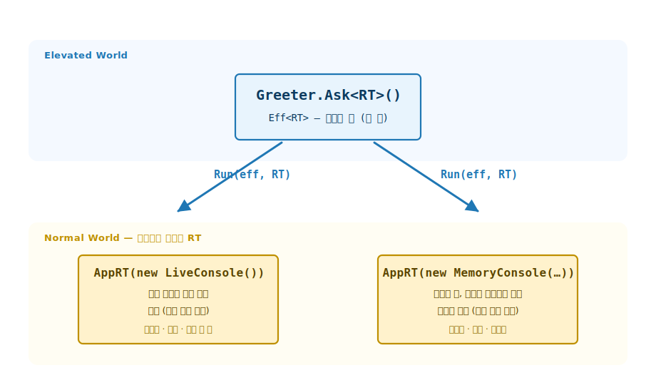
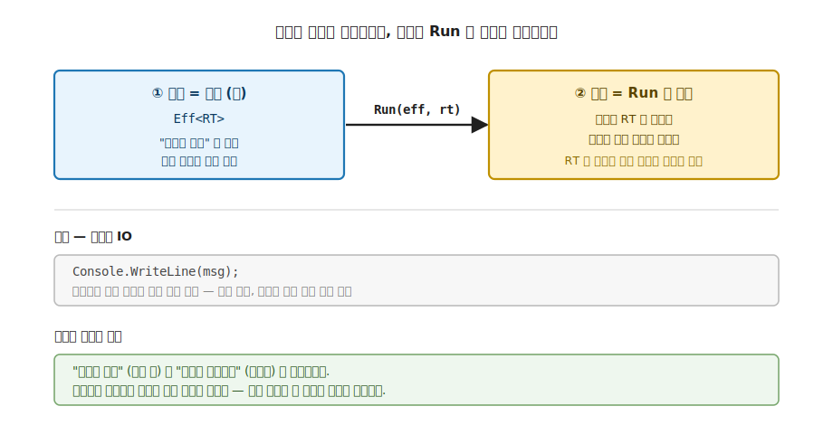
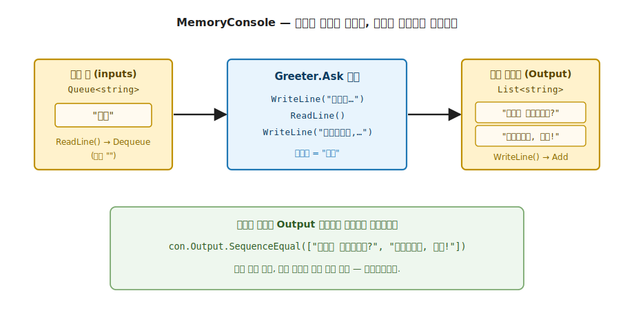

# 36장. 효과 코드의 결정적 테스트 (런타임을 바꿔 끼우는 테스트 더블)

> **이 장의 목표** — 11부의 첫 장으로, 부수 효과가 섞인 코드를 실제 부수 효과 없이 검사하는 길을 엽니다. 이 장을 읽고 나면 7부에서 만든 `Eff<RT>` 가 왜 테스트하기 좋은 모양인지 시그니처로 설명하고, 운영 런타임 대신 `MemoryConsole` 테스트 더블을 주입해 콘솔이 섞인 효과 코드를 결정적으로 검사할 수 있습니다. 순수 함수는 같은 입력에 같은 출력이라 쉽게 테스트되지만 콘솔·파일·시간이 섞이면 검사가 흔들립니다. 효과를 값으로 인코딩하고 런타임만 바꿔 끼우면 그 흔들림이 사라진다는 것을, 직접 작성한 `Eff.Run` 과 단언 코드로 손에 쥐게 됩니다.

> **이 장의 핵심 어휘**
>
> - **`Eff<RT, A>`**: 런타임 `RT` 를 읽어 부수 효과를 실행하는 효과 값. 이 책에서는 `ReaderT<RT, A>` 로 재현하며, 함수 시그니처에는 `K<ReaderTF<RT>, A>` 로 나타납니다
> - **효과는 값 (effect-as-value)**: 부수 효과를 곧바로 일으키지 않고 "무엇을 할지" 만 담은 값으로 두는 설계
> - **테스트 더블**: `MemoryConsole` — 실제 콘솔 대신 입력은 큐, 출력은 리스트로 잡는 가짜 구현
> - **런타임 주입**: `Has<RT, IConsole>` DI 로 운영 런타임 대신 테스트 런타임을 끼우는 자리
> - **결정적 테스트 (deterministic)**: 같은 입력이면 항상 같은 출력. 부수 효과를 값으로 인코딩한 덕분
> - **`Eff.Run`**: 효과 값에 런타임을 넣어 비로소 실행하는 한 자리

> 이 장을 마치면 할 수 있게 되는 것
> - [ ] 명령형 IO 테스트가 왜 실제 콘솔·시간에 묶여 비결정적이고 느린지 설명할 수 있습니다.
> - [ ] `Eff<RT>` 가 효과를 값으로 담고 런타임이 의존성을 쥔다는 것을 시그니처로 짚을 수 있습니다.
> - [ ] `MemoryConsole` 테스트 더블이 입력을 큐로 꺼내고 출력을 리스트로 잡는 구조를 설명할 수 있습니다.
> - [ ] `Eff<RT>` 효과 코드에 `MemoryConsole` 을 주입해 실제 콘솔 없이 실행할 수 있습니다.
> - [ ] 캡처된 출력을 단언으로 검사해 효과 코드를 결정적으로 테스트할 수 있습니다.
> - [ ] 7부의 `Has<RT, Trait>` DI 설계가 테스트 용이성으로 이어지는 자리를 설명할 수 있습니다.
> - [ ] `bool` 헬퍼를 `[Fact]` + `ShouldBe` 로 감싸 표준 테스트로 옮기는 길을 안내할 수 있습니다.

---

## 36.1 1장 비유로 출발 — 효과 테스트는 Elevated World 의 어느 자리인가

36장의 핵심은 한 줄로 압축됩니다. 효과 코드는 부수 효과가 코드에 곧바로 박혀 있어 테스트하기 어렵습니다. 그 부수 효과를 값으로 끌어올려 Elevated World 의 시민으로 다루면 테스트가 결정적이 됩니다. 새 trait 을 배우는 장이 아니라, 7부에서 만든 `Eff<RT>` 가 왜 테스트하기 좋은 모양이었는지를 검증의 눈으로 다시 보는 장입니다.

순수 함수는 이미 기초에서 충분히 테스트했습니다. 같은 입력에 같은 출력이므로, 입력을 넣고 출력을 단언하면 끝입니다. 3장에서 익힌 최소 `ForAll` property 로 임의 입력에까지 법칙을 확인했고, 그 법칙 검증은 4장 ~ 11장 각 장에서 이미 끝났습니다. 11부의 출발점은 그 다음입니다. 콘솔·파일·시간 같은 부수 효과가 섞인 코드를 어떻게 결정적으로 검사하는가입니다.
### 36.1.1 7부에서 만든 `Eff<RT>` 자리 복습

`Eff<RT, A>` 는 7부에서 효과를 값으로 다루려고 만든 타입입니다. 이름은 효과 (effect) 의 줄임이고, 모양은 런타임 `RT` 를 읽어 부수 효과를 실행하는 효과 값입니다. 이 책에서는 그 구조를 `ReaderT<RT, A>` 로 재현합니다. `IO` 는 타입 인자가 아니라 본체 `Func<RT, IO<A>>` 안에 고정되어 있습니다.

```csharp
// ReaderT<RT, A> = Eff<RT, A>. IO 는 본체에 고정.
// (마커 인터페이스 K<ReaderTF<RT>, A> 구현은 여기서 생략 — 7부 참조)
public sealed class ReaderT<RT, A>(Func<RT, IO<A>> run)
{
    public IO<A> Run(RT rt) => run(rt);
}
```

시그니처가 모든 것을 말합니다. `Eff<RT, A>` 는 속을 들여다보면 `Func<RT, IO<A>>`, 곧 런타임 `RT` 를 받아 부수 효과 `IO<A>` 를 돌려주는 함수입니다. 중요한 것은 하나입니다. 이 값을 만드는 것만으로는 아무 부수 효과도 일어나지 않습니다. 런타임 `RT` 를 넣어 `Run` 을 호출해야 비로소 콘솔에 쓰거나 읽습니다. 효과가 값으로 인코딩되어 실행이 한 자리로 미뤄진 것입니다.

표기 하나만 미리 정해 둡니다. 효과 값은 이 책에서 세 모습으로 나타나지만 모두 같은 것입니다.

| 자리 | 표기 |
|---|---|
| 개념 이름 | `Eff<RT, A>` |
| 속 구조 | `ReaderT<RT, A>` (곧 `Func<RT, IO<A>>`) |
| 함수 시그니처 | `K<ReaderTF<RT>, A>` |

함수가 돌려주는 `K<ReaderTF<RT>, A>` 가 곧 효과 값이라고 읽으면 됩니다.

> **이름만 닮은 별개** — 효과를 만드는 함수 모음인 `Eff` 클래스 (`Eff.Run` · `Eff.WriteLine`) 는 위 효과 값 타입과 이름만 닮은 정적 헬퍼입니다. 타입 `Eff<RT, A>` 와 클래스 `Eff` 를 섞지 않습니다.

7부에서는 이 타입으로 효과를 합성하는 법을 봤고, 36장에서는 그 모양이 테스트에서 무엇을 열어 주는지 봅니다.

### 36.1.2 효과는 값, 런타임은 의존성 — 이 장의 1장 매핑

1장의 두 평행 세계로 옮기면 자리가 또렷해집니다. 효과 값 `Eff<RT, A>` 는 부수 효과가라는 효과를 타입에 담아 끌어올린 Elevated World 의 시민입니다. 그 효과를 실제로 일으키는 데 필요한 런타임 `RT` 는 Normal World 에서 바깥에서 주입하는 의존성입니다.

핵심은 둘이 분리되어 있다는 것입니다. "무엇을 할지" (효과 값) 와 "어떻게 실행할지" (런타임) 가 따로 놀므로, 같은 효과 값에 서로 다른 런타임을 넣을 수 있습니다. 운영 런타임을 넣으면 실제 콘솔에 입출력하고, 테스트 런타임을 넣으면 가짜 콘솔로 입출력을 잡습니다. 효과 코드는 한 글자도 바뀌지 않고 런타임만 갈아 끼웁니다. 이 갈아 끼움이 36장의 모든 것입니다.



**그림 36-1. 런타임 주입: 같은 효과 값, 두 런타임** — 위 행 Elevated World 에 효과 값 `Greeter.Ask<RT>()` 한 개가 있습니다. 효과는 값이라 아직 아무 부수 효과도 일으키지 않습니다. `Run(eff, RT)` 이 런타임을 넣어 끌어내릴 때 비로소 실행됩니다. 아래 행 Normal World 에 두 런타임이 있습니다. 왼쪽 `LiveConsole` 을 담은 런타임은 실제 콘솔에 입출력해 운영에 쓰이지만 비결정적이고 느리며 격리되지 않습니다. 오른쪽 `MemoryConsole` 을 담은 런타임은 입력을 큐로, 출력을 리스트로 잡아 결정적이고 빠르며 격리됩니다. 효과 값은 하나인데 런타임만 갈라집니다.

---

## 36.2 왜 필요한가 — 실제 콘솔에 묶인 테스트

효과를 명령형 IO 로 곧장 호출하면 무엇이 번거로운지 먼저 겪어 봅니다. 이름을 묻고 읽어 인사하는 작은 기능을 명령형으로 적으면 다음과 같습니다.

```csharp
// 명령형 IO — 부수 효과가 코드에 곧바로 박혀 있음
static string Greet()
{
    Console.WriteLine("이름이 무엇인가요?");   // 호출 즉시 실제 콘솔에 출력
    var name = Console.ReadLine() ?? "";        // 호출 즉시 실제 콘솔에서 입력
    Console.WriteLine($"안녕하세요, {name}!");
    return name;
}
```

이 함수를 테스트하려고 하면 곧바로 막힙니다. `Greet()` 를 호출하는 순간 진짜 콘솔에 글자가 찍히고, 진짜 키보드 입력을 기다립니다. 자동화된 테스트는 사람이 키보드를 두드릴 수 없으므로 멈춰 버립니다. 출력이 맞는지 확인하려 해도 콘솔에 찍힌 글자를 코드로 되잡을 방법이 마땅치 않습니다.

부수 효과가 콘솔에서 끝나지 않는다는 점이 문제를 키웁니다. 같은 코드가 현재 시각 (`DateTime.Now`) 을 읽거나 파일을 쓰거나 네트워크를 호출하면, 테스트는 실행할 때마다 다른 결과를 봅니다. 시각은 매번 다르고, 파일은 이전 실행이 남긴 상태에 영향을 받고, 네트워크는 느리고 가끔 끊깁니다. 정리하면 명령형 IO 테스트의 불편은 네 가지입니다. 실제 콘솔·시간 같은 외부에 묶이고, 같은 입력에도 결과가 달라져 비결정적이고, 외부 호출이 느리고, 테스트끼리 상태를 공유해 격리되지 않습니다.

> **흔한 함정** — "그러면 테스트할 때만 `Console.SetOut` 으로 출력을 가로채고 가짜 입력 스트림을 끼우면 되지" 로 넘기면, 그 가로채기 코드가 전역 콘솔 상태를 건드려 테스트끼리 간섭하고, 시간·파일·네트워크가 섞이면 부수 효과마다 다른 가로채기를 또 만들어야 합니다. 필요한 것은 **부수 효과를 코드에서 떼어 값으로 인코딩하고, 실행을 한 자리로 모아 그 자리에 가짜를 끼우는** 도구입니다. 그 도구가 7부에서 만든 `Eff<RT>` 와 런타임 주입입니다.

명령형 IO 가 테스트하기 어려운 까닭은 한 곳에 모입니다. 부수 효과가 코드에 곧바로 박혀 있어 "무엇을 할지" 와 "어떻게 실행할지" 가 한 덩어리이기 때문입니다. 효과를 값으로 두는 설계가 이 덩어리를 둘로 가릅니다.

---

## 36.3 효과가 값이고 런타임이 의존성이다

명령형 IO 의 덩어리를 둘로 가르는 첫걸음은 부수 효과를 코드에서 떼어 값으로 두는 것입니다. `Eff<RT>` 가 바로 그 값입니다.

**이 장의 코드 구조**

```
Ch36-Effect-Testing/
├── Types/Effect.cs          ← 효과 스택 (ReaderT<RT, A> = Eff<RT, A>, Has<RT, TRAIT>)
├── Types/Console.cs         ← IConsole + LiveConsole / MemoryConsole 더블 + AppRT
├── Functions/Eff.cs         ← WriteLine / ReadLine / Run (능력 기반 효과)
├── Challenges/Greeter.cs    ← 테스트 대상 효과
├── Tests/EffectTests.cs     ← 결정적 효과 테스트 (36.5절)
└── Program.cs               ← 데모 (예제 1: 더블 주입 / 예제 2: 효과 테스트)
```

### 36.3.1 콘솔 능력을 인터페이스로 — `IConsole`

효과가 콘솔에 의존한다면, 그 콘솔을 직접 부르지 않고 능력 인터페이스로 둡니다. 콘솔이 할 수 있는 일은 두 가지, 한 줄 쓰기와 한 줄 읽기입니다.

```csharp
public interface IConsole
{
    void WriteLine(string line);
    string ReadLine();
}
```

이 인터페이스 하나에 두 구현이 붙습니다. 운영용 `LiveConsole` 은 실제 콘솔에 입출력합니다.

```csharp
public sealed class LiveConsole : IConsole
{
    public void WriteLine(string line) => Console.WriteLine(line);
    public string ReadLine() => Console.ReadLine() ?? "";
}
```

테스트용 `MemoryConsole` 은 실제 콘솔 대신 메모리에 입출력을 담습니다 (자세한 모양은 뒤에서 봅니다). 두 구현이 같은 `IConsole` 을 만족하므로, 효과 코드는 둘 중 어느 것이 들어올지 모른 채 `IConsole` 의 두 메서드만 부릅니다. 이 무관심이 테스트 더블을 끼울 자리를 만듭니다.

### 36.3.2 런타임이 능력을 쥔다 — `Has<RT, IConsole>` 와 `AppRT`

효과 코드가 콘솔 능력을 어디서 얻을지가 다음 질문입니다. 답은 런타임입니다. 런타임 `RT` 가 콘솔 능력을 들고 있다고 약속하는 자리가 `Has<RT, TRAIT>` 입니다.

```csharp
// Has<RT, TRAIT> — 능력 기반 DI (테스트 더블 주입의 토대).
public interface Has<RT, TRAIT> where RT : Has<RT, TRAIT>
{
    static abstract TRAIT Get(RT runtime);
}
```

`Has<RT, IConsole>` 은 "런타임 `RT` 에서 `IConsole` 능력을 꺼낼 수 있다" 는 약속입니다. 이 약속을 만족하는 구체 런타임이 `AppRT` 입니다. 생성자로 `IConsole` 을 받아 두고, `Get` 으로 그것을 돌려줍니다.

```csharp
public sealed record AppRT(IConsole Console) : Has<AppRT, IConsole>
{
    public static IConsole Get(AppRT rt) => rt.Console;
}
```

여기가 테스트 더블 주입의 토대입니다. `AppRT` 에 `LiveConsole` 을 담아 만들면 운영 런타임이 되고, `MemoryConsole` 을 담아 만들면 테스트 런타임이 됩니다. 효과 코드는 `RT.Get(rt)` 으로 콘솔 능력을 꺼낼 뿐, 그 속이 진짜 콘솔인지 가짜인지 알지 못합니다.

### 36.3.3 능력 기반 효과 — `Eff.WriteLine` 과 `Eff.ReadLine`

콘솔에 한 줄 쓰는 효과를 값으로 적으면 다음과 같습니다. 런타임에서 콘솔 능력을 꺼내고, 그 능력으로 쓰는 부수 효과를 `IO` 로 끌어올립니다.

```csharp
public static K<ReaderTF<RT>, Unit> WriteLine<RT>(string msg) where RT : Has<RT, IConsole> =>
    from con in ReaderTF<RT>.Asks(rt => RT.Get(rt))
    from _ in ReaderTF<RT>.LiftIO(new IO<Unit>(() => { con.WriteLine(msg); return Unit.Default; }))
    select _;

public static K<ReaderTF<RT>, string> ReadLine<RT>() where RT : Has<RT, IConsole> =>
    from con in ReaderTF<RT>.Asks(rt => RT.Get(rt))
    from line in ReaderTF<RT>.LiftIO(new IO<string>(con.ReadLine))
    select line;
```

제약 `where RT : Has<RT, IConsole>` 이 핵심입니다. 이 효과는 콘솔 능력을 가진 런타임에서만 실행된다고 시그니처가 보장합니다. 여기서 `Asks` 는 런타임을 읽어 오는 자리, `LiftIO` 는 실제 쓰기·읽기 부수 효과를 효과 값으로 끌어올리는 자리입니다 (두 이름의 세부는 7부). `Asks(rt => RT.Get(rt))` 가 런타임에서 콘솔을 꺼내고, `LiftIO` 가 실제 쓰기·읽기 부수 효과를 효과 값으로 끌어올립니다. 다시 말하지만 이 효과 값을 만드는 것만으로는 콘솔에 아무것도 찍히지 않습니다. 실행은 `Run` 한 자리에 모입니다.

```csharp
public static A Run<RT, A>(K<ReaderTF<RT>, A> eff, RT rt) => ((ReaderT<RT, A>)eff).Run(rt).Run();
```

`Run` 은 효과 값에 런타임 `rt` 를 넣어 `ReaderT.Run(rt)` 으로 안쪽 `IO` 를 꺼낸 뒤, 그 `IO.Run()` 으로 부수 효과를 실제로 일으킵니다. 어떤 런타임을 넣느냐가 이 한 줄에서 결과를 가릅니다.



**그림 36-2. 효과는 값, 실행은 Run 한 자리** — 왼쪽 효과 값 `Eff<RT>` 는 "무엇을 할지" 만 담은 명세라 아직 콘솔에 쓰지 않습니다. `Run(eff, rt)` 이 런타임을 넣을 때 비로소 부수 효과가 일어나고, 런타임을 바꾸면 같은 효과의 결과가 바뀝니다. 아래 대비 행의 명령형 IO 는 `Console.WriteLine(msg)` 를 호출하는 순간 곧바로 부수 효과를 일으켜, 미룰 수도 가짜로 바꿀 수도 없습니다. 효과를 값으로 두면 "무엇을 할지" 와 "어떻게 실행할지" 가 분리되어, 테스트는 런타임만 가짜로 바꿔 끼우면 됩니다.

> **여기까지의 안전망** — `from … from … select` 로 적힌 효과 합성이나 `Has<RT, IConsole>` 제약이 처음엔 복잡해 보여도 괜찮습니다. 반환 타입 `K<ReaderTF<RT>, A>` 는 2부에서 본 higher-kind 우회 표기로, `RT` 를 읽어 부수 효과를 실행하는 효과 값을 가리킵니다. `Asks` 는 런타임을 읽는 자리, `LiftIO` 는 실제 부수 효과를 효과로 끌어올리는 자리 정도만 가져가면 충분합니다. 지금 가져갈 직감은 하나입니다. 효과는 런타임을 받아야 실행되는 값이고, 그 런타임을 바꿔 끼울 수 있다는 것입니다. 합성의 세부는 7부에서 다뤘고, 이 장에서 필요한 것은 갈아 끼울 수 있다는 것뿐입니다.

---

## 36.4 `MemoryConsole` 더블 주입 — `Greeter.Ask` walkthrough

### 36.4.1 테스트 더블 `MemoryConsole`

실제 콘솔을 대신할 가짜가 `MemoryConsole` 입니다. 모양은 단순합니다. 입력은 큐에서 꺼내고, 출력은 리스트에 담습니다.

```csharp
// MemoryConsole — 테스트 더블. 입력은 큐, 출력은 리스트 (결정적·검증 가능).
public sealed class MemoryConsole(IEnumerable<string> inputs) : IConsole
{
    readonly Queue<string> queue = new(inputs);
    public List<string> Output { get; } = [];
    public void WriteLine(string line) => Output.Add(line);
    public string ReadLine() => queue.Count > 0 ? queue.Dequeue() : "";
}
```

`WriteLine` 은 콘솔에 찍는 대신 `Output` 리스트에 한 줄을 더합니다. `ReadLine` 은 키보드를 기다리는 대신 미리 넣어 둔 입력 큐에서 한 줄을 꺼냅니다 (큐가 비면 빈 문자열). 두 가지가 테스트 더블의 전부입니다. 생성자에 입력을 미리 주므로 키보드가 필요 없고, 출력을 리스트로 잡으므로 실행이 끝난 뒤 무엇이 찍혔는지 코드로 확인할 수 있습니다.



**그림 36-3. `MemoryConsole`: 입력은 큐, 출력은 리스트** — 왼쪽 입력 큐에 미리 넣어 둔 `"철수"` 가 들어 있고, `ReadLine()` 이 호출되면 큐에서 꺼냅니다 (비면 빈 문자열). 가운데 `Greeter.Ask` 가 실행되며 쓰기·읽기·쓰기를 차례로 부르고 반환값 `"철수"` 를 냅니다. 오른쪽 출력 리스트에 `WriteLine()` 이 부를 때마다 한 줄씩 쌓여 두 줄이 담깁니다. 실행이 끝나면 이 출력 리스트를 단언으로 검사하므로, 실제 콘솔 없이 같은 입력이 항상 같은 출력을 내는 것을 확인할 수 있습니다.

### 36.4.2 테스트 대상 효과 — `Greeter.Ask`

검사할 효과는 `Greeter.Ask` 입니다. 이름을 묻고, 읽고, 인사하고, 그 이름을 돌려줍니다.

```csharp
// 테스트 대상 효과 — 이름을 묻고, 읽고, 인사한다. RT 가 콘솔 능력을 가지면 동작.
// 같은 코드가 LiveConsole(실제) 또는 MemoryConsole(테스트) 어느 런타임에서도 실행된다.
public static class Greeter
{
    public static K<ReaderTF<RT>, string> Ask<RT>() where RT : Has<RT, IConsole> =>
        from _1 in Eff.WriteLine<RT>("이름이 무엇인가요?")
        from name in Eff.ReadLine<RT>()
        from _2 in Eff.WriteLine<RT>($"안녕하세요, {name}!")
        select name;
}
```

`Greeter.Ask<RT>()` 는 앞서 본 명령형 `Greet()` 과 하는 일이 같습니다. 그러나 결정적인 차이가 있습니다. 명령형 `Greet()` 은 `Console` 을 직접 부르므로 실제 콘솔에 묶이지만, `Greeter.Ask` 는 `Eff.WriteLine` / `Eff.ReadLine` 으로 콘솔 능력에만 의존하므로 어느 런타임이 들어올지 모른 채 효과 값을 만들 뿐입니다. 제약 `where RT : Has<RT, IConsole>` 만 만족하면 운영 런타임에서도 테스트 런타임에서도 같은 코드가 실행됩니다.

### 36.4.3 더블을 주입해 실행하기

이제 `MemoryConsole` 을 담은 `AppRT` 를 만들어 `Greeter.Ask` 를 실행합니다. 입력으로 `"철수"` 하나를 미리 넣어 둡니다.

```csharp
var con = new MemoryConsole(["철수"]);
var name = Eff.Run(Greeter.Ask<AppRT>(), new AppRT(con));
```

`Eff.Run(Greeter.Ask<AppRT>(), new AppRT(con))` 이 효과 값에 테스트 런타임을 넣어 실행합니다. 실제 콘솔은 한 번도 건드리지 않습니다. `WriteLine` 은 `con.Output` 리스트에 쌓이고, `ReadLine` 은 큐에서 `"철수"` 를 꺼냅니다. `Program.cs` 의 데모를 돌리면 예제 1 블록에서 다음 부분이 찍힙니다.

```text
== 예제 1 — MemoryConsole 주입 (실제 콘솔 없이) ==
  반환값 = 철수
  캡처된 출력 = [이름이 무엇인가요? / 안녕하세요, 철수!]
  → 같은 Greeter 코드가 LiveConsole 이면 실제 입출력, MemoryConsole 이면 테스트.
```

반환값은 큐에서 꺼낸 `"철수"` 이고, 캡처된 출력은 쓰기 두 번이 리스트에 쌓인 두 줄입니다. 실제 콘솔 없이 효과의 입력과 출력을 모두 코드로 쥐었습니다. 이렇게 코드로 쥐면 단언할 수 있습니다.

---

## 36.5 효과 테스트 작성 — `EffectTests`

이 절이 이 장의 payoff 입니다. 실제 콘솔 없이 같은 입력이 항상 같은 출력을 내는 것을 결정적으로 확인합니다. `EffectTests` 의 세 헬퍼가 출력 정확성, 입력별 변화, 결정성을 차례로 검사합니다.

### 36.5.1 출력이 정확한가

첫 헬퍼는 반환값과 캡처된 출력을 모두 단언합니다.

```csharp
public static bool GreetingOutputsCorrectly()
{
    var con = new MemoryConsole(["철수"]);
    var name = Eff.Run(Greeter.Ask<AppRT>(), new AppRT(con));
    return name == "철수"
        && con.Output.SequenceEqual(["이름이 무엇인가요?", "안녕하세요, 철수!"]);
}
```

`MemoryConsole(["철수"])` 로 입력을 고정하고, `Eff.Run` 으로 테스트 런타임에서 실행합니다. 반환값이 큐에서 꺼낸 `"철수"` 인지, 그리고 `con.Output` 이 쓰기 두 줄과 정확히 같은지 (`SequenceEqual`) 를 함께 확인합니다. 실제 콘솔이 없으므로 사람이 키보드를 두드릴 필요도, 화면을 눈으로 볼 필요도 없습니다.

### 36.5.2 입력이 바뀌면 출력이 바뀌는가

둘째 헬퍼는 입력을 `"영희"` 로 바꿔, 마지막 출력 줄이 따라 바뀌는지 봅니다.

```csharp
public static bool DifferentInputDifferentOutput()
{
    var con = new MemoryConsole(["영희"]);
    Eff.Run(Greeter.Ask<AppRT>(), new AppRT(con));
    return con.Output[^1] == "안녕하세요, 영희!";
}
```

입력 큐에 `"영희"` 를 넣으면 `ReadLine` 이 그것을 꺼내고, 마지막 `WriteLine` 이 `"안녕하세요, 영희!"` 를 리스트에 담습니다. `con.Output[^1]` 로 마지막 줄을 꺼내 단언합니다. 입력을 마음대로 정할 수 있으므로 여러 시나리오를 코드로 돌릴 수 있습니다.

### 36.5.3 결정적인가

셋째 헬퍼가 결정성을 정면으로 확인합니다. 같은 입력으로 두 번 실행해 출력이 같은지 봅니다.

```csharp
// 부수 효과가 전혀 없다 — 같은 입력은 항상 같은 출력 (결정적).
public static bool DeterministicHolds()
{
    string Run()
    {
        var con = new MemoryConsole(["민수"]);
        Eff.Run(Greeter.Ask<AppRT>(), new AppRT(con));
        return string.Join("|", con.Output);
    }
    return Run() == Run();
}
```

지역 함수 `Run()` 이 매번 새 `MemoryConsole(["민수"])` 로 실행해 출력을 한 문자열로 잇습니다. 두 번 부른 결과가 같으므로 (`Run() == Run()`) 효과 코드가 결정적임이 확인됩니다. 외부에 묶이지 않고 부수 효과가 값으로 인코딩되어 있으므로 단언할 수 있습니다. 명령형 `Greet()` 이었다면 두 번째 실행이 키보드 입력을 기다리며 멈췄을 자리입니다.

세 검사를 데모로 돌리면 다음이 찍힙니다.

```text
== 예제 2 — 효과 테스트 (결정적) ==
  출력 정확 : 통과
  입력별 출력 변화 : 통과
  결정성(같은 입력→같은 출력) : 통과

모든 검증 통과 [OK]
```

> **실무 노트** — 이 책의 `EffectTests` 는 의존성 없이 `bool` 을 돌려주는 헬퍼로 만들어, 테스트의 뼈대 (더블 주입 + 단언) 를 그대로 드러냅니다. 실무에서는 같은 헬퍼를 xUnit + Shouldly 표준 테스트로 옮깁니다. 메서드에 `[Fact]` 를 붙이고 `return name == "철수" && …` 를 `name.ShouldBe("철수"); con.Output.ShouldBe([…]);` 로 바꾸면 그대로 표준 테스트가 됩니다. 더블 주입과 결정성이라는 본질은 토씨 하나 달라지지 않습니다.

---

## 36.6 7부 `Has<RT, Trait>` DI 가 테스트 용이성으로 이어진다

지금까지의 모든 것이 한 곳에서 나옵니다. 7부에서 `Has<RT, Trait>` 로 능력 기반 DI 를 설계한 결정이, 36장의 테스트 용이성을 그대로 낳았습니다.

7부에서 `Eff<RT>` 의 런타임 `RT` 가 능력을 쥐도록 만든 까닭은 효과를 합성하기 위해서였습니다. 그런데 같은 설계가 검증에서 뜻밖의 선물을 줍니다. 런타임이 능력의 출처이므로, 운영 런타임을 테스트 런타임으로 바꾸기만 하면 능력의 구현이 통째로 갈립니다. 효과 코드는 `RT.Get(rt)` 로 능력을 꺼낼 뿐 그 속을 모르므로, 진짜 콘솔이 가짜 콘솔로 바뀐 줄도 모른 채 같은 코드로 실행됩니다.

```csharp
// 같은 효과, 런타임만 다름 — 효과 코드는 한 글자도 바뀌지 않습니다.
var live = Eff.Run(Greeter.Ask<AppRT>(), new AppRT(new LiveConsole()));    // 운영: 실제 콘솔
var test = Eff.Run(Greeter.Ask<AppRT>(), new AppRT(new MemoryConsole(["철수"])));  // 테스트: 더블
```

`Greeter.Ask<AppRT>()` 효과 값은 두 줄에서 똑같습니다. 다른 것은 `Eff.Run` 의 둘째 인자, 곧 어떤 `IConsole` 을 담은 런타임이냐뿐입니다. 의존성 주입이 테스트 더블 주입과 같은 자리라는 것이 이 장의 결론입니다. 7부의 `Has<RT, Trait>` 가 효과 합성의 도구이자 동시에 테스트 더블을 끼우는 자리였습니다.

이 설계가 콘솔 너머로 그대로 확장됩니다. 시각을 읽는 능력 `IClock`, 파일을 다루는 능력 `IFileSystem` 도 같은 모양입니다. 운영 런타임에는 실제 시계·파일 시스템을, 테스트 런타임에는 고정된 시각을 돌려주는 더블과 메모리 파일 시스템을 담습니다. 부수 효과가 콘솔이든 시간이든 파일이든, 능력 인터페이스로 두고 런타임으로 주입하면 모두 결정적으로 검사됩니다.

> **한 줄 정리** — 효과를 값으로 인코딩하고 능력을 런타임으로 주입하면, 테스트는 런타임만 더블로 바꿔 끼우는 일이 됩니다. 7부의 DI 설계가 곧 테스트 용이성입니다.

### 36.6.1 실제 LanguageExt 와의 1:1 대응

이 장의 toy 구조는 입문을 위해 직접 만든 의존성 0 학습용 코드이지만, 모양은 실제 LanguageExt v5 의 `LanguageExt.Sys` 런타임과 거의 그대로 포개집니다. 이 책의 도달점이 "본문을 마치면 라이브러리 코드를 익숙한 패턴의 변형으로 읽는다" 인 만큼, 마지막으로 그 대응을 한 번 짚어 둡니다. toy 의 콘솔 능력 `IConsole` 은 실제로는 `ConsoleIO` 능력이고, toy 의 `Eff.WriteLine<RT>` · `Eff.ReadLine<RT>` 정적 헬퍼는 실제로는 `Console<RT>.writeLine` · `Console<RT>.readLine` 입니다. 실행을 모으는 `Eff.Run(eff, new AppRT(con))` 한 자리는 실제로는 `.Run(Runtime.New(), EnvIO.New())` 로 나타나고, 운영 런타임은 `LanguageExt.Sys.Live`, 테스트 런타임은 `LanguageExt.Sys.Test` 가 제공합니다. 특히 그 테스트 런타임의 환경은 이 책의 더블과 **같은 이름의 정식 클래스** `MemoryConsole` 을 들고 있습니다. 곧 toy 의 `AppRT(IConsole)` 가 `MemoryConsole` 을 담아 테스트 런타임이 되던 구조가, 실물에서는 `Runtime` 의 환경이 `MemoryConsole` 을 담는 구조로 그대로 이어집니다.

한 줄의 차이만 짚어 둡니다. 이 책은 입문을 위해 능력 제약을 `Has<RT, IConsole>` 로 단순화했으나, 실물의 트레이트 파라미터는 런타임 자신이 아니라 효과 타입 `Eff<RT>` 라 `Has<Eff<RT>, ConsoleIO>` 로 적힙니다. 아래는 실제 LanguageExt 샘플 (EffectsExamples 의 `RetryExample`) 의 효과 본체를 핵심만 간추린 것으로, 이 책 프로젝트의 빌드 대상이 아닌 참조용입니다.

```csharp
// 참조용 — 실제 LanguageExt 샘플(EffectsExamples/RetryExample) 에서 retry/guard 를 덜어내고 핵심만 간추림.
// 이 책 프로젝트의 빌드 대상이 아닙니다. toy 의 Greeter.Ask 와 같은 모양만 보입니다.
public static class RetryExample<RT>
    where RT : Has<Eff<RT>, ConsoleIO>        // toy 의 where RT : Has<RT, IConsole> 자리
{
    public static Eff<RT, Unit> main =>       // 반환은 효과 값 Eff<RT, Unit>
        from _ in Console<RT>.writeLine("Say hello")   // toy 의 Eff.WriteLine<RT> 자리
        from t in Console<RT>.readLine                 // toy 의 Eff.ReadLine<RT> 자리
        select unit;
}
```

`from … from … select` 로 쓰기·읽기를 엮어 효과 값 하나를 만들고, 능력 제약을 시그니처에 명시하는 모양이 이 장의 `Greeter.Ask` 와 같습니다. 본문에서 직접 만든 toy 가 라이브러리에서는 이 모습이라고 읽으면 됩니다.

---

## 36.7 직접 해보기 — 챌린지

본문을 읽은 것과 손으로 더블을 끼워 검사할 수 있는 것의 차이를 만듭니다. 세 챌린지는 36장의 결정적 자리 (더블 주입, 입력 시나리오, 능력의 확장) 를 직접 묻습니다. 세 정답 모두 실행 가능한 코드로 들어 있습니다.

### 36.7.1 빈 입력으로 실행해 보기

> 챌린지: 입력 큐가 빈 `MemoryConsole` 로 `Greeter.Ask` 를 실행해 결과를 예측하기
>
> `new MemoryConsole([])` 처럼 입력을 하나도 넣지 않고 `Greeter.Ask<AppRT>()` 를 실행하면 반환값과 캡처된 출력이 어떻게 되는지 예측하고 확인합니다.
>
> **본문 어느 자리의 이해도를 묻는가**
>
> 1. `MemoryConsole.ReadLine` — 큐가 비면 빈 문자열을 돌려준다는 것.
> 2. `Greeter.Ask` 의 마지막 인사 줄이 읽은 이름을 그대로 끼워 넣는다는 것.
>
> **해보기**
>
> 1. `var con = new MemoryConsole([]);` 로 빈 큐 더블을 만듭니다.
> 2. `Eff.Run(Greeter.Ask<AppRT>(), new AppRT(con))` 의 반환값을 예측합니다.
> 3. `con.Output` 의 두 줄이 무엇이 되는지 예측·확인합니다.
>
> **검증 포인트**
>
> - 반환값이 빈 문자열인가?
> - 마지막 출력이 `"안녕하세요, !"` 인가?
>
> 확인 방법: 별도 정답 파일이 아니라 `Tests/EffectTests.cs` 의 `GreetingOutputsCorrectly` 패턴에서 입력만 `new MemoryConsole([])` 로 바꿔 직접 돌려 봅니다.

### 36.7.2 새 능력 추가 — `IClock` 으로 시각 더블 끼우기

> 챌린지: 시각을 읽는 능력 `IClock` 을 더해 시간이 섞인 효과를 결정적으로 검사하기
>
> 콘솔 능력 `IConsole` 과 같은 모양으로 시각 능력 `IClock` 을 추가합니다. 운영 런타임에는 실제 시각을, 테스트 런타임에는 고정된 시각을 돌려주는 더블을 담아, 시간이 섞인 효과가 결정적이 됨을 보입니다.
>
> **본문 어느 자리의 이해도를 묻는가**
>
> 1. `IConsole` + `LiveConsole` / `MemoryConsole` 의 능력과 두 구현 구조를 그대로 옮길 수 있는가.
> 2. `Has<RT, Trait>` 가 능력마다 런타임에서 꺼내 주는 자리라는 것.
>
> **해보기**
>
> 1. `IClock { DateTime Now(); }` 와 운영용 `LiveClock`, 테스트용 `FixedClock(DateTime fixed)` 를 만듭니다.
> 2. `AppRT` 가 `IClock` 도 담고 `Has<AppRT, IClock>` 도 만족하게 합니다.
> 3. 시각을 읽어 출력하는 효과를 만들고, `FixedClock` 더블로 결정적 출력을 단언합니다.
>
> **검증 포인트**
>
> - `FixedClock` 더블로 두 번 실행하면 같은 시각이 나오는가?
> - 효과 코드가 `IClock` 의 구체 구현을 모른 채 동작하는가?
>
> 확장 방향: `Types/Console.cs` 의 `IConsole` + `LiveConsole` / `MemoryConsole` 구조를 그대로 본떠 `IClock` + `LiveClock` + `FixedClock` 을 새로 작성하고, `AppRT` 가 `Has<AppRT, IClock>` 도 만족하게 합니다.

### 36.7.3 `bool` 헬퍼를 `[Fact]` 로 옮기기

> 챌린지: `EffectTests` 의 세 헬퍼를 xUnit + Shouldly 표준 테스트로 옮기기
>
> `GreetingOutputsCorrectly` 같은 `bool` 헬퍼를 `[Fact]` 메서드로 바꾸고, `&&` 로 묶은 단언을 `ShouldBe` 로 풉니다. 더블 주입과 결정성이라는 본질이 그대로 유지됨을 확인합니다.
>
> **본문 어느 자리의 이해도를 묻는가**
>
> 1. `EffectTests` 의 더블 주입 + 단언 구조가 표준 테스트의 뼈대와 같다는 것.
> 2. 실무 노트의 이행 방식 (`[Fact]` + `ShouldBe`) 을 적용할 수 있는가.
>
> **해보기**
>
> 1. 메서드에서 `bool` 반환을 없애고 `[Fact]` 를 붙입니다.
> 2. `return name == "철수" && con.Output.SequenceEqual([…]);` 를 `name.ShouldBe("철수"); con.Output.ShouldBe([…]);` 로 바꿉니다.
> 3. 세 헬퍼 모두 옮겨, 더블 주입 부분 (`Eff.Run(…, new AppRT(con))`) 은 그대로임을 확인합니다.
>
> **검증 포인트**
>
> - 더블 주입 코드가 한 글자도 바뀌지 않았는가?
> - 단언만 `ShouldBe` 로 바뀌고 테스트의 의미는 같은가?
>
> 이행 안내: `Tests/EffectTests.cs` 의 세 헬퍼를 `[Fact]` 형태로 옮기는 방식은 11부 README (`Part11-FunctionalTesting/README.md`) 와 앞서 본 실무 노트에 정합합니다.

### 36.7.4 세 챌린지가 노리는 능력

세 챌린지는 36장의 핵심 (효과는 값이고 런타임이 의존성이라 더블을 끼워 결정적으로 검사한다) 을 세 각도에서 묻습니다. 첫째는 더블의 입력 시나리오를 마음대로 정해 결과를 예측하는 능력, 둘째는 콘솔 너머의 새 능력 (시간) 으로 같은 패턴을 확장하는 능력, 셋째는 학습용 `bool` 헬퍼를 실무 표준 테스트로 옮기는 능력입니다. 셋을 다 통과하면 "부수 효과가 섞인 코드를 어떻게 결정적으로 검사하는가" 를 코드로 답할 수 있습니다.

---

## 36.8 Elevated World 어휘로 다시 읽기

36장의 도구를 1장 비유에 매핑합니다.

| 36장 도구 | Elevated World 어휘 |
|---|---|
| `Eff<RT, A>` | 효과 = 부수 효과. 런타임을 받아야 실행되는 Elevated 시민 |
| `Run(eff, rt)` | 끌어내림 — 효과 값에 런타임을 넣어 Normal 의 결과로 실행 |
| `Has<RT, IConsole>` | 능력을 런타임에서 꺼내는 자리 (의존성 주입) |
| `MemoryConsole` 더블 | 같은 효과 값에 끼우는 Normal World 의 가짜 능력 |

7부의 `Eff<RT>` 가 효과를 합성 가능한 Elevated 시민으로 끌어올린 도구였다면, 36장은 그 효과 값에 런타임만 바꿔 끼워 결정적으로 검사한다는 실전입니다. 효과는 값이라 실행이 미뤄지고, 미뤄진 실행에 가짜 런타임을 끼우는 자리가 검증입니다. 비유는 여기까지가 역할입니다. 어떤 더블을 끼울지는 검사하려는 부수 효과가 정합니다.

---

## 36.9 Q&A — 자기 점검

> **Q1. 순수 함수는 이미 테스트했는데, 효과 코드는 왜 따로 다룹니까?** (36.1절)

순수 함수는 같은 입력에 같은 출력이라 입력을 넣고 출력을 단언하면 끝나고, 그 법칙 검증은 기초의 각 장에서 `ForAll` property 로 이미 끝났습니다. 그러나 콘솔·파일·시간 같은 부수 효과가 섞이면 결과가 외부에 묶여 흔들립니다. 11부는 그 다음, 부수 효과가 섞인 효과 코드를 결정적으로 검사하는 전문 영역을 다룹니다. 36장은 그 첫 자리입니다.

> **Q2. 명령형 IO 테스트가 어려운 까닭은 무엇입니까?** (36.2절)

부수 효과가 코드에 곧바로 박혀 "무엇을 할지" 와 "어떻게 실행할지" 가 한 덩어리이기 때문입니다. `Console.WriteLine` 을 부르는 순간 실제 콘솔에 찍히고, `Console.ReadLine` 은 키보드를 기다립니다. 그 결과 테스트가 실제 콘솔·시간에 묶이고, 같은 입력에도 결과가 달라져 비결정적이고, 외부 호출이 느리고, 테스트끼리 상태를 공유해 격리되지 않습니다.

> **Q3. 효과를 값으로 둔다는 것이 무슨 뜻입니까?** (36.3절)

부수 효과를 곧바로 일으키지 않고 "무엇을 할지" 만 담은 값으로 둔다는 뜻입니다. `Eff<RT, A>` 는 속을 보면 `Func<RT, IO<A>>` 라, 만드는 것만으로는 콘솔에 아무것도 찍히지 않습니다. 런타임 `RT` 를 넣어 `Run` 을 부를 때 비로소 실행됩니다. 실행이 한 자리로 미뤄지므로, 그 자리에 어떤 런타임을 넣느냐로 동작을 바꿀 수 있습니다.

> **Q4. `MemoryConsole` 은 어떻게 실제 콘솔을 대신합니까?** (36.4.1절)

`IConsole` 의 두 메서드를 메모리로 구현합니다. `WriteLine` 은 콘솔에 찍는 대신 `Output` 리스트에 한 줄을 더하고, `ReadLine` 은 키보드를 기다리는 대신 생성자로 미리 받은 입력 큐에서 한 줄을 꺼냅니다 (비면 빈 문자열). 입력을 미리 정하므로 키보드가 필요 없고, 출력을 리스트로 잡으므로 실행 뒤 무엇이 찍혔는지 단언으로 확인할 수 있습니다.

> **Q5. 효과 코드는 진짜 콘솔인지 가짜인지 어떻게 모릅니까?** (36.4.2절)

`Greeter.Ask` 가 `Console` 을 직접 부르지 않고 `IConsole` 능력에만 의존하기 때문입니다. 효과는 `RT.Get(rt)` 으로 콘솔 능력을 꺼낼 뿐, 그 속이 `LiveConsole` 인지 `MemoryConsole` 인지 알지 못합니다. 제약 `where RT : Has<RT, IConsole>` 만 만족하면 어느 런타임에서도 같은 코드가 실행되므로, 더블을 끼워도 효과 코드는 한 글자도 바뀌지 않습니다.

> **Q6. 결정적이라는 것을 코드로 어떻게 확인합니까?** (36.5.3절)

같은 입력으로 두 번 실행해 출력이 같은지 봅니다. `DeterministicHolds` 는 매번 새 `MemoryConsole(["민수"])` 로 실행해 출력을 한 문자열로 잇고, 두 번 부른 결과가 같은지 (`Run() == Run()`) 를 단언합니다. 부수 효과가 값으로 인코딩되어 외부에 묶이지 않으므로 같은 입력은 항상 같은 출력을 냅니다. 명령형이었다면 두 번째 실행이 키보드를 기다리며 멈췄을 자리입니다.

> **Q7. 7부의 DI 설계가 테스트와 무슨 관계입니까?** (36.6절)

같은 자리입니다. 7부에서 효과를 합성하려고 런타임 `RT` 가 능력을 쥐게 한 `Has<RT, Trait>` 설계가, 검증에서는 테스트 더블을 끼우는 자리가 됩니다. 운영 런타임을 테스트 런타임으로 바꾸면 능력의 구현이 통째로 갈리고, 효과 코드는 능력의 속을 모르므로 그대로 실행됩니다. 의존성 주입과 테스트 더블 주입이 한 설계의 두 쓰임입니다.

> **Q8. 콘솔 말고 시간·파일도 같은 방식으로 테스트합니까?** (36.6절)

그렇습니다. 시각을 읽는 능력 `IClock`, 파일을 다루는 능력 `IFileSystem` 도 `IConsole` 과 같은 모양입니다. 운영 런타임에는 실제 시계·파일 시스템을, 테스트 런타임에는 고정 시각 더블과 메모리 파일 시스템을 담습니다. 부수 효과가 무엇이든 능력 인터페이스로 두고 런타임으로 주입하면 모두 결정적으로 검사됩니다. 새 능력을 더하는 것이 36.7.2 챌린지입니다.

---

## 36.10 요약

- **순수 함수의 법칙 검증은 이미 끝났습니다.** 11부는 그 다음, 부수 효과가 섞인 효과 코드를 결정적으로 검사하는 전문 영역입니다 (36.1절).
- **명령형 IO 는 테스트하기 어렵습니다.** 부수 효과가 코드에 박혀 실제 콘솔·시간에 묶이고, 비결정적이고, 느리고, 격리되지 않습니다 (36.2절).
- **효과를 값으로 인코딩합니다.** `Eff<RT>` 는 만드는 것만으로는 부수 효과가 없고, 런타임을 넣어 `Run` 할 때 실행됩니다 (36.3절).
- **`MemoryConsole` 이 실제 콘솔을 대신합니다.** 입력은 큐로 꺼내고 출력은 리스트로 잡아, 실제 콘솔 없이 입출력을 코드로 쥡니다 (36.4절).
- **더블을 주입해 결정적으로 검사합니다.** 출력 정확성·입력별 변화·결정성을 단언으로 확인합니다 (36.5절).
- **7부의 DI 가 테스트 용이성입니다.** `Has<RT, Trait>` 로 능력을 런타임에 주입한 설계가 곧 테스트 더블을 끼우는 자리입니다 (36.6절).
- **실무로 옮기기는 한 걸음입니다.** `bool` 헬퍼에 `[Fact]` 를 붙이고 단언을 `ShouldBe` 로 바꾸면 표준 테스트가 됩니다 (36.5.3절).

---

## 36.11 다음 장으로 — 마무리 (37장 동시·스트리밍 다리)

| 장 | 대상 | 핵심 | 검증의 어려움 |
|---|---|---|---|
| **이 장 (36장)** | **효과 코드** (`Eff<RT>`) | **런타임 더블 주입** | **부수 효과** |
| 다음 장 (37장) | 동시 · 스트리밍 · 자원 | 비결정성 길들이기 | 시간 · 수명 |
| 38장 | 임의 입력 성질 | 생성기 + 축소 | 무한한 입력 공간 |

36장에서 부수 효과를 값으로 인코딩하고 런타임을 바꿔 끼워 효과 코드를 결정적으로 검사했습니다. 37장은 그 검사를 가장 까다로운 영역으로 밀고 갑니다. 동시성·스트리밍·자원 수명은 부수 효과에 더해 시간과 비결정성이 얽혀 있어, STM 의 원자성을 결정적으로 확인하고, 스트림을 골든 테스트로 검사하며, Schedule 의 재시도 횟수와 Resource 의 개폐 순서 같은 수명을 검사하는 전용 도구가 필요합니다. 9 ~ 10부에서 만든 동시·스트리밍 효과가 테스트로 이어지는 자리입니다. [37장 — 동시 · 스트리밍 · 자원 효과 테스트](./Ch37-Concurrent-Streaming.md) 로 넘어갑니다.

> **실무 디딤돌** — 효과 코드의 결정적 테스트는 실무에서 콘솔·시간·파일·네트워크가 섞인 코드를 검사하는 표준 자리입니다. 능력을 인터페이스로 두고 런타임으로 주입하는 설계는 그대로 두고, 학습용 `bool` 헬퍼만 xUnit + Shouldly 로 옮기면 됩니다. 메서드에 `[Fact]` 를 붙이고 단언을 `ShouldBe` 로 감싸면 더블 주입과 결정성이라는 본질은 그대로 표준 테스트가 됩니다.
>
> **테스트 디딤돌** — 이 장이 콘솔 효과를 런타임 더블 (`Eff.Run(eff, new AppRT(con))`) 로 결정화했다면, 37장은 더블을 끼울 런타임이 없는 비결정 효과 (동시·스트리밍·자원) 를 다룹니다. 도구가 바뀝니다. 더블 주입 대신, 비결정에서 결정적 불변식 (최종값 · 횟수 · LIFO 순서 · 골든 시퀀스) 을 끌어내려 단언합니다. 같은 결정적 검사의 정신이 가장 까다로운 영역으로 이어집니다.
