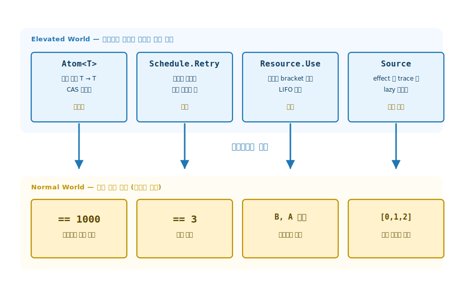
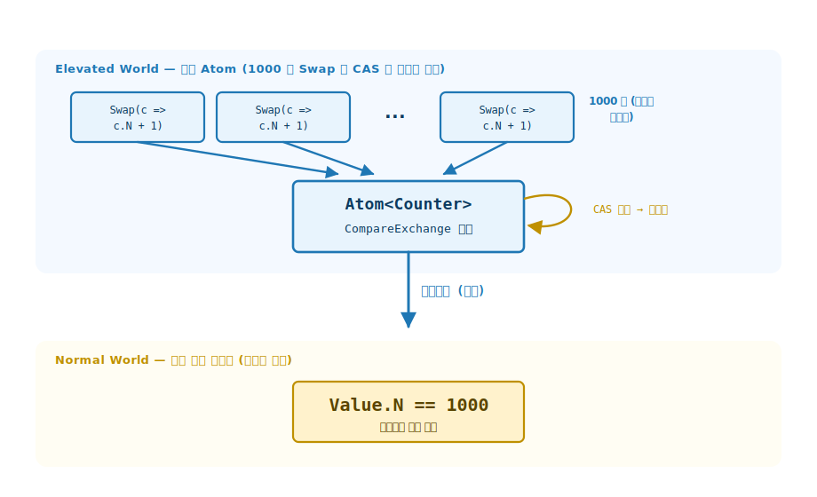
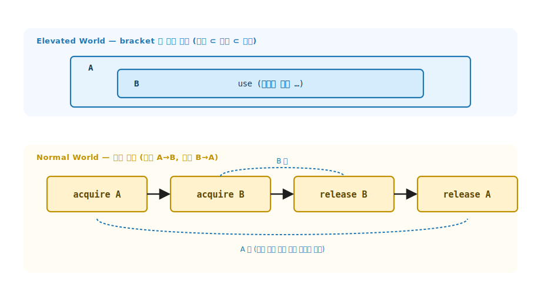
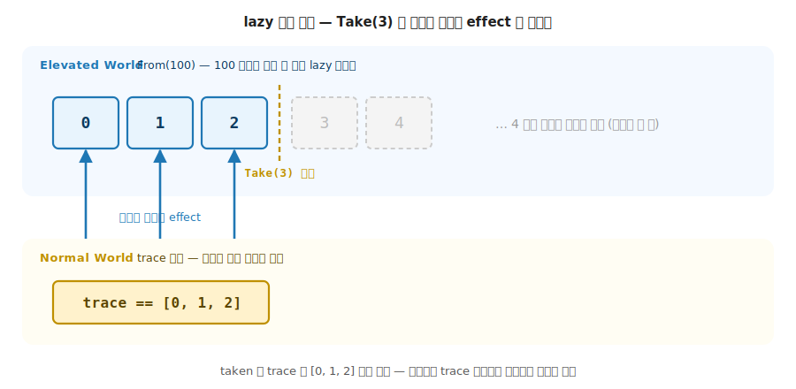

# 37장. 동시 · 스트리밍 · 자원 효과 테스트 (비결정에서 결정적 한 조각을 끌어내려 단언)

> **이 장의 목표** — 이 장을 읽고 나면 비결정성과 시간과 수명이 얽힌 동시 · 스트리밍 · 자원 효과를 결정적으로 검사할 수 있습니다. 원칙은 하나입니다. 비결정인 부분은 단언하지 않고, 거기서 끌어내린 결정적 한 조각만 단언합니다. 1000개 스레드가 동시에 증가시킨 카운터가 항상 정확히 1000 임을 단언하고, 재시도 정책을 실제 지연 없이 시도 횟수로 검사하며, 자원이 예외에도 반드시 해제되고 중첩 자원이 LIFO 로 닫히는지를 종료 로그로 확인하고, lazy 스트림이 소비된 만큼만 흐르는지를 골든 시퀀스로 검증하는 네 가지 도구를 손에 쥡니다. 36장에서 효과를 값으로 인코딩해 결정적으로 검사했다면, 이 장은 그 발상이 가장 까다로운 영역, 곧 비결정 영역에서도 그대로 통한다는 것을 코드로 보입니다.

> **이 장의 핵심 어휘**
>
> - **`Atom<T>`**: CAS 루프로 락 없이 안전하게 갱신하는 원자적 참조. 갱신은 순수 함수 `T → T`
> - **결정적 불변식**: 스레드 순서는 비결정이지만 순수 갱신의 최종값은 항상 같다는 약속
> - **`Schedule.Retry`**: 성공할 때까지 최대 횟수만큼 다시 시도하고 실제 시도 횟수를 반환하는 재시도 정책
> - **`Resource.Use`**: 획득 → 사용 → 해제를 한 함수로 묶는 bracket. 예외에도 해제 보장
> - **LIFO 해제**: 중첩 자원을 연 역순으로 닫는 순서. A → B 로 열면 B → A 로 닫음
> - **`Source`**: 소비될 때 비로소 흐르는 lazy 스트림. 흘러간 원소를 trace 에 기록
> - **골든 테스트**: 생성 시퀀스가 기대 골든과 일치하는지로 lazy 스트림을 결정적으로 단언

> 이 장을 마치면 할 수 있게 되는 것
> - [ ] 동시성 코드의 비결정 순서와 결정적 최종값을 구분해 무엇을 단언할지 고를 수 있습니다.
> - [ ] `Atom<T>` 의 CAS Swap 으로 1000개 동시 증가가 항상 1000 임을 검사할 수 있습니다.
> - [ ] `Schedule.Retry` 의 시도 횟수를 실제 지연 없이 결정적으로 단언할 수 있습니다.
> - [ ] `Resource.Use` 의 bracket 이 예외에도 해제를 보장함을 flag 로 확인할 수 있습니다.
> - [ ] 중첩 자원이 LIFO (B → A) 로 닫히는 순서를 종료 로그로 검사할 수 있습니다.
> - [ ] lazy 스트림이 소비된 만큼만 흐르는 조기 정지를 골든 시퀀스로 단언할 수 있습니다.
> - [ ] 비결정을 격리하는 함수형 설계가 왜 비결정 영역마저 결정적 단언으로 만드는지 설명할 수 있습니다.

---

## 37.1 1장 비유로 출발 — 비결정 효과는 Elevated World 의 어느 자리인가

이 장의 핵심은 한 줄로 압축됩니다. 36장에서 효과를 값으로 인코딩하면 런타임만 바꿔 결정적으로 검사할 수 있다고 봤습니다. 이 장은 그 발상을 효과 코드의 가장 까다로운 영역, 곧 동시성 · 스트리밍 · 자원 수명에 적용합니다. 이 영역은 비결정성과 시간과 수명이 얽혀 있어 검사가 어렵지만, 네 도구에 하나씩 박힌 함수형 설계 (갱신은 순수 함수로, 시간은 인자로, 자원은 bracket 으로, 흐름은 lazy 값으로) 가 비결정 영역마저 결정적 단언으로 바꿉니다.

### 37.1.1 9 ~ 10부에서 만든 동시 · 스트리밍 효과 복습

이 장이 검사하는 대상은 9부 (동시성 · STM) 와 10부 (스트리밍 · 자원) 에서 만든 효과들입니다. LanguageExt v5 에서는 STM (소프트웨어 트랜잭션 메모리) 의 원자적 참조 (`Atom`), 재시도 정책 (`Schedule`), 자원 수명 (`Resource` / `bracket`), 효과적 스트림 (`SourceT`) 이 그 실체입니다. 이 도구들은 모두 비결정성이나 시간을 다루므로, 실제 동작을 끼워 검사하면 결과가 흔들립니다.

이 장은 그 도구들의 핵심만 추려 의존성 없는 toy 로 다시 만듭니다. `Atom<Counter>` 는 CAS 루프로 락 없이 갱신하고, `Schedule.Retry` 는 시도 횟수만 세며, `Resource.Use` 는 `try` / `finally` 를 함수형으로 캡처하고, `Source` 는 `IEnumerable<int>` 위의 lazy 스트림입니다. 선행 Part 의 구체 동작이 궁금하더라도, 이 장의 단언은 모두 이 toy 코드만으로 충분합니다.

한 가지를 미리 가릅니다. 36장의 더블 주입 (런타임 갈아 끼우기) 은 이 장에서 쓰지 않습니다. 더블은 부수 효과의 **행선지** 를 바꾸는 도구인데, 이 장이 다루는 것은 행선지가 아니라 **비결정** (순서 · 시간 · 수명 · 게으름) 입니다. 비결정에는 갈아 끼울 런타임이 없으므로, 대신 비결정에 휘둘리지 않는 결정적 한 조각을 끌어내려 단언합니다. 두 장이 같은 정신 (결정적 검사) 을 다른 도구로 잇습니다.

### 37.1.2 비결정 효과의 1장 매핑 — 단언은 끌어내린 결정적 사실

1장에서 두 평행 세계 (Normal World / Elevated World) 를 정했습니다. 이 장의 매핑은 한 줄입니다. **비결정 (스레드 순서 · 시간 · 수명 · 게으름) 은 위에 남겨 두고, 단언은 거기서 Normal World 로 끌어내린 결정적 사실 하나에만 겁니다.**

36장의 `Eff<RT>` 처럼 실행 자체를 값으로 미루는 도구와 달리, 이 장의 toy 들은 호출하면 곧장 실행됩니다. 그런데도 결정적 검사가 되는 까닭은 각 도구의 설계에 있습니다. 비결정인 부분을 격리하고 (갱신은 순수 함수, 시간은 빠진 인자, 해제는 bracket, 흐름은 lazy), 결정적인 부분만 바깥으로 내놓습니다. 동시 증가의 순서는 비결정이지만 최종값은 항상 1000 입니다. 재시도의 실제 시간은 비결정이지만 시도 횟수는 항상 3 입니다. 자원 개폐의 시각은 비결정이지만 닫히는 순서는 항상 LIFO 입니다. 이 결정적 사실 하나가 Normal World 의 단언 대상이 됩니다.



**그림 37-1. 비결정 효과를 결정적 단언으로** — 위 행 Elevated World 의 네 도구 (`Atom` / `Schedule.Retry` / `Resource.Use` / `Source`) 는 각각 레이스 · 시간 · 수명 · 조기 정지라는 비결정을 설계로 격리합니다. 아래 행 Normal World 에는 그 비결정에 휘둘리지 않는 결정적 사실 (`== 1000`, `== 3`, `B, A 순서`, `[0,1,2]`) 만 남습니다. 36장이 콘솔 효과를 런타임 더블로 끌어내렸다면, 이 장은 비결정 효과를 불변식으로 끌어내립니다. 단언은 비결정에서 끌어낸 한 가지 결정적 사실입니다.

---

## 37.2 왜 필요한가 — 실제 동작에 묶인 테스트

실제 동작에 묶어 동시 · 스트리밍 · 자원 효과를 검사하면 무엇이 번거로운지 먼저 겪어 봅니다. 네 영역 모두 검사를 어렵게 만드는 고유한 비결정이 있습니다.

동시성부터 봅니다. 카운터를 여러 스레드가 동시에 증가시키는 코드를 검사한다고 합니다. 비원자 카운터 (`long n; n++`) 라면 두 스레드가 같은 값을 읽고 각자 1 을 더해 같은 값을 쓰는 잃어버린 갱신이 일어나, 1000번 증가했는데 최종값이 1000 보다 작아질 수 있습니다. 더 곤란한 점은 그 결과가 실행할 때마다 다르다는 것입니다. 998 일 때도, 1000 일 때도 있습니다. 비결정적인 값은 단언할 수가 없습니다.

재시도는 시간에 묶입니다. 실패하면 잠시 기다렸다 다시 시도하는 정책을 검사한다고 합니다. 실제 지연 (`Task.Delay`) 을 끼우면 테스트가 그 시간만큼 느려지고, 운영 체제의 스케줄링에 따라 타이밍이 흔들려 결과가 비결정적이 됩니다.

자원은 수명에 묶입니다. 파일이나 연결을 열고 쓰고 닫는 코드에서, 사용 중 예외가 나도 닫혔는지 검사하려면 실제 파일을 열어야 합니다. 중첩 자원의 닫히는 순서를 확인하려면 실제 핸들의 개폐를 들여다봐야 합니다. 자원 누수는 테스트가 끝난 한참 뒤에야 드러나기도 합니다.

스트림은 게으름에 묶입니다. lazy 스트림은 소비될 때 비로소 흐르므로, 언제 무엇이 흘렀는지가 흐릿합니다. 조기에 멈추는 스트림이 정말 거기서 멈췄는지, 아니면 끝까지 흐른 뒤 잘렸는지 겉으로는 구분되지 않습니다.

> **흔한 함정** — "그러면 동시성 테스트는 여러 번 돌려 보고 평균이 맞으면 되지" 로 넘기면, 통과가 운에 달리고 실패가 재현되지 않습니다. 비결정적인 값을 그대로 단언하면 테스트가 가끔 깨지는 flaky 테스트가 됩니다. 필요한 것은 **비결정에 휘둘리지 않는 한 가지 결정적 사실을 골라 단언하는** 도구입니다. 그 도구가 순수 갱신의 불변식 (`Atom`), 시간을 뺀 횟수 (`Schedule`), 종료 로그 (`Resource`), 생성 시퀀스 골든 (`Source`) 입니다.

네 영역이 원하는 것은 비결정 자체를 없애는 것이 아닙니다. 비결정에서 결정적인 한 조각을 끌어내려 그것만 단언하는 것입니다. 함수형 설계가 그 결정적 한 조각을 시그니처에 박아 둡니다.

---

## 37.3 결정적 불변식 — 순서는 비결정, 최종값은 결정

이 장의 네 도구를 관통하는 발상은 하나입니다. 비결정적인 부분과 결정적인 부분을 분리하고, 결정적인 부분만 단언합니다.

동시성을 예로 그 분리를 분명히 합니다. 1000개 스레드가 카운터를 증가시킬 때, 비결정적인 것은 스레드가 실행되는 순서입니다. 어느 스레드가 먼저 증가시키는지는 매번 다릅니다. 그러나 결정적인 것이 있습니다. 갱신 함수가 순수하면 (`c => c with { N = c.N + 1 }`), 몇 번을 어떤 순서로 증가해도 최종값은 증가 횟수와 같습니다. 순서는 비결정, 최종값은 결정입니다.

```
비결정:   스레드 A·B·C·… 의 실행 순서        ← 단언 대상이 아님
결정:     순수 갱신 N 회 → 최종값 == N         ← 단언 대상
```

`Atom<T>` 의 코드 주석이 이 분리를 그대로 말합니다. 동시성 코드의 결과는 보통 비결정적이지만, 갱신 함수가 순수하면 "몇 번을 동시에 증가해도 최종값은 증가 횟수와 같다" 라는 결정적 불변식이 성립합니다. 이 불변식이 동시성 toy 를 결정적으로 단언할 수 있게 하는 핵심입니다.

같은 분리가 네 도구 모두에 있습니다. 무엇이 비결정이고 무엇이 결정인지 가르는 표입니다.

| 도구 | 비결정인 부분 (단언 안 함) | 결정인 부분 (단언함) |
|---|---|---|
| `Atom` | 스레드 실행 순서 | 순수 갱신의 최종값 (`== 1000`) |
| `Schedule.Retry` | 실제 지연 시간 | 시도 횟수 (`== 3`) |
| `Resource.Use` | 개폐가 일어나는 시각 | 예외에도 해제됨 + 닫는 순서 (LIFO) |
| `Source` | 전체를 언제 다 소비할지 | 소비된 만큼의 생성 시퀀스 (`[0,1,2]`) |

각 도구의 결정적 부분이 단언 대상입니다. 비결정을 격리하는 설계 (순수 갱신 · 빠진 시간 · bracket · lazy) 가 이 분리를 가능하게 합니다. 이제 네 도구를 하나씩 만들고 검사합니다.

---

## 37.4 `Atom` 원자성 — 1000개 동시 증가가 항상 1000

**이 장의 코드 구조**

```
Ch37-Concurrent-Streaming/
├── Types/Atom.cs         ← 원자적 참조 Atom<T> (CAS Swap) + 불변 Counter
├── Types/Resource.cs     ← bracket Resource.Use + LIFO Scope
├── Types/Source.cs       ← lazy 스트림 Source (From / Map / Filter)
├── Functions/Schedule.cs ← 재시도 정책 Schedule.Retry + 테스트용 Flaky
├── Tests/AtomTests.cs · ScheduleTests.cs · ResourceTests.cs · StreamTests.cs
├── Challenges/LostUpdate.cs · RetryWithLog.cs · NestedScope.cs ← 37.8절 정답
└── Program.cs            ← 네 예제 데모 + 13 개 검증
```

첫 도구는 동시성의 원자성입니다. `Atom<T>` 는 갱신을 순수 함수 `T → T` 로 표현하고, 충돌 시 CAS (compare-and-swap) 루프로 자동 재시도하는 원자적 참조입니다. LanguageExt v5 `Atom` 의 축소판으로, `Interlocked.CompareExchange` 로 락 없이 안전합니다. 명령형에서 `lock` 으로 감싸 `count++` 를 한 번에 한 스레드만 통과시켰다면, CAS 는 락을 걸지 않고 (lock-free) 바꾸기 직전에 값이 그대로인지 확인만 해서 같은 안전을 얻습니다. `Atom` 은 락 없는 `lock` 인 셈입니다.

```csharp
public sealed class Atom<T> where T : class
{
    T value;

    public Atom(T initial) => value = initial;

    // 현재 값 — 다른 스레드의 갱신이 보이도록 Volatile 로 읽습니다.
    public T Value => Volatile.Read(ref value);

    // Swap — 현재 값을 읽고 f 적용 후 CAS. 그 사이 다른 스레드가 바꿨으면 fresh 값으로 재시도합니다.
    public T Swap(Func<T, T> f)
    {
        while (true)
        {
            var current = Volatile.Read(ref value);
            var next = f(current);
            if (Interlocked.CompareExchange(ref value, next, current) == current)
                return next;          // CAS 성공 — 그 사이 아무도 안 바꿈
            // CAS 실패 → 누군가 먼저 바꿨다. 루프가 fresh current 로 f 를 다시 적용.
        }
    }
}
```

`Swap` 의 한 바퀴는 세 단계입니다. 현재 값을 읽고, 순수 함수 `f` 를 적용해 다음 값을 만들고, `CompareExchange` 로 현재 값이 그대로일 때만 다음 값을 씁니다. 그 사이 다른 스레드가 값을 바꿨으면 `CompareExchange` 가 실패하고, 루프가 fresh 값으로 `f` 를 다시 적용합니다. 갱신이 유실되지 않습니다. 성공한 `Swap` 의 횟수가 곧 적용된 `f` 의 횟수와 같습니다.

두 스레드가 부딪치는 한 바퀴를 손으로 짚으면 왜 유실이 없는지 보입니다.

```
스레드 A, B 가 동시에 current = 5 를 읽음
  A: CompareExchange(next 6, current 5) → 현재값 5 == 5 → 성공, 값은 6
  B: CompareExchange(next 6, current 5) → 현재값 6 ≠ 5 → 실패
     → B 는 루프를 돌아 fresh current = 6 을 다시 읽고 f 재적용 → 7
```

B 의 증가가 사라지지 않고 6 위에 다시 얹힙니다. 충돌은 유실이 아니라 재시도가 됩니다.

> **`Volatile.Read` 는 지금 외우지 않아도 됩니다** — 한 스레드가 쓴 값이 다른 스레드에 즉시 보이도록 보장하는 .NET 의 메모리 읽기입니다. 이 장의 결정적 단언을 따라가는 데 그 내부까지 익힐 필요는 없습니다. 핵심은 `Swap` 의 세 단계 (읽기 → 순수 적용 → CAS) 뿐입니다.

값으로 담는 `Counter` 는 불변 record 입니다. 갱신은 새 인스턴스 생성 (`with`) 으로 일어나 순수성을 지킵니다.

```csharp
public sealed record Counter(long N);
```

### 37.4.1 비결정 순서가 결정적 최종값으로

`Atom` 의 결정적 불변식을 그림으로 봅니다. 1000개 스레드가 비결정적 순서로 `Swap` 을 호출해도, 순수 갱신과 CAS 재시도가 모든 증가를 반영해 최종값이 항상 1000 이 됩니다.



**그림 37-2. `Atom` 의 CAS 루프: 비결정 순서, 결정적 최종값** — 위 행 Elevated World 에서 단일 `Atom<Counter>` 가 같은 순수 함수 `c => c.N + 1` 을 들고 비결정적 순서로 도착하는 1000개 `Swap` 호출을 `CompareExchange` 루프로 받습니다. 충돌이 나면 fresh 값으로 다시 적용하므로 (자기 루프 화살표) 어떤 증가도 유실되지 않습니다. 스레드 순서는 매번 다르지만, 그 최종 상태를 아래 행 Normal World 로 끌어내리면 단언은 항상 `Value.N == 1000` 입니다. 그림 37-1 과 같은 매핑입니다. 효과 (동시 갱신) 는 Elevated 에 있고, 단언은 그 값에서 끌어내린 결정적 사실로 Normal World 에 놓입니다.

### 37.4.2 세 가지 검증 — 순차 · Parallel · Task

`AtomTests` 가 같은 불변식을 세 가지 동시성 경로로 검사합니다. 동시성 테스트의 핵심은 스레드 순서는 비결정이지만 순수 갱신의 최종값은 항상 같다는 것입니다.

```csharp
// ① 순차 Swap — 100 번 증가하면 최종값은 정확히 100.
public static bool SequentialSwapHolds()
{
    var atom = new Atom<Counter>(new Counter(0));
    for (var i = 0; i < 100; i++)
        atom.Swap(c => c with { N = c.N + 1 });
    return atom.Value.N == 100;
}

// ② 동시 Swap (Parallel.For) — 1000 개의 동시 증가 후 최종값은 항상 정확히 1000.
public static bool ConcurrentParallelForHolds()
{
    var atom = new Atom<Counter>(new Counter(0));
    Parallel.For(0, 1000, _ => atom.Swap(c => c with { N = c.N + 1 }));
    return atom.Value.N == 1000;
}

// ③ 동시 Swap (Task 1000 개) — 다른 동시성 경로에서도 최종값은 항상 정확히 1000.
public static bool ConcurrentTasksHolds()
{
    var atom = new Atom<Counter>(new Counter(0));
    var tasks = new Task[1000];
    for (var i = 0; i < tasks.Length; i++)
        tasks[i] = Task.Run(() => atom.Swap(c => c with { N = c.N + 1 }));
    Task.WaitAll(tasks);
    return atom.Value.N == 1000;
}
```

세 검증 모두 같은 불변식을 단언합니다. 순차 (`for`) 든 `Parallel.For` 든 1000개 `Task` 든, 갱신 함수가 순수하고 `Atom` 이 CAS 로 모든 증가를 반영하므로 최종값은 정확히 증가 횟수입니다.

비교를 위해 비원자 카운터를 같은 방식으로 동시 증가하면 갱신이 유실되어 1000 보다 작아질 수 있습니다. 그 결과는 비결정적이므로 단언 대상이 아닙니다. 여기서는 `Atom` 의 결정성만 단언합니다. 비결정적인 값을 단언하려 들지 않는 것이 동시성 테스트의 첫 원칙입니다.

---

## 37.5 `Schedule` 재시도 — 시간 없이 시도 횟수로

둘째 도구는 재시도 정책입니다. `Schedule.Retry` 는 action 이 성공 (`true`) 할 때까지 최대 `maxAttempts` 번 다시 시도하고, 실제 시도한 횟수를 반환합니다. LanguageExt v5 `Schedule` 의 핵심은 "언제 · 몇 번 다시 할까" 를 값으로 다루는 것입니다. toy 는 그중 횟수만 다룹니다.

```csharp
public static class Schedule
{
    // Retry — action 이 true 를 낼 때까지 재시도. 실제 시도한 횟수를 반환합니다.
    public static int Retry(Func<bool> action, int maxAttempts)
    {
        if (maxAttempts < 1)
            throw new ArgumentOutOfRangeException(nameof(maxAttempts), "최소 1 번은 시도해야 합니다.");

        for (var attempt = 1; attempt <= maxAttempts; attempt++)
        {
            if (action())
                return attempt;        // 성공 — 이번이 몇 번째 시도였는지 반환
        }
        return maxAttempts;            // 끝까지 실패 — maxAttempts 에서 포기
    }
}
```

재시도가 시간에 묶이는 까닭은 실패 후 잠시 기다렸다 다시 시도하기 때문입니다. 실제 지연을 끼우면 비결정적이 됩니다. 그래서 toy 는 지연을 빼고 시도 횟수만 셉니다. 3번째에 성공하는 flaky 는 시도 3회, 끝까지 실패하는 action 은 `maxAttempts` 에서 포기합니다. 횟수가 결정적이라, 시간에 의존하지 않고 단언할 수 있습니다.

테스트용 헬퍼 `Flaky` 가 정해진 횟수에 성공하는 action 을 만듭니다. 호출될 때마다 카운터를 올리고, `succeedOn` 번째 호출에서만 `true` 를 냅니다.

```csharp
// Flaky — succeedOn 번째 호출에서만 true. (예: succeedOn=3 이면 1·2 번째는 false, 3 번째에 true.)
public static Func<bool> Flaky(int succeedOn)
{
    var calls = 0;
    return () => ++calls == succeedOn;
}
```

### 37.5.1 네 가지 시도 횟수 단언

`ScheduleTests` 가 시도 횟수를 네 경우로 검사합니다. 지연이 없어 횟수가 결정적입니다.

```csharp
// ① 3 번째에 성공하는 flaky → 시도 횟수는 정확히 3.
public static bool SucceedsOnThirdAttempt()
{
    var flaky = Schedule.Flaky(succeedOn: 3);
    var attempts = Schedule.Retry(flaky, maxAttempts: 5);
    return attempts == 3;
}

// ② 첫 시도에 성공 → 재시도 없이 1 회로 끝난다.
public static bool SucceedsImmediately()
{
    var attempts = Schedule.Retry(() => true, maxAttempts: 5);
    return attempts == 1;
}

// ③ 끝까지 실패 → maxAttempts 에서 포기 (시도 횟수 == maxAttempts).
public static bool GivesUpAtMaxAttempts()
{
    var attempts = Schedule.Retry(() => false, maxAttempts: 4);
    return attempts == 4;
}

// ④ 성공 자리가 maxAttempts 와 같으면 마지막 시도에서 성공 (== maxAttempts).
public static bool SucceedsOnLastAttempt()
{
    var flaky = Schedule.Flaky(succeedOn: 4);
    var attempts = Schedule.Retry(flaky, maxAttempts: 4);
    return attempts == 4;
}
```

네 경우가 재시도의 경계를 모두 짚습니다. 중간에 성공 (3회), 즉시 성공 (1회), 끝까지 실패 (`maxAttempts` 포기), 마지막 시도에 성공 (`maxAttempts` 와 같음) 입니다. 어느 경우든 결과는 시간이 아니라 횟수라서 항상 같습니다. 시간을 인자로 빼고 횟수만 단언하는 것이 재시도 테스트의 핵심입니다.

toy 가 지연을 통째로 뺐다면, 실물은 지연을 어떻게 다룰까요. v5 의 `Schedule` 은 지연을 **데이터** 로 다룹니다. 정책 자체가 지연 간격의 시퀀스 값이라, 테스트는 실제로 기다리는 대신 그 시퀀스를 값으로 검사할 수 있습니다 (예: 간격이 10ms 로 세 번인가). "시간을 인자로 뺀다" 는 toy 만의 단순화가 아니라, 시간을 잠들지 않고 검사 가능한 값으로 바꾸는 실물 설계의 축소판입니다.

---

## 37.6 `Resource` bracket — 예외에도 해제, 중첩은 LIFO

셋째 도구는 자원 수명입니다. `Resource.Use` 는 획득 → 사용 → 해제를 한 함수로 묶는 bracket 입니다. 사용 중 예외가 나도 해제는 반드시 실행됩니다. C# 의 `try` / `finally` 를 함수형으로 캡처한 것으로, LanguageExt v5 의 use · release / bracket 의 축소판입니다. 매일 쓰는 `using (var f = Open()) { … }` 가 정확히 이 획득 → 사용 → 해제이고, 블록을 벗어나면 `Dispose` 가 예외에도 불립니다. `Resource.Use` 는 그 `using` 을 함수 하나의 값으로 옮긴 모양입니다.

```csharp
public static class Resource
{
    public static R Use<T, R>(Func<T> acquire, Func<T, R> use, Action<T> release)
    {
        var resource = acquire();      // 획득
        try
        {
            return use(resource);      // 사용
        }
        finally
        {
            release(resource);         // 해제 — 예외가 나도 반드시
        }
    }
}
```

자원 수명 자체가 검증 대상입니다. "예외가 나도 해제됐는가" 는 release 가 flag 를 세우는지로, "중첩 자원의 종료 순서" 는 종료 로그가 LIFO 인지로 결정적으로 단언합니다.

`Use` 하나로 자원 둘을 다루려면 bracket 을 중첩합니다 (`Use(acquireA, a => Use(acquireB, b => …, releaseB), releaseA)`). 안쪽 `finally` 가 먼저, 바깥 `finally` 가 나중에 실행되니 닫는 순서는 자연히 B → A 입니다. `Scope` 는 이 중첩 bracket 을 수동으로 펼친 도구입니다. 해제 동작을 `Stack` 에 쌓아 두고 역순으로 닫아, 자원이 몇 개로 늘어도 같은 LIFO 를 유지하면서 연 순서를 기록하는 `Log` 를 함께 남깁니다. 그 `Log` 가 LIFO 검증의 골든 대상입니다.

```csharp
public sealed class Scope
{
    readonly Stack<Action> releases = new();

    // 종료 순서를 기록하는 로그 — LIFO 검증의 골든 대상.
    public List<string> Log { get; } = [];

    public T Acquire<T>(string name, Func<T> acquire, Action<T> release)
    {
        var value = acquire();
        Log.Add($"acquire {name}");
        releases.Push(() => { release(value); Log.Add($"release {name}"); });
        return value;
    }

    public void ReleaseAll()
    {
        while (releases.Count > 0)
            releases.Pop()();          // LIFO — 마지막에 연 것부터 닫는다
    }
}
```

`Acquire` 는 자원을 얻고 해제 동작을 `Stack` 에 push 합니다. `ReleaseAll` 은 그 `Stack` 을 pop 하며 닫으므로, 마지막에 연 자원이 가장 먼저 닫힙니다. A → B 순서로 열면 B → A 순서로 닫힙니다.



**그림 37-3. `Resource` bracket 의 LIFO 해제** — 위 행 Elevated World 의 bracket 은 자원 A 가 자원 B 를 감싸는 중첩 수명 (열림 ⊂ 사용 ⊂ 닫힘) 을 묶습니다. 아래 행 Normal World 의 종료 로그는 그 수명이 실제로 어떤 순서로 흘렀는지 기록합니다. 여는 순서는 A → B, 닫는 순서는 B → A 입니다. 점선 짝이 보이듯 가장 먼저 연 A 가 가장 나중에 닫힙니다. 중첩 자원의 올바른 정리가 LIFO 이고, 종료 로그가 그것을 결정적으로 단언합니다.

### 37.6.1 세 가지 수명 단언

`ResourceTests` 가 자원 수명을 세 경우로 검사합니다.

```csharp
// ① 정상 경로 — acquire → use → release 순서로 실행된다.
public static bool NormalOrderHolds()
{
    var log = new List<string>();
    Resource.Use(
        () => { log.Add("acquire"); return 1; },
        _ => { log.Add("use"); return 0; },
        _ => log.Add("release"));
    return log.SequenceEqual(["acquire", "use", "release"]);
}

// ② 예외 경로 — use 가 예외를 던져도 release 는 반드시 실행된다 (flag 로 확인).
public static bool ReleaseOnExceptionHolds()
{
    var released = false;
    try
    {
        Resource.Use<int, int>(
            () => 1,
            _ => throw new InvalidOperationException("boom"),
            _ => released = true);
    }
    catch (InvalidOperationException) { /* 예외는 정상적으로 전파됩니다 */ }
    return released;
}

// ③ 중첩 자원 — A, B 순서로 열면 종료는 B, A 순서(LIFO).
public static bool LifoReleaseOrderHolds()
{
    var scope = new Scope();
    scope.Acquire("A", () => 1, _ => { });
    scope.Acquire("B", () => 2, _ => { });
    scope.ReleaseAll();
    return scope.Log.SequenceEqual(["acquire A", "acquire B", "release B", "release A"]);
}
```

사례 2 가 bracket 의 핵심입니다. `use` 가 예외를 던지면 그 예외는 정상적으로 전파되지만, `finally` 가 release 를 먼저 실행하므로 `released` flag 가 `true` 가 됩니다. 예외 경로에서도 자원이 닫힘을 flag 하나로 결정적으로 확인합니다. 사례 3 은 두 자원을 A → B 로 열고 `Log` 가 `["acquire A", "acquire B", "release B", "release A"]` 인지 봅니다. 닫는 순서가 B → A 인 LIFO 입니다.

---

## 37.7 스트림 골든 테스트 — 생성 시퀀스와 lazy 조기 정지

넷째 도구는 effectful 스트림입니다. `Source` 는 `IEnumerable<int>` 기반의 작은 스트림으로, 원소를 흘려보내면서 부수 효과 (여기서는 흘러간 원소를 trace 에 기록) 를 남깁니다. 효과 모나드 위에서 도는 v5 `SourceT` 에서 효과 층을 떼고 `IEnumerable<int>` 한 겹만 남긴 toy 라 이름을 `Source` 로 줄였습니다.

```csharp
public static class Source
{
    // From — 0..count-1 을 흘리되, 각 원소를 흘릴 때 trace 에 기록(effect)합니다.
    public static IEnumerable<int> From(int count, List<int> trace)
    {
        for (var i = 0; i < count; i++)
        {
            trace.Add(i);              // effect — 이 원소가 흘렀음을 기록
            yield return i;
        }
    }

    // Map — 각 원소에 f 를 적용한 새 스트림 (모양 보존, 게으름 유지).
    public static IEnumerable<int> Map(IEnumerable<int> source, Func<int, int> f)
    {
        foreach (var x in source)
            yield return f(x);
    }

    // Filter — predicate 를 만족하는 원소만 통과 (게으름 유지).
    public static IEnumerable<int> Filter(IEnumerable<int> source, Func<int, bool> predicate)
    {
        foreach (var x in source)
            if (predicate(x))
                yield return x;
    }
}
```

스트림은 lazy 라 언제 무엇이 흘렀는지가 흐릿합니다. `From` 이 원소를 흘릴 때마다 trace 에 기록하므로, effect 를 trace 로 모으면 "생성 시퀀스 == 기대 골든" 으로 결정적으로 단언할 수 있습니다. 이 방식을 골든 테스트라 부릅니다. `Map` 과 `Filter` 는 게으름을 유지한 채 모양을 보존하거나 원소를 거릅니다.

### 37.7.1 세 가지 스트림 단언

`StreamTests` 가 생성 시퀀스와 effect 시퀀스를 기대 골든과 비교합니다.

```csharp
// ① 생성 시퀀스 — From(5) 는 0,1,2,3,4 를 정확히 그 순서로 흘린다.
public static bool ProducesExpectedSequence()
{
    var trace = new List<int>();
    var result = Source.From(5, trace).ToList();
    return result.SequenceEqual([0, 1, 2, 3, 4]);
}

// ② map∘filter 골든 — 짝수만 통과시켜 ×10 하면 0,20,40 (모양·순서 보존).
public static bool MapFilterMatchesGolden()
{
    var trace = new List<int>();
    var result = Source.Map(
            Source.Filter(Source.From(5, trace), n => n % 2 == 0),
            n => n * 10)
        .ToList();
    return result.SequenceEqual([0, 20, 40]);
}

// ③ effect 게으름 — 스트림은 소비될 때만 effect(trace 기록)를 낸다.
public static bool LazyEffectStopsEarly()
{
    var trace = new List<int>();
    var taken = Source.From(100, trace).Take(3).ToList();
    return taken.SequenceEqual([0, 1, 2])
        && trace.SequenceEqual([0, 1, 2]);   // 4 번째 이후는 흐르지 않았다
}
```

사례 3 이 이 절의 payoff 입니다. `From(100, trace)` 는 원소를 100개까지 흘릴 수 있지만, `Take(3)` 이 3개만 소비합니다. 결과 `taken` 이 `[0, 1, 2]` 인 것은 당연합니다. 결정적인 점은 `trace` 도 `[0, 1, 2]` 에서 멈춘다는 것입니다. 4번째 이후의 원소는 흐르지조차 않았습니다. lazy 스트림이 소비된 만큼만 effect 를 내는 조기 정지를, trace 골든 하나로 결정적으로 확인합니다. 게으름이 막연한 성질이 아니라 trace 로 관찰되는 결정적 사실이 됩니다.



**그림 37-4. lazy 조기 정지: 소비한 만큼만 effect** — `From(100)` 은 원소를 100개까지 흘릴 수 있지만, `Take(3)` 경계 앞의 세 칸 (`0`·`1`·`2`) 만 실제로 흐릅니다. 경계 뒤 (`3`·`4` …) 는 회색 빈칸으로, 계산조차 일어나지 않습니다. 흐른 세 원소만 `trace` 에 끌어내려져 `trace == [0, 1, 2]` 가 됩니다. 게으름이 trace 골든 하나로 관찰되는 결정적 사실입니다.

### 37.7.2 데모로 보는 네 도구

`Program.cs` 의 데모가 네 도구를 한자리에서 실행하고 13개 검증을 돌립니다. 실행 결과입니다.

```text
== 예제 1 — Atom (1000 개 동시 증가의 결정적 최종값) ==
  동시 증가 1000 회 → 최종값 1000   ✓ 원자성 성립

== 예제 2 — Schedule (재시도 횟수) ==
  3 번째에 성공하는 flaky → 시도 3 회
  끝까지 실패 → maxAttempts(4)에서 포기 → 시도 4 회

== 예제 3 — Resource (bracket / LIFO 해제) ==
  사용 중 예외 발생 → release 호출됨? True
  중첩 종료 순서 = [acquire A, acquire B, release B, release A]

== 예제 4 — Source (effectful 스트림 골든) ==
  From(5) → 짝수 filter → ×10 = [0, 20, 40]
```

네 예제 모두 매 실행 같은 값을 냅니다. 데모는 이어서 13개 단언을 모두 `통과` 로 확인합니다. 검증 절 출력은 위에서 생략했습니다. xUnit 으로 옮긴다면 각 `bool` 헬퍼를 `[Fact]` 로 감싸고 `ShouldBeTrue()` 로 단언하면 그대로 표준 테스트가 됩니다.

---

## 37.8 직접 해보기 — 챌린지

본문을 읽은 것과 손으로 작성·검사할 수 있는 것의 차이를 만듭니다. 세 챌린지는 이 장의 결정적 자리 (순수 갱신의 불변식, 시간을 뺀 횟수, LIFO 해제 순서) 를 직접 묻습니다. 세 정답 모두 실행 가능한 코드로 들어 있습니다.

### 37.8.1 비원자 카운터로 잃어버린 갱신 관찰하기

> 챌린지: 비원자 카운터를 동시 증가시켜 갱신 유실을 관찰하기
>
> `Atom` 대신 평범한 `long n; n++` 를 1000개 스레드로 동시 증가시켜 봅니다. 최종값이 1000 보다 작아질 수 있음을, 그리고 그 값이 실행마다 다름을 관찰합니다. 왜 그 결과는 단언 대상이 아닌지 설명합니다.
>
> **본문 어느 자리의 이해도를 묻는가**
>
> 1. 결정적 불변식 — 순수 갱신의 최종값이 결정적인 까닭.
> 2. CAS 루프가 잃어버린 갱신을 어떻게 막는가.
>
> **해보기**
>
> 1. `long n = 0;` 을 `Parallel.For(0, 1000, _ => n++)` 로 동시 증가시킵니다.
> 2. 최종값을 여러 번 실행해 봅니다 (예: 998, 1000, 997 …).
> 3. 같은 코드를 `Atom<Counter>` 로 바꿔 항상 1000 임과 대비합니다.
>
> **검증 포인트**
>
> - 비원자 카운터의 최종값이 1000 이하로 흔들리는가?
> - `Atom` 으로 바꾸면 항상 정확히 1000 인가?
>
> 정답 코드: `code/Part11-FunctionalTesting/Ch37-Concurrent-Streaming/Challenges/LostUpdate.cs`.

### 37.8.2 재시도에 백오프 로그를 더하기

> 챌린지: `Schedule.Retry` 에 시도별 로그를 더해 횟수와 순서를 함께 단언하기
>
> `Retry` 가 시도할 때마다 시도 번호를 로그에 기록하도록 변형합니다. 3번째에 성공하는 flaky 라면 로그가 `[1, 2, 3]` 인지 검사합니다. 시도 횟수뿐 아니라 시도 순서까지 결정적임을 확인합니다.
>
> **본문 어느 자리의 이해도를 묻는가**
>
> 1. 시간을 인자로 빼고 횟수만 세는 발상이 순서 로그로도 확장되는가.
> 2. `Flaky` 가 결정적 action 을 만드는 까닭.
>
> **해보기**
>
> 1. `Retry` 에 `List<int> log` 인자를 더해 매 시도마다 `log.Add(attempt)` 를 호출합니다.
> 2. `Flaky(succeedOn: 3)` 에 적용해 로그가 `[1, 2, 3]` 인지 단언합니다.
> 3. 즉시 성공 (`() => true`) 이면 로그가 `[1]` 임을 확인합니다.
>
> **검증 포인트**
>
> - 3번째 성공 시 로그가 정확히 `[1, 2, 3]` 인가?
> - 로그 길이가 시도 횟수와 항상 같은가?
>
> 정답 코드: `Challenges/RetryWithLog.cs`.

### 37.8.3 세 자원의 LIFO 순서 예측하기

> 챌린지: 자원 셋을 열어 종료 로그가 LIFO 인지 예측·검사하기
>
> `Scope` 에 자원 A, B, C 를 순서대로 열고 `ReleaseAll` 을 호출합니다. 종료 로그를 보기 전에 닫히는 순서를 종이에 먼저 예측한 뒤 검사합니다. 중간 자원 (B) 사용 중 예외가 나도 셋 다 닫히는지도 확인합니다.
>
> **본문 어느 자리의 이해도를 묻는가**
>
> 1. LIFO 해제가 `Stack` 의 push / pop 으로 따라온다는 것.
> 2. bracket 이 예외에도 해제를 보장한다는 것.
>
> **해보기**
>
> 1. A → B → C 로 `Acquire` 한 뒤 `ReleaseAll` 합니다.
> 2. 닫히는 순서 (`release C`, `release B`, `release A`) 를 예측하고 `Log` 와 대조합니다.
> 3. 예외가 나는 경우에도 세 release 가 모두 로그에 남는지 확인합니다.
>
> **검증 포인트**
>
> - 종료 로그가 정확히 C → B → A 역순인가?
> - 자원 수가 셋으로 늘어도 LIFO 가 그대로 유지되는가?
>
> 정답 코드: `Challenges/NestedScope.cs`.

### 37.8.4 세 챌린지가 노리는 능력

세 챌린지는 이 장의 핵심을 세 각도에서 묻습니다. 첫째는 순수 갱신이 없으면 결과가 왜 비결정으로 흩어지는지 직접 관찰하는 능력, 둘째는 시간을 뺀 횟수·순서가 결정적임을 로그로 확장하는 능력, 셋째는 LIFO 해제 순서를 예측해 자원 수와 무관하게 검사하는 능력입니다. 셋을 다 통과하면 "비결정 효과를 어떻게 결정적으로 단언하는가" 를 코드로 답할 수 있습니다.

---

## 37.9 Elevated World 어휘로 다시 읽기

이 장의 발상을 1장 비유로 누르면 한 줄입니다. **비결정 (스레드 순서 · 시간 · 수명 · 게으름) 은 위 (Elevated) 의 일로 남겨 두고, 단언은 아래 (Normal) 로 끌어내린 결정적 사실 하나에만 겁니다.** 도구별로 무엇이 위에 남고 무엇이 내려오는지는 앞서 본 분리 표가 정리했습니다.

36장과 견주면 같은 "끌어내림" 인데 도구가 다릅니다. 36장은 효과를 값으로 미뤄 두고 `Run` 자리에서 더블을 끼워 부수 효과의 행선지를 바꿨습니다. 이 장은 비결정을 설계로 격리해, 도구가 결정적 한 조각 (최종값 · 횟수 · 순서 · 시퀀스) 만 내놓게 했습니다. 효과의 결정적 검사라는 같은 정신이 두 도구로 나뉘어 부수 효과와 비결정을 각각 맡습니다. 비유는 여기까지가 역할입니다. 무엇이 비결정이고 무엇이 결정인지는 각 도구의 시그니처가 정합니다.

---

## 37.10 Q&A — 자기 점검

> **Q1. 동시성 테스트인데 왜 결과가 항상 같습니까? 스레드 순서는 매번 다르지 않습니까?** (37.3절)

스레드 순서는 매번 다릅니다. 그러나 단언하는 것은 순서가 아니라 최종값입니다. 갱신 함수가 순수하면 (`c => c.N + 1`) 어떤 순서로 1000번 증가해도 최종값은 1000 입니다. `Atom` 의 CAS 루프가 충돌 시 fresh 값으로 다시 적용해 갱신 유실을 막기 때문입니다. 비결정인 순서는 단언하지 않고, 결정인 최종값만 단언합니다.

> **Q2. 비원자 카운터 (`n++`) 를 동시 증가하면 왜 단언할 수 없습니까?** (37.4절)

결과가 비결정적이기 때문입니다. 두 스레드가 같은 값을 읽고 각자 1 을 더해 같은 값을 쓰면 갱신 하나가 유실되어, 1000번 증가했는데 최종값이 998 일 수도 1000 일 수도 있습니다. 실행마다 다른 값은 `== 1000` 같은 단언의 대상이 될 수 없습니다. 그래서 비원자 카운터는 결정성을 단언하지 않고, `Atom` 의 결정성만 단언합니다. 첫 번째 챌린지가 이 유실을 직접 관찰합니다.

> **Q3. 재시도 테스트에서 왜 실제 지연을 넣지 않습니까?** (37.5절)

실제 지연이 테스트를 느리고 비결정적으로 만들기 때문입니다. `Task.Delay` 를 끼우면 그 시간만큼 테스트가 느려지고, 운영 체제 스케줄링에 따라 타이밍이 흔들립니다. toy `Schedule.Retry` 는 시간을 인자에서 빼고 시도 횟수만 셉니다. 3번째에 성공하는 flaky 는 항상 3회, 끝까지 실패는 항상 `maxAttempts` 입니다. 횟수가 결정적이라 시간에 의존하지 않고 단언합니다.

> **Q4. 예외가 났는데 어떻게 자원이 해제됩니까?** (37.6절)

`Resource.Use` 가 `use` 호출을 `try` 로 감싸고 release 를 `finally` 에 두기 때문입니다. `use` 가 예외를 던지면 그 예외는 정상적으로 전파되지만, `finally` 가 먼저 release 를 실행합니다. 테스트는 release 가 세우는 flag 하나 (`released == true`) 로 예외 경로에서도 해제됐음을 결정적으로 확인합니다. C# 의 `try` / `finally` 를 함수형으로 캡처한 bracket 입니다.

> **Q5. 중첩 자원이 왜 LIFO 로 닫힙니까?** (37.6절)

`Scope` 가 해제 동작을 `Stack` 에 push 하고 `ReleaseAll` 이 pop 하며 닫기 때문입니다. 마지막에 push 된 (= 마지막에 연) 자원이 가장 먼저 pop 됩니다. A → B 순서로 열면 B → A 순서로 닫힙니다. 안쪽 자원이 바깥 자원보다 먼저 닫혀야 의존 관계가 깨지지 않으니, 이 LIFO 가 중첩 자원의 올바른 정리 순서입니다. 종료 로그 (`Log`) 가 그 순서를 골든으로 단언합니다.

> **Q6. lazy 스트림의 조기 정지를 어떻게 검사합니까?** (37.7절)

생성 시퀀스를 trace 골든과 비교합니다. `Source.From` 이 원소를 흘릴 때마다 trace 에 기록하므로, `From(100, trace).Take(3)` 을 소비하면 결과뿐 아니라 trace 도 `[0, 1, 2]` 에서 멈춥니다. 4번째 이후 원소는 흐르지조차 않았음을 trace 가 보여 줍니다. 게으름이 막연한 성질이 아니라 trace 로 관찰되는 결정적 사실이 됩니다.

> **Q7. 이 장의 toy 와 LanguageExt v5 의 실제 도구는 어떻게 다릅니까?** (37.1.1절)

toy 는 핵심 한 가지만 추렸습니다. 실제 `Atom` 은 더 풍부한 갱신 연산과 검증 훅을 갖고, 실제 `Schedule` 은 횟수뿐 아니라 지연 · 백오프 · 지터를 값으로 다루며, 실제 `Resource` 는 `Eff<RT>` 와 엮여 비동기 해제까지 보장하고, 실제 `SourceT` 는 효과 모나드 위의 스트림입니다. toy 는 결정적 단언의 발상을 의존성 없이 보이려 핵심만 남겼습니다. 발상은 같고, 실무에서는 v5 의 실물로 옮깁니다.

> **Q8. 이 도구들의 법칙 (예: Functor 법칙) 검사는 왜 안 합니까?** (37.1절)

법칙 검사는 이 Part 의 주제가 아닙니다. "내 인스턴스가 진짜 Functor / Monad 인가" 의 법칙 검증은 기초 3 ~ 11장에서 각 장의 최소 property 로 이미 끝났습니다. 11부는 그 다음, 곧 효과 · 비결정성 · 전문 테스트입니다. 이 장은 비결정 효과를 결정적으로 단언하는 법을 다루지, 추상의 법칙을 다루지 않습니다. property 기반 검증의 심화는 38장의 자리입니다.

---

## 37.11 요약

- **불편에서 출발했습니다.** 실제 동작에 묶으면 동시성은 레이스로, 재시도는 시간으로, 자원은 수명으로, 스트림은 게으름으로 결과가 비결정이 됩니다 (37.2절).
- **결정적 불변식이 핵심입니다.** 비결정인 부분 (순서 · 시간) 은 단언하지 않고, 결정인 부분 (최종값 · 횟수 · 순서 · 시퀀스) 만 단언합니다 (37.3절).
- **`Atom` 의 최종값은 항상 증가 횟수입니다.** 순수 갱신과 CAS 루프가 1000개 동시 증가를 유실 없이 1000 으로 만듭니다 (37.4절).
- **`Schedule.Retry` 는 시간을 빼고 횟수만 셉니다.** 3번째 성공은 3회, 끝까지 실패는 `maxAttempts` 로 결정적입니다 (37.5절).
- **`Resource.Use` 는 예외에도 해제를 보장합니다.** `finally` 의 release 를 flag 로 확인하고, 중첩은 LIFO 로 닫힙니다 (37.6절).
- **`Source` 의 조기 정지를 trace 골든으로 단언합니다.** 소비된 만큼만 흐르는 게으름이 trace `[0, 1, 2]` 로 관찰됩니다 (37.7절).
- **함수형 설계가 비결정을 결정으로 바꿉니다.** 갱신은 순수 함수로, 시간은 인자로, 자원은 bracket 으로, 흐름은 lazy 값으로 두면 비결정 영역마저 결정적 단언이 가능합니다 (37.3절).

---

## 37.12 다음 장으로 — 마무리 (38장 property-based 다리)

| 장 | 대상 | 핵심 | 검증의 어려움 |
|---|---|---|---|
| 36장 | 효과 코드 | 런타임 더블 주입 | 부수 효과 |
| **이 장 (37장)** | **동시 · 스트리밍 · 자원** | **결정적 불변식 추출** | **비결정 · 시간 · 수명** |
| 다음 장 (38장) | 임의 입력 성질 | 생성기 + 축소 | 무한한 입력 공간 |

37장에서 비결정 효과를 결정적 불변식으로 끌어내려 단언했습니다. 단언한 불변식 (`== 1000`, `== 3`, LIFO) 은 모두 특정 입력 하나에 대한 것이었습니다. 38장은 그 단언을 무한한 입력으로 넓힙니다. 무작위 생성기로 입력을 만들고, 어떤 입력에든 성립해야 하는 성질을 `ForAll` 로 검사하며, 실패하면 축소 (shrinking) 로 최소 반례를 찾는 property-based 테스트입니다. 기초 각 장에 흩어진 법칙 검증을 "어떤 `F` 든 받는 법칙 모듈" 로 일반화하는 함수형 테스트 아키텍처로 마무리합니다. [38장 — property-based 심화](./Ch38-Property-Based.md) 로 넘어갑니다.

> **실무 디딤돌** — 이 장의 결정적 불변식 단언은 실무 동시 · 스트리밍 코드의 표준 검사법입니다. 각 `bool` 헬퍼를 xUnit 의 `[Fact]` 로 감싸고 `Shouldly` 의 `ShouldBeTrue()` / `ShouldBe(...)` 로 단언하면 그대로 표준 테스트가 됩니다. 실무에서는 `Atom` 을 v5 STM 으로, `Schedule.Retry` 를 v5 `Schedule` 로, `Resource.Use` 를 v5 `bracket` 으로, `Source` 를 v5 `SourceT` 로 옮기되, "비결정에서 결정적 한 조각을 끌어내려 단언한다" 는 발상은 그대로 가져갑니다.
