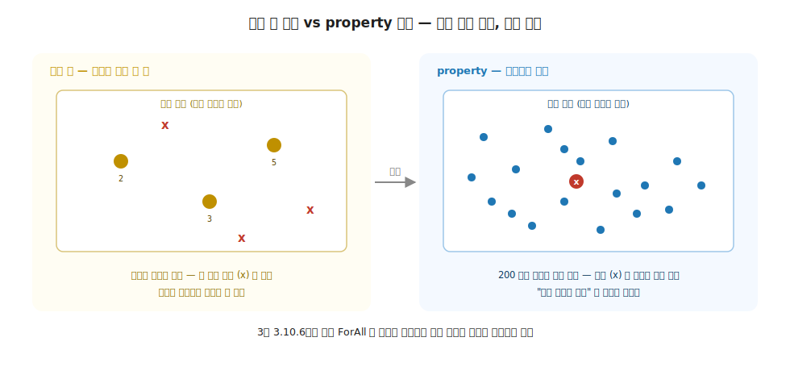
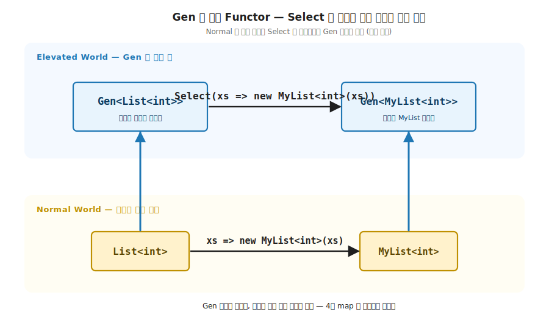
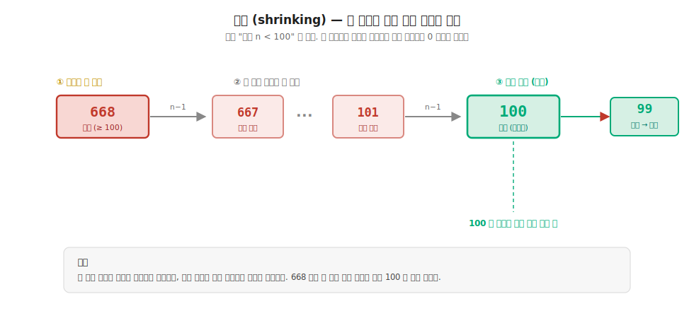
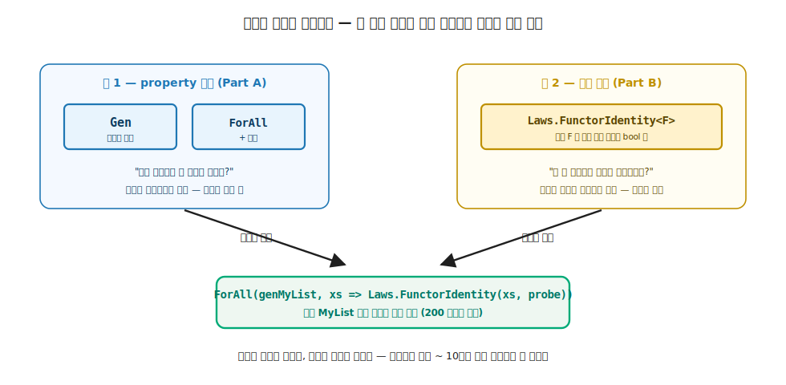

# 38장. property-based 심화와 함수형 테스트 아키텍처 (씨앗에서 한 모듈로)

> **이 장의 목표** — 이 장을 마치면 3장에 심은 한 줄짜리 `ForAll` 을 무작위 생성기와 축소 (shrinking) 로 키워, 손으로 고른 몇 개가 아니라 임의 입력 200 건으로 성질을 검사하고 실패하면 가장 작은 반례까지 줄일 수 있습니다. 나아가 기초 각 장에 흩어져 있던 법칙 검증을 어떤 `F` 든 받는 법칙 모듈 하나로 일반화하고, 그 모듈을 생성기 엔진에 물려 임의 입력으로 법칙을 자동 검증하는 함수형 테스트 아키텍처를 손에 쥡니다. 입력 공간이 무한하다는 검증의 한계를 property 와 법칙 모듈 두 도구로 푸는 것이 이 장의 전부입니다.

> **이 장의 핵심 어휘**
>
> - **`Gen<A>`**: `Func<Random, A>` 를 감싼 무작위 생성기. `Select` 가 있어 사실 Functor
> - **`Prop.ForAll`**: 생성기로 만든 임의 입력 N 건에 성질을 검사하고, 실패하면 축소로 최소 반례를 찾는 엔진
> - **축소 (shrinking)**: 실패한 반례를 더 작은 후보로 줄여 가장 작은 반례를 찾는 단계
> - **`Laws`**: 어떤 `Functor<F>` / `Monad<M>` 인스턴스든 받아 법칙을 검사하는 재사용 모듈
> - **probe**: Elevated 값 `K<F, A>` 안의 원소를 꺼내 두 결과를 비교하게 하는 함수
> - **`BogusListF`**: 일부러 항등 법칙을 어겨, 법칙 검증이 위반을 실제로 잡는지 확인하는 인스턴스
> - **property + 법칙**: 임의 입력 생성과 법칙 검사를 맞물려 임의 입력으로 법칙을 자동 검증하는 결합

> 이 장을 마치면 할 수 있게 되는 것
> - [ ] 특정 값 검증과 property 검증의 차이를 입력 공간으로 설명할 수 있습니다.
> - [ ] `Gen<A>` 이 왜 사실 Functor 인지 `Select` 시그니처로 답할 수 있습니다.
> - [ ] `Prop.ForAll` 이 무작위 입력에 성질을 검사하는 흐름을 시그니처로 적을 수 있습니다.
> - [ ] 축소가 큰 우연 반례를 경계값까지 줄이는 과정을 단계별로 추적할 수 있습니다.
> - [ ] 어떤 `F` 든 받는 법칙 모듈 (`Laws`) 이 기초 각 장의 법칙 헬퍼를 일반화한 것임을 설명할 수 있습니다.
> - [ ] 법칙 모듈이 `BogusListF` 같은 틀린 구현을 거른다는 것을 보일 수 있습니다.
> - [ ] 생성기 엔진과 법칙 모듈을 맞물려 임의 입력으로 법칙을 자동 검증할 수 있습니다.
> - [ ] 직접 만든 property 엔진이 실무의 CsCheck / FsCheck 로 어떻게 이행하는지 짚을 수 있습니다.

> **38장의 흐름** — 새 추상을 배우는 장이 아니라 3장에 심은 두 씨앗을 키우는 장이라, 씨앗 복습으로 시작해 생성기 `Gen`, 엔진 `ForAll` 과 축소, 법칙 모듈 `Laws` 를 거쳐 두 축의 결합 (payoff) 과 실무 이행으로 마무리합니다.

---

## 38.1 왜 필요한가 — 특정 값 몇 개로는 부족하다

38장의 핵심은 한 줄로 압축됩니다. 3장에서 한 줄로 심은 `ForAll` 을 본격 도구로 키우고, 기초 각 장에 흩어진 법칙 검증을 한 모듈로 모읍니다. 새 추상을 배우는 장이 아니라, 이미 심은 씨앗 두 개 (임의 입력 검증, 법칙) 가 여기서 자라 함수형 테스트의 마지막 그림을 완성하는 장입니다.

11부의 다른 장과 결이 다릅니다. 36장과 37장이 효과 코드의 부수 작용과 비결정성을 길들였다면, 38장이 다루는 것은 순수 코드의 검증입니다. 순수 함수는 같은 입력에 같은 출력이라 검증이 가장 쉬운 자리입니다. 그런데도 한 가지 한계가 남습니다. 입력 공간이 무한합니다. 손으로 고른 입력 몇 개가 통과해도, 검사하지 않은 자리에 반례가 숨어 있을 수 있습니다.

### 38.1.1 3장에서 심은 씨앗 복습

3장에서 Monoid 의 결합 법칙을 검증할 때 발상을 한 번 뒤집었습니다. 특정 값을 고르는 대신 임의 입력을 많이 만들어 성질이 성립하는지 검사했습니다. 그 도구가 한 줄짜리 `ForAll` 이었습니다.

```csharp
// 3장 3.7.1절의 최소 property 검증 — 임의 입력 count 개로 성질을 검사 (의존성 0)
public static bool ForAll<A>(Func<Random, A> gen, Func<A, bool> prop, int count = 100, int seed = 42)
{
    var rng = new Random(seed);                  // 고정 seed — 같은 실행, 같은 입력
    for (var i = 0; i < count; i++)
        if (!prop(gen(rng))) return false;        // 한 입력이라도 깨지면 실패
    return true;
}
```

`gen` 은 난수로 입력 하나를 만드는 함수, `prop` 은 그 입력에서 참이어야 할 성질입니다. 이 도구는 두 가지를 못 합니다. 첫째, 생성기가 `Func<Random, A>` 그대로라 입력을 조합하거나 변형하기 어렵습니다. 둘째, 성질이 깨지면 그 깨진 입력 (`gen(rng)` 의 결과) 을 그대로 들고 멈출 뿐, 그 입력이 큰 우연값이면 무엇이 진짜 문제인지 읽기 어렵습니다. 이 장은 이 두 한계를 정확히 풉니다.

### 38.1.2 특정 값 vs 임의 입력 — 입력 공간으로 보기

손으로 고른 값 몇 개로 법칙을 확인하면, 검사한 자리만 통과를 보장합니다. 결합 법칙은 세 값만의 약속이 아니라 모든 값에 대한 약속인데, 고른 세 값이 우연히 통과하는 가짜를 놓칠 수 있습니다.



**그림 38-1. 특정 값 검증과 property 검증** — 왼쪽은 입력 공간에서 손으로 고른 몇 개 (`2`, `3`, `5`) 만 검사하므로 빈 곳에 숨은 반례 (`x`) 를 놓칩니다. 오른쪽은 무작위로 200 건을 만들어 공간을 고루 덮으므로, 반례를 만나는 순간 즉시 실패로 잡습니다. property 검증이 "모든 입력의 약속" 이라는 법칙의 본뜻에 더 가깝습니다.

> **흔한 함정** — "단위 테스트로 입력 몇 개만 골라 `Assert` 하면 충분하지" 로 넘기면, 고른 입력에 없는 반례를 영영 못 봅니다. 검사하지 않은 자리가 곧 사각지대입니다. 필요한 것은 **입력을 무작위로 많이 만들어 성질을 검사하고, 깨지면 사람이 읽을 수 있는 최소 반례로 줄이는** 도구입니다. 그 도구가 이 장의 `Prop.ForAll` 과 축소입니다.

특정 값 검증과 property 검증은 어느 쪽이 옳은가의 문제가 아닙니다. 출력이 한 점으로 정해지는 계산 (`2 + 3 == 5`) 은 특정 값 단언이 맞습니다. 입력이 무엇이든 지켜야 하는 성질 (`reverse(reverse(xs)) == xs`, 결합 법칙) 은 property 가 맞습니다. 이 장이 키우는 것은 후자입니다.

---

## 38.2 생성기 `Gen` — 무작위 입력을 만드는 Elevated 값

3장의 생성기는 `Func<Random, A>` 라는 함수 그대로였습니다. 이 장은 그 함수를 `Gen<A>` 이라는 작은 타입으로 감쌉니다. 감싸는 순간 생성기가 조합 가능한 Elevated 시민이 됩니다.

**이 장의 코드 구조**

이 장의 코드는 Part A (생성기 엔진)·Part B (법칙 모듈)·Part C (둘의 결합) 세 묶음입니다.

```
Ch38-Property-Based/
├── Types/Prop.cs              ← Gen<A> 생성기 + Prop.ForAll + 축소
├── Types/MyList.cs            ← MyList / MyListF (검증 대상) + BogusListF (위반 인스턴스)
├── Traits/Monad.cs            ← K<F,A> · Functor<F> · Monad<M> (1부 toy 재현)
├── Tests/Laws.cs              ← 어떤 F 든 받는 법칙 모듈
├── Tests/PropTests.cs         ← property 예제 (reverse · 최소 반례 · 교환법칙)
├── Challenges/SortProp.cs · BogusCheck.cs   ← 38.7절 정답
└── Program.cs                 ← Part A / B / C 데모
```

### 38.2.1 `Gen<A>` 의 정의

`Gen<A>` 은 `Random` 을 받아 `A` 하나를 만드는 함수를 들고 있습니다.

```csharp
// Gen<A> — 생성기. 무작위 입력을 만든다. (CsCheck/FsCheck 의 Gen 발상.)
public sealed class Gen<A>(Func<Random, A> sample)
{
    public A Sample(Random r) => sample(r);
    public Gen<B> Select<B>(Func<A, B> f) => new(r => f(sample(r)));
}
```

`Sample` 은 난수원 `r` 에서 값 하나를 뽑습니다. 핵심은 그다음 `Select` 입니다. `Gen<A>` 에 `Func<A, B>` 를 주면 `Gen<B>` 이 나옵니다. 이 시그니처가 4장에서 본 `map` 그대로입니다.

기본 생성기 두 개를 정적 메서드로 둡니다. 정수 범위 생성기와 리스트 생성기입니다.

```csharp
public static class Gen
{
    public static Gen<int> IntRange(int lo, int hi) => new(r => r.Next(lo, hi + 1));

    public static Gen<List<int>> ListOf(Gen<int> elem, int maxLen) =>
        new(r =>
        {
            var n = r.Next(0, maxLen + 1);
            var list = new List<int>(n);
            for (var i = 0; i < n; i++) list.Add(elem.Sample(r));
            return list;
        });
}
```

`IntRange(0, 9)` 는 0 부터 9 까지 정수 하나를 뽑는 생성기, `ListOf(IntRange(0, 9), 12)` 는 길이 0 ~ 12 의 정수 리스트를 뽑는 생성기입니다. 리스트 생성기가 원소 생성기를 인자로 받는 점에 주목하면, 작은 생성기를 조립해 큰 생성기를 만드는 합성이 이미 시작됐습니다.

### 38.2.2 `Gen` 은 사실 Functor

`Select` 의 시그니처를 4장 Functor 의 `map` 옆에 두면 같은 모양입니다.

```
Functor 의 map :   (A → B) → (E<A> → E<B>)
Gen 의 Select  :   Gen<A> → (A → B) → Gen<B>
```

`Gen<A>` 은 아직 값이 없는 상자입니다. 안에 든 것은 값이 아니라 값을 만드는 방법입니다. `Select` 가 그 상자 안에서 나올 값에 함수를 미리 끼워 둡니다. 새 함수 `r => f(sample(r))` 는 먼저 `sample` 로 값을 뽑고 그 위에 `f` 를 적용하므로, 생성기의 모양 (난수를 받아 값을 만든다) 은 그대로이고 나올 값의 타입만 `A` 에서 `B` 로 바뀝니다. 4장에서 본 모양 보존 그대로입니다.



**그림 38-2. `Gen` 은 사실 Functor** — 아래 Normal World 의 변환 함수 `xs => new MyList<int>(xs)` 가 `Select` 로 끌어올려지면, 위 Elevated World 에서 `Gen<List<int>>` 을 `Gen<MyList<int>>` 으로 바꿉니다. 생성기 모양 (난수를 받아 값을 만든다) 은 그대로이고 나올 값의 타입만 바뀝니다. 4장 `map` 의 끌어올림이 생성기에도 그대로 적용됩니다. 이 끌어올림이 뒤에서 보는 두 축의 결합에서 검증 대상 인스턴스를 무작위로 만드는 데 쓰입니다.

`Gen` 이 Functor 라는 것은 단순한 호기심이 아닙니다. 뒤에서 보는 두 축의 결합에서 `Gen<List<int>>` 을 `Gen<MyList<int>>` 으로 끌어올려, 검증 대상 인스턴스 자체를 무작위로 만들 때 이 `Select` 가 결정적으로 쓰입니다. 1부의 trait 이 11부 테스트 도구의 부품으로 다시 등장합니다.

> **실무 노트** — 실무의 CsCheck / FsCheck 의 `Gen` 은 Functor 를 넘어 Monad 까지 됩니다. `Select` (map) 뿐 아니라 `SelectMany` (bind) 가 있어, 앞 생성기의 결과에 따라 다음 생성기를 고르는 의존 생성 (예: 먼저 길이를 뽑고 그 길이만큼 원소를 뽑기) 까지 합성합니다. 이 장의 학습용 `Gen` 은 `Select` 만 두어, 생성기가 왜 Functor 인지를 의존 합성에 방해받지 않고 또렷이 보입니다.

---

## 38.3 `Prop.ForAll` 과 축소 — 최소 반례까지 줄이기

3장의 `ForAll` 은 깨진 입력을 그대로 들고 멈췄습니다. 이 장의 `Prop.ForAll` 은 두 가지를 더 합니다. 첫째, 검사 결과를 풍부한 기록으로 돌려줍니다. 둘째, 실패하면 그 반례를 더 작은 값으로 줄입니다.

### 38.3.1 검사 결과를 기록으로 — `Result<A>`

`ForAll` 은 통과 여부만이 아니라 검사 횟수, 최소 반례, 축소 횟수를 함께 돌려줍니다.

```csharp
public static class Prop
{
    public sealed record Result<A>(bool Ok, int Cases, A? Counterexample, int Shrinks);

    public static Result<A> ForAll<A>(
        Gen<A> gen,
        Func<A, bool> property,
        Func<A, IEnumerable<A>> shrink,
        int cases = 200,
        int seed = 42)
    {
        var rng = new Random(seed);
        for (var i = 0; i < cases; i++)
        {
            var x = gen.Sample(rng);
            if (!property(x))
            {
                var (minimal, steps) = Shrink(x, property, shrink);
                return new Result<A>(false, i + 1, minimal, steps);
            }
        }
        return new Result<A>(true, cases, default, 0);
    }
}
```

3장의 `ForAll` 과 골격은 같습니다. 생성기로 입력을 뽑아 (`gen.Sample(rng)`) 성질을 검사하고, 한 입력이라도 깨지면 멈춥니다. 달라진 자리는 두 곳입니다. 인자에 `shrink` 함수가 더해졌고, 성질이 깨지면 곧장 반환하는 대신 먼저 `Shrink` 로 반례를 줄입니다. 모두 통과하면 `Result(true, cases, ...)` 를, 깨지면 `Result(false, 발견까지 케이스, 최소 반례, 축소 횟수)` 를 돌려줍니다.

### 38.3.2 축소의 규칙 — 더 작은데 여전히 실패하면 채택

`shrink` 는 한 값을 받아 그보다 작은 후보들을 내놓는 함수입니다 (`Func<A, IEnumerable<A>>`). `Shrink` 는 후보 중 여전히 성질을 깨는 것을 골라 계속 줄입니다.

```csharp
// 반례를 더 작은 후보로 줄여 나간다 (여전히 실패하는 가장 작은 값).
static (A Minimal, int Steps) Shrink<A>(A failing, Func<A, bool> property, Func<A, IEnumerable<A>> shrink)
{
    var current = failing;
    var steps = 0;
    var reduced = true;
    while (reduced)
    {
        reduced = false;
        foreach (var candidate in shrink(current))
        {
            if (!property(candidate))     // 더 작은데도 여전히 실패 → 채택
            {
                current = candidate;
                steps++;
                reduced = true;
                break;
            }
        }
    }
    return (current, steps);
}
```

규칙은 한 줄입니다. 더 작은 후보가 여전히 실패하면 그 후보를 채택하고, 어떤 후보도 더는 실패하지 않으면 멈춥니다. 멈춘 자리의 `current` 가 성질을 깨는 가장 작은 값, 곧 경계입니다. 후보가 모두 성질을 통과하거나 더 내놓을 후보가 없으면 (빈 열) 루프가 끝납니다.

정수 축소 함수는 0 쪽으로 한 칸씩 내려갑니다.

```csharp
static IEnumerable<int> ShrinkInt(int n) { if (n > 0) yield return n - 1; }   // 0 쪽으로 줄임 (0 에서는 빈 열 → 멈춤)
```

### 38.3.3 최소 반례 찾기 — `n < 100` 의 경계

성질 "모든 n 은 100 보다 작다" 는 거짓입니다. 큰 범위 (0 ~ 1000) 에서 무작위로 뽑으면 100 이상인 값이 곧 반례로 잡힙니다. 그런데 그 첫 반례는 668 같은 큰 우연값입니다. 축소가 그 우연값을 경계 100 까지 줄입니다.

```csharp
// 거짓인 성질 — "모든 n < 100" 은 거짓. 최소 반례는 100 이어야 한다.
public static (bool failed, int counter) FindsMinimalCounterexample()
{
    var r = Prop.ForAll(
        Gen.IntRange(0, 1000),
        n => n < 100,
        ShrinkInt);
    return (!r.Ok, r.Counterexample);
}
```

`ShrinkInt` 는 `n` 에서 `n - 1` 을 내놓습니다. 668 이 반례면 667 을 검사하고, 667 도 100 이상이라 여전히 실패하므로 채택합니다. 이렇게 한 칸씩 내려가다 100 에서 멈춥니다. 99 는 성질을 통과하기 (`99 < 100`) 때문입니다. 100 이 성질을 깨는 가장 작은 값입니다.



**그림 38-3. 축소: 큰 우연 반례를 경계값까지 줄임** — 무작위로 뽑힌 첫 반례 `668` 에서 시작해 `667`, `666`, … 으로 한 칸씩 내려갑니다. 후보가 여전히 성질을 깨는 동안 (`≥ 100`) 계속 채택하다, 경계 `100` 에서 멈춥니다. 한 칸 더 작은 `99` 는 성질을 통과하므로 (`99 < 100`) 채택되지 않습니다. 큰 우연값이 아니라 무엇이 진짜 경계인지 (`100`) 를 손에 쥡니다. 사람이 읽기 쉬운 반례여서 디버깅이 쉬워집니다.

이 데모를 실행하면 다음이 나옵니다.

```text
== 예제 2 — '모든 n < 100' (거짓) → 최소 반례 축소 ==
  성질 성립? False
  최초 반례 발견까지 1 케이스, 축소 568회 → 최소 반례 = 100
```

최초 반례를 1 케이스 만에 발견했고 (첫 무작위 값 668 이 이미 반례), 축소를 568 회 거쳐 100 에 도달했습니다. 668 에서 100 까지가 568 칸입니다. 결과의 `Counterexample` 이 100 이라는 점이 축소의 payoff 입니다. 우연히 뽑힌 668 대신 사람이 의미를 읽을 수 있는 경계 100 을 돌려줍니다.

### 38.3.4 참인 성질 — 200 케이스 통과

거짓 성질의 반대로, 참인 성질은 200 케이스를 모두 통과해 `Ok = true` 를 냅니다. 리스트를 두 번 뒤집으면 원래대로 돌아온다는 성질입니다.

```csharp
// 참인 성질 — reverse(reverse(xs)) == xs (모든 리스트).
public static bool ReverseInvolution()
{
    var r = Prop.ForAll(
        Gen.ListOf(Gen.IntRange(0, 9), 12),
        xs => { var t = xs.ToList(); t.Reverse(); t.Reverse(); return t.SequenceEqual(xs); },
        _ => []);
    return r.Ok;
}
```

참인 성질이라 반례가 없으므로 축소 함수는 빈 후보 (`_ => []`) 면 충분합니다. 축소는 실패했을 때만 동작하기 때문입니다. 무작위로 만든 길이 0 ~ 12 의 리스트 200 개가 모두 성질을 지키므로 `Ok = true` 입니다.

```text
== 예제 1 — reverse∘reverse = id (모든 리스트) ==
  200 케이스 검사 → 통과
```

덧셈 교환법칙 (`n + 7 == 7 + n`) 도 같은 골격으로 임의의 정수 200 건에서 통과합니다 (`AdditionCommutes`). 참인 성질은 조용히 통과하고, 거짓인 성질만 최소 반례로 모습을 드러냅니다.

---

## 38.4 어떤 `F` 든 받는 법칙 모듈 — `Laws`

이 장의 두 번째 씨앗은 법칙입니다. 기초의 각 장은 자기 trait 의 법칙을 그 자리에서 검증했습니다. 4장은 Functor 항등·합성, 7장은 Monad 좌·우 항등과 결합을 각각 검사했습니다. 그 검증 헬퍼들이 장마다 흩어져 있었습니다. 이 장은 그것들을 어떤 `F` 든 받는 한 모듈로 모읍니다.

### 38.4.1 1부 trait 의 toy 재현

법칙 모듈이 받을 대상부터 둡니다. 1부에서 본 `K<F, A>` 신호 타입과 두 trait 을 toy 로 재현합니다.

```csharp
public interface K<in F, A>;

public interface Functor<F> where F : Functor<F>
{
    static abstract K<F, B> Map<A, B>(Func<A, B> f, K<F, A> fa);
}

public interface Monad<M> : Functor<M> where M : Monad<M>
{
    static abstract K<M, A> Pure<A>(A value);
    static abstract K<M, B> Bind<A, B>(K<M, A> ma, Func<A, K<M, B>> f);
}
```

검증 대상 인스턴스는 `MyList` 입니다. 4장 ~ 7장에서 본 것과 같은 3-tuple 패턴입니다. `MyList<A>` 가 자료, `MyListF` 가 태그이고, `MyListF` 가 `Monad<MyListF>` 를 구현해 `Map` / `Pure` / `Bind` 를 모두 갖습니다.

```csharp
public sealed class MyList<A>(IEnumerable<A> items) : K<MyListF, A>
{
    public IReadOnlyList<A> Items { get; } = items.ToList();
}

public sealed class MyListF : Monad<MyListF>
{
    public static K<MyListF, B> Map<A, B>(Func<A, B> f, K<MyListF, A> fa) =>
        new MyList<B>(fa.As().Items.Select(f));
    public static K<MyListF, A> Pure<A>(A value) => new MyList<A>([value]);
    public static K<MyListF, B> Bind<A, B>(K<MyListF, A> ma, Func<A, K<MyListF, B>> f) =>
        new MyList<B>(ma.As().Items.SelectMany(a => f(a).As().Items));
}
```

### 38.4.2 법칙 모듈의 시그니처 — generic + probe

`Laws` 는 정적 메서드의 모음입니다. 각 메서드가 `where F : Functor<F>` 또는 `where M : Monad<M>` 제약 하나로 어떤 인스턴스든 받습니다. Functor 항등 법칙을 봅니다.

```csharp
public static bool FunctorIdentity<F, A>(K<F, A> fa, Func<K<F, A>, IEnumerable<A>> probe)
    where F : Functor<F> =>
    probe(F.Map<A, A>(x => x, fa)).SequenceEqual(probe(fa));
```

항등 법칙은 항등 함수로 `Map` 한 결과가 원본과 같아야 한다는 약속입니다 (`map(id) == id`). 시그니처의 두 자리가 핵심입니다.

| 자리 | 의미 |
|---|---|
| `where F : Functor<F>` | 어떤 Functor 인스턴스든 받습니다. `MyListF` 든 다른 무엇이든 |
| `Func<K<F, A>, IEnumerable<A>> probe` | Elevated 값 안의 원소를 꺼내 비교하게 하는 함수 |

`probe` 가 필요한 까닭은 `K<F, A>` 자체로는 두 값이 같은지 비교할 수 없기 때문입니다. `K<F, A>` 는 신호 타입이라 내부 구조를 모릅니다. 그래서 호출자가 "이 F 에서 원소는 이렇게 꺼낸다" 를 `probe` 로 알려 줍니다. `MyListF` 라면 `x => x.As().Items` 입니다 (`As()` 는 신호 타입 `K<F, A>` 를 구체 타입 `MyList<A>` 로 되돌리는 1부의 헬퍼입니다). 법칙 모듈은 F 가 무엇인지 모른 채, `probe` 가 꺼낸 원소 열을 `SequenceEqual` 로 비교합니다.

### 38.4.3 다섯 법칙을 한 모듈로

같은 패턴으로 Functor 합성, Monad 좌·우 항등, 결합까지 다섯 법칙이 한 모듈에 모입니다.

```csharp
public static bool MonadLeftIdentity<M, A, B>(
    A a, Func<A, K<M, B>> f, Func<K<M, B>, IEnumerable<B>> probe)
    where M : Monad<M> =>
    probe(M.Bind(M.Pure(a), f)).SequenceEqual(probe(f(a)));

public static bool MonadRightIdentity<M, A>(
    K<M, A> m, Func<K<M, A>, IEnumerable<A>> probe)
    where M : Monad<M> =>
    probe(M.Bind(m, M.Pure)).SequenceEqual(probe(m));

public static bool MonadAssociativity<M, A, B, C>(
    K<M, A> m, Func<A, K<M, B>> f, Func<B, K<M, C>> g, Func<K<M, C>, IEnumerable<C>> probe)
    where M : Monad<M> =>
    probe(M.Bind(M.Bind(m, f), g)).SequenceEqual(probe(M.Bind(m, x => M.Bind(f(x), g))));
```

세 Monad 법칙이 7장에서 본 정의 그대로입니다. 좌 항등은 `Bind(Pure(a), f) == f(a)`, 우 항등은 `Bind(m, Pure) == m`, 결합은 `Bind` 의 묶는 순서가 결과를 바꾸지 않는다는 약속입니다. 달라진 자리는 단 하나입니다. 특정 타입이 아니라 generic `M` 과 `probe` 로 어떤 Monad 든 받습니다.

`MyListF` 에 다섯 법칙을 모두 적용하면 전부 통과합니다.

```csharp
K<MyListF, int> nums = new MyList<int>([1, 2, 3, 4]);
Func<K<MyListF, int>, IEnumerable<int>> probeI = x => x.As().Items;
Func<K<MyListF, string>, IEnumerable<string>> probeS = x => x.As().Items;
Func<int, K<MyListF, int>> f = n => new MyList<int>([n, n + 1]);
Func<int, K<MyListF, int>> g = n => new MyList<int>([n * 10]);

Laws.FunctorIdentity<MyListF, int>(nums, probeI);                                      // 통과
Laws.FunctorComposition<MyListF, int, int, string>(nums, x => x + 1, x => $"#{x}", probeS);   // 통과
Laws.MonadLeftIdentity<MyListF, int, int>(5, f, probeI);                               // 통과
Laws.MonadRightIdentity<MyListF, int>(nums, probeI);                                   // 통과
Laws.MonadAssociativity<MyListF, int, int, int>(nums, f, g, probeI);                   // 통과
```

```text
== MyListF 에 대해 다섯 법칙 검사 (한 모듈로) ==
  Functor 항등 : 통과
  Functor 합성 : 통과
  Monad 좌 항등 : 통과
  Monad 우 항등 : 통과
  Monad 결합 : 통과
```

### 38.4.4 법칙 검증이 위반을 실제로 잡는가 — `BogusListF`

법칙이 모두 통과하면 한 가지 의심이 남습니다. 검증 코드가 그냥 항상 통과하는 것은 아닌가. 이를 확인하려면 일부러 법칙을 어기는 인스턴스를 같은 모듈에 넣어 봅니다.

```csharp
// 일부러 법칙을 어기는 인스턴스 — 법칙 검증이 실제로 위반을 잡아내는지 확인용.
public sealed class BogusListF : Functor<BogusListF>
{
    public static K<BogusListF, B> Map<A, B>(Func<A, B> f, K<BogusListF, A> fa) =>
        new BogusList<B>([]);   // 입력 무시 → 항등 법칙 위반
}
```

`BogusListF.Map` 은 입력을 무시하고 늘 빈 리스트를 냅니다. 항등 함수로 `Map` 해도 원소가 사라지므로 항등 법칙 (`map(id) == id`) 을 어깁니다. 같은 `Laws.FunctorIdentity` 에 넣으면 `false` 가 나와야 정상입니다.

```csharp
public static bool CatchesViolation()
{
    K<BogusListF, int> fa = new BogusList<int>([1, 2, 3]);
    var identityHolds = Laws.FunctorIdentity<BogusListF, int>(fa, x => x.As().Items);
    return !identityHolds;   // 위반을 "잡았다" = true
}
```

`[1, 2, 3]` 을 항등 함수로 `Map` 하면 `BogusListF` 는 빈 리스트를 내고, `probe` 로 꺼낸 두 열 (`[]` 와 `[1, 2, 3]`) 이 다르므로 `FunctorIdentity` 가 `false` 를 반환합니다. 검증이 틀린 구현을 거른다는 증거입니다.

```text
== 위반 인스턴스(BogusListF)도 잡아내는가 ==
  BogusListF 항등 법칙 위반을 잡음? 예 (검증이 틀린 구현을 거름)
```

> **한 줄 정리** — 법칙 모듈은 올바른 인스턴스 (`MyListF`) 는 통과시키고 틀린 인스턴스 (`BogusListF`) 는 거릅니다. 통과와 위반을 모두 확인해야 검증이 살아 있다는 것이 증명됩니다.

---

## 38.5 결합 — 임의 입력으로 법칙을 자동 검증

이 장의 payoff 가 여기 있습니다. property 엔진 (`Gen` + `ForAll`) 과 법칙 모듈 (`Laws`) 은 따로 보면 각자의 일을 합니다. 둘을 맞물리면 새 능력이 생깁니다. 임의 입력으로 법칙을 자동 검증하는 것입니다.

### 38.5.1 두 축이 서로의 빈자리를 채운다

두 도구가 서로 모르는 것이 정확히 맞물립니다. property 엔진은 임의 입력을 잘 만들지만 무엇을 검사할지는 모릅니다. 법칙 모듈은 법칙을 잘 검사하지만 입력이 어디서 오는지는 모릅니다. `ForAll` 의 둘째 인자 `property` 자리에 `Laws` 의 법칙 검사를 끼우면, 엔진이 만든 임의 입력마다 법칙이 검사됩니다.

지금까지 `Laws.FunctorIdentity` 는 고정된 `nums` 하나에만 적용했습니다. 한 입력의 통과는 그 입력만의 통과입니다. 임의 입력으로 검사하려면 검증 대상 인스턴스 자체를 무작위로 만들어야 합니다. 여기서 앞서 본 `Gen` 이 Functor 라는 성질이 쓰입니다.

```csharp
// Gen<List<int>> 를 Gen<MyList<int>> 로 끌어올려 검증 대상 인스턴스를 무작위 생성.
Gen<MyList<int>> genMyList = Gen.ListOf(Gen.IntRange(0, 50), 15).Select(xs => new MyList<int>(xs));
```

`Gen.ListOf(...)` 는 `Gen<List<int>>` 입니다. 거기에 `Select(xs => new MyList<int>(xs))` 를 적용하면 `Gen<MyList<int>>` 이 됩니다. 무작위 `List<int>` 를 만들던 생성기가, 이제 무작위 `MyList<int>` 인스턴스를 만드는 생성기로 끌어올려졌습니다. 4장 `map` 의 끌어올림이 검증 대상을 무작위로 공급하는 자리에 그대로 쓰입니다.

### 38.5.2 임의 `MyList` 마다 법칙을 검사

이제 `ForAll` 의 성질 자리에 `Laws` 를 끼웁니다.

```csharp
// 무작위 MyList<int> 마다 Functor 항등 법칙을 검사 — Part A 엔진으로 Part B 법칙을 구동.
var autoFunctorId = Prop.ForAll(
    genMyList,
    xs => Laws.FunctorIdentity<MyListF, int>(xs, x => x.As().Items),
    _ => []);

// 무작위 MyList<int> 마다 Monad 우 항등 법칙도 같은 방식으로 검사.
var autoMonadRightId = Prop.ForAll(
    genMyList,
    xs => Laws.MonadRightIdentity<MyListF, int>(xs, x => x.As().Items),
    _ => []);
```

`ForAll` 의 둘째 인자가 이제 `xs => Laws.FunctorIdentity<MyListF, int>(xs, ...)` 입니다. 엔진이 `genMyList` 로 무작위 `MyList<int>` 를 200 개 뽑아, 그 하나하나에 Functor 항등 법칙을 검사합니다. 고정된 `nums` 하나가 아니라 임의 입력 200 건에서 법칙이 성립함을 확인합니다.



**그림 38-4. 함수형 테스트 아키텍처: 두 축의 결합** — 왼쪽 축 1 (property 엔진) 은 `Gen` 과 `ForAll` 로 임의 입력을 만들지만 무엇을 검사할지는 모릅니다. 오른쪽 축 2 (법칙 모듈) 는 `Laws.FunctorIdentity<F>` 로 어떤 F 든 검사하지만 입력이 어디서 오는지는 모릅니다. 두 축이 `ForAll(genMyList, xs => Laws.FunctorIdentity(xs, probe))` 한 줄로 맞물리면, 임의 `MyList` 마다 법칙이 자동 검증됩니다. 이 장의 `Laws` 는 Functor·Monad 다섯 법칙 (4장·7장) 을 담고, 같은 패턴이면 다른 trait 의 법칙도 같은 방식으로 더해 임의 입력에서 확인할 수 있습니다.

```text
== Gen 으로 만든 임의 MyList<int> 에 대해 법칙을 자동 검증 ==
  Functor 항등 (200 케이스) → 통과
  Monad 우 항등 (200 케이스) → 통과
```

특정 값 검증 (`nums` 하나) 에서 임의 입력 검증 (무작위 200 건) 으로 올라섰습니다. 3장의 한 줄 `ForAll` 과 각 장의 법칙이 여기서 하나로 맞물립니다. 임의 입력 검증은 property 엔진이, 법칙은 법칙 모듈이 맡고, 둘의 결합이 38장의 결론입니다.

---

## 38.6 실무로 — CsCheck / FsCheck 이행

이 장의 `Gen` · `ForAll` · 축소는 의존성 0 으로 직접 만든 학습용 엔진입니다. 메커니즘을 손으로 만져 보는 것이 목적이었습니다. 실무에서는 같은 발상을 검증된 라이브러리로 옮깁니다. C# 에서는 CsCheck, F# 에서는 FsCheck 이 대표입니다.

이행은 두 자리에서 일어납니다. 첫째, 생성기와 엔진을 라이브러리 것으로 바꿉니다. C# 의 CsCheck 이면 직접 만든 `Gen.IntRange` 자리에 대표적으로 `Gen.Int`, `Prop.ForAll` 자리에 `.Sample(...)` 이 들어가고, 축소는 라이브러리가 자동으로 해 직접 만든 `ShrinkInt` 가 필요 없습니다. F# 의 FsCheck 도 같은 발상이되 API 표면은 다릅니다. 둘째, `bool` 헬퍼를 표준 테스트로 감쌉니다. 이 장의 `PropTests.ReverseInvolution` 같은 `bool` 반환 메서드를 xUnit 의 `[Fact]` 와 Shouldly 의 `ShouldBeTrue()` 로 감싸면 그대로 표준 테스트가 됩니다.

```csharp
// 이 장의 bool 헬퍼
public static bool ReverseInvolution() { var r = Prop.ForAll(...); return r.Ok; }

// xUnit + Shouldly 로 감싸면 — 그대로 표준 테스트
[Fact]
public void Reverse_is_involution() => ReverseInvolution().ShouldBeTrue();
```

법칙 모듈도 같습니다. `Laws.FunctorIdentity<MyListF, int>(...)` 같은 검사를 `[Fact]` 로 감싸면, 이 장 모듈의 Functor·Monad 다섯 법칙이 표준 테스트 스위트의 한 자리를 차지하고, 같은 패턴이면 다른 trait 의 법칙도 같은 방식으로 더합니다. 직접 구현으로 메커니즘을 이해한 뒤 라이브러리로 옮기는 것이 이 책의 일관된 흐름입니다.

> **한 줄 정리** — 직접 만든 엔진은 발상을 만지기 위한 것이고, 실무는 CsCheck / FsCheck 으로 옮깁니다. `bool` 헬퍼를 `[Fact]` + `ShouldBeTrue()` 로 감싸는 것이 이행의 한 걸음입니다.

---

## 38.7 직접 해보기 — 챌린지

본문을 읽은 것과 손으로 작성·추적할 수 있는 것의 차이를 만듭니다. 두 챌린지는 38장의 결정적 자리 (property 로 성질을 검증하는 법, 법칙 모듈이 위반을 거르는 법) 를 직접 묻습니다. 두 정답 모두 실행 가능한 코드로 들어 있습니다.

### 38.7.1 정렬의 성질을 property 로 검증하기

> 챌린지: 올바른 정렬과 틀린 "정렬" 을 property 로 가려내기
>
> 정렬은 두 성질을 지켜야 합니다. 길이를 보존하고 (원소 개수가 그대로), 결과가 오름차순입니다. 올바른 정렬은 이 둘을 모두 지키고, 틀린 "정렬" (중복 제거가 섞인 것) 은 길이 보존을 어깁니다. 두 경우를 property 로 가려냅니다.
>
> **본문 어느 자리의 이해도를 묻는가**
>
> 1. `Prop.ForAll` 로 임의 리스트에 성질을 검사하는 법.
> 2. 참인 성질은 통과 (`Ok = true`), 거짓인 성질은 반례를 잡는다 (`Ok = false`) 는 것.
>
> **해보기**
>
> 1. 올바른 정렬의 성질을 작성합니다. `xs.OrderBy(...)` 의 길이가 `xs` 와 같고, 인접 원소가 오름차순인지 검사합니다.
> 2. 틀린 "정렬" 의 성질을 작성합니다. `xs.Distinct().OrderBy(...).Count() == xs.Count` 를 검사합니다 (중복이 있으면 거짓).
> 3. 작은 범위 (0 ~ 3) 의 리스트로 뽑으면 중복이 잦아 틀린 "정렬" 의 반례가 쉽게 잡힘을 확인합니다.
>
> **검증 포인트**
>
> - 올바른 정렬의 성질이 200 케이스를 통과하는가 (`Ok = true`)?
> - 틀린 "정렬" 이 반례로 잡히는가 (`Ok = false`)?
>
> 정답 코드: `code/Part11-FunctionalTesting/Ch38-Property-Based/Challenges/SortProp.cs`.

### 38.7.2 법칙 위반 인스턴스를 같은 모듈로 잡기

> 챌린지: `BogusListF` 의 항등 법칙 위반을 `Laws` 로 확인하기
>
> `BogusListF` 는 `Map` 이 입력을 무시하고 빈 리스트를 내므로 항등 법칙을 어깁니다. 이 위반을 법칙 모듈의 `Laws.FunctorIdentity` 로 잡습니다. 올바른 인스턴스가 아닌 틀린 인스턴스에서 검증이 어떻게 반응하는지 확인합니다.
>
> **본문 어느 자리의 이해도를 묻는가**
>
> 1. 법칙 모듈이 generic + probe 로 어떤 F 든 받는다는 것.
> 2. 항등 법칙 (`map(id) == id`) 이 입력을 무시하는 구현에서 깨진다는 것.
>
> **해보기**
>
> 1. `BogusList<int>([1, 2, 3])` 을 만듭니다.
> 2. `Laws.FunctorIdentity<BogusListF, int>(fa, x => x.As().Items)` 를 호출합니다.
> 3. 결과가 `false` 임을 확인하고, 위반을 잡았으므로 `!false == true` 로 뒤집습니다.
>
> **검증 포인트**
>
> - `FunctorIdentity` 가 `BogusListF` 에서 `false` 를 내는가?
> - 같은 모듈이 `MyListF` (통과) 와 `BogusListF` (위반) 를 다르게 판정하는가?
>
> 정답 코드: `code/Part11-FunctionalTesting/Ch38-Property-Based/Challenges/BogusCheck.cs`.

### 38.7.3 두 챌린지가 노리는 능력

두 챌린지는 38장의 핵심 (property 는 임의 입력으로 성질을, 법칙 모듈은 어떤 F 든 받아 약속을 검사한다) 을 두 각도에서 묻습니다. 첫째는 도메인 성질 (정렬) 을 property 로 검증해 참인 성질과 거짓인 성질을 가르는 능력, 둘째는 법칙 모듈이 틀린 구현을 실제로 거른다는 것을 보이는 능력입니다. 둘을 다 통과하면 "property 와 법칙이 임의 입력 자동 검증으로 맞물린다" 를 코드로 답할 수 있습니다.

---

## 38.8 Elevated World 어휘로 다시 읽기

38장의 도구를 1장 비유에 매핑합니다.

| 38장 도구 | Elevated World 어휘 |
|---|---|
| `Gen<A>` | 값을 만드는 방법을 담은 Elevated 시민. `Select` 로 안의 결과를 끌어올림 (Functor) |
| `Prop.ForAll` | 임의 입력으로 성질을 검사하고 실패하면 최소 반례로 줄이는 엔진 |
| `Laws` | 어떤 Elevated 시민 (`F`) 든 받아 그 약속 (법칙) 을 검사하는 모듈 |
| `Gen` × `Laws` | 임의 입력 생성과 법칙 검사가 맞물린 자동 검증 |

3장의 `ForAll` 이 임의 입력 검증의 씨앗이었다면, 38장은 그 씨앗을 생성기 Functor 와 축소로 키우고, 각 장의 법칙을 한 모듈로 모아 둘을 맞물린 마지막 그림입니다. 비유는 여기까지가 역할입니다. property 와 법칙의 결합이 함수형 테스트의 자동 검증을 정합니다.

---

## 38.9 Q&A — 자기 점검

> **Q1. 특정 값 검증과 property 검증은 무엇이 다릅니까?** (38.1.2절)

검사하는 입력의 범위가 다릅니다. 특정 값 검증은 손으로 고른 입력 몇 개를 검사하므로, 고른 입력에 없는 반례를 놓칩니다. property 검증은 입력을 무작위로 많이 만들어 입력 공간을 고루 덮으므로, 반례를 만나면 즉시 잡습니다. 출력이 한 점으로 정해지는 계산은 특정 값 단언이, 입력이 무엇이든 지켜야 하는 성질은 property 가 맞습니다.

> **Q2. `Gen<A>` 은 왜 Functor 입니까?** (38.2.2절)

`Select` 의 시그니처가 4장 `map` 과 같기 때문입니다. `Gen<A>` 에 `Func<A, B>` 를 주면 `Gen<B>` 이 나옵니다. `Gen<A>` 은 아직 값이 없고 값을 만드는 방법을 담은 상자라, `Select` 가 그 상자 안에서 나올 값에 함수를 미리 끼웁니다. 생성기 모양은 그대로이고 나올 값의 타입만 바뀌므로 모양 보존입니다. 이 끌어올림이 두 축의 결합 (38.5절) 에서 검증 대상 인스턴스를 무작위로 만드는 데 쓰입니다.

> **Q3. 축소 (shrinking) 는 왜 필요합니까?** (38.3.2절)

무작위로 잡힌 첫 반례가 큰 우연값이라 사람이 읽기 어렵기 때문입니다. 성질 "모든 n 은 100 보다 작다" 의 첫 반례는 668 같은 값일 수 있는데, 축소가 그 값을 더 작은 후보로 한 칸씩 줄여 경계 100 을 찾습니다. 무엇이 진짜 경계인지 (100) 를 알면 디버깅이 쉬워집니다. 668 보다 100 이 문제의 본질을 더 또렷이 가리킵니다.

> **Q4. 축소는 어디서 멈춥니까?** (38.3.2절)

더 작은 후보가 더는 성질을 깨지 않을 때 멈춥니다. `Shrink` 는 후보가 여전히 실패하면 채택하고 계속 줄이다, 어떤 후보도 실패하지 않으면 멈춥니다. `n < 100` 에서 100 은 실패 (`100 < 100` 거짓) 하지만 99 는 통과 (`99 < 100`) 하므로, 100 에서 멈춥니다. 멈춘 자리가 성질을 깨는 가장 작은 값입니다.

> **Q5. 법칙 모듈의 `probe` 는 무엇입니까?** (38.4.2절)

Elevated 값 `K<F, A>` 안의 원소를 꺼내 두 결과를 비교하게 하는 함수입니다. `K<F, A>` 는 신호 타입이라 내부 구조를 몰라 그 자체로는 같은지 비교할 수 없습니다. 그래서 호출자가 "이 F 에서 원소는 이렇게 꺼낸다" 를 `probe` 로 알려 줍니다. `MyListF` 라면 `x => x.As().Items` 입니다. 법칙 모듈은 F 를 모른 채 `probe` 가 꺼낸 원소 열을 `SequenceEqual` 로 비교합니다.

> **Q6. 법칙 검증이 항상 통과하는 것은 아닌지 어떻게 압니까?** (38.4.4절)

일부러 법칙을 어기는 `BogusListF` 를 같은 모듈에 넣어 확인합니다. `BogusListF.Map` 은 입력을 무시하고 빈 리스트를 내므로 항등 법칙을 어깁니다. `Laws.FunctorIdentity` 에 넣으면 `false` 가 나옵니다. 올바른 `MyListF` 는 통과시키고 틀린 `BogusListF` 는 거른다는 것이, 검증이 살아 있다는 증거입니다.

> **Q7. 임의 입력으로 법칙을 자동 검증한다는 것은 무엇입니까?** (38.5절)

property 엔진과 법칙 모듈을 맞물린다는 뜻입니다. `ForAll` 의 성질 자리에 `Laws` 의 법칙 검사를 끼우면, 엔진이 만든 임의 입력마다 법칙이 검사됩니다. 검증 대상 인스턴스는 `Gen` 의 `Select` 로 `Gen<MyList<int>>` 을 만들어 무작위로 공급합니다. 고정된 한 입력이 아니라 임의 200 건에서 법칙이 성립함을 확인합니다.

> **Q8. 이 장의 법칙 검증은 36장 · 37장과 무엇이 다릅니까?** (38.1절)

다루는 대상이 다릅니다. 36장 · 37장은 효과 코드의 부수 작용과 비결정성을 런타임 더블로 길들였습니다. 38장은 순수 코드의 검증입니다. 순수 함수는 같은 입력에 같은 출력이라 검증이 쉽지만, 입력 공간이 무한하다는 한계가 남습니다. 38장은 그 한계를 property 와 법칙 모듈로 풀어, Functor·Monad 다섯 법칙 (4장·7장) 을 임의 입력에서 한 모듈로 확인합니다.

---

## 38.10 요약

- **특정 값 몇 개로는 부족한 데서 출발했습니다.** 손으로 고른 입력은 검사하지 않은 자리의 반례를 놓칩니다 (38.1절).
- **`Gen<A>` 은 무작위 입력을 만드는 Elevated 시민입니다.** `Select` 가 있어 사실 Functor 이고, 작은 생성기를 조립해 큰 생성기를 만듭니다 (38.2절).
- **`Prop.ForAll` 은 임의 입력에 성질을 검사하고 실패하면 축소합니다.** 통과 여부와 최소 반례, 축소 횟수를 함께 돌려줍니다 (38.3절).
- **축소는 큰 우연 반례를 경계값까지 줄입니다.** `n < 100` 의 첫 반례를 100 까지 줄여 사람이 읽을 수 있게 합니다 (38.3.3절).
- **`Laws` 는 어떤 `F` 든 받는 법칙 모듈입니다.** 기초 각 장의 법칙 헬퍼를 generic + probe 로 일반화했습니다 (38.4절).
- **법칙 모듈은 틀린 구현을 거릅니다.** 올바른 `MyListF` 는 통과시키고 위반하는 `BogusListF` 는 잡습니다 (38.4.4절).
- **property 와 법칙을 맞물리면 임의 입력 자동 검증이 됩니다.** 3장의 한 줄 `ForAll` 과 각 장의 법칙이 여기서 한 모듈로 모입니다 (38.5절).

---

## 38.11 11부를 마치며 — 효과에서 성질까지

11부는 기초 ~ 10부의 모든 설계를 테스트로 거두었습니다. 세 장이 각자 다른 검증의 어려움을 풀었습니다.

| 장 | 대상 | 검증의 어려움 | 핵심 도구 |
|---|---|---|---|
| 36장 | 효과 코드 | 부수 작용 | 런타임 더블 주입 |
| 37장 | 동시 · 스트리밍 · 자원 | 비결정성 · 시간 · 수명 | 결정적 스케줄 · 골든 테스트 |
| **이 장 (38장)** | **순수 코드의 성질** | **무한한 입력 공간** | **생성기 + 축소 + 법칙 모듈** |

11부를 관통한 통찰은 하나입니다. 순수성과 효과를 값으로 인코딩하는 설계가 곧 테스트 가능성입니다. 36장은 부수 작용을 값 (`Eff<RT>`) 으로 인코딩하고 런타임만 바꿔 효과 코드를 결정적으로 검사했고, 37장은 비결정성을 결정적 도구로 길들였으며, 38장은 순수 코드의 무한한 입력 공간을 property 와 법칙으로 덮었습니다. 법칙 검증은 기초 각 장에서 그 자리에 심었고, 11부가 그것을 효과·비결정성·임의 입력의 전문 테스트로 키웠습니다.

특히 38장은 3장에 심은 한 줄짜리 씨앗이 한 모듈로 자라는 것을 보였습니다. 기초의 각 trait 이 자기 장에서 `ForAll` 로 법칙을 검증했고, 그 흩어진 검증 가운데 Functor·Monad 다섯 법칙 (4장·7장) 이 어떤 `F` 든 받는 `Laws` 한 모듈로 모였습니다. 같은 패턴이면 다른 trait 의 법칙도 같은 방식으로 더할 수 있습니다. 이 책이 처음부터 직접 구현을 고집한 보람이 이 자리에서 드러납니다. 기초에서 심은 추상이 마지막에 테스트 도구의 부품으로 다시 등장합니다.

11부를 마치면 다음 Part 는 실무입니다. 지금까지 만든 모든 도구 (효과 · 동시성 · 스트리밍 · 자원 · 테스트) 를 실제 애플리케이션 구조에 배치하는 자리입니다.

> **실무 디딤돌** — 이 장의 property 엔진은 실무에서 CsCheck / FsCheck 으로, 단언은 xUnit / Shouldly 로 옮깁니다. `bool` 헬퍼를 `[Fact]` + `ShouldBeTrue()` 로 감싸면 그대로 표준 테스트 스위트의 한 자리가 됩니다. 도메인 불변식 (정렬·직렬화 왕복·파싱·인코딩) 을 property 로 검사하는 것이 실무에서 이 장 도구가 가장 자주 쓰이는 자리입니다.
>
> **테스트 디딤돌** — property 와 법칙 모듈로 검증하는 패턴 (도메인 불변식·직렬화 왕복) 은 다음 실무 Part 에서 애플리케이션의 핵심 불변식을 지키는 표준 검사로 옮겨갑니다. 임의 입력에서 법칙을 자동 검증하던 결합이, 실무 코드의 계약을 임의 입력으로 지키는 자리에 그대로 쓰입니다.
