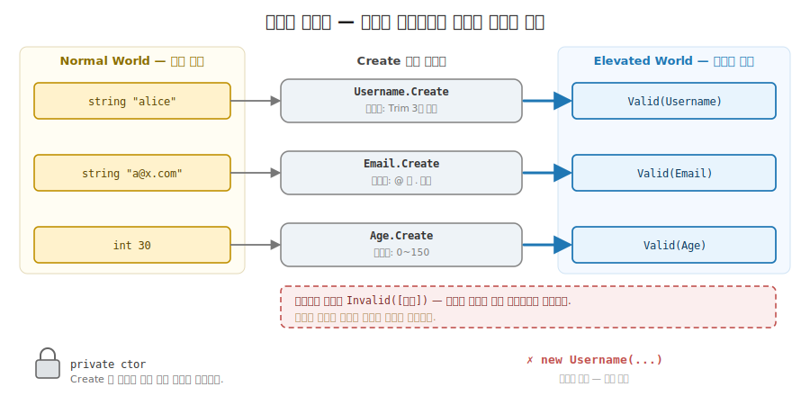
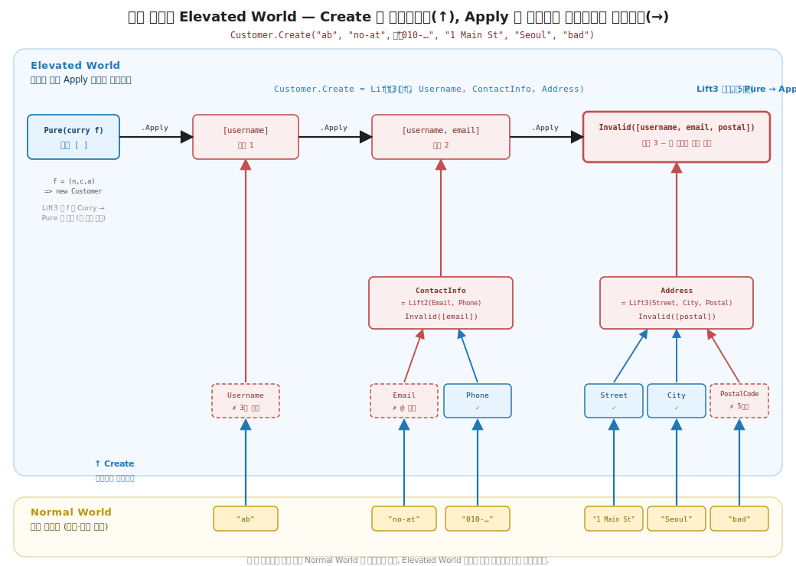
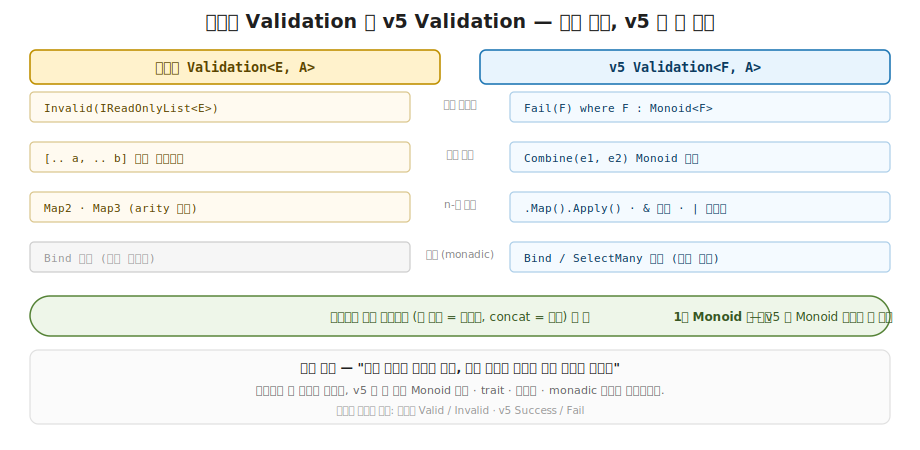

# 39장. 도메인 모델링과 검증 — 잘못된 상태를 표현 불가능하게 (강타입 도메인 + Validation 누적 파이프라인)

> **이 장의 목표** — 이 장을 마치면 잘못된 값이 아예 컴파일되지 않는 강타입 도메인을 설계하고, 3부에서 만든 `Validation` 의 applicative 누적으로 원시 입력 (`string` · `int`) 을 검증된 도메인 타입으로 끌어올리는 end-to-end 파이프라인을 작성할 수 있습니다. 핵심은 두 가지를 한 코드로 합치는 데 있습니다. private 생성자 + 스마트 생성자로 불변식을 타입 경계에 가둬 잘못된 상태를 표현 불가능하게 만드는 것 하나, 그렇게 만든 세 검증을 `Map3` 로 동시에 굴려 첫 오류에서 멈추지 않고 모든 오류를 한 번에 모으는 것 하나입니다. 회원가입 입력을 받아 `Username` · `Email` · `Age` 를 각각 검증하고, 셋이 모두 유효할 때만 `User` 값이 존재하게 만들며, 셋 다 틀린 입력을 넣으면 세 오류가 모두 누적되는 것을 손계산으로 추적합니다. 이 장은 12부의 첫 장으로, 새 추상을 배우는 자리가 아니라 3부의 `Validation` 을 실무 도메인에 합성하는 자리입니다.

> **이 장의 핵심 어휘**
>
> - **잘못된 상태를 표현 불가능하게 (make illegal states unrepresentable)**: 검증을 통과하지 못한 값이 아예 타입으로 존재할 수 없게 만드는 설계 원칙
> - **강타입 도메인 (strongly-typed domain)**: 원시 `string` · `int` 대신 의미가 박힌 도메인 타입 (`Username` · `Email` · `Age`) 으로 값을 표현하는 모델링
> - **스마트 생성자 (smart constructor)**: 생성자를 `private` 으로 닫고, 불변식을 검사해 통과해야만 값을 내주는 `static Create` 메서드
> - **`Validation<E, A>`**: 3부에서 만든 applicative 누적 검증, 성공 `Valid` 또는 실패 `Invalid` 의 두 케이스
> - **applicative 누적 (accumulation)**: 여러 검증을 동시에 굴려 실패를 모두 모으는 결합, 첫 실패에서 멈추는 monadic 단락과 대비
> - **`Map2` · `Map3`**: 두 개 · 세 개의 독립 검증을 동시에 결합하는 결합기, 모두 성공해야 성공이고 아니면 양쪽 오류를 모음
> - **private 생성자 (private constructor)**: 외부에서 생성자를 직접 못 부르게 닫아, 검증 우회 경로를 원리적으로 차단하는 장치
> - **primitive obsession (원시 타입 남용)**: 도메인 개념을 원시 타입 그대로 들고 다녀 잘못된 값이 어디서든 새는 안티패턴

> 이 장을 마치면 할 수 있게 되는 것
> - [ ] 원시 `string` · `int` 를 그대로 들고 다닐 때 잘못된 값이 왜 어디서든 새는지 설명할 수 있습니다.
> - [ ] 필드를 `if` 로 하나씩 검사하면 왜 사용자가 오류를 하나씩만 보게 되는지 설명할 수 있습니다.
> - [ ] private 생성자 + 스마트 생성자가 어떻게 잘못된 상태를 표현 불가능하게 만드는지 설명할 수 있습니다.
> - [ ] 스마트 생성자가 왜 예외가 아니라 `Validation` 을 반환하는지 답할 수 있습니다.
> - [ ] `Map3` 가 왜 `Map2(Map2(va, vb, …), vc, …)` 로 짜이는지 손으로 펼쳐 따라갈 수 있습니다.
> - [ ] `Register("ab", "no-at", 200)` 이 세 오류를 모두 모으는 과정을 손계산으로 추적할 수 있습니다.
> - [ ] applicative 누적이 monadic 단락과 왜 다른지 (독립 vs 의존) 답할 수 있습니다.
> - [ ] `User` 값이 손에 있다는 것이 왜 세 필드 검증의 컴파일 타임 보증인지 설명할 수 있습니다.

---

## 39.1 이 장에서 다루는 것 — 도메인을 타입으로

11부까지 우리는 함수형의 도구를 하나씩 직접 손으로 만들며 익혔습니다. 1~3부에서 5 개 trait 와 Monoid, 그리고 `Validation` 을 만들었고, 5부에서 Reader · State · Writer 를, 7부에서 `Eff<RT>` 와 `Has` DI 를, 8부에서 Schedule 과 Resource 를, 9부에서 Atom 과 STM 을, 10부에서 스트리밍을, 11부에서 테스트 더블과 런타임 교체를 만들었습니다. 도구는 다 손에 있습니다. 그런데 실무는 이 도구들을 하나씩 떼어 쓰지 않습니다. 한 기능 안에서 검증과 의존성 주입과 오류 처리와 자원과 스트리밍이 동시에 얽힙니다.

12부의 출발점은 이 도구들이 한 실무 코드로 합성되는 자리입니다. 그래서 이 장에는 새 추상이 없습니다. 한 문장으로 잡습니다. 3부에서 만든 `Validation` 의 applicative 누적을, 실무에서 가장 먼저 부딪히는 자리 (사용자 입력을 도메인 타입으로 바꾸는 입구) 에 합성합니다. 입력 검증은 모든 애플리케이션의 가장 바깥 경계이고, 그래서 12부의 가장 바깥 장입니다.

먼저 이 장이 무슨 일을 하는지 그림 하나로 잡습니다. 보통의 코드는 사용자 입력을 `string name`, `int age` 처럼 원시 타입 그대로 받아 들고 다닙니다. 그러다 어딘가에서 `name` 이 빈 문자열인지, `age` 가 음수인지를 그때그때 검사합니다. 이 장이 만드는 것은 다릅니다. 검증을 통과해야만 존재하는 타입 (`Username`, `Email`, `Age`) 을 먼저 만들고, 원시 입력을 그 타입으로 끌어올리는 입구 하나를 둡니다. 그 입구를 통과한 값은 이미 검증됐으므로, 이후 코드는 다시 검사할 필요가 없습니다. 잘못된 값은 입구에서 막혀 도메인 경계 안으로 들어오지 못합니다.

여기서 12부 전체를 꿰는 한 줄이 나옵니다. 1부에서 익힌 함수형의 본질 (모든 값과 함수를 합성 가능한 Elevated World 로 끌어올림) 이, 12부에서는 실무 규모로 확장됩니다. 3부에서 `Validation` 으로 작은 값 하나를 검증해 끌어올리던 그 동사를, 이 장에서는 회원가입 폼 전체 (이름 · 이메일 · 나이 세 필드) 에 동시에 겁니다. 같은 어휘, 실무의 무대입니다.

지금 모든 것을 외우지 않아도 됩니다. 이 장이 끝날 때 손에 남는 것은 두 가지입니다. 검증을 통과해야만 도메인 타입이 존재한다는 설계 하나와, 여러 검증을 동시에 굴려 모든 오류를 한 번에 모은다는 발상 하나입니다. 이 장에 등장하는 어휘를 한 줄씩만 미리 짚어 둡니다. 스마트 생성자는 생성자를 `private` 으로 닫고 검증을 통과해야만 값을 내주는 `Create` 메서드입니다. `Validation<E, A>` 는 3부에서 만든 검증 타입으로, 성공 `Valid` 또는 실패 `Invalid` 입니다. applicative 누적은 여러 검증을 동시에 굴려 실패를 다 모으는 결합입니다. 모두 본문에서 코드와 함께 다시 천천히 풀므로, 여기서는 이름과 한 줄 뜻만 스쳐 두면 됩니다.

---

## 39.2 왜 필요한가 — 원시 타입과 첫 오류에서 멈춤

강타입 도메인을 보이기 전에, 원시 타입을 그대로 들고 다니거나 검증을 순진하게 짜면 어디서 막히는지부터 부딪혀 봅니다. 설계 원칙을 먼저 외우지 않고 손에 잡히는 불편을 먼저 겪는 것이 이 장의 순서입니다.

흔한 작업을 하나 떠올립니다. 회원가입 폼에서 이름 · 이메일 · 나이를 받습니다. 명령형이나 평범한 객체 지향으로 적으면 이렇게 시작하게 됩니다.

```csharp
// 원시 타입을 그대로 들고 다니는 회원가입
public sealed record User(string Name, string Email, int Age);

User Register(string name, string email, int age) =>
    new User(name, email, age);   // ← 아무 검증 없이 그대로 생성된다
```

문제가 둘입니다.

**첫째, 잘못된 값이 어디서든 샙니다.** `User` 의 세 필드가 모두 원시 타입 (`string` · `int`) 이라, `new User("", "엉터리", -5)` 도 멀쩡히 만들어집니다. 빈 이름, `@` 없는 이메일, 음수 나이가 아무 저항 없이 `User` 안으로 들어갑니다. 이 `User` 를 받는 코드는 그 값이 검증됐는지 알 길이 없어, 쓰는 자리마다 다시 `if (string.IsNullOrEmpty(user.Name))` 를 검사하게 됩니다. 검증이 한 입구에 모이지 않고 코드 전체로 흩어집니다. 이렇게 도메인 개념 (사용자 이름 · 이메일 · 나이) 을 원시 타입 그대로 들고 다녀 잘못된 값이 어디서든 새는 것을 primitive obsession (원시 타입 남용) 이라 부릅니다.

OO 직감으로 옮기면 익숙합니다. `string` 으로 모든 것을 표현하던 코드가 `Money`, `EmailAddress`, `PhoneNumber` 같은 값 객체 (value object) 로 옮겨 가는 그 리팩터링이 정확히 이 불편을 푸는 길입니다. 원시 타입은 의미를 잃은 채 떠다니지만, 도메인 타입은 그 안에 불변식 (이메일은 `@` 를 포함한다) 을 담을 수 있습니다.

**둘째, 검증을 순진하게 짜면 첫 오류에서 멈춥니다.** 그래서 검증을 넣기로 합니다. 가장 먼저 떠오르는 모양은 `if` 로 하나씩 검사하다 틀리면 곧장 던지거나 돌려보내는 것입니다.

```csharp
// 첫 오류에서 멈추는 검증 — 사용자는 오류를 하나씩만 본다
User Register(string name, string email, int age)
{
    if (name.Trim().Length < 3)        throw new ArgumentException("이름이 너무 짧음");
    if (!email.Contains('@'))          throw new ArgumentException("이메일 형식 오류");  // ← 여기 도달 못 할 수도
    if (age is < 0 or > 150)           throw new ArgumentException("나이 범위 오류");
    return new User(name, email, age);
}
```

`Register("ab", "엉터리", 200)` 을 부르면 어떻게 될까요. 첫 `if` 에서 이름이 짧다고 곧장 던집니다. 그러면 이메일과 나이는 검사조차 못 합니다. 사용자는 "이름이 너무 짧음" 한 줄만 보고, 고쳐서 다시 제출하면 그제야 "이메일 형식 오류" 를 봅니다. 세 군데가 다 틀렸는데 오류를 하나씩 세 번에 나눠 보게 됩니다. 회원가입 폼에서 가장 답답한 경험입니다.

이 두 불편의 공통점은 하나입니다. 검증이 타입과 분리되어 있고 (원시 타입을 그대로 들고 다님), 검증이 순차적이라 첫 실패에서 멈춥니다. 우리가 바라는 것은 분명합니다. 검증을 통과한 값만 도메인 타입으로 존재하게 하고 싶고, 여러 필드를 동시에 검사해 틀린 것을 한 번에 다 보여 주고 싶습니다.

> **흔한 함정** — 검증은 입구에서 한 번만 하면 되지 않냐고 여기는 것입니다.
>
> 입구에서 검증을 했다고 해도, `User` 의 필드가 여전히 원시 `string` 이면 그 보증이 타입에 남지 않습니다. 입구를 통과한 `User` 와 검증 없이 `new User(...)` 로 만든 `User` 가 같은 타입이라, 컴파일러는 둘을 구분하지 못합니다. 그래서 이 `User` 를 받는 다음 함수는 "이게 검증된 값인가" 를 알 수 없어 방어적으로 다시 검사하거나, 아니면 검사를 빼고 잘못된 값에 노출됩니다. 이 장의 강타입 도메인은 검증의 결과를 타입에 새겨, `Username` 값이 손에 있다는 것 자체가 "이미 검증됐다" 는 보증이 되게 만듭니다. 검증을 한 번만 하는 것을 넘어, 그 한 번의 결과가 타입에 영원히 남게 하는 것이 핵심입니다.

다음 절에서 그 강타입 도메인이 어떤 구조인지 봅니다.

---

## 39.3 강타입 도메인 — 스마트 생성자

이제 검증을 통과해야만 존재하는 타입을 만듭니다. 핵심 발상은 한 문장입니다. 생성자를 `private` 으로 닫아 아무나 못 만들게 하고, 불변식을 검사해 통과한 경우에만 값을 내주는 입구 하나만 열어 둬라. 그 입구가 스마트 생성자입니다.

일상의 비유로 직감만 짧게 잡습니다. 출입증 발급 창구를 떠올립니다. 건물 안으로 들어가려면 반드시 창구에서 신원을 확인받고 출입증을 받아야 합니다. 옆문으로 몰래 들어갈 수는 없습니다 (옆문이 잠겨 있으니까요). 그래서 건물 안에서 누군가 출입증을 들고 있다면, 그 사람은 이미 신원 확인을 통과한 사람입니다. 다시 확인할 필요가 없습니다. 스마트 생성자가 그 창구이고, `private` 생성자가 잠긴 옆문이며, 도메인 타입 값이 출입증입니다.

먼저 이름을 표현하는 `Username` 입니다.

```csharp
// 강타입 도메인 — 검증을 통과해야만 생성되는 값 (잘못된 상태를 표현 불가능하게).
// private 생성자 + 스마트 생성자(Validation 반환) 로 불변식을 타입 경계에 가둔다.
public sealed record Username
{
    public string Value { get; }
    private Username(string value) => Value = value;        // ← 생성자를 닫는다 (옆문 잠금)

    public static Validation<string, Username> Create(string raw) =>
        raw.Trim().Length >= 3                              // ← 불변식: 3자 이상
            ? Validation<string, Username>.Success(new Username(raw.Trim()))
            : Validation<string, Username>.Fail($"username '{raw}' 은 3자 이상이어야 함");
}
```

한 줄씩 읽습니다. `Username` 은 `Value` 하나를 품은 record 입니다. 결정적인 곳은 생성자 앞의 `private` 입니다. 이 한 단어가 외부에서 `new Username(...)` 을 부르는 길을 막습니다. 그러면 `Username` 값을 어떻게 얻을까요. 유일한 입구가 `static Create` 입니다. `Create` 는 원시 `string` 을 받아 불변식 (`raw.Trim().Length >= 3`, 곧 공백을 떼고 3자 이상) 을 검사합니다. 통과하면 `Success` 로 `Username` 값을 감싸 내주고, 못 통과하면 `Fail` 로 오류 메시지를 내줍니다. 곧 `Create` 만이 `Username` 을 만들 수 있고, `Create` 는 검증을 통과해야만 만들어 줍니다.

이메일과 나이도 같은 모양입니다.

```csharp
public sealed record Email
{
    public string Value { get; }
    private Email(string value) => Value = value;

    public static Validation<string, Email> Create(string raw) =>
        raw.Contains('@') && raw.Contains('.')              // ← 불변식: @ 와 . 둘 다 포함
            ? Validation<string, Email>.Success(new Email(raw))
            : Validation<string, Email>.Fail($"email '{raw}' 형식이 올바르지 않음");
}

public sealed record Age
{
    public int Value { get; }
    private Age(int value) => Value = value;

    public static Validation<string, Age> Create(int raw) =>
        raw is >= 0 and <= 150                              // ← 불변식: 0~150 범위
            ? Validation<string, Age>.Success(new Age(raw))
            : Validation<string, Age>.Fail($"age {raw} 은 0~150 범위여야 함");
}
```

세 타입 모두 같은 골격입니다. `private` 생성자로 직접 생성을 막고, `Create` 가 각자의 불변식 (`Email` 은 `@` 와 `.` 을 둘 다 포함, `Age` 는 0~150 범위) 을 검사해 `Validation` 을 돌려줍니다. 이제 세 타입을 묶은 도메인 객체 `User` 입니다.

```csharp
// 검증된 도메인 객체 — 이 타입이 존재하면 세 필드가 모두 유효함이 보장된다.
public sealed record User(Username Name, Email Email, Age Age);
```

`User` 의 세 필드가 원시 타입이 아니라 `Username` · `Email` · `Age` 라는 점이 핵심입니다. 이 세 타입은 `Create` 를 통과해야만 존재하므로, `User` 값이 손에 있다는 것은 곧 세 필드가 모두 검증을 통과했다는 뜻입니다. 잘못된 값으로는 `User` 를 만들 길이 아예 없습니다. 39.2 의 `new User("", "엉터리", -5)` 가 여기서는 컴파일조차 되지 않습니다. `""` 는 `Username` 이 아니고 `"엉터리"` 는 `Email` 이 아니기 때문입니다. 이것이 잘못된 상태를 표현 불가능하게 (make illegal states unrepresentable) 만든다는 설계입니다.

손으로 한번 따라갑니다. 스마트 생성자가 값을 어떻게 거르는지 봅니다.

```
원시 입력                  Create (검증)                결과
─────────                  ───────────                  ────

"alice"     ──Username.Create──▶  Trim 후 5자 ≥ 3 ?  예  ──▶  Valid(Username "alice")
                                                                    │
                                                              private ctor 로만 생성
                                                              (옆문 잠김 — 우회 불가)

"ab"        ──Username.Create──▶  Trim 후 2자 ≥ 3 ?  아니오 ──▶  Invalid(["username 'ab' …"])
                                                                    │
                                                              Username 값이 만들어지지 않음
                                                              잘못된 값은 경계 밖에 머문다
```

`"alice"` 는 불변식을 통과해 `Username` 값으로 끌어올려지고, `"ab"` 는 통과하지 못해 `Username` 이 되지 못한 채 오류로 남습니다. 통과한 값만 도메인 안으로 들어오고, 통과하지 못한 값은 경계 밖에 머뭅니다.



**그림 39-1. 스마트 생성자: 검증을 통과해야만 도메인 타입이 된다** — 원시 입력 (`string` · `int`) 이 `Create` 라는 입구를 거칩니다. 불변식을 통과하면 `Valid` 로 감싼 도메인 타입 (`Username` · `Email` · `Age`) 이 나오고, 통과하지 못하면 `Invalid` 로 오류가 나옵니다. `private` 생성자가 `Create` 를 거치지 않는 직접 생성 (우회) 을 원리적으로 막아, 잘못된 값은 도메인 경계 안으로 들어오지 못합니다. OO 의 값 객체 (value object) 가 생성자에서 불변식을 검사하는 그 발상과 같되, 예외 대신 `Validation` 을 돌려줍니다.

여기서 스마트 생성자가 왜 예외를 던지지 않고 `Validation` 을 반환하는지 짚어 둡니다. 예외로 검증하면 (`throw new ArgumentException(...)`), 실패가 시그니처에 보이지 않습니다. `Username Create(string raw)` 라는 시그니처만 봐서는 이 함수가 실패할 수 있는지 알 수 없고, 본문을 읽거나 문서를 봐야 압니다. 게다가 예외는 한 번에 하나만 던져, 곧 보게 될 오류 누적과 합쳐지지 않습니다. 반면 `Validation<string, Username> Create(string raw)` 는 실패 가능성이 반환 타입에 드러나고 (3부에서 본 효과를 값으로), 그래서 `Map3` 같은 결합기로 다른 검증과 합성됩니다. 실패를 던지는 사건이 아니라 다루는 값으로 바꾸는 것이 함수형 검증의 출발점입니다.

> **흔한 함정** — 생성자를 `public` 으로 두면 검증이 우회됩니다.
>
> 스마트 생성자의 힘은 전적으로 `private` 생성자에서 나옵니다. 만약 `Username` 의 생성자를 `public` 으로 열어 두면, 누군가 `Create` 를 거치지 않고 `new Username("")` 으로 빈 이름을 만들 수 있습니다. 그 순간 "`Username` 값이 있다 = 검증됐다" 는 보증이 깨지고, 강타입 도메인의 모든 약속이 무너집니다. 출입증 비유로는 옆문이 열려 있는 셈입니다. 검증을 통과하지 않은 값이 출입증을 달고 건물 안을 돌아다니게 됩니다. record 의 기본 생성자가 `public` 이라는 점도 주의할 자리입니다. record 를 쓰되 생성자는 반드시 `private` 으로 닫고 입구를 `Create` 하나로 좁혀야, 불변식이 타입 경계에 갇힙니다.

---

## 39.4 Validation 으로 모든 오류 누적

세 도메인 타입을 만들었으니, 이제 셋을 묶어 `User` 를 만들 차례입니다. 그런데 단순히 묶는 게 아니라, 세 검증을 동시에 굴려 틀린 것을 한 번에 다 모으고 싶습니다. 그 일을 하는 도구가 3부에서 만든 `Validation` 의 `Map3` 입니다.

먼저 3부에서 만든 `Validation` 을 한 줄로 상기합니다. `Validation<E, A>` 는 성공 `Valid(A)` 또는 실패 `Invalid(오류 목록)` 의 두 케이스를 가진 타입이었고, 그 핵심은 여러 검증을 결합할 때 첫 실패에서 멈추지 않고 모든 실패를 모은다는 데 있었습니다. 이 장의 코드는 라이브러리를 쓰지 않고 그 누적 구조를 `string` 오류 버전으로 다시 손에 둡니다.

```csharp
// Validation<E, A> — applicative *누적* 검증 (3부 MyValidation 의 실전판).
// Map2/Map3 가 여러 필드를 동시에 검증하며 *모든 오류를 모은다* (첫 오류에서 멈추지 않음).
public abstract record Validation<E, A>
{
    public sealed record Valid(A Value) : Validation<E, A>;
    public sealed record Invalid(IReadOnlyList<E> Errors) : Validation<E, A>;

    public static Validation<E, A> Success(A value) => new Valid(value);
    public static Validation<E, A> Fail(E error) => new Invalid([error]);   // ← 오류 하나를 목록으로 감쌈

    public Validation<E, B> Map<B>(Func<A, B> f) =>
        this switch
        {
            Valid v => new Validation<E, B>.Valid(f(v.Value)),   // Valid 면 f 적용
            Invalid i => new Validation<E, B>.Invalid(i.Errors), // Invalid 면 오류 그대로 통과
            _ => throw new InvalidOperationException()
        };
}
```

한 줄씩 읽습니다. `Validation<E, A>` 는 `Valid` (성공한 값 하나) 와 `Invalid` (오류 목록) 의 두 케이스입니다. `Success` 는 값을 `Valid` 로 감싸고, `Fail` 은 오류 하나를 목록 `[error]` 로 감싸 `Invalid` 로 만듭니다. 여기서 `Fail` 이 오류를 곧장 목록에 담는 것을 눈여겨봅니다. 오류가 목록이라야 나중에 여러 오류를 이어 붙여 모을 수 있기 때문입니다. `Map` 은 2부 Functor 의 그 끌어올림입니다. `Valid` 면 안의 값에 `f` 를 적용하고, `Invalid` 면 오류를 그대로 통과시킵니다.

이제 누적의 핵심, `Map2` 와 `Map3` 입니다.

```csharp
public static class Validation
{
    static IReadOnlyList<E> Errors<E, A>(Validation<E, A> v) =>
        v is Validation<E, A>.Invalid i ? i.Errors : [];     // Invalid 면 오류 목록, Valid 면 빈 목록

    // 두 검증을 결합 — 둘 다 성공해야 성공, 아니면 *양쪽 오류 누적*.
    public static Validation<E, C> Map2<E, A, B, C>(
        Validation<E, A> va, Validation<E, B> vb, Func<A, B, C> f) =>
        (va, vb) switch
        {
            (Validation<E, A>.Valid a, Validation<E, B>.Valid b) =>
                new Validation<E, C>.Valid(f(a.Value, b.Value)),          // 둘 다 Valid → f 적용
            _ => new Validation<E, C>.Invalid([.. Errors(va), .. Errors(vb)])  // 아니면 양쪽 오류 합침
        };

    public static Validation<E, D> Map3<E, A, B, C, D>(
        Validation<E, A> va, Validation<E, B> vb, Validation<E, C> vc, Func<A, B, C, D> f) =>
        Map2(Map2(va, vb, (a, b) => (a, b)), vc, (ab, c) => f(ab.a, ab.b, c));
}
```

`Map2` 를 한 줄로 읽습니다. 두 검증 `va` · `vb` 를 받아, 둘 다 `Valid` 일 때만 두 값을 `f` 로 결합해 `Valid` 를 냅니다. 그 외의 모든 경우 (한쪽이라도 `Invalid`) 에는 `[.. Errors(va), .. Errors(vb)]` 로 양쪽의 오류 목록을 이어 붙여 `Invalid` 를 냅니다. 결정적인 곳이 이 이어 붙임입니다. 첫 검증이 실패해도 멈추지 않고 둘째 검증의 오류까지 모읍니다. `va` 가 실패고 `vb` 도 실패면 두 오류가 다 모이고, `va` 만 실패면 그 하나만 모입니다.

`Map3` 는 처음 보면 모양이 낯섭니다. 왜 세 값을 한 번에 안 받고 `Map2` 를 두 번 겹쳐 쓸까요. 이 자리가 이 장에서 가장 손으로 펼쳐 볼 가치가 있는 곳입니다. `Map3` 는 이항 결합 (`Map2`) 을 사슬로 이어 삼항을 처리합니다. 먼저 안쪽 `Map2(va, vb, (a, b) => (a, b))` 가 앞 두 검증을 결합해 두 값을 2-튜플 `(a, b)` 로 묶습니다. 그다음 바깥 `Map2(그 튜플, vc, (ab, c) => f(ab.a, ab.b, c))` 가 묶인 튜플과 셋째 검증을 결합하면서, 튜플을 펼쳐 원래의 3-인자 함수 `f` 에 넘깁니다. 곧 두 값을 잠시 튜플로 묶었다가 마지막에 펼쳐 3-인자 함수에 적용하는 것입니다. 2부에서 본 applicative 의 본질 (이항 `Apply` 를 사슬로 이어 n-항을 처리) 이 여기 그대로 있습니다.

손계산으로 펼쳐 봅니다. 세 입력이 모두 틀린 `Register("ab", "no-at", 200)` 을 추적합니다.

```
Register("ab", "no-at", 200) = Map3(uV, eV, aV, (n,e,a) => new User(n,e,a))

먼저 세 스마트 생성자가 각자 검증한다:
   uV = Username.Create("ab")   → Invalid(["username 'ab' 은 3자 이상이어야 함"])   (2자 < 3)
   eV = Email.Create("no-at")   → Invalid(["email 'no-at' 형식이 올바르지 않음"])    (@ 없음)
   aV = Age.Create(200)         → Invalid(["age 200 은 0~150 범위여야 함"])          (200 > 150)

Map3 = Map2( Map2(uV, eV, 튜플), aV, ... ) 로 펼쳐진다:

  ① 안쪽 Map2(uV, eV, (a,b)=>(a,b)):
       (uV, eV) = (Invalid, Invalid) → (Valid,Valid) 패턴 불일치
       → Invalid([.. Errors(uV), .. Errors(eV)])
       → Invalid(["username …", "email …"])              ← 오류 2개로 합쳐짐

  ② 바깥 Map2(①의 결과, aV, ...):
       (Invalid(2개), aV=Invalid(1개)) → 패턴 불일치
       → Invalid([.. 위 2개, .. Errors(aV)])
       → Invalid(["username …", "email …", "age …"])      ← 오류 3개로 합쳐짐

결과: Invalid(["username 'ab' 은 …", "email 'no-at' 은 …", "age 200 은 …"])
      ▲ 첫 오류에서 멈추지 않고 세 오류를 모두 모았다
```

세 입력이 다 틀렸을 때, `Map3` 는 첫 실패 (`Username`) 에서 멈추지 않고 `Map2` 의 이어 붙임을 두 번 거치며 세 오류를 모두 모읍니다. 안쪽 `Map2` 가 앞 두 오류를 2개로 합치고, 바깥 `Map2` 가 거기에 셋째 오류를 더해 3개로 만듭니다. 사용자는 세 군데가 틀렸다는 것을 한 번에 봅니다.

OO 직감으로 다리를 놓으면, 이것이 폼 검증 라이브러리의 동작과 같습니다. 잘 만든 회원가입 폼은 제출 버튼을 누르면 이름 · 이메일 · 비밀번호의 오류를 빨간 글씨로 한꺼번에 보여 줍니다. 하나 고치면 다음 오류가 나오는 게 아니라, 틀린 것을 처음부터 다 보여 줍니다. `Map3` 의 오류 누적이 정확히 그 동작을 타입 수준에서 만듭니다.

여기서 왜 누적이 가능한지를 앞서 익힌 것과 이어 짚어 둡니다. 세 검증 `uV` · `eV` · `aV` 는 서로 독립입니다. `Email` 검증이 `Username` 검증의 결과를 필요로 하지 않습니다. 서로 의존하지 않으니 세 검증을 동시에 굴려 모든 오류를 모을 수 있습니다. 이것이 applicative (누적) 가 monad (단락) 와 갈리는 자리입니다. 만약 둘째 검증이 첫째 검증의 결과를 입력으로 받아야 한다면 (의존), 첫째가 실패한 순간 둘째를 굴릴 입력이 없어 멈출 수밖에 없습니다. 그것이 monadic `Bind` 의 단락이고, 그래서 이 장의 `Validation` 은 `Bind` 를 아예 정의하지 않았습니다. "독립이라 모은다, 의존이라 멈춘다", 이 한 줄이 둘을 가릅니다.



**그림 39-2. applicative 누적 vs monadic 단락: 모든 오류를 모은다** — `Register("ab", "no-at", 200)` 의 세 입력이 모두 틀린 경우입니다. 위 (applicative · `Map3`) 는 세 검증이 서로 독립이라 동시에 굴러, 세 오류를 `[.. , .. , ..]` 로 모두 모아 `Invalid(3개)` 를 냅니다. 아래 (monadic · `Bind`) 는 검증이 순차로 의존해, 첫 검증 (`Username`) 이 실패한 순간 멈춰 `Invalid(1개)` 만 냅니다. 회원가입 폼이 틀린 칸을 한꺼번에 보여 주려면 위 (누적) 가 필요합니다. 둘의 갈림은 검증이 서로 독립인가 의존인가에 있습니다.

> **미리보기입니다** — 다음 절에서 이 누적이 실제 데모로 굴러갑니다.
>
> `Register("alice", "alice@example.com", 30)` 은 셋 다 유효해 `Valid(User)` 를 내고, `Register("ab", "no-at", 200)` 은 셋 다 틀려 `Invalid(3개)` 를 내고, `Register("alice", "bad", 30)` 은 이메일만 틀려 `Invalid(1개)` 만 냅니다. 유효한 두 필드는 오류 없이 통과하고 실패한 하나만 보고되는 이 부분 실패까지 다음 절에서 손으로 확인합니다. 강타입 도메인과 applicative 누적이 한 함수 `Register` 안에서 어떻게 합쳐지는지가 이 장의 payoff 입니다.

---

## 39.5 end-to-end payoff — Register 파이프라인

이제 강타입 도메인과 applicative 누적이 한 함수로 합쳐지는 자리를 봅니다. 회원가입 입구 `Register` 입니다.

```csharp
public static class Registration
{
    // 세 필드를 동시에 검증 — 모든 오류를 누적해서 보고 (applicative).
    public static Validation<string, User> Register(string name, string email, int age) =>
        Validation.Map3(
            Username.Create(name),     // string → Validation<string, Username>
            Email.Create(email),       // string → Validation<string, Email>
            Age.Create(age),           // int    → Validation<string, Age>
            (n, e, a) => new User(n, e, a));   // 셋 다 Valid 일 때만 User 생성
}
```

한 줄로 읽습니다. `Register` 는 원시 입력 세 개 (`name` · `email` · `age`) 를 받아, 각각 스마트 생성자 `Create` 로 검증한 뒤, `Map3` 로 세 결과를 결합합니다. 셋이 모두 `Valid` 일 때만 `(n, e, a) => new User(n, e, a)` 가 불려 검증된 `User` 가 만들어지고, 하나라도 `Invalid` 면 실패한 것들의 오류가 모두 누적됩니다. 이 한 함수가 39.2 에서 본 두 불편을 동시에 풉니다. 원시 입력이 도메인 타입으로 끌어올려지고 (강타입), 여러 오류가 한 번에 모입니다 (누적).

세 가지 입력으로 실제 데모를 따라갑니다. 코드의 `Program.cs` 가 돌리는 그대로입니다.

**유효한 입력.** `Register("alice", "alice@example.com", 30)`.

```
Username.Create("alice")          → Valid(Username "alice")     (Trim 후 5자 ≥ 3)
Email.Create("alice@example.com") → Valid(Email "alice@…")      (@ 와 . 둘 다 포함)
Age.Create(30)                    → Valid(Age 30)               (0 ≤ 30 ≤ 150)

Map3: 세 Valid 를 만나 (n,e,a) => new User(n,e,a) 적용
결과: Valid(User(alice, alice@example.com, 30))
출력: "Valid(alice, alice@example.com, 30)"
```

세 검증이 모두 통과해 `User` 가 만들어졌습니다. 이 `User` 값이 손에 있다는 것은 세 필드가 모두 유효하다는 컴파일 타임 보증입니다. 이후 어떤 코드도 이 `User` 의 이름이 빈 문자열인지, 이메일에 `@` 가 있는지 다시 검사할 필요가 없습니다.

**세 입력이 모두 틀린 경우.** `Register("ab", "no-at", 200)`. 앞 절에서 손으로 펼친 그 입력입니다.

```
Username.Create("ab")    → Invalid(["username 'ab' 은 3자 이상이어야 함"])
Email.Create("no-at")    → Invalid(["email 'no-at' 형식이 올바르지 않음"])
Age.Create(200)          → Invalid(["age 200 은 0~150 범위여야 함"])

Map3: 어느 것도 Valid 가 아니라 (n,e,a)=>… 는 불리지 않음
      Map2 의 이어 붙임이 두 번 거치며 세 오류를 모두 모음
결과: Invalid(["username 'ab' 은 …", "email 'no-at' 은 …", "age 200 은 …"])
출력: "Invalid([username 'ab' 은 3자 이상이어야 함 / email 'no-at' 형식이 올바르지 않음 / age 200 은 0~150 범위여야 함])"
```

세 오류가 모두 모였습니다. 첫 오류 (`Username`) 에서 멈추지 않았습니다. 사용자는 세 군데가 틀렸다는 것을 한 번에 봅니다.

**일부만 틀린 경우.** `Register("alice", "bad", 30)`. 이름과 나이는 유효하고 이메일만 틀렸습니다.

```
Username.Create("alice")  → Valid(Username "alice")             (유효)
Email.Create("bad")       → Invalid(["email 'bad' 형식이 올바르지 않음"])   (@ 와 . 없음)
Age.Create(30)            → Valid(Age 30)                       (유효)

Map3: Username 과 Age 는 Valid 라 오류가 없고, Email 만 Invalid
      유효한 두 필드의 Errors 는 빈 목록 → 이어 붙여도 email 오류 하나만 남음
결과: Invalid(["email 'bad' 형식이 올바르지 않음"])
출력: "Invalid([email 'bad' 형식이 올바르지 않음])"
```

이메일 오류 하나만 보고됐습니다. 유효한 두 필드 (`Username` · `Age`) 는 오류 없이 통과하고, 실패한 하나만 모습니다. `Map2` 의 이어 붙임에서 유효한 검증의 오류 목록이 빈 목록 (`[]`) 이라, 이어 붙여도 실패한 하나만 남기 때문입니다. 모든 오류를 모으되, 유효한 것까지 오류로 잡지는 않습니다.

데모 출력은 세 입력을 차례로 보여 줍니다.

```
== 회원가입 검증 (applicative 누적) ==
  유효 입력      → Valid(alice, alice@example.com, 30)
  3개 모두 오류  → Invalid([username 'ab' 은 3자 이상이어야 함 / email 'no-at' 형식이 올바르지 않음 / age 200 은 0~150 범위여야 함])
  email 만 오류  → Invalid([email 'bad' 형식이 올바르지 않음])
  → 첫 오류에서 멈추지 않고 모든 오류를 모은다 (monadic 단락과 대비).
```

이 세 줄이 이 장의 payoff 입니다. `Register` 라는 한 입구가 원시 입력을 받아, 유효하면 검증된 `User` 로 끌어올리고, 틀리면 모든 오류를 한 번에 돌려줍니다. 39.2 에서 본 두 불편 (잘못된 값이 어디서든 샘 · 오류를 하나씩만 봄) 이 강타입 도메인과 applicative 누적의 합성으로 동시에 풀립니다. 잘못된 값은 `User` 경계를 못 넘고, 사용자는 모든 오류를 한 번에 봅니다.

같은 패턴이 다른 도메인에도 그대로 옮겨 갑니다. 이 장의 챌린지가 주문 검증인데, 회원가입과 똑같은 구조입니다.

```csharp
// 챌린지 정답 — 주문 검증. 수량/가격/할인율을 동시에 검증해 오류를 누적한다.
public sealed record Order(int Quantity, decimal Price, decimal DiscountRate);

public static class OrderValidation
{
    static Validation<string, int> Quantity(int q) =>
        q > 0 ? Validation<string, int>.Success(q) : Validation<string, int>.Fail("수량은 양수여야 함");

    static Validation<string, decimal> Price(decimal p) =>
        p >= 0 ? Validation<string, decimal>.Success(p) : Validation<string, decimal>.Fail("가격은 음수일 수 없음");

    static Validation<string, decimal> Discount(decimal d) =>
        d is >= 0 and <= 1 ? Validation<string, decimal>.Success(d) : Validation<string, decimal>.Fail("할인율은 0~1");

    public static Validation<string, Order> Validate(int q, decimal p, decimal d) =>
        Validation.Map3(Quantity(q), Price(p), Discount(d), (qq, pp, dd) => new Order(qq, pp, dd));
}
```

`OrderValidation.Validate` 는 `Register` 와 판박이입니다. 수량 (`> 0`) · 가격 (`>= 0`) · 할인율 (`0~1`) 세 필드를 각각 검증하고 `Map3` 로 결합합니다. `Validate(0, -5, 2)` 처럼 셋 다 틀린 입력을 넣으면 세 오류가 모두 모입니다 (`Invalid(["수량은 양수여야 함", "가격은 음수일 수 없음", "할인율은 0~1"])`). 회원가입에서 만든 스마트 생성자 + `Map3` 누적의 패턴이 도메인을 가리지 않고 그대로 재적용된다는 것이 이 챌린지의 의도입니다.

> **더 깊이 (처음엔 건너뛰어도 됩니다)** — `Map3` 까지만 있으면 4개 이상 필드는 어떻게 합칩니까.
>
> 이 장의 코드는 `Map2` 와 `Map3` 까지만 둡니다. 회원가입과 주문이 세 필드라 `Map3` 로 충분하기 때문입니다. 그런데 필드가 넷 이상이면 같은 방식으로 `Map4` · `Map5` 를 이어 만들 수 있습니다. `Map3` 가 `Map2(Map2(...), ...)` 였듯, `Map4` 는 `Map2(Map3(...), ...)` 또는 `Map2(Map2(Map2(...), ...), ...)` 로 이항 결합을 한 겹 더 잇습니다. 곧 이항 `Map2` 하나만 있으면 임의의 n-항 검증을 사슬로 엮을 수 있습니다. 2부의 applicative 가 이항 `Apply` 하나로 모든 arity 를 처리한 그 구조와 같습니다. v5 라이브러리는 이 사슬을 튜플 확장으로 자동화해 `(nameV, emailV, ageV).Apply((n, e, a) => ...)` 처럼 arity 에 무관하게 한 번에 결합합니다. 학습용에서는 그 자동화 대신 `Map3` 를 손으로 둬, 누적의 구조가 이항 결합의 사슬임을 눈에 보이게 했습니다.

---

## 39.6 법칙으로 다지기 — 누적의 핵심 성질

11부까지 새 추상마다 그 의미를 검사로 확인했습니다. 이 장에도 확인할 것이 있는데, Functor 나 Monad 의 대수 법칙은 아닙니다. 이 장이 다지는 것은 강타입 도메인 + applicative 누적이 약속한 세 가지 동작입니다. 세 필드가 모두 유효하면 `User` 에 도달하는가, 여러 오류가 모두 누적되는가, 일부만 틀리면 그 오류만 모이는가입니다. 이 셋이 "검증을 통과한 값만 도메인 타입으로 존재하고, 모든 오류를 한 번에 모은다" 는 이 장의 약속이 코드로 정말 그러한지입니다.

세 검사는 `bool` 함수 셋입니다.

```csharp
public static class DomainTests
{
    // ① 모두 유효 → Valid(User).
    public static bool ValidRegistration() =>
        Registration.Register("alice", "alice@example.com", 30) is Validation<string, User>.Valid;

    // ② 여러 오류 → *모두* 누적 (applicative, 첫 오류에서 멈추지 않음).
    public static bool AccumulatesAllErrors() =>
        Registration.Register("ab", "no-at", 200) is Validation<string, User>.Invalid { Errors.Count: 3 };

    // ③ 일부만 오류 → 그 오류들만.
    public static bool PartialErrors() =>
        Registration.Register("alice", "bad", 30) is Validation<string, User>.Invalid { Errors.Count: 1 };
}
```

세 검사를 한 줄씩 읽습니다.

첫째, **유효 입력의 도달** (`ValidRegistration`) — 세 필드가 모두 유효한 `Register("alice", "alice@example.com", 30)` 이 `Valid` 인지 봅니다. 검증을 통과한 입력이 `User` 까지 끌어올려짐을 확인합니다. 39.5 의 첫 데모를 그대로 단언으로 옮긴 것입니다.

둘째, **모든 오류의 누적** (`AccumulatesAllErrors`) — 세 입력이 모두 틀린 `Register("ab", "no-at", 200)` 의 오류 개수가 정확히 3 인지 봅니다 (`Errors.Count: 3`). 셋 중 가장 중요한 단언입니다. 만약 이 검증이 monadic `Bind` 였다면 첫 실패에서 멈춰 오류가 1개만 나왔을 것입니다. 개수가 3 이라는 것이 applicative 누적의 핵심 성질 (첫 오류에서 멈추지 않고 전부 모음) 을 정확히 증명합니다.

셋째, **부분 오류** (`PartialErrors`) — 이메일만 틀린 `Register("alice", "bad", 30)` 의 오류 개수가 정확히 1 인지 봅니다 (`Errors.Count: 1`). 유효한 두 필드 (`Username` · `Age`) 는 오류 없이 통과하고 실패한 하나만 보고됨을 확인합니다. 모든 오류를 모으되 유효한 것까지 잡지는 않음을 단언합니다.

데모 출력은 셋 다 통과입니다.

```
== 검증 ==
  유효 등록 : 통과
  모든 오류 누적(3) : 통과
  부분 오류(1) : 통과

모든 검증 통과 [OK]
```

이 세 검사가 12부 축의 한 면을 굳힙니다. 12부의 약속은 "따로 익힌 도구가 한 실무 코드로 합성된다" 는 것이고, 이 장에서는 그 도구가 3부의 `Validation` 입니다. 세 검사는 그 `Validation` 의 누적이 강타입 도메인과 합성됐을 때 약속대로 (유효는 도달 · 전부 틀리면 다 모음 · 일부 틀리면 그것만) 동작함을 코드로 단언합니다. 새 추상을 검증하는 게 아니라, 이미 익힌 추상이 실무 자리에서 제대로 합성됐는지를 검증하는 것입니다.

> **더 깊이 (처음엔 건너뛰어도 됩니다)** — 왜 applicative 법칙을 형식적 property 로 검증하지 않을까요.
>
> 2부에서 `MyValidation` 의 `Apply` 가 applicative 법칙 (항등 · 합성 · 준동형) 을 만족함을 property 로 확인했습니다. 이 장의 `Validation` 도 같은 applicative 누적 구조이니 같은 법칙을 만족하는데, 이 장의 세 검사는 그 대수 법칙을 형식적 property (`ForAll`) 로 굴리지 않고 구체적인 `is` 패턴과 개수 확인으로 대신합니다. 까닭은 이 장이 다지려는 것이 추상의 대수 구조가 아니라 강타입 도메인 + 누적이 한 코드로 합성된 동작 (유효 도달 · 전부 누적 · 부분 누적) 이기 때문입니다. 특히 둘째 검사 (`Errors.Count: 3`) 는 어떤 applicative 법칙으로도 직접 표현되지 않는, "monadic 단락이 아니라 누적" 이라는 이 합성에만 있는 성질입니다. 12부는 새 추상을 증명하는 자리가 아니라 익힌 추상을 합성하는 자리라, 검사도 대수 법칙이 아니라 합성된 동작을 단언합니다. 입문 단계에서는 "이 장의 핵심은 법칙이 아니라 누적이 도메인과 제대로 합쳐졌는가" 라고만 알아 두면 충분합니다.

---

## 39.7 더 깊이 — 학습용 Validation 은 v5 의 단순화판입니다

> **더 깊이 (처음엔 건너뛰어도 됩니다)** — 이 절은 학습용 `Validation<E, A>` 와 LanguageExt v5 의 실제 `Validation<F, A>` 사이의 거리를 정직하게 짚는 자리입니다. 처음 읽을 때는 건너뛰어도 이 장의 발상을 이해하는 데 지장이 없습니다.

학습용 `Validation<E, A>` 는 누적 검증의 뼈대만 남긴 것이고, LanguageExt v5 의 실제 `Validation<F, A>` 는 같은 발상에 여러 겹을 더 입혔습니다. 정직하게 짚어 둡니다.

**오류 타입과 누적 메커니즘.** 학습용은 오류 타입 `E` 를 자유롭게 두고 (`string` 을 씀), `IReadOnlyList<E>` 에 직접 담아 `[.. a, .. b]` 의 목록 이어 붙임으로 누적합니다. v5 의 `Validation<F, A>` 는 오류 타입 `F` 에 `Monoid<F>` 제약을 강제합니다. 곧 오류 타입이 합쳐질 수 있어야 한다 (`Combine` 과 항등원을 가져야 한다) 는 조건입니다. v5 의 표준 `F` 는 `Error` 또는 `Seq<Error>` 입니다. 여기서 1부와 이어지는 다리가 하나 보입니다. 학습용의 목록 이어 붙임 (빈 목록 = 항등원, concat = 결합) 이 사실 1부에서 배운 Monoid 의 실전 적용입니다. v5 가 `Monoid<F>` 제약을 둔 까닭이 바로 이것입니다. 오류를 누적하려면 오류 타입이 합쳐질 수 있어야 (Monoid 여야) 하기 때문입니다. 학습용은 그 Monoid 를 목록으로 고정해 제약 없이 단순화한 것입니다.

**누적의 위임.** 학습용 `Map2` 의 `[.. Errors(va), .. Errors(vb)]` 는 목록을 직접 이어 붙입니다. v5 의 `Apply` 는 오류 타입 `F` 의 `Combine` 에 누적을 위임합니다. `F` 가 `Seq<string>` 이면 결국 목록 이어 붙임과 같은 결과지만, 추상화 계층이 한 겹 더 있습니다. 학습용이 누적을 손으로 적은 자리를, v5 는 Monoid 의 `Combine` 호출로 대신합니다.

**결합기의 형태.** 학습용은 arity 가 고정된 `Map2` · `Map3` 정적 메서드를 둡니다. v5 는 trait 기반 `Applicative.Apply` 와 튜플 확장 `(va, vb, vc).Apply((a, b, c) => ...)` 로 임의 arity 를 처리하고, 누적을 위한 `&` 연산자와 고르기를 위한 `|` 연산자까지 제공합니다. 학습용에는 `K<F, A>` trait 도, 튜플 `Apply` 도, 연산자도 없습니다. `Map3` 가 그 자리를 손으로 대신합니다.

**monadic 단락의 부재.** 학습용은 `Bind` 를 아예 정의하지 않아 누적 한쪽만 보입니다. v5 는 누적 (`Apply`) 과 단락 (`Bind` · `SelectMany`) 을 둘 다 제공합니다. 검증이 서로 의존할 때 (예: 시작일이 유효해야 종료일을 시작일과 비교) 는 v5 에서 `from .. in` 으로 monadic 폴백을 씁니다. 학습용은 독립 검증의 누적만 보여 단순화했습니다.

**타입 구조.** v5 `Validation<F, A>` 의 두 케이스 이름은 `Success` · `Fail` 이고, `Fail` 은 단일 `F` 값 하나를 보관합니다 (`F` 가 Monoid 라 내부적으로 결합). 학습용의 케이스 이름은 `Valid` · `Invalid` 이고, `Invalid` 는 `IReadOnlyList<E>` 를 직접 보관합니다. 이름과 내부 표현이 다르지만, "성공 아니면 누적된 실패" 라는 골격은 같습니다.



**그림 39-3. 학습용 Validation 과 v5 Validation: 같은 뼈대, v5 가 더 입힘** — 실패 케이스 · 누적 · n-항 결합 · 단락 네 면에서 둘을 나란히 둡니다. 학습용의 목록 이어붙임이 곧 1부 Monoid 의 실전이고, v5 는 그 위에 `Monoid<F>` 제약 · `&` (누적) / `|` (고르기) 연산자 · monadic 폴백을 더했습니다.

입문 단계에서는 이 거리를 외울 필요가 없습니다. "검증을 값으로 표현하고, 여러 검증을 동시에 굴려 오류를 모은다" 는 뼈대는 학습용과 v5 가 같고, 나머지는 그 뼈대에 Monoid 제약 · trait · 튜플 확장 · monadic 폴백을 더한 것이라고만 알아 두면 충분합니다.

---

## 39.8 Elevated World 어휘로 다시 읽기

이 절은 이 장의 도구를 1부 비유에 맞춰 다시 읽는 자리입니다. 먼저 매핑부터 둡니다.

| 39장 도구 | Elevated World 어휘 |
|---|---|
| 원시 입력 (`string` · `int`) | Normal World 의 평범한 값 |
| 도메인 타입 (`Username` · `Email` · `Age`) | 검증을 통과한 Elevated World 의 시민 |
| 스마트 생성자 `Create` | Normal 원시값을 검증된 Elevated 도메인으로 끌어올림 (실패 가능) |
| `Validation<E, A>` | 실패를 값으로 인코딩한 Elevated 컨테이너 |
| `Map3` | 여러 Elevated 시민을 한 번에 결합 (실패는 모두 모음) |
| `User` 값이 존재함 | 세 끌어올림이 모두 성공했다는 컴파일 타임 보증 |

1부에서 함수형의 본질을 한 문장으로 적었습니다. 모든 값과 함수를 합성 가능한 Elevated World 로 끌어올리는 것. 이 장은 그 끌어올림이 실무 입력 검증에 닿는 자리입니다. 원시 `string` "alice" 는 Normal World 의 평범한 값이고, `Username.Create("alice")` 는 그것을 검증된 `Username` 으로 끌어올리는 것입니다. 다만 이 끌어올림은 실패할 수 있어, 결과가 `Username` 이 아니라 `Validation<string, Username>` 입니다. 곧 끌어올림의 성공 여부를 값으로 담은 Elevated 시민입니다.

여기서 1부의 끌어올림으로 이 장의 자리를 정확히 짚습니다. `Create` 가 원시값을 검증된 도메인으로 끌어올리고, `Map3` 가 세 끌어올림을 한 번에 결합합니다. 결정적인 점은 이 결합이 실패를 모은다는 것입니다. 세 끌어올림 중 하나라도 실패하면, `Map3` 는 성공한 것을 버리고 실패한 것들의 오류를 모아 `Invalid` 를 냅니다. 그리고 셋이 모두 성공해야만 `User` 라는 검증된 시민이 나옵니다. 곧 `User` 값이 손에 있다는 것은 세 끌어올림이 모두 성공했다는 뜻이고, 이것이 잘못된 상태를 표현 불가능하게 만든다는 설계의 정체입니다. 잘못된 값으로는 끌어올림이 실패해 `User` 가 아예 만들어지지 않으니까요.

이 합성이 12부 축의 핵심입니다. 명령형은 검증과 타입을 뗄 수 없어, 원시 타입을 들고 다니며 잘못된 값에 어디서든 노출됐습니다. 함수형은 검증의 결과를 타입에 새겨 (강타입 도메인), 검증을 통과한 값만 도메인 시민으로 존재하게 합니다. 그리고 그 검증을 3부의 `Validation` 누적으로 합성해, 여러 끌어올림의 실패를 한 번에 모읍니다. 새 추상 없이, 앞서 만든 끌어올림과 누적이 실무 입력 검증이라는 한 자리에서 합쳐지는 것이 이 장이 보인 전부입니다.

비유는 여기까지가 역할입니다. `Validation` 이 정확히 어떻게 오류를 모으는지는 `Map2` 의 `[.. Errors(va), .. Errors(vb)]` 와 `Map3` 의 시그니처가 정합니다. 비유가 머리에 그림을 그려 주는 동안 시그니처가 진실을 정합니다.

---

## 39.9 Q&A — 자기 점검

> **Q1. 원시 `string` · `int` 를 그대로 들고 다니면 무엇이 문제입니까?** (39.2절)

잘못된 값이 어디서든 샙니다. `User` 의 필드가 원시 타입이면 `new User("", "엉터리", -5)` 도 멀쩡히 만들어져, 빈 이름 · `@` 없는 이메일 · 음수 나이가 아무 저항 없이 들어갑니다. 이 `User` 를 받는 코드는 그 값이 검증됐는지 알 수 없어 쓰는 자리마다 다시 검사하거나, 검사를 빼고 잘못된 값에 노출됩니다. 검증이 한 입구에 모이지 않고 코드 전체로 흩어집니다. 이렇게 도메인 개념을 원시 타입 그대로 들고 다니는 것을 primitive obsession (원시 타입 남용) 이라 부릅니다. 이 장의 강타입 도메인은 검증 결과를 타입에 새겨, `Username` 값이 있다는 것 자체를 검증의 보증으로 만듭니다.

> **Q2. 스마트 생성자는 어떻게 잘못된 상태를 표현 불가능하게 만듭니까?** (39.3절)

생성자를 `private` 으로 닫고, 유일한 입구 `Create` 가 불변식을 통과한 경우에만 값을 내주기 때문입니다. `Username` 의 생성자가 `private` 이라 외부에서 `new Username(...)` 을 부를 수 없고, `Create("alice")` 만이 검증 (3자 이상) 을 통과해야 `Username` 을 만들어 줍니다. 그래서 `Username` 값이 손에 있다는 것은 곧 그 값이 검증을 통과했다는 뜻입니다. `User` 의 세 필드가 이 도메인 타입들이라, 잘못된 값으로는 `User` 를 만들 길이 아예 없습니다. 출입증 비유로는 잠긴 옆문 (`private` 생성자) 때문에 창구 (`Create`) 를 통과한 사람만 출입증 (도메인 타입) 을 들고 있는 셈입니다.

> **Q3. 스마트 생성자는 왜 예외가 아니라 `Validation` 을 반환합니까?** (39.3절)

실패를 시그니처에 드러내고 다른 검증과 합성하기 위해서입니다. 예외로 검증하면 (`throw`), `Username Create(string)` 시그니처만 봐서는 실패 가능성이 보이지 않아 본문을 읽어야 압니다. 게다가 예외는 한 번에 하나만 던져 오류 누적과 합쳐지지 않습니다. 반면 `Validation<string, Username> Create(string)` 은 실패 가능성이 반환 타입에 드러나고 (3부에서 본 효과를 값으로), `Map3` 같은 결합기로 다른 검증과 합성됩니다. 실패를 던지는 사건이 아니라 다루는 값으로 바꾸는 것이 함수형 검증의 출발점입니다.

> **Q4. `Map3` 는 왜 세 값을 한 번에 안 받고 `Map2` 를 두 번 겹쳐 씁니까?** (39.4절)

이항 결합 (`Map2`) 하나로 삼항을 처리하기 위해서입니다. `Map3` 는 `Map2(Map2(va, vb, (a,b)=>(a,b)), vc, (ab,c)=>f(ab.a, ab.b, c))` 입니다. 안쪽 `Map2` 가 앞 두 검증을 결합해 두 값을 2-튜플로 묶고, 바깥 `Map2` 가 그 튜플과 셋째 검증을 결합하면서 튜플을 펼쳐 3-인자 함수 `f` 에 넘깁니다. 곧 두 값을 잠시 튜플로 묶었다가 마지막에 펼치는 것입니다. 이항 `Map2` 하나만 있으면 같은 방식으로 `Map4` · `Map5` 도 사슬로 엮을 수 있습니다. 2부 applicative 가 이항 `Apply` 하나로 모든 arity 를 처리한 그 구조와 같습니다.

> **Q5. `Register("ab", "no-at", 200)` 이 어떻게 세 오류를 모두 모읍니까?** (39.4절, 39.5절)

`Map2` 의 오류 이어 붙임이 두 번 거치기 때문입니다. 세 스마트 생성자가 각자 실패해 `uV` · `eV` · `aV` 가 모두 `Invalid` 가 됩니다. 안쪽 `Map2(uV, eV, …)` 가 `(Valid, Valid)` 패턴에 안 맞아 `[.. Errors(uV), .. Errors(eV)]` 로 두 오류를 합쳐 `Invalid(2개)` 를 냅니다. 바깥 `Map2(그것, aV, …)` 가 다시 `[.. 2개, .. Errors(aV)]` 로 셋째 오류를 더해 `Invalid(3개)` 를 냅니다. 셋 다 `Valid` 가 아니므로 `User` 를 만드는 함수는 한 번도 불리지 않습니다. 첫 오류에서 멈추지 않고 세 오류를 모두 모읍니다.

> **Q6. applicative 누적은 monadic 단락과 왜 다릅니까?** (39.4절)

검증이 서로 독립인가 의존인가에 따라 갈립니다. `Username` · `Email` · `Age` 검증은 서로 독립입니다. `Email` 검증이 `Username` 검증의 결과를 필요로 하지 않아, 세 검증을 동시에 굴려 모든 오류를 모을 수 있습니다 (applicative 누적). 반대로 둘째 검증이 첫째 검증의 결과를 입력으로 받아야 한다면 (의존), 첫째가 실패한 순간 둘째를 굴릴 입력이 없어 멈출 수밖에 없습니다 (monadic 단락). 그래서 이 장의 `Validation` 은 `Bind` 를 아예 정의하지 않고 누적만 보였습니다. "독립이라 모은다, 의존이라 멈춘다", 이 한 줄이 둘을 가릅니다.

> **Q7. `User` 값이 손에 있다는 것이 왜 검증의 보증입니까?** (39.5절, 39.8절)

`User` 를 만들 유일한 길이 `Map3` 가 세 `Valid` 를 만나는 경우뿐이기 때문입니다. `User` 의 세 필드가 `Username` · `Email` · `Age` 인데, 이 셋은 각자의 `Create` 를 통과해야만 존재합니다. 그래서 `User` 값이 손에 있다는 것은 세 필드가 모두 검증을 통과했다는 컴파일 타임 보증입니다. 이후 어떤 코드도 이 `User` 의 이름이 빈 문자열인지, 이메일에 `@` 가 있는지 다시 검사할 필요가 없습니다. 검증을 한 번 한 결과가 타입에 영원히 남아, 재검증이 사라집니다.

> **Q8. 일부 필드만 틀리면 유효한 필드도 오류로 잡힙니까?** (39.5절)

아닙니다. 실패한 필드의 오류만 모입니다. `Register("alice", "bad", 30)` 에서 `Username` 과 `Age` 는 `Valid` 라 오류 목록이 빈 목록 (`[]`) 이고, `Email` 만 `Invalid` 입니다. `Map2` 의 이어 붙임 `[.. Errors(va), .. Errors(vb)]` 에서 유효한 검증의 빈 목록은 이어 붙여도 아무것도 더하지 않으므로, 결과는 이메일 오류 하나뿐입니다 (`Invalid(1개)`). 모든 오류를 모으되, 유효한 것까지 오류로 잡지는 않습니다.

> **Q9. 이 장의 `Validation` 은 LanguageExt v5 와 무엇이 다릅니까?** (39.7절)

뼈대는 같고 여러 겹이 빠졌습니다. 학습용은 오류를 `IReadOnlyList<E>` 에 담아 목록 이어 붙임으로 누적하지만, v5 `Validation<F, A>` 는 오류 타입 `F` 에 `Monoid<F>` 제약을 두고 `Combine` 에 누적을 위임합니다 (표준 `F` 는 `Error` 또는 `Seq<Error>`). 학습용은 `Map2` · `Map3` 정적 메서드로 arity 를 고정하지만 v5 는 튜플 `Apply` 와 `&` · `|` 연산자로 임의 arity 를 처리합니다. 학습용은 `Bind` 가 없어 누적만 보이지만 v5 는 누적 (`Apply`) 과 단락 (`Bind`) 을 둘 다 제공합니다. 케이스 이름도 학습용은 `Valid` · `Invalid`, v5 는 `Success` · `Fail` 입니다. "검증을 값으로, 여러 검증의 실패를 모음" 이라는 뼈대만 같고, 나머지는 그 위에 더한 추상화입니다.

---

## 39.10 요약

- **이 장은 강타입 도메인과 3부 `Validation` 의 applicative 누적을 한 코드로 합성합니다.** 새 추상이 아니라, 따로 익힌 두 도구가 실무 입력 검증이라는 자리에서 합쳐지는 것을 보는 12부의 첫 장입니다 (39.1절).
- **원시 타입을 그대로 들고 다니면 잘못된 값이 어디서든 샙니다.** `string` · `int` 필드는 검증을 우회한 값과 검증된 값을 구분하지 못합니다. `if` 로 순차 검증하면 첫 오류에서 멈춰 사용자가 오류를 하나씩만 봅니다 (39.2절).
- **스마트 생성자가 잘못된 상태를 표현 불가능하게 만듭니다.** 생성자를 `private` 으로 닫고 `Create` 가 불변식을 통과한 경우에만 값을 내주면, 도메인 타입 값이 손에 있다는 것 자체가 검증의 보증이 됩니다. 예외 대신 `Validation` 을 반환해 실패를 시그니처에 드러내고 합성합니다 (39.3절).
- **`Map3` 가 세 검증을 동시에 굴려 모든 오류를 모읍니다.** `Map2` 의 오류 이어 붙임을 두 번 거쳐, 셋 다 틀리면 세 오류를 다 모으고 일부만 틀리면 그것만 모읍니다. 검증이 서로 독립이라 누적이 가능합니다 (의존이면 monadic 단락) (39.4절).
- **`Register` 한 입구가 두 불편을 동시에 풉니다.** 원시 입력을 검증된 `User` 로 끌어올리고, 잘못된 값은 `User` 경계를 못 넘으며, 사용자는 모든 오류를 한 번에 봅니다. 같은 패턴이 주문 검증에도 그대로 옮겨 갑니다 (39.5절).
- **세 검사가 합성된 동작을 다집니다.** 유효 입력의 도달 · 모든 오류의 누적 (개수 3) · 부분 오류 (개수 1) 가, 3부의 `Validation` 누적이 강타입 도메인과 약속대로 합성됐는지를 코드로 단언합니다. `Username` 값이 있음은 검증을 통과한 Elevated 시민이고, `User` 가 존재함은 세 끌어올림이 모두 성공했다는 보증입니다 (39.6절, 39.8절).

---

## 39.11 다음 장으로 — 검증된 값으로 부수 효과를 일으키되 테스트 가능하게

이 장에서 12부의 첫 합성을 만났습니다. 강타입 도메인 (스마트 생성자 + `private` 생성자) 으로 잘못된 상태를 표현 불가능하게 만들고, 3부의 `Validation` applicative 누적으로 원시 입력을 검증된 도메인 타입으로 끌어올리는 `Register` 파이프라인을 짰습니다. 셋 다 유효하면 `User` 가 만들어지고, 틀리면 모든 오류가 한 번에 모였습니다. 잘못된 값이 도메인 경계를 못 넘는 입구를 만든 것입니다.

그런데 검증된 `User` 를 만든 다음에는 무엇을 할까요. 실무에서는 그 `User` 를 콘솔에 출력하거나, 데이터베이스에 저장하거나, 환영 메일을 보냅니다. 모두 부수 효과입니다. 이 장의 `Register` 는 순수한 검증이라 부수 효과가 없었지만, 검증된 값을 받아 실제 일을 하려면 부수 효과를 일으켜야 합니다. 그런데 부수 효과를 그냥 일으키면 (`Console.WriteLine` · 데이터베이스 호출을 코드에 직접 박으면), 그 코드는 테스트할 수 없습니다. 테스트가 진짜 콘솔에 출력하고 진짜 데이터베이스에 쓰게 되니까요.

다음 장은 이 자리를 풉니다. 7부에서 만든 `Eff<RT>` 와 `Has<RT, Trait>` DI, 그리고 11부에서 만든 테스트 더블을 합성해, 부수 효과를 앱 경계로 격리한 애플리케이션을 짭니다. 콘솔 · 파일 · 시간 같은 효과를 능력 (`Has`) 으로 추상화해 런타임에 주입하면, 실제 앱에서는 진짜 구현을, 테스트에서는 가짜 구현을 끼울 수 있습니다. 7부의 런타임 주입과 11부의 테스트 더블이 같은 설계의 양면임을 실제 앱에서 확인합니다. 이 장에서 만든 검증된 도메인 타입이 그 앱의 입구가 됩니다. 다음 장은 [40장 효과 기반 애플리케이션](./Ch40-Effectful-Application.md) 입니다.
