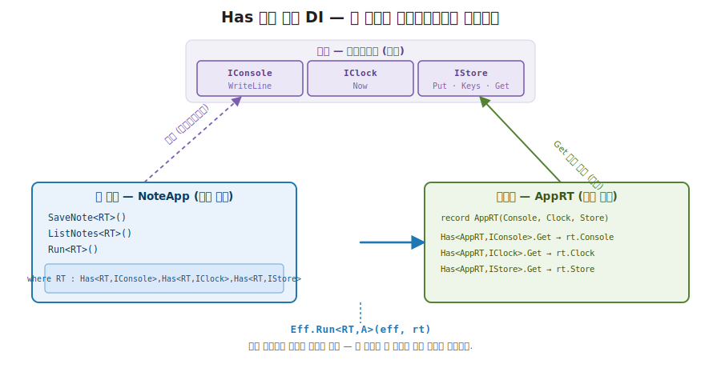
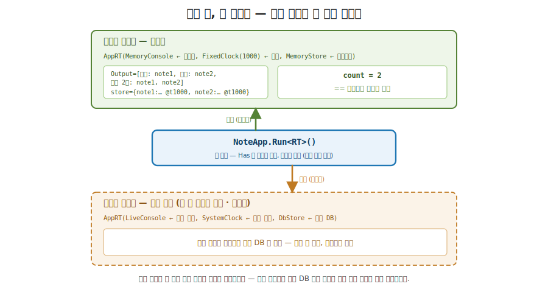
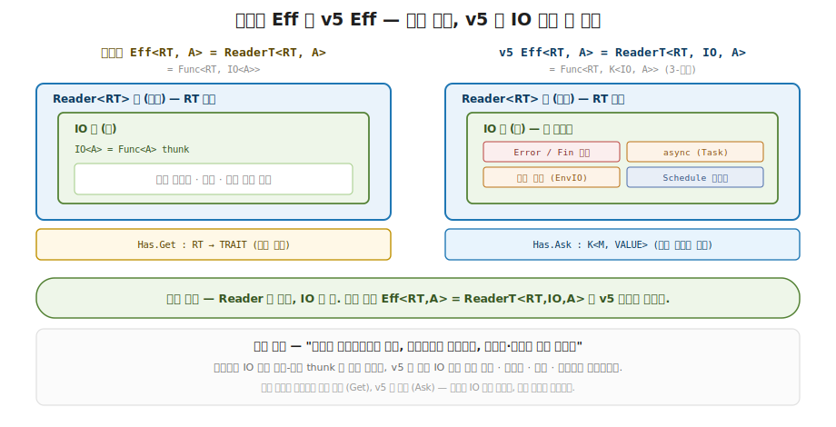

# 40장. 효과 기반 애플리케이션 (Eff\<RT\> + Has DI 로 부수 효과 격리)

> **이 장의 목표** — 이 장을 마치면 콘솔 / 시계 / 저장소 같은 여러 부수 효과를 능력 인터페이스에 의존하게 만들고, 그 능력들을 런타임 하나로 주입해 같은 앱 코드를 테스트용 런타임과 실제용 런타임으로 갈아 끼울 수 있습니다. 핵심은 효과 코드가 구현 (진짜 콘솔인지 인메모리 더블인지) 을 모른 채 `Has<RT, Trait>` 제약만 안다는 데 있습니다. 7 부에서 만든 `Eff<RT, A>` = `ReaderT<RT, IO, A>` 와 `Has<RT, Trait>` 의존성 주입을 노트 앱 한 편으로 확장하고, 세 능력 (콘솔 / 시계 / 저장소) 을 한 do-블록에 합성하며, 11 부에서 익힌 테스트 더블 런타임을 주입해 부수 효과 없이 결정적으로 검증합니다. 같은 `NoteApp.Run` 한 코드가 테스트 런타임이면 인메모리로, 라이브 런타임이면 진짜 콘솔과 저장소로 동작하는 것을 손으로 추적합니다. 12 부의 합성 Part 답게 새 추상은 없습니다. 7 부의 효과 시스템과 11 부의 테스트 더블이 한 설계의 양면임을 실제 앱에서 확인하는 자리입니다.

> **이 장의 핵심 어휘**
>
> - **`Eff<RT, A>`**: 런타임 `RT` 를 읽어 `IO<A>` 를 내는 효과 모나드, 7 부에서 만든 `ReaderT<RT, IO, A>` 그 자체
> - **`Has<RT, Trait>`**: 런타임이 능력 `Trait` 를 제공한다는 타입 제약, 의존성 주입을 타입으로 선언하는 자리
> - **능력 인터페이스 (capability)**: 효과가 의존하는 작은 인터페이스 (`IConsole` · `IClock` · `IStore`)
> - **런타임 (`AppRT`)**: 능력들의 실제 구현을 들고 있는 한 묶음, 실행 시점에 주입됨
> - **테스트 더블**: 진짜 효과 대신 끼우는 인메모리 구현 (`MemoryConsole` · `FixedClock` · `MemoryStore`)
> - **`Asks`**: 런타임을 받아 능력 구현을 꺼내는 효과를 만드는 한 단계
> - **`LiftIO`**: 부수 효과 한 스텝 (`IO<A>`) 을 효과 스택으로 끌어올림
> - **명시적 인터페이스 구현**: 세 능력이 모두 `Get` 이라는 이름을 요구할 때 충돌을 푸는 C# 문법

> 이 장을 마치면 할 수 있게 되는 것
> - [ ] 부수 효과를 코드에 직접 박으면 왜 테스트가 어려워지는지 설명할 수 있습니다.
> - [ ] 능력 인터페이스 (`IConsole` · `IClock` · `IStore`) 와 그 테스트 더블의 역할을 설명할 수 있습니다.
> - [ ] `AppRT` 가 세 능력을 `Has` 로 제공하면서 `Get` 이름 충돌을 어떻게 푸는지 설명할 수 있습니다.
> - [ ] `Eff.Print` · `Now` · `Save` 가 각각 `Has` 제약 하나만 요구하는 까닭을 설명할 수 있습니다.
> - [ ] `NoteApp.SaveNote` 가 세 능력을 한 do-블록에 합성하는 과정을 손으로 따라갈 수 있습니다.
> - [ ] `Eff.Run` 이 런타임을 주입하고 효과를 실행하는 두 단계를 추적할 수 있습니다.
> - [ ] 같은 앱 코드가 테스트 런타임과 라이브 런타임으로 갈리는 이유를 설명할 수 있습니다.
> - [ ] 효과 기반 앱이 7 부 효과 시스템과 11 부 테스트 더블의 합성임을 12 부 축과 이어 짚을 수 있습니다.

---

## 40.1 이 장에서 다루는 것 — 부수 효과를 격리한 앱

7 부에서 효과 시스템을 직접 만들었습니다. `IO<A>` 가 부수 효과를 `Run` 전까지 미뤄 둔 값이었고, `Eff<RT, A>` = `ReaderT<RT, IO, A>` 가 그 `IO` 위에 런타임 `RT` 를 읽는 `Reader` 층을 얹은 모양이었습니다. 그리고 `Has<RT, Trait>` 제약으로 런타임에서 능력을 꺼내, 효과 코드가 구현을 모른 채 능력만 요구하게 했습니다. 11 부에서는 테스트를 다뤘습니다. 진짜 효과 대신 인메모리 더블을 끼워, 콘솔에 실제로 찍지 않고도 출력이 무엇인지 단언했습니다.

12 부의 출발점은 이 둘을 한 앱으로 합치는 자리입니다. 한 문장으로 잡습니다. 앱은 콘솔 출력 · 현재 시각 · 저장소 같은 부수 효과를 쓰는데, 그 효과를 구현이 아니라 능력 인터페이스에 의존하게 하고 런타임으로 주입하면, 같은 앱 코드를 테스트용과 실제용으로 갈아 끼울 수 있습니다. 이것이 이 장에서 짜는 노트 앱입니다. 7 부에서 만든 `Eff<RT>` + `Has` 의존성 주입을 앱 규모로 키우고, 11 부에서 만든 테스트 더블을 그 앱의 검증에 끼웁니다.

12 부는 합성 Part 입니다. 이 장에 새 추상은 하나도 없습니다. 1 장에서 함수형의 본질을 한 문장으로 적었습니다. 모든 값과 함수를 합성 가능한 Elevated World 로 lift 하는 것. 이 장은 그 한 동사가 실무 규모에서 어떻게 작동하는지를 봅니다. 부수 효과 하나하나를 `Eff<RT>` 라는 Elevated 시민으로 끌어올리고, 그 시민들을 한 do-블록에 합성합니다. 합성된 결과는 런타임을 주입하기 전까지 아무 부수 효과도 일으키지 않는 한 값입니다. 그 값에 테스트 런타임을 주입하면 검증이 되고, 라이브 런타임을 주입하면 실제 앱이 됩니다.

지금 모든 것을 외우지 않아도 됩니다. 이 장이 끝날 때 손에 남는 것은 두 가지입니다. 효과 코드가 능력 인터페이스에만 의존하고 런타임이 구현을 주입한다는 그림 하나와, 그 덕에 같은 코드가 테스트와 실제로 양분된다는 발상 하나입니다. 이 장에 등장하는 도구는 모두 7 부와 11 부에서 이미 만진 것이라, 여기서는 그것들이 어떻게 한 앱으로 합쳐지는지에 집중합니다.

---

## 40.2 왜 필요한가 — 하드코딩한 효과는 테스트 불가

노트 앱을 보이기 전에, 부수 효과를 코드에 직접 박으면 어디서 막히는지부터 겪어 봅니다. 추상을 먼저 보이지 않고 손에 잡히는 불편을 먼저 부딪혀 보는 것이 이 장의 순서입니다.

흔한 작업을 하나 떠올립니다. 노트를 받아 현재 시각과 함께 저장하고, 저장했다는 안내를 출력합니다. 평범한 C# 으로 적으면 이렇게 시작하게 됩니다.

```csharp
// 부수 효과를 코드에 직접 박은 노트 저장
public static void SaveNote(string key, string text)
{
    long now = DateTime.Now.Ticks;            // ← 진짜 시계를 직접 호출
    Database.Put(key, $"{text} @t{now}");      // ← 진짜 DB 를 직접 호출
    Console.WriteLine($"저장: {key}");          // ← 진짜 콘솔에 직접 출력
}
```

평범해 보이지만, 이 함수를 테스트하려는 순간 막힙니다. 이 함수가 무엇을 저장했는지 단언하려면 진짜 데이터베이스를 띄워야 하고, 안내가 정확히 찍혔는지 보려면 진짜 콘솔 출력을 가로채야 합니다. 더 곤란한 것은 시계입니다. `DateTime.Now` 는 부를 때마다 다른 값을 내므로, `"첫 노트 @t..."` 의 뒷부분이 매번 달라져 `저장 값이 정확히 무엇이다` 를 단언할 수가 없습니다. 테스트가 진짜 콘솔 · 진짜 시계 · 진짜 DB 를 건드려, 느리고 (DB 연결) 비결정적이고 (매번 다른 시각) 격리 불가능합니다 (콘솔을 실제로 더럽힘).

근본 원인은 하나입니다. 함수가 `무엇을 할지` (노트를 시각과 함께 저장하고 안내한다) 와 `누가 그 일을 하는지` (진짜 콘솔 · 진짜 시계 · 진짜 DB) 를 한 몸에 묶었습니다. `Console.WriteLine` · `DateTime.Now` · `Database.Put` 이 함수 본문에 직접 박혀 있어, 그 셋을 다른 것으로 바꿀 길이 없습니다.

> **흔한 함정** — 인터페이스로 빼고 생성자로 주입하면 이미 충분하지 않냐는 것입니다.
>
> 객체 지향 개발자라면 곧장 떠오르는 답이 있습니다. `IConsole` · `IClock` · `IStore` 를 인터페이스로 빼고 생성자로 주입하면 (DI 컨테이너가 흔히 하는 일) 테스트에서 가짜 구현을 끼울 수 있다는 것입니다. 맞는 말이고, 이 장이 가는 방향도 정확히 그것입니다. 다만 한 가지가 다릅니다. 생성자 주입은 `의존성을 들고 있는 객체` 를 만들지만, 효과가 언제 실제로 일어나는지는 통제하지 못합니다. 메서드를 부르면 그 자리에서 콘솔이 찍히고 DB 가 바뀝니다. 7 부에서 본 `Eff<RT>` 는 한 걸음 더 갑니다. 효과를 `서술` 만 해 둔 값을 만들고 (아직 아무 일도 안 일어남), 런타임을 주입해 `실행` 할 때 비로소 부수 효과가 일어납니다. 이 `서술 vs 실행` 의 분리가 격리의 본질이고, 이 장에서 다시 보게 됩니다.

그래서 우리가 바라는 것은 분명합니다. 효과 코드는 `무엇을 할지` 만 적고, `누가 그 일을 하는지` 는 바깥에서 주입하고 싶습니다. 테스트에서는 인메모리 더블을, 실제에서는 진짜 구현을 끼우되 앱 코드는 한 줄도 바꾸지 않고 싶습니다. 그리고 효과가 일어나는 시점을 런타임 주입 시점으로 미뤄, 그 전까지는 어떤 콘솔도 어떤 저장소도 건드리지 않게 하고 싶습니다. 이 모양이 7 부의 `Eff<RT>` + `Has` 를 앱으로 키운 것입니다. 다음 절에서 그 능력 인터페이스와 런타임부터 봅니다.

---

## 40.3 능력 인터페이스 + 런타임 — 무엇을 할지와 누가 할지의 분리

이제 효과 코드가 의존할 능력부터 정의합니다. 핵심 발상은 한 문장입니다. 효과가 필요로 하는 것을 진짜 구현이 아니라 작은 인터페이스로 적고, 그 인터페이스의 구현을 런타임이라는 한 묶음으로 모아 실행 시점에 주입하라. 효과 코드는 인터페이스만 알고, 그 뒤에 무엇이 있는지는 모릅니다.

먼저 세 능력 인터페이스입니다. 군더더기 없이 작습니다.

```csharp
// 세 가지 능력 — 콘솔 / 시계 / 저장소. 효과는 구현이 아니라 이 인터페이스들에 의존한다.
public interface IConsole { void WriteLine(string line); }
public interface IClock { long Now(); }
public interface IStore { void Put(string key, string value); IReadOnlyList<string> Keys(); string? Get(string key); }
```

한 줄씩 읽습니다. `IConsole` 은 한 줄을 출력하는 능력, `IClock` 은 현재 시각을 `long` 한 개로 내는 능력, `IStore` 는 키-값을 저장하고 (`Put`) 키 목록을 내고 (`Keys`) 값을 꺼내는 (`Get`) 능력입니다. 여기서 능력이라는 말의 직감을 잡습니다. 능력 (capability) 이란 함수가 `나는 콘솔을 쓸 권리가 필요하다`, `나는 시계를 볼 권리가 필요하다` 를 선언하는 단위입니다. 함수가 그 권리를 어디서 얻는지 (진짜 콘솔인지 가짜인지) 는 함수 자신의 관심이 아닙니다. 함수는 `IConsole 이 하나 있으면 된다` 까지만 말합니다.

> **`IClock.Now()` 가 왜 `long` 한 개인가** — 실무라면 현재 시각은 `DateTime` 이겠지만, 여기서는 `long` 틱 하나로 단순화했습니다. `@t1000` 같은 값이 뒤에서 저장 값에 박히는 것을 눈으로 보이기 위한 학습용 단순화이고, v5 에서는 `IO<DateTime>` 를 냅니다. 이 거리는 이 장 마지막의 더 깊이 박스에서 정직하게 짚습니다.

테스트에서 끼울 더블도 함께 만듭니다. 모두 인메모리입니다.

```csharp
// 테스트 더블 (인메모리).
public sealed class MemoryConsole : IConsole
{
    public List<string> Output { get; } = [];
    public void WriteLine(string line) => Output.Add(line);
}

public sealed class FixedClock(long now) : IClock { public long Now() => now; }

public sealed class MemoryStore : IStore
{
    readonly Dictionary<string, string> map = new();
    public void Put(string key, string value) => map[key] = value;
    public IReadOnlyList<string> Keys() => map.Keys.OrderBy(k => k).ToList();
    public string? Get(string key) => map.TryGetValue(key, out var v) ? v : null;
}
```

세 더블을 한 줄씩 봅니다. `MemoryConsole` 은 진짜로 찍는 대신 줄을 `Output` 리스트에 쌓습니다. 테스트는 그 리스트를 들여다보면 콘솔에 무엇이 찍힐지 알 수 있습니다. `FixedClock(now)` 는 생성할 때 받은 `now` 를 늘 그대로 냅니다. 부를 때마다 같은 값이라, `DateTime.Now` 와 달리 결정적입니다. `MemoryStore` 는 `Dictionary` 하나로 키-값을 들고, `Keys()` 는 `OrderBy` 로 정렬해 돌려줍니다 (그래서 키 순서도 결정적). 이 셋이 11 부에서 본 테스트 더블 그대로입니다.

이제 세 능력을 한 묶음으로 모으는 런타임입니다.

```csharp
// AppRT — 세 능력을 모두 가진 런타임. Get 이름 충돌은 *명시적 인터페이스 구현* 으로 해소.
public sealed record AppRT(IConsole Console, IClock Clock, IStore Store)
    : Has<AppRT, IConsole>, Has<AppRT, IClock>, Has<AppRT, IStore>
{
    static IConsole Has<AppRT, IConsole>.Get(AppRT rt) => rt.Console;
    static IClock Has<AppRT, IClock>.Get(AppRT rt) => rt.Clock;
    static IStore Has<AppRT, IStore>.Get(AppRT rt) => rt.Store;
}
```

`AppRT` 는 세 능력 구현 (`Console` · `Clock` · `Store`) 을 필드로 들고 있는 record 입니다. 그리고 `Has<AppRT, IConsole>`, `Has<AppRT, IClock>`, `Has<AppRT, IStore>` 세 제약을 동시에 구현한다고 선언합니다. 7 부에서 본 `Has<RT, Trait>` 의 약속을 떠올립니다. `static abstract Trait Get(RT runtime)` 한 줄, 곧 런타임을 받아 그 능력 구현을 돌려주는 정적 메서드입니다. `AppRT` 는 그 `Get` 을 세 능력에 대해 각각 구현해, `런타임을 주면 콘솔을 꺼내 주겠다`, `시계를 꺼내 주겠다`, `저장소를 꺼내 주겠다` 를 약속합니다.

OO 직감으로 다리를 놓으면, `AppRT` 는 DI 컨테이너에 인터페이스 세 개를 등록한 것과 같습니다. `services.AddSingleton<IConsole>(...)` 를 세 번 부른 셈입니다. 다만 등록처가 런타임이라는 한 record 이고, 꺼내는 일이 객체 메서드가 아니라 `Has` 라는 타입 제약을 통한 정적 디스패치라는 점만 다릅니다.

여기서 입문자가 처음 보면 낯선 문법이 하나 있습니다. 세 `Get` 메서드 앞에 붙은 `Has<AppRT, IConsole>.` 같은 한정자입니다. 이것이 명시적 인터페이스 구현입니다.

> **흔한 함정** — 세 능력이 모두 `Get` 이라는 같은 이름을 요구하는데 어떻게 충돌이 안 나는가입니다.
>
> `Has<AppRT, IConsole>` 도 `Get` 을, `Has<AppRT, IClock>` 도 `Get` 을, `Has<AppRT, IStore>` 도 `Get` 을 요구합니다. 셋 다 이름이 `Get` 입니다. 평범하게 `static IConsole Get(AppRT rt) => ...` 하나만 적으면, 컴파일러는 이 `Get` 이 셋 중 어느 인터페이스의 것인지 가릴 수 없고 반환 타입도 셋이 달라 충돌합니다. 그래서 인터페이스마다 한정해서 구현합니다. `static IConsole Has<AppRT, IConsole>.Get(...)` 은 `이 Get 은 Has<AppRT, IConsole> 의 Get 이다` 를 명시합니다. 같은 이름 세 개를 인터페이스 이름표를 붙여 따로 구현하는 C# 문법이 명시적 인터페이스 구현입니다. 이름이 겹치는 멤버를 여러 인터페이스에서 물려받을 때 쓰는 표준 도구입니다.

세 능력을 한 do-블록에 합성할 때, 각 능력 효과가 이 런타임에서 자기 구현을 꺼내 쓰는 흐름을 미리 한 그림으로 추적해 둡니다. 검증 누적이 아니라 능력 주입의 흐름입니다.

```
런타임 구성:
   AppRT { Console = MemoryConsole,  Clock = FixedClock(1000),  Store = MemoryStore }
            │                          │                          │
   효과 코드는 이 세 구현을 모른다. 아는 것은 Has<RT, IConsole/IClock/IStore> 제약뿐.

   Eff.Print 가 실행될 때:  Has<AppRT, IConsole>.Get(rt) → rt.Console (= MemoryConsole)
   Eff.Now 가 실행될 때:    Has<AppRT, IClock>.Get(rt)   → rt.Clock   (= FixedClock(1000))
   Eff.Save 가 실행될 때:   Has<AppRT, IStore>.Get(rt)   → rt.Store   (= MemoryStore)
                              ▲ 능력 이름 → 런타임의 해당 필드. Has 제약이 어느 Get 인지 정한다.
```



**그림 40-1. Has 다중 능력 의존성 주입: 앱 코드는 인터페이스에만 의존합니다** — 가운데 앱 코드 (`NoteApp`) 는 `IConsole` · `IClock` · `IStore` 세 인터페이스에만 의존합니다. 오른쪽 런타임 `AppRT` 가 세 능력의 실제 구현을 들고, `Has` 의 `Get` 으로 각 능력을 제공합니다. 왼쪽에서 `Eff.Run` 이 런타임을 주입하면, 앱 코드의 `Asks` 가 `Get` 을 통해 능력 구현을 꺼냅니다. 앱 코드와 구현 사이를 `Has` 제약이 가른다는 것이 핵심입니다. DI 컨테이너에 인터페이스를 등록하고 꺼내 쓰는 그림과 같습니다.

요점은 이렇습니다. 능력 인터페이스가 `무엇을 할 수 있는가` 의 계약이고, 런타임 `AppRT` 가 `누가 그 일을 하는가` 의 묶음입니다. 둘을 가른 덕에, 같은 효과 코드에 어떤 능력 묶음을 주입하느냐만 바꾸면 그 코드가 다른 일을 하게 됩니다. 이 능력 인터페이스 + 런타임 설계가 7 부 효과 시스템을 앱 규모로 키운 첫 조각입니다.

---

## 40.4 효과 워크플로 — LINQ 로 능력 조합

능력과 런타임을 갖췄으니, 이제 그 능력을 실제로 쓰는 효과를 만듭니다. 핵심 발상은 한 문장입니다. 능력별 효과는 각각 능력 하나만 요구하게 작게 짜고, 여러 능력이 필요한 워크플로는 호출부에서 그 작은 효과들을 LINQ 로 합성하라. 작은 효과는 단순하고, 합성은 do-표기가 맡습니다.

먼저 능력별 효과입니다. 각각 `Has` 제약을 하나만 답니다.

```csharp
// 능력별 효과 — 각각 *하나의 Has 제약* 만 요구 (조합은 호출부에서).
public static class Eff
{
    public static K<ReaderTF<RT>, Unit> Print<RT>(string msg) where RT : Has<RT, IConsole> =>
        from con in ReaderTF<RT>.Asks(rt => RT.Get(rt))
        from _ in ReaderTF<RT>.LiftIO(new IO<Unit>(() => { con.WriteLine(msg); return Unit.Default; }))
        select _;

    public static K<ReaderTF<RT>, long> Now<RT>() where RT : Has<RT, IClock> =>
        from clk in ReaderTF<RT>.Asks(rt => RT.Get(rt))
        from t in ReaderTF<RT>.LiftIO(new IO<long>(clk.Now))
        select t;

    public static K<ReaderTF<RT>, Unit> Save<RT>(string key, string value) where RT : Has<RT, IStore> =>
        from st in ReaderTF<RT>.Asks(rt => RT.Get(rt))
        from _ in ReaderTF<RT>.LiftIO(new IO<Unit>(() => { st.Put(key, value); return Unit.Default; }))
        select _;

    public static K<ReaderTF<RT>, IReadOnlyList<string>> Keys<RT>() where RT : Has<RT, IStore> =>
        from st in ReaderTF<RT>.Asks(rt => RT.Get(rt))
        from ks in ReaderTF<RT>.LiftIO(new IO<IReadOnlyList<string>>(st.Keys))
        select ks;

    public static A Run<RT, A>(K<ReaderTF<RT>, A> eff, RT rt) => ((ReaderT<RT, A>)eff).Run(rt).Run();
}
```

`Print<RT>` 를 한 줄씩 읽습니다. 제약 `where RT : Has<RT, IConsole>` 가 `이 효과를 쓰려면 런타임이 콘솔 능력을 제공해야 한다` 를 선언합니다. 본문은 두 단계입니다. 먼저 `Asks(rt => RT.Get(rt))` 가 런타임에서 콘솔 구현을 꺼내는 효과를 만들고 (`con` 이 그 구현), 이어 `LiftIO(...)` 가 `con.WriteLine(msg)` 라는 부수 효과 한 스텝을 효과 스택으로 끌어올립니다. `Now<RT>` 와 `Save<RT>`, 그리고 저장소의 키 목록을 읽는 `Keys<RT>` 도 같은 두 단계입니다. 능력을 꺼내고 (`Asks`), 그 능력의 메서드를 `IO` 로 감싸 끌어올립니다 (`LiftIO`).

여기서 막히기 쉬운 한 줄이 `RT.Get(rt)` 입니다. 손계산으로 한 단계 짚습니다. `RT` 는 타입 파라미터인데, 거기에 `.Get(...)` 을 부릅니다. 객체에 메서드를 부르는 것이 아니라, 타입 파라미터 `RT` 가 제약 `Has<RT, IConsole>` 를 통해 약속한 정적 메서드 `Get` 을 부르는 것입니다. `RT` 가 `AppRT` 로 정해지면, `RT.Get(rt)` 은 `AppRT` 가 명시적 인터페이스 구현으로 적어 둔 `Has<AppRT, IConsole>.Get(rt)` 즉 `rt.Console` 로 풀립니다. 타입이 어느 `Get` 인지를 정하는 정적 디스패치입니다. 어느 `Get` 인지는 그 효과가 요구하는 단 하나의 `Has` 제약이 정합니다. `Print` 는 `Has<RT, IConsole>` 만 요구하니 콘솔 `Get` 으로, `Save` 는 `Has<RT, IStore>` 만 요구하니 저장소 `Get` 으로 풀립니다.

각 효과가 능력 하나만 요구하는 까닭은 단순함입니다. `Print` 는 콘솔만, `Now` 는 시계만, `Save` 는 저장소만 알면 됩니다. 어느 효과도 세 능력을 한꺼번에 요구하지 않으므로, 콘솔만 필요한 자리에 시계 능력까지 끌고 다닐 일이 없습니다. 여러 능력이 필요한 워크플로는 이 작은 효과들을 합성해 만듭니다.

이제 그 합성입니다. 노트를 저장하고 목록을 내는 앱 코드입니다.

```csharp
// 효과 기반 앱 — 노트를 시각과 함께 저장하고 목록을 출력한다.
// 세 능력(콘솔/시계/저장소)을 *조합* 으로 요구하지만, 효과 코드는 런타임 구현을 모른다.
public static class NoteApp
{
    public static K<ReaderTF<RT>, Unit> SaveNote<RT>(string key, string text)
        where RT : Has<RT, IConsole>, Has<RT, IClock>, Has<RT, IStore> =>
        from t in Eff.Now<RT>()
        from _1 in Eff.Save<RT>(key, $"{text} @t{t}")
        from _2 in Eff.Print<RT>($"저장: {key}")
        select Unit.Default;

    public static K<ReaderTF<RT>, int> ListNotes<RT>()
        where RT : Has<RT, IStore>, Has<RT, IConsole> =>
        from keys in Eff.Keys<RT>()
        from _ in Eff.Print<RT>($"노트 {keys.Count}개: {string.Join(", ", keys)}")
        select keys.Count;

    // 전체 워크플로 — 두 노트 저장 후 목록.
    public static K<ReaderTF<RT>, int> Run<RT>()
        where RT : Has<RT, IConsole>, Has<RT, IClock>, Has<RT, IStore> =>
        from _1 in SaveNote<RT>("note1", "첫 노트")
        from _2 in SaveNote<RT>("note2", "둘째 노트")
        from count in ListNotes<RT>()
        select count;
}
```

`SaveNote<RT>` 의 제약을 먼저 봅니다. `where RT : Has<RT, IConsole>, Has<RT, IClock>, Has<RT, IStore>` 세 능력을 조합으로 요구합니다. 본문은 세 능력 효과를 한 do-블록에 잇습니다. `from t in Eff.Now<RT>()` 로 현재 시각을 얻고, `from _1 in Eff.Save<RT>(key, $"{text} @t{t}")` 로 그 시각을 박은 값을 저장하고, `from _2 in Eff.Print<RT>($"저장: {key}")` 로 안내를 냅니다. 세 능력 (시계 · 저장소 · 콘솔) 이 한 흐름에 합성됩니다.

여기서 안심할 한 가지를 짚습니다. 이 `from ... from ... select` 는 새 문법이 아닙니다. 3 부에서 만든 모나드 합성 그대로입니다. `SelectMany` 가 효과 위에서 다시 도는 것뿐입니다. 1 장에서 본 합성 가능한 Elevated World 로 lift 의 한 장면이고, 그 합성을 LINQ do-표기가 표현합니다. 새로 외울 것이 없습니다. 이미 배운 do-블록이 능력 효과들을 순차로 잇고 있을 뿐입니다.

결정적인 점은 `NoteApp` 의 어느 줄도 진짜 콘솔이나 진짜 DB 를 부르지 않는다는 것입니다. `Eff.Print` 도 `Eff.Save` 도 `Has` 제약만 알지, 그 뒤가 `MemoryConsole` 인지 진짜 콘솔인지 모릅니다. 앱 코드는 런타임 구현을 모른 채 능력만 요구합니다. 누가 그 능력을 채울지는 `Run` 시점에 정해집니다.

이제 전체 워크플로 `Run<RT>` 를 손으로 따라갑니다. 테스트 런타임을 주입한 데모입니다.

```csharp
var con = new MemoryConsole();
var store = new MemoryStore();
var rt = new AppRT(con, new FixedClock(1000), store);

var count = Eff.Run(NoteApp.Run<AppRT>(), rt);   // count = 2
```

런타임은 콘솔이 `MemoryConsole`, 시계가 `FixedClock(1000)`, 저장소가 `MemoryStore` 입니다. `NoteApp.Run<AppRT>()` 를 만들어 `Eff.Run` 에 그 런타임과 함께 넘깁니다. 워크플로가 세 단계를 어떻게 도는지, 한 단계씩 추적합니다.

```
워크플로:  Run = SaveNote(note1) → SaveNote(note2) → ListNotes
런타임:    Console=MemoryConsole,  Clock=FixedClock(1000),  Store=MemoryStore

단계 ①  SaveNote("note1", "첫 노트")
        Now   → Clock.Now() = 1000                  t = 1000
        Save  → Store.Put("note1", "첫 노트 @t1000")  store = { note1: "첫 노트 @t1000" }
        Print → Console.WriteLine("저장: note1")      Output = ["저장: note1"]

단계 ②  SaveNote("note2", "둘째 노트")
        Now   → Clock.Now() = 1000                  t = 1000  (고정 시계라 또 1000)
        Save  → Store.Put("note2", "둘째 노트 @t1000") store = { note1: ..., note2: "둘째 노트 @t1000" }
        Print → Console.WriteLine("저장: note2")      Output = ["저장: note1", "저장: note2"]

단계 ③  ListNotes()
        Keys  → Store.Keys() = ["note1", "note2"]    (OrderBy 정렬, Count = 2)
        Print → Console.WriteLine("노트 2개: note1, note2")
                                                     Output += "노트 2개: note1, note2"
        select keys.Count → 2 반환

결과:   count = 2
        Output = ["저장: note1", "저장: note2", "노트 2개: note1, note2"]
        store  = { note1: "첫 노트 @t1000", note2: "둘째 노트 @t1000" }
        ▲ 시계가 FixedClock(1000) 이라 두 노트의 @t1000 이 항상 같다.
```

세 단계가 각자의 능력을 런타임에서 꺼내 일을 합니다. 핵심은 `@t1000` 입니다. 시계가 `FixedClock(1000)` 이라 두 노트 모두 `@t1000` 이 박혔습니다. `DateTime.Now` 였다면 매번 달라졌을 값이, 고정 시계 덕에 항상 같습니다. 이 결정성이 다음 절의 검증을 가능하게 합니다. 데모는 이 결과를 그대로 출력합니다.

```
== 예제 1 — 노트 앱 (Console+Clock+Store, 테스트 런타임) ==
  반환 노트 수 = 2
  콘솔 출력:
    저장: note1
    저장: note2
    노트 2개: note1, note2
  저장소 내용:
    note1 = 첫 노트 @t1000
    note2 = 둘째 노트 @t1000
  → 같은 앱 코드가 LiveConsole/SystemClock/DB 런타임이면 실제 동작.
```

마지막 줄이 이 장의 핵심을 미리 비춥니다. 같은 `NoteApp.Run` 코드가, 런타임만 진짜 구현으로 바꾸면 실제 앱이 됩니다. 그 갈림이 다음 절의 payoff 입니다. 여기서는 작은 효과들을 do-블록으로 합성해 워크플로를 만들었고, 그 워크플로가 7 부에서 만든 `Eff<RT>` = `ReaderT<RT, IO, A>` 의 합성이라는 것을 손에 쥐면 충분합니다.

---

## 40.5 두 런타임 — payoff

이제 이 장의 도구가 약속을 지키는지 정면으로 봅니다. 능력 인터페이스와 런타임을 가른 진짜 가치는 런타임 교체에서 드러납니다. 같은 앱 코드에 테스트 런타임을 주입하면 결정적 검증이 되고, 라이브 런타임을 주입하면 실제 동작이 되어야 합니다. 한 코드가 두 런타임으로 갈리는지, 그리고 그 갈림이 어디서 일어나는지를 봅니다.

먼저 `Eff.Run` 이 정확히 무슨 일을 하는지 손으로 짚습니다. 이 한 줄이 격리의 마지막 장치입니다.

```csharp
public static A Run<RT, A>(K<ReaderTF<RT>, A> eff, RT rt) => ((ReaderT<RT, A>)eff).Run(rt).Run();
```

`Run` 은 두 번 벗깁니다. 7 부에서 `Eff<RT, A>` = `ReaderT<RT, IO, A>` 가 `Reader 가 바깥, IO 가 안` 이라고 했습니다. 그 두 층을 차례로 벗기는 것이 이 한 줄입니다.

```
Eff<RT, A>  =  ReaderT<RT, A>  =  Func<RT, IO<A>>     (Reader 바깥, IO 안)
                  └ 학습용 2-인자 형태: IO 를 안에 고정. 7 부 정식은 ReaderT<RT, IO, A>

((ReaderT<RT, A>)eff).Run(rt)        ← 층 1: Reader 제거. RT 주입 → IO<A>
                                        아직 부수 효과 없음! IO 는 미뤄 둔 값.
                              .Run()  ← 층 2: IO 제거. thunk 실행 → A
                                        ★ 이때 비로소 콘솔 쓰기·저장이 일어난다.
```

첫 번째 `.Run(rt)` 가 런타임을 주입해 `Reader` 층을 벗깁니다. 결과는 `IO<A>` 인데, 아직 아무 부수 효과도 일어나지 않았습니다. `IO` 는 7 부에서 본 대로 미뤄 둔 값이기 때문입니다. 이어지는 `.Run()` 이 그 `IO` 의 thunk 를 실행해, 바로 그 시점에 콘솔 쓰기와 저장이 일어납니다. 곧 런타임을 주입하기 전까지는 어떤 부수 효과도 없습니다. `NoteApp.Run<AppRT>()` 를 호출해 효과 값을 만들기만 해서는 콘솔에 아무것도 안 찍히고, 저장소도 비어 있습니다. `Eff.Run` 의 마지막 `.Run()` 에서야 효과가 일어납니다. 이 서술 vs 실행의 분리가 격리의 본질입니다.

> **미리보기입니다** — RT 주입 전에는 store 도 console 도 비어 있습니다.
>
> `var eff = NoteApp.Run<AppRT>();` 한 줄만 적고 멈추면 어떻게 될까요. `eff` 는 효과를 서술한 값일 뿐입니다. 이 시점에 `con.Output` 은 빈 리스트이고 `store` 도 비어 있습니다. 콘솔에는 한 글자도 안 찍혔습니다. `Eff.Run(eff, rt)` 를 부르는 그 순간에야 두 번 벗기기가 일어나고, 마지막 `.Run()` 에서 비로소 `con.Output` 에 줄이 쌓이고 `store` 에 노트가 들어갑니다. 효과를 만드는 것과 실행하는 것이 두 단계로 갈린다는 이 점이, 효과를 안전하게 다루는 7 부의 핵심이었고 이 장에서 그대로 살아납니다.

이제 두 런타임의 갈림입니다. 이 장의 코드에는 테스트 런타임만 있지만, 라이브 런타임이 어떻게 끼워지는지는 한 줄로 분명합니다.

```
같은 앱 코드:  NoteApp.Run<RT>()   ← RT 는 Has<IConsole>, Has<IClock>, Has<IStore> 만 요구

  테스트 런타임                              라이브 런타임 (이 장 코드엔 없음, 디딤돌)
  ┌─────────────────────────────┐          ┌─────────────────────────────┐
  │ AppRT(                       │          │ AppRT(                       │
  │   MemoryConsole,  ← 리스트    │          │   LiveConsole,  ← 진짜 콘솔   │
  │   FixedClock(1000), ← 고정    │          │   SystemClock,  ← 진짜 시각   │
  │   MemoryStore )   ← 딕셔너리  │          │   DbStore )     ← 진짜 DB     │
  └─────────────────────────────┘          └─────────────────────────────┘
            │                                          │
       결정적 검증                                  실제 동작
   (출력·저장·반환값이 항상 같음)            (진짜 콘솔에 찍히고 DB 에 저장)
```

핵심은 `NoteApp.Run<RT>` 가 `Has` 제약만 요구한다는 것입니다. 그 제약을 만족하는 record 라면 무엇이든 주입할 수 있습니다. 테스트 런타임 `AppRT(MemoryConsole, FixedClock(1000), MemoryStore)` 를 주입하면 출력은 리스트에 쌓이고 시각은 1000 으로 고정되어, 콘솔 출력 시퀀스 · 저장소 상태 · 반환값이 항상 같습니다. 이것이 결정성 (determinism) 입니다. 같은 테스트 런타임이면 몇 번을 돌려도 결과가 똑같아, `==` 단언이 가능합니다. 반대로 `Has` 만 만족하는 다른 record (진짜 콘솔 · 진짜 시계 · 진짜 DB 를 든) 를 끼우면, 같은 `NoteApp.Run` 이 실제 앱으로 동작합니다.



**그림 40-2. 같은 앱, 두 런타임: 부수 효과가 앱 경계 밖에만 있습니다** — 가운데 `NoteApp.Run<RT>` 한 코드가 위아래로 갈립니다. 위는 테스트 런타임 (`MemoryConsole` / `FixedClock` / `MemoryStore`) 으로, 출력은 리스트에 쌓이고 시각은 고정되어 결정적입니다. 아래는 라이브 런타임 (`LiveConsole` / `SystemClock` / `DbStore`) 으로, 진짜 콘솔과 저장소를 건드려 실제로 동작합니다. 부수 효과는 앱 코드 안이 아니라 앱 경계 밖 런타임에만 있습니다. OO 의 통합 테스트가 진짜 DB 를 띄우는 대신, 더블 런타임을 끼워 같은 코드를 격리 검증하는 그림입니다.

OO 직감으로 다리를 놓으면, 이것이 계층형 아키텍처의 의존성 역전과 같습니다. 비즈니스 로직 (앱 코드) 이 인프라 (콘솔 · DB) 의 인터페이스에만 의존하고, 실제 구현은 바깥에서 주입합니다. 통합 테스트에서 진짜 DB 대신 인메모리 더블을 끼우는 그 패턴 그대로입니다. 다른 점은 `Eff<RT>` 가 효과의 실행 시점까지 통제한다는 것입니다. 주입 전에는 어떤 부수 효과도 없습니다.

여기서 7 부와 11 부가 한 설계의 양면임이 드러납니다. 7 부는 `Eff<RT>` + `Has` 로 런타임을 주입하는 메커니즘을 만들었고, 11 부는 테스트 더블로 진짜 효과를 가짜로 바꾸는 패턴을 만들었습니다. 이 장에서 둘은 따로가 아닙니다. 같은 `Has` 제약 위에서, 어떤 런타임을 주입하느냐가 테스트냐 실제냐를 가릅니다. 런타임 주입 (7 부) 과 테스트 더블 (11 부) 이 같은 설계의 양면입니다. 그 한 설계가 12 부의 합성이 약속한 결말입니다.

---

## 40.6 검사로 다지기 — 결정성

7 장 이후 새 추상마다 법칙으로 그 의미를 확인했습니다. 이 앱에도 확인할 것이 있는데, Functor 나 Monad 의 대수 법칙은 아닙니다. 이 장이 다지는 것은 앱의 행위입니다. 워크플로가 노트를 제대로 저장하는가, 시계 능력이 저장 값에 반영되는가, 콘솔 출력이 정확한가입니다. 이 셋이 `같은 테스트 런타임이면 결과가 항상 같다` 는 결정성을 코드로 확인합니다.

세 검사는 콘솔 `bool` 함수 셋입니다.

```csharp
static (AppRT, MemoryConsole, MemoryStore) Build()
{
    var con = new MemoryConsole();
    var store = new MemoryStore();
    return (new AppRT(con, new FixedClock(1000), store), con, store);
}

// ① 워크플로가 노트 2개를 저장하고 개수를 돌려준다.
public static bool SavesTwoNotes()
{
    var (rt, _, store) = Build();
    var count = Eff.Run(NoteApp.Run<AppRT>(), rt);
    return count == 2 && store.Keys().SequenceEqual(["note1", "note2"]);
}

// ② 시계 능력이 저장 값에 반영된다 (FixedClock(1000) → @t1000).
public static bool UsesClock()
{
    var (rt, _, store) = Build();
    Eff.Run(NoteApp.SaveNote<AppRT>("k", "x"), rt);
    return store.Get("k") == "x @t1000";
}

// ③ 콘솔 출력이 결정적으로 기록된다.
public static bool ConsoleOutput()
{
    var (rt, con, _) = Build();
    Eff.Run(NoteApp.Run<AppRT>(), rt);
    return con.Output.SequenceEqual(["저장: note1", "저장: note2", "노트 2개: note1, note2"]);
}
```

먼저 `Build` 헬퍼를 봅니다. 테스트 런타임을 만들되, `AppRT` 와 함께 그 안의 `MemoryConsole` · `MemoryStore` 를 튜플로 함께 돌려줍니다. 더블을 손에 쥐고 있어야 실행 후 그 상태를 직접 단언할 수 있기 때문입니다. 세 검사를 한 줄씩 읽습니다.

첫째, 노트 저장 (`SavesTwoNotes`) — 워크플로를 돌린 뒤 반환값이 2 이고 저장소 키가 정확히 `["note1", "note2"]` 인지 봅니다. 워크플로가 두 노트를 제대로 저장하고 개수를 돌려줌을 확인합니다. 앞 절의 손계산을 그대로 단언으로 옮긴 것입니다.

둘째, 시계 능력 반영 (`UsesClock`) — `SaveNote("k", "x")` 를 돌린 뒤 저장 값이 `"x @t1000"` 인지 봅니다. `FixedClock(1000)` 이 낸 시각이 저장 값에 박혔음을 확인합니다. 만약 진짜 시계였다면 뒷부분이 매번 달라 이 단언이 불가능했을 것입니다. 고정 시계 덕에 `@t1000` 이 결정적이라 `==` 가 성립합니다.

셋째, 콘솔 출력 (`ConsoleOutput`) — 워크플로를 돌린 뒤 `con.Output` 이 정확히 세 줄 `["저장: note1", "저장: note2", "노트 2개: note1, note2"]` 인지 봅니다. 진짜 콘솔을 가로채지 않고도, 더블의 리스트를 들여다봐 출력 시퀀스를 단언합니다.

데모 출력은 셋 다 통과입니다.

```
== 검증 ==
  노트 2개 저장 : 통과
  시계 능력 반영 : 통과
  콘솔 출력 정확 : 통과

모든 검증 통과 [OK]
```

이 세 검사가 12 부 축의 약속을 굳힙니다. 셋 다 테스트 런타임 (`MemoryConsole` / `FixedClock(1000)` / `MemoryStore`) 을 주입해, 부수 효과 없이 결정적으로 앱을 검증합니다. 진짜 콘솔도 진짜 DB 도 건드리지 않았고, 시각도 고정이라 매번 같은 결과가 나옵니다. 곧 `7 부의 효과 시스템과 11 부의 테스트 더블이 한 앱에서 합쳐지면, 부수 효과를 쓰는 코드도 순수 함수처럼 결정적으로 검증된다` 는 이 장의 한 줄이 세 단언으로 확인됩니다.

> **더 깊이 (처음엔 건너뛰어도 됩니다)** — 왜 Functor·Monad 대수 법칙을 검증하지 않을까요.
>
> 1 부에서 새 추상마다 항등·합성 같은 법칙을 property 로 확인했습니다. 이 장의 `Eff<RT>` 도 모나드이니 같은 법칙을 만족하는데, 세 검사는 그 대수 법칙을 형식적 property 로 굴리지 않고 구체적인 `SequenceEqual` 과 `==` 로 앱 행위를 확인합니다. 까닭은 이 장이 다지려는 것이 추상의 대수 구조가 아니라 앱의 결정성이기 때문입니다. 법칙 property 의 정식 자리는 11 부 (테스트) 이고, 이 장은 그 11 부의 효과 테스트 패턴 (테스트 런타임 주입) 을 앱 규모로 적용합니다. 그리고 여기서 검증되는 결정성은 법칙이라기보다 `같은 테스트 런타임이면 출력·상태·반환값이 항상 같다` 는 불변식입니다. `Has` 의 분리 (효과 코드가 구현을 모르고 제약만 안다) 도 법칙이 아니라 설계 약속입니다. 입문 단계에서는 `이 장의 핵심은 대수 법칙이 아니라 런타임을 갈아 끼워 얻는 결정적 검증` 이라고만 알아 두면 충분합니다.

---

## 40.7 더 깊이 — 학습용 Has·런타임은 v5 의 단순화판입니다

> **더 깊이 (처음엔 건너뛰어도 됩니다)** — 이 절은 학습용 `Has<RT, TRAIT>` · `Eff<RT>` 와 LanguageExt v5 의 실제 효과 시스템 사이의 거리를 정직하게 짚는 자리입니다. 처음 읽을 때는 건너뛰어도 이 장의 발상을 이해하는 데 지장이 없습니다.

학습용 코드는 효과 기반 앱의 뼈대만 남긴 것이고, LanguageExt v5 의 실제 효과 시스템은 같은 발상에 여러 겹을 더 입혔습니다. 정직하게 짚어 둡니다.

**`Has` 트레잇의 시그니처.** 학습용 `Has<RT, TRAIT>` 는 `static abstract TRAIT Get(RT runtime)`, 곧 런타임을 받아 트레잇 구현을 직접 돌려주는 평범한 정적 메서드입니다. v5 의 `Has<M, VALUE>` 는 `static abstract K<M, VALUE> Ask { get; }`, 곧 인자 없는 프로퍼티가 능력을 읽는 효과 자체를 돌려줍니다. 즉 학습용은 `런타임 → 능력` 의 순수 함수이고, v5 는 능력을 읽는 일조차 효과로 노출합니다. v5 의 타입 파라미터도 런타임 `RT` 가 아니라 higher-kind `M` 입니다.

**다중 능력의 모호성 해소.** 학습용은 `AppRT` 에서 명시적 인터페이스 구현 (`static IConsole Has<AppRT, IConsole>.Get(...)`) 으로 `Get` 이름 충돌을 풉니다. v5 는 별도 캐시 헬퍼 `static class Has<M, Env, VALUE>` 를 두어 `Has<M, RT, ConsoleIO>.ask` 로 한정합니다 (allocation 캐시 겸 모호성 해소). 학습용에는 이 3-파라미터 헬퍼가 없습니다.

**능력 인터페이스의 모양.** 학습용은 `IConsole` (`void WriteLine`) · `IClock` (`long Now`) · `IStore` 를 손으로 정의해, 메서드가 순수 `void` 나 값을 냅니다. v5 의 `LanguageExt.Sys` 트레잇 (`ConsoleIO` · `TimeIO`) 은 모든 멤버가 `IO` 를 냅니다. `ConsoleIO.WriteLine(string)` 은 `IO<Unit>` 를, `TimeIO.Now` 는 `IO<DateTime>` 를 냅니다. 학습용 `IClock.Now()` 의 `long` 은 v5 의 `IO<DateTime>` 를 단순화한 것입니다.

**테스트 런타임의 풍부함.** 학습용 `AppRT` 는 세 능력만 가진 record 한 개이고, `MemoryConsole` 도 리스트에 줄을 더하는 최소 더블입니다. v5 의 `Sys.Test.Runtime` 은 콘솔 · 파일 · 시간 · 환경 변수 · 디렉터리 · 인코딩 같은 여러 능력을 묶고, 임시 디렉터리 정리까지 `IDisposable` 로 처리합니다. v5 의 `MemoryConsole` 도 출력 버퍼뿐 아니라 키보드 입력 버퍼와 색상까지 갖춘 콘솔 에뮬레이션입니다. v5 의 `Live.Runtime` 과 `Test.Runtime` 의 대비가, 이 장에서 `라이브 런타임이면 실제 동작` 이라고 한 디딤돌의 실증입니다.

**오류 채널과 비동기.** 학습용 `Eff<RT>` (= `ReaderTF<RT>` 위 `ReaderT<RT, A>`) 는 성공 경로만 모델링합니다. 실패도 예외 포착도 없습니다. v5 의 `Eff<RT, A>` = `ReaderT<RT, IO, A>` 는 `Error` / `Fin` 실패 채널을 내장하고 (7 부에서 본 `Error` / `Fin` / `Fallible`), 취소 토큰과 `Task` 기반 비동기 실행 경로까지 가집니다. 학습용 `Eff.Run` 은 동기 thunk 를 두 번 실행할 뿐입니다.

**일치하는 점.** 효과 스택의 형태는 v5 와 정확히 같습니다. v5 의 `Eff<RT, A>` 가 `record(ReaderT<RT, IO, A>)` 이고, 학습용 `ReaderT<RT, A>` 도 `Func<RT, IO<A>>` 로 `Reader 가 바깥, IO 가 안` 입니다. 코드 주석의 `Eff<RT, A> = ReaderT<RT, IO, A>` 주장은 v5 소스로 확인됩니다.



**그림 40-3. 학습용 Eff 와 v5 Eff: 같은 스택, v5 는 IO 층을 더 채움** — 둘 다 Reader 가 바깥, IO 가 안인 같은 형태입니다. 학습용은 IO 층을 성공 · 동기 thunk 로 비웠고, v5 는 같은 IO 층에 `Error` / `Fin` 채널 · 비동기 · 취소 · 재시도를 채웠습니다. 능력 읽기도 학습용은 순수 함수 (`Get`), v5 는 효과 (`Ask`) 입니다.

입문 단계에서는 이 거리를 외울 필요가 없습니다. `능력을 인터페이스로 빼고, 런타임으로 주입하고, 같은 코드를 테스트·실제로 갈아 끼운다` 는 뼈대는 학습용과 v5 가 같고, 나머지는 그 뼈대에 효과 능력 · 오류 채널 · 비동기 · 풍부한 테스트 런타임을 더한 것이라고만 알아 두면 충분합니다.

---

## 40.8 Elevated World 어휘로 다시 읽기

이 절은 이 장의 도구를 1 장 비유에 맞춰 다시 읽는 자리입니다. 먼저 매핑부터 둡니다.

| 40장 도구 | Elevated World 어휘 |
|---|---|
| `Eff<RT, A>` | 런타임을 읽어 `IO` 를 내는 Elevated 시민, 7 부 `ReaderT<RT, IO, A>` 그대로 |
| `Has<RT, Trait>` | 런타임에서 능력을 꺼내는 끌어내림의 한 단계 |
| `Asks` | 런타임을 Normal 값으로 받아 능력 구현을 꺼내는 효과 |
| `LiftIO` | 부수 효과 한 스텝 (`IO`) 을 효과 스택으로 끌어올림 |
| `Eff.Run` | 런타임 주입 + 실행, Elevated 시민을 Normal 값으로 끌어내림 |
| 런타임 교체 | Normal 세상의 구현만 바뀌고 Elevated 어휘는 그대로 |

1 장에서 함수형의 본질을 한 문장으로 적었습니다. 모든 값과 함수를 합성 가능한 Elevated World 로 끌어올리는 것. 7 부에서 그 끌어올림이 부수 효과에 닿아, 효과가 `Run` 전까지 Normal 세상에 영향 없는 `Eff<RT>` 시민이 됐습니다. 이 장은 그 시민을 앱 규모로 합성합니다. 콘솔 출력 · 현재 시각 · 저장이라는 부수 효과 하나하나가 `Eff<RT>` 라는 Elevated 시민으로 끌어올려지고, do-블록이 그 시민들을 한 흐름에 합성합니다.

여기서 1 장의 끌어올림 · 끌어내림으로 이 장의 자리를 정확히 짚습니다. `Eff.Print` · `Now` · `Save` 로 효과를 만드는 것은 Normal World 의 부수 효과를 Elevated 시민으로 끌어올리는 것이고, `Eff.Run(eff, rt)` 으로 런타임을 주입해 실행하는 것은 그 Elevated 시민을 Normal 값으로 끌어내리는 것입니다. 결정적인 점은 이 끌어내림이 미뤄져 있다는 것입니다. 효과를 만들어 두기만 해서는 아무 부수 효과도 안 일어나고, `Run` 이 런타임을 주입할 때 비로소 콘솔과 저장소가 움직입니다. 그리고 `Has` 는 그 Elevated 시민 안에서 런타임의 능력을 꺼내는 단계로, 7 부에서 본 `Reader` 의 환경 읽기 그대로입니다.

이 분업이 12 부 축의 핵심입니다. 명령형은 `무엇을 할지` 와 `누가 그 일을 하는지` 를 뗄 수 없어, 테스트가 진짜 콘솔과 진짜 DB 를 건드릴 수밖에 없었습니다. 함수형은 `효과를 서술하는 것` (능력 제약만 아는 Elevated 시민) 과 `런타임을 주입해 실행하는 것` (구현을 정하는 끌어내림) 을 갈라, 같은 코드를 테스트와 실제로 양분합니다. 무엇을 할지와 누가 할지를 가른다는 한 줄이, 이 분업을 떠받칩니다.

비유는 여기까지가 역할입니다. `Eff<RT>` 가 정확히 어떻게 런타임을 읽어 효과를 내는지는 `ReaderT<RT, IO, A>` 의 시그니처와 `Has` 제약이 정합니다. 비유가 머리에 그림을 그려 주는 동안 시그니처가 진실을 정합니다.

---

## 40.9 Q&A — 자기 점검

> **Q1. 부수 효과를 코드에 직접 박으면 왜 테스트가 어려워집니까?** (40.2절)

함수가 `무엇을 할지` 와 `누가 그 일을 하는지` 를 한 몸에 묶기 때문입니다. `Console.WriteLine` · `DateTime.Now` · `Database.Put` 이 본문에 직접 박히면, 테스트가 진짜 콘솔 · 진짜 시계 · 진짜 DB 를 건드려야 합니다. 느리고 (DB 연결), 비결정적이고 (시각이 매번 다름), 격리 불가능합니다 (콘솔을 실제로 더럽힘). 특히 `DateTime.Now` 는 부를 때마다 값이 달라, 저장 값이 정확히 무엇인지 단언할 수가 없습니다. 능력을 인터페이스로 빼고 런타임으로 주입하면 이 셋이 모두 풀립니다.

> **Q2. 능력 인터페이스와 런타임은 어떻게 다릅니까?** (40.3절)

능력 인터페이스 (`IConsole` · `IClock` · `IStore`) 는 `무엇을 할 수 있는가` 의 계약이고, 런타임 (`AppRT`) 은 `누가 그 일을 하는가` 의 묶음입니다. 효과 코드는 능력 인터페이스에만 의존하고 그 뒤에 무엇이 있는지 모릅니다. 런타임은 능력의 실제 구현 (`MemoryConsole` 인지 진짜 콘솔인지) 을 들고, `Has` 의 `Get` 으로 각 능력을 제공합니다. 둘을 가른 덕에, 같은 효과 코드에 어떤 런타임을 주입하느냐만 바꾸면 그 코드가 다른 일을 합니다.

> **Q3. `AppRT` 가 세 능력을 구현할 때 `Get` 이름 충돌을 어떻게 풉니까?** (40.3절)

명시적 인터페이스 구현으로 풉니다. `Has<AppRT, IConsole>` · `Has<AppRT, IClock>` · `Has<AppRT, IStore>` 가 모두 `Get` 이라는 이름을 요구하므로, 평범하게 `Get` 하나만 적으면 어느 인터페이스의 것인지 가릴 수 없고 반환 타입도 셋이 달라 충돌합니다. 그래서 `static IConsole Has<AppRT, IConsole>.Get(...)` 처럼 인터페이스 이름표를 붙여 따로 구현합니다. 같은 이름의 멤버를 여러 인터페이스에서 물려받을 때 쓰는 C# 표준 문법입니다.

> **Q4. `Eff.Print` · `Now` · `Save` 는 왜 각각 `Has` 제약 하나만 요구합니까?** (40.4절)

단순함 때문입니다. `Print` 는 콘솔만, `Now` 는 시계만, `Save` 는 저장소만 알면 됩니다. 어느 효과도 세 능력을 한꺼번에 요구하지 않으므로, 콘솔만 필요한 자리에 시계 능력까지 끌고 다닐 일이 없습니다. 여러 능력이 필요한 워크플로 (`SaveNote` 는 세 능력) 는 이 작은 효과들을 do-블록으로 합성해 만들고, 그때 제약도 자연히 세 `Has` 의 조합이 됩니다. 작은 효과는 단순하게 두고, 조합은 호출부에서 합니다.

> **Q5. `NoteApp.SaveNote` 가 세 능력을 합성하는데 이것이 새 문법입니까?** (40.4절)

아닙니다. `from t in Now from _1 in Save from _2 in Print select ...` 는 3 부에서 만든 모나드 합성 그대로입니다. `SelectMany` 가 효과 위에서 다시 도는 것뿐입니다. 1 장에서 본 합성 가능한 Elevated World 로 lift 의 한 장면이고, 그 합성을 LINQ do-표기가 표현합니다. 새로 외울 것이 없습니다. 그리고 이 do-블록의 어느 줄도 진짜 콘솔이나 DB 를 부르지 않습니다. 앱 코드는 `Has` 제약만 알 뿐 런타임 구현을 모릅니다.

> **Q6. `Eff.Run` 의 두 번 벗기기는 무슨 뜻입니까?** (40.5절)

`Eff<RT, A>` = `ReaderT<RT, IO, A>` 의 두 층을 차례로 벗긴다는 뜻입니다. `((ReaderT<RT, A>)eff).Run(rt)` 가 런타임을 주입해 `Reader` 층을 벗기면 `IO<A>` 가 되는데, 이 시점엔 아직 부수 효과가 없습니다 (`IO` 는 미뤄 둔 값). 이어지는 `.Run()` 이 그 `IO` 의 thunk 를 실행해, 바로 그 순간에 콘솔 쓰기와 저장이 일어납니다. 곧 런타임을 주입하기 전까지는 어떤 부수 효과도 없습니다. 효과를 만드는 것과 실행하는 것이 두 단계로 갈린 이 점이 격리의 본질입니다.

> **Q7. 같은 앱 코드가 어떻게 테스트와 실제로 갈립니까?** (40.5절)

`NoteApp.Run<RT>` 가 `Has` 제약만 요구하기 때문입니다. 그 제약을 만족하는 record 라면 무엇이든 주입할 수 있습니다. `AppRT(MemoryConsole, FixedClock(1000), MemoryStore)` 를 주입하면 출력은 리스트에 쌓이고 시각은 고정되어 결정적 검증이 되고, `Has` 만 만족하는 다른 record (진짜 콘솔 · 진짜 시계 · 진짜 DB 를 든) 를 끼우면 같은 코드가 실제 앱으로 동작합니다. 부수 효과는 앱 코드 안이 아니라 앱 경계 밖 런타임에만 있습니다. 7 부의 런타임 주입과 11 부의 테스트 더블이 같은 설계의 양면입니다.

> **Q8. 테스트가 결정적이라는 말은 무슨 뜻입니까?** (40.6절)

같은 테스트 런타임이면 몇 번을 돌려도 결과가 똑같다는 뜻입니다. `FixedClock(1000)` 이면 저장 값의 `@t1000` 이 항상 같고, `MemoryConsole` 이면 출력이 늘 같은 리스트에 같은 순서로 쌓이며, `MemoryStore` 의 `Keys()` 도 `OrderBy` 로 정렬되어 순서가 고정됩니다. 그래서 콘솔 출력 시퀀스 · 저장소 상태 · 반환값을 `==` 와 `SequenceEqual` 로 단언할 수 있습니다. 진짜 시계처럼 매번 값이 달라지면 이 단언이 불가능합니다. 부수 효과를 더블로 바꾸면 테스트가 재현 가능해진다는 11 부의 발상 그대로입니다.

> **Q9. 학습용 `Has` · `Eff<RT>` 는 LanguageExt v5 와 무엇이 다릅니까?** (40.7절)

뼈대는 같고 여러 겹이 빠졌습니다. 학습용 `Has<RT, TRAIT>.Get` 은 런타임을 받아 능력을 직접 돌려주는 순수 함수이지만, v5 의 `Has<M, VALUE>.Ask` 는 능력을 읽는 효과 자체를 돌려줍니다. 학습용 능력 인터페이스 (`IConsole.WriteLine` 은 `void`) 는 순수 메서드지만, v5 의 `LanguageExt.Sys` 트레잇 (`ConsoleIO.WriteLine` 은 `IO<Unit>`) 은 모든 멤버가 `IO` 를 냅니다. 학습용 `Eff<RT>` 는 성공 경로만 모델링하지만 v5 는 `Error` / `Fin` 실패 채널과 비동기·취소를 가집니다. 다만 효과 스택의 형태 (`Eff<RT, A> = ReaderT<RT, IO, A>`, `Reader 바깥 IO 안`) 는 정확히 같습니다.

---

## 40.10 요약

- **이 장은 콘솔 / 시계 / 저장소 같은 부수 효과를 격리한 노트 앱을 짭니다.** 효과를 진짜 구현이 아니라 능력 인터페이스에 의존하게 하고 런타임으로 주입해, 같은 코드를 테스트와 실제로 갈아 끼웁니다. 7 부의 `Eff<RT>` + `Has` 와 11 부의 테스트 더블이 한 앱으로 합쳐진 자리입니다 (40.1절, 40.3절).
- **하드코딩한 효과는 테스트가 어렵습니다.** `Console.WriteLine` · `DateTime.Now` · `Database.Put` 을 본문에 박으면, 테스트가 진짜 콘솔 · 시계 · DB 를 건드려 느리고 비결정적이고 격리 불가능합니다. 능력을 인터페이스로 빼고 런타임으로 주입하면 풀립니다 (40.2절).
- **능력 인터페이스와 런타임을 가릅니다.** 능력 (`IConsole` · `IClock` · `IStore`) 은 `무엇을 할 수 있는가` 의 계약, 런타임 (`AppRT`) 은 `누가 그 일을 하는가` 의 묶음입니다. `AppRT` 는 세 능력의 `Get` 충돌을 명시적 인터페이스 구현으로 풉니다 (40.3절).
- **작은 효과를 do-블록으로 합성합니다.** `Eff.Print` · `Now` · `Save` 는 각각 `Has` 제약 하나만 요구하고, `NoteApp.SaveNote` 가 세 능력을 한 do-블록에 잇습니다. 이 합성은 새 문법이 아니라 3 부의 모나드 합성이 효과 위에서 도는 것입니다. 앱 코드는 런타임 구현을 모릅니다 (40.4절).
- **같은 앱 코드가 두 런타임으로 갈립니다.** `Eff.Run` 은 런타임을 주입해 `Reader` 를 벗기고 (`IO` 생성, 아직 미실행) 이어 `IO` 를 실행합니다 (이때 효과 발생). `Has` 만 만족하면 테스트 런타임도 라이브 런타임도 끼울 수 있어, 부수 효과가 앱 경계 밖에만 있습니다. 7 부 런타임 주입과 11 부 테스트 더블이 한 설계의 양면입니다 (40.5절).
- **세 검사가 결정성을 다집니다.** 노트 저장 · 시계 능력 반영 · 콘솔 출력이, 테스트 런타임을 주입해 부수 효과 없이 결정적으로 앱을 검증합니다. 대수 법칙이 아니라 `같은 테스트 런타임이면 결과가 항상 같다` 는 불변식을 확인합니다 (40.6절, 40.8절).

---

## 40.11 다음 장으로 — 대용량·동시 데이터 흐름을 한 파이프라인으로

이 장에서 12 부의 첫 합성을 만났습니다. 부수 효과 하나하나를 `Eff<RT>` 라는 Elevated 시민으로 끌어올리고, 능력 인터페이스에만 의존하는 앱 코드를 `Has` 로 짰습니다. 런타임을 주입하기 전까지는 어떤 부수 효과도 없었고, 테스트 런타임을 주입해 부수 효과 없이 결정적으로 검증했습니다. 7 부의 효과 시스템과 11 부의 테스트 더블이 한 앱으로 합쳐진 자리였습니다.

그런데 이 장의 앱은 한 가지 결을 다룹니다. 효과와 의존성 주입이라는 한 축입니다. 노트 두 개를 차례로 저장하는, 작고 순차적인 워크플로였습니다. 실무에는 다른 결의 문제가 있습니다. 끝없이 들어오는 대용량 입력을 변환해 적재하되, 중간에 실패하면 재시도하고, 파일 같은 자원은 반드시 닫고, 집계는 동시에 안전하게 해야 하는 자리입니다. 한 기능 안에서 스트리밍 · 재시도 · 자원 · 동시성이 한꺼번에 얽힙니다.

41 장은 이 결을 풉니다. 10 부의 스트리밍 (대용량을 한 조각씩 당김) 에 8 부의 `Schedule` (재시도 정책을 값으로) 과 `Resource` / bracket (자원을 안전하게 개폐) 을 결합하고, 필요한 자리에 9 부의 `Atom` 으로 동시 집계를 더합니다. 입력 → 변환 → 적재의 데이터 파이프라인 한 편에, 효과 · 자원 · 스트림 · 동시성이 모두 합성됩니다. 이 장에서 한 기능을 효과로 격리했다면, 다음 장은 대용량·동시 데이터 흐름을 한 파이프라인으로 합성합니다. 자세한 배경은 [12부 README](./README.md) 가 안내합니다. 다음 장은 [41장 동시성·스트리밍 실전](./Ch41-Streaming-Pipeline.md) 입니다.
