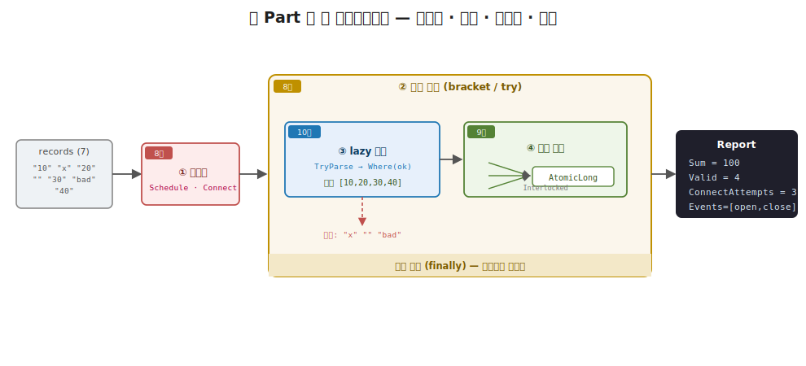
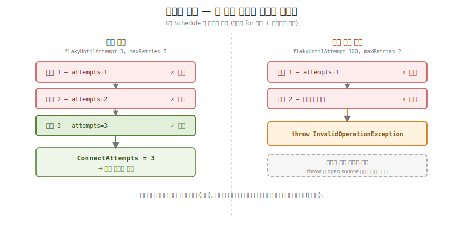
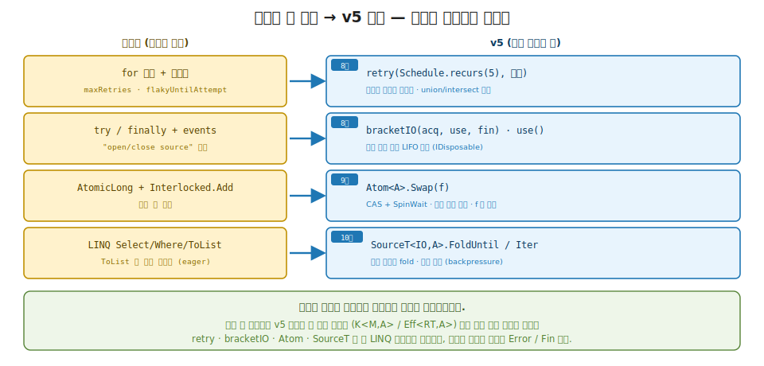

# 41장. 동시성·스트리밍 실전 파이프라인 (네 Part 를 한 파이프라인으로)

> **이 장의 목표** — 이 장을 마치면 따로 익힌 네 도구를 한 데이터 파이프라인 함수로 결합할 수 있습니다. 8부에서 만든 재시도 (Schedule) 로 불안정한 연결을 복구하고, 8부의 `bracket` (Resource) 으로 연 자원을 예외에도 반드시 닫고, 10부의 lazy 스트리밍으로 입력을 한 조각씩 변환하고, 9부의 `Atom` (Interlocked) 으로 여러 스레드의 합산을 락 없이 안전하게 모읍니다. 핵심은 새 추상을 배우는 것이 아니라, 네 추상이 한 함수 안에서 서로 부딪치지 않고 각자의 약속을 동시에 지키는 모양을 보는 데 있습니다. 입력 일곱 개에서 숫자 넷만 골라 합 100 을 내고, 연결이 세 번째에 복구되고, 자원이 정확히 [open, close] 순서로 개폐되는 한 편의 흐름을 손계산으로 추적하며, 마지막으로 네 검증으로 각 도구의 약속이 합성 안에서도 지켜지는지 확인합니다.

> **이 장의 핵심 어휘**
>
> - **파이프라인 (pipeline)**: 입력을 받아 여러 단계를 거쳐 결과 하나로 흘려보내는 한 편의 데이터 흐름
> - **재시도 (`Schedule`)**: 불안정한 연결을 한도 안에서 다시 시도해 복구하는 8부의 도구
> - **`bracket` / 자원 개폐**: 연 자원을 본문이 끝나든 예외가 나든 반드시 닫는 8부의 약속
> - **동시 집계 (`Atom` / `Interlocked`)**: 여러 스레드가 한 누산기를 락 없이 안전하게 더하는 9부의 도구
> - **lazy 스트리밍**: 입력을 한꺼번에 들지 않고 한 조각씩 변환해 흘리는 10부의 어휘
> - **`Report`**: 합 · 유효 개수 · 연결 시도 횟수 · 자원 이벤트를 한 record 로 모은 파이프라인 결과
> - **`AtomicLong`**: `Interlocked.Add` / `Read` 로 정수 합을 락 없이 갱신하는 학습용 누산기
> - **합성 (composition)**: 따로 만든 조각들을 한 코드로 결합해, 각자의 약속이 동시에 지켜지게 하는 것

> 이 장을 마치면 할 수 있게 되는 것
> - [ ] 실무 데이터 흐름 하나에 왜 네 도구가 동시에 필요한지 설명할 수 있습니다.
> - [ ] 재시도 · 자원 개폐 · lazy 변환 · 동시 집계가 한 함수에 어떻게 합쳐지는지 그릴 수 있습니다.
> - [ ] `flakyUntilAttempt` 와 `ConnectAttempts` 의 관계를 손으로 추적할 수 있습니다.
> - [ ] `Parallel.ForEach` 의 단순한 `sum += v` 가 왜 값을 잃는지, `Interlocked` 가 왜 안전한지 설명할 수 있습니다.
> - [ ] `try` / `finally` 가 예외에도 자원을 닫는 경로를 따라갈 수 있습니다.
> - [ ] 입력 일곱 개가 유효 넷 · 합 100 으로 흐르는 과정을 한 그림으로 그릴 수 있습니다.
> - [ ] 네 검증이 각 도구의 어떤 약속을 단언하는지 짝지을 수 있습니다.
> - [ ] 학습용 단순화 (명령형 retry · `try`/`finally` · `Interlocked` · LINQ) 가 v5 의 어느 도구로 승격되는지 짚을 수 있습니다.

> **이 장의 흐름** — 실무의 데이터 흐름 하나는 한 도구로 풀리지 않습니다. 불안정한 연결은 재시도해야 하고, 연 자원은 예외에도 닫아야 하고, 대량 합산은 동시에 빨라야 하고, 입력은 한꺼번에 메모리에 올리지 말아야 합니다. 이 넷이 한 자리에 동시에 필요한 불편을 먼저 겪습니다. 그다음 네 단계를 한 함수 `Pipeline.Run` 에 결합합니다. ① 재시도 루프, ② 자원을 여는 `try` / 닫는 `finally`, ③ 파싱 성공만 추리는 lazy 변환, ④ `Parallel.ForEach` 와 `AtomicLong` 의 동시 합산입니다. 각 단계가 앞 Part 의 어느 추상이 맡던 일인지 한 줄씩 되짚으며 봅니다. 이어 입력 일곱 개가 유효 넷 · 합 100 으로 흐르는 한 편의 실행을 손으로 따라가고, 평균이 그 합과 개수의 후처리임을 봅니다. 마지막으로 네 검증으로 각 도구의 약속이 합성 안에서도 지켜지는지 다지고, 이 학습용 단순화가 앞으로 v5 의 `retry` / `bracketIO` / `Atom.Swap` / `SourceT` 로 같은 모양 그대로 승격된다는 디딤돌을 둡니다.

---

## 41.1 이 장에서 다루는 것 — 네 Part 를 한 파이프라인으로

이 장은 새 추상을 배우는 자리가 아닙니다. 12부 전체가 그렇듯, 따로 익힌 도구들이 한 실무 코드로 합쳐지는 것을 보는 자리입니다. 한 문장으로 잡습니다. 실무의 데이터 흐름 하나에는 재시도 · 자원 안전 · 동시 집계 · lazy 변환이 동시에 필요하고, 이 넷이 한 함수 안에 자연히 합쳐집니다.

동원하는 네 도구는 모두 앞 Part 에서 손으로 만든 것입니다. 8부에서 재시도 정책을 값으로 다루는 `Schedule` 과, 연 자원을 반드시 닫는 `bracket` 을 만들었습니다. 9부에서 여러 스레드가 한 상태를 락 없이 안전하게 갱신하는 `Atom` 을 만들었습니다. 10부에서 데이터를 한 조각씩 당겨 흘리는 lazy 스트림을 만들었습니다. 이 장은 그 넷을 한 함수 `Pipeline.Run` 으로 결합합니다. 새 도구는 없고, 결합만 있습니다.

먼저 이 장이 만드는 것이 무슨 일을 하는지 그림 하나로 잡습니다. 실무에서 흔한 일을 떠올립니다. 어딘가에서 레코드들을 읽어 와, 그중 유효한 것만 골라, 그 값들을 모두 합산해 보고서를 냅니다. 단순해 보이지만 실무에서는 네 가지가 동시에 얽힙니다. 읽어 오는 연결이 불안정하면 재시도해야 하고, 연 자원은 도중에 오류가 나도 반드시 닫아야 하고, 합산은 데이터가 많으면 여러 스레드로 나눠 빨라야 하고, 입력이 크면 한꺼번에 메모리에 올리지 말고 한 조각씩 흘려야 합니다. 이 네 관심사가 한 함수에 모입니다.

여기서 12부 전체를 꿰는 한 줄이 나옵니다. 1장에서 함수형의 본질을 모든 값과 함수를 합성 가능한 Elevated World 로 lift 라는 한 문장으로 적었습니다. 그동안 각 Part 는 그 한 동사를 한 추상씩 손에 쥐여 줬습니다. 12부는 그 추상들이 **합성 가능** 하다는 약속이 실무 규모에서 실제로 지켜지는지 확인하는 자리입니다. 따로 만든 네 조각이 한 함수로 결합될 때, 각자의 약속 (재시도는 복구를, 자원은 개폐를, 집계는 정확성을, 스트림은 한 조각씩을) 이 서로를 깨뜨리지 않고 동시에 성립합니다. 그 동시 성립이 이 장의 한 줄입니다.

지금 모든 것을 외우지 않아도 됩니다. 이 장이 끝날 때 손에 남는 것은 두 가지입니다. 네 도구가 한 함수 안에서 ① 재시도 → ② 자원 열기 → ③ lazy 변환 → ④ 동시 집계 → 자원 닫기의 순서로 합쳐진다는 그림 하나와, 각 도구의 약속이 합성 안에서도 그대로 지켜진다는 발상 하나입니다.

---

## 41.2 왜 필요한가 — 실무 파이프라인은 한 도구로 안 됩니다

네 도구를 결합한 코드를 보이기 전에, 도구를 따로 또는 순진하게 쓰면 어디서 막히는지부터 부딪쳐 봅니다. 결론을 먼저 말하지 않고 불편을 먼저 겪는 것이 이 책의 순서입니다.

레코드를 읽어 합산하는 흐름을 가장 순진하게 적으면 이렇게 시작하게 됩니다.

```csharp
// 네 관심사를 모두 무시한 순진한 첫 시도
var source = Connect();                       // 연결이 한 번에 된다고 가정
var lines  = source.ReadAll();                // 전부 한꺼번에 메모리로
var sum    = 0;
foreach (var line in lines)
    sum += int.Parse(line);                   // 파싱 실패는 생각 안 함
```

이 네 줄에 불편이 네 가지 숨어 있습니다.

첫째, `Connect()` 가 한 번에 성공한다고 가정했습니다. 실무의 연결 (데이터베이스 · 네트워크 소스) 은 일시적으로 실패합니다. 첫 시도에 던지면 그대로 멈추는데, 잠깐 기다렸다 다시 시도하면 붙는 경우가 대부분입니다. 첫 오류에서 멈추는 코드는 복구할 기회를 버립니다.

둘째, `source` 를 열기만 하고 닫는 코드가 없습니다. `int.Parse` 가 도중에 던지면 `source` 는 열린 채로 영영 남습니다. 자원 누수입니다. 연결 · 파일 핸들 · 락은 한 번 새면 쌓여서 시스템을 멈춥니다.

셋째, `int.Parse(line)` 은 숫자가 아닌 입력 (`"x"`, 빈 문자열) 을 만나면 예외를 던집니다. 레코드 하나가 깨졌다고 전체 합산이 멈춥니다. 유효한 것만 추리고 나머지는 건너뛰는 처리가 없습니다.

넷째, `ReadAll()` 이 전부를 한 리스트로 메모리에 올립니다. 입력이 수십 기가바이트면 그 순간 멈춥니다. 그리고 `foreach` 합산은 단일 스레드라, 데이터가 많아도 한 줄씩만 처리합니다.

이 넷을 도구로 따로 풀 수는 있습니다. 8부의 재시도로 첫째를, 8부의 `bracket` 으로 둘째를, 10부의 lazy 스트림으로 셋째와 넷째의 메모리를 (깨진 입력은 추려 건너뛰고, 나머지는 한 조각씩 흘려 메모리를 아낌), 9부의 동시 집계로 넷째의 속도를 풉니다. 그러나 실무의 한 흐름에서는 이 넷이 **동시에** 필요합니다. 재시도만 붙이고 자원을 안 닫으면 누수가 남고, 자원은 닫되 합산이 단일 스레드면 느립니다. 그래서 네 도구가 한 함수에 모여야 합니다.

> **흔한 함정** — 네 도구를 따로 배웠으니 네 함수로 나누면 된다고 여기는 것입니다.
>
> 재시도 함수 하나, 자원 함수 하나, 합산 함수 하나로 깔끔히 나누고 싶어집니다. 그러나 이 넷은 서로 겹쳐 있습니다. 자원을 *연 다음에* 스트림을 읽고, 스트림을 읽은 다음에 합산하고, 그 전체가 자원 닫기 *안에* 들어가야 합니다. 곧 자원 개폐가 스트리밍과 집계를 감싸고, 재시도가 그 앞에 섭니다. 네 관심사가 중첩 (nesting) 으로 얽혀 있어, 단순히 네 함수를 나란히 부르는 것으로는 표현되지 않습니다. 이 중첩을 한 함수 안에서 어떻게 푸는지가 이 장의 핵심입니다.

그래서 우리가 바라는 것은 분명합니다. 불안정한 연결은 한도 안에서 재시도하고, 연 자원은 예외에도 반드시 닫고, 입력은 한 조각씩 변환하고, 합산은 여러 스레드로 안전하게 모으는 한 함수입니다. 다음 절에서 그 함수가 어떤 모양인지 봅니다.

---

## 41.3 네 단계를 한 함수에 — Pipeline.Run

이제 네 도구를 한 함수로 결합합니다. 핵심 발상은 한 문장입니다. 네 관심사를 ① 재시도 → ② 자원 열기 → ③ lazy 변환 → ④ 동시 집계 → 자원 닫기의 순서로 한 함수 본문에 차례로 엮어라. 결과는 합 · 유효 개수 · 연결 시도 횟수 · 자원 이벤트를 모은 `Report` 하나입니다.

일상의 비유로 직감만 짧게 잡습니다. 공장의 한 생산 라인을 떠올립니다. 먼저 원료 공급 밸브를 여는데, 밸브가 뻑뻑하면 몇 번 다시 돌려 봅니다 (재시도). 일단 라인을 켜면 작업이 끝나든 사고가 나든 반드시 라인을 끄고 나갑니다 (자원 개폐). 원료는 컨베이어로 한 덩이씩 흘러 들어오고 (lazy 스트림), 검수대에서 불량은 버립니다 (필터). 합격품은 여러 작업대가 동시에 집계해 한 계수기에 모읍니다 (동시 집계). 한 라인 안에 이 네 동작이 자연스럽게 한 줄로 놓입니다.

먼저 동시 집계에 쓸 누산기 `AtomicLong` 입니다. 9부에서 만든 `Atom` 의 정수 합 전용 학습용 대역입니다.

```csharp
// 원자적 누산기 (9부 Atom) — 동시 집계를 락 없이 안전하게.
public sealed class AtomicLong
{
    long value;
    public long Value => Interlocked.Read(ref value);
    public void Add(long delta) => Interlocked.Add(ref value, delta);
}
```

한 줄로 읽습니다. `AtomicLong` 은 정수 `value` 하나를 품고, `Add` 로 더하고 `Value` 로 읽습니다. 핵심은 `Interlocked.Add` 와 `Interlocked.Read` 입니다. 이 둘은 여러 스레드가 동시에 불러도 읽기-수정-쓰기가 쪼개지지 않는 (원자적) 연산입니다. 9부에서 `Atom<A>.Swap` 이 임의의 불변 자료구조를 락 없이 갱신했는데, 여기서는 정수 합이라는 가장 단순한 경우만 떼어 `Interlocked` 로 대역합니다.

이제 네 단계를 엮은 본체입니다. 한 단계씩 끊어 봅니다. 먼저 전체 모양과 결과 타입입니다.

```csharp
// 실전 데이터 파이프라인 — 8부 retry(Schedule) + bracket(Resource) +
// 9부 Atom(동시 집계) + 10부 스트리밍(lazy 변환) 을 한 자리에서 결합한다.
public static class Pipeline
{
    public sealed record Report(long Sum, int Valid, int ConnectAttempts, List<string> Events);

    public static Report Run(IReadOnlyList<string> rawRecords, int maxRetries, int flakyUntilAttempt)
    {
        var events = new List<string>();
        // ... 네 단계가 여기에 ...
    }
}
```

`Report` 는 파이프라인이 내놓는 결과 한 묶음입니다. 합 (`Sum`), 유효 레코드 개수 (`Valid`), 연결을 몇 번 시도했는지 (`ConnectAttempts`), 자원을 언제 열고 닫았는지의 기록 (`Events`) 네 필드입니다. 네 단계가 각자 이 네 필드 중 하나씩에 기여합니다.

어느 단계가 어느 필드를 채우는지 미리 짝지어 두면, 다음 네 코드 조각을 읽을 때 길을 잃지 않습니다.

- `ConnectAttempts` ← ① 재시도 (Schedule, 8부) 가 연결까지 든 시도 횟수를 적습니다.
- `Events` ← ② 자원 (bracket, 8부) 이 여닫은 기록 (open · close) 을 적습니다.
- `Valid` ← ③ 스트리밍 (10부) 이 추려 낸 유효 레코드 개수입니다.
- `Sum` ← ④ 동시 집계 (Atom, 9부) 가 락 없이 더한 합입니다.

네 단계가 한 본문을 흐르며 각자 자기 칸 하나씩을 채우고, 마지막에 그 네 칸이 `Report` 하나로 모입니다. 이제 그 네 단계를 차례로 봅니다.

**① 재시도 (Schedule, 8부).** 불안정한 연결을 한도 안에서 다시 시도합니다.

```csharp
// ① 재시도(Schedule) — 불안정한 연결을 최대 maxRetries 회 재시도.
var attempts = 0;
bool Connect() { attempts++; return attempts >= flakyUntilAttempt; }
var connected = Connect();
for (var i = 0; i < maxRetries && !connected; i++) connected = Connect();
if (!connected) throw new InvalidOperationException("연결 실패");
```

`Connect()` 는 부를 때마다 `attempts` 를 하나 올리고, 그 횟수가 `flakyUntilAttempt` 에 닿으면 성공 (`true`) 을 냅니다. 곧 `flakyUntilAttempt` 는 "몇 번째 시도에 붙는가" 를 흉내 내는 손잡이입니다. 첫 시도가 실패하면 `for` 루프가 `maxRetries` 번까지 다시 부르고, 그래도 안 붙으면 던집니다. 이것이 8부 `Schedule` 이 하던 일입니다. 8부에서는 `Schedule.recurs(n)` 으로 "n 번 반복" 을 값으로 만들고 `retry` 로 효과에 걸었는데, 여기서는 그 정책을 명령형 `for` 루프와 두 정수 인자로 대역합니다. OO 직감으로 다리를 놓으면, 재시도 정책을 가진 HTTP 클라이언트 (`Polly` 의 retry policy) 가 일시적 오류에 자동으로 다시 거는 것과 같은 발상입니다.

**② 자원 (bracket, 8부).** 소스를 열고, 본문이 끝나든 예외가 나든 반드시 닫습니다.

```csharp
// ② 자원(bracket) — 소스를 열고 반드시 닫는다 (예외에도).
events.Add("open source");
try
{
    // ③ ④ 가 여기 들어간다
    return new Report(sum.Value, parsed.Count, attempts, events);
}
finally
{
    events.Add("close source");
}
```

`events.Add("open source")` 로 자원을 열었다는 기록을 남기고, `try` 본문에서 작업을 하고, `finally` 에서 `events.Add("close source")` 로 닫습니다. 핵심은 `finally` 입니다. `try` 본문에서 무슨 일이 일어나든 (정상 종료든 예외든) `finally` 는 반드시 실행됩니다. 이것이 8부 `bracket` 의 약속입니다. 연 자원은 반드시 닫힙니다. 8부에서는 `bracketIO` 가 IO 환경의 자원을 자동으로 LIFO 해제했는데, 여기서는 그 약속을 `try` / `finally` 와 문자열 기록으로 가시화합니다. OO 직감으로는 C# 의 `using` 블록이 정확히 이 모양입니다. `using (var src = Open())` 의 블록을 벗어날 때 `Dispose()` 가 예외에도 불립니다.

**③ 스트리밍 변환 (lazy, 10부).** 입력에서 파싱 성공한 것만 추립니다.

```csharp
// ③ 스트리밍 변환(lazy) — 파싱 성공만 추림.
var parsed = rawRecords
    .Select(r => (ok: int.TryParse(r, out var v), value: v))
    .Where(x => x.ok)
    .Select(x => x.value)
    .ToList();
```

세 단계의 LINQ 사슬입니다. 각 레코드를 `int.TryParse` 로 시도해 (성공 여부, 값) 쌍으로 바꾸고 (`Select`), 성공한 것만 통과시키고 (`Where`), 값만 뽑습니다 (`Select`). 깨진 입력 (`"x"`, 빈 문자열) 은 `ok` 가 `false` 라 `Where` 에서 버려집니다. 이것이 10부 lazy 스트리밍이 하던 한 조각씩 변환입니다. 10부에서는 `SourceT<IO, A>` 가 효과 안에서 스트림을 한 조각씩 접었는데, 여기서는 LINQ 의 지연 평가로 대역합니다. OO 직감으로는 LINQ 체인 자체가 친숙한 모양입니다. `Select` / `Where` 가 데이터 흐름을 선언적으로 잇습니다.

**④ 동시 집계 (Atom, 9부).** 추린 값들을 여러 스레드가 락 없이 합산합니다.

```csharp
// ④ 동시 집계(Atom) — 여러 스레드가 락 없이 합산.
var sum = new AtomicLong();
Parallel.ForEach(parsed, v => sum.Add(v));
```

`Parallel.ForEach` 가 `parsed` 의 원소들을 여러 스레드에 나눠 동시에 처리합니다. 각 스레드는 `sum.Add(v)` 로 누산기에 더하는데, `AtomicLong` 의 `Interlocked.Add` 덕에 여러 스레드가 동시에 더해도 값이 새지 않습니다. 이것이 9부 `Atom` 이 하던 일입니다. OO 직감으로는 여러 작업 스레드가 한 공유 카운터를 `lock` 없이 안전하게 올리는 것과 같습니다. 다만 `lock` 으로 감싸는 대신 `Interlocked` 의 원자적 연산을 씁니다.

네 단계가 한 본문에 차례로 놓였습니다. ① 재시도가 가장 바깥에서 연결을 보장하고, ② 자원 개폐가 ③ 스트리밍과 ④ 집계를 `try` / `finally` 로 감싸고, 그 안에서 ③ 이 입력을 추려 ④ 가 합산합니다. 41.2 에서 본 네 관심사의 중첩이 이 한 함수의 구조로 풀립니다.



**그림 41-1. 네 Part 가 한 파이프라인에: 재시도 · 자원 · 스트림 · 집계** — `records` 입력이 왼쪽에서 들어와 네 단계를 차례로 거쳐 `Report` 로 나옵니다. ① 재시도 (Schedule, 8부) 가 연결을 보장하고, ② 자원 열기 (bracket, 8부) 가 ③ lazy 파싱 (10부) 과 ④ `Atom` 동시 집계 (9부) 를 감싸며, 마지막에 자원을 닫습니다. 각 단계에 출처 Part 배지를 답니다. 입력 일곱 개 (`10` `x` `20` 빈칸 `30` `bad` `40`) 가 유효 넷으로 걸러져 합 100 의 `Report` 가 됩니다.

OO 직감으로 다시 다리를 놓으면, 이 한 함수는 계층형 아키텍처의 한 서비스 메서드와 같습니다. 바깥에 연결 재시도 정책 (인프라 계층), 그 안에 자원 수명 관리 (`using`), 그 안에 데이터 변환 (도메인 로직), 그리고 병렬 집계 (성능 최적화) 가 한 메서드 안에 층층이 들어가는 모양입니다. 함수형이라고 이 구조가 달라지지 않습니다. 다만 각 층이 **합성 가능한 조각** 으로 따로 만들어져 한 자리에 끼워졌다는 점이 다릅니다.

> **흔한 함정** — 단순한 `sum += v` 면 충분하지 않냐는 것입니다.
>
> `Parallel.ForEach(parsed, v => sum += v)` 처럼 평범한 정수 `sum` 에 더하면 안 됩니다. `sum += v` 는 한 동작이 아니라 ① `sum` 읽기 → ② `v` 더하기 → ③ `sum` 쓰기의 세 동작입니다. 두 스레드가 동시에 ① 을 실행하면 둘 다 같은 옛값을 읽고, 각자 더해 ③ 에서 씁니다. 한 스레드의 증가가 다른 스레드에 덮여 사라집니다 (경쟁 조건). 그래서 합이 매번 달라지고, 정답보다 작게 나옵니다. `AtomicLong.Add` 의 `Interlocked.Add` 는 이 세 동작을 쪼개지지 않는 한 동작으로 묶어, 어떤 스레드가 먼저 들어오든 증가가 유실되지 않습니다. 곧 손계산으로 이 유실을 따로 짚습니다.

손계산으로 경쟁 조건이 어떻게 값을 잃는지 봅니다. 두 스레드가 각각 10 과 20 을 더하는데, `sum` 의 옛값이 0 이라고 합니다.

```
단순한 sum += v  (Interlocked 없음):

  스레드 A (10 더함)        스레드 B (20 더함)        sum
  ───────────────────      ───────────────────      ───
  ① 읽기: 0                                          0
                           ① 읽기: 0  ← 같은 옛값!    0
  ② 더하기: 0+10=10                                  0
                           ② 더하기: 0+20=20         0
  ③ 쓰기: 10                                         10
                           ③ 쓰기: 20  ← A의 10 덮음  20

  결과 sum = 20   (정답 30 이 아님 — A의 증가가 사라짐)

원자적 Interlocked.Add  (AtomicLong):

  스레드 A: Add(10) ─ 읽기·더하기·쓰기가 쪼개지지 않는 한 동작 ─→ sum 0→10
  스레드 B: Add(20) ─ A가 끝난 뒤에야 한 동작으로 ─────────────→ sum 10→30

  결과 sum = 30   (순서가 A·B 든 B·A 든 항상 30)
```

위에서 단순한 `+=` 는 B 의 쓰기가 A 의 증가를 덮어 30 이 아닌 20 을 냈습니다. `Interlocked.Add` 는 읽기-더하기-쓰기를 한 동작으로 묶어, 두 스레드가 어떤 순서로 들어오든 증가가 유실되지 않고 항상 30 을 냅니다. 이 원자성이 9부 `Atom` 이 약속한 동시 집계의 정확성입니다. 파이프라인의 합 100 이 매 실행마다 흔들리지 않는 까닭입니다.

이제 `flakyUntilAttempt` 와 `ConnectAttempts` 의 관계를 손으로 추적합니다. 헷갈리기 쉬운 자리라 표로 짚습니다.

```
Connect() 한 번 부를 때마다 attempts += 1, attempts >= flakyUntilAttempt 면 성공.

flakyUntilAttempt = 3  (3번째 시도에 붙음), maxRetries = 5:

  호출        attempts   attempts >= 3 ?   결과
  ────────    ────────   ──────────────    ──────────
  Connect()      1          거짓           실패 → 루프 진입
  for i=0        2          거짓           실패 → 계속
  for i=1        3          참             성공! 루프 종료
  ────────────────────────────────────────────────
  ConnectAttempts = 3   (3번째에 복구)

flakyUntilAttempt = 1  (1번째에 붙음, 재시도 0회):

  호출        attempts   attempts >= 1 ?   결과
  ────────    ────────   ──────────────    ──────────
  Connect()      1          참             성공! 루프 진입 안 함
  ────────────────────────────────────────────────
  ConnectAttempts = 1   (재시도 없이 즉시)
```

`flakyUntilAttempt = 3` 이면 첫 호출과 루프 두 번째까지 세 번 불러야 붙어 `ConnectAttempts = 3` 이고, `flakyUntilAttempt = 1` 이면 첫 호출에 바로 붙어 재시도가 없습니다. 곧 `ConnectAttempts` 는 "연결까지 실제로 든 시도 횟수" 이고, 그 값이 1 보다 크면 재시도로 복구했다는 뜻입니다. 예제 1 (`flakyUntilAttempt: 3`) 과 예제 2 (`flakyUntilAttempt: 1`) 의 차이가 여기서 갈립니다.

---

## 41.4 payoff — 네 도구가 한 Report 로

이제 이 파이프라인이 약속을 지키는지 정면으로 봅니다. 네 도구가 한 함수로 합쳐졌으니, 한 번의 실행에서 네 약속이 동시에 지켜져야 합니다. 연결은 복구되고, 자원은 개폐되고, 입력은 추려지고, 합산은 정확해야 합니다. 데모의 첫 예제가 그것을 한 `Report` 로 보입니다.

모든 예제가 공통으로 쓰는 입력은 레코드 일곱 개입니다.

```csharp
string[] records = ["10", "x", "20", "", "30", "bad", "40"];
var r = Pipeline.Run(records, maxRetries: 5, flakyUntilAttempt: 3);
```

일곱 개 중 숫자는 넷 (`10` `20` `30` `40`) 이고, 셋 (`x` 빈칸 `bad`) 은 깨진 입력입니다. `maxRetries: 5` 로 최대 다섯 번 재시도하고, `flakyUntilAttempt: 3` 으로 세 번째 시도에 연결이 붙습니다. 이 한 줄이 네 단계를 모두 거쳐 어떤 `Report` 를 내는지, 손으로 따라갑니다.

```
입력:  records = ["10", "x", "20", "", "30", "bad", "40"]   (7개)
       maxRetries = 5,  flakyUntilAttempt = 3

① 재시도(Schedule):
   Connect() → attempts=1, 1>=3 거짓 → 실패
   for i=0   → attempts=2, 2>=3 거짓 → 실패
   for i=1   → attempts=3, 3>=3 참   → 성공!  ConnectAttempts=3

② 자원 열기(bracket):
   events.Add("open source")          events=[open source]
      │ (try 본문 진입)
      ▼

③ lazy 변환(스트리밍) — TryParse → Where(ok) → 값:
   "10"  → (true, 10)   통과
   "x"   → (false, 0)   버림
   "20"  → (true, 20)   통과
   ""    → (false, 0)   버림
   "30"  → (true, 30)   통과
   "bad" → (false, 0)   버림
   "40"  → (true, 40)   통과
   ───────────────────────────
   parsed = [10, 20, 30, 40]          Valid=4

④ 동시 집계(Atom) — Parallel.ForEach + Interlocked.Add:
   [10, 20, 30, 40] 을 여러 스레드가 락 없이 합산
   순서 무관 (Interlocked) → Sum = 100

   return Report(Sum=100, Valid=4, ConnectAttempts=3, events)
      │ (try 정상 종료 → finally)
      ▼
② 자원 닫기(finally):
   events.Add("close source")         events=[open source, close source]

결과 Report:
   Sum=100,  Valid=4,  ConnectAttempts=3,
   Events=[open source, close source]
```

네 단계가 한 흐름으로 지나가며 각자의 약속을 지켰습니다. 재시도는 세 번째에 복구했고 (`ConnectAttempts=3`), 자원은 열고 정상 종료 후 닫혔고 (`Events=[open, close]`), 스트림은 깨진 셋을 버리고 넷만 추렸고 (`Valid=4`), 집계는 락 없이 정확히 합산했습니다 (`Sum=100`). 데모는 이것을 그대로 출력합니다.

```
== 예제 1 — retry + bracket + 스트리밍 + 동시 집계 ==
  연결 시도 횟수 = 3 (3번째 성공 — 재시도 복구)
  유효 레코드 = 4개, 합 = 100 (동시 집계)
  자원 이벤트 = [open source → close source]
```

이 세 줄이 이 장의 payoff 입니다. 따로 만든 네 도구가 한 함수로 합쳐졌는데, 어느 하나도 다른 셋을 깨뜨리지 않았습니다. 재시도가 자원을 새게 하지 않았고, 자원 개폐가 집계를 막지 않았고, lazy 변환이 합산을 어긋나게 하지 않았습니다. 네 약속이 한 자리에서 동시에 성립합니다. 1장에서 추상들이 **합성 가능** 하다고 했던 약속이, 실무 규모의 한 함수에서 실제로 지켜지는 것을 본 것입니다.



**그림 41-2. 재시도 복구: 세 번째 시도에 연결이 붙습니다** — `flakyUntilAttempt = 3` 일 때 `Connect()` 가 1 회 · 2 회 실패하고 3 회째에 성공해 `ConnectAttempts = 3` 이 됩니다. 왼쪽은 복구 경로 (한도 안에서 다시 시도해 끝내 성공), 오른쪽은 복구 불가 경로 (`flakyUntilAttempt` 가 `maxRetries` 보다 커서 한도를 넘기면 `throw`, 자원도 열지 않음) 입니다. 8부 `Schedule` 재시도의 실무 모습입니다.

이제 둘째 예제, 평균입니다. 파이프라인의 결과를 후처리하는 패턴입니다.

```csharp
public static double Of(IReadOnlyList<string> records)
{
    var r = Pipeline.Run(records, maxRetries: 5, flakyUntilAttempt: 1);
    return r.Valid == 0 ? 0 : (double)r.Sum / r.Valid;
}
```

`Average.Of` 는 파이프라인을 돌려 `Report` 를 받고, 그 합을 유효 개수로 나눕니다. `flakyUntilAttempt: 1` 이라 연결은 첫 시도에 붙고 (재시도 없음), `Sum=100` 과 `Valid=4` 가 나와 평균은 `100 / 4 = 25` 입니다.

```csharp
Average.Of(records);   // 25
```

여기서 짚을 점이 하나 있습니다. 파이프라인은 합과 개수 두 누적값만 내보내고, 평균은 그 둘의 순수 함수입니다. 곧 집계 (파이프라인) 와 지표 산출 (평균) 이 분리되어 있습니다. 파이프라인은 재시도 · 자원 · 동시성 같은 부수 효과가 얽힌 무거운 일을 하고, 평균은 그 결과 두 숫자로 나눗셈 하나만 하는 가벼운 순수 함수입니다. OO 직감으로는 리포지토리 (raw 데이터 집계) 와 그 위의 계산 (지표) 을 나누는 것과 같습니다. 합과 개수만 있으면 평균뿐 아니라 다른 지표 (최댓값 비율 등) 도 같은 방식으로 얹을 수 있습니다.

> **흔한 함정** — 평균을 파이프라인 안에서 계산하면 안 되냐는 것입니다.
>
> 평균을 `Pipeline.Run` 본문에 넣고 싶어집니다. 그러나 그러면 파이프라인이 "합산" 이라는 한 가지 일과 "평균" 이라는 다른 일을 동시에 떠안아, 다음에 합계만 필요하거나 다른 지표가 필요할 때 매번 본문을 고쳐야 합니다. 합과 개수라는 *최소한의 누적값* 만 내보내고, 거기서 평균을 후처리로 뽑으면, 파이프라인은 그대로 두고 지표만 자유롭게 얹을 수 있습니다. 무거운 효과 (집계) 와 가벼운 순수 함수 (지표) 를 나누는 이 분리가, 파이프라인을 재사용 가능하게 합니다.

---

## 41.5 법칙으로 다지기 — 네 약속의 동시 성립

7장 이후 새 추상마다 법칙으로 그 의미를 확인했습니다. 이 장에는 확인할 것이 있는데, Functor 나 Monad 의 대수 법칙은 아닙니다. 이 장이 다지는 것은 네 도구가 한 함수로 합성될 때 각자의 약속이 동시에 지켜지는가입니다. 재시도는 끝내 복구하는가, 자원은 반드시 닫히는가, 스트림은 유효만 추리는가, 한도를 넘으면 멈추는가. 이 넷이 "따로 만든 도구가 한 코드로 합성돼도 각자의 약속이 깨지지 않는다" 는 12부 축의 약속이 코드로 정말 그러한지입니다.

네 검증은 콘솔 `bool` 함수 넷입니다.

```csharp
static readonly string[] Records = ["10", "x", "20", "", "30", "bad", "40"];

// ① 파싱 성공만 합산 (10+20+30+40 = 100).
public static bool SumsValidOnly()
{
    var r = Pipeline.Run(Records, maxRetries: 5, flakyUntilAttempt: 1);
    return r is { Sum: 100, Valid: 4 };
}

// ② 불안정한 연결을 재시도로 복구 (3번째 시도에 성공).
public static bool RetriesConnection()
{
    var r = Pipeline.Run(Records, maxRetries: 5, flakyUntilAttempt: 3);
    return r.ConnectAttempts == 3 && r.Sum == 100;
}

// ③ 자원이 열리고 반드시 닫힌다.
public static bool ResourceLifecycle()
{
    var r = Pipeline.Run(Records, maxRetries: 5, flakyUntilAttempt: 1);
    return r.Events.SequenceEqual(["open source", "close source"]);
}

// ④ 재시도 한도를 넘으면 실패 (연결 안 됨 → 자원 안 열림).
public static bool FailsWhenUnrecoverable()
{
    try { Pipeline.Run(Records, maxRetries: 2, flakyUntilAttempt: 100); return false; }
    catch (InvalidOperationException) { return true; }
}
```

네 검증을 한 줄씩 읽습니다.

첫째, **유효만 합산** (`SumsValidOnly`) — 깨진 셋을 버리고 넷만 합해 `Sum=100`, `Valid=4` 인지 봅니다. 10부 스트리밍의 `Where` 필터가 합성 안에서도 유효만 통과시키는 약속을 확인합니다.

둘째, **연결 재시도 복구** (`RetriesConnection`) — `flakyUntilAttempt=3` 일 때 세 번째 시도에 붙어 `ConnectAttempts=3` 이고, 그래도 합은 정확히 100 인지 봅니다. 8부 `Schedule` 재시도가 복구 가능한 실패를 끝내 성공시키는 약속, 그리고 재시도가 뒤따르는 합산을 어긋나게 하지 않는다는 합성의 정합성을 확인합니다.

셋째, **자원 개폐 보장** (`ResourceLifecycle`) — 이벤트가 정확히 `[open source, close source]` 순서인지 봅니다. 8부 `bracket` 이 연 자원을 반드시 닫는 약속을 확인합니다.

넷째, **복구 불가 시 실패** (`FailsWhenUnrecoverable`) — `flakyUntilAttempt=100` 인데 `maxRetries=2` 라 한도를 넘겨 `InvalidOperationException` 이 나는지 봅니다. 재시도 한도의 약속 (복구 불가능하면 무한정 매달리지 않고 멈춘다) 을 확인합니다. 여기서 한 가지 더 짚을 점은, 연결이 실패하면 `throw` 가 `events.Add("open source")` **이전** 에 일어나므로 자원이 아예 안 열린다는 것입니다. 열지 않은 자원은 닫을 필요도 없습니다. 셋째 검증 (정상 경로 → 열고 닫음) 과 정확히 대비됩니다.

데모 출력은 넷 다 통과입니다.

```
== 검증 ==
  유효만 합산 : 통과
  연결 재시도 복구 : 통과
  자원 개폐 보장 : 통과
  복구 불가 시 실패 : 통과

모든 검증 통과 [OK]
```

이 네 검증이 12부 축의 약속을 굳힙니다. 동시 집계의 정확성은 따로 단언하지 않지만, 첫째와 둘째가 `Sum==100` 을 거듭 확인하는 것이 곧 그 약속의 간접 보장입니다. `Parallel.ForEach` 의 실행 순서가 매번 달라도 합이 항상 100 이라는 것이, `Interlocked` 의 원자성 (9부 `Atom`) 이 합성 안에서도 지켜진다는 뜻입니다. OO 직감으로는 단위 테스트가 각 계층의 계약을 따로 검증하는 것이 아니라, 통합 테스트 하나가 네 관심사가 한 흐름에서 함께 옳게 동작하는지를 검증하는 것과 같습니다.

> **더 깊이 (처음엔 건너뛰어도 됩니다)** — 왜 대수 법칙이 아니라 동작 검증일까요.
>
> 7장부터 각 추상의 Functor · Monad 법칙을 property 로 확인했습니다. 이 장은 그 대수 법칙을 굴리지 않고 네 개의 구체적인 동작 검증으로 대신합니다. 까닭은 이 장이 다지려는 것이 한 추상의 대수 구조가 아니라, *네 추상이 한 코드로 합성될 때 각자의 약속이 동시에 성립하는가* 이기 때문입니다. 이것은 어떤 단일 추상의 법칙으로도 표현되지 않는, 합성에만 있는 성질입니다. 10부 `StreamT` 가 종료성 · 합성 전파 · 당김 횟수라는 동작을 단언했던 것과 같은 결입니다. 입문 단계에서는 "capstone 의 검증은 추상의 법칙이 아니라 도구들이 함께 옳게 도는가" 라고만 알아 두면 충분합니다. 11부에서 본 property-based 테스트는 단일 추상의 법칙에 쓰고, 합성 코드는 이렇게 동작 검증으로 다지는 것이 자연스럽습니다.

---

## 41.6 더 깊이 — 학습용 결합은 v5 의 단순화판입니다

> **더 깊이 (처음엔 건너뛰어도 됩니다)** — 이 절은 학습용 `Pipeline.Run` 과 LanguageExt v5 의 실제 효과 합성 사이의 거리를 정직하게 짚는 자리입니다. 처음 읽을 때는 건너뛰어도 이 장의 발상을 이해하는 데 지장이 없습니다.

학습용 파이프라인은 네 도구의 결합을 한 동기 함수로 절차적으로 엮은 것이고, v5 라면 같은 네 관심사가 한 효과 모나드 안에서 더 매끄럽게 합성됩니다. 정직하게 짚어 둡니다.

**재시도.** 학습용은 명령형 `for` 루프와 두 정수 인자 (`maxRetries`, `flakyUntilAttempt`) 로 "몇 번째에 성공" 을 흉내 냅니다. v5 의 실제 모양은 `retry(Schedule.recurs(5), <Eff<RT, Unit> 효과>)` 입니다. `Schedule.recurs(int)` 은 "n 번 반복" 을 값으로 표현한 `ScheduleTransformer` 이고, `retry<M, A>(Schedule, K<M, A>)` 는 그 정책을 효과에 걸어 실패 시 다시 굴립니다. 학습용에는 `Schedule` 값 · 지연 정책 (spaced · exponential) · 정책 결합 (union · intersect) 이 없습니다. 8부에서 만든 그 `Schedule` 이 여기서 실무 효과 위로 올라가는 자리입니다.

**자원.** 학습용은 `try` / `finally` 와 `events.Add("open/close source")` 문자열 기록으로 해제를 가시화합니다. v5 의 실제 모양은 `bracketIO(computation)` 으로, IO 환경의 자원을 자동으로 LIFO 해제합니다 (8부에서 "궁극의 using" 으로 부른 그것). `from d in use(() => new Resource()) select ...` 처럼 자원을 효과 안에서 열면, 소비가 끝날 때 (예외 경로를 포함해) 자동으로 닫힙니다. 학습용에는 `IDisposable` · `use` · 자동 LIFO 해제가 없고, `finally` 한 줄로 대역합니다.

**동시 집계.** 학습용 `AtomicLong` 은 `long` 과 `Interlocked.Add` / `Read` (정수 합 전용) 입니다. v5 의 실제 모양은 `Atom<A>.Swap(Func<A, A> f)` 로, `CompareExchange` 와 `SpinWait` 스핀 루프로 **임의의 불변 자료구조** 를 원자적으로 갱신합니다. `f` 는 경합 시 여러 번 불릴 수 있어 부수 효과가 없어야 합니다. 학습용은 임의 함수 `Swap` 대신 덧셈만, validator · 변경 이벤트 없이 정수 합만 다룹니다. 9부에서 만든 `Atom` 이 여기서 정수 합으로 좁혀진 것입니다.

**스트리밍.** 학습용은 LINQ `Select` / `Where` / `ToList` 입니다. `.ToList()` 로 즉시 구체화하므로 실제로는 eager 입니다. 주석의 "lazy" 는 LINQ 의 지연 평가 성격을 가리키지만 `ToList` 로 끝납니다. v5 의 실제 모양은 `SourceT<IO, int>` 를 `.FoldUntil(...)` · `.Iter()` · `where` 필터로 **효과 안에서** 접는 것입니다. 학습용에는 IO 안의 fold · 진짜 스트림 융합 · 역압 (backpressure) 이 없습니다. 10부에서 만든 그 스트림이 여기서 효과를 품은 채로 합성되는 자리입니다.

**전체.** 학습용 `Pipeline.Run` 은 네 관심사를 한 동기 함수로 절차적으로 엮고, 실패를 예외 (`throw`) 로 표현합니다. v5 라면 네 도구가 모두 `K<M, A>` / `Eff<RT, A>` 효과로 합성되어, 같은 모나드 파이프라인 안에서 `retry` · `bracketIO` · `Atom` · `SourceT` 가 한 LINQ 흐름으로 결합되고, 실패는 예외가 아니라 `Error` / `Fin` 으로 표현됩니다. EffectsExamples 샘플이 그 결합의 실제 모습입니다.



**그림 41-3. 학습용 네 장치 → v5 대응: 명령형 단순화는 디딤돌** — `for` 루프 · `try` / `finally` · `AtomicLong` · LINQ 네 명령형 장치가 각각 `Schedule` · `bracketIO` · `Atom` · `SourceT` 로 올라갑니다. 같은 네 관심사가 v5 에서는 한 효과 모나드 위로 같은 모양 그대로 합성됩니다.

입문 단계에서는 이 거리를 외울 필요가 없습니다. "네 도구가 한 함수에서 각자의 약속을 지키며 합쳐진다" 는 골격은 학습용과 v5 가 같고, 학습용의 명령형 단순화 (for 루프 · `try`/`finally` · `Interlocked` · LINQ) 는 **거짓말이 아니라 디딤돌** 입니다. 같은 네 관심사가 v5 에서는 효과 모나드 위로 같은 모양 그대로 올라간다고만 알아 두면 충분합니다.

---

## 41.7 Elevated World 어휘로 다시 읽기

이 절은 이 장의 합성을 1장 비유에 맞춰 다시 읽는 자리입니다. 먼저 매핑부터 둡니다.

| 41장 조각 | Elevated World 어휘 |
|---|---|
| 재시도 (Schedule, 8부) | 8부에서 만든 합성 조각 — 실패를 끌어올려 다시 굴리는 정책 |
| `bracket` (8부) | 8부에서 만든 합성 조각 — 자원의 수명을 효과 안에 가두는 경계 |
| 동시 집계 (`Atom`, 9부) | 9부에서 만든 합성 조각 — 공유 상태를 순수 갱신으로 다루는 원자성 |
| lazy 스트리밍 (10부) | 10부에서 만든 합성 조각 — 데이터를 한 조각씩 흘리는 Elevated 시민 |
| `Pipeline.Run` | 네 조각의 합성 — 한 흐름에서 네 약속이 동시에 성립 |

1장에서 함수형의 본질을 한 문장으로 적었습니다. 모든 값과 함수를 합성 가능한 Elevated World 로 끌어올리는 것. 그동안 각 Part 는 그 한 동사를 한 조각씩 손에 쥐여 줬습니다. 8부는 재시도와 자원이라는 효과의 견고함을, 9부는 동시성의 안전을, 10부는 스트림의 게으름을 각각 Elevated 세계의 시민으로 만들었습니다. 12부는 그 조각들을 한 자리에 모읍니다.

여기서 1장의 합성 가능성으로 이 장의 자리를 정확히 짚습니다. 1장에서 두 평행 세계 비유의 셋째 축이 합성 가능성이었습니다. 값과 함수를 Elevated World 로 끌어올리면, 그 위에서 자유롭게 합성된다는 약속이었습니다. 이 장이 바로 그 약속의 실무 증명입니다. 따로 끌어올린 네 조각 (재시도 · 자원 · 집계 · 스트림) 이 한 함수로 결합될 때, 서로 부딪치지 않고 각자의 모양을 그대로 유지합니다. 재시도는 여전히 복구하고, 자원은 여전히 닫히고, 집계는 여전히 정확하고, 스트림은 여전히 한 조각씩입니다. 합성이 각 조각의 약속을 보존합니다.

이 보존이 12부 축의 핵심입니다. 명령형으로 네 관심사를 엮으면 한 함수가 거대해지고 각 관심사가 서로의 상태를 건드려 추론이 무너졌습니다 (41.2 의 순진한 첫 시도). 함수형은 각 관심사를 **합성 가능한 조각** 으로 따로 만들어 두고, 한 자리에 끼워 넣습니다. 그래서 한 함수가 네 일을 하면서도, 각 일이 다른 일을 깨뜨리지 않습니다. 조각이 합성을 견디도록 만들어졌다는 것이, 이 결합을 떠받치는 한 줄입니다.

비유는 여기까지가 역할입니다. 네 조각이 정확히 어떻게 한 함수에 놓이는지는 `Pipeline.Run` 의 본문과 `Report` 의 시그니처가 정합니다. 비유가 머리에 그림을 그려 주는 동안 시그니처가 진실을 정합니다.

---

## 41.8 Q&A — 자기 점검

> **Q1. 왜 한 데이터 흐름에 네 도구가 동시에 필요합니까?** (41.2절)

실무의 한 흐름에 네 불편이 동시에 있기 때문입니다. 연결은 일시적으로 실패하니 재시도해야 하고, 연 자원은 도중에 오류가 나도 반드시 닫아야 하고, 깨진 입력은 전체를 멈추지 않게 추려야 하고, 큰 입력은 한꺼번에 메모리에 올리지 말고 여러 스레드로 빠르게 합산해야 합니다. 이 넷을 따로 풀 수는 있지만, 한 흐름에서는 동시에 필요합니다. 재시도만 붙이고 자원을 안 닫으면 누수가 남고, 자원은 닫되 합산이 단일 스레드면 느립니다. 그래서 8부 재시도 · 8부 `bracket` · 9부 `Atom` · 10부 스트리밍이 한 함수에 모입니다.

> **Q2. 네 단계는 어떤 순서로 한 함수에 놓입니까?** (41.3절)

① 재시도 → ② 자원 열기 → ③ lazy 변환 → ④ 동시 집계 → 자원 닫기 순서입니다. 재시도가 가장 바깥에서 연결을 보장하고, 그다음 자원 개폐가 `try` / `finally` 로 안쪽을 감쌉니다. `try` 본문 안에서 ③ 스트림이 입력을 추리고 ④ 가 합산하며, 정상 종료든 예외든 `finally` 가 자원을 닫습니다. 곧 자원 개폐가 스트리밍과 집계를 감싸고, 재시도가 그 앞에 서는 중첩 구조입니다. 이 중첩이 네 관심사가 서로 얽혀 있다는 사실의 코드 표현입니다.

> **Q3. 왜 단순한 `sum += v` 가 아니라 `Interlocked.Add` 입니까?** (41.3절)

`Parallel.ForEach` 가 여러 스레드에서 동시에 더하기 때문입니다. `sum += v` 는 읽기 · 더하기 · 쓰기의 세 동작이라, 두 스레드가 동시에 같은 옛값을 읽으면 한 스레드의 증가가 다른 스레드에 덮여 사라집니다 (경쟁 조건). 그래서 합이 정답보다 작게, 매번 다르게 나옵니다. `Interlocked.Add` 는 읽기-더하기-쓰기를 쪼개지지 않는 한 동작으로 묶어, 어떤 스레드가 먼저 들어오든 증가가 유실되지 않습니다. 이 원자성이 9부 `Atom` 이 약속한 동시 집계의 정확성이고, 파이프라인의 합 100 이 매 실행마다 흔들리지 않는 까닭입니다.

> **Q4. `flakyUntilAttempt` 와 `ConnectAttempts` 는 어떤 관계입니까?** (41.3절)

`flakyUntilAttempt` 는 "몇 번째 시도에 연결이 붙는가" 의 손잡이이고, `ConnectAttempts` 는 "연결까지 실제로 든 시도 횟수" 의 결과입니다. `Connect()` 를 부를 때마다 `attempts` 가 하나 오르고 그 값이 `flakyUntilAttempt` 에 닿으면 성공합니다. `flakyUntilAttempt=3` 이면 세 번 불러야 붙어 `ConnectAttempts=3` (두 번 재시도해 복구), `flakyUntilAttempt=1` 이면 첫 호출에 바로 붙어 `ConnectAttempts=1` (재시도 없음) 입니다. `ConnectAttempts` 가 1 보다 크면 재시도로 복구했다는 뜻입니다.

> **Q5. 자원은 예외가 나도 정말 닫힙니까?** (41.3절, 41.5절)

닫힙니다. `try` 본문에서 무슨 일이 일어나든 `finally` 는 반드시 실행되기 때문입니다. `try` 본문이 정상으로 `return` 하면 그 직전에 `finally` 가 돌아 `close source` 를 기록하고, 본문에서 예외가 나도 예외가 위로 퍼지기 전에 `finally` 가 돌아 닫습니다. 이것이 8부 `bracket` 의 약속이고, C# `using` 블록과 같은 모양입니다. 다만 연결 자체가 실패하면 `throw` 가 `open source` 기록 **이전** 에 일어나므로, 자원이 아예 안 열립니다. 열지 않은 자원은 닫을 필요도 없습니다.

> **Q6. 평균은 왜 파이프라인 밖에서 계산합니까?** (41.4절)

집계와 지표 산출을 분리하기 위해서입니다. 파이프라인은 합과 개수라는 최소한의 두 누적값만 내보내고, 평균은 그 둘을 나누는 순수 함수입니다. 파이프라인은 재시도 · 자원 · 동시성 같은 무거운 효과를 다루고, 평균은 두 숫자로 나눗셈 하나만 하는 가벼운 일입니다. 이렇게 나누면 파이프라인은 그대로 두고 다른 지표 (최댓값 비율 등) 도 같은 합과 개수로 자유롭게 얹을 수 있습니다. 평균을 파이프라인 본문에 넣으면 합계만 필요할 때나 다른 지표가 필요할 때마다 본문을 고쳐야 합니다.

> **Q7. 네 검증은 각각 무엇을 단언합니까?** (41.5절)

각 도구의 약속을 하나씩 단언합니다. `SumsValidOnly` 는 스트림 필터가 유효만 추려 `Sum=100`, `Valid=4` 인지 (10부 스트리밍), `RetriesConnection` 은 세 번째 시도에 복구해 `ConnectAttempts=3` 이고 합은 여전히 정확한지 (8부 `Schedule`), `ResourceLifecycle` 은 이벤트가 `[open, close]` 순서인지 (8부 `bracket`), `FailsWhenUnrecoverable` 은 한도를 넘으면 멈추고 자원을 안 여는지 (재시도 한도) 를 봅니다. 동시 집계의 정확성 (9부 `Atom`) 은 첫째 · 둘째가 `Sum==100` 을 거듭 확인하는 것으로 간접 보장됩니다. 곧 네 검증이 합쳐져 "네 도구가 한 코드로 합성돼도 각자의 약속이 깨지지 않는다" 를 다집니다.

> **Q8. 학습용 단순화는 v5 의 무엇으로 승격됩니까?** (41.6절)

명령형 `for` 재시도는 `retry(Schedule.recurs(n), 효과)` 로, `try` / `finally` 는 `bracketIO` (자동 LIFO 해제) 로, `Interlocked.Add` 는 임의 자료를 갱신하는 `Atom<A>.Swap` 으로, LINQ `Select`/`Where`/`ToList` 는 효과 안에서 접는 `SourceT<IO, A>` 로 승격됩니다. 더 큰 차이는 전체 모양입니다. 학습용은 한 동기 함수로 절차적으로 엮고 실패를 예외로 표현하지만, v5 는 네 도구가 모두 `K<M, A>` / `Eff<RT, A>` 효과로 한 모나드 파이프라인에 합성되고 실패는 `Error` / `Fin` 으로 표현됩니다. 골격 ("네 도구가 한 함수에서 각자의 약속을 지키며 합쳐진다") 은 같고, 학습용 단순화는 거짓말이 아니라 그 골격으로 가는 디딤돌입니다.

---

## 41.9 요약

- **이 장은 새 추상이 아니라, 따로 만든 네 도구를 한 데이터 파이프라인 함수로 합성합니다.** 8부 재시도 (Schedule) · 8부 `bracket` · 9부 `Atom` 동시 집계 · 10부 lazy 스트리밍이 `Pipeline.Run` 한 함수에 결합됩니다 (41.1절, 41.3절).
- **실무의 한 흐름은 한 도구로 안 됩니다.** 불안정한 연결 · 자원 누수 · 깨진 입력 · 대량 합산이 동시에 얽혀, 재시도 · 자원 개폐 · lazy 변환 · 동시 집계가 한 자리에 모두 필요합니다. 네 관심사는 중첩으로 얽혀 단순히 네 함수로 나뉘지 않습니다 (41.2절).
- **네 단계가 한 함수 본문에 차례로 놓입니다.** ① 재시도 루프 → ② 자원 여는 `try` → ③ 파싱 추리는 LINQ → ④ `Parallel.ForEach` + `AtomicLong` 동시 합산 → 닫는 `finally`. 자원 개폐가 스트리밍·집계를 감싸고 재시도가 그 앞에 섭니다 (41.3절).
- **`Interlocked` 가 동시 집계의 정확성을 지킵니다.** 단순한 `sum += v` 는 읽기-수정-쓰기 경합으로 증가가 유실되지만, `Interlocked.Add` 는 한 동작으로 묶어 순서 무관 항상 정확합니다. 그래서 합 100 이 매 실행마다 흔들리지 않습니다 (41.3절).
- **한 실행에서 네 약속이 동시에 성립합니다.** 입력 일곱 개가 연결 세 번째 복구 · 유효 넷 · 합 100 · `[open, close]` 개폐로 흐릅니다. 평균은 그 합과 개수의 순수 후처리로, 집계와 지표 산출을 분리합니다 (41.4절).
- **네 검증이 합성의 약속을 다집니다.** 유효만 합산 · 재시도 복구 · 자원 개폐 · 복구 불가 시 실패가, "따로 만든 도구가 한 코드로 합성돼도 각자의 약속이 깨지지 않는다" 는 12부 축을 코드로 단언합니다. 학습용 단순화는 v5 의 `retry` · `bracketIO` · `Atom.Swap` · `SourceT` 로 같은 모양 그대로 승격됩니다 (41.5절, 41.6절).

---

## 41.10 직접 해보기

코드의 `Challenges` 에 정답이 있습니다. 먼저 직접 구현한 뒤 코드와 비교해 봅니다.

> **챌린지 1 — 여러 Part 도구의 결합.** `Pipeline.Run` 자체가 정답입니다. 한 파이프라인이 재시도 (Schedule, 8부) · 자원 개폐 보장 (`bracket`, 8부) · lazy 스트리밍 변환 (10부) · 동시 집계 (`Atom`, 9부) 를 한 함수로 결합하는 것을 따라가 봅니다. 각 단계가 앞 Part 의 어느 추상이 맡던 일인지 한 줄씩 되짚고, 입력 일곱 개가 유효 넷 · 합 100 으로 흐르는 과정을 손으로 추적합니다. 노리는 능력은 따로 배운 도구들이 한 실전 코드로 합성됨을 보는 것입니다. 정답 코드는 `Types/Pipeline.cs` 와 `Program.cs` 의 예제 1 입니다.

> **챌린지 2 — 집계 확장.** 파이프라인 결과 (합 · 개수) 로 평균을 계산하는 `Average.Of` 를 구현해 봅니다. 파이프라인을 돌려 `Report` 를 받고, 합을 유효 개수로 나누되 개수가 0 이면 0 을 냅니다. 왜 평균을 파이프라인 안에 넣지 않고 후처리로 두는지 (집계와 지표 산출의 분리) 를 설명해 봅니다. 노리는 능력은 파이프라인 출력을 조합해 새 지표를 만드는 것입니다. 정답 구현은 `Challenges/Average.cs` 와 `Program.cs` 의 예제 2 입니다.

> **실무 디딤돌** — 이 결합 파이프라인은 실전 데이터 처리 (소스 → 재시도 연결 → 변환 → 동시 적재) 의 골격입니다. v5 에서는 네 도구가 `Eff<RT, A>` 효과 하나로 합성되어, `retry` · `bracketIO` · `Atom` · `SourceT` 가 한 LINQ 흐름으로 묶이고 실패가 `Error` / `Fin` 으로 표현됩니다. EffectsExamples 샘플이 그 모습입니다.
>
> **테스트 디딤돌** — 합성 코드의 검증은 단일 추상의 대수 법칙이 아니라, 네 도구가 함께 옳게 도는지의 동작 검증 (합산 정확성 · 재시도 복구 · 자원 개폐 순서 · 한도 초과 실패) 으로 다집니다. 11부에서 본 property-based 테스트는 단일 추상의 법칙에 쓰고, 합성은 이 장의 네 동작 검증처럼 통합 검증으로 다지는 것이 표준입니다.

---

## 41.11 다음 장으로 — 부분들을 한 서비스로

이 장에서 따로 만든 네 도구를 한 파이프라인으로 합성했습니다. 8부 재시도와 자원 개폐, 9부 동시 집계, 10부 lazy 스트리밍이 `Pipeline.Run` 한 함수 안에서 각자의 약속을 지키며 결합됐습니다. 입력 일곱 개가 연결 세 번째 복구 · 유효 넷 · 합 100 · 자원 개폐로 흘렀고, 네 검증이 그 약속들이 합성 안에서도 깨지지 않음을 다졌습니다. 1장에서 추상들이 합성 가능하다던 약속이, 실무 규모의 한 함수에서 실제로 지켜지는 것을 봤습니다.

그런데 이 장이 합성한 것은 견고함의 네 도구 (재시도 · 자원 · 동시성 · 스트림) 였습니다. 책 전체가 다룬 도구는 그보다 넓습니다. 입력을 도메인 타입으로 끌어올리는 검증 (3부 Validation), 부수 효과를 격리하고 의존성을 주입하는 효과 (7부 `Eff<RT>` · `Has` DI), 그리고 그 전부를 갈아 끼워 검증하는 테스트 (11부) 가 아직 한 자리에 모이지 않았습니다.

42장은 그 전부를 한 서비스로 모읍니다. 주문을 접수하는 작은 애플리케이션 한 편을, 검증 (3부) · 효과와 DI (7부) · 테스트 더블 (11부) 을 모두 동원해 만듭니다. 이 장의 파이프라인이 견고함의 도구들을 합성했다면, 42장은 책의 모든 갈래를 한 코드로 합성해 책을 닫습니다. 그리고 마지막으로 LanguageExt v5 의 샘플 (`Newsletter` · `CardGame` · `BlazorApp`) 을 펼쳐, 그것들이 이 책에서 손으로 만든 패턴의 변형임을 읽어내는 것으로 마무리합니다. 다음 장은 [42장 종합 capstone](./Ch42-Capstone.md) 입니다.
