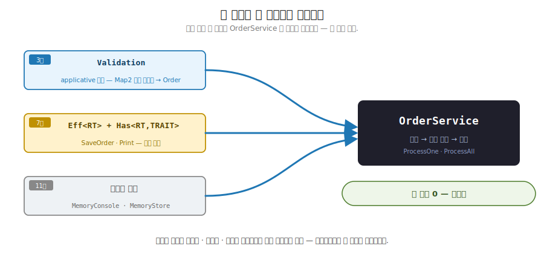
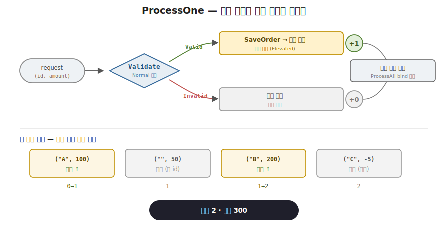
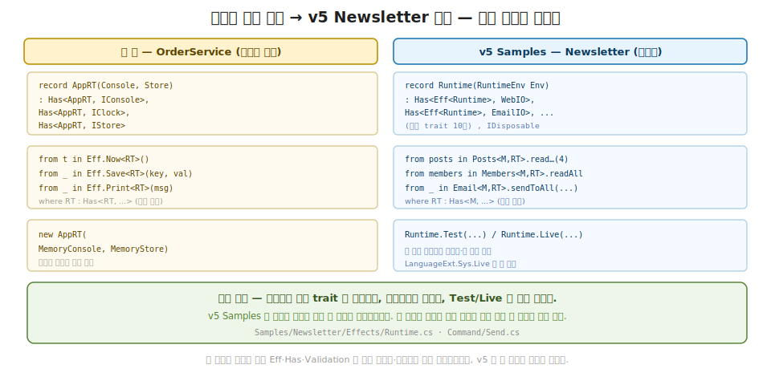

# 42장. 종합 capstone — 검증·효과·테스트가 한 서비스로 (책을 마치며)

> **이 장의 목표** — 이 장을 마치면 따로 익힌 도구들을 주문 접수 서비스 한 편으로 합성할 수 있습니다. 3부에서 만든 `Validation` 의 누적 검증으로 입력을 도메인 타입으로 끌어올리고, 7부에서 만든 `Eff<RT>` + `Has<RT, TRAIT>` 능력 기반 DI 로 저장과 로그라는 부수 효과를 다루며, 11부의 테스트 더블로 그 서비스를 결정적으로 검증합니다. 핵심은 한 함수 `ProcessOne` 안에서 검증 결과가 어떤 효과 흐름을 고를지 정한다는 데 있습니다. 검증이 만든 값을 보고 (Normal World), 그에 맞는 효과를 골라 세상에 반영합니다 (Elevated World). 네 건의 요청을 배치로 처리해 승인 건수가 어떻게 누적되는지 손으로 추적하고, 같은 서비스를 인메모리 테스트 더블에 주입해 매출 합계와 로그 줄 수를 단정으로 확인합니다. 이 장은 새 추상을 들이지 않습니다. 책 전체에서 따로 만든 도구가 실무 코드 한 편에 모이는 것을 확인하는, 이 책의 마지막 장입니다.

> **이 장의 핵심 어휘**
>
> - **capstone**: 따로 익힌 도구들을 한 실무 코드로 합치는 마무리 작업, 새 추상 없는 합성
> - **`OrderService`**: 주문 접수를 담당하는 서비스, 검증과 효과를 한 흐름에 잇는 자리
> - **`ProcessOne`**: 단건 요청을 검증해 승인이면 저장·로그, 거부면 로그하는 함수
> - **`ProcessAll`**: 요청 시퀀스를 순서대로 처리하며 승인 건수를 누적하는 함수
> - **검증→효과 분기**: 검증 결과 (Valid / Invalid) 가 어떤 효과 흐름을 고를지 정하는 자리
> - **배치 처리**: 여러 요청을 한 효과 흐름으로 묶어 순차로 처리하는 것
> - **테스트 더블**: 진짜 콘솔·저장소 대신 끼우는 인메모리 구현, 같은 서비스를 결정적으로 검증
> - **합성**: 검증 (3부)·효과 (7부)·테스트 (11부) 가 한 서비스 코드로 합쳐지는 것

> 이 장을 마치면 할 수 있게 되는 것
> - [ ] capstone 이 무슨 뜻인지, 왜 새 추상이 아니라 합성인지 설명할 수 있습니다.
> - [ ] 검증은 Normal World 의 판정이고 효과는 Elevated World 의 흐름임을 구분할 수 있습니다.
> - [ ] `ProcessOne` 의 분기가 검증 결과를 보고 어떤 효과를 고르는지 따라갈 수 있습니다.
> - [ ] `ProcessAll` 이 승인 건수를 0→1→1→2 로 누적하는 과정을 손으로 추적할 수 있습니다.
> - [ ] `Eff.Run` 의 두 단계 (런타임 주입 → 효과 실행) 가 왜 테스트를 쉽게 하는지 답할 수 있습니다.
> - [ ] 같은 서비스에 테스트 더블을 끼워 결정적으로 검증하는 까닭을 설명할 수 있습니다.
> - [ ] `Validation` 의 오류 누적이 한 요청의 두 오류를 모두 모으는 것을 손으로 따라갈 수 있습니다.
> - [ ] v5 의 Samples 가 이 책에서 손으로 만든 패턴의 변형임을 짚을 수 있습니다.

> **이 장의 흐름** — 검증·효과·테스트는 이 책에서 각각 다른 장에서 따로 만든 도구입니다. 그런데 실무의 한 기능 (주문 접수) 에는 검증·저장·로그·테스트가 동시에 얽힙니다. 도구를 따로 쓰면 어디가 불편한지 가볍게 짚은 뒤, 그 셋을 `OrderService` 한 편으로 합칩니다. `ProcessOne` 이 한 요청을 검증해, 유효하면 저장하고 승인을 로그하며, 무효하면 거부를 로그합니다. 검증 결과가 어떤 효과 흐름을 고를지 정하는 이 분기를 손으로 따라가고, `ProcessAll` 이 네 건을 순서대로 처리하며 승인 건수를 누적하는 과정을 추적합니다. 이어 같은 서비스에 인메모리 테스트 더블을 끼워 승인 건수·매출 합계·로그 줄 수를 단정으로 확인합니다. 마지막으로 책 전체를 돌아봅니다. 기초의 한 동사 (값과 함수를 합성 가능한 Elevated World 로 끌어올림) 가 실무 규모에서 합성되는 것을 확인하고, v5 의 Samples 가 이 책에서 손으로 만든 패턴의 변형임을 보며 책을 닫습니다.

---

## 42.1 이 장에서 다루는 것 — 전부를 한 편으로

이 책의 마지막 장입니다. 지금까지 함수형의 도구를 하나씩 직접 만들어 왔습니다. 1~3부에서 다섯 trait 과 `Validation` 을, 5부에서 Reader / State / Writer 를, 7부에서 `Eff<RT>` 와 능력 기반 DI 를, 8부에서 Schedule 과 자원 관리를, 9부에서 동시성을, 10부에서 스트리밍을, 11부에서 테스트를 만들었습니다. 도구 하나하나가 자기 장에서 동기와 시그니처와 법칙을 갖췄습니다.

이 장은 그 도구들을 모읍니다. 한 문장으로 잡습니다. 따로 만든 검증·효과·테스트가, 주문 접수 서비스 하나에 자연히 합쳐집니다. 검증은 입력을 도메인 값으로 끌어올리고, 효과는 그 값을 저장하고 로그하며, 테스트는 그 서비스가 약속대로 도는지 확인합니다. 셋이 한 함수 안에서 만납니다.

여기서 12부 전체를 꿰는 한 줄을 다시 짚습니다. **12부에는 새 추상이 없습니다.** 1부에서 함수형의 본질을 한 문장으로 적었습니다. 모든 값과 함수를 합성 가능한 Elevated World 로 끌어올리는 것. 이 한 동사가 11개 Part 를 지나 실무 규모에 닿았을 때, 새 도구가 필요한 것이 아니라 이미 만든 도구들이 한 코드로 합성됩니다. 검증도 효과도 테스트도 다 끌어올림의 변형이었고, 그 변형들이 한 서비스에서 자연히 맞물립니다. 이 장이 보이는 것은 새 추상이 아니라 그 맞물림입니다.

지금 모든 것을 외우지 않아도 됩니다. 이 장이 끝날 때 손에 남는 것은 두 가지입니다. 검증 (Normal World) 이 값을 만들고 효과 (Elevated World) 가 그 값을 세상에 반영한다는 두 단계의 그림 하나와, 같은 서비스 코드에 진짜 구현이든 테스트 더블이든 끼울 수 있어 테스트가 쉬워진다는 발상 하나입니다. 이 장에 나오는 어휘를 한 줄씩만 미리 짚어 둡니다. `OrderService` 는 주문 접수를 담당하는 서비스이고, `ProcessOne` 은 한 요청을 검증해 분기하는 함수, `ProcessAll` 은 여러 요청을 순서대로 처리하며 승인 건수를 누적하는 함수입니다. 테스트 더블은 진짜 콘솔·저장소 대신 끼우는 인메모리 구현입니다. 모두 본문에서 코드와 함께 다시 천천히 풀므로, 여기서는 이름과 한 줄 뜻만 스쳐 두면 됩니다.

---

## 42.2 왜 한 편으로 모으나 — 도구는 따로 배웠지만 실무는 함께 쓴다

`OrderService` 를 보이기 전에, 도구를 따로 쓸 때 어디가 불편한지부터 가볍게 짚습니다. 독자는 이미 검증·효과·테스트를 각각 익혔으니, 여기서는 그 셋이 한 기능에 동시에 얽힌다는 점만 손에 잡으면 됩니다.

주문 접수라는 흔한 기능을 떠올립니다. 사용자가 주문 식별자와 금액을 보내면, 서비스는 먼저 그 입력이 올바른지 검사해야 합니다. 식별자가 비어 있거나 금액이 음수면 거부해야 합니다. 올바르면 저장소에 기록하고, 승인됐다는 로그를 남깁니다. 거부하면 왜 거부했는지 로그를 남깁니다. 그리고 이 서비스가 정말 유효한 주문만 받고 무효한 주문은 거르는지, 매출 합계가 맞는지 테스트로 확인해야 합니다.

이 한 기능 안에 세 가지가 동시에 얽혀 있습니다. 입력 검증 (3부 `Validation`), 저장과 로그라는 부수 효과 (7부 `Eff<RT>`), 그리고 결정적 테스트 (11부 테스트 더블) 입니다. 셋을 따로 떼어 놓으면 각각은 익숙하지만, 한 함수에서 어떻게 잇는지가 문제입니다. 검증 결과를 보고 효과 흐름을 골라야 하고, 그 효과를 실제로 실행하기 전에 테스트로 갈아 끼울 수 있어야 합니다.

OO 의 직감으로 옮기면, 이것은 서비스 계층 (service layer) 한 클래스가 검증기 (validator) 와 저장소 (repository) 와 로거 (logger) 를 의존성으로 받아 한 메서드 안에서 조율하는 모양과 같습니다. `OrderService.Process(request)` 한 메서드가 검증하고, 분기하고, 저장하고, 로그합니다. 객체 지향이라면 생성자로 이 의존성들을 주입받겠지요. 함수형도 같은 일을 하되, 검증은 값으로 (`Validation<Order>`), 효과는 흐름으로 (`Eff<RT>`), 의존성은 제약으로 (`where RT : Has<...>`) 다룹니다.

> **흔한 함정** — 합성이 새 도구를 배우는 것이라 여기는 것입니다.
>
> 마지막 장이니 무언가 거창한 새 추상이 나오리라 기대하기 쉽습니다. 그러나 이 장에는 새 trait 도, 새 컨테이너도, 새 연산도 없습니다. 3부의 `Validation`, 7부의 `Eff<RT>` / `Has`, 11부의 테스트 더블이 그대로 등장합니다. 합성은 새 도구를 배우는 것이 아니라, 이미 손에 익은 도구를 한 코드에 맞물리는 것입니다. 그래서 이 장의 코드를 처음 보고 낯선 기호가 없다면, 그것이 정상입니다. 합성이 매끄러우면 새것이 안 보입니다.

이 셋을 한 서비스로 합치면 어떻게 맞물리는지, 다음 절에서 `OrderService` 를 한 줄씩 짚습니다.

---

## 42.3 OrderService — 검증이 효과 분기를 정한다

이제 세 도구가 한 함수에서 만나는 자리를 봅니다. 핵심 발상은 한 문장입니다. 검증 결과를 보고 어떤 효과 흐름을 고를지 정한다. 검증은 부수 효과 없는 순수 판정이고, 그 판정 결과가 분기를 결정합니다. 유효하면 저장하고 승인을 로그하는 흐름, 무효하면 거부를 로그하는 흐름입니다.

먼저 합성의 재료부터 한 줄씩 상기합니다. 도구 자체는 이미 익혔으니 짧게 짚고 넘어갑니다.

**3부에서 만든 `Validation`** 입니다. 입력을 검사해 유효하면 값을, 무효하면 오류 목록을 담는 자료형입니다.

```csharp
// 3부에서 만든 Validation — applicative 누적 검증. 두 검사가 모두 실패하면 오류를 모은다.
public abstract record Validation<A>
{
    public sealed record Valid(A Value) : Validation<A>;
    public sealed record Invalid(IReadOnlyList<string> Errors) : Validation<A>;
}

// Pure: 함수를 Elevated World 로 끌어올린다 (오류 없는 Valid). Ok 와 같은 일.
public static Validation<A> Pure<A>(A v) => new Validation<A>.Valid(v);

// Apply: 끌어올린 함수에 끌어올린 인자를 적용하며, 양쪽 오류를 누적한다.
public static Validation<B> Apply<A, B>(this Validation<Func<A, B>> vf, Validation<A> va) =>
    (vf, va) switch
    {
        (Validation<Func<A, B>>.Valid f, Validation<A>.Valid a) => new Validation<B>.Valid(f.Value(a.Value)),
        _ => new Validation<B>.Invalid([.. Errs(vf), .. Errs(va)])     // ← 두 오류를 모은다
    };

// Lift2 — 5장의 Lift 그대로. 평범한 2인자 함수를 받아 Curry → Pure → Apply 를 캡슐화한다.
public static Validation<C> Lift2<A, B, C>(Func<A, B, C> f, Validation<A> fa, Validation<B> fb) =>
    Pure<Func<A, Func<B, C>>>(a => b => f(a, b)).Apply(fa).Apply(fb);
```

`Pure` 와 `Apply` 가 2부 applicative 의 핵심이었습니다. `Pure` 는 함수를 오류 없이 Elevated World 로 끌어올리고, `Apply` 는 그 끌어올린 함수에 검증을 하나씩 적용합니다. 양쪽이 모두 `Valid` 면 함수를 적용하고, 하나라도 `Invalid` 면 두 오류 목록을 `[.. Errs(vf), .. Errs(va)]` 로 모읍니다. 모양 보존입니다. 검증이 한 검증으로 합쳐지되, 오류는 단락하지 않고 누적됩니다. 그 아래 `Lift2` 는 2부에서 만든 그 `Lift` 로, 평범한 2인자 생성자를 받아 안에서 커리·`Pure`·`Apply` 를 한 줄에 캡슐화합니다. 주문 검증은 이 `Lift2` 로 식별자 검사와 금액 검사를 합칩니다.

```csharp
// 39장과 같은 어법: private 생성자로 직접 생성을 막고, Create 만이 검증을 통과한 값을 내준다.
public sealed record Order
{
    public string Id { get; }
    public decimal Amount { get; }
    private Order(string id, decimal amount) => (Id, Amount) = (id, amount);

    static Validation<string> CheckId(string id) =>
        string.IsNullOrWhiteSpace(id) ? Validation.Err<string>("id 비어 있음") : Validation.Ok(id);

    static Validation<decimal> CheckAmount(decimal a) =>
        a >= 0 ? Validation.Ok(a) : Validation.Err<decimal>($"amount {a} 음수");

    // Lift2 로 두 검증을 합성 (39장과 같은 Create 형). 5장 Lift 가 Curry → Pure → Apply 를 캡슐화한다.
    public static Validation<Order> Create(string id, decimal amount) =>
        Validation.Lift2((string i, decimal a) => new Order(i, a), CheckId(id), CheckAmount(amount));
```

`Validate` 는 식별자가 비어 있지 않고 (`Id`) 금액이 0 이상이면 (`Amount`) `Order` 를 만듭니다. 평범한 2인자 생성자 `(i, a) => new Order(i, a)` 를 `Lift2` 에 넘기면, 5장의 `Lift` 가 `Curry → Pure → Apply` 를 안에서 처리하므로 커리한 생성자를 손으로 적지 않습니다. 둘 중 하나라도 어긋나면 `Invalid` 이고, 둘 다 어긋나면 `Lift2` 안의 `Apply` 사슬이 두 오류를 모읍니다. 여기까지 부수 효과는 한 줄도 없습니다. 순수한 판정입니다.

**7부에서 만든 `Eff<RT>`** 입니다. 런타임 `RT` 를 받아 `IO` 를 돌려주는 효과 스택 (`ReaderT<RT, IO, A>`) 이었고, `Has<RT, TRAIT>` 제약으로 능력을 주입받았습니다. 저장과 로그라는 효과를 이 흐름으로 다룹니다.

```csharp
// 7부에서 만든 Eff — 능력을 제약으로 받아 효과를 흐름으로 다룬다.
public static K<ReaderTF<RT>, Unit> Print<RT>(string msg) where RT : Has<RT, IConsole> =>
    from con in ReaderTF<RT>.Asks(rt => RT.Get(rt))                  // ← RT 에서 콘솔 능력을 꺼냄
    from _ in ReaderTF<RT>.LiftIO(new IO<Unit>(() => { con.WriteLine(msg); return Unit.Default; }))
    select _;

public static K<ReaderTF<RT>, Unit> SaveOrder<RT>(Order order) where RT : Has<RT, IStore> =>
    from st in ReaderTF<RT>.Asks(rt => RT.Get(rt))                   // ← RT 에서 저장소 능력을 꺼냄
    from _ in ReaderTF<RT>.LiftIO(new IO<Unit>(() => { st.Save(order.Id, order.Amount); return Unit.Default; }))
    select _;
```

`Print` 와 `SaveOrder` 는 `where RT : Has<RT, IConsole>` / `Has<RT, IStore>` 제약만 보고 작성됩니다. 구체적으로 어떤 콘솔, 어떤 저장소인지 모릅니다. `RT.Get(rt)` 로 런타임에서 능력을 꺼내 쓸 뿐입니다. 이 제약이 약속입니다. 누가 됐든 `IConsole` 을 줄 수 있는 런타임이면 `Print` 가 돕니다.

이제 두 재료를 한 함수에서 맞물립니다. `ProcessOne` 입니다.

```csharp
static K<ReaderTF<RT>, int> ProcessOne<RT>(string id, decimal amount)
    where RT : Has<RT, IConsole>, Has<RT, IStore> =>
    Order.Create(id, amount) switch
    {
        Validation<Order>.Valid v =>                                 // ← 검증 통과: 저장 + 승인 로그
            from _1 in Eff.SaveOrder<RT>(v.Value)
            from _2 in Eff.Print<RT>($"승인: {v.Value.Id} ({v.Value.Amount})")
            select 1,
        Validation<Order>.Invalid e =>                               // ← 검증 실패: 거부 로그만
            from _ in Eff.Print<RT>($"거부: {string.Join("; ", e.Errors)}")
            select 0,
        _ => ReaderTF<RT>.Pure(0)
    };
```

이 함수가 이 장의 심부입니다. 한 줄씩 읽습니다. `ProcessOne` 은 먼저 `Order.Create(id, amount)` 로 입력을 검증합니다. 이 결과가 `switch` 의 대상입니다. 검증이 `Valid` 면 저장 (`SaveOrder`) 하고 승인을 로그 (`Print`) 한 뒤 승인 건수 1 을 냅니다. `Invalid` 면 거부를 로그한 뒤 0 을 냅니다. 결정적인 점은 **검증 결과 (Normal World 의 값) 가 어떤 효과 흐름 (Elevated World 의 흐름) 을 고를지 정한다**는 것입니다. 검증은 순수한 판정이고, 그 판정을 보고 분기가 갈립니다.

여기서 3부의 `Validation` 과 7부의 `Eff` 가 만나는 자리를 또렷이 짚습니다. `switch` 의 왼쪽 (`Validation<Order>.Valid v`) 은 검증이 만든 값이고, 오른쪽 (`from _1 in Eff.SaveOrder ...`) 은 그 값으로 고른 효과 흐름입니다. 검증이 값을 만들고 (3부), 효과가 그 값을 받아 흐릅니다 (7부). 둘을 잇는 것은 `switch` 한 줄입니다. 별다른 접착제가 없습니다. `Valid v` 에서 꺼낸 `v.Value` (검증된 `Order`) 가 곧장 `SaveOrder<RT>(v.Value)` 로 넘어갑니다.

이제 여러 요청을 처리하는 `ProcessAll` 입니다. 한 건 처리를 시퀀스로 확장합니다.

```csharp
public static K<ReaderTF<RT>, int> ProcessAll<RT>(IEnumerable<(string Id, decimal Amount)> requests)
    where RT : Has<RT, IConsole>, Has<RT, IStore>
{
    K<ReaderTF<RT>, int> acc = ReaderTF<RT>.Pure(0);                  // ← 승인 건수 누적, 0 에서 시작
    foreach (var req in requests)
    {
        var captured = req;                                          // ← 루프 변수 포획 (클로저 안전)
        acc = from n in acc                                          // ← 앞까지의 누계
              from m in ProcessOne<RT>(captured.Id, captured.Amount) // ← 이번 건 (0 또는 1)
              select n + m;                                          // ← 합쳐 새 누계
    }
    return acc;
}
```

`ProcessAll` 은 승인 건수를 누적합니다. `acc` 를 `Pure(0)` 으로 시작해, 요청마다 `from n in acc from m in ProcessOne select n + m` 으로 앞까지의 누계 `n` 에 이번 건 `m` (0 또는 1) 을 더해 새 누계로 잇습니다. 이 `from .. from .. select` 가 Monad 의 bind 입니다. 효과 흐름을 순서대로 잇습니다. 앞 효과 (앞 요청의 저장·로그) 가 다 실행된 뒤 다음 효과가 일어납니다. 7장에서 bind 를 프로그래밍 가능한 세미콜론이라 불렀습니다. 명령형이라면 저장하고 로그하는 문장을 세미콜론으로 이었을 그 자리를, 여기서는 bind 가 효과 흐름으로 잇습니다. capstone 의 배치 처리에서도 그 이음매가 그대로 돌아, 앞 요청의 효과가 다 끝나야 다음 요청이 일어납니다. `captured = req` 는 루프 변수를 포획하는 안전 장치입니다. 클로저가 루프 변수를 그대로 잡으면 마지막 값만 보게 되므로, 매 반복마다 새 변수에 담습니다.

여기서 capstone 의 한 결이 보입니다. 앞서 본 bind 가 한 자리에서 두 가지 일을 동시에 합니다. 첫째는 효과 흐름을 순서대로 잇는 것이고 (앞 요청이 다 끝나야 다음 요청이 일어납니다), 둘째는 그 사이로 승인 건수라는 평범한 `int` 값을 실어 나르는 것입니다. `from n in acc` 에서 `n` 은 앞까지 쌓인 누계이고, `from m in ProcessOne` 에서 `m` 은 이번 건의 0 또는 1 이며, `select n + m` 이 둘을 더해 다음 `acc` 로 넘깁니다. 새 도구가 더 필요한 것이 아니라, 이미 손에 익은 bind 하나가 효과의 순서와 값의 누적을 함께 떠받칩니다. 바로 다음 손계산에서 `n` 이 0 에서 2 까지 자라는 과정을 한 줄씩 따라가면 이 두 일이 한 흐름에서 맞물리는 것이 또렷이 보입니다.

손으로 따라갑니다. 네 건의 요청 `[("A",100), ("",50), ("B",200), ("C",-5)]` 을 `ProcessAll` 에 넘깁니다.

```
요청: [("A",100), ("",50), ("B",200), ("C",-5)]
acc 시작 = Pure(0)

ProcessAll 은 먼저 효과 흐름을 합성만 한다 (아직 실행 안 됨):
  acc = Pure(0)
      → from n in acc, m in ProcessOne("A",100), select n+m
      → from n in (위), m in ProcessOne("",50),  select n+m
      → ... 네 건을 Bind 로 이어 붙인 한 흐름

Eff.Run 이 런타임을 주입하고 IO 를 실행하면, 순서대로:

  ("A", 100):  Order.Create → Lift2(f, Ok("A"), Ok(100)) = Valid(Order("A",100))
               → SaveOrder: store["A"]=100,  Print: "승인: A (100)"
               → m=1,  누계 n: 0 → 1
  ("",  50):   Order.Create → Lift2(f, Err("id 비어 있음"), Ok(50)) = Invalid(["id 비어 있음"])
               → Print: "거부: id 비어 있음"
               → m=0,  누계 n: 1 → 1
  ("B", 200):  Order.Create → Valid(Order("B",200))
               → SaveOrder: store["B"]=200,  Print: "승인: B (200)"
               → m=1,  누계 n: 1 → 2
  ("C", -5):   Order.Create → Lift2(f, Ok("C"), Err("amount -5 음수")) = Invalid(["amount -5 음수"])
               → Print: "거부: amount -5 음수"
               → m=0,  누계 n: 2 → 2

최종: accepted = 2
      store: { "A":100, "B":200 } → Count()=2, Total()=300
```

승인 건수가 0→1→1→2 로 누적됐습니다. 유효한 A 와 B 에서 1 씩 더해지고, 무효한 빈 식별자와 음수 금액에서는 0 이 더해져 누계가 그대로입니다. 저장소에는 A 와 B 만 남아 두 건, 매출 합계는 300 입니다. 검증이 분기를 정하고 (3부), 효과가 그 분기대로 저장·로그하고 (7부), 누계가 Monad bind 로 순서대로 합쳐졌습니다.



**그림 42-1. 책 전체가 한 서비스로 합류합니다** — 세 입력 도구가 `OrderService` 한 편으로 모입니다. 3부 `Validation` (applicative 누적) 이 입력을 도메인 값으로 끌어올리고, 7부 `Eff<RT>` + `Has` 가 저장과 로그라는 효과를 다루며, 11부 테스트 더블이 그 서비스를 검증합니다. 각 입력에 Part 배지가 붙어 있고, 가운데 합류점에 "새 추상 0, 합성만" 이라고 적혀 있습니다. OO 의 서비스 계층이 검증기·저장소·로거를 의존성으로 받아 조율하는 모양과 같습니다.



**그림 42-2. ProcessOne: 검증 결과가 효과 분기를 정합니다** — 요청 하나가 `Validate` 를 거쳐 두 갈래로 나뉩니다. `Valid` 면 `SaveOrder` + 승인 로그로 가서 승인 건수에 1 을 더하고, `Invalid` 면 거부 로그로 가서 0 을 더합니다. 아래는 네 요청 배치의 흐름입니다. A·B 는 승인, 빈 식별자·음수 금액은 거부되어 최종 승인 건수 2, 매출 합계 300 으로 끝납니다. 검증 (Normal World) 이 효과 (Elevated World) 분기를 고르는 자리입니다.

> **더 깊이 (처음엔 건너뛰어도 됩니다)** — 한 요청에 오류가 둘이면 어떻게 됩니까.
>
> 데모 입력은 각 무효 요청이 오류를 하나씩만 냅니다. 빈 식별자는 "id 비어 있음" 하나, 음수 금액은 "amount -5 음수" 하나입니다. 그래서 3부 `Validation` 의 진짜 가치인 오류 누적이 데모에서는 잘 드러나지 않습니다. 만약 한 요청이 식별자도 비고 금액도 음수라면 (`("", -5)`), `Lift2` 안의 `Apply` 사슬이 두 오류를 모두 모읍니다. `Lift2` 가 펼쳐지면 `Pure(f).Apply(Err("id 비어 있음")).Apply(Err("amount -5 음수"))` 인데, 첫 `Apply` 가 `Invalid(["id 비어 있음"])` 를 만들고, 둘째 `Apply` 의 두 인자가 모두 `Invalid` 이므로 `switch` 의 두 번째 갈래 `[.. Errs(vf), .. Errs(va)]` 가 `["id 비어 있음", "amount -5 음수"]` 두 오류를 한 목록으로 만듭니다. 거부 로그는 `"거부: id 비어 있음; amount -5 음수"` 가 됩니다. 이것이 3부에서 본 누적 (applicative) 과 단락 (monadic) 의 차이입니다. 단락이라면 첫 오류에서 멈춰 "id 비어 있음" 만 보고하지만, 누적은 두 오류를 모두 모아 한 번에 보여 줍니다. 폼 검증에서 모든 잘못을 한 번에 알려 주는 것이 이 누적의 실무 가치입니다.

---

## 42.4 테스트 더블로 검증 — payoff

이제 이 장의 도구가 약속을 지키는지 정면으로 봅니다. 합성한 서비스의 진짜 가치는 테스트에서 드러납니다. `ProcessOne` 과 `ProcessAll` 은 구체적인 콘솔이나 저장소를 모른 채 `where RT : Has<RT, IConsole>, Has<RT, IStore>` 제약만 보고 작성됐습니다. 그래서 그 제약을 만족하는 무엇이든 끼울 수 있습니다. 진짜 콘솔과 데이터베이스든, 인메모리 테스트 더블이든 말입니다.

11부에서 만든 테스트 더블을 상기합니다. 진짜 부수 효과 (콘솔 출력, 디스크 쓰기) 대신, 메모리에 기록만 남기는 가벼운 구현입니다.

```csharp
// 11부에서 만든 테스트 더블 — 진짜 콘솔·저장소 대신 메모리에 기록만 남긴다.
public sealed class MemoryConsole : IConsole
{
    public List<string> Output { get; } = [];
    public void WriteLine(string line) => Output.Add(line);          // ← 화면 대신 리스트에
}

public sealed class MemoryStore : IStore
{
    readonly Dictionary<string, decimal> orders = new();
    public void Save(string id, decimal amount) => orders[id] = amount;  // ← DB 대신 딕셔너리에
    public decimal Total() => orders.Values.Sum();
    public int Count() => orders.Count;
}
```

`MemoryConsole` 은 화면에 찍는 대신 리스트에 줄을 담고, `MemoryStore` 는 데이터베이스에 쓰는 대신 딕셔너리에 담습니다. 그 덕에 테스트가 끝난 뒤 리스트와 딕셔너리를 들여다보며 무엇이 일어났는지 확인할 수 있습니다. 이 두 더블을 런타임 `AppRT` 에 넣어 서비스에 주입합니다.

```csharp
public sealed record AppRT(IConsole Console, IStore Store) : Has<AppRT, IConsole>, Has<AppRT, IStore>
{
    static IConsole Has<AppRT, IConsole>.Get(AppRT rt) => rt.Console;   // ← 약속 이행: 콘솔을 준다
    static IStore Has<AppRT, IStore>.Get(AppRT rt) => rt.Store;         // ← 약속 이행: 저장소를 준다
}
```

`AppRT` 는 콘솔과 저장소를 품고, `Has<AppRT, IConsole>` / `Has<AppRT, IStore>` 를 구현해 그 능력을 꺼내 줍니다. 여기서 7부의 핵심 발상이 다시 보입니다. 제약 (`where RT : Has<...>`) 이 약속이고, `Get` 구현이 약속의 이행입니다. `ProcessOne` 은 "`RT` 가 콘솔을 줄 수 있다" 는 약속만 보고 작성됐고, `AppRT` 가 그 약속을 실제 더블로 이행합니다. 데모는 인메모리 더블을, 실서비스라면 진짜 콘솔·DB 를 같은 코드에 주입합니다.

이제 이 장의 payoff 인 `Eff.Run` 입니다. 효과 흐름을 실제로 실행하는 자리입니다.

```csharp
public static A Run<RT, A>(K<ReaderTF<RT>, A> eff, RT rt) => ((ReaderT<RT, A>)eff).Run(rt).Run();
//                                                                            └ rt 주입 ┘ └ IO 실행 ┘
```

`Run` 이 두 단계입니다. 먼저 `Run(rt)` 로 런타임을 주입해 `IO` 를 얻고, 그 다음 `.Run()` 으로 `IO` 를 실행합니다. 이 두 단계의 분리가 결정적입니다. 손으로 따라갑니다.

```
설명서를 짜는 시점 (ProcessAll 호출):
   var eff = OrderService.ProcessAll<AppRT>(requests);
   → 네 건을 Bind 로 이어 붙인 효과 흐름이 만들어짐
   → 아직 콘솔에 아무것도 안 찍힘, store 도 비어 있음 ← 효과가 실행 안 됨!

실행하는 시점 (Eff.Run 호출):
   var accepted = Eff.Run(eff, rt);
   → 1단계: eff.Run(rt) — rt(MemoryConsole, MemoryStore) 를 주입해 IO 를 얻음
   → 2단계: .Run()      — 이제 비로소 IO 가 실행되며 순서대로:
              store["A"]=100, con: "승인: A (100)"
              con: "거부: id 비어 있음"
              store["B"]=200, con: "승인: B (200)"
              con: "거부: amount -5 음수"
   → accepted = 2
```

`ProcessAll` 을 호출해도 콘솔에 아무것도 안 찍힙니다. 효과 흐름이라는 설명서를 짰을 뿐입니다. `Eff.Run` 이 불려야 비로소 런타임이 주입되고 효과가 실행됩니다. 이 분리가 왜 테스트를 쉽게 할까요. 설명서 (`eff`) 는 어떤 런타임으로 실행할지 모릅니다. 그래서 같은 설명서를 테스트에서는 `MemoryConsole` / `MemoryStore` 가 든 `AppRT` 로 실행하고, 실서비스에서는 진짜 구현이 든 런타임으로 실행합니다. 코드는 한 줄도 안 바뀝니다.

OO 의 직감으로 옮기면, 이것은 통합 테스트 (integration test) 에서 진짜 데이터베이스 대신 인메모리 저장소를 의존성 주입 (dependency injection) 으로 갈아 끼우는 것과 같습니다. 서비스 코드는 인터페이스 (`IStore`) 만 의존하므로, 테스트에서는 가짜 구현을, 운영에서는 진짜 구현을 주입합니다. 함수형의 `Has<RT, TRAIT>` 제약 + `Eff.Run` 의 런타임 주입이 정확히 그 의존성 주입의 자리입니다. 다른 점은 효과가 값 (설명서) 으로 분리돼 있어, 주입 시점과 실행 시점이 또렷이 갈린다는 것입니다.

이제 세 테스트로 서비스를 검증합니다.

```csharp
// ① 유효 주문 2건만 승인.
public static bool AcceptsValidOnly()
{
    var (rt, _, store) = Build();
    var accepted = Eff.Run(OrderService.ProcessAll<AppRT>(Requests), rt);
    return accepted == 2 && store.Count() == 2;
}

// ② 저장소 매출 합계 = 100 + 200.
public static bool TotalsRevenue()
{
    var (rt, _, store) = Build();
    Eff.Run(OrderService.ProcessAll<AppRT>(Requests), rt);
    return store.Total() == 300m;
}

// ③ 콘솔에 승인 2 + 거부 2 = 4줄.
public static bool LogsAllOutcomes()
{
    var (rt, con, _) = Build();
    Eff.Run(OrderService.ProcessAll<AppRT>(Requests), rt);
    return con.Output.Count == 4
        && con.Output.Count(l => l.StartsWith("승인")) == 2
        && con.Output.Count(l => l.StartsWith("거부")) == 2;
}
```

세 테스트가 모두 같은 모양입니다. `Build()` 로 테스트 더블이 든 런타임을 만들고, `Eff.Run` 으로 서비스를 실행한 뒤, 더블을 들여다봅니다. `AcceptsValidOnly` 는 승인 건수가 2 이고 저장소에 두 건 남았는지, `TotalsRevenue` 는 매출 합계가 300 인지, `LogsAllOutcomes` 는 로그가 승인 2 + 거부 2 = 네 줄인지 확인합니다. 모두 결정적입니다. 같은 입력에 늘 같은 결과가 나옵니다. 효과가 설명서로 분리돼 있어, 테스트 더블로 실행한 결과를 그대로 들여다볼 수 있기 때문입니다.

데모 출력은 셋 다 통과입니다.

```
== 주문 배치 처리 ==
    승인: A (100)
    거부: id 비어 있음
    승인: B (200)
    거부: amount -5 음수

  승인 = 2건, 저장된 주문 = 2건, 매출 합계 = 300
  → 검증(3부) + 효과·DI(7부) + 테스트 더블(11부) 이 한 서비스로 합성.

== 검증 ==
  유효만 승인(2) : 통과
  매출 합계 300 : 통과
  승인2+거부2 로그 : 통과

모든 검증 통과 [OK]
```

이 출력이 이 장의 payoff 입니다. 검증·효과·테스트가 한 서비스로 합성됐고, 그 서비스가 약속대로 돕니다. 유효한 주문만 승인하고, 매출을 정확히 합산하고, 모든 결과를 로그합니다. 그리고 진짜 콘솔·DB 가 아니라 인메모리 더블로 실행했으므로, 디스크도 네트워크도 건드리지 않고 결정적으로 검증됐습니다. 같은 서비스를 라이브 런타임으로 실행하면 진짜 콘솔에 찍고 진짜 저장소에 씁니다. 코드는 그대로입니다.

> **흔한 함정** — 테스트 더블이 진짜와 다르게 동작할까 걱정하는 것입니다.
>
> 인메모리 더블로 테스트하면, 진짜 데이터베이스에서는 다르게 동작하지 않을까 의심하기 쉽습니다. 핵심은 테스트 더블과 진짜 구현이 **같은 인터페이스** (`IStore`) 를 구현한다는 데 있습니다. `OrderService` 는 그 인터페이스의 계약 (`Save` 하면 저장되고, `Total` 이 합계를 낸다) 만 의존하지, 구현 방식 (딕셔너리든 SQL 이든) 은 모릅니다. 그래서 테스트가 검증하는 것은 "서비스가 인터페이스 계약을 올바르게 쓰는가" 이지 "저장소 구현이 올바른가" 가 아닙니다. 저장소 구현 자체의 정확성은 그 구현을 따로 테스트할 자리입니다. 이 분리가 의존성 주입이 주는 테스트 가능성의 핵심입니다.

---

## 42.5 책을 마치며 — 손으로 만든 패턴, v5 Samples 의 변형

여기까지 왔습니다. 이 절은 책 전체를 돌아보는 자리입니다.

1부의 첫 장에서 함수형의 본질을 한 문장으로 적었습니다. 모든 값과 함수를 합성 가능한 Elevated World 로 끌어올리는 것. 그때는 추상적인 한 줄이었습니다. Normal World 와 Elevated World, 두 평행 세계와 그 사이를 오가는 네 가지 함수 유형이라는 지도만 손에 들고 출발했습니다.

그 한 동사가 책 전체를 지나며 구체적인 도구가 됐습니다. `a → b` 의 끌어올림이 Functor 의 `Map` 이 됐고, 다인자 함수의 끌어올림이 Applicative 가 됐고, `a → E<b>` 의 합성 되살리기가 Monad 의 bind 가 됐습니다. 효과를 값으로 다루는 발상이 `IO` 와 `Eff<RT>` 가 됐고, 그 위에 능력 기반 DI 와 재시도와 자원 관리와 동시성과 스트리밍이 얹혔습니다. 그리고 효과가 값으로 분리됐기에 테스트가 쉬워졌습니다. 매 도구가 그 한 동사의 변형이었습니다.

이 마지막 장이 보인 것은 그 변형들이 한 코드에서 만난다는 것입니다. `OrderService` 한 편 안에서, 검증 (끌어올림의 한 변형) 이 값을 만들고, 효과 (끌어올림의 또 다른 변형) 가 그 값을 세상에 반영하고, 테스트 더블 (효과가 값으로 분리된 덕에 가능한) 이 그것을 검증했습니다. 새 추상은 없었습니다. 합성만 있었습니다. 12부 전체의 결론이자 이 책 전체의 도달점이 여기 있습니다. 따로 배운 도구가 실무 코드 한 편으로 자연히 합쳐진다는 것, 그것이 함수형 설계가 약속한 결말입니다.

그런데 이 책에서 만든 도구들은 학습용입니다. `Validation`, `Eff<RT>`, `Has`, `IO`, 스트리밍 모두 뼈대만 남긴 단순화판이었습니다. 그렇다면 진짜 라이브러리는 무엇이 다를까요. 여기서 마지막 다리를 놓습니다. LanguageExt v5 의 `Samples` 폴더를 펼치면, 이 책에서 손으로 만든 패턴의 변형이 그대로 보입니다.

- **`Newsletter`** — `Eff<RT>` + `Has<RT, TRAIT>` 로 이메일 발송 워크플로를 짭니다. 이 책의 `Eff.Print` / `SaveOrder` 가 능력을 제약으로 받아 흐름을 짜던 그 모양입니다. v5 는 `Runtime.Test` / `Runtime.Live` 두 정적 팩터리로 테스트 구현과 실 구현을 가르는데, 이 책의 `AppRT(MemoryConsole, MemoryStore)` 주입이 바로 그 테스트 런타임 구성의 단순화판입니다.
- **`CardGame`** — `Validation` 의 누적 검증과 효과 흐름을 카드 게임 규칙에 씁니다. 이 책의 `Lift` (`Pure` → `Apply`) 가 두 오류를 모으던 그 applicative 누적이, v5 에서는 같은 `.Apply(...)` 사슬에 `&` 연산자와 튜플 applicative 를 더 얹어 매끄럽게 표현됩니다.
- **`BlazorApp`** — 효과 기반 설계를 웹 UI 에 얹습니다. 이 책에서 `Eff.Run` 이 설명서와 실행을 분리하던 그 발상이, 웹 요청 처리의 경계에서 그대로 살아납니다.

이 책을 끝낸 독자는 이제 이 Samples 를 낯선 코드가 아니라 익숙한 패턴의 변형으로 읽을 수 있습니다. `Eff<RT, A>` 를 보면 `ReaderT<RT, IO, A>` 가 떠오르고, `Has<M, VALUE>` 를 보면 능력을 제약으로 주입하던 자리가 떠오릅니다. `Validation<F, A>` 의 누적을 보면 `Apply` 사슬의 오류 모으기가 떠오릅니다. v5 가 더한 것 (오류 단락, 취소 토큰, Schedule 통합, 실 구현 추상) 은 그 익숙한 뼈대 위의 옷입니다. 뼈대를 손으로 만들어 봤기에, 그 옷이 무엇을 감싸고 있는지 보입니다.

이것이 이 책이 목표한 자리입니다. 비유 (두 평행 세계) 로 직감을 잡고, `K<F, A>` 직접 구현으로 그 직감을 손으로 만지고, 실무 합성으로 그것이 실제로 도는 것을 봤습니다. 이제 라이브러리는 도구일 뿐, 학습의 본질은 독자의 손에 있습니다. 함수형의 본질을 한 문장으로 다시 적습니다. **모든 값과 함수를 합성 가능한 Elevated World 로 끌어올리는 것.** 이 한 줄을 손에 쥐고 책을 닫습니다.

---

## 42.6 검증으로 다지기 — 승인·매출·로그

7장 이후 새 추상마다 법칙으로 그 의미를 확인했습니다. 이 장은 capstone 이라 Functor 나 Monad 의 대수 법칙을 새로 다루지 않습니다. 대신 합성한 서비스가 약속대로 도는지를 세 단정으로 확인합니다. 유효한 주문만 승인하는가, 매출을 정확히 합산하는가, 모든 결과를 로그하는가입니다. 이 셋이 "검증·효과·테스트가 한 서비스로 합성되어 약속대로 돈다" 는 이 장의 한 줄이 코드로 정말 그러한지입니다.

세 검증을 한 줄씩 읽습니다.

첫째, **유효만 승인** (`AcceptsValidOnly`) — 네 건 중 유효한 두 건 (A, B) 만 승인되어 승인 건수가 2 이고 저장소에 두 건 남는지 봅니다. 검증 분기가 올바르게 갈렸음을, 곧 3부의 `Validation` 이 7부의 효과 분기를 정확히 정했음을 확인합니다.

둘째, **매출 합계** (`TotalsRevenue`) — 저장소의 매출 합계가 100 + 200 = 300 인지 봅니다. 승인된 두 건만 저장됐고 그 금액이 정확히 합산됐음을, 곧 `SaveOrder` 효과가 올바르게 실행됐음을 확인합니다.

셋째, **모든 결과 로그** (`LogsAllOutcomes`) — 콘솔에 승인 2 + 거부 2 = 네 줄이 남았는지 봅니다. 승인이든 거부든 모든 요청이 로그를 남겼음을, 곧 `ProcessOne` 의 두 갈래가 모두 `Print` 효과를 실행했음을 확인합니다.

세 단정이 모두 통과하면, 검증·효과·테스트가 한 서비스로 합성되어 약속대로 돈다는 이 장의 한 줄이 코드로 검증됩니다. 셋 다 인메모리 테스트 더블로 실행되므로 결정적이고, 디스크도 네트워크도 건드리지 않습니다.

> **더 깊이 (처음엔 건너뛰어도 됩니다)** — 왜 Functor·Monad 대수 법칙을 새로 검증하지 않을까요.
>
> 이 장의 도구 (`Validation`, `Eff<RT>`) 는 모두 앞 장들에서 이미 법칙을 확인한 추상입니다. `Validation` 의 applicative 누적은 2부에서, `Eff` 의 Monad bind 는 7부에서 property 로 검증했습니다. 그래서 이 장은 그 대수 법칙을 다시 굴리지 않고, 합성된 결과의 동작 (승인 건수·매출 합계·로그 줄 수) 을 구체적인 단정으로 확인합니다. 까닭은 capstone 이 다지려는 것이 추상의 대수 구조가 아니라 합성의 정합성 (도구들이 한 코드에서 올바르게 맞물리는가) 이기 때문입니다. 입문 단계에서는 "이 장의 핵심은 새 법칙이 아니라 도구들이 약속대로 합성되는가" 라고만 알아 두면 충분합니다.

---

## 42.7 더 깊이 — 학습용 capstone 은 v5 의 단순화판입니다

> **더 깊이 (처음엔 건너뛰어도 됩니다)** — 이 절은 학습용 capstone 과 LanguageExt v5 의 실제 효과 코드 사이의 거리를 정직하게 짚는 자리입니다. 처음 읽을 때는 건너뛰어도 이 장의 발상을 이해하는 데 지장이 없습니다.

학습용 capstone 은 합성의 뼈대만 남긴 것이고, v5 의 실무 효과 코드는 같은 발상에 여러 겹을 더 입혔습니다. 정직하게 짚어 둡니다.

**검증 자료형.** 학습용 `Validation<A>` 는 오류를 평범한 문자열 목록 (`IReadOnlyList<string>`) 으로 누적하는 `Valid` / `Invalid` 두 케이스입니다. v5 는 `Validation<F, A>` 로, 실패 타입 `F` 가 `Monoid<F>` 여야 하며 (보통 `Error` / `Seq<Error>`) `Success` / `Fail` 케이스입니다. 누적은 둘 다 `Pure(f).Apply(...).Apply(...)` 사슬로 표현하는데, 이 책은 그 사슬을 `Lift2` 로 감싸 평범한 생성자만 넘기고, v5 는 여기에 `&` 연산자 (두 검증을 모아 `Seq` 로) 를 더 얹습니다 (v5 의 `CreditCardValidation` 샘플은 `fun(Make).Map(ValidateCardNumber(no)).Apply(ValidateExpiryDate(exp)).Apply(ValidateCVV(cvv))` 처럼 세 검증을 누적하는데, 첫 인자를 `Map` 으로 시작하는 것만 다를 뿐 이 책의 `Lift2` 가 안에서 펼치는 `Pure(f).Apply(...).Apply(...)` 와 같은 Apply 사슬입니다). 학습용은 2부에서 본 그 `Apply` 누적을 `Lift` 로 그대로 가져왔습니다.

**능력 trait 시그니처.** 학습용 `Has<RT, TRAIT>` 는 `static abstract TRAIT Get(RT runtime)` 으로, 런타임 인스턴스를 받아 맨 trait 값을 곧장 돌려주는 평범한 메서드입니다. v5 의 `Has<in M, VALUE>` 는 `static abstract K<M, VALUE> Ask { get; }` 로, trait 를 효과 (`K<M, VALUE>`) 로 감싸 돌려주는 정적 프로퍼티입니다. 곧 v5 는 능력 접근 자체도 효과 흐름 안에 있습니다. 학습용은 그 효과 래핑을 벗겨 `Get` 한 메서드로 단순화했습니다.

**효과 스택과 오류 채널.** 학습용 `Eff<RT>` 는 `ReaderT<RT, A>` (`Func<RT, IO<A>>`) 를 손으로 짠 것이고, 내부 `IO` 는 단순한 `Func<A>` thunk 여서 오류도 취소도 비동기도 다루지 못합니다. v5 의 `Eff<RT, A>` 는 구조는 같지만 (`ReaderT<RT, IO, A>`) `Fallible` 로 `Error` 를 단락시키고 취소 토큰과 Schedule 재시도까지 통합합니다. 그래서 v5 의 효과 흐름은 오류가 나면 중간에 단락하지만, 학습용 capstone 은 효과 흐름에 오류 채널이 없습니다. 검증 실패는 `Validation` 단계에서 분기로 처리하고, 효과 흐름은 승인 건수 (`int`) 만 돌립니다.

**배치 누적.** 학습용 `ProcessAll` 은 명령형 `foreach` + `acc` 재할당으로 효과를 누적합니다. v5 라면 같은 일을 3부에서 본 `Traverse` 나 fold 추상으로 표현해 명시적 루프 없이 잇습니다. 학습용은 누적의 동작을 또렷이 보이려고 명시적 루프로 단순화했습니다.

**런타임 구성.** 학습용은 `AppRT(con, store)` 생성자에 테스트 더블을 직접 넣습니다. v5 의 `Newsletter` 샘플은 같은 `Runtime` 을 `Runtime.Test` / `Runtime.Live` 두 정적 팩터리로 분기해 테스트·실 구현을 가릅니다. 그리고 `LanguageExt.Sys.Live` 에 콘솔·파일·시간 같은 실 구현이 갖춰져 있습니다. 학습용에는 그 Test / Live 팩터리 분기와 실 구현 추상이 없고, 더블을 직접 주입하는 방식으로 같은 의도만 보입니다.



**그림 42-3. 손으로 만든 패턴 → v5 Newsletter 샘플: 같은 구조의 실무판** — 런타임이 능력 trait 를 구현하고, 워크플로는 `<M, RT>` 제네릭이며, `Test` / `Live` 로 갈아 끼우는 구조가 그대로입니다. v5 의 `Samples/` 는 이 책에서 손으로 만든 패턴의 실무판입니다.

입문 단계에서는 이 거리를 외울 필요가 없습니다. "검증이 값을 만들고, 효과가 그 값을 능력 주입으로 다루고, 테스트 더블로 검증한다" 는 합성의 뼈대는 학습용과 v5 가 같고, 나머지는 그 뼈대에 오류 단락·취소·실 구현을 더한 것이라고만 알아 두면 충분합니다.

---

## 42.8 Elevated World 어휘로 다시 읽기

이 절은 이 장의 합성을 1장 비유에 맞춰 다시 읽는 자리입니다. 이 책의 마지막 회고이기도 합니다. 먼저 매핑부터 둡니다.

| 책 전체 도구 | Elevated World 어휘 |
|---|---|
| `Validation` 의 검증 (3부) | Normal World 의 순수 판정 — 끌어올림 전, 부수 효과 없음 |
| `Validate` 결과로 효과 분기 | Normal 의 판정 결과를 보고 어떤 Elevated 흐름을 고를지 결정 |
| `Eff<RT>` 의 저장·로그 (7부) | 끌어올린 효과 흐름 — `Run` 전까지 Normal 세상에 영향 없음 |
| `Eff.Run` 의 두 단계 | Elevated 설명서를 런타임 주입 후 끌어내림 (실제 실행) |
| 테스트 더블 (11부) | 같은 Elevated 설명서를 다른 Normal 구현으로 끌어내림 |
| `ProcessAll` 의 누적 | 여러 Elevated 흐름을 bind 로 순서대로 합성 |

1장에서 함수형의 본질을 한 문장으로 적었습니다. 모든 값과 함수를 합성 가능한 Elevated World 로 끌어올리는 것. 이 장의 `OrderService` 가 그 한 문장의 실무 규모 실현입니다. 검증은 Normal World 의 판정입니다. 입력을 받아 `Order` 라는 값을 만들거나 오류를 냅니다. 부수 효과가 없는 순수한 자리입니다. 그 판정 결과를 보고, `ProcessOne` 의 `switch` 가 어떤 Elevated 효과 흐름을 고를지 정합니다. 유효하면 저장·로그 흐름을, 무효하면 거부 로그 흐름을 끌어올립니다.

여기서 1장의 끌어올림·끌어내림으로 이 장의 자리를 정확히 짚습니다. `Eff.SaveOrder` / `Eff.Print` 로 효과 흐름을 짜는 것은 부수 효과를 Elevated 시민으로 끌어올리는 것입니다. 짜 두기만 해서는 아무것도 실행되지 않습니다. `Eff.Run` 이 런타임을 주입하고 `IO` 를 실행할 때 비로소 그 Elevated 설명서가 Normal 세상으로 끌어내려져 실제 저장과 로그가 일어납니다. 결정적인 점은 이 끌어내림이 어떤 Normal 구현으로 내려올지를 런타임이 정한다는 것입니다. 테스트 더블로 내리면 메모리에, 실 구현으로 내리면 진짜 콘솔·DB 에 내려옵니다. 같은 Elevated 설명서, 다른 Normal 착지점입니다. 이것이 테스트 가능성의 본질입니다.

이 분업이 책 전체의 결론입니다. 명령형은 "값을 만드는 것" 과 "그 값을 세상에 반영하는 것" 을 뗄 수 없어, 테스트하려면 진짜 세상 (DB, 네트워크) 을 건드려야 했습니다. 함수형은 "효과 흐름을 짜는 것" (Elevated 설명서) 과 "그것을 실행하는 것" (Normal 으로 끌어내림) 을 갈라, 같은 설명서를 다른 착지점으로 내릴 수 있게 합니다. 검증이 값을 만들고 효과가 그 값을 다루되 실행은 끌어내림 시점까지 미뤄진다는 것이, 이 합성을 떠받치는 한 줄입니다.

비유는 여기까지가 역할입니다. `OrderService` 가 정확히 어떻게 검증과 효과를 잇는지는 `ProcessOne` 의 `switch` 와 `Eff.Run` 의 시그니처가 정합니다. 비유가 머리에 그림을 그려 주는 동안 시그니처가 진실을 정합니다. 이 책 전체가 그러했습니다. 두 평행 세계가 직감을 잡아 주고, `K<F, A>` 시그니처가 진실을 정했습니다.

---

## 42.9 Q&A — 자기 점검

> **Q1. capstone 이 무슨 뜻입니까? 왜 새 추상이 없습니까?** (42.1절, 42.2절)

capstone 은 따로 익힌 도구들을 한 실무 코드로 합치는 마무리 작업입니다. 12부에는 새 trait 도 새 컨테이너도 없습니다. 3부의 `Validation`, 7부의 `Eff<RT>` / `Has`, 11부의 테스트 더블이 그대로 등장합니다. 1장에서 적은 함수형의 본질 (모든 값과 함수를 합성 가능한 Elevated World 로 끌어올림) 이 실무 규모에 닿으면, 새 도구가 필요한 것이 아니라 이미 만든 도구들이 한 코드로 합성됩니다. 합성이 매끄러우면 새것이 안 보이는 것이 정상입니다.

> **Q2. 검증과 효과는 어떻게 자리가 다릅니까?** (42.3절, 42.8절)

검증은 Normal World 의 순수 판정이고, 효과는 Elevated World 의 흐름입니다. `Order.Create(id, amount)` 는 입력을 받아 `Order` 값을 만들거나 오류를 냅니다. 부수 효과가 한 줄도 없습니다. 반면 `Eff.SaveOrder` / `Eff.Print` 는 저장과 로그라는 부수 효과를 흐름으로 끌어올린 것이라, `Run` 전까지는 실행되지 않습니다. `ProcessOne` 의 `switch` 가 바로 이 둘을 잇는 자리입니다. Normal 의 판정 결과를 보고 어떤 Elevated 흐름을 고를지 정합니다.

> **Q3. `ProcessOne` 의 분기는 무엇을 보고 갈립니까?** (42.3절)

검증 결과를 보고 갈립니다. `Order.Create(id, amount)` 의 결과가 `switch` 의 대상입니다. `Valid v` 면 `v.Value` (검증된 `Order`) 를 `SaveOrder` 로 저장하고 승인을 `Print` 한 뒤 1 을 냅니다. `Invalid e` 면 `e.Errors` 를 거부 로그로 `Print` 한 뒤 0 을 냅니다. 곧 검증이 만든 값 (Normal World) 이 어떤 효과 흐름 (Elevated World) 을 고를지 정합니다. 둘을 잇는 접착제는 `switch` 한 줄뿐이고, `Valid v` 에서 꺼낸 `v.Value` 가 곧장 효과 흐름으로 넘어갑니다.

> **Q4. `ProcessAll` 은 승인 건수를 어떻게 누적합니까?** (42.3절)

`acc = Pure(0)` 에서 시작해, 요청마다 `from n in acc from m in ProcessOne select n + m` 으로 앞까지의 누계 `n` 에 이번 건 `m` (0 또는 1) 을 더해 잇습니다. 네 건 `[("A",100), ("",50), ("B",200), ("C",-5)]` 이면 누계가 0→1 (A 승인) →1 (빈 식별자 거부) →2 (B 승인) →2 (음수 거부) 로 자라 최종 2 입니다. 이 `from .. from .. select` 가 Monad 의 bind 라, 효과 흐름이 순서대로 잇히고 앞 요청의 저장·로그가 다 실행된 뒤 다음이 일어납니다. `captured = req` 는 클로저가 루프 변수의 마지막 값만 보지 않도록 매 반복 새 변수에 담는 안전 장치입니다.

> **Q5. `Eff.Run` 의 두 단계가 왜 테스트를 쉽게 합니까?** (42.4절)

`Run` 은 먼저 런타임을 주입해 `IO` 를 얻고 (`Run(rt)`), 그 다음 `IO` 를 실행합니다 (`.Run()`). 이 분리 덕에 `ProcessAll` 을 호출해도 효과는 실행되지 않고 설명서만 만들어집니다. `Eff.Run` 이 불려야 비로소 런타임이 주입되고 실행됩니다. 그래서 같은 설명서를 테스트에서는 `MemoryConsole` / `MemoryStore` 가 든 런타임으로, 실서비스에서는 진짜 구현이 든 런타임으로 실행합니다. 코드는 한 줄도 안 바뀝니다. 효과가 값 (설명서) 으로 분리돼 주입 시점과 실행 시점이 갈리는 것이, OO 의 의존성 주입으로 통합 테스트에서 가짜 저장소를 끼우는 것과 같은 자리입니다.

> **Q6. 인메모리 테스트 더블로 검증해도 진짜와 같습니까?** (42.4절)

같습니다. 테스트 더블 (`MemoryStore`) 과 진짜 구현이 **같은 인터페이스** (`IStore`) 를 구현하기 때문입니다. `OrderService` 는 그 인터페이스의 계약 (`Save` 하면 저장되고 `Total` 이 합계를 낸다) 만 의존하지 구현 방식 (딕셔너리든 SQL 이든) 은 모릅니다. 그래서 테스트가 검증하는 것은 "서비스가 인터페이스 계약을 올바르게 쓰는가" 이지 "저장소 구현이 올바른가" 가 아닙니다. 저장소 구현 자체의 정확성은 그 구현을 따로 테스트할 자리입니다. 이 분리가 의존성 주입이 주는 테스트 가능성의 핵심입니다.

> **Q7. 한 요청에 오류가 둘이면 어떻게 됩니까?** (42.3절)

`Lift2` 안의 `Apply` 사슬이 두 오류를 모두 모읍니다. `("", -5)` 처럼 식별자도 비고 금액도 음수면, `Lift2` 가 펼치는 `Pure(f).Apply(Err("id 비어 있음")).Apply(Err("amount -5 음수"))` 의 마지막 `Apply` 두 인자가 모두 `Invalid` 이므로 `[.. Errs(vf), .. Errs(va)]` 가 두 오류를 한 목록으로 만듭니다. 거부 로그는 `"거부: id 비어 있음; amount -5 음수"` 가 됩니다. 이것이 3부에서 본 누적 (applicative) 과 단락 (monadic) 의 차이입니다. 단락이라면 첫 오류에서 멈추지만, 누적은 두 오류를 모두 모아 한 번에 보여 줍니다. 데모 입력은 각 무효 요청이 오류를 하나씩만 내서 이 누적이 잘 드러나지 않습니다.

> **Q8. v5 의 Samples 와 이 책의 코드는 어떻게 이어집니까?** (42.5절, 42.7절)

v5 의 Samples 가 이 책에서 손으로 만든 패턴의 변형입니다. `Newsletter` 는 `Eff<RT>` + `Has` 로 워크플로를 짜는데, 이 책의 `Eff.Print` / `SaveOrder` 가 능력을 제약으로 받던 그 모양입니다. `Newsletter` 의 `Runtime.Test` / `Runtime.Live` 분기가 이 책의 `AppRT(MemoryConsole, ...)` 주입의 정교한 판입니다. `CardGame` 의 `Validation` 누적이 `Apply` 사슬의 오류 모으기와 같고, `BlazorApp` 의 효과 설계가 `Eff.Run` 의 설명서·실행 분리와 같습니다. v5 가 더한 것 (오류 단락, 취소, Schedule 통합, 실 구현 추상) 은 그 익숙한 뼈대 위의 옷입니다. 뼈대를 손으로 만들어 봤기에 그 옷이 무엇을 감싸는지 보입니다.

---

## 42.10 요약

- **이 장은 검증·효과·테스트를 주문 접수 서비스 한 편으로 합성합니다.** 3부 `Validation`, 7부 `Eff<RT>` / `Has`, 11부 테스트 더블이 새 추상 없이 한 코드에 맞물립니다. 12부에는 새 도구가 없고, 1장의 한 동사 (합성 가능한 Elevated World 로 끌어올림) 가 실무 규모에서 합성됩니다 (42.1절, 42.2절).
- **검증이 효과 분기를 정합니다.** `ProcessOne` 의 `switch` 가 검증 결과 (Normal World 의 값) 를 보고 어떤 효과 흐름 (Elevated World) 을 고를지 정합니다. `Valid` 면 저장·승인 로그, `Invalid` 면 거부 로그입니다. 검증이 값을 만들고 (3부) 효과가 그 값을 받아 흐릅니다 (7부) (42.3절).
- **`ProcessAll` 이 승인 건수를 누적합니다.** `acc = Pure(0)` 에서 시작해 `from n in acc from m in ProcessOne select n + m` 으로 잇습니다. 네 건이면 누계가 0→1→1→2 로 자랍니다. 이 bind 가 효과 흐름을 순서대로 합성합니다 (42.3절).
- **`Eff.Run` 의 두 단계가 테스트를 쉽게 합니다.** 런타임 주입 (`Run(rt)`) 과 실행 (`.Run()`) 이 갈려, `ProcessAll` 을 호출해도 효과는 실행되지 않고 설명서만 만들어집니다. 같은 설명서를 테스트 더블로도 실 구현으로도 실행할 수 있어, 코드 한 줄 안 바꾸고 결정적으로 테스트합니다 (42.4절).
- **테스트 더블이 같은 인터페이스를 구현해 진짜와 같습니다.** `MemoryStore` 와 진짜 저장소가 `IStore` 계약만 공유하므로, 서비스는 구현을 모른 채 계약만 의존합니다. 세 단정 (승인 2 · 매출 300 · 로그 4 줄) 이 모두 통과해 합성의 정합성을 확인합니다 (42.4절, 42.6절).
- **책 전체의 도구가 한 동사의 변형이었습니다.** Functor 의 `Map`, Monad 의 bind, `Eff<RT>` 의 효과 분리, 테스트 더블이 모두 끌어올림의 변형이었고, 이 장에서 한 코드로 만났습니다. v5 의 Samples (`Newsletter` / `CardGame` / `BlazorApp`) 가 이 책에서 손으로 만든 패턴의 변형이라, 이제 익숙한 패턴으로 읽을 수 있습니다 (42.5절, 42.8절).

---

## 42.11 이 책을 마치며

이 장에서 12부의 마지막 도구를 만났습니다. 따로 익힌 검증 (3부) · 효과와 능력 DI (7부) · 테스트 더블 (11부) 을 `OrderService` 한 편으로 합쳤고, 검증 결과가 효과 분기를 정하는 자리를 손으로 따라갔습니다. `ProcessAll` 이 네 건을 순서대로 처리하며 승인 건수를 누적했고, 같은 서비스에 인메모리 더블을 끼워 승인 건수·매출 합계·로그 줄 수를 결정적으로 검증했습니다. 새 추상은 없었습니다. 합성만 있었습니다.

그리고 이 장은 12부의 마지막일 뿐 아니라 이 책 전체의 마지막입니다. 여기서 책을 닫습니다.

처음 1장에서 두 평행 세계라는 비유 한 개로 출발했습니다. Normal World 와 Elevated World, 그 사이를 오가는 네 가지 함수 유형이라는 지도만 손에 들었습니다. 그 지도 위에서 다섯 trait (Functor / Applicative / Monad / Foldable / Traversable) 이 각자의 자리를 찾았고, Monoid 와 Validation 이 그 곁에 놓였습니다. 효과를 값으로 다루는 발상이 Reader / State / Writer 와 변환기로, `IO` 와 `Eff<RT>` 와 능력 기반 DI 로 이어졌습니다. 그 위에 재시도와 자원 관리와 동시성과 스트리밍이 얹혔고, 효과가 값으로 분리된 덕에 테스트가 쉬워졌습니다. 그리고 이 마지막 장에서 그 모든 도구가 실무 코드 한 편으로 합쳐졌습니다.

이 책의 정체성은 세 결속에 있었습니다. 비유로 직감을 잡고, `K<F, A>` 직접 구현으로 그 직감을 손으로 만지고, 실행 가능한 코드로 그것이 실제로 도는 것을 봤습니다. 도구를 외워 쓴 것이 아니라, 그 내부 구조를 손으로 만들어 봤습니다. 그래서 이제 LanguageExt v5 같은 진짜 라이브러리를 펼쳐도, 그것이 낯선 마법이 아니라 손에 익은 패턴의 정교한 판으로 읽힙니다. `Eff<RT, A>` 를 보면 `ReaderT<RT, IO, A>` 가, `Validation<F, A>` 의 누적을 보면 `Pure` → `Apply` 사슬이 떠오릅니다. 라이브러리는 도구일 뿐, 학습의 본질은 독자의 손에 남았습니다.

다음 걸음은 독자의 몫입니다. v5 의 `Samples` (`Newsletter` / `CardGame` / `BlazorApp` / `EffectsExamples`) 를 펼쳐 익숙한 패턴의 변형으로 읽어 보고, 자신의 실무 코드에 이 합성을 적용해 보는 것입니다. 더 깊은 갈래 (모나드 변환기 스택, 효과 시스템의 오류·취소·자원 통합) 로 나아갈 수도 있습니다. 어느 길이든, 이 책에서 손으로 만든 뼈대가 그 길의 디딤돌입니다.

함수형의 본질을 마지막으로 한 문장으로 적고 책을 닫습니다. **모든 값과 함수를 합성 가능한 Elevated World 로 끌어올리는 것.** 이 한 줄이 1장에서 출발해 12부까지 변형을 거듭하며 이어졌고, 이제 독자의 손에 있습니다. 12부의 배경과 다음 갈래는 [12부 README](./README.md) 가 안내합니다. 여기까지 함께해 주셔서 고맙습니다.
